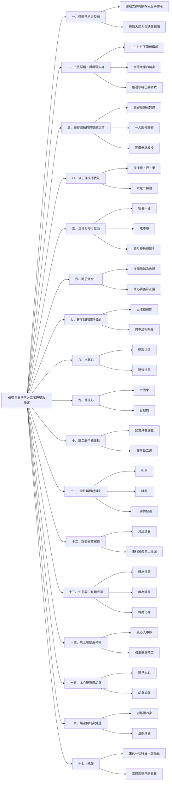

以下依內容脈絡，將《值遇三界法王大宗喀巴聖教願文》整理為 **「科判＋原文＋白話註解」三欄對照表**。
科判屬於**教法內容向的主題分段**（非傳統古科判），方便閱讀、背誦與研修。

---

## 一、總禮傳承與發願

| 科判             | 原文                                                           | **白話註解**                                                                             |
| ---------------- | -------------------------------------------------------------- | ------------------------------------------------------------------------------------ |
| 禮敬文殊與傳承師 | 靜猛曼殊諸佛父　善慧父子傳承師　願皆發起大悲力　令我眾願速圓滿 | 禮敬文殊菩薩與宗喀巴父子師徒的傳承上師，祈請他們以大悲加持，使我的一切願望迅速成就。 |

---

## 二、不墮惡趣、得人身、值遇宗喀巴教法

| 科判       | 原文                                                           | 白話註解                                                                     |
| ---------- | -------------------------------------------------------------- | ---------------------------------------------------------------------------- |
| 得暇滿人身 | 願我一切生世中　終不墮落無暇處　恒受大乘四輪身　值遇善慧勝者教 | 願我生生世世不墮惡趣，常得具足修行條件的人身，並能遇到宗喀巴大師的殊勝教法。 |

---

## 三、顯密圓融、次第完整

| 科判     | 原文                                                           | 白話註解                                                             |
| -------- | -------------------------------------------------------------- | -------------------------------------------------------------------- |
| 顯密無違 | 顯密經論意無違　皆是一人所應修　圓滿無誤勝教授　願遇善慧勝者教 | 顯教與密教的經論義理彼此不矛盾，都是同一修行人所應修學的完整道次第。 |
| 教量抉擇 | 由無垢理所決擇　無量教中境行果　瞻部六嚴二勝規　願遇善慧勝者教 | 以清淨正理抉擇佛陀無量教法中的境、行、果，建立最殊勝的修學規範。     |

---

## 四、見行雙運、戒慧並重

| 科判     | 原文                                                           | 白話註解                                                           |
| -------- | -------------------------------------------------------------- | ------------------------------------------------------------------ |
| 見行互助 | 見行更互為助伴　智者不狂戒不癡　樂作聖教衆生事　願遇善慧勝者教 | 正見與修行互相增上，有智慧、不放逸、守戒清淨，樂於饒益眾生與佛法。 |

---

## 五、聞思修不分離

| 科判       | 原文                                                           | 白話註解                                                     |
| ---------- | -------------------------------------------------------------- | ------------------------------------------------------------ |
| 聞思修合一 | 聞思修三不分離　多聞即知為教授　修心要義符正量　願遇善慧勝者教 | 聽聞、思惟、修行三者不分離，所學即成修行要點，修心符合正量。 |

---

## 六、正理觀修與專注結合

| 科判     | 原文                                                           | 白話註解                                                         |
| -------- | -------------------------------------------------------------- | ---------------------------------------------------------------- |
| 止觀雙修 | 無垢正理觀察修　能與專注相繫屬　他派所無最勝法　願遇善慧勝者教 | 以清淨正理作觀察修，並與禪定專注結合，是其他宗派少有的殊勝法門。 |

---

## 七、出離心與菩提心

| 科判   | 原文                                                           | 白話註解                                     |
| ------ | -------------------------------------------------------------- | -------------------------------------------- |
| 出離心 | 引勝寶心善方便　強遮現後諸欲境　修出離心不共法　願遇善慧勝者教 | 善巧引發出離心，遮止對現世與後世欲樂的貪著。 |
| 菩提心 | 七重因果自他換　二種教授合並修　發菩提心勝他派　願遇善慧勝者教 | 以七因果法與自他交換法並修，生起殊勝菩提心。 |

---

## 八、奢摩他與毘缽舍那

| 科判     | 原文                                                           | 白話註解                                   |
| -------- | -------------------------------------------------------------- | ------------------------------------------ |
| 奢摩他   | 遠離昏沉三摩地　如正量教所宣說　修無分別不共他　願遇善慧勝者教 | 修遠離昏沉與掉舉的正定。                   |
| 毘缽舍那 | 億萬智者莫能測　如實見說甚深義　離二邊見更無上　願遇善慧勝者教 | 以中觀智慧如實了知甚深空性，遠離常斷二邊。 |

---

## 九、空性與緣起、二諦圓融

| 科判     | 原文                                                           | 白話註解                                                           |
| -------- | -------------------------------------------------------------- | ------------------------------------------------------------------ |
| 空有雙融 | 性空緣起互彰顯　分別假立皆有用　龍猛最細二諦義　願遇善慧勝者教 | 空性與緣起互相顯明，一切是假立而有，契合龍樹菩薩最細微的二諦思想。 |

---

## 十、密乘總道體

| 科判     | 原文                                                           | 白話註解                                                         |
| -------- | -------------------------------------------------------------- | ---------------------------------------------------------------- |
| 四部密教 | 成就深乘法器規　四部密教總道體　開啟密教無能等　願遇善慧勝者教 | 具足修密乘的資格，通達事、行、瑜伽、無上瑜伽四部密續的總體修道。 |

---

## 十一、生死轉為三身之道

| 科判     | 原文                                                           | 白話註解                                     |
| -------- | -------------------------------------------------------------- | -------------------------------------------- |
| 生死即道 | 因位生死與中有　轉成道果三身性　速能斷除三有輪　願遇善慧勝者教 | 將生死與中陰轉為修道，成就法身、報身、化身。 |

---

## 十二、無上瑜伽核心修法

| 科判     | 原文                                                           | 白話註解                             |
| -------- | -------------------------------------------------------------- | ------------------------------------ |
| 中脈風心 | 疾道無上乘命根　謂攝風心入中脈　引俱生界勝他宗　願遇善慧勝者教 | 將風與心攝入中脈，引生俱生樂空智慧。 |
| 本心現證 | 現見本心真面目　令彼入於樂空界　善巧方便最增上　願遇善慧勝者教 | 直接證見心的本性，入於樂空不二境界。 |

---

## 十三、幻身與俱生樂空

| 科判     | 原文                                                           | 白話註解                           |
| -------- | -------------------------------------------------------------- | ---------------------------------- |
| 幻身成就 | 唯從最細風心中　現起幻網相好身　餘人未能知少分　願遇善慧勝者教 | 從最細風心中顯現清淨幻身。         |
| 雙運     | 真俱生界與幻身　平等和合健行定　剎那證入四身地　願遇善慧勝者教 | 樂空智慧與幻身和合，成就佛的四身。 |

---

## 十四、快速成佛之道

| 科判     | 原文                                                           | 白話註解                     |
| -------- | -------------------------------------------------------------- | ---------------------------- |
| 最速成就 | 此中最快十二年　或僅三載或三品　速得雙運最近道　願遇善慧勝者教 | 能於極短時間內成就雙運佛果。 |

---

## 十五、總結願

| 科判 | 原文                                                           | 白話註解                                                           |
| ---- | -------------------------------------------------------------- | ------------------------------------------------------------------ |
| 總願 | 總願生死一切時　大師妙音師攝受　諸教派中最高峰　常遇善慧勝者教 | 願我生生世世都受宗喀巴大師與其傳承攝受，常值遇最殊勝的宗喀巴聖教。 |

---

### 使用建議

* **研讀次第**：先依「出離心 → 菩提心 → 正見 → 密乘」閱讀
* **背誦時**：以「科判」作為記憶鉤子
* **講解用**：可再在每一科判下細分小點

若你希望，我也可以再進一步：

✅ 轉成 **Mermaid 階層圖**
✅ 製作 **講義版 Markdown**
✅ 為每段補充 **宗喀巴教法來源對應（菩提道次第廣論／密宗道次第廣論）**

你比較想往哪一個方向深化？
