# 第100期
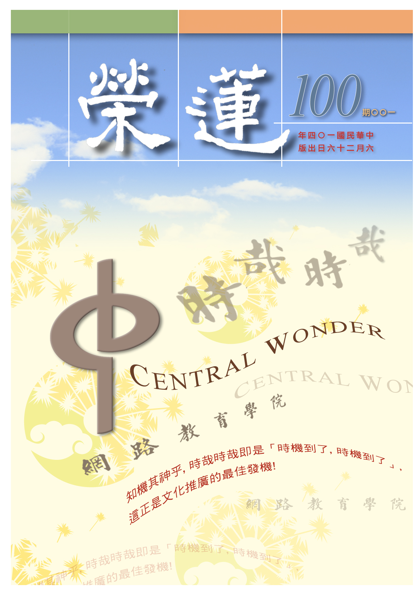

## 社論

### 形而上是經學的出路

本刊

易經太極是聖性

人人皆可作堯舜

經學見地為所依

利益人群乃出路

中華傳統文化最特殊的部分就是教一切人學作聖人，因此，無論儒家的、佛家的經典都是教人學作聖人，學作聖人憑藉的是什麼呢？就是要明瞭我們每一個人都有真如本性，正因為如此，人人都能成就聖人，在佛家來講就是成佛。例如我們現在學的《論語》，《論語》是孔夫子和大弟子們講的，學聖人之道的一本書，根據孔夫子所講的道理來指導人人學作聖人，其餘譬如〈大學〉、〈中庸〉、〈孟子〉等，四書都是有這種特點，〈大學〉、〈中庸〉是《禮記》裡面提出來的，這是最基本的、必須要研讀的經典。

從四書以外再擴充開來，那就是五經，也就是《易經》、《詩經》、《書經》、《禮經》以及《春秋》，本來還有《樂經》，《樂經》後來失傳了，但是在〈禮記〉裡有一篇〈樂記〉，也可以說在《樂經》失傳以後，那篇〈樂記〉也可以當作樂經了。

講到五經開首的《易經》，從伏羲氏畫卦開始，伏羲氏發現人人都有真如本性，那個時候還沒有文字，就發明了陰陽兩個符號，用陰陽兩個符號組合起來，畫成八卦，八卦再重覆起來，就是六十四卦。後來到了周家有周文王、周公旦，周公旦是孔夫子最崇拜的一位聖人。易經卦彖傳到周家，由周文王、周公兩位父子用文字解釋六十四卦以及每一卦的六爻，易經這才有了文字的解釋。到孔夫子的時候，不但解釋卦辭和爻辭，並把《易經》的本體定了一個名，叫作太極，太極就是真如本性的異名。由這樣看起來，我們中華文化傳統的學說，一開始就教學的人明瞭自己有真如本性，人人都有真如本性，也就是易經所講的人人都有太極，這才可以學作聖人，也就是人人都可以成佛。

太極在《易經》繫辭傳裡講得最完整，如此說來一部《易經》就是一部完整的佛經。《易經》所講的道理以及所顯的相，尤其一般眾生是看不出本性的形狀，本性的行相其實就是真空，但不是不存在，由於眾生心眼太小，看不出來，本性就是體空相有。

《易經》引導我們明心見性，明了本體真空，由真空再瞭解它所產生的各種形狀，那就是象，象的數目多到算不清，《易經》裡要明的世間相是形象無窮無盡，學者可以從這些變易的形象瞭解到我們本有的真如本性。

《易經》如此，四書、五經也是如此，例如詩經是一部優美的文學著作，目的亦是引導我們學的人明瞭自己的本性。而《書經》是記載虞、夏、商、周四個時代的人物歷史以及四代天子的言語，作治理天下，辦政治的參考，虞、夏、商、周四代的天子都是聖人，書上所說乃他們如何治理天下，且教化天下人都能夠明瞭自己的本性。書經如此，乃至三禮(周禮、儀禮、禮記)等，每一部經的經文，都是指導我們學習的人，明瞭自己的本性。

再者孔夫子作的《春秋》，古時候凡是記載歷史的人，一方面要有聖人的道德，再者必須有天子的職位，有天子的職位再有聖人的道德，才能夠談得上作史，孔子是聖人但是沒有做過天子，所以孔夫子作《春秋》是不得已的事情，因為在孔夫子那個時代，西周已經不存在了，在春秋時代有臣弒其君、子弒其父的情況，天下大亂，因此孔夫子不得已作了《春秋》，作了《春秋》就發生了效果，也就是它能夠使得亂臣賊子恐懼，把亂象平息，將世間的人心導歸到正道上，接著教大家明心見性，引導大家瞭解自己的真如本性。

這樣看起來，四書、五經都是教人家明心見性，也就是教人家人人都能成為聖人，成為聖人有什麼好處呢？我們知道無論任何人，一生下來的時候就有種種的痛苦，我們每個人自己想一想，從母體出生下來，接觸世間的空氣，面對的一切境界都是很苦的，這種苦是生下來就有，從嬰兒到兒童，成年人、壯年人以及老年人，一直到壽命終了的時候，苦不堪言哪！其中最重的是生死之苦，生死問題解決之後就真正得到自由自在了。那麼我們學聖人，最重要的就是要解決這種生死大苦，因此我們學四書、五經，最重要的課題就是要瞭解並解決我們自己生老病死的痛苦，我們學習中華文化，要先把這個主體找到。

把四書、五經弘揚出去，不但對於我們中國人，對於所有的人都能得到不可思議的好處，就整體來講，全世界的人群都會得到不可思議的好處，世界的亂象從哪裡出來呢？就是由於眾生不瞭解自己有真如本性，這就迷惑了！眾生把自己的本性迷惑了，依佛法而言就是起了無明，無明喻如黑暗，將自己的本性掩蓋，本性本來是光明的，被無明掩蓋了就一團黑暗，人心黑暗之後才是天下大亂，因此我們學習四書、五經，就瞭解要解決天下大亂，必須從改善人心開始。

要改善天下人心，就必須要把這個黑暗（無明）破除，但是破除黑暗很不容易，必須一層一層地，並不是說一日就能夠把無明去掉，我們將這個道理明瞭之後，定住方向以後，下定決心，一步一步地把人人心裡的黑暗破除掉，既然破除黑暗不容易，不是一日、或者一個月、或者是一年能夠做得到的，需要長年累月的修學。因此我要祝福唐瑜凌先生，發長遠心，也就是長遠不斷地把四書、五經弘揚出去，既然是長年累月；不要間斷的弘揚出去，也就是要發長久的心，發心是容易，要想一帆風順也不是那麼簡單，期盼瑜凌先生在弘法的時候一切沒有阻礙，一切順利，能夠實現他的長遠心。

## 大德法語

### 大方廣圓覺修多羅了義經（五十九）

道源老和尚

暇滿用功最相宜

身重心煩求懺悔

觀相發心大供養

建立道場修有成

乙二、正宗分

丙二、令依解修行隨根證入

丁二、廣明行相

戊三、一問答道場加行下根修證

己五、正答所問

庚一、長行

辛一、答道場

壬二、正說

癸一、道場期限

經文：

若復無有他事因緣，即建道場，當立期限。若立長期，百二十日，中期百日，下期八十日，安置淨居。

沒有其他事因緣打閒岔就正好用功，建立一個精進用功的辦道之場，也就是現在我們可以看得到的打七，這就叫做建立道場。如果被其他事打閒岔了，把道心給忙掉了，沒有事也不會想去修行！不是說難得有閒之身嗎？在家人在社會上天天忙生活，生活擔子很重，被壓得喘不過氣來，怎麼用功修行？出家了生活問題很容易解決，沒有家庭之累，上不養老，下不養小，一個人吃飽飯，一家人都不餓，這不是很簡單的嗎？吃飽了飯幹什麼呢？得要修行用功，是不是？有事忙事，沒事要用功，如果用來休息，沒有用到功夫，此時要想到出家是有大善根啊！

好不容易出個家，出了家能聞解圓頓大教，更是證明自己是有大乘根性的，沒有其他緣事，就應該建立道場，道場就是辦道之場。辦理佛事得有個日期的限制，長期一百二十天，中期一百天，下期八十天，此處所訂出的期限即是如此。如施設飯廳叫齋堂，參禪處叫禪堂，拜佛處叫佛堂，這些地方都屬於淨居，安置淨居即是建立道場的第一步。

癸二、限內修行

子一、明道場行相

丑一、明隨相用心

經文：

若佛現在，當正思惟。若佛滅後，施設形像。心存目想，生正憶念，還同如來常住之日。

若佛還在世，應該正思惟，不用另外立佛像，起個正當的思惟，觀想到佛就可以。我們末世的眾生，當然是在佛滅度以後，而且正法、象法已經過去，要在道場裡面供一尊佛像，供佛像就是為了心存目想，心裡要想到佛，目想是眼睛要看到佛，謂之目想。

供佛像對我們修行用功有大幫助，基督教毀謗我們拜佛像是偶像崇拜，並且說我們是拜泥塑木雕的假神，其實我們不但不拜假神，我們連真神也不拜，我們拜的是真的佛！心存目想引發正觀念、正憶念，譬如到大殿一看到佛像，就把妄想謝落下來，供佛像的妙用就在這裡。

末法時代建立道場一定要下功夫，生正憶念時，等於活佛住世一樣，把泥塑木雕的佛像當成活佛在那坐著，這樣子正憶念就容易生。

丑二、明禮懺儀式

經文：

懸諸旛華，經三七日，稽首十方諸佛名字，求哀懺悔，遇善境界，得心輕安。

壇場中擺掛著供養品，旛就是幢旛寶蓋之類，華包括香、燭、燈、果這些供養品，就是盡上你的力量，隨力隨分地懸掛旛蓋、獻諸香花。要建立道場修圓覺妙行，要先求二十一天的懺悔，必須經過這個階段。我拿自己做例子，我閉關沒有經過懺悔的階段，結果就遇到障礙了，之前閉關到兩年快圓滿的時候，河南的法師寫信要請我出關，請我到察哈爾省去做住持，那邊有二千畝可以種麥子的旱地，可以不靠外緣養活三十個學生，還有二部大藏經（明藏與清藏），我就回信說閉關好不容易快滿二年，還有一年就可以圓滿，等出了關再商量。

過沒多久這二位法師到我關房裡來，非叫我出關不行，說之前沒辦法辦佛學院，就是因為沒有錢，現在有一個道場要送我們，可以養三十個學生不需要化緣，這種因緣十分難得，機不可失！河南佛學院辦不起來就是因為沒有錢吃飯，法師有了卻沒有錢吃飯，養不起學生！說我非去不行。說什麼我也不答應，關房鎖著門，他們要把鎖給拉掉，把關房給拉開，非得要我出關不可！我說你請我出去是去開道場、開佛學院，我沒有發心，這道場辦不好，我好容易閉關三年，吃了多大的苦才閉了二年，沒有死掉，到現在還有一年，絕對不能放棄的，可能我這一輩子就閉這一次關，我一定要求個圓滿！他們非叫我出關不可，我說你們要強迫我，過江的時候我就跳下河去死，沒有死掉！我就跳火車，我非死不行，我死了也是你們二個人害死的，你們二個人不是要我去開道場，是要我的命，我這麼講了，他們二人就乘興而來，敗興而返，沒有達到目的地。

這一關過去了，後來太虛大師到了奉化縣，給我寫了信，叫我去當家，我給他回了信說不能出關，第二天他就派了二位同學來代表，說太虛大師辦佛學院辦不好，就是沒有道場，沒有錢吃飯，現在有道場做教育的根據地，可是太虛大師那邊沒有可以當家的人，說什麼我也不答應，寫了信叫他們帶回去，到了第三天太虛大師自己上山了，哎呀！這個當面關過不去呀！沒有辦法走，臨時起了一個辦法，請其他法師幫忙招待，說我有病不見客，替我擋了這麼一陣，他沒法見我的面，就算白跑了一趟，這說起來都是難以察覺和對治的順境魔，所以說閉關十分不容易，會產生這些魔都是自己沒有真心求懺悔。

無論你是念佛或者參禪，或是修學圓覺，一定要經過二十一天的懺悔，可以依著八十八佛大懺悔文，或者是拜其他的懺（大悲懺、淨土懺、藥師懺、地藏懺等），都是教我們求懺悔，這就是《圓覺經》開示我們，要求哀懺悔，要求世尊哀憐我、憐憫我，懺除前愆，悔其後過。

要是沒什麼俗事因緣，應該要精進用功，安處徒眾，建立道場，定出期限，長期一百二十天，中期一百天，下期八十天，看因緣而訂立，可是要先求懺悔，要先求三個七(二十一天)，禮拜十方諸佛的名字，像我們現在有千佛懺，乃至萬佛懺，這些都好，可是要至誠懇切的求哀懺悔。

懺悔真誠，或是見佛身像，或是聽佛說法，或是感佛放光，這些都是好境界，身心得輕安，這是功夫得力的徵兆。

一個人如果天天犯齋破戒，又加上其他新的罪業，不知道求懺悔，罪業是無形無相，但罪業深重的人，他心裡面煩亂得厲害，身體也沉重得厲害，就好像擔了一百二十斤的重擔，身體粗重，心裡煩亂，雖然一點事都沒有，但是他心裡亂七八糟，昏煩惱亂。

現在求哀懺悔了，雖然煩惱沒有斷，可是被降伏住了，就等於我們穿的衣服，天天在上面沾塵垢，東西越來越多，現在不將塵垢弄到衣服上，反而將衣服不斷地洗濯。求哀懺悔即是如此，得力時會有瑞相，或者見佛，或者聽法，或者見光明，身心得了輕安，叫身輕心安，將身體的粗重懺悔掉，如同身承擔一百二十斤的重擔給放掉了，謂之身輕，心裡沒有亂七八糟的妄想，心裡邊很安定，能好好用功，這是第一步得到輕安的境界。

丑三、明離相用心

經文：

過三七日，一向攝念。

建立道場，設立用功期限，先懺悔求身心輕安，經過二十一天後，能收攝妄念，不會打妄想，能身心輕安，好好用功於所學。（下期待續）

## 共修研學

### 小止觀導覽（七十二）

*心爾、治心整理*

經論義理如何修

止觀門中敘善巧

智者即是解行並

著書立說立現未

第九章  治病

論文：

復次、用心坐中治病，仍須更兼具十法，無不有益。十法者：一、信，二、用，三、勤，四、常住緣中，五、別病因法，六、方便，七、久行，八、知取捨，九、持護，十、識遮障。云何為信？謂信此法必能治病。何為用？謂隨時常用。何為勤？謂用之專精不息，取得差為度。何為住緣中？謂細心念念依法，而不異緣。何為別病因起？如上所說。何為方便？謂吐納運心緣想，善巧成就，不失其宜。何為久行？謂若用之未即有益，不計日月，常習不廢。何為知取捨？謂知益即勤，有損即捨之，微細轉心調治。何為持護？謂善識異緣觸犯。何為遮障？謂得益不向外說，未損不生疑謗。若依此十法，所治必定有效不虛者也。

一、信：

云何為信？什麼是信？謂信此法必能治病。佛法上讚歎：「信為道源功德母。」信是道德的源頭，一個人修道要成就，源頭在信心，有心才能生出功德，止觀門上說：此人修定能修成功，而且證量不會退失，是因為在對所緣境上的安住必須要有信心作後盾，否則很容易退失。有人曾經去助念時念得法喜充滿，現在法喜卻不見了！有很多初機人，一剎那間雖然有很大的法喜，可是很快又不見了，因為他對這個法門根本沒認識過，信心也沒建立過。

所以止觀門說：不要貪便宜，不要以為什麼信心都沒建立，就想要得定、開慧，那是辦不到的。一定要對這個法門有非常強的勝解力，定功才會拉長，才會持續下去。為何很多念佛人到最後定功無法持續，就是因為對世俗的信心更加強烈，對三寶的信心只是一時的，並且沒有教理來培養信心，所以信心到最後就退失，最後只剩下老參的名言。這時有過失別人也無法說破，老參的脾氣大、瞋恨心重，最好少惹他，念佛時打瞌睡，可別叫他！他會火大！所以信心非常重要，此處的信心是在用止觀門治病，六氣十二息、治鬼神病、治業障病，要產生信心，有些人因為沒有改變，就開始發生懷疑，其實不是沒靈驗，而是他信心沒建立，又沒有持續。

二、用：

何為用？謂隨時常用。不能一曝十寒，時作時輟。比如燒開水，一定要燒到開才能飲用，這個用是觀待信心的用，我們沒有信心，所以不會去用，用藥也是一樣，我們對藥沒有信心，自然不會用它，一定要對它有信心才會用，而且不但要用還要用得勤快。

三、勤：

何為勤？謂用之專精不息，取得差為度。勤是指藥到病除，治病治到業障除掉、鬼神驅除，或是除掉身心等病。專精就是不雜，為了得到利益、效果而日夜相續。為度的意思是到這裡為止。比如心裡常常有惡思惟的狀況，總想別人的缺點，心裡面懷疑別人一定有什麼不好的動機，此時要常常服用佛法的藥，把這個病去除，治身體的病、業障病、鬼神病，都要好好的按照正確的方法，把這個病相解除，這才是勤的要領。

四、常住緣中：

何謂住緣中？緣中、乃指心所緣之境中。謂細心念念依法，而不異緣。就是用細心念念依法而不雜亂用心。

要常在緣中，念佛三昧的證量才會生起，所以固然要勤，還要常在緣中，兩者互相講究，像貓捕鼠、雞孵蛋這般，將心念在該法上，而不雜亂用心。

五、別病因起：

何為別病因起？如上所說。就是因四大五臟具損得病，或因鬼神所作得病，或因業報得病；必須分別得病因緣，才好對症下藥。

常住緣中固然很重要，可是必須講究這個緣是不是真正可以對治病因，必須好好分別得病的因緣，觀待常住緣中而說別病因起。

六、方便：

何謂方便？就是呼吸、運心觀想、繫心緣中，都要善巧方便，種種運用，不失其宜。

我們雖然是常住在緣中，安住在所要修的方法上，而且這個方法是正好對治這個病因，但是這個方法也必須講究用得善巧，比如用呼吸法來治病，如果已經頭昏了，就表示要暫時放緩，這叫方便法，要懂得它的方便。又如昏沉的時候，要懂得將心提振的方法。就像心已經安住不了佛號上，就不要硬來，硬來是念不出法喜的，甚至會感覺很痛苦，精神很頹廢，念到最後會害怕進入禪堂，以後再也不來佛堂念佛了，這就是不懂得方便。

常住在緣中，可是卻沒有善巧方便，對治不了的時候，要觀想佛菩薩的殊勝，淨土的殊勝，把心提振起來破闇相，或者經行、或者用冷水洗臉、或做光明想，想像日正當中來破內心的闇，這些的方便法要會，否則長期在昏沉的闇中，將來就容易投生黑暗的世界。

七、久行：

何謂久行？謂若用之未即有益，不計日月，常習不廢。用止觀法門治病，要信，要隨時常用，要專精不息，要念念住緣中，要善巧方便，不失其宜，更應久行。也就是要有恆心、耐心、長遠心，必能治病。

這個方法用在念佛法門也貼切，對念佛法門很有信心，而且勤快的念佛，不會胡思亂想，在念佛中煩惱起來也知道如何去對治的善巧方便。然後再久行，也就是次數多，而且耐久，今天如此、明天如此、後天也如此，這個月和下個月也這樣做，這叫做久行，每天都保持愉快的心情念佛，不是興致來來就念個三、五小時不起坐，這樣很有可能下次就不想念佛了，所以要方便、要久行，就像胃腸受傷的人必須要先少量多餐，一次一次的加長時間，慢慢把功夫練純熟，久行是很重要的功夫，但也必須觀待前面的種種方便。

八、知取捨：

何謂知取捨？謂知益即勤，有損即捨之，微細轉心調治。用止觀法門治病，所用的方法，有利益、則勤用；如有損害，就捨棄，不可勉強。微細將心調治，也就是攝念歸心，不可粗心大意，放縱妄心。

知取捨是說功夫想要往上進步時，如初禪要進入二禪，就是要捨初禪取二禪，捨二禪取三禪，這就是取捨，在止觀門治病時也是一樣，病治好時就可以捨，治不好時可以再取，這取捨之道用在一般修行法也一樣，捨下取上的往上走。

九、護持：

何謂護持？謂善識異緣觸犯。就是善識一切禁忌，行住坐臥，語言作作，飲食，都能善於將養調護，不使觸犯，以利道業。

修行的時候，必須要知道哪些因緣會障礙我們的修行，要小心！就像不要去不如法的場所，真正修行除了懂得修學法之外，好好的在修行路上往前走，也必須排除干擾修行的因素，必須要遠離惡知識和不好的場所。

治病也一樣，身體好不容易慢慢在恢復，這時應禁的部分就要禁，如果能好好保護自己，自然病就能治好，而且不會再引發新的病，跟修行一樣，念佛法門修到能夠知取捨，捨下取上再往前進步，在日用平常中好好護持自己，要小心不要放逸，護持自己的身體就是修行的保護。

十、識遮障：

何謂遮障？謂得益不向外說，謂損不生疑謗。就是說，以止觀法門治病，得到利益，不要向外故意的宣傳，以免有顯異惑眾之嫌。病沒有好，也不生疑心，不說誹謗的話，這就是篤實修行，認真辦道。譬如飲水，冷暖自知。不求名聞利養恭敬，不謗如來大法。

遮是遮止，障是障礙，這些都是要遮住的，不要讓它顯現，要有功夫能夠遮住它。甚麼情況下必須要遮止呢？一、我修行功夫好，必須要識遮障，要知道這不能向外說，〈明倫月刊〉有一篇文章叫做潛修默證，說到修行就如同一棵樹，根不能外露，你的本地風光就是根，顯異惑眾外露之後，那一棵樹就不穩了，風一吹就倒。二、如果用了書上的方法沒有效果，也不要對外毀謗，那一定是自己的問題，不是法的問題，一定要遮止，不可以對外說，容易引起他人的毀謗。雪公老師講末法時期就是艮卦，大部分的人多是想見人倒楣，自己對外說，等於找人家來對你毀謗、障礙你，這實在不應該！或者會誤導人家認為佛法原來必須要有感應，其實佛法老實修行一輩子，也不會怎樣，就是不容許顯異惑眾。只有一個例外，就是遇到善知識，以私下請教的立場去說明自己的能耐，除此之外不要外顯自己的本地風光，這就是識遮障。

治病、修行若能好好講究這十條，懂得方法，障礙生起知道如何對治，這十條不只是配合止觀門第九章的治病法，類推其他做人處世或者修行想要得力，都必須要靠這十條。慢慢修時快快到，只要方法用得對，就能夠證果。（下期待續）

### 菩薩清淨的行持　華嚴經淨行品（十六）

*編輯部整理*

清淨行持在正見

對境發願成道力

文殊成就秘密藏

要為後世做增上

丙二、指事顯因答其徵因

丁一、總徵

丁二、別顯

戊二、出家受戒時願

己二、出家方便　  入伽藍

經文：

入僧伽藍，當願眾生，演說種種，無乖諍法。

以下談到的是出家的方便，有三科，此處是入伽藍。僧伽就是我們所說的寺院，乖是違背的意思，就是演說的法，沒有違背佛所說的，是依著佛的法印來說，而諍是爭論、鬥爭的意思。簡單的消文就是，入寺院的時候，當願每一位眾生能受調教，善能說法，所說的法都是符合法印，見地無違佛說，寺院裡面僧人相處也不會爭論、爭鬥，在寺院中，所講究的就是六和淨：身同住、口無諍、意同悅、見同解、戒同修、利同均，做到這六點，僧人的相處就會很和諧，對每一個人來說都是修行、考驗。

一個團體要和合、自己的本分首先要做好，並且遵守團體的規範，特別是在理上見解的和合，在事也有諸多的考驗，昔日有人供養僧團一匹布，該僧團有一千兩百人，可是布才一匹，要怎麼分呢？後來主事者真把布分為一千兩百份，作為燈油的燈芯用，可見事事都在考驗著處世的智慧。二是有一個大家族，九代同堂十分和諧，皇帝為了考驗家族，便送了此家族一個桃子，看此族長如何分配？此族長便把桃子加糖、加水煮成甜湯，大家分著吃完。由於分配公平，故不造成某些的不愉快。但這也考驗著領眾者的智慧。

在六十華嚴當中，經文是：若入僧房，當願眾生，一切和合，心無限礙。此經文也是在和合的部分上講究，大家要有共同的思想與作為。在東吳本，經文是：入佛宗廟，當願眾生，盡佛行法，無復罣礙。了解和合的重要，要如何付諸於行呢？在行的當中如何被實踐，這考驗著主事者的智慧以及大眾的見地。

出家受戒時願就是出家前方便，出家之前要找老師，要做法一切的準備……等等。僧伽就是眾的意思，藍就是園林，如佛在世時的祇樹給孤獨園、竹林精舍等處，在中國叫做寺廟，因為白馬載佛經到中國官方的寺，名曰白馬寺，之後其他蓋寺者有稱院、精舍等，入僧伽藍大家共住時，當願眾生，演說種種，無乖諍法。如此可見，沒有共住就沒有問題，一共住之後問題都出來了。

要如何來演說種種無乖諍法呢？就是演說身如何同住，共住的軌則在哪裡，共住有什麼利益，大家都要清楚明白。主持共住是非常麻煩的，是跳火坑的工作，主持僧團的事務得靠他人的護持，以及自己態度恭謹、作法善巧，一個僧團才慢慢和合起來。修行人的重點不是世間的名聞利養，所以不如一般世間人用金錢就可以處理。要如何和合大眾而無諍？除了平常相處的講究，遇到有諍的處理，違犯規定該怎麼處罰等，一切都要講究，才能創造和諧的氣氛。

在意同悅當中，必須包括大家在辦事的共識上、在東西分配上意同悅，以及在教法上大家一起共修的意同悅；意同悅最簡單的講法就是彼此看順眼，一般人看不到同法者的重要，在臨終往生的時候還得要靠蓮友幫忙呢！所以無乖諍法不是我們看得這麼簡單的，一旦一個團體產生和合的氣象，這個團體所產生的力量是一般人難以想像的，四個和合的凡夫比丘僧，相當於一個登地菩薩的威力，如此可知和合的力量是難以想像的。

而且，第一次證果的人必須要在和合的團體當中證得，正法時期到象法時期，魔王第一步要破的就是破和合僧。雪公老師勸勉弟子要相忍為團體，如果不相忍為團體，造了很多的過錯，地藏菩薩的功德都包不了他的罪障。一旦好不容易建立起來的和合被破壞之後，誰都沒有能力把團體再合起來；想要保住大德在世的盛況，唯有靠和合才能保住。

演說種種無乖諍法，就是鼓勵大家和合修學與辦事，功德福報將無量無邊。換句話說，當願眾生要有這種能耐、氣度、格局、見識、修學法，這樣的人將是家庭、團體、國家的人才，技藝之學固然重要，能調和鼎鼐的和合之才便是將相之才，才有辦法維持殊勝的局面。

己三、出家方便　詣師

經文：

詣大小師，當願眾生，巧事師長，習行善法。

這個願是承接第十三個願，入伽藍是講述在僧院裡面，在僧院裡傳道授業解惑的老師，就是此處所說的「詣大小師」。佛在世的時候，佛是大師，和尚是小師。在四分律裡面，將阿闍黎  (上師、老師)分為五種，五種分別是出家阿闍黎—得戒和尚，第二是受戒阿闍黎—羯磨師，第三是教授阿闍黎—比丘教授之師，第四是受經阿闍黎—教授經典的老師，第五是依止阿闍梨—教導共同起居的老師。佛滅度後，大師就是指前三種阿闍梨，小師是指七尊證師，也就是七位作證的戒師。所以詣大小師，是指要出家做具足戒的時候，要有三師七證在場。

這裡的大小師，不是說戒和尚羯磨師是大師，七尊證是小師，大小的分別是觀待重要性來說，七尊證是七位來證明的老師，所以說他是小師，而不是說請來七尊證的輩分是較小的。有受過菩薩戒的人就知道，說戒和尚代表釋迦牟尼佛，羯磨和尚代表文殊菩薩，教授和尚代表彌勒菩薩，七尊證就是請其他諸佛來做尊證，可見尊證不一定地位低。

整個團體的經營都生活在一起，有的老師是幫忙課後復習，說戒和尚、羯磨和尚、教授和尚都是大堂的老師，還有小堂的老師，像說經的老師、起居的老師，在生活上得到照顧，在佛法上得到通達，簡直就是一家人，這叫做眷屬。

詣大小師者，受益請教也，「詣」的意思是「到那裡去」，到大小師的地方去請大小師來指導。而我們所修習的是善法而不是惡法。所謂的善法，是從善知識那裡學戒定慧(三無漏學)。這裡還有一個重點，我們不只是要「習」，還要「行」，「習」是指練習、串習，「行」就是要做到、落實在生活上面。並且是很善巧的來侍奉老師，當老師的侍者，也就是「侍多千億佛，發大清淨願」的意思。

所以從第十二願開始講出家，先捨家再入寺院，入寺院的目的就是要親近老師，入團體如果不是親近良師益友，那入團體要做什麼？所以古人說：無事不登三寶殿，不是帶著小朋友來三寶的地方玩、看看風景，到寺院的目的是來詣大、小師的。會性法師說，並不是我們今天不出家，就不需要用到這一條，而是我們要抓這個精神來看，我們在這世間也是要有良師益友，才有我們一己的成就。

而巧事師長的目的是要跟老師學習教法，就是要習行善法，特別是講教法，為什麼？因為善法如果沒有教法支撐，會產生很大的禍患，如果沒有教法作依持的話，教法會成為無用，如果沒有做因果的觀察，沒有做各類正法的觀修，善法的體性也無法轉為出離、成佛的體性，甚至是三世佛冤。如省庵大師寫給茅靜遠居士書，所做的善法如果是三世佛冤，準備享福然後墮落，所以學習正法不重要嗎？

巧事師長的目的是習行善法，那習行善法的目的呢？就是為了利益有情，所以巧事師長是上求，習行善法是下化，親近老師的目的是上求，上求的目的是下化，沒有下化絕對不上求，這完完全全是帶著使命感來學習的，這樣的人一定成就。

巧事師長還包括是否看懂師長的需求，老人家進車子都是慢慢進的，要看到他的手、腳是否已經進來，都進來了才能關門，這得要長眼。馬來西亞的蔡老師到蓮社拜訪，雪公老師招待他，他說想拍個片子作紀念，片子裡面吃完飯，雪公老師使個眼神，侍者立刻就扶老師起來，一頓常禮舉要的用餐，安安靜靜、清清楚楚；老師上課時，眼睛一看窗，侍者就立刻關窗；看茶杯，學生就立刻給茶，這就是訓練人才。

老師不從這裡去啟發弟子的悟性，不知道要從哪裡去啟發他呢？學生變成書呆子，進門也不會打招呼，看到師長們也不會行禮，此人會學到甚麼東西？以後會有什麼出路？昔日有人送巧克力到蓮因寺，懺公說大家分，分到最後懺公就說了一聲：我也要！你說好不好笑？大家修行都很厲害，但連這個都不懂，不容易啊！（下期待續）

## 專題研學

### 大乘百法明門論簡說（八）

*心超講述、淨本整理*

無著世親兄與弟

受記傳承唯識教

善述法相解世間

體性即是唯心現

柒、何等一切法 ─ 云何為無我

論文：

何等一切法，云何為無我。

世尊言一切法無我，亦即世尊說法四十九年談經三百餘會，所說的一切法，大宗旨為無我。世親菩薩以兩個提問來闡述一切法無我的宗旨。第一：「何等一切法？」亦即一切法所指為何？第二：「云何為無我？」為何一切法是無我？對此二問，後文先回答「何等一切法？」，略舉五種，然後詳釋五者內涵；接著再回答「云何為無我？」整部論就圓滿了。這是論主藉著提問以探討主題的教學法。

捌、五位百法

論文：

一切法者，略有五種：一者、心法。二者、心所有法。三者、色法。四者、心不相應行法。五者、無為法。

一切法無量無邊，《瑜伽師地論》歸納成六百六十種現象跟作用；俱舍宗歸納成七十五種；成實宗歸納成八十四種；本論屬於唯識宗，將宇宙萬有的現象，歸納成一百種，而又將百法歸為五類，宗旨在說明萬法唯識的道理，一切法唯心所現。若依據中觀宗來闡釋，宗旨就是一切法皆無自體性。

歸納法是一種科學方法，可以幫助我們認識這世間種種事務，先抓大類，再做細分。因此一切法先大分五位，然後心法下有八，心所有法分五十一，色法分十一，心不相應行法分二十四，無為法分為六。只要抓住五大類，就能掌握一百個法，進而一切法都在其中，此即提綱挈領。

心法意義

唯識宗將心法歸為八類，稱為八大心王：眼識、耳識、鼻識、舌識、身識、末那識、阿賴耶識。此處並非將心分為八塊，或者一個人可以有八個心，而是就心不同的功能去安立名稱。

前六識的能力較為粗顯，就是了別的功能，眼識了別色塵、耳識了別聲塵、鼻識了別香塵、舌識了別味塵、身識了別觸塵、意識了別是非善惡等法塵。

第七識(又稱末那識)，功能較前六識微細，是執我的心相續不斷，在任何的情況下都會認知這是我，我在受樂、我在受苦，即便嚴重昏厥，前六識的功能都不起作用，醒來以後仍知道「剛剛我昏厥了」，可見執我沒有中斷過。

第八阿賴耶識，能收集一切法的種子，因緣成熟時一一起現行，這是心最微細的功能。例如某人學開車，開車的能力收藏在第八識中，平時完全看不出來，但等到因緣具足(有車、需要開車等)，開車的能力就起現行。能力收藏的時候稱為種子，待因緣而起現行。吾人心識既然有此等功能，平時就應該多多培養能力，化為無形，需要時方能顯現。所以雪廬老人說，辦事情才讀書已來不及了，因此學問要慢慢累積。

第八識將能力收藏，並且可以從前生帶到今生，所以安立第八識正可說明輪迴的現象。譬如某些人先天邏輯推理特別強，有的卻總是學不來；又如雙胞胎雖有同樣的基因，但先天也有不同的表現，都是由於過去生熏習而有所不同。此外第八識還有收藏善惡業的能力，使將來受樂報或者苦報。

八大心王可以分六個面向來做討論。

首先是「集起名心

」，集是收集、起是起現行，此專指阿賴耶識可以收集一切法種子，待因緣成熟起現行的功能。

第二是「積集名心」

，指前七識可以透過造作，把經驗、能力累積收集在第八識中，所以下次遇到事情，這樣的經驗、能力就會生起。比如製茶的師傅，用舌識品茶，此覺受可以內收，等到又有品茗的機會，就有能力分別茶的好壞。畫師的訓練亦然，以眼識仔細觀察畫作的工筆、細筆、寫意，未來若有作品呈現在眼前，立刻能知高下。

第三「緣慮名心」

，八個識都有攀緣思慮境界的能力，但特別指前六識可以緣各類的境界作分析，尤其第六意識可以發揮各種的想像力，創意就是這樣而來；第七識只緣第八識的見分，執此為我；第八識只是執持根身、器界、種子。

第四「或名為識」

，識是指心有了別的功能，比如對於青黃赤白、高低美醜能夠判別，緣慮跟了別其實意思差不多。

第五「或名為意」

，意是指心可相續不斷，例如念佛，以佛號為所緣，可以一直念下去而不間斷。所以遇到煩惱，善用此能力，緣念佛號使之相續，痛苦即不生。原來心有這麼多功能，所以雪廬老人上課時說，我們沒有一個人認識過自己。並不是沒有認識自己的外相，而是從來沒認識過自己的心。

第六「或第八名心，第七名意，前六名識」

，若把能夠收藏種子的功能稱為心，則專指第八阿賴耶識；可以相續的功能稱為意，則專指第七意識恆審思量第八識的見分為我，未曾間斷；把了別粗顯境界的功能稱為識，則專指前六識。總而言之，上述皆是按照心意識三者去做分析。

唯識宗分八個識，中觀宗只分為六，所以宗派間八分也並非必然，就看論者如何去分析了解心的各種功能。中觀宗只安立六個識，功能都是了別：眼識了別色塵、耳識了別聲塵、鼻識了別香塵、舌識了別味塵、身識了別觸塵、意識了別法塵。在這了別當中，前五識是粗相的了別，第六識是細相的了別，特別是細膩的分析能力，所以第六識可以叫做意識，前五識不能。至於執我的心識，安立在第六識的細作用中。《大學》裡面說「誠意」，就是第六識能夠破除我執；「正心」是六個識都能端正。因此本部《百法明門論》全是心理學，全部是自知之明、改變命運的學問。

心所有法意義

心所有法略有五十一種，分為六位，即五徧行、五別境、善十一、根本煩惱六、隨煩惱二十、不定四。心所有法是心王的眷屬，心所有法是伴，心王是主，因為心所有法恆依心起、與心相應、繫屬於心。

所謂恆依心起，例如貪，必依六識方能生起，如心識緣可意境方能生貪，名為貪者；瞋亦復如是，心識緣不可意境方生起瞋，名為瞋者，所以心所要靠著心王。第二與心相應，亦即心所與心王相應，二者互相依靠。第三繫屬於心，亦即貪心所被心識繫屬，不能離開心王而有。

何以知貪是心所非心王？著貪是心王，理應緣順境就生貪；同理瞋若是心王，理應心識緣逆境就生瞋，然聖者何以緣順境不生貪，緣逆境不生瞋？所以貪或瞋等皆是屬於心所，當心所跟心王配合時，例如心生貪的作用時，這樣的補特伽羅（士夫），心王才會成為貪者。貪與貪者皆沒有自體性，若有自體性，貪在貪者之前生，還是之後生？或者二者同時生？如果在前，會產生沒有貪者的貪；貪如果在後，則有一個不具貪的貪者，都無法同意。然而二者同時生，又有自體性，那貪與貪者成為無關的兩法，換言之，貪者也可以不需要依靠貪而自己成為貪者，貪也可以不需要依靠貪者成為貪，但實際上二者不可相離。士夫（補特伽羅）與心王、心所之間的關係是相互觀待，相互依靠，自體的關聯連一粒微塵也無，是乃名言上的關聯。

吾人處於順境當中，若能分析境界的自體性空，使可愛境不生，則貪與貪者皆不生；處逆境生瞋時，藉由境界體性空的分析，使可惡境不生，則瞋與瞋者皆不生，以上是心所有法與心王的關係。

色法

色法略有十一種，當中有兩個定義，一是變壞，一是質礙。變壞當中，有自然、有人為。如果是佛法裡經部宗以上的宗派，色法的變壞是第一剎那生，第二剎那就滅，第二剎那已經不是第一剎那的樣子，只是我們的肉眼沒有這種觀察能力，大變化其實是來自於不斷累積的小變化。第二個質礙，是說質與質之間會有障礙，所以兩者會碰在一塊不會相合。

心不相應行法

心不相應行法，略有二十四種，亦即萬法藉著彼生起的功能（體性）給予定義（名言），例如火具燒熱之功能（體性），而安立火為燒熱性，共可以歸納成這二十四類。

為何稱作「心」不相應行法？因為這些名言是心對所緣的境界去安立、去定義。「不相應」的意義，第一是非能緣，舉例來說，心緣桌子安立桌子的名言，心是能緣，桌子是所緣，能緣觀待所緣而安立名言，因此名言與能緣的心、心所不相應，名言非心與心所亦非境界。第二非質礙，名言間不會有色法那般質礙的狀況，因此與色法不相應，亦即名言非色法。第三有生滅，名言有生滅，是觀待能緣與所緣才有名言的生起。無為法不生滅，因此與無為法不相應。「行」是指遷流變化，生滅不已。五蘊中有行蘊，其實包括了相應行與不相應行。相應行即是前面所講述的心所，因為與心王相應故（相互觀待）。而此處是不相應行，名言非心、心所（能緣）亦非境界（所緣）故為不相應行。

無為法

無為法就是非造作之法，略有六種，空性就是當中的一種。凡是造作而來，皆屬於有為法，例如車子、房屋、快樂、痛苦等，有造作就有生滅，有為法的體性就是造作，就是生滅，就是無常。

無為法的意義有四，首先是「不生不滅」，例如空性，空性從來沒生，既無生所以也談不上滅。第二「絕得絕失」，空性談不上得，所以也談不上失去。第三「非彼非此」，緣起法乃互相觀待，有彼則有此，有此則有彼，說彼是對此安立彼，說此是對彼安立此，彼與此自體性不成立，沒有不必觀待彼而可以安立此，故彼與此之自體空，自體空是非彼的緣起法也非此的緣起法。最後「無去無來」，空性沒有去也沒有從什麼地方來。例如桌子的空性，當桌子在的時候，空性並沒有從什麼地方來。當桌子被拆掉時，桌子的空性也沒有離去。以上是無為法的定義。

所以《大乘百法明門論》，就是把所有的現象歸納成這一百種，可以大分為有為法跟無為法，有為法又大分為心法、心所有法、色法、心不相應行法，無為法也可以再分為空性的無為法跟空性以外的無為法。（下期待續）

### 佛學概要十四講表簡說（二）

*心超講述、法味整理*

學佛最忌漫無章

囫圇吞棗難受用

可貴初機六門課

大海航行有指南

醒公序言

其次吳聰敏居士的《十四表演述》，醒公老師有序文，此書與吳聰龍居士的《述記》，都是解釋十四表的論中論。

《十四表演述》乃長期連載於明倫月刊，今整理出書，在出書之前（民國八十二年），醒公老師寫一篇序作此書流通之緣起。序文云：「內學三藏，浩如煙海，學之不有其方，而欲得其門以入者，莫不戛乎其難也。」內學是佛學（為令學者明心見性），佛學教典浩瀚如汪洋大海，大分三藏十二部。若沒有學習三藏經典的方法，是無從入門的，戛乎是一個感歎詞，慨嘆入門實在是太困難了，沒有人引導是不行的。

「業師雪廬老人，昔創大專佛學講座，每逢寒暑假期，集三臺學子於臺中，課業六門，循循講授。」醒公說他的老師，也就是雪廬老人，在民國五十年時創辦大專佛學講座，並在每年寒暑假開辦講座。彙集三臺（臺北、臺中、臺南），即全臺灣的青年學子到臺中來學習。授課的內容有六門。首先入門的是《佛學概要十四講表》，所以是「十四表造乎端」，先依著此表來瞭解整個佛學的綱要。

再者第二門、第三門是〈唯識〉與《心經》，分窺性相。我們知道佛法能依性宗、相宗的體系而入。性宗依般若意趣作為佛法的究竟意趣，老人作《心經》表解，表徵性宗的意趣。老人並以「唯識簡介」作為相宗(唯識)的綱領。第四門是《佛說八大人覺經》，它是介紹學佛次第修行的階梯，能夠知道大小二乘的修學法。第五門是《佛說阿彌陀經》，將佛法大意及修學法，乃至於性、相二宗的修學法結歸到淨土，到淨土繼續修學這些意趣以成佛。並引導開展成佛的心量，依〈普賢行願品〉示以普賢菩薩的十大願王，開展修學的心量。以上是整個大專講座的六門初級課程。

這六門課程當中，《佛學概要十四講表》造乎端，是佛法的入門，以十四表架構性的來認識三藏經典。其次，要依什麼次第修呢？《佛說八大人覺經》的修行分為小乘、大乘的修行；成就阿羅漢以及成佛的果位，但亦可有其他的分類。當然，雪廬老人也作有講表，以明經義。一般開派的大師、大德，或者是寺廟的開山祖師會編寫教材，表示他對三藏經典體系的認知，根據他的認知而進入佛法的內涵，作為道場的傳承。不管是印度、中國、西藏等地的大廟都是這樣，開派的人物就是寫教材的人物！

大乘分為兩宗，一個是唯識，一個是中觀。

唯識的部分，有《八識規矩頌》、《唯識三十頌》，乃至於唯識的《解深密經》等。雪廬老人就編以〈唯識簡介〉來認識唯識宗，將《般若心經》編表來認識中觀宗。性、相兩宗是學修大乘成佛的方便。學佛如果沒有這樣學，那真是無頭蒼蠅！

再者，不管是性宗或相宗的修學法，引入成佛，最殊勝的成佛環境就是西方極樂世界，介紹西方極樂世界的就是《佛說阿彌陀經》，那裏是諸上善人聚會處，解教理的人才、行持的人才，在西方極樂世界都有。所以我們今天要把教理解得通達，行持得有悟處，能自行、能化他，以凡夫身若不選擇西方極樂世界，那該到何方？其次〈普賢行願品〉，是擴展心量，性、相兩宗的修學是為了速速成佛以利益眾生，故以〈普賢行願品〉之十大願作為攝持修學成佛的方便，並以求生西方淨土為成佛最殊勝的方便。初級課程能將整個佛法的架構清清楚楚的顯現。能利益一個初級的學佛人，沒有雪廬老人，我們要怎麼深入認識佛法？

以上六門課程能夠帶領我們廣博的來解經，在行持上能夠有次第順序而進。博解約行，可以說十四表是解，第十三表是淨土行。也可以說解得廣博，並且將所有的解表現在行持上，在掃地上見氣象，在擦桌子上見氣象，並好好念佛求生西方，作為修學成佛的環境。我們一般人，都是解歸解、行歸行，因為解沒有受用、沒有法喜，所以行持的時候將解放一邊，行持依然故我，到最後甚至認為解教理沒有用，所以還自行發展一派叫教理無用論，認為行持就好，其實那是最大的可惜處，如果教理無用的話，那佛何必說三藏十二部？祖師何必著書立說？

祖師一生最大的的著力點都在著書立說和講學！如果這件事情不是最重要的，以最懂得人命無常、時不我與，又最認真修行的祖師，結果花最多的時間著書立說跟講學，蕅益大師、蓮池大師、憨山大師、雪廬老人皆是如此！老人寫了許多的教材，講經表解寫了幾十種，親自編述初級、高級課程教材且親自上臺講學。在民國六十六年講《佛學概要十四講表》，第一表慢慢講到第十四表，該下課不下課，講課如此熱忱！他說自己從早講到晚、幹到死，目的就是為了好死，這就是他的氣派。

所以「法門無盡，契入在斯。」也就是從《佛學概要十四講表》開始的六門初階入門課程，都能夠進入所有的法門。在六門課程當中，《佛學概要十四講表》是總扼，也就是能夠將所有的教理通達瞭解，而且依解來行持。淨土法門是特別的修學法，在通別的諸法當中，可以以此表為入道的先驅。

由於十四表能總括解行通達諸法的扼要，是入道的先驅，所以從雪廬老人編表，並在大專講座授課以來，已經數十年了，而且研習的風氣越來越盛，但如果不對此表做解釋，不能普利大眾。

吳聰敏老師是雪廬老人師門中好學之士。自公讚以「息焉游焉」。此語出自《禮記·學記》，君子如何學成？其法門為藏焉、修焉、息焉、游焉，藏焉是必須耐得住寂寞，把自己收藏起來，不可以外務多、事情忙。修焉是多多串習所學，息焉是將心安住在所學的法義上，多多串習，游焉是優游其中，產生很多法喜。其次出來與大家交流，即是出交天下士。

吳聰敏居士精勤於佛法的學習，民國七十二年《明倫月刊》從小本的刊物擴版，開出了《佛學概要十四講表》講述文章的刊載。吳老師承雪廬老人的師命，依他歷年所聽課的筆記，撰述十四表的解釋，在刊登之前，先呈給雪廬老人校正，再刊於《明倫月刊》。從民國的七十二年元月一直到第二年的十一月刊載完畢，在七十七年由臺大醫院慈光佛學社印行。在民國八十二年，夏曆三月初五，是雪廬老人往生七周年紀念日，臺中蓮社為弘揚正法，為報師恩，又再次地印行。並敦請自公老師寫下序文。

願有幸讀十四講表的人知道注解的來源。以上是徐醒民老師的序言。

十四表略科

先明十四表略科，將十四表旨趣說明清楚，十四表如佛經分為三科：

等序分、等正宗分、等流通分

。佛經三分的形式乃東晉道安和尚之創見，而十四講表乃統論三藏十二部經典的義理，等同佛說之經，能以序分、正宗分、流通分的架構的方式來說明。

一到三表屬於等序分，從第四表到十三表是等正宗分，第十四表是等流通分。所謂序分如頭部，是三分的總說；正宗分如身體，解釋序分的總說；流通分如手足，將總別義理流通。

人之首是智慧所在，每一部經的序分都是一部經之首要，序分有證信序與發起序，此處乃序分之發起序，無證信序之六種成就（信、聞、時、主、處、伴）。十四表之價值雖等同佛經，然非佛經所說之經。序分如人的頭，是一身精華的部分，正宗分如五臟六腑，所吸收的養分，重要在支持頭腦能思維義理，亦即吃飯的目的是要學習，君不見吃飽飯以後體力足了，想事情就容易了。最後流通分如人之手足，能將觀念具體實踐。以上序分、正宗分、流通分，以人體的部位來形容。

前三表即序分，第一表先明佛義，說明學習佛法時，要先瞭解所學為何？所學的內涵是什麼？它的宗旨目標是什麼？

學佛的目標是成佛，大宗旨是開智慧，故求智慧是佛法裏最重要的學習。佛義乃智者與覺者，所有改變命運的關鍵在成為智者，然要如何成為智者呢？必須要先成為覺者，透過覺察能得到一切智，透過覺悟能得到道種智與一切種智，如此則命運全部改變，能究竟離苦得樂，此即佛義。換句話說，透過學習而有覺，有覺而能夠成為智者，這就是佛之義。不覺如病，覺如吃對藥，病解決一半，喻如得一切智，藥到病除喻如得道種智、一切種智，以上以吃藥及藥效做比喻。然而佛法的藥要怎麼吃？有的人吃佛法的藥，只吃一點，得今生的快樂，他就滿意了，然而吃藥能將病根究竟除去，方是最佳的良方，故學佛能成佛，才是最究竟的。

錯誤的人生觀，不能帶給自己離苦得樂，是煩惱障的緣起。煩惱障的破除，就在人生觀的建立，什麼才是真正的人生觀呢？知道要脫離輪迴，而且懂得修學解脫的智慧，是最殊勝的人生觀，解決錯誤人生觀─執我，若所執之我了不可得，能執之心不生，則煩惱障不生。其次以佛法的藥來對治所知障，藥到病除就是成佛。一般人吃佛法的藥，有的只有改變這一生的命運，有的吃了解脫的藥，有的吃了能成佛的藥，而成佛這種藥最好。

十四表的第一表是最重要的一表，告訴我們學佛就是要成佛，就得破二障，破二障與佛的智慧相互觀待。所有的痛苦來自於障礙，所有的快樂來自於破障，能夠懂得這樣旨趣的人不是普通人。

第二表是略知別相，也就是確定了成佛的目標，並朝這個目標前進，證得佛的智慧，破除二障。然破二障必須懂得用方法，方法即在於懂得觀察宇宙萬法的各個面相，所謂體、相、用、因、緣、果、事、理，由這八個部分去觀察。換句話說，不論破煩惱障或所知障，都可以從體、相、用、因、緣、果、事、理這八個面相去破。

第三表消除幾種誤會。已經立定了目標，也知道修學的方法，然而在下手修學前，必須先消除誤會。這個誤會來自於世間對佛法的種種誤解，若不消除這些錯誤的想法與偏見，會成為我人修學的障礙。

有誤會會產生障礙，障礙的行相就是對佛教的排斥，認為佛法是迷信的，是消極的，是神權主義的，是忽略現實的，是不合科學的。因為有了誤會，所以會排斥，排斥來自於誤會，誤會表現在排斥。對佛法的排斥，就會生起修學的障礙。老人云，在古代時只要講第一表、第二表即可，今日之下必須加上第三表，乃因應世間的改變，今日有許多學說橫行，破除這些錯誤見解，方能成為佛法的修學者。

神權主義當道時，人民是神佛不分，科學當道時，批判佛教是迷信宗教，是不合科學。所以，必須編第三表消除誤會，而且所說亦符合佛義，佛陀若示現到這個時代，也會破除這樣的誤會。解經的人除了解佛語之外，也必須通達所說的義理，方能在邪說橫行的時代裏破邪顯正，功德等同佛說。

再以一比喻，先明佛義就是知道目的地；略知別相是知道去的路線，也知道路況；消除幾種誤會是開車前要檢查車況，輪胎是否灌滿氣，油是否加滿，車子其他的功能是不是正常。別小看這幾種誤會，或許在修學者的內心隱微處都有，比如學佛的人不但被外界認為迷信及不合科學，自己內心或許也這樣想，修學淨土法門者也或有認為極樂世界與天堂沒有兩樣，這些都是修學佛法必需要先破除的障礙。

第四表到十三表是十四表的正宗分。由第四表到第七表，可知自己與有情，因不明白真實的義理，依著錯誤的人生觀和宇宙觀，在以苦為本質中生活與延續生命。

若由第四表人生當前所受的是苦，認知此生所受的一切皆苦，即使受樂亦是以苦為本質，若現在不解決，會推向未來，而現在又是從過去而來，根源處在無明。由第四表與第五表，知由無明我執發展出來的離苦得樂的觀念，全部是錯誤的人生觀！

反之，要建立究竟能離苦得樂的正確人生觀，必須對治無明我執，否則人生死了又輪迴，現前造善，也是被無明我執所繫縛，享受的快樂也是以苦為本質，若能詳觀第四表與第五表，能發起對輪迴的厭離。

由第六表、第七表的觀察，對被苦攝持的有情能生起大悲心，這些有情都想要離苦得樂，然形象如渴鹿陽焰；或如水中撈月，水中無月如何撈？水月不過是天上月亮投射的幻影；或見海市蜃樓，不過是陽光折射而來的效果；依存在三界的有情，是以這種方式生活，不覺油然地生起大悲心。

第八表知佛法的體性在戒定慧，此乃無明我執的正對治，究竟能助自己與有情離苦得樂，圓滿出離心與大悲心！

第九表是五乘方便的修學，五乘是人、天、聲聞、緣覺、菩薩乘，以戒、定成為人、天乘的修學法，聲聞、緣覺與菩薩的成就是慧學的修學法，以空性的智慧破煩惱障是聲聞、緣覺的成就，以空性的智慧破所知障是菩薩的成就，所知障斷盡即成佛。

第十表到第十二表則是分別敘述五乘的修學法，其中第十表是人天(增上生)的修學法，第十一表是聲聞、緣覺的修學法，第十二表是進入到大乘（菩薩乘）的修學法，上述三乘的修學法即是決定乘的成就。

第十三表是引導五乘的修學者，依著淨土法門的修學，往生西方極樂世界，在那裡有非常好的修學環境，能引導不同的根機者修學成佛，以上是正宗分。

第十四表是流通分，前述由序分、正宗分通達修學的內涵、次第。流通分的內涵主要在生起警覺，警覺人身難得，而且存在是短暫又隨時死亡。所以不但要以人身修學，且是當下修學，依《十四講表》而解、而行，千萬不可蹉跎這一生。

人生是死緣多、活緣少，能帶給我們此生及來生離苦得樂的只有正法，然善知識難得，正法難逢，人生又短暫，須不離善友當下而修。

雪廬老人此著作極偉大，《佛學概要十四講表》雖為蓮社初級佛學課程，實則攝持三藏十二部的經義。此十四表能為初級班淺講，能為高級班深講，尤其此番根據兩位吳老師的述記，對十四表作詳解，將表前後的關聯性，在日用平常裏面依表所述義理能得到什麼樣的受用，聽講下去會帶來什麼樣的法喜。

《佛學概要十四講表》是三藏十二部的入門，如《論語》亦是十三經的入門！今日有幸讀此介言，知道作表的緣起與所詮殊勝，一般人都將此《佛學概要十四講表》當成普通的簡介，殊為可惜，今日在此學習十四講表，實在是一大福氣！

吾人學佛三、四十年中，愈學愈體會此十四表的殊勝，是佛法的綱要，實是老人對佛教的貢獻。早期，《十四講表》的課程，都是雪廬老人親自授課。每一次也都只能將《十四講表》做一個概略性的說明，因為它的內涵實在太豐富，無法全方位的把它說清楚。今日在此宣講，亦是說一個大概，期盼大家同霑法益。（下期待續）

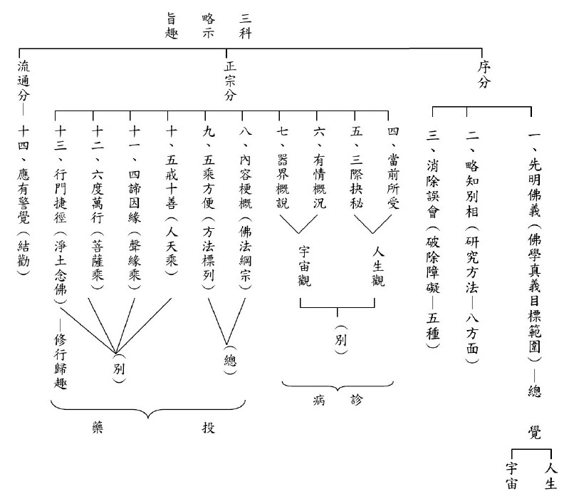

## 蓮池海會

### 許克強居士往生見聞記

鄭蕙娟

芋仔後代成長辛

性情溫和愛子女

人生大事修學後

竟是自己先受用

許克強居士於民國四十九年七月十六日在雲林縣北港鎮外婆家出生，歿於民國一○四年五月一日，享年五十五歲。

其父許澤民先生是民國三十八年撤退來臺的軍人，後因移防結識北港鎮陳厝寮陳招治女士，二人結為連理。婚後父親常需隨軍隊調動，在家的時間並不多，而母親在小學任教，期間生下克強居士和妹妹克梅，父親又因移防到了澎湖，讓寄居娘家的母子一起到澎湖生活，一家人也有較多的時間相處。

在澎湖生下了次弟克盛，因外祖母到澎湖幫母親做月子，在克盛滿月後，將母子們帶回北港，在澎湖住了一年多，但因弟克盛有先天心臟病，一個多月即夭折；後因父親移防到嘉義，全家再次搬到眷村，母親後來又生了雙胞胎弟弟，那段時光是一家人最幸福、平順的日子。

在此環境背景下，居士的幼年，有時隨母親住外婆家，有時就得跟隨父親搬遷到異地，居無定所。而在當時，軍人的薪資並不高，家中又有四個小孩要教養，父親決定退役，學習製作燒餅、油條等手藝，並租用一塊空地，開始做起早點的生意。

居士在外婆家曾發生二件大難不死的經驗，其一，在三歲時自己跑到池塘玩耍，不小心掉入水中，被救起時已無氣息，外祖母不死心，硬是用人工呼吸等方法將他救回；其二，在國小時，與妹妹在溪邊玩，妹妹的拖鞋掉入水中，他為了幫妹妹把拖鞋撿回來，不幸被溪流沖走，後因抓住了溪邊的雜草，才倖免於難，或許由這二件事件可看出居士的獨立性格及愛護弟妹的情懷。

時常因搬家而轉學，小學共就讀了五所小學，但功課表現優異，常被選為班長。到了國中，因父親做早點生意，店裡需要人手幫忙，居士每日三、四點即須起床，到店內幫父親製作燒餅、油條，直到時間快要來不及上學，才匆匆忙忙騎著腳踏車趕到學校，到了學校，往往是滿頭大汗，導師甚覺奇怪，特別做家庭訪問，才知道事情原委，勸其父母讓孩子提早十分鐘出發去學校，否則一路飛奔，太危險了。而居士並未因讀書時間比同學少就落於人後，他依然能保持名列前茅。

到了高中，更自願擔起手洗一家人衣物的家事，以減輕父母的負擔，直至高三那年，因租來的房屋發生火災，接受同班同學盧志明的建議，暫住到他們家，志明的父母待他甚好，從未當他是外人，他也才能夠安穩的度過這段辛苦的日子。

這段高中時期，對他而言，是一段多采多姿的生活，同學間的情誼深厚，在嬉鬧中又有許多關懷，他也發覺自己有運動的細胞，參加了籃球隊、田徑隊，他最常自誇他跳高的成績一直是紀錄保持者，他甚至還學彈吉他呢！但因為他每天還是要到店裡幫忙，偶爾能與同學去郊遊，也已是他最大的享受。

高工畢業後，報考體專，但因準備不周未能考上，但這也讓他思考要繼續走體育這一條路，還是回歸到自己的電機專業，之後決定先在家中幫忙，再到臺中補習班補習半年，最後考上了高雄工專，這在當時全國只有二所國立專科學校，誠屬不易，這也是他人生真正獨立生活的開始。

畢業後，當兵階段服預官役，駐守金門二年，認真盡責，甚受同僚及當地百姓的敬重。

退役後，曾在女友蕙娟父親的公司工作，在石門水庫的撈砂船負責電機等職務，後來因想在業務能力多所磨練而離職。之後從事不斷電系統、電梯等業務工作，也因電梯的材質而涉獵到不鏽鋼的鏡面處理，後與三位朋友成立「百羿不鏽鋼有限公司」，對於不鏽鋼的表面處理更有實務上的經驗，此後他更有另一想法，找了一些朋友合資成立「羿鋒股份有限公司」，對公司做全盤的規劃，是位有生意頭腦，待員工也很好的老闆，一直運作至今日。

民國七十六年，與相識多年的女友蕙娟女士締結良緣，夫婦二人鶼鰈情深，婚後彼此都能尊重對方的想法、生活態度，後來妻子學佛，有時要上課晚點回家，他也能一路護持，未曾有一句怨言，讓家庭的氣氛極為和樂，對於子女二的教誨，和顏悅色，即使子女有錯，絕少嚴厲苛責，並盡力滿足子女所需，尊重他們對前途的選擇。

長子立淳畢業於明新科技大學，現任職富邦人壽業務工作，長女立佳畢業於輔仁大學，剛辭去親子網站的編輯工作，正打算另覓適合的工作，不料居士驟然離世，子女二人同心協力在長輩的教導下，努力地將父親的事業擔負起來，以報克強居士平日的教養與愛護之恩。

對於妻子與兒女陸續學佛，居士一直保持觀望態度，只參與較大型的活動，除放生、浴佛、齋僧、孩子的親子成長課程之外，絕少參與聽經聞法，直至學會開始上「人生大事─不能忽略的事實」課程，當時妻子對他說：「你學了，我先往生，你才知道如何做，不會壞了我的往生大事；若你先往生，我為你做的一切事情，你就會明白那是為了讓你往生極樂世界，才不會氣我怎麼那麼無情。」於是聽從妻子的勸說到學會上課。

之後，居士開始固定在星期六晚上，參與念佛、誦經及研討的課程，沒有想到，這個課程尚未結束，卻已在他身上派上用場，即使在病中，也漸能放下，平和的面對他自己的人生大事。

也因這個課程讓居士對佛學、儒學有更加深入的認識，接著才有聽《妙法蓮華經》、《十四講表》、《論語》、《唐詩》等因緣，即使有些課程聽不太懂，也不退卻，是個只要時間一到，不管颳風下雨，就準時去上課的好學生，可見居士的善根福德不可思議，才能聽到這些大法。

曾經，妹妹克梅來家中小住一個月，也跟著一家人參與聽課、放生、拜懺等法行，後來居士母親有因緣到臺北與其一家相處，母親完全配合兒子、媳婦的安排，星期四早上參加三代共修及佛學講座，星期六晚上的共修、人生大事課程，有十來個月之久，在這期間，居士帶著母親做了拜懺、放生、浴佛，母親甚至還與媳婦跟著學會蓮友們一同前往大陸放生，這都是一般人不易有的想法與做法，居士能與母親一起做這些殊勝的法行誠為難得。此時居士雖不能再承歡膝下，但也略可彌補不能再盡孝的遺憾。

兒子開車接送媽媽去共修、聽法，此景雖不再有，但也讓母親與妹妹對助念生西的須知、意義及規矩，有概念上的了解，所以當居士往生，其母亦能忍住白髮人送黑髮人的悲傷，不在居士面前哭泣，加入助念的行列，就是想幫助居士往生極樂淨土。

居士感染流感，病發後住進加護病房，家人一心求佛菩薩的加被，祈求居士若壽未盡，能早日痊癒，但若壽已盡，也只能求居士蒙阿彌陀佛的接引，往生極樂世界，在每日二次的探病時間，總提醒他要放下一切的掛念，隨著佛號機播放出的佛號，一字一句地跟著念「阿彌陀佛」名號，求佛加被。

最後心臟呈現衰竭現象，家人只能痛下決心，帶居士回家助念，家屬為其助念二十四小時，事後觀居士面相莊嚴，身無異味、全身柔軟，足證蒙佛加被。

居士依著他宿世善根福德能護持佛法，終能突破障礙，開始聽經聞法，也能影響家人學佛、得正知見，時間雖不長，只有三、四年，但當他人生起了遽然變化，能夠放下對世間的掛念，在病中、臨終都沒有太多的苦痛，並感應許多善因緣助他往生極樂世界，靠的就是法的殊勝及阿彌陀佛的加被。

在病中，家人承諾要為他做十件善法，如今已有放生、供佛、齋僧、誦經、念佛等因緣，家人仍會持續努力在七七四十九天內，為他做種種法行，以使居士蓮品增上，往生後，能獲老師、蓮友、親友的協助，如理如法的做七、告別式，可謂此生最佳句點。

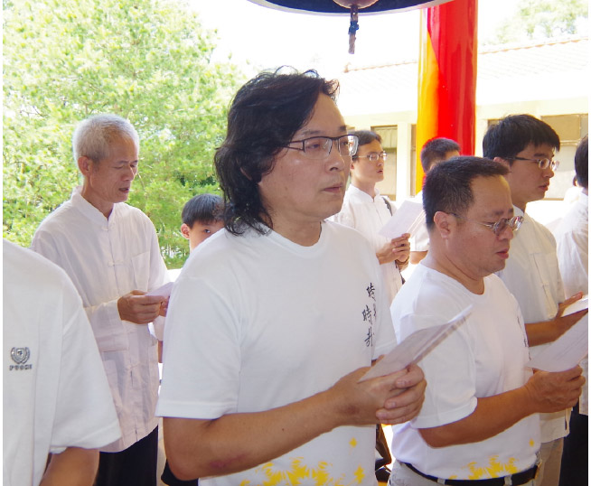

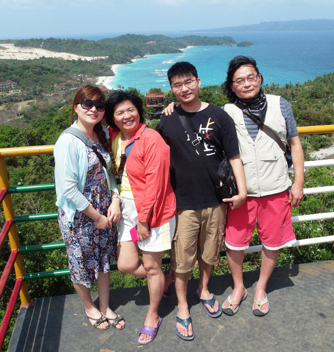

## 孔學一隅

### 論語簡說（八）四科十哲

*時哉講述、淨本整理*

文化本質在四科

人才莊嚴家與國

聖人出世真本懷

民族源遠能流長

《論語》當中關於子貢的部分有三十六章，將這三十六章分類、做出架構，以科判的方式學習，可以讓我們提綱挈領地認識子貢各方面的內涵。整個科判的最開頭是「總明：言語科」，藉由先進篇第三章的研讀，可以認識子貢被孔子判定為言語科的代表，而言語也是子貢最為人稱道的專長。除此之外，本章尚有許多重要的義理值得我們深入了解。

經文

德行，顏淵、閔子騫、冉伯牛、仲弓。言語，宰我、子貢。政事，冉有、季路。文學，子游、子夏。

本章指歸孔門教育的出路

本章若是粗略看過，或者以為不過是十位弟子的分類。然而熟讀之後，方知原來孔門教育確實是人才的教育，能夠把人教育成為有品格、有見地、能夠協調溝通、辦事條理分明、具足文化的底蘊、有文學修養的人才。這樣的人才是社會國家所必須，能夠安邦定國，使各領域欣欣向榮。孔子教學原來如此多元，絕不是只有讀經背書，而在孔門多方面的教育中，可以總攝為四科，這四科的教學讓人有風采、有魅力、有出路。

四科的內涵

四科分別是德行、言語、政事、文學，欲知孔門弟子風采，應知孔門四科內涵。

一、德行科

品格的重要，人人皆知。美國總統羅斯福曾說，沒有品格的人來到社會上，猶如未爆彈那般可怕。德行科所指的正是品格以及見地。其實有見地方能立住人格，否則經不起境界的考驗。未深入了解孔門內涵，容易誤會德行科就是要人學乖。其實德行科真正的重點在於出格的見地，這樣的見地使人不會同流合汙，能使品格屹立不搖，如蓮花般出淤泥而不染，濯清漣而不妖。見地能開展公心，不至於私心滔滔，最終下場淒涼，禍延子孫。

德行科的四位代表，首先是顏淵，他能夠三月不違仁，簞食瓢飲仍不受榮華富貴所動。閔子騫孝順父母，友愛兄弟，並且不願做季孫大夫的家臣，只有孔子當大司寇時才願意出仕效力擔任費邑大夫，是十分清廉之人。冉伯牛在《論語》中紀錄較少，但從其生病時孔子的哀嘆，可知他在孔子心中的地位。《孔子家語》中說仲弓即使窮困也能從容。由此可見四位賢哲，確實是具有品格的人才，而必定有那般高度的見地，才能支持這樣的品格。

二、言語科

言語科在於能夠協調溝通，能以辭令安定政局，可以講述義理、弘揚聖道。這樣的言語不是平凡的言語，不會耗費辭氣在無益的人我是非之中。

本科的代表是宰我和子貢，宰我言論在《論語》中較少記載。但他能夠曲己明道，也就是委屈自己做不良的示現，藉此提問，使大家得以從孔子口中知道守喪三年的理由。子貢巧妙的言詞，則顯見於經文中，他的口才可以安邦定國，善用比喻，言詞婉轉，並且能夠弘揚聖道，讚歎孔子。他是孔子讚許可與言詩的弟子。

三、政事科

政事重點在於給予人民安定的環境，讓好的教育可以推展。冉求跟季路就是本科的長才。冉求有財經專長，善於處理內政，子路特別有軍事上的才幹。

四、文學科

文學不是死讀書的文學，而是有文化底蘊，深通古籍，能夠傳承經學見地，能夠利益人心的文學。

子游、子夏都是經學大家。子游特別能夠發揚禮教，《禮記‧檀弓篇》說，卿大夫還有讀書人，在禮上有疑惑時，以子游一言定輕重。子夏很早就得到經學的傳承，詩書禮樂雖刪訂於孔子，但是子夏能講得清楚，特別是詩經、易經。孔子曾勸子夏不要當小人儒，意思是一身的才華與絕學要貢獻於社會，不要拿來陪葬。

以上可知，孔門四科就是把人培養成有品格、有見地、能言語、會辦事、有文采之人。這樣的人必定能夠領先時代、創造時代，這才是中華文化的核心價值，學習中華文化的出路。

四科弟子皆非專才

本章雖將十哲分為四科，實則四科十哲皆非僅具某一項科目的專長，顏淵具足弟子相，學習認真，對孔子所述之道不違如愚，又能發揮老師的未盡之意，與孔子名為師生，情同父子，深知自己有傳承的責任，所以愛惜生命（參見子在回何敢死章）。另外孔子周遊列國到楚國時，在楚國子西大夫的眼中，顏回就是一位能擔當宰相的人才。

閔子騫除了具有伯夷之風，孝敬雙親友愛兄弟，他也謹言具有遠見。例如先進篇中魯人為長府章，他能夠洞察魯君並非三家大夫的對手，動干戈只是生民塗炭，因此用謹慎的言語，勸諫魯君不要發動戰爭，孔子稱許為：「夫人不言，言必有中。」

冉伯牛雖然紀錄較少，但能夠知道他是一位樂天知命的行道者，陳蔡之厄時，彈琴自若，可知其處逆境的胸懷。而他也擔任過中都宰，能夠為政。仲弓也曾當過季氏封地的大夫，是南面之才。

言語科的宰我也被子西大夫稱許為幹才，孟子說他智慧足以知道聖人。子貢為孔子守喪是他的德行，此外他有政事外交的才能，他懂得《詩經》因此也懂得文學。

冉求當過季氏外交使臣，有言語應對的才華。子路不僅剛強威武懂軍事，他能夠洞察事情，三言兩語就把案件決斷，並使兩造佩服。此外他也是一個孝子。

文學科的子游能治武城，孔子為他的政績感到高興。子夏做過莒父宰，而也被孔子稱許可與言詩。

由此可知，孔門教育分為四科，並非弟子們只專學一科，而是多方面的學習，《鹽鐵論》上說，七十二賢都是諸侯卿相之才，可見孔門教育確實是人才養成的教育。

四科相互輝映

孔門弟子不只專學一科，其實各科之間，都有互相幫助的效果。

言語、政事、文學能夠支持德行，因為言語表達好的內涵，利益別人；政事辦好能夠使百姓安定；將文學中古人經驗閱歷告訴他人，使人趨吉避凶，都是對於德行的擴充。

德行、政事、文學能夠充實言語，使言語成為有見地的言語、有品德的言語、有經驗閱歷的言語、有文化底蘊的言語。

言語、德行、文學能夠支持政事，因為辦事需要言語，大臣要協調溝通，才能結合大家同舟共濟。德行支持政事，如此才不會受到權力的影響而腐敗。辦政治也要文學，知古鑑今，讓政治成為以文化為本質的政治。

言語、政事、德行能夠支持文學，因為言語能夠安邦定國、協調溝通，有此底蘊來讀文學，才知道古人的文學有多美；有政事才能來看文學，才知道文學中很多是古人處世的智慧；有德行才能在文學中看見古人的見地、品格、風範，才知道事情不以成敗來論英雄。

四科排列的意義

古來對於四科的排列，說法也有不同，例如「德行、政事、言語、文學」或者「德行、文學、政事、言語」。但雪廬老人的抉擇與今日《論語》的經文相同，因為品格見地十分重要，而言語的協調溝通能夠讓人和合，如此才能夠辦事情，是故政事在言語之後。有了前三者，再去學文，這才能領會原來文章中都是古人的經驗閱歷，都是古人可貴的趨吉避凶之道。

總結

孔子有三千入門弟子，七十二賢皆是諸侯卿相之材（已及階），升堂者則是本章的十哲，真正的入室弟子則是顏回與曾子。十哲是四科的代表，孔門中十哲以外還有許多成功的人物，因此孔子是大教育家，四科的教育，可以把人從內到外，從自行到化他，從人格建立到安邦定國的各種能力都培養起來。國家有這樣的人才，才有未來。入中國文化之門，要從這四科來入，呈現中華文化之美，要從這四科來呈現。走入時代，豐富時代，莊嚴時代也要靠這四科。(下期待續)

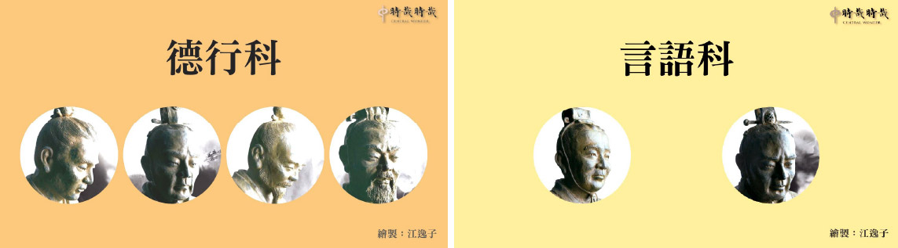

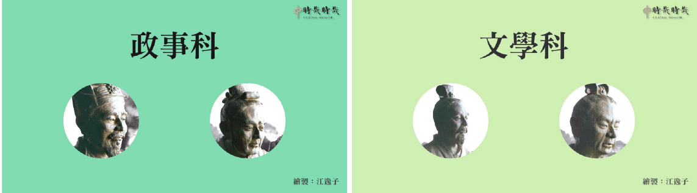

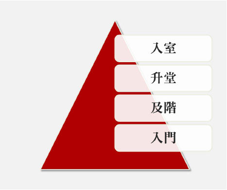

### 孔門七十二賢淺說（四）公冶長

時哉

才德兼備受牢獄

言通鳥獸事可怪

周禮左傳有記載

受辱不妨成大賢

公冶長，姓公冶，名長，字子長。《史記》以為齊國人，《孔子家語》則認為是魯國人。

公冶長具有通達禽獸之言、飛鳥之語的能力。有一次他從衛國回到魯國，路上聽到鳥兒相呼，要往青溪吃死人的肉。過沒多久，他見到一位老婦人當道而哭，原來是她的兒子日前出門，至今未回，恐已死於不測。公冶長於是跟她說：聽到鳥兒說要往青溪吃死人的肉，死者說不定就是你的兒子。老婦前往青溪查看，果見其兒已死於該處，隨即報官，村官因而判公冶長以殺人罪入獄。公冶長以自己能懂鳥語答辯，獄主於是等待機會，以試驗其言是否真實。公冶長在獄中長達六十日之久，終於聽到有麻雀在監獄的柵欄上互相叫著：白蓮水邊，有運糧車翻覆，糧食灑落一地，收拾不完，去吃吧！獄主派人前往查驗，果如其言。而後又試以豬言、燕語，皆得應驗，於是獲釋。

《周禮》〈秋官〉上記載：夷隸掌管負責鳥的言語溝通；貉隸掌管負責獸的言語溝通。《左傳》上也說介葛盧懂牛鳴之意。是以自古即有通鳥獸語言之人，無足為怪。而公冶長有此特殊才能，卻沒有像一般奇人遊走江湖，而是於道上精進學習，實屬難得。

公冶長因事入獄，實非其罪，有德之人受此大辱，仍能貞定自處，足見其謙和忍讓的氣度，非一般守節之士可與相比。孔子選其為婿，即彰明才德上的門當戶對，也是透露亂世的刑賞沒有標準，不足取為準繩。

畫中的公冶長慈眉善目，長相莊嚴，和藹仁愛地注視著右手上的兩隻麻雀，兩隻雀兒似也有所體悟地與他相望，用禽言彼此溝通情誼，足見動物皆有靈性與感情，端賴人們能否敞開心胸予以關懷與了解。左手拿著經書代表知書學禮，是智慧的象徵，智慧在公冶長的身上能表現出處變不驚、受辱不怨，身段柔軟、能屈能伸、正直有德，終於逢凶化吉。整幅圖畫可見大儒悲智雙運的偉大形象。（下期待續）

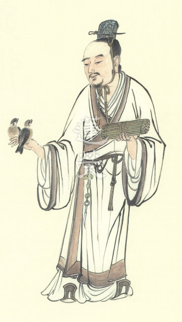

## 藝術賞析

### 華夏精魂千秋(四) 明倫史畫農師教耕，后稷

圖：江逸子　文：淨域

自古農立國

后稷大陰德

稼穡安居樂

開周八百年

【史話】

后稷，名棄，為周朝姬姓最初遠祖；生卒年不詳，為堯舜時代人。母親姜原，為有邰氏之女，帝嚳高辛氏之正妃。

某天，帝嚳領姜原到稷山(今山西省稷山縣)祭神，祈求子嗣。姜原路見巨大足跡，踏過忽覺全身一震，從此懷有身孕。一年後生下一子，因受孕奇異以為不祥，便將孩子棄於路旁，但牛馬避而不踐踏；又將他棄於冰渠上，群鳥飛來以羽翼遮護。姜原見這般神異景象，便將孩子抱回來，為他取名為棄。

棄年少時，喜好種植各種農作；長大後，嫻熟農耕之事，人民皆效法。帝堯聽聞其善耕，便舉為農師，使天下均得利。舜任命為管理農事的稷官，封於邰(今陜西省武功縣西南)，後世稱棄為后稷，別姓姬氏，尊為農神。

后稷死後，子不窋世襲稷官。夏朝太康時政治腐敗，不注重農務之事，廢除農官，不窋北逃於戎狄邊界，從事農稼之事。不窋卒，子鞠立。鞠卒，子公劉立。公劉重振稼穡之業，因地耕種百姓慶幸懷德，惟因常受戎狄侵擾，便遷居至豳(今陜西省彬縣)地。周族人開始計劃性的營建房屋開墾荒地，不久就出現了繁榮的景象。族人們擇選吉日飲酒聚會祭祀祈禱，正式推舉公劉作宗主和國君。

後傳至古公亶父時，因受戎狄的攻伐，便由豳地南遷到岐山(今陜西省岐山縣境)之下安頓。此後制訂曆法建立軍隊，積極發展農業，以致四周人民紛紛前來歸附，開啟了周朝八百年的國祚。

【圖解】

畫中由文武百官簇擁在前之長者就是帝堯，堯聽聞棄有農耕長才，能夠相地之宜，播種穀物，民眾都以他為農事的榜樣，因此特領朝中大臣，前來訪賢。遠方的平原，可見許多正忙於農耕之人，是一幅農業興旺的景象，而這樣的盛況，正是因為棄的指導有方。棄在使臣的引領下，跪於堯前行禮，衣著樸素，看似正忙於農耕之際，臨時受到召見。使臣左手持笏，右手比劃，說明眼前這位老者，就是當今的天子。堯的態度雍容，表情欣喜，趕緊扶起這位善於農耕的賢者，期望賦予大任，廣興農務，解除黎民百姓的飢餓。（下期待續）

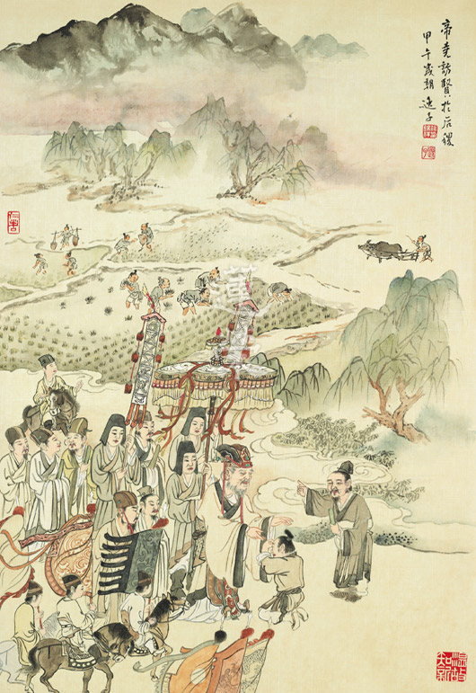

### 孝經圖簡說(二)天子章

圖：江逸子　文：時哉

愛敬雙親孝子心

天子典範萬民從

一人有慶兆民賴

導德齊禮恥且格

天子章第二

孔子在講述孝經時，先說孝道整體的內涵，接著分別陳述孝道的各個面相。第二章講到天子該如何盡孝，他以孝道作辦政治和教育的本質，來推廣於天下。

圖中的天子穿戴整齊，帶著皇后來到母親皇太后的面前請安，帶著的是侍者和侍女，侍者的服飾特別是貼著耳朵的帽子，就是秦漢時期僕人或衛士的服飾，與左邊的侍女捧著豆之類的食器，或是銅質或是木質所作，這可能是早上前來請安獻上的餐點。

這位雲髮插上髮簪，坐在席上的老婦人，想必就是太后，表情像是欣然地接受天子皇后的供養，古人都是席地而坐，旁邊有侍女伺候著。

在歷代孝經圖中，皇太后旁邊畫的是女官或是嬪妃，只有江先生的天子章畫作，旁邊以婢僕伺候，表現天子之孝，是在平常請安奉養上面。歷代的畫作都畫得非常正式，天子朝服、傘蓋、團扇，在官員護衛之下，來對母親請安。江先生所繪是平居的樣子，表徵天子盡孝道，是在平常起居，是落實在生活的層面。

太后身後的屏風，是房間內的擺設，畫家畫了屏風，交待了屋內屋外之別，可以省去畫宮廷起居室內許多擺設的麻煩。兩旁的幃幕代表起居室，空中祥雲表徵盡孝道，是天地祥和的事情。

從這一幅圖當中，我們可以看到天子的孝道，看起來只是兒子對母親的問候，供養餐點這麼簡單，但這種平常貼心的問候，細心的照顧作孝道本質，推廣到天下每一個家庭，讓子女懂得對父母親的尊重和愛護，父母享受著家庭天倫之樂，這時候天下變得容易治理，社會也一片吉祥。《書經》上面也說，天子有如此的孝行，是所有老百姓所仰賴的，老百姓所仰賴的就是天子的孝行，因為孝行才是辦政治、辦教育的本質，才是天下祥和的要道。

以上是《孝經》的天子章，作者在呈現畫作，有別於歷代畫家的創作，表彰的是天子私下對母親的問候與奉養。換句話說，孝道就是落實在日用平常裡面，看來只是小事，但是發展起來是天下的大事，可以讓國泰民安，可以讓政治清明，可以讓人心和諧，可以讓國家長治久安，是這一幅圖的大意。(下期待續)

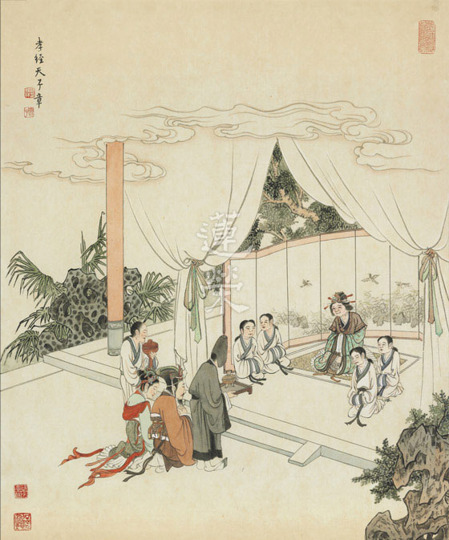

## 專題報導

### 孝治天下傳統文化高峰論壇

### 孝乎惟孝 ─ 由北宋李公麟到民國江逸子繪孝經圖說起

*編輯部整理*

政教本質孝

家和國太平

見地在經書

流通賴畫作

前言

一○四年四月二十五至二十七日，學會師長應孝廉講堂之邀約，至傳統文化高峰論壇擔任師資，授課內容為「孝乎惟孝─由北宋李公麟到民國江逸子繪孝經圖說起」、「天下太平之根本─從關關雎鳩說起」以及音樂饗宴。

此次論壇的主題是孝治天下，孝是利他的心態，因為父母對我的恩德極大，尤其是母親懷胎九個月的守護，臨產的受苦，把好的給孩子，把壞的給自己，哺育孩子的心，或者為孩子造很多惡業，隨順孩子而殺生，在子女遠行時父母親無盡的懸念，孩子的年紀再大，父母親碎念憐憫的心不曾停歇，不但盡上世間父母親的責任，更將孩子教育成人才，這些都是世間恩德沒有辦法報盡的。

是故，此人若連父母都不想利益，如何會去利益別人？孝是道統文化的本質，文化所要經營的就是內聖外王的氣象，從文化當中打造國家的形象，讓國家民族成為世界領導風氣者！

題目定為「孝乎惟孝」，意思就是孝其大無外，所有有情眾生想要成就，必須從孝出發，再也沒有比孝更殊勝、更偉大，內涵更深廣。論語為政篇：或謂孔子曰：「子奚不為政？」子曰：「書云：『孝乎惟孝，友于兄弟。』施於有政，是亦為政，奚其為為政？」書經上說，孝啊！只有孝！此人在家裡面行孝弟就是辦政治，何必一定要出來為政？這句話的意思，國家政治的目的是為了創造家庭和諧，如果家庭和諧國家才會強盛，所以孔子說自己在家裡面辦家政，讓家庭和諧，讓孝弟的風氣開展，這就是辦政治。這句話孔子說出了為政的根本在孝弟，也透露出當時政治不清明，他寧可將時間花在私下講學培養人才。

想要完整的認識孝，必須要從《論語》開始了解，因為《論語》是十三經的門戶，舉凡孝是內聖外王的人格基礎，孝是家庭整齊、治國的根本，孝是童蒙教育的入門，孝不但讓人懂得養親，也懂得臉色和悅，讓父母親心安，要成就父母親的好名聲，讓父母親覺得榮耀，要以大義的內涵引導父母親，父母親有過失要懂得勸諫，父母親過世時也要懂得如法辦理父母的喪事，而且懂得繼承父母美好的心志，並且以孝利益自己利益他人。

孔門當中，曾子以傳道來盡大孝，閔子騫以孝促進家庭和諧，大禹則表現在祭祀，以上是《論語》當中的孔門孝弟觀。其中的內涵表現在《孝經》當中，運用在天子、諸侯、卿大夫、士、庶人等等。

聖賢君子的人格特質由孝道做本質，也是家裡面必須要實踐的內涵，包含對父母的安養以及家庭氣氛和樂的經營，包括喻親於道，報本還恩，慎終追遠，乃至於三年之喪可以圓滿。

孝經可以從孝經圖來認識，從北宋的李公麟、南宋的馬和之、元朝的趙孟頫、明朝的仇英以及民國的江逸子，這幾位畫家呈現孝經，來回應此次論壇的主題。而江逸子老師的孝經圖，以藝載道，用圖像來判讀經學的內涵，進入經學的學習，有經學的涵養以及氣質的變化，可以啟迪童蒙教育，也能教育現場大眾。

明年即是雪廬老人往生三十周年紀念，若有因緣辦理以「道」為主的畫展，並結合緬懷老人的專題講座，除了追思一代國士，也彰顯老人木鐸春風三十年，相信會是最好的紀念活動。

短短九十分鐘的課程，只講到第九聖治章，師長依此因緣錄製了孝經圖簡說，學員可進入時哉時哉網路教育學院中，由雲端聆聽江逸子老師所繪製孝經圖的圖解導覽。

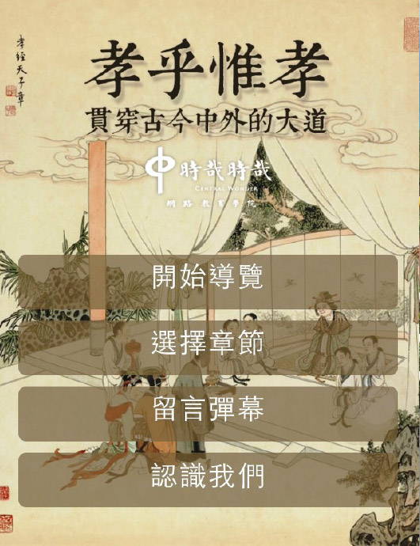

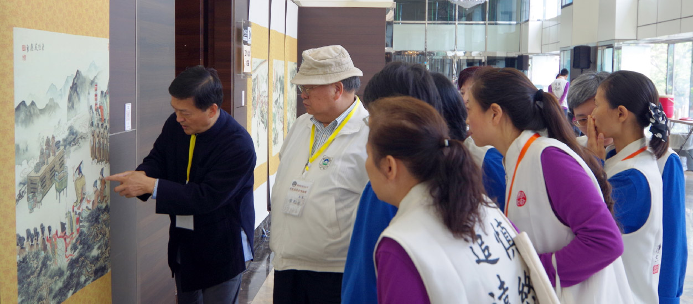

### 天下太平之根本 ─ 從關關雎鳩說起

*心晴講述、心若整理*

關關雎鳩求偶情

文王選妃安天下

窈窕淑女君子求

福始祥源夫婦始

四月受傳統文化高峰論壇之邀約，以孝治天下為主題，開出女德的課程，題為「天下太平之根本─從關關雎鳩說起」，內容以家庭為軸心，女德為範疇，重新定位女性角色，並詮釋女德的典範、特質、能耐，今昔女性的差異，以及現代女性如何因應時代的變化，走入時代、找到自己的定位等等議題，再再都值得吾人思考審視。

印光祖師曾說：「天下太平的根本，女人家操得一大半」，因為賢良出自家庭，而賢德的女子方能教導出賢德的子孫，成為國家棟樑。自古以來，中國最為人稱歎的女德榜樣公推三太，即周朝三位開國先君的夫人太姜、太任、太姒，她們以完美的德行輔佐夫君、教子有成，成就了開萬事太平幾位君王的聖德，是母儀天下的典範。

《詩經》〈關鴡〉篇言：「窈窕淑女，君子好逑」，窈窕淑女就是直心端正、有德行、有智慧，富含內在美及外在莊重、行禮如宜的女子。此篇寫文王娶得太姒，樂得賢內助。可見《詩經》開宗明義章正彰顯五倫肇端乎夫婦，文王擇偶的慎始正是端正夫婦一倫的最佳楷模。

而要成為窈窕淑女必須培養一己的明德，使有簡擇的智慧力，待人處世無私無我，因此，面對各種事情，都能有正確的判斷及作法。

若以四料簡來區分女子，可分成才德兼備、有德無才、有才無德及才德俱無四類。才德兼備的女子以娥皇、女英、班婕妤、班昭、黃月英、長孫皇后為例，娥皇、女英幫助帝舜避開家庭無理的傷害，並能孝順公婆、和睦家庭，舜以孝治天下，可說得力於娥皇、女英的協助。漢朝的班婕妤受成帝寵信，有一次，成帝想與她同車出遊，班婕妤以「賢聖之君皆有名臣在側，三代末主乃有嬖女」回絕文帝，得到太后的賞識。後班婕妤逐漸失寵，主動請願去長信宮服侍太后，包容寬厚的情懷令人敬佩。至於班昭，自幼熟讀經書、通達歷史，文采卓越，幫助哥哥班固完成《漢書》，又曾被召入宮中，教授皇后及嬪妃等讀誦經史，編了《女誡》，載明宮中女子應有的禮儀，成為後世的準則。

而諸葛亮之妻黃月英，據說相貌醜陋，但她博學多聞，能妥善持家，並以智慧協助夫君，相夫教子。唐太宗之妻長孫皇后賢淑無私，她曾告訴太宗，持國的重點在於居安思危、任賢納諫，可見她是以見地、德能幫助太宗建立文治武功，成就貞觀之治。上述女子都是德行高尚又才能出眾者。

而有德無才的女子，像是曾子的母親，能教導孩子傳承聖道。孟子的母親，三次搬遷來成就孟子的學習。陶侃的母親，為了陶侃能交善友、成就德學，當兒子朋友來訪時，剪去頭髮變賣招待。以上女子皆以教子這一分來說是有徳之人，能培成子弟。

至於有才無德，則如武則天，她是中國第一位把持政治的女皇帝，但探究歷史可知，她雖有政治的能力手腕，私德卻不好，其才終究不能成就其德。最後，才德俱無的就無須細說。

經由上述，足見一個女子最可貴的是有德，而德行從見地與涵養來，見地與涵養表現在三從四德上。三從即從父、從夫、從子，或有人會質疑此為古代封閉的想法，不適用於現今，但其實從父是跟從父親的教導，從夫是言夫妻相處之道，講究夫唱婦隨、相敬如賓，所謂夫妻，「妻者，齊也」，也就是男女雙方志同道合，孝事父母的心意、教導子女的心意都能整齊；「婦者，扶也」，能成為賢內助，互相扶持。從子是要能善教子女，使其成為人才。

而所謂四德為婦德、婦言、婦容、婦功，由婦德來統攝其他三者，婦言，即言語之道被德行所攝受，能和顏悅色敬事公婆，謹言慎行，委曲婉轉，深具協調溝通的能力，維持家裡的和諧，雪廬老人有副對聯說道：「經書涵養心如鏡，福德薰陶語似蘭」，若套用於婦言，說明德行所成就的言語之道，能照徹萬物。

婦容，即是女子儀容的整束，必須符合年齡、場合、身分，典雅適宜的裝扮自己，是一種禮貌。婦容不僅是外貌的講究，還包括美儀、美姿，更重要的是有經學的涵養，美學的眼光，並能把這樣的內涵帶入家庭，美化生活，使環境整齊清潔，又能加以藝術的陶冶，讓家人能在和諧安定的環境學習。

婦功，狹義來說，指女子的技藝，像是織布、下廚的技藝，能照顧家人的生活、健康。廣義來講，指的是女子要辦家政，舉凡祭祀祖先、孝事公婆、教導子女，乃至於和諧妯娌、敦親睦鄰，乃至於財經管理等等，都屬於女子家政的範疇。古時候是大家族，能和諧家族就等於和諧一個小型社會。女人最慈悲，能擴及小我，完成大我，完成仁心事業，像德雷莎修女，她成立垂死之家，終其一生都在為病人、孤苦者奉獻服務，給予他們尊嚴。在南斯拉夫科索沃內戰時曾深入戰區，促使兩邊停戰，救出無數的婦女及孩童，智勇雙全，感人肺腑。另外，舉凡孝莊太后、王昭君、文成公主等女性，都能貢獻一己之力，成就國家的和平。

所以女德養成是仁心的成就處，女德如磁石，吸引所有美好的德行到來，不但成就自身的美德，更能整齊家庭，培成子弟，和諧社會。

今日隨著時代變遷，男女平權、機會均等，女性接受多元刺激，與世界接軌，女性意識抬頭，其生活型態、模式已與過往有很大的差別，現代女性應如何扮演自己的角色，是否還能成就女德是很多人心中的困惑。其實，現代女性有更多的優勢，可以接受高等教育，具備獨立思考的能力、實現自我的勇氣，突破了以往社會的框架，有更多選擇。然而，一般女性常在家庭、工作與實現自我上，面臨抉擇取捨的困難。

一般認為，若是著重在家庭的經營，就會失去在工作上嶄露頭角、自我實現的機會。但其實犧牲的同時，就是成就的同時，重要的還是經學見地的涵養，有經學見地的涵養，走入家庭，便能善教子女、和諧家邦。女子並非不能工作、不能實現自我，而是要在取捨選擇之間，取得平衡，但不管如何，千萬不能放棄為人父母、家庭經營的責任，仍然要不斷的自我充實，使家庭美滿和樂，發揮一己的長才。

因應時代的變與不變，不變的是女性的特質，變的是隨著時代的潮流演變賦予女性不同的使命、角色，要懂得在不同的場域發揮自己的特質，而德行是一扇大門，由德行作為基礎，以經學開展見地，以見地培養女德，以女德建立時代，讓我們自身因女德的成就更為美好，社會國家更為安定。

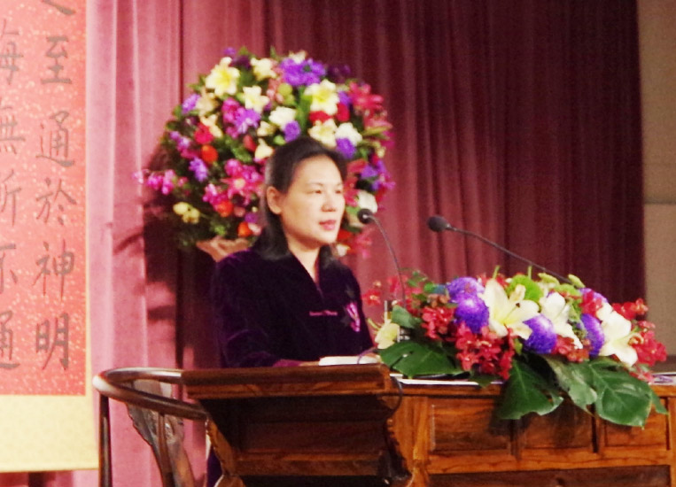

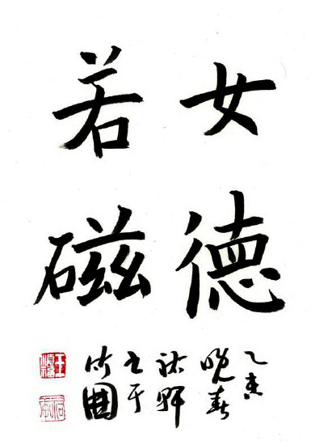

### 時哉時哉網路教育學院

孝乎惟孝 ─ 由北宋李公麟到民國江逸子繪孝經圖說起

*編輯部整理*

政教本質孝

家和國太平

見地在經書

流通賴畫作

前言

一○四年四月二十五至二十七日，學會師長應孝廉講堂之邀約，至傳統文化高峰論壇擔任師資，授課內容為「孝乎惟孝─由北宋李公麟到民國江逸子繪孝經圖說起」、「天下太平之根本─從關關雎鳩說起」以及音樂饗宴。

孝乎惟孝 ─ 由北宋李公麟到民國江逸子繪孝經圖說起

此次論壇的主題是孝治天下，孝是利他的心態，因為父母對我的恩德極大，尤其是母親懷胎九個月的守護，臨產的受苦，把好的給孩子，把壞的給自己，哺育孩子的心，或者為孩子造很多惡業，隨順孩子而殺生，在子女遠行時父母親無盡的懸念，孩子的年紀再大，父母親碎念憐憫的心不曾停歇，不但盡上世間父母親的責任，更將孩子教育成人才，這些都是世間恩德沒有辦法報盡的。

是故，此人若連父母都不想利益，如何會去利益別人？孝是道統文化的本質，文化所要經營的就是內聖外王的氣象，從文化當中打造國家的形象，讓國家民族成為世界領導風氣者！

題目定為「孝乎惟孝」，意思就是孝其大無外，所有有情眾生想要成就，必須從孝出發，再也沒有比孝更殊勝、更偉大，內涵更深廣。論語為政篇：或謂孔子曰：「子奚不為政？」子曰：「書云：『孝乎惟孝，友于兄弟。』施於有政，是亦為政，奚其為為政？」書經上說，孝啊！只有孝！此人在家裡面行孝弟就是辦政治，何必一定要出來為政？這句話的意思，國家政治的目的是為了創造家庭和諧，如果家庭和諧國家才會強盛，所以孔子說自己在家裡面辦家政，讓家庭和諧，讓孝弟的風氣開展，這就是辦政治。這句話孔子說出了為政的根本在孝弟，也透露出當時政治不清明，他寧可將時間花在私下講學培養人才。

想要完整的認識孝，必須要從《論語》開始了解，因為《論語》是十三經的門戶，舉凡孝是內聖外王的人格基礎，孝是家庭整齊、治國的根本，孝是童蒙教育的入門，孝不但讓人懂得養親，也懂得臉色和悅，讓父母親心安，要成就父母親的好名聲，讓父母親覺得榮耀，要以大義的內涵引導父母親，父母親有過失要懂得勸諫，父母親過世時也要懂得如法辦理父母的喪事，而且懂得繼承父母美好的心志，並且以孝利益自己利益他人。

孔門當中，曾子以傳道來盡大孝，閔子騫以孝促進家庭和諧，大禹則表現在祭祀，以上是《論語》當中的孔門孝弟觀。其中的內涵表現在《孝經》當中，運用在天子、諸侯、卿大夫、士、庶人等等。

聖賢君子的人格特質由孝道做本質，也是家裡面必須要實踐的內涵，包含對父母的安養以及家庭氣氛和樂的經營，包括喻親於道，報本還恩，慎終追遠，乃至於三年之喪可以圓滿。

孝經可以從孝經圖來認識，從北宋的李公麟、南宋的馬和之、元朝的趙孟頫、明朝的仇英以及民國的江逸子，這幾位畫家呈現孝經，來回應此次論壇的主題。而江逸子老師的孝經圖，以藝載道，用圖像來判讀經學的內涵，進入經學的學習，有經學的涵養以及氣質的變化，可以啟迪童蒙教育，也能教育現場大眾。

明年即是雪廬老人往生三十周年紀念，若有因緣辦理以「道」為主的畫展，並結合緬懷老人的專題講座，除了追思一代國士，也彰顯老人木鐸春風三十年，相信會是最好的紀念活動。

短短九十分鐘的課程，只講到第九聖治章，師長依此因緣錄製了孝經圖簡說，學員可進入時哉時哉網路教育學院中，由雲端聆聽江逸子老師所繪製孝經圖的圖解導覽。

### 時哉時哉網路教育學院 —每日輕鬆學

*編輯部整理*

學習法喜心輕鬆

未來前途眼前耕

人生得意好學來

自利利他福祥源

二○一五年五月四日起，每週一、三、五，時哉時哉網路教育學院新開啟的每日輕鬆學單元，由學會主動選擇的輕鬆課程，讓學習成為每天最好的開始，而每日輕鬆學當中的課程也可以回到線上課程的各學院平臺做完整的學習。

首先登場的是

「孝經圖解」導覽

，此圖乃江逸子先生近期之創作，不但一償畫者六十年前的願望，也是畫者多年向雪廬老人學習，深入經典並且筆耕不輟、以藝載道之作，結合唐老師對經典內涵的了解，做深入淺出的導覽，生動描述江先生如何有別於歷代畫家所詮釋的孝經圖，依之可通往《孝經》的學習，成就聖人孝道的見地。

十八幅孝經圖之後，隨即推出在每週一推出

「知是眾妙之門─福始祥源」《論語》系列講座

；每週三推出「論語正音」系列，結合白話解釋、難字註解，拼音、注音等；每週五則開設一系列啟蒙插畫親子共學課程，名為「給孩子的傳家禮」。

首先登場的是「知是眾妙之門─福始祥源」《論語》系列講座，以單章小品擇要講述知見對一個人的重要性，每個人的知見，籠罩了他的人生，知見不只影響處世的態度，更決定了生命的高度。正確的知見，給人無限的前程，使人能在逆境中處變不驚，奮發努力；處順境時也不會驕奢淫逸。而想要汲取這樣的智慧，必得從已歷經千錘百鍊的聖哲思想中探尋。而《論語》中關於「知」的條目約有六十六條，本課程透過科判的編排、架構式的整理，有系統地講述「知」的內涵。使學習者能掌握正知見的形象、取得正知見的方法，以及運用正知見處世的利益。

「論語正音」課程

，結合經典讀誦及活口氣的傳達，配合各地不同發音字母，製作拼音與注音結合的字卡，更有不同於坊間，由心若學長重新撰文的白話註解，是各方家長與啟蒙教學者多年的引頸期盼。

讀經能培養學子的定靜力、體悟力、記憶力乃至於古文的閱讀能力。但在讀誦與學習上，句讀與讀音不可不做講究。斷句的位置與讀音的差異，往往有差之毫釐，失之千里的結果，在孩童讀經時造成先入為主的印象，成為未來正解經典的障礙。

雪廬老人為孔上公德成（受命為大成至聖先師奉祀官）業師，乃山東之大儒，其受孔上公之命講授《論語》，並由徐醒民先生敬記出書《論語講要》，繹其經義，綱舉目張。本學院特依《講要》之斷句，並採取雪廬老人講述教授之音義，期能讓有心從事《論語》學習之學人，從雅言正音中開始。

「給孩子的傳家禮」系列課程

，由淨爾學長撰文、卓瑪學長繪圖、戒雅居是協助著色，此課程乃根據李炳南教授(雪廬老人)編寫的常禮舉要內容所發展出的一系列啟蒙插畫。禮教，建立在五倫之上，是家庭教育的根本，而家庭教育是學校教育和社會教育的基礎。不論東方或西方，禮，都是生活教育的根本。所謂的禮，就是合宜的舉止，透過身教、言教端正風氣立住人格。因此，在「給孩子的傳家禮」系列圖文中，我們嘗試在日常生活的細節中分享禮的內涵，希望以淺顯易懂的方式讓家有正值啟蒙階段孩子的父母不僅能了解禮教對孩子一生的影響，更能進一步將禮貌教育融入生活。期待家長帶著孩子和我們一同學習成長，齊心合力為我們的孩子打造知禮行禮的家庭環境，更進而為下一代共築理想中的富而好禮的社會。

衷心感謝生逢互聯網的時代，能將多年三代共學之默契與成果，依此平台作一供養。希望藉此機會拋磚引玉，也歡迎諸位同好批評指教！

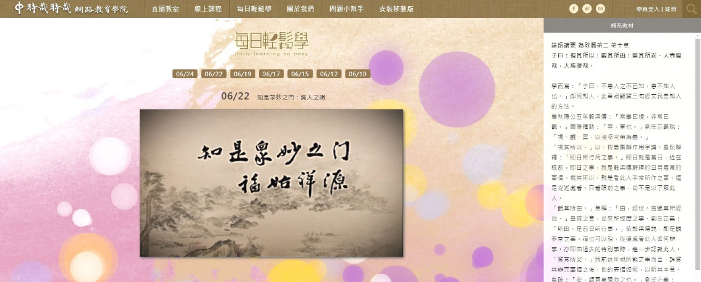

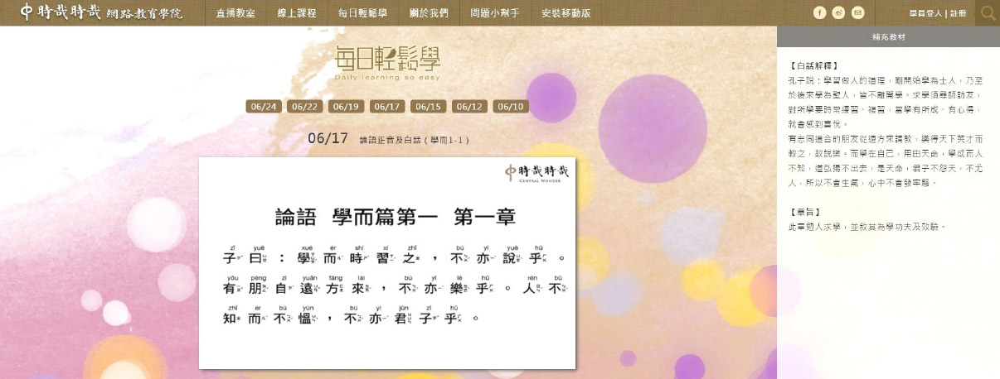

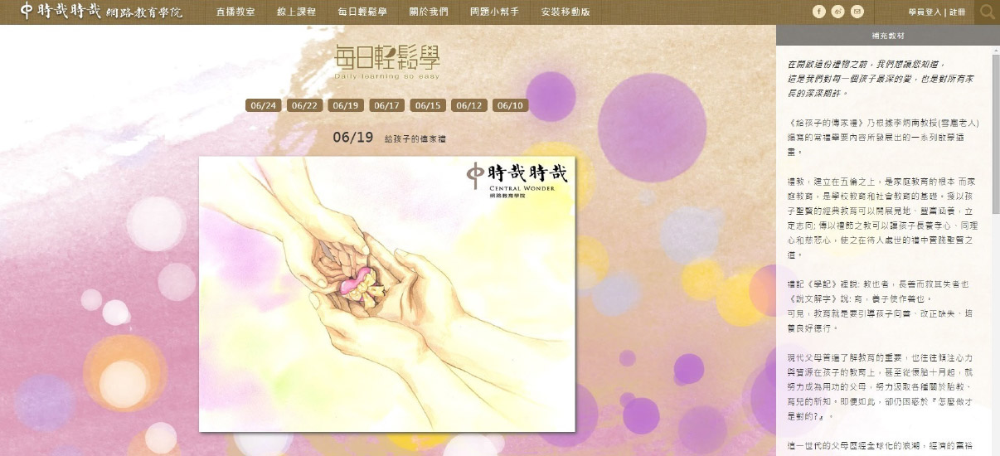

### 漸行漸悟—淺談學佛的內省之路

李珊

先祖典範照前程

質善心厚有法緣

願學雪廬儒佛見

漸行漸悟好未來

年輕的時候並不瞭解什麼是佛法，雖然藉了先祖父的因緣，從小跟在長輩身後燒香拜佛，但在那個生活比較貧瘠的年代，心中隱隱覺得燒香拜佛只是求個吉祥平安，或者說積攢一點福報而已，並不瞭解佛教的真實內涵。很多時候，牽絆在形形色色的瑣事和情緒裡，心不是靜的，帶著一份執迷於世俗瞋癡的心去念佛，或者是心有外求，終究無法品嘗到法露的三昧。

「何為佛，學佛為何？」成為我經常思考的問題。雖然閱讀佛學經典不難找到答案，但能否成為自己的人生航標，卻不是一件簡單的事。限於經驗和悟性的不足，我對佛法學習時常停留在義理的一知半解，做不到解行並進。看書的時候，似乎是當下瞭解一點，臨境歷事時卻又心隨境轉，無法化解現實裡生出的無明煩惱，始終不得佛法的利益。兜兜轉轉迷失困惑中，我逐漸意識到，沒有善知識的引領，只是望文解義，閉門造車的修學，佛法研習難免失之偏頗。

感謝臺灣來的蓮友們經常熱心賜教，而其中尤其受益的，是與唐瑜凌老師的因緣。唐老師在大陸廣結善緣，接引大眾研習傳統文化，接引有緣人由儒及佛。我也在亦步亦趨的學習中得到引領提攜。在他的開示下，我得以領略佛法的要義，感受到法喜的光輝。讓自己沉澱下來，時刻省察自己，及時提起正念，伏惑斷障，許多困惑也豁然開朗。終於在不惑之年，明白了「佛為心法，莫向外求」的道理，管窺到佛法的淵博浩瀚，佛說「萬法唯識」，佛法修的就是一顆如如不動的心。一切幻相都是心的變現。心淨國土淨，當帶著一顆覺察的心慈悲的念，在生活中歷事練心，能平和寬容，處事不忘菩提。我想，這也許就是佛法的精髓和法喜的光輝吧。

「何日能移千萬樹，舟車回到歷山栽。」這是先祖父的遺願，希望儒佛精神能在故土發揚光大。近幾年，借助蓮友們的各種因緣，我組織了以《論語》研習為主題的讀書會，學習國學的同時，隨緣引導對佛教有興趣的人，讓更多人有機緣走上菩提大道，當生成就。去年底，協助山東廣播電視臺開辦以《常禮舉要》為藍本的《寶貝學禮儀》節目，引導國學進校園，通過一系列活動讓數以千計的學生參與其中，取得了良好的社會效應，受到廣泛關注和好評。今年因緣巧合，我到祖父仕任十六年之久的莒縣、莒南等地，參與了祖父往生三十周年記錄片攝製的采風活動，走訪過程中，我驚奇地發現，有不少城中故老還記得祖父的風采，敬仰之情溢於言表。當地政府也讚歎祖父的行誼，提出舉辦一系列紀念活動追思雪廬精神，弘揚國學教化。

學佛二十年，年輕時也曾懊悔時光虛度。現在想來，心性的歷練不就是在這些坎坷崎嶇中昇華覺悟嗎？由對佛法的霧裡看花到現在的初窺門徑，在漸行漸悟中感受到智慧花開。我深刻體會到佛法猶如深夜裡熠熠生輝的燈塔，為黑暗中摸索行進的眾生引領西歸的行程。「百千萬劫難遭遇」，此生能夠得聞佛法，也算具足福德善根因緣了。我也愈感任重道遠，唯有以更加勤勉的心態和行動來弘法護持。

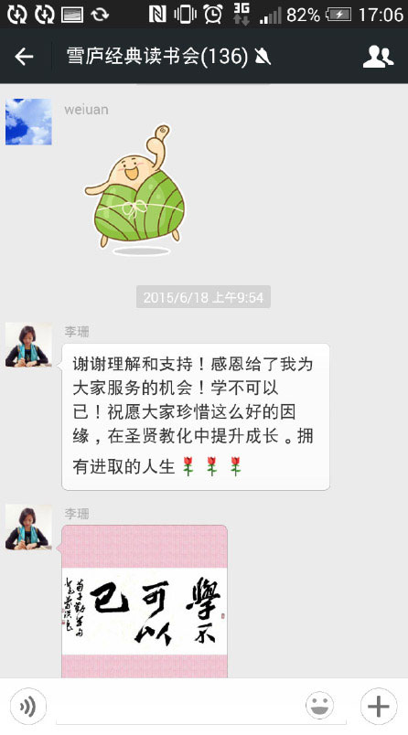

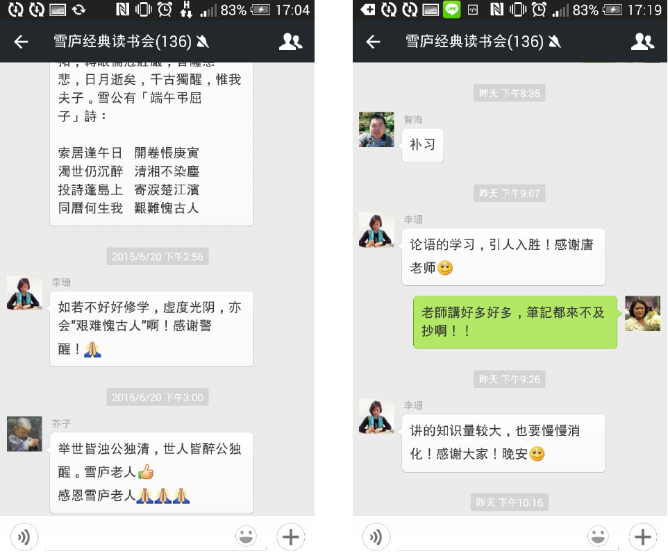

### 乙未年母親節福建放生活動

### 活動報導

淨本

六天瞥爾過

心緒綿延長

來時方知彼

成長向未來

母恩浩大，如何回報母親的恩德？學會每年在母親節這個重要的節日裡，總是會興辦各類活動，藉以紀念、報答、感懷母親為子女們的付出。放生法行是經常選擇的一個項目。藉由為眾生延命、皈依，解除各類眾生臨死極大的恐怖，是替母親祈福最好的方式。今年五月，我們同樣選擇了放生，結合大陸福建之行，在當地辦了三場的放生。這也是因為學會劉老師長期在該地發心推廣傳統文化的因緣，那裡有一群熱情、樸實、能吃苦、有公心、期望奮發向上，提升自我內涵的人，他們以學會指導老師為指導教授，長期聆聽「時哉時哉網路教育學院」的課程。我們懷著興奮與期待，開啟了這趟旅程。

五月七日，學會蓮友、隨行的李中旺導演，以及臺中蓮社陳建老師，一行四十多人從桃園機場搭乘廈門航空，下午一點抵達了福州長樂機場。一出海關，隨即看見順昌雪廬孔子研學會蓮友們的熱情接機，此外還有福建廣電謝晶思總經理、梁浩老師、李丹老師也在其中，大家都十分高興能再次碰面。這一行還有山東中孚信息公司的魏東曉總經理夫婦，他們特地從山東過來，全程參與這趟難得的善法之旅。

首先我們必須拉車四個半鐘頭前往順昌縣，猶如以往，這樣的車程正好是大家聆聽教法最好的機會。由於第二天就有放生活動，放生的意義、功德、方法、心態事關緊要，必須先行了解。在老師的說明下，大家再一次的串習放生法義，未曾聽聞的人，也得到了一次難得的體會。遊藝組的組員們，也利用了這一段時間，帶著大家同歡，吟唱生動、好聽的詩曲。四個多鐘頭的路程不短，但順昌蓮友們一路相隨，早就在休息站備妥了點心，等候我們前往享用。

臨近傍晚，我們抵達順昌縣要入住的酒店，同樣是受到熱烈歡迎，大家用過豐盛的晚餐，隨即前往順昌雪廬孔子研學會，進行雙方第一次的深度交流。學會門口站了一排身著傳統服飾，敲擊大鼓的人，轟隆隆地迎接我們的到來。研學會在當地新華藝術幼兒園的三樓，兩個組織都是同一批人努力付出的成果。大夥坐定，聆聽會報，更在此地聆聽了醒公老師特別錄製的一段講話，談話中一次次地勉勵老師，必定要發長遠心，把儒、佛的正知見弘揚出去。這一晚就在這樣富含意義的談話中結束。

放生法行安排在第二天的富屯溪、第三天的合掌岩以及第四天的大金湖。種類以魚類為主，另外還有飛禽、鼠類、蛇類，特別還有一隻猴子。學會在老師的帶領下，對於放生的各種細節都十分講究，放生時的儀軌、放生中的秩序，放生後生物的存活率，以及放生必須符合當地生態，絕無安全顧慮等，都是一次又一次的檢視與詢問。順昌的蓮友們，更提早前往各個放生場所，做場勘與各種的打點。由此可見一次成功的大型放生活動，是多麼不容易，凡能參與都應十分珍惜，有機會聽聞，更要好好隨喜。

第二天放生後，我們再次來到新華藝術幼兒園，這次的目的是參觀孩童們的上課情形，以及聆聽關於幼兒園經營的會報。雪廬老人斗大的題字「蒙以養正聖功也」，就在幼兒園教室外的牆壁上，這是興辦幼教最重要的目標，最有意義的所在。一邊享用著美味的點心，一邊聆聽葉園長的報告，在很短的時間內，聽完了他們這幾年辛苦的過程與成果，若沒有經驗過那般的辛勤，有那樣的發心，或許很難真正隨喜這一批人的努力。而後我們前往華陽山莊，此處的莊主也與學會師長熟稔，山莊風景秀麗，一行人有的爬山觀賞層層瀑布，有的坐在九龍廊橋上用點心、聊天，很快一個美好的下午就過去了。晚餐過後，我們欣賞了一場難忘的迎賓晚會。十項節目，早在幾個月前就已經開始籌畫，場地設備是那麼簡單，印象卻是那麼深刻，在歡樂中又結束了美好的一天。

第三天我們前往合掌岩，此處以山形似雙掌相合得名，在該地的放生，全部依照住持和尚上本下圓法師安排。除了放生，我們也參觀了尚未竟功的佛像石窟，萬佛莊嚴，讓人讚歎。在與師父座談後，前往這一天第二個行程，是邵武市非常著名的景點「天成奇峽」，全天然形成的峽谷，沒有人工鑽鑿，丹霞地貌，大家乘著竹筏，體會了一生中難有的經驗，猶如張九齡詩中所歎：「靈山多秀色，空水共氤氳。」

第四天以大金湖放生開始，接著便搭船遊走大金湖周邊景點，特別是看似山西懸空寺的甘露寺，全寺主體建築僅靠一根長柱支撐，十分可觀。接著我們前往九龍潭，再一次搭乘竹筏，循流而行，搖船人不時為我們哼唱山歌，歌聲與全線山光水色形成絕美的搭配。就在此處的遊覽將要結束時，忽然下了一場傾盆大雨，大雨中沒有慌亂，只有彼此互助的感動，還有順昌蓮友們遞送雨衣及準備薑湯的溫暖。晚餐過後，利用難得的空檔，大家分享了這幾天的心得，心與心之間再次交流、靠近。

第五天是旅程的最後一段時光，因為明天一早就要搭機離開福建回到臺灣。原訂這一天是要前往十分重要的一個景點「寨下大峽谷」。但規劃有了變化，原來從第二天，五月八日開始，中國十大比丘尼叢林道場，天湖淨寺的住持心亮法師，就來向唐瑜凌老師請法，師父在五月九日將有一場三萬人的法會，但仍老遠跑到順昌，希望老師務必前往寺院講話。就在這樣殷勤的期盼下，我們在第五天一早，改變行程前往天湖淨寺，先是老師在該寺對出家眾們的講話；而後又到沙縣的舍利塔，利用該地的能仁講堂，老師再講述了一堂儒學講座，與此結下殊勝的因緣，舍利塔上懸掛的風鈴在風中不停地搖曳鈴響，好似慶賀法音宣流，朗照人心。此次會談，師父深知儒學佛學的重要性，並對儒、佛的推廣注以深切的期盼，相信以師父的正知見、願力及影響力，假以時日，必能有所成就。

晚上來到白沙灣農莊，這裡的莊主曾來臺灣學會學習，也長期聆聽「時哉時哉網路教育學院」的課程。農莊的服務人員，都是溪源大學少年預科班的同學，彬彬有禮，十分可愛。體驗過農莊的遊樂設施，一行人再次享用了一頓非常豐盛的晚餐，賓主盡歡，難忘的旅程，終於要畫下句點。

每次聚會，都有其不同的因緣，而也創造了新的因緣，今年的母親節，我們以共造善法的方式共聚一堂，行程中有善知識提攜，有同法者的相隨，有美麗的景色，莊嚴的寺廟，巍峨的佛塔，在歡樂中累積了成佛的資糧，以此回報浩大的母恩。

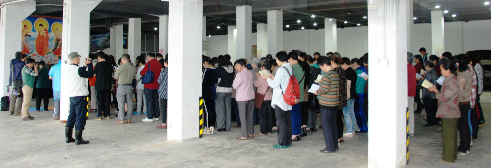

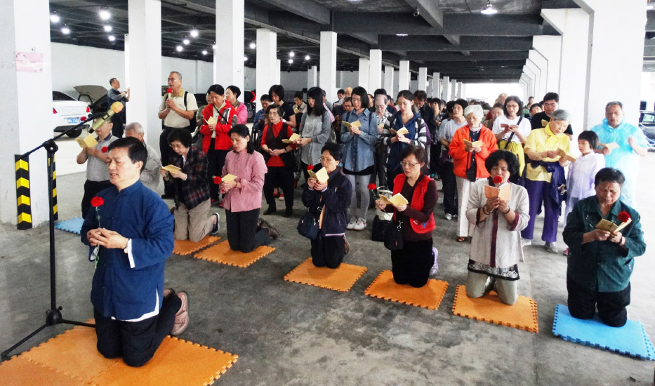

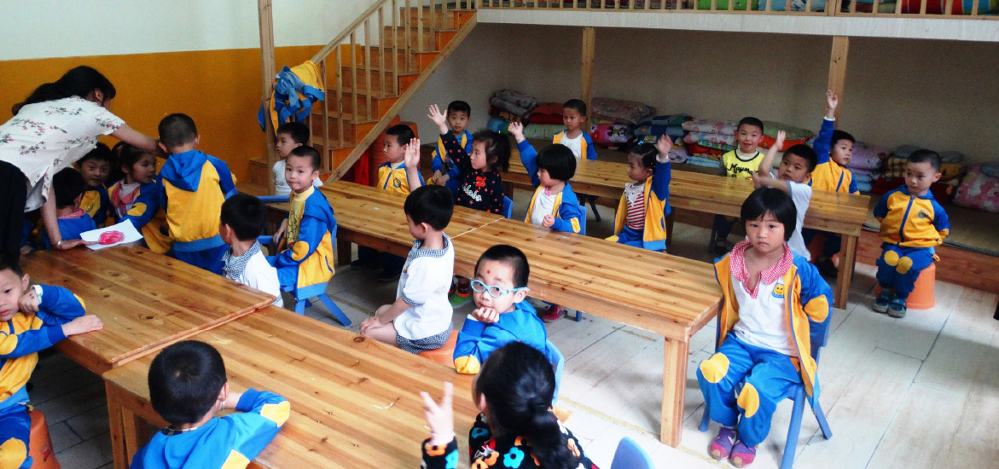

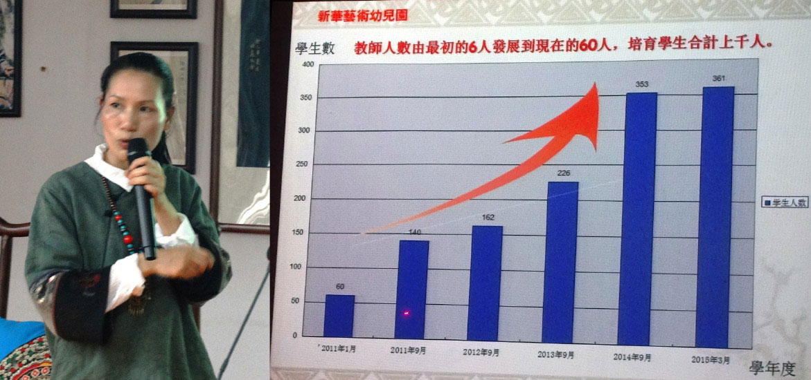

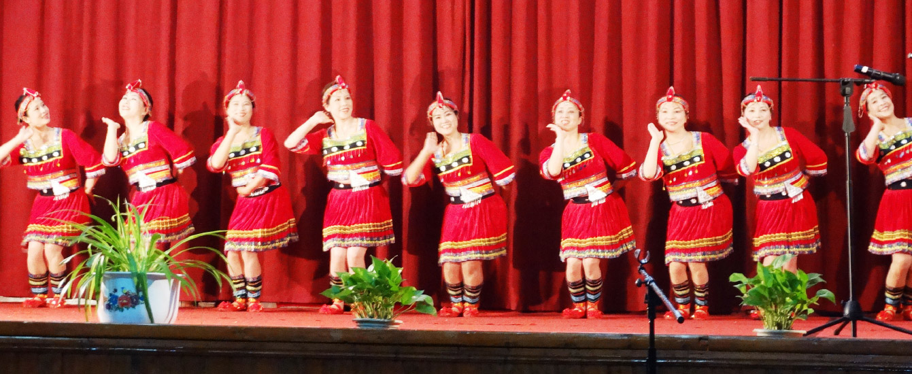

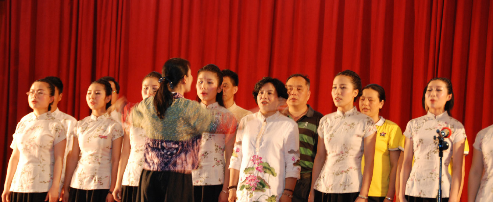

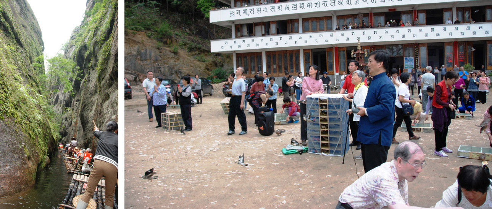

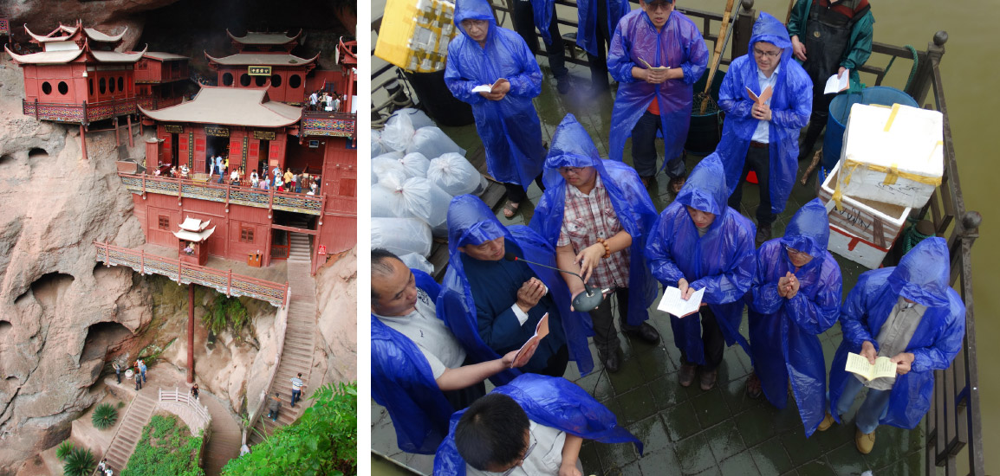

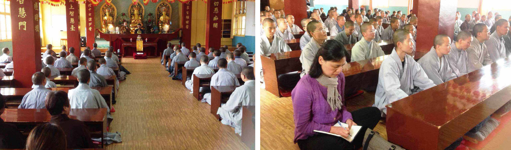

### 記錄放生淺談

淨治

放生法行常隨眾

胸懷萬物慈愍生

意樂加行及究竟

觀音大士心中坐

今年的母親節適逢跟著學會團隊參與大陸之行而不在臺灣，故無法陪八十八歲高齡的母親過母親節；但卻有更棒的因緣，就是為全天下的母親在母親節這天到大陸做放生的法行。

就末學個人而言，跟從兩位老師在學會裡，曾參加過無數次的放生活動，例如新店娃娃谷、翡翠水庫上游、烏來內洞山裡、谷關德基水庫、東勢新社、宜蘭頭城、澳底海放、馬來西亞極樂寺、緬甸仰光皇宮前等等，每一次的放生都讓末學有著不同的體會，也都會讓內心澎湃不已。

藉著此次五月七日至十二日，到大陸福建順昌參訪、郊遊、寓教於樂的因緣下，又正值母親節當天，能為全天下的母親，隨著大善知識行放生的志業，這是很特別的日子，禁不住心中的感動再次的升起。

蓮池大師在〈放生文〉中曾提及：「蓋聞世間至重者生命，天下最慘者殺傷，是故逢擒則奔，……何乃網於山、罟於淵，多方掩取，曲而鉤、直而矢，百計搜羅，使其膽落魂飛，母離子散……恃我強而陵彼弱，理恐非宜，食他肉而補己身，心將安忍。」由是在這殊勝母親節的日子裡，我們依著蓮池大師的教理，行放生之事業，這是多生多劫修來的善根福德，也是我人立身處世之良方，套句俗話說：福氣啦！

此次的大陸放生之行，首先得從學會飛往福建長樂機場第一天拉車開始談起，在往順昌四、五小時的車程中，老師在車上說了許多放生前行的提點，包括同樣一件事情心態不同，所做的結果也會不同，要把握機會勤放生，以及有儀軌的放生與不做儀軌的差別，當然不忘提到《金光明經》流水長者子用大象駝水，使魚縱使無法繼續活存，而升往忉利天後，回過頭來感謝流水長者子的故事。也不斷地提醒我們正知見確立的重要，法要活用，放生就是救命，我們的慧命也能與大眾生物結法緣，團體的放生因緣更是難能可貴要善加把握。

老師也請臺中蓮社陳老師就其長年的放生經驗分享大眾，他說道：過去每月一次在七股出海口潟湖的外傘頂洲放生，先將沿海的深海魚幼苗在放生前，用淡水和海水相混合的水注入，讓水鹹度適宜魚苗的生存始行放生。而放生前幾天工作人員會到放生的現場探勘，且選擇適合放生的魚類，才一一將魚兒放生，如果在途中垂死的魚兒則一到放生場所，當機立斷二話不說，選擇馬上「放」。所以在行放生這法行，鮮少有讓魚兒死去的情況發生。後來到蓮社十年來至今，仍持續進行放生的活動。

因之，老師再次的提醒，我們放生要講究很多的因緣，包括放生的魚種、畜牲、鳥類等等的存活率與有情眾生結緣，而殺害是與生物結最大的惡緣。若在因果觀修上越講究，我們可受用的法緣則越殊勝。挑選適合的方法，引發對法的好樂與增上，針對時間、氣溫、地點、當地的環境，以及自己在心態的調整、面對社會認知的觀感等，不時作為心中的提問。觀修放生與六度法行的結合，放生做三輪體空的觀察，空性正見是因果的莊嚴，我們越具足正知見，放生則越殊勝。般若正見讓我們不執著，對現象十分講究，清楚生物種類的適宜性，佛教若違反人性則將不易長久。

四、五小時的車程到順昌已經是初夜時分，用完晚齋後到新華藝術幼兒園與會，就寢時刻已是深夜，為了明天富屯溪的放生，心情愉悅且興奮。早起驅車前往富屯溪畔，在一處汽車廠靠溪畔的空曠處，順昌蓮友已備妥西方三聖聖像、莊嚴肅穆，鮮花供品擺滿三寶佛前。依照往例唐老師會帶領著在場的蓮友大眾們，就放生的利益及戒殺放生的功德，做法義上詳盡的解釋、隨文入觀，以及請蓮友大眾依著維那、悅眾的引領下，唱誦放生儀軌本中的香讚、持誦大悲咒、心經，啟請、稱名、說法、生相、滅相、懺悔、皈依、發願、求願、回向等法行，最後在大眾阿彌陀佛的念佛聲中，老師為在場的生物灑上大悲水後，抱起順昌謝園長家中所飼養、不願轉賣好大的鯉魚，慢慢地將牠放入溪裡。

隨著誦咒生起的當下，天下起了傾盆甘露法雨，這正適合魚類生物的習性。也聽到在地的蓮友說，順昌已經很久沒下雨了，每次他們放生都天氣晴朗，縱使有下也是幾滴而已。迎接甘露法雨，順昌蓮友很用心的為大家準備雨具，穿著雨衣及救生衣，跟隨著船筏駛向溪中，船夫避開所有可能網捕的魚網，讓大家順著水勢將魚兒桶桶地放入溪中，看著牠們一一的回入溪裡，有些則回頭張口似乎在述說著牠們也得到聞法的喜悅。大雨淋濕了每位蓮友的臉龐，好似歡悅的為這些魚兒們游入溪中喜極而泣，令在場學長們法喜充滿。

每每觀想這些放生法行，都是不同次的親身體驗，緬甸水中佛寺放生大頭鰱魚各個張口的場景歷歷在目，與今之行均是何等的令人歡悅及殊勝的因緣呢！可以將要被網捕的溪海鱔魚蝦類、將被食啖的飛禽鳥類、蛇獸群畜等等生物，助牠游入溪海、飛向天空、竄入叢林，這著實是百千萬劫難得的因緣。

五月九日早上，順著蜿蜒的山路，參訪山形如雙手合掌而得名的「合掌岩」，照例老師帶領著大眾，隨維那悅眾做放生儀軌的法行後，接著請所有在場的母親、女性都站在所放生物鳥類的旁邊，佛號聲綿綿密密地不間斷，一聲「放」，群群斑鳩、布榖、麻雀等群鳥騰空飛去，自在翱翔於湛藍的天際，鳴叫不已，好似回應答謝解脫的欣喜。另有幾位男性學長，則拎著松鼠、蛇、獼猴等爬蟲類前往山中放生，這不但顯現學會團隊的默契，更重要的是讓這些生物可以藉著放生法行、佛力加被的順緣頤養天年，願牠們來世可以如戒環禪師有學佛的法緣。

五月十日清晨約四點多，有人敲門聲，開了門，方知是順昌蓮友要找夥伴，準備去採買今天大金湖放生的魚類。在老師們幾年的耕耘下，他們也形成的一群隨順教理的合作團隊，曾聞為了此次的學會到訪一切順利，誦一○八部《地藏經》為我們此行作回向，這幾天他們不辭辛勞地為我們打理隨行的一切，時值至今，心中仍充滿感恩之情。

當遊船駛至大湖中，放生法行開始，在船內船外佛號聲不停歇，大家井然有序地將一袋袋的魚兒在船頭、船尾放生。為了如母的有情，此次在老師的帶領下有三次放生的因緣，將此三次的放生之行作圓滿的回向，利樂法界一切有情，法喜充滿、光壽無量。

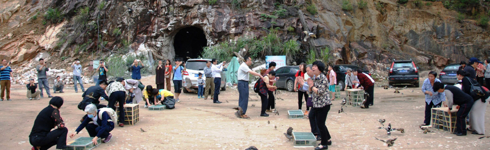

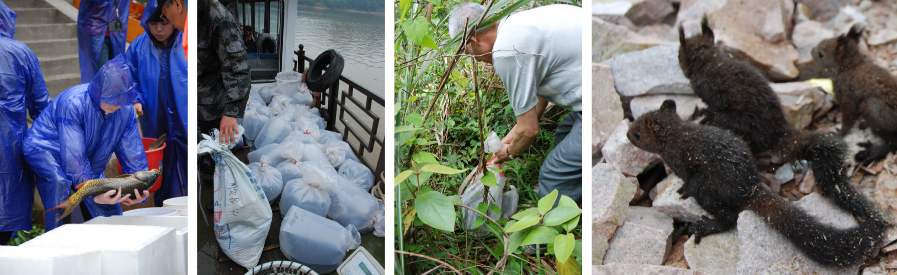

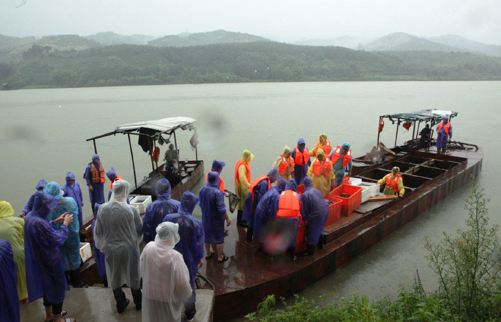

### 立夏閩北行與修淨土法門有何關係

淨印

家庭佛化三代情

積善之家有餘慶

累積深厚福與德

蓮開上品百年後

在臺灣進行大型放生活動的條件已愈來愈不具足，而種種善法中放生這一法，既可長養慈悲心、與眾生結上殊勝的善緣、在因果上結合有法觀修，又可袪病延年，尤其特別能在孩子心中種下善種子，故此次閩北放生能成行，實為參與者之福，若非老師的慈悲、福建蓮友的護持、及玉霞師姑居中的辛苦，怎有今日大家的「出發」？

猶記得時序一進入五月，末學就將三個較大的孩子叫到跟前，當他們是大人一樣跟他們談兩件事，第一、隨團體出門該有的行為表現；第二、要自己收拾衣物，準備五月七日出發前往大陸放生。老大和老三都只有一雙鞋，因需一雙備用鞋，姊弟倆得到了再買一雙鞋的機會，兩人都好興奮，很有要出遠門的感覺。二女兒很明理地帶了大姊穿不下的舊鞋，三人都沉浸在可以搭飛機喝汽水的喜悅中。

與孫兒們的滿懷期待相比，阿公不只淡定，而且因感冒未癒、體力大不如前，開始想怎麼樣可以不要去，阿嬤從叨唸老伴要提起作善法的意樂，到調整飲食、補充營養，花費許多心思，總算讓我們一家三代完成頭一遭結伴出國放生的「壯舉」。

我們家報名七位來了八個，一個在末學肚子裡，算是夾帶過臺灣海峽的吧！這一路多虧許多蓮友的幫忙與協助，我們一家老小才能順利走完全程，加上順昌蓮友設想周到、凡事打點，可謂賓至如歸，這也是跟著老師出門才有的福利。為了不辜負師長的悲心與眾人的付出，不能白白地享受美好風光與豐盛食物，要好好觀修，汲取修學的養分，末學愚鈍，提出一二，做為對大眾的供養。

一、積極造善

老師教我們學習出世法時，要懂得將世間法的覺受拿來用，例如世間人做善法的心力，若有追求世俗的用心與付出，那怕是十分之一、百分之一甚至萬分之一，也是成就非凡。的確，君可見世人有漏夜排隊搶票之舉，但有善法可做時不一定漏夜報名，因為還要考慮考慮；君亦可見世人貸款買車、買房甚至消費血拚刷爆信用卡，但做善法是有餘力才做。所以有時反觀自己的心，會發現：哇！差點兒被矇了！一本萬利的投資不懂得做，損失太大了！過去的觀念應該好好檢討檢討才是，善法絕不是「行（財）有餘力，則以造善」。

再者，自己造善還不夠，要共造善法，沒有團隊的力量，放生豈能以「噸」計？不是苦了生物（等被放生等到命休矣），就是苦了自己（就算腰閃到手脫臼也未必能完成），歡喜心如何生？既有團隊，有他人，正好可以修隨喜心，看到別人造善很高興，甚至比我自己做還更高興，他人造善愈多愈殊勝我就愈隨喜。如父母愛護子女的心天經地義，子女青出於藍更勝於藍，為人父母只會高興不會嫉妒，父母的歡喜甚至比孩子本身還要強烈。

組成佛化家庭，好處多多，除了可以共做善法，還可以將身為父母的覺受用在學佛上，一般父母捨不得孩子吃苦，學佛後便知還要去細究這個苦是甚麼苦、它真的是苦嗎？還是培養能力的必經過程？有的苦很好應多多益善、有的苦是浪費生命不吃也罷，最重要的是吃苦也要在正知見的攝持下，才不是白白吃苦。甚麼苦最好？為大眾服務，特別是為法行人，看到孩子能為公發心，父母應深感欣慰並感謝三寶加被與善知識攝受，切莫當孩子的軟冤家，在家時呵護晚輩，沒讓孩子好好盡孝修福，出外時自己當義工，卻捨不得孩子流汗出力，看不到透過磨練、能力增上的那一分，殊不知做善法也是要有能力的。如果能有因果正知見，看到孩子為公發心愈誠，自己就愈發高興，愈發護持他去為公發心，而且對公家要能觀功念恩，感謝給予機會，那麼就是一最好的良性循環。

二、消極斷惡

眾惡之源是我們的煩惱習氣，在合掌岩的石窟中，老師說道：「他人傷害我，他就是我的仇家嗎？非也，他傷害我是因他無法降伏自身的煩惱，我若誤將此人當作我的仇家，那就是弄錯對象，他的煩惱才是我的仇家。」人與人之間的恩怨若能以上述道理來梳理，不是離解冤釋結更進一步嗎？其次，對象若沒搞清楚，怎麼找對治法？再者，不明白箇中道理，等念怨親如何做得到？

在景緻優美的九龍潭下了一場大雨，多數人都淋濕，末學當時只想到回旅館要怎麼處理溼答答的衣物，事後才想到對那場雨沒有好好做觀修，太可惜了！一場雨洗淨大地塵埃，又何嘗不是洗淨我們的風塵僕僕？我們帶著煩惱習氣，風塵僕僕的投生人道，何嘗不願除煩惱熱得清涼？雨來時做除煩惱想，豔陽天時外在熱內在不熱，心清涼故，若是出太陽嫌熱、下雨嫌麻煩壞興致，殊不知熱或不熱哪有自體性，煩惱在作怪，心隨之而轉，再妙的勝景也無法受用。

在修學淨土法門的路上，這一趟閩北行代表甚麼意義？淨土法門以念佛為正功夫，止惡修善為助功夫，若我們在因果正見的攝持下做善法，同時又懂得對治自己的煩惱，那麼這就是一趟斷惡修善之旅；若我們能體會到同行善知識的慈悲攝受，以及與同行善友的歡聚一堂，做諸上善人聚會想、殊勝難得想、感念恩德想、皈依三寶想，這就是一趟增福增慧、堅固道心之旅。

### 閩北放生知性之旅

心祿

一場啟蒙活動緣

五年相續成果現

相聚順昌文化情

他山之石團體興

此次順昌、泰寧之行，意外增加了沙縣的行程，六天的旅程充滿驚豔、感動、感恩卻也心疼的感覺。

驚豔的是大陸蓮友們的精進與辛勤耕耘的成果，在胡會長、葉園長短短數年的努力下，感動了陳秘書長官方的傾力協助與支持。不單幼兒園的口碑已成了福建省幼兒學習的典範，學生日日倍增，研學會的儒、佛學習水平之提昇也讓人讚歎；而最令末學驚訝的是，助念的風氣也在當地隱然成形。

感動的是順昌、福州及各地蓮友們的熱情、好客與真誠。經過數日的放生法行、參訪與大陸蓮友們的互動中，末學深深體會到大陸蓮友們從篳路藍縷、咬牙苦撐一路走上來，憑藉著就是那一股對中華文化內涵的嚮往與渴求，那一股捨我其誰的使命感，那一股對唐老師、林老師由衷的佩服與尊崇！除了感動還是感動！

而且，從福州長樂機場落地，一直到六天後清晨的離境，各地蓮友們對我們在餐飲、沿途上的照拂無微不至！「華陽山莊」的迎賓晚會更印證了順昌蓮友們不分老幼力求最好表現的團隊精神，數月汗淚的排練，居然是「為了報答師恩」！令吾輩真的汗顏！

由於上心下亮 法師連日懇切的啟請、唐老師以悲心呼應，臨時取消了寨下大峽谷的旅遊，轉往沙縣現為大陸十大叢林之一的天湖淨寺，由唐老師向該寺尼師們開示「儒佛和合」的殊勝利益。匆匆午膳後，大眾即驅車趕往「舍利塔」聆聽唐老師對當地錙眾（含官方人士）的第二場三十分鐘的開示。這也顯示大陸各方無論是叢林、民間甚至官方對於中華文化精髓的求知若渴、佛法教義的弘揚真的是如火如荼地在推動。唐老師嗣後有感而發，引用弘一大師「悲欣交集」四字來形容他對學會未來前景的憂喜參半、對人才傳承的期許更為殷切！

此次六天的行程中，是末學多次跟隨老師出訪東南亞各國及大陸最最輕鬆的一次！但也不得不說是有些遺憾！因為例來老師在遊覽車上會觀機逗教，傳授儒佛教法、為大眾釋疑、開長智慧。然而此行因故殊少同車，大眾內心其實頗為悵然若失！

至於何以「心疼」？心疼兩位老師幾乎很少休息，從早到晚忙於主持法行、開示，對於大陸蓮友們的熱情，更是殷殷的不敢輕怠，即使勞累、不適也強撐了好幾天，數月來的細心調理在此行中明顯消磨了甚多！

近年來由於學會法務蒸蒸日上，來自海內外邀請兩位老師前往講學的邀約不斷、「蓮榮月刊」及網站內容的不斷充實、加上各種講座科判的編撰、以及定期的各項拜懺法會，尤其是「時哉網路直播」，都給原本就人手嚴重不足的學會執事同仁，及年輕學長們增加了許多工作負擔。諸位的任勞任怨，令人激賞，衷心感佩！惟更盼各位忙碌之餘，對兩位老師的照拂上把標準提高，隨時提醒兩位老師「為法忘軀宜適度、身安道隆方久遠」，那才是真正的功德無量啊！感恩無盡！

### 珍惜閩北行

法蓉

偏遠山區小縣城

臨江環山宣城景

謫仙流連人情味

千里相聚志道合

有幸又一次隨著老師到大陸放生旅遊，我們的行程都有善法結合，非常充實，法喜充滿，不論是放生或是遊湖，大家都盡興，甚至碰上一場大雨，淋得全身濕透也不遺憾，感覺好像菩薩的甘露水洗淨我們一身的罪業，頓時心中清涼自在。

五月七日午後時分，所搭乘的廈門航空班機緩緩降落在福州的長樂機場，短短一小時又四十分鐘就從臺灣飛到這裡，整理好自己的行李，辦妥出關手續，換坐大巴士準備前往此行的目的地，順昌是福建一個偏遠的小縣，人口不多，但空氣清新。巴士行經快速路段後，沿著一條大河的河邊公路前進，由車窗向外望去連綿青山伴著流水，一幅活得美麗的山水畫就在我的眼前呈現，車子開著，不知不覺五、六個小時過去，來到下榻的酒店，這裡環境優美，依山傍水，卸下背包，吸一口新鮮的空氣，疲累減輕了。

文化可以洗滌人心、文化可以縮短人與人之間的距離、文化可以化解仇恨，兩地的人心是沒有隔閡的，只有包容、只有愛，大家都用最真誠的心來相待。幼兒園門口的一陣鼓樂隊響徹雲霄，他們這麼熱烈的方式來迎接老師，好感動。之後隨老師上樓到會客室，菩薩們已經準備好點心等候大家的到來，他們每一位的臉上都掛著笑容，充滿歡喜與期待，我們是托老師的福，內心很惶恐。

華陽山莊的迎賓晚會，節目精心排演讓人耳目一新，小朋友的千手觀音，幼兒園老師表演的「重回漢唐」音樂氣勢磅礡，使人內心澎湃，社區老人表演純熟戲曲，熱誠恭敬的心都在表演中表露無遺。胡會長、陳秘書、魏總、林總等，一路隨行護持，還一一向老師報告他們學習的過程以及對將來的展望，甚至師父都祈請老師去講學，看著他們積極求知的精神實在可敬，讀書會也很努力的推動，而且參與的人也很多，他們渴望文化融入生活，注入每一個人的心中，人人都充滿著愛，人人都有禮，達成社會和諧快樂，老師說他們是旭日東昇，是有跡象的。

人的一生失去的太多，但都沒有覺察，因為我們生活在優渥的環境，從不知失去的苦痛，生在福中不知福，更體會不到因緣稍縱即逝的無奈，雖然老師就在身邊，可是雖近亦遠，認為這個緣永遠會存在，積極求知的心提不起來，然而大陸的同學，一星期一次的遠端教學，他們很珍惜，他們學習的勢力非常強烈，所以老師雖遠亦近。有一天放生法行結束後老師說了一句話：「大家回去要上緊發條」，不然就得反向他們學習了。

順昌只有四、五年的經營，就有如此的成果，令人刮目相看，老師在台灣播種，卻在大陸開花結果，真不可思議，現在我們立足臺灣，老師就在身邊不能再錯過，因緣過去就過去了，再現的因緣也絕對不會相同，願我們珍惜因緣不要空過了。

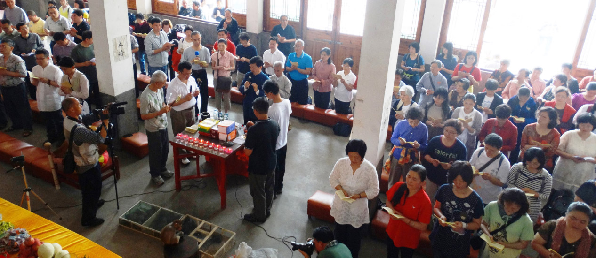

### 六天閩北放生交流知性之旅

姿云

山川景色在人文

一行順昌深厚緣

看他成長回觀己

要為載舟作大洋

從車輪滾動起，為期六天的閩北放生知性之旅就此展開。

我想，這是體力最舒適，心靈卻震撼的一趟出國經驗。為期六天的行程，想以心中的感覺分為三大部分，其一是結合母親節所舉行多次的放生法行；其二是貼近山水自然的旅遊活動；最後是順昌傳統文化的心靈饗宴。由於出國的時間正逢一年一度的母親佳節，為此，我們在福建的六天行程當中，有著多次殊勝的放生活動，包括第二日放生數量為之驚人的魚，第三日在合掌岩放了鳥、蛇還有獼猴，第三日在大金湖同樣也放了魚。

在這次放生法行當中，不同以往的是多了順昌蓮友們的一同參與，甚至到後來一次的晚餐心得分享中，才知道第二日我們放出數量為之驚人的魚部分來自一位蓮友家中的魚池。令我動容的是，那位蓮友把家中整個魚池裡的魚都拿來供養我們的放生法行，每隻魚都肥美健康，甚至有些體型大到需要一人懷抱，但是牠們的命運都不是淪為市場或人們的俎上肉，而是成就我們放生殊勝功德的福田。

山水自然的旅遊活動中，讓我體會到了福建的力與美。雖然僅僅六天的時間，但在每一天當中無不是在以小處見大處的心態欣賞每一隅風光。像是第一天和第二天我們夜宿的三松大酒店就位於順昌富屯溪畔，早晨都可先從房間窗外豪邁的富屯溪再配以發出陣陣笛聲的長條火車餵飽一日所需的精氣神。

第三日我們走訪的合掌岩因山形如雙手合掌而得名，當日我們拜訪了合掌岩頂西安寺的住持法師，有了小段的座談，並且觀摩位於寺旁的一座石窟，該石窟係由住持法師發心所建造，能有多少的金錢就鑿多少尊佛像於石窟中，在石窟中的佛像各個莊嚴無比、巍峨聳立在眼前，駐足裏頭不禁讓我有種想要落淚的感動。這種感動來自於無比的歡喜，這種感動來自於敬佩，這種感動來自於眼前說不出的震懾。石窟還尚未完工，希望未來某天能再次駐足此地，見到它完工後的勝狀。

另外，在此行中有了兩次乘坐竹筏的體驗，一者是在邵武的天成奇峽；二者是在九龍潭。所觀皆是景色奇特的丹霞地貌，輔以珍稀植物遍布，加以九彎十八拐的曲折水線，讓我第一次見到了水上一線天，甚至還有經雨水腐蝕、泉水沖刷而出現的觀音像、彌勒像、如來掌等等岩壁奇觀，在船夫濃濃的方言歌聲中畫上句點。

而第五天，有了一趟去天湖淨寺殊勝的機緣，天湖淨寺是中國十大叢林道場之一，裡面的住持法師更是中國的前十大排名，因為聽聞唐老師的到來，縱使明日有三萬多人的法會，依舊陪我們一行人一整天的時間，甚至請老師到他們莊嚴的道場講課，旁邊就是巍峨聳立的舍利佛塔，一到此處便能感受到他們井然有序、莊嚴的道風，這樣殊勝的道場、位尊的法師重視的是儒學和佛學的結合，尤其怎麼在傳統文化儒學這塊去整頓道場，和大眾結合。在此，我看到了傳統文化的萌芽。

最後這一部分，是我傳統文化的心靈饗宴。因為傳統文化，搭起了順昌和無盡燈學會的友誼橋樑，足足六天時間當中，每一天都品嚐出順昌蓮友對我們的誠摯之心，一百零八部的地藏經迴向我們一路平安、三部車子六天緊緊的隨行、每日餐桌上總是超量的菜盤，因為是餐廳內部再加上順昌蓮友所準備的、第一晚在鼓聲雷動中如皇帝駕到般的歡迎儀式、提供自己家中的魚作為放生法行、整頓自己的農莊就為了邀請我們的到來…上述的種種都已超出我心中感受所能承受的負荷。

在第二日我們下午至新華藝術幼兒園所觀摩，一次不經意中，正好碰見一班老師帶著孩童出來上廁所，老師端莊溫和的領著隊伍走在前頭，而孩童們像是精靈般乖巧安靜地列隊跟在後頭，這幅景象在我記憶中，只出現在學會所舉辦的寒暑假心靈成長營當中，如今在大陸卻如實的呈現在我眼前，相當的吃驚。整個幼兒園觀摩下來有無限的感慨，感慨裡頭的幼兒數量宛如臺灣的一間小學學生數量，而臺灣卻不見這樣氣象，然而卻也敬佩裡頭的師資們都有接受經典、傳統文化的薰陶，並且將之精神作為教學方針使之在這所幼兒園內醞釀而生。

傍晚，華陽山莊的迎賓晚會在十項表演節目中讓大家眼睛為之一亮。從二胡笛子等迎賓曲到畬族舞蹈，從藏族舞蹈到大唐舞蹈，從小朋友的千手觀音到老菩薩的黃梅戲曲看得出他們卯盡十足的準備以及對我們的用心，大方熱情不矯態的呈現，表演水平真的不輸專業水準。最後一晚一行人被邀請至白沙灣農莊作客，其中有各式各樣性質的活動包括射箭、電動平衡車和高爾夫球等，然而在這農莊中的晚宴卻占滿了我整個農莊的記憶，並不像是飯店華麗誇張的餐點，但每樣餐點卻都可以嚐出無比溫馨的味道，手工的蛋塔、有機的蔬菜等等，每道餐點都有它一段溫暖的故事，沉浸在大家歡愉的歌聲當中，心熱熱的，而眼眶濕濕的。

「只有去的人才真正知道當下的感受」。以前聽到這句話，總是習慣性地讓它從耳邊滑過，然而隨著年齡的增長，了解到和學會一起出國機會的難得，自己在每一趟行程中的體會漸廣漸深，才真正知道這句話的奧妙。這是一趟身體最輕鬆的出國行程，因為身為大專生該服務的機會，都被順昌蓮友們搶過去做了，而且做得更好，更無微不至。因為他們誠摯、用心款待也讓我受寵若驚，爸爸說今日我們有如此的待遇，皆是沾了唐老師的光。這也讓我想到了狐假虎威這句成語，自己就如同狐狸般走在唐老師的面前，不是因為自己有多厲害，而是因為在唐老師的帶領下，在無盡燈文化學會這個名稱庇護下，才擁有了這六天令我震撼的心靈饗宴。

雖然是第一次來到順昌，但是從師長們的口中可以清楚感受到，順昌這個地方已經像海綿一般，不斷的在吸收，不斷的在膨脹，從不懂的禮儀到如今禮數周到，關懷備至。華陽山莊晚會一行人出來進巾奉茶更讓我嚇了一跳，他們求法的心態、尊敬傳統文化的心態讓他們不斷的進步，學習效率大大提升。爸爸說：「我們是雖近亦遠，他們是雖遠亦近」，這句話我深深認同。許多時候因為太容易得到，所以我們不懂得珍惜；許多時候因為近在身邊，所以我們反而因此盲目；許多時候我們總以為山川依舊，卻有海枯石爛的一天。學習如逆水行舟，不進則退。

六天行程下來，心中的聲音再次提醒了我傳統文化的可貴，心態決定了一切，只有當自己心中真正認可傳統文化的重要，才能使自己在文化道路上像海綿般不斷吸收，讓自己成為承載文化行舟的大洋。

從車輪滾動停止，為期六天的閩北放生知性之旅就此先暫時畫上一個休止符。

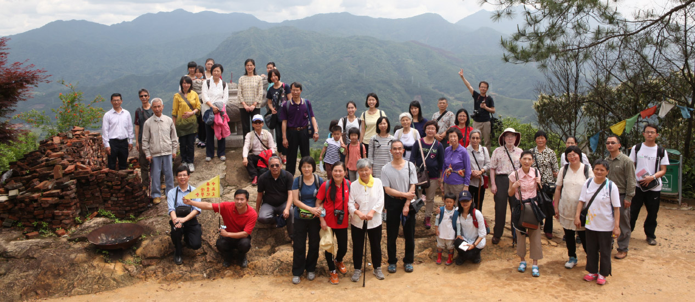

### 成功的秘密 ─ 順昌團隊的過現未

胡會長、葉園長

遺忘山城熱情燃

連串火花驚來客

士別三日刮目看

雪廬當年寶島心

順昌雪廬孔子文化研究會　　胡會長

中華文化博大精深，我愛中華我愛文化，子曰：「吾十有五，而志於學」，而我是五十才志於學，遇到中華無盡燈文化學會，唐老師團隊是改變我們順昌人民學聖賢文化的命運，唐老師以報師恩的精神和願力，推廣儒家文化精神回歸大陸，傳承命脈培養我們內涵，格局，見地，正知見成長。

我們順昌從農曆二○○九年十二月十七日第一期冬令營開始到現在，當時我們什麼都不懂，什麼都不會，什麼都不知，想當年真慚愧！是鄉下野人一個，對古文一竅不通，只知道這聖賢文化是好東西，我們一群朋友志同道合凝聚在一起跟隨唐老師學習聖賢文化。這幾年的成長，雪公太老師提倡辦幼稚教育童蒙養正的重要，人生從幼兒開始訓練培養他們，見地，格局，內涵，正確知見，胸懷用聖賢文化薰陶，順昌縣新華藝術幼稚園小朋友真有福氣，他們每天一進門就向至聖先師行禮，向雪公太老師行禮，從小培養他們善根福德，知書達禮，到新華藝術幼稚園聽到童聲是朗朗上口《論語》丶《三字經》丶《千字文》丶《弟子規》、《常禮舉要、《唐詩》等讀書聲，禮樂教化，這一切都感恩唐老師團隊，無私奉獻。

養兵千日，用兵一時，這幾年跟隨唐老師學習成長，順昌縣成立雪廬孔子文化研學會，順昌縣時哉時哉讀書會，新華藝術幼稚園，順昌縣蓮友共修會等，老有所終，幼有所長，壯有所用，得到唐老師厚愛。

今年五月七號至十二號唐老師團隊要到順昌來，我們大家聽了無比激動、歡喜！當時我們接到任務戰戰兢兢，還好平時跟隨唐老師讀書，教我們辦事應對進退，人事物，體相用，入太廟，每事問，上傳而下達，這樣的切磋琢磨共事，都是由讀書會學習凝聚仁心力量組成團隊，一場活動是歷練我們心性耐力，應變能力，眼觀四方，耳聽八方，一個細節都不能輕視，通過這次活動，我們大家辦事默契配合，做事時感到身累但心不累，大家都法喜充滿，都有進步，那就是文化的力量，想到當年孔子有教無類，子路，高柴等平民百姓都被孔子教成人才，我們從不認識古文，到現在認識論語、也會唱唐詩。選擇老師很重要，但是還有很多地方做不到位，請唐老師等各位大德批評指正！感恩大家！祝福大家吉祥平安！幸福快樂！

順昌新華藝術幼兒園　　葉園長

二○一五年五月七日至十二日，順昌縣新華藝術幼稚園迎來臺灣中華無盡燈文化學會最尊貴的上賓：恩師、師母、劉老師、以及諸位大德蒞臨我園，對幼稚園的工作進行全方位的指導。恩師、師母的諄諄教導學生銘記在心，這是人生中最為珍貴的時刻，幾天的學習內心無限感激！收穫如下：

一、回顧既往，童蒙養正。

記得二○一○年二月第一期啟蒙班，老師在職中的講學時說過，辦讀書會的重要，辦政治是為了推動辦教育。教育事業目的最終是培養人才。在二○一○年十一月，順昌雪廬孔子文化研學會和讀書會同時成立了。二○一一年二月，新華藝術幼稚園也成立了。跟隨老師近六年來的學習，深深感受到童蒙養正教育的重要性，唯有讀聖賢經典才能解決當今教育的困惑，才能讓孩子身心健康的成長。

二、經營園所，明確目標。

辦園五年多來，感恩恩師、師母精心的指導，劉老師數十次來到順昌全方位的傳授，讓我們辦學有了方向和明確的教育目標，懂得把「品德、讀經、健康、藝術」落實到教育教學中去。在學校的教育教學中，讀書會是非常重要的，因為有了讀書會，有了家長、老師、孩子的共學，是提高學校教育教學的關鍵。

每週一和每週三的共學成為家庭教育的前提，學校的教育和家庭的教育融為一體，才會有和合的、龐大的辦事團隊。大家在辦事的過程中才會有共同的知見，障礙就會越來越少，順境會越來越多，內心充滿了法喜，人才才會呈現。照著老師的教導，讀書會是靠不斷的聽聞去經營，聽聞過程中卻要靠有正知見的老師來引導。

三、深入內涵，依教奉行。

透過跟隨老師的學習在教學過程中品德的教育是童蒙教育的基礎，經典的教育為主軸，融入到各科的教育教學中去，這樣的教育教學才可觀，技藝的學習才有內涵。唯有好的老師才能教出好的學生。唯有見地、有格局、有氣象、有內涵的老師才能把學生培養成人才。唯有透過不斷跟隨老師的學習，充實自己的內涵才會使自己變得有見地、有格局、有氣象，人生才有出路。

總之，透過這次老師的指導，學生才知道有許許多多的不足，當下學生會努力學習，充實自我，帶好團隊。今後在幼稚園課程上的設置會更加完善，會更加注重孩子經典誦讀方面的教育，來促使幼兒語言學科的發展，注重孩子音樂律動的訓練，來提高孩子的節奏感，加強蒙氏操作方面的學習，來提高孩子邏輯思維能力方面的培養。報告有不當之處，請恩師、師母指正批評。

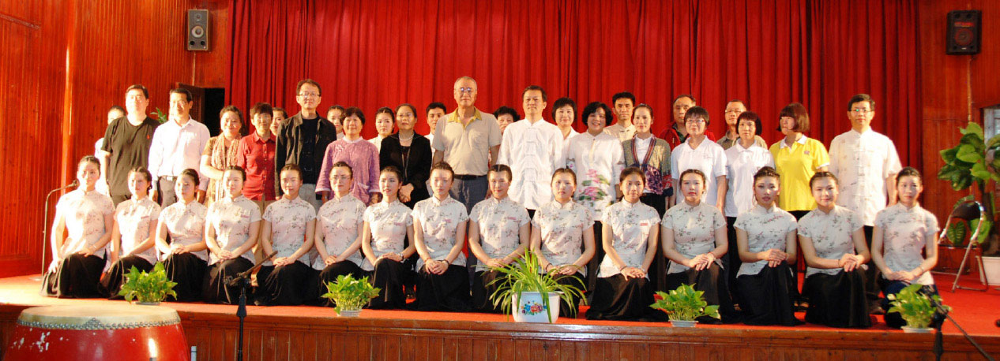

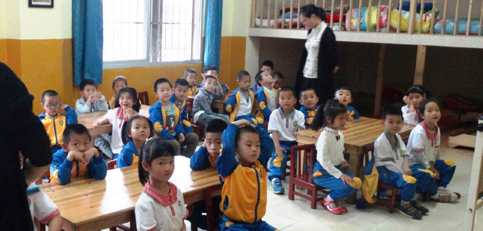

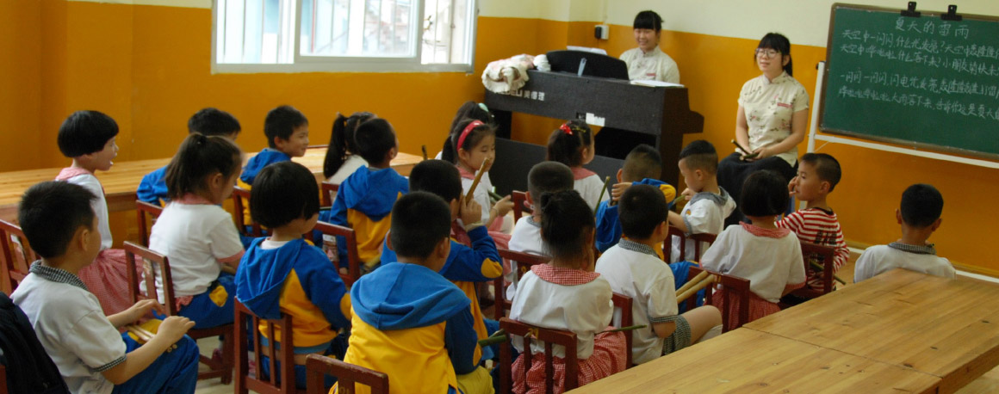

## 後記

### 瞻前顧後 ─ 會刊百期記事

本刊

多一分堅持

少一分遺憾

增十分誠意

減十分後悔

一九九九年十二月，隨著臺北蓮榮共修會的開幕啟用，沒有印表機、不會排版軟體，僅有的一篇文章醒公開示的齊家之道，在極短的時間內，出版了第一刊篇幅極小的蓮榮會刊，以印祖的〈蓮榮堂跋〉說明道場成立宗旨及辦刊因緣。繼而不定期出刊，刊登大德法語及日常研學內容，慢慢奠定了刊物的內容取向。

而隨著紀錄研學內容的多樣性及活動的多元化，刊物逐漸成長茁壯，走出自己的一番風貌，遂於第三十期啟動專業排版軟體取代使用微軟排版，更在第四十六期進行彩色封面改版，讓每一期不同的封面作為各期內容重點紀錄的提撕。當中更經歷社團的改組，於二○一一年成立全國性的社團「中華無盡燈文化學會」及二○一四年成立「時哉時哉網路教育學院」，致使刊物的內容服務於更廣大的群蒙。經過十數年的耕耘，今會刊邁向第一百期的刊登。

隨著歲月的累積，回顧一百期來的會刊內容已呈現某種厚度，紀錄著社團的成長，經學的累積，觸角的延伸，讀萬卷書行萬里路的視野深廣，教育事業版圖的擴展，經學見地的永續經營及文化傳承使命的必然。

一百期的「社論」中，因著不同的時節因緣，隨著生活周遭的事件變化，以儒佛的中心思想、經學的見地出發，走進時代的脈動中，串聯生活的種種訊息，找到修學者安身立命的不動地。誠如：「知命與立命」、「面對天災應有的心態」、「青年人應有的人生觀—賽牟先生來訪省思」、「教師節謹以殊勝的法供養（明佛之十種通號）向全天下的教師祝賀」、「弘一大師圓寂六十週年紀念音樂會有感」、「復會有感」、「中秋望月話圓滿」、「三法印的認識與禪修—法善法師來台開示（於淨苑講堂）」、「新年新希望」、「母親節話母恩」、「荒漠甘泉—心靈成長營暑期活動的期望」、「論放生」、「論選舉」、「南亞災變省思」、「賑災有感」、「法乳之恩」、「是非正義與因果」、「雪廬風誼」、「天厚其福，天厚其禍」、「挽回劫運護國救民正本清源之道」、「善用口業創造和諧止息亂相—利益眾生之善巧」、「新年新希望」、「一時大因緣—讚道藝春秋展」、「春雷過後的及時雨」、「「亂」是治之始—否極泰來」、「浴佛節的省思」、「天亮了」、「開創有格局的未來」、「無見頂」、「中華無盡燈文化學會」、「文化與文創」、「如何看待中華文化的弘揚」、「孔子思想對教育的影響」、「學而互聯，學而移動」、「核心價值」、「教育革新，以網路力量弘揚文化道統」、「三羊開泰─由泰卦說起」、「迎接孝治天下的時代」等。

又「大德法語」的專頁中，陸續整理刊登了道源老和尚的《佛說四十二章經講錄》、《佛說八大人覺經講錄》、《大方廣圓覺修多羅了義經》；果清律師的法語開示；雪廬老人的常禮舉要、由三十七道品觀孔子境界；醒公老師的各種法要等。或每篇經義分幾期刊登，篇幅長者則須經年連載，是吾人吸取前賢經學見解的最好出處。

另「專題研學」則記錄學會長年累月經典課程研討的內容，經諸多學長的聽稿、打稿，師長的改稿、修稿、校稿，將研學的精華內容保留下來，諸如〈勸發菩提心文〉、〈小止觀導覽〉、《隨念三寶經》、〈佛說八大人覺經簡說〉、〈大佛頂首楞嚴經二十五圓通暨七處徵心探源〉、《六趣輪迴經》、〈華嚴經淨行品〉、〈因果錄序〉、〈往生論〉、〈三十七道品〉、〈大乘百法明門論簡說〉、《佛學概要十四講表》……等，紀錄著學會經典研學的足跡，修學重要的內容，也是重要的資料保存。

「法語觀修」則記錄了一則則內容簡要、主題完整的觀修文，舉凡儒佛修學法要的面面觀，佛學重要的觀修文，對於平日意樂的調整、心態的確立、行持的圓融、遇境逢緣的抉擇……，給予明確的引導。

而六十幾篇的「專題活動報導」，則記錄了各項大型活動，舉凡歷年寒暑期的啟蒙活動、大專講座及近年海內外推廣文化的各類講座，歷年母親節浴佛放生活動報導、周宣德老師一一○歲誕辰紀念活動、大德參訪紀錄等，將活動因緣、性質，簡要內容做整理，並刊登了參與活動人員的寶貴心得。

而行萬里路的各國參訪活動報導也散落在各期會刊中，舉凡江西福建參訪、大陸五古都參訪、金門文化民俗之旅、吳哥記事、老撾行、斯里蘭卡行、多次的緬甸行等，甚至因篇幅內容豐富輯成專刊發行。印證了「凡走過必留下痕跡」這句話，隨著會刊的紀錄，一次次寶貴的行旅體驗深深烙印吾人心中。

隨著兩岸文化交流頻繁，中國人尋根溯源，找回傳承的急迫性，文化的經典、孔學一脈內涵成為珍寶。會刊中正紀錄了孔學一隅，諸如孔門聖賢塑像的內容、孔子聖蹟圖簡說、孔門七十二賢淺說、論語簡說等，正可以一窺孔門氣象，而弟子規簡說，古文賞析、唐詩賞析、歷史故事單元篇章，亦可作為經典入門的學習。故宮文物的介紹、繪畫的欣賞、江逸子老師的系列作品展解說，更可做為以藝載道的學習，今正刊載的華夏精魂千秋─明倫史畫簡介及孝經圖簡說，正是延續傳遞道藝結合的理念，充實吾人文化的見地與美學的注入。

其他內容繁瑣不及備載，相信會刊的讀者點滴在心頭。除了文字稿的紀錄之外，學會十幾年來的影像紀錄資料也十分驚人，已自成龐大的資料庫。然而紀錄的太多，刊載的有限，仍是工作團隊最大的憾恨。未來仍將秉持初心，繼續把深廣的經典內容記錄呈現，或結合更多志同道合的人士，利用更新的載具與軟體，結合互聯網，做更多風貌的呈現，方便未來大眾的讀取；並結合中華無盡燈文化學會網站及時哉時哉網路教育學院的建置，讓淵博浩瀚的文化經典內涵透過網路教育的普及，提供即時、正確、快速且無遠弗屆的服務，是吾人所願。（編者）
