# 第101期

## 社論

### 正面迎向中華文化大未來 ─ 上海道藝春秋展記行

本刊

傲骨良師丹青畫

儒佛薰陶筆載道

故宮古作臨摹久

前追古人後來無

二○一一年冬至二○一二年春初應中國大陸國家文化部邀請，江逸子老師在福州市福建省博物館舉辦首次的《道藝春秋》國畫展，並成功地把復興中華文化的種子播送到大陸的土地上；今年（二○一五），江老師更是受到對岸多方邀約，遂仍以中華文化為主軸，於八月五日至十三日間假上海圖書館第一展廳，在大陸舉辦第二屆畫展曰「《道藝春秋》─ 二○一五年臺灣國畫大師江逸子《孔子》主題國畫展」，展中畫作重現其師承　雪廬老人「文以載道、藝以載道」、中國儒家讀書人的風範及中華文化的道統精神。

「傲骨良師丹青畫，儒佛薰陶筆載道。故宮古作臨摹久，前追古人後來無。」正好說明了江老師的習畫因緣。江老師學詩、學佛於大儒雪廬老人，是江老師人生中最大的轉折。老人曾稱其畫畫得好，並對他說：「作畫要有詩詞、有文學的涵養，作品才會有生命」。以道為體，以藝為用，作品要能「移風正俗、淨化人心」，才真正能經得起時間的考驗、跨越無數春秋，才能以畫筆丹青為文化、為儒家、為佛家留下了珍貴的傳世作品。

此次畫展展出的作品既多樣且豐富，共彙集了《孔子聖蹟圖》三十三幅、《地獄變相圖》長卷巨作、《杏林學行》、《問禮於老聃》、《學琴師襄》，及張大千題跋《馬球圖》、新作《孝經十八章圖》、《李白將進酒》、《桃源迷津》、《江赴宴曲》與《賦秋》等共七十九幅作品，大分為孔子系列、佛像、山水、動物與花鳥等類型，很多作品為大陸國內首次展出，其中《孝經十八章圖》更為首展新作。

主題展是由上海圖書館與中華孔子學會指導，承江老師教示，「時哉時哉網路教育學院」亦為此次主題畫展協辦單位之一；展場「上海圖書館第一展廳」，地處人文薈萃的上海市淮海西路，為早期上海地區國外使節官邸所在，文化氣息濃厚，地區住民素質整齊，路上華洋雜處，常有見之。

這次「時哉時哉網路教育學院」派出人員之主要任務為現場導覽，且與上海協辦義工團隊分享導覽的經驗，冀能讓參觀展覽的觀眾，對展品深層的文化內涵有所體會而得益。學會對此趟上海行做了前行準備工作，對個別作品的內涵細細深入研學，及全方位了解，期詮釋、說明能合乎義理。這種學習方式是緩慢且步步落實，而足跡深淺，端視個人用功多寡，所謂「書到用時方恨少」，實力多少總有見真章之時。

導覽時與閱覽人面對面的接觸，透過對畫作的說明詮釋，將藝中之道呈現是何其重要！《孝經》是江老師新作首展，在展覽中極其重要。「孝」是中國社會的核心價值，家庭整合功能、國家民族得以延續的力量，若把孝道剝離了，中華文化就不再是中華文化，把孝道抽離開人類，人類的延續、生存也成問題。

因果不爽是對一般大眾最有感染力的說法，江老師的《地獄變相圖》長軸亦是最吸睛的焦點之一，從地獄及人生在世的光景來看，變相圖「移風正俗、淨化人心」，對世道人心，使能知善惡之別，正是江老師演繹此圖軸的因由。

《論語》是學習中華文化經典的入門，也是了解孔子及儒學的通道，江老師所畫的《孔子聖蹟圖》，正有助於民眾了解孔子一生重要事蹟與學習《論語》的重要，不讀《論語》，無以知孔子、孔門俊賢的內涵，更遑論中華文化了。藉由導覽解說，與讀者產生共鳴，不再讓聖賢太寂寞，不再讓孔子只能踽踽獨行，知道聖賢並非高不可攀，大眾便成為孔子百代後的知己，歷歷在目。

文化記載於典籍，藉由畫作的呈現與導覽，歷史人物、大時代的故事、文化經義的點滴，一一走入大眾的生活，流向人們的心田，是此次上海畫展結合導覽所呈現的功效。期盼學習團隊能師法雁群，結合眾人之力，共飛同行，正面迎向中華文化大未來。

## 大德法語

### 大方廣圓覺修多羅了義經（六十）

道源老和尚

結夏安居身心淨

依法修持佛歡喜

有師引導助道力

獨居具力不退轉

乙二、正宗分

丙二、令依解修行隨根證入

丁二、廣明行相

戊三、一問答道場加行下根修證

己五、正答所問

庚一、長行

辛一、答道場

壬二、正說

癸二、限內修行

子三、明遇夏安居

丑一、標異聲聞

經文：

若經夏首三月安居，當為清淨菩薩止住，心離聲聞，不假徒眾。

遇到結夏安居的時間了，「夏首」二個字就是夏天的開始，也就是陰曆四月十六，我們中國一年分四季，春天三個月，夏天三個月，四月初一就是夏首，結夏安居從四月十六日開始，你要把這道理規矩記清楚，印度一年只有三季(春季，夏季，冬季)，沒有秋天，印度的風俗習慣中國不同，不像我們從正月初一開始，臘月十六(十二月十六日)開始就過春天，四個月春天，從四月十六日之後開始是夏天，到了四月十六夏令才開始，夏令四個月，後結夏安居到八月十五為止，這都是印度的風俗習慣，這些事相要記清楚。

若經過夏首，這是指菩薩想結夏用功，趕上四月十六開始三月安居，這是聲聞眾的規矩，就算比丘、比丘尼不受菩薩戒，都得結夏三月安居，那麼你這菩薩應該怎麼辦？不要參加聲聞的安居，這聲聞平常一個人住，到了結夏安居這三個月必須要團體行動，受大戒的比丘、比丘尼都集合過來，這叫安置徒眾！要實行結夏安居，吃住三個月，到七月十五以後才能自由行動，不然就破了僧臘。

此處開示菩薩，你行菩薩道，你修圓覺行，你不要參加聲聞的結夏安居，你要依你的需要離開聲聞，不要假借大眾的安居。前邊那個菩薩是有徒眾的菩薩，譬如一個大法師，一個寺院的住持，你就安處徒眾。此處這個地方是一個人，不要假借徒眾，就你一個人修行，安你的居就好了，你不要參加聲聞的安居，你自己沒有徒眾，也不要去依聲聞徒眾。

丑二、正陳詞句

經文：

至安居日，即於佛前作如是言：我比丘、比丘尼，優婆塞、優婆夷、某甲，踞菩薩乘，修寂滅行，同入清淨實相住持，以大圓覺，為我伽藍。身心安居平等性智，涅槃自性無繫屬故。我今敬請，不依聲聞。當與十方如來，及大菩薩，三月安居。為修菩薩無上妙覺大因緣故，不繫徒眾。

到了安居日(四月十六)，我這一位菩薩，我不參加聲聞徒眾的安居方式，我對著佛像自稱優婆塞、優婆夷某甲，某甲就是自己的名字，男居士稱作優婆塞，女居士稱作優婆夷，如我(師父)自稱比丘道源(師父法名)。

為什麼前邊「不假徒眾」，這個地方講四眾弟子都有呢？沙彌、沙彌尼還不能參加安居，優婆塞、優婆夷更沒有安居的意思，此處講四眾弟子都受了菩薩戒，菩薩戒叫同受，聲聞戒叫別受(各別受持)，聲聞眾一共有七種，出家有五種(比丘、比丘尼、式叉摩那、沙彌、沙彌尼)，在家有二種(優婆塞、優婆夷)，出家五眾、在家二眾，戒律各個不同，稱為分別受持，菩薩戒是同受，七眾弟子都可以受菩薩戒，叫菩薩比丘、菩薩比丘尼、菩薩優婆塞、菩薩優婆夷。沒有徒眾的菩薩或比丘，對著佛你就作「自白」，比如：我比丘道源某某，踞菩薩乘修寂滅行，踞就是根據或者踞住，我根據菩薩乘，修行寂滅大行，同入清淨實相住持，我願以同入清淨實相住持安住，攝持在清淨實相(清淨圓覺)之中，以大圓覺為我伽藍，身心安居平等性智。聲聞安居，一定得有個伽藍安置他聲聞的徒眾，菩薩有徒眾，得先找個伽藍安置徒眾。

另外一種菩薩他一個人，一個人不要參加聲聞安居的規矩，自己找一個用功的道場，或者茅棚，或者山洞，此人以大圓覺為我的伽藍，遍法界都是我的道場，我身心安居在平等性智上，也就是轉識作實智，轉前五識為成所作智，轉第六識為妙觀察智，轉第七識為平等性智，這就是要空我、空法，人我、法我都空，住在平等性智中，涅槃自性無繫屬故，我安住在平等性智，叫做無差別的性智，涅槃的自性就是涅槃的本體，本來沒有繫屬，涅槃叫做圓滿寂滅，沒有繫屬。

我對著佛說這個話，今天我請佛加被我，當與十方如來，及大菩薩，三月安居，我不住聲聞的道場，我以圓覺為我的伽藍，為修菩薩無上妙覺大因緣故，我為什麼不參加聲聞安居？我怕他打岔我的觀念，用功不同嘛！大家用功受的戒不一樣，他受聲聞戒，我受菩薩戒，修的行門不一樣，那麼在一塊兒怎麼修呢？所以為成就我菩薩無上的妙覺這因緣故，不繫徒眾，不繫屬於聲聞大眾僧，我一個人結夏安居三個月，這是對佛的自白，啟白好後就好好用功三個月。

​​​​​​​

丑二、正陳詞句

經文：

善男子！此名菩薩示現安居，過三期日，隨往無礙。

以上名菩薩示現安居的，這是離開聲聞另覓環境，三個月安居圓滿，到了七月十五圓滿安居期限，此時可以隨往無礙，亦即可以自由行動了。

癸三、誡取邪證

經文：

善男子！若彼末世修行眾生，求菩薩道入三期者，非彼所聞一切境界，終不可取。

末世的眾生，要想修菩薩道，定這期限入三期者，你在那兒懺悔三七日，二十一天就有好境界現前，好境界必須要看是不是《圓覺經》說過的，要是《圓覺經》說過的才是好境界(佛境界)，不是《圓覺經》說的境界，絕對不可以取。這個地方是三七日，你在懺悔二十一天就有特別的境界出現了，何況八十天、一百天、一百二十天的用功，一定有好境界現前，經上說有這境界你就取，不是《圓覺經》說的，可能是魔境，不要取著，這是個警策話，不用功則已，一用功則一定有特別的境界，但必須符合經上所說。（下期待續）

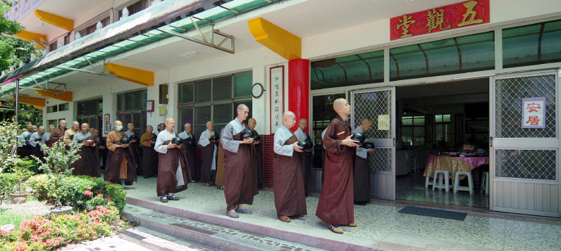

### 正覺精舍齋僧法語 ─ 淨土生無生論淺釋

上果下清律師

年度齋僧求法義

誠意能感妙法緣

幽溪傳燈生無生

無去來中事宛然

二○一五年七月十二日

諸位發心到精舍來供佛齋僧，諸位功德無量，今天跟諸位談「淨土生無生論頌」。淨土就是清淨的國土，十法界所依止居住的國土雖然無量，但是歸納起來，不超過四種淨土。

常寂光淨土是佛法身所居住的地方，實報莊嚴土是佛的報身以及登地菩薩所居住的淨土，方便有餘土就是二乘聖者以及未登地菩薩所居住的淨土，凡聖同居土就是凡夫和聖者所共同居住的淨土。

生無生，根據宋朝義懷禪師所說「生則決定生，去則實不去。」往生是決定往生，但是去到極樂世界，其實並沒有去。這句話是否矛盾？其實不矛盾，生則決定生是就事相來說，去則實不去是就著理性來論，不能偏事或理的一邊，兩句要合起來看。

事相上決定往生，我們住在娑婆世界，從娑婆世界往生到極樂世界去，但是在理性上是沒有生的，為什麼？我們畫一個圈圈，代表真如本性，在大圈圈裡面，東邊有一小圈圈，代表娑婆世界，西邊有一個小圈圈，代表極樂世界，事相上確實從東邊的娑婆世界，往生到西方極樂世界，但是在理性來說，理性不離開我們這一念心性，而這一念心性是遍虛空遍法界，它非常廣大，所以在理性上面沒有超出心性的範圍。

譬如雁過長空，影沉寒水。雁無遺蹤之意，水無留影之心。天上的大雁飛過廣大的天空，只要沒有風的吹動，影子就很明顯的照在水面上，但是影子也沒有完全遺留在水面上，而寒水也沒有留雁子的影像。所以我們將來往生也是一樣，事相上是決定往生，但是理性上確實沒有超出我們心性的範圍，以上解釋生無生。

例如布施是一樁事項，但是布施的當下三輪體空，等於施而無施，施是事相上，無施是理性上，用布施的三輪體空也可以用來比喻生無生的道理。

接著解釋論，此論是孤起頌，共有十門，每一門都先提出一首頌，再用長行文來解釋，依義解頌。

人題

做這部論頌作者是明朝幽溪沙門傳燈，幽溪是地名，在天臺山(浙江省)上；沙門是梵語，叫做勤息，也就是勤修戒定慧，息滅貪瞋癡，識心達本源，故號為沙門。認識自己心性的根源就是徹見真如本性，才能夠稱為沙門，成佛就可以稱為大沙門，依戒定慧三無漏學，徹見真如本性，成就無上佛道，所以佛也稱為大沙門。

傳燈是論主之諱，是論主的法名，他的字號叫作無盡，他生在公元一五五四年，少年的時候依止天臺映庵禪師，後來在百松禪師座下出家，之後任幽溪高明寺的住持，弘揚天臺教觀。他一生修法華以及種種懺儀，幾乎天天拜懺，他注有楞嚴經玄義，彌陀經圓中鈔，以及淨土生無生論。此論完成之後，他在浙江省新昌縣石佛寺開講此論，每次登座說法，都召感天樂鳴空，大眾都歎為稀有，歡喜信受，如飲甘露，他往生前就預知時至，書寫「妙法蓮華經」五個字，高唱經題，溘然而逝！以上是簡單解釋天臺幽溪大師的事蹟。

此論分為十門：

一、一真法界門。二、生土緣起門。三、心土相即門。四、生活不二門。五、法界唯念門。六、靜觀相吞門。七、三觀法爾門。八、感應任運門。九、離此恆一門。十、現未負載門。

一真法界門就是一心實相，也就是大乘不思議的境界，它屬於性德，屬於理即；從第二到第八門，合起來有七門，講的是一心緣起的萬行眾善，也就是中道圓融的菩薩學，它是全性起修，全修在性，性修不二，它屬於世道，屬於行經，屬於修德；接著第九、第十兩門，修德有功，果德方證，方能徹見豎窮三際的自性清淨心。

初、一真法界門

論文：

一真法性中，具足十法界。依正本融通，生佛非殊致。

一真法性(一真法界)乃眾生一心實相，它屬於理趣，是不可思議的真如佛性，也是諸佛所證平等的法身（理體），這叫作一真法性，也是《華嚴經》、《大佛頂首楞嚴經》、《法華經》、《圓覺經》、《般若經》等這些經題，這些經題都是諸法實相的不同名稱，意思是一樣的。

一真法性當中，具足十法界（四聖與六凡），所以我們起心動念不超過這十法界的範圍，起心動念想要持五戒，當下的心就落入人道的法界，你想要修十善，而且有一點禪定功夫，起心動念想要持十善，當下就入於天的法界。雖然造作善業，但是貢高我慢，這一念心當下就入於阿修羅的法界。我們這一念心想要造作十惡業，上品是地獄、中品是餓鬼、下品是畜生。我們這一念心想要出離三界，想要修四諦法（知苦、斷集、慕滅、修道），當下的心入於聲聞法界。我們這一念心以無我心，想要修十二因緣，當下就入於圓覺法界。從這一念心生起慈悲心，當下就入於菩薩道。從這一念心生起無緣大慈，同體大悲，想要好好念阿彌陀佛，當下就入於佛的法界，所以我們念佛就是契入佛法界。

有的人覺得自己到道場去掃掃地、燒燒開水就好，讓我做佛我可不敢當！人家六祖去見五祖，我不是為了別的事，我就是為了要成佛啦！人人皆有佛性，人人都可以成佛，所以念這一句阿彌陀佛，是心作佛，是心是佛，你一心想做佛，這不是佛是什麼？還不敢當？我們心念眾生，就是眾生，貪瞋癡慢疑等障礙就是眾生相，我們念佛當下就是佛，不要不敢當！是心作佛，是心是佛！我們常常想念要做佛，將來就會成佛，你只想要做眾生，那就是眾生。這就是一念十法界的道理，不好好念佛的話，未之有也！

要怎麼成就？要善用其心！ 修行是修心，心好了，身口意三業都好，佛就是身口意三業都清淨。所以四聖六凡都在一真法界當中，清清楚楚、明明白白，這叫作一真法性中。

依正本融通，依報與正報本來是融通的，依報是無情，正報是有情，無情有法性，有情有佛性，所以佛性與法性是一不是二，情與無情，同圓種智，依報、正報本融通指的是兩者都是同體，它是體合，就像以水和水，這才是體合。依報與正報都是融通的情況，這就是體合，佛菩薩常常說眾生跟我們都是同體，沒有彼此之分，既然是自己人，何來的人我是非？所以佛法真是太妙了！常常想念眾生，眾生跟我們都是自己人，哪有自己傷害自己的道理？自己傷害自己就是不明理，才會這樣去惱害眾生。

生佛非殊致，這兩樣都是一樣，佛有佛性，眾生也有佛性，生佛同體就非殊致，眾流入海，皆同海的一味，都是一如，沒有差異的，叫作非殊致。

第二門，生土緣起門。

論文：

一真法界性，不變能隨緣，三身及四土，悉由心變造。

一真法界的體性，這一段就講到理性，眾生是理性俱足，由理俱而事造（事相上的造作），而事造也不離開理俱，心性的體是不變的，但能隨十法界的淨緣，我們的心在人道的法界，但是因為都有本性，所以在事相上的造作，若能發菩提心修六度萬行，當下就超升到菩薩法界，你能好好念佛，當下入於佛法界，你的不變是因為你的佛性不變，然而隨著你的心念到哪一個法界，你就到了哪一個法界。

三身就是佛的法、報、化三身，四土就是常寂光淨土、實報莊嚴土、方便有餘土以及凡聖同居土。三身以及四土都是由我們這一念心變造出來的。所以寺院裡晚上放蒙山的唱誦：「若人欲了知，三世一切佛，應觀法界性，一切唯心造。」所以三界唯心、萬法唯識，由我們這一念心召感好地方或者壞地方，都由我的心變造出來，我們要善用其心啊！假若能善用其心，他人罵我們，也是善用因緣，假如不會善用其心，人家讚歎我，我就貢高我慢，反而墮落到地獄，所以好的果報以及不好的果報都是自己招感來的，就在我們善用或者不善用其心，好比有人打我們，我們假若當下做酬業想，反而要感謝對方，他幫我消舊業，成為我助道之緣；一不善用其心，就是凡夫造業的行為，那就只好繼續流轉與墮落。

所以將來不論成就哪一身，不論往生到哪一個淨土去，都跟我們現在這一念心有關，三身及四土都是現前這一念心變造的，好好修！好好想念！經常想念的，將來就是我們的結果！

三、心土相即門

論文：

西方安樂土，去此十萬億，於佛皆爾心，出無彼此意。

前面兩句講到事造，後面兩句是理俱。前面兩句是彌陀經所說的西方極樂世界，它是最安隱快樂的國土，離開我們娑婆世界往西方，經過十萬億個三千大千世界，那邊有一個極樂世界，有一尊佛叫做阿彌陀佛，今現在說法，現在本師釋尊正在娑婆世界對眾生說法，那邊的阿彌陀佛也在極樂世界說法，所以「今現在」的重複有特別含意。

接著講理俱，諸佛跟你的心，沒有一點差異，理性都一樣，娑婆世界以及極樂世界，都是這一念心性所含攝的範圍，《楞嚴經》也說：空生大覺中，如海一漚發，有漏微塵國，皆從空所生。整個大虛空比喻為小水泡，我們的心性就比喻成大海，其中有無量無邊的國土安立於虛空，而虛空在我們的心性裡面，就好像大海當中的一個小水泡一樣，極樂世界也在我們這一念心性所含攝的範圍之內，現在雖然迷惑顛倒，我們應該要深信切願，就能夠往生心性本具的極樂世界，絕對如此！要深信不疑！

四、生佛不二門

論文：

阿彌與凡夫，迷悟雖有殊，佛心眾生心，究竟無有二。

阿彌就是阿彌陀佛，凡夫含攝六道眾生以及三乘聖者，六道眾生全然不覺，三乘聖者迷悟淺深不同，眾生跟諸佛不是兩樣，等覺菩薩以下乃至於六道當中的眾生，兩者迷悟雖然有所不同，成佛的心性與眾生的心性，究竟沒有兩樣，佛有佛性，眾生也有佛性，沒有兩樣。佛跟九法界眾生不同，佛心是覺醒的心，眾生心是迷惑顛倒的心，但是兩者心性一樣，所以是究竟無有二。

五、法界為念門

論文：

法界圓融體，作我一念心，故我念佛心，全體是法界。

法界就是一真法界，圓融是空有圓融、事理圓融、體用圓融、染淨圓融、生滅圓融！全部都無障無礙叫作法界圓融體。

講到體是一念心性的理體，也是涵蓋乾坤之體，也就是本論所說的性體，就是中諦，它是清淨無染，不生不滅，成住不壞的，這就是性！而我們現前一念之心，它是性量、性具，性量是真諦，性具是俗諦，全性起修，由中諦而生起真諦、俗諦，全體乃我人現前一念的心性，故我的念佛心，全體是法界，這就是觀經所說是心作佛，是心是佛，就是全性起修，依修而證入全部的性德，全體是法界就是是心是佛。全修在性，依全性(真性體)而起心證悟全體法界(全性)，由性德全性起修，修德圓滿，最後性修無二。

因為親近善知識，聽聞正法的助緣，我們開始有智慧，生起覺悟，生起始覺，接著相似覺、分證覺，到最後究竟覺，究竟覺就是真實覺悟，就是修得圓滿，徹證真如本性。

六、境觀相吞門

論文：

十六等諸境，事理兩種觀。彼此互相吞，如因陀羅網。

觀經講到十六觀，一是日觀，二、水觀，三、地觀，四、樹觀，五、池觀，六、總想觀，七、華座觀，八、佛菩薩像觀，九、佛身觀，十、觀世音觀，十一、大勢至觀，十二、自往生觀，十三、雜想觀，十四、上品生觀，十五、中品生觀，十六、下品生觀，以上這十六觀。

以上講到事理兩種觀，記載在《觀經疏妙宗鈔》，《觀經疏》是智者大師對觀經的註解，《妙宗鈔》是知禮大師對《疏》的解釋，必須了知十六觀都是隨從一心三觀的妙行，應當了知十六觀都是用一心三觀的妙行作為想像之法，正好用法界心(用本具性體的心)即用心裡本具太陽的心，心性(太陽)能使本性之日顯現其前，這乃是用一真法界心來緣念一真法性，生起本性之日（法界的太陽），既然都是法界，難道當下不是即空、即假、即中？這就是事理兩種觀。

所觀照的境界是十六境，能觀照的智慧是事理兩種觀，能觀照的智慧跟所觀照的境界，彼此互攝互入，就像因陀羅網，因陀羅網就是帝釋天空中的珠網，每一顆寶珠可以攝入其他寶珠，所以是互攝互入重重無盡。

七、三觀法爾門

論文：

能觀為三觀，所觀即三諦。全性以起修，故稱為法爾。

能觀的就是一心三觀（即空、即假、即中），所觀的是一心三諦（真諦、俗諦、中諦），我們必須了知，持名這個法門，法爾也就是自自然然，具足三觀的妙行，而我們平常念佛，不知它的道理，然而它卻具足這樣甚深的道理。為什麼？我們必須知道我們所持的佛名，本具三諦，所持的佛名，名字相有就是俗諦，名字性空就是真諦，性相不二就是中諦。而我們能持的心念，它本來就具足三觀，因為能念之心了不可得，這就是空觀，所持的佛名歷歷分明就是妙假觀，空假一如就是中觀。

所以能持的就是一心三觀，所持的就是一心三諦，所持的佛號分分明明，就是妙假觀，能持的心念念無殊這就是真空觀，能與所不一不異就是中觀。所持的佛名稱為妙假，當下即具足即空、即假的道理，能觀的是真空觀。古德云：境為妙假觀為空，境觀雙亡即是中。亡照何嘗有先後，一心圓絕了無蹤。境界既然是妙假，當下就具足即空、即中的道理，念佛之心念念無殊，這就是真空觀，既然是真空觀，它當下也具足妙有圓融的道理。亡就是空假雙亡，照即是雙照真俗，亡照沒有先後次序，一念現前能觀照的心性當下是圓融絕待，沒有蹤跡可循。

所以能觀的心是一心三觀，所觀的境界就是三諦，證得全部的性德就像真諦妙有，全修體性稱為法爾，法爾就是自然的意思，就是《起信論》當中一心具足二門，真如門就是真諦，生滅門就是俗諦，二門是依心，能所非一非異這就是中觀，法爾具足空假中的要義，是全性以起修，所以稱為法爾。

八、感應任運門

論文：

我心感諸佛。彌陀即懸應。天性自相關。如磁石吸鍼。

諸佛內心常常念到眾生，可是眾生往往不肯念佛，諸佛是眾生心內的諸佛，眾生是諸佛心內的眾生，眾生與諸佛覺性一致、平等，迷悟雖然不同，但是覺性是一樣的，何況阿彌陀佛在因地，對著世自在王佛發起四十八願，後來成就極樂世界，所以眾生念佛，阿彌陀佛當下感應，阿彌陀佛對我們如母憶子，母親常常想念兒子，法界眾生就像阿彌陀的愛子，阿彌陀佛是大慈母，常常想念法界眾生的這位兒子，但是這位法界眾生的兒子卻不念佛，背覺合塵了。

假若反過來，如果法界眾生的兒子肯念佛了，決定憶念慈愛的母親，而且感應道交，這就是天性自相關。又如同磁石吸針，這裏的針是鐵針不是銅針，磁石跟鐵可以感應、相吸！我們跟阿彌陀佛的關係，只要我們肯念阿彌陀佛的名號，我們跟阿彌陀佛就感應道交，只怕我們不念，阿彌陀佛念我們念到發癡發狂，不能感應道交，我們也無法往生極樂世界去！

我們往生要正念分明，只要憶念阿彌陀佛，就可以往生。但是我們平素修行，就為了臨終這一念，臨終不念佛就非常可惜了！我們修行的底線，臨終的時候要將阿彌陀佛這四個字念得分明，要有信願心，我想去極樂世界！決定往生的起碼功夫要伏住煩惱，要正念分明，至於其他瑞相都是其次。

九、彼此恆一門

論文：

若人臨終時。能不失正念。或見光見華。已受寶池生。

娑婆世界和極樂世界在心性理體上面是不分的，所以極樂世界去此不遠，十萬億佛國土，臨終就可以走過去，當下一念起就到十萬億佛土之外的極樂世界，非常輕鬆！全部在我們心中，在心性的範圍內，很近！

若人臨終時，如果能夠不失正念，這句話要緊！我們用持名念佛，不失去佛號，不但嘴巴唸出來，心裡面有佛號更好！心裡有佛號就對了，能夠不失去正念。

我們修持淨土念佛法門的人，臨命終的時候，能夠不失去正念，就能招感到七寶池裡面蓮花化身。平素念佛，只要念佛就會有一朵蓮花標上你的名號，佛拿著你自己的蓮花來接你，絕對不會錯亂，越念越努力，蓮花越長越莊嚴，完全不念就消失了！越努力念佛，蓮花開得越莊嚴殊勝，臨命終的時候，阿彌陀佛就拿著我們自己培養的蓮胎來接引我們。

蓮花分為九品，我們往生與否，全憑信願之有無，品位高低，全憑念佛功夫之深淺。臨命終的時候，要緊的是不要失去正念！

唯心的淨土，它是生而無生，念佛的心是親因緣，更要有像等無間緣的無間心，見光見華就是所緣緣，所緣的是境界（相分），能緣的是心（見分），阿彌陀佛的大慈悲以及臨終的接引皆是增上緣，如此四緣具足，必定往生！

十、現未互在門

論文：

行者今念佛。功德不唐捐。因中已有果。如蓮華開敷。

修行人念佛絕對會有成效、結果，不會白耗光陰，虔誠的念佛絕對有結果，會有殊勝果報的。我們現在念佛，極樂世界當中屬於自己的蓮蕊就產生，蓮花是花果同時，也就是因果同時，有如是因就有如是果，花開蓮謝，一直念佛，蓮花長成的時候蓮子也長成了！臨命終，阿彌陀佛就拿我們自己培養的蓮臺來接引我們，最初開始念佛，七寶池有蓮蕊產生，因地念佛心，到最後蓮子長成，我們將來命終蓮臺接引我們往生極樂世界。花果同時，因果同時。如同蓮花開敷一樣，所以回去要多多用功，少說一句話，多念一句佛，打得念頭死，許汝法身活。

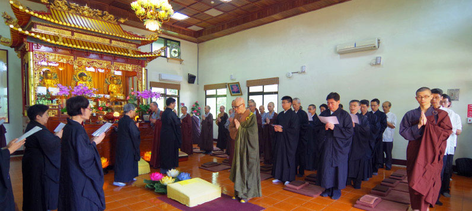

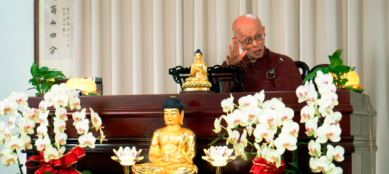

## 共修研學

### 小止觀導覽（七十三）

*心爾、治心整理*

境非自體成

妄認有實法

不過立假名

真實非有名

證果是我們修學止觀的目標，它不只是我們的回向處，也是我們修學的動機，將此章好好研究，不但能知道我們修學的目標，也能了解修行應該有的動機，並且知道真正的教義所在。

修行要有一個檢驗的標準，必須講究不快不慢，檢點身心在日用平常該有怎樣的造作，並且瞭解天臺宗的宗義，成為降伏煩惱殊勝的善巧方便。

修行止觀門的次第，也可以先讀第十章，將佛果的目標確立，並且將其中的意趣弄懂之後，再回過頭來積聚二十五方便，按部就班的修學。

第十章  證果

論文：

若行者如是修止觀時，能了知一切諸法皆由心生，因緣虛假不實故空，以知空故，即不得一切諸法名字相，則體真止也。

唯識宗的說法是，行者如果修止觀，應該了知一切諸法都是從心生起的，外境不成立。在止觀門的修學法裡好好的去做辯證，外境到底有沒有成立？透過如夢、一水四見、鄰虛塵不可得的正理，成立一切有為法外境不成立。

例如我們這一生投生到人道的世界，必須是觀待過去持五戒的業；換句話說，是由過去造作的業才有這一生果報的顯現，業由心造薰下習氣於第八識，遇緣顯現，第七識執我，前六識所受，此乃唯識宗之正義的因緣所生。虛假不實是外境不成立，看起來好像是外境成立，其實沒有，叫虛假不實，但心內法的顯現不可以說是虛假不實。唯識宗叫真空妙有，心外法是不實際的，可是心內法是有的，心外法那一分不成立叫作空。

執有外境成立叫作遍計執，認為山河大地都是外境成立，唯識宗認為，事過境遷時，每一法都只剩下回憶的功能。換句話說，法就像夢一樣，夢中感覺很實在，醒來的時候只剩下回憶。人的一生走到最後，所有的功名、榮華富貴、家產妻子、田園兒女，都只剩下回憶，只能在回憶當中顯現，所以境界都是心的顯現，這就是唯識宗，唯有心識稱作唯識宗。

唯識宗的遍計執有兩個，第一個遍計執是外境不成立，執有外境成立，謂之性向遍計。唯識宗的第二個遍計叫異門遍計，就是把麥克風賦予名字，如果麥克風的名言是存在不改變的，應該非洲人來看是麥克風，狗來看也是麥克風，鬼來看還是麥克風，然實際真相是各看各的。你稱它為麥克風而且以為真實成立在那裡，謂之異門遍計，除掉這兩種遍計執才能成立唯識宗的空性，安立在這個義理上，才是真正的體真止。

了解唯識宗的宗義可以除掉很多煩惱，認為外境不成立者，遇到好境界不易生貪，知道自己是做夢之人，是不會對夢境生貪、生瞋的，貪瞋癡的根本一下就斷了，不用去修對治法，煩惱從根本斬斷。

中觀宗的說法，皆由心生是唯心的名言安立才能顯現萬法。因緣所成立的該法，還要觀待名言才能顯現，那因緣實際在哪裡？經過因緣所成的麥克風，真的就成立麥克風嗎？如果可以成立麥克風，為什麼非洲人來看不是麥克風，狗來看也不是麥克風？必得名言安立麥克風，它才能顯現為麥克風的作用，麥克風自己不能成為麥克風，叫因緣不實故空。

一切諸法在自相空的時候，無法安立名字相，不是有一個麥克風在那邊，才說它是麥克風，是這個東西你知道它的功能，安立麥克風的名言顯現它的作用，但是別人不知道它的功能，不能安立為麥克風時，顯現不了該法的作用，該法或顯現為鐵棒、或顯現為麥克風、或顯現為黑漆漆的不知道是什麼，每個人各看各的，都是你名言下的顯現，該法不能自己成為該法，在名字當中也不能顯現該法的自相，該法只能在名言當中顯現它緣起的幻相，這是中觀宗的體真止。

天臺宗的宗義在第十章，真正要修止觀門的人，下手處要先讀第十章，知道目標再回過頭來積聚二十五方便。這是佛法的另外一種修行法，先以佛果為所緣，確立目標作為修行的第一步，再下手找通往目標的方法，書本是按部就班講，但是下手修行時卻各有不同。

高登海居士所著之《佛家靜坐方法論》云：以上所講二十五方便，是修習止觀坐禪的先決條件和準備功夫。正修行，說明修習止觀坐禪的方法；善根發和覺知魔事，是在修習止觀坐禪過程中應提高警覺，開發善根而卻除魔事；復說明治病方法，以保持身心健康，順利辦道。最後講證果。種止觀之因，必得修行之果，所謂「證」，即無漏之正智能契合於所緣之真理。所證之果，因修行人心量廣狹之不同，而有小乘與大乘之別。小乘證果乃聲聞之四果。大乘證得初地乃至等覺十一地菩薩之分果，佛之滿果。

聲聞四果(初果須陀洹、二果斯陀含、三果阿那含、四果阿羅漢)，獨覺則百劫修資糧道，在最後一生時，於無佛之世以加行道、見道、修道來現證空性，出離三界成無學道之緣覺果。此處提及小乘認為的佛果，是他們認為釋迦牟尼佛是破非染污的無知，不承許大乘發心。

緣覺果跟聲聞的四果有非染污的無知，其行相為何？（一）空間太廣，所以不知道遠方發生的事。（二）時間太久，所以不知道久遠劫前後會發生之事。（三）業太微細，所以不知眼上每根眉毛的由來。（四）非染污無明，是不會障礙行者出三界，雖是無明又是非染污。

而《大乘起信論》是講十地直接去成佛，等覺菩薩是如何安立的？此聖者已具成佛的證量然未有成佛的因緣。比如文殊菩薩，觀音菩薩等等。

《金剛經》上說：「須菩提能作是念，我得須陀洹果不？不也，世尊！我不能作是念，我得須陀洹果。」空性智證悟到真理時，是名言安立，不是有個阿羅漢果被他得到，阿羅漢也破人我，也破法我。所證的果是三乘共法，能證的人分為小乘以及大乘，這就必須觀待是否生起菩提心這一分來說。大乘者是以發菩提心跟空性的智慧相應去破所知障，二乘人是以空性的智慧跟出離心相應去破煩惱障。

止觀門是修行的精華，是學習一切佛法得到證悟最善巧的法門，不論學習般若，或者世俗菩提心、大悲心等等，都可以會歸到止觀門的修學，應該要好好去體會止觀門的內涵，來做為我們修學佛法重要的方便所在，使得我們這一生過得有意義，善友做如此的聚會是令人難忘的回憶，透過這一世的修學，成為往生極樂世界最好的資糧，能得到未來最殊勝的增上。（下期待續）

### 菩薩清淨的行持　華嚴經淨行品（十七）

*編輯部整理*

清淨行持在正見

對境發願成道力

文殊成就秘密藏

要為後世做增上

丙二、指事顯因答其徵因

丁一、總徵

丁二、別顯

戊二、出家受戒時願

己三、正落髮出家　求出家

經文：

求請出家，當願眾生，得不退法，心無障礙。

南亭老和尚註解認為，前兩段是準備出家，這一句才是正式出家。之前是已經選擇要出家，一般出家都要先當淨人，熟悉寺院當中的事情之後，才求出家，沒有馬上就給人剃頭的，一定是先準備，看他有哪些條件適合的，求出家不是因為愛情失戀，也不是事業失敗沒搞頭才求出家，身為戒師需要看清楚，不能因為寺院缺人，有人求請出家就趕快剃頭，戒師一定要弄懂想出家者背後的動機，並且對此人要有一些瞭解，此人真正動機是想要學習教法、弘法利生者。

此人找到想學習的師父，在出家前必須要在僧團裡做一白三羯磨的法事，一白三羯磨是在受具足戒時，由羯磨和尚向大眾宣布，某某人要加入僧團，「白」是宣布、表白的意思，之後還要連問三次有無反對的意見，這叫「三羯磨」，要得到所有僧眾或者住持的允許，才有出家資格，一般來說必須要確定此人發出離心否？發菩提心否？對方要連答三次，當此人都說「要」，住持就可以代表眾僧同意他。

南亭老和尚也說，要發願度一切眾生，出家後得不退法，使心無障礙。所謂「不退法」（位不退、行不退、念不退），「位不退」是指既得的修學果位不退，「行不退」是指所修的行法不會退失，「念不退」是指已得到的正念不會退轉。

註解上面引用《詩經》的「靡不有初，鮮克有終」，「靡」是無的意思，「鮮」是少，「克」是做得到，也就是說初發心的人，想要辦了生死的大事，但很少人能夠一路做到最後(鮮克有終)。有始有終才能有所成就，有所成就以後，才能得不退法，心無障礙。在東吳支謙的版本：「請求捨罪，當願眾生，得成就智，學不中悔。」所謂的學不中悔就是學到中間不會後悔，也就是得不退法之意。

「位不退」是指此人不會再退到二乘之外，不會退到凡夫之位。「行不退」就是大乘不會退到二乘。「念不退」是指以佛果為所緣，不會生起退轉之念。所以位不退可以進入二乘位，行不退可以進入大乘位，念不退則是以佛果為所緣生起不退轉的念頭。極樂世界是五不退，也就是再加上處所不退以及畢竟不退。「處所不退」就如西方極樂世界，那是一個不會退轉的環境，這叫做處所不退；另外「畢竟不退」就是念一句佛，永為金剛道種，也就是一句佛號，畢竟不退。

不退是恆心的修學法，一定要有好的環境才能得不退法，所以辦教育給學生好的環境，在「處所不退」當中不退向道的心，藉著外面良師益友的環境，好好的在法上尋求正解，甚至是對二乘、大乘以及佛果的通達，之前有人曾問雪公離開臺中是否有不退的方法，雪公回答說「全退」；「畢竟不退」的因就是念佛，念佛即是求佛菩薩的加被，而你自己本身也有位不退、行不退、念不退的決定恆心，終於可以得到不退。

「心無障礙」的詩眼在「心」，身有障礙沒關係，最怕心有障礙。某人遇到障礙退轉，絕對不是外在，障礙都是因為心弱了、怕了，覺得不堪忍了，心覺得不堪的這一分才是最可怕的，絕對不是外在。例如，玄奘法師越過八百里流沙去印度取經，遇到很大的障礙，鬼哭神嚎，經過了許多蠻荒沒有人煙的地區，為什麼玄奘大師能突破這麼大的障礙？不是外在境界障礙消除，而是內心有承擔力，有突破障礙的心，這才是最可貴的，所以說「吾心信其可行，則移山填海之難，猶如反掌折枝之易；吾心信其不可行，則反掌折枝之易，猶如移山填海之難。」

如此可以想見孫中山先生的建國大綱，是歸結在心理建設，沒有心理建設，還談什麼呢？所以坦白講，很多事業做不成，甚至中途而退，最後都是因為心先退了。觀修所有佛果的功德，觀修所結合的因，如果內心認為是一種使命感與內心的莊嚴，成佛難嗎？釋迦牟尼佛往昔生中，也曾經在地獄長劫的時間，但是他已經成佛了，那我們呢？我們還在領薪水過日子，還在計較有沒有月退，所以說心上有很多需要克服的障礙！

而律部當中有云，可以三次出家、還俗，這就是佛通達人情世故的地方，不是把你關在佛門裡面，讓你進退不得，人生變成一灘死水，浪費生命又破壞僧團，乾脆打開門讓你走，可是過頭了之後，就不要了。這也可以用在我們身上，像我們去上課立志不能缺課，因為缺了一次課，就有下次缺課的理由，缺了幾次課就不去上了，下次開課再去上，接著又一直缺課，這樣一直下去，自己得不到受用，老師也不會想好好的教導。

己三、正落髮出家　求出家

經文：

脫去俗服，當願眾生，勤修善根，捨諸罪軛。

俗服指的是俗人穿的衣服，也就是出家時，把在家人的衣服換下，換上袈裟，所以這裡希望眾生「勤修善根，捨諸罪軛」。「軛」是架在牛、馬頭上的橫木，也就是牛要犁田時，架在牛頭後面的木頭，此即罪業的繫縛，修學就是要將此繫縛(罪業)放下，反過來說就是要勤修十善，俗語說「學如逆水行舟，不進則退」，只要不修十善，就自然會造成十惡，所以「勤」字極為重要。

「俗」就是指世間的染污，我們在家人穿衣、脫衣時，也可以觀修脫衣是把罪業放下，穿衣則觀為勤修善法。東吳支謙的版本是「脫去白衣，當願眾生，解道修德，無有懈怠」。無有懈怠就是勤修德的這一分。

出家、求法的重點是求不退法、學不退法，不退法要如何學成？就是心裡面不生障礙，什麼法都可以學成，可以一直學上去，雖然離大德還很遙遠，但是只要立定志向，舜何人也？予何人也？有為者亦若是。或有人說事情很忙，家務很多，子女需要照顧，沒有法侶，或者覺得經本太厚讀不完，若上述這些成為障礙，則佛菩薩在因地修學時也會生起這些障礙，障礙其實是從心生，而非在境上生。

有云「脫去俗服」跟「勤修善根，捨諸罪軛」有何關聯？俗就是世間的染污，心不善就會有染污、有罪，罪就像牛的軛一樣，表徵我們是被業所繫縛。脫去俗服就像捨諸罪軛一樣，所以觀待俗服生起的傲慢、放逸、男歡女愛、虛榮，這些都必須捨去，叫做脫去俗服，捨諸罪軛。反面來說是捨諸罪軛，正面來說是勤修善根，所穿的袈裟就是壞色衣，它是方便修法的法服，彰顯遠離世俗華美衣服的傲慢、放逸、歡樂等。

若用「願所依，能願所願，願所為」來串，這一條裡面有四個增上，第一個是願所依，我們脫去俗服的時候，第一個是願脫去俗服，第二個是願依靠菩薩而生；當願眾生，能願的是菩薩，所願的是眾生；願所為是菩薩可以得三業清淨，離過成德。

四增上的觀修法，第一就是願眾生能勤修善根，捨諸罪軛，當眾生能勤修善根，捨諸罪軛的時候，內心產生隨喜，他越這樣做我越高興。第二個是我願，這是我內心的盼望，不只是我內心的隨喜，也是我內心的渴望，有情勤修善根，捨諸罪軛是我的渴望，而且他快樂，我比他更快樂，所以菩薩不用等到他自己的福報生起，他的快樂就建立在有情的快樂上，我們在眾生的快樂中生起自己的快樂，菩薩是發憤忘食，樂以忘憂，不知老之將至云爾。

第三個是勤修善根，捨諸罪軛是我幫助他做到，我不只發願，而且藉著願力，充實我自己的能力，我幫助他做到，不要以為這是觀音菩薩或阿彌陀佛的責任，我只要在旁邊念佛就好，以為念佛就可以成佛。

第四個是希求三寶加被，我能幫助有情勤修善根，捨諸罪軛。

勤修善根和捨諸罪軛有什麼關聯？善根就是對法的體悟力那一分，而對法的體悟力必須要能捨諸罪惡，而罪惡就是業，業是來自於煩惱，定業就是投生到地獄，在那之前都不算定業。而煩惱的正對治就是教法，對教法的勝解，想法被圈住才是最可怕的業。（下期待續）

## 蓮池海會

### 林木長老居士往生見聞記

*雲月整理*

侍母至孝護往生

家庭佛化助生西

賢妻正見除障礙

助念瑞相大功成

林木長老居士生於民國二十六年，今年九月六日清晨業謝娑婆壽終正寢，蒙阿彌陀佛慈悲接引往生極樂世界，享壽七十又九。

老居士在家排行老二，上有一位大哥、下有三個妹妹及兩個弟弟，由於家境清苦，從小秉著客家奮鬥打拚的精神，立志靠自己來改善家境，民國五十五年經由考試進入台電公司服務，服務的單位遍及全省各地，穩定的收入加上勤儉的習慣，家庭經濟才開始有了改善。

民國五十六年經由媒妁之緣結婚，夫妻合力孝順父母，待人親切，婚後育有二女一男。長女大學畢業後服務於竹科電子公司，秉持中國傳統婦女美德，與公婆同住；婚後育有兩女，家庭美滿，為了全心照顧女兒及公婆，毅然離開職場，在這年代實為難得。

長子畢業於交通大學研究所，先服務於台鹽公司，後參加經濟部甄試，轉任自來水公司，現職東興給水廠廠長，由於負責盡職，去年代表自來水公司獲頒經濟部模範公務人員，對長子的表現，老居士深引以為傲，也感到欣慰。長子婚後育有一男一女，媳婦亦受高等教育，擔任國小總務主任，工作表現傑出外，亦不忘善盡孝道，是現代的好媳婦，為鄰里所稱道。

次女畢業於技術學院，在私人公司上班，擔任財務會計，專業表現也受到老闆的肯定。

老居士深知學歷在那個年代的重要，從小除了自己發憤用功，進一步也積極鼓勵兩位弟弟努力向上，培養弟弟完成高職學業。而對子女的教育，更是一個標準的嚴父，由於嚴加要求學業，以致孩子讀起書來，戰戰兢兢，也因此個個表現突出；除了學校的功課，更注重孩子的一言一行，要求孩子舉止端莊，坐有坐相，尤其對女兒要求得更嚴，即使在家也務必讓孩子養成習慣，所經營的是個家教嚴謹的家庭。

老居士要求自己不浪費，亦教育子女不亂花錢，為了考驗子女，曾經帶孩子到玩具店，給錢讓他們打電動買玩具，但由於平日教育的影響，孩子認為無意義浪費錢，不為所動不屑一顧。老居士一生樂善好施，對族人慷慨有加，凡有求必應，付出後即不求回報，而對自己及家人卻節儉有加，但對孩子的所需也非不明理的約束，合理的費用總是不虞匱乏。對貧苦者，也極力鼓勵子女給予救助樂捐，引發子女的慈悲心，讓子女因此在學校接受表揚，這種對金錢運用的觀念於今難能可貴。

老居士對父母極為孝順，對父母百依百順，家中雖有四兄弟，但老居士認為與父母同住，就近照顧是自己的責任，所以婚前物色對象先決條件是婚後要與父母同住，讓父母承歡膝下，無形中子女也以父母為榜樣也極孝順，也影響子女對家庭的觀念，造就兒女幸福的家庭。

林家溯自老居士祖父輩已接觸佛法，尤其母親更虔信，每天到共修道場念佛，全心全意依靠阿彌陀佛，在耳濡目染下，老居士深受母親的影響，加上母親往生時，蓮友到家護持，助念往生的因緣，引發居士全家學佛，居士也從此至誠懇切的念佛，每天清晨很早起來，舒展筋骨後即到樓上佛堂念佛，兒女子孫假日回來，早晚也都齊聚佛堂，一起念佛，每星期日更和蓮友一起共修，聽聞佛法，念佛記數回向常常數以萬計，長時樂此不疲。

人有旦夕禍福，老居士六年前，不幸在家中突然跌倒傷了頸椎神經，經此之後身體狀況大不如前，行動不太自在，四年前為了治療頸椎住院開刀，另由於阻塞性肺炎需長期接受治療，兩年前又因肺部感染住院開刀，治療開刀過程中，都在全家信心念佛，佛菩薩的加被下，平安度過，也因此更增加老居士念佛的信念。

今年以來老居士感到體力更大不如前，八月發燒前往臺中榮總急診，確診為淋巴癌，醫生束手無策，家人為了老居士的往生大事，徵得蓮友的探望開導，更獲得他的同意，毅然辦理出院，準備助念往生。

回家後，由於老居士平時對親友族人的厚待，助親友族人念佛往生，而感應大家自動前來助念，國小的小孫子也賣力的幫阿公助念，讓老居士雖在病苦，卻能沐浴在殊勝的佛號中，在佛光普照下而得以重報輕受，順利的提起正念，一心念佛求往生，也蒙佛菩薩慈悲巧妙的安排，在星期日大家放假日，全身柔軟安詳辭世，種種瑞相顯示老居士蒙佛攝受，接引往生西方極樂世界；往生後直到出殯，家人及親友亦如常念佛不斷，更是難得；這都是老居士善根福德深厚，平時努力經營及家親眷屬的孝心，佛化家庭上下一心所感招。

唯願老居士的示現，警策大眾修行念佛之外，能兼顧經營佛化家庭，進而里仁為美，造成社區風氣，自利利他。末法人根陋劣，社會風氣敗壞，不靠家人護持蓮友助念，要往生極樂無有是處。也唯願老居士在西方淨土蓮品高升，速證無生法忍，再回入娑婆度有情。

## 孔學一隅

### 論語簡說（九）子貢瑚璉廟堂之才

*時哉講述、傳儀整理*

明師出高徒

瑚璉廟堂才

護師弘法業

廬墓六年情

經文

子貢問曰：賜也何如。子曰：女器也。曰：何器也。曰：瑚璉也。

(公冶長篇第四章)

前言

我們都知道，一個國家要能夠興盛，人才一定是關鍵！縱然有再好的天然資源與地理位置等，沒有人才去善加運用、籌謀規劃，也無法發展一國的優勢使國力強大。

本章是子貢請教孔子對自身的評價，孔子以比喻答覆，肯定子貢是廟堂的幹才。本章孔子用《詩經》「比」的手法來肯定子貢。

白話解釋
子貢請教孔子自己是一個什麼樣的人物呢？孔子
**答：** 「像器皿一樣。」子貢聽完又追
**問：** 「是像什麼樣的器皿呢？」孔子答到：「像瑚璉，乃廟堂祭祀的貴重禮器。」意指子貢如國之重寶，是不可或缺的廟堂幹才。也就是子貢不是那種在中央單位任職的小幹部，而是可以制定政策，位高權重的行政首長，或能代表國家出使，並以外交辭令達成君王所賦予的使命。

女器也

本章「賜也何如」這問句，其實可以做很多解釋，可以是問財富，問地位，問相貌，問才情，問知名度等，我們怎麼判斷子貢是要問「(請問在老師心中)學生是什麼樣的人呢」？我們可以從孔子後面的回答得知，因為如果是要問前述項目，孔子就不用回答「女器也」了。

而我們一般說器皿，是可以用來形容一個人的能力、道德、品性或見地等。本章很重要的關鍵就是「瑚璉」。什麼是瑚璉呢？

瑚璉其實是一種禮器的合稱，夏朝的時候稱「瑚」，商朝的時候稱「璉」，周朝叫「簠簋」，依據東漢大儒鄭康成的註解，瑚是簠簋，璉也是簠簋。而所謂的簠簋，是古代祭祀時容納稻粱、外方內圓的器具。

「簠」是形聲字，從字型上從竹，可以知道簠簋在古時為竹製的，之後才演變為青銅禮器，如商晚期的亞醜方簋、西周早期的鳳紋方座簋、西周中期的縣妀簋等。上面刻有銘文，更彰顯其祭祀用途、鑄造之功與貴重之意。

「簋」則是會意字，為古代祭祀宴饗時，青銅製或陶製盛黍、稷、稻粱等外圓內方的器皿。後世則用簠簋來代表盛裝食物的器具，如司馬光〈訓儉示康〉中提到「管仲鏤簋朱紘，山節藻梲，孔子鄙其小器」，意指管仲所用的器皿非常精緻，重視奢華而僭越禮制。而此處瑚璉，仍採原本廟堂祭祀的貴重禮器之意，從文廟正位陳設圖我們也可以知道祭祀時是擺在最前面的。

而孔子是周朝人，卻未答簠簋而以瑚璉稱之，可能是因簠簋為官方所用，瑚璉是民間流傳，但答瑚璉則子貢與時人皆能明白，因而無妨。

夫子對子貢的評價

但為什麼子貢會突然問孔子覺得自己是什麼樣的人呢？因為在《論語》〈公冶長篇〉曾提到：「子謂子賤，君子哉若人。魯無君子者，斯焉取斯。」孔子稱讚子賤(姓宓，名不齊，為子貢的師弟)，君子啊！就像這個人，但如果魯國沒有君子，(宓)子賤又怎能取君子之行而學習效法呢？換句話說，魯國是多君子的，因為有很多君子，才能傳承保留文化，進而發揚光大、透過文化的內涵將人培養成人才，形成一個正向循環。而子貢正是因為知道師弟宓子賤被孔子如此稱讚，而也想知道老師對自身的評價？

為什麼知道老師對自己的評價是重要的呢？一個人在得明師指點時，他的前途以及品德學問都會有正向的發展與提升，因此一位人才通常都會很希望得到自己老師的認可，俗話說「千人讚不如一人嘆，千人嘆不如一人讚」，以子貢為例，當時他已名滿天下，尤甚夫子，論經商財富與外交才幹等亦鳳毛麟角，大眾對他的肯定與讚賞已不勝枚舉，但子貢深知最重要的是孔子對他的看法，眾人認為好的未必是好，眾人討厭的也未必是壞，重要的是見地，是擁有什麼樣的見地的人來評判。因此子貢本章的提問，其實心裡一定是既期待又害怕的。而我們也要從本章學習子貢，無論未來自身有如何順遂的發展，都不能迷失在自己的名聲當中，要懂得去重視老師的評價。

子貢提問後，孔子沒有直接贊成或否定子貢，只是非常善巧、四兩撥千斤般地以器皿比喻答之。其實每個人都可以以一個器皿來形容，但依照見地、品格、心性、學問等不同而隨之有異，要找到一器恰如其分地去比喻一個人，並不容易。加上天下器皿何其多，有貴重之器、輕賤之器、好器、壞器、大器、小器……等，孔子是意指器皿的什麼面向來回答子貢？又是指哪一種器皿？要彰顯子貢的什麼特質？因此子貢又再繼續追問，而孔子答以瑚璉。

但孔子以瑚璉比喻子貢，除了讚歎子貢大材之用外，有責貶子貢不耐繁瑣之義嗎？

實則不然，因為並非凡是幹大事的就不能幹小事。我們可以從諸葛孔明躬耕於南陽，傅說舉於版築，伊尹為廚等得知，且子貢本身善於經商，須能耐煩並思考縝密才可致富，伴隨孔子周遊列國時也要協助處理種種雜事，甚而於孔子有難時至他國求援等，可知子貢必有大材亦能處理繁瑣小事，因此孔子以瑚璉稱之並無貶義。

君子不器

不過雖無貶義，卻仍有增上空間。由《論語》〈為政篇〉：「子曰：君子不器。」可知。君子不器的意思是君子不應該像器皿一樣只有特殊專定的功用，而是無論大事、小事，只要是有利於社稷他人的事，他都有能力、有團隊意識，能扮演各種角色與他人合作，這樣的人才可被稱為君子。孔子所要培養的人才是通才，但又不妨礙其在專才上的發揮，因此子貢還有增上的空間，尚非不器之君子。

而君子不器除了通才、全才的意涵外，對於君子還有另一個解讀。《易經》〈繫辭傳〉：「形而上者謂之道，形而下者謂之器。」形而下是如前述，能發揮各器皿的功用，小用大用，能領導人也能被領導。只要是利益他人的事情，無論低下卑賤都願意且有能力去執行，有見地又有胸懷，因為其深知利益他人才是(君子)自己的出路所在。

第二種君子不器，就是所謂形而上，通往本體，能超越形體的繫縛、於器之外，在入世時有所功績但不被名聞利養所制，例如堯舜從未將天下視為私家，禪讓選賢與能，有別於現今西方民主制度。 因此一個完整的君子形象，是有形而上的證悟，不被世俗所束，又能於形而下發揮其用。這也就是瑚璉大才與君子不器間的差別。

結論

由此我們也可以知道，子貢聽完孔子的回答，一定是一則以喜，喜悅老師肯定他是大才，他於老師身邊的學習沒有白費；一則落寞，雖然同門間不是要相互攻訐與毀謗，但在道業上學習的比較是必須的，他還有所不及。

因此我們讀完本章，也應該要自我勉勵：我們無論食衣住行，都是取之於社會，所以應該要用之於社會，如《松陽講義》所說：「人生在世最怕做一個無用之人」，「無用」的意思是指一生的才華都未善加運用，而風花雪月，虛度光陰；也不要做「濫用」之人，成為沒有用途或無人有辦法、知道怎麼使用的器皿，例如：沒有底的杯子，破掉的碗盤等。更不要做「誤用」之人，例如曹操、王莽，有才情學問卻錯用於他途，而自私自利。

縱使我們的才幹不如子貢，也要勵志成為一器來影響世界。要了解孔子思想的核心價值，凡事皆以「利他」為導向，努力從小器變大器，再由大器到不器，這就是我們生命真正的意義價值與目標。

附錄：線上問答

**問：** 請問君子能大用，也可以小用，可以一直是小用嗎？如何評價一直隱居的君子？曹操不能算是大器嗎？

**答：** 君子是外在胸懷，或如顏回立志傳承聖道故為君子。君子可辦政治，也可辦教育。曹操是個壞器，此人一生才情、學問變成他做壞的增上，能力足以讓他做壞，故為壞器。

**問：** 請問除顏回外，孔門座下還有形而上的不器君子嗎？

**答：** 如曾子的「吾道一以貫之」，如子貢「夫子之言性與天道，不可得而聞也」。

**問：** 雍也篇中，子謂子夏無為小人儒。子貢在夫子心目中是否已是君子儒？

**答：** 子貢必是朝向君子之路，因夫子喻其為「瑚璉」，但是他有增上的空間，通往目標而且接近目標。

**問：** 君子不器，是個通才，但是在有限的人生當中，如何成為一個通才？我們光學一個特長都要很久的時間了。

**答：** 須學習孔子的見地、胸懷、處世能耐與經驗閱歷，再學世間技藝，會比世間人有竅門，知其中道理。

**問：** 子貢問孔子，孔子回答似乎是回答子貢形而下能力的那分，那為什麼孔子不回答子貢形而上成就的部分，或者瑚璉在形而上是有什麼樣的內涵嗎？

**答：** 瑚璉沒有辦法在形而上指陳，弟子們跟著老師學習，本來就希望弟子可以發揮才能去利益人世間，充實自己去利益天下蒼生，可以在形而下有大用，是故夫子答以瑚璉。

**問：** 如何充實形而上的內涵？

**答：** 必須要有好老師引導，自己充實難以辦到，所以是明師未必出高徒，高徒一定出於明師，否則領悟力如此高的子貢，何以十七歲跟孔子拜師之後，一直到跟隨老師周遊列國，得到很高的名聲，他從未動過離開老師的念頭，老師過往之後，更廬墓六年。（下期待續）

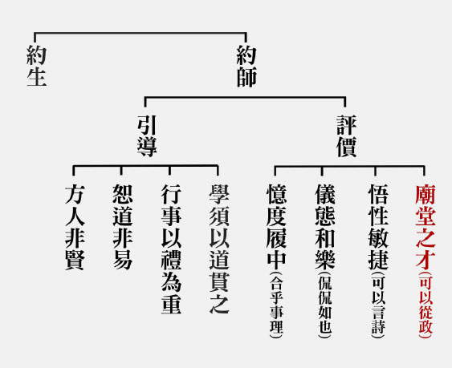

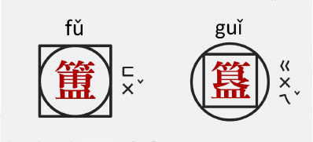

### 孔門七十二賢淺說（五）子張

時哉

所問能知大志向

師稱收斂能中道

狂簡待裁成氣象

傳承夫子後輩賢

顓孫師，姓顓孫，名師，子張是他的字，小孔子四十八歲，是孔子的後期弟子。《史記》上說他是陳國人，《呂氏春秋》則稱其為魯國人。

《論語》〈先進篇〉中孔子稱子張：為人志高意廣，氣象開闊，度量寬宏，但有時不知收斂故稱辟；又《列子》〈仲尼篇〉謂：子張之莊賢於丘也，但能莊而不能同。故常過於孔子所說之中道。

子張胸有大志於天下，《論語》中記述其所問之言，義皆遠大。如在《論語》中問學干祿（學習從政）、問政、問達、問行、問仁，還問十世之禮。其中何以問十世之禮？是因為他有意於亂世中制作一代禮法，並非泛泛之問，而夫子之答亦是因材施教，從中得見夫子就學生的個性，善巧引導，裁之而達中道。

將孔子所教之「言忠信，行篤敬」書寫於腰帶上，以示終生之警惕與奉行。又以「君子尊賢而容眾，嘉善而矜不能。」彰顯其與人交之豁達。凡此，皆可見其人才高志遠不同於一般。

同門弟子對子張的品評，也多是正面積極。子游說他與子張為友，子張的才能是他所難及，論其為仁，同樣也是子游所未及。曾子亦謂子張容貌堂堂，仁也學得好，無法跟他相比為仁。

子張終生未出仕為官，曾以「葉公好龍」為喻示魯哀公非真正好士之國君，故不為之效命，託辭而去。專志於教育講學，後被韓非子推崇為戰國儒家八派之首。

孔子死後，弟子散遊諸國，《史記》言子張居於陳，然而依據〈檀弓〉所述，似卒於魯。孔子之後儒家分為八大宗派，子張為其中一派，然其學說宗趣已無可詳考。子張後孔子三十二年卒，卒年五十七歲。

畫中之子張，頭戴頍冠，頗具福相，目視遠方，與他務開張且有自信的個性相配。身穿布衣，然左手持書卷，表徵雖出身平民，但好學、好問，樂於學習之中。右手背於後方，雙腳穩立於地，並配著面部的神采顯示身為儒門八大家堂堂乎的儀態。（下期待續）

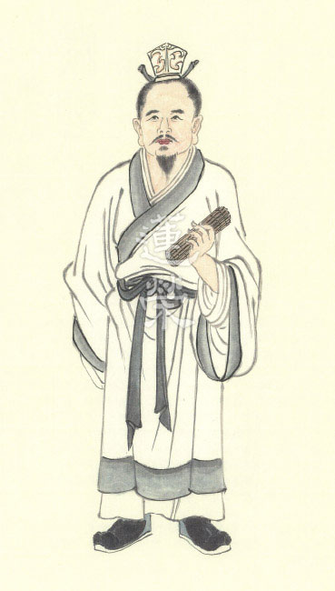

## 藝術賞析

### 華夏精魂千秋(五)明倫史畫真誠格天 ─ 周公姬旦

圖：江逸子　文：淨域

制禮作樂興周室

教育成王誅叛亂

還政表徵無貳心

要為天下立典範

【史話】

周公，姓姬，名旦，為周文王之子、武王姬發之弟，因輔佐武王伐紂建立周朝，受封於周地，爵位為上公，所以稱作周公。

滅商後，武王徵詢處置殷人的辦法。姜子牙主張滅絕以除後患；召公認為有罪者誅、無罪者釋；周公建議原地安置，讓仁德者來管理。武王採納周公的意見，封紂王之子武庚於邶(今河南淇縣)，統有殷商舊畿之地，並將殷畿以南、以西之地，分封給弟弟管叔、蔡叔、霍叔，令其就近監視，稱為三監。

武王大病，擔心才建立的王朝將紛亂，於病榻前對周公說：「你是兄弟中最賢能者，傳位於你國家自當強盛，在此危急之秋，你就不要謙讓了。」周公以不合禮法為由，堅持不受。武王病逝，子姬誦年幼繼位為成王。

周公攝政輔佐朝政，禮賢下士政績斐然，卻引起管叔、蔡叔的不滿，謠傳周公將不利於成王；除聯合武庚背叛周室，亦結合東方之奄、淮夷、徐戎共同作亂。周公揮師東征，三年苦戰殺武庚、誅管叔、放蔡叔，減五十餘國，將周室勢力向東擴展。繼而營建東都雒邑(洛陽)，名為成周，乃以鎬京為宗周。將殷之頑民遷入雒邑以便於管束，封殷宗室微子啟於宋，以續殷祀。封康叔於衛，伯禽於魯，唐叔於唐(晉)，再以殷之豪族分屬諸國，使之服事於周。

某回成王生病，周公剪下自己的指甲投入河中，跪著對神明祈禱說：「成王年紀還小不懂事，冒犯神明的是我，請罰我不要傷害他。」隨後將祝禱文放在金櫃裡，成王的病就漸漸好起來。周公為國為君願以己身代罰，他的無私與真誠，最終能感天動地。

周公攝政除武功外，還建立文治。他制禮作樂，透過禮樂的形式，將社會中各級的權利義務制度化，穩定周朝的社會秩序。攝政七年後，天下大定民康物豐，便還政給已成年的成王，退居於人臣位。成王十一年周公病危，遺言葬於成周，以示不離開成王。周公死後，成王感念其恩德，以天子之禮葬於文王墓旁，表達對周公的尊仰，不以為君臣。孔子晚年曾說：「甚矣吾衰也！久矣，吾不復夢見周公。」可見其對周公的尊崇與懷思。

【圖解】

周武王過世後，幼子誦繼位為成王，弟弟周公攝政輔國，平定三監之亂。周公代理天子攝政七年，以孝治天下，祭天時以文王陪祭，除感念父親養育之恩外，特別彰顯教子成才的恩德可比天。

忠臣出於孝子之門，孝子之祭天祈神，特能感通天地神明的護佑。此圖所繪乃周公去到郊外，捧讀疏文向天祝禱，祈望侄子成王的病快好，若成王冒犯了神明，自己願代受上蒼的懲罰，並將疏文放在臣子所捧的金匱中，不久成王的病就好轉了。周公以孝敬攝政待人，此乃和諧天下之方及感通天地鬼神之道；是故，各諸侯卿大夫及臣國皆來助祭。圖中旌旗飄揚所示，即周公真誠格天，感召萬民同心天下太平之景。（下期待續）

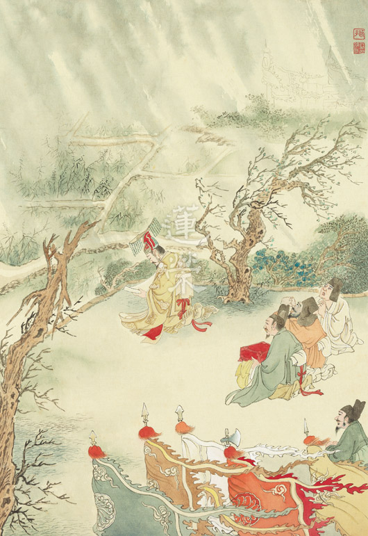

### 孝經圖簡說(三) 諸侯章

圖：江逸子　文：時哉

位居人臣之極

敬儉不失富貴

得民心祭宗廟

助明王安天下

諸侯章第三

孝經的第三章是諸侯章，諸侯就是各國國君，是天子之下的重要大臣，幫忙天子治理天下，且受封為公侯伯子男的爵位，他的地位僅次於天子。一位國君到底要如何把國家治理好？在江先生的畫作中，這位國君非常謙恭有禮，拱手向老百姓致意，當然也得人民的禮敬和稱讚，表徵這位居高位者，雖然居在高位但是不驕慢；其次是輕車簡從，只帶了一位官員與衛士隨從。衛士駕著四匹馬的馬車，並且有傘蓋、旌旗、五色旛等，車頂是鳳鳥，表徵此人地位是僅次於天子的諸侯。

在輕車簡從當中，有著百姓在車旁拱手問候，且表情愉悅，另外也有母親帶著孩子，孩子搖著波浪鼓，祖母帶孫及抱孫，趕來欲見國君之風采，而國君十分隨和的跟大家拱手致意。

此幅諸侯章，江先生要表達兩個意思，第一是國君在上位不驕慢。第二是輕車簡從，代表他雖然富有但是不浪費。所以一位國君，他如果在上位不驕慢，可以維持他的尊貴，他雖然富有可是不奢華，不講究排場，他可以維持富有，也因為不奢侈浪費，所以不會橫徵稅賦，能讓老百姓生活過得好；因為在上位不驕，所以不會讓朝中臣子成為驕縱狂妄之人，由於居高位而能戒慎恐懼，所以能將政治治理得上下和諧，這就是國君的孝。

此幅有別於歷代的孝經畫作，或所繪的馬車是豪華的，或講究排場，而且侍衛直接駕著馬車往前行，沒有像江先生所畫的，國君很親切的跟百姓打招呼，表徵諸侯的清明和簡樸與親民，帶動國家的和諧，自然帶來國家的強盛，以上是江先生孝經諸侯章畫作所要表達的義理。（下期待續）

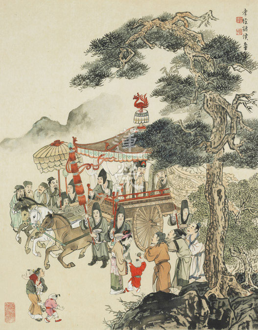

## 專題研學

### 大乘百法明門論簡說（九）

*淨凌講述、淨本整理*

心王為最勝

心所與相應

色法為所現

一一不可得

玖、百法次第

論文：

一切最勝故，與此相應故，二所現影故，三位差別故，四所顯示故，如是次第。

一切最勝故

一切最勝故是指心法，它在一切法當中作用最為殊勝，因為造善由它、造惡由它，乃至成佛，皆由此心。人要怎麼善用其心？使心具有慚、愧等善，或者修學般若，能以法的體性為所緣，使心成為無貪、無瞋、無癡，如此能夠受用快樂、離開惡果，使心發揮最殊勝功德。

與此相應故

此指心所與心王相應，怎麼知道我們有心所？因為心有時候是瞋心，有時候是無貪，有時候是慚愧等等，可見有心所配屬心王，使心王成為貪、無貪等，否則如果貪就是心王，理應永遠貪；瞋就是心王，理應永遠瞋。

與心王相應的有五十一個心所，依據唯識宗，五十一個心所與前五識心王相應的有三十四個；與第六識相應的有五十一個；與第七識相應的有十八個；與第八識相應的有五個。中觀宗則不承認有第七識、第八識，當然也沒有與其相應的心所。

名為相應，是站在四個平等上說其相應。

第一個是

時平等

，心王與心所的生起只有三種情形，其一心所先生，二者心所後生，三者心王、心所同時生。試舉貪而論，若貪心所在心王之前生起，那會有不具心的貪。若貪在心王之後生起，那就會有一個不具貪的貪心。第三者是貪與心同時生，然貪與心二者若有自體性，則心與貪二者成為無關的二法，若如此則沒有貪心的聖者也可具足貪，因為貪可以離開心獨立存在，那又何必修行？所以心王跟心所二者是相互觀待而生，貪在心上說貪心，依之而生士夫的名言，說此士夫是具貪者，此人生貪心時，是貪與心對順境同時生，謂之時平等。

第二個

依平等

，心識是能依，根是所依，心王與心所所依相同而起現行，謂之依平等。例如眼識依眼根而起，與眼識相應的心所亦依眼根而起。若就第六意識與其相應的心所而言，所依是意根。不同的宗派對於意根有不同的認知，按照「一切有部」，意根就是大腦，是色法；如果在「經部」、「中觀宗」，意根，是講前一個心念，前一念是後一念的根本，前一念可以是眼識、耳識、鼻識、舌識、身識或意識。比如前一念眼識看見某人，第二念意識分析他是一位好人還是壞人，此第二念的意識是從第一念的眼識來，故意識之根為眼識；又例如前一念耳識聽見音樂，第二念意識分析是何種樂器發出之聲音，此第二念的意識是從第一念的耳識來，故已滅的耳識為現前意識的意根，所以前一念已滅的心識就是意根，當前意識與相應的心所，都是依著前面的意根而起，稱為依平等。然就唯識宗來論，意根就是第七識，恆執第八識見分為我。

第三是

所緣平等

，心王與心所所緣的境界相同，謂之所緣平等。

第四個

事平等

，心王與心所辦的事情相同。例如憂受(心所)與第六識(心王)相應使第六識成為憂心，於名言中顯現憂苦之事，於憂苦境中生起憂受，心王與心所同緣憂苦之境，稱為事平等。心因為具憂才成為憂心，憂與心一、異皆不可得，若說是一，那分心王與心所則成無義，且對憂苦之境必生憂，因為一故，然聖人對憂苦之境不生憂。若說是異，則二者成為無關。故憂與心非一非異，二者無自體性，相互觀待而生。

因為以上四種平等，所以稱為與心相應故。再以國王(心王)與臣子(心所)喻作說明，臣子對著國王才能成為臣子，國王對著臣子才能成為國王，這叫時平等。依平等就是國王跟臣子都是依著人民而成為國王與臣子。所緣平等及事平等，就是他們所要辦的事情、所在意的事情都一樣，比如說今天要出去視察民間疾苦，臣子就要配合國王要做視察，在意的都是人民是否過得好。

透過《百法》了解心理活動，懂得運用善心及對治煩惱，即是修行善巧者。一陣風吹來，身體觸境生起的感受叫做觸受，有苦受、樂受與不苦不樂受。此受與身識同時生，樂受易生貪，苦受易生瞋，若樂受是貪，則聖人受樂時亦生貪，實則不然，可見樂受與貪非同心所。然樂受與貪是一還是異，若樂受與貪是一，則有樂受必生貪，一故。若樂受與貪是異，則二者無關，故樂受與貪二者相互觀待，而無自體性。

受苦或受樂乃觀待業而起，某人因為惡業，感應沒飯吃，產生餓的苦受，那由不得他，由惡業所成的苦受聖者也有，不同的是聖者在苦受中可以不生瞋，在樂受中可以不生貪，可見心無自體性，透過不斷串習正見，能使內心的慣性改變。

二所現影故

心王、心所所現的影像就是色法，色法有眼耳鼻舌身，屬於五根；還有色聲香味觸法，屬於六塵，一共是十一個。何以色法是心王、心所所現的影？例如茶杯為心識的所緣緣，生起見茶杯的眼識，爾時前一剎那茶杯方生，後一剎那見茶杯的眼識，而前一剎那的茶杯成為已滅，後一剎那生起見茶杯的眼識是見前一剎那的茶杯，然前一剎那的茶杯成為已滅，後一剎那的眼識如何見到前一剎那的茶杯？乃茶杯境界之力生起帶影像的後一剎那眼識，亦不妨說是現量親見茶杯。且在心識上呈現影像，後時方有回憶的功能，若非在識中呈現影像，後時應不能回憶說我見過茶杯。

進一步論，可知色法也沒有自體性，對一個瞎子來說，眼識沒有顯現時，請問色法在哪裡？耳識沒有顯現，請問聲塵在哪裡？鼻識沒有的時候，香塵也不在。換言之，色塵不能成為影像時，色塵也無從顯現為什麼，也談不上對色法的回憶，色法沒有自己可以顯現什麼的能耐，謂之色自體性空，自體空不是否定它的存在，而是否定它以自體性的方式存在！

三位差別故

此指心不相應行法，總共有二十四個，緣起的萬法，彼生起何種作用，說彼即是何種體性，名言上給予定義，雖無實體性而有作用，名言上歸納為這二十四類，是解釋心法、心所有法、色法的名言。心法、心所有法跟色法，三者本來就有差別，藉由前三位的差別假立此二十四類心不相應行法。

四所顯示故

此指無為法，是前四者的體性，依前四者生起的作用，所顯示的就是無自性的體性。無為法裡面的空性才是四所顯示故，其他的無為法非四所顯示，只有無為法的空性才是勝義諦，是四所顯示的體性，無自性才是該法真正的體性。（下期待續）

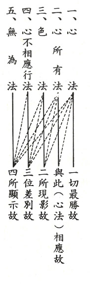

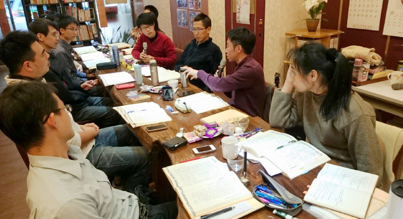

### 佛學概要十四講表簡說（三）

*戒慧講述、法味整理*

福慧兩足謂之佛

福為眷屬資助慧

覓法自體不可得

二障能破成立覺

我們學佛，必須先瞭解學佛的真義是什麼？目標是什麼？學習的範圍是什麼？內涵是什麼？

學佛的真義就是破迷起悟。目標就是要成佛，唯有成佛才能夠真正的離苦得樂。建立正確的人生觀，必須破煩惱障，幫助自己離苦得樂；建立正確的宇宙觀是幫助有情離苦得樂，此須破所知障。所以，先明佛義就是在正確的人生觀與宇宙觀下破除煩惱障、所知障，破除煩惱障靠覺察的功夫，破所知障則靠覺悟，依破二障安立佛的三種智慧。以上是第一講表的總體大概。

佛之釋義

佛是我們修學所要達成的目標，佛義就是佛果含藏的內涵，記載於三藏十二部當中，此種內涵的獲得能讓我們究竟離苦得樂。所以，解經的人必須要瞭解佛的意涵，而且內心要以這樣的內涵為達成的目標，三藏經典裡面所說的方法，都是成佛的方法。

佛之釋義是整個三藏十二部最精華、最重要的部分，《十四講表》所有的內涵都觀待此表去發揮，這是決戰點！否則三藏十二部只是沒有靈魂的軀殼。

破二障成就三智的佛被安立為智者、覺者。智者跟覺者兩者互相觀待，覺者是智者的因，智者所產生的作用就是覺。覺是智的因，覺也是依智而起的用！

智者

佛分成智者、覺者，智者所攝為三種智：

一切智、道種智、一切種智

。一切智是通達法的總相，萬法雖然有因緣所生的種種差別，然皆為自性空，能通達萬法自性空，就得到一切智，這是約著證得出世間的勝義諦來說。

因明學舉個例子，一片樹林都叫作樹，這叫作總相。例如，能夠裝水的就定義為瓶，這叫作總相。知法總相就比如以樹這個名言來通達所有的樹，只要符合樹這個定義，不管是柏樹、樟樹、相思樹，都叫作樹。例如能夠用言語表達思想的，不論亞洲人、歐洲人，都可以稱作人！

所以知法總相，就是符合一切法的定義，這個定義就是一切法是自體空，例如樹的名言稱為總，柏樹、樟樹、相思樹稱為別。自體空稱為總，別就是一切法。一切智既然是知法總相，所有法的總相就是空性，除了空性以外，沒有另外一個總相可以含攝一切法。以上是就知法總相的那一分，說明佛通達法性的智慧！

其次道種智，是知法別相，法雖有種種的差別相，如長短方圓，高低美醜，所有的差別相都符合總相的定義。差別相就是萬法有非常多的面相，通達世俗緣起的面相，稱為道種智。

道是屬於教法的這一分，種就是屬於眾生那一分。就觀機逗教來說，觀機就是觀察眾生的機，逗教就是以教法引導。所以道種智的道是逗教，種是觀機。

一切種智是通達總、別。在每一法上，都能夠知道它的總相，也可以知道它的別相。這是佛現證二諦的智慧，於一切增上同時通達法性與法相的智慧，叫一切種智。

佛的各種內涵，如神通、道力、德能，以及十力、四無畏、十八不共法等，皆以智慧為本質，所以安立佛為智者為最殊勝。

破煩惱障是以智慧破，修廣大的福沒有破煩惱的力量，也不能破所知障；但是福可以資助慧，主要是要生起慧才能破煩惱障、所知障。所以，「佛」字最精準的定義就是智者！雖然是福慧兩足尊，必須要有福有慧，然是以福資助慧，使慧格外的有力，能破除煩惱障與所知障。所以阿羅漢是以破煩惱障的那一分去安立阿羅漢；成佛是以破所知障的那一分去安立成佛！不是他來娑婆世界八千次所以成佛。大慈大悲是成佛的動機，成佛之後，還是來幫助有情，縱然是為了有情去成佛，但是成佛的那一分是以智慧去成！

所以，諸佛之師是表徵智慧的文殊菩薩！難道觀音菩薩、普賢菩薩不能稱為諸佛之師嗎？為什麼經上說諸佛之師，必得說文殊菩薩？就是表徵文殊菩薩智慧的那一分！

覺察、覺悟的本質都是般若智慧，所以道種智就是菩薩在證得空性之後，出定去利益有情，依眾生不同的根機，以及適當的教法，如敦倫盡份，人際關係處理得很好，其重要處在引導有情入佛道學習。

換句話說，菩薩在入世的時候，不妨礙他從事各行各業，不妨礙他與有情各種的交往，但是核心思想就是以法利益有情，否則在世俗中創造各種的歡樂，在無常的夜幕當中，一切的因緣就這樣過去了，對解脫生死以及成佛是沒有幫助的！

阿羅漢入定以現量證得空性，出定時能以比量通達空性，此乃破煩惱障的形象。眼前的花看得很清楚是現量。比量如通達海市蜃樓是虛假，但眼前仍然看到海市蜃樓，謂之比量。

阿羅漢出定看世間顯現世間為實有的那一分跟凡夫一樣，然在入定時已經通達萬法沒有自體性，所以出定的時候知法如海市蜃樓般，知道那裡沒有宮殿、陽光和水，所以不會被迷惑。

我們世間有很多有經驗的老人也有比量的智慧，比如他們會告誡年輕人說：你不要再做這個事了，會有不好的果報，這些都是他們經驗的比量，雖然這個果報還沒出生，對一個有經驗的老人，他或許不知道確切的果報，但是他知道這樣做是不行的！這叫作比量。佛就是可以直接現量看到果報的聖者。

所以大菩薩來到人世間，如果不是來結法緣，這頓飯他不會吃，這個福報他也不享。人活著是利益眾生的，光活著而沒有利益眾生，絕對不幹！所以雪廬老人晚年，絕對不會多一分的享受！這就是大菩薩！很多人的人生觀，是貪圖享受、浪費生命，只不過努力報廢自己而已。可是大菩薩所有的核心思想，就是觀機逗教。如果不是為了眾生，這個福報他不要享、這頓飯他也不吃。

道種智是破所知障的過程，亦即在入世的時候訓練自己出世的能耐。遇境逢緣串習般若的智慧，在一切法上通達自體空，此之慧力勝過阿羅漢。

一切種智特指佛的成就，能以不出定的方式來現證二諦，同時通達法的總相和別相。

佛入世是什麼都沒看到又什麼都看到！因為一切法的體性空，所以什麼都沒看到，什麼都看到指的是看到眾生的業如何顯現。就像影像在鏡子上顯現，可是鏡子沒有粘著這些影像，佛的智慧就是可以現量通達眾生的業力。以上就是佛(智者)長成的樣貌。想要學佛的人，就必須要通達佛的樣貌，確立這是我要達成的目標，了解對著得到佛果的因地修學，倘若不知道其中的因果關係，怎麼會認真修？確立這是真正可以離苦得樂的證量，知道這是我們唯一的出路！所以，知法總相是空性。知法別相，是在別相當中訓練總相的通達。通達總別，是在別相的通達當中，現量的通達總。以通達總的智慧(般若智慧通達空性)去破煩惱障、所知障，只有這樣的智慧才可以成佛，是世間任何智慧無可取代的。

覺者

接著要問怎麼得到這樣的智慧？智慧的得到必須要透過覺察、覺悟。

煩惱障礙我們入涅槃，障礙我們解脫，障礙我們了生死的就是煩惱！而煩惱怎麼來？煩惱從無明、我執來。無明、我執所執的就是人我跟法我，認為人我跟法我有自體性，就會對好的生貪，壞的生瞋。貪跟瞋的分位煩惱跟等流煩惱就出現一大堆。既然煩惱是從執著而來，只要對治執著，煩惱就沒有了！

所以，

煩惱有兩種對治法。第一種的對治法就是修對治觀。

比方說多貪眾生不淨觀、多瞋眾生慈悲觀，有什麼煩惱就修一個對治法來對治它，或者對眼前修厭離，但是如果有更好的東西出來？這種對治法，沒有辦法斬草除根。

第二種對治法是直接除根

，就是觀察我有沒有自體性，因為煩惱的根源是無明我執，所以執我的心還在，還是會生起煩惱。直接觀察法的自體性不可得，沒有對治什麼貪、什麼瞋，所有貪、瞋的根本都不見了。這就如同切斷水脈，樹就會慢慢枯死，切掉水脈就是斷了無明、我執。

所知障跟煩惱障的差別呢？所知障是人我執跟法我執，還有身、口、意三業薰下去的習氣。但是這個習氣不會生起煩惱障，不會生起人我執跟法我執，以及身口意造作薰下的習氣，此習氣不會生起煩惱。就像緊那羅（玉皇大帝奏雅樂的神）來聽佛法，越想越高興，拿著樂器彈奏，迦葉尊者聽到這麼美好的音樂，就不由自主的站起來跳舞，現場的阿羅漢都大驚失色！可是佛沒有呵斥迦葉尊者，因為那是所知障，迦葉尊者心裡頭並沒有生起慾望以及煩惱。

煩惱障就相當於酒味是從酒而來；所知障像是酒倒光後瓶子殘留的酒味。酒倒光以後殘留的味道，就是法我執、人我執，是身口意薰下去的習氣。可是這個習氣不會生起人我執跟法我執。

如果我們不由自主的跳舞，不由自主的抽煙，不能說是所知障，迦葉尊者已經證得阿羅漢果，他的空性智慧能夠破我。我們對很多事情的無知，或者習氣造作，都應該說是煩惱障起現形，不應該說所知障起現形。

沒有破到煩惱障，就破不到所知障，因為所知障是煩惱障薰下來的習氣，不會生起煩惱障，阿羅漢因為仍有所知障，所以在他心識面前，所顯現的跟世間人一樣，只是他通達那個是海市蜃樓，知道遠方並沒有樓。不像我們追逐名利，一生一生的就這樣被騙，騙到這一生還在被騙，沒完沒了。現在的科技假相最能說明，電視打開，當你進去那個世界的時候，是不是都誤以為真？可是你通達了，其實那都是影像的變化，沒有一樣是真實的！(下期待續)

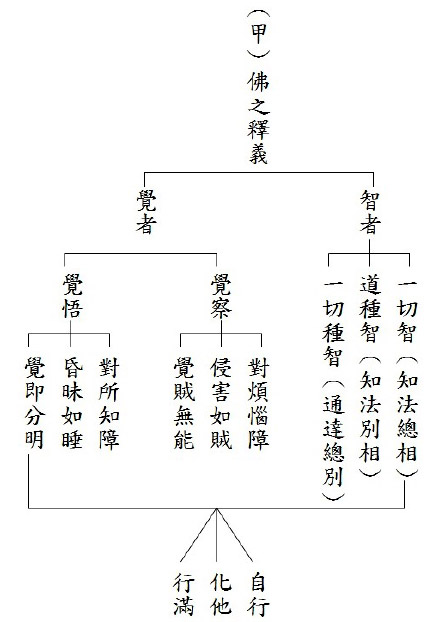

## 活動報導

### 二○一五年大專講座 ─ 佛說四十二章經

### 活動報導

淨爾

經學培養人才

輔以辦事歷練

消文釋義科判

義理運於日用

多年來，學會延續雪廬老人的傳統，結合大專生、青年人、師長義工等於每年寒暑假舉辦短期佛學講座，透過一講座一經典的模式，學會興辦過十四講表、八大人覺經、心經、唯識、普賢十大願……等講座，讓初機者有聽聞學習的機會，讓已有根基者得以串習深入。今年，特別有來自福建國學堂、浙江典愛國學會、溪源大學預科班、以及瀋陽和馬來西亞的朋友們和我們共聚一堂，因為報名人數遠遠超過學會所能負荷，所以辦公室開始尋求租借附近場地，期望能給予上課大眾舒適的上課環境，並且同步開始電話詢問正確的上課人數，責成無法全勤者擔任義工，最後考量諸多因素後，仍決定在學會上課，並增設第二個上課地點，在中壢研學會以連線直播的方式上課，至此方解決了上課人數眾多的問題，在此也非常感謝犧牲自己上課權益的師長們，因為大家和合為公辦事，才有此次講座的圓滿。

為了籌辦年度暑期講座，也為了激勵學長們用功讀書，七月份的講座，提前於四月份清明連假便展開聚會研討的前行活動。多位學長借住臺中勢至念佛會，每日清晨即起做早課，開始騎車、傍晚健行鍛鍊身體，其餘時間自行讀書挑戰製作科判，並且共同研討此經義理，最後訂出幾個版本，再由老師加以裁奪，老師有時會打破既有的見解，用提綱挈領的字句將義理發揮，有時又鉅細靡遺，讓學生只能瞠目結舌的望其項背！大家在共住、共遊、共學之中提起對經典的好樂心，未完成的科判研討也從四月清明連假，延續到之後在學會的研討，事先的預習以及研讀有助於學長們在正式講座期間掌握課程內容，及更全面地思惟經典義理。

講座的內容以小乘部派及中觀宗為核心闡述《佛說四十二章經》的內涵，透過老師與學長們問答的觀修，幫助大眾建立正確的人生觀與宇宙觀，並且正確的認識與學習來到中國的第一部佛經—《佛說四十二章經》，講座僅僅七天，排有十七堂課，中間又穿插有《論語》以及《孝經》的直播課程，致無法將此經深入細講，只能將重點分析清楚，期望以此部展現圓融的成佛大道。此次講座大量啟用年輕學長做消文釋義，維那、悅眾也有新血加入，讓從未上場過的大專學長擔綱，頗有老幹新枝傳承的意味。

七天的講座內容，除了早晨的經行，教室內的上課與自修，每天早、午的研討，早晚課以及餐前觀修之外，不論正式生、旁聽生均輪班擔任午、晚餐及洗碗義工，讓大家在讀書之餘也有機會服務大眾並體會義工的辛勞。另外學會也邀請陳均憲先生及張雅雯女士進行專題講座「專案執行力」及「企業所需之國際化人才-以臺灣為例」，讓年輕的學子的知道在充滿競爭力的社會裡該如何培養自己的能力及做事的執行力。

講座結束最後的高潮是老師精心設計的四十九題考題，不但考驗學子們的學習成果，也將此經的重點全部羅列，外加黃仁溥師伯提供的獎學金，成就講座的順緣，師伯也勉勵大家好好學習、不枉度青春。

一如此經第十二章中佛說道：「人有二十難…得睹佛經難，生值佛世難…會善知識難……」，基隆淨宗學會陳會長也在開訓時引古大德語所說的：「人生難得、佛法難聞，中土難生、淨土難遇」，佛法難求、善知識難遇，大家能在暑期的一開始克服炎熱的暑氣和諸多障礙，有師長、家屬、義工眾人的護持而齊聚一堂聽聞教法，殊勝的因緣須善自珍惜，也期望一期的課程開展出正法滿載的人生。

講座結束隔天，全體學員至埔里正覺精舍齋僧，此次講座不但有課間的修慧課程，也安排了殊勝的齋僧法行，果清律師亦專程由圓通寺前來，為吾等講授「淨土生無生論頌」，近兩個鐘頭的開示，完全沒有看稿，信手捻來，不但含有天台宗殊勝妙義，更有師父殷切的期盼，在正法上所有的學習與為公發心，絕對不會白耗光陰，臨命終時，阿彌陀佛會拿我們自己培養的蓮臺來接引，一生決定功不唐捐。

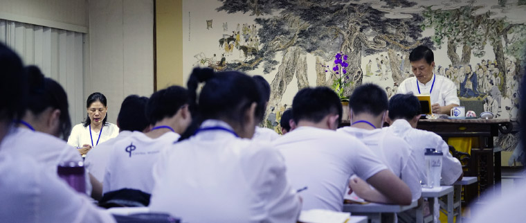

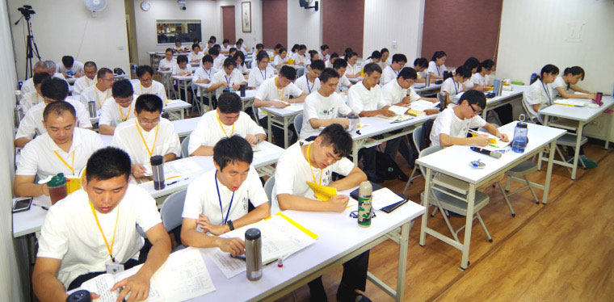

### 法語觀修

*編輯部整理*

無常無我證涅槃

大悲攝持善方便

盡除眾生意愚蒙

持佛教法於久遠

本經雖然名為《佛說四十二章經》，卻是佛在不同時期、不同地點，對不同對象施設之教，譯者迦葉摩騰、竺法蘭將之有次第的編排，經首提到釋迦牟尼佛成道，猶如經之序分，乃說法之緣起。

釋迦牟尼佛示現成道的目的在說法度眾，所以今天必須要靠正法傳承去維護佛教。法沒有自體性，看引導的人怎麼引導，此經雖著重在小乘部派與中觀見地，亦含攝大乘法的修學，不但能彰顯釋迦牟尼佛一期說法的本質，也是二位譯者四十二章條目劄記的本意所在。

四十二章看似獨立，但是前後章是有關聯的，所以在序分當中，由釋迦牟尼佛出世，說法度五比丘成立三寶，能做有情眾生福田，助成有情修學解脫道成就。然佛滅之後，教法的傳承在僧寶，故僧寶要受道法。而所受道法為何？受道法的沙門行相為何？首先須有受道法的能耐，故僧眾須由頭陀行來磨練自己，如容器要先清淨，方能裝入甘露（受道法）。頭陀行的體性在十善業，作為修學正法的資糧，修道若無資糧，容易在修道過程中缺乏生活的資具，或遇不到善知識，或遭遇鬼神、非人等障礙。修學正法中特別是空性的修學，需有善知識的厚愛、法本以及同儕善知識的護持等等，是故善法須做得多，比較不容易產生學法的障礙。

在家人與出家人的角色不同，出家人的使命就是弘法，身心出家的僧寶可以維持僧寶的形象，我們在家人是以身不出家但是心出家的形象擁護三寶，現見雪廬老人就是一個典範，心出家的在家人，是對三界以苦為本質的輪迴有殊勝的了解，而且懂得修學中觀正見，流通正見令有情知三寶與外道的差別。

並造作善法爭取友情對正法的認同，然須懺悔來斷除往昔的惡行，使作善的能力轉強。斷惡修善是修道的資糧，斷惡可以破除學道的障礙，修善可以增加修道的順緣，所以斷惡修善是有目的的斷惡修善，隨緣作善法是隨著不同的緣做不同的事，目的都是在排除學道的障礙，積聚學道的順緣，學道的障礙當中，會遇到種種逆境，佛也以自身為例現身說法，此時要好好懺悔業障，反省自身所作，求他人開解與原諒，甚至要有忍辱的功夫，以佛果為目標，以般若智為主要的方便，攝持世俗廣大的菩薩行，內心隱微處就是成佛的想法。

在作法上要好好地隨喜他人之善，見賢思齊，知道唯有自己具足正見去成就佛果，才是供養法行當中最大的福田。整部經要談的重點就是解脫道以及般若正見，這些才是真正離苦得樂之道。

而且慾望看似難以對治，修行也會遇到很多障礙，但是依著中觀正見，都能將跨不過去的障礙轉變成為順緣。若將障礙看成實在，人生就會過得很辛苦、困難，甚至在午夜夢迴中生出退轉的心，懷著愛欲心去修行，所行的善法全部都在堅固愛欲，修行只是在保護愛欲，維持憂怖，反而使得內心憂怖的狀況十分熾盛！

在此中修學忍力，所得到的福報也最多，在般若上面得成於忍，乃至於利益有情時能安住於忍，內心沒有煩惱，這全都是因為有般若的智慧，使自己不會對有情懷惡，也不會生起種種的惡心，並且因為有修學善法、正道以及般若正見，所以內心輕安，修學的勢力強健，所感應的福報也最大！金剛經上也說，能夠安忍於般若的智慧，能自行及化他，這種福報最大，而且智慧最明，也最能幫助忍者多力，忍者多力也最能幫助智慧最明，這些都必須要克除二十種難，幫助我們放下世間，在專注學習當中能夠得到道的精華，一路目標確立而得到成就，以上都是此經善巧提出修行的路途。

四十二章經的學習有著小乘部派最核心的思想，也就是無常、無我的修學法，若以大悲心攝持，體性也可轉為成佛的見地，若以往生為手段，以成佛為目標，也能以這種修學法助成上品往生。修學過程當中會有障礙、挫折，然而這些障礙再大，不但傷害不了真正修學者的內心，反而是堅固行者的願力，練就八風吹不動，成就傳承的天命。這些障礙、魔怨反而幫助成道，功德等同善知識、佛菩薩。

能說的釋迦牟尼佛是十方諸佛當中極有特色的一尊佛，在此娑婆世界僅有的四十九年說法因緣中，把十方諸佛宣說長劫的要義濃縮在四十九年當中說完，令十方諸佛敦勸自己弟子來聽課。行者應當在有限的人生當中，好好充實自己，學習三藏經典與祖師的要義，並且用空性正見攝持，念佛導歸西方極樂世界，成為往生上品、中品的資糧，觀經上記載，上上品往生是依著空性的正見，攝持菩薩的廣大行。往生之後也是花開見佛悟無生，在花開見佛當中，聞法學習中觀正見悟無生。四十八大願的中心思想也是為了得到入正定聚的安樂與解脫輪迴的能耐，這就是極樂世界教法的核心。極樂世界眾鳥演法，所演說的就是無常無我的慧(中觀正見)，用止觀修慧，以七菩提分除去昏沉、掉舉與散亂等障礙，依著正見得到根本位以及後得位。

依著雪廬老人的表解，並且透過科判做架構式的學習，依著經文的讀誦以及種種義理的觀察，課間的研討與問答，對此經的大義有了大致上的了解，相信能對個人的修行觀念產生很大的突破與提升，幫助行者在面臨抉擇時，知道該做什麼決定。並且成為可以講解此經的人，周圍的人都能因此而得到利益，若能好好講究這些緣起，將來必定能結成累累果實，如同善財童子與法華龍女當生成佛，每個人都有無限可能，如此今天這一場講座就成功。

佛法是自體性無，善用佛法的人就能得力，如何讓佛法成為所修，我成為能修，佛法成為所住，我成為能住，佛法所說的果位成為所證，我成為能證，都有賴於正確的學習並且得到殊勝的理解，並且依著大眾聚會研討，自己在課後也能繼續深入，對義理推敲琢磨。

總而言之，天命無常，端看大家如何正確又真實的努力，若能依著正知見，正見的力量會令人世間微少的善法增長廣大。站在與小乘共道的立場上，簡除自私的意樂，去發展大乘的不共道，相信這樣的人生，是有價值又有意義的人生，能走向康莊大道，結上許多善緣，得到他人的尊重，最後的龍天推出成為必然！

此時內心會真實相信這一條路不但不成為障礙，而且能轉變成幫助自他離苦得樂的方便，而所累積的福報，亦是世間人難以想像！面對死亡不會恐懼，也不會被業所繫縛，遇到障礙可以轉化成為修行的順緣，能累積廣大的福報，將這樣的概念作為佛果的莊嚴、淨土的莊嚴，相信這幾天的學習，會帶給我們莫大的安樂，唯願三寶的加被，傳承的攝受，大眾都能生起殊勝的見地，能自行、能化他。

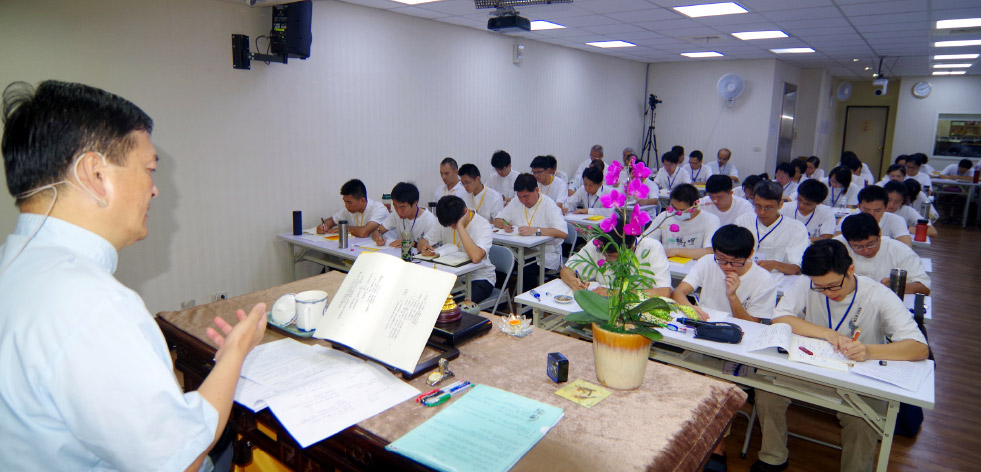

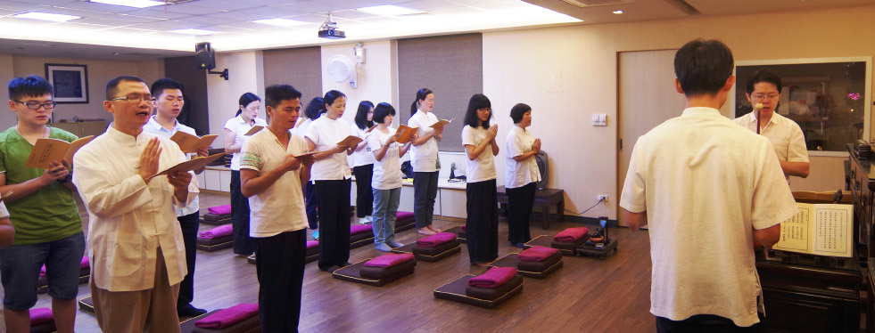

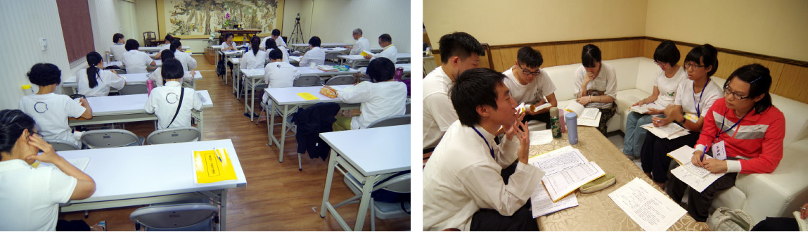

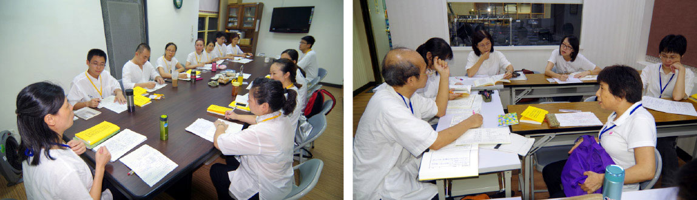

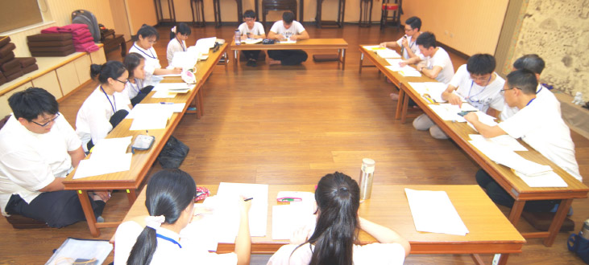

### 考題解答（上）

*編輯部*

大教東來白馬駝

經教要義四十二

文似小乘實近大

善用如蜜中邊甜

一、佛的根本定行相為何？三寶之性相為何？一期三寶以何為緣起？

**答：** 破煩惱障、所知障的能所雙亡空性定為佛根本定行相。

三寶的性相：根本定的能證者為佛寶，所說現證空性修學法，帶來內心的證悟(教法輪與證法輪中，特別是證法輪)為法寶，僧伽如法修行證得聖位為僧寶。

一期三寶緣起在世尊八相成道，為佛寶出現，在鹿野苑轉四諦法輪度五比丘的四諦法輪為法寶，五比丘證果為僧寶出現，乃至其後證果之比丘亦然。

二、外道經典形象為何，為何不能信？內道經典形象為何，為何需要深信？

**答：** 外道經典的行相，或降之於天，或來自乩鸞，其性相皆以執我的概念來攝持，或修行或受用，皆非究竟離苦得樂之法，故不能信，甚至有撥無因果邪見，善惡不分，依之而學，下場淒涼。

內道經典均源自佛語，有信聞時主處伴六成就，以資徵信，有能說的善知識傳承經學見地，所傳為破我執證空性之法，究竟離苦得樂，故可以信，而觀待性空的因果正見，在世俗的修善，更是自利利他的良方，般若修學的助伴。

三、修學解脫道與大乘道之本質何以皆是四諦，試述之？

**答：** 輪迴之苦對有情是實在(雖體性空，但對著有情顯現為苦)，然輪迴的苦是有因生還是無因生，由於這些苦是變動不居的，故是有因生，其因為何？乃集諦的觀察，確立無明我執為輪迴之苦因。既然苦果是我不想要的，然不對治苦因則如何離開苦果？苦因苦果的滅，才是究竟安樂處，是滅諦的觀察。而現證空性破除無明我執才是究竟出路，是道諦的觀察。

所以解脫道的本質是四諦，本質在自利，而大乘道本質在利他，利他如不知觀四諦法門以解脫，則利他亦不究竟，嚴格來說未幫助眾生脫離輪迴，就毫無利他可言，人天安樂不求解脫，皆三世佛冤。所以大乘道也是在教眾生修學苦集滅道四諦法門以脫離輪迴之苦。不只幫眾生破煩惱障出離輪迴，更進一步要破所知障出離變易生死，得成佛的大樂。但這除了需要般若的修學法，還要廣大行的修持作為助伴，使空性慧格外有力，進破所知障。所以大乘的四諦法門比小乘的四諦法門內涵更為深廣，除了自己能觀四諦還要學習教導眾生觀察四諦的種種善巧方便，而有「無量」四諦。

四、比丘三義形象為何？比丘之果為阿羅漢其成就形象為何？比丘義當中一義為佈魔，試問如何令魔恐怖，例舉三相？

**答：** 比丘為因，阿羅漢為果，其義有三，因果亦三。

(一)因地修學般若，對治煩惱不作惡事，是為「破惡」。果地成就能對治煩惱種，殺煩惱賊，是為「殺賊」。

(二)因地修學般若，對治我慢，能乞食以活色身，是為「乞士」。果地能破煩惱種，成為福田應受供養，是為「應供」。

(三)因地發出離心修學般若，對治我執，魔宮震動，天魔為之恐怖，是為「怖魔」。一者比丘欲出離，魔懼眷屬減少。二者比丘化度眾生，魔眷再少。三者魔本自以為究竟，現知已非究竟安樂，知見動搖，為之恐怖。果地能破煩惱障，沒有實有的我及我所，知諸法自性不生是為「無生」(體性從來沒生)。

五、阿那含(三果)壽終靈神上十九天，何謂十九天？到十九天之上，彼處形象為何？到那裏做什麼？

**答：** 阿那含義為不來，已破欲界九品思惑，壽終後生五不還天(無熱天、無煩天、善現天、善見天、色究竟天)，在那裏以色界無色界七十二品思惑為所緣，觀修空性以破之。因五不還天位於色界最高禪定四禪天中，唯三果聖人可居可見，其他四禪天人無法共其境界，故曰高於四禪天。

因自最下欲界六天(四王天、忉利天、兜率天、夜摩天、化樂天、他化自在天)、初禪三天(梵眾天、梵輔天、大梵天)、二禪三天(光音天、少光天、無量光天)、三禪三天(少淨天、無量淨天、遍淨天)、四禪三天(福生天、福愛天、廣果天)，加上四禪另有外道修無想定而愛色身者所投生之無想天，共計十九天。三果聖人所生之五不還天高乎其上，故稱壽終靈神上十九天。

六、見惑為五利使，名為利使的理由為何？思惑為五鈍使，名為鈍使的理由為何？

**答：** 凡夫執五蘊身上有我為實有，被俱生我執所攝持的貪、瞋、癡、慢、疑等煩惱，生起猛利，敏銳迅速謂之利，驅使吾人墮落三途受苦謂之使。而定中見到真實的俱生我執了不可得，明白所執的我體性沒有後。此時外道表現如何殊勝、快樂及富有，行者也不會相信其所說的常ㄧ自在我、靈魂我為實有，此時安立為破見惑。觀待見道位聖者出定遇境逢緣，雖然曾於定中見真實我了不可得，無始以來的習氣使他仍生貪、瞋、癡、慢、疑等煩惱，安立為思惑，但已經很薄弱，徐徐生，不會驅使聖者入三途，觀待見惑的煩惱稱利使，思惑則謂之鈍使。

七、輪迴之體性為何？招感下一生的愛取形象為何？

**答：** 無明我執是輪迴的體性。今生臨終前最後一念以無明為緣所生起的愛取，潤業所造的生死種，招感下ㄧ生的異熟果。

八、出家沙門所修須歷階位成就阿羅漢，經文卻說不歷諸位，其故何在？

**答：** 出家沙門所歷階位須陀洹、斯陀含、阿那含等，最後成就阿羅漢果，所安立的階位為觀待出定後歷緣對境所生的煩惱輕重而立，須陀洹尚俱三界思惑最重，斯陀含已進破欲界上上品等六品思惑，阿那含已全破欲界九品思惑，不再受生於欲界，阿羅漢則全斷三界思惑，煩惱不生。不歷諸位指上述聖者(初果至四果，初地至十地)入定現證空性，能所雙亡，心識前空靈靈的狀態，談不上是何種聖位。

九、為何要離開愛與欲？要如何離開？

**答：** 觀待對世間的愛欲，就有輪迴的繫縛，解脫輪迴的能力是觀待對世間愛欲的對治，斷見惑證初果，所斷見惑即是先對治愛欲的粗猛相而安立，進一步對治愛欲的微細相而安立斷思惑，所以要出離輪迴之繫縛，愛欲必去之。

然要如何離開愛欲的繫縛呢？所謂「嗜欲深者天機淺，嗜欲淺者天機深」，初發心者應先訓練自己得少為足的能力，所以佛才要沙門：「剃除鬚髮而為沙門，受道法者，去世資財，乞求取足。日中一食，樹下一宿，慎勿再矣！」能知足的人，才是修行的道器。以上所述僅為對治愛欲的前方便，是說這樣的人比較容易修。為何生起愛與欲，是因為要追逐與樂著可意境讓我得到快樂，若見到真實的我了不可得，能愛能欲的我了不可得，則又如何對可意境生起愛欲？故般若修學法是愛欲的正對治，所以佛才會說：「斷欲去愛，識自心源，達佛深理，悟無為法。」觀待識自心源，達佛深理，悟無為法，才能真正離開愛與欲。

十、善之體性何以是非遮？無遮與非遮之義為何？其數為十，試述之？

**答：** 首先說明何為遮法，成法為肯定法，遮法即為否定法。遮法有遮止義，又分無遮與非遮。

無遮：全面否定，不引向餘法。

非遮：部分否定，引向餘法。

舉例：

或問友人：你口袋裡有什麼？
可能性一、友人
**答：** 我口袋裡什麼都沒有。-表示口袋空空如也。(無遮)
可能性二、友人
**答：** 我口袋裡沒有錢。-口袋裡沒有錢，卻可能有信用卡。(非遮)

其次，善的體性是止惡，也就是以非遮法說善，何以故？如果善不以止惡為基礎，那麼人們可以早晨放生，下午打死蟑螂。

我們必須了解所謂斷惡修善，要先斷惡、懺悔、改過，才能引發真正的善法欲修善。所以，十善業的基礎是先對治十惡業而成立十善業，例如，以不殺生對治殺生，然後在不殺生的基礎上成就護生、放生等種種功德，並將此功德迴向解脫與成佛，期望將來善法生起成為樂報時，就能成為我們修道的資糧。

身口意三業及其止惡行善如下：

身三業：不殺生---放生

不偷盜---布施

不邪淫---持戒

口四業：不妄語---說誠實語

不惡口---說柔軟語

不兩舌---說和合語

不綺語---說如義語

意三業：不貪---布施

不瞋---忍辱

不癡---智慧

十一、感三界之果由來為惑業，惑為緣，業為因，其義為何？

**答：** 人們因為有無明我執所以起惑造業感果，惑為緣即是因為惑會潤過去所造的業，使業感果的功能轉強，而成熟為未來的果。

十二、懺悔清淨須四力淨懺，其相為何？理由為何？

**答：** 四力淨懺：拔除力、對治力、防護力、依止力。

如果我們有因果知見、知道輪迴之苦，在見到世間果報時必然會生起恐怖畏懼之心，害怕過去無始劫以來所造作的惡業起現形，也會對此生所造之惡感到慚愧，為了希求往昔所造惡業不來相擾、為了離開輪迴，我們必得求哀懺悔，並尋求滅罪之法。

滅罪之法首要在三寶前發露先罪，透過將過去所造惡業一一在佛前翻出來檢視，因而警示自己、斷除念念相續造惡的心，此即拔除力。懺悔的對治力是要對治無明我執，然此須結合般若的修學法，並求佛力加被生起修學的順緣，去除修學的違緣，此即對治力。對治後，需要有防止再造的防護力，即是發願護持正法改往修來、護住自己的清淨心。然上述之所修須依止三寶、發菩提心，此即依止力。從懺悔、改過、反省、發願、力行、迴向，最後我們才能得到真正的身心清淨和願力清淨。

十三、惡人聞善來擾亂者，其形象為何？何以對彼不瞋責？彼如何自惡之？

**答：** 一、聽聞我要造善而來擾亂的惡人，有可能是我過去的惡業所感、或我曾得罪過他、或者他的體性就是惡，只要遇到善人、善法就想破壞，或是善知識、佛菩薩的考驗，本章所講的惡人或是體性為惡者，若是連這樣的惡人，我都能做到不瞋責的話，何況其他三類？惡人來擾或是以惡口（口業）、或是行動上破壞（身業）、或是有擾亂的意圖（意業），更甚者，組成一個團隊來破壞。

二、對來破壞我造善的惡人不起瞋心、不去責難，是因為觀察到他之所以來擾亂，是他的煩惱驅使他而有身口意上的造作，他的煩惱才是我真正的仇家，我若對惡人起瞋責那是弄錯對象。故發願要除掉他的煩惱與惡業，而非報復這個人。

三、惡人被定義為惡是因惱害眾生，我不因惡人來擾而發怒責備，就不造業，且藉此機會修忍辱，因而生起對惡人的感恩心，沒有他，我如何修忍辱？而惡人發動身口意的造作，將來果報必得自己背負，因果報應不爽。惡人犧牲自己來助我修行，我對他能不生慈悲心嗎？惡人對我造善的擾亂，我不起瞋責，也就是在我的這一分來說他的擾亂沒有成立，我若發怒了，那惡人就得逞了；在惡人的那一分上來說，他的種種造作，惡有惡報，果報不在我的身上，誰也無法代受他的業報。

十四、佛已是無過之人，何以還遭罵辱？如何面對？彼惡人如何受報？試以三喻明之？(依經回答)

**答：** 一、佛無過失，過失是在有情身上顯現。其次，佛的無過失也沒有辦法自體成立，否則就連外道也會承認佛無過失，事實上卻是相反。

二、佛對惡意來辱罵者回應是沉默不答，等他罵夠了、無趣了，停下來之時，佛才開示。

三、惡人來罵就像「子以禮從人，其人不納，」所以「禮歸子」，也就是說送人禮物，人家不收，禮物沒送出去，自然是回到自己手上。又好比是「響應聲」，這裡叫一聲那裏就迴響一聲，就如空谷迴音，有時迴音甚至比原先的聲音還大。也好比是「影之隨形」，就像漁網放在沙灘上，拿走漁網後，沙灘上仍留下網痕。以上比喻都是說罵佛之人乃是「子自持禍歸子身已」，因為有聲必有響，有形必有影，因果不失。

十五、顏回讚夫子博我以聞，約我以禮，然此處佛說博文愛道，道必難會，何以儒佛有如此差別？

**答：** 佛說法有四意，(一)、平等意：例我即阿彌陀佛，指證量平等。(二)別時意：指以後非現在，例《佛說阿彌陀經》：「若有善男子善女人。聞是經受持者。及聞諸佛名者。是諸善男子善女人。皆為一切諸佛之所護念。皆得不退轉於阿耨多羅三藐三菩提。」並非聞經及聞佛名現在就得不退轉，是指其未來的成就，現見很多人聞經及聞佛名，往後卻退轉，跟經文所示不同。(三)別義意：不能從文字表面承許，要另外觀察，例如觀世音菩薩「侍多千億佛，發大清淨願」，侍多千億佛非發大清淨願之正因，侍多千億佛是學廣大行，去資助空慧，有能力破煩惱障、所知障，方能令所發之願清淨。(四)眾生樂意：仍以遮而令學者更上一層樓，如否定布施，是為了令行者持戒，非不要布施。

本章佛否定博文愛道，是為了令眾生守志奉道，能專心致志串習般若修學法。儒家孔子也有用眾生樂意的方法，如《論語》〈衛靈公篇〉有一章：「子曰：『賜也，女以予為多學而識之者與？』對曰：『然。非與？』曰：『非也！予一以貫之。』」即是希望子貢不要只停留在多聞而識之，要向上提升進入性與天道的學習，將所學的一以貫之。

十六、隨喜他人得福甚大之理由為何？他人福報何以不失？

**答：** (一)隨喜這一法也沒有自相可得，觀待對隨喜對象的了解，並生起殊勝的隨喜，所生的隨喜福報越大。例如懂得隨喜幫助佛法的傳承、弘揚，福報當然遠大於一般世間善事的隨喜；懂得隨喜自己，會讓自己學佛的路走得下去；懂得隨喜他人，可以降伏我慢，會讓自己有學習的目標，有向上的動力；懂得對他人隨喜因上的行持，會助自己在因上做善巧的抉擇；懂得對他人果報的隨喜，可以對治自己的忌妒心。觀待隨喜的見地愈殊勝，所生的善根亦無盡增上，福亦無盡增上。

(二)因為隨喜者，完全在見地上論，是約自己善根增上，而說福報，所以福報之大小觀待是否善用己心生喜，並不是隨喜者去分被隨喜者的福報。而本章的隨喜特別約「施道」來說，即佛法傳承的隨喜，佛法傳承特別是般若，隨喜說法者在般若的見地上，依般若知見所做善業，方不會生起三世佛冤的福報。

十七、供養飯食福報大小何以要論田(對象)高下？諸供養中，法供養最殊勝，其行相為何？

**答：** 人欲學道，須有資糧，因此在廣種善業種子時要有能力判斷所種的福田之高下，就好比世間人在投資經營時，也要先論投資何種事業，其報酬率如何，不也是相同的道理嗎？但修道者並非在意世間福報的多寡，而是以能助般若生起的出世福報為重，其目的亦是為了利益有情，成就佛果。

然諸供養中以法供養最為殊勝，因為要令三寶住世，須靠人傳，將自己培養成佛門的人才，傳承教法證得無念無住無修無證之者，修得如此也成為世間的福田，這絕對是十方諸佛菩薩所樂見，也是三寶最願意加被的對象。

十八、學道有二十難，分為殊勝外緣難遇，內心障礙難破，所以修學難有成嗎？這些難要如何突破？

**答：** 要成就無念無住無修無證之者必經諸多難關，觀無始劫來的有情眾生皆未全數成佛，即可知曉其難甚大。但要明白，困難並無自性，突破與否皆存乎一心。孔子曾說：譬如為山，未成一簣，止，吾止也；譬如平地，雖覆一簣，進，吾往也。學廬老人在表解中亦云，環境只能拘束凡夫，不能拘束真發心者。滴水能穿石，鐵杵可成針，惟有透過教法的傳承學習，才能令志向堅定不退，用正確的見地將所有困難轉化為殊勝的增上緣，勇往直前，使自己每天都比昨天更進一步，將來必有一番成就。

十九、修道之人何以要問宿命通？斷欲無求如何是得宿命通的方法？用其他方式得宿命通有何過患？

**答：** 修道人誤以為得到宿命通，見得過去生中生死情狀，能夠不再重蹈覆轍。實而不知，若無正知見，徒然知道過去自己過去生的歷史，也無助解脫。

斷欲無求者，是能現證空性，知道所執的我無，所以沒有世間的欲望。而入空性定遠難於世間禪定，是故當其有空性定之基礎，再修學世間禪定獲得宿命通則甚易。

若不先斷欲無求，以其他方式修得宿命通，則易生驕慢，長養名利心，道退魔至。（下期待續）

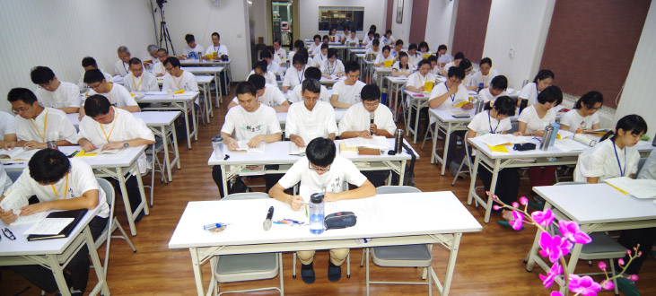

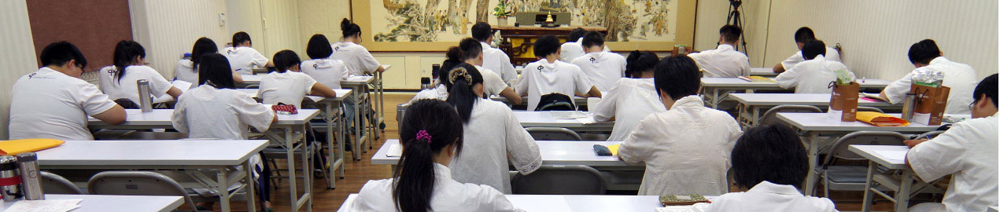

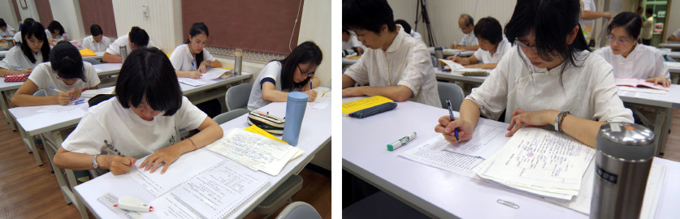

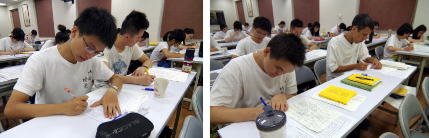

### 餐前觀修

活動報導

淨爾

經學培養人才

輔以辦事歷練

消文釋義科判

義理運於日用

多年來，學會延續雪廬老人的傳統，結合大專生、青年人、師長義工等於每年寒暑假舉辦短期佛學講座，透過一講座一經典的模式，學會興辦過十四講表、八大人覺經、心經、唯識、普賢十大願……等講座，讓初機者有聽聞學習的機會，讓已有根基者得以串習深入。今年，特別有來自福建國學堂、浙江典愛國學會、溪源大學預科班、以及瀋陽和馬來西亞的朋友們和我們共聚一堂，因為報名人數遠遠超過學會所能負荷，所以辦公室開始尋求租借附近場地，期望能給予上課大眾舒適的上課環境，並且同步開始電話詢問正確的上課人數，責成無法全勤者擔任義工，最後考量諸多因素後，仍決定在學會上課，並增設第二個上課地點，在中壢研學會以連線直播的方式上課，至此方解決了上課人數眾多的問題，在此也非常感謝犧牲自己上課權益的師長們，因為大家和合為公辦事，才有此次講座的圓滿。

為了籌辦年度暑期講座，也為了激勵學長們用功讀書，七月份的講座，提前於四月份清明連假便展開聚會研討的前行活動。多位學長借住臺中勢至念佛會，每日清晨即起做早課，開始騎車、傍晚健行鍛鍊身體，其餘時間自行讀書挑戰製作科判，並且共同研討此經義理，最後訂出幾個版本，再由老師加以裁奪，老師有時會打破既有的見解，用提綱挈領的字句將義理發揮，有時又鉅細靡遺，讓學生只能瞠目結舌的望其項背！大家在共住、共遊、共學之中提起對經典的好樂心，未完成的科判研討也從四月清明連假，延續到之後在學會的研討，事先的預習以及研讀有助於學長們在正式講座期間掌握課程內容，及更全面地思惟經典義理。

講座的內容以小乘部派及中觀宗為核心闡述《佛說四十二章經》的內涵，透過老師與學長們問答的觀修，幫助大眾建立正確的人生觀與宇宙觀，並且正確的認識與學習來到中國的第一部佛經—《佛說四十二章經》，講座僅僅七天，排有十七堂課，中間又穿插有《論語》以及《孝經》的直播課程，致無法將此經深入細講，只能將重點分析清楚，期望以此部展現圓融的成佛大道。此次講座大量啟用年輕學長做消文釋義，維那、悅眾也有新血加入，讓從未上場過的大專學長擔綱，頗有老幹新枝傳承的意味。

七天的講座內容，除了早晨的經行，教室內的上課與自修，每天早、午的研討，早晚課以及餐前觀修之外，不論正式生、旁聽生均輪班擔任午、晚餐及洗碗義工，讓大家在讀書之餘也有機會服務大眾並體會義工的辛勞。另外學會也邀請陳均憲先生及張雅雯女士進行專題講座「專案執行力」及「企業所需之國際化人才-以臺灣為例」，讓年輕的學子的知道在充滿競爭力的社會裡該如何培養自己的能力及做事的執行力。

講座結束最後的高潮是老師精心設計的四十九題考題，不但考驗學子們的學習成果，也將此經的重點全部羅列，外加黃仁溥師伯提供的獎學金，成就講座的順緣，師伯也勉勵大家好好學習、不枉度青春。

一如此經第十二章中佛說道：「人有二十難…得睹佛經難，生值佛世難…會善知識難……」，基隆淨宗學會陳會長也在開訓時引古大德語所說的：「人生難得、佛法難聞，中土難生、淨土難遇」，佛法難求、善知識難遇，大家能在暑期的一開始克服炎熱的暑氣和諸多障礙，有師長、家屬、義工眾人的護持而齊聚一堂聽聞教法，殊勝的因緣須善自珍惜，也期望一期的課程開展出正法滿載的人生。

講座結束隔天，全體學員至埔里正覺精舍齋僧，此次講座不但有課間的修慧課程，也安排了殊勝的齋僧法行，果清律師亦專程由圓通寺前來，為吾等講授「淨土生無生論頌」，近兩個鐘頭的開示，完全沒有看稿，信手捻來，不但含有天台宗殊勝妙義，更有師父殷切的期盼，在正法上所有的學習與為公發心，絕對不會白耗光陰，臨命終時，阿彌陀佛會拿我們自己培養的蓮臺來接引，一生決定功不唐捐。

### 二○一五年八月濟南大型公益講座

### 大時代的出路（由論語說起）

淨本

首次辦公益講座

交流大時代出路

後續鳴鶴國學堂

濟南泉城書香園

二○一五年八月八日至九日

應山東中孚信息魏東曉總經理之邀，學會理事長唐瑜凌老師及師資團隊，於八月八日及九日兩天，在濟南山東大廈舉辦了一場大型公益講座，主題為「大時代的出路─由《論語》說起」。此次講座由中國孔子基金會主辦，該會孔子學堂推進委員會承辦，山東泰山文化研究院協辦。講座以經典中孔子的智慧為主軸，闡述生於大時代的我們，該如何透過《論語》找到自己人生的出路。期間有人民網、大眾網等媒體採訪，現場六百多個座位座無虛席。

山東省委宣傳部副部長王紅勇，山東省文明辦專職副主任王少傑，山東省台辦副巡視員齊子明，中國孔子基金會副理事長牛廷濤、邢成湖，濟南市委宣傳部副部長伊沛揚，全國各地國學愛好者等嘉賓均到場參加活動。因爲有此次大型公益講座，當地人士也開始籌劃成立「山東鳴鶴國學堂」，依循時哉時哉網路教育學院的課程內容，以唐瑜凌老師為指導教授，期望雪廬老人的經學傳承，能在當地有更深的影響。除了大型講座，學會師資此型也與山東廣電寶貝學禮單元合作，在歷山劇院講授一次禮儀課程。

此次講座的籌劃，主要由山東中孚信息魏東曉總經理發起，該公司在去年十月「時哉時哉網路教育學院」成立之際，也在學會的協助下，成立了風澤經典文化讀書會，與時哉平台同步學習。中孚信息工作團隊辦事精細而有效率，經過他們的溝通協調以及資源的投入，獲得中國孔子基金會的同意以及山東泰山文化研究院的合作，才成就這一次的大型公益講座。

學會一行人原訂於八月七日出發，因為遇到蘇迪勒颱風襲臺，提前一日飛往濟南，也因為多了一天的時間，大眾網，人人網，儒風大家等媒體雜誌，才有時間對唐老師等一行人做較為深度的採訪，關於雪廬老人的傳承內涵、中華文化的重要、當今國學熱所應注意的事項等議題，有許多精彩的對談。

講座於八月八日早上揭開序幕，來自各地的學員們，持票排隊依序入場，從前排貴賓到後排觀眾，還有二樓的座位，座無虛席，使得一些晚到的人，或者義工朋友們，必須拿著小板凳，坐在旁邊的走道聽課。

中國孔子基金會副理事長邢成湖先生首先致詞表示，山東是儒家文化的發祥地，齊魯大地所包藏的文化底蘊、精神內涵、人文財富，有著任何地域文化都無法替代的地位。此次邀請臺灣儒家學者來魯講座也是以此為契機，推動海峽兩岸在儒學及傳統文化方面的交流與合作，共同為弘揚中華優秀傳統文化貢獻力量。

講座主題為「大時代的出路–由《論語》說起」，我們現正處於一個前所未有的時代，這是一個科技日新月異的時代，是網路虛擬與實體生活整合的時代，是世界各種價值觀彼此直接交流的時代，也是倫理道德最受衝擊的一個時代。在這樣的一個時空中生活，該如何找到自己人生的出路，社會國家的出路，民族的出路，乃至於全世界的出路，亟需人們以智慧來尋找答案。而這樣的智慧，正在《論語》當中，因為這本書不只是先哲言談的紀錄，它富含的人生哲理，是歷代中外名士所共同認證。

主辦單位十分用心地在講座過程中安排了手語舞表演，以及琴瑟和鳴的演奏，活潑了講座氣氛，兩天的授課過後，大家踴躍回填問卷，多達三百位的學員，有意願跟隨唐老師的教導，收看「時哉時哉網路教育學院」課程。「山東鳴鶴國學堂」於茲誕生，微信群才剛開始成立，就有一百三十多人加入，每週三共同收看線上直播課程，更期待未來實體教室開辦後，每週六的共同研學。

大型公益講座過後，更重要的是後續的經營，文化的學習不能速成，內涵的培養需要時間，唯有透過有志一同的人共聚一堂，不斷研學，才能改變自己命運，改善國家社會風氣，這也是發揚中華優秀傳統文化的意義所在。

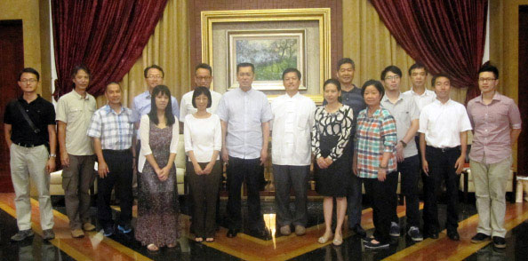

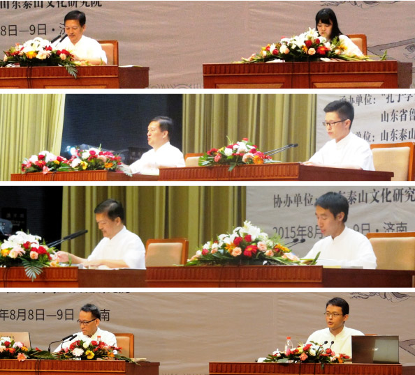

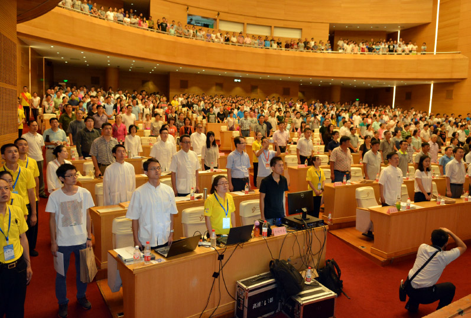

### 寶貝學禮

大時代的出路（由論語說起）

淨本

首次辦公益講座

交流大時代出路

後續鳴鶴國學堂

濟南泉城書香園

二○一五年八月八日至九日

應山東中孚信息魏東曉總經理之邀，學會理事長唐瑜凌老師及師資團隊，於八月八日及九日兩天，在濟南山東大廈舉辦了一場大型公益講座，主題為「大時代的出路─由《論語》說起」。此次講座由中國孔子基金會主辦，該會孔子學堂推進委員會承辦，山東泰山文化研究院協辦。講座以經典中孔子的智慧為主軸，闡述生於大時代的我們，該如何透過《論語》找到自己人生的出路。期間有人民網、大眾網等媒體採訪，現場六百多個座位座無虛席。

山東省委宣傳部副部長王紅勇，山東省文明辦專職副主任王少傑，山東省台辦副巡視員齊子明，中國孔子基金會副理事長牛廷濤、邢成湖，濟南市委宣傳部副部長伊沛揚，全國各地國學愛好者等嘉賓均到場參加活動。因爲有此次大型公益講座，當地人士也開始籌劃成立「山東鳴鶴國學堂」，依循時哉時哉網路教育學院的課程內容，以唐瑜凌老師為指導教授，期望雪廬老人的經學傳承，能在當地有更深的影響。除了大型講座，學會師資此型也與山東廣電寶貝學禮單元合作，在歷山劇院講授一次禮儀課程。

此次講座的籌劃，主要由山東中孚信息魏東曉總經理發起，該公司在去年十月「時哉時哉網路教育學院」成立之際，也在學會的協助下，成立了風澤經典文化讀書會，與時哉平台同步學習。中孚信息工作團隊辦事精細而有效率，經過他們的溝通協調以及資源的投入，獲得中國孔子基金會的同意以及山東泰山文化研究院的合作，才成就這一次的大型公益講座。

學會一行人原訂於八月七日出發，因為遇到蘇迪勒颱風襲臺，提前一日飛往濟南，也因為多了一天的時間，大眾網，人人網，儒風大家等媒體雜誌，才有時間對唐老師等一行人做較為深度的採訪，關於雪廬老人的傳承內涵、中華文化的重要、當今國學熱所應注意的事項等議題，有許多精彩的對談。

講座於八月八日早上揭開序幕，來自各地的學員們，持票排隊依序入場，從前排貴賓到後排觀眾，還有二樓的座位，座無虛席，使得一些晚到的人，或者義工朋友們，必須拿著小板凳，坐在旁邊的走道聽課。

中國孔子基金會副理事長邢成湖先生首先致詞表示，山東是儒家文化的發祥地，齊魯大地所包藏的文化底蘊、精神內涵、人文財富，有著任何地域文化都無法替代的地位。此次邀請臺灣儒家學者來魯講座也是以此為契機，推動海峽兩岸在儒學及傳統文化方面的交流與合作，共同為弘揚中華優秀傳統文化貢獻力量。

講座主題為「大時代的出路–由《論語》說起」，我們現正處於一個前所未有的時代，這是一個科技日新月異的時代，是網路虛擬與實體生活整合的時代，是世界各種價值觀彼此直接交流的時代，也是倫理道德最受衝擊的一個時代。在這樣的一個時空中生活，該如何找到自己人生的出路，社會國家的出路，民族的出路，乃至於全世界的出路，亟需人們以智慧來尋找答案。而這樣的智慧，正在《論語》當中，因為這本書不只是先哲言談的紀錄，它富含的人生哲理，是歷代中外名士所共同認證。

主辦單位十分用心地在講座過程中安排了手語舞表演，以及琴瑟和鳴的演奏，活潑了講座氣氛，兩天的授課過後，大家踴躍回填問卷，多達三百位的學員，有意願跟隨唐老師的教導，收看「時哉時哉網路教育學院」課程。「山東鳴鶴國學堂」於茲誕生，微信群才剛開始成立，就有一百三十多人加入，每週三共同收看線上直播課程，更期待未來實體教室開辦後，每週六的共同研學。

大型公益講座過後，更重要的是後續的經營，文化的學習不能速成，內涵的培養需要時間，唯有透過有志一同的人共聚一堂，不斷研學，才能改變自己命運，改善國家社會風氣，這也是發揚中華優秀傳統文化的意義所在。

### 二○一五年八月江逸子老師上海畫展活動概述

淨域

文化推展民族情

以藝載道畫者心

導覽能契大眾機

發揚傳承團體意

一、前言

二○一一年冬至一二年春，江逸子老師應福建省政府之邀，在福州市福建省博物館舉辦《道藝春秋》-孔子主題國畫展，深獲各界的好評。今(二○一五年)受上海多方邀請，始訂於八月五日至十三日，假上海圖書館第一展廳舉辦第二次特展，名為「道藝春秋─二○一五年臺灣國畫大師江逸子先生孔子、孝經主題國畫展」，展品計有八十圖。

本次中國大陸名義主辦單位為「上海焦點品牌管理公司」，實際承辦單位為「上海和風來(中國)實業公司」，協辦單位為「上海和行道德講堂」。我方配合協辦單位有「中華孔子學會」、「中華華藏淨宗學會」、「中華無盡燈文化學會」及「時哉時哉網路教育學院」。邀展本欲藉文化合作，透過江師的作品，由學會來為上海地區培訓一批導覽人才，因兩地遠隔且時間緊迫，培訓工作就無法實踐。

雖是如此，學會仍是秉照一貫的作法，排定時程與進度落實導覽先期研學。本次展品以《孔子聖蹟圖》、《孝經十八章圖》、《地獄變相圖》為主軸，用以說明因果教育、人倫綱常之要；另輔以《杏壇學行》、《問禮老聃》、《學琴師襄》等，來彰顯孔門聖教、好學不倦之要；再有《將進酒》、《桃源迷津》、《馬球圖》、《曲江赴宴》、《賦秋》等，使知古鑑今、抒志感懷之勝；此外的水墨花鳥設色，也於道藝中見出春秋之筆的閑逸。經一個半月的研學，在兩位老師的指導下，對於畫作有了初步的瞭解，日後大家又各自用功備課，等待畫展的來到。

二、布置展場

此回畫展布置工作，由江師的二公子主事，三日先領印刷廠廖先生與文創工作者許先生飛抵上海，四日即進行場布工作。上海圖書館第一展廳，非專業的展場，原隔為八個小展間，為展開長卷《地獄變相圖》，除將複製畫縮小比例外，亦拆除四個隔間牆因應，使展場成為四個既獨立又相連的空間。此外，於公共大廳設開幕式會場，講臺後方張掛《杏壇學行圖》六軸畫，讓人一目了然夫子游於藝的教學。

進入展廳有道牆面，大書「道藝春秋」四字與夫子聖像，一旁為接待櫃臺，主要負責義工之調度、團體導覽語音器具之借還、各類結緣品的發放與訪客留言處置等。依逆時針方向參觀，首先見到的是「花鳥水墨、駿馬仕女」等未歸類的展品。這個空間最大，計收納了二十四件大小不一的作品，包括《問禮老聃》、《學琴師襄》、《三傑》、《桃源迷津》、《曲江赴宴》等圖。至底，為一狹長小展間，集中展出《孝經十八章圖》作。

繼而轉至另一方，有中、小兩個展間，依序展出《孔子聖跡圖》三十三幅畫，加上前置之《孔子傳道圖》，計有三十四圖。最後中間長二十餘公尺的橫櫃，呈左右傾斜擺設，一側專展《地獄變相圖》，另一側展出《普門品示現圖證》、《馬球圖》與《將進酒》。

三、前進徐匯

四日下午第一批導覽人員從學會出發前往桃園機場，於候機時始發現，原來與江師同一中華航班，準點於晚間六時卅五分抵達上海浦東機場。第二批導覽人員為了開颱風，提前於六日下午抵達，然因司機欲等待一位在韓國攻讀博士的學生，一行人在機場等待四個多鐘頭，抵達飯店已經午夜。

畫展期間，安排住宿於南鷹飯店，這是位在昔日法租界區裡的旅館，雖然不是新式的大飯店，但所在的位置交通便利環境清幽，係屬大都會中的文教區。它的右手邊是「霞飛會館」，乃昔日租界區以法國名將霞飛將軍命名，而今日的淮海中路，即是以前的霞飛路。走在此區中，兩旁盡栽法國梧桐樹，其美直呼「上海香榭大道」。梧桐樹型挺直蒼蔭，炎夏裡蟬鳴終日不絕，而那斑駁如拼圖般的樹皮，更是讓我著迷不已，始悟「鳳凰非梧桐不棲」之嘉木真意，更拾取梧實當作寶貝(雖然它不是中國梧桐)。

有道是「北京胡同，上海弄堂」，現今指的是巷弄。在租界區裡，各條巷弄都有名堂，只消在掛牌上瞧瞧，便可知哪些名人住過，又代表著怎樣的文化氣息。霞飛會館再往前三百公尺，便是「宋慶齡故居」，被中共奉為國母的園邸，仍保留著昔日生活樣式供人參觀。位於飯店左邊四百公尺處，有一個私人社區，面臨淮海中路的首間小別墅，乃經國先生在上海「打老虎」時(一九四八年)的居所，正好位在上海圖書館的對面，這讓我暇時能仔細琢磨一番。

四、開幕禮讚

以往隨著老師出門辦活動，總覺得天塌下來也穩當，因為終究有人頂著。然而，此回老師因身體違和無法成行，便頓感千斤重擔壓心頭，尤其是這人文薈萃、商賈雲集的大上海。這回隨江師到上海，唯一工作就是畫作導覽；雖然已非生手，但臨場了還是會近鄉情怯，古人所謂：「書到用時方恨少」，的確是真實不虛呀！故而，首日天未明人已醒。

雖然展館九點才開放，但用完早餐後，心早已飛出門了。飯店到圖書館約莫三百多公尺，步行五分鐘即可抵達，遠遠便可見到碩大的看板，標示著「道藝春秋─臺灣國畫大師江逸子」等字，這樣的光彩豈是虛名，實乃一生道藝之所現。現場和行講堂派出的義工們早已就位了，人生地不熟的我們，報上名後盼能搶時間入場了解實況，因為再過兩小時後，就要為來賓作首場即席語音導覽。走過一圈心底有了輪廓，便決議一團從《地獄變相圖》說起，一團從墨荷《翠蓋亭》導起，其餘則交由和行義工們各別說明。十點依時進行開幕式，正式開啟九天的「道藝春秋」畫展。

五、主要畫作簡介

(一)《地獄變相圖》

此圖緣起於上海城隍之示現，淨空老和尚商請同門江師，仿唐朝吳道子畫十殿閻王以教化人心，遂有五十公尺的長卷畫作。此畫乃介紹人墮地獄受種種罪報之真相，同時也說明地獄果報全是自作自受，非閻羅天子所定的罪，期望眾人瀏覽圖作後，能明白得人身的可貴，而起心動念遠離造作惡業，廣修十善初得人天，進而一心念佛求出離，永世不再輪迴。

(二)《孔子聖蹟圖》

一九四九年孔奉祀官府遷臺後，奉祀官孔德成先生與恩師雪廬老人(李炳南)，將孔子一生重要的事蹟，從歷來保存的六、七十個檔案中，經詳實考證去除穿鑿附會者，嚴選出三十二則信實文獻，請奉祀官府同仁兼畫家的江逸子先生，忠實地逐文配圖，歷經兩年於一九七０年初完竣，名曰《孔子聖蹟圖》，並經孔上公審定題額，成為自古迄今歷代描繪孔子一生事蹟中，最信實的一部鉅作，具有無上的歷史意意與價值。(可參閱蓮榮會刊第八十六期至九十六期)

(三)《孝經十八章圖》

中國文化的本質是經學的見地，經學中流傳下來的是四書五經乃至十三經，《孝經》為十三經之一，計有九卷十八章，在說明孝道的重要、推廣的功德及其是辦政治、教育的本質，能使家庭和諧、社會吉祥，進而使國家民族長治久安。行孝是進德修業的秘密，為事業成功的要訣，歷代賢明的帝王都非常的重視。昔日孔子閑居時，曾子隨侍在側，孔子為他廣演孝道的內涵。而後曾子作為傳承者，將這個道理演繹給學生聽，學生紀錄後再往外傳演，即是現在的《孝經》。(蓮榮會刊第一百期開始連載，亦可經由「時哉時哉網路教育學院」學習)

(四)《將進酒》

此圖所繪乃深秋氣象，黃淮之高柳只剩得殘枝，左上黃河之水滔滔東逝，右邊高堂白髮對應童顏青絲，正映出大地一派蕭瑟之景，也是暗喻天寶之亂將起，大唐繁華已近黃昏夕日了。

嵩山之於東都洛陽，宛若終南山之於長安，雖許多人山居歸隱，但其志無不寄望能捷徑入朝。李白曾經此捷徑與帝后相處，見識過大明宮的豪奢，所以視「鐘鼓饌玉不足貴」，了知政治的炎涼無情，所以願與好友痛飲而長醉不醒。有報國之志卻終日翰林陪侍，請求放還知古來聖賢寂寞，惟有痛飲放歌者得留名後世。 圖中李白酒酣耳熱放懷高歌，說著昔日曹植在平樂觀宴飲的心情，岑夫子、丹丘生二人專心聆聽著。雖然美酒所費不貲，但在興頭上怎好缺酒呢？便催元丹丘趕緊叫來童僕，將自己的輕裘與寶馬拿去沽換美酒，讓三人好好痛飲一番，且將無盡的憂愁銷去吧！

(五)《馬球圖》

江師所繪馬球圖計有兩幅，一為白描，一為重彩；今所展者為白描圖。卷首有國畫大師張大千先生題字，云：「李伯時(公麟)舊作此圖，世已不傳。逸子道兄儗之，神采奕奕，頓還舊觀，至為佩嘆。八十叟張大千 袁(一九七九)。」大千居士說：「李伯時舊作此圖，世已不傳。」而遼寧博物館所藏《宋李公麟畫唐明皇擊球圖》又如何呢？此畫有明朝書畫大家董其昌題字，說：「李伯時畫，如九歌、淵明歸去來，皆宋人贗作，流傳甚夥。唯韓宗伯(韓世能，大收藏家)家郭汾陽(子儀)單騎見虜圖、予家白蓮社圖、理帛圖及項氏此圖，筆畫精妙，立稱神品。此卷有吳乾古詩，詩與書法皆不俗，尤可藏也。」雖董其昌大讚此畫，然經專家鑑定，此圖畫風與李公麟不同，應為南宋之人所作。故說：「世已不傳」。

擊馬球是唐代盛行的運動，除可訓練騎術戰技外，亦可成為一種球賽的競技。據史書記載，唐代許多皇帝和達官貴人都愛好擊球，如玄宗李隆基、穆宗李恒、敬宗李湛、僖宗李儇、昭宗李曄等皆是。李恒沉溺打球疏於國政，甚而落馬受傷；李湛與宦官因擊球之爭，於宴飲中被殺；李儇以擊球作賭，輸掉三川節度使一職；李曄亡國出走洛陽，即便六軍已散，身邊仍帶著馬球選手。由此可見唐代多麼熱衷馬球運動。宋人晁無咎有〈題明皇打球圖〉一詩，云：「閶闔千門萬戶開，三郎沉醉打球回。九齡已老韓休死，無復明朝諫疏來。」正是對這種現象的絕妙諷刺。

(六)《三傑圖》

此圖所繪為協助劉邦建立功業的漢初三傑—張良、蕭何與韓信。據《漢書．高帝紀》所載，漢高帝五年(西元前二０二年)，劉邦登基不久，在雒陽縣(今洛陽)南宮召開酒宴慶功，會中劉邦提出「吾所以有天下者何？」之問，大家各有看法，末後劉邦說：「夫運籌帷幄之中，決勝千里之外，吾不如子房；鎮國撫民，給餉饋，不絕糧道，吾不如蕭何；連百萬之眾，戰必勝，攻必取，吾不如韓信。三者皆傑，吾能用之，此吾所以取天下者也。」認為張良、蕭何、韓信三人在運籌帷幄、治理國家、帶兵打仗方面的傑出才能相配，才是他取得天下的原因。後人便把張良、蕭何、韓信稱作「漢初三傑」。

人才之出，必要大用，若無用處，才即埋沒。劉邦之得天下，其以為乃能用人，此是帝王之術。然而政治詭譎多變，在極權的時代裡，名臣良將伴君如伴虎，能共患難不一定能同享樂。劉邦與三傑的關係密切，但功成業立之後，兔死狗烹各自的命運卻大不同。故可藉此《三傑圖》之人物，來回顧秦末漢初的歷史發展及其才性之用絀。

(

七)《曲江赴宴》

江師繪《曲江赴宴圖》，主角人物為虢國與秦國夫人二位，構圖簡單，意境深遠。其源有二：一是杜甫〈麗人行〉詩句；二是臺北故宮所藏宋人所繪《麗人行圖》。

唐代宮廷畫師張萱(京兆人，生年不詳)，於玄宗朝任職於集賢院，善繪仕女、宮苑、鞍馬，與同期的周昉在畫史上相提並論，可惜畫作無一留存。今所見《虢國夫人游春圖》(藏於遼寧博物館)與《搗練圖》(藏於美國波士頓美術館)，傳為宋徽宗所臨摩。 《虢國夫人游春圖》乃描寫楊貴妃的姐姐虢國、秦國夫人等九人遊春的情形，當時杜甫在翰林院待制，以詩記之並有暗諷隱諫之意。 南宋畫家臨摩《虢國夫人游春圖》而成《麗人行圖》。當時第一畫家李公麟，凡所有名畫必臨摩，故而時人以為《麗人行圖》出自李公麟之手。惟後人又因李公麟自創白描法，其暈染淡雅不同於唐之濃厚，與所繪《五馬圖》技法相去甚遠，故又認為該圖出自南宋某家之手。

此圖雖僅有二人二馬赴宴，但給人留想的空間極大，這也是江師畫《曲江赴宴圖》不同於《麗人行圖》之處。若能依杜甫〈麗人行〉之詩句，來觀照導覽《曲江赴宴圖》，則亦達於「詩中有畫、畫中有詩」之境。

至於楊家姐妹之國色天香，或可參考善於宮詩之張祜所作〈虢國夫人〉一詩：「虢國夫人承主恩，平明上馬入宮門。卻嫌脂粉污顏色，淡掃蛾眉朝至尊。」一位美人無須藉濃抹來妝扮自己，也見出虢國夫人的麗質天生。至於名馬、衣飾、寶器等等，相較之下都是相襯而已。

(八)《控馬》

馬通常作為人才的象徵，而馬夫則代表治理百姓的官員。以群馬為題的畫作，常用來表彰國力。北宋李公麟傳寫唐代韋偃的摹本《臨韋偃放牧圖》(北京故宮藏)，畫中馬兒超過千匹，馬夫亦有百人以上，表現盛唐人才濟濟、國運昌隆的氣象。清雍正朝郎世寧描繪的《百駿圖》，便是依循著這樣的傳統作畫。宋代龔開畫瘦馬，將肋骨都畫出來，其寓意瘦馬代表清官，清官瘦己而天下肥；肥馬則代表貪官，己肥而把天下搞瘦了；這又是另一種畫說。

《論語》〈憲問篇〉載：子曰：「驥不稱其力，稱其德也。」驥者千里馬，其值得稱讚的是德性，而非氣力。唐太宗在建立大唐勳業時，馳騁沙場多次倚賴神駒得勝免難，對於這些愛馬特別令畫家閻立德、立本兄弟繪刻置於陵前，名為昭陵六駿(拳毛騧、什伐赤、白蹄烏、特勒驃、青騅、颯露紫)以記其德。千里馬之德為何呢？南宋岳飛愛馬，且對馬有研究。他打敗曹成、平定楊麼後，高宗於紹興七年(西元一一三七)召見他，有一段論馬的對話：「帝問岳飛曰：『卿得良馬否？』對曰：『臣有二馬，日啗芻豆數斗，飲泉一斛，然非精潔即不受﹔介而馳，初不甚急，比行百里，始奮迅，自午自酉，猶可兩百里，褫鞍甲而不息不汗，若無事然。此其受大而不苟取，力裕而不求逞，致遠之材也。不幸相繼以死。今所乘者，日不過數升，而秣不擇粟，飲不擇泉，攬轡未安，踴躍疾驅，甫百里，力竭汗喘，殆欲斃然。此其寡取易盈，好逞易窮，駑鈍之材也。』帝稱善。」馬之善跑乃天生而來，但若不能馴服順從、吃苦耐勞、踏實堅持、潔身自好，便為一匹放縱難調御的野馬。由是觀之，驥之德在於培基厚實、沉著不躁、嚴以律己、奮力持恆。

江師出入北溝臨畫，常以清水饅頭果腹，次數頻繁乃至故宮院長都認得且讚譽他。他畫馬時認識一位士官長，此人在后里馬場任職，便邀他到馬場去看馬。前後兩個月裡，除近距離研究馬的神態外，亦從士官長處得聞馬的特性與調教之法，這對他畫馬有莫大的助益。期間他攜畫前去拜見溥心畬先生(一九六三年過世)，溥先生見他畫馬甚佳，便說：「我不敢收你為徒，就彼此相互學習吧！」更可見出江師之畫馬，其力已直追唐宋之人，尤其是畫驥之德的那一分。

(九)《賦秋》

江師繪《賦秋圖》，是對秋的吟誦或是對人生的感懷呢？北宋歐陽修提倡平實文風，在朝任翰林學士時，於仁宗嘉祐二年(一０五七)知貢舉，主持禮部進士考試，錄取了蘇軾、蘇轍、曾鞏等人。五十二歲作〈秋聲賦〉，此一新體裁的文賦，乃是對前代的駢賦、律賦進行改造，去除排偶、限韻的雙重規定，改以單筆散體作賦，既部分保留了駢賦、律賦的鋪陳排比、駢詞儷句及設為問答的形式特徵，又呈現出活潑流動的散體傾向，增強了賦體的抒情意味。

後代畫家每書畫《秋聲賦》，如元代趙孟頫的書法，明代文徵明的畫與唐寅的書法。文徵明以全景表現秋聲，而江老師畫楓紅崖邊獨立一人；唐寅書「聲在樹間」，而江老師題「賦秋」二字以為聲，其意何如呢？或可藉歐陽修之賦一窺心懷。

(十)《錦衣玉堂》

江師所繪《錦衣玉堂圖》，乃一隻五彩金剛鸚鵡攀附於玉堂春(梔子花)上，為花鳥折枝寫意的技法，雖無工筆之細膩，但花鳥無不微妙微肖。表面觀來為花鳥畫，實際上另有寓意。

京劇中有《玉堂春》這一齣劇目，其中「蘇三起解」為著名的唱段。女主角蘇三本名周玉潔，明代山西省大同府洪洞縣周家莊人；五歲父母雙亡，被拐賣到燕京的「蘇淮妓院」，其時妓院已有兩妓女，她排行第三，改名為蘇三，「玉堂春」是她的花名。

蘇三豔麗非凡，天生麗質，聰慧好學，琴棋書畫樣樣精通。時尚書王瓊得罪劉謹，遭貶官南京；他派年方十六歲的三子景隆居燕京收債，三個月收得白銀三萬兩，得意之餘往妓院尋歡，以重金獨佔貌美的蘇三，彼此互許未來。不到一年，景隆床頭金盡，為老鴇設計逐出門。蘇三要景隆發奮上進，誓言不嫁他人。景隆回金陵發奮讀書，二次進京應試，中第二甲第八名進士，選任真定府理刑判官。

而後蘇三遭老鴇賣予山西洪洞縣馬販沈洪為妾，此後衍出一段「玉堂春落難逢夫」與「蘇三起解」之後戲。王景隆為官宦後代，雖一擲千金不悔，又中進士入朝為官，正是衣著錦繡的人物。蘇三自幼孤苦，復遭賣入妓院，惟其天生麗質聰慧好學，花名「玉堂春」，正如梔子豔麗清香。江師繪錦繡攀踞玉堂之上，或正是寓意馮夢龍所著《警世通言》的「玉堂春落難逢夫」這一文學故事。

六、導覽剪影

此回畫作的展出，主辦單位安排五種方式導覽。第一、學會派出的六位師資，進行團體專業解說；第二、和行講堂義工個別說明；第三、訪客自由參觀；第四、QR code線上語音聽導；第五、現場視聽區看解。來到展場的訪客，或能租借耳機加入團體解說，或可請教義工個別說明，或可自由觀賞、坐聽與掃描二維碼線上語音聽解，無不方便應機。

五日下午，趁著訪客不多時，為義工們導覽《地獄變相圖》。原本依著展櫃解說，在學長的提議下，大家坐下就著畫冊一一過圖說明，如此兩個小時畫冊還未過半。後半部直到七日下午，才由東煜老師接續說盡。就展間所見，感覺大眾對於《地獄變相圖》的向望最渴求，即便一時無法說盡，亦有人再三入場聽解，甚而於假日攜家帶眷來訪，顯見畫作直能教化人心移風易俗。

六日上午臨時獲得通知，有來自北京的央視第四台(中文國際)導演，以個人身分來參觀畫展，希望了解畫中所呈現的禮制，特別是八佾舞這一部分。為此特別就《杏壇學行》、《學琴師襄》、《問禮老聃》及《孝經圖》「聖治」與「感應」兩章，就其中的舞樂及禮器作解說。禮器是古代貴族於舉行祭祀、宴饗、征伐及喪葬等禮儀活動中使用的器物，用來表明使用者的身分、等級與權力。商周時期，禮器高度發展成為「禮治」的象徵，用以調節王權內部的秩序，從而維護社會穩定。此時的禮器包括玉器、青銅器及服飾。

玉禮器有璧、琮、圭、璋等。青銅禮器(又稱彝器)種類數量眾多，工藝精美最為重要，種類有食器(如煮肉盛肉的鼎、盛飯的簋)；酒器(如飲酒器爵，盛酒器尊、壺)；水器(如盥洗器盤與匜)；樂器(如鐘、鐃)；雜器(罐、箕形器、方形器)。進入秦漢後期，社會混亂、禮崩樂壞，禮儀文明難以為繼，從而使青銅禮器逐漸淡出歷史舞臺。末後，其訪談於江師，似有意將此製作節目，便要待緣而定。

六日下午，排訂「第二屆兩岸四地中華傳統文化青年學術研習營」兩百多位學員參訪，受限於耳機器具數量，故區分八組分兩路輪流各導導三十分鐘。雖是如此規劃，但上場後便渾然忘時，顧自地從頭說到底，而願聞其詳者，也自然圍攏過來。此時義工也發揮功效，分散於各處加入說明，使得觀者能無遺憾。學員在參與《群書治要》研學後來訪，對於中國傳統文化特有感受，也算是研學經義後的一場道藝饗宴。

七日小週末，人數未若前兩天那麼多，上午六人分頭領著義工為其深入解說，一時展場上各據一隅，幾回的說解下來，雖然得以利益他人，但實際上最受惠的還是自己，更能深刻體悟道氣於文化傳承中的重要。

下午，召集了年輕的導覽女義工座談，她們皆是在學的學生，包括兩位大專生、兩位國高中生，有人住在上海，亦有人來自陜西，全都是主動報名參與。此回無緣到上海進行先期的培訓，故僅將畫作簡易說明及相關資料傳送參考，而他們竟將資料背得滾瓜爛熟，其用心實在令人讚歎。我們的解說所以令其驚豔，除了嫻熟江師的背景外，更在於對每一畫作都進行了歷史文化層面的探索，所以能夠如實地將內涵說出。其實，這也是座談所要傳達的─「導覽並不是一件輕易的事」，即便口條再好，離題就無以見精髓。
八、九兩天為假日，人潮再度湧現，也見到許多老面孔，有人甚至連來三天聽解。有位先生
**問：** 「這一圈要講多久呀！」我
**答：** 「也可以說上十個小時。」這是自誇嗎？其實是畫作的內蘊太豐富了。通常上下午帶一團導覽，散場時不是午飯已屆，就是館方催促著將閉館；每回兩個多小時的導覽無法說盡，故而有人連著上門來，甚且預約著「明天見」。有位女士下午早在門口守候，見到一行人來到展場，順手遞上一盒喉糖，說：「這送給你們潤喉，老師們太辛苦了。」這真是讓我們失聲也甘願呀！
多日過後，導覽接受點單，這除了是對自身有信心外，也是要隨眾應機。接團時先
**問：** 「你們最想聽哪一部分？」凡是所提的，我們就可以立即帶解滿足所求。《地獄變相圖》區經常堵塞，像是班機排隊等待起航，一旦人潮前進些，起頭處又補上人頭了。會場中可以見到許多好學的景象，諸如：緊迫盯人如影隨形、奮筆疾書拚命記寫、見疑發問舉例求證、拍照錄音反覆聽學等。這些對文化遺落後的渴求，豈是身在福中的學子所能了知的。

七、相應與迴響

畫展十三日結束，但我們只停留到十一日，幾日相處與義工們特有感情。這群義工不論老少，各個溫文有禮，尤其輪值門口接待者，對於往來訪客總是彎腰問好，這種從心而發的恭敬態度，必有相當的磨練始成。十日閉館前，義工群圍著我們要合影留念，便在門口牆面前照相。讓人驚喜的是，次日每人都收到一張合照；原來他們趕在夜裡快洗，好讓我們離開前能收到這份別禮。若打《論語》一句話形容，概是「有朋自遠方來，不亦樂乎！」十一日中午，終究到了離別的時刻。義工伯伯不斷地讚謝，我們謙詞不已，他卻指著多日來的訪客留言簿，說：「這裡頭留言寫的好，可不是我一人說的呦！」這才知道畫展的興辦，對於世道人心有多大的利益。

有位倪亞夫老先生，連續三天來看展，對江師的道藝特別有感觸，便於第二天作了兩首詩記在留言簿上；其一：「江氏巨匠展長卷，逸仙變相圖世間。子弟佛道化孝善，明鏡瞻仰悟自檢。」其二：「大師為眾開筆端，孝順行善兩挑肩。敬奉長輩常鞭策，善小不忘時心安。」他返家後覺得意有未盡，又作了兩首詩，第三天再抄寫於簿中；其三：「道漸中原歲悠久，藝技習西近和平。春馨荷池不污染，秋杏長城萬里行。」其四：「暨硯吳道子畫祖，澹墨般若佛人生。寧靜傳續奇神靈，齋主江逸子勝今。」見了這樣的響應，多日來的疲憊無不盡消了。

八、結語

離開展場，身心頓時舒暢起來，全因順利圓滿地完成任務。打包好行李，離前往浦東機場還有三小時，一行人找家咖啡館消磨時間，除了沉澱一下心情外，也藉機分享心得與檢討改進。大家對義工的表現一致讚許，對社會人心於文化的渴求皆有體認。江師以「六軍」譬喻我們，除是對我等的期許外，也見出團體出馬真能使之安心。

可惜主辦單位並未珍惜且看重展品與導覽移風易俗、化導人心的功效，未見有人招呼遠從臺灣專程而來的江老師及導覽者，種種做法令我們心生警惕，將來在面臨活動及講座的邀約上，作法或將有所不同。總之，除感謝江老師對團體的重視和厚愛，團體仍將秉持初心，繼續努力。

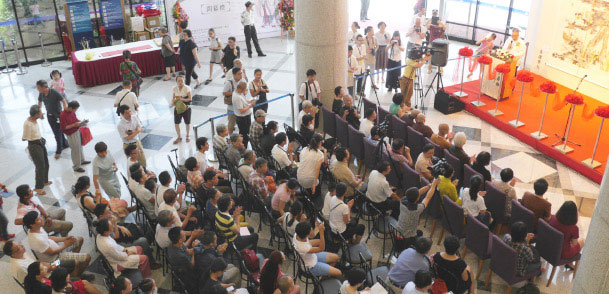

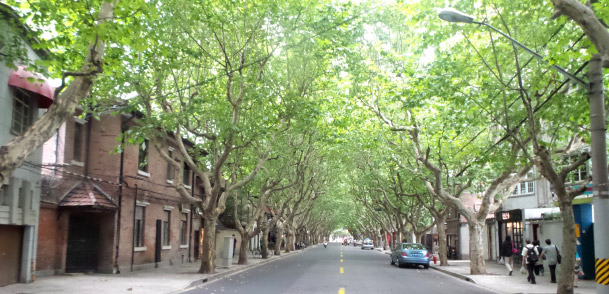

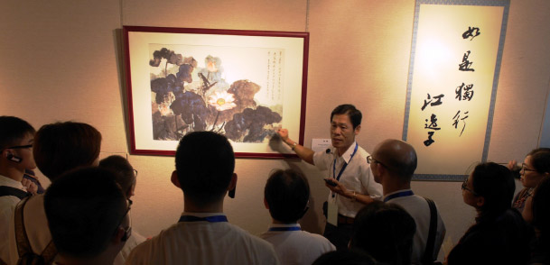

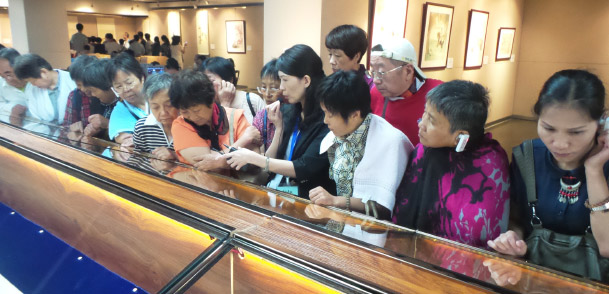

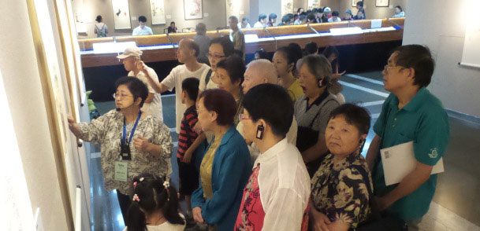

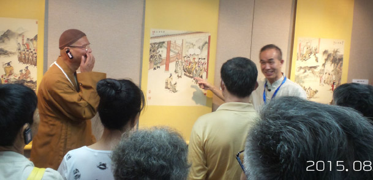

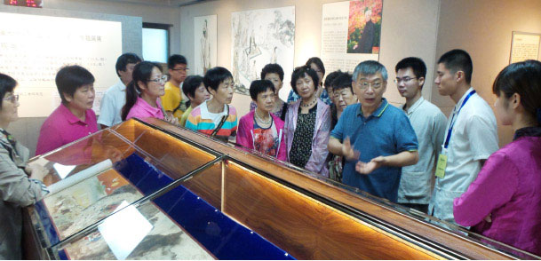

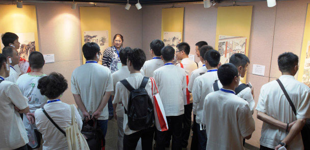

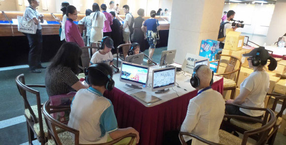

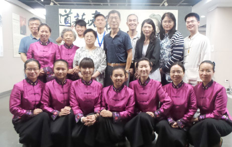
