# 第102期

## 社論

### 對世局之諍言

本刊

世界紛亂在人心

共業不轉別業轉

五倫本質孝弟仁

依禮進退秩序明

二○一五年十一月十一日發生於法國巴黎及其近郊的連續恐怖攻擊事件震驚全球，猶如歐洲版九一一，整個巴黎合計至少一百三十九人遇難。發生這樣的悲劇是全球人類的不幸，我們不願見到這樣的事情再次發生，故須先了解其背後成因。事件的起源眾說紛紜，諸多媒體與學者專家相繼跳出來分析、評斷，就其可能的因素簡述如後。

中東國家在近十幾年來內亂不斷，動盪不安，也間接或直接導致了恐怖主義的崛起，遠因最早可追溯歐洲帝國殖民主義的影響。在十九、二十世紀交際之初時，歐洲列強在世界各地建立殖民地，奪取利益壯大母國。近代中東地區的戰火，就在這樣的時空背景下點燃。著名賽克斯‧皮考特協定(Sykes-PicotAgreement)一直被認為是中東內戰的開端。西方以此協定擅自劃分該區域國界，撕裂不同族群，造成許多紛擾；英法列強私自協商將敘利亞、黎巴嫩及一部分的伊拉克劃為法國的領地，而英國則占領約旦及剩餘部分的伊拉克。表面上看起來好像沒有什麼，但英法在劃定國界時未考量該地的風土民情、宗教及族群等分布，強硬將區內伊斯蘭教的遜尼派一分為二，一部分在敘利亞，剩下的被歸入以什葉派為主的伊拉克中。加上西方列強又習慣以扶植少數族群為殖民地的管理手段，持續介入中東地區的政治，導致衝突日益擴大。

近因則可從法國主導敘利亞政局說起。法國政府扶植阿薩德(Basharal-Assad)為敘國總統，由此家族掌控大部分資源，此人及其家族屬於伊斯蘭教派中極為少數的什葉派阿維拉分支。執政當局上任後，採取高壓統治，打擊異己，導致人口占多數的遜尼派人士不滿，引發敘利亞內戰。法國此舉乃是為了避免敘國國內團結一致，令他們無法合作推翻法國的殖民勢力。此外○三年美國出兵伊拉克，美國政府以反恐為由拉下遜尼派的海珊政權，打著民主的旗幟入主伊拉克，轉而扶植什葉派的政權。想不到人民的生活沒有因為換個政府就有改善，新政府貪腐嚴重，又打壓境內的遜尼派及庫德族人，造成廣大人民的不滿。基於以上兩大因素敘利亞及伊拉克內較為激進的遜尼派族群，轉而成為ISIS的基本教義派，共同反抗什葉派的政府。

本次的恐怖攻擊據報導正是由ISis主導，近日國際間許多恐怖攻擊亦源自此組織。而選定在法國，或許因為他們對於恐怖攻擊的防範較為鬆懈，抑或打擊西歐國家較能引起媒體注目，未有定論，但法國境內高達五至六百萬人的穆斯林已成為一大隱憂，新聞指出本次的攻擊活動，兇手是來自法國本地的穆斯林。法國境內的穆斯林人口高達總人口的百分之八，有專家估計約十八年後法國的穆斯林人口即將過半，坊間更盛傳法國僅剩下三十年的時間，穆斯林化正悄悄的侵吞這個國家的文化。而整個國家更是蒙在恐怖攻擊的陰影之中，如何與穆斯林和平共處，又不被其文化征服，是當前的重大課題。

然而從這樣的國際事件中，我們又要如何體會孔子的智慧所擁有的時代意義與價值呢？首先，在如此動盪的環境及人民沒有共識以前，高喊民主也許是毫無幫助的。仔細觀察，在顛覆一個專制體制後，並沒有民主發生，帶來的只有更多的混亂和戰爭。對比孔子，現代有許多人質疑儒家是專為統治階層服務的學問，是迂腐的象徵。但試想看看，身處在禮崩樂壞的春秋時代，諸侯割據，何嘗不是另一個古代的「中東地區」嗎？可想而知，若孔子在當時的封建環境下，提倡民主主義，恐怕難有迴響，甚至可能引來殺身之禍。更重要的是，若以暴力推翻魯國專政的三家大夫，可以想見的是，只會有更多野心分子的崛起，屆時可能就不只是一個陽虎或者公山弗擾了。伊拉克的人民本是欣喜的歡迎美軍，以為民選總統候能夠帶來希望，想不到最後卻只看到一片混亂，戰爭使電力系統中斷，連自來水管線也損毀，屋舍傾圯。原本海珊的專制政權雖不好過，但推翻後竟然落後得連日子都過不下去的下場。想想孔子的處世智慧真的深不可測，如同深入伊拉克戰亂的國外記者所言，或許在這樣的國度，比起民主，他們更需要的是秩序。孔子主張三家應尊重魯君，而各諸侯國也應該尊周天子，這不正是在維護秩序嗎？要知道，辦政治的目的乃是創造安定環境以利於辦教育，孔子以長遠的眼光，為天下人民著想，才有君君，臣臣，父父，子子之言，宣揚五倫關係就是這般道理。

更何況當時的平民教育也是孔子首創，《論語》中也多見孔子對國君、大夫等闡述王道思想，要求上位者應自正其身，道之以德，齊之以禮，也僅是希望能夠上行下效，維護善良風氣，凝聚民族共識。處處用心都在百姓身上，怎麼會到了今日，竟說成是支持專制的腐儒？更進一步來說，民主制度中強調人民作主，並藉由選舉來產生領導人，而「選舉」二字就是源自於孔子所推崇的「選賢舉能」而來。又以臺灣而例，一場立委選舉就要耗費納稅人十八億的稅金，但是仔細想想，我們真的有選出合適的人選為我們謀造福利嗎？他們的行為真的符合人民的意志嗎？話又說回來，比起世襲的家天下，孔子更重視的是由賢人選舉賢人，將好的人、好的事一代一代的相傳下去，他也曾說堯、舜時期的禪讓政治，才是能夠達到大同世界的理想制度。由此可知，從孔子的角度而言，辦政治的關鍵還是在人，不在於制度，無論民主也好，專制也好，上位者的德行及德政能否延續才是關鍵。

而歐美國家介入中東不穩定的政局後，捲入了一場難以脫身的腥風血雨，從中也能看出孔子在居衛國時的大智慧。中東地區遜尼、什葉兩派的糾紛乃是因接班名分問題而起，倒也似於蒯聵、蒯輒的王位之爭，難以言說誰對誰錯，各有名分，其背後又有許多政治因素糾纏。孔子深知此渾水絕不可淌，只有等待他們自解紛爭，達成共識，正其名分後才可出仕；這種決斷力真的不由得令人再三佩服。

《論語》記載孔子及其弟子的言行，蘊藏了豐富的智慧，若想解決當今的社會問題，現代人能不讀嗎？文化的價值就在於能夠開拓見地，了解做人處世的方法，歷史事件雖一再重演，但必得有經學的見地才能夠看清事實，記取教訓。世界爭端不斷，以武力征服只是冤冤相報、越陷越深，惟有以德服人，使近者悅，遠者來，才可能有和平的一天。不僅如此，依照目前情況，穆斯林擴張的速度飛快，不僅法國如此，西歐各國都將面臨這個問題。以基督教文化為主的歐洲人，平均生育率僅有一點六，甚至有越來越低的趨勢，遠低於維持人口數量所需的二點三；而歐洲穆斯林的生育率遠高於信仰基督教、天主教的歐洲人，若按照此趨勢，不難想見整個歐洲的未來都將穆斯林化。身處亞洲的我們雖然還沒受到正面衝擊，但也應該時時警惕，若我們都不重視自身文化的內涵，那麼被穆斯林文化顛覆也是不無可能，無論比生育，乃至比虔誠、戒律，我們可能都輸人一截，要如何抵擋這樣的潮流？

最後回到事件本身，在媒體壟斷的時代，我們要培養獨立思考的能力，絕對不要人云亦云。穆斯林並不恐怖，恐怖分子不屬於任何國家、宗教、種族，切莫以偏概全。引用國父遺訓：「要真正達到平等自由，必須喚起民眾及聯合世界上以平等待我之民族，共同奮鬥。」身在國界模糊的地球村年代，對於不同的文化，我們同樣恭敬平等對待，但心裡要明白其中之分別，絕不同流。想到此處，不禁還是要回到師長的那句老話，趕快充實自己最重要，培養見地，發揮孔子智慧的時代價值，弘揚優秀的中華文化，開展出聖賢氣象，令全世界無不敬佩讚賞，除此之外絕無其他辦法能夠保住文化；這不光是身為聖賢之後的我們應肩負的使命，更是人生唯一的出路。

## 大德法語

### 大方廣圓覺修多羅了義經（六十一）

道源老和尚

修學欲成就

關鍵在聽聞

說者須善士

傳承能成就

乙二、正宗分

丙二、令依解修行隨根證入

丁二、廣明行相

戊三、一問答道場加行下根修證

己五、正答所問

庚一、長行

辛二、答加行

壬一、三觀初首方便

癸一、修學靜觀方便

經文：

善男子！若諸眾生修奢摩他，先取至靜，不起思念，靜極便覺。如是初靜，從於一身至一世界，覺亦如是。善男子！若覺遍滿一世界者，一世界中有一眾生起一念者，皆悉能知；百千世界，亦復如是。非彼所聞一切境界，終不可取。

要是修奢摩他，必須以何為首？我要先修個什麼功夫才能修奢摩他？這是方便的法門，要先修奢摩他，必須先取至靜，前述奢摩他不取境界，此處又為何要取呢？取「至靜」，靜是不起思念，身心清淨，宛如正法道場般的莊嚴，心中觀修聽聞的義理，方是修止修觀之義。

你一個人入定之時，整個世界都寂靜下來，在定中忽然間覺悟了，整個世界都跟著你覺悟(溪聲盡是廣長舌，山色無非清淨身，翠竹黃花無非般若)。

能覺悟到的境界遍滿一世界(一佛世界)，也就是一個三千大千世界(亦即三千大千世界成為所知，此修觀破障之聖者心識成為能知)。眾生的心念一動，即使不開口說話，亦任運通達他的心裡所想。若聲聞的心識必須要作意觀察此眾生，方能了解此眾生的想法。至於聖者菩薩則任運，不必作意(不加作意)，不但知道某一個眾生的心念，而且知道一個世界所有眾生的心念，若對照《金剛經》，經文：「須菩提！於意云何？如來有肉眼不？如是，世尊！如來有肉眼。須菩提！於意云何？如來有天眼不？如是，世尊！如來有天眼。須菩提！於意云何？如來有慧眼不？如是，世尊！如來有慧眼。須菩提！於意云何？如來有法眼不？如是，世尊！如來有法眼。須菩提！於意云何？如來有佛眼不？如是，世尊！如來有佛眼。」以上是佛眼中的五眼圓明。下邊跟著說，經文：「須菩提！於意云何？如恒河中所有沙，佛說是沙不？如是，世尊！如來說是沙。須菩提！於意云何？如一恒河中所有沙，有如是沙等恒河，是諸恒河所有沙數佛世界，如是寧為多不？甚多。」恆河沙世界無數，眾生也無數，眾生的心念無數，如來悉知。

菩薩聖者通達一個世界眾生的心念，雖範圍不如佛，若能力念心廣到百千世界，亦復如是，乃至恆河沙世界這麼多，則愈來愈接近佛果的成就。然若非所聞境界(即《圓覺經》的道理)，則不可取。(定中不可取非所聞的境界作觀修)

癸二、修學幻觀方便

經文：

善男子！若諸眾生修三摩缽提，先當憶想十方如來，十方世界一切菩薩。依種種門，漸次修行勤苦三昧，廣發大願，自熏成種。非彼所聞一切境界，終不可取。

修三摩缽提(如幻三昧)的下手方便，須先觀想十方如來與一切菩薩(謂之正憶念)，它們依種種門修如幻三昧，是先廣發大願，在心識中種下修學如幻的能力，依種種門修如幻三昧，皆是依所聞的道理對境界作觀察，了知一切皆如幻無有實際。

癸三、修學寂觀方便

經文：

善男子！若諸眾生修於禪那，先取數門，心中了知生住滅念，分齊頭數。如是周遍四威儀中，分別念數，無不了知。漸次增進，乃至得知百千世界一滴之雨，猶如目賭所受用物。非彼所聞一切境界，終不可取。

第三個觀門，行者欲修禪那，先修數息觀，欲觀察心念本體，發現沒有自體性，念頭才生即住，才住即異，第二剎那出生時，第一剎那已滅。依佛經觀察，我們的心念生滅相續不斷。

透過修數息觀，將心定下來，並以心識為所緣作觀察，能將心念分齊，亦即分得清清楚楚，上一個念頭一剎那滅了，此一心念一剎那生，當前一念亦在一剎那，隨即又是下一剎那，內心清清楚楚這些變化。

且在行、住、坐、臥四威儀中，如是觀察，所起的念數都能了知，如是漸次增進。乃至百千世界下了多少雨點，雨滴的點數都能知道，一目了然！這種能耐都是就所聞的義理成為修學的內涵，才有如此能力(依正法修學方不入魔道)。

壬二、總結三觀方便

經文：

是名三觀初首方便。

依《圓覺經》上所說的道理，方可依之而修，否則進入魔境。以上是修學三觀，最初下手的方便！

壬三、徧修三觀圓成

經文：

若諸眾生，遍修三種，勤行精進，即名如來出現於世。

假如眾生善修三種觀的前方便，而且勤行精進，如同釋迦佛在印度出世一樣！

壬四、別開鈍根修證

經文：

若後末世鈍根眾生，心欲求道不得成就，由昔業障。當勤懺悔，常起希望，先斷憎愛嫉妬諂曲，求勝上心。三種淨觀隨學一事。此觀不得，復習彼觀。心不放捨，漸次求證。

這裡講得再懇切、慈悲一點，末世具有大乘根性的眾生，根性有上、中、下根，我們是鈍根，觀想修奢摩他時，想靜卻止靜不來，想修三摩缽提的方便，卻無法正意念，想修禪那先修數息觀，也不得成就，根機遲鈍。這是為什麼呢？既然想修大乘觀行，一定要具有大乘善根，原因就是不知懺悔業障。

所以行者要在三七日內天天求懺悔，被往昔所造的惡業所障蔽，那麼惡業有多少呢？〈普賢行願品〉裡面說，所造的惡業假使有形象的話，盡虛空遍法界都容納不下，當眾生的時間太久了，造的業當然就多了。必須要勤求懺悔，不要放棄，不要怯弱以為自己業障太重而退了道心，要曉得修行用功，不能後退，你想後退到哪裡去？往後退到凡夫位上嗎？無始劫來都當凡夫，現在還要繼續當下去嗎？心不要懈怠！要常起希望。

而斷煩惱最根本的是憎、愛二心，遇到逆境不起憎意，遇到順境不起愛意，見到比我好的不起嫉妒心，他人有榮華富貴，他的能力超過我，我不嫉妒也不諂曲，這些煩惱都斷掉了。不但如此，還要求勝上心，我一定要修三種淨觀，我一定要成佛，跟哪一個觀想相應就學哪一個，經過勤苦修學一個階段，修不成了再修第二個觀，學不成再修第三個觀。總而言之，此觀修不成再修另一個觀，永遠不要放棄，不要捨棄，一直要修下去，要求個證得。(下期待續)

## 佛學覽幽

### 小止觀導覽（七十四）　第十章  證果

*心爾、治心整理*

所證雖同能證異

大小較量天與地

有情恩重悅意相

不起定能任運度

論文：爾時上不見佛果可求，下不見眾生可度，是名從假入空觀，亦名二諦觀，亦名慧眼，亦名一切智。若住此觀，即墮聲聞辟支佛地。

爾時就是體真止，以空性為所緣的止，聲聞與緣覺能破法我，住於體真止上。

安立佛果不過就證得諸法實相的那一分來說，並非有個實在的佛果可得，佛果非實有，觀待佛的眾生又如何有實有可得？尋覓真實佛果尚且不可得，如何求佛果？尋覓真實的眾生尚且不可得，何來實有眾生可度？

佛有五眼，慧眼乃通達空性的那一分所安立；法眼是通達世俗；天眼是見遠；人眼是在人的五蘊上安立能看的名言；佛眼則是觀待同時見二諦而安立。

此時只在空性定上安住，不見佛果可得，不見眾生可度，不求成佛，不發悲心度眾，成就的空性定即墮入聲聞、辟支佛地。

論文：故經云：諸聲聞眾等，自歎言：我等若聞淨佛國土，教化眾生，心不喜樂。所以者何？一切諸法皆悉空寂，無生無滅，無大無小，無漏無為，如是思惟，不生喜樂。當知若見無為入正位者，其人終不能發三菩提心。此即定力多故，不見佛性。

此處指的是《維摩詰所說經》，在維摩詰居士顯現神變的時候，諸大弟子們感嘆的說：啊！我們為什麼如焦芽敗種，把自己的善根斷掉？在現場聽到大乘佛法的尊者，雖然感嘆自己斷了大乘善根，但是卻不想發起阿耨多羅三藐三菩提心，為何如此？

因為安樂日子過久了，勝義的快樂讓他不想出去緣世俗，雖然會同情可憐的人，雖然羨慕大菩薩美妙的功德，但是他不會跳火坑去救度眾生。就像我們看祖師大德的傳記，內心隨喜讚歎他的功德無量無邊不可思議！但是自己要不要經歷這些苦去當祖師大德？要不要跟隨祖師大德經歷這樣的苦行？捫心自問，大部分是不願意的！所以聲聞眾等安住在諸法自相空的快樂，不想住在世俗，也不想成就世俗而做種種廣大菩薩行，所以是「教化眾生，心不喜樂」。

聲聞眾等，見到萬法究竟清淨的這一分，勝義上未見生、滅的自相，未見大、小的自相，所以生、滅、大、小的自相皆不可得，破除我執，正位就是最究竟處，安住在諸法自相空的快樂，不想住在世俗，不能發菩提心來利益眾生，這樣的聖者能夠在某一法上專注空性的義理，得到殊勝的快樂，這叫做定力多。雖然佛力無邊，但是佛巍巍的功德，無邊的佛力都不成為他人生的志向，因為沒有廣大的正理來破除所知障，所以不見佛性，無法成佛。

論文：若菩薩，為一切眾生，成就一切佛法，不應取著無為而自寂滅，爾時，應修從空入假觀，則當諦觀心性雖空，緣對之時，亦能出生一切諸法，猶如幻化，雖無定實，亦有見聞覺知等相差別不同。

發菩提心的菩薩要下化眾生，但是真正要去利益別人，自己要先充實，而潛力的發揮要觀待心量，有志於利益天下蒼生的人，就會認真學習修身、齊家、治國、平天下的學問。

此時從空入假，觀察心性雖空，也就是以自心為所緣，觀察心的自相，覓心了不可得，叫做心性雖空，可是觀待境界而生起認識境界的心，境界也觀待認識境界的心而生起，在見聞覺知當中顯現六塵境界。

論文：行者如是觀時，雖知一切諸法畢竟空寂，能於空中修種種行，如空中種樹。亦能分別眾生諸根，性欲無量故，則說法無量。若能成就無礙辯才，則能利益六道眾生，是名方便隨緣止。乃是從空入假觀，亦名平等觀，亦名法眼，亦名道種智。

證果這一章﹐已經將所有止觀門所有的義趣和盤托出。一個人取著於無為，然後進入空靈靈的意境當中，再重新出定去利益眾生，必須要先加以作意，入定的目的是為了利益有情，這才容易從空靈靈的境界走出來。

諸法空寂是指自相空寂，諸法在名言上會顯現萬法的差別相，在自相空的認知下，透過我的造作而顯現各種不可思議的福報。在諸法自相空寂當中，所有觀待的世俗善法就像空中種樹一樣通通顯現。

而從空出假去度眾生沒有這麼簡單，必須要成就無礙辯才，而無礙辯才的本質是智慧，說法無礙辯才是佛所有正法事業當中的核心事業。行者如此觀察，知道眾生有他的根器、習性、欲望和他自己的理解，菩薩以無礙辯才，真實利益六道眾生，給予眾生正知見，出離輪迴之苦。

菩薩從空出假，必須要在假中見空才能破所知障，所以在假中要修平等觀，但是唯佛能真正在假中修持平等觀。也觀待能夠認知差別法所以稱作法眼，觀待佛所攝持的道種智而通達菩薩的所行位。

論文：住此觀中，智慧力多故，雖見佛性而不明了。菩薩雖復成就此二種觀，是名方便觀門，非正觀也。

菩薩住於此觀，智慧力多，在每一法上都能很快地做勝義的修學法，而且能在世俗上去推理自相空，有辯證空性的方法但是還不能顯現為自相空，唯有佛是見佛性明了，以不起定的方式利益有情，在空性當中圓滿的成辦世俗法。菩薩沒有這樣的能耐，所以是智慧雖多，可是無法在每一法上安住於空性，稱為雖見空性而不明了。

論文：故經云：前二種為方便道。因是二空觀，得入中道第一義觀，雙照二諦，心心寂滅，自然流入薩婆若海。若菩薩欲於一念中具足一切佛法，應修息二邊分別止，行於中道正觀。

中道正觀，是能夠在法上任運顯現空性，能夠以不起定的方式去利益有情，在有上顯現空性。

從假入空是真實觀，從空入假是方便觀，是成佛的方便法，以這一分安立為方便正觀。中道即是通達連空性也了不可得的究竟空義，能任運了解真俗二諦，在究竟的空義下，才能真正顯現二諦的面相，雖然是雙照二諦，但是重點在於入空性心心寂滅，以現證空性的智慧破所知障，真正得到佛的證量，稱為流入薩婆若海(佛的智慧海)。

中道正觀就是雙照二諦的證量，是指究竟不可得的空義，在究竟的空義下，空和有的自性皆無，止息了空有的分別。（下期待續）

### 菩薩清淨的行持
       —華嚴經淨行品（十八）

菩薩清淨的行持

—華嚴經淨行品（十八）

*編輯部整理*

皈依能離三途苦

依佛願發菩提心

依法願得智慧海

利益有情亦如是

丙二、指事顯因答其徵因

丁一、總徵

丁二、別顯

戊二、出家受戒時願

己四、受學戒時願

庚一、三皈  皈佛

經文：

自歸於佛，當願眾生，紹隆佛種，發無上意。

東晉的佛陀跋陀羅所翻譯的六十華嚴是「自皈依佛，當願眾生，體解大道，發無上心。」唐朝實叉難陀所翻譯的八十華嚴則是「自歸於佛，當願眾生，紹隆佛種，發無上意。」

出家受戒時願當中，雖然有參方志(志在解脫成佛)，但是必須要有參方眼，從俗家離開，出家之前要找對寺廟（入伽藍）、老師（詣大小師），接著求出家，道場以及住持答應落髮出家，其中包括脫去俗服，剃髮著袈裟，以及正出家。

南亭老和尚的〈講義〉當中，自歸於佛、法、僧的「自」，是皈依者以身心的全體，歸投、依靠在佛、法、僧三寶上，三皈依裡面都談自，換句話說，此人是自己要皈依的，不是被別人勸、被別人逼迫的。所以要知道三寶從來不會強迫人，這三自皈不是用強迫的，而且要懂得皈依的道理，否則隨順大眾的皈依，都只是結緣的皈依。

佛就像世間的醫師一樣，所說的法似醫師所開立的藥方，僧如醫院裡面的護士，我們這些眾生就像病入膏肓的患者。佛、法、僧三寶皆是幫助一切眾生離苦得樂的增上緣，而其中的「法」寶，則是幫助一切眾生離苦得樂的關鍵，何以故？例如我們生了重病去找醫師（佛陀），佛陀為我們診病、開藥（說法），僧眾給予我們無微不至的照顧，假使病患不肯遵從醫師的指示去服藥（依所說之法而修學），仍然沒有辦法痊癒，依舊在生死當中輪迴，沒有辦法得到真正的安樂。

自歸於佛，當願眾生，除了自己皈依於佛，將自身的全體身心歸投依靠在佛寶上之外，也普願一切的眾生，能夠如理如法，依教奉行，發起殊勝的菩提心，以佛果為所願境，才是真正的皈依佛。

此處的紹隆佛種：即是傳承正法，延續佛法的命脈，使佛教興盛。在〈講義〉當中提到的佛種是指成佛之種子，如世間的種瓜、種豆皆有種子，出世的學佛，亦復如是。所謂的五性眾生，五性有不定性、聲聞性、緣覺性、闡提性及菩薩性。不定性是半成佛，半不成佛，指的是眾生有可能成佛，也有可能不能成佛，遇到好緣的時候他就變好，遇到壞緣的時候就變壞，遇到有發菩提心的因緣，他或許會發菩提心，遇到不好的因緣他或許會退轉。闡提性是皆不成佛，菩薩性是悉皆成佛，實則一切的眾生莫不有佛性，皆當做佛，可是為什麼眾生到現在還是成不了佛呢？顯現像是不能成佛，其實是他修學的障礙太多，無力克服。我們皈依於佛就是要為眾生種佛的種子，種殊勝的善根，使他們有能力成佛，謂之紹隆佛種。

自皈依佛的願所依分為兩類：第一就是我的願依靠在皈依佛上，皈依佛就是我發願的依靠，依靠在皈依佛上而發起願。第二皈依佛的菩薩也是願所依。

當願眾生分為能願、所願，能願的是菩薩，所願的是眾生。

紹隆佛種，發無上意：菩薩的願所為，亦即菩薩皈依佛的目的就是要眾生紹隆佛種，發無上意。此亦是菩薩皈依佛的目的，菩薩得到前述十種功德（身、口、意三業清淨，十王擁護，得十力智，滿菩薩行等），這十種功德亦是菩薩的願所為（發願的目的），亦即此處皈依發願的目的，就是得到前述十種功德。

紹隆佛種：紹者就是傳承，隆者就是發揚光大，依傳承而將正法發揚光大，必得發無上意（想要成佛的心）方能紹隆佛種（傳承佛的教法），是究竟自他兩利。

皈依佛，以佛為典範而發無上意，依無上意而紹隆佛種。

庚一、三皈  皈法

經文：

自歸於法，當願眾生，深入經藏，智慧如海。

除了自己以全體的身心，歸投依靠在法寶上，也普願一切的眾生，能夠深入三藏十二部，開啟浩瀚如海的智慧，成就無礙的辯才。經由佛所說，三藏經典包含了律與論，法者，法則，是宇宙萬有緣起的道理，佛所說的究竟、深奧義趣(經、律)，亦須菩薩的闡述(論)。經過後代的集結，成為經、律、論三藏。

然該如何深入三藏？必須透過聞、思、修方可。以聞、思、修深入三藏，智慧廣博及深入，如同大海，此是皈依法的真正目的所在。

庚二、三皈  皈僧

經文：

自歸於僧，當願眾生，統理大眾，一切無礙。

自皈依僧，除了自皈依，以全體身心皈依投靠在僧寶上，也普願一切的眾生，能夠培養出領眾修行的能力。此處所說的僧是僧伽，意云和合，在南亭老和尚的講義當中，四人以上的修學，即可謂之僧團，和合即是所謂的六和敬(身和同住，意和同悅，口和無諍，戒和同修，見和同解，利和同均)。

而僧寶跟僧伽的差別在哪裡？僧要稱作「寶」，必須是一位善知識，成為有能力帶領大眾成就佛果，以及解脫因緣的聖者。就大乘來說，就是登地向；在小乘來說就是要成為「八輩上人」，初果是現證空性，初果向是現證空性的義境生起。初果向是屬於斷的那一分，就是無間道（破我），初果是證的那一分，就是解脫道（無我）。就「破我」的那一分說「無間道」，就「證得無我」的那一分說「解脫道」。

屬於僧寶是指聖位的比丘，而成為僧伽的這一分則是和合。換句話說，欲成為聖者須依和合眾而修行，和合大眾的領導人謂之統理大眾，功德極大，如佛在世。「統」是在事相統，「理」是在理上和，所以想要讓大眾和，除了事相統，還要講究在理上和，也就是必須要靠演說與修學教法，才有辦法和合大眾。之前曾參觀一個道場，當時是常年打佛七的道場，可是我們去參訪的時候發覺大殿空無人，每位師父在自己的寮房裡面都有個人的小廚房，那就是已經失去和合的形象。要想統和大眾，不只是事項的統，更需要理上的和。

我們要讓後輩一起共修，除了有正當職業和幸福美滿的家庭，還要靠著教理去和他們，能夠「住持正法城」，在這個範圍內聽不到邪見，正　法的殊勝功德才能夠發生，修學也才能有成就。

中國的叢林由僧團所組成，主事者怎麼去維持制度？如百丈禪師、馬祖禪師，有事相和理上的和，同甘苦共患難，有利益大家分享，這是事相的和；理上的和就是住持是個明眼人，印光祖師親自規定了靈巖山寺傳寺的住持，不論是甚麼宗派，只要他是明眼人，都可以來靈巖山寺當住持，念佛道場要明眼人，沒有明眼人，怎麼保護念佛法門，帶領大眾走出一條成佛道路。

以上是從三皈依當中培養自己成為一位明眼人，能夠統理大眾，能夠以聞、思來確立戒定慧的修學法，並且以止觀的方式來建立戒定慧，而成為佛種，這是皈依三寶當中，內心應有的根本想法。學道在他心中有無與倫比的價值，學道會涵蓋他人生的走向，法的學習需要很多因緣去湊成，如結婚讓家庭彼此修學佛法都沒有障礙，甚至是啟蒙班一直結合到臨命終的學習，這些是不是你人生的抉擇點？（下期待續）

### 大乘百法明門論簡說（十）　玖、百法次第(二)

*淨凌講述‧淨本整理*

唯識明萬法唯心

外境不成心內顯

山河大地是相分

見相之體唯心識

論文：

一切最勝故，與此相應故，二所現影故，三位差別故，四所顯示故，如是次第。

依前述了解五位百法次第的意涵後，再看懺公〈表解〉，首先是「一切法如是次第表」。

本表最上方，勝者為心王、劣者為心所，因為心王是一切最勝，以心所為伴，心所必定恆依心王而起，與心王相互依靠，不能離開心王而獨立存在。本表第二層，心為能、色為所。意思是心王與心所為能現，色法是心識前所現的影像。第三層，心王、心所、色法為實、心不相應行法為假。因為心不相應行法是心、心所對著所緣的色法(境界)賦予定義(名言)，因此是依前三位所假立出各種千差萬別的名言，將之歸納為二十四類，此稱為分位假。前三位相較於心不相應行法，姑且將之安立為實，其實一切法都是假法，前三位也是假，屬於聚集假跟相續假，並無實體性。

所謂的聚集假，凡是藉四大五蘊聚集而成都是假法，或者說因緣所成的都是聚集假。例如瓶子是土製、火燒、釉彩花紋的聚集，沒有這種聚集就沒有該法。對於聚集假還要進一步論，當該法聚集而成，還要名言安立才能顯示其功能。例如花瓶聚集而成，若沒有名言安立為花瓶，就不能生出裝花的功能。唯識宗還認為，法在心外不成立，是心內顯現的聚集假，此點並非所有宗派都承認。

再說相續假，聚集假是因緣所生，相續假是指因緣相續的假。好比人生如戲，相續中不斷地扮演各種角色。若認為相續假是指無常，這樣的假較為粗糙；相續假自體空的假更為細膩。無常的非實有跟自體空的非實有容易混濫，無常是鈍根小乘所通，利根小乘及大乘所通的是自體空的假法。舉例來說，相續是前面要滅，後面才生，稱為因滅果生，然而已滅的因為何能生果？就是關聯性，此關聯性即相續假，沒有自體性。例如布施得到富貴，布施已滅，已滅的東西如何能生富貴？但是沒有過去的布施，不會有現在的富貴，所以布施與富貴間存在的是關聯，這種名言的關聯稱之為相續假自體空，無常只能看到事物不斷變化，尚不能觀察出更細膩的自體空。

本表第四層，心王、心所、色法及心不相應行法都是有為法，再加上無為法，就是一切法。

懺公「五位百法表」能夠一目了然五位百法之內容。

「五位百法略釋表」，在宇宙萬有中分為事相(現象界)與理性(本體界)。現象界又分為二，一個是能所變現，能變現(精神界)的主體是心王，伴屬是心所。所變現(物質界)的是色法。另外一個是分位假立是指心不相應行法，全部是名言，為宇宙間一切人事的差別。最後無為法屬於本體界，以上五位百法是十法界眾生的因素，亦即心王、心所是他的能生，色法是他的所緣，心不相應行法屬於他的認知，這些都是眾生的現象，無為法就是現象的本體。

「五蘊與百法表」，五蘊就是色蘊、受蘊、想蘊、行蘊、識蘊。蘊有積聚義，色是積聚四大而來，法的生起就是靠積聚，所以稱為色蘊。受稱作蘊，因為結合了很多的感受，包括苦、樂、憂、喜、捨，遇到順境會生起樂受，遇到逆境會生起苦受，遇到中庸境則生不苦不樂的受，這當中還可分為耳朵的感受、眼睛的感受、皮膚的感受、舌頭的感受以及心裡面想著一件事情的感受，是這麼多感受的聚集。

行蘊可分為相應行(心所)跟不相應行。心所有五十一，扣除前面的受蘊及想蘊所以是四十九；不相應行就是二十四類的名言。行蘊也是積聚力，積聚了很多的心所，以及名言的安立，例如心所中的慚，積聚了你對很多教化的反省能力，包括見賢思齊，見到各種人自嘆弗如的反省，這麼多的反省通稱為慚。

識蘊就是心王的積聚，以上是現象界的積聚，從積聚中我們可知，現象界的種種，就如造物者之無盡藏，取之不盡用之不竭，深入其中者可以有很多細膩的觀察與應用。此外是六種無為法，旁邊寫圓成實性，圓滿成就諸法實性，就是唯識宗的空性。五蘊及無為法總共也是百法。

「五位百法事理，別總二門唯識表」，五位百法分為事與理，事相當於前面所說的現象界，理即本體界。事當中首先是八識心王，連到下方寫識自相故，自相意思是自體性相，八個心王就是心的自體性相，八識各有它的定義。

六位心所，包括五遍行、五別境、善十一、根本煩惱六、隨煩惱二十、不定四。下方連到識相應故，六位心所是與識(心王)相應。

相見二分，相就是影像，影像就是色法；見就是前述的八識跟六位心所。這兩分稱為二所變故，即心王心所變現色法，識自相與識相應會生起相見兩分。

心不相應行法是三分位故，也就是前述的分位假，心王、心所跟色法三個分位，假立出二十四種名言。第四個是實性故，就是別門唯識的實性，指一切法在心外不成，屬於無為法。別門唯識就是唯識的相，是外境不成的那一分；總門唯識是指唯識的性，即唯心顯現的那一分，也就是佛所顯的真如，亦屬於無為法，因為它就是將八識種子清空，或者只剩下無漏種，此時仍不離第八識，所以稱不離識故。別門唯識及總門唯識就是一切法心外不成，唯心內顯現，稱為唯識宗。（下期待續）

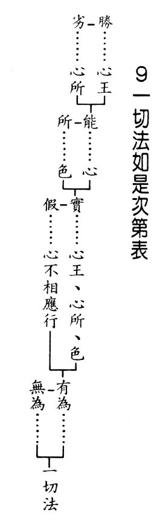

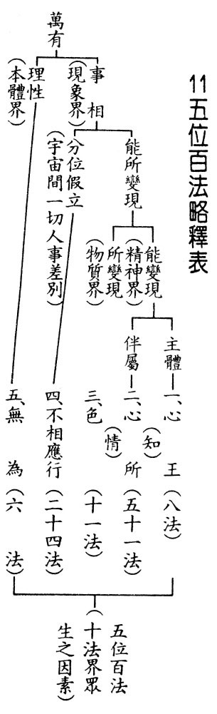

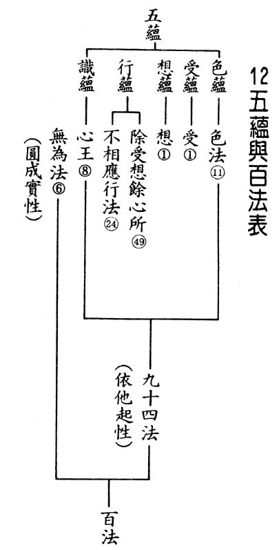

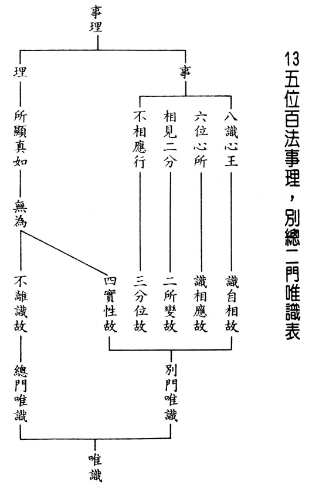

### 佛學概要十四講表簡說（四）

*戒慧講述‧法味整理*

煩惱如賊盜法財

知障喻睡顯實境

所執體性不可得

離苦得樂唯正觀

煩惱障和所知障的差別在於覺察是證一切智(破煩惱障)，覺悟是證道種智與一切種智(破所知障)，然智慧之得，須是以般若見地通達所執之我了不可得。

道種智不只是觀機逗教的世俗智，更須有般若智慧攝持，因為如果沒有般若智慧，則世俗的善巧與權變不能成為道種智。且若無般若智，此行者不能成就三智！

侵害如賊　覺賊無能

表上說，覺察是侵害如賊、覺賊無能，這是世俗的比喻。譬如家裡來了小偷，只要我們眼睛看著他，他就沒有辦法偷東西。侵害如賊就是譬喻煩惱障像賊一樣，會破壞我們的功德法財，但是只要我們看著賊，賊就不能興風作浪。

煩惱能夠賊害功德法財，布施得財富，持戒得尊貴，忍辱得眷屬，精進得事業等。但是，這些都會被貪、瞋、癡等煩惱破壞。瞋最能破異熟果，癡(邪見)最能破善造作等流果，本來應該生起很多美好的果報，但都被煩惱破壞光了，所以叫做侵害如賊。我們應該防的是自己的煩惱，可是我們卻防在他人，認為「防人之心不可無，害人之心不可有」，防人固然沒錯，但是防人的定義應該是防人破壞功德法財，如果此人可以助成你的功德法財，為何要防他？一般人都以為法財不重要，世間財才重要，殊不知法財能夠幫助我們學習空性智慧，並且得到解脫，這是世間財富遠遠無法比擬的。

世間的財產以及名聞利養，在你遇到厄運倒楣，或者有老病苦生起時，甚至是輪迴到下一期生命時，通通幫不上忙，努力賺錢卻解決不了厄運和煩惱帶來的痛苦，甚至是生死輪迴的苦，荒謬的是這些幫不上忙的世間財，卻變成我們人生努力的目標！

法財才能讓我們改變命運、逢凶化吉！所以必須把世俗的錢財轉成功德法財。而最能把世間財轉成功德法財的人，儒家來講就是子貢，子貢善於把世間財轉為功德法財，將財物資助老師推展正法事業。

覺賊無能分為兩方面，第一個是修對治法，比如有人進來偷東西，我用眼睛看著他，他就不敢偷了，可是那種盯法，盯不勝盯啊！剪不斷，理還亂，斬草不除根，春風吹又生。第二個是空性的修學法，這才是最根本的下手處。因為煩惱的自體性連微塵許都了不可得，試問煩惱賊在哪裡？

覺賊無能的對治法，是員警到處巡邏，配合各種的監視系統，最後賊終於無能。〈禮運大同篇〉裡正是以正知見經營社會、國家，讓鼠輩等沒有能力作亂。

昏昧如睡　覺即分明

覺悟對所知障，也就是破了煩惱障之後還留有習氣，這個習氣必須靠內心想要廣度眾生，以福支助慧，才能破除。所知障會讓法顯現為實有，雪廬老人形容叫做昏昧如睡。

按照唯識宗的說法，境界從心生出來，如果按照中觀宗，境界隨著心識的業而生起來。中觀宗是外境成立，唯識宗是外境不成；一個是法由內心顯，外境不成立；一個是隨業生起的外境，自體性不可得。因為不能通達它自體空，顯現宛然實有，就像睡覺時的夢境宛然實有，其實都是觀待夢心而有。阿羅漢內心顯現萬法實有，就像做夢一樣顯現夢境。

當入定以現量通達萬法的空性，知道自體性不可得時﹐哪有什麼夢境？出定比量通達時，仍會顯現境界，只是通達它非實有。

整個三藏十二部重點都在講智與覺，所以般若意趣就是佛說法的究竟處，尊貴無比！乃佛法的靈魂！依般若見地生起中觀正見，能帶來人生真正的安樂，心中油然生起對三寶的皈依和恭敬心，此時叫你不信佛，辦不到！此時對佛教的信心是圓滿的。因為那正見的力量是有別於外道，不共外道的！

透過覺察成為一切智，知道萬法總相是自性空，而它的作用是覺察。覺悟而得到道種智、一切種智，而道種智、一切種智所表現的作用，就是覺悟。

自行　化他　行滿

自行是一切智的成就。化他，是道種智的成就。行滿，是一切種智的成就。自行成就就是阿羅漢，化他成就就是菩薩，行滿就是佛。自行真正的成就是破煩惱障和破所知障得一切種智。此種能力能究竟利他，化他並非度盡眾生，而是度生心意圓滿，二者行滿就是佛的成就。

何以菩薩化他只是心意的圓滿？菩薩行布施時，眾生並沒有遠離慳貪；菩薩持戒時，眾生也沒有遠離惡業；菩薩忍辱時，眾生亦未遠離瞋恨；菩薩精進時，眾生未遠離懈怠；菩薩修學禪定利他時，眾生或在散亂中；菩薩修學般若度他時，彼仍是愚癡難解實相。就因為化他有大障礙，所以法運才有正法、像法、末法以及滅法！不但菩薩不能挽救法運，連佛也無可奈何，故化他之圓滿是指心意圓滿，幫助眾生究竟成就的心意圓滿，名言安立為大慈大悲！

【甲】表跟【乙】表的關係：

【甲】表已經定義了佛字，精準的定義就是智者、覺者。想要成為覺者、智者，就要透過覺察、覺悟來破煩惱障、破所知障，得到佛的一切智、道種智、一切種智。

【乙】表是二障略舉，我們之所以不能得到佛的智慧，最主要的障礙就在於煩惱障與所知障。煩惱障的產生是來自錯誤的人生觀；所知障的產生是來自錯誤的宇宙觀。所以乙表先舉出病因(二障)，治病必須要除病，才能得到佛智。

覺察、覺悟方是真正的二觀，能建立正確的人生觀是覺察，個人能透過覺察破煩惱障，離苦得樂。建立正確的宇宙觀即是覺悟。破所知障，方能真正利益有情。

正確的人生觀，精準的定義就是有能力幫助自己離苦得樂者。坦白來說，每個人內心深處都想要離苦得樂，沒有一個例外！狗、貓、雞、鴨，遇到有人拿起棍棒，就知道快跑。蚊子要叮你，只要眼睛瞪著他，蚊子就速飛逃離。麻煩的是每個人都認為他離苦得樂的方法是對的，從事士農工商者都想要闖個出路。但是沒有正確的人生觀，如何會有離苦得樂的能力？

正確的宇宙觀是建立在利益一切有情，令他們建立正確的人生觀與宇宙觀，此必須要破所知障方可，此障能破，則一切法成為所知，此人心識成為能知。宇宙的森羅萬象與人情事理皆是所知，成為度有情離苦得樂的能力。

宇宙森羅萬象中，有情想要離苦得樂，卻是惡難遣、好難求、得易逝。面對的人情事理是情多異、事多變、理多秘。（下期待續）

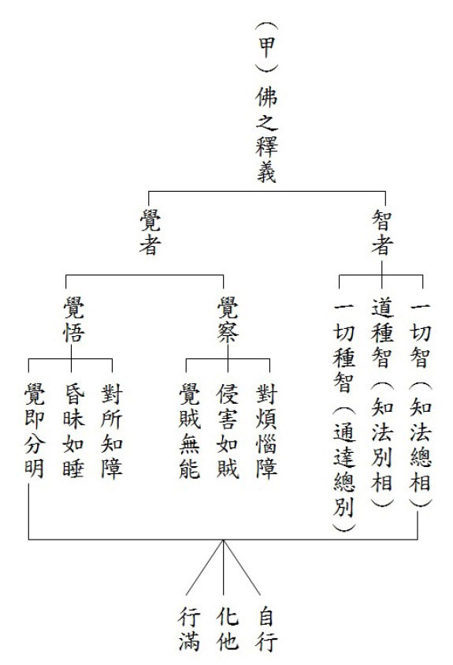

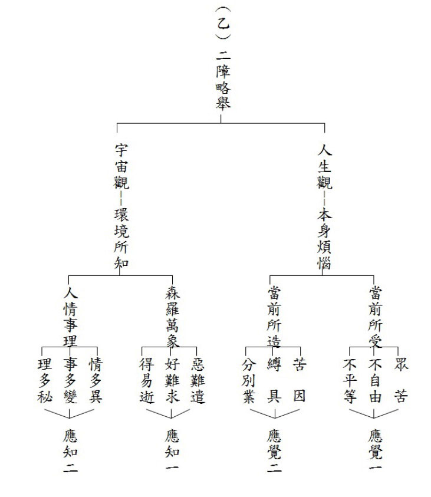

## 孔學一隅

### 論語簡說（十）
		  —切磋琢磨

論語簡說（十）

—切磋琢磨

*時哉講述、萬海山、心筑整理*

億則屢中悟性高

舉一反三學詩才

善體師志高風誼

國之棟樑瑚璉器

經文

子貢曰：貧而無諂，富而無驕，何如。子曰：可也，未若貧而樂，富而好禮者也。子貢曰：詩云：「如切如磋，如琢如磨。」其斯之謂與。子曰：賜也，始可與言詩已矣；告諸往而知來者。(學而篇第十五章)

釋義

分段與大意

孔門當中，老師跟學生之間的對話都是高雅又有內涵。

此章分為三段，第一段是老師跟學生的論議；第二段是學生用比喻告訴老師他的體悟；第三段是老師讚歎學生可以言詩。

首先孔子跟子貢的論議，子貢說一個貧窮的人，他在動機上、言語上、動作上不去討好別人；一個擁有財富、地位、學問的富貴之人，不會目空一切，請問老師您認為如何？

孔子評論：可以，但不如貧窮的人可以進一步樂於求道，富貴的人能進一步好禮，懂得恭敬人、禮賢下士，並且樂善好施。

接著子貢引用《詩經》〈衛風‧淇奧〉文句回答夫子，您剛才說的貧而樂道，富而好禮，是不是就是《詩經》中，如切如磋，如琢如磨的道理呢？

最後夫子說：端木賜啊！可以跟你談詩了，因為告訴你過去，你可以知道未來，告訴你貧而樂道，富而好禮，你可以知道用如切如磋，如琢如磨來比喻。諸往就是指孔子的回答，知來就是用《詩經》告訴老師子貢懂老師的意思。以上是這一章的分段以及大意。

諂與驕

朱子認為諂是態度上想要討好人；〈邢昺疏〉認為諂是身體上跟言語上去討好人。〈皇侃〉的解釋是心態上想要討好人。將這三家注解合起來，諂就是心地上、嘴巴上、動作上討好他人，此即諂的形象。

朱子認為驕就是愛面子而且很放肆的形象，富貴的人滿足於富貴，就像喝了烈酒一樣，目空一切。

貧諂富驕

貧者，因為不足所以想要獲得，容易去向人討好。富是有金錢，貴是有名聲，富貴之人容易仗勢名利，所以貧者容易諂，富者容易驕。因為大家都看到名利的好處，所以就會爭名奪利，產生很多的爭端。子貢何以有此章之問？就是因為大家都看到名利的好，所以貧的人會去追逐名利，富的人會仗勢名利，因而產生很多紛爭。

而貧如何不諂，富如何不驕？首先要知道不諂的功德，諂的過患，越諂媚別人越看不起，雪廬老人說人要有骨氣！這就是不諂的好處。而且求利可能造成大禍，沒有利就沒有害，沒有福就沒有禍，所以名利是大禍的來源，貧的人如果懂得這個道理，就不會去貪求富貴。

人如何不驕呢？要知道富貴也是無常法，看他樓起看他樓倒，富貴或許今天臨到你家，或許明天就輪到別家。況且，仗勢富貴容易令親情遠離，不易交到好朋友，君子也不願意跟驕傲的人在一起。

所以貧窮不諂，富貴不驕。貧窮不諂就是有骨氣，富貴不驕就是修養好。

未若貧而樂，富而好禮

孔子說：可也。未若貧而樂，富而好禮。貧而無諂只是有骨氣，貧而樂是更懂得充實自己、利益別人，所以貧而無諂，富而無驕，只是保守的作風，貧而樂是更積極利人的善，更能有開創的作為，此二者在境界上有很大的不同。

貧而無諂是不被貧窮所困、所轉，不會因為害怕貧窮而討好別人；貧而樂是能夠以心轉境，用貧窮好好的充實自己。因為貧窮，所以不需要出去應酬，有很多的時間可以好好的充實自己。因為貧窮，所以虛心地跟著有德有學的善知識學習。藉著貧窮來充實內涵，貧窮成為最好的出路！而且因為貧而樂，反而在貧窮當中樹立典範，贏得大家的重視。藉著貧窮來經營自己的人生，並且樹立典範，這就是以心轉境，運用之妙存乎一心。

富而好禮也是以心轉境，不但不被富貴所轉，不在富貴中生起驕傲，進一步會善用富貴去禮賢下士，讓社會風氣導正，如漢光武帝為了表彰氣節，帶頭禮賢下士，將風氣轉成淳厚，此即以心轉境，善用富貴去樂善好施、禮賢下士，並且將風氣轉變。

貧而樂道的典範

七十二賢裡面的顏回、公晳哀和原憲，這三個人特殊的形象就是貧而樂道的代表。
原憲是貧而樂道的隱者，就算他的好同學做了衛國的宰相，也不會去巴結。原憲在孔子過世以後，隱居於衛國，子貢在衛國當宰相，去見他的好朋友原憲，子貢是結駟連騎（很多台四匹馬拉的車一起前進）去找原憲，原憲住在陋室窮巷，屋頂是茅草屋，門用布做，下雨的時候是上漏下濕，拄著拐杖出來見子貢，子貢就
**問：** 老弟，你是不是生病了？原憲回答，無德是病，無財是貧，我是貧不是病，子貢終生以說過這句話而感到羞恥。

公晳哀，孔子讚歎他的賢德，是言必信，行必果，有俠氣！在當時混亂的時代，想要謀求富貴的人，必須做權貴的家奴，或者待在都市裡面謀求發展，攀附權貴，只有公晳哀不這樣做！

而顏回是一簞食一瓢飲，用竹子做的飯碗，用葫蘆瓜切一半，挖空曬乾作為湯勺，住在陋巷當中，人不堪其憂，回也不改其樂，贏得子貢對他由衷的恭敬與佩服！

經文是貧而樂，雖並未講貧而樂道，然是採取樂道之意，證明有三，一者、《論語》有《齊論》、《魯論》跟《古論》，《論語》是鄭康成依據《魯論》而整理完成，而魯國所傳的《論語》即是樂道；二者、依《史記》的〈弟子列傳〉有樂道；三者、是鄭康成本章的注解。樂道就是充實自己的內涵，唯有充實內涵才能幫助別人，顏回雖然貧窮，但楚國的子西大夫，認為他有宰相的能耐與氣度，是貧而樂道的典範。

富而好禮的典範

富而無驕是保守的好修養，因為知道驕傲的過患所以無驕，可是不如好禮的利人之善，不如懂得尊重貧而無諂者、尊重貧而樂道者。富而好禮之人可以帶動社會風氣，而且能夠樂善好施，子貢就是其中的典範，他尊重顏回與原憲的貧而樂道，並且將所賺取的財富幫助孔子弘揚聖道。

其次，范仲淹是北宋的參知政事，他懂得把錢花在刀口上，將錢財拿來做義田、義莊，培養族裡貧窮的人成為人才，並且恭敬賢才，樂善好施。

為什麼不說貧而好禮，富而樂道

這一章為什麼不說貧而好禮，富而樂道？貧而好禮不如貧而樂道，因為貧的人易對人客氣，本來就好禮！好禮當中必須包括樂善好施，貧窮的人沒有樂善好施的本錢。

富人本來學道就比較有資糧，容易找到好老師，人脈比較廣，求學障礙也比較少。但是富貴的人更重要的是好禮，懂得去恭敬人；貧窮的人懂得充實內涵，富貴的人懂得在外相上禮遇別人，樂善好施。果然如此，相信社會風氣一定會改變。

如切如磋，如琢如磨

《詩經》〈衛風‧淇奧篇〉：「瞻彼淇奧，綠竹猗猗。有匪君子，如切如磋，如琢如磨。」看看那淇水岸邊茂盛的綠竹，指的是衛武公非常有文才，並且懂得精益求精，衛武公很怕人家對他歌功頌德，每天最盼望的是大臣們應該舉發他的過失。因為周幽王寵愛褒姒，犬戎打進來時差點滅了周朝，衛武公幫助周平王打敗犬戎，於衛國執政了五十五年，成為衛國最有名、最賢能的君主，所以老百姓對他歌功頌德。「如切如磋，如琢如磨」讚歎衛武公執政精益求精且有毅力，內心清明，在外又有好名聲。

切磋琢磨，一般來說，切指獸骨或者牛角，磋指象牙，琢指玉，磨指石頭，也就是牛角、象牙、玉、石透過切磋琢磨，變成高級工藝品、藝術品。

深入的說法，是就一個器材上說切磋琢磨，切就是先大幅度的處理，磋是粗略的磨，琢是雕琢，磨是細磨。所以對牛角、象牙、玉和石都可以切磋琢磨，細磨之後成就了精美的工藝品。

故宮有很多精品，例如象牙經過切磋琢磨，成為象牙球帽架，是皇帝下朝的時候放帽子的地方。表面以高浮雕刻九龍穿梭於祥雲間，內部則雕刻各種鏤空精緻的錦地幾何紋樣，共二十四層，每層皆可靈活轉動。層層相套、玲瓏剔透且製作繁複的象牙球，價格比原先未經雕琢的象牙球，多上千萬倍。

再如故宮鎮館之寶小白菜，是瑾妃嫁給光緒皇帝時的嫁妝，玉彰顯她的冰清玉潔，白菜上的螽斯和蝗蟲代表多子多孫，繁衍後代。當玉石只是一塊玉和成為小白菜，兩者的價值差多少呢？換句話說，透過切磋琢磨，將人的尊貴以千萬倍成長，貧窮的人和富貴的人都能藉此讓自己的價值成就千萬倍。我們每個人都在創造自己的價值，切磋琢磨就能從庸才變成人才。

再者，子貢所云切磋琢磨乃《詩經》賦、比、興當中的比，貧而無諂經過切磋琢磨到貧而樂道；富而無驕經過切磋琢磨到富而好禮。切磋琢磨是修學的過程，包括跟老師、同學之間的學習，也包括自己回到家不斷的複習，充實自己的內涵。

子曰：賜也，始可與言詩已矣；告諸往而知來者。

孔子讚歎子貢有悟性，是告訴你過去，就可以知道未來。詩是蘊含不發，而且往往彰顯的是言外之意，用詩溫柔敦厚地去說，不會得罪人，這就是一個能看懂人心，而且會說話的人，藉著過去知曉未來，如同象牙、獸骨、玉、石，經過切磋琢磨以後變成高級藝術品的價值。

一般人有可能辦不到貧而無諂，富而無驕，但是在孔子的心目中，子貢可以進步到富而好禮。

總結

第一、《禮記》〈坊記〉：「貧而好樂，富而好禮，眾而以寧者，天下其幾矣。」意思是說，貧而樂，富而好禮，乃至家族當中人口眾多還安寧，這三件事情是很少的。家族人口眾多，家大業大不好管理，家中長老要以身作則，以禮治家，要做到以上這三件事是很難的。

第二、無諂是一種骨氣，無驕是一種修養，有骨氣、有修養的人，還要加上學問之功，也就是切磋琢磨，進到樂道好禮，這個人才更可觀。

第三、朱子說，我們先問問自己是不是無諂、無驕，先打好基礎，再來談貧而樂道，富而好禮。孔子對弟子的教導是觀機逗教，他知道子貢有悟性，可以循循善誘，有次第的引導，以上是這一章的大意。

問答

**問：** 為何夫子要讚歎子貢可以言詩，言詩為何需要有悟性呢？

**答：** 詩裡面有很多意思是含蓄不發的，若能看懂其中隱藏的意思，表示此人很有悟性，舉李太白的〈清平調〉來說，楊貴妃跟唐明皇在花園裡面賞牡丹花，李太白就寫了這首〈清平調〉，裡面全部讚歎楊貴妃的美麗，花園的漂亮，並且拿花、拿巫山的神女、拿趙飛燕跟楊貴妃比，全部都比不上！但「解釋春風無限恨」含太白勸諫義，乃言唐明皇你這個春風啊！未來會有無限的遺憾，唐朝的危機就在花園賞花當中發生！其中已經含藏了敗亡之因。所以懂詩的人若有歷史的眼光，不但不會重蹈覆轍，且能夠鑑往知來、趨吉避凶，而且文章一定寫得好，又不會得罪人，是「言之者無罪，聞之者足戒」。

**問：** 依照老師剛才所說，可與言詩已矣的含義，就是告諸往而知來者的意思嗎？如果是的話，子貢難道還不懂《詩經》怎麼讀嗎？子貢他是否只是富而不驕？就著他與原憲之間的對話，似乎是他失禮了，請問老師，子貢最後在禮的成就上如何？

**答：** 子貢知道自己失禮，他知道承認過錯，立刻能夠收回剛才的態度，而且終生以他說過這句話為可恥，這就是富而好禮的形象。

**問：** 《大學》中，曾子說切磋是道學，琢磨是自修，請問老師是為什麼呢？

**答：** 這就是曾子善讀《詩經》，子貢很有悟性，知道《詩經》要這樣引述，所以孔子說始可與言詩。有悟性的人，可以跟你談詩，而想要好好學詩的人，一定可以開竅，兩者是互相觀待。

例如：關關雎鳩，在河之洲。詩文表面看起來是男女戀愛，雎鳩鳥其聲關關，可以做很多比喻，例如朋友不離，比喻道義之交、生死之交；也可以比喻成國君愛民，可以從《詩經》的詩句當中，悟出很多人生的道理。

曾子說切磋就是道學，求學叫做切磋，跟老師一起切磋；琢磨者自修也，也就是自己回家把義理拿出來想的時候叫做琢磨，沒有切磋、琢磨，充其量只不過是塊璞玉，但是經過切磋琢磨，經過聽聞並且好好的做思維，價值就會無限成長。所以孔門的大賢跟著老師、同學切磋，然後私下用功琢磨。剛直的子路成為大賢；高柴愚直成為衛國的士師（獄官），回來魯國做武城宰；曾子則是從上課都聽不懂，最後到楚國當上卿大夫，而且回到魯國講學，成為魯國最有風采的人物。透過切磋琢磨，把人的價值做無限的成長。

**問：** 如果貧而無諂，富而無驕到貧而樂道，富而好禮可以稱作如切如磋，如琢如磨。請問貧而諂，富而驕進而到貧而無諂，富而無驕，是否也可以稱作如切如磋，如琢如磨呢？

**答：** 不可以！因為貧而諂、富而驕是一般人的通病。也有很多人有貧而無諂，富而無驕的質地，例如：十室之邑，必有忠信如丘者焉，未嘗如丘之好學也。一鄉裡面哪怕只有十戶人家，可以找到忠信像我孔某這樣的，可是沒辦法像我孔某這樣的好學。好學就是懂得找好老師去聽課，跟同儕切磋，回家還要懂得琢磨，課前不預習，課後不複習，有再好的質地，都不會有所成就。

**問：** 請問富而好禮和富而樂道比較，何者較為困難？如果將貧而樂道也一起加入這三者之間比較，它的難易程度應該怎麼排列呢？

**答：** 貧者因為謙虛所以容易好禮，縱然可以無諂，但是樂道是難的，貧的人牢騷多，就算無諂，但是叫他充實自己是很困難的，他要工作養家，還有其他很多雜事，有比較多的障礙！果然能像顏回這樣，內心從容像富貴人家，不畏生活忙碌的去求學，能有幾人？可見貧而樂道者少！

富人或許能無驕，但是要禮賢下士，對貧窮人恭敬，甚至是虛心求教，這是困難的。雪廬老人所編纂的《常禮舉要》：「於肩挑小販苦力，莫討便宜。」富貴的人頂多不討便宜，但是難在是否能禮敬無諂，或者樂道的貧者，改善社會風氣。貧的人充實內涵，富的人能夠好好的去莊嚴外相，禮賢下士、樂善好施。

總而言之，這兩者的難度，富的人好禮是難的，對貧的人樂道是難的。

**問：** 顏回不但貧窮，沒有政績，也沒有辦教育，請問他如何說是樂道以利益他人呢？

**答：** 顏回是孔門中的大賢，孔子上課的時候，顏回是不違如愚，下課的時候跟同學們談論，可以將老師上課的未盡之意再講清楚，幫助老師的教育事業。師兄弟私下被顏回培養，這些人被顏回培養起來之後，私下對顏回又感激又佩服，顏回過世的時候，門人都想要厚葬他，就是因為他對師兄弟的貢獻實在太大了。

**問：** 請問我們一般人學習《詩經》的成熟時間是什麼時候？

**答：** 最好先學雪廬老人的《詩階述唐》，唐詩四萬八千首，老人家歸為二十一類，總共一百首，從文法格局、講要、取境當中看出詩的內涵。例如〈蜀相廟〉，詩文開頭是「丞相祠堂何處尋」，丞相二字看出杜甫把蜀國當成正統，雖然正史當中魏國是正統，但是在杜甫的心中蜀國是正統，為什麼呢？因為諸葛亮這個人是漢賊不兩立，中國歷史不以成敗來論英雄，唯有民族氣節才能論英雄，民族才能延續。所以中國人拜關公，但是關公、岳飛、諸葛亮都是失敗者，因為中國人講究的是民族氣節。

**問：** 感覺貧富是相對的概念，如何對照自身以區分貧跟富？

**答：** 貧富就最粗淺的來講，貧就是生活資源缺乏；富就是生活資源富有，又有充分的享受，那是富的起點。貧者就是必須要很努力工作，才得很少的資糧，資源缺少的那一分。

**問：** 貧而樂、富而好禮，是不是貧跟富的最高成就相？再往上走還有沒有更高的境界？

**答：** 太好了！如切如磋，如琢如磨，如果樂在正道，而且所證的道是他的樂處時，就到究竟了！禮如果是把道表現出來的禮，道跟禮互相觀待，道是內涵，禮是外相，當道達到究竟時，禮也達到究竟。其實富貴或貧窮，都應該樂道好禮，但此章的重點在貧而樂道，富而好禮。

**問：** 如果想要學習子貢與子夏的悟性，在日常生活中，我們應該要如何來培養自己？

**答：** 首先，學《論語》是最為重要的，十三經的精華都在《論語》，切磋琢磨四個字，透過這一章，更知道如何體會。切磋琢磨告訴我們，衛武公當國君一直到九十三歲，活得越久，風采越好，大家對他越讚歎，衛武公靠的就是如切如磋，如琢如磨，喜歡向人求教。孔子也是如此，五次進出衛國就是因為衛國多君子。(下期待續)

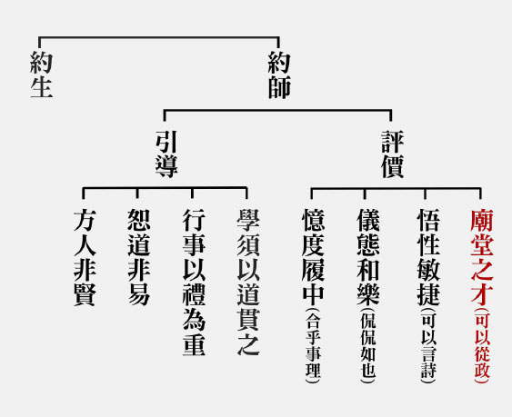

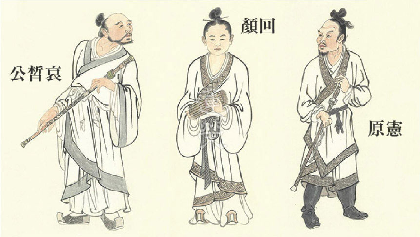

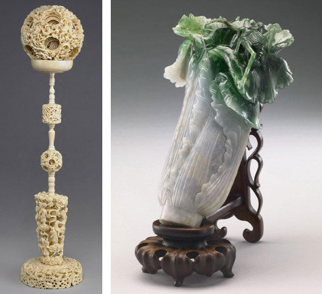

## 藝術賞析

### 孔門七十二賢淺說（六）
				   ─澹臺滅明

孔門七十二賢淺說（六）

─澹臺滅明

圖：江逸子‧文：時哉

貌醜心正學聖道

能令夫子歎失人

行不由徑不循私

傳承聖道八大派

澹臺滅明，姓澹臺，名滅明，字子羽。魯國武城人，小孔子三十九歲。

《史記》上說，澹臺滅明投師於孔子，孔子見其狀貌醜陋，以為才能淺薄，不會成才，所以不想收他為徒。

但他能致力於聖道之學習，處世行為都出自於公心，所以之後他南下楚地，學有所成，跟隨的弟子有三百人，名聞於諸侯之間。孔子也因而歎道：「以貌取人，失之子羽。」

《論語》〈雍也篇〉記載，孔子的弟子子游擔任武城宰時，孔子問他：是否在武城得到人才？子游說有一位澹臺滅明，仍依循井田制度的古禮，由井田之外的道路行走，不抄井田之內的捷徑，可見其人行為端正，篤守古道。此外，澹臺滅明雖為子游同學，但若非公事，不會私自造訪子游，亦可知其為人不會徇私、自愛自重。

在《孔子家語》有關他的善行，說他為人公正無私，來去分明，是重然諾的君子。在〈弟子行〉中，夫子讚許澹臺滅明：不因富貴而喜，不因貧賤而怒，若有利於人民，會廉潔而行，侍奉上位者是想佑助百姓，這就是澹臺滅明的德行。

戰國時代，流傳著不少孔子弟子在各地仕官任事時，有德有守、令百姓感念的故事；澹臺滅明也是其中之一。《水經注》及《博物志》曾記載相關傳說。澹臺滅明帶著千金之璧渡江，遇河神派遣蛟龍來劫。子羽曰：「吾可以義求，不可以威劫。」說完便揮劍斬蛟，投璧於河。河神不敢取，三投三返，最後子羽毀璧而去，示無吝意。雖然神話傳說未必可信，但我們也能從中看出澹臺滅明在當地人民的心目中，不僅是一位氣節崇高的君子，也是文武雙全的豪俠。

時至今日，有關澹臺滅明的遺址已難考證。在中國蘇州有一澹臺湖，據聞是澹臺滅明當初結廬的地方陷落成了一個湖泊，故以此為名；湖畔另建有一澹臺祠。而其墓所在眾說紛紜，一說於武城，即今山東省費城縣。或曰於山東鄒城縣，今有澹台墓村位於當地。或曰於陳留(河南省開封是)，或曰於豫章(江西省南昌市)。

最重要的是，澹臺滅明為後世留下了典範，其人有為有守，又能傳承、發揚孔子之學。雖然他的容貌醜陋不受重視，但憑著自己的努力，最終名列七十二賢，或許這正是他和孔子之間最好的示現吧！

畫中的澹臺滅明現以布衣形象，相貌不揚如《史記》所載，唯表情極具個性，眼神誠懇、忠厚老實，確是一位不抄捷徑，一步一腳印的行者，而整體的姿態中，也展現出他俯仰無愧的器度。由此可見，為人處世上最重要者，莫過於藉由經典的學習來改變自己的氣質、轉變自己的命運、充沛自己的器識，相貌外表不過是其次。腰上佩劍，暗喻此人具有行俠仗義之心，不屈於威迫之志。(下期待續)

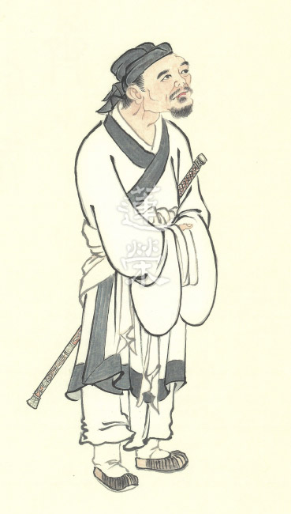

### 華夏精魂千秋(六)
		—明倫史畫德澤善報—秦繆公

華夏精魂千秋(六)

—明倫史畫德澤善報—秦繆公

圖：江逸子‧文：淨域

肚大能容蠻人

德澤善報免禍

用人力精圖治

奈何遵循殉葬

史話

秦繆公，一作穆公，嬴姓，趙氏，名任好；生年不詳，卒於西元前六二一年。乃秦德公的小兒子，宣公、成公的弟弟，西元前六五九至六二一年在位，為《史記》所載春秋五霸之一。

繆公心胸寬廣勤政愛人，秦國在他治理下漸漸成為一方霸主。有一次到梁山(今陜西省乾縣境內)打獵，走失了幾匹良馬，牧官四處尋找，發現竟被附近歧山蠻人捉殺了，且圍聚在一起大吃馬肉。牧官將三百多人逮捕，奏請嚴加治罪，繆公嘆息地說：「一位有仁德的君子，是不會因牲畜而加害於人的。聽說吃馬肉若未飲酒，就會中毒傷害身體，不如給他們一些酒喝吧！」於是命人送來美酒暢飲，且赦免他們的罪。蠻人們叩首謝恩感激不已。

繆公十三年，晉國發生旱災向秦國借糧，繆公為晉惠公(夷吾)的姐夫，便爽快答應。隔年秦國發生大飢荒，繆公向晉國借糧，惠公不肯。晉大夫慶鄭諫說：「如此忘恩負義將會招致災禍。」惠公仍是不聽信。

繆公十五年，秦國發兵攻打晉國，在韓原(今陜西省韓城縣)一地遭遇激戰。秦軍為晉軍所圍困，繆公又負傷，在緊要關頭衝進一支隊伍，既冒死搭救謬公，還擒獲晉惠公，反敗為勝。於慶功時始知，這些人就是當年吃馬肉喝美酒的人。秦國將殺惠公以祭天，繆公夫人繆姬著喪服哭泣不已，繆公便與晉國在王城雍簽訂盟約，以太子為人質，讓惠公返回晉國。

繆公非常重視人才，任內廣納賢士，大膽任用非本國人才，開秦國任用客卿制度之先河。在他的感召下，號稱「五羖大夫」的百里奚、相馬專家伯樂及九方皋等紛紛投其門下。由於他在用人方面，始終採取「得其精而忘其粗，在其內而忘其外」的相馬之法，因而取得了殊勝的成果，曾協助公子重耳返回晉國奪取君位。在良將由余、孟明視、西乞朮、白乙丙等的輔佐下，出兵攻打蜀國和其他位於函谷關以西的國家，開地千里；周襄王命他為西方諸侯之伯，於是稱霸西戎，為四百年後秦統一中國奠定基石。

繆公三十九年(西元前六二一年)去世，諡號穆，故又名秦穆公，葬於雍(秦首都，今陜西省鳳翔縣)。繆公之死，計有一百七十七人殉葬，為西周以來之最，也反映出秦地之惡俗。當時秦國極有才幹的車氏三良─奄息、仲行、針虎也在殉葬之列，秦人作〈黃鳥〉詩三章來哀悼，用以表示對殉葬制度的憤慨。

圖解

此圖所繪乃秦繆公賜酒給岐山蠻人暢飲之景，其不念蠻人殺官馬之過，藉以酒解毒之說來平撫不安，進而彰顯仁德以廣進人才。晉文公重耳去世時，繆公出兵偷襲鄭國，為商人弦高識破通報，便轉向滅滑國而返。繼位的晉襄公，不滿秦乘國喪伐其同姓(晉、鄭、滑皆姓姬)，便伏擊大破秦軍，俘孟明視、西乞朮、白乙丙三員大將而返。襄公嫡母為秦穆公之女，遊說襄公放三人歸秦；繆公著凶服郊迎，除罪責自己使軍敗國辱外，還再重用三人輔國。西元前六二四年繆公親征伐晉，晉軍守城不出戰，秦軍掃蕩晉土，祭奠陣亡將士後返國，此後再接再厲平服西戎。若繆公見失馬怒殺歧山蠻人，因兵敗而罪誅軍將，便無後來的韓原解圍與稱霸西戎，如此更見德澤善報之益。（下期待續）

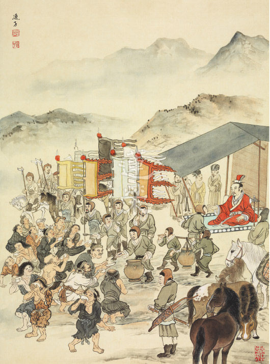

### 孝經圖簡說(四)—卿大夫章　 卿大夫章第四

圖：江逸子‧文：時哉

言行儀表稱君子

輔佐君上大臣風

安邦定國守宗廟

典範令民具爾瞻

卿大夫可以是天子所屬的卿大夫，或者國君所屬的卿大夫。卿分為三級，大夫也分為三級，總而言之，是國家重要的決策官員，他們或是參與決策，或是執行決策，像魯國的季孫大夫屬於卿，孔子是大夫，不論如何，卿大夫都是朝中主要的議政大臣，是國家重要的形象，所以要重視自己的服裝儀容，要重視自己的談吐，要重視自己的行為，不能亂說話，不能辦事毫無章法，不能不在外相上講究。

如果一位卿大夫懂得在言語上講究、在服裝上講究、在行為上講究，那麼這位卿大夫，會給國家帶來體面、帶來氣象，會讓老百姓對國家充滿信心，所以卿大夫的角色非常重要。

圖中戴著禮帽、穿著禮服，莊嚴地坐在几席上的這位就是國君，或者說是天子，江先生將其形象畫得一派莊嚴，表徵天子或者國君必須要望似人君；後面的屏風畫著山水，兩旁的日月團扇表徵天子國君胸懷天下國土，要以蒼生為念；旁邊的議政大臣人數不多，代表卿大夫在議政的時候，有時候是小朝廷，議論國家十分重要的事情，這些人的表情嚴肅，表徵對國家大事是慎重的。

畫中這位向天子國君跪拜的卿大夫，拿著笏很恭敬的陳述事情，表徵卿大夫在議論國事時，形象是莊嚴的，態度是誠懇的，尤其是勸諫國君或天子的過錯，或者導正他的行為，態度更要恭敬、言語更要謙和，而且在場者不可太多，要懂得勸諫之道，方能達到效果，讓國君在不知不覺中，修正自己的錯誤，大臣們也會欣賞這位卿大夫調和的能耐。

圖中天子兩旁卿大夫，或專注或傾聽這位行禮如儀的卿大夫議政，從表情看出是一幅欣賞的場景，如果卿大夫能夠維持這樣的風格，他一定能夠保有他的祿位，一定能讓國家享受太平昌盛，讓老百姓對國家充滿信心，以上是卿大夫之孝。(下期待續)

## 專題報導

### 佛說四十二章經考題解答(中)

*編輯部*

大教東來白馬駝

經教要義四十二

文似小乘實近大

善用如蜜中邊甜

二十、何者是最殊勝之善法？何者是最殊勝的志向？人有志向有多殊勝？計較善法大小有何好？

**答：** (一)以三輪體空的智慧攝持善法或菩薩道，如此方是最殊勝的善法。

(二)立志於解脫道乃甚至成佛是最殊勝的志向。

(三)人之有志如樹枝有根，有志向者能提起心力，步步往目標邁進，終有成功之一日。

(四)計較善法大小，能將有限的生命，用於最重要的事務上。

二十一、忍辱何以多力，此力之行相為何？最明之相為何)？得此明相有何殊勝？

**答：** (一)忍辱之人心中不懷宿怨，沒有惡念，其有耐怨害忍，能忍眾生怨害；安受苦忍，可忍天災飢寒；諦察法忍，於道業精進，最終諦察無生法，是故凡事可忍，其力自現，其事自成。如是之人，得道多助，必為人所尊敬。

(二)能夠斷除煩惱，不為欲塵所染，是最明的行相。

(三)得此明相，證得佛果，對於無始以來所有事情，沒有時空限制，不論大小粗細，都能知曉。

二十二、有愛欲何以不見道，其法與喻相為何？如何是捨愛欲方見道？

**答：** 有無明我執就有愛欲，不能看見萬法的真相，而萬法的真相就是沒有自體性，執我之心即是執人與法有自體性。

「澄水」喻照見道之力；「致手攪之」喻愛欲交錯，心中濁興；「覩其影」喻見道。

捨愛欲之法分二；第一種是修對治法，對每一個貪愛的法都一一修對治法，貪愛的法越多，要修的對治法就越多。第二種是直接從根本問題解決，修學空性，觀諸法的自體性無，在一法上不斷的串習及觀修，由比量推度到現量，現證空性後，對法不起執著，自然也不會有愛欲了。

二十三、如何是見道，其法與喻相為何？

**答：** 見道就是看到諸法的真實相，透過般若的修學現證空性，了知諸法的自體性其實是沒有的。

「冥室」喻無明我執；「炬」喻道，也就是般若的智慧。般若的智慧可以破除無明我執，就像拿著火把進到千年暗室之中，立刻呈現光明，有明則無暗，不會有明、暗同時存在的狀態。以般若智慧現證空性後，就不會再有無明我執，也就可以脫離六道的輪迴。

二十四、念如何至無能念所念，行如何至無能行所行，言如何至無能言所言，修如何至無能修所修？

**答：** 念就是憶念，一個憶念的成立，分析之下必有能念和所念。而憶念本身、能念、所念三者皆無自體性；若有，則會有諸多不合理的地方，例如：假如三者都有自體性，則三者不必相互觀待就能各自成立；三者可獨立成立，那豈不是有三個念了。分析「念」的三個環節都沒有自體性，此即在做善法時的三輪體空觀察。

至於如何能達到無能念所念、能所雙亡的境界呢？就是在三輪體空的基礎上，以比量的智慧串習觀茶，直到能緣的心識和所緣的空性境界像以水就水般分不出能所，即所謂能所雙亡，現證空性。

二十五、佛法三法印其相為何？何以稱法印？此三稱法印說明什麼？

**答：** 佛法三法印為諸行無常、諸法無我、涅槃寂靜。何以稱為法印？就是印證整個佛法的重點都在無常、無我、涅槃寂靜。只要某部經典有提到三法印這三個重點就可以等同佛說的經典。此三稱法印說明了人要離苦得樂，究竟的方式是出離三界，所用的方法就是無常、無我，而涅槃寂靜是成就相。

二十六、四大如何無我，試述之？

**答：** 有情的身體是由四大組合而成的，分別是地、水、火、風。這四大分別都沒有自體性，因為這四大必須要相互觀待才能成為四大，例如：「地大」如果離開水大、火大、風大，也不能成為安立為「地大」；「水大」如果離開其於三大，也不能安立為「水大」。火大、風大也是如此。

既然這四大都沒有自體性，那麼由四大組合而成的身體也沒有自體性。

二十七、隨情欲求聲名，何以用燒香之喻，此喻在說明什麼過患？

**答：** 燒香是把檀木拿去燒，燒了後會讓人聞到香味，但是在讓人聞到香味時，檀木也燒成灰炭了，以此譬喻追求聲名的人，目的在於成名令人知道，從中獲得人們的尊崇、禮拜；然而，此舉就像是把身體當作木頭拿去燒一樣，當功成名就時，壽命也已到了盡頭。

修學般若正見（解脫道）需要投入大量時間與心力，若不及時把握，反將寶貴的時間花在追求與解脫無關的虛名上面，到最後盡其一生心力、拚死拚活所得到的只是把整個身體都搞垮了，浪費了可以用來修學正法、利益有情，以及辯證空性的身體，令一生空過，是人生最大的浪費。

二十八、財色為何如刀刃之蜜？何以不是一餐之美，比喻在說什麼？小兒之形象為何？舐之割舌之喻在說明什麼？

**答：** 財色引發的過患像是刀頭舐蜜，即眼前所得財色的快樂像蜜一般，但吃的同時馬上就會割到舌頭。

不足一餐之美在比喻追求財色的人連世間一般人的快樂都比不上，就像刀刃上的蜜不足以讓人飽餐一頓。一般人不追求財色，看起來什麼都沒有但是很快樂，然而追求財色之人，像有些有錢人到最後，反而很羨慕貧窮但卻笑口常開的人家，表示他連這種基本的快樂都沒有。

小兒的形象就是無知，只要沒人去保護，很容易就會受傷害。

舐之割舌之喻在說明剛舔到刀刃上的蜜，馬上就會被割到舌頭，嚐到苦頭，換句話說，只為了眼前短暫的享樂，後患卻是無窮。

二十九、妻子舍宅的過患何以勝過牢獄？妻子舍宅不是體性空嗎？如何轉為功德？

**答：** 因為對於妻子舍宅的愛戀，依依不捨，所以說其過患勝於牢獄。

妻子舍宅體性空，但對出家人而言仍有過患，因為出家人本來就是要出家修道，怎麼可以對妻子舍宅依依不捨而還俗回家呢？所以要修學般若正見，對其做種種觀察，從而生起出離心，更重要的是觀察所愛執的對象到底有沒有自體性，發覺都了不可得的時候，乃可成就出塵羅漢。對在家人而言，五倫以夫婦為始，有夫婦然後有兒女，有父子、兄弟。有夫婦然後有家，有家然後有國，夫婦倫一正其他皆正，是故將家庭營造成學習正法的環境，而非沉溺於五欲堆中，以正知見來經營，可幫助家人修道。此外，家庭守五戒，也有助於國家長治久安。

三十、愛欲大分幾項？過患最重者為何？試述其義？以執炬逆風之喻說明什麼？

**答：** (一)愛欲大分財、色、名、食、睡等五項。(二)財色名食睡中，財名食睡皆易於斷除，惟色欲最難斷，欲界眾生多以緣男女交而動其淫心，而轉世入胎，凡夫遇名色不可得兼，必捨名而取色，財名食睡皆不能勝之也。而從十二因緣的觀察，愛取之後，才有了來生的定業，故知愛欲最嚴重的過患在結輪迴之苦果。由近而言之，男女行淫一次，便損一次壽命，影響身體體力及健康，無法在世間學業及事業有所作為，果報為今世來世短命多病。其次淫心熾盛，無法克制，第十六章：「心中濁興，故不見道。」成為修學出世間法的障礙。更甚者因淫慾而敗家亡國者，如殷紂王寵愛妲己、周幽王寵愛褒姒、唐明皇之於楊貴妃、吳三桂衝冠一怒為紅顏等，為淫欲造下極重惡業，來世果報在三途。(三)執炬逆風之喻，手喻根、炬喻色塵，手執炬喻根緣境生識，逆風喻愛欲。執炬逆風是說，根對色塵升起愛欲，如不去對治，最後會引火燒燒到自身。

三十一、佛如何遠離對玉女的愛染？

**答：** 佛在因地修學不淨觀，其一生都攝持五種不淨觀修學，(一)種子不淨：投胎的心念帶著愛欲而來是為種子不淨，所攝持父精母血亦屬不淨。

(二)住處不淨：胎兒住胎期間，住處子宮被大腸、小腸、胃、直腸及膀胱等臟腑所包圍，這些臟腑所包覆者不外食物逐漸變成糞便及尿液，就跟住在廁所旁邊沒兩樣。

(三)自相不淨：出生後一生中，外相上眼生眼淚與眼垢、耳出耳垢、鼻出鼻涕與鼻垢、口吐痰與口水，肛門排糞便，尿道解尿，毛孔汗酸臭，身體積垢，每天都要清潔，方能除其臭。

(四)自體不淨：再觀察所愛自身當下組成從外至內的眼、耳、鼻、舌、頭髮、體毛、指甲、牙齒、皮膚、肌肉、筋膜、血管、血液、淋巴液及淋巴系統、神經系統、骨骼、脂肪、心臟、肝臟、脾臟、肺臟、腎臟、胰臟、膽囊、腦、大腸、小腸、胃、直腸及膀胱所排出的物既然不淨，能排的器官組織有清淨相可取嗎？所以是自體不淨。

(五)究竟不淨：身體年輕時，有些人遠觀乍看有年輕貌美之可愛相可得，可是每個人最後終將老去，髮枯面皺，老態龍鍾，死後軀殼腫脹、青瘀、爛壞、血塗漫、膿爛、蟲噉、散落一地、成白骨、燒後一空，人死後如此不堪，則生的時候貪戀有何意義？

但以上五種修學法僅為對治法，只能破貪欲之現行，修學般若才能究竟破貪欲種子，貪欲心起時，去觀察能取的心是否不必靠外境就可以生，如果是那就對著豬狗雞鴨所有外境都一律生貪欲，而且既可以自生，應一生永生不會滅，但現見不是，可見貪心不在能取的心上自相可以生。如果貪心在外境女色自相生，那不必靠能取的心，可是聖人、世間正人君子也不會貪著女色，如唐朝狄仁傑夜宿客店遇寡婦而不動心。沒有能取的心，就也不能成立所取的外境，這樣自然遠離對玉女的愛染。

三十二、在河中之木如何入海，如何以比喻說明修道者必得道？

**答：** 以河中之漂流木以比喻修道之人，入海即是比喻入聖道成佛之義(小乘則是成就阿羅漢果)。

漂流木要入海條件有五：

(一)尋流而行，不觸兩岸：循著中流而行，不觸兩岸，引申之義為不墮入常斷二見，有自體性見的人會落入常見及斷見，常見(自性有)與斷見(根本無)，活著的時候認為事物都不會壞，永遠存在在那裡，看到事物不在的時候就認為不會再有，一滅永滅，這都是有自性見在看待事物。

(二)不為人取：不為人所攝，意味著不墮入愛網、情關及名聞利養。

(三)不為鬼神所遮：修行時不會著魔，或是不會去修外道見與鬼神相應。修行時若動機不純正，沒有傳承而盲修瞎練，不是被人取，就是被鬼神所遮。

(四)不為洄流所住：不被水中的漩渦纏住。修行時不生在惡劣的環境、或是善友難求的環境，或者忙於許多外務不得修行。另外為洄流所住的人，也意味著人懈怠、退轉，雖然無前三者，但是修行時不精進，沒有法喜，不會前行。

(五)不腐敗：意味修行的人要耐久，若不能持久，意味著已漸漸變質，所以遇境逢緣都要懂得串習正見。

若以上五點都能做到，修行人要有知見、中觀正見，遠離名聞利養、愛欲(人取)，遠離外道見(與鬼神打交道)，並且修行要精進不變質，就能保此木決定入海，此修行人必成就聖道。（下期待續）

### 書法是中華文化之美
       ─從翰墨新情說起

書法是中華文化之美

─從翰墨新情說起

傳線

運筆在用心

經學字靈魂

生活能雅趣

天地自春秋

中華文化有其特殊性，陰陽變化之道是其中之一，而最足以代表此一文化特徵的經典，非《易經》莫屬，何以見得﹖《易經》〈繫辭〉上載明｢一陰一陽之謂道，繼之者，善也；成之者，性也｣，此微言頗能切中道之本質及陰陽文化之特性。又求我中華文化百工技藝中，最能體現此一形上之道者，最足展現此一陰陽文化之游藝者，當推書法藝術。

蓋書法用筆之方圓，線條呈現陽剛陰柔之美，輕若蟬翼、重如崩雲；墨色和水經筆敷之濃淡乾枯，宛若圓珠潤玉、恰似萬歲枯藤；筆墨水合之變幻莫測，可說窮盡態於毫端。小之一字之結體虛實疏密、大小參差；繼而行氣或直線貫串或曲而中直，體勢或動或靜或動靜合一，其態或如園中小徑，或似康衢大道；完成之章法，或波瀾不驚，或風起雲湧，或花團錦簇，或綠野平疇，或崢嶸爭高，種種意象可謂氣象萬千。從點、線、行至章，無處不呈現陰陽之神，故說書法是陰陽文化之最佳代言，此尚就外在形式論述，陰陽變化如是。至若學書所蘊藏之智慧，人生進退出處之機、揖讓之道、身心安頓之方、自利利他之胸懷、一絲不苟之養成、一心不亂之追求……，駑鈍如我，縱使借得江郎彩筆，恐亦無法盡述之，何況無辯才無礙之廣長舌可宣說其妙，偉哉！書法形下形上之道。

余秋雨在《文化苦旅》〈筆墨祭〉一章說道，尋覓傳統中國古代文人之共通交集處，捨筆墨無他！可云一針見血之卓見。中國書法藝術，放之全球，將書寫文字化成藝術，不敢武斷地說是寰宇獨有，料必也是罕見。縱觀歷代帝王美學藝術教育之養成，書法當是重中重之學習課程，從宮中崇尚蒐藏之書法墨跡本，如唐太宗詔令歐、虞、褚、馮臨摩〈蘭亭集序〉，又敕懷仁和尚以王右軍書跡〈集聖教序〉等，及彙編歷代書法名家而成之叢帖如〈淳化閣帖〉、〈大觀帖〉等，或可知其梗概分量，此類法帖、叢帖非但是王族子弟學書法藝術之佳本，更是摩挲把玩的藝術珍品，皇親國戚如是深入臨池；以下諸侯、卿大夫、士，甚至庶人，誠所謂上有所好，下必從焉，蔚然成為中華文化長遠的書法藝術史，既深遠又廣袤。書法名家代代繼之，上下千餘載，從帝王至僧人，嘔心瀝血創作之法帖，善而美，實汗牛充棟，如三希堂墨寶、三大行書等不勝枚舉，遂能成就中華文化之特性，大大迥異西方文化。綜合言之，從書法藝術之長河流變，不正是上段〈繫辭〉經文繼之、成之最佳的註腳。

書法藝術至民國，西風東漸，以西洋書寫工具代替筆墨，此一轉變，真是地動山搖。但是千年基業猶有砥柱之人，蓬萊寶島書法名家隨政府遷臺，其中五百年一草聖之前監察院院長，集革命家、報人、詩人、書法家等一身之于右老，以深厚碑體功夫，融合墨跡法帖，別樹一幟之標準草書，標誌傳統書法藝術之創新，將書法藝術推向另一高峰，培育弟子遍及海峽兩岸，可云開花散葉，代有人才，其中在臺第三代弟子書法篆刻名家薛平南未及而立，以書法為志業，絳帳授徒，跟隨者眾，齋名｢心玉盦｣，曾戲刻一方印｢右派｣，自是右派儼然成標準草書之代名。翰墨新情施筱雲與王順福二人，乃心玉盦登堂弟子，從學卅餘載，步趨其師泛覽歷代名碑帖，廣涉篆隸草行楷各體書，不苟合時下書風，漸離書法核心之文學性及藝根源於道之形上追求，二人創舉為自己書法創作心路歷程或緣起或感懷，筆之成導覽文，希達自利利他之行，可謂匠心獨運，引書藝趨向志道之康莊大道。

筱雲博士書作重於文學經營，形式巧妙多變，內容以揀擇經書佳句及富真情性之古文為宗，所書榜書，具陽剛之美，氣勢不讓鬚眉，小字娟秀婉約，含陰柔之質。順福則溺於神智體的沉思，收集歷來之作，開創富理性思考之書風，深盼以書作結合啟蒙詩詞教育，饒有情趣，二人作品令觀賞者耳目一新，名曰｢翰墨新情｣，可謂允當。又各擅其長，展出百餘幅作品中有呼應處，如《禮記》〈經解〉及彥和〈宗經〉榜書題材；有共同取法處，如帛書漢簡之涉獵；有二人獨特處，如筱雲心經四幅，有一句話說，我的江湖等；順福讀碑札記至人無想、君其繼縱二幅，雪廬老人臺灣竹枝詞、詠物詩等凡此種種，都是二人集覃思與工力所成之作品，然皆業餘之作，不足之處，期盼博雅君子，以匡未逮。

筆墨文化迄今，輟而不輟，輟者為制式教育驅離出校園，相較古人日夕臨池，大相逕庭；不輟者猶有以書為志業、以翰墨耕耘為生活寄託者，臨池者雖寡，書之眼界一般而言博於古人，尚可維繫筆墨文化於不墜，然日本及韓國之好臨池者猶勝於書法之文化中國，海峽兩岸傳承書藝者，猶當攜手切磋琢磨，共創書法藝術之高峰，而回歸｢志於道，據於德，依於仁，游於藝｣之軌道上，應是唯一的抉擇，也是致勝領先之樞機。

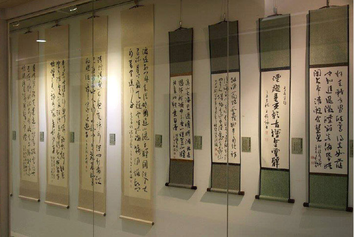

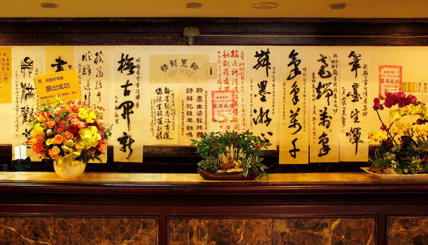

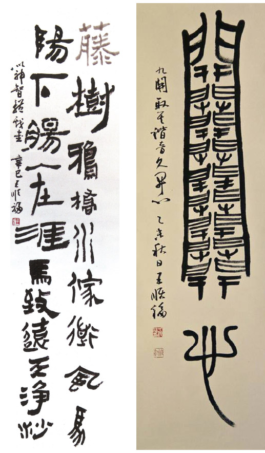

## 活動報導

### 走入時代的領導人
       大專青年經典講座活動報導

走入時代的領導人

大專青年經典講座活動報導

*編輯部*

經學培養青年才

創造時代由見地

論語為政大胸懷

國家長安待後進

唐瑜凌老師及其師資團隊，八月二十一日至二十三日，中華傳統文化儒釋道教育學會理事長悟道法師邀請，於臺北國際會議中心一樓會議室，以《論語》條目為核心，講授走入時代的領導人，應有的格局與內涵。

邁向多變的時代，青年不只需要知識的聚集，更需要智慧的陶冶。智慧是一種透視、一種反想、一種遠瞻，可以照燭人生的前途。《論語》是一本記錄孔子和其弟子等人言行的語錄，薈萃了孔子思想的精華，不僅在古代受到重視，也是當代許多中外名人所公認的寶典。

今以「為政」作為主題，蒐錄《論語》中相關篇章，講述走入時代的領導者所必須具備的特質。以孔子曠古的智慧，鑑察當代的脈動，是有志於提升自己成為出類拔萃的時代領導者，十分難得的一場講座，更是青年朋友們，打開《論語》智慧寶庫的一把鑰匙。另外專題講座〈The Secrets to Success〉帶領大家探討人生成功的秘密；人生的出路在孔子身上找─孔門弟子及中外名士共同認證，由孔門弟子對老師的讚歎，中外名士對論語的讚揚，生起對聖賢教育的信心，開聖人眼力，於個人修養乃至於說話、辦事，皆能無往不利。而影片欣賞則擷取孔子至周朝訪禮於老聃，於魯國政治生涯最顛峰時的夾谷之會，以此二片段，彰顯孔子能力與見識，作為學習《論語》之補充教材。

本次講述一位以德為本的領導人，該如何組成人才團隊，訂定正確的施政目標，使國家社會長治久安，人民能夠近悅遠來。講座內容皆取材自《論語》，並以大成至聖先師奉祀官府主任秘書李炳南老教授講授，徐醒民先生記述的《論語講要》，作為抉擇眾多古注的基準本，忠實地呈現《論語》條目的意涵，切合人情世故，打開學習者的見地。

指導單位會長，也是現任大成至聖先師奉祀官孔垂長先生也到場致辭，並參與一堂課程。孔先生致詞時也對在場的學員表示十二萬分熱烈的歡迎，認為有能力在這個時代開出這樣的主題，講述走入時代的領導者必須必備的特質，實在不容易！而在場學員的選擇是正確且明智的，相信認識了孔子的精神與學說，如此高度的實用性，定會帶給大家不凡的人生。

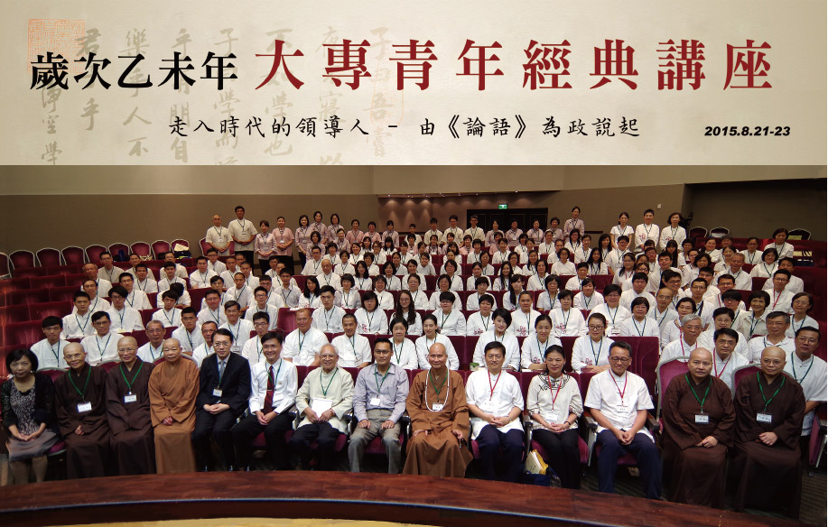

### 走入時代的領導人
       大專青年經典講座心得節錄

走入時代的領導人

大專青年經典講座心得節錄

*編輯部*

另類的成長

豁然的學習

心開的前程

會心的一笑

王姿云

首先感謝兩位老師辛勤的教學，以及無盡燈文化學會的師資團體還有主辦單位們提供了這麼舒適、寬敞的環境讓我們一同在這邊學習，三天的課程很短，很快就結束了，看起來很容易但其實卻非常的不容易，怎麼說呢？時間的湊合、地點的取捨，觀待是誰來教，誰來學，你的同儕是誰，少了一個因素，可能就沒有這場講座了。而且颱風原本要來，但是卻突然轉彎轉走了，一定是因為我們這邊有個很棒的講座的關係，因此要謝謝大家讓颱風走掉了！

這次的講座名稱叫作「走入時代的領導人」，很多人都覺得這個名稱特別的棒。從走入這兩個字來看，有一種動態的感覺，是一種要時時刻刻學習，不斷成長和進步的感覺，而姿云想從過去、現在和未來這三方面來分享。從過去來說，也是因為有爸媽先學佛的關係，帶領著子女們一起聽聞佛法、儒學等正知見。因此對姿云而言，從小便在啟蒙班有經典薰陶的學習環境下長大，是非常重要的，經過浸潤之《論語》、膚受之《論語》，浸潤之文化、膚受之文化，就是環境、團隊和同儕三元素的力量，在這裡面學習、成長會漸漸受這三元素所薰陶，雖感覺自己好像沒有成長，但其實冥冥之中已經超越了好多人一大截，甚至在自己的生活中有了莫大的幫助而不自知。

接著分享學習《論語》對於現階段還是大學生的我有甚麼樣的影響。剛接觸《論語》的時候，會覺得這些都是離我的年代好遠以前的經典，為什麼要去學習它？甚至會覺得孔子或是他的弟子們說的話，明明可以簡單就翻譯出句子來，真的還會有這麼多深且廣的內涵在其中嗎？他們當初說話的時候真的有這些口氣嗎？但是，跟隨著老師的腳步學習，慢慢地體會到了《論語》的美和妙。我們往往不想認真學習一件事物，或是不重視它，是因為我們沒有打從心裡覺得它對於我們生活上有任何的幫助。但是在唐老師給予科判，在這樣有架構的體系下學習《論語》，慢慢地就培養我有條理、邏輯思維的能力，很明顯地對於我在大學生涯中有很大的幫助，當很多同學還在迷惘的時候，就可以比較快地抓住方向，事半功倍的學習而得到很不錯的成績。

從唐老師上《論語》時舉的很多例子來看，便可以知道《論語》真的可以靈活地運用在我們的生活，姿云在這邊也舉幾個例子，像是我們學到的子曰：「片言可以折獄。」這章中為人父母可以如何運用呢？如果家中突然兩個孩子吵架了，父母當然要懂得怎麼聽取兩方的陳述而排解糾紛。甚至是在職場中，若我們身為長官，需要幫底下的一些職員打考績，考績甲等和乙等競爭激烈，這時候可能職員們會互相打對方的小報告，身為長官這時候也會需要這樣的智慧去判斷。因此，《論語》就好比一把鑰匙，能夠開啟我們人生的一道門，而這道門是通往光明的大道。

最後對於未來而言，從這次的講座屬性為大專青年經典講座，便可以知道大專青年的學習真的非常的重要，要成為支撐國家未來的梁柱，必須好好培養人才，好好鼓勵莘莘學子一同來學習傳統文化真的是當務之急。足衣、足食、民信，自古皆有死，民無信不立。經濟、軍事等都不是最重要的，教育才是根本之道。而唐老師上課也說到，要好好照顧扶持好人，好人一但倒了，想要再培育一個好人可是相當困難的，因此在這邊一起學習的同儕們，我們都要好好的珍惜，互相的扶持、增上，這也就是老師說的一根筷子可以很輕鬆的被折斷，和十根筷子的力量折不斷的差別所在，姿云這邊也分享一段類似的話是「一個人可以走得很快，但是一群人可以走得很遠」。最後，想以一段爸爸諄囑我的話，姿云自己非常珍藏的座右銘來做結尾，這段話是這樣的，「不要做一隻麻雀，要當一隻海鷗」，麻雀可以一下子飛得很快、很高、很輕巧，但是卻飛不遠，然而海鷗雖然飛的慢慢的，但是卻可以航行千里，甚至飛越整個大洋，期許自己做一位明且遠的人，一同成為走入時代的領導人！謝謝大家。

王洋逵

兩位老師、各位老師、各位學長大家好，末學的心得架構分為前行、正行、結行三部分。

在前行部分感恩本次主辦單位中華傳統文化儒釋道教育學會、中華華藏淨宗學會，辦一場講座活動是需要許多人力、物力聚合而成，再次感謝主辦單位的用心。

其次在正行部分，就「衣」與「育」兩部分做報告，在「衣」的部分本次主辦單位很貼心，為男性學員提供穩重美觀的居士服、為女性學員提供端莊大方的中國服，義工也有統一的制服；在視覺上是很統一的，可以好好專心來上課；因為大家穿著都一樣，不會分別你穿得比我好看等等問題，讓上課不專心。在「育」的部分，本次講座主題是：走入時代的領導人；由《論語》為政說起，在本次講座中了解到，原來辦政治的目的是創造良好安定的環境來辦教育；而在教育系統中培養出人才從政，達到好的循環關係。在本次講座也學習到唯有「見地」的開拓、能力的培養是成為從政人才重要的部分；而目前大家尚未從政，如何培養子弟的「見地」呢？在《論語》〈學而篇〉有一章說到：子曰：「弟子入則孝，出則悌，僅而信，汎愛眾，而親仁」章。這章就是說明在家子弟從居家應對進退培養起；那如何培養子弟的氣度呢？在〈為政篇〉有一章說到：或謂孔子曰：「子奚不為政。子曰：書云：『孝乎惟孝，友于兄弟。』施於有政，是亦為政，奚其為為政。」從這章就可以明顯看出，孔子的意思在家行孝道、悌道就是為政之道；結合上章培養子弟可知，用下章的在家行孝道、悌道就是以用「治國、平天下」的格局氣度來經營家庭，以這種格局氣度來培養子弟。怪不得《孝經》〈廣揚名章〉上也說孝子在家行孝道、故可以移孝作忠；由上舉《論語》、《孝經》論證，從家庭教育培養起子弟開闊的「格局」、「見地」也是很好的從政方式。

最後結行的部分，相信大家本次講座聽完必定法喜充滿，該如何繼續學習充實呢？本次主辦單位所發的論語課本─「論語講要」就是最好自我學習《論語》的課本，這是李炳南老教授依據六百八十多家注解上課抉擇，由徐醒民老師上課的筆記整理出版；「論語講要」就是一本自我學習《論語》的寶典。其次說到組成讀書會一同學習《論語》，家父、家母從小帶著末學一起讀《論語》，彼此互相增上；若大家還沒有組成讀書會也沒有關係，大家可以每週三晚間七點半到九點這段時間，上「時哉時哉網路教育學院」有線上直播課程，讓我們在線上一起學習，一同增上。

李美睿

我是來自山東泰山文化研究院的李美睿。我們四人能從濟南來到臺北，首先感謝唐老師和悟道法師給予這麼難得的機會，讓我們能聽到正知、正見系統的《論語》講解。從八月八日、九日的山東大廈影視廳的《論語》講座到臺北國際會議中心的《論語》講座。這五天的課程真的是聽得意猶未盡、法喜充滿。非常羡慕臺北的學長們如此地幸運，不用飄洋過海來學習，可以就近親近老師。

下面說一說末學的一點心得收穫：

一、懂得了孔老夫子與他人的應答，都是因時、因人應答，非普通人所理解的淺顯見地。

二、學會了辨別人是從五聽開始，詞聽、氣聽、色聽、耳聽、心聽。

三、自己是家族的老大，小團隊中的領導者。了解自己的見地、品格能力的重要性。做人要以德為本，正己才可以正人。好禮，不要對親人下屬　　無禮！信；經營內外相的具體內容。外相讓大家衣食住行生活無憂；內相的經營，有見地，生命豐富，教人勤勞。言信、法信、恩信。人心齊萬事可成 團隊好風氣的浸潤，能營造好的環境。讓近者悅、遠者來。

四、對於以後工作生活的應用：無欲速。不要看到社會的文化風氣現狀就急著去辦講堂、去弘揚。先帶領身邊的人共修學習，辦讀書會，辦書院。要穩如泰山，有次第、有架構的學習，穩步成長。

五、讓我們學習聖賢領導人的榜樣。學習舜，禹，孔老夫子等，確立了自己的榜樣人物。

這次的收穫太多太多了。無法一一表述。以上是末學粗淺的一點心得體會。如有對老師講解的課程理解錯誤和過淺之處，還請老師與學長們不吝指導。再次感謝唐老師及中華無盡燈學會的老師們。再次感謝主辦單位中華傳統文化儒釋道教育學會、中華華藏淨宗學會及中華大成至聖先師孔子協會。和為了這次講座默默付出的所有人。謝謝大家！

戴秀霞

報名參加此次講座是對孔子《論語》之敬與愛。以往上《論語》感覺沉悶，但此次體會到《論語》裡說：「學而時習之不亦說乎？」是這個感覺，原來學習是要向老師報告，原來學習是很愉快的。唐老師在課堂上講演，時而提問，時而對答，到最後一定問學生：｢準備這章有什麼心得？」每位副講老師自己要先消文釋意，上課前推敲老師會問什麼問題，用心準備。如果現前體制學校教育，課前學生溫習準備功課，以此方式教學，必是有番不同氣象，學生有邏輯、有分析、有思考、有語言能力，如孔子教出弟子能善問。

法師在致詞中提到，英國歷史哲學家湯恩比教授在展望二十一世紀一書裡說：要解決二十一世紀的社會問題，唯有大乘佛法以及中國孔孟學說，很慶幸自己身為中國人。

本次主講題目：走入時代領導人—由論語為政說起，其科判內容，善政在導德齊禮，內在出路以德為本，外在出路有恥且格，要有反省心才能有成就，領導者要以身作則，正己化人，團隊風氣經營，好禮、好信、好義。這要有正確見地，一定要有經學的涵養，老師在課堂上反覆的說到。經學培養，今天不做明天後悔。知人，是人生成敗最關鍵，必定要有經學見地，舜有天下，選於眾舉皋陶，不仁者遠矣。湯有天下，選於眾，舉伊尹，不仁者遠矣。無為而治，兩位聖者皆有才有德，懂得用人。

辦政治、辦教育是經營人心。「才能」是從讀書，親近善知識而來，方通達人情世故。唐老師說：｢文化的關鍵在人，要辦政治、要辦教育。團隊　　經營很重要，以讀書會定期聚會學習經典教育，培養人才要有經學見地，唯有聖賢教育、文化教育，才能改善人心。辦教育、辦政治才是唯一出路。」只要人心向善，家庭和諧安定、社會和諧安定、國家和諧安定乃至於世界和諧安定。

所以我們課程結束後，回程搭高鐵時，決定應該要定期舉辦讀書會，團隊隊員要提升，依聖賢經典學習，大家爾後共事有共識，合作力量大。方　　能為往聖繼絶學，為萬世開太平。

再次感恩孔子、主辦單位、悟道法師、唐老師、無盡燈團隊、各位學長們付出。敬祝大家身心健康！幸福美滿！

薛襄騰

有幸盛逢其時參與此次的講座課程，喜悅之情實難以言喻，謹在此表達由衷的敬意與謝意。

壹、成就善政需要見地、能力與人才經營

本次課程由中華無盡燈文化學會的師資團隊，講解「走入時代的領導人─由《論語》為政說起」專題，為有志者提供了一套培養領導風采和深入學問的行路指南。唐瑜凌老師等提到善政首重以德為本經營內涵、人才和風氣，乃至用禮齊民，加上正確的辦法，就能塑造領袖特質並吸引他人歸向；例如舜、禹以及孔子作育英才造就出子貢、子游、宓子賤等賢能之士，都是優秀領導人的典範。

所以像孔子能有出格的見地、入世的仁心能力和人才團隊，是極不容易的事，這樣的領袖與團體實是世間第一等氣象。遙想過去舜、禹治理天下，乃至孔門教下十哲、七十二賢與三千弟子是何等風貌呢？寫到這裡，實有「不學不知道，一學嚇一跳」的感嘆，真的要大大讚揚孔子的德才和《論語》的浩瀚內涵；而透過師長的開解，吾人才得以重新認識國學之美，如此學習緣分的的確確要珍惜。

貳、進巾奉茶

進巾奉茶是侍奉師長的重要禮節，可藉由行禮落實尊師重道，也能營造氛圍、攝受聽眾與展現氣象，並從籌備和執行過程檢視修學程度，訓練辦事能力、觀察力、敏銳度及凝聚團隊向心力，所以外在、內涵的講究，乃至前、正和結行工作都需要用心，方為圓滿。

此次末學負責進巾奉茶，在進巾給唐老師時發現老師每次都把毛巾摀著滿臉、使勁深吸一口氣再遞回，當下感覺老師很需要靠這個提神，他是撐著身體在講學的，不禁想到雪公太老師晚年挑燈講授《論語》的情景，如今老師是這樣奉獻自己；於是末學就決心一定要把工作做好，讓師長們無後顧之憂。

任務在法喜的氛圍下完成了，特別謝謝各位學長，末學也體會到正確知見、清晰頭腦、良好體力以及和合團隊都是圓滿工作不可或缺的條件，這些是需要經營的。

參、展望

現前實是亂世，然而「歲寒，然後知松柏之後凋也」，最重要的是推展大道、把離苦得樂的聖賢學問不斷往下傳，這樣即使面臨烽火連天的時代也會有翻轉的契機；如此一來，我們觀修雪公太老師、老法師等大德捨己為人的心境，甚至自己能獲得參與本次講座的機會，就會有不同於以往的體會，這是何等難能可貴啊！

查爾斯‧狄更斯曾說「這是黑暗的時代，也是光明的時代」，經營見地，利樂有情，人生、眾生的出路必然光明；經典講座，我們下次見。

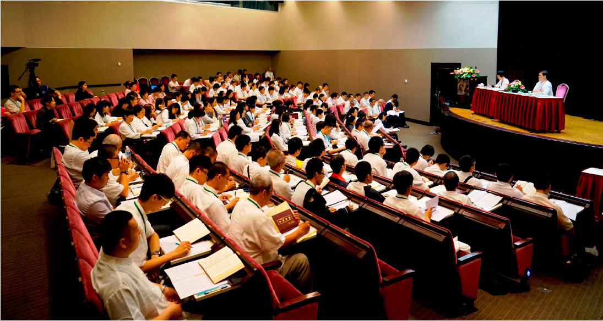

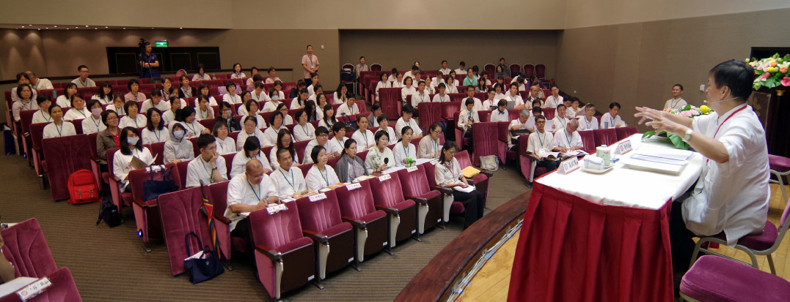

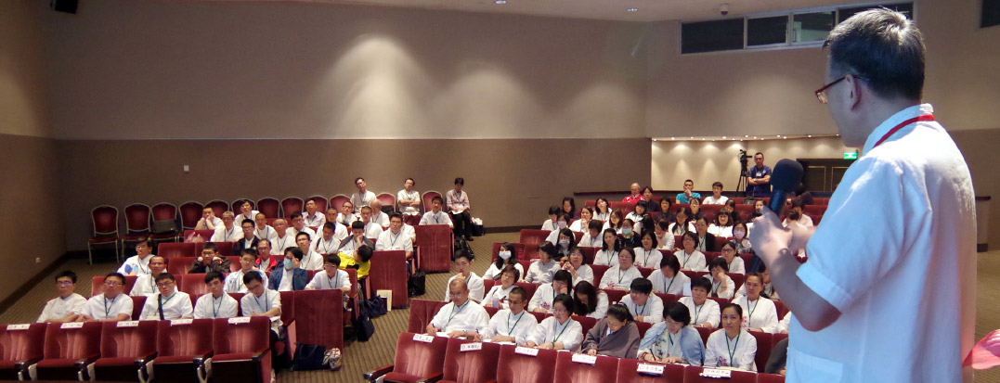

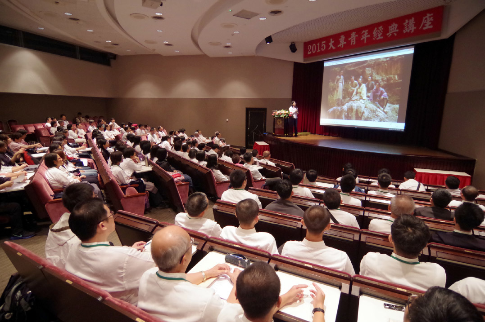

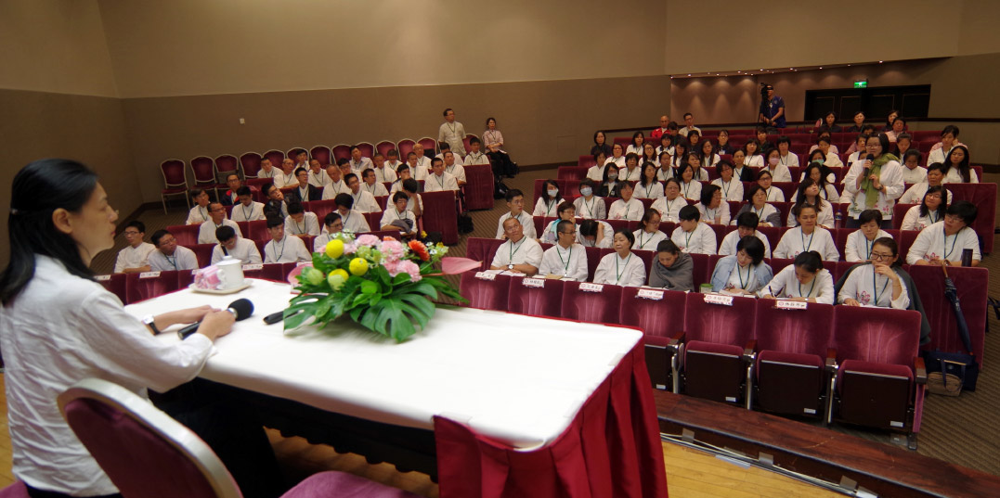

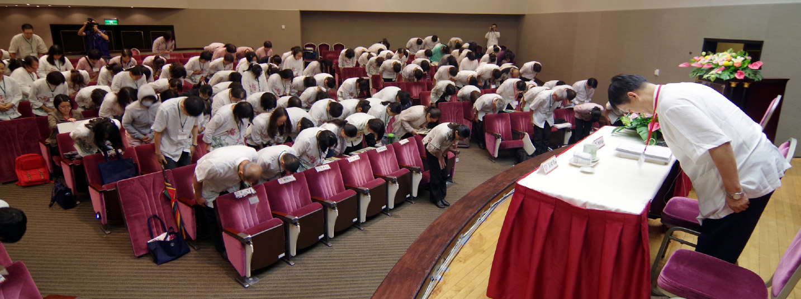

### 二○一五年十月山東
       ─鳴鶴國學堂成立報導

二○一五年十月山東

─鳴鶴國學堂成立報導

淨度

風澤引來鳴鶴

中孚利涉大川

改變企業文化

治力向上提升

二○一五年十月二十四至二十五日，濟南人期盼已久的山東鳴鶴國學堂終於正式開幕。本次開幕講座活動由臺灣中華無盡燈文化學會、時哉時哉網路教育學院、山東省職業院校文化素質教育工作委員會、濟南工程職業技術學院等單位聯合舉辦。

山東鳴鶴國學堂的指導老師為本會負責人唐瑜凌老師，師承於已故前臺灣中興、東海大學中文系教授、大成至聖先師孔奉祀官府主任秘書李炳南老教授，對儒釋道三家融會貫通，多年來致力於文化的研究與弘揚。

此次活動，還有山東省職教學會會長尚誌平，山東省職業院校文化素質教育工作委員會主任委員、濟南工程職業技術學院黨委書記張慧青等領導嘉賓出席，並為山東鳴鶴國學堂揭牌。

十月二十四日上午，走入會場兩條紅色橫幅赫然映入眼簾，上書「山東鳴鶴國學堂開班儀式暨公益講座」，場內三百五十餘張課桌整齊的擺放著等候學員們的到來。八點五十許，來自各省各地的學員們接踵而至，在會場門口井然有序地排著隊，依次簽到領書入場，全場座無虛席。

整場講座課程精彩紛呈，上午唐老師講授的「俠骨詩情李雪廬」，現場的學員們在唐老師的引領下體會了雪廬老人不同凡響的一生。緊接著是「論語-知是眾妙之門」，唐老師以雪廬老人的《論語講要》為教材，結合科判的學習法，讓學員們了解「知」是眾多美妙事情的門戶，是福氣的開始、吉祥的源頭。下午高老師講授「成功的秘訣」，讓學員們認識到左右腦功能的差異，思維力與創造力的重要，以及孔夫子啓發式的教育。第二天林老師的「唐詩賞析—山居秋暝」，以雪廬老人的《詩階述唐》作為教材，帶領學員進入詩人觀察境界的靈動心思，如春風化雨般，讓學員體會詩人的心志與詩詞中傳達的意境。最後的《音樂饗宴》，美妙的旋律更是讓學員們對音樂有了一次前所未有的體驗。講座雖然只有短短一天半的時間，但足以讓參與的學員們體會到文化的深度與美好，紛紛表示相約在未來鳴鶴的常規課程中相見。

鳴鶴的建立旨在為廣大國學愛好者提供一個優良的學習環境，培養優良的國學師資隊伍，共同體驗文化的真善美。結合此次開班儀式的舉行，鳴鶴定於每週日開辦例行課程，將由應雨橋學長主持，以李炳南教授所講述的《論語講要》為依歸，利用科判的學習方式，引領學員認識《論語》的內涵。

同時，還搭配其他經典學習的課程，互相匯參，使學員不但對《論語》有更深入的體會，更能擴展對經典學習的廣度。鳴鶴的開辦讓雪廬老人的文化回歸濟南，回歸大陸，對於弘揚中華傳統文化，加強兩岸文化交流，培養國學師資力量都將起積極的推動作用。

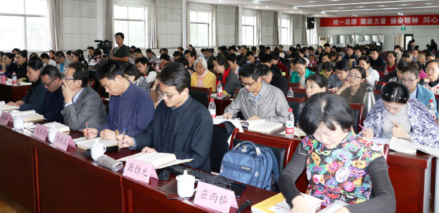

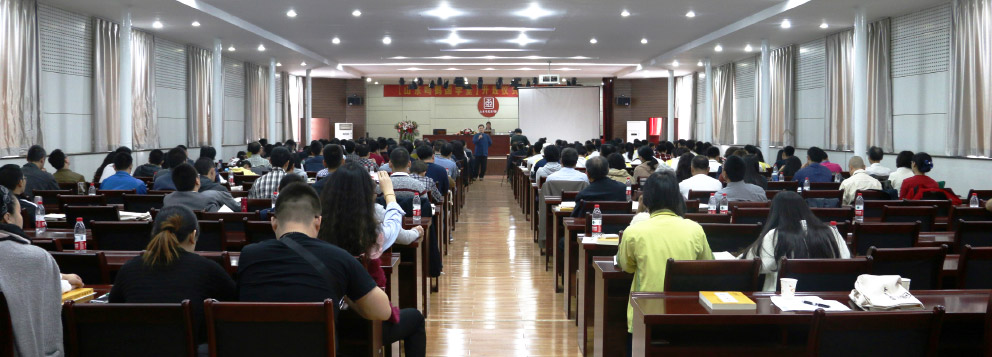

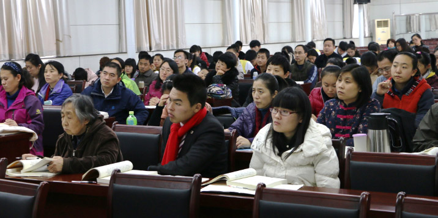

### 二０一五年大專講座　佛說四十二章經考題解答(中)

*編輯部*

大教東來白馬駝

經教要義四十二

文似小乘實近大

善用如蜜中邊甜

二十、何者是最殊勝之善法？何者是最殊勝的志向？人有志向有多殊勝？計較善法大小有何好？

**答：** (一)以三輪體空的智慧攝持善法或菩薩道，如此方是最殊勝的善法。

(二)立志於解脫道乃甚至成佛是最殊勝的志向。

(三)人之有志如樹枝有根，有志向者能提起心力，步步往目標邁進，終有成功之一日。

(四)計較善法大小，能將有限的生命，用於最重要的事務上。

二十一、忍辱何以多力，此力之行相為何？最明之相為何)？得此明相有何殊勝？

**答：** (一)忍辱之人心中不懷宿怨，沒有惡念，其有耐怨害忍，能忍眾生怨害；安受苦忍，可忍天災飢寒；諦察法忍，於道業精進，最終諦察無生法，是故凡事可忍，其力自現，其事自成。如是之人，得道多助，必為人所尊敬。

(二)能夠斷除煩惱，不為欲塵所染，是最明的行相。

(三)得此明相，證得佛果，對於無始以來所有事情，沒有時空限制，不論大小粗細，都能知曉。

二十二、有愛欲何以不見道，其法與喻相為何？如何是捨愛欲方見道？

**答：** 有無明我執就有愛欲，不能看見萬法的真相，而萬法的真相就是沒有自體性，執我之心即是執人與法有自體性。

「澄水」喻照見道之力；「致手攪之」喻愛欲交錯，心中濁興；「覩其影」喻見道。

捨愛欲之法分二；第一種是修對治法，對每一個貪愛的法都一一修對治法，貪愛的法越多，要修的對治法就越多。第二種是直接從根本問題解決，修學空性，觀諸法的自體性無，在一法上不斷的串習及觀修，由比量推度到現量，現證空性後，對法不起執著，自然也不會有愛欲了。

二十三、如何是見道，其法與喻相為何？

**答：** 見道就是看到諸法的真實相，透過般若的修學現證空性，了知諸法的自體性其實是沒有的。

「冥室」喻無明我執；「炬」喻道，也就是般若的智慧。般若的智慧可以破除無明我執，就像拿著火把進到千年暗室之中，立刻呈現光明，有明則無暗，不會有明、暗同時存在的狀態。以般若智慧現證空性後，就不會再有無明我執，也就可以脫離六道的輪迴。

二十四、念如何至無能念所念，行如何至無能行所行，言如何至無能言所言，修如何至無能修所修？

**答：** 念就是憶念，一個憶念的成立，分析之下必有能念和所念。而憶念本身、能念、所念三者皆無自體性；若有，則會有諸多不合理的地方，例如：假如三者都有自體性，則三者不必相互觀待就能各自成立；三者可獨立成立，那豈不是有三個念了。分析「念」的三個環節都沒有自體性，此即在做善法時的三輪體空觀察。

至於如何能達到無能念所念、能所雙亡的境界呢？就是在三輪體空的基礎上，以比量的智慧串習觀茶，直到能緣的心識和所緣的空性境界像以水就水般分不出能所，即所謂能所雙亡，現證空性。

二十五、佛法三法印其相為何？何以稱法印？此三稱法印說明什麼？

**答：** 佛法三法印為諸行無常、諸法無我、涅槃寂靜。何以稱為法印？就是印證整個佛法的重點都在無常、無我、涅槃寂靜。只要某部經典有提到三法印這三個重點就可以等同佛說的經典。此三稱法印說明了人要離苦得樂，究竟的方式是出離三界，所用的方法就是無常、無我，而涅槃寂靜是成就相。

二十六、四大如何無我，試述之？

**答：** 有情的身體是由四大組合而成的，分別是地、水、火、風。這四大分別都沒有自體性，因為這四大必須要相互觀待才能成為四大，例如：「地大」如果離開水大、火大、風大，也不能成為安立為「地大」；「水大」如果離開其於三大，也不能安立為「水大」。火大、風大也是如此。

既然這四大都沒有自體性，那麼由四大組合而成的身體也沒有自體性。

二十七、隨情欲求聲名，何以用燒香之喻，此喻在說明什麼過患？

**答：** 燒香是把檀木拿去燒，燒了後會讓人聞到香味，但是在讓人聞到香味時，檀木也燒成灰炭了，以此譬喻追求聲名的人，目的在於成名令人知道，從中獲得人們的尊崇、禮拜；然而，此舉就像是把身體當作木頭拿去燒一樣，當功成名就時，壽命也已到了盡頭。

修學般若正見（解脫道）需要投入大量時間與心力，若不及時把握，反將寶貴的時間花在追求與解脫無關的虛名上面，到最後盡其一生心力、拚死拚活所得到的只是把整個身體都搞垮了，浪費了可以用來修學正法、利益有情，以及辯證空性的身體，令一生空過，是人生最大的浪費。

二十八、財色為何如刀刃之蜜？何以不是一餐之美，比喻在說什麼？小兒之形象為何？舐之割舌之喻在說明什麼？

**答：** 財色引發的過患像是刀頭舐蜜，即眼前所得財色的快樂像蜜一般，但吃的同時馬上就會割到舌頭。

不足一餐之美在比喻追求財色的人連世間一般人的快樂都比不上，就像刀刃上的蜜不足以讓人飽餐一頓。一般人不追求財色，看起來什麼都沒有但是很快樂，然而追求財色之人，像有些有錢人到最後，反而很羨慕貧窮但卻笑口常開的人家，表示他連這種基本的快樂都沒有。

小兒的形象就是無知，只要沒人去保護，很容易就會受傷害。

舐之割舌之喻在說明剛舔到刀刃上的蜜，馬上就會被割到舌頭，嚐到苦頭，換句話說，只為了眼前短暫的享樂，後患卻是無窮。

二十九、妻子舍宅的過患何以勝過牢獄？妻子舍宅不是體性空嗎？如何轉為功德？

**答：** 因為對於妻子舍宅的愛戀，依依不捨，所以說其過患勝於牢獄。

妻子舍宅體性空，但對出家人而言仍有過患，因為出家人本來就是要出家修道，怎麼可以對妻子舍宅依依不捨而還俗回家呢？所以要修學般若正見，對其做種種觀察，從而生起出離心，更重要的是觀察所愛執的對象到底有沒有自體性，發覺都了不可得的時候，乃可成就出塵羅漢。對在家人而言，五倫以夫婦為始，有夫婦然後有兒女，有父子、兄弟。有夫婦然後有家，有家然後有國，夫婦倫一正其他皆正，是故將家庭營造成學習正法的環境，而非沉溺於五欲堆中，以正知見來經營，可幫助家人修道。此外，家庭守五戒，也有助於國家長治久安。

三十、愛欲大分幾項？過患最重者為何？試述其義？以執炬逆風之喻說明什麼？

**答：** (一)愛欲大分財、色、名、食、睡等五項。(二)財色名食睡中，財名食睡皆易於斷除，惟色欲最難斷，欲界眾生多以緣男女交而動其淫心，而轉世入胎，凡夫遇名色不可得兼，必捨名而取色，財名食睡皆不能勝之也。而從十二因緣的觀察，愛取之後，才有了來生的定業，故知愛欲最嚴重的過患在結輪迴之苦果。由近而言之，男女行淫一次，便損一次壽命，影響身體體力及健康，無法在世間學業及事業有所作為，果報為今世來世短命多病。其次淫心熾盛，無法克制，第十六章：「心中濁興，故不見道。」成為修學出世間法的障礙。更甚者因淫慾而敗家亡國者，如殷紂王寵愛妲己、周幽王寵愛褒姒、唐明皇之於楊貴妃、吳三桂衝冠一怒為紅顏等，為淫欲造下極重惡業，來世果報在三途。(三)執炬逆風之喻，手喻根、炬喻色塵，手執炬喻根緣境生識，逆風喻愛欲。執炬逆風是說，根對色塵升起愛欲，如不去對治，最後會引火燒燒到自身。

三十一、佛如何遠離對玉女的愛染？

**答：** 佛在因地修學不淨觀，其一生都攝持五種不淨觀修學，(一)種子不淨：投胎的心念帶著愛欲而來是為種子不淨，所攝持父精母血亦屬不淨。

(二)住處不淨：胎兒住胎期間，住處子宮被大腸、小腸、胃、直腸及膀胱等臟腑所包圍，這些臟腑所包覆者不外食物逐漸變成糞便及尿液，就跟住在廁所旁邊沒兩樣。

(三)自相不淨：出生後一生中，外相上眼生眼淚與眼垢、耳出耳垢、鼻出鼻涕與鼻垢、口吐痰與口水，肛門排糞便，尿道解尿，毛孔汗酸臭，身體積垢，每天都要清潔，方能除其臭。

(四)自體不淨：再觀察所愛自身當下組成從外至內的眼、耳、鼻、舌、頭髮、體毛、指甲、牙齒、皮膚、肌肉、筋膜、血管、血液、淋巴液及淋巴系統、神經系統、骨骼、脂肪、心臟、肝臟、脾臟、肺臟、腎臟、胰臟、膽囊、腦、大腸、小腸、胃、直腸及膀胱所排出的物既然不淨，能排的器官組織有清淨相可取嗎？所以是自體不淨。

(五)究竟不淨：身體年輕時，有些人遠觀乍看有年輕貌美之可愛相可得，可是每個人最後終將老去，髮枯面皺，老態龍鍾，死後軀殼腫脹、青瘀、爛壞、血塗漫、膿爛、蟲噉、散落一地、成白骨、燒後一空，人死後如此不堪，則生的時候貪戀有何意義？

但以上五種修學法僅為對治法，只能破貪欲之現行，修學般若才能究竟破貪欲種子，貪欲心起時，去觀察能取的心是否不必靠外境就可以生，如果是那就對著豬狗雞鴨所有外境都一律生貪欲，而且既可以自生，應一生永生不會滅，但現見不是，可見貪心不在能取的心上自相可以生。如果貪心在外境女色自相生，那不必靠能取的心，可是聖人、世間正人君子也不會貪著女色，如唐朝狄仁傑夜宿客店遇寡婦而不動心。沒有能取的心，就也不能成立所取的外境，這樣自然遠離對玉女的愛染。

三十二、在河中之木如何入海，如何以比喻說明修道者必得道？

**答：** 以河中之漂流木以比喻修道之人，入海即是比喻入聖道成佛之義(小乘則是成就阿羅漢果)。

漂流木要入海條件有五：

(一)尋流而行，不觸兩岸：循著中流而行，不觸兩岸，引申之義為不墮入常斷二見，有自體性見的人會落入常見及斷見，常見(自性有)與斷見(根本無)，活著的時候認為事物都不會壞，永遠存在在那裡，看到事物不在的時候就認為不會再有，一滅永滅，這都是有自性見在看待事物。

(二)不為人取：不為人所攝，意味著不墮入愛網、情關及名聞利養。

(三)不為鬼神所遮：修行時不會著魔，或是不會去修外道見與鬼神相應。修行時若動機不純正，沒有傳承而盲修瞎練，不是被人取，就是被鬼神所遮。

(四)不為洄流所住：不被水中的漩渦纏住。修行時不生在惡劣的環境、或是善友難求的環境，或者忙於許多外務不得修行。另外為洄流所住的人，也意味著人懈怠、退轉，雖然無前三者，但是修行時不精進，沒有法喜，不會前行。

(五)不腐敗：意味修行的人要耐久，若不能持久，意味著已漸漸變質，所以遇境逢緣都要懂得串習正見。

若以上五點都能做到，修行人要有知見、中觀正見，遠離名聞利養、愛欲(人取)，遠離外道見(與鬼神打交道)，並且修行要精進不變質，就能保此木決定入海，此修行人必成就聖道。（下期待續）
