# 第103期

## 社論

### 孝乎惟孝迎猴年

*編輯部*

紅藜麥飯出現在學會的餐點裡，比芝麻還小，紅紅的、一點一點躺在鬆軟的白米飯中，或許因為米飯的香氣十足，以至於紅藜麥的味道和口感並沒有令人感到獨特之處。

從七千年前就在南美洲安地斯山脈野性生長的藜麥，外殼味苦且澀、蟲鳥不愛(所以不會有農藥殘留憂慮)，但去殼後的藜麥富含營養，曾是古老的印加王國的糧食之母。西班牙人入侵之後卻嚴禁人民種植及食用藜麥，因此五百年來，藜麥只好在野地裡應著四季循環自滅自生。十五年前，一位祕魯廚師阿庫里歐發現了這些無人食用的野生藜麥，將之結合祕魯獨特的文化運用在烹飪中，其多色多元的美味和豐富的營養價值令世人驚艷。並且聯合國糧農組織研究認為藜麥是一種可以滿足人體基本營養需求的單體植物，是最適合人類的全營養食品，甚至訂二O一三年為國際藜麥年。十年前全國人口仍有一半以上在貧窮線之下的祕魯，這幾年靠者飲食文化和農產品出口，農民生活改善，國民所得迅速成長兩倍。

從傳統裡發現好東西，翻轉了秘魯的農業產值、改善農民生活，甚至吸引全球觀光客前往秘魯進行美食之旅。

這個故事似乎很符合台灣近年來高張的文創大旗以及對經濟起飛的期待，我們總希望有一個轉機、一個跳板讓我們跳出困境，躍向繁榮的未來。

然而，根據政府陸續公布的統計報告，二Ｏ一五年臺灣的出口年增率嚴重衰退，是二OO八年金融海嘯以來最慘的表現，歐洲多國經濟疲弱不振、產油過剩，及伊斯蘭國在世界各地發動的恐怖攻擊均造成國際商業活動減緩，所有和外銷相關的產業均難以避免地受到國際情勢的波及。台灣長期以來高度仰賴出口貿易，出口表現不佳，連帶影響企業的活力、人民的薪資，因此許多以內需為主的產業也將難以避免遭受衝擊。

國際情勢不安、長年的政治喧鬧以及近年來社會價值觀受鄉民和網軍的言論風向影響變得光怪陸離，於是乎，人們對未來愈來愈感到憂慮，經濟發展遲緩、教育失了準則。這不是最壞的時代，卻也不是值得稱頌的時代。在這樣的時代裡，我們應該做什麼？怎麼做？大家都說文化很重要，鼓勵發展觀光文化、美食文化……，可是文化又是什麼？文化真的具備能改變世界的力量嗎？

以史為鏡，世界四大文明中的兩河流域文明，也就是位在現在伊拉克一帶的美索不達米亞平原，那裏曾經水草豐美，是世界上最早有農業文明和文字的地區。然而，大地固然能化育萬物，卻無法抵擋人為的破壞與戰火的蹂躪，如今沙漠一片、生靈塗炭，政治失序，百姓恐懼不安。

以例為證，世所公認的文化大國─法國，不論是音樂舞蹈戲劇、繪畫建築文學電影乃至時尚、科技、美食……等，法國所展現的自由平等博愛的精神，使文化成為這個國家最重要的資產、是眾多創作者汲取靈感之處，更是許多人夢想一生一定要去一次的浪漫國度。然而，如果藝術的成就和生活的型態就能代表文化的深度與廣度，那為什麼十一月甫發生的劇院攻擊事件中，兇手竟是浸淫在法國文化中土生土長、享用所有社會福利的法國籍穆斯林？

為什麼文化的力量既可以讓一個國家輝煌耀眼，卻也可以帶來毀滅性的災難？

因此，文化到底是什麼？文化的力量是什麼？

文，是經典；化，是化導。以經典化導人民，謂之文化。

不論中外，文化均立基在依據古人智慧集結而成的經典之上。

西方文明的經典是聖經和希臘哲學思想，過去一千多年以來，歐洲的思想和文明發展均和這兩者密切相關，從聖經發展出來的文學藝術，和從希臘哲學開枝散葉而來的理性辯證思惟，成就了我們今日認識的西方文化。

而華夏文明的經典是六經乃至十三經，古代以禮樂化導人民，以詩維護溫柔敦厚的風氣，以易經趨吉避凶，以論語、孝經等作為讀書人的基礎開通經學見地。中國的經典裡包含理性和感性，共通的目的在仁人君子的養成，能修身齊家治國平天下，而人才的大用在治國化民創造大同世界。

全世界都在找人才，但人才在哪裡？人才不在技能，而在品格，品格則由孝道始。一個人如果在處事時言行舉止之前能念及父母恩、不辱父母命、不傷父母心，則能謹言慎行、難有作亂犯上之舉。孔子在孝經的開宗明義章就告訴我們，天下大治的至德要道就是「孝」，因為愛親，所以我們會修身，注意自己的言行舉止，為他人著想、不悖離長上；所以由上而下的孝親可以改善社會風氣，而導正人心齊家治國平天下均由孝道來。

雖然科技日新月異，但經典卻是歷久不衰，古人的智慧裡即具備面對這個時代問題的解答。從經典中找出路，從學習中得見地，是我們面對世局變動的不變堅持。

新的一年，全球各種景氣預估普遍不佳，但大環境影響的是機會，經典的學習實踐改變的是命運。眾多猴年的吉祥話裡，我們特別選擇「輩輩封侯慶好年」為賀歲的主題，輩輩封侯，是古代讀書人以經世濟民為理想，期許代代相傳。我們延續輩輩封侯一詞的傳承義，期許並祝福大家從孝道出發，在儒學與佛學共同增上，拓展見地，以經典正己化他，以文化的真實力量迎向未來。

## 大德法語

### 大方廣圓覺修多羅了義經（六十二）

道源老和尚

傳承在說聽

懺悔心眼昧

悟後修方成

是真佛出世

乙二、正宗分

丙二、令依解修行隨根證入

丁二、廣明行相

戊三、一問答道場加行下根修證

己五、正答所問

庚二、偈頌

辛一、標頌

經文：

爾時世尊，欲重宣此義，而說偈言：辛二、正頌

經文：

圓覺汝當知！一切諸眾生，欲求無上道，先當結三期，懺悔無始業，經於三七日，然後正思惟。非彼所聞境，畢竟不可取。奢摩他至靜，三摩正憶持，禪那明數門，是名三淨觀。若能勤修習，是名佛出世。鈍根未成者，常當勤心懺，無始一切罪，諸障若消滅，佛境便現前。

長行文之後有個偈頌來總結義理是很好的！假如是末世的眾生，想求無上的佛道，那麼應當先結個期限，或者百二十天、或者一百天、或者八十天，可是要先經二十一天的懺悔，懺悔無始的罪業，以正憶念修這三種淨觀，若發現在懺悔時，於正思維下產生的特別境界，不是圓覺經的境界，則不可取。修這三種淨觀的下手方便是「奢摩他」，先修至靜，修「三摩缽提」得先修正憶念，憶念十方佛、菩薩，修「禪那」則先明數息法門，以上是三種淨觀。若能勤修息，那你就是活佛出世，鈍根末世的眾生，因為有無始劫來的罪業障蔽而無成就，要常常求懺悔無始劫來的一切罪業。

我們本來就有佛性，跟佛無二無別！罪業懺悔清淨，佛境就現前了。圓覺菩薩這一章到此講完，也就是正宗分講完了，十二位菩薩已經講完十一位，還有最後一個菩薩，屬於流通分。

甲三、流通分

乙一、慶聞深法請問流通

丙一、賢善首啟請

本經一共有十二位大菩薩當機請問，上來已經講了十一位大菩薩，今當最後一位，也就是第十二位─賢善首菩薩。

經文：

於是賢善首菩薩，在大眾中，即從座起，頂禮佛足，右繞三匝，長跪叉手而白佛言：

全章都屬於流通分，流通分分為五大科，賢善首菩薩自己了解甚深的圓覺妙法，還要為了要利益一切眾生，而請問流通分。

丙二、慶適聞所詮

經文：

大悲世尊！廣為我等，及末世眾生，開悟如是不思議事。

不可思議、不可言語叫做妙法！此經就是要我們開悟，悟到圓覺妙法的理，悟後再起修，這一步功夫要記清楚。現場的大菩薩已經開悟了，末世眾生看見此經，依此修行也能開悟。

丙三、問能詮各義

經文：

世尊！此大乘教，名字何等？云何奉持？眾生修習得何功德？云何使我護持經人？流布此教至於何地？作是語已，五體投地。如是三請，終而復始。

請問世尊流通此經，應該如何命名？當然我們現在知道叫做圓覺經！但是實際上是由賢善首菩薩請問，此大乘教，應該如何命名？此教法應該怎麼奉行？怎麼修持呢？

接著問眾生修習圓覺妙法能得何等功德呢？前面都是講不要住相、不要著相，不可以住相，但修習圓覺妙法，所修的功德實為無量無邊，賢善首菩薩不是不知道不著相的道理，請問功德是為了利益初發心的眾生，初發心的眾生對於大乘佛教還沒有修習，要想得到無量的功德，等到此人的心量能修習無量功德時，再告訴他不可以著相，所以為利益眾生，流通此經時，還是要把修習此經的功德說個清楚。

接著請問如何讓我等護持受持此經的人不要著魔，不要生退心，肯定有佛菩薩加被保護世間人。最後請問，流布此教至於何地？一共有五個問題。

依著流通的意思分了五科，有說法的世尊，有聽經的菩薩和法師講經說法，這大法才能流通，按這科文都是給我們聽的，沒有人聽法這大法也不能流通，所以要師資道合，師是老師，資是弟子，師資之道相合，大法才能流通。

乙二、讚許靜聽交感流通

經文：

爾時世尊告賢善首菩薩言：善哉善哉！善男子！汝等乃能為諸菩薩，及末世眾生，問於如來如是經教，功德名字。汝今諦聽，當為汝說。時賢善首菩薩奉教歡喜，及諸大眾，默然而聽。

問如是經教，就是指著這一部經的教法，以何等的功德？何等的名字？並且事先讚歎賢首菩薩他問得好，叫善哉善哉！

聽法必須默然而聽，默然而聽在第一章已跟諸位講過，要三業默然，身體不要亂動這叫身也默然，口裡不要講話是口也默然，心裡不要打妄想這叫意也默然，身、口、意三業都把它靜下來，這個樣子聽法，每一字、每一句都會聽到耳朵，聽到心裡邊去，不然一邊打妄想，一邊講話，一邊身體亂動，講的人身疲心累，你不要說沒有聽到心裡，連耳朵也沒有聽進去！這個樣子怎麼能流通佛法呢？所以一定要默然而聽。

乙三、依問宣說內護流通

依著賢善首菩薩所問的，如來就宣講演說，這叫內護流通，佛法要流通於世間有內護、有外護，內護是法師的責任，發心講經說法和發心聽講經，法就依著聽說而流通於世，這叫做內護，不發心講佛法，怎麼流通佛法呢？所以內護很要緊，就是我們大家發心學講經，學會了就去講經，在沒有學會講之前要發心聽經，這就是護持佛法，佛法就會流通。

丙一、且標能說能護之人

經文：

善男子！是經百千萬億恆河沙諸佛所說，三世如來之所守護，十方菩薩之所歸依，十二部經清淨眼目。

立名字之前，先讚歎這部經了不得，這部經是百千萬億恆河沙諸佛所說，不只是釋迦佛這一尊佛所說，只要是成了佛都要宣說此經，這部經就是一部成佛的經典，如此說來這部經的重要性就被彰顯了。

要守護這部經，是過去世、現在世如來，以及未來三世諸佛之所守護，要是這部經不住在世間，眾生沒有辦法成佛。此世界、他世界，乃至於十方世界的菩薩，通通都要皈依這部經。

如來說法經義共有十二部份（長行、重頌、孤起等等），這部經是釋迦牟尼佛所說一切經的清淨眼目。

跟諸位同學一再地說，每一部經有每一部經的經心，也就是淨眼，每一部經都有最重要的幾句話，就是這一部經的淨眼，等於一個人五官上最主要的就是在眼睛，眼睛看不見這是大事情！有眼睛，不清淨也不行，所以要清淨眼目，這部經就是一切經的清淨眼目，一切經的淨眼，能把這部經看明白了，一切經都通了。

開經時跟諸位說過，判教判到頓教大乘，是依著釋迦佛所說的，此經經文很短，而且章法很整齊，十二位大菩薩請問，一章一章的，讓人很容易了解圓覺大教，你把此經研究好了，很容易受持到心裡面，就容易得到一切經的清淨眼目，此時也容易了解與通達最圓滿頓超的法門（華嚴經、法華經）。(下期待續)

## 佛學覽幽

### 小止觀導覽（七十五）

通達二諦真發心

福慧雙修成等覺

兜率降生龍天喜

傳承不興鬼神愁

第十章  證果

論文：

云何修正觀？若體知心性非真非假，息緣真假之心，名之為正。

非真就是非空，非假就是非有，就非空的立場來說，心性雖然自相空(非假)，可是不是根本無(非真)，對境起心謂之非空。然心是觀待下的生起，體性不可得，所以是非有(非假)。

真心了不可得故是息緣真心。真心為何了不可得？因為心識必須對著法的空性面向，才能生起認識空性的心識，不是有一個空性的心識，所以是真心了不可得。假心(證悟世俗的心識)也了不可得，因為對著世俗的心識才有證悟世俗的心識，所以證悟空性的心識了不可得(非真)，證悟世俗的心識也了不可得(非假)，真心也了不可得，假心也了不可得，爾時息緣真假之心，名之為心。

即以色塵而論，色塵可不可以自己成為色塵？如果色塵可以自己成為色塵，應該不必觀待眼根及眼識，如此則眼根壞的瞎子也應見到眼前的青、黃、赤、白等顏色。而心沒有對境（如青色），也不能生起見青色的眼識，心自己不能成為心，心上空性即是心的自性。心自相空是心性的「真」，也就是非假；雖然自相空，可是自相空是在緣起上說自相空，是在聽到聲音的當下說耳識自相空，所以叫「非真」，不是有個不必依靠緣起的自相空可得。現相的同時說自相空，自相空的同時說現相，這二個同時生。就一法上生起的「假」的那個面相說非真，「真」的那個面相說非假，一切法非真非假。

「真」了不可得，「假」了不可得，就息緣，息了緣真、緣假的心，一切法究竟不可得。

諦觀心性非空非假，而不壞空假之法，若能如是照了，則於心性通達中道，圓照二諦。若能於自心見中道二諦，則見一切諸法中道二諦。

佛證悟空性和證悟世俗的心識都可以顯現，叫做不壞空假二法。若能如是照了，於心性是通達中道，圓照二諦是同時觀待境界的空性，生起了知空性的智慧，同時觀待境界的緣起，生起了知世俗的智慧。

論文：

若於自心見中道二諦，則見一切諸法二諦，以一切法為心故。亦不取中道二諦，以決定不可得故，是名中道正觀。

了知心性非空非假，緣境界能見其世俗及勝義的面相，一切法成為所知，心成為能知，二者互相觀待的生起。

觀察法自相空的那一面，稱為勝義的觀察法；觀察世俗的那一分，稱為世俗的觀察法。在每一法上都可以顯示中道二諦，但不是有一個真實存在的中道二諦之法，只是在法上顯示中道二諦。

論文：

如中論偈中說：因緣所生法，我說即是空，亦名為假名，亦名中道義。深尋此偈意，非惟具足分別中觀之相，亦是兼明前二種方便觀門旨趣。

如果我們懂得龍樹菩薩的這個偈頌，就懂得整個佛法的義趣，中道義即對境界有二個觀察法，一個是體性空，一個是緣起相，因緣所生之法乃體性空，所生之法不過依假名安立而生，如此觀察即見中道之義。

論文：

當知：中道正觀，則是佛眼，一切種智。若住此觀，則定慧力等，了了見佛性。安住大乘，行步平正，其疾如風，自然流入薩婆若海。

佛眼是止觀雙運，通達總別，「總」是空性，「別」是各個差別相，一法兩面相全部清楚且能掌握，達到一切種智。此段中道正觀，說明佛的智慧眼就是中道正觀，中道是所觀的境界，正觀是能觀的智慧，萬法的中道義都在佛的正觀下顯現，這就是一切種智的行相，就是諸法非空非有，即空即有，佛以不出定的方式，安住在大寂靜的止相中也同時觀世間一切法，在止觀雙運上現證茶杯的空性和世俗，顯現世俗、勝義的自相都沒有，清楚明白的見到佛性，這是真正的安住大乘。

安住大乘，世俗的修學法就是發菩提心，但在安住第一義諦，以不起定的方式通達世俗緣起，這一分是大乘勝義諦的甚深修學法。

修行四平八穩，且心力非常強盛快速，如同七地菩薩一彈指入空性定，稱為其疾如風，而八地以上的菩薩，以不起定的方式任運出入勝義與世俗，連入出的相都沒有。

論文：

行如來行。入如來室。著如來衣。坐如來座，則以如來莊嚴而自莊嚴。獲得六根清淨，入佛境界。於一切法無所染著。一切佛法皆現在前。成就念佛三昧。安住首楞嚴定。則是普現色身三昧。普入十方佛土教化眾生。嚴淨一切佛剎。供養十方諸佛。受持一切諸佛法藏。具足一切諸行波羅蜜。悟入大菩薩位。則與普賢文殊為其等侶。

行、入、著、坐四步驟，行是走向修大乘行（菩薩行），要入如來室（慈悲），所有的行持，根本的情懷都是慈悲，此時所有行為的本質都是慈悲，為了慈悲才有放生、助念、聽課和家人的相處，此時即便端一杯茶給人喝，都有說不盡的功德。

入室準備登座說法時，一定要將衣服穿好，穿衣有其表法，例如上座時褡衣（著如來衣）彰顯忍辱，也就是行慈悲行去利益有情眾生，想要過關就必須要靠忍。

在利益有情、慈悲忍辱當中，全部都通達中道。以破所知障和煩惱障為本質來行一切大乘行。

以行如來行，入如來室，著如來衣，坐如來座，以慈悲、忍辱等利益眾生的行持來莊嚴自己的色身，以法空的智慧來莊嚴自己的法身，作為自己的莊嚴。

修行中道正觀，斷除見思煩惱，不為三界六塵所染者，就得六根清淨，入佛境界。以六根為所緣，未見六根自相，這就是究竟的六根清淨位。心識顯現的時候，才有眼根的生起，根是對境幫助識去分別。佛以不起定的方式顯現世俗，安住在楞嚴大定裡，來利益群蒙。

一切法的究竟空性被其認識，這就是大寂靜的止門，一切的佛法皆以不起定的方式顯現，就是世俗的大觀察門。能夠成就真正的念佛三昧，顯現佛的旨趣，在心念所緣上顯現佛的功德、莊嚴、神通，心識緣念所有佛的義趣與內涵。

論文：

常住法性身中。則為諸佛稱歎授記。則是莊嚴兜率陀天。示現降神母胎出家詣道場。降魔怨成正覺轉法輪入涅槃。於十方國土究竟一切佛事。具足真應二身。則是初發心菩薩也。

智慧與福德資糧相互觀待，能破除無明與中道相應，以八相成道來示現成佛，並且以大乘行、慈悲心、忍辱心、法空來莊嚴自己。莊嚴自己的色身、法身。世俗上的慈悲、忍辱，以及一切利益眾生的行持來莊嚴自己的色身，以法空來莊嚴自己的法身，使自己以如來的莊嚴而自莊嚴，顯現自己的色身、法身跟如來一樣。（下期待續）

### 菩薩清淨的行持
       —華嚴經淨行品（十九）

菩薩清淨的行持

—華嚴經淨行品（十九）

*編輯部整理*

丙二、指事顯因答其徵因

丁一、總徵

丁二、別顯

戊二、出家受戒時願

己四、受學戒時願

庚二、受戒　  受學戒時

經文：

受學戒時，當願眾生，善學於戒，不作眾惡。

接下來是受戒，受學戒是指受戒和學戒，在受戒之後，必須還要對教法有勝解力，了解戒法的開、遮、持、犯，並且在受學戒時發願，才算得到了戒體。唯有這樣的善學才能回過頭來對治煩惱習氣，也才有能力來對治煩惱習氣。

在受學戒時發願，此願力是依靠菩薩而生起，又因為是我們在發願，這個願力也是依靠我而生起。能發願的是菩薩，所發願的是眾生，願所為就是發願的目的，發願的目的在於善學於戒，不作眾惡，我們必須要在積極面上去學戒，並且了解如何掌握開、遮、持、犯，不作眾惡就是遮止行持、不去作惡，這當中也包含自利和利他，自利就是當願力圓滿時，就能成就菩薩的功德；又因為我們發願的對象是眾生，故此願也涵蓋利他。

除了做願所依、能願、所願以及發願目的等觀察外，這一條也可以結合四部來作觀察，例如，一、眾生善學於戒又不作眾惡，那該有多好；二、我欲發願眾生能善學於戒，不作眾惡；三、我能幫助眾生善學於戒，不作眾惡；四、懇請三寶加被我能讓眾生善學於戒，不作眾惡。發願成佛並非只發願卻什麼事情都不做，沒這麼簡單的！發願必須要有實質的行動去作，這是很重要的一個觀念。

受學戒時，完整的解釋就是納受戒體來學戒的時候，皈依之後要納受戒體，有所謂的五戒三皈、八戒三皈、具足三皈，也就是必須要在皈依之後再學戒，並且納受戒體來學戒，學戒有所謂的學止持跟作持，就是得戒和尚先把戒的功德、犯戒的過患、制戒的本意，以及戒的開、遮、持、犯等都講清楚，學子了解之後叫做納受戒體。受學戒是納受戒體，此時學習止持跟作持，止持就是不作眾惡，作持就是善學於戒。

會性法師曾云出家要成為法器是不容易的，不但要執持戒律並且要通達教理，通達教理才知道持戒的好處，才能以大悲心、菩提心與空性的智慧去攝持戒，使戒體成為無漏。所以持戒者若不學教法，比喻如持劍自割，學到最後變成增上慢，害死自己，不知道持戒是為了利益有情，為了成就佛果的資糧，必須以大悲心和空性智慧去攝持，所以學一條戒是一條增上慢，學了十條戒是十條戒的增上慢，學愈多慢心愈重、煩惱習氣愈強。若用教理瞭解學戒，則知道用戒律來反省自己，而不是用戒律去看別人。如果學教不學戒，會變成舉火焚空，沒有在戒律上對治自己的煩惱習氣，所學的教法如智慧火，此時就像火燒空中一樣，不能燒煩惱的柴薪。

每一條戒都有三種精神，也就是攝律儀戒、攝善法戒以及饒益有情戒。攝律儀戒是針對自己的煩惱習氣；攝善法戒是以戒律來攝持種種自利、利他的善法；饒益有情戒是以戒來通達人情，跟眾生結善緣，所以《菩薩戒論》舉了十一條作為饒益有情戒的精神，裡面全部都是人情世故。

這三種戒律的精神要好好學習，三聚戒當中最重要的是攝律儀戒（不作眾惡），對治自己的煩惱習氣，如果攝善法戒、饒益有情戒沒有持好，只是戒律做得比較不完備，但是戒體還在；若煩惱習氣生起而去做殺生、偷盜、邪淫等罪業，那戒體就破了。

庚二、受戒　　受闍梨教

經文：

受闍梨教，當願眾生，具足威儀，所行真實。

願所依就是在受闍梨教當下發願；願力是依靠菩薩生起，也是依靠我生起；能發願的是菩薩，所發願的是眾生，就在受闍梨教的當下發願，願眾生具足威儀，所行真實。

四面向的推論，第一、當眾生具足威儀，所行真實的時候該有多好，隨喜他；第二、我發願眾生能具足威儀，所行真實；第三、懇請三寶加被我，讓我能有這樣的能力幫助眾生具足威儀，所行真實；第四、我能幫助眾生具足威儀，所行真實。

闍梨的意思叫做正行、軌範師，正行就是指所作的舉止、行為都是正確的，知道當下應該要作何事、要如何作，受軌範師的教誨時，我們就要發願，當願眾生，具足威儀，所行真實，具足威儀就可以得到別人尊重，也可以讓別人對佛法生起信心。

阿闍黎這裡有羯摩、教授、依止和受經的意思，羯摩、教授是特別指在教壇上教授弟子正行威儀；依止是出家人在戒壇上，他必須要依止阿闍黎，受了比丘戒以後，五年內不能離開師長，甚至一直到在還沒成就前，阿闍黎就是他的依止；受經就是阿闍黎為他講授經典。戒壇上有三師（得戒、羯摩、教授），親教師在戒壇上真正講教法令你了解，稱作得戒和尚；阿闍黎教授師就是在旁邊教規矩的；羯摩就是登壇稟告，帶著唱誦，帶著學子的誠意向上稟告，表白戒師等屬於羯摩。

會性法師說了一個故事，他說我們若不重視阿闍黎的功能，就會產生這樣的過失，有一個在家人去寺廟，師父幫他皈依之後，此人對佛拜三拜之後就要離開了，那位法師很不好意思的說：「不行，你要回來拜我。」必須回過頭來拜講戒的法師，才算真正納受戒體。

威儀當中，威是指行止端莊，儀是指動作有序，〈中庸〉有所謂禮儀三百、威儀三千，禮儀三百是周朝所定的大儀節(婚喪喜慶等)；威儀三千是在這個儀式上所定的動作、周旋、舉止進退等小儀節。佛教的三千威儀、八萬細行，兩百五十條戒配合行、住、坐、臥成一千，對著三聚戒成為三千，對著身口七支成為兩萬一千，對治貪、瞋、癡均等的等分，成為八萬四千。

所行真實是每一條戒所生起的威儀，是真實從心裡面做出來的，南亭老和尚說是一個「誠」字；並且是真的去利益有情，持戒的目的不只是對治自己的煩惱習氣，還要真正利益眾生，不然這個戒律沒有用，比如說這個戒律可以利益眾生，改善社會風氣，不偷盜不只展現品德，對治我們的貪心，還要去利益眾生，改善社會風氣；所行真實必須還要結合共業一起去做。而且行持要導入無漏，從有漏導到無漏，變成現證空性的資糧，由空性的智慧去攝持的道品，將體性轉成無漏的那一分便是真實。（下期待續）

### 大乘百法明門論簡說（十一）　玖、百法次第(二)

*淨凌講述‧淨本整理*

安立八識明因果

造業百劫不消亡

有情畏因同菩薩

解脫輪迴大自在

拾、心法─八大心王(一)

論文：

第一，心法，略有八種：一、眼識，二、耳識，三、鼻識，四、舌識，五、身識，六、意識，七、末那識，八、阿賴耶識。

了解五位百法的架構後，首先要認識心法。懺公的八識名稱表，眼識、耳識、鼻識、舌識、身識稱為前五識，意識稱第六識，末那識稱第七識，阿賴耶識稱第八識，以上是心主要的八種粗細不同的功能，是為八大心王，並非一個人有八個心，八個心代表有八個有情，而心當前只有一念，因此是就其功能來做區別。前五識是粗作用，第六識是細作用，第七識更加微細，最細的作用則是第八識，所以蕅益大師在《百法明門論直解》中說，八識是心的粗細分別作用。

前六識稱為了別境識，亦即能夠了別外境，眼識了別色塵、耳識了別聲塵、鼻識了別香塵、舌識了別味塵、身識了別觸塵、意識了別法塵。第七識是思量識，以我為思量，唯識宗稱之為恒審思量，因為第七識恆緣第八識的見分認為是我，相續不斷。如何知其相續？例如某人被打昏，腦袋空空，前六識都不起作用，待甦醒後，仍可知「我」剛剛昏了，可見其相續。

第八識稱作異熟識，因為第八識中有六道種子，以種子為因，未來成熟為果，故稱異熟(變異、異時、異類，詳後第八識果相表)。例如第八識中人道的種子成熟，生起人道的心識以及人道的境界，由人道的前七識去納受人道的境界。所以第八識就像田裡種了許多的種子，現前是稻種成熟，未來可能是麥種成熟，含藏異熟的種子是第八識的功能之一，稱之為異熟識。表中異熟識是本識，其他的是唯識，前七識皆第八識所生故稱第八識為本識，而了別外境與心識是同一體性，故稱唯識，此乃唯識宗的宗義。

何以要安立心識有第八識的功能，是為了解決因果的問題，造作依的是心，受用果的是心，倘若造作的因沒有地方存放，未來如何能夠結果？若沒安放因種的地方，則因果失壞。然心之外不能作為因種安放之處，為了能夠合情合理地解釋因果現象，所以認為安放種子的地方就是第八識。如果第八識人道的種子生起，所見的全都是人道，他道的種子完全沒有作用，通通是人的受用，因此就有一個錯覺，以為生生世世永遠是人。唯識宗外的學者並不承認第八識，也能以合情理的方式，說明因果的存在，這就是佛法宗派間的差異。

第八識三項略表，阿賴耶識是所有心識的根本，而它也可以叫做藏識、一切種識、異熟識，這是阿賴耶識三種功能的描述，一體的三面向。第一種能力稱為藏識，指心識有收藏能力的功能，表上稱為自相，自相就是自體的性相(定義)，阿賴耶識自體的定義就是能收藏。吾人既然有這樣的能力，應該把握光陰、努力學習，收藏各種好的能力。

第二種稱為一切種識，表上稱為因相。前面藏識是講它有能力收藏，所藏的是一切種，一切種還沒有起現行時就叫做因相，起現行則叫做果相，也就是異熟識。

第八識自相表。本表與前表所採取的立論角度不同，所以相同的名相，所說的是不同的內涵。阿賴耶識又稱為藏識，它有能藏、所藏跟執藏(三藏)三種面向。能藏是因相，所藏是果相，執藏是自相。能藏是說阿賴耶有收藏的能力，而所收藏的是種子，就種子的這一分稱為因相。

第二個叫做所藏，為何稱為果相？因為阿賴耶識本身是一個收藏種子的地方，就像倉庫，這裡是前七識所薰種子的最後寄藏處，就種子最後寄藏處來說阿賴耶識是果相。表上說明，能薰的是七轉識，前七個識能造作善惡法，所薰的就是第八識。

第三個叫做執藏，阿賴耶識被第七識執著的那一分稱為執藏，第七識是能執藏，阿賴耶識是所執藏(我愛執藏)，進一步說明第七識如何執著第八識。第八識有見分、相分，相分是指相用，例如第八識中人道的境界成熟，此境界即是相分；見分是指能緣的力量，人道的境界成熟時，有緣住人道的力量，可是緣不到鬼道，因為鬼道的種子還沒成熟，第七識執著第八識的見分認為是我，我是能緣，這個身體屬於我，房子是我的，我的思想…等等，都從我出發，將能緣的力量執為我。

然而第八識的見分並不是我，能執的能力是心，心是我嗎？心如果是我，身體應該不是我，但當身體痛的時候會說我痛，肚子餓說我餓，身體說是我，心也說是我；昨天的是我，今天也是我，而昨天跟今天的我並不相同。有情以為有一個獨立實有的我，擁有這正報與依報，然這個我是自己執著出來的東西，這是唯識宗破我的立論之一。

第八識自相表，本表在解釋第八識本身就是因果的建立處，此處(第八識)有能力收所寄藏的種子為因，收藏種子(所藏)為果。

異熟是說第八識六道的種子成熟，生起六道的境界與心識。這當中有三種異熟，變異熟是因變異時，果方成熟。所有的事情都是因滅果生，因必須滅果才能生。從因滅果生的道理中吾人必須警覺，事情造作之後，會有後面的影響力，好事情有好的影響，壞事情有壞的影響，叫做功不唐捐。例如某人此生默默地做義工，大家都沒有看到，看似白白犧牲，他的果相將就是未來會有許多人願意為他默默地幹活；反之只做表面功夫的人，以後跟他合作的人，也都是只顧表面，所以天底下絕對沒有吃虧這件事。

異時熟是說因到果之間需要時間，種因當下不會結果，種因當下就結果不具合理性，如此則不用分因果。因果之間的時間，可能是這一生，有的是來生，有的是三生五生十生，甚至無量劫。但為何《法華經》上講因果同時？那是在說明有因必有果，厲害的人當他在造因之時，立刻就看到未來的結果。試問時空有沒有距離？比如前一生做天人，這一生做人，有時間上的距離；美國人跟臺灣人也有空間上的距離，然而並非自體性的距離，只是名言上的距離。例如回憶往事，往事立刻呈現在眼前，完全沒有時空距離，可見距離都是名言上假立，事情想不起來的時候變得很遙遠，憶念出現的時候就在當下。佛在講過去某一生的事情，或講某人未來的果報，都是以現量的方式呈現。古書上記載秦晉殽之戰，白乙、西乞、孟明帶著部隊出征時，蹇叔就穿著孝服哭師，知道此戰必敗，結果真的全軍覆沒，三個元帥被活捉。人生如果可以明白這些因果的道理，不必看相算命，事情也能明白。時空是不同時，但也是同時，觀待名言的安立。

異類熟是說因為善惡、果為無記，無記就是不能記別是善還是惡。因為果本身並沒有善惡，雖然果上有苦樂的感覺，善因得樂，惡因得苦，但苦樂之中未必造善或者造惡，故稱無記。有正確知見的人，做善得樂，他可以從樂當中找到出路；過去造惡現在受苦，他也會在苦中努力造善；沒有正確知見的人，樂中驕奢淫逸，苦中怨天尤人，無論苦樂都死路，所以果無法記別善或者惡，歷史上很多國君就是在福報中垮台，很多人則是在苦難中爬上來。

表上說果與其因，性類相異而成熟。性類相異就是因跟果定義不同，因是善惡；果是無記，長得不會一樣，否則因等於果，分因果則成無義。例如西瓜種成為西瓜，種與瓜並不相同。

總結本表，第八識本身是一個果相，是一個收藏善惡因種的倉庫，而因到果的成熟方式有三種面相，變異熟、異時熟、異類熟，世出世法不出因果二字。（下期待續）

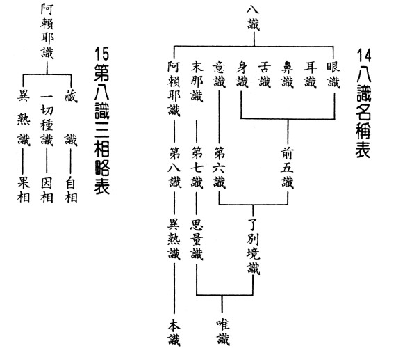

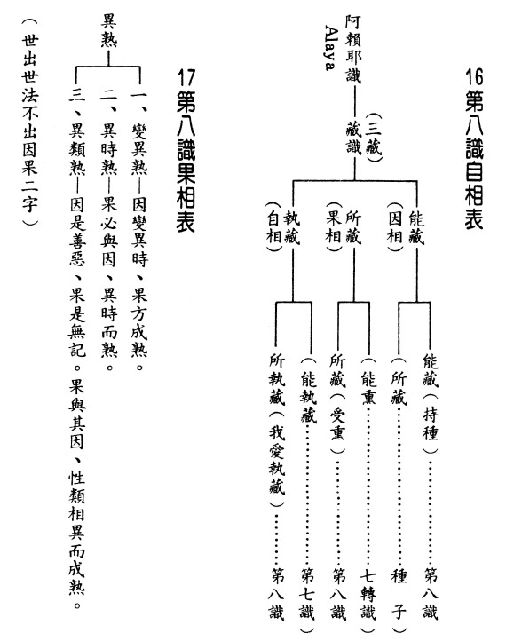

### 佛學概要十四講表簡說（五）

*戒慧講述、法味整理*

煩惱所知菩提障

修學空性能斷除

無明不生業不涸

苦果不生輪迴出

第一講表  乙表 二障略舉(人生觀)

本身煩惱

本身煩惱即是惑，當前所受即是苦，當前所造即是業。本身煩惱會發起和滋潤當前的造作，是故惑會發業和潤業。當前造作而有的業為因，所結成的是未來苦果，而煩惱是發起處。但煩惱是緣，是升起苦的俱作緣。業是苦的因，煩惱是苦的緣，由業去感果，不是由煩惱去感果。因煩惱要感果一定觀待造作，而業的體性是造作。例如，一個人想去打牌是煩惱的心，不會感果，除非他真的去打牌。但那想要去打牌的心，會發起打牌的業，造作了打牌的惡業，才有感苦果的能力。煩惱固然不會感果，可是煩惱會發起造業，業還沒發起，煩惱也會滋潤業發起。煩惱雖然不是苦因，煩惱是苦的俱作緣，煩惱會造業，煩惱會潤業。

當前所受與當前所造

凡夫眾生無法從因上觀察，故先從苦果觀察，由當前所受中呈現。由受苦中會產生當前所造的業跟當前所生的煩惱。雖當前所造(業)不會當前所受(苦)，不會馬上造業，馬上受苦，惟當前所受會引發當前所造及煩惱，也會由煩惱去潤業結未來的苦果。當前所受，是昔日所造。因為昔日所造，顯示的結果為當前所受。

可是要如何離苦得樂呢？一般人當前所造中，哪有離苦得樂的？既無離苦得樂的做法，亦無抉擇的能力。如果懂得當前所受，由當前所造(能造善業)跟本身的煩惱(予以對治)，則當前所受(尤其苦果)，受完了就結束，往後能離苦得樂。可是一般人在當前所受的時候，如同演一齣惑、業、苦的戲，從過去的惑業生苦(當前所受)，從現在的苦，又生起現在的惑(本身煩惱）跟業（當前所造）。由現在的惑、業，又引發未來的苦。

本身煩惱、當前所造和當前所受三者的關聯性

「本身煩惱」置於上方，因其帶動下方的「當前所受」和「當前所造」。也就是惑、業、苦。本身煩惱是惑的部分，因為只有惑會發動新業或滋潤昔業，造業以後就會由業感果，就會去受苦。如果業置於上方，譬如將「當前所造」置於上方，「當前所受」跟「本身煩惱」置於下方就錯了，「當前所造」的業不會立即感果，因尚須煩惱的滋潤。煩惱引發造業，煩惱同時滋潤業，惟業不會引發煩惱。譬如阿羅漢已斷煩惱，但仍有往昔所造舊業，阿羅漢是情空業未盡，如投生人世間仍然受報，惟佛是情空業也盡。是以業置上方並不恰當。苦置上方亦不可行，當前所受之苦係往昔起惑所造之業感果，並非當前煩惱所引發，亦非當前造作所引發。

眾苦、不自由、不平等。

當前所受中有眾苦、不自由、不平等，均約苦果。眾苦就是生老病死，三苦、八苦、八萬四千苦，無量無邊。三苦是苦苦、壞苦、行苦。八苦是生、老、病、死、愛別離、怨憎會、求不得、五陰熾盛，還有乃至於八萬四千苦，無量無邊。

眾苦，因為眾生有煩惱障，所以是眾苦充滿、苦海無邊，最根本的苦是生老病死的苦。這些眾生都不想要，但卻是免不了的，自古以來都如此。尤其在二十一世紀的現代，另外尚有一種文明病，就是憂鬱症。被吳老師形容本世紀的背後是汪洋的眼淚。也就是眾苦充滿而滿流的眼淚，如汪洋大海一般。還引用了曹雪芹《紅樓夢》裡面，敘述大觀園的愛恨情仇、悲歡離合的一首詩叫做：「滿紙荒唐言，一把辛酸淚。」以眾苦為人生的寫照。

世間人說人生如戲，這場戲最後就像一場夢一樣。荒唐的是想要離苦得樂的人，一個都沒有。比如說，世間一般認為某人每天都冶遊不讀書是為荒唐，可是那些在世間讀書求功名榮華富貴，悲歡離合的最後是一場空的時候，不也是荒唐，不然是什麼呢？世間人罵那些人荒唐的時候，是否見到自己的荒唐？兩者本質都是荒唐，一為低級荒唐，一為高級荒唐，怎一個荒唐了得。

當前所受，約苦是不自由。不自由是被業所結的果所繫縛，不能夠隨心所欲，業的果報成熟時，凡夫自己是做不了主。被生老病死等苦果相續生起繫縛，如同被監禁於牢獄中，也是不自由的。每一個人都會老去，無人可免於老死。生病時，除非慢慢的治好，否則在生病過程中，整個人就被病所繫縛，想不病都不行。除非找到大夫，否則想脫離都脫離不了。以上是業所成熟的苦果，繫縛有情，故名不自由。

其次不平等，指有情眾生生來就有種種的差別相。例如投生人道中，在智慧上有賢、愚之分；在外貌上有美、醜之分；在地位上有貴、賤之分；在財富上有貧、富之分。此等差別為等流果上的差別，被業所結的果繫縛，造成種種的不平等。而這種能繫縛人又令人有種種不平等感覺的等流果，又分為造作等流及領受等流兩種。賢、愚是約造作等流而言，譬如前生慳貪的人，此生易變慳貪，連自己都不清楚為什麼捨不得。前生是好布施的人，來生也容易樂善好施。今生喜歡修行，與前生有關係。同為是賺錢的人，何以有人賺到一半想修行而其他人則沒有，此即為造作的等流。造作等流是約因等流，領受等流則約果等流。領受等流則說明何以人相貌有美醜之別，相好從忍辱來，醜陋從瞋恚來。瞋恚與醜陋具關聯性，惟體性不同。瞋恚為造作，而醜陋為領受，故其關聯性屬領受。因為過去世數數對別人發脾氣，故今生外貌，令人厭見。惟相貌醜陋與瞋恚心行相不同，其關聯性唯佛能知。貴賤亦屬領受等流，因地行為謙卑壓低自我，果報變成地位高。而地位卑賤則為因地行為高傲，果報變成地位低。謙卑的人，容易得到人家的尊重、愛戴，故果報易成於貴。貧富亦屬於領受等流，係約財富多寡而言。又譬如說，今天何以書一讀就會，因為昨天讀過，受昨天影響。昨天又受前天的影響，今生又受前生的影響。所以果相的生起根本不可能平等，它是從業感而來的，怎麼可能平等。所以在人世間說人人平等是辦不到的，從因上去看不同，結果亦不平等。

苦因、縛具、分別業

當前所造的苦因會結成未來的眾苦；當前所造的業成為縛具，乃感得未來的不自由。苦因，即為業，業即身口意三業的造作。此種造作，方能感果。單純的煩惱是不行的，煩惱只能引發業，只能潤業。當前所造的苦因，能導至眾苦。縛具，對著不自由。業成為能繫縛，果報身成為所繫縛。能縛者即是縛具，所縛者為不自由。縛具，即腳鐐手銬，能繫縛人，果報則呈現不自由，被業所繫縛了，此即其相對關係。譬如投生至狗道，它這一生就只能做狗。或者某人今生被關在貧窮、被關在富貴，富貴有富貴的痛苦，貧窮有貧窮的痛苦。雪廬老人所作各科表都是有對應關係的，而且一環扣一環。苦因的結果是眾苦。業如縛具(腳鐐手銬)，將人鎖住，由不得人想怎樣就怎樣，此即不自由的行相。業為分別業，指造作很多有差別的業，名之曰分別業，成熟時就形成各種不平等的果報。

當前所造的苦因、縛具、分別業，乃業的三個差別相。業如有自體性，如何此三者都可名為業？若此三者有自體性，則生成三個業，然當下是一個業，故業無自體性，不過就各種面相陳述其差別相。是故，能以苦因形容業，能以縛具形容業，亦能以分別業形容業，方便學者瞭解業的行相。

以上所述即為人生真象。由起惑，然後造業來受苦。表上惑在最上方，沒有惑，就不會造業；沒有惑，也不會感果。如果破除本身煩惱，即不會造業，亦不會受苦。即使當前所受，也是隨緣消業。本身煩惱是關鍵，煩惱雖為苦果之緣，然若無煩惱，無從造業、潤業，既不造業、潤業，又豈能感果？即使沒有業，有煩惱照樣繼續造業、潤業、去感果。故雖感果由業，然主體為煩惱。

有說感苦果之因在業的造作，故破業即可，不去造作即不會感果，然此僅是對治法。實際上最究竟的，還是要對治煩惱、無明。不會造新業，且不潤舊業，則未來苦果不生，此方是真正趨吉避凶之道。（下期待續）

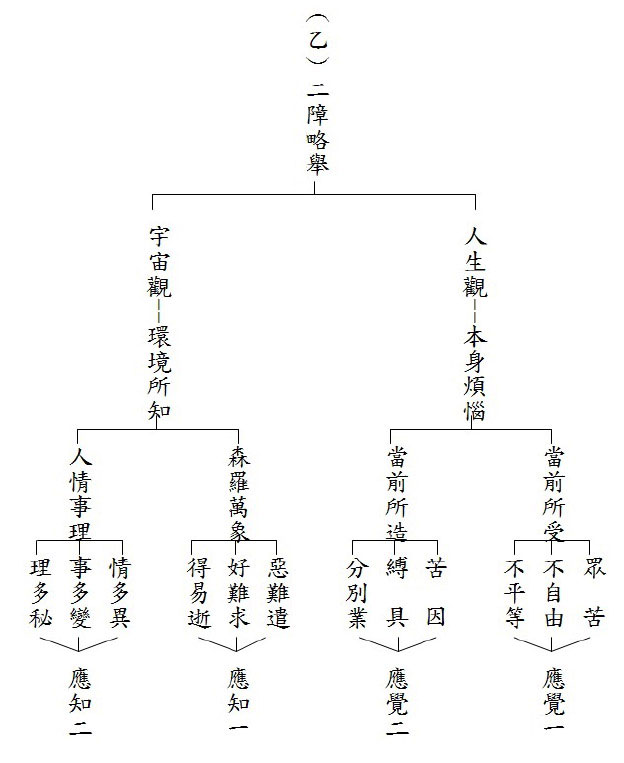

## 孔學一隅

### 孔門七十二賢淺說（七）─宓不齊

圖：江逸子‧文：時哉

年少堪為大器才

魯多君子能取斯

夫子教化功不沒

單父治理同堯舜

釋名

整本《論語》記載孔門高弟凡二十餘人，章數有多有少，多則數十章，少則一章，宓子賤可說是屬於少的，僅一章而已，但是雖只一章，卻已讓子賤流芳百代。初讀其名，會生疑惑，他父母怎會賜賤為字﹖這恐怕是今古認知差異吧！先介紹宓子賤的名：不齊，古人名與字是分別給的，所謂弱冠賜字，賜字表此人已成人，古人賜字有人尊自尊的意涵。不齊之不字無意義，齊或許是其父母期許時時要整飾自己，至於賜子賤，據清人王引之依爾雅注為「翦」，翦也是齊的意思，由此可知宓子賤之名與字為同一意義。

其人　君子人哉

整部《論語》僅〈公冶長篇〉載：子謂子賤，君子哉若人，魯無君子者，斯焉取斯。

讀此章有何啟發﹖從正面角度來說，今世所謂最善巧的教育方法，莫過於對學子以正面鼓勵，以激發潛能，夫子顯然知之，稱讚小其三十六歲以上的年輕弟子，為有品德且才學兼優之君子，弟子聞之，是多大的鼓舞！又栽培弟子斐然可觀而不居功，謙說是魯國多君子，讓其弟子有學習君子行相之良好外緣。魯無君子，斯焉取斯，前斯字指子賤，後斯字稱魯君子之榜樣。此句反面顯示，在夫子心目中恥獨為君子，移風易俗，非諸賢者聚會一處，莫能為之，所謂一木難支。惟其有所譽，必有所試，夫子不妄讚，當有相應事蹟以佐證，前儒相繼注經，章句旨趣方得以彰顯，而最足以表彰子賤君子之風，其惟子賤治單父之功化耶！

其事　鳴琴而治對　巫馬期星出星沒

單父在春秋時代為魯國所管轄，約當今山東單縣。子賤當單縣宰官，即如今之縣長，據《呂氏春秋》〈察賢篇〉記載，讚揚宓子賤治單父，身不下堂，鳴琴而治。所謂鳴琴就是琴彈得很好，意旨以禮樂治理縣政政事，想子賤必聽聞先有司之為政之道，能使屬僚各司其事，凡事無須代庖，就將單父治理的上軌道，如聖王在世之光景。又孔門另一高弟巫馬期也曾治理單父，他是以星出星沒的辛勤方式，也將單父治理得有條不紊，開後人披星戴月之典型，巫馬期嘗問子賤何以能如此安逸治單父，子賤對之：我以任人，子以任力；任人者則逸，任力者勞。這一段治單父之千古對話，允為美談，試問治單父孰先孰後﹖我姑且常理推測，以為巫馬期在先，而宓子賤在後，後者在前者基礎上增益之，識者以為然否﹖同樣將單父治好，能治之任人者與任力者，自古評價前者遠優於後者，以推行之難度而言，前者也難於後者，後者易學，前者難學難登其境乎！然則子賤如何任人﹖

其事　掣肘之害

古往今來描寫為領導或為部屬，二者各別心理最入木三分的人物，夫子必是其一，從子路篇記述魯哀公問一言以興、喪邦，夫子對答為君難為臣不易，知二者分工分寸分際，庶幾乎一言興邦，又剖析二者若自我膨脹有過錯也自以為是，容納不入他人善意勸誡，不就等同一言喪邦，邦如是，推之卿、大夫、士所治都邑縣鄉里當亦如是，甚至小至齊家，又何嘗不是如此。

夫子莫不培養、期望三千弟子，成為政或傳道、傳經人才，以再臻聖王之治世，如勉子夏為莒父宰當作君子儒，往武城，莞爾讚子游治武城，弦歌不輟並行君子之道。子賤生平行誼，因時代綿遠，文獻不足，料想夫子化雨之際，當有聽聞為政之見地，復見同門政績，在受命復任時，請魯君委二位善書之書記同赴任，至任所每當書記紀錄便從旁掣肘干擾書記之記錄，二人遭責難苦不堪言，藉故辭卸職務返歸魯室，面告君上緣由，魯君惑、問夫子，夫子善巧讓魯君體悟子賤為單父宰，任才時莫牽掣之心意，讓子賤推展政道能不受魯宮室之干涉，作如是先行安排，可謂明智之舉，深得夫子為政之精髓，與夫子殺少正卯時有異曲同工之妙。

其事　治單父而眾悅

眾悅就是深得各階層民心，《說苑》〈政理篇〉的記載，詳細將子賤治理單父大治的經過，透過夫子一層層的深入設問子賤，單父大治千古之謎方知之，也留給後人一崇高的典範及理想。
首先，夫子為千秋萬世有志為民謀福之百里侯問，可敬畏的後生，如何將單父治理得有聖王在世的氣象﹖不齊恭敬的回答我只是父其父、子其子、恤諸孤而哀喪，夫子答如是僅能做到一般小老百姓的擁護而已。接著，不齊又恭敬的回
**答：** 我所父事者三人，所兄事者五人，所友者十一人，夫子又
**答：** 父事者三人，可以教孝矣；兄事五人，可以教弟矣；友者十一人，可以教學矣。夫子略帶停頓深不可測地說，如是君子行，已大有氣象，足以讓士歸附矣，惟猶不能眾悅！最後不齊再恭敬地說：此地有賢於不齊者五人，不齊師之而稟度焉，富哉三問！夫子示人言語之道，又諭後之從政者要訣，為政當如不齊求賢為師、為友、為父、為兄，過去堯舜治天下也是如此，而子賤治單父如子游至武城，割雞焉用牛刀啊！此一問答又何異於子貢之問為仁，夫子答居是邦也，事其大夫賢者，友其士之仁者，夫賢者百福之宗，神明之主，求賢輔助，何其重要！

其事　事蹟校量

子賤治單父時，連年幼之童子皆蒙教化，深夜捉魚，稟受不合政令大小之魚莫捕捉而放回，如是化導人民功效卓著。昔子賤、子產、西門豹治民，皆達不欺，而三者有別，子賤以德化民不忍欺、子產以能精察使民不能欺、西門豹用刑讓民不敢欺，孰高孰低立判可知，不禁要隨夫子贊子賤，君子哉若人！

結讚

得聖人之讚何其重要，又讚弟子激發其學習潛能，何其善巧方便！夫子讚顏回三月不違仁，讚端木賜始可與言詩矣，告諸往而知來者，讚起予者商也，使可與言詩已矣，讚南宮适君子哉若人！尚德哉若人！為人師表，除效法至聖先師因材施教、有教無類……，莫忘適時讚歎弟子之德行，亦是裁成陶鈞弟子之良方也。

圖讚

江逸子先生畫宓子賤，當是以造自己心中顯現之像，無庸置疑，畫家下筆前已然熟讀相關文獻，從虛到實，其中艱辛，惟有畫家知之。擷取頑童、羸或兔走烏飛人生面相是一抉擇，或站或立或躺，設色淡雅濃豔，或威武或莊嚴，容貌溫或猛，髮髻服飾之考據，眸子神采之開闔……。料想畫家仔細思量，方繪出容貌溫而莊嚴、設色淡雅之如是立姿造像。(下期待續)

### 論語簡說（十一）—侃侃如也的子貢

*時哉講述、萬海山、心筑整理*

侍側弟子皆人才

誾誾行行與侃侃

子樂英才由學成

道直時邪嘆得禍

經文

閔子侍側，誾誾如也；子路，行行如也；冉有、子貢，侃侃如也，子樂。曰：若由也，不得其死然。

（先進第十三）

前言

我們都知道，人的氣質內化時，會帶給別人很好的印象，不論是在事業、家庭上，都是最好的出路。孔子教學生，不但在內心上能夠體悟這些人生美好的內涵，在外相上也呈現很好的氣象，作為他們在入世間最好的增上。

釋義

分段與大意

這一章可以分為兩大段，第一段是弟子們的氣象，第二段是老師的感歎。

弟子們的氣象有閔子、子路、冉有、子貢的氣象。首先，閔子騫侍奉在老師的旁邊，展現出方正的樣子；子路是剛強、威武、果斷的樣子；冉有、子貢是和樂的樣子。老師很高興看到學生在經典內化之後，展現如此好的氣質。

第二段老師感歎地說，若子路，沒有辦法壽終正寢。

閔子侍側，誾誾如也；子路，行行如也；冉有、子貢，侃侃如也，子樂。

朱子認為諂是態度上想要討好人；〈邢昺疏〉認為諂是身體上跟言語上去討好人。〈皇侃〉的解釋是心態上想要討好人。將這三家注解合起來，諂就是心地上、嘴巴上、動作上討好他人，此即諂的形象。

朱子認為驕就是愛面子而且很放肆的形象，富貴的人滿足於富貴，就像喝了烈酒一樣，目空一切。

侍側

侍側通於閔子及其他三人，做師長的侍者可以就近受教、請教，或者是隨時聽候召喚。可以站著侍奉，但是老師賜座時可以跪坐著，隨時起來辦事情。

侍者的修學法乃重要的增上法，在老師旁邊的學習，不只學習經學，還看老師的一舉一動，隨時看老師需要辦什麼事，這是訓練學生的敏捷度，懂得服務長輩，能夠通達老師的內涵。有這樣的訓練，出去外面辦事情，懂得察言觀色，進退應對，事情能夠辦得周圓。

閔子騫的行相-誾誾如也

〈皇侃〉對誾誾的解釋是方正、中正。當時魯國掌權的三家大夫，季孫大夫擁有魯國二分之一的兵權和稅收；孟孫氏、叔孫氏各擁有魯國四分之一的兵權和稅收。當時季孫大夫選閔子騫做費邑大夫，閔子騫拒絕，就顯出內心和外相都方正的形象。

《說文》對誾誾的解釋是和悅而諍，和悅是表情很愉悅，諍就是將問題問得明白。季孫大夫請閔子騫做費邑大夫時，閔子騫跟使者說，請善巧地替我推辭，可見閔子騫是一位中正當中帶著和悅，不得罪小人，可是有自己原則的人。在《說苑》裡提到，閔子騫本來形色枯槁，學了聖道以後，整個人容光煥發。當法喜充滿時，就好像是吃了最補的藥，整個人神采奕奕，雪廬老人教學一直教到九十幾歲，就是這樣的氣象，能讓人對中華文化充滿信心。

江逸子先生在《孔門七十二賢》的畫作中，閔子騫就是方正的樣子，佩劍代表讀書人含藏著義理，拱手代表能行禮儀，懂得進退，內心雖然有一股氣節，但是並未高高在上。

動物之中大象最能代表誾誾如也的樣子，因為牠是最方正的，而且從來不涉險，牠所走過的路都是最安全的，只要看到象的足跡，跟著它走一定是最安全的。閔子騫就是如此，不會同流合污、為非作歹。另外，大象的特點是跟著象王走，孔子就如象王，閔子騫如象，當孔子辭去大司寇離開魯國，閔子騫立刻就把費邑大夫辭掉！閔子騫的心中，只有為公發心，當發覺時機不宜時，再大的榮華富貴可以像丟掉破鞋子一樣捨棄。

子路的行相-行行如也

行行是剛強、威武的樣子。子路的剛強不是剛愎自用，而是沒有私欲的剛強，所以子路如果做法官，兩邊打官司，只要聽完甲方跟乙方後，三言兩語立刻可以把案情決斷的清楚，簡直就是包青天，因為這個人沒有欲望，看事情極為精準。江逸子先生把他畫成一個俠客的樣子，內心有俠氣，不為名利所困。塑像又把他塑成像老鷹般的眼神，就是他胸中的正氣，讓他不為私欲所動。

冉求、子貢的行相-侃侃如也

侃侃是和樂的樣子，非做剛正解。冉求是魯哀公三年時季孫大夫到陳國請回來的賢臣。《論語》中，說到冉求是謙退的人，謙退的人不會表現出來剛正的樣子；子貢為了魯國，周旋於各國，解決了魯國之難，這種外交的幹才，呈現出來就是善於溝通、協調，所以侃侃如也應解釋成和樂的樣子。

侃侃如也，跟嬉皮笑臉有很大的差異，嬉皮笑臉給人感覺是很輕佻，不必太尊重他，侃侃如也，則是莊重當中露出和樂的樣子，就像南非前總統曼德拉先生，以及雪廬老人非常欣賞的一個人物─美國雷根總統。雷根總統的幽默很有名，當他被人暗殺，中槍到醫院時，情況十分危急，他竟然問醫生說：你是共和黨還是民主黨？醫生說：現在的美國全部是共和黨！此外，他跟對手在舉行總統辯論時，對手說他年紀太老。雷根說：我就像對手一樣修養好，不會罵對方少不更事，這就是幽默。他也讓士氣跌到谷底的美國向上攀升，他的幽默常常帶給人們希望。

冉求在魯哀公三年到魯哀公二十七年，是實際執掌魯國國政的人，季孫大夫要討伐魯國的附庸國─顓臾，結果冉求和子路去找孔子，孔子述說不可以的理由，冉求回去就阻止了季孫大夫攻打顓臾，可見冉求的政治實力，此人是政治的幹才。

子貢則除了本身的才情外，還是富甲一方的大老闆。兩人理應生活繁忙，如何還能侃侃如也？侃侃如也這個氣質要怎麼培養呢？就是上一章所說—切、磋、琢、磨。切磋是向老師、朋友學習，琢磨是將所學內化，將心沉靜下來，這也是現代忙碌、心浮氣躁的人最應該培養的氣質。
在《說苑‧雜語》中，東郭子惠曾問子貢：為什麼夫子之門是龍蛇混雜？子貢就回
**答：** 能校正木頭的工具旁邊，就會有各種歪曲的木頭，這沒什麼稀奇。一位會調理病人的醫生，本來旁邊就會有各種千奇百怪的病人。磨刀石的旁邊，一定有很多鈍刀。很深的水旁邊一定有很多蘆葦。茂密的柳樹旁，一定會有很多的蟬叫，這有什麼稀奇呢？孔子有能力讓這些人合在一塊，而且把他們調成人才，孔子這種大才，當然是何所不容。

在《說苑》中，子夏曾經問孔子：顏回怎麼樣？孔子說：顏回的仁心，這點勝過我；但是顏回雖然勝過我，可是卻不能權變。比如，公孫戍在蒲扣留了孔子，不准孔子回衛國的帝丘，他怕孔子告訴衛靈公他要謀反之事，所以要孔子盟誓不回帝丘，孔子答應了。公孫戍的部隊撤走，子貢問孔子：要去哪裡？孔子說：回帝丘。並說：要脅我是不仁，答應他是不義，不仁不義的盟約怎麼可以算數？這就是孔子的權變。

再來，子夏問孔子：子貢呢？孔子說：子貢是敏捷之士，勝過我。但是子貢能敏，卻不能不敏。衛靈公問孔子會不會打仗？孔子回答不會。衛靈公並非請問，只是在調侃，那孔子何必說會呢？這也是孔子的權變。

子夏再問孔子：子路呢？孔子說：子路勇超過我。但是不能不勇。在衛國內亂時，子路就是勇過頭，才會被斬成肉醬。

子夏再問孔子：子張呢？孔子說：子張能莊不能不莊，莊重勝過我，可是不能與大家同樂。孔子做大司寇回到家鄉，跟鄉里的人在一塊飲酒。盡興的時候，六十歲以上的老人出去，五十幾歲的大司寇也乘機開溜，讓年輕人盡興。

所以，這四位弟子仁、敏、勇、莊雖超過孔子，然不能把握中道，當然要跟孔子學。因此，一個內涵到極致的人，懂得屈伸、得失、進退，拿捏地恰到好處，孔子就是這樣的人才。讀《論語》得把孔子的氣象讀出來，必然能趨吉避凶、逢凶化吉。

從本章也能讀出孔子的因材施教，不會把學生的特性調成一樣。剛的人不要硬調成柔，剛的人要調成不剛愎自用，並且維持他的剛正。柔的人能夠溫柔敦厚，不要懦弱到沒有原則。莊重的人充實內涵，不要愛面子。順著學生的個性去發展，培養成為人才。

侃侃如也就是外交的人才；行行如也就是軍事的人才，誾誾如也就是內政的人才。老闆難道不喜歡方正的部屬嗎？難道不喜歡和合的部屬嗎？難道不喜歡有執行力、剛正不阿的部屬？這樣的一批人組成團隊，不可小覷。

子樂。曰：若由也，不得其死然。

以上四個學生的氣象表現地很好，所以，孔子非常高興！但卻說：子路，沒有好下場。沒有好下場有什麼好樂的呢？所以，自古以來沒有辦法解決這個問題，就產生以下句讀的問題：

第一個，子曰：若由也，不得其死然。

第二個，子樂。若由也，不得其死然。

第三個，子樂。曰：若由也，不得其死然。

到底要採取哪一家的句讀？這就是讀書的眼力。首先，子曰：若由也，不得其死然。這是胡廣的《論語答問》，他認為孔子不可以樂，因為一面看到子路會死於非命，一面又樂，所以把樂拿掉。然而雪廬老人說：改經是最大的毛病，經文若看不懂可以存疑，絕對不可以改經！你也改、我也改，這部經改到最後，會像什麼樣子？再者，孔子及其弟子都是後面這些儒者的老師，怎麼可以改老師的東西？第三個，又不是交作文，幹嘛改人家？第四個，文中的意思沒看懂就改，這怎麼可以呢？所以，不採取這一家的注解。

再者，子樂。若由也，不得其死然。這是宋儒《論語集說》的說法，少了一個曰字。此乃南渡時，《論語》的版本脫字，因為在以前，皇侃的注解中就有曰了，所以這是脫字。

最後，子樂。曰：若由也，不得其死然。像《讀書叢錄》、《文選注》或是《論語義疏》都採此句讀。其中，皇侃《義疏》中提到，脫了一個字，就是孔子樂，後面又說若由也，不得其死然。

孔子樂在何處

學生沒有好下場為何樂？要知道，孔子是一個能夠把學生教成英才的人，四代的學生都是人才，鄭康成說，樂在學生們把自己的個性都表現出來，沒有矯揉做作！一個人質樸、真誠的學習才是重點！是剛、是柔或是和樂都沒關係，就怕假情假義！學東西如果假情假義，只是來偷取學問，這是學不到東西的！必得要尊重傳承，尊重老師，才能真正學到東西。

此外，孔子的樂在哪裡？樂在子路的剛能夠發揮胸中的正氣；閔子騫的方正是做人規規矩矩的方正；子貢、冉求的和樂是能夠濟世的和樂；把這些學生都培養成濟世的人才，孔子當然快樂。

何以孔子樂，卻說子路必不得好死？這是在不同的時空背景，弟子們把它合成一章紀錄，並非一面高興學生表現很好，一面高興他沒有好下場，學生沒有好下場，老師怎麼高興得出來呢？在當時四個學生所呈現的氣象如此，所以老師很高興。事後老師想一想，唉！子路雖然個性很好，可是這種正直的個性，亂世是很容易遭禍的，在亂世小人多，容易得罪小人，與惡人對抗，易遭災難，所以不禁感歎。

不得其死之史實

子路曾經做過衛國的宰相、孔悝的家臣，孔悝大夫對子路非常好，後來子路到了魯國，聽到蒯聵要回來繼位，蒯聵是衛靈公的兒子，得罪了衛靈公的太太─南子，逃了出去。結果衛靈公死後，南子和她的國人立了蒯聵的兒子─蒯輒。魯哀公三年，蒯輒繼位。魯哀公六年，孔子到了衛國。魯哀公十一年，孔子離開衛國，回到魯國。魯哀公十五年，孔子七十二歲，蒯聵回來挾持孔悝，蒯輒(衛出公)逃亡，蒯聵就成了衛莊公。

當時孔俚被挾持，子路一聽孔悝有難，就跑回衛國救他，城門關了，高柴好不容易等著城門開往外跑，子路則往內衝，高柴叫子路不要進去，子路說：食人家的俸祿，怎麼可以不替人辦事？結果為了救孔悝大夫，蒯聵命石乞跟壺黶攻擊子路，把子路的帽帶砍斷，子路在危難當中，知道自己活不久，說：君子要正冠而死，接著把冠扶正，從容的被對方斬成肉醬，這就是子路。

不得其死之因

孔子聽到衛國有內亂的時候，孔子就說：高柴必往外跑，子路必送死。聽到子路被斬成肉醬後，孔子到中庭放聲大哭，說：天祝予！天祝予！就是天絕我！天絕我！終身不吃肉醬。可見子路是和孔子很有革命情感的弟子。

在《尚書》中，大禹曾經有洪範九疇(治國的九大綱領)，其中就談到壽享五福，五福就是要壽(長壽)、富(富貴)、康寧(健康)、考終命(壽終正寢)，但是要得到這些的因，就是要攸好德(積陰德)，這是讓老百姓能夠離苦得樂的施政要領、國統綱領。從子路不得其死然的結果，可以知道子路沒有得到考終命這一條，無法壽終正寢，而且也可以得知孔子看人的眼力。後面會發生的事情，前面就先知道，這叫做知機其神乎！

總結

首先，侍者的修學法是極為重要的，可以練磨煩惱、習氣，有什麼問題也可以就近請教老師，乃至於隨時服侍老師，學習老師的處世能耐，這是外圍的學生所不能懂的。

第二，個性不同的學生，大家湊合在一起，可以互相互補。

第三，正直的人在亂世要懂得保護自己，千萬不要得罪小人，要懂得趨吉避凶、敬德修業，以上是本章的大意。

問答

**問：** 為什麼本章四位學生中，只有閔子是尊稱為閔子？

**答：** 在〈皇侃〉的流通本記載為閔子騫，可見這應該是脫字。

**問：** 子路是孔子第一代學生，閔子騫是第二代的學生，為何本章中閔子騫是排在第一位來講？

**答：** 閔子騫小孔子十五歲，子路小孔子九歲，子路比閔子騫大六歲，按照年齡理應要子路先。

《論語》中也有顏淵、季路侍，顏淵跟子路侍奉在孔子旁邊，顏淵寫在前面。顏淵小孔子三十歲，子路比顏淵年長，理應是季路、顏淵侍。從《論語》中可以知道乃是以德為主，閔子騫是德行科的學生，所以本章先從閔子開始，道理就在這裡。

**問：** 剛強的人，往往都直言果斷，可是時局往往不允許我們如此，那麼應該要如何趨吉避凶，保護自己又幫助他人？

**答：** 這就要知道切磋琢磨的重要，不管是甚麼特質的人都要好學。剛強、和樂乃至於方正的人，是十室之邑必有，可是都不如孔子好學。好學一定要跟老師切磋，並且要自己琢磨。切磋琢磨以後，開始內化，壓住浮躁的個性，懂得觀察時局、懂得進退，所以，《論語》裡面讚歎蘧伯玉：國家有道的時候，他是正直的言語和行為。國家無道的時候，他的行為是正直的，言語是謙退的，自然能明哲保身，趨吉避凶，也能隨緣暗助善人與君子。

**問：** 〈洪範九疇〉裡面，其中五福之一是壽終正寢，子路如何稱得上孔門的大賢？此外，孔子可以根據他的個性，將他調伏成一個孔門的大賢者，真的很厲害，孔子到底是怎麼辦到的？

**答：** 大哉問！橫死的是福薄的人，怎麼成為孔門大賢？其實子路橫死是他不會抉擇，那個場合他不應該去救主子，蒯輒雖然被衛國擁立，但蒯聵是世子，並沒有被衛靈公廢掉，這是無法處理的國家與家庭問題，孔子在衛國待了五年，蒯輒要請孔子當宰相，孔子都不答應，因為這種問題孔子不能解決。所以，子路是昧大義，而高柴是能抉擇者。

子路雖是不善抉擇，可是他是一個大賢，因為在〈先進篇〉的最後一章，子路說：我來治理一個國家，這個國家被兩個大國夾在當中，已經在饑饉、鬧饑荒的國家，我可以在三年中，讓老百姓有禮義，軍隊有勇氣。他可以這樣，請問那是不是大賢？而且他跟孔子說，車、馬、衣服、皮裘跟朋友共的那種胸懷，他對朋友、人才團隊的看重，這也是大賢的格局，所以，橫死完全不妨礙他是大賢，他雖對孔悝大夫盡忠，他說：食人之俸祿，要盡人之事、要忠人之事。可是高柴說：這個時候談不上忠，因為這種問題誰都無法解決。

再者，孔子何以有如此能耐，能看懂每一個學生的根機，而去調教他？因為孔子本身就是善於調自己的人。讀〈為政篇〉，吾，十有五，而志於學，三十而立，四十而不惑，五十而知天命、六十而耳順，七十而從心所欲，不踰矩。就能知道孔子是善於調伏自己的人，所以他當然能調伏別人。一個人當他不斷地增上自己，利益別人時，眼力與作法都在進步，最後必出神入化。

**問：** 在《論語》裡，夫子的氣象所描述的是申申如也，夭夭如也，請問這樣的氣象，需要到七十歲才會有嗎？還是夫子年輕的時候就已經展現，有證得七十而從心所欲，不踰矩的這個潛力，所以顯現出申申如也，夭夭如也？

**答：** 夫子的天生德是他天生有悟性，可是也要後天的好學，才能擴充悟性。申申如也，夭夭如也的氣象是，越充實內涵，人越篤定，氣象越好，人越正直但也越和善。當到了七十從心所欲不踰矩時，也究竟成就申申如也，夭夭如也的氣象。

**問：** 以子路而言，假如他能夠有像夫子三十而立的內涵，應該就不至於表現出行行如也的特質，是這樣嗎？

**答：** 依禮而立是見地上知道禮的重要，依禮行之能趨吉避凶，子路的禮有時候太超過，像答問題時，老師還沒有請他答，他就先答。所以，老師對他訓誡地一笑。見地未到，往往有些福報無法生起，有些災難也躲不掉。所以三十而立是見地的立，是獲得經學的見地，人生開始走入康莊的大道。

**問：** 記錄者如何能看懂師生的氣象，並用精準的言語來描述？

**答：** 記錄者一定是旁邊跟著學、跟著看，懂得察言觀色，懂得依禮而觀，他才能有辦法做這種記錄，言詞下得這麼好。

**問：** 孔子說顏回在仁心上勝過自己，孔子他本是一個仁心成就的君子，顏回若在仁心上勝過孔子，應該是長成一個什麼樣子？

**答：** 靠智慧去抉擇的仁心，那個仁心才是真正的仁心。舉例而言，對於為惡多端的人，過於仁心的人是一昧原諒他，而真正會用仁心的是處罰他！也就是說，有仁心的人未必會善用仁心。如宋襄公與楚莊王兩軍作戰，楚國渡河時，宋國有人勸襄公要襲擊，襄公卻說襲擊對方是不仁的，等到楚軍渡河後，正整隊時，有人勸襄公襲擊，襄公卻說君子不可以趁人之危，打仗前也交代不可以去追殺那個頭髮有一點白的這種老兵，試問還打什麼仗？最後果然大敗，這就是婦人之仁。

**問：** 請問這章的背景可能是什麼樣的狀況？為什麼學生是侍側呢？

**答：** 侍側是很平常的，在《論語》裡面，有子路、曾皙、冉有、公西華侍坐，也有顏淵、季路侍，就是會有一些學生到孔子的家中請教學問，或是話家常，就是侍坐在旁邊。孔子會請喝茶、聊家常，或是他們跟孔子問道，或者是孔子問他們的志向。

**問：** 閔子騫誾誾如也，誾誾的解釋是以方正為佳呢？

**答：** 因為閔子騫本身就是一個方正的人。雖善為我辭焉章，表徵閔子有不得罪小人的智慧，亦是和悅的人，但是他本質是方正，雖態度柔軟，但心裡很篤定，此時再大的富貴都不要。

**問：** 所謂的「道直時邪」的意思？另外，夫子教育學生是所謂的好直不好學，其蔽也絞；好勇不好學，其蔽也亂；好剛不好學，其蔽也狂，子路他是十哲之一，而夫子又是懂得因材施教的人，究竟為什麼最後子路還是死於衛國之亂呢？

**答：** 在亂世無法用直道，若一昧堅持直道而不知隱，容易招致禍患。這就表示高明的老師未必教出高明的學生，可是高明的學生一定來自於高明的老師，這是沒有辦法的事。子路，不妨礙他成為大賢，可是抉擇出處的眼力，時機恰到好處，這種能耐或者子路還不到。

**問：** 當夫子說若由也，不得其死然時，是否代表孔子已經開悟或是明心見性了？

**答：** 這是經驗閱歷，加上好學而來。明心見性絕對不是一個什麼東西叫做明心見性，明心見性是一個道理通達的、人情世故通達的那一分說的，而非眼睛看到什麼東西叫做明心見性。眼睛看到什麼東西叫做明心見性，雪廬老人說很簡單，只要用手打眼睛就什麼東西都可以看到了。明心見性一定是來自於好學，既不好學，又想明心見性，那是癡人說夢。

**問：** 是否能說此章是他五十而知天命的佐證呢？

**答：** 冉求小孔子三十歲，子貢小孔子三十一歲，這些學生再有這種氣象，或已經二十出頭，此時的孔子應該是五十歲以上，應是知天命之年齡了。

**問：** 孔子的識人之明是否可以從《易經》得來呢？

**答：** 《易經》的道理是用在趨吉避凶，在於有否反省改過，當然也要能識人，與小人交必受其害，與君子交必受其利，如此之理，在人事運用，懂得觀己是否免入小人之堆，觀他是君子否，能親近否，自然能離凶禍而得吉福。

**問：** 如果想要學會如何識人，尤其是經驗閱歷淺的年輕人，是否要從經學的學習開始呢？

**答：** 是的，但學經學要有好的老師、好的注解，雪廬老人的《論語講要》就是《論語》很好的注解。一定要有正確的注解，及正確的引導，才會得古人的眼力，補自己經驗閱歷的不足。

**問：** 所謂的識人之明、命相學、知天命三者是否不一樣？是否可以依命相學來做我們識人的輔佐？

**答：** 識人之明需有經學見地之輔助，非由命相學而來，命相學雖識人的命運，但可透過造善造惡而改變。知天命簡要說是知命運可以改變，好的命是需要斷惡修善的，而識人之明可幫助自己斷惡修善改變命運！

**問：** 夫子因材施教是因為他具備聖人識人的智慧，另外是否也是因為他有聖人的仁心？像我們現代，又應該如何對學生因材施教，不去壓抑每個人的個性？

**答：** 聖人有兩種聖人，一種是完全出世的，一種是入世的，不但本身成就形而上的內涵，也以他的仁心入世，並且在入世時懂得進、退、屈、伸。《說苑》中說，懂得這些變化，所以他能仁、能不仁，能敏、能不敏，能勇、能不勇，能莊、能同，這些都是好學來的，所以孔子一再強調他是好學而成就。如何將這些用於現代教學？首先老師們要先學，老師們都沒有好好的學，怎麼會讓同學們有這樣的內涵？而且老師先學以後，教同學，同學未必會。因為同學本身如果沒有好好靜下來學也不行，所以，高明的老師未必教出高明的學生，但是高明的學生一定來自高明的老師。想要教別人的時候，一定要自己好好先學，絕對沒有耳朵進去，嘴巴就要出來的，成功沒有速成，所謂慢慢修時快快到，低處修時高處到。

**問：** 有高明的老師未必有高明的學生，像宰我的朽木不可雕也，又該要怎麼解讀呢？

**答：** 宰我是一種示現，孔子一方面罵宰我，一方面又把他歸到十哲，可見老師也知道他是示現的。

**問：** 子路死於衛國之亂，是否是因為他沒有達到所謂夫子的四十不惑，能夠通權達變的境界？又或者可以說子路未曾學到如切如磋如琢如磨，而不可與之言詩呢？

**答：** 子路是如切如磋如琢如磨，如果沒有如切如磋如琢如磨他怎麼會成為大賢呢？但是四十而不惑，可能子路是真的沒有到，四十不惑真的難，顏回都很謙虛地說只有到三十而立，可見越往上走越難，可是越往上走越精彩！越往上走越快樂！越往上走，修的福報越大！

**問：** 還有沒有其他例證可以證明孔子對子路的因材施教？為什麼孔子對於最後子路會死於衛國之亂，只有簡單的說一句，若由也，不得其死然？

**答：** 孔子對弟子是因材施教，如果沒有因材施教，子路應該還是太保流氓。如何後來會成為一個，可以夾在兩個大國當中的國家，在饑荒時，老百姓不會犯上作亂、不會做雞鳴狗盜之徒，願意與領導者同甘苦、共患難，而且懂得禮義，這不是大賢的能耐嗎？這不是孔子因材施教而來的嗎？

孔子很感歎，子路沒有辦法正確地抉擇，傷害了自己，這個是沒辦法的事。

**問：** 應該要如何判別小人與君子，好人跟壞人？

**答：** 《論語》是寶典，四百九十八條，內有諸多論君子與小人的章節，若合觀之，能清楚知道君子與小人不同的形象，可修正自己不成為小人，也能分辨對方是君子或是小人。

**問：** 在本章提到四位大弟子他們不同的氣質形象，一般女子又應該有什麼樣的氣質形象呢？

**答：** 女子本身知道這些見地的好處，不妨礙她是和樂的個性或是剛強的個性。剛強者能夠培養她無欲，不要慫恿先生去從事非法，捲入舞弊收受紅包等事；和樂的女子，或能替先生解決很多的問題。或能溫柔敦厚地持家。

**問：** 從這章可以看到四位弟子不同的形象，是否也可以從這章看到夫子的性格又是如何？

**答：** 夫子是全方位的，可以是顏回的個性，也可以是子貢的個性，在這個場合需要子貢的個性的時候，就是子貢的個性。在那個場合需要子路的個性的時候，就是子路的個性。在那個場合需要顏回的個性的時候，就是顏回的個性。此乃經學通達的成就相，也是中國文化的殊勝處，能隨緣盡份，利樂有情。

**問：** 孔子他有能力調教各種人，因材施教或成為仁心君子，是否是為引發每個人本性的善呢？

**答：** 其實本性沒有所謂的善惡，孔子不贊成性善也不贊成性惡，孔子主張的是性相近，唯有得到正知見，他才懂得善的功能、好處，惡的壞處、下場，這個人才肯變成善良。沒有所謂天生善心，嬰兒在媽媽的懷抱裡面，拚命地吸奶，不管媽媽現在的狀況，試問是人性本善還是本惡？

**問：** 什麼是真如本性？要如何做到真如本性？

**答：** 以孔子七十而從心所欲不踰矩來論，到了沒有過失的那一分，此時叫回復本性，不是有一個本性在讓你回復。所以，人性的善良是必須被見地經營出來的，否則善良的習性遇挫折也易改為惡，鄉間很多善良的人，風氣一變個性也變，斷惡修善就會讓人離苦得樂，如此而已。

**問：** 可以確認這一章《論語》是什麼人所記載的嗎？

**答：** 《論語》紀錄者，只能說是孔子的弟子，或是曾子的弟子，或有子的弟子這樣而已，但是記載者必是高人！否則不可能記載的這麼殊勝！少言攝多義，即使義理不懂，也是一部優雅的文學作品。

**問：** 夫子他因為子路的死而哭於中庭，那聖人的哭與凡人為親友而哭有什麼不一樣？

**答：** 聖人的哭是真情流露，而且是替天下蒼生哭。如此大賢這樣死去，其實是蒼生的不幸。再來，夫子跟子路的這種革命的情感，這種革命的情感都是在道上的革命的情感，不是世間凡夫的情欲結合，他們都是為了人類的幸福而努力的那種革命情感，跟我們在那裡為了名利的那個情感，怎麼會一樣？同樣是哭，本質不一樣，內涵不一樣。所以，聖人的七情與凡夫的七情，外相相似，內涵則大大不同。(下期待續)

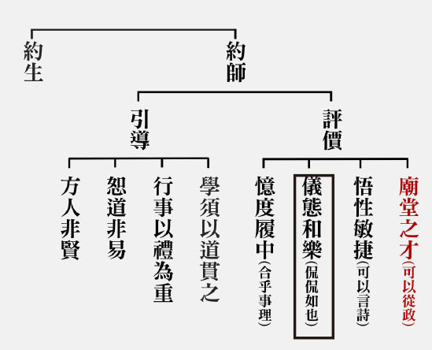

## 藝術賞析

### 華夏精魂千秋(七)—明倫史畫　天佑有德　趙盾

圖：江逸子‧文：淨域

史話

趙盾(-西元前六○一年)，春秋時期晉國上卿。晉獻公晚年寵幸驪姬，太子申生被迫自殺，二子重耳、夷吾外逃。重耳與趙衰逃往蒲城，獻公派軍攻打蒲城，兩人投奔重耳的母國翟。翟君將女子叔隗許給趙衰為妻，生一子趙盾。

趙衰隨重耳流亡十九年，重耳即位為晉文公後，趙衰任上卿輔佐稱霸於諸侯。文公去世，公子驩即位為襄公；趙衰死，以子趙盾為上卿，大修政令。襄公薨，朝臣為繼位人選而有爭論，最終公子夷皋即位為晉靈公。

靈公性殘淫樂，重稅用以修建宮牆，每立於樓臺上以彈弓擊人；又廚師燉煮熊掌不爛，怒殺廚師棄於荒野。趙盾多次勸諫，靈公厭惡，佞臣屠岸賈獻計，派大力士鉏麑行刺。某日天將亮時，鉏麑潛至趙府，重門洞開居處十分簡樸，見趙盾著朝服閉目候車上朝，不禁驚道：「如此諫君敬事之忠臣，我寧可違命也不忍殺之。」言罷，便一頭撞向槐樹而亡。

靈公十四年(西元前607)九月，靈公設計宴請趙盾，預伏殺手將害之。廚吏提彌明知悉計謀，惟恐趙盾酒醉喪命，便勸說：「君王賜宴大臣，酒過三巡即可作罷。」靈公放狗咬人，再而挺身護衛趙盾逃離都城。趙盾見他如此袒護，問其緣故？始知此人為昔日雷首山(今山西省中條山西南)桑下餓人靈輒，趙盾因贈飯奉母之善行，獲得日後的身免。

九月二十六日，趙穿(襄公之婿、趙盾堂弟)在桃園殺死靈公。趙盾尚未逃離國境，聽到靈公命喪即刻返回都城，派趙穿到成周迎回公子黑臀(文公之子，靈公的叔父)，立為新國君晉成公。太史董狐記載：「趙盾弒殺國君。」並將這一筆記載，在朝堂上公開提說。趙盾聽聞後說：「不是這樣的。」董狐亦說：「您身為正卿，上諫而國君不採，逃亡未出國境，聞國君被殺即返，回來後不討伐逆賊，如此便是與賊志同。既然與賊志同道合，我就重實記下這件事，不是您殺了國君，又是誰呢？」趙盾說：「《詩經》有云：『我心裡懷念祖國，反而給自己留下憂傷。』這話說的大概是我吧！」

孔子評說：「董狐是古代的好史官，他記事的原則是直書不隱諱。趙盾是古代的好大夫，但因為史官的記事原則，而蒙受了弒君的惡名。可惜呀！如果他出了國境，就能避免弒君之名了。」

圖解

文天祥〈正氣歌〉中云：「時窮節乃見，一一垂丹青。……在晉董狐筆。」所彰顯的既是董太史不畏權勢，及稟筆直書的浩然正氣外，更相對點出上卿趙盾能諫知諫、受納正言的雅德。

此圖所繪為晉靈公厭惡趙盾之屢諫，採佞臣屠岸賈之計，遣力士鉏麑深夜行刺之景。圖中鉏麑持刀夜潛趙府，見府中門戶大開，趙盾已穿好官服準備上朝。待車閉目養神時，正是行刺的良機，惟鉏麑見忠臣如此敬事為國，便恭敬拱手思道：「寧可違命也不忍殺之。」《書經．洪範》言五福：「壽、富貴、康寧、攸好德、考終命。」此五者以好德為本，德即品性、性格，凡人德性決定命運，於此圖例中不亦昭然若揭！（下期待續）

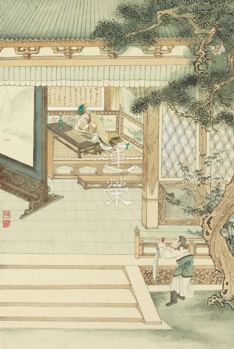

### 孝經圖簡說(五) —士章

圖：江逸子‧文：時哉

讀聖賢書之士

盡孝盡忠之行

家庭利樂之氣

保家衛國之教

士章第五

士章是孝經的第五章。士可以說是讀書人，也可以說是國家基層的公務人員，士在家中懂得愛敬父母親，辦國家事情時，懂得將愛敬之心，發展成對領導者的順從，當然這樣的順從，不是盲目的順從，而是能夠如法的配合上級，並與同僚合作，能夠打團隊戰發揮團隊意志，這就是士的功德。

這樣的士，他的品格與能耐是如何養成的？江先生的畫作裡面，將這位讀書人，回到家裡面，如何經營家庭作為場景。這位士的右邊是自己的父母親，兩位老人家開懷著相望，從父親的拄杖與母親的外相，看出年齡已大，母親的左邊是妻子，夫婦倆共同事奉高堂，讓父母笑得開心。美滿的家庭不只是讓父母有衣服穿、有食物吃。

歷代的孝經畫作，都是父母親坐在飯桌上，擺滿一桌豐富的菜餚，可是我們不禁要想，如果這位士的薪水不高，他哪有能耐天天讓父母親吃大餐？奉養父母親，重要的不是給父母很多的享受，而是讓父母親很快樂的過日子，從畫作中看到士的家裡面，生的孩子很多，古代講究的是多子多孫，六個小孩子當中，大的背小的，四位小孩梳著不同的髮型，這是畫家參考古代嬰戲圖而有的創作。家中沒有婢僕，或許收入不高，但是一家和樂融融。

這裡面孩子玩的遊戲是騎馬打仗的遊戲，擊鼓、揮著軍旗騎著小馬殺敵、保家衛國，代表這位士在家中，灌輸小孩子的就是對國家盡忠的概念，這個家庭裡面有孝、有忠，這就是一位能成為國家士的讀書人，懂得在家盡孝，在國盡忠，必要的時候要移孝作忠，懂得把在家庭裏面對父母的愛敬發展成為對國家的盡忠。

圖中的芭蕉表徵讀書人的虛心向學，一節一節的竹子表徵氣節，是一位讀書人應該要有的胸懷。

以上孝經的士章就告訴我們，一個讀書人他居家的能耐，必能在國家當公務員時成為典範，江先生這幅畫作，要呈現的是這樣的內涵。(下期待續)

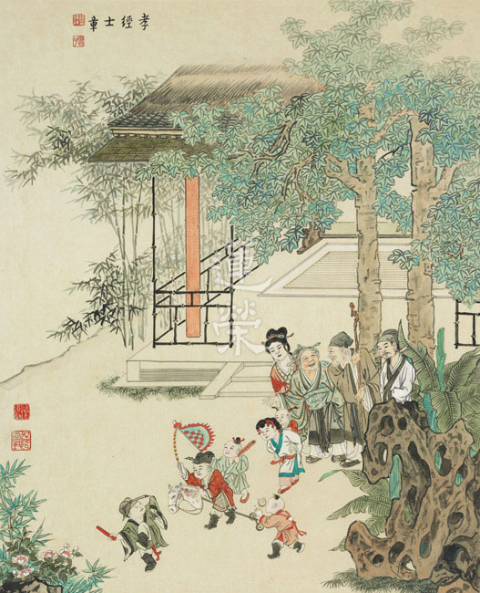

## 專題報導

### 致力推廣弘揚中華文化的正當生意人高本釗先生訪談紀要

*淨域整理*

見證佛教興衰

經歷時代變局

出版助成弘法

文化未來省思

前 言

一位老先生路過學會，總在門前的結緣品架上，取走新的出版資料，如《蓮榮》、《明倫》月刊等物。某天他進入學會，對值班人員表示：「想捐些善款。」約略的交談，方知他是出版界巨擘「新文豐」及「渤海堂」的董事長。因其認同刊物旨趣，又深覺堅持推行儒佛教育之可貴，便想捐些善款以為讚歎。這位耄耋者為高本釗先生，其一生奉獻於出版事業，尤其對佛教及傳統文化之蒐編印撰極具貢獻，學會遂興起採訪之念。經與協調時間定於二０一五年三月三十一日上午，預擬訪談題要十五則，先行送與高先生過目如次：一、高董事長為江蘇人，十六歲因國共戰亂逃往山東，後於一九四九年隨軍來台。可否請您說一下家庭背景，及來臺的因緣？二、您來臺後曾易名為「劉修橋」？是怎樣的情況必須易名？又得到哪些朋友的幫助過生活？三、初到臺灣，您曾在臺南鹽場服務，也當過教員，這在當時算是很穩當的工作，為什麼都一一離職他去呢？四、您現今的出版事業，與早期開設印刷廠有關，是什麼因緣讓你決心學習印刷技術？五、一九五五年，葉公超先生從日本帶回一部《大正藏》，東初、星雲、南亭、煮雲諸法師有心印傳，展開環臺宣傳勸印活動，最終獲得預約二百多部，決定自行辦廠印刷。策劃張少齊籌四萬元，從德國買進機器籌設印刷廠，但為何全都無償交給你經營？其條件是什麼呢？又為何取名為新文豐？六、《大正藏》印刷完畢後，您又印了一部《高麗大藏經》，這是怎樣的因緣？七、南懷謹先生曾以「做生意要忍得住氣、受得侮辱」來勉勵您，您經營印刷廠面臨困境時，是如何度過的？八、您捐《高麗藏》給中華佛學研究院，請問您與聖嚴法師的因緣？九、聖嚴法師有位俗家弟子江燦騰，在臺大歷史所研究時，因經常撰寫佛學論文得到關注，法師請您送部《大正藏》給他，可否說一說送藏經的因緣與感想。十、新文豐出版各類藏經，您曾說：「《大正藏》流通最廣，《磧砂藏》版本最佳，《高麗藏》校訂最好，《乾隆大藏經》字大醒目。」請問您如何蒐羅這麼多版本，其間有何甘苦？又您為何不重新排版印刷，卻採用照相製版的方式呢？十一、新文豐出版書籍分為「佛教、道教、文學、歷史、敦煌與民間文化」六大類，其皆以經典為主，這在市場行銷上是冷門的，請問您的著眼與目的為何？十二、您自一九九四年起，多次捐書給西北大學、徐州師範大學，又捐建母校後大營小學兩層樓教室一座，可否說說您思鄉回饋的出發心。十三、一九八四年，華嚴蓮社成一長老應美國加州灣區華僑之請設立佛堂，後因租處不敷使用，於一九八九年購地興建美國華嚴蓮社，您與長老及善導寺住持為主要籌資者，可否說明此一建社因緣？十四、民進黨執政時，有人高喊「中國豬滾回去」，對於這一反社會現象，您編印了《紮根臺灣六十年》叢書五冊，編述大陸來台小民一０六人的血淚故事。可否說說這其中的人物，及編撰中的際遇。十五、請問您對無盡燈文化學會有何看法與期勉？

貳：訪談紀要三月三十一日上午九時四十分，林老師率一行五人，從學會出發步行前往「新文豐(臺北市羅斯福路一段二十號八樓)」，於五十六分抵達公司。此處雖名為出版社，但格局就像是個圖書室，整齊陳列著六十年來所出版的書籍，尤其是精美的藏經與敦煌寶藏。經客服人員通報，高董事長(以下簡稱高董)出面接見我們，入座後彼此互贈書刊，真可謂是以文會友。高董首先表達歡迎之意，其次簡說捐款的始末，由而依著先前送達的擬問，自述來台的六十年人生經歷。綜理如下：高董出生於民國二十二年(一九三三，以下統一使用西元記年)，為江蘇省徐州市豐縣歡口鎮人，此位處於蘇、魯、豫、皖交界處，歷來為兵家必爭之處；右臨沛縣，為漢高祖劉邦的故鄉。家裡有地百畝，父親為私塾小學校長，因逢國共徐蚌會戰，全家人北逃到山東境內，父親於東北過世，次年哥哥尋得遺骸安葬。一九四八年，進入山東省魯南第四臨時中學就讀，全校約有四千多人，杭立武先生為教育部政次，負責處理流學生問題。因戰亂而至南京，又從南京到蕪湖、宣城。當時有親戚劉永清在上海當上校團長，考量軍人有飯吃，於一九四九年三月前往淞江投靠，駐在上海北閘一地。時年僅十六歲，吃飽無事可幹。當時白崇禧為華中勦總，共軍渡江後部隊一一敗退。五月，劉上校告知青年軍二０七師招兵處欲往臺灣招兵，便一同搭中興輪前去高雄，再轉基隆到臺北，住在中華路西本願寺附近。後又隨劉副官至廣州招兵，住在仲凱農工學校；繼而再往衡陽、韶關等處招兵。當時部隊吃空缺嚴重，實際上是有官無兵。最後回到臺灣，住於北投、林口一帶。一九五０年中，感於軍中發展無所作為，便私下脫離軍伍。

經同鄉劉修保先生的同意，冒充其弟「劉修橋」之名申請身分證，直到一九八０年才更正回來。當時有批流亡學生在澎湖，本想前往馬公就學，因旅費不足加上考量戒嚴恐被抓回處分，便決定前往臺南七股投奔王家誠先生。王先生在七股鹽場擔任場長，為劉修保在天津的老友，便安插他在鹽場擔任臨時工。一九五一年春節假期，他前往臺南機場探視親友胡安業；收假復工時，總務科長怪罪他未盡輪值之責，但其認為並無事前告知，於是離開鹽場，在佳里、岡山等地從事粗工。年底，同鄉周少庭先生介紹進入鹽警隊，開啟七年的查緝私鹽警務生活。擔任鹽警每月有兩百多元的薪資，扣除伙食費與偶爾接濟劉修保先生外，錢大都用來買書自學進修。他有意報考軍警校，但主官多番禁止他投考，便於一九五五年以眼疾為由請辭。離開鹽警隊後，表哥胡承義介紹他到屏東空軍子弟小學任教，經學校評測後委以代課老師。惟代課老師的收入不穩定，以為非長久依頓之處，便決定往臺北發展。

思及古諺所云：「萬貫家財不如一技在身」，便思尋個具發展潛力的工作，一切從學徒開始。到臺北，他投靠於以送報為業的表哥杜朝君，雖然積極看報紙找尋工作，但因對閩南話不熟，謀事著實不容易。當年秋天，在省農會工作的朱伯伯，介紹高董到峨嵋街的銘華製版廠當學徒；老闆孫先生為一敦厚的山東人，曾到日本學習照相製版技術。製版廠分照相與爛版兩個部門，他除專職於照相部外，也自發地學習製版。學徒的月薪四十元，雖管吃住但是沒有假期。學得製版技術後，經孫老闆同意出外闖看，投身於漢中街一家製版廠，因人手少什麼事都得做，未久因與老闆不合而離開。一九五七年，昆明街新藝製版廠成立招人，便與友人夏超、吳鈺良等前去應徵，這家廠由出家人所投資，包括東初老人、南亭長老、煮雲與星雲法師等，主要承做北投佛教文化館《大藏經》的印製工作。老闆鐘先生不熟於印刷，便請高董擔任平版照相工作，由夏超負責對外業務，月薪已達一千五百元以上。一九五九年，《大藏經》印製已告一段落，新藝的客源並不多，高董開始有創業的構想，以所攢的五萬多元，買入一部二手照相機臺，並訂製一些器材，於西昌街一四七號前的工廠，開設「文化照相製版公司」，初期有八名員工。照相製版主要出版古籍與書法，當時的佛教高僧將印經工作交給高董負責，因此公司逐漸成長，後續接下遠東、正中、商務等大書局的出版工作。萬事起頭難，創業初期歷經了許多磨難，先有廠房煮油墨不慎失火，繼有鏡頭無故遭竊，後有資金調度的壓力。雖然這讓高董感到人心險惡，但銘華製版孫老闆與廣文書局王老闆的大方接濟，卻讓他感恩之情永生難忘。

當時為爭取生意，公司應客戶要求浮開發票，但到了報稅時就無錢繳稅，只好於一九六一年底關閉工廠。隔年，與朋友合資在西園路一段八十八號設廠，因皈依三寶拜南亭法師為師之故，由道安長老為新廠題名「新文化影印館」，有員工十二人。高董年輕氣盛行事衝動，隨著業績蒸蒸日上，卻也得罪了不少人。有一員工不慎遭機器絞斷手臂，雖他盡全力醫治照料，仍受到小人挑撥離間，告至法院惹出一場風波。當時國學大師南懷謹勉勵他說：「在商場做生意賺錢，是要忍得住氣、受得住侮辱的。」為此，在小冊上寫了篇〈忍辱波羅蜜〉，以此惕厲自己。為了傳承中國傳統文史哲學，於一九七三年成立「新文豐出版公司」，一九七八年位於羅斯福路一段廿號八樓的南門營業部(今渤海堂文化)開幕，秉持「有學問的資料庫、求學問的好資料」的精神，致力於為研究中國傳統文化的學者與愛好者，出版珍貴文獻資料與專業學術著作。

在佛教文化出版方面：初始不畏艱難地出版了《大正藏經》，繼而又陸續印行《卍正藏經》、《卍續藏經》、《高麗大藏經》、《宋版磧砂藏》、《明版嘉興藏》等藏經，除讓治學者得以方便研究外，更能彼此互校互補。一九七六年，松山寺道安長老提議印製《乾隆大藏經》，此為中國漢文最後一部木刻版大藏經，計收入一六七五部佛典，分為七二四０冊，十冊一函裝，共七二四函。經多方訪閱所藏之香港東林念佛堂，終於一九八三年發心籌印新編縮本，全套依千字文字序編號。此經字跡雖大但印刷不清，經三年按冊檢點逐字描修始完備，待印刷出版時已是一九九二年了。隨著藏經的出版，高先生又精心規劃一套包括文學、思想、歷史、傳記、藝術、研究方法與社會關懷的《佛教文化叢書》，祈願透過這一薰染讓社會更美好。在發揚中華文化方面：高先生不僅熱衷於佛教文化的傳播，對於整理發揚中華固有文化遺產亦不遺餘力；其對新文豐出版公司的自許是─「成為有學問的資料庫，是求學問的好資料，為大圖書館的必藏書，能供學林研考與珍藏。」

基於此一目標，從一九七七年到一九八六年間，分三次輯印《石刻史料新編》一套九十冊，在一千零十種資料中，包括了一般地方、目錄、題跋類，及近世流傳之金石文獻與重要著作，對於石刻文化的保存甚具助益。另秉於「出版人要有一股傻勁，好書不一定賣錢，但要有文化價值」的理念，費時五年耗資四千五百萬元，蒐羅編印一套百四十冊的《敦煌寶藏》，成為世界各漢學機構及博物館的重要館藏。此套編書緣起於張清揚女士(孫立人將軍的夫人)的提介，遂於一九八一年與中興大學文學院長黃永武博士合作，將散失在海外的敦煌遺卷，進行全面性的蒐整、編目與校印，套書問世後受到世人的大力讚揚，並成為當代最具學術研究價值的典籍。一九八六年進一步編印《叢書集成新編》，此係現代儒藏之大成，計收錄叢書百部約二萬卷；次年再選清末至民國三十七年間之作，收錄一百五十部實用罕見者。此一彙集歷代儒者著作，合經史子集於一爐的大部頭工具書，深獲海內外漢學界好評。除外，又創辦《新中華雜誌》，聘請當時優秀的博士生張劍寒、朱宏源等撰寫專欄，今皆已成為知名學者。當前傳媒蓬勃發展，即便正派雜誌經營不易，但每年仍出版三期，每期印製八千份。二００二年，國學大師饒宗頤(一九一七-)擬整理出版《二十世紀學術文集》，特別請高董承擔出版重任。此文集約千萬字，計分十四項，以十八開精裝成二十冊。因內容包括甲骨文、簡帛字等文史經典，除特別敦請何廣棪(香港中文大學新亞書院教授)、鄧偉雄(饒之女婿及香港大學文學博士)等十多人參與排校外，大師亦親自校訂，學術鉅著終於次年堂堂問世。

一位事業成功的男人，背後必有默默持助的女人；這於高董當然也是如此。十五歲因國共戰火，過著顛沛流離的生活，對於家庭的溫暖自有一份渴求。孑然一身來台的窮小子，與白雪珠女士結縭五十年(一九六五-二０一五)，這令人稱羨的藍寶石婚，正是從經濟拮据中牽手一路走來。當二男一女陸續出生後，妻子即辭去工作在家相夫教子。有人問他：「怎麼教育孩子？」他謙和地說：「身為父母的我們，要讓孩子先學會認識自己，而後再依性向發展，父母所扮演的角色，不過是從旁輔導而已！每人頭上一片天，就讓他們飛在自己的天。」在創業的路上，要特別感恩許多長輩與朋友的護持，才有今日的「新文豐」。古語說：「受人點滴，湧泉以報。」又說：「摘花的手把花送出後，才能指間留香。」因此，對於佛教文化的推廣、學術用書的捐贈、偏遠小學的興建與大專青年的培養，更是不遺餘力。訪問末後，高董帶我們參觀所出版的陳列物，和悅地說：「喜歡哪一本，可以帶走喔！」如此，更見其致力文化推廣的用心。俗諺云：「殺頭的買賣有人幹，賠錢的生意無人做。」惟新文豐多年來不計盈虧，大力出版多種叢書，其廣受學界好評與信賴，完全是堅毅的個性使然。他自幼秉承庭訓「堂堂正正」，經商後即立志規行矩步，要做個「正正當當」的生意人。回首來時路，他全心推廣弘揚中華文化，自覺正當無愧於天地，也正是我們特訪加載之所在。

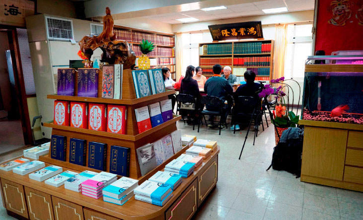

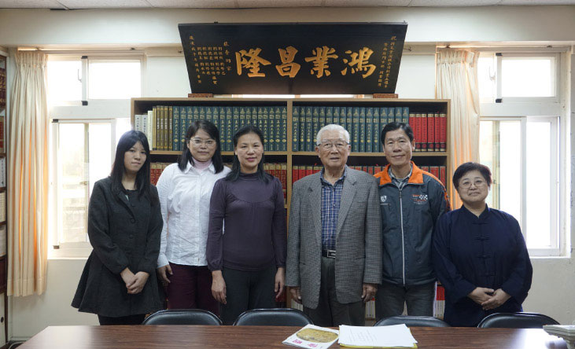

## 活動報導

### 二○一五年大專講座—佛說四十二章經考題解答(下)

*編輯部*

示道引導大慈悲

有情少力脫生死

涅槃安樂不休息

任運利生是所願

三十三、學佛首在建立自信心，其行相為何？何以佛要我們不可相信自己的心意，有懷疑心(疑自、疑師、疑法)如何成就？

**答：** 學佛法要相信自己能夠成佛、要有正確知見皈依三寶，得傳承的信心；若疑自己沒有能耐成佛，疑師沒有能耐指導我修學成佛之道，疑師所傳之法非殊勝正法，這些都是學佛嚴重的障礙，這三種疑惑修學時絕不可有。此處要我們不可相信自己的心意，是指未證阿羅漢果乃至未證初地以前，皆未破俱生執，遇境逢緣會生愛憎，故不要相信自己有面對境界的能力。

三十四、修道之人(特別是出家人)，如何遠離女色，反之亦然？

**答：** 勤修戒定慧、息滅貪瞋癡的修道者，要遠離女色；當觸碰到女性時，要觀想眼前接觸的女性就像我的家人一樣，我愛護我的家人都來不及了，怎麼還會想對她非禮呢！或是觀想淫欲過患，離欲功德，或修不淨觀，或修白骨觀，究竟處是修學空性斷淫種。

三十五、修道者如被乾草，見火須避，此比喻在說明什麼？

**答：** 六根如同乾草，六塵如同烈火，根對塵起貪瞋癡等妄念如著火，乾草若沒遇火燒不起來，烈火沒有乾草的引發也不能自己燒，修道之人遠離欲境就像避火一樣，為的就是不要點燃煩惱之火，否則火起會燒盡之前修行的功夫，前功盡棄，唯有避欲才能遠離火之害。世間之人也如被乾草，但是因為無知如小兒，所以火燒起來才察覺到，此時想避也來不及了。

三十六、迦葉佛偈有斷淫之道，何以是觀思想了不可得？

**答：** 修道必須去五欲，五欲之中又以色欲最難斷。色欲從哪裡來？淫心從哪裡來？迦葉佛的偈子告訴我們以空性的正見來斷除淫欲乃是最究竟。如果能生欲望的心有自體性，那麼不用觀待對象，對著醜陋的畜生也能生淫欲；如果使人起淫欲的對象有自體性，那麼任誰看到這個對象也一定會生淫欲心，所謂沉魚落雁，可是現見並非如此。

其次，能生淫欲的心是觀待思心所及想心所而起。淫心是對著女色及對境界取相的想心所，取其美相而由思推動，淫心生起在境界上嗎？在思心所嗎？在想心所嗎？淫心若在境界上，則不用觀待思心所的計慮籌謀就能生淫心，聖人遇到女色一樣起淫心，因為淫心在境界上。若淫心在想心所上時，若無境界可取相，如何能生想心所？想心所尚且了不可得，淫心又在那裡？

只是取相而知，若無計慮籌謀的思心所，則何來淫心的生起，聖人亦知女色生起，但無思心所推動，故淫心不生，且以思心所觀察不淨，自體空等，則淫心從何而生？無境界可得時，試問如何生淫心？斷淫之道在斷淫心，而斷淫心之法在尋覓淫心的自體性，連微塵許自性都不可得，因為淫心由思想來，然「思」與「想」的自體性都了不可得，淫心又何嘗可得些許的自性。

三十七、憂怖之形象為何？從何而生，從何而斷？如何斷？

**答：** 所謂憂是患得患失，對於喜愛的想追求，得不到時輾轉反側，憂慮不已，就算得到了，也不能安心，因為害怕失去。恐怖由憂慮而來，最恐怖之事就是死，對死亡的恐懼害怕不是死亡本身，而是死後的墮落受苦。若死後投生到比現世更好之處，有何可怖？所以憂和怖都是從不明事理而來。妄認我愛而對所愛產生欲，因為欲而有患得患失之憂，因為憂而生恐懼害怕，所以若要斷除憂怖必得除根，離開貪愛才是斷憂怖之源。

三十八、披甲精進之行相為何？其殊勝處為何？

**答：** 披甲精進：鎧甲是誓願甲，一位有正見的人去穿鎧甲，在作戰中保護生命，並且以善巧方便破敵，發出願力以後，會意志堅定，堅持到底，可以為了要度一位有情眾生，到地獄無量劫去陪伴他，度他學佛、成佛。這些膽識來自於般若智慧，以大悲心及廣大行的善法入地獄，利益有情內心生起極大的喜悅，並感得地獄的清涼。沙門學道，由於具足正見，故能堅持其心，精進勇銳，不畏前境，破滅眾魔，而得道果。

三十九、修行要不急不緩，其形象為何？如何以喻解了？然又說要精進用功，此云何通？修不上退轉就好了，有何可怕處？

**答：** 修行急，是指用心很切，用功很緊急。心如琴絃，調之不高不低，安然適中，即得之矣。人學道的方法，應該好好地調身、調心，不要令身心或者太急切，或者太鬆緩。所謂「緊了繃，慢了鬆，不緊不鬆才成功。」

修道必須先讓心境保持清淨的狀態，既不太急躁，也不太懈怠，就這麼一天一天，平平穩穩的，在很清淨、快樂的情況下，一步一步地善知識的引領下去，深入教法，提升智慧，不退卻道心。

佛在生活中隨手拈來，用彈琴做比喻，彈琴時，琴弦如果鬆緩了，就彈不響。琴弦如果太緊，如此琴弦就會斷。琴弦鬆緊適中，就能彈出的各種音調，聲音會很和諧悅耳。修習佛道也是如此。

還有一句話：「學佛一年，佛在眼前」，一個剛學佛的人，發大心，每天要怎麼樣拜佛，怎麼樣誦經，日夜不停地在用功。一天二十四小時還嫌時間太少了，恨不得是三十六小時，或者四十八小時，整天整夜非常的精進。這一年當中，佛總是在他眼前，從早到晚一直在心中陪伴著他。可是，由於太急，太辛苦，最後受不了！佛已經離他很遠了。而「學佛三年，佛化雲煙」，這時，更辛苦了，所以佛已經化成了雲煙。所謂「初機大菩薩，二年自了漢，三年都不幹，四年風吹散。」

雪公云：退行必牽於反行之力，既牽於反力，必背乎道，而不為善矣，蓋凡學道者，守戒皆行於勉強，一旦退而不守，舊惡習競發之，如水之決堤氾濫，所造惡業，必超乎常人。隋煬帝曾師事智者大師，退道以後，竟敢弑父淫母，武則天亦是佛徒，後世所誦之開經偈，即是武氏之作，其學不無心得，既退其行，罪業昭昭，是皆加罪之明證。清淨安樂，道不失矣，清淨不染欲塵也，安謂身心調適，如此自得法喜，是謂之樂，樂道自不失道。

四十、 學道如何以鍛鐵成精器之喻明之？

如同鐵匠要鐵礦鍛煉成為器具，必須先將之熔化，去除其中的雜質，最後鍛鍊成為不同用途的用具。此時才能算是製作出精良、耐用的器具。

學道之人，如同煉鐵的道理，必須去除內心的垢染，將煩惱去除，使自己成為法器。

四十一、離八無暇得十圓滿對修道者的重要性？並述八暇十圓滿的形象？修道要修什麼道？

修道必須要具足順緣，否則障礙重重，無法修道。而八暇與十圓滿是修學佛道最好的形象，果然能認真學佛，會很快的成就。而所修的道即是解脫與成佛之道。

無暇即沒有閒暇，所謂的八無暇，分為人的四種無暇，以及非人的四種無暇。

其中人的四種無暇：(一)邊地：佛弟子走不到的地方。(二)根缺：盲聾喑啞、斷支節等。(三)無佛出世(佛前、佛後)尤其是滅法時期：沒有機會聽聞佛講法。(四)邪見：妄執無前後世、業果三寶，不能信解佛法。

非人的四種無暇：地獄、餓鬼、畜生，第四種、一說為北俱盧洲：人壽千歲，貪著享樂，不受教化，聖人不出其中，不得見佛聞法。另一說為長壽天：為欲事散亂的諸天。

離開八無暇則得八暇，即生為人，且生在佛弟子走得到的地方，根具足、有佛出世，並相信三世因果、三寶，有能力也靜得下來學佛者。

但具足八暇還不夠，還要具足十圓滿。

十圓滿：分為內因及外緣

內因：（一﹚生為人(在異熟果上沒有障礙)；（二）生在四眾弟子能到達之處(在環境上沒有障礙)；（三）根具足(在身體上沒有障礙)；（四）未做或未教他人做五無間罪業(學佛在思想上沒有障礙)；（五）相信佛法是世間及出世間善法所生之處。

外緣：（一）有佛出世；（二）佛或佛弟子還在宣說正法；（三）佛還未入涅槃，般若修學法還可以聽聞；（四）有能力修學，還能跟證得涅槃的聖者學習(即在佛世的團隊中學習)；（五）有功德主提供資具。

而今我們雖然大多不具備上述條件，然傳承還有，說正法的人還在，願意宣說正法，而我們願意在正法上修行，由此而言，亦算具足。

四十二、三藏十二部的體性為何？如何配合三學？如何於三學中得成就？

三藏十二部的體性是戒定慧三無漏學。三無漏學是通往無漏的學處，戒定是資糧，最後以空性的智慧破煩惱障、所知障，成就無漏。

戒是要防非止惡，屬於律部，體性是諸惡莫作。

定屬於經部，能在讀經時安住，取代世間的作意，取代世間的思慮妄想、攀緣分別，而引發對佛經所說善巧的功德生起好樂，能眾善奉行。

慧屬於論部，緣念經文可以生起定力，但生慧需靠論。議論經、律的要義，最能開慧。能夠讓自己意業清淨無染。

四十三、人命無常粗相的修學法？細相的修學法？有何好處？

**答：** 無常觀的修學，透過對人命的觀察中，體會無常，知道輪迴相續生死之苦，而生起欲脫離三途之心，而欲脫離三途，必先對斷除煩惱，然無常觀的修學，並未能真正斷除煩惱，透過無常觀，進一步所要引導的，乃是空性般若正見的修學，方可真正了生脫死。

（一）粗相無常修學法

人命是否可以成立明日不會死的因？假設不死的因為「年輕力壯」，但現見許多年輕猝死案例，可見年輕力壯，不能成立明天不死的因。又以「無病身健」為因，眼見亦有此種人明日橫死等等。可見這一世的果報，是來自於上一世的引業，這一世的造作，並非是明天存活的因。所以人命可用在今日，此即粗相無常的修學，故善用今天的時間修學，菩提心就在今天發，能帶來未來無限的好處。

（二）細相無常修學法

然生命是鼻息的吐納之間，一息不來即為來世，推比而知自己和所有的有情一樣，當一口氣不上來時，世間的這些妻子、房舍、財寶等等，皆帶不走，即便是最難捨離的自己的軀體，也帶不走，唯有「業」能隨身。

（三）無常修學法的好處

粗相無常修學，使人把握當下，對有限的生命做更積極的掌控；而細品無常修學，則使人了解五蘊身心貪著無益，只有講究業的造作，才能有輪迴中得到安樂，或是脫離輪迴的繫縛。

而業的造作，則特別是在善業的造作，尤其是造作無漏的善業？諸如跟隨善知識的學習、發菩提心的修學、空性智慧的修學以及皈依三寶的修學，唯有此等的觀修，方能得到暫時的安樂或究竟的安樂。

四十四、佛說法分為大小、頓漸、事理，其相為何？何以用食蜜比喻？

**答：** （一）佛說法行相分

大小：「大」指大乘佛法，「小」指小乘佛法。大小乘以「發心」做區分，大乘佛法詮釋的是如何發菩提心，行菩薩道，破二障而成佛。小乘佛法詮釋的是以發出離心解脫出三界。

頓漸：「頓」就勝義諦通達的一分，「漸」是無法通達勝義諦，須循序漸進慢慢了解。

事理：事指事實，對相、用而說；理是理論，對理體而說。

佛說法或據大說小，或為頓說漸，或因事說理，皆因應眾生聞法的根機，為說真諦而運用各種善巧方便，或應用各種善巧方便來開演真義，而眾生各取其受用的部分。

（二）食蜜之喻

食蜜以喻佛說法心意，無不以利益眾生，使眾生成佛。故以諸種方式，開演最究竟義趣，就這一分說佛語之中邊皆甜。而未能通達佛語，僅據一隅而宣說，或者批評，皆是未能通達佛語心意之人。

四十五、沙門行道以磨牛之喻在說明什麼？

**答：** 磨牛就是轉磨的牛，雙眼被蒙住，整天依著磨來繞行，如果計算它走的行程，雖然有千里之遠，其實沒有離開過它當下所處的地方。

這個比喻所顯的法相：沙門的身體作一大堆的善法，但心態如果不是為了修學般若來求解脫的話，那在解脫的這條路上還是沒有離開過當下所處的地方；而且，磨牛的雙眼被矇住，用來比喻沙門的心眼被矇住，因為沒有看到求解脫的重點在於般若的修學。

不是不要身行，而是身行如果不是為了幫助內心生起對般若的體悟，那這個身行對於解脫就是沒有用。例如，念佛，所謂念佛不改心等於說空話。念佛的目的是要往生淨土來與諸上善人聚會一處來修學般若。相反，若念佛只是為了求發財、求事業、求平安，那每天十萬聲對於解脫都是沒有用的。

四十六、為道為何以牛負重行深泥之中？如何出淤泥？

**答：** 「牛負重」，運貨的牛身上揹負著沉重的貨物，比喻行者的舊業新殃以及舊業新殃所成的痛苦。業成為能繫縛，果報身成為所繫縛，繫縛便是沉重的感覺，表現在修行沒勁，對世間有諸多的追求，總感覺疲憊，即使眼前得到快樂，但也是苦多樂少。

牛行走在深深的泥潭當中，唯一的活路便是用盡所有的身力心力出深泥。深泥用來比喻情欲，行者在情欲的深泥中，唯一的活路就是再累也要努力地、趕快地不斷朝涅槃去走，否則只剩下輪迴及墮三塗的死路一條。

牛雖然極其的疲憊但也不敢向左右兩旁顧視，比喻行者在修道的過程一定會出現各種各樣的障礙，而令行者產生極其疲勞的感覺，但是心裡清楚如果不繼續修行，只會在情欲中越陷越深，所以此時只看到涅槃的彼岸，無暇顧視與涅槃無關的各種境界。

牛到了岸上，腳不再踩在淤泥中才可休息。比喻行者得到苦因苦果的滅，不再身處情欲堆之後，才可休息。

「直心念道」，便是出淤泥的方法。直心是一種誠心誠意，一心一意地看著涅槃的目標，心心念念都想著離開情欲獲得解脫。

四十七、三界內的安樂統說為何？佛如何看待？有何好處？

**答：** 三界內的安樂，統說為王侯位、金玉寶、美衣。佛視王侯之位如過隙塵，指王侯位無足輕重，如坐擁三千大千世界的天王，或在法界運行無礙之人回觀王侯位；佛視金玉之寶如瓦礫，對比佛的富貴，金玉寶簡直就如瓦礫一樣；佛視紈素之服如敝帛，對比天衣，即使是最好的人衣也如破布一般。

如此看待的好處在於讓凡夫厭離生死的苦與樂而生出離心。

四十八、若能發大乘心則回觀大千世界與阿耨池水為何？為何能有此心量？

**答：** 若能發大乘心則回觀大千界如一訶子，回觀阿耨池水如塗足油。因為當以法界為所緣時，回觀大千世界與阿耨池水就會變得如此微不足道。

四十九、菩薩度化眾生的方便門何以是化寶聚？佛的果地覺何以是夢金帛？六度乃成佛方便何以是眼前華？降魔的禪定何以是須彌柱？破二障的涅槃何以是夢醒？顛倒與正見何以是六龍舞？法性何以是平等又似一真地？正、象、末、滅乃法運四相，何以是四時木？

**答：** 菩薩度化眾生的方便門似化寶聚，因為必須觀待眾生才能生起度化眾生的方便，就好像化寶聚魔術般的幻化；佛的果地覺似夢金帛，夢中的金帛必須觀待夢心才能夠顯現，佛的果地覺也必須要觀待破煩惱障所知障的心才能夠顯現；六度乃成佛方便，似眼前華，眼前華即是空花，必須觀待眼翳才能顯現，六度也必須觀待眾生才有六度，例如布施度，必須觀待眾生的不足才能生；降魔的禪定似須彌柱，禪定即是依止正確的法義生起輕安而能如如不動，如須彌柱般不能被撼動；破二障的涅槃似夢醒，破二障後實有的境界不見了，如夢醒後夢境不見了；顛倒與正見似六龍舞，顛倒見是六根對六塵生起六識，而執境界有自體，正見是六根對六塵生起六識而通達境界自體空，六根對六塵生起六識，就如龍舞般變化莫測；法性是平等又似一真地，法性空寂一切平等，如平地沒有高低起伏；正、象、末、滅乃法運四相似四時木，法運必須觀待眾生因緣，如樹木觀待季節而有不同的呈現。（完）

### 二○一五年八月濟南大型公益講座　山東經濟廣播電台專訪(一)

*編輯部*

國學文化寒冬去

春回大地猶料峭

諸多疑難待消融

旭日東昇指日待

前言

山東經濟廣播電臺，品讀論語節目主持人李曉進女士，於八月二十一日專訪唐瑜淩老師及其師資團隊，介紹學習傳統文化應該具有的基本認知。今將採訪內容做一整理，學會網站(http://www.wct.org.tw/)當中亦有專訪可聆聽，歡迎舊雨新知多多指教。

採訪內容

一、學習《論語》對現代人的意義與好處？

**答：** 如果學習《論語》沒有好處的話，這些孔門的弟子不會去親近孔子來學習，而且孔子把他們培養成才，很有未來的出路。例如：子路、冉求和閔子騫都曾在季孫大夫家做官，宓子賤、子游也在魯君屬下做過縣長，都很有政績，子貢那更是不用說了，以其外交之才解決魯國危機。

《論語》二十篇有四百九十八章，告訴我們品格教育的重要，其中有這些人物的典範，像子貢是如何成為一個成功的外交家，冉求是如何成為一個成功的內政家，子路是如何成為一個成功的軍事家，仲弓是如何成為一個出色的政治家等等。如果我們把《論語》中這些相關的條文集合起來，做一個架構便可以瞭解。

《論語》中不光告訴我們怎樣經營品格，還有怎樣為政、怎麼辦教育，以及對於內在如何做情緒的管理，怎樣去找到存在的價值；對於外在出路，如何與人相處、人際溝通、辦事掌握分寸，與他人合作……這些在《論語》當中統統都有。

當今日本的企業家是一定都要讀《論語》的，像松下幸之助、索尼、企業之父澀澤榮一，他們都強調要讀《論語》才能辦好企業。

孔門弟子也是當時各國為政者爭相網羅的對象，孔子六十八歲到七十三歲在魯國時，季孫大夫跟魯哀公都曾向孔子要過人才，請他的學生到國家來當官。可見，孔子是個公認的標誌，國家要找人才都要到孔門裏去找。請問現在哪個老師能把學生教成這樣，可以讓國家領導人來找他要人才，現在的老師有像孔子的這種能耐，教出來的學生可以直接被國家領導人納入重要的職位，去推動政策？

二、《論語》中有功成名就的方法嗎？

**答：** 性與天道及文章的學習，即是功成名就的方法，例如曾子以一個魯鈍之才，卻在孔子座下學習，在孔子過逝後，曾在楚國當過上卿大夫，想想看一個魯國人到楚國可以做到這麼高的位置。好比中國人去新加坡可以當總理，或是去其他國家當這個國家的領導人。如果沒有孔子的教學，曾子哪有那個能耐呢？

三、《論語》中有人際關係的學問嗎？

**答：** 有。第一、在人際關係中，首重的就是自己的品格。如果不重視品格的建設，光搞人際關係，人家最多也就是和他關係還可以，但不會受人信任與重用。

第二、要注重見地。在交往時，人家發覺到你是很有才情、有見地的人，他就樂於跟你交往。

第三、交往的心態是利他。並不是說跟人交往當中是為了我的利益，儒家講「仁」，就是為了利他。

第四、懂得他人心裡的需要，這是人情世故的通達，《論語》中有關禮的詮釋即是。

第五、懂得周遭的環境的吉凶禍福。該說的什麼、不該說什麼的話，該進該退，都清清楚楚，這也是學性與天道及禮之後產生的能耐。

四、《論語》中的情緒管理是怎麼說的？

**答：** 我們一般的情緒有喜怒哀樂。在〈中庸〉有講「喜怒哀樂之未發，謂之中」，就是說這個人有能力對治他的喜怒哀樂，接著他還懂得「發而皆中節，謂之和」，就是說該發的時候，他一定要發，而且發得恰到好處。比如說，遇到人家做善事時，就要用喜去護持他；遇到他人為非作歹時，就用怒去對治他，或是用逃避去遠離他。比如說，孔子當年周遊列國，所到之國的君王並不是歡迎他，或者大夫並不是贊同他，孔子可能會採取逃避的方式離開這個國家，比如，晏子在齊景公面前進了讒言，孔子就很快離開了齊國，他知道這個環境是不能待的。

孔子是不怨天，不由人。無論狀況再怎麼不好，他也不會埋怨老天爺對他不公平，面對逆境還保持很好的心態，這是他「不怨天」； 「不由人」就是說不會埋怨別人給他很多的挫折和障難，這就是情緒管理。再來，孔子下學而上達，對人事的運作清清楚楚，「上達」知道唯有把情緒管理好、見地充實好、品格經營好，才能真正改變命運。

命運的改變，絕對不是操縱在別人的手裏，而是操縱在自己的情緒與見地，這樣才能去改變命運。

五、現代人心情焦慮、壓力大，該如何解決？

**答：** 一般人心情很焦慮，或是生活上感覺很貧困，都看不開。可是，我們看顏回是簞食瓢飲居陋巷，人不堪其憂，回也不改其樂。當一個人學習很有法喜的時候，他是可以克服生活的艱難、克服貧窮的。

閔子騫在過去讀書的時候，總能羨慕達官貴人，《韓詩外傳》裏面說，當他把書讀通時，就再也不去羨慕這些權貴，而是重在自己的品格充實、見地豐厚。在《論語》中記載，季孫大夫請閔子騫來做官時，他先考慮季孫大夫是不是一個好的領導者，是好的領導者我幹，反之不幹。當他發覺季孫大夫是個以下犯上的權謀之人，所以他說「善為我辭焉，如有復我者，則吾必在汶上矣。」，就是說他寧可接受貧困，但這官絕對不幹。如果現代人能學會這種情操的話，哪裏會有什麼貧困生活令自己失意潦倒。

富可敵國的子貢最佩服的人是誰？竟然是孔門裏最貧困的顏回，彼云：「賜也，何敢望回。回也，聞一以知十；賜也，聞一以知二。」這並不是子貢謙虛之言，而是說他連仰望顏回都不敢，不要說去較量了。可見，孔門教學的風範，絕對不是以貧富貴賤來分，而是以品格見地來論高下。在孔子周遊列國到楚國時，執政者子西大夫竟然覺得孔門裏面最了不起的人才，就是那個最不起眼的顏回。可見，他們也是很有眼力鑑賞人才。

當一個人有才情卻不得志，不但不怨天尤人反而樂天知命，他一定是一個有見地、有人生理想與抱負的人。對那種走順境的明眼人，回過頭來再看他時，會更佩服。子貢就是這樣佩服顏回的人，因為子貢知道顏回一定是在學問中突破他人生的瓶頸、思想的糾葛，必是一位有出格見地之才。所以，當這些弟子們重新去認定顏回的時候，方知孔子的教育能突破境界的繫縛，宏觀的看待人生，這才是孔門學問最高的價值，而且孔子也是這樣經營自己的人生。

坦白講，顏回並不是沒有出路，而是知在那種環境下，不但不能發揮自己真正的價值，反而會在世俗的汙穢政治裏面被利用，所以他寧可不要這個富貴，並不是他富貴得不到。在《韓詩外傳》中記載，當孔子問顏回，要不要推薦他去做官，顏回說不要，連想都不想，他只想傳承孔子的聖道。

就像雪廬老人六十歲來到臺灣時，深感文化的傳承比做官還重要，所以甘於淡泊（讀書、教學、興辦善法），把人生最後的歲月拿來教臺灣人，意味著告訴我們：在這個時代裡，真的給人家內心的出路才是自己真正的出路，至於外在有沒有出路，那要看環境許不許可，所以孔子說「無可無不可」。

學習《論語》的好處：

第一、孔門的學問是真的可以改變命運的。從《論語》中可見，在孔子的教學中孔門弟子統統改變了命運，一般貧窮的人是最讓人看不起眼的，想不到是被人最為重視的。像顏回、漆雕開、澹臺滅明，還有曾子的魯鈍，後面都很有出路的改變了命運。像《了凡四訓》一樣，當學問是讀到位，讀到方向，而且是有次第、有系統，而且有目標的學習，是一定會有出路的。

第二、通過學習，以文會友，會交到真心朋友。

第三、學習中很有法喜，人生中會少了很多不必要的煩惱。

第四、因為做出很多有價值、很有意義、對世道人心的貢獻，所以在一生中很多地方可以逢凶化吉，趨吉避凶。

第五、會像曾子那樣，在臨命終時，竟然不怕死。「戰戰兢兢，如臨深淵，如履薄冰。而今而後，吾知免夫。」是他臨終的心得，就是用道去經營的人生，走到終點的時候，好了！可以了！人生圓滿了，瀟灑的走了，這種胸懷在雪廬老人身上都看得到。

六、什麼叫做「無可無不可」？

**答：** 「無可無不可」，講究的就是一個對環境的觀察。環境許可，他就可；反之不可。可與不可，唯義是從。「唯義是從」就是說，真正能夠符合眾生利益的時候，他就可；反之，他不可。

七、雪廬老人是誰？

**答：** 雪廬老人就是李炳南老教授，山東濟南人，名艷，字炳南，號雪廬。是孔子第七十七代嫡長孫孔德成侍讀先生及孔府主任秘書。生前是臺灣中興大學、東海大學、靜宜大學中文系教授及中國醫藥大學黃帝內經教授，對儒釋道三家典籍融會貫通，並知行合一，一生致力於弘揚中國傳統文化。(下期待續)

### 神筆丹青郎世寧來華三百年特展略述兼述宗教情操

心器

來華供職傳教士

繪畫文采暗護教

情操感人蹟難沒

特展酬彼佳作功

國立故宮博物院（以下簡稱台北故宮）今年是九十歲生日（一九二五-二０一五）。又適逢義大利耶穌會傳教士郎世寧來華三百年，台北故宮典藏豐富郎世寧畫作，舉世皆知，故於十月推出書畫、器物與圖書文獻三處聯合大展「神筆丹青郎世寧來華三百年特展」，作為臺北故宮生日鉅獻，並呈現郎世寧在中西繪畫藝術融合所獲得的成就。

在介紹畫展前要先了解十五世紀開始（明末清初）的時代背景作為介紹：

明清之際，西洋傳教士來華及西學東傳，是近代中西文化交流的一大美談。

基督教各派在唐、元時代曾先後傳播於中國，但元亡後曾一度沉寂。到了明代中葉以後，由於地理大發現事業的進展，東西新航路暢通無阻，天主教的一派─耶穌會（SocietyofJesus）便派遣大量教士來華，因此造成明末西學東傳的一次高潮。

十五、十六世紀，羅馬天主教教廷為擴大影響力，極力向亞洲擴展輸出宗教。地理大發現後，葡萄牙、西班牙等國開始積極向亞洲拓殖，大批傳教士被派到東南亞、東亞從事傳教活動，其中影響較大的是耶穌會教士。以上是時代背景略述。

在清康熙中晚期，清聖祖希望召募有才藝的西洋人，包括醫學、科學、會製玻璃及琺瑯器者以及畫師進京服務。郎世寧就是在此背景下，從歐洲到中國度過了五十年的歲月。

郎世寧（GiuseppeCastiglione，一六八八年七月十九日－一七六六年七月十六日），義大利米蘭人，一七０七年，十九歲的郎世寧加入熱那亞耶穌會，並在當地完成為期兩年的耶穌會初學士修習後，便前往葡萄牙準備接受出國派遣，而郎世寧當時已是有名畫家，委託的人很多，故拖到一七一四年才出發，自此展開他未來在華長達半世紀的經歷。一七一四年四月十一日，郎世寧搭乘聖母希望號從葡萄牙里斯本出發，經歷了十六個月的海上歷程，在一七一五年到達澳門（因為是葡萄牙殖民地），同年底到北京，經歷康雍乾三朝，都在藝術繪畫上奉獻所學，於乾隆三十一年六月初病逝於北京；乾隆皇帝念其郎世寧功勞，親自為郎世寧撰寫木製並賞賜三品頂戴，恩賜三百兩白銀料理喪事以示優恤，葬於北京傳教士公墓。

簡單介紹完郎世寧生平事蹟後，以下三段分別介紹郎世寧在工作上的成就、與皇室上層社會的友誼、營救教友的宗教情操。

從郎世寧留下的豐富畫作及清宮《內務府造辦處各作成做活計清檔》記載，詳細記載了在圓明園如意館承應的各式工藝製作，包括：奉命以各種主題製作（銅板記功圖稿為代表）、與其他宮廷畫師合作（中年以後郎世寧畫主角中國畫師畫背景，以孔雀開屏圖代表）、為帝后妃嬪王公大臣畫肖像畫（如畫果親王允禮像等）、為帝后政治活動及宮廷生活留下寫真（如本次展覽祭神農壇等）、為皇家寵物及各類眷養動物寫生（十馬圖等）、為宮廷各類作器設計畫樣、參與各處宮闕建築設計樣稿……等。

郎世寧透過與權貴菁英交往（如本次展品四季花卉棋盤就是乾隆皇帝登基前，請郎世寧繪畫），發揮政治與文化影響力，進而減少、弱化，或至消除在中國遭遇的傳教阻力。這些舉動，或許多少帶有功利色彩，但另一方面看，處於禁教氛圍濃厚的環境說，與權貴菁英往來；這種方式與十五世紀來華傳教士採取「文化適應政策」與「上層路線」基本相同，藉此維護耶穌會集體利益。無疑是護教行動的必要策略。

在介紹郎世寧營救教友之前，先引述當時神職人員在往來信中對中國皇帝的看法：自傳教士在此立足以來，沒有任何一位皇帝比當今在位皇帝更多地利用傳教士們的服務，沒有任何一位皇帝比當今在位的皇帝更為虐待他們，也沒有任何一位皇帝比當今的皇帝更多地壓制他們所信仰的聖教……，這就是當時傳教處境的真實寫照。而郎世寧因為擔任畫師工作，深受乾隆皇帝器重；每當發生教徒受到迫害的時候，傳教團便會請郎世寧伺機呈奏。據考證有文書記載郎世寧最少六次上奏請皇帝赦免教友，內務府鑑於多次經驗，宮廷禁止郎世寧等傳教士畫家向皇帝奏陳事務；但郎世寧毫不畏懼，依然伺機向皇帝請求寬容基督宗教，也藉神職神員喪禮婉轉向皇帝解釋基督教義。雖然郎世寧也受其他神職人員批評，認為他不敢庇護受迫害的傳教士；但也有傳教人員感嘆，真想不到基督宗教在中國淪落到這種地步，只靠耶穌會一名傳教士畫筆才能救他。綜觀資料，郎世寧雖然工作是畫家，而本質是傳教士；郎世寧沒有忘記他的本質，往往在關鍵時刻都發揮一定作用，其宗教情操令人敬佩！

總結郎世寧一生自十九歲開始以傳教士為職志，終身不遺，讓人感佩。其二郎世寧以高超的繪畫技巧作為接引清廷高層入教的前方便令人激賞；最重要的是郎世寧十分清楚清朝皇帝對於西洋宗教的態度與立場，唯有謹慎、恭敬地為皇帝服務，努力實踐獻身教會秉持貞潔、守貧與順從的誓願。郎世寧多次參與轉圜教難，充分顯現勇敢無畏，虔誠搶救教務與生命的勇氣與毅力，正如同郎世寧墓碑的拉丁文提贊「於傳教事業極著功績，其宗教修養，亦頗昭彰」可做為一生的蓋棺論定。

徵引資料：故宮文物月刊391、392、393期，國立故宮博物院文創行銷處發行。

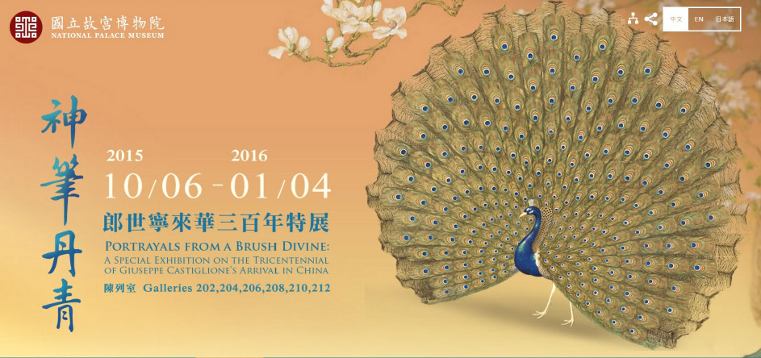

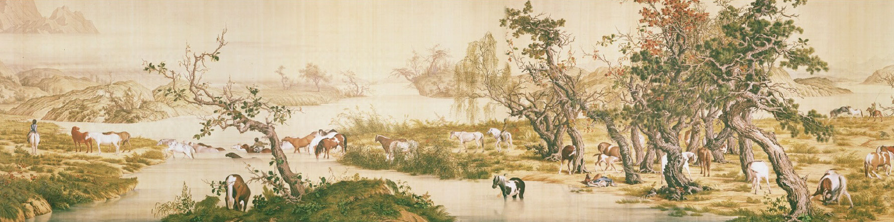

## 日常省思

### 嘆不盡人間母子情

愛蓮

瞬息萬變的業

各種果報的生

為公發心的願

因禍得福的力

元旦假前，忙碌地工作著，連日來莫名的心緒不寧與煩躁拋諸腦後，想著回鹿港省親的三天連假，雖然子女各為學、事業無法一起回去，想想老人家必仍然期盼著三天的熱鬧，對婆婆而言，少了人在高雄沒回來逗她的孫子，總還是天天念著他，惦記著他的好，錫堂也只能說待承軒考試後，帶她到高雄訪親舊及接孫子回來，不愛出門的婆婆即頻頻說好，期待著與孫兒會面。

收假北返(周日)晚上十點多返抵桃園即接獲高雄市派出所急電，承軒車禍傷重送高醫，頓時魂飛魄散，心中第一個想法是「兒子呀！你千萬抹凍出待誌，你會要阿嬤的命」，然後直奔高雄，車上聯繫姪女，請查問高醫方面狀況，得知承軒急診但清醒，請轉達要他與父母講話，後始稍稍放下忐忑不安的心情，記得在高速公路上長路迢迢，但不敢超速，想上有老，下有少，不能讓他們無依靠，心就平下來，到達高雄已是午夜一、二點，教官及同學都守在那邊等我們到來。

醫生稱他狀況有待觀察，但實際上問題是一天一天的浮現，因承軒外傷不多，但內臟有多重挫傷，他是從內到外，每一寸皮膚都有七到八分的疼痛，連呼吸都在痛，面無人色，期待每日最重要的會面時刻，但又怕聽到醫生所說的壞消息，醫生說怕他發燒，承軒就發燒，總之每分每秒都在煎熬，錫堂更是心力憔悴，還好有得到老師、學會及蓮友等的關愛，為犬子大力迴向，承軒的業力雖已結果，但不知他那來的福報，有如此多善知識的愛護，承軒的狀況尚未盡理想，煎熬中學習面對逆境，認清無常業力的可怕，但仍求佛加被，如母鹿肝腸寸斷，小鹿業果，能不傷母鹿之心平？

這段期間，家人從加拿大以及香港抵達高雄探視承軒，雖然是如此這邊的相聚，也非常感動，深感中華文化密切的天倫關係，所言不虛。

我們也隨老師的吩咐，發願供養大眾一月講座伙食、結夏安居齋僧法會供養大眾僧，發願親自帶承軒放生，並且誦念遺教經、護持啟蒙與江老師畫展。老師也交代要跟承軒說人生禍福吉凶的觀念，人生不僅僅是在自己理想的追求，更重要的是發心為公，對教法的充實讓自己對未來產生篤定的感覺。要發心為公，修學正法，求佛加被，命交由佛菩薩，將醫護人員當成觀音菩薩的不同示現，隨佛號機一句句不要漏聽，若還有命當成撿回來，餘生報效佛門，若無命則佛接引往生極樂世界！

有一天我忍不住在他面前掉淚，承軒聽到我聲音不對，用力地轉過頭來瞪大眼睛想看清楚我的臉，我只好趕快止住。他又聽說爸媽因停車位不好找，需要步行往返醫院，就緊張地提醒「千萬小心，高雄車不看人」，在我們離開前又再說一次，其實他說話間都要休息，會面間都是我們在說，承軒說不到十句就累，眼睛垂下來，之前身體每一寸從內臟裡到外肌都在痛，有點像地獄的苦，他也沒哭都忍著。但是他對當醫生的志向，牢不可破，希望用當大醫王的方向導他念佛，以修學正法，為公發心作為醫生的莊嚴，藉此行業引眾生做佛法與文化的學習，並將此次災殃做生死的學習，承軒也自發願做善法，對學會師長同儕很感激，激動。期望從小的啟蒙教育，曾往緬甸救災等善法，帶領承軒迎向光明的未來，莊嚴自己未來的佛果。

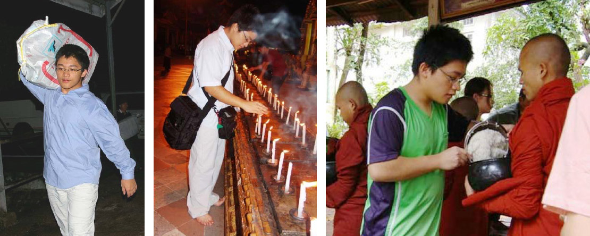

## 後記

### 年終回顧與展望

*編輯部*

大選亂中迎猴年

羊年有賴正法興

以友輔仁是其由

公心能令正法續

乙未年將至歲末，在過去的一年中，仍有許多大大小小的事情，似乎世界不是那麼的平靜。大環境的變化雖然難以掌握，有共同願景與志向的人們，仍然可以一起創造美善的未來。中華無盡燈文化學會在老師的指導下，經教的學習未曾間斷，大家互助合作，共同努力，以正確的知見廣造眾善，為自己、為社會、為國家、為世界，累積天下和平、災害不生、禍亂不作的基礎。時哉時哉網路教育學院的經營屆滿週年，本項重點工作仍持續進行，希望能在網路世界上發揮更大的影響；例行課程、兩岸講座、畫展導覽、念佛共修、拜懺齋僧等活動也不曾間斷，可以說是忙碌的一年，豐收的一年，是各種酸甜苦辣大家共同成長的一年。謹此報告過去一年的具體工作事項，相信丙申年必定能夠更上一層樓。

壹、例行課程（含啟蒙）及念佛共修：

一、中華無盡燈文化學會

*１．每週星期一，晚上七點至九點，開設「佛學概要十四講表講座」，現已講授至第十三表。*

２．每週星期二，上午九點半至十二點，開設「學賢班」，以江逸子老師七十二賢畫作，及《論語講要》作為教材，共同研學孔門聖賢之行儀、風範、內涵，本班課程至上半年度暫告段落。

３．每週星期三，晚上七點半至九點，開設時哉時哉網路教育學院「論語及孝經直播講座」，《論語》主題「孔門弟子─子貢」共四十三堂課，已經圓滿；現在進行中的主題為「孝道功行」。《孝經》則已經上至五刑章第十一。

４．每週星期四，上午九點，至下午三點半，舉行「三代共修」。共修內容包括了上午的念佛，以及下午的講座，今年已研討完《觀無量壽佛經》，現正研討《佛說十善業道經》。

５．每週星期六，下午兩點至五點半，開設「詩階述唐講座」，以雪廬老人之《詩階述唐》作為教材，學習唐詩之義理、內涵、情境、聲韻等，近體詩的部分業已講畢。

６．每週星期六，晚上六點半至九點，舉行「念佛共修」，分為成人共修班、大專班、啟蒙班中班以及小班，分別研學，並於晚間八點至九點，集合成人共修班及大專班，講授「人生大事─不能忽略的事實」，有關臨終關懷之課題。

二、台中市無盡燈儒佛學會

１．每週星期三，晚上七點半至九點，共同學習時哉時哉網路教育學院開設的「論語及孝經直播講座」。

２．每週星期六，晚上七點至九點，舉行念佛共修及人生大事研討。

三、中壢研學會

１．每週星期三，上午九點至十一點，舉行念佛共修及人生大事研討。

２．每月一次《論語》研討。

四、宜蘭研學會

每週日上午八點半至十一點半，舉行人生大事研討。

貳、互聯網經營：

「時哉時哉網路教育學院」（www.centralwonder.com）經營已滿週年，各地讀書會及學員們，能持續透過此平台學習經典內涵、了解啟蒙教育、拓展藝術眼界。去年十一月，「中華無盡燈文化學會」主網站（www.wct.org.tw）也正式重新開放使用，作為學會活動報導之平台。佛學專門網站「蓮榮」（www.lienjung.org.tw）也持續提供服務，定期更新文章內容和公告法務活動。

此外並透過社群平台FB，LINE，大陸微博和微信，與各地學員聯繫，形成共同學習經典文化的讀書團隊。

參、專題講座：

一、2015年01月21日，應邀前往台中蓮社明倫講座演講，主題為「你所不知道的雪公」。

二、2015年2月間，舉辦四次人才培訓班研討會，複習《百法明門論》。

三、2015年04月26日至27日，應邀擔任「孝治天下傳統文化高峰論壇」講師，講題「孝乎惟孝─由北宋李公麟到民國江逸子繪孝經圖說起」、「天下太平之根本–從關關雎鳩說起」、「恰似那陽春白雪的音樂世界」。

四、2015年04月03日至06日，舉辦「春假青年經典學習營」，於勢至念佛會共同學習《佛說四十二章經》，作為暑期講座之前行準備。

五、2015年07月05日至11日，舉辦暑期大專講座，主題為「佛說四十二章經」。

六、2015年08月21日至23日，受邀於台北世貿國際會議中心擔任講座師資，主題為「走入時代的領導人–從為政說起」。

*七、為法務部矯正署受訓之監獄官及監所管理員，開設文化講座課程，今年度一共有八次課程，講授論語及音樂欣賞。*

肆、兩岸及國際文化交流：

一、2015年01月08日至12日，與國畫大師江逸子先生一同前往福建省福清市，於當地舉辦「孝經講座」，「如是獨行江逸子紀錄片導覽」等課程。

二、2015年01月28日至30日，山東魏慶友先生組團來訪。

三、2015年02月24日，山東劉廣林先生等來訪。

四、2015年04月15日，瀋陽張雪岩等三人來訪。

五、2015年4月24日，馬來西亞何燕紅女士等七人組團來訪，並於11月至2016年1月間，由四位學員組團留在學會觀摩學習。

六、2015年08月06日至11日，受邀前往濟南，擔任由中國孔子基金會主辦之大型公益講座師資，講座主題為「大時代的出路–由論語說起」。同時並受山東廣播邀請，擔任「寶貝學禮」課程講師，並受山東經濟廣播電台邀約錄製「品讀論語」節目。

七、2015年03月10日受邀前往上海勘查畫展場地。08月04日至13日，受邀前往上海美術館，擔任江逸子老師畫展導覽師資。

八、2015年09月10日至15日，受邀前往福建省順昌市，舉辦「割雞焉用牛刀-幼教是人才的搖籃」講座，並至南平市，舉辦「知人善任是成功的第一步-君子小人之別」講座，擔任講座師資。

九、2015年12月25日，廣州孝廉講堂來訪，並就2016年畫展作導覽培訓工作前行。

伍、國內社團交流：

一、2015年01月30日、02月25日、03月27日等，與華藏淨宗學會交流。

二、2015年03月31日，訪問新文豐出版社高董事長。

三、2015年04月07日，訪問淨廬念佛會李榮輝老師。

陸、法務活動：

一、拜懺法會：淨土懺（2015.01.18）、地藏懺（2015.04.12）、浴佛法會（2015.05.24）、地藏懺（2014.08.30）、大悲懺（2015.10.18）、藥師懺（2015.11.15）、淨土懺（2015.12.20）。

二、年度齋僧：西蓮淨苑齋僧共九次，正覺精舍齋僧一次，圓通寺齋僧一次。

三、護生法行：福建大型放生活動（2014.05.07~12）。

柒、蓮友服務：

一、回顧與展望聯誼茶會：2015年02月02日，舉辦年終回顧與來年展望座談會，會員們彼此交流心得，分享願景。

二、故宮郎世寧特展導覽：2015年11月27日，為蓮友舉辦故宮郎世寧特展導覽，講述畫作內涵及作者精神。

三、發送年終結緣品。

捌、其他活動：

本會為能達到共住之目標，去年在蓮友們的努力下，仍持續探勘北部各縣市土地，雖還尚未能成功，但也藉此凝聚大家共住之共識，並持續往此目標前進。

玖、出版傳播：

一、二Ｏ一五年一共出版五期蓮榮會刊（98期至102期）。

二、壓製《如是獨行江逸子紀錄片》、《孔子聖蹟圖》、《大唐聖教─重現道子雄風》、《天下太平之根本–從關關雎鳩說起》、《知是眾妙之門》光碟片。

上述各項法行事業，參與者、出資者、出力者，於私上能增進自己的善根福德，於公上能莊嚴團體，安定社會國家，有缺失之處，辦事人員要懷著慚愧、檢討及反省，對於能利樂有情的部分，要生起隨喜及感恩之心。新的一年願大眾以公心繼續善法的造作，成為現世安樂，未來往生及成佛的資糧。相信在有限及短暫的生命中，將是最殊勝的莊嚴。
