# 第104期
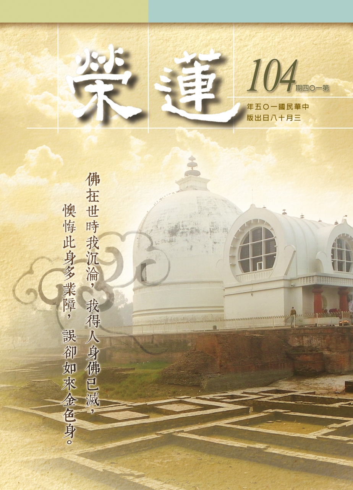

## 社論

### 從孔子的高度看《了凡四訓》

本刊

了凡改命孔苦命

皮相看法障聖道

論語學習能知命

孔子高度方了凡

欣聞時哉時哉網路教育學院，將於今年的七月二十七日至三十一日，於中正紀念堂舉辦第一次的大型公益講座，主題為：「從孔子的高度看了凡四訓」。《了凡四訓》是一本流傳十分廣泛的善書，內容記述作者袁了凡先生，如何從一位發現自己是被命運拘束的凡夫，變成一位有能力改變命運的不凡人物。文中所說的改命之道，道理並不玄妙，但卻完全契合儒佛經典的智慧，平實地說出超脫命運的方法，結合作者自己以及當代許多行善人士的真實故事，讓人不得不相信「命由我作，福自己求」的奧義。根據非正式的統計，今日之下讀過《了凡四訓》的人數，約有八千萬人之多，讀者或多或少、或深或淺，都能從當中得到利益，進而給自己的人生帶來更好的改變。

袁了凡是明朝萬曆年間進士，擅長天文、醫學、水利、數術、軍事等，可謂文武全才。他所留的著作達二十二部，一九八卷，其中影響最深遠，流傳最廣者，莫過於他在六十九歲時所完成的這本家訓。他以雲谷禪師所傳授的「立命之學」，作為改變命運的基石，有了正確的人生觀，進而才能真正地「改過」、「積善」，而「謙德」是他處世的心態，也是他藉以維持改過積善功效的方法。由於見地的高超、方法的善巧，以及心態的正確，使他改變命運的效果驚人，原本命中沒有功名，考取了當代的進士，派任當時的寶坻縣擔任縣長；命中註定無子嗣，也在他第二次發願求子後生了兒子，其子袁儼也是明熹宗時期進士，任職廣東高要知縣，在任時因為用盡心力於救災，過勞而亡，可說深具其父之風。而袁了凡原本被皇極數正傳的高人孔先生算定，該於五十三歲八月十四日丑時壽終正寢，卻也延壽至七十四歲。其一生確實印證了雲谷禪師所說：「求富貴，得富貴；求男女，得男女；求長壽，得長壽。」

袁了凡的陽報顯而易見，孔子的陰德微而難知。當今網路上不乏嘲諷孔子的文章，或說其為喪家之犬，因為周遊列國鬱鬱不得志，所以只能回到魯國當個教書先生；或誤解孔子的學說，只是為專制帝王服務而已；或者甚至將八股考試、男女不平等、沒有科學思想等社會現象，全部歸咎在孔子身上。如此外行的文章確實不少，然而雖然不是外行，即便是古今崇敬孔子的中外名士，有時也難以說出孔子的命運究竟好在哪裡？獨子伯魚早亡，最優秀的弟子顏淵也早亡，與孔子深具革命情感的子路，居然在衛國內亂時被砍成肉醬。栖栖惶惶十四年，不能被任何一個國家的國君所用，似乎除了品德高尚，情操可貴，也難以再說出任何孔子好命的證據，與其當孔子，不如當個袁了凡，人生好像更為暇滿？

其實富貴、男女與長壽，大概統攝了一般人生命中所關心的主要人生目標，所以袁了凡的進士、得子與延壽讓人印象深刻，而孔子遭遇的困頓、凶險與危難，則使人憂心。然而難道孔子真正是位苦命人嗎？這樣的看法，其實有太多的誤會。若說富貴，孔子在周遊列國之前，曾任魯國司法最高長官─大司寇，並且攝行相事，不只地位高，年薪六萬石，是當時孔子弟子原憲（時任孔子家宰）的六十多倍。而後因為魯君迷戀女樂文馬，孔子主動離開魯國。在周遊列國期間，是各國國君所禮遇請教的對象，最後五年留在衛國，衛君蒯輒也給予六萬石的俸祿。不只孔子為官，眾弟子們也在各地擔任官職，閔子騫任費宰、冉伯牛任中都宰、子游任武城宰、子夏任莒父宰、宓子賤治理單父有堯舜的氣象、冉有跟子路都擔任過季氏的家臣、子貢是魯衛輔相，靠他的外交才華，解救了魯國亡國之難，而且善於經商，富可敵國。這樣看來，孔子的富與貴，對比袁了凡的寶坻縣縣長，不知高出多少倍。《論語》裡面子貢曾說：「夫子之牆數仞，不得其門而入，不見宗廟之美，百官之富。得其門者或寡矣。」不只外相上的富貴，孔子內心的豐足與快樂，或許可以用佛家的這段話來作描述，亦即：「不入《華嚴》，不知佛家富貴。」若不入《論語》，也難以得知孔顏的富貴。

再說男女，智慧福德之男、端正有相之女，是所有夫妻的渴望，袁了凡確實也求得了聰慧的兒子，那麼孔子呢？孔鯉的早夭確實是樁遺憾，但兩千五百多年，對八十代子孫的庇蔭，絕對是自古以來沒有任何家族可以超越的成就。北宋以降，歷代帝王對於孔家嫡孫衍聖公的禮遇，或者直封一品官、或者正二品，再對比袁了凡先生，過世後明熹宗追封為「尚寶司少卿」（從五品），二者的本慶與餘慶，又不知差別多少？

關於壽命，七十三歲的孔子，在人生的最後，對子貢說完最感人的一段話，過了七日之後，預知時至地離開了人世。生命並不特別綿長，但他的慧命卻仍延續至今，與整個中華民族的生命結合、息息相關。《論語》中子張曾問孔子：十個朝代以後的情形可否知道？孔子回答，不只十代以後可知，掌握住原則，百代以後都可以知。朝代的興替，雖然無可避免，但只要五倫十義的精神不亡，民族就可以延續，民族的未來就可以掌握。倘若失去了五倫十義，那也就失去了中華民族的本質，名存實亡的民族，未來也就不可知了。

原來富貴、男女與長壽，不是孔子比不上了凡，而是孔子高出了凡太多，使得大多數人不知道如何比較。就好像水庫存水的效益，往往讓人有明顯的感觸；老天爺下雨普潤萬物的偉大，則必得細心之人，才能觀察發現。袁了凡所以能改變自己的命運，來自於新的見地；孔子之所以能夠改變民族的命運，也是來自於透過不斷地學習，不斷脫胎換骨的見地。佛門蕅益大師曾說：「有出格見地，方有千古品格；有千古品格，方有超方學問；有超方學問，方有蓋世文章。」若能夠以孔子的見地，好好地研讀《了凡四訓》，必定對自己的人生，能夠有一番全新的體悟，走出不一樣的格局、不一樣的人生，相信時哉時哉網路教育學院此次暑假所興辦的講座，決定能讓《了凡》不只是了凡而已。

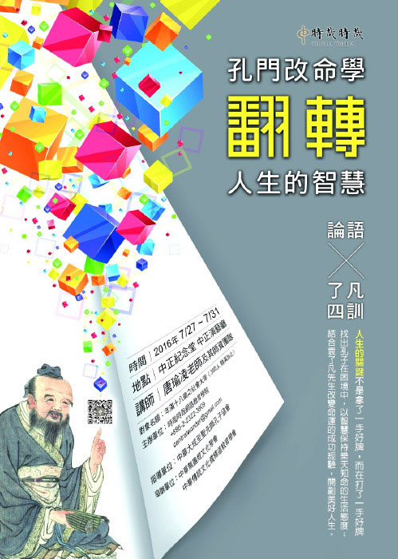

## 大德法語

### 大方廣圓覺修多羅了義經（六十三）

道源老和尚

經義詮釋圓覺性

經名亦是不思議

一入耳根為道種

成等正覺由聽聞

甲三、流通分

乙三、依問宣說內護流通

丙二、正答所說所護之法

丁一、答名字

經文：

是經名大方廣圓覺陀羅尼；亦名修多羅了義；亦名秘密王三昧；亦名如來決定境界；亦名如來藏自性差別。汝當奉持。

大方廣就是體、相、用，體最大，相最方，用最廣，讚歎圓覺是總持法門，翻譯是陀羅尼，中國話叫總持(總一切法，持無量義)，總持一切法的義理都在圓覺裡，謂之總持（陀羅尼）法門。

修多羅，梵語翻成中國話叫做契經，就是上契諸佛之理，下契眾生之機，簡單翻譯就是「經」，佛經有了義與不了義，了是究竟圓滿，義理究竟圓滿就叫做了義經。或有人問，佛說法為什麼不直接說了義經就好，為何還有不了義的呢？是為了應眾生之機，沒有辦法直截地闡述了義經。《圓覺經》是一切經的了義經，所以稱作修多羅了義。

亦名秘密王三昧，三昧翻譯到中國叫做正定，圓覺三昧是三昧之王，叫做王三昧，九法界眾生乃至於等覺菩薩，都無法了知，叫做秘密三昧。

亦名如來決定境界，此經決定屬於如來的境界，不可動搖，如來的境界就是《圓覺經》上所說，不能隨便變動，所以叫做決定境界。

亦名如來藏自性差別，頓教大乘也有漸次的道理，漸次的道理就是自性差別法，但這些都是依著如來藏自性流出來的，無差別叫如來藏、自性藏。

以上答覆賢首菩薩第一個問題，要以什麼名字，應該立這五個名字，依著前邊二個字，合起來希望汝當奉持，依著經的名字這樣奉行、受持。

丁二、答所至

經文：

善男子！是經唯顯如來境界，唯佛如來能盡宣說。若諸菩薩，及末世眾生，依此修行，漸次增進，至於佛地。

《圓覺經》唯顯就是佛的境界，由此經就能看出佛的境界，而且圓覺的道理，只有佛能宣說，佛在世的時候，有五種人可以說佛經(佛、佛弟子、天人、仙人以及化人)，說法必須經過佛的應證許可，佛許可你講經才可以流通。佛涅槃之後，只可以稱作論，不可以稱為經，這個規矩諸位同學都把它記清楚！五種人都可以說經，你在佛涅槃之後寫的論文，只能叫做論，這佛教的大規矩要記住啊！此處這《圓覺經》，不是其他四種人可以說的，只有諸佛如來才可以盡宣說。

就是當時的大菩薩，以及末世大乘根性的眾生，依此修行，決定能成佛，了義的經典是為了讓我們成佛的，不了義經不能成佛，譬如佛說人天乘的經，你依著這經修行，來世成為人叫做人乘法，來世升天叫做天乘法，這不了義的經典，你依著這部經證到阿羅漢果或辟支佛果，這叫二乘法。唯有佛說的大乘法，才能至於佛地。

可是這個地方有一句還是「漸次」的根機，《圓覺經》是頓教大乘（頓超的根機），他還是有漸次的根機，依此圓覺成佛法門漸次增進，雖然不能頓超，但是漸次的增進，一定成佛。

丁三、答奉持

戊一、法說

經文：

善男子，是經名為頓教大眾，頓機眾生從此開悟，亦攝漸修一切群品。

判《圓覺經》為頓教是依著佛所說，剛給他改個名字叫圓覺大乘，實際上頓圓之教不是頓教禪宗，《圓覺經》是講教法的，如何頓教大眾呢？頓就是頓超，像〈文殊章〉中「知是空華，即無輪轉」，那個「知」就達到成佛的目的地，就是頓教大眾，眾生的根機不一，普賢菩薩這一章請問漸次，說了四個漸次，歸結還在頓超上。「知幻即離，不作方便，離幻即覺，亦無漸次」，也是頓教大眾，就是希望我們頓教的根機能從此開悟。

群是多的意思，品者類也，群品就是多眾，多類，多種類的根機，只要你願意成佛，發願成佛，佛都可以攝持你，不捨棄你，《圓覺經》不捨棄一個眾生，就怕你不發願成佛，只要你發願成佛，漸次增進，就直入佛地了。

戊二、喻說

經文：

譬如大海，不讓小流，乃至蚊蝱及阿修羅。飲其水者，皆得充滿。

大海是廣大甚深，但是它也不拒絕這小小的流水，讓就是不拒絕，不論你是大江的水，或是大河的水，甚至是小溝的水，就怕你不流到大海，如此才見到大海之大，能以容納一切小流，《圓覺經》之大，就是能攝持一切群品，這大海之大不讓小流。

還沒有說完呢？蚊蝱是種小蟲，他的肚子很小，他的胃只能飲一點點水，這阿修羅身量可大了，肚子也大，胃囊也大，怎麼大法？阿修羅跟帝釋天比，帝釋天住在須彌山頂，阿修羅抱著須彌山，把忉利天整個弄倒，他自己沒被壓到，如此就可以知道他的身量之大！但是大海的水，你儘量飲吧！它都能令你充滿，這就知大海之大，能攝持一切群品。你是個大根機，學《圓覺經》可以頓超直入，你是個漸次的根機，你慢慢的修，漸次再漸次地修，只要你肯修，都可以成佛，都可以滿你的願。

丁四、答功德

戊一、以寶施校量顯聞經勝

經文：

善男子！假使有人，純以七寶積滿三千大千世界，以用布施，不如有人聞此經名及一句義。

以上是答覆他第五個問題，修持這個法門，得什麼樣的功德？假使有人是假設之詞，事實上是沒有這個事實，這是做一個譬喻，假使有個人，以七寶（金、銀、琉璃、玻瓈、硨磲、赤珠、瑪瑙）充滿三千大千世界，通通拿來供養三寶，這個人功德多不多呢？這個人不得了啊！發大心啊！

但是功德不如有人聞此經名及一句義，不如聽到「大方廣圓覺修多羅了義經」這個經的名字，這個功德超過前邊七寶布施的功德，聽到《圓覺經》一句的義理，功德超過前邊七寶的功德，諸位在座的都得到，你不但聽那經名，也聽到全部《圓覺經》的義理，或有人問是不是佛故意這麼說呢？佛說的都是真實語，聽一句義就能成佛！有什麼功德還能超過成佛的功德呢？你聽不了義經，我要持三皈、受五戒，到頭來下輩子可以轉為人身，我還要加修十種善法，就能夠有天福可以升天，但是天福享完了還要墮落，你聽了不了義的小乘經，你成了阿羅漢、辟支佛出了三界，但還是只證得偏空涅槃，掉到涅槃坑裡。《圓覺經》是成佛的經，你能聽到經名就能種成佛的善根，聽到一句義理，決定叫你成佛，依著那一句義理修行就行了！

戊二、以度人校量顯說經勝

經文：

善男子！假使有人，教百恆河沙眾生，得阿羅漢果，不如有人，宣說此經，分別半偈。

再說個譬喻，這人單信小乘的教化，他教化了多少人呢？一百個恆河沙眾生，都成了阿羅漢果，那你看這功德的法布施功德大不大呢？甚大！甚多！世尊這樣答覆他。可是呢？不如有人，宣說此經，分別半偈，你去宣說那些小乘經能得到好的成績，眾生都成了阿羅漢果，但是卻沒有一位成佛的，你若能宣說《圓覺經》，分別半偈就是二句，能了解並且宣說此經的義理，就令眾生種下成佛的善根，甚至頓超而成佛，就算不是頓超的根機，將來也決定成佛，那你的功德就大了。所以諸位同學，你聽了義經得了無量的功德，你要學講經，尤其學講《圓覺經》，那你的功德就不可思議了！

戊二、以宿因反驗顯信經勝

經文：

善男子！若復有人，聞此經名，信心不惑，當知是人非於一佛二佛種諸福慧。如是乃至盡恆河沙一切佛所，種諸善根，聞此經教。

親近的功德不可思議，講經的功德也不可思議，此處需要注意在「聞」字，學習講經也還得先聽經聞法，聞就是開慧，沒有聽聞怎麼能開智慧？由聞而思而修，現在就是聞經的人太少，講經的人也太少了，講經法會他也不去參加，那麼你怎麼能開智慧？怎麼能得功德？聞到這個《圓覺經》，不要說聽懂全部經文的義理，你就算是聞到了《圓覺經》的經名，發起了信心而不起疑惑，當知是人已經發起了善根。

咱們絕對不是在一尊佛、兩尊佛的面前種諸福慧，你親近了佛當然要供養佛！供養佛你就得到了福，聽佛說法就得到慧，福慧具足就得到了大乘的善根，能成就佛的福慧兩足尊。

此人的善根非常深厚，他不是在一尊佛、兩尊佛的面前種諸善根，乃至於盡恆河沙那麼多的佛所，在這麼多尊佛前種諸善根，這種福慧再加上聞此經教，他種福、種慧，種這善根！他聽佛說法親近了慧，在佛面前聽佛講經說法，每一尊佛都講《圓覺經》，他親近了百恆河沙那麼多的佛，都在佛的面前聽圓覺經。《金剛經》上也有這麼樣的經文：「當知是人，不於一佛、二佛、三四五佛而種善根，已於無量千萬佛所，種諸善根。」

我們眾生的障礙就是自己瞧不起自己，這是成佛的大障礙，我們的佛性與十方諸佛的佛性無二無別，十方諸佛都能，我怎麼不能成佛呢？因為你有自卑感。哎呀！我是個薄地凡夫，聽了佛經，卻把那不好的名詞套到自己頭上，我是個末法時代的眾生啊！我怎麼成佛？永遠不可能成佛的！佛是人，我也是個人，他能做大乘的事，我也可以做大乘的事，十方諸佛是大丈夫，我也是大丈夫啊！他成佛，我怎麼不能成佛呢？人人皆有佛性，人人皆當成佛嘛！你怎麼輕視自己，看不起自己呢？我們要是善根不深厚，這個魔法時代，五欲熾盛當中，我們怎麼能坐到佛學院講堂裡，天天學大乘佛法呢？善根淺薄嗎？你自己要相信你自己的善根深厚，你是親近過無量諸佛的人，親近過無量諸佛現在怎麼還在末法當個凡夫呢？你親近是親近了，聞此經是聞此經了，你沒有頓超啊！你是個漸次的根性，你要慢慢的修嘛！所以自己不要自暴自棄，聞到《圓覺經》，要慶幸自己有深厚的善根，你不斷努力增進，決定住於佛地。

丁五、答護持

經文：

汝善男子！當護末世是修行者。無令惡魔及諸外道，惱其身心，令生退屈。

在這裡答覆我們怎麼樣護持這持經人，你們這一班大菩薩，你們都應當護持末世的眾生，修行圓覺大法，因為末法時代魔強法弱，五欲熾盛，誘惑力太強，他剛剛發了一點道心，就是露水道心，經不得太陽曬，一曬就把露水曬乾了，這不是太可惜了嗎？末法時代他既然發了菩提心，難得呀！你要護持他不令他退屈，剛才是勉勵諸位，不要輕視自己，同時你還不要粗心大意，現在這個環境不是好的環境，也不是個好時代，要自己謹慎！

不要擾亂末世的修行者，不要叫外道來擾亂他，就是擾其身心，令他昏煩擾亂，退屈了他的大乘道心。(下期待續)

## 佛學覽幽

### 小止觀導覽（七十六）　第十章  證果

*心爾、治心整理*

發心同時成正覺

因果名言同時立

有情心中如來藏

破纏出垢真如來

論文：華嚴經中：初發心時，便成正覺，了達諸法真實之性，所有慧身不由他悟。亦云：初發心菩薩，得如來一身作無量身。亦云：初發心菩薩即是佛。

初發心是指發菩提心，是為利益眾生願成佛的心，能夠成為成佛的初因，指的是別教初地位，這樣的聖者，佛可以為他授記，所以稱為了達諸法的真實，不但發菩提心，而且可以現證空性，成為登地的菩薩。初發心便成正覺，生起成佛的正因，觀待因而說成佛，為之初發心時，便成正覺。

此聖者菩薩了達如來智慧德相人人本具，然須修學方能顯現，亦即所證五蘊上的空性是人人本具，通達五蘊上的空性，破所知障，名言安立為法身（自性法身），觀待自性法身生起的空性慧是智慧法身，此須自悟而非他悟，亦即修行靠個人。雖修行靠個人亦不妨要善知識來引導，學者透過聞思生起空性的勝解，並修止修觀，內心才會產生證悟，證悟是由修止修觀來的，雖說由我自己修而證悟，但是修之前要透過聞思，否則是盲修瞎練。

《華嚴經》〈梵行品〉中云：「初發心時便成正覺」。發菩提心了達諸法本具真實之性（空性），所有的成就都由聞來，經過思維，自己修證，悟入真理，必須自己親自來實修，這樣的聖者就能夠承擔佛的家業。

《華嚴經》上也說，初發心菩薩，得如來一身的智慧。此處是指報身的智慧法身，初地菩薩有十二類的功德，他能見百佛，得百佛的加被，能住世百劫，智慧能了知過去現在未來百劫之事，能入百三昧定，能入百佛世界，能造百佛世界，能動百種法門，能示現百身，能教化百類有情眾生，能往返百佛國土，能證得百種法門，能示現百身，每一身菩薩都有眷屬圍繞。

何以經云：初發心時，便成正覺？此初發菩提心，可分為世俗的菩提心與勝義的菩提心，若已具勝義菩提心為聖者菩薩，雖然證量高但尚未即身成佛（便成正覺），若是世俗菩提心，那離成佛還很遠，如何是便成正覺？然即使仍未成佛，眼前已種佛因，觀待果方為因，名言中的因果可為同時，佛亦能以現量的方式顯現他未來成佛，故云初發心便成正覺。

論文：涅槃經云：發心畢竟二不別，如是二心前心難。

前心「難」的是氣象難，那種氣象一生起，後面的「究竟」就沒有問題了，前心生起，後面的證得是不難的。要將菩提心真實發起，這是非常難的。入佛門的方式，其一是先發菩提心，其次修學六度，在現證空性時，並以菩提心及空性慧攝持布施心意圓滿時，名言安立為初地；其二是菩提心先大略的引發，然後主力在修學般若，得到成就，再回頭努力的引發菩提心，及攝持六度的修學，在現證空性及布施心意圓滿後證得初地。後者的修學法是利根，前者是鈍根。發起菩提心之後經過種種障礙及考驗，最終成佛。然這種難不如前心難，一般眾生很難引發菩提心，泰半都在生活中為自己而活，為別人的心量即使生起，也生起不了仁心與大悲心的那種為別人的心量，乃至於為了別人要成就無上正等正覺，這何其難也。

論文：大品經云：須菩提！有菩薩摩訶薩，從初發心，即坐道場，轉正法輪，當知則是菩薩為如佛也。法華經中：龍女所獻珠為證。

成為菩薩摩訶薩的是登地菩薩，初發心是指剛登地的那一念心，即坐道場就是利益有情去示現成佛。當知菩薩為如佛也，如有二種說法，第一是隨順於佛；第二則稱此人就是佛。此處指的是隨順於佛，此人可以宣揚佛的旨意，如欽差大臣代表皇帝一樣。登地菩薩可以清楚無誤的宣傳佛的旨意，但是他所擁有各種度眾的能耐，遠遠不如佛再來。

須菩提，人稱解空第一，須菩提在法華會上被釋迦牟尼佛授記成佛，《大品般若經》當中所說的般若，指的是佛的勝義分，佛在世俗上的展現是很難通達的，眾生也難以相信。

法華龍女成佛的說法有很多種，一是他本來就是佛的示現，所以示現因緣成熟就示現成佛的那一分，機緣到他就示現成佛。另一種說法是他根本就有成佛的氣象，佛直接以神力，去攝持未來的事情顯現在眼前；如同魔術師一般，將未來顯現在當下；如同晚上睡覺作夢去美國玩，不必坐飛機飛行，就直接出現美國，就在美國生起生命現象。所以佛把未來的事情顯現在當下時，就像變魔術一樣，如同龍女成佛的徵兆已經顯現，把未來的事情呈現在眼前。

第三種說法是龍女真的成佛，當他修行心力非常強盛時，修行的功夫是用超越的。如同要上一百層的高樓，當你還在一階一階爬樓梯時，坐電梯的人已經快速超越你而到達一百層樓，這就是修行的超越，一樣有修行的軌跡，可是他的速度之快，簡直像沒有經過這些程序一樣。

論文：如是等經，皆明初心俱足一切佛法，即是大品經中阿字門，即是法華經中為令眾生開佛知見，即是涅槃經中見佛性故住大涅槃。已略說初心菩薩因修止觀證果之相。

「阿」字是一個咒語，就像觀世音菩薩《般若心經》的秘密咒，心經經文本身是顯說般若，後面的「揭諦揭諦波羅揭諦，波羅僧揭諦，菩提薩婆訶」那是秘說般若，以咒語的方式去攝持經義，以顯說般若做為基礎，後面的秘說般若是利根的修學法。此處「阿」字彰顯初心俱足一切佛法，表徵各類之義，如《大品經》所說。

「阿」字是一個代表各種殊勝義理的字母，依彼所詮釋義的修學能助眾生成佛，此「阿」字名言須觀待修學者認知內涵，才能發揮大用。

能轉聖法輪，能令眾生開佛知見，就是《涅槃經》說的見佛性故住大涅槃，得到斷、證二德。

大涅槃是究竟的空性，證得大涅槃，成就的是斷德與證德，斷德是指斷煩惱障和所知障，斷障的同時說證得阿耨多羅三藐三菩提（大菩提），這也是佛的證德，佛以現證究竟的空性，破二障的那一分來成立為大涅槃。

此處以經略說初心菩薩因修止觀證果之相，止觀最殊勝處就是成佛，以止觀現證的斷德及證德成就佛的法報二身，觀待有情眾生的需要顯現應化身的佛（八相成道），這就是修學止觀的目標。

因修止觀才有初心菩薩的成就相(發菩提心與現證空性)，而初心菩薩直至成佛也都是依著修學止觀，才能成佛，止觀是成就初心菩薩與成就佛果的殊勝方便。（下期待續）

### 菩薩清淨的行持
       —華嚴經淨行品（二十）

菩薩清淨的行持

—華嚴經淨行品（二十）

*編輯部整理*

受教受戒依師受

堪生定慧證出世

證得無生方無依

成為有情所依怙

丙二、指事顯因答其徵因

丁一、總徵

丁二、別顯

戊二、出家受戒時願

己四、受學戒時願

庚二、受戒　  受和尚教

經文：

受和尚教，當願眾生，入無生智，到無依處。

和尚就是教授，阿闍黎就是助教，和尚直接教誨、主持傳戒或是直接傳授教法。由經文可見學戒、學規矩、學威儀通通要導向第一義諦，所行真實跟入無生智而成為八輩上人(四果向、四果)，方堪成為僧寶。

願所依是在受和尚教授及菩薩。能發願的是菩薩，發願要利益的對象是眾生，發願眾生能夠入無生智，亦即證得自體不生，有此空性的智慧，使自己能不依靠任何的助力，成就解脫，謂之到無依處。

而佛就是真正到無作處成就究竟解脫，是名無依道人。佛這位無依道人能在各個世界投生，生起俱生慧時不必依靠善友，例如釋迦牟尼佛就在菩提樹下直接生起破所知障的智慧，為何能如此？因為擁有廣大福助成智慧的生起，例如獨覺在無佛之世也能夠生起解脫的智慧，是靠著他對僧團百大劫的修福，使他能夠生起這樣的俱生慧。

破煩惱障的智慧在獨覺是無依，破所知障的智慧在佛的那一分是無依，智慧的種子為因，以廣大福為緣生起智慧的果。古人云福至心靈，並不是福裡有慧而是福幫助慧生起，修福、修慧是互相觀待，因為有慧的幫助，所以廣大福可成就為佛的色身，因為有福的幫助所以甚深慧可成就佛的法身。

庚二、受戒　  受具足

經文：

受具足戒，當願眾生，具諸方便，得最勝法。

受具足戒的當下發願，願力依靠受具足戒時生起，也是依靠我生起，能發願的是菩薩，所發願的是眾生，我們發願眾生具諸方便，得最勝法，所以願所為是發願眾生，具諸方便，得最勝法。具足戒是在寺廟裡受戒，從沙彌戒、比丘戒到最後的菩薩戒，受了菩薩戒之時就是受具足戒，所有的戒律皆完整，稱為得最勝法。

四面向觀察，第一、我受具足戒，當願眾生，具諸方便，得最勝法，我要隨喜他；第二、我希望眾生都能受具足戒，具諸方便，得最勝法；第三、我受具足戒時，我有能力幫助眾生，具諸方便，得最勝法；第四、懇請三寶加被我能夠幫助眾生，具諸方便，得最勝法。

受具足戒，得到和尚和阿闍黎的教誨，我來受具足戒當願眾生，具足方便，得最勝法，照南亭老和尚的解釋，菩薩戒是最勝法，以比丘戒為生起菩薩戒的最勝方便，比丘戒作為基礎發起菩薩戒，菩薩戒就是最勝法，就是成佛的方便。另外一個解釋，最勝法就是成佛，受戒是為了要成佛，以持戒作為成佛的資糧。所以戒律是修學定慧的前方便，以定慧為最勝法，以定慧(止觀)來證得世俗與勝義，雙證二諦以成佛，故定慧是最勝法，然最勝法的基礎在戒律。

戊三、就坐禪觀時願

在家十一願以及出家受戒十五願之後，就正式進入禪觀，就坐禪觀時願，總共有七個願，這七個願又分二部分：修前方便以及正修止觀。

己一、修前方便四　  入堂宇

經文：

若入堂宇，當願眾生，昇無上堂，安住不動

。

堂指禪堂，宇是屋子，指打坐修學的地方。無上堂指有成佛的證量，因為是成佛的證量所以是安住不動。

從幾個方面來觀修，願所依是若入堂宇，也就是進入修學之地時，依著這件事情來發願，能願的是菩薩，所願的是眾生，眾生得到的成就是昇無上堂，安住不動。

從四個角度來看此願，第一、眾生都能安住不動，昇無上堂該有多好，這是隨喜，他越殊勝我越高興；第二、我內心渴望他這樣做，所以我以發願的方式來幫助他，這是發願；第三、不但發願要幫助他，而且實際的去幫助他，我允許諸佛菩薩都入涅槃，宇宙間只有我一個人幫忙有情，我都願意這樣做；第四、我祈求三寶加被，讓我有獨立完成度有情的能力。

南亭老和尚的講義中，解釋若入堂宇，禪室有時或名般若堂，或名大徹堂，意思就是進入這間屋裡來修學定功，我願意眾生同時皆昇無上堂，安住不動，無上堂是心法之譬喻，就是內心的證量以無上堂來表示，希望眾生都能達到明心見性，昇無上堂已，則八風吹不動。

我們藉由修行的禪堂，內心裡面希望眾生昇無上堂，希望眾生心裡進入無上的境界，以空性的智慧去破所知障，這一分是最無上的，這樣的人有能力成辦世俗的事業。

安住不動，就是破所知障的那一分，境界在他心識前了不可得，內心不為境界所動。當以空性的證量破所知障時，所有的顯現都是非實有的顯現，所以安住不動並非只是定力的不動，它是慧的成就讓心安住在其上，不是普通的定，是「妙湛總持不動尊，首楞嚴王世希有」，是成佛的首楞嚴大定。

初地是在定中不為外境所動，但是出定的時候，因為有俱生我執，所以仍會被外境所動，到八地之前都有俱生我執，八地之後的不動地，是境界雖然實有，但是內心生不出實有的執著，成佛是連境界的顯現都非實有。

成就無上的那一分是以空性的智慧破所知障而說，入世時因此八風吹不動。八風之「利」是指事業順利，得到很多世間的利益；「衰」是指事業，備嘗辛苦；「毀」指背後的譏毀；「譽」指背後的稱讚；「稱」指當面得到稱讚；「譏」指當面受到譏笑；「苦」是身心所受之苦；「樂」是身心所受之樂。

利衰是指依報，苦樂是指正報，稱、譏、毀、譽是指口業的那一分。菩薩的八風跟二乘人的八風絕對不同。從譏、毀、衰、苦來消惡業，從稱、譽、利、樂中顯現善業，成為利益有情的資糧，受苦時如何善用苦？享樂時如何不被情境所轉？假如菩薩在利益有情的時候遇到非常猛的八風，風力就像緬甸一次吹來百萬人死亡的那種八風，請問你若是這菩薩，如何過這八風？二乘人被八風吹時，就算空性的證量不退轉，可是他願力退失，原先是大乘人，此時退轉菩提心。

因為執我，所以八風一吹就生煩惱，譏、毀、衰、苦是我受苦，稱、譽、利、樂是我受樂，我樂就會生貪，我苦就會生瞋，有貪、有瞋就會有分位與等流煩惱。八風吹不動，就破煩惱障的那一分，所執的我不生，在八風中不生煩惱。所以這裡的安住不動，並非禪定的安住不動，是在破煩惱障、所知障下說的安住不動。（下期待續）

### 大乘百法明門論簡說（十二）　拾、心法—八大心王(二)

*淨凌講述‧淨本整理*

依業而生苦樂果

觀待名言而納受

不離心識法特質

妄見該法徧計執

論文：第一，心法，略有八種：一、眼識，二、耳識，三、鼻識，四、舌識，五、身識，六、意識，七、末那識，八、阿賴耶識。

緣起之相有觀待而生的緣起，有因緣而成的緣起，這些在唯識宗認為皆是心內顯現的緣起。緣起之相可分為共相及不共相，所謂的共相，是指能與他人共同受用，又分為共中共及共中不共。山河大地等共相，因為是共業所感，大家都能受用，所以是共中共；田宅衣服等，是自業所感，為個人所擁有，所以是不共相，但又是大家可見，因此屬於共中不共。譬如過去大家同造人道的善業，投生到人道的環境，為共中共，同造共業中，會因為付出不同，所以有共中不共的現象。

在不共相中也分為不共中共及不共中不共，自己的扶塵根就是眼、耳、鼻、舌、身等，這些五官能夠扶助勝義根（五官的神經系統或氣脈），使之發揮功能。因為扶塵根都是各自受用，所以稱為不共，又因為別人可見，所以是不共中共。不共中不共就如勝義根，別人不可見、無可受用，完全由自己所受用。

無論共相或不共相，應知皆是自己業力所感，所以絕對不可怨天尤人，而應好好造善業，才能轉業，不只轉別業，還要能結合團隊的努力，扭轉共業。

其次第八識因相表，第八識因相就是指第八識的種子，所有的果都是由種子生起。首先說明剎那滅，種子是有為法，滅後才會生果，種子與果不會同時存在，否則即成為因果同時，若因果同時，說因生果則成為無義，因在果已在，果如何是由因生？因在能生果，因又不滅，當然可以一再生果，所以無盡。說因果俱有，則有邏輯上的謬誤。又種子既然已滅，為何能生果？而無已滅的種，果亦不能生，已滅之種何來自體性？所生種子與果之間，不過是名言上的關聯，而非自體的關聯。

恆隨轉是指種子要恆時相續，沒有間斷，然須待緣方結果。性決定，是說明果的現行要與因的體性相符，例如快樂必定從善業而來，不會從惡業來，西瓜種不會結冬瓜。所謂待眾緣，如西瓜種要成熟為西瓜，需要陽光、空氣、水、肥料等眾緣的配合。最後說明引自果，例如布施能引財富的果，不會引眷屬和合的果，色法的種子只能引出色法現行，不會引出心法。

熏習相狀圖，七轉識就是眼識、耳識、鼻識、舌識、身識、意識和末那識，前七識來自於第八識種子起現行，所以叫做種生現，前七識是種子所生的果，種子是能生之因。例如投生為人，第八識人道的種子生起人道的前七識，此時所受用的全部是人道，第七識執第八識見分，能緣人道的力量以為是我。

能熏因就是前七識的各種造作，這些能力都會熏為種子收藏在第八識，成為現熏種，這些潛力會使此人未來在某一方面特別卓越。

再者種子類別表，種子就是含藏的能力，這當中分為本有跟新熏。為何會成立本有？例如吾人今生為何學佛？乃因前世曾聞佛法，熏下這樣的種子，所以今生再聞佛法，才能夠生起興趣，而前世能聽聞佛法也是從前面與正法結過善緣的種子來，如此不斷往前推，至於無始，所以稱為本有，前面一定要有，才有後面，這是邏輯推理，不是宗教迷信。無漏種如此，會生煩惱的有漏種亦然，也可推至無始以來本有，亦即有漏與無漏種皆本有。新熏即此生造作所熏，同樣包括有漏種跟無漏種。

無漏種當中有生空無漏、法空無漏跟二空無漏。生空無漏就是學般若愈來愈有體悟，終於在見道位的時候斷了人我，證得人我空，稱見道無漏；法空無漏是破法我，證得法空的無漏，稱修道無漏；最後證得二空無漏，任運地生起二空的智慧，稱無學道無漏。

有漏種包括名言種跟業種，業種起現行成熟為果稱為異熟，如前所說，異熟包括異時而熟、異類而熟、變異而熟。有了果報稱為有支，此果報可能是共業，或者是不共業的果報。例如因為自己過去生中的布施業，今生賺到了錢，屬於不共業；若過去布施時有人隨喜，在今生賺錢的時候，隨喜者也享用了一部份的福報，此即共業。

唯識宗講的名言跟中觀宗名言定義不同，唯識宗的名言就是遍計執，例如手錶是人道的看法，對動物來說，手錶就沒有指出二十四小時的功能，動物不會認為是手錶，手錶屬於人道的偏執見、人道的名言，這一類人都會如此計度。而名言當中有表義與顯境，表義就是在認知上會表現此義；透過表義顯示這個境界，所顯示的境界是遍計執而成。換言之，所有名言的顯示境都是偏執見所見之境。表義與顯境，可以說就是在吾人的認知當中顯出了那樣的境界，沒有此等認知就顯不出此等境界。

等流有領受等流與造作等流，前面滅、後面生，後面與前面的關聯性稱作等流。前面殺生，此生短命多病是領受等流。又例如前生為豬，在髒亂的環境習慣已久，此生為人，仍有髒亂的習氣，稱為造作等流。等流有我執的等流與名言的等流，以相續的五蘊為我，是我執的等流。名言的等流，例如隨著人道的顯現，能生起認識人道的名言。

下面又分為共相跟不共相，我們都以共相的方式認識境界。例如茶杯，凡是能納水的都可稱為茶杯，這是共相，無論大小高矮、鐵製、木製，都是茶杯。至於不共相，就是透過對於共相的解釋，找出差別，逼近別相。再以茶杯為例，在茶杯中舉出鐵製的、有裝水的、綠色的，等等說明，從中區分出別相。其實百法的學習，就是讓我們能夠仔細的觀察跟思維種種相狀的差別，讓我們能夠對世間萬法有正確的認識，解決各種可能的誤會。（下期待續）

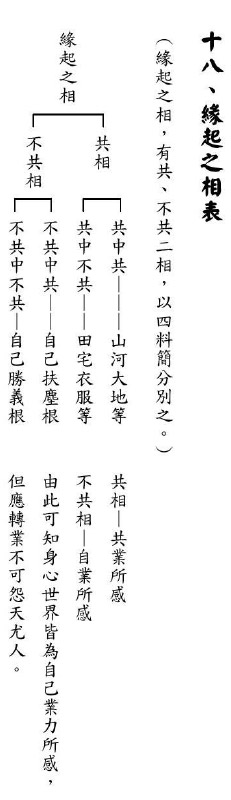

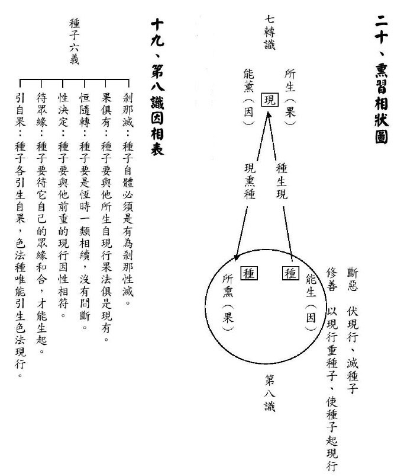

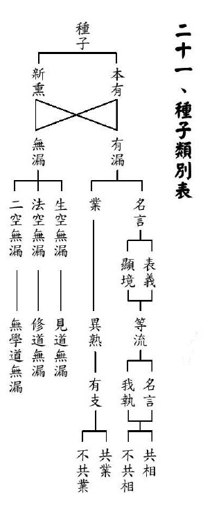

### 佛學概要十四講表簡說（六）　第一講表  乙表 二障略舉(宇宙觀)

*戒慧講述‧法味、淨昌整理*

離苦得樂人生觀

有情亦然覓出路

無明我執惑業苦

海市蜃樓無了期

森羅萬象

上述由本身煩惱中觀察人生謂之人生觀，觀個人是在惑業苦中輪迴，進而觀察宇宙謂之宇宙觀。而環境所知中，吾人成為能知，環境成為所知。吾人所觀察宇宙中全部有情，即是森羅萬象。雖宇宙範圍可涵括有情及無情，但此處特別約有情而言。有情亦是在輪迴中受苦，但唯有情方能修學成佛，且是吾人所須度化之對象。

宇宙有情的處境，是森羅萬象，唯本質是苦。森羅萬象中，佛法所言六道：天、人、阿修羅、畜生、餓鬼、地獄，所現即為森羅萬象。譬如人道中分黃種人、黑種人、白種人、混血種人，黃種人又可再細分中、日、韓、蒙、菲、泰、緬、馬來、印尼、印度、錫蘭等等民族，種類已稱繁多。而非人道之動物種類更甚，故名之曰森羅萬象。而佛法如何形容此森羅萬象呢？一言以蔽之：「惡難遣、好難求、得易逝」。

惡難遣

「惡難遣」即痛苦、挫折、障礙、逆境、災難、戰火等種種禍害，不一而足，謂之苦苦，這些是難以遣除，隨時發生。

好難求

「好難求」即有情眾生尋求離苦得樂之作為，唯不知所求之樂，竟以苦為本質，是故好難求。何謂之三界之樂以苦為本質？佛法從未否定世間之快樂，釋迦牟尼佛說三界皆苦，譬如今天吃飽飯，佛如仍說痛苦，必不得世間人承許。佛教徒如未瞭解其定義而凡事皆稱苦，快樂之事亦曰苦，世間人必不以為然。三界皆苦之定義為：有情所受用的快樂，本質是痛苦，並不妨礙說快樂。

何謂「樂以苦作本質」？譬如站立之痛苦，此時坐下是否快樂？非也，坐下係將站立之痛苦消失，唯坐之痛苦漸生。譬如富貴，亦將貧窮之痛苦消除，但富貴之痛苦漸生。是以凡夫於三界中尋覓快樂，猶如「渴鹿陽焰」，渴鹿處於沙漠中不斷追逐水源，唯所見皆陽光反射猶如水源，永遠尋覓無著。如同有情無始劫來追尋快樂，而至今未得。古時印度有一位國王，即以此法不用刑罰，而使所有犯人皆不敢再犯罪。先詢問犯人喜好以站立或坐或臥之方式。如有喜好臥者，令其臥而不許動。初始時愉悅，末後如同生病一般。此時再詢犯人敢否再犯罪？如復以不敢者可令出獄，有再犯者即令受躺臥之苦。是故，世間之好根本難求，本質皆苦。

得易逝

「得易逝」即令難求而得到了，亦因無常故，而迅速滅逝。譬如秦王贏政即位後以二十六年經營而併吞六國而稱帝，僅十一年即駕崩，何其短暫。其實不僅其人稱帝之時間，苦於短暫，「得」之體性係有為法，而有為法之體性無常，無常之體性是剎那變化。

森羅萬象係因眾生充滿六道中輪迴不已，故可進約六道輪迴而論：「惡難遣」，有情眾生墮入三惡道之後，欲離開極其困難。因其時彼處修福因緣不易具足，亦無善人以為典範。其次「好難求」於六道，亦極少數能斷惡修善加修禪定因緣具足，方能升到欲界天、色界天，此類有情十萬人中每不得ㄧ。再者「得易逝」，或有人言能升至色界天、無色界天，是否即為究竟快樂？約壽命論，四王天的ㄧ生，約莫等活地獄的一天，等活地獄壽命又達五百歲。其下之黑繩地獄、叫喚地獄、大叫喚地獄，至最後之大熱地獄、阿鼻地獄，其時間壽命復續倍倍加長。故較量投生色界天與墮入地獄之時間長短，生天猶如曇花一現，而墮入三途是長劫。墮入三途後，因惡習氣沾染一身，故多有眾生纔出即入，亦或長劫沉淪不得而出。而生天者則因享樂故，造善之習氣亦無法相續，壽命終亦易墮落。有情於三界中處境如此不堪，投生惡道者既易染惡習氣，無法脫困；而投生善道者，又因享樂使為善習氣不生，亦易墮落，是以《道德經》老子有言：「天地不仁，以萬物為芻狗」。

人情事理

佛法觀察宇宙間之森羅萬象，即為有情於六道輪迴之痛苦，引發吾人生起大悲心去度眾生，所度眾生又特別約人道眾生為對象，如何瞭解人道眾生？即由人情、人事及人理中通達。

情多異

述記云：「人心不同、各如其面」。因每個人的根器、習性、欲望、個性均不同。人心既皆不同，如何形容其行相？各人想法不同，唯均認為自己正確，故堅持己見，謂之「各是其是。」並認此為唯一正解，非此解者均屬謬誤，謂之「各非其非」。自己所喜愛者為好事，反之為惡事，謂之「各好其好，各惡其惡。」

既然有情皆「各是其是，各非其非，各好其好，各惡其惡。」，故皆與過去所造業及等流心有關。譬如世間之美女固然美，唯羅剎偏喜貌醜之羅剎女，反不喜歡世間美女，故各好其好、各惡其惡。是以世間之美女，亦僅某一些人以為美，並非全部人皆以為美。故西施之「沉魚落雁」典故，魚並非因其美而下沉，雁並非因其美而下落，真相為魚與雁皆以西施為醜而嚇得躲起來，謂之沉魚落雁。

因人心情多異，是以孔門之教化乃因材而施教，絕無以一法而攝受所有眾生，因有情之心呈現各種不同的行相。某些人須以剛攝受之，某些則以柔攝受之；某些人是吃軟不吃硬，某些則吃硬不吃軟。

事多變

「事多變」觀待諸事因緣和合而成，故其事情多變化。述記云：「人事亦多變異，今日仇家，乃是昨日之刎頸」。人心多異，人事亦多變化，昨日與今日不同，今日跟明日不同。不同人所辦之事情皆不相同，今日行情、市場波動、國際變化皆多變化。昨日交情密切，今日卻反目成仇。譬如三國時期司馬懿與曹操原為命運共同體，最後司馬懿親手覆滅曹魏王朝。是以，人事多變。

理多秘

「理多秘」，即人事變化中含藏之理，其秘密與過去之善業、惡業有關。譬如，當下作善卻受苦報，當下作惡卻受樂報。其秘如此，是以ㄧ般人無法相信因果報應。如何才能相信因果報應？佛又如何讓這些聖者認同因果報應？因果報應相較證得空性，屬極隱秘事，因佛所說無常與空性尚可經由比量之觀察認同，唯因果之理，譬如眼前此人所受果報，乃幾萬劫之前所種下因，ㄧ般人無法觀察。連聖者阿羅漢亦有三不知，第一　　是時間太長遠(超過八萬大劫)者不知。第二是業太微細(如頭上毛髮從何而來)者不知。第三是空間太大(超過ㄧ個三千大千世界)者不知。

理多秘連阿羅漢亦不知，故唯有相信聖言量，方可通達甚深緣起。如何生起對聖言量的信心？聖者阿羅漢證悟無常與空性，破了煩惱障得到極大安樂之後，對佛生起了很強的信心，對佛所說緣起之關聯性完全相信。是以阿難尊者說「日可令冷，月可令熱，佛語不可易」。以相信聖言量的方式，成立對緣起法的比量。因果緣起法唯佛能以現量通達，三世無量劫之因果，於佛心識前以現前量度之方式呈現，猶如眼識見色塵般呈現。其次，九法界以下眾生只能以信聖言量的方式，以此比量通達緣起法。比量非現前量度，乃推測比較量度而得。譬如出門見道路潮濕，推比得知方才下雨，然並未親見下雨；又如沙漠中所見海市蜃樓顯現似有，推比量度得知其實無。再如有見地之政治家，或許未能親見，然彼有見地能推比得知其作為之後續影響，故雖萬人而吾往矣。例如春秋時鄭國子產執政第一年國人皆希其死，至第三年則國人則歌無子產不知如何生活；又周成王因感念周公旦恩德，特別允許伯禽於魯國以天子之禮祭周公，孔子以為此舉僭禮，後代果然魯國三家大夫亦相繼傚尤，僭禮犯上，造成魯國的亂象。

比量亦分三類，第一類「世俗比量」，意指此方世界中，世俗人可以推比得知者，如「愛人者人恒愛之，敬人者人恒敬之」；其次「事力比量」，約「無常」及「空性」之義理，經由佛之說法，修行者能以推比量度得知，且符合事情真相；最後「信許比量」，即上述對聖言量，以相信的方式成為通達布施生福的比量。譬如相信佛說眼前之布施經過百千大劫後，使修行者成為登地菩薩的福報，成為比量。因其必非眾生現量所證，眾生不同意時成為非量，唯有以相信的方式成為比量。可是一般人，難以相信佛告訴我們經營來生、解脫，乃至於成佛，比得到眼前快樂重要。譬如老闆說，你認真加班，這個月薪水給你二十萬！就比較務實。至於佛講的因果報應比較空洞，比較不切實際。是故如何透過努力成為來生殊勝之見地，一般有情不會生起信許比量。以相信的方式成為比量，雖然境界尚未現前，唯你可以通達如同海市蜃樓現前，眼前並無樓房。在沙漠中，那一灘水生起，你知道那邊沒有水，只是陽光反射的效果。此即是比量，一般人很難以相信的方式成為比量，尤其對聖言量最難。除非他對無常、對空性瞭解，因為修學無常和空性，得到非常大的快樂，所以他對佛語能生起強烈的信心。顏回簞食瓢飲居陋巷而不改其樂，成為信許比量的力量，一般人辦得到嗎？我們看到一個窮困潦倒的人，對聖教很有信心的時候，真的在他身上看到前途了嗎？這就是有別於一般人的眼光了。眼光要這樣培養，生活可以隨俗，眼光絕對不能隨俗。你要有你的見地，所以蕅益大師說：超方的品格、蓋世的學問、千古的文章。（下期待續）

## 孔學一隅

### 論語簡說（十二）
		 	—子貢億度事理（上）

論語簡說（十二）

—子貢億度事理（上）

*時哉講述、順昌雪廬夫子研學會、洋逵整理*

個性轉變命運改

賴師調教己好學

先賢典範在眼前

己能踏上康莊道

經文

柴也愚，參也魯，師也辟，由也喭。子曰：回也其庶乎，屢空。賜不受命，而貨殖焉，億則屢中。

（先進第十一—十八）

前言

常人都以為個性的缺失會導致個人一生的失敗，殊不知善用質的重要！個性的缺失可以經由自身的琢磨、師友的陶冶切磋等，不但不成為缺失，反而成為優點。人生是馬拉松，只要不斷地增上、不斷地修正自己、開拓自己的視野，不斷地加大格局、充實自己的內涵，出路就在裡面。

弟子們因經過了老師的調教，高柴從「愚」到「不愚」，曾子從「魯」到「不魯」，子張能夠氣象堂堂，子路足以成為國家的大才，這是本章所含藏的意思。

釋義

分段與大意

此章文分為兩段，第一段評論四位學生個性各有偏失，不合中道。第二段將顏回跟子貢作比較。

首先就表面意思來解：高柴這個人是愚笨的，曾子屬魯鈍，而子張是開闊、不能務實的人，子路則為剛強的人。

顏回是一次又一次屢屢地達到空靈靈的境界。子貢本來能好好學習受命之學而成為傳承者，得到傳承的天命，結果他分心去做生意，他推度事理都能夠合乎重點，都能夠切中重要之處。

柴也愚

高柴，姓高、名柴、字子羔。《史記》的《弟子列傳》：高柴小孔子三十歲且身高不滿五尺；《孔子家語》：不滿六尺。總而言之，高柴不甚高大且面容不美。

再者，關於高柴屬何國人亦眾說紛紜，鄭康成跟北宋的王應麟都說他是衛國人，不過常年居魯，所以亦可說為魯國人。《孔子家語》：高柴是齊國人，為齊國大夫高傒之後。不過一般說法皆說高柴是衛國人。

高柴質地甚佳，其母過世後，守喪三年間不苟言笑。對於春天剛剛萌芽的植物，不會去攀折；對於春雷之後的小蟲，也不去傷害它；他人的影子，高柴也不會去踐踏。種種事蹟彰顯出高柴是一個能夠愛護動物，而且能夠尊重別人的人，這就是他的質地。

高柴在衛國當士師時，衛國發生內亂。處逃難期間，於都城與子路不期而遇，高柴告訴子路說：「衛國的內亂很危險，不要進去！」可惜子路不聽勸，最後高柴往外跑而子路往裏衝，高柴保全性命，而子路在內亂中被斬成肉醬。

孔安國《集解》：「愚」就是「愚直」，也就是呆板，不知變通。經國先生也曾說過他在孩童時代，愚直不知變通故事：當時他外婆給他兩枚錢，一枚錢是買醋、一枚錢是買醬油，行走間不慎跌倒，爬起來不知手中的這一枚錢到底是要買醬油還是買醋，於是他連忙回去問外婆，外婆就說：「哪一枚買醬油、買醋都可以呀！」這樣的形象就是不知變通，高柴亦是這樣愚直、不知變通的人。

參也魯

曾參，字子輿，是魯國南武城縣人，小孔子四十六歲，孔子過世的時候，他才只有二十七歲。先祖是少康最小的兒子，封於鄫建立鄫國。魯襄公六年的時候，莒國把鄫國滅了，鄫國的太子巫跑到了魯國，便改姓為曾。曾巫的曾孫為曾點，曾點生曾參。

曾子對父母親至孝，名列二十四孝中。曾子曾經在種田時，不小心把瓜的根砍斷，而被其父責罰至昏厥，醒來後怕父親擔憂，以彈琴表示無恙。孔子聽聞後責其不孝，孔子說：「孝順是小杖則受，大杖則逃。」如果不小心被父親打死了，會讓父親背上「不慈」的罪名。曾子聽聞後去向孔子謝罪。

曾子他在父親過世時非常地哀傷，他說：「以前在齊國待遇很少，但因為可以奉養父母親，所以感到很快樂：到楚國去當上卿大夫後，我的住處、園宅很寬大，出入隨從眾多，吃得很豐盛，可是我很傷心，沒有辦法奉養父母親。」曾子就是如此有孝心的孩子，同時也是孔門裡面最用功的學生，每每讀到喪禮時，都想到他的父母親。最後孔子傳授《孝經》於曾參。

魯就是指曾子資質魯鈍。什麼叫做魯鈍？就像刀很鈍，不容易切東西。魯鈍就是上課都聽不懂，最後卻成為《孝經》的傳承者，代表他善於用魯的質地。

師也辟

子張，複姓顓孫，名師，字子張。《左傳》記載：魯莊公二十二年的時，陳國殺了他們的太子禦寇，陳國的公子完和顓孫大夫逃亡到齊國。顓孫又從齊國逃亡到魯國來，到了子張已歷經魯莊公到魯哀公，過了十代，由此可知子張為魯國人。孔子過世後，他終生不為官，是儒家的八大派之一的掌門人，接續傳承孔子的聖道。

子張過世前，把其子申祥找來，對他說：「君子要死的時候叫做終，小人要死的時候叫做死。」終就是君子要死之前，事業圓滿叫做終。小人也就是一般的凡夫俗子，生的時候像草木生，死的時候像草木腐朽。表示子張很肯定自己一生的行持，他過世的時候，也如同夫子一般，比照商朝的喪禮。

子張相貌堂堂，手背在後面表達自信，手上握著竹簡表達傳承，自信滿滿，眼睛微微地上揚，一身布衣，代表終生未仕。

辟有兩種講法，一是《黃氏後案》：辟是偏的意思；一是《論語會箋》：辟是開張的意思。「堂堂乎張也」，就是氣象堂堂。

如何得知此處的「辟」字應該解釋為開張的意思呢？子張曾說：君子論交朋友叫做尊賢，也就是尊重善知識，容眾就是包容大眾，能夠尊重、讚美能力好的人，也能夠體恤能力不好的人，此非氣象堂堂、開張的人不能達到。

由也喭

仲由，字子路，或稱季路。子路小孔子九歲，從小家裡貧困，但是子路非常孝順父母親，自己吃野菜省錢給雙親吃好的。他曾到百里之外，背著白米回來孝養他的父母。雙親過世後，楚國重用子路，住的好、受用佳，但是他說，每每回想過去的日子，寧可吃野菜、去百里之外背米回家，而不願衣食無虞卻無雙親可養。孔子讚許說：「子路是父母生的時候能夠盡力撫養，父母死的時候也能夠盡上哀思，是真正的孝子！」

子路個性剛強、凡事對錯分明。當孔子見南子的時候，子路認為「咱們沒出路就沒出路，幹嘛要走官夫人這一派？」再者，公山弗狃在費地叛變，晉國的佛肸在中牟叛變，想找孔子去做官，孔子都說想去，子路也不高興！認為我們幹嘛去亂臣賊子那裡呢？這種愛恨分明，具俠氣的個性，孔子心底其實也是喜歡的，雪廬老人說：「做人要有七分的理智，三分的俠氣。」光有理智是不行的，要帶一點俠氣，事情才辦得成！

孔子讚歎說：子路這個人是果敢、可以從政的。遽聞子路判案，甲乙兩邊各說各話，子路僅憑三言兩語就能精準判案，可知子路是司法與內政的大才；《論語》中：「千乘之國，可使治其賦也。」可見子路也是軍事人才。子西大夫也跟楚昭王讚許子路是一位治世的幹才。

子路這個人個性太剛強，所以有時候在禮節上不夠周到，叫做「失于禮容」。孔子也說：「好勇過我。」子路的勇氣是超過我的，可是子路能勇無法不勇，這是不如孔子之處。孔子也曾經說：「子路要三思而行，冉求是再思可也。」都是告誡子路不可太過剛強。

解析

古今之愚有何不同？

在〈陽貨篇〉有云，愚有分古之愚者跟今之愚者。孔子說：「古之愚者也直」，直是因為愚者不知變通，所以他不敢權變，這樣的人不會耍詐，知道自己的愚癡，因而虛心地採納他人的意見；「今之愚也詐而已矣」，現在的人很會用「愚」來耍詐，用「愚」來爭取別人對他的信任，他的「愚」就是他的小聰明處。

愚之優點、缺點為何？

「愚」的優點是因為他不知道變通，所以他會堅守原則，再者因為他承認自己「愚」，所以不敢害人，在《四書詮義》：「愚」的人必忠厚。還有「愚」的人，他的內心裡面有什麼就會表現什麼，因此「愚」的人也比較正直。

「愚」的缺點是呆板、不知道變通。在《左傳》魯僖公二十二年，宋襄公跟楚莊王打仗，楚國的部隊過河，宋襄公的將軍認為要趁大軍過河時攻打，能讓楚國大敗，宋襄公卻認為不能乘人之危。等到楚國部隊慢慢地過河還未成列時，宋襄公也認為不可以發動攻擊。接著等到楚國的隊伍都排好以後，兩軍交戰，結果宋襄公果然大敗，還差點被抓，甚至是傷重而回，宋襄公就是失在「愚」！

《詩》教在溫柔敦厚而不「愚」，一方面從《詩》教中體會他人，學習替別人著想，一方面從《詩》教中開發悟性，不會愚癡、受人利用。我們現在的國學教育往往把小孩子培養成乖乖牌，這是「愚」！所以，如何在經學裡一方面厚培質地，另一方面開啟他的悟性，是我們從事國學教育的人很嚴肅的課題！

高柴經孔子教導後不愚，有何證明？

於孔子做大司寇的時候，子路在季孫大夫做家宰，很得季孫大夫的信任，他想保薦子羔做費邑大夫，孔子認為子羔還沒有學成，不能做官。我們一般人或許以為，反正下面有承辦人員，做官的只要批改公文就好。殊不知，那是把百姓當成白老鼠，你一定要有能力，才能任官，否則便不能利益百姓，也傷害自己的善根。後來子羔在孔子的座下孜孜矻矻，也做了衛國的士師，成為棟樑。回到魯國，又為成邑的大夫。衛國的內亂中，四十二歲的高柴逃跑，對比六十三歲子路的送死，他的眼光、格局又非昔日可比，這就是高柴經過夫子的教導後不愚的證明。

高柴的不愚在政治上也有充分的體現，他的夫人過世時，送葬的人眾多，結果路不夠用而踩壞了旁邊的莊稼。有人就說：「高柴，你應該把錢拿出來賠。」高柴說：「我不賠。」他解釋說：孟孫大夫並沒人怪罪我，我的朋友並沒有捨棄我，我為什麼要這樣做去買通人民？政治家的責任是要把國家的大政辦好，而不是在討好人民。

如果將「師也辟」解為「邪僻文過」，是否可採？

不可以的。馬融將「辟」講成「邪僻文過」，「邪僻」就是此人很奸詐；「文過」就是保護過失，將過失變成功德。但子張不是這樣的人，子張的「辟」是流於一偏，是開張不知收斂的意思。

辟之優點、缺點為何？

辟的優點就是格局大，《四書論義》云：「辟者才藝高。」此人若是開張、有志向的人，他一定是有才情、有志向者，他一定肯充實他自己。「辟」的人容易容眾，容易和眾人結善緣。

辟的缺點就是不知收斂，有時候會超越分寸。舉例來說，沒有那個能力卻偏要辦那麼大的活動，不但效果沒辦法達到，而且讓自己的團隊累得半死，這就是辟容易有的缺點。

如何善用自身辟的特質？

好好地跟老師、朋友多切磋琢磨，還要好好地充實內涵，並且能掌握時機步步為營，並且懂得量力而為，重視效果和實際的利益，不要重視虛浮的名聲。所以孔子跟子張說：讀書人的通達，絕對不是名聲的通達，讀書人的通達在於你的質地和正見，察言觀色中的知所進退，並且懂得謙虛求學。如果只求名聲的開張，後面一定有禍害！

徐醒民老師曾經說：辟者，太過與不及都不合乎中道，比如煮飯，煮焦了和沒煮熟都不能吃。時機不到卻堅持做，和時機到了卻不幹，都是不行的。所以，如何恰到好處的掌握時機，是擁有辟的特質者，必須要好好地思維的。

「師也辟」，然經孔子教導後不辟，有何證明？

在《孔子家語》：衛文子卿大夫對孔門很好奇，問及子張時，子貢說：「子張這個人，有功勞也不會沾沾自喜，即使有尊貴的地位也不會驕傲待人，而且不會貪慕權勢。對於那個孤苦無依的也不敢怠慢。」開張的人不會去重視那些細節，子張學習到最後是這種既開張又重視細節的氣象，可見經過孔子的教導，子張是不辟的。

如將「由也喭」解為「粗俗不馴」，是否可採？

有的注解是粗俗不能被馴服，子路不是俗人，他的志向是「願車馬、衣輕裘，與朋友共，敝之而無憾。」我最好的受用，都願意分享給朋友，願　意跟志同道合的人和合辦事，這樣的人，俗在哪裡？俗的人會追逐名利，而且孔子說：子路是位穿著破棉襖跟穿著狐皮裘的人站在一起，也不覺得丟臉的人，請問何俗之有？

喭之優點、缺點為何？

剛強的人必正直，內心想什麼，外表就呈現什麼，這種人不矯情、不虛偽、不做作。子路在衛國被斬成肉醬的時候，孔子在庭院中放聲大哭，說天要絕我！並且也說，子路處處保護他，讓他聽不到罵名。

喭的缺點是容易得罪小人。雪廬老人說：「人生成功的秘密其中之一，就是不要得罪小人。」得罪小人容易吃不完兜著走。

這樣的人也容易跟別人起衝突，孔子在匡地被圍時，子路就想拔劍保護孔子，孔子說縱然打退匡人，自己也會損兵折將，什麼場合該不勇的就不能勇，什麼場合該勇的時候就要勇。所以孔子是一個可勇可不勇的人，子路是必得勇！這是子路不如孔子的地方。

如何善用自身喭的特質？

「喭」就是剛強，把它用在於堅守原則，找到良師益友，並且堅持不退轉地學；把剛強的地方用於改過遷善。有恒心，會使一個人雖愚必明！雖魯必悟！雖弱必強！而子路的剛就剛好用在最好的地方，跟孔子的相處是一路走來，始終如一，變成孔子最重要的革命夥伴！

「由也喭」，然經孔子教導後不喭，有何證明？

《史記》的「弟子列傳」說：當年子路見孔子的形象是一副武士拔劍的模樣，並且告訴孔子，這樣才能保護自己！並自以為是的認為，南山的竹子，本來就很直、很尖，又何必學？孔子告訴他，把竹子削尖，不就可以穿革嗎？意思是質地好的人，若能求學不是更好嗎？折服子路後，子路把裝扮變成文人，向孔子求學。這就是剛的形象，說改就改，承認錯誤！子路後來做過季孫大夫的家臣，也做過孔悝大夫的家臣。能在魯國及衛國最有實權者的手下做事，就足以說明「不喭」。

《禮記》的「禮器」記載：季孫大夫家的祭祀往往很冗長，子路便把儀式的內容刪改，繁文縟節去掉、保留莊嚴肅穆的部分。第二次祭祀的時候，時間縮短且與會者行禮如儀至結束，孔子讚許子路這種深通於禮的表現，這哪裡是「喭」？

綜觀前四子，我們得何結論？

孔子善於觀人，對弟子的個性都只用一個字加以點評。再者，孔子乃天下最偉大的老師，知道弟子的個性，給予循循善誘，而弟子們也願意在其個性上修正。所以高柴最後是「不愚」，曾子最後是「不魯」，子張最後是「開張」，可是又重視細節，子路是「喭而不喭」。

總結

雪廬老人說：「用人重在質地！」質地好的愚、魯、辟、喭，都沒有輸在起跑點。

再者，愚、喭、魯或者辟，都沒有關係，如果肯接受調教，都有可成之日。我們要善於觀察自己的缺點，也要善於去觀察別人的優點，善於修正他的缺點，你就是他的貴人，善於改善自己，也是自己的貴人，相信一定能擁有很好的出路，以上是這一章的大意。

問答

**問：** 本章中孔子在品評前面四位弟子時，句首並無「子曰」。可是品評顏回還有子貢的時候有「子曰」，不知道品評四位弟子的部分是孔子所說的嗎？

**答：** 只有老師能直接叫弟子的名字，其他人要稱字。所以品評四位弟子，亦是孔子所說。

**問：** 古代的「愚」跟今天的「愚」不一樣，「古之愚也直，今之愚也詐」，有否證明高柴他是屬於古愚而不是今愚？

**答：** 高柴這個人，對母親孝順、愛護動、植物而且非常的好學，最後成為衛國的士師，回到魯國候做孟孫大夫的成邑大夫，管理有政聲，列入孔門七十二賢，這哪裡是耍詐的人辦得來呢？所以是「古之愚」，此愚是愚直，愚直不知變通。

**問：** 有注解認為：子張的「辟」主要解釋為注重自己的儀容外表，請問這家是否可取？

**答：** 子張曾經問孔子，怎麼得福報？問朝代的更替要怎麼去觀察？問歷史人物要怎麼去看他的內涵？問怎麼從善人進入聖人？問怎麼做一個明白人？問怎麼去尊重德行、怎麼辨別疑惑？問怎麼行仁？問怎麼從政？能問出這種問題的人，請問會是一位重視外表的人嗎？此注解不採。

**問：** 曾子的「魯」是指他的根機還是他的見地？

**答：** 魯是根機，就是聽不懂。曾子在十幾歲的時候就跟孔子周遊列國，餓於陳蔡時，聽到了「性與天道」。又有諸多長輩的協助，所以他的見地也變得高遠。所以文化的傳承不在於天資高低、不在於悟性的深淺，而在於肯不肯好學，這在曾子身上可以得到證明。

**問：** 只要能夠善用自己的缺點，就能使缺點變成優點，首先我們應該要如何先做到第一步，去正確地觀察自己的個性，進而將個性中的缺點轉換呢？

**答：** 先從上課開始，先預習，其次認真聽並課後複習。有了正知見，必能了解自己個性的不足，並善巧地運用所學改變自己，如高柴、子張、曾子等就是最好的典範。

**問：** 作為一個老師應該要如何去精準地抓住學生的個性，因材施教、循循善誘學生呢？

**答：** 老師們要先內化自己。想要造就一個學習的環境時，老師本身必須要是個好學之人；想要引導愚者成為不愚，本身就要有不愚的引導，否則也沒辦法引導愚者成為不愚，所以，老師本身的充實最為重要。

老師們本身充實自己，才有辦法引導他人走上光明的大道。教學的方法不需講究很多花招，重在教學的內涵，只要內涵有了，運用方法才有成效。

**問：** 雪公說：一生成功的秘訣也在於不要得罪小人，請問該如何識別小人？在工作中不得不打交道時，又應該要如何面對呢？

**答：** 「聽其言，觀其行」、「視其所以，觀其所由，察其所安」，這些都是論語所教的方法，但更重要的是一定要先認識自己，沒有認識自己，也無從認識別人；沒有辦法掌握自己，也無從去調伏別人。

**問：** 面對小人的時候，除了要避免得罪他們以外，難道我們不應該進而讓他們改變向善嗎？

**答：** 小人與壞人不同，壞人如公山弗狃、佛肸之流，雖然是叛變，但是孔子認為他們可以透過教化去改變。亦即壞人有時可以調教而改變的，小人則心術奸邪無法改變，如曹操、王莽之流，不但改變不了他們，與他們接近還深受其害。

**問：** 必須先讓自己學，是否可以更具體地講述，要如何充實自己，進而發現學生的特質？

**答：** 《論語》是一本非常好的書，透過《論語講要》能通達《論語》，不但能充實自己，且增強處世的能力。並以此作為觀察學生的特質，也從中找到引導他們的方法與見地。

**問：** 夫子在講這一章的時候，是否有甚麼特殊的狀況呢？如此點出四位弟子特質上的缺失，是否會讓弟子難為情？例如像《論語》中「門人不敬子路」的篇章這種情況出現。

**答：** 夫子在點評弟子的缺失時，並不代表說他們不會轉變，命運是可以改變的、個性是可以改變的。子路的剛經過調教後也呈現柔的那一部分，在季孫大夫家的祭祀禮儀中，子路也知道懂得抉擇，採取精華的部分，讓這個禮能夠莊嚴肅穆，這就是子路的厲害！善用這些看似缺點的個性，能轉化成優點，不但不會讓人不敬，反而會讓人佩服。(下期待續)

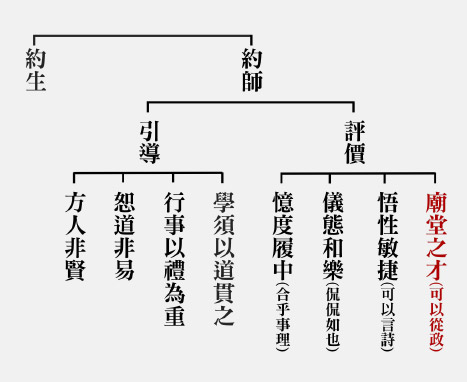

## 藝術賞析

### 孔門七十二賢淺說（八）
				     ─原憲

孔門七十二賢淺說（八）

─原憲

圖：江逸子‧文：時哉

不慕榮利窮閻居

無財不愧子貢訪

貧而樂道羞伐德

一輪明月眾皆仰

原憲，字子思，魯人，或說是宋人，小孔子三十六歲。

原憲曾任孔子的家邑宰，那時是孔子作魯大司寇，依禮享有封地，原憲為封邑大夫。薪水九百斗，原憲不要，他以能在孔子座下發心為榮，孔子說不可以，若是有多餘的俸祿可以去救濟鄰里鄉黨，這是常祿，孔子不讚同違反常情，該得而得，不該得而不得，反而才是真正廉潔。孔子過世後，原憲隱居在草澤之間，子貢後來在衛國做大官，去探望原憲這位老同學，那時候他很窮困，在草叢間，人很憔悴，子貢問說：你病了嗎？他說：無財謂之貧，無德謂之病，我只是貧困而不是病。子貢聽了很羞愧，覺得說話太唐突，終身以說這句不得體的話為恥辱。此人雖隱居於草叢間，然心如八月中秋分外皎潔之月高掛天空。畫家藉此共勉心志要像古人一樣懂得去除私欲，淨化煩惱，有義氣，有擔當，廉潔不取，心中如明月般的光明。太史公說，行俠的人，天下人都仰望他們，這是江先生對原思畫像的感情。

雖處窮困，原憲臉部的表情卻顯不出一毫懊惱、無奈與喪氣，沒有憤世嫉俗的不平，表現的是向上的心志。臉相呈現此人的個性，是一種是非分明，苟非義取，寧死不要，這種人對聖賢是死心塌地的服從。持劍表示與仁德為伍。(下期待續)

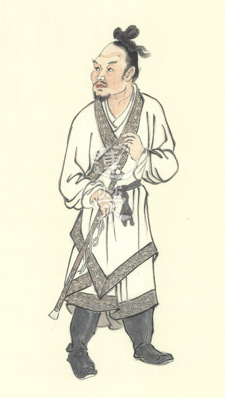

### 華夏精魂千秋(八)
		—明倫史畫孝友清亮─閔損

華夏精魂千秋(八)

—明倫史畫孝友清亮─閔損

圖：江逸子‧文：淨域

為人重在氣節存

孝弟和諧家邦國

聖賢之道芻豢色

見機而作言必中

史話

閔損，字子騫，春秋時期魯國人。孔子的門生，以德行著稱，秉性孝友。生母早逝，父親再娶，生了兩個弟弟；平日雖受到後母的虐待，但一點怨言都沒有。

某年冬天，他為父親駕車，因為天寒手凍使得韁繩掉落。父親見他發抖上前查看，發現冬衣竟然以蘆花填充，再查看另二子的冬衣，都是厚實的棉襖。父親大怒要將後妻逐出家門，子騫跪著哭說：「母親在家，只有我一個人受到冷落；母親離去，我們三兄弟就要遭受饑寒。」他孝順親長、友愛兄弟的行為，最終感化家人而得一門和樂。

孔子特別稱讚說：「閔子騫的孝順，讓鄉人不會去批評他的父母與兄弟。」是一種能使家庭和諧的孝，比一般的孝子更難能可貴！明朝所編《二十四孝圖》，將子騫單衣順親的故事排在第三，使之成為家喻戶曉的先賢之一。

子騫隨孔子學道，德性學問傑出，為人沉穩持重，平時少言寡語，然一旦說話就講得很中肯。孔子評論他說：「夫人不言，言必有中。」他注重仁孝修養，淡薄仕途名利。

魯國權臣季桓子力邀他出掌費縣宰，就任後並將家遷到東蒙之陽(蒙山東面的南方，即今日費縣汪溝鎮閔家寨村)。他治理費縣很有政績，後孔子離開大司寇的職位，而周遊列國，其不願同流合污而大力推辭，甚且欲到齊魯交界的汶水邊上，以示其不任的決心。病卒於長清縣(今濟南市長清區)，享年四十九歲。

後人感念閔子騫的德行，歷代帝王對其屢有追封。唐玄宗開元二十七年(七三九)贈費侯；北宋真宗大中祥符元年(一○○八)封瑯琊公；南宋度宗咸淳三年(一二六七)又稱費公。子騫死葬何處？並無確址。北宋時，傳葬於歷城縣(今濟南市歷城區)東五里，一般認為是衣冠塚，神宗熙寧七年(一○七四)在旁建立祠堂，今洪家樓鎮有閔子騫路(在山東大學旁)。此外，江蘇蕭縣、河南范縣、安徽宿縣皆有閔子騫墓(祠)，顯見子騫之孝德甚受推崇，所以各地競相倚為鄉賢。

子騫之子閔沃盈，死葬於閔家寨；是以閔家寨之閔子祠，成為海內外閔氏續譜及祭祀處，正南門上懸掛著乾隆帝手書「篤聖祠」三字。而汶水邊上的閔子祠，有對聯寫以「一灣汶水先生志，兩岸蘆花孝子心」，更用以表彰其清高志節與孝悌之行。

圖解

此圖所繪乃閔子騫跪地為繼母求情之景。天寒地凍戶外積雪盈尺，一家人集於廳堂前，閔父右手挑著單薄的蘆花外衣，左手指責妻子不該如此偏私嫉虐子騫，氣極敗壞地要將她逐出家門，妻子自知理虧又東窗事發，羞愧地別過頭去。兩位年紀尚幼的異母弟，身穿厚暖的棉衣，頭戴著防風雪的氈帽，因這突來的怒喝而驚恐哭泣。雖父親正在氣頭上，子騫無畏且仁厚地勸說：「母親在家，只有我一人受寒；母親休離，三個孩子都將要挨凍。」父親深受他的孝友行為所感動，繼母也懊悔掩面淚流不已。因為子騫的逆來順受與不怨天尤人，閔父原諒了妻子，繼母也改過向善成良母，一家人和樂地生活在一起。（下期待續）

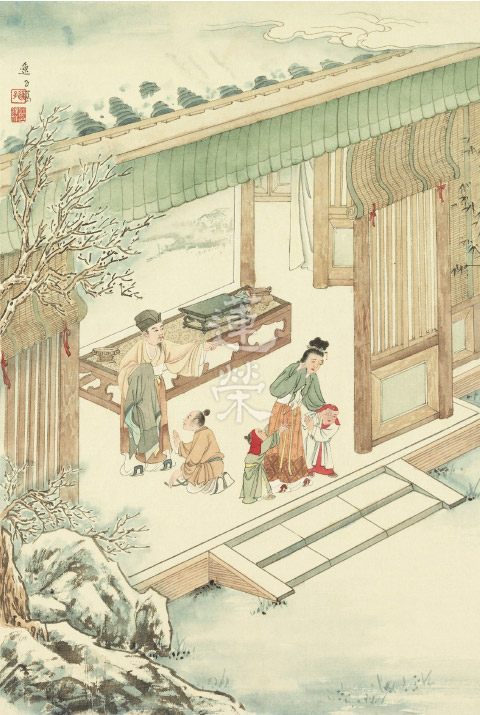

### 孝經圖簡說(六) —庶人章　庶人章第六

圖：江逸子‧文：時哉

堯天舜日比屋封

天道地利時令耕

謹身節用養父母

情操能令虞芮羞

孝經的第七章庶人章。庶人就是市井小民，圖中的這位農夫就是市井小民，市井小民如何表現孝道？以農夫可以聯想到其他工商等市井小民，由於古代是以農立國，所以此處畫的是農夫的盡孝，以農夫來做代表。

圖上的這位農夫，或許沒有受過教育，但是大家可以看看，他對父親拱手致意的禮儀，這就是古代的風俗，即使鄉野村民都很懂得禮節規範，現代讀書人，或許連基本的對人態度都不會，整個脫序的社會，要經過道德教育才能導正。

這位市井小民，在柳樹將冒新芽，代表春天的時節，在田裏面翻土插秧，他懂得春耕、夏耘、秋收、冬藏，他懂得按照天時來種植穀物，他也懂得利用地利，比如以水田種稻穀，旱田種麥子，用高山種蔬菜或樹木，懂得利用不同的地形生長萬物，來賺取利潤、養家活口，養家活口當中，最重要的就是奉養父母親，這是古代非常重要的概念。

圖中的父母親，在他耕田的時候，到田地來探望他，媳婦帶著飯菜到田裏來做家庭的聚餐，這張圖有別於其他朝代的孝經圖，呈現的是一家和樂融融，並且父母親到田裏面，關懷孩子種田的情況，表達對孩子的愛護，孩子也以禮儀來表達對父母親的尊敬，還有在奶奶旁邊撒嬌的小孫子與敬茶的家人，在爺爺旁邊扶持的長孫，這就是庶人的盡孝。

能以孝道經營家庭，使一家和諧，雖然他們的生活很辛苦，可是辛苦當中卻帶來歡樂，比富貴人家不懂得生活情趣要強太多了！此即古代庶人的能耐，相信這是國家強盛的根本要素。天子若懂得用孝道經營朝廷，懂得用孝道辦政治、辦教育，在野外就呈現這樣的風光，想想看，這樣的國家是強盛的還是衰敗的？昔日虞、芮兩國國君為了邊界爭執不休，相約一起到西岐請周文王評理時，看到耕者讓畔、行者讓路，當其他國家的人來到這個地方，看到連農夫與行人都有這樣的涵養與禮儀，試問把國家經營成這般氣象時，是不是能吸引人來觀光？這種人文的經營，會讓他人不斷的想要來考察、想要來學習，甚至想要搬過來居住，這就是國家強盛的秘密、拚經濟的秘訣。

以上是庶人章，一個平庸之輩，或者是農人，或者是工人，或者是商人，盡孝帶來家庭的和諧，成為國家安定的基本要素，江先生的畫作，所要呈現的就是這樣的氣象。(下期待續)

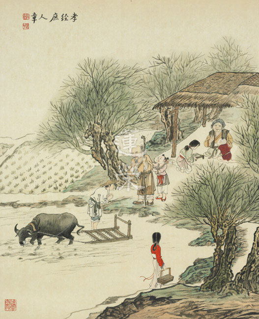

## 專題報導

### 山東經濟廣播電台專訪(二)

*編輯部*

文化人才急不得

聽聞思辨離批判

以文會友淺入深

隨緣利他興正法

八、傳統文化是否有糟粕？該不該用批判的眼光去看待？

**答：** 依著解釋的人讓經文變成糟粕或精華。對顏回來說，孔子是仰之彌高，鑽之彌堅，瞻之在前，忽焉在後。子貢說，生民以來未有如孔子。孟子說，天不生仲尼，萬古如長夜。宰我說，我觀仲尼遠於堯舜。他們是這樣看孔子的！

《論語》當中有許多孔子人生的經驗閱歷，有其經學的見地與品格的經營，更有人情世故的通達，可惜的是後面的人不會解釋，才讓我們感覺到《論語》或經書上有糟粕。〈禮記〉中有很多都是古禮，古禮的作法在這個時代本來就不適用，但我們要保留古禮的精神，不能因為古禮的作法不能用所以稱它為糟粕，就像古人是坐馬車，所以有馬車的禮節，而現在是轎車，不把馬車的禮節用在轎車的禮節上，這是對的，但不能說古代坐馬車的禮節叫做糟粕。

孔德成先生是儀禮的權威，也發表過相關論文，當然古禮對現在人來說是很繁瑣，但那是古代人為了要經營親情的關係，嫁娶時該如何的慎重以對，或國家要禮聘大臣，或者大臣要覲見國君，由禮節的慎重，表徵著對職位的尊重、對國家的尊重、對領導人的尊重，那個時代有那個時代的作法，若覺得作法太繁文縟節可以修改，像冉求就曾經在祭祀當中，主張要修改祭祀的禮儀，孔子也覺得很好，這在古書上都有記載。古代的作法在現代不適用，並不能說那是糟粕，那只是作法不適用現代而已，但是精神要保留。

舉例來說：古人說，親有疾，藥先嚐，要如何先嚐？嚐了對身體不是不好嗎？這也是糟粕嗎？古時候讀書人都會學中醫，中醫是保健常識，五行當中哪一個部分的功能出問題，他是有能力判別這個藥是否對症的，並非拿來亂吃，這樣的精神保留到現在該怎麼做？就是陪伴著親人去找良醫，主動了解病情，幫忙親人做正確的治療，這就是精神上的保留。

雪廬老人在六十幾歲的時候，黨國元老陳立夫先生，於一九五八年在台灣組成了中國醫藥學院，把中醫帶來台灣，當時的發起人之一就是李炳南老先生（雪廬老人），那時雪廬老人在中國醫藥學院教黃帝內經，八十章的黃帝內經極其麻煩，他也是有傳承的，但他說他看《論語》鄉黨第十，簡直就是一部黃帝內經，他說孔子真厲害，把醫療保健化為日用平常，而且讓人看不出來，這真是淺者見淺，深者見深。

孔子有一個生活習慣，不撤薑食，民間有一種說法叫「晚上吃薑猶如砒霜」，這是否不合時宜呢？不多食代表吃得不多，而且薑屬熱性，雪廬老人說，古代的人不會將這些調味料放到菜裡面，是菜煮出來之後才放這些調味料，藉著調味料去調味，讓胃口大開，薑則不多吃。至於晚上不吃薑仍要看狀況，若著涼了晚上回到家仍要喝薑湯。

中國傳統文化當中，有糟粕是因為後人解讀的問題，意思是中國的傳統文化本來面目，如果溯本清源的話它是沒有糟粕可言的。我們如果能在國家強盛的時候，找出幾位大儒，重新根據古注找到合理的解釋，重新來看孔子，恢復孔子的精華。否則學術界各說各話，讓孔子沾染了許多的汙名洗刷不了，甚至批判《論語》，使得《論語》真正的價值無法顯現，實為不公平。

九、請問霸道與王道的差別為何？推廣傳統文化的意義？

**答：** 推廣傳統文化一事實是喜憂參半，喜的是領導人知道以文化治國的重要性，以文化治國才能脫離霸道的政策。王道跟霸道不一樣，春秋時代孔子要推展的是王道文化，而不是推展霸道文化，王道文化是互相禮讓，且能經營出善良的風氣，霸道文化則是以武力取勝。王道文化跟經學的見地有關，經學的見地則要看如何地去解釋經學，所以領導者在推展傳統文化當中，喜憂參半，喜的是看到文化治國的殊勝，文化治國會給老百姓內心帶來真正的快樂，同時知道國家發展的方向，而且老百姓不會因為貧而作亂，不會因為富而驕奢，在孔子的教育中，能知道貧跟富都能夠上軌道，富的人如果好學這就是富而好禮，貧的人如果好學就叫做貧而樂道，這個國家就不會因為貧富差距而造成禍亂。

但若因為強調發展傳統文化，結果各地烽火燎原、良莠不齊，甚至以假亂真，極有可能最後是劣幣驅逐良幣！如果不能好好弘揚文化，到最後不但大家沒有法喜，反而會認為文化是束縛，是違反現實、脫離時代、不合科學的，到最後會在內心裡面屏除傳統文化。

十、弘揚傳統文化如何才能取得最好的效果？

**答：** 就像皮爾蓋茲說，打造美國一定要有優良的師資，如何好好的培訓一些師資，由這些老師出去弘揚傳統文化，才能為傳統文化帶來未來的春天。

沒有人才的時候不能急成，如果沒有人才而急速的推展，那反而會傷害了文化，一定要按部就班，剛開始發覺科學非常重要，並不是馬上弘揚科學，一定要先把技術人員找來，開始整頓、構思、重寫教材，以及如何培養這些落伍的老師，不是光喊一個口號，他認為四個現代化絕對不是用口號喊的，要實質的去做出來，沒有人才，那四個現代化都是假的，他真的看到問題在哪裡。

十一、請問傳承文化的人才應該如何培養？

**答：** 宋明理學曾經成立過書院，像白鹿洞書院、岳麓書院等等，那些書院式的講學，就是一個培養人才的方式，老師培訓的期別越來越多時，這些老師可以出去再去教其他人，雖然剛開始影響有限，可是慢慢的隨著時間，影響的範圍會越來越大，首先必須是國家各級的領導人，在上位者的觀念要先導正，否則講學事業發展起來會有障礙。

首先成立讀書會，在讀書會當中找出學得比較好的老師出來帶領，經學不能隨便亂讀，要慎選註解，要帶出大家的興趣，若將這個人才培養出來，他就能夠做出一番事業，進而能夠利益地方，甚至可以影響全國，當別人要推展傳統文化時，以這樣的內涵來跟他們作交流，提供大家參考。

人才的培養一定是慢慢來，因為大家可能會先觀望，慢慢的學有法喜時，隨著他投入的時間越來越多，自己培養自己的速度就越來越快，這完全要看學習者投入的心思以及投入的時間有多少。

這麼多年來，有一個深深的感覺，最後的決戰點就是時間，慢工出細活，只要這個人時間花得多，當然他成功的時間就縮短，時間花得少，當然成功的時間就會拉長。

孔子六十八歲回到魯國，七十三歲就過世，在魯國只有五年的時間而已，可是孔子有很多後起的弟子，都是跟著孔子這五年，像子夏、子張、子游，還有宓子賤、樊遲，這些人都是後面進來學的，只有五年時間而已，通通都是卿相諸侯之材，就是說這個人放到國家可以當領導人，成為可以推動政策、制定政策的政務官。(下期待續)

## 蓮池海會

### 林鳳儀居士往生見聞記

白文輝

人生酬業非虛言

生死大事要先辦

護持臨終實不易

待緣發心真難得

鳳儀於民國六十八年十二月三十日，誕生在寒冷的南投原住民村落，今年二月八日，農曆正月初一上午八時十五分，蒙佛接引，安詳往生，享年三十八歲。

鳳儀的父親是當時隨著國民政府撤退來台的老兵，母親則是年輕的原住民姑娘，兩人的年齡、觀念及文化背景等相差甚遠，因而種下雙方往後感情失和、家庭不睦的種子。鳳儀出生時，其母可說是獨自一人生下她，並親自為其剪斷臍帶，辛苦萬分。此外，在鳳儀年幼時，父母雙方常常吵架，甚至丟東西，鳳儀與其兄雖在一旁玩耍，表面上若無其事，但記憶卻很清晰，直到長大成人後仍難以抹滅，因此，為人父母者應盡量避免在孩子面前吵架，否則將對孩子造成一生重大的影響。

由於母親無法忍受其父之種種對待，故含淚離家出走，留下家中一老兩小，住的是位於士林，由豬眷改建的小矮屋，生活條件極其簡陋，但鳳儀回想當年能與父親共同生活仍是備感幸福，可知幸福感並非來自於物質條件，而是一家團聚的內心感受。後來因為父親年事已高，無力給予妥善的扶養與照顧，故將鳳儀兄妹送至位於台北關渡的好生育幼院安置，雖然鳳儀百般不願，但幼小的她又能如何呢？任憑她哭喊大叫，一雙小手拼命緊抓門口的鐵欄杆，仍無法敵得過一雙雙強而有力的大手，將其帶進育幼院中，此後的人生便以育幼院為家。此間最期待的時光是父親不定時的探望，一見到父親，整個人必是喜出望外，並盡其所能地向父親展現所學，只為博父親一笑，然而，歡樂時光總是短暫的，每次父親要離去時，鳳儀總是萬般不捨，從一開始的哭泣、耍賴，到後來的故意生氣，乃至於趁隙衝出育幼院尋找父親，依然是無力改變現實。所幸等到年紀稍長，能夠偶爾與其兄長一同搭公車回家，陪伴父親共享半日的天倫之樂，已是極大的享受，其中曾經為了拉長與父親相聚的時間，想方設法假裝睡著，再由父親抱著返回幼育院。

這段期間鳳儀印象深刻的還包括：父親不喜歡她留長髮，打扮像女孩子，因此，特別要院內老師將她的頭髮剃成男生頭，此舉讓她深感不解。此外，相較於別人的父親都很年輕，自己的父親卻像是爺爺一樣，也曾令她感到困惑與自卑。而眼見父親獨自一位老人居住在破舊的小屋中，鳳儀從小就幻想著，等她長大，有一天一定要把母親找回來，一家團聚，過著幸福美滿的生活，只是這個美夢終究沒能實現。母親雖盡量抽空至育幼院看望他們，但為了避免衝突，便盡力錯開與鳳儀父親碰面的機會。再加上父親老了，又患有老人癡呆症，被安置在養老院。鳳儀幼小的心靈中，單純以為父親會等她一輩子，到時她便可以好好奉養父親，所以，親眼見到父親臨終被急救時的慘狀，對她當時是一個極大的衝擊，只能痛哭以對，深刻體會樹欲靜而風不止，子欲養而親不待的道理。

鳳儀在育幼院完成了國小、國中、高中學業，度過她大半人生。從小就心地善良，喜歡幫助照顧一些可憐的小動物。在團體的生活成長過程中，培養出獨立自主的生活習慣，雖然因為沒有父母在身旁呵護照顧，曾經幾度遭受各種騷擾與欺負，留下難以平復的創傷，卻也因受到諸多善心人士的幫忙與栽培，促使她立下未來有機會也要幫助他人的心願。後來就讀高中，我們二人因為社團的關係結下不解之緣，彼此都是初戀卻感覺相識已久，陷入熱戀而荒廢課業，愛情長跑七年期間頗受考驗後結為連理，婚後育有一子宇涵。由於出身背景的關係，鳳儀渴望單純幸福美滿的家庭生活，並深知完整的家庭對於孩子具有重大的影響性，因而放棄得來不易的大學學業，專心育兒料理家務，讓文輝能無後顧之憂，陸續完成大學、研究所等課業。

一家三口好景不常，於高中生病就醫時便發現的腎臟發炎，長時間僅聽信西醫的診斷與治療，沒想到居然慢慢從原本的良性轉變為惡性，而需要服用大量類固醇加以控制。正值身體走下坡之際，接觸上淨下空法師電視弘法，初識念佛法門便好樂不已，心生嚮往，爾後由於華藏淨宗學會的上莊下順法師接引，聽聞儒佛正見，明白「行有不得，反求諸己」、「己所不欲，勿施於人」、五倫十義、三世因果、改變命運的方法，以及人生最重要的大事等，法喜充滿，並深感啟蒙教育的重要，反省過去便是沒有接受良好的啟蒙教育，不知道五倫關係的重要性，缺少因果的正見，無法明辨善惡，所以造作種種惡業，感得諸多苦報。為了不讓己身的遭遇重複發生在他人及孩子身上，鳳儀認真投入讀書會的學習、精進用功，改善了不少缺點，影響原本一旁觀察的文輝也投入學習。後來在知恩報恩的心態下，回到從小生長的育幼院，拜訪老董事長，發現過去一向健壯的老董事長居然罹患老人癡呆症，完全無法自主。為了報恩，鳳儀時常到育幼院幫其按摩，並陪伴聊天，使得繼任負責人王校長甚為感動，後經鳳儀與之分享學習心得，相談甚歡，王校長當下答應免費提供空置的教室推廣弟子規等啟蒙教育，鳳儀在此期間盡心盡力為公發心，盡其所能的協助參與的家長與孩子，希望他們都能受到傳統文化的利益。

民國九十八年，鳳儀的腎臟已然衰竭，全身水腫，比原本體重多了二十公斤左右，透過各種醫療方式，效果依舊不彰，鳳儀明瞭自己已是藥石罔效，原本希望一心念佛求生淨土，不接受洗腎，然而許多因緣條件不具足，不少長輩認為鳳儀還年輕應該積極接受治療，不要只是在那邊等死，所以只好被迫走上洗腎一途。為了更多方便性與自主性，鳳儀選擇了腹膜透析的洗腎方式，每天在家自行利用導管更換透析藥水四次，過程中雖然多次灌藥水，灌到後來就連骨頭都感到極度寒冷，仍然不中斷聽經聞法，念佛求生西方，並隨緣造作善法。後來遇到不少善知識的教導，例如向勢至念佛會的廖老師學習念佛方法，並趁著鳳儀身體尚可堪受的情形下，文輝刻意讓她能無後顧之憂，前往學會向兩位老師學習常禮舉要、大學及中庸等課程，深入對經教的理解，使她更有判斷力，也加強了她的信願行。雖然持續受到身體病苦的折磨，憔悴不已，仍發心至關渡帶課，並大力支持文輝不斷學習及為公發心，多次明言要把文輝和兒子捐出去，好好為阿彌陀佛辦事！文輝也希望連她的份一起拚，如果有任何功德的話，全都回向給法界眾生、鳳儀及其冤親債主，希望眾生都能夠離苦得樂。

經過幾年的天天洗腎，雖然也補充不少營養品，但仍併發心肺衰竭的現象，晚上其實根本難以入睡，常常需要文輝幫她按摩才能稍微紓解身體的不適。為了不讓長輩煩惱擔心，時常隱瞞醫師發出的警訊，其實心臟早已不堪負荷，隨時會有昏倒的可能性。在一月二十五日上午經歷短暫失去意識的情況，因而心生恐怖，毅然決定停止洗腎，放下萬緣專心念佛，求佛接引，且於視訊通話中向老師表明：我等這一天等很久了！隨後由文輝向父母重述多年來不斷表明的心志、說明身體的現況以及醫師的診斷，終獲長輩首肯，此時因緣具足，沒有之前的種種障礙，順利經由老師、師父及蓮友們連番的探視、關懷與助念，強化信心、堅定願心、排除疑惑。

在一月二十五日停止洗腎後，老師開始安排人員前來陪伴，鳳儀長期以來對於生病體力不足無法親自奉養公婆，感到十分愧疚，所幸尹先生等的開導，提醒悔不入心，幫她解開心結。此外，還建議既然很感謝公婆多年來的照顧之恩，便應該把握還清醒時向公婆當面表達。因此，我們二人便於夜間房內向父母磕頭謝恩，家父家母也因而感到不捨紛紛落淚。而在稍早有蓮友來陪伴念佛，念沒多久文輝就已泣不成聲，無法克制，邊念邊哭了一段時間，後來送走了兩位蓮友，鳳儀就看了文輝一眼，問剛剛怎麼哭了？我趕緊解釋，剛才不知道為什麼念著念著，就覺得還好我們有學佛，實在是太幸運了，結果就心有所感的哭了。

之後幾天，鳳儀狀況比洗腎時還要好，有時仍感身體無力、難受，除了在床上休息、睡覺，文輝及蓮友們會幫她按摩或在一旁念佛，甚至是幫她洗頭、剪頭髮，試著令其舒服一點。但是，有精神時讓前來幫忙的蓮友都覺得不像是病人，她自己則認為，菩薩所到之處，令一切眾生生歡喜心，所以體力許可的話，會盡量跟蓮友們談話聊天，希望前來陪伴的蓮友都能歡喜，而且只要一聊到佛法便會越聊越有精神，雖然她覺得還是多念佛或繞佛會更好。她也認為要讓來的蓮友們有信心，因為往生西方本來就是一件令人開心的事情，所以過去對不熟的人其實不太講什麼話，但後來都放開心胸跟大家聊很多，藉此因緣信心不斷增加，也希望大家都可以很有信心，未來能萬修萬人去，以證明蕅祖所言：「得生與否，全由信願之有無；品位高下，全由持名之深淺」。

因為聽聞不少蓮友分享佛遺教經的上課內容，以及老師去故宮導覽所說的牧羊人、國王及船伕的比喻，聽了後覺得很有福報、很歡喜，鳳儀就向文輝提及對般若很有興趣，希望能再深入了解，文輝就跟她分享一些上課聽聞過的內容，她覺得之前也曾聽聞，不過很容易就又忘了。鳳儀也提到每位來的蓮友會與她聊佛法、臨終、往生的觀念等，她心裡原本會覺得，這些我都聽過了，為什麼還不開始念佛？但後來文輝私下與她分享觀察，發現在學會學習的蓮友大多都具正知見，懂人情世故，會先了解狀況，然後再判斷要聊什麼、怎麼協助及引導病者，較不會影響到病者求生淨土的正念。之後她更進一步覺得，這就如同道證法師一樣，懂得如何善巧方便令病者心甘情願的念佛，非常讚嘆，而且這些又像是在幫她做考前的重點複習，提醒她一些雖然以前都聽過，但卻很重要的內容，如此也可助她降伏慢心。而當蓮友離開，她自己念佛的心力也被提起，或許剛剛都是聊佛法，沒有一起念佛。不過，鳳儀也特別交代文輝的護持絕不能掉以輕心，因為她知道自己還沒有召開往生大會的能力，其實她的正念有如一盞小燭火，外面環境則有如狂風暴雨般，她必須要很小心的保護才能不令其熄滅，因此安排陪伴的人選應該謹慎以對。

的確，一般而言，久病而且病重者都蠻敏感的，說者無心但聽者有意，所以可能臨終關懷者需要先了解病者的身體狀況、她的修學程度、心願及內心最隱微的想法，而非一到現場就以自己的主觀看法，強壓在病者身上，以為病者沒什麼程度，臨終了還顛倒，應該要什麼都不想，只能一直好好念佛，諸如此類的作法，可能會令病者生起瞋心，反而適得其反。
到了陪伴中期階段，腸胃功能不佳，用餐後易造成負擔，會想排泄且會生痰，平時須加以按摩以利排放體內廢物，可暫時讓身體感到舒適。心肺功能衰弱，易感無力。沒吃多少東西，但卻吐了不少，也常跑廁所拉肚子，排放出黑色排泄物，此時非常耗力，因此身體更顯虛弱，需要人攙扶行走，躺坐都無法太久，時間一久就會感到不舒服，腳有抽筋的現象，一直需要按摩，有時甚至會要求力道極重的按摩。由於得知老師會抽空來看她，所以鳳儀偶爾會
**問：** 老師不是要來看她嗎？怎麼還沒來？終於，二月三日因緣具足，老師能夠來探望鳳儀。鳳儀雖然滿身疲憊，但念佛後仍侃侃而談、欲罷不能，老師從鳳儀的談話中了解她的想法與心意，決定把原本的洗腎護理室改成佛堂，以滿其所願，並深入淺出的回答提問，破其疑惑，更用祖師大德的臨終案例說明臨終可能發生的各種身體反應，鳳儀感到非常歡喜，並感恩老師培養眾多學生，傳承並弘揚正知見，令眾生可以在臨終獲得殊勝利益，因而至誠的向老師頂禮三拜以謝師恩。老師也特別指導，在此階段，蓮友們在臨終關懷時應注意的幾點事項：一、不要話家常。二、不要介紹偏方。三、不必跟鳳儀講身體好起來可以怎麼樣。四、給鳳儀求往生的正向力量。五、去的人以多念佛為主，少說話。

鳳儀覺得她都不用出門，就有老師、師父、蓮友、學長們到家中，關心探望她、拿佛像跟很多好吃的東西、和她一起聊最喜歡的佛法、開心的念佛、幫她按摩全身、還有洗頭剪髮、幫她在一天內就完成設立佛堂的心願、讓她有舒適的折疊床、就近可以方便的馬桶，以及避免抽筋的襪子等等，真的是事事如意、心想事成，所以她認為自己真的很有福報，能夠得到這麼多人的疼惜與愛護。感動之際，有時也藉此提醒文輝，要好好把握跟老師學習的機會，未來一定可以利益更多眾生。

到了陪伴的晚期，身體不斷出現諸多病痛，甚至痛到快喘不過氣，而且發生的頻率越來越高、嚴重，體力差，循環不良，手腳冰冷發麻，總是躺不久就要起來坐一下，無力到難以自行穿脫褲子，還曾在半夢半醒間感到有無形的力量在干擾她。針對這些現象，老師指導這些皆屬正常，是過程中會發生的各種現象，四大不調本就會有許多幻覺，更何況是病重者，不要在意各種生起的現象，只要專注念佛即可。家人要多多發願除掉鳳儀的障礙，最為重要且是最大的助緣，只要陪在旁邊協助身體的安適，心裡的安寧，提起佛號最為重要。而且鳳儀要將一切的發生都當成阿彌陀佛之所變化，此為憶佛！此外，一定要不怕死，印光大師示華權師病中法語，不可不知！

二月六日凌晨時分(也就是台南大地震當天)，陪鳳儀上廁所，在清洗完馬桶進入房間時，突然看到鳳儀原本坐在床邊休息卻突然倒在床上，令人驚嚇不已，急忙趕去鳳儀身邊，發現她已雙眼上吊，呼吸急促，雙手緊縮扭曲，似乎快要死了！文輝心裡非常害怕，急忙跪在身旁用盡一切心力高聲追頂念佛，而且一直不敢間斷，不停的念，連呼吸喘氣都不肯停歇，深怕稍有差池會誤了大事。看著鳳儀痛苦難忍的樣貌，心中非常難過不捨，多希望自己能代她受苦，此時內心急迫不已、淚盈滿眶，心想一定要幫鳳儀完成心願，順利往生，不可以讓她這麼痛苦的死去！心中懇切乞求阿彌陀佛慈悲救度，願意付出所有代價，無論如何只求彌陀早日接引鳳儀往生西方。後來在客廳地板熟睡的宇涵被急迫不斷的佛號聲驚醒，加入念佛的行列，家母隨後也被吵醒，一同在旁念佛。此時佛號相續，趕緊拿出陀羅尼經被覆蓋在鳳儀身上，隨即聯繫惟元學長說明此時狀況。過了不知多久，鳳儀的呼吸慢慢趨向緩和，雙眼漸漸平復下來，雙手也不再抽搐扭曲，但仍無法言語，待至完全恢復意識，文輝才敢碰觸鳳儀，讓她能安適的躺在床上。當日在漫長的陪念過程中，因為身體疼痛，鳳儀需要不斷的變換姿勢，不斷地要求如廁，雖然有時根本解不出來。在下午一點時，由於不斷變換姿勢與位置，躺在客廳地板上，突然間再次抽搐翻白眼，眾人陪念佛，並提醒要求生西方，後來一口氣吸上來，又脫離險境。東煜老師到了以後，依照老師指示，念大悲咒，做了灑淨，並提供相關經驗作為參考。而鳳儀在如此痛苦不堪的情形中，仍告訴文輝將她扶起，她要像怡瑩學長一樣，即使在最痛苦的時刻，也要能念得出佛號！隨後便使盡全身力量，聲淚俱下地奮力高聲念佛！見者無不為之動容…

由於如廁次數過於頻繁，鳳儀也早已無力自行走動，需由他人抱著身體拖行至馬桶，大家勸說包尿布，後雖同意，但仍要求在馬桶上大號，大完一次，回到床上，馬上又說要再一次，如此這般，來來回回好幾次，雖然解不出什麼，但仍令人手忙腳亂。於二月七日凌晨時，這種狀況反覆上演，平均一個小時就要如廁兩三次，若是不順著她，她便會一直不斷要求，並問好了嗎？為了讓她可以專注在佛號上，因此就盡量順著她，當順著她時，她還會很有禮貌的說謝謝，很可愛。然而，在這些過程中，仍是持續受著他人無法體會的痛苦，並提及怎麼會這麼難受，直至現在才有辦法稍微了解「我見他人死，我心熱如火，非是熱他人，看看輪到我」的感受。文輝則趁著一些機會鼓勵鳳儀，說她很厲害，在如此痛苦時還可以這麼堅強勇敢，一般人根本無法忍受，她卻撐得過來。現在受這些苦可以把過去所造的惡業消除，重報輕受，很划算。另外，會跟她說身體已經不行了，要趕快去極樂世界換一個最好的身體，而且要相信阿彌陀佛，阿彌陀佛會加持，只要想去、願意去，就一定能去，阿彌陀佛就一定接，還有唯有去極樂世界以後才能真正幫助想幫的人，所以一定要去！以及像老師所指導的：要把心穩住，美好的觀念會在心裡引起，藉著外面的人幫助念佛，跌到谷底的現象會翻轉，天下沒有白吃的午餐，往往受的苦越大翻轉的力量越強。鳳儀覺得文輝一直不斷的抱她起床如廁，幫她清理善後，感到拖累了我。文輝則是訴說她的優點和發心，她過去對大眾的幫助，以及對文輝的利益，實在很感恩她，因為她等於用一生度化了自己。她的現身說法，讓文輝體會更深刻的苦的感受，一定要在今生往生極樂世界，還有對佛的信心要堅定不移，願度一切苦難眾生的願力要夠強，否則下場實在是太可怕了！而且像她這樣受苦的眾生還有無量無邊，但很多都沒有辦法聽聞佛法，真的是太可憐了，為了要令一切有情都能究竟的離苦得樂，所以一定要成佛，因為唯有成佛才能真正利益眾生。現在她先去，我們之後就去找她，往後在極樂世界見面。此種情景下，她靠在文輝的胸口，耐著諸多不適，含著淚光堅定的說出：輝輝，我有信心我可以！

老師特別指導：坐立難安，容易想上廁所，在雪廬老人、秋蕃薯居士臨終前也是這樣的現象，所以要做好準備。照顧的人要有耐心，只要家人們好好地護持，她一定可以往生，未來把這段修行的經驗心得分享給大眾，並以為公發心的方式回報來護持的蓮友，也趁這個機會練磨自己的煩惱習氣，表達對法界眾生的護持，眼前對鳳儀的護持。

最後幾天凌晨助念過程中，文輝會拜佛，觀想在廣闊無垠的範圍有無量無邊諸佛如來以及眼前阿彌陀佛，佛光普照慈悲攝受，頂禮拜佛感恩三寶加持，願代鳳儀及一切眾生受苦消業障。同時觀想有無量無邊眾生，一起拜佛懺悔業障，發願求生西方，未來一定要成佛廣度有情，讓一切眾生都能成就最高的佛果。此外，在佛前祈求，希望鳳儀能夠找一個好日子，順利往生。並在佛前發願，像地藏經上光目女及婆羅門女的示現，將造作各種善法，並在今生今世乃至於未來無量劫都努力學習修行，世世常行菩薩道，將所有的功德乃至於未來成佛度眾的功德，全都回向給鳳儀及其冤親債主還有一切眾生，並以普賢行願，虛空界盡，眾生界盡，眾生業盡，眾生煩惱盡，我此願王無有窮盡，念念相續無有間斷，身與意業無有疲厭，希望讓鳳儀能夠往生無障礙，早日蒙佛接引，往生極樂世界，成就佛果，廣度眾生。

二月八日凌晨，鳳儀此時已無法起身亂動，每隔十五分鐘左右會睜大雙眼，並伴隨著一滴淚珠劃過臉龐，想必正在經歷四大分離的最後考驗吧…實在令人不忍卒睹。無怪乎老師指導：業要平時消，尤其是瞋恨與邪見的業，否則將成臨終重大的障礙。此刻嘴唇與口中已經乾到不行，因此用棉花棒以大悲水濕潤之，一有異狀則馬上停止。四點左右，流了點鼻血，過了不久便噴出血塊，後來差點被鼻腔與口腔中的血塊嗆到，還好有師姑提供的折疊床。文輝小心翼翼的提高頭部處，鼻血跟血塊順勢流出，幫她擦拭時眼睛張很大，所以清了一點便立即停手，深怕造成她的痛苦，後來鼻腔中的血塊可能大量流到了口腔中，因此有點噎到，所以再次提高折疊床。雖然口腔中仍含著一坨血塊，但由於折疊床已有提高，所以並不會嗆到，但仍很猶豫要不要為她清除。後來老師指導：口中血塊要輕除，其他看著辦，除非進入彌留，一切不動，此外要看著辦。還有助念原來是幫助前面，而非死後再念。而且助念團有很多的狀況要處理，並非僅僅是作排班之事。此時頓感經驗的傳承太重要以及助念團扮演著極其重要的角色，如果沒有老師指導並將經驗代代相傳，未來是很恐怖的！因為遇到狀況時完全是手足無措，根本沒人可以受到最佳利益，反而傷害到亡者也毫不自知，所以一定要將助念法門延續下去。

幸好，約六點半，換班的李老師趕到，最後以現場狀況考量，決定暫不動作。為了補充體力，文輝吃了點饅頭，躺在客廳地板稍事休息。不久便被家父叫醒，原來是鳳儀已氣若游絲隨時會走，因此立刻聽從李老師指示，幫鳳儀蓋上往生被至頸部，並緊急將宇涵喚醒，一同跪在床旁助念不停。八點十五分，鳳儀吐出了最後一口氣，往生了。過沒幾分鐘，眼看鳳儀毫無動靜，便將往生被覆蓋全身，持續不間斷的念佛，隨後由諸多蓮友排班助念十三個小時。當天正好是丙申年農曆正月初一，鳳儀果真選了個好日子。

老師指導：文輝平時的公心與鳳儀未阻，才有這次助念的順緣，否則在過年期間無人幫忙。此外，團隊更可趁此機會培養革命情感。文輝則覺得經歷這次難得的學習機會，獲得種種用錢都買不到的寶貴經驗，其中最為重要者便是老師的指導及蓮友們的經驗分享，這些都是無法從書本中自學而成的。而透過實際護持鳳儀往生的整個過程，令文輝了解原來臨終的狀況是如此，未來便可藉由本次的經驗不斷提升以利益大眾。這次鳳儀求往生的內因雖然成立，但若是沒有團隊源源不絕的支援，鳳儀根本無法得到如此殊勝的利益，可知團隊力量大，藉著團隊能夠發揮難以限量的可能性，更可利用這個機會成為家人得度的因緣。

還有助念的學問極不容易，未來不知何時會用到，所以要掌握機會，趁能學的時候就要快快學起來，以備不時之需。平時也要串習過去所聽聞的教法，並落實於生活的點點滴滴中，檢視內心的隱微處是否真信切願求生淨土，以盡早去除各種內外的障礙。最後，由於臨終者的狀況隨時會因內因、外緣而產生變化，每個環節都攸關生死，是故知見的正確與否在臨終關鍵時刻更凸顯其重要性，旁人的一字一句或許對一般人而言無關緊要，但對於臨終者卻有著不可小覷的影響性，應當謹言慎行。因此，鳳儀曾說過去聽很多人說知見很重要，她也同意知見的確很重要，但是面臨這種時刻她才真正體會到，原來知見是這麼的重要！

雖然鳳儀只活了短短三十八年的人生，然而生命的價值與意義並不是以長度來衡量，更重要的是她的深度、廣度！唯願與會大眾均能珍惜光陰，把握這難得的人身，做一生最重要的學習。同時，祈願鳳儀早日乘願再來，廣度一切有情，阿彌陀佛！

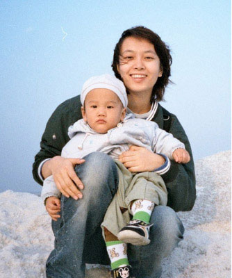

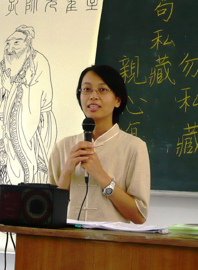

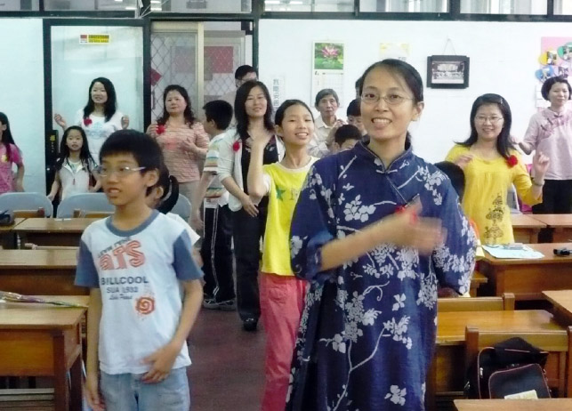

## 活動報導

### 佛遺教經講座活動報導

林士棋

架構分析知全貌

止觀雙運證涅槃

出世本懷利生事

傳承不斷法身在

二○一六年的一月底是個寒冷的冬天，氣溫只有攝氏六度的臺北盆地，居然也下起了靄靄白雪，噢不！應該說是下起了霰。於此同時，相較於室外的低溫，有個地方特別的溫暖，豐盛的飯菜不僅讓人的身子暖了起來，更重要的它還暖了你的心。你猜的沒錯，就是今年寒訓的講座令人從裡到外都暖了起來，沒有外頭追雪的歡騰鼓舞，內心浮躁，取而代之的是靜謐的法喜，微微的、甜甜的。

每年的寒訓講座向來是本會延續雪盧老人過去的優良傳統，利用寒假時間興辦密集講座，邀請青年學子及各路志同道合的善友一同研學，不同於暑期講座以儒學內容為主，寒訓講座以佛學內涵為主軸，召集青年學子與兩岸三地的朋友共同研學；包含福州、順昌、濟南、馬來西亞等地，不遠千里前來共襄盛舉。更別於以往的是，承蒙師長慈悲，本次講座為了使年輕學長提升辦事能力，無論是從執事人員乃至於帶組師資，都加入更多的青年生力軍。於此要特別感謝會內許多師長的指導與協助，以及志工團隊的犧牲奉獻，才能使本次講座圓滿完成。

課程內容以《佛遺教經》為主，是釋迦牟尼佛一生說法四十九年的最後遺言，全名是《佛垂般涅槃略說教誡經》。課本採用懺雲法師的表解，參考蕅益大師的科文，搭配師資團隊以半年時間重新討論、整理的細目科判，並以中觀正見為依歸，透過老師與消文學長的相互問答，引出大眾的學習熱情，使人能夠一窺經文中的真實意涵，同時也深化邏輯思維的串習。此外更安排大量的研討時間，讓討論風氣更加熱烈，以期每位學員都能夠充分理解經義，掌握重點。講座期間，也邀請到賴麒宇、楊子儀兩位講師開演專題，分別是「站在未來看現在：醒與省」和「心靈的解放」，令大眾不僅在出世間法有所學習，於世間法也能補充新知，了解潮流脈動。而講座期間的社團交流課程更是一片和樂，除了能了解各團體間的平常活動外，更重要的是可以見賢思齊，激發良性競爭。而修慧的同時也給予修福的機會，本次講座無論正式生、旁聽生，甚至是外賓，均輪班擔任午、晚餐及洗碗公差，在勞動中體會志工護持講座進行的辛勞，讓上課時更懂得生起感恩之心，一心一意專注學習，以不負眾人的苦心。

在《佛遺教經》中，釋迦牟尼佛為聲聞弟子重宣法要，字字血淚。從中我們也能看出佛法的總綱就在戒、定、慧。開首佛言以戒為師，戒乃是修學止觀的資糧，此外亦須明白飲食、睡眠、調伏煩惱等修學法；積聚資糧就好比我們想辦事業前，須累積資金和健康的身體，當這一切具足之後才能往下一步走。緊接著是止觀的前行，包含少欲知足、精進不退、以及不忘念教法等，都是修止觀前的必備功課，讓心容易安定下來，也能記得要如何作觀；比方來說，一個人要去學習滑雪之前，須要做些準備功課，他可能要先買張機票，或者整備雪具、了解滑雪應有的知識等等。再來是止觀正行，即是正式開始修學止觀，於止上修觀，將所學的教法反覆串習，通達無常、無我，生起空性的正見；此時就像已經開始滑雪了，不停的練習直至熟練。最後佛告訴諸弟子，修學止觀生起中觀正見的目的是為了滅除戲論，通達五蘊上的空性來破煩惱障、所知障，得到無住大涅槃的究竟安樂；若再以滑雪的譬喻來說，學習滑雪的目的是為了得到奧運冠軍一樣。在行事之前，若能了解目標，有助於堅定志向，以利修行。最後，佛在說完這些道理之後，又為諸弟子斷除種種疑惑，並囑咐流通，最終在悲智雙運中示現涅槃，圓滿一期因緣。

經中釋迦牟尼佛看似不慈悲的捨離眾生，離開弟子而去，實際上卻是最大的慈悲。佛的入滅雖然是一個終點；但卻也是弟子們傳承弘法事業的起點，惟有如此，最親愛的佛子們才有成長的機會。佛以離去的方式將舞台讓了出來，讓弟子去揮灑；佛法的存續觀待眾生，傳承不斷法身才能常在。仔細想想，經歷了這場《佛遺教經》講座的我們也是如此，雖然講座的圓滿是一個結束，但也應是另一段傳承的開始，不是嗎？

五天講座結束，天氣依然濕冷。夕陽漸漸西下，而大家心中的小太陽正緩緩升起，雖然離開了講座，我們也不怕冷了。

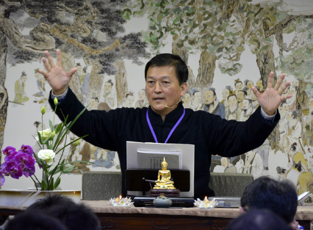

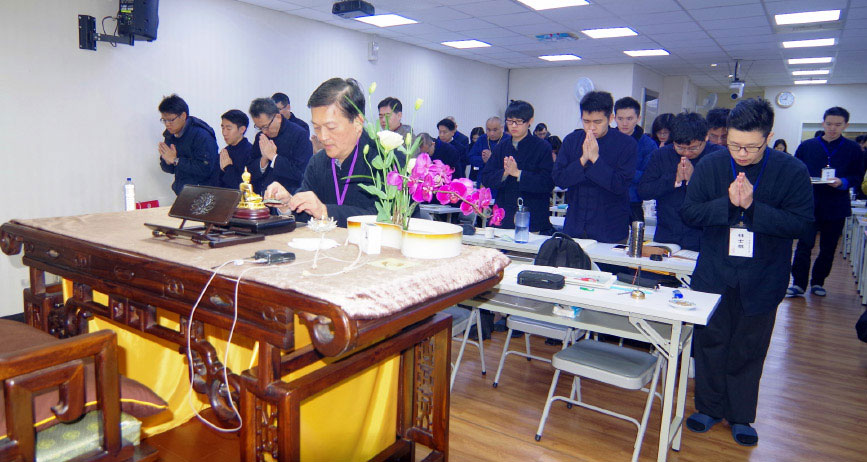

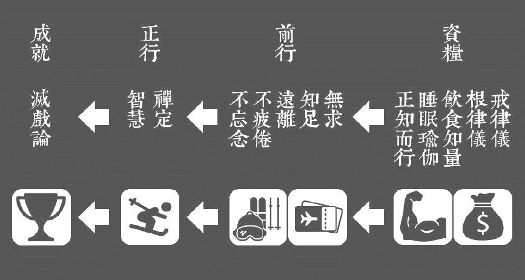

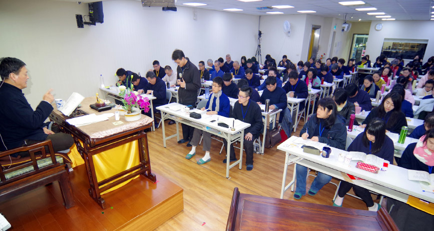

### 佛遺教經講座餐前觀修

*編輯部整理*

吃出佛法的味道

咀嚼聖者的體悟

消化難懂的空性

滋養漸成的法身

歡迎的用餐        陳麗嬌

因著學會興辦「佛遺教經講座」的緣起，感召大家在這春節前夕，不畏冷風颯颯，放下一切，由四方前來齊聚一堂，共同學習、研究教法，這種對法好樂的精神令人敬佩。在此祝大家這段期間身心安樂，歡喜聆聽教法，並有豐碩的學習成果。

《佛遺教經》是佛將入涅槃之時，為諸弟子略說的法要，也是為我等凡夫眾生，興大悲心而留下的經教，今能逢此殊勝因緣參加講座，應心生感恩把握機緣，以清淨心、不放逸自己努力學習，方不愧對自己與蓮友們種種的護持與辛勞。

現在讓我們將心沉靜下來，用下列各種歡迎之心來享用這頓豐盛的午餐。

第一個歡迎我們的是佛─此經的說法者，佛將入涅槃之時，苦口婆心的再說法要，無非是怕我們沉溺在世俗的假樂，而忘了修學脫離輪迴的真樂，如今在盛會中的我們，暫且能通達慈父內心的隱微處，當然我們用心觀想，即能看到佛展臂歡迎的喜悅。

其次，學會為大家準備了豐盛的道糧，並組成師資與學長團隊，講說《佛遺教經》，至盼教法得以延續，如佛常住，未曾滅度。相信大家共聚一處，並充滿了歡迎之心，學習聆聽與研討教法，師長們內心的隱微處是何等的欣慰與開懷。

第三，讓我們也為自己喝彩，歡迎自己來到中華無盡燈文化學會，參加這場殊勝的講座。所謂「個人吃飯個人飽」，修行就在當下，如同眼前的佳餚，如果自己不去享用，別人吃得再多，自己的肚子依然空空，更無從了知食物的味道。修學也同吃飯一樣，必須靠自己努力。願大家把握善因緣努力學習，方不辜負老師的悲心。

當我們做了如此的觀修之後，這頓豐盛的午餐必能滋養我們的色身，且內心充滿愉悅，有利學習正法，此時更以愉悅感恩的心，納受香積菩薩的用心準備，並以認真學習作為回饋。

最後我們當知佛言，勿落入種種戲論，而亂了自心，尤其更應保握這短暫時日，時時刻刻，努力不懈，務必善解所學，化之於行，能了知佛所教導之種種修行法要，以智慧力脫離世俗名聞利養的假樂，證得往生極樂世界不落輪迴的真樂。

戒律相合的用餐        白文輝

為了利益遍滿虛空的有情眾生，我們必須成等正覺，故興辦佛遺教經講座，眼前的因緣是餐前觀修，題目是戒律相合的用餐。

佛法的總綱，一言以蔽之，曰：戒定慧。其中持戒乃是學佛的基礎，猶如高樓大廈之地基，極為重要。戒律的體性在防非止惡，防止過錯罪惡，乃是修學止觀的資糧。當我們在黑暗之中伸手不見五指，完全不知會遇到什麼危險，感到很恐怖時，戒律就像一盞明燈，可作為我們的指引，應當尊重珍敬之，將之視為教誨的老師，如同佛仍住世一般。

持守清淨戒律的修道者，非澹泊無以明志，非寧靜無以致遠，人生的重點在一心勤求出道，是故應當謹身節用，節制身體的欲望享受，不要求精緻量多的食物，否則時間都浪費在美食的追求與享用，如此則耗時害道。若能安貧樂道，知量知足，夠用即可，不要增長貪欲、障礙修道。

此外，受用各種飲食的目的乃在資養色身、進德修業，故要知量知時，過多過少皆不適宜，而用餐的時間點也要適當，該食則食，不該食則止。並且懂得以食為藥，不因飲食的美好或惡劣，而生貪瞋。譬如蜜蜂採花只是取其味，而不損壞花的色香，修行人用餐也是一樣，只是為了除飢渴病而已，若是多求將會破壞施者的善心，罪過不小。如同有智慧的人，了解牛隻的能耐，會加以籌算估量，不會令其負荷過重，耗竭了牠的體力，甚至損短其壽命。

最後，在種種的對治法中，想要究竟對治對飲食生貪，仍需空性的修學方能圓滿。應知諸法自體空，唯名言安立，飲食的美好也是自體性了不可得。若有自體性，美味是在飲食上或在舌上？若在飲食上成立的話，理應每個人去吃都覺得美味，但現見並非如此，例如美味的臭豆腐，有的人便避之唯恐不及。若在舌上成立，那麼不用飲食就有美味。可見美味乃觀待能嚐的舌及所嚐的飲食，一時因緣顯現，善業生起，而名言安立為美味。如此一來，尋覓美味的自體性了不可得，則如何生貪？若能將以上所學，結合眼前的這一餐，不斷的串習，相信未來每一餐都是與戒律相合的用餐，祝各位用餐愉快！

知足的用餐        吳錫堂

知足常樂，耳熟能詳，但大部分人皆不瞭解其真意，終將淪為掛在嘴角的一句話，用來安慰自己或他人的感語。

《佛遺教經》業已指出，若欲脫諸苦惱，當觀知足，觀是觀察、觀想、觀悟，何為知足方能脫諸煩惱。足是夠，已足是再無所求。何為足，何為不足有賴於知。知是智慧，有智慧方能確定知足之意涵。

以常人所知的知足為例，有人生活花費每日以百元為已足，有人以千元甚或萬元以上之生活花費為滿足。能知足者，接合著少欲的前行，很容易悟知生活周遭之事物大多非真實需求，故能捨棄非需要之物，不會為那些不需要的事物煩惱，自得富樂。又常見永遠以為自己所擁有的一切不夠者。日進斗金不足，要日進千金，等到已經日進千金了，又想日進萬金，永無知足之時。猶如惡鬼，吃再多亦嫌不夠，於貪念驅使下，安得不生多求的煩惱。

事實上，知足本身亦無自性，若知足有自性，那每個人對需求的質與量應該一致，事實不然。常人大抵以得之多少來定其足否，亦有以付出不得而知足者。例如父母備佳餚供子女食用，因子女之喜歡，令父母停筷盡由子女取食。其知足非由食物之享用得，而是子女的滿足亦讓父母同得滿足。又如於善法的學習上，如對既有所學知足，不再精進學習，似乎擺脫學習的痛苦，但終將不能離苦得樂，未來仍於三界受苦。反倒是對於善法正法的學習，當以不知足為動力，在學習中所得之法喜遠非尋常快樂可比。

今日與善法同好用餐當觀知足：一、以能與同法者供餐，實屬難得機緣。二、以領受之佳餚，為發心護法之同法者精心烹調當知足，此乃尋常人無福領受。三、以所備餐點足敷供求法、求道者更專心精進，當稱知足。

最後，祝參與此次講座者，就世俗之物無貪所欲為已足，感悟學習正法的精進為不足，直至成就佛道為已足，阿彌陀佛。

對治煩惱的用餐        李丹

修行之要，在於對治煩惱。煩惱少一分，即工夫進一分。

要對治煩惱，首先我們應該明白煩惱究竟從何而起，世間所有的煩惱皆因我執而產生，顛倒認為「我」的身心是實際存在的，就好似患有眼疾的人看見空中飄浮著花朵，天際懸掛著兩輪明月，因此產生對自我毫無意義的執著，也就衍生出與執著有關的貪瞋癡慢疑的煩惱與痛苦。

心本是佛。由煩惱未除，枉作眾生。金不煉不純，刀不磨不利。不於煩惱中經歷過，一遇煩惱之境，便令心神失所。能識得彼無什勢力，其發生勞擾心神者，皆吾自取。

在《佛遺教經》中佛告訴我們：忍辱仙人所面境界都能忍，餘諸逆境何足介懷？「無令瞋恨」，則身意清淨；「勿出惡言」，則口業清淨。忍辱的功德，連持戒和苦行都比不上。持戒者，未必能忍辱；忍辱者，決無不持戒。所以六度之中，戒居第二，忍居第三。以前不兼後、後必具前故也。以我心而持戒。則報僅在人天；以無我而行忍，便成就出世大道。

倘若不能夠，像飲用甜美的甘露一樣，去歡喜地忍受惡毒的辱罵；就不能叫做已經入道的有智慧的人。因他惡罵，成我忍力。如石磨良劍，劍則愈利。所以歌利王是釋迦佛真善知識。如果不能歡喜忍受，便是愚癡，未聞道故。況一念瞋心起，百萬障門開。破諸善法，何能自利？壞好名聞，何能利他？今世無二利之因，後世無二利之果，所以欲護自利善法，當防瞋火；欲護利他功德，當防瞋賊。

曾經有一個公案。從前，印度的一位國王勝光王，迎請世尊供齋。當時有一位以行乞為生的貧女心想，勝光王是因為往昔所積累的福德力，才成為擁有榮華富貴的君王，如今遇到了釋迦牟尼佛這樣殊勝的福田，又積累了這麼大的福德資糧，實在是太稀有了！她發自內心地歡喜。世尊清清楚楚地知道此事。傍晚回向的時候，世尊對國王說：「你所積累的福德、善根是回向給你自己，還是回向給比你福德善根更大的人？」國王心想：「不可能有比我福德、善根還大的人。」於是就說：「誰的福德善根大，就回向給誰吧。」世尊就念了那位貧女的名字做了回向。世尊連續三天都是這樣做的回向，有大臣們獻策：明天世尊來應供的時候，我們多做些飯菜，讓飲食溢到器具外面，等貧女來撿的時候，我們就打走她。國王同意了。第二天貧女遭到了毆打，不由得生起了瞋恨心，摧毀了善根。當天佛陀便念國王的名字做了回向。

隨喜的功德不可思議，瞋恨心的過患也不可思議。我們要隨喜一切，隨時隨地觀察、憶念、隨喜他人的善根和福德。

比如我們一會兒用餐時，對於師姑用心煮的每一道天廚妙供都以無限感恩、隨喜讚歎、成就道業之心來受用，就對治了對飯菜分別的煩惱。

我們在行住坐臥、應對進退中要恒常觀自心，如果發現有煩惱生起時，就要馬上對治。就如同一條蛇掉人懷中，要立刻把它丟掉一樣，因為毀壞自他一切的根本敵人就是「煩惱」。

紮堪婆羅門時時觀察自心，每當生起不善念，他就放個黑石子；每當生起一次善念，就放個白石子。最初，全部是黑石子；通過精勤對治，去惡從善，到中間時，呈現黑白各半；到了最後，已全部是白石子。

在凡夫地，誰無煩惱。須於平時預先提防，自然遇境逢緣，不至卒發。縱發，亦能頓起覺照，令其消滅。至於橫逆一端，須生憐憫心，憫彼　　無知，不與計較。又作自己前生曾惱害過彼，今因此故，遂還一宿債，生歡喜心，則無橫逆報復之煩惱。

萬境本閑，唯心自鬧；心若不生，境自如如。

習氣如夢幻泡影，就是種子現行在心裏頭，現行熏種子、種子熏現行，知道是這樣作用，就不聽它的。

若能了我空，則無盡煩惱，悉化為大光明。

不疲倦的用餐        王姿云

不疲倦的用餐，反面來說是不疲倦，而正面來說就是精進。甚麼是精進的用餐？吃得很努力、很香嗎？到底精進可以如何和我們的這一頓午餐結合呢？

我們這幾天所學的《佛遺教經》，乃釋迦牟尼佛入涅槃前對眾弟子們的最後遺言、最後說法，就如同父母對著自己的愛子愛女做最後的諄諄教誨，想必這最後的教誨乃是精華中的精華。其中，佛說了；「汝等比丘，若勤精進，則事無難者。是故汝等當勤精進。」可見精進此法對於我們日常修學是多麼的重要，然而，修精進法和精進修學善法是兩個不同的面相，就好比你能使用英文幫別人做翻譯前，你必須先學會說一口流利英文。那麼就該試問，如何助修成精進法呢？

成佛之道中助修成精進法有四力；歡喜力、勝解力、堅固力、暫止息力。當我們很喜歡做一件事情，或是在做那件事情當中感到無比的開心，我們便會想要持續的做下去，就如同在修學的過程中，法喜充滿，而能精進修行，這就是「歡喜力」。當我們能相信了解因果及空性的道理，知道真正的離苦得樂之道，引發精進而使之修行，這就是「勝解力」。當我們能持之以恆，有始有終、貫徹到底的精進修行，這就是「堅固力」。而如果我們在該休息時適度的休息，為的是以後能持續精進的走更長遠的路，這就是「暫止息力」。

而今想用以上這四力來和我們的吃飯做結合。首先，「歡喜力」：我們在用這頓飯的當下，可以觀想這頓飯是怎麼來的，因為有這場《佛遺教經》的講座，有老師們的講課，有大眾們的一同參與聽課，才有師姑師長們發心一整天在廚房默默的為大家準備飯菜，隨喜我們聽聞教法的功德，吃上這頓色香味俱全的飯菜便是一頓法喜充滿的飯菜。再者，「勝解力」；我們享用飯菜前，都能來聽一篇餐前觀修，而能把一般人看似平常的一頓飯，進一步的作教法上的觀修和結合，不斷加強我們對於因果知見、空性見解的串習，這頓飯就能不斷的和道法相應。三者，「堅固力」：享用這頓飯菜，目的是要來堅固我們身和心，讓我們身心都能健康愉悅地的在道法上，持之以恆的修行。最後，「暫止息力」：吃飯這件　事情非同小可，將吃飯拿來餵飽我們修學上疲憊的身心，而能養精蓄銳，打長久戰，那麼這樣的一頓飯就是精進的必需品。

如果在用餐前、用餐時甚至用餐後，都能作以上的觀修，我們便好像拿到一把萬能的工具，可以使用在各個修學的層面，像是用勇悍的心去聞思修，精進於上課的聽聞，精進於思維法義，對於串習聞思的決定見解也要精進，這樣的精進，我們能夠得到聞所成慧、思所成慧、修所成慧；從一頓飯中可以生明解、生真智，最後一同入聖道，這就是「精進的用餐」！

不忘念的用餐    王順福

《佛遺教經》講座到今日已是第三天，此段時間持續有明師的教授善知識精妙的講演，及好學的同行善友消文的相隨，細思量對所聽聞的遺教經有無憶持不忘。

末學試將講堂上參與者，依年齡約略作一區分，有而立(三十歲)以下、有而立至知命(三十與五十歲之間)，及知命以上(五十歲以上)三種，眾所皆知，憶持白話意思就是記憶力，毫無疑問，如末學已逾耳順，憶持功夫自然不如而立以下的同學，可是也不能自暴自棄而自餒，要砥礪自己以理解力補記憶力之不足，此一方法，是平素從老師講課聽聞而來，而理解力展現不外乎思維其功德與過患，但功患非得從科判架構之分析方浮現出來。科判架構如啟建樓房樓層之繁簡，關係解經者對眾之契理契機，層數越多意味判經人越有微細智。本次《佛遺教經》之講座，老師為聽經者準備繁簡二種版本，簡版是蕅益大師的科判，該科判從序分一層至正宗分之五層(正宗分下分二\明共世間法要下分三\對治苦法要下分三\根欲放逸苦法要下分二\根及欲放逸苦對治)，亦有二、三或四層；老師率學長參酌蕅祖所作之科判，由序分二層至正宗分九層，所謂站在祖師肩膀分得更加精細，不論繁簡，大體上依文句所含義理不同及邏輯思維而妥分，不是僵硬地定得拆成幾層，而我等讀科判也可依自己根器而作選擇，不妨先簡後繁。讀科判如此，學作科判料想亦復如是。

依《佛遺教經》經文及經義所說，若日日時時能不失正念，久而久之，念力增強，縱使處在五欲煩惱怨賊中，猶如身上披著鎧甲護身，入戰陣中，不致有傷身之患，此即是不忘念的功德；反觀一旦失去正念，煩惱賊隨即趁虛而入，劫去功德法財，此即失念的過患，認知了不忘念的功德與過患，容或可勉強憶持。

年紀漸長雖可藉理解力盡力維持不忘念，在此姑且提出二種憶持不忘的方法，一種是古人常說的讀書要用心、手、口、眼到，如修淨土法門印光祖師時時提撕持名念佛要口念、耳聞、心聽三者一起用，俱要清清楚楚、了了分明，才能憶持不忘。另一種是雪廬老人特別勉勵後學者以抄經方式下死功夫，一字一字的抄寫，可說將手到發揮得淋漓盡致，抄寫不犯錯，自自然然便收攝住心，實際上已齊用手眼心三到，進而達到念茲在茲的境地，如此或許也能憶持不忘，上課前即抄錄一通遺教經經文，便是秉持這一理念，並依雪公之教誨而行。

有作早晚課或定課習慣的人，作課時間容易不忘念，其他時間如經文流通分世尊所說勸勉弟子不論｢山間、空澤、樹下、閒處靜坐，念所受法，勿令忘失｣，甚至古德說行住坐臥遇到順逆境界，或用餐就不見得對所持義理能憶持不忘，我等此刻用餐果能念念在遺教經經文，及經義旨趣之修學止觀上，同時也能感念香積組義工細心、用心不畏寒冷的付出，能如是，庶幾乎不忘念吧！

禪定的用餐        楊茹軫

《佛遺教經》上說「若攝心者，心則在定」，金剛經上云：「不取於相，如如不動」，禪定就是「外不著相，內不動心」，當六根接觸到六塵境界時，不管遇到甚麼樣的境界，能夠不受干擾，不被外境所誘惑就是禪。而能保持清淨心，不生妄想、分別、執著就是定。

吃飯很重要，每個人每天都離不開吃飯，不吃飯是無法延續生命的。但是吃飯要如何與修行結合在一起呢？在吃飯的時候不要著吃飯的相，很多人吃飯時非常考究，講究食物要色香味俱全，這樣就著了吃飯的相，覺得這個好吃，合我的胃口，那個不好吃，不合胃口，就動了心。

禪宗有個故事，是唐朝的有源律師，有一日向慧海禪師請教︰「禪師您在修道的時候有沒有什麼特殊的法門呢？」，慧海禪師回答︰「有啊！我肚子餓的時候吃飯，身體疲倦的時候就睡覺。」有源律師問道︰「一般人的生活也是吃飯、睡覺，與禪師一樣啊？難道平常人也是在修道嗎？」禪師回答︰「平常人吃飯的時候，貪求精美，百般挑剔，如果沒辦法求得，心裏便容易起瞋恨。而終日汲汲營營於富貴，乃至於晚上睡覺的時候，仍然心懸名利，該睡的時候不睡，要睡的時候又要求床鋪要舒適，這樣那能安穩。所以我與一般人是不同的啊！」

由此可知，雖然是吃飯這樣簡單的事情，但要維持不著相、不動心是多麼不容易的事啊！因此在飲食當中，能時時觀照自己的念頭，並察覺自己的起心動念，看到飯菜，能「外不著相，內不動心」，就是修一心不亂，也是修定。所以我們修行的目的，就是要讓自己不管在任何的順、逆境之下，心都能不隨境轉，能自己做得了主，否則隨境生心，就被障礙了。

智慧的用餐        陳世昌

佛說的智慧即是四諦法門的修學，故此次觀修僅從四諦法門角度切入。

為什麼用餐跟智慧有關？因為吃飯的時候是煩惱最容易生的時候了。眼根見精美菜色，耳根聞隔鄰吃聲，鼻根嗅各式菜餚不同之香，舌根嘗菜餚之味，飯菜吃下肚後身根飽足之樂，意根不知足的還想著繼續吃，或者其他等更慘。本來一堂課下來，都攝六根，淨念相繼，眼看就要得三摩地。一頓飯下來六根全跑光。唐朝趙州禪師自稱：「老僧行腳時，除二時粥飯是雜用心處，除外更無別用心處。」可見吃飯要不分心起煩惱，需得好好用功。以上是集諦門的觀察。

要如何用功呢？在動機上確立吃飯長養色身方便修道，不在美味，如同經文所講：「汝等比丘，受諸飲食，當如服藥，於好於惡，勿生增減。趣得支身，以除饑渴。」這就要問自己內心的隱微處的真正想法了。那如果發現自己真的很貪愛美食或某種食物，要怎麼辦呢？這就要用持戒之鉤來對治，要好好觀修貪食的過患，如一餐吃的過飽則氣急身滿，昏昏欲睡，長期都吃過飽就導致各種疾病上身。以上是苦諦門的觀察。

其次美食吃下去前看似形色香味俱全，下肚之後如果再嘔吐出來者，沒人肯吃自己嘔吐的食物，可是剛剛明明是美好的食物，只不過經自己的咀嚼再下肚，那美麗及美味的自相何在？再來如果愛吃某種美食，每餐吃，天天吃，到最後也會變成討厭。所以美食也不是在那裏自相存在的，再如果這五天講座每天中餐、午餐餐餐菜色都一成不變，到第五天諸位會覺得美味嗎？這就是有名的大廚師不斷要推陳出新，變化菜色的道理，世間人都懂，美食自己也不是自相存在的。而吃的人這一方如果自己成立美食，那吃甚麼都成美食，也不成立。以上是道諦門的觀察。

最後引用《楞嚴經》二十五圓通，從味塵中，證得圓通的藥王藥上二位菩薩自述圓通法門，證明味塵也有滅諦可得：「我無始劫，為世良醫，口中嘗此娑婆世界草木金石，名數凡有十萬八千。如是悉知苦酢鹹淡甘辛等味。并諸和合俱生變異，是冷是熱，有毒無毒，悉能遍知。承事如來，了知味性，非空非有，非即身心，非離身心。分別味因，從是開悟。蒙佛如來印我昆季，藥王藥上二菩薩名。今於會中為法王子。因味覺明，位登菩薩。佛問圓通，如我所證，味因為上。」

另外憍梵砵提尊者則是從舌根上證得滅諦：「我有口業，於過去劫輕弄沙門，世世生生有牛呵病。如來示我一味清淨心地法門。我得滅心入三摩地。觀味之知，非體非物。應念得超世間諸漏。內脫身心。外遺世界。遠離三有，如鳥出籠。離垢銷塵，法眼清淨，成阿羅漢。如來親印登無學道。佛問圓通，如我所證，還味旋知，斯為第一。」

智慧實在太重要了。經文上說：「實智慧者，則是度老病死海堅牢船也，亦是無明黑暗大明燈也，一切病者之良藥也，伐煩惱樹之利斧也。」最後祝大家也能在這一餐中，已得美食又有智慧。

斷疑的用餐        梁浩

斷疑的用餐：疑就是懷疑，對於事理，依違難決，傍徨無主，莫知所從，謂之「疑」

一、疑的定義。

《百法直解》云：「疑者，于諸諦理猶豫為性」人對於「苦集滅道」四諦理疑惑不解。《遺教經》言：「月可令熱，日可令冷，佛說四諦，不可令異」由此可見四諦之本質，不外因果二字，集諦是因，苦諦是果。道諦是因，滅諦是果。換言之，集為苦之因，苦是集之果；道為滅之因，滅是道之果。沒有貪嗔等之集因，怎能招感生死之苦果？若無精修道法為因，安得涅槃寂滅之果？綜觀世出世間一切諸法，均逃不出因果二字！

然而因果道理，看似簡單，其實是錯綜複雜！良以眾生業行不純，忽善忽惡，以業不純，所以報有精粗，或貴或賤、或苦或樂、或智或愚、　或賢或不肖，千差萬別，或因同果異、或果同因異、有異時而熟、有異類而熟、有變異而熟等，其事非一，於是疑惑便油然而生。

或疑：精進奉戒，應得長生，而見短命？屠殺之人，應見促齡，而反延壽？或疑：清廉之士，應招富足，而見貧苦？貪盜之人，應見困躓，而更豐饒？博學如太史公對因果道理，也疑惑不解，在《史記伯夷列傳》中太史公說：「或曰：天道無親，常與善人。或伯夷、叔齊，可謂善人者，為什麽積仁潔行而餓死？孔門七十子之徒，仲尼獨薦顔回為好學，然回也屢空，糟糠不厭，而卒早夭！盜蹠日殺不辜，肝人之肉，暴戾恣睢，聚黨數千人，橫得天下，竟以壽終，是遵何德哉？若論近世，操行不軌，專犯忌諱，而終身逸樂富厚，累世不絕！或擇地而蹈之，時然後言，行不由徑，非公正不發憤，而遇禍災者，不可勝數也！余甚惑焉。」太史公對古德所言：「天道無親，常與善人」或「天道福善禍淫」的道理，是對？是錯？甚為迷惑，莫知所從。

二、疑的作用

《百法直解》云：「能障不疑及諸善品為作用」

不懷疑是善法之一，攝持著正信、正勝解、正慧。此三種行相正好與「疑」相對立。

「疑」能障善法，如五戒、十善、六度、萬行等。如上所言，行者既對因果事理，有所懷疑，對「天道福善禍淫」之理，也不能印可認同，行者自然不肯孜孜不倦，不疲不厭於善言善行，濟世救人之事業矣！

三、疑之對治

「疑」之罪過，既如此重大，行者當如何對治之？藕益大師在《唯識心要》中開示云：「若欲除疑，惟有虛心博學，審問慎思，憑正教為指南，依師友為眼目，又須如舜之好問好察，如孔子之善惡皆師，方能永斷疑根，直至不疑之地！」

〈中庸〉第六章載，子曰：「舜其大知也與？舜如問而好察邇言。」

《論語》〈述而篇〉載，子曰：「三人行必有我師焉。擇其善者而從之，其不善者而改之」，孔子隨時隨地隨人都在求學，善固可使其得益，不善也可藉以啟發其思想。正如《老子》所謂：「善人者，不善人之師；不善人者，善人之資。」

又《論語》〈子張篇〉載，衛公孫朝問於子貢曰：「仲尼焉學？子貢曰：文武之道，未墜于地，在人！賢者識其大者，不賢者識其小者，莫不有文武之道焉。夫子焉不學，而亦何常師之有？」賢者識大，不賢者識小，皆有文武之道存在，亦即人盡可師，故孔子師項橐，入太廟每事問，學禮于老聃，問官于郯子，學琴于師襄，訪樂于萇弘，俱是無常師也，故能如百川匯海，以成其大。

面對眼前師姑們辛勤勞苦為我們煮的美味佳餚，以充色身，增補能量，用來親近師友、廣聞教法、念佛懺悔、行諸善業，則能智慧朗然，事理明達，永斷疑網，直至不疑之地。

咐囑的用餐    王東煜

諸位老師、蓮友大德同修及學長們，阿彌陀佛！今晚餐前觀修題目是咐囑的用餐，五天寒假《佛遺教經》講座至今已圓滿結束，我們不妨簡單複習《佛遺教經》的內涵，以感恩我們能夠得知佛一生修學的精華要義，並藉由老師不疲不厭的解說，讓我們領受到釋尊臨終慈悲的咐囑。

在修學止觀資糧部分，先談到戒律儀，其中要敬重根本戒，如同對老師及佛一樣尊貴，而方便戒則要持戒，遠離使我們貪心、驕慢，間接殺生及浪費時間等過失。戒是解脫之本，能生定慧，為第一安穩功德之處。

其次是根律儀，它是戒律儀之精神所在，包含不取行相就是五根不要對五欲境，譬如牧牛、惡馬、劫賊會毀損害我們或殃及累世，故要將五根當賊，不可放逸。也包含不取隨好，無論對境還是不對境都不要想境界的好，因為它比毒蛇、惡獸、怨賊、大火還恐怖，就像狂象無鉤，猿猴得樹，完全無法控制，故當精進以正知見降伏。

另外要調節飲食，飲食如服藥，是為了治貪瞋毒除饑渴病，也像蜜蜂採花蜜一樣，只取花的甜味，而不侵害花朵的色香，以保護我們的善心。

在睡眠瑜珈部分要精進對治眠怠，不要讓這一生在睡眠中虛度，所以要觀無常，觀煩惱過患。煩惱的毒蛇睡在心裡，就像一條黑蚖蛇睡在臥室裡，要用持戒的鉤把蛇鉤出去才能安睡，且要懂慚愧，能自我反省及接受他人勸告而真心改過。

正知而行的部分，首先是忍辱對治瞋恚，要觀不忍會妨礙修道，失去功德利益，因它比猛火厲害，也像會劫我們功德的賊，而忍辱功德是持戒、苦行所不能及，且可使道力增勝不退轉，所以要以忍辱對治瞋恚。再者要降身行乞對治憍慢，出家人是以五相降伏憍慢心，只要是修行人，若起憍慢心，一定要快速消滅它。另外還要以質直對治諂曲，不能詐現自己是有德的人，也不能為求名聞利養而討好別人。

接下來談修止觀得解脫，首先是止觀前行，其中包括無求功德，是強調多欲為苦，少欲無患。一個少欲的人，就不需要靠諂媚來屈從人意，也不會被諸根所牽引。且內心坦然、無憂無畏，易修學空性而得解脫。第二是知足功德，想脫離苦惱，要常觀修知足，知足的人雖躺在地上，也覺得安樂；不知足的人，雖在天堂，也不稱心如意。不知足的人，常為五欲所牽絆，而且被知足者所憐憫。第三是遠離憒鬧功德，正面說能安靜獨處的人，帝釋諸天會敬重他，也容易思空性滅苦本。反面說，喜歡人多在一起則會受眾惱，也會淹沒在眾生的苦惱中，就像一頭老象陷入泥濘中不能脫困。第四是不疲倦功德，若能勤奮精進則天下無難事，就像小水穿石。反之如果懈怠廢弛的話，就像鑽木取火，木頭未熱火就停止，要點燃火是辦不到的。第五是不忘念功德，是說有記憶的能力，煩惱賊無法入侵，五欲賊不能加害，就像一個披盔甲的人進戰場，他不會害怕危險。

接著說正修止觀，它包括禪定功德及智慧功德，其中禪定功德，是說定的體性就是止，修禪定可通達無常，因心在定上使我們不忘記教法，且有專注力，能從此定通達世間生滅法相，且善修禪定的人可升起無漏的空慧。此外，智慧功德是說慧的體性就是觀，座上修及歷緣對境修時，以般若智慧串習教法，可證得離貪得到解脫。修學空性才能度老病死海，是破無明我執的大明燈，也是一切病人的良藥，更能砍斷水脈讓煩惱樹枯死。所以，要以聞思修的慧自利利人。而最後止觀成就是滅除種種不能離苦得樂的戲論，戲論的過患是使我們心亂，會障礙修道，若想得到寂滅之樂，就要以中觀正見滅除戲論的過患。

以上是釋尊咐囑弟子們勤修止觀出離三界的大意，我們雖是在家居士，也當儘快服下這帖藥，時常串習法義，對《佛遺教經》產生殊勝的見解，能依此自行化他，利樂一切有情，並做為往生西方極樂世界的資糧。期待下次講座能夠再度切磋琢磨，最後祝福大家法喜充滿，發菩提心永不退轉，早日成就道業！

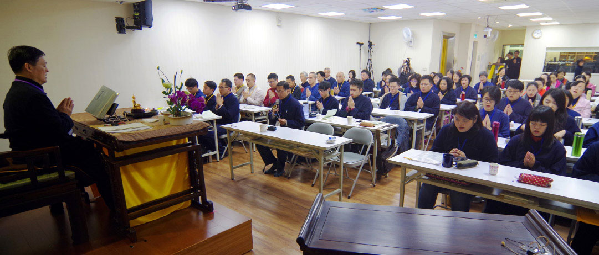

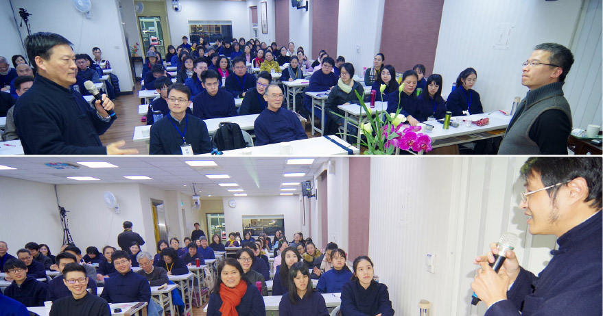

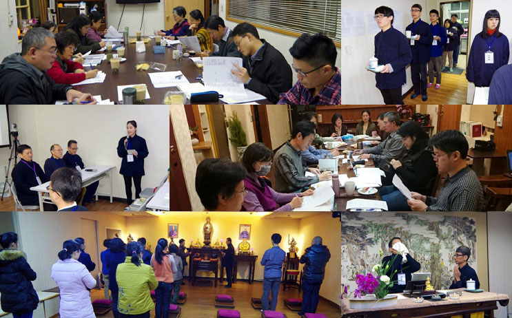

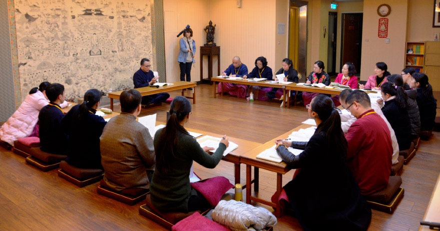

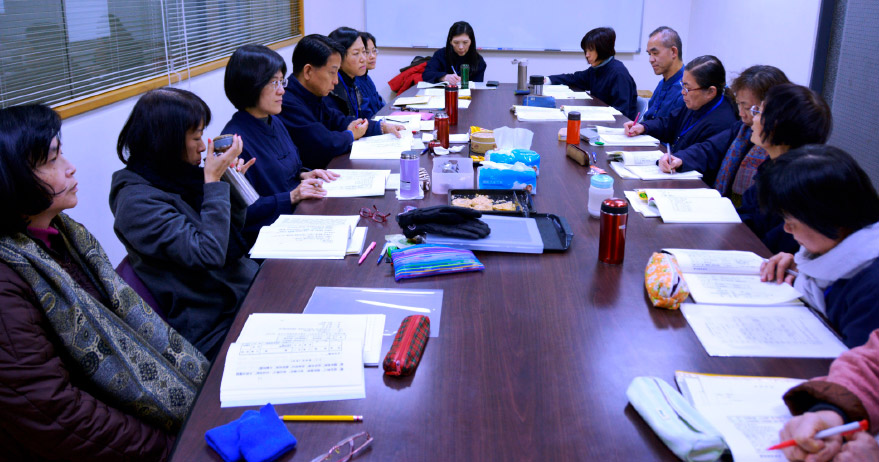

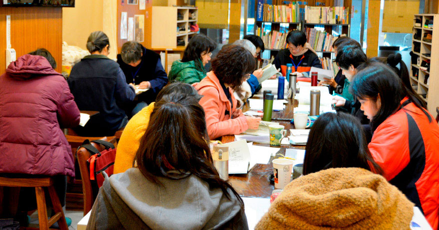

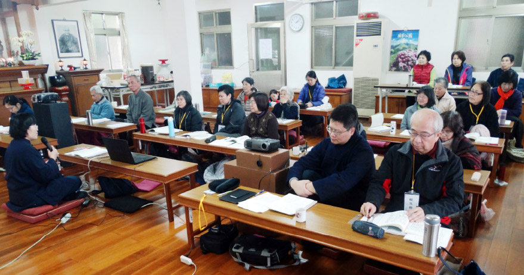

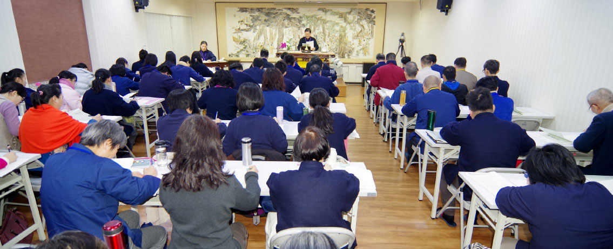

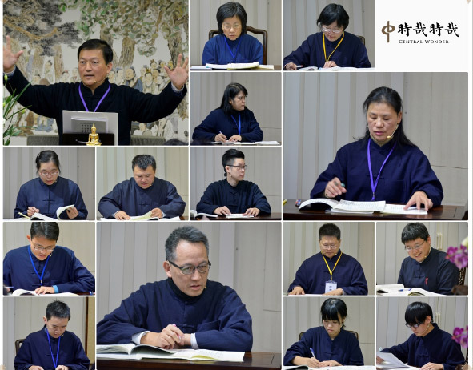

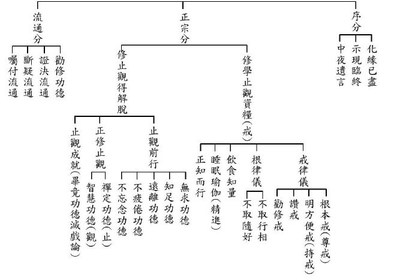

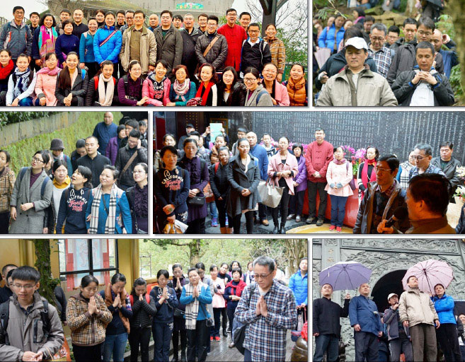

### 佛遺教經講座心得分享
				─遺產繼承人

佛遺教經講座心得分享

─遺產繼承人

*編輯部整理*

四九說法三百會

遺言總攝止觀義

暇滿人身聞思修

繼承家業福難思

佛遺教經心得─遺產繼承人　　陳怡瑩

某人為一家之主，除了擁有一宅可自住外，新近又添一宅，收起租金。人知皆道恭喜，某人聽則皺眉，自稱有三個孩子，還得再拚一間，將　　來百年後才能公平，一個孩兒得一間屋。世間父母若無出世法的知見，任憑再會為子女打算，也與解脫沒有關係。

人生在世為輪迴所繫縛，能活多久不能憑己意；會怎麼死不能憑己意；臨命終有沒有足夠的時間和力氣清楚表達遺言，也不能憑己意；就算兒孫有幸聽到遺囑之交代，就一定奉行不違嗎？自己的命尚且不能掌控，又豈能主導家門之未來？又，世間人所謂代代相傳的祖產，是祖父傳給父親，變成父親的；父親再傳給兒子，也就變成我的；我的將來是要傳給我的孩子，我的孩子再傳給我的孫子；由於對我的執著而生佔有慾而有得失心，一再地薰習我執而且將能執所執代代相傳，用盡一生來串習、造作與解脫無關的種種。

學生何其有幸能在老師座下聽聞《佛遺教經》，釋迦牟尼佛在娑婆世界的一生，以非輪迴所攝顯現為輪迴所攝，這是佛的能耐也是佛的慈悲。如何證明佛是以非輪迴所攝顯現為輪迴所攝？佛將入滅一事乃佛觀待因緣所決定，中夜遺言是佛想說多少就說多少，不會像世間人想說的還　　沒說完就斷氣，遺教經架構完整、有頭有尾且不疾不徐，一再為弟子斷疑，若非佛已離開業的繫縛，試問如何可能？

此經經文感人處處，無不觸動學者的內心。佛問弟子有無疑問，弟子們明知發問可留住佛，卻安靜不問，為何不問？乃是弟子知佛已決意入滅，為讓佛安心涅槃，故顯示無疑，這是弟子們與佛心意相通。但佛與這些弟子有著革命情感，知弟子心中對佛這麼快要滅度生起悲感，故對弟子開示聚會無常，有聚有散，且佛久住無益，因如來法身之所以能常在，其因不在佛，而在有無傳承者。

佛來到娑婆世界度化眾生是佛的慈悲，佛要滅度也是佛的慈悲。眾生若對法對大善知識不能生起難得珍重之心，怎會願意好好學？曾聽老師說過，雪公太老師上課時不准錄音，遑論錄影。除了太老師講課因當機眾而變化，事後斷章取義恐有誤解之外，學生想聽課就要珍惜眼前的機會，過了就沒有，無法事後補課，如果因有別的事而缺課，那就表示這門課不是心中的第一順位，還有別的事更為重要，不讓學生錄音何嘗不是一種慈悲？正好讓我們反思法在我們心中有多尊貴、求法之心有多強，有了堅強的求法意志，想讓自己成為法的傳承者的那一分，在善知識眼中方是受教的形象。

佛留下龐大遺產，得之者能究竟地離苦得樂，也能幫助眾生離苦得樂，得此遺產既自利又利他，為了成為佛的繼承人，眼前先在無盡燈穩紮穩打地學，就像學習遺教經，若非老師講授，學生如何能知佛之深意？經文如何能躍動紙上使人心中發顫？我們如何能明瞭最寶貴的遺產乃是般若智慧？身在人道，但應心志高遠，方不枉善知識的厚愛，讓我們得以共霑法雨，同受法益。

許瑋娟

隨著超級寒流的來臨，《佛遺教經》講座也起講了，窗外飄著雪，雪落下來不及觀賞它的雪白，即已轉化為水，無常的觀修也生起了。

這是第二是參加講座，雖有去年《佛說四十二章經》的學習，但是課堂上仍有很多是聽不懂的，但也體悟到老師常說的頓悟是從漸修來，若是經過起疑、思維、研討、串習的法義，課堂中即有熟稔之感，課後的切磋琢磨真不能少；而當拿到科判隨著老師的帶讀時，內心即對《佛遺教經》的意趣有了整體的概念，突然驚覺科判的學習法是很重要的一環，過去所受的教育大概就是背誦文章，並沒有這樣架構性的訓練，所以對於文科的理解就是背多分，而選擇了理工科就讀，因為只要理解、推理就可以得分，就不需要背書了，但是自從每週跟著時哉時哉網路教育學院學習，才了知每一科目的學習都需要推理思維，聞思修缺一不可，而聞需要老師、思需要老師、修也需要老師，難怪顏回再怎麼也不願意離開夫子，可見老師真的太重要了。

五天的課程在老師及學長們的用心準備下，心飽是毋庸置疑的，身也被學長們的發心，每天享用著再豐盛不過的午餐，心想這樣幸福規律的日子，若能長些有多好！這一切都要非常的感恩兩位老師及學會，原來團隊才能造就這樣的殊勝的善法，尤其是有教法學習下的團隊，體悟到辦事需要教法，團隊的和合也需要教法。

學習的時光總是過的特別快，陽光灑進屋內，準備要迎接結業式了，更讓我生起學習因緣的難得想，要好好珍惜，也隨喜自己能夠放下工作，好好的來學習教法，感到非常的幸福。

楊志卿

首先要感恩唐老師，及講師團隊半年來的準備，藉由科判教材，生動的對話應答，讓我們在寒冷的天氣中，深深感受到共學串習的熱忱！此外工作團隊，無論香積、音控、行政…等，都提供最佳的服務，讓每一個人得到充實快樂的學習，非常感恩！

講座的教材以科判架構，一以貫之的教學法，讓我們學習時，依著條列綱目，層次分明，更容易了解，對末學來說，了解整體架構，掌握脈絡，每一堂上課都非常充實，受益良多！

佛陀涅槃前的教導，主軸在修學止觀，從持戒、制心節食、睡眠、忍辱、勿憍慢、質直端心，進入到少欲知足，要遠離憒鬧獨處，如小水穿石的精進，不忘念，要記住正法，修習禪定，求大智慧，捨離亂心戲論，修習中觀空性的正見。

在離戲論這一段，因為末學的程度魯鈍，對老師的深入開解不能完全了解，這有待自己更加精進學習，就像唐老師的經驗，要慢慢磨。

在五天課程中，感恩唐老師在中壢道場安排怡瑩學長等四位帶領我們研討，課程中得以提問交流學習，上課之後，讀書會的學員繼續安排複習，這也是聞、思、修的力行，希望時時把握串習的機會，有很多內容需要吸收內化，在心源隱微處默默洗滌。

最後的教誨仍叮嚀要精進勤修，透過唐老師的講解，更深刻體會到佛陀的慈悲心切，我們必須深信不疑，依教奉行，繼續傳承不斷，也就是法身常在，佛陀的入滅，才是學習和傳承的開始。《佛遺教經》是佛陀為弟子所講的最後一部經，對弟子反覆叮嚀，就像父母親將欲離世，為了兒女仍然諄諄教誨、無微不至，內容充滿了心血，我們身為佛弟子，必須更加努力修持，勤加精進！

張忠敏

成行心路：去年十一月中旬就得知寒假一月要辦《佛遺教經》講座，滿心歡喜等待報名，但十二月又得知此次講座因場地有限只針對內部學員及大陸學員，只能開放幾位名額，當時心情非常沮喪，但是對自己說，不到最後決不放棄，祈求三寶加被，希望能像暑假一樣在中壢開課，同時也詢問師姑中壢可以開課嗎？師姑也希望中壢能開課，所以立刻拜託師姑向老師祈請中壢開課，就在這樣不確定又不安的心情中過了十幾天，終於有一天，學長向我們要中壢研學的學長名單，直到此時才稍微心安，也立刻將我們整團名單報上，其實有上班的學長們也早就安排好假在等著了，大家都歡欣鼓舞地期待這次的講座，我們大家都很感恩老師和師姑的慈悲，開放中壢場地給我們上課，所以學長們都有共識，要讓老師們不要為我們在中壢上課擔心，我們大家要自己發心把此次講座護持起來，以報答老師和師姑的慈悲疼愛之心，真是太興奮又太感動了。

學佛心路：民國七十四年皈依西蓮淨苑，當時師父智諭法師正好在講《佛說阿彌陀經》，我當時只聽了部分經文，就覺得西方極樂世界是我的最後歸依處，也以為只要好好專心念阿彌陀佛，並發願此生往生西方極樂就可以了，因此就回家萬緣放下專心打坐念佛，也好長一段時間身心真的得到輕安法喜充滿，但是經不起一場大病就全垮了，當時還懷疑為什麼念阿彌陀佛沒用呢？我的病都不會好起來，為了病又相信了神壇作法，就這樣糊塗過了二、三十年，直到接觸學會後，我才知道這些年走的都是冤枉路，原因就是知見錯誤。

學習心境：自從一○二年六月由王老師接引來到無盡燈文化學會學習《論語》，當時很震撼老師能將《論語》如此解釋得精準有理，跟我以前所聽的不太一樣，但很喜歡聽老師的解釋分析，學《論語》讓我更了解孔子的中心思想，〈中庸〉也聽到後段對儒學產生興趣，也被老師引發對中華文化的傳承有一份使命感。

佛學課上過「心不相應行法」，當時真的一頭霧水、文字名相又多又陌生真是糊了，只有一種感覺我的煩惱有這麼多這麼複雜，但我之前怎麼都沒感覺呢？只是常覺煩惱痛苦，卻不知道這些都是自己不明事理而造作出來的，煩惱的細微處是很可怕的，讓我在生死海中輪迴不止，要去西方極樂世界它就是最大的障礙，所以一定要對治才行，那要如何對治呢？就要用正確的方法來對治。

接著學了《佛學概要十四講表》對佛法才真正明瞭，學佛目的是要解脫成佛，當然解脫成佛當中還要有正確的知見和正確的行持，接著又學了《佛說四十二章經》及《佛遺教經》都是教我們解脫成佛之道，佛初轉法輪說法到最後涅槃說法都是要我們熄滅貪瞋癡修行戒定慧，以般若空性智慧解脫成佛，老師講《佛說四十二章經》是以中觀空性修學法去開解，《佛遺教經》是以止觀修學法去開解，都是教導我們解脫成佛之道，這是我的體會不知對否請老師指導。

這一路學來慢慢對佛法體認越深，極樂世界是唯一歸依處，但去的道路沒找對那也是沒用，去的方法用錯也沒用，這些問題都在於要有正確的知見，才能用正確的方法找到正確的路，也才能圓滿到達目的地，所以正知見就很重要了，而正知見觀待善知識給予我們正確的指導，帶領我們往最後目的地前進，當然也要不斷反省改進，不斷修正自己的錯誤想法，完全跟隨善知識的帶領教導，以祈這一期生命結束能達究竟歸依處。

結語：經過這麼多年的荒廢歲月，有如在黑暗的大海中沒方向的亂航行，如今終於碰到正法正知見的善知識及團體，有如在黑暗的大海中找到一盞明亮的燈塔，能在他們攝受愛護下學習真的太有幸了，真不枉費這世間走一趟。

期許：一直跟著老師學習，且要不斷串習，直到真正了解體悟老師所說法，希望有一天能夠花開見佛悟無生。

黃嘉美

首先感恩兩位老師慈悲，師伯師姑慈悲，辦一次講座必須要花費很多的心力，人力，財力，物力，過程繁雜，講究細微，團體的配合，看到了老師學長們的用心努力，義工的努力付出，才能有此次的講座，為了讓大家能夠專心上課所以提供大家舒適的環境來學習。

在本次的講座主題是：《佛遺教經》，佛陀的遺言裡面有這麼多的交代話，聽了老師解說以後，深感榮幸，能聽到這離老病死苦的上等法藥「戒，定，慧」。佛陀的遺言不單是對當時的佛弟子講，更是對著現今的我們言，希望喚醒我們趕快離開這濁世，能夠自己得利，然後再來利益他人。

佛陀當時心意的圓滿已超越時間空間，所以在遺教經裡佛也告訴我們，當尊重珍敬波羅提木叉，以戒為師，要像黑暗遇到明燈，千年暗室如遇光明。要像貧窮的人得到寶藏一樣，因為是住在空性的戒律上任何人都偷不走的功德法財。

這才是我們人生要追求的見地。以前沒有學習經教不懂得什麼是離苦得樂，總以為多吃多玩多快樂就是離苦得樂，怎麼可能有這種逼自己離開慾望而會有的快樂，那是不可能的啦！

所以經過這一年多跟著老師們學習才知道正見的力量，是最重要的人生目標，而自己的福報都是來自於大眾，也因為老師善友們的發心，才能有幸聽聞到佛陀的教法，在五天遺教經的講課結束後，回家有些感想，用打油詩方式寫下這次前行，正行，結行的感想。

前行

一、緣起：

此次緣起不容易    多謝師姑來請益

剛好學長善求學    才能聽聞佛遺教

正行

二、討論很久搞不懂：

凡夫四倒是邪見    二乘四倒偏涅槃

如能八風吹不動    大乘無住而生心

三、很想繼續聽課不想下課：

緣聚緣散是觀待    散了又聚是緣份

中觀正見要串習    心中法喜皆充滿

四、老師精彩比喻時的感想：

對焦不容易        能感菩薩現

前世是何因        能聽此善法

五、無著菩薩的故事：

每次想放棄        小流水穿石

耐力十二年        舔蛆佛現身

六、超脫三界無安：

不動是體空        動中皆法變

無住生起心        不漏超世間

結行

七、結論：

遺教重點在串習    教法流傳得離苦

步驟科判真明瞭    行走西方決定勝

徐婉臻

首先，感謝唐老師以網路直播的方式，讓我們可以在中壢參與這次《佛遺教經》的講座。

以前只知戒很重要，但不知其理由，原來，修止觀的資糧是戒律儀、根律儀、飲食知量、睡眠瑜伽、正知而行。經由老師所寫的科判，讓我更能清楚這些的分別。但是清楚知道這些的分別之後，自己該如何從修學止觀去修正自己、反省自己呢？

其實自己感到非常慚愧，常常放縱五根，攀緣外境，起貪瞋癡竟毫無自覺，心就像狂象無鉤，猿猴得樹，騰躍踔躑，難可禁制。想要擁有更多，追求更好，緊握手中的東西捨不得放掉，終日在煩惱堆裡打轉，把苦當成是樂。美其名說是學佛，殊不知自己內心的隱微處從來沒有想要離苦得樂。常常脾氣一來，一發不可收拾，火燒功德林，所學的法在自己身上起不了作用，不但害了自己也害了別人，到現在我的先生雖已進入團　　體，但一腳已跨入，另一腳卻還在外面，我要在這裡好好的懺悔，自己身口意的造作阻礙了別人學法的機會。

在《佛遺教經》裡，佛告訴我們戒為第一安隱功德住處，不能利益別人，約束自己，通達人情世故，還有什麼善功德可說，所以，必須要在空性上做修習，要能安住在戒律上。要常作業的思惟，修習善法，經由聞思修常常去串息，讓正法記得住，去對治煩惱賊。

很慶幸自己是在一個有正法傳承的團體，有這麼多的善知識當我的老師，讓我可以見賢思齊，有正確的知見，期許自己日後能在學習教法上精進。

楊宗梵

在這一次的講座，末學感到法喜充滿，也對於佛法的修學，有更進一步的體會增上與信心的生起，這五天上課透過蕅益大師的科判以及懺公表解，還有尊敬的唐老師帶領無盡燈優秀師資團隊所重新註解整理的科判，進而透過唐老師精準講述，老師學長們的精采消文，以此系統式的學習佛遺教經的內涵，實在受益良多，也對於邏輯上的思維推理有很大的幫助。

講座中遍是聞、思、修以及戒、定、慧還有四聖諦的內涵，結合日常生活做觀修，銜接上一次的佛說四十二章經講座，更有一種跳躍升級的感覺，也讓末學更確立佛法是唯一的解脫道，離苦得樂的妙法。在佛說四十二章經跟佛遺教經裡，都講述眾比丘與比丘尼還有眾佛弟子們的修學法，但是隨著聽聞經典的時間增加，發現自己越來越能夠攝受心並能將所學的利益身邊有緣人，察覺到我們凡夫俗子應該要更精進的學習佛法，在這條往生西方極樂世界的道路上，更精進用心地去串習，並且動機要保持單純。

在這幾天當中，也讓末學更加的明白傳承的重要性，也一直在思考到底是否能成為一個如理如法的傳承者，也深切明白還有很多的教理需要我們去認真串習，透過不停地串習教法，輾除自己心中的煩惱，透過戒、定、慧三學和八正道的結合，培養自己正確的抉擇，在生活當中用少欲、知足、遠離眾樂、精進、不妄念、禪定、智慧、不戲論來警惕自己，做功與過的觀修，如經文所說：「常當一心，捨諸放逸，如離怨賊。」而佛最後的教誨實在是無比的殊勝，利益眾生的大悲心更加不可思議，令末學感佩、讚嘆和動容，末學認為佛遺教經真的是在末法時代，極為重要的經典，而我們要如經文所云：「當勤精進，早求解脫，以智慧明，滅諸癡暗。」做如是修行，將平日所學在生活當中成為所用。

這次講座中賴總以及楊老師的專題，用入世以及儒學與《佛遺教經》結合，社團交流當中，更加體會和合團隊增上團隊的重要性，這一切端賴正知見的建立，還有不斷地串習，這也讓末學做了深刻的反省，反省自己學習學問的態度，反省自己的日常生活，反省自己的所作所為，審視自己的內心隱微處，是否真正有想成為團隊人才的決心，雖然這還需要慢慢地去觀察去改變，觀修苦因苦果的滅，透過對經學的見地，讓內心和所作所為進步，自己以身作則，帶動身邊良好的風氣，提升自己的質地，並且認真用心的充實自己的學問，做一位通達人情世故，又能深入佛法和儒學的傳承者，懂得利益眾生，為公發心，子曰：「弟子入則孝，出則弟，謹而信，汎愛眾，而親仁；行有餘力，則以學文。」末學在這次講座中，深深體會佛最後的心意，就是要佛弟子們期許自己成為一位能入世又能出世的傳承者！

也期待自己能在團隊的老師帶領指導下，以及老師學長們的指點下，能更進步，成為能出世、能入世傳承佛法的傳承者！

孫珮茹

透過這五天的學習，末學深刻體會《佛遺教經》字字血淚、句句椎心，如母將亡而愛子心切，必希望留下最重要的教誨作為人生未來的明燈。而佛選擇在最安靜的夜晚對著四眾弟子，聲聲囑誡四十九年講經說法最精華的總綱要，令吾等「勿令忘失，常當自勉，精進修之」，如此方　　能脫離業的繫縛證悟空性，所以此經可謂是世上最慈悲的遺囑了！

但若無此次殊勝因緣得聞唐老師的精闢開解，末學根本無法體會經義的內涵與空性的見地，又怎能了解佛的大慈大悲！可見觀待過去的皈依三寶與累積被度化的因緣實在太重要，而今生如何把福報轉成資助智慧的道糧，乃至生起渴望見佛的心是最關鍵的因緣。

經文開端，佛令弟子以尊重珍敬波羅提木叉做為修學止觀的資糧，使其規範身口意，不被邪魔外道干擾，樂於讓善知識攝受。聽了課才知持戒的體性除了做「業的思惟」，還要以菩提心持之，這個戒才是成佛的資糧；原來持戒之目的是為了苦因苦果的滅。記得唐老師曾說，「回向」是「指定用途」之意，所以功德回向往生西方就是造善的功德法財都是指定往生極樂世界之用，作為修學的道糧和往生的順緣。因此末學要非常小心持戒和造善的動機與內心隱微處的想法，透過觀修「無常、無我」幫助持戒清淨來對治煩惱，若起絲毫「包藏瑕疵，顯異惑眾」之心行，則違背佛的本懷與成佛之道，那又如何脫離輪迴之苦呢？

再反觀自己在飲食中能否不忘四無量心的修學法，使能願的我和所願的眾生都能藉吃飯遠離飢渴，「得佛上味」入空性證涅槃。在睡眠前能否念佛念到入睡，夢中能否用平常的正知對治煩惱毒蛇，醒來能否第一個念頭就是念佛；尤其令末學最恐懼的就是臨終一念，要讓平時的念佛成為臨終的念佛。還要反省自己在團隊與活動中能否忍辱、謙虛、質直，一方面思惟功過，一方面生起空性見，觀待能所使善法功德增長廣大，並求佛加自他皆能成就佛果…，以上都是末學要好好努力觀修的生死大功課。

而今寒假講座已圓滿結束，如同當年佛滅度時，而當時有一萬八千比丘同般涅槃，卻有四百九十九人留世。反問自己若是四百九十九人其中之一，該如何讓「如來法身常在而不滅」？佛說唯有「我諸弟子展轉行之」。末學聽到唐老師開解這句話時，末學真的非常非常慚愧難過，過去無量劫的「應捨之身，罪惡之物」都未能轉為「法器之身，功德之物」，所以才一直游不出十二重海而續受老病死苦。

看看茫茫人海，末學何等幸運有此殊勝福報與因緣聽聞空性正見的教法，真的太難太難了！內心由衷感恩家人的護持，感恩同修每天的「愛心接駁車」，感恩三寶加被、祖宗與父母的庇祐、法師的引導、兩位老師的栽培、諸位善友的熱烈研討、香積師姑們精心準備的營養佳餚、以及許多默默付出的人，使末學得以在順緣與歡喜中完成五天的學習，更期望家人能夠一起來聽聞正法，成為佛化家庭，進而利益有緣人。

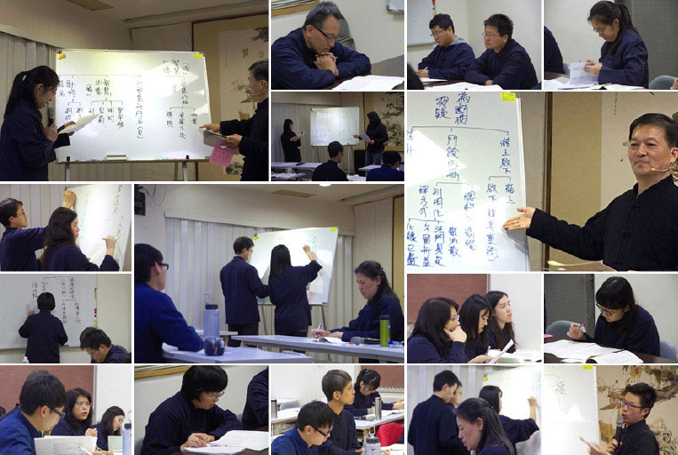

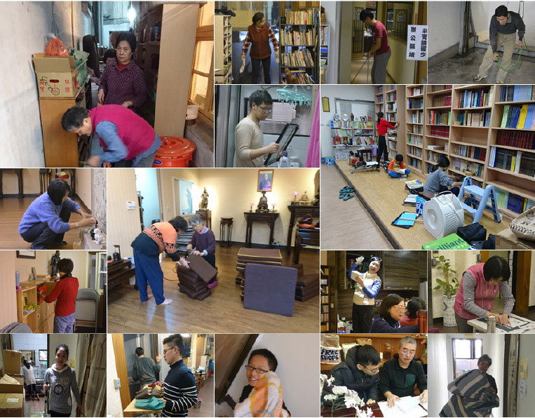

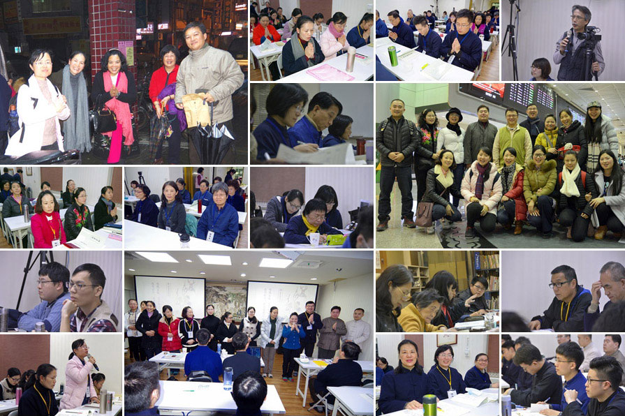

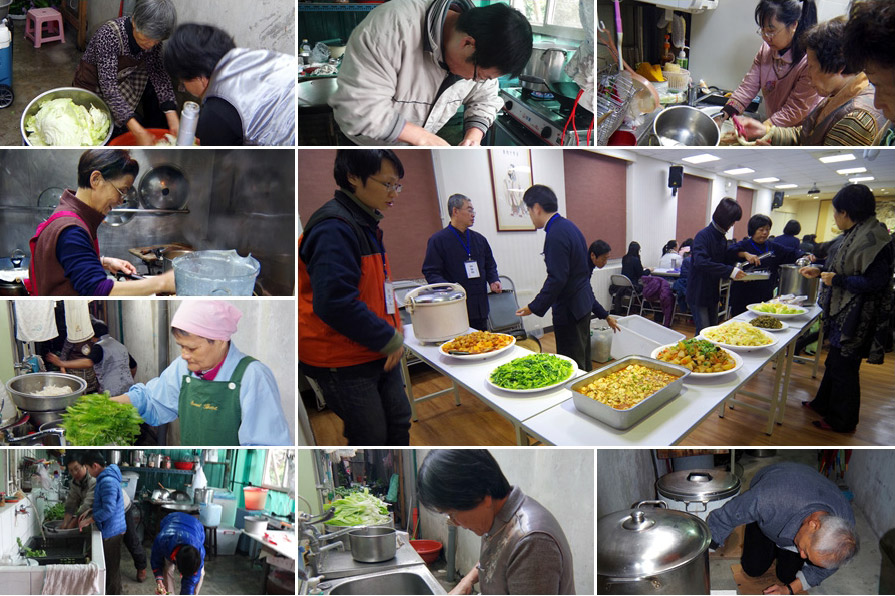

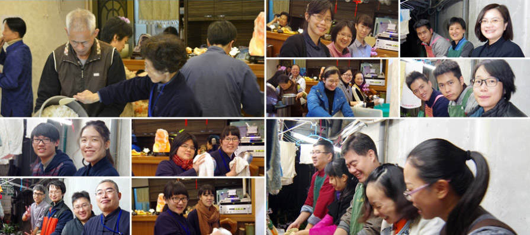

## 日常省思

### 面對劫難的體悟

戒堂

一生是一種歷練

苦盡甘來乃心境

天降大任在承擔

了生脫死為見地

一如往常，從連假結束塞車朝回到家，準備休息以迎接隔日的生活，一通告知車禍的電話就此打斷了所有的計畫。居家太久了，已然忽視了隨時現起的無常。當下方寸大亂，恨不能立時趕到醫院。途中牽掛、焦急之心不斷呈現，藉著念佛回向，才讓自己沉靜下來觀察。對已現之無常，焦躁並不能解決任何事，唯有把自己安定了才能對後續可能發生的事好好應對，更應透過善法的造作，祈令未來得以轉入順境。

諸行無常是真理，但要徹底體悟卻是大不易。往往見人驟遭危難，感嘆世事無常的同時，卻不會有自己下一刻也可能身入其境的認知。末學誠如佛所指稱的駑馬，非待此次骨肉突遭危難之時，才會去覺思無常的真諦。

途中來電告知曾經昏迷，清醒後意識清楚，只覺全身疼痛而已。探視他時感覺並無外傷，神情如常，暗自慶幸他應無大礙。幾小時後，再進加護病房探視時，卻見臉色非青即白，呼吸困難，痛徹全身，恍若兩人。檢驗報告指出內臟受創嚴重，醫師表示手術風險太大，只能藉由每日的檢驗報告追蹤自體復健情形，接下來的日子，什麼突發狀況都有可能發生。了解狀況後，感覺就是沮喪與絕望。從病房內到病房外是遙遙的二十步距離，心情卻是步步苦，苦在心中說不出，只能吞嚥著，苦徹心，若刀割。有如蹣跚老人，舉步躊躇，心思糾結，在那一時刻，全都感受到了，自己也感瞬間衰老，外境的刺激，皆無所感。

坐在病房外，歷經一陣的腦袋空白，意識給同修的念佛聲音帶了回來。心思同修修行當在自己之上。值此變故，未見其慌亂，並未恣意哀怨。心想既然連醫師都僅能觀察其變化而已，唯一能讓他得大助益者除佛之加被外，別無其他。心念至此，與同修竟日守於病房外，專心念佛，即於行走間，一步一佛號，未敢懈怠。一切聽由佛菩薩安排，希望能獲得佛菩薩之加被，讓他化險為夷。

「觀想一切，交由佛菩薩安排，且後面好壞都是最好的安排。此時為結果，如果在果上種因，減弱苦果的力量，轉變未來生起的果報，是最佳的做法。」感謝老師的提示。讓我們在面對他不好的指數一直飆高時的逆境中，仍絕不失對佛菩薩的信心。老師親臨對他的開示，燃起他的信念。加上諸師長蓮友的迴向功德，讓他可能產生惡化的十餘種病變狀況無一現起，自此進入康復歷程，並得於住院期間通過國考，平安出院，後在半個月內補完所有的期末考試，真可謂佛力加被不可思議。

綜觀此次歷程，如果只看在無常現起的劫難，要想令順境於後升起難上加難。越是逆境，越要藉由造作善法與功德迴向，求佛菩薩加被，方得轉逆為順。此次無常現起，或許亦是一個增上，對他而言，未為人醫前先體會病人苦，往後更能真正利益眾生。宿世惡業藉此無常現起，在眾人的迴向功德下，讓他得以重報輕受，感悟大難不死之後，必有諸多善法待其完成。末學與同修，沐於佛恩，當以此體悟協助類此遭難者，堅定其信念，用心修行念佛，願眾生能離苦得樂。阿彌陀佛。

當業風吹起‧‧‧‧‧‧

承軒

為了期末考及迫在眉睫的國考，高醫牙四的同學們都犧牲元旦連假，在學校、在宿舍，各據一方的，用盡了「牙力」啃著堆積如山的書本和筆記。「明日週一是期末考開始」，心想：「今夜早點離開圖書館收拾回去休息，準備差不多了。」

「拐彎後就到家了......」

然而......被突如其來的撞擊，眼前一黑便失去知覺，甦醒時已躺在路邊被救護人員抬上車，急送高雄醫院，因為是學校學生，高醫啟動了連串機制，聽說爸媽已南下途中，氣急敗壞。

因為意識清楚，沒有重大外傷或骨折，照片子時似乎只有內出血及肝挫傷，醫生初診並未在擔心，認為觀察三、四天看看，但我身體及腹部的疼痛卻一直加劇，翌日做斷層掃描後，不管我怎麼問，加護主治就是不願意告訴我相關檢查數據，像是隱瞞著甚麼，爸媽也怪怪的、語焉而不詳，加上身體開始各種不適，就連一呼一吸也痛不欲生，心中沉甸甸的一直告訴自己要撐得住、要好起來，還請身體要好好配合，發願求佛加被。

業風吹起，疼痛幾乎全佔據了我的身心，擔心學校課業反而讓我分心暫時忘記疼痛，請同學室友把我的筆記帶到醫院給我，想看書，可惜又沒有體力。此時心思混亂，一心不想耽誤期末考及國考，而爸媽卻說這學期休學沒關係，我實在急得不知何去何從，如熱鍋上的螞蟻。護士的眼神對念佛機是嫌到不行，但媽媽說念佛很吉祥，不要管她，還天天換電池，時時刻刻調電線查音量，故意在護士前跟我說一定要開著（後記：老媽，我很難做人啊！）。

後來曉得五臟中傷了四臟，加上內出血，可說是身體每個細胞都在痛，但自知止痛劑用多不好，而且當醫師多加一種藥，我身體就更虛弱，故都會忍著。回過頭來，實在不知是如何熬過來，有爸媽天天守在加護病房門外念佛，我一方面覺得很安心，卻又會擔心他們休息不夠。因為狀況不好，待在加護病房是一星期、一星期的加上去，到了第三個星期，我還是狀況不斷，甚至現在已出院，似乎好多，但仍有很多症狀上的疑問未能解決，只能希望它們只是康復階段的過程，現在每星期回診追蹤，加上慢慢試著走路上課，體力上是要加強的。

住院期間，沒有想到老師及師長會特地長途跋涉來看我，關心我，學會大家還為我的平安回向，內心感激不已卻不知如何表達，但明白這是承軒能快速恢復的原因，像我內臟挫傷如此嚴重，可以活過來的人應該不會太多，當初認為自己遇到的只是小車禍，但後來卻是與死神拔河了三星期，這種拔河的狀況，可能還是會跟著我一輩子（儘管可能是以一種較溫和的方式呈現）。

這件意外讓我體認到：

◎生命的脆弱，不能有健康慢。

◎倒楣事是會發生在自己身上的（仍苦思不解）。

◎遇死劫，不是每個人都可以如此幸運，應該就是因為有大家的回向，佛力的加被（在加護病房中，看到往生的例子，也有為他們念佛回向，希望他們可以得到佛加持）。

◎家人、親人是任何人生命中最親密的依靠，不可取代。

◎朋友要找真正關心自己的，有困難會真誠的幫助支持，患難見真情。

◎必須重新檢視生命的意義，人生的路應該可以走得不一樣。

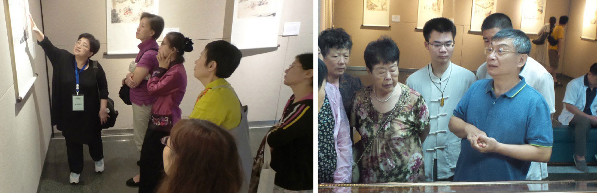

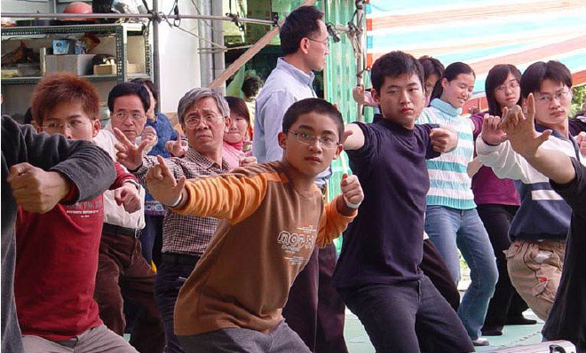
