# 第105期

## 社論

### 俠骨詩情李雪廬

本刊

一生熱血滿身疤

忍字受用生難知

九旬依然誨無倦

自焚照遠真俠士

民國一○五年四月十二日，是老恩師李炳南先生(人稱雪公或雪廬老人)往生三十週年的紀念日，各界團體舉辦了許多相關的紀念活動，本學會也製作了特別節目《俠骨詩情李雪廬》來緬懷此一代大儒。在這麼多的紀念活動，我們應該帶著什麼樣的心態來緬懷雪公呢？如何紀念才能讓人從中得到利益，對自己的修行產生幫助呢？我們是要在週年的時候紀念一下雪廬老人，然後過了就把他忘記？還是要好好記下他所立的典範，並且展轉行之，使其名聲立於後世？值得大家好好想想。

這次的節目名稱《俠骨詩情李雪廬》。先說說第一點的「俠骨」，雲州大儒俠史艷文很多人認識，其實，史艷文還不夠厲害，雪公才是真真正正的大儒俠，他是臺灣的大儒俠、中國的大儒俠。怎麼說呢？雪公比較為人所知的是位佛教大德、國學大家，但很少人了解他的俠義精神與過人的膽識。在雪公三十多歲的時候，曾在莒縣擔任典獄長，後來山東地區捲入軍閥內鬥，一時土匪猖獗，莒縣數度陷入危難，幾任的縣長都在危急時刻逃亡。這五年當中，雪公多次出面保護莒縣縣民，譬如組織部隊武裝巡邏，或者縋城與匪類談判，或者在炮火中登城勸阻軍隊不要來犯等等。他的詩作〈平生之淚〉中寫到「曾為賊中擄，笑罵求鼎烹」，為了解救人民之難，一個讀書人獨自深入匪窟，居然還有這樣的心境，令人歎為觀止。於此之中我們應該想到，學佛如果也有這樣的勇悍該有多好；精進裡面有一種叫做披甲精進，《佛說四十二章經》經文是這麼說的，「譬如一人與萬人戰，挂鎧出門」，我們和煩惱鬥的決心，是否有如此勇敢，那怕是再大的艱難都要去克服。求念佛往生也應具備一樣的心態，不只信願要堅定，在行的過程中一定會遇到很多的困難障礙，都要不畏艱難，一一排除，這樣子對於往生才能更有把握。

再則論其「詩情」，雪廬老人很擅長讀詩、寫詩，這有什麼好處呢？懂詩的人才懂得真情，有真情才學得到東西，這種真情能拓展我們的心量。學道之人，要能為公發心去歷練自己，在歷練中，對於上課所聽聞的教法、聽聞的道理反覆的串習，去體會那個味道，有時佛經讀不下去，讀起來不痛不癢，是因為經歷的事情不夠，跟這些大德比起來實在太少了。如果真的可以好好發心，在歷事練心中，教法會越來越有味道，法喜也會慢慢生起，對道理的通達、對於念佛的功力也會有很大的幫助。好比刀子必須藉著石頭來磨，唯有這樣才能削鐵如泥。不僅如此，利益他人所產生的福報，能成為我們將來學佛的資糧，也可以創造往生的順緣，排除往生的逆緣。所以一定要用真情來學，學到的東西才紮實，不會只是做做表面工夫，修行的道力自然比一般人進步的要快。

在緬懷中，我們應該要向雪公老師看齊，雖然我們程度還差得很遠，可能上課聽不懂，或者心量不夠大。可是從聽不懂開始，總有一天會聽懂；從心量狹小開始改進，總有一天能無所不容。只要我們肯把雪公的見地、能耐當成我們的所願境，一步一步地向前，努力不懈，終會有達成的一天。這樣緬懷雪公才有意義，也不枉費他的示現。這是一條有跡可循的路，我們透過雪廬老人的一生，體悟出諸佛菩薩成功的秘密，去看見孔子的風采，然後內化成自己修行的動力、心裡隱微處的想法，這才是一代大儒他所立下風範的價值所在。從老人的風誼中，深刻地體會廣大行的價值而想要成佛，只有靠空性的正見和廣大行能破煩惱障、所知障，細看雪公的一生，發現原來發心所種的福報資糧幫助修慧，是突破二障的有力助伴。如果我們也能好好來興辦法行事業，就會對佛經描述的內容有更深刻的體悟。事實上，許多修慧的關隘都要靠這些經歷的幫忙才能突破，在廣大行裡找到那個「義味」，靠著這種感覺才能入進義理之中，這樣的味道是教不來的，只可意會不能言傳。此時，廣大行的可貴，在心裡油然而生，既然知道了六度的修行對自己這麼的好，又怎麼會不去做呢？

同時，我們也要保留這樣子的傳承，讓雪廬老人的名聲不僅可以流傳於現代，更要立於後世。老人生前雖然很低調，但做學生的，在弘揚老師上可不能同樣低調。孔子的名聲能夠遠播，有一半是子貢的功勞，可見做弟子的應該要弘揚老師的名聲，發揚老師的見地。藉著往生紀念活動，讓更多的人認識雪公老師，讓更多的人從中得到利益。我們除了要站在現在緬懷過去，還要看到未來，只有發展未來，雪公太老師的教法才有出路，正法的未來才有出路。這是我們緬懷、紀念老人最好的辦法，也是唯一的辦法。

## 大德法語

### 大方廣圓覺修多羅了義經（六十四）

道源老和尚

中觀正見金剛護

成佛命脈正法延

障難雖多持淨戒

汙泥不染妙蓮花

甲三、流通分

乙四、秉命加衛外護流通

丙一、力士眾

經文

：爾時會中，有火首金剛，摧碎金剛，尼藍婆金剛等八萬金剛，並其眷屬。即從座起，頂禮佛足，右繞三匝，而白佛言：世尊！若後末世一切眾生，有能持此決定大乘，我當守護，如護眼目。乃至道場所修行處，我等金剛自領徒眾，晨夕守護，令不退轉。其家乃至永無災障，疫病消滅，財寶豐足，常不乏少。

說到這時候，外護流通其中一類，叫金剛神類。火首金剛，你們聽過《楞嚴經》就知道，二十五圓通中的火大圓通，翻譯叫火首金剛，不要輕視自己，這火首金剛把火給拿來，使淫欲心化成三昧火，雖然淫欲特別重，他發心修圓通，結果把淫欲之火變成三昧火，所以頭上老發光，頭上冒火實際是三昧光明。

前邊《圓覺經》上講了，我們眾生皆以淫欲而正身命，哎呀！淫欲心太重，怎麼能成佛呢？就怕你不修行，你一修行，淫欲心變成三昧火，火首金剛就是給我們做一個榜樣，這金剛類的眾生，叫作金剛神類，他手拿金剛杵，杵是由金剛寶做成的兵器，這金剛寶能壞一切，一切不能壞它，它能摧碎一切物，一切物不能摧碎金剛寶，這就叫做金剛。

這金剛神多的很！有火神金剛，還有催碎金剛，就是摧破、粉碎一切邪魔。尼藍婆金剛，唐朝的翻譯叫做青金剛，尼藍婆金剛等一共有八萬金剛，這八萬個金剛，還帶了很多的眷屬，都在大會裡聽佛說法，頂禮佛足，右繞三匝，行個禮，請問世尊，他們都發了心，要護持末世發了心的修行人。

決定大乘就是實教大眾，大乘法有權教大眾、實教大乘，佛說法有時為了接應二乘人，叫他來學大乘佛法，很多都是方便說法，是方便權巧接引大眾。《圓覺經》是決定當中的實教經典，只要能持此實教大眾，金剛聖眾決定要守護他。怎麼樣守護呢？就是如護眼目，因為人的眼目最寶貴，身體其他部分都可以碰，眼睛碰不得，所以必須要小心地保護眼睛。我們保護持《圓覺經》的人，就像保護自己的眼目那麼樣細心呵護。

不但保護他這個人，連他修行的道場都保護，我等八萬金剛自領徒眾及其眷屬，晨夕守護他那個道場，守護他讓他不會招災招難，不招魔害，令他不退轉。

其家乃至永無災障：前邊講道場，此處如何會有家呢？菩薩學圓覺行當中有四種弟子，前邊講道場是出家二眾，另外還有在家二眾，他在家修行，金剛外護保護他的家，令他家裡永遠沒有災障、沒有障難！不只如此，還令他不得疾病，什麼病都可以消滅，甚至還讓他財寶豐足，以上是在家菩薩，他的財寶用不完，常不乏少，財寶豐足，這是金剛神護法。

丙二、天王眾

經文：

爾時，大梵天王，二十八天王，並須彌山王，護國天王等，即從座起，頂禮佛足，右繞三匝，而白佛言：世尊！我亦守護是持經者。常令安隱，心不退轉。

佛教所說的天是三界，一共二十八層天，二十八層天的天王都要出來護法。其中須彌山王就是欲界第二層天，忉利天也叫帝釋天，帝釋天住在須彌山頂叫須彌山王，欲界第一層天是四王天，叫做護國天王。

這二十八天王之總說，為什麼前邊說大梵王，後邊說個須彌山王、護國天王？其意為何？因為每一尊佛出世，大梵王與須彌山王（忉利天天主），他們都是請法眾，眾生不知道請法，他們做個榜樣，替眾生請佛說法。護國天王的職務則是護持三寶。

二十八位天王都願意護持末法時代持《圓覺經》的人，保護他們令得安隱，令彼無災無難，清淨不退，以上是天眾出來護法。

丙三、鬼王眾

經文：

爾時，有大力鬼王，名吉槃荼，與十萬鬼王，即從座起，頂禮佛足，右繞三匝，而白佛言：世尊！我等亦守護是持經人，朝夕侍衛，令不退屈。其人所居一由旬內，若有鬼神侵其境界，我當使其碎如微塵。

下邊鬼王出來護法，鬼王有大力，名為吉槃荼（翻到中國話叫做鳩槃荼），按照他的形象，也翻叫冬瓜鬼，他形象醜陋的很，看不出個頭腦，小口大肚子，像甕也像個大冬瓜，這個鬼呀！《法華經》上說，他沒事找狗逗著玩，那狗本來臥得好好的，忽然間跳起來，據說就是鳩槃荼逗的。此處不是普通的吉槃荼，而是大力鬼王。

大力鬼王與十萬鬼王，即從座起，頂禮佛足，右繞三匝，稟白世尊說，我們這些鬼王也來守護持《圓覺經》者，朝夕都來守護，令他不退屈，不但守護他住的道場，甚至是四十里以內，我們都會加以保衛。只要看見鬼神來侵犯，我當使其碎如微塵，大力鬼王帶著火神、火鬼把它粉碎得像微塵一樣，這是第四科。

你這樣修行，你不要害怕有什麼魔王來擾亂，不但諸佛護持你，菩薩護持你，一切善神、善鬼都要護持你，這是第四科。

乙五、時眾受持總結流通

下邊最後一科，當時聽經的大眾都要受持《圓覺經》並流通此經叫總持流通，這最後五科。

經文：

佛說此經已，一切菩薩天龍鬼神八部眷屬，及諸天王梵王等。一切大眾，聞佛所說，皆大歡喜，信受奉行。

《圓覺經》說完時，聽法的大菩薩還有天、龍、夜叉、阿修羅、乾達婆、迦樓羅、緊那羅，摩喉羅迦這些天龍八部，八部以天龍為首，都是護法神。

總說大眾，諸天王是指二十八層天的天王，以大梵王為首，且是位請法眾，所以特別指出。一切大眾，包括一切聽法的大眾，聽了法，且得了法喜，皆大歡喜，信心堅定而不疑惑。如信受圓覺大法，必依教修行而流通於世了。

後言

講到這兒把《圓覺經》講完了，首先謝謝諸位同學，就是我在這一個學期，跟諸位同學講《圓覺經》，哦！害起病來，害得很嚴重，不能吃飯，僅咳嗽吐痰，打針、吃藥不見效，愈來愈厲害！同學大家都替我祈禱替我回向，給我供長生祿的牌位，每天做這功課，課誦以後都替我回向，還有諸位同學，個人念經、拜懺都替我回向，有大感應，結果吃了一個湯圓，一下子咳嗽就就給止住了，你看那不是你們給我念佛回向的功德，怎麼減少減那麼快！

那麼病好了嘛！我才能繼續給你們講《圓覺經》，我內心也得了甘露，於是我發了願，要跟諸位同學講完《圓覺經》，結果滿了我的願，今天講圓滿了，如釋重負！好像把一個重擔給放了下來。

在害病的時候，身體上害病，心裡邊害病，心裡想著我對不起同學！我要跟同學講《圓覺經》，我心裡掛礙得厲害，其他沒有掛礙，就是掛礙不能講經，哦！結果同學天天給我祈禱回向所以我很快好了！《圓覺經》也講完了，所以我心裡很痛快！

在講的時候，都在勸導諸位同修！在末法時代，講圓頓大法的人很少，跟諸位同學一再的說過，《華嚴經》、《法華經》是兩部圓教大乘的經典，沒有時間來講《華嚴經》，就是每天講二個小時也得三年，誰能發心聽你講呢？一天講二個小時，至於《法華經》最短也得三個月。故契機者是《圓覺經》，尤其經分十二章，這文法、章法很整齊、很清晰，有很多的問題菩薩都替我們問出來，令我們解除疑惑、增加信心！

所以諸位同學聽了以後，必須好好的研究，發給諸位同學的二部註解，一部圓瑛法師的《講義》，一部憨山大師的《直解》，在臺灣流通的還有圭峯大師的《略疏鈔》、《大疏鈔》，《大疏鈔》太廣了，《略疏鈔》要看，越研究愈熟，將來發心去講《圓覺經》，要負起弘法的責任來，不要辜負聞法的善根！

要是有同學聽得不太明白，一會兒說沒有生死、沒有涅槃，生死涅槃猶如作夢，一會兒又說要證得涅槃、證得菩提，怎麼繞來繞去的，一會兒這樣說，一會兒那樣說，這就是你聽大乘經聽得太少，說到最高的地方是不著相！此經能引導我們由凡夫到成佛。

我們初發心，要持清淨戒，還要認識愛為生死根本，由斷淫欲再斷愛染，否則說「不與法縛，不求法脫；不厭生死，不愛涅槃」，那是佛的境界，就算是我們的境界了嗎？我們是凡夫嘛！看了佛的境界，知道那是講地理圖，必須打你這兒為出發點開始做，講道理要講到最高最遠的地方，修行要腳踏實地，按部就班，一步一步的來。(下期待續)

## 佛學覽幽

### 小止觀導覽（七十七）

*心爾、治心整理*

止觀修學證佛德

世俗菩提勝義空

雙證二諦不思議

有學此者成正覺

第十章  證果

論文：次明後心證果之相：後心所證境界，則不可知，今推教所明，終不離止觀二法，所以者何？如法華經云：殷勤稱歎諸佛智慧。則觀義，此即約觀以明果也。涅槃經廣辯百句解說以釋大涅槃者，涅槃則止義，是約止以明果也。故云：大般涅槃名常寂定，定者，即是止義。法華經中雖約觀明果，則攝於止，故云：乃至究竟涅槃常寂滅相，終於歸空，涅槃經中雖約止明果，則攝於觀，故以三德為大涅槃。

止觀是修學成就的方法，一切成就依止觀而有，所以證果境界終究不離止觀二法。此處依《法華經》：以觀明通達佛能證的智慧，依止明所證之理。

實則通達所證的理趣，方法即止觀，能通達的智慧亦是依止觀了解其行相。

涅槃是滅除了煩惱和生死，甚而是滅煩惱障與所知障的滅，此境界須賴止觀方證得。安住在空性上證得涅槃，《大涅槃經》講的空性，是當修止觀現證空性以後，空靈靈的境界生起了，安住其上，所以偏約止上講。那是止觀成就相，叫常寂定。

大涅槃謂之常寂定，佛度化眾生以不出定的方式去利益眾生，這是佛成就的大涅槃相。

論文：此二大經，雖復文言初沒不同，莫不皆約止觀二門辨其究竟，並據定慧兩法以明極果。

《法華經》與《大涅槃經》講法雖不同，《法華經》是約觀明果，《大涅槃經》是約止明果，莫不皆約止觀二門成就，以定慧來說明所得到的證量。此處舉此二部經的用意為何？天台大師把小乘經典歸在藏教（聲聞二部），佛說體空觀的那一分歸在通教（中觀宗），回小向大發菩提心去修種種大乘行歸在別教（唯識宗），佛深談法性，並授記三乘人成佛歸為圓教。圓教所依經即《法華經》和《大涅槃經》，此二經雖文有不同，但都以止觀的修學成就經義，亦即止觀門就是成佛的大法。

論文：行者當知：初中後果皆不可思議。故新譯金光明經云：前際如來不可思議。中際如來種種莊嚴，後際如來常無破壞。皆約修止觀二心以辨其果故。

初是指初發心，中是指修學過程，後是指成就佛果及發揮的大用。這個人有成佛的徵兆時，即使障礙現前，他還是可以做出一番事業來，障礙不但不會成為障礙，反而是助緣。

止觀有證得世俗、有證得空性，證得世俗的決戰點在菩提心，證得勝義的決戰點是空性。初是發菩提心現證空性，入初住位，謂之初心。初心　　的不可思議可分三部分說：（一）心量所招感的功德是不可思議的。（二）三寶的加被不可思議。（三）除掉五逆重罪的力量不可思議。所以初中後的決戰點是在初心。

前際如來就是成佛的徵兆，是初發心不可思議。中際如來就是修行的過程，除障不可思議、感佛加被不可思議、招感功德不可思議，修學生起上述種種莊嚴。後際如來是最後心成佛，不可思議，此果不被破壞，證量是一證永證，永無退轉。

另外一種說法是，前際是初心，中際就是成佛，後際是成就佛果後所起的大用，通通都是不可思議。

對我們凡夫而言，決戰點是初心（前心），總而言之，就是修止觀以辨其果，初心、中心、後心的成就都是以止觀為方便修成的。止觀證得世俗的決戰點在菩提心，證得勝義的決戰點是空性。

論文：般舟三昧經中偈云：諸佛從心得解脫，心者清淨名無垢，五道鮮潔不受色，有學此者成大道。

般舟三昧此四句偈，特別是約著證得空性來講，就是此修行人有成佛的徵兆，願意發心並且願意去修學般若。

諸佛從心得解脫：由心起惑造業受輪迴苦，也由心聞思修證得空性，方得解脫乃至成佛。

心者清淨名無垢：心者清淨是心上的空性(心的體性)從無始以來即是如此，故稱無垢。

五道鮮潔不受色：輪迴五道當中，雖造種種業枉受種種痛苦，心上的空性從無始來即如此，謂之鮮潔不受色。

有學此者成大道：如果好好學習般若，作為菩提心的助伴，此人將能成就大道，破除煩惱障和所知障，成就佛果。

依《般舟三昧經》的修學能令魔恐怖，有如此堅忍不拔的修學使自己成為人才，必能承擔如來的家業。

止觀門既然是成佛的方便，成佛的初心、中心、後心就是靠止觀的修學，故對止觀要充滿恭敬、讚歎，隨順進入，而使自己成為初心者、中心者、後心者。

論文：誓願所行者，須除三障五蓋；如或不除，雖勤用功，終無所益。

行者在修行之前要發誓立願，必須除三障(煩惱障、業障、報障)五蓋(貪、瞋、眠、悔、疑)如果三障五蓋不除，內心無法息止，是無法受用的，最主要的是「我必須要在止觀門上成就」這誓願。行持止觀門除掉三障五蓋，方謂勤用功，否則修學終無所益。

三障五蓋，五蓋就是二十五方便裡所要除的障礙，三障更是在坐上修、歷緣對境修所必須除的障礙，三障中以煩惱障為最主要，而煩惱障以無明為主，無明的正對治就是空性的修學。以止觀雙運現證空性就能破無明的束縛，進而破煩惱障，破了煩惱障就不會有業障、報障。

止觀門的修學也能令教法住世，讓末法成為象法，甚至變成正法，止觀法門的修學者才是使法住世的徵兆，是讓法流通的增上緣。如此就是最殊勝的莊嚴佛淨土，也是諸供養中最殊勝的供養，以此功德迴向往生，也能得上品往生的資糧，不可思議！（全文完）

後記

小止觀導覽，由民國九十年九月一日(第二十二期)開始連載，歷經十五年，凡七十七回，期間有心爾老師逐字謄寫，蓮心、智高、治心學長等發心整理，因緣多所周折改變，至今已全數刊登完畢。學會亦將於來年舉辦講座，重新宣講此論，有心用功修學者，可參考會刊歷年刊登之文稿作一預習。

### 菩薩清淨的行持
       —華嚴經淨行品（二十一）

菩薩清淨的行持

—華嚴經淨行品（二十一）

*編輯部整理*

四威儀中坐為勝

身心安定修止觀

緣起唯具觀待性

空空如也正等覺

丙二、指事顯因答其徵因

丁一、總徵

丁二、別顯

戊三、就坐禪觀時願

己一、修前方便四　  敷床座

經文：

若敷床座，當願眾生，開敷善法，見真實相。

願所依就在敷床座這件事情上，床座乃禪坐修行的座位，能願的是菩薩，所願的是眾生，願成就的是開敷善法，見真實相。菩薩是為了修學成就而敷床座，依臥具坐上修觀，修學善法能令善法開敷(廣大行)，並修學真實相(空相)，而能現證(見)真實相。發願菩薩不但能開敷善見真實相，並能離過成德。

吳支謙所譯之《佛說菩薩本業經》，則是「敷床當願，一切眾生，入大乘道，濟安天下。」開敷善法見真實相，是能證佛果之相。床是臥具，座是坐具，敷是將打坐的範圍設定。一般打坐的時候後面要墊高、前面要低。敷就是敷展，鋪設平正，以此當願眾生開敷一切善法，而見真實相。見真實相，淺處來說是對空性得到勝解，究竟處則必須要得到空性的現證空性。

敷床座所代表的含意，就是在打坐前鋪設軟墊令使坐得舒服，則身心容易靜下來，講究方法方能坐得有功效，否則會深受其害。

坐上修是將善法在心量上開敷，體會善法要結合大悲心與菩提心，以及團體的共識，能在境界中耐得住繁瑣，且禁得起考驗，才能成就功德，謂之開敷善法。藉著善法去培養人才，局面要大、心量要開、作法要周延，將善法的功能發揮最大。且造作善法要講究前行、正行、結行，以教法對治過程中所起的煩惱。

開敷善法的目的，就是為了要見真實相，得到解脫或成佛的證量。然見真實相要靠般若的修學法，此須見到能宣說般若的善知識，及詮釋空性的法本。

開敷善法成就自己的慧根，不是善法作得愈多，經愈聽不下，以為讀書都沒用！因為道理不懂，能做出什麼好事？為了證悟空性，所以我布施，因為布施讓我有修學道法的資糧，能開發空性的正見；為了得到人身修學般若，所以持戒；為了令善知識歡喜攝受我，所以修學忍辱；為了勇悍修學空性所以修學精進；為了依止修學空性所以修禪定；為了見真實相所以修學般若。真正通達三輪體空的人，開敷善法時，所有善法的體性成為無漏，而且能真正的利益有情，引導有情進入空性，成為真正利益有情的善法。

己一、修前方便四　　正端坐

經文：

正身端坐，當願眾生，坐菩提座，心無所著。

牀座鋪完之後，上座時，第一先講究正身，此包括調身、調息、調心，修行人在調整身心時，發願眾生跟他一樣坐菩提座，得到心無所著的佛果。

修學之處要講究的是，衣食的取得，沒有惡友干擾，沒有猛獸、毒蛇的侵害，沒有瘟疫疾病的流行，修學者本身又是少欲知足，外務不多，且對戒律執持。

其次正身端坐時，姿勢講究，眼光順著鼻尖往下垂，不全閉乃免昏沉，為了避免胡思亂想，所以也不是張開眼。姿勢上講究身體正坐、肩平，頭與脊椎成一直線，舌向上頂避免口水流出，脣齒自然微合，呼吸調慢與均勻，能將心靜下來。並把心放在法上，觀想佛就是坐菩提座開悟的人。

修學止觀會各有障礙，如止有昏沉及沉沒、掉舉的障礙，觀亦有如是障礙，須以正知對治。

坐菩提座就是釋迦牟尼佛在成佛時坐的金剛座。經上說佛所居的是慈悲室，所穿的是忍辱衣，所坐的是法空座，成就的是阿耨多羅三藐三菩提。何以法座是法空座？乃因以心無所著（法空的證量）而說法。故我願眾生能坐法空座成等正覺，我幫助眾生如此，懇請三寶加被，讓我有能力如此做。

己一、修前方便四　跏趺坐

經文：

結跏趺坐，當願眾生，善根堅固，得不動地。

此處指坐禪觀時，是坐上修，另有歷緣對境修。坐上修完結時，下座還要講究歷緣對境修，如後述披挂時願、澡漱盥洗時願等都是。歷緣對境修若如法時，會成為他坐上修的資糧，上座的修學反而幫助他下座時能善用心，兩者互相幫助。

跏趺有全跏趺（兩足加於兩髀者）、半跏趺（左右一足加於一方髀上者），也就是所謂的雙盤及單盤，而跏趺坐有五種殊勝功德，第一、身端坐時修學可以快速引起輕安；第二、這樣的坐姿可以坐得很久不覺得疲累；第三、這樣的威儀與外道不同；第四、這樣的坐姿可以使人見之產生恭敬心及信心；第五、這樣的威儀是佛與佛的弟子共同承許，且為共同依止的坐姿，以上是結跏趺坐的五種理由。

在結跏趺坐時，第一個就是願所依，分成依人及依境，依人就是菩薩或是我們，依境就是在跏趺坐時所該觀想的；第二個是能願所願，能願的是我們，所願的是眾生；三、四句就是願所要達到的效果，願眾生在結跏趺坐時，善根堅固得不動地，也願自己可以善根堅固得不動地，並且得到前面的十個功德（修道之器，成就眾慧，具道因緣，於法善巧，修涅槃因，滿菩薩行，得十力智，十王敬護，能為饒益，超勝尊貴）。

於結跏趺坐時應如何觀修？第一、當在結跏趺坐時，觀想願眾生可以善根堅固，得不動地那該有多好；第二、發願我要有能力，可以讓眾生善　　根堅固，得不動地；第三、我要幫助眾生善根堅固，得不動地；第四、祈請三寶加被，我有獨立幫助眾生善根堅固得不動地的能力。

何謂善根堅固？是對教法有體悟力，以坐的方式能得到最好的修學勢力，所以善根堅固，而最殊勝的善根就是證悟空性的善根，使得他能夠得到不動地，八地就是不動（不被境界所動），因為俱生的我執、法執已斷，不會生起執著，就不會生起煩惱，故無任何煩惱的擾動，八地以上菩薩入定以現量的方式證空性，出定以比量的方式證空性，不生起俱生我執、俱生法執，所以不生煩惱，內心就不被擾動，此謂不動地。

不動是內心的不動，所以得到不動地是八地，真正的不動地究竟來說是成佛，成佛叫做妙湛總持不動尊，佛在任何時期都是在空性中安住，此為不動地，這是真正成佛的證量。這樣的善根是山崩海嘯狼突豕奔，皆可以無動於衷，僧肇法師《物不遷論》上說：旋嵐偃嶽而常靜，江河競注而不流。

為什麼得到空性智慧能夠不退轉，但證得慈悲會退轉？由於聖者在入定中現證勝義，所執的人、所執的法，在定中都沒看到，所以在出定時即使萬法顯現有自相，但內心不承許有自相，所以證量不會退轉，但大悲心並非如此，大悲心是將眾生修成悅意的面相，但遇強大且持久的逆緣仍可能退失證量。（下期待續）

### 大乘百法明門論簡說（十三）　拾、心法—八大心王(三)

*淨凌講述‧淨本整理*

心識迷執入輪迴

轉識成智出世間

照見人法二無我

朗然大覺受大樂

論文：

第一，心法，略有八種：一、眼識，二、耳識，三、鼻識，四、舌識，五、身識，六、意識，七、末那識，八、阿賴耶識。

識智能熏非能熏表，說明的是八識與四智，唯識宗將人心的粗細作用安立八個識來解釋，不過是依心的功能安立名言。所謂八識轉四智，是指佛果的成就，前五識轉成成所作智，第六識轉成妙觀察智，第七識轉平等性智，第八識轉大圓鏡智，因位是前八識，果位是四智。識已轉成智，此時還有沒有心識？或只剩下智慧？還是智慧攝持心識？換言之，究竟是滅識成智？還是心智相存？心識不可能被滅，八個識被智慧所攝持，叫做轉識成智，此時八個識只會生起智慧的作用，不會生起染污的作用。

八識有能熏與非能熏的分別。前六識有善、惡、無記，心裡替別人著想就是善，替自己著想就是惡，單純造作無法記別善惡，就是無記。善、惡與無記當中的非業果都是能熏，能熏就是造作此種業能對將來產生影響，包括異熟果、等流果（領受等流及造作等流）、增上果、士用果、離繫果。例如某人喜好偷竊，前六識多用於造作偷竊的惡業，對於將來的影響，就是所有不幸的事情很容易發生在自己身上，被騙、被偷、守不住財等，這些都是領受等流果；此人心思容易邪惡不正，是他的造作等流果；所處環境惡劣，相處的人不善良，多是作惡之徒，則是增上果；至於異熟果這一分，是他容易墮落惡道；由於無法斷惡修善，親近善知識學習正知見，也就沒有離開輪迴繫縛可能(得不到離繫果)，這些就是前六識所能產生的影響，稱為能熏。藉由佛法業果的分析，讓吾人明白現象的相續果真如此，才能從內心隱微處去改變自己的想法，改變個性，如此命運就會改變。

無記業包括業果與非業果，例如眼見色、耳聞聲，前五識單純地領納過去善、惡業所成的苦樂果，果報本身並沒有善惡之分，是無記業中的業果；只有在業果中對喜愛的境界生貪，不喜愛的境界生瞋，才有所謂的善惡。比如因為過去瞋恚，所以這一生十分醜陋，然而醜陋的業果，並沒有善惡可言，若說醜陋是惡，理應所有醜陋的人都會造惡；若說是善，那應該都會造善，因此這樣的業果不能記別善惡稱為無記，只是領納果報，所以是非能熏。

所以即便是聖人，在納受境界時也會有苦樂的感覺，而不是沒有分別；差別在於聖人分別苦樂時，能夠不起貪瞋，不會造惡。因為共業的關係，人大體同分，當此境界會讓某人產生苦受，大抵多數人也都會覺得苦，只是在苦受中有的人能夠不起瞋心，有人則沒有辦法。所以應當知道將心比心的重要，對聖人也不能例外，不舒服的感覺連聖人都會有，否則修行只是讓自己變成草木石頭而已；修行是使人在境界中有調適的能力，使人在受苦時不會怨天尤人，在處世應對上都能夠依禮而行。

無記業中的非業果，是指正在造作，而不是領納果報，例如單純的走路。非業果也是能熏，能對將來產生影響，當走路喜歡蹦蹦跳跳，來世就容易有蹦蹦跳跳的習慣；吃飯的威儀不好看，來世就容易在威儀上顯現輕佻。雖然這些造作本身都沒有記別善惡，但是都會對未來產生影響。以上說明前六識的能熏與非能熏，第七識執第八識的見分為我，從未間斷，因此第七識也是能熏，會不斷地產生我執的作用。

第八識是非能熏，因為第八識是前七識所熏之處，所有的影響都熏到第八識，比如在一個田地耕種，第八識就是那塊田地，它只是讓人家種植而已，種稻生稻，種麥生麥，前七識是能種，第八識是所種。另外果位上的四智，也屬於非能熏，四智是果位上的成就，果位是所薰而非能薰。

第七識釋義表，第七識梵文稱為末那識，中文翻譯為意、思量。第七識又恆又審，永遠執我稱恆，執第八識的見分為我稱審。第八識只有恆，第六識只有審，前五識俱缺，因為前五識功能常常中斷，所以無恆；沒有分別的能力，只有納受的能力，所以無審。比如眼識只是納受青黃赤白，耳識只納受聲音，鼻識只納受氣味。

第七識四煩惱表，四煩惱常俱，當中我癡就是無明，是指法我執，於諸事理迷闇之謂；我見是指人我執。法我執與人我執，不同宗派有不同的看法，中觀宗認為法我執是把境界看成有自體性；唯識宗是指認為心外還有境，這樣的狀態稱為迷闇(法我執)。

唯識宗的人我執，有俱生執跟分別執，此處「緣五蘊和合之假相，妄執為常、一、主宰之我身。」特別是指分別執。五蘊是色、受、想、行、識，色是身、受想行識是心，我們都是身心的和合，在色受想行識和合的假相之中，妄執有一個常一主宰的我，常一主宰的我就是外道所說的靈魂我，以為在身心裡有一個靈魂的我存在，這樣的分別我執，是要有宗教的信仰才會產生，一般人雖然不會有這樣的妄認，但對於這樣的執著對錯否，也沒有辨解的能力。

唯識宗所承許的俱生我執，是妄認有一個能背負五蘊的我，我是能背負，五蘊是所背負；我是主，五蘊是僕，一般人不必宗教信仰，也會有這種想法。例如當老闆的人往往很有主宰身心的能力，要幾點起床就幾點起床，可以讓身心精進不懈，宛然身心都是被我所控制，聽我指揮。

這種獨立實有的我，在中觀宗認為只是俱生我執的粗相，不是俱生我執的細相，真正細相的俱生我執是直接對著五蘊說我(唯我)。然而我只是名言安立而已，這在前面都有做過分析，不再贅述。

由於我癡與我見，所以令心高舉，產生傲慢。我慢是總相，有七種慢的分別相：慢、過慢、慢過慢、我慢、增上慢、卑劣慢、邪慢。我愛：「於所執之我，深生耽著，故名我愛，即貪心也。」因為執我以後就會愛我，愛我以後就會有恨，由此衍生一切的煩惱。

以上是四煩惱的說明，第七識執第八識的見分為我，與四煩惱常俱，當第七識跟平等性智相應時，此時是我癡、我見、我慢、我愛的正對治，名言安立為平等性智。因此破我以後，並不是就沒有我。經上說：「如是我聞。」所以名言上的我，是存在於世俗，自體性的我則一粒微塵也無。（下期待續）

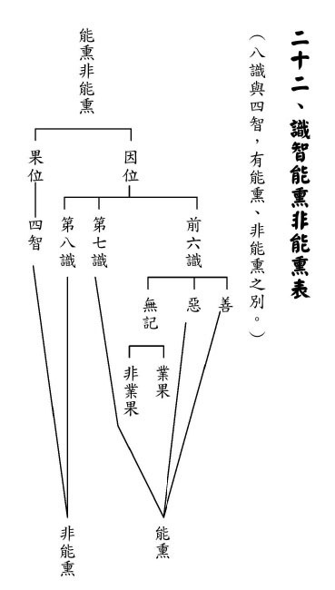

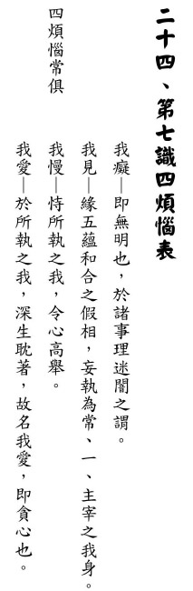

### 佛學概要十四講表簡說（七）　第一講表  丙表 (宇宙人生範圍)

*戒慧講述‧法味、淨昌整理*

時空交織生命曲

可嘆有情隨波流

別具慧眼觀輪迴

二障俱破大自在

【乙】表跟【丙】表的關係：

從【乙表】得知，建立正確的人生觀和宇宙觀能破二障，而宇宙、人生又是如何定義呢？就在【丙】表。我不但要把自己度脫，更要度脫分布在宇宙的有情，分布在六道的有情。

此處為何特別講人生呢？第一、在人說人，所以宇宙觀特別講人生。第二、人是最能夠學佛、成佛的。當有情投生人道的時候，不能度化之，就會錯失人道的良緣。所以，六道中大菩薩最喜歡來人道，六道中以人道最有學佛的能力。天道的有情，受用諸多快樂，享福都來不及，無暇學習佛法，然而天道的福報受用完還是會墮落，殊勝的天人也知來人間聽法找出路。所以，保留人間的太平，讓正法流通，才會得天道的保護。

【丙】表的重點是行者不但要度脫自己，還要度脫有情。度自己破煩惱障，度有情能破所知障。真正的人生觀就是懂得破煩惱障、所知障的人生觀；而宇宙觀即是懂得幫其他有情去破煩惱障、所知障。

丙表、宇宙人生範圍

宇是空間十方，宙是時間三世（過去、現在、未來）。宇宙觀所觀察宇宙中的六道眾生，詳述於第六表「宇宙的有情概況」。至於有情眾生所依存的環境，詳述於第七表「宇宙的器界概說」。

空間十方 時間三際

人生觀與宇宙觀，可攝於宇宙觀之觀察，因人為宇宙的一小部分。而宇宙中，一個三千大千世界包含六道眾生。六道眾生與空間十方關聯為何？一個六道即為一個三千大千世界，空間十方指空間有無量個三千大千世界。一個三千大千世界中的有情眾生，說其事則如前述「惡難遣、好難求、得易逝」，說其人則曰「情多異、事多變、理多秘」，此等世界空間有無數個。

依據法界安立圖說，吾輩所居世界名為「華藏世界」，其形狀如一倒三角形，最下面的一層有一個三千大千世界的微塵數，每一個微塵皆為一個三千大千世界；如是逐上逐層遞增一個三千大千世界微塵數，至最上一層為第二十層，具二十個三千大千世界的微塵數，每一個微塵皆為一個三千大千世界，其數如此多。此華藏世界為釋迦牟尼佛報身的教化區，娑婆世界位居第十三層中間，極樂世界則位於第十三層，「從此西方，過十萬億佛土，有世界名曰極樂」，乍看有十萬億佛土之遠，但對比第十三層有十三個三千大千世界微塵數的三千大千世界，惟極樂世界距娑婆世界僅有十萬億，相較之下其距離則顯得微不足道。

如果吾人的財富為地球每一粒沙，都計為一億，不小心丟掉十萬億，是完全沒有感覺的。所以極樂世界距離娑婆世界太近了，這就是華藏世界。而像這樣的世界呢？重重無盡，沒有辦法形容，是為空間十方。

時間三際，即於空間十方中，包括過去、現在、未來三際，在過去有空間十方。

方皆有生

在無量的三千大千世界裡面，每一個三千大千世界都有六道的生命。現代人如果越懂科技，將會越佩服佛法，三千年前可以道出這樣的觀念。

互為依緣

在無量個三千大千世界中，所有的有情眾生都是互相有關聯︵依靠）。互為依緣當中，有遠的例子，亦有近的。

舉遠處之例，如吾人自某個世界來投生此方，死後投生他方國土，如彼此間無關聯，如何去得？須知人之將死，欲變中陰身，將投生至無窮遠的世界時，其人見所投生的世界近在咫尺，是以彼人投生之時，如同電光一般過去，速度等同佛之速度。佛力雖強，惟中陰身神力等同佛力，佛欲以十座須彌山阻擋之，亦不能勝之。何以佛力不能勝？其理易明，今有一小兒心欲出遊，其父以十道牆壁，能否關住其心？同理中陰身投生至無窮遠處，即使佛以百重之須彌山阻擋亦無能為力，任憑其閃電般地投胎。

論近處其範圍係指一個三千大千世界，此處所舉之例及喻為「國際動態」。現今整個地球如同一地球村，各國彼此互相影響。人人不只受國家之影響，亦受國際動態之影響。例如貨幣政策、金融危機，乃至於環境污染、溫室效應，此皆國際間互相影響之狀況。又如中國大陸之華北地區，因沙塵暴太嚴重，其影響遠以致臺灣造成霾害。

現今網路時代，互為依緣的程度令古人難以想像。以讀書求學為例，可不分時間和地方隨時上網學習，未必要親到現場，可經由網路向其他某一國家的人學習。現今世界各著名大學的各門課程，已逐漸建置網路教學系統，或網路直播，線上互動，或線上教學影音，不一而足，未必一定要親至課堂學習，亦可經由遠距教學，影響力擴張至全球，企業界亦將逐漸認可網路學歷，不再需要遠渡重洋取得國外學歷。隨著工業、農業、商業的全球化，現今演變至教育亦逐漸走向全球化的時代，時代之變化如此鉅大，逐步成為現實；互為依緣，其程度如此。

其次比喻，風向氣壓、太陽黑子。風向氣壓較易體會，譬如大陸的冷氣團一吹來，形成臺灣的寒流，除了寒流，尚有霾害的問題。太陽黑子，可以影響整個電訊系統，會干擾通訊。

推之無盡

由現今天文科技推知，吾等所居之銀河系，為所有銀河系裡面最小的，估計存在兩千億個太陽系。對照釋迦牟尼佛說一個三千大千世界，就像一個銀河系，所以若云有百億個南瞻部洲，有何不對呢？法界安立圖說中述及今此華藏世界海中，竟然以一個三千大千世界之沙皆代表一個三千大千世界，以倒三角形，存在如此多三千大千世界在底部，最上層有二十個三千大千世界沙數的三千大千世界，此不過是宇宙無數世界海中的一個華藏世界海，遑論其他世界種。

而此推之無盡之大千世界中，此方三千大千世界與他方之另一三千大千世界會互相影響。何以有影響？視當下所造的業為何，未來即投身至彼處，如何說沒有關聯呢？空間十方，所述仍為有情眾生彼此之關聯性。

時間三際

如何認識時間之三際？時間是被定義出來之一個分際，如以現在時間為基準，即可區隔過去及未來。是以，三際即為過去、現在、未來。

三皆有生

即是過去、現在、未來，皆有六道的眾生。結合甲、乙、丙表彼此的關聯而言：欲度眾生，須了解眾生之概況，以大悲心度之，並以廣大行來資助空性的智慧，使修行者在觀察宇宙、度化有情時，能破所知障而成佛。

建立正確的人生觀，即破執的那一分，使他解脫；並在觀察宇宙度化眾生當中，使他能破所知障。

「三皆有生」對著前段之「方皆有生」，合說即為：東、西、南、北、上、下各方皆各有無數個三千大千世界，皆有六道眾生。而每一個三千大千世界內之眾生皆有其過去、現在、未來。

生各環境

三界的有情各有它依存的環境，有正報環境、依報環境，以下舉例，分約古今。

如政治風俗，古今即有不同處，過去為君主專制，現今為民主政治，未來民主政治亦非恆常不變。政治制度從君主政治演變至民主政治，其原因為君主政治之獨裁，導致廣大人民受苦之時，人民起而反抗要求平等；而民主政治雜亂無章、不安定的時候，人們受苦難太久，亦思變化。制度在人為，當人心思變時，制度焉得不變？風俗亦同，其中有利有弊，有傳承有創新。

而六道之有情眾生，各個正報、身形、壽命長短均不一致，乃至於所在之依存環境亦不相同。雖生各環境不同，然皆互為依緣。譬如政治制度依著專制制度缺失而改為民主制度，依靠前面改為後面，是為依緣，所謂的創新，亦是根據前面來改變謂之創新。風俗之變異也是如此，是以名曰互為依緣。

以六道而言，身壽依報（環境）雖各不同，亦互相關聯，互為依緣，如何依緣？天道依著人的善業說升天；為何會有地獄呢？也是依著人、天造惡墮落的那一分說地獄，故皆互為依緣。

澈之無窮

時間往前推、往後推，皆無窮盡。以上是為第一表整體架構。（下期待續）

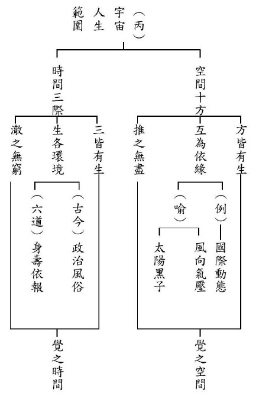

## 孔學一隅

### 論語簡說（十三）
		 	—子貢億度事理（下）

論語簡說（十三）

—子貢億度事理（下）

*時哉講述、順昌雪廬夫子研學會、洋逵整理*

啟發弟子成棟樑

屢空受命卻早夭

悟性億中堪傳承

貨殖不受千古憾

經文

柴也愚，參也魯，師也辟，由也喭。子曰：回也其庶乎，屢空。賜不受命，而貨殖焉，億則屢中。

（先進第十一—十八）

釋義

弟子介紹

在本段出現兩位弟子，我們先對這兩位弟子做簡單的介紹。

「回」是顏回，小孔子三十歲，江逸子先生在《孔門七十二賢》把他畫成一個有赤子之心的樣貌。顏回的學問是能斷除煩惱的學問，回到天真無邪的氣象，然又含藏著很大的智慧。老子云：大人者不失其赤子之心。捧著竹簡，代表著好學。當時孔子帶著弟子周遊列國到楚國時，子西大夫說：「這個人是宰相之才，楚國沒有這樣的人才。」

「賜」姓端木名賜，字子貢。子貢這個人，江先生把他畫成雍容華貴的樣子。他的見地、外交的才華、經商的能力，對魯國的事功，以及跟老師的情誼，還有觀人的眼力，我們都說過了，此人實是孔門座下奇特的人物。

回也其庶乎

在《易經》的〈繫辭傳〉裡面說「庶乎知幾」，就是差不多知道機，機就是微微地一動，只要微微地一動，顏回都立刻察覺。而且能夠發覺到自己的過失。所以讚歎顏回，過失是立刻發現，而且不會重複，所以叫做「不二過」，意思就是這個人的智慧非常高，會讓他的過失不會出現，或者是不會重犯過失，他可以到這麼高的境界，難怪孔子對他是讚歎有加！

受命

受命就是得到「性與天道」的傳承，性與天道的學習能夠超越七情的束縛，直接達到屢空的境界，《中庸》謂之：「喜怒哀樂未發謂之中」，這也是孔子「一以貫之」的學問，是所有世間學問的中心思想。

賜不受命，而貨殖焉

子貢是悟性佳的弟子，原本透過好學而成為傳承者，並有傳承的天命。結果經商致富，雖不為貨財所迷，然分心做生意，不能承擔這項歷史的使命。

億則屢中

億字，〈皇侃〉的解釋就是研究、推度，屢是一次、一次地，中是透過推理能通達「性與天道」。

子貢的屢中與顏回的屢空，有何差別？子貢是在比量(推理)中通達，顏回的屢空則是跨越比量，以現量的方式通達性與天道。

總結

第一、高柴是愚笨的、不知變通的；曾子是魯鈍的，上課聽不懂的；子張是開張的，不知收斂的；子路是剛強的。透過孔子的教導，孔子在教學生的時候，都知道他們有個性上的缺失。可見，孔子是一位能夠觀機逗教的人，觀察學生的根機，引用正確的教法去引導他們，使得這四個學生的缺點轉成優點。高柴不但不愚，而且能變通；曾子不但不魯鈍，能夠傳承聖道；子張開張，但是也能務實，所以成為孔子後面八大派的傳承之一；子路的剛強，可是能夠學習禮、以禮約束，所以，他能夠做季孫大夫的家宰，以及孔悝大夫的家宰。

第二、子貢與顏回可以通達性與天道，且有傳承的天命。可見天命是不一定的，誰能將心思花在性與天道上，得到心法，誰就有傳承的天命！然這一章的意思是賜不受命，而回受命。

第三、顏回受命是其庶乎，屢空的境界。子貢不受命的原因是因為貨殖。雖是億則屢中之才，可惜將時間花在貨殖。

第四、孔子是有教無類，很難教的、不知變通的，夫子都能啟發他們，把學生教到開竅。孔子能讓開張的人懂得收斂，剛強的人懂得用禮來自我約束。

第五、要慎選註解，如果此章解成這個魯鈍、那個不開竅、那個邪僻、那個孤傲、那個窮光蛋、那個很有錢，這一章就毫無意義！

第六、老師也順著學生性向，將學生教成有用之才。例如高柴做過成邑大夫，對成邑很有貢獻；冉求做過季孫大夫的家宰，對魯國很有貢獻；仲弓也曾經成過季氏宰等等。培養人才，最重要的就是能辦政治、能辦教育，辦政治讓環境變好，讓各行各業都能均衡發展，讓環境成為教育的環境。

問答

**問：** 這一章的「回也其庶乎，屢空」跟《大學》裡面的「格物、致知」關聯性是什麼？

**答：** 格當成來，這是漢儒的解釋。物就是境界，來了境界就能夠致知，通達境界體性不可得，使心意不染境界，謂之誠意，意為心之王，意若誠心能正，能明本自具足之明德。明明德是內聖的成就，乃通達形而上，此即顏回的屢空，亦是〈中庸〉所云：喜怒哀樂未發謂之中。

形而下是修身、齊家、治國、平天下。所以儒家有形而上學(格物、致知、誠意、正心)；形而下學(修身、齊家、治國、平天下)。形而上是聖人的境界，修身、齊家、治國、平天下是君子的能耐，儒家所要成就的就是聖人與君子的境界！

**問：** 顏回他有受命嗎？如何知道顏回他有受命？顏回他自己也知道他是個受命之才嗎？

**答：** 顏回的三月不違仁代表他有仁心；其庶乎屢空是他的智慧；孔子看他是不斷的精進，叫做「吾見其進也」；他知足常樂(簞食、瓢飲、陋巷)，還有，聞一知十的悟性，呈現得到傳承的氣象。

再來，顏回跟孔子在匡地被圍困，師徒失散時，顏回找孔子、孔子找顏回，相聚的時候，孔子高興的說了一句反話：我以為你死了！顏回說：老師在，我怎麼敢死！意思就是說：我就是要來傳承老師的，老師在，我一定在，我就是負責來傳承。所以在慌亂當中他會保住他的生命，因為他知道他保住生命的重要！這就是顏回他知道他有受命之才。

**問：** 曾子是傳承者，他能達到屢空嗎？還是顏子比屢空高呢？

**答：** 屢空到空空，屢空是已經進入聖人的位置了，到空空的時候，是達到至聖的位置。曾子的一以貫之，其實就是以性與天道來貫穿形而下的學問，這個曾子辦到了。但是至於曾子有沒有到達屢空的境界？這個不知道。但是，顏回是有的。曾子是否透過後面的努力而達到屢空的境界不得而知。但我們可以得知曾子是「人一能知，己百知；人十能知，己千知」的用功法！曾子把時間全部投入，所以曾子成為傳承的人才。

**問：** 為什麼這章不將曾子跟顏回一起比較、或是曾子跟子貢一起比較呢？

**答：** 夫子在這一章當中，可以想見對子貢，是希望他成為傳承的人才！因為子貢這個人有悟性，能舉一反三，告往知來，還有他的對魯國的功勞，對孔門的貢獻，跟孔子周遊列國裡面，又聽到「性與天道」的學問。他是傳承的人才，又有悟性，又肯供養，又陪著老師周遊列國，又聽到「性與天道」；但是老師覺得他花太多時間貨殖，所以才會說「賜不受命」。

曾子到最後是受命之才，所以兩位受命之才是不用再比了。

**問：** 顏回、曾子跟漆雕開有到受命的境界，不知道像老師提到孔子死後的八大門派的傳承，是否也可以算的上是有受命？

**答：** 漆雕開在孔子那個時候就很不錯，孔子想要使漆雕開做官，漆雕開竟然說：我沒有自信。難道孔子會看錯人嗎？結果想不到孔子聽了很高興！鄭康成說：孔子高興漆雕開向道的心！意思就是，漆雕開不願做官，而願傳承夫子的聖教！韓非子的《顯學論》說：漆雕開傳承孔子的性與天道。

子貢憑著他的悟性，生活沒有後顧之憂，又對魯國有很大的功勞，而且功勞大到連叔孫武叔都認為子貢的內涵比孔子多。陳子禽甚至認為子貢太客氣了！此時孔子說子貢和顏回，一個是受命、一個是不受命，一個是屢空、一個是屢中。屢中是在言語上推度，得到性與天道的內涵；顏回是跨過言語，直接證到性與天道的內涵，叫做屢空，一次、一次又一次地達到空的境界。

**問：** 假使子貢不貨殖的話會如何呢？一般人多以為是子貢他跟孔子學習，所以才貨殖經商，如果子貢不貨殖會如何？如果他不跟孔子學，又會是如何？

**答：** 子貢大概在十七歲的時候去接近孔子，孔子過世的時候，子貢大概是四十二歲。這麼多年來，他都沒有離開過孔子，可見在十七到四十二歲，富可敵國的那一段日子，一定是一面跟孔子學、一面賺錢。可見孔子的學問，不但能辦政治，也能辦企業！子貢這個人很有才情，並用所賺財富護持聖門，若不與孔子學，或許也沒有賺大錢的悟性，若與孔子學而不貨殖，或可成為傳承聖教的人才。

**問：** 子貢學做生意的能力或從孔子處學來，學道的人可運用於貨殖，然可利益社會與家庭，學道真的會妨礙貨殖嗎？

**答：** 本章並沒有怪罪子貢善於積財，因為君子愛財取之有道，而且子貢是一個善用之人，並且不會妨礙求學，他能將學問用在政治上、外交上，表示這個人的學習是通達的，而且能舉一反三。

孔子只是感嘆，明明可以通達性與天道，可以成為傳承的人才，很可惜！這裡沒有怪罪他有錢，只是可惜他在貨殖上花太多時間，妨礙學道，終究不能作為聖教的傳承者。

**問：** 孔子對於子貢不能成為傳承、受命之才而感到非常地可惜！當一個人成為受命之才的時候，對他自己以及他人到底有多大的好處呢？

**答：** 受命之才一定要跟善知識學習，因為「文武之道未墜於地，在人」，靠人去傳承文化，不是離開人而有文化，一定要找到好的老師才有所謂的傳承，沒有好的老師談不上傳承。傳承性與天道，這個人不被形體所繫縛，名聞利養就不會繫縛此人，這種人來辦世間的事情，格外地有眼力與風采，能辦出大事，利益眾生。

**問：** 以顏回來講，他是能夠屢屢證到性與天道的境界，也能夠現證仁心（造次必於是，顛沛必於是），相對於現證仁心，達到屢空是否是比較困難的事情？

**答：** 這兩者的成就都難，有的人通達「性與天道」但未必證得仁心，有的證得仁心，未必通達性與天道，難以比較！

**問：** 顏回既然有得到夫子「性與天道」的傳承，又有宰相之才，為何不出仕呢？

**答：** 性與天道的傳承比做宰相還要重要！因為那是民族的大業，千秋萬世，宰相是一時的，傳承是永久的。當民族文化有了這一塊的時候，代代相傳地影響中國人，中國人將成為世界上最有風采、最有氣質、最有見地的民族。任宰相不過是一時，辦出善政讓大家生活快樂；但人存政舉，人亡政息！

**問：** 《講要》上寫，子貢不接受天命，「即是不順乎自然……」，關於這句話可不可以再請老師解釋呢？

**答：** 自然就是道法自然，道法自然就是性與天道，老子的「人法地，地法天，天法道，道法自然」的「自然」就是「性與天道」。子貢為什麼「不順」？因為做生意沒時間深入學習與領悟。

**問：** 這一章的語法，在前面五個弟子都有加一個「也」字，請問「賜」沒有加「也」，是不是只是語氣上的表達？

**答：** 是的。

**問：** 若說子貢有悟性，他之後為夫子守喪六年，是否在那六年有內化老師所教的內容，而他最後是否有達到「屢空」的境界呢？

**答：** 孔子過世後，子貢有到齊國、衛國從政，後來死於齊國，史書並未記載子貢傳承聖教，或是未投入大量的時間學習性與天道，故未能傳承聖教。

**問：** 在《論語》當中，誠如老師您剛課程所說，孔子都是拿子貢跟顏回來相做比較，這是有什麼特別的意義嗎？

**答：** 有，孔子就是期盼子貢成為傳承者。

**問：** 我們知道孔子帶著弟子去周遊列國，這些花費都是靠子貢的支持，所以是否有可能，子貢看一看所有的同學裡頭，發現自己才是最有能力做老師護法的人，所以，只好勉為其難的犧牲自己，讓自己能夠護持老師，完成他想要做成的事情？

**答：** 或許有，但是賺太多了！他已經富可敵國，書上形容說可比陶朱公，就是賺太多了！

**問：** 從本章可以看到夫子因材施教、循循善誘，現在學生可能對這些內涵比較不瞭解，也比較沒有想要學習的心，而顏回跟子貢這些孔門的大賢，都是自己想去求學的，我們應該要如何做到對學生的循循善誘呢？

**答：** 首先，一定要引發學生的善法欲，譬如讓他知道學《論語》、學孔子的內涵到底有多好！子貢十七歲時就親近孔子，直到四十二歲時孔子過世，他是最務實的學生，如果孔子沒有如此殊勝的內涵，他不可能親近老師都未離開，且在孔子墓邊守喪六年。

**問：** 學習性與天道這麼重要，如果說我們有機會，是不是應該以這個為主，工作是其次的。

**答：** 不行！一定要慢慢地學上來，你才會有這種感覺，一定要有老師，不能在那裡閉門造車。也要有教材，並且花時間來學。但是，如果你自己不是這種根器，對經典也不是這麼好樂，反而容易兩頭空。

所以首先必須要務實地先把本份做好，慢慢地產生善法欲，當你有學道的資糧，又有善法欲時，或可從容地學。若不能安貧樂道，遇到貧窮生起煩惱、怨天尤人！反而兩頭空，於世間有障礙，也學不到性與天道。(下期待續)

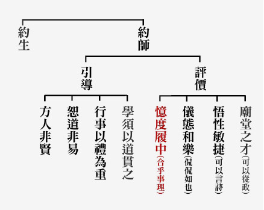

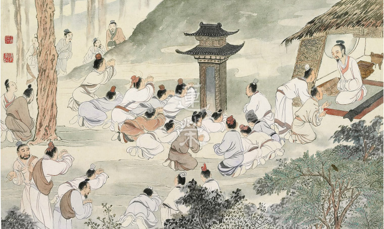

## 藝術賞析

### 孔門七十二賢淺說（九）─南宮括

圖：江逸子‧文：時哉

依禮知進退

讀史具眼力

學詩慎言語

聖人擇姪婿

南宮括，姓南宮，名括，字子容，魯國人，年歲無考。他與南宮敬叔並非同一人。

孔子說，邦國有道之時，南容能為國所用；邦國無道，他能以其智慧之明，免於刑戮之禍。國家有道，君子自當掌握時機，有所表現，為人民開展太平盛世。國家無道，君子容易被小人利用，甚至為小人所害，必須具有智慧方能全身而退，而南容就是這樣的一個賢者。

《論語》上也記載：南容讀詩讀到毛詩大雅抑篇：白圭之玷，尚可磨也。斯言之玷，不可為也。他多次復誦思維。詩句的意思是，玉上的缺點，尚可磨除，若是言語上有缺失，則不可磨滅。須知言語是行為的表徵；行為是言語的落實，人若只是謹於行而忽於言，仍不免招辱取禍。南容深明此理，所以復誦白圭之章自警。大戴禮衛將軍文子篇說南容的德行是：「獨居思仁，公言言義。」他有慎獨的工夫，對眾說話能合乎正義，以為公眾法則。

南容崇尚道德不尚武力，他曾問於孔子：夏代的禹和周朝的始祖稷，力氣雖比不上善射的羿和勇猛的澆，但都得到了天下。孔子因而讚許他是尚德的君子，崇尚道德而不崇尚武力。

南容能夠謹慎言語、崇尚道德，孔子因此將他兄長的女兒許配給他。

畫中的南容手捧圭璧，表徵他對白圭之章的復誦思維。是一種儼若思的形象，似乎是思忖著言語過失的禍患。整體呈現的是一個戰兢惕勵的景象，無怪乎他能全身而退於無道之邦，免於刑罰殺戮之禍。

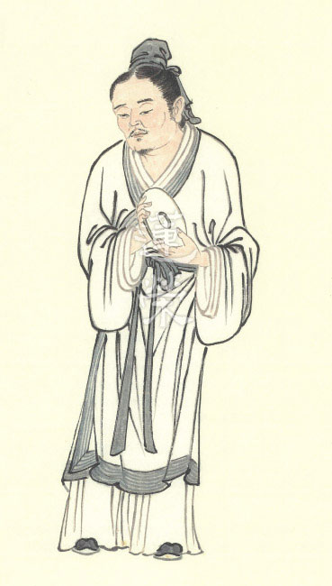

### 華夏精魂千秋(九)
		—明倫史畫君子固窮─原憲

華夏精魂千秋(九)

—明倫史畫君子固窮─原憲

圖：江逸子‧文：淨域

清貧守道逢亂世

司寇家臣辭俸祿

同學貴顯心不慕

頑儒聞能廉而志

史話

原憲，字子思，又稱原思。生於春秋時期魯昭公二十七年(西元前五一五年)，卒年不詳。家世貧寒，個性清介，一生安貧樂道，不與世俗合流，為孔門七十二賢之一，小孔子三十六歲。

孔子任魯國司寇(掌刑獄)，他做孔子的家臣。孔子給九百斛穀粟作為薪俸，他辭謝不受，孔子即說：「你不要推辭了，如果自己用不完，可以分給鄰里鄉黨中需要幫助的人。」他曾問孔子：「一個人不好勝、不自誇、不抱怨與不貪得，這樣可以算是『仁』嗎？」孔子回答說：「這麼做是很困難的，就我所知這還達不到『仁』的範圍。」

原憲又問老師：「什麼是恥辱？」孔子答道：「當國家政治清明時，可以出來作官領俸；若政治晦暗為了俸給而出來為官，這就算得是恥辱了。」為此，孔子死後原憲隱居不仕，實踐孔子的這種政治理念。他的居處十分簡陋，拿茅草蓋屋頂，以蓬蒿編門，用桑木作門樞，取破瓦作窗牆，遇上天雨就屋漏地濕。生活雖如此清苦，但他仍是快樂地讀經唱歌。

某回，在衛國當官的同學子貢，穿著華服乘坐大車去拜訪他，原憲拄著藜杖立於門口迎接。子貢見他頭戴破帽、衣襟見肘、腳趾露出鞋外的樣子，便問道：「先生您有什麼病苦嗎？」原憲回答說：「我曾聽聞，如果財物缺乏，那就是貧困；假使學習孔夫子所傳授的經論，卻不能實踐履行，這才是病呀！而今我原憲只是生活貧困，並不是有病。」子貢聽了面有愧色，便告辭回去了。唐朝吳筠對此有〈詠原憲子〉詩，云：「原生何淡漠，觀妙自怡性。蓬戶常晏如，弦歌樂天命。無財方是貧，有道固非病。木賜欽高風，退慚車馬盛。」

歷朝對原憲固窮守志之風讚譽有加，唐玄宗追封他為「原伯」，宋真宗加封為「任城侯」，明世宗詔改為「先賢原子」，從祀孔子於曲阜孔廟大成殿前之東廡內，受到世人普遍的崇仰。

圖解
夫子過世後，弟子們守喪三年，屆期除子貢結廬再守三年外，其餘人等皆離去。此圖所繪即為原憲去後，隱居不仕的情景。其個性清介又安貧樂道，故能於簡陋的居處，快樂的讀書彈唱。夫子周遊列國在陳絕糧，諸多學生因饑病而無氣力，子路埋怨地
**問：** 「君子也有窮困潦倒的時候嗎？」夫子說：「君子雖窮，但窮不失志；小人一旦窮了，就自暴自棄、一蹶不振。」此即原憲日後所踐履者。富可敵國的子貢見同學貧病，特別驅車前去探慰；而原憲「貧而無病」的一番話，正點出他問「恥辱」之學道守志的精神。春秋末年各國交相利，相對於子貢奔波於列國間貨殖遊說，原憲卻認為政治晦暗時，不為俸祿而仕，寧可隱居安貧樂道。（下期待續）

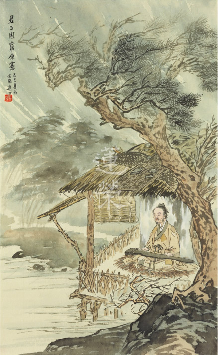

### 孝經圖簡說(七) —三才章

圖：江逸子‧文：時哉

天子朝中行孝道

愛敬能為孝子心

五倫加厚三才德

天地人一氣同春

三才章第七

孝經的第七章是三才章，三才代表天地人，人居天地之間，天地要發揮功能，必須要靠人的德性，無德之人不能令天地呈祥。

三才章當中，孔子說：政治人物若能以孝為本質，來辦政治、辦教育，他的政治不用嚴刑峻罰，他的教育也不用嚴肅規定，整體氣象是活活潑潑的。此時感應的就是物產豐富，天地祥和、四季如春。古書上有說，舜治的天下是四季如春、惠風和暢，也就是人在天地之間，最能發揮天地的功能。

畫作中的柳樹表徵春意盎然、流水淙淙，在古時候是行人送客的時節，王維的〈送元二使安西〉(渭城曲)中有：「渭城朝雨浥輕塵，客舍青青柳色新。」就代表著柳條發青，清晨春雨灑道，是送別行人的時候了。

江先生三才章要經營的就是送別的場景，在送別中的場景有兩幕，其中一幕有彈琴、有吹笛、有歌舞，代表朋友聚會的歡樂中不忍分別，但是，再怎麼不忍還是要別離。第二幕的場景有相別，要與多位知心好友分離時，依依不捨，旁邊的童子帶著琴，想必他們又彈琴、又喝酒、又唱歌、又跳舞，是不忍分別，但是還是不得不分別，在拱手分別時，客人的書僮已經帶著行旅，在馬兒旁等待，想必是要到遠方。

畫家要彰顯的就是送別之情，送別表徵的是人情味的濃厚，這是一種淳厚的民風，在景色宜人之下的人心，是如此的有味道。過去李白送〈孟浩然之廣陵〉的這首詩中，就可以看出李白跟孟浩然之間的情誼，在江邊送孟浩然的李白，一直目送孟浩然的船，消失在水天一線中。

從朋友這一倫中都尚且如此，更何況是君臣這一倫、夫婦這一倫、父子這一倫！五倫關係的和諧，代表的是社會文明以及國家的強盛，所以三才章，江先生特別要經營的場景就是送別的場景，雖然經文當中闡述的是以孝道為本質，要將道德仁義的內涵推廣，推廣出去的成效是民和睦而不爭，但是要怎麼呈現這樣的氣象呢？就是彼此交往真誠待人，送別的時候是濃濃的人情味，令人依依不捨的分別，就是人與人之間真情的流露，為人的真誠，必與天地相合，成為三才，是三才章的畫作，所要呈現的意義。(下期待續)

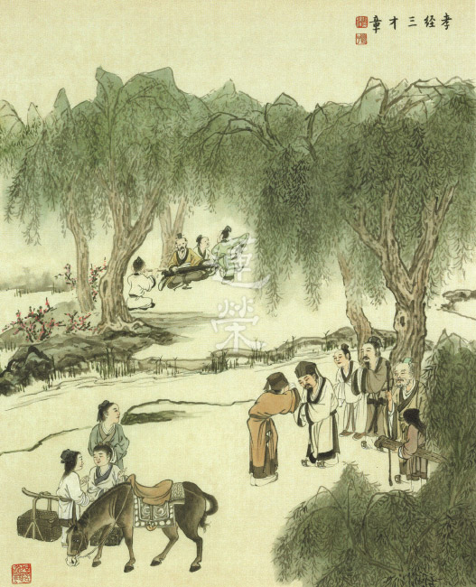

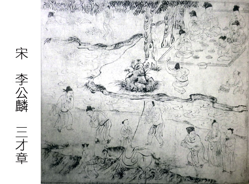

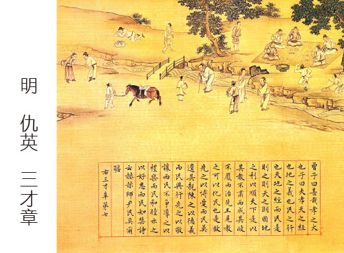

## 專題報導

### 山東經濟廣播電台專訪(三)

*編輯部*

團隊切磋友多聞

光陰荏苒熬出頭

不知不慍君子乎

學而時習朋自來

十二、培養人才要多少時間？

**答：** 以前在雪廬老人的座下學習，便能夠體會孔子那時候一定是個人才團隊！當有個人進來學的時候，他不一定是聽孔子講學，他可能是聽顏回上課，可能是聽子夏上課，學習上面有些問題去請教子貢或師兄，也就是在整個團隊裡面，可以跟很多人學習，可以跟子路學軍事，可以跟子游學禮，可以跟子夏學經典，有關鍵的問題可以去請教夫子，很快就能提升上去！

有位女學長的先生在美國加速器中心，短短幾年之內得了三個博士跟七個碩士，後來在一個飯局中曾向他請教怎麼辦到的？他回答說，很簡單！機關裡面有三千個博士和七千個碩士，常常坐下來喝個咖啡的同時，彼此不斷的談論問題，不到三個月的時間就寫出一篇論文，閉門苦讀的人關個三年也寫不出一篇論文，這就是團隊的腦力激盪，學習的氛圍！孔子就是創造出這樣的氛圍，才能在魯國培養大量的人才。

十三、孔門以團隊學習，成效如何？

坦白講，我們現在很多人都喜歡東聽西聽、網路下載，但沒有經過抉擇，像孔子為甚麼可以培養很多人才？因為這個團隊由他領導，由他去折衷。

但是網路世界是大家各說各話，這叫做大道以歧路亡羊，學者以多方喪生！所以往往進出網路世界莫衷一是，不知所終，到最後是歧路亡羊！反而沒有效果，只是多聽一些知識，只是多了解一些事件，只是多聽一些小道消息，但真正要深入的時候  可能就沒那個能耐了！

還有我們往往總認為說，不用老師的學習，我自己學就可以了，事實上我曾經問過幾個老師，譬如說我們故宮一位很會裱畫的長輩，我問他，難道沒有要跟你學的人嗎？他說當然有啊！只是坐下來聊聊天，我當然就隨便聊兩句啊！你叫我把真正的實力講給他聽，我又不瞭解他！何必多說，所以有很多人以為只要到處請教一下就可以學會了，事實上他一生努力的精華，是不會在那樣的場合告訴你的！

十四、該如何私下用功？

除了時間要定，因為若是時間不定下來，那麼時間效果一定不會出來的。

第二個一定要慎選註解，從《論語》講要進入《論語》集釋。

第三個學習的方法，最好是架構式的學習。

第四個是課前一定要預習，課堂中有老師做抉擇，課後能安排複講，這種方式進行就是我在臺中，李炳南老先生所建立的一種氛圍，一定讓人感覺到學得不錯，學得很高興，學得很歡喜，而且學得很有味道，欲罷不能。

十五、如何很快地從《論語》的學習中獲得利益？

《論語》裡面還可以從《論語講要》的學習，《論語集釋》的學習，古注的分析，慢慢的會了解到原來古人一輩子研學《論語》的究竟心得為何，對這一章的看法是甚麼，你越弄懂以後才發覺原來讀書是多麼的不容易，要把道理弄清楚有多麼不容易，要真正了解《論語》的本意有多麼不容易，開了這個眼力再來看這個世間，你會發覺世間很多的道理一看都明白了！

十六、一個人讀書跟團隊學習的差別？

團隊的切磋琢磨絕對不是一個人的讀書可以取代的！就像我前面提到的例子一般，在團隊大家腦力激盪，對道理的體悟或者成果彼此分享，那種進步相當神速，非個人自學可比。

若企業家對於有心向學的年輕人，發給獎學金，讓他們在課餘之暇學習傳統文化，並且從傳統文化的見地經營人生，這種品德與見地的學問會將所學的學科利益社會！

美國羅斯福總統曾經說過，我們現在的科學教育、技術教育若不重視人品與文化的教育，好比培養一群未爆彈到這個社會，不曉得甚麼時候會爆炸！能力越高，有時候在處理煩惱情緒的時候處理得不好，若對社會產生仇恨、製造社會的紛亂，有時候是很恐怖的，社會有時要付出極慘痛的代價！子貢是一位真正有社會責任的企業家，懂得把錢花在刀口上，助成孔子講學與培養人才，這才是真正有能力、有眼光、有方向的企業家！

十七、什麼是傳承？學傳統文化需要傳承嗎？有什麼作用？

傳承，舉例來說，在〈改革開放─鄧小平〉那部片子裡，有一位數學家他很想教好學生，他知道如果學生沒有老師教，學數學有障礙！連科學都講究傳承，很多的技術面如果沒有老師帶學生，學生是無法突破瓶頸。技職教育最講究師徒制的就是德國，以前我們中國就是這種制度，但想不到在歐洲德國反而是當今實踐者，在整個歐盟裡最有競爭力的。想想看，這些技術都尚且要講究傳承，更何況是文化，它牽涉的是內心的體悟，那是更需傳承的，傳承就是一代傳一代，下一代跟上一代學並不是墨守成規，而是藉著上一代的學習，成就自己的能耐，青出於藍可以勝於藍，學生未必會輸老師，可是學生的成就一定從老師來。我的老師曾說過：高明的老師未必教出高明的學生，可是高明的學生一定來自於高明的老師！這也是比爾蓋茲花了五十億美金去研究美國教育，結論是打造美國的教育一定要培養優良的師資，由他們去帶動美國的教育，除此之外，美國的教育是沒有任何其他的方式可以拯救。

文化的傳承打造的是時代的中心思想，時代的人品、時代的五倫關係、時代的和諧氣氛，那才是時代真正的出路。

十八、目前還有多少傳承者？

先問一般學習是有師承的學習？還是無體系的學習或無師自通？若有師承，師承來自哪裡？其傳承是否道地？是泛泛之學？還是經典之學？再觀待有善述者與善學者的廣博深入學習與發揚光大，所謂經學的傳承才能延續或蓬勃發展，所以目前專業科目的人才有，傳承的人才少。(全文完)

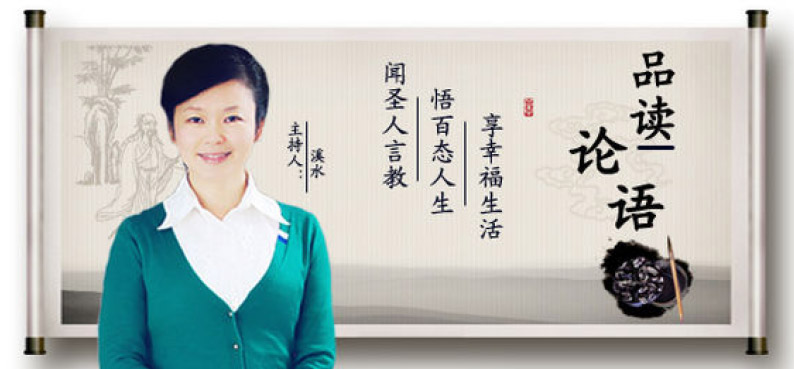

## 活動報導

### 時哉時哉紀念專題
      	─俠骨詩情李雪廬(上)

時哉時哉紀念專題

─俠骨詩情李雪廬(上)

*編輯部*

舉火連天歲月苦

艱難煉出俠骨情

寶刀未老光照遠

典範長存後代心

時哉時哉紀念專題，將介紹一位深具俠士風範，又有詩人真情的偉大人物。他的一生充滿傳奇色彩，興辦的事業遍地開花，最特別的是，他還是孔家第七十七代奉祀官德成先生的老師。事實上，他不僅僅是孔門的老師，也是我們大家的老師，講學生涯數十餘年，現在已是桃李滿天下。這個人是誰呢？他就是已故的李炳南老教授，人稱雪公或者雪廬老人。同時，我們也邀請到本會指導老師與我們分享關於雪廬老人的點點滴滴。

主：先請老師說說我們這次專題的緣起？

師：今年是老人家往生三十年，三十年前老人過世的時候，對我們是一個很大的震撼。我們要如何延續老人的志業？我想，在這三十年的歲月中，如果能夠承接著老人的見地、品格、道德、學問，好好的發揚出去，藉著今天的專題來敘述其人格風範以及一生法行事業，相信對於今世、後世有心學習者，將會有莫大的啟發。

主：為什麼要擬定這樣的主題，以「俠骨詩情李雪廬」來彰顯雪公太老師呢？

師：這是老人內典班的一位弟子─吳碧霞老師，寫過一篇論文叫「俠骨詩情醇儒本色」，這題目實在太好！雪廬老人就是一位具有俠士精神的人，他生平最佩服的人之一就是魯仲連。魯仲連是戰國時期齊國人，到了趙國，解了趙國之危。魏國要趙國稱秦國為帝，魯仲連說服了魏國，不要稱臣於秦國，讓魏國跟趙國聯合，終於打敗了秦國。後來趙國的平原君非常感激魯仲連，送了千兩黃金，魯仲連不收。這種俠士的風範，能夠解各國之危，不以名利為個人的考量，是為雪廬老人所佩服的。雪廬老人講「常禮舉要」時說過：人要有七分的理智，三分的俠氣。所以「俠骨」最能代表雪廬老人，尤其在推展道的時候，必須要有見義勇為的俠氣。

雪廬老人的詩也寫得非常好，對唐詩也非常專精，他有詩人的真情，也能在他的詩中吐露他的心聲，表達對國家民族的情懷，而且對世道人心也多有觀察與關懷。總而言之，「詩情」表徵雪廬老人是一個真情之人，俠氣代表他對人群的關懷，這是雪廬老人很隱密的人格特質。

主：《論語》有一章提到「詩三百，一言以蔽之，曰：『思無邪』。」孔子說《詩經》三百多篇，可以用一句話來概括，就是『思無邪』，每篇都是作者真性情的流露，沒有半點虛假，是人世間的真情！如果說從《論語》中選一段話來形容您眼裡的雪廬老人，會是什麼？

師：有一章子夏讚歎孔子：「望之儼然，即之也溫，聽其言也厲」。「望之儼然」是指遠望的時候很莊嚴，「即之也溫」親近他的時候很溫和，「溫而厲」是又溫和又正直，「聽其言也厲」 是他講話很平實。就如同雪廬老人，親近老人時如此溫和，氣象非常的好，可是獨處的時候又非常莊嚴，說話非常的平實、實在，這是我們後輩弟子所看到的雪廬老人。拿子夏這一段話，來描摹我內心對雪廬老人的崇仰，雖然我不是子夏，我們差得很遠，可是雪廬老人真是有孔子的風采，晚年不但不顯老態，還能看起來溫和而莊嚴，相信這背後是雪廬老人依著經學見地所經營出來的氣象。

主：一個人在晚年還能呈現出這樣的氣象，這個背後一定要有見地的經營，想必是他一生經歷積累所成。是不是可以請老師從雪廬老人在山東時期的故事開始說起，他是如何有這種傳承的？

師：我們先從他的家教說起，一個人的成功一定是來自於他的家庭教育，雪廬老人的祖先，在明朝的時候是做官的，明末清初時，高祖不願意投降清朝，所以隱居求志，他的曾祖李銑是一個武功高強的人，他的祖父李景純老先生，知書達禮，而且樂於培養雪廬老人，知道這個小孩子，將來會有一番大成就。所以，出去拜訪朋友的時候，把雪廬老人帶在身邊，觀看進退應對的禮儀；家裡有客人的時候，叫孫子在旁邊看，如何與賓客間來往；帶著孫子出去吃飯，要他了解上菜的次序，每一道菜的內涵，回來要問他，老人答不上來的時候，祖父會很生氣地喝斥，祖父給孫子最大的教育就是處處留心。

雪廬老人的父親李壽村先生，因為上有祖父做主，所以不太管事。雪廬老人的媽媽翟師遠學歷不高，可是熟讀歷史，懂得持家，也懂得運用歷史的典故，人非常的鎮定。雪廬老人說：「他的家庭教育裡面，得力於祖父跟媽媽。」

雪廬老人講過一個故事，說他祖母的親戚來他們家，帶著當時年僅四、五歲的雪廬老人去趵突泉看花燈，結果走丟了，老人衣服穿得非常華麗，引來很多人的注目，但是他非常的鎮定，沒有哭叫，遇到惡人他鎮定沉默不答，遇到善人就略略答腔，可是他都沒有表態說要回家，後來遇到一位慈眉善目的老人，雪廬老人立刻請這位長者帶他回家。老人問你家住哪裏？他就報一個他叔父讀書的學堂，後來走到西券門的時候，雪廬老人說我家是在南券門，結果，沒想到這位老人就是他叔父學堂的老師。

雪廬老人走丟的時候，一家人非常慌亂，他的父親拿著燈籠，叫著雪廬老人的小名，到處大街小巷的找，他的祖父很鎮靜地說：這個孩子聰慧，一定會回來。雪廬老人回到家裏，趁著祖父跟著老師在喝茶敘舊的時候，跑去後面跟他的母親懺悔，如此可知雪廬老人從小就懂得孝順他的媽媽。晚年跟侍者鄭勝陽老師在回憶這段的時候，就當場哭出來，說他對不起他媽媽。由此可見，雪廬老人的至情是保留到老的。

主：其實光靠家教可能是不夠的，不曉得雪廬老人在學校方面，學校教育又給他什麼啟發？

師：雪廬老人還沒進學校的時候，就有俠骨的氣質，因為他的曾祖李銑，是一個武人，教出很多武官，所以家裡面有弓、古琴，從小耳濡目染，也很有俠氣的骨子。

後來到學校去讀書，那個時候的私塾是在正覺寺裏面，這也是雪廬老人跟佛教結緣的開始，私塾學校裡面天天讀經、背詩詞，古時候的私塾是沒有下課的，而且老師非常有威嚴，甚麼時候可以下課呢？要拿桌上的出恭籤輪流出去上廁所，出恭籤不能隨便用，輪流出去透透氣，回來繼續讀。雪廬老人是一個天資聰明的孩子，書讀一讀他就會背了，老師說再讀！練耐性！所以雪廬老人晚年在《常禮舉要》裡說：知止而後有定，定而後能靜，這都靠讀經去練出來的。

後來老人到尚志書院去讀書，在現今趵突泉的李清照紀念館附近，是清朝培育人才的場所。

主：剛才聽老師說到雪公太老師的求學歷程，有個地方令我蠻好奇的，一個從小讀四書五經的人，後來卻選擇讀法律，這樣的選擇是否有其時代背景的因素存在呢？

師：是的。中國歷朝都是重道德、品行的，但是中日甲午戰爭馬關條約之後，清朝發現到他們缺乏法政的人才。工業革命之後，西洋船堅炮利打垮了中華民族自信心，中國學生便開始汲汲於學習科技、財經、法政，想要趕上西洋。

法政學堂是培養法律的專才，雪廬老人十九歲開始就到法政學堂去讀書，這對雪廬老人後來的公職生涯有很大的幫助，就是因為讀了法政學堂，從他二十三、四歲學校畢業後，一路到他九十幾歲，都從事公職生涯。

老人首先是在縣政府當承審員，後來當司法科長，他說在這段時間審理很多無頭案，老人特別日夜不休，整理出頭緒，破了很多的冤案，因為有這種能耐，所以才有後來到莒縣去當典獄長的因緣。

主：雪廬老人在當典獄長的時候，他辦的獄政，跟一般人有甚麼不一樣？

師：老人有經學的見地，又因為古道熱腸，在莒縣當典獄長的時候，他徵得仕紳的同意，籌集了一些款項，在內亂還未波及莒縣的時候，老人專心整頓獄政。他做了幾項事情：第一、他讓環境改變；第二、照顧犯人的疾病，甚至安葬犯人；第三、教育犯人，每天都講善書，還舉辦雅樂團，調和犯人的氣質。這些跟他以前的家庭教育、私塾教育、學校教育都有關係，他雖然懂得法律專長，但是他更懂得文化教育的重要。

透過這幾年的獄政下來，有一年，雪廬老人讓犯人回去過春節，其中有幾個是死刑犯，給他們三天回去過年，後來全部都回來了。請問他跟唐太宗的〈縱囚論〉有何不同？歐陽修說唐太宗的〈縱囚論〉是沽名釣譽，雪廬老人這絕對不是！為什麼？因為雪廬老人沒有能力去赦免他們，會這樣做完全是在人情上的通達，每個人都有思鄉的心情，他們的質地因為受教育被改善了，讓壞人洗心革面改邪歸正，雪廬老人相信他們能夠信守承諾回來。而唐太宗的〈縱囚論〉，犯人們都知道皇帝其實要赦免他們，所以他們都乖乖的回來，接受皇帝的赦免。

雪廬老人辦獄政，他最大的理想就是像堯、舜時候，堯舜時期的皋陶管司法，當時就是透過辦教育，最後是監獄長草，沒有犯人可以關。現在的監獄官如果懂得辦獄政，除了照顧犯人的生活起居，透過禮樂的薰陶，更重要是能說善書，讓他們改邪歸正，相信整個獄政工作會有起色，監獄不但不會人滿為患，而且犯人還會愈來愈減少。

老人在莒縣當典獄長的時候，除了能夠把獄政管理好，接著開始就是整個內戰。內戰的過程中，雪廬老人在莒縣當典獄長做了十七年（三十一歲到四十八歲）。在擔任典獄長的過程裡面，他不但把獄政工作管得好，他又曾經代理過縣長，處理過莒縣很多的內亂，「功在莒縣」。

主：為什麼辦獄政會辦到跑去代理縣長，典獄長跟縣長的職責好像距離有點遠，可以請老師再詳細說明嗎？

師：在民國初年的時候，因為軍閥內戰導致國家很不太平，內亂有四股勢力，就是地方團、張宗昌(山東督軍)的部隊、西北軍楊虎城的部隊，和中央軍蔣介石的部隊，這四個部隊在莒縣各有消長，人民就在夾縫中求生存。內亂時縣長逃跑了，雪廬老人被公推為代理縣長，那個時候情況很亂，警察、地方團都跑光了，雪廬老人要怎麼穩定秩序？老人整理十幾個人的兵力，亮刺刀，拿步槍，有作亂的份子就予以逮捕，把全城的秩序恢復。接著，當張宗昌的部隊打進來，張的副官索求無度，雪廬老人可以讓主官把副官調走。西北軍隊進來的時候，一樣索求無度，雪廬老人就勸他們，讓老百姓免於塗炭。中央軍跟西北軍對打時，雪廬老人說服城市西北軍不要對抗中央軍，並登城對中央軍說：不要再砲轟城內，讓中央軍安然進城。

雪廬老人又沒有三頭六臂，為什麼這些有武力的軍隊會聽老人的話？老人憑著一個俠氣，一個真誠。昔日土匪圍攻莒縣的時候，雪廬老人槌城下來跟土匪談判，匪首劉桂堂酒量很好，雪廬老人跟他對喝，曾經聽老學長說他們比賽吃滷蛋，土匪吃了八顆就倒地，老人可以吃了十一顆沒有大礙！老人也曾經被匪酋軟禁七個月，可是他們很敬佩雪廬老人，就從敬佩雪廬老人當中解除危難。

雪廬老人也在這一段時期裡面寫了很多詩來反映歷史，表達對時局的無奈，雪廬老人對莒縣，不但將獄政工作辦得好，而且解了很多次莒縣之危。

主：老人在莒縣任內另外完成的一件大事，就是參與重修莒縣的縣志，它背後的因緣是什麼？

師：當劉桂堂的勢力被消滅了以後，內亂稍微安定，縣長想要重修縣志，重修縣志的負責人就是莊太史，莊太史是孔家的老師，他比孔德成大五十五歲，比雪公大二十五歲，他的毛筆字寫得很好，國學才情非常豐富，孔德成先生也曾經說：雪廬老人有很多的國學素養，是得力於莊太史，而莊太史最欣賞的就是雪廬老人。莊太史是莒縣人，他親眼看到誰真正的在危難中保護莒縣，是一位濟南人，憑著他的才情，憑著他的俠氣，憑著他的折衝，憑著他不怕死，肯冒險犯難，幫助莒縣一次一次地度過了危難。所以他當縣誌總編纂的時後，就請雪廬老人當分纂，負責古蹟、軍事、司法跟金石，這是整部縣志的核心處。

主：能否請老師再進一步說明，明明只是參與地方史的編撰，後來為什麼卻成為改變老人後半生的緣起。而且也是因為這個緣故，雪公老師才有可能來到臺灣，對不對？

師：莊太史對雪廬老人非常的欣賞，莊太史又是孔德成的老師。莊太史曾經說，他到孔家是有條件的，他說：我來，你們不准我走，我走不走是我決定，不是你們決定。孔德成先生在莊太史及幾位老師的教導，能自勉上進，不因家大業大而放縱慾望。

在編了三年的莒縣縣志以後，莊太史就介紹雪廬老人到奉祀官府當秘書。從辦理獄政到解除危難，獲得莊太史對他人格特質的敬佩。後來修莒縣志，最後推薦入孔府，除了雪廬老人的人格特質以外，想要擔任孔府的主任秘書，一定要有內涵，雪廬老人的詩作裡面有莊太史的眉批，可見他非常欣賞雪廬老人的才情，他的才情來自他的天資聰穎，更來自於家教，來自於他的私塾教育。

主：老人在一九三七年一月進入孔府任職，十二月就因為日軍入侵，隨著孔先生避居重慶。一月到任、十二月就從山東到遙遠的四川，可是家人卻還留在山東，烽火連天，老人不可能不掛心陷在戰區的老母、妻兒，他怎麼能安心離開呢？

莊太史把雪廬老人介紹到孔家，雪廬老人在莒縣服務了十七年，當老人要離開的時候，送他的大半都是莒縣人，而且很多都是傷殘之人，在戰火連天中得到老人的照顧。據雪廬老人的兒子形容，送他的人有好幾根電線桿這麼長，來送雪廬老人這ㄧ位大家長回濟南。

雖然去孔門是很難得的機會，當時他回到濟南法院上班，十幾年在外，好不容易可以回到家裡面，如果又到曲阜孔家上班，等於又離開家鄉，而且這十幾年不在家，有一種不能夠盡孝道的愧疚感，但是，雪廬老人如果沒有到奉祀官府去上班，雪廬老人是不可能到台灣的。

他的祖父李景純老先生說：我們李家好幾代沒有給國家幹活，好不容易有為聖人服務的地方（衍聖公府），你就去，家裡面的事情不用操心！有祖父這樣的勉勵，而且他祖父通曉大義，看到未來，鼓勵雪廬老人到奉祀官府去上班，雪廬老人這個時候，就沒有後顧之憂，到奉祀官府去上班了。

主：入孔府之後發生什麼事情。當時老人已經四十八歲了，孔德成先生才十七歲，這兩個人相遇的情境肯定很有意思吧？

師：孔家家大業大，孔子過世的時候歷代都有封賞，二千多年來這個家沒有搬過，而且尊貴到帝王女兒要下嫁時，首先考慮的是孔家。孔家有孔府、孔林、孔廟，當差的有六、七百人，這麼多的古物和經書，莊太史是孔家的老師，他要為孔家物色幹才，主持孔家大政，莊太史目睹了莒縣十幾年來，兵荒馬亂，烽火連天中，誰折衝救民於倒懸之中？他清楚得很！經過三年修莒縣的縣志中，看到了雪廬老人的才情，這個時候順理成章的，便推薦雪廬老人到孔府擔任這個重要的職位。

經過了一番波折以後，雪廬老人進入了孔府。當時雪廬老人進入孔府應該是四十八歲，那時候孔德成孔先生才十七歲，孔德成先生在十六歲的時候被中央政府任命為奉祀官，十七歲的時候遇到雪廬老人，兩個人的年齡差了三十歲，可是孔先生竟然說「一見便知己，平生有幾人」，跟雪廬老人一見面，就成莫逆之交，老人就是這種情況下，在一九三七年到孔府上班，本來是當秘書，很快的就晉升為主任秘書，成為孔德成先生最信任的人。

主：雪廬老人跟孔上公彼此之間的交情非常好，不曉得老師可不可以就這個方面來跟我們聊一聊？

師：雪廬老人跟孔先生知音相投，維持了四倫的關係，雪廬老人對孔先生的引導像師生關係；孔先生是奉祀官，雪廬老人是主任秘書，這是君臣關係；雪廬老人在這一段流離失所的歲月中，跟孔先生又像是父子關係；兩個人情投意合又像兄弟；在相互和詩的時候又像是好朋友(知音)。

在中國的歷史上，很少有長官跟部屬是維持這樣的關係，雪廬老人自從入了孔府以後，一直陪著孔先生，中間經歷了戰亂，輾轉來到臺灣。這中間發生了非常非常多的事情。

主：這真令人難以想像。從一見面就有如伯牙子期，又經歷戰亂，老人一路護送孔上公退到四川，後來又乘桴浮于海來到臺灣，想必他們之間的交情是旁人難以想像的，能請老師談談這段歷史嗎？

師：在一九三七年，雪廬老人到孔家去上班的時候，正值中日戰爭，蔣介石先生派孫同宣將軍，以一個師的兵力護持孔家到重慶。雪廬老人擔負孔家的搬運工作，人員的調配等等諸多事情，入四川之後，日本人以飛機狂炸四川，奉祀官府曾經被炸平兩次，雪廬老人主持救護隊，出去救護老百姓，他不只當孔奉祀官府的主任秘書，還兼著做種種救濟工作。這些戰亂的歷練，也和他來臺灣之後懂得如何興辦慈善工作有關係。

後來遷移到歌樂山的猗蘭別墅，猗蘭二字是孔子從衛國回到魯國的時候，在山中岩堐邊聞到幽蘭的清香，說到君子在亂世時也不改君子之志，就像蘭花生在深谷裡不會改變它的芬芳。

抗日結束回到南京，老人陪奉祀官回曲阜三次，自己回濟南一次，也就是雪廬老人在一九三七年到一九四九年，十幾年的時間內只有回家一次。三返曲阜時，陪著孔上公德成先生去祭拜孔子，當時雪廬老人跟孔德成先生是形影不離，不但是外相上陪著他，內心上也多有交流，比如他們在四川，抗戰這八年當中，烽火連天之外，他們還有和詩，來講講心裡的話。

雪廬老人的詩為什麼非常的可貴？因為他真實的記載史實，抒發他的情感，讓我們能了解那一段事情的經過。雪廬老人後來陪著孔奉祀官，押運孔奉祀官府的文物到了臺灣，從南京一直到基隆，後來到臺中，雪廬老人一直在奉祀官府做到了九十歲，他有一封九旬辭職信，其中的重點就是表達他追隨孔奉祀官這麼多年，但是他必須要告退了，希望能找一個人來頂替他的職務，他會把所有的工作交給他，這封信寫完了，恭恭敬敬的把事實分析給孔上公聽，孔上公沒有准他，一直到雪廬老人九十五歲的時候，他跟孔上公見面，他跪下來請孔上公能夠讓他辭職，以利後面的交接，孔上公也跪下來，兩個人抱頭哭。為什麼會抱頭哭？那是幾十年的交情！孔上公事後跟奉祀官府裡面的人說，不准他退休不是不通人情，孔上公說，一旦雪廬老人辭了以後，他可能不久就會離開人間，他珍惜的是這樣的友誼。繼任者（代理主任秘書）云，孔先生交代每天都要去看老人家狀況，並且打電話到台北回報。後來官府聘請雪廬老人當顧問，也禮請雪廬老人辦論語講習班。

孔先生後來在雪廬老人過世時，孔先生趕來瞻仰遺體，用跪拜的大禮，帶著太太、小孩，來表達他對雪廬老人最高的尊崇。你可曾看過部屬過世時，長官用跪拜的大禮？不可能！雪廬老人在他的心目中，是老師、是父子、是朋友、是兄弟。尤其，他們相依為命，患難到臺灣。

雪廬老人告別式之際，孔先生代表家族的長者，主持封釘以及發引火化，統籌雪廬老人過世的種種事宜。寫了一副輓聯，道盡兩個人一生的相處，上聯是「數萬里流離備嚐甘苦與君共」，從曲阜到四川，從四川到南京，從南京到臺灣，這裡面的甘苦就是躲避轟炸，就算後來到臺灣，生活也很困苦。下聯是「五十年交誼多歷艱難為我謀」，從一九三七年到一九八六年，五十年的交誼，這艱難裡面包括帶著孔先生逃亡，押送孔府的文物，押送孔府的文物中間還發生什麼過程呢？憲兵想要搶劫，警察想要搶劫，都賴雪廬老人鎮靜化解，主任秘書為奉祀官謀，謀這五十年，主持孔府的大政，而且辦明倫月刊，包括辦國學講座，都是用奉祀官府的名義，處處替孔先生著想。你看這五十年的交情，患難交情，知音交情，乃至於才情交情。現在只能在這裡很皮毛的敘述，實在是一言難盡，我們都不是當事人，沒辦法去體會！

主：老人在大陸的故事，我們已經從儒學傳承談到了擔任孔府主秘。在大陸還有另外一部份重要是事情就是佛學的傳承，是否也請老師說一說？

師：雪廬老人的佛學傳承，首先雪廬老人他們家庭跟佛教有關係，家裡面家族大，有人過世都會請出家人來做法會，雪廬老人說他對於法會當中的板眼都能聽懂。其次就是他的私塾教育是在正覺寺裏面，在耳濡目染對佛教有極深的好感。

之後在法政學堂的學習，有一位老師，是山東檢察廳最高的檢察長梅光羲大士，他是佛學的大家，這是雪廬老人唯識學的老師。當時梅大士在大明湖畔的歷下亭上唯識課，老人曾說他在法政學堂最快樂的時間，就是課餘坐船到大明湖島中的歷下亭，聽梅大士講唯識，開了他的眼界。

第二位老師是印光大師，當時老人家在莒縣做獄政工作，印光大師在蘇州弘化社主持書籍流通工作，老人透過種種因緣，收到弘化社寄來的書以後，非常的感動，看了這些佛書，才了解他之前對淨土法門的誤解，重新打基礎，並且對印光大師非常景仰，後來透過友人，寫信求皈依，印光大師寫信來賜法名叫德明，雪廬老人接到印光大師的皈依信，他是先把信供在佛前，拜一百拜之後再看信。

後來在莒縣，劉桂堂的勢力被消滅了以後，莒縣亂事平定後，編莒縣縣志的時候工作比較輕鬆，獄政工作也辦得很好，所以他藉著出差到南京的機會順便去蘇州拜訪印光大師，印光大師當時在蘇州的弘化寺閉關，一般就是只打開窗戶，講幾句話就把窗戶關起來，不輕易跟人家談話，可是他碰到雪廬老人，竟然打開關門叫雪廬老人進去，兩個人在裡面對談，一直談到晚上，這裡面可能是對雪廬老人多有期許！可是老人家非常的客氣，他只說印光大師交待他要敦倫盡份好好做人等等，但是當中很多事情我們是無從得知的。

印光大師不但在人格上對雪廬老人影響，文鈔上對雪廬老人影響，甚至在見面的時候對老人多有提攜，所以雪廬老人把印光大師，當成他心目中份量最重的老師。

第三位老師就是太虛大師，太虛大師當時在四川，跟雪廬老人見過面，而且他請雪廬老人到監獄去講經，而且請雪廬老人到長安寺講十二因緣。所以雪廬老人真正的講經事業是太虛大師啟請的。

主：再回到老人的部分，想到老人家為了孔奉祀官而離鄉背井，甚至母親過世也因為戰亂無法奔喪，最後渡海來台，從此和妻兒從海峽相隔直至天人永隔，再也沒回到故鄉過，面對這樣時代的悲劇，老人家孤零零一人在臺灣，應該是滿腹的思鄉、思親之情才是，怎麼晚年的氣象還能是申申如也、夭夭如也呢？

師：好命壞命不能看表面，要看骨子裡，雪廬老人是好命的人，表面看是壞命，離鄉背井，烽火連天，顛沛流離，骨子裡是好命！他能夠遇到善知識（莊太史、印光大師、梅大士、太虛大師等），他能夠跟孔奉祀官府有如此深厚的因緣，他來臺灣的時候，能夠在安定的歲月裡面，辦教育、辦慈善、辦文化的事業，而且能登高一呼大家相應，辦出許多利益社會的事業，最後有一批批學生對雪廬老人衷心的景仰佩服，不離左右的學習，這些都是雪廬老人的好命。

雪廬老人九十六歲的高齡，辦完啟蒙班的活動，雪廬老人帶大家出遊，學生們高興得要命！有人幫老人划船，學生在旁邊吹奏樂器、吟詩，表達對老人的體貼、親愛、尊崇。甚至在吟詩當中，讓人感覺到師生之間相處的快樂，這裡面表達的是學生對老師的敬意跟孝心，這種老師在臺灣是找不到的！這不是他的福報嗎？老人生病的時候，學生比孝子還要更孝順自己的父母親，除了學生划船、吟詩以外，走山坡路的時候是學生來幫老師抬轎，在在說明雪廬老人是很有福報。

老人晚年上課，走路不方便，學生精心設想，幫老師抬椅子！處處表現對老師的關心，對老師的擁護，這些都代表雪廬老人是一位教學非常成功的老師。

在臺灣推廣慈善事業、文化事業、教育事業、人才培養的事業，都得到很大的迴響。這種福報讓我們感覺到，原來孔子當時在設教魯國的時候，看起來是顛沛流離，看起來是不為國君所用，其實他所得到的擁護是我們難以想像的。

雖然雪廬老人來臺灣等於是孤苦伶仃，但其實學生們都像是老人的孩子一般，甚至可能比小孩還要更親密，在孝順上不輸孩子，學生們的耳朵沒離開老人言教的教誨，眼睛沒離開老人動作的表現，從眼睛看、耳朵聽、心裡想裡面，去從老人身上，得到自己很大的受用，這是老人身上留給學生最大的遺產。

主：總結老人在大陸的六十年光陰，從清光緒走到民國，看到帝國的衰亡、革命的興起、民國初年的軍閥割據、政治不安，後又歷經中日戰爭、國共內亂，一路歷經連天戰火從山東逃難經過大半個中國，國族家族不安、百姓顛沛流離、生離死別，所有人間的苦難攤現在前，請問老師您覺得這前六十年對老人的後三十年臺灣歲月最大的影響是什麼？

師：雪廬老人來臺灣大概三十八年的時間（六十歲到九十七歲），大陸六十年的這段經歷，他的詩有人評論說，他記載歷史事件像杜甫一樣悲天憫人，他的豪情像李白，他的悟性像王維，用他詩人的情懷來看時代，可是他又能夠超越時代的繫縛，他能夠投入這個時代，又能夠超越這個時代的繫縛，示現一個非常了不起的聖人見地，聖人的情懷，聖人的處世！在這六十年當中，他歷練了各種事項，經學的素養達到了爐火純青，人情世故也經過了種種的考驗。

在臺灣的三十八年歲月當中，藉著充足的辦事經驗以及經學內涵，不但通達人情世故，以結善緣得到他人擁護，而且懂得以講學來培養人才，各方面都面面俱到的承辦這些事業，推展了種種事業，不但事業能蓬勃發展，而且也培養出許多傑出的人才，雪廬老人後面這三十八年在臺灣的影響是非常大的，而這些都跟他在大陸六十年的經歷與學習有絕對的關係。

接下來將鎖定雪廬老人，後面三十八年渡海來臺之後，所興辦的種種事業，還有他對後人的影響，由此來體會和了解什麼叫做一代大儒的風範。（下期待續）

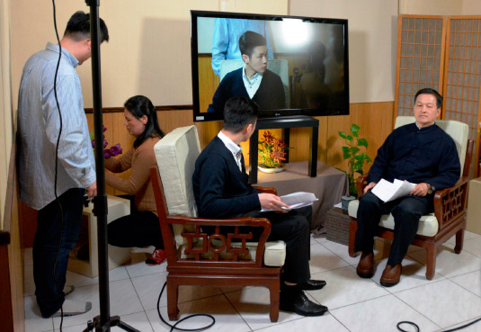

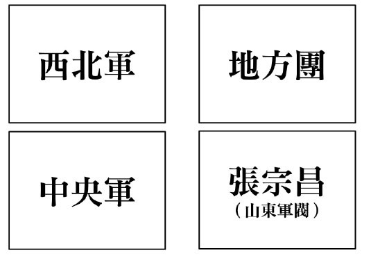

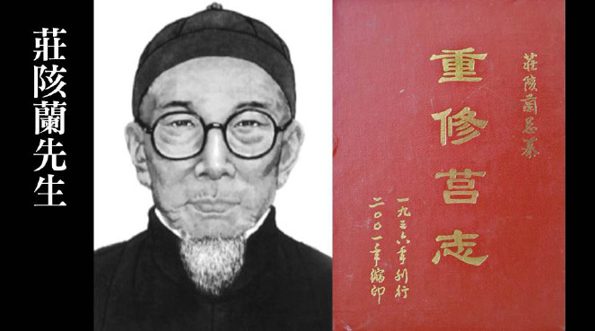

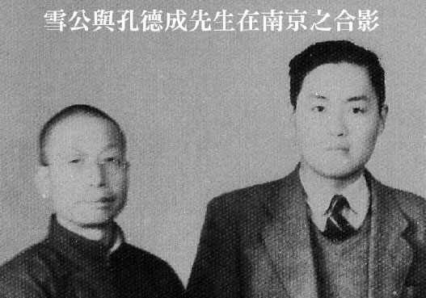

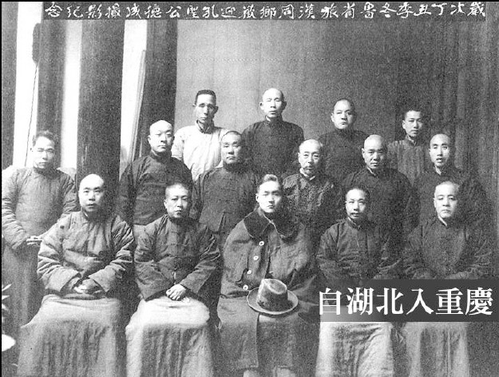

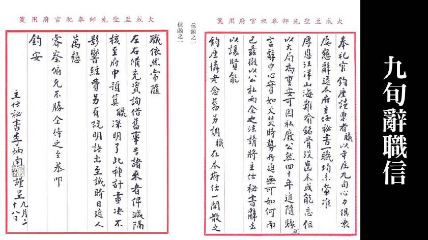

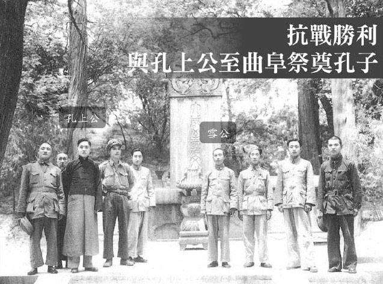

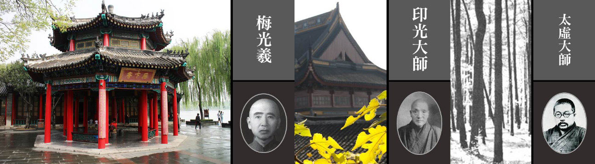

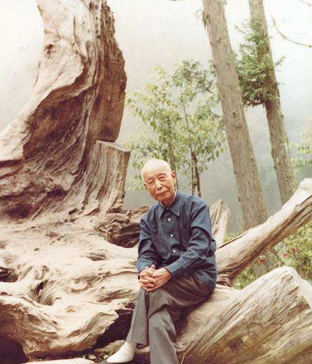

### 雪廬老人的論語見地

*唐瑜凌講述‧親曉整理*

漢宋古注上千家

茫然濃霧海上行

燈塔照亮迷航舟

慶幸亂世能反正

眾所周知，雪廬老人是一位佛學大家，無論是講經的表解，還是說法的內涵，嘗勉勵弟子研經貴在得旨，佛學造詣令弟子覺得「仰之彌高，鑽之彌堅」。但一般人卻忽略了老人的國學亦具傳承與擇法眼。老人講國學一如佛學，不但深具次第，而且作表分析，如在《雪廬全集》中有<大學><中庸>的表解，乃至於《詩階述唐》敘述唐詩，雪廬老人在分析一首詩時，可以從文法格局到講要、取境，談到了詩人的志向，結歸到五倫，彰顯出中華文化的特色，這是雪廬老人在詩歌方面無與倫比的才情。

雪廬老人晚年，以「未改心腸熱，全憐暗路人，但能光照遠，不惜自焚身。」的精神，通過論語講習班，將他學問的精華、人生的經驗閱歷跟經學見地，化成對《論語》的講解。所以我們後期的弟子能夠有幸聽老人對《論語》的抉擇，感覺到此生不虛此行，可以從《論語》的見地裏面，打開我們經學的擇法眼，從此深入儒學，乃至深入佛學，建立人格，完成人生的莊嚴。太虛大師說：「仰止唯佛陀，完成在人格；人成即佛成，是名真現實。」

雪廬老人講學《論語》的特色

雪廬老人晚年講學《論語》是由孔奉祀官德成先生恭請的，孔先生說雪廬老人講《論語》，推展國學，發揚文化，比他在孔奉祀官府主任秘書的職務更為重要。所以，雪廬老人晚年講學《論語》具有正統性。

雪廬老人綜合了程樹德《論語集釋》中六百八十家的注解，抉擇分析，以經解經，前後貫穿，並且以通達人情世故的方式顯現經義。從雪廬老人推理的過程當中，發覺到他不是在說教，而是在敘說人生的出路，這正是時代所需。

我們現在的年輕人面對著網路世界大開，已經沒有辦法以說教的方式來度他們，但雪廬老人這種國學的特色，正統性、見解獨到、有邏輯，就是時代的需求。

分析兩岸的國學發展問題

在這個時代的需求當中，特別要說到現在兩岸國學的發展問題，尤其是大陸現在興起的國學熱，以三部分進行分析：

第一、政治的局勢。有人笑言，大陸發展國學如旭日東升，可是天還沒亮。而臺灣是夕陽西下，可也還沒暗。大陸的習主席曾專程到山東曲阜考察，他說他是為了儒家專程而來，為了弘揚文化而來。在孔子誕辰時，習主席發表了延續民族文化命脈的演講，並且在大陸的中央黨校也開設了《論語》課程，將《論語》納入高考的內容範圍。目前大陸的局勢，是從中央到地方正如火如荼的開展。

第二、學校的教育。分為三部分：第一部分是將臺灣的教材引到大陸去；第二部分是將國學帶到學校發展；第三部分就是各國學私塾的發展。在大陸的國學教育裏面，有他自身的特色，但也有一些問題存在，例如沒有深入正統國學的老師。臺灣雖有國學教材但亦不完備，雖有師資，素質也逐年下滑，並為推廣得很成功，更何況大陸缺乏師資的情況下，還有教材適用有水土不服的問題，就更沒有成功的機會了。

第三、民間的推廣。民間辦學方興未艾，如火如荼。但是這裏面發現了三個問題：缺乏次第性、缺乏深入性，而且如果流於搞形式，或是借機收取高額學費的時候，反而會傷害國學文化的流通。這是在於政治的局勢、學校的教育，以及民間推廣，所共同面臨的一個實際的狀況。

在二○一○年，我們有幸到大陸去推廣國學文化，發現大陸的官方很有實際的行動跟效果。首先，我們在福建順昌一帶，跟著當地的教育局和縣政府來合辦講座，以雪廬老人的思想體系，特別是以《論語》作一主題式的架構成為教學的主軸，開展的主題為孔門的氣象，其中含著十哲的內涵。受教的義工團、家長、學生，效果良好，讓他們的教育局眼睛為之一亮，往後便有諸多合作的因緣。

其次也曾在政和縣辦過論語講座，政和位於浙江與福建的交匯處，那裡是雪廬老人生前愛喝的銀針白毫茶葉的出產地。當地的縣委書記知道《論語》的重要，請我們辦了六天的《論語》講座，前三天是針對當地校長跟老師，主題是孔子的教育理念，後三天針對四套領導班子（包括黨委、縣政府、人大會跟政協），主題是孔子為政的理想、作法與氣象。而這位書記後來也獲大陸一百大書記之榮耀。

也有到山東濟南（雪廬老人的故鄉）舉辦該市第一次傳統文化公益講座。一般去聽國學講座，剛開始人會很多，然後人就逐漸減少，最後所剩無幾，但我們這兩天的公益講座約有七百人來上課，且兩天下來學生人數依然。可見，雪廬老人的思想體系是能吸引人的，是這個時代所需的，是能夠豐富心靈的課程。

雪廬老人國學的傳承

雪廬老人講學《論語》之所以如此精彩，是因為這其中有他傳承的內涵。雪廬老人儒學的部分，首先是來自於他的家教，一個人的成功一定是來自於他的家庭教育。在傳記中記載，雪廬老人的祖父對他特別的提攜，知道這個小孩子不同凡響，經常帶著他出去做客，要他在旁邊觀察祖父是如何進退應對，在請客吃飯時，讓他瞭解上菜的次序，以及每一道菜的內涵，家裏來了客人，也讓他在旁邊觀察祖父與客人如何應對，可知從小這樣進行訓練，他的祖父給他最大的教育就是處處留心。

雪廬老人的母親翟師遠，雖然學歷不高，但是熟讀歷史，懂得持家，懂得運用歷史的典故教孩子，所以老人說，他的家庭教育裏面，得力於他的祖父跟他的母親。

其次，來自於他私塾與學校的教育，雪廬老人所在的私塾是在正覺寺裡面，這也是他跟佛教結緣的開始。在私塾中讀經，奠定了他經、史、子，還有詩詞的國學功底。後來到尚志書院去讀書，這是清朝培養人才的機構。

以上，是雪廬老人求學的一段。

雪廬老人講學《論語》

儒學中最難談的就是性與天道，性與天道這部分如何講得清楚呢？雪廬老人有別於一般大儒的地方就是他通達佛學，所以他能夠把儒學中性與天道的部分講得清清楚楚，他佛學的傳承特別是來自於印光大師、太虛大師、梅光義大士。

臺灣人是非常有福報的，有這些大陸來的老先生，特別像雪廬老人，他除了在臺中蓮社、慈光圖書館講學《論語》，還在一九六五年於中興大學中文系開班講<中庸><大學>，其講解的最大特色在於用表解的方式呈現經義。在臺中蓮社開設了一期的內典班與三期的論語班，雪廬老人晚年就以培養人才作為他人生圓滿的句點。王禮卿教授那時曾要雪廬老人多著書，但老人知道培養人才比著書立說更為重要，因為「人能弘道，非道弘人」，「道」擺在那裏是不能弘人的，唯有「人」才能夠弘道，通過人把經學的見地弘揚起來，人依著經學在日用平常實踐，成為他不凡的人格特質，經學的價值才會出現。所以講到正法、像法、末法、滅法，都是關乎於人跟人心來說的。

現在醒公老師在臺中蓮社，繼續講學《論語》、講學《易經》就是延續雪廬老人的傳承。在講到困卦時，澤水困代表窮則變，變則通，困到極處則通達。杜甫〈小至〉之詩有云：「山意衝寒欲放梅」，氣候越到冷處，愈是接近大地回春，所謂困極則通。當時臺灣的國學已經慢慢的沒落，雪廬老人在講《論語》時曾告訴我們不用慌，未來國學會再次流通，想不到被老人言中，如今大陸積極推廣國學，可惜的是教材與師資不足。此時更佩服雪公在三十年前的眼力獨到，知道培養佛學與國學的人才，才是未來文化推廣，經典流通的關鍵。

國學的推廣順應著時代，特別是經典的《論語》更是目前對岸想學的國學經典，《論語》是十三經的門戶，十三經的精華，六經的要旨，這四百九十八條記載了孔子的經驗閱歷，乃至人情世故。那麽，《論語》的總綱到底是什麽呢？

在一九八五年的一天晚上，雪廬老人特意穿了中山裝，恭恭敬敬為我們啟蒙班的老師上了一堂課，說感謝我們的發心，他要講一個非常重要的內容，就是《論語》的總綱「志於道，據於德，依於仁，游於藝。」

「志於道，據於德」是形而上的學習，「依於仁，游於藝」則是形而下的學習。

「志於道，據於德」就是大學所指的內聖修學法，「依於仁，游於藝」就是外王的修學法。

「志於道，據於德」就是《易經》的本體「易無體而神無方」的通達，而「依於仁，遊於藝」含攝著六十四卦三百八十四爻趨吉避凶的道理。

「志於道，據於德」就是〈中庸〉所述的「中」，「依於仁，游於藝」就是「和」，〈中庸〉開宗明義說「致中和，天地生焉，萬物育焉」。

整部《論語》的精華就是內聖外王，整部《論語》的精華就是本體與作用，整部《論語》的精華就是中和之道，整部《論語》的精華就是內成為聖人，外成為君子。

介紹《論語講要》

通達《論語》須由注解入門，最完整的集解即是《論語集釋》，收集了六百八十家的古注，作者程樹德先生是民初北大教授，他感慨於當時民國的內亂，局勢一片混亂，再加上他舌頭生病不能講學，他發覺自己除了舌頭生病以外，其他都沒問題，想不到天命就是讓他著書立說。他收集了六百八十家的注解，其中有偏於漢儒，漢儒重訓詁，可是義理少發揮，偏於宋儒的是義理多發揮，可是訓詁不通。我們臺灣的國學是比較偏於宋，但是以漢儒做為學問的根柢是必須的。雪廬老人是既不偏向於漢，也不偏向於宋，哪一家講的有道理他就採取哪一家，而且採取的是不罵人的注解。醒公老師在座下聽課，將筆記連載於明倫月刊，之後輯為《論語講要》一書，這其中就綜合了各家注解，皆是雪公的抉擇。現今在大陸對《論語》莫衷一是的看法，此書可成為標準。

《論語講要》是怎麽說《論語》的呢？

首先就總相來說，在《論語》中有好幾章是很多人不以為然的，而且是不敢觸及的。以下，舉例來說這誤會最多的幾章：

【例一】子曰：唯女子與小人為難養也。近之則不孫，遠之則怨。（陽貨篇）

這一章各家注解眾說紛紜，如何釋疑呢？分為三部分來說：

第一種解法是說：孔子講這話是有針對性的。孔子到衛國時，看到南子亂政，感慨地說：「唯女子與小人為難養也」，是有針對性的。

第二種解法是說：一般的女子與小人的特色就是情重則禮疏，所以難養。他們重於情，疏忽禮節，容易「近之則不孫，遠之則怨。」當你親近她們時，她們就會冒犯你，疏遠她們又怨恨你，情重的人有這個特色。但是女人如果能夠好好的學禮，懂得進退應對，自然不在此列。

第三種解法是說：這裏是指古代的婢僕，如古代宮中的侍妾僕從之類。婢僕很多是容易鬧事的，尤其是現在婚姻之外的關係更有這種問題，叫做「近之則不孫，遠之則怨。」

【例二】子曰：詩三百，一言以蔽之，曰：「思無邪」。（為政篇）

古書正音重要，聽其音正所以義全。「邪」字一般版本念成邪門的「邪」，其實應該念成「徐」。雪廬老人上課說，如果讀邪，此章就是一句廢話。難道《詩經》有邪門嗎？難道《易經》有邪門嗎？難道《書經》有邪門嗎？「思無邪」是出自《詩經》〈魯頌〉的〈駉篇〉中「其虛其徐」，孔子是拿這一句話來做《詩經》的綱要。「邪」、「徐」二字古時通用，「無邪」就是無虛。

三百篇詩一句話來概括，就是詩人的真情流露，詩之感人處就在此，不務理勝人，在於真情感人。

古書正音重要，聽其音正所以義全。「邪」字一般版本念成邪門的「邪」，其實應該念成「徐」。雪廬老人上課說，如果讀邪，此章就是一句廢話。難道《詩經》有邪門嗎？難道《易經》有邪門嗎？難道《書經》有邪門嗎？「思無邪」是出自《詩經》〈魯頌〉的〈駉篇〉中「其虛其徐」，孔子是拿這一句話來做《詩經》的綱要。「邪」、「徐」二字古時通用，「無邪」就是無虛。

三百篇詩一句話來概括，就是詩人的真情流露，詩之感人處就在此，不務理勝人，在於真情感人。

【例三】子曰：三人行，必有我師焉。擇其善者而從之，其不善者而改之。（述而篇）

各家注解此章，三人的言行必有我可師法。可歸納為三項：

第一、他人不好你就改他，然這是不通人情；

第二、他人好的地方，我從；他人不好的地方，我改我自己；

第三、一個人全好，一個人全不好，這是不可能的，不可能求備一個人。而是說，在一個人的身上看到善的時候，我遵從他，看到惡的時候，我來改我自己。所以「擇其善者而從之」的「之」是講他，「其不善者而改之」的「之」是講我。

雪廬老人說一個字放在不同的地方，解法都不同。「三人行」是三人的言行，不是三個人走在一起，不管是誰，他的善我跟從，他的惡我警惕，所以都成為我的老師。曾到雪公的家鄉濟南時，發覺濟南人稱呼人都叫老師，原來出自於「三人行，必有我師焉。」所以開計程車的也叫老師，做饅頭的也叫老師，就是從這句話來的。

【例四】子曰：民可使由之，不可使知之。（泰伯篇）

此章也是今日之下誤會最多的一章，很多人批判這一章是愚民政策，孔子是愚民主義，是為專制帝王服務的走狗。

這一章的意思，不是說施政時，只要老百姓照著做，不必讓他知內涵（愚民政策），而是說在推展禮樂教化時，讓老百姓按照軌則來走，然禮樂後面的大道是老百姓不會知道的，講也講不清楚的。天子制禮作樂是以聖人之德，居天子之位而作的，是以道為本質來制禮作樂，這後面有很深厚的人情世故及性與天道的思想，是最能趨吉避凶，離苦得樂的想法。然這些內涵，人民如何弄得清楚？此謂之「民可使由之，不可使知之。」

所以，孔子被有心人曲解其意，造成廣大人群對孔子的誤會，而造成孔學的沒落。今日之下復興孔學，當務之急是正本清源，是抉擇正確的注解，而且按照雪廬老人的思想體系，用邏輯的推演，找到正確的古注，並以經解經，章句前後相通，並且以通達人情世故的內涵，將經義發揮，此時《論語》的價值就會重現。

以上先說明《論語講要》如何解決這些篇章的誤會，其次依《論語講要》選章，看講要如何對《論語》斷句，如何擇注，如何解析章句。

一、句讀的重要

首先來看如何句讀，句讀錯誤經義一定講錯，例如下面這章：

【例五】子曰：加我數年，五、十以學易，可以無大過矣。（述而篇）

這一章幾乎所有的注解都注錯。

《史記‧孔子世家》說孔子晚年學易，到七十歲才學《易經》。可是，雪廬老人說他童年的時候就學《易經》，再者，孔子五十而知天命，不學《易經》怎麼通達天命？所以這一家的講法是不對的。

第二家皇侃疏說「加數年方至五十，指的是四十五、六歲」，作者蠻有想像力，他認為這個數年是四年或五年。邢昺則直接說四十七歲。朱子的解釋更離譜了，他說「五十」不對，是「加我數年，卒以學易」，乾脆改經，將五十改成卒。雪廬老人說，宋儒最大的過錯在於改經，古人都是你的前輩，你怎麼可以改他的文章呢？再來，他又不是交作文，你怎麼可以改呢？疑惑的地方，你可以存疑，不可以改。這部經如果你也改，他也改，改到最後後代都不曉得這部《論語》的原貌是什麼了，不會就不會。所以，雪廬老人講《論語》中，有些部分證據不足的時候，雪廬老人就存疑。《論語》當中叫做「知之為知之，不知為不知，是知也。」

《羣經平議》「五十」疑「吾」字之誤，也是改經。惠棟《論語古義》據王肅《詩傳》云：古五字如七，改「五十」為「七十」者，也改經，都發生改經的問題。

最後，雪廬老人抉擇，在「五」跟「十」中間加一個逗點，意思是說，我（孔子）從小就學《易經》，一直學到老的時候，還希望老天爺再給我五年，或十年的時間學《易經》，我可以無大過。可見，學《易》的目的不是在看風水、算命，而是在除罪除過，就像阿羅漢除罪，就像登地的聖者除過，最後達到佛的身無失、口無失、意無失的無過三摩地，此無過三摩地唯佛獨證。「吾，十有五，而志於學，三十而立，四十而不惑，五十而知天命，六十而耳順，七十而從心所欲，不踰矩。」從心所欲，不踰矩就是說孔子怎麼起心動念都不會發生過失，那孔子不是佛是什麼？

二、選擇古注

【例六】子游問孝。子曰：今之孝者，是謂能養。至於犬馬，皆能有養；不敬，何以別乎。（為政篇）

子游問孝，孔子說：今天的孝子自己說他能養父母，至於狗馬也可以養主人，如果不恭敬父母的話，孩子養父母跟狗馬養主人有什麼差別呢？狗能夠幫人看門，馬能夠幫人馱重物，這是皇侃跟包咸的注解。朱子解釋說今天的孝子養父母，如果不敬的話，養父母就像養狗馬。把狗馬比喻成父母，這種注解講不通，雪廬老人說，孔子講話怎麼會這麼激烈？所以應該選擇皇侃跟包咸的注解，就是孝子養父母跟狗馬養主人，如果不恭敬的話，兩者是一樣的，你看這個語氣多溫和。

三、作表分析

雪廬老人除了抉擇古註，合情合理；前後相連，以經解經，文氣相順，還有一個特色，就是作表分析。雪廬老人說，他跟古來的大德有不一樣的地方，那就在於他以表解的方式講經。例如《大學》，朱子說是「三綱八目」，三綱乃明明德、親民、止於至善。八目乃格物、致知、誠意、正心、修身、齊家、治國、平天下。可是「三綱」兜不攏「八目」，「八目」也兜不攏「三綱」，所以乾脆把經文有關止的部分通通歸到止於至善，可是止的部分哪裡跟止於至善有關係？所以，整個《大學》被朱子乾坤大挪移、面目全非。坦白講，今天要回到雪廬老人做學問的特色，很嚴謹的去尊重中國文化，很嚴謹的的去研究古籍，該對的地方就說他對，該錯的地方就說他錯，不會的地方就存疑，我相信兩岸如果能夠這樣的看待國學，走入注解來發展見地，國學文化才會欣欣向榮，否則簡直像春秋戰國，各說各話。

【例七】孔子曰：君子有九思，視思明，聽思聰，色思溫，貌思恭，言思忠，事思敬，疑思問，忿思難，見得思義。（子路篇）

君子有九思這一章，雪廬老人作一個表分析，此作表分析這樣的體系來做學問的特色，不只可以吸引文科的學生，也會吸引理工科的學生，在分析的精準度時，還可以吸引學財經的學生。所以國學文化是全面的發展，是各行各業的需要。

作表分析中，君子有九思。「視思明」，眼睛想辦法看明白，眼睛一看就知道合理不合理，就知道吉凶禍福。「聽思聰」耳朵想辦法聽清楚，耳朵一聽就知道對方的心情是什麼樣，喜怒哀樂如何，往往很多人是看不明白，也聽不懂的，佛經上有：「有眼不見舍那聲，有耳不聞圓頓教」，如聾如啞。所以如何用眼睛看明白、耳朵聽明白這件事，有多麼的重要。再來，「色思溫」就是臉色要想辦法溫和地對待他人，那是一個情緒的控管。還有「貌思恭」，就是外相（禮儀、態度）要想辦法對人恭敬，這是一種表態，而在他的動作當中，言語是實在的，行為是不茍且的，內心分為三個部分：疑思問、忿思難、見得思義。「疑思問」，有疑問的時候要問，可以解決癡；「忿思難」，發脾氣的時候要想到災難，《論語》上有「一朝之忿，忘其身，以及其親，非惑與」，如此則可以對治瞋；還有「見得思義」，得時要思考該不該得，不該得，即使擁有天下也不要，如此則可以對治貪。君子的修學法就是有內有外，內是對治貪瞋癡，外要看得明白，聽得明白，容貌臉色，說話辦事須講究。像曾子在臨命終時，對他的弟子樂正子春講了內心的修學法，即「戰戰兢兢，如臨深淵，如履薄冰」。對孟敬子講了外相的修學法，即「動容貌，斯遠暴慢矣；正顏色，斯近信矣；出辭氣，斯遠鄙倍矣。」內在跟外在合起來就是君子入世的修學法，所以君子的修學法哪裡是簡單的，並且是依禮而行，才能真正的趨吉避凶。

【例八】司馬牛憂曰：人皆有兄弟，我獨亡。子夏曰：商聞之矣，死生有命，富貴在天。君子敬而無失，與人恭而有禮。四海之內，皆兄弟也。君子何患乎無兄弟也。（顏淵篇）

司馬牛的哥哥司馬桓魋想要造反，如果他哥哥成功司馬牛的哥哥司馬桓魋想要造反，如果他哥哥成功的時候，就成了謀逆的亂臣賊子，如果失敗的時候，就要遭受滅族，所以司馬牛很憂愁地對子夏傾訴，別人的兄弟都好，只有他的兄弟不好，所以說他獨無兄弟。這是一個暗碼，不敢告訴對方，他的哥哥要謀反，意思就是說，謀反的時候，他家的下場就是要抄家。當一個人面臨這種處境的時候，你怎麼去解決他內心的問題。可見，儒家不但有修身、齊家、治國、平天下的學問，還能解決人們內心的煩惱。

子夏怎麼解決的呢？子夏不愧為文學科弟子，說得真好。他很客氣地說：「商聞之矣」，就是他曾聽過老師說，可見這句話是有傳承的。「死生有命」是指司馬桓魋，「富貴在天」是指司馬牛，一句指一個對象，不是含糊籠統的解釋。司馬牛你不必替你的哥哥憂愁，他自有他的命運，即使你哥哥謀反了之後，你必須逃難失掉眼前的富貴，可是富貴不是人可以奪走的，而是天意。坦白講，你是富貴之人，無論跑到哪裏，你都富貴，不用害怕，叫「富貴在天」。

像雪廬老人，本應該是一九四九年從大陸跑來臺灣的難民，可是不然，他在臺灣竟然是第一個辦孤兒院、第一個辦救濟院、第一個辦安老所、第一個辦啟蒙班的人。在臺灣看到的儒家與佛教界的各項事業，大抵都是雪廬老人先開始，這些簡直都是有錢有勢的人做不到的事業，這叫做「富貴在天」。那種富貴是什麼呢？就是想做什麼就有什麼。可見，當一位大德修持到爐火純菁的時候，他人生的秘密就是心想事成。

「君子敬而無失，與人恭而有禮。」意思是說，司馬牛你怎麼維持富貴？就好比你這個人不管你是跑到哪個地方，你只要懂得辦事情不茍且，除掉內心的過失，與人結善緣，你的出路就在這裏，叫做「四海之內，皆兄弟也」。「四海之內，皆兄弟也」的意思並不是說每一個人都是你的兄弟，而是說你所交往的都會親如兄弟。

子夏最後的結論是「君子何患乎無兄弟也」，所以，司馬牛你何必害怕沒有兄弟，又回到司馬牛所說的問題「人皆有兄弟，我獨亡」。子夏先是把司馬牛這個問題開展以後，最後還是結歸這個問題。可見，子夏這個人說話是那麼有條理，清清楚楚。所以說，「研經貴在得旨，言語先計次第，辦事要求精細，文字練習暢達。」

總結

《論語講要》是雪廬老人嘔心瀝血的抉擇，是論語注解中最偉大的著作。分述讚歎之：

第一、學有傳承值得信任。

第二、孔家禮請講學，名正言順。

第三、依據經著，不亂發明。

第四、合情合理，應用於時代。

第五、接近聖教，能彰聖教。

寄語

藉著紀念雪廬老人往生三十週年，讓老人廣揚名，成為「立身行道，揚名於後世」的人，這才能彰顯雪廬老人是一個大孝子。孝順父母的人，不只是只有承歡膝下，盡忠為國，更要「立身行道，揚名於後世」就是儒家的大孝。所以，在往生三十年後，雪廬老人還能夠繼續揚名，代表他是揚名於後世，這才真的完成雪廬老人的大孝。

如何讓老人人情世故的通達，他的堅持到底、他的忍辱能耐，歡迎困難、迎接挑戰的精進勇悍等種種人格特質，及經學的見地弘揚出去，就是我們對雪廬老人往生三十週年最偉大的懷念！

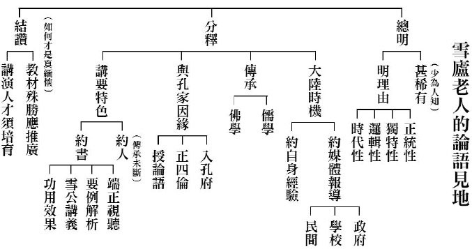

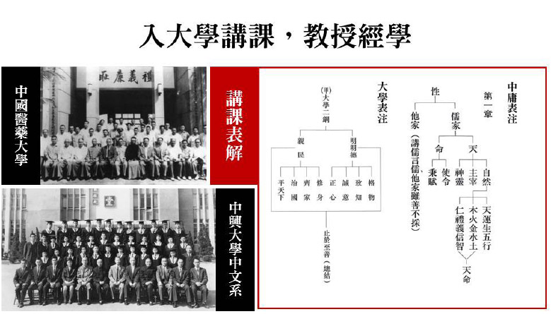

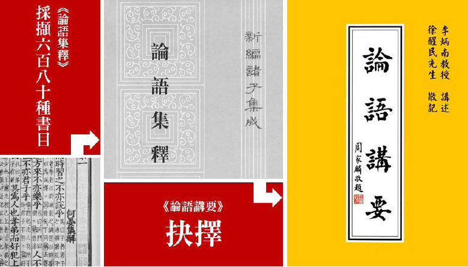

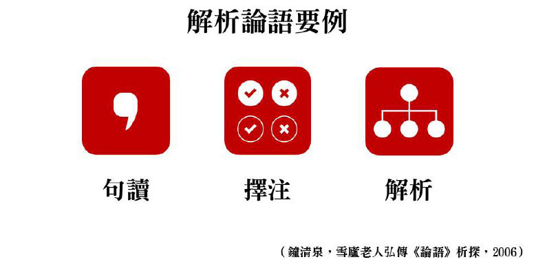

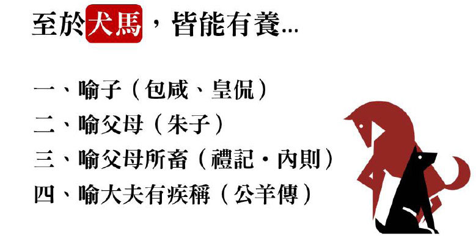

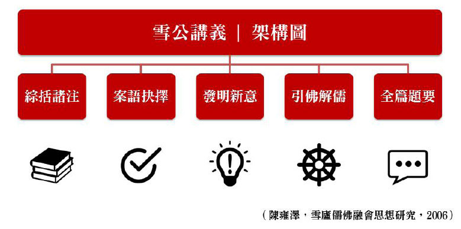

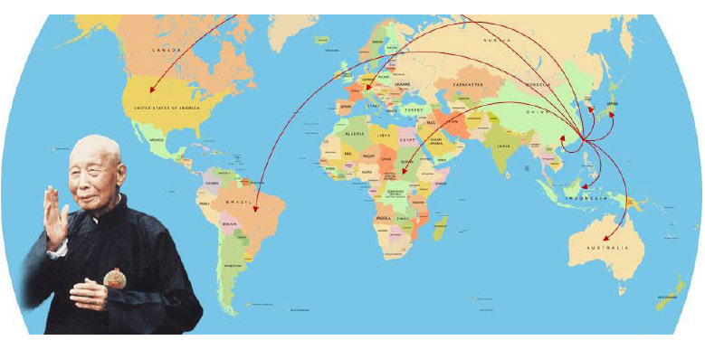

### 傳承再回歷山栽
		─木鐸春風三十載論壇講稿

傳承再回歷山栽

─木鐸春風三十載論壇講稿

李珊

道貫古今李雪廬

後代典範春常在

聖門後裔承正法

陰德感召擔大任

很榮幸受到主辦單位的邀請，李珊得以遠從家鄉山東濟南，前來參加先祖父雪廬老人往生三十週年的紀念追思活動。因先祖父的因緣，我與臺灣有著千絲萬縷的聯繫。這裡有他老人家弘護正法的足跡，這裡有關心著我們，我們關心著的師長們。

因為歷史變遷的緣故，祖父隻身來臺，家眷滯留大陸。海峽兩岸阻隔數十年，相見已是陰陽兩隔。在他遺留在世的字裡行間中，在學生們的耳濡目染中，瞭解到了祖父的慈悲行持，更增加了我渴望在他老人家膝下承歡，親臨受教的願望，然天不遂願，無福服侍在側，成為了我深深地遺憾！時光流逝，祖父往生已經三十個年頭了，但眾學生們不遺餘力地，將他老人家所宣導的儒佛教化，綿延地弘揚開來，雪公精神得以長存，末學覺得非常感動及敬佩！

學生們對他老人家的事略行誼，都已經耳熟能詳了。今天，我就從家人的角度，談談他老人家敦倫盡分，天倫親情的一面，或許能讓大家從不同的角度來更深層次的瞭解雪公。

直到現在，腦海裡還清晰地印記著，當家人得知已經失聯多年的祖父還身在臺灣時，驚喜訝異的神態。西元一九八０年的某一天，家裡收到一封海外寄來的書信，方知失散近四十年的祖父已九十一歲高齡定居臺灣，捧箋如睹人，家人一時處於悲喜交加的氛圍中。喜的是，知道祖父健在，老天保佑；悲的是，海天阻隔，仍是愛別離苦。歡喜，擔憂，牽掛…家人一時百感交集！隨著書信的往來，知悉祖父在臺灣教書行醫。字裡行間中從不提及他在臺灣的善法道業。家人於是趕緊趕拍了第一張全家福照片，寄給祖父，以慰籍他客居異鄉思家懷親的心願。同時也寫信向他陳述了家人在故里這些年的遭遇及目前的生活狀態。他接到照片後，給家父回信寫到：「汝（我父親）仍英俊灑脫，媽媽德芳（我祖母）更有忠厚之相。華俊（我母親）莊重質樸，珊、彤兩孫女清秀聰明，是好家庭，至為歡喜。以後照顧珊、彤長大成人定比現在還好！」家書中祖父時常勉勵家人「做事守規，存心公道，孝友治家。」家人也能秉承他老人家的教誨，做人做事不敢偏頗！

自此，家人的談話中，多了關於祖父的話題：祖母回憶說，她做菜手藝學自祖父的指導，切菜的刀功，烹菜的火候，色澤的搭配，精緻悅口；父親回憶說，祖父下班後，講岳飛精忠報國的故事給年幼的他聽，在祖父的薰陶下，奠定了父親古典文學的基礎及興趣；祖母還說，她的誦經念佛是受祖父影響，也是這種信仰的力量，幫她度過那些坎坷的歲月；父親還說，他親眼目睹祖父對曾祖母的孝行，親侍湯藥，早晚請安……，還有幾件事父親記憶尤其深刻：說祖父經常帶他去濟南的府學文廟祭拜先賢；還帶他去淨居寺參加法事活動，回家後與家人分享學佛的心得；在週末，也會領著他去郊外給其他道眾生灑金光明沙超度；祖父對一切眾生的慈悲心，深深影響著父親一生的為人處事。

特別要提的是我的祖母，因祖父去臺，家裡成了被改造的對象，前後境遇的落差太大了，住小黑屋，掃街，糊紙盒……她一直堅守著老宅，樂天知命的接受命運的安排，走過了她的一生，也成全了一個完整的家庭。她是家庭的安定劑，目睹她灑掃庭除，持家有方，給我樹立了恪守婦道的典範。祖父在抗戰時陪同孔上公，有家歸不得。祖父寫《寄內》一詩表達了他對家人的牽掛與思念。

寄內

去國八千里。慈親稀壽年。

干戈悲路梗。菽水賴君賢。

子拙勤催讀。家貧可賣田。

仍當力脩省。祈禱早團圓。

詩中感念對祖母上有老下有小，對於捉襟見肘，生活狀態艱辛地體貼，叮嚀家人亂世也不要忘記修省，及渴望早日團聚的願望。從一九八０年建立聯繫，到一九八六年他的往生，書信往來整整六個年頭。隨著祖父的故去，今生今世與家人的因緣劃上了句號。

西元二○○○年，父親因病往生，父親生前一直是一位兢兢業業的醫務工作者。如祖父書信所言：「汝皆能自謀生活，吾就心安」。目前我與妹妹都在學校任職，各自有了家庭，幸福美滿。家庭最大的幸運則是有相同的志向，在佛化家庭裡共同成就。母親平時除了幫忙孩子家事，就是讀經念佛，遵從爺爺的開示。隨緣提攜老年朋友學佛念佛；我與先生，妹妹及志同道合的朋友，每週一次《佛學概要十四講表》研學及共修念佛，更借助現代網路平台與蓮友的各種因緣，組織了以《論語》、《孝經》等傳統文化為主題的網路讀書會，海峽兩岸的朋友通過網路交流切磋，相互提攜，學習儒佛文化，將雪公精神浸潤其中，許多人都覺得當下受益！

目前，大陸對國學非常的重視，有文化復興的跡象。習近平主席在參加紀念孔子誕辰二五六五週年國際學術研討會上總結到：「儒家文化養浩然正氣，塑高尚人格，蘊含著做人做事做學問的大智慧。」他開國家領導人之先河，也談及佛教。在出席首屆世界佛教論壇中他提到：在中國文化復興的征程上，中國佛教可謂天降大任，任重道遠。

值此國泰民安，難得的形勢，如能弘傳儒佛，福澤萬民！相信國家民族的前程將會更加美好，於此祈請諸位大德師長隨此因緣，能將儒佛教化回饋雪公的故里，嘉惠我父老鄉親，同沾法益。

祖父在他的詩集中曾提過：「神州鯤島遙相望，破浪乘風何日還。」「何日能移千萬樹，舟車回到歷山栽。」

相信這也應是先祖父未竟的心願吧！

最後，謹代表我家人共同的感恩！感謝大家一直以來對家人的關懷與厚愛！祝願我們：儒佛道上，一起前行！阿彌陀佛！

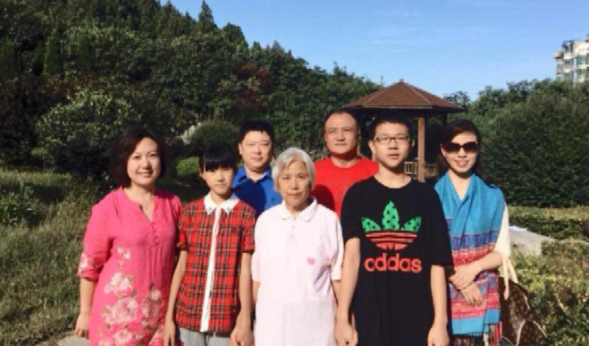

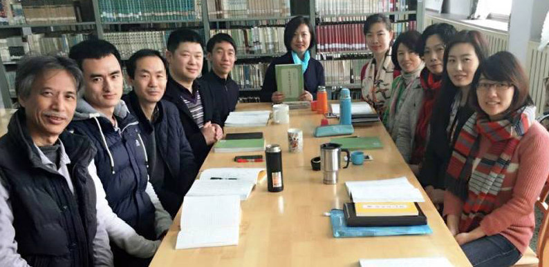
