# 第106期

## 社論

### 論語的時代價值─從谷歌與百度說起

本刊

瞬息萬變的今日

利他存仁的古代

普世價值的發揮

以古鑑今的眼力

谷歌與百度是世界上兩大搜尋龍頭，谷歌幾乎獨佔了全世界百分之九十的市場，而百度則是中國最大搜尋引擎，但對比近日谷歌研發的人工智慧-阿爾法圍棋帶動的熱潮，百度所引起的「魏則西事件」卻引來眾人的謾罵，淪為江湖騙子。

引述中國媒體報導，中國西安大學生魏則西罹患罕見癌症，在中國知名搜尋引擎百度中搜尋醫療資訊，搜尋到第一筆資料就是武警北京總隊第二醫院的「生物免疫療法」。因此花費人民幣二十多萬（約新台幣一百萬元）去醫院治療，不幸的是，該醫院聲稱的有效療法其實在國外的臨床實驗階段就遭到淘汰。魏則西不僅花了大筆冤枉錢，最後還賠上性命。此事件不僅在中國當地引起軒然大波，也牽扯出百度競價販賣醫療訊息的出現優先順序問題。中國國家網信辦發言人姜軍本月二日指出，國家網信辦會同國家工商總局、國家衛生計生委成立「聯合調查組」，並且進駐百度公司，對此事件依法調查，適時公布結果。

時至今日，兩家公司的聲譽竟是天差地別，但事實上，這兩間公司在最初成立時，差距並不太大，谷歌成立於一九九八年九月，而百度成立於兩千年一月，都是以網路搜尋為主要內容，技術相仿。谷歌在二○○四年上市，百度則在二○○五年上市。想不到發展了十餘年後，谷歌已是全球造訪量最高的網站，同時也在瀏覽器、雲端技術、作業系統、無人駕駛汽車、太空探索、人工智慧等多項領域大有斬獲。

二○一五年八月，谷歌宣布重組，以Alphabet為母公司，將Google納入旗下，以便與其他新興業務分離。而百度這十年也推出了百度地圖、百度國學、百度百歌、百度旅遊等，但其成就仍難與谷歌相提並論。

十五年前相似的兩個企業，為什麼差距越走越遠，乃至天地之別呢？關鍵或許就來自於價值觀所帶來的抉擇。

亞馬遜的創始人傑夫·貝佐斯（Jeff Bezos）曾受邀在母校普林斯頓大學的畢業典禮上發表演講，他說：「善良比聰明重要。聰明是一種天賦，而善良是一種選擇。天賦得來容易，因為它們與生俱來，但選擇往往很困難。」貝佐斯同時問了學生們一個問題：「有朝一日，你，將以什麼為自豪，你的才智？還是你的選擇？」

人生如何發揮其價值，不在於先天的條件，更關鍵的在於後天的選擇，悟性堪比顏回的子貢，因他選擇貨殖，所以錯失天命；反觀魯鈍的曾子，因為他選擇在道上「人一能之己百之，人十能之己千之」的堅持，最後掌握天命，傳承了性與天道。谷歌與百度的差別也是如此，曾經相近的兩者，因為選擇了不同的路，如今相去甚遠。

既然每個選擇都能決定未來，那影響抉擇的關鍵是什麼？當然是價值觀，更精確地說就是見地。谷歌到底憑什麼強大？令人意想不到，背後的價值觀竟然是「斷惡修善」。

創始之初，谷歌官方將公司使命定為「集成全球的信息，使人人皆可造訪並從中受益。」二００四年，Google的首次公開發行股票申請書中寫到：「不要作惡(don’t be evil)。我們堅信，作為一個為世界做好事的公司，從長遠來看，我們會得到更好的回饋，即使我們要放棄一些短期收益。」據說一開始人們普遍認為「不作惡」這個口號毫無意義，任何一個公司的目標都是要賺錢，而非作惡。但隨著公司的發展，當短期利益和作惡捆綁在一起時，谷歌價值觀的優勢便展露無遺。

到了二○一五年八月，隨著新的母公司Alphabet的成立，Google最知名的「不作惡」條文已不再提，改成強調Alphabet與子公司的員工應該「做正確的事（do the right thing）」—遵守法律，行為端正，相互尊重。

就是這樣的利他價值觀，讓谷歌一直能夠持續的發展，在各個領域都能佔有一席之地。支撐一個世界級龍頭企業的核心不是複雜的技術，也不是先進的設備，更不是金錢，竟然是這種斷惡修善的價值觀，堅持做對社會有意義的事，出路自然越來越寬廣。反觀現代人被教育成精緻的利己主義者，對於營造私利可說是精心安排，將個人慾望的追求作為唯一的目標，或許有些人能因此達成一時的成就，卻不能長遠、長久，這樣子的經營還有意義嗎？想想最近的福斯汽車及日本的三菱汽車造假事件，對企業造成的傷害難以復原，正好就是我們反思的對象，純粹向利益看齊時，它的過患是相當恐怖的。

谷歌光靠守住斷惡修善的價值，便成就了非凡事業，或許有人會問，那還有需要學孔子、學論語嗎？事實上，利他的心態有太多的細膩處要講究，無論是如何發起，如何維持，對於功過的觀察等等。更重要的是，就個人來說，「仁心」的利他精神，才是唯一能引我們入道的關鍵，使我們有門路進入形而上，不被各種現象迷惑，不被煩惱纏身，得到真正的快樂。就整個社會來說，它的威力絕對不同於一般的利他，它不只是個人的出路所在，更是全體人類的出路所在。

谷歌雖然善用這樣的價值成就自己，尚不能引起風氣，推己及人，但其成果已經相當可觀。對比下儒家的境界更加高遠，透過辦政治、辦教育營造出天下太平的大同世界絕對是世人難以企及的，它不只是讓人生活過得好，更能讓每個人過得心安。這樣的內涵光是學到表面已是受益無窮，更何況學到它的整體，它的精髓。

沒想到大眾忽視的《論語》中強調的利他精神正是應變時代的最佳藥方，時代的巨輪不停轉動，面臨著變化極大的局勢，只有守住核心價值，厚培殊勝見地，才不至於在注重物質、功利掛帥的社會迷失方向。順應時代潮流，為社會作出有意義的事，事實上，自己反倒是受益最多的人。惟有透過《論語》深入的學習，結合時事的觀察，找到對的覺受，才有可能在正確的道路上不斷前進，而這個時代也需要這樣的人才，無論身在哪個行業，相信都是如此。文化永遠都會是社會上不可或缺的力量，當人們遠路繞夠了，終究想回到正途。在最亂的時代保留最珍貴的見地，其功德無可限量，就讓我們一同沉潛，靜待時機，大地回春的那天終將到來，唯一得問自己的是，準備好了嗎？

## 佛學覽幽

### 菩薩清淨的行持
       —華嚴經淨行品（二十三）

菩薩清淨的行持

—華嚴經淨行品（二十三）

*編輯部整理*

人生多要事

首在修止觀

坐上與歷緣

對境修空性

丙二、指事顯因答其徵因

丁一、總徵

丁二、別顯

戊四、將行披挂時願（有六願）

己二、正修止觀　  修定

經文：

修行於定，當願眾生，以定伏心，究竟無餘。

接下來前行結束，要進入正行，第一個即是修定，定的另一個名字叫做止(定的體性是止)。何謂定？定即是利用正念、正知，使能緣的心緣在善所緣境上，相續安住而不散亂，直到生起身輕安及心輕安的所有喜樂，此即是定。

而所謂的正念，即是我們所緣的境界(根本所緣)，讓這根本所緣於內心中不忘失。正知即是當緣住所緣境時，利用正知生起觀察，如實了知心念是否緣住此境界，若有散失立刻察覺，並抓回來繼續修定。

定的修學法即是透過正知認識定的障礙(昏沉、掉舉)，靠著正念使定力成就(生起輕安)。有了定功之後，最大的好處是能夠幫我們修觀，定是體性，止是一種專注力的成就，觀是生起的作用，有專注力的人才有辦法鎖住境界作觀察。另外還有一種定，是觀所成之後，以定來安住在觀所成的意境上，如佛的楞嚴大定即是如此。是故，定可以是觀的前方便，也可以是觀力成就之後的安住，有不同的形象。

修定時會碰到二個很大的障礙，一是昏沉，一是掉舉。

昏沉有二種狀況，一是心太向內收攝，此時會對所觀的境界失去執持力，應作觀想提起心力，才能繼續修定，可於內心觀想使自己喜悅之事，如觀想莊嚴的佛像，或自己大放光明，藉此提起精神，或觀想著太陽的光明，以破除內心的黑暗。

昏沉的第二個狀況是心力往下掉，此時應思惟三寶、菩提心，或暇滿人生的功德。若平時研究教法，在定中方能觀修三寶的功德、菩提心的殊勝、暇滿人生的利益，否則無能力做這些的觀修。若以上二種方法皆無法破除昏沉時，可起身走走或洗臉，甚至乾脆將睡眠補足精神後再修定。

其次掉舉，由於貪慾而引發掉舉，心會散失到自己所想的境界上，對治掉舉的方法是要思惟無常及貪慾的過患，將心思移回到原來的善所緣上。

究竟無餘即是得到輕安，這是修定最主要的目標，輕安有分身輕安及心輕安，得到心輕安後，心就會不疲倦而感覺愉快，由心輕安之樂引發身輕安之樂後，此時風大充身令全身感覺舒暢，這時想坐多久就多久，無有障礙。

修定要有修定的方法及認知，此時修定才有用，所以一般在寺廟中修禪坐修定之人，主其事者一定要告知修行的方法，而非讓他就在那裡呆呆的坐，讓他在那裡懵懵懂懂，或掉入黑暗或心思提不起勁，或散亂的緣念善法。例如叫你念佛他卻想到無常或布施等，有的人也覺得蠻不錯的！其實那是善的散亂，之後容易對於想專注的所緣境，無能力安住。

究竟無餘講到最究竟處是破煩惱障、破所知障。《金剛經》中說：菩薩摩訶薩，云何降伏其心？一般伏心大都解釋成伏惑而已，究竟處是不住色生心，不住聲香味觸法而生心，應生無所住心，不住我相、人相、眾生相、壽者相。安住在人我空、法我空上是究竟的降伏其心，究竟地安住在空性上。煩惱障、所知障一點都沒有剩餘，此為最殊勝破所知障的空性定。

己二、正修止觀　  修觀

經文：

若修於觀，當願眾生，見如實理，永無乖諍。

何謂觀？即是在定成就之後，分出一分心力如理觀察所緣境，見如實理即是或以比量或以現量證得空性，永無乖諍是不會被外道的宗義所破壞。

乖即是乖違，無乖違即是和合無諍，《金剛經》上，須菩提是解空第一的聖者，佛說他得到無諍三昧，是真正解空之人，沒有世間的戲論(諍論)，因為所執的我都不可得了，哪還有所執的你呢？你、我都不可得了，哪還會有你、我的對立呢？如此和合就從此處生起，一切外道的戲論都不會再生，因為外道的戲論就是有神我、法我、自性我、不可說我、獨立實有的我，無諍即是在觀中成就了這樣的智慧，照見了這樣的如實理，和合無諍，滅除戲論。

止觀的修學即是修空性，這是修學佛法最關鍵的一步，所以對空性的教法要瞭解，回過頭來做世間的抉擇，此人會是修學佛法的上根。

己二、正修止觀　  捨座

修止修觀皆是為了要修學空性的義理，前方便是能入修學的法堂，把修學的床座鋪好，並端正自己的坐姿(結跏趺坐)，將身體調正、呼吸調勻、把心放緩，開始在定中專注法義，在觀中修學法義，生起定慧的力量，現證佛法的實義，得到佛法的受用，方能自行而化他。正行是修止修觀，結行即是捨坐。

經文：

捨跏趺坐，當願眾生，觀諸行法，悉歸散滅。

願所依是捨跏趺坐，菩薩就在捨跏趺坐時發願，願也依菩薩而生；當願眾生，能願的是菩薩，所願的是眾生，菩薩希望眾生能觀諸行法，悉歸散滅。

每一願的修學皆具體的展現菩薩道的行持。若說到四步驟的修學，第一個是隨喜，若眾生都能夠觀諸行法，悉歸散滅那該有多好；第二個是發願，我希望眾生皆能如此；第三個是我要承擔，幫助眾生都能如此；第四個是我祈求三寶的加被，讓我有能力幫助有情成就此能耐。

南亭老和尚的《講義》中提到，以無常的面相來說，萬法皆是生滅法，簡單來說即是一切造作之法，其體性皆是無常(悉歸散滅)，聚會時必有散會，世間的快樂與痛苦皆是被造作出來的，皆悉歸散滅。隨著業生起的苦樂果，當業的勢力滅時，隨之而生的苦樂果亦消失，以上是觀諸行法，悉歸散滅。

再者，可從空性的面相說，在西晉聶道真的《諸菩薩求佛本業經》中說到：「菩薩起坐時，心念言：十方天下人皆使所見虛空法無有不了知者。」究竟之義理為能見諸法自相不成立的現象，生都看不到它的自相，滅也看不到它的滅相，說明悉歸散滅的究竟義理。即是行法中自相不可得。

諸法生時，尋覓生的體性無一粒微塵，此即悉歸散滅，無一法可得。觀待正坐才有捨坐，捨坐不能自己成為捨坐，是對著正坐而才有捨坐，所以萬法都是在觀待下而生起的，自相是不能成立的。

坐上修(修定、修觀)，下坐時則歷緣對境修，令自相空（諸法無我）的覺受不失，方能進入涅槃寂靜。若能歷緣對境修學空性，必能幫助坐上修學空性。而所謂的歷緣是經歷行、住、坐、臥、說話、辦事的緣，在一一緣中所對的境不外是眼見色、耳聞聲、鼻嗅香、舌嚐味、身接觸、意知法。例如與人說話時，就有六根對六塵，一一皆要如是作觀察，體會無常、體會自相空，從中得到佛法的受用。以大悲心攝持所學度化他人，使有情得到殊勝的法義，能夠破除煩惱，解脫輪迴，這才是真正受用法義之所在。（下期待續）

### 大乘百法明門論簡說（十四）　拾、心法—八大心王(四)

*淨凌講述‧淨本整理*

了解色心知觀待

造作能令苦樂生

順緣不生諸垢染

相續覺受證寂靜

論文：第一，心法，略有八種：一、眼識，二、耳識，三、鼻識，四、舌識，五、身識，六、意識，七、末那識，八、阿賴耶識。

第六識種類表，本表說明第六意識。意識分為五俱意識和不俱意識，五俱意識是指意識跟前五識配合產生作用，又分為五同緣意識和不同緣意識。五同緣意識，即前五識中有同時生起的狀況，例如某人觀賞表演，眼識看見表演者，耳識聽到演音樂的演奏，鼻識聞到香氣，身識感受到舒服的軟墊，意識十分愉悅。在五同緣意識中，同類心念不可以同時生，如前一念的眼識滅，後一念的眼識才會生起，不同類心念則可同時生。不同緣意識，則是意識配合著前五識中某一識單獨生，例如聽音樂時，眼睛閉上，專注於音樂的聆聽，屬於耳俱意識，倘若意識沒有配合，則聽而不聞，因此前五識功能的生起，需要意識的配合。

不俱意識當中分五後意識和獨頭意識。五後意識是在五俱意識之後。舉例言之：音樂會結束後，聽眾留在原地，有餘音繞樑的感覺，後面的意識還在緣前面的五塵境界，可是前面的五塵境界已經消失了，此時的餘音是屬於法塵，而非聲塵，因為只有自己能夠感受到，別人無法聽到。而獨頭意識則與五塵境界無關，完全意識的單獨想像。例如看見某人，可以想像出他年老的樣貌，或者緣覺看見飛花落葉，可以觀修無常。

獨頭意識中分為定中意識、獨散意識、夢中意識。定中意識是專注於某法塵上，是為修行人所安立。獨散意識的獨，是指非五俱；散則是指非定中，亦即第六意識非定中的思維想像。夢中意識其實也是獨散意識，但更為昏昧簡略。

五心表，心緣境時，所起作用，有五位差別。首先是率爾心：率爾就是忽然，例如忽然看到某人、某件東西，眼識的作用率爾生起。二、尋求心：即尋求某種境界，例如尋找青色，結果找到青色，不是無意中看到。三、決定心：見過青色以後，心有回憶的功能，稱為決定心，唯識宗將此功能稱為自證分，是論師所推衍而出；中觀宗則不承許有自證分，因為回憶的功能不必透過自證分，在這當中需要因明的論辯，佛語是經過推理而成立。釋迦牟尼佛不僅要大家相信他的人格，更希望他弟子懷疑他、檢驗他，透過懷疑檢驗之後，更相信他的話是非常可貴。

四、染淨心：染心就是在可意境上生起貪，不可意境上生起瞋，一般人都是如此，稱為染心；而能夠對治貪瞋的稱為淨心。所以面對境界當中，生起染心的是凡夫，生起淨心的是聖者，這就是凡夫與聖者的差別。因此凡夫跟聖人同樣都有可意境與不可意境，不過聖人有能力降伏貪瞋的那一分稱之為淨，如果連順境逆境都沒有分別，那聖人與這世間成為無關。例如顏回死時，孔子也是痛哭流涕，連稱天喪予！

五、等流心：就是對境的時候會有等流的狀態，比如某人過去是樂善好施的人，今生看到乞丐就會有想要布施的心，他也說不出為什麼！從過去的心流到今生。再舉例言，早上起來心情不悅、愁雲慘霧，那是瞋恨的等流，瞋恨的等流讓人過得不快樂，但自己也說不出原因。所以有人天生樂觀，是過去善業做得多；過去惡業多的人，就會天生悲觀。這樣的心理作用，今日的心理學家也搞不清楚原因，如果把《百法明門論》學通了，就能了解。以上是對境的五種心。

五念表，修定須知。一、故起，就是故意起心、思念世間善、惡、無記等事，這是屬於懈怠者，因為在修定的人，故意去想與修定無關之事，對於修定而言就是懈怠。比如上《百法明門論》的課程上，自己卻閱讀《論語》，此即懈怠。懈怠中有病與重病，以前有一位沙彌坐著修定，忽然間笑起來，師父說你打妄想，沙彌說沒有，師父說你沒有打妄想為什麼笑？沙彌說我只是想到一隻貓在吃豬油罐，吃進去以後頭拔不出來，就帶著罐子一直跑一直跑，覺得很好笑，我沒有打妄想！這位沙彌連自己打妄想都不知道，起與修定無關之念，固然是善也是懈怠，藉著寧靜的心去想自己的事情，這是病，若養成習氣則成重病，嚴重時此人將沒有專注的能力。

二、串習，就是無意忽起、思念世間三性（善、惡、無記）諸法，因為過去的串習，所以現在會無意忽起，這樣的串習，在初學者叫做輕病，因為剛開始學佛的時候，都是帶著各種世間串習而來的習氣，如果久了還是不改，就會使自己成為懈怠中的重病，所以初機有時反而好調，如果修學久了還是壞習慣一堆，那就非常難調。

關於三性，懺公也有做表說明，善能感樂果，惡能感苦果，無記則又分為有覆無記和無覆無記。有覆是執我的心，聖者通達無我，造作無記業時，沒有我執，稱為無覆無記。

三、接續，即於上二種散亂心所（故起、串習）不知制止，接續思念，那一定是重病。

四、別生，就是覺知前念散亂，即生慚愧，攝歸正念。慚愧就是一種反省的能力，屬於善心所。慚是在教法上懂得反省向上、見賢思齊，愧是願意聽從別人的勸告修正自己的過惡。所以慚愧是藥，人若沒有定功、缺乏專注力，不僅學習效果差，遇到變局也壓制不住惶恐的心。

五、寂靜，就是始用功時，心即靜止，更不散亂，這叫做精進者。第四別生喻如吃藥治前三種病，第五寂靜喻如鍛鍊身體，讓自己越來越強健。寂靜的人懂得對治散亂、掉舉、昏沉、沉沒，可以把心的能力練上來，所以稱此精進者為健。我們一般都會讓自己身體健康，但我們忽略了心理健康更為重要。

第五識五義表，眼識、耳識、鼻識、舌識、身識，前五識都有相似五義，就是差不多都有這五種內涵。第一是俱依色根，眼識依眼根、耳識依耳根、鼻識依鼻根、舌識依舌根、身識依身根。五根包括浮塵根和淨色根，浮塵根例如眼球，淨色根或認為是神經系統，其實是更微細的色法，比如中醫所說的氣脈。盲人雖有眼球，但仍看不見東西，所以有淨色根才能發識，是識所依，因為十分微細，只有天眼才知道所在。

第二是俱緣色境，五識所緣五境，俱為色法，此處色法廣泛地指五塵。眼識緣色塵、耳識緣聲塵、鼻識緣香塵、舌識緣味塵、身識緣觸塵。第三是俱緣現在，前五識不能緣過去、也不能緣未來，只能緣現在，眼識緣色塵，色塵是眼識的所緣緣。試問色塵在眼識之前、之後、或者跟眼識同時生？若在眼識之前，眼識都還沒生，不可能看見色塵。若色塵在眼識之後生，眼識已滅，也看不見色塵。所以只剩下同時生，但並非有自體的同時，因為眼識必觀待色塵而生、色塵也必觀待眼識才能生起，若是有自體的同時生，則不必互相觀待。

第四是俱為現量，不是比量，也不是非量，現量是指現前量度，而且真實無誤。第五是俱有間斷，因為五識待眾緣而起，故起時少而有間斷。舉例來說，眼識要生起需有很多的緣，把燈關掉眼識就看不到了，沒有眼根也看不到，所以前五識都需要很多的緣才會生，只要少一個就不生。

因此接著看到八識生起諸緣表，眼識九緣生，所需的緣包括空、明、根、境、作意、第六、第七、第八、種子。如何知道眼識由種子生？眼識為果，沒有因不會生果，而第八識並不是眼識的因（種子），因為第八識跟眼識並不同類，例如西瓜由種子生，必得要西瓜種，不能是稻種、麥種。作意、第六識、第七識、第八識都不是眼識的同類種；而空、明、根、境都是色法，在任何情況下都不會生出心法，反之心法在任何情況下也都不會生色法，依此推理，在這些之外，必有一個眼識的種子存在，稱為親因緣。其二，眼識的種子如果沒有地方存放，也無法生出眼識，所以第八識被認為是種子安放處，沒有第八識，眼識也不會生。第七識的功能是執我，是心微細的作用，如果沒有細作用就生不起前六識的粗作用，沒有第六識也就生不出前五識（前述五俱意識），所以第六識和第七識也是生起眼識的緣（增上緣）。

另外還有作意，作意是心所，八識的生起都要靠作意，若沒有作意，將會視而不見。如何知道心有作意的功能？作意就是留意，跟心王同時生，例如正在專心思考，眼睛雖然看著東西，但是卻看不見眼前的事物，可見若沒有留意，眼識的功能就無法出現。而作意也不是眼識，例如不同人看同一張畫，有訓練過的人，會從訓練過的角度去看東西，所留意的重點就不一樣，若作意就是眼識，應該只要眼識現前，就都可以看到相同的重點。所以經過邏輯推理，證明眼識需要種子、第八識、第七識、第六識，以及作意的配合才會生起，另外還需要空間、光明、淨色根和所看的塵境。眼識九緣生的推理如是，其他耳識、鼻識、舌識，乃至於阿賴耶識生起所需的條件，也都能推比了解。（下期待續）

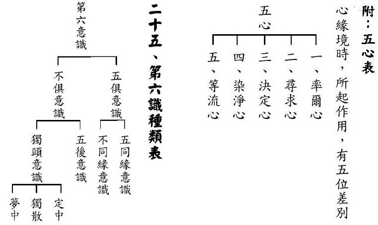

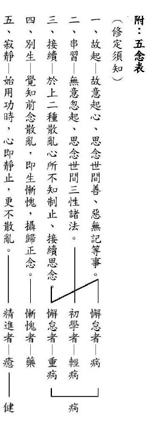

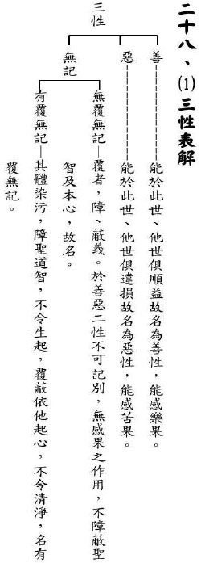

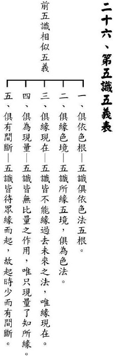

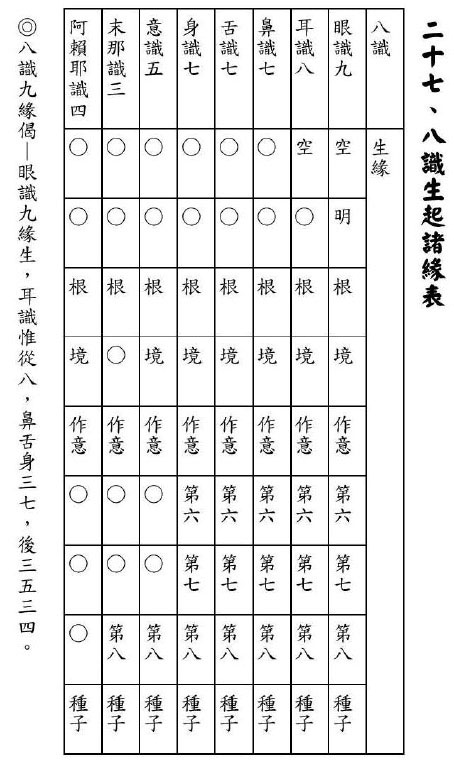

### 佛學概要十四講表簡說（八）　第一講表

*戒慧講述‧法味、淨昌整理*

皈依三寶修正法

有力能脫生死苦

量為出路昏轉明

燈塔亮海迷航舟

由第一講表攝持後述各表

第一表譬如人身的頭部，頭為能攝持，身體為所攝持，如頭腦能號令身體動作。第一表重點在依覺察破煩惱障生一切智，依覺悟破所知障生道種智、一切種智。

第二表則是從體、相、用、因、緣、果、事、理八種角度來觀察每一法，謂之八面玲瓏，即是覺察、覺悟的修學法。第三表係學者修學之前，須先行去除對佛法誤解之障礙。第一表之(乙)中人生觀之當前所受，於第四表「人生當前之所受─觀受是苦」中詳述，期使學者於當前所受中，了知以苦為本質之樂並非真樂而生出離心。至於(乙)人生觀之本身煩惱及當前所造，於第五表「人生三際之抉秘─十二因緣」，由苦因、苦果關聯性的觀察中，了知所應出離的對象為無明我執，這種觀察能令自己找到苦果之因，消除苦因則苦果不生，此即真正離苦得樂的人生觀；(乙)中之宇宙觀，則分述於第六表中觀察有情在六道輪迴中苦樂差別(本質是苦)，及第七表中這些有情無量無邊，對於被輪迴所攝的有情生起悲憫心，思給予出離輪迴之樂。第八表之「內容設施梗概」，即為總說吾等如何覺察、覺悟，其中體性即是戒、定、慧的修學。戒、定、慧，引導有情修學能破煩惱障(覺察)與所知障(覺悟)，使有情離苦得樂，即為第八表。

第九表「方便五乘解脫」，係藉由人乘、天乘、聲聞乘、緣覺乘等種種修學法破煩惱障，使自己離苦得樂，這才是真正的人生觀。藉由菩薩乘的修學法，進一步觀有情的痛苦及對我的恩德，幫助他們離苦得樂才是我真正的出路，此即正確的宇宙觀。故第八表、第九表皆總說。第八表為總說戒、定、慧。第九表為分說人乘之體性即戒、定、慧；天乘之體性即戒、定、慧；聲聞乘之體性即戒、定、慧；緣覺乘之體性即戒、定、慧；菩薩乘之體性即戒、定、慧。第十表講「五戒十善」，學習如何修學人天乘。第十一表「四諦十二因緣」，為二乘的修學法。第十表跟第十一表都是屬於覺察，建立正確的人生觀破煩惱障的這一分。十二表「六度萬行」，講的是覺悟的這一分。透過六度的修學破所知障，成就覺悟。這種人最有能力幫助所有的有情離苦得樂，此為真正的宇宙觀。關注有情之痛苦，真正解決有情的問題，此第十二表。如上所述，可知第四表至第十二表皆為詮釋第一表。

第十三表「行門中一特別捷徑」係介紹淨土的修學。淨土實為一極好之環境，高手如雲，能令所有眾生於其中修學覺察、覺悟，來斷煩惱障、所知障。是為覺察、覺悟的最好環境。

第十四表，是回過來提醒我們修學應有的警覺，為整個修學覺察、覺悟的基礎。由第十四表的丙表述及，佛法為寶難聞，親近善知識，依善知識聽聞正法。可見佛法關鍵在聞，佛法「聞、思、修」，「聞」字最關鍵。其次乙表顯示人身是很難得到。甲表警示世間無常，人生要當成很難得、很無常。人生最大價值在修學，而修學須從善知識聽聞正法的那一分，為人生最大意義之所在。懂得這個意義的人，才能修前面的十三表。前面第一表到第十三表，是為第十四表這等人說的，不是為其他人說的，其他人若有若無，可有可無，聽懂聽不懂皆無關緊要，找對善知識或找錯善知識皆無所謂，此等人非「十四講表」所對之機。

第十四表，名之曰道前基礎。凡欲修第一表到第十三表之修學者，皆須有第十四表為基礎。修學者要很珍惜人身，知道無常，要有善友，要能夠聽聞。有善友、有聽聞，才能從事於前面十三表的修學；反之則無法從事於前十三表的修學。以上敘明十四個表的關聯性及整體性。

第一講表之核心在甲表

回觀第一表，甲、乙、丙之關鍵在於甲表。甲表之關鍵在於覺察、覺悟。覺察、覺悟而成為智者，而智者所起的大用亦為覺察、覺悟，果然人生之唯一出路，就在覺察、覺悟，能成為智者的那一分，即是人生的出路。

但吾等今生，很難遇見有一個人有此等想法。了知覺察、覺悟才是真正的出路以後，知道原來吃飽飯的目的是為了要聽聞、修學，成就覺察覺悟。但當今社會上很多人學習的目的是為了吃飽飯，剛開始一上來就錯，整個一輩子都錯。

既然甲表如此重要，前述已將整體關聯性之部分說竟，以下將深入解釋決戰點之甲表。如無經驗之說法者，或於第一表之甲表即深入講解，因宗義深奧難懂，或曠時費日，學習者或未生法喜而如陷爛泥。

本次課程特別先將後述十三表之關聯性扣合第一表之甲表，藉以引發學者學習的善法欲，因為它最難懂。然雪廬老人何以編本十四表，此等初機課程之首，即舉出最為難懂的甲表，或致初機學者畏難而思退道心？其理由有二，首先因為此乃決戰點，為修學的唯一目標。初學者如不知真正修學的目標，或者盲修瞎練，不知何去何從，或致誤入歧途。其次，對初機學佛者，不妨說高深道理，可引發尊重、珍貴、勇猛、精進等心態，不致以為所求淺薄，而生輕慢、怠惰、懈廢等心態，難獲實益。

《述記》云：「識」與「性」、「佛性」釋疑

如《述記》所云佛之釋義圖示，上有二個圓圈，一為黑色，另一為空白。黑色部分，表其屬「識」，為凡夫之心識，充滿了有漏的種子。如果把有漏的種子轉成無漏，也就是「性」的這一分，就能夠出離。

故此為整個佛法最簡單之圖示，即是左黑，右白，黑者曰「識」，白者曰「性」。迷時為識，而悟時為性，此乃唯識宗之定義。唯識宗的見地亦分數派，有屬利根者，或屬鈍根者。第一派的唯識宗，黑色圈圈裡充滿了有漏種(黑點)和無漏種(白點)，修行者清空黑點有漏種，剩下白點無漏種，即性的部分。此第一家唯識宗，其立論的基礎為第八識之善惡業種子為有漏種子，無始劫來就有，故善種子起現行則造善業，惡種子起現行則造惡業，所造下之善惡業，又成為未來善惡業之種子，如此相續不絕；而第八識無始劫以來亦有無漏種子，當無漏種子起現行，就會聽聞佛法，修學解脫法與成佛法，造下無漏業，亦成未來無漏業的種子。故修學者努力去除有漏種子盡後，當心識僅餘無漏種不斷起現行之時，即安立為成佛。

第二家唯識宗認為，所有的心識皆為有漏種，當清空有漏種子時，即是轉識成智。此時心識前顯現即如右側空白圖，空空蕩蕩。

第三家唯識宗則是將有漏種子清空之後，另外成立第九識。前八識皆為染污皆如同烏雲，清除了烏雲，第九識如朗然的太陽。修學者將前八識盡行擯棄，顯現第九識明亮的那一分。

第四家唯識宗是利根唯識宗，認為不需要八個識，六個識就足夠說明心識的作用。此即陳那論師及法稱論師之傳承，六個識即可講清楚心識作用。

是以唐朝初年玄奘法師在中國，發現法義莫衷一是，無從抉擇，故西行印度求法。

上述之圖的確可詮釋由無明至明之修學過程，惟其見地上仍有尚待釐清之處。首從「識」與「性」之定義可知，染污之識屬有為法，清淨之「性」卻屬無為法。而有為法之定義為造作而有，無為法之定義為非經造作而有。如此說來修學者的心識，由染污的有為法，經過修行後，變成清淨的無為法之心識，有為法如何變成無為法？沒辦法成立。必須承認有為法、無為法的自體性不可得，但有為法與無為法之定義係屬正相違，不應成立有為法能變成無為法。譬如以虛空是無為法為例，說一切有部宗說虛空是眼睛所見。經部宗則定義虛空為空間中眼根未見障礙物，名言安立為虛空，並非有一法名曰虛空。換言之，即以看不見質礙物體成立虛空，並非有一個虛空被看見，若虛空為眼識所見，則虛空應屬色塵，現見無人可指陳虛空之顏色，故虛空非眼識境界。虛空亦非無表色，因無表色為氣質所顯現。而虛空並非造作而有，故不被破壞，當房間中充塞物品，如能破壞其虛空，則移除物品之時，應無有虛空，因已被破壞故，現見移除物品，即現虛空。

而虛空之無為法，是否可承許有情將有為之心識變成虛空？如可承許則亦可說虛空變成有情心識，則會有一大堆有情是從未曾有，今日方現。則佛所論之善惡業成無義，造善得樂，造惡得苦均成無義，因前後可以無關故。此論將致佛法等同外道一派「無因而有」。

是故由「識」至「性」之部分，其立論上應予補足，右方空白圓圈仍為「識」，不宜安立為「性」，因「性」屬無為法。左方染污之識係與無明相應故，而右方清淨之識係與智慧相應故。

而安立識為心王，安立無明為心所有法。其理由在於心緣可愛境而生貪，如貪為心王，任何時候都會起貪，現見心緣到可愛境方生貪，而且聖者緣到可愛境並不生貪，可見貪與非貪，皆是心之作用，故心的作用安立為心所。如將心所亦安立為一個心的話，表示同時有兩個心，那表示有兩個有情，亦不成立。

又如果心王與心所是一，心王跟心所豈可安立兩法名相。其次，以貪心為例，聖者緣到可愛境並未生貪，是故心王與心所非一。為心王與心所亦非異，非無關兩法，係互相觀待，體與用之關係。心緣到可愛境之時生貪，為其一分之作用，亦可生非貪。可知貪與非貪均係心之作用而已。是以，以心之作用那一分，安立為心所。

無明與智慧皆心識所起作用，心所起執著的那一分，安立為無明。智慧為心識破除無明的作用，即抉擇當中見到空性的作用而已。心識起智慧的作用，即右邊那個乾乾淨淨的圓圈，此時安立為第八識清空。把第八識清空，叫做寂照。智慧能夠破無明變成光明的那一分，安立為寂照。唯識宗之立論即是如此，第八識清空以後成為寂，照就是能夠通達，照見各類的有情眾生，如同鏡子一般，你來的時候它就顯現，惟其顯現僅是在鏡上的顯現，鏡子沒有染到任何的灰塵，此即是寂照義。寂如同將灰塵全部擦乾淨，謂之寂。照即是具有照見人事物的功能。智慧亦僅為心所產生的作用。故唯識宗的成就即是第八識清空之狀態，生起照見的功能。

所謂「不變隨緣、隨緣不變」，不變約寂之一分，隨緣約照之一分。上述所說均為同一件事。故唯識宗認為修學佛法，就是將有漏種清空，第八識只有無漏種生起的作用，謂之覺察、覺悟，名之一切智、道種智、一切種智，全部皆是心生起智慧作用的那一分，心為體性，產生之作用是智慧。而破煩惱障、破所知障的那一分，是寂。照見法界的那一分，是照。如果能知左圖內涵，類推亦知右圖。

中觀宗則認為無明是不明白萬法的真實性，產生的執著就是煩惱障；無明的習氣，就是所知障。左圖即無明的作用；右邊圖即見到萬法的真實性，不為無明所障。此說法較容易懂，是引導初學者入門的一種講法，其功德是不可思議。而如果探究其究竟意趣，左圖是什麼都有，右邊圖是什麼都沒有。無明我執生起時，什麼都有。當尋覓萬法的自體性時，則如右圖是什麼都沒有。

述記云：「良知良能，天然性具」釋疑

《述記》云：「儒家亦云明德，又云良知良能」，由〈大學〉、〈中庸〉可知，儒家並非僅安立明德，亦有昏德，是以「明德」應指與空性智慧相應一分。「明德」即是空性的智慧，是心，不是性，性是所證之空性道理，而良知良能成為能證，心性體性成為所證。所對的都是五蘊，昏德即是無明，即照見五蘊自體皆有；明德即是明，照見五蘊自體皆空。所以佛法從來不離世間覺，佛法決戰點在世間，只不過世間人看見的是那個面相，佛法看到的是這個面相而已。佛法改變面相的時候，只是讓你正確的看懂它，這樣而已，佛並不是要把自己的想法灌輸給你，而是要你清楚的看懂萬法的真相。

惟如《述記》所云：「本具之光明智慧德能。」既然智慧本具已具，則豈可成立被染污之理。又如成立心本具智慧可被染污，則當修學者努力清除染汙，恢復本具智慧成佛後，要擔心有一天會不會又被障住了。因為它天然具有光明智慧，但是自性俱足的那一分，都會被染汙。那表示智慧不是煩惱的對手，因為它天然具有智慧光明德能而被染汙，所以再清除染汙成佛後，即有可能再受染污而退轉，但現見成佛證量是不會退轉成眾生。是故此說僅是攝受眾生的方便，並非究竟意趣。

佛法宗派見之重要性

上述論識、性及明德、昏德，皆須以佛法之宗派見詮釋。具備宗派見之詮釋，方知修學者對勝義諦之見解，即修學者所破我、所成就無我之行相，究竟是依唯識宗所定義—萬法唯識，所證所成立者唯有識為了義；抑或是究竟一切法了不可得，連識的自體性亦了不可得為了義。勝義諦的見解，事關煩惱斷滅及輪迴出離大事，一分循情循私，即一分牽絆於此。各宗派針對世俗諦上論布施得富貴、持戒得尊貴、善業得樂報及惡業得苦報等，均無爭議。然勝義諦的見地若稍有差池，必致歧路亡羊。

如前述修學者由「識」證「性」，或由「無明」證「明」的過程，尚有一喻「有如金子埋藏在金礦中，煉礦得金」，此比喻說明由無明中證明，破無明顯現明。金子即是明；無明即是礦，然煉礦得金之義僅此，如不善喻者，將以為金礦中實有金之義，錯生無明中實有一明可得的誤解。金與礦為不同兩法，煉礦出金不過是將混於礦中的金析出。明與無明的定義，非如同金混礦中實有兩法，無明之行相係將法看成真實，明之行相則看到法無自體性。是故明與無明係所對境相同，而產生兩種截然不同的看法，故其差異僅係看法不同。故由明與無明之定義知二者並非不同兩法，並非金跟礦之兩法。

佛法之殊勝處在見地

原來解脫輪迴之明與造業墮落之無明，其差異僅係看法不同，故佛法的殊勝處在於改變看法。明朝袁了凡先生遇到雲谷大師，雲谷大師並未給予了凡先生一顆寶珠或者寶藏，而在於引導了凡先生改變看法，人生成功的秘密，改變命運的秘密，了脫生死的秘密，決戰點皆在於改變想法。看法的改變，使得了凡先生往後的人生一直在改變，故知研討講學的重要性，在於透過研學改變看法，此乃修行成功與否的決戰點。修行者如果沒有改變見地，即便持戒精嚴、定功深厚，修學數十年後猶如《佛說四十二章經》所述之磨牛，仍在原地轉圈。

而吾人欲從識見性，轉變見地，必藉聞思修而來。如二千多年前釋迦牟尼佛以理智分析為基礎，對萬事作分析觀察，能折服當時印度的所有外道；而釋迦牟尼佛示現投生到印度的理由，即在於彼時印度的外道見解強盛，號稱有九十六師外道。釋尊示現以理智挑戰所有外道，而非以國王威勢壓制外道，以此傳教，堪稱最勝。

《述記》云：「無始無明」釋義

續前論點，如果心的立論基礎建立於本性就具有光明智慧那一分，則無法安立無始無明。因為本性即具光明智慧，不應成立無始無明。如果吾人心性天然具有光明智慧德能，而仍舊生起無明，則表示無明擊敗過智慧。今論再擊敗無明者，則有一天無明會再回來擊敗智慧。

故所謂「無始無明」，是指眾生從無始劫來，看法就從來沒有對過。無明所執著的境界即是人我及法我，眾生內心執著人我、法我有自體性之一分，成立無明我執，是謂昏德。同樣以人我、法我為所緣時，見彼自體性不可得，此即良知良能，成為佛教徒有別於外道的理由。若有般若正見的生起，縱然周遭都是外道，也不會改信外道。此即說明證得初果位、初地位的聖者永不退轉，因為已對佛法生起正見，縱然外道更有威勢、神通、人情味及財富，但此聖者不會再信外道。因為看到真相的人，怎麼會隨著蒙蔽真相的人走呢？而此種人是以正見的方式皈依三寶，是真正的體皈依，相較僅於儀式上皈依，信心不可同日而語，此等人對三寶的信心永遠不退失。

《述記》云：「佛智」既為「佛性」開顯之正用，佛智成為能緣，佛性成為所緣。佛智，是空性的智慧，能破煩惱障、破所知障的智慧。所證的佛性，即為法性（空性）。

《述記》云：「一切智」。智分三種：一切智、道種智、一切種智。一切智，即是知法總相。欲知法之總相，需先論法的定義。

《述記》云：「法的定義」論典上記載，法的定義是「任持自性，軌生物解」，該法任意保持其特性，透過定義生起對該法的瞭解，謂之軌生物解。此為法的第一種解釋。透過定義去認識其行相，認知係生理現象、心理現象亦或物質現象。科技最厲害之處，在於懂得定義，定義懂了，即通達彼法。

第二種法的解釋，指我們修學佛法的這個法，令我們不墮惡趣的那一分，任持我們不墮惡趣，成立為所皈依之法。

第三種法的解釋，指所修的佛法讓我們不入輪迴、能解脫的那一分，成立為所皈依的法。故世間人亦皈依法、亦學東西、亦學定義，充其量是認識一大堆名相，而無法成立皈依佛法，因其所修皆無助於脫離三途苦、解脫輪迴。誠如學儒學的目的，如未能建立人格、來世成為人或升天的那一分，無法成立為儒學。學佛如未能解脫輪迴，或得到人天殊勝、解脫的那一分，亦無法成立為佛法。故學者學習「十四講表」中學習眾多名相之目的，在於通達如何脫離三惡道，如何脫離六道輪迴，如何成佛的那一分，才能成為法。修行者所要皈依的是這個法。所以法的範圍可以定義的寬，也可以定義為它有力量的那一分，成為法。所以《佛學概要十四講表》，要顯示為哪一種法呢？應是幫助我們能夠破迷起悟、離苦得樂的法。（下期待續）

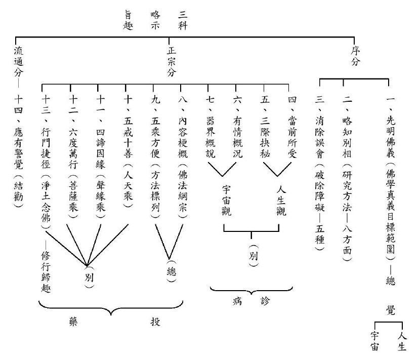

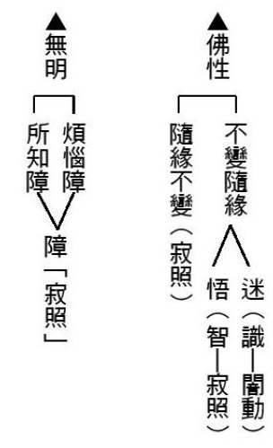

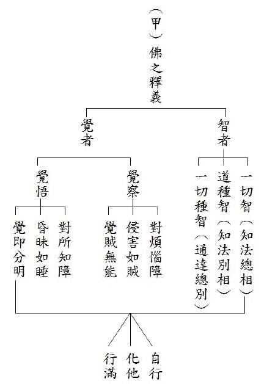

## 孔學一隅

### 論語簡說（十四）
		 	 —學須以道貫之

論語簡說（十四）

—學須以道貫之

*時哉講述、順昌雪廬夫子研學會、心筑整理*

舉一反三多學識

貨殖難以一以貫

幾番提斯待回首

廬墓六年醒覺乎

經文

子曰：賜也，女以予為多學而識之者與。對曰：然，非與。曰：非也，予一以貫之。

（衛靈公第十五-三）

前言

此章極為重要，孔子一生所學世稱「道貫古今，德配天地」，即是所證的道古今通用，能證的智慧可配天地。天能覆蓋萬物，地能承載萬物，孔子能教育萬物，所以孔子能與天地和合。但是要如何進入孔子之道呢？此章提供了一個完整的答案。

釋義

一、設問以發(令知本)

此章分為兩段。第一段是老師設問題來啟發子貢。端木賜啊！你認為我是多學而識嗎？識就是誌，也就是能將道理記得住，又很有領悟力，將道理體悟得很深！
對曰就是下對上，學生對老師叫做對曰。子貢回
**答：** 是啊！但是又語帶保留的說：不是嗎？

賜也，女以予為多學而識之者與。

《日知錄》中描述夫子自述自己好樂古人的內涵，而且見多識廣，又有領悟力。

孔子周遊列國的時候，曾有太宰問子貢：孔子是聖人嗎？不然為什麼這麼多能？（夫子聖者與？何其多能也？）可見時人也認為孔子擁有很多能力。

冉求在魯哀公十一年打了一場勝仗，冉求自述兵法學自孔子。

子貢也曾經說：文武之道，未墜於地，在人。中國的典籍傳到文王、武王的時候完備，這裡面有如何承天治人、順應天道、治理人情(大道)；也有完備的條目(小道)，孔子學到文武之道的大和小，即是多學而識。

顏回也說跟孔子的學習是「博我以文，約我以禮。」子張跟孔子學干祿，孔子也回答他：要多聞、多見。

老師為什麼突然這樣問子貢？這就是對症下藥！因為子貢是多聞而識的人，子貢的才情、悟性、外交長才、識人之明，在在都顯示他是一位多聞之士，老師這樣問，就是為了引他往上走。

然，非與。

你看子貢怎麼回答？這就是說話的藝術了！「然」就是承許，我認為老師就是一位多學而識之人。可是，因為有疑惑，所以反問老師「非與」，語氣上是一種保留的語氣，因為語帶保留，才引出孔子的下文。

子貢為什麼要用這樣的口氣呢？子貢雖然學得很多，可是他自認沒有通達孔子的內涵，這就是他的自知之明。「非與」兩個字，就是要引出夫子的內涵。

二、否定令進

曰：非也，予一以貫之。「非也」二字是全盤否定。夫子教出的三千弟子們，各個多才多藝，孔子應該要說：「對，我是多學而識。」結果孔子竟然全盤否定。孔子也曾說自己是多學而識，此處卻全盤否定，難道當時之人、弟子們通通看錯嗎？

孔子要點出的後面是「予一以貫之」，什麼叫做以「一」來貫？這個「一」字，各家注解不同，也說不出要「貫」的是什麼。

或問，夫子究竟是不是多學而識之者？如果是，為何否定子貢的答案？孔子自己也說，我是默而識之的人，我是學而不厭的人，我是誨人不倦的人。

再者，他自己也說：「十室之邑，必有忠信如丘者焉，不如丘之好學也。」一個地方有十戶人家，一定能找到像我這樣質地的人，可是沒能找到像我這麼好學的。

那夫子為什麼要否定子貢的答案？可見這個否定是：不否定而否定，否定而不否定。這樣的回答法不是二分法，目的是希望子貢了解，多學而識是不夠的，必須要一以貫之，這才是孔子對子貢用「非也」這兩個字的理由！否定子貢以多學而識為滿足，期許他向上走！

這就是孔子的因材施教，要引導子貢向上一著，如此也可見子貢是可以傳承的人才。前說「賜不受命」，因為子貢沒有好好地深入「一以貫之」之道，所以不能成為傳承的人才，沒有得到傳承的天命。

解析

多學識之或問，多學識之就是多元學習或多才多藝嗎？多元學習，現在一般說財經、政治、教育、文化、體育、生活等。多才多藝可以說是六藝的學習，舉凡禮、樂、射、御、書、數，禮就是在進退當中，把自己的角色扮好；樂就是涵養自己的心情；射是體能項目；御是駕車，引申來說就是各種服務；書是通達文字、文學作品以及公文書信往來；數包括數學、財經等等。

多才多藝跟多元學習中，最重要是經典的學習，開才藝的見地以及做人處世的能力！多才多藝才能真正利益人！讓自己跟大家結到善緣！所以孔子的多才多藝，也跟現在所說的多才多藝是同而不同，不同而同。

首先孔子對經典的學習就是多學而識，舉《詩經》之例，除了廣學《詩經》，刪定《詩經》為三百篇外，並悟出《詩經》的旨趣在「思無邪」，意即三百篇詩作皆詩人的真情之作，意在言外，委屈婉轉，學之能令人溫柔敦厚又有悟性。學《書經》可以知道上古辦政治的原則，成為開通的人，不會誣枉古人。學習《樂經》，容易使人善良，又對靡靡之音有阻擋的能力，不會腐化心志。學習《易經》，能懂得趨吉避凶之道，不會被賊害。學習《禮經》能懂得進退應對，又不會落入繁文縟節。學習《春秋》能知列國得失，不會一再重演歷史的教訓！這就是多學而識！

學東西須識之，方能領悟其中之奧妙，而心領神會，例如孔子向師襄學〈文王操〉之樂曲時，雖不知作者是文王，但能藉著彈奏通達作者的心志與胸懷，更悟作者的身材與其人，此種識之簡直出神入化！

一以貫之

中國的錢是外圓內方，代表內有原則，外要能圓融處世，錢幣中間有孔，能以繩子貫串著。學習此章或誤認孔子是一以貫之，其實孔子的能耐還包括多學而識，這一章要兩邊看。

多學而識如同錢多，一以貫之如繩子貫串銅錢。即一以貫之就是以「一理」來貫「多學而識之」！

一以貫之是對悟性高的人而言。《論語》中夫子只有對顏回、曾子以及子貢談到。顏回與子貢是悟性高者，所以，引導他們往一以貫之的方向走；曾子雖是魯鈍之人，然能下死功夫學習，並且能自我反省，最後也能了解一以貫之之道。

而一以貫之的「一」是什麼道理？孔子周遊列國在陳絕糧時，所開演的「性與天道」就是此處所謂的「一」，以性與天道貫串孔子的學說！

《易經》〈繫辭傳〉：「天下同歸而殊途，一致而百慮，天下何思何慮。」就是形而上那一分沒有形相可見，故無形可思、無形可慮。天底下的事情千百種，做法也各個不同，但是歸到形而上（本體）時則成為一致，以形而上來貫串所有形而下。形而下是多學而識，形而上是一以貫之，此乃孔子之道。此道貫古今，如果能夠多學而識、一以貫之，就能德配天地！

如此，多學而識能讓人入世很有能力，通達一以貫之時，也能在世間超越煩惱，極有風采。一以貫之稱為出神，多學而識謂之入化，孔子的學問即是「出神入化」！

《中庸》之「執兩用中」，由事理兩端當中，事相上是多學，理上通達就是識之，用中即是一以貫之！這就是六經的教育，六經的教育完整又有體系，清楚而明白。

多學識之與一以貫之

從老師那裡多學，跟老師與朋友切磋，自己回去琢磨琢磨，這樣的人才會從老師那裡學到很多東西，從多學而識到一以貫之，這裡面最重要的就是要講究老師、朋友。

如此多學而識的一以貫之，會讓本來不知變通的高柴，最後不但到衛國當司法官，回來魯國當成邑大夫。雖然曾子是魯鈍不開竅的人，最後也是多學識之、一以貫之，最後到楚國當上卿大夫，回到魯國教育生徒。子張個性開張，但最後能成為八大派的傳承。透過多學識之，用禮來約束自己，就能明哲保身，若再能有一以貫之的學習，就能改變個性，趨吉避凶。

總結

人生最忌諱的是不學，人不學，容易長俗氣病。癌症還有藥醫，人長俗了沒藥醫，俗氣病比癌症更可怕！現在人卻不怕俗氣而怕癌症。

一般人多是少學無智或多學而不識。少學就是學得很少又不通達；多學是報章、雜誌、網路等隨便看、隨便聽，沒有分別的能力，沒辦法抉擇重點，觀念像雜菜麵一樣，糊了一鍋粥。

整個文化在孔子身上，孔子的內涵就是「多學而識、一以貫之」。此章是孔門傳授心法，在多學而識當中傳授一以貫之的心法。《易經》〈繫辭傳〉：「一致而百慮」以及「殊途而同歸」，同歸就是一以貫之，殊途就是多學識之，一致就是一貫(形而上)，百慮就是多學而識(形而下)。此章也可以看出孔子對學生的瞭解，對多學而識的子貢，引他進一步能一以貫之。

最後，《反身錄》的作者李二曲先生認為，吃東西只要能消化，吃得少、吃得多都沒問題，但只要不消化，不論吃得少或吃得多都不行！所以，只要不消化，少聞、少學或者多聞、多學都不行。

多學而識的識就是消化，多學而識如果再被一以貫之所攝持，那這個多學而識就更不得了！能出神入化、莫測高深。

問答

**問：** 孔門中有哪些是多學而識的人才？有哪些是一以貫之的人才？又有哪些人是多學而識又一以貫之？

**答：** 子貢就是多學而識的人才，他的外交、口才與財經都有出色的表現；子夏是六經的傳承，東漢的徐防說：子夏發明章句；冉求多才多藝；子游對禮的通達，讓當時的人以子游一句話定輕重，以上是多學識之。

顏回、子貢、曾子都是能了解一以貫之之道的弟子。

多學而識又一以貫之的弟子，那非顏回莫屬。顏回是「博我以文，約我以禮。」老師講各類的課程，他全部廣博地學！跟著老師不疲不厭地學，並且能在禮上表現出內涵。難怪他過世時，孔子哭之慟，就是因為這種人才千古不易得之。

**問：** 請問性與天道是什麼意思呢？

**答：** 性就是指形而上。天道乃吉凶禍福的道理，如果能夠通達形而上，入世時能懂得如何趨吉避凶。《易經》的〈繫辭傳〉就是形而上的概念，六十四卦、三百八十四爻等四千多種的變化，講究的就是趨吉避凶。

真正性與天道的精華就在《中庸》跟《易經》，可是入門處在《論語》，下手處必須要先把《論語》好好地研讀，先瞭解孔子怎麼定義忠？怎麼定義孝？怎麼定義仁？怎麼定義為政？怎麼定義六經？怎麼看人？怎麼看自己？得先好好地學，否則會消化不了。

**問：** 請問老師，這章談到以性與天道貫多學而識，可是孔子又說，有一言而可以終身行之者乎，其恕乎，為什麼這裡的一不是指恕道呢？

**答：** 當弟子還沒有辦法被引導到性與天道時，只能在形而下裡面去了解多學而識，此時用恕去貫穿，並且推動所有的德行。

每個人都不希望別人對我們不忠，所以自己要對別人忠，用恕道去推忠的德行；每個人都不希望子女對自己不孝？想當然爾就必須對自己的父母孝順，這就是用恕道去推廣孝道，乃至於推展各種德目。

**問：** 請問此章的一以貫之與忠恕之道的內涵是什麼？忠恕等同於多學而識嗎？或者是否能等同於性與天道嗎？

**答：** 忠恕都在形而下論，那是因為弟子們都沒有辦法引導到形而上，夫子必須在形而下裡面，用忠恕去串那些世俗的德行。但是，究竟處是用性與天道去串所有世間的多學而識！

**問：** 平時的學習應該一門深入，長時熏修呢？還是多學識之，一以貫之呢？

**答：** 一門深入是專一地學習進去，那就是少學而識，至少必須要識，也就是能夠領悟、通達所學習的內涵，否則會不消化。

研讀《論語》，必須要完整地把四百九十八條都讀起來，而且跟著讀書會和老師學習，不是關起門來自己學。識之就是真的瞭解，而不是死在文句當中，中國文化最怕死在文句之下，把人教笨了，最後認為這些都是古代的東西，以為與現代脫節。

**問：** 如何做到博學而精純不雜？

**答：** 多學而識的學是要從聽聞開始！沒有透過聽不會真正懂得，中國文化典籍到文王、武王時完備，孔子才能在魯國把文化道統完整學會，集各個老師的精華在他一身，而不是無中生有的。

顏回也是跟著孔子學出來的，孔門的十大弟子、七十二賢、三千弟子，全部都是跟孔子學。不但不會多學，也不會少學，更不會雜學，或者學了不消化。

**問：** 君子不器也就是君子的學習，不會被侷限在某一個特定的功用，是不是一定要多學而識才有辦法達到君子不器？

**答：** 君子不可少學而識，要多學而識。經典要學得完整，不是東學一點西學一點。但是君子更重要是一以貫之！超越器形繫縛，那才是真正的君子！所以孔子這位君子不是一般的君子，那是擁有聖人氣象的君子。一以貫之是內聖，多學而識是能外王，由內聖成就君子的不器。

**問：** 我們引導學生多讀書、多看書，但是應該如何引導學生在多讀時能夠「一以貫之」？且保證學生能力的提升呢？

**答：** 老師一定要先「多學而識、一以貫之」，才能引導同學「多學而識、一以貫之」。總而言之，老師是學生成就的唯一關鍵！高明的老師未必教出高明的學生，但是高明的學生一定出自於高明的老師。

**問：** 《論語講要》〈里仁篇〉，孔子告訴曾子，一以貫之的是忠恕之道，本章是從多學而識進到一以貫之。請問傳承聖道必須要有多學而識加一以貫之，還是只要一以貫之就可以呢？

**答：** 一以貫之的人，雖然能夠超越形體達到形而上，可是要在世間弘揚聖道，不靠多學而識怎麼利益世間，弘揚聖道呢？所以要傳承聖道的人，一定要多學而識、一以貫之！否則沒有辦法入世，沒有辦法跟世間人結善緣，難以推廣一以貫之的精華思想。

**問：** 「非也」是孔子對子貢的全盤否定。請問使用這種全盤否定的教學法時，老師跟學生需要各自具備什麼樣的條件？如果不善用的話，會有什麼樣的過患？

**答：** 「非也」一句，是引弟子向上一著。對學生來說，這必須要有相當的悟性，才知道老師說這句話的意思！子貢反問「非與？」表示他已經知道老師你有很多內涵，我想要引出還有哪些我不知道的內涵？老師引出更深的形而上思想，入世時不被世間所迷惑，此人可以辦政治、辦教育，不會在大福報當中迷惑他自己。(下期待續)

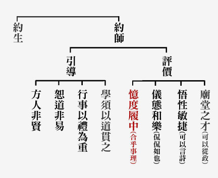

## 藝術賞析

### 孔門七十二賢淺說（十）
				     ─公皙哀

孔門七十二賢淺說（十）

─公皙哀

圖：江逸子‧文：時哉

廉能淡泊守困窮

俠氣利人名聲遠

此生雖未列封侯

天爵自尊後代仰

公皙哀，孔子家語作公皙克，字季次，齊國人。

季次懷有獨行的君子之德，他的義不苟合於當世，終身居住在家徒四壁、蓬草為門的屋子裡，粗衣粗食而不厭倦，終身不屈節求仕，孔子讚歎說，天下動亂無道，很多人設法當卿大夫的家臣，供職在諸侯都中，只有公皙哀能獨善其身，不曾出來做官。司馬遷《史記》〈遊俠列傳〉讚歎這些行俠仗義，卻甘於貧困的俠士。說道：這些遊俠雖處於鄉野為平民百姓，然而義氣可以傳誦千里，他的一句話是一言九鼎，為了正義而死也在所不惜，令這些王侯名利客也不禁的佩服。

畫中的公皙哀一副日本武士的形象，透露出此人重戒律而能戰勝自己的欲望。刀劍是一種榮耀，表徵行俠仗義的勇氣，必要時甚至能夠捨身取義，不是當太保流氓，而是不與矯作不實的風俗妥協，這就是遊俠的心志，這也是孔子教育的成就處，能教出有志向有仁心的弟子。

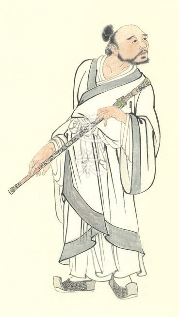

### 華夏精魂千秋(十)—明倫史畫禮以教子　孟母

圖：江逸子‧文：淨域

沒落貴族賴母教

親師苦學五年成

不忍世道效周遊

王道不興退著書

史話

孟子的母親仉氏，戰國時期晉人，出於名門之家(─西元前三一七年)，知書達禮、賢慧剛毅。孟家本係魯國孟孫貴族，孟子(名軻)早年喪父家道中落，全賴母親刻苦教養。最初家住於城郊墓旁，孟子便以祭喪為遊戲；母以為不妥遷居市集，孟子又學商人叫賣營計；母見讀書人知書達禮，便再搬家至學校旁。
孟母教子為人要誠信。居於市集時，東邊鄰家在殺豬，孟子疑
**問：** 「殺豬幹什麼呢？」孟母隨口答以：「給你吃！」孟子高興地等著吃豬肉，母親為了不失信於他，便挪出日用錢來買塊肉讓孩子吃。

初入學讀書，孟子無所用心，某日竟貪玩未上課。返家後，母親一聲不響地將織布機的棉紗剪斷，對著驚愕的孟子說：「你廢學就像我斷織般，一切付出都前功盡棄了。」孟母以斷織來比喻輟學，教以「力進廢退」之理，孟子從此發憤向學。

孟母除擇鄰處外，也覓聖學良師以教子。戰國時期學術蓬勃發展，諸子百家中她無視於老莊的玄虛，也不愛楊朱的功利，獨醉於孔子的忠恕之道。當時，孔子之孫孔伋(字子思)的學生，在曲阜設館講授六藝，孟母鼓勵孩子前往學習。老師特別器重孟子，對旁人說：「孟儒子性樂仁義，言稱堯舜，世所稀有也！」孟子苦學五年，學問德業突飛猛進，世稱繼承了孔子的衣缽。

孟母對子之教，亦在於夫婦相處之道。某回，孟妻由氏在內室袒裸，孟子撞見怒斥而去。孟妻訴於婆婆，說：「夫妻內室相處，不以外禮相求，請予歸寧。」母告於孟子：「依禮，將進堂先發聲，讓人心理有備。你先失禮，怎還怪妻子不知禮呢？」如此又依禮教子，調和子媳關係。

孟子為了孝順母親，未能遠遊一展抱負，時而吁嘆不樂。母親知而告說：「婦人之禮在修閨內，此有三從之道：年少從父母，出嫁從夫，夫死從子。如今你已長大成人，而我也年邁了。何不你做你應為的事，而我守我的婦禮。」是故，孟子再次周遊列國，受到各國人民的歡迎。

孟子五十五歲時任齊國客卿，接母親同住享福，不料次年母親罹患重病，雖親侍湯藥仍然罔效。歸葬故里鄒國(今山東省鄒城市)馬鞍山麓，建孟母祠以祀。後人將孟母與徐庶之母、岳飛之母，列為母親的典範，而孟母居「賢良三母」之首。

圖解

禮是人類行為的規範，比如《禮記•曲禮上》所言：「夫禮者，所以定親疏，決嫌疑，別同異，明是非也。」禮更是規規矩矩的態度，見於行為的恭謹。天下女性佔一半，自古以來重視女德，包括婦德(品性)、婦言(語氣)、婦容(行止)與婦功(才能)，此四德關乎家族榮衰及社國興滅。

孟母仉氏為中國賢母之代表，其賢完全表現於對孩子的善教上；為謀求良好的學習環境而「三遷居所」，為承諾守信而「籌算買肉」，為警示貪戲廢學而「截斷機杼」，使得孟子發憤向學。人雖有了學問，但往往受習氣所障而現無明。此圖所繪即是孟母就「不以禮廢事」，來訓教孟子「禮有內外之別」，其失禮冒進於前，怎能怪罪於妻子更衣失態呢？雖孟子當時已是大儒者，但對於母親的一席話，仍能恭謹省思誠心改過，更奠定其後來的成就。（下期待續）

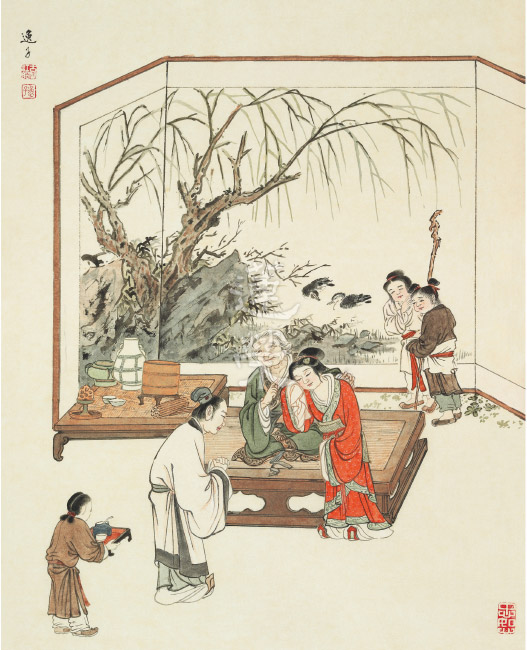

### 孝經圖簡說(八) —孝治章

圖：江逸子‧文：時哉

對待小國臣

禮敬受擁戴

祭祀得助祭

太平吉祥興

孝治章第八

孝經的第八章、第九章，都是說明以孝治天下的功德。其中第八章是通說以孝治天下的功德，其中包含了天子以孝治天下、諸侯以孝治國家、大夫以孝治家。

然而天子如何以孝治天下？天子懂得尊重小國之臣，至於大國之君、小國之君、大國之臣等，那就更不用說了！因此，可以得到小國與大國的歡心與擁護。明堂是古代周天子朝會諸侯，發佈政令與祭祖的神聖殿堂，當天子要在明堂祭祖時，各諸侯國的國君，也會帶著供品，特別是當地的土產，前來助祭。

其次諸侯如何以孝治國？當這位國君若能尊重孤苦之人，想當然爾，對於國內一般人民、讀書人那就更不用說了！能這樣作，國中百姓必擁護君上，當國君在自己國中太廟祭祖時，百姓也會前來參加祭祀，表達擁護。

至於大夫如何以孝治家？也就是如何以孝治理他的領土，當這位大夫能對其家臣、婢僕，乃至妻子尊重，如此則得眾人之歡喜擁護。幫助這位卿大夫侍奉他的父母，當這位大夫在自己家廟祭祖時，人民也歡喜前來家廟助祭。此種孝會讓父母親生時身安、心安，死時能接受孝子誠心的祭拜，這樣的天下、國與家必定是災害不生、禍亂不興、吉祥平安。以上是孝治天下，治國、治家之氣象。

江先生所繪的孝治章，乃天子拱手招呼小國之臣，天子境內分封有大國及小國，還有境外的番邦，圖中這些番邦的小國之臣，想必是從很遠的地方受其國君的囑託，來問候天子，天子拱手致意表徵重視，不敢怠慢這些小國之臣，這樣的舉動，必能得到各國之擁護。

天子旁邊戴官帽者是天子的近臣，左邊的那一位臣子在向天子介紹這些小國之臣，右邊那一位雙手抱於胸前表徵敬意，天子之後另有三、四位隨行的官員，三位戴著貼耳帽者是衛士，左邊欄杆處有兩位衛士執劍護衛，觀其神情態度不過聊備一格，此位天子已得大家之擁戴，不會有篡逆之事，書上說天子以孝治天下，自然會帶動國君以孝治國，大夫以孝治家感得天下太平、災害不生、禍亂不興。

歷代畫作，或針對天子接見其臣民，而非小國之臣，在天子後面有許多官員，表徵天子之威勢。唯獨江先生以小國之臣及婦孺參見天子，以圖表徵經上所說，天子以親切的態度及適度的禮儀，表達對小國之臣不敢怠慢，而得各諸侯國的擁戴，以上是江先生根據孝經之義理而繪的佳作。(下期待續)

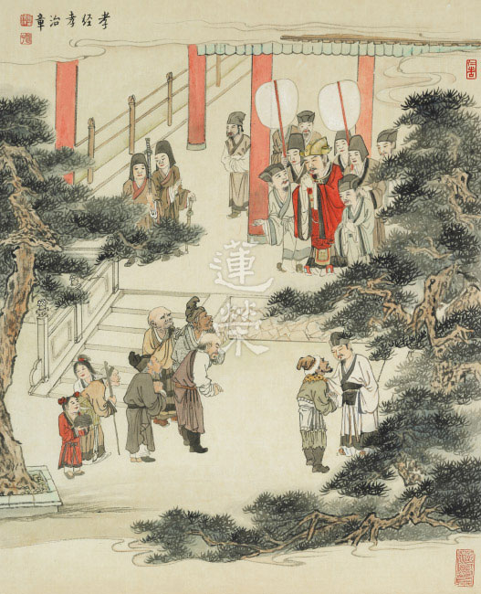

## 蓮池海會

### 羅曹玉蘭老居士往生見聞記

戒安

樂善好施具幽默

家中提供學正法

病苦折磨兩年後

不枉善緣生西去

生平簡歷

羅曹玉蘭老居士誕生於民國十八年宜蘭鄉下曹姓人家，因家中環境不好被送給吳姓人家當養女，養母非常的疼愛與照顧，在教育還不普及的年代，讓老人家可以受到良好的教育到高等科畢業。老居士是一個非常聰慧認真的人，學什麼像什麼，且要做就要做到好，包括怎麼針車製作衣服、織毛線衣、插花、女裝等都做得非常好。

老居士二十歲時嫁給羅火木先生，並在養母的資助下買了一棟屬於自己的房屋，育有二子三女，在夫妻克勤克儉的持家下，一家的生活大為改善。

以身示教

老居士是一位非常仁慈厚道的長者，因為家中有開業，老居士對來到家中幫忙的員工都非常照顧，直到現在這些人都還會來探視老居士。有個家中請的歐巴桑退休沒工作後，老居士每個月都會送米錢及生活費給她，直至老居士往生，是故歐巴桑家的子女都非常感念老居士。

還有一些親戚因為生活有困難，老居士會讓他們搬來家裡住就近幫忙。鄉下的親戚如果來到家裡面作客會送些土產，老居士都會回送很高貴的禮。此外老居士平常會在宜蘭城隍廟捐贈私棺，幫助家境不好的人辦喪事。來看病的病人如果家境不好，會讓他免費就醫。

老居士這些身教與言教都深深的影響到子女們，為人要仁慈寬厚，累積的陰德都庇陰到子孫們，長子順利成為當屆宜蘭第一位台大醫科，並於美國完成醫學博士學位回到臺灣懸壺濟世，讓老居士非常欣慰，其餘子孫也都有很好的發展，許多都傳承家業，在醫療體系中服務。

學佛因緣

老居士在五十歲左右，因婆婆往生，也由於大女婿與女兒平常的發心，所以感應蓮友前來助念，之後示現瑞相全身柔軟，以是因緣對淨土法門生起信心。並在民國七十六年隨著女婿與蓮友至水里蓮因寺皈依懺公師父，從此開始專修淨土法門，每日早晚做定課。先夫羅水木老居士往生時也謹依佛制，由蓮友協助治喪事宜。後來因家中已沒有開業，在女婿的鼓勵下，老居士將家裡的空間提供出來成為宜蘭蓮友共修及研學的場所，這期間研討過彌陀要解、佛學概要十四講表、淨土十疑論等課程，也邀請過 醒公至宜蘭講述唯識、因明等課程，還辦過啟蒙班，如是持續有二十年之久，與宜蘭蓮友結下甚深的善緣，也讓家中子女、孫子，都以淨土法門為依歸，一心念佛，求生西方極樂世界。

病苦示現

老居士隨著年歲的增長，行動漸漸不便，且心臟也不斷地定期追踪治療，民國一○三年十二月中旬凌晨中突然中風，無法言語與行動，送至國立陽明大學附設宜蘭醫院就診，後來在長子安排下轉至林口長庚加護病房治療，情況危急時承蒙諸多蓮友前來安慰與開導，讓家屬面對這突發的狀況得以穩住情緒，並堅定了護持老人家往生的信念。老居士情況好轉與穩定後，曾轉至新莊樂生醫院呼吸照護中心，也到長女家中照顧，期間許多蓮友陸續前來陪伴念佛與開示，問老人家有沒有念佛，雖然無法言語，但都會點頭回覆，且笑容滿面的與蓮友握手。

臨終示現

在生病的過程中，次子與媳婦都非常用心照顧，日復一日，每天搭車從桃園來到臺北照顧老居士，用柔軟語安慰，請老居士放心與放下。三女旅居美國，也經常透過電話問安。本來以為病情穩定會慢慢好轉，天氣也逐漸暖和，可以帶著老居士推著輪椅出去走走，曬曬太陽。

然而今年四月二十九日，中午次子在下午三點到樂生醫院探視老居士時，醫生說白血球很高可能是尿道感染，為了安全起見晚上轉至加護病房觀察，隔天四月三十日清晨六點醫院緊急來電通知血壓很低已病危，當下家屬們就決議帶老居士回家助念，並兵分兩路，一路至醫院接老居士，一路在家中布置助念的環境。經醫生評估所剩時間已不多，老居士就在兒子與媳婦的佛號聲中出院回家，並於中午十二點回到辛亥路家中，在家屬助念聲中，十二點十分捨報往生，之後蓮友們陸續前來助念了二十四小時，入殮時全身柔軟，面相比生病時好上許多，就如同安詳的在睡覺一般，一點都不像遭受兩年中風病苦折磨的樣子。老居士能夠往生，若沒有前面住家提供為修學正法的場所，家人與蓮友的結緣，是無法獲得蓮友源源不絕的開導安慰，並在老居士助念往生之後，做為後輩得度的增上緣，特別是曾孫們每天都會念佛回向給阿祖。

老居士至此已不用再受病苦折磨，過世時得到助念，並全身柔軟，足徵往生西方極樂世界，期望老居士早日乘願再來廣度眾生。

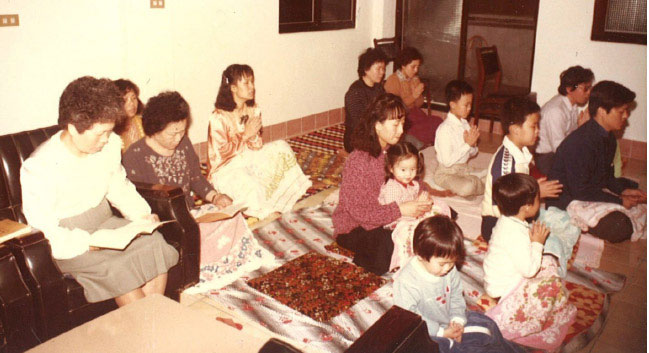

## 活動報導

### 我今為何等事欲遊東馬

淨印

止觀修學串旅遊

三代同堂大家庭

訪遍大山大水後

歸去無風也無雨

前言

馬來西亞（簡稱大馬）由馬來半島（西馬）和沙巴、砂勞越（東馬）組成，南海隔開了東、西馬，也隔開了自然風貌與都市化發展。

大馬首都吉隆坡及第二大城檳城都位在西馬，而東馬則保留了原始雨林及生態，其中有兩個國家公園被聯合國列為世界自然遺產，一是位於沙巴的京那巴魯國家公園，一是位在砂勞越的姆魯國家公園，二者都是我們此行要造訪的。這是一趟內行人才排得出的行程，沒有大馬的蓮友是辦不到的！這也是一趟深富內涵的觀修之旅，沒有善知識的帶領也是辦不到的！內涵加上內行，一時因緣和合，八天的光陰、東馬的土地成為小止觀歷緣對境修的時間與空間，如今讓我們以文字讓同行者重遊，讓未能同行者同遊，方不枉費善知識的慈悲攝受。

出發與抵達

夜晚亮起的路燈尚未熄滅，城市還未甦醒，我們的旅程在晨光未明中展開，由臺北出發的遊覽車上，攝心的早課是此次活動的序曲，我們的見地成為能莊嚴，團體行動成為所莊嚴。從機場集合完畢直到飛機起飛前，蓮友與學長們彼此相助、看前顧後，這是參加一般的旅行團所不能相比的。當飛機起飛的那一刻，我們漸漸遠離了在臺灣的業，而在東馬的業慢慢地要升起，經過三個半小時的飛行，我們一行四十三人抵達了沙巴首府亞庇市。順利通關領取行李後，踏入機場大廳便見到滿面笑容的何老師、習明學長在內的大馬蓮友七人小組，一到異地就有人接應，什麼事都有人安排好，實在太像度假了。度假享樂的受用觀待過去的善業，怎麼樣能夠以不消耗福報的方式來走這趟行程？如何能在樂報的受用中造做善法、將樂報轉為造善的資糧？跟著善知識，謎底將慢慢揭曉。

大家魚貫步出機場，午餐地點選在寬敞明亮的購物中心內，避開了正午的艷陽高照。午飯後安排的景點是水上清真寺，須換上回教服裝才能進入參觀，幸好老師下了回皮佛骨的註解，一掃我們離經叛道之惑。所謂的外道善知識，乃是因佛骨使外道成為可能，外道的皮裡面其實是大悲心和菩提心的骨，這樣的人才是佛菩薩都想要攝受的對象，當然能成為我們修學上的善知識。

在回服的穿與脫中，老師為我們上了一課，有如醍醐灌頂！在聽聞中，善知識超凡的見地成為我們的見地。傍晚的海邊踏浪，沙灘上印下的足跡，那是我們跟隨善知識的腳步，一步一腳印。我們也願如寄居蟹，充實自己使自己成為能寄居，大悲心和菩提心成為所寄居，所以若為發心故，讓我們一起看海去！

神山與大王花

第二日一早啟程往神山，神山名京那巴魯山，此山之神，在「高」，超過海拔四千公尺乃東南亞最高峰；此山之神，也在「神隱」，得見不得見，要看因緣。

車行沿著山路而上，可見霧氣繚繞，遠望氤氳迷濛，果不見神山真面目，想見未見本該遺憾，但因老師身體極度不適未能同行，此遺憾更甚不見神山吧！中午在波令溫泉公園旁的餐廳品味多種咖哩料理、熱帶水果、馬來風味奶茶等等，豐盛的自助午餐讓我們蓄足能量前進樹頂吊橋。
吊橋共有五段，每段的寬度相當，一次僅容一人通過，且一次不能同時承載多人。我們分為四組依序而上，此時有感天候似乎不佳，澳熱潮濕中頗有風雨欲來之勢。第四組還未全數走上吊橋，已是滂沱大雨，沒有停歇之勢。帶領第一組的習明學長透過無線電喊撤退、不宜前行！幼珠學長卻以堅定語氣回
**答：** 繼續前進，不走回頭路！她的聲音壓過雨聲隆隆，觀待團隊合作與三寶加被，我們最終克服風雨挑戰成功，完成了非常痛快的高空吊橋體驗。

回到波令溫泉，濕漉漉的我們正適合跳進溫泉泡泡腳，一群孩子們索性全身濕透，更為盡興。

回程的路上前往觀賞全世界最大的花，此花有多名，觀待它最大，安立名言為「大王花」；觀待發現它的人是英國的萊佛士爵士而命名為「萊佛士花」；觀待它會發出如腐爛屍體般的惡臭而叫它「屍花」，這些名字都指向我們眼前由暗紅色的花被、中間的圓形花盤、花盤上的肉刺、花盤下的雄雌花器等和合而成的植物，此花奇特，無根無莖，小小的種子寄生在宿主植物多年才會開花，不開花不知它的存在，一開花則是世界最大，直徑可超過一公尺，真是不開則已，一開驚人，但是七天就結束盛開，尋覓萊佛士花的自體性在哪？在種子、在宿主還是在巨大的花被？看花可作空性觀察，看穿一時的因緣假合，看到真相，所以若為見真相故，讓我們一起看花去！

姆魯奇景（洞穴、石林與蝙蝠出洞）

要進姆魯（MULU），船或飛機是唯二選擇。若問西馬人：去過姆魯嗎？十有八九可能未必去過，我們何其有幸！

姆魯位在砂勞越，我們必須從亞庇機場搭乘小型飛機，先飛到美里，在美里機場辦理入境砂勞越的簡單手續，再登原機飛姆魯。在降落姆魯之前，俯瞰可見一大片綠色森林，正確地說，應是我們飛進赤道雨林中。

從姆魯機場到我們下榻的度假村，沿途都是未經雕琢的自然景觀，當巴士司機以倒車方式過大木橋時，意味著旅館要到了。一見到將住宿三晚的地方時，沒有人不感到驚艷的！雨林之中竟能有如此建築與布置，營造的是賓至如歸的氣氛，接待大廳的桌椅或像餐廳功能或像客廳功能，甚至或像臥室功能；無窗的設計使視覺上一覽無遺，我們和雨林只隔著空氣！

經過一晚的休息，隔日乘船沿著雨林中的溪流在一村落下船，這裡的原住民以製作手工藝品為生，色彩豐富的竹編、皮雕和珠串，木製與石刻也別具特色。停留稍許後我們回到船上繼續溪遊，前往風洞和清水洞。這兩大洞穴都屬石灰岩地形，風洞內有各種石柱，走在洞內時不時一陣涼風吹來，好不清涼！清水洞則是亞洲最長的洞穴，長達百里，內有地下水流經。鐘乳石千奇百怪，是長達百萬年以上的時間才能形成如此壯景，滴水可穿石，秘密在時間。

為了不虛此行，在姆魯的第三日我們步行來回八公里，走進叢林深處，一探蘭洞及鹿洞的奇觀。雖都是石灰質所形成，但四洞各有千秋，蘭洞中壯觀的鐘乳石鬼斧神工，而鹿洞是世界最大的天然洞窟，此洞現在已沒有鹿，但是安安靜靜的背後，是裡面住了數百萬隻的蝙蝠。世界各地慕名而來的遊客為的就是觀看蝙蝠出洞，大家守候在觀望台等的是黃昏時分那令人嘆為觀止的一刻！

這三天的所見所聞，讓人既隨喜他人又隨喜自己的福報，見的是大山大景，開闊我們的心胸與眼界，聞的是殊勝的小止觀歷緣對境修，承蒙老師授課兩堂，增長我們的智慧與見地，而又豈止這兩堂而已？有善知識的地方何處不是教室？

看到了數百萬隻蝙蝠共住，出洞覓食井然有序的背後是倫理使然，連動物都有倫理，人豈能不如動物？團隊的力量讓牠們的天敵也要畏懼三分，反觀我們，來到姆魯與世隔絕、遠離塵囂，在臺灣無法實現的共住彷彿在此成真，我們一同吃飯、學習、徜徉山水，孩子們玩在一起，就像個大家庭，原來共同的見地可以營造出這樣的環境，怎不令人心生嚮往？所以若為共住故，讓我們一起出遊去！

巴哥國家公園、賦歸

四月十四日的早上，老師主持了心得分享，並以種種結合有法的觀修作為對大馬蓮友最誠摯的感謝，更回向給在台灣未能同行的蓮友。大家的心得在老師的引導下如百花齊放，使人靈感滿滿，帶著充實的收穫，我們飛往最後一站，砂勞越的首府古晉。

在古晉的第二日我們乘船前往巴哥國家公園（BAKO），這是大馬的第一座國家公園，有山有海，還有長鼻猴、山豬和許多的猴子在其中自由活動。上午遊山，公園內共有十六條步道，我們走的是UluAssam步道，雖名為步道，事實上是與大自然融合一體的路，後半段的陡坡不易攀爬，故陸續有人中途折返，有的是自動打退堂鼓，有的是被勸退，真正與老師一起堅持到終點的不到一半，透過無線電即時報導，山上山下同樂，吟詩之聲傳來，士氣高昂，實振奮人心！

下午我們搭一小段船到公園另一側的海岬灣，美麗沙灘是戲水天堂也是大自然教室，對著許多寄居蟹，老師拿起麥克風，隨緣帶領大家做了一堂精彩的觀修，觀察世俗的寄居並非究竟的寄居，寄居在出世間法才是離苦得樂之道，然而要抓住對世間寄居的覺受，作為修學解脫道的方便。

隨著行程將畫下句點，余先生為我們嚴選了具有代表性的當地主食、菜餚、湯品及水果點心，讓我們在飯店享用了一頓極爽口的晚餐。晚餐後的分享顯見彼此真情流露，依著老師的主持引發，我們聽到了說者隱藏心中多年的祕密，能辦事之人往往是歷練來的，在因果正見攝持下的人生磨難將成為福慧的生起處。

大馬蓮友以七人接待我們四十三人，其中一位還是旋哲小弟，一路當義工又當攝影的他為了全程參與而向學校請假。沒有這趟東馬之行，我們亦不知他們要到無盡燈上課必須要經過怎樣的交通過程，有道是有朋自遠方來，不亦樂乎？樂在以文會友，樂在以友輔仁，樂在以誠相待，所以若為同法者故，讓我們一起聚會去！

結語

從古晉回臺灣必須在亞庇轉機，何老師本是古晉人，習明學長住在吉隆坡，但他們二位陪我們從古晉飛到亞庇，送行之後他們得在亞庇機場等待數個小時，搭晚班飛機回家，送客之誠莫過於此。觀待學者的誠心而有善知識的應許；觀待善知識的攝受而有個人到團體的增上；觀待止觀的修學成就而有究竟的離苦得樂。

東馬之旅應作是念：

我今為何等事欲遊東馬？為煩惱所使，及不善無記事遊，即不應遊。若非煩惱所使，為善利益如法事，即應遊。

云何遊中修止？若於遊時，即知：

因於遊故，則有一切煩惱善惡等法，了知遊心及遊中一切法，皆不可得，則妄念心息，是名修止。

云何遊中修觀？應作是念：

由心貪玩，名之為遊。因此遊故，則有一切煩惱善惡等法。即當反觀遊心，不見相貌，當知遊者及遊中一切法，畢竟空寂。

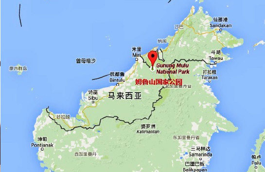

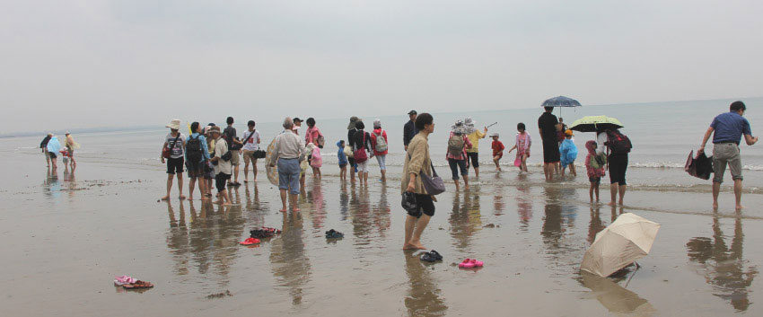

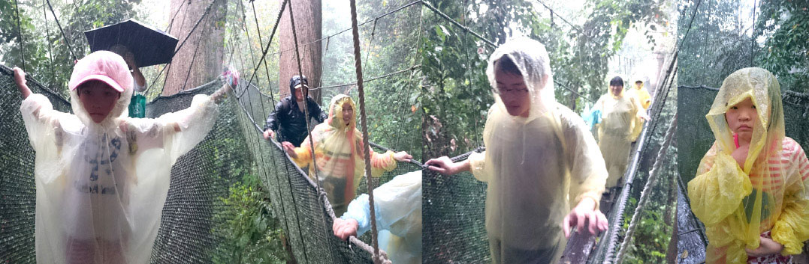

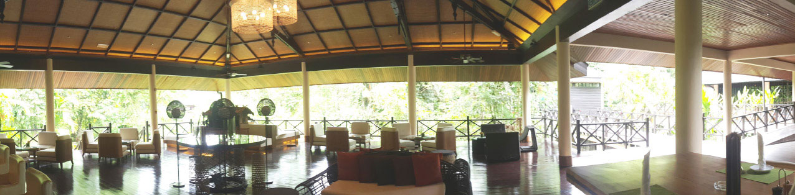

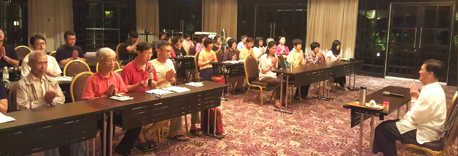

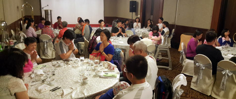

### 別開生面的相聚
      ─由承辦東馬之旅說起

別開生面的相聚

─由承辦東馬之旅說起

陳習明

耐煩仔細的前行

任勞安穩的相伴

靜靜體會的旅程

後續成長的資糧

很感恩老師和老師的團隊這次來東馬做文化、生態、觀修之旅。同時也讓當地義工們受益良多。此行程當中，有幾個地方讓末學感觸比較深刻。第二天早上要出發時，得知老師不舒服，但是老師還是堅持帶領我們繼續前行。看到老師生病的時候，對於團隊還是不捨不離，共同進退到最後行程的那一份精神，讓末學無比的佩服，也讓我們做學生的，能效仿老師對團隊那一份的精神所在。

早上我們到了神山腳底，有點可惜的是當天烏雲比較多，無法看到神山的全面目。過後我們就去用自助午餐，午餐後我們繼續下一個景點，那就是溫泉公園。我們在公園裡，先去步行樹頂吊橋。剛走到第一條樹頂吊橋時，忽然間下了一場大雨，當時已經沒有辦法退了，唯有繼續的前進，前進當中末學稱念著南無地藏王菩薩名號，觀想地藏菩薩在空中放光，普照攝受，加被我們能平安，順利度過。透過下雨，觀想佛菩薩灑淨甘露水，把我們和這裡所有山河大地的一切有情眾生，都能洗淨身心罪業。最終大家都平安度過，後來聽到當地人說，這裡已經一、兩個月，沒下雨了，此雨能解旱真好。

第三天下午我們抵達了姆魯國家公園後，難得當天晚上，老師跟我們上了一堂課，就是歷緣對境修學小止觀。原本老師想安排在行程前面講述，好讓我們在整個行程裡面，歷緣對境時，能過透夠小止觀去歷練，但是因緣不具足，所以到了第三天才講述。之前沒學過小止觀，上完了這堂課，回房間複習後，才知道我們可以從歷緣時（行，住，坐，臥，作作，言語），或是六根接觸六塵對境的時候，一切時，一切處，除了用念佛去調伏煩惱外，還可以透過小止觀，止住妄念，從而生出對空性的體會。透過小止觀，從這裡再去念佛，所產生的覺受，是很輕鬆和舒服的，沒有了之前壓抑的感覺，實在是太棒了。在這裡老師都有提到，對於小止觀的修學方法，我們必須清楚和明白，還要記得住，歷緣對境修時不斷地串習才能用得上。

在第五天，我們到了蘭洞觀賞鐘乳石，進到去裡面，可以看見各類大大小小鐘乳石的美觀情景。當時末學想到鐘乳石對著修行，有一些粗淺的體會。先從幼小的鐘乳石說起，在蘭洞里，看到洞頂（有些部分比較矮的洞）的水開始往下滴所形成非常細的中空的管子（管子剛開始要把鐘乳石建立起來），據了解，俗稱蘇打管或鵝管。這些幼幼的管子很脆弱，如果你的手掌去輕輕的推它，很容易脫落。當時想到我們，剛開始修行的時候，所培養的善根也都是很微小，是很脆弱的，就像那中空管子一樣的細小，經不起風吹雨打，如果不好好保護我們的善根，一剎那之間，就會很容易被破壞，修行就退轉了。

同時會看到，這洞頂的水會透過管子一點一點的滴落，也有水會透過已經形成鐘乳石一點一點的滴落，有些會慢滴落，有些會比較快滴落，據了解，再加上長時間，水不間斷的滴落，才能把細小的管子慢慢加粗後，才變成鐘乳石，或是把現已形成的鐘乳石變成更大。

當時想我們剛開始修行的時候，都是一點一滴的在我們行住坐臥、六根接觸六塵當中去實踐，就像水從管子一點一點的滴落。在修行當中，遇到障礙，須放慢腳步，要懂得善巧方便，找對方法把它調整過來，就像水從管子一點一點的滴落時，有時會慢滴落，有時會比較快滴落。這裡體會更重要的是，必須長時間，六根接觸六塵當無明行起現行時，我們能不能常常提起覺照，透過正知見去破我們的煩惱障。如能常常（長時間）保持點點滴滴去實踐，我們的修行功夫才能得力。就像水不間斷的滴落，才能把細小的蘇打管慢慢加粗後，才變成鐘乳石。

一般來說洞穴裡面都是黑暗的，看不到東西的，更不用說能看到鐘乳石。唯有人走進去以後，透過用燈光照亮，才發現洞穴裡面竟然有這麼莊嚴的鐘乳石殊勝情景。對一個聖人或賢人，他的智慧與內涵，都是涵藏在內心裏面，隱而不現，誰也不知道，就像鐘乳石隱藏在洞穴裡面。也是唯有透過跟此人接觸後，才發覺此人的智慧與內涵。走完蘭洞後，彷彿覺得大自然透過鐘乳石來啟發我們，安定修行的過程是點點滴滴的累積，沒有僥倖與偶然。

無論如何，此活動能順利完成，感謝老師的教導，感謝蓮友們的合作，順應我們的安排。尤其老師的提醒，在活動中建立見地，此活動末學所得到的覺受，確實跟以往是不一樣的。

以上是一些皮毛粗淺的體會提供參考，又因為華文程度不好，如有任何錯誤或不妥當的地方，懇請老師給予糾正與指教。

之前自以為有很多心得，但是最近開始上了老師講的經典之後，越來越得知自己所學到的，所了解的是非常不足，非常的微少，裡面還有很多義理還沒弄清楚，所以觀待以上的因素，有些體會和心得，知道不足和不妥當，所以沒寫出來，請老師見諒。接下來，還是好好的學習經學，好好的充實自己，把經學裡面的義理弄清楚，把經學的見地建立起來，實踐在我們生活當中，不會辜負老師對我們的提攜。

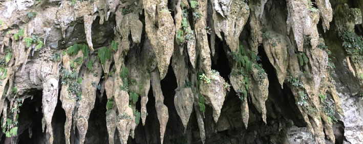

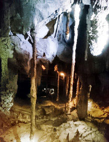

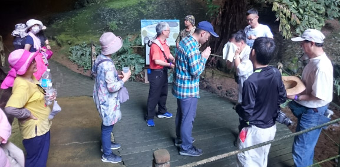

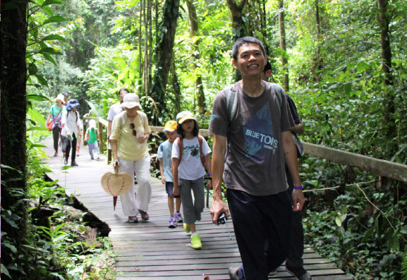

### 樹頂吊橋─考驗人生的艱難

淨忱

怖苦驚惶求救護

皈依體性真念佛

小樂忘卻大苦隨

難生解脫輪迴心

原始生態景觀，現已被聯合國列為世界自然遺產，能夠來到這裡做知性之旅是何其幸福的事。

東馬之行的第二天，我們來到神山公園Kinabalu Park，這裡最著名的是波令溫泉與樹頂吊橋。樹頂吊橋全長將近一百六十公尺，高度大約四十一公尺，全程共有四段，均建在大樹之上，完全用繩索固定，沒有使用任何一根釘子，樹頂吊橋原是為了讓生態學家，在不打擾野生動物的情況下，觀察雨林生態而建造的，後來才開放給一般遊客觀光使用。

這天原本天氣晴朗，該是輕輕鬆鬆的行程，進入樹頂吊橋前，有一小段山路，沿途可以觀賞熱帶雨林植物、蕨類等等，但就在我們步行進入時，遠處突然悶雷作響，瞬間風雲變色，細雨開始落下，山路變得難行，老老小小一行人，大家互相加油打氣，在見到樹頂吊橋的同時，暴雨也隨之到來，趕緊套上雨衣，或撐傘，魚貫的進入吊橋入口。滂沱大雨不斷落下，打在身上，像是不斷催趕著我們前行，如今已是沒有退路，只能往前走。即便行前已經告知孩子，這次要走的是如何的吊橋，但是聽到的與看到的，在現實上仍舊會有落差，走在搖搖晃晃的吊橋上，如同空中走鋼索，再加上耳邊暴雨打樹葉的聲音，以及遠處轟轟的雷聲，對孩子而言，前方是個未知，下方又如同深淵萬丈一般，在沒有萬全的心理準備下，小女在一上吊橋之後，便開始狂哭，不斷的喊著「媽媽，抱抱」，緊抓住的手，未有一刻敢鬆懈。在晴天的時候，這吊橋或許是個悠閒漫步的好地方，但雨勢太大，一方面要緊握著小女的手，安撫她，一方面又擔心後方撐傘走路的母親，腳步是否有踩穩，一路走來是戰戰兢兢，如臨深淵，如履薄冰啊！

兒子走在前方，聽見妹妹的哭聲，除了放慢腳步外，還不斷回頭告訴妹妹「不要害怕，哥哥在這裡，勇敢一點，我們一起念佛」，即便是後來同修將小女抱著走，他仍舊不斷安慰著妹妹，著實令末學感動，雖然雨水淋透全身，但心裡卻是暖暖的，滿是欣喜。

孩子在面對未知的恐懼，總惶恐的想要抓住些甚麼來讓自己心安，哭喊著媽媽，也是希望媽媽能幫她、救她，末學想臨終之時，那惶恐不安的程度更甚千萬倍，四大分離無所依靠，此時蓮友、善知識的助念就像黑暗中的一盞明燈，格外的重要。而在人生的道路上，我們隨業流轉，不能自己，在學佛的路上若遭遇困境，很容易心生退轉，此時更需要善知識的提攜，增加信心，一同增上。人生有時驚滔駭浪，此時還會有怕的覺受，希望有人能指引一條明路，恐怖的是，看似風平浪靜的人生以為自己平安幸福，卻忽略海面下的暗流其實是瞬息萬變的，常趁我們不注意，將我們拖下去，自己以為的快樂，卻是拖累我們入輪迴的苦因，生生世世被業所繫縛，如果沒有透過教法觀修，怎會知道世俗之樂是一切苦的因呢？若非有教法的學習、善知識的引導，如何能安得住惶恐不安的心。要了解輪迴是苦的，會中斷我們對正法的學習，但靠自己的力量，是無法脫離的，因此佛菩薩慈悲指引末法眾生一條出離輪迴苦的捷徑｜念佛法門，靠著阿彌陀佛慈悲願力的加被，與眾生想離苦得樂的心，一定能感應。而念佛得要在平常下功夫，否則臨終之時四大分散，若平時功夫不深，如何提得起正念？

孩子在難過或害怕的時候，第一個想到的人一定是媽媽，而媽媽也是無時無刻的緣念孩子。所以利用孩子還常常記掛媽媽的心，將念佛的種子，種在他們的心裡，對他們未來的助益甚大，因此平日只要遇到害怕難過的事情，便會告訴孩子，佛菩薩很慈悲，而且比媽媽還厲害幾千萬倍都不止，只要我們誠心誠意的念佛，佛菩薩就會來幫助我們，孩子們心純，容易照做，甚至在生病難過的時候，覺得自己念不出來，就會請媽媽摸著他們的頭陪著他們念佛，說念了佛就會好了。若能將孩子想念媽媽的心，與媽媽緣念孩子的心用在憶佛、念佛上，功夫一定能得力。

走過了樹頂吊橋後，問小女說：「現在還怕嗎？」她回答「不怕」，還說「媽咪，我還想走一次！」，剛剛恐懼害怕的心呢？到底存在過嗎？好似從未生起一般。原來害怕也是沒有自體性的，就像小女若是沒有對到那樣暴雨過橋的境，便生不起害怕的感覺，但是我們必須要抓住當下那種害怕的感覺，用這樣的覺受去厭離娑婆種種的苦。這生死輪迴中，我們頭出頭沒沒完沒了，除了成佛，哪一道沒去過？地獄、鬼道的種種，離開了，就忘了，明明當下這麼害怕、這麼痛苦，離開了卻生不起那種痛苦的覺受，生到人道、天道就以為快樂了。又例如每回生病難受時候，經常被告知這樣的苦受來源，在於生活作息不調與飲食不當，由於難過至極，於是當下決定以後一定要把身體顧好，決定不要再受這樣的苦了，但是，病好了之後呢？仍舊日復一日過著日夜顛倒，放任飲食的生活，這苦不是白受了。《地藏經》中說道：「如迷路人誤入險道，遇善知識引接令出，永不復入。逢見他人，復勸莫入。自言因是迷故，得解脫竟，更不復入。若再履踐，猶尚迷誤，不覺舊曾所落險道…。」這些險道我們全走過，但若再次遇到，肯定還是一頭栽進去。因此教法的觀修，善知識的引導是多麼重要，否則這一生錯過了，下一生會到哪裡？還有沒有這樣的機緣修學佛法？想來只會一生不如一生。與三寶、善知識結的緣不深，再加上隔陰之迷，若當生不好好把握，時機過了就過了，再也沒有重新再來的機會了。

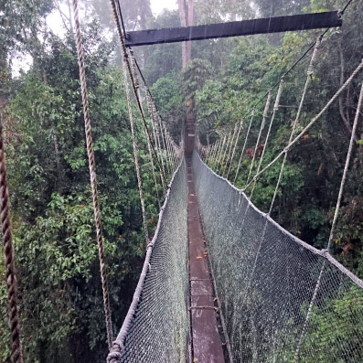

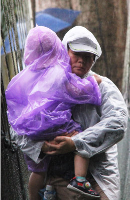

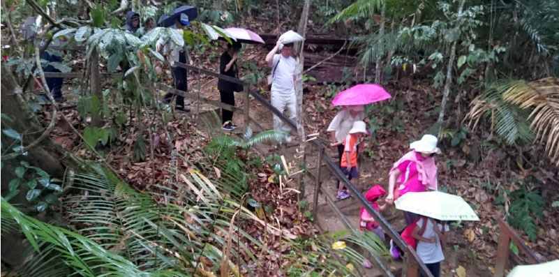

### 造訪清真寺觀修

*戒雅、戒惠整理*

別開生面訪清真

善財當年參外道

攝持善巧入廣行

助慧成就正遍知

土耳其是一個橫跨歐亞兩洲的回教國家，光是在它的經濟首都伊斯坦堡就有一千多萬人口。曾經在不同時期造訪過土耳其的伊斯坦堡，境內古蹟豐富，有數個歷史悠久且具份量的清真寺。人多自然不在話下，每當禮拜鐘聲響起時，人們便從四面八方走進寺中禮拜，不時聽見清真寺內傳來悠揚的誦經聲，迴盪在整個城市中。這是回教世界的初體驗。沒想到多年後，時空交替，竟來到另一個回教世界─東馬。

旅途中造訪的第一處景點，就是水上清真寺。東馬的氣候悶熱，這座清真寺蓋在水上，映入眼簾有清涼的感覺。外觀融合了現代建築藝術及回教風格，安靜的佇立在水上，在陽光的反射下，展現靈動的倒影。呈現出莊嚴的氣象。

進入寺前，所有參訪者皆需換上回服。男眾戴上圓頂帽，穿上回袍；女眾則包上頭巾，穿上回袍。蓮友們彼此互看，甚覺有趣。明明是佛教徒，卻穿上回服。換穿完畢，方能入寺參訪。進入寺內，龐大的穹窿圓頂，高聳寬廣的大殿，非常寧靜莊嚴。寺內並無偶像，沒有座椅，只有地毯供穆斯林禱告之用。伊斯蘭教對禱告（拜功）非常重視，並列入為五功之一。

穆斯林意為「順從真主者」，「實現和平者」。但為什麼傳教方式卻是「一手拿《古蘭經》，一手拿劍」呢？他們在傳教之初，於短短的一百年間便征服了橫跨歐、亞、非三洲的廣大領土，對穆斯林而言，這是宗教的力量；然而，穆斯林好戰的形象，卻從此難以從非穆斯林的腦海中抹去。

所謂的五功（即伊斯蘭支柱）是伊斯蘭教遜尼派所用的詞彙，指信仰伊斯蘭的所需遵守的五項基本原則。伊斯蘭教的五功要求穆斯林「唸、禮、齋、課、朝」，即「證信、禮拜、齋戒、天課和朝覲」。

•證信（唸，即信仰作證）：穆斯林要至少一次公開作信仰表白，念清真言。

•禮拜（禮，即謹守拜功）：一日祈禱五次。

•齋戒（齋，即封齋節欲）：齋戒月，從日出到日落禁食。

•天課（課，即法定施捨）：捐獻作為義務稅項。

•朝覲（朝，即朝覲天房）：至少一次到麥加朝聖。

通常在有生之年完成五功者，則可在其名前冠以「哈只」一詞以表明身份。

脫去回服，走出清真寺，從「回皮佛骨」，瞬間回到了「表裡如一」的佛教徒。心中不禁生出些許感想：

我們跟隨老師學習佛法，深知佛法的關鍵在人心。不在法上。引發出離心，菩提心，引發對空性的了解，這才是法住世的徵兆。惟有人去學習正法，體悟正法，弘揚正法，傳承正法，法才能住世。這叫「人能弘道」。

見到了伊斯蘭教戒律的嚴謹，對五功的要求。實在很慚愧。我們真該好好學學穆斯林對戒律嚴謹的態度以及在功課上的認真。把這樣的精神做為我們在世俗上利人的方便。正所謂：「三人行必有我師焉。擇其善者而從之，其不善者而改之。」世間的科技、財經，乃至於種種的物質文明，都是我們可以利益眾生的善巧方便。如果以出離心、大悲心和空性正見去攝持，這些世間利益眾生的能力都會轉成菩薩的廣大行。以廣大行資助空性智慧，使空性的智慧格外有力，能破二障，而成等正覺。這是法身常在，也是佛住世的本懷。三寶歌中，理能彰顯，蔽無不解。理能彰顯是說得正知見。得正知見最大的好處是能破罪，破惑。這叫理無不彰。蔽無不解是說所有過失，都能對治。從無大過、無小過，到不二過、無過。這是一個人藉著正法修學的行相。

我們的皈依法是因為皈依佛，皈依僧。法是由佛說，僧是護持正法的團隊。為了學習正法，就必須聽聞正法。聽聞正法就是觀待佛說，佛的傳承，以及修學正法的團體，方有自己的成就。三皈依是我們能破迷啟悟、離苦得樂最殊勝的外緣。且佛菩薩度化眾生，只能夠消災免難。惟有三寶合集的那一分，才能助有情破迷啟悟離苦得樂。這也是皈依三寶的理由。

如果好好了解他宗的教義，並觀修外道行相，作為佛法的流通。就像善財童子去親近許多善知識，有些善知識就是顯現外道形象暗作佛法的流通。再者，雖然是外道，也許有著佛教的見地，有朝一日，某個時節因緣一到，就可能整個翻轉。如同佛度化大迦葉等。時節因緣一到，就整個翻轉。且外道轉成佛教徒，往往比佛教徒更佛教徒。正因為有見地的緣故。

有些人學習佛法時，會心生歡喜，這也表示在往昔生中曾經沐浴在佛海中，有著歡喜心，而這樣等流心態會相續到下一生，下下生…，所以倘若這一生學佛有莫名的法喜，就是這種等流所結的果。因此，就要好好用功，才不虛此生。

外道皈依的是真主，而我們是皈依三寶。佛教入門有入三重門：一、皈依的門。二、無常之門。三、無我之門。所以有無常、無我的見地，是不會信外道。倘若只有皈依三寶，而沒有無常無我見地，那麼就很容易去相信外道。

事實上，外道也有許多過人之處。尤其廣大行。修學者知道如何取人之長，變成自己的特色與能力。去利樂有情。若能夠吸引外道度眾的善巧方便。把外道的善巧方便攝入自己的行持，以自己的大悲心成為能攝，利益眾生善巧方便成為所攝。這些外道的善巧方便也是所學，彼亦是修學佛道的善知識。就如同三人行，必有我師焉。他的善為我所取，他成為我的老師。他的惡成為我的借鏡，他也成為我的老師。然真正的善知識還是能助我解脫、成佛的善知識，這也是佛教的善知識與之不同的地方。如善財童子親近善知識是把他人的能力攝受過來，本身有著成佛的中心思想，故雖參訪善知識中有些是外道，但不妨礙善財童子成佛。

我們跟隨老師學習教理，定要深入教理中的內涵與義趣，才能有所覺受，在遇境逢緣時，經常串習與觀修。當境界來時，唯有靠正知見，才能對事情做正確的觀照，這樣的人在內可以破除二種我執，在外可以發展大悲心。在內聖的修學上，達到明明德止於至善，在外王的修學上，能親民止於至善。透過內聖外王的修學，成就佛的福慧兩足尊(內聖的修學成就慧的圓滿，外王的修學成就福的圓滿)。

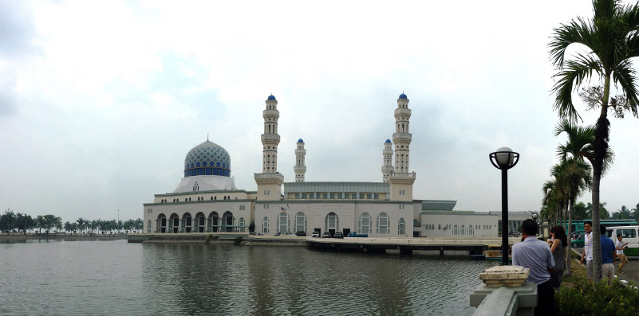

### 如何帶來生命的體悟
         ─從蝙蝠出洞說起

如何帶來生命的體悟

─從蝙蝠出洞說起

*禮悅整理*

境無體性隨人悟

團隊合作能生存

環境天敵無能障

走出無明業繫地

前言

姆魯國家公園是聯合國教科文組所列之世界自然遺產，除了熱帶雨林生態和尖峰石林外，其獨特的天然岩洞景觀，吸引許多外國觀光客搭機至此旅遊，其中最為特別是觀看幾百萬隻蝙蝠出洞一幕。

四月十三日下午天公作美，一行人沿著木棧道步行數公里，兩旁盡是熱帶雨林獨特植物，特別以為了適應生存環境發展成板根構造最為特殊，更有各類昆蟲，在燠悶午後點綴著小小的驚奇。

初抵鹿洞豁然開朗，眼前矗立著高聳石灰岩壯觀山壁，配以綠色林木，彷彿是一幅巨大山水畫。因曾是鹿的棲息地故而名之，目前是以蝙蝠為首的各類生物遮風避雨的處所。

鹿洞（蝙蝠洞）

走入洞中感覺十分奇妙，裡頭雖有數以萬計的生物種類與蝙蝠共生，卻出奇地安靜，可見對於浩瀚宇宙我們所知是極其有限的。洞頂隱約是密密麻麻，層層疊疊的蝙蝠，有各類品種，有大有小，不同種類間仍和平相處，耐人尋味，是否告訴我們不同宗教及種族間應該互助合作，而最殊勝合作，莫過於善知識能共住一起，組成團隊，修學正法，彼此和合共處互相增上，培育下一代，傳承教法，當生成就。

很難想像洞中住了二百萬隻蝙蝠，蝙蝠排泄物是許多生物賴以為生的食物，對生物而言糞便是香的，但對人類而言卻是臭的，故沒有本來是香的或臭的自體性，若有，則聞起來都一致認為香的或是臭的。再者，黑暗與光明無自體性，洞穴內雖伸手不見五指，卻是蝙蝠的光明，而相對於觀光客僅能仰賴手電筒微光小心前進。此外，有些環境我們覺得很棒，對某些人卻是苦不堪言，這除了說明苦與樂無自體性外，有些質地很好的人卻甘願輪迴，就算有人想拉他卻拉不動，因為彼甘願如此。如同請落後地區村民吃頓飯，他就心滿意足；再如，後段班同學每天混日子覺得很快樂，前段班同學卻覺得窩囊。故人要長進，力爭上游，非不求進步，自我感覺良好。而聖者出離心乃見到輪迴本質是苦的，有情竟以為是樂的，其原因在於當修行人有證量後，終於見輪迴本質是苦的，特別是見到富貴者、帝王乃至天人之苦，此種修行能耐是非常高的，而此見解非一般有情覺受。故修行本質在見地（內心真實看法），而非形式上很會修行，倘若遇境界仍是老觀念起煩惱，如何說有修行呢？

鹿洞與蘭洞那麼靠近，前者容納著數目驚人的生物居住；後者是幾百萬年大自然鬼斧神工的鐘乳石瑰寶，二洞同位一座山，為何是二個完全不同世界？當蝙蝠入住鹿洞就無蝙蝠想住蘭洞，就好比大家往都市發展，鄉下人口相對減少。當所有想法都朝向某個方向，則形成一股力量，稱為業力。業力分為別業（個人想法）及共業（大家共同想法）。釋迦牟尼佛可轉變某些人想法，但無法轉變大家共同想法，例如：釋迦牟尼佛無法轉變普遍回教徒想法。當一群人共同想法成為既定事實則業力大於佛力，如何令佛力大於業力？唯有依循善知識教誨，透過聞思修行，改變內心隱微想法。

蝙蝠出洞

想像中蝙蝠出洞是一群群蜂湧而出，幾秒鐘就結束，事實上卻是很有規律、次第一整團一整團飛出，且飛出後先盤旋向上，再如龍般飛出去。為何能如此有秩序呢？想必洞中應有一隻能力非常高的蝙蝠王。《地藏菩薩本願經》中，釋迦牟尼佛說除了禮拜佛外，也要禮拜轉輪王，因為轉輪王以教化統理世界，就如同蝙蝠以倫理關係來維持全團生命。五倫關係乃聖者觀察大自然生存之道，絕非對眾說教。大自然生存之道若講究倫常，即便渺小蝙蝠都可抵抗天敵及環境不順遂與各種天氣變化，而好好生存下去；若無法維繫倫常，就算國家都維持不住，種族都可能被滅。所以為什麼全世界四大民族只剩中華民族，實乃倫理關係之思想令民族存在。

再者，蝙蝠飛出來除了很有秩序外，相信它們也是按照輩分倫常關係。記得曾經至寮國供僧，各寺院出家眾前來托缽，有一龐大隊伍等候多時，卻停駐不前，令人百思不解，後來又有一隊僧眾出來，前面那一隊伍才跟隨其後移動，原來寺廟間是有輩份關係講究禮讓，這種禮儀表現出僧團的威儀氣象，正顯示出釋迦牟尼佛放掉王位，無政治實權，如何面對龐大婆羅門教主宰印度數千年，包括：生活起居、婚喪喜慶等，而能改變時代？釋迦牟尼佛靠的是團隊。當一群比丘出來後，如蝙蝠一樣有長幼尊卑次序，且威儀嚴整，帶來整個印度震撼及矚目，願意將最好食物提供給僧團且很多人願意跟隨學習進而改變其想法，當想法改變整個印度宗教就改變了，整個印度思想就從本質上發生變化。

此外，二百萬隻蝙蝠出外覓食，都要吃飽回家，又會有多少昆蟲犧牲呢？而這戲碼每日都在上演。去想像菩薩發心，面對如此多變化及危在旦夕有情在無常中不能脫困，所以想到除了為其皈依外，最重要的是自己能成佛。

但從另一角度而言，就算佛力無遠弗屆也阻擋不了眼前蝙蝠捕食昆蟲，例如：釋迦牟尼佛往昔在菩提樹下見大吃小內心其實非常感慨。當業力成熟佛也沒辦法，佛厲害在改變業力未成熟。看蝙蝠出洞，如《唐詩》〈贈歌人郭婉〉中的一時惆悵望梁塵，望著天空無法想像，只能眼睜睜看著今晚許多昆蟲死在二百萬團隊中覓食，且日復一日，年復一年。當不想出離輪迴，佛也沒辦法。故佛力殊勝與否，關鍵在此人想不想改變命運脫離輪迴。常言：某人業障重，什麼叫業障重？若貧窮、生病是業障重，那顏回就是業障重；若做事常被阻礙是業障重，孔子就是業障重；若受魔難即業障重？那麼釋迦牟尼佛就是業障重。所謂業障重乃根深蒂固想法從未因學佛、修正法或善友聚會而改變！

看到蝙蝠出洞，何嘗不是釋迦牟尼佛帶比丘僧團出去托缽，蝙蝠乃出去覓食昆蟲，而釋迦佛及僧眾乃與眾生結善緣。當聚會一群八千證果比丘、六千比丘尼及諸多新出家眾，此龐大隊伍要維持其吃住、生活起居多麼辛苦，若不是靠教法、紀律、法喜，釋迦佛如何經營出佛教偉大氣象！

今日有幸參與團體觀看世界聞名奇景，除了同與一般觀光客或是目瞪口呆，或是嘖嘖稱奇外，更不同的是作了一場美好的心靈饗宴，而諸多發人省思的想法也是善知識透過讀萬卷書行萬里路，長期積累經驗閱歷，聞思修經營孕育成果，每一個觀點皆得來不易。吾等有幸站在巨人肩膀上，才有能力看得更高、更遠、更深入。安立美好觀點名言也是觀待能說與所說，假設今日不是對著所說（例如：耳根有問題、語言障礙、聽不懂內涵或是不認同者），如何成立能說？或者雖有所說，但能說者或是因緣不具足亦不成立。當能說與所說一時條件具足而成就不可思議的感動。有了前面的感動才有後來的法喜，有法喜才有源源不絕的善法造作，有善法造作才能凝聚更多的共識，如同漣漪般向外擴散與影響。相信這是個人存在的意義，也是團體存在的價值，更是國家世界長治久安的基礎。

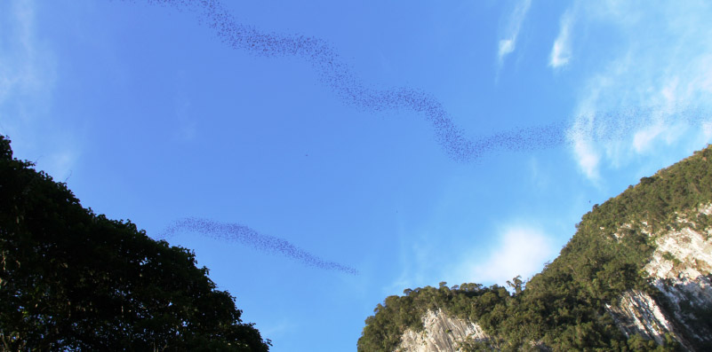

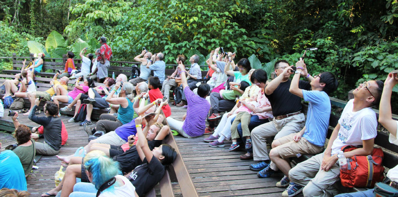

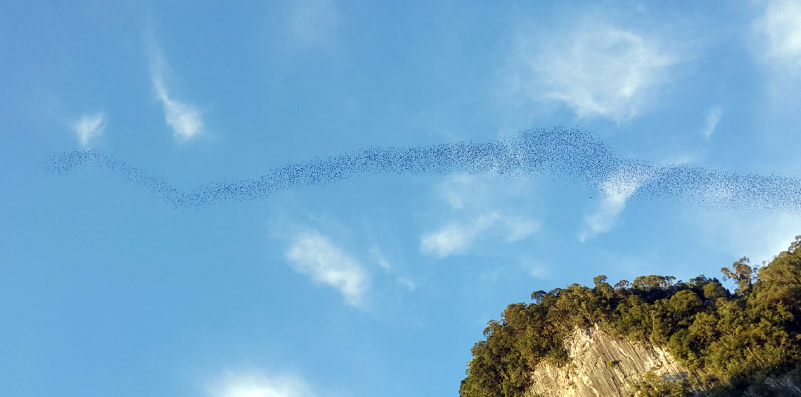

### 寄居蟹
	─東馬砂勞越ＢＡＫＯ國家公園遊感

寄居蟹

─東馬砂勞越ＢＡＫＯ國家公園遊感

*心思整理*

可嘆寄居名利殼

利他空慧真所依

十地寄報人天王

能寄所寄性空寂

於二O一六年四月九日至四月十六日學會參訪馬來西亞的八日行程中，第七天的活動安排是到砂勞越BAKO國家公園，此公園是砂拉越最古老的國家公園，內含豐富多樣的植物群落和植被類型，及許多幽僻的峽灣和崎嶇的海岬。上午屬於健行方式走訪BAKO國家公園，趁此可以認識沙勞越各種植物林相及野生動物的生長環境，在老師領導下與蓮友們一起爬上陡峭的岩壁，一邊在高點遙望著的南中國海，一邊吟詩聊天，下午則是搭船前往公園的另一峽灣，在靜謐的海灘戲水，坐臥在岩石邊，聽著老師因為余先生撿來一堆寄居蟹，而與學長們進行了一場精彩觀修。

每一種生物都有彼對於環境的適應性，寄居蟹雖然看起來沒什麼，但對我們來講，待一個下午就想離開的環境，卻是寄居蟹終其一生所處的地方。人類站在寄居蟹面前，一腳就可以把牠踹出去，但是寄居蟹可以住在這裡，我們卻沒辦法在此生活，牠們這麼的渺小，被人類抓來隨意的玩弄，牠們的一生也是極其無聊、沒有意義，一生所為就是身體變大，重新找房子，身體又變大，再重新找新的殼，隨時都活在無常的危險中。

但吾等人類就優於小小的寄居蟹嗎？其實我們跟寄居蟹沒有兩樣。我們是背著房子的寄居人，房子本是用來休息的，可是有很多人，把買房子、裝潢房子，住進舒適的房子當成人生最有意義的事情，當他終於變成有殼一族時，就會帶著殼往前走，這就是人類寄居蟹的形象。

今天我們在此向寄居蟹宣說這個道理，寄居蟹會因為我們宣說佛法要義的因緣，或可以脫離寄居蟹的畜生道或投生到人道，並且能碰到正法，為什麼呢？因為觀待牠讓正法生起的因緣，所以容易投生到人道又碰到正法，就像我們莫名其妙地聽到佛法，莫名其妙地喜歡佛法，必有前世因緣。眼前的寄居蟹過去生必與佛法有緣，才讓我們這一群人，千里迢迢花了一筆旅費，坐了三趟飛機，終於來到東馬的海岸上來跟牠見面，那個業在生起的時候會讓人感覺莫名其妙。

我們人到底要寄居在哪裡才是最有意義的寄居？看寄居蟹寄居殼內，竟然變成牠生命裏最重要的事情，因為寄居在殼中才有安全感之故，同樣的，我們要寄居在哪裡才是真正的安全？每一位有情內心隱微處都想要離苦得樂，希望痛苦愈少愈好，快樂愈多愈好，所以會想成家、組成團體乃至於國家，都是為了要有安全感，為了離苦得樂，所以我們每一個人都是不同型式的寄居蟹！有的是寄居無形的殼，有的是寄居在有形的殼裏。

有情都想保護自己，不讓痛苦發生，盼望快樂延續下去，但我們卻用最弱或最笨的方式來保護自己，我們寄居在惡業上，寄居在無常上，寄居在三界內，殊不知《法華經》上說三界無安猶如火宅，眾苦充滿，甚可怖畏。

若選擇寄居在善法上，寄居在善知識的團體裡，寄居在正法的觀修與修學上，寄居在空性的觀修上，這些的寄居才是幫助我們得到短暫的安樂乃至究竟安樂的寄居。

寄居有因寄居跟緣寄居，因寄居是對正法的觀修，或安住在無常、無我的意境上。緣寄居是寄居在正法團體，及三寶的加被上，如此寄居才是最殊勝的寄居，而非找一個房子寄居、找一個結婚對象結婚的寄居，這些有為的事相被無常所攝，只要無常風一吹來，全歸破滅，人生的努力，經不起無常風一吹全垮。

經上所說的十地寄報，就是初地到十地的菩薩，寄居在現證空性的智慧，從初地到八地，破煩惱障，從八地到十地，破所知障而成佛，菩薩最殊勝的寄居就是空性智慧上的寄居，空性的智慧變成他最隱密的證悟。想法改變業就改變，想成佛也得先將世俗的想法改變，想法不改變，就永遠是這副德性，《佛說四十二章經》喻如磨牛。

啊！成功和失敗都在一念之間的轉變。

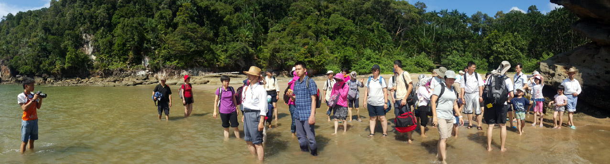

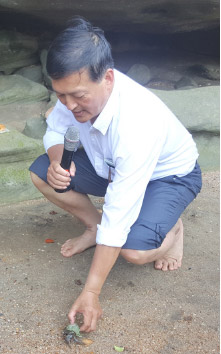
