# 第107期

## 社論

### 用共住經營共中不共的淨土

本刊

里仁為美共住義

互助合作道義合

教育農業所經營

大同理念園區現

近幾年來臺灣社會動盪不安，政治對立、協調對話機制停擺，民生問題百出；政治情勢實乃吾等無能為力，但生活問題應是尚有餘力解決。最近許多人關心的食安問題即是一例，古有云：民以食為天，顯示出飲食對於人的重要性。曾幾何時，如何吃得安心竟也成為問題。與糧食相關的還有耕地問題，當前的臺灣，可耕農地面積正逐漸下滑，糧食自給率屢創新低。凡事仰賴進口，代表臺灣得要看其他國家的臉色，若逢全球性天災人禍，我們又該何去何從？再者，高齡化社會也正困擾著我們，臺灣人口老化速度世界第一，二○一○年，臺灣總生育率甚至跌破１％，即是臺灣女性一生平均生不到一個小孩。對年長者來說，老年生活如何經營必須盡早規劃，而對年輕人來說，照顧長輩也將成為難以承受的重擔。最後，最令人憂心的是，傳統文化的式微在臺灣已成趨勢，如何經營出文化的風采走入時代，令人耳目一新，是巨大的挑戰，也是吾人必須扛起的使命。

多年以來，共住一直是本會發展之重點項目，研擬了不少計畫與方案。然而這幾年間，無論是臺灣的社會潮流，兩岸間的文化消長，乃至於自然氣候與國際情勢的轉變，皆與昔日非同日而語。科技物質的進步，使我們處在一個最壞的時代，卻也是最好的時代，面臨諸多可能的危機，我們是否應該開始採取行動？放眼國際，展望未來，用共住為自己找到出路，也為下一代找到出路。

過去共住概念是以一棟大樓為基礎，結合講學、共修、居住等等功能，期望發揮團體共同增上，更期能收改變社會風氣之效。但反觀學會成立以來，也未見能夠轉變鄰里幾分，又因上述種種危機逼近，我們必須有更具前瞻性的構想，才能突破困局，量身打造理想的共住環境，使老有所終，壯有所用，幼有所長，共同展望未來。以下列出四點：

一、社區營造，打造文化新市鎮

對比過去的大樓式共住難以凝聚共識，若以社區方式共住，不僅能夠滿足共學的條件，也較容易符合每個人的生活需求。更重要的是，經營共住大樓難以扭轉當地風氣，但地方性、區域性的經營則可以融合社區，也能造成社會話題，樹立典範。

二、有機農業，無毒健康又安心

就著食安層面，如果共住能夠結合有機農業自給自足，讓所有人吃得健康安心，也可為臺灣日漸萎縮的農地，貢獻盡一分心力，保留一片淨土。

三、銀髮生活，用工作賺回青春

面對超高齡社會的到來，青壯年的劃分與退休生涯應重新定義。從日本上勝町的經驗告訴我們，穩定的工作不僅帶來財富，更能帶來健康。故共住社區中三代同堂、四代同歡的大家庭生活，能讓銀髮族有所依歸，發揮長才。

四、人際活絡，不必當三等公民

無論是共學、共住的文化市鎮，還是有機的農村生活，彼此互聯的人際網路，皆能裨益身心，讓生命活得更有風采，不必終老一生於養老院。

如將上述的因緣仔細觀察，似乎有一個辦法能將把一切串連起來，那就是以小鎮為軸心來經營共住。臺中市東勢區有著優越的自然地理環境，好山好水，利於農業發展；民風純樸，利於文化之推廣；遠離塵囂，置產負擔較低；交通四通八達，生活機能充足等優勢，最為關鍵的是有著經營多年的當地人脈，有利各項事務順利推展。所以如果選擇東勢作為推動共住的地點，可謂佔有天時、地利、人和之便。

為此大事因緣，本會也已於八月底正式邁出第一步，組織團隊前往屏東仿生科技農業公司進行考察，仿生農業是時下最先進的有機農業技術，已有多國學者前來觀摩，本次參訪收穫頗豐，未來亦不排除更進一步的合作，也積極尋訪其他可能的機會。因為，身為文化的傳承者、推動者，更應該要了解時代、運用時代，以文化道統為核心，結合現代科技的方便，經營出多采多姿的文化事業，不僅讓人在生命上有出路，慧命上更具資糧，用共住發揮鄰里鄉黨的教化功能，並協助青年人的事業發展，這樣的共住才格外具有意義。

和合圓滿的共住需要你我的參與，雖然諸法體性畢竟空寂，但是更重要的是要觀察如何緣起而生，唯有觀待能「住」、所「住」以及依著能住所住而有的「住」，才能生出一切共住之法，可謂不住不有，而所有共住的美好功德都觀待「共住」而生起。今天不做，明天會後悔，面對越來越緊迫的時代危機，我們更應積極造作，別讓未來的自己嘆息。

## 佛學覽幽

### 菩薩清淨的行持
       —華嚴經淨行品（二十三）

菩薩清淨的行持

—華嚴經淨行品（二十三）

*戒慧講述‧編輯部整理*

舉手投足合義理

從心所欲不踰矩

願力悲心空慧攝

自性空中入世俗

丙二、指事顯因答其徵因

丁一、總徵

丁二、別顯

戊四、將行披挂時願（有六願）

捨座之後，開始準備要下足、舉足、著衣，起身盥洗之後要出門乞食，這是將行披挂時願。披是指著僧伽衣，挂是指正在著衣，同時配戴著需要用的器具，會性法師說是穿挂子。挂的另一個解釋是身上配備的行囊、缽等。

修行人的搭衣以及身上挂的法器，都是表彰他修行的功德，成為有情的福田，即使修行人出去托缽行腳時，穿的衣服很破爛，面對眾生絕對不可以生起他是可憐的面相，道源老和尚也說，托缽制度在中國無法盛行，是因為中國人認為是叫化子，佛所流傳的托缽制度在東南亞還在盛行，修行人以這個方式來利益有情，示現為殊勝的福田，讓有情在殊勝的福田中種下善種，開啟他美好的一天。

己一、下足

經文：

下足住時，當願眾生，心得解脫，安住不動。

在西晉聶道真的《諸菩薩求佛本業經》的版本：「菩薩足蹈地時，心念言：十方天下人皆使住安隱，不復動搖。」吳支謙所譯：「下床當願，一切眾生，履踐佛跡，心不動搖。」《六十華嚴》：「下床安足，當願眾生，履踐聖跡 ，不動解脫。」

以心得解脫，安住不動這一分，首先以大乘菩薩而言，八地叫不動地，由菩提心攝持而能破煩惱障的這一分，是大乘八地菩薩的安住不動。以究竟來講，履踐聖跡，不動解脫，是能如實行佛所行的路，能以不起定的方式來利益有情，來說明究竟的安住不動。

《楞嚴經》上說：「妙湛總持不動尊，首楞嚴王世希有。」不動就是不出空性定(在楞嚴大定中)，以不起定的方式來利益有情，所以是「那伽常在定，無有不定時」，就是種種的菩薩行都以定力攝持，這一分的功德只有佛能生起。是故，菩薩願自己有佛的能力與功德，出定時也希望像佛一樣不離開這空性定，行住坐臥皆在定中，即使身出定，心也能不出定，那是佛的證量。

己二、舉足

經文：

若舉於足，當願眾生，出生死海，具眾善法。

《六十華嚴》：「始舉足時，當願眾生，越度生死，善法滿足。」

配合著兩篇來看，所謂出生死海，基本上必須要破煩惱障，這是就上求、自力的部分。所謂具眾善法，是以菩薩的六度萬行利益一切有情，善的定義是來自於利他，利他的體性才能成為善，所以《了凡四訓》中的積善之方，有讀書人與中峰國師辯論何為善惡，凡是有利於己的都是惡，凡是有利於人的都是善，所以具足善法就是具足利益有情的善法。

出生死海的部分是自行，具眾善法是化他，菩薩為何要在舉足的時候當願眾生出生死海，具眾善法呢？舉於足就好比離開某個境界，舉於足代表能出生死輪迴的大海，每一步路都觀想能出生死的大海，每一步都觀想是利益有情。所以蕅益大師的《寒笳集》講：辦一件事情不足以自利利他，這件事情不辦，說一句話不足以自利利他，這句話不說，動一個念頭不足以自利利他，這個念頭不動。所以走路的時候就觀想出生死海，再進去幫助有情。雪公老師說沒有一個人真正認識自己，問問自己會走路嗎？會吃飯嗎？以這樣來問自己，走路的體性都能轉成無漏叫做出生死海，體性轉成善法叫做利益有情，連走路體性都可以轉成無漏的善法，所以哪可小看走路這件事情，那是大事。

己三、著裙

經文：

著下裙時，當願眾生，服諸善根，具足慚愧。

西晉聶道真的版本：「菩薩著泥洹僧時，心念言：十方天下人皆使撿持功德，悉愧於世間諸所有，早令得佛道。」六十華嚴：「披著衣裳，當願眾生，服諸善根，每知慚愧。」吳支謙的版本是：「著裳當願，一切眾生，當知慚愧，攝意守道。」

此處的著裙或著下裙，如剛剛提到的泥洹僧，解釋為內衣。也就是著內衣時，當願眾生能夠服諸善根，具足慚愧，因為內衣可將身體作遮掩，意指我希望透過慚愧的修學法將善法隨時提起。

而慚與愧長什麼樣子？約自說是慚，約他說是愧，慚約自是指將善法拿來檢視自己是否做到，以佛菩薩的功德跟自己來比對，產生一個非常愧疚的心態，生出反省的能力，希望見賢思齊的那一分就是慚的力量。所以慚愧在《百法明門論》中，是對治無慚、無愧的中隨煩惱，是一切善法的開發，因為唯有反省才有善法的發展，沒有反省能力的人是不可能開展善法的，慚愧就是反省的能力。在儒家說是恥，佛家說是慚愧。

愧的形象則是約他的部分，針對別人對自己的批評，拿來檢視、檢討自己，對輿論的力量或是團體所設的規矩，都有約束我的力量，都有指正我的資格，我是可以被人家調教的。修行人久了以後容易油條，不易自我反省，他人也不可以指導我，修行的年資越久架子越大，沒辦法生起慚愧，這樣修學佛法沒有任何的功德可言。

此章要就印度或東南亞來講，出家人都只有用布遮身體而已，下半身用布圍起來這叫裙子，上半身用布搭起來作袈裟，外面再穿上福田衣，所以著下裙就是穿裙子，將身體遮掩，生起慚愧的心態，所以是結合服諸善根，具足慚愧來說。

以具足慚愧與服諸善根的關係而言，具足慚愧是指能見賢思齊、接受調教，這些皆是能將善法正確的義理取來學習、改進，從這一點來講即是服諸善根。唯有具足慚愧才能服諸善根，有反省能力的人才能在善法上有體悟與實踐力，善法的體悟及善法的實踐都必須要內化成為他的反省，所以服諸善根才會具足慚愧，具足慚愧才會服諸善根。了凡先生說：未論行善先需改過，未論行善就是服諸善根，先需改過要具足慚愧，改過之後必能積善以利益眾生，也就是具足慚愧、服諸善根這二者是相互觀待的。

己四、整衣

經文：

整衣束帶，當願眾生，檢束善根，不令散失。

西晉聶道真的版本：「菩薩繫帶時，心念言：十方天下人皆使結諸功德悉令堅。」吳支謙的版本是：「結帶當願，一切眾生，束帶修善，志無懈怠。」六十華嚴：「整服結帶，當願眾生，自檢修道，不壞善法。」

藉著整衣束帶時，透過將衣帶拉緊的這一分，提醒自己串習所學過的教法、義理不令散失。整衣束帶，就像善根把自己約束起來，善根即是對教法有勝解，以善根約束自己，讓自己不離開善根之外，要保持對佛法的體悟，包括行善的動機、利益有情的方便、對法義的觀修等都屬善根。

學佛之人很容易散失掉對法的體悟，比如教法學了以後，書本一闔起來又回到原點，想法還是跟世間人沒兩樣，就像《天台四教儀》中所說的「不變凡情」，意指凡情經過學教法以後，從來沒有變過，學完教法以後該怕死的還是很怕死，該對善法提不起勁的還是提不起勁，該起煩惱的一樣起煩惱，在他身上完全看不到他學過教法的軌跡，這就是不變凡情。也如《佛說四十二章經》中所說的「無如磨牛」，牛每天都很用功、很精進的在犁田走路，可是卻整天在原地走，我們學教法也很用功，每天都在學佛，但是想法卻都跟世間人沒兩樣，得不到的時候照樣落寞，遇到逆境的時候照樣發火，遇到順境的時候照樣生貪，從我們身上看不到學佛的味道，檢束善根，不令散失這點有多麼的重要，讓自己保持著對法的體悟，讓對法的體悟在自己的身心上生起，讓別人看到我們學佛的不同，整衣束帶時要有這樣的想法。（下期待續）

### 大乘百法明門論簡說（十五）　拾、心法—八大心王(五)

*戒慧講述‧淨本整理*

應觀法界唯心造

唯識承許無外境

中觀主心能造作

了不了義待論師

論文：

第一，心法，略有八種：一、眼識，二、耳識，三、鼻識，四、舌識，五、身識，六、意識，七、末那識，八、阿賴耶識。

依據前面各表的說明，能夠對於八識的現象及作用有基礎的瞭解，接著對八大心王作一整體說明。

《百法明門論》心法在第一位，因為最為重要，唯識宗認為萬法的體性是心識，稱萬法唯識，並以一水四見論證，水的體性若不是心識，為何鬼看是猛火、魚看是空氣、人看是水、天人看是琉璃，可見境界的體性是心識，因此六道中不同的心識變現不同的外境，心外無境；但中觀宗則認為，心是造作者，不是變現者，境界唯名言生起，也就是心識過去所造作的業，使吾人不得不然以這樣的方式納受眼前的境界：當你是人，就以水相來納受；若是鬼，就會以猛火的方式納受。善業的人，可以納受樂境；惡業的人，則是納受苦境。但無論是萬法唯識，或者境界以名言的方式生起，都告訴我們境界的轉變在心。既然轉變唯心，心又為吾人所掌握，可見命運操之在己，怎可怨天尤人。

心如何能改變外境？當苦、樂果報生起時，心態改變能使苦不那麼苦；樂也不會令人放逸怠惰。此外，當所造作的善業夠大時，即便進去痛苦的世界也能顯現快樂，如觀音菩薩入火坑則轉為蓮池。孔子也說：「飯疏食飲水，曲肱而枕之，樂亦在其中矣。」可見萬法唯識，或者萬法只能以名言的方式生起。至於唯識或中觀何者為了義之說，需要論師的抉擇。

八識都有它獨特的行相，稱為「識自相」，例如眼識有它自己的功能，不會跟耳識混亂，而這些行相都是心的作用，不是心的本體（心性）。蕅祖《百法直解》說：「心性離過絕非，尚不可名為一，云何有八？若論相用，浩然無涯，今就有情分中，相用最顯著者，略有八種。」

心性是心的體性，亦即空性。離過絕非，是指離四句過與絕百句非，旨在破除執著法有自體性。凡是舉出一對事物，都能將之分為四句：正、反、雙亦、雙非，例如上述心識與心性，其四句可為：二者是一、是異、是一是異、非一非異。邏輯上一與異就包括了全部，因此不是一就是異，一與異是相違的兩法，並不存在「是一是異」，也沒有「非一非異」，所以離四句過，其實只有離兩句過，而四句過都是執著法有自體性的過失，稱為根本四句，根本四句的每一句，都還可發展出四句，例如心識與心性是一的概念之下，又發展出是一、是異、是一是異、非一非異的執著，稱為枝末四句。

四種根本四句的枝末四句，一共是十六句，十六句都有過去、現在、未來三時，共計四十八句，四十八句又各含已起和未起，所以一共是九十六句，再加上根本四句，此即所謂的百非。因此離四句、絕百非，都是要離絕法有自體性的執著。

心性為何不能名之為一？此應從心性與心識是一或異論起，才能了解為何心性不能用言語形容。心性與心識如果是一，那何必分心識與心性，且若心識就是心性，見到心識就等於見到心性，就可解脫，何必再修空性？例如茶杯跟茶杯的空性如果是一，在茶杯上就可直接照見空性，那將不需要般若的修學與講述，任何人都可直接證得空性。若異，二者成為無關，任何人都不可能在心識上證得心性，不同法故，明心應該不能見性。因此心性跟心識是一也不可得，是異也不可得，一跟異包括了一切，所以心性與心識只是名言上的關聯，就心識上的空性，名言安立為心性，並不是別有一個實體的心性存在，所以心性不可名為一，一就是有自體性，尚且不能名為一，何況說八？此處的八識，是就顯現的相與作用來安立。

心性是心的體性，而當心性都沒有自體性，心識當然也沒有自體性，無自體性的意義，就是指存在無限的可能，吾人希望多好就能有多好，希望多壞就能有多壞，所以《論語》上說：「我欲仁，斯仁至矣。」

既然心性沒有自體性，且空性是無法形容，所以經論上說：「開口便錯，動念即乖。」任何名言都是對著有才能作詮釋，對著沒有的東西則無法詮釋；而對著沒有的東西，無論怎麼去想，也無法取其形象，所以叫做不可思議。

體性不可得，相用則浩然無涯，心有無量相、無量用，不過依據分類法，把它分成八類，名言安立為八大心王。看的功能稱為眼識、聽的功能稱為耳識、嗅的功能稱為鼻識、嚐的功能稱為舌識、觸的功能稱為身識、思考想像等功能則稱為意識、執我的功能稱為末那識、儲存一切法種子的功能稱為阿賴耶識。

某些修行人，例如阿那律尊者，依著佛教他的樂見照明金剛三昧修學，練成半頭天眼(半顆頭都可以看)；又例如四禪天所用的是體呼吸，即全身都可呼吸。由是可知八識只是名言上的分類，不是自體上的歸類，如果是自體上的歸類，怎麼修也不可能使頭變天眼，使身體能夠呼吸，所以說相用浩然無涯。

八識中眼識緣色塵、耳識緣聲塵、鼻識緣香塵、舌識緣味塵、身識緣觸塵、意識緣法塵，前述當心性都無自體性，心識當然也沒有自體性。此外還有許多論證心識無自體性的方法，例如眼識緣色塵，若眼識有自體性（可自己成立，不必觀待色塵及眼根），那麼眼識的成立是在色塵之前、之後或者與色塵同時生起？凡是有自體性，必定只有這三種可能。

眼識若在色塵之前，則不必外境也可生出眼識，就如不必青色就可以有見青色的眼識生起；倘若眼識在色塵之後，則表示色塵已滅眼識仍可生起。所以無論眼識在前或在後，都無可能。是否眼識與色塵同生？若同時生而且有自體性，那表示眼識不需要色塵也可以獨自生起，同樣違背事實。由此可知，眼識緣色塵，是色塵藉著眼識生起色塵，眼識藉著色塵生起見色塵的眼識，二者同時生而無自體性，八識皆是如此。

第六識緣一切法，包括過去法、現在法、未來法，屬於法塵。法塵會以宛然色塵、聲塵、香塵、味塵、觸塵的方式顯現，所以說是前五塵謝落的影子。比如想念某人，想像中會以色塵方式顯現，但卻不是色塵，否則旁人應該都能見到。

第七末那識緣阿賴耶識，末那識就是執我的心識，是緣阿賴耶識的見分為我。唯識宗認為，善業會結成樂果，惡業會結成苦果，那麼善、惡業必定有存放之處，否則如何結果？前六識是無常法，有生有滅，而且時常不起現形，因此無法存放善惡種子，第七識僅有執我的功能，所以必須要另外安立存放善惡種的功能，此即阿賴耶識，為心識最微細的功能。

若依護法論師的四分說，八識都有見分、相分、自證分跟證自證分，例如眼識的相分是色塵，眼識的見分是緣色塵的能力。色塵之所以成為眼識的相分，是指影像相分會隨著吾人的眼識而變化，對於一個有青色色盲的人，青色在他眼裡無法表現為青色。而阿賴耶識的相分就是根身、器界、種子，根身就是正報（身體），器界就是所依存的環境，阿賴耶識能夠生起六道的正報、依報，因為當中存放了六道的種子；阿賴耶識的見分則是指能緣相分的力量，因為有緣住它的力量，才能夠生起各道的六識去受用這些境界，倘若沒有能緣的力量，人道的六識就沒有辦法受用人道的境界，所以末那識緣阿賴耶識的見分執為我，就是將其能緣的力量認為是我。

以上是八識的說明，而太虛大師在北平華北居士林講述《八識規矩頌》，他是先說明第六識，再說明前五識、第八識，最後說明第七識。之所以順序不同，因為前五識由第六識主宰而生起，故先說明第六識，再說明前五識，而前六識以及前六識所緣的環境，都是由第八識所生起，而且每一個人的第八識都是橫遍十方、豎窮三際，理由是第八識可以變現六道，而且有情間的第八識交互相徧，同類相似，所以當我們同樣在人道時，可以一同見到人道的境界，既然交互相徧，何必對著自己的第八識執著是我，所以太虛大師最後論第七識，第七識就是因為執有自他之別，而忽略了第八識彼此的交互相徧，沒有自他物我的隔別。以上八大心王解說至此。（下期待續）

### 佛學概要十四講表簡說（九）　第一講表

*戒慧講述‧法味、淨昌整理*

百卷般若從能破

龍樹中論宗所破

觀待所破有能破

菩薩造論巍巍功

法的總相

總相即是萬法概括性的總貌，共通的準則。因明學稱吾人僅能以總相的方式來認識別相，無法透過其他任何方式。譬如吾人認識樹之概念，樹即為總相，雖樹中尚可分成非常多的樹種(樟樹、松樹、杏樹等)，分出大小(大樹、小樹 )，總而言之，樹即是總相的認識。

心識前所呈現或大樹、或小樹，或數量百千棵，或者柏樹等不同的樹，僅係所認定之範圍不同，然亦皆以總相方式認識。柏樹是總相，而柏樹當中的大樹、小樹也是觀待小才有大，觀待大才有小，大的自體性尋覓不著，而小的自體性亦無。吾人僅能對著小說大而認識大樹，對著大說小而認識小樹，而小樹又有很多高低參差不齊的小樹，不斷的逼近，從樹、柏樹、大樹一直定義到終於抓到這棵樹，依舊是總相之方式去認識這棵樹，此樹亦由樹幹、樹葉、樹枝等組成，方名為這棵樹。故結論是每一法皆透過總相去認識別相，總相是觀待別相方有它，何來的自體性？觀待總相才能安立別相，別相又何來自體性？

雖然每一法皆以用總相的方式去認識，然則此無量無邊之萬法，又有一共道之總相，其相為何？空相。何以故？因所有一切法的共通原則，推到最後就是空相。

尋覓世間，無有一相能涵攝所有萬法，因塑膠非樹可含攝；不可名之曰塑膠，因木頭亦非塑膠可含攝，唯有空性，才能成為萬法的總相，因為萬法的體性是空，體性之相是空。其他有哪個法能成為萬法的總相？覓之不得。故，諸法的空性是諸法的總相。

何謂空性

述記云：「一切諸法，因緣所生，空無實體。」一切諸法，皆從因緣所生來，亦即一切法皆由因緣所生，由於因滅果生，而因已無自體性，所生之果又如何成立實體性？

諸法生起，有兩種方式。其一為因緣所生，其一為非因緣所生（合名為緣起生）。所謂因緣法，是因滅果生，因緣滅了以後，果才生起，例如蘋果種生蘋果即是因緣法，因緣所生之蘋果。至於非因緣所生則是觀待而生，例如，左方是觀待右方而成立，而右方則是觀待左方而成立。當稱左方時右方未滅，是以緣起法可包括因緣法與非因緣法，故諸法為緣起所生，但未必是因緣所生。

然則上文改為「一切諸法，緣起所生，空無實體。」豈不更佳？有為法之生起，依因仗緣而生。一旦通達因緣法皆無自性，亦可同理而推知緣起無為法之無自性。如眾所周知因緣所生法，因緣滅，果才生。因緣滅而生果，因緣已滅果如何生？譬如蘋果種子生長，最後結成蘋果，蘋果種子滅而蘋果生，因緣滅，果才生。如因緣未滅，果即生，則屬因果同時。如因果同時可成立，如何知此為因彼為果？

其次，已成立因滅果生，唯因已滅，如何生果？現實上，的確見到已經滅的東西，才能生果。因滅果生，因這一法既然已滅，其自體性何在？同理所生起之果亦無自體性，果生有自體性則不必待因滅。如果因滅是有一自體性滅的話，所生之果應無關於因，因為「因」的體性已被滅故。故因滅無自性，果生亦無自性，如此而知兩者僅為名言關聯，無實體性之關聯，且無有自體性之法為因，亦不可能生出一有自體性之法為果，故知因緣所生法，無有自體性。

而因緣所生法，屬於可被顯現的有為法，都尚且無有自體性，更何況非因緣所生的緣起法，以及無從指陳之無為法(屬緣起法)，又豈有自性可得？故知「一切諸法，因緣所生，空無實體」，同理亦成立「緣起所生，空無實體」。此為佛法中最重要之概念，一切法的總相是空，係基於上述推理成立的空相。

一般世間人認為佛教之空性，大多誤會為譬如有一個瓶子，以榔頭擊破謂之空。而煩惱像雞蛋，學佛是用石頭「啪」一聲的把煩惱打破，以此種概念在說空。惟眾生現見萬法真實存在有，如果學佛是以榔頭將其擊破說空，一般人就不可能學佛，而一般人害怕談空，寧可保住瓶子。但真正佛法所說之空，並非擊破萬法，只是尋覓萬法之本質，並未否定其現象。

孔子於《易經》〈繫辭傳〉所述：「易無體而神無方」。「易無體」即是《易經》所述變化之道無有體性，而「神無方」即是覓心了不可得，也就是禪宗所探究之心性。傳統中國儒、釋、道三家並稱，實則儒家已經包括了道家形而上的義理。再則《易經》中所述玄妙、吉凶禍福之理，即已包含入世間之理。故儒家不但包括道家形而上之理，及如何入世進退應對、趨吉避凶。是以一般世間所稱學形而上要學道家，學形而下要學儒家，應知其論大謬矣。

述記云：「每一法既為因緣和合所生，則每一法為一和合相(集合團)」，現代科學家所發現之物質，最終係由原子堆積而成，是以每一法皆是因緣和合而生，稱每一法為一和合相，亦即萬法所生起的果相，是和合許多法而生起之果相。因緣所生的果，亦非僅有一相，亦是和合相。以電視為例，吾人現前所見電視，其實亦由眾多零件組合而成，如面板、背板、線路及影像管等。於面板上尋覓不得有電視，於背板上及各種的零件上亦然，唯組合起來發揮作用後稱之為電視。

由上述可知，面板、背板、線路、影像管，應為成就電視機之因緣。當生起電視機時，面板、背板、線路及影像管均在，此不符合因滅果生之理，但電視機是面板、背板、線路、影像管之組合而生，電視機在背板上面覓之不得，在面板、線路及影像管上等零件上均尋覓不得，影像管無有電視之功能，線路等零件亦然。

諸法之生起皆然，連因緣滅、果生都無有自體性，連生起時都這樣無自體性。譬如說在家裡沒有錢，在家門外也沒有錢，此時應該下一個結論，就是沒有錢。但各個零組件都沒有電視機的功能，組合起來卻生起電視機的功能，電視機在面板上無，在影像管上無，皆無有實體性之法，組合出來之法如何有實體性？零件皆無作用，組合出來之法如何有實體性之作用？諸法無有自體性到此種程度。

此處「因緣生、因緣滅」，「因緣生」即是將此等法組合，產生之作用名曰因緣生。「因緣滅」即是零件拆掉時，彼之作用已無，名曰「因緣滅」。此時可下一結論：「因緣生，則果生。因緣滅，則果滅。」換言之，面板、背板、線路、影像管等電視機之零組件，皆因緣所生法，所有造作焊接等等之因已滅，而有背板、面板生。背板、面板生出以後的和合物體稱之為果相，皆無實體性。故知空性之修學法須從很多面相觀察，龍樹菩薩所著二十七品《中論》中，即有種種觀察法，吾人回觀世間時，須知應以此類角度觀察。

復舉桌子為例，桌子是因緣所生法，亦為緣起法。彼之因緣所生，係指那些製作桌板、桌腳等製作之過程已滅，桌板、桌面、桌腳已生。唯生之時，互相依靠方成立一張桌子，並非有一張自體性存在之桌子，宛然有一張實有桌子，其實不然，是桌板、桌面及桌腳等湊合而來的，沒有實法，只是發揮它的作用而安立為桌子。

尚有第二種論述：「因緣滅，果生。」上述說「因緣生，則果生。因緣滅，則果滅。」此處則說：「因緣滅，果方生」，現見蘋果種子滅，然後蘋果方生。但蘋果之生有無自體性？種子已滅如何生果？沒有自體性的蘋果種，生出來的蘋果如何會有自體性？其二，蘋果的生起是如何生？蘋果之生起，亦為沒有自體性之生，或說亦為因緣和合之後而生。彼亦是觀待果皮、果肉、果核，皆組合而成後，發揮蘋果之作用而已。諸法皆如是顯現而已，故知諸法之空性應如上述分析。

述記云：「散壞空」及「當體空」。根器稍鈍者，知其因緣散離後，必將歸空，故成立「散壞空」，散壞空即是了知萬法是無常的。根器稍利者，在因緣和合上了知萬法是假相，無有自體性，故成立「當體空」。故知當體空，即是知法總相。當體空，實則所破為法我執，不可將知法總相當成破我執，前述所破皆法我故。故知「因緣所生法，我說即是空」，是破法執。

一切智是破法我執，人我亦法，故人我執不過為法我執之一分。一般皆曰，一切智是破人我執，道種智是度眾生，一切種智是破法我執，此是唯識宗之論點。中觀宗之論點：一切智是破人我執、法我執，我亦是法中之一，法我執都破了，人我執怎能不破？人我難道非法耶？而道種智，是在空慧的攝持下入世，一切種智係破法我執的習氣，而此習氣，不會生起法我執，謂之所知障。法我執的習氣是指入定時，知道法是自體空，但出定以後見法仍是實有。譬如眼見海市蜃樓，知道眼前看到的是海市蜃樓，惟心裡知道自體性了不可得，所知障仍會顯現實有影像，惟已經通達其沒有自體性。破所知障時，萬法的顯現是沒有體性的顯現。

是故，如以夢來說三種人：約凡夫而言，是做夢時不知道做夢，隨夢而轉，此即是煩惱障，在夢中會起貪瞋癡。憨山大師：「夢裡明明有六趣，悲歡離合朝朝鬧，壽夭窮通日日忙。」第二種人是做夢亦見為夢，依舊顯現為夢，心裡了知為夢，而不會隨夢轉，此等人為能破煩惱障之聖者阿羅漢，阿羅漢和凡夫同樣顯現為夢，只是阿羅漢以比量的方式通達它不是夢，就像明明見到海市蜃樓，但因為內心通達是海市蜃樓，所以不會去追求。明明見到遠方有水，但了知係太陽光反射的效果。明明顯現為夢，唯其了知為夢，是以不隨夢轉，此為破煩惱障之聖者，顯現萬法的實體，但知彼非實體有。

破所知障的聖者則了知是夢，亦看到是夢，但是唯有佛方為覺醒之人，見不到實有的顯現。佛法是教育，如經推理後成立之理，此時對佛法生起非常強烈的皈依覺受，表面上並未宣揚佛的功德，唯其對佛法的信心，可謂在其心中蓋一座廟。未具正見的人，外表可能蓋很多廟，唯內心無廟，通達正見的人，就是在心裡蓋了一座廟。

述記云：「執假為真」，又云「認假不認真」。「執假為真」係認為假法亦有自體性，以假法當成真法。次言「認假不認真」，所見是假法，惟未認識其自體空，自體空方為該法之真相。

是故，佛法即為教導眾生識破此一假相。萬法皆無自體性，而顯現有自體性，即是虛妄相。吾人應由識破假相，去認識萬法無自體性。如果認識法無自體性（自體性空），吾人即不隨生滅相而轉，因自體性空，故根本無自體性生滅可言。自體性已空，遑論自體性生、自體性滅。故述記下云：「能證入不生不滅的空性」，因自體空，故無有自體性之生，亦無有自體性之滅。（下期待續）

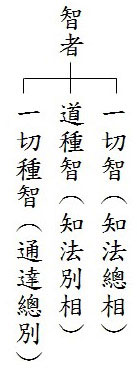

## 專題研學

### 遠端教學解惑篇
		─各地讀書會問答（一）

遠端教學解惑篇

─各地讀書會問答（一）

*編輯部整理*

解義為量乃出路

聞思立宗惑轉無

迷悟一念能轉變

離苦得樂一瞬間

前言

運用網絡科技，打破時空拘束，使世界各地莘莘學子，通過時哉時哉網絡教育學院，更便利的研學教法，得以依止抉擇，層層深入儒佛教理，培養傳承文化的人才。

從二○一四年十月一日開播之日至今，各地讀書會學習熱情不斷高漲，紛紛發來研讀報告至學會郵箱。在研讀報告中，不乏有些好問題，特別是在佛法方面，由於直播課的線上提問，研討的大多都是儒學，而孔門心法的通達，還需借助佛法來理解才好明瞭。印光大師在《復安徽萬安校長書》有云：「儒佛二教，合之則雙美，離之則兩傷。」現代學佛修道，也需通達入世的學問，掌握與大眾和合的能耐。所以，在線上不便提問的佛法問題，借著互聯網的便利，通過電子郵件的形式，請老師答疑解惑，也是善巧方便。

實則要感恩促成搭建此網絡教育平臺遠見卓識的大德們，創造出如此殊勝無障礙的共學環境，令身處在世界各地的人們，可以聞到正法，進而在二六時中串習正知見。

借此因緣，特成立專欄，將各地讀書會提出的問題整理，陸續發表於會刊，以供養大眾。同時，期許新世代的後進子弟，能藉由此點點滴滴的記錄，受益良多，共同增上。（編者﹚

**問：** 關於聖與賢的問題，老師在《佛說四十二章經》的第八章「誡人害賢」，告誡惡人，說聖人以下的賢人也不可害，此處聖和賢是就形而上的那一分說。儒家的形而上是指有性與天道的傳承，除顏子、曾子以外，其他七十二賢，是否也是因為聽聞夫子講性與天道（如在陳蔡絕糧時）並且修學，才稱他們為賢呢？請問初果聖者已經斷見惑，破分別執，不就是聖人了嗎？那顏、曾、思是大賢，不就也是聖人了嗎？又如七十二賢之一的子路，他的境界是否至少已到十住了？所以他才能在死于衛亂時而冠不免，證明他有形而上的修學，雖然如此，他由於未能成就聖位，所以陳蔡絕糧時，仍然有慍色的問孔子：「君子亦有窮乎？」說明他未能通達所執的境界（法我）也是沒有自體性的，觀待境界就生起了能執的心，進而對著逆境生起煩惱，請問可以這樣理解嗎？

**答：** 孔門所論的七十二賢，這裡面有的能通往形而上，有的並沒有，只是就學得較好而言，不能套入佛家的三賢位。佛家的三賢位都是屬於能通達性與天道者，在四加行當中修止修觀，登地位證得法性。

通達性與天道者，在孔門當中，或者是顏回、曾子、商瞿，漆雕開，其餘文獻不足，故不得知，但不妨礙他們是賢者，但是不是佛家所說的三賢位。

所有弟子當中，夫子只有承許顏子是賢者，但是這當中，並不妨礙顏子或是一位聖者。與顏子相比，其他弟子為小賢，並非指其餘弟子已達到三賢位。子路並未到達十住位，文天祥死前也是正氣凜然，子路冠不免是他不怕死，視死如歸，求仁得仁的形象。

**問：** 關於佛說四十二章經第九章中何謂愛道，雪公毛筆字部分。「識道要」分為內外，對應行和解兩個部分，行是否可以說是戒和定，解是否可以說是慧，解是「乘急戒緩」，是否說只專研教法而持戒不嚴，這樣的修行者是否如前章所說的「說食數寶」，不能隨文入觀，把教法變成自己的觀念。行是戒急乘緩，嚴於持戒卻不專研教法，只是增上生，得人天福報，因為只有從善知識那聽聞教法，才能幫助開智慧，才能破除煩惱，得決定勝，真正離苦得樂。這兩者都偏頗，所以要解行並重，戒乘俱急是嗎？但毛筆字部分中間是「須相應」，這是說對不同偏向的修行者，還是要「眾生樂意」的講，對「博聞愛道」的就「非遮」，引他向上到「守志奉道」，對「守志奉道」的就和他強調「博聞愛道」，因為如果沒有般若的修學法，也不能真正做到「守志奉道」，是這樣的嗎？最後「佛斥阿難」是說多聞第一的阿難，如多學而識的子貢一般，是否就是本章所說的「博聞愛道，道必難會」的代表呢？

**答：** 博聞愛道並非不好，那是一種很喜歡聽聞，對道很好樂的形象，但是要引導到守志奉道，此處對他的否定只是不過是引導向上，而不是直接的否定。

乘急戒緩是指正知見的獲得，比花時間專研戒法的開遮持犯等細微處更為重要。乘急戒緩只不過說開見地是當務之急，而不是不要持戒，所要引導的還是戒乘俱急，所以學儒、學佛極為麻煩，沒有通達見地來學，多是歧路亡羊。

對於喜歡到處學習新東西的人，就要把心拉回來先把一門修好，這沒有錯，不過若有機會學習其他學科，有時也有相輔相成的功用，觀待善知識所開的課程，一門一門的學習，累積之後即能有一貫的思想脈絡，也能旁徵博引，這是最善巧的學習。

**問：** 關于佛說四十二章經第十章熟食除冥。熟食是指福報的那一分，除冥是指智慧的那一分，〈表注〉上說，熟食是成聖果，除冥是破三障。若成聖果是最大的福報，而不是得人天的福報，因為成就聖人果位，出三界，脫離輪迴的繫縛，才是真正的離苦得樂，這才是最大的福報。若以熟食來設喻，是說成就聖果就如食物煮熟一般，可以這樣理解嗎？破三障（惑、業、苦）是要靠智慧斷惑，才不會潤舊業、造新業，也就不會感果受苦，然後以除冥設喻，是說智慧如光明一般，當光明出現的時候，黑暗自然去除，是這樣理解嗎？

**答：** 成佛須經三祇修福慧，百劫修相好，並非現證空性即成佛，成就聖果當然是最大的福報。但是此章的重點在於依著智慧火，可令凡夫入聖流，如生食煮熟，由暗轉明一般。

**問：** 在佛說四十二章經第十一章「較量功德」中「飯善人千，不如飯一持五戒者」，善人與持五戒者行善功德的較量，在於持戒者有業的思維勝過善人也，請問老師這裡為何只說「持五戒者」，而不說「沙彌戒、比丘戒、菩薩戒」呢？

**答：** 持戒當中當然還可以做功夫高下的細分，但此處是就持戒與證果的比較。

**問：** 關於佛說四十二章經第十二章「求道次第」，科判上把此章分為「布施、遇法、習定、思修、斷惑（修觀）和見修道」六個部分，那是否可以與五步修學法相對應呢？此處說的「斷惑」，老師說不是見、修道後的斷惑，而是不斷的串習無我的修學法，在這個過程中，驕慢、毀謗等煩惱都會被一一降伏，見道位之後才真的把煩惱斬斷。是否可說這個階段是比量，而見、修道是現量(現證空性)？

**答：** 此章科判中所分，布施乃就積聚修學順緣說，遇法是遇到正法(佛經與善知識)，以正知見攝持對境界不起貪瞋等煩惱，便是隨順修定，在學習的過程當中不但要有聽聞正法的因緣，還要實際去思修，最後能夠修觀斷惑，並且能利用種種善巧方便自度度他。

習定、思修這幾個名詞，看起來意思似乎可以與加行道相合，但是再對照此經經文，並非經義。

斷惑可以是資糧位確立煩惱的形象與過患，學習空性的修學法，也可以說是根本位以空性為所緣真實現證空性斷除煩惱。此處或可是根本位(入定現證空性，出定不生驕慢、毀謗等煩惱)，或可是於資糧、加行位，以我為所緣尋覓我的自體性了不可得，而漸離驕慢、毀謗等煩惱。

方便止觀是真實止觀修成，出定之後的後得位，是歷緣對境修止觀。

**問：** 關於見惑與思惑，凡夫執五蘊身上有我為實有，被「俱生我執」所攝持的貪、瞋、癡、慢、疑等煩惱，生起猛利，敏銳迅速謂之利，驅使吾人墮落三途受苦謂之使。而定中見到真實的俱生我執了不可得，明白所執的我體性沒有後。此時外道表現如何殊勝、快樂及富有，行者也不會相信其所說的常ㄧ自在我、靈魂我為實有，此時安立為破見惑。請問斷見惑不是破分別我執，斷思惑才是破俱生我執嗎？

**答：** 必須入定斷俱生我執，出定才不會被外道宗義所影響。也就是斷分別我執，必須斷俱生我執，看起來好像分別我執不是俱生，以為破法是先破分別再破俱生，但是破法其實是先破俱生，出定不生分別我執。

**問：** 請問老師，早晚課是否要每天拿出固定的時間做定課，還是研究教法是當務之急，把所有的時間都用來研習教法呢？

**答：** 在學習教法的過程中，佛加被的這一分也是非常重要的，定課即是求佛加被，時間不用長。

**問：** 誦經時是隨文入觀，還是什麼也不想？

**答：** 誦經時若能有科判的觀修更為善巧。

**問：** 顏子的「其庶乎，屢空」，是否可以理解為在尋覓我的自體性時了不可得，觀待能執的心也不生，進入能所雙亡，然後出定後又什麼都能看到？

**答：** 《論語講要》云：庶乎，是差不多的意思。屢空，集解有兩說，一說顏子庶幾聖道，雖數空匱，而樂在其中；一說屢猶每，空猶虛中，因為不虛心，則不能知道。兩說應以後說為是，聖人體寂，其心常虛而無累，所以孔子空空如也，顏子未到聖人地位，所以其心屢空，屢空是說顏子已近乎聖道。

屢空是屢屢、一次一次地能達到形而上的中道，並非時時刻刻都能生起形而上的智慧，故曰不貳過。孔子的空空，是在任何境界上，直接就任運達到形而上的境界，是從心所欲不踰矩。

**問：** 問顏回「其心三月不違仁」，是方便止觀嗎？緣念有為法時，能任運的達到「其庶乎屢空」，是真實止觀嗎？

**答：** 真實止觀達到之後，出定歷緣對境時稱為方便止觀，是聖者後得位的狀態。或說真實止觀是緣念勝義，方便止觀是緣念世俗。

**問：** 關於智，老師曾說，一種是成就聖人的智，斷煩惱，是否就是「一切智」呢？另外一種智是輔助君子的智，知道怎樣權巧方便利益眾生，這是否就是「道種智」呢？而內聖外王都做到了就是得「一切種智」呢？

**答：** 可以類似這樣去理解。(下期待續)

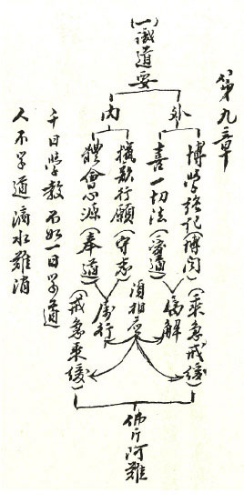

## 孔學一隅

### 論語簡說（十五）
	  —子貢欲去告朔之餼羊

論語簡說（十五）

—子貢欲去告朔之餼羊

*時哉講述、永康龍川學校、順昌雪廬孔子文化研學會、易儒整理*

見微知著禮之力

吉凶禍福萌乎心

進退合宜君子行

和諧社會能安邦

經文

子貢欲去告朔之餼羊。子曰：賜也，爾愛其羊，我愛其禮。

（八佾第十七）

前言

「禮」是在外相上的進退，懂得用的人，就懂得趨吉避凶；不懂得用的人，也沒辦法改變命運。「禮」是儒家精神裡很重要的一個內涵，儒家的內涵是在道上說，但是外相呈現是在「禮」上呈現，孔子就是依「禮」來判斷魯國的吉凶禍福，也依「禮」來判斷天下的吉凶禍福。

科判架構

本章是孔子引導子貢「行事以禮為重」。如果行事當中有「禮」做進退，才是一位真正能進能退的人，進退都吉祥。如果不依「禮」進退，進也凶險，退也凶險；進也不得，退也不得。經文架構可分為兩段，第一段是「約生愛羊欲去禮」，第二段是「約師愛禮知時令」。

白話解釋

古代天子在季冬時，以來年每月的政事，定成政令書，稱為朔政，亦稱月令書，頒告諸侯。諸侯受之以後，藏於太廟，自新年一月起，每月朔日(初一)，供一隻餼羊(殺而未煮熟的腥羊)，祭告於太廟，然後上朝奉行。此外，天子自己也在每月朔日舉行朔禮。春秋記載，魯文公六年，閨月不告朔，十六年後，文公又因疾病，而有四次不視朔。文公以後，魯君告朔之禮，逐漸由曠達而廢弛。後來魯君雖不告朔，但每月初一，仍由有司送一隻餼羊供奉祖廟。

子貢認為，告朔之禮既不舉行，何必仍供一羊，子貢不忍見其死，所以想要去除告朔之餼羊。孔子呼子貢的名說，賜，你愛的是一隻羊，我愛的則是告朔之禮。孔子認為，每月繼續供奉餼羊，一般人民尚可由此而知時令。後世之人尚可見此餼羊而知有告朔之禮，得以考據而有所取。是以不去餼羊，其禮尚未全廢，餼羊一旦除去，其禮也就完全廢棄了，所以孔子說我愛的是告朔之禮。

釋義

何謂告朔之禮

古代告朔之禮有兩種。第一種是指古代天子在季冬時，以來年每個月的政事，定成政令書，或稱「朔政」、「月令書」、「政令書」、「時憲書」等，如現在的農民曆。將之頒告諸侯，稱為告朔，朱子念作「古朔」或「故朔」(告，古篤反 )。此處告是「頒告」、「告諭」的意思。

第二種是指「以朔政祭告」，包含天子和諸侯都行此禮，此處告是「祭告」的意思，要念作「告朔」。約天子而言，天子每月朔日(初一)會到明堂，頒告政令並宣讀「月令書」，宣布這個月要辦什麼事情。「明堂」就像現在的天壇，是古代帝王祭祀天地，接受朝拜、覲見，還有頒發政令的地方。只有天子有明堂，諸侯沒有明堂。天子頒告政令、讀月令書之後，還要到太廟祭告。「太廟」是供奉第一位先祖(始祖)的廟，如周朝的始祖就是文王。祭告文王表示這個月的政治我在「明堂」宣布，並到太廟裡面稟告祖先。此時要祭拜，天子用牛，所以說「天子無故不殺牛，諸侯無故不殺羊」。

約諸侯而言，諸侯在去年年底收到朔政以後，先把它收藏於太廟，之後每月初一到太廟稟告其祖先，他要來接受朔政。依《公羊傳》〈何休注〉，大夫把天子的朔政頒給諸侯，大夫此時是坐北朝南，代表天子。諸侯是代表天子的臣，朝向於大夫，祭告之後接受月令書。這就是諸侯的「以朔政祭告」。此時要祭拜太廟，諸侯用羊，即是本章所謂「子貢欲去告朔之餼羊」。

告朔之禮的由來與演變

根據《尚書》〈堯典〉記載，帝堯任命羲氏、和氏掌管天文，制定曆法，授民農時。分派羲仲、羲叔、和仲、和叔分住暘谷、明都、昧谷、幽都四個地方，負責觀察日月星辰萬物生靈，敬慎地把天時節令告訴人們，使百姓能及時下種和收穫。

後來慢慢演變成了周朝的「告朔」之禮。到清朝仍有「時憲書」，然而此時已無「告朔之禮」，只是中央統一「頒告」時節政令給各省一體遵循，故此時可以念「古朔」、「故朔」，就不能念「告朔」了。後面演變成農民曆，裡面紀錄二十四節氣，可以精準的算出春耕、夏耘、秋收、冬藏的時間。以前百姓在家中供奉灶神，在灶神像裡，也有天干地支、十二月份、二十四節氣等。灶王名張單，祂跟岳飛、呂洞賓、關公、王靈官，合稱五恩聖主。恩主公廟就是拜這五尊。灶王在民間很有影響力。每年十二月的二十三，祂會上天稟告，所以大家都怕做壞事；如果老百姓能夠斷惡修善，祂上天報告善事，老百姓就大發利市。以上是告朔後來的演變。

古時頒告朔在曆法上的意義

依周禮記載，太史「正歲年以序事」，太史是天子的日官 (欽天監)，負責製定每年的曆法，陰曆以月亮公轉圓缺計算，從朔到下次朔的時間為一月之日數，平均約29.53日，分大月三十日、小月二十九日，而陽曆則與月亮盈虧無關。若一年為十二個月，則陰曆所計算之天數，與地球繞太陽公轉一周之天數有差距，故需要設置閏月以校正四時的偏差，謂之「正歲年」；使四時所應施行之事皆得其序，謂之「序事」。

因此，頒告朔政，能使全國曆法、政務統一。依節氣與物候定出生產勞動，使人們不會失了農時，例如過了清明節種竹子，竹子是不會活的，如此事不失時則年豐。若沒有曆法，也不知道該過年了，即所謂「山中無曆日，寒盡不知年」。

中國是「以農立國」，這件事對老百姓是大事，因此對辦政治的人當然也是大事了！

子貢愛羊之意

餼羊，依《皇侃疏》的註解是指「殺而未煮熟的腥羊」。若依鄭康成解釋成「活的羊」，一隻活的羊擺在供桌上，搞不好會跳下來；此外，這隻羊供完還是活的、完好如初，子貢何必去之。可見是「殺而未煮熟的腥羊」。

然而，子貢為何想要去除告朔供奉一隻餼羊？子貢很有錢、很大方，而且是一位大賢，不可能是「愛小財」的人，只為了讓羊活著可以生小羊或是產羊奶這樣的理由而欲去之。子貢去羊之意，如孟子所說「見其生，不忍見其死」，但除此之外，還有更深的涵義：由於國君不來參加「告朔」之禮已久，告朔之禮沒有主持人、沒有祭祀，已經失去意義。禮沒有本質，徒具形式、仍供一隻羊，子貢認為這樣的殺羊是白白犧牲；死有重於泰山，有輕於鴻毛，不如不殺。但「國君不來，沒有意義」，這樣的話子貢不好明言，只好說「欲去告朔之餼羊」，去除殺羊供奉的形式，不要再供那一隻羊了。

古代也不是隨便殺牲，第一是祭祀才殺，所謂「天子無故不殺牛，大夫無故不殺羊」；第二是年節才殺；第三是有尊貴的客人來才殺，如《論語》〈微子篇〉第七章，有位隱士請子路到家裡面來，很高興！就殺雞煮飯請子路。

子貢雖欲去羊，然而他是否有權利呢？根據《史記》〈仲尼弟子列傳〉記載，子貢常在魯國跟衛國做相。可能在魯哀公十一年以後，子貢由於到吳國借兵打齊國，替魯國解決空前的危難，因此在魯國做宰相，有權決定。

孔子愛禮之義與去羊的過患

子貢欲去羊，孔子則有另一種看法。每個月殺一隻羊，至少讓百姓知道這是每個月的初一，由此而知時令。此外，當人問起供奉餼羊的由來時，「告朔」的禮就有考據、恢復的希望，後面的國君如果肯重視，告朔之禮的功德就會出現。因此，有這隻羊，告朔之禮尚未全廢，餼羊一旦除去，連告朔之禮也都不知道了，所以孔子說：「我愛其禮。」

告朔在政治上的意義

告朔在政治上有重要的意義。惠棟的《明堂大道錄》說，明堂與月令是舜、夏、商、周四代治天下的大法。除了在月令上統一，在祭祖的那一分，大家心裡有祖先、有天子，保留了上下的和諧和命令的一致。《論語駢枝》也說天子把「時令書」告諭給諸侯，就是率著諸侯一起來順天道，老百姓跟著四時的天道、時令來種植，一定家家豐收。《四書新義》也說，這不但是能夠一統，能讓諸侯懂得尊重周天子以外，諸侯也重視祖先，要跟祖先告，這裡面就有「忠」和「孝」。

魯國不告朔引發的過患

魯君不接受政令書、不去祭拜，沒把周天子看在眼裡、沒有去敬奉祖先，大夫也不會把魯君放在眼裡，魯國的「三家之難」就從這裡開始！三家大夫把持國政。同樣地，大夫的家臣也不會把大夫看在眼裡，所以季氏家臣陽虎就控制季孫大夫，而且把持魯國的國政；季氏封地「費」的邑宰公山弗狃據著「費」叛亂；叔孫大夫的家臣侯犯，也據叔孫大夫的封地「郈」叛亂。魯國發生內亂，國政在大夫、家臣的手裡，魯國會強嗎？

有內亂時，也會有外患。齊國就乘機打魯國，吳國也來欺負魯國，越王勾踐也跟魯國要地。

此外，國家在這種內亂當中，孔子只好周遊列國，因為有羞恥心的士大夫不領這種薪水。等他十四年以後回到魯國，魯國還是如此，所以孔子也不願繼續為政。

魯君已不行告朔之禮，為何還要再宰一隻羊

魯國是一個秉持禮的國家，雖然魯君已經無禮了，但他底下的「有司」，也就是執掌這件事情的官員，如同科長、承辦人，仍繼續殺羊來祭，不廢其事。這絕對不是裝模作樣，而是「上亂下不亂」。所以魯國雖內亂外患，仍有不亡的道理。

禮的本質與形式

禮的內涵有「本質」，有「形式」，這兩個是互相依靠、相輔相成。本質要藉著形式表現本質，形式要依著本質，這個形式才莊嚴。

例如，祭孔之禮的形式有「八佾舞」，內有禮生、樂器、儀式、祭器、供品等，透過祭孔能表彰尊師重道、對道的恭敬、對中國文化的重視，把孔子的義涵發揮出來。如果形式廢了，連祭孔之禮也不知道了。婚喪喜慶也是如此，婚禮的本質是五倫的開始，它的形式包含證婚人、主婚人、儀式等。如果只有論感情，沒有去論家庭的經營、傳宗接代、孝順兩邊的父母，則失去本質。連形式也不保留的時候，大家結婚很容易，離婚也很容易，最後婚姻沒有了，五倫都亂了。

喪禮要維持哀戚之情的本質，也要有它的形式。形式需把本質烘出來，本質或許被隱沒，剩下形式，但如果連形式都沒有的時候，本質要出現的機會也沒有了。因此，形式也是很重要的，即使禮本質的趨吉避凶已經忘了，可是維持禮的形式，在冥冥當中也趨吉避凶！只是一般人不知道而已。若能藉著形式把本質引發出來，那更是趨吉避凶。

此外，有些禮它不是形式，它的存在是有必要性的，像有很多客套話是在溝通感情的，例如主人請吃飯，客人要客套話去表達恭敬與感謝，這是需要的。能夠依禮來進退，來表達人情，來表達關切，來表達對事情重視的禮是要維持住的。若連能夠表達本質的形式、作法都廢掉，那人跟人之間真不曉得該怎麼交往？

總結

第一，天子行告朔，表達對天時的恭敬；告廟表示對祖先的負責；在明堂是有天地的概念，敬授天時；在太廟是有祖先的概念。這就是善盡天子的責任。

第二，天子把月令書頒給諸侯，諸侯去告廟、接受，表示對祖先負責、對天子效忠，全國統一，上下一致，有君臣關係，有祖先跟報本還恩的關係，是天下太平的基礎。

第三，魯國不告朔，竟然衍生諸多問題，最後造成魯國的敗亡。故對於「禮」，尤其是重要的禮，更要講究、維持它。

第四，《論語》每一章，它都有它時代的意義。從此章看出孔子的眼力和答話的苦心，保留形式以期恢復「禮」的本質。

第五，「禮」真的是吉凶禍福的所在，依禮而行能趨吉避凶。

問答

**問：** 在歷史中有無其他不告朔之例？當時所產生的過患為何？

**答：** 依告朔之禮，諸侯先拜太廟，再上朝宣布政事，假如不拜、不上朝，諸侯便各自為政了 。「告朔」是從周朝開始，而周厲王、周幽王時開始不告朔。周厲王寵幸榮夷公，驅逐了周定公跟召穆公，後來，老百姓造反，衝到宮廷要殺他，周厲王跑掉；周定公跟召穆公共同執掌國政，稱「周召共和」。周幽王寵褒姒，烽火戲諸侯，最後犬戎打進來，再舉烽火台，沒有諸侯要幫忙，犬戎就衝進去把周幽王殺了。「告朔之禮」不行，國君目無尊長，沒有祖先，不與老百姓的民生在一起，而造成如此嚴重的下場！

**問：** 孔子愛禮，《論語》中是否有其他章節可以相互發明？

**答：** 《論語》〈鄉黨篇〉第六章，紀錄孔子「吉月必朝服而朝」，「吉月」就是正月，元月一號穿朝服上朝。孔子在當時為大司寇，國君為魯定公，依禮元旦(月朔)時國君要告朔、告廟；魯國的開國是周公，要去祭拜周公廟。然而，在魯定公早就沒有告朔了，但孔子依然穿朝服上去，可想而知，上朝的時候，空空的只剩孔子。

《論語》〈子罕黨篇〉第三章，在對國君的禮節上，上朝時，在門外，不論看得見或看不見國君，還沒登台就要先拜。到了孔子所處的朝代，大家都是上了台才拜，但是孔子依禮還是在台下拜。孔子說「雖違眾，吾從下」。

然而，本來是麻冕做帽子，但是為了節儉所以用綢絲，孔子從眾，節約的部分從大家，因為只是質料不同而已，無關宏旨，與本章餼羊關係到禮節存廢則不同。

可見孔子在禮上與大家也同也不同，不同的時候不是標新立異，而是遵循國家規定。同的時候也不是同流合污，而是從善如流、從俗的這分，都是依禮而行。

**問：** 是否顯示子貢在此事上的格局顯得不夠大呢？

**答：** 是，大賢也有眼力不足的地方。所以跟著老師學開見地、開眼力太重要了！能讓人脫胎換骨、改變命運，如孔門弟子能變大材，都是受到孔子教誨。

**問：** 為什麼不直接頒布曆法，讓人民知道時節，還要靠告朔之禮去保留？

**答：** 古代印刷術不發達，無法家家戶戶流通月令書。此外，保留告朔之禮推行月令，除了表徵國君重視民時，更是對祖先的負責、對天子的尊重，因此應當保留，以待將來有心者能透過形式進而發覺禮的本質，使國家復興。

**問：** 重禮而殺生如何能順應天道？是否可將餼羊換成不需殺生的齋品？

**答：** 古人祭祀或生死之禮，需要殺牲是因為當時的禮制。「天子殺牛、諸侯殺羊」。牛羊豬在古人心目中，是很有靈性的動物，代表對天、對祖先、對山川最好的供養。孔子也重視慈悲，「子釣而不綱，弋不射宿」，只是孔子生在當時，也必須遵照古禮的延續，一體遵循國家的規定(餼羊)。是故要先維持重點，不能在小細節計較。「仁民而愛物」，先穩定「仁民」，先從仁心去發展，推廣仁政，使大家互相關懷照顧，有民族的情懷，能對國家愛護。孔子要保留的是告朔之禮背後這種慎終追遠、對祖先的恭敬、對老百姓的重視。仁心發展足了，「愛物」是慢慢地再擴散出去。

孔子也同意形式上改變，孔子是周朝人，用周禮而非夏、商之禮。雪廬老人說清朝人祭孔子是穿清朝的服裝，不是漢服。同樣地，現在走入現代，祭祀古人也要穿現在的服裝。只要國家定一個服裝，大家就統一遵照。因此，若是國家規定，餼羊換成鮮花素果也很好；慢慢地再因時因地制宜加以改變。

**問：** 本章是否可引申為死刑存廢問題？孔子會贊同或廢除死刑？

**答：** 也贊同，也廢除。內心上是渴望不要死刑，希望他能回心向善，如孔子仁民愛物，孟子說「人皆可以為堯舜」。然而，對於大惡不赦之人，你的慈悲變成他作姦犯科的依循，難道還要廢除死刑？做惡而無懲，誰願意做善？故孔子贊成「以直報怨」。雪廬老人說，怨過來的時候是「公事公辦」，獎善懲惡，才能夠保護團體善良的風氣。因此心態上是原諒他，做法上是不能原諒他。

**問：** 魯國國君無禮，官員卻仍能各司其職，「上亂下不亂」的內驅力為何？

**答：** 內驅力就是「禮」。魯國三家大夫縱然不把魯君看在眼裡，在內亂時，也只敢把魯昭公的餘黨郈昭伯殺掉，不敢弒君。齊國、晉國則不然，直接就把國君殺掉！這就是孔子在魯國禮教的威力。而且孔子周遊列國回到魯國，已經沒有任何實權，季孫大夫要伐顓臾，還要冉求問過夫子；冉求被夫子責備，回去告訴季氏，他就不敢討伐顓臾。

**問：** 禮的保留和變化，是形式還是內涵的問題？是否關鍵在人而不在形式？

**答：** 孔子懂得禮的內涵，能夠配合時代將禮的形式有所損益，化繁為簡或是化簡為繁，而保留並發揚禮的本質，彰顯禮的神韻。反之其他人化繁為簡，可能是把好的東西去除，可見關鍵在人，在於傳承。

**問：** 有哪些禮需要因時因地制宜、有所損益？

**答：** 例如，夏禮到商朝就有所損益。又如〈禮記〉記載，子路作季孫大夫家宰時，把季氏家祭祀的禮做簡，讓儀式不要拖太長，讓精神能夠振奮。孔子讚歎說：「你看子路，誰說他不知禮？」又如古代的服裝，現代已不適合再穿了；以前是乘馬車的禮節，現在改成坐車的禮節。雪廬老人也根據《曲禮》演繹出現在通用的《常禮舉要》，這就是禮的演變。

又如祭孔的「八佾舞」，或因地制宜，或者人數不夠，用樂舞也可以；臺灣的「八佾舞」是明朝的延續，若改用現在的服裝，只要它隆重、莊嚴，符合國家規定，有何不可呢？古禮的本質應當被保留，但禮的形式可因應時代、國情而增減，這有待國家找大儒來抉擇、制定。

相反地，如果一成不變地保留形式，不符合時代的需求，反而變成推行禮教的障礙，把利益人的禮教變成「吃人禮教」，造成自己跟社會的隔閡。所以禮行不通，一定是不懂禮的本質，然後把形式硬在這個社會上實踐，造成的障礙。這是現代人的問題，不是古人的問題。如果能從形式去通達禮，知道形式是可以變化的，自然在世間相處愉快。

**問：** 可否再闡明禮的意義以及重要性？

**答：** 禮是做人處世的道理，從個人的修身、家庭的和諧、事業的成敗、團隊的維繫、和諧的能力，都是禮！孔子周遊列國，是依禮而行、依禮進退，所以他能夠在周遊列國當中，與聞國政，全身而進、全身而退，那是高段人物！《易經》很多卦象的趨吉避凶，都是依著禮去實行的。孔子三十五歲到周朝見老子時，不是問道是問禮！可見道家也是通道、通禮。

雪廬老人在講《常禮舉要》時說：「禮的條文是容易看的，禮的本質它跟趨吉避凶、吉凶禍福結合的那一分，全部是人情世故，那非得我來講。」那是有經驗之談，才知道禮的重要性。又說：「我是個吃了無限虧的人」，深知禮的重要，不願讓年輕人去盲目隨從一些無知的言論。不依禮而行，結果在人情上吃虧，跟長輩處不來，跟同輩無法相處，也不能攝受後輩。這樣的人在這個社會上沒有辦法得到他自己的福報，不能夠和合共事，也不能夠發展事業，可見禮真的太重要了。(下期待續)

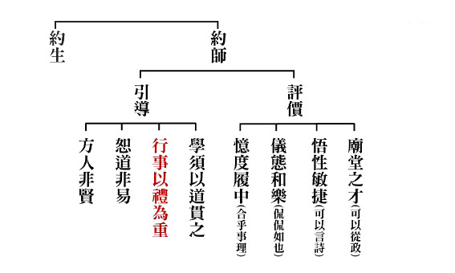

### 孝道跨時代的意義與價值
				—孝經簡說(一)

孝道跨時代的意義與價值

—孝經簡說(一)

時哉講述、永康龍川學校論語讀書會、順昌雪廬夫子研學會、淨域編寫

孝為至德利世道

六經要旨傳曾子

天子庶人盡包括

開創民族萬世平

前言

眾知現今發揚中華文化似若星火燎原，但是中華文化的本質究竟是什麼呢？首先，文化的本質即是「改善人心」、「洗滌人心」，而改善與洗滌人心，若不從「見地」上做起，不從道德上去改善，那麼人心是無以洗滌的，要推廣文化無異是個空談。

其次要來彰顯孝道的意義與價值，就必須好好的細說孝道。孝道是一種利他之心，從利益父母親開始，報恩也要從報父母親之恩開始。如果父母親的恩德這麼大尚且不能報，我們又如何去報眾生的恩及利益他人呢？我們既不能利益他人，又怎能夠推行善法？

再者，二○一六年是雪廬老人往生卅周年，老人是位道高德備的老師，我們要怎樣來懷念他呢？老人生前是位孝子，我們如果從孝道來推廣，從各種追思活動來結合對老人的懷念，就是最好的報答師恩。

第四，孝道必需要推廣，它是善法的源頭，是道德的根本，是文化的本質，也是推展文化最要講究的核心。然而要如何推廣呢？如果沒有經學的見地，推廣起來是很空洞的。有關經學見地，在經學中談到孝的很多，像《論語》、《尚書》、《詩經》、《左傳》、《公羊傳》、《穀梁傳》、《國語》、《孟子》、《荀子》、《禮記》等經書都有談到孝，可是完整論孝的就是《孝經》，乃是孔子對曾子的講述，而使曾子成為傳承者。

第五，我們要如何來瞭解《孝經》？《孝經》總共有十八章，這十八章包括了在家裡的事親，即侍奉父母親人；包括了辦政治侍奉君王；包括依著孝道而充實自己。因為在家裡要孝順、利益父母親，要經營和諧的氣氛，必須充實自己；充實自己同時也利益父母親，進而從利益父母親中，去利益家人與社會國家，這就符合儒家經學內聖外王的最高目標。

注解

醒公老師(徐醒民)講過《孝經》，他依據唐玄宗的《注解》、邢昺的《疏》講過廿二回。郭基發先生根據徐老師的講述作一個淺釋，做《孝經圖示》一書的白話解釋。有這些正確注解，幫助我們了解《孝經》，如此推廣孝道的緣起就具足了。

論孝

孝，因父母恩德大過天地「孝」字上面是個老，下面是個子，這很清楚說明，子對父母親有口體之養。然而，口體之養乃最基本的，其次是養志悅親，即是讓父母親心裡快樂且過得舒坦。再向上是能做出好的事功，發揮好的品行，讓父母親倍增光彩很有面子，這就是大孝。此外，還包括父母親過世，懂得追思祭拜，並將孝道的風氣傳承下去。這是子對老的完整內涵，他才足以稱作孝。

人為什麼要孝呢？這須從父母親的恩德說起。如果對父母親的恩德這分不能彰顯，孝就無法實踐，無法從內心生起，且從母親懷胎一路呵護說起。母親懷胎九個月，除行動不方便、作息辛苦外，還要將許多養分滋補胎兒，留意胎教；於生產過程中充滿危困，有時胎兒保不住，甚至還會失去性命。

幼稚園裡有一種課程，就是讓幼童在腹部裝一個球，讓他們體會母親懷孕的辛苦；讓他們行走做事，體會母親懷孕九個月是多麼不容易。孩子生下後，成長的頭三年，是不能離開父母親懷抱的。宰我問孔子：三年的服喪太久了，是不是一年就可以了？孔子告訴他：三年之喪是天下的通喪，是一般的作法。為什麼是三年呢？概因子女離開父母的懷抱須時三年，三年之喪的意義就從這兒建立。

孩子離不開父母的這三年，可用「推乾就濕」來看，孩子拉屎拉尿時，父母親將孩子放在乾的地方，而自己睡在濕的地方。還有「嚥苦吐甘」一狀，即是把好的給孩子，自己吃差的。還有視線不離開孩子，照顧不離手，這段過程是很辛苦的。尤其孩子很難帶，小時候哭鬧很難餵養，晚上不睡覺白天睡大覺，父母親的生活全部反常。陪孩子一路成長很辛苦，過程中父母要犧牲生活品質及不方便，悉心照顧避免產生意外，創造欣喜與學習的環境。這些養育過程真是一言難盡，所以才識得「養兒方知父母恩」。在陪伴成長中要創造許多歡樂，在養教中要付出極大的辛苦；現今大環境不好，兒童安全一再被討論，父母照顧起來格外的艱難。再談假日旅遊全家出門，統統圍繞在孩子的歡樂上，三代同堂的歡樂也是建立在孩子身上，想想父母、祖父母的恩德那麼大，你說不孝順怎麼得了。

孝，因父母之心舉世皆然

除了正常成長的孩子，恐還有些例外；比如孩子生下來有視覺、聽覺的障礙，有肢體的障礙，有腦性麻痺等，想想父母該怎麼辦呢？一路陪伴成長，還有歷經車禍火災，殘廢以後的復健，在任何情況下都不會放棄子女的就是父母。甚而有父母早逝，祖父母承擔起養孫的艱難，這包括身體已老衰，經濟條件變差，還要再養育孫子。這樣的父母心舉世皆然，如果我們能好好地彰顯父母親的恩德，那兒孫的孝心必然能油然而生。

以下特別講個故事-《羅倫佐的油》。此片非常感人，他在五歲時罹患隱性神經退化症(大腦白質退化症)。所謂隱性神經退化，就是會情緒失控；其次知覺功能愈來愈差，運動能力愈來愈不足，最後癱瘓死亡。當他五歲檢查出病因時，醫生說餘命最多兩年，他的爸媽不服輸，與醫療機構保持聯繫，進圖書館查閱相關文獻，並找化學家提煉不飽和性油脂，來遏止他血脂肪的濃度，控制他的病情，這樣的努力奮鬥，養育羅倫佐到三十歲，最後因灌食不慎進入肺部，引發肺炎大出血死亡。這段期間，孩子沒有語言及行為的能力，以眨眼表示是，用瞪眼表示不是，來過生活。

羅倫佐的媽媽蜜雪拉於二○○五年過世，人們發現在牆壁、電視、冰箱上，有許多如何照顧羅倫佐的事項；換言之，一家人都是為他而活。他的爸爸奧古斯都．歐東內(二○○八年過世)更了不起，從孩子五歲照顧到三十歲，二十五年未曾離開他。他與其它父親不同的是，他不斷與化學家討論並創立研究室，要來遏止腦神經麻痺，發揮言語及行為的神經功能，可惜羅倫佐去世前都未能研發成功。他爸爸不僅有小愛還有大愛，要為天下與羅倫佐患相同病情的人解決問題。

隨舉這樣的例子說明，父母親的恩情是難以報答的；這只是就養育子女兒說。

還有英國外相大衛．米勒班(二○○七至二○一○年)，婚後沒有生子，他與太太決定領養小孩，認為即便是「擋火車也甘願」。二００四年領養第一個孩子，那時他擔任教育部次長，任外相時準備領養第二個，在英國領養孩子是十分艱難的，那時正好沙烏地阿拉伯國王(阿卜杜拉)訪英，外相竟然缺席，連伊麗莎白二世女王的晚宴也缺席，意即官位皆可拋，就是要小孩。這還是養子，非親生小孩喔！所以孩子的身上，有多少父母親的恩德，怎麼可以不孝順呢？

此外，中國的《詩經》將這個概念說的很清楚。在〈蓼莪〉一文中云：「父兮生我……昊天罔極！」蓼是慢慢長大，莪是美好的菜；蓼莪就是說，父母親很指望孩子長大成人，不但亭亭玉立外相莊嚴，更要有好的內涵。可是孝子回想，對於父母親的期望並沒有好好的去做，竟然成為蒿這樣的賤草，辜負了父母親對他的期望。

經文說：

「父兮生我，母兮鞠我。」

父母親生我養我育我。「拊我畜我，長我育我。」拊是愛撫，畜也是養育，即是讓我成長受教育。「顧我復我，出入腹我。」並且反覆的照顧我抱我，一路伴隨子女成長，所以「欲報之德，昊天罔極。」父母的恩德如廣大的天，是無以回報，且回報不了的。

孝，應盡力奉養更須承歡

如此說來，孝要先彰顯父母親的恩德，再來談孝。此時孝是什麼呢？孝是，第一、上班賺錢奉養父母。第二、承歡膝下。春秋時代楚國人老萊子，七十歲時穿著孩童的服裝，學著小孩子的動作兒戲，讓父母親高興開懷，又故意摔倒惹父母親哈哈大笑。老萊子七十歲了，還作這樣的動作來取悅父母親，可見孝道就是一個能夠奉養父母親，讓父母親心裡高興的行止。可是今日之下，孝道卻很難被實踐，其中有個障礙最難突破，以下藉由一段影片-《那是什麼(What is that? )》來說明，孝道除了上班賺錢奉養父母親承歡膝下，還要很有耐心的來奉養才是，這也是今日之下盡孝的最大障礙。其他，如報紙上所刊載的—節省醫藥錢以養父母親、在醫院裡陪伴父母親、半公半讀來減輕家裡的負擔，或辭職來照顧癱瘓的父母親等，都是盡孝的一些案例。

李密的〈陳情表〉非常感人。李密是晉武帝時的孝子，武帝召他進宮任太子洗馬。太子洗馬乃是太子的秘書，掌管東宮的各類事務，也包括教育太子，是太子的老師。李密上表對晉武帝說：「我的祖母年歲已九十六，從小與祖母相依長大，今年我四十四歲，陪伴祖母的時間短，陪侍陛下的時間長，但乞求能好好的奉養祖母至壽終，這是我最大的心願。」所以古人說：「讀〈陳情表〉不哭者，其人必不孝；讀〈出師表〉不哭者，其人必不忠。」

孝道是能夠體恤奉養父母親，又耐心地承歡膝下，可是往往也有不從人願的地方。像雪廬老人在孔奉祀官府上班，他本來不想離開家庭，但是祖父告訴他：「我們姓李的，要給國家一番貢獻，這時去孔家，就是我們李家對國家最好的貢獻。」因此，老人就到奉祀官府上班，這一上班就是五十年。一九三七年中日戰爭，老人陪著孔德成先生到四川重慶，與母親兩地相隔。他聽聞母親生病，因無法回家探望照顧，就寫了〈寄母〉這首詩：「願減兒孫壽，祝親龜鶴齡。齋心凜疚疾，節祿奉康寧。努力兼人饌，虛懷一卷經。時清有歸計，早與報萱庭。」他希望減壽讓父母親如龜鶴般長壽，願意吃齋消除愧疚，節省俸祿來供養父母親，自己飲食正常保健康，精進誦經回向給父母親，待局勢太平時，返家面告孝順父母親。想不到母親抗戰期間過世，令老人非常傷心，除了做了許多功德回向母親。在老人生日(母難)時，都會給母親特別回向。

孝，能感動天地生諸功德

孝是來自於感念父母或祖父母的恩德而生起的，但孝還不只是這樣，孝還會生起很多利益，而利益是說不盡的；所以，孝的功能遠超乎想像。孝有什麼功能呢？第一、「能夠感通鬼神，鬼神敬畏於他」。譬如：清代紀曉嵐，他的書房叫作閱微草堂，所謂閱微，乃是能懂天下細微的事。他在《閱微草堂筆記》中寫了很多我們不知道的事情，例如〈灤陽消夏錄〉載：滄州有位舉人劉士玉，家中的書房被一隻白狐狸霸佔，白天與人對話，還會以屋瓦擲人，誰也不知道牠在哪，就說牠是個鬼怪。知州(太守)董思任是個好官，前去喝斥這個狐狸，說：「人鬼不同路，不要在此打擾人家。」狐狸回說：「你雖然是個好官，我不能夠傷害你，但其實你愛民是愛你的名，你不貪汙是怕後患無窮，並非真愛民真廉潔。莫要再勸我，以免自取其辱。」知州回去後，悶悶不樂好幾天。

換言之，鬼是有鬼通的，我們內心在想什麼，鬼哪裡不知道！人焉廋(隱藏)哉！人焉廋哉！劉士玉家中有個僕婦，只有她不怕狐狸，狐狸也不傷害她，有人問緣故，狐狸說：「她雖是個傭人，卻十分孝順，鬼神見她都迴避，何況是我呢？」後來，劉士玉讓僕婦住進書房，狐狸就離開了。孝能通鬼神，這是孝子的第一個好處。

孝子的第二個好處，是「得明師指點，前途無可限量」。因為孝子懂得感恩，懂得將所學拿來利益他人，所以容易遇到明師。真正的明師是不會去教導刻薄寡恩之人的，若你學很多學問，只是為求名求利，你一定遇不到明師，絕學也絕對不會傳給你。

第三個好處，是「調和鼎鼐，改善民風」。因為孝子在家裡懂得侍奉父母親，懂得通達父母親的心，就能通達人情世故。是以在家鄉能調和鼎鼐，可以改善民風。所以，像江老師所繪的孝子，他可以調和漁夫、樵夫及其他的販夫走卒們。此意即是，孝子還未入朝為官，就已懂得調和之道，這種調和鼎鼐者，就是宰相之材。

於民間他可以這麼辦，那入主朝廷呢？第四個好處，是「不犯上作亂，堪為國之棟樑」。此人在家中不會犯上，入主朝廷又怎會犯上作亂。在家中懂得勸諫父母親，規導父母親於正道，一旦入朝為官之時，就懂得勸諫君王，讓君王導歸至正道。在家中懂得與父母親相處，就懂得與國君相處，譬如：勸諫的言詞、禮貌、態度、作法、時機等，他都抓的恰到好處，這種人是幹材。此外，這人如果被培養成國家的領導人，如周公一樣，那麼這人自然能夠讓天下安定，他的祭祀能夠感通鬼神。所以，周公是有名的孝子，在祭祀中懂得懷念父母親的恩德，特別是能夠把培育他的父親與天配祀，所以成為奠定周朝八百年國祚的主要人物。

最後，孝子能夠成就什麼呢？是修養自己，就像孔子一樣，懂得內心的充實。何以故呢？因為充實自己，為了能達到父母親的期望。當內心的修為達到極至，即是成就他入世的能力。這也是從孝道開始的。

孝子不但能如上述，對於過世的父母親，入先祖牌位並如法祭祀，表徵孝道的延續，藉此凝聚親人與後代。在祭祀時，心中生起父母親的教誨。心中願意以「和」的方式讓父母親高興，願意以良好表現來回報父母親，這就像客家土樓一般。在福建客家的土樓裡，中間祠堂就是以祭祀的概念，來融和後面許多的家族。最大的土樓可以融和幾十個家族，住上八百上千人，這都靠祭祀與孝道的力量。

孝道可以讓鬼神敬畏，能透通鬼神，能夠調和鼎鼐，能夠入朝為官，能夠成為國家的領導人，能夠修身養性成聖成賢，這樣的孝道太好了，也是孝子的功德。

不僅東方人體會孝道有這麼多的好處，連西洋人也是如此。有位大慈善家查理．芒格，見他的相貌慈眉善目，台語稱作「好命人」，是股王巴菲特的老師，他與巴菲特合資生意行善。今(二○一五)年八月在南加州大學的畢業典禮上，他(九十二歲)對學生說：「他的身邊有許多亞洲人，他最佩服的是孔子，孔子的孝道思想，有天生的、有後天學習的，你千萬不要小看這些亞洲人，這些亞洲人能夠在美洲事業成功，這都得力於他們的孝道思想。」可見，孝道會帶來事業成功。為什麼呢？因為你這個孝子懂得感恩、回饋，就會被人家栽培。而且懂得和諧，在家中創造和諧讓父母親高興，在團隊中就是一個和諧的人才；你懂得感恩、受教，又懂得和諧，你不就是企業的幹才嗎？是企業的幹才，收入自然就多。所以他說：「你不要小看亞洲人，許多亞洲人到美洲的成功，都是源於他的孝道思想。」可見孝道的重要性，不但東方人發現它的殊勝，連西方人都發現它是人生成功的秘密。

孝，須知其內涵學從孝經

孝道是如此的重要，首先就必須要知道它的意義、價值、作法、功能，這些特別完整的在《孝經》中呈現。古代讚歎《孝經》是六經的總匯，六經所談的是內聖外王，而通往內聖外王的大道是孝。為什麼？因為孝，想要利益父母親的人，必須要充實自己，讓父母親真正能在心裡面離苦得樂，這就是充實內聖的學問。在外相上懂得回饋父母親，懂得去報眾生的恩，這就是外王。而且得充實很多能力去入世，如此說來，《孝經》就是六經的總匯。

第二，《隋書．經籍志》說：「孝道是六經的總匯。」明代黃道周先生說：「孝是道德的根源。」如果孝道沒有了，刻薄寡恩連父母親都不利益，他是不會去利益別人的。不會去利益別人，這自私自利的人，怎麼會有道德呢？所以，孝是道德的根源。

第三，漢文帝依《孝經》置博士，可見歷代對《孝經》的讚歎與重視。第四個，宋仁宗之科舉考試，將《孝經》列為必考。第五個，漢明帝召令天下要讀誦《孝經》。

孝，要發揚義理以藝載道

以上所提舉都是好的，像漢文帝、明帝與宋仁宗都是好國君，好的國君都懂得發展經學、發揚經書的義理，當前解決社會問題，難道不需要經書的道理嗎？這麼說來，《孝經》是被大家所重視，是世人不可不學的一部經典，我們要如何來好好地學呢？經文固然是要誦習，但是經義更要通達，經義要通達，就必須要看注解。諸注解中，有梁武帝的注解，即《孝經義疏》；第二，有唐玄宗的御注-即《孝經制旨》，簡明《孝經》的重要旨趣；第三，有清雍正帝的《孝經集注》。但特別好的是唐玄宗的《孝經制旨》，用以督導宗室諸王勉學《孝經》，敦行孝悌而不起反心。

根據唐玄宗的注解，北宋邢昺注《義疏》，醒公老師認為這是好的注解。醒公老師曾經講《孝經》廿二回，就是根據邢昺《疏》而說，這也是我們這回講《孝經》所依的兩個重要藍本。此外更特別的是要配合孝經圖，依圖來發展經義。孝經圖有哪些呢？諸如：北宋李公麟、南宋馬和之、元朝趙孟頫、明朝仇英及民國的江逸子，這些孝經圖是我們在講述研討中佐助的教材。以上所說，即是孝道的緣起。

總結

第一、有關孝經的架構、分章解釋，及如何把《孝經》的義理用於時代，這會在以後課程中分章依序來解釋。

第二、《孝經》這一本經書，古人讚歎說：它是可以拿來修身。而什麼是拿來修身呢？我們看《孝經》的孝，是可以拿來奉養父母親，可以拿來侍奉君王；這是說孝子在家中可以經營家庭，在外可以辦政治，最後可以修身，修身就是通往內聖外王的大道。所以本經可以修身，可以訓誡，可以勸誡。

訓誡就是老師可以訓誨子弟的教材，因為培養子弟莫善於道德，而道德的源起莫善於孝，沒有道德的能力愈多，社會的災難愈重。勸誡就是下對上，下對上你可以勸誡。

怎知你可以下對上諷諫呢？因為你在家中可以將父母安然地導正，在外就能將領導人安然地導正，你是國家辦政治的大員，就能夠將領導人安然地導正，讓天下蒼生蒙受其福而不自知。天下蒼生因你而得大福報，但可能不知是你的大恩澤。雪廬老人說：「你積的恩澤，有陽報、有陰德。」陽報就是你做的功德，很多人都知道；陰德是你做許多好事，大家都不知道。可是陰德的好處比陽報還多，陰德會有什麼好處呢？陰德會讓鬼神敬重你，陰德會讓你遇到善知識，陰德會讓你身體健康，陰德會讓你子孫賢孝，陰德會讓你遇到好老師得到好學問，能夠通往內聖外王的大道，陰德實在比陽報重要太多了。

孝道還可以幫助我們通達人情世故。因為在家裡懂得察言觀色，在外面就懂得通達人情世故，且知所進退遠離凶險，趨近吉福逢凶化吉。

以上就是進入《孝經》講述的前言，如果這個前言，大家認為是有必要入《孝經》的，那就恭喜大家。我們可以在爾後，依序對《孝經》的整體架構作分析及逐章解釋，讓我們有經學的見地，有孝道的作法，還知道行孝的目的、意義及帶來的福報，並且用來經營家庭、社會、國家，謀造和諧的氣氛，使兆民蒙受大福，讓自己的陰德能加被後代子孫。可謂是百福駢臻、千祥雲集都從孝道而來。(下期待續)

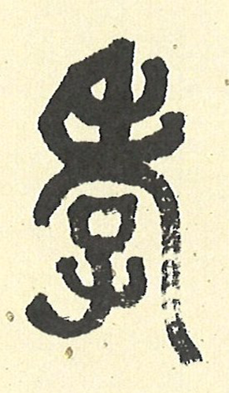

## 藝術賞析

### 孔門七十二賢淺說（十一）
				       ─曾點

孔門七十二賢淺說（十一）

─曾點

圖：江逸子‧文：時哉

原是莽夫棒昏子

禮樂薰陶識時機

夫子喟歎吾與點

魯子曾參傳大道

曾點，字皙，曾子之父，年歲略晚於子路，是孔門早期弟子。

《論語》上記載，孔子周遊列國，無處可行其道，回到魯國隱居在家以求其志。有一天，他與子路、曾皙、冉有及公西華閑談個人志向。孔子說：你們年紀還輕，現在閑居之時，常說沒有人知道我，但是如果有人知道你們，你們將如何辦事呢？子路倉促地說出他治理千輛兵車大國的理想，孔子以其言不讓而笑；冉有繼而謙退，說自己若能治理六七十里大的地域，可有績效，夫子則未置可否；而後公西華言辭更為溫恭，只提自己願意學習作為一個小儐相。在三位弟子說完後，孔子問及曾皙，他說道：於春季的最後一個月，換穿上新製的春服，帶領著成年人五、六人，未成年的童子六、七人，去沂水澡身浴德，在求雨的祭壇等風景區遊覽盡興，歌詠而歸。孔子聽完後感嘆地說：我贊同曾點。夫子何以獨讚曾皙所言之志？正因為他所描述，是一種教化百姓、培養人才的志趣，也說出孔子心中的理想。概因當時天下無道已久，孔子推展大道不成，回國刪詩書、贊周易、訂禮樂、作春秋、行教化。在閑居時聽到這些弟子所說的為政之道，並不否定，或是因為他們確實具有這樣的才幹，但是不得其時，難以伸展。而曾點正說出孔子對時機的了解，與辦教化的志趣。

畫中的曾點，頭上飾以鮮花，手舞足蹈，一派輕鬆不羈的模樣，描繪出帶領大眾浴乎沂，風乎舞雩，詠而歸，那種寓教於樂的景象。從帶領出遊快樂的模樣，可以想見這一行人一路上的歡欣與充實。

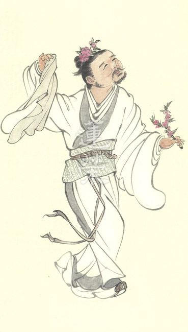

### 華夏精魂千秋(十一)
		—明倫史畫負荊請罪─廉頗

華夏精魂千秋(十一)

—明倫史畫負荊請罪─廉頗

圖：江逸子‧文：淨域

國之棟樑將相

合力能令邦興

一場將相同心

留下歷史佳話

史話

廉頗(約西元前二百五十年)，戰國時期趙國大將軍，以善戰名聞諸侯。秦國欲向東擴展勢力，多番攻打趙國，皆被廉頗所敗，改採合縱政策。趙惠文王得和氏璧，秦昭襄王詭稱以十五座城池交換，藺相如持璧出使秦國議事，終不負重任完璧歸趙。

秦國將攻楚國都城鄢郢，欲與趙國修好會盟於澠池。趙王與藺相如一同前往，廉頗對趙王說：「大王這次行期不過三十日，若三十日未歸，請預立太子為王，以斷絕秦國要脅的冀望。」廉頗的周密思量，壯大了趙王的行色。 盟會中，秦王令趙王鼓瑟，藺相如則持刃逼秦王擊缻。經多番較量，趙王終不受辱而返，乃拜藺相如為上卿，位在廉頗之上。廉頗有所不服，乃宣言：「以後遇見相如，必定羞辱一番。」藺相如聽聞後，時處迴避與之碰面，甚至於託病不上朝。隨從以為恥欲離去，藺相如對說：「我不畏懼秦王，又豈害怕廉頗。秦國所以不敢來攻打我國，乃是忌憚我二人。若將相之間不和，國家便要危險，避之以安國興邦。」廉頗聞知後感到羞愧，即袒胸露臂負荊前去請罪，將相和解共效國命。

秦昭襄王四十七年(西元前二六二)，秦攻佔韓國野王(今河南沁陽)，切斷上黨郡與韓國本土的聯繫，韓桓惠王畏懼欲獻上黨於秦，而郡守馮亭不從命，反結盟趙國以抗秦。趙惠文王死，子趙丹繼位為孝成王，派廉頗駐守長平以抗秦，面對秦軍之強攻，廉頗採築壘固守之勢，重挫了秦兵的銳氣。

秦軍見速戰不得，便施以反間計，謠傳說：「秦國最擔心的是趙括取代廉頗。」趙王以為廉頗怯戰，欲使趙括統率大軍，雖藺相如力諫趙括紙上談兵，終不能改變。趙括改守為攻，反遭秦將白起包圍，糧斷援絕困於長平，經五次突圍不成，趙括戰死，四十餘萬軍民投降盡被坑殺。

隨後秦軍攻趙都邯鄲，賴楚、魏等國援救，趙國才獲解圍。趙國經長平之戰元氣大傷，燕王喜乘機舉兵攻趙。趙王重新啟用廉頗為將，兵分兩路固守代地與進擊鄗地。廉頗於鄗地斬殺燕將栗腹，並直驅燕國都城薊，燕王大驚割五城以求和。鄗代之戰後，趙王封廉頗為信平君；晚年因不得志，先後投奔魏、楚兩國，去世後葬於壽春(今安徽省)。

圖解

一位功在國家的大將軍，所以能不顧顏面地公開向後輩請罪，除須發自內心深沉的省思外，還要有一往直前雪恥改過的擔當。國之興亡在人，而能人不出文武二端，文官愛財則貪腐，武官畏死當逃敗，將相失和社稷垂危，文武和合國泰民安。二人皆以國家興亡為己任，又置個人榮辱於度外；所以，藺相如為國忍辱負重，因此稱病迴避；廉頗負荊請罪亦是為國，所以知恥悔過。 本圖所繪，乃廉頗負荊請罪之況，二人跪地墮淚相扶持，藺相如似在說著：「我與你秉著忠心扶保朝堂，讓將軍皆是考量以國為上，怕的是我們文武不和、手足相傷。」而廉頗回道：「承相，實在是你大義心腸將我來讓。」藺相如又說：「我敬重你英勇無雙。」廉頗亦回道：「從今爾後你如同我的師尊一樣。」藺相如也說：「你是我的前輩老先生。」廉頗直道：「愧不敢當。」藺相如後說：「保國家，我憑文。」廉頗接道：「我憑武。」二人攜手同訴：「忠心秉上。」如此一場將相和，感動朝班文武大臣。（下期待續）

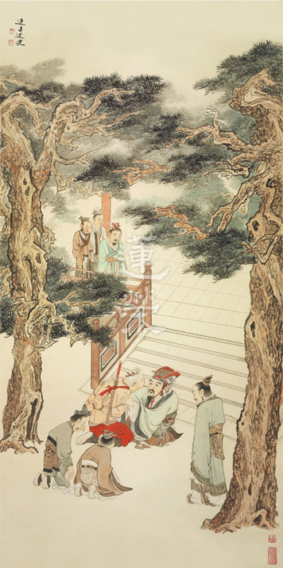

### 孝經圖簡說(九) —聖治章

圖：江逸子‧文：時哉

治國千頭萬緒

關鍵上下能和

表徵孝道祭祀

得道多助安邦

聖治章第九

孝經的第九章是聖治章，承接著第八章孝治章而來，表徵以孝治天下，就是具有聖人之德的天子，會以孝治天下。

所以本章特別以周公這位，曾代理天子七年的攝政王作為典範。周公祭天以父親文王陪祭，何以如此尊崇父親？父親文王的恩德，除了養育之恩，特別是教育孩子成為人才，甚至成為國家領導人的這一分恩德最重，這種恩德惟天可比。

周公如此的孝心，令諸侯們心悅誠服地來助祭文王，這種以孝治天下，最得各國與本國臣民的擁戴，且風氣淳厚、天下太平。

江先生所繪的聖治章，畫面中祥雲繚繞，祭壇上的人即是周公，正祭祀上蒼及祖先，表徵雖天下大治，卻不居敢功，祭祀求加被，表達對上天及祖先的敬畏，所行不敢違背上天及祖先，為政的功德拿來光宗耀祖。正因為周公有如此孝心，所以為政必然講究正確的動機與作法，諸侯恭敬地前來助祭。

圖中的祭壇上有四方鼎焚香禱告，敦、鼎、簋是裝食物的器皿，觥是酒器，以上是祭壇上的祭器。

祭壇下有武樂將士執戈與盾，文樂舞生右手執翟、左手持籥跳佾舞，樂工吹笙、笛、簫，敲鐘擊鼓。圖右下方執笏者，乃前來助祭的諸侯是「相維辟公，天子穆穆」，肅穆恭敬的在一旁陪祭，旗海飄揚，表徵諸侯助祭的盛況。

聖王以治國的理想抱負與成效，來莊嚴他的祖先與天帝，是以孝治國最殊勝的表現，除了感召各國國君前來助祭，也能敦化國君們以孝治國。祥雲遍布表徵吉祥。孝道所彰顯的祭祀，是天地間最為吉祥的，用它做為本質而辦教育、辦政治，是最上妙的經營。歷代畫作的表法皆同，只是風格略有不同而已。(下期待續)

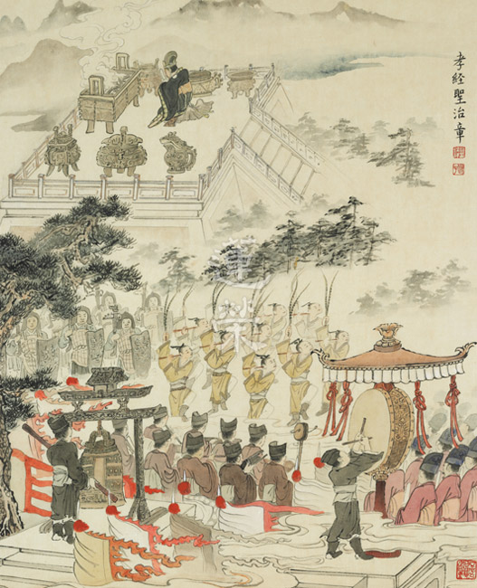

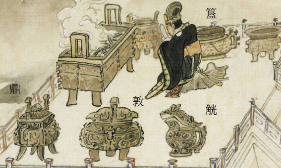

## 專題報導

### 時哉時哉紀念專題
      	─俠骨詩情李雪廬(下)

時哉時哉紀念專題

─俠骨詩情李雪廬(下)

*編輯部*

一生是苦難歷史

一心是古代熱腸

一味是利他情懷

一向是衛道聖者

主持人：中華文化以孝為核心，可是老人長時間擔任公職，無暇兼顧家庭，還能算是一位慈父或孝子嗎？能算圓滿孝道嗎？

唐瑜凌老師：在孝經課程中有提到，孝子在家裡必須侍奉父母親，其次就是好好的為國家辦事，最後能夠透過對道的內化和實踐讓名聲普及，讓他的父母親得到很大的尊崇，這就是孝子真正的大孝！

老人家這樣做，也是獲得了家人的體諒，並非一意孤行，雪廬老人的祖父李景淳先生，要雪廬老人到奉祀官府去上班！老人的孩子李俊龍先生也回憶他的父親，在他心目中是非常有份量的。

所以，雪廬老人或許在家庭上沒有辦法長時間的陪伴父母親、教育兒子，但是他的為公發心，特別是護持孔家並且把道弘揚出去的那一分，利益很多人，乃至於讓教法延續下去，也讓我們後輩對雪廬老人一家充滿了敬意，對於傳承充滿了景仰，老人是真正在本質上盡大孝。

國共戰爭時國民黨潰敗，很多的部隊、人民跟政府機關相繼撤到台灣，臺灣當地也因為經過二二八事變，對外省人非常不友好。當時政府機關也沒辦法馬上就位，雪廬老人剛來的時候還沒領到薪水，屈萬里先生主動找老人出去吃飯，所以老人有一首詩來感念屈萬里先生，就像漂母濟韓信一樣。

老人來臺灣的時候已經六十歲，一路從南京到基隆，不但要保護孔家，還要負責押送文物，體力上應該是難以負荷的！但因為老人他有武功的底子，過去他的舅舅曾教他輕功彈跳，雪廬老人平常也會舞梅花劍，後來因為年紀大，弟子們才不讓老人舞梅花劍。

侍者騎摩托車載著雪廬老人出去講學，他在後座用腳夾著摩托車，就跟以前騎馬一樣，非常瀟灑的揮帽跟兩旁的朋友致意，旁邊的學生看來覺得很危險！可見老人不只文學造詣高，他的武術體能也非常強，晚年講學除了浩然正氣以外，還有他的毅力和體能，講經的聲音是亮如洪鐘。曾聽侍奉老人的弟子說，老人出門的時候，還會用布把腰束緊，就像以前練武功一樣，可見學習文化不只要讀書，身體健康也是非常重要的！

主持人：剛來到臺灣時百廢待興，情況非常的混亂，而且這些老先生來到臺灣，講話的腔調臺灣人聽不太懂，請問老人是如何突破這些困境而貼近臺灣人，在臺灣辦出這麼多事業呢？

唐老師：首先一定要結善緣！雪廬老人過去在大陸學過中醫，他到臺灣來先辦義診，老人開的藥方價格都非常便宜，不但怕一般人買不起，也彰顯老人厲害的地方在於，只要能對症下藥，藥到病除，藥材不必多！

雪廬老人把這些人病治好，用意在哪？老人不收錢，只說希望能來聽他上課，透過義診行醫的方式跟臺灣人結緣，希望他們來聽課。這些本省人乖乖來聽課，可是都聽不懂，很懊惱！一來聽不懂外省人的口語，二來是程度差，所以老人辦國文補習班，找最好的老師，像孔德成先生、劉霜橋老師、董正之老師、周邦道老師等等，不惜血本的教這些臺灣人！

老人家喜歡臺灣人，是因為臺灣人淳樸又有真情，家家觀世音，戶戶孔子公，這是一個教化的好地方。老人也曾經問路，豬肉攤老闆乾脆連生意都不要做，帶他去他要找的地方！老人常說他不是愛臺灣的阿里山，也不是愛臺灣的日月潭，他是愛這裡的人心！雖然懵昧無知，但是可堪教化！

老人當時來到臺灣，以中醫義診跟辦國文補習班為先，中醫義診結善緣，辦國文補習班來提升當地居民的素質，透過這樣的方法突破困境以後，辦了非常非常多的事業，比如說教育、慈善，甚至於辦醫院等等，都算是開風氣之先。

老人一九四九年來到臺灣，第二年開始就席不暇暖的到監獄弘法，接著辦刊物，先從覺生、菩提樹，最後是明倫月刊，老師曾經讚歎明倫月刊說：「臺中高士唯明倫！」這個刊物能夠提倡儒家的內涵，明五倫就是中華文化的核心，能夠帶給我們幸福美滿快樂的日子。

老人家六十三歲的時候，也曾經指導中西樂隊，他不拘泥於古人，辦樂隊傳播有益世道人心的歌曲，並且在一些重要的場合，以音樂伴奏，讓氣氛是該莊嚴的時候莊嚴，該輕鬆的時候輕鬆，用音樂去表徵內涵，這也開我們臺灣風氣之先！

老人還辦了一座私人的慈光圖書館，並在這裡講學，也歡迎大家在裡面閱覽、讀書、看報紙。後來也甚至辦出版社來印贈善書結緣。接著受黨國元老陳立夫先生邀請，一起創辦中醫大學，老人成為創校董事，並在中國醫藥大學裡教授黃帝內經。

不只這樣，老人在七十歲（一九五九年）辦了孤兒院，老人跟孤兒院院長說，我們養孤兒要好好教他們，印光大師說：好好培養孤兒，他也會成才！像宋朝的宰相呂蒙正就是孤兒，佛教的道安和尚也是孤兒，所以老人非常重視幼童的教育。

還有就是臺灣第一座慈善醫院─菩提醫院，是在慈濟醫院之先，以及仁愛之家（安老所）照顧老人，當時財務曾經發生困難，老人就把積蓄拿出來補貼！老人是很有俠氣的人，當他決定要承擔一項事業時，答應人的事情，曾說：大不了回去把房子賣了！

甚至辦演講比賽，辦理空中廣播，利用電台弘法，裡面講的是論語、寓言故事等等中華文化的內涵。

還有一件慈善的事情，也是開我們臺灣風氣之先，就是急難冬令救助。

主持人：除了這些以外，還有一件事非常的特別，雪廬老人很有遠見，他在一九八三年的時候，就辦了明倫動畫訓練班，不曉得老人當時是什麼想法？

唐老師：一般在弘揚正法的時候，有的人根器比較差，沒辦法直接誘導他，最好的方式就是漫畫，雪廬老人曾說自己拿到明倫月刊都會先看漫畫，更何況是我們，所以用漫畫來推廣正法是很善巧的，叫做以藝載道。

雪廬老人當時也成立了動畫班，由王社長畫動畫和教導學生，後期還有江老師培養學生，而且江老師辦畫展的時候，老人都會親自去欣賞觀摩指導。

主持人：學生也聽說雪廬老人在晚年，九十五歲從孔府退休以後，甚至把他的退休金拿出來當獎學金，這是真的嗎？

唐老師：他把奉祀官給他的退休金都拿出來，成立至聖府孔學獎學金，提出的文章是看文章的內涵而不是論字數，好的內涵給的獎學金多，這些文章都投稿在明倫月刊，所以老人一生是沒有什麼積蓄的，凡有積蓄都拿來做公家的用途，這真是相當不容易。

主持人：老人辦的事業很多元，教育、慈善、醫院、孤兒院等，而且還辦廣播、辦刊物！可是好像老人是屬於重質不重量，不求把事業做得很大，尤其老人還訂了社務規矩，老人想要移風易俗，推廣善良風氣。尤其社務裡面特別訂立要講述經學，不曉得老人訂社務的目的是什麼？而且為什麼是講學為先？

唐老師：用講學把人才培養起來，共同辦法行事業，這裡面教育事業、文化事業、慈善事業，才能化導人心，才能將風氣改變，但首先一定要透過講學事業去培養人才凝聚共識。講學裡面，最難的是經典的講學，及找到好的學生。老師們憑著熱忱，學生們也需要好好的用功，依著聞思而將經典內化，並透過辦事訓練對教法的悟性。其次訓練講經，這時候人才才會慢慢的出來，人才彼此之間有共識的時候，事業才能發展，中間也不容易變質。

憑老人的聲望以及大家對他的擁護與信任，他要在臺灣做很大的事業是不困難的！但誠如剛才主持人您說的，雪廬老人他是重質不重量，而且他很害怕講學事業會變質，雖然他很有眼光和見地，但是也很保守，他寧可前面穩紮穩打，也不要後面變質到難以收拾。事後回想，也證明老人有非常殊勝的遠見。

可見社務的訂定，跟孔門四科其實很有關係，從德行的培養然後訓練說話、辦事，乃至於文學各方面，以德行作為核心去辦種種事業。

老人除了辦事業，也重新制訂婚喪等相關的禮俗，禮儀制定了以後，會讓人懂得該進該退，在進退當中表達情誼，使得風俗更為淳厚。

老人曾經主持過佛化婚禮，他說男女雙方門楣相當並不是財力或地位相當，而是說品德相當，老人做證婚人，希望家庭能從夫婦這一倫開始　　　　講究，其次有父子、兄弟的倫常，出去跟長官、部屬之間就有君臣關係，還有跟朋友之間的相交，總共有五倫的關係。

然而五倫關係要先從夫婦開始，所以老人非常重視婚禮，親自作證婚人，並在禮儀當中讓男女雙方兩家知道結婚的意義，以及結婚對家庭的重要，乃至於對國家民族文化的發揚及延續上，夫婦這一倫是最重要的源頭。我們現代人不了解禮儀表徵這些內涵時，就會覺得禮是繁文縟節，不合時宜。

主持人：上一集我們請老師用一則論語來形容雪廬老人，那如果用一個字來代表雪廬老人的話，老師您會想要用什麼字呢？

唐老師：雪廬老人曾經跟弟子們說，我有一個字大家都比不上的，就是「忍」字。心上一把刀的那個忍，是因為雪廬老人能夠忍受跟家人分開來到臺灣的鄉愁，逃難中間孤零零地歷經艱難的忍。

還有在辦事業時，還沒辦起來的時候大家是觀望的，辦起來的時候就有人想要來錦上添花，所以如何在辦事業當中，忍受很多的狀況，種種該堅持原則必須要堅持。

包括講學事業，也可能會遭到邪見者的毀謗，講學時或許會得到很多認同，也可能會得到很多的護持，或者教出很多人才，讓別人看得很不順眼，甚至遭到毀謗，這都要修忍辱。

修忍辱必須有非常高的見地和遠大的理想，也必須有隱密的智慧作本質，才能夠忍得下去！

主持人：我們做好事卻還要遭到毀謗或是各種責難，這實在很痛苦！不曉得雪廬老人是用什麼樣的心？居然能夠忍得住，而且堅持下去，請問的目的是什麼？

唐老師：因為他知道逆境困難、挫折、障難的好處！就像用刀去磨石頭，刀子要藉石頭磨才會利，人也要藉挫折障難來磨鍊煩惱習氣，磨練自己的願力和精進力，所以老人說：「歡迎困難！迎接挑戰！」歡迎困難的本質就是一個忍，忍的本質就是智慧力，老人說這個忍字，大家是比不上他的。

老人的弟子曾說，有一位學生在某些事情上跟老人有誤會，跑來責難老人，老人只是靜靜的聽他指責。雪公老師就有這種能耐，該表達的時候表達，不該表達的時候他可以忍到底，完全不做任何的回應。

主持人：老人主要都是以講學為主，王禮卿教授曾經禮請雪廬老人著書立說，可是最後老人拒絕了，其實著書立說也不錯！為什麼他要拒絕呢？

唐老師：培養人才非常重要，著書立說的後面如果沒有人才，著書立說也沒辦法推展出去。有一句話叫做「人能弘道非道弘人」，經學要靠人去弘揚才有價值，經學本身擺在這裡是沒有功能的。我們要的是一個傳承的人才，古書才能夠發揮它的價值，如果我們本身不是人才，古書都變成古董了。所以培養人才又比著書立說更為重要，並非著書立說不重要，而是眼前必須要培養人才把文化延續下去，當務之急是好好的培養人才，否則以雪廬老人的才情，他也真的可以埋首於書堆中著書立說。

主持人：既然培養人才這麼的重要，那雪廬老人在培養人才上做了哪些事情？

唐老師：首先當然是出去演講與外部結緣，後面還有培訓弟子，更重要的是他辦了大專講座，讓大專生好好的學習正法，從這當中，選拔人才，進入內典班跟論語班，培養可以傳承的弟子，延續老人的志業，這個傳承比什麼都重要。如果後面沒有接班人，那所有的豐功偉業都會毀於一旦。

主持人：可見培養傳承很重要。不過內典班只有八個人，按照一般常理來說，傳承既然如此重要，傳承的人應該是愈多愈好才是，怎麼只選八位？雪廬老人在選擇傳承弟子上面的標準又是什麼？

唐老師：老師難找，弟子也難找。弟子們除了要挑質地好的，還要有公心的、能夠奉獻的、有誠意的，並不是不要多，而是找不到這麼多。找到好的學生，老師必須要盡全力，所以內典班雖然只有八位學生，可是老人都是找最好的老師來教。或者自己教，或者是找醒公、聖公老師、王禮卿教授等，來好好的培養他們。用四年的時間把他們教出來，有的能在講學上發揮功能，有的是在辦事上發揮功能。

主持人：除了難能可貴的內典班以外，剛剛老師說到論語班，孔德成孔先生拜託雪廬老人開設論語講習班，當時雪廬老人已經九十一歲高齡了，他為什麼還願意去承擔？甚至講課講到很晚？

唐老師：這就是雪廬老人的古道熱腸，而且是不忍聖教衰，雪廬老人有一張公文，就是孔先生聘請雪廬老人講論語，雪廬老人在他生命最後這四年當中講論語，把他個人的經驗閱歷、古書的抉擇，人情世故的通達，都化在論語講席上去做講解。

他跟徐醒民老師兩個人，一個講上論一個講下論，在下一期時又一個講下論，一個講上論，來培養最後期的弟子。老人家一生的精力都發揮在講學事業上。即使他晚年因為講學而讓他身體產生很大的消耗，可是他也願意去犧牲。弟子們勸他休息，他說讀書、講學就是最好的休息，有人勸他要吃補，他說吃菩提就是吃補，好好的將經典內化，好好的講學就是最好的吃補。

主持人：原來背後就是靠著他的精神、靠他的願力、靠他經學的學習、靠他對人們的關愛，支持著他往下走。

我們平常在時哉時哉網路教育學院裡面上論語時，特別是科判的上課方式，其實這就是雪廬老人上課很特別的教學特色，可不可以請老師也說一說。

唐老師：老人他的教學特色，像作表分析、作科判等，這是老人家非常好的特色，我們過去在聽課的時候，老人要我們先讀註解，然後上課看他怎麼說，他上課的時候都會做表分析，中庸、大學等都是做表分析，這是他上課的特色。

而且講學要先有交代話，把上一堂課與這一堂課做聯繫，入文的時候又能夠做表分析。最後又有他的按語，雖然是選擇古注，到底為什麼要選這個古注，要選漢儒還是選宋儒？他也有他獨到的看法。

所以我們一方面跟老人學如何講交代話，怎麼去入文分析，怎麼去抉擇古注，也在這裡面看到人情世故，如何通權達變，如何面對眾生，這些人情世故都可以在經學當中學到。但是這必須要透過老人講解才有，光看古書是看不到的。

主持人：：除了講學的特色、做表分析的能力以外，老人培養了非常多講學人才，除此之外，他又是如何去攝受與影響三教九流的弟子？

唐老師：當雪公老師有了名氣以後，各方面來求教的人就多了，老人家有時會見某些人，會跟弟子說你站在旁邊都不要講話，你看我怎麼去應對。一方面攝受別人，一方面也調教弟子。

雪公老師是閱人無數、人情通達，所以可以在跟對方交談當中判別他是善人還是惡人，程度到哪裡，是否好引導，是可以循循善誘還是必須要默擯，一旦來學的人有學習的誠意，老人都非常樂於提攜，這也是雪廬老人在講學當中跟一般人不一樣的地方。他懂得觀機逗教、循循善誘，但是也懂得在不能調教的時候默然，這都是非常重要攝受眾生的方便。

主持人：所以雪廬老人的教學，不論是培養人才或影響各個層面的人，不管是教育還是事業，含遍了生老病死的各項關懷，從剛剛講到育　　幼院、托兒所的啟蒙教育，一直到老年的臨終關懷。是否可以請老師說說啟蒙教育背後的精神，還有它特殊的教學方法。

唐老師：啟蒙二字就是從易經的蒙卦：蒙以養正而來。開蒙的時候就用文化的內涵，用正知見去引導他們，養成端正的人格。所以啟蒙班重在德育，當然也不廢除經學的讀誦，老師們也以禮樂來薰陶學生。

老人說國學的國就是自己的國家(中國)，學就是教育，啟就是開啟，蒙就是發蒙，所以啟蒙教育並不是教大家學畜牲，老人說幼教不是教大家學狗叫、學貓叫，是學聖人，剛開始就要引導他往正路上走。

就好像拉坯的師父，剛開始就決定要把它形塑好，為師者必須要好好的去雕塑學生往對的方向引導，這才是真正的好老師。老人非常重視啟蒙教育，每次辦活動都親自出來主持，也勉勵老師們要認真的教。

所以雪公老師九十六歲的杉林溪之旅，就是慰勞啟蒙班的老師，當然老師們很喜歡跟雪公老師出遊，所以才有杉林溪那一段影片。

啟蒙班裡面不只是德育的培養，還有各種音樂教育、禮儀教育、詩詞教育等，帶孩子們了解詩意，並且帶他們吟誦，讓他們吟詠在其中、樂在其中。

還有戶外運動，學生文武要合一，能夠讓孩子們聽課時很有專注力，代表這個教育是成功的。威儀要從行住坐臥去培養，這些教育在常禮舉要都有。

還有吃飯的禮儀，在國民生活須知裡講到很多吃飯的禮儀，世上最難的是吃飯。

孔德成先生曾經回憶跟蔣介石先生吃飯，那個時候孔先生大概只有十幾歲，卻能將主人的角色演好，那頓飯吃完以後，他回去是請家人煮個麵來吃！原來在餐桌上，重點不在吃而在禮儀，若狼吞虎嚥、動作很粗魯，會讓人家看在眼裡、笑在心裡，所以吃飯的禮儀是非常的重要，代表一個人的家教。

再者雪廬老人辦育幼院的時候，孩子們是該靜則靜、該動則動，動就給他們動得夠，可是要動得合乎規矩而不是躁動、亂動。

吟詩也是靜中有動，動靜相調，將把一個人培養成有氣質的學生。

雪廬老人的啟蒙教育，就是一種禮樂的教化，而禮樂教化的本質就是學習做人的道理，從小就給予他一條正確的道路，引導他向上發展。

所以常禮舉要裡面才說，很多年輕人因為不學禮吃了無限的虧，如果他能在前面好好的學禮，入世就不會吃那麼多虧，可見人格教育有多麼的重要！

主持人：雪廬老人辦了這麼多的教育和慈善事業，後面還辦了圖書館、醫院等，一直延續到現在。不過有件事情覺得很匪夷所思，雪廬老人六十歲來到臺灣，嚴格定義起來應該算是難民，怎麼可能一位難民不但救濟臺灣人且辦了這麼多事情？這背後是什麼樣的原因呢？

唐老師：孔子曾經感嘆的說：「道之不行乘桴浮於海。」或者是「子欲居九夷」，雪廬老人說：孔子講的話想不到應在我身上，孔子到海外行道的因緣不具足，想不到由雪廬老人具足。

雪廬老人自說是北人南相，注定到南方來。他來到臺灣，抱持的心態就是一種行道的心態，而不是逃難的心態，這跟一般人從一開始心境上就不一樣。第二、他懂得去關懷別人，知道利他才是出路，愛這裡的人心，透過種種利他的能力與他人結善緣，由此而引入老人的講座，透過經學的聽聞找到人生的出路，自然所做的事業就會得到他人的擁護。

這三十年來，老人家創辦的事業能夠一直延續，都是靠文化的力量，讀古書往往覺得很遙遠，可是一想到雪廬老人，就感覺古書變得十分親切，原來行道這麼有出路！原來從雪廬老人身上可以看到當年的孔子，看起來他是周遊列國一無所成，其實他的人格魅力，早就感動了不曉得多少人，早就不曉得贏得多少人的信任跟擁護！乃至於他刪詩書、訂禮樂、贊周易、修春秋時，又變成國家標準版。

主：雪廬老人也曾寫了一首自況詩〈殘燭〉。雪廬老人在詩學上，研究功夫是非常深厚的。殘燭這首詩代表的到底是一個什麼樣的心境，這樣的吟唱法有什麼特別處？

唐老師：殘燭是雪廬老人自己說他自己，人到晚年看起來就像是蠟燭快燒完，生命雖然逐漸在消失，可是利益有情的心永遠不變，縱然像蠟燭燒完了，但是他還是在利益別人。

生命是會結束的，但是利益人的心是無盡的，用燒蠟燭來照別人，自己已經是愈來愈殘、愈來愈弱，可是光亮還是在照別人，等於是燃燒自己照亮別人，那是老人的自況詩，也是老人家在臺灣的寫照。

我以前也很喜歡吟雪廬老人的詩，常趁著公餘之暇，到辦公室後面的小花園，繞著小花園吟老人的詩，來表達對老人的緬懷。用這種吟詠來表達如果這是我的志願該有多好！我也願意像雪公老師這樣，燃燒自己照亮別人！

而且老人所留下的詩的吟唱法更是一絕，能照顧到平仄，該平聲則平聲，該仄聲則仄聲，清清楚楚的，透過吟誦暗暗的學習了詩的格律，不同的格律就有不同的吟法，很清楚的。

主持人：老人在逃難的過程中也常常和孔上公相互和詩，乃至於遭遇戰亂，或是後來在臺灣講學，他都寫了非常多的詩。曾經發生過一個小插曲，就是老人家附近失火，然後他衝進去房子只為了搶救詩，為什麼？

唐老師：老人住房附近失火，他出來研判火會不會燒到他家，他的研判或許有可能，所以他就進去屋裡，一般人是拿地契、黃金，但是老人衝進去是拿雪廬詩文集，為什麼？我想這裡面可能包含著他的回憶，也可以說是他一輩子的心血，以及整個從清朝到民國的近代史。

雪廬老人曾說他的學問有三個秘密，第一個秘密就是詩，詩的用字必須很精準，有時候一個字不對意思全跑掉；第二個就是法律，學法的人用字也很講究，蓄意殺人跟無意殺人罪名是完全不一樣的；第三個就是佛經的科判，讀書必須要有架構。

他又是如何學詩的？他曾經有五年的時間，晚上睡覺前背幾首詩，第二天早上先不起牀，先默背昨天背的詩，有些字忘了，老人在牀上開始填字，填到自己覺得滿意了，下牀翻古書查證，一看才知道詩人高明，

他也因此獲得很多的感悟，其中李太白的一首〈渡荊門送別〉：月下飛天鏡，雲生結海樓。那個「飛」字，雪廬老人說一百年都寫不出一個「飛」字，因為跟好朋友相聚太短暫了！所以月亮像天上的鏡子飛下去！如果是不斷抬頭看月亮，月亮動都不動，那表示聚會太無聊了！「飛」字就是形容相聚的時間太短暫，一下就過了！

雪廬老人的詩學到位，曾經看到學生在背韻腳、翻韻腳，老人就跟學生說整部唐詩的韻腳都在他的肚子裡！

雪廬老人也曾在大學講詩，老人講詩是非常權威的，他也藉著這些詩來表達他的感情，詩可以興、可以觀、可以群、可以怨，興就是發起靈感，觀就是觀察時勢，群是描述五倫關係，怨是發牢騷，詩除了可以興觀群怨外，詩還是最美的文學。

雪廬老人本身所作的詩文集，時間是從青年到老年，範圍是從大陸到台灣，如果能將這兩、三千首詩文好好瀏覽，會瞭解雪廬老人內心世界，老人很多人生的體悟都是藉著詩去闡發。

臺灣的亂象，有人說媒體，有人說民意代表。老人怎麼形容民意代表？他說是「秋風秋雨夜淒淒，多少行人路轉迷。莫信函關天近曉，咿喔盡是孟嘗雞。」

在秋天的晚上風雨交加，行路人在風雨交加的時候，很容易就找不到路，你不要相信函谷關天已經亮了，因為咿喔盡是孟嘗雞，就是孟嘗君裡面雞鳴狗盜之徒學雞叫，結果各路的雞都叫，讓函谷關的人認為天亮了！就把門打開，孟嘗君一群人就衝出函谷關。

這首詩的意思是說，這些叫來叫去的都是孟嘗雞（雞鳴狗盜之徒），這是「言之者無罪，聞之者足鑑」，政治人物都在那裡瓜分利益，謀個　人的利益，說得冠冕堂皇，反而讓人更不曉得路在哪裡。

雪廬老人始終如一，他始終如一的就是對文化的熱忱，始終如一的就是他人格的特質，始終如一的就是他的幹勁，始終如一的就是他的公心。所以他說辦事、用人要論公心，這個人如果以私害公絕對不能用，這就是始終如一的部分，絕對不會改變。

主持人：老師您跟雪廬老人學習的過程中，雪廬老人的內涵和展現出來的氣象，對老師您產生了什麼樣的影響？

唐老師：只能說仰之彌高、鑽之彌堅。可是我連說這話的資格都沒有，因為這話是顏回讚歎孔子的，我們只能揣摩那個心境，雪廬老人的內涵，用之就能給我們很大的利益和受用，老人家的講經表解，所使用的表注以及講學資料，如果能好好深入，定能受益無窮。

老師給我個人最大的影響，就是老人的言行一致，如果能好好的言行一致，相信會帶給我人生很大的出路。

主持人：是的，其實老人對我們後輩也產生了影響，今天有這樣子一個緬懷老人的專題，不曉得老師是不是也有所期待？或者透過大家一起來弘揚雪廬老人的學說，能為後輩的弟子帶來什麼樣的影響呢？

唐老師：老人的好學，而且這種好學是在經學和古人的見地，以及人情世故的通達上。不論在公心上、在願力上，對後輩都是最好的影響。

學問必須要利益世道人心，而且是活到老學到老，老人家是幹到死，這就是俠骨詩情！這是對後人最好的影響。

每一個人都應該要具有這種勇氣，像一個俠士一樣，能夠見義勇為，這中間不是虛情假意，都是真情流露！真情才會感人，真情才學得到東西。詩的悟性是學東西的精華，俠氣是學習經典的心，是學到精華的能力。

一個人能夠具備理智，也能在感性上合宜的去發揮，這是最能感動人的。老人是愛好學習文化者最好的典範。

節目到這個地方也要告一段落了，非常感謝唐瑜凌老師今天的分享。也祝福唐老師在未來能夠身體健康，道業事業都能夠持續增長。也祝福在場以及網路上的觀眾朋友們，希望大家都能夠藉由這一次的節目，更認識這樣的一代大儒，能夠激勵自己、砥礪自己，讓自己在文化的熱情上永不退縮。當您遇到困難的時候，或許想想雪廬老人，勇氣和熱情都回來！能夠超越各種的困難。也希望這樣一個節目，能夠給大家帶來正面好的影響，謝謝大家的收看，我們之後再會，謝謝大家！(全文完)

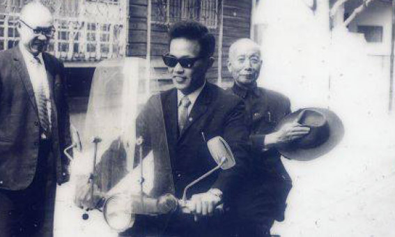

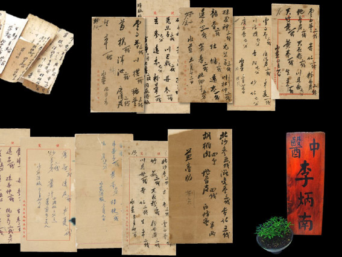

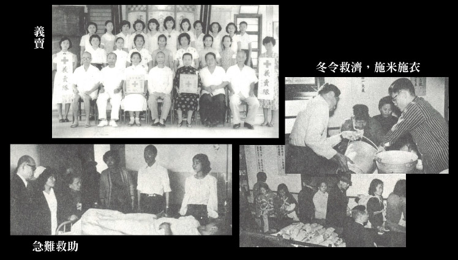

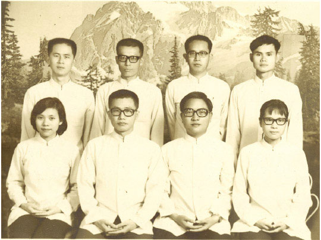

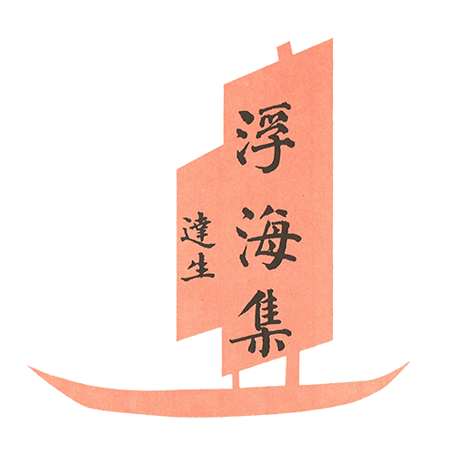

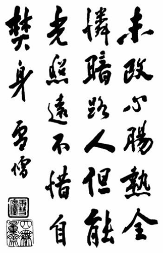

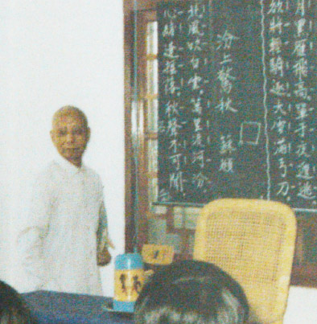

## 蓮池海會

### 徐李金蘭老居士往生見聞記

淨爾

歷經人生苦難

化作一臉慈祥

謹守口德安分

子孫回憶典範

徐李金蘭老居士生於民國十九年四月二十日，卒於民國一○五年七月三十日上午八點，享壽八十七歲。老居士出生時值二次大戰期間，鄉下人家普遍貧窮也沒有受教育的機會。老居士十多歲即到親戚家幫傭、照顧小孩、牧牛等，當年照顧過的孩子，如今都已經是六、七十歲的長者，還念著老居士當初照顧他們的慈愛模樣。

老居士十八歲時憑媒妁之言嫁給素未謀面的先生徐福枝，她的公公當初就是看中的她端莊賢淑而納她為媳。老居士嫁入徐家時，先生最小的弟弟也才兩歲，作為長媳的她要料理家務、侍奉公婆以及照顧年幼的小姑小叔們。徐福枝先生是個勤勞的人，白天忙農事，晚上編米籮，農閒時就去當泥水工幫人家蓋房子，老居士就去幫他當小工挑磚洗磚。先生賺了錢回來要立刻把薪水全數交給婆婆，老居士雖然手無分文卻從無怨言。

老居士生性寡言，客家人逢年過節要炊粿，她不會，她就默默的看、默默的學，後來她所做的紅龜粿、草仔粿、各式年糕、蘿蔔糕都極其美味，迄今孫子們想起來都還齒頰留香，回味不已。

老居士生了三子二女，但么子甫一出生，就因為家中食指浩繁，且婆婆聽信算命之言，而作主把么子送養給當時在新社駐軍的外省人夫婦，老居士萬般不捨，卻不敢違背長輩之命，後來去看過么兒一次後，收養家庭表示不希望有任何往來，老居士只好強忍思子之情。後來這家人遷徙之後，完全不知去向，老居士晚年提及此事，孫輩表示要協助尋找，但老居士基於當年的承諾，拒絕了孫輩的好意。

老居士三十三歲時因為肺積水住院，詎料，從不生病的先生竟因為感冒引發肺炎送醫，夫妻倆一人住一間醫院，可憐徐福枝先生竟一病不起，溘然長逝。老居士拖著病體出院幫先生料理後事，後又再回到醫院治療肺病。徐福枝先生往生後，徐家支柱頓失，家裡沒了能幹粗活的成年男人，只剩女人和小孩，老居士只好和婆婆挑起一家重擔，老居士一個女人家要下田務農，做不來的工作請人做，僱工收割了稻子也偷走了稻子，稻子產量不多無法販售，因此婆婆外出幫傭帶回來的薪水，往往只勉強夠支付油鹽醬醋各種生活開銷的賒帳。

年輕守寡失去依靠又要撐持一大家子，讓老居士好幾年的時間每每暗自垂淚，有時除草到一半停下手來眼淚直流，鬱鬱寡歡了好多年，本來就寡言的她又更無意與人多做攀談。幸好已出嫁或外出工作的大姑、小姑們體諒娘家的變故，會相繼拿錢貼補家用、照顧兄弟的孩子。

小姑帶著孩子回娘家時，年幼的孩子不敢過山裡危陡的竹橋，是老居士揹著籮筐一前一後地挑他們過橋。因為老居士對婆婆盡心盡力，又友愛先生的手足，在大家庭裡謹言慎行從不說三道四，因而得到大、小姑們的敬重，不但逢年過節會問候這個大嫂，甚至有的還持續寄錢給她。老居士侍奉婆婆四十多年，她的孝行得到地方人士推舉，被選為孝悌楷模。但老居士卻從未提及她這張人生的第一張獎狀，家人還是偶然發現有此獎狀，追問老居士，但她只是輕描淡寫若無其事。

老居士一輩子拜觀世音菩薩，六十歲生日時，當時已經學佛的長子徐炳烘居士夫婦得到勢至念佛會廖老師的引導，了解到生日不應鋪張慶祝，應以善法相續，因此在廖老師的帶領下，和親友蓮友以及啟蒙班的孩子，於當時甫建成的雙翠水壩舉辦放生法行。老居士很高興，從此和佛門結了第一次緣。

老居士的婆婆八十一歲往生，過世前痛苦不安，助念兩天兩夜仍備受折磨無法嚥氣，在廖老師的帶領下，家屬在佛前懺悔、發願、皈依，沒想到法行一做完，老人家就斷氣了。自此，老居士逢人就說念佛好，念佛可以減少臨命終的痛苦，這是老居士和佛門結的第二次緣。

老居士八十二歲時，結束長居新社山上的生活，來到臺北和長子一家同住，佛化家庭四代同堂和樂融融，她後來回顧這幾年，她說這是在「享福」，老居士一生辛勞，晚年有兒媳照顧起居、孫兒噓寒問暖、曾孫承歡膝下，減少了她的思鄉之情。每逢周四會到學會參加共修，有的老菩薩跟她特別有緣，會塞給她人蔘等物品，讓老居士心裡很高興。這幾年裡，老居士每年跟隨兒孫參加共修、拜懺、齋僧、浴佛法會等各項學會活動，從旁隨喜。本來老居士在鄉下時因為血糖過高，心肺功能也不佳，必須服用大量藥物控制；但來臺北定居後，在晚輩的悉心照料、飲食控制和佛菩薩的加被下，完全擺脫藥物。

今年四月身體微恙，五月檢查疑似腫瘤，六月確診腫瘤擴散，老居士婉拒了侵入性醫療，也毫無住院接受安寧照護的意願，她坦然接受身體的變化，以及來日無多的事實，端午節時還努力包了上百粒粽子，並且一一交代後事，也親自打電話向親友道別。

只是腫瘤的擴散與壓迫日漸影響她的生活，也不斷挑戰著她念佛的信心。這段期間幸好有蓮友師長不時前來關懷、開示給她鼓勵，提起她的信心。子孫也盡力為她修善，除了週四共修，也帶她去中壢參加共修、拜懺，並前往西蓮淨苑齋僧，鼓勵她皈依，老居士忍著身體的不適，盡力配合子孫的安排。

弘明幼兒園在母親節活動前教孩子們按摩的技巧，孩子們學會後，回家正好為老居士按摩，孩子的力道不足實是毫無功效，但老居士心裡歡喜，醫院護理師來探望時，老居士還特別跟她說；「我的曾孫都有幫我按摩。」

老居士往生前最後三周身體多有不適，長子、長媳佛前發願全力護持，照顧老居士不假手他人，甚至婉拒聘請外勞或臨時看護的提議。白天子媳陪她念佛，夜裡三個孫子輪班陪睡，但老居士不改她不喜麻煩人且愛護晚輩的個性，能自理的事絕不假手他人。往生前的最後時光，病榻纏綿，夜裡哀哀難過，經蓮友前來開示，老居士佛前發願往生西方，自此日日祈求佛菩薩早點帶她遠離娑婆。七月三十日早晨八點，在血壓正常、無心肺衰竭徵兆，也非腫瘤破裂大出血，老居士在長子面前，於其持引磬的念佛聲中與世長辭。

蓮友前來助念十二小時回向後，深夜之後家屬三代合力念滿二十四小時，圓滿孝道，也令老居士安然往生西方，蓮品高昇。七七四十九天內，家屬也願以念佛、誦經、齋僧、供養大眾等法行迴向老居士，以報老居士對子孫的廣大恩德。

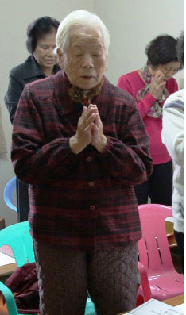

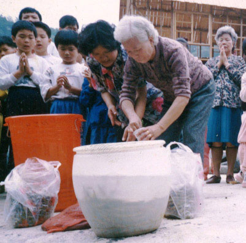

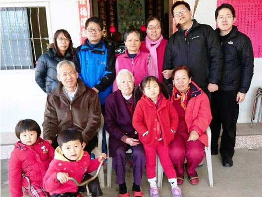

## 活動報導

### 孔子風采
    ─國學公益講習班講座報導

孔子風采

─國學公益講習班講座報導

淨本

泗水聖地今猶在

遙想當年聖人出

尼山致禱顏徵在

春秋典範孔仲尼

山東省曲阜市，是聞名遐邇的中華文化發源地，祀奉孔子的孔廟、孔子嫡系所居住的孔府、孔子及其子孫的墓地孔林，都座落在這個城市裡，成為人人所熟知的孔子故鄉。其實還有一個城市，它是文化源頭中的源頭，是至聖孔子真正的出生地，但這座城市的名聲卻遠不如曲阜，那就是位於曲阜市旁邊的泗水縣。宋朝朱熹的〈春日〉提到：「勝日尋芳泗水濱，無邊光景一時新。等閒識得東風面，萬紫千紅總是春。」在這個純樸的城市中，孕育出不少儒家的聖賢或名人，除了誕生於尼山的孔子，《論語》中記載具有勇力的卞莊子，以及孔子的弟子子路，也都是在此出生。所以這裡被稱為東方的耶路撒冷、東方的麥加，它是一座聖城，但是它沒有耶路撒冷那般頻仍的戰火，少了麥加蜂擁不斷的朝聖者，多的是寧靜與樸實的鄉村景緻，似乎與孔子溫和有禮的氣氛相應。

今年的八月十七日至二十日，就在泗水縣舉辦了一場由至聖孔子基金會所主辦的講座，主題為「孔子風采─國學公益講習班」。主辦單位禮請了「時哉時哉網路教育學院」理事長唐瑜凌老師及其師資團隊，前往指導授課，地點就在尼山聖源書院，並由中華大成至聖先師孔子協會、曲阜儒學新院支持協辦。能在孔子的出生地重新講述孔子的風采，具有特別的意義。

來自北京、福建、廣東、廣西、河南、河北、遼寧、吉林、湖南、江蘇、浙江、澳門及臺灣等，近百名儒學的愛好者參與了此次講座。在開幕儀式中，至聖孔子基金會周擁平秘書長擔任主持，執行長陳泰旭先生宣讀了孔垂長會長的致辭，期望此次講座能讓與會者沐浴先祖孔子的大道氣息，汲取各位老師的教學智慧，增強對傳統文化的自信心，並且增長自己的儒學修為，也增進同道間的情誼。尼山聖源書院榮譽院長王殿卿教授，在開幕的講話中強調這是天時、地利、人和的歷史結果，也回顧了五十年前的八月十八日，紅衛兵在此誓師並前往曲阜毀掉三孔，五十年後又在泗水舉辦了傳統文化的講座，非常具有歷史意義，並堅信孔子學說是中華文化的至寶。山東省泗水縣政協主席劉慶恩，以及曲阜儒學新院孔紅晏副院長，也向大家致上他們的歡迎與祝福。

講座課程集中於十七日至二十日三天，是以《論語》作為核心，一共挑選出廿三條，用科判的架構法排列講述。內容包括孔子對自己的描述，以及弟子們對孔子的描述，從這些語錄中呈現出孔子內聖的證量；溫而厲，威而不猛，恭而安的氣象；以及遇到危難不為所動的風骨。此外孔子教學所用的善巧方法，因材施教的眼力與智慧，還有辦事的態度，也都在此次講座中一一為大家說明。《論語》一書可謂淺者見淺，深者見深，西方哲學家黑格爾，曾以為中國沒有哲學思想，譏評《論語》只是道德教條的蒐錄，沒有特出之處。然而在此次課程中，講師將孔子空空如也，毋意、毋必、毋固、毋我的內涵作闡述後，大家無不驚歎孔子確實是一位絕之又絕的哲學高人。

除了主軸課程，師資團隊也為大家準備了有關詩、禮，以及文化願景的專題講座，分別為「唐詩賞析─杜甫望嶽」、「迎接中華盛世─由孔子教學法說起」，以及「走入時代的態度─從常禮舉要說起」。不僅內容豐富，教學團隊更以問答式的教學法，讓學員們瞭解如何組建讀書會。上課時，台上有主講者及副講者的對答；下課後有各組的分組研討，演示了共同研學經典的方法，希望有志於深入孔子大道的學習者，都能找到最好的學習夥伴，不至於獨學無友而孤陋寡聞。

講座第三天下午，主辦單位安排大家到尼山孔廟遊覽。如同各地的孔廟，這裡有許多參天的古樹輝映著這位遙遠的哲人，參訪過程中，導遊指示了大家，相傳聖母顏徵在女士禱告求得孔子降生之處，也帶大家到尼山的夫子洞參觀。當地傳說，顏徵在女士臨盆之際，因為趕不及回去生產，趕緊跑到此洞窟中產子。遊覽來回的路上，大家再次感受孔子出生地的一景一物，這裡僅僅是一個不起眼的縣城，倘若孔子不是靠著自身的好學，絕對不可能有後面的成就。

最後一天的結業典禮，在曲阜儒學新院舉行。曾子的第七十六代孫，曲阜儒學新院院長曾繁如博士，特地從新加坡趕至會場參加典禮，並講述了他心中的儒者情懷，各組學員代表也在此時發表了自己的心得。在大家參訪過孔垂長會長位於此處的辦公室後，講座正式劃上句點。部分想參觀三孔的學員，依著安排前往參訪，其他學員則各自回到崗位上，有許多人因為此次講座，開始籌組讀書會，也有不少因為這次講座認識時哉時哉網路教育學院的學員，嘗試透過網路學院學習經典，並期待即將到來的網路直播課程，期望透過不間斷的研學，更加了解孔子的風采，也讓自已更有風采。

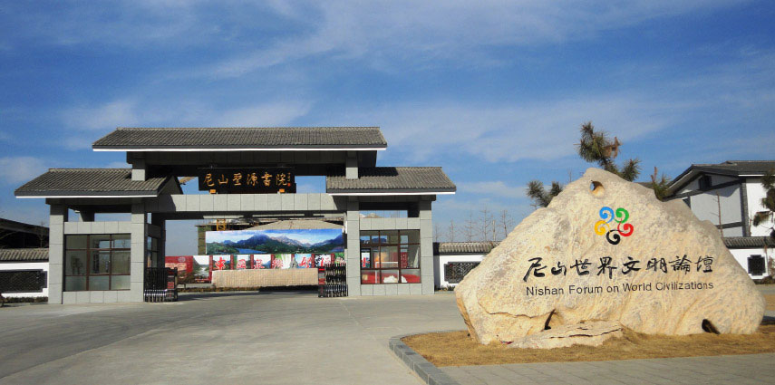

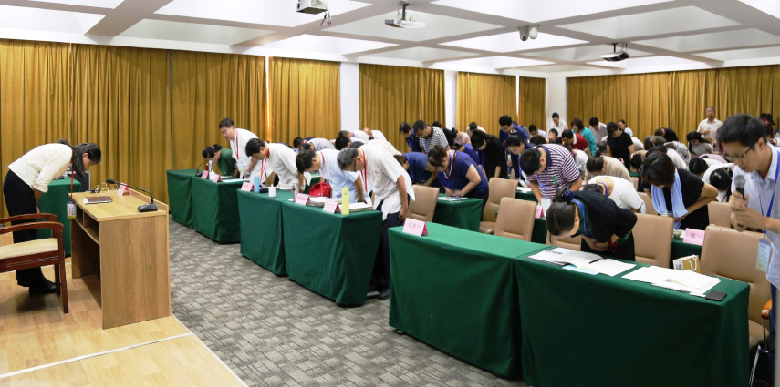

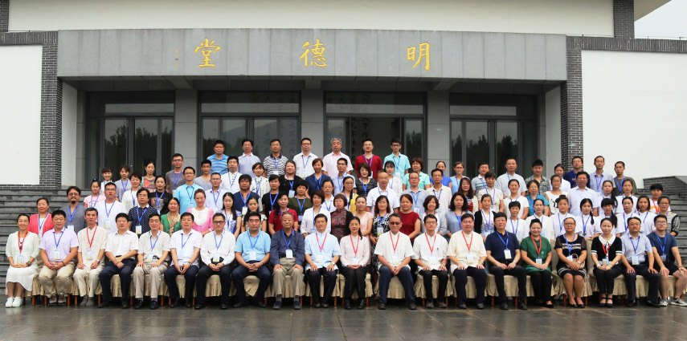

### 孔子風采講座
	 ─奉祀官書面致詞

孔子風采講座

─奉祀官書面致詞

奉祀官

兩岸維繫是文化

歷經滄桑話孔子

千載後人述先輩

能創民族新未來

尊敬的各位老師、各位來賓、各位學友：

國學公益講習班在先祖孔子誕辰之地隆重開班，是我們至聖孔子基金會和中華大成至聖先師孔子協會今年的一項重要活動，由於臨時原因，垂長不能親至現場，深感遺憾！謹藉此函向以唐瑜淩老師為首的師資團隊表達崇高的敬意，他們為傳道而不辭辛勞遠赴聖地；對協辦單位尼山聖源書院和曲阜儒學新院的傾力支持表示衷心的感謝；並向來自各地求道心切的學友們致以真誠的祝福！在此垂長也感恩為這項活動做出默默奉獻的大德和同道。

兩千五百六十七年前，就在各位身旁不遠的尼山腳下，先祖孔子來到這個世界，一生雖歷經磨難，但最終創立了改變歷史的儒家學說，經過歷代大儒先賢的豐富發展，儒家文化在兩千多年中國歷史上的大部分時期，都居於中華文化的主體地位，成為中華民族的文化基因。歷史已經證明，任何企圖割裂這種民族文化基因的行為都是暫時性的，在歷史長河中也只能形成一波短暫的逆流。大陸目前正值傳統文化的復興階段，而較好地保留了中華傳統文化傳承的臺灣，擁有很多可資借鑒的寶貴資源。我們中華大成至聖先師孔子協會和至聖孔子基金會以弘揚儒家文化、推動實現大同社會為努力的願景，將始終致力於傳統文化弘揚和儒家道統傳承。我們舉辦國學研習班的初衷就是用臺灣儒學道統血脈接續歷史造成的文化斷層。

臺灣儒佛大師雪公李炳南先生，生前曾以孔府主任秘書的身份輔佐先祖父德成先生數十年，情誼半世紀，深諳孔子嫡脈道統，精研儒家經典，儒佛造詣非凡，是為一代儒學大師、佛家大德。以唐瑜淩老師為首的師資團隊，即為雪公正脈傳承，致力於廣播儒學正道，成為臺灣民間儒學的重要代表。我相信各位同道學友在接下來的幾天裡，沐浴著先祖孔子的大道氣息，汲取各位老師的教學智慧，一定會增強我們對傳統文化的自信心，增長自己的儒學修為，也增進同道間的情誼。

最後，預祝本次研修圓滿成功，預祝各位學友道業精進！

孔子第七十九代嫡長孫

大成至聖先師奉祀官

中華大成至聖先師孔子協會會長

至聖孔子基金會會長

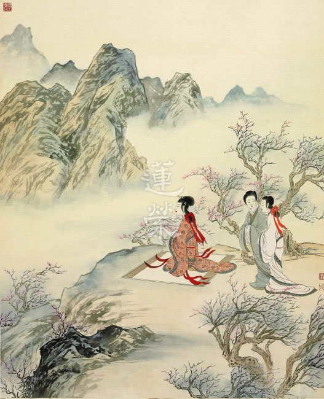

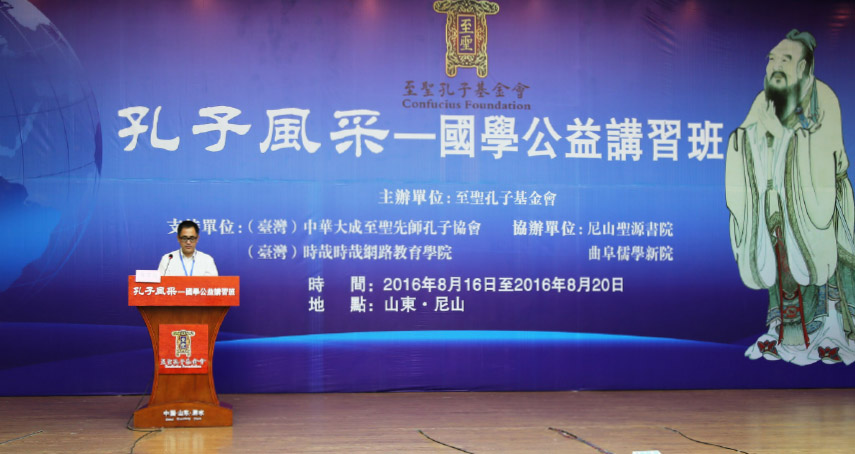

### 心得分享

講座參與學員

一場文化盛宴

齊聚各路好漢

帶有推廣熱誠

厚積薄發才是

濟南  李小舟

參加了曲阜唐老師團隊主講的幾天課程，收穫和領悟頗多。

聽了唐老師講的《論語》才真正知曉《論語》的內涵與風采，唐老師把論語講的非常立體，上下通暢，左右貫通，一聽就知道唐老師的知識淵博，有深度有高度有廣度，深入淺出，古為今用，活靈活現，妙語連珠，智慧湧動，氣氛肅靜而活潑，讓人讚歎不已。聽了後，內心非常清明，內在有力量，人生的方向清晰，從此願意好好研讀經典。

不僅是講座受益，唐老師一行的老師們行走、上課、用餐以及與人交談等都自然呈現出內在文化內涵，是一種從內散發出的涵養與修為，步履間、舉手投足間的從容與淡定都散發著人文氣息！對照自己，真覺得自己沒文化、沒涵養又粗糙……唐師一行老師的衣著簡樸，但處處流露出文化，謙卑、淡然、精緻、舒服……

通過聆聽唐老師團隊的講座，看到了老師們內在的風采，我知道了什麼是文化的力量！老師們身上的品質和力量，正是中華文化的品質！從老師們身上看到了真正的文化，知道了「腹有詩書氣自華」的內涵，通過聽課和老師之談吐，知道了為什麼三代才出一個貴族！不禁感嘆，現代人有錢了，卻真的很窮、很粗糙。

感謝有此聽課的機會，瞭解了什麼是真正的文化，什麼是禮？什麼是德？現代很多人生活的不順並且很累，是因為「缺禮缺德」，而自己還不知道是「缺禮缺德」造成的，苦矣！以後我要認真學習經典！並且願意帶領身邊人一起學習！

瀋陽　蘇 毅

首先非常感謝至聖孔子基金會給我們這次學習的機會，感謝諸位老師這幾天來對我們的悉心教導，感謝書院的諸位老師、學長幾日來對我們關心和照顧。下面我要談三點心得體會：

一、親近善知識的重要

老師在課上講孔子是賢者識其大，不賢者識其小，亦何常師之有。可是如聞一知十、既竭吾才，把學習作為職業的顔子；多學而識的子貢；人一能之己百之的曾子，都是一直跟隨孔子學習。因為就如顏子，他就發現越和老師學習，就越感到老師的高深莫測，所以他就一直在老師身上挖寶，他知道人生真正的出路，改變命運的方法，都會從老師那裡學到。

想到自己這兩年來跟隨老師在現場聽課，以及在網路上學習，發現老師的學識十分淵博，又能透過科判架構，把看似零散的章節，以精練的文字貫串。老師在課堂上還透過不斷的設問，帶我們融入夫子及其弟子所處的時代，融入他們問答的場景，讓我們透過邏輯思維推理，從各個面向分析各個章節，去偽存真，最後從比量的推理，進入到宛如現量的呈現。老師還經常會從日用平常的生活中抓覺受，來幫助我們理解章句。老師的以經解經，前後相貫，用詞的精準，以及所見到的老師的行持，有時候感到老師十分威嚴，有時候又感到老師很溫和，還有在課堂上經常聽到老師爽朗的笑聲，這些都印入到自己的腦海之中，難以忘懷！不禁使我感嘆老師的莫測高深！可是我還不能如顔子對夫子那樣感到仰之彌高，鑽之彌堅，那個彌字暫時還無法體會，那只有仰和鑽了。

我自知自己不是孔子那樣的獅子，也不是子貢那樣的兔子，倒和烏龜差不多，所以就是一直跟隨老師學下去，在老師身上不斷挖寶，希望有一天也能有點風采。

老師講經典在語言，所以只有多聽聞老師所講的課程，才能更好的理解老師的教法。還好老師這兩年在網路上所講過的《論語》〈子貢〉、《孝經》、以及當前正在講授的《論語》〈孝道功行〉、〈中庸〉、《論語》〈知是眾妙之門〉等課程，在時哉網站上都能看到，隨時可以復習。老師把這些如同〈富春山居圖〉那樣寶貴的道理，都無隱乎爾的告訴我們，我不想作那二三子，期望自己能夠學到最上乘的如乾坤大挪移那樣的武功，不想只學到孫悟空那樣的七十二變就離開，留下永久的遺憾，要真正學到那種有無限變化可能的本領，這都有賴於老師的提攜，還要靠自己能學的心。

二、努力學習的重要

所學的道老師都無私的講給我們，我只有加倍努力的學習才對得起老師的教誨，否則再見到老師時如果沒有進步的話，真的會很慚愧的。所以在每週三聽課前，都會先預習，課上認真聽講，以及有問題時提問，課後複習，整理筆記，再與讀書會的同學互相練習複講。

其實能如以上去做，關鍵就在於自己是否把學習文化真正的在意了，就如老師所講的在世俗中抓覺受。比如學習文化是否如對美食那般的貪愛；或者如梁山伯對祝英台那般專注，心心念念都安住在她身上，思維她的種種美好，然後輾轉反側，寤寐思服；或者如老師曾說過的如貓捕鼠，如鷄孵卵；或者如玄奘法師西行八百里莫賀延磧，五天滴水未進時對水的渴求；或者如一個人頭被按進水裡難以忍受時，對那一口空氣的希求。如此朝於斯，夕於斯，造次顛沛必於是，天天學習，時時串習，在遇境逢緣中，能相應的生起恕道之心、忠心、孝心、仁心、公心，乃至空性的見地，而不是從耳朵聽進去老師的教法，直接從口中出去而已，期望自己有一天也能如顔子一般，睡覺作夢時都是仁心。

三、讀書會的重要

我想如果沒有讀書會的話，這三天聽過老師的課，即便感覺不錯，回去也很可能不會去複習，因為沒有讀書會，就不會安排計畫、任務去怎樣進行複習，要複習哪些內容，慢慢的所學的內容就會淡忘。在讀書會裡，大家可以切磋琢磨，腦力激盪，可以互補不足，也可以練習複講，老師説只有真正懂了才能講出來。讀書會所營造的環境還可以防止退轉，大家以文會友，以友輔仁，互相激勵，共同提昇。

另外，團隊在作善時，都會比一人的力量要增加百倍，透過團隊使自我更加充實，推行利益大眾的事業更具力量！

以上就是我的學習心得，因為自己跟隨老師學習時日尚短，又十分魯鈍，所以有見地不夠，或者言語不當之處，還請老師及各位學長批評指正，謝謝大家！

順昌幼師　盧毅

尊敬的唐老師、林老師、陳執行長、曾博士以及在座的各位大德老師們、學長們，大家好！

首先感謝諸位老師三天以來的教誨和啟發，從台北到曲阜的學習讓我從「不憤」到「憤」，從「不悱」到「悱」，以至於今天有幸代表順昌縣新華藝術幼兒園老師站在這裡說出這三天的所學、所知、所感和大家分享這份法喜。

同時，還要感謝主辦方、協辦方給我們提供如此優越的學習環境以及義工們的無私服務。

這三天唐老師從證量高和善引導兩個方面來展示孔子的風采，說明每個人首先要充實自己，才可以引導他人、利益他人。對我目前的狀況而　言，借用唐老師上課幽默風趣的對聯式，上聯：學經學而不厭，下聯：誨幼兒而不倦，橫批：默而識之。這是我要努力的方向。唐老師開篇就從次第成就中講到了學的重要性，但是三十學而立，四十學而不惑，五十學而知天命等中的學，不是從學數學、學物理、學英語中得，而是從經學的內涵中得。按照前天高老師所說，從小學算起，到大學二十年，我是個徹徹底底應試教育的產物，還好，還不算個「殘物」。有幸認識兩位老師，並且跟隨老師學習是我們在場每一位學生最大的福報。

唐老師說過團隊共修最好的方式是讀書會，我們順昌縣新華藝術幼兒園的所有老師每週三晚都會通過時哉時哉網絡教育跟隨唐老師一起學習研討。讀書會一周兩次的學習不僅僅是用經學的內涵充實自己，更是要將經學的內涵用於教學、辦事。文化是拿來用的，我們應該內化外用，以古鑑今，培養自己通權達變的能力。同時，我們新華的老師們由於跟隨有傳承的兩位老師學習，確立了自己的正知見，更加團結。我們之間的凝聚力，就像一股繩，越擰越緊，而不是一盤散沙，從此更加堅固自己的道心。學會在順境中不驕奢，在逆境中處之泰然。

這三天晚上跟隨梁浩老師研討學習後，我們新華的老師們在葉園長的帶領下將一天所學的知識內涵與幼教相結合，將自己的切身感悟與大家分享研討，每一位老師說出了自己的心聲，無論是剛剛踏入國學大門還是跟隨兩位恩師數年的老師們都越來越堅定這條傳承的道路。唐老師說過唯有通過「辦政治、辦教育」的方式才能真正弘道、傳道。人能弘道，非道弘人。可能在這條路上會遇見很多挫折和煩惱，通過經學的學習，見地的提升，充實內涵，勿忘初心，繼續前進，方可消除煩惱。這些信心是兩位老師給予我們的，也是我們所有人的心聲。我們會緊緊跟隨老師們，在國學教育這條路上一直走下去，不回頭。

山東曲阜的三天學習雖然圓滿了，但是我們新的學習旅程才剛剛開始。人的一生其實很短暫，也很無常的。如果能在有限的生命裡體現出自己的價值，我們何樂而不為呢？讓我們帶著一顆法喜的心跟隨兩位老師一直學習下去，讓傳承的事業永無止境地持續發展。謝謝大家！

濟南　劉煥春

很榮幸能夠談一談這幾天來的學習體會。結業儀式結束後，我們就要各奔東西，回到自己的家鄉，回到自己的工作崗位。在這樣的時刻，我們不禁想回顧一下這幾天刻骨銘心的經歷。唐老師在講課中經常會問預講的幾位老師「它長成什麼樣子？」那我們這幾天的經歷是個什麼樣子呢？剛才在大巴車上我忽然想到《論語》中的六個詞句，與各位學長分享一下：我們白天是在聽課學習，老師是「博文約禮，循循善誘」，我們是「學如不及，欲罷不能」；晚上我們分組研討，整個過程是「溫故知新，不亦說乎」。

而結業之後，我們帶著什麼樣的收穫回家呢？僅就個人而言，有三點淺薄之見，與各位學長分享。一是「以經解經，邏輯推定」，這是就唐老師講課的思維形式而言的。《論語》傳承兩千多年，各家注解不一，有的甚至大相逕庭。這對於初學的我們而言，常常有不得其門而入的感覺。唐老師指引的這條路真是讓我們豁然開朗，特別是老師在解經時加上邏輯推理的思辨，通過「它長成什麼樣子？它還可能是什麼樣子？它為什麼一定是這個樣子？」等遞進式推斷，讓人窺得門徑。聽唐老師的課，第一天覺得「佩服」，第二天感到「信服」，第三天則是「心服」！

第二個收穫是「教學互動，教學相長」，這是就唐老師講課的組織形式而言的。在座的各位學長或者是教師，或者是有志於以後傳播傳統文化的有志之士，肯定會面臨「如何教」的問題。唐老師通過與各位老師的問答互動，使得課堂直達縱深，引領我們學員步步深入。而且，我們都還記得唐老師在課上說到教學相長時的情形，他說當他看到預講的老師有進步時，會感到「壓力」與「威脅」，這時老師臉上露出了微笑。我們明白，這份微笑是一個為人師者幸福的微笑。我們也真心希望，自己能在將來的某一天，收穫到這份職業的幸福。

第三個感受是「擇師而從，篤志力行」，這是就唐老師的思想智慧而言的。老師在講課時，口邊時常提到「雪廬老人」，因此我想，老師能有這樣的成就，與老師的慧根和精進分不開，更與雪廬老人的教導分不開。擇師而從，對一個求學者而言至關重要。今天我們能有幸師從唐老師研習《論語講要》，我們一定珍惜這份福報，在進德修業的路上堅定走下去！也真心希望唐老師能多來這邊講學，多來我們每一位學員所在的地方講學。我們一定不負老師的教誨，我們不奢望能達到老師的境界，但我們真心希望能離老師境界近一點，近一點，再近一點！

最後，恭祝唐老師、林老師及各位老師身體健康，家庭幸福！謝謝！

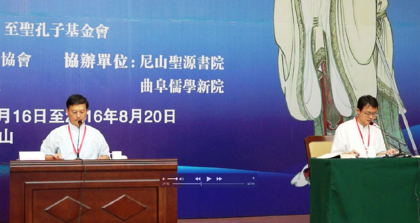

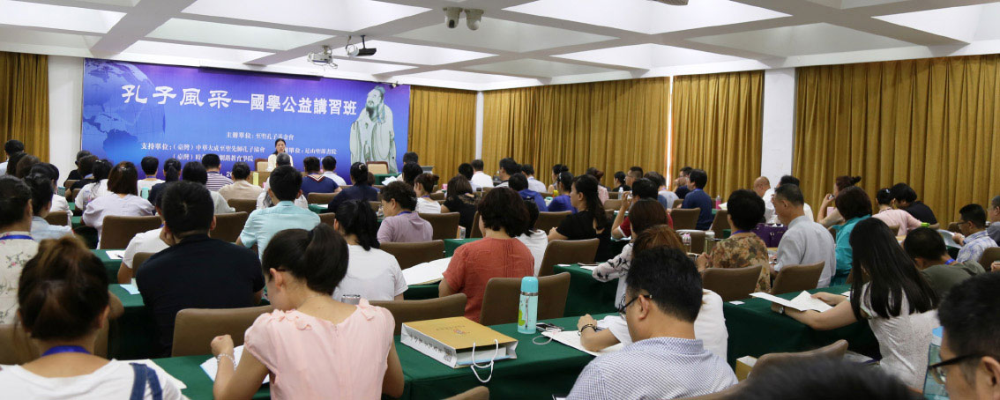
