# 第108期

## 社論

### 當民主成為迷信-從美國大選結果反思當代政治問題

本刊

迷茫世勢盼新局

無知選舉難出賢

民粹歪理挑群情

變天迎來或暗夜

近一世紀以來，民主思潮興起，又隨著東西德統一與蘇聯的解體，彷彿正義的「民主」終於擊潰萬惡的共產帝國，美、英、法等西方民主國家，向世界各國輸出「西方民主」，民主成為先進、開明、人權的標誌，掀起了又一波的民主化浪潮。強行向非民主國家推銷的結果，反而造成許多地區的動盪不安，及生命財產的損失。美國自身也不惶多讓，一場全球矚目的選戰，牽動著世界局勢的未來；當今世界上最強大國家的元首、自由世界的領導者，同時也是世界上權力最大的人，美國總統選舉總算塵埃落定，確認由唐納‧川普(Donald John Trump)勝出。這是一場特別的世紀選戰，有人說這是美國國民的智力測驗，也有人說這是一次瘋狂的選舉，瘋子和騙子你只能選一個。無論智力測驗有沒有通過，是瘋子贏了還是騙子贏了，我們只能確定一件事，民主絕非萬能，甚至有諸多弊端，若忽略現實，受害的永遠是廣大的人民。

資本主義掛帥下的民主也導致許多問題，選舉成為瓜分金錢、權力的遊戲，前美國副總統高爾，也曾感嘆道，美國政治表面上是一人一票，實際上是一元一票，選上的都是代表資本集團的利益。政黨政治失衡，貪汙腐敗，道德淪喪等等。其中民粹主義的崛起更是個大問題，政客為了獲取選票，分化族群、操弄民心，造成社會不和諧，意見相左的兩方人馬有如仇人。川普當選後美國內部即產生反彈聲浪，加州鬧獨立，各地亦有抗議事件，衝突四起。

然而在這樣的情況下，人們依然堅信「民主」勝於「專制」，兩者形同水火，勢不兩立，民主是善，專制是惡。今日之下，群眾對於民主政治已失去了理智，彷彿成為一種信仰，刻意忽略其缺失，似乎只要堅守民主，就是對的，但民主真的那麼好嗎？前英國邱吉爾曾說：「反對民主的最大理由，在你與街上一般選民閒談五分鐘後就會明白。」令人莞爾。

事實上，體制是人在用，是好是壞都在人，專制、民主各有其可取之處，應採取開闊的心胸。民主未必進步，專制未必落伍，專制的泰皇可以帶領國家維繫傳統，走入現代，民選的希特勒也能引領人民走向滅亡。制度運作順利與否，關鍵在人。若本身沒有道德涵養，不能對治內在煩惱，在任何體制下都會腐敗；但若能為政以德，用人得當，任何體制都能發揮功用。

就制度層面而言，邱吉爾雖然深知民主制度的弊端，但又認為：「民主是最壞的政府形式-除了其他所有不斷地被試驗過的政府形式之外。」民主制度弊端叢出，但是其他嘗試過政治體制的更差，果真是如此？這也是一般人經常抱持的論點，似乎還是不禁得問，獨裁、專制真的有可能比民主好嗎？當提出這個問題時，我們已不經意地落入了陷阱。人類的歷史上，並非只有專制和民主，《尚書》中曾記載，在上古時期的中國，曾有過一種絕妙的政治體制，禪讓政治。與民主相仿的是，禪讓政治也強調選舉，但不是烏合之眾舉手投票，而是選賢舉能，由賢能之人相互推舉賢能之人，以多數決形式選出繼承者，再加以考驗，最後才完成權力交接，政權和平轉移。又不同於現在政府強調的制衡關係，禪讓政治講究的是朝野和諧，互不居功，公權力雖集中於賢人手中，惟上下一心，以民為先，故推行政令、教化等，成效斐然。擊壤歌云：日出而作，日入而息，鑿井而飲，耕田而食，帝力于我何有哉？人民的生活充實而快樂，自由自在彷彿沒有政府，但論其受用，卻又無處不是政府的功德。如此崇高的境界不是烏托邦，這樣的傳承從堯開始，選賢舉能，經三年考驗後傳位於舜，舜亦以同樣方式傳位給治水有功的禹，最後因族人擁戴，禹傳位於其子啟而告終。

古有云：不禪而能化民者，自生民未之有也。獨裁專制權力過於集中，容易腐敗、難以制衡。家天下因為傳子故，那怕是傾舉國之力培養的一時之選，也易遭人閒話、挑撥嘲諷。民主制度更是大大有問題，表面主張平等，人人有表達意見之權力，卻經不起有心人士的操弄，民粹崛起、國族分裂。更令人擔憂的是，當過份強調個人意志，又興起自己的權力自己爭取的風氣時，容易形成有吵有糖吃的局面，不但公平正義難以實現，反而造成弱肉強食，強者更強、弱者更弱。專制者率民爭利，民主者煽民爭利，社會氛圍無不環繞著一個「爭」字，當私利不斷擴張，必定會產生摩擦，迫及他人。禪讓則不同於前，由領導者率領風氣，天下是讓來的，不是求來的，全憑道德事功，其中沒有紛爭，亦無殺伐，由明君讓給聖主，聖主又讓給明君。如此一來風俗歸厚，彼此無不講究一個「讓」字，仁者壯大、小人隱蔽。又因有典範可循、上行下效，推行教化如虎添翼，天下為公的理想也得以實現。無怪乎孔子讚歎云：巍巍乎！舜禹之有天下也，而不與焉。

禪讓政治強調為政者的德行，人才團隊的培養以及政治氛圍的和諧，不僅僅能夠掌握為政的本質，兼具辦政治的作法，是誠心而踏實的，絕非當代任何政治人物、政體所能比擬，也遠超出現代人的想像。若領導者以身作則，脩德格天，內在能夠對治煩惱，則不受名利所動搖，外在感得風調雨順，人才匯聚，則國泰民安，教化大興。社會一片祥和，人與人之間情感真摯，路不拾遺，夜不閉戶。觀念雖簡單，卻已遭世人遺忘多時，大眾隨波逐流，誤信民主才是唯一價值。當民主成為一種迷信，漸漸地人們選擇忽略現實的弊病，苦中作樂認為自己有選擇的自由，但在不知不覺中成為資本家的奴隸。每次投票都天真的相信能改變現況，事後卻又發現自己無能為力，只好期待下次會更好，如此周而復始。

現代人距離上古聖治已太久遠，對於明君聖主帶來的利益難生信心，多會質疑自古以來，堯舜又有幾人，禪讓政治實不可考，亦不可靠，這正是因為教化不彰的緣故。顏回曾說：舜何人也，予何人也，有為者亦若是。可見明君聖主不難求，端看自己有無決心。身為一個文化道統的學習者，不但要能夠理解文化治國的殊勝，更要有能力傳承道統。二千五百年前，周室衰微，群雄並起，天下動盪不安，孔子就在這樣的情況下轉動時代的巨輪，開創千古的格局。川普當選世界局勢重新洗牌、一片混亂，令人看不清前途，但可能也正巧是我們的契機，失序的社會恰巧令人驚覺、正視美式民主的問題，才可能從民主的迷信中醒悟，尋求解藥。因此我們必須加緊腳步充實自己，方有能力守護、傳承手中的珍貴種子，當慾望的野火席捲過後，地面上的荊棘蔓草將被燒盡，此刻即是我們重新播種之時，最終大地回春，黎明升起，又將是一片欣欣向榮。若能延續這樣的見地，成為傳承的其中一環，那怕未見該日也是不枉此生。

## 佛學覽幽

### 菩薩清淨的行持
       —華嚴經淨行品（二十四）

菩薩清淨的行持

—華嚴經淨行品（二十四）

*戒慧講述‧編輯部整理*

披衣如獲勝善根

通達空性破二障

如如不動至尊位

利生不息大慈悲

會性法師在講經時說科判的講法是非常重要，如果不對科判做學習，整部經的意義就亡失了，比如研究《佛說阿彌陀經》要解講義，對教觀不了解、對科判也不了解，把那些通通去掉的時候，阿彌陀經就變成小品文，整部經的意義就不見了，所以對科判的解釋、對教觀的認知非常重要。

丙二、指事顯因答其徵因

丁一、總徵

丁二、別顯

戊四、將行披挂時願（有六願）

己五、著衣

經文：

若著上衣，當願眾生，獲勝善根，至法彼岸。

西晉聶道真中說：「菩薩被安和時，心念言：十方天下人皆使重益得諸功德，悉入諸經中，極過度去。」吳支謙的版本是：「次著中衣，當願眾生，恭敬畏慎，無有慢墮。」六十華嚴中：「次著上衣，當願眾生，得上善根，究竟勝法。」

圓滿的至法彼岸，一定要具備破煩惱障、破所知障的空性智慧，以這一分圓滿六度萬行的修學，到達彼岸。彼岸就是涅槃，有所謂的大涅槃跟小涅槃，小涅槃就是破煩惱障，大涅槃就是破所知障，以獲得殊勝的善根（無我的智慧）來破除二障。

聶道真的版本是使重益得諸功德，悉入諸經中，就是好比披上諸經中最重要的意趣，而著上衣是指一般修行有所謂的三衣（作物衣、法會衣跟福田衣），僧伽梨就是指幢相的福田衣。記得之前去賑災時，我們去提供修行人道糧，讓他們在災區安心辦道，其中在發放道糧時，有些比丘會搭衣之後才接受我們的頂禮及供養。所以此處的著上衣，最尊貴的就是僧伽梨(福田衣)，其次即是法會衣，搭此衣誦經、共修，搭上衣即是指法會衣（修法所穿之衣），有田相的那一分才是僧伽梨，搭此衣修法是希望眾生能得到殊勝的善根，安樂的體性要建立在出世間，而非建立在世間，世間人以為的安樂體性都是苦，唯有出世間才能真正生起安樂的體性。

苦、集、滅、道四諦，各有四個面相的觀察，苦諦的四面相觀察是苦、空、無常、無我，集諦的四面相是因、集、緣、生，滅諦的面相是滅、盡、妙、離，道諦的形象是道、如、行、出，滅諦的滅是苦因苦果的滅，盡是無始輪迴的窮盡，妙是安樂的體性，離是六道輪迴的離開，由這四面相的觀察說滅諦。所以當願眾生在修法的時候獲得殊勝的善根，能建立出世間法得到安樂的體性，是法會衣的功德。

己六、著僧伽梨

經文：

著僧伽梨，當願眾生，入第一位，得不動法。

著僧伽梨時願所依，菩薩在著僧伽梨時發願，願依靠在菩薩身上，沒有菩薩哪有菩薩的願呢？願所依在著僧伽梨這件事上，願就從著僧伽梨、著袈裟、著大衣(福田衣)這件事情開始發願。故願依靠在二個部分，一個是依靠在菩薩上，一個是依靠在著僧伽梨上，每一個願的偈誦都要這樣套。

當願眾生，能願的是菩薩，所願的是眾生，第一句話談願所依，第二句話是能願所願，能願的是菩薩，所願的是眾生，菩薩希望眾生能入第一義諦得不動法，能願所願的利益除了得到三業離過成德及十種行持的功德，同時做四步驟的觀察：首先，願盡上所有誠意，菩薩自己希望得到離過成德的利益，佛的十種智慧力、十八不共法、十種殊勝的形象，眾生得到入第一義諦得不動法，這是第一輪的觀修法。第二輪的觀修法是發願，從隨喜開始，若眾生都能入第一義諦得不動法該有多好，我但願眾生都能入第一義諦得不動法。第三輪是承擔的下手處，我要承擔，我要幫助眾生都能入第一義諦得不動法。第四輪是祈求三寶加被，讓我有能力能幫助眾生達到入第一義諦得不動法。每一句皆要做這樣的觀修，才能得到淨行品的實益。

在六十華嚴：「著僧伽梨，當願眾生，大慈覆護，得不動法。」吳支謙的版本：「披上法服，當願眾生，服聖表示，敏於道行。」聶道真的版本：「菩薩被震越時，心念言：十方天下人皆使常樂喜於佛經，未曾有離時。」從東吳的支謙本、西晉的聶道真本，跟六十華嚴佛陀跋陀羅的版本，從這三個版本來看這個偈誦。

僧伽梨是出家人的三衣之一，三衣指的是五衣、七衣、九衣，總名為袈裟，袈裟是壞色，不重視染色之意，紅、黃、黑、青、白這五色都不可以用，壞色衣若按照四分律來講，青色(古銅青)、黑色(灰色)、木蘭色(咖啡色)是一般用色，僧伽梨指的是不正色，正色是不可以用的，以上是袈裟的顏色。

作物衣、法會衣、福田衣三衣都稱為袈裟，此處僧伽梨的袈裟是指九條衣到二十五條衣，就是一般中國和尚穿的紅色有田相的那一分，謂之僧伽梨。前文的若著上衣指的是法會衣，整衣束帶是指作物衣，其中福田衣是三衣中最為殊勝的，大衣是升座說法或降伏外道時所穿的，僧伽梨是印度話，翻成中文的意思是重複衣或雜碎衣，重複衣是兩層的．三衣是用布割成一塊一塊縫製而成，所以又稱作割截衣，它有三種功用，一是防杜法衣他用：二是使僧尼捨離對衣服的貪欲：三是避免他人盜取。南亭老和尚在此處說到，我著此衣時，願一切眾生，在修行行列中入第一位，得不動法。修行學佛，希望成佛。成佛而後，於一切時、處，遇任何外境，皆得身心不動，所以稱法王也。得不動法就顯示證到究竟涅槃，究竟成就第一義諦的佛果，是故搭大衣是要做領導人，希望眾生將來都能統理大眾，都能成為佛陀領導一切眾生。

此處有幾個我們之前上過的願，有幾個關於「不動」的說法，「若入堂宇，當願眾生，昇無上堂，安住不動。」此處的不動指的是八風吹不動，八風是不受利、衰、毀、譽、稱、譏、苦、樂的影響。「結跏趺坐，當願眾生，善根堅固，得不動地。」此處的不動地指的是不生煩惱，成就阿耨多羅三藐三菩提。「下足住時，當願眾生，心得解脫，安住不動。」此處的不動指的是破煩惱障，為空性智慧所攝持的，並且以不起定的方式來利益有情。

此處的著「得不動法」，也就是究竟的成佛。當然亦可將所有的不動法，究竟處講的都是成佛之意，為什麼不動呢？因為安住在空性上，不隨緣起而動，因為緣起的自相空，在他的心識前看不到緣起的自相，所以內心沒有所謂的好惡之別，因為見萬法的自相在他的心識前一個法都沒看到，一粒微塵都沒看到，所以這時能動什麼呢？我們是見到好會生貪，見到壞會生瞋，見不到任何法的時候會生起什麼呢？這叫不動，如如不動的那一分是指他內心安住在第一義上、安住在空性上，無任何的世俗法生起，當然內心也無可動，見好生貪、見惡生瞋，當好壞的自相都了不可得時，還能生起什麼心呢？這叫不動尊，並不是鎖在那裏努力認真地讓自己不動。

著僧伽梨跟入第一義諦，得不動法有什麼關係？著僧伽梨是三衣中最尊貴的衣，是領導大眾所穿的衣，會性法師認為一場法會中只能有一位穿紅袈裟者，或是等級非常高，或是領有非常重要的職責去領導，這就是入第一，像佛一樣入第一義諦，披起祖衣承擔佛的家業，入第一義諦，得不動法。

得不動法才能入第一義諦，入第一義諦就是得不動法，此處的不動法特別是指成佛的不動法，不動也可以說是初地現證空性的不動，也可以說是八地不為煩惱障所動，也可以說是成佛不為所知障所動，但是究竟處是不為所知障所動。

修行時很用功、很精進，可是卻如磨牛整天在原地走，亦即學佛但是想法卻跟世間人沒兩樣，得不到利益時落寞，遇到逆境時發火，遇到順境生貪，從我們身上看不到學佛的味道，豈非可惜。檢束善根，不令散失這點有多麼的重要，讓自己保持著對法的體悟，讓別人看到我們學佛的不同，整衣束帶時要有這樣的想法。（下期待續）

### 大乘百法明門論簡說（十六）　拾壹、心所有法｜遍行(一)

*戒慧講述‧淨本整理*

百法能攝諸現象

心境觀待無體性

非理作意取行相

觸景生情取隨好

論文：

第二、心所有法，略有五十一種，分為六位：一、遍行有五，二、別境有五，三、善有十一，四、煩惱有六，五、隨煩惱有二十，六、不定有四。

依據前面各表的說明，《百法明門論》是一部完整的心理學，將心理現象分析得非常透徹，包括各種細膩的作用，範圍涵蓋三界，有世間法及出世間法，絕對不是現在一般的心理學所能比擬。

心所有法中的遍行有五，何以名為徧行？作意、觸、受、想、思這五種心理活動，可以遍一切性、一切地、一切時、一切心。一切性是指善、惡、無記三性，善就是有心去利益人，惡就是有心損害人，無記就是無法記別善惡的心理作用；善帶來的是快樂，惡帶來的是痛苦，無記帶來的是不苦不樂。無論是善惡或者無記，都有這五種心理作用（五徧行）的配合。

第二是遍一切地，包括欲界、色界、無色界，稱為三界（也稱三有：有三界所造作的因，就有三界所成的果），可細分為九地：五趣雜居地(欲界他化自在天以下，一直到無間地獄)、初禪離生喜樂地、二禪定生喜樂地、三禪離喜妙樂地、四禪捨念清淨地、空無邊處地、識無邊處地、無所有處地、非想非非想處地。從地獄一直到無色界最高天(稱作有頂，即三有之頂)，是以禪定分高下，從九地的高下之分可以明瞭，所有的快樂來自於內心的安定，九種層次都是因為內心安定的不同。所以沒有在內心上尋求快樂而在外境上追逐，一開始方向就選擇錯誤，爾後將沒有一步是正確的。

第三是徧一切時，即有漏、無漏、世、出世，有漏指世間，無漏指出世間。漏就是善根福德漏盡，因為有煩惱故；無漏是指具有破煩惱的智慧。有漏就是無明，無明就是世間，破除無明即出世間，都有五徧行的作用。

第四是徧一切心，八識之生必有五徧行的作用相隨，其他如五別境、善心所、惡心所等，一切心理活動的生起，也都伴隨這五種作用。煩惱就是非理作意出來的結果。

作意

蕅祖《百法直解》中解釋作意為：「警覺應起心種為性；引心令趣自境為業。」此處的「性」是指它的親作用（較親的作用），「業」則是指疏作用（疏遠的作用）。

但若依因明派，性解釋為定義，靠著定義去認識何謂作意，佛法如同科學，就是靠著定義去認識各種現象，例如定義火的體性為燒熱性，即便是電鍋煮飯的電熱，也是此定義下之火。「警覺應起心種」是讓心的功能生起，靠的就是作意的警覺，使心的種子起現行，警覺就是注意力、觀察力。心的作用尚未起現行，名言安立為種子，起現行則稱之為心。如某人生貪心，貪心已生就不能叫做心種，但因為生貪可以知道他有貪心種。觀待「警覺應起心種」的定義，就有「令心趣自境」的作用，比如讓貪心對著順境生起、讓瞋心對著逆境生起等作用。所以作意就是會留意，不留意就不會生起，作意可以經過訓練，像三國周瑜聽人彈琴，彈錯時眼睛立刻亮起來看彈琴者，因為周郎有樂曲的訓練。一場音樂會裡，有音樂素養的人，就會認真去聽每一個細節，否則只能大略地聽。雪廬老人說他的舌根可以吃出豆腐兩百多種刀法的味道，這才是用心過生活的人。

五徧行能徧一切性，作意如何徧善性？懂得留意別人對我的恩德、對我的幫忙，才會生回饋與感恩的心，想要去幫忙、利益他人。善當中還有無漏的善，就是作意於空性的修學，也是因為過去生，在般若曾經用功產生法喜，所以聽聞般若就會留意。作意如何徧惡性？留意別人對我的壞、種種的不好，就會生起惡心，起報復、對立之心。了解作意的功能，當下眼識雖然看到別人的不好，第六識卻可以作意其他的觀念，諸如此人在幫助我修忍辱度、幫助我建立願力、幫助我消除惡業等，將瞋恨透過作意降伏。作意徧無記性，比如一般生活中沒有特別去留意別人的好、別人的壞，沒有利益人或損害人的心念，這些沒有記別善惡的行住坐臥，都是無記性的作意。

因此作意可以徧善、徧惡、徧無記，因為徧善，所以三界九地裡他可以到人天以上的好地方；因為徧惡，所以也能夠到五趣雜居地中的三惡道。而無論何地、何時、何種心，都有作意的功能。

在懺公的表解中提到了七種作意，這是關於禪定的修學法，從欲界未到定提升到初禪，或者從初禪提升到二禪等，都是如此修學。首先是「了相作意」，修行人會去作意什麼才是我應斷，什麼才是我應得。比如要生到初禪，須知初禪的功德、欲界的過患，應得初禪、應斷欲界的貪愛，這是屬於前行，第二「勝解作意」到第六「加行觀察作意」是正行，「加行究竟果作意」則是完結。勝解作意就是對於修學法有殊勝的了解，知道如何捨掉下界(欲界)的貪愛。

接下來遠離欲界所有的上品煩惱，稱為「遠離作意」，上品煩惱是指觸到境界就會生起貪愛，要使上品煩惱變成中品，須不斷觀修欲界的過患。「攝樂作意」則是遠離中品煩惱，所謂中品煩惱，要不斷向其訴說利害關係才會生起欲界貪愛者。「觀察作意」是更進一步遠離下品煩惱，亦即對於欲界所殘留很微細的貪愛，需要透過不斷引誘、不斷訴說利害，才會徐徐生起。貪愛是此時修行所要捨離的煩惱，因為對於欲界的快樂能不起貪愛，就有能力進入初禪，因此依據貪愛生起的速度，將煩惱分為上中下三品。對於這些欲界的快樂不斷觀察過患，而且是真實的過患，才有辦法捨離上品和中品煩惱，下品煩惱還要不斷觀察欲界痛苦的本質，使欲界美妙的面相無法呈現，此人坐禪將獲得無比的安定。就好比被仇人追殺，跑到了警察局，此時在警察局裡能夠安住而不躁動，因為知道出去的可怕。

「加行觀察作意」是讓火候一直練，不僅遠離煩惱，更能安住在禪定的所緣境上，例如入出息或者佛號，使安住的能力不斷加強，最後達到「加行究竟果作意」，就是初禪功德的成就。四禪八定皆如是修，關鍵在於厭下欣上，厭下欣上也是改變命運的方法，因為厭下欣上，才會開始認真充實自己，能夠善用這樣的心態，各種能力都能轉強。

觸

觸定義為：「令心、心所觸境為性；受、想、思等所依為業。」觸讓心跟心所去觸境，依此定義產生受想思等所依的作用。此觸並非指五塵境中色聲香味觸之觸，如堅、濕、煖、動、澀、滑、輕、重，皆是屬於色法，與此處心理作用之觸不同。觸乃根、境、識三法和合生起，例如眼根對著花朵產生眼識，三者和合生眼觸，就是眼識的觸心所。眼觸與此三者名言上雖然不妨說眼根對境生起眼觸，眼觸使眼識觸色塵，而實際上是同時生且相互觀待。

懺公表解提及觸與三學的關係，簡而言之，戒定慧三學都是在根境識三者和合生觸下所修。攝律儀戒是對殺生、偷盜、邪淫等惡觸中能堅守不為；攝善法戒及攝眾生戒是對各類善觸應努力為之；定慧的成就也是在各種觸中能專注、能揀擇。

為何需要安立觸的功能？因為若不安立此功能，眼識與境界不必接觸也能看見，而若眼識本身也不是觸，因此證明有觸心所的功能，讓前六識心與心所觸境產生作用。此外觸心所也是因為作意才能生，若作意功能不起，心識也無法觸境，所以透過前述作意的訓練，就能讓心、心所觸到各種細膩的境界。例如受過訓練的畫家，眼識觸到青色，能夠注意到青色裡面的深青、淡青等調色法，名言上不妨說因為作意所以才觸到這些顏色，作意在前觸在後，然而作意與觸其實是同時生，若非同時，作意在前，則已滅的作意無從生起觸；若觸在前，表示不需要作意也能讓觸生起。因此是同時生，而且互相觀待沒有自體性，否則作意與觸也是沒關聯獨立的兩法。

有觸才會有受想思，以及各種的情緒。常說觸景生情，情是從觸景來，不去觸景則生不了情，所以情緒是自己創造的，好的情緒、壞的情緒皆然。（下期待續）

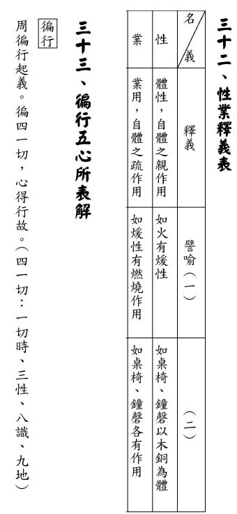

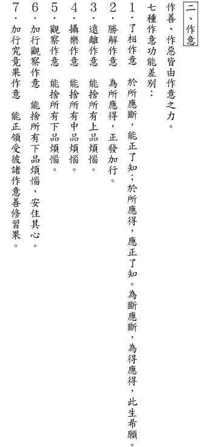

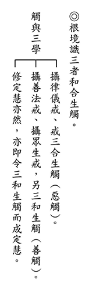

### 佛學概要十四講表簡說（十）　第一講表

*戒慧講述‧法味、淨昌整理*

心外不成立唯識

法非實有中觀現

兩宗成立法旨趣

待眼抉擇佛密意

述記云：「證入不生不滅之空性(涅槃)。」空性與涅槃若二者為一，說二法成無義。若二者為異，則證得空性者，應不能成立證得涅槃。故兩者非一，亦非異。應約證得空性之後，從能滅煩惱之智慧成立涅槃。能破煩惱障之智慧所證空性，成立小涅槃，能破所知障之智慧所證空性，成立無住大涅槃。是故空性成為所證，智慧成為能證。證得無住大涅槃，方可安立佛性及法身。是以並非有一個自體性實有之佛果可得，金剛經亦曰無有自體性實有之佛果可得，其經文：「須陀洹能作是念，我得須陀洹果不。不也，世尊。我不能作是念，我得須陀洹果」經文又：「阿羅漢能作是念，我得阿羅漢果不。不也，世尊，我不能作是念，我得阿羅漢果。」故非有一個阿羅漢果可得，係約涅槃能破煩惱障這一分，安立為阿羅漢。破所知障的那一分，安立為大涅槃、法身及佛果。故知佛果可得，然其得之方式，係以空性的智慧去證得，以滅煩惱及習氣這一分安立，並非有一個佛果可以得到。至於「不生不滅」義，諸法體性從未生過，故亦談不上滅，由此成立為不生不滅之空性。

述記云：「看得破還須忍得過，忍得過還須放得下。」行者於修行過程，須看得破、忍得過、放得下，即是指修行上分為理所破及道所破二部分。看得破，屬於理所破。先明白吾人所執之萬法是無自性的，亦即是吾人所執之我，本來即無，此理一通達即破，成立理所破。進言之，所執之人我及所執之法我，其自體性未曾有。其概念並非如有一個花瓶，因學了佛之後，以榔頭擊破之狀況。是以理所破看得破，能破者證得道理的智慧，所破之人我、法我，境界之自體性，本來即無，並非舉榔頭捶破之，此謂之看得破。而何以尚須忍得過？修行者出定以後所見萬法依舊實有，此執著之心無始以來串習而有，約世俗上能執之心依舊出現，結合所見每一法之實有，經不斷串習證得每一法之空性方能破之，是故尚須忍得過，放得下。

或言學佛者學習多時，而遇境逢緣煩惱依舊生，豈非學佛無用哉？行者證理所破後，固於道所破遇境逢緣時，重新串習空正見，惟相較凡夫眾生所起之煩惱，已有天壤之別。證得理所破，預入聖流稱須陀洹，或譯初果。證得初果出定之後，非常高興將所證之空性不斷於事項上練習，因其於定中破萬法之自體性，了不可得之覺受太過鮮明，故出定時，即便諸法依舊顯現為實有，亦不再受騙，而此等人終必證四果。而未曾證理所破之凡夫，見萬法為真實有，依舊受騙。

而如何謂之忍得過，佛法之忍是忍可，即很有耐心，一遍一遍的串習，謂之忍可。非如一般世俗所謂忍如心上插一把刀之痛苦，午夜夢回後悔不已，學佛後之讓步至內心淌血，無法突破困境。忍得過之忍，其之所以能具備耐性，一遍一遍的串習，因其知道功德之殊勝之故，而最後之成就即是放得下。故知未經修學之具惑凡夫，空言令其放得下無有是處。

述記云：「解之、悟之；修之、煉之；證之、達之。」首先要解之、悟之，亦即解悟其中道理，屬於理所破之範疇。進而修之、煉之，即修練定力，即於止觀上觀察之。最後證之、達之，則屬於道所破之範疇。

述記云：「故一切智者，即是證達一切法空。」綜前所述，最後能證之達之的名之曰一切智，所證達之理為一切法空。證一切法空即是破法我執，而人我亦法我之一分，故破法我即已包括破人我。此通達一切法空之智慧所破之障，尚屬煩惱障，至於進一步破所知障之智慧尚待後文詳述之。

述記云：「三智當中，此智雖淺，然即此一步已為世間一切學術宗教所不能及。」不能及之處在於一切學術宗教，皆不能破法之自體性，皆見不到諸法體性是空。每一門哲學皆探討本體論，譬如「我思故我在」、「犧牲小我、完成大我」，都有好大一個我存在。或者即是以愛立論，但從佛法之角度而言「小愛小煩惱，中愛中煩惱，大愛大煩惱，不愛就沒煩惱」，「愛不重不生娑婆」，世間哲學皆著墨於「我」及「愛」，但回頭檢視他們在本體上的論述，沒有一門宗教或學術有能力在本體上看到是了不可得，但佛法達到了，是以佛法教育高於世間教育。再看儒家方面，整部易經六十四卦、三百八十四爻的中心思想，是「易無體，而神無方」，同樣是體性了不可得。自古以來祖師大德常以儒釋道三家等量齊觀，理由是對本體之見地同等高明。以上是智者的一切智。

道種智-知法別相

道種智即是知法別相。知法別相與知法總相不同，別相是相對應總相成立。知法別相，即是去通達一切諸法的差別相。唯識所云「一切諸法，因緣所生，唯識所現，十界差別」，其意義為：在唯識來講，一切諸法皆是因緣所生，而且是唯識所現，全部皆是心識所顯現的。

由上述一切智內容，了知法的體性是空的。以下進入到道種智，進一步探究法如何生起？唯識宗云：諸法是從心內生起，十界差別，從心所現，但有各種差別相。而唯識所稱一切智知法總相的空，指法在心外不成立。如述記云：「離識別無一法存在」，此即唯識宗之一切智。指境界沒有在心之外存在的體性，境界沒有這種體性，即是境界的空性。所有法的總相，沒有在心外成立，就是該法的體性。該法的體性，就是不可以在心外成立。該法如果在心外成立，則是眾生之遍計執。該法沒有這種體性，叫做該法的空性。所有的法，都心外不成立，謂之知法總相。離識別無一法存在，離開心識別沒有一個法可以存在。以水為例，水離開心的變現，沒有水。如果離開心的變現另有水存在，表示水是心外的法，是有自性的。心外有法，但境界並無此種特性，水如果可以離開心外成立，那鬼來看也應該是水，因為在心外成立。魚來看也應該是水，因為心外成立。人來看也應該是水，心外成立。天來看也是水，因為心外成立。如果因為溫室效應，臺北有一天淹大水的時候，正好是人類的噩夢，人們都慘叫、尖叫、逃離，但魚正好游進來玩，游到寧波西街，游到總統府。牠不會有被大水淹掉的形象，那種驚濤駭浪正好是魚的快樂。水，離開心外可以存在嗎？水，可以在心外存在為水嗎？水沒有這種特性，謂之水的空性。此是唯識宗的知法總相安立之理。現存大乘有兩派宗義，佛對大乘的初門講唯識宗，對大乘的究竟講中觀宗；另一派則說不對，佛對大乘的初門講中觀宗，對大乘的究竟講唯識宗，此即是部派之爭。知法總相，以唯識宗說，就是法在心外不成立。道種智知法別相義，為一切法都是心內所顯。一切種智，就是真空妙有。真空，指心外不成立。妙有，是心內顯現，所以真空妙有，就是心外不成、心內顯現。所以只要談到真空妙有，即知是唯識宗宗義，而且知道該宗之立論、原始出發點、邏輯推理及究竟要成立之意趣。

由道種智知依據唯識宗義，法是從心內顯現的這一分，心外不成，由這樣來認識萬法。既然是心內顯現，那要如何得快樂？不斷造作善的美好的種子，讓這些種子能夠繼續顯現。由心造作善，後面由心去受用快樂。由心造作惡，後面由心去享受痛苦，此即是唯識在因果知見下論述，中觀所稱之空性，亦在因果正見下說空的，並非斷滅因果，因果在世俗上沒有部派之爭。部派之爭，純粹是約本體論說。對於因果的知見，佛教沒有部派之爭，各部派在世俗上看法都是一致，大家都承許。例如出家的功德就是比在家大，比丘戒的功德就是比在家戒大，這沒有疑問的。問題不在那個地方，問題在見地。

述記云：「佛典上將有情歸納為十類，就是十界。」心識的顯現有十法界之差別，即是四聖六凡。六凡，指六道眾生。四聖，指聲聞、緣覺、菩薩、佛。十法界有情心內所現境界都不相同。這些六道或十道，都是心所顯現，心外不成。述記云：「八萬四千法門」，法在心外不成，是心內所顯現的法，道種智就是知法別相。而所度眾生也是從心所顯現，而法也是從心顯現，度心內的眾生，而眾生無量無邊，所以法也無量無邊，統合說有八萬四千。道種智的道，所指的是八萬四千種法門。種，就是眾生各種的根器不同。所謂「觀機逗教」，道是逗教，種是觀機，所以通達菩薩入世間，是為了觀機逗教用的。雪廬老人上課說，大菩薩來到這人世間，絕對不是貪圖享受，如果不能度眾生，大菩薩也絕不來！所以，我們應該如何讓大菩薩來？就是成為所度的根機，因彼是觀機逗教才入世，所以我們要成被度的根機，大菩薩才會來。我們每天祈求觀音菩薩乘願再來，阿彌陀佛乘願再來，每天在佛堂祈求乘願再來，可是要不要受教呢？不要！或者說，你祈請一位大德來拚命的供養，他要講學時你不聽，請來何用？現在一般世俗學佛，大都是如此狀況。所以有法師曾說，早上的法會兩千人，下午聽課剩二十人。如此現象，佛法如何能興？

一切種智-通達總別

一切種智，通達總相和別相，稱為一切種智。一切種智成為能證，實相成為所證。述記云：「知法實相」，實相在唯識宗之最究竟講法，一切種智所要證得的就是唯識，即前述頁次右方空白圓圈，第八識清空就是唯識宗的實相。所以知法實相，一切種智成為能知，實相成為所知。萬法的究竟實相本來面目，故述記云：「徹法源底」透徹萬法的根源本體，本體論就是第八識。而中觀宗的本體論是空性。而唯識宗之實相與心外不成還有差距，如果實相就是心外不成，那一切種智就講成一切智，成佛與阿羅漢證量無從分別。所以，實相不但與前述的一切智一樣，都通達心外不成立，更進一步，通達心內實有。是以最後所通達的是，第八識的作用不但是法在心外沒有，法在心內顯現，同時證得，謂之諸法的實相，是為通達總別。第八識朗然大覺的時候，所有的萬法都是內心顯現。所以述記引佛典云：「萬法唯識、識源於性」。萬法唯識，所有的法，都是從心中而生。而心識從第八識生，前七識都是第八識生。所以唯識宗的法性、佛性，都是第八識。因為一切法從第八識生，所以第八識是法性。一切的心從第八識生，所以是心性。而佛從第八識成就，所以也成立是佛性。

但如由中觀宗之論點，法性跟佛性，體性應都是空性。前面已成立萬法無有自體性，此時又成立一個有自性。那外道同理也可反難，神魔之有自性，佛法以無自性破之，此時從心而有的自體性，同理也應可破。

識根源於性，也就是心的本體就是第八識，故述記云：「所有的能所、色心、自他、大小、美醜、善惡等種種宇宙森羅萬象，都是夢心所顯的夢境，若能轉識成智，不再闇動。」，則為第八識恢復到朗然大覺，而不是種子一直在起，種子在起就是做夢，不做夢的話，種子都清空了。

述記云：「法法都是橫遍豎窮」，宇宙萬法每一法都是橫遍豎窮，例如眼前桌上杯子乃因緣和合、唯識所現之一法，故杯無自體，其體即心性，故杯即法性。杯其實是唯識所現，也就是它是心所現起的，而心又源於第八識，第八識本身橫遍豎窮，同理證得杯子沒有自體性，杯子的體性就是第八識，所以杯子也是橫遍豎窮，所以杯的體性也是法界，法界的體性就是第八識。而中觀宗之觀點認為一切法的實相就是空性，而杯子的實相也是空性。而每一法都是空性，所以空性遍法界，所以杯子的空性也是遍法界的空性。中觀宗說杯子的體性遍法界，跟唯識宗說杯子的體性遍法界的講法是不一樣的。

述記：「佛典有云一切諸法，因緣所生，唯心(識)所現，因心成體，體即法界(橫遍豎窮)。」這就是唯識說明一切諸法是由因緣所生的，唯心所現的部分，都是第八識所變的。因心成體，就是所有的法都是以心為體性，叫做因心成體。因心成體，以心為體性。而第八識又是一切心的體性，第八識橫遍豎窮，所以該法也橫遍豎窮，杯子也橫遍豎窮，桌子也橫遍豎窮。

又如果第八識橫遍豎窮，豈有「人死後第八識去投胎」之問題。乃不了義的唯識宗才會講這個問題，但也不能說錯，只是對一般人初學佛法者方　　便說，但是它不是唯識宗真正的宗義。真正宗義是所謂第八識遍法界，就是一切法都是八識的顯現這一分來說。人道種在第八識起現形的時候，成為人道。而第八識的心裡面，生起人道的心去認識人道的境界。如果第八識不遍法界的話，不可能現天道、鬼道、畜生道及佛道等，所以成立第八識遍法界的邏輯推論。所有佛教的宗派，都是推論出來的，不是強迫的教條，都是運用當時可以懂的人生哲理去作推論。而安立第八識的理由很簡單，善惡因果不失。如果沒有心識藏著這些善惡種子遇緣感果，則因果失壞。第八識乃心識最微細的作用。那如何成立因果不失的道理，中觀宗認為不必安立第八識就可以成立因果不失的道理，這一點容後再述。（下期待續）

## 專題研學

### 遠端教學解惑篇
		─各地讀書會問答（二）

遠端教學解惑篇

─各地讀書會問答（二）

*編輯部整理*

學佛貴在正見傳

有心經論得勝解

修學疑惑能盡除

固若金湯護正法

**問：** 曾聽老師說，有部認為佛五蘊身為苦諦所攝，但經部卻認為佛的五蘊身已非苦諦所攝，二者說法哪個較究竟？當初琉璃太子想篡位成為新國王，就向迦毘羅衛國-釋迦族人宣戰。佛陀阻止了他三次，但在太子出兵第四次，佛陀正好偏頭痛，痛到無法阻止這場戰爭。佛陀的頭痛，及後來入滅是否皆屬輪迴所攝之五蘊身？那與凡夫差別何在？

**答：** 有部認為佛的五蘊會受苦，子縛(煩惱)已斷，果縛(苦諦所攝五蘊身)仍在，必得死亡時連帶苦果一起滅，叫做灰身泯智。灰身是苦果滅，泯智是世俗的心態不生。就像蠟燭的火將蠟燭燒完，他的涅槃有斷滅的嫌疑。輪迴不受後有，所以不會再來人間，這也符合一般人對小乘基本的看法，就是出離輪迴永不再來，這是小乘不了義的宗義。

經部認為佛除了破了煩惱障(苦因苦果的滅)，也破非染污無明，有別於阿羅漢。非染污無明就是業太微細、時間太久，空間太遠都不知，小乘未言及破所知障。既然破煩惱障是苦因苦果的滅，理應五蘊的體性非輪迴所攝，佛的五蘊會受苦是因願力，並非業力的顯現，五蘊也非苦諦所攝。

**問：** 當魔王令魔兵向佛射箭時，結果變成了蓮花。老師說是空性的智慧與慈悲和合，盡除了過去瞋恨心所造的殺生業，所以對方無從以瞋恨心來殺害這位修行人。請問老師，對於佛是所有的業都清除殆盡，還只是「瞋恨心所造的殺生業」清除殆盡？對於阿羅漢來說，是不是過去所造的業還有，但可以令緣不具足？

**答：** 佛是業盡情空者，往昔所有的業皆已清除殆盡。此處只是特別說刀箭無法傷害，是因為諸業當中的殺生業被清除殆盡。阿羅漢是情空業未盡，在某些情況下過去的業遇緣還是會感果。

**問：** 樂受是過去的善業起現行，苦受是過去的惡業起現行。例如每個人對於風的感受不同（感覺涼爽是因過去善業起現行；感覺寒冷是因過去惡業起現行）皆在於此。請問人之五欲（財色名食睡），面對同一法，不同的對象有的興起善業，有的則不以為然。為何？

**答：** 吃到同樣的食物，有人產生樂受，有人產生苦受，有人產生不苦不樂的捨受。細究之，同樣產生樂受的人，樂的程度也不同，苦受捨受亦然，此皆是因為個人過去所造業的不同。

其次會在受用中或造善或造惡，或為往昔等流心，例如昔日修布施者，今生遇到苦難有情會生憐憫心。昔修慈悲心者，今生遇到苦難境受苦時，也不會怨天尤人。

**問：** 貪瞋癡有一分是業，有一分是惑。惑是因為有執我、愛我的那一分，若令我樂則生貪，若令我苦則生瞋。若瞋恨某人，在意念中思維、計劃、籌謀，但未付諸身口，請問是否造了罪業？

身口意三業，身跟口因直接緣到境界，與造作的對象直接結惡緣；而意業需要通過身和口才能造作，沒有緣是實行不了的吧？

**答：** 瞋恨某人，在意念中思維到如何計劃、籌謀等造作，雖沒通過身口來實行，已經是造罪業了，此屬於意業。

**問：** 如何得佛菩薩的加被，除了盡人事，在儀式上如何講究？還是心中默默祈禱就可以了呢？

**答：** 除了盡人事外，在正法上切實的學習，乃至於護持與弘傳正法，最能得到佛菩薩的加被，因為正法最能從根本上利益眾生，而此種人最有利於正法在世間的流傳。

**問：** 為什麼有的人死後能燒出舍利子？舍利子是如何形成的呢？能說明什麼呢？能夠代表修行的成就嗎？

**答：** 舍利子是修行人修行得利的其中一個證明，但也不要以為沒有舍利子就表示沒有成就，只是一個證明而已。

**問：** 「父母離塵垢，子道方成就」的意涵如何？父母往生後，多做放生、印經等善法迴向給往生者。在父母在生前與死後做這些功德有什麼不同？生前盡心盡力的孝敬父母，比死後做功德更殊勝，這樣理解是否正確？

**答：** 蓮池大師所云「親得離塵垢，子道方成就」是說出世的大孝，為人子女護持父母往生淨土才是對父母最大的利益。

《地藏經》云：「若有男子女人，在生不修善因，多造眾罪，命終之後，小大眷屬，為造福利一切聖事，七分之中而乃獲一，六分功德，生者自利。」父母過世後做的功德，父母只得七分之一，是故父母生前對其盡心盡力的護持，比過世後的護持要殊勝得多。

**問：** 佛菩薩的再來人，是何時知道自己是誰呢？例如雪廬老人是地藏王菩薩再來人，是因何而知呢？《地藏菩薩本願經》中有講菩薩的本願乃「地獄不空誓不成佛」，教化的地方應重點在地獄吧？可見，雪廬老人在世時的中國或如地獄一般，所以地藏菩薩示現於此。

**答：** 再來人或在入定中知自己是再來人。佛菩薩可同時分身於多處來度眾生，雪公乃地藏菩薩的其中一個分身。

**問：** 《四十二章經》中云阿羅漢曠劫壽命，佛都已業盡情空，還有壽命嗎？何謂業盡情空呢？

**答：** 佛有三身：法身、報身、應化身。法身與報身無有壽命，應化身佛有壽命，應眾生之緣而示現成佛、示現涅槃。

佛已業盡情空，業盡是指過去的業不會再有任何感果的能力，情空是指不會有任何煩惱的產生。

**問：** 了凡先生自述不應科第中的直心直行，此處是指未依禮而任性為行嗎？但了凡先生年少敬賢受法，又禮郁海谷先生為師。請問直心直行為何是薄福之相？

**答：** 對師長或能力比自己強的人展現恭敬禮貌，不代表對平輩或能力比自己差的人也會如此。個性傲慢的人，可以有很多不同形象的展現，從了凡先生自號學海，就知他自視甚高，由此而顯現的想說什麼就說什麼，特別是說話往往不給人留情面地這一分，所謂直而無禮則絞，肯定沒有人緣，也無法得到貴人的攝持。而內在而言，有慢心煩惱的人，肯定想法及心態上有很多自己不自知的盲點，無法改過。

**問：** 請問潔癖的含義為何？是指不能容人惜物嗎？

**答：** 潔癖不衹是愛好整潔，而是心態上會以比較嚴苛的標準來看事情以及待人處世，如此是很難容人的。

**問：** 請問內聖外王、形而上、形而下、煩惱障及所知障之間的關係為何？

**答：** 內聖外王之名相出自《莊子》〈天下篇〉，道家經典老子、莊子及儒家的經典論語、大學及中庸，這些經典的內涵皆在講內聖外王的動機、修學法、做法、行相、次第及成效等，與佛法之二諦(勝義諦、世俗諦)的修學一致。

內聖指內心要成就聖人之德，德就是智慧力，德分為昏德、明德兩種，昏德指具足煩惱障、所知障的眾生，他的智慧是將世間萬事萬物，特別是自己的五蘊身，執著有一個自體存在的我，去受用，去支配五蘊身，這種見解就是沒有自性的事妄見有自性，因此而生貪、瞋、癡、慢、疑等種種煩惱，這種智慧謂之昏德，顧名思義，有情的心是昏暗的，看不清真相。又因為這些煩惱障住有情的身心無法解脫，故謂之煩惱障。又因煩惱所薰下的習氣障住成佛，故謂之所知障。

而修學者經過聽聞教法，思維，修正自己的心行，去入定尋覓五蘊身所執之自體性存在的我，遍尋不著，謂之破我執，同時成立證無我，因為看清楚五蘊身上自體性存在的我不可得，能破煩惱障的智慧，謂之明德，因所證之空義，為萬事萬物的體性，並非前五識眼耳鼻舌身之境界，係為第六識所緣境界，而內心緣念空義至能所雙亡，如同以水就水之狀態，安立為形而上(以空性超出形體之上)。內心具備明德的智慧，才可以成立內聖(即佛法之現證勝義諦)，就是大學上所說之明明德之智慧。

而內聖要達到究竟，智慧破除煩惱障之後要進破所知障，雖然入定所證無我，心知五蘊身上自相我了不可得，但出定後見到世間的萬物萬象，仍為實有的影像，此為所知障，因定中曾見無自相，故出定可比量通達無我，已經不生執著及貪愛。

欲破所知障，尚須發大悲心，以利益有情廣大善行為助伴，推廣教化眾生都能達到明明德之境界，就是大學上所述之親民，即是外王，即是形而下(教化為世間法有形體可描述)。外王的教化有內聖的證量為助伴，方能真正幫助眾生離苦得樂，方成立究竟外王。而內聖有外王(廣大行)為助伴，使空性智慧格外有力，可以進一步以大量證理在每一法上去抉擇空義，方成立究竟內聖。而當內聖外王能達究竟能破所知障，成立大學中的止於至善，相當於佛法之現證二諦成佛。

《論語》上志於道、據於德為內聖、形而上。依於仁、游於藝為外王、形而下。(下期待續)

## 共修法語

### 修學正法的陀羅尼

戒慧講述

離苦得樂法體性

眾生學法磁吸鐵

不知此義水撈月

人生空忙苦轉劇

修學某法要掌握該法的綱要，方能悟證該法，此綱要謂之陀羅尼。陀羅尼是學習各行各業成功的秘訣，就像學易經也有學易經的陀羅尼，孔子解易的繫辭傳，象傳、彖傳，解釋爻辭的小象傳，要看得懂這些卦辭、爻辭，以及卦辭、爻辭的注解，要懂得將卦用升降法、或者是用旁通法，或者是用上下相反，乃至於爻不正將之變正去觀察，才看得懂孔子或者周公或者文王如何講解卦象，這就是學易經的陀羅尼。

學止觀的陀羅尼也是一樣，止觀陀羅尼的「止」就是懂得修學專注力，而這個專注力是要在境界上有專注的那一分，那一分裡面要懂得專注的功德，以及散亂掉舉的過患，乃至於專注當中，生起昏沉、掉舉、散亂時，能夠很快的察覺，粗相或細相的察覺，這就是修止的陀羅尼。修觀的陀羅尼，是在所住境界上做觀察，是一種推比的觀察，就是修觀的陀羅尼。尤其是修學空性的止跟修學空性的觀，更是止觀最重要的陀羅尼。為什麼呢？因為懂得修學空性的止、修學空性的觀，能夠很容易地回過頭來修世俗，所以一位證得空性的阿羅漢，回過頭來修學世間的神通是非常迅速的。

念佛法門也有念佛法門的陀羅尼，念佛法門的陀羅尼就是大勢至菩薩念佛圓通章裡面說的，像小孩子要找媽媽，尤其是天黑的時候要找媽媽，那個心是專注去尋的，這個時候不需要教他如何對治昏沉、如何對治掉舉、散亂，那個專心緣念母親的心，專注力是很強的！這個就是修念佛法門的陀羅尼，叫做「不假方便，自得心開」，不假方便就是不必有粗沉、粗掉、細沉、細掉的對治法，不必生起這些對治法，也能夠很快的產生專注力。

像男女朋友在約會一樣，兩情相悅如牛郎織女七夕相會時，那種心是很切很渴望的，緣念對方不需要對治昏沉、不需要對治散亂。所以真正在修學的時候，必須要講究如何去產生好樂的那一分，修學該法有多殊勝，如果能提起這一部分的心力，就是修學該法的陀羅尼。

像《遺教經》裡面，最後釋迦牟尼佛要入滅了，他要把他說法四十九年、談經三百餘會的內涵做一個總結，他到底要總結什麼呢？他到底要說什麼呢？說的是修學戒律的功德，乃至於墮落世俗的過患，依止觀修學無常空性的功德，生起執著與常斷見的過患，總結還是在三法印上說。

從《遺教經》裡面，並沒有告訴你怎麼修學無常，怎麼修學空性，然功過的觀察，不修有多大的過失，修學有多殊勝的功德，自然會令學者產生好樂與專注，方能持續學習下去，這是學習教法中最殊勝的一步，是學法的陀羅尼。

就像我們在世間，很多人在內心隱微的地方，對追求名聞利養的好樂，認為他非要得到不可，所以他會克服通往這個目標的種種障礙。世間與在佛法上的成就，秘訣其實都是一樣的，此即該法真正的陀羅尼。

所以往生西方極樂世界，是很難！很難！雪公老師說，蓮社三十年來，很多人學佛，但是往生的人卻沒有很多！可是也很容易！很容易！為什麼？就是你想不想去，此即修學淨土法門的陀羅尼。所以懂得如此的陀羅尼，即使魯鈍的曾子都可以成為傳人。不懂得這樣的陀羅尼，即使悟性敏捷，舉一反三的子貢，猶是無望於傳承。所以果然了解學佛的旨趣，在學法之前，做功過的觀察，產生對法的好樂，是學習每一部經論成功的秘密。

此心法亦是孔門的心法，所以雪廬老人在講述《論語》〈述而篇〉「我欲仁，斯仁至矣。」其中的欲，老人說這就是學仁成就的秘密。

何以顏回是三月不違仁，其餘弟子則日月至焉而已矣？難道這些孔門的弟子跟顏回的資質差很多嗎？冉求不是一個多才多藝的人嗎？子貢不是一個舉一反三的人嗎？子游、子夏都是學經教很有能耐的弟子，為什麼在學習仁道上，或者是形而上思想上，這些弟子都遠遠不及顏回？就是因為顏回的欲罷不能，這就是顏回學法成就的陀羅尼。

果然掌握了這種學法的陀羅尼，曾子學習的熱誠是「人一能之己百之，人十能之己千之。」靠著反反覆覆百折不回，堅定地不斷向上衝刺，才能以魯鈍之才成為傳承之人。孔門還好有這種人，才有辦法傳承聖道。

我們今天在這末法時期，政局動亂之時，要怎麼去突破困境呢？就是好樂性與天道，必然不為外境所動而隨俗奔走，反而能夠安住經學的學習以自行化他，不但能夠改變自己的命運，進而能改變社會跟國家的命運。時間愈久功德愈殊勝，效果愈宏偉。

## 孔學一隅

### 論語簡說（十六）
	  			—恕道非易

論語簡說（十六）

—恕道非易

*時哉講述、順昌雪廬孔子文化研學會、宗徹整理*

將心比心恕之相

非禮非義勿施人

結交禮義師與友

無有過患加諸身

經文

子貢曰：我不欲

人之加諸我也，吾亦欲無加諸人。子曰：賜也，非爾所及也。

(公冶長篇第十二章)

前言

我們都知道，人與人相處不易，很難訂定箇中原則。但包括孔子學說的古老中國文化，教示我們一個很重要的處世原則，就是「將心比心」。

什麼是「將心比心」？即能通達自己的心，就能通達別人的心。比如說，自己不想要痛苦，大概可以肯定別人也不想痛苦；自己想得到快樂，大概也可以肯定知道別人想得到快樂。

現今的時代，一個人只要有服務、利他的心，就不會失業、挨餓。「將心比心」就不會把痛苦給別人，甚至要把好的給別人。這是一種修養，也是結善緣。當一個人有了修養，又與人結善緣，想想看，人生出路是不是就在此中呢？

這一章要告訴我們這個道理，而且子貢也在這一方面實踐。

白話解釋

子貢說：我不願別人以非義加之於我身，我也不願意以非義加之於別人身上。孔子說：此是恕道，尚非大賢所能辦到，這不是你能達到的境界，若自以為能辦得到，將停止而不進步。

字義

一、欲：很想要

「欲」是孔門的心法，指「很想要」。《論語》中，孔夫子說：「我欲仁，斯仁至矣。」我想得到「仁」，「仁」就一定會得到。

二、加：強人所不欲

黃氏《後案》舉〈說文〉：「譄，加也。加，語相加也。誣，加也。」認為「三字同義，皆謂飾辭毀人也。」馬融於《四書集解》中說：「加，陵也。」意即「加」是用言語來毀謗人，或指凌駕在他人之上。

然本章經文中的「加」不只是這個意思，還有「勉強」的意思，可分為三類─

１．非義、不合道理之事。以不合道理的事情強加在別人身上，傷害別人，也令他人厭惡。諸如行為上偷竊，或者破壞家庭、食安問題等，言語上說謊欺騙、挑撥離間、毀謗辱罵他人等，

２．非禮之事。因自己外相上不講究，而冒犯到對方，令對方厭惡。諸如橫坐、橫腿、摳腳等，在宴會場合中將自己的衣帽加於他人之衣帽上，或對人剔牙、咳嗽未遮掩、公共場合任意嬉鬧喧嘩，甚至臨喪嘻笑，不知節制，這些行為都容易讓人感到厭惡。

３．壞事與我共謀。對方做壞事要找我們參與，或是對方脅迫一起做壞事。如果我們脅迫或引誘別人做壞事，小心報應會回到我們身上。如骨牌效應般，把第一個骨牌推倒，最後將壓到自己身上。

雪廬老人說：「刻薄之家，理無久享。」人很刻薄、自私、不近人情，甚至把非義的事加給別人，只貪圖自己的快樂，小心報應都在自己身上。

三、恕與仁

儒家有兩個字非常重要，就是「恕」和「仁」。孔子的學問，有形而上的學問，有形而下的學問。形而上的學問，就是「一以貫之」之道，就是《中庸》的「中」，或者是《易經》的「本體」，乃內聖之道。

「恕」與「仁」是孔子入世所重視的品德綱領，將利益眾生的心量通達與生起，能力培養達到圓滿的境界，乃外王之道。

「恕」與「仁」是修身、持家的內涵，是攝眾的內涵，也是領導者應該講究的學問。

「恕」是從自己出發，推己及人。真正的「恕」，如果好好地運用，即不想別人跟自己吵架，不想讓別人羞辱自己，所以就不要去羞辱別人。當不去羞辱別人，修養就變好。進一步，對動物也不會傷害。乃至自己不想窮困，所以量力而為去做捐獻，這就是「恕」道。

「仁」是完全站在別人的立場著想。好比一位母親想念孩子，為孩子考慮時，不會從自己的立場出發，而是完全為孩子著想。母親為孩子著想的那份心念，不必將心比心，就直接想到要利益孩子，以各種方式幫助孩子，讓孩子快樂。

「仁」是完全想到別人，因為君子知道別人就是自己的出路。唯有透過辦政治、辦教育，使天下的蒼生在內涵上成就，在外相上引起仁心、通達能力，才是君子的出路。

恕、仁的勉強與自然

《論語集注》云：「我不欲人之加諸我，吾亦欲無加諸人，『仁』也；施諸己而不願，亦勿施於人，『恕』也。恕則子貢或能勉之，仁則非所及矣。」這是說「恕」為勉強，「仁」為自然。實則「恕」有勉強也有自然，「仁」亦有勉強、有自然。

日本的讀書叫做「勉強」，剛開始在用功時是很勉強的，因為我們都沒有這種好習慣。我們要把壞習慣改成好習慣，往往都是需要勉強。比　　如說，有的人想要早起是需要勉強的；本來不運動的人現在要努力運動，這也是勉強；不想讀書的人要想發奮讀書，開始仍需要勉強。

平常若不是「將心比心、推己及人」，現在想要「將心比心、推己及人」，則需要勉強。所以，恕與仁剛開始要「勉力行之」。

才開始要實踐「恕」時，是「勉強」的；慢慢行到任運時，就能一舉心動念即「恕」，那就是「自然」。「仁」也一樣。

「恕」的勉強，即「己所不欲，勿施於人」。「勿」就是不要，我內心不想要的，我就不要給別人，這是「勉強」。

本章的「恕」已達到「自然」，即「我不想要人家給我的，我就很渴望的不要給別人。」例如自己不要喝餿水油，就很渴望的不要製造餿水油去傷害別人。

所以，「己所不欲，勿施於人」是「勉強」，「我不欲人之加諸我也，吾亦欲無加諸人」是「自然」。

「仁」的勉強，如顏淵問仁，孔子告訴他：「克己復禮。」「克己」就是對治煩惱習氣，「復禮」就是要在禮上講究。顏淵問孔子細目，孔子說：「非禮勿視，非禮勿聽，非禮勿言，非禮勿動。」「勿」就是「不要」，即在仁心的行持上，不合乎禮的行為不要做，否則會傷害自己的仁心。這是「仁」的「勉強」。

若「仁」任運生起時，即「己欲立而立人，己欲達而達人」，自己想要成就，自己想要通達，掌握住這種感覺來讓別人成就、讓別人通達。幫助他人就像幫助自己一樣，因此完全「自然」。

恕、仁的不欲與欲

宋儒解釋「恕」是「不欲」，「仁」是「欲」。實則，「恕」有「不欲」也有「欲」，「仁」有「不欲」也有「欲」。

「恕」的「不欲」與「欲」，如本章經文，不希望（不欲）別人的痛苦加在自己身上，因此渴望（欲）不將痛苦加在別人身上。

此外，懂得觀察自己，才能觀察別人；觀察自己，使修養變好、過惡去除、煩惱對治；觀察別人，才能分辨出君子與小人，這是人生的出路。別人要給予善，自己不想要，便要反省、改過。別人要給予惡，自己不想要，但當中還要觀察：此朋友是否應予以規過、勸善？或本來深交是否要淺交？或是否要遠離？

自己不渴望善，別人也不想要給自己善，例如：別人不想給予忠言、不想一起共事等，自己便應反省、改過，思忖：為何別人不想要給自己善？自己不想要惡，別人也不想給予自己惡，此種人可深交。

自己想要行善，別人也很想把善行施加在自己身上，表示此人可以深交，自己亦應隨喜別人行善。

別人想把惡行施於自己，自己也想把惡行施予別人，便應反省、改過。

自己欲行善，別人卻不想施予自己善行。若別人與自己關係還好，或可對別人規過、勸善；若原本深交，或應變淺交；若關係不好，則應遠離。

如果自己很想要為惡，例如喜歡高談闊論、放肆行事、非禮冒犯；但別人不希望自己為惡，那自己應該要反省、改過。

仁的不欲與欲

「仁」有「不欲」也有「欲」，如仁人君子很不願意小人、惡人當道，很不願意小人、惡人破壞良善風氣，很不願意小人、惡人成為自己的朋友，這就是「仁」的「不欲」。

「仁」的「欲」是「己欲立而立人，己欲達而達人」。「立」是內涵的成就，「達」是外相的通達。孔子評子貢「賜也達」，但賜還沒「立」，所以孔子才告訴他：「吾道一以貫之」。

一個能「立」能「達」的人，會抓住覺受，見他人非常「珍惜」，而想要幫助他「立」、「達」，那就是「仁心」。不只想去利益他人，還　　想透過辦政治、辦教育去利益他人，讓他人得到成就，那才是「仁」。

《論語》裡面論「仁」有五十幾處，而孔子除了顏淵以外，不承許其他弟子成就「仁」，所以「仁」極不簡單。

恕與仁的關係

「恕」是通往「仁」的前方便。「恕」是將心比心，自己不想要痛苦，就不要給別人痛苦；不想別人非禮的冒犯，就不要非禮的冒犯別人；不想別人非義的傷害自己，就不非義的傷害別人；不想別人脅迫、引誘自己做壞事、追名逐利，就不去脅迫、引誘別人做壞事、追名逐利。以「恕」做基礎，這就是修養，即不與人結惡緣。

進一步到「仁」，就是幫助他人成就，即結善緣。給別人歡喜，別人也以歡喜回應，豈不皆大歡喜！然「仁」不只是給予他人歡喜，重要是給予他人內涵的成就、外在的通達，那才是「仁」。因此，「仁」極難達成。

釋義

此道理平常，夫子為什麼說子貢做不到呢？

倘若有個學生這麼對老師說，他是一個能行恕道者，而且這個學生不是普通學生，他對國家非常有貢獻，對學校也非常有貢獻，老師應該聽了很安慰，或者嘉勉，或者期許。結果孔子竟然對子貢說：「賜啊！這不是你做得到的。」好似當著子貢的面潑了一盆冷水。

為什麼這麼簡單的道理，孔子卻認為子貢做不到呢？其實道理不簡單。例如一件事情是合義或不合義、合禮或不合禮、有利或有害，沒有見地很難判別。

而孔子說子貢做不到，是因為：「恕道」從「勉強」到「自然」，子貢或許還沒做到圓滿。孔子也是藉此告誡子貢不要志得意滿。後面還有很長遠的路，要繼續走下去。

「我不欲人之加諸我也，吾亦欲無加諸人。」是仁還是恕？

宋儒說這個是「仁」，實則這不是「仁」，而是「恕」。「恕」有從勉強到自然，「仁」也有從勉強到自然。

本章是說：自己不要將不好的給別人，進一步是內心多麼渴望不要給別人。內心由衷的盼望，這是「恕道」的圓滿相。換句話說，當「恕道」圓滿，必然不會將惡事加於別人之上，一點也不勉強。這是讀書人、農民、工商企業等各行各業的良心所在，是辦政治、辦教育的本質。

子貢有沒有能力做到「我不欲人之加諸我也，吾亦欲無加諸人」？

孔子對人「如有所譽者，其所有試矣。」孔子對人沒有毀、譽，若要讚譽一人，則一定經過試驗。如孔子觀察顏回「三月不違仁」，子貢必也曾被孔子觀察過，所以孔子才說：「賜也，非爾所及也。」因為恕是心法，或難成就。

或孔子欲折子貢銳氣，子貢才情太好、悟性太高，對孔門、魯國的貢獻太大，有時必要折其銳氣。

教育有「折法」和「攝法」，「攝法」就是攝受，「折法」就是責備、斥責。有時「攝法」是老師的愛心，「折法」更是老師的愛心。

雪廬老人《觀碁》：「應著人間讓子碁，平衡結局最相宜。從無君子求全勝，得意當時是錯時。」很多人在得意的時候，當下即錯，卻不自知。

君子如何不志得意滿？要知道「滿招損、謙受益」，《了凡四訓》云：「謙則受教有地，取善無窮。」謙的人有地方受教，不會滿到不能受教。因為他可以接受教誨，所以可以做很多的善事，可以聽很多好的意見，可以發揮很多的能耐。

從此可知，孔子以「折法」教導子貢，乃因材施教。

我以義加諸於人，有何典範可行？

范文正公（范仲淹）晚年以義莊、義田供養族人，興辦學校並給予窮困人家獎學金。後來他的四個兒子都做了大官，其中范純仁還做了宰相。到現在為止，經過八、九百年，范家在蘇州還是望族，可見，以義加諸人，可積陰德，還能德蔭後世。

我們於生活中實踐恕道，將有何獲益？不實踐又有何過患？

實踐恕道，即自己不想遭遇不合道理、非禮冒犯、脅迫引誘做壞事等事，自己便不施予別人這些惡事，以成就自己的修養。

不想要施加別人惡事，便能結到善緣、交到好友，自然獲得利益。修養不斷提升，善緣不斷增加，豈不是獲益？

不實踐恕道，修養越差；因修養差，便與別人結惡緣。如此豈不是過患？

我們如何於生活中實踐恕道呢？

如果要在生活中判別義與非義，必須先讀《論語》，方能依正知見在生活中實踐「恕道」。

如果要在生活中辨別禮與非禮，則必須讀《常禮舉要》。《常禮舉要》是雪公老師根據《三禮》─《周禮》、《儀禮》、《禮記》，特別根據《禮記》的〈曲禮〉所編寫，講述適應現代應有最起碼的公德心。

比如「主人室內之信件文書，概不取看。」朋友到自己書桌前，隨便翻看自己的書信；或者公務員隨便打開別人的公文來翻閱，就是非禮冒犯。我們是否因此而有所警惕？還是同樣犯了非禮的毛病卻不自知？

「恕」、「仁」的修養要越來越好，從勉強到自然，使善緣愈結愈好、愈多、愈深。這些雖都極不容易，但好處實在太多。

析疑

「我不要別人勉強我，我也不勉強別人」，是恕嗎？

看起來像是「恕」，其實未必。例如別人勉強自己要力爭上游、不要好逸惡勞，自己感到不舒服而不願受勉強，這是「恕」嗎？別人墮落，自己不勉強別人改進，這是「恕」嗎？所以不能單看文字的表面。

雪廬老人說：「老師有時候要勉強學生，把他的壞習慣變好習慣、不讀書變成喜歡讀書、不敬德修業變得喜歡敬德修業。」如果老師不勉強學生，上課時開放讓學生睡覺、玩手機、聊天、傳紙條，這不是一位好老師。

「人與人相互尊重」就是恕嗎？

要觀察人跟人之間的相互尊重，到底是基於利害關係，還是將心比心？被他人小看、輕視、侮辱，內心會感到不舒服，所以就不小看、輕視、侮辱他人，而將心比心的尊重別人，這就是「恕道」。以這種「恕道」待人，就不會虛情假意，因虛情假意維持不久，也不會形成和諧。真情真意才能長久和諧。

「我不欲人加非義於我」，辦得到嗎？若辦不到則該如何？

不希望別人不合道理的傷害自己，可以辦得到，也可以辦不到。可以辦得到，是因為親近好的人、善知識、有正知見的人，這些人不會拿不合道理的事傷害人。所以雪廬老人說：「人來冒犯都是自找的。」

若親近了好的人、善知識、有正知見的人，還是遇到了非義的事，那應自我反省：是不是沒有自尊、自重，造成別人的羞辱？行非義事的人要少來往。必須要修忍辱度，增大自己的修養。

如果行非義事的人是自己的朋友，可以勸諫就勸諫，不能勸諫就不要勸諫，或從深交轉為淺交，或者從此遠離。

總結

子貢可以勉強的行「恕」，但未達到自然。即使做到「恕」的自然，還有「仁」的修學法。「仁」有勉強到自然的修學境界。「仁」學圓滿了，還有「形而上」的內涵。「形而上」的內涵修學圓滿了，還必須將「形而上」的內涵與「形而下」的運用相互貫通。可見學無止境，人生是活到老，學到老。

此章何嘗不是孔子對子貢在教育上的「折法」？而這樣的「折法」，告誡了子貢不要自滿，也勉勵了子貢必須繼續進步。

問答

**問：** 或說好惡之欲是依乎天理，是此章之義？

**答：** 我們一般認為，每個人喜好，一定是快樂愈多愈好，痛苦越少越好。這是人性沒有錯，但未必是宋儒所謂的天理。

舉例來說，當一個人想要追逐快樂，如果不用正當的方法、心態，或許暫時會得到快樂，可是以後卻承受很大的痛苦。然而，當此人短暫得到快樂時，他會以為運用不正當的方法、錯誤的心態很好，這就不合乎天理。

換言之，沒有透過好學、正知見、良師益友，不會知道如何離開痛苦、得到快樂，也不會透過「恕」與「仁」去得到快樂、離開痛苦，反而可能會逆向操作，透過不仁、不義、不禮的操作，獲得暫時的快樂，而大苦就在後面等著他。

好惡雖然是人性，乃至於動物、蚊子都想離苦得樂，可是一個人的見地一定透過學習而得，不是天生就會，所以一般人不會真正「依乎天理」。

研學《論語》後，我們才會知道義與非義的分別，才知道要怎麼運用正確的心態、正確的做法離苦得樂；研學《常禮舉要》後，才知道怎麼通達人情世故，知道什麼情況下已經非禮的冒犯了別人，卻還自鳴得意、沾沾自喜、渾然不覺。

身處於生活的鎖事之中，具有見地，才懂得觀察；沒有見地，不會懂得觀察，事後也不會反省，甚至自我感覺良好，別人指責時也不以為然，認為根本沒有犯過錯誤，這就是我們的問題所在。

**問：** 在本章經文中，「我」和「吾」的用法有何講究？

**答：** 如「吾十有五而志於學」的「吾」，就是自己說自己；「我」就是有我和你的關係。

**問：** 孔子提倡「以直報怨」，會與「恕」矛盾嗎？

**答：** 「恕道」的經營，是別人對我們怨的時候，我們不要把怨給別人。

然而，論及「以德報怨」，是否因此而養虎遺患、姑息養奸？然有時「以直報怨」縱是小懲，卻可壓制大惡。

**問：** 因大義而致無辜之人蒙損，是否和仁道相違背？

**答：** 大義的所在，要看到未來；或許眼前不好，但是未來好。

有「仁心」的人，未必討好眼前的人、少數的人。比如說辦教育，當很多人不想學時，請問要不要勉強？

所以，大義的所在，有時眼前的人不容易體會、少數人不能體會，甚至連讀書人都不能體會。

子產在鄭國執政的第一年，鄭國人都罵他，甚至想要殺他。第二年街上有關罵他的歌謠不見了，第三年人民竟然說：「沒有子產我們該怎麼辦？」從此可見，大政治家不會急功近利、討好眼前、目光如豆。(下期待續)

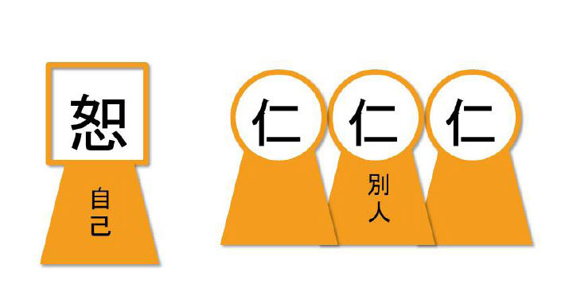

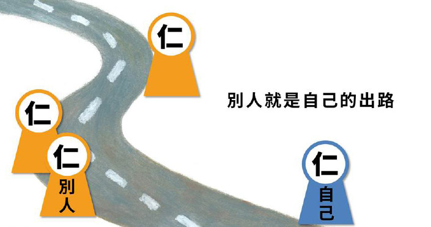

### 孝道跨時代的意義與價值
				 —孝經簡說(二)

孝道跨時代的意義與價值

—孝經簡說(二)

時哉講述、順昌雪廬夫子研學會謄錄、淨域編寫

千載道統孔傳曾

孝為德本教化始

保身護國行道難

孝道一貫大吉祥

前言

孝道是建立在父母或祖父母的恩德上，而行孝對個人有許多的好處，譬如：能提升心性的修養。為什麼呢？因為當懂得報恩的時候，其心性修養成為調柔，始能去觀察他人的功德與恩惠，而非刻薄寡恩，不但心性修養提升了，心態也調柔了，感恩心提升之後，人際關係也得以改善，能獲取他人的尊重，整體言之，是命運的改變及生命的豐富。何以是生命的豐富呢？因為此人已經懂得與他人結善緣，乃至於能夠使風氣改變，也能讓鬼神敬重，甚且成為他人的典範。

進入主題前，先來看一幅江逸子先生的畫—《椿庭思親》。圖的右邊畫有香椿樹與松樹，香椿樹代表父親，松樹代表子女；子女依著父親而立松柏之志，可見孝道裡含藏著志向的確立及內涵的充實。面前有茶花與萱草(金針花)，金萱花代表母親，茶花代表對父母親的孝心是不變的。

就整體畫面來說，一位孝子對著椿庭(有香椿樹、松樹、茶花、萱花)，莊嚴若有所思的情景；所營造的氣象除了對父母親的懷念外，還包括自身的立志與充實，因為唯有己身立志與充實，才合於父母親真正的本懷。天下父母無不盼望著孩子成龍成鳳，若孩子有沖天的志向，再加上充實的內涵，才是真正對父母親恩德的回報。

接著來說「科判」的功能。上述孝道所表徵的概念，之於全經都在講孝的《孝經》，我們要如何來研究這部經典呢？首須提綱挈領，以架構式的學習入手，而架構式的學習是雪廬老人(李炳南老教授)教學的特色，也是有心於深入經教的善巧方便，這最能得到經學的旨趣。

雪廬老人在臺中開設「論語班」與「內典班」教學，內典班的班訓有四點。第一、是「研經貴在得旨」：此即是經學的見地，而科判架構式的學習，就是在入經學的見地。配合孔門的德行科，可見德行科不是只有品德，而是在經學的見地，唯有經學的見地才能立住品格；所謂有千古的見地，才有千古的品格。第二、是「言語先具次序」：乃論說要有先後次序，不能糊了一鍋粥似的講話，讓人不知所云。第三、是「辦事要求精細」：是說辦事不能馬馬虎虎。第四、是「文章練習通達」。這就是孔子的德行、言語、政事及文學四科，也是雪廬老人內典班的班訓，乃是配合孔門四科而行的。

「研經貴在得旨」是架構式的學習，這點非常重要，它能夠將經文的義理貫穿起來。經上說了很多的義理，就像珠子本來散落一地，現在以架構式的方法來學習，宛若用線把它串連起來，成為一圈漂亮的項鍊。這意謂著你懂得善巧方便的學習，便能懂得經學的整體內涵及各章的大意，而每章的大意又能夠結合中心思想，你就是個很有經學見地的人，必能依著經學見地來自行化他。

黃道周孝經書法

繼而，《孝經》書法中有個黃道周先生的版本，以下說明。黃道周先生乃明末清初人士，為明朝崇禎皇帝時的大臣，因為勸諫引起崇禎帝的惱怒，被打入牢獄監禁十八個月，期間雖遭受刑求皮肉綻開，但他一點也不怨恨朝廷。忠臣就是這個形象，即便皇帝對他惡劣到如此程度，他對國家還是忠心耿耿。不似春秋時期魯人陽虎，當國家對他不好的時候，就念念要把魯國消滅，像這般就是小人。雪廬老人說：忠臣只有中國人有，外國人是不會有的。這種民族的特質，即是中國的特質。

黃道周先生在獄中十八個月，他沒有成天漫罵國家，也沒有日夜無病呻吟，而是定心書寫了一百二十部的《孝經》。這一百二十部《孝經》，每個字都渾厚蒼勁，嗅不出他的牢騷，反在獄中修心養性。在溼暗的監獄中，雖環境差飲食又不佳，但卻能從他的書法中，品味到人生最高的修養。所以前人的人格與學問是相結合的，而今人是學問與人格分開的，或許很博學，但在人格上卻可能站不住腳。

孝經科判

要怎樣的架構式學習《孝經》呢？《孝經》全文可分為三大段：第一段，是總的標出「開宗明義」，《孝經》的第一章，就是「開宗明義」，此章先說本經的宗旨、義理是什麼。第二段，「分示孝的宗義」，說明孝道的意義及行孝的方法。第三段，「結明以喪祭之禮來盡孝道」，禮是要講究心態與作法的。所以，孝道也是要講究心態與作法，而且是講究父母生前、過世及逝後怎麼樣來盡孝與祭祀。如此才是一個完整的孝道，並非生前於父母親生日時，買個蛋糕唱首生日快樂歌就是盡孝；然而，今人對於孝的觀念，大抵上只有這樣而已！以上是整個《孝經》的大義。

再則說明第二至十七章「分示孝的宗義」。所謂的「宗」，就是行孝的方法，是孝道的修學法。可以分為「孝要」、「如何以孝事親」、「需推廣」、「需諫諍」、「能感通」及「以孝進退」六部分。所謂「孝要」，就是孝道的重要，包括第二章到第九章，這裡面包括天子、諸侯、卿大夫與士民的孝。天子就是現今的國家領導人，諸侯乃各省、市長，卿大夫可說是國家部會首長或省市廳處長，而士人是一般公務員與讀書人，至於庶民就是農、工、商等各行業。繼而讚歎說，孝道的經營會使人與天地相合成為三才。再者，孝道是聖人治天下的功德，特別舉周公為例。

第十、十一章談「如何以孝事親」，這裡面包括孝親該做與不應該做的事項。第十一章說刑法三千，其中有五種刑罰最重，而最嚴重的罪行就是不孝。再來講「需推廣」，是強調孝道必需要推廣的；其中第十二章說：推廣孝道的功德即是能讓百姓喜悅；第十三章說：孝道的推廣能夠讓自己成就至德，即是德行圓滿；第十四章說：孝道的推廣能夠讓你揚名天下及後世；第十五章說：孝道不只是要孝順父母，還要懂得把父母親導引到正道，所以要勸諫父母親；第十六章說：孝道能感通鬼神，得到天地鬼神的加被護佑。第十七章說：孝道是能進能退的，進可輔助國君，退能充實內涵。最後第十八章結歎，說明以上整體都是要用「禮」來經營；禮乎禮乎！孝乎孝乎！孝與禮簡直是不能分開，無怪乎孔子西行請教老子，是去問禮的。

經文解析

開宗明義章第一，是孔子與曾子二人的對談。

經文：

仲尼居，曾子侍。

子曰：「先王有至德要道，以順天下，民用和睦，上下無怨。汝知之乎？」曾子避席曰：「參不敏，何足以知之。」

子曰：「夫孝，德之本也，教之所由生也。

復坐，吾語汝。身體髮膚，受之父母，不敢毀傷，孝之始也。立身行道，揚名於後世，以顯父母，孝之終也。夫孝，始於事親，中於事君，終於立身。」

《大雅》云：『無念爾祖，聿修厥德。』」

以上五段讀誦，就是架構式的讀書法。架構式的讀書法，將這一章的經文分為清楚的五段。如此將經學讀通了，不論你的看法或文筆，都可從經學的見地來通達人情世故，來了知人心最隱微處的需求。

第一段「仲尼居，曾子侍。」這段叫作「證信序」，什麼是證信序呢？即說明第一章是「序文」。整部《孝經》經有十八章，第一章「開宗明義」是序文。「證信序」的意思，就是證明讓你相信。證明使信有六個要素，第一就是「仲尼居，曾子侍」，這代表是曾子的傳承所述，因為「仲尼」一語就是明證。在《中庸》裡，子思講孔子的時候是稱「仲尼」，講他的老師叫作「曾子」，可見這部經，首先相信它就是曾子的傳承所記。其次，是這個傳承所紀錄的，乃是曾子聽聞而來。第三個，它的時機點，是孔子閒居無事的時候。第四個，說法者是孔子。第五個，聽法者是曾子。第六個，處所是孔子的家中。這六個要素，就像開會的時候，有主持人、有記錄、有與會者、有處所，加上會議紀錄，證明有開過會。所以稱作「證信序」，用來證明讓我們相信。

從第二段後就是「發起序」，意即發起這一部經。這一部經是怎麼發起的呢？孔子言：「先王有至德要道。」這個要道是可以通往至德的，乃是形而上，此種解經法，若讀過《大學》、《中庸》，就會相信這個解經法是有根據的；要道是通往至德的要道，要道是以順天下、民用和睦、上下無怨的要道。所以這個要道，是通往形而上的至德，是通往形而下的順天下、民用和睦、上下無怨的要道。

其次要道通兩條，通形而上叫做至德。什麼叫「以順天下」呢？就是天下人都想離苦得樂，你推廣的要道符合天下人的心，你是眾望所歸，百姓用你的要道，大家能和睦相處、上下無怨。假如你是曾子，你想不想聽這個通往形上、形下的要道，而且是重要之道、唯一的路呢？
孔子
**問：** 「汝知之乎？」曾子本來坐在席位上，起身離開席位，說：「參不敏，何足以知之。」我是個悟性不高又魯鈍的人，不夠量哪裡知道呢！《因明學》裡面叫作「量」，他的證量不夠，所以不知道先王的至德要道在孝。

孔子就繼而說：「夫孝，德之本也，教之所由生也。」「夫孝」就是指這個要道，是什麼呢？「德之本也」，是通往形而上的根本；「教之所由生也」，世間教化亦由孝道開始。形而下利益人民就是要透過辦政治及辦教育達到此目的。而辦政治的目的在於創造一個方便辦教育的環境，這是為何呢？因為政治是讓百姓的生活過得好，但是教育是讓百姓的生命活得更豐富。如果只有辦政治而無辦教育，百姓在生活過得富饒時，容易驕奢淫佚，好逸惡勞。

孝何以是通往形而上的根本，是形而下教化人民的開始呢？此非教條式的宣述，更需邏輯推理以明之。接著孔子就說：「復坐，吾語汝。身體髮膚，受之父母，不敢毀傷，孝之始也。立身行道，揚名於後世，以顯父母，孝之終也。夫孝，始於事親，中於事君，終於立身。」可見剛才曾子是站起來的，所以孔子讓他回到坐席上，隨後告訴他什麼呢？因為孝是通往形而上、形而下的要道，所以要告訴他孝道的修學法。

修學孝道從哪開始呢？孔子說：「身體髮膚，受之父母，不敢毀傷，孝之始也。」外相上的身體髮膚，一點都不敢去毀傷，這是孝道的開始。表面都不能毀傷，更何況是內在的修為，更不能離經叛道。

孝的開始是這樣，那麼孝的終了呢？孔子說：「立身行道，揚名於後世，以顯父母，孝之終也。」立身行道是以道立身，以內聖外王的大道自行化他，成為立身法，以道自行化他的好名聲，能揚於後世，典範為誰呢？孔子是最好的代表。「以顯父母」就是父母親因你而特別的光榮，這是孝道的圓滿。這樣的解法真是太好了，經學的內涵是內聖外王的修學法，若能通達，並自行化他，做為傳承者與弘道者，是圓滿孝道的方法。孝道十八章，直是「一以貫之」。

所以，孔子開始說孝。「始於事親」，行孝從事親開始，乃即辦家政。「中於事君」，事君是辦國政，意即從家政一直辦到國政。「終於立身」，就是通達於內聖外王的大道，整個孝道就圓滿了。這真的不得了，中國有這樣見地的聖人，要向彼三鞠躬。

最後孔子舉證《詩經》的〈大雅〉來證明孝道，說〈大雅〉云：「無念爾祖，聿修厥德。」無念的「無」是語助詞，實際就是懷念你的祖上，從父母親開始，然後祖父母、曾祖父母一路往上念念。聿修厥德的「聿」是敘述之意，「厥」是這個，這個德就是他們(祖上)的德。有注解說是「修自己的德」，那麼其與「念爾祖」有什麼關係呢？此時是「敘述」且「修他們的德。」此即祖德流芳。

六經開頭就是《詩經》，它的體裁是「風、雅、頌」，其表示體裁取自於哪裡。「風」是國風，取自於民間的歌謠。「雅」是典雅音樂，有大雅、小雅之分；大雅是取自於國王受臣子們朝拜勸諫的音樂，小雅是取自國君宴請賓客的音樂，屬於貴族官吏的詩歌。「頌」是對宗廟祭祀的歌頌，惟此歌頌有正面的歌功頌德及反面的諷刺。風、雅、頌是詩歌的取材，其表現手法為「賦、比、興」。「賦」是直接陳述。「比」是比喻，用已知比未知，例如江老師畫《孝經圖》，用芭蕉來比喻虛心，用松柏來比喻艱困中的志向。「興」是寓言，借常識來興起思考，例如：長江後浪推前浪，寓說江山代有人出。

以上是《詩經》的作法，孔子舉其作為「開宗明義」的結論，這個結論絕妙，什麼是「開宗明義」？「開宗」是開示這一部經的宗旨；「明義」是明了這一部經的義理。這部經的宗旨是什麼呢？就是孝，經裡面要闡述的是孝道的修學法及行孝的方法；孝道的修學法是用怎樣的方式讓人生起孝心，而行孝的方法是把這個孝道推廣出去。至於「明義」呢？此部經講的是孝道的意義、功德及對風氣的影響與出路，這些都是孝道的義。

釋義

這部經是在什麼情況下被開演的呢？叫作「仲尼居，曾子侍。」是孔子在平居無事的時候，《論語》上形容是「申申如也，夭夭如也。」「申申」是指很正直，「夭夭」是形容很和藹。很正直的那一分得自他的智慧相；很和藹的那一分，是他的慈悲相，慈悲與智慧雙運。子夏形容孔子是「望之儼然」，意即偷偷地看他相貌莊嚴，親近他的時候很是溫和。雪公老師說：「這個望之儼然，乃是日久天長的練成，絕非裝模作樣。」

再來「曾子侍」一語。這個侍字，包括做侍者。侍者侍從的時候，可以站可以坐。《論語》裡面有幾章，就是弟子們擔任侍者時的應對。比如說：「顏淵、季路侍」，就是顏回與子路任侍者，坐在那裡；或是說：「子路、曾晰、冉有、公西華侍坐」，這四位弟子隨侍在側；可見侍者的修學法很重要。

侍者究竟要怎麼修學、擔任侍者呢？比如：倒開水、進巾奉茶、觀察老師的需求，就是勤快服務；這在雪廬老人座下，我們都曾見過，將學生調教的很好。未被調過的人，進退失據，所以做侍者的修學法是很重要的。再者，做侍者期間，老師可能會話說家常，或是談談心得，甚而無言相坐。之於無言相坐，你會有種如沐春風的感覺。此外，還有經學的請益與討論，有時老師會請你宣說志向，如《論語》所言「盍各言爾志」一般，這些都是做侍者的通說。

眼前孔子平居無事，曾子在一旁侍候，此時講述《孝經》稱作「無問自說」。釋教三藏十二部，有一部叫作「無問自說」，《孝經》就是「無問自說」。曾子並沒有請法，而孔子竟然對說。大凡由無問自說開起，表示有甚深的緣起要發生了。

《孝經》不傳於他人，為何傳給曾子？大家或許會有這樣的疑問。首先，曾子是位孝子；中國的《二十四孝》裡，曾子真是一位大孝子。其次，曾子是位好學之人，他怎麼好學的呢？《中庸》裡面說：「人一能知，己百知；人十能知，己千知。」換言之，曾子是用他人百倍的功夫去努力成就的。「人一能知，己百知。」用如此百倍的精神去努力，再笨的人都會成功。第三，曾子是「傳不習乎」，學習之路是不斷的預習、練習與複習，不像一般人學後都束之高閣。不聰明的人如此用功，最後當然得到「一貫之旨」，所以傳道於曾子。

孔子說：「孝是至德要道。」這是為什麼呢？須知，孝是想要報父母的恩德。此時會回報父母的恩德，那麼對你有恩德的人，你才會知恩感報，乃至於眾生的恩德，你都會想報答。其次，你要怎麼來報恩？報恩包括讓他的生活過得好，生命過得充實；其中最重要的是生命的充實，而不是生活過得好。父母親生日的時候，買個蛋糕祝他生日快樂，報恩不是這樣的，而是要讓父母的生命過得有意義。生命過得最有意義的是什麼？就是「至德」。要讓父母親與有恩的人(包括師長、有恩的眾生)，生命過得豐富有意義，試問自己學了「至德」嗎？自己成就「至德」否？顯見孝是一個「要道」，是通往形上、通往至德的重要道路。

這是先王的成就，先王就像帝舜這般，堯舜禹湯文武周公一脈相承，之所以特別舉出舜，乃因舜這個人的至德，即是形而上的修養到了究竟處。你如何能知究竟呢？真正形而上的修養，到了成就處時，此人是不會隨境界所轉的。所以，舜即帝位時，是他想要當帝王嗎？不，他從來不想。再者，他傳位的時候，可曾想過對他及家人有何好處嗎？不，也未曾想到。這種就是至德的形象，意即連帝王這種至大絕對的權力，於他而言，都不會引發出一絲的貪戀，這就叫作「至德要道」。唯有這樣的人，才能真正領導統御，且為他人完全的信服。試想，舜六十歲當帝王，四十八年的帝位，直至一百零八歲過世。可知，人到年老之時，會有一種麻煩現形，老年時要「戒之在得」，帝舜到一百零八歲的時候，頭腦還很清楚，要為國家百姓找有德之人，把君位禪讓給他。這若不是「至德要道」，那什麼才是呢？

以上所說，是孝道通往形而上的至德要道。

孝道可以通往形而下，它真能「以順天下，民用和睦，上下無怨」嗎？須知，孝是從父母的恩開始感念，繼而至親人、師長、朋友、眾生的恩，此時將這孝道推廣出去，大家都能互相感恩，彼此替對方著想，試想天下是快樂的還是不快樂的？百姓行孝以後，是和睦的還是不和睦的？是互相幫忙、彼此提攜快樂，還是互相勾心鬥角、爾虞我詐快樂呢？孝道的推廣是上下和睦，若下能替上設想、上能替下著想，彼此為對方著想怎會不和睦呢？難道只為一己設想是和睦的嗎？所以，真把這個「和」推廣出去，在辦理政事上就能一片和諧，此除舜以外還有誰呢？孔子亦是。

孔子在治理中都的時候，就是讓大家有工作各安其分，且讓家庭皆能以孝來持家。行於野外，依理相讓，路不拾遺，夜不閉戶。所以，治理中都一年後，成為諸侯效法的模範，且被提拔到中央裡擔任司空(掌水利營建)，接著升任司寇(掌刑獄糾察)。這就是形而上通於至德要道，形而下能成「以順天下，民用和睦，上下無怨。」曾子聽到這個要道的同時，孔子繼說：「這個要道，你知道嗎？」曾子馬上避席說：「我哪裡知道？」曾子起身答話，孔子又說：「坐。」讓曾子坐下來。

避席是一種禮貌，意即「離開席子，起身來請教。」此處要特別介紹唐朝玄奘法師，他的祖父為禮部侍郎，父親陳惠擔任過縣令，因隋朝政治腐敗天下大亂，父親就罷官回家耕讀，育有四個孩子，玄奘法師排名第四，二哥出家法號長捷。玄奘法師八歲時，聽父親講述《孝經》，說到曾子「避席」時，玄奘法師站起身來，父親問為何？答道：「曾子尚且知道避席，我何人敢不避席。」父親心想這孩子從小就不凡。後來隨二哥一起生活學習，十四歲時想參加出家人的考試，因年歲未滿二十不能應試，在外徘徊。大理寺卿(等同司法院長)鄭善國見他氣宇軒昂，問說：「你為何要出家？」他答道：「遠紹如來，近光遺法。」遠紹如來之意，就是傳承遠溯到如來，換言之，他要學有傳承的東西，並且把所學的教法發揚光大。鄭善國聽了十分驚愕，不經考試就當下破格錄取。不僅常人二十歲無此能耐，即便四十、五十、八十歲也沒有這種見地。

曾子說：「參不敏，何足以知之。」他自認不聰明，這有何可證明？抑或是謙虛之詞？《論語．先進篇》上說：「參也魯。」魯就是魯鈍、愚笨、不開竅、沒有悟性。他後來有沒有克服魯鈍呢？有的。就是前所說的得到「一以貫之」之旨，即是悟性很高，得到形而上的傳承，這當然就克服了生來的魯鈍。

孝為何是德之本？教化生起於何處？孔子說：孝道不但是通往形而上，且通於形而下；是以，形而上孝是德之本，教化生起於形而下。上已說德之本，以下再說教化生起處。孝為什麼是教化的生起處呢？試問教化是將人教成善人還是惡人？當然是教成善人。若你對父母親都不感恩回報，怎麼可能是個善人呢？如此怎能教出善人，要這樣的教育幹什麼呢？所以，教育的功能是把人教善，如果不從孝道起始，試問怎麼把他教成善人？這樣孝道難道不是教化的生起處嗎？教育是要先談孝的。

既然孝這麼重要，要怎麼盡孝呢？這就叫「身體髮膚，受之父母，不敢毀傷。」試問有什麼孝的意義在裡面呢？須知，身體髮膚要好好的保護，因為子女惟有生病這檔事，會讓父母親擔憂，其他的不足為慮。所以這裡面的孝義，包括要好好的保護自己。

頭髮也可以是一種表徵自己的東西，比如：以前戰士出征前，可能剪一撮頭髮留在家中，表示雖身體不在家，但頭髮代表我在家裡伴著親人。頭髮雖是個人身體的一部分，但實是父母生我育我之物，非是我的財產，而是父母的財產，所以，我要保護父母的財產。

此時，要怎麼保護呢？「身體髮膚，受之父母，不敢毀傷」，這是一個原則。這其中還包括「君子不立危牆之下」，萬一那座牆倒下來，將自己壓死該怎麼辦呢？這是孟子說的。還有，勿涉足不良場所，諸如：歌舞、刀光劍影、販毒等場所。再者，為了保護身體，所以不與不良者交往。飲食作息要正常，切莫到了凌晨兩點還不睡覺，把身體搞爛了讓父母親操心；因為這身體不是你的，是父母親生養的，必須尊重父母親。現在的食物、飲料、泡麵很可怕，要特別小心，比如：油炸類與味精不能吃。雪廬老人吃了味精，在床上躺了三個月，此後學生們再也不敢吃味精了。許多再製品添加色素，如果懂得這些道理，此類東西你都不會吃。至於生病的時候，要懂得調養、服藥與休息，這些都是孝道中「身體髮膚，受之父母，不敢毀傷」的概念，不是我們表面上看的這麼簡單。

立身行道，揚名後世，是如何來表彰孝道？立身也是道，這才能立身。行道就是把道推廣出去，讓天下蒼生都得利。不但在世揚名，也揚名於後世，它所以最能表徵孝道，乃因為這讓父母親很光彩。其次，將此功德回向於父母親，父母親最能得利。再而，立身行道的道，特別是指孝道的本質，將這個孝道推廣出去，讓天下人都能盡孝，這才是真正對父母親的盡孝。

有人以為孝就是事親而已，其與事君、立身有何關係呢？須知一位國家領導人，該以什麼概念來領導國家？或是省、市級的領導，他要用什麼概念來治省、治市？這就是「君」的概念，一定要把它當成家庭來經營，這是中國人的概念，稱作大家庭。所以，不難理解堯舜能讓天下和睦，就是把天下當成大家庭來經營的。而大政治家是什麼呢？乃所管轄的人民都是他的家人，把百姓當家人來經營，故能一片和諧。所以，當百姓沒飯吃，視作家人沒飯吃；而百姓出人頭地，就當作是家人出頭天。人民的出路就是他的出路，就像見到自己孩子有出路時，比一己有出路還要快樂，這叫作大政治家。

「事君」就是這種概念，要把君王當成家長來侍候；所以，辦政治是大孝，而最圓滿的孝道是「立身行道」。這種觀念只有孔子講得最清楚，於經文中也只有《孝經》講得最清楚。因此，《論語》中有關孝道的講論，與《尚書》、《禮記》、《國語》、《左傳》等所說的孝，都必要和《孝經》合起來看，這樣的孝道才真是一個完滿的修學概念，始能完整的來闡揚孝道。二○一六年是雪廬老人往生三十周年，我們若能用推展孝道來懷念一代大德，不止是家庭、社會、國家得利，自身也會獲得許多的好處。

孔子舉《詩經．大雅》：「無念爾祖，聿修厥德」詩句，要怎麼來彰明這個孝義呢？「無念爾祖，聿修厥德。」是用「好好地想念祖先的德，進而來敘述與修學」，來作為這一章的圓滿。意即把祖德往下流傳，是家庭孝道最圓滿的現象。家庭孝道圓滿，才能夠推展孝道於國家，若連己家的孝道都無法圓滿，又怎能推展到家庭之外及於國家呢？我們要怎樣追念先祖、修養自己、發揚他們的美德呢？中國人的先祖，本來都是同根同源，所以，不僅是自己的祖先，還要包括先聖先賢們。

總結

最後，以《詩經．大雅》的詩句來總結「開宗明義」具殊勝意義，此意義是什麼呢？此義就是「傳承」。我們的先祖及各家庭祖先的功德，其實都完整的敘述在經學裡，再也不會超出經學之外。所以，我們完整的來傳承經學，就是孝道的圓滿相，最後的結論叫作「傳承」。《孝經》之開宗明義，證諸全世界，哪一個文化像中國一樣，即便講到文化的源頭「孝」，有哪一個像中國闡述的這樣完整？這叫作「書讀千遍，其義自現。」意即，你真的會讀書，以架構方式完整的分析，一段一段的相連，便能發覺到義趣是一以貫之的。慶幸生在這個國家、當孔子的後輩、讀孔子的書及得到孔子的傳承，生命有了價值，此生沒有白活。(下期待續)

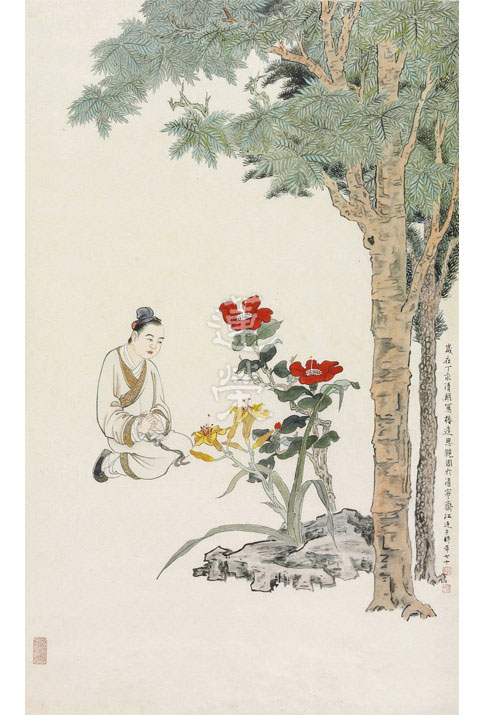

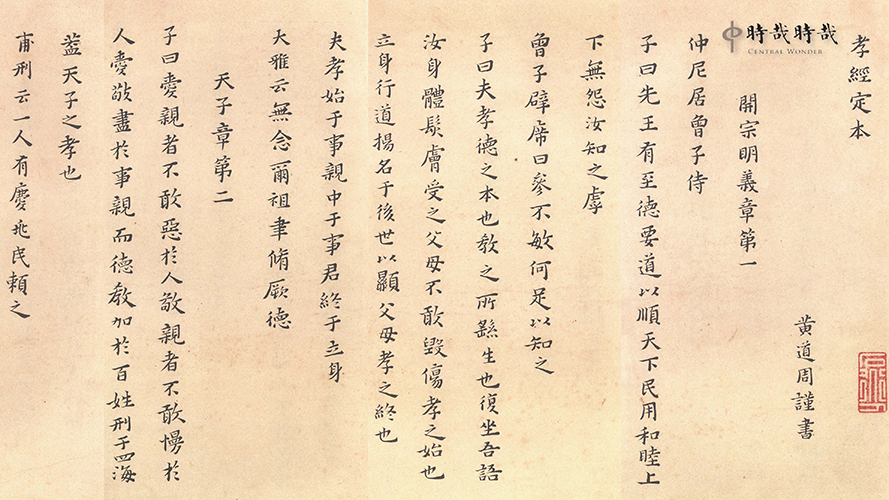

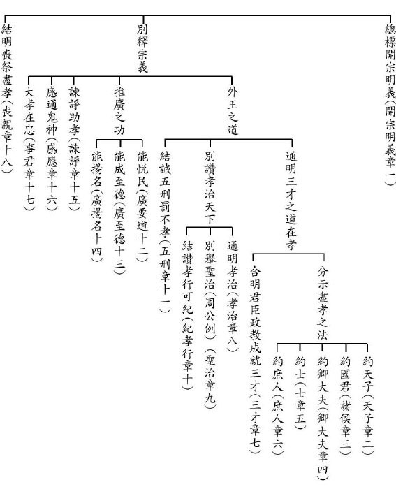

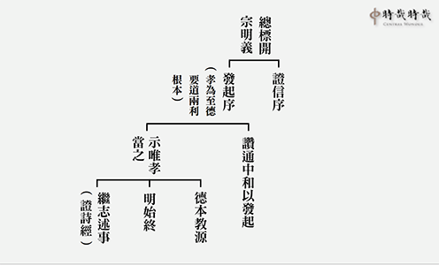

## 藝術賞析

### 孔門七十二賢淺說（十二）─顏路

圖：江逸子‧文：時哉

積善厚德家餘慶

能生聖道傳承子

孔顏之樂文化心

千載猶為暗室燈

顏路，姓顏，名無繇（音由），路是他的字，小孔子六歲。他是復聖顏淵的父親，也同樣是孔子的學生。

論語先進第十一記載，在顏淵過世時，顏路請求厚葬，由於家裡貧窮，而向孔子請求，將車子賣掉，用賣車的錢去買槨（棺材外的套棺）。孔子當時周遊列國回到魯國，雖然不作大夫，但國家有大事時仍會上朝，需要乘坐馬車，孔子以此理由拒絕了顏路的請求說道：人子雖有才與不才之異，但在其父各言其子則同（都厚愛自己子女），我的兒子孔鯉死的時候，有棺無槨，當時我並沒有賣車為他作槨，因為有要事時須隨大夫上朝，不可以步行。顏路的請求，或許其實因為與禮制不合，所以孔子不許；抑或還有其他原因，古注所說不一。雖然如此，孔門弟子還是厚葬顏回，表達對這位德學兼優的同學最崇高的敬意。

畫中的顏路因為喪子之痛神情哀傷，從衣著體態可以看出他家境的貧寒。打躬作揖，或是表徵正向夫子請求賣車換槨，為子下葬。

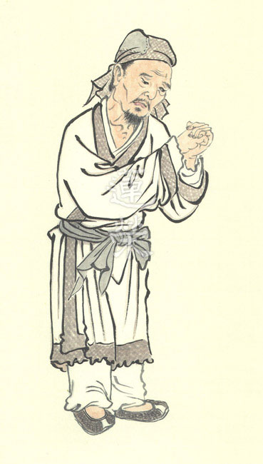

### 華夏精魂千秋(十二)—明倫史畫漢文侍親　劉恆

圖：江逸子‧文：淨域

歷經宮廷內鬥

親侍湯藥佳話

仁厚以孝大治

開創西漢盛世

史話

西漢文帝劉恆，豫州沛郡豐邑(今江蘇省豐縣)人，生於西元前二０三年，崩於西元前一五七年，享年四十七歲。為漢高祖劉邦第四子，漢惠帝之庶弟，母親薄姬，乃西漢第五位皇帝，在位廿三年。高祖七年(西元前二百年)，劉邦親征匈奴，雖先取太原郡，但被冒頓單于圍於平城(今山西省大同市)白登山，後採陳平遊說之計，始得脫困回朝，封陳豨為陽夏侯。高祖十一年，陳豨於代郡起兵造反，自封代王，劉邦御駕親征，陳豨遭樊噲所殺。代地(今山西省忻州市)乃邊陲重鎮，需派可靠的人鎮守，眾臣舉薦賢孝穩重的四皇子，劉邦即封八歲的劉恆為代王。劉恆聽從母親的教誨，恪遵力行祖訓，將代地治理得井然有序，恢復邊地的安定。西元前一九五年劉邦病逝，太子劉盈即位為惠帝，呂后殺戚夫人及其子趙王劉如意，提議由代王出任趙王，為劉恆巧妙地婉拒，得以在呂后專權時期保命。呂后死後，外戚一族欲作亂，陳平、周勃與城陽王劉章等人，巧奪兵權消滅呂氏外族，並黜殺後少帝劉弘，共推寬厚又孝順的劉恆即位，是為漢文帝。文帝即位後，倡導「孝悌是天下的大順，力田是生活的根本，三老(掌教化的鄉官)是百姓的老師，廉吏是民眾的表率」，並獎勵這些世人模範，以帶動良善的社會風氣。此外，還廣納諫言、廢除肉刑，遇荒年減免租稅，嘉惠天下孤寡。當時百姓富裕社會安康，文帝與子景帝統治時期，被合稱為文景之治。劉恆雖貴為帝王，但生活恭簡仁慈，侍奉生母薄太后尤其孝謹。某回，薄太后重病臥床三年，他服侍母后殷勤周到，夜裡睡覺未能安穩閤眼，甚至連衣帶也不敢解下。母親所服用的湯藥，他都要親自先嚐過，確定湯藥無虞冷熱合宜後，才捧到太后面前進用。他的仁孝名聲傳遍天下，百姓無不讚頌。後人編撰的《弟子規》中，所云：「親有疾，藥先嚐。晝夜侍，不離床。」所傳教的就是漢文帝侍親之孝。西元前一五七年六月，文帝崩於長安未央宮，葬於霸陵(今西安市灞橋區)，廟號太宗，諡號孝文皇帝。

圖解

本圖所繪為「文帝侍親」之況，乃薄太后病中，皇帝劉恆日夜不間斷親侍湯藥的情景，且持續了三年之久。帝王的隨從甚多，難道無人可以專職此事嗎？須知母子連心，唯有孩子的孝行，才能真正慰撫父母。觀於今日家庭親長病老，雖孩子延醫請傭照顧，然有多少子女能用心親奉隨侍呢？概是將責任假手於他人而已！《孝經．天子章》云：「愛親者，不敢惡於人；敬親者，不敢慢於人。愛敬盡於事親，而德教加於百姓，刑於四海，蓋天子之孝也。」顯見天子的行孝，最初雖是從己踐履，但最終的目地在於推廣成風效，使得社會穩定、國家安治。武帝時，西漢國力達於極盛，此雖劉徹雄才大略所能，但若無父祖文景盛世之治，哪有日後開疆闢土之成。漢初政局不穩，先有劉邦逐殺異姓王，繼有呂后亂政，劉恆登基後採黃老之術，施德以服人，安撫各處蠢動的諸侯，其時天下懷安。景帝劉啟採晁錯削藩之策，引發七國亂事；觀於司馬遷在《史記》中評論：「七國亂因在於，晁錯未採取逐步削藩之法。」可見劉啟若能延續父親仁厚懷德的穩重作法，諸侯王的問題是可以和平解決的。圖中，文帝衣著簡樸至後宮探母，又趨近親侍湯藥；端跪恭禮者示敬，持藥餵食者示愛，正是《孝經》中所言的「愛敬盡於事親」，此盡全在於「簡行仁孝」。天下有如此的帝王，君子德風，小人德草，草上風行，上行下效，何患天下不治呢？（下期待續）

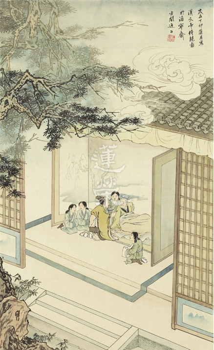

### 孝經圖簡說(十)—紀孝行章

圖：江逸子‧文：時哉

以身作則風氣雅

孝行能出可紀錄

比屋而封堯舜朝

國泰民安真盛世

紀孝行章第十

此章是紀錄孝子應有的行為，除了在言行上表達對父母的敬意，也懂得體貼父母親的心意，讓父母打從心裡高興。例如晨昏定省，早晚問安，打點父母生活所需，父母生病時能憂心病情變化，在父母之喪時，能感念父母生前種種的恩德，生起哀戚之情，祭祀時要肅穆莊嚴，齋戒沐浴，如此才是事親的圓滿形象。

如此事親者，在上位必不驕，則國富民強，居下位不作亂，故能不受刑罰，且能受重用，居同輩之間也不會爭奪名利，這位孝子能和諧家庭社會。

畫中這位孝子的家庭，看起來像似貧窮之家，這可以從牆皮剝落、水泥補塗中看出，然而一家是歡樂的，妻子以飲食侍奉父母，這位孝子正於戶外，或調和或教化鄉民，鄉民有農夫、有補魚者、有砍材者、有懸壺者（或是行腳郎中）及抱孫的老婦等，此孝子或尚未出來替朝廷辦事，然已是能調和教化之人，具有處眾之能耐。

歷代畫作的表現法，是孝子在家侍奉與取悅父母，如老萊子侍親模樣，表徵居家的和樂，但江先生所繪，不但有居家和樂，還有處眾能耐，此人一旦有機會出來替國家辦事，必是調和鼎鼐之人，是國家棟樑之材，此即孝行章之經義所在。(下期待續)

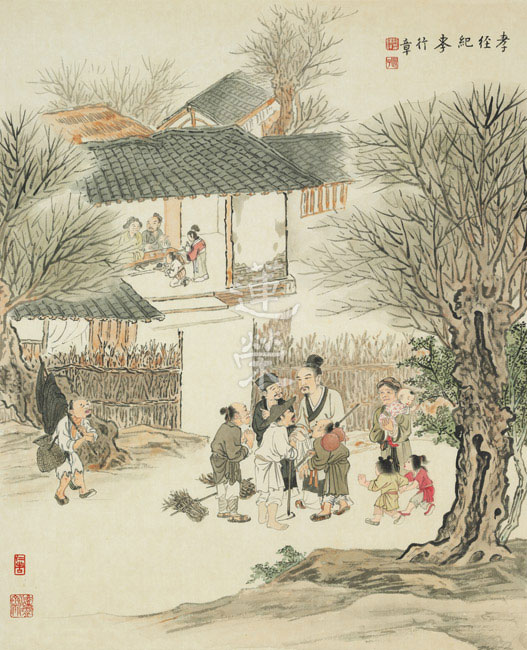

## 蓮池海會

### 白呂旦老居士助念見聞記

淨曜

生死大事當經營

平常共修結善緣

家庭佛化知護念

往生能得勝助念

白呂旦老居士生於民國五年農曆三月十二日，卒於民國一○五年農曆八月初七(國曆九月七日)午時，享壽一○一歲。受限於當時的時空背景，老居士從小沒有受教育的機會，且由於家境貧窮，十五歲時即嫁給世居淡水的先生白梧桐，以聘金助其娘家度過生活困境，婚後育有七子三女，長子於十歲即因病過世，先生則享壽七十五歲。

老居士具有農村婦女傳統的美德，勤儉持家、刻苦耐勞，協助務農的先生，下田種菜、飼養家畜、收割曬穀等，並打理家中一切大小事務，舉凡養兒育女、洗衣、煮飯、送餐至農地等，一手包辦，家中人丁興旺，其工作之繁重可以想見。

先生過世後，老居士由兒子們共同輪流奉養，高齡九十餘歲時逐漸喪失生活自理能力，除了行動不便外，並出現身體不適、記憶力衰退等現象，因而聘雇外籍幫傭加以照料生活起居，居住在祖厝旁的小屋中。老居士信奉民間傳統信仰，重視祭拜天地神祇與歷代祖先，於初一、十五有吃素習慣。因子女與孫子中少數人接觸佛教各宗，平時會以誦經、持咒、念佛、放生、捐款等善法，為老居士祈福，並藉照顧探視時談論佛法的道理、介紹阿彌陀佛與極樂世界的殊勝，引導一同念佛求生西方，是故老居士在人生最後幾年中，遭逢病痛難耐不已時，尚能在晚輩提醒後口念佛號，哀求彌陀接引往生。

在往生前幾週，老居士出現吞嚥困難的症狀，食慾降低，不想吃東西，且伴隨著身體無來由的疼痛，而被送往醫院檢查、吊點滴，家屬以為如此下去會餓死，故強要醫院為老居士插鼻胃管以資餵食，持反對意見的家屬淪為少數，老居士本身雖也百般不願，但仍無法抵抗這樣的安排，只能任由他人決定她的命運。

離開醫院回到家中，看到老居士的症狀似乎有緩解的跡象，眾人便掉以輕心，豈料老居士在毫無預警的情況下，於九月七日中午嚥下了最後一口氣，家屬緊急互相周知，隔沒多久，有學佛和助念經驗的三子帶著陀羅尼經被到現場，過了一段時間，家屬們也陸續抵達，然而家屬們對臨終護持並無深入的了解，居然在此時請醫師至家中開立死亡證明並拔除鼻胃管。又因過去兄弟妯娌間溝通不良，諸多誤會未解，而形成無人在旁領導指揮、分配排班、聯繫助念團的情形，僅三、五人在房內隨著念佛機參差不齊的念念佛，一旁還放著密宗的持咒錄音，其他人則在外聯繫葬儀社，討論棺木、算日子時辰、是否要燒庫錢、搭棚架、清理環境等枝末瑣事。

待孫子趕至，首先觀察周遭現況，並請家屬入內領眾念佛，暫停念佛機，找機會將密咒播音機器移開，把擔心天氣炎熱而對著往生者吹的房內壁扇關掉，另將客廳冷氣轉強並準備立扇保持空氣流通、降低室內溫度，若見聊天者或哭泣者則委屈婉轉地請之轉往他處。經與現場長輩溝通，促成同意延請助念一事，並答應至少助念八至十二小時，隨即向學會報告大致情形，恭請老師教導後續應採取的措施，先請經驗豐富的師長們至現場了解狀況回報老師，再視情形採取行動。

確定助念後，師長們帶來助念袋，環視左右，了解前後過程，布置簡易佛堂，焚香頂禮，祈請十方三寶及眼前西方三聖放光加被，龍天護持，惟願今日的助念能順利圓滿，老居士能仗此因緣蒙佛接引，往生西方。助念過程中，師長們輪番帶領，主要由媳婦和孫子女不定時的輪流助念，老居士的兒子們多在屋外討論喪葬事宜，經提醒才三三兩兩入內，但仍走動頻繁，難以真正靜下心來助念。此外，因房屋狹小老舊，也對助念造成影響。家屬若已有助念共識，理應事先迅速將房內無用之物移除，以留足夠空間助念，並解決房門開關時產生的刺耳聲音，以營造適合助念的氛圍。

稍早，雖有取得部分長輩同意，預計將喪葬事宜交由有經驗的佛教禮儀公司負責，沒想到已有長輩與當地一般的葬儀社聯繫，故佛教禮儀公司只能居中協調提供建議，掌握喪葬與作七皆採佛事儀軌，並且絕不可殺生的原則，子孫當時皆表認同，但後因子女意見不一致，使後續產生不少變化。且鄉下地區習俗眾多，似是而非的觀念早已深植人心，造成喪葬事宜不得不兼採部分民間習俗的作法，需要辦得熱鬧，使家族在鄰里間有面子。

助念後半段，因子女聽信民間推算入殮時辰之習俗，導致助念無法延至十二小時。最後幸賴學會師長們大力護持，多數兒女子孫們皆願入屋念佛送老居士最後一程，並在聆聽法語後將功德迴向老居士能業謝娑婆，高登極樂。隨後更衣入殮前，掀開陀羅尼經被，老居士面容一如往常，毫無痛苦相狀，助念圓滿結束。

家屬也在七七四十九日內，禮請法師作七，並以誦經、念佛、參加拜懺、放生、供養道場等善法迴向老居士往生極樂，蓮品高昇，以盡孝道。期望能仗此因緣，成為家屬們未來得度，最殊勝的緣起。

綜觀本次助念經過，可知能夠順利往生實非易事，俗諺雖說多子多孫多福氣，但若多子多孫卻無法統合意見，平常在人情上也沒有努力造作，反成自己往生障礙時，福氣何在？由此可知組成佛化家庭的重要性。此外，沒有善知識的教導與協助，單靠自己如何能生起對西方的信解與嚮往？如何能破除外緣上的障礙而得助念的順緣？倘若沒有內因也無外緣，往生一事乃癡人說夢、遙不可及，可知善知識的地位乃無可取代。是故現前未具上述條件者，應努力造作以備未來之需；已具各種殊勝因緣者，實應慎加珍惜，切勿一失足成千古恨。

## 專題講座

### 亂世自處之道─由明夷卦說起

*唐瑜凌講述‧編輯部整理*

君子道消小人長

明夷正法遭困壞

可貴松柏耐霜雪

大地回春枝更茂

前言

解釋《易經》之易有三：變易、簡易以及不易，變易也就是六十四卦、三百八十四爻是變化無窮的，一個卦可以用反卦（上下卦顛倒），也可以用旁通卦（陰陽爻相反），或者用互卦（二三四爻與三四五爻），或者用升降（第三爻升到第五爻）或者是變爻（一、三、五是陽位卻是陰爻，讓陰爻變換成陽爻歸正位）等，來尋找出路。所以算卦容易解卦難。

簡易就是在這麼多的變化當中，是否有提綱挈領的認知這些變化。

不易就是卦象的自體性是無，小人卜出好卦象，未來亦凶。君子卜出壞卦，依禮而行，知時進退也能趨吉避凶。

解周易可分掃象派和立象派，醒公是依唐朝李鼎祚之《周易集解》及清朝的李道平先生根據《周易集解》做的《周易集解纂疏》，內含有鄭玄與三國時期曹魏的虞翻以及東吳的荀爽等各大家之注，是立象派的著作，聽了醒公講解十年，也還未懂得其中深奧變化的道理，今依醒公《明倫月刊》之述，淺解之。

何以特別介紹此卦，乃雪公往生前有述，在亂世當中卦象是明夷卦，君子如何在此卦中找出路？

明夷卦

明夷卦或稱箕子卦，箕子在紂王當道的亂世當中懷才不遇，裝瘋佯狂才能躲掉命難。此卦或另稱文王卦，文王在羑里關七年後，因散宜生賄絡紂之官員，方能解除牢獄之災。

虞翻注：「夷，傷也。臨二之三而反晉也。明入地中，故傷矣。」

明夷卦是坤上離下，明入地中就是火(離卦)在地(坤卦)裡面，是明被傷之相。亂世明哲之人反受傷害。

卜到某一卦，還得要了解這一卦從何而來，它的旁通卦為何。明夷卦是從臨卦來的，地澤臨，臨卦的第二爻到第三爻，第三爻到第二爻，就是明夷卦。

明夷卦也是反晉，晉卦是火地晉，明夷卦是晉卦上下卦相反。或臨卦的二、三爻對調是明夷卦。

明夷上六：「初登于天，後入于地。」

這句話講的是晉卦，原是明在上地在下，謂之初登于天，上卦（外卦）下卦（內卦）相反變成明夷卦，亦即情況形成最糟糕的狀況，謂之後入于地。例如紂王的爸爸是好皇帝，箕子、比干、微子等這些大臣本來都看到朝廷的盛況，想不到接班人選錯之後整個翻盤，翻上去之後，本來最上面的陽爻變到最底，本來地在下變成地在上，全部重新洗牌，一邦君子在朝卻慘遭厄運。紂王上台小人當道，局面就立刻翻盤，變成最差的情況。

故注云：「反晉」

原是明在地之上的晉卦，上下卦顛倒，則成地在上、明在下，小人當道，是君子道消、小人道長的時代。讀到這一卦的時候，會有很多感慨，人生有很多的抉擇，抉擇不同，局面可能一下子就翻過去！

猶如艮反為震，兌反為巽。「明入地中」則明揜，是故傷矣。

艮卦反過來就是震卦，兌卦反過來是巽卦，艮卦是山，震卦是雷，兌卦是水澤，翻過來是風。

虞翻注：「謂五也。五失位變出，成坎為艱，故利艱貞矣。」

鄭玄注：「夷，傷也。日出地上，其明乃光，至其入地，明則傷矣，故謂之明夷。日之明傷，猶聖人君子有明德而遭亂世，抑在下位，則宜自艱，幹事政，以避小人之害也。」

依李氏《疏》解釋。虞注○五為卦主，故注云：「謂五也。」五是陰爻，失位不正，變正為九五，而上體成坎，坎險為艱，正而在險，不利亦利。六五曰：「箕子之明夷。」後面《彖傳》曰：「內難而能正其志。」是「利艱貞」之義。

李道平的註解就是在解釋虞翻和鄭康成，虞翻說五為卦主，五是陰爻，失位不正。一、三、五是陽爻的位置，二、四、六是陰爻的位置，現在陰爻站在陽爻的位置，所以叫做不正，小人站在天子之位。

解卦的時候，或者用升降法（荀爽）或者是變正法（虞翻），這一卦如果失位，我就把它變正看看怎麼找出路，先從一卦之主找出路，這個明夷卦，光明在地之下所以看不到出路，現在從第五爻變正，上面就變成坎卦，叫做「坎險為艱，正而在險，不利亦利。」

上體變成坎卦叫做險，但是因為在正確的位置上，雖然情況是險，第一條路是等待明君，明君出現卦象就變；第二條路就是自己當皇帝，就像紂王的父親過世，箕子可以取而代之，而且他有德行。可是自己上台這條路是不可行的，因為紂王的父親並沒有傳位給他，所以能做的只有等，在等待的時候叫做險，每天都可能有殺身之禍，可是只要有明君出現，這個卦象就會變，所以叫做坎險。

六五曰：「箕子之明夷。」

箕子在等待第五爻變化。

《彖傳》曰：「內難而能正其志。」是「利艱貞」之義。

內難就是指紂王自家在內亂，因為紂王是箕子的姪子，這叫做內難，但是箕子的心志是正的，雖然靠著他的貞，讓後面的局勢對他有利，但是眼前是困難的局面。

鄭注○日出地上則明，日入地中，其明則傷，故曰明夷。日有聖人君子之象，明如明德，明傷則如遭亂世而在下位。其明既傷，宜守艱貞，以避小人之害。此即《彖傳》所引文王箕子，是其義也。

日出地上是晉卦，現在日入地中叫做明夷卦，孔子在彖傳裡面講到文王和箕子，彖有決定義，用這個註解來決定這一卦的義理，叫做：「明入地中，明夷。內文明而外柔順，以蒙大難，文王以之。利艱貞，晦其明也。內難而能正其志，箕子以之。」

明夷卦的外卦，坤卦此時解釋成柔順，如果針對文王與箕子來說，就是你要懷藏著智慧，可是外表要柔順，上面的地壓住明所以叫做蒙大難，解易經就像觀待性，全部都是變化，前面說上面是小人，下面是君子，上面是地下面是太陽，太陽被地壓住（日落西山），局面非常艱難。現在是說箕子跟文王一樣，處在這個亂世，你要內明外柔才有辦法脫困，也就是對天子要順從，甚至不可以在背後說天子的壞話，忠臣發牢騷時，反遭小人的讒害，所以必須要內明外順。一分是忠君的思想，一分是外要柔順，如此才能活下去，文王就是懂得這一卦深層的內涵。

這一卦可以同時講兩個人，一個講文王，一個講箕子，文王是內文明而外柔順，以蒙大難。這個大難是被紂王關在羑里七年，他在這種艱難的情況下注解易經，每一天都不知道能不能活下去，他竟然可以安住心來每天作學問，可見此人不凡。

箕子是利艱貞，晦其明也。內難而能正其志，箕子以之。貞就是對他有利，但是要歷經艱難，因為第五爻是陰，他的明要被壓制，內難就是指紂王，紂王就是他家族裡面的人，他是一個正其志的人，尤其得到從大禹而來治國之〈洪範九疇〉的傳承，謂之箕子以之（箕子用這一卦之理趨吉避凶）。

明夷卦本身就是蒙大難的卦，因為明被壓在下面，邦有道明在上面，邦無道明在下面，而且有大難，上面有個地壓住你，可是這時候要怎麼脫困呢？就是內明外柔順，乾是剛強，坤是柔順，解法又有變化，局面對我很艱難，但是我要維持正，裝瘋賣傻的過程，可能需要好幾年、好幾十年。箕子是明夷裡面利艱貞的卦象，內文明外柔順指的是文王。卜到一樣的卦象，但是解法完全不一樣！

「明入地中，明夷。」

蜀才注：「此本臨卦也。案：夷，滅也。九二升三，六三降二，明入地中也。明入地中，則明滅也。」

夷，可以解釋成傷，也可以解釋成滅，陽爻叫做九，陰爻叫做六，臨卦的九二升到九三，六三降到六二，這時候變成明夷卦，這就從臨卦變成明夷卦。

依李氏《疏》解釋。此卦自臨來，故注云：「此本臨卦也。」「夷」字又訓為「滅」者，滅字從戌，五行土生於戌，盛於戌，故為坤土。滅字從火，即是離火。此卦下體離上體坤，火在土下為滅。

又互坎水，以水滅火。故以「夷」解釋為「滅」。

這邊說明明夷卦的夷，可以解釋為坤，也可以解釋為火被滅，明變暗，可見明夷卦由最好的卦象而來，所以人在盛況的時候要小心，這一翻就垮到底。

互卦是二、三、四和三、四、五爻，漢儒解卦喜歡用互卦，荀爽喜歡用升降，虞翻喜歡用變正，某一爻如果不正，就把它變變看。所以想要解卦，必須要通達這麼多家的註解。互卦有上連互和下連互，要通達這些才能看一個卦象，這就是變易。

互體坎是水，離是火象，上面是水、下面是火，以水滅火，小人來滅這位君子，箕子或者文王就是處在這個位置，如何能活？雪公老師在過世前，整體形勢就是明夷卦，想要恢復孔子之道救台灣，宣揚這些道理是難以達到效果的，甚至會招致毀謗。

滅有三種滅，第一個就是第五爻的失位，第二個是地壓住火，第三個是水去滅火，所以叫做明被夷。

臨卦九二升三，六三降二，即為明夷，明夷反之則為火地晉。互坎為明，（坎為月，亦得為明。）入于地中。明入地中，則為明滅。

互體坎有兩種解釋，第一種解釋是水，第二種的坎象是月，也可當作艱難，明夷卦的反卦是火地晉，坎為月入於地中，坎本來是明，但是被壓在地上。

「內文明而外柔順，以蒙大難。」

這是文王卦，若是箕子卜則解法不同。

荀爽注：「明在地下，為坤所蔽，大難之象。大難，文王君臣相事，故言大難也。」

此卦第三爻指的文王，三與五其實是不能相事的，因為一個站在對位(第三爻的諸侯)，一個站在失位(第五爻的君王)，兩個人相遇就倒楣，所以叫做以蒙大難。

依李氏《疏》解釋。以明夷離下坤上說，明入地中，被坤陰所蔽，是大難之象。以文王為臣，遇紂為君，故言大難。李《疏》案：坤為文，坤二五之乾成離，離為明，故曰「文明」。《雜卦傳》曰：「乾剛坤柔。」《說卦傳》曰：「坤，順也。」故曰「柔順」。離在內為文明，坤在外為柔順，文王有文明柔順之德，而臣事殷紂，在幽囚中著《易》，故曰：「以蒙大難。」

依李道平的解釋，明夷卦就是離下坤上，離卦是由坤卦到乾卦而來，乾卦是太陽，離卦變成火，離為明所以叫做文明。

文王的第三爻臣事紂王的第五爻，有文明柔順之德，在幽囚當中做易經，所以叫做以蒙大難。

虞翻注：「以，用也。三喻文王。大難謂坤，坤為弒父。迷亂荒淫，若紂殺比干。三幽坎中，象文王之拘羑里。震為諸侯，喻從文王者。紂懼出之，故以蒙大難，得身全矣。」

紂王殺比干，就是弒父，九三在坎中，坎又像監獄一樣，象徵文王在羑里，上面是弒父象，又是暴君，群臣都壓住你，自己又是九三在坎中，功高震主，周圍的人隨時想要殺你，這時候的九三要怎麼找出路？

箕子只能裝瘋，但是文王要用柔順，解法不同！而且雖然用柔順也不一定有用，周圍的人每天都想殺你，已經被關，再怎麼變也變不到九五，這時候怎麼找出路呢？

上互是震卦，代表諸侯，紂王雖然不怕文王但是怕天下有三分之二的諸侯擁護文王，所以這是文王的出路，雖然文王身邊有很多人想要殺他，但是都殺不下去，就是因為這個震卦，紂王怕天下的諸侯，後來又加上散宜生的賄絡，終於將文王放出來。如果你是文王的臣子，要怎麼營救文王？散宜生做兩件事，第一件事就是遊說諸侯，第二件事就是大量重金賄絡紂王身邊的大臣。

依李氏《疏》解釋。注：「以，用也。」王肅謂文王能用之，是也。三為三公，文王當時是西伯，是殷紂的三公之一，故虞注云：「三喻文王。」虞注「大難謂坤」者，坤陰消陽為弒父。比干，是紂之諸父，故云：「迷亂荒淫，若紂殺比干。」三互坎為獄，三幽坎獄中，故「象文王拘羑里。」三又互震為諸侯，襄公四年《左傳》：「文王帥殷之叛國以事紂。」故云：「喻從文王者。」文王有文明柔順之德，三分天下，文王已有二分，仍服事殷，紂懼從文王之諸侯，遂出文王。雖蒙大難，身得其全。故曰：「文王以之。」

文王卜出了明夷卦，他懂得用內明外柔的方式，文王當時是西伯，也就是諸侯的老大，所以是三公之一。上面那個坤卦就是大難，包括昏君與群臣皆是小人，陽不見了所以變成坤陰，殺了比干。互體坎有監獄的意思，坎象的意思有月、水和監獄。

第三、四、五爻的互體震，震卦代表諸侯，文王帥殷之叛國以事紂。意思就是臣服於文王的都想要叛變，只是因為文王在所以大家不叛變，所以紂王也知道如果殺了文王，三分之二的臣子就會叛變。而且散宜生也善用此卦，一方面遊說諸侯給朝廷壓力，一方面是重賄群臣，文王就是用明夷卦脫困！所以卜到明夷卦，到底是死局的卦象還是可以脫困的卦象，端看君子仁人如何看待。

「利艱貞，晦其明也。內難而能正其志，箕子以之。」

虞翻注：「箕子，紂諸父，故稱內難。五乾天位，今化為坤，箕子之象。坤為晦。箕子正之，出五成坎，體離重明麗正，坎為志，故正其志。箕子以之，而紂奴之矣。」

箕子蒙受這個現象，箕子在等待這個卦叫做箕子正之，等待第五爻變成坎卦，也就是等待武王伐紂成功，這個過程非常艱難，武王伐紂成功有兩個離象，整個局面就變了。整個易經就是等待時機的轉變，翻轉命運，這叫做重明麗正，兩個離卦。上面的坎象就是志，等待重明麗正，要有志向來等待，此時只能在下面甘心地被奴役。

依李氏《疏》解釋。《尚書．微子篇》稱箕子為「父師」，故知箕子為「紂諸父」也。箕子是紂的同姓之卿，是以虞注：「故稱內難。」此卦六五稱：「箕子之明夷。」故云：「五乾天位，今化為坤，箕子之象。」納甲說：「坤乙三十日。」月三十日滅坤，故「坤為晦。」乾為大明，故「晦其明。」五位不正，箕子以之，故變正而成坎為既濟，既濟下體與互體兩離，是故注云：「重明麗正。」坎心為志，位皆得正，故曰：「正其志。」箕子以正自守，未出坎險，故以仁人而為紂所囚。

依李道平的解釋，箕子是紂王的叔父。六五為何會稱為箕子的明夷？因為箕子的明被傷，關鍵在六五，也就是關鍵在紂王，本來第五爻應該是陽爻(∣)，但是現在變成陰爻(ˍ　ˍ　)。配合月令來說坤乙是三十日，走到坤乙是一個滅象，坤是一個滅象，當武王伐紂，這一爻變成武王的時候，發覺到全部變成正位，明夷卦是最慘的卦，但是只要換一爻，結果全部變化，人才在等待這一爻變化，如果不是有一群人才，第五爻就算變成陽爻也沒有用。

既濟卦之前的明夷卦是明被傷的卦象，最慘的如何變成最好的？一定要培養很多人才，這些人才都看似沒有出路，年輕人也不願意讀書，因為沒有未來，不知道自己可以做甚麼，出去談聖賢之道沒有人要理你，但是你要不要培養人才？所以為何雪廬老人往生前要講這一卦有其道理，雖然自己不做官，但是要為國家培養人才，雖然很辛苦，沒有人會贊同也沒有人會支持，國家也不會看到！但是如果下面通通是人才，只要第五爻一變，全部都能成大用。明夷卦就是勉勵學生要耐得住寂寞，但是坦白說，耐得住寂寞談何容易？

既濟卦互體兩個離象，意思是兩重光明，整個國家是光明的，人才是可以遍布的，辦政治有人才、辦教育有人才，只要國君開始找人才，全部的人才都可以被用，局面全變！

在既濟卦未出現時的明夷卦，有誰在明夷卦象中看到出路呢？雪公為何在往生前講明夷卦？就是在等時機，問題是時機真的來臨時，兩岸都找在正統的時候，才知三十年來沒有好好用功！

武王伐紂只有改變第五爻，為何局面能翻轉？因為周家本來就很多人才，所以這個坎象只能解釋成為他的志向，他的志向能明，人才當道。

此時未出坎險的箕子，等待第五爻的變化，所以是以正自守，未出坎險。

《象傳》曰：「明入地中，明夷。君子以眾，用晦而明。」

虞翻注：「而，如也。君子謂三。體師象，以坎坤。坤為眾，為晦，離為明，故用晦如明也。」

明夷卦的象傳，連互卦是地水師(第二、三、四爻和第四、五、六爻)，也就是那個時機點收斂反而是最聰明的，叫做用晦如明。

明夷自臨來，臨卦九二之三得正其位，故注云：「君子謂三。」明夷二至上體師，師《彖傳》曰：「師，眾也。」師眾即是坤眾。師卦以坎蒞坤，明夷互體師，亦以坎坤。坤陰為眾，納甲：「坤乙三十日。」滅乙為晦，離日為明。注云「用晦如明」者，雖在晦，猶自明也。

臨卦變成到明夷，第三爻變成正位，九二到第三爻，君子就是第三爻，明夷卦的連互卦就是師卦，孔子對師的解釋就是眾也，坤卦此時可以解釋成眾。

在晦當中但是是明的，師卦裡面講的是坎象也可以說是志向，在群臣當中還是要保持志向，形象上面可能被關也可能裝瘋賣傻，也可以柔順，但是必須要保留的就是志向。

用志來面對這些小人，我雖然不同流合汙，但是我也不會跟小人對立，也不會跟小人有任何過節，不論我怎麼柔順，但是我內心不變的就是我的志向。

這個卦更能彰顯雪公老師應世的因緣，也能彰顯在這個時代的出路。

如箕子等待明君，他不能用柔順，因為只要柔順就得要同流合汙，只有逃亡或者裝瘋賣傻。但是他也不能逃亡，因為他是紂王的家族，守國有責，但也無法柔順，所以只能裝瘋賣傻。這當中全部都是權變。碰到不同的人，解法都不一樣。

《易經》的變化無窮，可以越變越複雜，也可以越變越簡單，在空性當中的緣起法，在辦事業的時候分類本身就是複雜，不去分類就沒辦法各司其職，正因為複雜才能看清楚隱藏在其中細微的變化，也更能知道自己的位置和處境，但是藉著這些觀察要如何面對？最後收斂到簡單，如箕子與文王的抉擇，這些全部都是觀待性，諸法只有因緣性，諸法只有觀待性，箕子的因緣是諸父，文王的因緣是諸侯，所以卦象解法也不一樣。

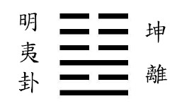

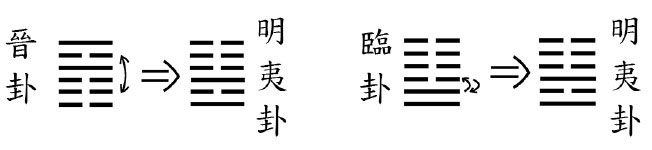

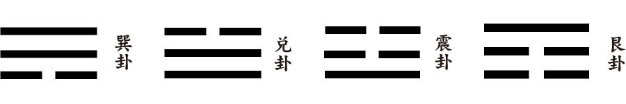

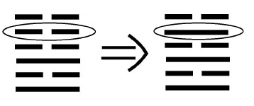

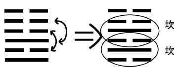

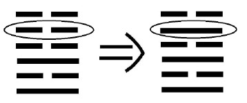

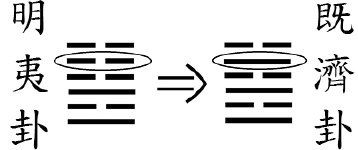

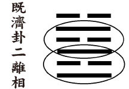

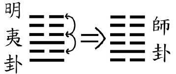

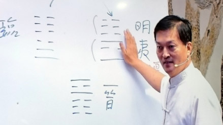

## 專題報導

### 農園的有機與文化的有機

*淨爾整理*

幸福家園你我他

理念作法示範點

取經現有成功例

展現淨土如彌陀

過去一年，國際局勢變化到連最優秀的分析師也跌破眼鏡：英國脫歐、川普當選美國總統、全球經濟大壞。在台灣，人民對於政治現狀、教育制度、經濟停滯等也逐漸失去信心。

從大環境來看，我們為整體的未來感到沉重。從我們所處的正法環境來看，三十年來看到雪廬老人說法的盛況，到現在法脈的日趨疲弱，也讓人憂心。

做為一個文化團體，我們必得深思我們的責任與義務：該如何令正法永續，如何推廣正法，從以人為點擴展成面來改變環境。尤其這幾年來兩岸交流頻繁，深刻了解到中華文化保存在臺灣的珍貴與難得，如何運用所學，真正為永續的傳承做出一番努力。

所有的行業當中，農業與教育是最為殊勝，農業養生命，教育養慧命，生命的延續可以做更多有益世道人心的善法，如果沒有經營慧命，那麼活著也沒有什麼意義。是故，人生要經營兩種命，經營生命，讓作息正常、精神愉快，能呼吸新鮮空氣，使得身體健康，共同居住在美好的地方，君子亦是危城不入，亂邦不居。許多人或者十分懂得經營自己的生命，或爬山登高，或打高爾夫球，過著悠閒沒有壓力的生活，或者出國度假，吃養生的食物等。

農業不但能養活自己，也能養活他人，過去稷（后稷）在堯舜時代當農官，教導老百姓種植各種糧食作物，養了周朝八百年的天下。

但是養心也極為重要，在正法的修學上，培養自己對人生的尊重，對團體的愛惜，對善法的好樂，對三寶的皈依，對輪迴的出離，對解脫道的渴求，對廣大行的造作，對甚深見的深入。雙修福慧，得成佛果。

而，此時正是改變的最好時機，誠如上一期的社論「用共住經營共中不共的淨土」，從八月至屏東參訪仿生科技，到覓得東勢地區兩千五百坪土地，不變的中心思想，帶領著我們創造新局：

一、培養人才刻不容緩。

二、辦教育。讓更多家庭有機會接觸到正知正見，進而行於正道之上。行於正道的家庭愈多，社會風氣也將因此改變。

三、辦農業。農業是民生必需，是國民健康的基礎。然而，飲食精緻化及加工化結果，卻讓國民愈來愈不健康，罹癌率愈來愈高，洗腎者愈來愈多。很多人想要吃得安心，於是選擇有機產品，有機商店眾多、產品昂貴，但微妙的是有機農業在台灣實際上卻只占整體農業的百分之六。如何創造真正的有機，養慧命也要養健康的生命。

我們一直希望能實現共住的理想，在共住中既享有里仁之美，也能同步培養人才、辦教育並共同耕作一起享用。然而共住的地點與時機始終未臻成熟，但大環境的駭浪卻已推動著我們必須往前邁步。因此在未來共住的地點仍未定案的此刻，我們毅然決定打造農園，原因如下：

１．農園是共住的先行，共同開墾共同創建，從工作中建立共識與默契。農園的成功經驗將是共住圓滿的前導。

２．氣候的變遷將會造成全球糧食危機已可預期，台灣大量土地廢耕，而我們反而投入耕耘，大地孕育萬物為本懷，我們從農作中體會自然的力量，以自給自足甚至能夠以農和各方結緣為目標。

３．東勢人口外移嚴重，這裡在日據時代是林木運輸的要站，曾經大量外銷的梅子和做為中部橫貫公路的起點要塞，東勢曾經享盡繁華。如今小鎮卻是人口老化、日漸凋零。藉著活用這裡的土地，同時活絡了這裡的蓮友與風氣。

４．政府計畫耗資七百億推動長期照護，卻忽視了沒有人希望被照護，每個人都能是有用之才。以日本上勝町為例，平均年齡九十歲卻沒有一家養老院，每個老人都活得健康舒服有尊嚴。這也是我們的期許，希望每個老人家都能活到老學到老活動到老，一邊念佛一邊養身。也期望有抱負的年輕人加入，古人耕讀傳家，今人也能效法之。

５．也能提供北部學長增上的機會，成為團體有力的後盾，成為文化園區的示範點，令近悅遠來。未來若能打造成為觀光景點，更能活絡當地經濟。

有幸在此時，或個人需重新定義人生，或在士農工商不同崗位上，或已走過對國家發心的公務員生涯，在面臨人生重新換跑道時，不但在經學上尋找自己和他人的出路，也能參考仿生科技或者自然農法，做出一番利益下一代的事。

在臺北，有時哉時哉網路教育學院和世界接軌，在中部有實栽農園打根基。實栽農園將不只是農地，將是結合生態、人文、共修研學等的文化園區。文化也是有機產業，是時機、是機會、是轉機、是機變，是機不可失，也是未來展望的發機。

在此，也歡迎諸位師長，於假日攜家帶眷至東勢，農耕之餘，或露營或騎腳踏車。果然有一個適合大眾共住的環境，年輕人能有穩定的工作，有教法的充實，以文會友，以友輔仁，成為有執行力的團隊，相信未來必能有豐碩的果實。

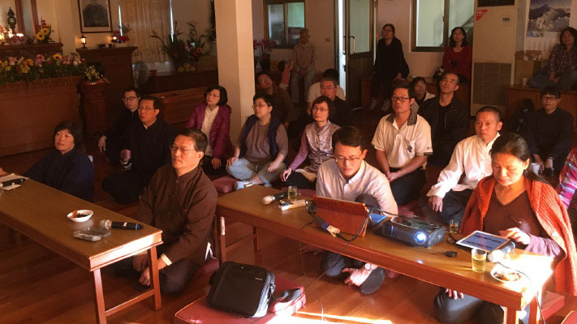

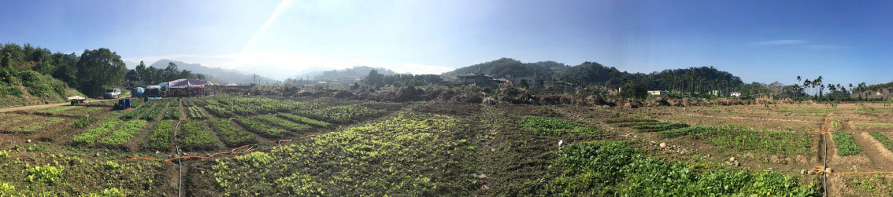

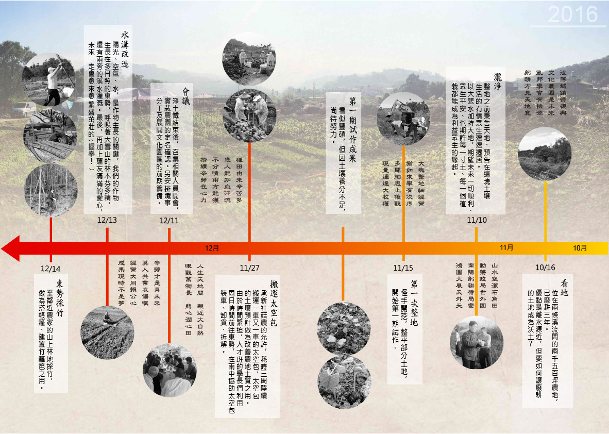

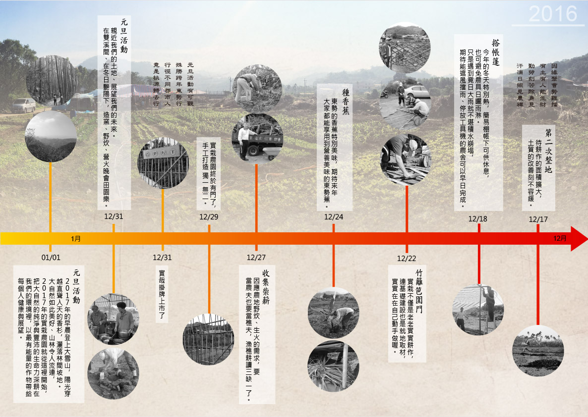

### 實栽者用實植栽

淨堂

獄政三十年

田園歸去來

諸善聚一處

實栽實植栽

生於鄉間，長於農村，幼時雖常於田間幫些小忙，卻未曾植栽作物以至收成，實為大玩小作居多。及長離鄉求學，工作以至賦閒，已離農村生活數十載，但見田地有人耕作，總是有一股親切感，幻見耕者即己，悠然而自在。

欣見學會在東勢覓得可耕地一塊，見之已數年未耕，雜草橫生，遍地石礫，非屬沃土。但地大適中，引水方便，且周遭無污染源，用心開墾，可期其變良田。忖己賦閒已久，有此勞動健身機緣，當即加入開墾行列。未能全時投入，甚為汗顏，雖經月餘，難謂小成。倒感自己已然微得，提諸分享。

幼時可見農地，但見農民依時節翻土、播種、施肥、鋤草以迄收成，全無荒地概念。今見此地雖僅休耕數年，卻似荒地。遙想先民闢荒地為良田的光景，雜草一刀一刀砍，硬土一鋤一鋤挖，鑿溝渠以引水，堆朽木以添肥，小小一塊荒地變良田皆要耗時數年方有成就，比之先民所處，此地已屬半良田矣。

農園定名為實栽農園，有別於一昧追求經濟利益的農園。時栽者用實植栽，不昧於心。土質之改良與養分之補給全以天然有機物拌合，不用化學合成肥料。不追求作物之速成，還作物之本色本味。不追求大量之豐收，寧與有情共存，不使用農藥滅蟲以提高產量。或許有人會質疑，不用化肥，不施農藥還會有收成嗎？想想以往沒有化肥與農藥的時代，或許收成不如今日豐碩，但少了化肥與農藥的支出成本，經濟效益並不會差太多。

並不會差太多。重要的是，令己令人的心安才是真正的收成所在，未來實栽園所植栽出的作物，務期天然無毒，有利眾生。

原以為以機械作業即可輕鬆完成整地工作，殊不知整地只是開端，隨後的工作幾乎樣樣都需人手，感謝諸多蓮友利用時間至農地幫忙，其無私的協力付出，令人體會與諸上善人同在之娛。亦感謝此地蓮友，除提供住宿餐食外，另得與之共修共學，此地可具有的質樸、熱心、善良的特質，是在都市中難找的，與之為鄰，或可稍體里仁為美之境。

真心希望蓮友利用時間來農園住個幾天，好好享受一下少有科技感的自然生活，這也是實栽農園栽植計畫之一。望著農園已栽作物的逐日成長，農園也時時有不同的風貌，在好山好水與好人的交合下，實栽農園必將以務實的好作為讓大家有好收成。

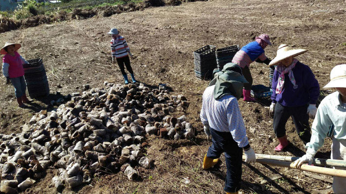

## 後記

### 年終歲末回顧與展望

本刊

匆匆又一年

耕耘文化園

辛苦人難知

捧心彌陀看

丙申年接近尾聲，仍有許多的議題、許多的變化影響著我們的生活，外在環境越是動盪，就越需要正確的中心思想，使自己能夠走入時代，又能夠掌握方針，持續向上。中華無盡燈文化學會的學員們，過去的一年裡在老師的指導下，於儒佛經教的學習不曾中斷，以此建立正確的人生觀，因此能在各種混亂的思潮中，別具擇法的慧眼，並且互助合作，共同努力，所以在例行課程之外，可以有大型講座的興辦，可以與大陸、馬來西亞的文化愛好者交流，時哉時哉網路教育學院的課程不斷推陳出新，蓮友關懷、幼教事業不曾間斷，乃至於東勢農園的開發，也積極地進行中。謹此報告過去一年的具體工作事項，未來的一年，在這樣的基礎上，必定能夠有更美好的前景。

壹、例行課程（含啟蒙）及念佛共修：

一、中華無盡燈文化學會

１．每週星期一，晚上七點至九點，開設「佛學概要十四講表講座」，已於今年五月講授完畢，全部課程歷時二年三個月，對於三藏十二部之宗旨與架構，有完整的介紹。同一時段自六月開始，開設「維摩詰所說經」課程，介紹佛淨土之殊勝、廣大神變的意義以及中觀正見的內涵。

２．每週星期三，晚上七點半至九點，時哉時哉網路教育學院開設「直播講座」，《孝經》一共十八章已經講述完畢，目前交替進行的課程是「《論語》─孝道功行」及《中庸》。

３．每週星期四，上午九點，至下午三點半，舉行「三代共修」。共修內容包括了上午的念佛，以及下午的講座，現為《地藏菩薩本願經》講座。

４．每週星期六，下午兩點至五點半，開設「詩階述唐講座」，以雪廬老人之《詩階述唐》作為教材，學習唐詩之義理、內涵、情境、聲韻等，歷經六年的時間，已於今年十二月講述完畢。

５．每週星期六，晚上六點半至九點，舉行「念佛共修」，分為成人共修班、大專班、啟蒙班中班以及小班，並於晚間八點至九點，集合成人共修班及大專班，講授淨土課程，原本課程《人生大事－不能忽略的事實》，已於今年四月講授完畢，目前課程為智者大師所著《淨土十疑論》。

二、臺中市無盡燈儒佛學會

１．每週星期三，晚上七點半至九點，共同學習時哉時哉網路教育學院，所開設之直播講座。

２．每週星期六，晚上七點至九點，舉行念佛共修及人生大事研討。

三、中壢研學會

每週星期三，上午九點至十一點，舉行念佛共修及人生大事研討。

四、宜蘭研學會

每週日上午八點半至十一點半，舉行人生大事研討。

貳、互聯網經營：

一、「時哉時哉網路教育學院」（www.centralwonder.com）經營已滿二週年，各地讀書會及學員們，能持續透過此平台學習經典內涵、了解啟蒙教育、拓展藝術眼界。今年七月二十七日至三十一日，並舉辦大型講座，讓各地的學員們，來到實體空間一同學習，透過虛實的交流整合，活絡網路學院學習氛圍，講座成果廣受好評。此外因應雪廬老人往生三十週年，今年二月並拍攝「俠骨詩情李雪廬」之特別節目，緬懷雪廬老人一生卓越的模範與貢獻。

二、「中華無盡燈文化學會」主網站（www.wct.org.tw），作為學會活動報導之平台，持續更新有關學會講座及活動的介紹。

三、佛學專門網站「蓮榮」（www.lienjung.org.tw），定期更新文章內容以及法務活動，今年年底並進行網站主視覺及版型設計之更新，預計於明年春節前後完成。

四、社群平台FB、LINE、大陸微博和微信，也仍繼續經營，與各地學員保持良好的聯繫互動，形成共同學習經典的文化交流網絡。

參、專題講座：

一、二○一六年一月廿三日至廿七日，舉辦寒假講座，研學課程為《佛遺教經》。

二、二○一六年三月廿八日至三十日，臺北孝廉講堂主辦「李炳南老教授圓寂三十周年紀念-雪廬老人學誼道風論壇」，本會師資應邀擔任師資，講授課程為「雪廬老人的論語見地」。

三、二○一六年七月廿七日至三十一日，以時哉時哉網路教育學院為主辦單位，於中正紀念堂中正演藝廳，舉辦第一屆之年度大型講座，主題為「孔門改命學─翻轉人生的智慧：從《論語》的高度看《了凡四訓》」，兩岸及馬來西亞等海內外學員一共四百名參加，由孔奉祀官主持之中華大成至聖先師孔子協會擔任指導單位，中華無盡燈文化學會、華藏淨宗弘化基金會、中華傳統文化儒釋道教育學會擔任協辦單位。原本在虛擬空間中學習的學員們，透過講座有了實體上的交流，大家以文會友，增進對傳統文化的認識與信心。

四、二○一六年八月十七日至廿日，由孔奉祀官主持之至聖孔子基金會，於孔子出生地山東省泗水縣舉辦講座，主題為「孔子的風采」，並邀請本會擔任講座唯一師資。

*五、為法務部矯正署受訓之監獄官及監所管理員，開設文化講座課程，今年度一共有九次課程，講授《論語》、音樂欣賞及藝術賞析。*

肆、兩岸及國際文化交流：

一、二○一六年二月四日，雪廬老人孫女李彤女士來訪。

二、二○一六年三月四日至十三日，馬來西亞古晉讀書會，由何燕紅女士帶領，組團來訪。

三、二○一六年一月十三日，與孔奉祀官交流合作，著手拍攝孔德成先生紀錄影片，本會委由湖畔工作室負責本片之製作。

四、二○一六年九月二日，馬來西亞陳習明先生來訪。

五、二○一六年九月廿六日，高明芳女士拜訪學會（高女士為《佛家靜坐方法論》作者高登海居士之女兒）。

六、二○一六年十二月廿三日至廿七日，應邀前往四川省成都市及南充市，與上悟下道法師，以及中華傳統教育實驗學校創辦人羅渝瀧先生等人交流。

伍、法務活動：

一、拜懺法會：大悲懺（二○一六年三月廿日）、地藏懺及浴佛法會（二○一六年五月一日）、地藏懺（二○一六年八月廿八日）、藥師懺（二○一六年十月廿三日）、淨土懺（二○一六年十二月十一日）。

二、年度齋僧：西蓮淨苑齋僧共十次，正覺精舍齋僧一次，圓通寺齋僧一次。

陸、蓮友服務：

一、本年度學會之助念及臨終關懷蓮友，一共七位。

二、發送年終結緣品。

柒、其他活動：

為活絡地方發展、增進老年蓮友之活力，重拾健康生活、遠離長照，並期達到共住之目標，於蓮友們共同努力下，於東勢承租農地二千四百坪，並已完成部分土地之整地及耕作，整體進程十分順利而迅速，深具美好前景。

捌、出版傳播：

一、二○一六年一共出版六期蓮榮會刊（一○三期至一○七期）。

二、時哉時哉網路教育學院暑期大型講座專刊一冊。

三、《翻轉人生命運-了凡四訓科文》

四、《維摩詰所說經科文》。

上述各項法行事業，參與者、出資者、出力者，於私能增進自己的善根福德，於公能莊嚴團體，安定社會國家，有缺失之處，辦事人員要懷著慚愧、檢討及反省，對於能利樂有情的部分，要生起隨喜及感恩之心。新的一年願大眾以公心繼續善法的造作，成為現世安樂，未來往生及成佛的資糧。相信在有限及短暫的生命中，將是最殊勝的莊嚴。
