# 第109期
.jpg)

## 社論

### 全民福祉除了ＧＤＰ外還有什麼

本刊

風俗淳厚利他心

富而好禮貧樂道

慎終追遠民報恩

沐浴人性光輝中

若說政府辦政治要讓人民有感，生活更幸福，關鍵在喪祭，您相信嗎？

現今社會工商業發達，科技發展日新月異，以資本主義為主流思想的世界局勢中，無論是已開發或開發中國家，對於國家的未來，皆將經濟發展擺在第一位，從各國的施政方針乃至於領導者的競選政見，全都指向同一個地方-ＧＤＰ（國內生產總值）。直觀上，這好像沒什麼不對，經濟的繁榮富庶，將帶來人民的幸福與安定，對比落後的低度開發國家，相信你我也總是欣羨發展先進的歐美諸國，而人民的快樂程度似乎也不言而喻。

執政者應重視人民福祉，經濟發展確實能令生活無虞，維持一國的競爭力，對人民生活的確實有幫助，但人類的幸福快樂是否皆來自物質的滿足，永無止境的追求經濟成長，真的就是唯一的出路嗎？若是如此，那麼現在人理應遠比古人快樂，實際卻不然，富庶社會的背後隱藏的是逐日增加的憂鬱症、躁鬱症患者，可見光拚經濟是沒有用的。

引述雜誌報導「根據一份最近針對千禧年出生的年輕人所做的調查，有超過八成的年輕人表示他們的人生目標是想成為有錢人，而有五成的年輕人說他們另ㄧ個人生目標是變得有名。」不難看出一般人認為，成功快樂不外乎名與利，也正因為如此，大眾總是汲汲營營，努力工作、接受挑戰，為了達成更高的目標，以為每達成一個目標，快樂就在其中。統整偉人傳記和實證研究顯示，懂得設定目標的人，或許更容易出人頭地，但和快樂程度則無明顯關聯。那麼幸福快樂究竟來自何方呢？經歷四代主持人，長達七十五年，總共追蹤七百二十四位成人，一份來自哈佛大學研究報告得出了一個清楚的訊息：良好的關係讓我們維持快樂與健康。重點有三，一、社交活動有益健康，二、人際關係的質遠重於量，三、良好關係能保護身體，還可維持腦力。

由此可見，與家人朋友擁有親密關係的人，才是最快樂健康的人。令人驚奇的是，這份歷經七十五年的報告所得出的智慧，竟與二千五百年前孔子的主張不謀而合。孔子終其一生，都是為了成就君子的仁人事業而奔走，當他到了齊國的時候，齊景公向他請教如何辦政治，當時年僅三十歲的孔子，給出了一個強而有力的答案：君君、臣臣、父父、子子。許多人誤以為這是中國奴性的根源，實則誤會大了，經營君臣父子的背後乃是儒家極為重視的五倫關係，即夫婦、父子、兄弟、君臣、朋友，將所有人類社會的人際互動，以五種關係歸納之。但若問為政者要如何令社會增進、維持良好的關係，在西方的報告中沒有結論，觀察到了果，卻未能知其因。而孔子與其之最大的不同就在於，孔子不僅知道人際關係很重要，他還知道要如何用道統來經營。

在《論語‧堯曰》第一章中提到，為政者要如何辦政治才能令百姓安康，得到萬民擁戴，其中的執行方法提到「所重，民、食、喪、祭。」也就一個領導者在治國的時候，應將重點放在人民、糧食、喪葬、祭祀。前二者容易理解，人民是國家的根基，必須重視，糧食則是維繫生命的基本需求，若以現代概念來說，可引申為物質上的供給，諸如經濟發展，科技應用等等皆然。大抵一般人在選擇國家領導時，重視的也都是如此，而位處上層有抱負的政治菁英，也同樣有此理解，重視人民，經營民生，觀其選舉時端出的牛肉也不外乎如此。可惜的是，綜觀古今中外的政治學中，除了儒家恐怕從未有人重視過喪祭之道才是治國的根本大要。

治理國家，民、食有一定的需求，但不可偏重，更應該重視喪祭。國家人民的快樂來自於良好的人際關係，而其中如何敦厚風氣，維護五倫關係，喪祭之禮即發揮了很大的作用。曾子：「慎終追遠，民德歸厚矣。」想要加厚風俗，使人情溫暖，首先第一步就是要激起大眾感恩的心，凡事懂得飲水思源，報本還恩，如此一來人心必定不會苛薄，社會的爭執自然減少。再者，喪祭之禮乃是表達對至親好友的追思之念，這種情感最為動人，也最能維繫情感，而《論語》中曾子也說：「吾聞諸夫子，人未有自致者也，必也親喪乎。」人的常情，未有自致其極者，必遭父母之喪，這才自然的盡情流露。從孝弟開始，良好關係就從家庭做起，人人自幼耳濡目染，親密加厚，懂得為人著想，自我的擴張減少一分，社會就寬闊一分，動亂紛爭無從生起，暴戾之氣也自然化為無形。

更重要的是，在傳統禮俗的婚喪喜慶中，喜事人可以不到，僅以贈禮表達交情，但若說起要送人最後一程，除非身在國外或有公務纏身，前去奔喪致意乃人之常情，無論東西方皆是如此。換而言之，人的一生還能有什麼情況，有如此強大的號召力，將生命中的至親好友全部召至一處，不計遠近，奔赴前來。再者，平常我們對於事情多有主張，偏偏就在喪禮時，一切都會遵照主事者的意見來進行，當拜則拜，當跪則跪，請你往東決計不會往西，曾幾何時有如此聽話過。試想看看，在這樣的因緣際會下，若能在喪禮中一切行禮如儀、恰到好處，氣氛哀戚感人、誠敬懇切，令在場之人無不深受感動，感於人倫之情的可貴，經營關係的美好，喪禮儀式的莊嚴等等。此刻可謂天時、地利、人合，所有最好的條件皆被其占盡，是教育生民，化導人心的最佳時機，若不能善用之，誠不惜乎？重視祭祀之禮的道理亦是如此，端看每年清明祭祖返鄉掃墓之人潮即可見一斑，不復再述矣。

上古的聖人正是通達這般道理而使天下大治，幸得孔子直接點出「民、食、喪、祭」的四字箴言，才讓我們知道下手處。當今政府，為了讓人民有感，與其不斷地追趕ＧＤＰ，倒不如好好的重視喪祭，若能有具備論語智慧的領導者並依之而行，制定合宜的喪祭之禮，推行至民間，端正風俗，以收親厚人倫之效，肯定會是萬民之福，國家之希望。而身為平民百姓的我們，既然知道人的一生必定要死一次，古云：死有輕於鴻毛，重如泰山。既然知道了喪禮的重要性，又豈能輕忽？

在世界快速發展的當下，盲目向前追趕快樂的同時，是否應該回頭望望古老的智慧結晶，其言如此真實，又如此動人。身處現代的每一個人，連結遙遠的過去與無限的未來，即是我們存在的重要目的之一，成為搭起兩邊的橋樑，不僅令道統得以長存，眾人的幸福得以相續，自我究竟離苦得樂的生命出路也正在其中。

## 佛學覽幽

### 菩薩清淨的行持
       —華嚴經淨行品（二十五）

菩薩清淨的行持

—華嚴經淨行品（二十五）

*戒慧講述‧編輯部整理*

俗人生活為己忙

修行不能免俗修

入俗觀修心調柔

門門皆是入佛門

接著著完衣後開始淨潔自己的身，譬如日常生活中的漱口、刷牙、洗臉等事，從澡漱盥洗時願共有七個願。雖然修完止觀下座、著衣、刷牙、洗臉後準備要出去托缽，這是一位修行者的一天，如此簡單的事情，居然含藏著深奧的義理，所以我們如何讓日用平常中平實的動作，卻充實著甚深的涵義，就要看用什麼觀念在做這件事情。

修行人在拿楊枝刷牙的這些事情，是含有甚深的涵義，還是只是平常的動作而已？大德也是穿衣吃飯，可是大德穿衣吃飯當中表現的是法，正好表現的是善業。

或有人說孔子其實很平常，不要把他講得這麼深奧，道就在平常中。但果真如此，那顏回對孔子是仰之彌高，鑽之彌堅，難道顏回也看錯了嗎？若顏回看錯，為何成為孔子的入室弟子？顏回過世，孔子又為何哭之慟？換句話說，孔子平常的動作乃含藏甚深的義涵，顏回看得懂，三千年後我們卻把孔子平常看，只把《論語》當成修身養性的課程，不認為那是治國的寶典、為政的綱要，殊為可惜。

丙二、指事顯因答其徵因

丁一、總徵

丁二、別顯

戊五、澡漱盥洗時願︵有七願︶

己一、執楊

以下說明這些很平常的事情是哪些事情。澡漱盥洗純粹是身體上的動作，但是心情上是依教來修觀，內心莊嚴這個平常的動作，所以平常的動作到底是平常還是不平常，就看你內心的知見怎麼去莊嚴這個動作，表現出這個動作是平常還是不平常，所以古人說：看似平常最奇絕，成如容易卻艱難。

經文：

手執楊枝，當願眾生，皆得妙法，究竟清淨。

在《六十華嚴》：「手執楊枝，當願眾生，心得正法，自然清淨。」支謙的版本是：「手執楊枝，當願眾生，學以法句，擿去諸垢。」聶道真的版本是：「菩薩行楊枝時，心念言：十方天下人皆使學諸經，悉淨潔得。」

手執楊枝，執是拿的意思，楊枝是刷牙用的，手一拿起楊枝就發出這樣的願，希望所有眾生都能得到不可思議的法，徹底的斷盡煩惱。以前佛規定每天早上起來一定要嚼此木刷牙，南亭老和尚的講義中說到，嚼此木有五種利益：一、明目，二、除痰，三、除口氣，四、辨味，五、消食，用刷牙的楊枝來表示佛所說的妙法，因為它能夠使你心地清涼，使口清淨，令人聯想到在佛法上斷煩惱、了生死的究竟清淨，也就是究竟成佛。《華嚴疏鈔》上說楊枝有五利：明目，因為楊枝裡面有可以使人降火氣的成分，火氣降下來就可以讓眼睛清爽一點，就能夠明目。嚼楊枝準備要剔牙，讓牙齒沒有垢穢、殘渣，顯現芳香、除掉口臭。辨味是指除掉口中的穢氣，楊枝在口中嚼時會芳香，自然會帶動帶動腸胃蠕動幫助消化，彼此之間有連鎖關係。

以前有一位比丘不刷牙，一講話就有口臭，信徒告訴佛之後，佛就告誡比丘，不刷牙是犯戒。所以楊枝稱為妙法，妙法就是有這五種利益而成為妙法，與皆得妙法四字結合，外在的妙法結合內在的妙法，內在的妙法就是能破除煩惱障跟所知障的空性(般若)修學法，這樣的妙法才能讓我們的內心究竟清淨，有楊枝這個外在的妙法說內在的妙法(破二障的般若修學法)，可以帶領眾生究竟清淨，乃至成佛。

所以拿楊枝的這個動作，豈可以用庸俗的動作來看它。《金剛經》裡面，佛出去托缽回來，須菩提竟然說；如來善護念諸菩薩，善付囑諸菩薩。從何看出呢？就從托缽當中，舉手投足的樣子，含藏著甚深的意思。所以此人如果執楊枝時都是這般的心態，即使執楊枝都應該跟他頂禮，因為他這個動作不平凡，平凡的動作含藏著不平凡的義理。

戊五、澡漱盥洗時願 嚼楊枝

經文：

嚼楊枝時，當願眾生，其心調淨，噬諸煩惱。

手執楊枝後要開始嚼楊枝，《六十華嚴》的版本是：「晨嚼楊枝，當願眾生，得調伏牙，噬諸煩惱。」支謙的版本是：「澡漱口齒，當願眾生，蕩滌情性，如清淨住。」聶道真的版本是：「菩薩漱齒洗口時，心念言：十方天下人皆使諸垢濁悉淨潔，去清淨住。」嚼楊枝是因為楊枝有纖維，絲很細可以刷牙，嚼楊枝時，當願一切眾生，使心力調和、清淨，藉著刷牙去垢，將煩惱嚼碎消除掉，心力因此調伏得到清淨，這些都是藉事項顯現法義，學佛的根本目標就是要斷煩惱，斷煩惱就在日用平常中，所以刷牙亦不離佛法，菩薩刷牙時也發願要眾生如何，這就是顯示菩薩道處處不忘眾生。

戊五、澡漱盥洗時願 大小便

經文：

大小便時，當願眾生，棄貪瞋癡，蠲除罪法。

《六十華嚴》的版本是：「左右便利，當願眾生，蠲除汙穢，無婬怒癡。」聶道真的版本是：「菩薩左右時，心念言：十方天下人皆使棄眾惡，斷絕婬泆、瞋恚、愚癡。」菩薩願眾生丟掉貪瞋癡，蠲除罪法，內心的貪瞋癡三毒就像是排出去的大小便一樣髒，有害無益，貪瞋癡引起的煩惱只有造業、墮落，使我們輪迴生死、苦惱無極，菩薩大小解時就是這樣發願，願棄捨貪瞋癡這些惡見，丟掉根本煩惱的三毒，蠲是消除，蠲除就是把殺、盜、淫的有罪之法丟棄掉。

大小便是人體中最骯髒、不淨的部分，棄之唯恐不及，要抓住這樣的覺受來丟棄三毒煩惱，沒有人想讓大小便在我們身上多留一會，大小便排不出來時非常不舒服，可是內心裡面的三毒卻安然的盤踞在內心不排除，試問貪瞋癡比較毒還是大小便比較毒？會性法師說，大小便哪裡毒？大小便還可以做肥料，貪瞋癡可以做肥料嗎？大小便至少百害還有一利(做肥料)，而貪瞋癡連肥料都做不成，貪瞋癡灑到哪裡，哪裡都倒楣。

再說，煩惱並非只有貪瞋癡，為何此處只有講貪瞋癡？執我的心識生起後所夾帶的煩惱謂之貪瞋癡，一切的煩惱，或者是貪瞋癡的分位，或者是貪瞋癡的等流。例如瞋的分位就是憤、恨、惱、害、嫉，貪的分位即是憍跟慳，它的等流就如無慚、無愧或是失念、懈怠、掉舉、昏沉、散亂等，所以一切煩惱或是貪瞋癡的分位或者是貪瞋癡的等流，所以把貪瞋癡斷了，一切煩惱就能除。

去除貪瞋癡跟戒定慧的關係為何？沙門稱作勤息，乃勤修戒定慧，息滅貪瞋癡，請問這兩者的關係是什麼？戒是抓煩惱，定是綁煩惱，慧是殺煩惱。戒、定是破壞貪瞋癡的現行，慧是斬斷貪瞋癡的根本，所以沙門稱之為勤修戒定慧、息滅貪瞋癡。

戊五、澡漱盥洗時願  就水

經文：

事訖就水，當願眾生，出世法中，速疾而往。

《六十華嚴》的版本是：「已而就水，當願眾生，向無上道，得出世法。」支謙的版本是：「已而就水，當願眾生，柔和軟弱，清淨謹飾。」聶道真的版本是：「菩薩行至水時，心念言；十方天下人，皆使上佛經，悉淨潔。」事訖即是指如廁之後，就水即是走到有水之處洗淨，大小解完畢後，貪瞋癡煩惱丟掉了，要到有水的地方洗乾淨，在用水之際，應當發願，願一切眾生，身體既然清淨，出世法中，速疾而往。就是趕快了生脫死，修出世法，去此五濁惡世，不要留戀幻軀而受此不淨。

古代沒有草紙，所以都用竹子，要經過水洗才會乾淨，洗滌身上污穢不乾淨的地方。古時候是用竹片擦拭，會性法師說，洗肛門比洗臉還要重要，如果沒有洗乾淨會使內火往上燒，臭穢沒有洗乾淨比沒洗臉還糟糕，洗乾淨可以避免很多的病變發生。修行人也要大小便，修行人雖然跟一般人沒什麼差別，一樣要吃飯睡覺，可是吃飯、睡覺跟大小便，那是屬於果報，裡面是不分善惡的，最重要的是如何將體性轉為善業，那個才是修行的關鍵所在，不是說修行人就不吃不喝，就不要上廁所，那是對修行的誤解。

大小解後要水洗，包括洗身體、洗手，世俗的煩惱就是污穢，想要趕快去找水把它洗掉，速疾而往，想趕快以出世法來洗滌世間的煩惱污穢，就如同趕快去找水將污穢洗掉一樣。（下期待續）

### 大乘百法明門論簡說（十七）　拾、心法—八大心王(五)

*戒慧講述‧淨本整理*

大乘唯識與中觀

心識生境誤為外

執境於外成立實

通達唯心境執無

經文：

第一，心法，略有八種：一、眼識，二、耳識，三、鼻識，四、舌識，五、身識，六、意識，七、末那識，八、阿賴耶識。

編按：因讀者反映，八識生起諸緣表仍有許多疑問，因此本期特別就本表提出說明。

八識九緣偈云：「眼識九緣生，耳識惟從八，鼻舌身三七，後三五三四。若加等無間，從頭各增一。」說明了八識生起所需因緣，闡述如下：

一、眼識：眼識需要具足九緣方能產生。

(一)種子：如何知道眼識由種子生？眼識為果，沒有因不會生果，而第八識並不是眼識的因(種子)，因為第八識跟眼識並不同類，例如西瓜由種子生，必得要西瓜種，不能是稻種、麥種。作意、第六識、第七識、第八識都不是眼識的同類種；而空、明、根、境都是色法，在任何情況下都不會生出心法，反之心法在任何情況下也都不會生色法，依此推理，在這些之外，必有一個眼識的種子存在，稱為親因緣。

(二)第八識：眼識的種子如果沒有地方存放，也無法生出眼識，所以第八識被認為是種子安放處，眼識的生起必須要有第八識。此外眼識所緣之影像相分(即九緣中的境)，乃依第八識本質相分而生，因此若無第八識之相分，眼識也無境可緣，無法產生作用。

(三)第七識：第七識的功能是執我，屬於心微細的作用，必須要有執我的功能，才能產生前六識的粗作用，眼見、耳聞、鼻嗅、舌嚐、身觸、意想，皆依有我而生起見聞覺知等功能。

(四)第六識：前五識的生起，都需要第六識的配合，見前述五俱意識。

(五)作意：作意屬於心所，八識的生起都要靠作意，若沒有作意，將會視而不見。如何知道心有作意的功能？作意就是留意，跟心王同時生，例如正在專心思考，眼睛雖然看著東西，但是卻看不見眼前的事物，可見若沒有留意，眼識的功能就無法出現。而作意也不是眼識，例如不同人看同一張畫，有訓練過的人，會從訓練過的角度去看東西，所留意的重點就不一樣，若作意就是眼識，應該只要眼識現前，就都可以看到相同的重點。所以經過邏輯推理，證明眼識的生起需要作意的配合。

(六)境：即眼識所緣的色塵，必須要有色塵，才能令眼識生起，此為眼識的所緣緣。

(七)根：根可分為扶塵根與淨色根，扶塵根如眼珠、耳鼓等五官，用以扶持淨色根，另也稱為浮塵根，取其虛浮不實之意。淨色根指神經系統，或者中醫所謂的氣脈，肉眼不能見，乃清淨四大所造。九緣之中的根，是指淨色根，意即能使眼識發識的神經系統(或氣脈)。

(八)明：即光明，眼見色需要光明的輔助。

(九)空：即空間，此處重點在於根塵之間是否需要空間，眼根與所見看的色塵之間必須存在空間，眼識方能產生作用，倘若色塵緊貼著眼根，則無所見。以上九緣，種子屬於親因緣，境則是所緣緣，其他七緣皆屬於增上緣，眼識則是上述九緣所生之果。

二、耳識：耳識惟從八。

不需要光明的輔助，耳識也能產生，所需八緣如下：(一)種子：耳識為果，必有其同類種，推論法如眼識。(二)第八識：為耳識種子的存放處，耳識所緣的聲塵，也來自第八識的本質相分。(三)第七識：必須要有執我的功能，才能產生耳聞聲的粗作用。(四)第六識：見前述五俱意識。(五)作意：耳識生起需要作意的配合，否則將聽而不聞，推論法如眼識所述。(六)境：耳識所緣的聲塵，為耳識的所緣緣。(七)根：扶塵根如耳鼓，淨色根指神經系統或氣脈，此處發識的根指淨色根。(八)空：耳根與聲塵之間必須存在空間，耳識方能產生作用，倘若耳根與聲塵間無任何空隙，例如將耳腔塞滿，則耳識無法產生。

三、鼻識、舌識、身識：鼻舌身三七。

鼻識、舌識、身識皆七緣而生，三者都不需要空間和光明的輔助，例如在黑暗中，鼻仍能嗅香、舌能辨味、身能接觸。而香塵、味塵及觸塵的辨別，都需要根塵相合，所以沒有空間的需求。其他所需七緣如下：(一)種子：鼻識、舌識、身識為果，必有其同類種，推論法如眼識。(二)第八識：為種子的存放處，三者所緣的香塵、味塵、觸塵，也來自第八識的本質相分。

(三)第七識：必須要有執我的功能，才能產生聞香、嘗味、接觸的粗作用。(四)第六識：見前述五俱意識。(五)作意：三者的生起需要作意的配合，否則即便根塵接觸也不會察覺。(六)境：香塵、味塵、觸塵是鼻識、舌識及身識的所緣緣。(七)根：扶塵根如鼻子、舌頭、身體，淨色根指神經系統或氣脈，此處發識的根指淨色根。

四、意識

意識的作用不需要空間；也不需要光明；第六意識本身是此處所成的果，並非因緣；又因為根即第七識，所以意識為五緣生：(一)種子：意識為果，必有其同類種，推論法如眼識。(二)第八識：為意識種子的存放處；意識所緣的法塵，是前五識所落謝的影像，而前五識所緣的影像相分，也來自第八識的本質相分。但若獨散意識所想像之獨影境，例如龜毛兔角等世間所無之物，或尚未發生的未來景象，則屬於第六識所創造的影像。

(三)作意：意識的生起也需要作意的配合。(四)境：即法塵(法處所攝色、法處所攝心)，屬於意識的所緣緣。(五)根：意根即第七識，必須要有執我的功能，才能產生意識的功能。

五、第七識(末那識)

第七識起作用不需要空間；也不需要光明；第七識的根即第八識；第八識為第七識的所緣緣，不緣其他的塵境；第七識本身為此處所成的果，並非因緣；第七識的作用不需要第六識的輔助，例如重度昏迷下，仍有執我的細作用；第七識本身是此處所成的果，並非因緣。所以第七識為三緣生：(一)種子：第七識為果，必有其同類種，推論法如眼識。(二)第八識：為第七識種子的存放處，且第八識為第七識之所緣緣，若無第八識，第七識無境可緣，也無從生起作用。(三)作意：使第七識生起，並與第七識恆時相續。

六、第八識(阿賴耶識)

第八識起作用不需要空間；也不需要光明；第八識的作用不需要第六識的輔助；第七識即此處之根；第八識本身是此處所成的果，並非因緣。所以第八識為四緣生：(一)種子：第八識不能存放產生自體的種子，否則將產因中有果的謬誤。此處所謂的種子是指名言種(親生第八識之名言種子，命根)，現行第八識由於名言種，才能緣其境、納受業種所成的苦樂報。例如業種生起人道的滿漢全席，不同人在受用時，會有不同的感受，乃是名言種的緣故。(二)作意：使第八識生起，並與第八識恆時相續。(三)境：指根身、器界以及業種，為第八識之所緣緣。(四)根：即第七識，因為若無執我，則第八識無從產生功能，不生一切根身、器界、種子。（下期待續）

### 佛學概要十四講表簡說（十一）　第一講表

*戒慧講述‧宏法、淨昌整理*

通達三諦是三觀

中道正見凡轉聖

入世空空叩兩端

趨吉避凶真福慧

述記：「佛開發了一切種智，就能夠明體達用。」

以唯識宗而言，體即是上述的實相，即是第八識，而所達作用即是大圓鏡智之作用。是故成就一切種智之狀態，就是明體達用。達到此一狀態，即能契入無始終、無邊際的實相本體，也就是第八識。彼無時間遷流，亦無空間隔閡，因其橫遍豎窮，所以不生不滅，與宇宙同壽。第八識無始劫來就存在，從來沒有生(本無今有曰生)，也談不上滅(本有今無曰滅)，此即唯識宗所謂的不生不滅。

唯識宗認為第八識既然不生不滅，就可以與宇宙同壽，因為它是從來沒有生滅。所成就的形象是，無人我自他，與萬物一體，因為全部都是遍法界的，都同歸於第八識。但是某甲有某甲的第八識，某乙有某乙的第八識，則究竟某甲為某乙第八識變現，或者某乙為某甲第八識變現，無法解釋周全，因能變現者就有主體性，兩者互為能變即互為矛盾，況且既然人人各有第八識，萬物一體即不成立。

唯中觀宗的不生不滅，是自體性從來沒有生，也沒有滅。此即兩宗之差異。大乘佛法之宗派見，並非至最後才分，而是從開始就沒有合過。立論於世俗之見地，大家看法皆同，而於解脫生死的見地上，則從來都沒有相同過。古代祖師判教時，發覺佛針對不同根機所說的法，內容有時會互相矛盾，所以欲維持佛法須培養出真正抉擇出佛說究竟了義的人才。

述記云：「芥子納須彌，長劫入短劫。」

指的是佛菩薩種種神變的力量。芥子納須彌是由小納大，如維摩詰居士的丈室，可以攝入他方佛國土。如果用現代的譬喻，透過網際網路，桌上電腦螢幕可以攝入全世界的影像聲音，攝入時可以觀察地球另一個地方的人，有人走路，有人說話，做善作惡全部呈現在眼前，如同維摩詰居士把佛淨土攝過來觀察。第二種神變，雙方直接可在螢幕上對話，我把你攝過來，彼此認知，這種神變《維摩詰經》亦有。第三種是我只要走進螢幕裡面，就直接進入那個世界。《維摩詰經》裡：維摩詰去上方香積佛國請飯菜來，經過三十二恒河沙的佛淨土，速度比廚房裡煮飯的速度還快，如此可知佛法說到世俗的部分，這種神變也讓人難以想像。

長劫入短劫也是一種神變的力量。也就是未來會發生的事情，全部可以在眼前以現量的方式呈現。譬如某人久遠劫後成佛，但是現在是以現量的方式呈現在眼前，讓眾生相信，謂之長劫入短劫。所以《法華經》中佛授記迦葉成佛，授記舍利弗成佛時，都是經過幾百幾千幾億大劫之後的事情，可是攝在眼前顯現。所以，佛說過去、現在及未來之事，是以現量方式通達，而眾生以比量方式通達，以相信聖言量的那一分，成為通達甚深緣起的比量，懂得前因後果去觀察世間，如同站在巨人的肩膀上看遠方。譬如年輕人對世俗很有經驗的老人，用相信老人言的方式來得到他的經驗閱歷，眾生以相信聖言量的方式能得到佛全部的經驗閱歷。

述記：「三智三諦」

一切智、道種智及一切種智三者為能證之智，所證為三諦。一切智成為能證，真諦成為所證，即是證得總相。道種智成為能證，俗諦成為所證。一切種智成為能證，中諦成為所證。唯識宗對真諦的講法，也就是明白心外不成立這一分，一切諸法因緣所生，空無實體，所含藏的就是心外不成。

中觀宗對真諦的見解是一切諸法因緣所生、空無實體中，有破法我的見地，因為法我即是因緣所生法的體性，通達法我不可得，即是破無明，證得一切智。

道種智所證的俗諦，唯識宗認為是唯識所現的十界差別法，因緣所生，心外不成，唯心所生。而中觀宗之俗諦，即是萬法的緣起相，法可以在心外成立，只不過必須觀待你的業，萬法才能夠生起。水並不是在心內顯現，水在心外顯現，可是必須觀待你的業力才能顯現水或膿血，所以該法也沒有自體性。所以唯識宗和中觀宗，法所顯現的立論基礎原點是不一樣的。

一切種智成為能證，中諦實相成為所證。唯識宗認為中諦實相是唯心所現證第八識，中諦就是第八識，是萬法的真實相。唯識宗的唯心所現，心能現萬法，但是心又以第八識為體性，第八識的體性是遍法界的。因緣所生的法，唯心所生，以心為體性，心又以第八識為體性，所以所有的法都以第八識為體性，所有的法都遍法界。

一切智是空觀所成，觀的是諸法總相，成就的是阿羅漢，阿羅漢已破人我執、法我執，所以不僅僅是斷見思惑，而是斷根本無明惑。

斷見思惑是佛為鈍根的不了義聲聞二部所立的解脫道，一般說的是法有我空，證的是無常。見惑是分別執，思惑是俱生執；但是斷見思惑只有破獨立實有的我，現證無常，可是法有我空，並非究竟的解脫道。《百法明門論》之法有我空宗，破我空尚有法有，法有是有涅槃、有生死。斷見思惑只是破獨立實有的我與現證無常，這樣的成就不能成為阿羅漢，但對下部眾派不妨說可以，佛是對不同根器的人講不同的話，所以要善於抉擇。

道種智是假觀成就，所要通達的是別相，所要破的是塵沙惑；但是塵沙惑屬於所知障。依惑業苦之定義，惑是輪迴的體性，有惑就有業，有業就有苦。而塵沙惑之定義，就是菩薩無法全盤知道眾生的根機與所要用的教法，可是無礙他的解脫，所以此種無知不能成為惑。阿羅漢也有一大堆不知道的事，可是不能成為阿羅漢的惑。塵沙惑只是化導眾生的障礙，可是不會成為自己解脫的障礙。

一切種智，是中觀成就的，所要通達的是實相。而阿羅漢是破人我執、法我執。菩薩、佛是破所知障。所知障是人我執、法我執所熏下的習氣，還有身口意所熏下的習氣，不會生起煩惱，不會生起法我執的習氣，叫做所知障。例如酒瓶中的酒倒空了以後，還有酒味，叫做所知障，可是已經沒有酒(煩惱障)了。阿羅漢貪瞋癡慢熏下去的習氣有，可是沒有貪瞋癡的煩惱。對這等聖者，佛也無可奈何，因為這種所知障不是他可以破的範圍。這種所知障的習氣，阿羅漢也有，但是不妨礙他成為聖者。

三智成為能證，三諦成為所證。空觀的成就是一切智，假觀的成就就是道種智，中觀的成就就是一切種智。一切智成為能證，真諦成為所證。道種智成為能證，俗諦成為所證。一切種智成為能證，中諦成為所證。

所謂的中諦實相，從中觀宗來講是空性；唯識宗來講叫第八識，第八識是萬法的實相，唯識認為心識是實在的，萬法都是從第八識生起，所以萬法的真實相就是第八識。佛性、法性、真如、實相等名詞都代表第八識，因為佛是從第八識生，法也從第八識生。真如是最究竟的狀態，實相是真實不虛假，以上講的是從各種角度去形容第八識。中觀宗講實相，是說萬法的真實相是空性，這兩宗的講法有很大的不一樣。

唯識宗就是唯有識，所以識是不可以空的。中觀宗說的空性，是相的自體性空。或有宗派認為中觀宗說的空是斷滅空，但是中觀宗說的空，是自體性空，不是相空，所以不會有斷滅見的疑慮。空觀所要破的不是見思惑，而是人我執、法我執，破見思惑是證法有我空。

根本無明惑是法我執，要歸到空觀，塵沙惑和根本無明惑所熏下的習氣，都要歸到所知障。

所知障的形象，是聖者入定證得空性，出定見萬法還是有自性，但可以以比量通達萬法是無自體性的，這一分是破煩惱障，但仍有所知障。顯現似有自體性，但通達它沒有自體性，好比做夢，阿羅漢雖也顯現為夢境，但知道是在做夢。而佛是入定、出定都能以現量證得空性，沒有入定跟出定的區隔，是故《楞嚴經》形容佛是：「那伽常在定，無有不定時。」因為沒有所謂的入定、出定相，或說佛是以不出定的方式利益眾生。

以魔術師的變化為比喻，魔術師幻化出來的東西，一般人見為真實，而且也生起實有的執著，就像眾生在看魔術一樣，魔術師依著木頭、石頭，以咒語或藥物的力量，或把眾生的眼睛塗抹上藥，眾生就會在木頭、石頭上看見宮殿、美女。第一種人是凡夫，在顯現為宮殿美女時，他也認為宮殿、美女是存在的，而且產生非常喜歡、貪戀之心。第二種人像魔術師，他雖然變出了這些境界，知道境界是非實有的，但也看見境界的存在，魔術師不會生起貪愛，可是變出來的東西他還是會看到。第三種是佛，不受咒語、藥物的影響，佛什麼都沒有看到，也什麼都看到了，因為不受咒語和藥物的影響，沒有被業所影響，能夠照見空性，什麼都沒有看到叫做佛的根本位，而佛在後得位的時候，是隨順眼前有情的根機，通達有情看到的相。

述記云：「對一切諸法迷惑不了解，知無明即為所知障。」

這裡的無明不是根本無明，而是無明煩惱的習氣及身口意留下的習氣，名為所知障。無明的習氣依然全顯現為實有，然比量知法非實有。阿羅漢對世間諸法不會迷惑，即使在做夢，也很清醒的知道那是夢境，而不隨夢境所轉。

述記云：「相對於煩惱障，所知障是指對萬法的別相及實相迷惑、不明白的無明而言。」

以唯識來講，別相就是第八識所生的萬法，實相就是第八識本體，唯識宗的所知障要怎麼破？知道法是心內所起，叫做妙有，心外之法不成叫真空，所以唯識宗叫做真空妙有宗；法在心內起，叫做別相；法在心外不成的實相，是唯識宗要通達的。唯識宗要破的所知障，一言以蔽之，就是究竟顯示第八識。

述記云：「覺察─對煩惱障」

覺察煩惱障侵害如賊，覺賊無能。起覺察的工夫才能破煩惱障，在遇境逢緣裡破迷啟悟，當境界生起時，當下覺照。又云：「知其因緣所生，空無實體，境與我本空，有何可貪可瞋？」是空性的修學法。境空就是法我空，我空就是人我空，破煩惱障就是破人我執、破法我執，成就的是人我空、法我空。簡言之，煩惱障就是人我執、法我執。人我執、法我執的習氣及身口意所留下的習氣，不能成為煩惱的習氣那一分，是所知障。

述記云：「元無我人，為誰貪瞋？」

觀境界是自體空，原來根本沒有我、人的自體性，這些都是了不可得的，所以也沒有可貪著之處，以上是空性的觀察法。我們如果串習覺察的工夫，煩惱就會消滅。相反地，如果沒有覺察，煩惱妄念就一直發作下去。

述記云：「動身發語，造作惡業，為時已遲。」又云：「古德說：不怕念起，只怕覺遲。」

一般都說，貪出來要立刻對治它，其實這是最笨的方法。以對治法來說，貪的過患是什麼？不貪的利益又是什麼？此為第一步。第二步，觀察貪的所對境是可愛境，當你瞭解可愛境的過患時，貪自然就不見，真正的對治不是直接對治貪，是在境界上去做觀察，當對錢財生起貪愛時，觀察錢財多的過患，即容易息滅對錢財的貪愛。還有做自體性的觀察，錢財是沒有自體性的，如果錢財有自體性，為何狗貓雞鴨不去貪黃金呢？財富若有自體性，又如何會發生這樣的現象呢？以上僅粗相的觀察，細相的觀察容後再述。「不怕念起，只怕覺遲。」可說是對治法，亦可以是空性的觀察。

又云：「常起覺照，不隨境轉。」觀察自體性有沒有，起這樣的覺照，自然知道萬法無自體性，所以不會隨境界而轉。

述記：「書經云：克念作聖，罔念作狂。」

這是般若智慧的觀照，每一念上都生起般若的智慧，在世俗的每一法上觀察自性。佛家叫做自體空，儒家就是去體會形而上無形亦無體；神無方，覓心了不可得。聖是形而上；君子是形而下。孔子的厲害處，在形而上道高德備，在形而下方面是通達人情世故的君子，可以在世間法上遊刃有餘。所以我們這一生沒有讀《論語》，是最大的可惜處。一個出世的聖人，如何遊於人間？在兇險的環境，如何趨吉避凶？在周遊列國時，各國各懷鬼胎當中，他如何推行王道的思想，最後全身而退回到魯國，刪詩書定禮樂。沒有去欣賞《論語》，是這一生最大的可惜處。

罔念就是沒有作般若的觀照，沒有作形而上的觀察，沒有觀萬法的自體空。作狂是被境界所轉，有情眾生就是奔馳在境界之中追逐名聞利養。所以聖狂的分別就在這一念，起般若的觀照，通達形而上，謂之通達性與天道。這一念就是顏回的「其庶乎屢空」，就是孔子的「空空如也」。孔子的無知是他形而上的智慧，孔子的「有鄙夫問於我，空空如也，我叩其兩端而竭焉」是以形而上的智慧入形而下的世間做兩端的抉擇。叩其兩端，是鄙夫叩問，還是夫子扣其兩端？是夫子叩問。鄙夫問孔子，孔子反問他，把利害關係和是非說清楚，做不做在鄙夫，這就是中觀正見入世俗的應用。（下期待續）

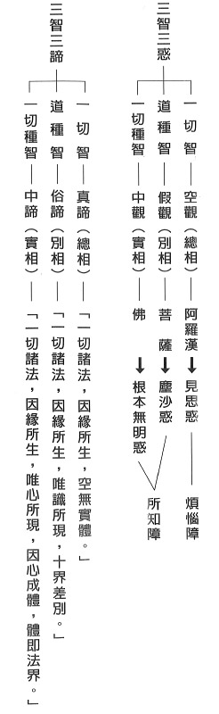

## 專題研學

### 遠端教學解惑篇
		─各地讀書會問答（三）

遠端教學解惑篇

─各地讀書會問答（三）

*編輯部整理*

疑為善惡不定法

因疑生信是功德

因疑生謗乃煩惱

善用疑情能悟解

**問：** 老師曾提過，父賢子不賢，有時候是天道。請問這裏的天道是指業力果報嗎？為何如堯舜如此聖賢孩子卻非聖賢？

**答：** 父賢子不肖或父不肖子賢，有時是人生的一種無奈，但如何善用逆境障礙轉化成功德，這是聖賢及有見地者的能耐。如堯舜正因為兒子的不肖與愚癡，反將天子之位傳給有德有學者，所謂傳賢不傳子，是中國政治最亮眼的禪讓政治，世間之禍或是共業所成，或是別業所生，若能善用，反而是因禍得福。

**問：** 中華傳統文化精髓落實現今的氣象是什麼？

**答：** 中華文化應是亙古彌新的，聖人如孔子，證入形而上，見到一切法沒有自體性。而面對世俗見到的，一切法只剩下觀待性與關聯性。一般人的本能就是希望能離苦得樂。此時聖人以他的智慧見地，幫世人指出了離苦得樂的殊勝方便，也就是孝弟忠信禮義廉恥仁愛和平等眾多的德行，以此來經營五倫，以此來辦政治辦教育，是最能幫助自己離苦得樂的善巧。所以由這個角度看，中華文化又是亙古彌新的。

中華文化是由家庭與社會的五倫到民族的融和，這樣的發展是最合乎自然法則的，如今思想改變，社會背道而行，如此才需要重新定位中華文化的形象。問題當然首先是出在教育，先從家庭教育做起，再擴及到學校與社會教育，如此文化才有傳人。

**問：** 上課時記得老師說過沒有修福，怎麼能夠遇到善知識。今生可以遇到善知識，也是因為前世曾經結緣，今生才能遇到，但這說法，似又與修福無關，該如何理解呢？或是遇到與能夠安住及跟隨學習是不同，能夠安住及跟隨學習是要修福那一分呢？

**答：** 宿世修福或使今生有緣遇到善知識，且因慧力，使自己能於聽聞學習中深入教法。

總之，修福的目的是為了修慧，所以此福能成為修學正法的道糧，修慧目的是為了修福，所以成佛的目的是為了利益有情。若修福不修慧，即使遇到善知識，或不認真學習，或學習有障礙難突破，修慧不修福，即使有能力學習正法，但生活艱難多辛苦，無暇學習正法。

**問：** 《佛遺教經》科判的問題，在「於此眾中所作未辦者。見佛滅度當有悲感。若有初入法者。聞佛所說即皆得度。譬如夜見電光即得見道。若所作已辦已度苦海者但作是念。世尊滅度一何疾哉。」這一段所安立的的總題是「顯示餘疑」。學生不解，從經文中讀出不「餘疑」的感覺。

**答：** 這裡面有三種類型的弟子，第一類是尚未證得四果的學生；第二類是聽聞佛說般若法，在這個莊嚴肅穆的場合中能得見道位；第三類的學生是證得阿羅漢果的學生，在甚深緣起上面無法理解佛為何這麼快速地離開。這三類學生並不是對佛所說的四諦法有疑，是對佛這麼快要離開而起疑。

**問：** 敢問老師如何將止觀修學法運用在念佛上？念佛時修觀慧，難道可以不分心嗎？

**答：** 認真念佛，將心安住於所緣境（佛號）上是修止，即使得到一心不亂，三昧現前，身心輕安都是屬於止，不是觀。在念佛的過程中，遇到昏沉、掉舉、散亂，加以對治，這是正知的力量，不是觀。

觀是在止力的成就下，不一定要輕安現前，就可以修觀，但是這必須依照經論的方法來觀察，在勝義上，觀能念所念的體性是否有無，世俗上可以觀察，念佛應該要有甚麼樣的動機，念佛的殊勝以及所念之佛的功德，如經論上面所說的十力、四無所畏、十八不共法等，一一去觀察，套在阿彌陀佛身上，會產生極大的信心及皈依的心態，下次再來念佛的時候會更容易一心，更容易提起正念，有時連正知都不用，就可以直接修止修觀。

**問：** 將心安住於佛號當下可否撥出一部分心力去緣念教法，譬如念佛的同時也一併觀察十力、四無所畏、十八不共法等法義，此刻難道不屬於掉舉、散亂嗎？

念佛之前先做動意念，為什麼要念佛，念佛的動機、念佛的目的為何，再來好好的念佛，這一堂課才會有效果。而且在念佛之初，也要先告訴自己，必須要對治昏沉、散亂、掉舉，進入念佛時，發生昏沉、散亂、掉舉時，才會好好對治。所以前行極為重要，不可以沒有作動意念就馬上進去念佛，就像跳水之前要先做暖身操一樣。

念佛當下不能撥出一部分心力去緣念教法。但是，當念佛能夠有功夫的時候，這個時候回過頭來作觀，念佛的能念所念，能念的心和所念的佛，以及觀待能念、所念的念，所安住的佛號，它就會具有的各類殊勝的功德。

這時候沒有掉舉、散亂的干擾，也不會想東想西，心沒有在五欲六塵上，也沒有在其他的善所緣上，所以不是散亂、掉舉等，這是一種觀力的訓練但不是觀，因為止力尚未成就；待止修成，這種觀力才會在止後生起，這時候不是妄想，因為已經在前行上作動意念，要在止上好好觀察。

**問：** 所謂「都攝六根，淨念相繼」，有大德說最初下手持名念佛，難免有能念之心，與所念之佛。念到能所雙亡，雜念不生，即是淨念現前。再進到心佛一如，念而無念，無念而念，一片佛心，無有間斷時，即是淨念相繼，入於三摩地了。按理說，「能所雙亡，雜念不生」，心識前應是空靈靈狀態，以及「念而無念，無念而念」，理應也是空靈靈狀態，則此刻淨念現前與淨念相繼之「淨念」是指何義？

**答：** 所謂的念到能所雙亡，那是不可能的，那只是佛號成片的形容詞，因為並沒有對境界的體性空這一分做觀察，也沒有對能念的心體性空作觀察，所念的境觀待能念的心，兩者都不能亡，如何是能所雙亡？所以此說法，應知是大德的方便說。

**問：** 大家（一百個人）發心開素食店，卻沒有收到預想的效果，連三年的虧損，如今面臨倒閉，難道是德不夠嗎？

**答：** 經營素食餐廳本是好事一樁，不僅減少殺生，還有益於環保。但無論做好事或做壞事，想要有成果都必須講究條件；先「人禍」(人的因素)，後才有「天災」(神鬼的傾覆)。

廚房可以端出可口美食，必須有人和在先，分工在後，合作心意在先，默契在後，各有所司，步調一致，發揮功能，否則一團亂，就出亂子了。

另外，蔬菜是否有機？口味濃淡是否合宜？菜色有沒有順應市場推陳出新等，

內場外場都得和合，建立愉悅氛圍，就會客似雲來。

而德字概略可約三種意義：見地、品德、能力。大舜取得天下不光是他的德行感召，還包含他自己本身肯受磨練，培養出一身的好本領，因此故才能受禪讓而得天下，從凡夫俗子到天子過程中，無一不是用正確的見地來經營。經營事業亦然，觀念、動機、團隊的和合、辦事能力都須具足，才可以「必得」其位、祿、名，長遠且有益的發展下去。(下期待續)

## 孔學一隅

### 論語簡說（十七）
	  			—方人非賢

論語簡說（十七）

—方人非賢

*時哉講述、順昌雪廬孔子文化研學會、心筑整理*

經義難知多推敲

聞思方生比量知

歷事練心多體會

現量能證經學義

經文

子貢方人。子曰：賜也賢乎哉？夫我則不暇。

（憲問篇第二十九章）

前言

在社會上每個人皆非獨立個體，要面對很多人，這裡面有好人、有壞人，有對自己有利、或對自己有害者，有對公家有利、或對公家上有害者，也有對公家有利於己有害、或對公家有害於己有利者。所以可以大分為兩類，一類是如法的人，一類是不如法的人。當然如法的人，我們要給予提攜、獎勵、維護、鼓勵。但是，對不如法的人，我們是不是要批評、責備？這裡面就關係到人情世故，處世中到底會不會帶來自己的災難、禍害？會不會帶給公家災難跟禍害？這個抉擇是很重要的，這一章裡面可以提供我們在抉擇要不要「方人」的重要參考。

白話解釋

子貢毀謗人、批評人。孔子直接乎子貢的名：賜啊！你就賢仁了嗎？若我就沒有閒工夫去批評人。

可見孔子不同意子貢批評人、毀謗人，而且，用諷刺的語氣說：我是沒時間，你時間多嗎？你時間多，我可沒時間。

字義

一、方：毀謗

方有兩種意思，一種是「比較」，一種是「批評」跟「毀謗」，此處採取的是「毀謗」。古來注解也有做「比較」解，看似好像也蠻對的，事實上這一章不可以做「比較」解。

(一)方：比較

《莊子》的〈田子方篇〉：「魯多儒者，少為先生方者。」

魯哀公對莊子說，魯國有很多的儒者，可是很少有跟先生較量、切磋琢磨的人。

田子方是魏文侯的老師，此處言莊子去見魯哀公，其實魯哀公比莊子大一百多歲，所以莊子去見魯哀公這件事情是不對的。那為什麼說莊子去見魯哀公呢？這就是莊子自創的寓言。

我們會跟人比較什麼？第一是德學；第二是名聲；第三是財富。孝、弟、忠、信、禮、義、廉、恥，這些都是比德學，透過比較當中，比我好的，我要見賢思齊，比我不好的，我要心生警惕，不要落入此庸俗的境界。

第二要比的是名聲，名聲如果從正直、信任、榮譽、誠實等道德水準來的名聲，那這個名聲必須比一比，如果我的名聲不如他，我要好好反省跟努力改進。

第三比的是虛名、財富跟地位等，會增長浮華的風氣。

比較中突顯出利跟弊，它的弊就是只比虛名和財富地位等，會把社會的風氣變壞，造成奢靡、浮華和表面的風氣。但是如果比的是德學，這是一種良性的競爭。

(二)方：批評、毀謗

批評、毀謗可就三方面來看。

第一類就德學上，我批評、毀謗對方是不學無術之人。第二類是約仇怨，對方跟我有仇，所以我毀謗他。第三類是他有該被毀謗的事實，所以我毀謗他。

第一類德學。對方如果是一個有德之人，毀謗他是我們造惡。對方如果是無德之人或是小人，你毀謗他，你會吃不完兜著走。

第二類是仇怨，你毀謗他，就陷入了口角之爭，陷入彼此互相報復的深淵之中。

第三類約事實去毀謗他，此時需自問是不是真的看到事實？反省我們自己也有犯過的時候，自己是否有資格去毀謗別人？這都是我們必須要去評估、省察和檢討的。

詞義

子貢方人。

本章的「方人」應作比較還是批評、毀謗？孔子說：哦，我沒空。方字當中應採取的是「子貢批評、毀謗人」，不是作「子貢比較人」，因為孔子是同意師兄弟彼此比較的，為什麼？引出以下經文來證明。

第一、在公冶長篇，孔子跟子貢說：你跟顏回誰比較好？這就是比較，可見孔子同意比較。人跟人要在德學上比較，比較是一種良性競爭，良性競爭對同門、對公司、對企業、對社會、對國家都好。
第二、在先進篇中，子貢也曾經問孔子，子張跟子夏誰比較賢能？此時老師並沒有喝斥說不能比較，老師只是回
**答：** 子張比較超過，子夏比較不及。可見老師也同意比較。子貢在子路篇曾與孔子比較上等、中等和下等讀書人的差別，孔子說：上等讀書人，能夠接受國家的使命，成功地出去辦外交。中等讀書人是能夠在家鄉、宗族中，以孝悌來謀造和諧，舜還沒有從政前，他就是這種人才，大家不要小看這種能和諧的人才，中藥裡面的甘草，可以調和各味中藥的藥性。下等的讀書人是言語有信用，行為果斷。

但這一章裡面特別講「毀謗」！孔子同意互相比較，不管子貢拿人來比較，或者孔子叫子貢跟顏回比較。因為子貢毀謗人，所以孔子才會接著後面的文句。

子曰：賜也賢乎哉。夫我則不暇。

第二段是老師以身作則，老師說：端木賜啊，你賢仁了嗎？這就是譏諷的口氣。若我，沒時間毀謗人。這語氣相通，所以雪廬老人說方人不可以做比較解釋，要上下句合讀，文氣看是否相通。

釋義

子貢有謗人的事實嗎？

在《史記》的〈弟子列傳〉說，端木賜這個人是「喜揚人過」不能「藏人之過失」。子貢這個人是有見地之人，坦白說，容易看到問題。所以，容易看到別人的缺失，這也是子貢的問題。再來，孔子為什麼要否定子貢？子貢看到他人的缺點，予以毀謗、指責，難道不對嗎？

孔子何以回答無暇，真的沒時間方人（謗人）嗎？

這裡面只是孔子以身示教。言己進德修業、充實自己的內涵、改正自己的過失都來不及，哪裏有空去毀謗人！我以身作則講給你聽。事實上孔子有沒有時間？就算有時間也不花在這裡。以前古代的帝王，日理萬機仍然要去讀書求學，還要找大臣來請教，他怎麼會沒時間？

子貢為大賢，為何還會謗人？

要知道顏回都尚且還有過失。孔子學《易》，也自謙說：希望自己避免大過。所以子貢是大賢，也有可能犯過，沒有過失變成聖人。這裡面，也不妨礙孔子要他多檢點、多省察，讓子貢成為有步可進的人。

謗人對社會的功過為何？

謗人對社會風氣所造成的負面影響實在太大了！謗人有時候要點到為止，不要大喇喇地講這麼多，結果卻不能隱惡揚善，反而讓惡人無所忌憚，讓好人學壞。

孔子難道未曾謗人嗎？有何事實？是功還是過？

可是我們現在，再來說，難道孔子沒謗人嗎？孔子如果有謗人，那孔子謗人是功還是過？如孔子在殺少正卯的時候，就是謗少正卯、指責少正卯、批判少正卯！

身體上，少正卯行為乖張，意志卻很堅定。在語言上，此人言語偏激卻辯才無礙。在心思上，其內心險惡卻深藏不露。而且，他的知見邪惡卻知識淵博，並對作惡的人廣施恩澤。很多媒體、名人，大概就是這種狠角色，這樣的人，對社會風氣破壞的力量實在是大，可以顛倒黑白是非。讓人產生很多的偏見、錯解，這種人比殺人還可怕！但是這種人往往是名利雙收。孔子殺了他以後，雖然有很多人不服，可是魯國竟然大治，之後民風淳厚，國力強盛！才引得齊國的不痛快，在黎鉏大夫跟齊景公的建議下，送了三十四輛馬車、八十名美女來迷惑魯定公。

以上是孔子謗人，但孔子的謗人是功還是過？當他舉出少正卯的惡事，他只舉出大綱，點到為止，因為怕好人學壞，所以並沒有詳細說，引起誤會也沒關係，他就是不讓好人學壞，但能讓壞人有所警惕！可惜現在社會，好事宣揚的太少，惡事宣揚的淋漓盡致！風氣當然壞。

在論語章句裡，孔子有方人（謗人）的記錄嗎？
在〈憲問篇〉，有人問孔子說：這個子產怎麼樣？孔子說：是給老百姓恩惠的大政治家。那管仲呢？孔子說：管仲是一個有公心的政治家。子西大夫（鄭國的公孫夏）？孔子回
**答：** 這個人啊！這個人啊！

這是毀謗的口氣，但是點到為止就好，悟的人就自己悟，不悟的人，講白了也沒有用。

孔子自己都謗人，為何還要責備子貢？

《禮記》〈大學〉上說，當自我反省沒有這個過惡的時候，可以去指責、要求、指正別人。孔子在當時享有兩種盛名，一種是聖人，一種是仁人。所以在《論語》裡面才有說：「若聖與仁，則吾豈敢。」意思是「大家這樣說我，我不敢當！我只不過是學而不厭，誨人不倦。」可見孔子的內省是大家都公認的，我願意先反省我，我要去指正別人的時候，我先反省我自己，孔子就是這樣的人。在處理事情的時候是公正、公平的，當他在指正人、批評人的時候，他是以公心，為了大局、風氣久遠來考量事情。

什麼情形下我們可以謗人？

第一、本身要懂得先反省自己。第二、要站在公心去指正別人，一定要有這種聖人的眼力才能去指正別人。第三、是小懲而大戒，小小的懲罰，讓他不要之後鑄成大禍！

第四、阻止壞亂風氣的發展。舉例來說，雪廬老人在講學的時候講到宋儒的註解，說到「子見南子」，宋儒幫孔子緩頰說：「到人家的國家裡面，見國君的夫人是禮節。」可是其實並沒有這種禮節，雪廬老人提出來，這種看似毀謗其實是彰顯事實，讓大家注意要慎選注解。見地上面選擇清楚的見地，讓後面的人開眼力。

若受人毀謗時，該如何應變？

萬一別人來指正或者毀謗我們，該怎麼辦呢？第一、有則改進，無則嘉勉。第二、如果對方是無理取鬧，我們不要理會他。第三、對方是捕風捉影，我們也可以提出正確的說明。第四、如果對方講的是事實，我們卻不斷地圓謊，就像蠶在吐絲一樣，越吐越多，最後把自己包住，叫做作繭自縛。

所以聞謗而怒，不但沒有益處，而且有害！害自己就是謊言連篇，讓人看穿我原來是這麼差勁。而且傷害了對方的誠意，或者是跟對方結怨。

我們該如何讓自己遠離毀謗呢？

第一、少謗人。古人說：「罵人者，人恒罵之。」

第二、要多學唐詩，叫做「言之者無罪，聞之者足戒。」詩裡面勸諫君王，都是不明確，說的人無罪，但是有心聽到的君王可以警惕，這是高段的言語藝術。所以幽默話要多學，不容易傷人，但是對方會知道要改進，我不但隱惡揚善，也保住了口德，也能夠扼止壞風氣，保住善良的風氣。

第三、遠離是非場。

第四、在好的團體裡面，大家相觀而善。

總結

第一、孔子勉勵子貢要敬德修業，不要輕易對人毀謗。第二、要用比較的方式，讓自己懂得見賢思齊，見不賢而內自省。第三、當別人毀謗我的時候，我要反求諸己。第四、毀謗別人、指責別人時，也要問問看自己，是不是在仇恨當中說的？還是在自己改正過失的立場上說的？黃忠羲的《明儒學案》說：「自己責備自己都來不及了，哪有空去責備別人？」如果多多地責備別人，那檢點自己「必疏」，疏就是很「疏漏」。如果我們責備別人很嚴厲。責備自己很疏漏，那怎麼稱得上是賢者呢？怎麼是高人呢？所以要反求諸己。在謗人的時候，在指正別人的時候，也要看看自己有沒有這樣的過失？還要在公心上去說，點到為止並且隱惡揚善。

問答

**問：** 社會上有很多有能力但沒有德行的人，我們應該用什麼方式跟他們互動？

**答：** 沒有德行但有能力的人要敬而遠之，如果他是你的同事，你要小心他！如果你是他的長官，不能重用他。他或許腦筋十分機靈，會鑽法律的漏洞，可是城府之深，把百年老店一夕之間搞到破產也是可能的。

**問：** 我們平常與人談話時，也許為了舉例，而對某些事物做了比較，當我們在比較他人的時候，應該抱持什麼態？又，如果被別人拿來比較的時候，我們又應該要怎麼去看待？

**答：** 非常好！如果我們被人家是拿用財富或地位來比較，那隨便他比！但是德學上的比較就必須在意，如果對方是賢者，我們必須要警惕自己是否不如人！

所謂「千人讚，不如一人嘆！」大家都說你好，可是有一個很懂局的人感嘆，那就是不好！我們在被比較的時候，自己懷抱著什麼樣的心態？如果懂局的人將我們比較，必須要謙虛地面對，不可以自我感覺良好。如果在品德、能力跟學問上的充實，在比較當中會不斷地進步。

我們千萬不要拿財富、地位去比較人，必須要真的讓對方在比較當中，充實學問、內涵，這個比較就有意義。

**問：** 現代的企業團體和國家政治，應該如何善用比較？有許多主事者或為政者，會受到一些毀謗，不知道應該如何來做這一方面的觀察？

**答：** 企業團隊或國家的政治，如果善用比較法，會產生良性競爭，不會有惡性循環。在品德當中，尊重品德好的，帶動團體好的風氣。

彼此尊重，也創造了合作的氣氛，所以善用比較，會讓人懂得力爭上游、見賢思齊，會讓人有團隊合作，讓人肯發揮潛力。甚至在比較當中，提拔謙虛又默默無聞不居功的人，造成大家願意默默地付出、願意務實地付出。

以前舜在治理國政的時候，為什麼天下太平、萬邦無事？就是他用的禹、皋陶、稷、契這些人才，是默默地付出，有功不居，舜重用他們，將他們放在很高的位置，國家的風氣就因此而改變。

漢光武帝也是表彰氣節，把西漢王莽時的矯揉做作、貪名圖利的風氣改善。

再來是為政者，現在為政者容易在網路、媒體受毀謗，這件事情該如何來看待？面對毀謗，為政者要當成建言！以前在《左傳》裡，子產執政的第一年，鄭國人謗子產！執政者的眼光看到的是五年、十年以後的事情，老百姓只看到一年的，當然毀謗他！他必須要忍住、接受老百姓的毀謗！他必需熬得住寂寞！

毀謗當中有好、有壞，比如說周厲王是暴虐無道，《國語》裡面說：「國人謗！」國人謗是好的，這個就是皇帝要改進，再不改進，天下要亡了。但是有的是捕風捉影而談，這個時候要追查謠言。

再來面對毀謗的事情，只有一個方式來止息它，就是身正不怕影歪。否則，到最後圖窮匕見，必須要用一堆解釋來掩飾事實，下場更慘！最後的決戰點就是身體正不怕影子邪，所以，為政者其實不用害怕遭受毀謗。

**問：** ，不方人就是隱惡揚善嗎？若要方人，首先得自省自身是否有這方面的過失？在大局的情況下，是否可以方人？

**答：** 雪廬老人說：隱惡揚善其實是讓惡人有所警惕，不是讓惡人囂張。揚善是讓善風氣推廣，而且讓好人免於學壞。方人（批評、毀謗）時，一定要重視隱惡揚善的原則，否則會隱善揚惡，效果正好相反。所以，這樣的毀謗，不如不要毀謗。

我們通常都花很多時間去批評他人，卻花很少的時間改正自己的過失、充實自己的內涵，若能多花一點時間充實自己並改正過失，看問題才會越來越精準，否則，毀謗人反而無中生有、捕風捉影，想要拔草卻拔到菜！

**問：** 各執己見卻都說是為團體，該如何去評斷何為公心？

**答：** 當各說各話的時候，你如果真的有公心，立刻會知道問題在哪裡，如果沒有公心，就不會知道問題在哪裡。所以為什麼孔子跟子貢說：你就賢仁了嗎？要是我則沒時間。就是當你看得懂自己的時候，你才看懂別人。把自己修正好的時候，你才懂得去修正別人，很多人是夾帶私心說公家之事，這個要善於鑑別才會知道。

**問：** 在生活中需要批評別人（指出別人的不足）時，如果直接指出，又會可能導致關係的緊張，或是出現矛盾、裂痕。在企業裡面同事之間，上下級之間，該如何把握方與不方的界線？

**答：** 當對方是不受教時，你又何必去批評、指教他呢？這叫「朋友數，斯疏矣。」如果你不斷地去指導、指正你的朋友，你們會疏遠的。不妨幽默一下，聽得懂就聽得懂，聽不懂，你再說清楚他也聽不懂！幽默的方式都聽不懂了，說白了更聽不懂！

要批評、指正、毀謗別人，要先問自己：內涵上是不是賢？外相上是不是仁？然後再回過頭來有客觀、公正的立場去講別人。

**問：** 如何與愛毀謗人的人相處呢？可其也有好的特質。如何與之相處呢？

**答：** 如果我們肯用放大鏡來看自己，自然對別人的問題就很清楚，就知道該謗、還是不該謗，分寸才會拿捏的好。而且必須要多讀書，與之相處也能夠點到為止。就他們批評中，我們是「有則改進，無則嘉勉」，如果他是無理取鬧，那不要理他就可以了。

**問：** 今日之下，整個媒體還有社會，謗人的風氣相當盛行，我們身處在這樣的社會當中，應該要怎麼樣來面對？

**答：** 今日媒體，挖瘡疤又揭發隱私，給社會帶來很多負面的教材，最後導致員警疲於奔命。我們在網路媒體中，要「聽其言、觀其行」。探究他是有根據的還是沒根據，不是「人云亦云、互相附和」。觀其行，是觀察媒體都是是非人，為何要相信他？

我們必須要訓練自己的邏輯思辯能力，如果他的言論是前後矛盾，自打嘴巴，那你為何要聽信其言？

我們要多多地在媒體網路世界裡宣揚正法，讓大眾「反求諸己」，毀謗的風氣自然止息。

**問：** 有注解說到子貢謗人的習氣沒有改，所以他看到原憲貧窮時，說了一句「子豈病乎？」是否可以採信呢？

**答：** 原憲回答子貢說：「沒有錢的叫做貧，沒有德的叫做病，我這個是貧不是病。」子貢因為說了這句話，終身感覺羞恥！但是因為子貢反省改過，所以並不失他的大賢。

**問：** 子貢方人，目的是為了顯示自己的才情與見地？還是為了想讓對方改進或改過呢？

**答：** 因為見地高的人容易看到別人的缺點，就算要別人改進，也要先問自己有沒有這個缺點？當我們也有這個缺點，又憑什麼去指正別人？這是孔子的意思。

**問：** 子貢之後經過老師教導是否有所提升，其他弟子中有沒有方人的情況？

**答：** 賢人難免有過失，顏回都有過失，只是過失不會重犯，當子貢有這個過失的時候，孔子指正他，表示他遇到良師。

原憲指正他的時候，他懂得反省改進，這一點上是有證明的。然後他能夠在孔子的墳墓邊守喪六年，坦白講，如果不是一個肯檢討自己、肯虛心安靜看自己的問題，增上自己的人，在墳墓旁邊是待不了六年的。

孔門的弟子都是在內涵上充實，在仁心上培養，即使方人，都是「有諸己而後求諸人，無諸己而後非諸人」，先從自己反省的角度出發，站在公心的立場上處理問題，這種謗才是良性的謗。

子羔在做衛國士師時，因犯人犯錯，把他腳砍斷！可是子羔遇到衛國發生內亂往外逃的時候，彼時守城門的人就是那個犯人！子羔得以出城，那個人還救了子羔，意思是感謝你對我的指正，因為他從子羔的眼神看到子羔的悲天憫人，乃就公的立場以悲憫心去處理問題，該處罰的還是處罰，但是不是刻薄寡恩，揭發事實後沾沾自喜，而全出於悲天憫人的胸懷，最後反而還報己身！

**問：** 請問聖人為何無過？

**答：** 見地！見地太重要！《論語》四百九十八條，都是孔子的見地。假如你能在這當中看到孔子處世的經驗閱歷，以及孔子的如何省察自己、觀察環境和他人，如何在公心上維護政局，如何在道統上延續的苦心，有了見地以後，自然有能力改善自己的煩惱習氣！

**問：** 在入世基本上，君子最重要的就是有仁心，孔子為何在此稱呼子貢「賜也賢乎哉」不是稱呼子貢「賜也仁乎哉」呢？

**答：** 這一章不可以說「賜也仁乎哉」，因為他的意思是說：子貢，你自己都沒有把你的過失改正，有什麼資格去指正別人的過失？賢跟聖是有見地的人，改正自己的過失，才懂得在自己身上看到過惡，知道改正過惡有多麼好，不改有多麼壞！這裡面含藏著吉、凶、禍、福！

**問：** 聖人毀謗人，他自己會不會有自己見地不足而產生捕風捉影的問題？

**答：** 孔子說：「吾之於人也，誰毀誰譽？如有所譽者，其有所試矣。」我不會毀人，我也不會譽人。如有所毀，一定有測試！聖人不輕易去毀謗和讚歎別人！卻善用毀謗、善用讚歎！至聖乎！仁者乎！(下期待續)

### 孝道跨時代的意義與價值—孝經簡說(三)　	盡孝—成為兆民所仰賴之人《天子章第二》

時哉講述、順昌雪廬孔子文化研學會謄錄、淨域編寫

孝治天下天子責

愛敬於親為發端

德教於民刑四海

一人有慶兆民賴

現在要說的是《孝經．天子章第二》。《孝經》的架構主要有三部分，首先是「開宗明義」，其次是「分釋宗義」，最後是「結示喪祭盡孝」。這樣的架構式讀書法，要特別感謝李炳南老師(雪廬老人)，此中觀念全都學自於老人家，這才知道讀書要讀科、寫架構，透過對架構的瞭解，才能夠懂得經文的大意。

消文

經文：

子曰：愛親者，不敢惡於人；敬親者，不敢慢於人。愛敬盡於事親，而德教加於百姓，刑於四海，蓋天子之孝也。

這段經文雖短，但是義理很多。〈天子章〉的整體架構核心，就在「德教百姓」，從天子的「愛敬父母」開始，把這個概念推廣出去，且由天子本身作為典範，這就是天子的孝。又舉《尚書》〈甫刑〉來證說，百姓最仰賴的就是天子這樣的善法。

在這架構中，先呈現的是「德教從己」開始做起，再「推己及人」，經文是「子曰：愛親者，不敢惡於人；敬親者，不敢慢於人。」孔子說：天子能夠愛護父母親(愛親者)，把這種孝愛推廣出去時，就會使得天下人不敢討厭他的父母親(不敢惡於人)。由此可見，天子是領導風氣的人。其次，天子如果恭敬父母親(敬親者)，把這種禮敬推廣出去時，就能讓天下人不敢怠慢他的父母親(不敢慢於人)。

第二段文：「愛敬盡於事親，而德教加於百姓，刑於四海」，是「德教典型」。天子愛敬於侍奉父母親，若做得圓滿，他的德教才能夠推廣到民間百姓。何以能推廣出去呢？因為天子是四海的典範。這裡必要這樣解釋，如此才能於諸多注解中，分辨出對或錯。

最後合說：「蓋天子之孝也。」「蓋」這個字，邢昺注解說：「孝道的範圍廣，蓋是簡略說。」皇侃注解說：「那只是大略的陳述，還沒究竟。」鄭康成說：「謙虛之義。」但這個「蓋」字不是謙虛詞，如果是謙虛詞，意思就成為「孔子是大司寇，提及天子的時候，他要謙虛。」孔子講到卿大夫的時候，也說：「蓋卿大夫之孝也。」孔子是卿大夫，所以對卿大夫要客氣一點。那麼推及於孔子說士之時，也說：「蓋士之孝也。」孔子為大司寇，其位高於士，故不可如此解。可知此「蓋」字並非謙虛之詞，而是一個活口氣，意即「大概、約略、大抵、重要性、大綱」，雖然說的似乎不肯定，但實是全稱肯定—「孝道的大要，大抵上是這樣吧！」

最後舉《尚書》〈甫刑〉云：「一人有慶，兆民賴之。」「一人」是指天子，「有慶」就是有善；而這善是什麼呢？就是愛敬父母的善行。「兆民」在邢昺說：十億；亦有注說：百萬；其實兆民就是指天下百姓。所謂「賴之」，仰賴什麼呢？賴之的「之」，就是「一人有慶」，意即仰賴天子的善行。

釋義

接著來看章句的重要性。《孝經》闡明孝道，共分為幾等人的孝呢？依階層來看，就是天子、諸侯、卿大夫、士與庶人五等；「士」包括公務員與讀書人，「庶人」包括農、工、商、法、醫等等，所以等同是各階層的人全都含括。

現今國無天子，該如何解讀、引申這一章呢？醒公老師說：此章「天子」代表大國的領導人，他除了領導一國的風氣外，還可以影響天下的風氣。這就像中國與美國的領導人，皆是世界承認的大國，如果國家的領導人，能夠盡孝且推廣孝道，這個風氣就能推廣出去。

天子為何要以盡孝，成為天下的根本要道呢？須知，天子最重要的職責是領導風氣，假如風氣是刻薄寡恩，必然天下大亂；若風氣溫厚善良，則天下必然長治久安。溫厚善良是為他人著想，若在家中不能替父母著想，又怎會為他人、長官乃至國家著想？都不能為人著想時，試問天下是太平還是大亂呢？爾虞我詐之時，天下是好治還是難治呢？因此才說：盡孝是天底下的根本要道。可見天子的盡孝，除了是良知以外，還包括著利害關係。

於盡孝中，到底要盡什麼孝？它的內涵又是什麼呢？經上說「愛敬」，就是前所講到的「愛親者，不敢惡於人；敬親者，不敢慢於人。」可見「愛敬」是孝道的修學法，在整個孝道的修學法當中，「愛敬」是為總綱。孝道無論在哪個面向，它的總原則就是愛與敬。

有愛無敬可行嗎？無敬就是沒大沒小，既容易冒犯，也不會虛心受教，父母親對你的建議、教導，怎麼也聽不進去，這叫作有愛無敬。如此，何以會有愛呢？這是會想到父母親的恩德與關懷之故。然而，為什麼會無敬呢？因為見到父母親的形象，或嘮叨不休、德學不足，或是位低粗俗的鄉野之人。試想，這怎麼恭敬呢？而子女或書讀到碩博士，職位高眼睛又長在頭頂上，不知麼敬父母。

其次，有敬無愛？無愛，就是想不到父母親的恩德；所以，沒有愛。無愛會有什麼過患呢？必然沒有親情，沒有親切感。又為什麼會敬呢？因為畏懼之故，畏懼父母親的地位、權力、威嚴與脾氣等。有哪些是畏懼？譬如：清宮裡常見聞皇子們畏於皇阿瑪，故有敬無愛。或家庭中的父子關係，變成了長官與部屬。所以，對父母又愛又敬，既拉近距離有親切感，又不會冒犯無禮，這樣多好。所以有孝道的概念，還要將「愛敬」加以落實才是。

首先，愛親者要想到父母親的恩德，愛父母親，關懷體諒之，這也是人與人之間相處的祕密。因此，懂得關懷體諒，便能柔軟自心。從通達父母親的心意開始，進而去通達人情世故，便能廣結許多的善緣，也會默默地改變命運。所以，不要小看了「愛親」的功德。

然而，到底要怎麼愛呢？需在方式上講究，譬如：食、衣、住、行、育、樂。食，要知道父母親喜歡或不愛吃什麼，有什麼飲食上的禁忌。衣，備辦四季的衣服及寢具等，夏天有無涼席，冬天棉被夠不夠暖。住，所居處的空間環境好不好，房間是否通風。行，包括交通工具，是自駕還是叫車，或是陪同散步。育，帶著父母親近善知識，讓父母親有法喜。樂，不論經營家庭的天倫之樂，或是參與朋友的聚會之樂，要讓父母親感受到人情的溫暖。這些是食、衣、住、行、育、樂的經營，愛親者要這樣的愛，而不是只在父親節買個蛋糕、母親節送個花而已。

「愛親者不敢惡於人」。不敢惡於人的形象是什麼樣子呢？即是天子居家能夠愛父母親，且把這種愛親的德教觀念往外推廣。這包括三個面向：第一、本身要以身作則，否則推廣是無效的，沒有人會聽信你。第二、要懂得推廣的方法，譬如：結合經學，非是徒講排場、做個表面、虛應一套。第三、要善用人才團隊。推廣出去的時候「不敢惡於人」，百姓就不敢厭惡他的父母親，厭惡父母會遭人批評，會受到官府的懲罰，這是就反面說。正面來說，若能愛敬父母親，除受到鼓勵讚揚外，孝子楷模還會為官府所提舉任用。下屬一定迎合上位者，若上官愛親推行孝道，整個風氣就會開展，這稱作上行下傚。

所以，越讀這些古代的經書，就會越覺得了不起，私以為現今是無法講得這麼透徹的。愈把經學融通時，就愈能入世，也愈能看懂世間的興衰存亡。

再說，天子愛其親，與百姓愛親的效果，有何不同呢？天子愛父母親，且懂得去推展，就會形成風氣；其與百姓之愛父母親，當然不一樣。百姓愛父母親止於一家之善，天子愛父母親能夠擴充成為天下之善。

「愛親」說完了，敬親者要如何「敬」呢？首先，把父母親當成重要的福田，是福氣的開始、吉祥的源頭，自然就會恭敬了。這譬如是，官職的升遷大權操在長官手上，你當然會對長官恭敬。所以，意識到父母親是自己福報的開始，是吉祥的源頭時，自然就會像恭敬長官般恭敬父母。其次，在外表上會有恭敬的態度。第三，在內心裡會有受教、受命的心態。受教，就是父母親對你嘮叨的時候，你會承受領教。受命，就是要求你做什麼的時候會即時而行，不會說：「等一下、慢慢來，你不要這麼急嘛！」當你知道父母是福氣的開始、吉祥的源頭時，這些不耐煩的話、不恭敬的態度，或是不以為然的心態，都不會有了。就像長官直接握有你的生殺大權時，你敢對他怎樣呢？這道理是一樣的。

「不敢慢於人」的形象是什麼呢？這是說天子恭敬父母親，且把這一個德教推廣出去，這當然包括了天子的以身作則，及用經學的見地去弘揚，與人才團隊的共同參與，非僅是推廣而已。此時社會的風氣是什麼呢？百姓對父母親自是不敢怠慢，如同對有地位、有權力、有德學的人一樣地恭敬。

百姓為什麼不敢怠慢呢？因為怠慢、傲慢會遭他人指責，甚至處以刑罰。若是恭敬父母親呢？可被他人讚揚、立為典範，甚至是為官府所重用。這就是風氣，需要靠上面來推動的。此時，天子敬其親與百姓敬親的效果，自然大不同。

《論語》〈顏淵篇〉第十二說：「君子之德風，小人之德草。草上之風，必偃。」君子的德性像風一般，就是在上位者像風，百姓像草，風從東往西吹，百姓就往西邊倒，風從西往東吹，百姓就往東邊倒。記得以前大專聯考有一道作文題目，叫作「風俗厚薄繫乎一二人之心」，就是從《論語》擇錄出來的。

「愛敬盡於事親，而德教加於百姓，刑於四海」，乃德教之典型。此處終於瞭解到「愛敬盡於事親」，於事奉父母親時，愛與敬是整個孝道裡最重要的內涵。如果天子能作為典範，行至圓滿且懂得「德教加於百姓」，就能把這個內涵當成教育去推廣。若天子不能以愛敬作為典範，孝道是無法推廣的，則必用刑以強制；這譬如上位者貪污舞弊，欲使下屬清廉是不可能的，定要你以身作則才行，這稱作「刑於四海」。

何謂「四海」呢？可以稱作「四方」，也可以叫作「四夷」，《周禮》中所記「東夷、西戎、南蠻、北狄」，它代表天子治理範圍外的地方。可見，天子的影響力，不僅是所治理的範圍內，還影響到範圍以外。周文王也是如此，他初期只有七十里地，影響的範圍除西岐本身外，還影響虞、芮等國及其他的地方。

最後，天子孝的究竟形象是什麼？就是緣愛敬。天子把對父母親的愛敬，當成教育去推廣，讓百姓懂得愛敬自己的父母，天下就變成容易治理。從天下、國家、城市、鄉村至家庭普遍推廣，由上而下愛敬風氣大盛，這就是天子的究竟孝，其與百姓的孝是不一樣的。

此章孔子舉《尚書．甫刑》所言：「一人有慶，兆民賴之。」其目的為何呢？孔子所說的概念，若在《書經》中有，就舉《書經》；若在《詩經》中有，就舉《詩經》；若在《易經》上有，就舉《易經》；舉經學的目的即在此。

這裡有個「一人」，天子為什麼要稱為一人？孔穎達在《十三經注疏》中說：如果講「於一人」，就是指天子自說「我一個人」。天子講「我一個人」並非傲慢，乃是說：「我雖然處於高位，但也不過是人中之一。」這叫作「於一人」，我就是「於一人」。但這裡如果是指「一人」呢？是說天下百姓指皇帝叫作「一人」。何以呢？因為天子也是個爵位，天子以下封為「公、侯、伯、子、男」，公爵可以很多，侯、伯、子、男爵也可以很多，惟有「天子」這個爵位只有一人，這是稱作「一人」的意思。有時古書要讀懂它，莫以為稱作一人是很傲慢的。

前說「有慶」是善，孔子於《易經》有十個注解，其中一個是〈坤卦．文言〉，這是孔子對《易經》坤卦的特別解釋，其中有一段文字：「積善之家必有餘慶，積不善之家必有餘殃。」前者是說：行善的人有許多福報，而此福報的利息，會給其家庭子孫去享用。餘慶就是餘福，這個「慶」是指「福」。所以，一人有慶是指一人有福。邢昺《疏》及古代各家的注解，都將一人有慶解釋成「善」。若依照《易經．坤卦》的〈文言〉即叫作「一人有福」，而什麼是有福呢？天子辦政治、辦教育以孝作本質，能讓天下和諧，如此國家就容易治理。試問天下和諧與天下大亂，哪一個能使國泰民安、物阜民豐呢？

天子能夠行這樣的大善法，所積的福德實在太多了。須知所有的善法裡，就屬以孝道為本質的辦政治、辦教育為大善，所以說：「公門中好修行。」如果懂得在公門中行善，其所做的一件善事，抵得上民間的一萬件善事。了凡先生的《四訓》，於〈立命之學〉中講到，他在寶坻縣當縣令時就是這樣，僅減糧一事就抵上一萬件的善事。天子只在推廣孝道這件事，就不知讓他積了多少善、修了多少福。而這個福報，就是萬民仰賴他的福報。換言之，一個機關、國家乃至天下的領導人，當要是有福之人。我們常說「福將」，他在的時候什麼事都不會發生，一旦調走後，換個無福之人坐鎮，就每天發生事情，或有開不完的會，有議定不了的事情，有排解不完的糾紛。換有福的人來做，什麼事情都沒有，顯見這福報有多重要呀！

孔子在此處引用《書經》，有什麼涵義呢？因為講到孝道，是從天子開始以身作則，繼而推廣出去的成效，正可以用《書經》的這一段話來作證明。以上是《孝經．天子章》的大意。

總結

第一、眾知辦教育很重要，但是辦教育要端正作法與心態，更須以身作則，將這些彼此搭配起來，才能推展形成風氣，使天下大治。第二、百姓在這樣的風氣推展下受教，必然會促使生活安樂、社會和諧，這裡面包括富貴貧賤之安樂，而非富驕奢淫亂、貧諂諛偷盜。所以，整體總結即是：孝道是個全方位的經營，乃從上到下必要踐履的德行，除可帶來各階層的安樂外，更能促進天下的和平。(下期待續)

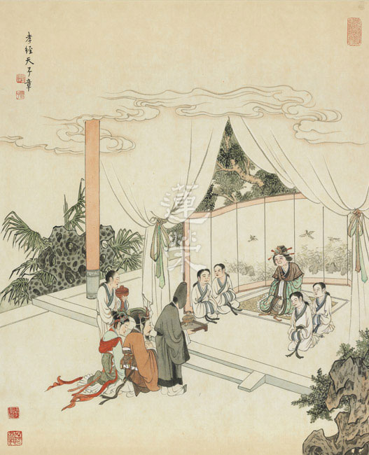

## 藝術賞析

### 孔門七十二賢淺說（十三）
				       ─商瞿

孔門七十二賢淺說（十三）

─商瞿

圖：江逸子‧文：時哉

年近四十而無子

孔子預言生五胎

學易不讓子夏賢

通曉經學稱先賢

商瞿字子木，魯國人，小孔子二十九歲。

《史記》上記載，商瞿受傳《易經》於孔子，而後數傳到齊人田何。田何是漢代官方易學的重要人物，是西漢今文易學的開創者。田何又傳給王同、周王孫、丁寬、服生，四人皆著易傳以為解說，其說皆有本。由是可知，商瞿是孔門十分重要的傳學弟子，對後世學者影響深遠，雖未在《論語》中敘述，亦少見於其他典籍，但相傳他是深具慧根，能內斂與自我充實，故得孔子性與天道的傳承—《易經》。

唐玄宗時追封商瞿為「蒙伯」，宋真宗加封「須昌侯」，到了明世宗詔改為「先賢商子」。

《易經》始於古帝太昊伏羲氏，帝畫八卦以通神明之德，以類萬物之情。伏羲氏易，有畫而無文辭。到了周朝，文王繫卦辭，周公繫爻辭，分六十四卦為上下篇，又稱上下經，是為《周易》。惟其辭簡，深義難明，不能解者視其為卜筮之書，功用甚小。自孔子出，作傳十篇以釋經，謂之十翼，易道因此大明。易含萬象，其體本空，孔子名之曰太極，以明古聖作易，意在窮理盡性，方能通達天命。於是乃知易之為書，實有大用，非唯卜筮而已。畫中的商瞿展易而讀，若有所得。老謀深算的神情，似乎是看出了事的成敗在於時的掌握，了解人際關係與建立品格的重要，從而懂得能於隱微處的趨吉避凶，順天應時。

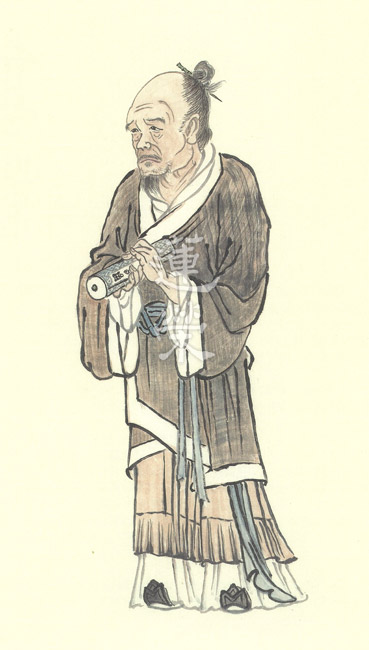

### 華夏精魂千秋(十三)—明倫史畫　善化民類　文翁

圖：江逸子‧文：淨域

蜀郡多太守

文翁獨得名

推展經學功

風氣比齊魯

史話

文翁，名黨，字仲翁，西漢廬江郡舒縣(今安徽省舒城縣)人，生卒年不詳。自幼好學，精通《春秋》；景帝末年，任職於偏僻的益州蜀郡太守。

文翁生性仁慈愛民，見蜀地民風蠻悍不習禮教，便大力倡導教化工作。然而，蜀人並不因此學教，反而譏諷他只是崇尚經學，意欲貪權慕利。於是，他先選拔郡縣小吏張叔等十餘人，備妥蜀地的特產作為贄禮，遣送到長安隨五經博士受業。其次，又在成都城中設立郡學，免費招收子弟就讀。凡是願意來求學的，可以免除勞役，若學有成就，立即授以官職。此外，更選拔學官中優秀者隨從進出，或出入府衙傳達教令，使成都縣民見了心生羨慕。不久，民眾爭相要當學官弟子，富貴人家甚且捐錢要求入學。

數年後，張叔(武帝拜為御史大夫)等人學成返蜀，文翁委以官職，並充任郡學師資，同時修築學舍擴大學員名額，招收郡屬各縣子弟入學，於是民風大化。蜀生遊學於京師者，可以和文風鼎盛的齊魯相比。鄉民感念他的教化之功，設立祠堂祭祀不絕。

景帝見文翁能化俗，特別褒獎他的興學辦法。到了武帝時，下令天下郡國皆立官學，成為官學之肇基者。史家以「蜀學比於齊魯」，來讚歎文翁教化西蜀的功績，又後人以「文翁化蜀」這一典故，來稱頌地方官重視和推廣教化工作。 唐代宗廣德元年(西元七六三年)，杜甫離蜀前往荊南，他寫首詩給好友劍州(今四川省劍閣縣)刺史李劍州(名不詳)，前段云：「使君高義驅今古，寥落三年坐劍州。但見文翁能化俗，焉知李廣未封侯。」特別用文翁化俗的典故，來推崇他在劍州的治績；也用李廣建立戰功未封侯的事實，來為他不受重用大鳴不平。

今人李炳南居士對文翁化俗也多所推崇，在《雪廬詩集》裡有多處提及文翁，如：「翻熄文翁教，將尊少伯賢」、「文翁去蜀從心好，七二泉南讀《魯論》」；而在〈西嶽月觀峰詠月〉詩中，亦有「安得主人師北海，誰開法眼友文翁」的文句。雪廬老人常自比是「流浪專家」，雖晚年落腳於臺灣，但一生推行教化不遺餘力，或也是以文翁化俗作典範。

圖解

文翁治蜀時，除廣闢良田嘉惠百姓外，同時以石料修建周公禮殿，名石室用以保存圖籍，並選派優秀縣吏赴長安學習五經。學吏返蜀後，又設學宮免費授學，有成者授以官職，漸漸培養起蜀地的讀書風氣。

經三國、魏晉、南北朝的戰亂，周公禮殿與文翁牌樓皆壞損。唐代於原址修建孔廟辦學，延續文風。明末張獻忠據蜀作亂，孔廟又遭毀壞成瓦礫。歷代撫蜀的封疆大員，莫不珍惜文翁教化的意義，於石室原址建書院、立學堂、辦教育，雖屢廢而屢興。 本圖所繪為「文翁化俗」之況。文翁中坐於學宮(今遺址設立石室中學)，堂上坐滿學子，文翁因啟問而說，學子們皆聚精會神聆聽。圖右下二人打恭作揖，表意教化之風崇禮，使偏地民心淳厚。堂下有老人家帶著兒孫前來觀摩，大門處有人急忙奔入，或都具有善教雲集景從之意。園中的桃花盛放，說明蜀地經文翁廣行教化後，如司馬相如、揚雄、蘇軾者，優秀人才代代輩出，教化風行桃李滿天下。（下期待續）

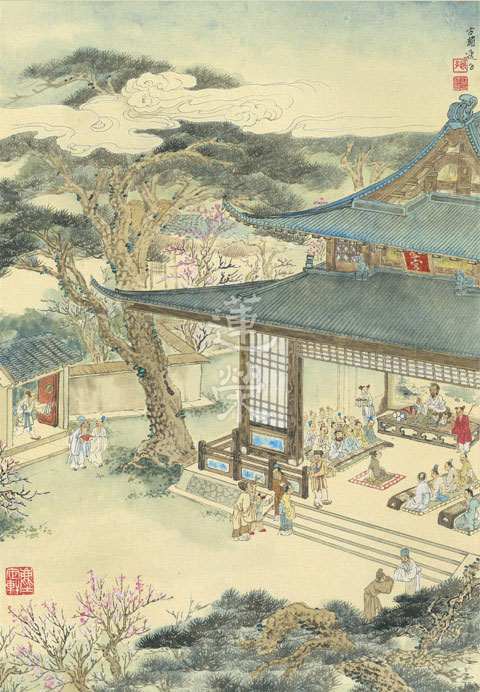

### 孝經圖簡說(十一)—五刑章第十一

圖：江逸子‧文：時哉

刑期無刑懲不孝

維護善風助正教

堯天舜日政局安

禮運大同真盛世

天下間最嚴重的罪行就是不孝，古代有五種最嚴重的刑罰，如臉上刺字、割掉鼻子、斷腳、死刑等，附屬的條目有三千。這些條目中，最嚴重者即為不孝，不孝之中三種為最：一是要脅君王，目中無國君，敢犯上作亂；二是毀謗聖人，並反對聖人言教；三是毀謗孝道，眼中沒有父母，忘恩負義、苛薄寡恩，此三者為大亂根源，皆從不孝引發。

江先生所繪之五刑章，圖中，判官對此不孝之人怒拍案桌，對面那位，被差役押來穿著白衣服的年輕人，何以臉色慘白、頭髮蓬鬆？原來是被跪在地上，衣服補丁的執杖老頭指責，這位老人家，想必是不孝子的爸爸。

另有一位白髮蒼蒼，也是衣服補丁的婆婆，執杖走來，右手指責，想必是一路罵著來，必是這位不孝子的媽媽。

妻子帶著小孩，掩面而泣地跟來，或許她知道錯了！這位不孝子與其妻小穿著華服，從與父母服裝的差別中，可知這位不孝子的惡行了。

古時不孝是會被判重罪的，孝道是整個社會風氣之根本，歷代孝經畫作或是審不孝子，或是從正面表徵孝子為官清廉，帶著聲望還鄉受鄉人敬重，以上是五刑章的圖解大意。(下期待續)

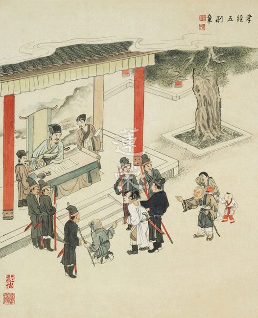

## 活動報導

### 大同世界的發端
		—實栽農園報導

大同世界的發端

—實栽農園報導

淨昌

生存是本能

生活是歷練

生命是挑戰

生機是創造

緣起

學會經營農園的緣起，主要是因為這幾年臺灣經歷多起食安事件：包括以工業原料處理食品保鮮保色、低價劣油混充高價橄欖油、過期產品改標示繼續販售及農產品施肥及用藥過量等種種問題，不時登上媒體標題。更不用說化學香精色素被普遍使用於各類飲料、蛋糕、麵包及餅乾等食品，消費者長期食用種種化學藥品，造成現代人身心健康危機浮現種種病症，因此如何取得安全的食物成為嚴肅的課題。

其次隨著年歲增長，人人都面臨老年問題，離開職場後生活失去重心，但其時恰是人生經驗閱歷豐富，辦事能力最佳，體力尚未全衰，任其自然凋零，除了浪費暇滿人生，錯過以善法與大眾結緣的大好時機，身心體能都不易維持，面臨老年長期照護困境時，內心更難突破困境。因此如何經營退休後事業，成為必須面對的問題。

再者臺灣農村普遍面臨人口老化及青年離農之現象，廢耕田地日多，則成為未來糧食危機之隱憂。而現代農業經營者歷經多年演進，多數人已無法脫離化學肥料過量施肥及農藥使用，不以化學肥料施肥，農作物長得慢，加上菜賤傷農，入不敷出；不用農藥則須耗大量人工除雜草或除蟲，種種經營困境無法突破。消費者則早已不知無農藥無化學肥料的滋味，因負擔不起有機耕作或自然農法的高菜價，市面上也幾乎無從選擇。

老師多年講學，理想就是要實現孔夫子的大同世界，具體而微的落實就是要在文化的理念、道統的攝持下，經營文化的共住及事業，使「幼有所長，壯有所用，老有所終」。而實栽農園的成立就在這時節因緣下，逐日茁壯成形。

發端

二○一六年初老師指示以經營農園為共住緣起，於是多位老師多方尋覓，曾遠赴屏東參訪某生技公司之專利農法，以及參訪臺灣各地其他生態園區，最後於十一月初，由蓮友建議選定東勢一八分八地，簽下十年之約，農場位於臺中市東勢區東坑路善意路旁，優點是鄰近石角溪旁，具有取水灌溉便利，且周遭無工廠設立、耕地亦不多，故無受汙染疑慮，加上交通方便，東勢蓮友可就近照應。

簽約後以劉老師為首，開始申請整地許可，並於十一月十一日祈請老師舉行灑淨儀式，祈求觀音菩薩加被以召告農地大小動物昆蟲等有情移居，避免誤傷反結惡緣。隔日推土機進場整地，十三日起由老師帶領東勢蓮友開始第一期試作，由於該地已廢耕多年，地力貧瘠，加以多年前七二水災淹水瀰漫，農地中大小鵝卵石甚多，種種事務都須人力而百廢待興。故初期農務以建立灌溉水電等基礎設施為主，先後完成灌溉水塔、初期灌溉管線、休憩帳篷及園區大門以區隔內外。後續為讓如遠地蓮友有處所可休息沐浴，陸續整修徐居士舊居，期間各地讀書會蓮友，也多次動員家人支援，年輕學長們亦曾於假日一日隨喜至農園搬運太空包，體會農務之辛苦，至二○一七年一月底已初具規模，農作可開始供應學會及蓮友團購需求。至二月初，連豐學長辭去原有繁重的郵務工作，全力投入農園經營；三月份購入貨車一部，以因應運務需求。

同時隨耕作面積逐漸增加為改善地力，十二月商得新社菇農同意，將其種完香菇後廢棄的太空包，運至農園拌入土中做為肥料，太空包成分百分之七十五為木屑，再添加稻殼等輔料，並加入真菌發酵三個月後，直接遷移至香菇培植場，開包後進行最後階段快速成長栽種。此舉一舉數得，其一在節省農園肥料成本，太空包在收成一次香菇後肥力尚在，只因相對成本較低，及為管控香菇品質風味一致性，菇農皆另僱工棄置；其二太空包成分皆自然植物除極少數碳酸鈣用以調整酸鹼值外，並無人工化學物質，符合農園不採化學肥料之自然農法概念；其三廢棄物資源回收再利用，符合節能減碳回收再利用概念，將農園產品碳足跡降至最低；其四幫菇農處理廢棄太空包，亦自菇農處收取費用，挹注農園經營；其五太空包拌入土中時已發酵數個月，等同有機肥料直接利用，也節省自行發酵製作有機肥之時間及成本，成本效益高於自行發酵有機肥。

因應學會團購需求，農園所栽種之農作物以少量多樣為原則，園地交互休耕，目前一週二次的採收運送，種類約三至四種，斤數少則三十斤，多則四十五斤。農園前段的種植陸續採收後，準備休耕養護。後段的一面開墾，一面種植，現在已種植的菜類有地瓜葉(三品種)、紅菜、茄子、長豆(有綠、白色)、茴香、小黃瓜、香菜、絲瓜、胡瓜、苦瓜、南瓜，莕菜(有白、紅色)還有小番茄等。將種植花生、地瓜。休息區預定移至中間段。並籌設生態池、車道。預計最後段為堆肥場所。

觀摩聯誼

農事粗具規模之後，陸續安排蓮友觀摩學習，二○一七年元旦，舉辦蓮友一日遊，採菜、登山、火空窯及營火晚會，盡興而歸，達感情交流目的。二月份小止觀講座之後，亦分別招待之瀋陽、福建及馬來西亞等各地學友參訪，體驗務農生活及交流務農經驗，何幼珠學長並提出農務經驗建議，作為未來增上參考。三月底臺北弘明幼兒園畢業生畢業旅行即安排農園二日一夜遊，接觸大自然，認識每天所吃的青菜食物，是農夫辛勤的成果。

除不定期有各地蓮友參訪交流之外，為進一步增上農園農務，由如磬學長遠赴日本觀摩木之花家族經營共住及農務，該家族自一九九四年由二十名成員發起，以自然生態為本，務農自給自足，經濟共享，生活互助，至今已有時三八戶八十四人成員，食物的供應，除了油及鹽需向外購買之外，基本上可以自給自足，農作物種類繁多遍及稻、麥、穀類十餘種，蔬果二百多種，耕作面積達十七公頃，並具備微生物發酵技術。顯然就農事及共住而言，木之花已得到顯著成果，尚有非常多運作經驗及技術值得學習，進一步的參訪學習正在規劃中。

而日本尚有另一個聚落農務運作的成功經驗，是四國德島的上勝町，上勝町位於山腰地帶，其間除了有日本重要的文化景觀「樫原棚田」（梯田），還有森林、溪谷、溫泉，是日本最美的村落之一。然而，每年從日本及世界各地來訪的旅客絡繹不絕，主要不是受綺麗風光吸引，而是想一探這個居民不到一千七百人，人口超過一半是老人的小山村，如何脫貧致富，還走在環保最前端。上勝町有名的就是它「樹葉變黃金」的故事，還被拍成電影。樹葉改變了這個農村，原本靠年金過活的老人，因收入增加而必須繳稅；因有工作，身體也更健康。上勝町在二○○七年還撤除了老人安養院。環保方面，上勝町也沒有垃圾掩埋場及焚化廠，垃圾分類回收細達三十四類，回收率百分之八十，家家有廚餘堆肥機。預計二○二○年達到垃圾回收率百分之百的目標。還設有二手物品交換中心，每個人將家中多餘不用物品拿到中心，免費給予需要的人，也免費取用所需物品。

效益

農園經營至今，耕作主力仍以中壢、東勢蓮友為主，委請中壢蓮友支援設施建置。經營效益其實還不在收入上，賣菜收入遠低於工作人員薪水，所以目前農園最主要效益是在概念的建立。第一是公心，農地經營至今所有參與師友都知道這一塊地是公田，事關公家的利益，所有耕作、修繕、澆水、檢石頭、除雜草、整地，永無止盡的太空包、蓮友招待、收成、運菜、清洗、分裝等，也衍伸出水餃等周邊產物，藉由這些事項的辦理，引發的是參與者的公心，和辦事團隊的規劃與默契，公心恰是大同世界的發緒，所謂：「大道之行也，天下為公。」殷勤期盼辦事中看到自己的公心，對治煩惱的生起，並且吸引更多人投入農園經營，大家有錢出錢有力出力，種菜買菜共襄盛舉，互相隨喜，相信未來定能共享美好果實。

第二個效益是改變食用者的味蕾，農園自然農法的經營，不使用化學肥料過度施肥，也不用農藥除蟲，長出來的農作物比市售農產品小，成長期也較長，單位面積種植量也較小。以高麗菜為例，農園的高麗菜體積較小，約僅市售高麗菜二分之一至三分之一大，但重量竟然不輸，雖然長得慢，但是長得紮實、長則好。而且較不易腐敗，存放期較長，最重要是入口香甜，身體爽利無負擔。學會蓮友經由接觸農園產品，入口已能覺察自然農法與一般過量施肥、農藥施放產品差異。

第三個效益是在作務中練磨煩惱與習氣，煩惱與習氣不會自己生，沒有對境的時候，煩惱養得好好的不會出現，但是在作務勞動中，隨著身體的疲累，或者內心不平衡，或者勞累而生煩惱等，這些境界都是自我覺察的好時機。所以懂得在作務中如法觀察並對治煩惱的人，就是整件事當中最大的受益者。

第四個效益是提供學長們合作辦事的機會，透過每週一、三兩次送菜至學會，蓮友們發心幫忙洗菜、揀菜，並且有學長發心包餃子，每顆都包得一樣大小，包得外觀好看，又能提供口牙狀況不佳的年長者最營養的食物，觀待東勢、中壢蓮友的發心辦事，讓遠地學長也有隨喜參與的機會，除了活絡團體，也想到了老師上課曾說過，有時一個善法做下去，衍生出各式各樣的善法因緣，誠哉斯言。

展望

農園運作至今方才約五個月，依著蓮友支持，維持小規模耕作，八分八的土地，離全部利用尚有距離，農地中鵝卵石仍多，全仗人力處理，人力如何因應為嚴肅課題，如何珍惜蓮友體力，並且有效率的規劃實行，還是一條長遠的路，對比日本木之花家族也是經營了二十三年，才有今日的規模，雖然其家族成員生活於團體中食衣住行皆不虞缺乏，但據參訪者轉述二○一四年木之花家族成年人年收入約五十萬日幣，成員其實需要清心寡慾，減少物欲，但很多木之花務農者仍認為，每天接觸大自然的生活才是腳踏實地，都市中五光十色的生活，只會令人日漸空虛，心靈枯竭。孔子說：「飯疏食飲水，曲肱而枕之，樂亦在其中矣。」不論所樂者為何，他們找到了可樂之處，並延續之。

時序即將進入夏天，農園即將進入第一個夏天，穩定而持續的人力須賴嚴密的規畫，在新的生力軍未投入前，猶如黎明前的黑暗，雖然漫長卻須等待。但如果能夠像孔子、顏回一樣，人不堪其憂，而我卻不改其樂，在務農中找到仁者之樂，每天雖然身體疲累，收入不豐，卻每天像日正當中一樣光明快樂，無有黑暗，晝吉祥，夜吉祥，時時吉祥，事事吉祥，務農於我何有哉？共勉之。

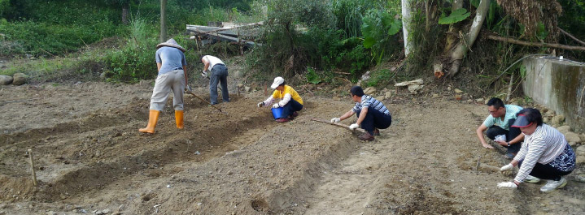

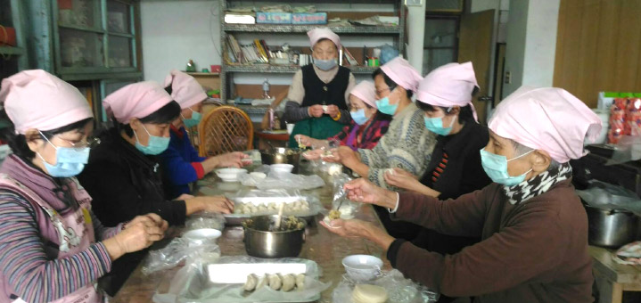

### 參觀實栽農園心得分享

任遠、美里讀書會

山水風光小城春

農地八分墾荒辛

爽口有機來不易

助成法業通古今

弘毅

二○一七年二月十五日，在學會幾位老師、學長的帶領下，我們瀋陽任遠讀書會一行三人和福建的林祥鎮夫婦，一同前往位於臺中東勢區的實栽時哉農園參觀。

早晨我們從學會出發，我坐在吳老師的車上，吳老師幽默爽朗，一路上我們相談甚歡。通過交談，我不僅學到了很多佛學道理，更重要的是還明白了要把佛學道理融入到日用平常中去，不僅知道，還要做到，否則所講就是偽法，會令他人對佛法失去信心。另外，吳老師還告訴我很多臺灣的風土人情，以及歷史和現狀，令我受益匪淺，最後我們大概經過兩個多小時，到達了農園。

我們到達農園後，一目望去感到農園占地很大，但規劃的卻很整齊，并且看到幾位年長的師姑在農園里辛勤的勞動，還有一位老師在鋪接水管。聽說都不要任何報酬，只是為了讓大家吃上新鮮放心的蔬菜，所以我內心十分感佩。之前在講座上以及私下裡，都有聽劉老師介紹過農園的一些情況，劉老師要經常在臺北和臺中兩地奔波，各地蓮友都為農園的建設付出了很多，卻從不計較個人的利害得失，正是因為這些老師、學長以及默默耕耘的師姑們，才使得去年還是一片荒蕪的土地，如今變得生機盎然，彩蝶紛飛。

田地裡種植的有高麗菜、油麥菜、玉米等常見蔬菜，還有我們北方所沒有的火龍果和香蕉，以及作為地界的筆直高挺的檳榔樹。接下來我們的任務就是拔菜，那如何在拔菜時作觀修呢？比如菜為什麼會有大小之分？在吳老師的幫助下我們了解到，有可能是種子（因）上就有不同，也有可能是施肥不均，或者澆水多少不同，在緣上不同而造成最後結果的不同。還有能拔菜的人和所拔的菜，都是沒有自體性的。如果能拔有自體性，那不需要菜，對著石頭也可以成為能拔；如果所拔有自體性，對著蝴蝶，菜也可以成為所拔，所以都沒有自體性。另外菜本身也是沒有自體性的，因緣滅，菜才生，還有觀待根塵識結合，才有名言菜的安立。就作用來說，菜對於我們來說成為所吃，而對於食肉動物卻不能。還有我們在拔菜時，發現下面有很多小蟲，如果不小心殺了小蟲怎麼辦？吳老師說那是無心殺，因為種菜是為了使人活命，不能因為擔心殺死小蟲而不種菜，被殺的小蟲也要透過回，避免結下惡緣。因此我們要在日用平常歷緣對境時，要結合所學的佛法觀修，以理馭事，於事顯理，這就是劉老師所說的八面玲瓏（因、緣、果、體、相、用、事、理）吧！

後來我們吃到了用燜窯做的燜地瓜和玉米，外焦裏嫩，香甜可口。之後又去秀英師姑家作客，她家的大門居然都不需要鎖，這大概就是傳說中的夜不閉戶吧！她家的房子是日治時期所建，距今有一百多年了，明顯的日式風格，由臺灣特有的檜木建造。喝著師姑泡的茶，吃著金門的小吃，感受到了師姑對我們濃濃的情誼。然後在二位劉老師的帶領下，我們遊覽了東勢的林區公園，看到了檜木場，劉老師為我們介紹了臺灣檜木經過日本的掠奪，以及前些年的過度砍伐出口，如今已經十分的稀有。望著曾經放滿檜木的池子，待加工檜木所經的水道，以及如今已經破敗的木材加工廠，使我感受到歷史的變遷，世事的無常。

最後和學會的諸位老師、學長和師姑們一起吃完飯，在夜色中，一路上伴著吳老師的法音，從臺中駛回臺北。如今這些種種已成為我內心的法塵，宛然如在眼前，雖然這些因緣已滅，但相信觀待生起的未來一定更加殊勝！

親曉

通過五天的天臺小止觀講座，唐老師深入淺出的講解，心中油然生起對於修學止觀的好樂，如何應用於日常的實際生活中，成為我眼下迫不及待要思考的課題。在得知講座期間的餐食中，幾乎全部的蔬菜都是來自於一個地方——實栽果園，那是一個從一片荒蕪到現在可以產出健康蔬果供應講座的種植基地。末學鬥膽向學會建議，希望能有機會去實栽果園實地的參學，又聽說路程較遠，開車來回要五個多小時，在一天中往返恐怕難以辦到，可出乎意料的是，這個願望竟然在講座結束後的第三天實現了。

臨前的那晚，我便興奮的睡不著覺了，躺在床鋪上試著做前行的觀修。明天到實栽果園參觀學習要身體力行的好好體會耕者的辛苦，以及所受福報的來之不易，更好的生起感恩心，並借此次難得的機會，與同行的善知識進一步結下殊勝的因緣，故而要講究的言談舉止、待人接物、進退應對皆要合乎禮，進而產生美好的情誼。再來，尋覓能行、所行以及中間的行是否有自體性呢？我是能行，所行的目的地是實栽果園，其實都是沒有自體性的，就運用三輪體空來做觀修吧。若能行有自體性的話，那明天去的地方是戰火紛飛的阿富汗，或是炎熱的撒哈拉沙漠，我豈會成為能行？若實栽果園有自體性的話，那麼人人都想去，可現見並非如此，山東的傅學長就不會去，因他隔天的計畫是要去臺中蓮社。可見能行、所行都沒有自體性了，中間的行自然也無自性。三者的自性在認真尋覓中了不可得，那麼如何經營此行朝向於功德累累就事關重要了。帶著這樣的覺受，進入夢鄉，身心得到的充分的休息，有利於明天更好的學習跟生活。

第二天清晨，我們一行數人便奔向臺中郊外的實栽果園。那天風和日麗、陽光明媚，果園裏的空氣尤其清新，彌漫著樹葉和泥土混合的特殊氣味，讓人情不自禁的愉悅。上午的工作是拔菜，首先要能分出哪些是菜、哪些是雜草，若不認真辨認，很容易將二者混淆，就像對於佛跟魔，往往就在一念之間，若不好好學習教法，加以辨別，把魔誤認為是佛，後果將不堪設想。在劉老師耐心的教導下，幫助我們很快認識了雜草長的樣子，便開始正式拔菜了。拔菜要將菜連根拔起，並用鐮刀將菜根去掉，訣竅就是眼准、手快、心要狠，才能將無用的菜根俐落的割掉，這就好像改過一樣，當發現自己內心隱微處的過失，看准了下手麻利地去除它，才能達到事半功倍的效果。對於不太會用鐮刀的我，細心的永健學長在一旁發現了，很貼心地遞給我一把剪刀，用剪刀來剪菜根果然很善巧，因剪刀是常用的工具，操作起來很熟練，除菜根的速度自然提升。這就像改正過失的方法也要注意善巧，該用剪刀的時候，不要用鐮刀，用對方法才能恰到好處。蹲在菜地裏不停的勞作是一件很辛苦的事，師姑們頭也不抬的連續作業，好像都不知道累，可年紀輕輕的我反倒蹲麻了腿，真是自愧不如啊！於是我便起身來活動下，站在綠油油的菜地裏，我閉上眼睛，朝向太陽，張開雙臂，春風的氣息迎面而來，沐浴在溫暖的陽光下好舒服，像被佛光普照一般，加被得充滿了正能量。

就在秀英師姑燒好香噴噴的午飯時，上午的拔菜工作就告一段落了。吃完午餐，簡單休息過後，又要開始下午的勞作了。下午的主要工作是澆水，於是我穿上雨鞋，戴好斗笠，正可謂「工欲善其事，必先利其器」，穿戴好裝備，卷起衣袖，拿起壓力水槍，走進菜地裡，一行一行有次第的開始澆水。劉老師告訴我，澆水時可以做如下觀想：水槍噴射出的水流，仿佛是觀世音菩薩灑下的甘露，醍醐灌頂般帶給吾人從頭到腳的清涼。在澆水灌溉時，免不了會傷害甚至殺害一些菜地裏的蟲子，所以一邊澆水，一邊念佛，還可為不幸淹死在水中的有情眾生做三皈依，希望它們早日離苦得樂，往生極樂。帶著這樣的正念去行持，學以致用，下午的勞動雖然辛苦，但是法喜充滿，受益頗多。

在不知不覺中，臨近落日，閃耀光芒一天的太陽，依然光焰十足，毫無倦態。此時，我想起老師在分析兩岸國學文化發展時，曾說過中華文化在臺灣如夕陽西下，猶有餘光，而在大陸如旭日東昇，可是還沒亮天。當我問老師，要如何才會亮起來時，老師語重心長的對我說：「那就要靠你們了！」這是何等分量的勉勵之言啊！夕陽在快要落山時，還努力的釋放著光芒，就像一位飽經滄桑的長者，哪怕是用他最後一口氣也要告訴後人，他所歷經的美好，及未來輪回的新生命誕生時，他的期盼與祝福。

這是一次意義非凡之行，讓人難以忘懷，感恩為了此行付出的所有人！

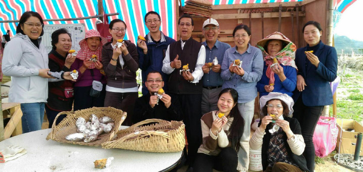

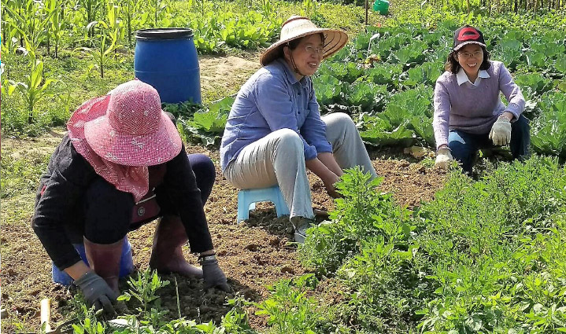

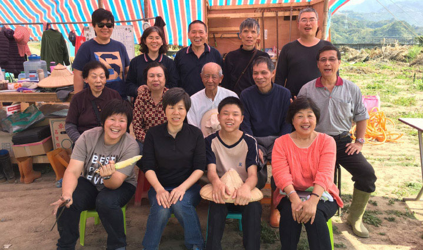

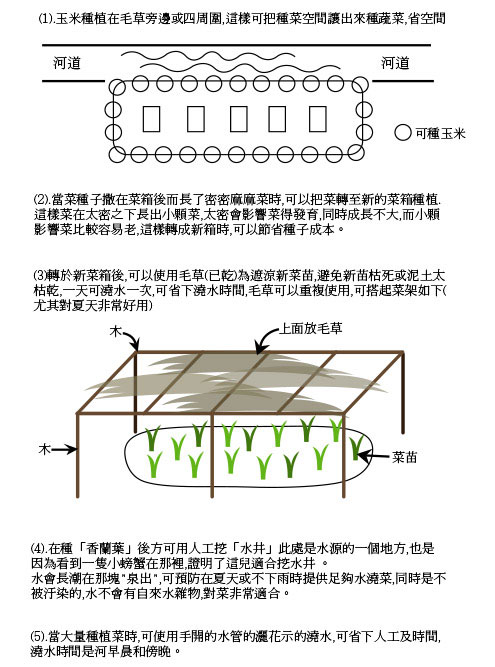

## 蓮池海會

### 鍾潤菊老居士助念見聞記

行善

心地善良鍾阿姨

弘明義工多年續

拜懺擺盤心思細

放生齋僧多回向

鍾潤菊老居士(又名鍾雅淇)生於民國二十四年五月五日，新竹縣關西鎮人。祖父為秀才，父親鍾敬恭為日據時代師範學院第一屆第一名畢業，為人寬厚，曾任憲兵隊通譯，元配過世留下三男四女，經介紹娶藍阿梅小姐為續弦，再生下三男四女，老居士排行倒數第二，因父親還收一養女，故老居士生長在一個總共十五個孩子的大家庭。家中曾經營戲院，播放無聲黑白電影，那是二次世界大戰的年代。老居士自幼看到母親對所有孩子一視同仁，以及十歲時看到父親臨命終前，命哥哥們燒掉一疊厚厚的借據，這都影響了老居士，使她有著重視親情，而且寬以待人的溫厚品行。

由於生性和順、聰明文靜又心細手巧，舉凡書法、繪畫、繡花、剪紙、摺紙…等等皆可信手捻來，種種作品甚得親友師長的讚美。自商職畢業後搬至中壢，任職於桃園土地銀行。二十歲時與苑裡蘇輝庚先生結為連理，生育四子。先生的祖父臥病在床，老居士負責三餐餵食，就算懷孕挺著大肚子，也是毫無怨言；對先生的祖母也是極其孝順，舉凡洗腳、搥背、哄睡皆親力親為，貼心陪伴甚得老人家歡心。

在那樣的年代，老居士與婆婆同年生子，同時坐月子，除了當孫媳婦照顧老人家，也要當媽媽，還要當大嫂負責照顧出生不久的小叔、小姑。老居士在懷三子時患妊娠毒血症，辛苦異常；懷么兒時適逢過年，忙於縫補全家衣褲，接著在除夕打掃時不小心滑倒，以至大年初一早產，生下才七個月大的老四，以當時的醫療技術及設備其實是相當危險的，雖然母子均安卻落下病根，日後仍經常生病。

後來隨著先生到基隆一信服務，老居士帶著四個幼子一起到基隆居住。先生雖受上司賞識及重用，後來升任為銀行總經理，但老居士仍必須量入為出，因為身為長子的先生常常要寄錢回家。等到孩子較大後，老居士到礦工醫院上班，由於年紀稍長，人稱鍾阿姨，鍾阿姨的人緣很好，常開導後輩。

老居士已有四代子孫，均分住附近。四個兒子、媳婦及孫輩都很孝順，晚輩常噓寒問暖，向阿嬤撒嬌，讓阿嬤高興。在一Ｏ四年時，經醫生診斷其心臟問題必須開刀，否則萬一發作會拖累家人，預期術後半年就可恢復健康，而且手術若成功，可以延十幾年的壽命，由於子媳孝心，希望老人家能健康多活幾年，於是決定開刀。但是半年過後並不理想，並且因為氣候變化，老人家容易出現很多狀況，發現身體健康不是做了什麼手術就一定就可以擁有，所以去年到西蓮淨苑皈依，自此很勤於做早晚課，平時亦常常念佛。

十多年前老居士的先生往生，因老居士的妹妹為蓮友而有認識團體的因緣，多年來老居士常存感念老師及團體之恩情，當臺北弘明幼兒園開辦，剛好離老居士住處不遠，於是把握良機發心當廚房義工。在弘明的日子，受到園長及幼兒園老師的諸多照顧，每每對年節的應景禮物感到愧受，自認年紀大、行動慢，公家肯用她是給她機會，所以對於切菜、排菜總是認真謹慎。因老居士在烹飪、雕花、擺盤設計皆有過人之處，所以學會舉辦講座、法會、拜懺等活動有時都會看到老居士的嬌小身影。而徐師伯與雪梅師姑為讓老居士更能深入念佛法門，自願接送老居士參加週四共修，可惜老居士參加數次之後就中斷了。

今年初，老居士與妹妹及內壢的嫂嫂一起回到關西看出生的老家，非常開心。過了一些時日，要么兒帶她去探望表姐（秋錦師姑），表姐妹許久未見，甚是高興。今年一月彌陀懺，老居士到中壢，送給妹妹一個木盒，上面有她親畫的梅花，要妹妹記得多懷念媽媽。老居士兒孫滿堂，但在二月份時發生一件令老居士至為心痛之事，一個乖巧又前程似錦的孫子因車禍意外往生，得年二十八歲。三月二日當天老居士因前晚無法成眠而身體極不舒服，到了晚上九點就寢時，卻在喊了同住的兒子後昏倒，經兒子媳婦當場施以心肺復甦術仍未醒來，送醫急救後於晚上十點三十五分與世長辭，享年八十三歲。

幸好老居士有交代兒子在她往生後將密封遺囑轉交內壢嫂嫂，嫂嫂既為蓮友又深信淨土，知助念的重要與急切，即使遺囑中沒有交代有關助念之事項，家屬相信小舅媽，同意助念。因著老居士對團體多年的護持，學會派人連夜抵達醫院助念室協助家屬助念，助念八小時後，老居士的面容很安詳，看不到病苦，神色自然，大殮時兩位兄長及妹妹看到老居士的莊嚴都甚感安慰。之後家屬親至學會向老師祈請作七，子孫們也會在四十九日內茹素、廣造善法將功德回向老居士。

老居士的一生，以嬌小的身軀來打理一個大家庭，加以秀外慧中的性情扮演好每一個角色，但凡與她結交過的人，沒有不喜愛她的，因為她善良而有修養。可惜的是，因老居士個性不喜麻煩他人，所以對往生的看法與一般世間人並無二致，一向是不以為然的，只要好走、不拖累子孫就好，加上自認自己甚麼都看開了，不認為助念有其必要性，覺得孩子們想怎麼處理就怎麼處理，不要限制他們，殊不知正知見不是對人的約束，是幫助人從輪迴的約束中解脫。親人中雖有學佛多年的蓮友但實則親人難度，多年來每每談及往生話題，常常話不投機，輕忽無常到來時的種種因緣變化。雖然知道自己心臟不好，隨時有可能往生，卻沒有好好面對和交代。

反觀我們，對淨土法門好樂、美其名為淨土法門行者的我們，該怎麼做才能順利往生呢？自己要在修學的過程中法喜充滿，不要成為家人情緒上的負擔。對於往生的目標要明確，不可模擬兩可，臨終之事不可鋌而走險，以為自己不會遇到障礙。要讓家人熟悉蓮友，知道自己的志向與做法。要歡喜蓮友的探望。家屬是自己往生的關鍵，要好好經營佛化家庭。人生非常的短暫，如何過得有意義，如何讓謝幕這場戲演得好，除了平常的演練，還要讓台前幕後的人，都知道如何護持，才是一場真正好的戲碼。唯願鍾老居士臨終的示現，使人人發起往生的決定見，並且做好萬全的準備。

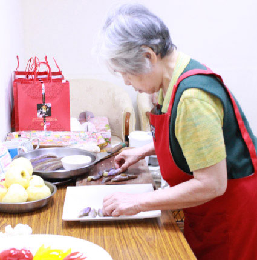

### 莫玲瑋居士往生見聞記

*編輯部整理*

人生際遇不思議

學佛機緣雖不生

臨終助念娶媳後

關聯能引西方路

莫玲瑋居士，民國五十二年十月二十五日生於台北五股陸光一村的外省家庭。其父莫建斌於國共內戰後隨中華民國政府遷臺，曾參與古寧頭、八二三等戰役，一生保家衛國，貢獻良多。為人廉潔正直，雖官拜上校，因職務之故，時常經手公家之財，常人若居此位難免心動，收受賄賂更是時有所聞，但他老人家對於不義之財是一介不取，辦事篤行踏實，苦幹實幹，生活起居、飲食用具也十分簡單，少欲知足。居士父親留下的道德典範對其人格影響甚深，故其性格光明磊落，是非黑白分明，對物質需求不高、生活勤儉，不喜浪費，再加上自幼在眷村長大，也養成其豪爽又富正義感，勇於打抱不平的個性，頗具俠士風範。

居士自高職畢業後即入職場，後因為人正直又具辦事能力，頗受老闆器重，擔任會計職務期間，公司帳冊、存簿、印章等皆拖其代管，婚後為了家庭而辭職，其老闆更是極力挽留，甚至提出致贈機車通勤的特別待遇。但一心為了家庭的她仍舊婉拒，毅然決然地走入家庭，相夫教子，終其一生，盡心盡力，是具有優良傳統美德的家庭主婦。

莫居士夫婿林子樑，是工作時聯誼認識，初次出遊時見其獨自一人留下檢整場地、撿拾帶來的垃圾，對其細膩的公德心及責任感深有體會，進一步認識後更認定值得託付終身，兩人結褵二十餘年，鶼鰈情深，互相扶持，而居士持家有道，雖無開源，卻善於節流，勤勞節儉，把家中打理得井然有序。又因為妥善管理財富，才能令生活不虞匱乏，亦不至鋪張浪費，因此年紀輕輕就幫家庭備妥車房等生活用具，又能不留債務。

婚後二人育有一男一女，兒子士棋現任職於本會，是人才培訓班的班長，育有一子。居士對於媳婦視如己出，坐月子時親力親為的照顧，半夜寶寶一哭鬧，為了讓兒媳好好休息，也會第一時間來關心，讓兒媳能無後顧之憂的上班、聽聞佛法。居士常言抱孫乃人生一大樂事，內心已了然無憾，愛孫之心切常為人津津樂道。女兒紓平，今任出版社編輯，求學時期是縣市首長獎項常勝軍，品學兼優，也是居士一大安慰。

概括一生，莫居士能力出眾卻願為家庭犧牲奉獻，凡事把家人擺第一位，可謂現代主婦之楷模，上奉公婆，下育兒孫，對媳婦疼愛有加，又是夫婿最得力之左右手，家中大小要事、瑣事，全部一手包辦。為人耿直不屈，一身正氣，自言道平生未做虧心事，俯仰無愧於天地。

可惜人生無常，居士初嘗三代同堂的天倫之樂沒多久，就於前年診斷出罹患乳癌，飽受病魔摧殘，但其真性情倒在這一年多來的病痛中嶄露無疑，雖身處化療之苦，但在生病時都能正向樂觀，積極面對，也不會遷怒於人，面對他人始終都能微笑以對。臥病期間，也有賴其夫婿無微不至的呵護，辭去工作全心照料生活，齊心齊力度過難關，分擔了許多病痛憂苦，這也頗能印證其選夫之初的慧遠獨具，沒看錯人。

然而人的生命是十分脆弱的，初次化療後看似穩定的病情很快又有了變化，癌症末期轉移至肝、肺、腦等部位，已是命懸一線。雖然每個人都知道，我們找不到任何一個理由可以確立明天不會死，但這樣的感受在一般人身上不易生起，而此刻在癌末的居士身上體悟是特別的深，常告誡家人要把每一天當最後一天來過，對於死亡，居士心裡一直坦然接受，他也常說：我不怕死，我只是怕痛而已。今年四月初，病況急轉直下，住院多日後血壓驟降，醫院通知家屬須有心理準備。而蓮友第一時間到院幫忙，因有多年護持蓮友往生的經驗，當機立斷與家屬溝通，說起話來格外具有真情、份量，才能順利把居士接回家，開啟了後續助念與往生的因緣。也因為士棋、海辰兩位學長在母親生病期間，對於善知識所指派的助念、做七、宣講法語、擔任啟蒙班師資等事項心懷感激的承擔，也出資護持大德資料整理，一路走來為公發心的種種點滴事項，都是莫居士最後得以往生的順緣。

居士一生雖不曾學佛，本身也無信仰，但或許是因為他一生是個清白坦蕩的好人，又加上過去有護持兒子推展文化教育的善心，得到師長的引導以及蓮友的輪班助念，因為在學會的發心，許多蓮友不請自來，幫助居士能夠提起正念，在斷氣助念八個鐘頭後，含笑往生，其慈祥的面容未曾有過，肢體柔軟，莊嚴吉祥。

綜觀居士往生因緣，善知識在重要關頭對家屬的指導，依著過去豐富的經驗閱歷，每個指示都起了決定的作用。相信居士已在阿彌陀佛的引領下，往生西方極樂世界。淨土法門的不可思議就藉著居士的身上來顯現，人的命運竟然能在臨終一刻轉瞬直上，離苦得樂，願此因緣能令大眾了解臨終助念之重要，自今而後誠心念佛，導歸淨土，並依此自助助人，廣益群生。

## 專題報導

### 天臺小止觀講座活動報導

*編輯部整理*

止觀修學正法義

比量推知法性相

串習功深現量知

萬法所知一念知

為了遍滿虛空的有情眾生，我們必須要成就無上正等正覺，為了成就阿耨多羅三藐三菩提，所以興辦寒假天臺小止觀的講座，小止觀是智者大師依三藏教典詮釋止觀義趣整理而成的典籍。從具足五緣、外訶五欲、內棄五蓋、調和五事到方便五法，由坐上修、歷緣對境修、善根發、覺知魔事、治病到證果，條理分明。第一章到第五章講作法，第六章到第十章開見地，前面有總論跟分論，總論是敘述佛法修學的方法不離止觀，分論是敘述這十章的次第。

此次講座特別從第六章正修行開始講述，就是先建立見地，後確立方法，依實際的需要而做次序的改變，若能在坐上修、歷緣對境修上確立動機跟發心，也懂得修學的方法，在修學的過程中，懂得處理自己的問題，進一步懂得處理眾生的問題。最後證得的果位，也不是有一個果位可得，而是一種覺受，所以《金剛經》說：我不能作是念我得須陀洹果。連佛都不能作是念我得佛果，沒有佛果可得，果位只不過是在覺受上安立的。學習本論先確立了修學正確的見地，再來論實際的作法，必然能在五天的講座中得到圓滿的收穫。

儒佛合則雙美

暑訓是以儒學為主，寒訓是以佛學為主，也就是印光大師說的：儒佛二教合之則雙美，離之則兩傷。佛家是儒家的骨幹，儒家是佛家的應用，若能掌握儒佛二家或者結合道家，將掌握中華文化的神髓。

傳承非常的重要，課前向師長問訊乃代表一種傳承，行禮需知其表法。

止觀是方法論，依菩薩的廣大行而修止修觀，可以證得世俗，依般若義理而修止修觀，可以證得空性。證得世俗成為君子，證得勝義成為聖人，使自己成就聖人與君子方是文化道統的精華。此一以貫之之道，孔子傳給了顏回跟曾子。

依天臺小止觀方知道什麼是修行，修行的形象為何？真正修行的標準在哪裡？成就的狀態是什麼？小止觀的學習方了解中庸裡面博學、審問、慎思、明辨、篤行的形象，大學的知止而後有定，定而後能靜，靜而後能安，安而後能慮，慮而後能得。若能了解修學止觀的方法，就能知道經教廣學的重要。以儒家《易經》所說，有趨吉避凶的運用及甚深空性的道理；在入世的禮上，要懂得應對進退，辦事說話須觀察時機，明趨吉避凶之理，這些學習不能只是在文字表面，更要在義理上面理解，也必須要有修學的方法。懂得佛教的止觀門，就能知道博學、審問、慎思、明辨、篤行是悟道、證道的修學法，而且瞭解道統是完整不可以切割的，若能學習老子入世的抉擇，及其出世的內涵，將更為豐富、精彩。

現今兩岸對文化的推展有薪火燎原之勢，若能掌握經典當中真正的旨趣，並且瞭解其中的內涵，才能將傳統文化紮根並發揚光大。

科判精益求精

止觀門的書籍中，最綱要的就是這部小止觀，是智者大師為其兄陳鍼所寫的一部書，陳鍼本來被張果老(八仙之一)相為死相，必死無疑，但因修學了他弟弟所寫的小止觀，並親自為他宣說義理，按照此止觀的修學法，陳鍼不但延壽二十四年，而且最後坐化。

雪廬老人說止觀門的註解太少，老師十多年前曾於中壢研學會與省城隍廟講解過小止觀，會刊也以七十七刊，用了十七年的時間刊登完研學內容，但仍有未盡之意。又因為老師曾對中觀的論典下了一番苦功，深入中論、百論、入中論等論典，而有此次重寫科判、重新辦研討會的因緣，講座是老師對大眾誠心誠意的法供養。

教法的流通有三分，第一分是修學的方法，也就是小止觀裡面的內涵；第二分是中觀正見，天臺大師都是帶著見地說明止觀修學法，此次直接用中觀解釋，著重在消文，會消文就有了基礎功，有如蹲馬步站樁般，蹲久了、蹲穩了，才能發揮拳法的大用，一定要懂得消文，精準地說出每一個字的講法，這些是急不來的，要用時間累積。

而正法流通要觀待聞思修，有白天上課講解亦有晚上的研討，這就是流通正法最殊勝的形象，流通正法不能只流通書本，所謂「此方真教體，清淨在音聞」，教法的體性在音聞，如果沒有講也沒有聽，教法就無法產生斷惑、證果、破迷啟悟的作用。

人才磨練培養

此次講座，年輕學長們分布在一、二樓上課，不但在講座前學寫科判，課間配合老師消文，並擔任了部分的義工工作，教理要能深入體悟，也需觀待福報，而講座中每一個環節都需每位執事人員堅守崗位，才能順利完成。所謂的人才一定是慢慢熬，如酒要藏在地窖多年後才能是美酒，更何況是人才，要熬得久！他要歷練、要沉澱、要學習，沉潛多年之後才是一位人才。希望在這樣的場合裡面，能夠培養傳承教法的人才，培養通達止觀門的人才。

而法緣是所有緣分當中最殊勝的，孔門的團隊能發揮大用，都是因為彼此結了法緣，世間的名聞利養等都沒有這種力量。很多正法的團體，能發揮大用，都是因為團隊有革命的情感，能同甘苦、共患難，此皆因法緣。

此次講座亦邀請了大陸福州、順昌、瀋陽、濟南等地讀書會，以及馬來西亞古晉與美里讀書會成員參與，講座前接到海外傳來的幾份預習科判，師長也安排了某些學長參與消文及餐前觀修，彼此切磋琢磨，相觀而善。

老師深深期許

止觀門的註解太少，佛教門中懂修行的人也不多，打佛七不是坐在那裡就叫做打佛七，一定要懂得修行的方法，不論主七、護七或坐七都要懂得方法，期待這本小止觀的科判，能引發大家知道如何博學、審問、慎思、明辨、篤行，如何聞思後來修止、修觀。

並期盼講座後將消文的內容整理成小止觀的白話解釋，純粹在文句上消文，不必再做許多宗派見的分析，這將更有利於初機者的入門，將該講處講清楚，相信小兵也可以立大功，在教法的弘揚及傳承上略盡綿薄之力。尤其依止觀修學空性，更是人一生的莊嚴，若能在這當中講究，相信人生會過得很有意義、很有風采、很有內涵、很有價值、很有出路、很有未來，而且會結出很好的果報。

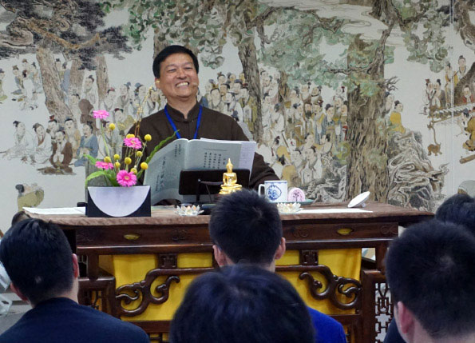

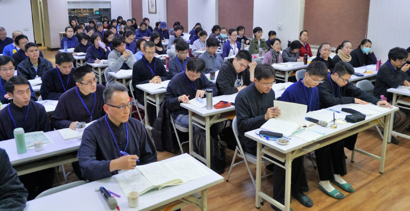

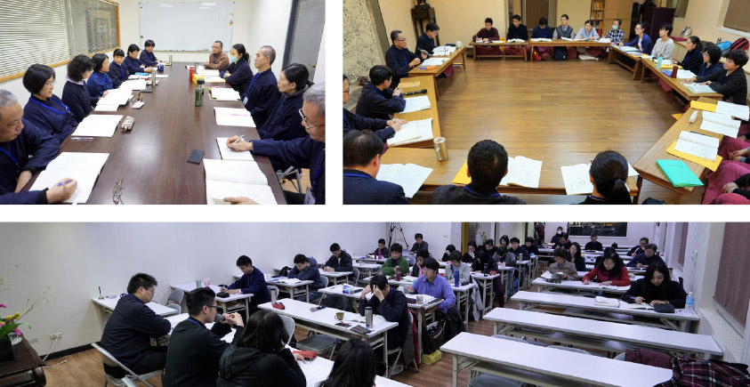

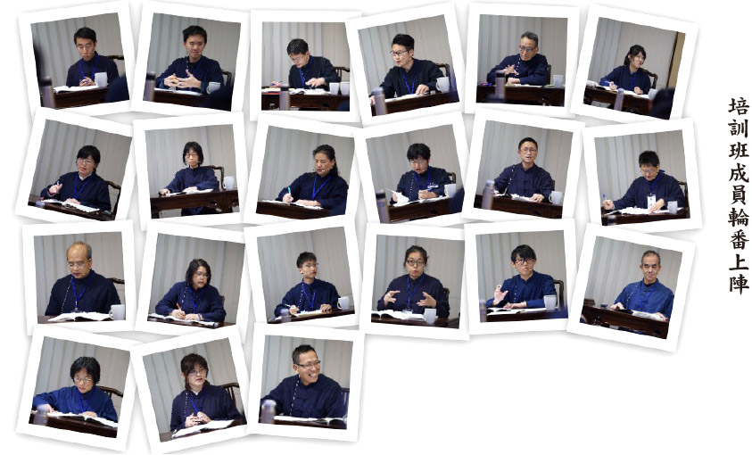

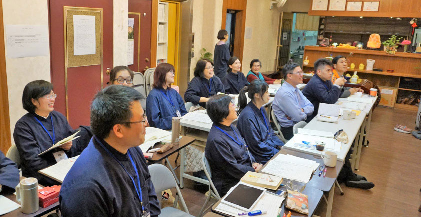

### 天臺小止觀講座餐前觀修

*編輯部整理*

能吃所吃吃

自體不可得

觀待夢幻起

善心功德生

修行與用餐        陳麗嬌
曾經有人問禪師：「修行人平常如何用功？」禪師回
**答：** 「也沒甚麼，只不過吃飯、睡覺而已。」我們每天不也是吃飯、睡覺嗎？同樣是吃飯，禪師跟一般人有甚麼差別呢？禪師說，修行人吃飯的時候就專心吃飯，即使是菜根都是香的，吃得非常有味；而ㄧ般人吃飯時，挑肥揀瘦，食不知味，同樣是吃飯。但效果卻不一樣。

要怎樣修行，才能達到解脫？如何伏惑、斷惑，展現出自我的覺性光明，生活的每一剎那都能自在、輕安喜樂，了無牽掛，不起妄念無明，又能在生活中，一切都處理得圓圓滿滿，外相似凡，內心是覺，生活在每一個當下，要做到這樣，有一條菩提之路，全由止觀修學開始。

平時我們總認為念佛、拜佛、念經、持咒即是修行，但心裡卻是想東想西分秒不停。古大德有云「口念彌陀心散亂，喊破喉嚨也枉然」，這就是我們的修行，每天當作是一件工作來完成他，而不是專注於心，只是做完交差了事，所以仍是妄想不斷，故欲繫心不放逸，就要從小止觀的二十五方便進而正修行到善根發的學習，專注於老師的引導與解說，巨細靡遺一點都不放過，充分精進於聽聞、思維，為日後的修行奠定良好基礎，如能善用此次所學正知將心念安住在境界上，即能繫心不放逸了。

修學佛法有四萬八千法門，每一法門都離不了止觀的內涵，所以走出覺醒的人生，在繁雜的世界，看到自心處處清淨，是人間淨土；結合清淨的身、口、意應世間萬有而無染，應世間萬有而不變，如第一篇總論所言「諸惡莫作，眾善奉行，自淨其意，是諸佛教」。佛法為心地法門，惟有「自淨其意」，才能做到「諸惡莫作，眾善奉行」；也惟有「諸惡莫作，眾善奉行」，才能「自淨其意」，都要在身心上做功夫，在六根門頭上著手；如吃飯心裡專注吃飯這件事情就是止，並觀察用餐的心態，在世俗上要發何種心，在勝義上要發何種心，這就是觀，此即用修行的心來吃這餐飯，把吃飯當作養我們這身臭皮囊，是為了方便修行，利益一切眾生而吃，遠離貪著，端正發心，終成佛道。

具緣的用餐         王鶴民

法不孤起、仗緣方生，今晚的用餐亦概莫能外，需要具備內因外緣。我們需要具足自身方面的供贊祈禱、依止正法等內因，親近善知識、傳承道統，這是圓滿的外緣。眼前這麼多色香味具全的美味佳餚，都是由農人墾植、翻地、灌溉、施肥、鋤草、收成，然後經由商人收購、存儲、運輸等，再經由廚房的志工們精心烹煮，最後呈現在我們面前的餐點，花費了眾人的心血與功夫。僅僅是一粒米，也要集聚眾多因緣才能成辦，缺乏其中任何一個因緣，這粒米都不可能放在我們面前。所以大家要無比的珍惜這短短的幾天，來之不易的因緣具足，更要用心存感恩和惜福之心來食用色香味具足的美味佳餚。

此次活動大家來自全國各地及馬來西亞的同修，能聚在一起是緣份，正表徵自性無，它是由善知識、學生、經典、教室等因緣具足而呈現的一場法會。如果沒有老師，這場法會能顯現嗎？肯定不可能！沒有學生、沒有經典、沒有場地也同樣這場法會都不能成立。我們往往或偏於空或滯於有，所以難免在修法和行持上失之偏頗。有些人強調緣起時又執著太重，自取束縛；而有些人又過份忽視緣起，意氣用事，魯莽修行，造成了一次又一次的挫折和失敗，這些都是沒有正知見、智慧力的緣起表現。

歷緣對境的用餐   黃阿麗

回顧自己在未親近善知識時，沒有聽聞真正的佛法，更遑論教理的學習；我與一般人無異。當歷緣對境時，總是依自己的好惡、喜樂，放任心去追逐世俗或遠離，因為心常被外境所轉，所以造作出許多貪瞋癡慢等不如法的事。

今生有幸，感恩得遇教授善知識的引導、啟發，讓我懂得依循正法。透過觀察心的狀態、變化，覺察煩惱的現起，適時的加以調伏。進而有因緣聽聞空性正見，明白「諸法自體空，唯名言安立」，原來空性才是萬法不變的真理。所以在遇境逢緣時，內心懂得以空性為所緣，進而作種種的觀察，透過教理的辯證分析，真實體會法無自體性。

通達萬法連微塵許的自性都了不可得而產生殊勝的勝解。似乎能體會華嚴經淨行品中，文殊菩薩回答智首菩薩所言：「善用其心，則獲一切勝妙功德。」的義趣內涵。正因諸法自體空，在歷緣對境時懂得「善用其心」，結合正知見的學習，教理的觀修，引發善根生起出離心、大悲心，乃至為利眾生願成佛的心，以願導行將成就無限的可能！

法不孤起，必待因緣。此次講座的興辦俱足眾緣的和合。感謝教授善知識宣說正法，師資團隊的用心準備，辦事團隊的努力，志工團隊師姑師伯的奔波忙碌，以及遠道而來的善知識們，齊聚一堂，共學增上。更感恩香積菩薩們的護持，善用其心變化出一道道的美味佳餚，安住我們的身心，專注在教法的學習，希望能將體性轉為成佛的資糧，有了教法的學習，正知見的建立，懂得善用其心即能將當前的用餐發會更大的妙用。

善根發的用餐      海辰

善於修學止觀的人，會引發各種殊勝的善根，對修學正法有很大的幫助。雖然發起善根不是修止修觀的根本目的，但如果能夠妥善的辨別真偽並加以運用，甚至滋養這些善根，以此等方式來學中觀正見可謂如虎添翼。反之，若不能慎思明辨，輕則與魔境相濫，重則失心癲狂、相應鬼神、欺誑證果。因此所有止觀的修學者都必須了解關於善根發的種種義理，才能取其功德，避其過患。

善根發大分二類，第一類是屬於事相上的外善根發。以止觀修學空性，通達世俗的緣起了無自性可得，僅剩下觀待性時，對於世間事務的看法自然有所轉變，開始懂得要敦倫盡份，諸惡莫作，眾善奉行，親近善知識，遠離惡知識，歡喜供養三寶等。這些事多與修福有關，都是學道很　好的資糧。

第二類是屬於修止觀後身心所感受到種種，稱為內善根發。比如修數息觀能增長專注力、對治妄念，身心氣脈全通，精神抖擻，並可以見到身內的三十六種不淨物，甚至生起出離的心，這些感受都是修止觀後所得之善根。不論是外善根還是內善根，我們都需要先了解他的樣子，並辨別他的真偽，最後在善根發的境界上，利用止觀增加我們的善根。

在第六章正修行中，我們學習到行住坐臥說話辦事都須講求動機，生活即是道場，歷緣對境修行後，可以引發善根。吃飯是我們每天必做之事，應如何利用止觀來吃飯，發起善根？萬法皆緣起法，要有能吃、想吃的心，驅動身心來做吃飯的動作，以及有所吃的食物，才能成立吃飯，所以講究動機就很重要，我們應該抱持著修學正法的心、利益大眾的心、感恩的心來吃飯，才能引發各種的善根，使學道的資糧生起，若我們只是想來吃一頓飯，或在過程中生起貪心等，這頓飯可能就成為消耗福報、滋養貪瞋癡的一頓飯，而無法生起善根。

善根，就是學道的能力與資糧，讓我們享用一頓善根發的午餐吧。

治病的用餐            葉波

最近十幾年，大陸居民前三位的死因疾病常常多是心血管疾病、腦血管疾病和惡性腫瘤，而惡性腫瘤又多為胃癌、食道癌、肝癌、肺癌和結直腸癌這五種癌症殺手。

首先觀修，這些疾病都是怎麼來的？醫療衛生部門所公佈的病因當中，膳食不合理、酗酒、吸煙是最主要的致病因素，這正好應了一句俗話，叫「病從口入」。簡單來說，我們有「三多」。一是餐桌上的動物食品多。許多人吃飯已經是「無肉不歡」，一日三餐如果沒有肉，就認為是「沒有菜吃」。二是下館子吃飯的居民多。就拿我們常住人口僅五萬左右的小小順昌縣城來說，各種酒店、飯店、小吃店、排檔就有近四百家，卻沒有一家素食店。三是吸煙的男士多。多到什麼程度呢？有一個報導稱，占世界人口五分之一的大陸居民，卻吸了全世界三分之一的香煙。這樣一來，長期接受高油脂、高膽固醇、高酒精等飲食，身體普遍成為酸性體質，於是，上述相關疾病的發病率就年年攀升，居高不下。

第二個觀修是，怎麼對治呢？我們知道要透過辦政治跟辦教育。一方面，加強健康教育，提倡健康飲食，宣導健康生活方式，講究食品安全、講究定時定量。另一方面，政府官員帶頭引導風氣，宣導健康理念，尤其是推展道德教育跟因果教育，讓食品從業者能夠自覺生產安全、放心的食品。如果更進一步，能夠了解《小止觀》的「治病之法」，則有病治病、無病健身，便可以讓社會大眾都身心健康，乃至於成聖成賢了。

當我們做了這樣的觀修之後，這頓豐盛的晚餐必能滋養我們的色身。

覺知魔事的用餐     解曉婉

魔能奪修行人的功德財，不能小覷，應時刻覺知！魔何以會奪走我們的功德財呢？如同小偷潛入家中偷錢財，魔會加被生起殊勝的五欲境，引我們跌入軟暖可意境，或加被生起逆境，引我們怨天尤人。就這樣，當我們生起貪瞋等煩惱，在不知不覺中功德財就耗掉了，進而喪失了修法的因緣，見不到善知識，沒有良好的修學環境，智慧無法增長且退轉，能殺修行人的智慧之命。

因此不以正見覺知，功德財會被奪，智慧命會被殺，就會變成成佛的障礙。《勸發菩提心文》中說：「忘失菩提心，修諸善法，是名魔業。」若沒有被菩提心攝持所做的任何善法都是魔業！眼前的用餐豈不也是如此？

饑渴是十大魔軍之一，腹餓口渴是生理現象，怎麼能算是魔軍呢？修學環境若是不好，令人無法安住修行，需要安受苦忍。而現在我們所處的環境舒適，物質生活豐富，可以吃飽穿暖，即使在寒冷的冬天，也有空調供暖，故而要惜福，生起感恩心，同時還要提起警覺心，不可放逸！

當吃到美味的食物時，應知快樂的感受，也是過去善業的生起，一時因緣的顯現，而名言安立為「美味」。飲食的美好是沒有自體性的。若有自體性，美味是在飲食上或在舌上？若成立在飲食上，理應人人吃臭豆腐都會覺得美味，可現見並非如此。若成立在舌頭上，那麼不用飲食就有美味。如此尋覓美味的自體性，其實是了不可得，則如何生貪？反之，若遇到不愛吃的食物，也不要討厭挑食，須知營養均衡，身體才會健康，吃飯的目的也是為了滋養我們的色身，吃飯如吃藥，治療「饑渴之病」，善用身體作為修行的法器，不讓福報白白報掉。因不帶著煩惱用餐而不漏功德法財，上求佛道，下化眾生，以此菩提心來攝持我們的用餐。吃飯到底是魔事，還是佛事，全在我們如何看待！

最後，引用雪公太老師發明的恭「喜」發「財」，恭祝大家：在新的一年裡，能得佛法「四喜」，發「七聖財」。

恭祝大家得四喜    法喜禪悅無量喜

修學止觀見真諦    現證空性大歡喜

要發就發七聖財    功德法財滾滾來

信戒慚愧捨慧聞    佛號聲聲樂開懷

棄蓋的用餐          周怡均

在入止觀之前，必須先好好喝斥會覆蓋心性，令善法不生的五蓋，才能有利於修學。這五種蓋皆是自己對境內心想出來的煩惱，所以首先應以自己作為觀察的對象，觀修內心煩惱過患，所引發的貪瞋眠悔疑等妄念。

五蓋生起時，能引起種種過患令自心生諸雜染，致使智慧微劣，善法不顯，故應深生慚羞，喝棄五蓋，使未生諸蓋令不生，已生諸蓋悉令遣除。

一、修對治觀，用不淨觀對治貪欲，用慈悲觀對治瞋恚，以精進策勵對治睡眠，以數息觀對治掉悔，對治疑蓋。唯有生起信心及以依法不依人，依義不依語，依了義不依不了義，依智不依識的四依法為依據，才能去對治。

二、修體空觀，諸法了不可得，沒有自體性，諸法皆因緣生，觀待而生，能生五蓋的心要觀待所生五蓋的境，所生五蓋的境也要觀待能生五蓋的心。

而在用衣食攝取食物時，能作如理思維，不是為了享受而食，也不是為了莊嚴身體而食，是為了維持這身體藉它來修學，能觀五蓋的過患，棄五蓋的功德，從而引發善念，調柔內心，不被煩惱所牽絆，向善知識學習，透過聽聞、思維、觀修，建立正見。

證果的用餐          謝治平

我們修學止觀的目標是為了證得果位，所以修學止觀也可以先將證得佛果的目標確立，再回過頭來積聚二十五種方便，以佛果為所緣，先確立目標再尋求達成目標的方法。

有源律師曾請教慧海禪師的用功方法，慧海禪師回答了八個字「飢來吃飯，睏來即眠」，感覺似乎很簡單，凡夫大眾都能做到，殊不知我們常常該吃飯時不肯吃飯，該睡覺時不肯睡覺，這說明了修行就是在檢視身心日常生活的造作，行者證果後入定現證空性，出定後也一樣要吃飯，只是不會再對外境生起煩惱，在「止」上做到好好吃飯，由吃飯的功德引發利樂有情的念頭建立「觀」，達到止觀雙運，希望大家都能好好吃飯，使吃飯成為大用。

調和(食)的用餐    欲仁

趙州云：「老僧除二時粥飯是雜用心處。」，所以飲食的調和益發重要。在三七道品中，七覺支破除修止修觀的障礙，而「念」覺支是對佛法有理解的能力，而且有記憶性，懂得用佛法的正知見去破定、慧的障礙。念就是調和，如醫生調和定慧，用慧力破除昏沉跟沉沒，用定破除散亂跟掉舉。

調和章說明調食、調睡眠、調身、調息、調心，調和食睡身息心五事，則三昧易生，反之則為障礙，難發善根，僅舉調食之道。

受用飲食為資養色身、進道修學。因欲界有男女、飲食、睡眠等欲望，男女欲望必當訶斥，然飲食、睡眠卻不能免，應調和，使令得宜。

以量言：不可過量，亦不可不足，食過飽，氣脈不通、障礙呼吸、腦部血液不足，障礙思惟，故心閉塞、反應遲鈍、坐念不安、影響睡眠。

食過少，營養不足、氣血虛弱、無法專注，使修學做善的勢力減弱。

就質言：不可穢觸，五辛生吃增恚，熟食發淫，腐敗之物，細菌滋生，均會使心識昏迷。再者應知體質配宜食，體燥者宜涼食調之，體寒者宜食溫熱，少食瓜果。

《佛遺教經》云：汝等比丘，受諸飲食，當如服藥，於好於惡，勿生增減，趣得支身，以除饑渴。

一，對食物的好壞要知道，好惡當中，知道人家的誠意，還有他準備的細功，對好吃的，還是覺得很高興，對不好吃的，也可以練我們的能耐，看看能夠安住在這裡的能耐有多少。

〈中庸〉云：人莫不飲食也﹐鮮能知味也。人沒有不飲食的，不飲食，會餓死，但是「鮮能知味」，就是很少知味，大概就是吃了喝了吃了喝了…，但是問題是那個味是怎麼來的？比如吃酸，是否能分辨酸是從醋來的？還是從其他果酸來的呢？吃甜的，是從那個酒味的甜來的呢？還是糖味甜來的呢？飲水，是泉水呢？還是自來水呢？調和的當中，到底是多少的比例呢？一般人大概不會知道，大概是哪種人知道？廚師知道，吃的人哪裡知道？吃的人，只會說好吃不好吃，這樣就結束了。

雪廬老人說，請客的時候，女主人切豆腐的兩百種刀法都吃得出來，太不可思議了！

二、關鍵不是「於好於惡」，是「勿生增減」，不要分別，是不對的，除非在修定，不去分別其他外境，在入外境怎麼可以不分別？所以是知道，但不生增減。

三、知飲食是讓我們有健康的身體來做修行，只是除饑渴而已，這叫服藥的概念。

除了重視飲食的質量之外，飲食的心情也很重要，食存五觀，起慚愧心受食外，尚須保持平和愉快的心情，以利消化、吸收營養，故飲食之道不容忽視。

「食存五觀」

一、「計功多少，量彼來處」

來處的功多，還是來處的功少，吃飯的時候要記，到底它是怎麼來的？

二「忖己德行，全缺應供」

就是自己的修行功夫修行的好，即全應供；如果沒修行，是缺應供，今天打妄想一天，吃飯要生慚愧心補起來。

三「防心離過，貪等為宗」，

「貪等」包括瞋癡。覺得飯很好吃是貪心，不好吃是瞋心，不好不壞是癡心，用什麼心吃飯？最重要就是空性的觀修，日日吃飯，未吃一粒米，結果沒吃，這才叫真吃。吃飯，就是舌不嚐味故，味道如果在飯菜上面，應該是大家看了，都會喜歡吃，但是有的看了，敬謝不敏。味道在那裡不能成立；味道如果在我們這邊可以成立，應該就不須要他，自己就可以生，因為在我這裡嘛！在他那裡沒有，在我這裡，舌頭沒有，在空氣中沒有，三邊都沒有，你應該要下個決定，沒有了。都沒有了，還在哪裡？可是吃了以後覺得「哇，好香」，又怎麼來的？觀待而起的，觀待善業出來了。這就是終日吃飯，也沒吃到一粒米。原來吃飯就是在修空性，幻化統統是魔術，夢中刷刷刷，這是還有哪樣真？

四「正事良藥，為療形枯。」

就是要把吃飯當作吃藥一樣。

五「為成道故，方受此食。」

我們吃飯就是要有這色身來支持我們修行。以上是食存五觀。

從調和飲食，聯想到辦政治也要知「調和」，前泰王懂得調和，泰國的軍政府政變多次，爭名奪利，可是他出現的時候，大家要收斂。他不在乎名聞利養，不在乎皇家這些面子，雖不是中，可是他接近。

懂得調和的人應有什麼特質？

第一、本身就是能以身作則的人，你調和別人，別人才會聽的。

第二，不自私，自私的人怎麼調和他人呢？

第三個，是心存為公的人。譬如為老百姓，改善農業，設立獎學金，成立基金會，很多的難民、窮人、很多的病苦都被醫治。你的公心，你的公正力，大家看在眼裡。

現在民主制度，也很善歡講調和，為什麼不會成功？因為人家知道，你根本就是私心。所以，調和有調和的能耐，調和的本質，調和的品德，調和的眼光，調和的耐性，調和的功績，大家都接受他，他才能調和。

所以辦政治，一定要培養這種人才，這是國家的瑰寶，在混亂的局面，如果沒有這種人出來，那個局面會更亂。

如何培養「調和」的人才，就是通過有正法傳承的善知識，好的同儕，好的法本，真正經營經學的內涵，建立經學的見地，方能克期有功。此次講座的「天臺小止觀」是非常好的一部方法論的修學入門。祝大家用餐愉快。

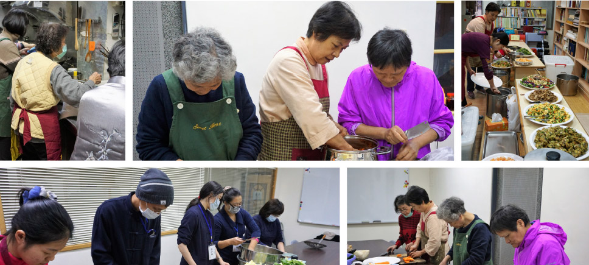

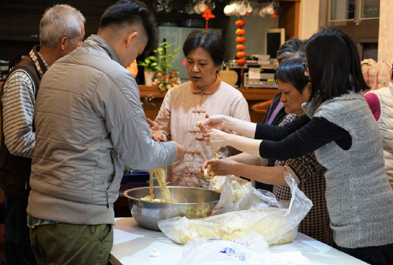

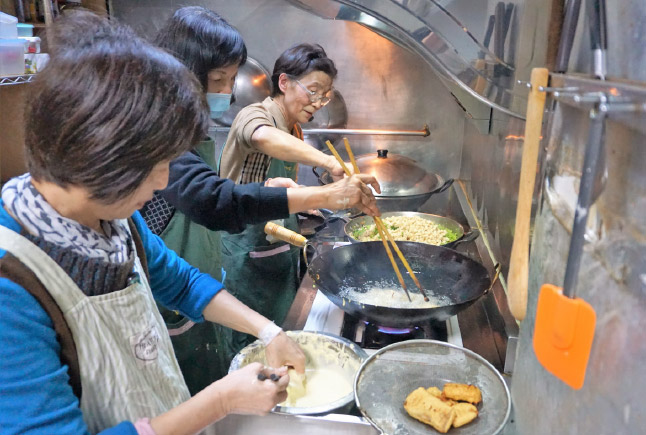

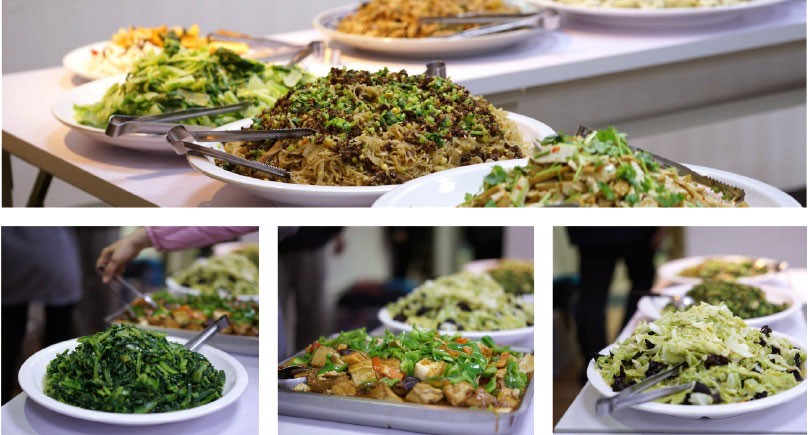

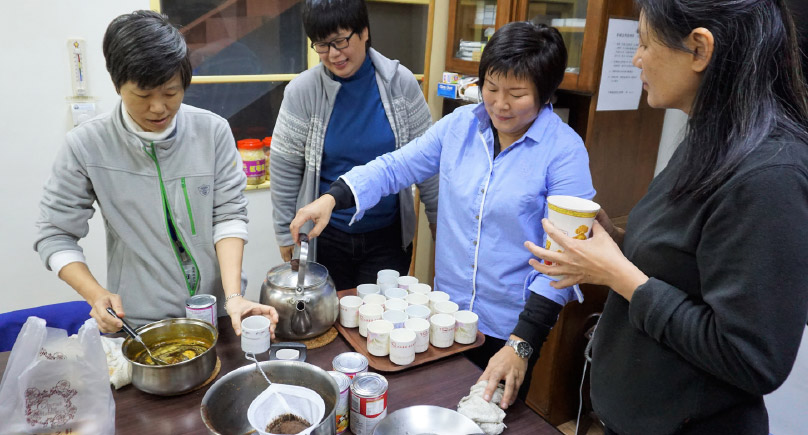

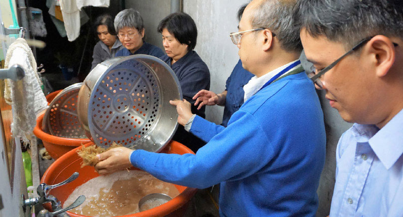

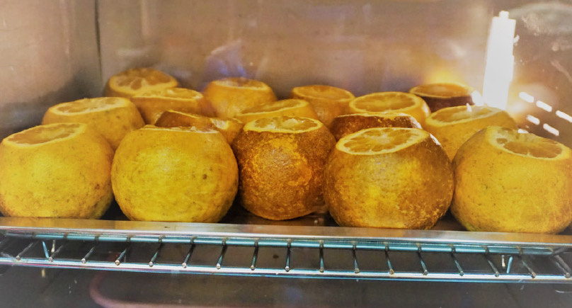

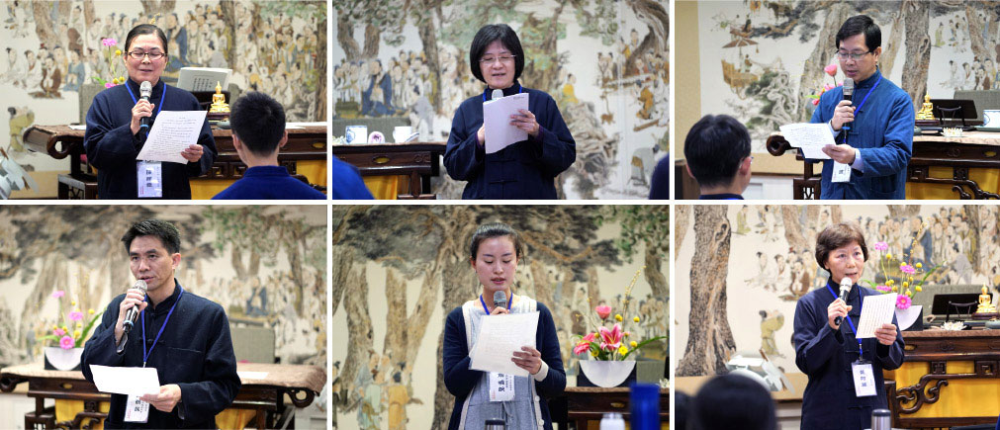

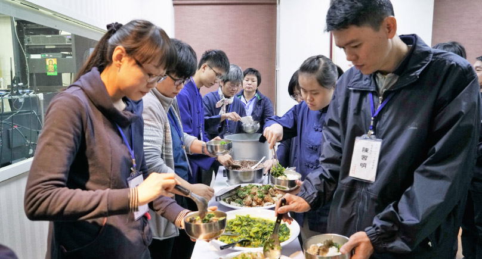
