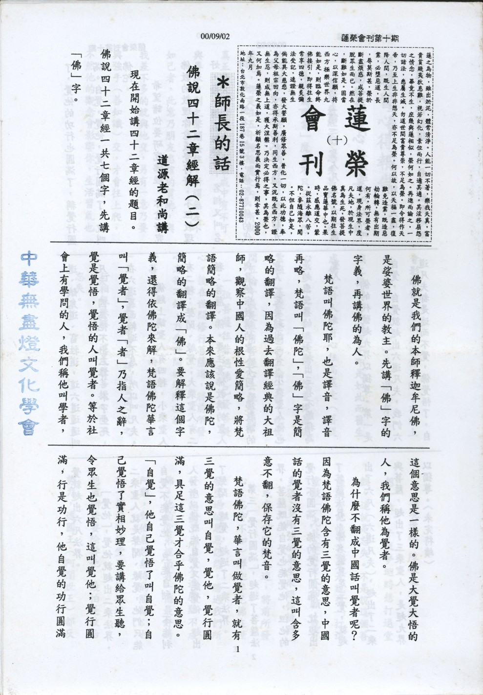

# 第10期

## 大德法語

### 佛說四十二章經解（二）

*道源老和尚講授*

現在開始講四十二章經的題目。佛說四十二章經一共七個字，先講「佛」字。

佛就是我們的本師釋迦牟尼佛，是娑婆世界的教主。先講「佛」字的字義，再講佛的為人。

梵語叫佛陀耶，也是譯音，譯音再略，梵語叫「佛陀」，「佛」字是簡略的翻譯，因為過去翻譯經典的大祖師，觀察中國人的根性愛簡略，將梵語簡略的翻譯。本來應該說是佛陀，簡略的翻譯成「佛」。要解釋這個字義，還得依佛陀來解，梵語佛陀華言叫「覺者」，覺者「者」乃指人之辭，覺是覺悟，覺悟的人叫覺者。等於社會上有學問的人，我們稱他叫學者，這個意思是一樣的。佛是大覺大悟的人，我們稱他為覺者。

為什麼不翻成中國話叫覺者呢？因為梵語佛陀含有三覺的意思，中國話的覺者沒有三覺的意思，這叫含多意不翻，保存它的梵音。

梵語佛陀，華言叫做覺者，就有三覺的意思叫自覺，覺他，覺行圓滿，具足這三覺才合乎佛陀的意思。「自覺」，他自己覺悟了叫自覺；自己覺悟了實相妙理，要講給眾生聽，令眾生也覺悟，這叫覺他；覺行圓滿，行是功行，自覺的功行圓滿了，覺他的功行也圓滿了，稱覺行圓滿。自覺，覺他，覺行圓滿了，就叫佛陀。

希望諸位要研究佛經，你愈研究佛教的教理你愈感覺得好，不但教理好，每一個名相都好，名相又叫名詞，每一個名詞都好，佛陀是佛的代號，只要是佛的代號，通通是「超九界以獨尊」。

佛經上講一切聖人凡夫共有十個法界，三界以內，有六道的凡夫，叫三善道，三惡道。三善道就是天道、人道、阿修羅道，三惡道就是地獄道、餓鬼道、畜牲道，這六道通通叫凡夫，因為他不出三界，不了生死，在六道裏面輪迴不息，所以叫凡夫。

佛經上講聖人有四種，小乘聖人有二種：聲聞、緣覺；大乘聖人有二種：菩薩、佛。要注意佛教講的聖人與其他宗教講的聖人不同。佛教講的聖人一定要超出三界，小乘聖人他也是超出三界的，不超出三界不能稱為聖人。

佛的代號超九界以獨尊。第一是自覺，自覺就超出六道凡夫，我們六道凡夫都是迷而不覺，佛覺悟了，自覺就超出六凡法界。

「覺他」，覺他就超出二乘法界，二乘聖人就是聲聞、緣覺，他們只能自覺不能覺他，只能自利，不能利人，所以佛既能自覺又能覺他，超出了聲聞、緣覺，超過了二乘法界。

第三「覺行圓滿」，超過了菩薩法界，菩薩既能自覺也能覺他，但他的覺行不圓滿，佛的覺行圓滿，就超出了菩薩法界，佛名號具足三覺，就超出了六凡（六道凡夫），超出了二乘與菩薩，超出了三乘聖人，是超九界以獨尊。〈未完待續〉

## 共修研學

### 勸發菩提心文（十）

*心爾*

「故華嚴經云：忘失菩提心，修諸善法是為魔業」魔業不只三世佛怨的問題，乃至於修成阿羅漢、聲聞、緣覺，都是在五十種陰魔之內，所以真正發大乘心的人，大乘戒中有不可與專求自利之聲聞共住，所謂無友不如己者，此意乃朋友忠信的質地，與我差不多的就與他交，另有一意乃要與強手（善知識）交，才會往上爬，不然他的觀念會影響你，生活習氣也會影響你。若欲成就佛果除了有向上的使命感（菩提心）外，還要有善知識之提攜，善財童子即是如此而一生成佛，吾人雖有心往高處走(菩提心)，且受善知識提攜，但要從基礎紮根，基礎是世間的五倫十義，此世間五倫十義是要用菩提心去經營的。

一位菩薩往昔遇佛已發菩提心，後在世間修行菩薩道，將前所發心忘卻不知，乃受世間欲境障礙故。發菩提心後會有下列兩種情形：

一、是真正串習而得到堅固，此之行相很殊勝，這是發菩提心而不忘失。

二、遇境逢緣，障礙現起，煩惱妄想一堆，午夜夢迴時想打退堂鼓，這就是忘失。不是說這個菩薩沒有記憶，忘失是說想「打退堂鼓」「尤其你有多大的願，就有多狠、多剛強的眾生來跟你挑戰。」（或者來世隔陰之迷，將前所發心，忘卻不知）釋迦牟尼佛在世發生過的恩恩怨怨，勝過我們所發生過的，所謂不遭魔難不成佛。他的堂弟裡面有一個最好的阿難，對他無怨無悔的照顧；也有一個最狠的堂兄弟提婆達多，想盡辦法要除掉他。

最怕是政治勢力，連國王（阿闍世王）都反對佛，試問佛該如何辦？所以我們人世間的挫折障礙，在佛來看都是小意思。打敗惱煩還有一個祕訣：除了發菩提心修學教法引發無我慧以外，回過頭來將自己的本願再來誦習，這個境就過去了。我曾經不是發這個心嗎？為什麼會打退堂鼓、會退轉呢？當走不過境界時，回過頭來誦習自己的本願、誦習諸佛的大願，這個境界就過去了（不忘初心），否則如果不好好的降伏自己的煩惱，降伏自己晏安怠惰的習氣，則所修成魔，須知魔王因中亦修十善及未到地定，不發大心，故報盡生欲界天頂，取他變化而自在享樂叫他化自在天；他變化，叫化樂天，我取來享樂就是他化自在天。化樂天是欲界第五天，他化自在天是第六天。例如你辛苦製造車子，開由別人開，對製造車子的人說叫化樂天，開車的叫他化自在天，彼以欲界的一切快樂為自己的快樂，欲界的眾生都是他的眷屬，他有這個錯誤的體會，而且在這裡面迷失自我。

我們發菩提心，須不怕苦來挑戰，怕樂來消磨心志。古人有兩種消磨人心志的方法：有時用挫折就把人整垮，整不垮用樂去消磨他，昔晉公子重耳有復國的心志，奔走到齊國，齊桓公一看，彼有霸主的氣度，且有苦的磨練（乃因出亡故）因吃夠苦了，反不會覺得苦，就用樂去消磨他，每天叫宮女倍伴他，輪流請大臣陪喝酒，晉公子重耳覺得出亡列國太苦了，在這裡如此享受，如同國王一樣，何必回國？狐偃等把他灌醉後，送出齊國，重耳醒來後發覺自己不在齊國，非常生氣，其事可參東周列國志。以重耳胸懷大志之人，尚且沈迷於五欲。〈未完待續〉

## 日常省思

### 義工心得

心達

一個道場之成，甚是不易，不論是以社團法人，或共修會乃至其他之行相現起，除了負責人要有使命感以及豐富之德學外，還要有人才的協助，以及其他法侶之護持，除了彼此共識以外，還要有世間之情誼，能榮辱與共，患難與共。當然道場中除了共修以外，還會兼辦種種善法以利益眾生，除了內部蓮友要分工合作以外，還會有其他眾生一起來配合（近悅遠來），他們或許是蓮友的家屬，或是朋友，或是其他慕名而來等等。意樂或有歡喜造共業以淨障集資，或有為了某種原因而來，例如他邀不好意思不來，或抱著新鮮好玩心態而來等等。這些人擔任護持正法之各種工作，都是義務而無報酬稱義工。辦事時或有經驗，或無經驗，或守規矩或依我見，或能請益，協調溝通，或我行我素自以為是；習氣、煩惱各各不同，故事情不易成（亦夾雜著大環境之客觀因素），心亦難調伏，唯重自省方有可成，否則愈辦事愈不合，雪公云：還不如不辦。茲錄幾則其道場義工心得，能興起我們反省且相互規過助善，彼此辦事不但能利眾，且更能和合，道風遐被，成為諸善俱會極樂世界之縮影。

「第一則」

輪值櫃台義工，每一次她都十分珍惜這能親近三寶、淨障集資的好機會。這天恰好家中沒人在，但五個月大的孩子臨時也找不到人照料，心想只好將他帶出門，於是將孩子小心翼翼的揹在胸前，騎著摩托車，膽顫心驚地來到道場。

到了道場，只顧投入櫃台工作，孩子則放在手推車裡。此時其他小朋友見了孩子也十分歡喜，便逗他玩起來，而她也放心不再顧慮此事。適逢禮記開課日，來上課的同修較多，她那時完全忽略孩子的秩序問題，這時某位師姐看到如是相狀，態度不悅地說：「自己先得把孩子照顧好，若無法照顧就不要當義工。」當頭棒喝，彼頓時腦中一片昏黑，接著心頭的委曲和痛苦，一股腦全糾結在一起，愈纏愈痛，淚就這樣一籮筐的流下……，後來她看著孩子，哄著讓他睡著了。

某位師兄見狀亦來幫忙圓場解釋，心中波動稍為平伏，乍見桌上的義工手冊，順手拿了一看，看見手冊上確實明文規定，不宜帶幼小孩子來值班，頓時雨後天青，知道是自己錯了，一直忘記考慮別人的感受，只是順著自己的方便，當下對這位師姐生起感恩心，謝謝她能助己生起如是覺受。

「第二則」

在道場中看到窗明几淨，廁所也明光照人，這些全賴清潔義工所賜。他們是一批幕後英雄，默默付出，也許不知這些義工的名字。

清潔工作，人人能做，看起來似乎微不足道，其實不然，有經驗者可以證明，法味十足。

有一師姊穿著端莊高雅，臉上隨時掛著甜蜜的笑容，和她親近覺得很舒服，週一她都會來清潔洗手間。她把道場當作自己的家，每次刷馬桶、清垃圾都提供她對治怕髒臭的習氣，半年來她看到自己的心在淨化之中，愈做愈歡喜。

## 啟蒙園地

### 談教育（五）　汎愛眾

心在

上來「啟蒙園地」已就弟子規孝、弟、謹、信的內涵，概略陳述出人格培養的重要性，至於充實自我德行之後，又該如何推展我們的仁心呢？

縱觀時下的社會環境，治安問題日益嚴重，究其亂源可察覺出，人心早被功利主義所矇蔽、社會風氣為貪婪物慾、刻薄寡恩所耽染，長久以來，自私自利的錯誤見解已烙印在八識田裡，對周遭一切有情眾生，無法加以尊重包容、更遑論付出愛心及關懷了！蒼天大地覆載生機萬物，沒有一絲一毫的分別，就好比是我們的父母，關懷每個孩子。此等廣博的大愛，值得吾人效法學習之。

翻開一頁頁古今中外的歷史，那些一直為後世稱頌景仰的先賢哲人，必定擁有高尚無比的德行，乃至於貢獻才學，利益群眾，聖賢哲君、堯、舜、孔、孟，其仁人愛物的品格，留芳百世、久遠不斷。

詩人李太白嘗云：「天生我才必有用」，每個人也許天資稟賦不同，但只要竭己所能便可造福社稷，真正能夠實踐汎愛眾的君子，心中常存「人我一體」的概念，捐棄滔滔私心，展現出仁厚待人的風範與胸懷。當自己的才學兼備之時，不可以此自滿，更應為公服務；見到別人有所成就，自然樂於讚嘆隨喜，心胸一旦寬大開闊，忌妒便消弭於無形。戰國時代的秦王十分欣賞韓非的才華，結果卻引來李斯的忌妒之心，於是設計圈套，遂使韓非蒙受不平的誣陷，冤死獄中，爾後不久，李斯同樣也遭逢無法辯白的迫害。仔細思惟，種下惡因的人如何能感召善報呢？

約著口業而言，吾人時時刻刻都得非常謹慎，當他人為眾務所累之際，最迫切的需求乃實質的協助，無關緊要的閒言閒語，只會徒增當事人的煩惱。現代社會最缺乏『揚善隱惡』的美德，大眾傳播媒體之從業人員實應深切反省檢討。聽聞旁人行善，隨即發起見賢思齊之心，對於他人所犯下的種種過錯，絕不可四處宣揚散播或是妄加議論，平時若能注意到自我的語業、謹言慎行，小則遠離不必要的人我是非、災難禍害，大則淨化社會、建立敦厚的社會風氣。與我們交情篤厚的朋友有了缺失，需加委婉勸諫，方不失「以友輔仁」之道義，古人也曾說過：「忠告而善道之，不可則止。」如果好友一時無法接受，不妨先暫停規諫，情誼得以保留，待其機緣成熟，再與之溝通。良師益友能幫助我們掃除內心的塵垢，成就自我完好的人格。

與人相交往來，切記將心比心，多替對方著想、體諒他人的處境。常言道：「受施慎勿忘、施人慎勿念。」受到他人賜予我們的恩澤，要時時存有報答之心，正如「滴水之恩、湧泉以報」；倘若有人毀謗、傷害我們，一定要用仁厚之心來「以直報怨」，如此方能克除習氣、降伏我執煩惱，斷除瞋心的火苗，依禮行事、解冤釋結。趙國大臣藺相如，因為不計前嫌，完全包容了廉頗將軍的冒犯，終於化解兩人之間的隔閡。

子曰：「居上不寬，吾何以觀之哉？」由此可知，位居上位者應以寬厚仁慈之心來維繫團體的和諧；中國古代許多英明有為的開國聖君如：商湯王、周文王，於統一天下之前，封地勢力不大，商湯王七十里見方、周文王也不過百里見方而已，但是他們推行仁道，以德能感化老百姓，人民打從內心真誠的信服並極力擁護賢君的領導；反之歷史上庸昏的皇帝如：夏桀、商紂王雖高居天子之位、手中握有百姓的生殺大權，卻倒行逆施、魚肉人民，國政因之紊亂不堪！俟其改朝換代，自身性命尚且不保，畢生所鑄下的大錯可謂罄竹難書，死後更因此成為歷史的罪人。

雖然目前我們所處的社會，少有婢僕，但上下尊卑的關係仍舊十分普及，且讓我們一起學習仁人君子『汎愛眾』的精神，無論他人富貴貧賤或是親疏新舊，彼此砥礪、相互共勉，一同建立祥和美好的社會。

### 盛德化人　王烈

*編輯部整理*

王烈東漢太原人〈今山西省陽曲縣西南〉字彥方，為人正直好義，平居以德行感化鄉里，鄉里人人都非常敬重他。

有一次，有人偷牛，被失牛主人捉到了，偷牛的跪地請求說：「請把我送官法辦，我甘受王法制裁，但求不要讓王彥方知道。」王烈聽到消息，立刻派人來向失主謝罪，並送布一匹給那偷牛的。大家都覺得奇怪，有人詢問原故，王烈說：「這小偷，怕我知道他的過錯，可見他有羞恥心，有羞惡之心的人，必能改過向善，所以我這麼做，就是要激勵他能改過自新。」

後來有老父遺失一把寶劍，有一人撿到了，就在路旁看守，等候失主來認領，直到黃昏，老父回來尋找，便將寶劍奉還，老父非常感激，問他姓名，竟然是以前那偷牛的。

鄉里百姓，凡有爭訟曲直的事件，都去請求王烈排難解紛，斷定是非，由於王烈平素德教影響，有的走到半途，忽然願意放棄爭執，雙方和解而回來的，有的望見王烈的屋舍，就感到慚愧，彼此相讓而回來的。可見王烈盛德感化之深，已遠勝過刑罰的力量。

後來遭逢世亂，王烈避居遼東，當地夷人，受他的教化，也都爭相敬奉他。曹操聞知，派人來徵召王烈為官，王烈婉辭不去，一生高節，享年七十八歲善終。〈明倫月刊七十八期六十七年十月〉
