# 第110期
.jpg)

## 社論

### 染神

本刊

正法學習能成染

所染心智極靈動

吉凶禍福機上見

神乎其神妙吉祥

近幾年中國大陸經濟崛起，物質生活大幅躍昇，然而相較於經濟進步，人文發展需要時間，似乎顯得有點緩不濟急，五花十色的生活反倒令人迷失方向，因而產生了許多問題，尤其在兒童教育方面特別棘手，可以說上至達官顯要，下至尋常百姓都極為困擾的問題，可謂家家小霸王，戶戶小公主。父母心急如焚，急著就教高明，但道聽塗說者比比皆是，病急亂投醫的情況下反而形成許多亂象，令人啼笑皆非。

然則兒童啟蒙教育成功的關鍵處究竟為何？其實在傳統文化的經典中，早已給出了答案。論語中孔子有云：性相近也，習相遠也。人之本性體自空寂，云善云惡皆不可得；性有不改之義，若善則終不能為惡，反之亦然。正面而論，體空即是彰明緣起之理，諸法待緣而生，人人的潛能無限，有著無盡的可能，觀待緣上如何開發，才有後天的千差萬別，而其關鍵就在「習」這一字。啟蒙教育亦然，激發孩童內在「習」的動力，營造適合「習」的環境，正是身為父母師長必須重視的重要條件。

道理看似簡單易懂，但要圓滿通達極不容易，反問自己，何種學習才是真正的「習」，如何學習才不致流於表面，空泛浮濫，以上全部都是大哉問。或許光憑習一字恐怕難有感受，若以喻顯則能畫龍點睛。雪廬老人在維摩詰所說不可思議解脫經筆記中有段注解十分有意思。經云此比丘久發大乘心，中忘此意；老人家注云，雖忘不失，經言一句染神，彌劫不朽。短短幾行毛筆字，是如此震懾人心，所謂染字，細究依其造字原由，乃是水、木、九三字合併，古人以植物作染料便是木，和入水中混成染液即為水，數數浸淫是謂九。染之一字之喻，極為傳神，又其義深遠，實是妙矣，純白的布料在一次次的浸染中漸漸成色，深入其髓終至成品，其色與布已分不開，渾然一體，染之入神。其過程亦同學道，習業之初時必講忠信之質，方能受染，而過程必定數數串習，一次又一次，在聽聞中學習，在歷練中體悟，逐漸形成認知，見地深入其心念之隱微處，舉心動念無不如是，無論是大乘之種性、仁心之養成皆是如此。

又或人問曰，各人性格、資質不同，似乎又和習染無關，應如何理解？的確，人以生而知之為上，學而知之又次，但須明白，無因不成果，此亦過去習染所致，尤以形而上的中道智慧為是，必有前之串習，才有今之悟性。孔子亦云：我非生而知之者，好古敏以求之者也。天資魯鈍的曾子亦曾說：人一能之，己百之；人十能之，己千之。足見聖人處處導引後天習染的重要，若能在後天下功夫，雖愚必明，雖鈍必利，那怕是上課都聽不懂的曾子，也能傳承中道。

明白習之重要後，應如何在教育中發揮習的影響力？首先，從生活自律中培養專注力，以利學習。然而現代環境令人眼花撩亂，學校社會如同一個大染缸，人於其中亦是染神，染的一片雜色，內心浮動，光推崇硬性的自律實有困難，所以在講求自律的同時還要講究邏輯的分析、廣博的學習，於情於理引發學習的求知慾，聽聞的思惟力，使內在之「習」從思辨中生，學有體悟自有法喜，便能不帶勉強自然而習。此外透過邏輯訓練的習染，才有舉一反三的能力，觸類旁通產生連結，能所學更加穩固。

除此之外，環境之「習」亦是關鍵，從家庭到團體共學皆須用心，父母以身作則就是一種習染，學習從模仿開始，故不可輕忽。組成團隊學習更是重要，是持之以恆之關鍵，對於青少年而言，同儕之影響力更是無可取代，而今又與古不同，更加艱難，如前所言，現代環境紛擾，不以團隊之染恐難抵外界之汙，若不細細講究，學習難有效果。古有云蓬生麻中，不扶而直，美好的學習環境不僅僅是硬體設備的完善，更重要的軟體實力，尤其是良師益友齊聚一堂，互相切磋琢磨，孩子們日日沉浸其中，不著痕跡的學習，德學日益增上而不自覺，進度之神速也非獨學可比擬，當學習不再苦悶，而是如呼吸般的自然時，聖賢氣象的培育，指日可待，此即是孔門能出七十二賢的秘密所在。

由此可知，學之關鍵在一染字，如何染之入神，成為終身學習的依憑至關重要，不僅兒童啟蒙、青年之養成是如此，成人修身也得依此法則。自身的好學，邏輯的思辨，新知的吸收，融入團隊的學習，彼此互相習染；能染所染觀待，吾人須成所染，善知識方成為能染；而自己孜孜不倦、為公發心的氣象成為能染，團體便成所染，團隊的出路就是自己的出路，若大眾皆能凡事想到公家，以成為在團體學習的一份子而感到榮耀，猶如大樹環抱，彼此影響、擁護，在混亂的共業中，心志合一，進而開闢出清淨的別業，是謂染神。

## 佛學覽幽

### 菩薩清淨的行持
       —華嚴經淨行品（二十六）

菩薩清淨的行持

—華嚴經淨行品（二十六）

*戒慧講述‧編輯部整理*

洗身除垢喻斷惑

般若法水能淨染

法器堪當受正法

自他出路最勝樂

丙二、指事顯因答其徵因

丁一、總徵

丁二、別顯

戊五、澡漱盥洗時願  洗滌

經文：

洗滌形穢，當願眾生，清淨調柔，畢竟無垢。

六十華嚴的版本是：「以水滌穢，當願眾生，具足淨忍，畢竟無垢。」支謙的版本是：「用水既淨，當願眾生，以法自洗，無復惡態。」聶道真的版本是：「菩薩持水行水時，心念言：十方天下人皆使無不謹敕，軟好心淨潔。」南亭老和尚的講義中說：概指澡浴身體而言。以形為身，我們的身體有汗、液、垢穢種種不淨，必須時加洗滌，才能禮佛誦經，不致褻瀆。

同時，我願眾生的身心清淨調柔，畢竟無垢。身體的垢穢沒辦法永遠乾淨，今天洗乾淨了明天又髒，天天都要洗，這是不究竟的，心地的煩惱也是垢穢，把煩惱洗乾淨了才算是無垢，究竟沒有煩惱才算是究竟清淨。用水來洗滌形穢，就如同用法來對治煩惱習氣，對治煩惱習氣以後即能清淨調柔，

清淨是指煩惱淨化的那一分，調柔則是指執我的心識越強煩惱就越重，對治煩惱以後，執我的心識就能壓伏，也比較不會剛強，比較會替人著想，所以修行人的調柔相是很重要的。

戊五、澡漱盥洗時願  盥掌

經文：

以水盥掌，當願眾生，得清淨手，受持佛法。

六十華嚴的版本是：「以水盥掌，當願眾生，得上妙手，受持佛法。」支謙的版本是：「盥手當願，一切眾生，得柔淨掌，執受經道。」聶道真的版本是：「菩薩澡手時，心念言：十方天下人皆使軟好手取諸經道法。」

會性法師在此說了一個公案，宋朝有位志超法師，他每天以讀《華嚴經》為修行的功課，讀了三十年，某日有位童子來找他，說有件事想向法師請教，接著說起：法師您發心讀《華嚴經》三十年，這個功德很大，不過有一件事沒做好，大概功德會失去。法師聽完就問他是哪一件事？童子說；您每次上完淨房出來手沒有洗乾淨，戒律上說手要洗七次，而且要用乾淨的毛巾擦乾，可是您每次都只洗三次，而且手背上的髒水也沒洗乾淨就去讀經，就因為這個小過失會影響功德，今天特別來向您說這件事。會性法師說，一般人若不研究戒律，可能較少注意到這樣的細節，但是因為不注意，所以辛苦所得的功德可能就會被打折扣。

南亭老和尚《講義》上說，我們的手是用來持物的，這裡的手就是用來比喻我們的心，雖然外相上是以手持經本誦經，以手來禮拜，但真正可以理解法義的是我們的心，所以才於洗手時發願，願眾生都能得清淨手，受持佛法。

以水盥掌是願所依，願是能依，所依的是菩薩，願依靠在以水盥掌，從以水盥掌裡面產生願力。第二句是願所為，能願的是菩薩，所願的是眾生，第三、四句是希望達成的利益，就是眾生能得清淨手受持佛法。除此之外，也能夠三業離過成德，成就前面的十德，以及佛的十八不共法、十力、四無所畏。

每一個願都要做這樣的觀察，按照四部的修學法，如何使願力成為成佛的方便呢？第一是眾生能得清淨手受持佛法該有多好，第二是我決定如此發願，讓眾生能夠得此利益，第三是我相信自己能達到這樣的願力，第四個是懇請三寶加被我能助眾生得到清淨心受持佛法的願力。

得清淨手為何能比喻成心？手跟心是不同的兩法，手在哪一分上可以形容心？骯髒的手去摸東西，那個東西能吃嗎？若無清淨的心和手奉持佛法，以煩惱心來行持佛法，佛法全是過失，如以求名利的心去受持教觀，教觀則成墮落法，雖講的佛法頭頭是道，但修行起來都不是那回事，佛法變成過失，所以需以清淨的身心去奉持東西，保持它的乾淨。

受持就是接收過來抓緊不失，如受持佛法能將義理持住，這是第一種的講法。第二種的講法是將文句受持過來，第三種的講法是將義理受持過來，不但接受持住文句不忘失，文義也不要忘失。雪廬老人說：通達文義是悟性，不忘失文句是記性，悟性要從記性來，沒有記性哪有悟性？八大隨煩惱中的失念就是沒有記憶性，乃修學止觀的障礙。所以，以清淨的心受持佛法的文句、義理，就好比以清淨的手去拿東西一樣，這個東西在你手上是乾淨的，佛法在你心上是乾淨的。

那如何以清淨心來受持佛法呢？清淨心要掌握三個條件：第一就是不要有門戶之見，若以器皿當比喻，就像是器皿中裝了水，倒過來就留不住一滴水，比喻不要有門戶之見，只要對方比你有道理，你就必須要去接受，喻如大海來納百川。第二是器皿洗乾淨，喻如不挾煩惱（名利的心態跟世俗的機心）來學佛。第三是器皿不可以有漏洞，否則接來的水全都流光，喻如學佛無記性，所學之法全忘光。有了這般的清淨心，自然能夠將佛法的文句、義理持住，就像手拿東西要捧得好，縱然東西很輕，但是就像手捧古物，捧的時候像是很重，不會失手。

戊五、澡漱盥洗時願  洗面

經文：

以水洗面，當願眾生，得淨法門，永無垢染。

六十華嚴的版本是：「澡漱口齒，當願眾生，向淨法門，究竟解脫。」支謙的版本是：「澡面當願，一切眾生，常向清淨，心無瑕疵。」聶道真的版本是：「菩薩洗面時，心念言：十方天下人皆使入佛經道，面門莫令有瑕穢。」六十華嚴的版本是除了洗臉以外也要漱口，所以漱口也是蠻重要的。

上完淨房後，除了洗手之外，還要洗臉，在洗臉的時候發願眾生可以得到清淨的法門，不被煩惱的污垢所染。臉是面門，門有入口之意，我們眼能見色、耳能聞聲、鼻能嗅香、舌能嚐味。南亭老和尚說「法門」意即修行的方法與門路，所以洗臉時將臉洗乾淨，就好像是把修行的門路清洗乾淨，可以得到永無煩惱的垢染，得到清淨的法門。而想要永無垢染，必須要學習清淨的法門。

用水把臉洗乾淨，跟眾生得淨法門，永無垢染有什麼關係？經書上描述文殊菩薩是文殊童子，童子就是天真無邪、活潑可愛，是透過修學了義的法門，去除煩惱機心，回到天真無邪的狀態。

但這跟洗臉有何關係？八萬四千法門雖然都是淨法門，但是真正的淨法門是般若，所以天台教觀中說，般若觀慧是領受佛的家業，誰有般若觀慧誰就可以做佛財產的管理人，而且準備成為繼承者，這是佛最重要的心法。

門面是大家最在意的，所以出門前定是整肅儀容。同樣的，心裡生起煩惱，要像臉上蒙上塵垢那樣要馬上洗乾淨，用的是能永除垢染的般若水，就像我們將臉一次洗乾淨，同樣的，也希望般若的法水把心中的污穢一次盪滌，如同洗臉般能容光煥發、清淨無染，所以要使心無垢染、容光煥發，需要用般若的法水去洗。（下期待續）

### 大乘百法明門論簡說（十八）　拾壹、心所有法—徧行(二)

*戒慧講述‧淨本整理*

受苦受樂觀待業

取相名言施設處

造作善惡業滅果

微塵自性不可得

經文：

第二，心所有法，略有五十一種，分為六位：一、徧行有五，二、別境有五，三、善有十一，四、煩惱有六，五、隨煩惱有二十，六、不定有四。一、徧行五者：一、作意。二、觸。三、受。四、想。五、思。

受的定義是「領納順、違、俱非境相」，亦即領受接納順境、逆境，以及不順不逆的境界，領納這些境界會產生欲的作用，對於順境產生樂受或喜受，所以生起欲合之愛；逆境產生苦受或憂受，所以生欲離之愛；不順不逆境則產生捨受（平淡之感），不會有和合或捨離的欲，稱為欲不合不離之愛。

怎麼知道有受心所的作用？假若沒有因為受而產生苦樂憂喜等感受，那就無從生起欲，談不上喜歡或者不喜歡。又比如說我眼見色，眼識不是受，眼識如果是受，則眼識不應該有其他作用，如作意、觸、想、思等作用。眼識生起受時，是一種作用，會有苦受或樂受等差別，是眼識受的作用。

再細言之，過去已滅的惡業生起時，會產生痛苦的感受，自己當下也說不出所以然；而過去已滅的善業生起，則會生起快樂的感受；若是不苦不樂的感受就是無記業的生起，所以受都是觀待不同業的生起。

作意、觸、受，三個心所同時生，但不妨說作意先，觸在後，受第三，所謂「一念五分說」，五遍行心所是在一念中生起，當中有五種差別相，但不妨說先後。

想心所的定義是「於境取相」，心納受境界後取相，受想其實同時生，同時取相同時說感受。受是愛、非愛，也就是俱生執的生起處，想會發展成種種名言的分別，是分別執的生起處，分別執在初果斷除，俱生執在四果斷除。可知當前的一念，原來有這麼多細膩的現象，我們每天都在動念，但都未能認真地了解當前一念。

在境界當中取高低美醜好壞的相，取青黃赤白的相，都是想心所的作用。色塵的表現可分為三種，第一種叫做顯色，看東西的時候有青黃赤白；第二種叫做形色，就是在顏色當中可以顯出高低長短；第三種叫做表色，就是行住坐臥等動作。另有所謂的無表色，例如某人的氣質如何，給人感覺輕佻或者莊重，都是色塵的表現方式。

想的定義就是取相，作用就是施設種種名言，名言如果在唯識宗就是遍計執，在中觀宗就是緣起，例如一只手錶，以眼識來看只有顯出一種樣貌，當它能發揮報時作用時，以名言安立為手錶。唯識宗則認為在依他起的顯像上安立名言，若以為該法就是如此，此為該法的遍計執，例如手錶是因為人道的名言安立為手錶，狗則不會名言安立為手錶，因為牠沒有這樣的名言，所以眼識只有單純取這個相，取相為先，施設名言為後。

中觀宗則認為受都是名言受，想都是名言想，取相與名言安立同時，該法根本沒有自體性，而是吾人取相而來。舉例遇到冷氣吹來，大家感受、想法不同，可見外境無法自己成立，所以有人覺得冷氣不夠冷，有人覺得太涼，有的人覺得不好不壞，外境都是名言上取，無法自體存在，稱為諸法自體性不成，只剩下名言領受，否則應該任何人去感受都是一樣。又例如聽到音樂，不會所有人都說悅耳，也是各自的名言納受。諸法自體不成立，是吾人心上的名言讓它生起。

所以一水四見，水對於人是水，對鬼來說是猛火或膿血，天來看是琉璃，魚來看是空氣，水是名言生，自體沒生，觀待過去的業，取什麼樣的相。

思心所，定義是「令心造作為性」，領受取相之後，讓心造作。例如生起痛苦的感受，取逆境的相，心或會去造作瞋。於善品等役心為業，善品等就是善品惡品等，役心為業就是驅使心去造善造惡，或者造無記業。想與思是同時生，不妨分前後以便說明了解，例如取像以後才令心造作生貪或瞋，對於順境生貪，逆境生瞋。以上是五徧行的說明，前六識的生起必待這五分。（下期待續）

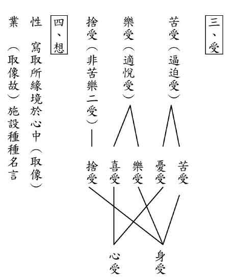

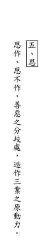

### 佛學概要十四講表簡說（十二）　第一講表

*戒慧講述‧宏法、淨昌整理*

修學入門在正見

通達利他與空性

福慧雙修莊嚴果

利他心意亦如是

述記云：「侵害如賊，覺賊無能。」覺察能破煩惱障。煩惱障像小偷一樣，偷走我們的功德法財。只要在念頭上起覺察的工夫，煩惱就沒有辦法興風作浪。福報會被煩惱破壞，其中邪見和瞋恨兩種煩惱最厲害，邪見會破壞等流的善心，瞋恨會破壞殊勝的異熟。昔有位非常有錢的提婆長者，他一面供養布施辟支佛，一面發願成為富有的長者，可是布施後又生後悔之心，所以當他果報成熟，富貴生起，但後悔布施的那一分使他成為慳貪的人。邪見會把布施的等流心態摧毀，瞋恨會把異熟摧毀。所以提婆長者的富貴，反而變成入地獄的資糧，死後墮落到啼哭地獄。

述記云：「以『空觀』為觀慧。…。佛法功夫不外『定、慧』二字，修一切定慧法門，不離『止、觀』法則。」空觀即能觀萬法的體性是自相空，就是定慧修學法。定慧亦不離止觀的法則，在止上修觀證得空性。是故空觀從觀來，觀從止來。空觀、假觀、中觀，都從止觀來，所以止觀是成就一切佛法的勝方便。

述記云：「止，是止息妄想分別。觀，如理思惟觀察。」止是將心專注於所緣境，並對治昏沉、沉沒、掉舉、散亂等逆品。觀則在止力成就上建立觀，如思惟觀察萬法的自體性。愈如理思惟觀察，就愈止息妄想分別。愈止息妄想分別，就愈能如理觀察法義。愈止愈觀，愈觀愈止，到最後止上建立非常殊勝的勝觀，達到止觀雙運。一般而言，止觀是互相資助的，止幫助觀，觀幫助止。

還有另外一種解釋法：在得到止的那一分，由止修觀，即是止觀雙運。此處無有所謂止幫助觀，觀幫助止之說法。止上建立勝觀之時，即是止觀雙運。建立勝觀破我執、法執，證得人我空、法我空，得到一切智。

述記云：「修假觀以覺悟所知障。」覺悟所知障的假觀，指諸法的生起是假，萬法的虛假，指明明是沒有自體性，卻顯現像有自體性。魔術師在變化的時候，車乘宮殿美女顯現上好像有，實際是沒有的。水中的月亮，顯現上有，但實際上沒有真正的月。以上是中觀的比喻。而唯識宗之比喻是指好像顯現在心外成立，其實是在心內。

述記云：「六凡眾生執假為真，故佛為說『空』，令修『空觀』」對於六道的凡夫眾生，執世俗的假為真，所以佛說萬法自相是空的，這是建立空觀的理由。唯識宗執假為真，是說顯現在心之外是假的，凡夫卻認為真的顯現在心之外，這就是執假為真。

述記云：「小乘證空，卻又著空，故佛為說『假』，令修『假觀』」著空不能解釋成執著空，要解釋為墮涅槃坑。例如觀察毛巾的體性時，結果卻沒有看到毛巾，說是見到毛巾的自體性，空只是把毛巾的自體性否定掉而已，不是還有一個空性。空，是一種遮法，把自體性遮掉而已，如果還執空，就說明還有一個遮法存在，此言著空只能說二乘人掉入涅槃坑，而不是將空執為實有。

述記云：「菩薩從空入假，仍未達空假不二、圓融絕待之『實相』，佛乃教令修『中觀』」菩薩不能達到空假不二，指菩薩在假上也見到空性，但尚未能通達佛的成就，於後得位不能以能所雙亡的方式現證空性，此為中觀宗見地。唯識宗認為，就是在後得位不能證得實相。

述記云：「所謂『非空非假』，是為『雙遮』；然又不可落於『非空非假』上，故云『亦空亦假』，是為『雙照』。」假法沒有自體性，叫非假。空也沒有自體性，叫做非空。何以空沒有自體性？空是對著緣起說空，不是另外有一個空，所以中觀宗說的空，是非空非假的空。但此處的非空非假，法在心外不成是非假，心內所顯是非空，是就唯識宗的宗義來闡發。亦空亦假是法性宗。天臺家把「非空非假」之「雙遮」唯識宗判為別教，把「亦空亦假」之「雙照」判為圓教，把「有」聲聞二部判為藏教，把「空」中觀宗判為通教。

述記云：「所謂『起心即錯，動念即乖』。」進入諸法實相，證得自體性空之時，在勝義上沒有世俗的心念可以用，你什麼都沒有看到的時候，請問你有什麼世俗的心念可以用？此時安立「起心即錯，動念即乖」。但是現證空性的心識是相續的，並不是說不要動念或者沒有心識，否則有情會變成木頭石頭。

述記云：「超思超議，是為『不可思議』。」此亦是從勝義諦來說，無法以世俗的心念思議。當聖者進入現證空性能所雙亡之時，長短方圓、美醜貴賤皆說不上，都沒有辦法說，沒有辦法議，叫做不可思議。

述記云：「自行、化他、行滿。」自行覺察能破煩惱障，覺悟能破所知障，這樣的工夫能開發一切智、道種智、一切種智（以下簡稱三智），此是自行圓滿。

化他，能夠度化他人，也是幫助有情都能覺察、覺悟，破二障、開三智。如果有心要化他，幫助他覺察、覺悟，得到三智的心態是為大悲心。佛教的本質是要幫助眾生覺察、覺悟，幫助他離苦得樂。每個人都想離苦得樂，可是所有人都是追尋快樂來遠離痛苦，只有佛法是從苦因苦果的滅來解決痛苦，成就快樂。因為大悲心，所以我必須要覺察、覺悟得三智，才能幫助有情覺察、覺悟得三智。

我要成就的那一分，是菩提心。大悲心是菩提心的因，菩提心是成佛的因，大悲心不是成佛的因。成佛的因，是我想要破二障，想要成為三智的成就者，這才是菩提心。意味著會成佛的人，一定是想成佛的人。想要利益有情，是大悲心，不會是成佛的因。所以天底下，會成為聖人的是想要成為聖人的人。

想要幫助他成為聖人，這個叫做大悲心。大悲心跟世間的善心不一樣，我要去成為聖人，才是聖人的因，想要成佛的菩提心才是成佛的因。大悲心、佈施、持戒、忍辱都不會是成佛的因，唯有菩提心，才是成佛的因。所以，宇宙間有個秘密，會解脫的人，是想要解脫的人，會成佛的人，　是想要成佛的。

自行圓滿時，化他也是圓滿的。可是眾生還沒有度完，而且眾生在被度的時候，往往退轉的多，得道的少。那化他如何成立圓滿呢？指心意的圓滿。如要論化他的究竟，宇宙間沒有一尊佛成佛。試問釋迦牟尼佛化他有圓滿嗎？沒有。甚至在現今的印度，佛教已不復存在。而印度的當時的舍衛國，全國接受釋迦牟尼佛的教誨者，也只有三分之一而已，所以釋迦牟尼佛化他並無圓滿。所以，行滿是指破二障、開三智的自行圓滿，至於化他的圓滿，純粹是在心意上論。

述記云：「以此『佛』之釋義與儒家『大學之道』相較，『自行』非即『明明德』歟？『化他』非即『親民』歟？『行滿』非即『止於至善』歟？」這與《大學》的宗旨是相同的。自行即是明明德；化他即是親民；行滿是自行化他都止於至善。對照自行，明明德講的是覺察、覺悟，證得三智。所以，明明德這三個字，究竟的講法是智慧！唯有智慧才能破二障，覺察、覺悟就是成就智慧，所以明明德要解釋為智慧。把明明德拆開來，第一個明字就是顯明空性的智慧。透過聞思修，成就智慧的部分。德，就是智慧。明德，是空性的智慧，形而上的智慧，般若的智慧。明明德不應該解釋成本性俱足，應該解釋成如何得到智慧。智慧是心的作用，轉識成智，心識只有智慧的作用，並不是沒有識而成智。何以說智慧是作用？貪心和無貪，你知道它是作用，為什麼？貪跟第六識，假如是有自體性的話，合起來是兩個不同的心。如果貪是心王，凡夫沒有辦法解脫，聖者也會生貪。可見貪是心裏作用，不是心王。如果是心王，遇到可愛境，都會生貪。而當遇到可愛境時，聖人不生貪，凡夫生貪，可見心會產生貪跟無貪的作用。所以，心所是作用，心王是體，依體起用，可見智慧和無智慧，都是作用。轉識成智，就是心裡面只剩下智慧的作用，依體起用而已。所以雪廬老人《常禮舉要》裡說：「凡事要合乎理智，不可感情用事。」這就是明明德。

親民的目的，是帮助眾生明明德。政治家要如何做才叫做親民？辦政治安定環境後，要辦教育讓眾生明明德。政治是為了教育來服務的。行滿，是止於至善，自行化他都圓滿。

述記云：「『止觀、定慧』非即『知止-定-靜-安-慮-得』歟？」其中透過止觀得到定慧，與《大學》的修學法有相通之處，「知止而後有定，定而後能靜，靜而後能安，安而後能慮，慮而後能得。」知止，就是通達修學明明德的方法。止，就是那個範圍他知道，般若的修學法他懂。懂得形而上與形而下的修學法。定，是專注力的修學。靜，在專注時，去掉昏沉、掉舉、散亂這些障礙。安，輕安，就是定功的修成。慮，止上來修觀。得，證得空性或證得世俗。至於親民是幫助眾生透過止定靜安慮得，能證得明明德的智慧與親民的心量。（下期待續）

## 孔學一隅

### 論語簡說（十八）
	  			 —聞一知十

論語簡說（十八）

—聞一知十

*時哉講述、宗徹整理*

名滿天下仍謙懷

自知不如方能進

處處提點望向上

廬墓六年思通否

經文

子謂子貢曰：女與回也孰愈。對曰：賜也，何敢望回。回也，聞一以知十；賜也，聞一以知二。子曰：弗如也，吾與女弗如也。

(公冶長篇第九章)

前言

人生到底什麼才是出路？應該要比較什麼？

俗話說：「十歲看智力，二十歲看學歷，三十看能力，四十看經歷，五十看財力，六十看體力，七十看病歷，八十看黃曆，九十看舍利。」

人如果沒有碰到善知識、聖賢的內涵，大概十有八、九是如上所述的人生。能同時擁有智力、學力、能力、經力、財力、體力、健康的人少見，若沒有正確的見解，沒有真正的見地與品格，世間的成就都失去了價值與意義。

消文
孔子問子貢說：你與顏回比，誰比誰勝。子貢回
**答：** 我怎麼比得上顏回呢。顏回聞一知十，聽聞事情的一節，就可以推知整件事情，知得周遍，始終無遺。而我只能聞一知二，聽聞事情的一節，頂多知得通達，舉一反三，告往能知來。孔子說：不如啊，我跟你都不如顏回啊。

然而孔子真的不如顏回嗎？孔子十五歲就志於學，三十歲學有所成，四十歲沒有疑惑，五十歲知天命，六十耳順，七十從心所欲不踰矩。此章不僅見孔子多賢，亦見孔子胸襟寬闊，與當時心情的歡悅，兩千五百年前，一大教育家之氣象，與師徒之間一片融合快樂，盡在眼前。

字義

（一）謂：當面問。如本章的孔子謂子貢，子貢隨即回覆。

（二）謂：背後評論。

◎子謂子賤：君子哉若人，魯無君子者，斯焉取斯？

◎子謂公冶長可妻也。雖在縲紲之中，非其罪也。以其子妻之。

釋義

夫子為何要讓學生之間相比？此是良性競爭，比較誰的見地高。一個班級中，學生有優劣之分；老師如此比較，使劣者見賢思齊，優者可以帶動學習氣氛。此外，好學生可以讓人跟隨學習，做其他人學習的榜樣。從此可知，比較是有必要的。

有云：夫子為何要選顏回與子貢比較？子貢的名聲在當時比孔子大，論口才、外交、經商、對國家的貢獻，這些顏回如何與之相比？然而，夫子選顏回與子貢相比有一特殊涵義，就是要讓子貢知道，什麼才是人生真正的出路。

夫子要子貢與顏回較量的是形而上的通達，與形而下的全知，且夫子要讓子貢明白，學道要由「聞而知」，這是聖賢的成就處，是孔子心中的價值。要比較的，是顏回的「不違如愚」、「亦足以發」、「無所不說」，比「聞而知」的內涵。而非比才情、比貢獻、比地位、比治國等。

子貢說「賜也，何敢望回」，子貢回答，談不上比較，連比都不用比了。

那麼子貢是客套話還是真心話？子貢一定是真心話，子貢明知自己的「聞而知」差顏回太多，顏回就聞而言，足以作為子貢的老師。夫子在後面說：「弗如也，吾與女弗如也。」不只有你不如，我也不如，這更是表示子貢真誠自嘆弗如，夫子亦自嘆弗如。

何謂「聞一知十」？聞一知十，可以參考「多學而識」與「性與天道」二章。

子貢是「多學而識」的人才，孔子則是還有「一以貫之」、「性與天道」的內涵。顏回「博我以聞，約我以禮」，有多學而識；「庶乎屢空」，有性與天道。此形而上與形而下的內涵。

顏回能通達形而下利益眾生的學問，再以性與天道來貫串，知道如何趨吉避凶，且清楚明白箇中的深義。他能超越形來運用形，能超越多學而識來運用多學而識。顏回雖然沒有事功，但已經將內涵都充實好，待利益眾生時必能發揮大用。

如何證明顏回是聞一知十的人才？顏回成就的方法是透過有悟性的聽聞，並且在課後可以闡發夫子的未盡之義，得到師兄弟的尊敬。顏回過世時，同學都想厚葬他，原因就是受到顏回教導的恩惠太多。顏回能夠把老師的未盡之義都講清楚，並不斷提升自己的悟性來通達老師的教學。

子貢的聞一知二，是由此知彼，舉一反三。子貢是舉一反三的人才，如《論語》子貢問夫子：「貧而無諂，富而無驕，何如？」子貢能從中悟詩的「切磋琢磨」，可以知道子貢的聞一知二。

顏回是縱觀全局，子貢是舉一反三。一個是合乎中道，一個是憶則屢中。

析疑

何以有悟性與才情的子貢，只能聞一知二？子貢此人在《史記》中是貨殖方面的人才，因為做生意而無法全心在聖道門用功。在聖道門用功，不能光靠悟性，一定要花時間。

李二曲的《反身錄》說：「賜之折伏回，徒折伏其知解。豈知回之所以為回，非徒知解也。潛心性命，學敦大原，一澈盡澈，故明無不照。賜則惟事聞見，學昧大原，其聞一知二，乃聰明用事。推測之知，與悟後之知，自不可同日而語。不但聞一知二弗如回，即聞一知百知千，總是門外之見，終不切己，亦豈得如回耶？是故學惟敦本之惟要，敦本則知解盡忘，心如太虛，無知而無不知，一以貫之矣。」

學習聖道門的內涵，不能只靠穎悟過人。如悟性強者有顏回、子貢，但孔子多麼盼望子貢藉悟性能像顏回一樣好好學習成為傳承的人才，所以才會處處點撥。例如「吾一以貫之」，又如「天何言哉」，都希望點撥子貢向上一著，要子貢好好學習、思維，最後越過語言文字來體會真理。

為何夫子只對子貢點撥？因為他是傳承人才，只可惜他外務太多，使他終究不能成為傳承者。

或有疑，子貢亦知顏回勝處在聞一知十，為何不努力達到？子貢雖然知道自己不如顏回，也知道「聞而知」是人生的重點。孔子之所以殷切期許子貢，就是因為他都知道箇中道理，但要能聞一知十，必得要投入時間，願意接受老師教導，放下外務，並不斷與老師、同學切磋琢磨，才有可能做到。

宋儒將「與」作讚許，如此解釋的理由是讓老師不能不如學生，才說「我讚許你子貢不如顏回」，如果說「我和你不如他」就貶抑了孔子。

但此處不如此解，應解為「和」，但看「弗如也，吾與女弗如也」，如果是讚許子貢不如顏回，不必講兩次；此處應該要解釋：「不如呀！我和你都不如顏回啊。」從經文的活口氣中，可看出孔子的胸懷。「弗如也，吾與女弗如也」不但不是孔子的謙虛話，更是孔子真心的感言。

孔子三十而立，是以仁來立。仁的作法在禮上都有，「不學禮無以立」，但仁心必是在禮上做出。顏回的仁心使其能立。

孔子四十而不惑，顏回庶乎屢空。孔子五十知天命，顏回則在匡地走失，找到孔子時說「子在，回何敢死」，是知道自己有傳承的天命。顏回又說「用之則行，舍之則藏，惟我與爾有是夫。」這樣的心境即是知天命的境界。

孔子六十而耳順，顏回「非助我者也，於吾言無所不說」，「退而省其私，亦足以發」等，不正是顏回耳順的形象嗎？

再從《三國志‧夏侯淵傳》：「仲尼有言，吾與爾不如也。」《論衡‧問孔篇述文》：「與汝俱不如也。」《後漢書‧橋元傳》：「仲尼稱不如顏淵。」《翟氏考異》：「《世說注》引鄭玄別傳：『馬季長謂盧子幹曰：吾與汝皆不如也。』」《唐書‧孝友傳》：「任處權見任希古曰：『孔子稱顏回之賢，以為弗如。』」等，都可證明顏回超過孔子。

顏子年約四十即達耳順之境，為何還要在夫子身邊學習？孔子七十歲成就無過失的聖人境界，此是顏回達不到的境界。而此間的差距差多少呢？差太多了！所以顏回說：「仰之彌高，鑽之彌堅」，乃孔子的境界高深莫測。

在《莊子》、《孔子家語》都可找到顏回不如孔子的證明。

如果孔子問顏回同樣問題「女與賜也孰愈」，顏回會如何回答呢？《論語述何》有提及，若問顏回比子貢時，顏回也會說不如子貢。「世視子貢賢於仲尼，子貢自謂不如顏淵，夫子亦自稱不如顏淵，聖人溥博如天，淵泉如淵也。若顏子自視，又將謂不如子貢矣。『以能問於不能，以多問於寡，有若無，實若虛』，聖賢所以日進而不已也。」

為何顏回一定會回答「回也，何敢望賜」？顏回的學習態度，如曾子的描述，是「以能問於不能，以多問於寡，有若無，實若虛」，因此必會回答「回也，何敢望賜」，才是顏回的樣貌。

然而，若顏回如是答者，夫子又將作何回覆？必會說：「你太客氣了！」這就是客氣話。而此章子貢所答之「賜也何敢望回」，既非客套也非謙虛，根本認為自己搆不上。

總結

舉子貢與顏回相比，是要我們知道：論人要論見地，見地由聞而知。

人生的努力是從聞一知二到聞一知十，這才是人生的出路。

從此章可知顏回在孔子心中的份量，因此當孔子失去顏回時，才會「哭之慟」。

從此章二人在「聞而知」的比較，才知道人生真正的價值、出路所在。

問答

**問：** 子貢和顏回，會不會有瑜亮情節？

**答：** 子貢如果嫉賢，則不會說「賜也何敢望回」。孔子的胸懷更大，「吾與女弗如也」。顏回比孔子厲害，在四十一歲過世，卻有孔子六十歲「耳順」的境界。顏回過世時，孔子哭之慟，老師對學生，猶如母親希望子女成龍成鳳一樣，希望學生青出於藍、更勝於藍。

**問：** 老師有提到孔子對顏回有許多稱讚，但對子貢反有貶抑的言語，此作法是否會讓人感覺對子貢有嫉妒的嫌疑？

一般人會覺得子貢勝於孔子，但孔子處處壓抑子貢，如「非爾所及也」、「非也，予一以貫之」，看似妒賢，實則子貢的名聲不必再錦上添花；況且子貢有向上的空間，有得傳承的悟性，只是他沒有像顏回將時間全部放在學習聖道上，也沒有像曾子下死功夫來學習。

**問：** 本章顏回與子貢的比較中，子貢聽了老師的話後，是否有辦法體會老師對他的用心良苦，是否會認為夫子在找他麻煩呢？

**答：** 子貢如果會介意，何以在夫子死後守喪六年？孔子對他的提攜、點撥，子貢始終感激於心；為了報答孔子，他在四十二至四十八歲人生的黃金期守於夫子墓旁六年，即證明子貢明白夫子對自己的用心良苦。

**問：** 請問三十而立不是在經學義理上能夠立住，在形而上的通達嗎？顏回的其心三月不違仁不是在形而下論嗎？再問顏子曾說「子在，回何敢死」說明他已知天命，他為何最後還是先孔子而死呢？

「不學禮無以立」，仁心的修學法在禮上說。「三月不違仁」，是禮上通達、仁心成就。

「不惑」是形而上的智慧入於人世間不被名聞利養所轉，不被形所繫縛，所謂「明」也，在形而下能善用境界，以通達人情世故。

欲通達形而下，必得在形而上通達，否則頂多只能如子貢一樣舉一反三。通達形而上後，進入形而下則能夠全盤觀察。

顏回之所以比較早過世，是蒼生無福，不是顏回無福。顏回學成後過世，何憾之有？能將未盡之意說清楚的顏回過世了，還有誰能夠傳承夫子的聖道？誰來抉擇大家的意見，並且闡發老師的未盡之意？

**問：** 凡事都講究一分為二，孔子教學生也是因材施教，每個人會有自己的特長。子貢為什麼不一分為二，講明自己的優點與不足，並改進不足？

**答：** 孔子本來就是因材施教，知道子貢這個人本來可以成就。子貢也知道，老師拿自己與顏回比，就是比「聞而知」，不然應該可以與其他人相比，不應拿他與顏回比。其實子貢真的是可以傳承的人才，也知道與顏回比較是在人生的內涵上比較。

**問：** 夫子說君子不器。就現代人的價值觀來看，顏回感覺並不像子貢有多種才能。可夫子的評價顏回高於子貢，請問該如何理解？

**答：** 可見看內涵是一般人看不到的。一般人都看外相、事功，我們應該學習夫子，看到顏回的好學、仁心等內涵，並知顏回是孔門中貢獻最大者。

君子不器，是超越器之外，不被器所繫縛；回到形而下時，可以全方位通達，是知的通達。

**問：** 子貢有沒有達到聞一知十的境界？是不能還是不為？

**答：** 子貢若不能，孔子何以強人所難？正因子貢是傳承的人才，所以才希望他留在自己身邊好好學習。至於最後子貢有沒有聞一知十？子貢後來去做官，而曾子去教學，可見子貢還沒有達到聞一知十，否則不會不從事傳承的事業。

**問：** 老師有提到其他經文有提到孔子勝過顏回的部分，是否請老師為我們解說？

**答：** 《莊子‧田子方》：「夫子步亦步，夫子趨亦趨，夫子馳亦馳，夫子奔逸絕塵，而回瞠若乎後矣。」

《孔子家語‧六本》：「夫回能信而不能反，賜能敏而不能詘，由能勇而不能怯，師能莊而不能同。兼四子者之有以易吾，弗與也。此其所以事吾而弗貳也。」顏回能做到仁卻不能不仁。仁與不仁的運用，如孔子殺少正卯，是以智慧通達，形象是不仁，本質是仁，此勝出顏回之處。

**問：** 教養孩子的品德，可以向夫子學習。但如何培養孩子的見地？《論語》經文中是否有比較可依循的方法？

**答：** 讀《論語講要》就能夠學到見地。如「道德仁藝」、「性相近」、「中庸之為德」等，這些章節都很難了解，自己讀書看注很難認識，必須透過《論語講要》學習，且有老師的教導。

**問：** 顏回終日聽夫子教誨，不違如愚，可以看出顏回對善法欲的耳順，但耳順不僅是對善法欲的好樂，在違逆的處境中，對不善的行為和言語如何看出顏回的耳順呢？

**答：** 耳順的人，可以從入世言談中立即察覺吉凶禍福，並能知他人的心意。聖道門即教導我們如何趨吉避凶，然有大德說我們一般人的耳朵如木耳，聽聞話語不知進退禍福，此即不是耳順之人。《論語》中有曾子讚歎顏回「犯而不較」，他人對顏回的冒犯，顏回能不予計較，此亦耳順之境界。

**問：** 孔子過世，子貢守喪六年，是否在反省不夠努力？

**答：** 要問子貢。反省是反省，但老師在可問問題，老師不在就差很多了。反省學習，在老師過世後就沒有得學了。傳承之重要，不可能是閉門苦讀可以追得上的。當老師在時不好好學習，老師不在了，後悔也來不及。

孔子是一切智慧的集大成，再找到這樣一代宗師，難矣！

孔子在形而上與道家相合，形而下又能夠入世利生。學習孔子的智慧，則能夠讓我們知道圓滿人生的意義。

子貢後面的體悟固然要讚許，子貢不向上一著之處，著實可惜！

「聞而知」才是聖道門，聞不在典籍上，而是在傳承上。沒有聞，則不可能通達聖人的境界。（下期待續）

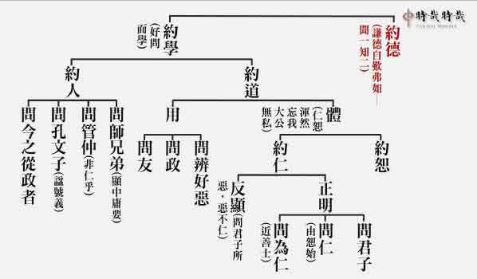

### 孝道跨時代的意義與價值—孝經簡說(四)　盡孝—在於掌握長守富貴的方法《諸侯章第三》

時哉講述、淨域編寫

富貴不妨松柏志

禮賢下士節用度

民生富足受教後

近悅遠來是善政

前於〈開宗明義章〉中說：通往形而上與形而下的要道是孝，這也是個趨吉避凶、離苦得樂的大道；換言之，孝道之推展，由個人、家庭、社會乃至國家，都走向康莊大道。反之，孝道的思想被批判、壓抑與輕視，從個人到國家整體，能達於趨吉避凶、離苦得樂的道路沒有了，前途將是一片黯淡。此正如《論語》所說：背棄了日月，走向了黑暗；日月是照亮人生的大道，孝道是使人開闊心胸走向光明的大道。

上回〈天子章〉中亦說：天子對父母親的愛敬，透過人才團隊來推廣教育，帶來的是一個安定、繁榮與富庶的天下。

此回講述的是〈諸侯章〉。諸侯的「諸」是指列國，諸侯就是列國的國君。從第一章開展，其宗旨是孝，次而分別顯示孝道的修學法與要義。孝道的要義特別要說各階層應怎麼盡孝，及聖人如何以孝治天下。

釋義

經文是：

「在上不驕，高而不危；制節謹度，滿而不溢。高而不危，所以長守貴也；滿而不溢，所以長守富也。富貴不離其身，然後能保其社稷，而和其民人，蓋諸侯之孝也。《詩》云：『戰戰兢兢，如臨深淵，如履薄冰。』」

〈諸侯章〉有兩大段，第一段是說諸侯怎樣「保國和民」，意即諸侯如何保住地位與國家，及怎樣和諧與臣民的關係。第二段是以《詩經．小雅》來讚歎諸侯之「戒慎恐懼」。諸侯於「保國和民」中，著重在「長守富貴」，並且依其富貴來安邦定國，最後結論說明這就是諸侯的孝。

首先來看，諸侯用什麼方法維持他的地位、保有他的富貴？此法即是「在上不驕，高而不危；制節謹度，滿而不溢。」

「在上」是指他居於一國之上，國家中沒有人的地位比他高，而他卻不因此驕傲。在上不驕是很難的，「上」要對應後面的「高」，擁有的權勢及政治資源。須知，民主國家的領導人，一經選舉產生後，他手中可支配的職位甚多，政治資源之多，是外人難以想像的。

居於上位者，若要能居高而不危殆，就必須依靠「不驕」。為什麼「高而危」呢？其一，眾知「水能載舟，亦能覆舟」；其二，位高權重擁有大量資源，往往會遭到他人的覬覦。所以，《春秋》一書中分載：「子弒其父」，兒子把父親殺了；「臣弒其君」，臣子把國君殺了；這真是危險呀！然而，地位要如何穩固呢？僅憑「不驕」真的可行嗎？

再者，「制節謹度」是於財政說，一國的稅收由國君收取，所以是富的，但是富中要「節制」與「謹度」。謹度就是謹守法度，財富要謹守法度而節制支用，若能節制謹度，則財富是盈滿不溢的，就是不會奢侈浪費，這樣的情況就能保有貴富(前段是「保有貴」，後段是「保有富」。)

所以下文說：在上不驕，高而不危，使得這諸侯能夠長守貴；制節謹度，滿而不溢，使得這諸侯能夠長守富。以「在上不驕」來「長守貴」；以「制節謹度」來「長守富」；達於既貴又富之地。此先貴後富能長守，一環扣一環下來，稱作富貴不離其身，依此來安邦定國。

富貴不離其身，指時間很長都能守住，這樣的國君可以保住地位、富貴及國家，更能和諧他的民與人。「民」指的是百姓，「人」是指他的臣子。最後結語點明「蓋諸侯之孝也」，這大概就是諸侯的孝吧！「蓋」是大概、約略之意，因為諸侯的孝很多，此處所言是綱要、重點所在。

最後舉出《詩經．小雅》，云：『戰戰兢兢，如臨深淵，如履薄冰。』」乃讚歎諸侯之戒慎恐懼。「戰戰」是恐懼的樣子，「兢兢」是戒慎的樣子，合義就是戒慎恐懼。戒慎恐懼像什麼？就像「如臨深淵、如履薄冰」一般，不小心就會失足掉下懸崖，不留意就會踏破冰層陷落。華山的長空棧道懸壁架設，在上攀走一失足便萬劫不復，此驚險之心最能以戒慎恐懼來形容，是謂「恐墜」。黃河嚴冬結冰，清明時節開始消融，此時冰薄過河要小心，若踏破冰層便深陷難爬上來，是謂「恐陷」。此在說明位高境險，若無戒慎恐懼之心，只一次墜陷就會垮到底，怎不危險呢？

析疑

此回所說的是諸侯之孝，各國君主何以不稱諸公，而要稱諸侯呢？試問大家：諸侯為什麼不稱作諸公、諸伯、諸子、諸男？諸侯的「諸」字，就是講到列國，不止一個國家。天子有「三公」，名為太傅、太師、太保，若稱「諸公」會讓人誤以為是天子的「三公」。就爵位及禮儀而言，實際上是該稱「諸公」，但為避免誤會只好稱作「諸侯」。

天子與諸侯各自擁有國，但他們的差異在哪裡呢？在春秋時期，諸侯擁有的國叫「列國」，天子的國叫「王國」。王國像是中央，列國是王國分封出去的，如燕、齊、魯、宋、莒、晉、秦、楚像是地方。雖然周朝的領地不大，但它像中央政府一樣，可以管治被分封的地方政府。王國管列國，諸侯是列國的國君，就像現在各省的省長，天子是國家的領導人。諸國位階的排列有兩種，其一是依土地的大小，其二是依爵位的高低；然而，這個排列也有不必然對等的地方。例如：楚國領地大，但國君稱作「楚子」，只是子爵；魯國相對弱小，國君卻稱作「公」，如魯定公、魯桓公等。所以，這個排法又非我們所想的那樣。

那麼，諸侯到底是個什麼樣的階位？天子國裡有宰相，諸侯的地位就像宰相，僅次於天子。這可用清朝官制來說明，譬如：總督，兩廣、兩江、湖廣總督是正二品，若兼兵部尚書為從一品；而內閣大學士及上書房大臣多是從一品以上。所以，諸侯的地位相當於宰相，僅次於天子。諸侯之位崇高，但位高何以會危而懼？須知在一國中，諸侯居於百官之上，權位僅次於天子，這樣的權勢最容易「凌上」、「慢下」。所以，此章特別說諸侯的「不驕」與「制節謹度」。

為什麼諸侯要節制且謹守法度呢？因為在這個位置上，可能因國土面積廣闊、兵力強大，對上不把天子看在眼裡，對下侮辱欺壓部屬。其次，若政策錯誤乃至用人不當，便容易引發政局動盪，所以叫作「危而懼」，是既危險又令人恐懼的。

淩上、慢下會有什麼恐懼的事發生呢？試想，諸侯不把天子看在眼裡，臣子會把諸侯看在眼裡嗎？《論語》〈八佾〉中提及，魯君應行「告朔之禮」，即是每個月初一宰隻羊祭拜太廟，並取「月令書」依天子所頒政令執事，結果從魯文公開始曠廢了。魯君這樣瞧不起天子，魯國三家大夫會把魯君看在眼裡嗎？當然不會。

先看那季孫大夫在家廟大跳八佾舞，簡直把自己視作天子一樣；再看叔孫氏、孟孫氏、季孫氏三家，在家廟祭祀徹饌(撤供品)時唱「雍詩」，雍詩(《詩．周頌．雝》)是天子祭祀時的音樂。

再者，大夫不把國君看在眼裡，大夫的家臣會把大夫看在眼裡嗎？所以，季孫大夫的家臣陽虎就執住季孫大夫，控制魯國的國政；叔孫大夫的家臣侯犯，就在叔孫的郈據地造反。魯君因不把天子看在眼裡，就產生這麼多問題，試想魯國的政局會安定嗎？如此也見出，孔子論事的眼力。許多事情都是因果相續發展的，當一個果報出現時，我們往往沒有去回溯它的因，也或是此因微細到我們都無法察覺。

是故，此章要說諸侯「在上不驕」，若居上而驕慢，臣子容易圖謀控制，兒孫也會逆篡你的王位。這即是《春秋》一書中所說「子弒其父」、「臣弒其君」，譬如齊國的陳(田)恒，就把齊簡公殺了。所以尊貴之人若要避開危險，他的方法是「謙下不驕」，這裡面包含了很多的大道理。
「謙下不驕」真可以解決危險而恐懼的高位嗎？謙下不驕的人既懂得禮賢下士，也懂得尊重別人。魯定公
**問：** 「君使臣，臣事君，如之何？」孔子對曰：「君使臣以禮，臣事君以忠。」試問，臣子對國君忠，他會造反、篡位嗎？其次，禮賢下士；懂得運用人才團隊，國家是安定的；國家安定，這個國君會保不住位子嗎？再者，國君是個在上不驕之人，對事情當會恭敬重視，在動機上就不會馬虎、在過程上不會草率，會講究結果。所以諸如民生建設、教育政策等等，可以做得很好，在上不驕使得他，位高又不會危險，此時稱作「長守貴」。

誰是謙而不驕的國君典範呢？《禮記》〈大學〉引《詩經》云：「瞻彼淇澳，菉竹猗猗。有斐君子，如切如磋，如琢如磨。瑟兮僩兮，赫兮喧兮。有斐君子，終不可諠兮。」這是衛人讚歎衛武公的詩句。瞻彼淇澳，就是看那淇水的岸邊，菉竹猗猗是菉草與竹草茂盛，就像衛武公這位君子一樣，文采很好。如切如磋，如琢如磨，是說衛武公不斷地進步。他不斷地進步到了九十五歲。此人在位五十五年，行事戒慎恐懼，「瑟」是莊嚴有毅力，而且名聲很好。衛武公在位期間，除了幫助周朝平定犬戎之亂，也讓西周平和地過渡至東周，國祚得以延續下去。

衛武公曾對臣子們說：「一定要舉出並勸諫我的過失，我既感激也不會忘記你們的教導。在我不注意的地方，希望有偈頌可以時刻提醒我，有些音樂來警惕我，讓我不昏不憒，能改正過失向前進步。」他不斷地祈請臣子，能夠包容賢人，能夠指正他的過失，在位五十五年於衛國人的心目中，直居聖人的地位，這就是「在上不驕」。

為什麼此人可以不驕慢呢？因為他知道驕慢之過與不驕慢的功德。驕慢的過失太大了，會讓下屬有樣學樣，賢人遠離，政策馬虎草率，乃至於因為用人不當而遭深怨。若不驕慢呢？則易於贏得部屬的忠心，能凝聚人才團隊，易於在戒慎恐懼中成事。一語蔽之，此乃維持高位的祕密。　　　　治國之人定要懂得兩方面，一是懂得辦政教，二是懂得理財政。佛教中的轉輪王，其下屬中有位「主藏臣」，也就是財經大臣。這位國君為什麼會富呢？因為一國的稅收由他收取，府庫充滿當然就富。惟積一國之賦稅，府庫充滿如何能使之不溢呢？何謂「滿而不溢」？乃指他不會有浪費的事情發生。這包括什麼呢？第一、在人事上不會有太多冗員。第二、不會講究應酬、排場，乃至於公共開銷上避免人謀不臧，及一些無效的公共措施。又如一般的強兵霸權擴充軍備，像秦始皇的軍事支出，到了財政無法負荷時，只好再對百姓加稅，讓百姓日子過得痛苦，最後導致王朝滅亡。所以，國家的稅收入帳，能善理控管而不奢侈浪費，一定富足。

另者，國家的財政收入要支應許多項目，大抵上是入不敷出的，要如何才能滿呢？就是要把錢用在刀口上，財政的支應中，除了民生建設外，還要懂得將錢拿來編列預算培養人才；當人才轉換為生產力時，國家收入實際上是增加的。

由上得知，一國之君位高權重且得榮華富貴，其最宜警戒的是在不知不覺中驕奢。所謂不知不覺，就是漸進地無認知與覺察，不想驕慢卻現出驕慢，不想浪費卻耗用無度。試觀乾隆皇帝，最後不知不覺地就講究排場與奢華，六次下江南搞得國庫窮困。所以，大清盛世於乾隆達到高峰，帝國的敗亡也從他開始。

此處要特別警戒的是「不知不覺地」，這才是最恐怖的。杜甫〈「春夜喜雨〉詩云：「隨風潛入夜，潤物細無聲。」雨隨著風進來，不知不覺地就沾溼了，這個浸染是最恐怖的。一個人在榮華富貴時，一旦不知不覺地驕傲，就會不知不覺地奢侈，這「不知不覺」最為厲害。

同樣的，一個人的好學與謙虛，如果在不知不覺中日有進步，也極為驚人，藉好學之功最後德行能達到圓滿的地步，就像衛武公一樣。所以，好壞習慣皆在於不知不覺中培養起來的。有位大德說：「不要指望自己每天進步多少，只須努力自我鞭策，每天前進一步就好。」只要每天都在進步，後來的成果是可觀的。尤其將進步當成一個等流的習慣時，未來潛力的發展是很可觀的。

一國之君可以保有社稷，國家為什麼稱為社稷呢？一個國家的成立，國君首先要祭祀的是山川，其次是宗廟，第三是社稷。「社」就是土地神，「稷」是穀神。北京紫禁城的前右方有社稷壇，其於明清時期有祭壇與拜殿，乃為朱元璋所興設的，國君透過主持社稷的祭拜，來表徵對農事的尊重。

一國之君如何才能確保他的社稷呢？國君之保貴，是禮賢下士、培養人才團隊，是凝聚臣子對他的效忠，是凝聚百姓對他的擁護。而保富，是能夠不奢侈浪費，且有效地支應在公共建設與民生建設上。公共建設包括水溝、良田、道路，乃至於在教育上懂得培育人格、精進技術；此種富貴是最能保社稷的富貴。愈愛護百姓、教育百姓，反而更保有他的富貴。

國君長保富貴，

經文說：

「和其民人」

，試問要怎麼和？當臣子擁護你的時候，百姓對國家是具有向心力的，有向心力就是和。此外，國家支用採開源節流、不奢侈浪費，多興辦公共建設與技職、人格教育，百姓的心當然向著你，便是和其民人。此「民」就能爭取百姓對你的向心力，所以和；此「人」是指爭取臣子對你的向心力，所以叫作和。是故，全國上下是一個和諧的團隊。常言：「家和萬事興。」一家和，所有的事情都興盛起來；一國和的時候，更是萬事興盛。

財富集中在一、二人手中，若不善於支用財富，則造成財聚而民怨。惟此處非如此，這裡的富是「滿而不溢」，就是不會奢侈浪費，不會無謂開銷，不會講究排場，不會窮兵黷武，不會無效支出。

本章通篇裡講述諸侯保貴之道，用不驕來保貴，用不奢來保富，然後可常保富貴，保有國家，贏得臣民的向心。然而，其中並沒有講到他對父母親的孝心，這怎麼是諸侯之孝呢？

須知，諸侯把國家當成一個大家庭來經營，且懂得經營國家時，孝道就在其中。何以然呢？因為他的父母會得到臣民的尊崇，感覺十分有體面，這就是孝。常言：求忠臣，必出於孝子之門。孝子懂得經營家庭的和諧，進入國家體系來服務，就懂得經營國家的和諧。孝子居家有公心，這孝子到國家辦事才有公心。雪廬老人說：「用人與論人，要先論公心。」如果不去論公心，不僅事情搞砸，風氣也搞壞了。求忠臣，必出於孝子之門，並非是孝子一定作忠臣，但忠臣一定出自孝子。

有人說：既然忠臣出於孝子之門，那麼我的企業要用孝子。這可不一定喔！孝子不一定忠。孝子可能只想把家經營好，他不見得要對你付出。既是孝子又為忠臣，這是孝子中的少數，所以才叫作大孝。

末後以《詩經》〈小雅〉來表達國君的孝，國君的孝就是把國家經營好；此人在家裡的公心能擴及於一國，這就是孝道的發揮。此孝道的發揮，不僅是對父母盡孝，至於祖先也能得最高的尊崇。前於〈開宗明義章〉說：傳承聖道之大孝，不止是讓當時人有利，更讓後代人都能得利。這是孔子的文化理想與見地，真是中華文化的核心所在。

以《詩經》〈小雅〉來表達國君須戒慎恐懼，這與諸侯之孝有何關係？戒慎恐懼的那一分，意謂國君的貴，若不戒慎恐懼，就會不知不覺地起傲慢，進而欺淩上官、怠慢下級，悄悄地引發臣子們的不滿，甚而人才跑光了。至於國君的富，不知不覺的多應酬開銷，講究排場與奢華，肇生許多貪污腐敗的弊端，國家於不知不覺中邁向敗亡。

曾子臨命終時召弟子前來，也引《詩經》〈小雅〉這段話，說：「戰戰兢兢，如臨深淵，如履薄冰」，來表述他一生的成就。徐醒民老師說：這叫作斷章取義；意是都可拿來運用，只是用時各說各的心得。曾子不是諸侯，怎可以「戰戰兢兢，如臨深淵，如履薄冰」般的戒慎恐懼呢？曾子雖非諸侯，但他用這話即是斷章取義，意是拿來在我的道上經營，就是要這樣的戒慎恐懼。因為一旦在道上不能經營時，失去道心與操守，慢慢的見地被欲望淹沒，許多災難就要發生，本來精彩的人生，到最後就無足觀了，所以要「戰戰兢兢，如臨深淵，如履薄冰。」曾子以唯恐掉陷下去的那種戒慎恐懼來修道，終於使他全身圓滿，故說：「吾知免夫，小子。」我知道可以免了毀傷身體之不孝，然後就安然地過世。

以上是《孝經》〈諸侯章〉的大意，雖然經文不長，但是含藏的義理很多。最後來看江老師的畫。整體形象來看，國君拱手回禮，且表情十分親切。這種莊嚴中又很親切，《論語》中形容孔子是「望之儼然，即之也溫。」「申申如也，夭夭如也。」就是莊嚴又溫和，既有他的氣質，可是又不妨礙他親民。

在保有富貴中，國君所具的是松柏之志。所謂松柏之志，是充實內涵、利益百姓而不追求富貴。因為不受榮華富貴的影響，所以貴而不驕、富而不奢，他的底蘊就是松柏之志。在風和日麗中國君輕車簡從出巡，百姓親切問候。輕車簡從所顯示的是國君富而不溢，不會浪費；而與百姓親切打招呼，顯示國君是貴而不驕，能長守貴、長守富。這樣的人受到百姓與臣子們的擁護，當然是「保其社稷而和其民人」。

總結

最後總結此章。國家的忠，實來自於家庭的孝。孝子懂得維護兄弟的感情，懂得討父母的歡心，這對家庭的經營，用的就是公心。此種人進到國家來，便會用公心來辦事。國君為政用公心，他的貴實是為了要凝聚眾人之力、凝聚人才及和諧人民的貴；他的富是要把稅收用在刀口上、用在民生建設上、用在教育上的富。所以，這種公心的人，公心就是他的松柏之志。這樣的人，十個孝子裡，概不出兩三個。不孝的人不可能做這種事，雖孝子而能有公心去維護社會、國家及天下的也不多。所以，使家庭都盡孝道而和諧，乃第一要務。惟在孝子們當中，真可以成為國家的幹才、棟樑乃至於領導人的，還是不多。最後，孝子要走入經學的學習、弘揚與傳承，雪廬老人曾說：「論人、用人都在公心上論。」所以論人、用人要從家庭行孝開始，才能堵住亂源，阻止禍事災難，防杜自私自利的風氣。否則，一旦讓這風氣發展，禍亂厄事災難一定發生。如此看來，推展孝道的教育是多麼的重要，它能保障國家的安定，保障百姓的幸福，保障個人的康莊大道。以上是《孝經》〈諸侯章〉簡單的義理。(下期待續)

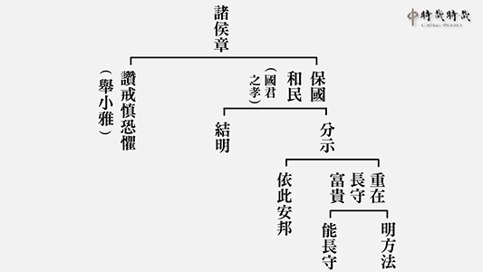

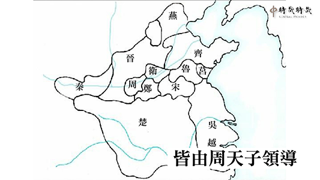

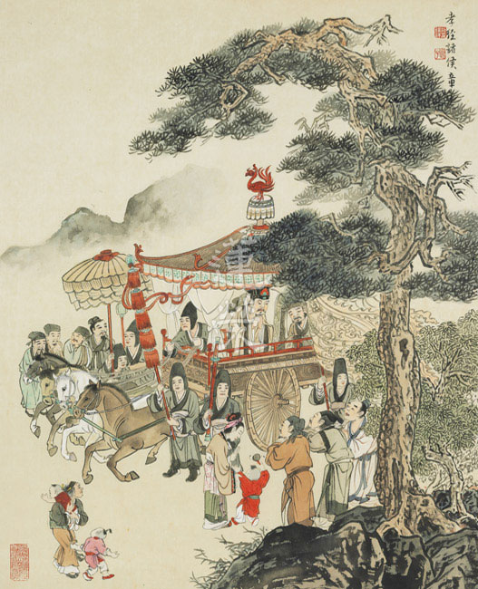

## 藝術賞析

### 孔門七十二賢淺說（十四）—高柴

圖：江逸子‧文：時哉

人難貌相海難量

質厚好學識大體

變局脫困不受惑

愚直不妨成大賢

高柴，姓高名柴，字子羔，衛國人，或認為是齊國人，小孔子三十歲。

子羔身材較為矮小，〈史記〉上稱其不滿五尺，受學於孔子，孔子以為愚。子羔雖然愚直、呆板，但有很好的人品。《孔子家語》說，踩踏人影原本並不會傷害人，但子羔足不履影，那是一種對人的恭敬；蟄伏的昆蟲春天將起，他也不會去殺害牠們，那是一種愛物的情懷；花木剛剛成長發芽，他也不會去折採，那亦是一種對生命的尊重。此外，子羔在守親之喪時，常常悲泣到雙眼流血，並且從無歡喜的容貌。

孔子的弟子子路在當季氏宰的時候，想薦舉子羔去做費邑的長官，然而孔子主張學而優則仕，子羔當時年輕學未有成，派他去做費邑宰，夫子認為這無異是害他。魯國當時有不少為官者，並沒有很好的學問，因此子路以為，使子羔為費邑宰，治民與從事本身就是學習，何必要讀書然後為政呢？孔子就此事責備子路的強辯，畢竟為政要有足夠的學術內涵才能利民，否則就像是拿人民當實驗品，必定有害於民，也將有害於己。

子羔後來在衛國任官，子路當時也是衛國孔悝的家臣，兩人同時遭遇了蒯聵之亂，子路以食人之祿為由，赴人之難；子羔則以為衛君父子爭國，自己不與衛國大政，無踐難之理，因此脫難。

子羔脫難之後，又在魯國為官，他在孟氏成邑宰任內施政良善，因而妻子去世時，士民送葬人數眾多，來往人車傷及了道路旁的田禾，有人認為應該提出補償，但子羔說：孟氏沒有因此怪罪我，朋友也沒有因此離棄我，因為我是縣城的長官能有善政，送葬人數眾多才造成這樣的傷害，如果我提出補償，形同出錢買路送葬，若形成風氣，必將造成人民有喪者，因缺錢而難以為繼的結果。從此可見，子羔不是只會一味施惠的愚直者，而是在不斷地學習與師友的薰陶下，成就出另一番不同的見識。

畫中的子羔身材矮小如古書所載，動作表情憨厚可愛，是一位具有良好質地的人才，只要再加以文采上的學習與修養，就是一位文質彬彬的君子了。(下期待續)

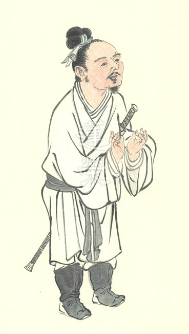

### 孝經圖簡說(十二)—廣要道章第十二

圖：江逸子‧文：時哉

孝弟本質禮樂教

取悅天下稱盛世

身不下堂南風吹

諸國拱之如北辰

本章大意是推廣孝道的功德，以及如何推廣。須知推廣孝道是推廣品德教育的根本，辦政治除了讓百姓有房子住、有衣服穿、有飯吃，生活安樂，國家更要推展道德教育，尤其是孝弟之道，才是百姓生命中獲得喜悅的泉源。

人民互相親愛，當成一家人，是來自於國君孝道的實行與推廣。百姓對有德有學或年長的長者能禮敬與順從，是天子在家中能行弟道並推展弟道的結果。國君能移風易俗，是推展樂教的結果。

至於推展禮教，天子以敬自己父母之心，而敬他人的父母，做兒子的都喜悅；天子以敬自己兄長之心，來敬他人的兄長，天下這些做弟弟的都喜悅；天子恭敬這國的國君，這國的臣子都喜悅。做天子的人能這樣敬人父、敬人兄、敬其君，雖只針對一人恭敬，所敬的人少，而喜悅的人眾多，此即是取悅天下之要道。

本張圖中江先生繪的是能敬養父母親及尊重兄長，表徵是推廣和諧天下的要道，接受兒媳孫輩的供養，老爺爺笑得合不攏嘴，表徵孝弟最能取悅家庭、社會與國家，此亦最佳的和諧之道。

畫欄杆代表這是居家的範圍，畫屏風則是補景之用，歷代畫作皆畫在鄉野中，互相打躬作揖之禮。

而此章的大意是天子孝弟之道，透過禮樂移風易俗，全天下人民都在喜悅之中，大家共享和平與快樂，相信這也是現在辦政治的人，所樂見的場景。(下期待續)

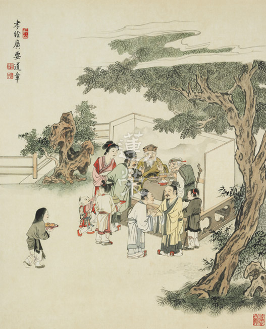

## 蓮池海會

### 王文湧老居士往生見聞記

欲仁

金門戰役國乃存

子女孝順非己出

養家活口歷艱辛

助念功成色莊嚴

王文湧老居士（又名王化勇）生於民國十八年農曆八月三十日，安徽省合肥市人。民國三十六年時值國共內戰，隨其兄長入伍裝甲兵學校。民國三十八年山河易色，即隨軍到台灣，時風雨飄搖之際，於當年十月毅然志願赴金門前線衛戌寶島，十二月共軍進犯金門，即史稱「古寧頭戰役」，或許天佑台灣，此役國軍竟獲大捷，老居士當時任職於裝甲部隊擔任掃蕩任務，成功阻絕共軍解放金門意圖。其後回台繼而在陸軍部隊服役。

其後大陸來台軍人「婚禁」解除，於民國五十年結識已育有一稚子的寡母（即前已故妻）王李英女士。當時她因年輕喪夫，須幫人洗衣為生及養育兩歲稚子。或因緣使然，老居士見此孤兒寡母，心生悲憫，於是與之結褵並收養該子。

以軍人待遇甚微，家中生活艱苦，復以妻罹慢性腎疾，老居士自通一廠請調陸軍八○一總院（即今三總前身）以就近方便醫治。當時老居士須養六口之家，其間還為籌措家計，數度「抽血」抒困。

後以租賃違建非長久計，遂起須籌款自備買屋，毅然於民國六十四年申請軍退轉任國營省公賣局，每年暑熱期間不辭辛勞長途出差率車隊裝載菸葉，終在七十二年達成購屋心願。其後子女相繼成家，生活漸漸改善。

後因妻王李英女士於七十八年病故，其頓失陪伴，且已屆花甲之年，遂辦理退休，適值兩岸開放，回家鄉修祖墳祭祖。恰一因緣，遇見現任妻子盛澤芬女士，當時她一人自育一子一女，生活困苦，老居士生起悲憫心，即與之結縭，同樣的將這一子一女視如己出，並教養成人至成家婚嫁。這是他第二件善心積陰德。

當時，養長子已育有一子一女，並在軍中服務，自民國八十二年開始素食，其後又聆聽老和尚的光碟，內心發願要將「佛教不是宗教而是教育」的理念弘揚，與有緣人分享。當時的發心改變了人生，民國八十九年退伍後，即開始擔任義工，且與法師至各地帶領讀書會學習正法。

老居士後年事已高，復以抽煙引發肺疾，在民國一百年曾數次住加護病房，卻能轉危為安，並回臺作了長期就醫，且穩定數載，仍每年大陸及臺灣往返各半載，享天倫之樂。在今年大年初四晨感不適，遂至榮總就醫，期間狀況危急，當時適逢「小止觀」講座，養長子向學會報告情況，在課後時 老師親為回向，於講座結束後，竟由加護病房轉普通病房，萬法因緣生，加上大夫團隊的會診，奇跡地的穩定下來。期間老師親自到院探訪老居士，並給家屬指導，經營生命的寬比長度更重要，有寬度的生命，增加長度才有意義，健保沒有自體性，能救人也能傷人，最好能回家照顧最佳。養長子聽聞後，即積極朝向出院的方向處理。

由於善知識的護念及指導，終能滿居家照護之願，也觀待父親的善根福德殊勝，能得榮總醫療團隊們的協助，住院二月安然返家。

然人生無常，未料本月三日夜就寢時有異狀，凌晨時即如睡眠安詳往生，享壽九十。

當下家人不動大體先行助念，並同時連絡學會，在最快時間安排諸多蓮友輪班助念八小時。四日當天中午請上品蓮接大體至該處並續助念至晚間八點。隨即淨身後禮請法師舉行小殮儀軌。後續仍以作七佛事回向老居士。

老居士一生雖不曾學佛，本身也無信仰，但或許是因為他宿世已滅的善根因緣，加上他這生照顧單親孤寡，並喜濟弱扶貧，又加上養長子有推展文化教育的善心，能得師長的引導以及蓮友的輪班助念，許多蓮友不請自來，幫助老居士能夠提起正念，在斷氣助念八個鐘頭後，面容莊嚴吉祥。

老居士的往生啟發我們：

一、善知識的引導及開示。比如在住院期間中，老師及師長的親自探問，此時讓家屬能認識善知識，感受到團隊的關懷慰問之意，並從善知識的開示當中，懂得不做多餘的急救醫療動作，減少臨終的逆緣，並且明白家屬是往生者的關鍵，臨終助念要有順緣，家屬在意見上能一致，願意以助念來護持長輩保持正念。

二、要好好經營佛化家庭。然而要真讓父母能因子女學佛而得利，子女必須發心修習正法，並弘傳正知見。方能圓滿父母親往生的心願，是佛加被的所在。往後的做七與告別式，雖是做法事回向往生者，更是對家屬作正見的引導，接引家屬認識佛法，進而學習佛法，組成佛化家庭。

三、經營敦親睦鄰的關係。由於社會大環境的改變，居住在都市中的蓮友往生，能有助念殊勝因緣，也得要平時敦親睦鄰，否則會有諸多障礙。而最理想莫過於「共住」，這也有賴與肯發公心者的眾志成城。

四、反思自己的未來。人生非常短暫，老居士的往生，亦可引發我們反思未來自己往生，是否能有如此的順緣。如何這場人生「畢業式」能演得好，除平常的用功，還要讓周邊的親人，平時就要有佛法的溝通，對極樂淨土能生信心乃至好樂心，臨終時，知道如何護持，才容易提起求生之心。

末後以此文迴向

王文湧老居士

往生極樂，品位增上，

乘願再來，普利有情。

## 專題報導

### 走入時代的中華文化
		  —二○一七年春曲阜研討會

走入時代的中華文化

—二○一七年春曲阜研討會

*編輯部整理*

不忘本來護道統

吸收未來學新知

面向未來知發展

吸收菁英入時代

前言

四月初，學會師長與孔奉祀官一行，至曲阜參與「中華傳統文化與兩岸社會發展研討會」（簡稱「曲阜研討會」），由中華大成至聖先師孔子協會（臺灣）首倡並聯合中國孔子研究院、尼山聖境共同發起的海峽兩岸大型文化活動。

本會師長應邀於儒學新院做一專題演講：「孔子的素質思想與現代教育｜走入時代的中華文化」。有鑑於中華文化博大精深，其義理深奧廣博，但有時隱於文字當中不易顯露。眾多學者常執以一己的認知，解釋所學習的經典的內涵，而彼此之間的意見或許互相抵觸，無法真正對文化內涵做正確究竟的抉擇。

探究原因，往往跟東方國家實行應試教育有關，應試教育讓人們習慣於單一的接受想法或答案，有時易先入為主，不能客觀全面地來評估分析問題，而且往往持有門戶之見。今將演講內容節錄刊出，以饗大眾。

如何正確認識文化

如何配合時代來培養時代的菁英？首先必須先吸取文化內涵，再因應時代的需要將文化應用、走入時代。文化包羅萬象，領域廣博，包括各時代所需的政治、教育、財經、科技等內涵，古代教育以修身為先，所修學的領域包括內聖道德的涵養與君子利他的內涵，都是吾人所應學。若能先吸收文化內涵，再把文化的精華提煉，與時代的新知相結合，並讓菁英人才共同來學習文化，這才是文化在新時代的出路。

所謂中華文化，「中」〈中庸〉之解，就是要通達形而上之學，「華」是以形而上之道攝持形而下的各類發展，諸如政治、教育、軍事以及茶道、花道、劍道等。其本體是中，華是發展各行各業的內涵及氣象，能走入時代，面向未來。「文」就是記載著這些內涵的典籍，或古人或今人所作，思想道理是一貫，但可有不同的發揮，如百花綻放。「化」就是對人心的化導，如此兼容並蓄的文化謂之中華文化。

走入二十一世紀，每一位領先行業的企業家都知道知見、品格、能力是能領先其他企業的先決條件，《論語》中的德行科就是以見地來經營品格及能力，且能經得起考驗的。如孔子說：「十室之邑，必有忠信如丘者焉，未嘗如丘之好學也。」孔子正是用見地來經營品格與能力，這種品格是能夠與人相處、領導大眾的品格，不是只求獨善其身，其能力亦然。知見、品格與能力的合集就是德行科，能力又可另外發展為言語科、文學科跟政事科。

文化走入時代首先必須正確的認識文化典籍中常恆不變的道理，與隨著時代變化的內涵。

弄懂經典須讀古注，然要找到好老師，在各說各話的注解中，以合理性來推理，以客觀公正的角度，甚至是多角度的反問問題來確認合理的解答。

所以首先必須要正確的認識典籍到底在講什麼，是否符合人性的需要，是否合情合理的在陳述內涵，是不是合情合理的在解決問題，正確的認識經典才能真正推廣它，推廣以後才有成就的氣象，而推廣當中我們必須要知道目前的障礙是什麼，學習方法是什麼，內涵是什麼，成就的氣象是甚麼。《論語》中孔子說到成就的氣象，跟現在菁英教育的培養是否一樣？如果我們的文化可以超過他們，如此我們的文化就是領先時代。

今日學習中華文化，想要推展中華文化，得先瞭解什麼是中華文化，而瞭解中華文化得先瞭解典籍，它正確的解釋是什麼。以下就幾章經文內容加以辨析。

為政以德，譬如北辰，居其所，而眾星共之。

大部分人對這章的理解，就是政治人物的品德很重要，只要把品德顧好，端正坐在那個位子上，人民及大臣就會如眾星拱月一樣圍繞擁護，所以大家要好好地落實品德。但試問，品德好的人居其位，豺狼虎豹會對他恭敬嗎？這與事實並不符合。我們在企業裡也看到很多品德很好的人，結果往往是滿身傷疤受盡欺侮。

此章正解為何？乃為政以德的「德」，不是一般泛泛而言的品格，是指以知見經營的品德，以知見經營的品格方有能力推展社會風氣，才知道如何經營團隊氣象，能講究人與人之間彼此互相尊重，所以品德的展現，絕非光從字義的表面看那般淺顯。

透過分析，可以知道德非單指品德，它是一種智慧能力的展現，是夫子教學的正確內涵。如德行科的顏淵是宰相之才，閔子騫做過費邑大夫，冉伯牛做過中都宰，仲弓做過季氏宰，可見德行科的弟子是可以從政的，這種德行是以見地來經營品德與能力。

子曰：無為而治者，其舜也與，夫何為哉，恭己正南面而已矣。

舜無為而治，是不必做任何事情，僅把自己端正地坐在王位上，無所作為嗎？可是問題是，我們連經營一個企業都必須一天二十四小時待命，而國事如麻，國君若無所作為，怎麼可能把國家管理好？

所以此章不能只讀表面的文句，舜的無為該如何理解？舜的無為而天下大治，關鍵在於他能培養人才、懂得用人才，所以才可以退居於後。在成就此間氣象前，堯曾把九個兒子交給他管理，把兩個女兒嫁給他，先看他處理家庭的能力，之後接受各種公職的歷練，接著做宰相主持國政，最後代理天子接受種種考驗，國家一邦人才全部是他培養起來的，當上國君之後這個人才可以無為。

子曰：誦詩三百，授之以政，不達。使於四方，不能專對。雖多，亦奚以為。

授之以政是授以國家重要的職位、重要的政事，但誦詩三百篇後，就可以當國家的經濟部長、外交部長嗎？誦完《詩經》後就能有這個內涵、可以負擔這樣的責任嗎？要負責國家的重任以及辦好外交工作，這當中需要很多的能力，要懂得如何去識人、用人，以及言語的應對，人情的通達，特別在外交工作裡面，威儀更是必須講究的，而且外交工作是國家大政，外交人員出去是代表整個國家，要對國家的財政、科技、經濟、文化、教育都通達，且要通達該國的國情，還要能夠從容應對，把事情辦到恰到好處，把話說到恰到好處。

學詩必須要有悟性，除了懂詩的內容以外，還要通達人情世故的道理，溫柔敦厚是詩之旨趣，溫柔敦厚者最能通達人情，也就是在對的時間、對的場合如理的行儀，這全部是詩的悟性。有了悟性，讓外交官懂得看場合辦事、看場合說話，見招拆招。

《詩經》三百篇，就是要培養這種領悟力，從國風裡面去瞭解該國的風土人情，從大雅、小雅瞭解該國的國政，從頌裡面知道這個國家各種功績，由《詩經》之領悟，能夠知道自己的國家也知道他國，上場談判當然是風度翩翩、言之有物。

學詩可以興、觀、群、怨。興就是借著這個事情，興起另外一件事情。比就是我可以用這個事情比喻那個事情。群就是說話來整合大家的意見，使大家都能和合。怨就是發牢騷，有內涵且文雅的表達自己的不滿。外交場合講究非常高的談判技巧，也是非常高的交友之道，更是非常棒的文化交流！所以孔子才說詩經的美妙，讓一個人拉到最高境界來處理問題，人情世故一旦通達，辦事就無往不利。

子禽問於子貢曰：夫子至於是邦也，必聞其政，求之與，抑與之與。子貢曰，夫子溫、良、恭、儉、讓以得之。夫子之求之也，其諸異乎人之求之與。

這典故是子禽看到夫子周遊列國時，以一個小小的魯國退位司寇到各個國家，各國國君都拿國家大政來請問他，子禽就很好奇到底是為什麼，子貢的回答是溫良恭儉讓。

但是，溫良恭儉讓就可以得聞該國的國家大政嗎？其中還包括軍事機密、國防機密、用人的機密，包括一個國君請教夫子這樣的人可不可以當宰相等等，這種機密，只要具備溫良恭儉讓就可以得到嗎？此時要有能力去思考、反問，這句經文到底在講述什麼？現見若在外商公司表現著溫良恭儉讓，結果可能只能做基層員工，出路在哪裡？

實則溫良恭儉讓的德性，還要再加上能力，溫良恭儉讓才可貴。溫良恭儉讓為什麼會得到各國的機密？而且坦然相告？正因為你的能力強、見地遠、悟性高，本質卻是溫良恭儉讓時，能得各國國君的坦然相告與請示。

喜怒哀樂之未發謂之中，發而皆中節謂之和。

以上採取〈中庸〉當中的章句，很多的注解基本上都是講，還沒有喜怒哀樂，這時候是天真無邪的狀態叫做中，情緒發能恰到好處就叫和。

此句竟然是中華文化的綱領，應如何解？中就是內涵的經營，和是從形而上內涵的經營來入世，做形而下的展現，以上就是中和之道。所以中就是內聖的修養，和是君子面對群眾時，喜怒哀樂皆發而中節。中是人格修養的昇華，和是處世之道。當一個人的修為到極處的時候是沒有喜怒哀樂的，但是在入世的時候，是看場合表現喜怒哀樂，其喜怒哀樂正好能帶動風氣，正好用於對人才的肯定，正好是惡風氣的對治，可以扼殺亂源。善用喜怒哀樂，這才是真正的處世之道。

《論語》中正可以看到孔子喜、怒、哀、樂的面面觀，孔子有喜怒哀樂，孔子也沒有喜怒哀樂。孔子沒有喜怒哀樂是空空如也(形而上)的那一分。孔子入世時(形而下)的喜是到武城看到子游將武城治理得很有氣象，這個時候很開心地說割雞焉用牛刀。孔子的怒是當宰我晝寢時，孔子說朽木不可雕也，糞土之牆不可杇也。孔子的哀表現在顏回過世時的哭之慟。孔子的樂可以表現在當看到弟子們一個個都成為大才。所以怎麼可以沒有喜怒哀樂呢？孔子喜怒哀樂發得恰到好處。透過他的發讓大家有所標準，可以作為情緒管理的依據。

所以喜怒哀樂之未發謂之中，是指形而上內聖的道理，是格物致知誠意正心的修養及成就，但在修身齊家治國平天下時，能整頓家庭、領導大眾，乃至於能夠治國平天下，其喜怒哀樂能針對時局，能知方向、善惡之別與正確的決策，這才是我們解讀這章經典應該要有的見地。

以上就是要發展中華文化必須要對中華文化有正確的認識，而正確的認識必須回到典籍做正確的解讀，這時才能發揮中華文化的力量。如何正確認識文化？首先需了解夫子的內涵，夫子刪詩書、定禮樂、贊周易、修春秋，必須從這些經典當中認識夫子。

而這些經典也是文化的精華所在，不管是六經或者延伸出來的十三經，重點就是要正確的認識孔子，所以如何把孔子所刪定的典籍做正確的認識，是非常重要的事情，但是要能夠正確認識孔子的典籍，必須要有很好的思維推論辯證，這樣做也是幫助你釐清自己是否正確理解的重要關鍵。雪廬老人選擇晚年燃燒自己照亮別人，帶領學生在古注裡面做正確的抉擇，讓我們後輩打開心眼，清楚明白剖析古代的讀書人是怎麼看問題，怎麼經營人情世故，怎麼辦理政治，怎麼解決人生的大道理，延續到現在來發揮古代的價值，走入現今的時代。

學習文化的內涵，首先要藉此來看待自己的問題跟缺點，並且好好反省過失，這些都是基本馬步的功夫，否則我們學習文化只是記問之學，學的只是用來炫耀自己才情之學，那是沒有用的。所以曾子說，吾日三省吾身，判斷我們自己是不是透過學習文化，開始改變個性，本來虛浮的變成實在、開始收斂。

因為內心有了正確的價值觀，知道必須要好好地跟別人相處才有出路，乃至於在同儕師友之間，我能夠按照進度去好好充實自己。你能夠判斷忠、孝等德目長什麼樣子，從各面相上的觀修，觀察自己是不是能符合這些行相，培養自己、穩住自己、提升自己、莊嚴自己，讓自己重新出發，這才是真正文化的學習，才能帶給自、他真正的出路。

更重要的是能夠深入經典的內涵，體會其中的義理，不管是形而上的內涵或是形而下的運用，要不斷地反芻，不斷地思維和應用，如同〈中庸〉：「人一能之己百之，人十能之己千之」。接著要提升自己的見地，成為經學的傳承者。

老師以外，還要跟師兄弟學習，在《禮記》裡面，曾子在臨命終時曾對他的兒子曾元及曾申說，我如果沒有顏回這樣的朋友，我是沒有半句教訓給你們的。可見曾子是不斷地吸收反芻，這叫傳不習乎。他曾經是一個魯鈍之才，上課聽不懂的人，最後孔子過世以後，不但作為楚國的上卿大夫，後來回到魯國教學，風采地走完一生。

在處世待人的歷練上，我們學了這些很好的內涵，這些重要的見地，不是入世的時候用不上，如果用不上，必須要知道可能是學偏了，或者學的不夠正確，沒有變成自己思想的一部分，這些都必須要在入世當中歷練。

張忠謀曾到故宮演講，講到文化的世界觀，講到音樂的經營，一個科技公司的大老闆，竟然講的是這些，可見他知道公司士氣的提升，必須要靠文化的經營，員工一方面所得提升，一方面士氣提升，更在人文的經營當中，創造公司的領先。所以文化看起來好像是跟各行各業無關，可是文化才是各行各業的靈魂跟精華。

中華文化推廣的障礙

中華文化的推廣，目前的障礙是應試教育。首先大家知道工業時代的大量生產，強調要成本效益好，意思是所有人通通念同樣的科目，一個老師就可以教四、五十位學生，強調普遍性，而不強調每個人的特別能力，但是只有記憶的學習(單腦訓練)。

左、右腦其實有很多的區塊，在應試教育裡，大部分都是用背的，只用到記憶這個區塊而已。以左腦的功能來講，它包括了思維、言語表達、數字記憶等等，但這樣的學習，也只開發了左腦裡頭的記憶能力，欠缺言語及思維的訓練，這是應試教育欠缺的地方。後遺症是學生容易厭倦學習，在應試教育中，沉重的讀書壓力，壓到高三畢業，終於衝到大學就全部解放，很多人大學混文憑，已無學習的能力。

因為習慣課本上的答案才是唯一的正確答案，學生會因此缺乏好奇心，更麻煩的是做事情容易單一化，也就是當他已經習慣接受訊息就直接儲存，然後照著做，想法和做事情的方式就不容易靈活應變。因為只開發了記憶的功能，多元化的學習就難達到，想法容易單一而沒有原創性，不容易產生創新、啟發的想法，能力當然就侷限了。

運用思考理解經典內涵

而在推廣中華文化當中，往往也看到這樣的情形，就是大家習慣以應試教育的方式來學中華文化，所以只求一個正確答案就好，且成了唯一認定的答案，未曾運用思考去理解所接觸的內涵是否正確，而我是否有正確的方法去學習。舉例而言：

孟懿子問孝。子曰：「無違。」樊遲御，子告之曰：「孟孫問孝於我，我對曰『無違。』」樊遲曰：「何謂也？」子曰：「生，事之以禮；死，葬之以禮，祭之以禮。」

孟孫大夫曾經向孔子問孝，孔子說無違，無違就是不要違背。所以這一章是否是告訴我們父親說什麼都不可以違背？其實無違是指不要違背禮制，而不是說都不要違背父親就是孝，否則孔子在《孝經》中言諫諍章，我們該遵守哪一條？所以要知道孔子在講這句話的背景到底是什麼，當孔子是對孟懿子此言，是特別針對他有違背禮制的部分來講。

應試教育的後遺症就是容易形象化，麻煩的是在臺上教的老師，也是受應試教育出來的，所以他也是用應試教育方法來教，教出來的孩子們，有些學生能力特別強，可是單在用功讀書這方面很強而已。以圖像來表達的話，我們的訓練是單腦的訓練，然後減掉思考和語言的表達，如同一個人形，左邊那細細的手保留，右邊是粗粗的手，我們的教育真正是訓練出這樣子的形象。

學習需有正確方法

學習要有方法，首先我們回到夫子那個時代，看看他是怎麼來教學的。

子曰：「不憤不啟，不悱不發，舉一隅不以三隅反，則不復也。」

自己沒有發憤想把這個問題搞懂，老師就不啟發你，假如自己覺得懂了，不想用言語表達得清楚，老師就不啟發你了，這是不憤不啟不悱不發。這句話強調的是思維力，學生有心想要學習老師才給予指導，如果在言語上表達不清楚，代表你的思維邏輯還有障礙及矛盾，這時候老師再來提點你，教學的效果才會大。

夫子要學生主動思考，啟動思考的程序。然而，夫子的學生這麼多，如何對每一位都做到如此？此需要同學彼此之間的切磋琢磨，頭腦比較靈動的學生，有疑問會去請教老師，請教老師的這個舉動就會帶動風氣，老師的回答也讓他提升自己的程度，他也能依此來教其他同學，然後慢慢影響下去，而且這個被啟發的學生，他可以發孔子的未盡之意，最好的例子就是亦足以發的顏回。

子謂子貢曰：「女與回也孰愈？」對曰：「賜也何敢望回。回也聞一以知十；賜也聞一以知二。」子曰：「弗如也，吾與女弗如也。」

什麼叫聞一知十，是指當他聽到一個概念之後，能夠明白的很周遍、很圓滿，這個十不是代表是十件事情，是說能夠很圓滿、完整又周遍的瞭解這個概念，聽到這個概念之後，他有能力依著這個概念去聯想、推理到各個不同的領域內涵。而且下課以後，弟子們都有討論會，夫子私下看到顏回可以把夫子的未盡之意說清楚，也就是顏回是一個可以被啟發的人，曾子曾在《禮記》裡面說，他很多的問題都是請教顏回的，可見他們同學們在一起能夠討論並且解決問題，整個教育的氛圍就是這樣的氛圍，所以各個在經學上通達，在交情上嚴密、處世上圓融，都變成時代的人才。

當中還包含思維力跟創意力的學習。子貢是一個舉一反三的人，顏回卻是一個舉一可以反十的人，這個不只是思維力，還包括創意等聯想，運用於處世中，就好比看畫，可以聯想到繪畫者的心境、情懷，細膩的心思，這就是一種聯想。

當看到「富春山居圖」，是否想到全真教徒黃公望在富春江畫畫，花了四年多，描繪安靜的富春江，富春山的外面正是陳友諒跟朱元璋的大戰，山林中的黃公望心境是這樣的和平，在畫裡面你能看到亂世風雨中，畫者寧靜的胸懷。

在應試教育中，缺乏了這種聯想力，學生不會舉一反三，也不會憤跟悱，剩下的就是應付考試講答案，學生們不懂得如何辦事、與人相處，單腦化的聽任安排、不會發問。

西方教育的精華，可以由兩個Ｃ來代表，一個是Critical Thinking，就是批判式思維，一個是Creativity，創意，竟然夫子在兩千五百年前，講的這個不憤不啟不悱不發，舉一隅不以三隅反則不復也，就包含了思維力跟創意，也是現在整個西方教育最重要的內涵。

夫子不是有教無類嗎？而且夫子很溫和，為何學生只是不憤不悱就不教？又夫子為什麼不直接要求學生要憤、要悱？要知道文句前後文的關聯，乃至於人情世故的推理。如果直接說你要憤我才要啟，你悱了我才要發，我說一你就得要反三，何必還文鄒鄒的繞半圈？其實要很嚴密的講這個話，講重話就代表這個事情很重要。我們也應該提醒自己，要走出舒適圈，碰到事情要主動去思考，主動的提出懷疑，並且尋找答案，這是很重要的基本功，愛因斯坦說，教育不是對知識的學習，而是訓練腦袋去思考，這是極其關鍵的。

學習應當是主動自發性的學習，而且是在好的老師引導以後產生求知欲，進而被老師所啟發的一種學習。這些思考和創意，也是在學習過程當中慢慢被啟發的，所以孔子的教育是聞一以知二、聞一以知十，而且是不憤不啟，不悱不發，能夠和最領先時代的歐美教育接軌，夫子的學習法本來就是一個培養時代菁英的教育，所以他的座下弟子才會各個出類拔萃，他帶領弟子周遊列國的時候，會得到他人另眼相待，與國君分廷抗禮不是沒有理由的。所以我們除了面對普羅大眾以外，也要特別找菁英分子來一起學習，因為那是國學文化的未來。

面對經學的註解，首先一定要保持客觀的心態，不管過去對這段經文的認識是如何，要隨時挑戰自己，並且尋求更好、更合理的解釋，聽到有不同解釋的時候，能夠客觀的去分析，光看《論語集釋》六百多家的注解，就有不同的說法，而這些都是一代大儒，你如何能知道眼前你所跟隨的老師他就是正確的解釋？所以必須要有客觀的懷疑能力。聽到了一個觀點跟以前學習的不一樣，就要期許自己找到正確的方法超越原本的學習。

### 福建國學堂專題講座報導
				  —附課後問答

福建國學堂專題講座報導

—附課後問答

淨本

順勢推出文化

開展各類面相

豐富人生內涵

領先人工智慧

應福建廣電網絡集團謝晶思總經理所屬福建國學堂的邀請，中華無盡燈文化學會教學總監林蔚芳老師及其師資團隊，於今年六月三日、四日兩天，前往福建國學堂，假福建博物院及十一中禮堂授課，主題為「雪廬老人的唐詩吟誦及賞析法介紹」。此外還有三堂專題演講：心中的香格里拉—桃花源記面面觀、如何找回論語的時代價值—由《論語講要》說起、走入時代的人才—由經學教育說起，以及一堂家庭教育交流會，為福建國學堂帶來一次難得的文化饗宴。

雪廬老人的詩學底蘊，決定是當代屬一屬二的人物，四十歲時已有近萬首詩歌的創作，且四萬八千多首的全唐詩都能熟讀於心。曾在遇到鄰家失火時，雪廬老人第一個搶救的竟然是自己的詩作，可見詩學在老人心中的份量，這些詩歌記錄著他一生的經歷，更是動盪的時代中的一部近代史詩，是詩人對於家國人生悲歡離合的體會。

詩至於唐朝，可謂發展到了極致，難與再爭，雪廬老人編有《詩階述唐》一書，選取唐朝各類詩作共百首，透過文法格局、講要、取境的分析，從中掌握研究唐詩的要領，往上可通達詩經，往下可瞭解宋元明清等詩歌。而欲使詩文的意境重現，體會詩人的情懷與心志，必須吟誦，依照老人所傳承的吟誦法，唱入學習者的心中。

雪廬老人所傳授的吟誦法則，完全配合詩文的平上去入，沉穩清雅的音律，特別能讓吟誦者的心意靜而無擾，在領會詩意的吟詠中進入詩境。這樣的吟誦法，在大陸已經失傳，由老人在臺灣的學生們所傳承著。林老師於十二歲時，由母親引領進入雪廬老人座下學習，參加蓮友子弟輔導團、大專講座、啟蒙師資培訓班論語組、社教班等，對於唐詩曾長時深入。兩天講座的時間有限，但在老師深入淺出的說明下，與會學員們對於吟詩的常則有了基礎的認識。課程中並依雪廬老人所講授的詩義，帶領大眾一起吟詠，這些大家耳熟能詳的唐詩，隨著課程所呈現的內涵，給大家帶來了全新的感受。這是福建國學堂唐詩學習的開始，難得而又可貴的一次開始，雖然課程時間很短，但在大家掌握吟誦的方法後，未來的每週都能練習、複習，期待的是此基礎上，還有下次更上一層樓的學習。

三堂專題講座以及一場家庭教育交流會，豐富而多彩。「心中的香格里拉—桃花源記面面觀」，講授了陶淵明的〈桃花源記〉：「晉太原中，武陵人，捕魚為業，緣溪行，忘路之遠近。忽逢桃花林……。」漁人為何忽逢桃花林？捨船而入，以及後來的不復得路，有哪些深刻的寓意？一篇熟為人知的文章，卻有那麼多不為人知的內涵，原來好文真的不厭百回讀，但需要有能夠引人入勝的引讀者，才能進入書中那美好的桃花林。

面對發展極為快速的科技時代，特別人工智能與大數據的出現，人類將面對前所未有的飛躍式變化，《論語》在當代，是否還有任何價值？「如何找回《論語》的時代價值—由《論語講要》說起」，講師採用了新鮮有趣的手法，首先提出了若干難以回答的問題，挑戰了文化學習者的敏感神經。然而用反面的手法，最後卻正面顯出了經典的寶貴，歷久而彌新。當我們面對著許多看似繁榮的盛況，如果能夠提起論語的內涵予以檢　　視，就會從中發現平時所看不見的問題，而經典也提供了解決的智慧。

另一場專題是關於「走入時代的人才」，一般認為所謂的人才需要有高學歷、高文憑，還要有語文能力，最好也要熟捻眼前的科技技術。報導指出，面對高科技的未來，人們不能只是學習一種專長，最好能夠像一隻「八爪章魚」，兼具各種技能，才能不被淘汰。

而傳統文化對於現代社會有何價值？更直接地說，一本論語能對我們的生活增添什麼新意？在這紙醉金迷的時代中，對於文化學習者、文化推廣者來說是很大的障礙，如何保持學習的熱情，以及啟動他人共學的動機都不簡單。綜觀近代歷史，國力的強盛似乎與西化脫不了關係，特別是西方的科學與教育，是大家爭相效仿的對象，西方的產業、技術、藝術、法律、政治、經濟、生活方式、飲食、語言、字母、宗教、哲學及價值觀等，也一併夾帶進來，西風東漸，過去的儒家文化圈已風華不在，社會中傳統價值觀崩潰，迎在面前的是全球化的衝擊，是一連串的挑戰。

學習文化的價值究竟何在？首先我們必須理解，文化不是謀生工具，卻能幫助你找到出路，是人與人互動的根本之道，也是自我定義的準則，無文化之人彷彿失了根，不知何去何從。再者西方文化發展至今，也產生許多弊端，隨著越形繁華的社會，帶來的卻是越來越疏離的人際關係，個人主義風行導致人口老化衍伸的老人照顧問題，還有岌岌可危的自然環境……。而儒家的人倫觀與宇宙觀，正是解決現代問題的大道。然而經典的價值無法自己呈現，必須靠人詮釋、發揚，其中論語講要就是這麼一本好書，不僅代表孔門正宗，同時又參考大量古籍，以邏輯分析的方式來抉擇，釋文通情達理，無論是初嘗文化之美或者想要深入體會內涵者，都是最好的選擇。

「家庭教育交流會」中，來自臺灣的老師們一同在台上答覆了家長們以及小朋友們的問題。由於現今五倫關係薄弱，家庭中出現了各式各樣的衝突與不知所措，身為父母親，因找不到方法教育孩子感到棘手；孩子們對於深愛他們的父母也存在著種種不諒解，因此在交流會上，各類問題紛呈，從師長們的互動回答中可以發現，在當前問題層出不窮的社會中，找回經學、找回美好的文化是多麼重要的一件事。

兩天的講座就在問答談笑中畫下了句點，是句點也是連結，連結的是福建與台灣的交流，連結的是八月二十六日至三十日，「從《論語》的高度看三字經」的講座。唯有文化的交流，以文會友，以友輔仁，才是解決各種困難最好的方法，也是講學的意義所在。

附錄：課後問答

**問：** 學習《論語》能夠樹立自己的中心思想，也造就時代菁英，但現代人無論在生活或思想上皆已相當西化，似乎又有些衝突，在此情形下，如何才能融合二者，和諧的中西合併？

**答：** 中西方文化並不衝突，甚至應該說可以互補不足，西方文化在近代以來蓬勃發展，取得了相當大的成就，也造就了不少強國。此外，西方在科學領域，也有長足的發展，對於事物間的關聯性，有很深刻且嚴謹的研究。還有西方人強調數理邏輯，教育體系旨在培養出能獨立思考、跨界創新的人才。以上種種都是我們可以學習之處，因此學習儒家文化的目的並非是為了與西方對抗，反而是為了要能靈活運用。歐美國家，特別是美國眼前雖然強大，但也有許多隱憂，無論是氣候暖化、食物浪費、人際疏離、人口老化，這些問題跟他們的主流價值觀有很大的關係。如果我們能夠理性分析，就可以了解傳統文化的優勢，特別是在孝道及五倫關係的經營，它能將人類導向正途，帶給人快樂。

所以不是學習了傳統文化就什麼都不必管，對西方之學全盤否認，雪廬老人曾云，清朝不是亡在腐敗，是亡在不了解時代。既然西方文化在這個時代佔了重要的影響力，我們當然必須了解，只要在學習時掌握自己的中心思想，明白科技學問是要將人引導至何處，如此就能把中西學問調和，誠如「不忘本來、吸收外來、面向未來」，發揚《論語》的價值，兼容西方學術，相信這就是每一個文化學習者的出路。

**問：** 課堂上學習《論語》後，感覺好像懂了一些，但實際回到職場時，又常常無法運用《論語》解決問題，似乎找不到論語中相對應的內涵。遇到這樣的瓶頸應該如何是好？

**答：** 《論語》的內涵想要發揮作用，還必須先正確的了解，想要理解的正確，還須仰賴有傳承的好老師。再者，明明懂的道理，臨陣卻用不上，這是為什麼？這是因為對《論語》的學習還停留在知識階段，僅僅是知道，但未產生認知，所以無法化作行動，可見有可能是內化不足，平日複習、練習的不夠。或者，遇到狀況時根本弄錯問題，所以找不到適宜的答案等等。所以要發揮《論語》的大用，有好老師引導、上課專心聽講，遇事反覆溫習、邏輯思辯檢驗，以上種種缺一不可，如此持之以恆，將《論語》的意涵內化入自己的思想，慢慢地就會有許多體悟生起，辦起事來自然越來越得心應手。

**問：** 本身特別喜歡《論語》，但曾聽有人說「不讀論語坐輪椅」，這種觀點是否過於偏激？

**答：** 從表面來說，這樣的觀點的確偏激，有許多人未曾讀過《論語》，也不見得就坐輪椅。但從義理上來說，或有幾分道理，比好孔子也曾說，不學詩，無以言，不學禮，無以立，是同等道理。然而社會上不學論語、不學詩、禮者比比皆是，難道就不能言、不能嗎？或許我們可以用其他角度來看待此問題。雖然許多的成功人士沒學過《論語》，但如果仔細觀察他的行為，其成功背後的祕密，是否與論語的內涵不謀而合，相信答案經常是肯定的。然而對於一個追求小目標的人，一生庸庸碌碌沒有理想，他的確是不必學論語也能過得不錯，可是對於一個想要立身行道，成就一番功業以揚名聲，顯父母的人來說，學習《論語》是莫大的幫助。辦事成功的關鍵在人，在於自己是否賢德，能否知人善任，進退應對是否得體，只要人對一切都對，通達《論語》讓我們進得上人事，能立足於社會。故不學《論語》者難以立足於世，而學習《論語》後可以幫助一個人站起來，用自己的雙腳邁向成功。這樣的智慧值得我們一輩子學習，用一輩子去圓滿。

**問：** 儒學應該是一門脩身的學問，但自古來有許多儒者反倒因為仕途不順而鬱鬱不得志，儒家講究人際關係的和諧，是快樂的根源，然而學習《論語》難道是為了以良好的人際關係來謀得功名嗎？儒學一方面強調內在的涵養，與世無爭，一方面又好像帶有一點功利性的鼓勵我們去求取成功，這其中是否有些矛盾？

**答：** 這的確是許多人感到疑惑的問題，當心中產生這樣的疑問時，不妨回頭看看孔子。孔子一生充滿挫敗，周遊列國尋求為官辦政的機會，卻不受各國國君的重用，你看似到處求官又鬱鬱不得志，但真的是如此嗎？儒家並非功利主義，但也不是求利，儒家講究以義為利，做正確的事情，利益就在其中。最好的利是什麼呢，就是給人出路，人要有出路必須先有正確的知見，辦教育就是導正思想的最好方法，若想辦好教育，還要有政治力量的擁護，創造適合學習的環境，善良的風氣，在人類社會中，政治的力量是非常可觀的，這就是儒家鼓勵人參與政治的根本原因。孔子年輕時也期望辦政治來推展大道，一直沒有遇到明君，晚年辦政治不成，改在民間辦教育，培育一代英才，其影響延續至今。另外我們也更該仔細想想，興辦文化事業是很燒錢的，回顧孔子周遊列國時，一行人行行蕩蕩，吃喝旅費如何解決，經費從何而來？事實上都是子貢在後方打點。子貢是春秋時代的大商人，但孔子也從未阻止他賺錢，因為只要善用，錢可以發揮很多功能，最好的就是維護正道，培養人才。孔子說見得思義，可見不是都不要得，而是要合於義，君子取利是為了公心，小人爭利為了私心，形象上都是取利，背後的內涵大不同矣。

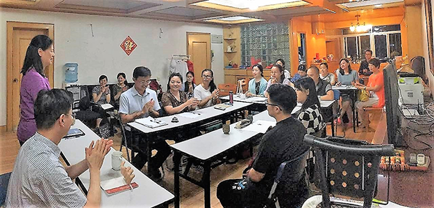

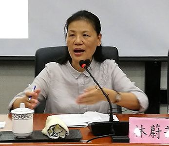

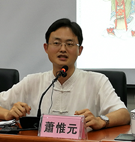

### 心中的香格里拉
			—桃花源記面面觀

心中的香格里拉

—桃花源記面面觀

心若

結廬在人境

而無車馬喧

有朋遠方來

共享桃花源

自從陶淵明寫了〈桃花源記〉，中國也有了自己的烏托邦，梁啟超先生曾把〈桃花源記〉評為「唐以前的第一篇小說」，陶淵明用淺顯易懂、不假雕琢的文字，講一個故事，在其中巧妙地嵌入自己的人生哲學、價值觀，意境深遠，直到今天，尤為經典之作。

故事時間為東晉太元年間，人物是武陵漁人，透過這位捕漁人的眼睛，我們一步步踏入神秘未知的世界。讀的時候我們會有種錯覺，漁人彷彿是偶然發現了桃花林，偶然的走到盡頭，進了山口，發現桃源世界。然而真的是偶然嗎？如果漁人跟平常一樣只是順著溪流走，計算著路程，他就沒辦法「忘路之遠近」。

正因為這一天漁人無意於記路程，忘了目的性，融入在過程中，他才能愈走愈遠，而「忽逢」到一大片潔然純淨、落英繽紛的桃花林，眼前的場景令他震懾，驚嘆居然有這麼陌生潔美的地方，這時候漁人有很多選擇，他可能流連忘返、停滯不前，可能駐足回轉，唯恐這只是個美麗的陷阱，也可能一路前行、探個究竟。正因為漁人強烈的好奇心、渴求的慾望，才會「欲窮其林」，想去看看林子的盡頭是什麼樣貌，是漁人求真的性格，成為入桃源的必要條件。

樹林的盡頭是水源，水是從山裡面出來的，山有個小洞，隱隱約約透出幽微的光芒，陶淵明用非常奇幻的寫法，讓我們透過這個小口，感受另一個未知的世界，漁人又再一次做了抉擇，他「便捨船，從口入」，捨棄了自己的職業，進入小口，可見捨是入的開始，有捨才有得。漁人一連串的心理活動，從「忘」到「忽逢」到「甚異」到「欲窮」，揭示了發現桃花源的背後，雖然仰賴環境的際遇，但更重要的是漁人的個性特質使然，他的想法與決定組織了這場奇遇，這一切看似偶然，其實都是偶然的必然。

洞口是一個奇特的意象，連接了兩個截然不同的世界，「初極狹，才通人」，剛開始很狹窄，僅能容納一個人通過，繼續前行幾十步，便「豁然開朗」，柳暗花明又一春，別有一番天地，沒有前面的艱苦，便沒有後來的開闊明亮，很多人生的道理亦是如此。而這數十步的距離，讓我們離洞外的世界更遠了，更全然的投入洞內，探索全新的世界。

出洞後，漁人看到的是一個樂天知足、鄰里互通有無，環境整齊、舒適宜人的小型村落。寧靜和平的桃源，突然闖入一位稀罕的外客，村子裡的人並沒有疑懼以對，而是至誠的邀請款待，家家戶戶以最好的食物、酒水熱情招呼，風氣純善。村人自明來歷，原來他們的先祖為了躲避秦時戰亂，而舉家、舉鄉逃亡搬遷，與外界隔絕，「乃不知有漢，無論魏晉」，漁人把外界的消息一一說給他們聽，村人都很歎惋，感嘆時移世易，六百年間天下不斷換主人，而依然是亂世，百姓何其無辜，遭此禍患荼毒。

桃源世界美在哪，這個地方像是早期的農村社會，也像是老子小國寡民思想的具體實踐，為何可以成為中國人心中的烏托邦呢？我們歸結桃源的美，主要來自三者，也就是天然的環境美、濃厚善良的人情美，以及祥和友善的政治美，不管時代如何變遷，這三點原則永遠是人民心中嚮往的淨地。而在陶淵明身處的亂世，桃源世界更宛如仙境般，難以企及。

漁人停留幾天後，決定告辭離開，村人叮囑他說：「不足為外人道也」，簡單的話語隱含了許多憂心。漁人既出，「得其船」，前面的捨船，現在的得船，代表他恢復了自己的職業身分，而沿著先前的路，不斷的做記號，這時候的漁人，已經不是之前的漁人了，他充滿機心，企圖以各種符號打通桃源。回去後，他趕到郡衙門拜見太守，報告一切的經過，太守立刻派人跟隨漁人尋著先前的記號，找尋桃源的蹤跡，但竟然迷失了方向，找不到舊路。我們不禁納悶，漁人既「處處誌之」，又如何會迷路呢？陶淵明的哲學思想自然而然的潛藏在文章中，說明當漁人有了心機，就失了天機。

文章到這邊可以畫下句點了，而陶淵明又加了最後一段，南陽劉子驥，是位高尚的隱逸之士，他聽聞有桃源，便欣然的規劃前往，還沒去成，不久便病死了，「後遂無問津者」。

一位是官方人物太守，一位是高尚的隱居者，他們都聞之心動，而終究不可得，於是再也沒有人相信桃源世界的存在了，讀完不禁有種莫大的悲哀與感慨，連寄託之情都被否認，桃源世界離現實生活愈來愈遠了，有人說陶淵明創造了理想社會，又親手封閉了這樣的世界，真的是如此嗎？

也許我們可以在陶淵明其他的作品中找到答案，他曾寫了一首飲酒詩：「結廬在人境，而無車馬喧。問君何能爾，心遠地自偏。」陶淵明居住在人境，居然能不聞車馬喧囂，正因為他心無窒礙，故可以不被外境干擾，動中自有靜趣，也才能悠然自得，陶淵明在心裡開闢了一座桃花源，與他境界相合的人便可以「從口入」，可見桃花源雖然具有封閉性、私密性，但同時更具敞開性、共享性，志同道合者可以與之和合、共生、共創，讓桃花源有無限的可能。

讀完了精采的〈桃花源記〉，對應到生活中，很多人生的答案便呼之欲出。我們是不是也能在人生的過程中，放掉一些汲汲營營追求的事情，而忽逢到通往學習的桃花林，產生好奇心，慢慢去追溯源頭，找到透出幽微光芒的山口，捨去了很多世俗的干擾，從洞口進入，進入經學的學習。剛開始的時候，或覺得很狹窄，幾乎進不去了，艱困又孤獨，甚至不堪，但堅持的繼續往前走，有一天在眼前展開的將是豁然開朗、一片光明的景象，出路的廣闊令人難以想像。而在那片土地上，跟從良師益友不斷切磋琢磨、砥礪增上，彼此互通有無，經營一個美好的未來，培育自己心中的桃花源，這會是一個別人偷不走，也不用擔心消失的世界，試問為何能夠如此呢，因為「心遠地自偏」。而且要永保初心，記得最初的動機與方向，否則便會像漁人一樣因為變質而失了天機。

希望大家都能進入桃花源世界，開闊心胸與見地，它會顛覆你的想像與認知，得到人生真正的快樂與意義。就讓我們一起努力，培育一座自己的桃花源，找到屬於心中的香格里拉吧！
