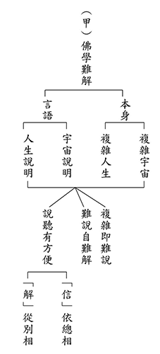
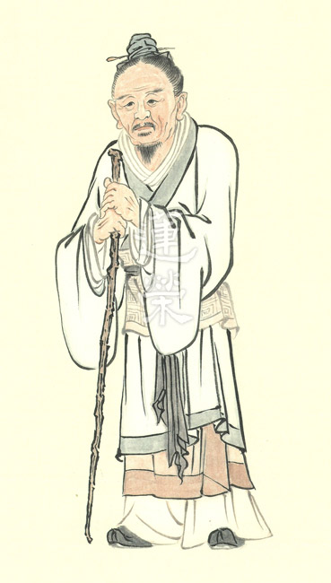
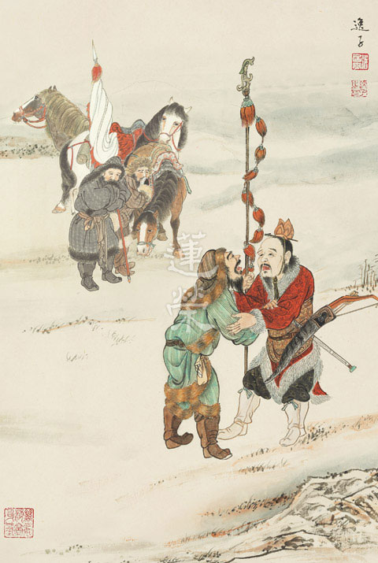
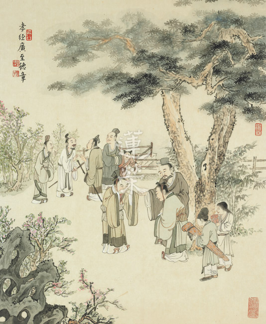

# 第111期
.jpg)

## 社論

### 無盡燈的基因

本刊

核心價值須確立

團體靈魂內心依

充實內涵通古今

與時俱進不忘本

從現代生物學的觀點，物種之間靠著遺傳物質延續生命，並將其性徵從上一代傳到下一代，透過這樣的遺傳機制，不僅能夠維繫其族群命脈與特徵，更能以此為基礎，產生多元化的發展來適應環境的變化，然而如果追溯其本源，初始基因卻又未曾流失，一直保留在子子孫孫中，代代相傳。現代人將此傳承與延續的意涵加以衍生，作為精神的象徵，稱之為核心價值。

猶如基因一般，核心價值是團體延續的依據，它不隨時間而改變，可以歷經百餘年，又能富含變化，順應時代所需。反面而言，假如沒有核心價值，團體與個人將不知如何永續發展，亦無法得知方向，更不能產生適當的生存對策。由此我們便能明白，當一個團體喪失核心價值的時刻，即是其滅亡之時。

既然如此，本會的核心價值究竟為何？探討核心價值，必須先談傳承，本會創立社團之始，即是一種傳承，所延續的核心價值，乃是依雪廬老人經學的見地，其中包含儒家與佛家，並且擴展至道家。儒釋道三家既可彼此會通，又能互補不足，其思想體系可大分為二：形而上與形而下。形而上的部分可以結合老子無為的思想、儒家性與天道的概念，以及佛家空性的內涵；形而下的部分則是儒家的修身、齊家、治國、平天下，還有佛家的發菩提心，以世俗各種方便去利樂有情。上述的種種內涵，在學習經學的過程中都必須細細講究、抉擇。然而，要如何才能夠抉擇出高度的見地、正確的方向、自我學習的能力與實際利他的方法？不但要多多聽聞，還要有架構性的思維、習作科判的訓練以及辨別註解的眼力，能讀出經典中前、後文的關聯性，以及不同經典中彼此的互相註解，都是必須具備的能力。更甚者，要能結合時代的進步，對於美學、歷史、人文與科技等知識皆有所涉略，將世間的發展納入對經學的了解，若能善用現代的語言闡述古代的經學，則能帶領現在的年輕人，使他們理解古代的精神，通達先民的智慧。

為了訓練講學、弘揚教法的人才，其培養還得從辦事練起，除聽聞外，辦事也是一種很重要的學習，在辦事中可以看出一個人在逆境和順境當中，他的心智是否堅定，是否有對治煩惱的力量，所學習的經學見地，是否能在境界中用上力，透過架構式的學習，在各種註解的抉擇中培養眼力，多多觀看現代人的作品，做為經教的補充和體悟，所謂「研經貴在得旨，文字要求練達」，語言、文字就是思惟力的訓練，所謂的辦事，也是在辦事當中練習自己的思維，假如思維越嚴密、越周到，事情就辦得越好。如此一來，經教的學習便有別於一般的學習，不但在架構上講究、在邏輯上分析、在語言上表達、在文字上敘述，在辦事中成長。唯有人才的培育與延續，才能令團體一代一代穩健地往下走，若人人有這樣的思維，團體定能莊嚴又有道心，能攝受自己和他人的身心，成為真正培養人才、弘揚正法的地方。

一言以蔽之：「沒有無用的經學，只有不合時宜的經學。」若人才能延綿不斷，經學就能不停演進。又如《論語》所言：「其或繼周者，雖百世可知也。」我們依著傳承的見地，培育時代的人才，以此窮盡一生；這般心意，成立之初是如此，現在依舊如此，未來也將如此。

## 佛學覽幽

### 菩薩清淨的行持
       —華嚴經淨行品（二十七）

菩薩清淨的行持

—華嚴經淨行品（二十七）

*戒慧講述‧編輯部整理*

生活點滴與法聯

舉手投足成佛因

福慧資糧少積多

功德法財能莊嚴

丙二、指事顯因答其徵因

丁一、總徵

丁二、別顯

戊六、乞食道行時願(五十五願)

在路上托缽乞食時，會遇到各種狀況，我們應該如何發願？乞食道行共有五十五個願，有三大類型。第一是水陸還是陸路，第二乞食時會碰到什麼事情，第三會碰到什麼人，以上共有五十五願。

己一、遊涉道路(十二願)

遊即是遊走，涉是涉水，即出家人遊化他方包含了水路及陸路，此是總說遊涉道路。

己一、遊涉道路  執錫杖

經文：

手執錫杖，當願眾生，設大施會，示如實道。

第一句是願所依，願所依的發心菩薩，手執錫杖。第二句當願眾生，能願的是菩薩，所願的是眾生。後兩句是願所成的效果，分兩部分，第一是此願對眾生而言，能設大施會，示如實道；對自己而言，也能夠設大施會，示如實道，並能成就前面所說的十項功德。

觀修亦分為二個部分，第一部分有四點：若眾生可以設大施會，示如實道該有多好；發願我要讓眾生能設大施會，示如實道；我要幫助眾生有能力設大施會，示如實道；祈求三寶加被，我能夠獨立讓眾生設大施會，示如實道。第二個部分，我們可以了解此等願所達成的效果，最終目的就是讓自己能證入空性，並且究竟成佛，以上分成這兩部分觀修。

會性法師說，不只出家人，我們在家人也會碰到彎路、直路等各種狀況，把握〈淨行品〉的精神來發願，使我們在日用平常中成為修學者，將日用平常的造作都轉成成佛的資糧。

手執錫杖是頭陀十八物之一，設大施會與示如實道有何關係？及手執錫杖與設大施會示如實道有何關係？大施會就是要顯示如實道，乃以說法的方式顯示如實道，說者悟如實道而說，聽者聽而悟如實道，整個法會就很有意義了。

學法者有信行人跟法行人二類，菩薩十地、小乘四果，此約所入，信行人跟法行人是能入。法行人是對佛理經過思維抉擇，方對佛法產生信心，信行人則是凡佛所說都相信，行者有這兩種不同。

《金剛經》說，佛說法四十九年無法可說，是因為必須對著聽眾而說，而聽眾根器有利有鈍，所以佛說法就有了義及不了義，法行人是因為聽了佛的了義之言，對佛生起信心，也知道佛說不了義是方便法，可是信行人若聽佛的了義之言，或驚恐或不信或毀謗，以上是信行人與法行人的不同。

設大施會，示如實道，是為了顯示佛法流通的殊勝，以大施會彰顯說如實道的殊勝，佛法就能完整的流通，能使老百姓對佛法生起信心，進而有勝解。

手執錫杖與設大施會的關係：必須先知道錫杖本身的意義，再來了解錫杖與大施會之間的關聯。錫杖分意義和作用兩點來說明。錫杖的意義有四，第一個是「輕」，煩惱變輕，除掉煩惱可以出離三界。第二個是「明」，能夠得到智慧明了佛法。第三個是「省」，能省悟世間的苦。第四個是「疏」，能疏斷五欲。所以錫杖又稱之為智杖，因為能彰顯聖智之故；又名德杖，因為能行功德本故。所以總說錫杖是聖人的標誌，賢士的銘記，道法的法幢，錫杖代表的就是正法。

而在作用上，南亭老和尚提到，第一是行道比丘執錫杖以為威儀。第二是乞食時會用到的，年長者可以當作拐杖，遇到獸蛇等類可以做防禦，乞食時能振動錫杖，讓施主知道。

所以可以從它的作用上及意義上各取ㄧ分，在意義上，錫杖代表的是法幢，在作用上它也有乞食的這一分，若將乞食跟正法作結合，可觀想供僧的人不只我ㄧ人供，甚至能做大施會，能供千萬無數的人，將之擴大，能夠廣大的宣說正法。若將錫杖表徵的意義擴大，就可以跟設大施會來做結合。

執錫杖就是到施主家去乞食，施主給他食物，於是發願施主有能力提供所有修行人的食物，叫做設大施會。而修行人接受供養，能夠說法令究竟了義的法義流通，謂之示如實道，這一分是修行人對社會的貢獻。

藉著施主財施時，比丘予以法施，彼此是互相得利，相得益彰，所以手執錫杖時，希望這樣的風氣能夠開展。

己一、遊涉道路  執應器

經文：

執持應器，當願眾生，成就法器，受天人供。

會性法師解釋應器分兩種，第一應器在中文翻譯成缽多羅(簡稱為缽)或是應量器。第二成為合格應器的條件有三點：質料、顏色和量度。在質料部分，只有瓦和鐵兩個材質是核可的。印度當時無論出家在家皆是用缽吃飯，為了要與在家人及外道有所區別，所以佛陀特別在質料上做了規定。其次顏色，多採咖啡金黑色，此顏色是用竹煙去把它燻出來的，用竹煙燻有兩個好處，第一個就是能夠讓顏色變黑(咖啡金黑色)，第二個是能使食物不易變質，古時候剛燒好的瓦，碗底會凹凸不平，盛過食物之後會殘留在裡面，不易洗淨。若用竹煙燻過，就能讓表面較為平滑，容易洗淨。

最後是量，因人的食量而分大小，一般來說有三種尺寸，大的容量不超過三升，小的不小於一升半。會性法師提到，為什麼要這麼大呢？即使是一升半的米一個人也吃不完，但大的甚至要到三升這麼大。其實在當時，乞食的食物都分成三份，一份是給在寺內的執事者，一份是生病的比丘，這二者都沒辦法外出托缽，所以必須要留給他們一份，第三則是要施於乞丐、殘疾人士、動物等等。所以拿到這個缽的時候，就要想到其實不僅自己需要飲食，還要留這三份，所以這個量才要這麼大，光一個出去托缽的事情，就有愛心在裡面，釋迦牟尼佛制定戒律，其實都是替他人著想。

另外托缽時還要考慮到他家的門雖然是開的，你也不要進去，用錫杖敲，他不出來你就要離開，這些都是替他人著想。而給你什麼東西，你不去挑好嫌壞，好的不生貪、壞的不生瞋，都一律懷著感恩，並趁這個機會以佛法的法義回報。缽要成為應器，器要合乎那個量，合乎你的需求以外，還要替別人著想，還要講究材質、顏色，以上是缽的涵義。

鐵缽跟瓦缽當中特別以瓦缽為主，當我們出外托缽執持應器之時，當願眾生成就法器，受天人供。我手上拿著這個應器要想成，當願眾生能夠成就法器，法器中所裝的不是飯，而是正法，若能成就，就堪受人天供養，包含天上及人間所有眾生都能堪受他們的供養。執持應器，就是直接顯現法器，食器裝食物，法器裝法。阿羅漢的三義：應供、殺賊、無生，其中應供是堪受天人供養的那一分而安立。（下期待續）

### 大乘百法明門論簡說（十九）　拾壹、心所有法｜徧行(三)

*戒慧講述‧淨本整理*

一念五分依名言

了解心之各面向

推動善業利有情

不令煩惱壞善根

經文：

第二，心所有法，略有五十一種，分為六位：一、徧行有五，二、別境有五，三、善有十一，四、煩惱有六，五、隨煩惱有二十，六、不定有四。一、徧行五者：一、作意。二、觸。三、受。四、想。五、思。

「思」是支配各種心理與行為的原動力，可分為：一、審慮思：在內心籌畫、度量此事應不應做。二、決定思：審慮之後，決定此事應做。三、動發思：既然心意已決，遂發動身口去造業。

審慮思、決定思屬於意業，動發思屬於身口業。當前一念思有推動心理上生慚的力量、生愧的力量、生貪的力量等，以及推動嘴巴去說話，推動身體去造作。比如看見水時，思推動了貪心所，然後推動了身業伸手去拿，推動口業說這杯水是否好喝，所以身口意三業的體性就是思，《百法直解》云：「令心造作，以為體性。」即思心所的定義，能令心王、心所去籌謀、計慮。思心所的業用為：「於善惡無記之事役心。」思鼓動吾人之心心所，對著善事造作善業，對著惡事造作惡業，對著無記事造作無記業。善法十一被思推動出來就叫做善業，根本煩惱六和隨煩惱二十，被推動出來就是造作惡業，配合善業推動身口的就是善，反之即為惡業。

凡聖差別不在於聖人沒有順逆境，而在於聖人知道順逆境的無自性。聖人同樣會面對悅意或者不悅意的境界，同樣會有苦樂受，但是他對於三界的安樂能夠造作厭離，逆境中能造作堅忍不拔。所以思心所的運用中，即見凡聖差別。凡夫才會造作貪瞋癡的惡業，聖人造作無貪無瞋無癡的善業，比如說遭遇痛苦，聖人懂得藉此體會眾生痛苦，因而造作大悲的善業；凡夫則只會造作畏懼或瞋恨的業。所以作意觸受想思凡聖皆有，不可誤會聖人在世間上沒有苦樂受、沒有感情，《百法》的研學讓吾人對心理有深入的了解，對於使修行方向不偏差，有極大的重要性。

五徧行遍一切時、遍三性、遍八識、遍九地，因為每一個心念都有五徧行，所以叫做周遍行起。作意觸受想思是當前心念生起時，用不同的角度去觀察，並非自體性存在這五念，此即一念五分說。以眼見色為例，眼睛看見茶杯，需要透過作意，否則視而不見；不同的人可以看見茶杯上不同的細膩處，是屬於觸的作用；因為看見茶杯，所以產生了苦樂或不苦不樂的感受，是屬於受的作用；納受的茶杯形象，同時說是茶杯（安立了茶杯的名言），是屬於想的作用；美麗茶杯生起想要的心態，或是可要可不要，那是思的作用。如果作意在觸受想思之前，則作意時尚未發生觸受想思等功能，此與吾人日常中眼見色的事實不符；而如果作意在觸受想思之後，則觸受想思不需要作意也能產生。因此作意與觸受想思必須同時，但也非自體性的同時存在，只是名言上的關聯，否則作意與觸受想思成為無關，因為有自體性表示可以自體存在，不必觀待其他。作意與觸受想思的關係如此，觸受想思彼此之間的關係亦復如是。憨山大師在《百法論義》說：「此五徧行，雖有五法，其實總成一念。」

五徧行與十二因緣

五徧行是作意、觸、受、想、思，而十二因緣中也有觸、受、愛、取、有，兩者是否相關？十二因緣是引業的觀察，無明、行所薰下去的識、名色、六入、觸、受，是講來世的生命功能，透過愛、取的滋潤，使之成為來世的生命現象。無明就是我執，對於法有自體性的執著，使之想要利益自己，行就是造作。想要利益自我並非壞事，可是源於無明，不是以大悲心、空性的智慧去造作種種世間的善惡業，善業引向人天，惡業引向三塗，這些引業才是十二因緣所要觀察，其他各種無量因緣則不是十二因緣所要討論的對象。識是來世的心識，究竟會在鬼道生起鬼心，還是在人道生起人心，吾人來世的命運眼前決定。名色的名就是心理作用，色就是生理作用，六入是六根成長，觸是能夠接觸到環境，受是接觸環境所生的感受。

為何十二因緣沒有提及作意？作意可分為兩種，一種是隨順著以往的習氣，並沒有仔細留意，此種作意功能不大，因此十二因緣直接說觸、受並未提及作意；而另一種是被訓練過的作意，《百法》中特別為修行人提出，正說明要去訓練自己的作意在正法上，而不是隨順著習氣。十二因緣中也沒有提及想和思，因為觸、受是引起俱生執的根本，想思是引起分別執的根本，十二因緣是針對一般人都會有的俱生執去觀察，分別執是要信了宗派才會有。在許許多多的引業中，要透過臨命終時愛、取的滋潤，才會成熟為來世的引業。（下期待續）

### 佛學概要十四講表簡說（十三）　第二講表

*戒慧講述‧宏法、淨昌整理*

法之生起是世俗

法之體性是勝義

一念通達二面相

能所双亡又觀待

前言

學佛最重要的中心思想在第一表，惟一般人以為僅是名相介紹，十個學佛人中九個無此中心思想。而第一表重點在形而上，正說明人生的決戰點在形而上。蕅益大師將〈大學〉的宗旨，歸到明明德，大師亦有相同見地。

第一表之形而上雖是中心思想，然形而下的資糧也不可以被忽視。阿羅漢即使想要得到一切智，也要以世間的善行為輔助。譬如說行孝道，使他容易親近善知識。佈施，容易有道糧。持戒，容易生到尊貴的種性，這些都是他的道糧，能以道糧的見地，來修世間的善行。

第二表是形而下世間法的觀察。於分析體相用的體時，是形而上學。中心思想雖然是在形而上，可是須借形而下的觀察才能通達形而上。如在一法上通達它自體性不可得，即孔子說下學而上達。第二，要藉形而下廣大菩薩行的福作為資糧，讓自己通達形而上，這就是說第二表的理由。

第二表在相、用、因、緣、果、事的觀察，是形而下的觀察。通往理、體的時候，又從形而下通往形而上，而在這個過程當中，形而下又是助成通達累積形而上的福報。

研究佛學須先略知別相

第一表是學佛，第二表是佛學，其間的關係，如果沒有透過研究佛學，沒有辦法建立正知見，沒有成佛的方法又如何能成佛？研究佛學，是研究如何成佛的學問，釋迦牟尼佛說法四十九年，引導眾生修學，祖師大德一生花最多的精力，即是著書立說與講學。他們對生命無常是很有覺受的，研究佛學非消磨光陰，而懂得成佛的方法再來修行，此人才謂之修行善巧。譬如學習理工科，如果不懂得操作機器及作實驗的理論與方法，如何能操作機器及作出成功的實驗呢？

研究佛學須先略知別相，別相就是差別相。差別相中有世俗、有勝義，必須要有兩相的通達。第一表是通達勝義諦，可是如果沒有通達世俗諦，是不能通達勝義諦。所以第二表令學習者通達二諦(世俗諦和勝義諦)，是別相中的大差別，詳細的說，就是體相用因緣果事理。

為什麼要先略知別相？甲表告訴我們，佛學是難解的，所解的內容是非常複雜的宇宙人生，言語說明也非常困難。建立正確的人生觀和宇宙觀的本質，是幫助成就自己與眾生的解脫，方能使我與有情離苦得樂。然而要成就我與有情的解脫，此非般若智慧不可。

(甲)佛學難解

(乙)諸法三分

(丙)生起三由

(丁)法有兩端

甲表，就是告訴我們佛自己也難將佛法說清楚，或問佛不是辯才無礙嗎？為什麼說不清楚？因為要觀待眾生的機（根器）。不是佛說不清楚，是沒有辦法說清楚，因為眾生沒有能讓佛說清楚的根器。

甲表，是佛學難解，要如何解呢？乙表，佛學能將世間萬法解釋清楚。了解可以從法之體、法之相、法之用三面相來瞭解。

丙表，說明一切萬法體性雖了不可得，但卻隨因緣而生起，因緣是起相的因緣，果是因緣所結的果。此果相必有其作用，此緣起之相用，正彰顯無有自性之體。

丁表，此緣起之世俗法有兩端：事和理。觀察緣起之法，可分兩端觀察，謂之事相，以及依體（一異之證）觀其體性，無微塵許體性可得。

孔子在《論語》中言：「有鄙夫問於我，空空如也，我叩其兩端而竭焉。」法有兩端，依空空如也的證悟，將法之兩端（事、理，功、過）說清楚。

甲表、佛學難解

本身─「複雜宇宙、複雜人生」

言語─「宇宙說明、人生說明」

緣起的道理，無人有能力觀察清楚，例如生從何來，死從何去，不但難知，連用言語說明也難。

這些善惡報應乃至形而上的道理，實難以說清楚，一是眾生善根（悟性）不足；二是宣說的語言有其侷限性，世人也很難藉著世俗的語詞體會這些緣起的現象。

再者文言文的經典轉化成白話文也難，每個時代都有其所用的語言，如果沒有解經的人才，整個時代會出現文化斷層的危機。醒公曾說：《往生論》中曇鸞法師註所引用當代的典故，已不易瞭解。諸多古籍只能在文字上了解皮毛，文字所詮釋之義，讓人難解。

說聽有方便

說聽是研究佛學的本質，經書非一己的能力所能了解，研究佛學不能離開說聽，研究是透過聞思修，聞思修如果不是從聞入門，哪裡來的思修。所依之「方便」即「信依總相，解從別相」，就是從「信」、「解」來入「說聽」。

「信、解、行、證」為學習佛法必經的四個過程，此處只提「信、解」，是因為如果沒有「信、解」，何來「行、證」，「行」是從「信、解」來，所「證」的也是證「信、解」的內涵。「說聽有方便」就是從「信、解」先入門。

信依總相

「信」依從的是總相，「解」依從的是別相，我們對佛的信心有各面相，例如佛的功德、神通、道力及德能等等，然總相在佛語。佛語才是學者信的總相所在，沒有透過佛語的宣說，我們永遠無法破迷啟悟，既不能破迷起悟，則無法離苦得樂，無法離苦得樂則信體有何用？

若無對佛法之信心，只是相信佛的神通德能，會如何呢？就像阿難，遭摩登伽女之難，就算釋迦牟尼佛令文殊菩薩帶佛頂咒（楞嚴咒）去破了摩登伽女的淫咒，解難只是一時，下次依然遭難。佛以七處徵心問難阿難，方令阿難證得般若慧，永遠離開魔難。佛法無人說，雖智莫能解。不透過善知識的宣說，再高明的學者也無法了解佛法。

三寶的功德就在佛語上顯現，歷代祖師最重要的工作就是培養人才，要如何培養人才，就是把佛語講清楚。難道修行不重要嗎？原來解佛語就是最好的修行，去幫助眾生解佛語就是對眾生最大的恩德。雪盧老人曾說：我的侍者侍奉我二十六年，他也不知道我在幹嘛。沒有透過佛語的了解，我們根本無從了解大德的內心世界，他是怎麼用功，他對機的時候是如何降伏其心，所以金剛經也是一樣，如來善護念諸菩薩，善付囑諸菩薩，如是如是，他就問如何降伏其心，佛不說，你怎麼知道他如何降伏其心的辦法呢？我們看龍樹菩薩，做了〈中論〉，就是為了把《大般若經》說清楚，而且不斷的宣說《大般若經》，他的弟子提婆論師，一生的重點也是在解釋〈中論〉的〈百論〉。人生最大的意義就是去解佛語，叫做「信依總相」。佛語如果不去解，眾生是不可能破迷啟悟，不可能離苦得樂，學佛的中心價值就不見了，作為佛教徒的意義在哪裡？

「信依總相」就是我們可以相信佛的智慧道力功德，他在夢中撫摸我們的頭結果我們頭痛就好了，這些都可以，但是最重要的總相就是佛語。如果我們一生的重點不在解釋佛語，讓這個傳承懂佛語，懂得上一個時代，從上一個時代再懂上一個時代，一直通到佛真正的想法的時候，佛法就能住世，就能弘揚，就是因為大家都不懂佛語。《論語》也是，大家都不懂，所以批孔的事情也能做得出來，因為大家都不懂得孔子的內涵，所以孔子會成為學子們的中心人物嗎？校園的同學們聚會會給孔子鞠躬嗎？老師也不見得尊重孔子，何況是學生，就是沒有了解孔子，沒有了解佛語所產生的問題。我們現在學完論語了解到，孔子是通達形而上形而下，能通達人情世故，又極有經驗閱歷，處世能夠撥亂反正。這樣人當你越讀越了解的時候，他怎麼不能住世呢？當你覺得他毫無用途，從來不了解他，再塑造他的塑像又有什麼用呢？

解從別相

我們透過相信佛語，從佛語的內涵引導，進入修學，就是從下述乙表到丁表，所要開出的八面的尋求。解從別相就是從佛語，對每一個別相做八面相的觀察。透過佛語對法做八面的觀察，唯有佛才懂得，唯有佛才能如實的這樣觀察，透過佛語去了解世間，了解世間的每一個現象。如何了解？八面觀察，「體、相、用、因、緣、果、事、理」，讓我們通達世間和出世間。在體、理上的通達得到出世間、形而上的通達，在相、用、因、緣、果、事上的通達，得到形而下的通達。佛語的價值是沒有可以取代的，透過世間語是不可能了解這些的。要透過能夠解佛語的傳承，才真的懂得出世間。懂得形而上的人是一個超越的人，他不會有貪瞋癡的繫縛，走入形而下的時候又能夠修廣大的福德。

如述記云：「信↓解（悟）↓行（修）↓證（斷）」佛法修學的四步驟。眼前談「信、解」，第一個是為初機而說，其次是「信解」也是最關鍵的一步，行持只不過把信解的內涵不斷地在定中串習，用佛語做八面相的觀察，可以通達世間與出世間的信解力增勝，升起的比量智慧的這一分是「行」，升起現量的那一分是「證」。

「信」，第一步須對佛語完全有信心，修行人可分為「信行人」及「法行人」兩種。第一種是「信行人」的信心，「信行人」是完全相信佛語，根據他的根器去了解佛所說的內涵。第二種是「法行人」的信心，在學習的過程中對佛語的內涵有疑惑，但是透過疑惑去探討，而得到正解，他解的越深入，他的信心越強。所以佛對「法行人」說你可以懷疑，但是前提是你要解進來看我是對還是錯，而不是在外面毀謗。越解越信，越信越解，這是「法行人」的修學法。

或問「法行人」還是「信行人」的功德大？當然是法行人的功德大，因為佛法要住世、要弘揚，是要靠對法的了解。雖然表面看起來法行人不是從信心入門，但是對法的了解有助於信心的成就。所以佛法的入門各個不同，信行人的入法就是信解行證，法行人的入法是起疑心，而解，而入。佛法可以多面向的去講。當然十四講表只能從某一面向來說，不然需要變成幾十種講表，十四講表也不妨礙各個學者對它的理解和講述。

對佛語的相信是所有相信的總，佛語的總拿掉，所有佛行的事業也就垮了。佛的神通跟外道一樣，佛死後燒出舍利子，外道也燒得出舍利子；佛死後很安詳，外道死後也可以很安詳；佛會入定，外道也會入定；佛很慈悲看到受苦眾生傷心會流眼淚，外道也會流眼淚；佛法跟外道看起來沒有分別，如果有一天佛教徒沒有像其他外道一樣慷慨的布施，就會被淘汰了。佛語太重要了，各個祖師大德最在意的就是解佛語，譬如《佛說阿彌陀經》有二十八家的科判註解，到了蕅益大師的〈彌陀要解〉被印光大師評價為「古佛再來不過如此」，雪公老師竟然再做科判，輔以〈摘注〉和〈義蘊接蒙〉，為什麼不按照古大德的註解即可？不然，各有看法，所以這一生，如何把佛語看懂，這種修行太重要了。

《金剛經》上宣說佛語的功德是：「佛為真語者、實語者、如語者、不誑語者、不異語者。」我們要如何能相信佛語是總相呢？因為佛的話可信，佛是真語者，也就是勝義，是形而上的這一分；實語者是針對形而下的；如語者，我們常說如是如是，是勝義諦和世俗諦二諦的合說；不誑語是不會欺騙眾生，是對著眾生的那一分說；不異語是佛所說的話是前後一致的。

欲成立佛說甚深緣起的這一分，要從不異語這一分來說佛語前後不相違背。佛以現量來通達甚深的緣起，阿羅漢也通達不了八萬大劫以前的事，凡夫只能以比量來通達，凡夫如何生起比量？相信聖言量。如何相信佛所說的法？譬如佛說雪山是白色的，這件事凡夫也看得見，可以現量通達，當佛在說一些隱密的法，例如無常法的時候，我們就比量來通達無常法，相信不現見的無常法，其次通達不現見的「空性」，也是隱密法。極隱密是指甚深的緣起，因為隱密的法已經比量通達，就能夠用相信佛語的方式來比量通達甚深的緣起。例如說布施來生成為富貴，持戒來生成為種姓尊貴，忍辱來生成為相好跟眷屬，精進來生成為事業種種通達，雖然不會現見，但是我們通達其中的關連性，這叫做比量。就好比海市蜃樓在那裡，我們雖然看不到它體性空，可是我們可以比量知道它體性空，也沒有違背事實，但並非我們眼前所見，就叫比量；沒有違背事實又眼前呈現的是現量。

佛語的可貴處是讓眾生能夠破迷啟悟，其本質就是三法印。所以這個正在解佛語的人，解的是不是佛語，要看他所說的是不是符合三法印。三法印是最重要的，這個人如果不從三法印解佛語，他解的不是佛語，這個人如果用三法印來解佛語，就算是外道，也等同佛語。所以佛說法，不一定是佛說，只要符合三法印，五種人說法都等同佛語，〈大智度論〉第二所謂「佛法有五種人說：一佛自口說，二佛弟子說，三仙人說，四諸天說，五化人說。」只要通達三法印來解，這個人就成為解佛語的人，言語等同佛，功德比學會很多神通幫助他人都大得不可思議，只有通過解佛語的這種方式才可以幫助他離苦得樂。

三法印是大小乘的共法，小乘的三法印：「無常」、「無我」、「寂滅」；是唯識宗，就另外再成立一個大乘一實相印，實相是指唯識說第八識。如果是中觀宗，就跟小乘的程序一樣是：無常、無我、寂滅，對著中觀宗，不能成立大乘一實相印，所以要有部派的見地才會解佛語。

「無常」，我們去分析世間的緣起法，都是無常法，存在只有當下這一剎那，過去的剎那已滅，未來的剎那還沒有生，所有的存在只有當下的這一剎那，這是小乘的經部。經部以上的部派全部承許這個概念，佛法的見地如此的精準靈動，這叫無常。從無常裡面，告訴我們世間的一切法都是無常的，所以遠離對世間的貪愛。

「無我」就是我們都以為有一個真正的我可求，但是其實這個我沒有真實性。無常，前剎那已滅，當然沒有自體性，已滅的法當然沒有自體性，未來的剎那還沒生，沒有的法怎麼會有自體性，麻煩的是當下的法總有吧？「無我」的挑戰就在當下這一剎那的自體性在哪裡？有的話，就是有一實有法。所以，就算是學「無常」，我們對當下剎那的貪愛還是不會破，因為當下是實有的。所以「無我」所要解決的不是已滅的自體性無，也不是要解決未生的自體性無，而是要明白當下生起的這個東西有沒有自體性。

無常告訴我們人生快樂是會變壞的，樂是會變成苦的，而苦也不會轉成樂。為什麼？一般世俗會認為，我遇到苦的，我就把它轉成樂，但是這樣的做法是眼前的苦我讓他消失，轉到另一個境界，另一個境界的苦又在慢慢生起，所以他是不會變成樂的。人生要用快樂的方式遠離痛苦，問題是遠離不了，比如坐下來的快樂，是站著的苦消失，坐下來的苦正在慢慢發生。單身苦，結婚了，結婚固然樂，但是結婚的苦慢慢生起。升官很快樂？不，是沒升官的苦消失，升官的苦慢慢在生，問很多老闆，勞力的苦消失是不是感到快樂？不，勞心的苦慢慢在生。世間不是這樣的嗎？三界統苦。

從「無常」到「無我」還有一個非常重要的邏輯思維是「無常」可以破初相的執著，可是最微細的執著需要用「無我」的觀察才有辦法拿掉。佛法的快樂是苦因苦果的離開，不是不斷的追尋快樂，遠離痛苦。小孩都希望趕快長大，遠離被媽媽管的苦，結果長大了被媽媽管的苦固然消失了，長大的苦慢慢在生。

把苦因解決的觀察法就是「無我」，因為發現到痛苦來源於煩惱，煩惱來源於執著，執著來源於對「自體性有」的見解。所以「無我」就是對自體性到底有還是無這個事情去做尋求。「無我」是解決苦因，而苦果就可以離開了。苦因苦果的離開是佛法得到快樂的方式，這是世間人都不會有的看法。這才叫做「無常」、「無我」，所以「無常」、「無我」的本質是讓有情離苦得樂。「寂滅」就是苦因苦果的滅，一定要從這三個角度來看佛法，在解釋佛語的時候一定要有這種內涵，這個人就是能解佛語的人。

「解從別相」，在世間的緣起法以八面向來分析。這八面向就跟上述有關係了，這個體跟理可以進入「無我」的道理，在相用因緣果事上又可以看到「無常」的面相，而且還可以通達他如幻的緣起，互相觀待的緣起，名言安立的緣起，所以這八面的觀察太重要了。我們第二表列舉的三組八方面，從乙表、丙表、丁表的「諸法三分」、「升起三由」和「法有兩端」，來說明「體、相、用、因、緣、果、事、理」八個方面。（下期待續）

## 孔學一隅

### 論語簡說（十九）
	  			 —終身行恕

論語簡說（十九）

—終身行恕

*時哉講述、宗徹整理*

恕字終身可行

非賜難提此問

非師難答此義

各種德能推廣

經文

子貢問曰：「有一言而可以終身行之者乎？」子曰：「其恕乎！己所不欲，勿施於人。」

(衛靈公篇第二十三章)

前言

人生成功的秘密，如果要用一個字來總結，假如孔子不說出答案，是否我們可以想得出答案？這個字是否值得終身實踐？是否真如雪廬老人所說：「只有子貢能問、孔子能答？」這個字到底能有多好？實用性如何？對我們的未來有多大幫助？是否能通達所有學問？

孔子回答子貢是不武斷的說，語帶保留，溫厚和平，是聖人說話的藝術。

消文
子貢跟孔子請
**問：** 「是否有一個字可以終身用來實踐？」孔子說：「你所說那個字大概是『恕』吧！就是己所不欲，勿施於人。」

釋義

一、子貢何以有此之問？

子貢想要用一個字來總攝所學的學問，才向孔子問此問題。

若尋覓子貢問此問題的動機。注解說：「學貴知要」。學習一定要找到學問的重點，不能死讀書，要收攝重點到心中。如讀《詩經》完後，就要能夠讀出「思無邪」（溫柔敦厚），讀《禮》後能夠在內心敬、外相恭，約束自己能莊重，讀完《春秋》應該能讀出列國的得失，讀完《易經》應能通達吉凶禍福，讀完《書經》要知歷史，以古鑒今延續善政。

二、如何知一言解為一字？

一定是一個字，因後面回答「恕」字。

唐詩中的五言絕句，就是一句五字，共四句；七言絕句，則是一句七字，共四句。又有律詩，則共有八句，有五言與七言不同。

《左傳》曾引《易經》說：「伏羲作十言之教。」如說乾三連，坤六斷等。又如「十二消息卦」，消是陰長陽消，息是陽長陰消，如：四月是乾卦，五月是陰消陽，是天風姤；六月是天山遯……等。

三、哪一個字可作為我們終身奉行的準則呢？

（一）孝乎？如《孝經》云：「先王有至德要道，以順天下。」曾子以十八章的不同面相來解說孝的意義。是否要以「孝」來作為人生的代表字？

（二）信乎？沒有信，如牛馬車的直橫木沒有金屬的接紐，車子一開，零件就分解。沒有信，如何能推展事業、如何能夠成功？

（三）禮乎？孔子曾說：「不學禮，無以立。」《禮記》甚至說人若無禮，不如早死。

我們如果回到兩千多年，站在子貢的立場發問，一定在心裡想著這個字到底是哪個字呢？或是忠？信？仁？孔子卻說是「恕」，定義是「己所不欲，勿施於人。」然而，五倫八德中並沒有這個字，孔子卻以此字最為重要，到底該怎麼解說呢？

◎己所不欲：我不想要的、受不了的。如人家非義的傷害我、偷盜我、對我家人無禮、欺負我、侮辱我，乃至在我前面踱來踱去，或者不經我同意動我的東西，或者在我面前翹腳、打哈欠等，你不喜歡，那就不能施加給別人。

四、「恕」的具體內涵為何？

（一﹚依《論語》的解釋：自己受不了的，不要給別人。

（二）依〈大學〉的解釋：絜矩之道，即很好的規矩，即將心比心，如果能將心比心，就不必訂定規矩。

「所惡於上，毋以使下」，當上級者若不喜歡被無理要求，就不能以無理的方式要求下級。

「所惡於下，毋以事上」，上級若討厭下級對自己不忠、不信，則不以此侍奉上級；若不喜歡下級對上級陽奉陰違，自己也不會這樣對待上級。

「所惡於前，毋以先後」，如果不喜歡交接不清楚，不喜歡別人倚老賣老，這些都是職務的倫理，則不以此方式來對待後進人員。如《論語》中的令尹子文在楚國當宰相，他的交接最乾脆，「舊令尹之政，必以告新令尹」，因此孔子說他是忠。

「所惡於後，毋以從前」，我如果是前輩，不喜歡後輩不尊重前輩、我行我素的樣子，則不如此來對待前輩。年輕人如果不懂禮，便要吃很大的虧。雪廬老人說「禮」很重要，說自己是吃過無限虧的人，因而編述《常禮舉要》，就是希望年輕人入社會不要吃無意義的虧。

「所惡於右，毋以交於左。所惡於左，毋以交於右。」如果我不喜歡右（左）邊的人對我不守信、不守時，我對左（右）邊的人也不會不守信、不守時。（如江逸子老師見雪廬老人，在約定時間前準時到達，雪廬老人即說：「守時的人一定守信、守分、敬事，必然能成功。」啟發我們不管跟誰約見面，都要懂得給人好印象。）

析疑

一、為何夫子不答恕以外的其他品德？會有什麼問題？

如果孔子答「信」重要，子貢必要問「那禮呢？」如果孔子答「禮」重要，子貢必問說「那信呢？」

如說「孝」，我不希望子女不孝於我，我也必得孝順父母。

如說「信」，我不希望被他人欺騙，我也不要欺騙人。

如說「禮」，我不希望別人對我無禮，我也不對別人無禮。

從此得知：所有的品德，皆因「恕」而能逐漸達到。

二、為何夫子已答恕，又說「己所不欲，勿施於人」？

夫子惟恐子貢不知如何修學恕，就教他：自己不想要的，就不要給別人，將心比心的對待人。「恕」一字推動其他品德的成就，也能以己心通他心，甚至可以避禍得福、離苦得樂。

三、恕與仁的區分為何？

孔子的中心學說是仁，但為何不答仁？

（一）仁難及。孔門七十二賢雖然都是卿相之才，但唯有顏子能及仁，可見仁之難。

（二）仁難說。仁是全德，包含孝悌忠信禮義廉恥。仁是要幫助人成聖成賢，並知此乃人生唯一出路，因此必須充實一切德性，具備性與天道的智慧。透過辦政治、辦教育，方能達成仁。

（三）恕是行仁的方便，可以推動一切德行。孔門學問，若說出世間的道理是性與天道，世間的道理就是恕和仁。

恕的勉強是「己所不欲，勿施於人」，恕的自然是「己所不欲，願勿施於人」。而行仁的行相則是「己欲立而立人，己欲達而達人」。

仁不只將心比心，且知別人就是自己的出路，並要給別人最殊勝的出路─形而下，形而上的通達。因此學習仁的人，會努力找到善知識，在形而上、形而下上充實自己、切磋琢磨。

四、「恕道」能否簡單理解為同理心呢？

可以理解為同理心，即將心比心。會造成自己痛苦的事，便知不能加諸在他人身上；會造成自己痛苦的原因，也不能要求他人去做。

五、由本章子貢與夫子間的問答，我們學到什麼？

我們學會了「學貴於知要」，懂得能從老師處學到要點。

六、子貢到底是否有終身依恕道而行？

孔子曾說「賜也，非爾所及也。」但重在降伏其慢心，並不是子貢沒有做到。

老師對學生有兩種教學法，一是折法，一是攝法。折法可讓學生知道還有很多進步的空間，攝法則讓學生得到增上的力量。

七、他人不以恕道對我該怎麼辦？

若在私下，他人對我沒有恕道，他是小人，我們就遠離他；他若是朋友，你要規過勸善，但次數不能多，不然下猛藥會得罪對方，建議可以用時間去改變對方。

若在私上以德報怨，或在公上以直報怨。如果有人以私害公，破壞公家的秩序、資源，則必得以直報怨，才能整頓風氣、維持善良、警惕惡人。舉例來說，日人侵華，我國可以直報怨，讓日人有所警惕。

八、日用平常中有無錯用恕道的例子？

如一家長到學校接小朋友，卻為了接自己的孩子而將車子擋住其他家長。當其他家長表達困擾，他竟說其他人怎麼沒有將心比心？實則同理心要先問自己是否具備，不是用來責備他人。如果責備他人，則便不是發自於同理心。

九、有注云：聖王用恕不降席而匡天下。試問如何用恕匡天下？

聖人用恕不降席而治天下，此是講舜帝。如他知人民害怕饑餓、受凍，因此便知天下人最需要的是食物和衣服。康熙皇帝治國，就先治水患，以免人民受苦。乾隆曾畫小雞和落湯雞，就是運用畫來突顯老百姓受苦，讓當官者警惕。你怕苦，你怕窮，所以就不要讓人民苦、人民窮。

若懂得運用人才，使之各得其所，則天下大治，實運用之妙只在一「恕」字而已。

十、聖王以仁政匡天下，此處為何又說以恕匡天下？

堯舜以仁心治國，方法可以用恕道，因同理心是大家最容易接受的。於私原諒對方，但於公要處分對方，此之作法是能帶動善良風氣。

總結

一、恕重要，是一切品行的推動者。

二、人在世上，一切都是「百工斯為備」，因此人不能離群索居，也必得與人相處。恕即是必要的品德。

三、用恕最能拿捏人情、找到分寸。

四、此也是孔子勉勵子貢可行者，是吾人人生的代表字，是人生最精華的一字。

問答

**問：** 恕和仁之間有勉強、自然的道理。可否把顏回「屢空」解釋成勉強，孔子「空空如也」解釋成自然的境界呢？

**答：** 顏回是一次一次屢屢達到空的境界，是勉強。孔子的空空如也是自然任運的達到。且入世時，匹夫的問題，孔子能以空空的智慧，就事理兩端回答得恰到好處，且能行禮恰到好處，從心所欲不踰矩。

**問：** 管理公司團隊，是否也有一言可以終身行之？

**答：** 雪公辦事就是以恕道來通人情，如主持奉祀官府，為孔先生安排傑出的好學生加入官府中做事，孔德成先生完全信任而不過問。部屬更在公事做好之餘，剩下時間就努力充實自己，大家都依本份做事，沒讓長官操心過。

企業領導本來就是恕道。老闆站在員工的角度想，員工站在老闆的角度想。過去的廣告是不斷宣揚自己公司產品的優點，現在的廣告是站在顧客的角度思考，關心客戶是否喜歡，公司站在員工的角度想，員工也懂得體諒公司。在以他人著想為前提下，任何規劃都容易落實，公司的營運也會愈來愈好。

過去日本松下企業，就是把公司變成一個大家庭，因此員工能以公司為家。公司為員工辦教育，提攜員工成長，並為安排終生學習計畫，有助於員工的向心力、品牌的提升。

**問：** 假設企業管理中遇到人的問題，如同事、下屬犯錯，會不會因恕道而變成姑息？若不以恕道，會不會成為酷吏？

**答：** 若從同理心出發，則沒有問題。站在他的立場考量，依其能力交付工作；若他達不到目標，則可以要求。

將心比心時，可以鼓勵他、處罰他、開除他、提升他。恕道的以直報怨，與以德報怨不同，要站在公的立場考量。

**問：** 為什麼說只有子貢能問？林放不是也能問禮之本？

**答：** 單純問禮是可以問的，如學禮就要知道禮的重要，因此林放問禮，老師可以就禮回答。

但以一字可終身行之者來說，若非子貢有此悟性提此問題，難有他人可問此問題。

**問：** 請問在日常生活中如何修恕道？

**答：** 恕道的將心比心，在問對方有沒有需要前，先問自己是否有需要。如自己口渴時，知道對方也會口渴。如有人用餐時間來訪，將心比心自然知道要備午餐，且警惕自己，不要於用餐時間訪人，除非他人請吃飯。

如請客時總要多準備，請客的人，不能只講求惜福而準備寒酸；我作客時，總希望主人誠意周到的對我，所以我代客以誠。

**問：** 恕這個字，上面一個「如」，下面一個「心」，學生自己琢磨，到底是心如他心，還是如自本心。

**答：** 恕一定要先知道自己，如害怕挨餓、受苦，便知他人也想要豐衣足食。學生若有心學習，老師便會全盤托出的教導，但如果學生沒有正確動機，則無法教之。

**問：** 如心為恕，奴心為怒。請問老師：制怒是否即為行恕呢？如果時時制怒即為行恕之道，那制怒是恕己還是恕人呢？

**答：** 恕道不只可以克制怒，還可以通達其他的德行。若不願他人對自己暴怒，自己也會將自己的修養做好。

**問：** 前章有說子貢方人，是否此章是子貢方人不懂恕，因此夫子以此誡之？

**答：** 子貢只是問有沒有一個字能終身行之，孔子回答的是天下人都可以行的恕道。當然子貢可以依此來對治自己的缺點，先問自己有沒有過失，再去指責別人。但此章所說的恕，不只是針對子貢，而是天下人都可行之。

**問：** 子貢已是大賢，又是十哲之一，為何夫子只答恕？孔子曾說孝的重要，如何理解「夫孝德之本」這句話？

**答：** 子貢只是問是否一字可終身行，孔子便以恕來回答。此字可以天下人遵之，也期許子貢向仁而上進。

至於孝是品德的根本，若不孝父母則談不上其他的品德。

**問：** 假設有人認為自己管好自己就好，不要碰到人就好，不行恕道行嗎？

**答：** 一般人吃喝拉撒都是別人幫忙，生病也要別人照料。今日不管怎樣隱居，生病還是要下山看醫生。沒有別人服務，自己無法生存，與人互動是必然之行。

**問：** 孔子過世，子貢守喪六年，是否在反省不夠努力？

**答：** 此處反而是彰顯子貢對孔子的孺慕之情，受教之恩難以報答，以守喪六年表達法乳之恩的感念，是真情之弟子！（下期待續）

### 孝道跨時代的意義與價值
				 —孝經簡說(五)　盡孝｜在於講究服飾、言語、行為〈卿大夫章第四〉

孝道跨時代的意義與價值

—孝經簡說(五)　盡孝｜在於講究服飾、言語、行為〈卿大夫章第四〉

時哉講述、淨域編寫

言行如法無怨過

本質大孝事君忠

為國舉才民皆仰

萬民蒙幸如甘霖

眾知國家、企業乃至一個團隊，必要有骨幹。一國的領導人若是明君，則國家會興盛；如果是昏君，國有棟樑之臣，至少還可以維持不亡。如：阿斗有諸葛亮這種卿大夫，可以維持蜀國不亡；衛靈公有公叔文子、史魚、蘧伯玉這樣的卿大夫，使得衛國還能維持國政。同樣地，企業、團隊一定要有骨幹分子，才能夠維持企業與團隊的興盛。

〈卿大夫章〉是《孝經》裡的第四章，當中可以引申的意思非常多。整部《孝經》是個完整的架構，「開宗明義」首先說明此經的宗旨是孝，接著說明孝的修學法，天子應該盡的孝是領導風氣之孝，諸侯要盡的孝是把國家的大政辦好之孝，那麼卿大夫的孝該是什麼樣子呢？我們讀一讀經文，從孔子講《孝經》中識得，原來他的學問是全方位的。哪個階層該盡什麼孝？哪個階層要用什麼樣的內涵來表達孝道？孔子完整地瞭解這些形象與內涵，他的學問簡直出神入化，真是魯國多君子，孔子把這些人的學問都學來，成為他一生的光彩。

釋義

經文是：

「非先王之法服不敢服，非先王之法言不敢道，非先王之德行不敢行。是故非法不言，非道不行；口無擇言，身無擇行。言滿天下，無口過；行滿天下，無怨惡。三者備矣，然後能守其宗廟，蓋卿大夫之孝也。《詩》云：『夙夜匪懈，以事一人。』」

〈卿大夫章〉分為兩段。第一段說，卿大夫的孝在於守宗廟，因為他的功德巍巍，既能夠保有祿位，也可維持他的宗廟；他以辦國家大政的成效，來光宗耀祖、祭祀先人，這就是卿大夫的孝。換言之，卿大夫把國家或天下的大政辦好，成為他盡孝的形象，乃是一種大孝的形象。

其次分別說，卿大夫如何將他的功能發揮到究竟呢？這有三個行為；第一、他的服裝是符合先王禮制的服裝；第二、他所說的話是符合先王的言語；第三、他的行持是符合先王之道。特別於謹言慎行上，是依著先王之道而說，是個能守宗廟者，讓天下人對他沒有批評，這就是卿大夫之孝。後再以《詩經》〈大雅〉詩文來讚歎卿大夫之孝的殊勝之處。

非先王之法服不敢服：此說卿大夫的服裝，先王是指堯、舜、禹、湯、文、武、周公這些前輩帝王，且是具有聖人的德能與天子地位者。法服是合於禮制的衣帽，衣服分為上衣跟下裳，就周朝來說，上衣是黑色的，下裳(裙擺)是紅色的。卿大夫的服裝是尊崇禮制的服裝。

非先王之法言不敢道：卿大夫就道先王所制定的合法言語。非先王之德行不敢行：卿大夫依著先王所顯示的德行而行。以上是卿大夫的服裝、儀容、言語、行為，特別是講言語與行為。

是故非法不言，非道不行；口無擇言，身無擇行：非法不言，言的是合法之言。非道不行，行的是合道之行。口無擇言，乃口只選擇合法之言。身無擇行，是身經過選擇之後，只選擇合道之行。這就是，口沒有可選擇的，只是言先王之法言；身體沒有選擇的，只是行先王的德行。

這樣的人，稱作「言滿天下，無口過；行滿天下，無怨惡。」他的言語能滿天下，所謂能滿天下是指這位卿大夫或是天子的卿大夫，或是國君的卿大夫，是能制定或執行政策的高級公務員。言滿天下即是，他的言語放諸於天下，可以成為準繩，沒有口過，沒有非法之言。他的行為是合法合道的，放諸天下成為標準，沒有可怨恨及討厭的。

三者備矣，然後能守其宗廟，蓋卿大夫之孝也：於服裝、言語、行為三者完備，這位卿大夫是個對國家有貢獻、對社稷有功的人，是股肱之臣，當然不失祿位，天子又怎能離開他呢？此人不失祿位，所以能守住他的宗廟。古代天子有七廟，諸侯有五廟，卿大夫有三廟；所以，卿大夫能夠守他的三廟(一昭一穆與大祖)。蓋是大抵、大略之意，以上大抵上是卿大夫的孝。

卿大夫的孝，是個能「言滿天下無口過，行滿天下無怨惡」，他的言行謹慎有為有守，可以放諸四海成為標準，這樣的股肱大臣，就是卿大夫的孝道。而卿大夫的孝道，使他成為國家的股肱大臣，能夠和合執政的團隊，發揮辦政治的功能，這就是卿大夫的功德。

最後，舉證《詩經》〈大雅〉所說：「夙夜匪懈，以事一人。」來讚歎卿大夫的孝。「夙」是早上，「夜」是晚上，「匪懈」是不懈怠。「以事一人」的一人，就是指天子。可見〈卿大夫章〉是指天子的卿大夫，也可引申為諸侯的卿大夫。上一章已說過，百姓稱天子為「一人」，因為這個爵位只有他有。天子自稱「余一人」，是說我只不過是眾人之一。

析疑

此卿大夫到底是個什麼樣的地位？又相當於現今的什麼官職？以現今政治體制來說，他譬若國家的總理、院長或部會首長。若以省來說，卿大夫就像廳長、局長、處長這樣的人物。這樣的人物如何呢？乃是在中央制定政策、在地方執行政務的重要公務員。此種重要的公務員，若回溯各朝代裡，卿大夫像是各部的尚書或侍郎，例如：吏部、戶部、工部、禮部等，這尚書或侍郎都屬於卿大夫這個等級，既位高又權重，能左右國君發揮政治功效。辦得好國家興盛，辦不好國家衰敗，如王安石變法就讓北宋趨於敗亡。所以，卿大夫在國家裡是非常重要的骨幹人物。

為何這些官員稱為卿大夫呢？在《說文解字》裡，卿稱作「章」，乃文章的章；大夫是「扶」的意思。《白虎通》裡說：章是明道理，扶是扶持，意即卿大夫要懂得進用賢人，不是霸佔位子不放。公司的骨幹懂得為老闆舉用賢才，國家的卿大夫也懂得為國家舉用賢才。這有何例證呢？

《論語》〈憲問篇〉云：「公叔文子之臣大夫僎，與文子同升諸公。子聞之曰：『可以為文矣。』」孔子說：衛國大夫公叔文子，將他的家臣僎同時推薦給衛靈公，所以叫作「同升諸公」。同升諸公並非都當公爵，而是一起到公朝去上班；僎本來在大夫公叔文子處當家臣，乃是在私朝上班，後被推舉到公朝去當大夫上班。所以，孔子聽了以後說：「可以為文也。」即諡號為「文」，就是能進用賢才，這是卿大夫很重要的職責。是故，卿大夫就是「章大扶」，是懂道理又能扶持人才的。對於扶持人才這件事，秦穆公於「秦晉崤之戰」兵敗後，自省說：「希望卿大夫能為國家舉用賢才，而非是位只會表現才華、堵住後進的人，這樣才是真正卿大夫應有的風格與素養。」

卿大夫要穿先王所制定的服裝，而古代依階級制定不同服裝，它的意義是什麼呢？《尚書．皋陶》中說：階層分為五種人，即是《孝經》所說的天子、諸侯、卿、大夫與士這五種人。這五種人的服裝不同，用於表徵他們的身分、職責與該盡的義務。孔子任中都宰的時候，就很懂得用服裝去表現；例如：對遊手好閒的人，讓他穿某種服裝，穿久了便覺得丟臉，因此好好地去工作。這就是一種社會風氣的引導，千萬不要小看了服裝的功能。這幾種階層的服裝，從堯開始制定，延用於三代，這都是有傳承的。其次，《左傳》與孔穎達所注的《五經正義》裡都說：衣服不但表徵貴賤，也表徵了這人的身分。更重要的是表徵此人該有的職責。

先王之法服，該從天子開始講究，何以到此才從卿大夫說起，這豈不是違背了「上行下效」嗎？須知，卿大夫乃屬於制定、推行政策之人，若能莊嚴自己，將有助於政策的推行；若能看重自己，也有助於讓百姓對國家及領導人的重視。再者，卿大夫有自己的宗廟，接見賓客時，也用服裝來表現他的身分。但為何不從天子開始講究，而要從卿大夫呢？須知，卿大夫是個很重要的職位與身分，這個職分所穿的服裝，對上而言不會僭越，對下來講不會逼下。以管仲來說，他是個逼上之人。譬如說，此人「山節藻梲」(出自《論語．公冶長》：「臧文仲居蔡，山節藻梲，何如其知也？」)；山節是指他的家屋斗拱像山，那是國君的規格；藻梲是樑柱上刻畫水草花紋。此外還有「鏤簋朱紘(出於司馬光〈訓儉示康〉)」，鏤簋是指銅器的刻紋，朱紘是指紅色的帽帶。須知，紅色帽帶是天子的服制，諸侯的帽帶為青色，大夫為黑色。管仲為大夫，他穿戴了紅色的帽帶，這就是僭越逼上，所以孔子鄙視他器量狹小。

其次，什麼叫逼下？晏子這人生活很儉樸，於宗廟祭祀往往很寒酸，讓下屬不知該怎麼辦？例如：公家機關的領導人，早上騎腳踏車上班，他的屬下怎敢開車上班？這是不是逼下呢？此處並非是要大官貪圖享受，而是須尊重國家賦予他的職位，意在給他一個尊崇。

服裝穿著非常重要，我們懂得古代制定服裝的意義嗎？許多事情常人往往不願講清楚，所以後人都認為古代是繁文縟節。例如：結婚時的一些禮數，現今年輕人認為是繁文縟節一概不要，到區公所登記就行了。如此一來，結婚時這麼草率，那離婚也會很草率。若結婚時很慎重，要談離婚就不敢隨便，因為下次再婚也很繁瑣。所以，不要小看禮制。

前說卿大夫要服先王的法服，那麼如何知道先王的法服呢？又先王的法服要與時俱進嗎？先王的法服，最高等級為十二章，意即有十二個章紋；到了周朝變成九章，九個章紋代表陽數職級。總而言之，從十二個章紋開始往下降，我們先來了解這十二個章紋，以後依此類推。

以「日」來說，所代表的是高高在上、照臨無私，即照耀天下是無私的，表徵皇帝要親民、不昏憒，而且無私地遍照天下。「月」及「星辰」也是同樣的道理。其次是「山」，代表天子要沉穩，才能鎮得住局面，浮躁之人是無法壓得住局面的。李白有詩云：「眾鳥高飛盡，孤雲獨去閑。相看兩不厭，只有敬亭山。」山是穩重的。

再者是「龍」，龍代表的是變化莫測，表徵天子之喜怒不能行於色，變化使人莫測。然而，喜怒不形於色，會是心機很重嗎？不是的，乃是不要喜怒無常，讓人難以適應。意即這人把喜怒收起來，讓大家覺得變化莫測，此非他故意莫測高深，而是不可太過於表現喜怒，否則，既容易被屬下迎合，又因過於情緒化而做不了大事。

再來是「華蟲」(鳳或雉)，代表有文采。天子是要有文采的，是要喜怒不宜行於色的，是要懂得照臨天下無私的，如此這服裝便是一種教育。許多古代的意義都被忽略了，所以就認為古代是繁文縟節，是把事情搞麻煩了。然而，搞麻煩的都謂之古代，搞簡單的稱作現代嗎？其實不然，如果懂得它的意義，便覺得它們真有那種內涵。

再者是「宗彝」，宗彝是酒器，器上畫猴。此種猴子牠的等級越高，所住的位置越上頭，等級越低的越往下住。所以，得到果食先往上頭送，爺爺吃完爸爸吃，其後兒子才吃。這表意：天子以孝來治天下，要像宗彝上的猴子一樣。

再來是「藻」，藻是水藻，代表文采，或像「華蟲」一樣同表文采，或像「火」表燄上，燄上是火燒，表意能住功德，發揚光大。還有「粉米」，這像稻米一樣，表意能夠養人，須重視農產，使五穀豐收，讓百姓安居樂業。

再來是「黼」，黼是白黑相間的斧形花紋，表意決斷；雖辦事不優柔寡斷，但也不能盲目衝動，須聽取各方意見，輔以決斷的力量。唐太宗有房玄齡及杜如晦兩位臣子，房玄齡頗具謀略，杜如晦善於決斷。唐太宗聽取房玄齡的謀略後，再找杜如晦來評斷，看哪一個方案最好？太宗經過一番審慮後就下決定，如此屬下才能辦事，不能模棱兩可，模棱兩可屬下怎麼辦事呢？

再來是「黻」，黻像一個「己」字，兩個青黑相間的「己」相背，代表能夠辨別；此人既能決斷，又懂得辨別善惡好壞。

以上這十二章，乃代表天子之統治天下，須有這十二大類的德能。穿這服裝用以提醒自己，不是很好嗎？之後周朝變成九個，諸侯、卿大夫也依此往下遞減。帽子及冕旒也是一樣，君王十二旒，以後變成九旒。從衣帽當中就可以看出，是天子還是諸侯、卿大夫或士，其意義如前所說。
先王的法服要與時俱進否？似乎孔子不曉得與時俱進，而現代人才知道與時俱進，然而實際並非如此。《論語》〈為政篇〉中子張
**問：** 「十世，可知也？」子曰：「殷因於夏禮，所損益，可知也；周因於殷禮，所損益，可知也；其或繼周者，雖百世可知也。」此中孔子即說：夏朝的禮制，到商朝的時候，商朝會把夏朝的禮制「損益」。什麼是「損」？即是這個時代不需要的去掉；而時代增加所需的，叫作「益」。商朝到周朝也是一樣進行「損益」，從孔子對子張所言，可見孔子是贊成與時俱進的。而孔子所說有變與不變的，不變的是「經學的見地及五倫十義」，由下則損益是各朝不同，謂之「其或繼周者」。繼周朝之後，一百個朝代，孔子都知道會發生什麼事。

卿大夫的服裝已說完，其言語也是須講究的。然而，言語之道何以不是從天子講究起，卻要從卿大夫開始呢？須知，卿大夫乃承上啟下者，既制定政策也推行政策，且是領導公務者，若這人不在服裝、言語上講究，雖天子與諸侯在上以身作則，也是無用的。蓋因天子、諸侯居上以身作則，還要靠這種人配合，是具關鍵性的人物。吾人常謂以身作則，卻忽略了還要有配合者，否則以身作則是無用的。

卿大夫要說先王的法言？但如何知曉這是先王的法言呢？又什麼叫作先王的法言？須知，經文裡的文義都是先王的法言；因此，卿大夫是個能夠　　博古的人，他懂得先王的法言該怎麼說，雖然可以用當代的言語去說，但是他知道該怎麼掌握表達言語及文化的內涵，也瞭解怎麼去配合這個時代。此言語是鼓舞志氣的言語，是向上向善的言語，是通達人情世故的言語，能讓百姓對國家生起向心力的語言。

言語之道很重要，但言語之道若太過講究，該怎麼與民眾貼近呢？須知，言語非講得粗俗，就可與百姓相合；而講得很高雅，便與百姓不合。若言語有次第，條理分明，義理清晰，氣質高雅，談吐幽默，不但不會與民相離，反而贏得人民對國家的信心，這就是卿大夫的言語。

言語既然如此，在這個萬變的時代，它會不會太呆板而無變化呢？須知，孔子在《論語》〈子路篇〉中說：「誦詩三百，授之以政；不達，使於四方，不能專對；雖多，亦奚以為。」意思是說，《詩經》也是卿大夫的言語，只要多讀這些詩，且能權變運用，即可變化莫測，非是死讀古人的書。若把古人的書讀完了，卻無法變用，孔子也只能慨嘆無計可施了。這並非讓你死背古人的東西，而是要將古人的東西讀通讀活了。所以千萬不要認為，卿大夫著先王的法服變成呆板，言先王的法言變成公式化，與民眾的距離很遠，無法應付現在的局勢。這是不可能的。

古代兩國元首會面，先唱誦一段《詩經》，其後藉《詩經》來表達自國的外交立場與原則，這叫作「誦詩三百」。《詩經》只有三百篇，但是外交上誦詩可以「專對」，也就是依情況有語言上的應對變化。

先王的法言何以無「口過」，如《詩經》是各國淳厚風俗的表達，《書經》是聖王的施政，《易經》是趨吉避凶之道，都可成為卿大夫的法言。這些經學的義理與見地，內涵既向上又向善，且通達人情世故，其言語會讓事情辦得通順，能凝聚團隊士氣，於外交場合能展現大國的文化與風度。

非先王的德行不敢行：先王的德行為何呢？乃是經學上所說的那些行持，譬如：堯舜禹湯文武周公，乃至於賢大夫的行持，他們的行持都是合乎經學義理。所以，經學義理學得越多的人，就越知道該有的行持。

卿大夫行先王的德行，其功效是無怨惡。所謂無怨惡，是天下人不會怨恨與厭惡；此乃因卿大夫的行為公私分明，通達人情又提拔人才之故。此說提拔人才，是指推廣風氣，是運用人才的功效，縱然開始時毀譽參半，但是執政久了天下太平，反而是大譽小毀。孔子的禮運大同氣象是小人不敢毀，縱然內心毀，表面也不敢，謂之「謀閉而不興，盜竊亂賊而不作」。謀閉就是奸謀不敢生，盜竊之賊不敢為非作歹了。想把全天下人教好是不可能的，只是使這些惡人不敢作亂。所以，這叫作「無怨惡」，不敢作亂，天下太平了。

臺灣昔日有位卿大夫，此人大家耳熟能詳，他是前行政院長孫運璿先生。孫先生公忠謀國，言語行為令人敬佩，即便反政府的人也無話可說。他言語誠懇莊重，行為正當踏實，極具政治份量，由於他的主政，使得百姓對政府充滿信心，公務員士氣大振，讓每一個人都覺得有未來，這就是卿大夫的功勞，是臺灣最標準的卿大夫。所以，〈卿大夫〉這一章，真是既關鍵又重要的一章。

卿大夫的服裝、言語、行為都兼備了，這樣就能守自己的宗廟嗎？這是當然的，因為祿位不失。想想此人對國家貢獻這麼大，成為股肱大臣，國君怎會不用他呢？而他能夠據守祿位，自然就能保有他的宗廟。然而，卿大夫重在為國辦事，為何還講究守自己的宗廟呢？須知，守宗廟並非自私地保住祿位，而是藉此來榮耀祖先，這是卿大夫的孝。卿大夫的孝，是在公家事務上表現孝道，以執行公務、利益蒼生來彰顯他的孝道，這個孝道是大孝。換言之，他把國家與天下當成家來經營。昔日大家族人很多，往往需要幾個孝子，維持大家族的和諧，現在的小家庭則很難體會。

最後，舉《詩經》〈大雅〉說：「夙夜匪懈，以事一人。」這話與〈卿大夫章〉有什麼關聯呢？此語並不是說：早晚都不要懈怠，以承歡拍馬來侍奉天子一人。須知，前說卿大夫在服裝、儀容、言語、行為上很講究，注重團隊士氣、政策發展與安定民心，要求為民表率、整體經營及為國舉才，這樣講究形象內涵使百姓對國家有信心，怎有「以事一人」之相呢？所以，此處之意是卿大夫將他的內涵、職責做的很好，並對國君、對天子負責，這稱作「以事一人」。就像企業的老總，要對董事長負責一樣。這種人很難得，不論國家、企業、團隊、家族都需要，若能從教育裡多培養這種人，家族興、企業興、國家興、民族興。「以事一人」當中有個祕密，就是要懂得與君王相處之道，能與上級溝通，而不是一頭蠻幹，要與他交情好，與他溝通管道暢達，不是最終搞到功高震主、君臣猜忌、上下不合。現代《管理學》裡面，很難有這樣講究的，還不如多看看古書比較實在。

卿大夫公心辦事、言行合理、禮儀莊重，及對國君與天子的忠心，上下一派祥和。卿大夫角色扮演得好，國家興盛民心可用，財貨豐饒衣食具足；若又懂得興辦教育，能使百姓謙恭有禮，社會風俗朝向善道。(下期待續)

## 藝術賞析

### 孔門七十二賢淺說（十五）
				       ─漆雕開

孔門七十二賢淺說（十五）

─漆雕開

圖：江逸子‧文：時哉

儒學八大派

漆雕能開創

不因殘疾廢

經學見出路

漆雕開，姓漆雕，名啟，字子開，魯國人，小孔子十一歲。錢穆的〈先秦諸子繫年則〉以為少孔子四十一歲，但有說不通處。

孔子在擔任魯國大司寇時，有一次派漆雕開為官，他回應夫子：我去做官，怕是不能勝任。孔子聽了以後感到喜悅，何以喜悅？皇侃的注疏引用范甯的解釋，認為孔子是喜悅漆雕開的志道深遠，不汲汲於榮祿的追求。

墨子〈非儒篇〉云：漆雕開形體傷殘。雖然形殘，依孟子之言，他為人有勇而不懼。〈韓非子〉一書提到，孔子死後，儒家分為八個學派，代表人物有：子張之儒、子思之儒、顏氏之儒、孟氏之儒、漆雕氏之儒、仲良氏之儒、孫氏之儒、樂正氏之儒。其中漆雕氏之儒，多認為就是漆雕開，他於孔子卒後，能夠依孔子傳承而自立宗派，別啟宗風，可見學有所成。

畫中的漆雕開已是年邁之人，或許是因為身體殘疾而手拄長杖，他的眼神透露出閱盡人情世事的智慧，老人家臉上的皺紋以及緊密的雙唇，融合成一種堅毅無畏的神態，令人望而生敬。(下期待續)

### 華夏精魂千秋(十五)
		—明倫史畫節高志堅─蘇武

華夏精魂千秋(十五)

—明倫史畫節高志堅─蘇武

圖：江逸子‧文：淨域

出使遭扣十九年

霜雪練就堅貞志

家變不降是大忠

千秋典範華夏魂

史話

蘇武，字子卿，西漢京兆尹杜縣(今陜西省西安市杜陵鄉)人；生於武帝建元元年，卒於宣帝神爵元年(西元前一四０-六０年)。父親蘇建，隨衛青出征匈奴，因功封平陵侯，後卒於代郡太守(今河北省蔚縣)任上。武以父蔭為郎，遷為栘(圓)中廄監(管馬)。

漢初與北方匈奴關係時好時壞。天漢元年(前一百年)，匈奴新單于即位，尊大漢為丈人，武帝拜蘇武為中郎將，持節率百餘人出使和好。將返國時，匈奴貴族發生動亂，受牽連扣留下來，並要求歸降。

蘇武不屈服，單于派漢降臣衛律游說，許以高官厚祿，蘇武嚴拒持刀自裁。單于見威逼無用，又為他的志節所感，便將他幽禁在地窖中。在無食物與飲水下，蘇武受盡折磨，渴了吃雪、餓了吞氈。單于見招降無望，既不忍殺他，又不願放他回國，便將之流放到北海(今貝加爾湖)去牧羊。臨行前，單于召見蘇武說：「你既然不歸降，那就讓你去放羊，什麼時候公羊生了羊仔，我就讓你回去中原。」

在冰天雪地的北海，蘇武無法獲得充裕的飲食，常挖取野菜充飢，與羊群相依取暖，所持的旌節飾物早已脫落了。流放北海期間，匈奴單于已換人，而漢武帝也過世了。昭帝即位後，匈奴與大漢和親，帝派使者前去接蘇武返國，新單于狡稱蘇武已死。漢使託詞說：「昭帝在上林苑中射到一隻大雁，雁的腳上繫著帛書，書中清楚地寫著蘇武在北海之濱。」單于只得將蘇武等人釋回。

蘇武去國十九年，始元六年(前八十一年)回長安已兩鬢花白，昭帝表彰他的氣節，封典屬國(管理外族)，俸祿二千石，賜兩百萬錢，田二頃，宅一區。次年，燕王劉旦與安陽侯上官桀、上官安父子，及御史大夫桑弘羊涉嫌謀叛異處，蘇武之子蘇元牽涉其中，因霍光力保僅罷官免難。

昭帝去世無子嗣，昌邑王劉賀繼位，因行事荒誕，不及一個月被廢，邴吉向霍光推薦劉病己，承嗣為宣帝。蘇武因擁立宣帝有功，賜爵關內侯，復職右曹典屬國(總管臣服的屬國)，尊為德高望重的祭酒(首席)，所得賞賜全施送給兄弟老友，一點都不留。神爵元年病逝，宣帝將其列為麒麟閣十一功臣之一，表彰其節操，又讓其弟與兒子蘇通國(在匈奴時所生)為右曹。

圖解

本圖所繪為「勸降圖」。天漢元年，蘇武出使匈奴講和不成，反遭囚困於異地。隔年，李陵率五千步兵，與八萬匈奴戰於浚稽山，因寡不敵眾兵敗降俘。武帝誤信傳言，以為李陵為匈奴練兵，便下令滅其三族，致使李陵與漢朝關係絕裂。

居漢時，李陵與蘇武同為侍中，交情頗厚，其深知蘇武為人，投降後不敢見面。蘇武逐放於北海後，單于派其前往再次勸降。李陵於北海邊置酒設宴，與蘇武歡飲數日，期間乘機說：「單于知道你我交厚，所以遣來說服之。聽聞你的兄弟，都因此事而自殺，母親也已過世，夫人改嫁了，至於妹妹與子女，則是下落不明。你何苦空自受罪，守信講義誰又見得呢？」

圖中，李陵杖劍繫弓，說明他在匈奴官居要職，是一方的將領。而蘇武持節，表示他未忘漢使的身分；張口顯露淒容，概是聞言家衰人亡，而驚訝悲痛不已。一旁同來勸降的隨從，聽了不免也掬淚同悲。

李陵勸說數日，蘇武始終沒有動搖。他告訴李陵：「如欲逼降，願效死於前。」李陵見其心誠意堅，歎息道：「真義士呀！我與衛律之罪上通於天。」因而，泣淚沾衿告別蘇武而去。

蘇武留名於世，全在持節上，這是一種高尚堅貞的人品，如孟子所言「富貴不能淫，貧賤不能移，威武不能屈」之大丈夫。而《論語》〈微子篇〉中有言：「不降其志，不辱其身。」乃夫子對微子、伯夷、叔齊等賢人，保持清高志節的高度讚許。吾人見讀此圖文，更應效法先賢明士，恪守為人處世的準則，不為橫逆所壓迫屈從。（下期待續）

### 孝經圖簡說(十三)—廣至德章第十三

圖／江逸子、文／時哉

推廣孝道成志德

為政意義天子責

天下和諧真順民

太平盛世是聖王

孝道推廣能成就自己崇高的德性，君子教孝，並不是到別人家裡，苦口婆心的推廣，他只是以身作則，作為推廣孝道的源頭。居天子之位的君子，如能這樣的教孝，能讓天下人敬自己的父母；能以身作則教弟，就可以讓天下人敬自己的兄長；能以身作則的教臣，就可以讓天下人敬他自己國家的君主。比如前章天子去敬小國的臣，其實就是在引導小國的臣去敬自己國家的君王，或者說小國的臣來到大國，看到大國的君臣相待，君看重臣、臣尊重君，就是使各諸侯國的臣去尊敬他自己的國君，這是最好的引導。

至德就是推展和諧之道，讓天下能和諧一片，這位天子德性如果不是到最崇高，哪裡能順民到如此境界呢？順民就是讓天下人愉悅，打從內心的愉悅，那真正是恆順眾生。

本章畫作，江先生所要呈現的是孝道推廣的氣象，在鄉野之中，長者教後輩以禮儀，這些禮儀能使人回家孝養父母，出外尊重師長，善交朋友。在朝為官忠於國家與同僚和諧共事。其他抱琴、捧書的書僮，以及交談的場景等，都是補景之用。圖右的兩棵蒼松表徵父子、兄弟、君臣能相愛敬，是天下和諧之源。

歷代畫作中，大多是孝子給父母親獻禮物，或者問候父母親。而江先生的畫作，有教化的意義在裡面。

此章就教化上，能夠成就自己的德性，雖然孝經十二章與十三章，都是推廣孝道教化，但上一章是就推廣那一分而言，本章是就自我成就這一分而言，藉著順民來成就自己的至德，以上是本章的大意。(下期待續)

## 專題報導

### 二○一七年海峽兩岸國學營報導

親曉、越華

親子共學是家風

文化引導是出路

活出思考是法喜

定靜充實是人才

二○一七年七月二十二至二十六日，「海峽兩岸國學營·2017夏」在臺北中華無盡燈文化學會會所舉行，開學典禮伴隨著《孔子紀念歌》拉開了序幕。本次國學營活動由中華大成至聖先師孔子協會主辦，至聖先師基金會支持，時哉時哉網路教育學院承辦。參加國學營始業式的嘉賓有主辦單位孔奉祀官及其夫人，遠從北京來臺的至聖孔子基金會陳執行長，中華大成至聖先師孔子協會張主任秘書，以及本會理事長與教學總監，七十一名中國大陸瀋陽、北京、濟南、福州、廣州、海南等學員。大家因中華文化融聚一堂。此次的海峽兩岸國學營，特別處在於家長與孩子共同學習成長，同樣的課程或分班或合班的親子活動。

在始業式上，孔垂長會長做了致辭，首先感謝海峽兩岸的學員遠道而來參加本次的國學營活動。他說，一般人想到國學營，會想到很單調很八股的讀經，但是這次無盡燈文化學會的所設計的課程非常豐富，有「重現孔子—從孔子聖跡圖說起」、「食農教育」、「定靜活動」、「消失的地平線」和「周遊四大文明古國」等等，這些課程不僅僅表現了中華文化的偉大，更能融合二十一世紀的今天，能夠應用於這個時代。最後他期許未來的課程當中，大家收穫滿滿。

不忘本來，吸收外來，面向未來。如何讓國學文化走入時代，是這次國學營的定位。唐瑜凌老師在始業式上表示，如何將國學文化，從前面的傳承，現在的吸收，未來的發揚光大，是學習國學文化者必須要有的理念。而理念要堅持，學習要持續，對於大眾要熱忱，教材須因應於時代，對於大儒的解釋要配合現在的語言，邁向這個時代才有意義。快樂的學習、禮節的薰陶、進退的表現，是這次的國學營要呈現的氣象。他也期許國學營結束後，孩子們回到學校繼續不間斷地學習。

接著，林蔚芳老師簡單介紹本次活動五天課程的安排。主軸課程是「重現孔子—從孔子聖跡圖說起」，有兩個不同的班，家長班與以往授課方式不同，通過闡發觀點的方式來重現孔子一生的事蹟；學生班以講故事的方式，來告訴孩子們孔子是值得大家認識的偉人，他的處世原則與智慧，可以引導我們在這個多變的時代，找到正確的人生方向，並立足於社會。配合的相關課程有「活出思考力」，這門課程會告訴我們如何在這樣一個數位化多變的時代活出思考力，這是我們面對嚴苛的未來所要必備的能力。「鼎盛春秋—周遊四大文明古國」的課程，帶我們認識孔子所處的時代前前後後，在四大文明古國都發生了什麼事，其中有哪些人物值得我們學習。「世界面面觀」的課程，幫助我們打開視野，擁有國際眼光來看世界，探索一些我們所不熟知的國家。「食農教育」的課程，會幫助我們建立正確的飲食觀、如何選擇健康的食物，以及怎樣讓人類與土地連接感情，愛護好我們的大地媽媽。「定靜活動—演禮」告訴我們在這個大時代中如何定位自己、找到自己、乃至提升自己。

「貧瘠土地上的堅韌之花」和「消失的地平線」的課程是由來自杭州的楚穎老師，為我們介紹一個鮮為人知的「第九世界」。「有趣的唐詩世界」選取兩首詠物詩「蟬」跟「蜂」，帶我們進入美麗的唐詩世界，去瞭解與人類生命息息相關的動物，它們付出了怎樣的生命代價，從中探求人類與世界的關係，並學習它們的精神。「逐夢上學路」的影片欣賞，看看世界各地有一些把上學當做夢想的孩子們，他們在求學過程中，遭遇或路程遙遠或身體殘疾等障礙，但卻堅持不懈地上學去。

此次國學夏令營尚有兩天的戶外教學課程。於講座第四天上午，至臺北故宮博物院參觀院藏清代歷史文書珍品（大清帝國文書珍品），從文物中可以看出大清帝國的皇帝愛民如子、日理萬機，從小事到大事的奏摺一一批閱，再附上對事情的解決方法，或是鼓勵或是認同或是修正奏摺內誇大的言詞，如此忙於國事的皇帝，怎麼會如電視劇中陷於後宮內鬥呢？這些文書珍品都可以為清朝皇帝「平反」。于右任書法特展，其自然獨特的碑體書風，未刻意雕琢的線條，淳厚質樸又自然，所書寫的文字內容表達其滿腔對國家民族存亡的熱情與使命，交友廣闊中與朋友之間酬贈的作品，也多是對國家的認同與彼此的鼓勵。

院藏善本古籍選粹、後赤壁賦動畫及二樓真跡，看畫讀書-歷史名蹟選粹、大畫、拓印、萬世師表展、詩經豳風。透過老師們的導覽，文物的美好內涵和背後的故事呈現在眼前。如果文物不透過人來講解，它的內涵就不能體現出來，那麼它只是一個古董古玩罷了。

中午用過精美的餐盒後，驅車前往陽明山中山樓，舉目望去，一座中國古典式的建築展現在眼前，樓前高大的牌樓上「天下為公」四個大字印入眼簾。步入中山樓金碧輝煌的正廳，首先映入眼簾的是孫中山先生身著中式服裝的座像。令人奇怪的是，空氣中竟然飄浮著淡淡的硫磺味，原來中山樓是全世界迄今惟一一棟蓋於硫磺口的建物，而硫磺口就位於該建物禮堂舞臺正下方。

參觀完中山樓，接著前往硫磺谷泡腳。累了一天，來個溫泉泡腳實在是太舒服了，在輕鬆愉快的心情中，孩子們玩著遊戲，大人們彼此交誼，結束了今天的行程。

講座的最後一天遊覽古跡臺北孔廟，觀看八佾舞演禮，孩子們穿上佾生服參加結業典禮，這些都是具有重要意義的行程安排。室內的學習，戶外的體驗，理論與實踐相結合，更能讓家長和孩子們感受到文化的魅力，更明白如何將所學運用到實際的生活中。

參觀孔廟的第一站是「萬仞宮牆」，它想告訴我們孔子高深的學問如萬仞宮牆，不是你墊起腳尖就可以窺視得到，必得得門而入，才能見宗廟之美，百官之富。所以這五天的學習也只能讓我們找到這個門，而要入這個門，想看到裡面中華文化的美好，還要不斷的學習才可能窺見。

走進櫺星門，莊嚴美好和諧的祭樂傳入耳中，只見樂隊整齊肅穆站列，有序地練習演奏。穿過儀門，莊嚴的大成殿屹立在眼前，讓人肅然起敬。殿裡面供奉著大成至聖先師孔子，以及四配十二哲。每年九月二十八日孔子誕辰，臺北孔廟都會舉行隆重的祭孔大典，慎終追遠。

參觀完孔廟和觀賞４Ｄ影片後，孩子們在儀門和櫺星門下體驗紙藝和書法，製作了非常可愛的狀元帽。家長們則前往參觀保安宮。午休時間，學員們到保安宮的庭院中野餐，享受學會的義工們所準備的可口飯團。稍作休息，這次的活動也就要臨近尾聲了。

下午兩點，孩子們在家長的協助下換上佾生服，端莊挺拔很有氣象。在結業式上，孔垂長會長先做了致辭。他說，在中華無盡燈文化學會的老師安排下，無論是在室內還是戶外的課程，想必學員們收穫很多。除了對中華文化以外，也對臺灣臺北有更深一層的瞭解。他期許大家回到崗位之後，能把這裡所看到的、所聽到的、所學到的事情與身邊的好朋友分享。他還冀望來參加國學營的小朋友能成為未來傳承儒家文化、傳播中華文化的小尖兵，也勉勵各位同學和家長能把這種精神延續下去。

孔會長強調，我們的中華文化絕非這短短的五天時間能夠一語道盡的，希望各位在未來能為中華文化而努力，共同創建一個世界大同。特別感謝中華無盡燈文化學會的老師們的支持，使得這次活動一切順利圓滿。最後，再次感謝海峽兩岸來參與這次活動的學員。

隨後，唐瑜凌老師總結了這次的國學營的活動內容。最後，由孔垂長會長給學員們頒發結業證書，五天的兩岸國學營就此正式圓滿。

### 關於一個時代，還有什麼是值得我們去瞭解的？
									-寫在【鼎盛春秋】課程之後

關於一個時代，還有什麼是值得我們去瞭解的？

-寫在【鼎盛春秋】課程之後

文/陳幸汝

當海峽兩岸國學營定調將以《孔子聖蹟圖》為主時，思考著，如果孔子是ㄧ個點，春秋時代是ㄧ個面，在向內挖掘的同時，還有什麼是我們可以向外開拓的？東周的在全球疆域只是一小塊版圖，在日之東、月之西的那端還有沒有什麼事情是值得我們嘗試了解的？孔子在東方周遊列國，那此時的西方人在忙什麼？因著這樣的念頭而斗膽地提出課程方向【鼎盛春秋】，意圖從中國的春秋時期為立基點去看世界。但也因為想像超過實際知識，所以愚昧地下了副標—周遊四大文明古國。何以愚昧？因為三大古文明：兩河文明、印度河古文明和古埃及文明的輝煌都早在春秋之前皆已一一告終。

如果非得要用比較式，兩河文明是目前所知世界上最早擁有文字的文明；印度河古文明的文字雖然至今無法破譯，但其城市的地下水道建設之完善遠超乎今日地球上的許多國家；埃及文明的文字、金字塔、壁畫、雕塑，和古埃及人的神奇智慧對今人都還是一團解不開的謎。我們往往很自豪，四大古文明只剩下中國文明，但如果從時間的長河來看，在同一個時間點上，其他三個古文明更令人嘆為觀止，霸氣地展現著人類與環境共處的強大力量。所以，我們能自豪的，也就只有：在時間的馬拉松賽跑下，只有華夏文明能夠綿延至今。

華夏文明綿延至今的因素眾多，在這數百個答案中，只能姑且從文明不可或缺的文字談起，但其實是經由西方普遍使用的表音文字和中文這個非表音文字找到知識探索的趣味。

表音文字如英文，只要學會ＫＫ音標或自然發音法，隨意拿起一本英文小說，縱然不解其義，但還是能裝模作樣從頭讀到尾。但中文則絕非如此，說話的語言和文字是脫離的，所以外國人普遍認為中文很難學，因為學會了說話卻還是看不懂文字。

表音文字是人類發展語言的自然模式，文字的出現是為了紀錄語言，但也因著說話方式的改變而讓文字改變甚至被棄用。但中文的發展卻似乎是文字和語言平行然後才慢慢交錯，可是，要談到中文的起源又是一個難說清楚的事。從小學到，黃帝時倉頡造字；可是長大後從眾多史學家的著作中了解到，根據考古發現，目前被世界認為的中國信史卻是從商代開始、文字也是從殷墟出土的甲骨文開始，但心裡不免產生疑惑：那我從小聽過的神農氏、伏羲氏、堯舜禹這些先人難道不存在嗎？幸好還有個二里頭文化出土，據說是夏文化，但是文字呢？到目前為止，中國的文字還是只能上溯到甲骨文。可是孔子為了尋訪夏朝興衰的過程，到了夏代後人居住的杞國，到那裏雖然沒找到什麼文獻，但卻得到了夏小正這本曆書。夏小正被保存在大戴禮記中，裡面用夏曆紀載著一年十二個月的物候和應時節而有的農事活動。那末，如果我們相信孔子，也自然會相信夏代時即有文字，而且不但有文字，還有足夠的語彙來編寫曆書和紀錄人們的活動。但是夏代的文字長什麼樣子？和甲骨文像不像？是表音文字還是非表音？這些我們都無從得知，也許多年後新的文物出土又將改變今日的認知。

幸好，從甲骨文以降，中文字的發展始終遵循一定的脈絡與原則，因此，如果我們得以乘坐時光機回到過去，因為語言聲韻幾千年來的變化，我們應該無法和子路交談，但還好，我們可以拿出紙筆、拿出論語，以書寫的方式提醒他：夫子還在，請愛惜生命。

如果我們不但有時光機能回到過去，還能有任意門，那就可以帶著孔子穿越任意門到印度去見同時期在地表上活動的釋迦牟尼佛，讓兩位聖者來場高峰論壇。只是礙於語言不相通，兩位聖者相見應該也只能相識而笑，並無法談一談彼此認知的空性是否一致。

如果我們有時光機、任意門和即時翻譯軟體，或許我們可以在奧林帕斯山上讓年紀小個幾歲的蘇格拉底一起跟孔子和佛陀一起開早餐會，孔子和蘇　　格拉底可以聊聊辦政治和辦教育的理想；佛陀可以解決蘇格拉底關於人從哪裡來、人往哪裡去的哲學大哉問。阿難尊者和柏拉圖和子貢、曾子等人也可以交流一下群弟子記善言的苦水，喔不，是樂趣。

在歷史中，我們追溯，我們想像。

在時間與空間的光譜中，找到亮點擁抱學習的樂趣。

### 創視野三三三

士棋、微智、姿云共筆

走出小確幸

邁向大時代

多見與多聞

成長三三三

創視野第一天

創視野三三三旅途正式開展，大家抱著興奮的心情來到了山東濟南，第一天晚上承蒙山東省臺辦的招待，有了一場豐盛的晚宴。

本次活動由臺企聯主辦，並得到山東省臺辦的大力支持，以及至聖孔子基金會的協助，才得以成行，大家都十分感激。

晚餐期間，王清玉主任簡短介紹了山東的人文歷史，「一山一水一聖人」，山東沐浴在泰山、黃河、孔子之下，透出深厚的文化底蘊與靈氣。山東的經濟也蓬勃發展，並表達十分歡迎臺灣的青年學子來到山東就業、創業，機會很多，視野也會不同。

臺企聯的洪璽耀董事長進一步分析兩岸的不同，鼓勵臺灣年輕學子們，生活不只是追求小確幸，更要有大格局與眼界去看事情，而這十幾年來，大陸的變化非常大，早已脫離了我們的認知與想像，希望臺灣的學生們可以拋開過去舊有的想法，多聽多看多學。臺企聯本著回饋社會的宗旨，出錢出力，讓臺灣學子有機會來大陸增長見識，期許對未來有更多期待與想法。

老師則就著我們與山東濟南的淵源來說，山東是孔子的故鄉，當年孔奉祀官德成先生來臺灣，孔先生很受臺大的敬重，並且深受學生歡迎。所以山東跟臺灣有很深的因緣，並且好客的個性也與臺灣人很相似，也顯得這一次活動的難得。

在晚餐的盛宴中，不只是吃飽喝足，也在交談中，聽聞更多關於當地的文化以及兩岸的發展，讓我們大開眼界，而山東好客的禮俗表現於敬酒中，大家也體驗了酒文化，學到很多敬酒禮的應對進退與樂趣。

在這麼美好的機緣下，非常感謝省臺辦、臺企業以及至聖孔子基金會，開啟了這趟知性之旅，也讓大家更期待未來七天的行程。

創視野第二天

今天挑戰登臨泰山，綿延的山脈，無邊無際沒有間隔，壯麗又生機勃發，搭乘纜車，聽聞導遊說這是一個巨大的工程，所有的東西都由人搬運上來，令人感到不可思議，在這樣地勢險峻陡峭之地，前人的付出，讓今人能舒舒服服的登上高處，彷彿站在巨人的肩膀上，望得更高更遠，也讓人追念與感激。途中，看到挑夫們挑著重物，在熾熱的艷陽下，一階階的登高，為的是一天的溫飽，令人動容，一斤八毛錢的價格，代價如此沉重。

春秋以前有七十二位皇帝祭拜過泰山，旅途中比較特別的是山的石頭上，布滿了各式各樣文人騷客的題字，登泰山每個人的體會都不盡相同，藉由前人的有感而發，讓我們能由不同的角度切入，對泰山更有感情。

我們一路跟隨領隊的講解，老老實實的一步一腳印從人間步升至天界，來到了鼎鼎大名的悟空登天庭之處 南天門，大家步留至此，除了享受初升天界之樂，也努力嘗試開啟自己的法眼，尋找領隊所說的另外三門。

入門後，大夥繼續奮力向上登頂，而隨著每拐一彎之後又不斷出現的階梯，隊伍也從一群浩浩蕩蕩的大軍，隨著各自的體力調適，變成稀稀落落各自奮鬥向上的壯士，而汗水最後換來的便是登頂之後，那無法用言語形容的壯闊景緻，想到杜甫的詩句：「造化鍾神秀，陰陽割昏曉」，泰山鬼斧神工，是天地間一切神奇、秀麗的結晶，蘊含大自然的奧妙，極目綜觀，「一覽眾山小」，唯有站到至高點上，才可以體會腳下世界之渺小，也才能從不同的境界體會泰山的美好，人生也是如此，站得愈高，愈能體察萬物，也更有胸襟包容、長養萬物。

原以為大家已共同完成了艱辛挑戰，沒想到相比之下，上山容易下山難，令人雙腿發抖的十八盤正迎接著我們的到來，扁而小的階梯，無限綿延，陡度更提深了難度，如果說上山考驗的是肌肉耐力跟心肺功能，那麼下山考驗的便是堅持力與腳的功力，拐了一處之後又迎來一處階梯，大夥汗如雨下伴隨著腳麻，在互相鼓勵與扶持之下，完成這場令人驚豔的泰山之旅。

隨著暮色漸暗，午晚飯過後，我們跟隨著領隊的腳步，來到了濟南四大著名泉水排名第二的黑虎泉，走過泉水形成的壯麗護城河，來到湧泉之處，看到當地的居民早已在那備妥一個個桶子，汲取自己所需的泉水，而我們也在領隊的帶領下品嚐泉水甘美的滋味。

而後，我們以「讓他三尺又何妨」的寬厚里街，為今日美好的旅程畫下句點，穿梭在街巷中，可發現在保留老濟南風情中又結合了新時代的顏色，為這條老街增添了不同的風味，在享受著美食的歡愉笑聲中期待著明日的到來。

創視野第三天

經歷了齊魯山河的洗禮，今天我們開始尋訪聖人的蹤跡，前往孔子的出生地—尼山。在中國人的心中，這裡猶如東方的耶路薩冷，是一切的起源，別具意義。第一站來到尼山聖境，是一個全方位的文化教學中心，集文化教學、休閒旅遊、生態體驗於一身的文化渡假產業綜合體。目前仍在建設趕工中，明年九月才會開園，感謝各方單位的精心安排，讓我們能搶先一睹風光，走入聖境，映入眼簾的巨大孔子像，令人十分震撼，頗有「仰之彌高」之勢。

園內設計頗具巧思，坐落在葫蘆形的山谷當中，融合自然人文，充分體現「一等人忠臣孝子，兩件事讀書耕田。」整體亦規劃十分完善，包含渡假酒店，供家庭旅遊的獨立別墅，最重要的未來將有能容納二千多人的書院，可發揮功能無可限量。其中通幽處，有個聖母泉，相傳是當年孔母拾回孔子之處，大夥在此稍作休息，一面體會聖母之母愛，一面感受泉水之清涼。接著我往尼山前進，此地原名尼丘山，也是著名的典故「尼山祝禱」所在地，是聖人一代因緣的起始點，後來為了避聖人名諱，改稱尼山。遊歷了尼山孔廟和夫子洞後，對孔子更加景仰，因為尼山位於泗水境內，夫子出身貧苦，又居在鄉下，遙想當年的環境，一般人應該就安於農村生活，娶妻生子，終老一生，但孔子卻不然，他勇於走出鄉下，步入曲阜踏上國際舞台，在歷史的洪流中，產生了難以撼動的影響力，終成為至聖，而這份感動在到了曲阜「三孔」後更加的實在。

孔家素有「天下第一家」之美稱，孔府歷經多年帝王的推崇與封賞，逐漸形成今日的面貌，而孔廟「九進」之規模，大成殿的精緻與宏偉，皆與天子享有同等待遇，果真是古今之「素王」。由此不難看出文化的魅力，不僅能影響千秋萬代，更能得到天下人的推尊，特別是帝王的護持。孔子知其不可而為，周遊列國雖不受用，未得到人爵，然而帶著諸弟子同行，在逆境的磨練中蘊育人才，完成了教育的天命，集中華文化之大成，成為萬代師表，即是天爵。

當年的春秋霸主，皆已不復存在，反觀孔家的雍容華貴與宗族繁盛，其族譜更是入了世界紀錄，古今中外未曾有，家族綿延不斷，譜系完整，且歷代子孫中，在如此富貴的環境下，竟未曾出過紈褲子弟，實是不可思議。除了血脈的延續之外，孔子的法脈傳承更是可貴，有顏回、曾子、子思傳承其道、闡述思想，為後世開見地、立典範，深刻地刻畫在每一個中國人的心中，這樣的思想，滋養了一代又一代的讀書人，是中國文化能夠別於其他三大古文明，一直延續至今的原因。聽聞著精彩的導覽悠遊其中，眾人莫不對中華民族肅然起敬，對文化也有更深入的體會，此時此刻，一草一木、一磚一瓦都別具意義，彷彿穿越了時空，和孔子直接對話，這分觸動讓我們忘記昨日的疲勞，興奮的踏著輕快的腳步，遺忘了時間，在孔子的懷抱中度過了充實的一天。

創視野第四天

很快的旅途便過一半，今日一行人來到中國古車博物館(山東省淄博市臨淄區後李村)。在一九九０年山東省修建濟青高速公路，在後李村發現一座大型的春秋時期殉車馬坑，即在現址挖掘建立博物館。

在臨淄古車博物館，我們一睹中國最完整、最有系統的古車陳列。首先映入眼簾的便是高大的漢白玉壁雕，這幅壁雕由古到今的交通工具組合而成，充分體現了車載人的人類歷史，車的演變說明了文明的進程，運載著中國的千秋。

古代交通工具以車、馬為主，說起來是一個集大成的手工藝部門。跟其他國家比起來，中國的交通可說是發展快速而變化多端，處於領先地位。不同時期車馬有不同功用，早期多半用於戰場，後來隨著不同需求，而變為運載的交通工具，看著博物館陳列的種種車馬，深切感受到人的智慧無限，可以順應時代有新的發明，日益傑出，不斷推陳出新譜寫新的篇章。從中也可以遙想古代作戰的情況，以及國力強盛之狀，以前豪華的馬車相當於今日的賓士，藉以展現一個人或國家的實力，歷史的軌跡不斷更新，邁向一次又一次的高峰。

古時有所謂的「千乘之國」，此「乘」係指四匹馬駕著一輛車。「千乘」即是有千部兵車，可以想見場景有多壯闊。古代戰車的配備與分工：每輛戰車載甲士三名，左方甲士持弓、箭，負責主射，是一車之首，稱甲首也叫車左。右方甲士持戈或矛，主擊刺，稱車右。居中的是駕車的御者，只配戴衞身的劍。除車上的甲士外，還有隨車的步卒和徒役，構成車戰中的基本編制。

車戰時以橫隊在寬闊的地上展開，雙方相向行駛，當兩車相互交錯時，車右才能發起進攻，用長戈或矛傷及對方，然後由車夫駕車繞一大圈，回到原來位置，擺好陣勢繼續作戰，此為一回合。古書中所言大戰幾百回合，是大戰幾百圈之意，因此，春秋時期打仗是很講規則禮法的，參觀完博物館，知識大大長進，並與以前讀的歷史做結合，更能體現過往的狀況。

隨後拉車來到青島，與青島市台辦方主任、曲副主任、王處長共進豐盛的晚宴，方主任歡迎台灣的學子們來青島創業、就業、實習，可以帶家人一起來，這裡有優渥的環境資源，還有許多大型企業，多元且有特色的就業環境，與台灣相近，非常適合年輕人學習。主桌有五個台灣的大學生正好來青島實習六周，一起參學，他們也表達很喜歡這裡的就業環境，成長快速，鼓勵大家多來交流。各桌也在酒席歡樂聲中，凝聚彼此情誼，酒酣耳熱之際，行程已過半，大家收穫滿滿，期待明日開始在青島的參訪與見聞。

創視野第五天

今日是一趟與國際接軌，展開大格局之旅。上午參訪了青島有名的海爾集團，此企業原是一家電冰箱總廠，而後成為家喻戶曉，響名國際的家用電器製造商。從海爾的展場規劃，其實就已經看出其背後成功的端倪，把過去至現在的創業歷程一點一滴地完整記錄下來，讓員工們時時記得公司曾經艱辛奮鬥的成長過程。

大起之前總是會大大的跌過一跤，而海爾的最大轉捩點便是從張瑞敏先生開始，因為一位有遠見、有魄力，甚至勇於跳脫舊有格局思維的領導人，便成功扭轉了即將面臨倒閉的海爾命運。鐵鎚砸下的，不只是那些有缺陷的冰箱，更是砸出員工的質量觀念、工廠的效率，與團隊奮起，煥然一新的氣象。從原本小小的冰箱工廠，到如今成功走入世界舞台，永遠創業創新，是海爾的基因。

茶餘飯飽後，一行人來到了青島國際帆船中心，此地曾為二○○八年北京奧運與第十三屆殘奧會帆船比賽地，不免俗的我們也體驗了一趟海上乘風破浪的帆船之旅，大夥兒一邊享受舒服的海風，一邊欣賞岸上各項奧運代表建築之美。此後，我們進入奧帆博物館參觀，館內從帆船賽的歷史回溯一直到各項傑出的選手表現，都讓我們更加了解帆船賽這項迷人的運動，其中讓我們實際體驗了帆船模型的水上操作，雖說只是操作著手上的遙控器，但是其難易程度卻也不容小覷，而帆船的順逆風運行操作過程，其實含藏著人生處世的秘密；逆風之時，好比人生遭逢的逆境，此時須懂得採行方法的變化，而不是往往選擇硬幹，最後只會大大碰壁，甚至翻船；而順風之時，也好比人生處於順境，除了好好掌握時機，大大發揮實力，也仍須步步為營，小心處在大好時運下暗藏的危機。奧帆賽不僅僅是曾經的一項風光事蹟，更是一座橋梁，連接著青島和世界；是一個舞台，展現青島人民拚搏奮鬥、向上的精神；是一個新起點，賦予青島超常規高水平發展的巨大動力；是一個燈火相傳的火炬，一代一代傳遞著奧帆賽的靈魂，引領青島市民航向更加美好的未來。

此日的最後兩個行程，我們來到了湛山寺，一座風景宜人，環境清幽的古剎沉澱心靈，在離湛山寺不遠之處，有著散發濃濃異國風味的八大關別墅區，如果說青島有三項值得觀看的文化，其一為海洋文化，其二為啤酒文化，其三便是德國文化，因為青島的優越地理位置，優良的經濟發展條件，在歷史發展中，曾為德國所侵佔，而德國的建築風格與其嚴謹的做事態度都影響了這塊土地，在游走於各個馬路關口，享受行道樹儼然排列的美景之餘，彷彿也走入了曾經的歷史場景，不禁體會到文化所能帶來的影響力量是如此的巨大，能在中國的青島裡完美保留著一區完整的歐式建築，而如果我們也能瞭解中國文化之美，並且好好保存中國的文化精神，勢必也能為後代人帶來一片庇蔭之處。

創視野第六天

來到青島的最後一天，太陽依舊高照，一直熱情地歡迎著我們，未因將要道別而遞減。今天是很「德式」的一天，上午大夥兒來到坐落於信號山山腰上的「迎賓館」，也就是舊時的青島德國總督樓，外觀仿造德國式城堡縮減規模而建，十分可觀，建築上的建材與裝飾刻劃了德國人的精神，與從海上乘船來到青島的歷史，不僅外部令人印象深刻，內裝更是精緻豪華，而歷經多任德國總督的進駐，及收復後招待了不少歷史名人，更增添其光彩與價值。

結束參訪後我們往信號山山頂出發，登上青島的制高點，環顧四週一覽無遺，綠綠的樹、紅紅的屋頂、藍藍的天、白白的雲，彷彿穿越時空置身歐洲，令人驚奇。下午走訪青島啤酒博物館，從酒廠緣起、歷史沿革、古今設施到當前發展等無不俱足，經歷詳實又別出心裁的陳列導覽後，再喝上一杯新鮮珍貴的渣啤，那美妙的滋味實在難以形容，最後還開放生啤暢飲，人人痛快暢飲，享受著一杯杯充滿歷史與文化意義的鮮美甘露，意猶未盡。

相較於文化厚重的濟南、曲阜，青島展現了不同的一面，除了現代與創新，更重要的是城市所呈現的文化交融，百年前德國佔領青島，帶來了許多外來元素，與當地的文化相互激盪，因而呈現了今日的風貌，過去的歷史仇恨總會消逝，留下的是美麗的結晶，或許有些時候，天外飛來的刺激反而更能促成自身的成長，青島這美麗的城市是如此，人又何嘗不是呢？

創視野第七天

活動近尾聲，今天參訪了山東慧行天下文化傳媒有限公司，「慧行天下」也就是結合科技，以遊客的需求為導向，讓旅行更輕鬆。當一個國家觸覺敏感度發達時，便可觀察到很多細微的事情，利用人工智慧大數據的分析，便能廣行天下。

說到旅行，大家都有不同的經驗，在大陸的旅遊痛點是景區取票困難、路線規劃、人口眾多、導遊的費用與素質不一、淡旺季遊客人數分配不均等等問題，而靠著互聯網就可以打造大數據景區分析，清楚的看到旅遊業收入與需求、景區制度、遊客流量、文化路線等等的規劃，讓民眾可以開心旅遊又學到東西，並且回流，創造更大的價值，雙方互利。

而旅遊景點最重要的其實是塑造核心價值理念，也就是如何跟文化做結合，若沒有結合文化體驗，一般人多半走馬看花，印象不深，甚至會後悔，故如何找到中心思想，與民眾進行互動體驗，是很重要的課題。也讓我們發現處於互聯網的時代，利他就是利己，從為人著想的心態出發，體察對方需求，互換角色，很多問題便可迎刃而解，最後就能受益，打造出自己的品牌。

而後，我們前往即墨古城，這座歷史悠遠、商貿發達的古城，在修葺重整下，煥發出古意的光輝。此次非常感謝曲維偉主任全程陪同，一同祭孔、用餐、看說唱、柳腔表演，並引領我們深度的遊覽古城。

即墨古城是青島之源，是文化聚落，同時也是時尚之都，遊走其中，可以感受古代街巷與生活場景，傳統與現代接軌，文化深刻的融入其中，逛起來舒服又愜意，並可遙想當年情景，懷念賢人風骨，從中學習獲得啟發。

午宴老人的說唱表演，以及柳腔表演，令人眼睛一亮，古時說書、唱調可以經營民風，寓教於樂，現今慢慢式微，傳統文化保留不易，而即墨古城保留了這些韻味，讓我們得以一窺風情。

古城處處充滿藝術美，各類工藝極其講究，細緻複雜，花色變化多端，在在都刻畫著空間深度及視覺衝擊，匠人們憑藉靈巧的手感與細心，把幾百年前的技藝重現，古城的建造是個大工程，光是牌坊的復原就需要極大的魄力，古城內的文化傳承珍貴不可替代，一切看似平凡，卻都透著不凡，這是一座有生活溫度的古城，期待整體建設完成再度光臨。

創視野行程圓滿落幕，最後寫一首小詩作為總結：「一日相聚一千年，八日相聚八千年，惜福惜緣是正見，感謝領導相成全」，一同出遊不易，這次大家彼此相伴，互相激盪、交流、成長，是難能可貴的機緣，非常感謝一路上臺企聯、山東省臺辦、青島市臺辦、至聖孔子基金會等各單位的盛情招待，感謝一路相陪的師長及導遊，讓活動豐富有趣的順利進行，成為一生難忘的知性之旅，期待下次的創視野再相逢。

### 海爾的基因

創視野三三三

士棋、微智、姿云共筆

走出小確幸

邁向大時代

多見與多聞

成長三三三

創視野第一天

創視野三三三旅途正式開展，大家抱著興奮的心情來到了山東濟南，第一天晚上承蒙山東省臺辦的招待，有了一場豐盛的晚宴。

本次活動由臺企聯主辦，並得到山東省臺辦的大力支持，以及至聖孔子基金會的協助，才得以成行，大家都十分感激。

晚餐期間，王清玉主任簡短介紹了山東的人文歷史，「一山一水一聖人」，山東沐浴在泰山、黃河、孔子之下，透出深厚的文化底蘊與靈氣。山東的經濟也蓬勃發展，並表達十分歡迎臺灣的青年學子來到山東就業、創業，機會很多，視野也會不同。

臺企聯的洪璽耀董事長進一步分析兩岸的不同，鼓勵臺灣年輕學子們，生活不只是追求小確幸，更要有大格局與眼界去看事情，而這十幾年來，大陸的變化非常大，早已脫離了我們的認知與想像，希望臺灣的學生們可以拋開過去舊有的想法，多聽多看多學。臺企聯本著回饋社會的宗旨，出錢出力，讓臺灣學子有機會來大陸增長見識，期許對未來有更多期待與想法。

老師則就著我們與山東濟南的淵源來說，山東是孔子的故鄉，當年孔奉祀官德成先生來臺灣，孔先生很受臺大的敬重，並且深受學生歡迎。所以山東跟臺灣有很深的因緣，並且好客的個性也與臺灣人很相似，也顯得這一次活動的難得。

在晚餐的盛宴中，不只是吃飽喝足，也在交談中，聽聞更多關於當地的文化以及兩岸的發展，讓我們大開眼界，而山東好客的禮俗表現於敬酒中，大家也體驗了酒文化，學到很多敬酒禮的應對進退與樂趣。

在這麼美好的機緣下，非常感謝省臺辦、臺企業以及至聖孔子基金會，開啟了這趟知性之旅，也讓大家更期待未來七天的行程。

創視野第二天

今天挑戰登臨泰山，綿延的山脈，無邊無際沒有間隔，壯麗又生機勃發，搭乘纜車，聽聞導遊說這是一個巨大的工程，所有的東西都由人搬運上來，令人感到不可思議，在這樣地勢險峻陡峭之地，前人的付出，讓今人能舒舒服服的登上高處，彷彿站在巨人的肩膀上，望得更高更遠，也讓人追念與感激。途中，看到挑夫們挑著重物，在熾熱的艷陽下，一階階的登高，為的是一天的溫飽，令人動容，一斤八毛錢的價格，代價如此沉重。

春秋以前有七十二位皇帝祭拜過泰山，旅途中比較特別的是山的石頭上，布滿了各式各樣文人騷客的題字，登泰山每個人的體會都不盡相同，藉由前人的有感而發，讓我們能由不同的角度切入，對泰山更有感情。

我們一路跟隨領隊的講解，老老實實的一步一腳印從人間步升至天界，來到了鼎鼎大名的悟空登天庭之處 南天門，大家步留至此，除了享受初升天界之樂，也努力嘗試開啟自己的法眼，尋找領隊所說的另外三門。

入門後，大夥繼續奮力向上登頂，而隨著每拐一彎之後又不斷出現的階梯，隊伍也從一群浩浩蕩蕩的大軍，隨著各自的體力調適，變成稀稀落落各自奮鬥向上的壯士，而汗水最後換來的便是登頂之後，那無法用言語形容的壯闊景緻，想到杜甫的詩句：「造化鍾神秀，陰陽割昏曉」，泰山鬼斧神工，是天地間一切神奇、秀麗的結晶，蘊含大自然的奧妙，極目綜觀，「一覽眾山小」，唯有站到至高點上，才可以體會腳下世界之渺小，也才能從不同的境界體會泰山的美好，人生也是如此，站得愈高，愈能體察萬物，也更有胸襟包容、長養萬物。

原以為大家已共同完成了艱辛挑戰，沒想到相比之下，上山容易下山難，令人雙腿發抖的十八盤正迎接著我們的到來，扁而小的階梯，無限綿延，陡度更提深了難度，如果說上山考驗的是肌肉耐力跟心肺功能，那麼下山考驗的便是堅持力與腳的功力，拐了一處之後又迎來一處階梯，大夥汗如雨下伴隨著腳麻，在互相鼓勵與扶持之下，完成這場令人驚豔的泰山之旅。

隨著暮色漸暗，午晚飯過後，我們跟隨著領隊的腳步，來到了濟南四大著名泉水排名第二的黑虎泉，走過泉水形成的壯麗護城河，來到湧泉之處，看到當地的居民早已在那備妥一個個桶子，汲取自己所需的泉水，而我們也在領隊的帶領下品嚐泉水甘美的滋味。

而後，我們以「讓他三尺又何妨」的寬厚里街，為今日美好的旅程畫下句點，穿梭在街巷中，可發現在保留老濟南風情中又結合了新時代的顏色，為這條老街增添了不同的風味，在享受著美食的歡愉笑聲中期待著明日的到來。

創視野第三天

經歷了齊魯山河的洗禮，今天我們開始尋訪聖人的蹤跡，前往孔子的出生地—尼山。在中國人的心中，這裡猶如東方的耶路薩冷，是一切的起源，別具意義。第一站來到尼山聖境，是一個全方位的文化教學中心，集文化教學、休閒旅遊、生態體驗於一身的文化渡假產業綜合體。目前仍在建設趕工中，明年九月才會開園，感謝各方單位的精心安排，讓我們能搶先一睹風光，走入聖境，映入眼簾的巨大孔子像，令人十分震撼，頗有「仰之彌高」之勢。

園內設計頗具巧思，坐落在葫蘆形的山谷當中，融合自然人文，充分體現「一等人忠臣孝子，兩件事讀書耕田。」整體亦規劃十分完善，包含渡假酒店，供家庭旅遊的獨立別墅，最重要的未來將有能容納二千多人的書院，可發揮功能無可限量。其中通幽處，有個聖母泉，相傳是當年孔母拾回孔子之處，大夥在此稍作休息，一面體會聖母之母愛，一面感受泉水之清涼。接著我往尼山前進，此地原名尼丘山，也是著名的典故「尼山祝禱」所在地，是聖人一代因緣的起始點，後來為了避聖人名諱，改稱尼山。遊歷了尼山孔廟和夫子洞後，對孔子更加景仰，因為尼山位於泗水境內，夫子出身貧苦，又居在鄉下，遙想當年的環境，一般人應該就安於農村生活，娶妻生子，終老一生，但孔子卻不然，他勇於走出鄉下，步入曲阜踏上國際舞台，在歷史的洪流中，產生了難以撼動的影響力，終成為至聖，而這份感動在到了曲阜「三孔」後更加的實在。

孔家素有「天下第一家」之美稱，孔府歷經多年帝王的推崇與封賞，逐漸形成今日的面貌，而孔廟「九進」之規模，大成殿的精緻與宏偉，皆與天子享有同等待遇，果真是古今之「素王」。由此不難看出文化的魅力，不僅能影響千秋萬代，更能得到天下人的推尊，特別是帝王的護持。孔子知其不可而為，周遊列國雖不受用，未得到人爵，然而帶著諸弟子同行，在逆境的磨練中蘊育人才，完成了教育的天命，集中華文化之大成，成為萬代師表，即是天爵。

當年的春秋霸主，皆已不復存在，反觀孔家的雍容華貴與宗族繁盛，其族譜更是入了世界紀錄，古今中外未曾有，家族綿延不斷，譜系完整，且歷代子孫中，在如此富貴的環境下，竟未曾出過紈褲子弟，實是不可思議。除了血脈的延續之外，孔子的法脈傳承更是可貴，有顏回、曾子、子思傳承其道、闡述思想，為後世開見地、立典範，深刻地刻畫在每一個中國人的心中，這樣的思想，滋養了一代又一代的讀書人，是中國文化能夠別於其他三大古文明，一直延續至今的原因。聽聞著精彩的導覽悠遊其中，眾人莫不對中華民族肅然起敬，對文化也有更深入的體會，此時此刻，一草一木、一磚一瓦都別具意義，彷彿穿越了時空，和孔子直接對話，這分觸動讓我們忘記昨日的疲勞，興奮的踏著輕快的腳步，遺忘了時間，在孔子的懷抱中度過了充實的一天。

創視野第四天

很快的旅途便過一半，今日一行人來到中國古車博物館(山東省淄博市臨淄區後李村)。在一九九０年山東省修建濟青高速公路，在後李村發現一座大型的春秋時期殉車馬坑，即在現址挖掘建立博物館。

在臨淄古車博物館，我們一睹中國最完整、最有系統的古車陳列。首先映入眼簾的便是高大的漢白玉壁雕，這幅壁雕由古到今的交通工具組合而成，充分體現了車載人的人類歷史，車的演變說明了文明的進程，運載著中國的千秋。

古代交通工具以車、馬為主，說起來是一個集大成的手工藝部門。跟其他國家比起來，中國的交通可說是發展快速而變化多端，處於領先地位。不同時期車馬有不同功用，早期多半用於戰場，後來隨著不同需求，而變為運載的交通工具，看著博物館陳列的種種車馬，深切感受到人的智慧無限，可以順應時代有新的發明，日益傑出，不斷推陳出新譜寫新的篇章。從中也可以遙想古代作戰的情況，以及國力強盛之狀，以前豪華的馬車相當於今日的賓士，藉以展現一個人或國家的實力，歷史的軌跡不斷更新，邁向一次又一次的高峰。

古時有所謂的「千乘之國」，此「乘」係指四匹馬駕著一輛車。「千乘」即是有千部兵車，可以想見場景有多壯闊。古代戰車的配備與分工：每輛戰車載甲士三名，左方甲士持弓、箭，負責主射，是一車之首，稱甲首也叫車左。右方甲士持戈或矛，主擊刺，稱車右。居中的是駕車的御者，只配戴衞身的劍。除車上的甲士外，還有隨車的步卒和徒役，構成車戰中的基本編制。

車戰時以橫隊在寬闊的地上展開，雙方相向行駛，當兩車相互交錯時，車右才能發起進攻，用長戈或矛傷及對方，然後由車夫駕車繞一大圈，回到原來位置，擺好陣勢繼續作戰，此為一回合。古書中所言大戰幾百回合，是大戰幾百圈之意，因此，春秋時期打仗是很講規則禮法的，參觀完博物館，知識大大長進，並與以前讀的歷史做結合，更能體現過往的狀況。

隨後拉車來到青島，與青島市台辦方主任、曲副主任、王處長共進豐盛的晚宴，方主任歡迎台灣的學子們來青島創業、就業、實習，可以帶家人一起來，這裡有優渥的環境資源，還有許多大型企業，多元且有特色的就業環境，與台灣相近，非常適合年輕人學習。主桌有五個台灣的大學生正好來青島實習六周，一起參學，他們也表達很喜歡這裡的就業環境，成長快速，鼓勵大家多來交流。各桌也在酒席歡樂聲中，凝聚彼此情誼，酒酣耳熱之際，行程已過半，大家收穫滿滿，期待明日開始在青島的參訪與見聞。

創視野第五天

今日是一趟與國際接軌，展開大格局之旅。上午參訪了青島有名的海爾集團，此企業原是一家電冰箱總廠，而後成為家喻戶曉，響名國際的家用電器製造商。從海爾的展場規劃，其實就已經看出其背後成功的端倪，把過去至現在的創業歷程一點一滴地完整記錄下來，讓員工們時時記得公司曾經艱辛奮鬥的成長過程。

大起之前總是會大大的跌過一跤，而海爾的最大轉捩點便是從張瑞敏先生開始，因為一位有遠見、有魄力，甚至勇於跳脫舊有格局思維的領導人，便成功扭轉了即將面臨倒閉的海爾命運。鐵鎚砸下的，不只是那些有缺陷的冰箱，更是砸出員工的質量觀念、工廠的效率，與團隊奮起，煥然一新的氣象。從原本小小的冰箱工廠，到如今成功走入世界舞台，永遠創業創新，是海爾的基因。

茶餘飯飽後，一行人來到了青島國際帆船中心，此地曾為二○○八年北京奧運與第十三屆殘奧會帆船比賽地，不免俗的我們也體驗了一趟海上乘風破浪的帆船之旅，大夥兒一邊享受舒服的海風，一邊欣賞岸上各項奧運代表建築之美。此後，我們進入奧帆博物館參觀，館內從帆船賽的歷史回溯一直到各項傑出的選手表現，都讓我們更加了解帆船賽這項迷人的運動，其中讓我們實際體驗了帆船模型的水上操作，雖說只是操作著手上的遙控器，但是其難易程度卻也不容小覷，而帆船的順逆風運行操作過程，其實含藏著人生處世的秘密；逆風之時，好比人生遭逢的逆境，此時須懂得採行方法的變化，而不是往往選擇硬幹，最後只會大大碰壁，甚至翻船；而順風之時，也好比人生處於順境，除了好好掌握時機，大大發揮實力，也仍須步步為營，小心處在大好時運下暗藏的危機。奧帆賽不僅僅是曾經的一項風光事蹟，更是一座橋梁，連接著青島和世界；是一個舞台，展現青島人民拚搏奮鬥、向上的精神；是一個新起點，賦予青島超常規高水平發展的巨大動力；是一個燈火相傳的火炬，一代一代傳遞著奧帆賽的靈魂，引領青島市民航向更加美好的未來。

此日的最後兩個行程，我們來到了湛山寺，一座風景宜人，環境清幽的古剎沉澱心靈，在離湛山寺不遠之處，有著散發濃濃異國風味的八大關別墅區，如果說青島有三項值得觀看的文化，其一為海洋文化，其二為啤酒文化，其三便是德國文化，因為青島的優越地理位置，優良的經濟發展條件，在歷史發展中，曾為德國所侵佔，而德國的建築風格與其嚴謹的做事態度都影響了這塊土地，在游走於各個馬路關口，享受行道樹儼然排列的美景之餘，彷彿也走入了曾經的歷史場景，不禁體會到文化所能帶來的影響力量是如此的巨大，能在中國的青島裡完美保留著一區完整的歐式建築，而如果我們也能瞭解中國文化之美，並且好好保存中國的文化精神，勢必也能為後代人帶來一片庇蔭之處。

創視野第六天

來到青島的最後一天，太陽依舊高照，一直熱情地歡迎著我們，未因將要道別而遞減。今天是很「德式」的一天，上午大夥兒來到坐落於信號山山腰上的「迎賓館」，也就是舊時的青島德國總督樓，外觀仿造德國式城堡縮減規模而建，十分可觀，建築上的建材與裝飾刻劃了德國人的精神，與從海上乘船來到青島的歷史，不僅外部令人印象深刻，內裝更是精緻豪華，而歷經多任德國總督的進駐，及收復後招待了不少歷史名人，更增添其光彩與價值。

結束參訪後我們往信號山山頂出發，登上青島的制高點，環顧四週一覽無遺，綠綠的樹、紅紅的屋頂、藍藍的天、白白的雲，彷彿穿越時空置身歐洲，令人驚奇。下午走訪青島啤酒博物館，從酒廠緣起、歷史沿革、古今設施到當前發展等無不俱足，經歷詳實又別出心裁的陳列導覽後，再喝上一杯新鮮珍貴的渣啤，那美妙的滋味實在難以形容，最後還開放生啤暢飲，人人痛快暢飲，享受著一杯杯充滿歷史與文化意義的鮮美甘露，意猶未盡。

相較於文化厚重的濟南、曲阜，青島展現了不同的一面，除了現代與創新，更重要的是城市所呈現的文化交融，百年前德國佔領青島，帶來了許多外來元素，與當地的文化相互激盪，因而呈現了今日的風貌，過去的歷史仇恨總會消逝，留下的是美麗的結晶，或許有些時候，天外飛來的刺激反而更能促成自身的成長，青島這美麗的城市是如此，人又何嘗不是呢？

創視野第七天

活動近尾聲，今天參訪了山東慧行天下文化傳媒有限公司，「慧行天下」也就是結合科技，以遊客的需求為導向，讓旅行更輕鬆。當一個國家觸覺敏感度發達時，便可觀察到很多細微的事情，利用人工智慧大數據的分析，便能廣行天下。

說到旅行，大家都有不同的經驗，在大陸的旅遊痛點是景區取票困難、路線規劃、人口眾多、導遊的費用與素質不一、淡旺季遊客人數分配不均等等問題，而靠著互聯網就可以打造大數據景區分析，清楚的看到旅遊業收入與需求、景區制度、遊客流量、文化路線等等的規劃，讓民眾可以開心旅遊又學到東西，並且回流，創造更大的價值，雙方互利。

而旅遊景點最重要的其實是塑造核心價值理念，也就是如何跟文化做結合，若沒有結合文化體驗，一般人多半走馬看花，印象不深，甚至會後悔，故如何找到中心思想，與民眾進行互動體驗，是很重要的課題。也讓我們發現處於互聯網的時代，利他就是利己，從為人著想的心態出發，體察對方需求，互換角色，很多問題便可迎刃而解，最後就能受益，打造出自己的品牌。

而後，我們前往即墨古城，這座歷史悠遠、商貿發達的古城，在修葺重整下，煥發出古意的光輝。此次非常感謝曲維偉主任全程陪同，一同祭孔、用餐、看說唱、柳腔表演，並引領我們深度的遊覽古城。

即墨古城是青島之源，是文化聚落，同時也是時尚之都，遊走其中，可以感受古代街巷與生活場景，傳統與現代接軌，文化深刻的融入其中，逛起來舒服又愜意，並可遙想當年情景，懷念賢人風骨，從中學習獲得啟發。

午宴老人的說唱表演，以及柳腔表演，令人眼睛一亮，古時說書、唱調可以經營民風，寓教於樂，現今慢慢式微，傳統文化保留不易，而即墨古城保留了這些韻味，讓我們得以一窺風情。

古城處處充滿藝術美，各類工藝極其講究，細緻複雜，花色變化多端，在在都刻畫著空間深度及視覺衝擊，匠人們憑藉靈巧的手感與細心，把幾百年前的技藝重現，古城的建造是個大工程，光是牌坊的復原就需要極大的魄力，古城內的文化傳承珍貴不可替代，一切看似平凡，卻都透著不凡，這是一座有生活溫度的古城，期待整體建設完成再度光臨。

創視野行程圓滿落幕，最後寫一首小詩作為總結：「一日相聚一千年，八日相聚八千年，惜福惜緣是正見，感謝領導相成全」，一同出遊不易，這次大家彼此相伴，互相激盪、交流、成長，是難能可貴的機緣，非常感謝一路上臺企聯、山東省臺辦、青島市臺辦、至聖孔子基金會等各單位的盛情招待，感謝一路相陪的師長及導遊，讓活動豐富有趣的順利進行，成為一生難忘的知性之旅，期待下次的創視野再相逢。
