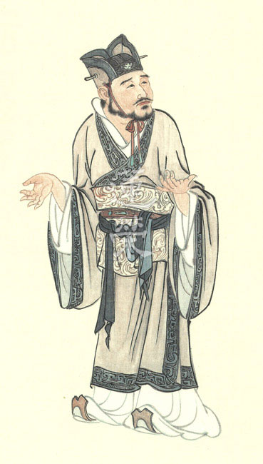
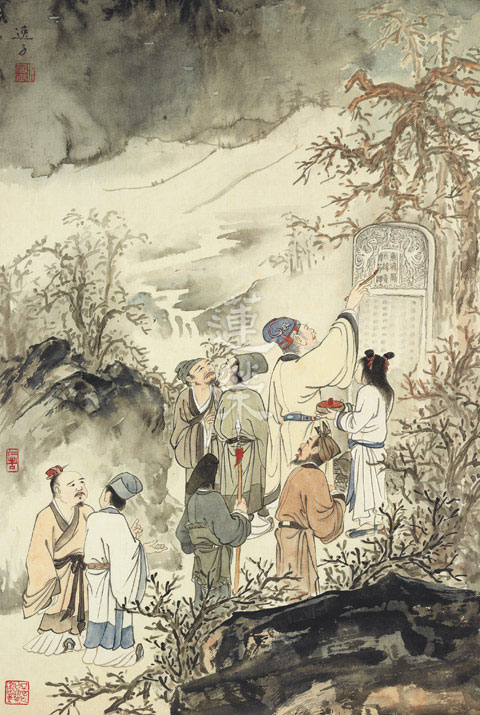
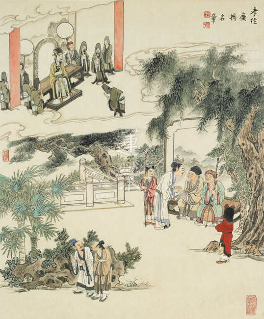

# 第112期

## 社論

### 以妙吉祥的智慧來經營走入時代的農業

本刊

智慧成就妙吉祥

創造環境人共住

敦倫盡份耕讀樂

隨緣成辦佛事業

一年多前德國化學製藥大廠拜耳（Bayer）收購美國農藥及種子大廠孟山都（Mosanto）引發德國人抗議，雖拜耳過去也有污名，但孟山都的基改種子及除草劑使其穩坐邪惡之最，然德國人的反感終究未能阻止這樁聯姻，而且強強聯手後掌握了全球四分之一以上的農化市場，讓關心地球的人從反對變成憂慮。究竟人類是為什麼而發展農業？又是如何一步步走到今日的農業「背後有龐大的利益」？而我們又將付出甚麼代價？或者說我們已經付出代價。

當共業已成，我們如何造作別業才能共中不共？去年在歐美兩大廠因利益而結合的新聞沸沸揚揚之時，本學會在臺中東勢成立了「實栽農園」，參與草創的農耕小組分外辛苦，功不可沒。自有了農園這方土地，我們都富有起來了！遠望山近看水，接觸陽光讓我們內心容易作意光明；腳踩大地讓我們有踏實感；看到所種植每日生長使我們充滿活力與能量；吃到自然無毒的菜更可滋養我們的色身，這些都是學道的資糧。一年過去了，為了讓農園的規劃與發展能有嶄新的思維，老師特別利用十月初的連續假期帶領以農耕組為主的二十人團隊前往日本增廣見聞，幸有如磬學長與修陽學長擔任翻譯，與富士山下的木之花家族進行交流與學習，收穫甚豐。

木之花乃由一群理念相同的人所經營，結合共住、有機農法、務農教育、餐廳、產品銷售如稻米、蜂蜜等等，並且木之花的成員十分歡迎外來理念相投的人士前往學習。學會一行從住宿、飲食、上課、農場參觀、實作體驗（包含酵素、胺基酸、醬油的部分製造過程）及晚上的音樂共舞，可以清楚地感受到木之花整體所經營的生活氛圍，是被他們所共同相信的人生觀和宇宙觀所支撐。對於科學說不清楚的、無法回答的，他們認為有循環不息的天道，人之所以會破壞大自然是因不懂飲水思源，應使萬物各得其所、各歸其位，順應這樣的秩序便是順應天命，以上述的天然循環來解釋宇宙人生、來經營農業，就是木之花的核心理念，他們的種種造作也是被這樣的核心理念所攝持。

木之花的會長認為，農業是將自然改造的一種行業，而且今日的農業與過去原始農業的最大不同，乃在於過去是為了生命的延續，而現在是為了經濟利益。在他從事農業的二十三年經驗中，發現陽光、大地、水還有空氣中的養分對生命與種植的重要性，從這樣的觀察中進一步推知生命要能向前發展靠的是生命與生命的連結，破壞大自然讓其他生命無法安頓，我們又能如何得到自身的安頓？而且不是安頓而已，還要有強的生命力！木之花的農法是以種出強壯的菜為目標，而不是以種出大量的菜為目標，以天然循環法為總體的概念，輔以微生物的運用。在總的概念下再分為直觀栽培與草生栽培，所謂直觀栽培或謂直感栽培乃是栽種某物並沒有該法的自體性，都是看條件，條件具足則成，條件缺乏則不成，沒有必然只有相對，都是觀待條件而顯現，所以因應不同植物要有不同的處理方式，例如種紅蘿蔔不需休耕，在同一塊地可以連續種植。草生栽培則是一種混合法，某兩種植物被放在一起相鄰種作，會有意想不到的好效果，因為能互給對方養分，例如西瓜和蔥、茄子和牧草都是互利的組合。

我們不妨藉此思維如何建立最強的團隊？此人與彼人為何放在一起並沒有加分反而削弱團隊的動能？那是因為內耗，所謂適才適用是指將對的人放在對的位置，連種菜都要考慮這種菜能不能跟那種菜一起種，可見組合與搭配是否有相加甚至相乘的效果，需經過學習、思維與寶貴經驗，才能養出最強的隊伍。其次，既然條件具足就有，那麼如何才能讓條件具足？最好的方式就是通達這樣的觀念，且以這樣的見地不斷地造作使條件具足，正是老子所謂「無為而無所不為」，因通達「法沒有自體性」、「造作沒有自體性」而努力造作，所有能幫助條件成立的，我都無所不作，因為條件湊齊了就有（觀待下顯現）。

此外木之花也很重視對原生品種的保留，在品種改良有成的今日，不難發現我們小時候又圓又硬的芭樂，現在哪裡吃得到呢？水果的澀味或酸味在「想要好吃」中漸漸被改良成又甜又香，那麼離開酸澀的同時是不是有些重要的養分也離開了我們？通達農作的人知道品種的重要、知道微生物的重要、知道淨化水的重要，這些都是條件，愈能熟知條件，該造作就愈有可能結成可被收穫的果實。

原來連農業的經營都沒有離開心法，心是能造作，善業是所造作，觀待善用其心，善業將增長廣大。所有善業中最殊勝的果報就是得遇善知識，因為修行的高下以見真相來論，而能否見真相有賴智慧力的生起，智慧力從何而來？從善知識來，何以故？法的傳承在「人」。既然我們造作善法、累積資糧為的是遇善知識，善知識可以給我們慧命、可以帶我們出遊參訪而不消耗福報、可以為我們解惑而建立正知見。眼前的一杯水可能平淡無奇，但也可以對它作空性觀修；遇到逆境不免怨天尤人，但也可以作因果觀察；前述種種要成為可能都是在依止善知識上說，因此可以說所有的福報是從依止善知識而生起。

我們希望人生離苦得樂，但要怎樣才不會經營成離樂得苦？娑婆世界的眾生發展經濟是為了離苦得樂、享受美食是為了離苦得樂、因理念相合而共住也是為了離苦得樂，每個有情都想離苦得樂，常見世間人多以追逐名聞利養為解苦之道，不知馳騁於五欲六塵乃離樂得苦，木之花的數十位成員們有別於世間人，能安住於簡約生活，其淡泊而顯現的恬靜或許比內道修行人還能放得下世俗的資產。

來到木之花參訪的人可能會學到他們的人生觀、宇宙觀，而我們學到的是農法，不會因此轉而好樂他們對宇宙人生的解釋，因為觀待能見真相的智慧，才有所見的真相。大乘菩薩中智慧第一的文殊師利菩薩又名妙吉祥，因為智慧最妙最吉祥，唯有智慧才能讓有情成就究竟的離苦得樂。以妙吉祥的智慧為制高點，以務實為下手處，那麼出外參訪可謂福慧兼修，同時亦與眾生結下善緣，於是實栽農園成為所經營，妙吉祥的智慧成為能經營，能所觀待下顯現的是殊勝的淨土。

## 佛學覽幽

### 菩薩清淨的行持
       —華嚴經淨行品（二十八）

菩薩清淨的行持

—華嚴經淨行品（二十八）

*戒慧講述‧編輯部整理*

飛花落葉關聯無常

舉手投足引向佛果

說話辦事攝於菩提

眠息安止歸向涅槃

丙二、指事顯因答其徵因

丁一、總徵

丁二、別顯

戊六、乞食道行時願(五十五願)

己一、遊涉道路(十二願)

己一、遊涉道路  向道

經文：

發趾向道，當願眾生，趣佛所行，入無依處。

出發前，行整自己的裝備，執錫杖及執應器，接著往乞食的道路上叫做向道，發趾意即舉足，腳要抬起來，要出發了，當我要出發乞食的時候，要想當願眾生，趣佛所行，趣就是去向，去向佛所行，佛所行就是自利利他，甚至能夠發菩提心、修菩薩道，這是佛所行的道路，趣佛所行之後，能夠入無依處，無依指的就是佛，也就是無依道人。

等覺以下都要有所依，只有究竟成就佛果之後才無依，一般的修學者，要有四依，依法不依人、依義不依語、依了義不依不了義、依智不依識。從依入無依，依為因無依為果，必須好好講究。

四依當中第一個是依法不依人：行者須依說法的內容，而非說法者的名氣，所以第一個就告訴我們要做法行人，依的是說法的內容，而非說法者的名氣，謂之依法不依人。

第二個是依義不依語，不是依說法者所說的表面文句，而是看他所詮釋的義理，即使不講究文句之美，而能宣說豐富的義理，亦是我人所要依的，此即依義不依語。

第三、依了義不依不了義：在說法者宣講法義中還分為了義跟不了義，世俗是不了義。即使在勝義上亦有了不了義，到底是唯識宗詮釋勝義是了義，還是中觀宗？此須好好抉擇清楚。

第四、依智不依識，依智不依識是對了義生起比量的智慧，而不是非量的心識，唯有生起比量的智慧才能夠依此進一步得到現量的智慧，此現量的智慧才能究竟解脫輪迴。

若能這樣逐步講究，就能成為法器，成為天人所供養的對象，論上說供養信行人，人數之多，時間之長，財富之廣，都不如供養一位法行人一頓飯，因為法行人太難得了。

從依入到無依，無依是佛在任何時都能現證空性，所依的是了不可得，謂之無依。亦即成就的是如所有智，謂之無依道人。

釋迦佛說我是無依，試問佛說的法佛依不依？若佛說不依，那佛自己都不依了，我們怎麼依？家裡面爸爸訂的規矩爸爸自己都不依了，孩子怎麼會依？正因為法要成為所依，行為意識才能成為能依，三寶要決定成為所依，菩提心要成為所依，出離心要成為所依，空性的修學法要成為所依，你才會成為能依，若無所依也不能生起自體性的能依。

假如法自己就可以成為所依，應該一切有情看到法就會依靠而成就，可是往往眾生難見法是所依，所以自己也不能成為能依。所以，誰會依靠菩提心生起成佛的因？誰會依靠出離心成為解脫的因？誰會依靠空性見成為解脫的能力？

其次能依的自相在哪裡？假如能依可以自己成立為能依，不必法而他自己可以有所依，試問不必法，那他依靠什麼？無法可依，他能成就什麼？

說佛是無依道人，另一面向是，佛在那一道出世，生起俱生慧任運證得空性的那ㄧ分，不必靠三寶的加被，不必靠善友的教授，可以生起俱生慧的那一分說無依。雪公老師也勉勵我們做無依道人，如此乘願再來到任何地方都能任運利益有情。

己一、遊涉道路  在道

經文：

若在於道，當願眾生，能行佛道，向無餘法。

此比丘在遊涉道路時，先執錫杖、拿缽，然後走在路上，向道就是先向著道路，在道就是在路上走。不只是比丘，其實我們也會在道路上走，當我們在路上走的時候應該要發什麼願呢？在路上走著，是善業還是惡業，還是無記？走路的這件事情是沒有善惡可言，但是走路要去做什麼事情才是論善惡所在，比如走路要去打牌，那就是惡，走路要去放生，那就是善，但是單純走路是無記業，單純的行住坐臥是無記業，善惡才會感苦樂果，無記業則沒有感苦樂果的功能。行於道上的無記業，如何將無記體性轉為善業？就是當願眾生，能行佛道，向無餘法，體性轉為善業、轉為大乘業，以空性的智慧來攝持，體性則轉為無漏業，此走路的行持稱為淨行。

此人在路上行走，願所依在菩薩上，依靠在道上，願從菩薩來，菩薩為什麼會發願，是因為碰到這個境界才會發這種願，願所依的是境界和菩薩，依靠的境界就是道，依靠的是菩薩，因為菩薩是能發願的人。

能願的是人，所願的是眾生，當願的對象是眾生，理由是只有眾生可以離苦得樂，眾生具貪瞋癡，眾生也能修戒定慧，當願石頭是沒有意義的。

能行佛道，向無餘法：就是願所達成的目的，願達成的目的就是菩薩願眾生能行佛道，向無餘法，菩薩本身也是眾生之ㄧ，所以菩薩也願在佛道上走向無餘法，菩薩不但如此，菩薩還能夠得前面所說的佛的十力、十八不共法，及十種成佛的德能，以上是第一大段的觀修。

第二大段的觀修是，若眾生都能行佛道，向無餘法，那該有多好，這就是修隨喜，再來是我願眾生能行佛道，向無餘法。第三個是當我幫助眾生時，有能力讓眾生能行佛道，向無餘法。第四個是，祈求三寶的加被，讓我能獨立引導眾生能行佛道，向無餘法。以上是四步的修學法，完整的看一個願。

若在於道跟能行佛道，向無餘法，彼此有何關係？怎麼結合呢？身體走在道路上，心也要走在道路上，心走在道路上就是走在佛道上，心如果走在佛道上的時候，此時連走路都可為成佛的方便。

什麼叫無餘法？真正的得到佛的智慧，解脫自在。無餘法就是煩惱沒有餘了，業沒有餘了，苦沒有餘了，障沒有餘了，執沒有餘了，通通沒有餘了，不像我們的餘還有很多，煩惱今天對治了ㄧ些，明天收入更多，存了更多，只有煩惱、業、苦有收入，無餘法就是煩惱無餘、業無餘、苦無餘、障無餘、執著無餘，要在什麼情況下才叫無餘呢？就是證得阿耨多羅三藐三菩提，佛的智慧是破煩惱障、破所知障。能行佛道就是依佛所說而修生起佛的智慧，謂之佛道。所以走在路上，當願眾生，能行佛道，向無餘法，換句話說，心裡面真正要走向的是佛的智慧。

走路的目的是為了什麼？為了要成佛、為了要生起佛的智慧，所以走路，而這個走路要走到哪裡去比較好呢？走向善知識求法才是最好之路。（下期待續）

### 大乘百法明門論簡說（二十）　拾貳、心所有法—別境(一)

*戒慧講述‧淨本整理*

法相能明助修學

善用其心百法功

配合時代心理學

光大正法入時代

經文：

第二，心所有法，略有五十一種，分為六位：一、徧行有五，二、別境有五，三、善有十一，四、煩惱有六，五、隨煩惱有二十，六、不定有四。

別境五者：一欲、二勝解、三念、四三摩地，五慧。

別境就是必須對著特別（或差別）的境界才能生起的心理活動，有別於五徧行是周徧一切性、一切地、一切時、一切心。五別境心所生起，有時其中一種單獨生起，有時候起二，有時候起三，有時候起四，有時候起五，彼此間共有三十一種可能。

首先說明欲心所，《直解》云：「於所樂境，希望為性。勤依為業。」欲心所的親作用（比較親近的作用），就是對著所樂境產生希望。由希望而生起勤勞，成為勤勞所依的功能是疏作用。如果按照因明學的解釋，「於所樂境希望為性」是講欲的定義，依此定義會發生勤勞的作用。所以過去毘舍浮佛的傳法偈說：「假借四大以為身，心本無生因境有，前境若無心亦無，罪福如幻起亦滅。」欲心本來不生，觀待境界才有。勤與精進相似，但精進的形象還是有所不同，勤所針對者可以是好事也可以是壞事，例如想謀財害命的人，也會十分勤勞地去謀劃。而精進則是能勇悍地斷惡修善，屬於善心所一類。

境界如何被決定成所樂境？前述五徧行作意引起心的作用，使心、心所觸境，產生樂受，想心所取相並安立此境為我所樂，思心所就會推動欲。欲必須由思推動，修行人遇到所樂境時未必起欲，例如吃過山珍海味，不因此對美食起欲，回家一樣能吃青菜豆腐。可見思可以推動欲，也可以推動不欲，面對所樂境不一定產生欲，但欲一定觀待所樂境生起，所以欲也沒有自體性。

每一個人的所樂境不一樣，我認為的所樂境，對他可能是所惡境，如冷氣吹來，身強體健者覺得舒服，所以努力賺錢去買冷氣機，而身體孱弱的人對冷氣生不起快樂，也就沒有去買冷氣機的欲。如果張三的所樂境是名，李四的所樂境是利，當名境生起時，張三可能會生起欲心所，為求此名而認真努力，因此所樂境只是名言安立，不是自體存在，而欲心所的運用，可以是善法也可以是惡法。如果對著戒定慧三學生起好樂、希望，這樣的欲就是善。雪廬老人說，所有秘密的心法中，最秘密的就是欲。《論語》上說：「我欲仁，斯仁至矣。」所欲為何，決定這一生的出路。

修學戒定慧眼前可能在吃苦，但為何能成為所樂境？因為它是樂因，所以能顯為所樂境。當決定為所樂境時，是眼前快樂後來痛苦的所樂境？還是眼前痛苦未來快樂的所樂境？還是眼前也快樂未來也快樂的所樂境？還是眼前大樂未來小樂的所樂境等，這些法相都要看得懂，這樣的欲才是有遠瞻的欲，而不是膚淺短視的欲。

懺公表解上，所樂境也有粗細的差別，可欣境是讓人欣喜見聞覺知的境界，不同於可厭境、中間境（不喜歡也不討厭），屬於所求境的一分。所樂境不一定是所求境也不一定是欣觀境（很想觀察的境界），但所樂境變成所求境或欣觀境時才會生起欲。例如聖者口渴的時候給他一杯水，這杯水是他的所樂境，可是不會變成他的所求境也不會變成他的欣觀境。所求境當中，對於可欣境未得到時會生起欲合，得到了會希求不要離開；對於可厭境得到時會生起欲離，沒得到則希望不要得到，所以可欣境跟可厭境都是欲的生起處，一個從正面說求合，另一個從反面說求離。

第二個是勝解，《直解》云：「於決定境，印持為性。不可引轉為業。」勝解就是殊勝的見解，決定境就是透過五徧行的作用，對境界產生肯定，而由思去推動生起印持才叫勝解，這樣的勝解不會被轉變。印持是印證執持的意思，在內心深深同意如蓋印般深刻，並且把持住這樣的概念。比如某種學術主張或某種宗教信仰，對它十分肯定、認同而拳拳服膺。

決定境未必生出勝解，但是勝解一定從決定境中來。如佛化家庭的子弟，從小耳濡目染，對佛教的信仰產生肯定，然而長大後因為事業失敗而改變信仰，可見以前佛教信仰的決定根本沒生過勝解，如果有生出勝解，那將不會被引轉。當於境取相施設名言為猶豫境時，思會推動疑，就不會推動勝解。勝解既然屬於五別境而非善心所，也就有善有惡，如果決定境是正法，勝解就是善；決定境是邪說，勝解就是惡。

儒家所謂：「三軍可奪帥也，匹夫不可奪志也。」志相當於前述的欲心所，而不是勝解，勝解能夠產生欲，欲就是志。所以五別境可以互相生，可以同時生，境界又是所樂境、又是決定境的時候，欲和勝解就可以同時生，而所謂的同時生，其實是指一念中多面向的觀察，一個境界可以在心識前同時呈現多種面向。心念原來有這麼多微細的面向，所以學習《百法》才能認識自己。

第三個是念，念心所，《直解》云：「於曾習境，令心明記不忘為性。定依為業。」念心所對的是曾習境，就是過去曾經學習或經歷過的境界能夠明記不忘，因此能產生定的作用。曾習境也是有善有惡，念心所一定從曾習境中生，但曾習境不一定生念，如念佛人平時念佛，在緊急時卻未能念出佛號，就是失念。所以在心裡面留下印象雖然是曾習境，在當中還要有專注力使之成為深刻印象，才有念心所的作用。念佛人對於阿彌陀佛能超拔生死苦海的能力有深刻印象，在面對苦難的緊急關頭，才真的可以萬緣放下一直念佛。基督山恩仇記的主角對他的仇人從來不會失念，若以這種覺受來念阿彌陀佛，早就一心不亂了，所以修行就是要懂得如何用心。

修定之人會有昏沉、掉舉、散亂等障礙，需要有對治法才能入定。對於曾經學習過的對治法，如果沒有深刻的印象，不僅無法入定，在打坐過程中其實在不斷地串習昏沉等煩惱，如此更遑論定中修學觀慧。（下期待續）

### 佛學概要十四講表簡說（十四）　第二講表

*戒慧講述‧宏法、淨昌整理*

依用定義名為體

發生作用名為用

相是用所呈現相

大火小火都是火

乙表、諸法三分-體相用

佛陀教導學習者如何觀察世間，以「體相用」、「因緣果」及「事理」等種種面向觀察。觀察法是不是如實的呈現世間和出世間，其中包含對形而上及形而下的通達。

「諸法三分」，即是依著佛語，吾人於每一法生起皆可由「體、相、用」三個部分來觀察。「體」分「體性」和「體質」，述記云：「體為法之本體」。「體性」是形而上的觀察，「體質」是世俗體質的分析觀察。

體質是「析之本無」，分析每一法，它會越分析越細，最後發現構成這個法的元素是沒有的。

「布非衣質」，吾人知道布並不是專做衣服的，因為布不是只能做成衣服，布也不是構成衣服的基本元素。嚴格說絲才是衣服的本質，但「絲非布質」絲也不是只有做成布，絲也可以揉成線，做很多運用。

其次，這個絲分析到最後，也是沒有，所謂的羊毛塵、兔毛塵、水塵，到最後變成最小粒子鄰虛塵，這是經部及有部的看法。鄰虛塵為什麼是空而無質？「析之本無」如果是以唯識來看鄰虛塵，只要有方位就能夠被切割，一直切到最後有一個，沒有辦法分清楚東西南北的粒子終於被切出來了，這個叫做鄰近虛空的塵，可是鄰虛塵沒有方向可分，那這兩個粒子組成什麼？是左邊還是右邊組合成的嗎？就說不出來一個方向感。

唯識宗成立了境界是心外不成，都是心內的顯現，因為眼前的茶杯，已不能成立是如上述是鄰虛塵堆起來的(鄰虛塵無方向性)，但我們都看到茶杯，這表示有，但是只剩下心內有，而且都是第八識變現。為何要在心識上承許第八識？由於所造的善惡業，既然不壞，他就一定要有一個地方存放，有這個存放的功能而安立第八識。唯識宗最後要成立的是心外的法不成立，都是心內所現，分析心外的境界分析到最後沒有，這叫做「析之本無」。

中觀宗也同意有最小的粒子。但最小的粒子還是八方合集，八方合集還是因緣所生，但並沒有可以分割小到東南西北不分的微塵，萬法還是因緣所生，空無自性，自體本無，這是中觀宗的「析之本無」。

唯識宗和中觀宗就是站在經部的立場回過來說空，經部、有部是法有我空，因為還有最小粒子，唯識宗是心外不成的法空，與中觀宗說緣起的法空，這兩個不一樣。

●(性)空而無質

「體性」叫做「空而無質」，萬法的自體性是沒有的，找不到構成這個法的元素，所以是沒有的，沒有一個根本的本體，空就是沒有本體。「空而無質」也就是依著法的本體來說，不是有一個實質的存在，本體、本性、體性，空性，這些都是在講本體，所以本體只能解釋作本性，不能夠解釋作本質，性有不改變的意思，其實就是完全無形無相不可捉摸。以唯識而言體性即是第八識，中觀宗是自體空。

以「質」來說，布不是衣的質，所以衣服的質要去找布，布又找到絲，絲又找到粒子，布應該是組合而來的，所以沒有本質，沒有本體。沒有本體是該法的性，該法的體性是什麼｜沒有本體。

如果以鏡之光、花之香表徵體性，是說體性空是無法以眼見、耳聞、鼻嗅等，但非指體性是可以聞到的香，是可以看到的光，如此反而是錯解這個比喻。體性空非根本無，但不可以世俗心識證得。

述記云：「萬法唯識，識源於性」唯識來說，所有的法都是從第八識出來的，佛性就是第八識清空的狀態，性是空而無質的；迷而緣識就是第八識染汙的狀態。述記云：「一切諸法，因緣所生，唯心所現，因心成體，體即法界。」萬法的體性都是第八識，第八識是遍法界，所有法的體性都是遍法界，茶杯的體性也遍法界，因為它是從第八識生。

述記云：「不可思議，橫遍豎窮，非一非多，無盡藏德」。以唯識宗的見地解釋：「不可思議」，心外之法它不存在的，全部都是心內所顯的，有為法、無為法都是第八識所顯現，心性（第八識空靈靈的狀態）無法以心思或者言語描述，謂之不可思議。其次唯識立論，法在心外不成，其例謂，水如果在心外可以成立的話，那為什麼鬼來看是猛火，魚來看是空氣，天來看是琉璃，所以尋覓心外的法，結果看不到。「橫遍豎窮」也是依著第八識能夠顯現六道、四聖以及過去現在未來三世。每個人都有第八識，第八識又是相互重疊的，所以是「非一非多」。「無盡藏德」第八識是一切法所生處，所以它是無盡藏德，只要造善，種在第八識上，就不斷的產生各種快樂；要受苦很簡單，只要不斷的造惡，種在第八識，那就苦不完。所以蘇東坡說：「耳得之而為聲，目遇之而成色。取之無盡，用之不竭。是造物者之無盡藏也，而吾與子之所共適。」

以中觀宗的見地解釋：「不可思議」，是指自體性不可得，根本沒有一法存在，所以也不能夠用心思來想或者用口來議論。叫做言語道斷，心行處滅。「橫遍豎窮」豎窮從無始劫來就體性空的叫做豎窮，每一法體性都是空，每一個法上的空性長得都一樣是橫遍。「非一非多」一也不可得，多也不可得，說不上一，也說不上多，自體空，不是有一個東西，沒有東西，一都尚且不能說，還說多。「無盡藏德」乃觀待所證的空性，能證空性的智慧能夠顯現各種的功德。

◎相-(現象)

●(現象)暫起幻有

「暫起」是無常的這一分，「幻有」是無我的這一分，正好是萬法的兩面相。在現象中觀察萬法的無常，在現象中觀察萬法的自體空，萬法只能以幻有的方式顯現，無法以實有的方式顯現。

對現象的暫起幻有分成了三點的定義。第一個，就是一切法它的相都是「因緣所生」的，對鈍根之人來說是無常，其實就是「散壞空」。也就是當因緣和合的時候，它是執為實有的，當因緣散滅的時候，它就認為沒有了，這就是散壞了以後他才認識到空，此是「暫起」的部分。這個空並非真正的空性，僅是無常。利根之人，也就是對這個法在因緣和合的時候，就知道它是沒有自性的，所以它是「當體空」。「幻有」的幻，像魔術師的幻變，像水中月，像空中花。金剛經說：「一切有為法，如夢幻泡影，如露亦如電，應作如是觀」。

所謂「水中月」，天上的月是過去已滅的業，現在的水就像當下的人生，水中之月是浮現過去已滅的業，所結成的果報。假如沒有過去的善業和惡業，沒有辦法顯現眼前的快樂或者痛苦。再者去撈水中的月，結果沒有，表示月亮浮現在水中呈現的月是自體性沒有，沒有實在的月，但是它顯現的那一分像是實有。因為沒有過去的業就沒有眼前的果報，所以它的自體性在哪裏？已滅是已經沒自體性，生又怎麼會有自體性？舉例來說：我過去所造的惡業，發生在我身上的病苦，在他人身上沒有。如果它是很實在的，為什麼大家都沒有感覺只有我有感覺。它不是很虛幻嘛！虛幻到這種程度。中觀宗說，我沒有否定諸法，是否定諸法的實有性，所以祖師註解說，就算對那個比喻通達也沒有用，要結合唯識宗或中觀宗的宗義來通達，否則說水中月是沒有意義的，說夢幻泡影都沒有意義的，因為此人生不起任何的中觀正見和唯識正見。

諸法的生起方式不是因緣法，就是緣起法，緣起法可以涵攝因緣法，而「氫氧化水」是緣起法，因為氫氣與氧氣在化合後產生的水，它並沒有減少什麼也沒有增加什麼。尋覓水的濕潤性在氫氣上沒有，在氧氣上沒有，但氫跟氧的和合產生了濕潤性，濕潤性只不過氫跟氧出來的作用而已，為了這個作用，安立為水。「氫氧化水」是對「暫起幻有」這樣的現象來做一個舉例。所以說它是「幻有」，是指「有」根本找不到實體性的有，此有是被幻現出來。又譬如電視機，在電視機所有的零件上，像它的面板、它的螢幕、它的其他零件上，全部找不到電視機，可是組成起來，發生了可以播放影像的作用，名言安立為「電視」。

再由地、水、火、風四大面向觀察，水作用也要觀待地水火風。像水的地大，就是水有載舟的承載性；在水大的部分是濕潤性；火大的部分是溫度；水有流動性是風大的那一分。以現代科技而言，當水的風大加速到音速的時候，此時水的地大可以來在工業上應用為水刀，拿來切割鋼鐵，或者清洗輪船的外殼附著海中的物體；當水的火大，就是溫度超過沸點，沸騰成蒸氣的時候，此時水的地大可以推動蒸汽渦輪機發電；當水在攝氏二十五度時，可潤澤動植物，使欣欣向榮；但是超過四十五度的水拿來澆花，花會枯萎，人飲用有燙傷之虞，水的濕潤性也觀待火大。水是四大之一，連離開一大都不能，水的自體性在哪裏？還有，在鬼道眾生面前，水能呈現為水嗎？天人來見，水能夠呈現為水嗎？可見水的自體性沒有到這種程度。

「土石積山」，山是土與石頭堆積緣起而成的，可是我們在每一粒土上面看不到山，在每一顆石頭上面也看不到山。每一粒沙裡都看不到山的功能，但它組合出來的居然可以森林廣布，有水、動物、獅子、老虎，各種動物都可以藏。所以「土石積山」是幻現出來的。可見萬法的作用都是幻現的，所以應該好好利用幻化生起的作用。述記云：「因緣所生」，是講因緣滅、果生。因緣滅，已滅的東西怎麼會有自體性？而果生怎麼會有自體性？上述「氫氧化水」「土石積山」是講緣起法。

述記云：「一切法相皆是剎那生、剎那滅。」剎那當中就有生滅，是約著無常而言。如果約著空性而言，剎那該法生的時候，剎那該法的自體性從來沒生過，剎那滅亦然，該法體性從來沒有生過，所以也談不上滅。同理述記引楞嚴經云：「一切浮塵諸幻化相，當處出生，隨處滅盡，幻妄稱相」是說明法的自體相沒有，也就是所有的一切的相都是幻化生起的。在生的當下，就已經趨滅了，都是一個幻妄的身體。

述記云：「一切法相皆是唯識所現」，唯識宗說全部都從心識所現，外境不成。又云：「翳眼空花」的翳眼，眼睛會有飛蚊症，眼睛生病了，所以看得到空中有花，明明沒有空花，只有心識顯現，外境不成。快樂、痛苦，都是心造善、造惡出現的，宛然像外境存在，其實都是吾人內心顯現。而中觀的見地認為，顯現的空花是回應過去業的幻變下顯現的，空花就是你看到，別人卻沒有看到，業是如此，諸法皆是如此。又譬如說某個國家發生戰亂的時候，該國的老百姓是很痛苦的，可是在其他國家百姓卻過得很好。

◎用-(力量)

●能變現狀

果相生起的時候會生起作用，這個力量可以產生作用改變現象，體相用的「用」，嚴格來說是一種力量。譬如火的定義為燒熱性，為什麼定義為燒熱性呢？因為它有燒熱的作用，所以才會說依體起用。「相」是世俗的現起，只不過是在生起的當中，因為它的作用，根據它的作用而定義它是什麼而已，因為它有燒熱的作用，所以我們定義它是火，這樣而已，方便我們知道它。

講表舉了一個例子：「水與氣冰，功各不同」。水、氣、冰是水的三態變化，也就是水加熱的時候會產生相變化成為蒸氣；如果遇冷，它會結成冰。水與氣冰，就是相，它的因緣組合產生變化而生起不同的相狀，就生起了不同的功能。氣、冰、水的功能都不一樣，同一物質，依著遇到的緣不一樣，而呈現不同相狀，可見定義，也不過是一時的定義而已。諸法到底有什麼真實的？同理，氫氧所組成的相，所組成的作用應該一樣，但何以在成為水的時候有解渴的作用，成為氣就無解渴作用，不是都氫氧化合的組成嗎？同理可見，鹽酸的組成在某個情況下有腐蝕性，而在某個情況下沒有腐蝕性，不同的功能給予不同的定義，不同的定義我們給它不同的名言。說它是水、說它是氣、說它是冰。

現代科學幫助吾人學佛，兩三千年前，佛已經用這種概念講事情，現在的科技都不如，大家還在尋覓本體，他已經告訴你沒有本體。佛法是最合乎邏輯的思維，最能夠看到事實的狀態，所以龍樹菩薩才說，佛說的體性空，佛說的緣起法，叫我不皈依他，叫我不做他的學生，不可能。所以看第一表和第二表，都沒有講到必須要皈依，也沒有講佛多偉大！可是，當他成為一個正見者，成為通達世間的人的時候，所有皈依的心都出現了，所有對三寶依止的心都出現了，所以正見才是所有皈依的體性。

述記云：「若能觀察一切相皆是虛妄」，看到一切法無自體性，都是虛妄現起，又云：「則能離相破執」，看不到這個相，所以根本沒有這一法，能執的心就無從去執，就直接破執了。又云：「洞徹本體」，就是以能證空性的智慧來看到萬法是自體本空的。能夠「明體達用」。知道這個體是自體空，所以剩下的就是緣起法上的用。用也是觀待這個法現起的作用，我們安立它成為這個法的相。

結論：體、相、用三字佛典常用，或「體」或「相」或「用」。貴能分辨清楚，避免一鍋黏粥，體相不分；所以「體相用」清清楚楚的去分類，對法如果做這樣的觀察，能如此觀察佛語，就是智者。解佛語者不能解釋為修行，什麼叫做修行？下文的因緣果、事理，一路的慢慢分析。如有能第一表和第二表的實力，學佛不知道往前跨了多少步。（下期待續）

## 孔學一隅

### 論語簡說（二十）
	  			 —先行其言

論語簡說（二十）

—先行其言

*時哉講述、宗徹整理*

經學正解與活用

發揮價值入時代

如藥治病不死執

利樂有情是出路

經文

子貢問君子。子曰：先行其言，而後從之。

(為政第二第十三章)

前言

我們都知道，儒家所謂君子，是讓人信任、稱讚、合作、護持的形象，即一位入世的成功者。

本章子貢向孔子請教的，就是君子的內涵。孔門弟子中，很多人問過君子的形象，然孔子各有答法；若將各種答法拼湊起來，那就是君子完整的內涵了。

消文

解法一：子貢請問孔子，怎樣做才能成為君子。孔子回答，君子先行，其言而後從之。也就是事情先做出來，後面言語再跟從，如此言從其行，能避免言過其行。若能言行相符，即是君子，若言而不行，是君子所恥。

解法二：子貢請問孔子，怎樣做才能成為君子。孔子回答，君子行為要先兌現言語所說，而且是說得少，做得多，所謂微言而篤行，行必先人，言必後人。

章旨

此章是夫子教人以實行為先，做一個言行一致的君子。

斷句

這一章有各種的斷句，斷句不同，意思也不會相同。

(一)先行，其言而後從之：

先做，他的言語從他的行為。此即《論語講要》的講法。這種講法最好，就是做了之後才說，如此至少不會失信，即「言行相應」、「言行相符」。

雪廬老人：「行了之後再說，所說與所辦的相同。辦十分說五、六分，說多便是矜誇自己。」做了再說，便不至於失信。或者做了，只說五六成，代表言語保守，然而懂局的人知道實際上是誰做的。或者做了不說，便是積陰德，比陽報更好。

(二)先行其言，而後從之：

子先做承諾之事，後人可以跟從。如唐注云：「君子之言必為物楷，故凡有言皆令後人從而法之也。」

這裡並非說君子先行其言，所以你可以跟從君子。子貢沒有問要跟從君子與否，只是問說君子長什麼樣子，或者是君子的修學法，或者是暗指某個人是不是君子。

(三)先行，其言，而後從之：

君子先有行為，因君子的言語有德，因此可以為後世所從。此乃「君子立言」。

這個分段方式，是唐‧皇侃《論語義疏》中，引三國魏王朗所謂：「鄙意以為立言之謂乎，傳曰：『太上立德，其次立言。』明君子之道，言必可則，令後世準而從之，故曰『而後從之。』」

王朗是《三國演義》「武鄉侯罵死王朗」這段故事中，被諸葛亮罵死的曹魏司徒就是王朗。正史中，王朗字景興，東海郡人，曾受封為蘭陵侯。其子王肅是晉王司馬昭的岳父，也是當時有名的大儒，曾注解過《六經》。

王朗認為一位君子先有所作為，此君子的言語是有德的言語，所以其言語可以為後世所從，這叫做「君子立言」。

若按照王朗的說法，君子先有行為，言語也是有德的言語，但這樣的言語未必是百代所從。

如《論語‧公冶長》的最後一章，孔子說：「十室之邑，必有忠信如丘者焉。」可見忠信之人不乏見於鄉邑，但未必忠信之人的言語就可為後代所從。

雪廬老人曾舉以前只要聽到賣大餅、饅頭的老先生在街上喊著「大餅兒、饅頭─」，絕對是下午四點，每天不差，這叫做守時守信。難道賣「大餅兒、饅頭」那個話也百代所從嗎？

因此，這三種句讀法中，我們採取前兩家，又以第一家的解釋最好。

或問，從「先行」斷句，可由哪些古籍作證明？

《禮記‧緇衣》：「言從而行之，則言不可飾也。行從而言之，則行不可飾也。故君子寡言而行，以成其信。」

言語因順從行為，言語無法誇張，所以是守信之人。如果言語前，行為跟不上，就會失信，因此寧可「寡言而行」，以寡言、少言來成就自己的信用。

《禮記‧曲禮》：「不辭費。」「不辭費」就是言語不要浪費，失信於人就是言語浪費。為什麼會失信呢？就是言語不能兌現，所以要「先行」，行為在先，言語在後。

《禮記‧曲禮》的「釋文」說「言而不行」就是「辭費」。說了不做，就是浪費言辭。可見要「先行」，然後言語跟從。

《大戴禮記‧曾子制言》：「君子先行後言。」

《大戴禮記‧曾子立事》：「君子微言篤行。」「微言」就是少言，「篤行」就是老實做事，即「少說多做」的意思。

《論語》中也有章句可資證明。《論語‧里仁》：古者言之不出，恥躬之不逮也。言語不隨便出口，害怕自己做不到。《論語‧里仁》：君子欲訥於言而敏於行。言語很木訥，可是行為很敏捷；做得多、說得少。《論語‧憲問》：君子恥其言而過其行。語言過多、行為過少，這是很丟臉的。《論語‧憲問》：其言之不怍，則為之也難。一個人的言語不羞愧，是很難得的人才。為什麼言語不羞愧？因為這個人很實際，言語可以被兌現，言行相符，少講多做。這樣的人才是很難得的。你要用人，或自己要被用，最好符合這個條件。這是馬融的注解，雪公老師說這個注解最好。

我們有時候認為讀古書沒有出路，實則讓人賞識你，就是最好的出路；要提拔人才，就需要這種眼力。

釋義

（一）君子之義？本章君子所指為何？

「君子」有三種─一者、有德有位：像堯、舜、禹、湯、文、武、周公（七君子）。二者、有德者：如閔子騫、冉伯牛，即使在野不做官，他們都是有德者。三者、有位者：比如國君等在位者可稱君子，但不一定有德。

本章乃兼含有德者和有位者，兩者都必須注意「先行，其言而後從之」。有德的君子，固然「先行，其言而後從之」，是他修養的方法；在位的君子也要注意，如果沒有「先行，其言而後從之」，他的施政會有問題。

（二）本章為何問君子？

雪廬老人說：「子貢問的心意是什麼？孔子必定瞭解，不必你擔心，也不必你來代答。」注解不須替子貢猜測，不必替子貢代答，因為我們都不是兩、三千年前的子貢，無法得知當時子貢是問君子的修學法還是君子的面相，或另有所指，所以不必為子貢操心。
相信當時有很多「子貢問君子」的場景，然後孔子回
**答：** 「先行，其言而後從之。」這章經文想必是一段談話當中，記錄者記下最重要的對話，裡面有其背景，有其最精華的問答，於是，這段問答就成為那一堂課裡最重要的記錄。

後人沒有聽到，只能從這一句解讀，該怎麼去猜測它的歷史背景、子貢問的意思、孔子答的意思呢？我們只要就這一章的解釋、義理講清楚就可以了。

(三)言行的四料簡。

若言而不行，有何害？「信用破產」，只說不做的人，就是剩下一張嘴巴，什麼事情都得講理由，惹人討厭，沒有人相信，品格被看輕，君子遠離他，事業一定失敗。

若言而後行，有何害？說了馬上做，小心半途殺出程咬金。程咬金是唐朝的一位福將，三板斧就可以殺敵。如果一再打三板斧，打了三十六招還打不贏敵人，便立刻跑人。「半路殺出程咬金」，意指事情多變，說了以後，萬一事情變化，來不及做，於是成了失信的人。當失信多次之後，再多說什麼，別人便不會再相信你，你的言語通通變成了浪費的言語，即《禮記‧曲禮》所謂「辭費」，言語變成浪費。

所以古人說「惜語如金」，惜話如惜金。當你的話說出來已經沒人要聽的時候，其實是人格最大的損失。如此所損失的財富非常多，只是自己不知道，其實已經把未來成功的機運，全部拿到前面賠光了。

若先行後言，有何利？「先行後言」太有利益了！做了以後再說，別人會相信。既使只說百分之六十，別人也相信，懂局者難道不知道嗎？

倘若都不說，那就是「積陰德」。陽報是將自己所做的善讓人知道，馬上有了善的報應。陰德是縱然大家不知道，可是冥冥之中使積陰德者趨吉避凶。

又如積陰德者，生的孩子以後成為社會上的人才。如孔子的後代子孫，自伯魚、子思（《中庸》的作者），到今天已傳八十代，孔氏這一家從來沒有紈絝子弟。七十七代的孔德成先生，還能值遇李炳南老師護持五十年，這豈非陰德乎？

從此可知，吾人要陰德還是陽報？該吹噓好還是務實好？如果懂得陰德報應的道理，當然務實寡言更好。所以，「先行後言」的利益太多了。

再者，誠信不是一天可成。要得到他人的信任，是經過多少信用的堆積。可是一旦失信，所有的堆積就在失信的炸彈下全部炸光。如一棟建築物，可能要花三年建成，但一顆炸彈，能使此建築在一分鐘內應聲而毀。所以誠信有多麼重要，因為誠信是人一生中最可貴的財產。

析疑

（一）子貢是否言行不一或多言，故夫子告誡之？

朱子引范氏：「子貢之患非言之艱，而行之艱也，故告之以此。」他認為子貢「言語很快暢，行為很艱難」，即「言行不一」。雪廬老人說：「宋儒開啟罵人之端。」子貢問君子，孔子告訴他言行相應有多麼重要，並未責備子貢言行不一。

朱子注解中，提到「子貢多言」，所以孔子要子貢少說。然而子貢是孔門言語科弟子，所謂「言語科」，是指「有功德的言語」，「智足以知聖人的言語」，「外交辭命的言語」。尤其外交的辭命中，包括會盟、主持儀式、攻伐、舉杯交觥等言語，這些言語並非多言。

（二）答子貢君子之義，是否有看輕的意味？

若說本章是君子的修學法，夫子答「先行，其言而後從之」，並無不可。

若說本章是君子的各個面相，從「先行，其言而後從之」這個面相看君子，有何不可？

若夫子的回答是另有所指，或因當時有些人言而不行，子貢因此故意問君子，孔子說：「先行，其言而後從之。」夫子如此回覆，有看輕子貢的樣子嗎？

（三）行而後言與行而不言皆是君子形象，何者境界較高？

這一章只是在論君子言行是否一致？這就是君子言語的可貴。從君子言語的可貴來認識君子，並不是比較誰的境界高。

（四）此章可否作為君子的立言？

君子立言、立德、立功，此章當然可以作為君子的立言。

《論語》四百九十八條，都是孔子的立言。然「立言」來自「立德」。世間人的品德很好，可是他的言語未必能「立言」。

「立德」未必能「立言」，但是「立言」必須從「立德」。鄉下也有很多人品德高尚，但他的言語未必能百代遵從、成為後世的圭臬。「立德」的「德」，必須講究見地，則其言語可以被百代所宗，由後世遵從。

「立功」還要視此人是否具有見地，能夠立文化之功，讓文化代代相傳，使民族維持素養，那才是真正建立事功。若光憑武力建立霸權之功，則無可觀之處。例如三皇、五帝、六君子（堯、舜、禹、湯、文、武），對比春秋五霸，則五霸實無可觀。因以德服人才可觀，以霸服人不可觀。

（五）仁心的實踐者，難道只有言行相符或先行後言？

君子是仁心的實踐者，但仁不僅是「言行相符」或「先行後言」。君子有很多面相，可以從言語這個面相來認知君子，是君子諸多面相的其中之一。君子的言語可以被檢驗，要觀察其見地、辦事的能力、是否通達形而上學，甚至有功不居、做了不說、積陰德等這幾分，來看到此人的君子情操。

（六）「言必信，行必果」這不是「硜硜然小人哉」嗎？如何是君子之義？

「硜硜然」是擊磬的聲音，比喻心思如石頭一樣堅硬，不善於變通。「硜硜然小人」不是指品德很壞的小人（如曹操等輩），有一種小人是指世間一般人、市井小民，生活裡面庸庸碌碌；可是有些小人真是「言必信，行必果。」

孫中山先生曾說：「講到信義，中國古時對於鄰國和對於朋友，都是講信義的。依我看來，就信字一方面的道德，中國人實在比外國人好得多。在什麼地方可以看得出來呢？在商業的交易上，便可以看得出。中國人交易，沒有什麼契約，只要彼此口頭說一句話，便有很大的信用。」

雪廬老人說：「承諾辦不到？很簡單，回去賣房子，誰叫已答應人家？」不要說讀書人，連商場上的人都是這樣，士、農、工、商，商人為四民之末，只要得到對方的一句話，就要一諾千金。商人尚且如此，何況士農工？曾幾何時，西風東漸以後，既使簽了一大堆的合同，仍照樣違約、說話不算話，社會風氣遂愈趨敗壞。

此處的小人指世間一般人，他也分善惡，卻不同於君子。「言必信、行必果」是指世間善人，但不是君子。雪公老師說：「吾學『硜硜然小人哉』，吾一諾必定辦到底。」君子的言語可被檢驗，且還說得少、做得多，甚至做了不說、積陰德，有功不居。

講解《論語》，第一要「慎選注解」，第二要「以經解經」，第三要「合情合理」，第四是「書讀千遍」。有人說經典中有糟粕，實則必須虛心靜念，詳讀注解，才知經典中是否有糟粕。

（七）「言不必信，行不必果」乃大人形象，如何會通？

君子可以呈現「言必信，行必果」，也可以呈現「言不必信，行不必果」，這是小人辦不到。什麼情況下，可以「言不必信，行不必果」呢？當面對要脅的言語、要脅的承諾時。

比如孔子一次前往衛國，路經蒲地，衛國叛逃大夫公叔戍便用兵把孔子圍困，要孔子不要回到衛國首都帝丘。孔子答應，並與公叔戍盟誓了。
待公孫戍的兵退了以後，子貢問說：「我們要去哪裡？」孔子說：「回帝丘。」子貢
**問：** 「老師，盟誓可以違背嗎？」孔子說：「要脅的盟約怎麼可以作數？要脅的盟約是不仁，我答應他是不義，不仁不義的盟約怎麼可以兌現？回帝丘！」

一件事進行到一半，發覺到這是會害人的，因此不必貫徹。此事要論見地。

相對於小人，大人可以通權達變。孔子「三十而立，四十而不惑」，「不惑」就是通權達變。

所以，《論語》中有君子的固守，有君子通權達變，有君子之進，有君子之退，有君子形而下，有君子形而上，整部《論語》出神入化，令人「仰之彌高，鑽之彌堅」，偉哉《論語》！

朱熹曾引老師程頤的話說：「《論語》、《孟子》既治，則《六經》可不治而明矣。」《論語》是《十三經》的門戶、《十三經》的精華，每一章都不好解；每一章能解以後，則四通八達，如古代大德說：「忽將鼻孔衝開」，形容書讀通的感覺，甚於打通氣脈，令人心曠神怡。

所以讀書真好，還可幫助身體健康。但要注意，讀書要讀得通達，若走入了死胡同，那就是「死讀書、讀死書、讀書死」，變成了書呆子。

（八）孔門弟子中有「先行，其言而後從之」的典範嗎？

一、子路無宿諾：「無宿諾」就是不預先承諾，做了再說。就算答應你，也是有十足把握，只答應兩成，因此不會失信。魯哀公十四年，小邾國名叫射的大夫來投奔魯國，願意把小邾國叫句繹的土地納入魯國領域。他開的條件是：「讓子路來跟我約定，我不須要跟魯君設壇結盟。」射大夫不相信魯君，不相信三家大夫，只相信子路，可見子路的信用。

二、顏回無伐無施：顏回曾自己說：「願無伐善，無施勞。」「願無伐善」即不誇耀自己的善，就是做了不說。

「願無伐善，無施勞」是國家卿大夫的氣度，有功勞不去宣說，因此國家沒有爭功諉過、說大話的事情。

《淮南子‧泰族訓》云：「舜為天子，彈五弦之琴，歌南風之詩，而天下治。」舜帝之所以能「身不下堂，天下大治」，國內大臣沒有爭功諉過的風氣。
《書經》記載，一次舜帝集合大臣，問禹：「你在外十三年，太辛苦了！」禹說：「不辛苦。」又說：「你功勞很大！」禹回
**答：** 「沒功勞。」對皋陶說：「你讓監獄長草了，實在功勞巍巍！」皋陶說：「沒什麼。」對契說：「你教育辦得好，民風和樂啊！」契也說：「沒什麼。」對稷說：「你讓老百姓有飯吃，五穀豐收。」稷也說：「沒什麼，應盡之職。」

舜帝時滿朝文武都像沒事做般，舜帝也只好沒事做，在廳堂裡面彈琴，卻能使天下大治。所以，卿大夫的氣象，能不爭功諉過、做多說少、一團和氣、有功互推、有過承擔，這才是大國的氣象。

（九）若以為政而言，該如何運用本章？

一、《論語集釋》作者程樹德先生，在「發明」中引漢申公云：「為政不在多言，顧力行何如耳。」可用於為政。

二、《經傳》云：「言行之際，不特君子小人之辨，實國家治亂之源。」言行的檢驗，不只是君子和小人之別，而是國家治亂的根源。如果國家的大臣都是多做少說，互推功勞，有過承擔，則國家必然大治；若是少做多說，剩下一張嘴巴，猛開空頭支票，國家必然衰敗。

總結

本章講述人格的養成、君子的面相，及君子的言語之道。

君子做而少說，或者不說，絕沒有說了不做的君子。

老子說：「輕然諾者必寡信。」口裡常掛著「沒問題、沒問題」，恐怕是「有問題」。雪廬老人要我們先學習「硜硜然小人哉」，就是一諾到底的氣魄。

學習君子的見地，懂得何者如法、何者不如法；如法時幹到底，不如法時「言不必信，行不必果」。

雪廬老人說：「做了少說」跟「做了不說」都很好。「做了不說」，大家縱然不知道，卻是積了陰德，其好處太多了！陽德是「人報」，陰德是「天報」。「人報」指一個人做了好事，大家知道，自己說了，人家也表揚，得到一些暫時的風光。「天報」雖根本不知何時報，一旦天報則讓人想不到，如：死裡逃生、逢善知識、突破瓶頸、君子扶持、子孫成材……等。

問答

**問：** 本章教導我們做了以後再說，然假設我們是主事者，也強調行動力，要做出「讓人民有感」的事情，但做事過程必得「先行，其言而後從之」，便造成欠缺溝通的情形。那麼小至團體、大至國家，人們應該怎麼形成共識、達成任務呢？

**答：** 事先溝通的作法，與本章並不衝突。一個團隊要先溝通，若不溝通則難達成共識，目標不清楚，方向模糊，作法欠缺。

本章是要我們在溝通之後，付諸行動的過程，內心抱持著「做以後才說」、「不願搶功勞」、「不誇耀己能」的心態。而做了之後，既使做了一百分，也只說五、六十分，甚至不說。由於做了之後才說，因此可以兌現自己的承諾。

人見到「做以後才說」的君子，心胸寬大，願意和合大眾，社會的善良風氣就顯現出來。

**問：** 埋頭苦幹的人是否也是「先行，其言而後從之」？商場上爾虞我詐，若謀誠信是否吃多暗虧？若作君子都是吃虧，如何體會吃虧即是佔便宜？

**答：** 埋頭苦幹的人，是典型的「悶燒鍋」，可能是自私自利；剛愎自用，不與人合作，也不與人協調溝通；袖藏乾坤，不願人涉足他的心思，故此人辦事總讓人膽顫心驚，不知道結果將要怎麼收拾善後，不會得到主事者的欣賞，也不會受同事的親近。而君子肯願意與人合作溝通，有親和力，且做了以後才說，能兌現承諾，且內心不欲居功。

商場上的爾虞我詐，必須要 親君子遠小人，何必中爾虞我詐的圈套而吃暗虧呢？也不必隨之起舞。何必將自己的人格、信用拿來賠？

在商場上親近君子，必然能得利；一群君子共同合作發展事業，何樂而不為？

經驗閱歷從吃虧來，一旦吃了虧，就成為自己人情世故上的經驗，在這一分上面說是佔便宜，因為經驗是錢買不到的。如唐朝名將郭子儀，在政治場上吃了多少暗虧，卻因禍得福，晚年練就一付好眼力，是非善惡一看便明，且能通權達變，讓人打從心裡感佩。

雪廬老人在《常禮舉要》中說：「於肩挑小販苦力，莫討便宜。」如賣菜或沿街叫賣大餅饅頭的小販，或拉車的苦力，他們賣的貨物多貨真價實，買賣講究童叟無欺。買者常為了佔便宜，這手拿菜、那手要蔥，減少小販多少利潤。然「刻薄成家，理無久享」，這種佔人便宜的人，家中容易養出敗家子。

**問：** 「先行，其言而後從之」是君子之德行，然先斬後奏又為什麼讓人感覺不舒服，覺得不受尊重？

**答：** 君子不先斬後奏。入世的君子，能修身、齊家、治國、平天下，因此能在團隊中和合辦事，懂得協調溝通，懂得如法辦事，懂得上下之別。本章是在說明，君子先行，然後不居功，並且確保言行一致、言行相應，並非沒有協調溝通、不把上級看在眼裡的先斬後奏。

雖功勞都因此人而成就，但此人嘴上只說五成，乃至什麼都不說，明眼人一看便知。縱然暫時不任用此人，內心卻是想提拔此人，並再做觀察，即所謂：「天將降大任於斯人也，必先苦其心志、勞其筋骨、餓其體膚、空乏其身，行拂亂其所為，所以動心忍性，增益其所不能。」倘此人牢騷滿腹，顯示此人不堪大福，把福報消磨完矣，便辜負明眼人的厚愛。

**問：** 既然是行其言，那麼說明已經有言在先了，可不可以理解成這個言是先在君子的心裡想好的，只是沒有說出來而已呢？

**答：** 既然是「言」，便是話已出口。有一家注解「言」指紀錄，可成為後代格言，此解釋已偏離主題。

有德未必有言。「十室之邑，必有忠信如丘者」孔子如鄉邑常人，「言必信，行必果」；「不如丘之好學」，立德之人而能好學，方將立言以傳後世，其言具見地故可觀之。

**問：** 「言必信，行必果」是不是指「小人儒」，只能自己修身，還不能利益大眾？

**答：** 「小人儒」與「言必信，行必果」的小人有所不同。小人或指缺德之人，如陽虎一類；或指士農工商，重於然諾，如答應了婚事，但對方家道中落，也還是依諾嫁女。

「女為君子儒，無為小人儒」一章，是孔子教導小孔子四十四歲的子夏，具備能傳承經學的才學，乃至能影響後來東漢經學的建立，要他千萬不能讓才學只供自己受用，使一身的才學隨著壽命終了而陪葬。

**問：** 君子有沒有可以先言後行的情形呢？

**答：** 先言後行，若因「半路殺出程咬金」，使自己言行不符，則前面的言語成了失格的言語，所建立的信用就垮了。

**問：** 請問慎言與義的關係？

**答：** 義是正知見。慎言是符合義的慎言，是謹慎的說話，言語要考量是否如法、利他、能兌現、做了再說。

**問：** 國家許多政策不是先頒告再實行，這豈不是「先言，其行而後從之」嗎？

**答：** 國家政策若屬機密，必然先做不說；若不全機密，則做了還能說；若是宣導政策，先說令老百姓遵從。本章就君子面相而論，與國政施行的方式不同。

**問：** 本章是否彰顯小人多言卻行為不周全的特質？

**答：** 孔安國《四書集解》：「疾小人多言而行之不周。」本章談君子先言而行為從之；反之，小人多言而行為不周。

韓愈《論語筆解》：「上文『君子不器』與下文『子貢問君子』是一段義，孔失其旨，反謂疾小人，有戾其義。」

韓愈認為此章與「君子不器」章所說者同，實則不然。「君子不器」是全方位的說君子不被局限在一種才能，而本章子貢之問，只是論君子先言而行為跟從，兩者所指不同。

《論語筆解》曰：「子貢，門人上科也，自謂通才，可以不器，故聞仲尼此言而尋發問端。」此註解認為子貢是上等通才，然未達到「不器」，因此孔子要子貢「先行，其言而後從之」，才能達到「不器」的君子內涵。實此章只談到君子的一個面向，君子尚有其他許多面向需要通達。

讀《論語》不容易，特別在讀過諸家注解之後，更難理解經文的內涵。因此需要如雪廬老人的通儒為我們作抉擇，才能活讀《論語》，方知書中有多少人生的經驗閱歷、人情世故、人生出路的指引。讀一條經文，就得一份財富。

**問：** 在企業文化建設中，有很多願景都是先提出來然後再實施，是否可以認為「先行，其言而後從之」？再有遇到實際進程中事與願違了，是否可以理解為非君子所為？

**答：** 做事本來就應該先有願景，才有執行方向。然開始做事，是爭功諉過、悶燒鍋、打壓異己？或是包容、尊重、成就他人、不計個人毀譽得失？就要運用本章的內涵，展現君子的面向。

一個人先說「可以」、「沒問題」，結果執行過程中出現許多狀況，未能兌現自己的承諾。然願景與實際不符合，要看執行前是否許下各種承諾？或者只是苦幹實幹的盡全力達到願景，在成就之後不居功、不自傲，這是本章所要討論的重點。

**問：** 顏淵問夫子，小人有什麼共通點？夫子說：「君子以行言，小人以舌言。」現今為政者或民代都很會說話，這種「舌言」該是小人嗎？

**答：** 若為政者或民代把政策說清楚，則如言語科的子貢，能把話說清楚，以分析得失、通達聖意、完成外交，則非小人。

**問：** 有時先行反被小人中傷，或不與人商量，何解？

**答：** 此章意指在與人共事時，自己採取的態度是好好的做事，至於言語則在行為之後。或許中途阻礙，先行本來就會遇到各種障礙，但克服障礙而成就事情，始終都是不居功的心態；就算言說，也是為了提攜後進、傳承經驗，這是君子應有的面向。

**問：** 我們時下在招聘員工或找合作夥伴時，通常會首先通過溝通或文字介紹為主，怎樣才能更好判斷對方是否會言行一致，履行承諾？

**答：** 透過文字介紹，我們可以先看到應聘者的才情、理想、抱負、經學見地。接著，應聘者進入公司，再來觀察此人是否「言行一致」、「履行承諾」，是否具有領導者的胸懷、是可以栽培的人才。

**問：** 對於小朋友，如何讓他們理解多做少說或不說的優點？

**答：** 鼓勵小朋友敘說自己的學習心得。引導小朋友做事專注完成，不能光說不練。

**問：** 有哪些訣竅可以讓學生感受到君子的面相？

**答：** 《論語》中記載君子的各種面向，如言行一致、不居功等，若能按照這些君子面向來培養自己，則能成就君子的樣貌。讓孩子親近善知識學習，看到君子的典範，如此可以讓學生感受到君子的面相。（下期待續）

### 孝道跨時代的意義與價值—孝經簡說(六)　盡孝—在忠順事上〈士章第五〉

時哉講述、淨域編寫

士先器識後文藝

道為所依志能依

千秋氣節久彌著

萬古精神又日新

《孝經》士章第五，在說讀書人孝道的修學法。讀書人可以在朝為官，也可以在野為民。在朝為官就辦政治，在野為讀書人就辦教育。辦政治與辦教育，是國家最重要的大事，所以，讀書人是國家的骨幹。在朝為公務員，其清廉能帶動政局的安定，其高素質可帶動施政的品質，其理想與抱負能帶動國家的興旺。在野興辦教育，若有中心思想及文化素養，那一定能培養人才。試想，前說的這些讀書人，不就是國家的骨幹嗎？沒有讀書人，國家是無法興旺、民族是不能延續的，讀書人實在是太重要了。

釋義

經文是：

「資于事父以事母，而愛同；資于事父以事君，而敬同。故母取其愛，而君取其敬，兼之者父也。故以孝事君，則忠；以敬事長，則順。忠順不失，以事其上，然後能保其祿位，而守其祭祀，蓋士之孝也。《詩》云：『夙興夜寐，無忝爾所生。』」

整體架構可分為兩段。第一段是說：士呀！這個讀書人怎樣來保祿位呢？祿位就是俸祿，意即此人要懂得把公務員做好，這才能保有他的祿位，這是讀書人於公的方面。守宗廟呢？宗廟祭祀是於私的孝道修學法。其次分別顯示，是這人懂得在家裡對父母孝敬，也懂得對領導人忠順，這樣的人於公於私就能夠盡上孝道。結論讚歎說：這就是讀書人的孝。進而舉出《詩經．小雅》說：「這人能夠每天好好的來實踐內涵，他一定是個能彰明孝道的讀書人。」以上是本章的大意。

第一段有關居家愛父母。經文說：「資于事父以事母，而愛同。」資是取的意思，邢昺《疏》把資叫作取，就是我侍奉父母時，取那個侍奉父親的「愛」來侍奉母親，所以，我對父母相同的部分都是用「愛」。為什麼呢？第一，因為父母對我的恩德太大了，且就恩德這一分來說，父親與母親是相同的，所以我愛護父母。

第二「敬君父」說。經文云：「資于事父以事君，而敬同。」意即取侍奉父親來用於事君。而要取什麼呢？乃是取「敬」的那一分。父親主持家政，所以要對父親恭敬；而國君掌理國家大政，所以就主政的那一分，既對父親是敬，對國君也是敬。相對於取恩德的那一分，父親是愛、母親是愛，這要分開說明。

再來，

經文：

「故母取其愛，而君取其敬，兼之者父也。故以孝事君，則忠；以敬事長，則順。」

「故母取其愛」

，意即對母是愛；

「而君取其敬」

，意即對君是敬；

「兼之者父也」

，就是對父親有愛、有敬，有愛的部分是父親對子女的恩德，有敬的那一分是父親主持家政的那一分。

經文：

「故以孝事君，則忠；」

所以把孝道拿來事君，即是把國事當成家事來辦，以國當家。試想，在家裡盡心盡力的人，若把國當成家，此人當然是忠心，所以叫作「則忠」。常人對家庭必定是付出的，但是對國家則不一定，若能把國當成家來經營，這人必定忠。

經文：

「以敬事長，則順。」

敬就是恭敬，在家裡對長輩兄弟懂得以恭敬來對待，對於職場上的長官就能恭順。君是指國家的領導者，長是指各級的長官。對國家的領導者是忠，對各級的長官是順。為什麼對國家的領導者是忠呢？因為國家由他負責，他代表國家，所以必須要對他盡忠，對他盡忠等於忠於國家。那麼順於各級的長官，又怎麼才懂得順呢？因為你在家裡懂得恭敬兄長，所以就懂得對長官恭順。這等於是讀書人，懂得把國當成家來經營。有些大公司也懂得把公司當成家來經營，所以員工上班的時候，好像回到家一樣的溫暖，這就是企業家睿智的地方。

經文：

「忠順不失，以事其上，然後能保其祿位，而守其祭祀，」

忠順不失就是不缺，這人對國家的領導者「忠」，對各級的領導者「順」，或者對國君既忠又順，這樣的讀書人就可以保有祿位。祿位是對於公家而言，亦就是俸祿與爵位。於公來說，他可以保住公務員的身分；於私，則可以「守其祭祀」。古代的讀書人在朝為官，可以立一宗廟，若不失在朝為官的身分，就可保有他的宗廟，可以守他的祭祀。

經文：

「蓋士之孝也。(結明)」意即大抵上士的孝就是這樣子。士的孝道非常多，但主體就是這樣。就是於公家上能將公事做得好，你就是真正的盡孝。換言之，讀書人在朝為官，不僅是在家庭盡孝，還要在國家盡忠，要能夠把公務員的形象彰顯，把國家的政治莊嚴、政局開通，這樣才叫作讀書人的孝。所以，讀書人的孝與一般人不同，一般人的孝只要把家庭管好，但讀書人又是公務員，更重要的是把公家的事情做好。是以雪廬老人說：「為公發心，公心辦事，論人是看公心。」

此即讀書人的盡孝之道。

析疑

孝道裡總共有五個階層人行孝，現前是說讀書人的盡孝-士。讀書人是國家的骨幹，沒有讀書人國家不能長治久安，文化無以延續，各行各業很難發展，所以「士之孝」實在太重要了。

二○○七年的七月七日到十三日，學會辦理暑期成長班活動，其中就談到士，特別是北宋的士，因為雪廬老人說：「北宋時期一邦君子在朝。」這裡面有士的為官氣度、胸懷抱負、文學素養、政治品格，人物包括范仲淹、歐陽修、蘇東坡、蘇洵、蘇轍、曾鞏、司馬光、包拯等。從探討北宋的士裡，試著讓學生們立住品格、有氣節、有內涵、有文采、有怡情養性的能耐。這個啟蒙活動示意，教育如果有方向、有見地、有教材、有引導、有次第，效果會是斐然的。可惜的是，學生回到學校以後，學校並不這麼教，大概一個月後，又回到原來的狀態。

前說士的孝道，那麼「士」的地位如何呢？中國社會分為士、農、工、商四個階層，雖然士的地位最高，但也可能是最沒錢又經濟狀況窘迫的，為什麼卻排於士農工商的首位呢？雪廬老人說：「士雖然沒有恆產(月入不多)，可是他有的是恒心。」士是百姓的典範，典範你不把他列為第一，社會沒有辦法端正清新，就會一昧追逐名利，誰錢賺得多就當老大。士不以賺錢為目的，經營的是人生的內涵，他有眼光看未來，有豐富學識與文化素養，這樣的人當然要成為四民之首。而選任官員必要從士裡去擇選，社會要以他為尊，培養人才也要靠這種人去擔綱。

這樣的形象為什麼稱作「士」呢？士究竟有什麼義涵？很多人都未知實也。士在《毛詩傳》裡叫作事情的「事」，或在《白虎通》裡叫作「任事」。什麼是「任事」呢？就是你會不會幹事。雪廬老人說：「能辦事的人就是士，不能辦事的就是書呆子。」坦白說很多人都是書呆子，書讀完了不會活用、不能通達人情世故、不能知人善任、不能自我反省，這不就是書呆子嗎？所以，辦事的歷練太重要了。很多人以為書讀完了就成功，其實不然，經過歷事練心的考驗後，他才知道那個教法有沒有用，及所學的道理夠不夠厚實？

「士」在家對父母的孝有什麼不同呢？前說士對父母恩德的那一分，其孝是愛；此外，對父親更是一種敬，這是敬他的主持家政。進一步說，士把這個孝道拿來為官，對朝廷有什麼助益呢？上說士把朝廷與國當成家來經營，這樣的人懂得對領導人盡忠順從，既能得到領導人對他的信心，也會和同僚團結合作，其辦理政治是為了盡孝道，所以不攀求名利，這種人就是國家的幹才。

本章中所說的士，應該是諸侯之士、還是天子之士，其名稱有何不同？若為天子之士，稱作「元士」；所以很明顯此處為諸侯之士，但也不妨礙他是天子之士。此士在國家裡算是一種官員，也可泛稱在野的讀書人。

士該如何事上呢？上說士要忠順，於中還包括士要充實內涵，要懂得勸諫。在《孝經》中，怎知道要懂得勸諫呢？因為第十五章就是〈諫諍章〉。所以《孝經》是各章相合的，要前後配合一起看，忠順非僅是阿諛奉承，若長官說的全對，長官做非法的事情也配合，這是愚忠。現在很多人這樣讀書，讀一章反對一章，讀一章死一章，必要把第十五章讀用進來，懂得忠順下的勸諫。勸諫中要懂得言語、態度、作法、時機與場合，若實在勸諫不得就離開，不必擔心無路可走。俗話說：「士若恥於惡衣惡食者，未足以議道也。」

本章只有說對上要順、對國家的領導人要忠，怎麼沒有提到同僚呢？這就是要活讀書，古書要以經來解經。《論語》〈鄉黨〉說到孔子這位讀書人如何與同僚相處，經云：「朝，與下大夫言，侃侃如也；與上大夫言，誾誾如也。」孔子為大司寇，但爵位是下大夫。上朝議事時，與下大夫(同僚)論事，話語從容和樂；與上大夫(指季孫、孟孫、叔孫三家大夫)論事，話語理直中正。顯見，對下和樂便能包容攝受下屬，對上不阿諛奉承，忠順而理直氣和。

士要保有他的祿位，必須公心為民，這頗符合現今所說的「為民服務」，但為何要強調儒家的用「事上」來保祿位呢？須知，儒家所說的事上，乃士在執行國家政策時，必須要與長上好好的相處，必須順從忠於他。試想，若不爭取他對你的信任與合作，他不願意讓你去執行公務時，你怎麼公心為民呢？所以，儒家含藏許多的人情世故在裡面，不是我們現在看的這麼簡單。

士之公心為民，其俸祿如何呢？《禮記．王制》裡面載有士的俸祿，公務員區分三等，一如現今公職十四等，此十四職等大略可分為三等。「下士」為最低職務的公務員，概算是「上農」，古代上農分配的土地，可以養九個人；「中農」可以養八到六個人，「下農」可以養五個人。「中士」可以養十八個人，「上士」可以養三十六個人。換言之，士的待遇不錯。孔子為下大夫，若以最少來合算，下大夫兩倍於上士，孔子的俸祿可以養七十二個人。可見古代的士，俸祿算是高的。

本章所說「士守其祭祀」，與前章卿大夫守其宗廟，有什麼關聯呢？此關聯叫作「互文(上下文相參互補)」。而互文要怎麼看呢？前章的卿大夫叫作守宗廟、守祭祀，本章的讀書人雖然叫作守祭祀，但國家准予讀書人設一廟，而大夫三廟、諸侯五廟、天子七廟，所以士也還是要叫作守宗廟、守祭祀。

祭祀這件事，究竟要怎麼解呢？首先，祭叫作際，是交際之意，與鬼神相接。祀就是相似，相似之意是祭牌位時，宛然對象就在前面。這是上乘的觀修法，若懂佛學乃一心不亂的修學法，禮佛時佛就在前面，禮祖先時祖先就在前面。想想，儒家跟佛家講的有不一樣嗎？心法講到上乘的時候都一樣。

祭祀有三種，第一是山川，第二是社(土神)稷(穀神)，第三是宗廟，而這祭祀的意義為何呢？《論語．八佾》云：「祭如在，祭神如神在。子曰：吾不與祭，如不祭。」這個祭不正是氣氛交接嗎？祀就是在眼前。用這種修學法，祭我的祖先，我的祖先就在眼前，祭山川、社稷，山川、社稷的神就在前面。孔子說：「吾不與祭，如不祭。」如果我生病或有要事請人代祭，等於我沒祭。所以，祭三軍將士亡魂、祭孔……，國家領導人要親自祭祀，找一個人來代替，等於國家領導人沒祭，這道理是一樣。

接下來看周文王怎樣開國。《禮記．祭義》云：「祭之日，入室，愛然必有見乎其位。周還出戶，肅然必有聞乎其容聲。出戶而聽，愾然必有聞乎其歎息之聲。」周文王在祭祖先時，進入了宗廟，彷彿看到祖先就在前面，供品上完準備轉身出去，肅然聽到祖先動作的聲音，等出到外面細聽，又像是聽到祖先喟嘆的聲音。看周文王如此祭祀他的祖先，就可知道他的心意是如何的誠懇。

所以，《封神榜》裡說：周朝在文王的統治下，若有人作奸犯科逃跑，大概也逃不久。可知為什麼逃不久呢？因為文王只要努力祈求，一卜卦就知道犯人逃到哪裡，厲害到這種程度。為什麼他最後會去找姜子牙？就是因為卜卦找不到人，這才知道後面有高人，所以才會去渭水找姜子牙。至誠若神的這種修學法，佛家的修學法難道不是這樣嗎？儒家跟佛家有什麼兩樣呢？

祭祀是這樣，士若懂得誠心誠意的對他的祖先、父母，也懂得在辦政治的時候誠心誠意，這完整的就是士的盡孝。天子、國君、卿大夫與讀書人的孝道，一脈下來其義涵就很深遠廣大。沒有孔子這樣說，我們哪裡知道孝道是這個模樣，還以為孝道只是在家裡問安、給父母親衣穿飯吃，其餘就沒有了，殊不知原來孝道的義涵這麼多。

士有在朝、在野者，但以在朝為主，試問《論語》中有沒有這樣的典範？第一個在朝的典範是子游，他小孔子四十五歲，所以孔子過世時，最多二十八歲。二十八歲前，子游就當上了武城的縣令。孔子到武城聽到弦歌之音，高興的說：「割雞焉用牛刀。」割雞焉用牛刀意指，子游在小地方發揮大才用，實在太棒了。第二個是澹臺滅明；子游在武城得到澹臺滅明，他是個中規中矩、不諂媚阿諛、不徇私舞弊、不關切說項的人，這就是士。

士可以是縣令，也可以是主任秘書或家臣；一個在公朝上班，一個在私朝上班。於私朝上班的士是誰？是冉求與子路，叫作「具臣」，意即具備臣一格的人。還有在私人封地當縣令的，此如「仲弓為季氏宰」，仲弓(冉雍)要到費邑去當大夫，行前孔子告訴他一定要先「分司」，意即要先把各單位依功能先劃分出來，且要寬赦百姓的小過，要優舉賢才。這就是讀書人在朝的典範，也是孔子教出來的典範。

文後舉出《詩經．小雅》來說明士的孝，這要怎麼說明呢？「無忝爾所生」就是不辱所生。所生有兩種，一種是指父母，一種是指你的身體。一般的注解都說父母，但所生也可以指身體，因為父母是能生，身體是所生。換言之，最不侮辱你身體的作法，就是把自身發揮到最大的價值。所以士呀！生活很正常，精力很充沛，所要執行的就是在家盡孝，在公守法盡職，既忠順於上，又和合團隊，積極充實本職學能。這樣的人既不辱父母，也能莊嚴父母，更能發揮生命的價值。

古代有何在野之士的典範？在野之士雖未在朝為官，可是他學養豐厚，有見地、理想與抱負，一旦入朝主持大政，即能撥亂反正，三國時代的諸葛亮即是這樣的典範。其與友人聚會時，大家問諸葛亮對未來出路的看法，他吟誦道：「鳳翱翔於千仞兮，非梧不棲；士伏處於一方兮，非主不依。樂躬耕於隴畝兮，吾愛草廬；聊寄傲於琴書兮，以待天時。」又搖起羽扇說：「我是待價而估呀！」直到劉備三顧茅蘆，諸葛亮始出山相助恢復漢室。這種士多好，不鞠躬哈腰，但把自己充實好。現在的讀書人，最缺的就是這種涵養與骨氣；若能培養這樣的氣象，其國家民族是不得了的。

士除了讀書外，能否從事其它的行業？這當然可以，諸葛亮就是「躬耕於南陽」。此意即是，士為了謀生，不妨從事一個農工商行業，但最終目的是辦教育使政治清明，當國家能夠延請到你的時候，便是國家之幸與萬民之福。可是，未能出仕前，士還是要努力充實自己。雪廬老人說：「我們不能夠不充實自己，然後自以為能拯救天下蒼生，捲起袖子來幹。你不出山天下還太平，出了山卻天下大亂。」諸葛亮出山能夠安邦定國，杜甫欣賞這種良相將才，於成都武侯祠寫下〈蜀相廟〉一詩，云：「丞相祠堂何處尋？錦官城外柏森森。映階碧草自春色，隔葉黃鸝空好音。三顧頻煩天下計，兩朝開濟老臣心。出師未捷身先死，長使英雄淚滿襟。」試想於亂世時，百姓多麼盼望有像諸葛亮般的讀書人出來，哪怕是一兩個，都能夠安邦定國。

士除了務農，能不能做工呢？可以！殷高宗用傅說為相，他就是出身於版築工人。那麼士可不可以從商呢？子貢就是個大商人。其餘像是伊尹，未被任用前是位廚師。所以，讀書人不要怕行業輕賤。孔子說：「執鞭之士，吾亦為之；如不可求，從吾所好。」意即如果富貴求之有道，連執鞭趨避行人的小差役我都可以去做；若不如法，雖上卿大夫我寧可不為。讀書人就是要有這種情懷，不必怕出身低、薪水少。

孝經圖解

再來看江逸子先生如何呈現此章內涵。這位讀書人，他衣著淡雅主持一個家。面前有石頭與芭蕉，代表讀書的心志像石頭一樣堅實有原則，情懷如芭蕉一般虛心謙和。他所經營的家風是什麼呢？爸爸拿著手杖，媽媽滿頭白髮，雙親雖然年邁，但卻笑得很開懷。而他的太太在旁扶侍公婆，說明一家上下和樂，這就是在家裡經營孝道成功的讀書人。

再就整體來說，以孝治家不僅是對上的奉養，還包括對下一代的教育，這才算是完整的孝道。這位讀書人有六個孩子，而孩子們都做些什麼事呢？兄姐揹著弟妹，一起在演騎馬打戰的遊戲，前頭指揮騎馬進攻，一邊搖搏浪鼓助陣。此意是說，這位讀書人不僅經營家庭的和樂，還懂得教育孩子對國家民族忠貞的信念，猶如岳母教子保國衛民。屋前的公孫(杏)樹，喻意這個家是有傳承的；一旁的竹子，代表他的節操。整體所展現的氣象，就是士孝道的修學法。

總結

第一、讀書人是國家的骨幹。在政治上，需要這種有內涵的讀書人，政治才有未來，國家才能清明，民族才能延續。在野的也需要這種讀書人，才能夠辦出好的教育，提供各行各業的人才。

第二、士是能辦事的人。讀書人不能辦事、不能知人善任，便是個毫無用處的書呆子。所以，雪廬老人培養的學生，最後都要去辦事，並不是說而不行的。辦事須有經營的眼光，且能通古今之變，不是眼光短淺的把事情做好就好了。

第三、古代求學很難，不容易找到學校與老師。現在學校普遍設立，讀書相對的方便，廣義說大家都是讀書人。但讀書若讀不出一個盡孝道的情懷，而只是為名利的市儈，這根本不算是讀書人。所以學校經營的風氣很重要，這樣的讀書人才會有內涵、有見地、有情懷。(下期待續)

## 藝術賞析

### 孔門七十二賢淺說（十六）
				       ─公伯寮

孔門七十二賢淺說（十六）

─公伯寮

圖：江逸子‧文：時哉

入賢之列卻譖訴

可惜聰明與才智

子服雖能戮於市

道行與否是命也

公伯寮，姓公伯，名寮（史記作僚）字子周，魯國人。

史記仲尼弟子列傳以及馬融注，都說他是孔子的弟子。但是孔子家語弟子解裡面沒有公伯寮，古注有的認為他不是孔子的弟子，有的認為他因為詆譭子路，而被後人剃除孔門弟子之名。

孔子任大司寇時，子路與公伯寮同做季氏家臣，公伯寮因事向季孫進子路的讒言，所言者何事？朱子或問該書以為，此事應當是在子路協助孔子墮三都出藏甲之時，而公伯寮必定是說：子路之舉無異是強公室弱私家，將對季氏不利。《論語》上記載，魯國大夫子服景伯，將公伯寮進讒言一事告訴了孔子，並且說：我有能力在季孫前辯白子路無罪，並使季孫殺伯寮，然後陳列屍體於市場示眾。孔子並不贊成這樣的主張，回答道：道之將行，是天命；道之將廢，也是天命。公伯寮他能如天命何？

畫中的公伯寮攤開雙手比劃，整體型貌似乎是在向人陳述道理、分析利害，所述究為何事？所想是否合於義理？一般局外人難以窺知，但作者或許正是在捕捉他向季孫進言當下的神情面貌。(下期待續)

### 華夏精魂千秋(十七)—明倫史畫　積德蔭後（于定國之父）

圖／江逸子、文／淨域

陰德生貴子

陽報享世名

人生經營後

前程見錦繡

史話

于定國，字曼倩，西漢徐州東海郡郯縣(今山東省郯城縣)人；生年不詳，卒於漢元帝永光四年(西元前四十年)，為宣帝、元帝兩朝丞相。定國的父親于公，在縣衙中擔任獄訟的官吏，因為評斷訟案公允，受刑之人心服又無怨。

東海郡有位孝婦周青，年輕守寡又無兒女，但事奉婆婆恭謹孝順；婆婆屢勸她改嫁，孝媳始終不肯。婆婆對鄰人說：「我的媳婦孝順又恭謹，可憐守寡又無子，因我年老拖累了她，內心實在是不忍，該如何是好呢？」於是自殺身亡。

小姑不明實情，以為媳婦害死了婆婆，便一狀告上府衙。郡太守派人逮捕審問，孝婦不堪嚴刑逼拷而認罪，畫押完成獄案文書。于公得知此事，即為孝婦申訴昭雪，然而太守不聽直判死罪，便於公堂上痛哭流淚。

孝婦死後，東海郡內三年少雨，枯旱致使五穀不熟。新任太守到職，向僚屬們詢問天旱的形因，于公便將孝婦冤情上告。太守占卜吉凶得知原故，於是親自到孝婦墳前祭拜，並立碑頌揚她的孝行。不久天降大雨，當年東海郡內五穀豐收。

于公為孝婦昭雪，郡縣之人更加敬重。于公家所在的里門壞了，父老們要進行整修，于公說：「里門不妨修高一點，這樣高蓋的四乘馬車可以進入。我治理獄訟廣積陰德，未曾冤枉於人，將來子孫必有顯望者。」於是將里門擴建的比原來還高大。

于公之子定國，年少即隨著父親學習法律，待于公去逝後，接手父親的工作擔任縣獄史，而後遷為郡決曹掾(主刑訟)，至長安補廷尉史(主審案)。因決斷公允，又被舉為侍御史(監察諫言)、御史中丞。宣帝即位，任光祿大夫(掌議論之上官)平(評議)尚書事。本始三年(元前七十一年)，遷水衡都尉(掌皇室財務)；地節元年(西元前六十九年)，升任廷尉。

定國出掌全國最高司法之職，其平恕作風與公斷精神，十八年間深深影響當代的刑訟獄政；時人頌稱：「釋之為廷尉，天下無冤民；定國為廷尉，百姓自以為不冤。」甘露二年(西元前五十二年），轉任御史大夫；甘露三年，丞相黃霸去世，代為丞相，封西平侯。宣帝崩，元帝即位後仍居舊職。初元年間，關東地區連年災害，流民入關中。諫官咎責於大臣，元帝召丞相、御史等條責過失。永光元年(前四十三年)，定國上書謝罪辭退，帝賜車馬黃金。四年去世，壽七十餘，諡安侯。

圖解

本圖所繪乃于公為孝婦周青昭雪後，新任太守立碑揚孝之景。于公雖評斷訟案公允，然職位僅是個獄吏，遇到事理不明的郡守，便枉成了假案冤情。惟其秉著良知辦事，一待時機來到，便要力陳原委，不使好人錯怪冤死。

祖德庇蔭之說，有人以為是迷信，但更多人相信為真，此乃因緣果報之理。設若「為惡家興、行善道失」，那麼還會有太平的天下嗎？于定國自幼隨著父親學習律法，日後在朝為官清正廉明，當是深受于公言教身教之影響所致。

明代四朝宰相楊榮，為人行事正直，燕王朱棣起兵攻入應天府時，他面陳朱棣：「殿下是先祭拜皇陵，還是先即位呢？」朱棣知趣地先謁陵，此後重用他。晚年，楊榮升為太子少師，死後英宗感念其功，子孫世襲都指揮使，此是德蔭子孫之實。

《了凡四訓》中載：楊榮的祖輩以擺渡為生，曾於水患中棄財救命無數，雖時人笑其傻瓜亦不以為意。待楊榮生長後，連年中舉及第，最終擔任四朝首輔，與楊士奇、楊溥共同締造永樂盛世與仁宣之治。一個出生於擺渡之家的人，怎會高中舉人第一及進士第三呢？顯然真正的原因不是基因，而是人的德行，這包括祖德的加被與自身的修持。

俗話說：「身在公門好修行。」此乃因公門中多利器，使得好能利民福國，用的差就禍國殃民。主政者辦事全在一念間，而此一念心之善惡，端在德性上發動。吾人有一天終要成宗作祖，真信「積德蔭後」之理，又怎敢於世間胡作非為呢？（下期待續）

### 孝經圖簡說(十四)—廣揚名章第十四

圖／江逸子、文／時哉

揚名聲是顯父母

利生有成揚名聲

充實德學能利生

親師好學能充實

孝道的推廣不但利益天下蒼生，也能使自己揚名於天下、揚名於未來，揚名聲很重要，一位君子名聲不揚，沒人知道他，他來人間又有何用？雪廬老人來臺灣教化三十年，他是個很保守的人，但是作為弟子的我們，必須要去彰顯師德，聖人的殊勝必須要不斷地宣揚，才能利益現世及後代的眾生。

孝親之人如何成就德性，揚名當時與後世呢？此人能移孝作忠，以家中侍奉兄長的道理，就懂得怎麼跟長官相處與共事。總之懂得怎麼治家，就懂得怎麼治國，這些治理的方法都是一樣的。尤其古代的大家族，要怎麼調和妯娌、叔伯、堂表兄弟之間，在在考驗孝子的能耐。

能在宗族稱孝、鄉黨稱弟，方能辦國家大政，他的名聲能在當時或後世揚名。由於能揚名，所以能將內涵推廣出去，這也是君子欲利世的善巧方便。

《論語》當中孔子也曾說：「君子疾沒世而名不稱焉。」其中康有為的注解是，君子很害怕死了名聲不被稱揚。

本章廣揚名章，江先生所繪分為兩個部分，下圖是說孝子在家，對父母親噓寒問暖的孝道，父母親笑得真窩心，是孝子在家的孝弟之道。上圖表徵孝子成為朝廷的大夫，在侍奉君上，即使勸諫亦講究禮儀與言辭，感得國君與身旁的議政大夫，專心地聆聽這位執笏的大夫，侃侃而談治國方針。

須知辦政治時，不失與君上及同僚的情誼，懂得向上級稟告，並與同輩協調溝通，這些能耐都是在家族與親友相處中訓練出來，這位孝子在家族中謀和的能耐，使他成為辦政治辦教育的幹才，能揚名於當代及後世。

歷代畫作中，或告老還鄉時受到鄉人的景仰，或做官時勤政愛民受人愛戴，這些都是孝子的揚名之道。(下期待續)

## 活動報導

### 從論語的高度看三字經講座報導

時哉時哉網路教育學院

國學推廣時機到

官方支持民間辦

動機純正純公益

發揚民族是文化

時哉時哉網路教育學院二○一六年暑期講座：「從《論語》的高度看《了凡四訓》」去年七月在臺北中正紀念堂舉辦，獲得各地許多迴響。今年的八月廿七日至卅一日，時哉時哉網路教育學院第二次的大型公益講座，在福建省福州市舉辦，主題為：「經營規模的人生—從《論語》的高度看《三字經》」。本次活動由至聖孔子基金會、中華大成至聖先師孔子協會指導，福建國學堂、中華無盡燈文化學會主辦，世紀長龍影視有限公司協辦。

講座以經學的高度、孔子的見地，全面解讀了中國最著名的啟蒙經典《三字經》，內容包括「性相近，習相遠」的本性哲學思想研究，勤學的重要，孝悌與禮儀，生活的百科，經學的內涵，學習的次第，歷史的借鑑以及作者王應麟先生對後輩子孫們的殷殷勸勉。

《三字經》是南宋王應麟先生，為了教育其子女而作，是我國自宋代以後，兒童必讀的啟蒙經典之一，內容廣博、意義深遠，行文以三字一句，並搭配韻文，讓人朗朗上口，利於唱誦，故名三字；而其所指歸處，無一不是國學經典之內涵，故又可稱之為經。此書雖謂啟蒙教材，實則是如何培養「大人」的指引，凡接觸經學者，必能由此入門，通達中華文化的學習次第與方法。因此不可誤認僅是啟蒙讀物便小看之。

參加此次文化講座的嘉賓有：大成至聖先師孔奉祀官、中華大成至聖先師孔子協會會長、至聖孔子基金會會長孔垂長先生及其母親于曰潔女士、夫人吳碩茵女士；中華無盡燈文化學會理事長唐瑜凌先生，中華無盡燈文化學會教學總監林蔚芳女士，至聖孔子基金會執行長陳泰旭先生，中華大成至聖先師孔子協會主任秘書張麗君女士，基隆淨宗學會會長陳曼玲女士，臺灣無盡燈文化學會順昌教學負責人劉玉霞女士，世紀長龍影視有限公司副總經理俞華先生，以及現場六百餘位來自福建各地，臺灣、遼寧、山東、浙江、廣東、深圳、雲南、安徽、海南、湖北和馬來西亞的文化學習團隊、文化愛好者們，他們因優秀的中華傳統文化而融聚一堂，為這次文化盛會共襄盛舉。

近三年的時間以來，福建國學堂由中華無盡燈文化學會師資指導，每週日舉辦成人及少兒班國學課程，成績斐然。開幕典禮上，大成至聖先師奉祀官孔垂長先生為大眾致辭：

「首先，感謝謝總，在您的大力支持之下，這幾年讓無盡燈文化學會在此推廣中華文化，在此慢慢的成長茁壯，直到二０一七的今天，能有如此盛大的規模，除了中華無盡燈文化學會自己的努力之外，謝總是最大的功臣。

感謝中華無盡燈文化學會的兩位老師，在您們無私奉獻之下，讓我們看到在座年輕的老師們，以及大陸上各地遠道而來的讀書會學員們，跟隨您們，坐在這裡學習中華文化、學習國學，這代表著中華文化復興重要的里程碑，希望未來各位老師、學員們，繼續跟隨無盡燈文化學會的老師們，我們慢慢一步一步地走下去，乃至全中國大陸，乃至於全世界，讓中華文化能夠更發揚光大。

至於要如何發揚光大呢？相信在座的各位老師在未來的幾天課程當中，會給大家最好的解答。

最後，要感謝現場最無私奉獻的志工朋友，辦如此大型的活動，志工朋友是整個活動最重要的螺絲，沒有您們，這個講座只是空談。

謝謝遠道而來的朋友，對於中華無盡燈文化學會，對於中華文化如此的支持，這幾年在學會當中，我也看到了大家現在說的草莓族等等，並非正確的說法，最後預祝大會能夠成功圓滿順利，謝謝各位。」

孔垂長先生是代表大成至聖先師孔老夫子在我們這個時代最正統的血脈傳承，他的到來也代表了文化的傳承。

八月廿七日上午十一點，在大合照過後，講座課程正式開始，唐瑜凌老師引經據典、貫通古今，結合現代生活禮儀、最新文化與科技，說出了中華文化的靈魂，道出了文化傳承的核心內涵。他提到：如果你的人生按照《三字經》的講述來學習和經營，人生是會成功的。各行各業的經營，中華文化的傳承、一個國家的強盛，一言以蔽之，就是教跟學，而重點在學。《三字經》就是告訴我們如何教與學，《三字經》與《論語》的第一條「學而時習之不亦說乎」完全契合，而最後揚名聲，顯父母，光於前，裕於後的大孝，是與《孝經》契合。

一般《三字經》的學習缺乏架構，這一次講座中唐老師及其教學團隊製作了科判，可以看到經文的整體架構，從架構中我們能看出來王應麟是一位真正通達經學的大儒。這部《三字經》確實是深者見深，淺者見淺。老師從《論語》的高度俯視全經，令全場學員博覽古今，在文化的海洋中自由徜徉，許多人都大呼過癮，紛紛表示講座真是讓人大開眼界，原來《三字經》還可以這樣解，開通了許多過去不瞭解的困惑。

本次講座，為期五天，還設有許多有趣的專題，包括：

林蔚芳老師主講「一代文章三父子」，歷朝歷代出色的三父子，有周朝的文王、武王、周公；三國時的曹操、曹丕、曹植等。《三字經》：「蘇老泉，二十七，始發奮，讀書籍，彼既老，猶悔遲，爾小生，宜早思」其中的蘇老泉就是蘇洵。他與他的兩個兒子蘇軾、蘇轍及歐陽修、王安石、曾鞏和唐代的韓愈、柳宗元，是唐宋古文八大家。林老師專題《一代文章三父子》中的三父子，指的就是三蘇父子，而特就其家學淵源、家庭教育的影響深遠上著墨，並道出三蘇父子幕後的推手｜程夫人。

蘇氏三父子的千古文章各有特色，蘇洵：古勁簡直、長於議論、文有先秦之風；蘇軾：汪洋宏肆，文如行雲流水。蘇轍：汪洋澹泊、體氣高妙。蘇東坡從小生性曠達，其父告誡他要像車「軾」那樣放低身段，注意外飾，不要自以為是，鋒芒畢露。天下的車莫不循轍（車跡）而行，如果論車的功勞，車轍是沒份的，但如果一日車翻馬斃，也怪不到轍的頭上。蘇洵的小兒子性格平和，他為其取名「轍」，知其一生可以免禍。可謂知子莫若父，而且如果沒有蘇洵的教導，中國歷史上也出不了如此傑出的兩兄弟。

本課程從他們的文章擅天下、蘇洵的大器晚成、蘇軾蘇轍亦兄亦弟亦友亦師關係、蘇家門風、千古文章等方面，淋漓盡致闡述了蘇家三父子的不凡故事。

林蔚芳老師另外主講了「八音克諧—生活中的樂」，音樂與生活的關聯到底有多少？它的功能又是什麼？林老師由「匏、土、革、木、石、金、絲、竹」等八音入手，托出了一個「詩言志，歌永言，聲依永，律和聲。八音克諧，無相奪倫，神人以和」的美妙境界。

接著一曲曲美妙的音樂和一個個科學實驗視頻，向我們展示了音樂的神奇之處：原來當我們與音樂共鳴時，我們的大腦會產生「煙火效應」，因為音樂與大腦之間，是有著自身情感的連接。在林老師的娓娓介紹中，學員們知道了音樂是有理路的、有次序的、有故事的。而音樂最能和合大家，無須任何命令，就可讓大家彼此合作無間。

唐維典老師的「大哉小學」，演講系統地從形、音、義的角度介紹了文字學、訓詁學，聲韻學，讓學員們系統地瞭解中華傳統文化的基礎教育，認識到了古人教育理念的合理性和趣味性，完全可以很好地應用在我們這個時代。沒有《小學》的基礎，就無法弄清楚文字中的音、形、義，後面學習都會有障礙，一個人求學問道，就在這些基礎，所以說「大哉小學」。

王姿云老師主講「啟發的秘密」，她聲情並茂地與大家探討了提升領悟力的方法，分析了語言的應用對啟發悟性的重要性，讓我們對中華文化的啟發式教學也有了全新的認識，一改之前不少人先前覺得西方教育體系更擅長啟發教育的觀念，認識到其實兩千五百年前，我們的孔聖人就提出過：「不憤不啟，不悱不發，舉一隅不以三隅反，則不復也。」的啟發性教學理念，所以我們要對優秀的傳統文化有信心，對孔子有信心，老祖宗給了我們最好的財富，我們要善於發掘和應用。

潘秀鳳老師主講「棉花糖看未來」，這也是一個精彩而發人深省的專題。對於快樂我們願意花多長的時間去經營和等待？著名的棉花糖實驗是斯坦福大學Walter　Mischel博士一九六六年到一九七０年代早期，在幼稚園進行的有關自制力的一系列心理學經典實驗。在這些實驗中，小孩子可以選擇一個獎勵（棉花糖、曲奇餅或巧克力等），或者選擇等待一段時間直到實驗者返回房間（通常為十五分鐘），得到相同的兩個獎勵。實驗結果，只有三分之一的小孩能夠忍受漫長的十五分鐘，最終得到了雙份的棉花糖。

在大量的研究中，心理學家們發現，能為偏愛的獎勵堅持忍耐更長時間的孩子，在十年甚至更長的時間之後，他們學業、人際關係都比同齡人更好，他管理負面情緒的能力比較高，出社會以後，他的身體相對更加健康，他的人生也更為成功。

這些孩子共同的特性，就是「自律」，神經學家發現，這些小孩的大腦前額葉功能較為發達，但是這並非機率，也跟種族和家庭貧富無關，科學家們通過大量的研究發現，前額葉的功能是可以被培養的，各種數據顯示，這些孩子大多處於健全又有安全感的家庭中，我們知道中華文化的基礎就是五倫關係，五倫關係的健全能讓孩子獲得充分的安全感，適才適任的成長茁壯。

孔門第子中的曾子，就是典型擁有極佳自律能力的人，看似魯鈍卻極其自律，一輩子戰戰兢兢的學習，最後傳承孔門道統。所以我們還會怕自己笨、環境不好而無法學習嗎？其實人生所有的失敗，都是只是藉口而已。

陳幸汝老師主講「穿越星空，漫遊時空」，此專題是由《三字經》中「三光者，日月星」衍生出來的。自古以來不論中外，人們對於日月星都有著許多浪漫想像，所以有后羿射日、嫦娥奔月、牛郎織女會鵲橋的故事。在西方也有太陽神阿波羅、月亮女神戴安娜等神話。然而，日月星並不只是人們編織想像力的對象，而是和我們每個人每一天的生活都息息相關。

例如我們生活中年月日的訂定、例如西方人要占星，中國古人也要觀星象預測吉凶禍福。而且古人還說「不通聲韻訓詁、不懂天文曆法，不能讀古書」，可見通天文，對於有志研究中國文化者其實是不可或缺的一環。

在這場講座裡，從西方哲學到東方觀星，從古人的肉眼觀測到西方的天文發展。天文就是關於時間與空間的學問，宇宙存在的時間已非人類所能想像，宇宙中的空間也非我們所能認知。我們透過天文的學習，瞭解到在浩瀚無涯中，前人知識累積的可貴以及學會對自己的所知所學感到謙卑。

唐微智老師主講「詩路之旅」，「昔我往矣，楊柳依依。今我來思，雨雪霏霏。」「嘒彼小星，三五在東。肅肅宵征，夙夜在公。實命不同！」課堂上，學員們在唐微智老師的吟詠中進入了《詩經》的美妙意蘊。「詩三百，一言以蔽之，曰：思無邪。」 最好的作品，必是真情流露，情動於衷的。而詩歌這個抒情言志的文學體裁，發展至今，因為時代和地域的變遷，也有了各種形式的演變。

由詩經的重章疊句，楚辭的浪漫華麗，到漢樂府的緣事而發，再到南北朝民歌的語言彙聚，繼而進入唐詩的人文薈萃之境，宋詞的多愁善感，元曲的直抵內心，以至發展到今日現代詩的自我探索……。形式不斷在變，但發自內心的情感和自我的表達卻始終未變，這趟美妙的詩路之旅，相信學員們已經被吸引到路上了。

楊滿郁老師主講「禮之用」，周公輔佐周武王伐紂滅殷，武王死後，又輔佐其子成王治理國家。史書載「周公制禮作樂」，就是指周公為了鞏固周王朝的統治，由政治及文化方面制定了一套完整的典章制度。今日，楊老師用詳實豐富的資料向學員們展示了周朝的禮制，並詳細介紹了各種場合下的禮，以及它們各自的作用，不禁讓人感歎周朝禮制的完備。它更像是一場偉大的社會制度變革，讓那個時期的人們可以各安其位，和諧相處。

林士棋老師主講「里仁為美的終極想像」，「里仁為美，擇不處仁，焉得知。」講座第一天，唐老師就為我們辨析了選擇一個好環境的重要。此專題深入地說明了環境對人的影響。古人說千金買屋，萬金買鄰，古有孟母三遷，今有競逐學區房。老師從學區房說起，贏得台下學員陣陣會心之笑。他旁徵博引，引述電梯數數試驗、阿希試驗等中外有趣的試驗、深刻揭示了人性的從眾心理。讓大家對自己的獨立性保持一份警覺，更加明瞭要擇良師善友共學甚至共住切磋琢磨的好處。幽默風趣而又切中人性的演講贏得陣陣熱烈掌聲，所描述的文化小鎮的美好藍圖更是令人神往。

師資團隊帶來了如上精彩的專題演講，讓大家看到了優秀傳統文化與現代的美好結合。最後一天講座舉辦了時哉時哉同樂會，這場聯歡會是由各地讀書會的朋友們共襄盛舉，一共十個表演節目，其樂無窮。

第二屆的時哉時哉網路教育學院大型公益講座在講課聲、掌聲、歡笑聲、心得分享聲中精彩落幕，緊接著是各個讀書會的小組研討，唯有透過聽聞、思維、修學，才能真正把中華優秀傳統文化落實與發揚。

在尾聲，福建國學堂的負責人謝晶思總經理感慨道：在現今科技大潮下，人們不停地向前飛奔，但有多少人認真思考人生的意義，又有多少人認真思考人類的未來？中華優秀的傳統文化內容浩如煙海，真是學無止盡，我們學習優秀的傳統文化，不僅僅是興趣如此，更要像顏回一樣不改其樂，刻苦專研，做到知行合一，這是我們所應背負的歷史使命，為傳承中華文化，我們不畏艱難，我們願意付出一切，不圖回報，我們一定鞠躬盡瘁，奮鬥終生。這樣的課程確實非常棒，大家洗耳恭聽，拭目以待精采課程的開演，學習中華文化，真是太快樂了。

### 三字經簡說（一）—科會

*淨爾整理*

架構學習陀羅尼

掌握大綱及次第

作者思路與文筆

屹立時代是人才

童蒙教育自古以來便是中國民間培育人才的基礎，根據學者考證，古代童蒙教材約有一百多種，有的偏重識字，有的著重人格養成，有的則是知識教育(例如千字文、百家姓)，有的則側重文學養成(例如千家詩)。而《三字經》從南宋成書以來，流傳至今，不僅因為三字一句易讀易誦，也因為在一千多字的篇幅裡，《三字經》同時具備認識常用字、學習基礎知識、人格教育和語文運用的能力養成。

但也因為《三字經》的用字簡單又容易讀誦，人們往往認為這只是給孩子們開蒙的教材，很少去深究其中的義理。到底《三字經》是否值得成年人學習？還是真的就只是給孩子讀的韻文呢？其實我們可以從科判架構中仔細審視《三字經》的核心思想與文章結構，並重新檢視《三字經》是否仍值得二十一世紀的孩子們讀誦，如果價值仍存，那希望在這一次的整理之後，新時代的老師們能以更寬廣的視野結合時代的經驗引導孩子們學習《三字經》。

《三字經》的版本眾多，坊間充滿各種增訂版。本會的依據是臺中蓮社的三字經版本，也就是只有在歷史篇章中加入元朝和明朝興衰的版本。

《三字經》中最關鍵的字是「學」，總共出現十三次。從整體科判架構能更清楚一窺其中的核心奧義。

首先，全文可大分三段：

第一段落：總示教學之要

文句從「人之初，性本善」到「人不學，不知義」。

全文由孔子所說的「性相近，習相遠」開展而出，點出教與學的重要性。以兩則經典故事標出家庭教育對子女的影響力，也從家教的養而不教和師教的教而不嚴的過失來警戒世人。但有教者，尚觀待學者的用心學習，因此教與學是不可分的。

第二段落：別釋教學立基次第

文句從「為人子，方少時」到「通古今，若親目」。

既知教學的重要，接下來叫是要說明教什麼？學什麼？學貴立基，學習的基礎在禮儀與孝悌。學習的次第則以孝悌為首，而後才是見聞以及知數、識文。

知數中，作者很有意思地以數攝法，從三才到十義，不僅涵蓋做人做事的倫理和生活中的基本常識，也因為編排明確而易於學子理解背誦。

識文的部分從兒童的開蒙講究起，從聲韻訓詁到四書五經無一遺漏，對求學者而言，可以清楚知道學習的次第與要點；對教學者而言，則可以有所依據，從經典的高度打通學習的任督二脈，未來學生想深入經史研究或想轉入百工技藝都能通達無礙。

研讀四書五經拓展見地後，可以開始歷史的學習，知古通今以史為鏡。讀中國歷史要掌握朝代世系和知其興衰終始。此處科判的分類則依據目前史　　學家多以中央集權統治為分野將中國史分成先秦與秦以後兩大部分。

第三段落：結舉典範勸勉學行方有成

文句由「口而誦，心而惟」到結束。

明白學習次第後，在這最後一段落中，先說明典籍勤學法，再舉各種典範，包涵幼者老者女身、富貴貧苦等案例，最後勉勵學行成大孝，並以本經展示人生應有的目標圓滿完結這部啟蒙經典。

以今日眼光來看，三字經完整地向學人展示了家庭與學校教育的內涵與重要性，而且文學、科學、數學、藝術、農作……均涵括其中。而所有的學習仍以禮為核心，學的目的在揚名聲、顯父母，在致君澤民的利他思想。不但可幫助初學者建立未來學習的方向與目標，也可幫助正在學習的我們好好審視自己的所學所用，從了解自己的優缺點中再加以精進，並且勉勵自己學無止盡，勤有功，戲無益，以及教子貴在養成其好學之心，主動有熱忱地學習是遠勝過金銀財寶之功的。（下期待續）

### 專題講座：啟發的秘密

文／王姿云

思惟能令語言序

言語表達思惟力

軌則辯論發思緒

心路明達離癡暗

何謂啟發？啟發可謂對事物的一種領悟能力，而我們最常聽到與之相應的概念，便是時下流行的啟發式教育，啟發式教育又可分為啟發他和啟發己，亦即如何幫助對方有所體悟，和如何提升自己的悟性；然而，這樣的啟發式教育，我們腦海中第一直覺都會認為，這是西方獨有且成功的教育模式，因此許多華人家長，在能力範圍許可下，喜歡將自己的孩子從小就送去國外接受西式教育。然而，卻忽略了早在兩千五百年前，我們的孔聖人就提出過：「不憤不啟，不悱不發，舉一隅不以三隅反，則不復也。」的啟發性教學理念，並且長時間地成功運用。而其中便已道出孔子對於兩種學生的啟發條件，一是「憤」，就是有強烈的求知欲和學習動機，二是「悱」，就是學有所得後，很想要跟人說清楚、講明白，但是卻說不出來的人。前者不難理解，各行各業對於學習動機強烈者，都很願意傾囊相授；然而後者，為什麼孔子會特別對於「悱」者做啟發呢？針對後者，孔子揭發所謂啟發的「秘密」，告訴我們「語言」對於我們的領悟力到底有多大影響。

其中先以尋找北方的互動小遊戲活熱整個講座氣氛，在大家毫無頭緒之下，帶出一段遠在澳洲的小型原住民部落-朋布羅，人們能夠精準判別方位之事，而科學家發現能有這樣異於常人稟賦，原因可能出自於其部落人民使用的語言，相比於西方有左右的概念，他們直接以東北東等精確方位作為日常生活中溝通的方式。此特殊現象因而引起科學家興趣而實施各項實驗，思維深深影響了我們的語言無庸置疑，然而語言也可以大大影響我們的思維嗎？

而後舉了各項國外著名的實驗，其中包括麻省理工學院的數圓點實驗，證實了語言影響了我們思維能力的表現；史丹佛大學的氣球、雞蛋、飲料實驗證實了語言影響了我們的記憶點；而來自美國賓州大學兩位教授的超市實驗，發現語言可以幫助集中精神提升我們的專注能力。各項實驗讓我們了解，語言影響我們的思維程度遠遠超過我們的想像。

爾後，再以自身故宮導覽的經歷，以及著名生命鬥士-海倫凱勒的事蹟做為兩個精彩的案例分享，其中讓我們知道不斷的藉由語言的訓練，可以使思路清晰，並且對於事物會有更深一層不同的體會；而蘇利文老師對海倫凱勒的引導和啟發這段為之動容的故事關鍵，改變海倫凱勒一生的重大轉折點原來是語言的力量。

最後，我們了解到對於事物我們的認知狀態可分為非量、比量和現量三類，非量即是一種錯誤的認知，而比量是經由思維、邏輯推理的方式而符合現量的認知，大多數的我們都處在非量狀態。然而我們如果想要從非量到比量，語言文字在思維邏輯推理方面便扮演著相當重要的角色，而我們也是不斷地經由語言去理解抽象的概念，因此現階段身為各種不同角色的我們，父母怎麼去鼓勵、去引導孩子們練習表達能力；朋友、同儕間怎麼互相經由討論、研習切磋琢磨上課所學，成立讀書會、練習上台復講都是極為重要之事。俗話說的好：「有出格見地，才有千古品德，有千古品德，才有超方學問，有超方學問，才有蓋世文章。」思維大大影響著我們的語言，然而語言影響思維的重大深層力量無可限量，而這就是「啟發的秘密」。

### 實栽農耕隊日本參訪木之花家族

張如磬

義無反顧的堅持

基本成員的承擔

長時不懈的努力

今日規模的共住

木之花家族位於日本靜岡縣富士山腳下，由古田先生在一九九四年和一群登山好友，秉著對大自然的愛護和想吃一口健康無毒的蔬菜，在最簡單不過的理由下成立了木之花家族。當時也就是由幾個家庭組合而成，雖有理想但無農業的實務和專業知識，也是一邊摸索一邊學習，才有今日的成就和方向。至今二十三年，就讓我們來看看他們都在做些什麼？又為何以「菩薩之里」為生活命名。

為了十月份的農業見學，末學在二月份先隻身去了木之花家族。因當天拜訪者只有末學一人，很慶幸能跟創立者古田先生有了一個多小時的會談。從中也知曉他選擇在富士山的緣起。他當時也是看了很多地方，因富士山周邊也受高齡化的影響，很多的田地果園都荒廢了，建築物也因無人打理而破舊不堪。由友人的介紹，當地老農也都因有一群熱血沸騰的人願來耕種，而提供自家的土地和房屋，木之花家族樂得不用付任何租金，老農們也樂得對祖先有所交代。頓時間多了一些可幫忙整理庭院處理生活雜事的年輕人，堆積在庭院角落的農具也有了用途，同時也填補老人們因子女不在的空虛感，一下子就成為地方上的熱門話題。就這樣子，這個團體真的開始過著自給自足的生活。

之後的日子就是到處請教試驗，再請教、再試驗的一個過程。偶爾有些想嘗試一下農村生活的人來串串門子，就跟他們住在簡陋的房子裡，幾乎沒有人定居下來。過了七、八年還是最原始的成員不退初心。也因有這群人長期的發心研討落實如何和大自然調和的農法、共居、育兒等等，約在十年前開始受各方注視和報導。隨著無毒農產品熱賣和獨門木之花酵素和氨基酸的好評，以及自製蜂蜜，成為主要經濟來源。六年前購入了此次我們入宿的木之花庵和向日葵大食堂，此舉真是大加分。讓來訪者更能融入這個大家族和體驗他們的生活方式。

目前木之花家族成員從零歲到八十歲，共有八十六位，平均年齡在三十七歲上下。成員們各自發揮所長和天賦分別從事農業、料理、育兒、按摩、家事、建築、音樂創作、產品開發、對體驗者的指導和對外的情報企劃。特別在今年四月開了名叫「蓮花」的餐廳，那更是忙得不亦樂乎！百分之八十的產品都是他們的自製品，好多人都身兼數職，營業額也在短短的四個月內衝破了二千萬日幣。

「木之花庵」曾經是出家修行者的故居。日式建築八間雅房，外部有個小庭園，入住人數最多也只能在二十四人左右。一條木板道可直通「向日葵大食堂」，兩處的二樓都是他們的寢室。這個大食堂可說是他們生活的中心點，也可讓外界一窺他們是如何落實共住的理念。除了用餐外，所有的集會、食品小加工、料理製作，小孩們也都在這裡寫作業和玩耍，老人們也常把小嬰兒的睡籃放在餐桌上以便隨時照應，只要經過的人也都會看看嬰兒，跟他們講講話。在這個地方可以看到一個大家族，有小孩、有父母、有阿公阿嬤。父母到農地耕作，小孩去學校讀書，老人在家裡整理家事照顧襁抱中的嬰兒，還有很多姐姐、阿姨、叔叔、伯伯可幫忙教導功課，重點是他們都沒有血緣關係。

不免讓外界好奇，木之花家族的成員到底是什麼因素，想要在這個地方定居下來？現代社會不外乎是人際關係或職場上碰到瓶頸、或失婚、或身體的病痛或受無形界的干擾，但對國家造成更大考驗的是高齡化問題和醫療負擔。古田先生本就是一個熱心腸的人，在實行農業理念時發現宇宙萬物的奧妙和生存的意義，一股腦兒的想用自己的力量來解決現今社會問題。他說每一個人、每一株植物、一隻蟲、甚至小到肉眼看不見的微生物，都有它存在的意義和使命。但要如何讓滿頭煩惱的年輕人，失婚帶著小孩的人，和身有病痛的人或老人，能在這邊安心住下那可就是大學問了。但他又說了，事實上也不難，人只要把慾望降低任何事也就變簡單了。

話雖如此！但幾十個人的大團體每個月的開銷可不是個小數目，要如何維持他們的生計呢？他想了一個好辦法叫「共用一個錢包」。也就是把農產品、餐廳、旅館、各種教學、年金的收入全部集為一體，所有的開銷都從這邊支付，每月還有固定的零用錢。想想也是！有得吃、有得住、有得用，也不用擔心小孩就學問題，回家後還有那麼多保母指導功課，老人家也一下子多了那麼多兒女孫子，可儘享天倫之樂。但為何有那麼多各有專攻的單身年輕人願意留下來呢？這可不是吃得飽睡得暖就可以辦到的。原來古田先生又有了新的創舉—開發了心靈成長課程。除說明人類、生物和宇宙星球的關係外，最重要的是讓年輕人接觸大自然、聆聽大自然的聲音（據說有四十八個音），荷鋤農耕讓自己的身體靈魂都和大自然結合，領悟自己生命的意義。

「四十八個音聲」廣泛的用在他們的生活裡面。如種植前會先靜下心來唱誦，堅信如此可和空氣中的所有元素及土壤中的微生物產生共鳴。用晚餐前也會先做感謝和祈福的動作，由小孩和大人隔日輪流唱誦。最震撼的是他們全員組成一個「木之花合唱團」，目的在歡迎來賓。自編的歌曲中廣泛應用四十八聲的音波，美妙程度讓熟知音律的老師們讚歎不已。有種像在唱誦佛號和咒語，如（唵阿吽等）餘音蕩漾久久不散的感覺。

在農業的技法上，古田先生發現了「天然循環法」。也就是隨著植物本身所具備的原始能力讓它自然的生長，推翻基因改造的理論和必要性。但如何不用農藥而達到對治各種蟲害，那可是用盡心力。除研發出可讓泥土中的微生物，有效的製造適合那塊土地的菌類，而來幫助植物的生長外，還從泰國進口了由印度苦楝樹所提煉出的治蟲藥。這個藥的奇妙處是讓壞蟲搬家，但又不影響植物本身和泥土中的益菌，實踐不殺生的原則。也把這個益菌群命名為「木之花菌酵素」。微生物的世界有非常多的變化，會因環境、氣候、水質或製作者的心態而培養出不一樣的菌類，古田先生也期許我們能早日研發出屬於我們自己的菌種，那名字就可叫做…時哉實栽菌囉。

此行我們實際製作木之花菌的活性液，及玄米氨基酸的活性液。此兩種活性液除用在農業上外，還可用在家用衛浴及廚房有禦霉、除臭作用。農耕組也體驗了苦楝治蟲液和木之花菌活性液的使用方法、及調配育苗土及植苗種等作業。另一七人小組是學習作麴。中途都有點心時間可和家族的成員聊天和意見交流。多虧有修陽的翻譯，才發現有一些蔬菜他們不知可食用，就由我們的大廚師鄧春文師兄稍露了一手，讓他們驚艷不已美味可口當不在話下。另外在九月時美春學長也做了蓮葉飯讓他們試吃，蓮花餐廳也決定在明年蓮子收成時納入菜單中，除好吃外和店名也可巧妙的結合。木之花家族雖一直把自己所擁有的知識技術傳給外界，但同時也一直在悉心學習新的東西，此等精神也足以成為楷模。

在四天三夜的參訪中，在這裡的每一個人、每一個笑容、每一個互動、每一道菜都足以突破語言的障礙。深深感受到每一個人都賣力的在把事情做好，努力的呈現最好的一面給大家，堅守理念，貫徹無私奉獻的精神。「菩薩之里」的「里」字中文譯為故鄉。意謂著在這裡的每一人要發菩薩心、行菩薩道，才能把這裡變成人間淨土、菩薩的故鄉。

### 木之花家族酵素與胺基酸

美春

美春作啥是啥

臺灣經濟奇蹟

未來生存不易

態度熱誠出路

木之花家族剛創立時，因和ＥＭ開發者之一的高島先生相遇，才正式開始傳授如何培養木之花菌基底的技術。經歷數次的失敗，才確立了現在的培養方法。木之花菌是以市售的ＥＭ２、ＥＭ３作為基底，所培養出的獨特微生物資材，含有豐富的有益微生物。

木之花菌製造時，加入抗氧化植物，如赤松葉、枇杷葉、熊笹葉、甜菊葉、蓮葉、柿子葉、桃葉、茭白筍葉、木瓜葉、無農藥橘子皮等抗酸化力較強的資材，並加入豆腐渣、糖蜜及玄米胺基酸。

何謂ＥＭ？乃Effective Microorganisums的縮寫，農業分類中，它是被用在土壤改良而開發出的微生物資材。它是將乳酸菌群、酵母菌群、光合菌群等有效地集合在一起，使其共生共存，常被使用在農業、畜業、環境淨化、土木建築的領域中。ＥＭ２乃培養乳酸菌、酵母、光合細菌的過程中所產生的綜合活性物質；ＥＭ３乃以光合細菌的活菌和活菌間產生的活性物質所構成的微生物資材。光合細菌是地球最早出現的古細菌。

微生物分為益生菌和致病菌，益生菌會產生發酵的作用，而致病菌會產生腐敗的作用。每個微生物也都有它個別的效用和機能，生命是互相連結互動的。隨著時節和環境不同，將產生最適合的微生物，所以什麼樣的微生物會增加，都取決於環境的不同。

木之花菌的培養，採取靜置後煮過的溫水(井水及自來水)，用糖蜜浸泡葉子(強力抗氧化的葉子)，加入ＥＭ２和ＥＭ３作為基底，加入玄米胺基酸，使用無農藥成份的橘子皮(可使用乾燥橘皮)、豆腐渣等。使用糖蜜乃因糖蜜是將甘蔗或甜菜製成食糖的加工過程中，產生的黑褐色黏稠液體，除了糖份以外，還含有礦物質，是微生物的原動力，也能特別促進乳酸菌增生。

玄米胺基酸是用乳酸菌分解蛋白質變成胺基酸，是為了提高木之花菌的機能而加入的輔助資材。亦可在米飯中加入三毫升左右，提高身體免疫力。並可加入蜂蜜，製作成胺基酸飲品飲用。

加入豆腐渣，乃因殘留很多蛋白質等有效成份，蛋白質會成為胺基酸的原料，成為微生物的溫床。

製造程序共需十天，首先先準備溫水，建議以井水燒沸後使用。若使用自來水，必須先沉澱一晚後，再煮沸降溫後使用。水溫保持於三十至三十一度，置於桶中，加入糖蜜一百毫升、ＥＭ２十毫升、ＥＭ３ 十毫升、胺基酸二十毫升。抗氧化力高的植物葉片、無農藥橘子皮、豆腐渣一公斤，放置三天，溫度保持三十一度左右。

第四日再追加入葉子及糖蜜一百五十毫升，持續將溫度保持於三十一度。第七日追加糖蜜一百毫升，溫度依舊保持於三十一度。此步驟可依地域、環境設備、甚至季節差異進行溫度設定，作適度調整。

製作日起算第十日可進行木之花菌榨汁步驟，進行液體和固形物分離。酸鹼值三至三點五的狀態下，液體的顏色會從糖蜜的茶褐色變成橘色。此時不可日曬。盡可能冷藏於三至五度的冰箱內。盛裝液體的容器中，盡量不要有空間讓空氣殘留。

木之花菌可製作成木之花菌飲料，此微生物可安定腸道內的微生物相，改善體質，增強抵抗力，讓人不易感冒，達到身心健康。將木之花菌加入礦泉水中稀釋，亦可添加少許蜂蜜促進風味。也可以適量木之花菌加入第二道洗米水中，再放入浴缸內與泡澡水稀釋後使用，滋潤皮膚。

木之花菌亦可製作發酵堆肥(bokashi)，將木之花菌加入佔堆肥總量百分之零點一，便可製作出含豐富有益微生物的bokashi。此菌可活化土壤　　中的微生物層，促進團粒化，活化土壤中的微生物，使農作物甜度提高，並且提高農作物的生命力，減少病蟲害。

木之花菌，經由多位研究者發表，可利用光合細菌或絲狀真菌等微生物淨化受污染的土地。微生物是用菌體表面產生的物質吸附鉻與砷，再把它從土壤中除去。回收放射性核種或重金屬類的相關技術，亦在進步中。另一方面，乳酸菌等微生物可活化免疫細胞，也常被運用於除去放射性物質之用。ＥＭ被使用在農業、畜產、水產、環境保護、河川淨化等各式各樣領域。報導也曾公開指出，微生物有效幫助受放射性物質污染的土壤和水恢復。

### 木之花家族醬油製作的故事

仁勵

醬油製作陀羅尼

傳承研發專注心

利他愉悅巧妙思

口感營養天上來

木之花家族是一個存在日本富士山腳下，從嬰兒到年長者所組成，且超越了血緣關係的共生家庭。木之花家族的精神以和諧為本質，努力去除自己與他人之間的隔閡、差別心，並能因此而感到喜悅，這種心態在日常生活中是重要的意識學習，將比較得來帶來的優越感覺，轉換到與他人共享獲得的和諧富足。

此次有短暫幾日的因緣，融入這個家族的生活，在飲食、起居、環境上，感覺是一個簡單幽雅樸實溫馨，用心過生活的團體，此次的參訪學習，有七位女生被分配學習醬油的製造，雅思也女士是我們學習製作醬油的指導老師，帶領著我們快樂的學習，現在就來分享我們學習的過程。

首先，約略介紹此次製做醬油需準備的材料如下：蒸豆鐵鍋、黃豆、小麥、發酵菌、鹽、水、大塑膠盆、置豆檜木框、發酵室、陶瓷大缸等等；本次製作材料數量有黃豆三十斤、小麥三十斤、鹽巴三十斤、水六十公升、發酵菌三十公克等，雅思也女士已為我們做了很多的準備工作，如黃豆事前浸泡二十二小時，用長達五小時的時間蒸熟，雅思也女士告訴我們用大拇指與小妞妞夾起黃豆，輕輕捏一下即能辨別是否熟透了。

醬油製作最少須經過四天的程序才算完成，我們僅有半天的學習時間，故只能實作第一道程序；女士為我們解說日本會製作醬油的因緣，是來自中國的味噌，原來日本味噌的製作是傳自中國，後來日本人利用味噌，研究微生物〈菌〉發酵的原理，取製造味增的技術，利用不同的材料，用同樣的製造方法，來轉換製成醬油。微生物〈菌〉是看不見的，但卻無所不在，隨時都在變化，濕度、空氣、溫度都是變化的誘因；菌分好菌、壞菌，又稱益生菌、壞菌兩種，像農業的耕作也受好菌、壞菌的影響，但壞菌也不全然壞，反而是在告訴我們，這個東西是不好的，有提醒的作用。　　　　因為菌有好、壞的變化，所以壞菌是被孳生出來的，它傳給我們這個東西是不好的訊息，微生物〈菌〉是很微妙的東西，所以我們做每一樣東西時，要用虔誠的心，真誠的心去做這件事情，如此跟微生物〈菌〉的互動就會很好，因為製作醬油整個過程都是用手，質感很重要，所以靈敏的感覺就很重要了。對溫度、濕度的變化要有敏銳的感受，而這敏銳的感受重點全在心，也就是做每件事情都要用心喔！聽完女士的解說我們也拿出至誠的心意，用心學習。

接下來是我們學習實際操作的開始，雅思也女士把蒸豆鐵鍋木蓋〈木蓋是檜木製品〉掀開，大家異口同聲驚呼「好香喔！」，此時女士說可以吃吃看，大家很客氣的拿起一粒嚐嚐，天啊！怎麼這麼美味，不客氣了，吃了還想再吃，所以女士請我們將三十斤蒸好的黃豆把水分濾乾分成六等分時，大家也不客氣的邊工作邊享受，大家都說好幸福喔！當我們七嘴八舌討論，稱斤論兩分材料時，女士說我們的聲音好像外星人飄在宇宙間那種感覺，對一個只想做好自己崗位的工作，不管外面世界的人而言，我們真像外太空來的一群不速之客。分好等份的黃豆，須降溫到六十度才能分裝到木框的容器裡，所以在等待的時間，女士為我們說了木之花醬油製作時所遇的因緣。

話說當年她正直青壯時〈約三十四歲〉，因與木之花家族經營的理念契合，帶著小孩住進了木之花成為家族的一員，木之花家族工作的分工，並不是按自己「想做這個」的想法來決定，而是在整體中自然的賦予予符合每個人的個性及能力的工作，這樣的情況下，她負責了醬油製作的工作。初始，她什麼也不會，所以跟同伴去找一位老太太拜師學藝，但老太太卻不授藝，只好與同伴敗興而歸，而她卻不氣餒再度獨自去找老太太，結果她的誠心感動了老太太，讓老太太願意收她為徒，進而展開了學習製作醬油的旅程。後來這位老太太因癌症末期生命僅剩三個月，雅思也女士就把她接到木之花家族一同生活，照顧她，老太太也將她所知傾囊相授，將醬油製作的方法傳授了下來，一年有餘才往生，並將所有製作醬油的器具送給木之花家族〈皆是上等器材〉，直到二十幾年後的今天，仍是很珍貴好用的器皿。另一段因緣是一位八十幾歲的老先生，也將萃取醬油的技術傳給了雅思也女士，因得自兩位老人的教導，現今的她擁有傳統醬油製作的手藝，提供優質的醬油，供應木之花家族使用，女士說，這些因緣就如她們的社長所言：「善緣自己來」，故事講完了繼續工作吧！

黃豆已降溫六十度以下，隨即將之分裝到木框的容器裡，堆成一座小山〈促進發酵〉，並送往發酵室，一框一框疊在一起，最上層用蓋子密蓋住，此時室內最佳的溫度是保持在二十六度，不足時加溫，過熱時散熱；隔天將小山推平，木框轉為交叉重疊的方式，繼續讓其發酵，直到長出菌絲，再倒入陶瓷大缸，進行維持三年的長時間發酵〈這段期間每天必須進行一次徹底的攪拌，讓其均勻發酵〉，因第一天的工作只進行到將成品送至發酵室進行培菌，所以後續的作業，我們僅能參觀聽介紹，也就沒有實務的操作了。

雖然製程無法全部完成學習，但在實務學習操作，經歷的過程上感受良多；口感優質甜美芬香的黃豆，是須經過長時間耐心的浸泡蒸煮而得，厚重的器皿、高溫的蒸煮、熟嫩的黃豆，材料比例的拿捏，都是成敗的因素，不能有一點閃失；從雅思也女士身上自然流露出這樣的氣質，柔和、條理分明、細心、敏捷、快而不燥，最重要的是那顆願承擔、柔軟的心，如她所言「就是有心啦！」現年五十八歲的她在木之花家族生活的歲月裡，似乎看不到她的怨言，而是培養出一股溫柔婉約的氣度，她說人際互動上的挫折從不放在心上，而是作為自己檢討改進的增上緣，這也是值得我們學習的地方。

木之花家族的理念，是根據大自然宇宙在生活，人在大自然下工作，彼此的關聯有如互聯網，地球的生命因五行的運轉而存活，借著天體運作的觀念，宇宙運轉造成人類的變化，不管任何事情都在宇宙間活動運行，追求的是自然循環，但自然循環沒有「農」這個字，所講的只是所有事情的循環法，但現在的社會，能力好的人類在影響其他的生物，但人類也沒好好的團結，只是在自己的慾望上不斷的追求。人類應該扮演的是高智慧的生物，為萬物所景仰，但目前人類的生活是不健康的，乃是農業經營發生了問題，農業的經營並非只在農作物的耕作上，而是在人、環境都要經營好，以「農」來改造大自然，食物的本質是要讓人吃了健康，而現在的食物反而造成人體的傷害，越吃越衰弱了，此次到木之花家族的學習，也是本著時哉實栽農場往後的經營，能提供健康有能量的蔬果供應大家食用，有了健康的身體，有助於善法的學習與造作，引發大悲心、菩提心跟隨善知識來行持世間種種的造作，積聚往生淨土的資糧，成就菩提。

### 論木之花的蜂民族性

心若

宿世善緣今來訪

要為東勢開新局

共住利他多歡樂

脫貧富饒未來美

在自然學界，很多社會性昆蟲高度化的組織模式都是我們難以想像的，像是蜜蜂、胡蜂、螞蟻等，牠們雖然體型小，看起來微不足道，數量卻是驚人的龐大，這樣的族群有著精密的結構，細緻的分工，上下關係的講究，團隊共識的凝聚，非常可觀。若是深入去探究這些社會性昆蟲，運用在人事上，則小至一個家庭，大至一個群體、一個社會、一個國家，都可從中獲得無限的啟發。

世界上最複雜、最難處理的便是人事了，此次參訪坐落在富士山山腳下的木之花家族，他們是一個共住小群體，每個人來自不同的家庭，不同的成長背景，卻像家人一般的相處，甚至比家人更親密友愛，他們合在一起就是一個智慧結晶體，可以發揮各種功能，像蜜蜂一樣，自給自足，各司其職，工作細膩認真，態度和善有禮，愉悅的氛圍感染了木之花，是個令人稱羨的生活共同體。

探究木之花的工作型態、相處方式，在在都跟蜜蜂王國很相似，木之花創辦人也說他是觀察蜜蜂的生態，而有木之花家族的經營形式，以下就讓我們來比對兩者的關聯性。

一個住滿蜜蜂的蜂巢大約有五萬隻蜜蜂，其中超過四萬九千隻是不孕的雌工蜂。工蜂顧名思義，就是工作的蜜蜂，負責蜂群裡所有的工作，諸如養育幼蟲、建築蜂巢、採花釀蜜、抵禦外侮等等。牠們唯一不做的事就是繁殖，那是女王蜂的工作。女王蜂每天都在產卵，讓家族興盛，一天產卵可高達兩千顆，超過自身的體重，非常的辛苦。

對應到木之花家族，木之花的蜂王便是創辦人，身為家族的大家長，他關心每位成員的生活起居，他傳遞理念，打造循環永續的生態環境，維繫情感，建立家庭的歸屬感，使近悅遠來，不斷擴張。在這個大家庭裡，沒有不事生產的人，這些在社會上難以立足、生活拮据的人們，在木之花找到自我定位與價值，變成團隊不可或缺的一份子，成員們都有很明確的工作內容，可以發揮各自的才能及天賦，他們分別從事農業、料理、育兒、醫療、音樂、藝術創作、對外接待…等工作，一切井然有序，專注於工作上，盡心盡力處理所有的細節，如同蜜蜂辛勤採蜜，一隻蜜蜂平均要造訪一千多朵花才能取得一蜜囊的蜜，搖搖晃晃地把蜜運回來，再由內勤蜂接手釀蜜，靠著不斷的吸吐、搧風來把水分蒸發，牠們任勞任怨，為王國努力，木之花亦然，而所得均分，大家共存共榮，打造舒適美好的生活環境，並樂在其中，身心都獲得滿足。

在蜜蜂王國裡，牠們對下一代呵護有加，幼蟲被安置在蜂巢的底層，安全穩定，幼蟲起初僅是個針頭大的白色小卵，由蜂王在每個六邊形巢房裡各產下一個卵，一孵化出來的幼蟲就能享用富含蛋白質的蜂王漿，獲得良好的照料。而木之花的小孩們是家族歡樂的泉源，他們童言童語、活潑乖巧，讓家族充滿生命力及活力，有孩子的地方便有笑容，有孩子的地方老人也變得歡快年輕，這是木之花成功的秘密之一。這群小孩獲得家族上上下下的關注，衣食無虞，然大人們並不溺愛小孩，而是給予小孩自信，讓他們能獨立自主，能被傾聽，每天晚上小朋友都有發言時間，講講一天發生的事情、心得等等，從小就訓練演說的能力，分享的心態，大人們也會適時做補充、回饋，凝聚共識與感情。每天還有歡樂的晚會時光，大家聚在一起唱歌跳舞，動人的歌聲，輕鬆祥和的氣氛，不知不覺便會被感染，認同木之花的理念，並帶著使命開創未來。

木之花的蜂民族性，展現在他們無私為公的精神，正因為每個人的初發心都是為了利益他人，利益家族，並希望這樣的理念可以發揚光大，讓世界更美好，最終最大的獲益人便是自己，這就是木之花的經營的秘密。

而學會也是一個四代同堂的大家庭，有共同的理念、正確的知見，在儒佛上精進，一步步堅持不懈，希望達到「老有所終、壯有所用、幼有所長」，並透過網路及實體教學，推廣傳統文化，使更多人找到人生真正的方向。未來也朝著共住的目標努力，讓很多美妙、富有意義的事情，都在生活中實踐、開展，締造一個桃源世界，像蜂一樣有條不紊的王國，上下交融，互相扶持與學習。

### 實栽農場的具體規劃

心迴

一年嘗試

兩年改進

三年收成

四年模範

實栽農場從去（二○一六）年十一月十七日開始動工整地，至今將近一年。這一年來是個嘗試的階段，透過這一階段的農耕種植，發現自己現有所知的理論與實務是有差距的，並非所有的做法都適宜，它必須觀待土質的酸鹼度、肥沃度、氣候和溫度。比如說，適合北部種植的不一定適合中部，適合南部種植的也不一定適合中部，它是依當地的環境氣候來種植，不能完全套用這些方法理論。因此，這段時間，我們種植的收成不盡理想，包括蔬菜外觀、脆度，還有收成的量。這也是造成沒有辦法連續供應的原因，此次成果並不豐碩。

有鑑於此，我們需要調整做法，與時代相結合。因此我們到許多地方參訪請教，如請教昶茂微生物科技的郭基發老師（農業博士）；今年十月一日至八日到日本木之花參訪，汲取他人在有機種植的方法和經驗。在即將邁入的第二年，我們要調整腳步，結合現代科技重新做了規劃，把農場劃分四個區域，每個區域兩分地，採用不同的方法進行栽培種植農作物，較量這四種方法的優劣性，或看其能有互相結合的部分，找到最適合的種植方式。這四種方法分別是：

一、引進仿生科技。以溫室為基本架構，運用模擬人體的微動脈血管循環系統式的地下管路灌溉設施，將營養輸送到充滿活力的土壤裡。地底下是濕潤的，表層土壤是乾燥的，因此空氣環境中也乾燥，便不會產生病蟲害的問題。

二、採用郭基發老師所指導的方式。他提出四個要點：（一）土地健康的主要條件：陽光、水、空氣，有機質含量豐富，微生物含量豐富，以及礦物質含量豐富。（二）能取太空包之木屑，菇菌是很好的基礎材，但要正確用之，需腐熟之。如果木質素未完全分解則會有害植物根系，需發酵、高堆積、用帆布蓋使催化保濕保溫。（三）萬法因緣生因緣滅，從植物體結構亦如是。葉片，雜草，菜葉回收做酵素，酵素又滋養蔬菜；如是循環養土養植物。（四）透過木微菌，微生物之分解，而使土壤充滿有機質，色愈黑愈優，有土香。生物所需之氮、磷、鉀，皆可用自然資源取得，無需要化學劑。並建議：蔬菜種植所需之量，以全光譜為考量，其餘種植多年生的豆莢科或根莖類或果蔬類，以補土壤之微生物量。

三、摘取日本木之花的農業種植優點，特別是酵素這一方面。其酵素不僅用於植物，人也可以使用，它可以讓農作物減少蟲害。

四、採用一貫的自然農法。自然農法就是用大自然的法則方式去耕種。在氣候方面，順著節令去栽種，什麼時候適合種什麼，什麼地形適合種什麼，跟大自然的作息去做。在土壤方面，了解所用的土地，保持土壤活性，它就有足夠的營養來滋長植物，無需用化學肥料與農藥。例如解決土壤養份流失可以用綠肥，它也是一種作物，把它新鮮的植體翻入土壤中作為肥料，可以改善土壤的理化性質，增加她的有機性。在病蟲害防治方面，利用大自然的生態生物鏈，以相生相剋的方式來減低病蟲害。在除草方面，用手或機器拔掉，或者用地面覆蓋的方式，或種間作物，或者用綠肥作物來驅除野草。

在此，非常感謝美春學長引薦郭董事長公司生產的奈米淨化機，運用它將農地水質做提升。淨化出來的水不僅用於生飲，還用於灌溉，創造最優質的條件讓植物生長。從失敗中總結經驗，吸收新知識，使實栽農場成為東勢有機種植的示範園區，希望能影響周邊的果農，改變他們固有的種植思想觀念—「只有灑農藥才會有收成」，進而祈盼一起帶動地方的發展，使東勢成為無農藥的水果之鄉。

實栽農場不僅是個種植園區，更是要以文化相結合，成為一個教學園區。如今年七月弘明讀經班孩子們的農場體驗，他們每日需要灌溉以外，還要觀察作物的生長情況和向光性，發現葉子變黃等情況要適時給予補給，更重要的是讓孩子們透過體現了解食物來之不易，要好好珍惜，真正體會「鋤禾日當午，汗滴禾下土，誰知盤中飧，粒粒皆辛苦」，且在農作當中學習尊重大自然。又如十月份的人生大事講座，讓蓮友們在學習之餘一起耕種福田，這些都非常有教育意義。

而且，我們現在已經開始籌劃關於酵素的製作（非坊間酵素製作）教學，還有製作玄米飯的教學等等。此外還要創造農產品的附加價值，如種植的艾草等香草類植物用於製作手工皂，種植的洛神花製作洛神花果醬，種植的辣椒製作成辣椒醬等等。盡力打造一個與文化相結合的示範的農業園區，期能打動人心，建立品牌，帶動地方的發展，培養創意發揮的能力。

漫步實栽農園，呼吸新鮮空氣，遠眺峰巒疊映，耳邊傳來蟲鳴鳥叫，以及不絕於耳的佛號，田園裡的蔬果盎然挺立點頭微笑，一切和諧自然、寧靜淡泊。

### 素昧平生的相遇
		｜日本松戶市國際文化節報導

素昧平生的相遇

｜日本松戶市國際文化節報導

金春花

初生牛犢不畏虎

初心成佛卻有餘

初見誠意充滿身

初試啼鳥驚滿座

前言

九月底，實栽農耕隊將至日本參訪之際，時哉時哉網路教育學院接到一封從日本來的信件，信中金學長直言自己冒昧寫信求教，因為「孔子聖蹟圖」的日文翻譯而找到了這個教育平台，也因為自己對於中華文化的好樂，在聽了幾堂網路的課程之後，想再深入學習，故而提筆寫信給老師，信件雖然簡短，但是難掩內心的雀躍，期待老師給予更多的指導。

因為十月初的日本行，所以跟金學長相約民宿一談，金學長是東北吉林人，年輕時留學日本，後來在日本結婚定居。近年參與每年一次的松戶市國際文化節策展，此次負責一個小展廳，欲展出「孔子聖蹟圖」而跟我們結下了緣。

將回國時，她也與大眾一同用餐。金學長對於傳統文化推行的熱誠，對於人生的感悟，對於佛法探索人生真諦的好樂，提醒著久修善知識們早已遺忘的初心，期待金學長來日相見於臺灣，再洽談明年展覽事宜，本學會當全力支持。

金學長信件

尊敬的唐老師、林老師您好！

兩位老師的大力支持下日本展覽會圓滿結束了。張師姐(如磬)也冒著風雨不辭辛苦連日來幫忙，所以小會場措置有方，顯得格外溫馨。

這次學生展覽書法、彩繪及孔子聖蹟圖，書法和彩繪都做了現場體會。學生對書法真的沒有天分，寫得很難看，所以學生不敢跟您講書法的事。學生在日本想講德育故事中顯現的傳統文化，但感覺日本人不感興趣，所以用書法和太極等養身心的文化來接引他們，然後長時間邊教基本書法和太極，在當中每次用十至十五分鐘講中國文化。大體的構想是有，但學生書法和太極功夫都是太差，所以以後怎樣學生也不知道。

各個團體文化節展示的大部分內容是介紹飲食文化、民族服裝，以及該國陶器等基本的生活文化。

財團的理事長、副理事長和局長三位都來到了學生的展覽室。當他們聽完學生養生書法和彩繪對人身健康和人心的作用，以及孔夫子的教誨對現代社會和人的必要性（當然談得很淺顯）等介紹以後，非常的歡喜，對這些內容讚歎不已，重複了好幾次「太好了，太好了」。雖然日本人以禮表面上讚歎對方的場景很多，但學生還是能感覺到他們真的很高興。

對來場的客人介紹書法是用太極站樁寫時，他們可能沒有聽過，都顯出極其感興趣的表情，學生就拿起筆進行現場表演，但因為太緊張手不停地抖，學生鼓起勇氣面帶微笑邊大聲講解邊示範，但還好沒有出現太多的錯誤，到展覽結束為止心裏的緊張一直都沒有解除。學生示範後，大家也提起筆不停地寫點字，雖然寫得像彎曲的香蕉、茄子，千姿萬態，但大家笑容滿面，周圍的人以掌聲給予鼓勵，現場彌漫著一團和氣和喜悅。

彩繪體驗學生以為大家可能畫一朵花或一片葉子就不畫了，但萬萬沒想到一坐下就把整張畫完，父母看到孩子們這樣認真又有耐性的畫，都感到非常驚訝。

雖然學生對書法實在是沒有天分，一直不敢踏出教人的這一步，但通過這次的展覽會，看到每個人天真的笑容，都像小孩子一樣，讓他們一時忘記了很多肩上的負擔，盡情享受快樂的情形，讓學生再次深深地感到書法和彩繪的無限魅力。

這次來場的客人們說以前在學校學古文時學過一點《論語》，但深層的意義都不太懂，還有一部分是完全不知《論語》、《中庸》等。當學生講解《孔子聖蹟圖》時，他們感歎地說原來孔子是這樣了不起的人。

學生這次有幸在日本見到唐老師和林老師聆聽兩位的諄諄教誨，再加上通過展覽會感觸很深，雖然德行上還很多欠缺，但此生的目標毫無動搖的確立下來了。前方可能還有很長的一段艱難的路程，但學生願意認真地學聖教，在這搖晃不定地這片土地上撒播聖賢的教誨，讓有緣人得到幸福美滿的生活。

二○一七年十月十四日文化節彙報簡單介紹至此，學生沒有文才寫得有點亂，還請老師多多包涵。

### 暢遊東瀛訪農業

此行團員

東勢實栽是緣起

一年已過待增上

他山之石可攻玉

歸來莊嚴自佛國

徐婉臻

感謝老師在東勢成立實栽文化農業園區，因是農耕組的眷屬，故有機會到日本參訪，也要感謝修陽媽媽事先籌劃與行程的安排，讓我們在日本的旅程能夠圓滿順利。

此行最大的目的地是位於靜岡富士宮市的木之花，那天我們搭乘巴士第一站來到鐮倉大佛，銅造的阿彌陀佛坐像，大約高十三點三五米，重約九十三噸。被指定為國寶的原因除了是體積大，更因為是代表鎌倉時代的佛教雕刻，老師帶領我們在佛前做早課，並且繞佛三匝，祈願在不久的將來能在東勢打造一片淨土。

第二站來到位於富士山南邊山腳下、靜岡縣富士宮市的富士山本宮淺間大社，是一座境內佔地廣達五萬五千平方公尺以上的大神社。德川家康於十七世紀時建造的社殿，擁有十分獨特的風格，院落中有種寂靜的莊嚴氣息，我們也剛好遇見遊客在此祈福，那場景很像日本電影裡面祈福的場景，老師說：那是屬於婆羅門教的一種信仰。後來，大家在美麗的湧玉池休息，池裡的水，聽說是富士山的雪融化而來的，有些人還會將它裝回去飲用，這裡的景色很優美，池裡的水清澈見底，農耕組也趁機討論農地的造景。

第三站白系瀑布，我們沿著階梯而下，遠遠就看見瀑布，走到橋上更能清楚的看見白系瀑布全景，潺潺的溪水聲和轟隆的瀑布聲，彷彿大自然的交響樂一樣，不斷在耳邊響起，相當悅耳，令人心曠神怡！在回程的路上有許多的商店，大家盡情購物，也為今日的旅程劃下句點。

抵達木之花時，已是傍晚時分，木之花家族在門口迎接我們，親切地與每個人打招呼，讓人有種賓至如歸的感覺。接下來的幾天，我們上了有關農業，胺基酸與酵素製作的課程，實作的部分分成兩組，一組為農耕組，另一組則是學習醬油製作，醬油組中，教導我們的是一位年約五十多歲的大姐，因為我們停留的時間較短暫(醬油製作到可以食用需費時三年)所以，她已事先將黃豆蒸好，我們只需依序拌入小麥和菌，剛開始我們的心都很急，但大姐卻不疾不徐的用心做好每個步驟，在等待的過程中，大姐分享了她學習醬油的故事，她遇見了兩位老師，願意將製作醬油的方法傳授予她，並在臨終前將所有製作醬油的工具都送給她，從大姐分享的故事中，末學的心得是：得遇善知識是非常重要的，任何學問都需要有傳承，有次第和方法，這樣如理如法的去做，才是成就一樁美事的正確態度。

在木之花，每個人都有負責的工作，大家互相支援，當然，也會有相互衝突的時候，但是，藉由社長傳達給他們的理念以及音樂和舞蹈，很快就能弭平這些情況，但是，末學心想，真是如此嗎？聽聞老師的教法，要做到斷煩惱是不容易的，若沒有勝解力和思惟力，根本是沒有辦法的，有了比較，才知團體的可貴，才會愈發珍惜。

第六天，我們前往位於池袋要町山田先生家共餐，山田先生的妻子因病過世，也因此讓他難過沉寂了一段時間，後來，為了實現對妻子的承諾，終於又將麵包店重新開張，二○一三年成立兒童食堂，屋子裡布置得非常溫馨，我們帶了便當，買了些水果和青菜，煮了味噌蔬菜湯與山田先生一起共進晚餐，因著山田先生對於社區所做的貢獻，不知不覺，鄰居街坊都自動自發來幫忙，山田先生家也成為社區聯絡感情的場所，孤獨的山田先生從此不再孤獨，原來利他才是真正利己之道。末學想：這也是山田先生做利他想所得到的果。

結束日本八天的行程，我們又將回到臺灣，老師常說：讀萬卷書，行萬里路。想法、觀念改變，命運就改變，現在的臺灣面臨食安，獨居老人等等的問題，東勢農地是一個大家可以發揮的地方，藉由這次的參訪，讓大家凝聚共識，吸取別人的優點再融入自己的元素，相信在東勢乃至於臺灣各地，一定可以創造一片天。

鄧春文

感謝老師給末學這個機會到日本學習他們農業種植的新方法及觀念，到木之花之後，發現他們採用分工負責的方式管理以及相互支援的方式，例如：農耕、製作醬油、廚房等等都有一位負責指導，其他支援的人員就聽從這位指導員的指示而開始工作，有時他們發生意見不合，但負責該單位的人員都會做出對事件最好的方式來完成工作。雖然他們每個人都有兩份以上的工作，但他們清楚知道何時是支援，何時該作指導員的身分，在這方面我們就不及木之花，這正是我們要學習的地方。相信在種植技術、設備方面以及蓮友的發心上，我們將會比木之花做得更完善。

另外，回到木之花家裡看見他們的成員每個人表面上看是很快樂，但看不出的是，快樂當中總覺得很像缺少什麼。內心覺得很慶幸，有老師的教法薰陶，在老師遠大理想目標下，相信我們一定會是在心靈上及身體上得到最快樂的一群人。

潘秀鳳

六和敬是僧團的生活原則，其中的「見和同解」是每一個團體賴以永續生存的最重要處。此行參訪的木之花家族，他們每晚快樂唱歌跳舞歌詠，不斷的串習提醒自己勿忘初心，身同住、利同均，在每個人減低（壓抑）慾望中維持著讓人舒服的和諧，這一切一切都讓人看到這個團體二十多年來努力的成效。

但是齊頭式的平等和抹平親疏的關係，是否就是孔子所說的大同世界？小孩子以為所有人都是自己的兄弟姊妹或爸爸媽媽，出了社會是否會有無法界定的人際關係？不僅是在社會上遇到挫折的人，每個人內心最真實的渴望都是離苦得樂，但是甚麼才是真正的離苦得樂之道？不可否認的，甫成立二十多年的團體，能創作出如西方聖歌般洗滌人心的歌曲，能各司其職有序的經營團隊，對內對外和諧一片，足見主事者堅強的意志，內涵的深厚，他們自己形容這就是他們內心最嚮往的淨土。

天地人三才，唯有人能讓天地發揮大用，社論已說得很明白，這次的參訪讓人大開眼界，這樣的團體有太多我們可以學習的內涵，這樣和諧的共住氣氛我們學會不知何年何月才能達成？但我們的內心很篤定，因為上一期的會刊，社論講的是學會的基因（核心價值），那是珍貴的中華文化和佛法的正知見，就算內心不斷的生起煩惱，揮也揮不去，但唯有面對才是王道，極樂世界不是一個讓人躲藏逃離煩惱的淨土，是真正可以去除煩惱根源的殊勝環境，極樂世界才是真正的淨土，因為這樣殊勝的教主和環境，能讓每位有情真正究竟的離苦得樂。
