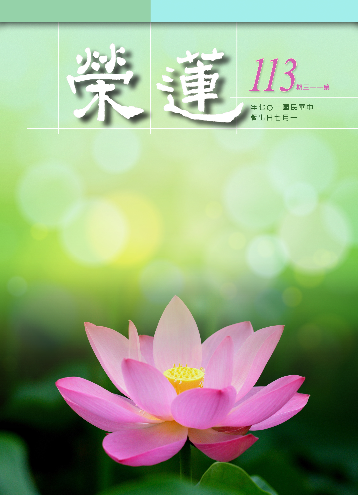
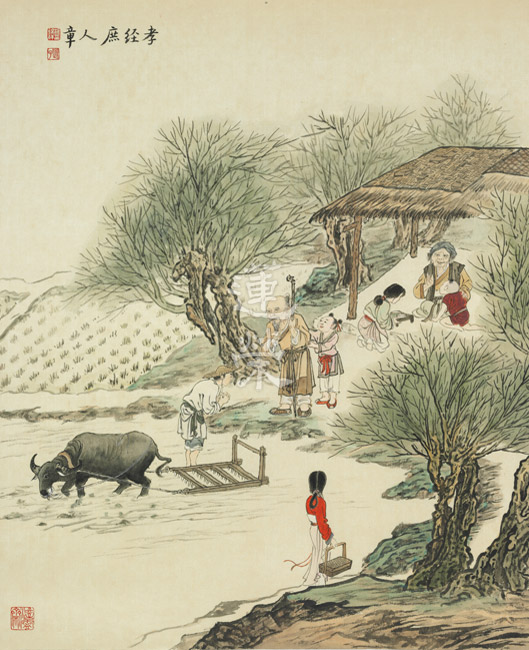
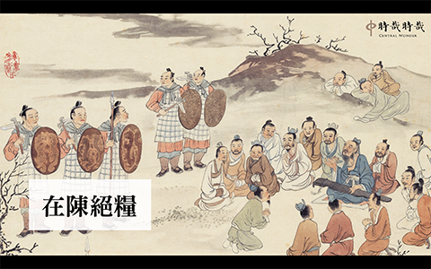
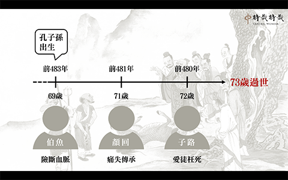
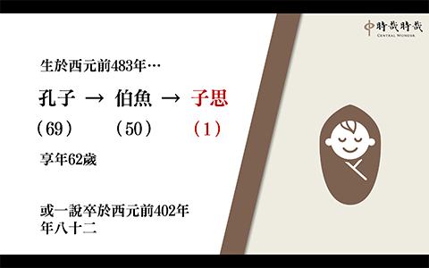
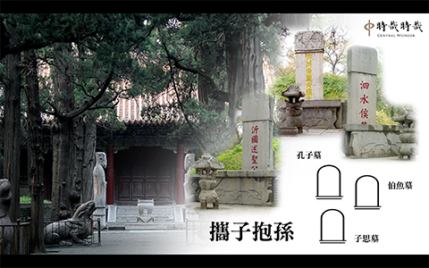
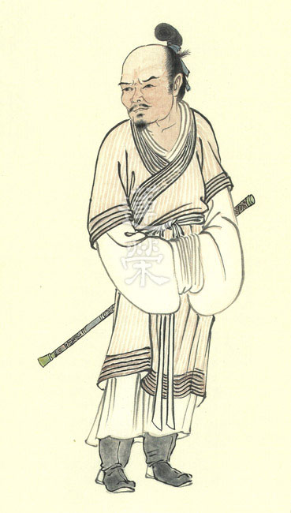
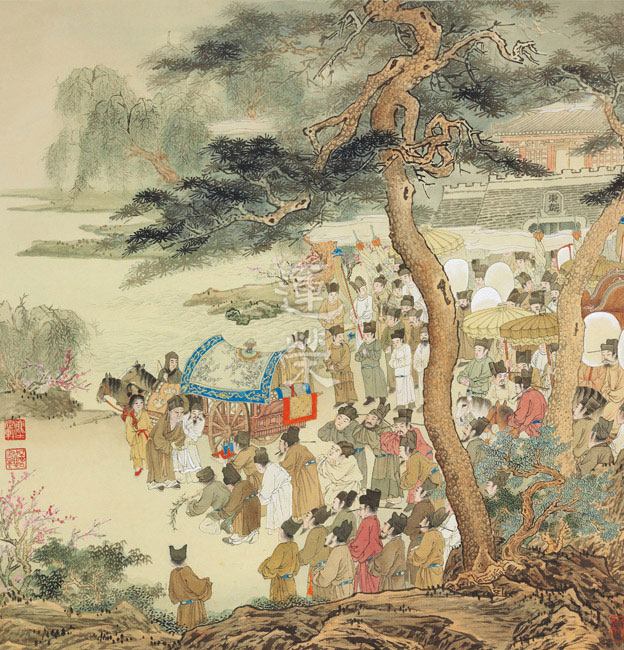
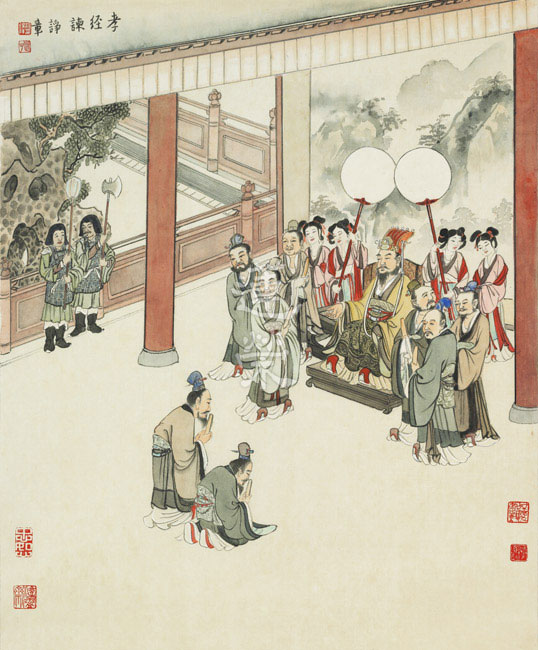
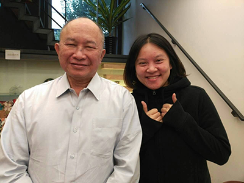

# 第113期

## 社論

### 人生大事

本刊

文中所說經驗談

平時積累臨終報

十念功成瑞相現

不思議事觀待生

每一個人的臨命終都是他轉變的契機，但那是個不成功便成仁的重要關口，一生只會遇到一次，不知道何時會遇到，無法選擇方式，沒有預演彩排的練習機會，也完全沒有重來或翻轉的可能性，是急救或者助念，是壽終正寢或者搬動哭泣，身邊的親友如何決策，旁人無從置喙也無法插手。

經論與祖師大德皆說只要信願具足，極樂淨土是萬修萬人去，然而何謂信願具足？表現出來的形象為何？往往見到相信有極樂世界的修行人，也寫好遺囑，也認真做早晚課，並交代親人絕對不可以急救，但最後仍然無法得願往生。為了避免這樣的情形，必須要對臨終生死大事有萬全的準備，內因上當全心皈依三寶，當學曾子的戰戰兢兢，老老實實的累積在佛號上的專注力；外緣上要樂見蓮友，成立佛化家庭，並且真切地為公發心。

而發心探望護持臨命終病人的淨土行者，往往在病人臨終助念上，能夠擔任臨門一腳的護持角色，如此的重責大任，並不是讀完所有關於助念的書籍、祖師的開示、助念問答，就可以馬上上場作戰；也不能自許曾經認真上過相關課程，就要開始承擔助念大業。如何應機善巧開導安慰家屬與病人，如何在正確的時間點說出正確的話，事情能夠做到位，除了平時教法上的學習，還要在正確的心態下累積足夠的經驗，將心比心的站在病人與家屬的立場上為他著想，才能在做法上真正給予家屬或病人最適當的協助。

曾有老人家頻繁地進出醫院，甚至在加護病房中，經醫生評估活不過當天晚上，但後來情況又穩定下來，並辦理出院。如此不斷地在醫院與家中來回折騰，人變得容易生起煩惱，不想吃藥，不願意再做各種醫療行為，並且怪罪自己業障深重。某次機緣下，老人家獲得善體人意的善知識前往探望，雖然身體已經極為衰弱，但發自內心生出喜悅，並對往生淨土又生起了信心。

另有一位五十歲左右的朋友，在下班前巡視工地時，被怪手打落大坑，造成鎖骨斷裂，左肋骨全斷，右邊肋骨剩兩根，在加護病房中情況十分危急。家屬雖也修學淨土，但面對這樣的無常，只想到要努力積極念佛，做放生等各種善法，來求傷者平安康復，對於應當同時提起護持傷者往生的心態來念佛，雖經由探病的蓮友提醒，但仍難掩悲傷不願面對。

無常的事例隨時隨地出現在我們身邊，不知不覺地，每個人都會走到臨命終，沒有人可以避免。不能輕易地相信自己的往生絕對萬無一失，但也不要妄自菲薄怯懦退縮，複雜的因緣果報中，本質全是體空，正因為沒有自體性，所以造作一分因，獲得一分果，是否臨終得到助念、得到最好的護持，觀待自己平日的發心為公，觀待敦倫盡份，也觀待經教的修學。在助念團體中，培養出真正懂局的護持者，讓臨終的人能夠對淨土生起正信，那將是最大的功德。

## 佛學覽幽

### 菩薩清淨的行持
       —華嚴經淨行品（二十九）

菩薩清淨的行持

—華嚴經淨行品（二十九）

*戒慧講述‧編輯部整理*

日用平常須用心

行走亦是修行處

降伏其心依般若

結合法義成佛行

丙二、指事顯因答其徵因

丁一、總徵

丁二、別顯

戊六、乞食道行時願(五十五願)

己一、遊涉道路(十二願)

己一、遊涉道路  涉路

經文：

涉路而去，當願眾生，履淨法界，心無障礙。

涉路就是走在路上。此時願眾生，在一真法界的清淨道路上，證得一真法界的境界，內心就走在一真法界中。

前述若在於道，是要到信徒家去乞食，東南亞現今仍能維持佛所制的規矩，所以信徒每天早上起來的第一件事情，就是煮飯等著修行人來托缽，一大早就有善法可作，釋迦牟尼佛發明的托缽制度，讓信徒一大早起來就知道要做善法，而不是每天忙家庭、忙自己、忙生活，所有的心思只用在自己和家庭。

涉路而去是托缽之後離開信徒家，會性法師說我們現今也可以活用這一條，比如從甲地走到乙地，或是為了辦事而去，或是請教事務，涉路而去是辦完事，離開以後，當願眾生，履淨法界，心無障礙。

而履淨法界與心無障礙，能證的是心無障礙，所證的是清淨法界，換句話說，涉路而去的心要去到哪裡？心要去向清淨的法界，心要向佛的智慧去。

法界有四，法界裡面包括生理現象、物質現象和心理現象，菩薩所要對的就是各種差別相；法界就是每一法都有每一法的界線，例如內心生起慚、愧，或者生起無貪、無瞋，它都有界別（範圍），透過觀察可知這些差別的心理活動。

理法界與事法界，理法界就是每一個差別的事項，它的體性都是空性，顯現差別相的同時正在顯示它自相空，中論云：因緣所生法我說即是空。因緣所生法是事法界，我說即是空是理法界。

理事無礙法界，指現象界跟本體界具有一體不二的關係，理就是勝義，事就是世俗，法有兩個面相（世俗面相跟勝義面相），這兩個面相可以同時被菩薩做觀察，勝義的面相是自相空，世俗的面相是觀待因緣而有，觀待因緣而有的世俗面相，恰好是沒有自性，這兩個面相在一法上顯現，行者可以同時做兩面相的觀察，叫理事無礙法界。

事事無礙法界，無有實體（自相）是就生起的作用而安立名言，舉例來說，當善業生起時，即使在熱火海中卻觸到它的清涼，可見菩薩於事事中皆無障礙，於輪迴中卻見解脫，於維摩丈室中亦能顯現廣大的阿閦毘佛國土。三千大千世界可以在一粒微塵中現，豈非事事無礙？

己一、遊涉道路  昇高路

經文：

見昇高路，當願眾生，永出三界，心無怯弱。

托缽乞食道路有高有低，昇就是由下往上的路，或者是上坡的路，或者是台階一級一級往上。對此境時想著希望眾生能夠永出三界（欲界、色界、無色界）的輪迴，然高出三界輪迴，須勇猛精進努力於正法的修學，即使遇到逆境亦不退卻。

以前比丘從蘭若到村莊乞食，回蘭若時，分作四分，一分養身，一分供養不能托缽的同法者，一分供養三寶，一分布施給動物，所以出來托缽的這份心意是良善的。今日要昇高路，爬坡的時候或許是很辛苦，觀想出三界就像往高處爬一樣，這時候雖然辛苦，但是心力要堅強不怯懦；坦白講，其實我們因為還沒有認真觀察出三界的辛苦，所以會輕易的發願，但是越來越瞭解成佛的過程時，很容易就怯懦不幹。

想要出三界，裡面包括尋師訪友、修行破障（內魔與外魔）、環境和道糧等，總之，欲出三界的修學者，修學歷程是很辛苦的。

心裡面怯弱的那一分，或許是本來以為修行很輕鬆，結果走進來才發現修行是這麼辛苦；或者本來以為煩惱很容易對治，結果發覺越對治越多；或者本來以為世間的業沒甚麼，結果修行被業所繫縛的時候，才驚覺是那麼樣的可怕！這些都要親身遇到才會知道，沒有碰都不會知道。

所以不會產生怯弱的感覺，因為沒有認真觀察過，認真觀察時才知道心會怯弱；如何對治怯弱的那一分，是非常重要的修學法。

平常修學佛道本來就很怯弱，雖然在修行，可是內心是很怯弱的，不願意去承擔甚麼事。曾經到養老院當義工，曾聽老將軍侃侃而談「即心即佛，非心非佛」，可是後來老將軍體衰，到了安養中心，體力不濟，生活起居無法自理，被看護修理，看到蓮友像看到救星一樣，之前修行的豪氣都煙消雲散！我們應該引以為鑑，在團隊中好好和合辦事，互相在道業上提攜，將內心的怯弱轉成對淨土的信心，轉成對人世間正確的認知，安然地接受無常的到來，快樂地面對臨命終。（下期待續）

### 大乘百法明門論簡說（二十一）　拾貳、心所有法｜別境(二)

*戒慧講述‧淨本整理*

善識教義助修行

解論能入經義門

時代紛擾心茫然

要依正見生福慧

經文：

別境五者：一欲、二勝解、三念、四三摩地、五慧。

「定」即梵文的三摩地或三昧，《直解》中定義為：「於所觀境，令心專注不散為性。」前述「念」心所為：「於曾習境，令心明記不忘為性。」念也需要透過專注才能明記不忘，所以念與定的差別在於，專注中生起輕安，才能安立為定。輕安相來自於心念不斷專注，如電風扇轉到所觀的境界上，產生風力，此時身體氣脈都能夠通暢，如憨山大師所說：「雪裡梅花初放，暗香深夜飛來，正對寒燈獨坐，忽將鼻孔衝開。」就是定的覺受。所以很多身體上的毛病，醫藥的力量達不到時，有人可以用定力去改善，就是用專注的風力去調適，醫藥能夠跟身心融合，才能很快的把病治好，生活作息改變、觀念改變，下藥才真正對病患有益。

定也翻譯為正受，離於雜亂叫做正，納法於心叫做受。因為定是五別境，未必是善或惡，所以也有邪定，也就是專注於邪法上所生起的定。正受與五徧行的受不同，正受是只受用眼前的境界，不受用其它，因專注而生起輕安。日常生活中雖然也有定的形象，例如上網、看籃球賽時，在專注中感到非常快樂、渾然忘我，而世間許多的可欲境，往往也讓人印象深刻。但是這樣的定力，遠不如修行人定功所生起的輕安之樂，那些定並非初禪未到地定的輕安相，而且所受的快樂究竟是苦因還是樂因，未來會生起苦果或者樂果也未必然。

念所緣的是曾習境，定是緣所觀境，只有當修定的目的是為了開智慧，才能稱為所觀境，所觀境不一定生慧，但是慧一定從所觀境來。例如念佛可以入定，但佛號不會成為所觀境；數息同樣可以入定，然而也非所觀境，只能說是曾習境，是將深刻的印象拿來運用，努力產生專注的能力，雖然最後也出現輕安，但仍非所觀境。對於境界產生專注力，是為了在定的基礎上，鎖住境界作自體空的觀察以產生智慧，如此才能稱為所觀境。

定又翻譯為調直定，調直定就是把內心彎曲的相調直，將散亂相調定，進而產生輕安，這也是就定的某一分行相來做說明。

定又翻譯為正心行處，讓心端直地在法上修，產生輕安的快樂，所以修行人也有快樂，但不為世間人所知。

定也翻譯為息慮凝心，萬緣放下為息慮，專注在一個境界上為凝心，所以念佛時維那師常會說：「話過如風過耳，煩請萬緣放下。」是息慮；「佛號提起，一直念下去。」叫凝心。但還要將體性轉成輕安，此時才能安立為定，否則只是念。所以一場念佛中，念出法喜才是定，這樣的法喜才會讓人喜歡念佛，持續修學。

定還翻譯為等持，等是可以離開浮沉，就是能夠對治心裡面的沉相跟浮相，而持住一個境界。沉就是內心的昏沉、沉沒；浮就是內心的散亂、掉舉。在修定的過程中產生沉浮，不能強硬地繼續要求自己專注，將得不到任何效果，甚至會有傷害，依論所說，行者可能看到蒲團都想嘔吐。所以念才能生定，對於沉浮的對治法能夠明記不忘、印象深刻，在沉浮時提起方法予以對治，才能真正入定。因此初機學佛，早晚課時間不要太長，五分鐘就好，慢慢培養出對治浮沉的能力，再將定課延長。

依著定的定義所產生的作用，就是《直解》中：「智依為業」。經上舉喻，寺廟戶外牆壁上有壁畫，為了把壁畫看清楚，一定要用火把來照，可是外面風大，火光搖曳將息，此時必須加上燈罩遮風，才能夠把壁畫看得很清楚。燈罩就是定力，火就是慧，定就是為了生出觀慧，不讓其它的境界破壞。

慧在《百法直解》云：

「於所觀境，揀擇為性。斷疑為業。」

就是用鎖定的道理去做簡別抉擇，簡別所觀察的境界是常還是無常？是苦還是樂？是有自體性還是無自體性？分析以後，無常的面相顯現，苦的面相顯現，沒有自體性的面相顯現，決定出本質就是無常、苦、無自性，進而斷除疑惑，此功能安立為慧。例如小乘的三法印：苦、空、涅槃寂靜。無常所以苦，空就是作無我的觀察，得到的是涅槃寂靜，行者對於這些道理有專注的能力稱為念，反覆的專注產生輕安是定，因為有定功能夠鎖住境界，比如鎖住自身去作三法印的觀察，從身體看到無常、體性空，因此得到解脫，此為定中生慧，所以慧的體性是定。

慧跟定相同，也是屬於無記性，不能記別善惡，若與善心所相應是善慧，如與根本煩惱、隨煩惱相應，則屬於惡慧。所謂與善相應，是在簡擇之後，生起了對佛教的信心、生起了反省的能力、生起正法的精進等；如果簡別抉擇以後，生起了對佛法的不信、生起慢心等，都是惡慧。

慧是簡擇，簡擇後產生決斷的功能是智。決斷就是面對事情，立刻知道該如何做，沒有慧就沒有智，因此說智的體性是慧。所以在歷緣對境時，對於道理印象深刻能夠提起是念心所的功能，因為專注使心感到舒服是定心所，將道理針對具體事情去做分析叫做慧心所，最後決定做與不做是智心所。有慧未必有智，簡擇而未生決斷不能說是智，例如知道學佛好，但卻不能決定好好學佛者是。（下期待續）

### 佛學概要十四講表簡說（十五）　第二講表

*戒慧講述‧宏法、淨昌整理*

因果正見難生

通達關聯相續

所作已滅待緣

經營莊嚴佛果

丙表、生起三由-因緣果

法相之現象包括生理、物質及心理等現象，現象的生起有緣起所成的相，亦有因緣所成的相，本文就因緣所成相來說。

補充-暫起幻有符合三法印

生起三由，如以因緣法而言即是「因、緣、果」。由前節所述萬法都是「因緣所生，暫起幻有」，因緣所生即是以「因滅果生」的方式而生，因為因滅果生沒有自體性，所以法的生起是幻有，而且是暫時的生起。

暫起是萬法的無常面相，而幻有是法自體性不可得的面相，此二者合說恰是三法印：無常、無我、涅槃寂靜。暫起是無常法印，幻有是無我法印，無常無我法印所成就的是涅槃寂靜法印。佛教徒用上述三法印判斷教法是不是等同佛說，如果有這三法印，即使是凡夫外道所說，都等同佛說。反之，不符合三法印，即使是佛門中人所說，都不能信解。所以檢驗一個人所說的法是不是佛印可，不在於他的形象，而在他所說的法，謂之「依法不依人」。即使一個說法的人顯現為外道，只要他所說的法符合三法印，那也要被認可，被承許的。所以善財童子五十三參的時候，參訪了很多大德中，有一些就是外道。為什麼要參訪外道？雖然他示現的形象是外道或者凡夫，但他的言語符合三法印的，就等同佛說，所以言語是最需要被檢驗的。中國大師偉大的地方，就是他的言語著述是可以被檢驗的，我們便承許他是大德。

補充-緣起生與因緣生的差別

諸法是因緣或緣起所生，緣起跟因緣的差別是，因緣不可以包括緣起，但是緣起可以包括因緣。因緣所生是緣起的一種。例如：「左邊是右邊所生」，是緣起而生，而不是因緣而生，如果左邊是右邊生的，那應該右邊滅左邊生。其實不是如此，左邊生出來的時候右邊還在，此為緣起而生。左邊是因為對著右邊才有，所以才說左邊是右邊所生，但「左邊是右邊所生」是緣起而生，不是因緣而生。

這裏為什麼要探討因緣而生呢？因為緣起生中因緣生為主體。因緣生都沒有自體性，緣起生更沒有自體性。

◎因-動機、造作

先就「生起三由」中由「因、緣、果」之因緣生來探討。首先探討「因」的部分，「因」在講表裏面是「動機、造作」，「動機」指意業，「造作」指身口業，如何解釋「因」呢？

述記云：

「『因』為主因，佛典言萬法生起的主因為『種子』」

。用種子來解釋因，對初學教法者是比較容易接受。一般世間都接受果是由種子來，但佛法要成立果是由因來。就以世間所有的果都是由種子生來解釋，如前一節所說的相是果，此時「因」之比喻為種子。如此比喻，不善於觀察的人會落入一種執著，就是有一個實體的種子生出了果，但是實際上，諸法都是以滅法相續的方式去結果，不是有一個東西叫做種子存在於第八識。

述記云：

「吾人佛性無始以來隨迷緣而為『識』，眾生之『識』有八，所謂『眼識、耳識、鼻識、舌識、身識、意識』為前六識，『末那識』為第七識，『阿賴耶識』為第八識。七、八識為深細幽微難知之心識作用（不經第六識），第八識乃『根本識』，以其為前七識之根本，前七識皆依之而生起故；其名為『阿賴耶識』，譯為『藏識』，猶如一大倉庫，甚深甚廣，含藏有宇宙萬法之『種子』。」

唯識宗認為第八識像田地，「動機、造作」像「種子」，種子儲存在田地遇到水、空氣、陽光結成苦樂果，而善惡業叫做種子，此種子不能被失壞，否則因果就不成立，這是阿賴耶識安立的原因，它是一個「藏識」，也就是讓因果不失壞，讓業種子有存放之處。

可是心識是有為法，而有為法的體性就是生滅，如此說來第八識應該有滅的時候，第八識滅的時候種子失壞，是否種子壞失就成佛？問題是不可能，所以安立第八識除了唯識宗承許，其他各派，有部、經部、因明派、中觀派都不承許。

如果因不能安立為種子，因果的道理要如何成立呢？中觀宗認為過去造作的業是以滅法的方式在相續，待因緣和合的時候出現。譬如過去我開車，但這兩年沒開車，可能這一、兩年都跟開車沒關係，但是一上手又會開，開車的能力即是以滅法的方式相續而結果。

滅法也可以成為因，然後現前成為果，譬如說，今天考試考得很好，為什麼？因為昨天有讀書，昨天的讀書成為已滅，經過一夜睡眠，雖然已經成為已滅，可是會令今天考得很好，可是昨天有讀書已經成為已滅，昨天已滅的東西怎麼會生出考得很好的「果」？一般世間人也都清楚昨天已滅的事情，再經過一夜睡眠，可能在過程中都跟它無關，可是今天考得很好，為什麼？因為昨天的讀書是以滅法的方式相續，結成今天考得很好的果報。

世間凡夫都未學過中觀宗，但此因果上的說法，符合中觀宗的見地。同樣的，無始劫前所造的善惡業，以滅法的方式，結出現前的果報，理由同故。而以滅法的方式來存在，即不需要安立藏識，為了初機學佛好懂，不妨以種子說因，業成為種子來結果。

另外，唯識宗安立第七識的理由，在於一般人有時進入極重睡眠或者悶絕的狀況，或者修行人進入無想定、滅盡定的時候，前六識不起現行，可　　　是執我的心識還在，為了說明執我的心識所以安立第七識。知乎此，八個識應該是心識的細粗作用，第八識是最細的作用，或說是「體」，由「體」起「用」當中，第七識是細作用，前六識是粗作用。

但中觀宗認為處於極重睡眠或者是昏迷悶絕，雖然可以說前五識不起現行，但不能說第六識不起現行，其理由在於執我的心識，不必另外安立第七識，第六識以五蘊身為所緣成立我，此即是執我的心識（最微細的心識），不必再安立第七識。上述是中觀與唯識兩宗的宗派對心識安立之不同處。

述記云：「『種子』乃一種潛能，有生起結果之功能，論典釋云『親生自果功能差別』，即第八識中有能生一切諸法之差別力用，猶如五穀種子，能生芽莖花果。」種子結果會有自果的功能，是指種子與所結果具有同類特性相等。譬如西瓜跟西瓜種子是同類的因果，眾所周知，眼前的西瓜絕對不會是從鳳梨的種子出來，也絕對不同於其他的種子，一定是西瓜種，所以西瓜種親自承辦西瓜，葡萄種親自承辦葡萄，心法種子親自承辦心法，色法承辦色法。

但是說色法和心法，也不必以「種子」這個名言來承辦，舉例來說，沒有中觀概念，一個杯子今天看到，昨天也看到，今天看到杯子是來自於昨天看過，而昨天看過成為已滅，已滅的「看」成為現在「看」的種子因，所以在同類因果中，不會說今天「看」到的是從昨天「聽」到過的，聽的已滅，不能成為看的自類果，看的那一分一定從看來，聽的這一分一定從聽來，已滅的心識成為未來心識的因，未來心識的果由已滅心識為因，這叫做自類種。所以我們有情眾生，看的能力是無始劫來就有，看是觀待已滅的看，聽是觀待已滅的聽，如此自類相續下去，找不到一個開始。

述記云：「功能未顯，則名『種子』；功能已顯，則稱『現行』」此句可同意，亦無法同意，可同意這是方便說因果自類功能的關聯；不能同意之處，功能既未顯如何可安立為種子，實則觀待果報起現行，對著果才說名言上種子有結果的功能。

果然如此，一個是功能未顯，一個是功能已顯，諸法從同一相續的因生為同一相續的果，從功能未顯到功能已顯，雖是同一相續但體性為異，是觀待前因生後果的關聯，稱之為名言關聯。因與果的作用彼此不同，不妨在名言中說體性異，如同前我與後我的關聯。

因生果僅有二個可能，體性為一或為異。體性是一，說果成為無義，說果是沒有用的。果是本無今有，本來沒有現在有說果。若因跟果的體性是一，果就變成本來就有，因上本來就有果，何必說生，所以說因生果則無義；如果可以生，則生成為無盡，因為眼前的果可以從體性為一中生，那何妨說它一再生。故體性是一，則有說果生則無義、說果生則無窮等二種過失。

以上已明因果體性非一，次說因果體性如果是異？則因不能生果，因為體性不同故。因跟果的體性如果是異，那因跟果則成為無關的二法。此因（因果體性為異）可以生體性是異的果，那吾人也可以說大便會生黃金，因為大便跟黃金的體性是不同的，也可以說苗芽生黃金，因為本來它們體性就是不同，可以從不同的因生不同的果，也可以從一個因生各種果，也可以從多個因生一個果。

因跟果如果有自體性，只有一跟異兩條路，上述已知。因跟果的體性是一的自體性，跟體性是異的自體性都找不到，那它的體性是就是沒有，因跟果就只剩下名言上的關聯。所以，為什麼今天考試考得很好？因為昨天努力讀書，昨天努力讀書成為已滅，已滅怎麼生果？如果沒有昨天已滅的因，今天也生不出這個果。已滅的因怎麼生果？已經滅了怎麼生？可是，如果沒有這個已滅的因，果又生不出，剩下的是什麼？不妨說那是一種關聯，就是因為有昨天的讀書，才有今天考得好，沒有昨天的用功讀書，今天就考不好的關聯性。所以諸法沒有自體性，而因果的關聯是這樣來關聯。

釋迦牟尼佛對著不同的眾生，他要把這個道理說明白是不容易的，所以對著某一類眾生，佛只好成立第八識來說因果的關係，我們必須要知道佛在說法的時候，有淺說跟深說之別，有究竟了義和不了義的區別，學者要善於抉擇。

述記云：「又第八識中『種子』有『本有』與『新熏』二類。」本有，就是功能未顯的種子藏在第八識裡面，此說法，如果未經善加觀察，亦容易被人攻難。何謂「本有」？本有就是本來有，如果解釋成本來有自體性的存在，則這個種子本來就有，不必透過因緣本來就有，那是不是跟佛法最基本的宗旨矛盾呢？所以這個說法只能就某種立場來說，譬如，我們會學佛是因為過去有種下學佛的根，而過去有種下學佛的根也因曾種下學佛的根一樣類推，所以只好說是本有。

其次，本有的種子能不能被破壞？本有的種子當中有善種子和惡種子，請問善種子不能被破壞的時候，惡種子能不能被破壞？善惡種子都是本有，都是不可以被破壞，那眾生可以成佛嗎？方便用本有是為了解釋過去累積善惡的習氣，而不是真的說本來有，況且如果有所謂的本有種子，應是清不掉的，最後如何能把第八識清空？種子能被清空便無法安立為本有。

再者，種子新熏下去以後，本有的種子跟新熏的種子並存，無漏種起現行時，有漏種尚在，如何承許無漏種顯現的那一分說成佛？第八識的說法裡面還暗藏危機。故知本有種子之說只是為了讓初機學佛方便理解，但是吾人須能辨知安立名言時，其意義是為引導眾生由淺入深。

第八識的種子有兩類，一類是本有種，一類是新熏種。唯識宗本身就有見解的不同，第一類的唯識宗講到本有種跟新熏種，最後把無漏的那一分去發揚就成佛；第二類的唯識宗是說種子要清空，空空的第八識去成佛；第三類說這八個識都是染污的，都要去掉，最後由第九識去成佛，唯識宗本身都有不同的看法。

而陳那論師的唯識宗，只說前六識，不說第七識和第八識，所以為何玄奘大師要到印度去求法，就是因為所學習的唯識，沒有一家一樣，而他已在中土將各家學透，無法解決其中的矛盾，為了這樣的事情他到印度去求法，古人求法的辛酸不是我們現在人可以體會，我們很舒服的來學佛，不曉得古人所有的學佛正見，都是用生命去換來的。

其實沒有什麼叫做本來有，沒有天生的彌勒，自然的釋迦，「本來有」這事情佛法是不承許的，如果承許本來有，但又說緣起，又說因緣，這是為什麼？說因緣就表示本來沒有，都是因為因緣而有，可是本來沒有，因為因緣、緣起而有，可是又說本來就有，這不是恰好與自己最基本的宗派見矛盾嗎？所以我們學佛，在這個混亂的時代當中要培養正知見，能夠說清楚，才能夠維持真正的法幢，才能夠延續佛法命脈。

述記云：「『動機』指意業，『造作』指身口業，三業一動作，則皆於第八識中落下『種子』。下舉喻言之︰『如種下地』猶如五穀種子下於田地之中，將起生長之作用矣。」業為因，煩惱為緣，結出來的苦樂果，可以解釋眼前的苦樂是怎麼來的。或說種子及果皆從因緣而來，或說苦樂果皆從因緣而來。

動機跟造作，以第六識來說，業因當中的動機是屬於思業，造作是思已業。第六識有三個思，審慮思、決定思屬於思業，動發身思是屬於思已業。業當中還在想，還在決定、還在審慮，屬於動機的那一分都是思業，要發動身口的那一分是思已業，這個是屬於「造作」。至於業是怎麼來的？業果的關係是什麼？這些觀念尚待後面五戒十善，再行詳述。

如種下地，地就是第八識，種子就是新熏下去的造作，為了說明業果不失壞，種子跟果報的不失壞是觀待動機造作，跟未來所結的果報間存在名言上的關聯性，譬如蘋果種子跟蘋果的因果關係，都只是名言上的關聯性，如種下地所要顯示的即是此名言上的關聯性，如果此關聯性不存在，蘋果應不必從蘋果種子來，西瓜也不必從西瓜種子來。

關聯因果就是這樣，前生的你已經滅了，這一生的你關聯前生的你而顯示這一生的你，如果造作都會成為已滅，我們會產生什麼樣的決定見呢？我們眼前如何造作，未來就會如何的顯現。所以我們要發菩提心，廣作佛事，已滅的因跟果報會產生關聯性，果生出來，一定跟前面已滅的因有關聯，所以佛可以直接說出已滅的是什麼，叫天網恢恢疏而不漏，逃不了的。所以看似利益人的事情，懷藏的動機是假情假意，還是真情真意，是為公發心還是為私發心，最後都在果報上呈現，都會成為關聯，這叫作自類的因果關係，沒有辦法用另外體性不同的東西來成一個果，只有依菩提心，廣行六度，福慧雙修去成佛，沒有其他的方式可以成佛，因為它是關聯的。

如果我們不了解因果關聯的方式，絕對不會生出這種決定見，好好造作眼前的善業。所以斷惡修善的人一定要有因果的見地，以上就是「如種下地」。（下期待續）

### 人生大事—不能忽略的事實
			  助念生西觀念作法研究（一）

人生大事—不能忽略的事實

助念生西觀念作法研究（一）

古晉讀書會謄錄

平時不定業

臨終能決定

念念若深悟

一句轉乾坤

前言

馬來西亞東馬善友，於多年前至學會參與共修研學，後請此法欲將正法於東馬古晉推行，然助念一法僅透過錄音聽講仍無法複述，故發心將師長講學以文字方式謄出，在有限的中文能力下勉力完成，後經大德召集來臺求法，於二Ｏ一七年十一月，假東勢實栽農園重新聽講此份助念相關資料，並實際演練助念狀況。

依此講座報導因緣，整理東馬善友逐字文稿，期待此文稿的修繕流通，能導正臨終護持助念生西的心態與做法，真正利益個人與團體，令共學風氣延續，家庭佛化。（編者）

出書與講學因緣

團體中穩定共修人員，大都是家人臨終經過助念做七引入正法的學習，如果沒有助念這一法，不容易聚到社會上善良又好質地的人，正法就傳不下去。如果沒有助念的因緣，共修會難以持續這麼多年，佛法無法透過講學延續，也就談不上對儒家的護持。

助念不是只有幫助亡者往生，也需引導喪家參加團體學習正法，團體藉此機會吸引質地好的人才，能莊嚴團體，成就雙贏的局面。

*關於各類助念相關的文章，雖然曾經一篇一篇的整理過，但未整理編排次第，並講述推廣。*

二ＯＯ九年配合江老師，於福建建甌孔廟安立孔門十哲、孔子與雪廬老人的塑像，並推廣孔學。隨行的黃志銘醫師在大陸建甌突然死亡，雖努力於停屍間為他助念二十四小時，得到很好的瑞相，但想到人命無常，不但要創造自己助念的順緣，也要及時對臨終的蓮友排除往生的障礙。

接著隔年年底蔡宏謀老師的往生，讓人想起許多助念的經驗和觀念的建立，都是以前參加蔡老師讀書會時奠定的，在感慨生命的無常中，也隨喜當初修學淨土助念法門的這段因緣，所以開始將祖師助念的文章與 雪公關於助念的問答集結成冊並做科判，於周六大眾共修時一同深入研究，確立往生正見。

編書次第

第一部分，助念基本概念與做法。

一、助念生西須知。也就是就淨土以及助念這一法，首先需要知道的事情。

二、助念的意義與規矩。這是雪廬老人對助念團最先制定的項目，詳述助念團不可變的原則和規矩。

三、臨終助念的家屬須知。家屬是亡者往生的關鍵人物，家屬如何好好的護持，必需要有正確的知見，此篇須知會張貼在助念現場，以提醒家屬。

四、臨終交待事項。避免家族中有其他意見，亡者自己訂立的臨終交代事項。

五、助念通告。來訪探視之親友及所有家眷，務必遵守的事項，幫助亡者生西大事。

以上是助念時必須要貼出來的通告，張貼出來方便助念，避免不必要的麻煩。

六、助念座談大綱。內容從生病關懷應具備的醫療常識，到病危時該如何開導，往生時該如何護持，做七追薦的意義，還有往生案例等，方便接引蓮友家屬。

第二部分，選錄十三篇印光祖師所著，往生西方淨土相關篇章。

接著是根據印光祖師所寫的往生淨土相關文章，這些助念的資料，當初是在蔡宏謀老師家中，一篇一篇慢慢討論出每篇文章的科判架構，他家裡就像流水席一樣，招待大家安心地討論教法，蔡老師一家就是因為有量，所以才有後面助念的順緣和盛況。

印祖所著往生淨土相關文章，次第為：

一、得助念失助念之損益比較。藉由二例比較得知，不論修行功夫有多好，臨終得助念是極為重要的一件事。

二、示華權師病中法語。在生病的時候，正是放下萬緣一心念佛之時，也是觀修死無常最好的時機。

三、臨終三大要。從生病到臨終，旁邊護持者必須注意三個要點（善巧開導安慰、大家換班念佛、切戒搬動哭泣），作為護持他人往生的依據。

四、普陀普濟寺化身塔記。死亡助念之後，採用火化的理由與意義。

五、喫素念佛修淨業人，須平時事事多與淨行相合，乃可往生。接著是一個人臨終能得助念，其實不是只有臨終那一刻需要經營，重點還得觀待平常的行事，必須多多累積往生的資糧。

六、最後提出往生的實例，出家人以今彩大師為例；在家人當中男人往生以周紫珊（富貴人家出身的仕紳）、趙尊仁（商人）和徐蔚如居士（母親學佛）作範例，女生則是江味農居士的母親郭太夫人（母賢以佛化子，子賢助母生西）以及善女人何王氏（無知無識）兩位居士作範例。

七、陳了常優婆夷往生事蹟兼佛性發隱。透過三因佛性的闡發，彰顯陳了常居士密修以改變先生，感應生子，並且引導家人成為佛化家庭，最後助成自己往生大業。

八、復范古農居士書。這篇文章透澈詳明六道輪迴中的中陰身，顯出三界唯心所造，因果報應真實不虛。

第三部分，選錄雪廬老人的七十四條往生問答。

從統論往生前後和兼論其他中，提及因上緣上該有的注意事項，畫龍點睛又含蓄的彰顯內因外緣的重要性，平素個人的用功中，仍須好好經營佛化家庭，因為家屬往往在個人往生中扮演決定性的角色。

而坊間外道或他宗的修學法當中，與淨宗相關或不相關的作法，是否造成往生障礙，種種或迷信或模糊的見解，雪廬老人都有精闢且切入重點的解答。

助念生西須知

我們念佛的人都希望當生成就，信願具足往生極樂，所以平時用功念佛，但是功夫深淺有差，臨終時常會發生許多障礙，或者提不起念佛的勁，這個時候助念就非常重要。

有的人形容助念就是加強保險，幫助我們在臨終提起念佛的正念，而能安詳的往生西方極樂世界，大家不要小看助念這件事，因為在他人最徬徨的時候，助他一臂之力，可以結很深的緣。

記得約當四十年前曾經幫某人的岳父助念，他的房間湧出很臭的臭魚味，老人家本身很愛乾淨，這種病令他不勝其苦，當時的我還是理工科系的學生，在連續去了三天之後，他們家屬對助念者特別的感激，奇妙的是念佛念到第三天，臭魚味道竟然不見了。當時讀的是理工科系，對佛法神妙的事情是不太信的，但是卻被蓮友的誠意及所顯示的瑞相所感動，尤其是這位阿伯往生的瑞相，死亡一天之後頂部猶熱。

由於在大學裏遇到了善知識，特別是參加了助念，改變了很多對人生的想法，開始從心態上產生了化學變化，開始重新思考人生。人生的經歷就是這樣，在冥冥當中，助念成為學佛的增上緣，很多不可思議的事情貫串著助念一直發生。

一、普賢菩薩發願偈—願我臨欲命終時，盡除一切諸障礙。面見彼佛阿彌陀，即得往生安樂剎。

第一段是普賢菩薩發願偈，因為所有的障礙如果出現在臨終，這個障礙是最可怕的，它是升沉之別。此段文句出自〈普賢行願品〉，此品共出現三次往生極樂世界，此處是排除面見彼佛阿彌陀的障礙。連這麼偉大的普賢菩薩都希望臨終盡除諸障礙，包括心神恍惚、心神不寧的障礙，或是身體嚴重病苦的障礙、或者外緣、眷屬邪見的障礙，或者是不如法助念的障礙。

臨欲命終時，就是將要往生還沒有斷氣，在去世與未去世之間，壽命將快盡的時候。

淨土法門是信願行，既然我們平常都有下了功夫，為什麼臨命終還會發生障礙呢？這個我們倒要問自己，如果我們對佛法教理不去深入探討，既不能排除煩惱，又去造業，到了臨終的時候，種種的障礙會現形而失掉正念。

尤其，我們平常很容易什麼事都放不下，纏縛在五欲境上，修學多年沒有一點進步，算是佛法的門外漢，還不算修行人，臨命終的時候，就會罣礙很多事情，或曾經因為追逐五欲境，造出許多損人利己的事，屆時或有冤親債主的出現。

或者具有一些簡單的知見，但是又不肯下功夫學習，念佛也未入心，人死的時候四大分離，就像烏龜在脫殼，是很痛苦的。因此助念非常重要，提醒我們心要不離佛號，才能感得阿彌陀佛接引我們往生西方極樂世界。

其次，面見彼佛阿彌陀：彌陀前身為法藏比丘，久遠劫前在世自在王佛座下，發心捨王位出家，為創造自己的佛淨土，請示如來十方諸佛莊嚴淨土之相，佛就為他宣說與展示兩百一十億的佛淨土，法藏比丘由是而發大願，欲成就極樂世界，其中的第十八願是十念往生，十方眾生聞到阿彌陀佛的名號，而且有信心，對極樂淨土生起好樂，將所有善根至心回向，由是而念佛乃至十念，就可以生到彼國(西方極樂世界)。

第二十願是臨終接引願，吾人平時認真念佛，臨命終時，以善根回向欲生西方極樂世界，阿彌陀與諸菩薩們就會在須臾之間接引我們往生西方極樂世界，上善聚會，令我們永遠不會退轉。

即得往生安樂剎：由佛來接引往生西方極樂世界。

二、印光大師—成就一眾生往生西方，即是成就一眾生作佛，此等功德何可思議。

上述普賢菩薩的發願偈是自己要努力的排除往生的障礙，此句是我們要努力排除別人往生的障礙。

一個修行人的成就，達到最圓滿、最究竟的狀態就是成佛。此時可以真正的離苦得樂。如果成就眾生往生西方極樂世界，幫助對方到成佛的環境，這個是功德不可思議！

善心與所做的善法，可分為不同的等級，即使供養到辟支佛一頓飯，竟得到百大劫不飢餓的果報，更何況助念能幫助所助念的這一位眾生成佛的功德，何可思議？所以聽到有助念的機會，應該要搶著去做，因為成就一個人往生是非常殊勝的善業。

成就這兩個字，包括平常跟著善知識學習經教，讓他有機會發心為公，讓他懂得修學正法，讓他有美滿的佛化家庭，這就已經在排除他往生的障礙。佛化家庭包括子女學佛，從小讓他在啟蒙班接受正知見的教導，這都是成就他往生的殊勝因緣，成就這兩個字是諸多的努力才有後面一剎那的成就。臺上十分鐘，台下十年功。

阿彌陀佛第三十五願是願為一生補處願。所有眾生生到西方極樂世界，必定會得一生補處。一生補處是有成佛的證量但是沒有成佛的因緣，換句話說就是在排隊等候成佛的因緣。

阿彌陀佛創造淨土的目的就是幫助眾生成佛，所以我們去助念，等於把一個人推到淨土裏，讓佛引導他去成佛。這個人往生淨土的因緣是我們成就的，將來他成佛的緣起是我們幫助他的，我們不但在臨終以助念的方式幫助他，也包括平常幫助他清除往生的障礙，想想看這功德無法思議！（下期待續）

## 孔學一隅

### 論語簡說（二十一）
	  			 —博施濟眾（上）

論語簡說（二十一）

—博施濟眾（上）

時哉講述

事功要論心行

仁者要在立達

己成必能利他

成佛圓滿悲心

經文

子貢曰：如有博施於民，而能濟眾，何如？可謂仁乎？子曰：何事於仁，必也，聖乎堯舜其猶病諸！夫仁者，己欲立而立人，己欲達而達人，能近取譬，可謂仁之方也已。

(雍也第六第三十章)

前言

一個人的一生，到底要怎麼樣去活用，有的人活得很風采，「博施濟眾」的人就是活得很風采，做了很多利益眾生的事情，是一個大善人；有的人可能是默默無聞地過一生。到底我們要怎麼樣去評價一個人，什麼才是一個人真正的出路？這一章會給我們一個很特別的答案。

消文

子貢問孔子，如果有廣施恩惠給人民，又能救濟民眾於患難的人，這種人如何呢？可以稱為仁嗎？

子貢所舉的廣博施予恩惠給人民，及救濟民眾於患難皆需要財力，子貢以為這樣即是有仁德。於是孔子先糾正子貢的誤解，而後告訴子貢學仁的方法。

孔子說：事相與理體不能混為一談，廣博施恩惠給人民及濟眾於患難都是事相上的作用，怎麼能跟理體的仁混為一談呢？如果一定要拿事相來講仁，即使像堯舜這樣有德行有大位的聖人，也很難做到廣博施恩惠及濟眾於患難，而其他人或只有德行，或只有官位，則更難做到。因為本國民眾等待救濟的很多，尚還有各國民眾，需要施惠與救濟的人民太多，而財貨有限，有誰能夠周遍。

仁心不在事相上論，那如何透過學習生起仁心？首先從自身開始，先志於道，再據於德，將想要幫助自己的心志去幫助他人，自己學有所立，才能利益他人。學有所立後才能通達，舉凡天地人三才的道理，乃至於六藝百工，皆需要通達。自己通達之後，才能教人通達。自己與他人都學有所立也能通達，自然就能廣博施恩惠予民及濟眾於患難了。學有所立及通達皆非容易的事情，從自身開始，推己及人。當有志之士多了，博施濟眾的事業就容易達到，這就是學仁的方法。

章旨

此章論如何修學仁心生起的方法，不在事功論，要在心態上講究。

釋義

「民」指本國人民，眾是指國外其他人。

「博施」有三種，第一種就是我把我的財物、物資給人。第二種是把正法傳播出去，讓他能夠開智慧。第三種施是幫助人家解救危險、患難。所以施有三種，給予財物，或者是給予正法，或者是幫助他免於恐懼。此處的施特別是指財物(錢財跟物資)，如果把廣博的錢財跟物資給本國的老百姓，還能夠救助國外的其他人，是不是仁的形象？

其實子貢問這個問題，大概一般人都會認為不需要問，這當然是仁！古書上說舜是「好察爾言」，也就是我們耳熟能詳的事情，卻未必真懂它裡面的道理，看起來好像很簡單的事，其實也未必知道它真正的答案是什麼。想不到孔子竟然答一個我們一般人都想不到的答案；子貢也非常厲害，反而去問平常容易忽略的問題。

孔子回答，事相的「博施濟眾」怎麼可以跟仁的內涵（理體）相提並論呢？你一定要說事相的話，那像堯舜這種聖人，還恐怕做不到。

而仁的理是什麼呢？叫做「己欲立而立人」，我自己想要有內心的出路，我就幫助人家有內心的出路，而且這個利益他，不是只有一般恕道，還包括形而上和形而下都能得到出路。

雪廬老人做表解釋，清楚了然。自古各家注解，沒有人像雪廬老人講的這麼精彩，而且真的也合乎《論語》的意思，也合乎《大學》跟《中庸》的意思，這一章簡直是「一以貫之」！

仁是就從就近處找譬喻，從就近處找譬喻，仁之方是生起仁心的方法。行仁的方法跟生起仁心的方法不一樣。這裡的仁之方是生起仁心的方法。

子貢之問針對兩種人。第一種人是為政者。例如烏拉圭的現任總統—何塞·穆希卡，他是世界公認最清廉的總統，也是拉丁美洲最受歡迎的總統，他的事蹟在世界廣為流傳，他每個月的薪水捐出約九成，他住在農舍裡面，也曾經在冬天收留難民，他的座車是很老舊的金龜車，這樣全心全意為百姓著想的為政者，簡直就是博施濟眾的典範。

第二種是大善人，例如比爾蓋茨，比爾蓋茨和他的太太成立了基金會，投入了幾百億美金，全世界的人都讚歎他們，美國的卡特前總統讚歎說：他的基金會至少救了七十萬條人命！他是博施濟眾最好的典範！把自己的財產幾乎是無條件奉獻地捐出去，也捐助很多的慈善團體來廣做事業，從事醫療、教育，他是很多大財主的典範。

子貢本身是一個能夠貨殖之人，貨物升值，買賤賣貴，而且孔子周遊列國都由他出錢，你看那種氣派！他問老師：這樣算不算仁？如果你是他的老師，你應該要很高興！有一個弟子是這樣廣闊的心胸。可是今天是論到德行，就必須要很精準的定義。

子貢為何會將「博施於民，而能濟眾」認為是仁？因為他有心要這樣做，一般人也是這樣認為，他也很想瞭解夫子的看法。

大部分的注解將「何事於仁」解為「何止於仁」，簡直是至聖！如此說來，比爾蓋茨就是至聖，孔子的內涵還不如世間的善人，也不如跨國慈善事業家，古人這些偉大的學術思想，都不如他努力地實踐做善。

到底他努力地實踐是不是符合仁的定義呢？子貢這一問太好了！子貢從國外贖人，魯國國君要賞賜他，結果子貢不要，他是施恩不求報的大善人！像這樣博施濟眾的人，算不算是仁者？如果解釋為「何止於仁」，那子貢就是孔門弟子裡面最殊勝的！如果這樣解釋的話，那請問顏回怎麼能算是仁者呢？

要了解此章必須先知孔學大要，也就是志於道，據於德，依於仁，游於藝。雪廬老人說這四句話是中華文化的總綱。之前參加啟蒙班當義工，雪廬老人很高興，某天晚上就穿著中山裝，非常正式地從口袋裡面掏出講義，為我們講了一個晚上的「志於道，據於德，依於仁，游於藝」，道就是形而上，志於道就是志於形而上，因為形而上的內涵才能夠真正幫助你離苦得樂！據於德是根據能證的智慧力來證得形而上的道。依於仁就是從仁心出發幫助他人，請問你是要幫助他內心成就？還是只是幫助他外相上給他一碗飯吃、一件衣服穿？物質的幫助並非不重要，但是真正要幫助他究竟的是解決他內心的煩惱，才能得到真正的快樂！前提要解決自己內心的煩惱，才有辦法解決人家內心的煩惱。

所以依於仁是半內，眼前先好好地充實自己。可見顏回是不是仁？他有心要充實他自己去利益別人的時候，是不是仁？可是外相上他並沒有博施濟眾，所以看事情不能這麼單純地看。你到底是聖人的見地、還是凡情的俗見？你自己在決定你的命運。依於仁的半外，往外去利益有情時，有六藝的學習，還有百工等民生技術。

仁是半內半外，半內就是仁心必須有形而上的內涵，因為他知道幫助人的最後究竟處！當你給人家一碗飯吃，這個人有心要脫離他的困頓時，你是不是要給他技藝？你是不是要給他學問？你是不是要給他道德？這些你都給不了的時候，你怎麼算是個仁者呢？
孔子回
**答：** 何事於仁，必也，聖乎堯舜其猶病諸。事相上的博施濟眾，哪裡是仁的理體呢？這一家的注解最好！雪公不但折衷各家註解，還有其獨到的見地！我們有幸親近雪公老師去學《論語》，是這一生最大的榮幸！還原中華文化的精髓。

說到「必也」兩個字，你一定要說事相的話，那像堯舜這種聖人啊，可能在事相上都做不到。

析疑

（一）夫子何以說「何事於仁」？

一般人認為仁者就是愛人，所以把孔子的仁當成愛人來解釋，雪廬老人說：小愛小煩惱，中愛中煩惱，大愛大煩惱，沒愛就沒煩惱，七情最關鍵就是愛。

「何事於仁」就是要修正一般人自以為是又根深蒂固的想法，好人好事也是表揚這種人，社會也是肯定這種人，國家也是立這種人做標竿。

（二）若以博施於民，而能濟眾來檢驗是否是仁君，會有何過失？

如果因為堯舜沒有辦法博施濟眾，而認為堯舜不是仁君；如果以博施濟眾的標準來看顏回，顏回不是仁人，孔子本身也不是仁人，孔子周遊列國無功而返，死時茅屋三間，看來他也不是仁人，可是各國卻說孔子是聖人、是仁人。仁人君子的定義是有錢的大善人嗎？

（三）何以堯舜做不到博施於民，而能濟眾？

有德者如孔子，未必能博施濟眾；有位者如堯舜，也未必能博施濟眾。錢財必須要留在國家內，要花費在人事開銷、建設、民生、教育和國防，若只注重博施濟眾反而會讓國家亡掉！

中國人講究的是救急不救窮。救了窮人，但是他沒有謀生能力，如果他尚有怨天尤人之心，而不能釋懷，那你的救濟就像將水灑在沙漠。他沒有謀生的能力，他一樣會一再的需要，而且當他很容易獲得資源的時候，他也未必會好好珍惜。急難的救助是可以的，但是必須要有原則、有分寸、有做法、有目的。

我們團體曾在二ΟΟ八年到緬甸去賑災，當時緬甸災區的人民都安安靜靜地在路邊，這就是很有教養的貧，他們雖然貧窮，但是現在需要的是救急，是幫助他一時脫困，但更重要的是，他們本身要懂得充實自己，才是真正的脫困之道。

我們團隊去賑災的時候，離開時他們穿上最好的衣服，熱誠地送別！他們的身上沒有受災的樣子，這就是高水準的難民！賑災就是要這樣，真的是救急，而且對方是值得去救助的。

我們的團隊進去的時候，他們的長老就說：「你如果不需要可以不要拿。」很多災民就寧可不要，當我們將一筆救災款項，捐獻給他們的教學處時，全村歡呼！這就是他們的公心，用這麼善良的心來接受人家對他的幫助。所以，救急是需要的。

博施濟眾極不簡單！一定要有智慧、要有分寸、要有原則、要有見地，但最重要的，你是不是懂得人心的經營，而非只是外在的博施濟眾。

如果問博施濟眾是不是仁呢？這叫做捨本逐末。如果說博施濟眾就是仁君的話，有德有位的堯舜也稱不上是仁君。

（四）今日之列強，國強經濟盛，做到博施於民，而能濟眾，可否算是仁政、仁君？

即使做到還要論動機和目的，有些列強在幫助其他國家的時候，其實內心是另有盤算的，甚至是表面救濟，實際上內心有他政治的目的，甚至有的人內心是想要節稅，單純地論事相多寡，那不是仁，必須要論仁的理和心，來判斷是否是仁政、仁君。

（五）有注云：「必也聖乎，堯舜其猶病諸。」如此斷句可乎？

這樣的斷句是漢朝《白虎通》的斷句法，這種的斷句法就是朱子的斷句，朱子說「哦！何事於仁」，不止仁，這是聖人啊！仁人君子之上是賢人，賢人之上是聖人，但是仁人君子是外相上顯現，賢人與聖人是內在的成就，光分法就不一樣。朱子說「必也聖乎」，意思就是博施濟眾是聖人的境界！可見堯舜不是聖人（堯舜其猶病諸）。有一個注解為了給朱子台階下，就說：堯舜不是最高的聖人，所以他做不到，最高的聖人就能夠做到。

《論語》中：「大哉堯之為君也。巍巍乎，唯天為大，唯堯則之。」這代表堯具備形而上的天德。又云：「蕩蕩乎。民無能名焉；巍巍乎。其有成功也，煥乎其有文章。」就是以形而上的證量，結合他的仁心，功德浩浩蕩蕩，老百姓說不出。他的事業可以讓每一位官員都把他的事情做好，生怕堯多分一部分心去擔憂，把政治辦成一個大家庭，每一個公務員都想把事情做好，不讓國家出事情，讓堯煩惱。

所以此處的堯舜其猶病諸，是說連堯舜都做不到博施濟眾，不是堯舜稱不上聖人，不可以用事功來論人的內涵。

總結

貨財是有限的，如果我們必須以貨財來救濟的時候，所要救濟的物件太多，就像世界首富將他的財富全部捐出，也只能救世界零點二百分比的窮人。

要懂得用仁來利益天下蒼生，而且這裡面充滿了智慧，而道必須要導引他，救濟他只是短暫的。給他能力、學問，幫助他脫困，才是真正的仁。而你想要給他能力、道德、學問，本身必須要充實這些內涵，如果本身都不能充實，請問該怎麼給他？

總而言之，這一章可以看出孔子對仁的定義，博施濟眾只不過是事相，儒家要追求的是心裡面的成就。所以，孔門的思想中，最高的成就就是聖與仁！聖就是形而上的通達和成就，仁就是形而下的通達與成就，叫做「己欲立而立人，己欲達而達人」，下次分曉。（下期待續）

### 孝道跨時代的意義與價值—孝經簡說(七)　	盡孝—人人都做得到〈庶人章第六〉

時哉講述、淨域編寫

庶人雖是底層人

安居樂業百業旺

安居在於家庭和

孝道家和萬事興

庶人亦名庶民，即是無官爵的平民百姓。為政者或認為百姓只要填飽肚子，大概就不會造反了，但治理庶民真的這麼簡單嗎？要怎麼讓百姓安居樂業呢？此外，每一個家庭皆安居樂業，是否國家就強盛了呢？所謂庶民政治，乃是政府於施政上，必須了解與重視民眾的聲音及感受，凡事以人民的利益為首要考量。為政者果然能把庶民安頓好，社會基礎穩固了，國家自可向上發展。所以，庶民這一章非常的重要。

經文說明

經文如下：

「用天之道，分地之利，謹身節用，以養父母，此庶人之孝也。自天子至於庶人，孝無終始。而患不及者，未之有也。」

此章分為兩段。前段庶人當中特舉農夫，來說明他怎樣奉養父母。依著節氣與分別地利，擇時選種施肥灌溉，對於天時地利能夠清楚掌握；並且能謹身行持生活節約，不奢侈浪費及無度虛耗，其目的在於奉養父母，這就是廣大百姓盡孝的方法。後段總結天子、諸侯、卿大夫、士至庶人，說明人的身分地位雖有貴賤差別，但行孝是沒有分別與終始的。

為何經文中是「孝無終始」，而非「孝無始終」呢？當知，始終是從頭到尾，這有一個結束點；而終始是終了後又開始，說明孝道是相沿持續不斷的。果能知道盡孝的心態與方法，就無需擔心自己達不到，因為盡孝是相續無盡的。換言之，每一個階層想要盡孝，其行孝之道都能圓滿。以上是經文的簡略說明。

釋義

邢昺《疏》說：「庶是指天下眾生。」既然稱作天下眾生，為何不名為〈眾人章〉呢？須知，庶人也包括政府機關裡面的一些專業人員，譬如：文書、出納、倉管等聘僱人員，這些位置也可以讓庶人去做。所以，這一章名為〈庶人章〉，而非〈眾人章〉。

庶人可以分為哪幾類呢？依古時劃分，士以外的農、工、商皆為庶人。現今職業類別太多了，基本上士以外的農、工、商、法、醫等職業，都算作庶人。

本章何以特別以農夫作代表呢？中國古來以農立國，民以食為天，吃飯是百姓最關心的事。換言之，你不讓他吃飽飯便要鬧事，食物像天一樣重要。古來立國以農事生產為要，若農產足夠供給全國，讓百姓有飯吃，君王穩坐其位，百姓不會造反。即便遇到荒年水患致使農產欠收，只要政府能將倉糧釋放出來，讓百姓不至於捱餓，可以維持基本上的安定。農產對於社會安定是極關鍵的，所以，古代把農事視為最重要的行業，列於士之後。

昔日堯治理天下，大臣們無不對他歌功頌德。到晚年時，他想了解自己將政治辦理得如何？便到民間去察訪。據《文心雕龍》記載：他見到一位老農夫，一邊做田事一邊唱歌，唱詞是：「日出而作，日入而息，鑿井而飲，耕田而食，帝力何有於我哉！」乍聽之下，以為帝王根本不被百姓放在眼裡。但堯聽了非常高興，這代表政府各階層都有人負責，無須驚動到帝王出面，一切事情都按部就班完成，百姓自給自足，好似不要帝王也能安居樂業；但是堯過世時，百姓竟然如喪考妣，這說明辦政治在於負責任事，使民心安定，這種為政才是真正的大政治家。

農夫乃至各行各業工作都很辛苦，該怎麼克服工作上的疲勞且創造樂趣呢？心情是個關鍵，唱歌是個方法，就像前說的〈擊壤歌〉，而民間的〈搗臼歌〉、〈採茶歌〉、〈插秧歌〉等也如是。雪廬老人說：「你不要小看這個歌，歌使人解除疲勞。」例行性的農事，既繁重又辛苦，有時身於日正當中，即是所謂：「鋤禾日當午，汗滴禾下土。誰知盤中飧，粒粒皆辛苦。」農事如此單調、辛苦且收入低，唯有引發愉悅的心情，才能去除身心的疲憊，唱歌無疑是個好方法。

十多年前遊黃山、華山時，見山道上有不少挑夫，他們踩著石階，一步步將物品挑上山，這是十分辛苦的；也聽到他們嘴裡哼著歌，乃至肩挑時演出吹笛的絕技，不僅使自身輕鬆，也為山道帶來歡樂。所以，工作的辛苦難免，重要的是如何引發愉悅的心情。我們每日的食用，都得自於眾人的努力，所以讀〈庶人章〉要有體恤他人的心，化作節約愛物的行，時時刻刻充實自己為眾人服務。

農夫如何用天之道來種田？這用天之道就是依著天時，觀於《論語》〈八佾篇〉：「子貢欲去告朔之餼羊」這章，就知道國家怎麼來協助庶人。首先發《月令書》，讓世人懂得天時。昔時，周天子在明堂發《月令書》，諸侯則於每月祭祖時，在太廟頒告《月令書》，讓農夫依著節氣來勞作。

一年有二十四個節氣，節氣即是氣候。五天為一候，三候為一氣，氣候有小變化稱為節氣。一個月有兩氣六候，三個月有六氣十八候，每六個節氣有大變化，為季節。所以，春、夏、秋、冬四季交替。農夫即根據國家所頒的《月令書》，依著二十四節氣來從事農務活動。

農作不外乎春耕、夏耘、秋收與冬藏。依常理，三年收成可有一年的存糧，九年即有三年的存糧；期間若遇到水、旱、蟲災，百姓的生活還能維持。古人注重儲蓄，以備不時之需；今人強調消費，不僅把眼前耗盡，還預支未來收入，此乃古今之別。

除了運用天時外，農夫怎樣分別地利來種植作物呢？庶人有其專業知識，除了解地形的高低、土壤的貧沃外，還要考慮生態的均衡。例如：丘陵地植桑種茶，平原種蔬果，水田種稻，旱田種麥黍，水澤植蓮菱，沙地種花生、瓊麻等，「知天時、用地利」並不容易！

《孔子家語》》〈困誓〉中：「子貢問於孔子曰：『賜倦於學，困於道矣，願息於事君，可乎？……然則賜願息於耕矣。』」子貢發生了這樣的疑思，他說：「實在不想求學了，能不能只事奉君主就好？」孔子說：「事君哪有你想像的簡單呢？你的性情要溫和，辦事要有次第，這都是必須學習的。」子貢又說：「那麼我侍奉父母，就可以不要學了。」孔子說：「侍奉父母須懂得盡孝的心態與方法，這怎能夠不學呢？」子貢聽後又說：「那我與太太、小孩好好相處，即可不用學了。」孔子說：「與太太相處，居內可作為家族的典範，行外成為社會的楷模，這不學可以嗎？」子貢再說：「那我與朋友相處好，就可以不用再學了。」孔子說：「與朋友相處哪有那麼簡單，要能夠攝持住朋友，在於你的內涵與威儀，這不學可以嗎？」子貢聽後說：「那麼到何時才可以不用學了呢？」孔子帶他出去，指著高高的土堆說：「像這樣進了墳墓，就可以不用再學了。」

以上這段是「子貢倦學，願息於耕」的典故。子貢以為耕田，就無須動腦筋了，他的想法不也和常人一樣嗎？這是挺有趣的想法。但孔子卻說：「耕田哪裡不動腦筋。田事，譬如割茅草，平時要曝曬搓繩，經常抽換保養房舍，遇風雨屋漏時，更要修繕換新；這等事哪能夠不學。又天時地利之用，這能夠不學嗎？」所以孔子告之，人生盡在學習中，除非進了棺木裡才無須學。

既然農夫也是要學的，那麼農夫與士一樣分等級嗎？在《禮記》〈王制〉中將農夫分為上農、中農與下農。上農的田地可以養九個人，中農的田地可以養六到八個人，下農的田地可以養五個人。所以，農夫也有上、中、下等之分。

經文裡說要「謹身節用」來養父母，那該怎樣謹身節用呢？謹身就是要懂得約束自己，不要有貪賭、好色等不良的嗜好，也要少欲知足。至於「節用」，就是懂得量入為出，不奢侈浪費，不入不敷出。邢昺《疏》中說，若懂得謹身節用，則養父母綽綽有餘，父母免遭饑寒之凍餓，這裡不但父母的身養得住，父母的心也養得住，這就是庶人的孝。

農夫要如何護持公家以盡孝呢？經文前的士、卿大夫、諸侯、國君都有公，庶人沒有公；表面上看來，庶人只為私不為公，看似如此，但非這樣。然而，庶人怎麼為公呢？古代的井田制度，一百畝當中有十畝的公田。庶人之農夫，先把公田耕好後再種私田，這叫作「公事辦公事辦，公事辦完辦私事」。古代的庶人，也被國家教得這麼有水準有氣質。

此章只有講農夫，但要怎麼運用到其他的庶人呢？眾知「一日所需，百工斯為備」，我們一天所需，全賴各種庶人的服務，才有美好的享受，如此一月、一年、一生的享受，需動用多少庶人的服務！我們怎可不為大眾服務、充實自我及為公發心呢？

各類庶人中，許多常被我們忽略的，例如「水庫監測員」，工作內容是觀測水庫的容量、流速與濁度，並將資料回報給單位，特別在颱風天，他們冒著風雨及土石流的危險，巡視水庫以作為防洪供水的評量依據。風雨過後，扭開水龍頭便有清水可用之時，須知這有多少人的服務在內。

再者，颳風狂雨之後停電，搶修電力的人，有時掛在高空十幾個鐘頭，除了吃飯、如廁下來外，幾乎都是吊掛的姿勢在上面搶修，極其危險。

此外，如烈日下的工程人員，頂著大太陽造橋鋪路，餓了就蹲在路邊吃飯。又如警消人員，逢年過節要值班，遇上緊急事故，不計緝捕或救火的危險，總是在第一線上為民服務。還有郵差，不論颳風下雨山高水長，總是不辭辛勞地將信件送達家家戶戶。至於清理污穢的清潔隊員，當我們掩鼻離惡臭時，他們不嫌髒地為環境整潔付出心力。從以上看來，我們的享受是基於許多人的付出，而庶人散佈在各種行業裡，此章就是要這樣來細讀。

然而，〈庶人章〉中孔子為什麼特別強調「謹身節用」？須知，這一章講庶人之孝，若庶人能行孝，他的工作就具有意義。工作是為了孝道，孝順報恩父母是天地間最美好的事情，此時，因為有這樣的使命感，工作就會投入心力，成為專業且盡忠職守，做人行事讓上司放心。

查理．芒格在二００七年曾公開地說：「我最喜歡的人就是孔子，你們意想不到吧！東方人講孝道，尤其是孔子，我非常崇拜他。大家不要小看孝道，許多亞洲人到美洲來奮鬥，所以能很快地提升內涵，站到重要的位置，都與孝道有關。」

所以，庶人遍布在農、工、商各種職業裡，因為具備孝道的本質時，整個事業就變得有意義，而不是茫無頭緒，乃確知人生為何而戰，為作天地間最有意義的事情而奮鬥，這就是報父母恩。試想這樣的人會不會好好做事？在職場裡會不會盡忠職守？他的潛力怎麼樣呢？難怪查理．芒格說：「請不要小看亞洲人的潛力。」亞洲人就是有盡孝道的潛力，這是他觀察出來的心得。

庶人既要賺錢也要養家，而養家之要在養父母；然而，現今養家的觀念，反而多置於養子女上。須知此問題在於：第一、你沒有奉養父母，子女也不會知道要孝養你；第二、父母的恩德的最大，不知報恩，就不會有福報；第三、許多人從業後，連家都不想養，既不想結婚也不願生子，所以不知道孝養的意義。

從業是件重要的事，其與孝道關係密切，而我們要如何選擇正確的行業呢？所從事的行業要能利他，不要裡外不一致、龍蛇混雜、顛倒黑白、敗壞風氣；否則對孝道是有虧損的，會讓父母親蒙羞。由此可見這個孝道，讓庶人有這麼多的考量。

各階層都要盡孝，經文所說：「而患不及者，未之有也。」可知害怕做不到是多慮的，每個人都做得到。如《論語》〈述而篇〉說：「我欲仁，斯仁至矣。」直接指出想做就會做得到。
試
**問：** 古今有何庶人盡孝的典範？譬如：大舜與閔子騫二人，即是眾所知曉的孝子；此外，子路買米孝親亦是。子路平日幹著苦差事，吃的是粗茶淡飯，然而一有錢時，就到遠方買白米揹著回家孝養父母。如今國家表彰孝行楷模，即是推展庶人的孝道，要讓庶人安居樂業與盡忠職守，孝道是百業中的活水源頭。庶人若能行孝，國家懂得去推展孝道，表揚庶人的行孝楷模，就能將各行各業的靈魂找回來。

畫作分析

以上說完〈庶人章〉的意涵，接下來看看《孝經圖》怎樣表現庶人之孝。

江逸子先生的畫，整幅畫就是〈庶人章〉，進一步細瞧可以見出，這個庶人(農夫)是怎麼樣盡孝，此乃整體的氣象經營。這個庶人對父親拱手作揖，從動作中可以觀察出，古代的禮節是遍及鄉野的。而現代呢？或許高級知識分子連禮節都不懂得。個人曾在某養老院當過義工，這個養老院裡住著許多退休的高級公務員，其中有位退休的老士官長，與他聊天時說：「在這裡，他們是鶴立雞群，我是雞立於鶴群。」你看他講話好有水準，他自謙是雞，而旁人都是鶴。

雪廬老人曾說：「以前挑擔營生的人，走著走著若遇到他人擋路，便和氣地說：『借光！借光！』什麼叫作借光呢？就是『您佬無量光，借我一點光』。」古代的庶人如此，而今呢？卻是大鳴喇叭，喊著讓開！讓開！古代平民百姓有如此的水準，全是教育的效果，雖然他是庶人，但雪廬老人評說：「並不輸於現在的高級知識分子。」

早期臺灣，一些老士官從軍中退伍下來，賣起大餅饅頭過活。雪廬老人說：「下午四點來賣，不論今天、明天或後天，四點一到就會出現，這叫作守信。」現在商場上的大老闆都要跟他學，這就是庶人的品德，庶人的謹身。

圖中的柳樹發芽，畫的是春天的景象，這示意此庶人開始一年的工作，他將投入心血好好經營產業，目的就是為了奉養父母。於是，隨著季節交替而犁田、播種、插秧、耘草、施肥。雖然工作復經日曬雨淋很辛苦，但為何依然認真勤奮地投入呢？因為他的本質是孝，所經營的是家庭的天倫之樂。此樂除了有收入可供養父母外，還見於親長對族孫的疼愛與教導。圖中孫子服侍祖父，就是庶人經營的家庭天倫之樂。

古代何以百姓能安居樂業？國家可以富足強盛？原來本質就是一個「孝」。以孝道來經營人生，以孝道來作為行業的投入，便能產生家庭和樂的氣象，此處特別以農來作代表。

總結

國家辦理政治，無非是要為百姓謀福利，但這個福利要怎麼謀取呢？譬如，營造一個可以做事的環境，這環境包括：一、政治穩定沒有戰亂；二、能提供專業知識。舉例來說，現今一些技職教育，要給庶人專業的技術；但是，更重要的是要給他們品德教育。現在國家對庶人的教育，大多著重於有無給他工作機會、有無培養工作的能力，卻忽略了品德的經營，尤其是孝道。所以，庶人工作不知為誰而戰、為何而戰？做到最後也不知目的何在。若無須養家活口，不用侍奉高堂，試想這樣的人會認真地投入工作嗎？庶人認真工作，國家有稅收就能國富民強。若庶人未在孝道上要求，他可會有內涵、講究專業且盡忠職守嗎？專業講究的是安居樂業，而安居樂業的目的是為了盡孝道，這就是庶人的本質。

所以，〈庶人章〉真點出了國家庶民教育的重要性及作法。庶人是國家最廣大的群眾，現今的政治人物應該想想，要怎樣去經營庶人，果然真能把庶人教育推展得好，各個家庭安樂，社會氣氛祥和，國家基礎也穩固了。行業中看得到團隊，團隊中顯現士氣，士氣凝聚營造出品牌。如此，試問國家有未來否？庶人沒有遠景嗎？以上是本章的大意與總結。(下期待續)

### 孔門心法—中庸之道(一)　中庸的緣起與傳承

*時哉講述、茅茹讀書會、弘毅整理*

孔門心法為中庸

子思詮釋開見地

人生多難道方貴

典範方信道統尊

前言

《中庸》是孔子的孫子─子思，年僅十六歲困於宋國時所作的一部名著，其內涵完整地傳承了孔門的心法，詳細地闡述夫子性與天道的深義，是有志於學道及弘揚文化者不可不讀的重要寶典。

透過學習《中庸》，可掌握入道之門，了解聖人通達形而上的智慧，如何對治各種煩惱，超越世間有形的束縛，此即經文所說：喜怒哀樂之未發，謂之中；而有這樣內涵的人，在世間無論做任何事情，都能充滿風采，不受迷惑，懂得吉凶禍福之道，有辦政治、辦教育的能耐，以長遠心做種種利益天下蒼生的事業，即是：發而皆中節，謂之和。如此成己成物，就是君子儒的內涵與風範。

中庸之旨趣及成效

一、中庸旨趣

中道非帝王平衡之術，也非走路走中間，《中庸》其實是孔門心法，是文化裡面很重要的寶藏，可是這個寶藏，必須透過聽聞、思惟，而且將這個義理串習運用在日用平常，否則是入寶山而空手回。

中華文化的核心思想是「內聖外王」，《中庸》的「中」，就是通往內聖，而入世的「和」是通往外王，《中庸》的旨趣即在闡明通往聖賢跟君子的大道。

整部《中庸》，中指的是形而上成聖的方法；和指的是形而下成就君子的方法，整個合起來就是天道，學習形而上、形而下，才能真正的趨吉避凶，入世的人才能具足天命，辦政治能有出路，叫做有政治的天命，辦教育能有出路，叫做有教育的天命，此即孔門的心法。

二、學習成效

通達《中庸》的內涵，能夠令我們破迷啟悟、離苦得樂，還可以補現代教育的不足。今日教育體系側重知識和技術的學習，透過這樣的學習，雖然能夠在社會上獲得較高的收入，但整個教育，偏向為企業服務，把人塑造成能夠進入產業、服務產業，變成創造產品的機器人，而忽略了教育裡面最重要是智慧的啟發，有良好的人際關係，通達人情世故，導正知識和技術的偏差，也知道學習知識跟技術的方向，智慧能夠幫助我們處理好自己的情緒，對治我們的煩惱。

《中庸》就是一個最好的智慧的開發，是孔門最上乘的心法，好比〈倚天屠龍記〉中張無忌教主，學到乾坤大挪移最後一招，就是一個最上乘的心法。能夠用這樣的中心思想，來學《論語》，乃至於其他的經書，相信都會有非常殊勝的理解。

中庸之緣起

一、中庸主旨（性與天道）講述之緣起

孔子在魯國當大司寇時，因為與為政者理念不同，所以離開魯國周遊列國。其中有五次進出衛國，第四次離開衛國以後，進入了陳蔡，想從陳國、蔡國到楚國去，陳蔡兩國的大夫認為孔子如果到楚國，會對陳蔡不利，所以就兵困孔子，孔子一行因此被圍困了七天。因為斷糧，弟子們有的餓得爬不起來，有的餓得病了，有的餓得很有牢騷，如子路就問孔子，「君子亦有窮乎？」(君子也有倒霉的時候嗎？)

在絕糧當中，發生一件很微妙的事情，在大家都無路可走，不能脫困的情況下，結果孔子竟然宣講了「性與天道」，所以子貢才說「夫子之文章，可得而聞也，夫子之言性與天道，不可得而聞也」，平常只聽到夫子的文章(禮樂和修齊治平等各種學問)，可是夫子的「性與天道」(形而上和趨吉避凶的大學問)卻從來沒聽過，終於在這個時機和盤托出了夫子的秘密。

周遊列國這段時間，弟子們除了跟著孔子了解各國的風土人情，也看到孔子的應對進退，乃至於在跟各國國君對談問題的時候，都是弟子們在旁邊學習的時機，尤其在陳蔡的時候，更聽到了「性與天道」。

二、中庸著述之緣起

子思在十六歲的時候到了宋國，宋國是他的母國，此時遇到了樂朔大夫，樂朔就跟他說：「尚書這些古典的東西都太難了，讓人不懂，為什麼不做簡單一點呢？」子思就對他說：「你的言論跟我們魯國窮鄉僻壤巷子裡小孩的言論差不多，他們也是這樣的想法。大道為知者傳，非仁不傳。」意即大道的弘法不必委曲求全，本來就是為有志而且願意傳承的人而傳。樂朔聽了以後，覺得自己被一位十六歲的小孩羞辱，實在沒面子，想要報復，就帶著家丁去圍困子思，想要羞辱他，宋國的國君聽到了趕忙來解圍。子思說：「祖君屈於陳蔡作春秋，吾困於宋可無作乎？」，我的祖父也曾經在陳蔡被困做了春秋，我被困於宋國，我怎麼可以沒有著作呢？所以他就寫了《中庸》，當時他只有十六歲。或云十六歲哪有這種學問，殊不知王維的〈九月九日憶山東兄弟〉，是十七歲寫出來的，今日就算年紀大，也寫不出這樣好的詩。

中庸之傳承　孔子-曾子-子思

性與天道是孔子最祕密的心法，在陳蔡被困時所說，透過顏回、曾子，特別是曾子傳子思，將孔子的新法寫於《中庸》上，我們方知道孔門的心法為何。

一、傳承者曾子

曾子十幾歲時經過父親的同意，追隨正在周遊列國的孔子，並向其拜師，故餓於陳蔡時，十六歲的曾子也聽聞到了「性與天道」。雖然他是一個魯鈍的人，但是如《中庸》上所云：「人一能之己百之，人十能之己千之。」曾子就是這樣用功的人，最後得到了「性與天道」的傳承。孔子曾把曾子找來：「參乎！吾道一以貫之。」曾子曰：「唯」，此章就是曾子通達一以貫之的「性與天道」的證明。

孔門四配當中，曾子是「宗聖」，「宗」就是傳宗接代、傳承的意思。曾子是一個「人一能之己百之，人十能之己千之」的人，由他這個魯鈍之才得「性與天道」的傳承，對我們後世的修學者有很大的鼓舞，連他都可以，相信我們只要好好的努力，也可以入聖門之域。

二、傳承者子思

（一）遺腹出生，險斷血脈

孔子大概在六十八歲的時候，結束了周遊列國，從衛國回到魯國。在六十九歲到七十歲之間，他的兒子伯魚過世，子思是遺腹子，延續了孔家血脈。孔子七十一歲的時候，傳承者顏回過世，孔子哭得非常傷心，跑到庭院放聲大哭，他哭著說：「天喪予！天喪予！」天要亡我！天要亡我！在七十二歲的時候，與孔子革命情感最好的子路也過世了，他哭著說：「天祝予！天祝予！」也發出天要亡我的感嘆，到七十三歲的時候，孔子自己也過世了。

（二）祖君提攜，聖才早見

子思在祖父孔子還沒過世的時候，大概與孔子相處四年，在此期間，他受到祖父的提攜，同時也顯現出他的早慧。

第一、問知事辨物。子思曾經問孔子說，物有不同的種類，事情有真假，我們要如何分辨呢？孔子回答說要用心。用心包括兩層含義：一是要有推理的能力；二是在推理當中，要知得全貌，要聞一知二，乃至聞一知十，這才是人生的出路所在。

第二，問用賢。因為孔子周遊列國，卒無所成，回到了魯國，子思曾好奇地問他祖父說，君王難道都不用賢者嗎？孔子說，沒有一個君王不想用賢者，因為他們都知道用賢者才能夠治理好國家。子思再問，那為何各國的君王都不用賢者呢（因為孔子沒有被各國君王所用）？孔子說，君王雖然知道要用賢者，可是君王都不知道賢者在哪裡？君王往往都是聽到臣子讚譽自己，他就給予獎勵，而當臣子勸諫或導正他時，他就予以遠離或者是處罰，所以他們雖然都知道賢者對他很重要，可是都用不到賢者。

第三、論法與禮樂。子思對他祖父說，禮樂固然重要，可是管仲治齊的時候，也是盛況，天下稱仁，可見法跟禮樂的價值是一樣的。

孔子答禮樂可以移風易俗，這是法所不能達到的。法要觀待人來用，管仲就是一個用法精準的人，所以可以維持一個盛世，可是等到管仲過世後，就人存政舉，人亡政息了。諸葛亮一樣也是一個用法非常精準的人，而且他有理智、有智慧，為人又非常客觀公正，這樣的人用法當然可以使國家大治。但如果不是這樣的人用法，法足以害天下，如官官相護，或者只許州官放火，不許百姓點燈，或者司法人員依著自己的人際關係，而對法有傾向性的解釋，法律如果不公正客觀，法可以讓一國興起，也可以讓一國亡掉。

第四，善問祖嘆。孔子曾經嘆氣，子思就對他的祖父說，您的嘆氣是因為子孫不孝呢？還是因為未能達到堯舜的盛世？他的祖父就說，你一個小孩子哪裡知道我的心意？子思回答，我曾經聽您說過，父親砍柴，兒子不能揹柴，那是兒子的過錯，所以我一直在思維，我能不能承接您，那是我人生非常重要的事情。孔子欣慰的說，我後繼有人了。從一個三、四歲小孩這樣的表現，就可以知道他未來的前途。

我們聽到這些故事，或覺得荒唐，以為只是神話，懷疑三、四歲小孩不可能有這種能耐。雪公說，這就是所見不廣。網路上有小孩三歲就能唱豫劇，三歲能打爵士樂，也有五歲鋼琴展現大家風範。還有一位三歲小孩，當她媽媽騙她把萬聖節的糖果都吃掉了，並問她是否怪她的媽媽，她卻回答說不怪，只是有點傷心。這種應答的能力，以及展現的修養和胸懷，一般的成年人都未必能做到。

從這些事例可以看出，有些小孩從小就天資聰穎，對某些才藝極有悟性，他們的潛力也是無窮的，不可以輕視他們。子思更表達的是傳承聖道的這一分，所以在眾孩子當中，子思又跟這些孩子不太一樣的。子思從小問的問題，都是這樣有內涵和深度的。例如佛家的六祖慧能亦然，他從小以砍柴為生，後來去見五祖的時候，他就對五祖說，「弟子心中，常生智慧」，常常莫名其妙生出很好的概念，不曉得為什麼。所以這些天資聰穎的孩子，如果能夠好好的培養，將來發揮的力量是很大的。

（三）祖父過世，守喪三年

當時孔子過世的時候，子思是三、四歲的小孩，他也跟孔子的弟子們守喪三年。父親過世，兒子要為父親守喪三年，長孫要為祖父守喪三年，這三年當中，對子思的成長有很大的幫助，其中對他幫助最大的就是曾子，後來子思拜曾子為師，在他的座下學習。

在守喪期間，曾子曾經對子思說，他父親過世的時候，他七天沒吃沒喝，子思說他只是三天，因為先王制禮規定，最多三天不吃飯，不能悲傷太過分，要有節制，不至於傷害性命，否則就是不孝。子思從小就有這種能耐，回答他的老師是如此得體。

（四）大器早成，困作中庸

論文有兩種寫法，一種是釋經論，就是註解他人的文章；另一種是宗經論，就是發揮經文的旨趣，《中庸》就是子思發揮性與天道的大論。

子思其實是大器早成，他很早就學通了性與天道，並且效仿他的祖父，困於宋而作《中庸》。很多人的人生是一輩子消耗在知識和技能的學習當中，人生應該要先學會大格局的智慧，再去學知識和技術，才不至於迷失方向。會將知識和技術用來自利利他，否則雖然累積了很多能力，可是一開始的方向就是錯誤，發展下去會很可怕的。

（五）居衛適齊，別具風範

子思不僅到過宋國，還曾在衛國做過官，也曾經到過齊國，晚年回到魯國講學。當他到齊國、衛國的時候，談論國事見地高遠。

第一、論重德輕貌。子思在齊國的時候，有一次齊君身邊站立著一位像關公那樣的美髯公，齊君就和子思開玩笑說，如果鬍鬚可以借人的話，他就把鬍鬚借給子思。子思回答說，大丈夫不在意外相，堯雖然是眉分八彩，身高十尺，可是舜其實是下巴無鬚的，禹是摩頂放腫，很憔悴辛苦的樣子，乃至於湯武這些開國的君王，都是夙夜匪懈，精神疲憊，沒有像這樣的瀟灑英俊。周公制禮作樂，「一沐三握髮，一飯三吐哺」也似彎腰駝背的樣子。子思說自己不在乎這種外相，只在乎聖道是否推展，齊君聽了感到不好意思。

第二、論生子不類。齊國尹文子大夫生了小孩，但總覺得不像他，也不夠聰明，所以常常打他的孩子。他對子思說：「這不是我的孩子，我的太太有外遇，我要把這太太休了」，子思說：「堯的兒子丹朱是不肖的，舜的兒子商均是愚笨的，如果誠如你所說的話，堯舜的太太都有問題。父親賢，兒子不賢，有時候是天道如此。」尹文子聽了不好意思就說：「你不要再說了」，他也就沒有休妻。
第三、子思薦賢才。子思到衛國的時候，向衛國國君推薦苟變，說苟變有大將軍的才能。衛國國君回說：「苟變曾經當稅官的時候，到鄉下去吃了人家兩顆蛋，這個人不能用。」子思回
**答：** 「一個偉大的木匠，他看到一根好的木材，但這好材裡面，有一部分是壞材，這個好的木匠，是不會捨掉這個大材的。同樣苟變是一個大才，你怎麼去在乎他那個小過失，這樣的話，怎麼會用到大將軍？如此做，賢才是不會投靠你的。」衛國國君因此感佩受教。

子思還曾對衛國國君說，衛國不會強盛，因為衛君在朝中說話，不論對錯，大臣都附和，沒有一個國家因為旁邊都是附和之臣而強盛的。衛君就讓子思幫他薦賢，子思推薦李音，衛君問李音的出身，子思回答說是農夫的兒子，衛君回答官家的人都用不完，如何還能用什麼農夫的兒子。子思就反問衛君，周朝開國是周公，那後面怎樣？衛國開國國君是大賢康叔，後面怎樣？大賢大聖的後代都沒辦法賢能，那何必要在官家找人才，應該任人唯賢，衛君理屈詞窮，無法應對。

子思雖然曾在衛國做官，但後來因為衛君無心志於王道文化，他也辭官不作了。

第四、依時代用禮。子思與他的祖父孔子一樣德高和寡，然而又有所不同。他的祖父孔子周遊列國的時候，對人是客客氣氣的，以臣禮來待人家。子思出去的時候，表現的卻很有自信，跟人家平起平坐，子思解釋說，時代不一樣了，我祖父那個時候是周朝雖衰，還維持禮制，就像夕陽雖下，可是還有留有餘光，所以那個時候還講究君臣的名分，可是而今天下呢？是霸道主義，講究臣禮，別人根本就不看你一眼，堯舜的禪讓跟湯武的革命是不一樣的，就是時代使然，可見子思的見地是很高的，依著不同的時代，有不同的作法。

（六）晚年歸魯，安貧樂道

子思是德高和寡，不能見容於世，跟他祖父一樣，周遊列國，不能發揮大用，最後回到了魯國。當時魯穆公也曾經想要拜他為相，然而子思不願。費惠公（季孫大夫的後代）也對子思非常的看中，並把子思當成老師，所以子思晚年回到魯國，是很有風采的。

子思對於富貴有什麼看法呢？子思在回國後講學，因為他的學生很多，又要供給學生吃、喝，所以他沒有太多的積蓄，孔子死的時候，也只有茅屋三間。如此看來，他走的路跟孔子差不多。子思能夠甘於貧賤，維持他祖父的風範，可以說是孔子的陰德加被到他的孫子。

曾經有人送子思糧食，子思收了，有人送子思酒肉，子思卻退回。那個人就說，你是不是有分別心呢？子思說，我哪裡敢分別？如果沒有糧食我會餓死，也沒辦法延續祖宗的祭祀，但喝酒吃肉是奢侈的，我尚且都在貧困中，哪裡會去想奢侈的事情？

子思樂於教學，但當國君需要諫言時，他也是樂於提出看法的。其中有一次魯穆公想要請公儀休當宰相，他擔心請不出來，就想讓子思去請，並承諾把魯國三分之一給公儀休。子思說，如果您想要推行正道，即便疏食飲水，賢人也願意來，如果不想推行正道，即使給他高官厚祿，他也不會要，若只是找我來請他，我當然是不會答應。

（七）魂安孔林，三代同樂

我們一般到曲阜的時候，會去所謂的三孔（孔府、孔林、孔廟），孔林裡面，就埋葬著孔子跟後代的子孫，其中特殊的是孔子的墳墓設計，正好是一個「攜子抱孫」的造型，前面抱著子思，右邊牽著伯魚，其實牽著伯魚是有的，但沒有辦法抱著子思牽著伯魚，因為伯魚過世的時候，子思才出生，可惜這種天倫之樂，在孔子的身上並沒有發生。孔子道高德備，結果想不到晚年喪子，喪了顏回，喪了子路，看起來老天爺好像對孔子很殘忍，其實不然，這表徵的是一種中華文化在延續當中的艱苦，由孔子去彰顯，但是只要有心，一定能夠可以把中華文化往下傳。

子思他活了幾歲？有的人說，子思活了六十歲，有的人說，子思活了八十二歲，我們不必去細究。

（八）通觀三世，子思出路

子思跟他的祖父一樣，周遊列國，卒無所成，回來教書，還處於貧困饑餓的狀態，那他到底有沒有出路呢？

第一、子思是魯穆公和費惠公心目中分量最重的人物。

第二、子思作《中庸》，得性與天道的傳承，得孔子的精華，是孔門的傳承。

第三、他的傳承到孟子發揚光大，乃至於後面的儒者皆尊子思和孔子。

第四、韓非子的顯學中提到，孔子過世後的八大派裡面，有子思、顏子、孟子、漆雕開、仲良、子張等等，子思是孔門傳承八大派之一。

第五、孔門後面能夠代代相傳，一直大富大貴，一直到孔德成先生，孔垂長先生，乃至於第八十代孔佑仁先生，有孔子的陰德加被，難道沒有子思的陰德加被嗎？

總結

一、人要有志向

曾子的兒子曾申與子思是同學，他曾問子思說：「你這麼有才華，為什麼不做官呢？」子思回答說「道要能伸展出去，我做官就有意思，道不能伸，做官沒有意思，所以與其屈己而富貴，不如抗志而貧賤。」抗志就是說，好像我們吃了興奮劑，就是說你這個人的志向起來時，即便貧賤，依然活得很有風采。如果是屈己而富貴，那麼人過得很彆扭，沒有志向，心思煩惱多，慾望多，這種人窮得只剩下富貴，這有什麼意思呢？從中可見乃祖之風。

二、孔家的福報

孔子的陰德加被他的子孫，最殊勝的加被就是後繼有人，傳承在子思，這叫作「克昌厥後」，（取自《書經》，「克昌厥後，斯文在茲」的意思是後世子孫興旺發達，文化知識在自己手裏），只有用見地才能真正昌明後代。孔子的子孫縱然在性與天道上，沒有像孔子、子思這麼通達，然能延續維持著良好的家風，延續至孔德成先生，還能有雪公的輔佐。中國文化如果不學孔子，就找不到特色、找不到出路，找不到風采、找不到氣質，只有找回孔子，才能找到中國文化的神髓。

三、子思受尊述聖

子思過世之後，在宋徽宗的時候入祀孔廟，成為四配（顏、曾、思、孟），顏回名為復聖，是復興中華文化的人，曾子稱宗聖，是能傳承聖道。子思名列四配，在元朝的時候封為沂國述聖公，到明朝嘉靖時就直接稱述聖，名為述聖是子思能夠把聖人的道統講述的完整。

四、作有天命之人

子思的《中庸》講的就是天命，學習聖道是在入世當中，就會有或政治或教育的天命，亦即會辦政治或辦教育，成就天下人的出路。

五、內因外緣都重要

透過《中庸》，我們知道命運掌握在自己的手裡，人生的出路在自己的見地，人生的氣象和風采在自己的學習，而一切都必須要有傳承，那是人生最殊勝的出路。回過頭來，比起榮華富貴，會覺得人生真正的出路在傳承與見地。（下期待續）

### 三字經簡說（二）

*時哉講述、淨爾整理*

性近習遠重在習

經學見地多串習

結合新知入時代

己成典範彰聖賢

經文：

人之初，性本善。性相近，習相遠。

春秋時期的孔子說：「性相近也，習相遠也。」戰國時期承繼儒家思想的孟子說：「人之初，性本善。」其後的荀子提出性惡說，揚雄在法言脩身篇則提出性善性惡相混之說。

但事實上，孔子未曾直指性有善惡，只說先天的體性相近，但後天的生活環境和學習導致人與人有所差異。性有不改義，只是隨著不同的因緣而現相。人生和宇宙萬有皆以此不改之性為根基，所以說是性相近。然性雖相近，但因為每個人與生俱來的習氣和後天的學習不同，以致有著天差地遠的差異。

全篇的《三字經》就由性相近，習相遠開展而來，既然眾人的體性相近，則「習」這個字就是全文的關鍵字、也是人生的分岔點，後文均以「習」為基點，有層次地揭示學與不學的影響與過患，並說明為何學(WHY)？學什麼(WHAT)？誰該學(WHO)？何時學(WHEN)？在哪學(WHERE)？還有，怎麼學(HOW)？

經文：

茍不教，性乃遷。教之道，貴以專。

苟是如果的意思，遷是改動、變遷，性為習性之義，因為體性是不改的，唯習性會隨境而轉。每個人生來都是懵昧無知的，需要父母家人的呵護教導，如果不好好教，則孩子的習性就會遷流變化。

教導孩子的方法，重在「專」。專有以下三個角度：

一、學習次第的專，即專在道上。

二、學生的專，即專注力的培養。

三、老師的專，即教學的專心投入。

這三者，尤以學生的專心和老師的投入最為重要，且兩者相輔相成、相互觀待。

以下分別舉母教(孟母斷機教子)和父教(竇燕山五子登科)的正面案例說明家庭教育的重要，也以此呼應【苟不教，性乃遷，教之道，貴以專】。

經文：

昔孟母，擇鄰處，子不學，斷機杼。

此言母教，古時候的孟母為兒子慎選居住之地，孟子不努力向學，孟母以織布半途而廢來警誡孟子。

孟子，名軻，戰國時魯國鄒人，為孔子之孫子思的傳承，世稱亞聖。孟子的成就除了有良師之外，首要推功的就是其母仉氏(仉，音同掌)。根據《列女傳》記載，仉氏早年守寡，獨立撫育兒子長大，初時住處臨近墓地，孟子常在墳墓間玩耍，喜歡學著做築墓埋葬的事。孟母認為這不是兒子該居住之地，孟母因而遷居到市場邊。孟子因此以模仿商人吆喝販賣為戲，孟母又認為不妥，於是再遷居到學校旁邊，孟子因此模仿陳列俎豆、擺設禮器祭拜天地，也學習人事應對的揖讓進退，孟母才終於覺得這是適合孩子居住之處，因此而安居下來。這就是聞名於世的孟母三遷教子、擇鄰而處的母德，也是孔子所說的「里仁為美，擇不處仁，焉得知」的最佳例證。
入學後的孟子有天放學回家，母親正在紡績麻線成布。孟母問他：「學習到什麼程度了呢？」孟子回
**答：** 「跟以前一樣啊！」孟母隨即拿刀割斷織機上的麻線。孟子對母親此舉感到畏懼而問母親何故如此？孟母答道：「荒廢學業就像我剪斷麻線一樣。君子必須勤學才能立身揚名，向人學習才能增長知識。有了知識，平居能安寧祥和，行動能遠離禍害。如今你荒廢學業，將無所成材，未來難以避免從事供人使喚的工作，又不能遠離禍患，這和靠織績維生有何不同？」

孟子因此有所警惕、幡然悔悟，從此日夜勤勉學習，人皆稱讚孟母善教、深諳為母之道。此為孟母斷機教子、勤學成名的母教典範。

經文：

竇燕山，有義方，教五子，名俱揚。

父教的典範是五代時的竇燕山，竇燕山以合乎義理的方式教導五個兒子，五個兒子均能令自己及父母的名聲顯揚。

此乃五子登科的典故。竇禹鈞，五代時幽州人，幽州又稱燕山府，故人稱竇燕山。其事蹟主要記錄在北宋名臣范仲淹所撰寫的《竇諫議錄》。文中寫道：初，父禹鈞家甚豐，年三十無子。夜夢亡祖亡父聚謂之曰：「汝早修行！緣汝無子，又壽算不永。」禹鈞唯諾。

竇禹鈞(下從俗稱竇燕山)早年家道豐厚，但到了三十歲仍膝下猶虛。有天夜裡夢到已故的父親和祖輩對他說：你應該早日改過遷善、積功累德，因為你不但沒有子嗣而且壽命也不長。竇燕山對父祖之言謹記在心，承諾應守。

在《竇諫議錄》中，范仲淹舉了幾個例子說明竇燕山如何改變命運，不但長壽且生養五個優秀兒子，人稱竇氏五龍。

一、免過救苦—家僕監守自盜二十萬兩，留下一女賣身償還，竇燕山見幼女可憐，燒了賣身契並囑咐妻子善加養育，女孩長大後從竇家出嫁，老僕得知回來懺悔，竇燕山無所追究。於是老僕請畫肖像，每日祝禱為其添壽。

二、拾金不昧—竇燕山在延慶寺燒香拜佛時撿得兩百兩銀、三十兩金，等到第二天失主來尋時，得知其急於救父，不但如數歸還甚至加碼相助。

三、助喪嫁孤—因貧困而無法襄辦後事者，竇燕山助其入殮下葬者二十七人。親戚故舊遺留的孤兒中有未出嫁的女兒，竇燕山助其覓得良緣，得歸宿者有二十八位孤女。

四、急難救助—因竇燕山的慷慨好義，而能重振家族的有數十家，四方賢士受其接濟者難以勝數。

五、興辦教育—竇燕山居家樸素簡約，妻妾衣無絲帛，但卻在住宅南面興建書院四十間、藏書數千卷，延聘儒師上座教學。凡孤寒之士有心向學者，不論認識與否都廣開其門，竇燕山的兒子耳濡目染下，見識與學問日益廣博。

竇燕山後來又曾夢到先父先祖，他們來告：你本來無子又無壽，因為你廣積陰德，所以得以延壽並得五子，五子將各各榮顯，你也能以福壽得終。後來，竇燕山活到八十二歲，且預知時至，沐浴後向家人道別，在談笑間往生。竇燕山的五子八孫均貴顯於朝廷之上，因此只要談到教子，人們必以燕山竇十郎為效法。

經文：

養不教，父之過；教不嚴，師之惰。

這十二個字的主旨是家庭教育和學校教育的重要。生養孩子，供給吃穿卻不教育他，是父母的過失。教學不嚴謹，是老師怠惰失職。

家庭教育中，父母只著重提供孩子衣食住行的豐足，卻忽略家庭教育對型塑一個人的人格與生活習慣的重要，這是父母之過。經文中只提到父之過，而非父母過，原因應在於古時候為父權社會，父親可能是家中唯一有上過學堂、常出門與人交際往來者而有見識者，一家的門風往往是由父親的為人處世風格而形成，父親也是一家人的依歸與典範，因此在古代社會，比較強調父教的影響力甚於母教。但在今天，母親負擔的責任愈來愈多，從襁褓時期到長成，母親往往是影響孩子一生的關鍵，因此，在二十一世紀解釋《三字經》時，我們已經無法忽視父母在家庭教育中同等重要的地位。

教不嚴，師之惰。坊間註解多解釋為老師教學不嚴格就是懶惰，卻忽略了「嚴」除了要求他人之外，還有對自我和所學的要求。「嚴」有以下三種解釋：

一、嚴己—老師的自我要求，也就是《論語》中所說的「傳不習乎」。

二、嚴學—老師對所教的內容的掌握，教學內容是否嚴謹？

三、嚴他—為人師表對自己嚴正以待、對上課內容嚴謹備課，然後才能在教學上有嚴格的要求。

成功的教育需要親師共同合作，也就是家教與師教缺一不可。但如果有用心教導的父母與師長，孩子卻還不知上進，其過失就如同下文：

經文：

子不學，非所宜，幼不學，老何為。

為人子女，如果處在父已教、師已嚴的環境裡卻不知勤學，是不應該的。幼小的時候不好好向學，到了老年，能有什麼好的作為呢？

漢代樂府〈長歌行〉說「少壯不努力，老大徒傷悲」。唐朝大書法家顏真卿作〈勸學〉詩「三更燈火五更雞，正是男兒立志時，黑髮不知勤學早，白頭方悔讀書遲。」讀書要趁著年輕體力好、記憶佳、時間多、牽掛少時把握光陰，否則韶光易老，等年歲漸高回首少年時，只能感嘆生命蹉跎、年少夢想毫無所成。

經文：

玉不琢，不成器；人不學，不知義。

人的學習可以和玉石成器相互輝映、比擬：以玉比人，以雕琢象徵學習，玉經雕琢而成器，人經學習而知義理。

根據臺北故宮博物院巧雕玉石展的展覽說明：「眾多石材中，玉兼具石之堅實、水之潤澤，猶如山川精英的匯集凝結」、「量材就質，就是順應材料自然生成的色澤與形態，以決定作品的主題、紋樣。」臺北故宮最巧奪天工、聞名於世的玉石作品翠玉白菜，原本是一塊有裂紋、有斑塊的瑕疵劣才，經過工匠的巧心雕琢而成為精細溫潤、最有人氣的傳世之寶。而從和氏璧的故事中我們知道美玉藏於石，外觀看來平凡無奇，但經過大塊經營的切磋和細部講究的琢磨，方能顯出箇中價值、成為有用的器物。

再好的石頭不經切磋不能見到內藏的美玉，美玉不經琢磨不能成為有用的器物。人也跟玉石一樣，即便天賦優良，不學聖賢智慧就不能以正知見處世。

求學是未來成器的必經過程。求學的目的是學習聖賢的智慧，有助於養成正確的知見，言行舉止、進退應對都能合乎義理。

以上說明學習的重要，但學習應該什麼時候開始？學習的內容與次第和基礎又為何呢？請待下集詳述說明之。（下期待續）

*備註一、本系列依據「從論語高度看三字經」福建講座及前行課程整理所得。*

備註二、《論語》延伸閱讀：

一、陽貨篇，子曰：性相近也，習相遠也。

二、里仁篇，子曰：里仁為美，則不處仁，焉得知。

三、學而篇，子貢曰：「貧而無諂，富而無驕，何如？」子曰：「可也。未若貧而樂，富而好禮者也。」子貢曰：「詩云：『如切如磋，如琢如磨。』其斯之謂與？」子曰：「賜也，始可與言詩已矣，告諸往而知來者。」

備註三、參考資料：

一、論語講要。

二、明倫史畫百圖輯。

三、新譯列女傳，黃清泉注譯 三民書局出版。

四、三字經簡說，台中蓮社印行。

備註四、竇諫議錄原文，選自〈范文正公別集〉，作者：宋范仲淹。

## 藝術賞析

### 孔門七十二賢淺說（十七）
				       ─司馬牛

孔門七十二賢淺說（十七）

─司馬牛

圖：江逸子‧文：時哉

雖為孔門七二賢

難敵兄弟要謀反

雖經師友善言勸

難掩內心驚未來

司馬耕，姓向名耕（或說名犁），字子牛。他是宋桓公的後代子孫，故稱桓氏，而桓氏歷代在宋國擔任司馬之職，所以《論語》跟《左傳》都稱作司馬牛。

子牛的父親叫做向羅，生有五子，分別是：向巢、向魋（即司馬桓魋）、子頎、子車及向耕。次子司馬桓魋曾經想要殺害孔子未成，他又因為想謀害宋景公，遭到宋景公討伐於是叛變。長兄向巢以及子頎、子車等兄弟，都跟司馬桓魋同黨。
司馬桓魋有意謀反之時，子牛知之，深恐他謀反成功，造下弒君篡位之罪，天下人皆得誅之；而即便謀反失敗，也必然召來滅族之禍。子牛勸諫不成，也了解不能大義滅親，憂國憂兄，陷於兩難，不知如何是好，卻又不能明說。他於是向孔子問仁，孔子知其問意，於是回答他：仁者其言也訒。訒是難於說出的意思。子牛再
**問：** 有話難於說出，就是仁嗎？孔子說：辦這件事情很難，說這件事情豈能不難。此話意在言外，一個人遇到為難之事，他人又無法代為處理或幫忙出主意，如果說出來，便是令人為難，甚至惹出更多的麻煩，基於這樣的顧慮，為難之事，不輕易說出，這便是仁，因為懂得顧全大局，懂得為他人考量。

子牛心中仍有憂懼，是故他再請問孔子，什麼是君子？孔子告訴他：君子不憂不懼。孔子並為他解釋道：一個人自省沒有對不起人的事情，一切無負於人，自心沒有愧疚，何有憂懼，這就是君子。

子牛憂心地對子夏說：人皆有兄弟，獨我沒有。子夏以哲言勸解他：死生有命，富貴在天。雖然你憂愁的事項（兄弟叛國）是無解的，但是在你自己心上是可以解決的，如果你不回宋國，衣食問題也不用憂慮，因為富貴在天，不用拘泥於宋國的封地，只要心存敬慎而無過失，與人相處恭而有禮，則死生富貴也能轉變，四海之內到處都有親如兄弟之人，不怕沒有兄弟，也不怕無法脫困。

司馬桓魋兄弟後來謀反叛亂失敗，犯了滅族之罪，死亡無日，司馬桓魋等人逃出宋國，子牛雖未參與其中，也不得不逃，他逃到齊、吳等國，最終死在魯國的城門外。

畫中的子牛是武士的裝扮，或是跟家族的人從事武職有關．然表情憂懼，雙手相握，略為躬身，似乎是在祈禱事情有所轉圜，又像是在聆聽受教師友之言，以排解深藏於心中的憂愁恐懼。(下期待續)

### 華夏精魂千秋(十八)
		—明倫史畫─智深識遠─疏廣

華夏精魂千秋(十八)

—明倫史畫─智深識遠─疏廣

圖：江逸子‧文：淨域

叔姪同為太子師

知禮如神能進退

亂邦爭權古今同

歷史如鏡知興衰

史話

疏廣，字仲翁，西漢徐州東海郡蘭陵縣(今山東省蘭陵縣)人；生卒年不詳。性情閑澹，好學遠慮，專於《春秋》、《禮記》，四方聞名紛紛求教，朝廷召為博士、太中大夫。宣帝地節三年(西元前六十七年)，劉詢立八歲子劉奭為皇太子，選丙吉為太子太傅、疏廣為太子少傅。丙吉升任御史大夫，再拜廣為太子太傅；廣的侄子疏受賢良恭謹，被選為太子太傅，叔侄二人同為太子老師，榮寵冠於當朝。

劉奭的母親是皇后許平君，其父許廣漢向宣帝推荐平恩侯許伯作太子少傅，讓許伯之弟中郎將許舜監護太子家。宣帝詢問於疏廣，廣說：「太子為一國儲君，師友當選於天下英才中，不能獨親於外戚；況且太子少傅之官員已備，若使許舜監護太子家，將無以擴大彰顯太子德行。」宣帝認可並將此話告知於丞相魏相，魏相讚歎說：「這不是我所能比得上的。」日後，疏廣益受器重。

元康三年劉奭十二歲，已遍讀經史，精通《論語》、《孝經》。廣對疏受說：「我聽聞聖人說：『知足不會受辱，知止不會陷危。功成而身退，乃是自然的律則。』如今我倆都做到二千石的高官，可謂是功成名就，是該即時引退，免得將來要因事而後悔。」疏受恭謹地說：「全憑大人作主。」於是叔侄二人先稱病請假三個月，再而托老一同退職。宣帝准予辭官返鄉，加賜黃金二十斤，太子也贈五十斤。朝卿故舊設宴餞別，長安東門官民送行於途，皆讚歎二人為「賢大夫」。

回到故鄉後，疏廣將宣帝與太子所賜的財貨，大方地分享於親友。有子孫勸他留些錢買地置產，廣說：「子孫勤儉自能糊口，留產反令怠惰。賢者多財易損志，愚者富有常犯過。」族人明白他的用心，無不感佩其智深識遠。

元帝劉奭嫻熟經史，即位後棄霸王之道、重儒學經術，特別信用太傅蕭望之、少傅周堪及宗正劉更生推行政務。外戚大司馬車騎將軍史高疑心作祟，讓宦官石顯乘機從中弄權。元帝體弱多病不理政事，在外戚、儒臣與宦官中，本欲透過宦官來控制政權，不料石顯與一批外戚儒臣結為朋黨，反讓元帝大權旁落。最終迫使太傅蕭望之自殺，少傅周堪免官去職，宗正劉更生貶為庶民。觀於疏廣、疏受叔侄二人，因懂得功遂身退而得免難，皆以全壽終命。

圖解

漢宣帝為武帝曾孫，甫出生即因「巫蠱之禍」而投入大牢，因廷尉監丙吉保護，才免遭斬殺，復遇赦出獄，長期生活於民間，深知百姓疾苦。後受光祿大夫丙吉推薦及霍光擁護而即帝位，初期受制於外戚勢力，霍光病逝後整肅其家族，除加強中央對地方的控制外，更召集知名儒生於未央宮講論五經異同。在位期間，吏稱其職，民安其業，史書讚曰：「孝宣之治，信賞必罰，文治武功，可謂中興」。

霍氏家族被整肅後，宣帝立八歲的劉奭為太子，前後選丙吉、疏廣、疏受為太子太傅，疏廣叔侄二人同為太子老師，榮寵冠於當朝。當時朝政外戚、儒臣與宦官間爭鬥，雖宣帝英武能制，但日後隨時會腥風血雨。疏廣在朝見出此一端倪，便於太子十二歲時請求出仕，並邀侄子一同告老還鄉。

此圖所繪，即是疏廣叔侄二人離開東都洛陽時，太子及官員等送別於城外的景況。江師繪此陸地送別圖，乃根據臨別的太子居所來創作，除畫出主客拱手鞠躬道別的人物場面外，也藉著將起駕的錦篷馬車、雙手捧獻的美酒及折枝楊柳等，來表達最深的崇愛與傷感不捨之情。

圖裡居中的青少年，即是十二歲的太子劉奭，恭立率眾拱手送別老師。他生性仁厚，曾向宣帝進言：「持刑太深，宜用儒生」，故而不被所愛。廿七歲時即位為元帝，因崇尚儒術，地方勢力強過中央，社會危機日益加深。又因放縱外戚與宦官的專權，導致宗室儒臣一一被殺，埋下西漢覆亡的種子。疏廣早已識見朝政的異象，因能捨得看破放下，所以得免全身而退，真可謂是智深識遠呀！（下期待續）

### 孝經圖簡說(十五)—諫諍章第十五

圖／江逸子、文／時哉

揚名聲是顯父母

利生有成揚名聲

充實德學能利生

親師好學能充實

諫諍就是勸諫與據理力爭，孝道雖講究順從，然孔子在本章回答了曾子，並非完全順從才叫做孝，要懂得喻親於道，也就是善巧方便引導父母親向道，適時地的勸諫父母親免於損德之過．然須和顏悅色，並善用言辭與不傷情分，此即是諫諍之道．

孔子說：天子如果有這種諫諍的臣子七人，天子雖然無道，也不會失天下，亦即不會敗亡；諸侯如果有這種臣子五人，雖然無道也不會失國；大夫如果有這種臣子三人，即便無道也不會失其家，能保有他的領土與地位．

士是國家公務員或讀書人，有這種朋友，則身不離於令名，亦得到美好的名聲，這是人生最大的財富，家中父親有這樣的兒子，不會陷於不義，遭到禍患。

所以做兒子的，懂得將父母親導到正道，就懂得把朋友導到正道．在政治裏面，就懂得將長官導向正道，做臣子的懂得把君王領導人引向正道，這樣的人即使不多，也能讓天下安定。

本章江先生繪的是坐在上位的人，或許是國君、或許是天子，正在聽兩位臣子的諫諍．一位是跪拜的陳述，一位是彎腰磬折的表達，由於語言與態度得當，君王以手示意平身，臉部毫無憤怒的表情．旁邊戴頍冠注目這兩位諫諍者乃君王的近臣，君王的身後有四位宮女，其中有兩位手執團扇，後有山川屏風，表徵君王統攝天下國家．圖左有執刀斧的侍衛，或是小朝廷議論大事的場合。

總之大夫的諫諍之道，動機要正確、態度要講究、言詞要和緩、禮儀要重視．很多人不懂得勸諫之道，勸諫像是在教訓，哪裡會讓人接受呢？尤其是在眾目睽睽之下，這種勸諫得宜的能耐，是在家庭引導父母親向道，培養起來的。

歷代畫作當中都是畫著勸諫，只是畫法不同．歷史上最高明的勸諫，其中之一是齊國宰相晏子，能維持與景公的交情，與景公如臣如友，或陪國君下棋暗示人生大道理，或分析問題令景公悔悟，是以景公離不開晏子，此乃高明之勸諫。以上是本章諫諍章的大意所在。(下期待續)

## 蓮池海會

### 為外甥女最好的送行
			—由無常宣說淨業

為外甥女最好的送行

—由無常宣說淨業

戒堂、愛蓮

乖巧不敵業力

正法平時需修

可貴已落善種

臨終法相莊嚴

十二月本來是充滿期待，一年終了又見新的月份，十一日上午舍妹吳麗卿與夫婿正擬上機從金門回鹿港探望母親的時候，驚聞長女趙倚吟室友來電說倚吟腦出血，正在北京民航總醫院搶救中，由於其他情況不明，麗卿心亂如蔴，帶著忐忑不安的心改飛廈門北上，妹妹倚欣即自臺灣飛大陸，小姪女吳宜柔即請託北京友人前往醫院了解回報，我在聯繫中只能囑舍妹一路上要用心念佛，求佛加被，切勿慌亂，而我則翌日直飛北京好讓她有依靠，舍妹因知道我有隨 老師學佛有親近到善知識，我想有阿兄在她會安心些。

另一方面，即請求 老師學會蓮友幫忙，請求 老師指點迷津、授與行適機宜；惟是其言者諄諄，老師嘗訒言開導，提醒無常變化猛烈，而學生卻是凡俗不明、心存僥倖，眼見一切事物雖然是無常變化，但生命在呼吸間，這樣的覺受在生活中不容易生起，心心念念都希望倚吟能化險為夷、轉危為安，保卒餘年。

為人父母者最難承受的一大憾事，莫若白髮送黑髮。倚吟在十日零晨北京住處因滑倒傷重顱內出血不止，術後不到十二小時，於十二月十二日清晨撒手而去而結束年輕的生命。趙倚吟是長女，出生於民國七十三年七月十日，歲次甲子，享年三十有四。

趙氏姊妹可說在吳家長大的，與表姊妹間的感情深厚，青梅竹馬，情濃於血。在成長的過程中，吟吟是較安靜的，常見是睡眼惺忪的模樣，就算與妹妹倚欣打鬧，要拿出姊姊的威儀，也只是梨渦淺現笑得輕盈，當欣欣跟媽媽鬧彆扭雷打電擊時，只見她一身俐落的上下走動和事，一家人又撥雲見日朗，風平浪靜漣漪慢，人情在她身上就是如此的簡單、便宜，隱隱約約。

腦海中總想著一身明淨帥氣吟吟的模樣，不久前才說要從北京工作崗位返臺過年，一派興奮期待，還問舅舅、舅媽要帶些甚麼來補償大家，孝敬阿嬤。一切不是都在我們的規劃、掌握之中嗎？原本策劃在十二月十五日，約好在日本相會一場盛大家族旅遊、吟吟的作品集、電影夢的努力…。「天上有天宮，海裡海龍王，地下母舅公」，一直以來，舅舅都等待著，希望護著她走向人生另一個幸福的階段，這就是舅舅的規劃。十二月的苦寒把她帶走……，心痛啊！「吟吟啊！妳是舅舅那乖巧善良又從不忤逆尊長的外甥女。」

記得去年初，鹿港世家台泥董事長辜成允赴晶華酒店參加喜宴，不幸摔下樓梯送醫不治。萬萬沒想到年輕如倚吟也發生這樣的意外，而且如此嚴重，直接剝奪了她的生命。年紀三十歲的大好年華，居然在洗澡過程中滑倒殞命，無常的這一記重擊，聽聞消息後的那一剎那，真是青天霹靂，讓人措手不及，內心無法接受，也有許多的放不下，心中產生十分大的震撼。

但人生要怎樣的規劃才是對的規劃才可以離苦得樂？

人生要有怎樣的觀修才可以趨吉避凶？趨利避害？

人皆畏死樂生，平常行住坐臥的威儀和謹慎，一般都怕老年人在浴室滑倒，因為老人家滑倒了容易骨折或受重傷，復原非常辛苦。謹慎有疏失結果嚴重的傷了人命，傷了倚吟年輕的生命、也傷了辜成允老媽媽的心，因此在平時行住坐臥中，我們一定要有穩定和謹慎的訓練和觀察力。《論語》上說君子不重則不威，雖然是提醒我們威儀的重要，但在威儀的細節上能多注意，同時也防範到不可預測的危險、避免不幸。平常謹慎外，多花些金錢，換來更安全完善的衛浴設備，洗澡後浴室地板濕滑，防滑墊、防滑瓷磚，做好防護措施，可減少意外發生。相信如果能減少生活中的危險因子，不必要的惡緣即無從起。

要有無常的觀修，老師曾經在佛法課堂說的無常觀，問說：「明天一定會來嗎？」《佛說四十二章經》上說：生命在呼吸間。這樣的覺受並不容易在生活中生起，眼見一切事物雖然是無常變化，但意識中仍然認為今天必定和昨天一樣，明天也跟今天不會有太多的不同，無常觀的體會不是要讓人恐怖，而是要讓人能夠更坦然地接受世間的各種變化，在當中觀察因果的道理。胡志強的夫人邵曉鈴在二〇〇六時因為車禍生命垂危，胡市長在電視上淚流滿面，激動地說：「請大家救救我太太，拜託！」見聞的人都不免為之感動。而邵曉鈴女士的父親，是一位虔誠的佛教徒，他則自責地說：「都怪爸爸沒有好好念佛！」覺得女兒會出事，要怪自己沒誠心習佛。邵爸爸了解到作善法要作在前面。正確的佛法觀念，可以讓人在逆境中繼續成長，有美好的觀察。無常觀讓我們可以活在當下，放下該放下的哀傷，接受已經結果的事實，抓緊學習的契機，把握不願意鬆懈精神。

面對他人之苦難，要想到或許是我，而更思斷惡修善，積功累德。錫堂滿郁經過承軒死裡逃生的經歷，尤以為人父母切骨之痛早已親受。吟吟遭逢厄難自是萬般不捨，極需有善知識引導親人為她作諸種善法，讓厄難成為全家學佛和轉變命運進而的發菩提心的因緣，因為有了同理心，知道娑婆之苦不能忍也得忍，所以希望天下苦命人皆能以忍作修學資糧，以苦為舟試度人。世間苦難說盡，長留此生搥心痛，孩子的災劫如能助父母家屬因而度脫，即不枉此世因緣。

倚吟驟逝所示現的非僅無常之體悟，亦示現了能得助念往生淨土善緣的不易，當地人無佛法概念，吟吟幸有家人趕到北京的助念。吟吟畢業於視覺傳播科技專業，會到樓外拍月亮，用心扉透視這世界。

想和她說：「吟吟，舅媽曾遊說妳把作品投稿賺外快，妳對於用那剎那靈光來賺錢的興致只止乎想像，舅媽也沒法再提了。真的，不管到哪兒，甚麼不順遂對妳似乎都起不了作用，都會被妳內斂的藝術家氣質一筆勾銷。

西方淨土的風景在妳眼前，妳就用誠心透視極樂世界，用寶塔莊嚴、香花莊嚴的供養諸佛菩薩，把妳藝術的靈感來莊嚴淨土的氛圍，阿彌陀佛也需要這種人才吧！」

阿彌陀佛怎可能不加被趙倚吟呢？

倚吟人已遠，佛土在眼前。

## 活動報導

### 實栽農園中的人生大事講座報導

陳越華、張玖如

一場人生大事

多方人馬來會

三週血濃相處

原來四海一家

人生大事，這是不能忽略的事實。生從何來，死往何去。死亡不僅是這一期生命的結束，更是下一期生命的開始。而成就殊勝去向，即往生西方，脫離輪迴，離苦得樂，助念這件事情就變得非常重要。二○一七年十月二十一日至十一月九日，中華無盡燈文化學會在臺中東勢道場舉辦為期二十天的「人生大事講座」，來自馬來西亞、加拿大、大陸福建及海南、台灣本地學員共二十一位，以及八位學會分配的主講老師參與了這次講座。第一天晚上，在「相見歡座談會」上，東勢蓮友與學員相互認識，劉老師帶動唱「掃心地」、「登鸛雀樓」歡迎遠道而來的學員，「人生大事講座」就在熱情的歌聲中展開。

●老師寄語：同樂是好的開始，往後好好的學習，帶來好的回憶，辦出好的活動，做出最好的示範。

壹、緣起

這次「人生大事講座」的因緣聚合，要從來自馬來西亞鄭其皇先生的夫人—林巧仙女士說起：

四年前，林女士因其父親往生，結識了馬來西亞的沈麗星、陳孝泉、沈文勝等居士，並加入其助念團，四人志同道合，成為生死之交。去年，其公公因前列腺癌病痛往生於汶萊。公公得到家人的臨終助念，往生後容貌安詳，甚至入殮四天後，入馬來西亞海關開棺檢查時，發現公公的遺體仍保持面相莊嚴。林女士認為這是公公的一種示現，於是對助念產生莫大的信心。她幫公公做完七七後，突然大病三天三夜，了知生命無常，甚覺人生大事更為緊要。養病期間，某日在先生的書櫃上發現《人生大事》一書，十分認同書中所言，又因其參加之助念團，沒有傳承，也沒經典依據，不知所作是否如理如法，林女士常與三位蓮友討論此事，發心想要學習有傳承的助念法。此心願被其先生所知，於是今年三月林女士隨著先生來臺首次向老師提及此事，同年六月再次來臺向老師祈請。老師見其求法心切，被他們感動，因而促成了這次非常難得的「人生大事講座」，也不妨藉此因緣，增長自利利他之能力。近自臺灣本地，遠至福州、海南、西馬及加拿大的蓮友得知有此講座，聞風而來。

二十天的講座，除了聽講課程外，有早晚定課、有農地幹活、有戶外活動、有拜懺、有實作演練、有每週三時哉時哉網絡教育學院直播課程、有大堂共修，動靜穿插，身心調和，福慧雙修。

貳、人生大事課程

每天七點開始做早課，學員們在虔誠的禮佛、念佛和法語當中，開始一天的課程。晚上七點作晚課，反省一天所做是否如法，並將一天研學的功德迴向法界。

這次講座課程依《印光大師文鈔》中關於助念的開示，以及〈雪公助念往生問答〉為主要內容。透過幾位老師的講解，分享助念實例，讓學員們知道助念的重要，而作法更須講究，要因地制宜，善巧權變，才能真正利益往生者。

為何要助念？印光大師說：「成就一眾生往生西方，即是成就一眾生作佛，此功德何可思議。」除此之外，我們還知道利他即利己，助人念佛往生，亦得人助念之報。想要往生必須有內因，即信願行俱足；也須有外緣，即佛化家庭、得蓮友助念，更須求佛加被。然助念的方法也必須講究，臨終助念三要素：第一、善巧開導安慰，令生正信；第二、大家換班念佛，以助淨念；第三、切戒搬動哭泣，以防誤事。果能依此三法以行，決定可以消除宿業，增長淨因，蒙佛接引，往生西方。

陳孝泉團長帶領的助念團在臨終助念時，遇到許多疑惑，不知該如何處理，因為茲事體大，所以不論上課下課，有機會就提問，老師們也都詳細地一一回答。

最後一天實作演練，有助念、做七、告別式的演練，學完這本《人生大事》，不是結束而是開始，以所學知見，應用在實務上，諸多狀況，都是要從平常教法的學習，和經驗的累積，才能如理如法的權巧應變。

●老師寄語：

˙問答助思維，經義面面觀，上課再聽聞，悟性能開發。

˙秋高氣爽，很舒服，能聽課，是最好的應節氣活動。

˙講座最重要是要把法要宣講出來，不要在枝節上無限蔓延，就是好的講座。

˙多談往生的經驗，有助於對課程的瞭解，是另外一種講課的形式。

˙往生助念，佛化家庭與子女的孝道教育是完全結合。

˙大家上課的專注，表示說法引起聽眾的善法欲！

參、週三時哉直播課程

晚上七點開始先複習上次的課程，七點半準時收看直播課程，接著分請蓮友及學員複講當日內容。大家都認真聽講，勤作筆記，氣氛宛如在現場上課。學長們希望回國後能組讀書會，切磋琢磨，努力精進，共成道業。

肆、週六共修

共修除了念佛，劉玉霞老師特別安排東勢蓮友分享心得。

林居士伉儷分享為父親助念的過程引發學佛因緣，讓人讚歎的是，他們家三代都學佛，母賢子孝，真正是個佛化家庭。

巫居士訴說他未學佛的父親，最後能得蓮友助念，安然往生的事例，感得他為道場盡心盡力的付出。

李居士護持父親往生殊勝，感得朋友懇請他辦理後事，於是臨終排班為其助念往生，圓滿辦完人生大事。

等等事例足見助念對亡者之功效，而對親眷朋友的影響更是未可預知。

伍、戶外活動

一、實栽農場學農作

每天下午第一堂課後，學員們就到實栽農場，與其說是鍛鍊身體，不如說是種植福田，種下菩提種，結個善因緣。農地的工作有開墾田地、挖溝渠、翻土、撿石頭、整地、石頭分類、搭架子、採摘洛神花、製作洛神花果醬。學員們做得不亦樂乎，還能隨事隨物觀修，串習佛法。如撿石頭也可以觀修：有人說，石頭就像煩惱，撿除石頭就是去除心中的煩惱；有人說，石頭就像寶，藏在地底下，等待被挖掘。如此勞作，樂在其中，一點都不辛苦。

●老師寄語：

˙別開生面的活動，活動筋骨與求學。盼帶來東勢發展的風氣。

˙活動筋骨，帶來上課的精神；上課的法喜，帶來耕作的熱誠。也不可以做得太辛苦，分寸抓到恰到好處。

二、谷關風景及泡湯

此行分成自然景觀組：觀溪流，體無常；觀落日，體生命的盡頭，當把握時間做有助往生之事，此為人生大事。人文泡湯組：體悟到無論你身上穿的皮衣是合身或是鬆垮，終必趨向敗壞，在人皮缺貨的時代，都彌足珍貴，當用在學習、傳承正法上，方能發揮人皮大用！

三、東豐綠廊騎單車

上坡艱難，下坡容易。就像人要精進向上，須有毅力克服種種困難，可是要墮落極其快速。為達目的地須車輪不停地往前轉；人要增上也須法輪常轉，時時薰修。

四、豐原夜市享美食

吃臭豆腐觀體性空，有人趨之若鶩，有人避之唯恐不及，可見沒自體性。若覺好吃則吃個不停，觀到貪心的生起，如何終結？遇境逢緣時，經教安在哉？

在豐原夜市吃完逛夠回到東勢已九點半，遠遠就看到池伯伯等在門外，一股暖流湧上心頭，好像爸爸等著貪玩夜歸的孩子，孩子沒回來，他無法上床安眠。「池伯伯晚安，夜夢吉祥。」

陸、藥師懺法會

清晨五點從東勢出發至中壢道場，沿途邊用早餐，邊聽劉老師為我們開示：為什麼要拜懺，拜懺前要先提起之意樂，當如何拜懺，如何迴向。六點半即到達，認識環境後，學員們捧著蠟燭長跪在佛前，祈請歷代祖先及累世的冤親債主一起到此壇場聽經聞法，同生極樂。

七點半老師開示：「藥師懺」是以藥師如來為本尊而舉行的懺悔罪障的修行法門，是祖師大德依據《藥師如來本願功德經》作成的一種懺法，以顯示佛法的義理，最後導歸極樂。在拜懺前，前行的說明特別重要，不論是拜懺者或是義工在心態上都要提起意樂，拜懺中要能隨文入觀，並虔誠的迴向，大家才能法喜充滿，圓成此行。

●老師寄語：

˙東勢活動已近尾聲，三週相聚人生難有，人生大事共同追求，淨土相見緣起在斯。

柒、感恩

為期二十天的講座，學員們能夠歡喜無憂的沉浸在佛法課程中，學得法喜充滿，除了感謝授課老師諄諄教誨，還要仰賴蓮友們在背後默默地護持，而香積功德實不可沒，養好色身才有體力學法。前半段日子由秀英師姑掌廚，當得知她要返北時，我們還真擔心往後幾天是否要「禪悅為食」了，沒想到東勢蓮友排班承擔，餐餐有如天廚妙供，大家讚歎連連！

感恩諸位老師每天載學員往返佛堂與農地間的交通，今日的發心，感得來日的神足通。

感謝學員們平日配合整理佛堂，清潔浴廁，到最後一天洗床單，刷蒲團，拖地板，清垃圾，充分發揮團隊的力量，共圓「人生大事講座」。

●老師寄語：

˙活動多賴幕後人，法輪未轉食輪轉，善緣廣結跨國界，要為往生作增上。

˙東勢好地方，好山好水好人心。團結和合能辦事，開創共住新局面！

˙辦一場活動，欣見團結向心。革命情感，共造往生大業。

˙今天東勢蓮友，把馬來西亞來臺的人生大事講座辦好，明天就有十倍的成長。

˙這次的講座，重在有觀念，有次第，有實務，有休閒，有農作，有恆心。是東勢最好的一次改變。

捌、結讚

最後一天北上時，順道欣賞新社花海，期望人人花開見佛悟無生！到了臺北，老師為馬來西亞貴賓餞行，餐前到圓山觀賞夜景。看華燈初上如無盡燈光明綿延的傳承，能助眾生離苦得樂。已滅的講座，種下未來相續殊勝的樂果。

●老師寄語：

˙三週助念的講座，兩方人馬的配合，四季氣候的變化，幾位長者的收尾。東勢的活動，和馬國結上最殊勝的法緣！未來有不可說的相續。

### 人生大事講座心得摘錄

*編輯部整理*

身居海南赴馬國

多年學習能歸零

遠至順昌從幼教

恆心毅力有未來

陳越華

初次接觸佛學，就能遇到好的老師，得以很好的概念和知見，這真是學生莫大的福氣。非常慶幸有這樣的機緣能聽聞佛法，瞭解人生大事。六月時，老師與學生交談時所說的話還未明其意，現在茅塞頓開，豁然開朗。雖未能圓滿聽完課程，但是收穫滿滿，對佛法產生莫大的歡喜。因課程內容極為豐富，難以一一道來，只能把最有感觸的點作為心得。

關於助念

做一件事如果不能自利利他，那這件事就不要做。所以活著的時候做的每一件事是否與你的人生大事相關聯呢？生死這件事不可不知，生從何來，死往何去，這件事情很重要。死亡不僅是這一期生命的結束，更是下一期生命的開始。而成就殊勝去向，即往生西方，脫離輪迴，離苦得樂，助念這件事情就變得很重要。那為何要助念？除了我助一眾生往生西方，就是成就一眾生成佛，功德無量之外，更應該知道的是，幫助他人就是幫助自己的這一概念。幫助他人破除煩惱往生西方，結下善緣，就是破除我往生的障礙，能在臨終時得到他人的助念往生西方。

而如理如法的成功助念有三要素，內因，信願行具足；外緣，家親眷屬的正知見，蓮友(團隊)的助念；最後，求佛加被，反觀自身條件是不具足的。關於對於佛法的瞭解，學生也就屬於嬰兒嗷嗷待哺的階段。身邊更是沒有老師和團隊。只能跋山涉水遠到臺灣求學。

助念是一門知易行難的課程，從很多事項上看起來好像還蠻容易做到的，其實很難。難在於在病痛的情況下你還能提起正念嗎？難在於即使做好種種的臨命終囑咐，親人眷屬情感上的難以割捨，會在最後一秒成為你臨命終最大的障礙。難在於人情世故上，在原則的基礎上，你有能隨順病人及其親屬做種種的善巧方便嗎？這是不易的。然而得到助念也是件不易的事情，這要觀待生前的造作是否有結下很好的外緣，來潤過去的因成就這個果。所以成也緣，敗也緣，因此有因果的正見就變得很重要。

關於無常觀

人生在世，都不能避免疾病和死亡所帶來的苦，所以要有無常的觀念。那無常如何去觀修？一，要對生命有所認識，有生必有死。二，命就在呼吸之間，死隨時就到。死亡並非我應該活到多少歲就到來，可能一場疾病，可能一次車禍，可能睡夢之中，它是隨時發生的，也許下一秒它就到來。時間如此緊迫，有沒有好好的把對自己最重要的事情重新做個排序呢？若有，那才是真正生起無常的觀念。細想，世間俗事還有什麼事情還比人生的大事重要呢，離苦得樂才是人之所向。所以如何死，死往何處比較重要，而這又觀待生前的造作。為了好好的死去，有好的去處，那從現在開始所做的每件事情就要與往生西方相關聯。死並不可怕，最怕的是死得糊裡糊塗。要知道死的那一刻，我們會被四種業力(重業、近業、習業、念業)牽引到下一期生命。因此有因果的正見就非常重要。要有業的思維，也就是如是造作必定會有個果報，就看是造善或造惡。果報的現前不是因造完了果就生起，它要有緣的滋潤才會成熟顯現。因滅果生，因果是以滅法的方式來相續。所以回頭觀這四種業力，來好好經營這一期的生命，特別是在臨命終時最後一念能提起提正念，蒙佛接引。

關於消除業障

有很多人誤解消除業障這件事，以為之前所造的惡業，通過作善或念佛或放生，這個業就被消除掉，就不會有惡報了。如果業能消除的話，那就不會有因果這回事了，這是說不通的。因果是因滅果生相續的，所以如果造的這個業因滅了，那相應的業果就會現前。要知道果報的現前不是因造完了果就生起，它要有緣的滋潤才會成熟顯現。所以消除業障，是發心懺悔然後要造善業，不讓惡業遇緣生果，在這一期生命成熟顯現，可以帶業往生。但不是不報，是時機為未到。我們要知道業有四個特質：一、業的決定，種善得樂，種惡得苦；二、不做不有；三、增長廣大，這觀待心態做法、對象等；四、做已不失。所以當業緣成熟，果報一樣會現前。但是不用怕，當我們在淨土學習證得果位後，到娑婆世界來歷煉時，當果報現前時，你不會起煩惱，而是很有智慧有能力來了這個因果，並且能利用這個果報作為度化眾生的機緣。

關於火葬

小時候就想著我死後就要火葬，塵歸塵，土歸土，人死了也就是一身灰，這樣的方式挺好的，不占地方。長大後，對死後火葬更是確立了，因為現在的社會是想死也死不起，墓地比房價還貴。如今想想，以前的理解真是膚淺，完全不瞭解火葬的緣由和可貴之處，學了〈普陀普濟寺化身塔記〉才知道為什麼要火化。人總是執著這個「我」，這個身體更是為「我」所有，死時也放不下這個色身，造成死後不能解脫，神識還圍著這個身體轉。佛慈悲憐憫，用火焚化之方，使未離者迅速離開。就像是我們遇火時，怕燒著，迅速抽離一樣。佛慈悲，就是用火來破除我們對這個色身的執著知見。要知道這個色身全是幻妄，它只是因緣合和產生的。人死了，並不是都死了，死的是這個身體，神識會隨著業力往下一期生命，就如換了另一件衣服，何必執著這個已經敗壞的呢。然而，還要想投生為人哪裡那麼容易，要有五戒十善的條件才可以，何況人身這件衣服還斷貨呢！這一把火燒得好！此生為人不易，聽聞佛法更是難得，這一生不了生死，就要受輪回之苦，一炬性空火，焚燒夢幻身，娑婆業塵盡，淨土現全身。火葬如此殊勝可貴。

關於依教奉行

修淨業之人不是吃素念佛就可往生，須依教奉行，平時事事多與淨行相和，積累往生資糧，老實修行，否則所行多成為遊戲法門，這生難了。如民國時期曹亞伯居士，他早年極力提倡革命，與孫中山先生相互提攜，後來又能放下俗務，得良師益友，皈依印光法師，信向佛法，遍讀大乘經論，弘護佛法，不爭權奪利，其品性和所行之事都是今人所罕有的。可惜事事草率，不依成規，導致所行多成遊戲。因年少冶遊，太過荒唐，損耗過度，成外強中乾，故晚年常生病，霍亂致死，且臨終無助念，最後事與願違，現生難了。

曹亞伯居士的主要原因就在於：一、說得多做得少，多是口頭稱頌沒有實修，行事又草率，且素無定課，隨自己心行，內因不堅固；二、沒有同行的善知識，所學內典沒有傳承，依自己成見去讀誦，沒有得到正確的知見；三、沒有生死之交，在臨命終時，所交之友沒有助念的知見幫助他往生；四、沒有佛化家庭，家人也沒有助念的正知見。可惜其所做之善事沒有與往生相關，不能成為往生的緣，只種了遠因結個善緣，最終現生難了。

觀曹亞伯居士，要警惕自己。放下我執，不可自以為是。要聞思修，依教奉行，切勿隨心所欲。所做之事要與淨行相和，切莫變成遊戲。所交之人，要真能利益自己，成為生死之交。要自利利他，自己有了正確的知見，也要讓家人有正確的知見。內因外緣具足，乃可往生。

關於苦行

今彩大師苦行修持，四十四年如一日，每天誦經念佛串習佛法，在最後臨命終憑自己的修行功夫，念佛欣然坐化往生。沒有助念的情況下，往生西方是不簡單的。今彩大師無論是重業、近業、習業、念業都是佛號，所以臨命終無論哪個業現起都能提起佛號，絕對成就往生西方。獨覺修行法(即苦行)不是人人都能修持，這要觀待宿世有這個善根福德，而且能忍他人所不能忍，意志堅強，吃得了苦，還要有福報。為什麼說苦行要有福報呢？有福的人在修行時，能有他人供養，如廣欽老和尚在山上苦行時，有老虎讓穴修行，有猴子供養水果免於饑餓。沒有福報的人，則如羅漢托空缽。所以苦行不是一般人所能修持。對於供養者，不能因見他苦行，而生起可憐之心來佈施，應隨喜讚歎。這是苦行僧的志向，他甘之如飴。

關於做七

對於人死後為何要做七這個問題，很多人都說不出或道不明。有的人說是風俗上要這樣做，人在死後第七天回魂。有的人說要引《地藏經》所說，要念經做功德回向利益亡者，但也說不出個所以然來。要知其由，還是要從中陰身說起。

人在這一期生命結束，還未投生六道的這一段時期，叫中陰身，即識神。中陰身七日一死生，一般七七日投生。而大善之人或大惡之人是沒有中陰身的，在死的那一霎那就投生到善道或惡道去。中陰身死生乃無明生滅。無明，以為「我」有自體性。又因有情眾生有境界愛（對環境的貪愛）、自體愛（對身體的愛）和當生愛（對下一世的喜愛），所以中陰身會很積極地去找生緣。因為它飄浮不定，沒有色身，惶惶不安，心情非常急切，一定要找個地方安住。就如到臺灣旅行，沒有找到旅舍一樣，會不安，第一天沒有找到，第二天接著找，還是沒有找到，這時只要求有個能睡覺的地方就可以了。中陰身也是這樣，會不斷地去尋找生緣安頓自己，又因人皮缺貨，自己生前也有沒積累福德、造善業，最後無論是飛禽走獸、水族蟲蚧還是餓鬼皮囊，只要是一副皮囊就好，最終被業力牽引投生到下一道去。於此，要好好反思，人身難得，正法難聞，莫讓來生披獸皮呀。

中陰身會自變意想身，所幻化之身與要投生到哪一道的氣氛相應。中陰身雖離身軀，但是依舊有身軀的情見在，既有身軀的情見（打比方說，感覺餓了就吃飯，其實是不需要的，這是習氣使然），所以需要衣食為資糧，它聞氣味而食，因此我們做供養時最好是熟食。大抵在前三七日，它的習氣、心識與前一世相近，與親人最能心靈感應，當親人在想念亡者的時候，它能馬上覺知顯現，三七日後，恐已與下一道相應了，家親眷屬若能把握前三七日的黃金時段做功德回向，最能利益亡者。若亡者因業力牽引到惡道，因生者的功德助緣，或縮短在此道的時間，或可能投生到人道。說到此處，有人貪圖方便或因風水之說，在出殯之前將七七做完，細想，實在是違理，這樣怎能真的利益亡者？總的來說，都是不讀書之過，若沒有聽聞人生大事，學生也對這番道理一無所知。

做七則按照課誦本，程序上：香讚，彌陀經，往生咒，心經，往生咒，變食真言等，讚佛偈，念佛，止靜，法語，念佛，回向。實實在在念佛誦經做功德回向，不僅利益亡者，也利益生者（七分功德生者得六分）。做七不僅是在追薦緬懷亡者利益亡者，也令生者種下善根，更是一種真切的孝道體現。

林麗珊

感恩有此殊勝的因緣，來到臺中東勢修學人生大事，真的是每個人的人生大事。因人生在世，皆不能免疾病之苦，臨終的關懷與助念真的非常的重要。今生能了脫生死嗎？答案是能。當下開始去結善緣，所做的一切是為公心，不為私心，從修內因和外緣開始出發。

內心發願要通過修學來成就自己的內涵。有正知見的善知識教導，自己要把所學到的依教奉行，在待人處事接物裡，成就自己再去成就眾生。

末學回到家跟爸爸分享此行台灣所學，是人臨終之前要如何關懷與助念。爸爸也認同。他說人生病時去關懷與助念能幫助他提起正念。如果一倒下來就死了，就很難幫到他了。

鄭秀娟

第三次來學會聽課了，之前都是有伴而來，這次是自己一人來的，以前從未獨自出過遠門，助念的觀念是自己想學的，雖然父母年歲不算太大，身體卻不是很好，媽媽在去年一年住院三次做三次手術，雖然不算大手術，但對身體的傷害已很明顯，且父母也學佛將近四十年，希望將來能幫父母做如理如法的助念，同時也希望有因緣能成就其他同修的往生大業，自己將來也能得如理如法的助念。

來之前讀了兩遍人生大事，懂了些字面上的義理，透過老師們的講解和事例分析（有書上的和老師這些年助念實例）對佛法義理和助念理念有了更深一層的認知，特別是曹亞伯居士和陳守拙居士鮮明的對比（同時也給自己敲警鍾）。曹亞伯居士從智力、財力、地位都優於彭守拙居士，且同樣皈依印老座下，差在沒依教奉行，即聽老師話老師叫你怎麼做就怎麼做。法有很多相似法，須眼力、見地去辨別，非我等有能力辨別，做到老實聽話念佛。差在沒有實修、沒有定課，定課很重要，凡夫眾生煩事多，須靠定課提醒念佛，座上修與歷緣對境修要相結合，要有正確知見才能善用其心。差在沒有佛化家庭和臨終助念，家人很重要，即使有做交待，但家人觀念不一致很有可能會變，即便有生死之交道友也愛莫能助。差在沒有無常觀，世間萬法都是因緣聚合，人的生命亦是，有生必有死，命在呼吸間，一口氣上不來就陰陽相隔，就像老師說的假如今天有可能死，來重新排序重要事情，所以往生這事就尤為重要，平時點滴善事都要回向往生增上緣，要做到：早上醒來第一念要念佛，做完事務轉換念頭時第一念要念佛，任何緊急狀況下第一念頭念佛。

現在唯有經營未來的生命，幫助父母離苦得樂往生西方才是出世間的大孝，信願行為因得往生西方極樂世界才是給子孫最好最殊勝的福報。信為道源功德母，要信入心，信入骨髓，信為決定見引發願，有願必有行，即找善知識透徹瞭解教理（解），依教奉行。天增歲月人減壽，把握當下，慶幸自己今天還可以學法。

其實學生一直想辦助念團，現在若組織起來也有五六個人，苦於沒善知識的引導和實際經驗，這次到學會學習由於簽證的原因沒能學到最後，示例也沒有看到，甚是遺憾。學生極其羨慕老師團隊的內涵、豐彩、氣象、辦事能力與共學、共住的氛圍，學生希望自己身邊也能有這樣團隊，讓學生浸潤在這樣團隊裏學習成長，同時把這種有傳承的正知見帶到身邊及周圍的人。若能有老師來這邊長期教導，是學生之幸亦是周邊人之幸！

陳習明

人生大事正知見確實很重要，現在才知道幫助別人提起正念往生西方極樂世界，必須要很講究。雖然知道助念這件事，能助念所助念是沒有自體性，但是能助念與所助念在觀待下的顯現是有的，處理人生大事助念這件事情是要嚴肅的看待它，除了要有正知見，還要講究內涵，經營自利和利他。

一個人的往生離不開內因跟外緣。內因對於往生者本身需要具足信願行三資糧，懂得佛化家庭。至於外緣，臨終時家屬須知助念法，要有善知識蓮友護持助念，助念團必須如理如法且有正知見，幫忙提起正念。如果助念的時候不如法，反而無法幫助往者往生或投生到善道，也有可能讓往者墮落，反而造成往者家屬對佛法失去信心。

聽完了整部人生大事綱要和裡面的內容，書上的文字不能簡單的看過，老師們都很用心由很多方面去講清楚，讓我們可以深入的一層去體會和實踐。老師們講解內容時，往往都會結合一些經驗閱歷，或是往生的公案，或是透過善知識的引導，或是人情世故，或是看人的眼力，或是其它經教的內涵以深入淺出去講解裡面的內容。

雖然透過學習人生大事的課程，我們有了正知見，但是裡面還須結合很多經驗閱歷，人情世故等等，需有包括各方面的內涵配合，這必須有善知識的攝持，有傳承的教法，自己好好的學習其他的經教，尤其是以《論語》來充實自己，不斷提升自己的內涵，透過讀書會把道理弄清楚，以此深入去經營人生大事。希望透過此次的學習，好好的講究，才能真實幫助自己和他人。

巫炳坤

首先感謝馬來西亞鄭先生伉儷的發心，求法的殷切，以及老師的慈悲，才有這次為期二十一天的人生大事講座，讓蓮友有作善法的機會。

為了迎接這次遠度重洋前來求法的各國嘉賓，多位蓮友事前做作了許多前行功課，把佛堂及住宿地點作了整修，打掃整理，佈置床鋪及棉被等，只為了讓貴賓們有個舒適的生活空間，以及舒適的睡眠及休息、休閒環境。同時也將農地作了整理，組合屋做了個大掃除，內部也作了一些佈置，這一切的一切，都是為了嘉賓們！

為了圓滿這次的活動，東勢蓮友開了幾次會，並且分成了幾組，分配任務、分層負責、分工合作。

為了展現我們的誠意，我們用最好的水作飲用水，並煮出最好吃的飯菜。救護組及交通組負責接送學長上課，載蓮友往返佛堂。

這次護持早晚課，最大的收穫就是念了許多的佛號，聽了許多的法語，敲了許多次的法器。自己平常早上常常爬不起來作早課，只有偶爾作了幾次，經過這次，期許自己往後一定要勤作早晚課。

另外由於每天早晚課勤敲木魚，終於悟出了敲木魚的技巧，這次密集式的敲打，總算有了一些心得，技巧提昇了許多。其他學長也一樣，感覺到敲法器的技巧進步了許多，儀式的進行也都變得更順！

至於香積組，大家有共識的排班，每天由不同的主廚負責，其他蓮友協助，舉凡草仔糕、蘿蔔糕等等美味的各家拿手小吃，粉粿等東勢特產，一道道的佳餚就這樣出爐了。

這次也要感謝茅茹讀書會的學長發心護持，幫了很大的忙。而且大家不分彼此，連嘉賓們也都跳出來幫忙洗碗筷、擦拭碗筷，就定位，更排班幫忙打掃廁所、掃地、拖地，大家就像一家人，感情非常融洽，還有安排他們到農地活動，完成不少工昨，幫了很大的忙。

三個禮拜的時間，對東勢的蓮友來說，真的是一大挑戰，更何況從未遇過、做過。課表安排，動靜皆宜，除了上課，還安排到農地舒緩筋骨，也安排了谷關行、騎腳踏車、逛夜市，又參加了兩次共修，三次現場直播，一次拜懺，而且理論與實務結合。想想他們真有福報啊！

*課程由不同師資講授，讓他們有不同層面的接收與收穫，課表安排，事後都能從善如流，作了調整，使得課程更臻理想。*

這回我們學到了很多東西，這些都不是錢買的到的，原來所謂的人才，就是在辦事中被培養出來的！為期三個星期的活動，對我們真的是一大考驗，但我們卻做到了，原來人的潛力是無窮盡的，只是沒有機會被激發出來而已。

張玖如

*妙吉祥

十月二十二日辦完兒子結婚的人生大事，二十三日清晨就趕往東勢，參加「人生大事講座」，本來覺得有點怪怪的，但在最後一天實作課程中，播放唐爺爺告別式的影片，看到唐老師結婚當天，婚宴完後就帶著一遊覽車的家族去日月潭蜜月旅行，當晚共談人生大事，圓滿最吉祥之婚事。這才慶幸自己也沾到一點吉祥的邊。又是在東勢故鄉上課，倍感親切，藉此與鄉親們有更多的互動。

*晨起樂

每天早上六點，常在烤麵包及咖啡香中，幸福的醒來，不到一刻鐘美汝師姐就出現在佛堂，整理佛堂、供佛，然後準備早餐，她都以快板的小步舞曲進行工作，言語柔和帶讚美，與她共事流暢又愉快。七點前一分鐘，看她迅速變裝，站在鐘魚盤前，唱完讚佛偈後，接著念佛，十五分鐘的佛號聲聲入扣，非常攝心，敬佩她從動中入定的功夫，真是了得！

*互切磋

八點半開始第一堂課，學長們不但上課認真，下課點心時間也不忘切磋，常邀末學加入其討論，有時甚至研討到深夜，珍惜遠來一趟不易，把握學習的時光。這才知道書到用時方恨少，還好有各堂課的老師為後盾，再有疑問，手機線上請教學會的學長，甚至上達老師，終於解決難題。

*結法緣

這次上課感悟最深的是，平常要學經教及念佛外，廣結善緣及佛化家庭是得臨終助念的關鍵因素。上課期間，欣逢藥師懺法會，劉泰藏老師力勸邀家母參加，過去家母都以不能久坐為由，從未來過，劉師善巧說，若不能久坐，邀她來共進午餐，與蓮友結緣也好。於是電話邀請媽媽說，二週不見，甚念！可是任務在身，無法回家探望您，請您到道場來，我們母女即可相見歡。媽媽因愛女心切，欣然答應。感謝劉師的權變，家母得與道場和蓮友結上善緣，希望這是佛化家庭的第一步。

*勤精進

昔日，末學曾懇請兒子一定要幫我臨終助念，兒子反將我一軍，說道，「活著時不好好認真念佛，死了還要麻煩別人。」這倒也是當頭棒喝，提醒我要更精進。經老師鄭重開解，「祖師大德往生都不一定有把握，何況我們凡夫？這關鍵時刻絕不能輕忽，得助念，失助念，結果是天壤之別。」這話一定要轉告兒子，並把臨終交待事項一一列出，說明清楚，要聯絡助念蓮友的大名和電話，先輸入其手機內，這樣就萬無一失嗎？還要求佛菩薩加被，這樣就穩當了嗎？還要檢視臨終時內心隱微處是否真想往生。總之，須內因加外緣，內因是臨終時正念現前，心在所修之道，不為世俗諸事牽掛；外緣是得助念，要能得助念，廣結善緣及佛化家庭是不能少的因素。因此累積內因外緣的資糧，是我們今生努力的方向！學習人生大事若不能改變人生，不能發深信切願求往生，豈不辜負老師及所有付出的人？

*重感恩

舉辦這場講座，首先要感謝鄭其皇夫婦的祈請，唐老師的慈悲應允，八位老師接力上課及講法語，秀英姐及東勢玉燕姐等多位蓮友的香積重任，巫老師等蓮友的交通接送、玉霞老師採購安排等諸多的護持，更要感謝馬來西亞蓮友遠渡重洋來上課，才能成就這一會。否則再強大的師資陣容，再莊嚴的佛堂教室，再熱誠的義工團體，也無從發揮其功能！

### 由《論語》的高度看《朱子家訓》講座報導

*淨本整理*

南平朱子求學處

家訓促成此講座

敦倫與通達人情

成功秘密在和諧

今年暑假，時哉時哉網路教育學院師資團隊受邀前往福州，舉辦教育學院第二次的年度大型公益講座，南平市優秀文化傳統促進會李曇會長及陳秀琴副會長來到現場聆聽，並祈請希望這樣的講座內容也能夠在南平市呈現，利益當地的人。李會長等人表示，南平市是宋朝儒者朱熹的故鄉，當地因此時常舉辦與朱熹相關的紀念活動，若講座主題能與朱熹結合，更符合當地的文化氛圍，因此正式定名主題為：「創造價值人生—由《論語》的高度看《朱子家訓》」。

二○一七年十二月二日至三日，講座正式在南平市電業局職工會議大廳舉行，來自全國各地及本市三百多位國學求學者齊聚一堂，聆聽這場文化盛宴，本次講座由南平市優秀文化傳統促進會、南平市朱子研究會主辦；南平朱子文學藝術院、順昌雪廬孔子文化研究會、延平區雨花素食文化推廣中心、建陽區紫陽文化協會、邵武優秀傳統文化教育促進會、南平市延平區楊時文化研究會協辦；福建國學堂及時哉時哉網路教育學院共同指導。

開訓典禮由南平市優秀文化傳統促進會陳秀琴老師、孫雪霖老師及蕭世華老師主持，他們提到，南平是一座鑲嵌在八閩腹地上璀璨明珠，這塊厚土，稟賦天成，茫蕩疊翠，三溪奔流，春來秋去，承載著眾多積澱與希望。此地文化燦爛，孕育了許多閩學賢師，光耀千秋，曾是朱熹播撒中華文化精神家園，而今天喜迎八方來客，特別感謝臺灣知名儒學家唐瑜凌教授以及帶領的師資團隊，來到南平傳道授業解惑。開幕式由南平市創豐幼稚園小朋友們表演舞蹈《國學禮贊》，並有南平朱子文化研究會林文志主席致辭，閩北朱子後裔聯誼會會長朱土申先生致詞。

林主席致詞提到，這次從論語高度看朱子家訓的專題講座，得到福建國學堂的高度重視，得到臺灣著名教授唐瑜凌先生團隊的關心支持，我們謹向此團隊親臨培訓班，為我們講授這一專題，表示熱烈歡迎和衷心感謝。此次唐教授及其團隊專程來到南平舉辦這樣一次講座，這是南平市優秀傳統文化促進會、南平市朱子文化研究會、南平市文學藝術院，還有許多協辦單位及全體參加學員的榮幸。

此次政府把傳承發展中華優秀傳統文化作為一個工程來進行部署，堅定文化自信，推動社會文化繁榮興盛，要深入發掘中華優秀傳統文化蘊涵的思想觀念、人文精神、道德規範，結合時代要求繼承創新，讓中華文化展現出永久魅力和時代風采。

「推動中華優秀傳統文化創造性轉化、創新性發展」，林主席說自己讀到這裡的時候，感到心潮澎湃、熱血沸騰，覺得是非常了不得的一件事情，這意味著傳承弘揚中華優秀傳統文化，是政府最高的思想。必須要認真學習、宣傳、貫徹落實中華優秀傳統文化，開展中華優秀傳統文化的培訓學習，推動落實融入到社會發展核心價值觀的行動之中，特別是要堅持古為今用，推陳出新，不忘本來，辯證取捨，闡發中華優秀傳統文化當中講仁愛、重民本、守誠信、崇正義、尚和合、求大同等等核心思想觀念，用中華民族創造的一切精神財富化人、育人，提高中華民族人文素養和思想道德水平。

正因為如此，南平市優秀傳統文化促進會等單位，聯手臺灣中華無盡燈文化學會唐瑜凌教授師資團隊，舉辦本次由論語的高度看朱子家訓的培訓講座。唐瑜凌教授對於中華優秀傳統文化有深入的研究和深厚的造詣，享譽教壇，對於兩岸文化交流有高度的自覺性跟緊迫感，對於南平有著特殊的緣分，幾年前就專程到順昌辦理優秀國學講座，指導順昌建立起很有特色的讀書會，引起順昌縣委縣政府的高度重視，得到廣大幹部、群眾特別是中小學生的歡迎和濃厚興趣，產生了廣泛的教育影響。這次唐教授不僅本人來，還帶著他的團隊來，將要為大家做講演，在此預祝這次講學成功，更期待全體學員能夠學有所獲，轉化為行動，對於弘揚朱子文化、弘揚中華優秀傳統文化、推進家風建設，做出應有的作為，建設富強、民主、文明、和諧、美麗的社會主義現代化強國。

唐瑜凌老師也在始業式中表示，承蒙林主席對此講座的高度期許，還有主辦方、協辦方各單位的合作，帶著誠惶誠恐來講這個專題。

朱子承襲了孔子的思想，孔子在春秋的時代就是以聖人的形象獲得大家的認可，例如《論語》中某國的大宰就問孔子弟子子貢：「夫子聖者與，何其多能也。」而且孔子在周遊列國當中，雖然政治主張沒有被用，但是大家對於他經學的見地、局勢的了解、文化道統的傳承都給予高度的肯定。回到魯國以後，刪詩書、訂禮樂、贊周易、修春秋，特別孔子為易經所做的十篇注解稱為十翼，是中國研究易經中最為殊勝的思想內容。

孔子過世後有八大派的傳承，一直到南宋時期，朱子將理學發揚光大。他對於經典的注解是另有看法，朱子所集結的四書集注，也是明清時期科舉所必讀。習主席說要找回文化的傳承，在一九四九年的國共戰爭時，很多飽讀詩書的仕紳隨著蔣先生來到臺灣，他們因此在臺灣安安靜靜地教書，使我們這些後輩們能夠在安定的環境中好好學習。

唐老師表達自己是工科的學生，科技當時是台灣最搶眼的學科，大家也是覺得外國的月亮圓，都希望大學畢業後能出國留學，成為科技的專家，但有幸接觸到國學界一代的大德，就是孔德成先生當時奉祀官府的主任秘書李炳南老教授，在他座下學習。

臺灣在一九七○年代經濟起飛時，蔣先生正在推行中華文化的復興，他自己擔任中華文化復興委員會的主任委員，在全臺灣推動。當時李炳南老教授也在中興大學、東海大學主講經典，並在民間辦國學教育。故而親身見到了文化的弘揚與經濟的同步成長，也看到了這些老先生的風采，深刻感覺從文化到文明的力量實在太強大了，文化就是經典的學習，文明就是個人的風格、談吐、應對、人情世故的通達。

後來到了故宮博物院上班，博物院裡面的老先生們，雖然是難民，流離失所，但是所展現出來的是雍容華貴、說話四平八穩、帶人溫厚，讓人有說不出的感動。所以中華文化的學習不只是在經典上面，還有從這些老先生身上學到做人的特質。

兩岸要在優秀傳統文化上交集，要把過去這些老先生的見地、談吐、風度、能力真的重拾回來，特別像習主席所說的不忘本來，而還要吸收外來、面向未來。時代進步飛快，年輕人不斷吸收新知，如何透過文化帶領他們對於世界發展有通盤認識，能夠正確地分析問題、提出觀點。《論語》中孔子就有很多很好的觀點，他分析問題是客觀的，能夠面面俱到，其實都是我們可以學習的地方。

《朱子家訓》如果用架構去看有兩個重點，第一個是敦倫盡份，如哈佛大學曾經做過一個實驗，經歷了七十五年，結論出人際關係是人一生成功的重點，所以敦倫盡份是首要；第二個重點就是處世之道，懂得進退，觀察吉凶禍福，認識好人與壞人。短短的家訓可以把子弟的眼光、處世能力都訓練出來，成為一個時代的人才。感謝林主席及各單位給我們這個機會，若有任何不圓滿的地方，請大家不吝給予意見，我們會虛心檢討改進。

在中華無盡燈文化學會教學總監林蔚芳老師說明整個講座課程安排後，講座正式開始。首先呈現的是專題講座「朱子的學養及影響」，本專題從朱熹所處的大時代背景，以及家風、家教來說明朱熹學養的養成，並從他的求學、生活、為官及著作中，發現其人格特質、內涵以及對後世的影響。

專題之後，緊接著進入「朱子家訓」。宋孝宗淳熙二年，一一七五年，朱子四十六歲時在五夫，也就是今日南平市武夷山市內，完成了《朱子家訓》，這部家訓包括了五倫關係、與人相處之道、不說長論短、面對仇怨的態度、面對過錯的態度、隱惡揚善、處世治家、隨智不隨情、依禮守分，知天命等內涵。

中國自古以來是最崇尚家訓的民族，包括《了凡四訓》或者《朱子家訓》，都可以看到《論語》中智慧的運用與落實，因此若能夠從《論語》的高度來看《朱子家訓》，必定能夠賦予這部《家訓》最完整的精神意涵，最美好的指歸。因此老師依照《朱子家訓》的文章架構，自《論語》中選錄了廿一條內容做講述。

第一天最後一堂課的「密觀朱子」專題，所探討的是，朱熹在書院發展上的重要影響，書院萌芽於唐朝末年，鼎盛於宋元，普及於明清，改制於清末，朱熹一生對書院的貢獻包括了促進書院的建設和發展、制定學規成為後世藍本、禮聘明師大興講學之風、培育菁英為國家儲備幹才，這也是促成朱熹學說能夠對後世有重大影響的原因。

講座最後一堂課，是「朱子詩情」專題講座。朱熹一生喜好作詩，一共留有一千二百多首詩，「朱子詩情」專題中老師挑選出其中的十四首作講解。朱熹在詩學中開啟了主觀批評風氣之先，其創作重視本質與理的相合，雖他自己卻也藉作詩來抒發心情，但文句聱牙艱澀，像霧裏看花般難懂，但老師都能以深入淺出的方式，讓大家了解詩作的意涵。

講座最後，包括孔德懋先生的外甥女王天嵐女士、順昌政協秘書長陳新女士等在場學員，相繼上台發表心得，主辦方與主講團隊互贈禮物，南平市優秀傳統文化促進會李曇會長也致上了答謝詞。最後並安排了順昌新華藝術幼稚園老師們表演舞蹈《重回漢唐》、南平市創豐幼稚園老師們表演舞蹈《最美的祝福》，並在他們的手語表演《中華民族頌》中，引領全場圓滿了結訓典禮。

中華優秀傳統文化的推廣，隨著時哉時哉網路教育學院講座在福州和南平的成功興辦，影響越來越多的人，同時也促進了學會內部不斷學習增上的動力。在此基礎上，時哉時哉網路教育學院團隊與福建各讀書會或文化團體，必將會有更多、更深入的合作。

## 後記

### 丁酉年終歲末回顧與展望

本 刊

又是年終回顧

隨喜檢討所行

學思執行累積

成果方能呈現

丁酉年將要結束，戊戌年即將到來，中華無盡燈文化學會在老師的指導、大家的和合中，持續著經教的學習，以正確的知見廣做各種善法，特別是文化教育事業的推廣上，今年同樣有許多的對外交流活動。謹此報告過去一年的具體工作事項，讓我們一同隨喜過去的成果，並迎向美好的未來。

壹、例行課程（含啟蒙）及念佛共修：

一、中華無盡燈文化學會

*（一）每週星期一，晚上七點至九點，開設「維摩詰所說經」，現已講授至文殊師利問疾品第五。*

*（二）每週星期三，晚上七點半至九點，開設時哉時哉網路教育學院「《中庸》及《論語》：孝道功行講座」課程講授即將圓滿。*

（三）每週星期四，上午九點，至下午三點半，舉行「三代共修」。上午為念佛，下午《華嚴經．菩薩問明品》講座。

*（四）每週星期六，下午兩點至五點半，開設「經典啟蒙講座」，講授《易經》及唐詩吟誦等重要啟蒙基礎課程。*

（五）每週星期六，晚上六點半至九點，舉行「念佛共修」，分為成人共修班、大專班、學思班（國高中）、士心班（國小三至六年級）、學而班（國小一、二年級）、同心班（幼兒園中班及大班），分別上課，並於晚間八點至九點，集合成人共修班及大專班，講授天台智者大師所著《淨土十疑論》。

二、台中市無盡燈儒佛學會

（一）每週星期三，晚上七點半至九點，共同學習時哉時哉網路教育學院，所開設之「論語及孝經直播講座」。

（二）每週星期六，晚上七點至九點，舉行念佛共修及人生大事研討。

三、中壢研學會，每週星期三，上午九點至十一點，舉行念佛共修及人生大事研討。

四、宜蘭研學會，每月兩次週日上午八點半至十一點半，舉行人生大事研討。

五、人才培訓班，每月兩次週日上午九點至下午五點半上課，進行儒學和佛學經典講座。

貳、互聯網經營：

二Ｏ一四年成立的「時哉時哉網路教育學院」（www.centralwonder.com）至今持續經營，成為各地讀書會共同學習經典的文化平台。

參、專題講座：

一、2017年2月8日至16日，舉辦寒假「天台小止觀講座」，完整研討天台智者大師所作的《小止觀》論典。

二、福建國學堂相關講座：今年本會與福建國學堂有更廣泛、更深度的國學推廣合作，除了安排常駐師資在福州講學，並在當地舉辦數次講座，包括：

(一) 2017年3月4日至5日，「當今推展文化之君子應有的形象與內涵—從《論語講要》說起」。

（二）2017年6月3日至4日，「雪廬老人的唐詩吟誦及賞析法介紹」。

（三）2017年8月26日至30日，「時哉時哉網路教育學院年度大型公益講座—從《論語》的高度看《三字經》」講座。

（四）2017年10月14日至15日，唐詩及啟蒙講座，主題為「人生視野的極致—由登鸛雀樓說起」、「歷久彌新的教學法—從五育說起」

（五）2017年12月2日至3日，由時哉時哉網路教育學院與福建國學堂共同擔任指導單位，南平市優秀文化傳統促進會、南平市朱子研究會主辦「從《論語》的高度看《朱子家訓》」講座。

三、本會與大成至聖先師奉祀官孔垂長先生主持之中華大成至聖先師孔子協會，及至聖孔子基金會合作的相關講座：

（一）2017年4月1日至2日，由至聖孔子基金會、孔子研究院、尼山聖境聯合發起的中華傳統文化與兩岸社會發展研討會在山東曲阜隆重舉行，本會師資前往擔任分論壇之主講師資團隊。

（二）2017年7月22日至26日，本會與大成至聖先師奉祀官主持之中華大成至聖先師孔子協會合作，共同舉辦「2017年臺灣國學夏令營」，屬於親子共學的國學講座，由台灣及大陸各地的國學愛好者共同參與。

四、2017年7月30日至8月3日，本會受悟道法師邀請，擔任「2017兩岸三地中華傳統文化青年學術研習營」之講課師資，主講「孔子的吉凶禍福觀—由論語講要說起」、「大唐聖教—地獄變相圖」、「明倫史畫—歷史感應統計」等課程。

五、2017年10月22日11月10日，馬來西亞中華文化愛好者組織團隊，來本會東勢道場學習，主題為「人生大事講座」，討論助念重要觀念。

肆、其他文化交流活動：

一、2017年1月30日至2月2日，雪廬老人孫女李珊女士及其公子劉栩承來訪交流。

二、2017年2月5日，本會師資前往台中澹寧齋拜訪江逸子老師。

三、2017年3月9日，陽明大學心智研究所所長王文方教授來訪。

四、2017年4月21日至28日，本會組團前往貴州，參訪當地苗族文化。

五、2017年8月6日至13日，本會組團參加由台企聯主辦，山東省台辦支持的「創新視野333活動」了解深入了解山東當地的人文歷史。

六、2017年8月31日至9月5日，本會師資與福建國學堂、順昌雪廬孔子文化研學會師資，前往廣西遊學，彼此互相切磋交流。

七、2017年10月1日至8日，本會組團前往日本東京，參訪當地木之花團體，學習農業文化相關技術。

八、2017年12月20日至26日，本會組團前往緬甸，了解當地佛教文化，並同時從事慈善工作，救濟當地孤兒院。

陸、法務活動：

一、拜懺法會：大悲懺（2017.3.12）、地藏懺及浴佛法會（2015.5.14）、地藏懺（2017.9.10）、藥師懺（2017.11.5）、淨土懺（2018.1.7）。

二、年度齋僧：西蓮淨苑齋僧共十次，正覺精舍齋僧一次，圓通寺齋僧一次。

三、護生法行：福建大型放生活動（2017.12.5）。緬甸伊洛瓦底江放生活動（2017.12.23）

柒、蓮友服務：

一、2016年12月31日至2017年1月1日，實栽農園營火晚會。

二、實栽農園自產地生產有機、高營養價值的農產品，持續提供蓮友選購。

三、發送年終結緣品。

捌、出版傳播：

一、今年一共出版五期蓮榮會刊（108期至113期）。

二、2017年7月26日，出版《失去的地平線—苗侗族的驚鴻一瞥》專刊。

三、2017年9月11日，出版《創視野333—山東未來築夢之旅》專刊。

上述各項法行事業，參與者、出資者、出力者，於私上能增進自己的善根福德，於公上能莊嚴團體，安定社會國家，有缺失之處，辦事人員要懷著慚愧、檢討及反省，對於能利樂有情的部分，要生起隨喜及感恩之心。新的一年，隨著海峽兩岸頻繁的講學機緣，願大眾好好提起教法，將多年所學施展，並以公心繼續善法的造作，成為現世安樂，未來往生及成佛的資糧。相信在有限及短暫的生命中，將是最殊勝的莊嚴。
