# 第114期
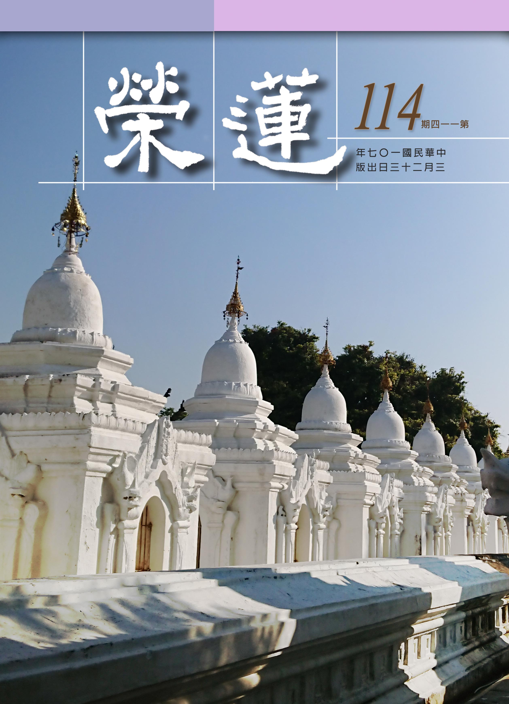

## 社論

### 菩提心的滋味

本刊

論曰魚子菴樹華

菩薩發心亦如是

堅持最後剩無幾

火中蓮花世瑰寶

入道學佛初，常受勉勵發菩提心最為殊勝，其基礎是先發大悲心，而大悲心是不遺漏一位有情的發心，如果我們心中有某一個對象，他或者曾經得罪我，或排擠我，或傷害過我，或學佛資歷比我淺，或有很多不如法的行為，或者我就是對他有偏見，如此則不可能有一起共學的機會，更談不上想幫助他或救度他。

而基於此種心態，就會產生第二個乃至無數個自己內心想摒棄的人，如此便生不起永遠不會捨棄任何一個眾生的大悲心，更談不上發菩提心了；反之，透過觀察，深深明白我所有的安樂來自於有情，他們都曾經當過我的母親利益我，所以願意以報恩的心，想將我所有的善業在有情身上生起，因其恩德如母，而其可愛的面相如唯一的愛子，一心一意想要度脫他出離輪迴，離開一切痛苦，得到安樂。

而發大悲心還要以出離心作為基礎。但觀我人對於欲界的男女、飲食、睡眠、生活的種種受用尚不能割捨，如此的大悲心僅是個空言，所以沒有出離輪迴的心做基礎所發之心，並不是真正的大悲心，更別談發菩提心了。而真正的出離心除了出離欲界煩惱，還要出離色界光明高大的色身、巍峨莊嚴的宮殿，以及無色界的快樂。必須知道，人天的享樂，福盡必會墮落地獄、餓鬼或畜生道，其中的痛苦若能將心比心地去體會，才會生起對輪迴恐怖的感覺而真正發起出離心，否則人天之樂，往往讓人迷惑其中。

須知凡夫學佛，惑業滿滿，就算學習教法，能記得住，講得頭頭是道，此時的「聞所成慧」依舊只是非量，必得將學到的教法結合有法去觀察，面對境界時，不管好境界、壞境界、快樂、痛苦、得意或不如意等事，內心有何覺受？有何抉擇？以何種理由，什麼樣的觀點來詮釋所面對的各種情況，思辨是否與教觀相合，如此才能邁入比量的「思所成慧」及現量的「修所成慧」，如果不是如上所說的修學，雖說有發菩提心之名，完全沒有自利利他的能力，只能算是名言上的發心。

因此經教的學習使自己具備佛法的見地就格外重要，過去雪廬老人曾定下相關初級課程，包括：佛學概要十四講表、唯識簡介、佛說八大人覺經、般若心經、佛說阿彌陀經及普賢行願品。後續還有百法明門論、天台教觀等大經大論，都是為了讓行者能具備發心的眼力與知見。經典可以學習的面相很多，例如上課開場的引言、科判的分析、種種名相的解釋及消文的能力；但主體還是在建立般若的宗派見及廣大行的見地。在上課的過程中去探究如此闡釋的原因，找到成立的理由，有模糊不清的地方，必得要弄懂，最重要的是要想辦法將它變成我的看法。試想我們學佛到底是要學什麼？不論是佛的慈悲、智慧、願力、行持等等，這些都是佛的看法，而修行都是為了努力學習善知識的看法，而我怎麼學了半天，依舊另有看法？個人的看法如果跟解脫成佛都無關，就成了戲論，所謂的發心也只是空言一場。

知乎此，不管是學會乃至各地讀書會的經營，所遇到的大大小小有關教育文化推廣或農園的經營，甚至是遠地善友的請法，種種課程安排、大眾共修以及出遊等，辦事時順逆境都能如法觀修，就會成為解脫成佛的資糧，反之則徒增煩惱，勞苦功微，能不慎乎，願共勉之。

## 佛學覽幽

### 菩薩清淨的行持
       —華嚴經淨行品（三十）

菩薩清淨的行持

—華嚴經淨行品（三十）

*戒慧講述‧編輯部整理*

謙則受教有地

捨邪曲之惡見

取正直之正見

長養佛法善根

丙二、指事顯因答其徵因

丁一、總徵

丁二、別顯

戊六、乞食道行時願(五十五願)

己一、遊涉道路(十二願)

己一、遊涉道路  趣下路

經文：

見趣下路，當願眾生，其心謙下，長佛善根。

此願可由井裡取水做比喻，從這當中看出人生整個修學的情形，當水桶很輕鬆的往下掉，代表往下墮落是非常容易的，往上拉卻很辛苦，說明想要往上必須要非常努力才能慢慢增上；綁水桶的繩子代表著心識，往下掉、往上昇都是靠心；水桶不管是往下掉還是往上昇，都會不斷碰撞井壁，代表不管是往下掉還是往上昇都很辛苦，代表人生其實是一路撞跌的。例如道源老和尚說他自己的修行，一路上是跌跌撞撞的，剛開始修行時每天都要背經，又苦於對佛法不了解很痛苦；但是說法時面對現在的年輕人，他們認為人生的離苦得樂跟佛法的學習是沒有關係的，當他不認為那是他人生的必須，這個時候佛法要怎麼流通呢？

《了凡四訓》裡面說人生的出路在善業，一般世間人或許會覺得迂腐好笑，但是眼光看遠一點，時間只要一拉長，就會知道到底什麼是對我們最有利的，可是回過頭來跟後輩講的時候，他們也不大相信，因為他們沒有這個經驗。修學善法時要突破很多自他的障礙，要有一人與萬人敵，披鎧甲出門的決定見，自然能夠跨過種種障礙。

吳月氏優婆塞支謙譯：「下坂當願，一切眾生，深入廣博，微妙法中。」六十華嚴：「見趣下路，當願眾生，謙下柔軟，入佛深法。」《諸菩薩求佛本業經》：菩薩行道下坂時，心念言：「十方天下人皆使入佛大道中，悉貫諸智慧。」

趣下路是願所依，願所依有兩個：一個是依靠在菩薩，一個是他看到要走下坡路，這兩件事是菩薩願的依靠點，由這兩件事情來生起此願。當願眾生是能願，能願的是人，所願的是眾生。其心謙下，長佛善根，是這個願所要達成的目的，希望眾生的心能謙下、長佛善根，成就佛的功德。以上是南亭老和尚對每一條願的三類觀察法。

接著配合四面相的觀察，第一個面相就是隨喜的觀察，隨喜眾生若能其心謙下、長佛善根該有多好；第二個面相是希望眾生都能夠其心謙下、長佛善根；第三個是希望自己能幫助眾生，並有能力讓眾生其心謙下、長佛善根；第四個是祈求三寶加被，讓我有能力獨力讓眾生其心謙下、長佛善根。

「趣」是向的意思，趣下路就是一步一步往下走，或像台階一樣一階一階的往下走，在往下走的同時抓住向下的感覺，希望眾生其心謙下，希望心可以謙虛不驕傲。「謙」字代表的是好學的樣子，除了要有好學的心，好學的目的是為了能充實自己、利益他人，《尚書》〈大禹謨〉中的「謙受益，滿招損」，謙虛能得到利益，必須要有善根才能得到佛法的利益，善根指的是對法的領悟力和勝解，長佛善根就是在學習佛法的時候要謙虛、好學，才能得到佛法的真實利益，也才有能力真正的去利益有情。

「心謙下」是要感覺自己不如人，而且要好學，擷取他人的長處。好學這件事情極不簡單，謙下又好學的人可以長佛善根（對法的領悟力），其心謙下的目的是用來求學問用的，當然他就可以長佛的善根。

孔子也說：「三人行，必有我師焉。擇其善者而從之，其不善者而改之。」此處的「改之」指的是改自己，並不是改別人。「朋友數，斯疏矣」，你要改別人缺點，得看看是否有這個交情。雪公老師上課說，一個人哪有全好或全壞，曹操都尚且做過好事，君不見蔡文姬被匈奴擄走，曹操花錢去把她贖回來，國劇中曹操此時臉上化的妝就不是白臉！所以三人行的意思是說，在這三人行當中，看到這個人有善的地方我從之，看到這個人有惡的地方我好好警惕自己，在一個人身上論善惡，這就是一種觀察法。

謙下特別是親近善知識時其心謙下，包括去受教的其心謙下，有功夫而不自滿的其心謙下。代表人物有子產(其行己也恭)、舜(恭己正南面)、孔子(溫、良、恭、儉、讓)、顏回(有若無，實若虛)等。

己一、遊涉道路  斜曲路

經文：

見斜曲路，當願眾生，捨不正道，永除惡見。

吳月氏優婆塞支謙譯：「行於曲路，當願眾生，棄邪曲意，行不忮忮。」諸菩薩求佛本業經：「菩薩行曲道中時，心念言：『十方天下人皆使莫有邪念，無令有惡口。』」

斜是不正，曲是彎曲，斜曲路的意思是路不平整，走在這樣的道路上，當願眾生要把心中的惡見去掉。不正道是拿世間的斜曲路來比喻思想上的邪知邪見，也就是沒有正知正見。惡見是指對自己、對他人都有所損害的見地。

學佛的人要有正知正見，所以在「八正道」裡第一個所說的就是「正見」，要懂得八正道才能捨掉不正道，不正道就是邪見，正見才能去除惡見，假如沒有正見，即使是學佛，也得不到佛法的真實受用。會性法師在講此願的時候，提到正見有四種道理：第一、正見是有善惡的觀念，要以佛法來做善惡的標準見地，損己利人即是善，損人利己即是惡；第二、正見是有業報的觀念，指的是善有善報、惡有惡報；第三、要知道有前生有來世，指的是有三世因果的觀念；第四、要相信有凡夫、有聖人，要相信有出世間斷煩惱、了生死的聖人。具備了這四種正見，才能永除惡見。

在外不要走斜曲路，《論語》上有「澹臺滅明行不由徑」可以參考，行不由徑就是走路不走小路，非公事不私入子游的屋子，雖然是師兄弟，可是辦公事的時候是非常嚴謹。我們可以從行住坐臥當中去練習，使正氣生起，像打佛七時繞佛，繞到角落的時候才轉過來走，而不是繞一繞成一個圓圈，而是走到底的時候才轉身，行不由徑也是這樣，練著走大路、直路，這就是為什麼在叢林裡面修行可以將一個人的貴氣、正氣練起來，從外在的規矩去練內在的貴氣。

不但如此，內心也不要走斜曲路，遠離斜曲路就是要除掉惡見，否定因果、否定三世、否定聖人，這就是最大的惡見。

想引發正見，還要由四依法去引發正見，即依法不依人、依智不依識、依義不依語、依了義不依不了義。（下期待續）

### 大乘百法明門論簡說（二十二）　拾貳、心所有法｜別境(三)

*戒慧講述‧淨本整理*

帶境心方生

境義待心識

心相境義生

二者互觀待

經文：

別境五者：一欲、二勝解、三念、四三摩地，五慧。

前已說明定心所與慧心所的基本定義與作用，現由懺公表解對此二心所作更進一步的說明。定是修道所不可或缺之方法，所謂因定開慧；但並非修定即可開智慧，慧有其獨有的修學方法，只是需要有定功作為基礎。若修定就可開智慧，那麼釋尊二十二年的般若談應該成為無用，只需要修學四禪八定即可。定有種種名相，其實是讓我們能夠從不同面向去了解定的作用，以下分別說明。

「等引」，引即引發或者引導，等者身心平等，等引就是能夠引導行者達到身心平等安靜的狀態，不受外境干擾，也不受內心擾動的干擾。「等持」是平等持心，心念的相續中能夠持住同一境界，不受昏沉、沉沒、掉舉、散亂的影響。「等至」，至即達到，讓身心達到安定。「靜慮」，寂靜（止）而能審慮（觀），此名相旨在說明定的修學能夠成為慧的基礎，使修觀慧沒有障礙。「心一境性」，說明入定時心的特性就是止於一境。此處的「止」是在功能上說。「現法樂住」，依定能生出輕安之樂來立名，此種法樂是世間一切快樂所不能比擬。

「慧」是於所觀境簡別選擇得失、邪正等。慧既然是屬於別境，就不一定善也不一定惡，若是惡慧，乃推求簡別時的作用猛利，雖然細膩、精準，但只是為了利己，所以是顛倒，世間人在追求名利用盡心思的時候就是這種形象，這是煩惱中所生出的錯誤見解；若是善慧，推求之用輕隱，意思是在揀擇的過程中，內心愈來愈輕安，愈來愈隱密，為何隱密？因為見解高深，非一般世間人所能了解。

「正慧」是說明如何以慧心所通達般若，此需要透過聽聞、思維和修習。聞慧就是聆聽經教而發揮揀擇的功能，由於聞慧尚未經過思維辯證或者境界的磨練，因此只能歸納為非量，心對境的簡擇量度尚未符合般若的旨意；思慧是進一步依照善知識的教導，能以因明道理辯證所聽聞的佛法，在立宗答辯中推度出真理，屬於比量；修慧是依善知識教授的止觀修學法修定而發慧，能夠現量證得般若的智慧，所謂照見五蘊皆空。

智心所與慧心所都能斷疑，所以表上說體同，又或者說兩者都是心的功能，所以體同。但在作用上二者仍有差別，慧心所的揀擇在前，而能在各種可能情形中揀選，所以說寬；智心所的認可在後，亦即依照慧心所的揀擇，從眾多可能中做出決定，所以是狹。

欲、勝解、念、三麼地、慧等心理作用，分別對著所樂境、決定境、曾習境、所觀境而生，其實這些境界可能各不相同，也可能是一個境界不同面向的描述，例如念佛時，心緣住佛號的境界是念佛者所樂之境，而同時也是他認為決定正確的境界、曾經學習過的境界，並且在其中觀察念佛的自相空，爾時該境界同時具足所樂、決定、曾習、所觀四種面向。（下期待續）

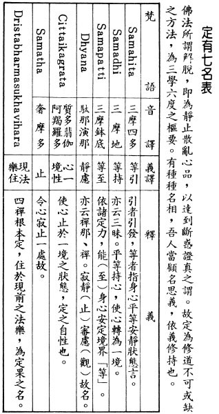

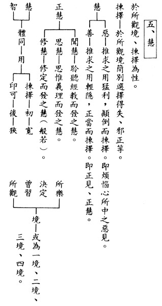

### 佛學概要十四講表簡說（十六）　第二講表

*戒慧講述‧宏法、淨昌整理*

緣起甚深難思議

認知如佛待經學

不怨不尤是見地

認知能伏情緒心

丙表、生起三由-因緣果

◎緣-所緣緣等

「緣」為助緣，種子起現行，須有助緣。緣包括了所緣緣、無間緣、增上緣，如果將因緣法全以緣的角度來看，還要加上親因緣，一共四種緣。也就是一因，三緣，一因是親因緣，三緣就是所緣緣、等無間緣及增上緣。

宇宙萬法可以分為二類，即「心法(心理現象)」和「色法(物質現象)」。「心法」要生起的時候要有四緣生。「色法」生起是二緣生，也就是只需要親因緣和增上緣就可以結果。

心識的親因緣是指過去已滅的心識，例如眼識是心法，眼識生的親因緣是過去已滅的眼識，已滅的眼識是因，現前的眼識是果，所以眼識的親因緣是已滅的眼識。觀待昨天已滅的看生起今天的看，沒有已滅的眼識絕對生不出現前的眼識。所以看是過去的「看」來的，不會是過去的「聽」而來。

其次心識的「所緣緣」指的是所緣的對象，如眼識的所緣緣是色塵。

「等無間緣」，指心法之生起，必定是前一念滅，後一念方生。由前面已滅的那一念引出後一念，例如走獨木橋，一次只能過一個人，前面的心識已滅後面的心識才能出來。論典釋云：「自類無間，等而開導」，八個心識各自為一類，各類心識前念之於後念，力用均等，中間不為他物所間隔。「等無間緣」是前剎那已滅的六識（某一識）生起後剎那的眼識，譬如正在想某件事情，突然有人說：你看！接著你就看到東西，想的事情已滅，後面接著看，所以前剎那已滅的六識成為後剎那眼識生起的「等無間緣」。「等無間緣」是已滅的心識跟現前的心識只有一剎那之隔，這叫等無間。

心識的「增上緣」就是除了「親因緣，所緣緣，等無間緣」以外的緣，都歸入為增上緣，例如生眼識還需要空間、明亮及眼根等。唯識宗則再加上第六識、第七識及第八識等等，都是「增上緣」。

述記云：

「色法則具二緣即生」

，也就是色法只要具備「親因緣」跟「增上緣」就可以生。例如西瓜的親因緣是已滅的西瓜種，西瓜種經過不斷的生滅生出西瓜，而西瓜的「增上緣」則是水、肥、空氣、陽光。水的生成，唯識宗認為「水」以八識田中「水種子」為「親因緣」，又已知水是氫氧結合而生，所以氫和氧是水的「增上緣」，但其實氫和氧也是組合而來，組成水的同時，我們眼睛可以同時看到水的色，舌頭可以嚐到水的味道，身可以碰觸到水的濕潤。但以原子的角度來看，氫和氧結合而成為「水」，氫跟氧沒有消失，這時候不能說氫和氧是「增上緣」。因滅果生，所以氫跟氧結合成為水不是因果關係，而是緣起的關係，也就是該法（水）出現時，組合的條件（氫跟氧）還在，這叫緣起法。舉例來說，鋼筋水泥地板組成的房子，就是緣起的關係，因為鋼筋水泥地板都還在，這叫做緣起，不叫做因緣。

當氫氧化合而產生水，水在氫上面找不到，在氧上面也找不到，生出來的水到底在哪裡？正因為它（水）沒有自體性，水的存在也只不過是在某種條件下成立而說水，溫度高到一百度以上，成為氣態，不能稱之為水，溫度低到零度以下叫做冰，全部都只是觀待下的顯現而已，未見其自體性。

氫跟氧化合成為水，定義它的濕潤性而成為水，氫跟氧都沒有濕潤性，說明這個濕潤性也沒有自體性，濕潤性只是被浮現出來而已，只要氫和氧在某些條件下浮現出濕潤性就稱作水，心識前面可以分別這是乾淨的水，那是污濁的水，這說明我們認識諸法的時候是以「共相」的方式來認知，而不是以「別相」的方式來認知。因為它們都具備濕潤性，所以通通叫做「水」。我們因為同具思維性，所以都叫「人」，再縮小成中國人、美國人，再縮小為某個地方的人，範圍不斷的縮小，但是都是以「共相」的方式去認知，而「共相」是由名言安立來的。

再來，氫氧變成水的關係是緣起的關係，水具色的那一分是在眼識上的顯現，水具味的那一分是在舌上顯現，水具觸的那一分是在身識上顯現。如果沒有眼識，水不能顯現為色；沒有舌識，水不能顯現為味；沒有身識，水不能顯現為觸。所以也不見水的色、味、觸三塵的自體性。

◎果-結成、起相

述記云：「果」為結果，故云「結成、起相」。「結成」就是結成「果」，因緣具足生起了結果的現象。比喻是「如植物熟」，也就是如種下地以後經過了水、肥、陽光等緣上的滋潤，這個植物就生長成熟了，叫做「如植物熟」。

◎ 因（常暫）、緣（強弱）、果（遲早）

「因」有常暫不同，「緣」有強弱之判，「果」是遲早有時。就是認識「因果」要從這三個角度去認識，從這幾個方面去看什麼叫「因果」生「現行」。

●因(常暫不同)

因上的「常暫不同」，是以種子來做比喻，種子一旦落入了八識田中就不會消失，它會待緣而起現行為果，所以種子是存在的，依存在的時間不同而稱「常暫不同」。常是種子存在的時間可以非常長久，暫是種子只不過是短暫存在八識田中，所以以「常暫不同」來說明「種子」起「現行」的時間。所謂的暫是種子可以很快的起現行，而常是種子很難起現行，依善惡業的強度和起現行的速度來分常暫。所種的因，結果的快慢要看因種的強度。如果學佛悠悠忽忽，說成佛叫做因常（很久），譬如祖師說「學佛一年，佛在眼前；學佛兩年，佛在西天；學佛三年，佛化雲煙。」

●緣(強弱之判)

強弱之判是指緣生起的勢力強或弱，緣有助力或阻力，對結果來說或順緣或逆緣，其中又有強弱之別。

如右上圖所示，分別由善因、惡因開始；各別經過善緣、惡緣的滋潤。它中間的關係有兩種箭頭，箭頭式的表示助力，箭頭上面拉平的表示阻力。種了善因以善緣來幫助它的話，就可以讓善因很快的成為樂果；如果做了善緣，在惡因上可以阻止惡因來結果，或者說使惡因變成一個小苦。再看惡緣的部分，惡緣的造作可以阻止我們已有的善因不能結果，或者是即將成為大樂果的這個善因只能結成小樂果，或者這個惡緣幫助惡因成為大苦。

此表最能夠說明，眼前這個善人，結果一生顛沛流離，一生遭逢困頓。說明這個惡因是暫惡因，不是常惡因，暫惡因就是力量很強的惡因，令你在這一生造善業也會結苦果。固然對造惡因結苦果毫無疑慮，但往往造善結苦果容易讓人對佛法失去信心。很多的正人君子行正道卻遭逢種種困頓，會讓人不相信因果。大家都說相信因果報應，麻煩的是作善生起惡果，造成凡夫對因果的不相信，要平息內心的憤怒、失落和不滿的情緒，必須真實瞭解「因緣果」的道理。而且內心要產生幸福的感覺，因為原本熟成地獄苦果的大惡業，眼前只結出人生諸多不幸的小苦果，太高興了！

造惡得苦理所當然，此表還可以解釋造惡結果得樂，就是把過去所造的大善眼前受報，這麼大的善因，結果竟然用作惡讓它（善因）起來，這容易誤導大眾，以為作惡能夠得樂；做善卻得苦。這個人的善業，足以讓他作善作惡都得樂的殊勝善業，竟然讓他眼前生起小樂，大樂變小樂，損失極為慘重他卻不知，麻煩就麻煩在這裡。

●果(遲早有時)

因果的觀察，不應該只是佛學的常識，它對我們的修行實在太有幫助，應該結合修行來說因果，在論因果的關聯性時，幫助我們生起因果的正見。因有常暫不同，緣有強弱之判，導致所結的果遲早有時，有時代表所有的因都會結成果，但是在時間上有遲和早的差別。因是常是弱，緣也很弱，所以結果時間拉得很久；因是暫是強，外緣也強，所以很快就結果。

述記云：「因暫果早」，又云：「因常果遲」。回到現實問題，如果不結合有法，講因常果遲與因暫果早都是不痛不癢，學佛如何讓佛道成功，成為因暫果早而不是因常果遲？就是所有的快樂，尤其是解脫和成佛的安樂，要讓它因暫果早；所有的惡業要讓它因常果遲，甚至以菩提心或空性的智慧破壞惡業成熟的能力，這才叫做善於通達因果的人，否則因果二字只是一個概念，一點用也沒有，你說你相信因果報應，跟自身修學是沒有關係的。

述記云：欲使「善因」早日現行為「善果」，則須多加「善緣」，莫加「惡緣」；欲使「惡因」遲不現行為「惡果」，則勿加「惡緣」，且反以「善緣」阻之。所謂的緣都是指這一生，過去生成為因，這一生成為緣而讓它結果，可以這一生結果，可以來生結果，譬如解脫的果可以在這一生成熟，也可以在來生成熟。這一生的緣非常重要，這一生也可以成為來生的因，這一生也是成為前生因的緣。有的人說：「反正我學佛業障深重，我沒辦法了，我宿世善根很差。」這種話是不應該說的，以這一生為緣，修學改變命運完全在緣上來講，理由是從因來結「果」，是沒有自體性的，所以有轉變的可能。善緣強大的時候，可以讓惡因結不了果，甚至結出小小的惡果；可以讓善業增長廣大，過去業障重、善根薄、福報差，即使如此，現前的緣都有能力讓它轉成殊勝的果報。

孔子五十知天命，為什麼五十歲才知天命？孔子不是俱生慧嗎？孔子學《易經》是「五、十以學易」，再給我五年或十年學習，透過這一輩子的努力，到五十歲的時候終於知道文化的傳承在他，知道自己得天命，這叫做後天德，五十歲才知。意思就是孔子的天命是努力來的，不是一出生，佛菩薩就開始光環灌頂，旁邊菩薩讚歎，孔子全部的成就都是努力來的。

又如曾子最後傳承孔門心法，是人一能之己百之而得。所以天命是什麼？是無常、不可知、無自體性的，必須透過努力。學佛的人如果沒有這種正解，會造成這一生做什麼都提不起勁，傳承佛法都跟我無關。

你想要用各種逃避的方法，阻擋得了一時，逃不了一世，逃得了這一世，也逃不了下一世。意思就是沒有修對治法，是逃不掉的。本來是生生世世不曉得有多少世貧窮的業，但是因為這一生的廣大行，貧窮的果報現前被阻擋住了，這就是修對治法。而在修對治法當中，又生起菩提心、大悲心、空性智慧等種種功德，對法生起無比尊重的感覺。

很多人的一輩子，看起來又務實又積極，其實都只不過是在這一世當中酬業，把過去的業眼前拿來顯現，現在從小到大在學校聽的課程，都不能阻擋惡業生果，不能阻擋輪迴，所有的努力、智慧都趨向世間輪迴，和出離世間無關。

再論「善惡功過不能相抵」，這是說不會修對治法，善惡功過不能相抵。佛教的論典叫作「阿毗達摩」。「阿毗」就是「對」，「達摩」就是「法」，也就是對法。所有佛法都有對治的功能，有能力讓惡業不生、晚生或小生，有能力讓善業早生、廣大生，這叫「阿毗達摩」。當你懂得在正法上學習、傳承並且弘揚時，本來要受苦很多劫的，這一生推廣正法，或受身體上的病苦，或心裡受苦，都是對治惡業感大苦，將苦拿來眼前受，令善業未來結大樂，學佛太殊勝了！這個就是對治法，佛法太務實了，這一生不學佛是非愚即狂。

如果明白了「三世因果」的道理，我們就可以明白君子的大道，也就能知天命，知天命也就是明白因果的道理，能做到「不怨天不尤人」，孔子是一位明白「因果」道理的人，轉眾生共業來成就自己殊勝的別業，所以他能夠不怨天不尤人。

《詩經》所舉「永言配命，自求多福」，「永言」也就是常言的意思，「配命」也就是能夠配合天命來行事，就是能為自己求福，就能夠明白《詩經》所言「命自我作，福自己求」的道理，掌握自己的命運，能夠明白這個道理，就不會隨境界而轉。《中庸》所說的「素位而行」，就是居在自己的位置上來做合於「因果」的事情，就能夠「無入而不自得」，處在任何的時間和空間，都能自在的趨吉避凶。（下期待續）

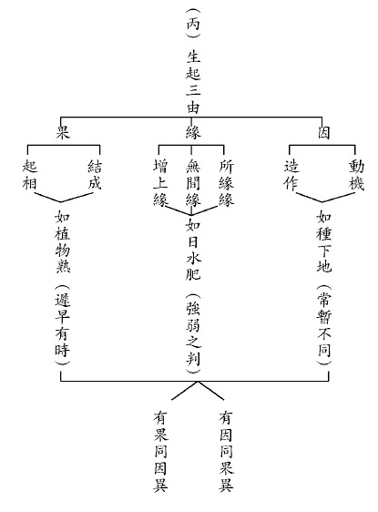

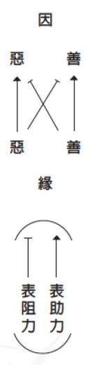

### 人生大事—不能忽略的事實
			  助念生西觀念作法研究（二）　 助念生西須知

人生大事—不能忽略的事實

助念生西觀念作法研究（二）　 助念生西須知

古晉讀書會謄錄

助念一法不輕看

人生最後決定業

善巧引導難墮落

功成卻得無量樂

三、助念成功三要素。

（一）往生者本身信願行三資糧具足，平時交代家屬往生注意要項，蕅益大師云：「往生與否全由信願之有無，品位高下全由持名之深淺」。

這一條是就往生者來說，助念成功三要素是本身要具足信願行。「信」就是信有極樂世界，有阿彌陀佛，內心有正信、正念，深信真實不虛。「願」就是要厭離娑婆，欣求極樂。「行」就是具足正功夫與助功夫，正功夫是持佛名號，助功夫就是諸惡莫作，眾善奉行，以上是淨土三資糧。

蕅益大師以信願行來分《佛說阿彌陀經》的科判，印光祖師讚歎是古佛再來，不過如此。信當中是無量無邊的，你對佛法的相信、對因果的相信、對聖人和聖言量的相信、對空性正見的相信；但此處的「信」是相信娑婆是苦，相信極樂是樂，在對比當中產生願，「願」就是我很討厭生死世界，我很想去極樂世界的願，此處的願有別於一般廣泛的願，是我很想去極樂世界的願。

念佛是正功夫，助功夫是斷惡修善，為何斷惡修善是念佛的助功？念佛要得力，固然要常常念佛，但若是只念佛不管其他事情這是不對的，念佛也不會得力，如果不去累積福分，容易出現惡緣，會障礙自己的修學。或者身體不好，或者遇到惡知識等等。若常修善容易生起念佛的順緣，或者感應到美滿和善的眷屬、感應到善友、感應到共修的團體。所以斷惡修善是念佛的助緣。

接著需要跟家屬講清楚，甚至遺囑要寫好。曾經遇過即便立好遺囑，家屬也不承認的狀況，甚至產生助念、做七告別式的障礙。臨終的時候，最應該交代的事情就是病危的時候不要急救，也不要插鼻胃管、氣切，病人會覺得很不舒服、很不自在，想要動手拔掉，所以也曾看過病人在醫院手腳被綁住，實在很可憐，這會成為他念佛的障礙。還有剛斷氣的時候，要助念至少八小時以上，不要淨身、換衣服、或者搬動哭泣。

以上是往生時的基本大原則，平時就要這樣交代家屬。這樣的交代不但表達你有這樣的決心，也要讓家屬知道這樣做的好處，讓家屬跟蓮友接觸，也讓家屬肯定這樣的做法。這些條件都要掌握，否則以為已經交代清楚，最後很可能是沒有用的。

有一位蓮友想要助他母親能得臨終助念，但是家裡堅持不肯，最後他母親能往生，關鍵在他是老大，最後母親臨終時他當著弟弟、妹妹面前說，財產全部給你們，只希望你們好好護持媽媽臨終助念！這下助念的障礙馬上全部排除，全部聽他的命令排班助念！這位蓮友很聰明，他在母親臨終關鍵的時候來宣布大家最在意的事情。

印祖也講過，信願行就如鼎三足，缺一不可。臨終遇到善知識很重要，能幫助自己對淨土的信願，當然往生極樂世界的品位跟自己的修持有關，修持愈好品位愈高。

（二）子女眷屬發大孝心、慈悲恩惠心，謹遵佛制如法護持父母親屬往生西方。所謂：「親得離塵垢，子道方成就」。此處強調外緣，外緣就是子女、眷屬，或者是大德、朋友等。

先說子女眷屬，子女眷屬要發大孝心。我們一般會認定孝養父母就是要給他吃好的、住好的，或者是順從他的意思，其實這種孝是小孝；中孝是子女能夠立德、立言、立功，光宗耀祖，讓父母和宗祠都非常光榮；大孝就是讓父母親和祖先徹底的離開六道生死輪迴。所以子女眷屬經營佛化家庭，為公發心，更以出世的觀念護持父母往生淨土，才能成就大孝。

幫助父母離苦得樂，解脫輪迴成佛的大孝心，將這個覺受抓住，然後對有情眾生也能生起如父母般可愛的面相，要幫助他們離苦得樂，這就是慈悲心。

親得離塵垢，子道方成就，這是大孝。塵垢是娑婆世界的五欲六塵（六塵：色、聲、香、味、觸、法），外境就是塵，對著外境起各種的煩惱心叫做塵垢，離開了塵垢就是指離開了輪迴的世界，這句話是八祖蓮池大師講的，蓮池大師決定要出家的時候，他做了個七筆勾子，七筆勾子表示世間的名聞利養，兒女私情等，他全部捨去勾銷，以迎他的出家的志向，叫做：「親得離塵垢，子道方成就。嗏！出世大因由，凡情怎剖，孝子賢孫好像真空究，因此把五色金章，一筆勾。」孝子賢孫想要有能力度化父母，必須要學般若，真空就是般若所證的空性，好好的探究般若，生起道力。意思就是，做子女的想要把父母拉出輪迴，本身要有道力。「五色金章」代指家世譜牒，暗喻門第高貴。世間人總想出人頭地，你能夠超越六道輪迴，那才是真正的出人頭地！幹一番豐功偉業、就算光宗耀祖也不能幫助父母解決生死大事。因此，要把顯親揚名、光宗耀祖這些淺陋情見，一筆勾銷。

父母親要培養子女的是什麼？子女才有能力回過來度父母親？就是要教子女學般若。這就跟一般人心裡的價值觀不一致了，大家也得要反省內心是否真切認同佛法和祖師大德的觀點。

（三）大德蓮友竭誠道義助念，成就別人往生，亦得別人成就自己往生之報，印祖云：「勸親修淨盡儒道，祈眾往生暢佛懷」。外緣是講大德、蓮友、親朋好友，竭誠道義助念，要接受通知助念，首先不要挑時間，不能說我只念白天或只念下班、晚上不能念，這才能展現你的誠意！第二是不挑地點，就是我們要助念的對象，他家多遠啊？有沒有捷運啊？太遠就不去了！不要挑地點！第三不挑氣候，寒流來感覺太冷，或者天氣太熱，沒有冷氣我就不去助念，這些心態都要避免。

遇到團體安排前往助念，不能去分別跟他是否有交情；或者是他曾幫助過我，我才去助念。這種事其實是如赴湯蹈火！就是你正在吃飯也都要放下趕緊去助念，就當著是助念你家人，有這種心態才稱得上「竭誠」。

今天如果沒有把年輕人的膽識練起來，我們這一代死了以後，下一代就沒有這個福報了，不要說沒有佛化家庭的福報，沒有子女學佛的福報，沒有讀書會的福報，連助念的福報都不會有。（下期待續）

## 孔學一隅

### 論語簡說（二十二）
	  			 —博施濟眾（下）

論語簡說（二十二）

—博施濟眾（下）

時哉講述

仁事易顯仁心難

善人易見君子難

愛他如自仁之方

立達才是行仁法

經文

子貢曰：如有博施於民，而能濟眾，何如？可謂仁乎？子曰：何事於仁，必也，聖乎堯舜其猶病諸！夫仁者，己欲立而立人，己欲達而達人，能近取譬，可謂仁之方也已。(雍也第六第三十章)

前言

這一章可以看出孔子對仁的定義，博施濟眾只不過是事相，儒家要追求的是心裡面的成就。所以，孔門的思想中，最高的成就是聖與仁！聖就是形而上的通達和成就，仁就是形而下的通達與成就，叫做「己欲立而立人，己欲達而達人」，今就此處開始加以闡釋，而此章消文與可參考上期（一一三期）會刊。

釋義

夫子答「己欲立而立人，己欲達而達人」其用意為何？用意就是告訴子貢「博施濟眾」是事相，仁是內涵與見地。夫子直接否定子貢，實在是對子貢的愛護。在《論語》裡面，夫子很少讚歎子貢（幾乎沒有），為什麼呢？因為對他格外愛護！知道這個人可以經過這樣的調教而成為大才。

「己欲立而立人，己欲達而達人」何以是仁心的行相？「欲」就是我渴望，「立」就是內在有出路，我渴望能這樣地幫忙別人。雪廬老人說，「欲」字是孔門的心法，叫做「我欲仁，斯仁至矣」。仁心並非「博施濟眾」，是論內心的涵養、見地。

「立」有幾種解釋，第一是「經學成立」，這是劉寶楠《論語正義》跟《皇侃疏》的說法，內在的出路跟經學有關，經學讀得越通，內心的出路越廣。

第二是依禮來建立人格，比如孔子對伯魚說：「不學禮，無以立。」學禮能夠把人格建立，懂得進退應對。

第三個註解，雪公在《論語講要》上列有表解，此表解完整地說清楚什麼叫做「立」。（後文詳述）

「達」就是通達，要像蜘蛛網一樣四通八達。子張曾問夫子什麼叫做通達？孔子告訴他，內在的質地不錯，而且又有正知見，又懂得察言觀色，又懂得謙卑下人，這就是外相的通達。

如何深入理解「立」與「達」之義？「立」就是內在的出路。內在的出路包括「志於道、據於德、依於仁」。「道」就是我所要證的道，「德」是我能證的智慧，這兩者是形而上的內涵。

仁是形而下，要去利益天下蒼生，想要利益天下蒼生必須要通達形而上，所以「依於仁」可以往上走，也可以往下達。往上走就是通達形而上的內涵，對境不會迷惑，這樣的人才真正能夠去利益別人。

形而下該怎麼達呢？例如通達六藝，能夠辦政治、辦教育，通達百工技藝，讓老百姓有能力生活，也有能力賺取很多的錢財去博施濟眾，所以博施濟眾只不過是「己欲達而達人」的其中之一，並非仁全部的內涵。

「博文約禮」，「博文」就是通達形而上跟形而下的學問；「約禮」是形而下的應對進退，能夠趨吉避凶。《易經》裡面的各卦各爻，許多都是在禮上抉擇而趨吉避凶，在禮上能通達，就容易趨吉避凶，而不是看算命、風水。

「能近取譬」就是由近及遠、從親及疏，行仁的方法，就算他只是在家，還是仁！《易經》裡面的六月卦，叫做「天山遁」，就是指遇到亂世的時候，君子要隱藏，孔子周遊列國不為所用，就不是仁人君子嗎？顏回沒有被大用，就不是仁人嗎？

「己欲立而立人，己欲達而達人」是在欲立上講究還是立人上講究？是在欲達上講究還是達人上講究？讀書是要越來越深入，如果在「立人」、「達人」上講究，顏回沒有辦政治、辦教育的機會，那顏回就不是仁人嗎？十二月的消息卦裡，六月的「天山遁」卦，代表陰盛陽消，天下大亂，君子要避禍，且要明哲保身，是否有損於他仁人君子的形象？顏回是「欲立」、「欲達」，可惜生在亂世，沒有讓他發揮的餘地，但是從不妨害他是仁人君子。

仁遠嗎？對於渴望要得到仁心的人，仁是不遠的；對於不想得仁心的人，仁是很遙遠，道就在渴望當中得到。

「己欲立而立人，己欲達而達人」有注解認為是恩惠加施於人。這個注解也很多人贊成，其實，恩惠施加於人就是博施濟眾。如同之前所言，顏回沒有能力來將恩惠施加於人，請問他是不是仁人君子？他是！所以，這樣的注解是不可采的。

「能近取譬」除了是行仁的方法，還有其他解釋嗎？孔子為什麼要說「能近取譬」？這四個字是從就近處找譬喻，叫做「由親及疏、由近及遠」。在《中庸》裡面說：「仁者，親親為大。」就是從自己的父母親開始做起。《大學》裡面：「一家興仁，一國興仁。」仁從家裡面興起，此人只要有仁心的內涵與見地就是仁人君子。這個人能夠往外推展仁政，他也是仁人君子。不管他的職位（影響力）有多麼小，都稱得上是仁人君子。

《孟子》〈梁惠王篇〉也說「老吾老以及人之老，幼吾幼以及人之幼。」我尊重、體恤和愛護我家的老人，我把這個心態往外擴展，也去體恤、愛護別家的老人；我提攜、關愛和教育我的子女，也把這種心態往外擴展。

又如周文王推行仁政，先從西岐七十里地開始推行，先做一個示範點，讓別人感覺到這是真正仁心與教化的內涵，是一個可以培養人才的內涵團隊，讓「近者悅，遠者來」，成為四方的模範，這個時候他就很有說服力，大家一看就知道，將來周家可以統一天下。

「能近取譬」是行仁的方法，也可以解釋為由近處找比喻。我的內心極為渴望有出路，我把這個覺受抓住；我也渴望幫助他內心與外相都有出路。所以，「能近取譬」是仁心生起的方法，從我身上找覺受，然後類比於他，我在幫助他的時候，就像幫助我自己一樣。

比如小孩子從小接受父母親的關愛，長大之後努力工作，就是為了要讓父母親生活過得好，從這當中知道別人也有這種渴望，幫助別人有這種能力讓父母親都過上快樂的日子．這也就是《孝經》當中講到，讀書人為什麼願意好好地充實道德、學問？很重要的觀念就是「光宗耀祖」！讓父母親活得有尊嚴。

本章讀完，試問博施濟眾之境界到底能否達到？如果今天在位者能發展仁政，並且懂得辦政治跟辦教育。讓人富而好禮、樂善好施；而且貧而樂道，以道來脫離貧窮，讓他「不怨天、不尤人」。所以只要好好地興起仁心、充實內涵，並且把仁心「由近及遠、由親及疏」往外擴展，由近處找比喻，最後「博施濟眾」也能達成！但是那是從內涵經營出來，不是從事相去論。

總結

這一章是在論見地、論內涵，依著雪廬老人的抉擇，我們才知道這一章到底在講什麼！人生需要充實內涵，不是在外相講究。內涵充實了，外相的成就也可以達成。若只講究外相講究，不僅內涵達不成，外相也落空。

論事功的人（博施濟眾），必須要論他的內涵跟見地，如此才能論他的事功是對還是不對，是不是真正對天下蒼生有利益。

「仁者愛人」，此人必須要有內涵、胸懷與見地，而且「由近及遠、由親及疏」，從自己身上找比喻，通達形而上與形而下，而不是單純的論愛。必須要愛民如己，而且充實他的內涵與見地。

這一章必須要跟「志於道，據於德，依於仁，游於藝」、「性相近，習相遠」，以及「我欲仁，斯仁至矣」這幾章合看。才明白老人在解《論語》的高度，在各種註解紛亂當中，可以整理出一個頭緒。

問答

**問：** 有注解說，子貢說「博施濟眾」實為見道之言，他的才識已經到達了賢者，想要請問老師，這樣的注解是否可以採取呢？

**答：** 孔子未說子貢見道，本章回答仁長的樣子和生起仁的方法。這樣的注解，你同意嗎？

**問：** 堯舜假設都做不到博施濟眾，是否代表後世的明君聖主也都沒有辦法做到呢？假設如果後世的明君聖主也都沒有辦法做到，那我們這些凡夫又該如何？

**答：** 孔子之道如果往下傳，透過孔子的經典傳承，依著大儒的抉擇，充實內涵，國君在外相中又能夠通達仁心，辦仁政、辦教化，讓富有的人好禮而樂善好施，讓貧窮的人樂道，不論貧富都能脫困，你說能不能？孔子如果說都辦不到，他就不會努力講學，因為待有後人，問題是大家要不要傳承孔子的內涵，那是留待後人去想。

**問：** 古注有提到，本章孔子並沒有告訴子貢如何成為仁人、聖人，而是只提出行仁的方法跟要領，這個注解我們可以採取嗎？

**答：** 「己欲立而立人」的「立」裡面就有「道、德、仁」，道德就是聖人的修學法，六藝的通達就是仁，仁人跟聖人的方法、內涵都有提及。

**問：** 此章所提的「己欲立而立人，己欲達而達人」，從這裡如何看出中華文化究竟的旨趣？

**答：** 「己欲立而立人」的「立」包括「道、德、仁」，「己欲達而達人」的「達」是「藝」，這就是中華文化的究竟旨趣。

**問：** 到寺廟見到功德箱就施，是不是缺乏智慧的做法呢？很多人認為現在乞丐也有很多行騙的，因此，由智慧觀察不應施給乞丐。布施也要有智慧，要從能夠幫助別人培養見地、充實內涵的發心去施才是有智慧的做法，是否能這樣理解？

**答：** 博施濟眾一定要從內涵充實，看到別人在行善的時候，我們固然要隨喜，但是你要清楚自己的重點在充實內涵！如果沒有好好充實內涵，只是在事相去論的時候，不一定是真的在做善。所以行善當中還分大小、半滿、真假、端曲、偏圓，不是表面上這麼簡單。

**問：** 救急不救窮，具體的做法有哪些分寸呢？什麼情況下是要救的急，什麼情況下是不屬於要救的窮？

**答：** 是的。當乞丐跟你要錢的時候，給他與否看著辦。若有受到人或的可憐人，我們倒要盡己之力幫忙，但是主要資源，還是要用在文化道統的弘揚跟培養人才！

**問：** 請老師再講解一下「立達」的內涵。

**答：** 立就是指內心的出路，達是指外相的出路。一個有仁心的人，這就是你內心的出路，包括以德來證道的形而上內涵，會讓你格外有風采。而且，外相上懂得趨吉避凶，用你的能力去幫助別人。如果好好地培養自己，在內涵上講究，在經學上通達，這是立，與人交往不但有能力把事情辦好，並能通達人情世故，如此能幫助你在各行各業的發展，這是達。

**問：** 能近取譬，由親而疏，有利益的事就先想到給親人，不就是私心嗎？又怎麼說是行仁之方呢？又，人生中首要欲立及欲達為何？

**答：** 此章是對著天下蒼生的時候有這種心量，而我的心量是靠著對親的覺受，例如堯舜治國，把天下當成一家，並不是我什麼都先想到我的家人，而是我對家人的那個覺受能用到天下！

但是問題是我們的能力，如果能力不足以治天下，應該要好好地來治國；以下類推，不足以好好地治縣市就該好好地持家。雪廬老人常說：「吾等不出山，天下還太平，必得捲起袖子幹，天下大亂！」此處並不是說自私地為自己，我們必須要好好充實自己的能力，否則，天底下很多壞事，不只是小人壞出來，也有很多是好人辦壞的。

**問：** 能近取譬可用同理心來理解嗎？

**答：** 沒錯，這是恕道發展出來，可是內涵比恕道更深。恕道只是世間的功德心，將心比心。仁道更重要的是充實自己形而上的能力，而且在形而下的時候，能夠遍緣眾生。是一種以親人的概念去緣念他，比如說，堯舜可以把天下當成一家，文王是澤及枯骨，看到枯骨野外曝屍，像看到家人般好好的埋葬。大禹看到餓死的人，猶如是自己傷害親人這般，這種的心胸，就是治鄉、治縣、治國、治天下的胸懷。

**問：** 可夫子說期望的境界是「謀閉而不興，盜竊亂賊而不作」，是不是還是要觀待這些人想不想去學道、學禮？

**答：** 是的，理論上是要把天下人都教好，但是實際上對小人是辦不到的。仁人君子當道的時候，這些宵小全部收斂。

**問：** 立有三個意思，一是經學成立，二是依禮立成人格，第三是雪公表解。雖說以雪公表解的說法最好，但是其他兩家是不採，還是也可以採，只是不夠好？

**答：** 雪公的表解最能夠完整地說明立的意思，其他的解釋只能呈現其中一分，根據《論語》來完整地陳述，「志於道，據於德，依於仁，游於藝」來陳述這一章的宗旨，是雪公老師最獨到的見解！不妨礙其他好的注解，但是雪公老師的注解既完整、又實在、又無懈可擊！

**問：** 《論語講要》中的「通三才」，該怎麼去運用跟解釋呢？

**答：** 代表你這個人能夠在天地當中通三才，天跟地固然偉大，可是天跟地辦不了人的事情，四季如春、大地祥和能不能把人教成聖人？不能，要靠人。當此人通達形而上，在形而下有能力去幫助他人，他能夠參加贊助天地化育。所以《中庸》有說聖人君子是「其德配天」，就是天地的人！此人不僅是在形而上的成就，在形而下、心態、能力推廣時，他能夠參加贊助天地的化育之德！（下期待續）

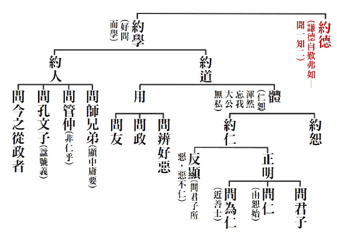

### 孝道跨時代的意義與價值—孝經簡說(八)　孝道使人與天地並列—〈三才章第七〉

時哉講述、淨域編寫

天經地義孝之行

導德敬讓民不爭

好惡令民知善惡

政教禮樂天下平

三才者，乃人與天地並列謂之。為何要並列為三才呢？讀完此章後，便會恍然大悟。尚未進入本章前，先說說天與地。《中庸》裡有「大德敦化」一語，敦化的意思是-很渾厚的化道。即是人在天地之間默默地受天地養育，但卻不知道有天地，才有萬物的生成。

環顧世界，天空的蝴蝶、林間的鳥雀、原野的走獸、水裡的魚蟹等生生不息，若無天地的長養，沒有四季的變化，這些生物是不能安養於天地間的。但是，牠們會知道這是天地的恩德嗎？不會的。所以，這叫作「敦化」，就是別人承受你的厚重恩德，但並不知道恩德來自於你。而可以與天地配合，且能夠並列三才，成為一個傚法天地的有情眾生，這唯有人類可以。

〈三才章〉第七，經文是：

「曾子曰：『甚哉，孝之大也。』 子曰：『夫孝，天之經也，地之義也，民之行也。天地之經，而民是則之。則天之明，因地之利，以順天下。是以其教不肅而成，其政不嚴而治。先王見教之可以化民也。是故，先之以博愛，而民莫遺其親；陳之以德義，而民興行；先之以敬讓，而民不爭；導之以禮樂，而民和睦；示之以好惡，而民知禁。』《詩》云：『赫赫師尹，民具爾瞻。』」

曾子讚歎孝道很殊勝偉大，孔子就根據曾子所講的話，先說明孝道為甚麼深廣偉大。其次，要明白如何成為三才，便先說孝之行。孝的行為是天經地義且順天應人，孝的行為是能夠莊嚴政治及教育的；所以，先王就取孝道來化導人民。這該怎麼化導呢？即是以《孝經》中以孝道為本質發展禮樂來化導，且表現好惡使百姓知道何者可行、何者應禁止，如此則天下就能大治。是故，舉出〈小雅〉說：「赫赫師尹，民具爾瞻。」如果你做的好，百姓都仰望你。經文的架構井然，讀這樣的經書，即便道理不太懂，文學涵養也會很好。何況道理讀懂以後，不但文筆好、思路通達，分析事理更是清晰透澈，不但能夠了解古代，也可以走入時代。

曾子曰：「甚哉，孝之大也。」甚哉就像《華嚴經》中佛說：「奇哉！偉哉！妙哉！等等」。甚哉之意，即是讚歎「孝實在是極為偉大。」所以是孝之大也。「甚」是個讚歎詞，一如《論語》所言：「君子哉若人」，乃是讚歎宓子賤知人善用。「孝哉閔子騫」，就是讚歎閔子騫的孝。曾子講了這段話以後，孔子就說：「夫孝。」夫是發語詞，沒有特別意義，而「孝」後面的文字都在講它。

孝是甚麼？孝是「天之經也，地之義也，民之行也。」意即孝是天經地義的。什麼是天經地義？經，是不能改變的；換言之，孝道是不能變的，是天經地義的。而什麼事情是天經地義的呢？比如：報本還恩、欠債還錢，本就是天經地義的，善有善報、惡有惡報，這叫作天經地義，是「民之行也」。百姓能盡孝，乃是天經地義之事，若不盡孝，天地都反常了。

孝是天地之經義，所以百姓必須效法，要來盡孝行孝。孝道是順天應人的，故行孝之人能效法天命。效法也是承襲，承襲地的利益以順天下，此一承天之民就是天經，因地之利就是地義。孝是天經地義的事情，所以聖王推展孝道，就是順應天下人的心；反之，若不用孝道來推行政治，即不符合天下人心的需求。不推展孝道的品德內涵，即便百姓豐衣足食，他的隱微處還是不快樂，因為這不契合真正的人心；所以，縱然創造很多的經濟繁榮，會發覺百姓並沒有很快樂，例如：歐美的生活過得很享樂，但是許多的暴力、色情、毒品橫行。所以，怎樣才是給人們真正的快樂呢？

現今社經發達，不料敵我對峙，國際間爾虞我詐，武器殺傷力強，並未帶給人類快樂。若能以孝道為本質，來發展政治推行教育，則教育就能不肅而成，無須強硬規定這規定那，學生即能自我要求。而政治也不必嚴刑峻法，要以德治來管理國家，喚醒人們的良知、情操及感恩利他的心。所以，先王看到教育是天經地義、順天應人的，是能夠莊嚴政治與教育的，故說：「教育可以化民」，乃因辦政治的主體在辦教育。

那須如何化民呢？此謂：「是故，先之以博愛，而民莫遺其親。」「先」之意，即是以身作則。先王先用博愛，但他怎麼用博愛呢？此處先將文義簡單的消一消，然後再像剝洋蔥般，將經文的內涵層層剝出，便會覺得文義愈美。

先王在辦政教的時候，一定要以身作則，未以身作則絕對辦不好。所以「先之」，就是以身作則，用博愛來起頭。為政者果然懂得用以孝道為本質的博愛，老百姓就不會遺棄他的雙親，此時就不必辦養老院，野外自然沒有孤苦伶仃的老人，也不會有沿門乞討的現象。

「陳之以德義。」先王不但知道要推展博愛，還要陳述這個以孝道為本質的德義(道德的義理)，百姓也會很高興的去實踐這個孝道以及各種的道德。這個陳述裡面包括君、臣，然而為什麼要包括臣呢？讀到後文就會知道了。

「先之以敬讓。」這是說天子，只要說到「先」的，都是說天子先要以身作則。以孝道為本質的恭敬與謙讓，百姓就不會爭奪興訟；現今的百姓很會打官司，爾虞我詐、爭名奪利等等。若能以孝道為本質來以身作則，來推展恭敬與謙讓，就不會有百姓爭奪興訟的事情。天子與大臣懂得將以孝道為本質的禮樂推展出去，百姓會相處得很和睦，不會家家戶戶豎起高牆，彼此互相守望相助。以前的社會掉一隻雞全村轟動，只要某家出了事全村幫忙；現今則是大家互不相干，老死不相往來。究竟為什麼會變成這樣呢？就是教育忽略了以孝道為本質的教育，政治忽略了以孝道為本質的政治，而造成嚴重的後果。

如此，為政者與各階層公務員，若能「示之以好惡」，此好惡是「善之所好、惡之所惡」。則以孝道為本質的「好惡」，老百姓就會知道禁，禁即是什麼該做、甚麼不該做，特別是什麼不該做，清楚明白。而非像律師為官司辯護，顛倒黑白、模糊是非、錯亂價值、混淆視聽，讓人莫知所宗。

最後說詩云，乃指《詩經∙小雅》中〈節南山〉所說：「赫赫師尹。」赫赫是指名聲顯赫；師，為太師；尹是「尹吉甫」。尹吉甫的後代說：「赫赫師尹，民具爾瞻。」當你成為名高位顯的太師，老百姓都仰望你。意即，你是位有國的天子與執政者，所做所為百姓都在看著，你做的好老百姓跟著，做的壞老百姓也跟著。所以，好壞風氣都是由你引導出來的。

釋義

〈三才章〉列於〈庶人章〉之後，這有什麼重要的意義呢？《孝經》第一章稱〈開宗明義章〉，其後有〈天子章〉、〈諸侯章〉、〈卿大夫章〉、〈士章〉及〈庶人章〉，第七章是〈三才章〉，為何在〈庶人章〉之後接〈三才章〉呢？此乃告訴我們，各階層的人都須盡孝道，雖然孝道的範圍有大小，但其本質都是孝，這才能與天地相配，成為三才。其目的在此，所以觀於《孝經》，每一章環環相扣。雪廬老人做學問，喜用表解呈現，才知前後文是相關且環環相扣的，而非東拉西扯。

曾子聽完老師陳述五種人盡孝的義理，他對孝的看法為何呢？經文上說曾子曰：「甚哉，孝之大也。」意即，讚歎孝之殊勝、偉大，這種讚語在《論語》中亦有，如〈為政篇第二〉：「孝乎惟孝，友于兄弟。」這是指甚麼呢？周公的大兒子叫伯禽，二兒子叫君陳。周公因對周朝的貢獻太大了，所以哥哥伯禽封到魯，弟弟君陳則繼周公之後管理雒邑(今洛陽)。雒邑為商朝遺留下來的頑民，周公以德去感化。周公死後，君陳代周公去感化他們。這段「孝乎惟孝」之語，是周成王給君陳的勉勵，意即你治理國家要用孝道作本質，唯有以孝道作本質，國家才能治的好，教育才能辦得好。如此，《孝經》雖然不是六經，但是六經的本質都在《孝經》。是故，人說：「解在六經，行在《孝經》。」

孔門心法傳承於曾子，曾子除了是二十四孝中的有名孝子外，也傳承孔子的一貫之道。一貫之道所通達的是形而上，並充實形而下的能力入世利益有情，然必須以孝道為本質，來莊嚴政治與教育，這樣政治才走得通，教育才辦得好。

「甚哉，孝之大也。」此句在本章有什麼意義呢？曾子若不說這話，當孔子把開宗明義說過，再將天子、諸侯、卿大夫、士與庶人怎麼盡孝說完，這樣似乎都講完了吧！可是孔子這時正要發揮孝道的廣大，尚未發起時，曾子就說：「甚哉，孝之大也。」孝實在是廣大呀！孔子才順著話去說，孝道的廣大能夠讓人與天地成為三才，而孝道要著重於事親，且要能夠推廣。孝不僅能取悅於百姓，更能成就自己的志德，讓自己揚名於後世、感通於鬼神、懂得進退應對之道，讓自己完成一生的人格，所以叫作孝之道大矣哉！十八章的《孝經》就是從孝之道大矣哉去發展出來的。

前述各階層的盡孝，後接講孝之道為什麼殊勝偉大，藉著曾子的讚歎，而有孔子的發揮。那麼，曾子讚歎孝之大，其大如何呢？其大如經文所說：是天經地義。意即與天相應，跟地相合，是天經地義之行，其大可以到如此程度。那麼，天經地義到底長得什麼樣子呢？天經地義在書傳裡面說：經就是常也。天之常，什麼叫作天之常呢？就是，天有白天、晚上，叫作天之常。天之常裡，白天有太陽的照耀，晚上有月亮的照明。換句話說，天之明是天之常。

那地義呢？孔子甚愛《易經》，於《易經》寫了十部註解(十翼)，其中《文言傳》是特別對乾、坤卦的解釋。《易經》的《文言傳》中說：「義是利物。」對萬物有利益的叫作義，所以《大學》在最後結論裡，曾子就說要「以義為利」，其出路就在義上。義就是利物，出路就在利他，這太好了。所以，現今網路企業裡，強調的生存之道是什麼？利他，企業才能走得出去，這又回到兩千多年前祖先的教誨，唯有利他。觀於最近的福斯公司，他們軟體裡為了要規避處罰而造假，結果公司差一點破產；如果未站在利他與信用上，前頭看似興盛，後面走的是死路。所以，君子要以義為利。地之義，上回說到高山可以種出茶葉蔬菜，平原沃土可以種出稻，貧瘠土地可以種出麥，砂壤可以種出花生，這就是利物。此些作物的成長可以讓有情生活，所以天經地義即是說：天經常不變的運行，地可以長養萬物。

然而，孝為什麼是天經地義之行呢？孔子說孝講天經，乃孝是經常運轉不變的；換言之，叫做「道也者，不可須臾離也，可離非道也」，意即孝道是要常常運轉的。在腦子裡要運轉，所有的善法都要以它為本質，這包括為人處世以它為本質，需要在頭腦子裡常常運轉。一般人的頭腦怎麼運轉？就是想賺錢、想牟利、想訛騙、想爭強鬥狠。而君子回過頭來，腦子所想的是如何以孝道為本質，去發揚利他的善心，這才能找到自己與有情的出路。經學越讀得深，人就越開通，活得越愉快，睡覺睡得越舒服，早上起來越有精神，鼻子本來塞住都通開。憨山大師說：「忽將鼻孔衝開。」這真的有道理。

如此，孝道是利人的行為，而利人要從哪裡開始呢？當從父母開始。若不能利益父母，怎會去利益別人；不能利益最有恩德的人，怎會去利益其他對你有恩的人呢？不能利他者，試問有什麼出路？所以，孝道是則天之明、因地之利、以順天下的善法。天的運轉裡，特別是日與月的運轉，何以孝道會是則天之明呢？

唐朝女皇帝叫作武則天，此諡號概是出自《孝經》「則天」。效法天之明，孝道則天常常運轉，此外腦子於這道理外，還要常想一個「明」。什麼叫作明？須知行孝道是最聰明的，因能懂得去利益家庭，就會懂得去利益社會國家，能懂得去利益現在，就能懂得去利益未來。能發展出這樣的智慧，像太陽利益萬物一般，這人是最有出路的。

又孝道為什麼會是因地之利呢？前說他的智慧是在利人之上。常人往往在自私自利時頭腦最靈光，而去利益他人時最是混沌，頭昏眼障什麼都不會。孝道恰恰相反，反在利他時聰明起來，就像太陽普照萬物利益眾生一樣。這個利他上的智慧，因地之利，不但能利益家庭、團隊、社會與國家，且能擴展他的智慧。此智慧是慧，利益他人是福，便是福慧雙修；在儒家來說，是成就至聖；於佛家而言，會成佛。如此看來，孝道不是會帶來很大的安樂嗎？

經文又說：

「孝道是順人之行。」

何以是順人之行呢？試問每個人是不是都想離苦得樂？蚊子、螞蟻、狗、貓、雞、鴨，哪一個不想要離樂得苦？眾生都想離開痛苦得到快樂的。而唯有以孝道為本質，去發展品德、智慧與善法，才能離苦得樂的時候，試問是不是順應天下人心呢？因為眾生都想離苦得樂，而此見地、作法、學問都在幫助他離苦得樂，不正是順天下人心嗎？所以說，順人心的學問才能發展。自私自利的學問會讓人走絕路，這種學問怎可以發展呢？利他的學問是走活路，這樣的學問怎可以封住呢？現今社會混亂、價值觀錯解，無所適從的社會，更要發展、開創、傳承經學的內涵與見地，這樣人類才有未來，不是嗎？

然而，經文中說：以孝道為本質，辦政治可以「不嚴而治」，辦教育可以「不肅而成」。試問，辦理政治許多規定無不是三令五申，以孝道為本質的辦政治，為什麼可以不嚴而治呢？須知，當以孝道為本質，在家裡發自真心為父母著想時，其於辦眾生事、國家事之時，會不會發自內心為社會國家著想？這時還要嚴刑峻法、三令五申嗎？所以，孫中山先生的《建國方略》、《建國大綱》說：中國人以前做生意，一句話就是信用，失信於人即無法生存。這時還要制訂很多法律條文來規定嗎？不用。現今國家制訂許多律法來規範，反而欺枉的事情更多；是以，老子說：法令愈多，盜賊滋長。這不是沒有道理的。

以孝道為本質的政治是「不嚴而治」，那麼以孝道為本質的教育是否也「不肅而成」呢？這是當然的。教育在引發學生們的良知、孝心及感恩心，讓學生們想要去利益他人，而欲利他必須充實自己，如此還要老師鞭策學生讀書、勸勉勤快嗎？日語讀書叫作「勉強します」，勉強します就是叫勉強，試問還要勉強嗎？實際上是不需要的。所以，教育是不肅而成，即不嚴肅、不規定、不嚴格他就能夠成。許多書生孝子志在利益蒼生時，自然就會寒窗苦讀，且希望為官做出一番政績來，名揚天下以莊嚴父母及祖先。此時的學生還需要鞭策嗎？不需要的。所以，教育是不肅而成的。

如此，政治不嚴而治，教育不肅而成，其於治國時，要以何者為先呢？經文中說：「先王見教之可以化民也。」意思是辦政治還要以教育為先。《禮記・學記》中說：「建國君民，教學為先。」建國君民的君，就是君臨天下，其管理天下要懂得以教育為先導。而教育為先，重在能化導黎民百姓，此化民要以孝道為本質才可以。那麼先王怎麼知道，這人過去的品性不管有多差、多麼囂張、多麼惡劣，還是可以變化的呢？

朱子說：「讀書之要，在變化氣質。」但要怎麼變化呢？《論語》上說：「能近取譬，可謂仁之方也已。」能近取譬之意，是說你自己先做，待感覺到自己氣質變化、內涵提升、學問豐富，命運也就改變了，自然受到眾人的歡迎，且將此一覺受往外推展。若天子這個覺受往外推展，並透過大臣的幫助，這就是「能近取譬」。從本身開始，由近及遠，自親到疏，即是仁心推展的方法，許多人都會因此改變。為什麼呢？因為當自己感覺命運改變時，願意將這個方法教給別人，別人見好也願意跟著你行持。若自己的命運不能改變，煩惱成堆無路可走時，試問這如何能化導他人呢？所以，化導他人定要先自化，自己不變化自己，即無從去化導別人。所以，辦政治的人要以身作則，要經營團隊氣象，百姓見到這群人的氣象，如此有水準及出路，自然樂於附從，這即是謂「化民」。

先王既知可以化民，又該怎麼化呢？其言「先用博愛之道」。經文說：「是故先之以博愛，而民莫遺其親。」用博愛的方式，百姓就不會遺棄他的父母，然而，要怎麼行博愛之道呢？博愛者，廣博的愛。儒家的博愛絕非歐美的廣博之愛，字詞雖同而內涵不一樣。《孝經∙天子章》的愛就是我在家中愛敬存心，對父母親有愛，乃因為他們的恩德重故。我對他們有敬，乃因為他們主持家政，愛敬存一心。當把這個風氣往外推展時，百姓就懂得愛敬自己的父母，不會怠慢遺棄，這叫作博愛之道。博愛之道非是每天出去愛別人，而是將自己做好，然後善於推廣這樣的風氣。僅以身作則是不行的，還須倚靠團隊的經營，集合眾力推廣。先王推廣孝道的第一法是用博愛，其顯效就是百姓不會遺棄父母，每一個家庭裡三代、四代、五代同堂，家家幾代人快樂同堂，社會沒有被遺棄的老人，國家自然無需辦理慈善養老院。家家都很和樂的時候，試問國家是弱還是強的？於國際間，各國是輕視還是仰望的？

以上，是先王首用博愛之道。其次，先王和大臣們懂得去陳述德義，而百姓會興行。此於經文中說：「陳之於德義，而民興行。」惟此德義是什麼呢？即是以孝道為本質的德義，意是品德義理。孝道是所有品德的根本，這根本若被重視，所有的品德都能建立。至於百姓為什麼很高興地去實踐孝道及各類的品德呢？因為他發覺推廣孝道能帶動全家的和諧，會改善人際的關係，可以得到許多人的讚賞與護持。當路越走越寬的時候，試問百姓是樂為還是厭做呢？當你順著天下人心，自然就容易做了；反之，違逆天下人心，當然是做不來，這叫作「民興行」。百姓高興地去實踐孝道、發展各類品行，這個國家就是有道德的國家，人人守秩序為眾著想，試問這個國家你讚歎嗎？你想前往長住否？所以，這就是先王懂得博愛及推展以孝道為本質的教育。

再者，先王還懂得發揚敬讓。此敬讓也是以孝道為本質，為什麼呢？須知，恭敬從家裡做起，父母是主持家政的人，其能對父母敬，又家人能互相為對方著想禮讓，如此推展出去，百姓便懂得在家裡行敬讓，對外也會懂得恭敬禮讓，這樣社會風氣就會變得溫厚善良。百姓不爭奪、不權謀興訟，能互相欣賞對方的時候，試問還有什麼爭名奪利、爾虞我詐的？所以這叫作「民不爭」。

許多國家覺得敬讓好，此如英國的紳士，特別講究禮讓。惟是，敬讓須以孝道為本質，這才是真正的敬讓；否則，有時敬讓會淪為虛偽的，非從真心發出。因家庭本是個最可放逸的地方，都可以實踐敬讓之道，試想推展出去的敬讓，是真誠還是虛偽的呢？

自身若發展有本質的文化，會比他人的更好，更有氣象、有出路、有未來，且更能凝聚民族團結的力量。所以，古世界的帝國民族亡了，只剩下中華民族，其道理就在這裡。但若今日不予重視，經學猶是束之高閣，社會還是爾虞我詐、爭名奪利，表面上弘揚國學文化，骨子裡面朝向物質文明，則中華民族也未必能延續。

再者，先王也知道推展孝道為本質的禮樂，是使民和睦之法。經文說：「導之以禮樂，而民和睦。」以孝道為本質的禮樂，為什麼會讓百姓有和睦的成效呢？因為禮樂的禮，是在應對進退中，能為對方著想的；而樂，是能調柔自己心態的音樂。如此，百姓當然和睦呀！

其次，禮樂以孝道為本質，並非表象的形式，乃真正能夠發揮禮樂的功能，若禮樂無孝道為本質，就會淪為表面的。所以，《論語∙陽貨篇》中說：「禮云禮云，玉帛云乎哉。」禮呀！禮呀！難道只是你送玉我送帛，逢年過節時送個禮物嗎？又說：「樂云樂云，鐘鼓云乎哉。」樂呀！樂呀！難道只是敲鐘打鼓如此嗎？書上說，若無這些本質的禮樂，因虛偽故不能移風易俗，唯有從真誠的心表露出來才能移風易俗。

最後，先王還懂得有好惡，此好惡十分的有趣。本章的好惡形象是什麼呢？經文說：「示之以好惡，而民知禁。」顯見好惡是很重要的。人一定要表現出好惡，不能沒有好惡，不能做一個和事佬，凡事沒有意見，這樣就成騎牆派。領導者的好惡有多麼重要呢？比如：上位者愛好搜刮財貨，其下位定有比你更狠的人。往昔，宋徽宗喜歡奇花異石，僚屬為他蒐羅的時候，就藉機特別搜刮百姓財產。唐朝的國君喜歡胖女人，因而女子拚命養肥；漢成帝喜歡瘦弱女子，許多女人為細腰而絕食，甚至於餓死。所以，上之好是惡，屬下就更勝之。

領導者好惡能領導風氣，漢朝陸賈的《新語．無為篇》說：堯舜的人民叫作「比屋而封」。什麼是比屋而封呢？想堯舜那個時期，帝王將教化推展出去時，百姓皆知其好惡；比屋即房子一間接連一間，封是每家都是好人可堪表彰，所以叫作「比屋而封」。但到了桀紂的時候，叫作「比屋而誅」，百姓許多是刁民；作奸犯科者多矣，顯然是由風氣所帶出，是領導者的好惡所影響。以前臺灣的領導者喜歡看平劇，電視節目就有許多平劇，中間沒有穿插廣告，唱演的內容是教忠教孝，因此那時臺灣的風氣非常良善。

好惡是這麼的重要，試問要怎樣來示好惡呢？《孝經》於好惡是一步步地問進去，此中有個很有趣的事。春秋時期秦國商鞅變法，那時治國者口說無信，他為了強調「誠信」的重要，將三丈長的木頭置於城南，宣告誰能移到北邊賞十兩黃金。百姓以為是騙局，久久沒有動靜，他再加至五十兩賞金。有一人抱著姑且試試的心，將木頭移到城北，還真得了五十兩黃金，此後百姓知道君無戲言、國有章法，秦國也漸次強盛起來。是以，好惡必須要的，若無好惡臣民怎知哪該做不該做呢？

最後，人與天地配合起來是三才，本章有說明清楚嗎？有的。三才裡原來是風氣的經營，天子、士大夫、庶人，整體的氣氛叫作三才。人是帶動天地風氣的主要者，人帶動起來，天地的風氣全部導正；導正後，天象是四季如春的氣候，地象是長養萬物的大地，此即經營太平盛世的氣象。《詩經》中說：「詩云：『赫赫師尹，民具爾瞻。』」師就是太師，太師是什麼官名呢？周朝有三公，稱作太師、太傅、太保，然而諸侯為什麼不叫作「諸公」？乃因天子朝裡有三公，各國之國君稱諸侯，然國君亦有公之爵位，如齊桓公，若稱諸公，會被疑是天子朝的三公。

《詩經》此章的涵義，是說：尹吉甫的後代太糟糕了，居高位而任憑國家敗壞，發揮不了太師的功能，百姓全都看在眼裡，是謂「赫赫師尹，民具爾瞻。」這就是水能載舟亦能覆舟之理，百姓既可以擁護你，也可以推翻你。

此所舉《詩經》中的句義，竟然與本章旨趣相違，孔子有讀《詩經》嗎？還是另有含意呢？這就要多聽課，才會通曉。徐醒民老師說：「斷章取義是可以被接受的。」這是斷章取義，而何謂斷章取義呢？經文講負面的，我取來用於正面，謂之斷章取義。也就是將壞的轉為好的來輔釋。前文說的是先王，現前講的是太師，怎會差這麼多呀！所以，經文說「先」字時，譬如：「先之以敬讓，先之以博愛」，這些都是指天子；後說：「陳之以德義，導之以禮樂」，都是指臣子。可見是天子與臣子的配合。臣子若能配合天子，這臣子是有德的臣子，此中告訴我們，百姓隨從國家，不僅是隨從天子，還有大臣，謂之「赫赫師尹」。

見諸於三國時期，諸葛亮為何能治理好蜀國？因為「民具爾瞻」之故。固然天子領導風氣，但百姓仰望的是大臣與天子，大臣也是很具威力的。所以，諸葛亮治蜀時，即便他不是天子，可依然將蜀國治理得妥當。為何呢？可稱作「赫赫諸葛亮，民具爾瞻。」諸葛亮生時政權在握，死後家裡只有八百棵桑樹。是以，握有政經軍大權的諸葛亮，所展現的恆產足夠領導風氣，這稱作「赫赫師尹，民具爾瞻。」

畫作分析

先看北宋李公麟的畫，畫中樹下有人在擊缶(盆)，還有人跳舞唱歌，表徵為樂；另有，行人打躬作揖，或送行問路，表徵有禮。有禮有樂，就代表是個風氣的經營；這一章就孝道，李公麟畫成禮樂的經營圖。其次，馬和之根據李公麟而畫，同是樹下有人唱舞，有行人打躬作揖告別，也是有禮有樂。再者，元朝趙孟頫也是有禮有樂，分示打躬作揖、載歌載舞。第四，仇英也是如出一轍。

最後，來看江逸子先生所繪。此圖之整體經營，先從局部來看。首先，他運筆畫春天的柳樹，柳條發青代表三月，盛春時節行人送別。此段襲自於李、馬、仇、趙四人，但特別講到春天送別這一分，又比前作更為突出。圖中有彈琴、吹笛、跳舞者，古人生活得很愉快，又何以愉快呢？因為大家能夠知心相交。在家可以盡孝道，出外能夠結交好友。坦白言，在家能夠盡孝道的人，出外就有識人的能力，能交到知心朋友彼此開懷暢飲。能夠道義相交，可以誠心互往，這讓人想起什麼呢？唐朝詩人王維的〈渭城曲〉云：「渭城朝雨浥輕塵，客舍青青柳色新。勸君更盡一杯酒，西出陽關無故人。」柳條發青將要送別，場景辭故依依不捨；所以，大家為送別的人彈琴、吹笛、唱歌、跳舞。

圖中有已送別的，有正在主客送別的，有陪主人相送別的。主客送別用打躬作揖，來表達依依不捨的情懷，主人後有戴巾冠者，也一同前來送別。主人的童僕帶著琴旁立，像是剛彈完琴，這下不能不告別了。客人的童子已經備好馬，其一回望看他們打躬作揖告別，另二童子閒著聊起話來。畫作整體的展現，在說明當朋友這一倫，可以被如此經營時，不難想見君臣、父子、夫婦之倫如何，這就是民族的情懷。民族情懷若從五倫經營起，便很有向心力，可以把整個國民都凝聚起來，成為一個強國，這是五倫的教化之力，不必第六倫、第七倫。五倫關係必有一己的本分要盡，朋友間相知相許，甚至於不惜拔刀相助，這種情懷只有中國有。

總結

第一、曾子是個孝順之人，孝順之人有後福。他最大的福報是—「遇到孔子」、「是孔子傳承性與天道」、「是傳承以孝為本質的經學見地」。套句台語這叫作「卯死了」，意即賺翻了。

第二、曾子聽聞孝道，對孝道的讚歎是：「甚哉，孝之大也。」此表現他內心的體悟，孝道絕不是我們所想的這麼微小，僅是幫父母搥背洗腳而已。此並非指搥背洗腳不重要，而是說要見地廣闊的來看待孝道。一個家庭關係、人際關係乃至於文化的見地，都是要靠孝道去經營的。

第三、孔子是個能夠觀機逗教的人，順著曾子的「孝之道大矣哉」，去講到孝道的範圍廣大。而後開出的十一章，都是從孝之道大矣哉來的，這是觀機逗教。

第四、本章中談到，原來辦政治辦教育的本質就是孝道，所以，把〈天子章〉、〈諸侯章〉、〈卿大夫章〉、〈士章〉及〈庶人章〉全部總結，大矣哉！而且大矣哉，是大到則天之明、因地之利，是天經地義，大矣哉！大到這種程度。

此外，常言天下興亡匹夫有責，雖然為政者是最要負責的，可是處在這個時代裡，凡夫也要善盡責任，不管為政者辦或不辦，我們也要好好地充實這些內涵，即便不能改變整個環境與世界，也要先改變自己，再而影響周旁的人。這個時代裡，縱然我們出不了頭，也可以影響後代。當代人作古時，後代有見地有才情的人，若能領到教育的頭，成為辦政治的領導者時，風氣就可以全部轉正。所以，有時雖現前做不了，但眼光能見到未來，這才是真正的民族情懷，才是人真正的價值與出路。以上是學習此章，應該要有的認識與心得。(下期待續)

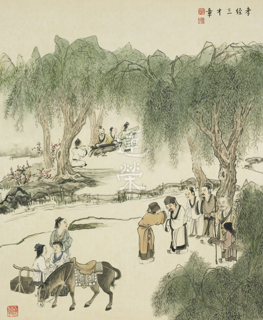

### 孔門心法—中庸之道(二)

*時哉講述、茅茹讀書會、弘毅整理*

孔門心法載中庸

性與天道不得聞

子思傳承稱述聖

要為萬世開太平

一、《中庸》真偽辨析

有一些學者認為《中庸》是後期的人物所作，偽託子思之名，可很多都是文獻不足，就妄下斷言。在鄭康成的三禮目錄中，他就說《中庸》是子思的作品。雪公老師在他的《中庸表注》裡面亦承許為子思所作。

二、《中庸》一書演變

中國從上古時代就有文明，又經歷夏商周到周公旦（周公旦是孔子最尊敬的一個聖人），他開始整理中華文明，如果沒有把這些文明做整理，就沒有辦法代代相傳，並維持民族的風采。周公旦在代理天子的七年中，著作周禮，建立周朝官制，其次儀禮對婚喪喜慶等有制定儀式。這些禮的義理和作法，透過曾子、子夏、子游、孺悲、漆雕開等人的請問，孔子的回答，經過子思、樂正子春，公孫尼子等人整理，及眾所熟知的禮記。

一直到漢朝的后倉講學禮記，弟子包括戴德和戴聖，戴德是叔叔，依后倉的講學整理了八十五篇，戴聖是侄子，整理了四十九篇，鄭康成宗於戴聖，所以流傳的是戴聖的這四十九篇，其中《中庸》就是第三十一篇。可是《中庸》雖然在禮記裡面，但在漢時已有單行本，漢朝的劉向、劉歆父子編撰的目錄學，以及後來在班固的《藝文志》裡面，就把《中庸》獨立出來，可見《中庸》並不是二程（程頤、程顥）、朱子時才獨立出來的。唐朝李翱的《復性書》，就是來解《中庸》的，宋明理學派，朱子有《中庸章句或問》和《中庸輯略》，是宋儒理學派的開端。後來在二程時，《中庸》，《大學》，《論語》，《孟子》，合成四書，是天下必讀，考試必考。

三、《中庸》注解參考

（一）抉擇古注

《中庸》一書，文字所含攝的義理很深，不容易理解，所以必須看注解，而中庸的注解林立，各家不同，如何抉擇這些古注呢？東漢鄭康成有禮記的解釋，可為主體，到唐朝孔穎達有宗鄭康成的《禮記正義》，一般公認為解《中庸》的最標準的版本。王肅（《孔子家語》的作者），他的注解不同於鄭康成的，處處有反鄭康成的文句，讀這兩家可以幫助我們了解《中庸》。

後面還有司馬光、程顥、楊時、游酢、晁無咎、呂大臨和郭宗敬等都有寫《中庸》的註解，以及朱熹的《中庸章句或問》和《中庸輯略》，都可以作為參考。

古注大體可以分為漢儒和宋儒兩大派。漢儒，如鄭康成及孔穎達等，比較注重考據、訓詁；宋儒，如朱熹等人比較偏向於微言大義。

（二）特別所依

本次講《中庸》特別所依之注為何？我們主體是依徐醒民老師（醒公老師或稱自公老師）的《中庸筆記》，還有雪廬老人的《中庸表注》，那是雪公在一九六五年於中興大學（後來才成立了中文系），講授《大學》和《中庸》時所作，雪廬老人作學問最大的特色，就是作表分析。 自公和 雪公一樣，他們都是既不偏漢，也不偏宋，只要宋儒的微言大義不偏旨趣，宋儒的解釋也可以採用，漢儒講到的名目章句，乃至於考據，其實都可以變成我們的參考。

以上兩個作為這次《中庸》上課所依的注解，並以此來通鄭康成和朱熹的《中庸》解釋。

（三）注重義理

由注解通達義理，內心安住在這個義理上，弘揚經學的義理是人生的價值。

四、《中庸》全篇架構

有的人把《中庸》分為四十九章，有的人分為三十三章，鄭康成和朱熹都是分成三十三章，但他們的分法是不一樣的，此次採取的是朱熹的分法，當然也可以參考鄭康成三十三章的分法。

根據醒公的筆記，雪公的表解，還有古注的參考，我的分法是：第一章就是開宗明義，講到《中庸》的大宗旨，朱熹說第一章就是總說，後面三十二章是解釋第一章，這是朱熹的看法。其實第二章到第三十章，是分別解釋《中庸》的宗旨跟意趣，最後三十一章到三十三章，反覆讀之，你會發覺到子思是在寫他的祖父，以他祖父的風采作《中庸》的結尾和結論，意思就是說「人能弘道，非道弘人。」人才能夠真正弘道，文化在人的身上，文化不在典籍上，所以子貢才會說，「文武之道，未墜於地，在人。」文武之道，就是中華文化到周文王、周武王和周公的時候，整理得完備，文武之道能夠向下流傳，不是在典籍，而是在人。可見，道在人的身上，經典的義理在人的身上，不是在典籍上面。

五、《中庸》與它經關係

（一）《中庸》與《大學》

《中庸》和《大學》都是承接孔子的心法，都講內聖外王的道理，彼此都有關聯，我們可以把中庸的「中」跟大學的「內聖」結合，把「和」跟大學的「外王」結合，這兩部經典整個的意趣是相通的。

（二）《中庸》、《大學》與《論語》

要想讀懂《論語》，一定要懂《中庸》和《大學》，因為它們是孔門的心法，當你了解了孔門的心法，再來讀孔子各項的言論，你才知道他各項言論的旨趣和大要所在。

那有什麼證明呢？《論語》裡面有一章，孔子說「端木賜啊！你認為我是多學而有體會的嗎？」端木賜說「對啊！不是嗎？」 孔子說：「不是，我一以貫之。」一以貫之就是他心法，意思就是說，你必須通達一以貫之，才知道多學而識的方向和去路。多學而識就是說，你可以學詩、書、禮、樂、易、春秋，你可以在《詩經》裡面，通達溫柔敦厚；在《易經》裡面，通達絜靜精微；在《禮經》裡面，通達恭儉莊敬；在《春秋》裡面，通達屬辭比事；在《樂經》裡面，通達廣博易良；在《書經》裡面，通達疏通知遠，這在《禮記》的〈經解篇〉裡都有。

問答

**問：** 既然心法的傳承到子思就斷了，我們要如何知我們現在學的《中庸》是正確的？

**答：** 《三字經》說：孟子者，七篇止，講道德，說仁義。《孟子》的七篇看不到性與天道，儒家後面幾乎算是斷了傳承，那我們如何知道自己所學《中庸》是正確的呢？漢儒鄭康成能夠把文句作解釋，宋儒是發揮微言大義，但是宋儒也是從佛學去解儒學的性與天道。所以我們不要帶著偏見，從道家、佛家的精華來解儒家的性與天道，就能夠找到《中庸》的旨趣，找到真正的出路。

**問：** 在《論語》當中提到吾道一以貫之，他有印可曾子的傳承，在一些典籍當中，好像找不到曾子印可子思，怎麼能確定子思真的得到曾子的心法？

**答：** 問的很好！鄭康成、朱熹都認為子思發揮了孔子的性與天道，曾子一生的精華也教給了子思，古書上也認為子思是傳承了曾子的學問。如果不帶偏見的從佛道去看《中庸》，也會知道子思是得到了孔子的神髓，各代的讀書人也承許子思得到傳承。

**問：** 科學都講究證據，像東漢的鄭康成，甚至宋朝的朱子，都說子思是《中庸》的作者，但是他們兩者年代相差這麼久遠，我們應該如何推理這兩位大儒所說是沒有錯誤的呢？

**答：** 我們沒有辦法好好地一一的把它說清楚，然而自鄭康成以下的諸儒，包括蘇東坡、司馬光這些大儒，不論是在考據上面、文獻上面，他們都認定《中庸》的作者就是子思。有些人提出一些疑問，其實都不足以證明《中庸》不是子思的著作。

**問：** 曾子是孔門後期的弟子，為什麼子思要拜他為師呢？

**答：** 第一，因為曾子傳承性與天道。第二，子思本來就是一個天資穎慧的人，從他小時候跟孔子之間的問答就可以看出。第三，雖然沒有證據說，孔子在過世前是否讓子思去找曾子學習，但是相信孔門弟子裡面都想教子思，因為孔子對這些弟子們的恩德實在太大了，而且子思也跟著這些學生們一起守喪三年，子思要找誰學習，他們都會義不容辭的，但子思為什麼會找到曾子呢？因為孔門的弟子雖然是當仁不讓，可是每一個人也不會爭著出頭，子思也是別具一隻眼，去找曾子來學，曾子雖然是後期的弟子，但是真正的學問是不論前期後期的，要以得到心髓為主要，這就是子思的出路。子思在眾弟子當中，找到曾子來求學，這是曾子的福報，也是子思的出路，也是孔子的陰德加被。

**問：** 子思是如何得知曾子已經得到孔子的神髓，進而向他學習呢？

**答：** 第一，因為曾子曾經在孔子晚年的時候，孔子說吾道一以貫之。曾子曰：唯！第二，曾子在《大學》裏面，對性與天道的闡述是很清楚的，就是內聖外王。內聖的部分，是聖人的成就，其修學法是格物致知誠意正心，外王的部分，是君子的成就，其修學法是修身齊家治國平天下，兩者都止於至善，是至聖的成就，就是在講孔子，曾子說得清楚明白。有人說，有參方志，必須要有參方眼，就是說你有志於要去找老師，要有找老師的眼力，所以子思或許就是有找老師的眼力。在孔門眾弟子當中，他以曾子為師來求學，這或許也是子思的參方眼。

**問：** 子思到底有沒有教過孟子，另外《史記》上面說，孟子是受業於子思的門人，這個說法是否可採？

**答：** 子思生於西元前四八三年，孟子生於西元前三七二年，兩個人差了一百一十二歲，所以子思是不可能教孟子，而且子思過世的時候，一說六十二歲，一說八十二歲，即便是八十二歲也教不到孟子，所以應該是子思的門人教孟子，而不是子思教孟子。之所以有此訛傳，是因為朱子引用程頤所說，他說孔子的心法，唯恐傳承中斷，所以子思做一個整理來傳給孟子，很多人就根據這句話演繹說子思傳給孟子。

**問：** 為什麼子思他已經掌握了《中庸》的心法，但是他的性格還是難容於世呢？

**答：** 孔子的處事比較圓融，子思的處事比較有個性，之所以有所不同，原因有二：第一，孔子的境界非一蹴可幾。連顏回都贊歎孔子「仰之彌高，鑽之彌堅」，宰我也說：「吾觀仲尼遠於堯舜」，就連堯舜也是比不上我的老師的，差的很遠的。在見地上可以相似，可是在入世時，隨著不同的環境，有不同的變化，子思未必氣象可以達到那個程度。第二，子思何嘗不是藉著他的個性，來表達君子的去就之道。子思所處的時代與孔子時不同，有時不能表現的過分謙恭，各國國君都不遵從周禮，都是強兵霸權、爾虞我詐，這時要表達自己的信心，合則留，不合則去，有時候反而個性要稍微鮮明，因為不同的時間，不同的地點，就要有不同的作為，就像堯舜是禪讓，而湯武是革命，作法是不一樣的。

**問：** 孔子已知天命了，但為什麼在顏回過世的時候，還會悲痛的說「天要亡我」，這只是代表一種悲痛心情的表達，還是有別的寓意存在呢？

**答：** 多一個得到傳承的顏回那會更殊勝，能傳承的弟子越多越好，而不是只剩下一個，所以不妨說天要亡我。顏回這個弟子非常難得，悟性高遠又好學，有若無實若虛，以能問於不能，以多問於寡，好問而學，曾子有的特點顏回都有，顏回也能如曾子那樣將所學不停的串習，可是顏回有的曾子卻沒有，如顏回的天資聰穎，聞一知十，所以孔子才會有天喪予的感歎。

**問：** 《孔叢子》這本書，後代學者有懷疑它的真偽，不知它的內容可不可靠呢？

**答：** 此書記載孔子到二十三代孫孔季彥，不僅是孔鮒所作，後人又添加了一些內容，在《隋書》《唐書》，以及司馬光的《資治通鑒》裡引用《孔叢子》的內容，只不過有些後人添加了一些內容，難免穿鑿附會，所以必須有擇法眼，辨別哪些是不要採取的，哪些是珍貴的史料。

《孔叢子》這部書有七卷二十三篇，記載著從孔子到他二十三代孫孔季彥，不只是陳勝的博士孔鮒所作，還有後人添加了一些內容。在《經籍志》、《太平御覽》、《隋書》、《唐書》，司馬光的《資治通鑑》都引到《孔叢子》，如果說孔叢子是偽書的話，這些人為什麼會引用？只不過後人所添加的內容，難免有穿鑿附會，必須有擇法眼。

**問：** 老師曾說過，並沒有證明孟子得到性與天道的傳承，是否代表說，性與天道，自從子思之後，就斷了傳承呢？

**答：** 從兩漢到宋明理學之前的著作中，沒有看到性與天道的見地。從這一點可以粗略的判斷，在子思之後斷了傳承。傳承就是後代要不斷的去演繹前代，注解前代，應該是越到後面越完備。可是自子思的《中庸》之後，後面的儒學著作中卻不見了性與天道的內涵，尤其到了孟子，講道德，說仁義的時候，都是入世之談，沒有性與天道之言。故可判斷傳承斷了。到了宋明理學後，從佛家來發揚儒學，我們在學習性與天道時，不要帶著門戶之見，要從道家、佛家的精華，回過頭去解性與天道。《中庸》也是，根據雪公的解釋，我們會發現好像有一把鑰匙什麼門都可以開，三十三章的門都可以開。只要不帶門戶之見，就可以通達孔子的性與天道，找回孔子的風采，找回文化的出路。

**問：** 有提及「中」跟「性」是屬於形而上的部份，「和」跟「天命」是屬於形而下的部分，中間還有一個天道的圖示，不知道這是屬於形而上或是形而下呢？

**答：** 天道是趨吉避凶，是含兩類，就是通達形而下入世可以趨吉避凶，通達形而上入世也可以趨吉避凶。如子思不為名聞利養所動的那一分，是和性與天道有關的，富貴的很多陷阱，子思是不會往下跳的，所以可以趨吉避凶；入世的時候演繹修齊治平的道理，這都是出路，都是趨吉避凶之道。因此，天道的範圍包括形而上和形而下。

天命也是橫跨兩邊，你具有形而上和形而下傳承的人，必具天命，辦政治與辦教育的天命，而且都有出路，天命在你。

**問：** 像李翱的《復性書》，是否可做為我們學習《中庸》的參考？

**答：** 建議先將雪廬老人的《中庸表注》和醒公的《中庸筆記》看完，以及把線上的課程聽完。我們學習不要求快求多，不要認為別人就是看了什麼書才贏我，有時候老師看的書，學生看了是毒藥。所以要按部就班的把眼前的課程學好，然後再去參考各家，才不會隨境而走，成為迷途的羔羊。

**問：** 曾經有人說，《中庸》是理論，《大學》是方法，《論語》跟《孟子》是聖賢人的表演，此種說法，可採嗎？

**答：** 《中庸》裡面有理論也有方法，《大學》有方法也有理論。《大學》裡面講到內聖外王就是旨趣，方法就是格致誠正、修齊治平。《大學》的理論就是大人之學、方法就是透過定靜安慮得成就至聖。《論語》跟《孟子》雖是處世的方法，不過也含有理論，如《論語》中講到性與天道，但《論語》中所言甚少，所以還要《中庸》跟《大學》作為《論語》性與天道的補充。其實在某種程度上說，《中庸》是理論，《大學》是方法，《論語》跟《孟子》是聖人的表現，這點上其實也是可以承許的。

**問：** 顏回、子路去世，夫子痛哭失聲，對於舍利弗、目犍連的涅槃，佛陀卻淡然以對，兩位聖人面對極為優秀的傳人，態度截然不同，我們應如何理解呢？

**答：** 各有表法，釋迦佛是表現出世的那一分，孔子是表達入世的那一分。孔子在入世時要表達入世的情懷，顏回去世，他表達對天下蒼生的不忍，傳承如果斷了，天下蒼生是何其不幸，他是以對天下蒼生哀憫的那一分而哭泣。而且顏回和子路與孔子都非常有革命的情感，孔子的哭是表達世俗的情誼，對風俗有加厚的功能。佛陀則是表達人生本是種解脫，修行就是解脫，透過壽命終止來表現解脫，所以是高興的。兩種表法雖然不同，可是意趣是相同的。

**問：** 誠則明、明則誠，到底是明在先，還是誠在先呢？

**答：** 明則誠就是說，你的明就是你的智慧之明，透過明知誠之要而具足誠，又因為誠，方能透過修學而證悟心體成就明。（下期待續）

### 三字經簡說（三）

*淨爾整理*

禮義質地與能力

經學不妨世學問

分辨推理跨領域

認知時代弘傳承

上一期已談過教與學的重要性，本篇則將分別解釋教與學的立基和次第。

經文：

為人子，方少時，親師友，習禮儀。

為人子女在年少時就要開始學習，要親近良師益友，學習應對進退的禮貌和規矩。

這短短十二字說明兩個問題：一、學習應該從什麼時候開始？二、如何學？

學習應該從「為人子，方少時」開始。少時，可以解釋為愈小愈好。年紀愈小，模仿力愈強、記憶力愈敏銳，所謂蒙以養正，童蒙時期是未來一生學習的基礎，因此學習是愈小開始愈好。
如何學呢？答案就是「親師友，習禮儀。」求教於良師、跟益友切磋琢磨，孔門就有這樣的學習風氣，弟子們會在課後向師兄顏回請教夫子上課時的未竟之意，或是遇到不解之處也是利用課後相互研討，例如有一次孔子說「吾道一以貫之」。孔子離席後，不懂的弟子就問曾子剛剛老師這話是什麼意思？曾子回
**答：** 「夫子之道，忠恕而已矣」。其他另有弟子們在課後向顏回請益。

但親師友和習禮儀，孰先孰後？應該先親近明師善友，向之學禮儀？還是先學好禮儀，才能得到明師善友的教導呢？

兩者實是相輔相成，禮的規矩和講究同時也是學習的心態與方法，有禮才得良師教，無禮則人不教之。而良師益友的言教和身教無一不是禮儀的內涵。但為什麼是從禮儀學起？孔子說：「不學禮，無以立。」因為禮的本質是仁，仁的本質是孝悌，孝悌起於為他人著想的心態，所以習禮儀要從孝悌做起，因此，以下分舉孝悌的典範說明之。

經文：

香九齡，能溫席，孝於親，所當執。

黃香九歲就知道扇枕溫衾，孝順父母是為人子女應當作的。

黃香，東漢江夏人，九歲喪母，根據《後漢書》〈黃香傳〉記載，失恃後的黃香「思慕憔悴，殆不免喪，鄉人稱其至孝」。黃香對待父親也是極其孝順，夏日襖熱、蚊蠅多，黃香在父親就寢前會先將床鋪搧涼。冬天寒冷，黃香會先暖被再讓父親安寢。孝順的黃香也是勤學之人，後來博通群書、享譽京城，人稱「天下無雙，江夏黃香」。黃香孝親的事蹟因此被選入二十四孝中而廣為今人所知。

然，二十四孝中有閔子騫單衣順母、孟宗哭竹，還有聞雷泣墓、負米養親……等故事，各各精彩感人、孝感動天。為何《三字經》獨舉黃香為孝親典範呢？一是因為黃香細膩的觀察力，能同理感受父親所需。二是孝在日用平常，扇枕溫衾是每個人不論年紀、性別、貧富、地位都能做到的。因此以黃香溫席為例最能體現生活中處處可行孝道。

經文：

融四歲，能讓梨，弟於長，宜先知。

孔融四歲的時候，就知道要把大顆的梨子讓給兄長。可見在孩子小的時候就要知道長幼有序、恭敬長上的道理。

孔融讓梨的故事因為《三字經》的傳誦而人盡皆知，這故事有幾個特點：

一、故事發生時孔融才四歲，四歲的孩子還是幼兒，通常看到喜歡的東西會據為己有，有的直接動手搶，有的用哭鬧，因此四歲能讓梨即便在今日都很罕見。

二、孔融為什麼懂得禮讓兄長呢？必然是家教之故，讓幼小的他對長幼之序有根深蒂固的觀念，因此能自然而然自動自發，可見家庭教育的重要。

三、為什麼發生在家中的事會被記載在後漢書中成為公眾教材呢？作者應是藉由這個故事勉勵眾人、帶動兄弟友愛的風氣。

四、為什麼「弟於長」要「宜先知」呢？依據前文而來，可見「宜先知」是指學禮儀時應當先知道兄弟之道。兄弟友愛也是向父母盡孝的一環，於內的心態能行孝悌，學禮時就不會只存外相而無內在質地。

經文：

首孝弟，次見聞，知某數，識某文。

一個人首先要做到的就是孝順父母、友愛兄弟。其次才是增廣見聞，了解數字的應用與變化、學習經書典籍。

為什麼孝悌在先，見聞的學習在後呢？

孔子說：

「弟子入則孝，出則弟，謹而信，汎愛眾，而親仁。行有餘力，則以學文。」

《論語講要》裡提到求學之人，學必有師，所求之學有其先後。孔子以德行、言語、政事、文學四科施教，首先之要為德育，必須先正其心。孝弟之道即是德行教育的根本。行有餘力，指的就是能做到入孝、出弟、行謹慎言有信、博愛眾人以及親近仁者學習這五件事後，方才學習經典，因為學文需以德為本，如此培養出的子弟才會是能利他利己的人才。

若是不重視孝弟之道的學習，連父母恩都不知回報，所以即便行萬里路也讀萬卷書，這樣的人所習得的知識只能利己，甚至可能危害世間。因此一個人有品德有學問是屬上乘，有品德無學問尚能以自身德性影響家風。但若無品德者，寧可無學問，也比飽讀詩書好，因為無品德無學問不過是不會造成大害的市井小民，但無品德有學問則可能因為身居高位而遺害社會，一如歷史上許多佞臣。

或問，知某數和識某文有先後次第之分嗎？

古時候一般人普遍沒機會學識字，遑論接觸典籍，但人人皆會基本算數。算數之學除了日常生活和商業買賣用途之外，最重要的是架構概念的建立。因此「首孝弟，次見聞，知某數，識某文。」總明學習次第後，接下來就要分別解釋知數與識文。

經文：

一而十，十而百，百而千，千而萬。

每個人學習數數必定是從一到十，進而到百千萬，完成十進位的學習。有了基礎數學累算的概念後，《三字經》中演示了以數攝法的架構式學習：三(三才、三光、三綱)、四(四時、四方)、五(五行、五常)、六(六榖、六畜)、七(七情)、八(八音)、九(九族)、十(十義)。

經文：

三才者，天地人。

才：廣大的才能。八卦的乾卦，上一畫代表天，下一畫代表地，在天地之間的就是人。這三畫的表意就是天地人三才。天地人分別具備的廣大才能即是天道敏時、地道敏樹、人道敏政。

天道敏時：天覆育大地，日月星辰運轉不息、四時節候交替流轉，萬物的生滅得以依循天時，天的特質是恆常不變，歲歲年年生生不息，但若天時反常、寒暑失調，則必然天災四起。

地道敏樹：地球若沒有大地的能量，將是荒瘠一片。因為我們的大地能承載萬物、利益萬物、以豐沛的地力長養萬物、成就自然界的食物鏈。

人道敏政：雪廬老人說：「人為天地之心」，人立足於天地之間，既受天的朗照也享有大地的滋養，人能善用天地的資源化育萬物，以順乎天地運行的自然法則統合眾人之力、辦眾人之事。人道敏政，即是人能行利他的事業。

根據《孝經》的〈三才章〉，孔子說：「夫孝，天之經也，地之義也，民之行也。」也就是孝同時具備天恆常不變和地利萬物的特質，所以是人行為的根本。孝法天地，如此一來，辦政治時無需嚴肅要求，百姓自然受教化，政治也不必嚴刑律法就能治國有成。

經文：

三光者，日月星。

三種光明的來源是太陽、月亮和星星。

雖然古人並不知道月球不會發光，以為月亮在夜晚照耀大地給予世間光明，但古人早就從日常中學習到天地的運行不離日月星的運轉，並且藉由觀測日月運轉的週期而定下夏至冬至等二十四節氣，因此定義了年月日並進而發展出曆法。例如在尚書堯典中就記載堯派羲仲住到東方海濱一個叫暘谷的地方，每天觀察太陽移動的位置。又命和仲住到西邊一個叫昧谷的地方，去觀察太陽西下的移動位置。經過這對兄弟一東一西的觀察，瞭解日昇日落的基本運行，制定出一年三百六十六天的堯的曆法。

《日知錄》裡說：「夏商周三代以上，人人皆知天文。」因此在詩經中也處處可見當時的天文現象，例如《詩經•小雅•漸漸之石》裡提到「月離於畢，俾滂沱矣。」月亮靠近畢宿時會下起滂沱大雨。後來孔子就是依此而能預知何時出門該帶雨具，更有甚者，三國時諸葛亮憑此不戰而退司馬懿的四十萬大軍。

沒有日昇月落等種種天文現象，大地將因缺乏溫暖與照耀而失能，人自然也無法生存，因為有其規律的循環，人類的生活才能奠基於上開展出文明的歷史。下面即是如何以三綱攝持人道，維持和諧。

經文：

三綱者，君臣義，父子親，夫婦順。

綱：網上的大繩，一拉即可收束網繩。

三種最重要的綱紀：君臣有道義、父慈子孝、夫婦和順。

三綱是維持人與人之間的和諧的三種綱要，所謂君君臣臣，君臣有義則國和；父子親夫婦順則家和萬事興。

中國人講究五倫關係，為何此處只以三倫為三綱，而非五倫五綱呢？

因為父慈子孝，則兄弟必能和睦，一個孝順的孩子不會容許自己因為兄弟的齟齬而讓父母傷心，同樣地，也會因此懂得結交善友遠離惡友。因此父子親夫婦順則家齊，家齊然後君臣有義則天下治。

經文：

曰春夏，曰秋冬，此四時，運不窮。

春夏秋冬稱為四時（今多稱四季），四時運轉循環無窮盡。

《禮記》〈孔子閑居〉「天有四時，春夏秋冬，風雨霜露” 形容天時的四季循環，春生夏長秋收冬藏，有雨露滋潤植物，有霜雪殺滅害蟲，這次自然界的規律。

因為有四季的變化，萬物得以生生不息。春天大地回春、萬物萌發，是為春生。夏季時植物繁茂、動物活力旺盛，是為夏長。秋天是收穫的季節，在農業社會是成果收割的時候，在遊牧民族則是宰殺牲畜準備過冬的肅殺之際，這就是秋收。到了冬天，則是萬物涵養蟄伏的時候，這是冬藏，藏是為了來春的勃發。春天的生機在夏天快速生長，萬物的生長是為了秋天的收成以備冬天的含藏。依此，四季循環不盡、天道運行不輟。

經文：

曰南北，曰西東，此四方，應乎中。

東西南北四方的方位皆是與中心點互相對應，這是空間的概念。

在大航海時代來臨之前，每個國家都認為自己是世界的中心，並以此來定位東西南北方。即便今天，當我們轉動地球儀意圖辨認方位時，也會立刻發現所謂的四方是彼此相應而有，沒有東方何來西方？而所謂中國是東方大國、美國是西方強權，這也是建立在人類的認知基礎上取得的共識。時間三際和空間十方構成了我們所認知的宇宙，但現代科學家已經告訴我們，離開所處的地球，時間和空間都是以另一種維度而存在。即便如此，我們仍需定義所處空間中的四方，方位是座標，城市、國家的建設和疆域地界等種種都離不開方位的認知與確立。

經文：

曰水火，木金土，此五行，本乎數。

水火木金土是五種構成萬物的基本元素稱為五行，五行是由產生萬物之數與成就萬物之數的生成之數變化而來。

五行在中國人生活中運用廣泛，舉凡天文(行星的命名)、中醫(五行配五臟、五色……)、養生(五行食物)……等。而《三字經》的水火木金土的順序是依據《尚書˙洪範》「五行：一曰水，二曰火，三曰木，四曰金，五曰土。」。

五行彼此之間相生相剋的關係如下：

相生：木生火（鑽木可取火）、火生土（木頭燃燒後產生灰燼歸於塵土）、土生金（金屬礦物來自大地）、金生水（金屬熔化成液態）、水生木（水滋潤植物令其生長）

相剋：木剋土（植物的根系能穿透泥土）、土剋水（水來土淹）、水剋火（水能滅火）、火剋金（火可以熔化金屬）、金剋木（斧頭可以砍伐樹木）

根據唐代孔穎達所著的《周易正義》「《易•繫辭》曰：『天一，地二；天三，地四；天五，地六；天七，地八；天九，地十。』此即是五行生成之數。天一生水，地二生火，天三生木，地四生金，天五生土，此其生數也。如此則陽無匹，陰無耦，故地六成水，天七成火，地八成木，天九成金，地十成土。於是陰陽各有匹偶而物得成焉。故謂之成數也。」《三字經》作者應是採用孔穎達之說而寫下「此五行　本乎數」。

經文：

曰仁義，禮智信，此五常，不容紊。

仁義禮智信五種常理是不容許紊亂的。

《中庸》第二十章中孔子說道：「仁者，人也，親親為大；義者，宜也，尊賢為大。親親之殺，尊賢之等，禮所生也」。《禮記》〈仲尼燕居〉孔子說：「禮也者，理也……君子無理不動」

「仁者，人也，親親為大。」仁，就是愛人，親愛自己的親人最重要。對人的親密加厚就是仁，行仁就是從親愛自己的親人到老吾老以及人之老，幼無幼以及人之幼，進而達到修身齊家治國平天下。

「義者，宜也，尊賢為大」義，就是合宜，其中以尊敬賢人最重要。

「親親之殺，尊賢之等，禮所生也」親愛自己的親人有親疏之別，尊重賢者也有次第等級，禮就是由仁義而來。

「禮也者，理也……君子無理不動」禮的意涵就是理，合乎道裡，因此一個君子是不會做不合乎理的事。孔子在禮記裡說:「禮者何也？即事之治也。」禮就是做事的方法，不懂禮就會手足無措、耳朵眼睛不知該看哪裡，進退失據。因此〈曲禮〉中說「道德仁義，非禮不成；教訓正俗，非禮不備。」可見修身治國端正風俗都需要有禮。

「智者，知也」中庸裡說有的人是生而知之；有的人是學而後知，經由學習而知；有的人因為遇到困境而努力求知。人往往自以為有智慧，汲汲於追求世間名聞利養，卻不懂得真正的趨吉避凶之道，真正的智是要具備明是非別善惡的能力，並且能擇乎中庸之道。

信，人言為信，言語誠實無欺，說話要三思而後行。中庸裡也提到為臣者若得不到在上位者的信任，就沒辦法治理好百姓；想獲得上位者的信任，就要朋友對你有信心；但一個人若對父母不孝就無法得到朋友的信任;想對父母行孝就要反省自己修身以誠。可見從個人的以誠修身到孝順父母、再到朋友交往建的信任、擴及得到主管的信任，然後才能把事辦好，這都是建立在誠信之上。

經文：

稻梁菽，麥黍稷，此六穀，人所食。

稻、梁、菽、麥、黍、稷是六種人類食用的穀類。

大地長養而出各種榖類成為人類賴以生存的主食，因著南北土壤與氣候的差異因此而有差異，例如東北盛產小米，北方食麥而台灣多食稻米。

稻：分為粳米、秈米和糯米三種。粳米俗稱蓬萊米，長得圓圓短短的，黏性是三種類型中較低的，因此可以用來做壽司，且是較普遍常見的食用米飯。秈米較有黏性，外型較細長。而糯米因為黏性最佳，因此可用以作湯圓、年糕、粽子、油飯等。

梁：一說是北方的高粱，一說是粟，也就是小米。

菽：豆類的總稱，例如黃豆、黑豆等。

麥：麥的種類很多，例如燕麥、蕎麥，較普遍的如大麥可釀酒，小麥可作麵條、饅頭、蛋糕等。

黍和稷：《本草綱目》中說：「稷與黍，一類二種也。黏者為黍，不黏者為稷。稷可作飯，黍可釀酒。猶稻之有粳與糯也」可見稷和黍很相似，但稷比較小也無黏性，可以當作主食。黍有黏性，可以釀酒，黍有赤、白、黃、黑數種顏色。稷是五榖之長，因此祭祀時以稷來代表各種榖類，堯帝時任用棄為掌管百榖的稷官，因此後人尊稱棄為后稷。衍生到後代，因為人非土不立、非榖不食，土地與糧食是百姓生存的根本，因此象徵土神的社和象徵榖神的稷合稱為社稷，代表江山國家。

經文：

馬牛羊，雞犬豕，此六畜，人所飼。

犬是狗，豕是豬，馬牛羊雞狗豬是六種人類飼養的家畜。

馬：古人最重要的交通工具，能負重致遠。不論是旅行或是驛站間的訊息傳遞還是戰爭都需要好馬相行。

牛：農民最重要的夥伴，能載物也能耕田。

羊：羊毛羊皮可製衣裘，羊奶提供營養。羊性格溫馴，小羊跪乳更被引申為子女對父母應有的感恩心與孝心。

雞：雞司晨，雞鳴報曉天下白。

犬：狗能看門、守夜、狩獵、牧羊，因為狗忠心耿耿的特質讓狗成為人類生活的好夥伴。

豕：豬除了食用之外，豬鬃是塑膠發明前製作生活器具常用的材料，豬糞也是耕作時土壤所需的肥料。

以上知某數中，從天地的自然運行到人類進入農業社會，而發展出六榖六畜的相依賴關係。下一期將從人類的七情與樂教談起，並進入經典學習的主軸–識某文。

參考資料：

一、論語講要

二、三字經簡說 臺中蓮社印行

三、三字經 三民書局印行

四、常禮舉要筆記 華藏淨宗學會印贈

五、禮記今註今譯 臺灣商務印書館發行

六、中庸 時哉時哉網路教育學院課程

## 藝術賞析

### 孔門七十二賢淺說（十八）
				         ─樊須

孔門七十二賢淺說（十八）

─樊須

圖：江逸子‧文：時哉

保家衛國真勇士

助成夫子返歸魯

善問駕馭弟子相

亂世信道是出路

樊須，名須，字子遲，魯國人。史記稱其小孔子三十六歲，家語則謂少四十六歲。

魯哀公十一年時，魯國和齊國交戰，孔子的弟子冉有為季氏家臣，率領左師，並使樊遲為車右（古時將帥所乘兵車居於右位者）。季孫原以為樊遲年少，不適宜任車右，但冉有說他能用命，故用之。而後冉有所率領的左師，果然因為樊遲的奮勇當先，攻入齊軍而大獲全勝。

樊遲除了有勇，也是一位勤學好問的學生。《論語》上就有數則有關他向夫子請教的記述，特別是有關仁與智的答問，就不只一次。仁與智的意義都不簡單，諸弟子問仁，孔子因材施教，解答並不相同，但歸結到本義則是一致。樊遲問仁，孔子回答他：愛人。他又接著問智，孔子解釋是知人，因為智者必有知人之明。樊遲未能通達孔子之意，孔子進而說道：把正直的人舉出來，安置在不正直的人之上，就能使不正直的人學習成為正直者。樊遲聽完回答，對於誰算是正直的人，誰又算是不正直的人，仍不了然，但又不好意思再問孔子，因而在退出後見到子夏時，向子夏請教剛剛夫子所說：舉直錯諸枉，能使枉者直。的意義為何。子夏先是讚美這兩句話富有含義，而後舉例說出正直與不正直的具體形象：舜有天下的時候，在眾人中舉出皋陶為士，不仁之人從此感化，因而遠惡行善。湯有天下的時候，在眾人中舉伊尹為相，不仁者也因之感化。依據孔子之意，必須像堯、舜、禹、湯這樣的人為君，才能盡用人之道，真正是選賢舉能。

樊遲還有一次請問孔子有關種穀、種菜的方法，意在諷勸孔子教民稼穡。孔子對於此問，則是勉勵弟子們要研究修己安人的大學問，要致力於治國平天下的大事業，畢竟農業是否振興，也要依靠政治的良善，倘若政治不佳，不僅是農業，各行各業都是難以興旺。

畫中的樊遲兩手相握於前，恭敬而立，如在聽聞夫子之教，但頭略歪斜，表情疑惑，或許正是問仁問智有所不達的反應。(下期待續)

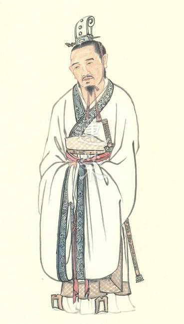

### 華夏精魂千秋(十九)—明倫史畫─恬蕩樂道─卓茂

圖：江逸子‧文：淨域

量大福大由歷練

德才兼備亮節風

光武中興立典範

華夏文明史料傳

史話

卓茂，字子康，漢朝荊州南陽郡宛縣(今河南省南陽市)人；生年不詳，卒於東漢光武帝建武四年(西元二十八年)。元帝時到長安求學，師從博士江生，精通五經與曆算，性情寬厚仁愛、謙讓無爭、不出惡言，人稱「淵博儒士」。

哀帝時，孔光為丞相，茂任職於丞相府史；孔光為孔子第十四代孫(父親為第十三代嫡孫孔霸)，稱讚他是有德之人。
某回，卓茂乘馬車出門，有一人攔車指說：「這匹馬是我所遺失的。」茂
**問：** 「您的馬遺失多久？」那人
**答：** 「一個多月。」卓茂雖心知他認錯馬，還是將馬交給他，並和悅地說：「如果發現不是你的馬，請牽到丞相府來還給我。」過了幾天，那人找到遺失的馬，愧疚地來到丞相府還馬，卓茂對於他的冒失一點也不在意。
卓茂隨後為黃門侍郎，再升任密縣(今河南省新密市)縣令，愛民如子、善教百姓，官民見他都誠實以對。有人前來縣衙，說某亭長接受他贈送的米與肉。卓茂支開身邊的人，問這人：「是亭長向你要的？還是你有求而送的？或是你心甘情願給的呢？」這人回
**答：** 「是我主動送去的。」茂說：「既是你送他收，為何要如此說呢？」這人說：「我聽說賢明的君王，使百姓不怕官，使官不向民索財。如今我怕官，所以送東西給他。他收下了，我就前來報告。」
卓茂說：「你真無知呀！人比禽獸可貴，在於人懂仁愛互敬。現在我們對年長的鄰居送點東西，這是人與人親愛的表示，何況是官與民呢！當官的只是不該藉勢強取罷了。凡人以禮義綱常來相處，不學這個難不成要離群索居嗎？亭長是個好官，有時送些禮物，是合於禮的。」這人又
**問：** 「如果是這樣，法律為何要禁止呢？」卓茂又說：「法律是個大框架，禮是順應人心的。若我用禮來教你，你一定無怨；若用法來治你，你就手足無措了。事事若都依法，一家中小錯可判罪，大罪便要殺頭。你回去想想吧！」從此百姓都受他的教導，官員感激他的恩德。

平帝元始元年(西元一年)，王莽為大司馬，卓茂升任京部丞(掌京城農課)，密縣老少涕淚遠送。王莽篡漢立「新」，稱病辭官回鄉。光武帝劉秀中興漢室，知其乃厚德君子，拜為太傅，封褒德侯，食邑二千戶。於光武帝建武四年病逝。

圖解

本圖庭前繪有一馬，僕役正端詳檢查著馬具，概是主人將要遠行。庭上有一黎民跪於階前，雙手抱拳叩首示謝，主人俯身要其快快起來。由此觀之，江師所繪概是卓茂升任京部丞，將要離開密縣官府時，鄉民前來縣衙感恩拜別之景。而後方衙役也談論此事，手指比向勁松(喻志節)隱處，必然有更多的百姓列隊送別。

《後漢書•百官志一》載：「太傅，上公一人。本注曰：『掌以善導，無常職。世祖(光武帝)以卓茂為太傅，薨，因省(不再任命)。其後每帝初即位，輒置太傅錄尚書事，薨，輒省。』」觀於東漢一代至獻帝，共任命十三位太傅，每朝一位既為佐臣又是帝師，帝幼或缺位時可以代為管理朝政，如此重任必是一時之選。

毛澤東曾評論劉秀是最有學問、最會打仗及最會用人的「三最皇帝」。其中興漢室後，勤於政事，厭武息軍；置三公，廢丞相，事歸台閣(尚書台) ，權力集於一身。《後漢書•申屠剛傳》說：「時內外群官，多帝自選舉。」可見卓茂出任上公太傅一職，乃光武帝所自選。然何以不擇「雲台二十八將」功臣，不選後任大司徒韓歆、歐陽歙、戴涉、嚴湛等飽學之士呢？這全著眼於直士之外的寬厚仁愛與謙讓達禮上。

卓茂的厚德敦教，不僅百姓愛戴，連光武帝都感同身受。《論語∙顏淵篇》云：「君子之德風，小人之德草，草上之風，必偃。」以卓茂為太傅，正說明光武帝是善於用人教化的。（下期待續）

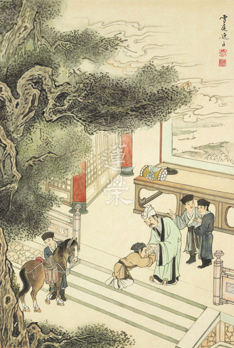

### 孝經圖簡說(十六)—感應章　感應章第十六

圖：江逸子‧文：時哉

制禮作樂能開國

祭祀追遠厚風氣

相維辟公護天子

一派祥和天下興

依孝道持家、入社會，辦政治、辦教育，以之祭祀歷代祖先，能感通神明，是真正的感應之道，這些歷練都是修道的能耐。本章江先生繪的是天子依孝而祭天祭祖，能感通天地神明護佑。

最典型的例子就是周公，圖中周公在祭祀手裡捧觚的酒器向天祝禱，後有讀疏文、捧食器做供養的大臣，前之四方鼎、或是焚香或是供食物的器皿，香案旁有盉與觶的酒器，案桌上之壺、卣的酒器、觚的酒杯，是裝食物的器皿，盤則是盛水之器。

當英明的天子祭祀時，不論祭天、祭地，或者祭山川，一定會感得神明來享用。由於祭祀最能表徵孝德，以天子的行相來祭最為殊勝，彰顯孝道能推廣天下。周公就是最佳的典範，兩旁有助祭的各路諸侯、五色幡與軍旗，表徵諸侯的地位。

歷代的畫作中，也都是以祭祀來表徵此章，但手法不同，《論語•八佾篇》有：「相維辟公，天子穆穆。」是說輔助天子的諸侯，各各一派莊嚴，天子穆穆一眼望知是治天下的仁君，天下祥和的氣象，都攝持在眼前的祭祀，這就是和諧天下之方，感通天地鬼神之道。(下期待續)

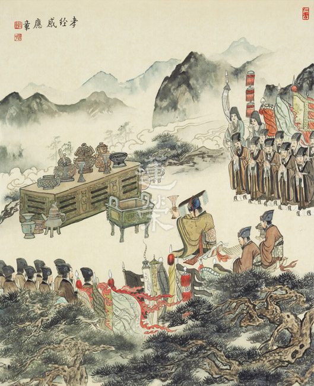

## 蓮池海會

### 祖母張陳送妹老居士往生見聞記

玖如

雖是張家續絃

平等厚待子女

和樂不需閔子

典型深藏民間

祖母張陳送妹老居士，生於民國九年一月二十日，新竹縣關西鎮石光里人，從小步行上學來回約七公里，故練就了好腳力，一輩子身體健朗，甚至到臨終前，每天散步一小時都稀鬆平常。九十幾歲不但能走，還耳聰目明，每天看書、抄經，興致來時還會用縫衣機做購物袋，送給來訪的親友。祖母非常愛乾淨，常把家裡擦得一塵不染，全家的被套床單及衣物見陽光就洗，早上曬東面，下午就移到西邊曬，我們都笑她是向日葵，總要面向太陽，非常勤快！但飲食簡單又量少，所以一直都維持瘦瘦的體型。

先祖父張芳杰，於民國三十七年創建楊梅中學，並擔任第一任校長，創業維艱之時，先祖母病逝。三年後經教育界長者介紹陳送妹小姐而續絃。

祖母原在關西坪林國小任教職，婚後辭去工作，協助祖父辦校之諸多人情事宜。當時住在他鄉親友的小孩，考上楊梅中學，多寄宿在祖父家，一切吃住等生活雜事全由祖母打理。

元配祖母育有三男二女，後祖母育有二女一男，兄友弟恭，全家和樂融融！古德云：「閨閫乃聖賢所出之地，母教為天下太平之源。」祖母因具女德內涵，所以能經營出幸福家庭！

婆媳相處

媽媽生我坐月子期間，祖母不但要照顧四歲的叔叔和二歲的姑姑，還要特別準備月子餐，洗尿布等諸多家務，毫無怨言。媽媽也馬上回饋，一個奶餵我，一個奶餵二歲的小姑姑，皆大歡喜！

每逢祖母的生日、母親節、過年，媽媽一定會送衣服或首飾等禮物略表心意。前二年和媽媽一起去看祖母時，祖母從櫃子裡拿出一個玉鐲子給我，那是媽媽二十年前去雲南買的緬甸老玉鐲，二位長者討論得樂不可支，要我快戴上這傳家寶，又直誇這玉戴在我手上美得不得了！一個鐲子二份情，真是我的寶！

祖孫情誼

因和姑姑、叔叔年齡相近，我們從小就玩在一起，印象最深的是，祖母常要我們背誦國語日報的勵志短文，還有玩接龍吟唐詩的遊戲。祖母對姑姑、叔叔尤其嚴格，對我們孫輩則慈愛有加。

祖父於民國六十五年往生，爸媽依舊會帶祖母出遊國、內外，甚至有四代同堂(祖母、爸媽、先生和我帶二個兒子)同遊菲律賓的愉快回憶！

回娘家時，總會先到新竹探望祖母，陪她吃飯，或看看電視弘法節目，聊聊學佛心得，還帶幾本佛書給她，祖母非常喜歡閱讀，又持續抄《佛說阿彌陀經》，相信是阿彌陀佛歡喜攝受的弟子。

子女孝順

郁媛姑姑叫祖母阿姨，從小住在祖父家，祖母視從己出，供她上學至師大畢業，後任教於楊梅國中，是我的國文老師。婚後辭去教職，隨著當外交官的姑丈駐在國外，姑丈退休後現定居臺北。姑姑常常到新竹陪祖母話家常，或邀祖母到臺北小住幾天，衣食供養無微不至，孝心堪為表率。

三姑姑去年想帶祖母去夏威夷短住一個月，略盡孝道，祖母覺得家裡較舒服，不想去。三姑姑善巧騙她說，抽獎抽中一張機票，請她隨行，否則機票沒用，太可惜！祖母竟說，我怎麼那麼倒楣，你們都不去，要我去？她就是那麼可愛的老奶奶！

小姑姑退休後參加佛教團體共修，常帶祖母到寺院聽經、回祖母娘家串門子、風和日麗逛公園、寒暑風雨逛百貨公司，那裏也無風雨也無晴，讓祖母的生活充滿色彩。有次逛街看到合適的長褲，小姑姑買了二條不同花色的給祖母，原價一千多元，短報為五百元一條，祖母的客家勤儉本色，馬上反應，太貴了！你還買二條！小姑姑反應更快，五百元，買一送一！祖母才稍稍接受。

小姑姑育有一兒一女，兒子在美國工作，週週打電話問候外婆的起居，每年回臺時會領著妻兒陪外婆出遊享受美食。女兒隨夫婿定居臺中，常帶二個外曾孫回來陪外婆享四代同堂之樂。

小叔叔一家人和祖母住在一起，平常教職工作繁忙，除了在專業上展現才華，假日休閒時也會學做蛋糕，揉饅頭等，把生活樂趣注入家庭，營造家裡歡樂氣氛，更豐富祖母的晚年生活。

生命無常

今年一月二十日祖母九十九歲生日，媽媽特選了一盆紫紅色的富貴菊(媽媽的名字叫菊妹)給祖母祝壽，當天天氣晴朗，祖母從家裡步行約一公里到餐廳與大家共進午餐，因為開心，胃口特別好，拔絲地瓜連吃三塊，意猶未盡！

誰知一月二十八日晚餐後刷牙，從浴室出來時不慎滑倒，緊急送往馬偕醫院，經醫師診斷為硬腦膜出血，在加護病房中昏迷不醒，經多方考量，簽下不開刀、不急救意願書。隔天早上我帶了念佛機放在祖母耳邊，提醒祖母要跟著念佛，如果不能好起來，就跟著阿彌陀佛走，這身體用了九十九年也夠本了，不要留戀，找回金剛不壞之身，才是我們的皈依處。祖母眼角湧出一滴淚水，手腳也明顯在動，大概是回應我剛說的話。

住夏威夷的大姑姑二月一日趕回臺灣，此時祖母血壓脈膊一切穩定，轉入一般病房。二月三日妹妹從高雄回來看祖母，妹妹三歲時，我們家正在蓋新房，媽媽上班，工事又忙，妹妹托祖母照顧了大半年，所以祖母特別疼愛她，聽到她叫「阿婆，我回來看您囉！」眼淚就流下來，接著聽到機器嗶了一聲，不知怎麼回事，趕緊通知護士，血壓脈膊漸低，就這樣安然離開人世。無病痛的身軀，最後也奈何不了無常的威力！

蓮友助念

我與先生直奔新竹馬偕醫院安息室，家人已在小聲助念，我們到了之後用力念，以提振士氣，希望佛號能聲聲流入祖母耳識，帶動她念佛的心，「慰」其放下，「導」其念佛求生。隨後新竹蓮友最先加入，中壢、臺北的老師學長相繼到來，念佛聲愈來愈莊嚴，八小時以後陳老師法語開示，掀開陀羅尼被，祖母如睡夢中般安詳。二十幾位蓮友在風雨淒冷的夜晚，近百里的路程，趕來助念，家人都非常感動。

祈請做七

隔天三位姑姑親自到學會祈請老師安排做七事宜，當下老師慈悲開示了一個多小時，讓我們了解做七是子孫慎終追遠的表現，不但能凝聚家族向心力，也營造社會善良風氣，以此功德迴向給祖母，是最殊勝的增上。

二月十日週六早上頭七，在中壢殯儀館停柩室舉行，不但須克服風雨，還有交通、停車、環境等問題，感謝師長、蓮友多人真誠護持，年近九十的媽媽也堅持要去，媽媽此行還度了回教徒的印傭，請她一起念阿彌陀佛回向給祖母，並說明助念及做七的功德，種下佛種，希望她來日有學佛的因緣。

因經驗不足，做七許多該注意的事項，疏忽了，但求往後六個七，盡力圓滿，謹在佛菩薩及祖母牌位前，至誠懺悔。

法語重點

每個七的法語都有其重點：

頭七：做七的意義及功德，緬懷亡者一生的善行，讓後代子孫能更深刻懷著感恩之情，藉著做七誦經、念佛，以得冥陽兩利之功。家屬在七七四十九天內應注意的事項，如吃素、放生、齋僧等善法迴向給亡者。

二七：如何發菩提心來利益亡者。發心一定要內心有感，不是嘴上滑過，念給風聽。要真有利人之心，然而為利眾則須先充實自己，唯有跟著善知識學習，循正道前進，才能利己利人。

三七：介紹彌陀淨土的殊勝。在極優的環境中，受到諸上善人的提攜，受用美妙的佛法，理應快速成就，但仍觀待自己是否真想學，猶如雖保送進台大，可是自己若無心用功，師長也幫不了你。

四七：持名往生之殊勝。念佛方法有四種：一、實相念佛；二、觀想念佛；三、觀相念佛；四、持名念佛。對一個忙碌的現代人來說，持名念佛最簡易、最方便、最穩當、最契機。以信願持佛名號，如子憶母，常時無間，則能感應道交，蒙佛接引。

五七：克服煩惱，降伏習氣，可為念佛之助功。娑婆世界五欲六塵的誘惑太多，須於穿衣吃飯中，時時起覺照。「覺照起，煩惱息；煩惱息，佛號起。」此方為真功夫。

六七：斷惡之後更須修善，助成淨業。念佛之人，兼修眾善，不是名號功德不足，而是藉行善以長養慈悲，防止怠慢，提升道力，助成正功。

七七：勸勉家屬皈依三寶，方為做七最大的利益。教導無常、空性的觀修，才是真正離苦得樂之正道。「人身難得今已得，佛法難聞今已聞，此身不向今生度，更向何生度此身？」

暇滿人生

祖母過去點點滴滴的付出，兒孫各個成材且孝順，昔日教過已八十幾歲的學生，也偶來拜訪恩師，祖母也時而去探視住在安養院一０四歲的好友，親友互動良好，祖母一生過得有意義又精彩繽紛！健康活到九十九歲，最後在家人陪伴下往生，還能得蓮友助念、做七，可謂是福德深厚的長者，也是我們家屬的好榜樣。

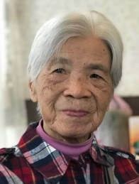

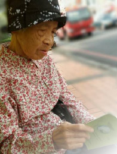

### 臨終照顧與護持父親蘇士成居士

弘毅

臨終大學問

護身護正念

引導好去向

解脫是未來

先父蘇士成，遼寧省瀋陽人，生於公元一九五二年九月二十九日，卒於公元二Ｏ一八年三月六日四時十五分，享年六十七歲。

父親因祖父被劃為經營地主，在文革期間上學受了影響，故初中只讀了一小段就輟學了。後向同村一木匠師傅學習木工技術，開始為他人建造房屋，之後又不斷向他人學習及自己領悟，學會了打造各種傢具、房屋裝修及雕刻，父親的手藝遠近聞名。除此之外，還懂水暖、泥瓦、電路等各項技術，親戚們都說，如果趕上好年代，父親會成為一個工程師。

父親是一個很謙讓的人，與兄弟姐妹相處都很融洽，在爺爺生前能夠多盡孝道，爺爺過世的財務分配上又能禮讓其他兄弟姐妹，這也為我作了很好的示範，如《弟子規》裡所說，「兄弟睦，孝在中，財務輕，怨何生。」

父親是一個非常勤勞簡樸之人，幹活從不知疲倦，大家都說他有十分力氣，不會使九分，甚至使出十一分的力氣，而且在吃穿住行上非常節儉。或許因為身體過度透支，以及不知保養，終致積勞成疾，於二Ｏ一一年檢查身患肺癌中期，手術切除了右肺下葉，出院後，又作了五次化療，病情趨向穩定。

然而自去年四月開始咳嗽不止，多次檢查也無法確認病情，八月身體開始發黃，再次檢查確認父親癌症已擴散，造成膽管堵塞。記得剛聽大夫說父親是癌症擴散將命不久矣，當時自己內心真是難以接受，接著帶父親又看了兩家醫院，都是如此，然後自己又拿著父親的檢查結果，到腫瘤醫院好幾個科去找大夫看片，都說看不了，有個大夫甚至說也就再活幾個星期了，當時自己眼裡瞬間就被淚水充滿了，都不知道自己是如何離開那家醫院的。回到家後我趴在床上再也抑制不住傷心，痛哭流涕。我太太勸我人終有一死，父親得癌症後能活這些年，已經是不容易了，我回答說我就是傷心，我太太也哭了。

後來父親膽管支架成功，病情得到暫時緩解，我開始感覺到自己與父親相處的時間不多了，要更加珍惜與父親在一起的時光。所以經常去陪父親聊天，關心他的起居生活，給他買喜歡吃的東西，特別是心態上的變化，期望自己能為父親多做些什麼。父親說他自從生病後，他感到我真的長大了，他說以前我去他家，與他溝通很少，很多時候都是看手機、電視，現在都是在和他聊天溝通，他說從我的眼神中看到了我對他的關心和珍視。然而有時候感覺自己真是能力欠缺，比如父親家裡的電路出現問題，我都不會解決，還要父親帶病檢查線路，重新接線解決，小時候真應該好好跟父親學習這些技術，這樣也就能夠幫到他了。所以想到老師常說，能力也是很重要的。我雖然心態上想幫父親，可是如果能力不具足，有時也沒有辦法幫到他。

到了今年一月父親因十二指腸堵塞再次住院時，這次感到父親可能隨時都會離開自己了，正值我學校放寒假，所以每天早晨或者開車、或者坐地鐵趕往醫院，我想如果一直這樣下去，能夠去醫院陪護父親，也是很幸福的事情。父親因為有十多天不能進食，只能打營養液，所以身體變得非常虛弱，身體明顯消瘦，陪他去做檢查時，我攙扶著他，摸到他的後背，他的胳膊，感覺就剩下骨頭了，我的眼淚在眼睛裡打轉，怕他看到令他心情不好，所以就不看他，他步履蹣跚，一不小心就要摔倒，我就拉住他；而且他很怕冷，又正逢瀋陽寒冬氣溫最低的時候，三番兩次的檢查，把他折騰的精疲力盡。以前的父親身高一七六公分，將近七十五公斤的體重，因為從事裝修工作，身體非常健壯，在兄弟中也是最健壯的，眼下看著他瘦的皮包骨似的孱弱身軀，又一陣陣的莫名悲傷起來。我和他說，我小時候生病，他騎車馱著我去看病，他說現在我回過頭來陪他看病了，我們都不禁感到唏噓不已。

在父親生病住院期間，很多親戚都來看望父親，特別是在父親做支架手術當天，大姑一家、大伯一家、老姑、老姨一家都來看望父親，當父親下了手術檯，看到大姑時，他對大姑說，我父母（我的爺爺奶奶）都不在了，你是大姐，你是代表他們來看我了，聽到此處，我不禁潸然淚下，這就是兄弟姐妹之情，這就是血脈之情，當時我明白了家人親情的重要。

一月二十九日父親出院，可以喝小米粥，喝水果汁，然而二月十日出現腹脹，十一日到開發區醫院住院，檢查確認腹部腹水，一些癌症晚期患者會呈現此現象。父親再次住院打營養液維持生命。

農曆三十，我和太太、女兒一起到醫院給母親送飯，父親因為不能吃飯，女兒給他帶的糖果，父親很高興，女兒看到爺爺喜歡，她也很開心，她說晚上再來時給他買巧克力。晚上煮好餃子，在陣陣爆竹聲中，我再次開車帶著女兒去醫院看父母，母親吃著餃子，而父親則吃著女兒從超市買的巧克力，父親吃的非常開心，他說從沒吃過這麼好吃的巧克力，他說孫女越來越懂事了，可惜看不到她長成大姑娘了。離開醫院時，女兒突然說這個假期我沒帶她出去玩，日記都不知道寫些什麼，我說寫三十晚上到醫院給爺爺奶奶送飯啊，你在學校得了孝親尊師的證書，這不是最好的體現嗎？女兒表示同意，並說她真的捨不得爺爺離開。

初一，父親看到我就說，「爆竹聲聲辭舊歲，鑼鼓喧天迎新春」，祝我「前程似錦」，因為他這一生就是這樣了，他期望我未來會更好。

初二，父親看到我說，我是不行了，你是家裡的頂梁柱，我說爺爺年紀大時，您照顧他，現在您身體不好，該輪到我了，我會照顧好您的。

初四，父親有時疼痛難忍，我就勸他說，你信仰基督教，死後要去天堂，如紅軍長征，享大福之前要先受大苦，在身體上雖然沒有辦法，這個身體如同一臺機器，當機器壞了時，我們就要再換一臺，但是要換更好的，而不是換一臺比這個還差的。所以在心態上要好好的調整，特別是臨終的最後想法，不要再貪戀，也不要生瞋恨，要調控好自己的情緒，這個我們可以自己作主，雖然很多人不得不貪，不得不生氣，但仍然要努力調控好，他點頭同意，並說這就是哲學吧！他說以前只是專注於技術方面，很少思考這些問題，然後感慨的說，與君一席話，勝讀十年書，我心想如果早點給父親內心多些關懷和交流，也許會更好。

十五，父親身體越來越虛弱，連翻身都需要幫忙，他說話沒有力氣，所以有時只說一兩個字，聲音還很小，或者只用眼睛示意，或用手指，如果我和母親不能領會，他就會不高興，甚至呵斥我們。我就作以下觀修來使自己更有耐心的照顧父親：

一、他是我父親，即便呵斥我，我也要盡力作到好臉色，因為想起了《論語》上說的「色難」。

二、父親病重身體疼痛，雖然我無法真正感同身受，但仍要試圖同理他。

三、父親不久就要離開我了，以後即便想要父親呵斥我，也不可能了，要珍惜與父親相處的時光。

四、我本來是要照顧幫助父親的，如果面對他的呵斥就不高興的話，還怎樣幫到他呢？

五、我確實有照顧不周的地方，應該呵斥，作事怎麼就不長腦子呢？

六、透過父親的呵斥幫助自己修忍辱，還可以把他成就我的功德迴向給父親，消除他的業障。

七、等他情緒穩定後，勸諫他不要心急，如果自己照顧不周，請他諒解，希望他不要心生煩惱。

八、增加自己的細心度，觀察父親的需求，提高領悟力，增加護理經驗，這樣會減少父親的煩惱次數。

三月二日，父親肚子脹的厲害，決定抽腹水，抽了七百毫升，雖然肚子脹的苦得到緩解，但身體的能量一下減少很多，變得更加虛弱，另一種苦出現。儘管如此，他仍堅持去廁所，不在病房中排便，他不想影響其它病友，因為他總是不想給他人帶來麻煩。

三月四日 我和大伯一起攙扶父親到輪椅上，然後推他上廁所，父親說他的身體像一灘泥，渾身無力，排便困難，很痛苦，這幾天發現護理父親要更細心了，他的力氣越來越小，能力越來越衰退，很多基本的能力都失去了，所以要更周到的照顧他才行。

三月五日，父親肚子又脹的難受，還要抽腹水，並且要求不再打營養液，他說他放棄了。我又給父親換了一個單獨房間，教會人員來看父親，並為父親禱告。下午父親又抽腹水九百五十毫升，又是短暫的緩解後，身體進一步虛弱。晚上雨橋老師與讀書會學長來看望父親，由於父親沒有往生的想法，可以隨順母親基督教的作法，讓父親歡喜的走，升入天堂，注意讓他不貪，不瞋，有放不下或未作安排的事情及早處理，以及造作一些善法，包括助印，放生等，特別是自己發願成為法門龍象，將來說法利益眾生，把這些功德迴向給父親。

晚上十點多，父親疼痛難忍，打了一針曲馬多，到十二點多再次疼痛厲害，難以忍受，要求護士打杜冷丁，結果給打的只是一般止疼針，騙父親說是杜冷丁，父親說又騙他，他知道不是，後來再次疼痛，我又給他口服了兩片曲馬多，到兩點多，父親再次疼痛難忍，他不停的說，這可怎麼辦呢？這可怎麼辦呢？而且每隔一會就要求用棉籤給他蘸水濕潤嘴唇，他嘴乾的厲害。

後來他要求起來，要坐凳子，我和大伯扶他起來下床，結果沒等坐下，他就攤在地上，我和大伯試圖把他扶起來，結果扶不動，看他的狀況再扶就會斷氣，所以暫時不敢動他，緩了一會，我、大伯和母親一起把父親抬到了床上，父親看起來要斷氣的樣子，我們不敢碰他，他就慢慢緩氣，過了一會才緩過來，但是腳開始發涼，後來變青，母親說要不行了，就找護士拔胃管，拔時父親還說那不就排不了胃裏的東西了嗎？我說別想那麼多了，父親看了看我就同意了。後來又疼的厲害，他就讓我和大伯把兩個床並到一起，然後他就在兩個床之間來回翻滾，最後臥在兩床之間，再次長出氣，進氣少，出氣多，這時大概三點多，母親馬上給教會人員打電話，他們來後給父親禱告，過了一會兒，大概四點十五分父親斷氣了。雖然父親病重多時，也有父親隨時過世的思想準備，可是當親眼目睹父親過世全程，仍感到人生的無常，晚上時還很清楚的和大家談話，也沒有疼的打杜冷丁，大家都感覺還能再活幾天，可是說走就走了，生命只在呼吸間，一口氣上不來人就沒了，這時我對無常觀有了一點真實的感受。

現在想來以前我只是白天照顧父親，晚上是母親照料，但五日我決定留下來陪父親，如此才能最後照顧到父親，全程陪父親到過世。父親病重也正值我放寒假，這也給了我在他身邊盡孝道的機會，如此才少了一些遺憾，此時才理解我的一位同事之前所說，要儘可能的滿足父親的需求，否則會留下遺憾的，因為她想起了自己曾經護理父親臨終的情景，她父親晚上大概七分鐘一叫她，她當時很睏，所以有些不耐煩，可是父親過世後，她感到很後悔，不應該不耐煩的，這變成了她永久的遺憾，說著她已淚流滿面了。所以晚上能夠守在父親身邊，能夠照顧父親臨終，現在想起來才少了一點遺憾，也真正體會到了子欲養而親不待這句話。

父親過世的當天，一家人包括我女兒都非常傷心，「哭不偯，禮無容」這句話，以前沒有至親去世很難體會，現在父親去世了，這種悲痛傷心發作起來，難以自抑，吃不下飯，也睡不好覺，這才體會到《孝經》中說的「三日而食」，是真的吃不下飯，父親雖然已經離去，但他的音容笑貌宛然就在眼前，不思量，自難忘。

三月八日，父親出殯火化後，我看著父親火化後遺留下的白骨，用木錘把白骨打成碎片，不由感嘆我們的身體最後就剩下了這些，如同老師中庸課上講的破碎的杯子，已經不能發揮作用了。很多人對自己和他人的身體非常在意，可是最終它也還是會生病，會衰老，會不能再發揮作用，火化後也是變成一堆灰而已，這樣想來，對它的貪愛又有何意義呢？

父親一生不想麻煩他人，總是為他人著想，母親說就連去世都選擇兒子放假，我只在上個期末和這個學期初請幾天假，然後父親就過世了，父親之前就對我說，我工作忙，不想讓我總請假。

雖然父母信奉基督教，無法幫助父親助念往生，但仍可在身體上多多照顧他，心理上多多開導安慰他，要有細心可以照顧的更周全，有耐心不煩躁讓他心安。

最後特別感謝老師的關心和指導，感謝這幾年對我的教導，所以我才能以一點儒佛的觀念，用來陪護、照顧和開導父親，還有感謝學會師長的關心和幫助，感謝雨橋老師和任遠讀書會善友們多次到醫院和家中慰問和指導，在此一並感謝！

## 活動報導

### 一個慎終追遠的旅程
	          −仰光曼德勒善法之旅

一個慎終追遠的旅程

−仰光曼德勒善法之旅

*編輯部*

佛國偏窮外道富

苦境激勵向上心

人窮志富多風采

安貧樂道是顏回

前言

去年十二月，觀待馬來西亞鄭氏家族的因緣，依著他們對往生(祖)父母的孝心而有林老師所帶領的緬甸仰光、曼德勒善法之旅，今報導旅程之點滴，既可作為參與者之回顧，亦可讓讀者修隨喜功德，實為兩利美事。本報導分為活動紀要、勃固長老訪談節錄、師長法語選錄兩篇、鄭家成員心得分享、活動後記及附錄善款支出統計表。期能引發吾輩之學人擴大心量、有成人之美的雄懷、發菩提心乃至最後成就無上道業。

活動紀要

二Ｏ一七年歲末，因著馬來西亞鄭其皇先生及其家族，為其父親鄭發旺老居士做善法之因緣，我們來到了緬甸，這個以佛教立國的國家。因為孤兒院的狀況還無法完全確定，一直到十二月十一日，才確定所有行程，並趕在十二日將手冊印製出來。本次團員除臺灣一行六人之外，加上馬來西亞鄭氏家族三十人，總共三十六人。由於團員分散於臺灣、馬來西亞、汶萊等處，所以約定在十二月二十日從由各地飛往緬甸仰光集合，並於十二月二十一日在曼德勒全員到齊。

這趟法行主要是探訪孤兒、放生、及齋僧。緬甸由於內戰、貧富差距加劇，導致孤兒人數不斷攀升，甚至有才出生不到數月的嬰兒，被人拋棄，因此有許多出家長老，發心收容這些孤兒，讓他們的身心得以安養，有受教育的機會。因為有這些長老的發心，讓這些孤兒有機會改變命運，甚至將來能夠回饋於社會，令佛法延續。因此到緬甸來能夠一次將許多善法做到，是件非常有意義的事情。

出發當天清晨，臺灣冷氣團發威，卻抵擋不了一行人的熱血沸騰。抵達仰光後等待部分鄭氏家族親友到達後，我們前往仰光省工業區孤兒院探訪，創辦者（比丘尼）為延續佛教傳統精神，於二ＯＯ九年創辦此孤兒院，目前共有四百八十位孤兒，學校總人數有一千多位（成員為八位比丘尼，小沙彌、小尼姑、孤兒與村中貧童），所捐獻的經費將用於興建食堂，並改善電力照明與宿舍居住環境。

晚餐時與Withaka比丘尼見面，她帶了四位的孩子來，明顯可見有的孩子有皮膚問題，但因路途遠住持怕回程暈吐不敢讓孩子與我們用晚餐，這家孤兒院很需要資助，以前學會曾多次資助，他們一直記得我們學會，比丘尼見到我們的第一句話是：我以為你們把我們忘了！我們除捐款外亦致贈醫藥及文具。

晚餐後與勃固省Wai Lu Wun Monastic School(Pan Pyo Lat）孤兒院長老會面，該校成立於二ＯＯ四年，住持因曾經留學印度、泰國，想要改變祖國的教育，而創建該校，學生人數約四百人，主要為孤兒及村中貧童，長老是位理想家與實踐家，訪談摘要附於文後，供大眾聞之學習與隨喜。

第二天清早，一行人搭機飛往曼德勒，今日主要行程為景點參訪。茵瓦古城是撣族在一三六四年於茵瓦建立王朝時所建造的首都，它是座古老的皇城。後來緬人的大敵—孟族人，在一次反叛中攻占了這裡，結束了它的王都歲月。爾後一八三九年發生了大地震，以及二戰時期遭受到嚴重破壞，茵瓦古都已徹底荒廢，現在只剩下零散的廢墟遺址還隐藏在樹林間、農田裡。接著參觀了馬哈昂美寺及寶迦雅寺，寶佳雅寺又稱為柚木寺，整座寺廟是由柚木所造，且懸空建在二百六十七根柚木柱子上，雕刻十分精美。

午餐過後，前往曼德勒西南部二十一公里，緊鄰伊洛瓦底江的佛塔之城—實皆。實皆山一帶有超過六百座寺廟，超過六千位僧人在此修行，遠遠看去，山上的佛塔星羅其布，金碧輝煌，耀眼奪目。此次主要參觀景點是烏敏東寺（U Min Thonze），以及建於一三一二年的松烏蓬那信寺（Soon U Ponya Shin）。烏敏東寺很特別的地方是，其順著山勢設計成彎月型的三十個洞窟，洞窟內供奉了四十五尊佛像。而松烏蓬那信寺有座平台，可以俯瞰山下平原以及伊洛瓦底江的風光，一覽無遺。

第三天早餐後，先去參觀固都多佛塔。固都多佛塔建於一八五九年，四周圍繞著七百二十九座白色的經書亭，每座亭內有一塊石碑，稱功德碑，每碑刻有佛經一章，石碑上經文有除了緬文外還有古老的巴利文，享有「世界最大書本」之美譽。接著前往皇宮參觀，皇宮內有一個高三十三公尺的瞭望塔，爬上一百二十一級樓梯後，可以鳥瞰整個皇宮及曼德勒市的勝景。宮內博物館展出緬甸王用過的物品、相片等等，從中可以瞭解緬甸歷史的由來及典故。

午餐後前往YGW孤兒院探訪，此孤兒院創建於於二ＯＯ四年，住持和尚因看到許多棄嬰，心生悲憫而收留之，此孤兒院主要收留對象為孤兒、棄嬰與村里貧童，除了此處以外，緬甸各地亦設有分院，共約三千人，住持表示主要的經濟來源是捐款與借款，因院童住宿太過擁擠，善款將用於興建宿舍。

第四天早上，前往伊洛瓦底江進行放生活動。此次放生委託旅行社幫忙採買放生的生物，為一千公斤的魚苗，因為放生地點位於江邊，放魚苗的好處在於不容易馬上被人撈走，我們很安心的將一袋袋的魚苗放生，且知道他們能有一段時間安心地長大，看著大家不怕江水及泥濘弄髒自己的鞋襪，且動作迅速，深怕生物受傷，一心只想盡快的讓魚苗能悠游於江裡，心裡真是感動萬分，現今的臺灣，想要舉辦大型放生活動已是難上加難，能夠在緬甸舉辦大型的放生活動，內心激動不已。

放生結束後前往瑪哈牟尼佛塔(Mahamuni Pagoda)，佛塔內供奉Mahamuni佛像，貼滿了金箔。佛像建造的年代可追溯到西元前一世紀，傳說是釋迦摩尼佛親自監工打造的，臉型和釋迦牟尼佛一模一樣，佛像高四公尺。在一八八四年時，一場大火燒毀了曼德勒城，但佛像卻奇蹟般地保存下來，唯一受損地方是純金皇冠和金製品被溶化混在一起。當地人將這座佛塔視為釋迦牟尼佛的真身，每天來朝拜的各地信徒絡繹不絕。在清晨四、五點，僧人和信眾便無限虔誠地為佛像洗臉，供獻清水、食物、鮮花和香燭；這已是瑪哈牟尼每天的宗教儀式。隨後前往柚木大橋參觀，柚木大橋是由一Ｏ八六支柚木豎立於河中，全長一點五公里，橫跨兩岸，是當地人民的休閒勝地。

下午我們去探訪一家必須要換小巴才能到達的偏僻孤兒院。而這條到達孤兒院的山路，崎嶇難行，此孤兒院成立於二Ｏ一四年，共有一百三十位孤兒，孤兒院本來建於高山，後為了孩子們的教育而搬到此處，又為了方便管理與教導，所有孩子皆出家，孩子們每天得分批乘坐師父開的小貨車到市區的佛學院上課，上學之路遙遠又漫長，每一趟都必須花一個小時以上，上學之路艱辛可想而知，我們所捐贈的善款將用於交通費用。

第五天我們從曼德勒回到仰光，午餐時，我們邀請多年未見的phayagyi孤兒們吃飯，老比丘已七十二歲，目前養病中，所以由較年輕的比丘帶了兩桌的孩子到仰光來見面，如同歷年來所詢問的答案，您們現階段的需求為何？日需八大袋米，月開銷一千八百萬緬幣（未提前告知而拜訪該院，只見學生們晚中僅有白米、鹽巴與幾根菜葉），祈願長老身體早日康復，孤兒們平安健康長大。

午餐後，前往兩家丁茵市的孤兒院拜訪，第一家孤兒院創建於一九九Ｏ年，並於一九九三年轉型為學校，招收孤兒與村里貧童，共有孤兒四　　百八十位，學生一千一百位，因為房子不夠住，因此尚在擴建，較大的孩子也幫忙搬磚、運砂，所捐贈的善款將用於宿舍的擴建。

第二家孤兒院則令我們印象深刻，該所孤兒院由比丘尼成立於二Ｏ一Ｏ年，緬甸是正在發展的開發中國家，但是人民對於環境尚未有保護意識，所以垃圾是隨處可見，這家孤兒院卻打掃得窗明几淨，跟一牆之隔的外界成強烈對比。住持長老對於所收容的孤兒，除了讓他們能溫飽外，也十分重視教育，而教育的其中一環便是環境教育，每個人都有其必須負責的工作，也是目前所見最有紀律的一所孤兒院。如果這樣的教育影響，能夠從孤兒院像漣漪一般往外擴展出去影響附近的人，進而影響整個緬甸，未嘗不是緬甸之福。此院學生人數有一百九十人之多，所捐贈之善款將用於興建宿舍。

第六天早餐後前往【NA GA HLAING GU 】寺院供養八百位僧侶午餐，也是此行唯一的一次齋僧，看著井然有序，威儀具足的隊伍，依序的持著缽，緩慢前行，內心敬意油然而生。午餐後前往岱計孤兒院捐贈，晚上與三家孤兒院的長老與院童們一起到大金塔點燈，所有的人圍繞著大金塔，等待八點一刻的到來，一起點燃燈火，同時也能點燃自己的心燈，期許能讓自己破迷啟悟，開展空性智慧能夠妙眼點燈，聖靈光能照亮自己也照亮一切眾生。

最後一天，也該各自回到自己的工作崗位上了七天的行程，在大家陸續歸回本位後結束了。至今仍有種不真實的感覺，如同夢幻一樣，一個夢結束，接替的另一個夢的開始，再見緬甸，希望還有機會能再回來。

勃固孤兒院長老訪談節錄

Wai Lu Wun Monastic School(Pan Pyo Lat）位於勃固，成立於二ＯＯ四年，目前院內一共有五十二位孤兒，另外還有其他附近的貧困小孩會到孤兒院學習，所以在孤兒院學習的孩子總共加起來有四百位。孤兒院的教育目前是從一年級到七年級，而八年級以上到十年級就會送到外面的學校就讀，院內還有一部分出家的小和尚，是送到外面的佛學院就讀，住持表示會先找一些專業的老師來給孤兒院裡的老師上課，而這筆經費是由師父來出支付。小孩與大人每個月固定會有一次的禪修課。

除了一般的學校教育外，孤兒院裡還開設電腦課程，讓一些大學畢業的年輕人可以在院裡學習，因為一般人沒有經費去補習電腦知識，所以孤兒院提供了這項服務，還額外的教導一些課外生活常識。

住持師父十歲出家，現在五十二歲。在四十歲生日時，成立了一個基金會，成員約七百多位，成員多有數學、工學等專業背景，哪裡有需要，他們就會義務去教學，有些地方路途較遠，如果需要路費、生活費，都是由這個基金會負擔。

孤兒院地處偏遠，所在的村莊共有兩千多個家庭，在那裏是沒有診所的，所以師父的孤兒院也承擔起診所的工作，附近的居民若是有需要看醫生、吃藥的，都會到孤兒院去。孤兒院固定在每個禮拜六舉辦義診，每次都能感應二十位左右的醫生前來義診。除此之外，附近還有許多更小、更偏遠的村莊，如果有人生病，也會到孤兒院請求幫忙，這些人因為出來一趟不容易，所以師父除了免費讓他們看病之外，還會提供給他們免費的午餐。孤兒院在成立之初，那時村莊的馬路還沒通，距離外面的大馬路有七英哩遠（目前已鋪設了五英哩），而村莊裡如果有人生病需要外送，師父也會幫忙，因此之故，基金會裡有多輛救護車，目的在可以支援急救，因為從勃固到仰光醫院至少需要兩個小時的車程。另外孤兒院還有十台車，如果附近居民有需要，都可以借去使用。

住持師父非常注重生活教育，尤其注重環境保育，師父認為，教育小孩除了教授知識，環保教育也很重要，所以他第一個教育小孩就是不能亂丟垃圾，吃飯的時候也必須吃乾淨，掉出碗外的飯粒必須吃乾淨。師父還說，如果在他的孤兒院發現了一個垃圾，就可以跟他要一百美金，可見對於環保教育師父是嚴格的落實。

另外現在因緬甸過度開發，所以政府鼓勵大家種植植物，師父在這方面也十分重視，師父擁有約一百多英畝的林地種植植物，並且讓許多出家師父可以去那裏打坐、禪修。每年師父會準備十到二十萬的樹苗來種植。二Ｏ一四年師父因為種植、保育森林而得到獎牌。

除了辦學，醫療，師父對於照顧老人家也不遺餘力，特別是八十歲以上的老人家，因為這些老人家大多待在家裡，無法出門，只要有需要，師父也會給他們一些生活費，若是生病，也會請醫生去看他們，給予他們固定的藥品。目前照顧的約有兩百多位患有高血壓、糖尿病的老人家。現在因為癌症發生率高，所以師父到處宣傳，希望在種植農作物時可以減少農藥的使用，盡量能用有機肥料，減少癌症發生率。

關於基金會的開銷，包括教育、醫療、老人照顧、救護車等，一個月的花費約兩千萬緬幣，金錢來源很多都是當地信眾的捐獻；這邊有個習俗，每個村莊都會有廟會，會請得道高僧去講解佛經，村民會供養師父，但師父沒有留下這些錢，而是將這些錢全部用在發展村莊上面，所以目前收支是可以平衡的。目前孤兒院內有十七位教師，每位工資是每月十萬緬幣。其他煮飯、打雜的共二十五位，每一位的工資每個月八萬緬幣。

暑假約有三百多位的小比丘、小比丘尼到師父的孤兒院來學佛學與禪修，如果他們歡喜自願留下來繼續學習佛學，師父便會把他們送到佛學院繼續就讀，而不是上一般的學校。目前有二十七位小比丘、小比丘尼在佛學院讀書。

師父之前去泰國、印度讀書，回到緬甸後，發現貧富的差距太大，生活水準落後，在世界排名倒數第二，所以想把人民的生活條件提升。而且想從下一代開始做起，從小孩子開始教育，灌輸他們各方面的觀念，慢慢培養起來，將來就可以改變緬甸。

對於佛教的發展，佛教是從印度開始的，但現在印度已經很少人信佛教了，所以師父也在印度建寺院，希望能將佛教的意義重新發揚起來。在印度的小沙彌，讓他們讀好書後，再帶他們來緬甸的佛學大學，學習這裡的佛法，學習完成後，再到泰國去講解佛教的意義，讓佛教能繼續傳承下來。

法語選錄一：放生法行觀修

放生的意義是什麼？每個人最愛惜的是他的生命，貪生怕死是人的本性，心願都是遠離痛苦得到快樂。有很多不同的辦法可以得到快樂以及遠離痛苦，比如努力的去追求富貴。但對於有些人來說，他遠離了貧困，可是這真的遠離了痛苦得到了快樂嗎？

其實錯用了方法以後，就會發現我們在追求快樂的時候，往往最後得到的是痛苦。雖然有些人很幸運地，在追逐快樂的時候得到的是快樂，但是這些名利富貴並不是長久的，它們是變化無常的，它是隨著我們的心念無時無刻的在變化。最美好的也可能隨時跌倒谷底，跌到谷底的同時，也可能隨著我們心念的轉變成吉祥如意。真正快樂遠離痛苦是有辦法的，這方法就是在佛學裡面，佛所提倡的教義，能讓我們真正的遠離痛苦得到快樂。

放生的含義是什麼呢？我們常說上天有好生之德。天有日月星辰，它運行了無數個世紀，比如下雨露滋潤了大地及所有的萬物。我們常說的地載天覆是天覆蓋萬物，地載給予了土地滋養讓我們在大地上行走和生活。所有的有情，都是因為上天有好生之德，給予了我們天地之間的安身立命之地。所以上天是最愛惜所有物體的。

而天地人三才，人之所以成為三才之一，需要效法天效法地的那種地載天覆去愛惜萬物。比如緬甸皇宮階梯有三階，代表了天地人三才，人要效法天地去利益眾生的心才能併入三才，並且超越萬物。人是萬物之靈，因為人類的智慧而能跟天地並德。

人怎麼樣才會有才呢？辦政治讓所有人有飯吃，辦教育培養人才。比如緬甸的僧眾收留孤兒愛惜他們的生命，也辦教育教化他們，改變生命而成就三才。

放生跟成就人才有重大的關係，這成就了人的因。每個生物都愛惜自己的生命。在放生中，我們不傷害生物的生命，而且還給它重生的機會，這就是最大的慈悲心。在慈悲心裡面首要的是不去傷害生命。

例如孟子裡面有兩個故事。其中一個故事是有一個人看到一個小孩子掉進了井裡，馬上要去救他，這並不是因為他認識他的父母，也不是因為不去救會得到他人責備，更不是因為要得到所有人的讚譽，而是因為他的同情心，這個小孩如果沒有人去救他，就會喪失生命。另外一個故事是說到梁惠王，在祭祀的時候，他的大臣牽著一頭看起來非常悲傷的牛，當梁惠王發現這頭牛是祭品要被宰殺的時候，他心生不忍。

儒家孔子提倡仁心。仁的寫法是兩個人，代表了人與人之間的關係。二代表了親密加厚，親密加厚就是為別人著想，我想得到快樂你也會想要得到快樂。而在同情心和惻隱心之上，還有一個同理心，就是幫助別人去得到快樂遠離痛苦，人要有能力才可以幫助別人，這能力就是學習君子仁德，人需要去學習才有能力帶領眾生遠離痛苦得到快樂，這跟佛家的慈悲心是相同的。慈是給予快樂，悲是拔除痛苦，真善美就是要幫助眾生得到快樂遠離痛苦，這就是菩薩之心，稱為菩提心。

放生是一種護生，不去傷害生命甚至於去利益他，拔除它的痛苦，給它新生命、遠離被殺害的害怕，這是拔苦的樂。我們藉由放生去展現智慧，並發起內心無量無邊的慈悲心。

法語選錄二：布施的觀修

一個故事，聯合國給全世界的小朋友出了一道題目：「對於其他國家糧食短缺的問題，請你談談自己的看法？」

非洲的小朋友看完題目後不知道什麼叫「糧食」

歐洲的小朋友不知道什麼叫「短缺」

亞洲的小朋友不知道什麼叫「自己的看法」

拉美的小朋友不知道什麼叫「請」

美國的小朋友不知道什麼叫「其他國家」

世界上充滿了不同的孩子，生長在不同的環境，擁有不同的境遇，所以也有不同的思維。我們需要走出自己的思維、自己的家庭、自己的國家，去看待別的國家。

這趟旅程看起來好像是我們在布施行善，但是真正的意義是，我們是來學習的。這些孤兒們看起來很可憐，可是卻讓我們看到更廣闊的世界。這種心靈上的富足有可能是我們在富裕環境下長大的小朋友所沒有的，這將使得他們成為我們可學習的境界。

在這幾天做善法的過程中，為什麼我們需要問他們問題？因為透過問問題，可以在很短的時間了解他們的境遇，瞭解當地的文化和孤兒院情況，讓我們作為捐獻的憑藉。鄭發旺老居士留下的遺產不僅僅是錢財，也是給子孫們留下一個開智慧和眼界的學習機會。這應該是鄭老先生所樂見的。所謂的私財如土，公財如金，我們處理私人的錢財可以很大方，可是處理公家的錢需要小心謹慎。希望大家可以做到為人子孫盡孝道的心意，來擴大我們做善法的心念。

心得感想　　陳婷婷、陳景國

印象最深刻的孤兒院就是第二天那個有收留嬰兒的。他們才出生就被拋棄了，得不到應有的父愛與母愛。他們在這個缺乏物質的環境下成長，煩惱最基本的物質(吃飯）需要接受不是這個年齡承擔的責任。這些孤兒都失去了他們應有的童年，沒有人給他們名字沒有人去關心或者試著瞭解他們。

最應該值得我們學習的孤兒院是那個略有不同的比丘尼孤兒院。在眾多的孤兒院當中，他們是唯一保持著乾淨整潔的環境。他們井然有序的生活著。這告訴了我們不管怎樣，只要有良好的心態去面對生活，在大的困難都是可以解決的。另外一個博士和尚非常注重教育。他有很好的藍圖。他知道知識的可貴，擁有了知識，這些孤兒才能創造更好的未來。

外公在世時經常都是助人為樂。幫助別人不一定是只有金錢方面，從緬甸當地人民來看，大多數人並不富有可是他們都會盡他們所能去幫助別人，比如說給小和尚食物或是去幫忙孤兒院煮飯、幫忙建設之類。最值得被讚賞的是那些收養孤兒的僧人，他們盡自己所能去照顧這些孤兒以及儘量給他們教育的機會。這是大家都可以學習的。

還未開始這個旅程之前，很多位家族成員都有一個疑問，為什麼我們不直接把這些錢捐出去就可以了，而是需要這麼多人一起去緬甸？因為這樣的話，我們可以把緬甸的旅遊費也一併的捐出去，那不是更好嗎？去了緬甸回來之後，才瞭解其實直接捐錢和親身在當地體驗還是非常不同的。大家都可以從這次路途之中體驗並且獲益良多。那些孤兒雖然生活艱苦，可是依然快樂的生活著。這些親身體驗勝過我們用言語教導年輕的一代。他們可以去體驗、感受，以及目睹這幾天下來的一切。

除此之外，這個旅遊也給大家一個聚在一起的機會。外公經常說一家人應該多聯繫感情，和和睦睦。因為這一次是講明了是佛法旅程，很多基督徒的家人沒有報名參加。這是一個遺憾，他們錯失了許多體驗。這個旅程不僅僅是佛法宣揚，它也是一個教導大家為善的行程，不論宗教。下一次應該要要求他們的加入。

鄭秋薇

這個旅程算看到了蠻多不一樣事物。緬甸這個地方是一個充滿宗教文化的國家，在這裏大家都很尊重僧侶，也見識了僧侶出門托鉢的畫面。

在緬甸也有許多古文物被保留下來，這些大部分的文物都跟宗教有關，也看了以前緬甸皇宮的榮華，而且也坐了我人生第一次的馬車。

七天的緬甸之旅我們探訪了大概七間孤兒院，在此我們也獻上了些金錢的幫助，並且也帶了一些日常用品送給他們，希望能夠在他們環境不足的地方幫助他們。在緬甸的孤兒院裏很多小孩是因為戰爭和家裏無法負擔他們的生活費，所以才會到孤兒院，緬甸也因為戰亂的問題，很多孩子都因此喪失了自己的家園。在很多孤兒院，大部分的僧侶都會教育他們到了一個階段，因為資源不足的關係，之後就會讓他們到外面的學校學習。

每當我們到了孤兒院，這些孩子都帶著笑容到外面迎接我們的到來，雖然他們的環境是那麼的簡陋，但是每個孩子都不會因為自己的處境不好而不認真的上課，反而是都很努力向上學習。孤兒院的小朋友們也不會去埋怨為什麼自己的人生沒別人的好，而是覺得很知足了。這個現象在比較繁榮的地方都孩子是很難看見了，在繁榮地方的孩子，反而會覺得為什麼父母沒有給他們最好的而去怨言。

看到孤兒院的小朋友後覺得自己很幸福，畢竟父母都還在我身邊，並且有求必應。

張杏碧（Emma）

這趟旅程我們到訪緬甸，這裡是保有濃厚的佛教氣息到處看得到佛塔及寺廟林立還有比丘和比丘尼及小沙彌托缽的情景。主要的行程是以善法為主跟當地的出家師父及孩童結善緣。

由於出家師父的慈悲收留孤兒或家境貧窮的孩子給與庇護的地方及就學的環境。因物質缺乏需要仰賴當地信眾供養，也因為宗教信仰關係當地居民非常歡喜供養師父。

走訪幾家孤兒院後讓我印象最深刻，是看到年長的孩童教導和照顧年幼的孩童生活方式。從孩子生活上看到長幼有序，尊敬年長及資源共享等，因這種倫理規範形成了和諧相處，非常值得讚歎的。

非常開心這次行程是三代同堂一起參與，讓孩子們有更深層的體會，也創造大家共同努力完成善法的信念。

活動後記 —龐大的遺產誰來繼承？

世人多知世間財富的可愛，對出世法財之璀璨更勝鑽石的這一分卻難以通達。今有鄭氏家族將(祖)父留給子孫之遺產悉做善法之用，觀其家族發跡之歷程，第一代鄭發旺老居士與黃淑嬌女士結縭，育有四子二女，胼手胝足、辛苦賣菜以養子女，分分毫毫之積累，到第二代四個兒子齊心奮發工作，兒媳們做為「家後」讓先生在外打拼、無後顧之憂，鄭家家業在家人同心協力之下日益壯大。

兒輩孫輩都說鄭發旺老居士仍在世時，最喜兒孫回來齊聚一堂，誰愛吃什麼老人家一清二楚，必親力親為，他老人家的數道拿手菜是晚輩心中永遠難忘的滋味。且老人家不因經濟富裕而改變儲蓄，所存的一點一滴都想留給子孫。去年十一月適逢老人家往生一周年，三子鄭其皇居士在徵得大哥認同後決定將父親遺產做最好運用，兄弟姊妹們了解後亦各自加碼，並號召家族成員一同參與緬甸之行。於是三代同堂總共三十位鄭家成員，第一次放下各自的事一起旅行，而這共同的回憶是點燈、供僧、慈善、放生，還有緬甸的特有風光。

很感謝鄭家對學會的信心，將出發前的行程規劃全部交由學會統籌。此行也承蒙塞奧先生夫婦協助尋找可以資助的相關孤兒院，最後一個晚上，夫人也帶了兩位女兒和我們一起在大金塔點燈，延續過往的情誼，莊嚴了此次的善法。而在與旅行社溝通的過程中，緬甸當地的旅行社老闆有感於這群人要到他們國家做這麼多善法，故以退還兩人團費聊表贊助之意。鄭家的行政工作總統籌則是由鄭大哥長媳Emma負責，她是台灣人嫁作馬來西亞媳婦，熟知兩邊文化差異，幸有她擔任單一窗口，使得諸事聯繫能進展順利且有效率。此外為發揮此行最大的效益，臺馬兩邊分別將搭機可用公斤數運用在藥品、文具、二手衣及糖果，帶著滿滿的行囊與孤兒院結緣。

旅途中在遊覽車上有有林老師觀待該日的善法項目或節氣而說的法語、有鄭家人對第一代的回憶分享、有對家人的懺悔、有對彼此的感恩、也有關於緬甸、關於做善法的種種疑問，師長都一一答覆。一連數日的共處與交流，不知不覺早晚課的佛號聲愈來愈一致，愈來愈莊嚴，一時眾緣和合，誠美誠妙。

家族向心力的凝聚，從建立在血緣上到建立在經營善法上，善法的造作須多多講究，被空性智慧與因果正見所攝持的善法才能通往究竟的離苦得樂，否則在娑婆世界的廣大布施亦有可能結人天小果，殊為可惜。況所有布施中法布施方是幫助他人改變命運之法，所有的財富中唯有功德法財無被盜之憂，所有的遺產中，唯有教法的遺產不會因繼承者多而所分得減少，故所有的繼承人中能將世俗財富轉為功德法財者最有智慧，因知不怕沒有龐大的遺產，怕自己不堪為繼承人。

學佛乃是為了學佛的知見，成為佛龐大遺產的繼承人，佛的尊貴乃是佛智所莊嚴，由此可知凡夫要能成為高貴的種性是因見地卓越超凡。人間慈善看起來內外道共，然只有透過學習、充實自己成為具備正知見的貴族，以正見的內涵攝持廣大善法的造作，資助智慧使智慧格外有力，破除二障，方是永不落入輪迴的真正高貴。

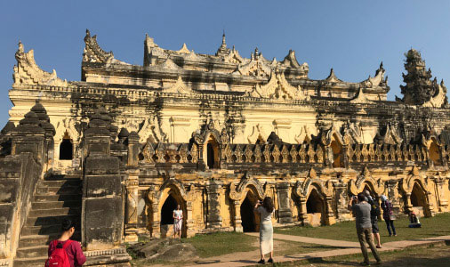

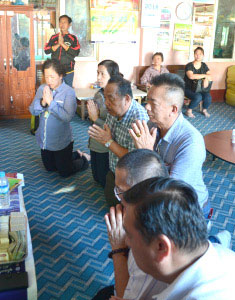

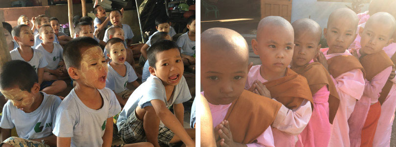

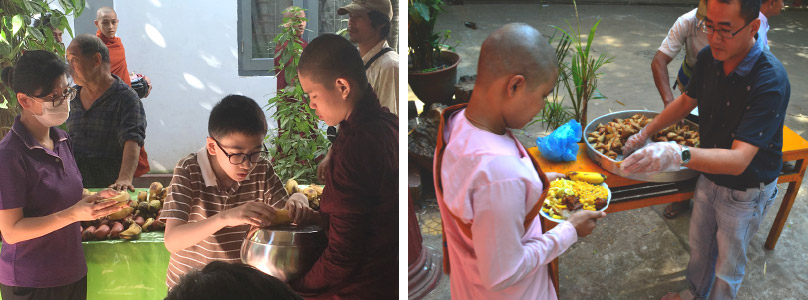

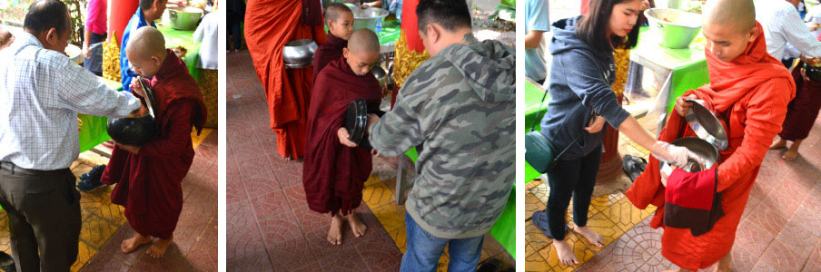

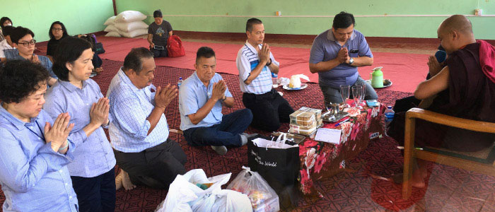

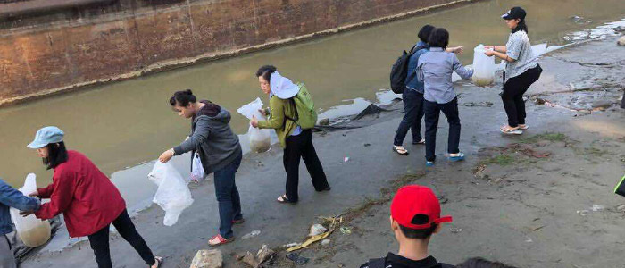

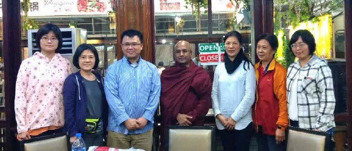

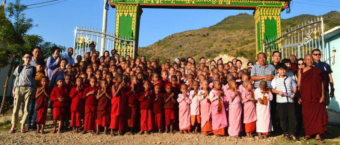

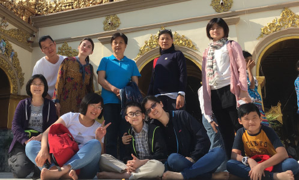

### 實栽農園的菩提心圓通章講座

仁家

一群遠來似邊地

求法熱誠是中國

歸去發響無盡燈

效法雪公地藏王

一、緣起

「念佛往生淨土，應從何下手方能得益？」馬來西亞善知識何幼珠大德如是請示，老師向來慈悲，秉持不為自己求安樂，但願眾生得解脫之心願，隨即應允舉辦〈大勢至菩薩念佛圓通章〉與〈勸發菩提心文〉講座，期能引導有緣人發起菩提心，掌握念佛的方法，邁向極樂淨土與成佛大道。

本次佛學講座自二○一八年一月十九日起至三十一日止，於中華文化學會東勢道場與實栽農場舉辦。課程內容豐富，上午七時從早課開始後，進行靜態之佛學課程之外，下午則安排至實栽農場農事操作，一方面舒展筋骨，一方面體驗農耕的辛苦，與採摘青菜的樂趣，晚間則問題解答。並於二十八日(星期日)安排登山踏青，接近大自然，以及前往豐原夜市逛街；讓遠道而來的嘉賓，學法之外亦能體會台灣民間生活的樂趣。

二、有朋自遠方來

馬來西亞嘉賓何幼珠、何燕紅、朱光玲、余旋哲與葉嘉豪等一行五人，風塵僕僕的從東馬（沙勞越）古晉等處前往亞仳機場搭乘凌晨一點四十分起飛的班機，清晨五時抵達桃園機場。有感於彼等求法之誠心，老師特別一大早頂著刺骨寒風，偕同學長們前往接機，並共進早餐，賓主的熱誠皆令人感動。

貴賓們中午時分才抵達東勢，據悉為了參加此次研習，他們從馬來西亞居住地來到東勢，舟車勞頓，已經二日沒好好睡覺。因為得以親近善知識，得以傳承正法，雖然疲累但他們滿心歡喜！

另一位從福州前來的貴賓林祥鎮學長，因來台天數受法令限制，延至二十二日才抵達東勢，加入研習行列。林學長對於中華文化與佛學極其好樂，只要學會舉辦講座，接到通知，一定排除萬難，積極參與研學，此種勇猛精進之心，令人讚歎。

三、眾善聚會

在這競爭激烈的時代，要長時間放下手邊事務，誠屬不易。本次講座，主講老師與學員們平常各司其職，有的是企業的負責人，有的任職公務機關，更有在學的年輕學子。從馬來西亞來的余旋哲與葉家豪二位同學，今年十八歲，高中三年級同班同學，目前正值面臨升學大考關鍵時刻，學校甫於一月開學，二人毅然向學校請假前來臺灣學習教法，這種學法的精神，若非渠等具正知正見，何有如此果斷的決定！

除了從馬來西亞與福州遠道而來的貴賓外，尚有來自東勢、中壢與臺北地區的蓮友，年齡從十八歲到八十歲，大家齊聚一堂，一起研學。特別感謝長輩們蒞臨光照，充分展現活到老學到老，好學不倦的精神；以及重感冒，抱病參加的師伯、師姑，此種為法忘軀，精進不邂的精神，都是值得晚輩學習的優良典範。

四、講座內容摘要

(一) 大勢至菩薩念佛圓通章

〈大勢至菩薩念佛圓通章〉是《大佛頂首愣嚴經》二十五圓通之一。全文僅二百四十四字，內容簡潔扼要，專門開示念佛方法。

大勢至菩薩初發心時，超日月光佛教他修念佛三昧。大勢至菩薩依教奉行，而證得無生法忍，進而迴入娑婆，攝受念佛眾生，往生極樂淨土。

念佛方法，大勢至菩薩講得親切、詳細，要我們如母憶子、子憶母，要二人相憶，二憶念深；要「都攝六根」，將眼、耳、鼻等六根收歸一念，不攀緣外境。要「淨念相繼」，從只緣佛境，不緣其他，進而一句佛號相繼不斷，綿綿密密，至一心不亂，證得念佛三昧。

(二) 勸發菩提心文

此文是淨土宗第十一代祖師省庵大師所作，文中殷勤苦勸末法修行者，雖不生佛世，無法親承佛的教化，但猶得讀誦經典，見佛舍利乃至於親近能夠解經的善知識，這是最後可以把握的寶藏。

省庵大師將菩提心視為修行佛道圓成淨業的根本條件，其勸發菩提心文，不僅理事圓融之見透辟，而且至誠懇切感人至深。

文中首發菩提心的功用，入道要門，發心為首，修行急務，立願居先，願立則眾生可度，心發則佛道堪成，苟不發廣大心，立堅固願，則縱經塵劫，依然還在輪迴，雖有修行，總是徒勞辛苦。

由於十種因緣，菩提心得以發起，一者念佛重恩故，二者念父母恩故，三者念師長恩故，四者念施主恩故，五者念眾生恩故，六者念生死苦故，七者尊重己靈故，八者懺悔業障故，九者求生淨土故，十者念正法得久住故。

省庵大師有鑑於發菩提心的重要，故而苦口婆心，勸勉淨業行人，同發菩提心，未發者今發，已發者增長，已增長者念念相續。願同生淨土，同見彌陀，同成正覺。大師的見解與懇切，深契淨土宗修持之心要。

五、實栽農場有機農業巡禮

有感於目前食安問題層出不窮，市面上充滿各式過度使用化學肥料、農藥的農產品，令人食不安心！為了讓蓮友能取得真正健康的有機蔬菜，學會於二○一六年一月起在東勢道場附近承租一片土地，供學會蓮友發心前往種植蔬果，迄今一年，成果已漸浮現，各季蔬菜收成時，台北的蓮友總是爭相認購，供不應求。期望蓄積東勢實栽農場栽種經驗，將來除提供學會內部外，進而推廣至其他地方，讓社會大眾也能吃到來自實栽農場的有機蔬菜。

回想去年元旦時，參加學會在實栽農場舉行新年聯誼活動時，但見地面布滿石子，一片荒蕪的景象，不禁懷疑這樣的地質適合農耕嗎？

此次因參加講座因緣，再次來到實栽農場，令我訝異的是，印象中滿布雜石、寸草不生得地面，景觀已經完全改觀。如今放眼望去，視野一片綠意盎然，有成熟待收的蔬菜，也有新種初長的幼苗，更有因人手不足，未及整理而雜草掩沒的蔬菜園圃。

這樣的改變堪稱奇蹟，有道是有心磨鐵，鐵棒磨成繡花針，一年來經由東勢與中壢蓮友，利用挖土機、農耕機、推土機等機具，積極整理，甚至連台北弘明幼兒園、讀經班同學等，也都利用校外教學的機會，寓教於樂，抽空幫忙撿拾石子，環境因此改觀，此其一。

土質改善方面，則雙管齊下，除就近取材，利用東勢地區栽植香菇使用後之太空包，長期堆置讓其自然發酵後之培養基，再與土壤揉合，提高土質肥沃度外，另敦請水質專家，裝置奈米過濾設備，抽取大雪山流下之河水，經過過濾再行灌溉，土壤已慢慢地能培植出各種優質甜美的蔬菜。

學員們的農事操作負責菜園除草、澆水、拆解太空包與施肥等工作。除草是重點工作之一，面對蔬菜被雜草淹沒的菜圃，大家各自選定區塊，奮力工作。沒想到一群雜牌軍，效率奇佳，幾天工夫，雜草已被除盡。眼見各種蔬菜、玉米幼苗，在微風中搖曳生姿，真是無比暢快！

煩惱如雜草，隨時都可能從菜苗間悄悄冒出，如不及時處理，就如同眼前所見，剎那間淹沒整個菜圃，不但影響蔬菜成長，甚而會令菜苗逐漸枯　　萎。同樣的，我們應於日常生活中，時時警覺，發現妄想雜念生起，應即收攝，莫令滋長。

二十六日老師百忙中抽空蒞臨東勢，關心學員生活與學習狀況，下午在農場與學員促膝暢談，共進晚餐後才離開。另外老師有意運用現代科技，來管理實栽農場，邀請一對從香港來的年輕夫婦偕同二位子女同行參觀農場。該對夫婦是使用無人機、感測器以及資料分析的方法來管理耕地的專家，當天並在農場試飛無人機。這種創新的農場管理方法，成效如何？或許是將來重訪農場的新亮點，大家拭目以待。

六、放生殊勝行

二十七日下午，在農場舉辦放生活動，參與大眾咸感法喜充滿。此次放生之生物為蚯蚓，主要是因其不會影響生態，又可以透過蚯蚓鑽土，肥沃土壤。

生物由劉老師遠赴台中市區購回後，先在佛堂遵照放生儀軌，如禮如法的做各項法行，如為生物說法、懺悔、行三皈依、持咒、念佛等，使其今生報盡不再淪入三惡道，於八識田中植下道種，來世因緣成熟，必能值遇佛法，學佛修行，永斷六道生死輪迴，這是放生最重要的意義。

六度萬行，以布施持戒為首，買生物放生，是財布施；為生物懺悔、皈依、念佛，是法布施；為救物命於垂危之際，使其免於恐懼苦難，是無畏布施。放生三種布施俱全，功德不可思議！

《大智度論》云：諸餘罪中，殺業最重；諸功德中，放生第一。能救一眾生，功德已無量無邊，更何況救多眾生。所以放生即是積最大的福，行最大的善。

七、文化傳承 永不停歇

世風日下，人心不古，社會道德淪喪，端賴中華傳統文化與佛教因果觀等正法來挽救人心。學會長期以來即積極推廣相關教育，唯恐文化斷層！嘗言人能弘道，非道弘人。多年來為正法長存，戮力從事教育與人才培育工作，期能承繼傳統文化之命脈。本次講座師資，由七位老師擔綱，皆是學會優秀人才之一，承文化續佛慧命之願，已見曙光，假以時日，老師座下學生必定大放光明。

八、後記

成就一場活動，需要人、事、時、地、物眾緣具足，方能興辦。有緣參與者心態必須講究，必須心存感恩，作難遭遇想，如此才能福慧雙修，也才不辜負善知識的用心。

每次活動，總有一群不能缺少的義工，不求名、不為利，為公發心、犧牲奉獻，他們默默付出，常被人忽略，但卻是活動不可或缺的重要角色。

本次講座，承蒙中部共修會義工菩薩們鼎力護持，承擔後勤行政事宜，讓活動順利完成。他們向心力與辦事效率俱佳，蓮友們真誠親切，讓人賓至如歸，在二位劉老師的帶領下，生氣蓬勃，氣象非凡。豐勢地區地靈人傑，的確是辦理活動之首選！

附錄：心得分享

馬來西亞，砂勞越　　 何幼珠

這次我們能前往臺灣學習〈大勢至菩薩念佛圓通章〉與〈勸發菩提心文〉，緣起是學生在思考自己要如何修淨土法門。尋找答案中，唐老師說：先從〈大勢至菩薩念佛圓通章〉開始，所以就斗膽向老師祈請興辦這次佛學講座。講座在臺中東勢舉辦，我們能前往臺灣學習，承蒙老師厚愛，安排師資團隊為我們講課。非常感謝唐老師，師資團隊，蓮友及同學們一切的付出讓我們能學到教法。

抵達臺中東勢，這地方好山，好水，清淨的好地方，在這樣的環境下學習教法是非常棒的。那裡的風土人情非常的熱情，大家就是一家人，看到各位的蓮友在忙碌中充滿了笑容，充滿法喜，臺灣同學們相聚一起學教法那種精進，自己感覺慚愧，更要加倍努力學習。在農地大家歡喜的在務農，因時間的充實關係，與學長們就一起利用在務農時間，邊務農邊問問題，背念〈大勢至菩薩念佛圓通章〉，大家時時刻刻都在學習，這種喜樂學習是非常難得。

在學習教法當中每位老師們用盡心，全力以赴的講課，深入淺出，有問必有答。老師們都是跟隨唐老師學教法並和我們分享，還費勁了心寫板書使我們更受益無窮，這種學習環境非常難得。〈大勢至菩薩念佛圓通章〉最重要的是憶佛念佛修學法，心裡面要隨時憶念著佛，這麼憶佛念佛跟佛關係加厚、加密，可得諸佛菩薩護念，這一分是殊勝的修學法。〈勸發菩提心文〉讓學生瞭解到勸導世人發起廣大菩提心，即自覺覺他的心，發菩提心的重要。這次能聞此殊勝的佛法知道了學教法的重要性。蓮友們學法的那一分的精進更是敲醒和點醒睡夢中的自己更要加倍學習如此教法。

不知不覺中十二天的講座圓滿結束，如此時光匆匆流逝。回顧來講座的點點滴滴，一股熱流湧上心田，那是感恩與感動。在這裡學生感受到了台中東勢家的溫馨，佛菩薩的慈悲與智慧，更感受到了和合團體、讓我們生起正信。他們的一言一行，一舉手一投足中都是內心真誠恭敬、謙卑和順的自然流露，讓人感佩萬分。這提醒了學生這是學教法的開始，繼續往前走。學生從老師們的言傳身教中更深的體會到其中的含義。如此殊勝的講座讓我們這次來臺灣受益匪淺，祈願每個講座我們都能夠來參與。謝謝。

何燕紅

慶幸的是，在新的一年裡能學習〈大勢至菩薩念佛圓通章〉與〈勸發菩提心文〉，讓新的一年裡，能在暇滿的人生繼續再增上。

〈大勢至菩薩念佛圓通章〉是幫助我們成佛的方法。以前一直以為念佛就好，何必學習這麼多經文？經過此次學習後，才了解不斷學習增上這一分是非常重要。還需透過善知識的指導，依止善知識、還有環境、志同道合、一起共學，最重要是要有師承的學習，這樣就不會被邪知邪見攝持而走火如魔。

〈大勢至菩薩念佛圓通章〉是二十五圓通之一，教導淨土法門修行人都攝六根，在眼對色境、耳對聲境、鼻對香境、舌嚐味境、身碰觸境、意緣法境時，如何不被心所轉而將心安住在佛號上，印光大師把這章經列為淨土五經之一，也是修往極樂的參考書。本章何以名為根大圓通？

與觀音菩薩的耳根圓通結合，是修學持名念佛的殊勝法門，是由耳傾聽自己口念或默念的佛號聲，使佛號淨念相續，此與觀音菩薩的耳根圓通結合。無論大聲念、小聲念、金剛念，總是清清楚楚，正念分明，念佛在心意上是為了往生，往生是為了解脫與成佛。

極樂學校的特殊，不論男女老少、任何種族、任何國籍、招生是不限資格，而考取的條件是一心不亂的念佛。在世俗，所有的學校，畢業都分年制，唯有西方極樂世界學校，畢業是不分年制，就是有的快畢業有的慢畢業，學習是不收任何費用，不可思議的是，在極樂學校是沒有討厭的課程，學習時是超級快樂，享樂所有的課程。

且到了極樂世界後得三不退，一是位不退：即是能修得聖位；二是行不退：所修之行法可利益有情眾生；三是念不退：能入十地的階位，而成候補佛。

大勢至菩薩與娑婆世界的眾生有緣，輔助阿彌陀佛接引娑婆世界眾生往生西方極樂世界。以四攝法攝持念佛眾生，即是布施、愛語、利行、同事。布施是視對方的需要，給予自己所擁有的東西，即是徹底地以他人的需求為出發點，是同理心的展現。愛語是柔軟的話語，使對方能夠得到歡喜，善惡因緣的產生經常都是由口業而來。利行是身口意三業的善惡來利益他人，所謂助人為快樂之本。同事是隨著對方的嗜好、興趣，與對方共行。所以不念佛的凡夫是不攝的，猶如車無輪是無法行駛。

念佛要如何念呢？如母憶子，就像母親時常想念孩子一樣，因為母子骨肉相連，經過懷胎十月、三年乳哺、辛苦撫育至成人，母親還是常為子女牽腸掛肚，心也一直念子女。情人相憶也是如此，如男女情人之互相想念，對方影像容易浮現在腦海裡。以此覺受來憶佛、念佛，憶佛是心理的隱微處隨時想佛，對工作上不妨礙，但心裡隱藏著對佛的想念。念者念念不忘，正在念時即是制心一處，將散亂的心安定在佛號上，就與彌陀感應道交，蒙佛接引往生西方極樂世界。

前所未聽過的〈勸發菩提心文〉，對「菩提心」這三個字也很籠統的認知，一般的佛友都說，菩提心就是一心念佛就好，這就是菩提心。原來《勸發菩提心文》的文不是經，不是律，也不是論，但是經律論三藏都包涵在裡面，雖然不是佛所說的，但佛所說都講盡。雖然不是戒律，但是是戒律的根本，假如沒有菩提心，戒律是魔業。雖然不是論，但可以當論看，因為它是在議論菩提心為何要發，以及發出的行相。唯有發菩提心才會上求佛道，唯有上求佛道，才能成就佛果，才能圓顯法身續佛慧命。

殊不知，發心還須具備八種行相，若沒八種行相，那所發出來的菩提心會是怎樣？到底八種行相有那些呢？如邪、正、真、偽、大、小、偏、圓。有一類修行的人，都沒仔細觀察自己的心態，只知道追求外在的事物，或追求名聞利養現世欲樂、或希求來世人天福報，這一類發心是邪。假如不求外在的事物，也不追求名聞利養現世欲樂，也不求來世人天福報，為了自己生死而發菩提心，只求成佛以度眾生，這樣的發心就是正。所以「邪」與「正」是從動機上分辨。在日用平常中，心裡是否發心是正與真，若是正發心者，就不會追求外在的事物，或追求名聞利養現世欲樂，而真發心者遇到逆境不會退轉，心能突破上求下化的障礙而不退轉，這才是真的發菩提心。

自己有過錯，卻不願改正，若不除即是內濁外清，煩惱都藏在內心，外面卻示現出修行的樣子，雖有做一些善法，如助念、作七、告別式、放生、教育、法會等善法，但其內心頭還是煩惱，心就不清淨易被罪業所染，這樣的發心是虛偽，也很空虛。

怎樣的發心叫做廣大呢？就是度盡了眾生，我的願才停止，直到圓滿成就菩提道，這樣的發心是大。發心小的人，就是把三界看成牢獄，把生死看為冤家，只求自己解脫，這樣的方向為小。如果心外見有一個個的眾生和佛道，願度心外的眾生，願成心外的佛道，總是忘不了我度了多少人、何時度的、度的如何、我有哪些功德與成就，去不了對功德的執著和心外有佛道。這樣的發心就不契合中道，那就偏了。

總之發了菩提心後，還是要時時審查自己所發的心，在八種行相當中，動機是邪還是正？心態是真還是偽？心量是大還是小？見解是偏還是圓？這樣審查自己而知道發心狀況之後，就要去邪、去偽、去小、去偏，取正、取真、取大、取圓。知道要如何增上，就不會自視過高，不會以假濫真，這樣才是真正發菩提心。

余旋哲

學校未放假的情況下，媽媽帶著我到臺灣東勢學習佛法，同時跟學校請了一○八節的課，此次的學習，讓我更深入了解對教法認知，此生不要吊兒郎當，把所學的教法使用在行、住、坐、臥的生活上，煩惱來時就可以對治。

此次了解一些佛教所說的空性，這跟科學探究物質的實有性有相似。話雖如此，一般還是很難相信無自體性，因為眼見為實，觸感為真，萬法的有真實體性存在於宇宙。

此次也學了如何向師長進巾奉茶，並學習梵唄，回到馬來西亞仍努力複習，希望有一天在古晉可以帶共修。

感謝此次師友們給予的幫助與指導，學習期間若表現的不好，請多多指導與海涵。

朱光玲

在這次的講座裡我了解了什麼是念佛，這個佛號如何念，還有了解很多關於空性的理論。我印象最深的就是「三輪體空」。沒有互相觀待就不能呈現出一個東西。比如布施，要觀待我所布施的對象和觀待能布施的我及布施之物才會有布施這件事情，如果少了一個，布施並不能呈現。

其次學到了什麼是菩提心，以及有關在生死輪迴的苦。在勸發菩提心文裡頭都有描述。有一部分是有關地獄苦：「猛火城中，忍聽叫嗥之慘。煎熬盤裏，但聞苦痛之聲。」這就是說只聽見眾生慘叫聲卻看不見有人在火城裡面。劉老師在描述地獄的苦時簡直是讓我聽得有覺受，可感受到輪迴中的眾生是多麼苦的。

感恩為我們馬來西亞的學長辦這次的講座，也感謝何老師的發起，使我有機會學習，這可是我第一次很清楚的學習佛法，並接觸那麼多有關佛法的言論，真是太高興了。

茅茹讀書會  黃嘉美

「聽經聞法」

〈大勢至菩薩念佛圓通章〉以念佛為主軸，經文中的「兩人相憶」更是念佛中的陀羅尼，唐老師曾經以戀人來做比喻：一對熱戀中的情侶，男的非你不娶，女的非你不嫁，因為全部的心思都在對方，朝朝暮暮、日日夜夜，中間沒有停歇的時候，這就是「憶」功夫。如果二人中有一人忘記對方，就無法開花結果，所以必須要兩人互相有感才能相應。 可見感與應都是互相觀待的。

母子憶也是如此，媽媽隨時隨地心中都掛記著孩子，如果孩子的心到處攀緣放逸，無法與母親的心契合，只有漸行漸遠，辜負了慈母的悲心。

本章教我們如何念佛跟與佛感應道交的方法。我們至誠念佛的心，就是「能感」的機，阿彌陀佛的四十八大願的願力，所產生「應」的力量，我們的心跟彌陀的願交融一起了，互通了，這就叫感應道交。

子憶母，母憶子，這句話很奧妙，記得新聞有一篇報導，兒子在美國出車禍，母親在臺灣家的前ㄧ晚夢到孩子出事，可見母子連心的「心」是一體的。念佛的心與佛陀的願也是如此般的相應。所以重拾阿彌陀佛這句萬德洪名，與極樂世界的信心。

雖然本經的文字不長只有兩百四十四個字，但是字字珠璣，也感覺到念佛法門的不思議，能讓每一個眾生都能仰仗佛力往生；也想到老師說，就是遇到皇帝結殊勝的緣，跟他進皇宮就能享受皇宮的一切受用，念佛往生亦然，全是仗佛力才能入淨土受用佛果的安樂。

「勞務辦事」

實栽農園每天報到，讓身體勞動，也讓學生想到唐朝時的百丈禪師實行僧團之農禪生活。嘗言：「一日不作，一日不食」。有位居士曾說，他年輕時的教授告訴他，寧可每天挑ㄧ堆糞澆菜，也不要整天沒事發愁。空有思想不勞動，不會啟發新的思想。
仰山禪師有ㄧ次到遠方去結夏，解夏之後就回來看望他的師父溈山禪師。溈山禪師問仰山禪師道：「ㄧ個暑期都沒有見到你，你在那邊做了些什麼？」仰山禪師回
**答：** 「我耕了一塊地，播了一籃種子。」溈山禪師讚美仰山禪師說：「這樣看來，這個暑假你沒有白過。」溈山禪師認為禪就是生活，所以禪門的砍柴、除草、犁田等種種勞作，都是修行。真正的修行者來說，在生活勞動中磨練很重要。

修行就在日常生活中，包括工作、處世、待人接物，無論逆境、順境，善緣、惡緣，統統是阿彌陀佛之所變化。心心念念都是阿彌陀佛跟極樂世界。極樂世界無處不在，我們迷了看不見，悟了原來就在此地。

古大德說：念佛一念滅八十億重罪，但要ㄧ心專念持佛名號就有。但我們念佛這心妄念很多，夾雜妄念，道力不足。如果誠心誠意念，力量真如古大德所說的「諸罪消滅」。

徐婉臻

這次參加在臺中東勢舉辦的講座，讓末學受益良多，尤其看見馬來西亞的學長們對法如此的好樂，不遠千里來到臺北，只為了向老師求法，所展現的誠意和真切的心，著實讓末學心生慚愧，在此非常感謝學會、老師、東勢蓮友以及馬來西亞學長們的啟請，才有此次的講座。

臺中東勢是個純樸小鎮，地靈人傑的地方，在這樣的環境下一起共學，一起農作，一起共住，末學真有福報能跟這樣的善知識以及善友們聚會一處，在上課期間，每位老師都盡其所能的將他們跟唐老師所學之教法，或用深入淺出的方式，或用一問一答的方式，無非就是希望讓在場的學長們都能理解獲益，生起法喜之心。除了上課之外，下午的時間就到時栽農園學習農業栽作，因幼珠學長們從小就是農家子弟，所以做起來得心應手，還不吝教導我們，讓末學知道原來除草也是要有方法的。這就如同學習教法一樣，必得跟有正知見的善知識學習，才能事半功倍，農作時，學長們也不忘串息課堂上的教法，互相切磋琢磨，一起背誦圓通章經文，這樣的場景甚美呀！

晚餐時刻常常是東勢小吃和馬來西亞美食輪流品嚐，尤其要讚歎旋哲和嘉豪兩位年輕人，扮演起大廚的角色一點也不馬虎，為的是給大家品嚐道地的馬來西亞美食，在課堂上也能踴躍提問，學習的態度真可為大家的榜樣，幼珠學長的咖啡和奶茶，品嚐過的人無不讚美絕口，大家就像一家人一樣。燕紅學長藉自己的病苦，勉勵學長們學法要及時，要把握因緣造作善法，切莫等到病苦障礙來臨才學習，光鈴學長是位基督徒本來猶豫不覺的心，也因這次的講座，讓她找到人生的方向，她說：「這是我想要的。」真是太恭喜她了！

因為教法，讓我們成為一家人，因為教法，讓我們成為無所不談的好朋友，因為教法，讓我們諸善善人聚會一處。尤其是學習了〈大勢至菩薩念佛圓通章〉與〈勸發菩提心文〉，老師說：「合之則雙美。」得人身不易，不但知修行的方法和發菩提心的重要，且在念佛的功夫上講究，同為持名念佛是修行徑中徑又徑，然重在心上的行持，要與佛感應道交。當然念佛或造作善法要被菩提心的攝持，《華嚴經》云：「忘失菩提心，修諸善法，是名魔業。」魔業是修來的，不要等到最後變成了三世佛冤，那豈不是虧大了？必須要善用其心，問問自己內心隱微處的想法，若是造作善法發心的同時起了煩惱，有功德也就等於無功德了，所以要非常小心謹慎。

雖然為期十二天的寒假講座已圓滿結束，但不代表學習的腳步就此結束。要藉著馬來西亞學長們求法的心和學習的態度，督促自己要更精進，以回報這次授課的老師們、東勢蓮友以及負責此次活動的老師們。也感謝學會和老師給予我們這麼好的學習環境，可以跟著團體一起成長、一起增上。

張忠敏

學會於去年十月二十二至十一月十日及今年一月二十至三十一日，在東勢道場舉辦兩次馬來西亞朋友來臺學習的講座活動，第一次主題是「人生大事」，研討助念重要觀念，第二次主題是「大勢至菩薩念佛圓通章及勸發菩提心文」，研討念佛感應道交的方法及勸發心為首立願居先的重要。很幸運我兩次講座都有參與，可惜的是兩次都因為中途有事無法將課程圓滿完成，這是我最大的遺憾。

這樣的佛學講座課程我常參加，但都是五至七天的課程，沒有參加超過十天以上的，而這兩次講座是三週和兩週的課程，所以無論是體力上或精神上都蠻有挑戰性的，但是只要有願望、有目標，相信這些困難都是可以克服的，再想想馬來西亞的朋友都千里迢迢來求法，他們要克服的困難比我要多上好幾倍，如此一想自己擔心的問題就不成問題了，反而升起要好好幫助他們完成這一趟求法的心路旅程，反而有信心、有擔當的去面對解決問題，其目的就是為了完成他們遠道而來的求法心願，如此想一切都值得了。

第一次的課程「人生大事」，讓我體會到臨終正念及臨終助念的重要，臨終正念需要在教法上不斷學習並時時串習，使我們隨時能提起正念，並且清楚明白最後的目的地西方淨土，但是我們不知無始劫來的造作，會使我們臨終遇到什麼障礙，死亡那一刻會被業力牽引到下一期生命，我們這一生就努力造作正確知見的業因，期望能引導下一生趨向正確道路。可是無始劫的業因始終是個不定數，臨終除了自己的內因要堅定外，就需要能有善知識開示提醒及蓮友大德的助念幫忙，更重要的是家屬發願祈求佛菩薩的加被。因此除了努力學習教法讓自己有正知見的觀念，還要努力廣結善緣，多幫助他人助念往生西方，就是幫助自己在臨終能得他人助念往生西方。但是這其中最重要的關鍵在家屬，這次講座讓我清楚體會到家屬的重要，若他們沒共識，雖然我很努力學習教法，也很努力去助念結善緣，但是家屬不認同，或到時不按著我的想法去做也是枉然，這一點讓我深深產生恐懼感，當務之急是先跟家人溝通取得共識，並帶著他們一起學習、一起做善法如此才是正確的，而所做的一切也才會有功效吧！

第二次的課程是〈大勢至菩薩念佛圓通章〉和〈勸發菩提心文〉，這是我第二次聽念佛圓通章，這次再聽一遍印象更深，也體會更深入些，無論二人憶或母子憶都要把握「雙憶不離、單憶無益」的關鍵，因為雙憶才能感應道交，單憶無法感應道交，我們憶佛念佛才能跟佛感應道交則必定見佛，要達到憶佛念佛的方法則是「都攝六根、淨念相繼」，這也是大勢至菩薩根大圓通的修學法。

讀了省庵大師的〈勸發菩提心文〉後，真的能感受到大師嘔心泣血、真心流露，希望有情都能「發成佛心、立度生願」，大師還很明確告知發心要去邪、偽、小、偏、取正、真、大、圓，才是真正發菩提心，但是要真心懇切的發菩提心還真是難，尤其是要發正、真、大、圓的菩提心真不知從何而發，在勸發菩提心文裡大師慈悲教導我們依著十種因緣，去觀想思維、去觀功念恩會比較容易發起菩提心。在反躬自省部分，古云：「人身難得，中國難生。」想想自己今已得人身，已生中國，六根具足，無有病恙，四大調和，輕安順適，具有信仰三寶之心，幸無諸魔為障，不於今日發此大心（即菩提心），更待何日。大師是這樣懇切警惕我們，我能無動於心嗎？想到自己蹉跎了這幾十年如今已走到這一期生命的最後階段了，還不清醒、還不回頭，難道還要再次輪迴嗎？大師是如此自謙哀憐希望我們能與他一同發大心立堅願，所願同生淨土，同見彌陀，同化眾生，同成正覺。大師如此真誠悲願勸導我們，讀完此篇文章能不被大師真心感動嗎？能不跟隨著大師的心願同行嗎？

這次講座時間比較長，所以課程設計上也做了些突破改變，課程安排有實栽農園實作的課程，讓佛學經典學習及教法修學上能跟實際生活作結合，大家早上動腦學習，下午動手做農務，每天身心都很愉快，無論是在教法經典上的學習或是農務農作上的成果都是有進展，假日還安排戶外活動體驗，真是設想週到，設計完美的課程。當然當地的東勢蓮友就這樣承擔下來了。在此也要感謝東勢蓮友大德們犧牲奉獻默默承擔用心，完成這兩次艱鉅有意義的講座，無論是對馬來西亞的朋友們，或是本地蓮友大德們都是一次難忘愉悅的體驗。

這兩次東勢講座對我來說也有很多體驗和成長，以往參加講座的角色是學員，一切都是義工蓮友安排好，我只要專心聽課如此而已，這次原以為也是如此，但到現場立刻支援內場代班學員，下午支援開車接送學員去農地做農務，晚上支援晚課敲地鐘，睡前還要和馬來西亞來的朋友聊天，聽聽她們一天上課下來有沒有問題，也聽聽他們的心得，了解他們學的習狀況及需要協助幫忙的地方，每天生活得很緊湊，也感覺過得很充實，每晚躺下就一覺到天亮，連作夢的時間都沒有，每天有教法的薰修，每天有真誠為人服務的心態，對我來說實在是太幸福太美好！不敢奢望還有這樣的機緣，但能把握到這次機會對我來說已是太值得了。所謂「時機時機」一定要勇敢精準的去掌握，否則機會稍縱即逝就後悔莫及了，這次真的要為自己鼓鼓掌，當時傻傻參與，如今滿滿收穫，真是何其有幸啊！

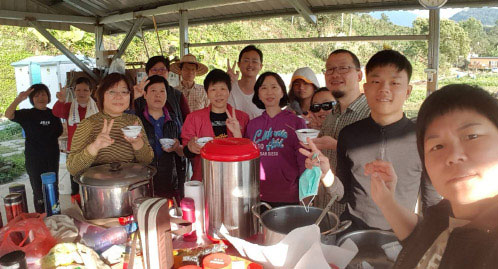

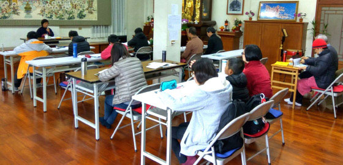

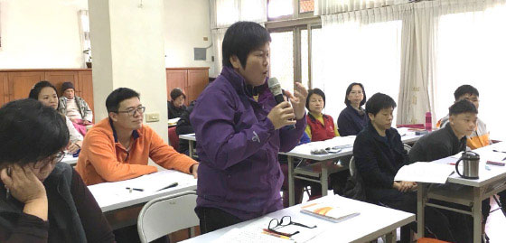

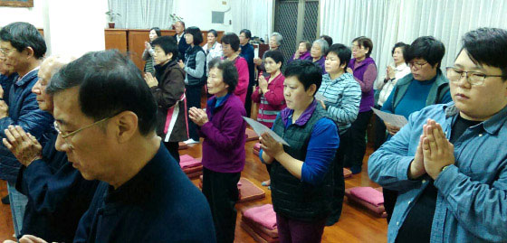

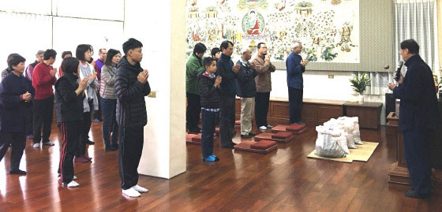

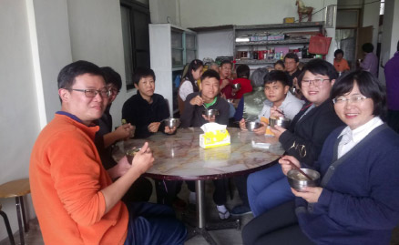

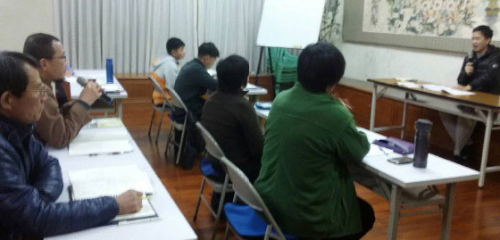
