# 第115期
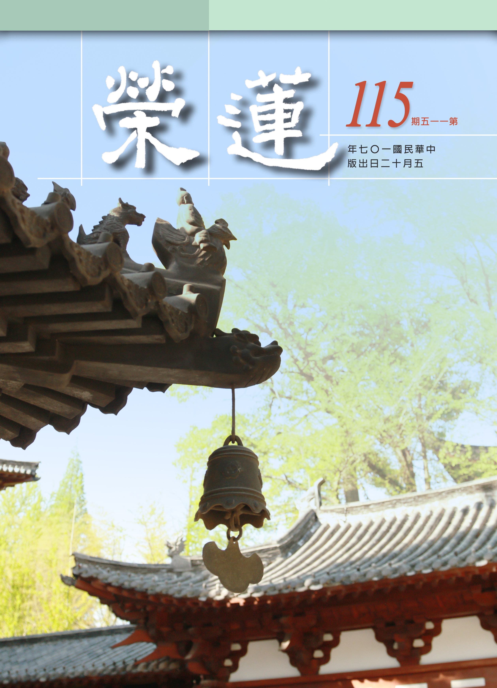

## 社論

### 從馬來西亞看見變動中的中華文化

本刊

同文同種居馬國

數典不忘盼薪傳

人才培訓經學課

民族苗成參天樹

馬來西亞的華裔，他們從明朝一直到清末，大部分由福建省、廣東省、廣西省及海南省遷徙南來。這些華裔南來的初衷主要是經商，沒有定居的打算，不想後來由於諸多不便及環境的不允許，使得絕大多數的人定居下來。這一批人繁衍迄今約有六百六十萬人之多，成為馬國的第二大人口，約估馬國總人口占比百分之二十一。

馬國華裔，流淌著中華民族血液，他們熱愛自己的家國，發揮刻勤耐勞的精神，努力掙錢寄回家，所以他們參與了各領域的工作、經商等，無形中對馬國的經濟建設開發做了巨大貢獻。但由於他們不重視政治與軍事的參與，其所參與的用心充其量也不過在傳達華人的心聲或是獲取個人利益，沒有深遠的政治視野、團隊與謀略。故，在英聯邦政府放棄殖民統治欲還政於馬國人民時，華人的代表無法切實參與，馬國制定一份公平合理，且符合多元化的治國憲章。這也導致馬國有種族、教育和經濟地位的主次問題，華裔在各個領域都處在主流之外，這就是今天馬國華裔所處的生態環境。

排斥於馬國政治主導之外，原本駕馭在經濟領域的華裔由於沒有政治的保護傘，己漸漸的失去優勢。在教育方面，六〇年代末馬國推行了新教育政策，所有由華人創辦的中小學校全部納入國家教育體制中，就是現在所看到的國民型中學及國民型華文小學，成為半津貼型的國民義務教育學校，而國民型中學的教科書為馬來語，教學媒介語也是馬來語，華語只是選修科目之一，這種國民型學校己不復為華裔做為文化傳承工作場所，只能算是做某種程度的語言教學學校而己。因此有另一種由華人社會完全獨立經營的中學應運而生，就是所謂的華文獨中。此教育體制源自於七〇年代，當華社將所有中小學交給政府管轄後，頓覺對這些華校的主導權己不復存在，故於七〇年代初，紛紛再創立中學，與全國其他未納入新教育體制的華文獨立中學，共計六十所，整合起來，自編教科書，自辦統一考試，有自己的決策機構，形成了今天的由華社完全主導的教育機制，而此決策機構所頒發出來的中學鑑定考試文憑，己獲得全世界各主流大學所承認，此機構就是馬來西亞華校董事聯合總會，簡稱董總。此機制是馬國華裔維護華教的堡壘，文化傳承的工作也是放在此體制之上。有認為，馬來西亞是非華人主政國家保存和延續華文教育系統最為完整的國家，因為他們擁有從幼兒園到大學的完整華文教育體系，但隨著時代的洪流衝擊，文化實質的傳承其實己漸漸流失。

近十年來，大陸興起了國學熱，有弟子規、百家論壇、詩詞比賽的民間活動，也有正式教育體制的變革、大專學院人才的招募等等，中華文化恰似又逢春；於此之際，馬來西亞華社也有相應的推廣措施，縱然百折千迴，總是有人鍥而不捨，希望能有明師教授，延續當地的中華文化傳承。就在今年年初，又有馬國華裔企業家來臺尋覓師資，期望於馬國開啟一項千萬資金的中華文化人才培育計畫，真正在當地培養出能夠把經學內涵說清楚或有能力貢獻社會的人才。

綜觀馬國華人那份割不斷的文化情感，對傳承的渴望，以及大陸在經濟崛起後找回民族靈魂的用力與決心，佔有中華文化軟實力優勢的臺灣，一直是這兩地求教與挖寶的對象。但若教育政策持續排擠中華文化，用心斷開後代與祖先的連結，馬國華人的失落感，會不會就發生在不久後臺灣人民的身上，臺灣本來握有的領先地位，是否最終失去，而必須向過去的求教者求教，這值得我們警醒與深思。

## 佛學覽幽

### 菩薩清淨的行持
       —華嚴經淨行品（三十一）

菩薩清淨的行持

—華嚴經淨行品（三十一）

*戒慧講述‧編輯部整理*

直心似路直

離塵似證悟

隨處生觀照

無一非佛法

丙二、指事顯因答其徵因

丁一、總徵

丁二、別顯

戊六、乞食道行時願(五十五願)

己一、遊涉道路(十二願)

己一、遊涉道路 直路

經文：

若見直路，當願眾生，其心正直，無諂無誑。

此願可由井裡取水做比喻，從這當直路指的是路線筆直，一望無際的大路。走在直路上，希望眾生的心能像走直路一樣，做人要有直心、真心，學道更是需要真心，南亭老和尚的〈講義〉中有提到，《維摩詰經》上說直心是道場，直心指的是誠心誠意不拐彎抹角，道場是指菩提樹下成佛的地方，希望眾生誠心修學正法一直到成佛。直心是很重要的，有直心就不會有諂媚、欺誑的情況，有直心的菩薩，修學正法不會諂誑眾生，貪求利養恭敬。

諂跟誑是眾生的心理作用，屬於百法當中的小隨煩惱，諂是指諂媚，阿諛奉承、討好他人的意思，誑是欺誑，想盡辦法騙人只求自己的利益。菩薩希望以直心趨向道場、趨向佛法，這是見直路的願。

想要內心正直一定要遠離諂、誑的過患，南亭老和尚說，小隨煩惱名之為小，其實為惡很大，小隨煩惱的的「小」字並非力量很小，是指影響範圍小。根據〈大乘百法明門論〉，煩惱有小隨煩惱、中隨煩惱、大隨煩惱，是依據煩惱生起之範圍大小而分。小隨煩惱行相粗猛，各自為主，互不相容；中隨煩惱，自類俱起，遍不善性，不通有覆無記(無力招感苦樂果)，中隨煩惱的範圍較小隨煩惱大，較大隨煩惱為小；大隨煩惱則是二種染心、自類俱起、遍於不善、有覆無記皆有，範圍很大，謂之大隨煩惱。

隨，意即隨著根本煩惱生起的，是根本煩惱的分位或等流，分位是指某一部分生起的功能。比如瞋恨心可以生起忿，也可以生起恨，生起恨的時候不一定會生起忿，忿是會出口吵架，恨是懷恨在心，它們都不能代表瞋恨的全部；惱是說話尖酸刻薄，例如說話不帶髒字，卻使人受不了；害是破壞之意，或者是摔杯子、破壞公物等；嫉是受不了他人的殊勝。這些都是瞋的分位，但並非所有的瞋都會有這些行相，這叫做分位煩惱。

諂與誑的相同之處都是由貪名圖利所生，諂的行相是諂曲、諂媚，為了取悅於人、博人歡心，而以不實的言語逢迎巴結，其過患有二：一為能障不諂，不諂即直心，是行者了生死、成佛道的初因，既諂則障礙了生死、成佛道。二為能障教誨，諂曲之人內心不正直，為了獲取私人名利，定會想盡方法欺瞞對方，且隱藏自己過咎，成為偽君子、假善人，此種人的心態與正道相違，所以不能接受師友的教誨，此為他的障礙。

誑的形象為欺誑，以荒誕不實的言語、行為自欺欺人，迷惑眾生，之所以自欺欺人，亦是為了獲得名聞利養，所以偽裝出有道德有學問的模樣，以荒誕的言行迷惑眾生。其過患有二：一為能障不誑，不誑是依無貪、無癡善根所建立的善法，是ㄧ種務實、踏實、平實的作風，說真話，做真事，一就是ㄧ，二就是二，不以黑為白，不指驢為馬，不自欺，也不欺人；二為邪命，謂多以從事不當、不合法的事業，謀取生活之所需，以維持生命之延續。

諂、誑有它的過患，修學菩提心的人，諂、誑會障礙他來世引發菩提心，障礙發菩提心的四種惡法：一是欺騙自己的師長；二是他人做善法時引發他生起追悔的心；三是說菩薩的惡名；四是諂、誑。欺騙自己的師長，得不到老師的教導；他人修學正法，讓他生起追悔，又或者有些人品格不錯，心態很善良，卻常常譏笑他太老實、無用，使他沒辦法上進，這些會障礙自己來世的發心；或者是說菩薩的惡名，這也是很嚴重的過患；還有諂、誑之心，都會障礙來世發菩提心，反之則是生起菩提心的順緣。

己一、遊涉道路  路多塵

經文：

見路多塵，當願眾生，遠離塵坌，獲清淨法。

吳東吳支謙版本：「見風揚塵，當願眾生，經明行修，心不紛亂。」西晉優婆塞聶道真：「菩薩見揚塵滿道時，心念言：十方天下人皆使諸欲去，常得明經。」六十華嚴：「見道揚塵，當願眾生，永離塵穢，畢竟清淨。」以下做兩輪的觀修，第一輪觀修，第一句為願所依，第二句為能願所願。見路多塵時，願所依有兩件事，願依靠在菩薩身上，及見路多塵這件事上。能願的是菩薩，所願的是眾生，願菩薩自己得到前面的三業離過成德的利益、十八不共法與十種殊勝形象，願眾生遠離塵坌，獲清淨法。

第二輪觀修：第一是隨喜，若眾生都能遠離塵坌，獲清淨法該有多好。第二是發願，我但願眾生都能遠離塵坌，獲清淨法。第三是承擔，我要承擔幫助眾生都能遠離塵坌，獲清淨法。第四是祈求三寶，我祈求三寶加被，讓我有能力幫助眾生，都能遠離塵坌，獲清淨法。

其中隨喜跟發願有什麼不同？隨喜是隨他有而歡喜，就著眾生現有的，他越好我越高興，發願則是眾生沒有的我希望他有；這兩者在形象上是有差別的，我發願眾生離苦得樂，表示眾生是痛苦的；我隨喜眾生的快樂，我不可能隨喜眾生的痛苦。這當中有四種的修學法：第一隨喜，眾生遠離塵坌，獲清淨法的時候，我很高興，他越遠離塵坌，越獲得清淨法，我越高興，這叫隨喜；第二發願，眾生還在塵勞堆中打轉，獲染污法，我希望他遠離塵坌，獲清淨法；第三是直接幫忙，即使是跳火坑也要去幫忙，不是觀世音菩薩，就是我！我去跳火坑幫助他遠離塵坌，獲清淨法；第四是祈求三寶加被我，讓我有能力能夠幫助眾生。法相是不能混濫的，法相要精準的去定義它，回過頭來反省自己，方知自己內心裡面具不具足這樣的形象，所以佛法中，對教法越勝解，幫助自己的修行就越多。

坌是塵土積聚之意，塵土會污染我們的衣服、身體，路上可能是車子走過去而揚起灰塵，或是正在修馬路，或是風吹使沙揚起，或是許多人走過，同時把沙帶起，不僅會影響我們的外觀，也會影響我們的呼吸系統。當比丘在外面行乞時，見到道路中塵土飛揚，發願眾生遠離一切塵坌，獲清淨法。

塵坌是ㄧ個譬喻，譬喻我們心理上的煩惱，這些煩惱會使我們造殺、盜、淫等染污身心之事，受生死輪迴之苦。身體染到塵時會將之拍去、洗掉；而我們的內心有八萬四千煩惱，更需要掃除，所以藉塵坌比喻貪瞋癡三毒，遠離塵坌就是要遠離貪瞋癡等煩惱，得到究竟清淨的法，簡單來說就是佛法，叫做「勤修戒定慧，息滅貪瞋癡」。

塵坌也可比喻是指世俗的繁華，六塵（色、聲、香、味、觸、法）是塵的聚集處，色是集各種顯色與形色之塵，聲是集各種可意、不可意及中庸之聲塵，香是集其各種香味之塵，六塵的聚集處最容易使人眼花撩亂、心思混亂，老子說：五色令人目盲，五音令人耳聾，五味令人口爽，馳騁畋獵令人心發狂。所以現在電腦的世界、聲光的世界、燈紅酒綠的世界，如何使年輕人安住正法？

遠離塵坌跟獲清淨法二者的關係為何？二者是互相觀待的，並非遠離塵坌之後才獲清淨法，清淨法是遠離塵坌的正對治，正對治的同時說是獲清淨法；同時說遠離塵坌，同時說獲清淨法；同時說獲清淨法，同時說遠離塵坌。當下若無證得清淨，那麼，當時應猶有染污，你遠離塵坌的時候，必是無染污，故必獲清淨法。第三、若以對治法來說，八萬四千煩惱各有八萬四千種對治，可是那是遠離塵坌的粗相對治，真正的細相對治是生起空性的正見，才是真正遠離塵坌。因為空性的證悟，此時執我的心不起，觀待執我而生的一切煩惱都不能生，這是真正的遠離塵坌。所以粗對治就是修學對治法，細對治就是修學空性，這就是獲清淨法。第四、獲清淨法還分為等級，是破煩惱障的獲清淨法還是破所知障的獲清淨法？如果是破煩惱障的獲清淨法，那是指四果的羅漢，如果是破所知障的獲清淨法，那就是成佛，而本文應指成佛，因為此處的修學法是以願力來攝持行為，結合無漏智成為成佛的方便，所以此處就是最究竟的成佛法。（下期待續）

### 大乘百法明門論簡說（二十三）　拾參、心所有法—善(一)

*戒慧講述、淨本整理*

用心隱微人難知

有若無真實若虛

步步勝進到巔峰

和光同塵似平常

經文：

三、善十一者：一、信。二、精進。三、慚。四、愧。五、無貪。六、無瞋。七、無癡。八、輕安。九、不放逸。十、行捨。十一、不害。

前善心所有十一類，善人或惡人如何分別？內心要有善的行相，不是從外相判斷。清代高僧玉琳國師師兄好吃懶做，但他的師父天隱和尚卻說師兄算一個徒弟，玉琳國師當時只算半個，其他都不算。天隱和尚所論的是內心有沒有善的樣子，內心沒有善，表象再用功也枉然，而善會帶來安樂，惡會帶來痛苦，這就是利害關係的觀察，所以要對這十一個行相要認真去看待，產生專注力，知道方法，面對問題才能找到重點，不只是表面上的處理，如此才能自利利他。

善的定義依照《成唯識論》：「能為此世他世順益，故名為善。」順就是能夠順於正理，益就是能夠利益自他。這樣的人才能帶來自己跟他人的快樂，而且是生生世世的快樂，不會眼前快樂未來痛苦，所以是真正的離苦得樂。《毘婆娑論》裡也說，佛法的體性就是帶來眾生的安樂，是符合人的需要，所以可以流通。

善既然要帶來生生世世的快樂，那麼善的經營，就要多面向的觀察，《了凡四訓》中所謂善有真假、端曲、陰陽、是非、偏正、半滿、大小、難易。可知利人的公心要有長遠的眼光，包括對於風氣的影響、對未來的影響、所影響的範圍、內心隱微處的想法、結果的考量、是否能夠堅持到底、是否具有承擔力等等，人生處處是充滿了選擇，必須有經教的學習、歷史的眼界去做抉擇，才會不失誤。

一、信

十一類善心所中，第一個是信，依據《直解》其定義為：「於實、德、能深忍樂欲，心淨為性。」所產生的作用是：「對治不信，樂善為業。」實就是實事實理，實事指有為法的緣起，比如說作善得樂？作惡得苦？這樣善惡因果的道理能不能看得明白。實理是無為法，特別是無為法中關於空性義理的觀察，因為只有空性義的觀察能夠讓人從三界繫縛中解脫。所以實就是勝義諦及世俗諦，對於此二者深深忍可，道理愈懂愈深，安住的力量就愈來愈強，可以在當中慢慢地熬，因為相信那是出路，這叫做深忍。菩薩廣大行的修學，無量陀羅尼一件一件去了解，慢慢學；或者為了大般若的智慧，願意捨身換取四句偈，都是因為深忍。其實二諦是為聖者而安立，因為世間人不會了解世俗諦，世俗人見世俗為實有，是證得勝義諦的聖者回到世俗才能了解諸法緣生之理，所以通達勝義諦的人才會通達世俗諦。

我們對於艱澀的經典，能夠很有耐心從第一個字看到最後一個字，不懂的地方一個一個去問，也要靠於中深忍，勝解跟信心是相互觀待。對於道理逐步深入的人，對三寶的內涵才有感動，由深忍產生深樂。佛法所謂的皈依，不只是某一個出家人接受你的皈依，無常、無我、涅槃寂靜的成就才是真皈依，這種信心不會被動搖。反之，對於二諦都沒有學習了解，只憑感覺，所生起的信心是薄弱的，如羽毛隨風飄浮，稱為毛道眾生。因為深忍與深樂，此人對於善法產生深欲，十分渴望並有能力去造作各種世出世間的善法，這樣才能讓自性轉為清淨，稱心淨為性。所以心淨化才是整體的淨化，而心淨化的關鍵在於正知見所引導出的深忍、深樂、深欲。

二、精進

《直解》中定義為：「於善惡品，修、斷事中，勇捍為性。對治懈怠，滿善為業。」所要修的是善品，所要斷的是惡品，在斷惡修善中能勇捍為之，勇是勝進的行相，能夠簡別諸染法，所以他的勇不受染著；捍是精純的行相，能夠簡別無記，所以他的捍是和正法結合，不會落入不善不惡的無記之中。例如許多修行人每天雖有定課，但都不善用心，有如例行公事，無法在定課中隨文入觀、修正自己，一場定課下來，雖然沒有造惡卻也沒有修善，這就是無記、不精純。由是可知，精進必須與正知見相應，才有辦法在勇捍之中簡諸染法與無記。

精進能夠對治隨煩惱中的懈怠，精進之人不會有懶惰的形象，所以精進是事業成功的基礎，世間上各行各業成功的大老闆，對於事業那種從不懈怠的形象，雖然方向不同，但可以做為我們修行中找到覺受的榜樣。懈怠能夠對治，不會半途而廢，善法才能做到圓滿，所以說滿善為業。

懺公表解中的六種精進，是配合著三十七道品，也就是在止觀修學上的精進心。第一、增減精進。要增的是善，要減的是惡，所以與四正勤相應。二、增上精進。信進念定慧等五根，都是在空慧上的修學扎根，不斷增上。三、捨障精進。透過五根繼續往上修學產生五力，使空慧格外有力能夠破外道見等各種障礙。四、入真精進。七覺支是對治修止觀時所產生的昏沉、沉沒、掉舉、散亂，懂得對治法才能夠真正現證諸法實相。五、轉依精進。意思是依靠前四的修學，轉而增上現證空性。六、大利精進。現證空性的聖者重緣世俗，在六度上一一圓滿成就，具備利益眾生的廣大能力。（下期待續）

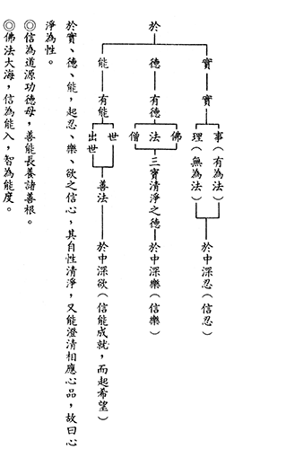

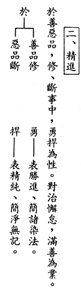

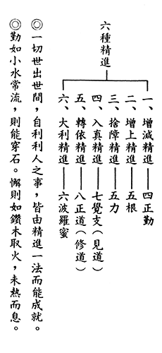

### 佛學概要十四講表簡說（十七）　第二講表

*戒慧講述‧宏法、淨昌整理*

因果甚深唯佛知

報通三世心轉變

縱使惑業滿虛空

臨終往生真奇絕

丙表、生起三由-因緣果

● 有因同果異、有果同因異

「因同果異」，就是「造作」的「因」都是相同的，可是結成的「果」差別很大。「果同因異」是結的「果」是相同的，可是所「造作」的「因」卻是不同的。「因同」，大家都一樣布施，結果此人大富大貴，彼人變小富小貴，甚至有人變一無所得。為何「果」會差異成這樣？是因為在「緣」上的「造作」不同。「果同」是說大家都得富貴果報，可是「因異」，有的是隨喜布施來的，有的是實際布施來的；有的「因」很弱，有的「因」很強，結果生出來「果報」竟然一樣，中間差在「緣」。

由此可知經營今生之重要性，如果學佛人看不到這一生的重要性，其實對因緣果的道理沒有真正瞭解過。例如曾子這一生的成就和顏回一樣，是「果同」，但是一個是聞一知十，一個是聞一知零，結果最後一樣，叫「果同」；從聞一知十和聞一知零可知過去生中的「因」差很多，結果這一生最後成就竟然一樣，差別在這一生的「緣」。如果曾子一開始就放棄自己，就不會成為宗聖，成為孔子一以貫之的傳承。而孔子的關鍵也全部都在這一世的經營，所謂：「默而識之，學而不厭，誨人不倦」，「十五志於學，三十而立，四十而不惑，五十而知天命，六不十而耳順，七十而從心所欲不踰矩。」

述記云：「種子」須論「業種子」、「名言種子」。唯識宗認為第八識裏面有兩種「種子」，一種是「業種子」，「依他起」的緣起法是「業種子」所生，「依他起」生的假如是某個東西，姑且以「水」做比喻，屬於人道名言接受的那一分，是「名言種」的生起，認知眼前的境界為「水」，這是人道的「遍計執」，理由是天見水為琉璃，而鬼見水為膿血，琉璃跟膿血又恰好分別是天道及餓鬼道的遍計執(異門遍計)。但「遍計執」如果在中觀來講正好是業的顯現，名言的認知；名言的顯現就是業的緣起，兩宗的論點有很多不同。所以「業種子」所生起的法是「依他起」，而「名言種子」所生起的是「遍計執」，這是唯識宗的「圓成實、依他起，遍計執」三性。為何要論說此理？因為「種子」就是「因」，「因」當中有「業種子」、「名言種子」，「果」當中有「等流果」、「異熟果」、「增上果」、「士用果」、「離繫果」等；「緣」有「九緣」、「八緣」等，可把「因緣果」的道理詳細說明。

等流果分為「造作等流」和「領受等流」。「異熟果」就是果的成熟有「異時而熟」、「異地而熟」及「異類而熟」。鬼造善業，生為人的那一分叫做「異時而熟」，而且是「異類而熟，異類就是鬼道變成人道叫做異類，異時是待時間成熟；「增上果」是指環境的這一分；「士用果」是士夫之用，指士夫用何種能力使果報成熟。

用布施有法來說，前生布施今生成為富貴的這一分是領受等流，而這一生樂善好施是造作等流，投生很好的環境是增上果。可是你的布施可能是前生，而這一生成為人，是異熟果。士用果就是可以讓果顯現的那一分，意思是說，你的富貴是用什麼能力去顯現的？比如用學問去顯現，還是用賣土地去顯現？士用果不同。「離繫果」是修行人解脫的這一分。所以五果可以結合「有法」顯現。

我們前生的布施，今生成為富貴，能夠轉成自己修道資糧的這一分是最殊勝，可是一般人布施的因轉過去都變成跟修道無關，例如假使前生的布施，這一生轉北京狗喝牛奶。須知因果的道理全部都是利害關係，而很多人講利害關係，都在不重要的利害關係努力講究，一般人懂得在商場上講究利害關係，在職場上講究薪水高低及年終獎金，在個人享受上講究車子買新賣舊、買好賣壞。上述這些對解脫成佛無關的都努力講究，該要講究解脫成佛的資糧反而不講究。

欲講究布施轉成修道的資糧，就觀待布施時候的動機，心裡希望未來顯現福報的時候，是讓自己能夠有修學的資糧，同時也結合皈依三寶，祈求三寶加被，結合對法的好樂等等觀修，這些會使來世在修學的時候能親近善知識，有足夠的修學資糧。由此可知，儒家最懂得布施的弟子是子貢，富可敵國的財富能夠拿來護持孔子的聖教弘揚，子貢堪稱最聰明的布施者，可以想見子貢來世修學必然得道多助。

（丁）法有兩端

佛法難解，因為要對宇宙人生複雜的事情用言語解釋，言語解當中佛語是最關鍵的，修行就是解佛語，不是離開解佛語別有修行，所以祖師大德一輩子都在著書、立說、講學，都在解佛語。可是一般人不想了解佛語，認為另外有修行，所有的修行都變成離開祖師註疏，認真做專心幹，但自利利人最重要的重點被拿掉了來談修行，最精華被移除了然後去修行。治國也是一樣情況，內聖外王的核心處被移除了，然後去拚經濟。

述記云：有時就「事、理」兩端而論。又云：論「兩端」時，則貴能「兩端」兼顧。法有兩端，就是說如何從佛語去通達世間的體相用因緣果。孔子說：「我空空如也，叩其兩端而竭焉。」孔子在〈中庸〉說舜是「執其兩端，用其中於民」。執其兩端，也就是指一法的事和理、功與過、是和非與利和弊兩端。「用其中於民」就是不偏於事也不偏於理，既完全是事也完全是理，用於百姓身上，這就是舜治理國家的方法。

實則對理論的人要多說事，對事修的人要多說理，所以有時說法看起來偏向一端，但事實反而是平衡兩端的。但兩端沒有自體性，例如此人偏向自求解脫，要對他說度眾生之功，不度眾生之過；對於沒有智慧愚蠢的人，要跟他說不度眾生是功，度眾生是過，說法完全相反。所以雪廬老人說，吾等不出山，天下還太平；必得捲起袖子來大幹，天下大亂，就是我們這些無知妄作搞出來的。所以兩端都不一定，只有空空如也的人才能抉擇兩端，懂〈大學〉、〈中庸〉的孔門心法，才能抉擇事和理兩端。

●事

由西瓜舉例：因是西瓜種，緣是水肥空氣陽光，果變成西瓜。這個西瓜成為跡象。西瓜裡面的西瓜種又成為未來西瓜的因，就是行動。果是一個跡象，就是顯現的相，果成為下一個果的或因或緣，又是同時在行動，所以果中就有因，因結果，而果又是人家的或因或緣，是人家的因或緣，就是一個行動。所以我們現在為人，固然是過去的善惡業所成的人，同時是行動，在這個人的造作當中，同時成為下一個果的或因或緣。所以有人說：我這個人下輩子不想再來了。哪可能呢？當下已經是下一個果的因或緣，哪可能不來呢？

●理

義趣是跡象和行動的內涵，靠解說了知義趣所具的內涵，義趣成為所依，解說成為能依。

●有時說理，事成於理。有時說事，理依於事。

「有時說理， 事成於理。」因緣果不能僅說事相，還要從理上來說，因為事情都有緣起的道理、因緣果的道理和體相空的道理，所以有時是要說理。對只談事的人就要說理，對只談理的人要說事。對執著在事相上的人要說理，因為事成於理。要告訴一個執著事相的人空性的道理，是沒自體性的，還有很多變化，不然會死在事相上，鑽牛角尖。例如很多人在禮節上只注重事，而不去注重禮中的理，他不會知道事是如何趨吉避凶，行事要行到恰到好處，如果沒有通人情世故的理去辦事時，這個事發展出來可能會變成拂逆人情，其行禮時，或遭指責禮教吃人。

例如與結婚的相關禮等儀式，如果不去清楚說每一個環節，會被批評為繁文縟節，尤其這樣做時，又講不出理由，如何令他心服？所以對執著在事上的人，就要用理去說明白，事成於理，事情如果沒有理論的依據，事情是不能作的。結論就是無理事不能通。說理就是要讓事情變成通的，發展禮教，如果沒有把道理說清楚，禮教是發展不起來的，會被人排斥，會被革命革掉。

「有時說事，理依於事」因為理依於事，所有的道理都要結合事相才能顯現。對道理很執著的人，就要對他說透過事相才顯現理，他懂得的那些吉凶禍福的道理，如果沒有在世間演練是沒有用的。光懂得吉凶禍福的道理，而人來了你不會鞠躬，你不會端一杯茶，此時懂這些道理是沒有用的。對這樣的人就要有時說事，把兩邊平衡。

●不可滯事昧理、不可執理廢事。

「不可滯事昧理」滯事就是停滯在事相上，不去通達他的道理。例如以背書為例，背書要理解來背，什麼都很好背，不然就容易忘光，年齡大的人一理解就容易背，並不是記憶好，是用理解懂得，所以當對事相執著的人，要說道理。對偏重在事相上布施的人佛要怎麼說？告訴布施理論的內涵。所以不通達理論內涵的時候，布施不對，慳貪更不對。對通達布施理論的人來說，布施也對，慳貪也對。因為事成於理，沒有理事是不能通，不可滯事昧理，對理就說事。

「不可執理廢事」對於重在理的人，要讓他去事修。所以六祖在獵人堆裡磨練了十幾年，表示理是在事裡面鍛練的。高明的老師昨天對某個人講這個道理，明天對另一個人又講另一種，不懂局的人就會質疑老師到底哪一個講法才是對的？例如孔子對季文子和冉求都說「再思可矣」，可是對子路說要三思。不懂的人會覺得到底是再思而行，還是三思而行？若懂得說話要看對象的根器，就知道論語是沒有糟粕的。再者佛對一個布施理論通達的人他要怎麼說？在事相上要去真實的去行布施。

偏執在理論上也是不行的，要結合事上來說。沒有事，理是無所依的。例如你的書要不要給？還沒學成是不可以給的。還沒有學成不給的慳貪是對的，給的布施是錯的。這就是理不依於事，事沒法幹的。如果你立刻把書給別人，一是自己沒有辦法學懂，二是給別人也不一定他能搞懂。而且你錯失了自己利益眾生的大好機會，只成就了一點點布施，所以這個時候不給才叫做給。我們給這個事其實也沒有懂過，到底給不給？理論上沒有通達，不給也錯，給也錯。沒有在事相上通達趨吉避凶理論，是沒有辦法真的累積福德的。

所以法要兩端來看，所謂的事理兩端平衡，有時候反而是偏重一邊。沒有通達道理，事上怎麼也沒法幹，沒有出路的。此時時再來讀孔子說空空如也這句話，多有味道。（下期待續）

### 人生大事—不能忽略的事實
			 助念生西觀念作法研究（三）　助念生西須知

人生大事—不能忽略的事實

助念生西觀念作法研究（三）　助念生西須知

古晉讀書會謄錄

盡人事聽天命

因上加緣得果

放下正念旁護

水到渠成往生

三、助念成功三要素。

（四）果能依上三要素如法護持助念，決定萬修萬人去，成就眾生往生西方，圓成佛果，功德不可思議。若有往生障礙，則須竭誠求佛加被，排除障礙，成就生西大事。

分兩方面來說，第一是依前三要素如法護持助念，第一條是內因，第二條是外緣，往生者本身子女、眷屬、蓮友及大德這一方面的外緣，內因外緣都具足條件，決定可以往生西方極樂世界。

第二是如果遇到往生障礙，這是甚深的緣起。可能有各種狀況，要求佛加被，排除障礙，請一位孝眷或親友，在佛前發願懺悔，做一些善法。命終是很不舒服的狀態，他或者會發脾氣、或者有各種顛倒的情形，這時候要孝眷要幫他發願懺悔並做善法，回向給他累劫的冤親債主。

消文看似容易，但是必須結合有法，才容易說得清楚，也才知道裏面的涵義。年輕人半夜去助念，要好好觀察這些長輩們，他們是怎麼樣排除障礙，不要填個班輪到我我就去念，沒輪到我就不關我的事，要認真看這些長輩們怎樣去溝通，怎麼去排除障礙，起業障病的時候須怎麼處理，要慢慢去學。相信天底下的東西不是天上掉下來的，不是在那裡入定就可以現證空性。所有的學問都是學來的，看看怎麼去助念，安排做七和告別式的執事與流程，其中也包括和葬儀社的溝通，內心有一把尺，才不會被葬儀社左右。

排除障礙的部份，一般都是求佛加被，可是坦白講，必須要更著重於人事上的排除障礙，每天拜佛，求佛菩薩開我的智慧，是不會開智慧的！一定要勤勞的親近大德做種種學習，佛菩薩的加被力才會出現。就像跟青少年說，你一定要做好，給他優渥的獎學金，都是沒有用的！你必須要給他環境，他才會變好，此處不是說佛菩薩的加被沒有用，重點在人事上必須先講究，佛菩薩的加被才能生起。佛菩薩的加被不能自己生，不能獨立生，必須經過人事的努力，佛菩薩的加被才能生起。

求佛加被排除障礙的那一分，應該要兩邊說。一邊是真的努力在造作，佛菩薩也真的努力在幫助你排除障礙。一定要有自己人事上的努力，才有老天爺的厚愛，才有佛力的加被。排除障礙是兩邊合作，才能畢其功於一役。以上是助念成功的三要素，有內因、有外緣、有結果。

這一大段告訴我們，一個成功的助念，必須觀待前面的因素，也就是如果沒有經過這些因素就能成功往生，那是一種僥倖！十萬個人大概不會有一個。大家放心，絕對不會在你身上發生！平常都不學佛，最後卻助念往生，那是百千萬劫的殊勝因緣，絕對不要心存僥倖！

以前有一個主管，他說他的祖父是被助念往生的，他說換他爸爸的時候，任憑他在黨政與商界的人脈與實力，都沒有用，往生跟那些是無關的。你上一代得到助念並不代表你這一代一樣能得到助念，那是要不斷努力的造作才會有的，以上是助念成功三要素，裏面全部是經驗談。

四、印光大師開示臨終三大要：

第一：善巧開導安慰，令生正信—切勸病人，放下一切，一心念佛，如有應交代事，速令交代，交代後，便置之度外，即作我今將隨佛往生佛國想，以志誠念佛之心，必定感佛大發慈悲，親垂接引，令得往生。

這個不容易，這個一定要是經驗豐富的大善知識，才能善巧開示。佛號不斷，繼續提醒他，要勸病人放下一切，一心念佛。如果有需要交代的事項順便交代，交代後便置之度外。這些都不簡單，但還是要做。我們就是因為愛娑婆世界，很多事情放不下，臨終時念頭一下子放不下。生者放不下，往生者也放不下，兩者互相放不下，那就理所當然的放不下。放不下業障就起現形，這是很嚴重的。所以必須要善巧開示，此人必須要瞭解病人內心的在意處，才能善巧的開導安慰病人，使他生起正信。

譬如，不能說你一定要撐著，一定要撐著等誰回來，不能這樣子勸他，這樣子就容易誤事！或者說你這一生都很好，可惜你兒子沒當上科長。如果說出這樣頹喪的話，你讓他心中有遺憾，就完蛋了！一定要肯定他這一生的善行。遺憾、衰喪、批評和責備的話都不能在這個時間點說。要善巧到什麼程度？譬如說病人的兒子在美國沒回來，就問他有什麼話要跟我們講，我們會幫您傳達，有時候甚至告訴他會幫他兒子物色媳婦等，樣樣保證，這是很善巧的，一定要讓他放心，並且對淨土生起信心。

交代以後，接著要肯定他，讚歎他這一生的成就和善行，絕對不能說他不好，讚歎他辛苦培育子女，把子女教成有用的人才，辛苦打拼維護這個家庭等等。將他好的這部份發揚光大，當然不是亂吹牛！最後就要告訴病人，此時可以安心念佛了，念佛才能蒙佛接引往生西方極樂世界，不再受輪迴之苦。

善巧這兩個字，極難！七地菩薩才具足善巧。雪公老師也勉勵我們，要會讀書還要學辦事，讀書是原理原則，學習辦事才能通達善巧方便。學習辦事有三種辦事法：第一、跟著長輩學，由長輩來帶著辦事。侍者就是非常好的學習，你要懂得長者的習慣，如果他早上起來一定要喝一杯熱茶，你就不要問他要不要喝，他不想麻煩你就會說不要，你就是倒一杯熱茶，他喝不喝隨他。夾菜的時候你要知道老人家不堪吃多，所以你不要一次夾很多，他胃腸不消化。就是跟著老人家，侍候老人家來學辦事。

第二、跟著同儕合作辦事。第三、參考以前辦事的例子。不可以全部都是心想事成，福至心靈，想愛幹什麼就幹什麼！辦事情如果沒有參考以前的例子，沒有跟他人合作，沒有跟著長輩學習辦事經驗，大抵都是世智辯聰。

所以這個善巧方便，就是全部肯定他、引導他。他所交代的事情，你有沒有辦法善巧的幫助他承擔，好讓他萬念放下。再來就是他所做的壞事，會變成他往生的障礙，你要開導他，最後心轉變、業就轉變了，大乘無定法，本來就沒有定業，觀待你的心量、格局和見地，最後決定業到底是重還是輕。（下期待續）

## 孔學一隅

### 論語簡說（二十三） —工欲善其事

時哉講述

經文

子貢問為仁。子曰：工欲善其事，必先利其器。居是邦也，事其大夫之賢者，友其士之仁者。

（衛靈公第十五—十）

消文

子貢問要怎麼行仁道？孔子說，一個能工巧匠（工匠、師傅或藝術家），要把他的事情做的好，首先所使用的工具必須要鋒利。比喻在一個國家內，要事奉執政大夫中的賢者，結交讀書人中的仁者。

子貢問為仁。

此章分為兩段，第一段是學生問行仁，第二段是老師以比喻彰顯為仁之道，首先是「子貢問為仁」，子貢問老師怎麼行仁，仁就是公心。坦白講，一個人有公心的人才能利益他人，而利益他人才有自己的出路，在利益他人當中，找到自己的出路。

孔子回答子貢分為兩段，第一段用比喻顯示行仁的方法。這個比喻有兩層意思，第一個是為了讓你懂後面的意思，從比喻裡面興起後面要事奉大夫的賢者，結交有公心的讀書人。

釋義

夫子答子貢何以先說譬喻？皇侃的意思是，想要瞭解後面的事情，要先從比喻去瞭解。其他注解是說，借著比喻去興起後面的意思，所以孔子先答比喻。孔子是一個很會說話的人，說話要說的得體，而且說得很好，能夠借著比喻去顯示道理，從《論語》裡面也可以看出孔子說話的藝術。

工匠要如何善其事？這裡的善其事就是把事情做好。事情做好當中，包括要有做事情的傳承，再來是自己有沒有認真學，還有做工藝的時候是不是全心投入。

舉例來說，雍正皇帝造辦處的陳祖章，用橄欖核刻一個《核舟記》，這個《核舟記》高只有一點六公分，長只有三點四公分，船上面有八個人，每一個人的相貌都不一樣，而且船底有三百多個字的《後赤壁賦》。善其事就是把刻這項工藝發揮到極致，成為幾乎是空前絕後的藝術品！

公輸班（魯班）春秋末期魯國著名工匠，其一生發明工具無數，被後世尊為中國工匠師祖。其中還有一個人就是公輸班，公輸班是魯國著名的工匠，現在的鋸子、鑽子、鉋子、鏟子、曲尺，還有劃線的墨斗，都是公輸班發明的。他在軍事上也有發明雲梯、鉤強，能夠在打仗的時候阻礙對方的戰船。

工匠要如何利其器？首先能把他要做事的器具完備，接著要把他的器具磨利，這個工匠本人，又有內涵、又有傳承、又專心做這件藝術品，當然會把東西做得精緻又完美。

利其器的「利」字，有「鋒利」、「厲」和「礪」三個意思，厲叫做磨刀石，礪就是磨它使它利。一個工匠要把他的事情做得好，他一定要讓他的器具很完備、很鋒利，或者是磨這個器具，讓這個器具很鋒利。

這個比喻所要彰顯的就是「居是邦也，事其大夫之賢者，友其士之仁者。」

孔子借著比喻要興起後面的意思，在這個國家，能夠事奉大夫，大夫就是朝廷為官的公務員。大夫有賢者、有不賢者，這裡是事奉賢者。友是結交在野的讀書人，讀書人有仁者、有不仁者，這裡是結交仁者。「事奉」可以當成請教，也可以當成學習。「友」可以當成結交，也可以當成跟他們切磋琢磨。

析疑

到該國發揮長才即可，何以須事其大夫之賢者？友其士之仁者？以前春秋戰國很多謀士，到該國去只是把他的才能發揮而已，幹嘛要去事奉、請教、學習賢大夫？為什麼要跟讀書人結交？雪公老師說，你如果到一個國家去推展仁政，沒有賢大夫和仁士的幫忙是不可能的，做事情絕對不是一個人做起來，一定要有很多人的幫忙，絕對不是一個人之功。

此句或云是周遊列國之時所說，這種說法正確嗎？這一章只是告訴我們，想要到一個國家推展仁政時，必須要事奉大夫的賢者、要結交有仁心的讀書人，才方便推展仁政。不管是辦教育、辦政治，都需要這些君子來幫助，否則是不會成功的。所以，這裡面不是只論周遊列國時，事大夫的賢者，友其士之仁者，他們是你推行仁政的助力，幫助你的力量，你必須要很在意。

大夫與士有何差異？在《孝經》裡面有「天子章、諸侯章、卿大夫章和士章」，其中「士章」講的就是國家的基礎公務員，可是這裡的士是指在野，大夫是指在朝，所以必須要懂得在在朝中結交賢者，懂得結交在野的仁者，方便推展仁政。

對賢大夫用事，對仁士用友，其差異為何？大夫是地位比較高的；沒有做官的讀書人，地位是比較低的。所以用事奉來表徵對他職位的重視。但是，這位在野的讀書人，如果他的德學比你高，你也可以用事奉二字。

大夫何以不稱仁，士何以不稱賢？仁跟賢有何差別？仁是指外在的心量，這個心量裡面包括學到六藝、技藝。因為做了很多的善法、你也很多的貨財、財物，錢財跟貨物，可以推展六藝來辦政治、辦民生，可以把貨財拿出去博施濟眾，這就是仁心。賢是指內涵上說，能夠通達形而上學。

或云：「仁則賢在其中，賢則仁在其中」，如此可乎？仁沒有在賢裡面，賢也沒有在仁裡面，這是兩個不同的定義。但這一章裡面有互文，也就是「事其大夫之賢者、仁者，友其士之仁者、賢者。」大夫裡面有賢者、有仁者，讀書人裡面也有仁者跟賢者，仁者跟賢者對自己的幫助實在太大了！人生的出路就是在賢跟仁上努力，人生的出路就在裡面。

事賢大夫，友仁士，何以是為仁之道？這裡面有兩個意思，第一個意思是想要推展仁政或仁心事業的人，如果沒有他們的幫忙，是不會成功的。以前王安石的變法，因為沒有用到君子，所以註定失敗。第二個，事奉賢大夫，結交有仁心的讀書人，會讓自己成就。所以，約己德行修養也對，約往外推展仁心事業也對。

如何由上喻理解事賢友仁？孔子是一個很會說話的人，而且是少言攝多義，說的很清楚、明白，義理通透。舉例來說：「如刀磨石，刀利而非石利。」我這個工匠要把事情做好，我一定要磨利我的器具，賢大夫就是石頭，我這一把刀在賢大夫、讀書人上磨，越磨我越利！他們是幫忙我，讓我成就的人！藉著他們把我的器具磨利，藉著他們成就我自己。

如選用工具，用對如虎添翼，用錯適得其反。如果我們選用工具，用對了好像如虎添翼，用錯了叫做適得其反。比如需要榔頭把鐵釘釘在牆壁上，結果你拿的是圓規，怎麼可能把釘子釘在牆壁上呢？所以一定要選對工具，意思是推展仁政，一定要選賢大夫跟讀書人當中的仁者。雪廬老人說：「用人要論公心。」有公心的大夫和有公心的讀書人，其實對你的幫助很大。賢者讓你充實你的內涵，出路就在裡面。如果這個人是私心又不賢德，路一定是越走越窄。

若不事賢大夫與友仁士，其過患為何？第一、沒有這些人跟你切磋琢磨，容易變成孤陋寡聞的人，這些人會長你的見識、會充實你的內涵、擴充你的心量。第二、他們的學問你不能聽到，你變成孤陋寡聞，如果透過賢大夫、讀書人來告訴你某些經驗閱歷，才知道人情世故的重要。如果我們不去事奉賢大夫、不去結交有仁心的讀書人，沒有辦法吸收到他們的學問，變成孤陋寡聞。辦事時沒有得到他們的幫助，自己的德行、德學也不能充實。

若事賢大夫與友仁士，其功為何？再來，如果我們事奉大夫跟友仁士，我們的功就是有請益的人，能夠充實人生的內涵，辦事情的時候，有很多人來幫助，這些都要透過請教和學習，才能得到人家真正的幫助，得到人家的絕學，否則如何得到人家誠意的交往？

到該國何以不是事君，而是事賢仁的士大夫？這一章告訴我們要推展仁政，必須要有人才團隊。你是在為國君辦事，國君代表國家，你是在為他辦事，所以叫做事君。但這裡的事賢大夫不是說要拉幫結派，而是說要推展仁政，而是說要跟他們切磋琢磨，成就自己的德行。

總結

第一、一個厲害的工匠，他也必須要有好的工具，也必須要有別人來輔助你。

第二、充實自己是非常地重要，在推展利益人的事業時，本身就要是一個有仁心的人，要懂得充實自己。但是，你沒有這些人來切磋琢磨和請益，怎麼可能是一個可以推展仁政，是可以辦出仁心事業的人？

第三、我們如何善用比喻來顯示好的義理？這種說話的藝術，也是我們這一章值得要學的。

問答

**問：** 埋頭苦學者，在治學的時間上，比有賢、有仁的士大夫的時間更為充裕，後者在治學上所起的效果真的會比較好嗎？

**答：** 如果能夠懂得去請教，並且跟這樣的人學習，自己的學問、才情和內涵就會與日俱增。埋頭苦讀容易造成自以為是，讀錯了自己也不知道。再來，有時候去向別人學習、請教，你的進步是一日千里。你在家裡面閉門苦讀、埋頭苦幹，好像烏龜在走路一樣，甚至還走錯路，方向走偏，自以為是。但你去請教的時候，你還可以看看人家怎麼活用這個學問？人家怎麼抉擇這個內涵？在他身上裡面怎麼看到學習的風範？這都是要請教、要學習、要結交，你才有的。

孔門這些人如果沒有接近孔子，沒有成為一個人才團隊的學習，子路充其量也只不過是一個太保、流氓，對不對？然後，高柴只不過是一個愚癡者，曾子只不過是一個魯鈍的人，可是，經過了孔門的調教以後，各個都成為大賢。所以，請千萬不要閉門造車、埋頭苦讀！那是沒有用的！外面的這些、以前古代的這些工匠，他們都是要拜老師來學習，才能懂得在他的領域裡面，能夠善用其器，做出藝術品出來。

**問：** 賢是特別就內涵上能夠通達形而上學的那一分，那我們知道，就算是在孔門，能夠達到這個標準的，也只有顏回跟曾子，子貢也是只能懂一半。如果以這個標準來看世間的話，來看世面上的士大夫幾乎是沒有。那孔子在此處提出賢者，我們要以什麼樣的角度來看待？

**答：** 賢者的人很少，甚至沒有怎麼辦？坦白說，你到那個國家去，不可能說都沒有，不可能，看你怎麼去發掘。就像說在亂邦裡面，在衛國，國家是亂邦，還有蘧伯玉、還有史魚這種人。就是孔子到衛國去的時候，懂得跟蘧伯玉交往，到齊國去懂得跟晏子交往，這就是「事大夫之賢者，友其士之仁者」，比如說住在高昭子的家中，高昭子就是一個好賢之人，孔子就懂得跟這些人交往，這就是孔子了不起的地方。

**問：** 我們在現代的生活當中，應該用什麼方法認識、結交，或辨識出賢大夫或仁士？

**答：** 最重要的重點是什麼？真的要好好學《論語》！就有這個眼力去辨別賢者跟仁者。就好像說鑑定古物，一定要真正看過這些古物，也瞭解這些古物的背景。首先要確立《論語》中的正知見，才懂得看賢者跟仁者。

**問：** 我們大部分的人不是為政者，也不是要推行仁政，也不常遇到賢大夫或仁士，我們該如何運用本章跟生活做結合？

**答：** 雖然我們不為政，可是如果要推展利益眾生的事業，當然也是要去求教，事奉良師、結交善友。良師益友是幫助自己推展事業的方便，也是成就自己內涵的所在。所以，借著他們，他們是石頭，借著他們磨自己的刀，磨得利，可以把事情做得好。

**問：** 想請問老師該如何從本章「利器」之喻，體會良師益友之重要性呢？另外想問老師，如果本章為仁之道是因賢大夫與仁者如同石頭，可助我們成就，那是否可與先前的如切如磋章合看？如何用切磋琢磨來解釋此章之義呢？

**答：** 切磋是大塊地切，琢磨是細部地雕磨。這裡面都是要借著對方這個強手，好好地跟他切磋琢磨，我向他們學習，而且我回來自己私下用功。以這一章有兩個意思，第一個意思就是借他們成就我自己；第二個意思是，借他們一起來推動仁心的事業。

也可以說，借他們磨利我的工具，我就變成一個有內涵、有仁心、有理想、有抱負、有賢有仁的人，那對我推展的事業實在幫助太大了。

**問：** 賢與仁是否就是出世和入世的分別呢？

**答：** 賢者是就形而上來講、仁者是就形而下，這樣的分別是可以的。賢者，可以以顏回不改其樂為例，那就是一種內在形而上的心，不被形所繫縛。所以孔子讚歎叫做「賢哉回也」。這些名聞利養都套不住他，這個人不受名聞利養拘束，你看這個大夫多麼有風采！

**問：** 請問老師，有子說過，「孝弟也者，其為仁之本與」，這句是不是說行仁要先從孝弟開始？這是不是像上一節所說「能近取譬」，行仁也要由親及疏，由近及遠？

**答：** 沒有錯！孝悌是仁的根本，但是，孝悌是我在家裡面孝順，我把這個孝心慢慢地推展，推展出去，想要幫助別人像幫助自己的家人一樣的那個心態，把天下人都當成一家來經營，這就是仁心。

仁心就是一種公心，雪廬老人說：公心很難得。坦白講，一般人、一個團隊裡面要找到幾個公心的人非常難！大部分都是公私夾雜，真正找到公心的人，那一定是你最好的朋友。而且從他的身上，你也看到公心的可貴，也會成就你的公心。

**問：** 行仁與為仁有何不同？欲為仁而德未完備，就不能為仁了嗎？是否有次第性？

**答：** 好的，這裡面的為仁有兩種，一種是先要充實你自己，為仁就是行仁，行仁會得道多助，而且透過大家來幫助你充實仁心和內涵。有了這些條件，就容易推展仁心事業。

我們自己德學不足，這一章裡面就告訴你，你懂得事奉、懂得交往，那個就是在培養你自己了。培養你自己，當你是一個仁心的人，人家自然會想要幫助你，人家自然願意跟你成為團隊，來發展利益眾生的事業。

**問：** 本章是不是因為子貢他能辦政治，而且受到各國重視，是瑚璉之器、廟堂之才，所以，孔子才會這樣回答？

**答：** 子貢本來就是一個瑚璉之器，是廟堂的幹才。子貢是國家的幹才，可是國家的幹才絕對不可以埋頭苦幹！蠻幹！一定要懂得跟人家交往、懂得去請教，大家樂於幫助他，他也樂於充實他自己。尤其對這個瑚璉的幹才，孔子告訴他，你一定要這樣做，才有利於你推展仁政，也有利於充實你自己。

**問：** 人生需要這麼辛苦地經營嗎？無憂無慮地過一生也不是很好嗎？

**答：** 無憂無慮這四個字，坦白說，很多人他想無憂無慮地過一輩子，這是不可能的！習慣於順境的人，不曉得人生是有順、有逆，只要來一個逆境，這個人或許是終身都爬不起來！

無憂無慮是懂得對治煩惱的無憂無慮，這才是真正的無憂無慮！而不是在溫室裡面的蘭花，都不被風吹的無憂無慮。很多人選擇不要跟人家來往，自己要過的快樂、我行我素，其實一位不懂得充實自己，不懂得跟別人交往的人，就算順境他也不快樂！

**問：** 如果一生所學成就仁與賢，可是卻沒有人來共事結交，所學不就白費、空過一生？

**答：** 要先問自己有沒有去事奉賢士，有沒有去結交益友？如果是一位有公心又懂得充實自己的人，坦白說，德不孤，必有鄰！君不見雪廬老人剛到臺灣的時候，他不是孤單一個人嗎？上課的時候，這些人聽不懂他在講什麼？但是，憑著他懂得去結交善知識，懂得充實內涵，懂得去利益別人，懂得去培養人才。老人在臺灣培養了很多的人才，教育出很多的學生。

人生的時間，有很多人選擇用浪費時間在過他快樂的日子，這是天下間最大的浪費！空過了一生，最可惜！

**問：** 請問本章主要提到個人行仁的方式，是否可以理解為，如果能夠跟這些想行仁的人，大家一起行仁，形成行仁的團隊，或者是開展行仁的風氣，有眾志成城的意思。

如果以刀子跟磨刀石來舉例，大家一起行仁，而且能夠見賢思齊，是不是就是好比幾把刀，大家用刀子跟刀子之間互磨？

**答：** 借著事奉、借著結交，形成一個團隊、形成一個風氣、形成一個力量，形成一個能夠開展仁心事業的群體，是說，這些你要事奉的、你要結交的，是充實你自己，尤如刀在石頭上磨這樣而已。然後他也借著你充實他自己，所以，他也是磨刀石，你是石頭，他是磨刀，最後大家都變成人才。

**問：** 在注解裡面有說到，是不是因為子貢他比較喜歡和才能不如自己的人來往。所以，孔子在回答子貢這個問題的時候，特別告訴他要事賢友人。

**答：** 注解的意思是說，子貢很喜歡跟比他差的人在一塊、比他爛的在一塊，但是，坦白講，子貢到底是不是這種習性？不知。子貢如果是這種習性的話，子貢為什麼喜歡跟孔子在一塊？所以，這種應該不會是子貢的習氣。

再來，這一章只是告訴我們說，一個想要在國家推展仁政的人，他必須要懂得這種結交、侍候、請教，物件是賢者、仁者，才方便你推展仁政、才方便你充實自己。

**問：** 既然仁者、賢者是我們的磨刀石，我們也必須成為仁者、賢者的磨刀石，他才會願意跟我們做交往，是否可以這樣兩面看？

**答：** 我們雖然不是仁者跟賢者，但是我們見地裡面，知道仁者與賢者的重要，賢者、仁者長的是什麼樣子？我們懂得跟他親近、懂得跟他請教、懂得跟他事奉，然後，充實我自己。老師如果碰到學生努力地想要充實德學，可是老師這麼高、學生這麼低，請問老師會放棄學生嗎？不會。所以，就算你不是仁者、賢者，你知道仁者、賢者的殊勝，他的行相，以及願意跟仁者、賢者交往，改變你自己，縱然你不是仁者、賢者，他也樂於跟你交往，最後你變成仁者跟賢者！未必你一定要變成仁者、賢者。

**問：** 老師好，〈論語講要〉中說「工欲善其事」即學者想能成就其道德學問，「必先利其器」就必須結交良師益友。請問與「繪事後素」之意相通否，可否互參？

**答：** 不然。繪事後素只是說白色的紙可以加顏料，忠信的本質可以學禮，學禮如果你沒有忠信的本質，這個人學禮其實是矯揉造作、虛情假意！推展禮可能會變成禮崩樂壞！禮崩樂壞有兩種，一種是沒人學，一種是全部是虛情假意。忠信資質可以學禮，意思是說，顏色白色的，加上各種的顏色，白色可以讓各種顏色的發揮，忠信的本質才能夠讓禮去開展、發揮禮的功能。

**問：** 在這一章裡面說到要士賢友人，向比我們有德學、有才能的人來學習，這就讓他們想到一個他們長久以來困惑的問題，，不知道要怎麼樣來理解「學而時習之」的「習」字？

**答：** 要學孔子的見地、孔子的才情、孔子的經驗閱歷、孔子對道德仁藝的看法、孔子對形而上的體會、孔子對形而下的認知，這種的法喜才是真正的法喜！

習就是你會一直想要串習，因為它太好了！你不斷地借著大家在一起研討，會越讀越清楚、越讀越靈活、越讀越會運用，這叫做「學而時習」。（下期待續）

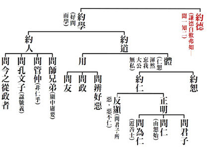

### 孔門心法—中庸之道(三)　中庸義理與名相釋義

*時哉講述、茅茹讀書會、弘毅整理*

用中入世知幻現

依用安立世名言

覓體了無自相空

雙觀觀察聖人智

前言

本堂課程實乃進入〈中庸〉的先修課程，在正式入文之前，先說明重要的名詞與義理。在第一章裡面，有一些我們必須要了解的名相，比如說，「中」、「和」、「性」、「天」、「命」、「道」，「天命」、「天道」，通達這些名相，就如同有了一把打開〈中庸〉之門的鑰匙，打開〈中庸〉之門，就等於打開了中國文化的寶藏之門。儒家的性與天道自子思以後就斷了傳承，但要了解〈中庸〉就必須通達性與天道的思想。幸而性命之學的解釋在道家、佛家亦有，特別是佛家的傳承；焦氏筆乘有云，性命之理，孔子罕言之，老子累言之，釋氏則極言之。此時此刻唯有不帶著成見，透過佛家對於「性」的理解、詮釋，方便我們來通達性與天道，進入中庸深廣的義涵。

中庸義理

有人認為「中」是帝王平衡之術，或者走馬路中間，這些都是對「中」的誤解。或有人以彈琴來喻「中」，一方面琴弦要調的恰到好處，否則弦太緊容易斷，太鬆彈不出聲音，要不鬆不緊才好；另一方面彈琴要配合時機，如諸葛亮空城退敵，當司馬懿大軍兵臨城下時，他從容不迫的在城頭彈琴，以琴音表現氣定神閑，好似等司馬懿入城，然後甕中捉鱉；當有琴弦斷時，他的琴音之中又蘊含殺機，令司馬懿不敢妄動，最終以不到兩千人的一座空城，退走了司馬懿的十五萬大軍，這就是掌握時機。

《易經》裡面形容〈中庸〉是「知幾其神乎」，幾就是微微一動，「知幾其神乎」就是，比如看一個人所交的朋友，就知道他後面會變什麼樣的人，或者看他眼前所做，就知後面結果如何，或者從現前的起心動念，就知後面會發生好事或壞事。

以上所說的〈中庸〉義涵都是在世間來論，在世間運用恰到好處，把握時機，然而〈中庸〉真正的義涵為何呢？

對於〈中庸〉，鄭康成解釋為「用中」，就是用形而上（中）入形而下，能夠掌握時機，恰到好處，發揮大用；宋儒解釋為「常中」，中（形而上）這個道理是日久天長，是不變的。這個「中」就是心法，古代聖王不僅往下傳江山，更重要的是傳心法，堯傳給舜的心法叫「允執其中」，允就是相信，執就是抓住，相信並且抓住「中」，就是「用中」；舜傳給禹的心法叫「允執厥中」，「厥」就是這個的意思，相信並抓住這個中道。禪宗傳承時就是傳心法，叫衣缽傳人，六祖後只傳心法，埋掉了作為外在表徵的衣缽。《尚書》裡稱堯為「欽明」，舜為「文明」，因為懂得用「中」，所以他們都是明君。

「時哉時哉網路教育學院」的符號是「中」加上ｅ，就是借著網路教育把中道傳出去，往上承接老師們的智慧，往下傳承中華文化的道統。

中庸名相釋義—「中」

一、中的定義

「中」就是形而上，包括能證的智慧和所證的理體，當能證的智慧證得所證的理體時，叫做明心見性。明心見性的人，自然能對治煩惱、破除煩惱，所以《中庸》裡說，喜怒哀樂之未發謂之中，明心見性、通達真理的人能夠降伏煩惱，通達真理的智慧及所證的真理，合起來叫「中」。

二、中道鮮為人知

《論語.雍也》篇中說到，「中庸之為德也，其至矣乎，民鮮久矣。」用中的內涵太高了，老百姓很少能懂得這個道理，這已經很久了。帝王沒有這種心法，沒辦法辦合乎中道的政治，也沒辦法推廣合乎中道的教育，因此老百姓已經很久沒有在合乎中道的氣氛下生活，整個社會在功利、名聞利養的追逐下風氣變俗了。老百姓在俗的風氣下，在禮崩樂壞中，離開中道已經很久了，老百姓覺得豐衣足食，生活過的快樂，就感覺很不錯了，以為古人不過如此。可是當你經歷了堯舜時代，再看豐衣足食的社會，才知與太平盛世還差得遠，才知小康社會與大同社會差得很遠。當你吃過滿漢全席後，再吃一般廚師所做的大餐，就知道形式上好像差不多，可是味道卻不對。當你經過聖賢的攝受教化後，再看世間所謂的盛世，就會知道味道不對，火候不到，這只可為知者言，難與俗人道。

三、中道難被推展

《論語·衛靈公》篇中說到，「知德者鮮矣」，懂得〈中庸〉這種內涵的人實在是太少了，所以孔子才周遊列國，試圖說服各國國君能用他來推展大道。可是各國國君不能體會，只知道強兵霸權對國家有利，體會不到「用中」對國家的長治久安，對國家會帶來什麼樣的新氣象。所以孔子雖然以溫良恭儉讓，得到各國國君坦然來請教大政，可是一旦孔子要發揮他政治長才的時候，各國國君難免內心有所懷疑，或諸大臣們抵制、排斥孔子，以致孔子周遊列國卒無所成，所以回到魯國只好藉著六經，把中道傳與弟子，曾子以及後面的子思就是得到了「中」的傳承。

四、用中的氣象

「中」就好比大樹的根，一般人都只看到樹的地上部分，因為沒有深入到土壤裡面，所以不知根到底有多錯綜複雜，綿延有多長，以為不要根就可以長成參天大樹。當「用中」來辦政治、辦教育，展現出非凡的氣象時，一般人是很少知道其中的內涵的。在漢唐盛世時的人，會認為堯舜也不過如此，其實差之遠矣。孔子出來辦政治時，弟子宰我說，「以予觀於夫子，賢於堯舜遠矣」。用中道來辦政治時，所展現的氣象除非老百姓親身受用，否則不會知道。就好像一個經歷盛世的人，進入亂世後，講盛世的氣象給年輕人聽時，年輕人是聽不懂的，一般人對「中」是很難體會的。

中庸名相釋義—「性」

一、駁他誤解（性非善、惡、善惡相混）

「中」是能證的智慧，所證的理體是性，孔門最高的學問是性與天道。雪廬老人說，自古以來對於性沒有幾人說得對，如孟子說性本善， 荀子說性本惡。但是性有不改之義，如果性是善，那為什麼還會造惡？如果性是惡，那為什麼還會造善？如水的體性是濕潤性是不改的，火的體性是燒熱性也是不改的，所以以上兩種觀點都說不通。告子說，性是善惡混在一塊，可是有的人到最後達到純善時就說不通了，如孔子、堯舜都是至善。所以雪廬老人說，《三字經》開始的「人之初，性本善」，就是立論的錯誤。

二、體性本空

（一）舉《三字經》證明

１．苦樂無自性（性相近）

孔子的看法是，「性相近也，習相遠也」。「性相近也」就是說，做善得樂，做惡得苦。快樂和痛苦的體性都差不多，如果快樂有善的體性，那快樂的都應該造善；痛苦如果有惡的體性，那痛苦的都應該造惡。可是現見很多人都是在快樂中造惡，在痛苦中造善，可見善結成的快樂，惡結成的痛苦，苦跟樂的體性差不多，差在習相遠。在痛苦中如果能夠警惕，能夠斷惡，在快樂中能夠修善，能夠隨喜善法，發揮快樂的價值，這樣就會苦轉成樂，樂會更樂。不懂得這個道理的人，就會在快樂中放逸墮落，痛苦中怨天尤人。人未必在快樂中就一定成功，痛苦中就一定失敗，快樂與痛苦只不過是果報，是沒有體性的，關鍵在於如何斷惡修善。

２．因習別凡聖（習相遠）

「習相遠」就是說，人剛出生時都差不多，可是隨著好壞環境不同，習染就越差越大，最後就有凡聖賢愚之別。如顏回小時候的朋友，長大後就和顏回差的太遠了，孔子小時候的玩伴，或者他的兄妹，長大後一個變成至聖，一個是平庸。有的人手中拿著一副好牌，結果打的最爛；有的人手中拿著一副爛牌，結果打到最好。孔子手中就是一副爛牌，小時候父親過世，後來母親過世，可是他透過不斷的學習，最後成為人才，為魯國辦大政，之後又周遊列國，推行王道，攝持眾多弟子，最後刪詩書，訂禮樂，贊周易，作春秋，影響中國兩千多年，爛牌被他打成最好。而有些人雖然身體健康，家庭和樂，生活享樂，變成紈褲子弟，最後墮落，一副好牌給他打爛。

（二）舉《易經》證明

１．所證無自性（易無體，卦之吉凶還依人）

《易經》裡面就說：「故神無方，而易無體」，《易經》是沒有體性的，卜到凶卦的人依然能夠趨吉避凶，卜到吉卦的人也可能未來受害，關鍵在你是君子還是小人。君子卜到吉卦，會借機發展他的前程，所以會更吉，如果卜到凶卦，也能趨吉避凶。小人卜到凶卦會更凶，即便卜到吉卦，也會令他驕縱跋扈，或貪圖享樂，放逸墮落，所以雖吉也凶，這就是「易無體」。

２．能證無自性（神無方，心本無生因境有）

「神無方」就是說，通達易經的智慧，也是沒有方所的，心識要對境時才生，沒對境時不生。如諸葛亮面對司馬懿十五萬大軍時，立刻知道退敵的辦法，這個辦法是對境的當下才出生的，不是從東南西北哪個方向來，在沒有對敵時，還沒有這個辦法出生。這觀待他過去的很多經驗閱歷，雖然已滅，但對著境界就出生，就立刻知道該怎麼解決。而其他人過去的也是已滅，可是對境時，糊了一鍋粥，腦袋像漿糊，沒有辦法應對。結束後，他的這種心識也沒有跑到東南西北哪個方向，想法就消失了。這種觀念是儒釋道三家的精華，真正懂得《易經》的人會善用《易經》，不懂的人只能被《易經》所繫縛。

（三）舉《道德經》證明（因緣生與觀待生）

善惡美醜也是沒有體性的，舉例來說，如果大家都是善，那哪有惡？對著善才有惡，對著惡才有善，利人的叫善，利己的叫惡，是觀待下的顯現，美醜也是互相觀待而成立的。

在《道德經》的第二章裡也有關於形而上的闡發，有無相生，難易相成，長短相形，高下相傾，音聲相和，前後相隨。

有無相生：比如昨天很努力，今天成績就很好，昨天的努力到今天已經成為無，今天成績很好是有，今天成績很好是從昨天的努力而來，昨天的努力雖然已經變成無，可是今天的成績好是從昨天的努力而來，這就是從無生有。然後這個有到明天又變成無，今天成績好，但不是明天，有又生起無。如果在成績很好當中，能夠戒慎恐懼，明天的成績就會更好。

難易相成：比如不會游泳的人會覺得游泳很難，可是會游泳的人看游泳很簡單，那游泳到底是難還是簡單？再如性與天道一般人會認為很難，可是顏回卻能屢空。對數學好的人，認為數學很簡單，可是對於數學不好的文科生卻認為很難。難易是沒有體性的，是觀待人而說。

長短相形：長短無實體性，如一根竹竿對著比它短的說長，對著比它長的說短。高下相傾：武功高下也是相對來說。

音聲相和：你在山谷中喊「喂」，對面就會有回音「喂」，回音是與你的聲音相和的，如同做善回報樂，作惡回報苦。前後相隨：如前面作善後面生樂；前面作惡，後面生起苦。這些都是沒有體性，是隨著因緣變化的。

（四）諸法依作用安立名言

舉例來說，杯子之所以安立為杯子，是因為它有裝水的功能，是就作用去安立的，沒有實體性。當杯子破了，沒有裝水的功能時，安立杯子是無意義的，所以不能安立為杯子。在《論語·雍也》篇中孔子說，「觚不觚，觚哉！觚哉！」觚是兩升，目的就是讓你不能喝醉，喝到量就可以，可是不斷喝，把觚做成四升、八升、十六升時，觚就不能叫觚了。

當車子已經報廢，雖然車座，車蓋等都還在，但不能載人載物行進時，就不能叫車了。同樣一個人在那裡動作、思維，可以作善作惡，當死時無思惟與造作，再叫人就沒意義了。

杯子破成碎片，沒有少過一點東西，可是不能叫杯子，因為已無盛水功能故。只是組合起來並發揮某種作用，依作用而安立為名言。

（五）諸法皆觀待而生

再如水，我們妄認氫氧之中有個水，或者離開水之外別有一個水，如這盆水，這杯水。水不過是一個氧，兩個氫，組合起來發揮濕潤的功能而已。濕潤的功能在氫上沒有，在氧上沒有，結果合起來就有濕潤的功能，那麼濕潤的功能從哪裡來？濕潤的功能是被浮現出來的，一時的作用而已。在氧上、氫上一分都看不到，合起來就出現，諸法都是如此。快樂沒有，做善就出現了；痛苦沒有，作惡就出現了。諸法就像做夢一樣觀待而生，這叫「易無體」。（下期待續）

### 孝道跨時代的意義與價值 —孝經簡說(九)

時哉講述、淨域編寫

為政多內涵

行善量難思

本質由孝出

和諧安天下

孝是最高妙的領導統御—〈孝治章第八〉

以孝治天下是天子的胸懷，諸侯以孝治國，大夫以孝治家，這在前面都已說過了，此處又再重說，切入的角度為何呢？其特別強調的是領導者的人格特質，而須具備什麼樣的人格特質呢？若將前後文加以對照，前文以孝治天下、治國、治家，比較重於風氣的推廣，乃至於國家的經營。但此後三章，尤其在這〈孝治章〉中談到天子、諸侯及大夫，特別強調他們的人格特質。總之，一個人成功的祕密，除了懂得須尊重其職務、以身作則帶頭經營風氣外，最重要的是他的人格特質。要如何來經營一個和合的團隊，且具有人情味？本章就給我們這樣的反思。

《孝經》整體的架構，是講孝道的修學法及孝道的義理。分別說孝道的修學法與義理前，先提說「孝道的重要」。孝道之重要，裡有天子、諸侯、卿大夫、士及庶人的孝，其依孝能夠與天地相合成「三才」。這裡又特別講「以孝治天下」，似乎與前面的天子章、諸侯章、卿大夫章又合起來說，但所說的角度、面向與前面是不同的。

本章經文是：

「子曰：『昔者明王之以孝治天下也，不敢遺小國之臣，而況於公、侯、伯、子、男乎。故得萬國之歡心，以事其先王。治國者不敢侮於鰥寡，而況於士民乎。故得百姓之歡心，以事其先君。治家者，不敢失於臣妾，而況於妻子乎。故得人之歡心，以事其親。夫然，故生則親安之，祭則鬼享之。是以天下和平，災害不生，禍亂不作。故明王之以孝治天下也如此。《詩》云：『有覺德行，四國順之。』」

本章的架構是：孝治裡有天子治天下，其孝是不敢怠慢小國的國臣，自能夠感應各國的國君來助祭；那麼國家的諸侯不敢去欺侮弱勢團體，便能夠得到百姓來助祭他的先人；卿大夫在自家時，不敢失禮於家中的俾僕，能夠得到人民對他父母親的友好。這三種人能好好地以孝來治他的天下、國及家，其父母現世會很安寧，死後也能享用子孫及助祭者的祭拜。在這樣的狀態下是天下和諧，自然就沒有什麼災害與禍亂發生。結語說：這就是聖人、天子治天下的成效，並舉出《詩經∙大雅》之言來證明此章。

經文解釋

子曰：「昔者明王之以孝治天下也，不敢遺小國之臣，而況於公、侯、伯、子、男乎。」

(不怠慢)意即孔子說：往昔明王(指有德位的天子，夏、商、周的國君稱為王，所以此「王」一定要指天子)，以孝治天下的時候，他不敢怠慢小國的臣子，更何況是公、侯、伯、子、男呢！當他對小國之臣都不敢怠慢，更何況是小國呢？又連對小國都不敢怠慢，何況是大國呀！其次，經文：「故得萬國之歡心，以事其先王。」(得助祭)不怠慢會感應什麼成效呢？是各國國君打從心底高興呀！而願意在天子祭祀其祖先時，都帶著特產來助祭。這是天子以孝治天下的形象。

經文：

「治國者不敢侮於鰥寡，而況於士民乎。」

(不敢侮)諸侯治國時不敢侮於鰥寡，「鰥」是死了太太，「寡」是死了先生或者獨身，意即是一個人，現在的名詞叫作「弱勢團體」。諸侯不敢去欺侮弱勢團體，那更何況是知書達禮的士及一般百姓的民，這個「民」包括農、工、商，即是〈庶人章〉所說的各種庶人。

經文：

「故得百姓之歡心，以事其先君。」

(得助祭)若此國君以孝治國時，其成效是什麼呢？當會感應百姓的歡心。可見辦政治，不只是讓百姓的生活過得舒服，最重要的是贏得民心。中國俗語稱「得民者昌，失民者亡」，此中的「得民、失民」，最是要講到民心。古代政治家懂得經營民心，現在的政治人物只會經營民生。百姓的生活似乎過得不錯，可是問到「幸不幸福」？好像都不太幸福；問到「滿不滿意」？好像也不太滿意。其對未來有安全、安定的感覺嗎？問起來就似乎不太安定。

再者，看看卿大夫怎麼治家？

經文：

「治家者不敢失於臣妾，而況於妻子乎。」

(不失禮)卿大夫有封地，其治家「不敢失於臣妾」；臣妾者，可以指家中的俾僕，也可以指辦事人員，更何況是妻子呢？所以經文：「故得人之歡心，以事其親。」(得助孝)卿大夫懂得去營造一家的和諧，便會得到家人的歡心，一起來幫助他侍奉雙親。

經文：

「夫然，故生則親安之。」

(現世安)接著結論，「夫然」之意是，若天子、諸侯、卿大夫能這樣治天下、國與家，則父母在世時能「安之」。安在哪裡呢？就安在天子、諸侯、卿大夫這樣的盡孝，且還包括身安、心安、過得榮耀。常人生活除過得好外，還要內心舒服榮耀，這就是孝道。所以，孔子的孝道不只是對父母身體奉養，還要讓身心舒適愉悅，過得很榮耀。子女要懂得爭氣，懂得為公發心、謀人福利，懂得充實自己的德學，榮耀父母，這就是孝道的概念，其內涵比一般的孝道更深廣，值得我們一輩子來經營。經文：「祭則鬼享之。」(歿受享)這樣的孝子，父母親在世時，可以舒服地生活；過世後成為祖先，可以享受所祭祀的物品。「之」就是所祭祀的東西。

經文：

「是以天下和平，災害不生，禍亂不作。」

(約天下)而這樣的經營有何整體的成效呢？便是達到「天下和平，災害不生，禍亂不作。」天下包括大夫的家、諸侯的國及天子所治的天下，大家都是和諧一氣的，這就是《中庸》所言的懂得「用和之道」。此時感應的災害不生，包括風災、水患、旱象、惡疾等。而禍亂不作，禍亂乃指人為的禍亂，特別是因人禍而起的天災地變，諸如：土石流、登革熱等。「不生」、「不作」，就是災害禍端還未起時，就壓制下去。

舉例來說。老師把孩子教得很好，出社會不作奸犯科，員警就不會成為破案的英雄。可是，一般人知道這是老師的功勞嗎？不會的，大概都注意被表揚的破案英雄，成為大家佩服的對象。惟此是在果相上治國時的對治，要耗費政府許多的心血，需眾多的力量才能治得了這個國。若在因地裡暗自解決，沒人佩服這種人，沒人知道這才稱作人才。治國時讓許多災害禍亂不生，常人覺得沒有什麼，但當天下大亂時，忽然有人出來救治天下，大家便佩服不已。所以，這到底是懂得治果、還是懂得治因呢？經云：「菩薩畏因，眾生畏果。」菩薩在因地裡就把因對治了，眾生是在果上出現時，才急忙地要趨吉避凶。如此觀看這章，明王、諸侯、卿大夫就像菩薩一樣，當事情還未發生時，就將問題解決了。這於《老子》言中，算是高人，一等一的高人。

經文：

「故明王之以孝治天下也如此。」

(結明)因此，結論說：這叫作「明王之以孝治天下，原來是這個模樣呀！」這與前說的「以孝治天下」的切入點不一樣。前者是說：我在家裡盡孝，然後藉著人才團隊把風氣推廣出去。惟此處不是這種講法。是以，前者是講風氣的推廣；這裡是說人格特質，係一種人情味的經營與禮上的應用。

經文：

「《詩》云：『有覺德行，四國順之。』」

(贊詩｜舉大雅）接著引用《詩經》來作證明，此句出自於〈大雅∙蕩之什∙抑〉之篇。有覺德行的「覺」字，要當成「大」來看，意即有大的德行；「四國順之」就是四方諸國順從天子以孝治天下。文末舉出《詩經∙大雅》這一句，來證明前面的那一大段話。如此，觀於中國的經學，架構真的非常清楚，絕非東一句、西一語的，讀後除能強化邏輯性，對於文字的運用能力可增強，文學素養也會很好。

釋義

第一、「昔者明王」的形象是什麼？什麼是明王？

《尚書》中說：明是「睿」的意思，亦是智慧的「智」，睿智。《論語》中的衛武公說：「如切如磋，如琢如磨。」人稱其「睿聖武公」，意即這人是聖人，惟其如何當聖人呢？此聖人非懂得神通的聖人，《詩經》裡形容他常常尋求自己的過失，無自我感覺良好，願意接受別人的批評指責。到九十三歲時，還希望大家經常舉出他的過失，不要因為在位久而所為皆對，也不要因為功勞大而有所隱瞞。因為他不斷地修正自己的過失，所以在春秋時期享有盛名。

可見不斷地改過，就可朝向於聖人。既然不斷地改過可以朝向聖人，所以他人舉發我的過錯，而我也找到自己的缺失，這心情應該是非常地高興。然而世間人，被他人舉發過失或指責時，往往很不舒服，甚至懊惱瞋恨。由此，懂得修學的我，與不懂得修學的他，心態上是差很多的。

此外，《左傳》中說：「明」就是照臨四方。那麼這個明王是指誰呢？概特別是指「堯、舜、禹、湯、文、武、周公。」《尚書》中稱堯叫作「欽明」，稱舜為「文明」，都是一個「明」。可見明君聖主的明很重要，一位有智慧的國君，他必定懂得要這樣做、這麼辦。

第二、古代諸侯分為五等(公、侯、伯、子、男)，其義為何？五等諸侯由哪個時代開始？

明王懂得禮遇小國之臣，更何況是五國之君呢？彼時諸侯分為五等，稱作「公、侯、伯、子、男」。何以稱之，又從哪兒開始呢？「公」就是公正，意即當個國君要公正；公者，正也。「侯」者，候也，就像侍候，意即要懂得侍候天子來經營國家。「伯」者，是長也；一國之長。「子」者，愛也；要懂得愛護人民。「男」者，要懂得任事也。所以合起來看，一個國君若「公、侯、伯、子、男」爵位加在身上，此國君要懂得公正，懂得天子命你經營國家，所以要為天子辦事，而非犯上作亂。伯者，你是一國之長，要負成敗責任。子者，要愛護老百姓。男者，要勇於任事，不是有功獨享、有過推諉。其真義如此。

這五等諸侯從什麼時候開始呢？據《舜典》載，那時舜就有做圭與璧(桓圭、信圭、躬圭、谷璧、蒲璧)，去彰顯這五等諸侯的地位；可見在堯舜時期，已經有這五等的諸侯。惟另有一種不同說法，據《禮記∙王制》載，在夏、商朝的時候，只有「公、侯、伯」，直到武王伐紂時，再加上「子、男」；所以，五等諸侯之說，依《禮記》乃在武王時才有。

第三、此五等爵位所攝的封地如何？

這五等國君所攝的封地，「公、侯」為百里地，「伯」有七十里地，「子、男」是五十里地。雖然公大於侯、侯大於伯、伯大於子、子大於男，爵位有高低之別，但所任的事情皆一樣，都在統治一國。

第四、小國之臣指的是何種爵位所領之國？而明王以孝治天下，與不敢遺小國之臣有何關係？

經文裡說：天子不敢怠慢小國之臣；此小國之臣是指「子」與「男」所領的卿大夫，國家領地很小。明王以孝治天下而不敢遺小國之臣，表達他對小國的尊重，至於大國更無須多說。所謂「君使臣以禮，臣事君以忠」，如果君對臣以禮相待，能感應臣子對他回報以忠，此乃得各國國君的心。常言辦理政治不只是安民生，還要得民心；百姓不單住在這個國家裡，百姓的心也駐在這個國家，這才是真正重要的。

此時，天子祭祀他的祖先，各國君都很高興地帶上特產來助祭。這是一種表徵，天子讓他的祖先有榮耀，便是一種孝道。前說，中國孝道不單是讓父母過得好，使父母心裡很快樂，還表讓父母覺得很榮耀。此榮耀中，即是能出來為國家辦政治，能從事利益眾生的事情。惟行利益眾生之事，必須要充實自身，所以，孝道裡又給人以無限上進。國家若推展孝道，這個國家是欣欣向榮的；企業能夠推展孝道，員工也是努力向上的，非是在那裡尸位素餐。

第五、不遺之形象為何？

不遺者，天子不敢怠慢，這是什麼樣子呢？邢昺《疏》中說，譬如兩國國君見面時。假設我是地主國，我的陪臣叫作「賓」；你是來訪的國君，所帶來的臣子叫作「介」；國君與國君間，藉著「賓」與「介」來對話。所以，小國之臣來到天子居處，叫作「朝聘」；朝聘即是臣子代表國君，來向天子問候，天子視他如「介」。可見天子把自己的身分壓低，與小國的國君地位一樣。天子壓低身分，就是一種懂得謙恭、用和與禮遇之心，自然小國之人能歡心。其對大國的臣子也是這樣，能得大國歡心；對大國的國君、小國的國君莫不都這樣。所以，地位愈高的人，愈能爭取下屬的擁戴，這就是領導者的人格特質，也是一種用和之道。所以說，此章與前論不太相同，重在人情味的經營，著重於領導者的人格特質。

第六、先王所領之國有萬國之多嗎？

先王所領的國家，怎麼算連千國都沒有，稱萬國是否太誇大了？此萬國在邢昺〈疏〉裡，說萬是「許多」的意思；而在《詩經∙周頌》中(頌乃歌功頌德)，言之「綏萬邦」，綏是安定的意思。可見，萬邦只是形容數目之多而已。

第七、萬國如何祭祀天子之先王，這在《論語》上怎麼說？

各國諸侯帶著特產來時，天子會叫他量力而為。譬如：所帶的特產，須看國家稅收有多少；其次考量國土的大小；目的是不讓你打腫臉充胖子。以往堯舜巡狩天下時，絕對不讓地方花錢，這與乾隆的好大喜功，使得各地方府庫空虛，是截然不同的，古代的天子皆通達人情世故。

在《論語》上怎麼說呢？要怎麼來祭呢？《論語∙八佾篇》中云：「相維辟公，天子穆穆」。「辟」是指各國諸侯，「公」是指夏商的後代。周天子穆穆，「穆穆」是既溫和又莊嚴的樣子，兩種特質集中在一人身上，需要多少的訓練始成？因此，古時的貴族教育，就是培訓一身的貴氣，可惜現今教育走調了。若沒從經學裡去培養自己，一身俗氣難去。所以，要如何培養一身的貴氣？此貴並非貴氣壓人之雍容華貴，而是具內涵、有氣質的形象；果能藉著經書去涵養時，定會有這樣的氣質與形象。

第八、天子治天下得萬國之歡心，何以僅是不敢遺小國之臣？

孔子講話時很精準，其說「不遺小國之臣」，乃是一種「連對小國之臣都這麼看重」的語態；表示天子的禮會去注意細節，會留心人們不注意的地方，會去關照弱勢團體。當這種人辦政治有如此眼光時，便會注意到問題的所在，親民愛民能遍及弱勢族群，且注意到該有的禮節。能如此對待攝受著小國之臣，便會讓小國的國君感動，進而使大國人民佩服天子的胸懷。所以，孔子不說與國君的禮，講到的是小國之臣來的朝聘禮。

一般說來，小國之臣的朝聘禮，天子照例是不太理會，讓他去館舍住著，然後將物品呈上，就可以退下了。但是，天子會注意細節時，試想一個大國對小國這麼攝受，若再加上他的公義與內涵時，是不是可以統領這個世界？惟可惜現今世界強權不是這樣，總是儘量欺負弱國，對弱國的使節不當一回事，我覺得這些人應該來讀讀《孝經》。

以上是天子治天下，接著來看諸侯治國，其治國是「不敢侮於鰥寡，而況於士民乎。」

第一、國君不敢侮於鰥寡，其成效如何？

此「鰥寡」為什麼很容易受辱？不敢侮之意是說，這種人很容易受辱，國君卻不去侮辱他；因為這種人是弱勢團體，而且有冤無處告。什麼叫作「不敢侮」？譬如說：對方財大氣粗，對方的父親是領導者，所以我不敢侮辱他。惟國君的不敢侮，乃是對於鰥寡者，它的背後一定是尊敬與愛護，國君抓住這個覺受，就是不敢侮。

此時他的成效就是「故得百姓之歡心，以事其先君。」為什麼會得到百姓的歡心呢？因為國君懂得尊重弱勢團體，當然就懂得尊重所有的國人。而國人當中為什麼特別指弱勢團體呢？這就是國君的人格特質，懂得善用領導統御，懂得照顧弱勢團體。當百姓覺受到國君這麼有愛心時，自然會全力擁護。可惜一般的國君，沒有這種眼力、胸懷及見地，在經營這個禮節時，無法使用到這種程度。在往昔世襲制度與階級意識中，孔子講這些話，讀來真讓人衷心佩服。

第二、不敢侮鰥寡如何能得百姓之歡心？

因為百姓感受到國君的慈悲，看到他對整個國家的愛護。

第三、國君不敢侮鰥寡，且尊重士民，此士有幾種意涵？

國君對鰥寡不侮，更何況是對士民，此「士民」的士，在邢昺《疏》中有幾種意涵：第一、是有官職；第二、是有知識；第三、是知義理；第四、是個大丈夫。即是能夠任事、有承擔的人。

以上是國君在治國時，懂得察見愛護弱勢團體，懂得尊重小國之臣。孔子之洞見這麼細微，論事到如此地步，經營是這種眼光，禮節用到這般程度，真是厲害又令人佩服呀！

第四、諸侯祭祖與天子有何不同處？

諸侯祭祖先的時候，人民都來幫他助祭，乃因為他得民心。惟諸侯祭祖與天子不同於何處呢？天子祭在明堂，而諸侯在太廟祭祀。此不同尚包括，如樂舞，天子跳八佾舞，諸侯用六佾舞；之於其他音樂、儀式、禮的節制等亦不同。

以上是諸侯治國，接下來看大夫治家。

第一、大夫之家與百姓之家有何不同？

大夫治家「不敢失於臣妾，而何況妻子乎！」大夫之家有其封地與辦公處所。例如：冉求與季路在季孫大夫家當官；閔子騫在季孫大夫的封地當縣長。所以，一個大夫他有封地及辦公處所。

第二、此處之治家，何以指卿大夫之家？

此處的家，見於經文「不敢失於臣妾」，可知不是平民百姓之家，而是卿大夫的家，這是鄭康成的註說。而在《孝經》第十五章〈諫諍章〉中說：大夫如果有諍臣(勸諫他的臣子)，不失其家。可見這個家指的是大夫，非指一般百姓的家。

第三、家中臣妾是何種地位？

孔安國說家中臣妾是奴婢的地位。大夫家有許多職務需人去做，這奴婢應該包括家裡的許多人，都歸屬於臣妾的概念。

第四、大夫如何不敢失於臣妾？

「不敢失」之意是說：對之有禮數，不能夠怠慢。例如：孔德成先生是衍聖公，就是一位大夫；他家裡有許多臣妾，據知民初家況榮盛時，當差的約有七百人。 雪廬老人曾在府邸擔當主任秘書，孔家兩千多年沒搬遷過，且歷代受到帝王的賞賜，可想見那種家大業大之況。

孔德成先生的老師說：譬如你綁鞋帶，要自己綁，不能使喚人。若有事情麻煩人家，須說：「Ｘ伯伯，能否幫個忙？」但觀現今之家大業大呢？小祖宗任意使喚人，這在孔家是不行的。孔家用餐時，不能超過六道菜，飯碗中不留飯粒，碗要自己洗。要他人幫忙時，不能隨便呼喊，須說：「某某人，可否幫個忙？」這就是家教。所以，古代的貴族教育教的成功，比平民教育都好。當然有些財大氣粗的貴族，那種看上不看下自當別論。有嚴格家教的人一旦執政，便有大政治家的風範。

第五、古代妻子是何地位？

《禮記∙哀公問》云：「妻也者，親之主也，敢不敬與？子也者，親之後也，敢不敬與？」這是孔子對魯哀公說的話，意是「太太呀！主持家政要靠她，怎能不敬愛呢？兒子呀！延續家脈要靠他，怎能不敬愛呢？」如此看來，中國儒家是沒有大男人主義的。且於兩千多年前對魯哀公談說，這種素養與見地，實在是不簡單呀！所以，我們應該重新看待孔子，重新研讀他的學說，重新體會他的思想。

第六、據聞古代晉用卿大夫，須有一定之能力，應具何條件可為卿大夫？

古之夏商周時期，卿大夫並非世襲的，世襲制度概在春秋時期。然非世襲，要怎麼任用卿大夫呢？譬若，卿大夫有九種能力，只要具備其一，就可以當卿大夫，能力具備越多越好。例如：遇重大事情能占卜，知道該何去何從？又或是懂得管理農業；或瞭解祭祀的儀禮，何時該歌功頌德或誦唸誄辭；或作戰時懂得激勵士氣等等，這些都是卿大夫的能力。此能力是一種文化的素養、仁心的通達、人情世故的歷練及人情的調和，不像現在的卿大夫，概都是技術官僚，就通達技術而已，如此的人不必當到卿大夫。

所以，卿大夫在經營家庭時，能懂得禮遇婢僕及辦事人員，更何論是自家親人呢！當整個團隊都經營得很和諧時，便可以得到封地百姓對他的擁護，自然對他的父母也會尊崇，這叫作「以事其親」。往昔周文王晚年時，想退休蓋一座靈台(花園)，在園中種花草養魚鳥。百姓一聽，二話不說即刻趕工施做，文王說：「不要太累了，下工回家去吧！」但是沒人要回家，百姓莫不希望國君能享受，這就是得到百姓的擁護。是故，當卿大夫這樣經營領地時，人民都很擁護他的家庭，想盡一份心力對他的父母好，這就是家跟國打成一片，絕不會築起高牆，過著牆內歌舞酒肉、牆外餓莩載道的截然不同生活。孔子二千五百年前說此話，豈有為專制體制服務呢？

第七、治家之大夫為何不敢失禮於臣妾，可得家中人民之歡心？

這與天子懂得敬愛小國之臣，諸侯懂得照顧弱勢的道理一樣，既是人格特質，也是禮的運用，懂得照顧弱勢、關懷貧苦、注意枝節及解決細微的問題。

第八、家中人民如何助大夫侍奉父母親，成全孝道？

此即前說的「夫然，故生則親安之(現世安) ，祭則鬼享之(歿受享)。」意是，如果這樣的話，他父母的生活會很安定、快樂且榮耀；死後也能接受兒子的祭祀，不論他貴為天子、國君或是卿大夫。

第九、天子、諸侯、卿大夫的父母，生前安心受孝養，死後如何能歡喜受祭禮？所生之成效為何？

人活著時，可以接受子女的供養，但死了什麼都沒有，怎能接受供養呢？《禮記∙祭義》中載：「祭之日，入室，儼然必有見乎其位，周還出戶，肅然必有聞乎其容聲，出戶而聽，愾然必有聞乎其歎息之聲。」此文係說：周文王在祭祀時，進入太廟彷彿看到祖先在前面，且祭品供完後，繞著太廟要出來時，肅然聽到祖先的歎息聲。走出後認真地聽，有祖先的「容聲(容貌與聲音)」，說著：「實在太好了！我的子孫這麼成材。」這叫作「祭如在，祭神如神在。」祭祀很虔誠時，祖先可以被引來接受供養。

如此的人，稱作「是以天下和平，災害不生，禍亂不作。」懂得去經營人際關係與用和的人，獲致天下太平。此和平的感應就是「災害不生，禍亂不作。」所以「明王以孝治天下」，就是這樣說的。

第十、舉出《詩經∙大雅》如何是本章大義所在？

孔子引《詩經》云：「有覺德行，四國順之。」為什麼是這一篇的大義所在？因為天子是整體最重要的人物，若其能以孝來治理天下，諸侯就會依樣學樣，大夫也會有樣學樣，自然四國順之，營造天下和諧，災害不生，禍亂不作。以上為本章的大義。

畫作分析

接續來看《孝經圖》。首先是北宋的李公麟，此章雖合天子、諸侯、卿大夫為一章，但最重要是領頭的天子。李公麟畫作的表法，是天子站在其中，後面大臣羅列，百姓與地方官向他致意。惟致意中，天子似若接受朝拜一般，百姓不敢怠慢，而以禮來表現領導者親和力的那一分，並沒有畫出來。其次，看馬和之的畫，亦如像在接受朝拜一樣，沒有顯現出領導者的親和力。而元朝趙孟頫，其畫面雖有拱手致意，但親和的形象不很明顯。

江逸子先生的〈孝治章〉畫作，整體氣象是天子向小臣民拱手致意，觀之赫然發現，這裡面有百姓與小臣。此處小臣特別是藩屬之邦的使臣，可見不僅是小國之臣，連化外的番邦，天子都不敢怠慢，這就是依禮待之。不僅天子所轄的諸侯及藩屬之臣歸順，還包括百姓的愛戴，後方有人持豆，代表攜著土產前來表達敬意。

其次，來看天子的形象。圖中穿紅色戴帽者，想必就是天子，於拱手作揖中，表達出對小國之臣的尊重。立於左右兩旁的是卿大夫，外圍是侍衛。左邊大臣一一地在詳加介紹，右邊的大臣呈現恭敬的樣子，下方一位大臣也和藹地聽說，可見大臣對天子的配合度很好，沒有絲毫的怠慢。一位領導者出來，旁邊一定要有人幫忙，依次介紹引見，這是一種禮節。

旁邊站著的衛士可沒閒著，他們正望向這個場景，好似私下竊語，天子對小國之臣的不敢怠慢。而衛士持劍的方式，顯出軍武聊備一格，意即國家如此安定、天下這麼和諧，絕無犯上作亂、謀刺天子之事。此外，還有官員在招呼番邦使臣，上下裡外搭配的很好，天子與眾臣搭配成一個團隊，國家經營起來就是個泱泱大國，不僅很氣派、有水準，且具內涵、知禮節、尚文明，整體氣象就是這樣。江老師畫松代表的是氣象，雲則代表吉祥，是一種人和的氣象與產生的吉祥，如此相信這個國家定是欣欣向榮。

總結

治國理天下，常人皆言日理萬機，會開了一大堆，問題都沒解決，看來很難治理。其實不難，其根本處在於：第一、領導者的「人格魅力」與「風氣經營」，懂得用和(親和力)去團結四周，這是孔子在兩千多年前提的論點。第二、人才團隊。回顧江老師的畫，一位領導者有許多人去搭配他，成為一個知禮能辦事的團隊，在政通人和的情況下，感應得到百姓對他的擁護，乃至於各國對他的尊重。

同樣的，還要佩服孔子對政治的看法，這其中全是孝道的經營，惟有用孝道來經營，才能夠創出這種氣象。這些豐功偉業，原來是對父母與先祖的尊崇，偉哉呀！孝道。孝哪裡是迂腐無用的呢？孝原來是可以把人培養成人才，成有內涵的領導者，且經營出一個氣象；這是常人難以想像的，怎麼都做不出那個味道來。所以，做個外表是容易的，做個氣象是很難的；將一個國家經營到有內涵、知禮節、守分寸、很和諧，這個真不簡單。是故《禮記∙經解》中說：「入其國，其教可知也。溫柔敦厚，詩教也。疏通知遠，書教也。廣博易良，樂教也。絜靜精微，易教也。恭儉莊敬，禮教也。」這全部都是經學的教育，如此國民的素質才能提高，官員的品性、領導者的氣象才能顯現，偉哉呀！經學。若拿掉了經學，全部都換個樣子，所剩的是經濟的競爭，呈現出來的不是真正強國的氣象。本章告訴我們成功的祕密，舉凡團隊、企業、國家的經營治理，祕密都說的很清楚。(下期待續)

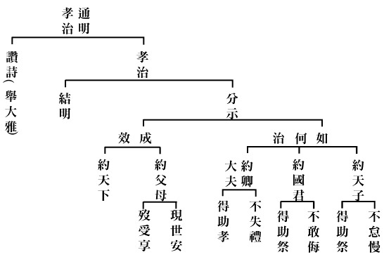

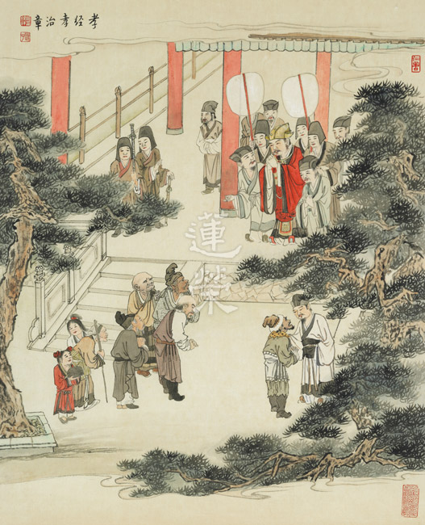

### 三字經簡說（四）

*淨爾整理*

對境生理心理反應

各種莫名情緒發生

理智調控發與不發

善巧經營五倫十義

經文：

曰喜怒，曰哀懼，愛惡欲，七情具。

喜悅、生氣、哀傷、恐懼、喜歡、厭惡和慾望是人類的七種基本情緒。《禮記》禮運篇中就寫著：「何謂人情？喜怒哀懼愛惡欲七者，弗學而能。」也就是這七種情緒，人類是不需要透過後天學習就與生俱來的。

喜：〔禮記集解〕：「蓋人值所好則喜」，喜就是愛的生起。遇到喜歡的人事物就生起歡喜心。例如有朋自遠方來，不亦樂乎。孔子學習樂以忘憂，或以心轉境而有的樂：「飯疏食飲水，曲肱而枕之，樂亦在其中。」這是以心轉境而能從眾人眼中的苦轉化為自己的樂。

怒：「值所惡則怒」，怒就是不愛的生起。例如遇到逆境或不如意的人事物而起了瞋心、感到生氣、憤怒。瞋火能燒功德林，一怒之後往往招來後患，例如赤壁之戰曹操中了周瑜的離間計而怒斬蔡瑁而種下敗因、明末吳三桂衝冠一怒為紅顏而引清兵入關，事實上，孔子也提醒世人「忿思難」愈是生氣時愈須考慮後果，避免鑄下大錯。

哀：因為失去所愛而感到哀傷。例如顏回過世時，孔子因為傳承的中斷而哭之慟，並且傷痛地說「這是老天要亡我啊！」哀的另一個面向是因為看到他人失去所愛的傷痛而同哀或致哀，以同理心對他人的悲傷感同身受。

懼：恐懼，美國前總統小羅斯福曾說：「最大的恐懼就是恐懼本身。」《恐懼的原型》一書中，將人類都想擁有但也害怕失去的自我狀態分成四種：一、自轉：想保持自我獨立的慾望。二、公轉：想得到他人的認同的需求。三、向心力：對恆常不變安全穩固的堅持。四、離心力：對嘗新求變的嚮往。以上四種即是恐懼的原型，也是人類恐懼的常態。但《論語》裡則說「勇者不懼」，因為勇者依於仁智，凡所應為之事不計艱難，勇於實踐，因此而能不懼。但孔子也說人要「臨事而懼」，這是要提醒世人辦事時要在細節上、在前行與過程上講究，懼是為了讓人能謹慎而為，避免犯下過失。

愛：心的貪戀，因此而有愛執，也就是看到喜歡的，執著不放。得不到就牽牽念念，得到了又患得患失，得到又失去則所有怒哀惡懼的情緒都跑出來了。

惡：愛的相反。〈禮運〉：「死亡貧苦，人之大惡存焉」，老病死是人之所惡，卻也無人能離開老病死。每個人都想遠離所惡親近所愛，可往往是擺脫不了所惡、所愛的卻似近還遠，因此在愛惡中打轉，負面情緒蔓延，於是情緒管理成為現代人從小到大的人生課題。

欲：所愛的得不到而產生了欲。《佛說八大人覺經》中說「多欲為苦，生死疲勞，從貪欲起。少欲無為，身心自在。」人因為多欲，耽溺於追求財色名食睡，往往對能令我樂的生貪，令我苦的生瞋。〈禮運〉：「飲食男女，人之大欲存焉。」孔子也說「富與貴是人之所欲也，貧與賤是人之所惡也」，在世俗上每個人都要跟財色名食睡這五種欲望共處，貪多了就會生起種種煩惱，當我們面對所愛所惡所欲，都應當以中道調和之，以仁道處之。

經文：

匏土革，木石金，絲與竹，乃八音。

匏瓜、土、皮革、木類、石頭、金屬、絲弦、竹管這八種材質都可以用來製作樂器，不同的材質製作出的樂器產生不同的音質，故稱為八音。

匏：葫蘆類，可以製作笙、竽。土：用土燒製而成的樂器如壎、缶等。革：使用動物皮革製成的樂器如鼓，多為打擊樂器，擊打後具備振奮人心、提振士氣的效果。

木：木類的樂器如柷，今日較常見的如木魚，聲音沉穩。石：例如堯舜時已有的磬乃是用玉料或石料琢磨而成。金：金屬類的樂器如銅鑼鐃鈸、編鐘等。

絲：利用絲絃發出聲音的樂器，例如琴瑟、琵琶、古箏等，多用手指彈奏，音域變化較寬廣。竹：以竹管穿孔製作而成的樂器如笛、簫等。

根據〈樂記〉：「凡音之起。由人心生也。人心之動。物使之然也。感於物而動。故形於聲。聲相應。故生變。變成方。謂之音。比音而樂之。及干戚羽旄。謂之樂。」因為人心的活動而發出聲音。人心內在的活動又受到外在環境的影響，因為受外物觸動所以表現於聲音上。不同的反應發出不同的聲音，而不一樣的聲音相和相應就顯示出其中的種種變化，若將這些變化列成一定的格調就成為音，音的排列組合配以樂器與文武之舞，就是所謂的樂了。

可見人類內在的感受和外在環境相互影響後，自然而然以聲音表達思緒，所以有上古時期黃帝命伶倫造樂和伏羲氏製作琴瑟，古人利用八種不難取得的材料製作出數十種能發出不同聲音的樂器，在儀式祭典中各種樂器合奏，營造出莊嚴和諧肅穆的氣氛。周朝平定天下後，周公制禮作樂以端天下，這是廟堂之樂。孔子困於陳蔡兩國之間時也絃歌不輟，甚至孔子隱居在家和弟子們共處閒聊時也有音樂聲以伴，例如《論語》〈先進篇〉中，孔子問弟子們的志向時，曾皙就在旁邊彈瑟。可見好的音樂可以明心志、化人心，同時成己又化物。

經文：高曾祖，父而身，身而子，子而孫，自子孫，至玄曾，乃九族，人之倫。

本段說明九代直系血親的輩份關係：往上追溯從高祖父、曾祖父、祖父、父親到自身，往下則有兒女、孫子、曾孫、玄孫等共有九代親族，這就是人在家族中的倫常關係。

按輩分排序，應該是「至曾玄」，但作者因求諧韻之故而寫做「至玄曾」。

為何只有往上只溯源到五代呢？因為人類壽命限制之故，五代同堂尚且偶爾能見，但六代以上則是極為罕有。

關於中國人的親族稱謂，最早也最詳盡的記載在《爾雅》一書的〈釋親篇〉中可以一覽中國人對親族稱謂和社會結構的精細講究，實和西方人只靠少數單字，不分老少長幼通通涵括的大有不同。

經文：

父子恩，夫婦從，兄則友，弟則恭，長幼序，友與朋，君則敬，臣則忠，此十義，人所同。

有了九族，自然就產生五倫關係。父子有恩，慈孝在中，夫婦和順相從、兄長友愛弟妹，弟妹恭敬長上，講究長幼尊卑的次序；同門曰朋、同志曰友，朋友之間講求朋誼友信；作君上的要禮敬臣下，作臣子的要對國君忠心。這十種義行是人人都必須作到的。

此十義和七情一樣典出《禮記》〈禮運篇〉，〈禮運篇〉中提到講信修睦有利於人，爭奪相殺是人的禍患，所以聖人要「治人七情，修十義，講信修睦，尚辭讓，去爭奪，舍禮何以治之」。也就是一旦父子無親恩、夫婦失和、兄弟反目、朋友無信、君臣無義，一個國家必然陷入混亂，因此必須以禮教節制、調和我們的七情、落實這十種人義，這就是聖人治國的方法。

以上，在「知某數」的部分，從天地四時到人倫十義，既涵括了基礎知識也蘊含人生哲學。接下來的「識某文」則說明為學的基礎與次第，包含經史子書和史學，一展古代學子的學習概貌。（下期待續）

參考資料新增：恐懼的原型，商周出版。

## 藝術賞析

### 孔門七十二賢淺說（十九）─有若

圖／江逸子、文／時哉

言行似孔子

曾受尊為師

雖非八大派

論語稱有子

有若，姓有名若，字子有，《論語》中稱為有子，魯國人。《史記》︿弟子列傳﹀認為有若小孔子四十三歲；《論語正義》引《孔子家語》則認為三十三歲，各說不一。

孟子說：宰我、子貢、有若的智慧足以知道聖人的內涵。子夏、子張在孔子過世後，曾經以有子的言行氣象似聖人，而想以侍奉孔子的禮節侍奉有子，後為曾子所反對。由此皆可見有子的學養及其在孔門中的地位。有說論語除了孔子弟子編輯而成，另有曾子及有若學生參與編輯，對中華文化的延續與傳承有莫大之影響。

《論語》中記載了數則有關有子的重要言論。例如在學而篇的第二章，有子說道：一個人能夠善事父母以盡孝，善事兄長以盡弟，這樣的人處於社會，很少會有喜好犯上的，不喜好犯上，則必不好作亂，社會由此而安寧。他並引用了孔子的言論：君子務本，本立而道生。孝弟也者，其為仁之本與。意思為，君子修道務求根本，根本就是修身，正所謂：自天子以至於庶人，壹是皆以修身為本。能以孝弟修身則所學能有立，進而可得其仁，得其大道，因此行仁以孝悌為本，以孝弟為大。

有子不僅立德、立言，他也立有事功。《左傳》上記載，吳國於魯哀公八年時起兵伐魯，進軍駐紮於魯之泗上，魯國的大夫微虎籌組突擊隊，準備夜襲吳王官舍，經過甄選，選出了三百人，有子亦在其中，而後季孫氏認為難以成功，只是多傷國士，不如停止，然而吳王已經聞風喪膽，一夜三遷，最終與魯言和。這是有子以忠勇愛國之心，震攝強敵的事蹟。

畫中的有子眼神堅毅、形態穩重似孔子，儼然是一位學有所本，道有所成的仁人君子，講信用、能守禮、能用和，並且有知人之明，懂得親近有仁義的人。

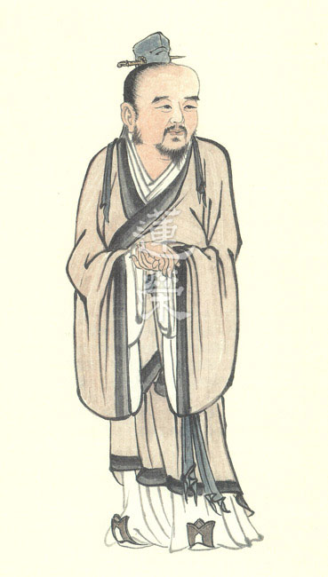

### 華夏精魂千秋(二十)
		—明倫史畫─仁者無敵─劉秀

華夏精魂千秋(二十)

—明倫史畫─仁者無敵─劉秀

圖：江逸子‧文：淨域

王莽篡位天下亂

年少出頭歷艱難

隱忍兄喪北招降

終至一統稱中興

史話

漢光武帝劉秀，字文叔，漢朝南陽郡蔡陽縣人，生於哀帝建平元年，崩於中元二年(西元前五-西元五十七年)，為漢高祖劉邦九世孫。秀年少喪父，由叔父劉良教養，長大後前往長安學習《尚書》。某日執金吾出巡，秀見其車盛威壯，不自覺地說：「仕宦當作執金吾」，豈料後來登基為帝。

王莽新政天下騷動，樊祟起兵於山東，把眉毛塗成紅色，號稱「赤眉軍」。王匡起兵於湖北，號稱「新市兵」。王常起兵於江陵，號稱「下江兵」。陳牧起兵於荊襄，號稱「平林兵」。二十八歲的劉秀從長安回到故鄉，與哥哥劉縯起兵討莽，號稱「春陵兵」。

劉秀的春陵兵與王匡、王常之部統合，號稱「綠林軍」，為順應人心思漢的潮流，擁立漢朝宗室劉玄為更始帝，拜為偏將軍。地皇四年(西元二十三年)，九千綠林軍遭四十二萬莽軍圍困於昆陽(今河南省葉縣)；劉秀率十餘人突圍，領三萬援軍回擊，以少勝多大破王邑主力，拜為破虜大將軍。

綠林軍攻入長安，杜吳殺王莽，新朝滅亡，天下紛亂。更始帝殺功臣劉縯，劉秀因與陰麗華成婚，而未受到加害，被遣赴河北負責招降諸軍。秀領數百人渡過黃河，一路撫輯流亡、廢除苛政、平反冤獄，贏得河北諸郡人民的擁戴。

巡行邯鄲時，赤眉軍在黃河以東據守，趙繆王之子劉林獻計掘開黃河，以水淹沒赤眉軍。劉秀不忍蒼生受害加以拒絕，劉林便擁立卜算師王郎為帝，起兵造反。劉秀漏夜逃至滹沱河，正苦於無船可渡時，河面忽然結冰，眾人急忙踏冰而過，轉危為安。

劉秀為擊滅王郎，求助於信都郡(今河北省冀州市)太守劉揚，因娶劉揚侄女郭氏為妻，才借得十萬兵擊潰王郎。更始帝封他為蕭王不受，另樹旗幟掃蕩河北，平服銅馬軍。更始三年(西元二十五年)六月，赤眉軍立劉盆子為帝，劉秀亦在鄗城稱帝，改元建武，國號仍為漢，史稱東漢。

九月，赤眉軍攻破長安，劉玄敗降將璽綬送給劉盆子，自封為畏威侯。赤眉將領張印為絕後患，十二月派人將劉玄縊死。次年劉秀遷都雒陽，先後蕩平赤眉軍張步、隗囂、盧芳諸部，待至建武十二年(西元三十六年)底，消滅盤據四川的公孫述成家(國號)政權，才光復漢業統一版土，世稱「光武中興」。

圖解

本綠林軍入長安殺王莽，劉玄被擁立為帝，建立更始政權，殺反對派貴族劉縯。弟劉秀被任命為破虜將軍，其自覺兵力寡弱，表面上不敢居功，且不為兄服喪，暗地裡已決計要擺脫控制，自謀發展。更始元年(西元二十三年)十月，劉秀行大司馬事，持節北渡黃河招撫。駐軍於邯鄲時，與劉林、王郎不合，察覺性命有危險，即快速引兵北去，渡滹沱河往真定(今石家莊市正定縣)，再進至薊縣。

本圖所繪為劉秀大軍離開邯鄲北行，至滹沱河受困之景，全軍苦於無舟楫可供渡河。圖中柳樹枝椏光禿，地面一片冰雪，人馬皆裹著厚衣，顯然正是嚴寒的隆冬之季。在這寒冬裡河面結起薄冰，人馬既無法涉水過河，又無舟楫可供調遣，劉秀與眾擔憂王朗的追兵，不禁焦急地回頭張望。畫中人物多蹙眉轉頭後望，似乎憂惱著敵軍就要追來了，這下子該怎麼辦呢？一夜風雪過後，派出的探子回報了好消息，某處河面冰層厚度足以承受人馬，便欲轉往該處強渡過河。

一夜間河面冰層增厚，可堪承受人馬行走，這太不可思議了，顯然這夜氣候極端下起暴雪，露宿在野的人馬吃盡苦頭。春秋時期楚平王好色，奪太子美女引起父子嫌隙，太傅伍奢勸諫被囚，楚王召其子伍尚、伍子胥入宮欲殺之，伍子胥與太子一同出逃。行至陳、吳國境的昭關，聽聞楚王下令重賞緝捕，伍子胥悲怒驚懼交錯下，一夜間髮色全白而過了關口。

俗謂「天人感應」，落到世間就是「人在做，天在看」。不論劉秀渡河的一夜急凍，或伍子胥過關的一夜白髮，其後果都不出於前因。劉秀在邯鄲對掘堤水淹的計策斷然否決，雖使得他被迫離開且遭受追擊，然而仁者無敵，這也讓他往後獲得民心的擁戴，完成了恢復漢室的中興大業。（下期待續）

### 孝經圖簡說(十七)—事君章　事君章第十七

圖／江逸子、文／時哉

事君推動安民策

調和朝廷鼎鼐功

退居家中思補過

為公發心是大孝

孝道的實踐能令君子和諧各方，感通神明，並懂得依禮進退。

本章江先生的畫作分上半段與下半段，下半段是此人退朝回家，能反省、寡過、讀書。庭院的竹子，表徵孝子的氣節與虛心；上半段是進入朝廷時，能順國君之美、能匡救國君之惡，畫中只見國君表情祥和，兩手示意平身，兩旁執笏大臣用佩服的眼光與表情看著他。真正的孝子，就是這樣一位人才，在辦事上是幹才，但也不會鋒芒畢露、功高震主，反而是調和鼎鼐、一派謙德；回家時竟似寒窗苦讀，此種人在朝廷裡面，也不會引發嫉妒與毀謗，歷代畫作風格雖不同，但表法一致。(下期待續)

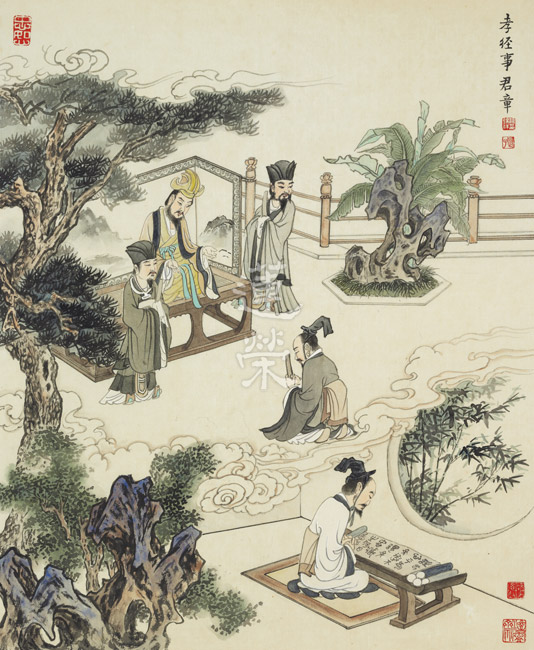

## 蓮池海會

### 林寶增老居士往生見聞記

玉華

代兄從軍臺灣情

溫州手藝家鄉心

年高壽終助念後

不枉敦倫慈善業

林寶增老居士，生於民國十五年四月十一日，浙江省溫州人，在家排行次子，幼時受私塾教育，平日在家中幫忙木作與農務，後因日本侵華時局不靖，老居士代兄從軍，未能盡享家庭天倫之樂。之後山河變色隻身離鄉來臺，在同鄉的長輩撮合首肯之下，與林張雨妹女士共結連理，組建家庭。

戰後臺灣百廢待興，老居士經過幾次創業，為了讓家庭求得溫飽並有穩定的收入，最後選擇了與民生相關的餐飲業，與夫人胼手胝足，每天黎明即起，張羅生意，子女年幼時還賣豆漿，清晨將前夜浸泡的黃豆先磨成汁，經過紗布過濾除去豆渣，再將豆漿煮沸準備出售，同時要準備包子與燒餅製作出爐，讓上課的學子與上班族能夠吃到熱騰騰的早餐，一切努力就是要讓家庭生計能夠維繫。經營地點從臺北市廈門街、臺北火車站，最後落腳到永和，以溫州餛飩大王為招牌打響名號，在當時的眾多餐館中有效地區隔市場，並展現出老居士飲水思源不忘故鄉的情懷。

老居士白手起家，與林張雨妹女士共同經營家園，育有二男三女，在食指浩繁的壓力下，辛苦把五個子女拉拔長大，老居士遺憾自己書唸得不多，所以想方設法給子女們受教育的機會，五個子女皆讀到大專以上，有的持續精進到國立大學的研究所，老居士在對子女的栽培與教育上一直不遺餘力，遍耕知識田與功德田。

孩子們假日總在店內幫忙，遇到同學要討論小組課業，就請同學們來店裡商討課業，同學們都很喜歡來店裡，因為父、母親熱情好客，餛飩乾麵燙青菜，烏醋、辣椒任你加，有的同學還直說羨慕，每天都可以有這麼多東西可吃。

老居士也會要求子女一定要學會做包子煮麵，所以鼎泰豐小籠包的黃金十八摺實是基本功，擀皮、包餡、擺蒸籠、炊包子，下麵加湯撈麵起鍋，就連市面上失傳甚久的二黃炒麵，都是店裡的拿手菜。

老居士生活規律，長期茹素，七十歲退休之後，一方面返鄉祭祖盡孝道，一方面親近佛法勵精進，並於七十五歲之後持續參加禪修班初級、中級、高級班，受八關齋戒勤修三學，民國九十一年參加佛指舍利祈福大法會，在佛法的大道上持續精進。

老居士求知慾旺盛，平日從報章新聞獲取新知，即使已年高九十，遇到不了解的字句，還會詢問兒孫輩發音唸法與意義，這種持續精進的心真是令人讚佩，老居士雖然只有私塾的學歷，但是有豐富社會大學的經歷，而創新創業的精神，與現今社會的新創事業企業家相較不惶多讓。

老居士平時沉默寡言，但是有著一顆柔軟的心，而且遇到重要關頭更顯冷靜，在四十年前夏季的某日，計程車司機與乘客因語言誤會引起爭執，兩人下車後在街上追打，乘客跑至老居士店內躲避，老居士在騎樓下攔住司機並取下鐵器，安撫司機說要忍一口氣，這樣傷人之後是要坐牢的，如此太不值得了，說罷拍拍司機的肩膀安撫情緒，就這樣化解了一場可能的血光之災，老居士真是見義勇為。

另外，老居士因為少小離家，思慕尊長，愛屋及烏之下，老居士對岳丈家很是孝順與敬重，關懷備至，而老居士對鄉親、友人的照顧，更是不遺餘力，甚至還護送鄉親的骨灰返回溫州故里。對街坊鄰居長者總是關懷照顧，老居士這些柔軟、貼心的舉止，對後輩的啟迪甚大。

老居士平時不會長篇大論說道理，而是在生活中以身體力行來表達，雖然這兩年來老居士的體力、智力漸不如前，常常一個人靜靜地坐在椅子上，回應問候雖是簡短的隻字片語，但是後輩們從言談中仍感受到老居士濃郁的關愛。

今年三月學會開學後，子女便相邀並陪伴參與週四共修念佛，老居士生前叮嚀囑咐不要急救，子女之間也有如此的共識。四月中之後，老居士變體力衰微，漸漸無法起床，往生前一天，老居士開始喘息不停，子女便邀請學會善知識探望關懷，善知識建議將老居士移至客廳休息，並囑咐子女陪伴老居士身邊，排班念佛，也在老居士旁肯定其一生的善行。往生當日，老居士喝過大悲水，在家人開解後，身心舒暢，隨即往生。

老居士一生，對上以孝、對下以直、對人以德、對事以真，關愛家人，知恩惜福，學習佛的智慧，真是欽敬。在老居士往生關鍵時刻，得到老師與諸蓮友的助念，相信老居士必蒙佛接引、往生西方，在西方美好的環境下繼續學習，必能快速花開見佛、圓成佛道、回入娑婆、廣度有情、滿菩提願！

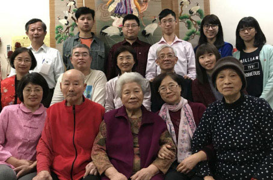

## 活動報導

### 見習經營淨土的一分
			｜記金春花居士來學二三事

見習經營淨土的一分

｜記金春花居士來學二三事

淨昌

專誠學法令人賞

質地淳厚堪栽培

有心推展聖教量

論語講要是開始

有金春花居士者，適於今年四月十一日至五月九日來臺，研學論語並隨緣參與學會既定課程與助念等法行，為祈事能自利利他，特為之紀錄二三事。

記年少事

金居士是北韓朝鮮族人，祖父移民中國東北吉林定居已歷三代，居士尊親原是音樂老師，因時代因素，下放鄉間勞動，家貧而育有三女。居士行三，為改善家計，居士中專畢業後即隻身赴日工作，從事貿易行業。赴日初期，居士日間上班，夜間上補習班學習日語，因日夜勞心勞力，又一心賺錢以安養雙親老年，加以身處異國環境，居士有將近五年夜不成眠。

經居士三姊妹十多年努力工作，終於能為雙親置產，居士自己亦結縭日本夫婿。本以為可使雙親安養天年，誰知天不假年，雙親竟於一月之內先後過世，居士哀傷過度，一病十年身心不振。

結緣

後居聽聞上淨下空老法師講經光碟，對儒、佛二教心生好樂，喜樂修行，奉齋茹素。但因旅居日本環境所限，僅偶而參與日本淨宗學會不定期三時繫念法會，以拜佛念佛求生西方為主。因無機會經教深入聽聞，對助念法門亦無所悉，於淨土法門相關疑問亦無處求解。

近年參與每年一次的松戶市國際文化節策展，去年負責一個小展廳，欲展出「孔子聖蹟圖」，而接觸「時哉時哉網路教育學院」教育平臺，並進而致信老師求助指導，在兩位老師及張如磬師姐的協助下亦圓滿完成展覽，並進而引發居士思欲來臺進一步學習聖教的好樂心。

計劃

原本居士想來臺三個月學習，但因其為中國籍人士，觀光簽證最多十五天，後經學會協助以文化交流學習論語等名義，多方波折方得到一個月的簽證成行。二十八天的課程規劃以《論語》二十篇為主軸，以雪廬老人所講的《論語講要》為教材，每日上、下午各三小時，聽聞《論語》一篇的教學；並隨緣參加學會例行講經課程與共修活動，如周一的《維摩詰經》講座、週四三代共修與《華嚴經·問明品》講座、周六下午啟蒙經典講座及周六晚上共修與淨土十疑論講座。另外為觀摩結緣各地讀書會研學，亦於來台第二週及第四週分別參加中壢茅茹讀書會及東勢共修會課程，在東勢期間並抽空一覽當地鄉間風光及參訪實栽農園。

展開

本次《論語》課程總計動員學會十三位資深師長，十位上班族及三位家庭主婦，都隨從兩位老師學習儒佛教法多年，從課表排定到上課期間約一個月時間，每一位最少負責一篇，最多有夫妻檔一起上場的要準備四篇，雖有時間壓力，但是大家皆乘機給自己好好讀書的機會，不再有懈怠的藉口。雖說是自他兩利，實則得益最多的應是負責上課的師長，除了藉機嫻熟《論語》，有些道理是自己說了以後才會懂的。

課程如期在四月十二日展開，居士客居學會頂樓，克服初到環境之不習慣，作習規律心無旁騖，每日清晨五時即起，香燈拜佛為課，並複習預習課程。居士因旅居日本二十餘年，僅每一、二年返鄉省親時方使用中文，所以日文嫻熟程度遠勝中文，剛開始幾日顯得學習較為困難，略顯自信心不足，但隨著課程一天天演進，居士逐漸進入狀況，從不作筆記到開始作筆記，也能開始提問，並如實回答問題。期間恰逢林寶增老居士示現往生，居士亦隨團體安排見習助念等事。

居士生來質地淳樸，世間欲望及希求極少，又具備孝道，能盡己力奉養父母，又能發心在異邦日本發揚孔子聖道，相較五光十色的花花世界中的芸芸眾生，居士實是修學儒、佛二道的難得人材。但好的質地需要正確的知見滋養，才有可能進而成熟為聖人的知見，所以雖然居士在教法上的程度屬於初機學佛者，但學會希望透過各種課程的安排建立居士正確的知見，以利往後修學：

第一、團體的修學遠比個人獨修容易進步，所以禮記學記上說：「相觀而善之謂摩」，又說：「獨學而無友，則孤陋而寡聞」。在團體中學習，不但可以觀摩善友的優點，也有利增廣見聞，更可以在自己心境地低落時有人拉你一把，使自己不在共業逆流中退轉。

第二、在老師的指導下，要進行廣博的學習，才能深入的紮下自己的善根。所以雖然在《論語》中學習到孔夫子入世的抉擇與人情世故的通達，也要由維摩詰經中見識不思議菩薩的智慧與神變，才能真正認識了知孔夫子入世的智慧後面的出世智慧；而觀待淨土十疑論除了經文建立往生的正確知見，後面補充資料的宗派見解才成立聖人的出世智慧；最後再進入老子治國的大略，了知禮運大同篇天下為公的理想。所以顏回才會讚歎夫子的教學方法是：「博我以文」，子貢才會反駁棘子成說，如果沒有聖賢經典的學習，連分辨教法的眼力都無法建立，魚目變成可以混珠，本來去菜園是要除草，因為沒有分辨的能力，反而把菜苗給拔了，可見廣博學習是如此重要。

第三、團體要和合才能辦事，經論上說四個和合僧的威力等同登地菩薩，可見和合的重要。以此次能成辦金居士來臺學習的課程而言亦復如是，從開始簽證的申請、課程的規劃、居士生活事項安排、師長們備課及上課及各地讀書會的協助等等。林林總總每一環節都有賴多年的默契及團隊的和合才可呈現最後的教學成果，願大家都能好好珍惜維持。

第四、法不孤起，必賴因緣。而因緣中到底是內因重要，還是外緣重要？其實內因具足固然重要，即便像祖師禪宗六祖惠能大師及天台宗四祖智者大師，這樣內因具足具生慧的聖者，六祖沒有遇見五祖弘忍可能只能是樵夫，而智者大師沒遇見慧思禪師如何發揚判教真諦。反之內因不足而具足外緣，例如往生淨土的九品眾生，下下品犯五逆罪的凡夫，法身慧命都可以安然在極樂世界成熟。又如金居士質地淳樸，又樂佛法修行，沒有此番來臺薰習正知見，只能困居異邦苦修，以為修行只有吃苦，無從在他日生出正見的翅膀，快樂遨遊儒佛道三教的天空。

第五、真正修行並非不碰境界，不理世事。所學到的正知見如果沒有在辦事中磨練，不會成為紮下深根的大樹，只能成為一拔即起的雜草。所以廣博的學習到一定的程度，就要同時去歷事練心，到順境裡去看我執、我慢、我貪，到逆境去看我瞋、我恨，煩惱跟智慧都一樣沒有自體性，觀待自他條件具足就會生，在煩惱中對治才是針對治，獨自清修只是不碰境界而已，是無法成立對治的。

結語

居士來臺至今截稿日已歷十七日，《論語》課程也順利進行十三篇，也祈求三寶加被剩餘七篇陸續能在未來十一日圓滿。雖然學會從上至兩位老師，下至所有蓮友大德，所有人都知道要在短時間的一個月內完全通達《論語》是很困難的，即使這一個月是無有休息不間斷的上課。但是我們從歷年老師所辦儒佛講座的經驗亦可得知，集合幾日辦連續講座的效果，要比每週一次講座好很多，教法不中斷的學習不是一曝十寒所能比擬，相信這次課程必可帶給金居士未來通達《論語》的好緣起。

### 人生不一樣的挑戰
       ｜我在木之花的一個月

人生不一樣的挑戰

｜我在木之花的一個月

修陽

挑戰能豐生命

熱情能激恆毅

背後支柱母愛

朝陽迎向未來

困惑我幾個月的重大決定，在唐老師和家人的鼓勵支持下，總算讓我定下心來，去挑戰木之花在二月二十五日到三月二十四日一個月的特別課程。除了透過翻譯增強日文能力外、最主要目的也是要經由所有的課程增長見聞、結識朋友。（這也是家人最大的期望）。

配合開課日期，我提前四天到日本，重遊了去年十月份農耕組駐足的池袋，也在東武百貨美食樓吃午餐，逛了我的最愛位於「御茶ノ水」的樂器行，一飽眼福。開課前一天，在東京車站搭東名高速巴士前往木之花。時間的流程雖都在家母的精算中，但因為高速公路的大塞車，原本預計三小時的車程，我們搭了四個半小時才到。踏進向日葵大食堂，我有種回到時光隧道的感覺，幾十張熟悉的面孔擺在眼前親切的招呼聲（修陽歡迎你回來），還有熱情的小孩子們一窩蜂的擁上來，你一口我一嘴的問了很多問題，但這可不是我的強項，差點招架不住，幸好有準備一些糖果餅乾類的伴手禮，才把他們一一的打發掉。

晚餐後、道代小姐馬上告知我此次研修內容的大綱，早上八點半到晚上十點半，中午十二點到兩點是午餐和午休時間，每個星期六可以自由行動，學員可以外出觀光旅遊或購物，也可以自選想精進的內容。上課時間非常的緊湊，這可讓我倒抽了一口氣，心想我行嗎？這可是體力和精力的最高挑戰啊！可打退堂鼓嗎？側眼望了一下家母，她一副悠閒自在的表情，完全沒有協助的意願，頓時讓我浮躁的心情展露無遺，道代小姐也查覺我的不安，緊忙告訴我不用擔心，還有另外一位上海小姐和你一起翻譯，中途還有兩位中國人會來幫忙兩、三天，這才把我心中的大石卸了下來。

晚上移步到負責人古田先生住處，再次確認翻譯方式和課程細節。他拍拍我的肩、握著我的手，說了句「那就拜託了」！雖短短的五個字，也意味著我逃不掉了，未來的一個月，我必須在這奇妙的地方和這團體生活下來。

二十五日當天中午，桌上已擺好精美的套餐，加上學員和家族成員全體的集合，大食堂的熱鬧景象可想而知。此時我也正式和上海的女翻譯（金小姐）見面，她和我同齡，看上去就是一位有活力且自信滿滿的人。在用餐中，道代小姐已一連串的介紹木之花的設施和研習流程，此次的學員人數共十六人，每一位學員都有一位固定的輔導員，以方便在木之花的生活起居不會有困擾。其中日本四人、泰國二人、大陸三人、臺灣七人，大多數年齡和我相倣，由此可一窺我們臺灣人多麼熱衷學習和對人生探索的熱誠。午餐後學員入住木之花庵稍作休息、沐浴、晚餐後迎賓晚會隆重上演，很多學員都被木之花樂團的歌聲和舞蹈感動落淚。這晚我累到很快就睡著了。

二月的富士山周邊還真的很冷，加上前睌的激舞，我和翻譯的金小姐都睡過了頭，勉強趕上開課時間。首先是學員的自我介紹，語言用日文、中文、英文同時進行，我一直很好奇這些人是何因緣？是何心念？離開現實生活和親人而想來此學習。透過每個人的自我介紹後，總算有個雛形出來。有的是想成為木之花成員的事前體驗，有的是從事輔導吸毒犯罪的青少年，使其回歸正途重返社會，還有的是工作上遇到瓶頸。中國和泰國的學員都比較著眼在未來的生活型態和社群的融合。臺灣人中有兩對夫妻，從事中醫的夫妻帶了一對姊妹（四歲和兩歲），另一對夫妻帶了三歲的女兒來。他們的目的是想學習和大自然調和的生活方式和親子關係，孩子們當爸媽在上課時、就由木之花的褓母來照料、因語言不通和生活環境的改變、我看到她們時幾乎都在哭，內心祈禱不要在她們心中落下陰影。另外有三位中年婦女，他們是好友結伴而來，意圖就比較不明朗。配合學員的程度和需求，今年增加較多心靈面的課程，讓學員有較多時間能暢談內心思維與大家分享。也正因如此，有的在內容表達上太過抽象，有的敘述得不是很完整，翻譯的難度隨之增高，為此和學員也有數次的爭執，讓我感到不悅，回想起來一個月中有好多次氣氛是非常僵硬的。但無論我們在課堂上有任何的表現，古田先生絕不阻止，讓我們盡其所能流露，目的在於看清自己進而學習改善。

原本預定的農業操作刪減只剩一次，餘興課程有做草莓大福、手工蕎麥麵和豆皮飯團、製神酒、酵素與味噌的初步製程，也用大木槌很有節奏的打製年糕（麻糬），這可是很激烈的運動，造成隔天肌肉疼痛，數日後才恢復正常。原想在課餘後練習吉他，還專程從台灣帶了過來，但每日的活動根本無暇想到，倒是在學期中歡樂會上讓學員各展所長時、才有機會練練它。印象最深刻的是泰國女孩的舞蹈和開朗樂觀的態度，全員對我當晚的表現就用一句現代流行語來稱讚我「帥斃了」。

結業前一天、木之花的演藝組根據成員中的一人編了一齣戲，此人因罹患子宮頸癌大出血數次住院治療，曾被醫生宣告危機，但卻出奇痊癒。每回探病的人數都非常的多，年齡層也很廣，每日的手工料理都很精緻，在護理室成為熱門話題，也間接讓木之花的生活形態公諸於世。劇中有提及，人類來這個地球的意義和使命，和對無形界中所謂的死神和瘟神，負面能量神衹的正確認知等等。我們會生病和不順也非偶然，都是有它的前因後果。重點在面臨重病和逆境時，應以反省和虛心接受的心態來面對。此真實經歷改編成將近一個小時的戲劇，很多人都感動落淚，不覺中我的眼眶也濕了。此劇本的中文，是家母在東京用一個禮拜的時間翻譯出來的，她也同時翻譯了很多別的資料。事後知道此事，對一個月中，多次打電話為難她覺得很後悔。

在一個月中，說真心話我每天都期盼著能早日結束回家。而且三月份的氣候，早晚溫差很大，還曾下雪，很多人都感冒了，我也是其中一人。雖得以休息養病兩天，但心中總覺得不太踏實和寂寞，只能常到他們經營的「蓮花餐廳」吃美味的料理和點心來緩和心情。這餐廳常常爆滿，常看到賓客攜家帶眷盛裝打扮來用餐，禮品種類越來越多，賓客除用餐外都不忘人手一包，此地已成為地方之光。家母原以為我在這裡應該會瘦下來，但事實證明失敗了。學員中那三位中年女士也是這裡的常客，我猜想品嚐美食也是她們此行的目的之一吧！

結業當天我們為了表達對木之花家族全體的感謝，負責晚餐所有的料理。學員各自使出渾身解數，各地的家鄉菜如煎餃、韭菜包、炒青菜、八寶粥，還有大阪燒等等，我和家母也幫忙捍皮和包水餃，忙了一下午，總算拿出像樣的料理來，得到很高的讚譽，桌上的料理很快就被掃光了。慶祝晚會中，先頒發學員的結業證書，然後在一片祥和的歌聲和激昂的舞蹈狂歡下完美的落幕了。當晚我的心情非常舒暢，感受到空氣無比的清新。回顧這段期間，那麼多人默默的為我們打點生活起居、準備料理、籌備資料、整理文字檔，覺得自己的所做真是微不足道。這晚，我又累到很快的睡著了！

古田先生在結業中的一席話，讓我印象非常的深刻，他說希望木之花的生活方式，可以像微生物的繁殖方式一樣，由點到面、由一傳十、十傳百的擴展出去。然後在這裡的每一人，都能具備和微生物一樣的精神，讓地球的每一寸土地都能恢復到原始最天然的狀態。目前的我，還不知道這次的經歷對我有何影響和意義，但我會先把它安放在心中的一個角落上，讓它自然的孕育和發酵，等未來的我告訴我答案吧！

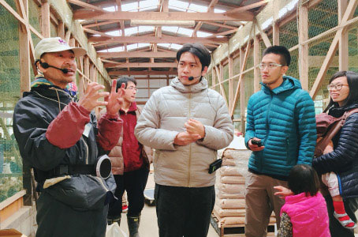

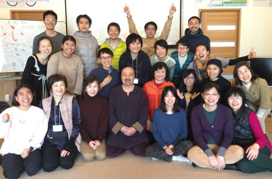
