# 第116期
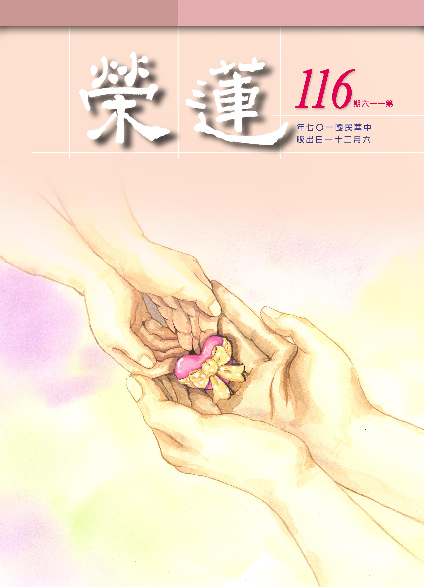

## 社論

### 從觀累世母恩略談面對仇敵的觀修

本刊

認知善惡源

有情曾為母

恩怨皆利我

為彼當成佛

在觀察母親的恩德時，我們知道從母親懷胎到孩子出生，是備嘗辛苦；孩子從幼小到長大，母親不時呵護、細心照顧，心思都隨著孩子起伏；舉凡就學、畢業後找工作，乃至孩子的交友、結婚、買房、買車等無不掛念，沒有片刻稍事休息。如果要在此生一一報答，誠如佛說：「若人百年之中，右肩擔父、左肩擔母，於上大小便利，極世珍奇衣食供養，猶不能報須臾之恩。」而綜觀此生母親恩德如是，時間拉長至長遠劫，一切有情都有機會曾為我們的至親，則一切有情的恩德都如此生父母親一般殷重。

有情於我，或感情親密、或感情疏遠、或相顧不識、或為冤仇。與我們親密的容易觀功念恩，但與我們疏遠陌生或結仇者，又該如何觀察其恩德呢？再說累世以來，有情曾經做過我很多次的母親，也曾經做過我很多次的仇人，這是緣起法的事實。如此，面對又是恩人又是仇人的有情，又該如何正確生起報恩跟報怨的心態？

「冤有頭，債有主」，眾生因未破我執而被煩惱所指使而造惡業，煩惱很可惡，眾生卻很可憐。煩惱是惡業的幕後指使者，眾生造惡業墮三途受苦，所以可憐。因為有情被煩惱驅使而受到傷害的我，想要報復有情，是要報復他還是他的煩惱？最好的報復就是拔除他的煩惱，殺賊必須要先殺頭號戰犯，但是其他隨從者，則要憐憫他們的無知。所以，面對有情眾生，既要報恩又要拔掉他的煩惱，最好的方式就是給予他正知見，不但能解決自身煩惱，更能成就佛道成為眾中尊，一舉兩得。

想要將正法廣傳，菩薩入世首先要跟眾生結善緣，結法緣是所有善緣中最為殊勝，但也是所有利生事業中最為困難的部分，無始以來根深蒂固、自以為是的想法，堅固如須彌、如金剛，所結的惡緣或用情或用理來解決，內心明白皆是自我的磨練。

對於仇懟事件的本身，我們要有解釋的能力；解釋得越完整，則解決的能力就越大。有時候是解除對方的心結，有時候是解除自己的情緒。雪廬老人說，人的一生即使最後入棺材，還是要碰釘子（封釘）的。辦事時，必須懂得如何解除他人的煩惱，處理自己的情緒，情緒傷害時懂得適時給自己療傷，復原了繼續再出發。

總之，名為修行人，面對所有對我或有恩或有怨的有情，或觀修眾生對我的恩德，或懺悔反省自身的惡業，在事項磨練中不斷加大心量。值此母親節的因緣，對此生母恩的觀察，是母親節最殊勝的報恩，不但要報答此世的母親，以及為報答累世母親恩德，有情或為恩或為怨的恩德，發願成就佛果來展現報恩的能力，是母親節最殊勝的莊嚴。

## 佛學覽幽

### 菩薩清淨的行持
       —華嚴經淨行品（三十二）

菩薩清淨的行持

—華嚴經淨行品（三十二）

*戒慧講述‧編輯部整理*

隨處指歸菩薩願

本質大悲潤澤心

安住正法除罪難

離苦得樂自與他

丙二、指事顯因答其徵因

丁一、總徵

丁二、別顯

戊六、乞食道行時願(五十五願)

己一、遊涉道路(十二願)

己一、遊涉道路 路無塵

經文：

見路無塵，當願眾生，常行大悲，其心潤澤。

在外行乞時，見到路上乾淨無塵埃時，希望眾生能發大悲心，使心地滋潤、有光澤。馬路上不是有塵就是無塵，下雨時可以將路上飛起的塵埃沉澱下來，君不見王維的〈渭城曲〉：「渭城朝雨浥輕塵，客舍青青柳色新，」大陸西北方下雨是很難得的，諺語中：「春雨三月貴似油，胡天八月即飛雪」，下雨像石油一樣貴，在阿拉伯的世界裡，礦泉水比石油還要貴。

小雨滋潤了土地，下了一點雨，塵土不飛揚，所以見到路上無塵時，回頭來就外相說內心，如何把外相導歸至心裡？此等內涵真的很重要，不管過程如何，到最後就是要回歸於心，就全有看頭！只要導歸到心識時，那個詩句就變美、變得有內涵、變得可看。結合到佛法的觀修，路上見到乾淨無塵時，表示它經過水的滋潤，水可表徵菩薩的悲心，見到眾生的痛苦及可愛的面相，大悲心才能生起，尤其是可愛的面相這一分更重要，若以布施來說，見到別人痛苦會感同身受ㄧ下，可是如果是自己的孩子(可愛的面相)，見到他痛苦可能會難過一輩子，這跟難過一下是兩回事，所以觀想眾生可愛的這ㄧ個面相是很重要ㄧ環。

此大悲心像水一樣能潤澤心田，使心田中的煩惱塵土不飛揚。南亭老和尚的《講義》中也開示，當行乞時見到路上無塵土堆積時，行人則無風塵撲身之苦，所以我願一切眾生常行大悲，其心潤澤。或菩薩以大悲甘露之水潤澤眾生之心田，令心田中的菩提道種開花結果。

這些講經或實修佛法的大德都很了不起，他們來臺多半是孤苦無依，可是卻怡然自得，而我們這些後輩的日子都比他們好過，當我們在發牢騷的時候，有沒有認真想過他們的胸懷。 雪公來臺灣的時候，也是孤家寡人，年夜飯都是ㄧ個人吃，上課時很多本省學生聽不懂他在講什麼，老人感慨自己回不了家鄉，也感慨自己雖有使命感卻遇種種艱難，過程中只能忍住熬下去，老人常說：三賢十聖忍中行，自許忍之一字諸弟子未及他。

經文：

常行大悲，其心潤澤。其心是指菩薩還是眾生？菩薩常行大悲，所以他的心由悲水潤澤，所以想要讓枯槁的心潤澤，一定得發大悲心。例如某人在閉關，叩關者可請教他功夫如何，可是此閉關者如果不知道如何引發大悲心，此人的成就大概就只有這樣而已，不必太羨慕他，因為修行的關鍵在大悲心，困難在大悲心有沒有生出來，那才是修行者人生的重點所在。

當願眾生是包括菩薩也是當願眾生之列。常行大悲，其心潤澤，首先要談的是，沒有大悲心，心是潤澤不了的，理由是什麼？為何枯槁的心要靠大悲心來潤澤？若無悲心，利益眾生的佛法根本不會去學與開演、發展，傳承這些利益眾生的佛法，如同心田裡有許多善種，若無杯水灌溉，是不會生苗開花結果。

世間講的愛心，儒家講的仁心，跟佛家講的悲心，這三者長的樣子有何不同？儒家的仁心是指有心要幫助眾生成聖成賢的那一分，愛心則只是幫助眾生在生活上脫困的那一分。悲心是幫助眾生解脫輪迴或是成佛的那一分，並由悲心去策動菩提心，沒有悲心是策動不了菩提心的，所以菩提心雖然是成佛的因，但是菩提心的因是大悲心，大悲心雖然不能說是成佛的因，可是大悲心可以說是根本的因，沒有大悲心此人無可觀！儒家的仁心就是君子之德，因為他會策動自己去成聖成賢。

《講義》中說「以大悲甘露之水潤澤眾生枯槁之心苗」，因為有大悲心，幫助眾生生起解脫的能力，如何讓有情生起解脫的能力，特別是說法的那一分。所以孔子一生只有兩種事業：一是為政、一是辦教育。為政不行就辦教育，為政會更有能力支持教育，然而這個時代，為政要看因緣，選舉未必使好人能出頭，但辦教育就很重要，能教出人才，改變時代的命運。

己一、遊涉道路  險道

經文：

若見險道，當願眾生，住正法界，離諸罪難。

六十華嚴：「如見深坑見，當願眾生，向正法界，滅除諸難。」

若見險道，願所依有兩件事，一是願依靠在菩薩身上，一是願依靠在若見險道這件事上。當願眾生，說的是能願所願，能願的是菩薩，所願的是眾生，願菩薩自己都能夠成就前面三業離過成德的諸德利益，所願的眾生得住正法界，離諸罪難。所要觀修的是以下四種，第一是隨喜，若眾生都能住正法界，離諸罪難，該有多好。第二是發願，當願眾生都能住正法界，離諸罪難。第三是承擔，我要幫助眾生都能住正法界，離諸罪難。第四是祈求三寶，讓我有能力幫助眾生，住於正法界，離諸罪難。

會性法師開示：古時候在路上發生危險的機率遠高於現在。險道，簡單的說有兩類：第一是路上若是有土匪、強盜、猛獸。第二是狹隘羊腸小路或懸崖峭壁，上面是山，下面是深谷或大海。在佛法戒律中，不准初學菩薩道的人走向危險的道路上，《梵網經》菩薩戒有十條重戒，四十八條輕戒，其中輕戒第三十七條，戒條說到，如果在學菩薩道的人，莫入難處，包括前面說的羊腸小路，懸崖峭壁，或深山裡沒有路，雜草叢生，可能藏有惡獸，或有獅子、老虎、狼及毒蛇等，或者容易遇到天災等處都要注意，一切有險難的地方，初學菩薩道的佛弟子都不准去，惟恐生命會有危險。

《優婆塞戒經》的在家居士菩薩戒有六條重戒，二十八條輕戒，其中輕戒第十一條，險難獨行戒，若優婆塞受了此戒，卻在險難之處，無伴獨行，那就算犯戒。蕅益大師對此條戒律又解釋，貿然遊行，非明哲保身之道，如懂明哲保身之人，危難之處是不會去的，但是如果是在路上走，本來沒有災難，到了那個地方卻突然發生災難，這樣是無過失的；或有伴一同，到了中途同伴發生問題分開了，此時自己又不得不去，這樣也不算是違犯；或者是為師長、父母的事情，不得不冒險犯難；還有像是救災、救難等等，又或是為三寶的事情不能不去，這樣都不算是犯戒。

會性法師說，或許有人會認為，菩薩本來就不要有我見，而這個身體都是臭皮囊，捨掉又有什麼關係呢？又為何不可以去冒然遊行呢？蓮池大師對此有一個解釋：「人身難得，堪為道器，借假修真。」沒有這個假的身體，不能修真的佛性，人身不易得，不要隨便犧牲掉，六道中只有人道是苦樂交參，也惟有人可以耐苦修道，只有人道可以真正修學佛法，故人身要愛惜。蓮池大師又說，要貴之要保之，要珍貴它、要保護它，但也不是要增長我執我見。

不入險道，佛家是如此說，儒家也如此說，儒家的開示中也說到，君子危城不入亂邦不居，也是要我們愛惜自己，有命才能行君子之道。可是如果為了三寶、為了父母師長，為了有情眾生，為了弘揚正法，此時入險道是許可的，這些都要講究，戒律不是一成不變，它有開、有遮，遮就是有些情況下不能做的，開就是有些情況下是可以做的，就看當時的情形如何。

住正法界，離諸罪難。會性法師開示，住正法界是安住在佛所開示的正法當中，依正法修學可以躍上菩提康莊大道。離諸眾難，是指在正法界中能對治煩惱惡業，自然離諸罪難。

法界是法的界限，每一法有其特徵，《百法明門論》其實就是法界論，將生理、心理和物質現象的各種特徵定義清楚，乃至定義有為法、無為法的特徵，這些合集就是法界。

《華嚴經》將法界開展如四種法界：事法界、理法界、理事無礙法界和事事無礙法界，差別的事相是事法界；這些千差萬別的事相，有其不變的體性（空性）；空性能在一切法顯現，也因自相空，所以在因緣聚合時，一切法生起謂之理事無礙法界；事事無礙法界是能互相含攝，所以佛能化長劫為一念，一念為多劫，將三千大千世界融入在一毛孔，在一毛孔中顯現十方諸佛土。

住在正法界，是對法有勝解，並不是有一個正法界可住，唯有對法的勝解、修學和現證，才能夠遠離罪、遠離難。

住正法界講到究竟處，《講義》：心本虛凝空寂，一無所住。住於無住，名住正法界。住於無住就是無自相（空性）可住，假名住空性上，此時能所雙亡，能住的心與所住的空性皆了不可得，謂之虛凝空寂。

能所雙亡是指現證空性的心識與空性如同以水就水，不分彼此，離諸罪難就是殊勝功效之一。所以有所謂：罪從心起將心懺，心若滅時罪亦亡，心滅罪亡兩俱空，是則名為真懺悔。（下期待續）

### 大乘百法明門論簡說（二十四）　拾參、心所有法—善(二)

*戒慧講述‧淨本整理*

心所分善惡

善用能斷修

止惡能離苦

修善必得樂

經文：

三、善十一者：一、信。二、精進。三、慚。四、愧。五、無貪。六、無瞋。七、無癡。八、輕安。九、不放逸。十、行捨。十一、不害。

三、慚

依據《直解》，慚的定義與業用為：「慚者，依於自身及法，生於尊貴增上，由斯崇尚敬重賢善，羞恥過惡而不敢為，以為體性。別則對治無慚，通則息諸惡行，以為業用。」亦即對於自身以及所聽聞的教法，能夠產生尊貴增上感，進而恭敬尊重賢善之人，對於過惡會羞恥不敢為。這樣的心態不僅個別上能夠對治無慚心所的發生，整體上也可以止息各種惡行。此即懺公表解上所說的「依自法力，崇重賢善為性。對治無慚，止息惡行為業。」

有慚的人，就會提高對自己的要求，依著尊重己靈的信解，不斷提升自己。因為提起教法來要求自己，所以開始懂得尊重善知識，由於懂得用教法來要求自己，所以也能反省過惡，並看重自我反省自己的人，個性及命運都能夠由此轉變。

四、愧

愧是依世間力，也就是外部的力量。《直解》云：「愧者，依於世間他人訶厭增上，輕拒暴惡，由此羞恥過罪而不敢為，以為體性，別則對治無愧，通亦息諸惡行，以為業用。」依靠世間他人輿論的力量，或者國法的制裁，自己能夠懂得輕斥拒絕暴人惡事，這樣的心所能夠對治無愧，並且止息惡行。因為有了慚愧心方能依教法的力量及他人的勸誡引導，從內心止息貪瞋癡，以捨對治貪，以慈悲對治瞋，以正見對治癡。

《佛遺教經》中說慚愧之服，於諸莊嚴最為第一，慚愧就如一件禮服，能讓行者莊嚴。慚愧又如鐵鉤，可以治服非法之心。慚愧二字合稱就是儒家所謂的恥，孔子說知恥近乎勇，知恥的人對於提升自我有執行力，不會沉溺於因循苟且的窠臼之中。沒有慚愧心不但內心毫無反省能力，也聽不進別人的勸諫，善友必定遠離。印祖如此德高尚且稱自己為常慚愧僧，這也是給行者們很好的榜樣。

五、無貪

無貪、無瞋、無癡三者為三善根，因為只有遠離貪瞋癡才能修得了善法，當心中夾雜著貪瞋癡，所修善因就無法圓滿，樂果呈現時就會夾雜苦痛，甚至所修的善行反都成為了惡。或說修學善法的體性在對治貪、瞋、癡，能對治貪、瞋、癡者方稱善法，故謂之善根。

《直解》云：「無貪者，於三有及三有資具，無所染著，而為體性，別則對治貪著，通則能作眾善，以為業用。」三有即三界，欲有即有欲界之生死，色有即有色戒之生死，無色有即有無色界之生死，故稱三有；而這些的有，都是如是因如是果。資具就是資糧器具，三有資具就是一切使眾生快樂的條件，這些條件（五欲六塵）能讓眾生起惑造業，染著在三界中無法出離。因此「有」是就總相上說，「有具」則就別相上講。能夠厭離有及有具，不再染著於其中，稱為無貪，此人才是能夠對治貪著之人，才能造諸善法。更進一步言貪著的對治，可以個別修對治法，或者修學空性的對治法。前者例如對所貪愛的事物修不淨觀，或者觀察貪愛該事物所帶來的過患；後者就是藉由空性的觀察，了知所貪愛之物無自體性可得，不過是自己依業取相，名言假立認為可愛而已，如此深入觀察所執之物無自體性，自然可使能執之心消亡。實則有及有具都是過去的善業而來，今日才能感此樂果，因此在造善之時若沒有正知見攝持，感果必迷惑其中，終將成為三世佛冤。

六、無瞋

《直解》云：「無瞋者，於三苦及三苦資具，無所憎恚而為體性，別則對治瞋恚，通則能作眾善，以為業用。」三苦為苦苦、壞苦、行苦。苦苦是本身就具有逼迫性者，例如八苦：生、老、病、死、愛別離、怨憎會、求不得、五陰熾盛。壞苦則是樂終將變壞之苦，佛法並不否認世間有樂，不過世間之樂終將變壞，變壞則苦。行苦是指身心剎那生滅，遷流不息，無法自主。苦具是在三苦中各有其苦，例如在欲界就特別有生、老、病、死等八苦。於苦及苦具能夠無憎恚者為無瞋，無憎恚要靠觀修，諸如藉由苦報消除惡業的觀修，藉由環境磨練心志的觀修，因為受苦才能生起同理心與大悲心的觀修等，此外上述空性觀修，同樣能夠使瞋恚心不生起。苦及苦具是由惡業來，不造惡業則無苦果，苦果雖須透過正確的知見，仍然可以在受苦中造善，能減低苦果的勢力，也能帶來未來的安樂。

七、無癡

《直解》云：「無癡者，于諸諦理及諸實事，明解而為體性，別則對治愚癡，通則能作眾善以為業用。」諦理就是真實不謬之理，實事就是一切緣起之事，若依唯識宗理論，這些緣起的事相是眾緣所生，唯識所變。在這眾緣所生，唯識所變的世俗事裡，通達彼為苦、空、無常、無我（四諦），或了知其世俗是緣起，體性是空寂的。

以上八種善心所，依據其業用可以如下表分類。信可使人樂善，因為信心在於看到佛法、三寶的功能，看到善法能夠帶來安樂，所以喜好做善。三善根能夠作善，無貪發展布施、無瞋發展慈悲利眾的事業、無癡發展正見。精進與不放逸才能夠讓善業圓滿，因為能夠持續不斷。慚愧表上皆約止息惡行上說（雖也有修善的作用），因為當慚愧心生起，才會願意改進。（下期待續）

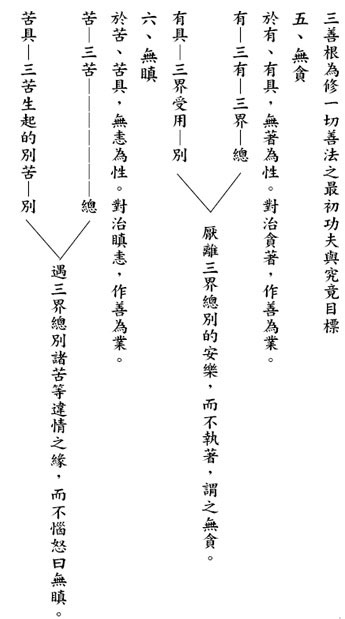

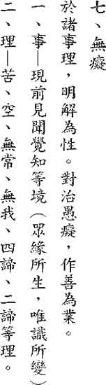

### 佛學概要十四講表簡說（十八）　第二講表

*戒慧講述‧宏法、淨昌整理*

理事四句華嚴義

事理相通事事通

一多相即大小融

維摩丈室納須彌

丁表、法有兩端-事理

宇宙可分為十法界，其中有凡夫、聖人之別，依報、正報之別，色法、心法之別，這都是「事相」。凡聖屬於正報，依報是環境。正報當中又包括色法及心法，色蘊(色法)與受想行識等四蘊(心法)各個差別不同，每一個人的善根、特性、慾望、過去對法的勝解與否，這一生是什麼行業，是什麼樣的修學環境，千差萬別。

述記云：「就『理體』言，則平等一如、圓融絕待。」理體是萬法自體性的道理，萬法自體性找不到，就是空性。平等一如是指每一法的體性都是空性，所以每一法在體性上是平等的。圓融是每一法在空性上都是通的。

絕待是說緣起法是觀待，但是體性空的這一分是沒有觀待的，泯絕觀待的所以是絕待。以十法界的有情眾生為例，約著「理性」的面相都是自體空，所以眾生和佛是無二無異。約著「事修」的面相，就有凡聖懸殊、天淵之別。

吾等學佛最主要就是學習圓融事理的兩端，如果偏執一端，或偏於事，或者偏於理，都會落到邪見坑中。所以聖人對某人特別講事，對另一人特別講理，看起來都只有一端，其實不是，他是以掌握兩端的見解來說一端。《論語子罕篇》：「空空如也，我叩其兩端而竭焉。」對事或理，要談空性的這一端還是要談事相的這一端，都觀待對象而定。

「不可以滯事昧理」，對停滯在事相上的人要特別說理，對停滯在理上的人特別要說事，說法並無一定。

述記云：「只知在事相上行善、修定，而不能解悟『空理（真諦）』與『中理（中諦佛性）』，則不能起空觀、中觀之觀慧」，吾輩學佛即是為了能在事相中體會空理：眼見色、耳聞聲、鼻嗅香、舌知味、身接觸、意知法，或者是行住坐臥、說話辦事都是事相，在事相當中要作體空的觀察。

八仙中的張果老眼力厲害，沒有人能逃過他的眼睛。天台大師的哥哥陳鍼被張果老看相，斷定約莫一個月會死，哥哥很緊張的請教弟弟，弟弟就為哥哥寫一本《天台小止觀》，把止觀門作兩端的修學，談到座上修和歷緣對境修，事相當中分為兩類，第一類是接觸類的：眼見色、耳聞聲、鼻嗅香、舌知味、身接觸、意知法；第二類在接觸當中的造作：行、住、坐、臥、說話、辦事。事相中必須要做體空的觀察（理）。他哥哥按照弟弟所說的修，張果老後來又遇到陳鍼：哇，不得了，相都改變了！陳鍼說是因為修止觀。張果老嘆說：佛門廣大，非我神仙所能及。後來他哥哥多活二十四年，最後臨終坐化。世間一般所見的「兄弟睦」，只看到哥哥和弟弟平常的和諧相處，但天台大師這種出世的講究，才真正叫做「兄弟睦，孝在中」，一般世間作不到。

「體性和事相」，說體性之理的時候應結合有法觀察。例如空性這一法是理，必須要和事相結合。空性是在事相上說空性，而不是另有一個空性。所以談空性理的時候，要結合事相去作觀察。無常的覺受也是一樣，真正無常的觀察是要觀察到自己今天會死，所以無常觀必得結合有法。因明學辯論時一定會成立「有法」，比如：桌子有法，這一法要特別約桌子來論，可以論無常、還是論空性、還是論造作，前提必須就某一法來論，否則理論沒有落腳處，所以談空性理的人必須要結合事相，不可以執著理而廢事，對著執著理的人，必須要在事相上作觀察。

「理性和事修」，執著在理性的人必須要說事修，事相的修持結合菩薩的廣大行，才能夠讓空性的智慧格外的有力，能夠破煩惱障和所知障。假如無須廣大的菩薩行作為資糧，阿羅漢應該可以破所知障。因為阿羅漢沒有廣大的菩薩行作眷屬，所以他的空性智慧沒有能力去破所知障，而且阿羅漢的空性智慧也必須結合對三寶的皈依與祈求，才能生起破煩惱障的空性智慧，所以對於談理的人必須要說事修。

可是對於著重事修的人，反而要說道理，事修如果沒有談道理，這個事修是沒有意義的。種種的善法如果沒有導向涅槃，統統都是輪迴所攝，這樣的事修是不能解脫的，叫做三世佛冤：第一世造善、第二世升天、第三世墮落。所以面對他人所作的廣大善法，一方面隨喜，一方面也要替他捏一把冷汗。

印光大師在《上海護國息災法會法語》中曾經提及，三位修行人在清朝的時候當上狀元、榜眼還有傳臚，但三個人都迷於聲色，後面都沒有好下場。五祖寺戒禪師來世轉為蘇東坡，雁蕩山僧轉為秦檜，苦行僧最後做秦檜。岳飛為何扳不倒秦檜？因為作苦行僧時的功德殊勝行，無邊勝福皆迴向作宰相，因為秦檜前世苦行功德太大，岳飛只好枉死於風波亭中。所以一般人見世間的事相，有時會覺得不平又憤怒，其實當事人是拿廣大的善業來消耗。

「不可以執理廢事」，我們學佛的人常常會執著佛法的道理，而沒有在事相上結合來觀察，會產生下面三種邪見：

第一種人是錯解「理性和事修」而產生的邪見，認為體性與佛既然無二無別，所以根本不需要從事相上來修，這樣的話就是執理廢事。執理廢事者，事修不能夠成就，理亦落空。

第二種人是錯解「理體和事相」而產生的邪見，認為既然理體上是萬法皆空，實相既然無相，否定一切相成了斷滅見，面對因果也不承許，也就是撥無因果，說因果又變成常見，這些都不善巧觀察而墮入大邪見，但是理性對著事修，而理體對著事相。理體顯現空性，恰好成立事相為因果，而因果的顯現恰好成立體性空。

所謂萬法皆空是指體性空，萬法的真實相就是諸法自己不能成為自己，都是觀待下的顯現，所以入定想要尋覓萬法真實相的時候，找不到，萬法不依仗他在自己成立的這一分，是連一粒微塵都看不到，該法沒有自己成立的體性，稱為該法的空性。如果問開悟的人看到什麼？他應該告訴你什麼都沒看到，如果說看到五顏六色就錯了。以前有一位講經的法師告老還鄉，家鄉有一位山洞閉關修行人，人稱開悟的聖者，大家建議這位說法的法師一定要去參訪這位閉關的修行人，對方說自己證悟的境界多麼殊勝美妙，通教理的人立刻就知道這離證悟還差得很遠，連毛都沒碰上，可是外行人是不會知道的。

若法有自體性，諸法也不會成為觀待，如果因和果都有自體性，果何必觀待因而生？沒有自體性正好成立因果的觀待性。因果的觀待當中，因滅果才生，因已經滅了，已滅的東西如何觀待而生出果，所以因滅果生不是自體性的觀待，是名言的觀待，以「如不是此因滅，彼果不會生」，來成立因滅果生的關聯性。

所以今生的富貴一定要觀待前生的布施，布施的因已滅，才有今生的富貴。那吾人如何知道今生的富貴是從前生布施的因滅而來？是根據聖言量成立關聯性，如果沒有前生的布施，今生富貴也生不出來，這叫做關聯性，雖然因已經滅了，但是彼此的關聯可以在認識中通達，叫做名言關聯。雖然布施得富貴沒有自體，但是可以知道有名言的關聯性。所以沒有前面的因滅，後面的果是出不來的。例如放生會感應長壽，前面的法行沒有作，後面是不可能有長壽的果報。雖然前面已滅，可是彼此有關聯性，是沒有自體性的名言關聯。

前述二種是講通途法門，第三種是講特別淨土法門，錯解「理性即是佛性、空性」，以為佛性是人人本具，我證空性即是淨土，我的本性和佛性一樣，我就是阿彌陀佛，我的心就是淨土，所以我不必求生西方極樂世界，我的本性已經是彌陀，所以根本也不用再念佛了，這也是執理廢事以後產生的大邪見。

淨土可分為理性和事修，彌陀淨土和娑婆穢土都是體性空，入定尋覓實體性都沒看到，因為體性都了不可得，我與彌陀相同。可是同時說理體了不可得，同時又說事修。極樂世界自體空，是彌陀佛因地中發四十八願累劫的努力，在美好環境及諸上善人俱會一處，能帶給有情離苦得樂的作用上安立的。離開這些條件的組合，極樂世界在哪裡？一粒微塵都看不到。極樂世界體性空，沒有觀待有情的淨業，有情心識上也顯現不出極樂世界。正好說體性空正好說觀待而顯現，念佛一心不亂即是顯現淨土的淨業。

極樂世界到底有沒有？有也沒有，沒有也有，對事修的人就有，對著沒有事修的人就沒有。

所以為什麼菩薩可以去度眾生？在有情的名言上這些菩薩行是難行、苦行，內心會害怕；但是在菩薩的心識前，這些菩薩行是美妙的行持。大乘經典裡面顯示菩薩的長劫修行、難行能行、難捨能捨，各種艱難，眾生一聽立刻退轉。所以讀完大乘經之後剛好不願意發心，也覺得不發心真好。眾生往往讀了祖師大德的傳記以後痛哭流涕，雖然很感動，可是心裡面的隱微處，會覺得還好我沒有走這條路。

凡夫在名言上顯現各說各話，在菩薩身上顯現的那一分，在有情顯現不了。治水，大禹的內心顯現為快樂，有情看他很辛苦，所以沒有作上述觀察的時候，讀大乘經典反而不敢發心，對善根是傷害的。

以上三種邪見，我們不可執理廢事，也不可滯事昧理，前面兩種是通途法門，第三種是淨土法門。諸法正好是全體空寂，所以全部在觀待下生起，觀待善生樂，觀待惡生苦，法到底是善還是惡全部看我們的造作，造作得越大，生起的功德（過患）就越殊勝，造作得越小，功德（過患）就越卑劣。易經六十四卦、三百八十四爻，千變萬化，各種用途和作用正好顯示無體無方。

「全事即理，全理成事」，全部的空性道理就是事相的全部，全部的事相就是全部的空性道理。「色即是空」不就是「空即是色」嗎？「空即是色」可以刪掉嗎？「色不異空」不就等於「色即是空」？「空不異色」不就是「色不異空」？整部心經最後就只剩下「色即是空」一句話。佛經乍看很重複，實則「色即是空」乃色的體性是空；反過來說空性就是色法？所以有人為認為佛經就是這一杯水倒那一杯水，那一杯水再回來倒這一杯水。「色即是空」成立色的體性是空，但是未必成立「空即是色」。舉例來說，柏樹是樹，但是樹不都是柏樹，所以這個話當然要重說兩次。色即是空就是色法含遍空性，不能解釋為色法等於空性。

假如色法等於空性的話，那凡夫見了色法就證入空性解脫，那佛說大般若經應成無用，因為色法就是空性。「色即是空」應說成色法對空性是全部含遍，一切色法沒有一分不是空性。「空即是色」指空性也能含遍色法，這兩個互相含遍，才成立在色法上證空性，如果不能互相含遍，在色法猶見一分自體性。如果不是互相含遍，就會產生樹和柏樹的邏輯矛盾。同理來說，「色不異空、空不異色」也是一體的兩面，意義互相含遍。

勝義諦是空性，約勝義諦說因果自體性空，所以因果跟空性也是互相含遍，因果是世俗諦，世俗諦上說因果不空，可是因果含遍勝義諦，所以因果自體性是空。自體性空含遍世俗法，所以說自體空的同時說全部都是觀待顯現。所以「全理成事」叫做「空即是色」，「全事即理」叫做「色即是空」，互相含遍。「理事無礙」也就是「全理成事，全事即理」，理事是互相含遍的，但理不等於事。所以叫「理事無礙」「事事無礙」，每一法事相上體性都是空性，所以是無礙的，但在事相中的事事無礙，是能夠「以小攝大，以大攝小，以一攝多，以多攝一」的情況。華嚴義境是「理無礙、事無礙、理事無礙、事事無礙」。或有人說：理事無礙就等於事事無礙。但是事如果等於理，凡夫應該在事相上就看到理，不必佛一直宣說理。「事事無礙」也不是「理事無礙」，否則不必重複說。「事事無礙」是證得理事無礙時所產生的神變，可以「以大攝小，以小攝大，一多相即，大小無礙」，所以維摩詰居士可以把東方的歡喜世界全部搬到生病的大室，就好像我們參觀花博世界走入映像館的時候，千軍萬馬就在房間上顯現的感覺。以上是第二表的內涵。（下期待續）

### 人生大事—不能忽略的事實
			 助念生西觀念作法研究（四）　助念生西須知

人生大事—不能忽略的事實

助念生西觀念作法研究（四）　助念生西須知

戒慧講述

平常多發心

累積多經驗

亡者多障礙

能力多解除

五、弘一大師開示人生之最後：

（一）病未重—可延醫服藥，仍應念佛，勿作服藥癒病想。

第一條的前提是病未重時，為了讓病人與家屬安心且減輕痛苦，需要尋求醫療專業的幫助。念佛可得佛加被，心態上不要只依賴藥物，重點不在藥，若是業障病，吃再多藥也無效，藥可以暫時減輕痛苦，減低因病苦導致的障礙，好好的用功修行。這一條要結合人情世故來說。

（二）病重時—應一切放下，一心念佛求生西方（壽未盡，可速癒），痛苦加劇，不生驚惶，作酬業轉業想。神智清時，應請善知識為之說法，令生歡喜。

第二條要有同理心的觀修，大家都要去西方，只是眼前他先去。「應一切放下」部分，有兩個重點，第一是平常就要修放下的對治法， 第二是要觀察空性，病重也是無自體性，是因緣和合所生，當下即空。

壽未盡，可以迅速地痊癒，一位九十多歲的老人家，曾遭醫院判斷在救護車上即會往生，在家屬排班助念，佛前發願懺悔，學會諸蓮友護持助念中，好轉至完全康復，像不曾面臨臨終一般。若未一心念佛求生西方，難以想像九十多歲的老人家，遭受開刀病苦折磨的慘狀。

若痛苦加劇，旁邊的家屬要懂得善巧開導安慰，病人本身應該要好好懺悔，並做酬業轉業想，觀想有情眾生的病苦在我身上成熟，藉此擴大心量，將眼前病苦體性轉成大悲善業，作為往生淨土的增上緣。

病人神智清楚時，應請善知識為之說法，要肯定病人這一生的善業，寬慰他的心情，引發他的正念，令他心生歡喜。萬一他神識一直不清時，耳識仍有作用，家屬與蓮友除了在旁以佛號護持，也要尋找適當機會為他說法，令他生起對淨土的信心。

從病重至臨終階段，旁邊的人必須善巧護持，蓮友們面對家屬與病人，說話辦事都要謹慎小心，不可貿然專斷對病人或家屬下指導棋，必須要多看多聽多學，累積許多經驗，站在同理心的角度，回應每一次護持他人往生大業的機緣。

（三）臨終時—切勿問遺囑，閒談雜話。自言欲沐浴更衣，可順其欲而試為之，或坐或臥皆隨其意，不可勉強，請人助念，供佛接引像令彼瞻視。助念輪班，詢問病人念佛習慣，念佛聲不可太尖銳。

第三條臨終時期，有關立遺囑或完成病人的心願等事項，應在平素或病未重時詢問並辦理，若已面臨臨終，無關往生淨土的種種閒話、雜話都應避免，一切以護持病人道業為主。

若病人想要沐浴更衣，可順其心願嘗試看看，但是並非完全隨順他而勉強為之。病人想要沐浴更衣的目的為何？或是希望身心清爽的往生，其心意雖好，但旁邊護持者需審慎評估，協助沐浴更衣要動作輕柔，若評估不可行也要善巧轉移其在意處，總之不可誤了往生大業，然而這些都需要經驗的累積。

佛像要放在病人容易看到的位置，設立佛像也是為了防止迴光返照時，怕宿世冤親債主引起病人東瞻西望，故安置佛像在前面，令其專心念佛。

臨終時，旁邊護持者的佛號極為重要，須瞭解病人的念佛習慣，按照對方的習慣來念，不可以太過尖銳，令已經虛弱無力的病人生起煩躁的感覺，病人臨終時呼吸急促，佛號要有士氣，不可以越拖越長，也不可以越念越低，必要時需重啟佛號，這一切都需要經驗與人情世故的累積。

（四）命終時—不可哭泣、移動、更衣、洗澡，不必固執頂門溫熱之說（不必探摸），八小時後若關節硬，宜以熱毛巾搭洗。

命終就是剛斷氣的那一剎那，從斷氣到八小時之間，不可以做的事情。如果家屬堅持在一旁或哭泣、或移動、或更衣、或洗澡，助念的蓮友可以決定全部撤退，此時不可以因為要慈悲，就隨便家屬。 雪公老師說，無義的事情不要幹。此時必須要好好溝通，實在他都聽不下去，而且他堅持要做他的，又不合乎你的規矩，此時可以全部撤離。助念團並不是葬儀社來包亡者往生的生意，純粹都是為了幫助亡者提起正念往生西方，與亡者或家屬是道義之交。

第一、不可哭泣。凡夫在情上會有很多執著，哭泣是難免的，電視上，即便是動物，猩猩、猴子對子女都很哀愍，有的動物甚至會在旁邊不斷的來回走，我們人類更是會如此。如果有正知見又是學佛的親友、孝眷就知道不要在旁邊哭泣。

問題是，有的親友突然間來了，來了之後哭天搶地，有的在門口就跪哭了，這時候家屬或蓮友要懂得處理，先不要讓他進來助念（見到亡者），讓他的情緒先緩和，若有哭泣聲，不利於亡者順利離去。

第二、不可移動。人剛往生的時候就像生龜脫殼，除了用佛號聲來引導他，不能碰觸或移動他，容易引起他的瞋恨心，不利於他往生善道。曾經有一位蓮友在廁所往生，他是一個軍人，到台北來看孩子，當時是跌在廁所，靠著牆壁死掉的。那個時候是真的不能移動，把廁所馬桶蓋好，放上黃色的布，上面放佛像，這個時候要當成特殊案情辦理，就是把廁所改成佛堂。念了八小時以後，搬出來以後全身是柔軟的。

如果在馬路上被車子撞了，這時候案例特殊，必須要撤離開現場讓交通順暢，這時候不可死守規定，要儘快移到路邊或移至太平間，因為在馬路邊念佛，天氣或冷或熱，蓮友不能專心。即使搬動他會造成他的瞋恨心，這也是沒有辦法的事，所以助念的場所非常重要。曾經有亡者想要回家，但是家屬不願意，最後過世在醫院，太平間非常的冷，風管的聲音很大，旁邊助念的人，不但難以專心，整個氣氛也讓人不舒服。

第三、不可更衣。曾有蓮友在睡夢中死去，他的家屬堅持要換上好看的衣服，質疑就算要去見阿彌陀佛，也不能只有穿內衣、內褲去見阿彌陀。此時你該如何回答？就像人在做夢，夢是隨著你平日的善惡業映現在夢中，應好好念佛，亡者會以莊嚴的形象隨佛去淨土，所謂的「一切法如夢幻泡影」，業的映現以夢來形容自相空。更衣要在八小時助念完成之後，到時拿亡者乾淨的衣服來換即可，這件事情助念團隊必須要堅持。

第四、不可洗澡。斷氣的時候有時會有一些排泄物出現，家屬會覺得馬上清理乾淨，助念場所比較舒服，亡者也不會有障礙，但在助念當中是不要碰觸亡者的，助念之後再用香湯沐浴，用沉香木或者檀香木去煮一鍋香湯，將他的身體擦得香香的，家人最好可以親力親為，把孝思表現出來。

不必固執頂門溫熱之說（不必探摸）。八小時後若關節硬，宜以熱毛巾搭洗。實際上，只要如法如理的，關節不應該會硬。

關節會硬有時因為生前醫藥吃得過多，或者被急救，此時用熱毛巾敷一敷還是會變軟的。曾經有位蓮友幫鳥助念，甚至因為捨不得埋掉，放了兩天身體還是柔軟的。

有位老人家從二樓跌下來，摔下來的時候人還是清醒的，家人沒有馬上送醫院，不曉得老人家內臟都摔壞了，但是老人家後來慢慢的昏迷，送到醫院的時候已經來不及了，老人家的臉色已經發黑，急救到胸膛都腫起來，善知識指示趕快接回去助念，東勢蓮友前去支援助念，家屬和蓮友排班助念了二十四小時，迴向之後家人再排班助念了三十小時，結果入殮的時候，老人家的臉是粉嫩的，子孫們都忍不住去摸阿嬤的臉。如果沒有助念的話，老人家就這樣跌死，這件事情會變成一家人的遺憾，因為助念讓老人家全身柔軟，這就是業的轉變，反而增加家屬對佛法的信心。淨土法門靠著助念走入家庭，走入人心。如果家屬能因此對生命做反思，對人生做正確的觀察，對輪迴的現象做深入的瞭解，反而是家族中最大的善業。（下期待續）

## 孔學一隅

### 論語簡說（二十四）
	  			—君子亦有惡乎（上）

論語簡說（二十四）

—君子亦有惡乎（上）

時哉講述

好惡當中見人品

或是君子或為偽

與君子好惡相同

須具眼力與經驗

經文

子貢曰：

君子亦有惡乎？子曰：有惡。惡稱人之惡者，惡居下流而訕上者，惡勇而無禮者，惡果敢而窒者。曰：賜也，亦有惡乎？惡徼以為知者，惡不孫以為勇者，惡訐以為直者。

（陽貨第十七—二三）

消文
子貢問，君子是否也有討厭的人？孔子回
**答：** 有的。第一、討厭宣揚別人的過惡。第二、討厭在下位而譭謗上級。第三、討厭勇敢而沒有被禮節制的人。第四、討厭果斷卻事理不通的人。
老師反問子貢：你有沒有討厭的人？子貢回
**答：** 有的。第一、我討厭抄襲別人，當成自己的智慧財產，或者是反應很快，炫耀自己的才華，以為是有智慧的。第二、我討厭不謙遜，卻自以為是勇者。第三、我討厭揭發別人的隱私卻以為是正直。

釋義

君子是修養好的人，怎麼會有好惡？《中庸》說：「發而皆中節，謂之和」，入世的時候，君子發了這些情緒，有助於調和眾生，有助於世間正面的發展。

子貢為何有此章之問？第一、一般人以為修養好的人是不會有好惡的。第二、孔子是至聖，理應修養最好，尤其經過了政治上的歷練，在順、逆境當中都接受過考驗，子貢想問老師心裡面到底有沒有好惡。第三、如果真有好惡，君子到底是如何的好惡，才是趨吉避凶、離苦得樂的好惡？

如何知此處的君子指的是孔子？在注解上，《皇侃疏》的皇侃（梁武帝時代的大儒，當時講學是盛況）引述江熙所說，這裡的「君子」就是指孔子。可見，孔子在弟子們的心中，或者尊稱夫子、君子。

好惡是七情煩惱，難道君子也有貪瞋煩惱嗎？《大學》裡面說，心如果有忿窒就「不得其正」，心如果有恐懼就「不得其正」。心裡面有好樂也是「不得其正」，乃至於心有所憂懼，也是「不得其正」，不得其正就是有煩惱。

七情指哪七種煩惱？好惡是七情之一，《三字經》：曰喜怒，曰哀懼，愛惡欲，七情具。喜就是所愛的得到，怒就是所愛的得不到，哀是所愛的失去，懼是所愛的害怕失去，所不愛的害怕得到，那種患得患失的心情。而愛是七情的根本，所有煩惱的根本就是愛。惡是面對不愛的，產生討厭的感覺。欲是很想得到所愛的，很想離開所不愛的。

七情中愛是根本，難道博愛不對嗎？若不說愛那要說什麼？

儒家講的是仁，要在政治上帶給老百姓生活的安樂。在教育上帶給老百姓生命的出路。

好惡有何作用，君子為什麼需要它？君子可以透過好惡，讓世間人知道標準在哪裡，比如說好公惡私；好義惡利；好君子惡小人，把公心彰顯出來。這個好帶來吉祥，惡可以遠離壞事、壞人、小人和壞風氣。

所以好惡十分重要！可以令我們趨吉避凶，離苦得樂！用惡來壓抑壞風氣、遠離壞人、小人。用好來彰顯好風氣，來親近君子，助成道的流通。這位君子是能鼓舞團隊士氣，可以讓世間人知道標準，讓好人出頭。

為何夫子所惡是約他人而說，君子不是該先反求諸己嗎？反求諸己是本身內心討厭宣揚別人的過惡；內心討厭去譭謗上級，內心討厭勇敢而沒有被禮節制；內心討厭去揭發別人的隱私，以上就是君子的反求諸己。

約外來說，君子能夠讓社會知道風氣的標準在哪裡，親近惡知識，助長惡風氣，怎麼能說沒有過失呢？在外面要有好惡，所好的是公、是義、是君子，所惡的是利、是小人、是壞事、是壞風氣。

如何由此章推知君子之好？改變命運，要看此人內心到底好惡的是什麼，就決定他是好命還是壞命，決定他是有出路還是沒出路，決定他是得到君子的護佑還是被小人所蒙蔽。

析疑

稱人之惡形象為何？有何過患和功德？

稱人之惡就是到處宣揚別人的過惡。宣揚別人的過惡中有兩種狀況：第一、不屬實，就是他人沒有這種過惡，你卻去宣揚，會造口業、損陰德。當別人發覺你說話不實的時候，以後說話是沒有人相信，這個人或事業失敗、好朋友遠離，好運不會在他身上發生。第二、別人屬實的過惡，也不可以宣揚，因為會讓惡風氣、壞風氣增長。而且這種宣揚會跟對方結仇，浪費時間，沒有時間發展善法，做有意義的事。又因為宣揚人家的過惡，本來這個人有所顧忌，到最後變成狗急跳牆、無所顧忌。而且宣揚別人的過惡，也容易讓好人學壞。所以君子當然討厭宣揚別人的過惡。惡稱人之惡的功德，就是能夠保護好風氣，讓壞人有所顧忌，能夠積陰德，不造口業，也能夠避免好人學壞。

惡稱人之惡有沒有什麼歷史的典範呢？

像管寧，在《正氣歌》裡面讚歎管寧是「或為遼東帽，清操厲冰雪。」管寧就是不喜歡說人家的過惡，他跟華歆做朋友，華歆很在意外面的鑼鼓喧天，管寧就跟他割席絕交，可是從不說他的過惡。後來管寧到遼東避難三十七年，坐船度過渤海時風雨交加，很多的船都翻了，大家呼天搶地、向老天爺求懺悔！只看一個老先生端坐在船上，如如不動。他們反問他：你難道沒有過失嗎？他說：有過失。什麼過失呢？我三天出門沒戴帽子，一天早上晚起。大家一聽船上坐的是這樣的人物，肯定是不會翻船。

是否可以解釋成應該要好稱人之善？

所好的要小心！好稱人之善，這種形象也可以也不可以，孔子說：「如有所譽，必有所試。」要讚歎別人必須有所測試，這個人如果真正是善人，稱讚他可以讓風氣變好，讓好人出頭；如果這個人是偽善，為他打包票，讓他得到名利，後面會發生很大的過失。讚歎此人，最後讓別人發覺到他是包藏禍心，是假君子真小人，你以後說話別人再也不信。所以討厭稱人之惡是對的，但是稱人之善要小心！

我們往往看到的是別人的表面，你看到他的內心嗎？你看到他的見地嗎？你看到他的目標嗎？你看到他的動機嗎？隨便讚歎、隨便打包票，自己就得要負責任！

在稱人之善當中，特別值得一提的是諾貝爾獎，諾貝爾發明了炸藥，但是他非常地後悔，所以死後把財產捐出來，用利息來發獎金，宣揚對社會有貢獻的各類研究或善行。

居下訕上的形象和過患？

如果上位者的過失不屬實，那下屬是造口業、失陰德。還有一點，我們不是上位者，不知道處於上位之難。他的眼光和看事情的角度會跟在下位者不一樣。如果譭謗屬實呢？當他知道你在後面譭謗他，此時已經得不到他的信任，無法跟他共事。

若上級有過則該怎麼辦，難道該順從與掩藏？

上位者的過失，如果是品德上的過失，或者會傷害蒼生的過失，在下位者理當勸諫，如果這個過失只是角度不同，而且是他負責成敗。他如果在品德上有過失，下位者必須要勸諫，並非一昧的順從，可是也不可以在後面誹謗上位者。勸諫的時候要注意自己的心態，絕對不可以是慢心和自以為是。而且做法上，絕對不可以在大庭廣眾下讓上位者沒面子。也不可以在語氣上像教訓小孩子，晏子對齊景公，是善於勸諫，他讓齊景公保留面子，讓齊景公默默的改善，暗暗的修正自己的行為，是一位宰相之才！

惡居下訕上形象為何？有何功德？

能夠維護口業，能夠保存在下位的角色，而且不會跟上位者產生很多的不和、爭端，甚至失去了他對你的信心，讓你們無法共事。

歷史的典故，郭子儀功在大唐，大唐二十年的安危都繫在郭子儀的身上，可是他是默默的把事情辦好，不與上級搞對立，真的是大唐名將！

是否可以解釋成應該要好居下贊上？

同樣的，有所惡的原則要確立，有所好要小心！自己的讚歎是否名實相符？居下讚上，如果名不符實，容易讓人感覺到阿諛奉承。但是，居下絕對不能譭謗上位！

勇而無禮的形象和過患？君子的第三個討厭是勇而無禮，勇敢而沒有被禮節制，「勇而無禮則亂」，此人很有執行力，可是沒有被禮所節制，容易亂了名分。例如做事是否經過上級同意，是否有跟別人商量達成共識，是否按照次序章法？若無，執行下去一定亂事！

曹操就是一個勇而無禮的人，這個人不把漢朝天子看在眼裡，是時代的亂源。

三國演義當中，東吳孫權為了和關公拉近關係，所以就派人來說媒，關公不願意，回絕：「虎女焉能嫁犬子。」好！孫權這個人什麼不愛就是愛面子，關公摘了孫權的面子，後面失荊州、被斬首，可以說都跟關公的「勇而無禮」有關！

惡勇而無禮形象為何？有何功德？

勇要被禮節制，此執行是有章法、有秩序、有輩分、有名分。

論語中是否有勇而無禮，為夫子所惡之章節？

述而篇：「暴虎馮河，死而無悔者，吾不與也。」不要工具而徒手打老虎或一個人過河，死了也不後悔的，孔子說：我不贊許。這個人勇而無禮，沒有章法和秩序，用蠻力打老虎、用蠻力過河，這樣的匹夫之勇是沒有意義的。

另外一章講到，衛君待子而為政。衛國的國君想要請孔子做官，孔子說：必也正名。衛國發生內亂，國君的名分要被正，我的名分才會正。這個官位不是只靠承擔力或是勇氣就可以的。所以雪廬老人常說：「吾等不出山，天下還太平。必得捲起袖子幹，天下大亂！」勇而有禮極為重要！

是否可以解釋成應該要好勇而有禮？

孔子說：「子路能勇、不能不勇。」好禮的人有時候是不能勇，舉例來說，顏回因為知道傳承教法的天命在他，遇到匡地之亂，顏回躲起來不被殺掉，勇必須要有章法、要合乎秩序。

果敢而窒的形象和過患？

果敢就是不會優柔寡斷，窒就是事理不通，北宋王安石是個果敢的人，然其變法立意雖好，但太過躁進，朝中君子多不願意配合且批評甚嚴厲，許多貪官亦趁變法來發橫財，這樣的時機點，怎麼可以果敢地做下去呢？結果弄得老百姓流離失所！在王安石執政、變法若干年之後，鄭俠繪的《流民圖》上供給宋神宗，宋神宗看了之後當場都哭了，不敢相信這是變法之後的天下！這叫果敢而窒，就是辦事情果斷可是事理不通。

惡果敢而窒形象為何？有何功德？

君子討厭果敢而窒，就不會事理不通、一意孤行，而且還自我感覺良好！而且錯誤的決策比貪污更可怕！我們常說一句話叫做「將帥無能，累死三軍。」又果敢又無能。

是否可以解釋成應該要好果敢而不窒？

先說一個故事：東晉謝安的「淝水之戰」，謝安就是果敢而不窒！當時苻堅的兵有八十萬，東晉的兵有八萬，請問這場戰爭要不要打？從頭到尾謝安都主張要打，為什麼？第一、這個人有定力，不會遇事慌張；第二、他有能打仗的將軍；第三、軍心、民心都可用；第四、他有天險；第五、他知道有很多人不服符堅。事理衡量之後打了一場淝水之戰，八萬大軍殲滅八十萬。苻堅最後被他的叛將殺了，北方就分裂成後秦跟後燕，而且，因為打贏了這一場戰爭，東晉的勢力往黃河推，幾十年沒有外患！這場戰爭一打，幾十年沒有外患，這就是果敢而不窒。

醒公老師上課說：「江湖越老，膽子越小。」什麼事情都看懂了，戒慎恐懼，就不容易果敢而為，或者因為時機不到，或者是還沒有找到真正人才出現，所以是「臨事而懼，好謀而成。」遇到事情的時候要戒慎恐懼，要問有見地、有經驗、有歷練、有學問的人，而不是一意孤行，我們有時候會敗在自我感覺良好，而且認為我經驗老到。

最後來說好惡這兩個字。惡稱揚別人的過惡，惡勇敢而沒有被禮節制，惡在下位者譭謗在上位者，惡果敢而事理不通，這些的惡全對。

「好」必須要小心！這些「好」有可能變成非義，好稱人之善，若稱揚到偽善反而害社會。好勇而有禮，有時候有禮反而不勇。好果敢而不窒，有時候事理通反而不果敢。好在下位讚歎上位，有時候面對上位要用勸諫而非讚歎。

夫子的四惡是綱要，還是隨緣而舉？

果敢的人必須有智慧去輔助；惡稱人之惡必須是有公心、有仁心的人，不要把風氣搞壞，不要讓壞人無所顧忌，不要讓好人學壞；惡居下訕上必須要有仁厚心，想要跟上位有共識，想要爭取上位者的信任，他有過失也不能譭謗，要用勸諫的，這是保留仁厚之心。

惡勇而無禮是不對的，勇要被禮所節制，要有章法、要有秩序，必須要有輩份，不是光蠻幹！以上說明四個所惡的總原則在智仁勇。

總結

第一、好與惡可能是煩惱，但是也可能是入世的標準。

第二、要善用好惡，不是不要好惡。若善用好惡，就能有是非標準、公私之別，君子跟小人之分，抑制壞風氣，發揚好風氣，最終能趨吉避凶，離苦得樂。

第三、可以由此通達孔子內心的想法，找到君子的入世之道。君子的入世之道有好惡、有喜怒、有哀懼。君子形而上的出世之道，是喜怒哀樂之未發謂之中。所以，一個是入世的成就，有好惡和七情，一個是出世的成就，無好惡和七情。

問答

**問：** 我們該如何善用惡，讓惡發揮功能又避免過患。如果一個人心裡面有好惡，心就會不平靜，我們該怎讓心能平靜祥和？

**答：** 討厭並不是要嫉惡如仇，孔子從來沒有對三家大夫或者陽虎如此，孔子只是藉著惡來遠離他們而已，如果逼人太甚會造成反效果，對方會無所顧忌，也有可能跟你對立結仇，自己反而掉入爛泥巴，甚至拖住你的時間，沒有辦法做有益的事情。所以這個好惡的惡只是討厭，告訴我們是非標準，要注意不要親近這樣的人，遠離這種人、這種事，善巧用惡。

如果善用好惡，跟善人親近，不被惡人所影響，不去造惡的共業，內心當然平靜，這種好惡反而使內心平靜。所以好惡不一定會使內心不平靜，觀待如何用好惡，用好惡親近善知識、修學正法、發揚善事、遠離過患、趨吉避凶，內心是非常平靜而且舒服的！

**問：** 《論語》當中「益者三樂」的「樂道人之善」，該如何理解？

**答：** 「道」字是引導之義，好樂引導他人向善，不是好樂說人善事。

**問：** 《論語》中「苟志於仁矣無惡也」，是否跟本章的君子有惡，有自相矛盾之處？

**答：** 那是指內心上的修為沒有好惡，可是入世的時候，叫做「唯仁者，能好人，能惡人。」不好惡是形而上的修養，好惡是入世當中要趨吉避凶，也要讓人知道是非標準所在，但不是嫉惡如仇。

**問：** 本章是否針對子貢方人（惡稱人之惡者）？

**答：** 此章只就孔子所惡這四個，並不是針對子貢，不必如其他注解說，子貢會悟弦外之音。

**問：** 《講要》提到君子指稱孔子，所以君子的意思是可以廣泛地說，也可以特別說是孔子，對嗎？

**答：** 本章君子特別指孔子。

**問：** 在現今的社會環境裡，大多數的人喜歡稱人之惡，不管在學校或在工作的時候，常會遇到學生們喜歡訕笑或譏諷老師，或者是員工在茶餘飯後，常常會訕笑他的長官；或者民眾訕笑政府、政府首長等。我們該如何看待這些事情呢？

**答：** 喜歡誹謗上級的風氣，我們必須要避開，不要變成共犯結構，如果可能的話，必須要當面勸諫他，不要讓這個譏諷上級的風氣發展，這個原則把握住，一定會帶來自己的好命！

**問：** 如果我們自己是勇而有禮，但是遇到無禮的人，能讓對方心服嗎？孔子遇到無禮的人，不知如何視情況斟酌處理呢？

**答：** 有禮不一定勇，勇也不一定有禮。對方如果是陽虎，孔子遇到了就是快溜，不要跟這種人多費口舌，很多人喜歡去度壞人，希望將無禮的改變為有禮。但是我們應該花時間去護持有禮的人，去護持好的風氣。

**問：** 隱惡則惡人不是更肆無忌憚嗎？如何會有所顧忌？

**答：** 隱惡是讓對方知道只是你不想說，要讓他有所顧忌，而且避免小人學壞，點到為止，並非什麼都不知道，放任對方更肆無忌憚。

**問：** 該如何把握隱惡揚善的原則？

**答：** 揚善首先要看公心，其次要看動機，並且要看這件事或這個人對風氣的影響。有些善是前面好、後面壞，如果能細讀《了凡四訓》裡面的「改過之法，積善之方」，容易細究自己對善的看法和眼力。

**問：** 想請教惡逐利，為私之小人，豈非招致仇恨、對立，於己不利呢？

**答：** 小人啊！不要親近他，也不要得罪他，但是並不代表你贊成他，並非沒有原則的騎牆派，只是不想結仇。不要想得到小人的支持，但是也不要逼急他，否則他狗急跳牆，結仇了對君子也沒有好處。

**問：** 新聞是講究真實性原則的，該如何把握新聞宣傳報導中，曝光社會惡劣的問題？

**答：** 新聞當中不斷地把人的惡事宣揚出來，請問治安有沒有變好？人心有沒有變得更淳厚？是非有沒有變得更讓人瞭解？沒有。反而，壞事被人學會，壞的東西被人學的多，風氣反而變得更壞。雖然說隱惡揚善可以讓惡人有所警惕，更重要的是，好人免於學壞！這才是現在很多新聞媒體，不能不注意到的價值！

**問：** 當做善事，結果反而受到別人厭惡，應該如何自處？

**答：** 對方若是小人，他當然厭惡做善；做善不被肯定、被壓抑，不被稱揚，或者被譭謗，其實是積陰德。陰德會表現在哪裡呢？生病遇到良醫，遇到車禍卻沒事，生出賢孝的孩子，遇到善知識，這種陰德，你要不要？你得盤算盤算，何者對你有利呢？

**問：** 若自己是上位者，遇到下位者對你居下訕上的時候，應該要保持什麼樣的態度？

**答：** 在上位的人被下面的人譭謗，兩種狀況。第一種像子產，子產執政的第一年，全國都罵他，第二年不罵他，第三年，百姓知道沒有他不行。第二種是你心裡有數，在譭謗當中可以看出他的人格和口德，這也是你要遠離的，你並不一定要跟他結仇。

**問：** 如果行事勇而有禮，卻還是被別人所厭惡，得不到支持，這個時候應該如何是好？

**答：** 如果今天遇到的是小人，不管你怎麼做，小人本來就討厭你；對方如果是君子，那得問問我們是不是真的合乎禮？我們的勇，是不是只在意個人形象？是不是只在意自己的執行力？有沒有跟他人請教，是否按照章法還是蠻幹？這些都是必須自己檢討。

**問：** 如果是果敢而不窒，對事理有通達，經過分析以後很果斷地下了決議，卻被別人否定，認為這樣你太決斷，像這個時候我們應該要怎麼做？

**答：** 對方如果是小人，可以不必理會他的無理取鬧；對方如果是君子，我就必須要反省，自己以為的果敢而不窒，真的是事理通達嗎？自己是否有足夠的經驗閱歷？是否有請教高明？還是自我感覺良好？（下期待續）

### 孝道跨時代的意義與價值
				 —孝經簡說(十)　孝是聖人之德也無以復加｜〈聖治章第九之一〉

孝道跨時代的意義與價值

—孝經簡說(十)　孝是聖人之德也無以復加｜〈聖治章第九之一〉

時哉講述、淨域編寫

聖人得位天下福

推展孝道國之根

宗祀郊祭不忘本

助祭諸公心悅服

第九章且分為三次來說。 眾知，人生最高的修為是聖人，聖人代表出路；內在出路最殊勝的是聖人，外在出路最殊勝的是君子。內在出路中，本章特別指出以孝作為出路的發始，且聖人的功德亦不離開孝。何以聖人的功德不會離開孝呢？其意是，孝既為源頭，也是究竟處。又為何孝的功德這麼大呢？於本章中，可以見出一個大要，透過這章得以認知，孝原來如此的重要！

本章在《孝經》裡的架構，先總說孝的修學法及孝道的義理，其次，分別顯示修學法與義理的內涵。

首先說「孝的重要」，不論天子、諸侯、卿大夫、士及庶人皆須盡孝，唯人都能夠盡孝，人在天地之間始成為三才。當然，最主要的還是國家領導人，其須以孝來治天下。通說是領導人要以孝來治天下，那麼別說呢？更重要的是聖人，聖人也是以孝來治天下。

本章的經文是：

「曾子曰：『敢問聖人之德，無以加於孝乎？』子曰：『天地之性，人為貴。人之行，莫大於孝，孝莫大于嚴父，嚴父莫大于配天，則周公其人也。昔者，周公郊祀后稷以配天，宗祀文王於明堂以配上帝。是以四海之內，各以其職來祭。夫聖人之德，又何以加於孝乎？故親生之膝下，以養父母日嚴。聖人因嚴以教敬，因親以教愛。聖人之教，不肅而成，其政不嚴而治，其所因者本也。父子之道天性也，君臣之義也。父母生之，續莫大焉。君親臨之，厚莫重焉。故不愛其親而愛他人者，謂之悖德；不敬其親而敬他人者，謂之悖禮。以順則逆，民無則焉。不在於善，而皆在於凶德，雖得之，君子不貴也。君子則不然，言思可道，行思可樂，德義可尊，作事可法，容止可觀，進退可度，以臨其民。是以其民畏而愛之，則而象之。故能成其德教，而行其政令。』《詩》云：『淑人君子，其儀不忒。』」

架構分析

《孝經》整體有個大架構，每章有它的小架構，而本章的架構是什麼呢？先總說孝是至德；再分別顯示，孝為什麼是至德的理由。

下一回要講的是，聖人辦政治、辦教育都是以孝為根本。孝為什麼是至德呢？舉周公而言，他以父親來配天，代表父母的恩德與天一般大，不僅如此且還以始祖后稷來配天，所以讚歎再也沒有比孝更為重要的。

其次，聖人之政教以孝為本，這可分為兩段。第一段說「聖人是教孝」，要怎麼教呢？因為懂得嚴，所以教子女重視尊重父母，因為懂得親，所以教子女親愛父母，所以聖人因為孩子們有這樣的天性，所以教愛、教敬。政教如果以孝作根本，一定能夠大治，政治辦的好，教育也辦的好。

要怎樣重視父母呢？須懂得父母有君臣之義，不但有親愛之義，還有君臣之義在裡面。反之，若是悖孝道而行呢？「不愛親」，即不愛自己的父母，而愛別人的父母，這叫作悖德；或是不敬自己的父母，而敬他人的父母，這叫作悖禮。這會有什麼過患呢？你若不能以身作則，百姓無從效法你的德教。若上位者，不從孝道來出發，即使有很多治國的德能，君子也不羡慕這種榮華富貴，以上是第九章的二次課程內容。

至於第九章的第三次課程，如果辦政治的人能夠依孝來行持，必定具有成效，即在言行上講究的是「利他」；在德義上講究的是「個人」，他的能力見地可讓百姓遵循，他的行事可讓百姓效法，他的容貌舉止可讓百姓觀摩，他的進退是依禮的。

合起來說，這樣的人來辦政治，一定能夠得到百姓的擁護，它的成效就是百姓對之既敬又愛，且當成是楷模，接受你的德教，遵行你的政令。最後舉出《詩經•曹風》之語，說到孝是君子治國最殊勝的行持。以上是這章整體的架構。

消文

「曾子曰：『敢問聖人之德，無以加於孝乎？』」(總徵至德)首先「曾子曰」，可見《孝經》是曾子學生所集的，所以稱他的老師「曾子曰」，顯見這是傳承，《孝經》是一個傳承。

聖人的德，沒有超過孝的嗎？如實地說，所有利人的能力，一定要來自於孝道，若非來自於孝道，這種能力是很可怕的。所以儒家的《大學》講明德、《尚書》講昏德，這個「德」，雪廬老人解釋成「能力」。

子曰：「天地之性，人為貴。人之行，莫大於孝，孝莫大于嚴父。」(依父立孝)天地的特性是什麼呢？就是能生養萬物，且於中以人為貴。人的善行裡，最大的善是孝，而孝中最大者，是尊重自己的父親。雙親都是必須尊重的，此為何要特別說父親呢？前有言「愛敬之道」，愛是同時對父母而說，惟父親兼有教育之責，特有以身作則、引導的那一分「敬」義。所以君臣之義，特別是講父子這個關係；故而「孝莫大于嚴父」，就是要尊重自己的父親。

「嚴父莫大于配天，則周公其人也。」(標)要怎麼尊重法呢？所謂「嚴父莫大于配天」，即是最高的尊重，是把父親當成天與上帝一樣的偉大看待。要怎麼與上帝一樣呢？又「配天」這個制度從哪裡來呀？此制度從周公而來。

「昔者，周公郊祀后稷以配天。」(郊祀)周公在郊外祭祀后稷(周朝的始祖)來配天，等於是將先祖當成上帝一般，使之接受後代子孫的祭拜。

「宗祀文王於明堂以配上帝。」(宗祀)宗廟祭祀在於明堂，明堂是天子接受諸侯朝拜或頒佈政令的地方。《論語∙八佾》云：「子貢欲去告朔之餼羊。」由見頒佈政令書，天子就在明堂。明堂是天子很重要的朝會處，在這個地方祭祀文王，來享配上帝。所謂「配上帝」者，是與上帝平起平坐，接受後代子孫的祭拜。由此，中國也有上帝，只是中國的上帝非西洋的上帝，這一點須要清楚明白。

周公表徵孝道，又以孝道來治國，他得到什麼樣的感應呢？這叫作「是以四海之內，各以其職來祭。」(感助祭)四海，是周朝所統領的諸侯。以其職，是說來者的職銜、地位及身分。來祭，指來祭時的心意，包括所帶的貢品、土產，這份禮或看他的封地大小，或取決於職位高低及稅收多寡，全是量力而為的。

接著孔子說；「夫聖人之德，又何以加於孝乎？」(贊無以加孝)意即聖人的德，怎麼會超過孝呢？再者，聖人既然知道孝是這麼重要，就要以孝來作為辦政治、興教育的根本。要怎麼教育百姓呢？

「故親生之膝下，以養父母日嚴。聖人因嚴以教敬，因親以教愛。」(因嚴親以教愛敬)故親生之膝下，膝下表示孩子尚小，身高在父母膝蓋以下，此時離不開父母，尤其是離不開媽媽，若見不著媽媽，就會哭著找媽媽，這就是愛父母親的開始，所以要教她愛。由此見出「承歡膝下」一語，原典出於《孝經》。

隨著「以養父母日嚴」，意即孩子慢慢長大，便懂得養父母是為他們做種種事，諸如倒茶、捶背等，其後再懂點道理時，了知要服務父母。但要怎麼愛敬呢？這還是有內涵及一些作法的。聖人因為懂得尊重父母，所以開始教他怎麼敬；因為愛父母，所以教他怎麼愛；就是「愛敬存心」。如此脈絡與〈天子章〉一樣，天子就是以「愛敬存心」，來自行化他。

「聖人之教，不肅而成，其政不嚴而治，其所因者本也。」(政教有本而大治)這樣的教育叫作「聖人之教」，不必很嚴肅的，就能夠培養出人才。他辦理政治無須採行法家的嚴刑峻法，就能夠使國家大治。所以，往昔皋陶當大理之官(司法院長)的時候監獄長草，現在的監獄是人滿為患，不得不寬釋囚犯。刑獄辦成這樣子，文明愈多愈滋長人們的犯罪，顯見這個文明是有問題的，如此惡性循環令人不解。所以，此謂「其所因者本也」，國家能夠大治的原因是有所本的，於這「有所本」就是本於孝。

「父子之道天性也，君臣之義也。父母生之，續莫大焉。君親臨之，厚莫重焉。」(重在父母君臣)再者，家中可以培養兩種關係，一種是父子的關係，另一種是君臣的關係。第一、是「父子之道天性也」；父慈子孝乃與生俱來的天性，父母看著自己的孩子，雖生活忙碌痛苦，也能夠忘記憂愁，這好像是與生俱來的。孩子小的時候自然地會找父母，別人抱了都不行。其次，帶有「君臣之義」；慢慢長大後，父親會教導孩子們，此教又像「君臣之義」一樣。父母生養孩子，讓孩子的生命延續，這個恩德是非常大的。若沒有命還能做什麼？發展什麼？孩子能夠存命活著，是父母的恩德。再者，「君親臨之」呢？就是父母引導孩子走向正道，特別是父親以身作則，宛若君王；是故「君親臨之」，這個親當中兼有君的形象。「臨之」，之是指小孩，「臨」孩子當中，既有親又有君，這種教養恩澤是十分厚重的。所以，周公才會把他的父親拿來配天。

「故不愛其親而愛他人者，謂之悖德。」(不愛親-悖德)再者反說，若不愛自己的父母，而愛他人的父母親，這叫作「悖德」。什麼是「悖德」呢？就是你所發展的能力都很可怕；比如羅斯福說：許多大學畢業生，那麼高的學歷與好的能力，實際上到社會來都叫作未爆彈。社會有一大堆未爆彈，等著它爆炸，而我們來收拾後果。

「不敬其親而敬他人者，謂之悖禮。」(不敬親-悖禮)因為禮的本質是敬，不尊敬自己的父母，去尊重他人的父母，這種禮節是虛偽的，禮節虛偽地發展，要幹什麼呢？所以《論語》中說：「禮云禮云，玉帛云乎哉？」禮呀！禮呀！難道只是你送玉、我送布嗎？難道只有這樣嗎？

「以順則逆，民無則焉。」(民無以取法)這樣做本可以順從百姓，讓百姓發展天性的，結果逆反了；因為自己不愛敬父母，百姓也不曉得該效法誰？「民無則焉」，即百姓沒有效法的標的。當推廣孝道的教育，不能以身作則時，百姓沒有效法的對象，叫作「以順則逆」。明明你是推廣孝道的順，但他要效法的卻是你的逆，他無從效法起。你嘴中說著孝道，本身不是孝順中人；你教百姓順，可是百姓效法的是逆，所以百姓無以擇從。這好比父親叫孩子讀書，自己卻從不看書。所以家庭教育，父母沒有以身作則，就會讓孩子無從效法，講一套做一套，這讓孩子怎麼效法呢？

「不在於善，而皆在於凶德，雖得之，君子不貴也。」(君子不求無德之位)「不在於善」的善，是指孝道這個善法；「而皆在於凶德」，乃非孝道善法所發展出來的能力，都是凶德。所以，學歷越高、能力越強，越可怕。「雖得之」，是用這種手段得到高位，君子並不羡慕。往昔閔子騫居家讀書，書讀到透徹時，雖街坊鑼鼓喧天達官貴人出入，連一眼都不看。這是為什麼？乃「君子不貴也」，名利沒有什麼可貴的。孔門的氣象，如顏回、子路、閔子騫就是這種人，雖然費宰、費邑大夫這般的好職缺，也寧可不幹，此即「君子不貴也」。若只講究權謀凶德，表象吉利、內部凶惡，眼前快樂、未來痛苦，試問何須走此路呢？

「君子則不然，言思可道，行思可樂。」(約言行)君子有眼力，其言語是可以利人的話才說，尤其是以孝道為本質能利人的話；可以利於人的行持，我就樂於去做。

「德義可尊」。(約德義)「德」是指內涵，「義」是指見地；內涵與見地別人可以遵守，而非一些邪知邪見。

「作事可法。」(約作事)意即做事依規矩、循典章、有所本，這樣他人可以效法。

「容止可觀。」(約容止)意即容貌、舉止可以觀摩，禮儀的進退他人可以當作標準。

「以臨其民。」(合明)意即以這些內涵來命令百姓，作為領導統御的風範。現今許多人喜歡研修《領導統御學》，但若不就本質來論的時候，什麼是領導統御呢？僅講究外相、權謀、手段，那是不會長久的。

「是以其民畏而愛之。」(民畏愛)若以這樣的本質辦理政治，人民對你是既畏又愛。「畏」是打從內心的尊敬，進而真心地愛你、擁護你。

「則而象之。」(民效法)「則」是典範，「象」是效法，意即把你當成典範來效法。

「故能成其德教。」(受德教)意即這樣的德教推廣時，百姓才會接受，人始能成為孝子、成為人才，人的能力才具正面作用，而非一顆未爆彈。

「而行其政令。」(行政令)且會推行國君的政令。

「《詩》云：『淑人君子，其儀不忒。』」(贊孝行為君子行，舉《詩經∙曹風》)最後讚歎說：「啊！善人君子，他的行儀是不會出差錯的。」淑即是善，善人懂得孝道的內涵，懂得經營孝道的教法，懂得以孝道作本質來辦政治興教育，懂得領導的人，其特質所具就是淑人君子，而外相威儀所現是「不忒」，就是沒有差錯，因為是從本質生出來的。以上是這一章的大意，要分三次來細說，才知道它的重要性。第九章說聖人治理天下，其實是總結前八章的義理。

釋義與析疑

本章何以名為〈聖治章〉？醒公老師說：「〈聖治章〉就代表聖人治天下，聖人自有他的道德、修養與學問。」而他治理天下，究竟怎麼治呢？手段、方法如何呢？其高明處又在哪裡呢？原來他的高明處，是重在本質。換言之，此樹是有根本地向上發展，而非只圖外相的好看，風一吹就全部颳掉。若辦政治不從本質發展，初像綠油油的草地，實不堪旱災枯萎了，是經不起考驗的。然而那具深根的神木，幹粗枝茂意氣沖天，才是有真本質的。辦政治興教育亦如是，有本質地做去，便是歷久彌新；且根本上展所現的是繁榮昌盛，這就是聖人的治理。

此章與上章之關聯？上一章為〈孝治章〉，是以孝治天下；本章是聖人以孝治天下。意即，在位的領導者懂得以孝來治天下，用孝道與經學的見地來明白孝，用孝作本質來推廣政治與教育，那麼這個人等同就是聖人。須知，聖人是在見地上經營的。所以，凡夫莫要卑劣地說：「哎喲！我是凡夫，我非聖人。」凡聖的差別，關鍵在於見地上。 聖人治天下仍是以孝為本質，本章例舉誰為典範？典範指的是本章經文所說的周公，他將父親視若上帝一般偉大，接受後人的祭拜(周公其人也)。

周公為臣，何以他為明王典範？本章說聖人治天下，聖人有德有位，周公為臣，為什麼要以他作明王的典範呢？明王是指「堯舜禹湯」，為什麼周公變成明王了？昔時武王伐紂功成，兩年後五十四歲過世，武王遺命讓周公繼天子位，周公推辭。武王子姬誦(成王)年僅十三歲，周公任攝政王輔佐成王，代理天子七年。七年間，周公制禮作樂，開創周朝八百年的天下；因此嚴格說來，周朝八百年基業是周公開創的。所以孔子才說：聖人當中，周公是他最值得尊敬的人。因為他不要天子之位，代理天子期間將禮樂制作完後，便功成身退。如此不是聖人嗎？這種德業不是聖人的德業嗎？

曾子何以有本章之問？因前一〈孝治章〉中說，以孝治天下時天下和諧，既無人為的禍患，也沒有自然的災害。那麼本章就接著說，孝原來是這個樣子，請問聖人的功德能不能超越孝？其意是〈孝治章〉之後，除了孝道這殊勝的行持外，有沒有更殊勝的聖人之行？

曾子的問題是說：前章說以孝治天下，顯見孝道是不能超越的，那麼聖人的功德，難道不能超越孝道嗎？試想這樣的提問，有什麼重要處？若沒有曾子的疑問發端，孔子就無法藉著曾子之問而解釋。換言之，懂得以經學的見地來經營孝道的人，這就是聖人的胸懷。有時聖人固然令人仰之彌高、鑽之彌堅，好似天上日月不可捉摸，但他的入門處竟然在見地。所以經學的見地，實際上就是成就聖人的內涵。要怎麼成就呢？須從凡夫通過對孝道的認知，進而懂得以孝來作為總綱，能攝持一切內涵的時候，通往聖人的階梯出現了，凡夫就可以進入聖人的內涵。

為什麼「天地是萬物之父母」？孔子說：天地的性就是生養萬物，人是萬物當中最尊貴的。而《尚書》中說：「惟天地萬物父母，惟人萬物之靈。」乃因天下地上生長了許多植物，像穀類、菜類、花草、樹木等，且提供很多的資源，就像父母一樣養了萬物。

何以稱作「人為貴」呢？因為人是「萬物之靈」，此語出於《尚書》。而人為什麼是萬物之靈呢？靈在哪裡？靈在人有思維，懂得以孝來修身、齊家、治國與天下，以孝通往內聖外王，與天地達到最和諧的狀態。經營天地最和諧的內涵，惟有人才辦得到，其他的都不能，這稱作「人為萬物之靈」。

人之德能以孝為貴，何以莫大于嚴父？我們說，人的德能是以孝為貴，為什麼莫大于重視父母親呢？因為，尤其是重視父親。經文說：「嚴父大於配天，則周公其人也。」這是說重視父親的這一塊更為殊勝，父親是天，從周公開始，把父親當成天的那般敬重。

周公所嚴之父為誰？將其父配天(上帝)有何重要的意義？經文說：「宗祀文王於明堂」，文王就是他的父親。明堂是政府最重要的地方，在此祭祀他父親，且與上帝一起來接受祭拜。如此，文王在周公的心目中，等同就是上帝。明堂位在都城的南方，代表向陽，用來接待最主要的尊客。古人之牌位一定是向門的，譬若周公是主人，請客吃飯時，主客一定是向著門，而主人背門而坐；所以，上帝與文王的牌位一定是向著門的。很高興臺灣都還保留著這些古禮的見地，臺灣的老先生演了這些禮，幫助我們看懂古書。

既然父親像天一樣，那麼《曲禮》怎麼說呢？云：「父之仇弗與共戴天。」意即「殺父之仇，不共戴天」，也是我不會與你共同頂上戴一片天，父親在他心目中的地位就是這樣的。

將父配天之禮，何以始自周公？蓋因往昔虞舜時，雖然重視德，但沒有在郊外祭祀，直到夏商之時，才在郊外祭祀祖先。到了周公的時候，不但在郊外祭祀祖先，還在明堂祭祀他的父親。如經文所說：「昔者，周公郊祀后稷以配天。」周公在郊外祭祀后稷，與上帝一起接受後代的祭拜，這是周公延續夏商的禮。但是在宗廟祭祀上，於明堂祭祀文王，就是從周公開始。

周朝的始祖是誰？何能將之配天？周朝的始祖是后稷。江逸子老師畫《帝堯訪后稷圖》，見出帝堯是非常了不起的。他知道國家大治絕非個人之事，所以訪賢求才若渴。年老的時候，在意的就是接班人，所以他問四嶽說：你們來接我的班好不好？四嶽都說：不行。四嶽不行，那麼誰行？大家就共推舜。可知堯這個人的心胸就是「舉賢才」。舉辦農政的賢才中，后稷就是他要找的人才。后稷是帝嚳之子，生母為姜嫄。姜嫄在野外，見到一個巨人的足跡，踩了巨人的足跡後懷孕了。生下孩子以為不祥，就把孩子丟到山林裡，結果不死；再丟到巷道裡，牛馬經過也不踩踏；又丟到水溝裡，也沒溺死；只好把他帶回來，取名為棄。是故，周的始祖叫作棄，因為他生來就被丟棄，後來被堯封於邰。

為什麼稱作后稷呢？「稷」是官名，乃是農官。棄從小對植物有興趣，許多植物經他而種植起來，尤其是種五穀養萬民。 　雪廬老人說：於辦政治中，以辦教育與農業的陰德特別大，辦教育養人慧命，辦農業養人身命。所以說農業辦得好，真的積陰德。現今農業之基因改造、農藥化肥色素之濫用，普讓食安出問題，導致許多人罹病。若了知這是積陰德的事，應該於培育植物養人中，不讓他人生病，在教育當中培養人的慧命，這種陰德最大。商朝的始祖辦教育，開了商朝六百年的天下；周朝的始祖辦農業，開周朝八百年的天下，可知辦農業、辦教育有多的重要。

周公將文王與后稷配天，二者有何不同？又這些祭祀為什麼都是周公所為？乃因周公是攝政王、代理天子，所以可以製作祭拜禮儀以厚風俗，其衍生到後來，諸如：祠堂、牌位皆是始於周朝；再者，喪服的衣袖由黑布包起來也是。往昔武王伐紂時，其實帶著牌位打仗，因為他是護喪起兵。中國有許多習俗，可以溯自千年、兩千年、三千年，皆有歷史的源流。這個牌位放在家中、廟堂裡，接受後代子孫的供奉，且等同於上帝，後來會發展成什麼樣子呢？

其發展的樣子譬如臺灣客家人，祭祀先祖有祠堂。桃園新屋葉五美宗祠，先祖於一七三五年來臺，迄今已兩百八十多年，十幾代繁衍的子孫，每年近萬人回祠堂來祭拜。這就是宗族的團結，才有民族的延續，快要破金氏世紀錄了，真要為保存中華文化而驕傲。另有羅姓人家也來臺二十幾代，把祖先的牌位立在祠堂，接受後代的供奉。這些客家人的祠堂都像周公這樣，牌位放在明堂接受後代子孫供奉，向天一樣地接受後代的禮拜。祠堂中有來臺第一代祖先的像片，也有一套軍人的服裝，這代表先祖為國盡忠，理應在祠堂被表揚。這裡有教忠、教孝的概念，比學校教科書宣講都有用，這就是祠堂於教育中的功效。若無祠堂者，在家中擺個牌位，都與周公在明堂祭祀父親一樣。

這樣的概念會發生什麼效果呢？文說：「是以四海之內，各以其職來祭。」(感助祭)因為聖人之孝是所有善行的根本，是攝受諸侯的功德，能令天下太平、萬民歸附。試問還有什麼功德超過孝？還有什麼統治的方法能夠比這更好？由於孝的功德最大，所以稱作「夫聖人之德，又何以加於孝乎？」

四海之內的諸侯，依什麼道理來助祭？〈天子章〉中說：你自己以身作則，懂得推廣教育，讓百姓能夠報本還恩，使民風善良；所以，四海之內的諸侯佩服你，這是第二章。再者，孝治第八章說：若懂得尊重小國之臣，更何況是大國的國君？所以，對待他人是禮賢下士。觀於周公正是這種形象，謂之「一飯三吐哺，一沐三握髮」；一方面懂得以身作則推廣孝道的教義，另方面又懂得恭敬諸侯，邢昺《疏》中說：這是崇善孝道的經營。換言之，是用見地去經營推展孝道，是一種內心的情懷，一種對道德的最高尊重，而非盲目表面的活動，徒然搞個樣板戲。

然而要怎麼來助祭呢？前章說要拿土產來助祭，臺北故宮博物院曾推出朗世寧大展，就此說個有趣的事。第一、雪點鵰。此馬是科爾沁郡王諾們額爾龢圖於乾隆八年(一七四三)所進貢，為乾隆十駿之一，因其毛色帶白點如雪，又奔馳迅捷如鷹飛，所以命名為「雪點鵰」。朗世寧作《十駿圖》時，將此千里馬畫得十分安靜，謂之「靜若泰山，動如狡兔。」正如弘一大師所說：「有才而性緩者，必是大才。」其次，蒙古的準噶爾部也送了良駒，乾隆依其習性與毛色命名為「如意驄」。此馬毛色細白，白裡帶有黑斑，馬鬃黑白相間，跑起來就像天上飛一樣。以上例說「各以土產」之意。為什麼乾隆令朗世寧去畫進貢的駿馬？這表徵他對遠方部族的愛護。

郊祀后稷除了尊祖外，還有其他意義嗎？郊外祭另有三個意義。第一、冬至過後白天越來越長，所以有迎接光明的意思。第二、於秋末時大祭，代表收成了懂得感恩。今日可以收成，須感恩上帝天神的加被，使四季分明物種成熟；且感恩祖先的加被，有祖德流芳才有後代的受用。第三、春天驚蟄後祭拜，代表尊重農事。所以，郊祭除尊祖外還有這些意義。

如此觀之，聖人之德多矣，何以未能超過孝呢？前面曾子問說：聖人之德有沒有超過孝的？孔子說：沒有超過孝的。為什麼呢？第一、周公將他的功業，先去緬懷尊崇祖先與父親，這意謂你今日的才氣與出路，必要懂得去感激謝恩於人。若你是遺棄的孤兒，被拋到深山野外，能有今天這樣的成就嗎？再者，你尊崇先祖與父親，會讓人更佩服，全因你是個會報本還恩的人，人家心甘情願地護持你。第三、諸侯也會佩服你以孝道來治國。這才是真正讓人心向善的方法，也是讓天下歸附致於太平的方法。如此，哪有什麼超過孝的，而是所有的善行都從孝道出發，以善行表徵不辱父母所生，來莊嚴孝道。那麼此人的人格可以說是完美的，聖人經營自身、家庭、國家與天下，也不過如此。

總結

在此首先非常感謝學會的教學團隊，共同腦力激盪做出好的教案，才能將這章的經義呈現給大家。

其次，經典一定要好好地解它，從文字、義理到架構，必須要好好地深解，才會知道見地有多麼的重要。該如何有意義地過這一生呢？不要虛生浪死，不要盲目追求；要懂得給自己找出路，給自己過得有意義。

從本章可見出，孝道就是中華文化的精神所在，是本質、是出路、是達到聖人的唯一方法。第四、若我們將孝作為人生的發起，感恩就在其中，這包括慧命的延續，對老師的尊重，對道統的傳承，乃至於個人修為的提升，以及為公發心來莊嚴孝道。

懂得去尋找這樣的善知識作事業的夥伴，所有成功的祕密都在其中，除此再也沒有了。即便算命兩數很高都沒有用，離此雖吉必凶；若具足這種見地，雖命再不好也逢凶化吉。真是如此，懂得這道理連命都不用算，命運就掌握在每個人的手中。（下期待續）

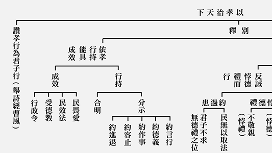

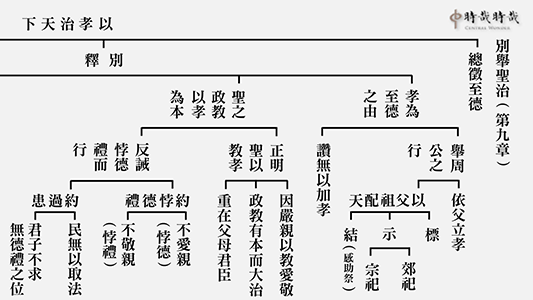

### 孔門心法—中庸之道(四)　中庸名相釋義

*時哉講述、茅茹讀書會、弘毅整理*

用中入世是時哉

不偏不倚待認知

善用因緣壞亦好

五濁原來是樂邦

中庸名相釋義—和

一、和的定義

中是形而上看不見的部分，和是中在世間的運用，是能被看到的部分，如堯舜辦政治的內涵是中，辦政治呈現欣欣向榮的氣象就是和。

二、和的學問

孔子和的學問就是六藝，即禮、樂、射、御、書、數。簡單來說，禮即禮儀，是做人的風格，是人與人之間的人際關係；樂即音樂；射是體育；御是利益別人，服務別人的技能；書是知識；數是科技。

三、和的要素

當你有利益別人的心態、能力、學問、技能時，就能夠真正幫助別人，能與別人和。形而下要講究的是很多的能力、學問，但總綱是六藝。

四、依禮最能和

在形而下的欣欣向榮中，最殊勝者為何？就是六藝中的禮。論語上說「禮之用，和為貴」，禮講究的是作學問、作事的先後次序，講究人際關係，進退應對，順逆境中的作法，都在禮中。用禮的人最能與人和，有和諧的心態，又講究和諧的作法，是最能夠與人和諧的。

中庸名相釋義—天命

一、天的含義：

１．自然的道理，就是吉凶禍福的道理。《書經》上說，「作善降至百祥，作不善降之百殃。」老子說，「天道無親，常與善人。」這些自然的道理，是聖人的觀察和發現，不是發明。

２．主宰，即上帝。中國與西洋的上帝是不同的，他們的是造物主，生殺大權由他，不論你作善或作惡，只要他高興或不高興，就可以任意的賞罰。中國的上帝只不過是天上神明的領導者，他也要懂得隨順趨吉避凶的道理，要加被善人，如果加被惡人，那是會被推翻的，如同人間的天子，如果倒行逆施，也會被推翻。

３．神靈，是指正直的，對國家有功的人，他們在上帝的領導下。人間和天上都有國家，兩者息息相關，因此儒家才談祭祀的道理。祭祀的道理是，在人事上懂得敦倫盡分，然後再求神加被，求作善能夠順暢，在辦政治時，福國利民的政策能夠推行無礙，求風調雨順，氣候祥和，五穀豐登。

二、命的含義：

１．使令。因為你作善，所以會得到上帝、神靈的保佑，讓你得到福報、快樂，讓你趨吉避凶，享受榮華富貴，如同你在公司表現很好，被老闆提拔。

２．稟賦。比如你前生是個讀書人，這一生就喜歡讀書。前生是善人，你這一生就樂善好施。再如曾子是個魯鈍之人，而顏回就是一個很有體悟之人（聞一知十），這就是稟賦。稟賦其實也是沒有自體性的，曾子這一生努力好學，人一己百，人十己千，最後變成一個傳承者，那曾子的來生，就可能是一個稟賦很好的人。

一個人上課都聽得懂，一定是來自前面有預習、練習、複習、切磋琢磨，所以今天的稟賦是來自昨天，同理今生的稟賦好，也是來自前生的用功。稟賦不好的人也不要氣餒，因為曾子就是稟賦不好的人，有些人稟賦不好就自暴自棄，其實他內心是不想進步的。所以人生成功與否端看個人如何經營。

中庸名相釋義—道

總標：道分世間道（形而下）和出世間道（形而上）。

別釋：世間道可以包括利益眾生的學問（六藝）、其他的利他技能和怡情養性之道（如茶道、書道、花道、商道等），這是依仁游藝。依仁就是以仁心來攝持以上種種學問、能力，游藝就是把這些學好，這樣既有利他的心，又有利他的作法，就能與他人和。

出世間道叫據於德，能夠證得形而上的智慧叫作德。「志於道、據於德、依於仁、游於藝」是中華文化的總綱（雪公曾在九十六歲高齡時，特別為啟蒙班義工老師講授這段內容），「志於道」就是志於世間道和出世間道，要學好世間道就要「依於仁，游於藝」，要學好出世間道就要「據於德」，世間道學好就能和萬民，出世間道學好就能進入中、性。

結明：整個中華文化就包括形而上和形而下，形而上的部分是中、內聖、聖人的內涵；形而下的部分是和、外王、君子的內涵，《論語》、〈大學〉、〈中庸〉、《易經》等經典的精華都是這些。如果不知這個總綱，如同珍珠散落在地，或者在古文中咬文嚼字，或者在世間道理中迷失方向，或者不知道道統在哪裡，講起文化支離破碎，如嚼甘蔗皮，越嚼越沒味。如何深入中華文化、涵泳其中、得其精華？中庸可以說是一部學習中華文化道統的典籍。

總結

中就是能夠證得形而上，證得性的智慧，用中就是進入世間時，懂得萬法沒有自體性。要懂得利他才能入世，才有出路。利他當中要有利他的心、學問、能力，這些要透過經典的學習才能達到。

除此之外，還要有良好的人際關係，哈佛大學做了一個歷時七十五年，四代七百多人的實驗，擴及家人達兩千人，花費兩千萬美金，最後發現人生成功，讓自己不老化、快樂，身體健康，衝破逆境，享受順境的秘密，就是良好的人際關係。中國的禮就是良好的人際關係，從夫婦、父子、兄弟、朋友、君臣五倫開始。因為沒有自體性，所以富貴之人也可能會沒有好下場，貧賤之人也可以經營出好命，入世要懂得趨吉避凶，下手之處在和，而具備利他的心和作法，又懂得依禮從五倫開始去經營良好的人際關係，才能真正達到入世的和諧。

如果我們能夠真正了解「中」、「和」、「性」、「天命」、「天道」這些名相的含義，就好比有了一把鑰匙，進入了中庸的內涵，進而進入中國文化的內涵，打開中國文化的寶藏。

問答

**問：** 如果說每個人身上都有天命的話，為什麼孔子他五十才知天命呢？

**答：** 了凡先生十五歲遇到孔先生就知道有天命，孔先生算他該考第幾名，某年當出貢都對，在三十七、八歲遇到雲谷大師，知道了斷惡修善才能改變命運。孔子的五十知天命，是說老天爺要推出他，是「天將以夫子為木鐸」的這種天命，不是我們那種天命。天命就是沒有天命，全在自己如何經營，如你在一個公司上班做普通職員，暫時看沒有當總經理的天命，可是當你很細心的去開會，體會別人的用心，瞭解公司的情況，好好的充實自己，最後被老板任命為總經理。所以，天命都是爭取來的，孔子就是透過不斷努力學習，五十歲時知道傳承的天命在他，這種天命是爭取來的。

**問：** 假如說性體本空的話，那麼人生短暫，我們應該要及時行樂才對，不是嗎？

**答：** 性體本空，是沒有本體，不是沒有現象和作用，人世間的悲歡離合、吉凶禍福都是有的。現象和作用會隨著你的造作而變，你要幸福和倒霉都要看你怎麼做，往往及時行樂的人，後面都很倒霉；往往努力學習的人，後面都很幸福，這與那些及時行樂的人的想法正好相反。

**問：** 子貢曾說夫子的性與天道難聞，請問天道跟天命的關係是什麼？

**答：** 孔子的性與天道是如何得到的，或許是魯國有高人，或許是俱生慧。天道，就是趨吉避凶的道理。天命，就是懂得天道的道理，懂得趨吉避凶，在自然界的運行中，把命運改變了。還有就是懂得斷惡修善，所以能得到天神的加被。並且透過不斷的努力學習聖道（人一己百），最後傳承在你。

趨吉避凶，一般人認為就是倒霉的事趕快跑，有利之事趨之若鶩；另外一種解釋是，斷惡修善就能得到好命；最好的解釋是懂得聖道門，懂得傳承，這才是真正的趨吉避凶。孔子就是最懂趨吉避凶的人，子孫一直傳承到八十代，沒有紈褲子弟。懂得趨吉避凶之道就有天命，上天賜予的好命，特別是傳承的天命。

**問：** 孔子在《論語》中講到「志於道」，是否就是成就中和之道呢？

**答：** 志于道包括：志於世間道（和），志於出世間道（中）。〈中庸〉就是《論語》最好的註解，《論語》也是〈中庸〉最好的註解，這些經學要互通。當子思的兒子拿其它書來問子思時，子思說，過去我的祖父只教經書。如果經書不能通達，世間學問也是抓不到竅門的。今日在世間追求很多的學問，可是經學才是指導世間的學問。

**問：** 請深入解釋什麼是中華文化，以及與中和之道的關係？

**答：** 醒公曾在《明倫月刊》，有關於中華文化的釋題，中華文化的「中」就是中道的傳承，可惜後面斷掉了。民族有中道傳承就是中，華就是中道的運用，開花遍地，欣欣向榮，就是和。文就是典籍，化就是化導，用典籍來化導人心，歸向中和之道，這就是中華文化，所詮釋的就是中和之道。

**問：** 請問〈大學〉裡頭的明明德和親民，與本章的中和之道有何關聯？

**答：** 明德就是能夠證得本體的智慧，明明德就是把這個智慧顯明出來，明德就是能證的智慧。明明德的明是成就能證中的智慧，親民就是和，大學之道與中和之道相通。

**問：** 中是能證的智慧還是所證的理體？至於性與中的關係為何？

**答：** 中本來就是能證的智慧，喜怒哀樂之未發謂之中，當我們有這個智慧時，就能對治喜怒哀樂，在形而上的意境時，喜怒哀樂不生，證得本體時現象界都不發生，哪來的喜怒哀樂？能證的智慧讓你喜怒哀樂都不生，中就是指能證的智慧，並且能證的智慧一定要有所證的理，所以中可以是這兩者合說。如果另外說的話，所證的理可以是性，能證的智慧可以是中。

**問：** 據於德，這個德，它是否就是專指能證的智慧？

**答：** 「德」是專指能證的智慧，不能包括二者。德，就是直心，就是直心正念真如，直接緣念到真理（性）。據於德就是明明德，德就是「明德」，據就是「明」，把明德顯明出來，就是通達形而上的智慧。

**問：** 天命、天道、性和中，這四個概念跟心是怎樣的關聯，或者說與心不相關聯？

**答：** 天道（趨吉避凶的道理）是被心所通達的道理；性也是被心所通達的真理；中是和心所相應的智慧；天命就是心裡面有這樣的體悟，所以在自然界當中懂得如何趨吉避凶，而且天神、老天爺會加被你。

**問：** 在課堂有提到六經的學習，都是讓人可以通達引導到性與天道。關於性與天道的內容，在〈大學〉和〈中庸〉裡面，然而被彙編在《禮記》中，這是否有不妥的地方？或者有其深刻的意涵？

**答：** 漢朝劉向與劉歆的《目錄學》就有〈中庸〉的單行本，宋朝二程也是把中庸獨立出來，成為孔門的心法。當然也可以編在《禮記》當中，因為入世時，做人處世、進退應對當中，要有中道的智慧，才會懂得活用禮。有時候勇敢的人要被禮節制，變成不勇敢，不勇敢的人要被禮激蕩變成勇敢。禮不是死板板的，現代人把禮都講死了，這是因為沒有中道的智慧。用禮的時候或得罪人，或與人格格不入，或讓人覺得很彆扭，自己也覺得很不自在。有中道智慧的人，才會知道禮是變化的，所損益可知也，本質是五倫之道，但在時代中會有它的變化和做法，禮也是沒有自體性的，是隨人、場合、時代而變的。

**問：** 今天講述的名相，是否可以體、相、用結合來看呢？

**答：** 比如火的體就是燒熱性，用就是因為有燒熱性，所以可以發揮燒熱的功能，不管大火、小火、慢火、青色的火、紅色的火，只要有這樣的特徵統統叫作火，這就是相。真正的體相用是說，體就是本體的體性是空，相是緣起的道理，當中有苦樂的相，在苦樂當中如何發揮善的作用。就此章來說，中可以是體，和是它的用。

**問：** 天命之謂性，率性之謂道，率性，可不可以說是依循著空性的見地來趨吉避凶呢？

**答：** 率性可以說是通達體性的見地，「易無體」就是懂得天下的事情都沒有體性。 雪廬老人曾說，「好人做壞事，壞事都成好；壞人做好事，好事都成壞」，關鍵在人不在事。

**問：** 既然一切法的體性空，是否可以說它就有無限的可能，例如殺人它是惡法，但是孔子卻可以把它運用成善法，或者像冉求，可以運用軍事才能來保衛魯國，可否這樣理解呢？

**答：** 善人做惡法，惡法都成善，惡人做善法，善法都成惡，善惡是沒有體性的，關鍵在你是怎樣看待善惡的，在於你的心態和做法，如死刑是惡還是善，這要看人，如孔子殺少正卯就是善。子思曾經問孔子，管仲用法與周公用禮不是一樣的強嗎？孔子回答說，用法如果不能精準足以把法滅亡。現代國家表面講法治，然而當玩弄法律時，會把國家的體制都破壞掉，禮義才是法的本質，唯有進德修業，反省己過，才真正是人的出路。

**問：** 可否認為中是天下的正道，庸是天下的定理，而且是不能改變的真理？

**答：** 宋儒就是這種解釋。天下的正道，有人說遵守法律就是正道，可以這樣淺解嗎？必須要講清楚中和庸的道理。庸是用中，懂得中道，然後用中。

**問：** 可否用有為法跟無為法來理解中跟庸呢？

**答：** 中是有為法與無為法的體性（不是無為法），庸是用中的那個人。

**問：** 有關有一些宗教上的主張，說「性本善」是指「一切眾生本來成佛」，這個善，不是指相對的善惡，而是指絕對的善，是指至善圓滿的真如本性，可不可以這樣去理解？

**答：** 雪廬老人說，孟子講人性本善，雖然不是真正的道理，但在勸勉他人時是可以這樣說的。可是如果一切眾生本來是佛，那為何又做眾生？性有不改義，火的燒熱性是不改的，沒有人見到過火是清涼的，人性本來善怎麼還會造惡？

**問：** 空城計雖然是很經典的橋段，但它可能是杜撰的，不知道正史上是否有類似的例子？

**答：** 空城計是杜撰還是正史，大家都沒有證據來證明，《孔叢子》也是如此。但仍可以從道理來推理，如杜甫的詩就說：「指揮若定失蕭曹」，杜甫被稱為「詩史」，他的詩最能反映史實，就是諸葛亮在千軍萬馬當中的定力，蕭何與曹參都比不上，「伯仲之間見伊呂」，就是說伊尹和呂望加起來才相當於諸葛亮，可想而知，諸葛亮在杜甫心中的地位。（下期待續）

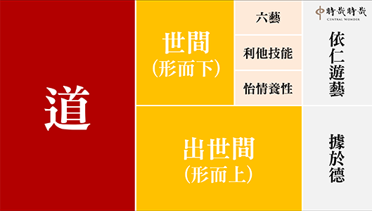

### 三字經簡說（五）

*淨爾整理*

一生出路在求學

蒙以養正聖人功

蓬生麻中自然直

里仁為美文會友

經文：

凡訓蒙，須講究，詳訓詁，明句讀。為學者，必有初，小學終，至四書。

凡是教導啟蒙階段的孩子讀書，必須講究方法、仔細講解字詞字義、明示文章的斷句法。求學者剛開始先讀文字學、聲韻學、訓詁學，三者合稱小學。讀完小學再讀《論語》、〈大學〉、〈中庸〉、《孟子》，合稱四書。

訓：教導。

蒙：草初生的樣子，假借為矇，有眸子而無見曰矇，說文解字：「童矇也。一曰不明也。」孩童未接受教育的啟迪時蒙昧不明的狀態稱為蒙。

訓詁：解釋字義、詞義。

句讀：文句中停頓處，語氣已完的稱「句」，未完的稱「讀」。一如今日使用的逗點（讀）、句點（句）

「蒙以養正，聖功也。」年幼的孩子純真無邪未染上惡習氣，因此在開蒙階段就必須由好的老師謹慎引領其在正道之上學習，以奠定學習的基礎，這就是聖人教化的功德。因此從初學起就必須講究學習的次第、方法乃至義理與考究事實。

文字為學習的根底，讀書作文都需要先通文字，讀古書尤甚。因此初學者要先認識字、詞，進而了解由字詞構成的句子，然後是解讀由幾個句子組成的文章。因此初學者的學習就必須「詳訓詁，明句讀」，也必須要先讀小學，弄懂文字聲韻訓詁學，打好基礎再進入四書的經典學習。

例如，孔子評論《詩經》說「思無邪」，若用今人的直接解讀必然解釋成「詩經三百篇的思想是沒有邪惡的」。然而，思是語助詞，邪的讀音同徐，意思同虛，也就是「詩經三百篇都是無虛的，是真情流露之作。」又例如《論語》：「由，誨女知之乎。知之為知之，不知為不知，是知也。」此章有六個知，第六個「是知也」，讀成知道的知和讀成智慧的智就會衍生不同的解釋。

且古人為文沒有標點符號，因此在閱讀時下對句讀極為重要，句讀往往會直接影響全文的意思，例如子貢問君子時，孔子回答「先行其言而後從之」，是「先行，其言而後從之」？還是「先行其言，而後從之」？還是「先行，其言，而後從之」？不同的斷句法呈現出不同的理解，就連歷代大儒也要為此爭辯不休。

也就因著中國文字和寫作這樣的特性，學習者在進入識文時必須先學訓詁和句讀，弄清字形字音字義後再接續學習四書。所謂四書，是由宋儒朱熹所訂定，指《論語》、《孟子》和原收錄在《禮記》中的〈大學〉、〈中庸〉等四部儒學經典之作，以下將分別說明之。

經文：

論語者，二十篇，群弟子，記善言。

《論語》從學而到堯曰共計二十篇，是由孔門弟子及再傳弟子輯錄孔子和弟子所說的嘉言。

漢朝的《論語》有《魯論》、《齊論》和《古論》三種版本，前兩種是以漢朝當時流行的隸書，稱為今文所寫成。《古論》則是用戰國時六國所用的文字，稱為古文所寫。今、古文的《論語》不但字體不同，篇章、字句也有出入。《魯論》是魯國通行的版本，有二十篇。《齊論》多了《問王》、《知道》兩篇，共二十二篇。《古論》則是漢景帝時在孔子故居牆壁內發現的版本，有二十一篇。這三種傳本歷經漢代張禹、鄭玄及魏國何晏先後刪訂而成為今日的傳本。我們今日普遍通用的是何晏版的二十篇《魯論》。

漢代班固在《漢書·藝文志》中說，「《論語》者，孔子應答弟子、時人及弟子相與言而接聞於夫子之語也。當時弟子各有所記。夫子既卒，門人相與輯而論纂，故謂之《論語》。」《論語》的內容包含孔子的言論、生活與習慣、孔子和弟子的對答、孔子對弟子人物言行的評論以及由再傳弟子所紀錄的孔子弟子的言論。因為是由多位弟子群集編篆而成就《論語》一書，因此稱為「群弟子，記善言」。

根據《論語講要》一書的開卷語寫道；「論語二十篇，為《魯論》篇數。其中章次，不相聯屬。」也就是其中的篇名和章節、次第並無聯繫關係。但「以道德仁藝為綱……-二十篇中，諸章經文，有說體者，有說相者，有說用者。學者以此四綱，繹其經義，綱舉目張，其庶乎學之有道矣。」雪廬老人認為《論語》二十篇可以以「志於道，據於德，依於仁，游於藝。」為儒學總綱，志據依游是孔子教人求學的方法，道德仁藝是孔子教人所求之實學。以此四綱，提綱挈領，幾乎可以說是學習《論語》的方法，或可說是學不離道，道不離學。

經文：

孟子者，七篇止，講道德，說仁義。

《孟子》一書只有七篇，內容都是為了彰顯道德仁義之事。

孟子身處於戰國時期，師承子思，一說師承子思的門人。在王道不存、群雄爭霸的戰國時期中，孟子極力倡導道德仁義以導正時弊，但孟子的思想與言論無法投合當時國君一心想要富國強兵爭霸的心意，晚年只好退隱授徒、著書立說，孟子一書應在此時所寫就，後由其弟子公孫丑、萬章等增添補錄而成書，書寫的體例為語錄體，多以一問一答的方式論證、開展，全書雖然只有七篇但計有三萬五千餘字，是四書中最長篇幅的一部。

孟子的學術地位在宋代以前並不顯著，直到宋神宗時首度將孟子一書列入科舉考試內容，南宋朱熹又將孟子和論語、大學、中庸並列在四書之列，後又列於十三經之一。元朝始封孟子為亞聖，地位僅次於孔子。孟子主要的思想例如「性善說」、「重仁義、輕功利」、「民為貴，社稷次之，君為輕」、「養心莫善於寡欲」等均頗廣為人知。

經文：

作中庸，子思筆，中不偏，庸不易。

孔子的孫子子思寫下〈中庸〉，北宋程颐對中庸的解釋就是中不偏，庸不易。中是無過與不及，不偏於一端。庸是堅定不移、不改變，中道是不偏不倚也不改變的。

〈中庸〉的作者孔伋，字子思，是孔子之孫，孔鯉之子，曾受業於曾子，明朝時被封為述聖。根據《史記 孔子世家》子思十六歲時曾在宋國受困，因而寫下足以傳承孔子性與天道內涵的〈中庸〉一書。共有三十三章，原本收錄在《禮記》中，據說在漢代時以有〈中庸〉單行本。

子思作〈中庸〉係一句孔子所說的「中庸」一辭而來，孔子的「中庸」則是源自於堯、舜二帝相禪讓時的言語紀錄。《論語》中記載堯命舜之辭有「允執其中」，子思又在〈中庸〉裡引用孔子所說「執其兩端，用其中於民」，此處的「中庸」即是「用中」之意。〈中庸〉全文的主旨，根據雪廬老人所說「在闡明人天之道相通，天道至誠無息，化育萬物。人道本亦如之，後為物慾所蔽，失其高明，故應法天，以復其本，始能並育不害，悠久無疆。」可見人道天道是相通的，關鍵在於用中，行中庸之道，中庸之道也正是孔子、顏回、曾子到子思相傳的孔門心法。

經文：

作大學，乃曾子，自修齊，至平治。

曾子作〈大學〉，教人修身、齊家、治國、平天下。曾子姓曾名參，字子輿，小孔子四十六歲。孔子曾說他：「參也魯」，但資質魯鈍的曾子透過精進的學習，課後和師兄弟的切磋琢磨，勤能補拙而成為孔門心法的傳承者，後世尊其為宗聖。

〈大學〉出自小戴《禮記》第四十二篇，宋仁宗年間才出現單行本，但朱熹認為有錯簡，於是變更了原文的章次，目前所流通的單行本多為朱子版。〈大學〉之義，根據鄭康成的註解，是「以其記博學可以為政也。」廣博地學習經學可以辦政治。而根據朱熹的解釋，「大學」指的是大人之學或是指學齡的次第：居官在位、能化導百姓稱大人之學，依學齡次第則有小學和大學之分，小學普遍指十五歲以前，學習的內容是禮樂射御書數和灑掃應對進退；大學則是指十五歲以上以明明德親民為宗，以修齊治平為事。

〈大學〉的內容以二綱統八目，二綱是明明德與親民，八目分別是格物、致知、誠意、正心、修身、齊家、治國、平天下，總結在止於至善。格致誠正是內聖之道，修齊治平是外王之道，學習的方法就是知止定靜安慮得，可見《大學》的主旨就是在談內聖外王、自行化他之道，止於至善就是要能把心安住在二綱，始內聖外王至到能達到究竟處。

經文：孝經通，四書熟，如六經，始可讀。詩書易，禮春秋，號六經，當講求。

通達《孝經》也熟讀了四書，之後才可以開始讀六經：《詩經》、《書經》、《易經》、《禮記》、《春秋》，每一個學習者，都應該探究其中的義理。

本段說明經典學習的次第應依照《孝經》、《四書》、《六經》由淺入深。

《孝經》的完成咸認為是孔子向曾子講授孝道功行，曾子紀錄後又有再傳弟子參與整理而成。受秦代焚書之禍，漢朝時出現今文和古文孝經兩種版本，孔安國為《古文孝經》二十二章作注，鄭玄為十八章的《今文孝經》作注，後宋朝邢昺作疏而成今日所見的十八章通行本。

《孝經》全文十八章，一千七百九十九個字，開宗明義章即說道：「夫孝，始於事親，中於事君，終於立身。」修齊治平就是從小孝到大孝，在《孝經》中一一分別說明天子、諸侯、卿大夫、士、庶人的盡孝之要，和各種行孝之道與孝的宗義，以各種面向完整地說明孝道。因此《孝經》受到歷朝帝王的重視，梁武帝、唐玄宗、雍正皇帝都曾為親自為之作注，不但科舉取士要考，多位皇帝也曾下詔鼓勵百姓讀誦《孝經》，因為《孝經》可以修身、可用以引導子弟、建立淳良風氣。孝是為人的根本，因此讀書先從孝經始，通達孝道後再進入四書，之後不論習誦哪一部經典，都能以孝道為學聖學賢的根基。

《六經》應為詩、書、易、禮、樂、春秋，但樂經早已失傳，從漢代以後，傳世的實則只有五經，但根據三字經的前後文，作者應是把《詩》、《書》、《易》、《周禮》、《禮記》和《春秋》列為六經，接下來將分別說明六經的內容。（下期待續）

參考資料：

一、明倫月刊中庸相關論文，作者：徐醒民老師。

二、孝經圖示。

三、讀易簡說，徐醒民撰，臺中蓮社印行。

四、尚書今註今譯，屈萬里註釋，臺灣商務印書館發行。

五、儒學簡說，臺中市佛教蓮社印行。

六、禮記今註今釋，王夢鷗註譯 臺灣商務印書館發行

七、春秋左傳今註今譯，李宗侗註譯，臺灣商務印書館發行。

八、春秋穀梁傳今註今譯， 薛安勤註譯，臺灣商務印書館發行。

## 藝術賞析

### 孔門七十二賢淺說（二十）─公西赤

圖／江逸子、文／時哉

會盟用禮顯泱泱

儀節形式表裡一

夫子之喪任為志

彰顯師德名顯揚

公西赤，姓公西，名赤，字子華，魯國人。他是孔門的前期弟子，小孔子三十二歲或四十二歲。

公西華在孔門中以知禮見長，《論語》〈先進篇〉中，公西華向孔子說明他的志向是：願意學習宗廟祭祀之事，兩個諸侯國之間小會同之事，穿著禮服、戴著禮帽，作一個小儐相。孔子聽了以後說：公西赤說願意作小儐相，那除了公西赤以外，誰能為大相呢？可見其禮儀及外交之長。〈左傳〉上記載，魯國大夫孟僖子曾經隨從魯昭公去楚國，因為不能相禮，使得魯國受辱，孟僖子終身引以為恥，故在臨終之際，叮囑他的兒子要去跟孔子學禮。孔子周遊列國以知禮聞名，常言孔門詩禮傳家，在在可見禮儀的重要，因此公西華在聖門之下能夠以禮成名，確實可謂學有所成。孔子之喪，由公西華擔任「為志」的職事（彰明過世者志識的職務），他能備三王之制、用三代之飾來莊嚴喪禮以尊榮夫子，並且彰顯了夫子之道是祖述堯舜，憲章文武，述而不作，信而好古。

公西華的家境富有，有一次他為公務出使齊國，除了原有的俸祿之外，冉有特別又向孔子請求，是否能夠給予公西華的母親額外的米糧，孔子說給予一釜（六斗四升），冉有覺得少，再請加一些，孔子於是再給一庾（二斗四升），冉有還是嫌少，於是拿自己的米糧五秉（八十斛，亦即八百斗）給予公西華的母親。孔子說：公西赤出使齊國，騎乘的肥馬所駕的車，穿的是輕軟的皮裘。我曾經聽說，君子周濟人的急難，但不會把財物給富有之人。此篇《論語》上的典故，足見公西華的家境，亦可知夫子的周濟之道。

畫中的公西華衣著華美，頭戴官帽，或是外交場合儐相之禮帽，極具貴氣，是一位能夠辦好大國外交主客酬酢的人才，孔子也曾向孟武伯介紹他優　　秀的外交才能，能端衣冠，束好腰帶，與國君大臣這些外國賓客周旋，不但熟悉國際禮儀，也維持本國的尊嚴。

畫像中的他顯示是富家子弟，但非紈褲子弟，他所散發的貴氣不只來自於良好的家境，更是來自於他在孔子座下能學禮有成，能以禮束己，以禮待人，從而莊嚴了自己，也攝受別人。

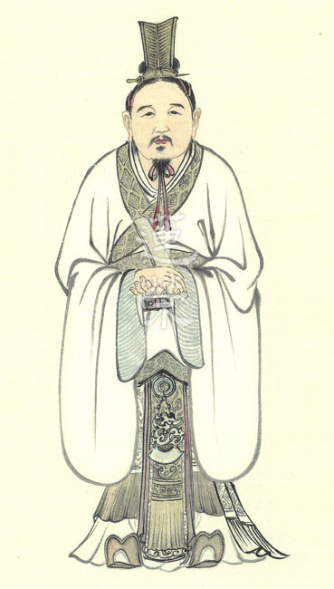

### 華夏精魂千秋(二十一)
		  —明倫史畫─義濟恩怨─趙憙

華夏精魂千秋(二十一)

—明倫史畫─義濟恩怨─趙憙

圖：江逸子‧文：淨域

考驗知品德

淬火煉真金

歲末寒松柏

霜雪凍菊花

史話

趙憙，字伯陽，漢代南陽郡宛縣人；生於哀帝建平三年，卒於章帝建初五年(西元前四年至西元八十年)。生性重節講義，憐矜濟弱。十五歲時，堂兄遭人殺害，因無子嗣，趙憙就糾眾前往復仇。到了仇家，見一家人患病無力抵抗，便說：「等病好了，不要再被我遇上。」隨即率眾離去。

更始帝劉玄即位，聞憙之名拜為郎中偏將軍，先於汝南平亂，繼而在昆陽之戰中，協助劉秀打敗王莽大軍，拜為中郎將。更始三年(西元二十五年)，劉玄殺西漢末帝孺子嬰，赤眉軍立劉盆子為帝，而劉秀亦在鄗城(今河北省高邑縣)即位，稱光武帝。隨後赤眉軍攻入長安，劉玄單騎外逃，趙憙與友人韓伯仲攜眷欲出武關避難。

伯仲之妻貌美，在此盜匪橫行之際，他怕受妻子美貌的牽累，便決意獨自而去。趙憙勸而不聽，便以污泥塗抹韓妻的臉，安置於小車上推行。每遭逢盜賊相逼，便說此婦身染重病，這才得以脫身免難。到了丹水縣(今河南省淅川縣)，遇到劉玄的親眷，見他們饑餓困苦，便將所帶的資糧贈與，並護送回鄉。

更始帝遭廢殺後，劉秀平定河北諸軍，定都洛陽，憙歸附任為簡陽侯相。後荊州太守舉荐，任平林侯相，再任懷縣(今河南省武陟縣)令。當時縣內有大戶人家李子春不守律法，孫子殺人逍遙法外，憙到任後嚴加追查，子春求救於趙王劉良。當時劉良重病，侄子劉秀前去探望，便乘機為子春乞命寬諒。劉秀說：「官吏依法行事，這樣法律才有尊嚴。」劉良聽後作罷，子春祖孫三人則畏罪自殺。

憙再出任青州平原郡(今山東省德州以南)太守。當時平原郡多盜匪，憙率眾討平擒殺匪首，對於投降的部眾，則上諫言免除死罪，因此存活千餘人。其後青州發生蝗害，但蝗蟲飛入郡內即死，如此平原郡免去蝗災，百姓們稱頌不絕。

建武二十七年(西元五十一年)，光武帝嘉勉其功勳，拜為太尉，賜爵關內侯，再封節鄉侯。明帝永平三年(西元六十年)，竇融免職歸鄉養病，憙代而出任衛尉，對內統管宮廷安全警衛，對外行相職公正行事。章帝即位，拜為太傅。建初五年(西元八十年)，憙八十四歲病逝，章帝親往弔唁，諡號正侯。

圖解

此圖江老師所繪者，乃東漢初年天下征亂時期，赤眉兵攻入長安，更始帝劉玄敗逃，趙憙與友人韓伯仲亦一同逃難。此時盜匪橫行，姦殺擄掠無所不為，韓伯仲怕受妻子的美貌所累，便決意獨自離去。趙憙勸而不聽，便以污泥塗抹韓妻的臉，安置於小車上推行。每遭逢盜賊相逼，便說此婦身罹傳染病，這才得以脫身免難。到了丹水縣遇到劉玄的親眷，見他們饑餓困苦，除將所帶的資糧贈與外，並一路護送回鄉。

東漢建武廿六年，光武帝召內戚宴會，夫人們紛紛讚美趙憙篤義多恩，帝感歎地說：「憙不但為英雄所保薦，連婦女都懷恩。」遂其為命為太僕。此所謂的「婦女懷恩」，即是指趙憙於逃難中一路地保護女眷。

俗話說：「疾風知勁草，板蕩識忠臣。路遙知馬力，日久見人心。」人的品格特質是日久積累的，並在舉手投足間自然展現，尤於特別時機令人印象深刻。此如《論語∙為政篇》所言：「子曰：『視其所以，觀其所由，察其所安。人焉廋哉？人焉廋哉。』」人的本質是無法隱藏的。

具有救人於危難心量的人，不僅受到他人的敬愛，更特別受到敵人的尊敬。晉代荀巨伯到遠方探望生病的朋友，正好遇上胡人攻城。友人對巨伯說：「我將死，你快走吧！」巨伯說：「我遠道來探望你，遇胡人來襲棄你而去，這種貪生怕死敗壞道義的事，豈是我所能做得來的。」

胡人來到，喝斥巨伯說：「全城的人都逃走了，你何敢獨自留在這裡？」巨伯答說：「友人病重不忍拋離，願以己命換友人的生命。」胡人聽了相互說道：「我們這些無義之人，竟然攻掠這個講究道義的城邦。」於是整隊撤離，全城因而得以保全。

荀巨伯的誠心感動人，於患難中見真情，此道義不僅救了朋友，也全了自己的性命。趙憙的義氣也出於一片真誠，所以無論到何處為官，都深獲百姓的好評，最後被拜為無上榮譽的太傅，去世後章帝且登門弔唁。由此可見，真誠節義的大作用。（下期待續）

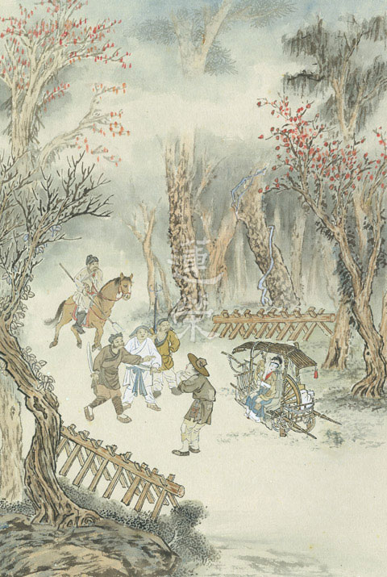

### 孝經圖簡說(十八)—喪親章　喪親章第十八

圖：江逸子‧文：時哉

斬衰亂鬚髮

哀哀父母喪

三年多縈懷

百善孝為先

孝子在父母親生前，能揚名聲顯父母；孝子在父母親過世時，能盡上哀戚之情，依禮入殮，一切遵從儀式，並選擇好的墓地，來表達對父母親的尊崇。三年守喪後，在宗廟裡，春秋祭祀父母祖先，如此方是完整的孝子行相。

江先生所繪的喪親章，孝子穿麻衣，鬚髮不整，跪著遠望父母親的墳墓，表徵父母喪三年的懷念，後有兩位書僮，提著食盒相伴。

畫中的高山流水，代表父母親的恩德，如山高、如水長，甚而是比山高、比水長，到此是對父母養生送死的圓滿，是孝子圓滿的內涵。啊！天下的德行，有哪一個超過孝呢？

歷代的畫作，畫的是孝子騎馬去掃墓，然禮上孝子雖哀慟但不可過份，以免傷身，甚至喪命。鬚髮不修、形容憔悴、身穿麻衣、不重儀表，皆是至情的表現，以上是第十八章，喪親章的大意。(全文完)

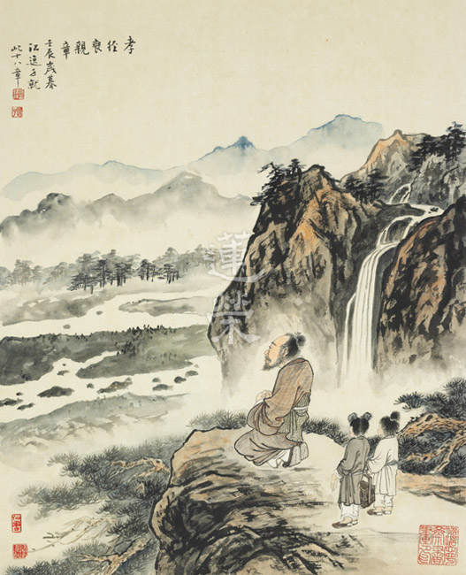

## 專題報導

### 紀元農莊參訪紀實

淨昌

他山之石可攻玉

實栽農場取他經

多項優點自家現

便是兩方安樂邦

學會週四三代共修班在五月十七日參訪紀元農莊，初到時尚未認知到農莊主人吳慶鐘先生的內涵，原本以為不過是眾多有機農園的另一個，但隨著吳先生的侃侃而談自己的理念及作法之後，才知道吳先生把自己當成一個公司的經理人經營，從生產到銷售，心存眾生的全面性做法，才是成功的祕訣，對於想從事有機農園經營的人，是一個很好的典範。

動機及心態是最重要的初發心

在吳先生的宣導品上開頭就印著「敬天知命」四個字，可見他經營農場是帶著敬畏天地的態度，「用天之道，分地之利」吳先生應該是當之無愧了。不但敬天法地，吳先生也有自利利人的願力，這可以隨舉三件事情看出來。

第一件事是對於他所經營的有機稻田，因為要取得認證，所以要保證稻米不受農藥汙染，可是隔壁稻田是別人的怎麼辦，他就一併照顧隔壁稻田，並且以農會收購最高價收購所收成稻米，可是自己也並沒有吃虧，他將收成的稻米，連同自己稻田的額度，一樣繳交農會收購，雖然自己要一併照顧隔鄰稻田，可是不費多餘力氣，完成農藥隔離帶，也不多消耗成本，自利利人。

第二件事是吳先生的稻米，始終維持將本求利的精神，多年來維持一貫的價錢，如何維持呢？肥料、租金及工資等上漲都不會是理由，因為都可以申請政府補助。吳先生用會員契作的方式減少中間成本，將稻米售價維持在每公斤一百二十元，但是我們知道市售認證有機米在超市已經有一公斤二百元的價格了。

第三件事是吳先生教人的耕種原則，自己不敢吃的東西不要種，所以他的農地選在三星鄉，三千公頃農地，沒有一家工廠，不用擔心汙染，自己不用農藥、化學肥料。比如研究生產有機米糠油時，除了掌握條件能確保不生成多氯聯苯外，當得知米糠油去味去色要進一步用化學原料製成的時候，寧可保持原態，有所不為。

掌握生產的秘密可以事半功倍

吳先生種植很多農作物，例如銀柳、黑豆、黃豆、上將梨、水果玉米、稻米、紫米、小黃瓜等等。而且吳先生非常有研究精神，每一種作物都掌握生長期間每一個過程的細節，灌溉、施肥、除草等等都要掌握對的時機，就可以事半功倍。例如他舉例黑豆的栽植，除草只要除一次，但時機要選在氣象預報下雨前的三、四天，除完草二、三天的太陽會曬乾雜草，在下雨後施肥，黑豆植栽幾天內長得比雜草快，葉子展開，後面雜草再長，都在黑豆的葉子下，不用除也長不多了，而實際到現場一看，果然黑豆都長得比雜草茂盛。在水果玉米田的部分就看到吳先生的玉米田一壟一壟都用塑膠布蓋著，每一棵棵的玉米間隙也比一般大，結果吳先生現場摘取聲稱尚未成熟的玉米給我們試吃，因為太過好吃，讓大家都忘了請教種植的秘密。

除了時機的掌握，肥料的講究也不遑多讓，吳先生在肥料的部分有一位夥伴陳姓化工碩士開發出能控制土壤菌種的肥料，又能適時補充胺基酸，同時有適時的檢驗證據，證明像他這樣方式種出來的米，米糠層中的米糠醇比一般米多十五倍。米糠醇又叫γ穀維素（γ-Oryzanol），被認為是強力抗氧化劑，不但可以保護腸道黏膜，更能降低膽固醇及三酸甘油脂等種種保健功能。這證明有機農產品只要適得其法，可以種出更有益健康的產品。

全程掌控品質才能成功

吳先生對最後所選擇以稻米為主的農作物，為了確保風味，自己買稻穀烘乾機，確保稻穀烘乾在五十五度Ｃ，但要耗時二十四小時，而不是一般烘乾只有前面兩小時五十五度Ｃ，後面十二個小時以七十度Ｃ烘乾。所以吳先生的有機米不但健康，而且好吃。

為了掌握產銷能量，不受制於糧商，還自己建低溫穀倉，長年溫度控制在十八度Ｃ以下。穀倉興建時還多花二十萬的成本，將水泥從地下四十公分填起，依序一層水泥、一層隔熱泡沫、一層防水氈，最後再加上一層鋼筋水泥，因為懂得使用隔熱材，穀倉節能效果良好，還引起其他單位的詢問學習。

吳先生同時引進碾米機，可以輾白米、胚芽米及糙米，也用自動計量機及真空包裝機，讓自己掌握終端產品因素。

成功的與消費者互動

吳先生非常了解農作物生產者與消費者互動的重要性，最主要是教育消費者建立對農產品正確的認知，例如一進農莊他開門見山就說現代農產品產銷制度的困境，以現在這種由果菜商至產地購買，運至各地果菜批發市場拍賣，大盤商買進、依序販售至中盤商、零售商，如果中間都沒有冷藏保存，大概是採收後六、七天後的事，所以生產者不可能在農產品十分成熟，營養物質最多的時候採收，大概六七分熟就採收了，所以產品的風味及營養都不是在最好的狀況下採收，這僅是產品面的困境；還有就是利潤的困境，因為產品從生產者到消費者，最少要轉手四次，每轉手一次，就要抽取一層利潤，所以單純的農家，因為通路被壟斷的關係，成為這一個循環中最弱勢的一節，被收購商任意殺價毫無還價能力，工作最辛勞，所得最少，豐收時期常常在媒體上報導農產品產地價格例如今年香蕉、高麗菜每公斤二至三元、蒜頭也是，導致農民負擔不起採收的成本，而直接鋤耕或開放路人自採。

最成功的與消費者互動的成果就是吳先生採用會員制，每年都與認同的消費者簽訂契約，不但可免除中間盤商的剝削，而且確定需求後的生產就變成計畫生產，確保農民基本收益，不會因豐收而血本無歸。同時不但可適度降價回饋消費者，更因為農產品是產地用物流業直送消費者的方式，可讓農民在農作物完全成熟後採收，以最好的產品供應消費者。這在二十年前的世界是不可能的，因為當時沒有網路、臉書等等功能，農民無從與消費者互動，當時交通與物流業也不如現在。種種的條件俱足，加上農民知道善用網路，使計畫生產成為可行，產銷秩序可能可以維持，產品有足夠通路，農民安心生產，消費者安心使用，自他兩利。

結合有志者共造善業

在吳先生的字典裡大概沒有收錄「同行相忌」這四個字，對於同行，從不吝惜提供技術經驗，而且目的是要結合多一點的農民加入有機耕作的行業。這可以從網路搜尋吳先生的事蹟可以得到證明，他擔任產銷班的班長多年，還曾經在某一年差一點得到神農獎。

吳先生不但自己經營成功，也不吝分享自己的經驗，也培養年輕後進，加入務農行列，曾經以六年時間培養六個年輕人，每兩年一批兩個人，雖然最後只留下三個人，而留下來的就成為自己的事業夥伴，可見各行各業要培養人才都不容易，不是只有教法傳承不容易。

結語

以佛法為喻，要栽培一個能夠自利的阿羅漢已經極不容易，但是對比能夠自利利人的菩薩，那是遍滿三千大千世界內的所有微塵，每一粒都是一個阿羅漢，加起來的功德都比不上菩薩的一分，那是更加難得了。所以學會能有緣遇到有能力而且有願力想要自利利人的有機農莊莊主，應該要善於取法，學其所長，日久相信必有所成。

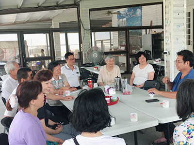

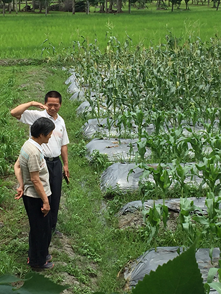

## 活動報導

### 母親節活動報導

玖如

呈現母親節意義

孝子報恩勝意樂

祝願生子如釋迦

五濁眾生離塵垢

前行

今年母親節，學會在中壢共修會，以禮拜地藏懺、短片欣賞、發表對母親感言及歌誦母親偉大、浴佛等多元組合，來慶祝母親節。前二天就開始整理環境，布置壇場，準備鮮花、壽桃、麵線、水果等供品，經架、經書的擺置等所有前行工作，無不以至誠心，戰戰兢兢行事，祈求諸佛來集，龍天護佑。

拜懺

儀軌觀修前，先點燈發願，點燈代表是從善知識的傳承，並得三寶加被，或為心燈照破內心的無明。老師例行將懺文從頭至尾開解一遍，好讓我們隨文入觀，法喜充滿。這次講得特別豐富，原來是有朋自遠方來，不亦樂乎！地藏懺儀從爐香讚開始，以心爐點心香，興起殊勝的善念，「誠意方殷」才感得「諸佛現全身」，因此，法會之前先唱爐香讚，點淨香，誠心禮請諸佛菩薩降臨壇場。懺文主要由供養、讚歎、禮拜、發願、懺悔等幾個面向所構成，資助我們在拜懺過程中，清淨身心，契入佛法，學習地藏菩薩的大悲心，並發起菩提心，做四無量心、六波羅蜜、證悟空性的觀修，如此所得之功德不可限量，不斷充實自己，再以廣大行的歷練，方能利益有情。

世尊一期度化因緣將盡之時，上升忉利天，宣說地藏菩薩的本願，以報答佛母摩耶夫人生育之大恩﹔也闡述地藏菩薩在因地以光目女、婆羅門女身，為拔濟母親脫離地獄之苦，而發「眾生度盡、方證菩提；地獄不空、誓不成佛」的大願；以承擔如來家業，表達對佛最殊勝的孝心，成為世間孝子盡大孝的楷模。令知盡孝非只養父母之身，父母之心，父母之志，更要發大誓願，幫助自己此生父母及累劫父母，出離輪迴，往生淨土，趨向涅槃。

短片

拜懺儀軌完畢後，學會精心準備幾部感人的短片，展現世界各地母親對孩子的關愛，其中有個影片頗震撼人心，分享之：

美國波士頓一家名為 Rehtom Inc.的公司，刊登求職廣告，徵求一名全職的「營運經理」，並開出如下的工作條件：

一、具備行動力，多數的工作時間必須站立。

二、每週工作時數最低一百三十五個小時，視客戶需求無上限加班。

三、具備醫療、財政、烹飪等專業技能。

四、全年無休，不可請年假。且每逢佳節，如聖誕節、感恩節、新年等，工作量將大幅提高。

五、具備良好的人際溝通能力。

六、有危機處理能力。

特別提醒：這是不付出全力就做不好的工作，而且薪水是零。

天哪！這份全世界最艱難的工作，叫做「媽媽」。

今天是母親節，請記得抱抱媽媽，我們家最辛苦的「營運經理」，愛媽媽不能只在母親節這一天而已，也該像媽媽愛我們一樣，全年無休！

感言

看完影片，請了幾對母子檔，由子女獻花並發表感言，其中有位孝子，以哽咽表達對媽媽無盡的愛，令全場為之拭淚。有位媽媽收到五枝康乃馨，真是多子多幸福，在這少子化社會，足為年輕父母增產報國的好榜樣！馬來西亞鄭先生夫婦，為參加此次地藏懺暨浴佛法會，專程搭機來臺，全程參與並心得分享。鄭先生夫婦過去以捕魚為業，幾年前有緣遇到唐老師，開始真正學佛，自此戒殺護生，翻轉人生而改變命運的經歷，娓娓道來，讓人聞之無不讚歎隨喜。鄭太太的胞弟由於喜好釣魚而創辦釣魚協會，常舉辦大型釣魚比賽，此乃召集群眾共造殺業的行為，果報令人膽顫。日前不幸在中國遭遇橫禍，除感嘆因果不爽，也藉此拜懺因緣回向，唯願托質蓮胎，永離業海。

唱讚

心得分享後，由東勢蓮友合唱團，以《跪羊圖》等孝道歌曲，歌詠讚頌母親，歌聲優美，餘音繞樑，人人沉浸在母德的馨香中，感念母恩。也唱出諸佛之德能，藉此學習諸佛救助眾生危難，猶如父母救子之心；即使眼前幫不上忙，也當善用其心，練習生起如父母護持子女之心，此為修行之關鍵。

浴佛

最後是浴佛活動，浴佛節，是為了紀念釋迦摩尼佛的誕辰，佛弟子於每年農曆四月初八，都會舉行莊嚴的浴佛法會。在二千六百多年前，摩耶夫人夢見六牙白象從右脅進入，因而懷有身孕。十個月後，夫人準備回娘家待產的途中，於藍毗尼園，看到微妙芳香的無憂樹，便舉起右手攀扶，這時世尊即從夫人右脅降生到世間，並且向四方各走七步，腳下步步均生大蓮花；然後一手指天，一手指地說：「天上天下，唯我獨尊。」（「我」指眾生本具的佛性）此時大地震動，天女散花，四天王以十二種香湯、名花灌沐太子金身，九龍亦從上而下吐水，一溫一涼為佛沐浴，人天無不歡欣鼓舞，因為世尊的到來，為三界熱惱的眾生，帶來無比清涼的佛法，更為迷妄的眾生指引解脫之道。

我們手持淨水向悉達多太子像沐浴時，內心應當誠懇祝禱，唱頌「我今灌沐諸如來，淨智莊嚴功德聚，五濁眾生令離垢，同證如來淨法身。」所謂：「外沐佛身，內淨自心。」以香花淨水灌沐佛像的儀式恭敬供養，祈增福慧，同時提醒自己去除貪、瞋、癡的污垢，得身、語、意三業的清淨，藉此啟發內心的慈悲與智慧。一瓢淨水下化眾生，一瓢淨水上求佛法，再一瓢淨水圓成佛道。觀修所有母親愛護子女無私的心，如母憶子最能代表佛對眾生的慈悲，而以慈悲心作為浴佛的前行意樂，並以浴佛功德，迴向給偉大的母親。

午齋

午餐由林寶增老居士家屬，發心準備溫州大餛飩、炒年糕、二黃炒麵等家傳絕活供養大眾，並以此追思林老居士在生之年，展現手藝的風華。所備佳餚色香味俱全，令人口齒留香，那已謝落之味塵，轉成念念不忘的法塵。預見以此因緣，經營一家溫州素食小館，保證近悅遠來，高朋滿座。這不也是「無改於父之道，可謂孝矣！」

結行

當天特別邀請媽媽們來共襄盛舉，讓這溫馨的節日格外有意義。學會結合拜懺、浴佛與母親節活動，期能成就佛化家庭的增上緣，淨化社會首須淨化家庭，歡迎家人藉此因緣，認識更多學佛的善知識，共創學會修習正法的大家庭，彼此切磋砥礪，攜手邁向成佛的康莊大道。

附錄：心得感想

帶母親參加母親節活動感言

忠敏

活動當天母親的表現：

一轉眼母親今年已經九十歲了，今年的地藏懺又是母親節，好好把握機會，選擇帶著母親參加學會舉辦的母親節活動，母親雖然雙腿無力、雙眼失明，行動很不方便，但是母親堅持要來參加，當天看到母親心情很高興，在唱浴佛讚時他不斷揮手跟著打節拍，嘴巴不停跟著旋律哼唱著，當時母親被那種莊嚴唱誦氣氛感染，內心非常喜悅！感謝鍾師姑來看母親，跟她聊天說極樂世界多好多好以後我們都要去，她聽了好高興，一直要我帶她去，也要我們大家一起去，甚至老師來看母親的時候，她也在老師耳邊說要老師一起去，總之，母親當天對極樂世界阿彌陀佛的家很有興趣，也表達很想去的意願，我趁此機會告訴母親說，想去極樂世界要念阿彌陀佛才能去喔！誰知母親竟然立刻開始連續念了幾十聲佛號，這難道是要告訴我，她想要去的決心嗎？當下我也被母親這樣的行為而感動，在我內心生起，此生一定要護送母親去極樂世界，才是報答母親生育、養育之恩的信念。

活動過後我的思維：

想想母親已經九十高齡了，他的歲月還有多少？應該要好好思考籌謀她的人生大事了，雖然上過人生大事的課，對人生最後的大事有了一些了解，但是關鍵還是要累積內因，在平時就要造作往生西方極樂的正因，臨終時還要保持頭腦清楚，且要具備求生西方的信願行，信願能強而有力的生起，才有可能臨終時藉著蓮友助念的幫助，讓我們求生西方淨土的正念不間斷，如此才有可能往生極樂淨土。

每每想到母親有時會頭腦不清楚，好像失念一般甚麼也不記得，若到臨終出現失念那該如何是好呢？現在母親又沒跟我住在一起，想要幫助她在平時就多提起念佛心好像很難，雖然有準備念佛機，請她每天放來跟著念佛，這也很難，真不知如何是好？目前只有常回去帶著她念佛，或是用電話提醒她念佛，交代外勞幫她每天放佛號機提醒她念佛，我每天作課迴向給她，有善法幫她作並迴向給她，如此我還能做甚麼呢？想想自己的能力太薄弱了，能做能幫助她的也很有限，真的只有祈求佛菩薩加被幫助母親往生無障礙，能幫助母親去她想去的西方極樂國。願將此篇心得感想迴向母親，希望能成為母親往生西方極樂國的增上緣，阿彌陀佛。

最後要非常感謝學會舉辦這樣溫馨有意義的活動，還要感謝老師及師姑、蓮友們給母親溫情的慰問及鼓勵，在這個團體裡真的有幸福感覺，謝謝大家。

香積作務報父恩　　 戒華

學會於中華民國一Ｏ七年五月十三日星期日，在中壢研學會舉辦「地藏懺、浴佛法會暨母親節活動」，正值先父往生七七期間，家屬接獲老師建議在活動時，供養大眾先父在世經營小店生意的拿手菜餚，以表達緬懷、迴向並饗蓮友之意，作為先父往生的增上緣，家屬感謝這番勝緣。

法會前家屬特別共同研商菜單，釐訂以溫州素餛飩、二黃炒麵及炒年糕供養大眾，定奪菜餚後，心知與先父廚藝相距甚遠，仍勉力盡心為之。大家分頭作前行，家母負責溫州素餛飩，兒孫輩也在旁學習，頓時呈現溫馨的畫面。至於炒年糕由發聰負責，也試作了數次，年糕還特地至大陳鄉親開設的店購買。而二黃炒麵，由發祥負責，雖然也試作數回，但也只是先父的皮毛火候而已。

法會前一日，前置作業已如火如荼的展開，家母包了四百顆素大餛飩，其他人包的餛飩，因難以通過母親大人的法眼，只好留著在家自行消化。新鮮麵條、大白菜、蛋皮絲、榨菜絲、海苔絲、年糕等已預備好，就等隔天一展廚藝！

法會當日，發聰負責炒年糕，發祥二黃炒麵，瑤華下大餛飩，其他晚輩擔任小幫手。餛飩有稍作變化，將餛飩湯變成抄手，反應似乎還不錯，一掃而空！

感謝老師及學會在七七期間的幫忙。法會當天感謝學會大廚們的協助。〈中庸〉云：「子曰：武王周公其達孝矣乎，夫孝者；善繼人之志，善述人之事者也。」家屬藉由上述料理，來緬懷家先父當年營生的辛苦、持家的不易，把此精神克紹箕裘，相信就是最好孝道的展現。

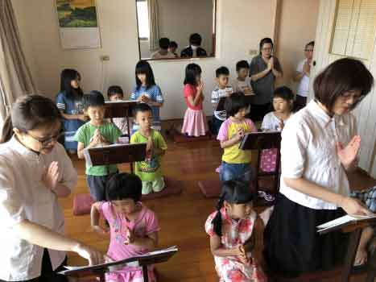

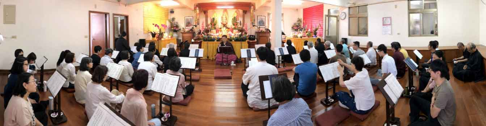

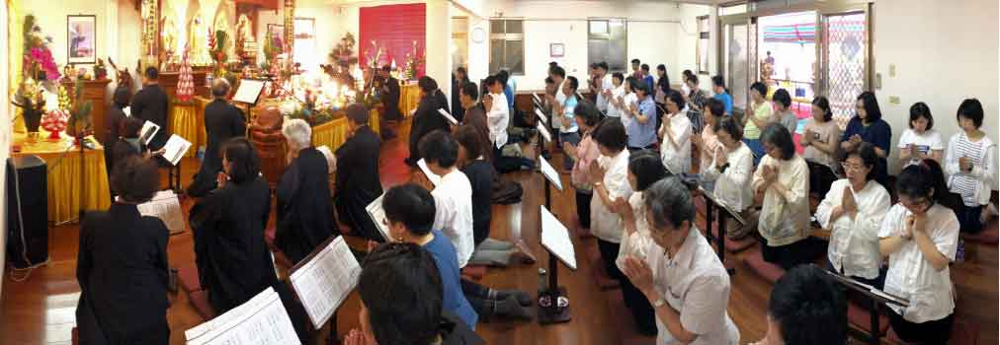

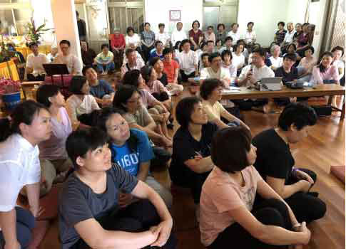

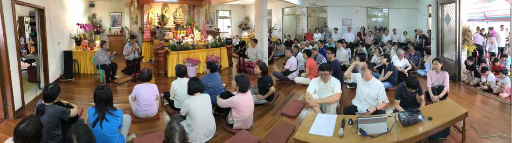

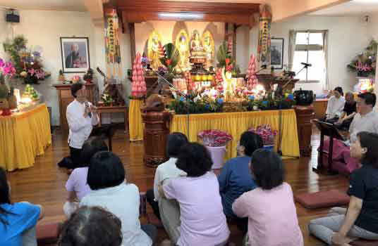

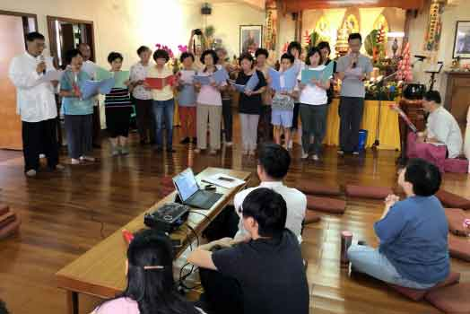

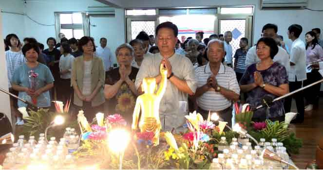

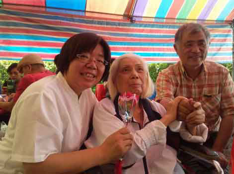

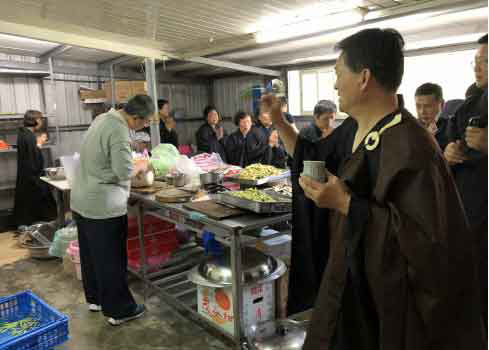

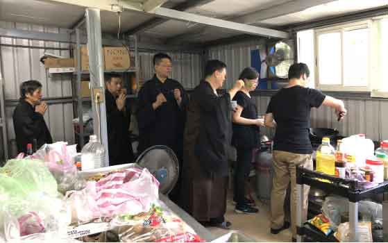

### 福建國學堂母親節活動報導

心若

活動有創意

帶出念母恩

天下吉祥事

萬善從孝出

國學與母親節有什麼關聯性呢？事實上，藉由母親節活動，大家齊聚一堂，探討、觀修母親節的意涵，最能彰顯這個節日，很多內涵的體悟、學習的方法，都可以從母親身上找切入點，找確切的覺受，作為基礎類比、擴充，成為修道的助力。

此次福建國學堂母親節活動，分為兩部分，前半段以母親的角色出發，透過小影片多面向的探討、闡發母親的功德與辛勞。後半段加入少兒班孩子的表演，向媽媽訴說心裡話，並在大合唱中圓滿落幕。母親節一樣可以慶祝，可以聚餐送禮，但在表法、儀式當中，必須賦予意義，融入精神與情懷，再度提起心中修學的力量，不僅為自己圓滿，也為家庭圓滿。最關鍵還是自己，自己學好，身邊的人一定是第一個感受到的，如此也才是喻親於道。

觀修母親的恩德，我們從媽媽一詞可看出全世界對母親的感情都是最原始、最貼近的，全世界共七千多種語言，即便每種語言大相逕庭，關於媽媽這個詞幾乎全部一樣。媽媽可謂世上最簡單、最親密的詞彙，連接各個民族，連接一代又一代的情感，在需要的時候、想念的時候、害怕的時候、有了新想法、新生活、新生命的時候，一句媽媽，千言萬語盡在不言中。媽媽出現在我們人生的每個重要片段，是我們成長的最佳見證人，付出、操煩從不嫌辛苦，而媽媽最關心的就是孩子的教育，努力為孩子締造良好的學習環境，努力找到良師益友，希望孩子能學有所成，全天下的媽媽心態是如此相似，作法卻又如此不同。

母親的形象助於我們體會仁心，《論語》上說：「己欲立而立人，己欲達而達人…能近取譬，可謂仁之方也」，我渴望內心有出路，我渴望能夠這樣幫助別人，最好的方式就是我自己先學有所成，透過不斷的學習，了解形而上、形而下的內涵，體悟經學的奧妙，並能跨領域、多元學習，了解這個時代，懂得人情世故、進退之道，清楚未來的方向，對境界不迷惑，懂得利眾的各種善巧方便、百工技藝，這樣的人才有辦法真正利益別人、幫助他人，使他人也找到內心的出路。如此的覺受要如何生起？就從近處開始找起，從母親身上體會，仁心的感受就像媽媽無條件愛著自己的孩子，媽媽看孩子的事，就像看自己的事，更有甚者，比自己還重要。而現代的女性為人母遇到種種衝突矛盾與挑戰，都考驗智慧、恆心、包容心，家庭事業兩頭燒，公事做完做家事，還要應付孩子們不斷改革翻新的課業，母親必須學習，才有辦法跟上時代教育的速度，為母則強，許多能力都在當母親時培養，有仁心的君子看待天下蒼生亦如是，無私的犧牲奉獻，當幫助不到的時候，打從內心難過，幫助到的時候，內心無比雀躍，看到眾生成就，掩不住的比他更開心，作法極不簡單，要有智慧、原則、分寸，不同人講究不同作法、心態，全天下的母親都在上演一齣最好的仁心的戲給我們看，抓住這樣的味道，展開胸襟，推己及人，把母愛的感受發揮到極處，利益到全世界的人，這就是一個君子的起點，把母親的這份情懷成為他的胸襟，成為他的發起處。

《孝經》上說：「身體髮膚，受之父母，不敢毀傷，孝之始也；立身行道，揚名於後世，以顯父母，孝之終也」，「孝」字上面是老，下面是子，清楚說明孩子對父母親有口體之養。然而，賺錢奉養父母是最基本的，其次是養父母的心，讓他們心裡快樂且過得舒坦。再向上是能做出好的事功，發揮好的品行，讓父母親倍增光彩很有面子，這就是大孝。孝道的成就是能讓父母免於煩惱，故需充實自己，變成有能力的人，用這樣的孝心來感動、改變自己的父母，讓父母也很高興地加入學習。若是以此心態出發，持續增上，帶動家庭成長，經營有氣象的家風，就是送給父母最好的禮物。

節日是一個良好的契機，平日覺得彆扭的心裡話，說不出口的感謝，都可以藉由母親節表露心聲，故國學堂少兒班的老師們在課堂上透過繪本及影片的引導，讓孩子們觀察、體會媽媽的日常，用文字描述，用插畫妝點，刻畫出媽媽形象，完成一本本《媽媽像…》的小書，並於母親節當天表演，孩子們紛紛寫道：「我的媽媽是個販賣機，她能給我一切，包括愛；我的媽媽是個超厲害的園丁，能種出一切，包括我」、「下雨天，媽媽來接我，雨停了，燈光把您的影子拉得好長，回家時，真想為您倒一杯水，可是我沒有動作，我以後一定為你倒，讓我在您心中成為最亮的星星」、「媽媽，我知道您望子成龍、望女成鳳，等著，我做給您看。我喜歡您教給我那些大道理：輸不起，就贏不了」、「媽媽像葉子，保護著我這朵嬌嫩的花朵，我要大聲說：媽媽您對我的保護，我永遠記在心中，我愛您！我會努力，做一朵堅毅的小花，不被任何風雨打敗」、「我媽媽像一位自由女神，舉起火把，照亮我未來的路」、「媽媽像雲朵、大樹、房子一樣，永遠保護著我」、「媽媽您是沙漠中的清泉，令人清心潤肺」、「媽媽我和您的關係十分有趣，既是母女、是師生，還是朋友，在我遇到煩惱的時候，找您傾訴，您為我出謀劃策，此是朋友；您教我為人處世的道理，為我答疑解惑，此是師生，母女便不用講了，血脈是我們之間斬不斷的牽掛」等等，句句都飽含孩子們真摯的情感，饒富創意，情深意切，在大眾面前朗讀，並將小書與花束送給母親，場面溫馨感人。大一點的孩子除了寫了圖文並茂的信之外，還做了護手霜，每個孩子依據對媽媽的了解，調配出專屬媽媽的味道，手作的溫度，與眾不同的禮物，載滿子女的心意。

活動的尾聲，大家齊唱《天之大》，寄情於歌曲，歌詞道：「媽媽，月亮之下，有了妳我才有家…天之大，唯有妳的愛，是完美無瑕」，讚揚、思念、感激媽媽的恩情，氣氛渲染，入到每個人的心坎裡。最後，授課老師以一首《長流水》為活動畫下句點，「長流水，好像父母心。河邊草，好像兒女身。小草呀！不斷水滋潤；兒身呀！長掛父母心父母心」，父母關愛子女的心綿遠流長，源源不絕，總是牽腸掛肚，心心繫念，做子女的有沒有如此觀察呢？希望這個母親節大家都能時時念恩，盡己之力學習，做最好的回饋。

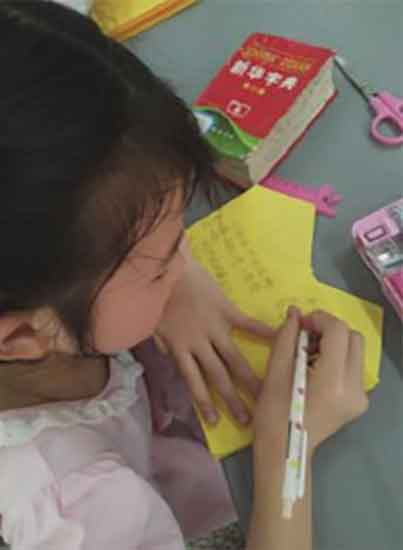

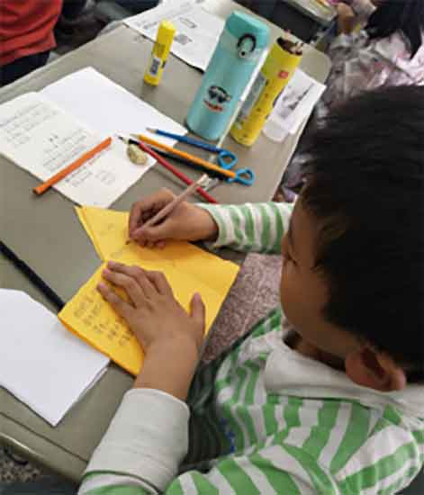

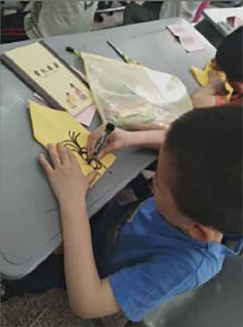

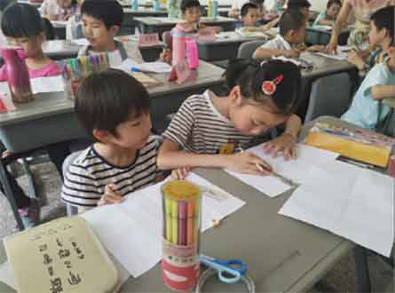

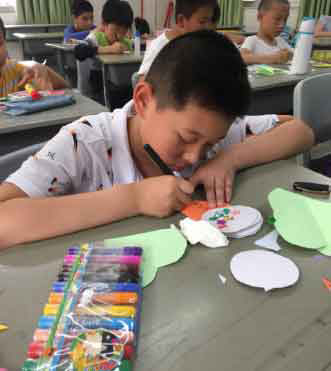

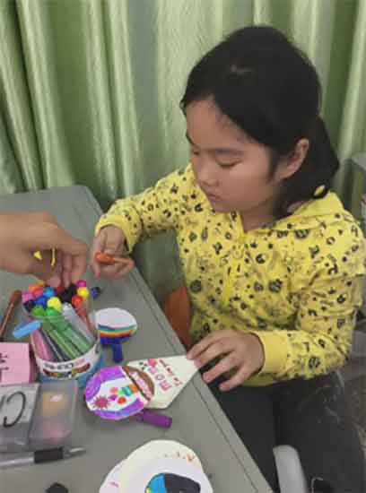

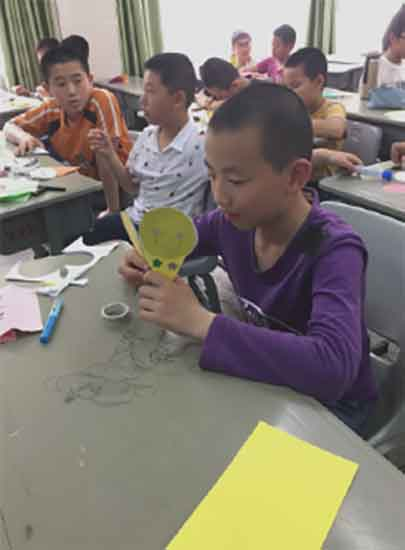

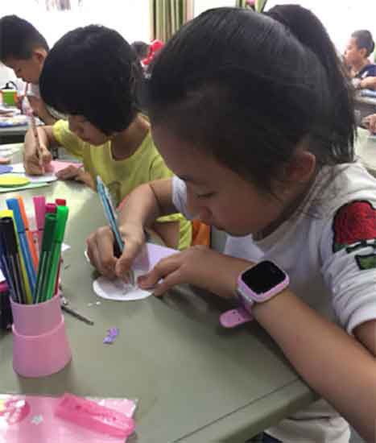

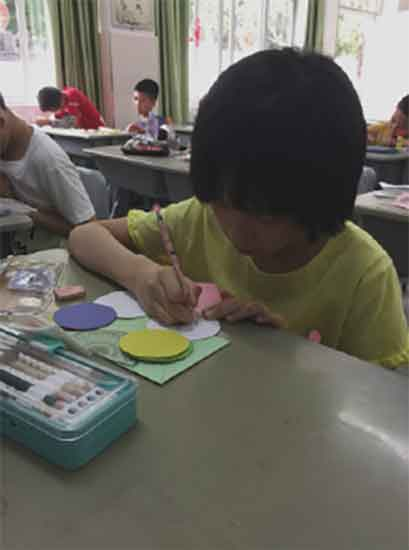

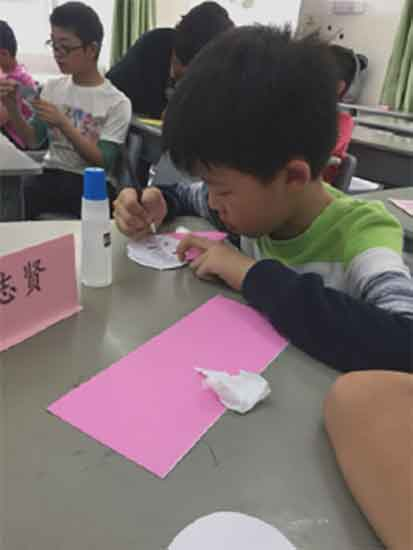

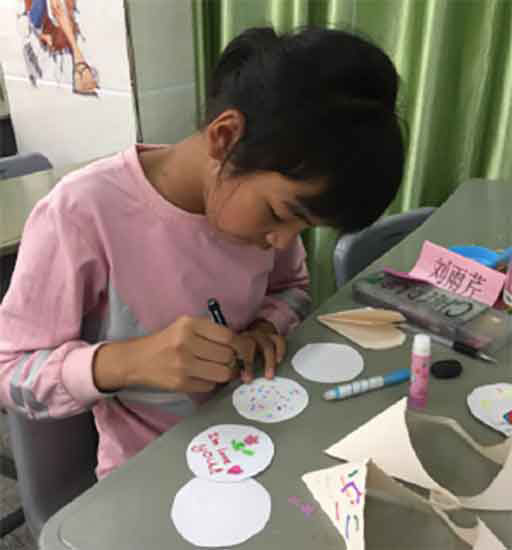

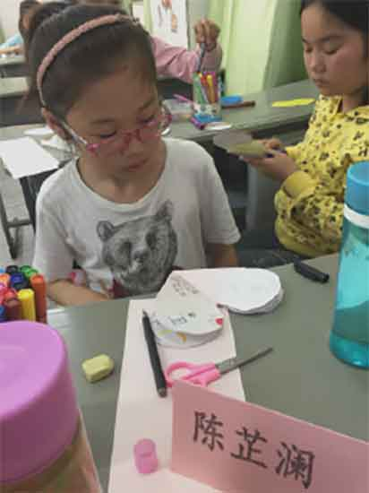

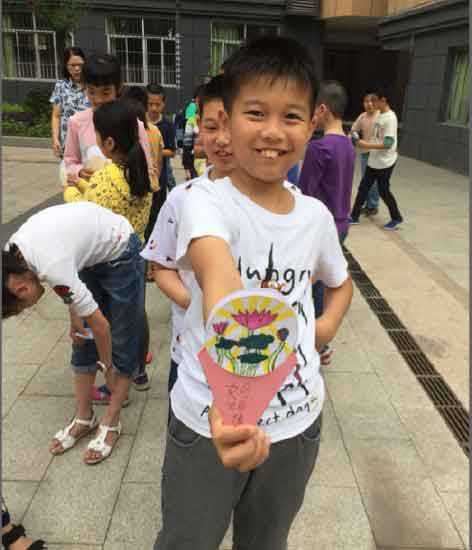

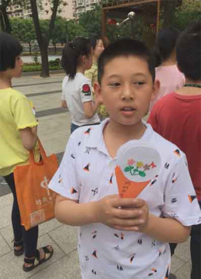

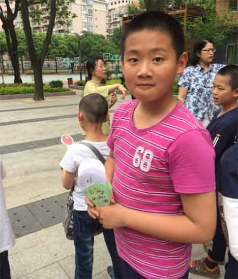

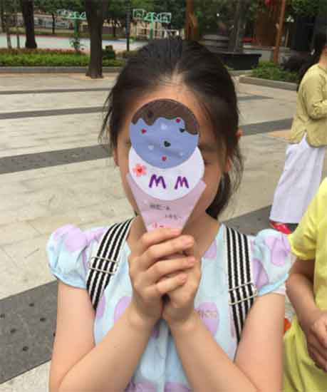

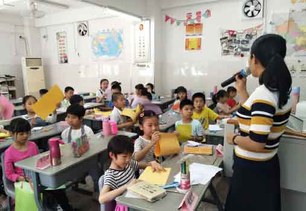

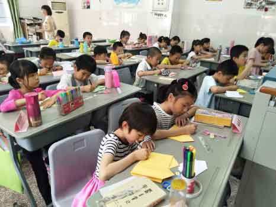

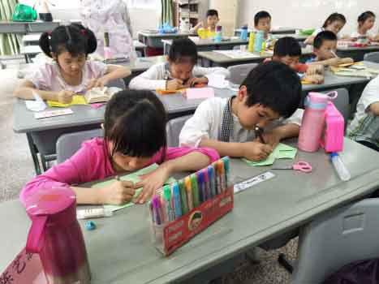

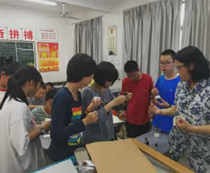

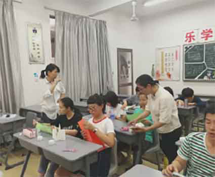

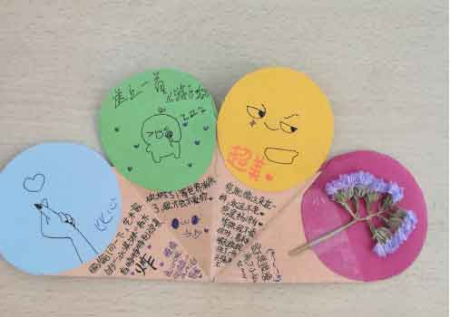

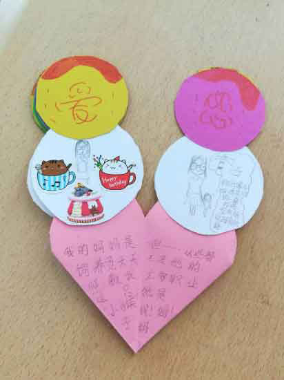

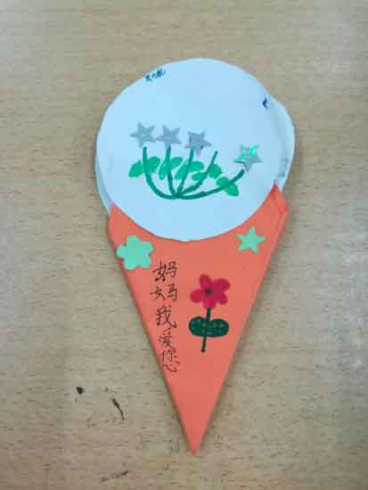

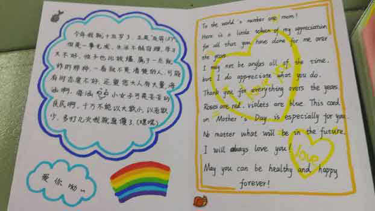

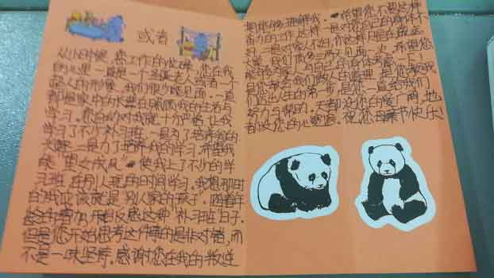
