# 第117期
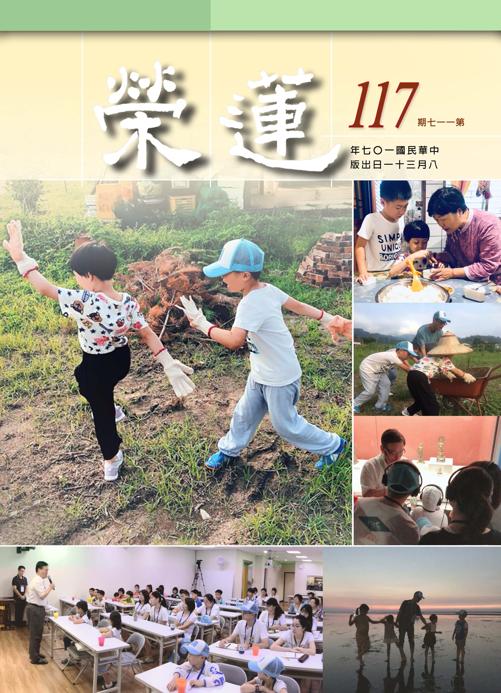

## 社論

### 自然演化之史上最強物種

本刊

打獵採集到農耕

工業資訊機器人

智人神人無不能

廣行甚深是最強

自然演化一直是很多人感興趣的議題，特別是達爾文的演化論，開啟人類對生物、基因、科技等的不同視角與分析了解，不斷做進一步的完善與說明。而當我們深入學習這些知識，僅可能地擴展其應用範圍，甚至找尋與佛法、經學的關聯性，往往在過程中，會迸出新的思想與更深一層的體會。

演化論範圍太廣，此處僅就著費波那契數列來談，費波那契數列簡單來講就是數列的組成，而這樣的函數畫成曲線，竟然與自然界很多生物生長的型態、相狀是相同的，例如螺旋、海螺、耳渦、植物葉片的生長、向日葵，樹枝的生長、人頭的構造、結構完整的颱風等，甚至往外推，宇宙的銀河、各個星球的形狀皆然，可以說小從植物、細胞分解，大到宇宙、銀河都是依此規律發展，令人感歎「數字跟數學是上帝的魔法」。這些植物、動物、大自然當中的氣體等，組成的元素類似，所以彼此的互動狀態、演化的過程類似，具共通性與規律，是以最直接、最有效的方式在運行。

不光是自然的演化，人群、組織等互動的關係，都是遵循著直接有效的方式運行，往往不依照此準則的，就會失去機會。若我們的思維想法，能跟有效運行的模式產生共振，就會形成一套最有效、自己發展出來的規律。人是有情的一種，身心互相觀待，人類發展都是自然且有效發展出來的規律，包括道德、文化、語言等，都是就著時代環境演化出來的模式。舉例而言，中原看待北方的草原遊牧民族，最無法理解的就是他們的繼婚制度，但試想繼婚制的產生，是因為生活條件惡劣，很多新生兒早夭，男性常因征戰死亡，這樣的民族必須多生才能維持人口數，而生育只有女性能辦到，為了演化求生存，為了宗族部落的延續，自然而然產生的生存方式。又如夷狄之所以為夷狄也有其特殊環境，在部落裡，比的是誰的拳頭大，自然形成的部落就是尊重強者的型態。在周天子時代，實權落入大夫甚至陪臣手中，他們對君主不需要尊重。從中我們可以推論，人類演化到最後，一定是往墮落的方向走，因為到最後，都是源於本能的需求，所謂道德仁義，是給真正有智慧，真正知道它的重要性的人學習，一般人只會拿來做控制的工具而已。

再舉一例，在金融市場上，股價、債券的價格從發布到變動到結束，只需要零點五秒，市場是以最有效的方式在運行。當然其中還牽涉局部跟全局的不同，在小範圍內，往往演化為自洽的法則，讓自己最強大、最有效率。但面對大範圍，原本的法則就不一定有效，需要考慮別的因素。例如清朝的帝制發展到爐火純青，他同時掌握草原騎兵、中原財政，用中原財力去支持草原，同時又掌握西藏。在中原，他以皇帝的身分，用儒家的思想、五倫的精神來教育百姓；在草原，他是部落的共主，以八旗議政；在西藏，他以觀世音菩薩的身分出現，以武力、精神力量做控制，整個中華民族的版圖到清朝可謂發展到極致；但即便有這樣的規模，也只是在中國的體系下稱霸，一旦把清朝放入全世界的規模裡，它必得重新適應，重新找到直接有效的生存法則，而很不幸的，在清朝閉鎖期間，西方快速發展文明的內涵，摸索到最正確的演化方式，故清朝一旦被迫融入世界，就會發現自己明顯不足。假若這樣來讀歷史，提高格局，加深廣度、深度，就會有不同看法。

研究演化論裡，二十世紀初期有句話說：「順應或是毀滅，對個體也好，對整個部落、群體、社會國家也是如此。順應或是滅亡，一個當今比過往更為重要的道理，是自然界的殘酷現實」，即要順應我處的時空環境，找到最能適應的演化規律。

而有始以來最強大的物種是什麼呢？假如把時間空間拉大，從三世、十方的角度來看，會赫然發現，最強的物種竟然是：佛菩薩。如此看來，學佛非常重要，學佛才能把自己變成最強物種，來順應時代。

學佛要了解一些注意事項，才能從中學到更深入、更全面的內涵。舉例來說，《地藏菩薩本願經》、地藏法門的重點是什麼？如果剖析《地藏經》會發現，地藏菩薩的使命是，從佛滅度以後到彌勒降生之前，要護持滅法有情，把他們保住，直到交給彌勒，故經的重點在於如何讓滅法有情不墮三惡道，包括臨命終如何克服障礙、平常的修福、跟三寶結緣、因果的講究等。從這樣的角度出發，就更能理解這部經。

同理我們來看釋迦牟尼佛這一期的教誨，釋迦牟尼佛面對的是人根陋劣的狀況，所以他講的法主是要幫助大家得增上生。佛在入滅前，說他所講的法如爪上土，沒說的法如大地土，可知很多的陀羅尼佛都沒說，這些佛經裡沒講的內涵，反而是我們更要去注意、體會的，特別是大乘各項細節的修學。我們發菩提心的目的是要幫助有情，而菩薩的廣大行通通是在世俗上的體會，所謂「行深般若波羅密」，是在各個不同領域下學習、實踐，並與有情結緣。我們要講究的是六度萬行的修學法，六度萬行可說是史上最強物種的武功秘笈，牽涉各個領域、時空背景，當我們全方位的通達、實踐、體會、歷練、修正，才有能力度化一切有情，當條件愈具足，愈能跟上現在的時代環境，才愈能隨緣利眾，也才能弘揚教法。尤其現在處於困局的時代，要推廣佛學，除了要了解這個時代的語言，也要了解時代發展的方向，包括學術的領域，各方的知識，都可以匯歸到佛法上，成為佛法良好的註解。古代的很多註解現代無法通達，如何用現代人的語言、觀念、比喻來通達佛法，是很重要的課題。而要讓佛法普及，需要通俗演講，有時候要離開經本去弘揚，用有情可以理解的領域去談，像是維摩詰居士就有諸多善巧方便。且修學是要化到心上的修為，具備靈活思考的能力，很多處理問題的方法是反經合義，是隨時代需求隨緣變化的。

法運靠人去承擔，正法、像法、末法雖是一個趨勢，但正法當中也有像法、末法，像法當中也有正法、末法，末法當中也有正法、像法，就看人的承擔，讓共中有別，如果我們能藉著世間各方面的學習，對佛法的認知愈來愈強，並且有能耐把好的觀念推展出去，就能創造出各種可能性。若能達到這樣的狀態，即是能夠順應且征服，征服自己的煩惱、惰性，征服種種惡緣與三界的繫縛，征服所有不利的環境與條件。而師父領進門，修學在個人，這既然是我們的目標，眼前就要朝著這樣的方向努力，推廣佛學，要了解原則，順應時代，跨出舒適圈，養成多面相學習的心態與習氣，未來回首會發現收穫是滿載的，會慶幸自己人生如此經營，願共勉之。

## 佛學覽幽

### 菩薩清淨的行持
       —華嚴經淨行品（三十三）

菩薩清淨的行持

—華嚴經淨行品（三十三）

空性雖治諸煩惱

尤賴大悲能承擔

橫逆艱難生諍恨

依舊大悲空性治

丙二、指事顯因答其徵因

丁一、總徵

丁二、別顯

戊六、乞食道行時願(五十五願)

己二、所睹事境(十九願)

己二、所睹事境 見眾會

經文：

若見眾會，當願眾生，說甚深法，一切和合。

聚會的場所，多半是人聲雜亂、人多嘴雜、閒言閒語，增加散亂心，惹一身是非，所以發願在聚會時發出的聲音能說佛法，特別是般若的甚深法，則一切和合，希望眾生像和合僧一樣，說話就是在說法，再多聚會也和合。南亭老和尚的開示說，眾會是四眾集會，四眾弟子集會一處，要請有道學的長老，說如來所說甚深之法，知甚深之法的人，自然和合無諍。

甚深法就是空性法，法相廣、法性深，所以佛的智慧以大海來形容，唯有大海才能形容深、廣，就廣的部分是指廣大能通達緣起法，就深的部分是指通達自性、通達真如，通達空性的甚深。

一般集會多是因事集議，因事集議諸如開會、選舉、廟會、市集、政治議題等，這些聚會都是生死邊事，無啥價值。若見眾會如果解釋成為大家都是為了學問來聚會，為了念佛來聚會呢？首先希望大家心思能好好運用在佛法上，聚會的吵雜聲音，如果這是議論佛法的聲音該有多好。

上一段是若見險道，三界都是險道，看到險道就像看到三界，住正法界才能遠離三界、遠離輪迴。住正法界最究竟的就是法性，住在最究竟的正法界才能夠離諸罪難。輪迴路險，即便生到天也很危險，發財也危險，貧窮也危險，困苦也危險，富貴也危險，富貴的子孫多驕奢，貧賤的人多怨恨，三界都是險道，見到險道就像見到三界一樣。如何遠離三界、遠離輪迴，就要當願眾生，住正法界，離諸罪難。換句話說，修學正法是不可取代的功德和價值。

若見眾會與說甚深法，一切和合，要怎麼結合？寺院、叢林、道場就是眾會，為了和合而聚會，但是在和合當中，不但要事和合還要理和合，若見眾會就是事和合，最後要進入理和合，四眾弟子集會是為了和合而聚會，但那是事相和合，規定大家要戒和同修、身和同住、口和無諍、意和同悅等等。但最重要的是為了得到須菩提的無諍三昧(證空性)，事和的目的是為了成就在理上的和合。

〈講義〉中說到：「非世法、非出世法，是甚深之法。」世法是緣起法，出世法是空性法，出世法就是世間自相不可得，世間自相不可得就是出世，世間的世是時間三世，間是空間十方，請問誰能超越時空？若說「從是西方過十萬億佛土，有世界名曰極樂」，請問阿彌陀佛有超越空間的限制嗎？「阿彌陀佛，成佛以來已經十劫」，請問是否超越時間呢？沒有！所以阿彌陀佛也沒有離開世間。此時要怎麼離開時間三世、空間十方？必須尋覓時間的自相、空間的自相都了不可得，在心識前沒看到時間的自相、空間的自相，就出世間了。時間空性的修學法一樣，時間可得嗎？過去心可得嗎？現在心可得嗎？未來心可得嗎？自相所成的過去可得嗎？自相所成的過去如果可得，不必觀待現在和未來就說自相所得的過去成立，這是辦不到的；一定是對著現在、未來才成立過去，如果沒有過去的累積，請問什麼叫做現在？如果沒有過去、現在，哪來的未來呢？這些自相到底在哪裡？不必靠著過去、未來就成立現在，不必靠著過去、現在就成立未來，不必靠著現在、未來就成立過去，一粒微塵都沒看到。對著世間說出世間，所以世間不可得，出世間也不可得，這就是究竟的空性。

己二、所睹事境 見大柱

經文：

若見大柱，當願眾生，離我諍心，無有忿恨。

若見大柱，有兩種意思：第一，古代大建築物是木造的，裡面需要有大柱子支撐。第二，古印度有一種民情風俗，凡是有值得紀念的，就會在路邊建立一個大石柱，石柱上刻上紀念人的文字，或者是雕刻紀念事物；例如阿育王為弘揚佛法，特別設立了許多石柱，雕刻了有關佛法的文字。

若見大柱和離我諍心，無有忿恨的關連是，大柱能負荷重物，就如同中流砥柱一樣，水再大也不會被沖垮，人如果能做中流砥柱，有捨我其誰的想法，此時我能、我慢之心必然很重，有我能之心就會有諍，有諍就會產生忿恨，如果能離去我諍的心，才能遠離忿恨。若要在佛法裡做眾生的中流砥柱，只有成佛才能真正成為眾生的中流砥柱，佛說法令眾生依此修行，得到利益而解脫，斷眾生的煩惱，了生死得到真正的快樂。

佛這樣的中流砥柱，不會跟世人有所諍，誰能跟佛諍呢？其實連等覺菩薩也不能，何況是其他？若大家都斷了煩惱，沒有我心，當然也不會有所諍，更不會有忿恨，所以希望眾生都成為佛法的中流砥柱，都成為修學佛法、弘揚佛法、度化眾生的中流砥柱，能夠做到這一點，自利利他，都能蒙受廣大的利益。我們在路上走，見到大柱子的時候，要想想我們有沒有跟別人諍？有沒有使人對我忿忿不平？有沒有人對我懷恨意而報復？如果有的話，就要想辦法解冤釋結，把冤仇化解掉，必定要想辦法讓眾生能皆大歡喜，不要產生忿恨，以上是指見大柱子時應該要這樣想、應該要發的願。

若見大柱跟離我諍心，無有忿恨有何關連？〈講義〉中開示說，古時候的建築物，如棟、樑、椽，所負擔的重量多半集中在柱子上面，因為柱子是無情的，不會喊不公平，所以無諍。如果我們在大眾之中，負荷的責任太重，此時要向柱子看齊，不要去諍，吃虧就是占便宜，願眾生都能離我諍心，無有忿恨。

此處的善用其心，在事相上無諍，善用心之人就可以讀出大柱的無諍心，而向大柱看齊，這是表徵大柱的無情說法。但是無諍該從何處下手呢？就是要學吃虧，這兩個字非常重要，能夠學吃虧就與人無諍，道力即能漸長，久之亦與人無有忿恨，最後可以成就自己。

會性法師開示，將大柱解釋成中流砥柱，水再大也不會被沖走，比喻能堪承擔大任的人，捨我其誰，常常能夠生起我能，會性法師在開示這句話時，特別加重語氣說「只有我能」！雖然較量容易生起慢心，但是如果從另外的角度來講，行相是慢但本質未必是慢，這是所謂的「事業慢」，慢的修學法其實是不退轉的修學法，我們為什麼會退轉？就是因為沒有慢的修學法，比如「煩惱慢」就是煩惱再厲害，你心裡很清楚它終究不是我的對手，你現在贏我，可是你以後一定不會贏我，一定要生出這種心，將來才能斷煩惱，並且生出勇悍的心把煩惱斷掉，如果煩惱來，自己軟趴趴的就跟著它走，那將來如何斷煩惱？「功能慢」是說我一定學會！任何事情只要我想學一定會學會，再苦我都會跨過，沒有這種能耐的時候，般若這一分的修學是很苦的，或者論典文字很多，或者環境很辛苦，或者老師刁難，如果沒有功能慢，終究退轉。

若我們現在不好好厚培自己的實力，面對未來困局，不曉得將來要如何去解脫，我們處在共業上的困局，人無遠慮必有近憂，眼前的事都尚且不保，如何去論近憂遠憂，不好好充實自己，眼前的事都保不住，不好好在團體內部經營，連聚會都保不住，遑論後面的退轉、煩惱生起、業生起，早就已經不知道退轉到哪裡去了。

那種捨我其誰之心，本質是一種較量，跟他人去爭的心，可是明明是無諍，行相是諍，本質是無諍，是一種全部承擔，可以吃下全部的苦，眾生不能我能的承擔，沒有這樣的幹勁來修學，是不會有任何的結果。

南亭老和尚開示說，如果能夠吃虧，學大柱一樣向它看齊，自然可以離我諍心，無有忿恨，都變成佛國土的莊嚴。以反省的部分來說，會性法師開示，以三慢的角度來分析諍心，我有中流砥柱的能耐，還得去我之心，唯有佛方為眾生究竟的中流砥柱，成就無我諍心與忿心。

忿與恨屬於小隨煩惱，行相粗猛，各自為主，互不相容，但在不善心中，由各別而起，生起時必無第二，故名為小。忿為暴怒之心，為二十種隨煩惱之首，依照現前的逆境，依照個人對現前所看所聽，一切與自己違情之境界，突而發起，起惡色、惡顏，甚至拿起刀槍、棍棒等凶器，或者身業以施加暴力的方式，使自己或他人都陷於痛苦，後果就如︽論語︾所說：一朝之忿，忘其身，以及其親，非惑與！就假有的部分來說，忿是瞋恚的一分為體，若離瞋恚，忿相就消失。恨的定義則是，懷恨在心，緣過去的境，暴怒之後，不順心的境界過去了，懷念舊惡，甚至恨得牙癢癢的，恨意難消，結怨不捨，常記在心。

忿恨是根本煩惱的分位，要如何對治呢？擒賊先擒王，慈悲就是瞋恚的對治法，瞋恚若要能消除，用慈悲來對治，忿恨是它的分位的一分，是假有之法，當然就可以將它對治，但是若慈不下來怎麼辦？那就要靠忍，小不忍則亂大謀，能離我諍心，無有忿恨之人，定為大柱，逆推離我諍心，無有忿恨之人，可以堪當大柱。此人無有計較，堪擔大任，內心能以慈以忍來對治忿恨，甚至以空性的智慧來剷除自己的忿恨，此人可傳大位，即便他沒有什麼輩份、家世、聲望，但卻是寺廟住持要傳的對象。（下期待續）

### 大乘百法明門論簡說（二十五）　拾參、心所有法—善(三)

*戒慧講述‧淨本整理*

善法論心是關要

苦樂心是造作者

命運改變不由人

知機其神是此義

經文：

三、善十一者：一、信。二、精進。三、慚。四、愧。五、無貪。六、無瞋。七、無癡。八、輕安。九、不放逸。十、行捨。十一、不害。

八、輕安

如前五別境中三摩地（定心所）之說明，定心所與念心所都有專注，主要差別在於定心所在專注中能夠產生輕安，是修止的成就，念心所則還未能產生輕安，所以說輕安一法，唯定地有，欲界中無。輕安心所之定義，蕅祖《直解》云：「遠離麤重，調暢身心，堪任為性。」其業用為：「對治昏沉，轉依為業。」修止成就者內心安定沒有煩惱擾動，此時產生心輕安，並且帶動風大充身產生身輕安，身輕安又資助心輕安，這樣的調暢為世間人所無法體會，能讓行者對於善法特別堪忍，所以說輕安能夠對治昏沉（但亦能對治沉沒、掉舉與散亂），轉染濁之身心，依清淨身心。修止成就的基礎之上就能夠修觀，修觀的成就同樣也會有輕安產生。

《大學》中「止、定、靜、安、慮、得」也可以理解為修止觀的次第。「止」就是能掌握目標，懂得方法；「定」就是專注力的修學，是止的修學法，因為尚未成就，僅能相當於《百法》中的念心所而非定心所；「靜」是修止中有能力以對治法破除昏沉、沉沒、掉舉、散亂等障礙；「安」是已經不需要特別用對治法，心就能安住於所緣境上，修止之輕安相至少要到此階段才可能產生；「慮」是在止的基礎上開始修觀；「得」是現量證得。

欲界雖無輕安，但可依之相似而修，如懺公表解中所列：一、相似輕安：是指尚未達初禪未到地定之欲界定，有相似於入定的輕安感。二、有漏輕安：此指已經達到色界或無色界定所生之輕安，因為輕安中產生非常大的喜樂，或者連喜樂都不緣念，所以可以遠離煩惱；又因為只是四禪八定之輕安，並非修空性觀慧所得之輕安，尚未斷除煩惱，所以仍屬有漏。三、無漏輕安：此須修學般若觀慧，破除執我之心、斷除煩惱，才能得到與無漏定相應之輕安。

九、不放逸

放逸就是放縱身心，反之能對治放逸者就是不放逸，蕅祖《直解》云：「不放逸者，即精進及無貪、無瞋、無癡三種善根，於所斷惡，防令不生，於所修善，修令增長，而為體性。對治放逸，成滿一切世出世間善事，而為業用。」此定義與精進一法相似，如此又何必另立不放逸心所？主要區別在於，精進對治於善法懈怠，不放逸對治追逐世俗的放逸。

無貪、無瞋、無癡，必須在正知見中修學，否則也無法斷惡修善，放逸主因就是起於邪見無感或無知，在世間以鬼混的心態過日子。若以正見力量對治這種無賴的心態，並對善法勇猛精進，才能稱之為不放逸，最重要的善法就是充實自己，使自己具備幫助他人離苦得樂的能力。普賢菩薩警眾偈以無常警醒世人，世間一切的美好，在無常的摧壞下都無法維持，妻子眷屬、田園房舍、年輕力壯、權力威勢乃至於生命，皆是如此，謹慎檢點身心在正見中修持，不令放逸，是離苦得樂唯一的一條道路。因此孟子也說，學問之道就是要找回迷失的心，不是放縱自己在外境中找尋那不可得的快樂。

十、行捨

蕅祖《直解》云：「行捨者，亦即精進及三善根，能令其心平等正直無功用住，而為體性。對治掉舉寂靜而住，以為業用。此與五受中之捨受不同，故名行捨。」行捨就是在三善根中精進，讓心達到平等、正直、無功用住，是修行止觀的心理作用。簡言之，行就是修學昏沉、沉沒、掉舉、散亂的對治法，使心達到平等（不昏沉、不沉沒、不掉舉、不散亂）；正直（直心正念真如）；捨，就是功夫純熟，已經不需要用任何對治法，就能夠平等正直。最後達到無功用住，不需修對治法，就可「能所一如」，此乃專指修學空性的成就（能所雙亡）。

「行」既然是對治法的修學，屬於心上的造作，所以在五蘊中屬於行蘊；「捨」是無功用住，捨掉對治法，能專注於當前的所緣境，也是屬於行蘊，但不是受蘊中的捨受（不苦不樂之受），與七覺支（念、擇法、精進、喜、除、捨、定）的捨相同，都是捨對治法，已經任運而住所緣境。至於四無量心之捨，則是指捨除對有情的貪與瞋，是一種對治法，而非捨除對治法。

輕安與行捨二法是各宗修學止觀，成就定慧的下手工夫與究竟方便，因為此二心所是對治昏沉、沉沒、掉舉、散亂的作用與成就。

十一、不害

《直解》云：「不害者，於諸有情，不為侵損逼惱，即以無瞋而為體性，能對治害，悲傷憐愍以為業用。無瞋名慈，不害名悲，與樂拔苦，度生勝用，故體雖一，約用分二。」不害的對象包括了所有有情，對有情眾生不為侵損逼惱。此處又說其體性是無瞋，意思是不害以無瞋的心意為本質，由於無瞋，內心希望給予眾生快樂(慈)；予樂須以拔苦為基礎，所以不忍傷害眾生，希望救拔一切有情的痛苦(悲)，慈悲二者，是度眾生的勝用，也是佛教的重要根本。

以上為《百法》善心所的說明，非謂善心只有這十一種，而是在斷惡修善以及修學止觀上，此十一種心理活動特別重要，若能了解其行相及作用，善用其心，必能在修行上獲得大利，體會世尊一切法無我的旨趣。（下期待續）

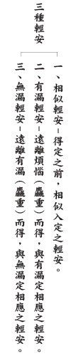

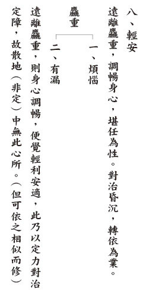

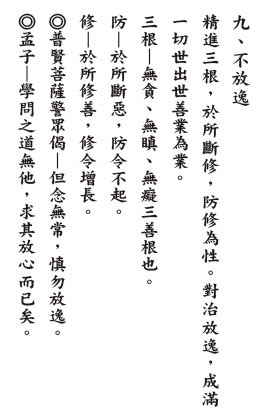

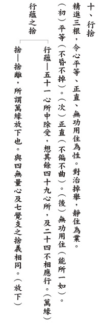

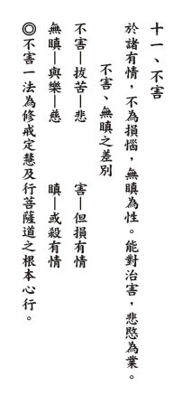

### 佛學概要十四講表簡說（十九）　第三講表

*戒慧講述‧宏法、淨昌整理*

誤會是認知偏差

學佛可貴正知見

歧路亡羊迷轉迷

親師學法正又正

引言

前於綱要已知《十四講表》係有次第的一個修學法，第一表可以帶我們瞭解學佛的宗旨目標，瞭解佛果的行相作為學佛目標，第二表借由八相來帶領我們學習成佛的方法，第三表也還不是直接開始上路修學，而是在上路之前，先排除上路的障礙，要先「消除幾種誤會」。我們學佛道上會有種種的障礙產生，就是對學佛上錯誤的見解形成誤會，而這些障礙必須要先拿掉，就好像我們開車上路之前要先檢查車況，去除障礙到達目的地的狀況，才能順利到達目的地。

雖然佛法三藏十二部的經典中，沒有談及第三表的內容，但雪廬老人作第三表並非畫蛇添足，時代愈進步的時候，往往對佛法的看法產生誤會，常常認為佛法是很迷信的、消極的、神權主義的、忽略現實乃至不合科學的，如果沒有把這個時代對佛法的誤會去除，眾生連佛門都不要踏入第一步，遑論研究成佛的目標與方法，而雪廬老人以第三表將這些誤會作出歸納及澄清。

以經文而言第三表不算佛經，因為釋迦牟尼佛沒有說過。但是第三表的義理是符合釋迦牟尼佛的看法，所以雖經文不是佛言，但經義符合佛言。觀待能造論的人，才有所造的論典，例如龍樹菩薩的《大智度論》就是解釋《大般若經》的經文，龍樹菩薩的《中觀論》就是闡述《大般若經》的經義。所以如果有人尚未了解《中觀論》及《大智度論》時，就自行閉關讀《大品般若經》。我們不用太瞭解這個人的內涵，就知道他絕對讀不懂。因為二十七品《中論》是《大品般若經》的宗義，如果對宗義不瞭解，就知道對經文絕對不會瞭解，就算瞭解也只是瞭解表面。所《大品般若經》讀完，一定要能解釋《中論》，如果解釋不出來表示對《大品般若經》從來沒懂過。

(甲)表與(乙)表至(庚)表的關係

下文依序從(甲)到(庚)表，甲表是總說，總說這個誤會，這個誤會是如何產生的呢？從自己產生，還有從它處產生的，(甲)表先確認誤會的來源。

(乙)表就是世間人誤會產生了之後，對正法內心排擠抗拒，排斥約著五點來說，會有學佛是迷信、消極的、神權主義、忽略現實及不合科學等種種　　誤會與排斥。

誤會其實跟排斥相互觀待，因為誤會所以排斥，而排斥說明他有誤會，是以下文即分丙表至庚表說明此五種誤會。

(甲)誤會

●我假理想

誤會從兩方面產生，約自己產生是【我假理想】，約聽聞產生是【聽信妄談】。【我假理想】是自我假設的，自己憑空想像出來的，沒有事實根據。大部分是自己看看書，看外道的書，或者是看內道的書卻看不懂，望文生義，發展出自己的一套對佛教的看法，這種隨意解經文，就是【我假理想】。

●聽信妄談

第二種是【聽信妄談】，所聽聞的不是從善知識來的。【聽信妄談】又可分為三類，第一類是世間人對佛法的看法，認為佛法是迷信、消極、神權主義、忽略現實、不合科學的。第二類人的佛法來自於媒體，媒體裡面談佛法順便賣藥，聽眾一方面買藥一方面聽佛法。第三類人是學者專家，以研究學問的方法研讀佛法，然而並非真懂佛學道理，但他不把佛法當宗教。同樣的一般人以學術研究儒學，但儒家跟佛家一樣，就像國父所講「一個主義，一個信仰，一個力量」。我們看孔子除了本身的修為以外，最講究祭祀的道理。《禮記．禮器篇》孔子說：我祭則得福，但是一般世俗研究儒家的人不會重視這個。所以會發生跟雲南納西族東巴文化的現況一樣，現在中國學東巴文化的人，也不會涉及信仰宗教的層面。但是東巴文的文字紀錄就是宗教的內涵，它詮釋的就是東巴文化的宗教，當你不涉及宗教的時候你根本入不進去內涵。

宗教就是宗旨，這個教育是有宗旨的，內心有一個宗旨的學習，外相上還有求加被的這一分，其中包含甚深的緣起道理，一般世間人雖學，但不帶著虔誠的心態，或不能深入文化神髓。

有【我假理想】和【聽信妄談】就會造成三種現象：【未見而言】【見蛇為龍】【未究其理】。

【未見而言】是指一般世間人，並沒有明白真正的道理而去講。世間一般人對佛法的內涵不去涉獵，但就站在反對立場去反對。【未見而言】，比如說：世間人、媒體與佛學大家，這些人都是把儒學佛學當成常識來學，並且帶著批判的成見來學，還沒學懂之前就先批判。學者教授未能學到真正儒學和佛學的本質，依舊可以講天臺、賢首、中觀，可是都是不帶信仰的、不帶傳承的、不帶加被的。但須知欲證得中觀正見，最後要現量證得時，沒有三寶加被是不可能的。但是對三寶加被的那一分產生虔誠恭敬，對於他們來說是虛無縹緲、遙不可及、烏托邦、迷信。

【見蛇為龍】所講的是外道，蛇和龍根本是兩種不同的動物，此處是指對佛學佛教雖然有點研究有所了知，但是所見所知是不正確的、似是而非的，就像外道的看法不是究竟的，像龍華教及一貫道來解佛經的時候就是【見蛇為龍】。解到最後找不到解脫在哪裡！經學自己亂學亂領會。

【未究其理】所講的是佛教徒，雖然在正信的佛法裡面學，但是學得很膚淺，不知道究竟的道理，就是【未究其理】的學習。佛教徒沒有學到內涵，只學到外表。所以才會有早上法會人山人海，下午法師講經剩二十個人，因為沒有人想學懂佛法內涵。但是對比而言，有內涵以後佛菩薩加被的力量強？還是只有學外表的加被力量強？如果我們站在佛菩薩的立場，會怎麼做？將心比心，如果重視內涵的不加被，重視外表的加被，那表示這種佛菩薩也不太有內涵。

【未究其理】是說我們學習是要走入內涵的。禮要走入內涵，叫作博我以文。這個內涵走進去，禮才會很有光彩。為什麼春秋時代儒家的弟子們出去各國演禮的時候，各國國君無不感動，而跟孔子分庭抗禮，這跟現代禮儀訓練班的差別即在於內涵的高下，所以【未究其理】講的是佛教徒。

本段落可見識到雪廬老人解經的文筆是義理次第鋪排、層層深入及前後貫串。

●自非其真

有上述的迷失就導致【自非其真】，學習都沒有學到佛法的真實義。所以佛法變成表面興，內部衰。第一種現象媒體專家講佛法，佛法興過嗎？第二種現象外道講佛法，一貫道，外道講金剛經。以前懺公師父命我們燒了三千部一貫道註解的《金剛經》，佛法這樣流通有興過嗎？第三種現象未究其理，反而認為極樂世界跟天堂是一樣的，佛法跟世間的宗教也一樣，都勸人家做好事，這樣能興佛法嗎？這叫作未究其理。表面上來講是一樣，但內涵是大不同的。

(乙) 幾種排斥

當上述三種人都來弘揚佛法的時候，理應該佛法要興，可是佛法卻變成表面興，內部衰。因為都是【自非其真】，所以產生了誤會。誤會導致認為佛法是迷信的、消極的、神權主義的、忽略現實的及不合科學的。所以就產生了這幾種排斥，從丙表開始，將對「迷信、消極、神權主義、忽略現實、不合科學」這些現象一一辯解。（下期待續）

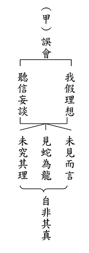

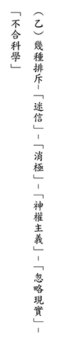

### 人生大事—不能忽略的事實
			 助念生西觀念作法研究（五）　助念生西須知

人生大事—不能忽略的事實

助念生西觀念作法研究（五）　助念生西須知

戒慧講述

臨終助念真稀奇

命運翻轉天地別

仗持佛力難思議

典範能令信心生

六、往生證驗：

古—詳載淨土聖賢錄、往生傳、往生集；唐張善和、宋王龍舒、黃打鐵、可久法師、民國印光、弘一、諦閑大師、江味農、胡松年等居士。

今—廣欽老和尚、道源老法師、李炳南、賴謝妙、邱蕃薯、李濟華、江翠裳、巫土鯋、劉李菊等居士，詳如近代往生錄、明倫月刊。

往生的證驗有古、今。古是詳載於淨土聖賢錄，遠至慧遠祖師，他是最早在廬山東林寺提倡念佛的祖師，所創立的白蓮社，大家以往生淨土為目標，共同決志念佛，之後的歷代高僧都有記錄行者往生的事蹟。到了明代開始編輯淨土聖賢錄，在乾隆期間出現初編，第二次是續編到光緒末年，第三編是在民國二十二年的時候，第四編是民國六十一年。臺中蓮社目前流通的是把這四編合刊。至於往生傳有兩種，一種是近年大陸的寬律法師所寫，他寫的是近年來大陸念佛往生約一百多人，另一說是由楊慧鏡居士記錄的。往生集，是蓮池大師為了增強修淨業而註。

張善和，一生殺牛為業，臨終地獄相現，正逢出家師父引導念佛，在念佛聲中蒙佛接引往生。這個十念往生是萬中無一，阿彌陀佛四十八願的第十八願就是十念往生，確實明明有，然剛好臨終遇到善知識教以念佛往生，接受並且相信淨土法門，這是家人與亡者極難之事。況且臨終的時候很多人都是昏迷的，像他這樣子神識清楚的往生，真的是萬中無一！惡業有時候會感應臨終橫死、或急救等諸多惡緣，也遇不到善知識。碰到善知識需要很大的善業，所以應該說，張善和的一生雖然造惡業，可是他臨命終的時候，某一生很強的善業映現到這一生，在地獄相現，急找救度，有師父告訴他念佛求往生，他馬上相信，可能就是某一生修過淨業，已滅的淨業映現在這一生，讓他生起往生的善根，但他的例子是萬中無一，我們不可以存有這樣僥倖的心。

宋朝的王龍舒居士是立化(站著往生)。據聞他是一天拜阿彌陀佛一千拜，往生時無病無障礙。著有〈龍舒淨土文〉，此文是印光大師在修行過程中，對淨土法門生起信心的一部論。

黃打鐵是明朝人，雖是一位鐵匠，卻有修行的因緣，有位出家人經過他住的地方，他馬上供養師父並請示修行方法，了知抽一下風箱就念一句阿彌陀佛，打一下鐵就念一句阿彌陀佛，是最好的修行。命終時預知時至，並留下偈語：「叮叮噹當，久煉成鋼，太平將近，我往西方。」

可見修行除了有心，還要有善巧方便。昔日舍利佛令處理死屍者修數息觀，令打鐵者修不淨觀，結果兩個人苦修無成都想還俗。後來釋迦牟尼佛令兩者的修學法對調，才讓兩位修學者得利，有所成就。所以修行除需要有善巧方便，要成為人家的善知識也要注意，首先必須要引起人家好學的心，也就是「不憤不啟，不悱不發」；除此之外，還要有善巧方便，這叫做「舉一隅不以三隅反，則不復也。」

再來就是宋朝的可久法師，他一生誦《法華經》，願生淨土，人稱久法華。他在八十一歲時曾經坐化三天後回還，對人說：「我游淨土，見殊勝美妙的境界，與《十六觀經》所說的一樣。」又說「我們這個世界修淨業的，西方七寶池中蓮華台上都已標名。」說完就坐化往生了。

印光祖師，民國二十九年準備示寂，先請妙真大和尚來當住持，本來提議十一月中旬，印光大師說不行，後來決定在十一月一日昇座，四日印光大師就在佛號聲中坐化。大師與人書信往返，高鶴年等彙集為印光法師文鈔，內容包羅萬象，各種人生難題，特別是修學之疑，都獲得殊勝的解答。懺雲法師說，他每每遇到人生需要抉擇時，就禮拜印光大師，然後翻開印祖文鈔，裏面往往就會有他要的答案。

弘一大師，大師的人生是瀟灑走一回，說轉變的時候就全部轉變，而且是徹底的轉變，未出家前是集音樂、美術、書法各項才藝於一身的藝術家，可是當他人生突然做轉變時，是徹底走上最苦修的戒律，嚴格修正自己，臨終是預知時至，寫信給好朋友夏丏尊居士，說：「君子之交，其淡如水。執象而求，咫尺千里。問余何適，廓爾忘言。華枝春滿，天心月圓。」什麼因就什麼果，人生走到這裡，終於圓滿，回首這一生，三十九歲到六十三歲出家的這一段時光，是他一生中最好的訓練，感覺人生最後要歸去的心情，像花枝春滿，天心月圓那樣。
諦閑大師，他是解在天臺，行在淨土，是天臺宗的大家，一生的事業就是教書、培育僧才，並且著作等身。他是教內公認有名的講經法師，而且他的講經能耐是盤腿兩、三個鐘頭不用動，在定中不斷地湧現法義。可惜的是，他百般呵護既聰明又能講經的顯蔭法師，這位年輕的法師恃寵而驕，後來在學講經時，只不過被說聲音太小，就氣出病來，離開了諦閑法師，三十二歲死在日本東京。我們曾經到緬甸，碰到一位年僅三十六歲的三藏法師，當時全緬甸只有九位三藏法師，三藏法師要考四十五本巴利文，那位法師很謙和平靜，沒有年輕人的燥氣。我們請問他怎麼培養三藏法師？他平靜的回
**答：** 打就好！古人雖然藉著折法，培養很多人才，可是現在已經沒有那個環境，現在如果打罵小孩，是會被小孩申請家庭保護的。

江味農居士，他一生研究《金剛經》，著有《金剛經講義》，最後也是念佛往生。後文的「江母郭太夫人往生記」，指的就是他母親。

胡松年居士，他是護持印光祖師的在家居士，也是預知時至，臨終時有很多人來看他，時間一到，就咽下了最後一口氣。

今人當中，排第一位的是廣欽老和尚，老和尚的傳奇故事坊間也有很多流傳，雖是不食人間煙火，時常入定，不涉世俗，但卻通達人情世故。民國六十五、六年，懺公師父上臺北參訪廣欽老和尚，老和尚還在專門招待懺公的房間裝冷氣，懺公在承天禪寺主持佛七之後，廣老對懺公做廣大的供養。平常廣欽老和尚不太言語，但是面對懺公一定是有問必答，對懺公是敬愛有加。

道源老和尚，他有高度的近視眼，經本必須要放大數倍才看到字，講經或讀書都非常辛苦。老和尚是保留正統講經風格的大師，講學極有風範，說法的架勢，喝茶的優雅，一看就是大叢林出身的。

邱番薯居士，是我約民國六十六年第一位助念往生者。在他臨命終時，整個房間惡臭像緬甸菜市場的臭魚味，第一天掩鼻進去助念，他翻來覆去，就像垂死的魚，反覆翻身，不得安寧。第二天漸漸能安靜下來，臭魚味道慢慢不見。第三天竟然跟我們用日文說再見。在佛號聲中送走了他，最後是頭頂發熱呈現瑞相，是我學佛很重要的增上緣。

賴謝妙居士，先生離家出走，老居士獨自撫養四個孩子，她每天認真的做功課，雖然因為車禍所以腿骨動了四次手術，可是天天拜佛，後來膝蓋骨這邊燒出最多的舍利子，像珠寶一樣光彩奪目。她也是預知時至，生前常跟蓮友說，希望大家來幫她助念，蓮友笑說不能死在夏天喔！夏天的天氣太熱，大家念佛會流汗不舒服，她說不會不會，會讓大家舒服，果然在中秋節前就瀟灑歸去。

李濟華居士，他是臺北蓮友念佛團的團長。宣講完《彌陀要解》後在念佛聲中坐化，往生的因緣很殊勝！

江翠裳居士，這位居士的臉上長了個很大的人面瘡，是以前的冤情債主附身，她曾經是學校的班花，可是得到人面瘡之後，卻讓人感到恐怖。據說是她在清朝時，有一個男的追她不成，後來自殺，父母親受不了白髮人送黑髮人，也自殺，結果這三條冤魂從清朝追到民國，最後找到她。她臉上的腫瘤使她堅持念佛，早晚課迴向人面瘡，在眾人的佛號聲中往生，不信佛的家人看到阿彌陀佛和兩排僧眾來接她，坐著蓮花往生淨土。

巫土鯋居士，是臺中蓮社的蓮友，巫居士在太太死去的時候，當時屍體已送到冰庫，他親眼看著他的兒子把媽媽(他的妻子)從冰庫拖出來，一直念佛，念到臉色轉紅，巫老居士由此因緣，從此認真念佛，而且到蓮社聽課從來不間斷。

他的孫子從國防醫學院畢業時，和同學出去玩，不小心滑倒淹死在溪裏面。告別式的時候，小孩的媽媽像發了瘋一樣又哭、又叫、又鬧。可是這位當爺爺的巫老居士，在一旁平靜的念整場佛號，式場中協助的蓮友與大眾是深深佩服。

這個孫子是全家最會讀書的一位，老人家很平靜的念佛，他沒有怨阿彌陀佛，他這麼認真念佛，可是阿彌陀佛卻沒有保佑他的孫子。他住在他兒子家裏，晚年的忍辱功也修得很好，最後也是預知時至。

七、助念往生參考資料—

雪廬老人（助念之意義與規矩）、飭終須知、飭終津梁。（下期待續）

## 孔學一隅

### 論語簡說（二十五）
	  			—君子亦有惡乎（下）

論語簡說（二十五）

—君子亦有惡乎（下）

時哉講述

好惡是情緒

認知乃本質

趨吉而避凶

處世能兩利

經文

子貢曰：君子亦有惡乎？子曰：有惡。惡稱人之惡者，惡居下流而訕上者，惡勇而無禮者，惡果敢而窒者。曰：賜也，亦有惡乎？惡徼以為知者，惡不孫以為勇者，惡訐以為直者。

（陽貨第十七—二三）

消文
子貢問，君子是否也有討厭的人？孔子回
**答：** 有的。第一、討厭宣揚別人的過惡。第二、討厭在下位而譭謗上級。第三、討厭勇敢而沒有被禮節制的人。第四、討厭果斷卻事理不通的人。
老師反問子貢：你有沒有討厭的人？子貢回
**答：** 有的。第一、我討厭抄襲別人的成果當成自己的智慧財產，或者是反應很快，炫耀自己的才華，以為是有智慧的。第二、我討厭不謙遜，卻自以為是勇者。第三、我討厭揭發別人的隱私卻以為是正直。

釋義

「賜也亦有惡乎」是孔子問還是子貢自己說？

老師問為什麼呢？因為，如果是子貢說，老師還沒問學生，學生就回答，是不是勇而無禮？這樣的行為正好被老師討厭。子曰出現兩次，第一個是回答子貢所問，第二個是反問子貢有沒有討厭的？這個文氣多好！

徼以為知的形象為何？有何過患？

子貢說討厭「徼以為知」，「徼」的解釋是抄襲，抄襲別人的智慧財產，有什麼過失呢？一、抄襲別人者往往自認聰明，不會去請教別人；二、以後沒人敢教他，因為他的學問是用偷的；三、他以抄襲為能事，這也助長盜竊的風氣；四、容易耳朵進去嘴巴出來，現買現賣；五、別人已經修正了他的說法，他還繼續沿用；六、抄襲了還把它當成自己的，這容易讓人看不起；七、真正的原作者發覺被抄，他也不願意把他的心得再拿出來分享。

惡徼以為知的形象為何？有何功德？

一、壓抑盜竊的風氣；二、保護智慧財產，也讓人樂於分享，並且鼓勵別人多求學，而不是用抄襲剽竊。現在很多人去臥底偷商業機密，出去另外組公司，看起來賺錢很容易，其實讓人不齒！如果他倒了一次，終身都爬不起來！偷別人的當成自己的，是最不厚道的行為。

以前在晉朝一位叫殷浩的將軍，後來兵敗，流放到浙江，他的外甥韓康伯，跟殷浩學了《老子》跟《易經》，韓康伯對著大眾發表他《易經》的高論，殷浩在旁邊聽了以後，很不以為然，說：我這個外甥通通在講我教他的，其實韓康伯連我牙齒後面的污垢都沒得到，就在那裡自鳴得意，以上是「拾人牙慧」成語的由來。

徼以為知者，就是喜歡耍小聰明，當成有智慧。諸葛亮是一位臨危不亂的將軍，但看他用空城退敵，那種機智是只用一次，為什麼司馬懿不敢打進去呢？因為司馬懿知道諸葛亮平素不用險，所以不相信諸葛亮會走險棋。現在有些人很敢在鋼索上走險棋，有一天一定會摔下來！

好內斂以為知的形象為何？可以嗎？

壓制小聰明，好好的事前規劃，懂得要穩重和內斂，所以，子貢討厭耍小聰明，討厭抄襲，那是不是喜歡內斂呢？是否可以說是「好內斂以為知」呢？內斂是重要的，面對看起來內斂的人必須要小心檢視，這個內斂是經過聞思修以後的內斂？還是裝出來的莫測高深，令人難以測量。如果是道理經過聞思修內化以後的內斂，大智若愚，那就是真的厲害！故弄玄虛、莫測高深那種內斂其實沒什麼，反而讓人看破手腳。

不遜以為勇的形象為何？有何過患？

不遜就是不謙遜，不謙遜裡面包括沒大沒小、目中無人、不會去請教別人。其過患是人們不願意與他為伍，也不想指導他，他也不會去請教別人，這種不謙遜往往得不到人家的護持，得不到他人經驗的傳承，過患非常地多。

如拿破崙征服了歐洲，打敗了奧地利、普魯士跟義大利的時候，目空一切。整軍兩年以後，開始想要以六十萬大軍打俄國，身邊的人勸他不要打，他反而認為這些人都是好逸惡勞，都是無可用之徒，後來浩浩蕩蕩的帶了六十萬大軍打俄國，俄國就用焦土政策，一路往後退，破壞了田地，燒掉了糧食，破壞了交通，拿破崙沒有辦法就地取糧，一直孤軍深入到莫斯科，結果在天寒地凍中不得不開始撤軍，俄國就一路攔截，最後拿破崙是大敗而返。此時歐洲各國群起攻之，在滑鐵盧一戰，拿破崙最後流落小島而死，這就是「不遜以為勇」的下場。

中國也有一個荊軻刺秦王的典故。荊軻刺秦王的時候，找了個副手秦武陽，秦武陽是燕國大將軍秦開的孫子，十三歲殺了人，人家眼睛都不敢看他，荊軻以為帶著他就可以去刺秦王，想不到該勇的時候反而不勇，當荊軻獻土地，拿著地圖給秦始皇看，眼看刺殺的時機到了，但秦始皇看到後面那個秦武陽腿抖得都站不起來！秦始皇就起了疑心，所以圖窮匕見卻刺殺不成。

惡不遜以為勇的形象為何？有何功德？

討厭蠻幹出亂事，就是要目中有人，要懂得請教別人，要能夠虛心接受指導。

好謙遜以為勇的形象為何？可以嗎？

謙遜有時候勇，有時候不能勇。顏回是謙遜之人，顏回是該勇則勇，不該勇則不勇。所以在「匡地被圍」的時候，孔子和顏回是到處躲藏，他知道把命保住，才能夠傳承聖道，所以當他跟孔子在亂後相逢的時候，孔子很高興地說：我以為你死了！顏回說：老師在我怎麼敢死。這就是顏回知道留著生命是為了傳承道法，該不勇的時候就不勇。

謙遜之人，不是容易被人騎在頭上嗎？如何說有勇？

很多人都說「值得驕傲」，怎麼可以謙遜呢？事實上的謙遜是留有受教的餘地，所以了凡先生說：「謙則受教有地，取善無窮。」我心裡面可以接受人家的建議和教誨，也可以吸取很多對我有利的內容，別人願意指導我、願意拉拔我、提攜我，對我實在太有利了！所以，雪廬老人上課說，《書經》上說：「能自得師者王，謂人莫己若者亡。」能夠得到老師的就能夠成就自己，以為只有自己最強就是亡，此人必亡！

顏回就是謙遜的人，顏回跟著老師周遊列國，餐風露宿，跟著老師顛沛流離，請問這不是勇嗎？師兄弟都對顏回十分恭敬，子西大夫也認為顏回是宰相之才，怎麼會被他人騎在頭上呢？顏回要過世的時候，師兄弟要把顏回厚葬，為什麼？因為這個人是大家的典範，太了不起了！

訐以為直的形象為何？有何過患？

揭發人家的隱私以為正直，內心裡面討厭自己如此，也討厭別人揭發他人隱私以為正直。揭發隱私的人必然是刻薄寡恩，如果所揭發的隱私是在五倫當中，那真的是壞亂人倫，攪亂風氣，令人活不下去，也讓好人學壞。

現在的媒體最會揭發他人的隱私，社會的亂象由此而生。新聞從業人員一定要有道德良知，要發揮媒體正面的價值與功能，闡發社會善良形象。

惡訐以為直的形象為何？有何功德？

討厭揭發別人隱私以為正直，功德就是能維護倫常，維護風氣，不跟揭發隱私的人為伍，也可以避免小人之害，讓社會知道標準所在，尤其是父子之間揭發隱私是最不能讓人原諒！

惡訐以為直在《論語》章節中有嗎？

子路篇：「父為子隱，子為父隱，直在其中矣。」父親的過失兒子隱瞞，兒子的過失父親隱瞞。這是維護人倫，對你恩德這麼大的人你都敢告發，說明這個人是刻薄寡恩。所以，中國文化沒有大義滅親這件事情！雪廬老人說過法官判案絕對不能向父親或兒子要證據！萬一瞽叟（舜的父親）犯了罪怎麼辦呢？舜就皇帝不幹，夜晚偷偷地背他爸爸逃跑，這就是中國文化的正直。

好隱以為直的形象為何？如此解釋可以嗎？

好隱以為直當中，不能完全的隱，有時還必須諫諍，《孝經》裡面說，天子如果有七個諍臣，懂得向天子勸諫，天子便不失天下；諸侯若有五個諍臣，諸侯便不失他的國家；大夫如果有三個諍臣，大夫便不失封地；讀書人如果有一個諍友，懂得跟你規過勸善，你就不會失去令名(好的名聲)。這裡面還包括勸諫，不是光一昧的隱。

若不說是非曲直，何來正直？

孔子在朝廷叫做「便便言唯謹爾」，把話說得清楚明白，我把道理論說得清清楚楚，可是在論人是非的時候，要點到為止！因為裡面有很多人情世故，點到為止，讓對方心裡有數就好，不失溫柔敦厚。說破了，對方反而狗急跳牆，事情反而更為難辦。

析疑

子貢所惡者三，如何與孔子之四惡對應？

讀書就是要反覆推敲、面面觀察、上下相讀、文理相通。

子貢很討厭耍小聰明以為有智者，所以耍小聰明的果敢其實是事理不通，而且是功利主義的只看眼前。他內心裡不會從長計議，不會穩重地思維、次第地安排，不會臨事而懼，好謀而成。

子貢討厭目中無人，倨傲地認為是有勇氣，勇敢必須要被禮所節制，要有輩份、名份、章法、次序，要懂得團隊合作，要懂得向長輩請教，而不是光靠勇氣蠻幹。

子貢很討厭揭發隱私以為正直，揭發隱私就是宣揚人的過惡，對應著居下訕上(在下位譭謗上位)。子貢不論是舉一反三，或者心裡面本來就有定見，從哪個角度來看，都很厲害。

「子貢之惡」跟智仁勇的關係

子貢很討厭徼以為知，子貢的智是內斂。所以江先生所塑的子貢塑像，最後顯現出來的就是內斂的形象。那個內斂是孔子教他的，到最後聰明不外露，顯現出大智若愚的形象。

我們中國的武功是有功夫像沒功夫，中國文化跟外國是不一樣的。中國的庭院也跟外國的不一樣，外國的庭院最精華的全部在前院，但是你看張大千的「摩耶精舍」，最精采的部分在後院！你不是知音，不帶你去後院看。讓人有無盡的回味，而不是值得驕傲，中西文化的差別就是這麼大！

第二個，有仁心的人不會去揭發別人的隱私以為正直，雖然不揭發，但是這裡面還包括勸諫，或者是點到為止，或者讓小人有所警惕，不會跟小人結仇對立，不但保護風氣，也讓好人不會去學壞。

第三，子貢在謙遜當中，還要看勇還是不勇，該勇則勇，不該勇則不勇，分寸拿捏好。顏回就是「用之者行，舍之者藏」。

有注解說，孔子所惡者四，子貢有三，亦示不敢超越老師，是否可采？

有注解認為子貢很謙虛，老師講四個我就講三個。事實上是想太多了！老師的提問要回答清楚，如此而已。

總結

從一個人的好惡，可以知道他內心的想法，這種好惡到底是趨吉避凶的好惡？還是趨凶避吉的好惡？是可以改變命運的好惡？還是命運越來越糟糕的好惡？命運是操縱在自己的手上。

你到底要跟俗人一樣的好惡，還是要跟聖人一樣的好惡？命運也決定在自己的手中。

這裡面是綱要而舉的好惡，其實好惡還有非常多，《論語》的「尊五美，屏四惡」，「惡紫之奪朱」、「惡鄭聲之亂雅樂」，可見孔子有很多的惡！

所以，這一章可以說是在好惡當中比較約著「人」上說，這裡面包括，我討厭我這樣做，也討厭別人這樣做，但是我的討厭並不是要跟他對立、結仇，而是遠離。

問答

**問：** 《漢書》上有「以巡察為行徼」，故有註解以為「徼」是「伺察」之意，是否可採？

**答：** 朱子的解釋就是將「徼」解釋為「伺察」，如果把「徼」當成「伺察」來解釋，那跟「訐以為直」的解釋重複，揭發隱私就是伺察，觀察他人，抓出隱微處的過惡，然後把它彰顯出來，認為自己是正直的，所以，此注不採取。

**問：** 什麼才算是合宜的謙虛，不會顯得過度尊重他人，卻貶低自己？我們現在也講究要培養孩子的自信心。自信跟謙虛，中間有什麼樣的分際？

**答：** 謙虛就是看到自己的不足，不是自大、也不是自滿，謙虛的人是有步可進。為了讓自己進步，謙虛是必須的。換句話說，不虛心求教別人，別人是不會教我們的。謙虛是一個進步的動力，而且因為謙是一個請教的態度，所以是六爻皆吉。其實，自信心跟謙虛根本不衝突，而且是相輔相成。自信心是你相信你所學的，就像閔子騫，閔子騫的自信心是儘管外面鑼鼓喧天，他也不會去羨慕，顯現出來的芻豢之色，就是他的自信心。這樣的自信並不妨礙他的謙虛，因為在自信當中，還是知道自己有所不足啊！

**問：** 勇而無禮和不遜以為勇兩者有何不同？

**答：** 不謙遜就是目中無人，不會去請教別人，而且是蠻幹的，就像前面講的秦武陽，這種勇其實是勇而無禮，他自認為他都沒問題，可是執行下去的勇是否合乎禮？沒有合乎禮一定亂！站不住腳的。

**問：** 當仁不讓是否是具備既仁又勇的行相呢？

**答：** 當仁不讓其實也合乎謙虛，謙虛是我推尊別人，我願意分功勞給他，我願意跟他分享。當大家都不幹的時候，你有那個當仁不讓的承擔，這是一種君子的胸懷，謙虛也是君子的胸懷，自信也是君子的胸懷，善用這個定義，來成就君子之德。

**問：** 是否能將孔子和子貢的好惡，當做是智仁勇的修學法？

**答：** 可以。但是智仁勇的修學法有很多。智裡面有對形而下吉凶禍福的通達，也有形而上的通達。仁在《論語》當中也講了五十幾處。勇當中包括合理的勇、合乎智仁的勇。所以，孔子所惡的就是智仁勇的一部分，表面上看起來是智，其實不一定是智；看起來是對別人好，其實是自己沽名釣譽；形象上看起來是勇，其實是不勇。所以，各面向的學習可以讓我們更瞭解什麼叫做智仁勇。

**問：** 如果爸爸真的做出很可惡的事，例如家暴打媽媽，又勸諫不聽，那是否該跟別人說爸爸的過失呢？

**答：** 我們的勸諫到底是一個什麼樣的勸諫？我們不可以把父親當成兒子教訓，做兒子的是否是為了經營家庭和諧的氣氛，還是只要在家裡面做老大？如果能夠經營家中和諧的氣氛，他是一位人才！舜的家裡面，也是父親頑劣、母親囂張，處處想要害舜，結果最後舜讓父親慈愛、讓母親接納他，這種人反而是棟樑之材！

**問：** 因為事情急迫而果敢決定而沒有跟上司請示是智慧嗎？還是果敢而窒？

**答：** 權變之計越少越好，很多人很喜歡用權變，事後只好用圓謊收場！看起來似厲害，實則有一天就會嘗到苦果，一次就陣亡。所以，常常行險的人，是老天爺準備亡他，事業到高峰的時候，一次垮臺！

**問：** 居下訕上也算是稱人之惡的一種，為什麼孔子要特別地提出來？如果居下沒辦法譭謗上級，難道居上位的人就可以任意譭謗他的下屬嗎？為什麼這一章沒有再說「惡居上訕下」？

**答：** 到處宣揚，這裡面包括八卦新聞、小道消息、無根之言。居下訕上特別是講五倫的關係，包括兒子罵父親、下屬罵長官，這種譭謗在倫常裡面是很麻煩的。

難道居上訕下可以嗎？有時候做上級的檢討下級，他在後面做一些檢討批評，他本來就有負成敗的責任。人要長眼睛，到某種程度必須要開竅，人情世故要通達，這裡面有人情世故在。

**問：** 倘若有些問題要解決，可是我謙虛、你謙虛，事情完全沒有進展，這個時候跳出來去解決問題的時候，是不是可以說是不遜以為勇者呢？

**答：** 大家都謙來謙去的時候，也要仔細觀察實際情況。如果推派某人(名分對、能力強)，他出來的時候，大家會服氣，我們反而要一致的請他出來主持！如果這個人的位置正好，能力也差不多，大家反而要公推他。實在是不行了，是爛攤子，那你出來做，反而這個時候大家會支持你，覺得你很有勇氣。總而言之，這個分寸要拿捏的正好，不是簡單的，要兼顧情理。

所以，我們中國的大臣很了不起，這個位置他覺得自己不見得能勝任，他會跟國君推舉大臣。唐朝裡面婁師德和狄仁傑最有這種能耐！武則天因為有狄仁傑這位大臣，才把唐朝的江山穩住，狄仁傑推薦人才，也不介意在他人之下，這就是大臣的能耐！宰相就像甘草一樣，可以調和中藥，此甘草才能發揮藥性。

**問：** 在與人研討時，採用的觀點一般都要標明出處，以免被人認為抄襲，是否時時處處都要小心注意做到這點？

**答：** 孔子也說「詩云」、「書云」、「於傳有之」，表示他是有傳承的，所說的話是有根據的。他不是在無師自通的、妄自發明。如果我們懂得飲水思源、懂得感恩，也知道所學都是靠別人教導，別人也樂於繼續分享給你，而不是害怕你繼續剽竊，碰到你躲得遠遠的，資料都不敢拿給你。

**問：** 如果今天自己所講的這些正知見，別人雖然拿去抄襲，可是他也是幫忙流傳這些好的知識出去，不是也很好嗎？

**答：** 不是麻煩在流通，麻煩在盜竊，是「其心可議」，竊取來的東西，你也不會虛心向學。在學習的過程中，如果只是拿取別人的成果，不會看到別人學習過程的艱難，會把這些學問等閒看待，不會認真去看待它。

**問：** 有仁心的君子是發公心對待一切人事，那麼在對待小人的問題上，老師告訴我們要敬而遠之。學生想請
**問：** 小人誰來幫助他呢？難道都不管他，看他墮落嗎？

**答：** 哈！小人才不覺得他可憐，你太多慮了！你被他賣了以後，還在高興地幫他數鈔票！孔子碰到陽虎都躲得遠遠的，坦白講，我們親近善友都來不及了，哪來的時間去度人家？助長好的風氣都來不及了，浪費時間跟小人在那裡周旋，到最後自己越來越黑了都不知道。

**問：** 告密算不算是訐以為直？是不是說告密都是不好的？

**答：** 訐就是挖人隱私，告密當中，如果是挖人隱私的那一分，當然不好！但如果已經是危害到大眾的時候，這個時候是有例外的，必須要秉持著保護團體的心態。所以辦事必需要抓到分寸，何者是告密，何者是維護團體？這些必須要好好地拿捏。

**問：** 在團體中的好惡如何表現得當？如遇上級信任之小人，是否還要向上報告？

**答：** 上級如果是小人，那你報告不是更慘？有時候要勸諫，需就事情上說，他若不改，那你就是勸三次，不行就要有可去之意了，該溜就要趕快溜，避免惹禍上身。儒家是該進則進，該退則退，孔子周遊列國的時候，不對勁的時候趕快跑！這種處世的智慧，如果能多多學習，真的是趨吉避凶。（下期待續）

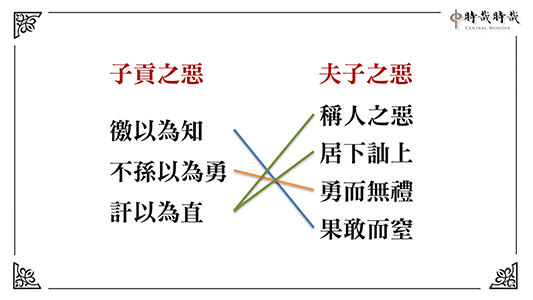

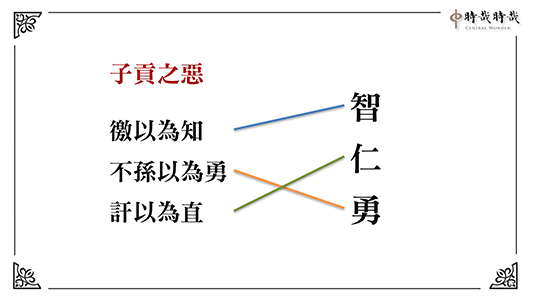

### 孝道跨時代的意義與價值
			  —孝經簡說(十一) 	孝是聖人之德也無以復加｜〈聖治章第九之二〉

孝道跨時代的意義與價值

—孝經簡說(十一) 	孝是聖人之德也無以復加｜〈聖治章第九之二〉

時哉講述、淨域編寫

聖人功業修身起

推展家教風氣淳

祭祀念恩孝為本

臨民德威畏愛之

〈聖治章第九〉的第二回，重點是什麼呢？就是告訴我們，家庭的出路在於「蒙以養正聖功也」。這段話出自於《易經∙蒙卦》，孔子說：孩子從蒙昧無知時，即要「養正」使之開竅，讓他懂得孝順父母，以確保孩子一輩子的幸福。

此章架構：總說「孝是聖人的至德」，是最高的德行；分別來顯示，孝道為什麼是至德的理由，於前次已說明。

此回的進度是-「聖人辦政治興教育，以孝為根本」。總說聖人教孝，乃因家中父母，尤其是父親能夠(嚴)辦家政；所以對孩子們教育，孩子們就懂得敬父親；父親對孩子有親，孩子就懂得對父親有愛。其中也引申於對母親。

如果政教有孝道作根本，便能夠大治天下。總而言之，孝道是重在父母，父母除了對孩子有親，也如君臣之間的關係般主持家政。所以，聖人教孝時，一分講親情，一分講主持家政的「敬」，令孩子對父母有愛有敬。

反面告誡，若不從孝道來是悖德、悖禮。居上位的人推展孝道及各種品德教育，不以身作則會適得其反，產生很大的過患，稱作「民無以取法」。如此愈推展禮樂，愈加速禮樂的敗亡，謂之「禮崩樂壞」。所以，君子對於不以孝出發的品德教育與禮節，雖高位也寧可不要。進言之，居高位的人拚經濟，若不能讓百姓從孝道出發，提升內涵與品格，這種地位寧可不要。

下一次的進度是「依著孝道的行持，能夠具有成效」，具什麼成效呢？他的「言行」可以利益百姓，「德義」可以讓百姓遵守，「做事」可以讓百姓效法，「容止」可以讓百姓體察、觀摩，「進退」禮儀可以作為百姓的標準。合起來說，若為政者懂得以孝為本質，外在能夠表現這種氣度與威儀，會產生百姓對領導者既敬又愛，接受他的德孝並視若楷模加以效法，進而奉行領導者頒布的政令。所以，最後讚歎說：孝行是君子的行持與該有的修為，更是其在推展政令時該有的本質。

本章的經文是：

曾子曰：「敢問聖人之德，無以加於孝乎？」子曰：「天地之性，人為貴。人之行，莫大於孝，孝莫大于嚴父，嚴父莫大于配天，則周公其人也。昔者，周公郊祀后稷以配天，宗祀文王於明堂以配上帝。是以四海之內，各以其職來祭。夫聖人之德，又何以加於孝乎？

故親生之膝下，以養父母日嚴。聖人因嚴以教敬，因親以教愛。聖人之教，不肅而成，其政不嚴而治，其所因者本也。父子之道天性也，君臣之義也。父母生之，續莫大焉。君親臨之，厚莫重焉。故不愛其親而愛他人者，謂之悖德；不敬其親而敬他人者，謂之悖禮。以順則逆，民無則焉。不在於善，而皆在於凶德，雖得之，君子不貴也。君子則不然，言思可道，行思可樂，德義可尊，作事可法，容止可觀，進退可度，以臨其民。是以其民畏而愛之，則而象之。故能成其德教，而行其政令。」《詩》云：「淑人君子，其儀不忒。」

釋義

經文：

「故親生之膝下，以養父母日嚴。聖人因嚴以教敬，因親以教愛。」

(因嚴親以教愛敬)「膝下」指孩童幼小時，其高度及於父母膝蓋，可見「承歡膝下」一詞出自於《孝經》，膝下指的是小孩子，子女是承歡於膝下的，為什麼？因為他愛父母親，常見幼兒離開父母，若到了晚上還見不到雙親，就一直哭鬧，怎麼哄都沒有用，可見他天性上對父母親是十分親愛的。「以養父母日嚴」？是說孩子慢慢長大，懂得道理了，所以能尊重父母。「嚴」就是尊重，他慢慢地懂得尊重了，這與家教有關。聖人因懂得尊重父母所以教敬，因懂得對父母有親情所以教愛。

經文：「聖人之教，不肅而成，其政不嚴而治，其所因者本也。」(政教有本而大治)意即懂得聖人的教育，辦教育不必很嚴格肅殺，就能把人培養成人才。辦政治也不必嚴刑峻法，推行政務就能天下大治。這是為什麼呢？乃是所行皆有所本，這個根本就是孝道，孝道的推廣，必要以身作則，才會有人才團隊來輔佐。

經文：

「父子之道天性也，君臣之義也。父母生之，續莫大焉。君親臨之，厚莫重焉。」

(重在父母君臣)接著說整個家庭，既重在親情，也重在君臣之義。父慈子孝是天性，且帶著君臣之義。

延續命脈是家庭最重要的事情。常言：「不孝有三，無後為大。」家庭要延續，民族也要延續，成立團體辦道場也重在延續。延續家庭除了有親愛的風氣外，還有君臣的關係，叫作「君親臨之」。對著小孩，父親的這種恩德是最厚的，除了懂得與孩子們有親情，還要有君臣之義，讓孩子有尊敬長上的禮節，這對日後進入社會太重要了！現今許多年輕人離家後，不懂得尊重別人，不曉得要吃多少虧、碰多少釘子。雪廬老人說：「人生呀！許多的道理都不懂，要吃多少的暗虧。」這包括死後棺材封釘，還是會碰釘子，一路碰釘子碰到死。為什麼呢？人情世故不通之故。若家庭教育不從這兒好好教起，年輕人不知道要走多少的冤枉路，要吃多少的暗虧。這怪孩子不懂嗎？有時父母也得擔一些責任。

經文：「故不愛其親而愛他人者，謂之悖德。」

(不愛親-悖德)反之，若對父母親沒有親愛，而去愛他人，這叫作「悖德」，即是違背品德。德性是一種能力，若能力是自私自利的，其愈發展愈糟糕。

經文：

「不敬其親而敬他人者，謂之悖禮。」

(不敬親-悖禮)至於不尊敬自己的父母，反而敬他人者，這叫作「悖禮」。禮的本質在敬，若違反禮敬，因虛假而愈發展愈糟糕。換言之，根本不是發自內心去尊敬別人，愈發展這樣的禮，風氣會愈來愈糟糕，謂之「禮崩樂壞」。禮崩樂壞不是沒有禮、樂，而是發展禮樂的人不以身作則，反而加速禮樂的崩壞。

經文：「以順則逆，民無則焉。」(民無以取法)欲使百姓順從，百姓卻效法你的逆行。諸如：雖然推展的是品德教育，但百姓效法的是你內心的違逆。此心之違逆就是不敬父母，所以沒有品德的人推行政事，百姓反而會效法你無品的心行。譬如：一個喜好貪污徇私舞弊的君上，三令五申要官員廉潔，要百姓遵守秩序，這是不可能的。

經文：

「不在於善，而皆在於凶德，雖得之，君子不貴也。」

若我們的善不從孝行出發，所有的善將導致於痛苦，這叫作「皆在於凶德」。即便可獲致極高的權位，君子也不要，不看在眼裡。因為不好好的由孝道來推展品德教育，其位置愈高，引發的災難愈重。

經文：

「君子則不然，言思可道，行思可樂。」

(約言行)所以一般來說，利益天下蒼生的君子，他寧可是從孝道本質出發的「言思可道」，言語想著是利益別人的話才說。那麼「行思可樂」呢？在行為上，想著能讓人家快樂，這樣的行動才去做。

經文：

「德義可尊。」

(約德義)「德」就是內涵，「義」是見地；他的內涵與見地，是百姓可以遵守的。

經文：

「作事可法。」

(約作事)再者，他的行事是可以效法的。

經文：

「容止可觀。」

(約容止)他的容貌舉止，是可以觀摩的。

經文：

「進退可度。」

(約進退)他的進退禮儀，可以作為百姓的標準。

經文：

「以臨其民。」

(合明)用這種內涵與外相，來面對他外在的威儀及廣大的百姓。

經文：

「是以其民畏而愛之。」

(民畏愛)「畏」是恭敬，百姓既恭敬他、又愛戴他。意即此一領導者，能夠把國家或天下，當成一個大家庭來經營，自己成為大家長。百姓對待他像對待大家長一樣，謂之「又愛又敬」。又愛者，是因為知道這位領導者，是個勤政愛民的人；又敬者，是這位領導者懂得辦教育的，懂得讓百姓建立人格、尊敬長上的。

經文：

「則而象之。」

(民效法)「則」是有榜樣；「象」是可以效法的；意即百姓有可以效法的榜樣。

經文：

「故能成其德教。」

(受德教) 「成其德教」是接受教育，且政令能夠風行朝野，上下一致遵守。所以，君王推展的德教是有成就的，不會沒有效果。譬如：推展文化教育，到頭來百姓反而不尊崇；推展品德教育，百姓反而作奸犯科，這是不會的。

《詩》云：

「淑人君子，其儀不忒。」

(贊孝行為君子行，舉詩經曹風)這樣的氣象是什麼呢？《詩經∙曹風》說：「淑人君子，其儀不忒。」淑人是善人，是指懂得經營內在、從孝道出發的善人君子。「儀」指人的外在，包括言語、辦事、行止、政令等都不會有差錯。因為，此人懂得家庭經營的和諧之道，用此來經營團隊、國家與天下，如此是不會有差錯的。

析 疑

經文：

「故親生之膝下，以養父母日嚴。聖人因嚴以教敬，因親以教愛。」

這段文裡，有哪些是我們必須要懂的意思？

一、承歡膝下之子女，如何會養父母以日嚴？

宰我曾經問孔子：「為什麼要行三年之喪？」孔子告之：「孩子在父母親的懷裡三年，期間離不開父母親。若離開父母，不但有安全之虞，還有生命的危險。這三年當中，時刻都不能離開父母親的照顧，與父母是非常親近的，看不到父母就會一直哭泣。」為什麼會「養父母以日嚴」呢？這就是家庭教育。雖然他與父母親愛，但他的敬(日嚴)是怎麼來的呢？

《三字經》說：「養不教，父之過。」這就是家庭教育。家庭教育要讓孩子懂得尊重父母，沒大沒小出了社會一定受害。若此人在家中驕奢、放逸、亂言，試想在外誰能忍受你？你的朋友、上司、團隊能忍受你嗎？所以，在家中沒有這種教育，他怎麼出社會。

二、聖人為何因嚴以教敬？為何因親以教愛？

換言之，聖人辦教育是落實到家庭，讓家庭裡懂得教孩子、愛孩子。此章內容雖講家庭教育，但是許多人成家後不會教孩子，為什麼呢？因為國家教育，要重視家庭教育這一塊，若將之推展到家庭時，父母才懂得怎麼愛小孩、教小孩。讓父母懂得愛、明教子之道的國家領導人，必是聖人。即便不是聖人，所做的功業也與聖人一樣。

在家中要怎麼教敬呢？譬如：孔子就是一位在家裡能讓孩子們懂得敬的人。孔子的兒子伯魚，經過父親身旁邊時「趨而過庭」，懂得對父親表示尊重。試想，他出去難道不會對長官、有道德學問與內涵的人表示尊重嗎？他若在外面沒禮貌，會得到人家的提拔、賞析與教導嗎？所以，現在的孩子們，在家裡若沒有好好的培養，出社會不知道要吃多少的暗虧。

此外，孝子在家中還要懂得照顧父母親的生活。《禮記∙內則》告訴我們，在家中父母怎麼讓孩子懂得去關心尊重長輩。這種教育雖在家庭中，可是為聖人所提倡，特別是有地位、居國家領導人的聖人，把教育推行落實在家庭中，將產生特別的效果。試想，一個家庭得到安定，家家得到安定，是不是國家就安定？而國家安定、各國安定，是不是天下就安定？不必講什麼冠冕堂皇的大道理，只要將教育落實在家庭中，必能達到非常美好的成效。這是為政的綱領與根本，也是孔子講《孝經》聖人治天下的本懷。

三、對人要從何時教起，才有具體成效？

《易經》蒙卦上說：「蒙以養正聖功也。」乃是孔子解釋文王的卦辭。孔子解釋文王的卦辭有兩個，一個叫作「彖傳」，一個叫作「象傳」。「彖傳」是決定文王這一卦的卦義，「象傳」就是這個卦的相。

蒙卦（

），上面叫作「艮」，下面叫作「坎」；艮為山，坎為水，謂之「山水蒙」。山水蒙的山，艮有「止」的意思；水有「險」的意思，就是止險，把險止住。

為何要把險止住？須知，孩子是蒙昧無知的，你若順著他的蒙昧無知、沒大沒小，順著他的胡言亂語、不知進退，這就慘了，你止不住他的險。所以，叫作山(外卦)下有水(內卦)。第二、三、四爻是個震卦（

），震卦就是一個能夠流動。換言之，山裡的水流動出去，如果有次序、有軌道、有方向，它便能夠潤澤萬物。意即，蒙以養正的人，在孩子蒙昧時懂得啟蒙。讓他懂得品德要從孝道開始，要愛敬父母親，他出去就懂得愛人、敬人。這樣的人會沒有出路、不被提拔、沒有好老師教他嗎？不會的。

這種教育叫作聖人的教育，且「蒙以養正，聖功也」，也是培養聖人的方法。聖人要怎麼培養？須從小開始培養。古代的大家族，要培養接班人從哪裡開始呢？就從小開始培養。現今許多家庭，認為孩子小，可以沒大沒小、隨隨便便，為何這樣呢？孩子本來就不知道禮，隨他嘛！在外不會叫人稱名，如「張叔叔、李伯伯」等。試想，他從小就不把人看在眼裡，不懂得尊重別人，又怎麼與人相處呀！

誰最懂得教育？雪廬老人，辦小孩子班不叫作「讀經班」，也不叫作「安親班」，而稱作「啟蒙班」。啟蒙班從「蒙以養正，聖功也」來，讀經只是啟蒙教育的一部分，教育最重要的是見地開通，讓孩子懂得以孝道作為他人生的起點，來經營善法圓滿他的善行。這個教育從小開始，一直到大，直到功成名就，本質都是孝道的經營。

老人在臺灣的歲月，他說：「我比臺灣人更愛臺灣。我愛臺灣的不是阿里山，也不是日月潭，我愛這裡的人心。」在《尚書》中謂之「食其毛，踐其土」，就是吃這裡的飯，喝這裡的水，愛這裡的土地。怎麼愛呢？就把這裡的人教成人才。所以，小孩子要培養他恭敬的心，即是坐有坐相，站有站相。要培養孩子的專注力，安靜中的儀表，行動下的禮儀，吃飯時的規矩，睡覺時的弓臥，乃至於體能的健康與才藝的培訓。

啟蒙班結業典禮時，老人親自出席，孩子們的禮儀自然展現。這種場合九十多歲的老人親自出席，因為他知道要從小看大，教育要從根扎起。這是我看過最了不起的大德，重視最基礎的事情。我相信孩子這樣培養上來，一定是各個有氣象。惟這種教育也得在家庭中配合落實。印光大師說：「家庭教育是天下太平的根本。」

經文：

「對人之教，不肅而成，其政不嚴而治，其所因者本也。」

(政教有本而大治)聖人的教育，如果是這樣的教育，不必嚴肅，政治也不必嚴刑峻法。

一、教不肅，如何教出人才？政不嚴，如何整頓民風？

有人說：教不肅，怎麼教出人才？《三字經》不是說：「教不嚴，師之惰」嗎？政不嚴，怎麼整頓民風？須知，如果重視孝道的人，會懂得充實自己去尊嚴榮耀父母親與祖先，還需要你嚴格來教嗎？曾子是個魯鈍的人，可是曾子是孝子，他的讀書是「人一能知己百知，人十能知己千知」；你學一遍我學百遍，你學十遍我千遍。最後能得到孔門的傳承！試問這樣自動自發的，還需嚴格要求嗎？懂得關懷別人，懂得尊敬長輩，於政治還要像法家一樣嚴刑峻法嗎？還需大批警力維護社會治安嗎？所以，家庭教育真是天下太平的根本。社會若重視品德的教育，一定能維持安定。

日本某鐵道曾發生事故，有四個車站臨時斷電，約十五萬人受到影響，其中五千人趕著上班上學。他們要沿著鐵軌走到下一個車站，然後出站去搭車。這五千個人井然有序地行於軌道，沒有吵鬧埋怨，媒體也不見縫插針，胡亂地搶著訪問。試想，若家庭教育不好，他便一路走一路罵，然後媒體也痛批政府，好像政府都是仇人一般。如此更見出品德教育的美好。

二○○八年五月初，緬甸發生了嚴重的風災與水患，大約一百萬人死亡。許多難民無家可歸，可是他們的表現卻十分有水準。當我們去賑災時，難民們家家戶戶盛情提供他們剩下最好的食物，心情好像沒有遭受過災難一樣。接受賑災物資時，沒有惶恐的樣子，秩序井然態度從容。試想，如果這種災難發生在我們身上，我們有這樣的表現嗎？

二、愛敬父母乃由家中風氣而來，何必聖人再教之？

愛敬父母的風氣雖由家庭教育而來，可是聖人的教育是可以影響家庭的。換言之，因為聖人的教育，所以家中父母才知道要這樣愛小孩、教小孩，且要讓孩子懂得愛敬父母，及種種的體貼方法，這有助於他在外與人相處時，懂得去愛護、尊重別人，成為一位成功的領導者，而這樣的成功，是在家裡培養起來的。

家庭風氣無論如何好，若聖人不把教育推展於學校、社會，當孩子們進入學校時，學校老師不是這樣教導，社會不是這個氛圍，便糟糕了！家庭教育也教不出好的人才。所以，如何讓國家的領導人是聖人，或者是他所做的功業像聖人的功業，這民族才得延續，國家始能長治久安。

三、此處聖人所指為何？

「聖人之教」的聖人指的就是「堯、舜、禹、湯、文、武、周公」這種人，這種人叫作「明王」，明就是「聖」的意思，明王的教育能夠落實到家庭，延續他的教育理念，作法上可以因地制宜。譬如：現今有許多作法不能夠循古，但在精神上要延續。換言之，要延續「堯、舜、禹、湯、文、武、周公」的道統，此道統是懂得辦教育，來維持國家的安定，來培養國家所需要的人才，來延續民族的內涵，來成就民族發展的大業。這麼好的道統，為什麼不延續呢？

四、此處聖人愛敬之旨趣，與〈天子章〉是否相同？

頓然發覺到《孝經》真是一環扣一環，第九章的〈聖治章〉與〈天子章〉竟然是遙遙相扣。回顧〈天子章〉，經文：「愛敬盡於事親，而德教加於百姓，刑于四海，蓋天子之孝也。」是說天子在家裡，懂得對父母愛敬，這種德教加於百姓，便可以作為四海的典範，使天下太平。這與本章中所說：聖人推展愛敬父母的教育，是能夠不嚴肅而培養人才，不嚴格而大治天下的。試看，是不是都一樣？

五、〈三才章〉亦有「其教不肅而成，其政不嚴而治」，與本章有何相近之處？

此章經文：

「則天之明，因地之利，以順天下。是以其教不肅而成，其政不嚴而治。」

是說：孝道呀！懂得推展孝道就像天一樣的光明，懂得推展孝道讓百姓互相扶持，善行互相開展就像大地長養萬物一樣；社會欣欣向榮，就像大地長養萬物一樣。這種孝道的推展，最順應天下，讓百姓在家裡過快樂的日子，使父母親能發揮慈愛的功能，讓孩子們能夠發揮孝敬的功能，這個社會是不是生生不息、彼此互助、觀功念恩的社會？百姓是不是過得舒服快樂？

六、父母何有嚴君之相，令子敬之？

孔子又說：家庭裡重在父母君臣，父母愛護孩子是親情，主持家政時又像君臣，有嚴君之相。《易經》〈家人卦〉(   )，孔子在決定這一卦義中說：「家人有嚴君焉，父母之謂也。」此卦上卦為巽，巽為風；下卦為離，離為火。所以叫作「風火家人」。風火家人要怎麼看？它的上面是風，風又是木，下面是火，火是因為木而火，有木頭所以火可以燒。而風呢？有風所以火越盛。

意即，一個家裡，第二爻是媽媽，陰爻站在陰位上是正的；第五爻是爸爸，陽爻站在陽位上是正的。換言之，爸爸正，媽媽也正，兩者是口令一致。現在的家庭教育，往往是父母不配合，爸爸說一套，媽媽做一套，孩子該怎麼辦呢？父母的觀念不一致，要怎麼教小孩？聖人的教育讓父母親的觀念一致。

此時家人卦中，父母的觀念一致，且懂得培養孩子孝敬之道。譬如：孩子給爸爸一杯水時，媽媽說：不用。孩子給媽媽拿拖鞋時，爸爸說：不用。試想孩子怎麼辦？他如何表達對父母的愛？還有孩子對父母禮敬時，若父母也覺得「不用」，那他怎麼表達敬？愛敬都不用表達，那麼他到社會的時候，怎麼去關懷、尊敬別人？既不會關愛也不能尊敬別人時，試問他在社會能做甚麼？頂個學歷能做什麼？現在學歷掛帥，空有文憑無實質內涵，沒有人情世故的通達，沒有長幼尊卑的應對，重點在於應付考試，這是現在教育的瓶頸。若果能這樣經營，則自能感覺到家庭美滿興旺。所以，這時再讓年輕人去成家，他便願意。

《易經》的道理，在說趨吉避凶及生生不息，這叫作「生生之謂易」。當看到家庭的可愛時，孩子將來長大了，他也想成家。若家庭不可愛，父親沒辦法慈，子女也沒辦法孝，家庭裡找不到溫暖，子女會想去成家嗎？現在往往男不婚、女不嫁。雪廬老人說：「叫作滅族主義」。男不婚女不嫁，孩子無從生了，這族不是就滅亡了嗎？

七、以周公而論，文王對他有兩種殊勝形象，故恩德厚重無以回報，配天祭祀焉？

再者，文王對周公而言，有兩種殊勝的形象，此恩德之厚重無以回報，所以將之當成上帝來祭拜。第一種恩德，是文王對子女的親愛；第二種是文王把子女培養成人才，像武王、周公都是文王培養的人才。所以，文王對周公自然是恩德厚重，一方面對他很愛護，另一方面又將之培養成人才，培養成可以主持國政的人才，周公後來代理天子七年，期間制禮作樂，開創周朝八百年的天下。

雖然文王積德，但其德要上溯到后稷，而真正開創周朝制度是周公旦，所以孔子說：「他最佩服的聖人，就是周公旦。」此不是說周公的內涵勝過堯舜，而是指開創周朝八百年基業的功德，這是孔子最嚮往的。試想，這種能耐是誰培養的？是文王所培養，則父親的恩德是否像上帝一樣？是故，中國的上帝是指父母。雖然世間也有上帝，可是上帝不是造物者，只是管理人間的神明，我對祂尊重。好比說，你對國家的領導人表示尊重，但不是造物主的概念。

什麼是造物主？即是你為惡，祂也可以獎勵你；你行善，祂也可以處罰你。但是中國所謂的上帝只不過是個政局的領導者，試想，一國的領導人，對為惡者祂敢獎賞他嗎？對行善人祂敢處罰他嗎？他若敢於行善時處罰他，為惡時獎賞他，他的臣子肯定會不服，積惡久了一定會被推翻。所以，這樣的上帝也會被推翻的。中國的上帝，講究的是加被善人，懲治惡人。

八、周公如何以愛敬之教於成王，令彼成為王者之象？

對於自家孩子，一定要讓他懂得對父母的愛與敬，這樣未來才能在社會上有一番作為。試問，周公管理國政並輔佐成王，他要怎樣讓成王有這個氣度呢？

文王有許多兒子，其中最了不起的是武王與周公。而成王是武王的兒子，伯禽是周公的兒子。武王伐紂建立周朝，兩年後就過世了，年五十四歲，當時成王只有十三歲，周公要怎麼輔佐他呢？周公代理他父親的角色，且成為君，以君臣的關係教導他。可是成王是一國之主，是法定的天子，周公便以伯禽陪成王，若成王有錯，就處罰伯禽；成王如果不守規矩，他就責罵伯禽，罵伯禽給成王聽。所以，成王就懂得要敬，不能沒大沒小、我行我素，不能以為父親過世了，我是天子就沒人敢管我。

往昔孔德成先生，雖然出生時父母都過世，但家裡有很多人才與幫傭，但也有管他的老師，不能讓這個孩子為所欲為。所以，孔先生說他小時候，一飯不能超過四菜。家中的傭人，需稱呼張叔叔、李伯伯，請人幫忙，要很客氣地說：「可不可以？」事情做完要稱謝，這樣訓練他，使懂得長幼尊卑與愛敬，才能夠主持大政。

成王最後能將國家主持的很好，細想起來都是周公的功德。所以，成王准許伯禽在魯國以天子之禮來祭周公。可是這就麻煩了！孔子說：「禮是不可以僭越的。」禮一僭越以後就糟糕了。魯君可以用「八佾舞」來祭周公，那麼三家大夫也以「八佾舞」來祭他的祖先，如此魯國是不是亂了？禮是絕對亂不得、僭越不得的，禮一旦亂且僭越，後面會有災難發生。

經文：

「故不愛其親而愛他人者，謂之悖德；不敬其親而敬他人者，謂之悖禮。」

愛敬他人，若不從本源、孝道出發，就會導致悖德與悖禮。

經文：

「以順則逆，民無則焉。」

(民無以取法)悖德與悖禮最嚴重的現象是什麼？就是你欲讓百姓順從你，但百姓反是看到你最不孝及不遵守品　　德的一面，以致無從效法。百姓失去了榜樣，無從遵從你的政令。意即一個很自私的人，想讓百姓行善，那是不可能的；一個荒唐的家長，欲使子女能夠進德修業，那也是不可能的。所以，教育除了政策要好，領導人的以身作則很重要，是最後的關鍵。

經文：

「不在於善，而皆在於凶德，雖得之，君子不貴也。」

(君子不求無德之位)此語換言之，若非從孝道出發的善，其下場是不好的！

一、上述之人如果得到人爵，有何不幸？

試問最高的人爵是什麼？於天下言就是天子；就國家說是國君。若不從孝道來出發，推展的品德教育是愈來愈糟糕；推展禮樂教育會愈推展愈虛偽，這叫作禮崩樂壞。為什麼呢？《大學》有言：「桀紂率天下以暴，而民從之。其所令反其所好，而民不從。」以暴的「暴」即是桀紂雖然號令天下要順從國家，其實百姓是不順從的。因為桀紂的內心殘暴，行事非從孝道出發。

從孝道出發，為了尊崇父母及祖先，所以，要好好地把位子坐好，這個位子包括了品德、學問、涵養與威儀。而桀紂呢？只顧自我享受，哪裡會有孝道。所以，「暴」就是只想到自己，這種自私的人，傷害百姓也不在乎。欲讓百姓順從你，百姓不會順從，只會學你的暴行。此如家長放逸，欲教孩子精進圖強，孩子只會學家長的放逸而已。這叫作「其所令反其所好，而民不從。」如此，一個比一個自私，一個比一個刻薄寡恩，天下還會太平、國家還會大治、團隊還會上軌道、家庭還會和諧嗎？所以，《大學》說：「君子有諸己，才能求諸人。」自己先要有品德，才能夠要求別人；自己沒有過惡，才能夠去批評別人。

二、人君若不以道來修身應世，他的權力地位如何不可貴？

不以道的「道」，就是依孝道出發來辦政治興教育，且以身作則落實到家庭，那麼家庭中父母的教育有標準可循，這個標準是國家訂定的。可惜現今沒有標準，雪廬老人的《常禮舉要》，或許是現在的標準。標準者，即是家庭教育要這樣經營。子女要用什麼樣的動作、形象來表達對父母的愛敬？譬如：「冬則溫，夏則凊。」就是表達對父母的愛。又如「出必告，返必面。」來表達對父母親的敬。這或許是家庭教育的「一以貫之」吧！若雪廬老人的《常禮舉要》，再不普及推行，真不曉得還有什麼特效藥？

總結

中國幾千年的家庭教育，從堯、舜、禹、湯、文、武、周公，形成的道統代代相傳。雪廬老人說：「過去時期，是上亂下不亂。」什麼是上亂下不亂？改朝換代的時候，是上亂下不亂。可是到了民國初年，西風東漸以後，是上下皆亂，沒有標準了。一個沒有標準的時代，國家沒有禮樂，沒有標準可循，各行其道，各說各話，沒有標準。

此時，我們要如何從頭來延續民族的精神？岳武穆說：「待從頭收拾舊山河。」要如何從頭來？或許《常禮舉要》可以是個非常棒的入門，《論語》的經學見地，是振興起弊的關鍵，是向上發展的動力。它能使民風淳厚、民族延續、國家強盛，將風氣推展出去時，讓近者悅、遠者來，各國爭相效仿，相信那些恐怖暴力，當會消弭於無形。

例如：大唐在太宗「貞觀盛世」之時，曾經感得猶太教十三個大家族歸順，來中國學習文化，這就是消弭歧見。長安城裡，有五十萬外國人，他們以來中國學習文化及入歸中國為榮，這就是文化的魅力，也是解決社會亂象的最根本方法，及近者悅、遠者來的妙方，是泱泱大國應有的氣度。（下期待續）

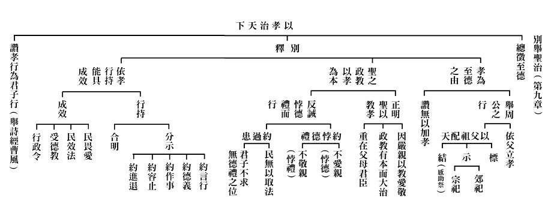

### 孔門心法—中庸之道(五)　第一章 開宗明義
         -通達體性才能掌握天命

孔門心法—中庸之道(五)　第一章 開宗明義

-通達體性才能掌握天命

*時哉講述、茅茹讀書會、弘毅整理*

天分世俗與勝義

世俗又分情與理

勝義體性通謂中

用中入世和萬民

前言

孔子云：志於道，據於德，依於仁，游於藝。通達形而上之道的人才能發揮出仁藝的大用，也才是能掌握天命的人；但欲通其道，必須先懂性命之理。《中庸》開首即言性命之理，常人難以知之，宋國的樂朔大夫就曾對子思說，經學都很難懂，子思回答說，經學是為有志於學習、弘揚、傳承大道的人而說。古印度最有名的精通因明學的陳那論師，當他寫出《集量論》時，連當時的同道講學者都說，這樣都看不懂的書如果想流通，就綁到狗尾巴上，由狗去流通好了。

愛因斯坦在一九○五年寫出狹義相對論時，沒有人看懂，十年後寫出廣義相對論時，還是沒有人看得懂。後來英國天文學家愛丁頓透過天文觀測，驗證了愛因斯坦的理論，被認為是全世界僅有的三個懂愛因斯坦的人之一，當相對論突破了科學的瓶頸後，科學得到了無限的發展。可見難或易不在於所知的論典本身，而在於能知的人是否熟悉，對於熟悉的就是簡單，對於不熟悉的就是困難。

本章是中庸的開宗明義章，闡釋了何謂性與天道以及修道的方法，本章是中庸的精華所在，也是中國文化的神髓；是一切的入門，也是最終的目標。

本章科判分析

「依教修觀」：教是能詮釋本體、性、形而上的言說或經典；修觀是藉著教典或言說，來修正自己的觀念，使形而上成為自己的觀念。修觀又分兩科，一種是這種見地是不能離開的；第二種是要好好的保任這種見地。就如收藏者吳之矩保任《富春山居圖》，行、住、坐、臥，乃至死亡，心心念念都是富春山居圖，可是為了一幅畫可以這樣用心，為了大道幾人能夠如此呢？世人若能如此，即便魯鈍如曾子，也能成為聖賢，可見成功與否全在用功的心態與方法，而非天資利鈍。

「明體達用」：當明了「中」的體以後，就能發揮「和」的大用，合起來說「中」和「和」能夠讓天地萬物欣欣向榮。

章旨

此章是以戒慎恐懼的心態來修學中和之道，不僅帶來天地的祥和，萬物的欣欣向榮，也給自己帶來無限的出路。

消文釋義

經文：

天命之謂性，率性之謂道，修道之謂教。

（依教）

消文：

自然（天）所賦予（命）的就是性（萬法的本性，謂之形而上，是亙古不變的），循（順）著這個本性就是道（見地、方法、道路），修這個道（有這個見地、方法、道路）就是教（中庸之教即是詮釋如何修道）。

發明：

修道就能夠率性，率性就能夠得到天然所賦予的體性，這是淺說。天命還可以說，天包括上帝、天神；命還可以說，如果你是一個通達體性、明心見性的人，上天就會給予你崇高使命，龍天推出。不論是辦政治，還是辦教育，都能開創出一個新局。孔子辦政治不成，就辦教育，把中華文化傳承下去，影響了兩千多年，乃至更加久遠。

修觀：

藉著修學形而上的內涵，讓我們的觀念就是如此，這才是真正的修道之人。一般人誤認為在山裡打坐、不吃不喝就是修道之人，可真正的修道之人是，他的觀念不同於凡夫那樣虛生浪死、追名逐利，只有改變觀念才是真正的修行。雪公說，天下有種病叫俗氣病，人長俗了比癌症更可怕。所以修觀就是把我們內心最隱微處的觀念改變。

經文：

道也者，不可須臾離也；可離，非道也。

（不離而修）

消文：

這樣的道（見地、修學法）啊，是不可以短暫離開的，如果短暫的離開，就不是道了，就不是修道人了，因為內心無道，就會被煩惱所攝持，被名聞利養所勾引而入世俗。

發明：

曾子成功的秘密就是「道也者，不可須臾離也」，「戰戰兢兢，如臨深淵，如履薄冰」就是這種覺受。曾子是天資魯鈍，上課都聽不懂的人，最後卻透過這樣的用功，在人才濟濟、都是卿相之才（鹽鐵論）的孔門脫穎而出，成為傳承聖道之人。修學不在根器的利鈍，而在修學的心態觀念，果然有這樣的心態，雖愚必明，雖鈍必利。

經文：

是故，君子戒慎乎其所不睹，恐懼乎其所不聞。莫見乎隱，莫顯乎微。故君子慎其獨也。

（慎獨而修）

消文：

因此，君子在人們越看不到的地方，就越警戒謹慎；在人們越聽不到的地方，就越驚恐害怕。人們所認為最隱微之處，也是最顯現的，最微細之處，也是最顯出的，所以君子要慎獨。

發明：

在人們看不到、聽不到的地方，人們最容易放逸，胡思亂想，產生不良的心態。前面用戒慎恐懼，後面是隱微顯現，曾子的「戰戰兢兢，如臨深淵，如履薄冰」就是「戒慎，恐懼」。君子要謹慎一個人在家獨處，如果此時還能安住於正法，還能把持自己，這是最難得的修行人，也是修行成功的秘密！

經文：

喜怒哀樂之未發，謂之中；發而皆中節，謂之和。中也者，天下之大本；和也者，天下之達道也。致中和，天地位焉，萬物育焉。

（明體達用）

消文：

喜怒哀樂（三字經裡是七情，即喜怒哀懼愛惡欲，出自《禮記·禮運》）未發之時，叫作中（能證的智慧，證得形而上時，超越形體的繫縛）；入於形而下時必得發七情，但會合情合理，這叫作和。懂得形而上用中，形而下用和，就會發揮大用。形而上的本體，是天下事物的根本；入世時懂得依禮進退，在心態、表情、態度、做法上能夠與人和諧相處，這是天下的達道（通達人情世故，與人容易交往，結善緣，這樣的人是通達的）。如果達到中和的境界，天地都得到正位（天地發揮養人、養萬物的功能），萬物就能欣欣向榮的發展。

析疑

一、知天命有多重要？

知天命有兩種解法：第一種是懂得趨吉避凶之道。天是自然，命是賦予，自然所賦予萬法的體性是空空如也，即萬法是沒有體性的，但隨緣會有各種變化。懂得這些變化的道理，就是懂得斷惡修善，想要快樂就必須行善，想要離開痛苦就必須斷惡，自然就趨吉避凶了。

第二種是懂得求加被之道。天命，或指上帝、天神的命令（使令），如果能夠修學正法，利益大眾，自然會得到天神的擁護與加被。

《論語·堯曰》篇上說，「不知命，無以為君子也」，不懂趨吉避凶與求加被，就做不了君子。君子可以在得到擁護的情況下，推展正法，在辦政治、辦教育時就能無往不利，利益大眾，君子有此種見地，一般俗人是不會有的。

二、要如何作才能率性？

對性與天道的典籍要好好的聞思修，要有好的教材、老師和同學。所以《論語·學而》篇上說，「有朋自遠方來，不亦樂乎」，當你學有所成的時候，即便身在遠方之人，也會不辭辛勞的願意向你學習，因為你能夠幫助他們找到內心真正的出路。孟子說，得天下英才而教育之，是人生之一樂。率性不是一般人認為的想幹什麼就幹什麼，而是知道天命、能夠通達體性的人，知道斷惡修善和求加被的重要。

三、道為何不可須臾離也，要怎麼做才能辦到須臾不離？

如在高速公路上開車，短暫離開道路就容易出車禍。要怎麼做才能辦到須臾不離？必須要知道離開的過患，不離開的功德。離開的過患：容易隨境起貪、起瞋，起煩惱，被境界所勾引；不離開的功德：能夠心在道上，不為境界所惑，就不會造作損人利己的惡業，所以須臾都不能離。要如曾子一般，「戰戰兢兢，如臨深淵，如履薄冰」，如同在懸崖邊上開車，你一定是非常的專注，一旦沒有注意路況，就會翻下萬丈深淵。

四、須臾不離的修學道業，會不會很辛苦？

道在須臾不離時是法喜充滿，不會緊張。世俗的煩惱堆、慾望坑，就像炎熱的夏天；而修道的人如同在天氣炎熱時的鵝，躲在池中的蓮花叢裡，享受著清涼，不會想要須臾離開的。當修道的人了解道的美妙，離開的禍患時，沒有人想要離開，而且是法喜充滿，一點也不感到辛苦。所以如果你是世俗的見地，那是修不了道的；如果有修道的見地，你也入不了俗人慾望堆裡。

五、修道的關鍵在於慎獨而修，但要如何才能做到？

也是要知道慎獨的功德，不慎獨的過患。

慎獨的功德：如果在別人看不到、聽不到的地方，還能夠內心安住於正法，可見對治煩惱、習氣的能力很強，改變命運的力量很大。真正能夠改變命運，不是在外相上論，而是改變你內心的想法，《了凡四訓》中立命之學、改過之法、積善之方、謙德之效都是從道理上、心態上論。以前楊震在任太守時，他的學生王密在昌邑縣做縣令，有一天晚上他送十斤黃金給楊震，楊震不收，王密說又沒有人知道，楊震就說，天知、地知、你知、我知，怎麼能說沒有人知道呢？這就是慎獨的典範。

不慎獨的過患：越隱微處，越是別人看不見、聽不到的地方，就會越顯現。

（一）、顯現在鬼神：揚雄的《解嘲》上說，「高明之家，鬼瞰其室」。高明，就是自以為是高明的人，兩扇朱紅色大門的大戶人家，亭臺樓閣，院落別緻，結果在最隱蔽處的房間裡謀劃不好的事情、心存惡念，鬼神都看的清清楚楚。白天道貌岸然，晚上心思眾多，了凡先生說，一旦被覷破，一文不值。

（二）、顯現在人：現代的城市都安裝了大量的監視器，如臺北市就安裝了一萬多台。最近在臺北發生了一起由十六人組成的跨國詐騙集團，詐騙了八千萬臺幣的案件，最終在臺北監視系統的幫助下，罪犯很快就被抓捕歸案。

（三）、顯現在自己的內心：當做了虧心事的時候，是不敢照鏡子的，有時候睡覺做夢是很恐怖的。

以上就是慎獨的理由：因為會顯現在鬼神，顯現在人，顯現在自心。

因為有這些的認知，所以在他人越看不到、聽不到的地方，就越要戒慎恐懼，曾子所說的「戰戰兢兢，如臨深淵，如履薄冰」，就是他一生修學的形象，這種修學的心態是無上秘密的修學法。

六、慎獨的形象為何？

慎獨就是在別人越看不到、越聽不到的地方就越小心，一般人是越放逸、越大膽，越流露出本來的面目。慎獨，就好像很多人用監視器在監視你，鬼神在看你，乃至你自己的心在看你自己，自己到底是什麼德性，都會顯現在夢中。如了凡先生說，善人常常作好夢，如果常常作惡夢，自己就要反省檢討了。

七、七情的形象為何？

修學形而上的心態，就能夠超越世俗的煩惱，這些煩惱在《禮記·禮運》篇中歸納為七情，即喜、怒、哀、樂、愛、惡、欲。七情以愛為根本，所愛的現起時就是喜；所愛的得到就是樂；所愛的想要得到或所不愛的想要離開就是欲；所愛的失去就是哀；面對所不愛的就是惡；所愛的得不到或是所惡的現起就是怒，關鍵處都是愛。所以雪廬老人說，小愛小煩惱，中愛中煩惱，大愛大煩惱，沒愛沒煩惱。

八、七情的過患與功德？

過患：情緒容易傷身，失去理智，失去穩定性，心思在患得患失當中起伏不定，容易與人結惡緣，好事出不來，壞事一大堆。

功德：如果你能夠有利他的觀點，七情被禮所節制，反而是聖人入世的方法。藉著喜怒哀樂來表達善惡，比如善是你所喜的，善的失去是你所哀的，惡事是你所惡的，如此能夠讓人知道標準所在，能夠止惡揚善，讓社會風氣淳厚。

九、當喜怒哀樂已發成為煩惱時，又如何能夠中節？

中節就是合情合理，依禮進退，該喜則喜，該怒則怒，該樂則樂，該哀則哀。如果不依禮就會有一大堆的問題和麻煩。

十、聖人也有七情嗎？

聖人也有七情，否則與高麗菜有何分別？孔子之七情：

孔子之喜：了凡四訓引《孔子家語》中說，子路救人后受牛，孔子喜，因為從此以後魯國多見義勇為者，有救人的風氣。

孔子之怒：司馬桓魋造石棺，三年未成，孔子說，死欲速朽，孔子是對這樣勞民傷財的做法表達不滿，希望桓魋這樣的人物死了趕快腐爛。

孔子之哀：顏回過世的時候，孔子哀歎道，「噫！天喪予！天喪予！」哀道統的失傳，蒼生無福。

孔子之樂：知之者不如好知者，好知者不如樂知者，孔子的內心安住在大道上，有何不樂？

孔子之愛：「樊遲問仁，子曰愛人。」凡夫之愛都是自私的，孔子之愛是把愛自己的心態拿來愛人，如母親愛孩子甚於愛自己。愛人可能是大煩惱，也可能會對世間有大利益。

孔子之惡：當子貢贖人不要獎金時，孔子厭惡，因為如此會讓魯人不願再贖人（一般人沒有子貢那麼富有），贖人的風氣就沒了。

孔子之欲：「我欲仁，斯仁至矣」，善法欲是孔門的心法。

修道是在見地上論。一般說修道人不要有七情，這是說安住在形而上時，脫離了形的繫縛，這時說不要世間的七情；但在入世表達善惡時，是要有七情的。

十一、欲達到中和的境界，是先中後和，還是先和後中？

先和後中：按醒公所講，依禮節制能夠情緒平穩，莊重又威儀，所學就會很堅固，人靜下來才有辦法學形而上的境界。

先中後和：雖然通達了形而上的中，但入世時還要學禮來通達形而下。依道來通達形而上，依禮來通達形而下，這是孔子的兩大學問。孔子見老子而問禮，這是因為孔子是要入世的。入世一定要懂禮，才能趨吉避凶。「先中」就是通達形而上，在入世時知道所有的一切都沒有一定，可以好的變成壞的，壞的變成好的，就看你怎樣看待和經營；「後和」是說，世間的學問還要另外通達。

十二、修道成就中和之象就是率性嗎？

中是指能證的智慧，有了中就能率性；和是入世發揮大用的能力。

十三、中如何是天下的大本？

中就是天下的大本，樹根就是中，根越向下蔓延，花果枝葉就會越茂盛。當你通達中的內涵時，就能夠知道天下的發展之道，就是都沒有一定的。你努力的越多，收獲的也就越多，不努力就什麼收獲都沒有。即便是聖人，如果不努力也是得不到收穫的，不和別人結善緣，不好好利益大眾，也就不會有福報。入世要懂得趨吉避凶，要依禮進退，懂得人情世故，懂得七情發與未發的分寸，這樣的人才是通達天下的人，整部中庸都在講這些觀念。好好學習中國文化，明了這些道理，在當今時代也是可以發揮大用的。

十四、和如何是天下的達道？

依禮而和，依禮來通世間。陜西的觀音禪寺，有一株唐太宗所種的銀杏樹，大概有一千四百多年了。八月時黃葉鋪灑在地，如同地毯一般。當它的根蔓延時，它的花果枝葉就非常的茂盛。堯稱「欽明」，舜稱「文明」，明就是通達中的內涵。和就是外王，能夠在入世時懂得人情世故，依禮進退，任用賢才。天下就會欣欣向榮，這就是中國聖王的氣象，政治的典範，不是漢唐盛世，而是堯舜盛世。

十五、「天地正位，萬物生育」，為何須要靠中和的修學才能達成？

這裡特別是就辦政治來說，因為聖賢的教育（中和的道理）也要靠政治來發展，如果懂得聖賢教育的君子來執政時，就會得到天地正位，萬物生育。如堯舜時那樣，四季如春，惠風和暢，被稱為堯天舜日。萬物欣欣向榮，海闊憑魚躍，天高任鳥飛，萬物自然生長，自得其樂。又如馬來西亞的姆魯國家公園，兩百萬隻蝙蝠出洞，在大自然中自由的飛翔，展現團隊秩序，我們人類也應好好的效法。創造這樣祥和的環境，讓萬物欣欣向榮的發展，是我們人類應有的責任。反之沒有「中」的智慧，內心貪婪，自私自利，隨著煩惱、物慾，爾虞我詐，追求名聞利養，貪慾無限的發展，追求種種享受；外面也不用和，互相爭奪，強兵霸權，破壞環境。如在智利的海岸，出現了好幾公里的沙丁魚及各類海洋生物的屍體，這些都是因為人類發展而造成的生態破壞。全球暖化是由人類的私欲造成的，不只是對這些生命帶來傷亡，未來人類自身也會付出慘痛的代價。

十六、若汙染由人造成，比起修學中和，沒有人類的存在不是對天地更好嗎？

人可以是萬物中最凶狠的動物，人也可以是萬物中最祥和的動物。當人能夠修到中和時，就如蘇東坡的詩中說：「鉤簾歸乳燕，穴牖出癡蠅」，家裡面簾子鉤起來，燕子回來築巢。因為燕子有很多天敵，它喜歡和人在一起，人才能夠真正保護它。人如果能夠維護大自然的秩序，主持大自然的倫理，萬物的成長就是欣欣向榮的。人才能夠主持天地，維持萬物和諧的發展。儒家的觀點是當政治辦的好時，人與天地合為三才。

總結

《易經·繫辭傳》裡面說，「易無體而神無方」，這是「中」所要通達的境界；又說「感而遂通天下」，這就是此處所講的「和」。整部《易經》就是講中與和，孔子就是以中和的道理貫穿易經的六十四卦，三百八十四爻，就在這當中趨吉避凶。所以《了凡四訓》中說，「易為君子謀」，君子卜到凶卦，雖凶必吉；小人卜到吉卦，雖吉必凶。《書經·多方》篇裡說，「惟聖罔念作狂，惟狂克念作聖。」狂克念是說，追求物欲的世俗之人叫作狂，克念就是把心念收回來，安住於中和上，則作聖。聖罔念，聖人如果沒有中和的修學法，則作狂。聖人也要保任中和的見地和修學法，才能維持聖人，所以叫作「道也者，不可須臾離也；可離，非道也。」

特別是在他人看不到、聽不到的隱秘之處，煩惱習氣最易造作，我們要好好的充實自己，好好的安住在正法上，這是最殊勝的修學。因為最隱秘的也是最顯現的，騙不了君子、鬼神和自心。懂得慎獨之道，以戒慎恐懼的心態來修學正法，這個人的一生前途是無可限量的。了凡先生說，這種人，數是拘他不定的，他的命好到連命理學都無法測算。所以說，孔子、顏回和曾子的好命，世間人是不會知道的。

問答

**問：** 天命之謂性和性與天道，二者是否有差異？

**答：** 通達性與天道的人，就能夠獲得天命，包括能夠趨吉避凶，以及得到擁護。如孔子，就是一個有辦教化天命的人。

**問：** 如果每個人身上都有天命，我們還須要率性修道嗎？

**答：** 一般所說的每個人都有天命，是承接過去所作而有眼前的命，如作善得樂，作惡得苦，有的人天生富貴，有的人天生貧賤，這些都是承接過去所作得到的結果。但辦政治、辦教育、傳承的天命，是要靠自己爭取的。如曾子是一個上課都聽不懂的學生，他本來沒有傳承的天命，可是在他「人一能之，己百之，人十能之，己千之」的努力下，他就有了傳承的天命。孔子在小時候父母過世時，也看不出他有傳承道統的天命，可是最後卻能刪詩書，訂禮樂，贊周易，修春秋。可見雖然天命一部分是本來就有的，可是更重要的是自己爭取。有些人生下來就是富貴，可這種天命是不足為恃的，了凡先生所講的天命，以及儒家的核心思想並不是這種承接過去的天命，而是創造天命。

**問：** 《中庸》的性和《易經》的太極，二者有何關繫？

**答：** 孔子在解釋《易經》時，以太極來說易經的本體（易無體），就是中庸所說的性。安立為不同的名言是就不同的面相來講，太極是說，尋覓卦象到極處時是沒有體性的。趨吉避凶其實是掌握在每一個人的心念中，卦象會隨著起心動念而發生變化，每一個現象就是一個卦，現象與心息息相關，心變卦象就變，這是最高端的《易經》。能夠通達《易經》的極處是沒有本體的，所以斷惡修善、明心見性就能趨吉避凶、改變命運。

**問：** 道這麼難學，很難理解中和以及達到中和的境界，我們不學有什麼關係嗎？

**答：** 愛因斯坦的相對論剛提出時，大多數人不能理解，可是當通達之後可以突破科學的瓶頸，很多不可能的事情變成可能。學習中庸之道也是如此，人生很多的瓶頸需要靠見地去突破，能否普及大眾要觀待大眾的因緣，可是我們為什么要變成大眾呢？應努力使自己成為中庸的當機者，如此自然能夠學的通達，學的有法喜，自然就可以感染他人，由近及遠，由親及疏，利益大眾。

**問：** 《中庸》、《論語》和《孝經》，這三者之間有何關係？

**答：** 《中庸》是《論語》的心法，整部《論語》的大宗旨就是在講中與和。「有鄙夫問於我，空空如也」，孔子以中的智慧通達性與天道；在入世時依禮進退，該怒則怒，該喜則喜，這就是用和。「學而時習之，不亦說乎」，就是學習中和內心有很大的法喜；「有朋自遠方來，不亦樂乎」，就是他人來向你學習中和，因為這才能真正給他人出路。教授他人世間的百工技藝，可能會因之得到財富、地位，然而中和的力量才是內心真正的出路，有朋從遠方來是誠心誠意的向你學習，而且學到有法喜的時候，會誠心誠意的感激你。如孔子過世，孔門弟子守喪三年，子貢守喪六年，世間懂得一般技藝的老師，是不會得到學生這樣尊敬的。

再論《孝經》，入世要依禮而和，禮的本質在仁，仁的本質在孝悌，用孝來作為發展世俗的源頭。也可以用孝來學中，因為你有孝的質地，容易被善知識攝受、提攜，進入中的內涵。

**問：** 在這個大時代中，個人的力量是微不足道的，我們修學道，真的能夠改變天下嗎？

**答：** 我們且先不論改變天下，先要改變自己。如孔子雖不能改變各國的國君，但自己可以先將道統學起來，往下傳承，以待有緣人。當有一天有人能夠學到這些內涵，而且成為執政者，將會給天下帶來安定，國家的繁榮。若道統沒有人學習、弘揚和傳承，將來也就沒有機會了。

**問：** 中國的傳統醫學，是否也是中道在形而下的大用呢？

**答：** 傳統醫學如《黃帝內經》裡面有養生之道，如何讓自己六脈與心氣和平，身體配合四季運行，配合五行，來調息調心，這些都是在入世來配合世間，裡面是否有中的概念，必須要看傳承。

**問：** 大學之中的「明明德」「親民」，與本章中的「中和」，有何關聯？

**答：** 明德就是光明的德能，就是智慧，就是中，「明明德」就是明中；「親民」就是和，是用中。中庸的旨趣也是在傳承和發展大學的旨趣，《大學》和《中庸》就是孔門的精華與神髓。如果有這樣的中心思想來看《論語》中的每個條文，每一句話都不簡單。一般人所說的忠孝與孔子所說的忠孝，絕對不會一樣。如果你是站在一定的高度來看待某個道理，那這個道理雖淺也深。聖人在利益大眾時，有能力深入淺出，他的淺出是為了讓人好理解，可是這裡面仍然含藏著深入的道理。如果沒有深入的人，他的淺出就只能與世俗相合。聖人也講契機，但聖人契機的本質是契理，俗人所講即便契機，可是不一定契理。

**問：** 「道也者，不可須臾離也」，「志於道」，以及顏回的「其心三月不違仁」，這些是否都是指心心念念都在道上呢？

**答：** 是的。「三月不違仁」是因為在戒慎恐懼下所以不違，運用起來就是須臾都不能離開。就如天氣炎熱如火爐，一隻鵝游到蓮池裡面，就會須臾不離。

**問：** 想要七情不發，是否可以通過觀察所緣的境界，以及能發的我，其實都是自體性了不可得來做到呢？

**答：** 這是在「中」的觀察下，而「和」的觀察是說，眼前要如何表達七情。比如別人在作善事的時候應該隨喜，或者在一位大德過世時表達哀戚，而非喜怒哀樂都不發。學儒、學佛如果沒有通達道理時，會學的沒血沒淚，看什麼都是假的，世間人會覺得很可怕。

**問：** 情有過患和功德，性跟情是不同的，應該如何區別呢？

**答：** 性是出世，情是入世。通達體性的人入世要用情，一個是形而上，一個是形而下，是不同的。本質是形而上，所以其實是不受境界影響的。但站在形而下入世時，要依禮節制情，藉著情來發揮大用，立善惡的標準，淳厚社會風氣。如父母過世時要哀傷，與人共做善法時要和樂，如果都沒有，就無法引導世俗。

**問：** 顏回「不遷怒，不貳過」，如何做到喜怒哀樂未發謂之中呢？

**答：** 不遷怒是說怒氣不會遷到下一個心念（對治自己煩惱的力量）；不貳過是說，過失不會再犯第二次，因為他以智慧來觀察，所以不會重犯過失。

就形而下來說，能夠依禮節制，怒氣不會遷到下一念，有對治煩惱的力量；依禮觀察，過失不會再重犯；就形而上來說，通達形而上的人，能夠超越世俗，不但無怨亦無過，已超越世間，何來與世間相應的怒與過呢？

**問：** 孔子「五十而知天命」，但是他讚歎顏回「用之則行，捨之則藏」，顏回在四十歲之前就知天命了，子思在十六歲就作中庸，是否代表子思他更超越了孔子及顏回？子思他最後的證量，我們如何來得知呢？

**答：** 孔子「五十而知天命」，是他知道自己有傳承的天命，如儀封人所說，「天將以夫子為木鐸」。顏回「用之則行，捨之則藏」是說，辦政治時看國君是否是明君，我才決定是否被用，這是「四十不惑」，二者不同。子思通達中庸之道，是在聞、思、修哪一層次上的通達，這是不一定的。孔子五十知天命，是他在教法上完全得到了成就，他知道有傳承的天命，深淺是不一樣的。

**問：** 我們在日常生活當中，如何應用中的內涵呢？此外和是否可以理解為和諧、不爭呢？

**答：** 用中的內涵是作有沒有體性的觀察，如在順逆境裡觀察「中」，順境不是自己生，是觀待造作善業，或者眼前處理問題得當而來。而且順境如果不好好把握，順境也可能會轉為逆境。比如高票當選成為國家領導人，可是如果不善用順境，過幾年就如水覆舟般被百姓唾棄。用中就是通達一切都是沒有體性的，好壞也是沒有體性的，順境中要好好珍惜，不可以放逸懈怠，不可以用煩惱對待，就能維持這個好的局面。逆境中要好好反省與警惕，反而會資助你作善。

要依禮來和，禮的本質是利他，利他要在心態、做法、進退、辦事的次序等方面講究。要好好學禮才知道怎麼和法，是表面的和，還是內心的和；是有共識的和，在理想和道上的和，還是見面嘻嘻哈哈握手的和，這也是要論見地的。（下期待續）

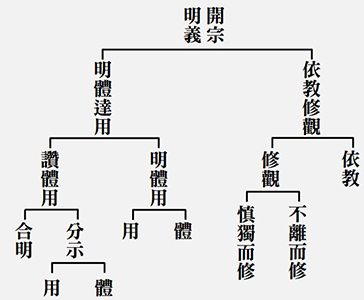

### 三字經簡說（六）

*淨爾整理*

入國其教為所知

絜靜精微易之教

疏通知遠書之教

溫柔敦厚詩之教

經文：

有連山，有歸藏，有周易，三易詳。

夏朝的《連山》、商朝的《歸藏》、周朝的《周易》，分別為三個朝代的易經，易經到了周朝已經詳盡完備了。

相傳上古時期伏羲氏畫八卦，此為易經的初始。夏代的易稱為《連山》，是以艮卦起首；商朝的易稱為《歸藏》，是以坤卦為首。伏羲氏的八卦有畫而無文辭。周文王作卦辭以文字說明八卦的內涵，分六十四卦為上下篇，又稱上下經，周公作爻辭，周代的易經稱為《周易》。

研讀《易經》就要學習六十四卦所詮人事種種趨吉避凶之道。孔子晚年好易，讀《易經》讀到韋編三絕，因此作繫辭十翼以解釋《易經》。孔子的學生商瞿學易又傳易，到了秦朝，因為將《易經》視為卜筮之書，因此倖免於焚書之禍而能代代傳授。

經文：

有典謨，有訓誥，有誓命，書之奧。

尚書的文體有典、謨、訓、誥、誓、命六種，這是《尚書》的精深奧妙之處。

夏商周三代時期的官方文件皆名為書，《尚書》的內容多為古代的公文，所以先秦時期稱此書曰《書》，到了漢朝初年才有《尚書》之名，尚是時間上的高古久遠之義。後來因為此書名列群經之一，故又稱《書經》

因為《尚書》的內容保留了西周初期的文字語法，和後來春秋戰國時期的諸子百家之學大不相同，以至於到了戰國後期，能理解《尚書》的人日趨減少，《尚書》的傳抄自然也出現了問題。秦朝焚書坑儒，《尚書》因此幾近失傳。

*《尚書》在漢朝以後的流傳有各種說法，皆各有所依，在此僅略作整理以為參考。*

漢文帝時向天下尋求《尚書》，找到了當時已經九十歲的伏生，伏生年輕時曾經將百篇《尚書》藏在牆壁中以躲避焚書之禍，經過秦末漢初之亂後，伏生取出《尚書》時發現只剩二十九篇，於是以此二十九篇教授生徒。也有一說是漢文帝向天下尋求《尚書》，尋得尚能背誦二十九篇文的伏生老人，因此派鼂錯向其學習。不論何種說法，這二十九篇由伏生流傳下來的《尚書》以漢代文字重新抄錄後被稱為《今文尚書》。

漢景帝時，魯恭王想拆掉孔子舊宅，卻在牆壁中發現多篇以古老文字抄寫的典籍，這些珍貴的典籍後來由孔子後裔，同時也是漢代儒學大家孔安國進獻給漢武帝，其中在魯壁發現的《尚書》比伏生老人的版本還多了十六篇，因為是用先秦文字寫就，所以稱為《古文尚書》。然而，孔安國所獻的《古文尚書》並未得到朝廷重視，當時的五經博士仍然以伏生版尚書為依據，以至於到了西晉永嘉之亂時全部散佚消失了。而我們今天普遍所見的版本則是東晉年間豫章內史梅賾上呈朝廷的五十八篇《尚書》，梅賾版除了保留伏生的二十九篇，其餘的篇章一直以來有真偽之辯，歷代不休。

《尚書》文辭精煉典雅、文義精妙深奧，現存的版本分為三個部分：虞夏書、商書及周書。文體有六，說明如下：

典：說文解字：「典，大冊也」記載帝王事蹟，例如堯典、舜典記載堯舜二帝的命官任職、嘉言善政，足以為後世施政典範，所以稱為典。。

謨：謨，謀也，記述君臣間商議政事的言辭。例如皋陶謨，即是記載皋陶和禹兩位臣子和帝舜對國事的謀議。

訓：訓是教誨，例如伊訓中記錄了大臣伊尹對商王太甲的說教言論。

誥：誥，告也。例如周公欲東征討伐管蔡之亂時作大誥以普遍告知天下人其出兵的用心與目的。

誓：誓是戰爭誓師之辭，例如湯誓即為商湯伐夏桀時的誓師之辭。

命：命是任使的意思，例如《顧命》乃周成王臨終時的命令，及成王駕崩後的喪禮和康王即位時的儀節。

經文：

我周公，作周禮，著六官，存治體。

周公制定《周禮》，分設六官，劃分執掌，保存治國的體制。

《周禮》的主旨是治國的禮制。關於其作者有三種說法: 一是周公，二是戰國時期的綜橫權謀之士，三是漢代劉歆偽作。究竟真實的作者是誰，歷代各有爭論。但制禮作樂非位居高位的聖賢難以完善，周公在周武王駕崩後輔佐成王，制禮作樂，建立國家的體制並奠定教化的基礎，開啟周朝八百年的歷史。《周禮》的內容在於分示六官的的職掌權責，六官如下：

天官冢宰：掌邦治(吏)，掌管官吏的升遷降調和銓敘。

地官司徒：掌邦教(戶)，掌管稅收及國家財政。

春官宗伯：掌邦禮(禮)，掌管禮制及考試事宜。

夏官司馬：掌邦政(兵)，掌管軍事國防。

秋官司寇：掌兵禁(刑)，掌管刑罰。

冬官司空：掌邦事(工)，掌管百工技藝，但冬官一文早已散失，後人遂以考工記補之。

六官各由所司，只要六官皆能適才用任，天子就能垂拱而天下治。

因此《周禮》的價值可歸納有三：

１．為後世政府組織之借鑑。

２．為研究先秦政治思想及政教、社會制度的重要史料。

３．為考古學者之重要參考文獻。

經文：

大小戴，註禮記，述聖言，禮樂備。

漢代的戴德和戴聖註解《禮記》而有《大戴禮記》和《小戴禮記》，書中傳述聖人的言論，以及完整記錄各種關於禮樂的儀節。

《周禮》、《儀禮》、《禮記》合稱三禮。孔子說「不學禮，無以立」，不學禮就不知如何立身，孔子的教育是博學於文，約之以禮，禮是立身處世的關鍵。禮經即是《儀禮》，《儀禮》的作者有一說是孔子和弟子所作，也有人說出自春秋戰國時期學者之筆。記是記傳，乃經之附庸，記錄經文不備足之處，兼記載經外遠古之言。《禮記》就是一部專記禮事之散篇雜文的叢編，內容主要是解釋《禮經》。

秦朝以後，漢初魯地高堂生傳有《儀禮》十七篇，後於魯壁又發現五十六篇，但後來還是散佚了。在漢朝時《禮記》則有一百三十一篇。

前述的《周禮》和《儀禮》記載的都是先秦時期的禮儀制度和政治制度，經過時間和朝代的變遷，逐漸和人們的生活愈顯疏遠。禮的傳承四傳至后倉，后倉再傳給弟子戴德、戴聖這對叔姪，後來戴德(大戴)講解《儀禮》時，取《禮記》一百三十一篇中的八十五篇，編訂為《大戴禮記》做為上課教材。而戴聖(小戴)則取了四十九篇編纂了《小戴禮記》。後來《大戴禮記》和《小戴禮記》成為《禮記》的普遍稱呼。東漢以後，由於鄭康成註解、傳續的是《小戴禮記》，因此研究《大戴禮記》的人愈來愈少，後來逐漸沒落、散佚，現存僅餘四十篇。是以，我們今日所接觸到的《禮記》多為《小戴禮記》。

經文：

曰國風，曰雅頌，號四詩，當諷詠。

國風、大雅小雅、頌是《詩經》的四種體裁，應當諷誦吟詠。

《詩經》是中國文學的精華，也是中國最早的一部詩歌選集，收錄了從西周初年到春秋中期約五百年間的各國詩歌共三百零五篇。早期僅稱為《詩》，約在戰國到漢朝之間出現了《詩經》之名，後由於其被列為六經之一，而廣稱為《詩經》。據傳《詩經》原有三千多篇，經孔子刪定　　之後留下三百零五篇，另有六篇有目無詩，若取整數，則稱「詩三百」。

孔子曾說：

「不學詩，無以言。」

不學詩，便不知言語之道。孔子在鼓勵弟子學詩時，也說過詩可以興起志向、指物說情，可以觀民風之厚薄，可以和合眾人的志向，可以記載民怨，從近處說可以行孝道，從遠處說可以事君，又能記得很多鳥獸草木的名稱。《禮記‧經解篇》：「入其國，其教可知也，其為人也，溫柔敦厚，詩教也。」可見溫柔敦厚就是詩的教化的效用。孔子多次論詩，在《論語》為政篇中，孔子說：「詩三百，一言以蔽之，曰思無邪。」詩經三百篇皆無虛意，全為真情流露之作，正合《尚書·堯典》中提到「詩言志」，詩可以抒發情感、表達志向，毫無虛偽。

《詩經》的內容有風雅頌三類，但因為雅分大雅和小雅所以是四種體裁。

風：周朝及其諸侯國的民間歌謠，采詩官採集各地歌謠上貢給天子，天子透過這些歌謠即能得知各地的民風，及政治狀況。共為十五國風，一六○篇，時間橫跨西周至春秋中葉。

雅：雅，正也，是正式場合演奏的詩歌。

大雅：諸侯朝見天子時所吟唱的詩歌，共三十一篇，多為西周時期作品。

小雅：天子宴饗賓客時的詩歌，也有反映朝政缺失喪亂的詩，共七十四篇，時間從西周到東周初年。

頌：分為《周頌》、《魯頌》、《商頌》三類，是祭祀宗廟的詩歌，除了《周頌》作於西周初年，餘二皆作於春秋年間。（下期待續）

參考資料：

一、明倫月刊中庸相關論文，作者：徐醒民老師。

二、孝經圖示。

三、讀易簡說，徐醒民撰，臺中蓮社印行。

四、尚書今註今譯，屈萬里註釋，臺灣商務印書館發行。

五、儒學簡說，臺中市佛教蓮社印行。

六、禮記今註今釋，王夢鷗註譯 臺灣商務印書館發行

七、春秋左傳今註今譯，李宗侗註譯，臺灣商務印書館發行。

八、春秋穀梁傳今註今譯， 薛安勤註譯，臺灣商務印書館發行。

## 專題講座

### 雙國記之一—近代日本

*戒澤講述、淨域整理*

中華文化學習者

天下為公是胸懷

以史為鏡知興替

提升自己廣視野

以史為鏡可以知興替，當代的中華文化學習者，在面對現代局勢衝擊，該如何取得平衡點，一方面不食古不化，另一方面又不隨波逐流。此次主題是：「雙國記」，乃借用英文ATaleofTwoCities（雙城記），名之為ATaleofTwoCountries，以近代(自一八四０至一九一０年)中、日兩個國家，在面對西方工業革命後崛起，所採取的方法和態度，以及各自的問題，作為我們的借鑑。本期將先從近代日本如何學習並擠身列強，展開第一層論述。

古時的中國，日本被稱作東夷，而它自己也認同是東夷的屬性。因為去中國學習，才發現自己與中國文化的差距。從西元六三０年至八九０年左右，在近三百年間，估計日本派出十九次的遣唐使，到中國各地學習，特別是長安。每次遣唐使的規模，概約有一百至五百人，其成員包括僧人、士人及百工技藝等，廣從政治、經濟、文化各方面學習。十九次的遣唐全面性學習，這意謂此民族有它可愛的地方，凡認同的地方，就認真的學習。

但從一八四○年起，開始有些變化，西方自大航海後，積極開拓領域，想從中獲取利益，惟是各國獲利的方式不同。初期的西班牙、葡萄牙兩國，以獲取天然資源為主。西班牙發現新中美洲新大陸後，對當地進行殺掠，奪取了許多的礦產，並沒有想到要經營當地，較有爆發戶的性質。他們掠奪銀礦，投資者與探險家一方富起來，乃至用銀與中國進行貿易，這種個人財富的增加，對國家並沒有實質的貢獻，反而引發經濟的失調。所以，日後與英國海上爭霸失利，一下子失去財源，國家也就沒落了。

後來的荷蘭、英國稱霸於海上，主要是進行貿易。英國此時已進入工業革命，其特性是利用機器生產大量物品，這與西班牙時期是不同的，所以它只好取銀礦。大量生產若能經由海外貿易進行買賣，就能真正利益到國內從事生產的人民。所以，它對於國家長期的發展是有利的，而且這種貿易對於雙邊循環是良性的，可以不斷地持續下去。

中國從明朝起，就與海外人士有往來，在澳門進行活動，諸如俐瑪竇等人，一開始都是從澳門進來的。直到清代，英國認為用白銀來換取物資，這樣太可惜了，所以就用種植的鴉片來交換，甚至直接要銀子不要貨物。中國自宋代對外貿易，主要是以瓷器、絲綢與茶葉為大宗。但英國開發中印度這塊後，茶葉能自己生產了；而中國的瓷器生產，居然也被日本給追上。中國一向不把造瓷的技術傳給日本，但當日本打敗高麗時，擄走了許多高麗的造瓷工人，除了學習燒瓷的技術外，更將之發揚光大。所以到了清代，日本造瓷的技藝已超過清朝。英國將鴉片賣到中國，換取白銀卻不要瓷器，這是有原因的。

那時，世界上白銀的流通短缺，因素包括：歐洲有戰爭需錢恐急，白銀自不會流入中國。而清政府則認為鴉片的輸入，導致白銀大量外流。一國的貨幣減少了，會是什麼狀況呢？例如：白銀是我的通用貨幣，白銀減少了，代表物價便宜，這稱作「通貨緊縮」。今天值一百元，明天剩八十元，商家自然就不願投資，最後經濟就萎縮。所以，中國怪罪於英國的鴉片，日後對於通商要求，自然就不願接受，故而導致一八四０年的中英鴉片戰爭。

自此時起，給了日本一個大覺悟，原來心目中的泱泱大國，竟是一隻紙老虎，不堪一擊就垮了。英國戰艦千里迢迢駛來，竟然打進中國內陸，實在是件很難理解又窩囊的事。這讓日本省悟到，我所崇信的文明，好像是在別的地方。此時的西方國家，也開始與日本有些接觸。例如：一八五三年的「黑船事件」，美國軍艦開入江戶（東京）灣，要求開放通商口岸，導致當時的德川幕府政權不穩，讓一些擁護天皇的力量找到機會。待到一八六八年明治天皇即位，終與最後幕府德川慶喜打了一仗。德川幕府軍有一萬五千人，且牢牢地控制天皇，然而竟打不過擁政府的五千新軍，這乃因財閥出資購買槍砲給新軍所致。

明治天皇的「明治維新」，乃取《易經．說卦傳》之「聖人南面而聽天下，嚮明而治」，及《詩經．大雅．文王》之「周雖舊邦，其命維新」之意。如此看來，它的思想文化還有許多中國的傳統。可是，從明治維新開始的一系列作法，就全部做得很到位。譬如：在明治四年，日本開始發行自己的貨幣。須知，發行貨幣是件難事，中國歷朝歷代發行貨幣無不失敗。大家以為貨幣印出太好用了，就沒有一個學術理論去控制；日本之所以敢發行貨幣，乃早從西方學到許多內涵，諸如成立央行等等，這是在財政方面。至於法律方面，它也學得很到位。民法學習德、法兩國，取其優點；而海商法學習美國，意即對外貿易上，用的是海洋法系（英美國家）。
試
**問：** 學法為何要特別講究，隨便選一國不就好了嗎！以下，我們先來簡單談談大陸法系與海洋法系。法律一般從歐洲開展出來，其源自於羅馬法，根本原則是「自然法」，也就是你我之間是平等的。甚至於美國《獨立宣言》的「人生而平等」，這都是源自於羅馬法的觀念。一直衍生到法國的拿破崙《民法典》，或者是亞歷山大開的《法典》，這一路下來的觀念，西方社會對於人權保障的程度是很足夠的，而且從羅馬時期就有。

西方一開始是大陸法，後來才慢慢演化。英國與歐洲大陸有個最大的區別，即是歐洲諸國鄰接在一起，為了防範它國的侵略，各君主需要有自己的部隊。為了強化君主的武力，各諸侯的勢力就被消除。在這樣的地方，君王意志變得相對的強與獨大。所以，君主的法律一旦透過行政部門形成後，訂成的條文就不必變動了，這是大陸法系。

而海洋法系，英國是個島嶼，相對之下較沒有被侵略的疑慮，因為隔個大海，這與歐洲大陸彼此爭戰是不一樣的。所以，君主沒有必要建立一個強大部隊，因為沒有強大的部隊支持，對於各諸侯的聲音不得不重視。它的法律形成，有一部分是透過協商來的，而協商的精神到了現代，就變成根據不同的狀況來討論。我們常見美國法庭的影片，針對同類型的案子，因切入角度不同，或時空背景不一樣，做出來的判例可以是全然不同的。

英國法律為何稱作海洋法系，乃因為英國的法律形成後，即走入大航海時代，成為時代的王，去到各國做生意，都採用它的法律規範，所以叫作海洋法。它具有隨著時空背景條件去作演化的能力，等於是一個活的生命體。試看世界上大的金融城市所在之處，不論亞洲的新加坡、香港，或是美國紐約、英國倫敦，都是所謂的海洋法系。之前中國社會在議論，為什麼騰迅、阿里巴巴這樣的大企業，都跑到其他國家去上市？而自己人很難投資參與他們的成長。原因是，大陸法系乃成文法，法律訂了就很難改變。企業要在大陸上市，首先得問營業額要到怎樣的規模？連續幾年要有利潤，利潤要有多少？員工人數達到多少？這都要一一列出來。當初訂法是出於好意，莫要濫竽充數，可是訂了這個規則後，很多高科技產業的公司都不符合規定，而它又需要籌備資金使之具競爭力，此時只能去到別的市場，即是海洋法系所主導的市場。日本在與外接觸時，就知道學習海洋法。所以，領導人中若沒幾人有腦袋，這是辦不到的。在什麼情況下用什麼法，他很清楚。

在經濟方面的鐵路建設也是如此，自一八七三年到一九一三年，從最初的十幾公里，到七千多公里。煤的開採，產量從六十萬公噸到兩千多萬公噸。煤的產量有何重要性呢？那時工業成長的動力來源一定看煤。當時看一國工業成長與國力強大與否，主要是兩個指標，一個是煤的產量及消耗量，另一個是鋼鐵的產量。談到日本，還有它的船舶運輸量，在這四十年裡，從最初的廿六艘蒸汽船，到一千五百艘之多。明治初期，還開設郵局與電信公司，但它為何要辦這個呢？其與外交流訊息愈頻頻，知識的水平就會提高，各方面的能力也會增進。所以，它在經濟的每個角度都做得很到位。

在軍事方面，它學習各種長處，陸軍向德國學，海軍向英國學。雖然社會上廢除武士道，但卻強調武士精神，要忠於天皇。一八七五年開設砲兵工廠，自製生產砲彈，這一系列的學習，最後就是要強大自己。

在外交方面，一八八三年成立了「鹿鳴館」，用來從事外交接待工作，等同於現在的私人招待所，裡頭充滿一片歌舞昇平。它藉著這個地方，儘量與各國使節拉近關係，目的是將過去所簽訂的不平等條約，透過新談判一項項刪除。這一段時間（至一八九九年），就稱為「鹿鳴館外交」。

在文化方面，東西方全都接收，沒有天朝的自大。西方的儘量學，不論日用平常乃至飲食上。如果有機會去日本，要吃吃它的法國麵包及義大利麵。它不是將你的書翻譯來而已，而是在各方面都融入。

在教育方面，將全國分為八個大區，下有三十個中區，然後無數小區。每一大區設一所大學，計有八所大學、二百五十所中學、五萬四千所小學，在那個時代，算是非常高的比例。回想明治維新初期，日本的全國人口數為三千四百萬人，有小學五萬四千所，如此對比當時中國，同治時期有多少是國家興辦的學校？大概兩隻手腳就數完了。所以，得見當時日本民智的開放與知識的學習。

再看教育內容，包括：數學、物理、化學、地理等，但是並沒有全盤西化，還要學習「教育敕語」。這些敕語是天皇發下來的教育文件，每天都要讀背。例如：第一段「朕惟我皇祖皇宗，肇國宏遠，樹德深厚。我臣民，克忠克孝，億兆一心，世濟其美。此我國體之精華，而教育之淵源亦實存乎此。」這講，我是天皇，你們要盡忠盡孝。第二段：「爾臣民，孝于父母，友于兄弟，夫婦相和，朋友相信，恭儉持己，博愛及眾，修學習業，以啟發智能，成就德器。」是說，大家要重視五倫的經營，充實能力，變成人才。第三段：「進廣公益，開世務，常重國憲，遵國法，一旦緩急，則義勇奉公，以扶翼天壤無窮之皇運。如是者，不獨為朕忠良臣民，又足以顯彰爾祖先之遺風矣。」是說，要進一步為公發心，國家一旦有事，要義勇奉公。這就是他的「教育敕語」，西方的也學，中國儒家的一套也用上。

那時也派遣使節團，總共派出五次的使節團，出使團員皆是有能力經驗的人。日本能快速且恰到好處的融合，法律用哪一國？軍事向誰學？經濟產業的技跟誰？這其實是有原因的。所謂「出使」，是進行各領域廣泛的學習，人物包括我們熟知的伊藤博文（後來的總理大臣），如果他沒有遭到韓國人的暗殺，日後對中國的殺傷力會更大。另一位叫澀澤榮一，被喻為日本企業之父，都是使節團的成員。這些人一出國就是八個月、一年、兩年之長，等於是將西方文化學遍了，取其菁華才回來。

在內政方面，將威脅性最大的武士滅掉。先限制武士不准帶刀，再將之降為士農工商，使之一律平等，這對武士而言是極大的侮辱。二００三年的電影《末代武士》一片，湯姆克魯斯飾演歐格仁上尉，為明治天皇訓練一批現代化部隊，而武士集團的領袖勝原盛次（渡邊謙飾），認為使用火槍違反武士精神，憤而起來反抗，最終武士被消滅。如此，內部搞定、經濟振興、武力增強了，接下來就要向外擴張。先侵略韓國，再與清廷爆發甲午戰爭。

中日甲午戰爭發生於一八九四年，離一八六八年明治維新初起，不到三十年的時間，日本就將千年的偶像擊倒，其氣勢是非常凌盛的。後來簽訂《馬關條約》，李鴻章除受盡污辱外，還遭到刺殺，所以有「終身不履日」的話。《馬關條約》的內容極為苛狠，日方充分掌握到李鴻章與清廷的聯繫電報，知道交涉的最後底線，所以談判就終結在那裡。

日本人對於訊息的掌握特別有一套，個人有點這方面的經驗。以前台灣有個野村證券のページ（Nomura），二十多年前還不錯，現在不行了，一九二五年曾是日本第一大券商。裡面有個某某研究部門，聽起來並不起眼，實際上在從事訊息蒐集，說難聽點就是在搞「地下工作」。那時日本對各國的情報蒐集，不一定透過正統的外交體系，常經由像野村證券這樣的商社來做。

《馬關條約》各種條件都談好了，中國認為那就簽訂吧！但日本不同意。這是為什麼呢？日本竟然提問「誰是中國？」以前我日本所崇仰的儒家文化所在稱中國，現在你的文化有我強嗎？所以現在我稱中國，你叫清朝。日本儼然自視其為儒家文化地區的共主。

打中國是它的最終目標嗎？不是的，其目標在俄國。就世界諸國的制約來說，海上霸權是英國，英國縱橫四海，最要防堵的是法國與俄國。俄國的土地遼闊、勢力龐大，凡所控制的地方，英國就無法做生意賣產品，少賺錢就不開心，所以遏止它的發展，成為幾個大國間的博奕。

要制約俄國，那麼英國該怎麼辦？與之對抗不見得划算，也不一定打得過，勢必要培養一個代理人。英國原本想要培養中國，不料連個日本都打不過中國，所以最後決定培養日本。當日俄戰爭（一九○四至○五年）時，西方報紙的漫畫，將日本畫成是小孩，俄國是個大個子，惟最後竟然日本打贏俄國，是件很不可思議的事情。俄國沙皇就因為這一戰打輸很丟臉而下台，結束了帝俄統治。

日本在那時，真的是走路有風，亞洲已無敵手。但它心中隱微處想要的，是與西方大國能同坐在檯面上說話，這是它所要爭取的。它很在意國際位置在哪裡？一次大戰結束後，日本與英國同屬於戰勝國，期待西方能給它許多好處。戰爭中提供最多資助的是美國，美國的發話權自然最大，在「巴黎和會」中，美國總統威爾遜認為國與國間是平等的，日本聽了十分開心。最後才發現這只是說說而已，因為英、法兩國並不配合，根本不想放棄既得的利益。

經過「巴黎和會」，日本對於無法站到檯面上，感到十分的失望。日後雖接收德國在山東的權益，然日本認為這是應當的，而中國則是舉國譁然不滿，兩年後日本被迫退出山東，這又體會到靠山山倒，一切都要靠自己。

日本不再依靠西方，開始有何想法呢？便先營造一個夢想，建構「大東亞共榮圈」計畫，這包括對東南亞的殖民，及對中國的規劃經營。對中國，它成立「興亞義塾」，等於是個學習的地方，主要教授蒙古、回教的文化及藏傳佛教，畢業生直接分發到蒙古、新疆與西藏，從事文化交流工作。此時，先將關外的大片土地吃下來。

清末時，八旗兵已無戰力，太平天國之亂，還是漢人出來籌餉打仗收拾殘局，中原人對滿人的不滿浮現。這時日本開始經營大東北、大西北，準備一步步地吃掉。甚至拉攏認同感，強調滿蒙與日本都屬於阿爾泰語系，肯定五百年前是一家，同是源於這個語系。它慢慢進行分化的目的，就是要將大東亞變成是它能夠掌握的。這有何好處呢？如此才有力量與西方較扳。

僅日本一地是不夠的，所以才開始經營「大東亞共榮圈」。它的經營心態，有些是我們難於理解的。譬如：二次大戰初期開始侵略中國，它心裡有個不可理解的事情，就是「你中國人為何要抵抗」？我有如此崇高的理想，未來大家要一起共榮，你中國抵抗什麼，真正的敵人在西方呀！日本是以這樣的一個目標來打，而不僅是侵略中國而已。小時候我們所聽的故事：「老師指著蘋果問學生，蘋果好不好吃？好吃。那就就去打中國。」其實不是這樣的，真正的目的在「大東亞共榮圈」。

二次大戰時，日本的心裡變成有種道德的不安，口裡稱著要與西方較扳，但卻是踢眼鼻子打中國，成為明白的侵華，最後所有的軍隊都陷在中國，它忽略一個最根本的條件，即是「吃不下中國」。這麼小的國家，怎麼打這麼大的呢？很多時候，歷史有些地理的決定論，很難想像日本能將中國打下來。只要中國以民族主義為號召，團結在一起，你是絕對打不下來的。

此時，為了有一個被合理化的原因，同時宣戰打美國。否則很難理解，打中國都陷入泥沼，你怎麼去打美國？這一方面讓師出有名，二方面可將美國勢力排除，對東南亞能有更多的經營。所以，先把美國的艦隊打掉（突襲珍珠港事件）。但連中國都打不了，又怎麼打贏美國呢？日後美國採取隔島躍進的戰略，逐次地收復太平洋各島，其中硫磺島浴血戰十分慘烈，日本駐軍幾乎全部陣亡。最後自然地戰敗，簽定降書。

日本自從明治維新開始，在文化、教育、財政、經濟各方面使力，給它機會就出頭。誰給它機會呢？美國。此時，美國在亞洲，要有個代言人。一九四九年中共佔據大陸，共產勢力向外擴張，怎辦呢？就扶植日本。一九四五年二戰結束，日本當時多慘呀！但到了一九六八年，日本的ＧＤＰ超過德國，成為世界第二大經濟強國，直到二○一○年才被中國超過。日本能這麼快就起來，全民團結一致，這與天皇制度有很大的關係。它是不是受到儒家文化的影響？應該是的。但日本人的特色，是民族特別團結，奉公守法，聽天皇的號召，這點是不容質疑的。

很多人不瞭解，同是戰敗國，為何德國人到處認錯，普建二戰的紀念館，而日本人從頭至尾不認錯？儒家文化不是講知恥嗎？為何不認錯？戰後日本天皇發佈一個宣言：「我不是神，我犯了人的錯誤。」日本人認為是「諱君之惡」，所以不認錯。不認錯，就是維持天皇的原因之一。現在日本政壇上的大人物，許多都是老軍頭的後代，包括安倍晉三（外祖父岸信介，外叔公佐藤榮作）。

如此特殊的民族性，導致戰後很快的成功。可是，到了一九九○年，日本一下子經濟泡沫破裂，持續了二十多年的經濟負成長，一路起不來。即便如此一蹶不振，總理安倍晉三對崛起的中國，該較扳還是較扳，譬若釣魚臺之爭。然而，日本不過就是美國的打手，又何必做到這樣的程度呀！原因是，中國再強，在我過去的視野裡，不過是「大東亞共榮圈」裡的一個地方而已！而且我的文化及文明，與你眼前的相比高出太多了。不如此看，是很難解釋的。就現實面來看，日本不該與中國較扳，可是它無所謂。

日本為何近三十年起不來？這叫作「成也蕭何，敗也蕭何。」日本人的特性就是團結一致、相互扶持，對天皇及政府效忠。當經濟泡沫化時，政府想照顧人民的生活，要求企業不能倒閉，讓員工能繼續就業，這就形成萬年的「僵屍企業」。人力資源浪費，金錢無效投入，企業缺乏積極性生產，員工只是領薪水，過著低水平的生活。過去的成就模式延續至今，導致經濟一蹶不振，所以稱之「成也蕭何，敗也蕭何。」以上是近代日本的概說。

## 藝術賞析

### 孔門七十二賢淺說（二十一）
				        ─巫馬施

孔門七十二賢淺說（二十一）

─巫馬施

圖：江逸子‧文：時哉

心志向道堪考驗

單父小治日夜忙

天空繁星出與入

隨師周遊是大賢

巫馬施，姓巫馬，名施，字子期（《史記》則稱子旗），小孔子三十歲，鄭玄說他是魯國人，《孔子家語》則說是陳國人。

巫馬期是一位勤政愛民、身體力行之人，〈呂氏春秋察賢篇〉上說，宓子賤治理單父城，可以垂衣拱手、鳴樂彈琴，好像不用做什麼事情，單父就能大治。巫馬期在宓子賤之後也治理過單父，他的為政是天還沒亮就出門辦事，深夜才回家，書上是說出門時星星在天空，回家時也是星星在天空，這樣夜以繼日的辛勞，單父也獲得了治理，效果相近。一位是四肢安逸，心氣平和；一位卻是手足辛勞，教令繁忙。巫馬期不解其故而請教於宓子賤，宓子賤告訴他：我是善於任用賢人，您是善於任用心力；任用心力所以勞煩，任用賢人所以安逸。巫馬期的治術確實不如宓子賤，但從他為政的態度來看，確實是一位不放逸怠惰而能仁愛子民的君子。

《韓詩外傳》也有一段有關巫馬期的記載，某次他與子路一同在韞邱之下採薪，見到陳國的富有人家，停了上百輛的馬車在韞邱之上，飲酒設宴奢華非常。子路因而問他：是否願意以富貴終身，取代從學於孔子的機會？巫馬期仰天而嘆，沉重地將手中的鐮刀投擲於地，回答道：我聽夫子說：勇士念念不忘身首異處的下場（因為能臨陣當先奮勇作戰）；志士仁人時時不忘棄屍於溝壑之中（因為能堅守志節安於窮困），難道您不知道嗎？是在試探我？或者這是您的志向（意者其志與）？從兩位仁人君子的一問一答當中，可見巫馬期志節操守的卓絕。

畫中的巫馬期頗有日本武士的形象，表情果敢堅毅，是能夠身體力行不畏苦難的勇者。手摸鬍鬚，似乎是琢磨同學宓子賤告訴他，大治單父的道理。

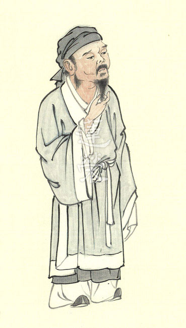

### 華夏精魂千秋(二十二)
		  —明倫史畫─進退泰然─嚴光

華夏精魂千秋(二十二)

—明倫史畫─進退泰然─嚴光

圖：江逸子‧文：淨域

富春江畔羊皮衣

高人子陵有釣台

千載流水幽幽逝

訴說丈夫衝天志

史話

嚴光，字子陵，本姓莊；漢朝揚州會稽郡餘姚縣(今浙江省餘姚縣)人，概生於漢平帝年間(西元前一年至西元六年)，壽約八十歲。光年輕時即有大名聲，與劉秀、侯霸一同遊學長安。王莽篡漢立新，詔嚴光與侯霸為官，霸棄二人任荊州南陽郡隨縣宰，後升淮平郡(西漢為臨淮郡)大尹(太守)。

王莽仿周朝制度推行新政，因政策多與社情不合，引發沸騰民怨，形成赤眉、綠林軍等大規模的農民反抗。劉秀所領導的綠林軍於昆陽大破莽軍，在冀州鄗城(今河北省柏鄉縣固城店鎮)即位為東漢光武帝，改元建武。王莽為商人杜吳所殺，侯霸投效於光武帝，任以尚書令。

建武初年，光武帝想到嚴光的才能，遣人四處打探他的消息，因其改名易姓隱居，又繪其形貌張貼尋找。某年，青州齊郡地方官府上書說：「有一男子披著羊皮衣，在水澤中垂釣。」光武帝疑為嚴光，派使者持厚禮訪探，經多回聘邀才肯入京相見，住於城北有太官(掌帝膳)專門奉侍飲食。

當時侯霸為大司徒，派臣下侯子道送書信給嚴光，說：「侯公本想親自登門拜訪，但因公事所迫無法前來，希望趁著天黑委屈你前去聚談。」嚴光不語，寫個書信回說：「君房先生您位至三公甚好，若能懷仁德佐正義，天下百姓便會喜悅，如果一味地阿諛奉承，順隨皇上的旨意，就要身首異處。」侯霸收到回信，轉呈給光武帝，帝大笑說：「這個狂徒還是從前的那個樣子呀！」

光武帝隨後去到嚴光住處。光躺在床上不起來，光武帝就坐在床邊，摸著他的肚子說：「唉！嚴子陵呀！難道就不能幫助我治理國家嗎？」嚴光過一會兒張開眼睛，看著光武帝說：「從前堯以德治天下，巢父還不肯接受他的禪位。士人各有自己的志向，你又何必強迫我呢！」光武帝嘆息地登車而去。

某日，光武帝領嚴光進宮，談論過往的事情。帝問嚴光說：「我比起過去如何？」嚴光答說：「陛下比過去稍微胖了一點。」兩人夜裡同寢，嚴光將腳壓在光武帝的肚子上。第二天，太史上奏說：「有客星冒犯皇帝的御座，情勢很危急。」帝笑著說：「我和老友嚴子陵在一起睡覺呀！」帝任嚴光為諫議大夫，光不受而至富春(今浙江省富陽縣)山下種田；建武十七年(西元四十一年)召他進京仍不去。劉莊繼位為明帝，因避名諱將莊姓改為嚴，去世時帝賜家人百萬錢、糧一千斛。

圖解

此圖江逸子老師所繪，乃光武帝親至洛陽城北，邀請嚴光入朝協助辦理政務的情景。門外陣仗雖輕車簡從，但少不得應有的威儀，除明示屋內來客為光武帝外，也彰顯這位生於民間的帝王，生活簡單樸素。屋內有童僕侍候，見出光武帝對嚴光的盛重禮遇。

屋內的嚴光，正對著光武帝別頭搖手，顯然帝已進行一番勸說，只是嚴光無意於官場。想日前，侯霸獲悉老友嚴光來到洛陽，遣人邀他夜談，不料卻反收到書信道德勸說，惹得侯霸心中不悅，而在帝前告了御狀。幸得光武帝知光甚深，只是笑說：「這狂徒還是老樣子。」

光武帝與嚴光同輩(約生於平帝時期)，而侯霸要大上許多，早在成帝時就任太子舍人一職。依《後漢書》載：「霸矜嚴有威容，家累千金，不事產業，篤志好學。」在東漢他是個好官，於新莽時期也深得民心。王莽被殺，更始帝劉玄詔令淮平郡守侯霸入朝，百姓聞其欲離開，莫不攔路阻止使者帶走人，後因劉玄失敗而告終。光武帝任侯霸為尚書令，完備典章制度推行政事，死後封鄉哀侯。

像侯霸這樣的朋友，嚴光為何修書勸他，說：「懷仁德佐正義便好，切勿一昧地奉承君上。」嚴光不汲汲於名利，不戚戚於貧賤，知道人生路寬闊，懂得「急流勇退、去留無意」之理，顯然他有更高的智慧。

嚴光一生寄情於山水，是一種人生極大的智慧。清楚名利場上的險惡，與其掙得你死我活，不如保持清高的節操，在淡泊中度過一生。一位高風亮節的君子，不受身外之物所累，不為富貴名利所誘，不被權勢所左右，不僅活得瀟灑，也能夠保持人格與理想。

人的欲望是無止盡的，若每欲得一望百、擁千盼萬，就無法因知足而獲得常樂。嚴光從政必能協佐光武帝辦事，然此與其心志不符，故只是相會而不就任。他對侯霸說的一段話，並無貶損之意，只是提照老友「進退有據」，始能事事「處之態然」，畢竟權位名利太易使人變節呀！（下期待續）

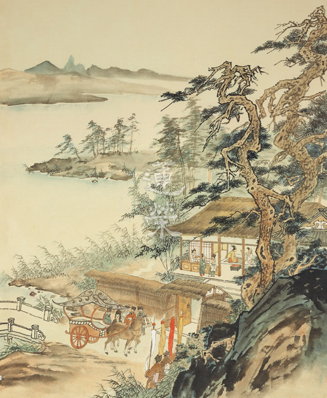

## 蓮池海會

### 林賴甘老居士往生見聞記

林象濟

走過艱難歲月

先苦後甘人生

佛化家庭美滿

歸去安詳助念

我的母親林賴甘女士，生於民國二十五年的臺中市北屯區，曾外公為日據時代的保正(相當於無給職的里長)，外公曾任教職後轉務農；母親從小即在熱心助人關心鄰里的大家庭氛圍長大。在那個戰亂的日據時代，好學的母親在上小學時度過快樂的童年，無奈戰爭的無情及眾多姐弟的生活壓力，母親心疼外公、外婆的辛勞，自願在小學畢業後，開始裁縫的學徒生活補貼家用，母親生性柔順乖巧且好學，因此得到老闆及師傅的賞識，亦很快學會設計打版裁縫一整套做衣服的好本領，連當時最流行的洋裝都難不倒她；因此有不錯的薪水，母親則將大多數的薪水都給外公外婆補貼家用，更護持三個舅舅繼續升學；母親二十八歲時已屆適婚年齡，老闆裁縫師傅看母親一直都努力工作，無暇遊玩更無機會認識朋友，因此介紹當時在掌管翠華堂經營的林茂生(父親)，當時同年的父親孝順謙恭，且在臺中蓮社學習儒佛學，而與亦好儒佛學且同樣孝順乖巧的母親一拍即合，進而共結連理；孝順乖巧的母親自此在婆家全心全意的付出，擔當起長媳的責任，侍奉公婆也關心照顧叔叔、姑姑們；當時每餐母親都要打理十多人的飲食，因此也練就了好廚藝；在剛光復的時期父親、母親為了爺爺、奶奶、叔叔、姑姑們全家族，共同努力打拚生活，除了原有的裱褙工作亦製作火種…等家庭代工；接著生下姊姊和哥哥，父親考量家族須開枝散葉才能開創未來，因此答應當時在臺中的故宮博物院邀約應聘至臺北為國家文獻文物作修護裱褙，至此開始臺北市外雙溪生活，到臺北的第一年母親生下了我，自此民國五十七年開始了我們一家在臺北的努力奮鬥。

慈祥和藹的媽媽任勞任怨的為家庭付出，除了照顧我們外還協助爸爸，又練就了裱褙的技能；爸爸、媽媽在幾乎不熄燈的工作室努力打拼，創造了我們一家的富足；於此同時也沒忘了潛心向佛。過去在臺中參加蓮社活動，親近 雪公老師；到臺北就近參加國際佛光會士林一分會。為了精進佛學，媽媽重拾課本進入補校，彌補了小時未能繼續求學的遺憾，也建立起持續學佛的基礎；此時還要關心我們的學業，讓我們從小浸潤在佛陀的光輝，並學習儒家的四維八德。宅心仁厚的母親一直熱心鄰里，與鄰居友人互動良好，除了時時關心我及哥哥、姐姐的教育學習，而且還讓我及哥哥姊姊參加社區童子軍及國小野外露營旅遊活動，使我們有美好快樂的童年。

多才多藝的媽媽，在我們長大自立後；重回她喜愛的裁縫工作；亦更潛心向佛，也開始世界觀的體驗；在爸媽東北亞旅遊後，記得媽媽在我一退伍就安排我和哥哥出國，去找在日本留學的姐姐，讓我深刻的體會行萬里路的意義。媽媽用她的方法帶給我受用的國際觀，鼓勵著我奠定了未來的方向；儘管我們都已長大自立了，媽媽還是不忘她對我們的關懷，護持我和哥哥完成結婚大事，亦幫忙我們照顧孩子直到上幼稚園為止。媽媽亦心疼媳婦要上班，無足夠時間打理家裡，凡事都自己做，甚至還幫忙媳婦們做一些家事。

媽媽和爸爸這對菩提眷屬，在學佛的路上相知相惜，常出國旅遊，走過日本、韓國、泰國、馬來西亞、香港、澳洲，乃至西歐七國、夏威夷，美國東西岸及北美加拿大。

在學佛的路上經歷數十載的媽媽，自皈依星雲法師以來，一直秉持說好話，做好事，存好心，亦諄諄教誨我們此三好；媽媽長年吃齋與爸爸和師兄姐們在佛法上共修，亦與安國寺道祥法師結緣，曾同行至日本參加國際佛光總會年會。母親同父親亦在故宮博物院佛學社活動，參與西蓮淨苑結夏安居齋僧活動。並同中華無盡燈文化學會一起活動，參與放生共修等活動，至緬甸、柬埔寨參訪佛教聖蹟，並護持當地貧困兒童家庭。近年來媽媽和爸爸持續參加學會週四共修會，長年浸潤於佛光庇蔭下；但光陰飛逝，身體逐漸老去，在五年前水腦開刀後，行動及言語能力逐漸喪失，於今年五月二十七日早上八時三十分在家中子女媳婦孫女隨侍在側時辭世，承蒙寺院法師們及學會諸善友助念直至傍晚，母親面露慈祥含笑往生；隔日入殮依然面容莊嚴，還帶一絲和藹微笑。

母親長年學佛誦經，晚年並在父親的協助下，持續抄寫佛經，相信在助念後已功德圓滿，相信您在阿彌陀佛及眾菩薩的接引，已在西方極樂世界蓮花中享受佛菩薩的加被。

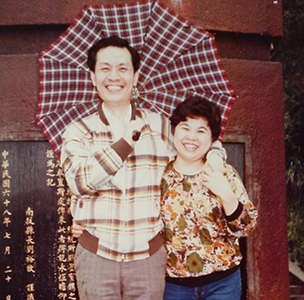

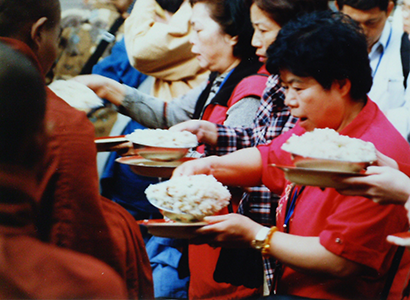

### 游吳員老居士往生見聞記

*編輯部*

生在苦難時代

阿信精神面對

散發光熱慈善

歸去助念西方

生平簡歷

吳員老居士，生於民國二十年農曆十一月十三日，沒於民國一０七年農曆五月十九日。自幼父亡，啞母再嫁，因此寄人籬下，童年生活艱辛刻苦，養成她堅強獨立的個性，自幼聰明活潑，多才多藝，樂善好施，凡事能設身處地為人著想，不時把她的一生的經歷和喜樂，奉獻給他周邊所有需要幫助的人，綜觀其一生堪喻是「臺灣的阿信」。

兒時成長背景

三歲那年，吳員居士的父親病逝，隔年，喑啞生母被娘家帶回改嫁，從此她與叔叔、嬸嬸一起生活；九歲那年，全家搬到瑞芳鎮柑坪里，很幸運地，叔叔送她到瑞芳國小就讀，可惜好景不長，就在國小四年級那年，適逢二次大戰，美軍來襲，學校關閉，她被迫中途輟學；光復後，搬回柑坪里在家養豬，學作粗活，並與叔叔做起販賣小豬的生意。

十八歲時叔父讓她就讀稻江家職裁縫科，當時，因念母情深，常常翹課逃學，去找尋啞巴生母；皇天不負苦心人，最終，發現生母親嫁到永和秀朗的大戶人家，同樣是喑啞的繼父待母親非常好，而且也育有二男四女，生活幸福美滿，從此居士的心裡也有了依靠，時常去探望她母親及同母異父的弟妹，開心至極。

二十一歲時，疼愛她的叔父，因仗義勇為替人勸架，不幸被誤傷致死，家中生活頓失重心，游老居士遂一肩扛起家計，開始在瑞芳車站前，賣起豆乾、嫩竽頭、菸草等等。因為生性豪爽與人交善，人緣極佳，生意也頗為出色。

結婚生子

直到二十四歲那年，嬸母託人安排相親，經由媒妁之言，把她許配給當時任職於瑞芳消防隊的游枝全先生，新居設於瑞芳分局日本式宿舍。之後，六個兒女相繼出世，包括婆婆全家九口睡在不到十坪的塌塌米上。先生是么兒，婆婆非常疼惜，相對地，六個兒女也得到非常好的照顧；各個健康活潑，品行優良。她因從小失去母愛，無形中對婆婆更加尊敬及孝順，直至婆婆壽終正寢，感恩之心依然與日俱增。

結婚當時，任職公務員的先生薪水微薄，吳員居士為了幫忙貼補家用，乃重拾年輕時的毅力及專長，前後做過賣雞、雜貨店、豬肉的生意，甚至於經營鐵工廠及砂石工廠，不辭一切，含辛茹苦拉拔兒女長大成人。

期間，因為本性善良樂於助人，為了幫人解燃眉之急，多次替人作保或借錢，而自身背負還債之責，也只有咬緊牙根，從未怨天尤人。

當兒女漸長，紛紛就業定居臺北，屢勸她放棄生意，搬到臺北與兒女同住安享天倫。搬到臺北的老居士開展了新視野，生性樂觀活潑好動，有幸姊妹相伴好友陪同，玩遍世界多國及名勝古蹟，舉凡美洲、非洲、澳洲及亞洲等無數國家，甚至東歐十三國，常常前腳才踏進國門，後腳就開始商討下個景點去哪裡，留下點點滴滴美好回憶。

晚年生活

步入高齡後，雖然動過人工關節的手術，也遭受輕微的帕金森症，以及糖尿病，可是她的精神一直保持容光煥發，時常到慈濟醫院做志工、在慈濟關渡廚房作香積和便當、慈濟環保站擔任環保志工，也曾代表慈濟到銘傳大學的社團，教學生做蒟蒻及料理，廣結善緣，也因此，擁有一群互動密切的蓮友和珍貴的友誼，讓她的後半輩子充滿法喜。

由於從小是孤兒，因此老居士非常體恤失去依靠的孤兒院小孩，並給予關愛，直到往生前，還不時訂購食物，送給天母地區聖安娜之家的喜憨兒，時而幫忙餵食；幾年前，朋友教她做手工紙天鵝，從此愛上這手工藝，閒暇之餘，做起紙天鵝，分贈親友，與大家結緣；此外，從去年開始又重拾畫筆，畫起動物和花卉；因持續手部的運動，也減輕了帕金森症造成的手部顫抖，一舉數得。另一方面，她深獲鄰居街坊的情誼，每天早起作運動，到處玩樂，談心說笑，大家給予她鼓勵及支持，讓她晚年生活，過得既健康快樂，又多彩多姿。

臨終示現

老居士今年過年，自覺時日已到，讓小女兒將她口述對慈濟證嚴法師感恩之情寫成信函，在她今年往生後，代勞唸給法師聽，表達萬分感恩之意。沒想到老居士一語成讖，從今年農曆年開始脊椎受苦動刀，在家人的悉心照顧下，日漸好轉，未料在農曆五月八日凌晨身體突感不適，住進了榮總加護病房。

老居士與親家之間關係密切，特別是長子在二十三年前參加親家周存良居士的告別式，內心埋下了極好的印象，為了護持老居士往生大業，在老居士臨終前，長子祈請學會善知識親臨醫院為她開示，最終老居士於農曆五月十九日酉時，於家人與蓮友的佛號聲中，安詳西逝。

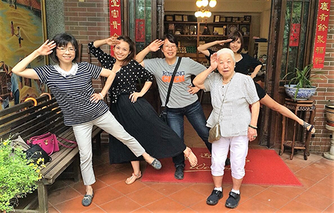

### 吳月鶯老居士往生見聞記

黃建志

勤勞辛苦的一代

兒孫有成的回報

天倫之樂的晚年

撒手歸去的助念

母親吳月鶯老居士生於民國二十一年，卒於民國一０七年農曆五月六日，享壽八十七歲。

母親小時候原居住於臺北市青年公園一帶，後來舉家遷往鶯歌落戶，為家中二女，兄弟姊妹六男二女共八人。其父早年從商經營磚窯廠，國文程度高且擅長書法，對孩子的教育也非常重視，不會重男輕女，加上母親好學善學，雖然生於二次大戰的戰亂時代，經常得跑防空洞躲避美軍轟炸機的空襲，還是努力讀書完成小學畢業，除能識字、寫字外，還在數學方面展現過人的能力。年近七十歲時，還曾到新埔國小參加長者學習課程，好學精進可見一般。

母親年輕時經媒妁之言與父親黃阿文先生婚配，婚後敬奉公婆，祭祀先祖虔敬，友愛親族，慈愛幼少，相夫教子，育有三子三女（秋梅、建貴、鈺翔、建志、瑞緣、敏玲），為了鼓勵孩子學業更上層樓，協助從事木工師傅的先生家計，白天到二個家庭做清潔打掃工作，傍晚又接手外銷成衣的家庭代工，經常熬夜趕工好不辛勞，溫婉中展現為母的堅毅，孩子也不負含辛茹苦栽培，大專、大學及留美碩士畢業光耀門楣！

母親教導孩子首重品德且以身作則勤儉持家，不去別人家串門子，不道人長短，不與他人比，只問自己是否盡全力，不可以看人家吃東西，年節糕點應景食物皆不假手他人，家人身上衣服，大部份是她老人家親手縫製完成，連家中地磚也都是夫妻二人合力完成鋪設。

對於理財更是有決斷力，在原先在婆家多人共住時，便膽大心細的用攢下來的小錢一次購買板橋新埔二間房子，而且三年就還清所有房貸。

富時不奢靡，窮時不失體，非經打扮整齊絕不出門，居家環境乾淨明亮井然有序，對兒媳教導如己出不卑不亢不重話，要求善盡本份。

母親每日早晚殷懃上香拜佛，即使行動不方便時仍數年如一日，春節、清明、端午、中元、中秋、重陽以及先人忌日，豐盛祭拜無一遺漏，即使先生往生亦復如此，維護家庭中心思想：感恩及五倫不悖。

母親一生勤儉持家，養兒育女，任勞任怨，每天都是起早貪黑的為家庭，無怨無悔的辛勞付出，等到兒女們出了社會結婚生子，本該享清福卻又忙碌起來幫著帶孫子，特別是那些一年增加一個孫子的年頭，家裡同時有五個小娃兒如同幼兒園一般，老居士卻甘之如飴不以為苦。孫子們身上穿的衣服、床上蓋的被子有許多都是出自親手縫製的。雖然兒女們都結婚生子了，卻還是依然為他們擔心這個擔心那個，似乎在她的眼中永遠都是長不大的孩子。

也許是先天體質，也許是後天積勞成疾，母親在三十多年前就被診斷出患有糖尿病。雖然相安無事幾十年，但其影響還是存在。由於有糖尿病非常忌口導致營養不良，又有骨質疏鬆狀況。最近約莫十年期間不慎跌倒多次造成骨折，雖然開過幾次刀，但對她的行動卻也有些不好的影響，受了很多折磨。去年十一月又不慎跌倒，這次就更嚴重到只能躺在床上或躺在沙發上，而完全不能自己獨立行走。

在最後七個月的日子裡，兒女們時常來到她身旁陪伴她，聊天講話看電視，吳老居士雖然年紀大了頭腦卻還很清楚，許多很久以前的往事以及現在的時事社會事件等都能一一說出來，在她過世前一天正好是端午節，那天家裡人聲鼎沸四代同堂共進晚餐好不熱鬧，二歲的外曾孫女跑來跑去，一直婆婆婆婆的叫個不停，當天也吃了一口粽子，更特別的是長年旅居國外的長子及么女兩家人也不約而同地全回到了臺灣過節，相信這樣的歡樂情景是她老人家最高興也最希望看到的，好一個兒孫滿堂幸福美滿！

農曆五月六日白天的睡夢中，母親離開的人世，她的面容如此安詳，這是多麼難得的事，加上兒媳學佛的因緣，因此得力於中華無盡燈文化學會的全力協助，多位蓮友齊心協力共同為她老人家助念連續十三小時直到隔天清晨，老居士身體柔軟，面貌詳和地移往上品蓮進棺入殮，家人們對於這樣的情形都感到非常詫異與歡喜，心境上因而平復許多，也相信母親已經心無罣礙的往生淨土！

農曆五月廿七日(國曆七月十日)是母親的告別式，在家人的決議下，全程以佛教禮儀來進行，由唐老師親自帶領學會多位老師及蓮友學長們，早上六點半前即來到會場，司儀禮生及維那引磬頌經唸佛聲，大哥親手完成的追思文全程以臺語讀出來，更是讓整個告別式全場氛圍更顯哀慕思親，更顯莊嚴隆重！公祭時到場致意的親友人數遠遠超過家屬的預期，之後引領火葬場全程有五位學會學長陪同參與，在火葬場排隊等待的那個時段，學長帶領家屬輪流列隊佛號聲不斷，朋友事後跟我們說，當天火化者眷屬最多的是媽媽，佛號聲不斷的是我們。

隨後進塔及返家安座，一路上家人佛號不斷，而且因為當日颱風來襲公佈下午四點下班，我們也很擔心當日是否能夠順利圓滿，結果一切都如理如法，這樣殊勝因緣，可以說是母親平時為人處世所種下的福德善緣！

當然也因著母親往生，全家人的心緊緊相連，同時對佛法的殊勝有初次感受，西蓮淨苑的結夏安居齋僧活動，家人們齊心為母親做點善法，大家幾乎都是第一次的齋僧經驗，佛法因緣自然而然地跟家人連結了。母親也因著佛菩薩的加被，能往生西方淨土跟著佛菩薩身旁學習修行。再次感謝學會的大力協助，在母親往生這件大事上給予的安心扶助，阿彌陀佛！

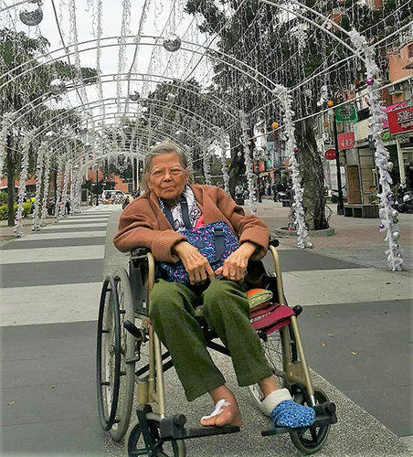

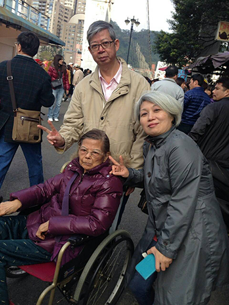

## 啟蒙園地

### 快樂地從共讀發展到獨立閱讀

鄧雅婷

活到老學到老

閱讀習由兒童

方法欲望教材

見地開通未來

小孩從出生後就開始不斷地學習，對我們來說，學齡前最重要的兩件事：中文與玩。我們長期住在美國，每年僅有兩個月的時間可以回臺灣。在美國時，小孩星期一到五從早上九點到下午五點在學校使用英文，平常在家講中文，也許是因為看到許多移民家庭的例子，我們非常重視她們的中文教育。也因為中文與玩的標準，找到了弘明幼兒園，孩子回家的笑容是最好的指標，弘明小朋友的友善以及老師的耐心與愛心，讓小孩快速地融入學校；有趣的再見用語，常常帶給身旁的大人們會心一笑；還有許多特殊的課程，例如；種植蔬果、功夫、歷史，多元的刺激幫助小孩們快速地成長，看著他們興奮地說著自己在學校做的成品，讓我們安心、放心的把小孩送到弘明。我，在美國拿到了教育博士，讀了許多教學心理學，但從沒密切地與小孩互動，直到自己成為母親，與許多父母親一樣，在跌跌撞撞中學習，學習甚麼樣的教學與教育最適合自己的小孩，錯誤從沒少犯，第一個小孩也是我的實驗品，就在這跌撞錯誤中慢慢地成長；下面我想分享過去幾年我們在美國語言學習的經驗，從英文的學習連結到中文的學習，這中間的過程也奠定了我們對中文學習方法與模式。

從英文共讀到獨立閱讀

在美國，從胎兒還在媽媽肚子裡，醫院就耳提面命地告訴準媽媽們要養成習慣跟胎兒講話，從出生開始就要讀故事給小孩聽；小孩出生後，每次小兒科體檢前都要填問卷看父母多常講故事給小孩聽，之前看小孩小沒甚麼反應，我還常常偷懶，後來被醫生問煩了，從老大三個月起決心無論如何，一定要一天至少講一本書，就這樣一直到了現在。親子共讀是語言學習的基礎，我盡量選各類不同的童書，選擇我也有興趣的念給孩子聽，小孩小的時候，盡量用圖畫來講故事，讓他們養成看圖的專注力，也在閱讀當中與小孩互動，讓他們主動地建構故事，而不是一昧的被動接受故事，漸漸到四、五歲開始要學習獨立閱讀時，開始帶入字、讀聲和語言的相關性，讓她們了解圖與文的關聯。

從親子共讀到獨立閱讀是一個大跳躍，中文尤是如此，因為中文表意屬性的關係，下面我要先介紹英文如何跨越這個鴻溝，再來分享我們如何開始中文的學習。美國小孩從大約兩歲半到三歲開始用一年左右的時間學習字母的形狀與發音；關於練習字母的形狀，學校並不強迫這個年紀的小孩握筆，他們讓小孩用一張Ａ４大的紙，讓小孩用不同相關的素材黏貼字母，譬如：Ｃ是用棉花球（cotton ball）填滿一個紙張大的Ｃ，小孩可以學習Ｃ開頭的字有棉花球，並練習小肌肉發展與工具的使用；字母的發音（phonics）也稱為基礎語音教學、字母拼讀或自然發音法，學習字母的發音比學習字母本身的讀音更為複雜與重要，因為同一個字母在不同位置與可能有不同的發音，還有如何將個別字母發音結合並創造一個字的發音，這樣的過程和注音的拼讀有異曲同工之妙，從能發出一個字的音，進而了解這個字的字義，更進一步地發展為閱讀理解力；小孩在熟悉字母字形與發音後，經由不斷閱讀，發展出拼讀的規則，在此同時引進常用字 (sight words)，譬如：the, he, she，這些字熟悉以後，加上拼讀規則，小孩逐漸能開始建立獨立閱讀能力；在這個階段的發展，培養閱讀的自信非常地重要，因此素材的選擇上也是關鍵，重點不是在於閱讀困難的文本，而是在於閱讀比小孩本身能力難一點點的閱讀，在每次一點點的困難當中進步，同時建立自信，讓小孩看見自己的進步，從這樣每次的一小步建構出大跳躍，讓小孩輕鬆而快樂的學習。

發展中文閱讀

在英文學習的過程當中，雖然中文與英文的屬性截然不同，我覺得有許多中文學習可以套用的方法。首先，我要先分享不這麼成功的經驗，在中文學習當中，曾經想過要讓小孩與一般臺灣小孩有著相同的學習經驗，因此我們跟著國語課本，學過一陣子；然而，國語課本的文章過於困難與抽象，就算讀得出來也不見得能了解其意義，此外，課本的字並非依常用字編排，導致從共讀到獨立閱讀時間拉長，較難建立閱讀的自信，學習效率降低。下面介紹三個中文學習可以套用的方法：一、常用字的學習，學習常用字能讓小孩快速且較有效率的開始閱讀，在日常生活當中也漸漸能看懂一些招牌與廣告；二、在小孩建立一定數量常用字的字庫後，可逐漸地使用注音將不會的字漸漸地拼讀出來，增加字彙數量，此步驟應當在使用於已經建立一定數量的常用字後，因為學習中文的終極目標不是會拼出注音而是認得字進而發展閱讀能力，要是讓成人只用注音念一篇文章，大人也會因不斷地拼讀當中，中斷對文章的理解，影響閱讀的樂趣而放棄；三、與英文學習相同，此階段閱讀文本的選擇相當地重要，有刻意地練習 (Deliberate Practice)，選擇比自身能力難一點點的文章，老師與家長給予及時的回饋，幫助了解字音及字義，擴展小孩字詞的知識庫。

玩與開心的學習環

回到最剛開始提到的「玩」，我的學習背景讓我深切地相信，學習動機必須靠自我激發才能長久，並非由老師、父母在前拉著、在後推著才能往前行，人都有表現良好的慾望與傾向，包括我們的孩子，小孩的本能加上能讓孩子融入、享受的學習環境是最有效率的學習，而老師與家長在這樣的環境中，最重要的是如何扮演好輔助、帶領與鼓勵的角色。哈佛大學教授Robert Rosenthal在一九六四年做了一個有趣的研究，發現老師對小孩的期待影響著小孩的表現，他對學生作了一個測驗，並告訴老師說這個測驗可以預測小孩的智商發育，然後隨機選了一群小孩告訴老師說這群小孩之後的智商會有很大的進步，兩年後他再測驗一次這群小孩的智商，發現隨機選出會進步的小孩智商的確有顯著的進步，其主要原因在於老師對小孩的期待，改變老師與這群小孩的互動方式，老師給予他們正面的讚美與詳細可執行的回饋與建議，並給予他們較多時間與機會來回答問題，讓他們學習得更好。

學習中、英文獨立閱讀也是相同的，除了學習常用字、使用發音輔助系統 (英文-字母發音，中文-注音) 及閱讀適合能力的文本，老師及父母親的帶領是最重要的，常常我們在剛開始練習獨立閱讀時選擇過難的文本，閱讀當中不停地中斷，帶領者一直糾正，使得閱讀變得不好玩，不但帶領者教得累，小孩更是沮喪；閱讀教育的目的，除了會讀與讀懂外，更重要的是讓孩子在練習閱讀的過程中建立信心，享受閱讀帶給他們的新知與想像的空間，培養自我激發的閱讀動機，就算沒有人敦促閱讀，也會因為想要閱讀而閱讀，翻開書本，享受其中樂趣。

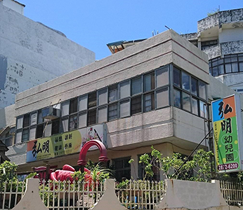

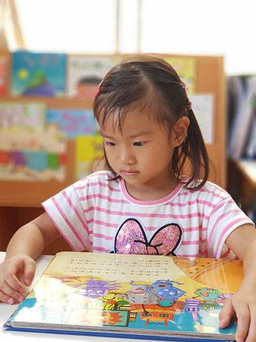

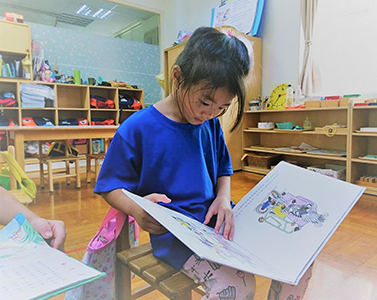

## 活動報導

### 茅茹的暑期輔導課
		—天臺四教儀講座報導

茅茹的暑期輔導課

—天臺四教儀講座報導

慧慈

法欲能請法

講座功能多

招呼亦重要

欲牽入佛智

緣起

今年四月二十一日，淨昌老師伉儷帶著來自日本的貴客-金春花女士，來訪茅茹讀書會，和我們一起研討《佛學概要十四講表述記》及《論語講要》，講到幽溪大師云：中品十善為人道因，上品十善為天道因……。淨昌老師詳細為我們講解九品，大家聽得非常法喜，同時也提出許多問題，請師示疑，但因時間關係，無法深入解答。於是讀書會帶研討的陳老師，深知我們的疑惑，故代我們向老師祈請開講《天臺四教儀》的課程，承蒙老師厚愛，又顧及我們的程度，暫定以六小時略說總綱。

前行

難得的機緣，不能只茅茹學長獨享，開放學會有意者參加，總共二十八人報名，上課時間訂於二○一八年七月七日及八日的二個早上。為達聽課效果，淨昌老師要我們先讀會性法師講述的《天臺四教儀》，又準備了《天臺四教儀科文》作為上課課本，唯恐大家不能進入狀況。除了精神食糧，中壢道場主人還為我們聘請香積大廚，及調配菜單等食輪大事。

上課

一學期課程剛圓滿，來不及放逸，就接續著暑假補習班開課，請來補教界的明師，掏心掏肺，披星戴月，趕出來的簡報檔，開宗明義點出《天臺四教儀》是釋迦牟尼佛的教學方法：頓、漸、秘密、不定的化儀四教，如世藥方；及教學內容：藏、通、別、圓的化法四教，如辨藥味。簡報內容豐富不在話下，歸納整理的功夫更是了得，其中例如：三十七道品說法差異，以會性法師講述與《蓮榮會刊》、《佛學概要十四講表述記》所述列表比對，得知宗派見不同，所論述之觀點則有差異；又如釋迦佛五時的化儀四教簡介，以列表對應，一目了然，說明完畢，還大聲念著：「華嚴兼 阿含但 方等對 般若帶 法華純」，這口訣很重要，要背起來！一定要背起來！然後自己哈哈大笑說，這真像補習班的教法。

下課

下課的引磬聲響，「哦！我不管，我還要繼續講，沒講完對不起你們！」感受到授課老師傾囊相授，恨鐵不成鋼的心願，好像呼喚著：「革命尚未成功，同志仍須努力！快起來，往前衝！往前衝！」

徐師伯伉儷專程從東勢來上課，不但上課還兼護法，一早就削好水果，煮水梨湯……。下課時間雖短促，大家快速補充許多愛心能量滿滿的點心，待會上課又是一條好漢。

加課

第一天為講完一段落，一氣呵成到下午一點，結束時彷彿從天界回到凡塵，「啊！該吃飯了。」剛剛全神貫注，悠遊在聞法的喜樂，完全沒有餓的感覺，想到「禪悅為食」的境界，不知有多美妙！

第二天，索性大放送，為不耽誤大家用餐時間，準時下課，午餐後繼續加課，上到科文終了。二天總共花了八個半小時，將整本科文以大綱重點式講完。

叮嚀

課程結束，才是學習的開始，交代暑假作業，請大家注意：

一、要讀完會性法師講述的《天臺四教儀》。

二、《天臺四教儀科文》隨身帶著，如好友相隨，隨時請教。

三、有不懂處，就回頭去翻曾經學習過的相關教材，翻久了就是你的。

四、「三十七道品」請參閱《蓮榮會刊》第九十一期-九十三期，及《佛學概要十四講表述記》第十一講表。

五、「五停心觀」請參閱《蓮榮會刊》第七十期的小止觀導覽，及《明倫月刊》第四百五十六期。

六、《修習止觀坐禪法要》、《天臺宗綱要》、《教觀綱宗科釋》資料都給你們了，自己看著辦。(有志傳承教法者，這三本都要能講。如果只是自修者，最少要懂《修習止觀坐禪法要》。)

這不知是幾個暑假才能完成的作業喔？

護持

感恩小舅媽、鄧先生及雷妮為我們準備色香味俱全之午餐，有如來自香積國的甘露味飯，其香味普薰三千大千世界；並感謝學會及多位學長提供食材、點心及拿手菜；至於課前準備茶水，餐後洗碗，課後整理環境等事，茅茹學長們都分工合作，使命必達；感謝來自東勢、臺北的蓮友共襄盛舉，有朋自遠方來，不亦樂乎；感謝整個團隊和合運作，講座得以順利圓滿。

心得

一、教法上

教師諄諄誨，學子茫茫心，作業多多多，努力細細讀。吾生也有涯，而知也無涯，三藏十二部浩瀚無邊，佛法無人說，雖智莫能解，感恩世昌老師無私傳授多年學習的秘笈，學生才得以初識天台之略貌，省卻許多摸索的日子。

記得過去初上《佛學概要十四講表述記》，講到四諦十六行觀、減緣減行、七賢四聖……，簡直雲深不知處，經過這次上課，總算撥雲見日，希望再加努力，等待萬里晴空。

又幸得正法團體，善友為依，如「蓬生麻中，不扶而直」，竊竊慶幸，往昔曾造的善業，今得善知識垂憐，惟師父領進門，修行在個人，再堅強的師資、團隊，自己若無好樂學法的心，師末如之何也已矣！所謂「我欲仁，斯仁至矣！」

二、生活上

中壢道場一家人待客之道，實在細膩周到，足為典範，從安排遠客來上課的座位，回去的伴手禮，上課道具的準備，環境舒適的微調……，無不令人動容；每一次到佛堂，黃師伯必定親自泡茶招待大家；要回家時，孩子們熱情邀約「明天再來喔！」若非長輩的身教，孩子何來的複製？教法已成覺受，可任運生起，方為學佛的真諦！

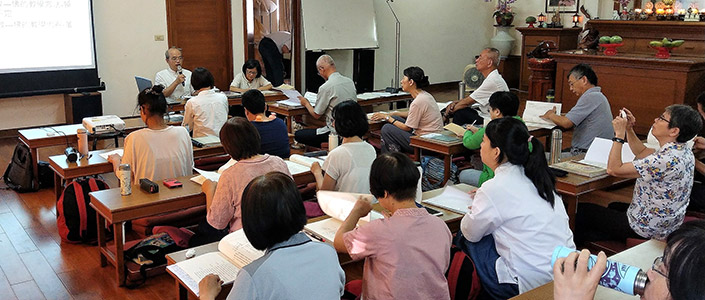

### 天臺四教儀講座心得節錄

茅茹讀書會

法待人說興傳承

化繁為簡綱領契

五時化儀與化法

一代時教了然心

為期兩天的「天臺四教儀」講習圓滿了。首先感謝老師的慈悲，淨昌老師帶領大家由此而進入「天臺」的殿堂，對佛門宗派見有更深一層的認識，使學佛不致於是從表面學，抑或是「餬粥」的不正見。

一個講座總是要諸多因緣具足方能成就，主講老師在課前兩週，先提供大家先行參閱會性法師的「講記」，並且將「科文」講義印行發給上課學員，讓大家有一個初步的認識，能作好學習的前行。凡事「豫則立」，使學習者在聽課之時，能對照出預習中的「不懂」或「錯解」之處，以收事半功倍的效果。

學生此次拜讀 會公講記，於文中看到「名、句、文」的細膩解析，而且結合時代的語言，復以思維邏輯的套路，予人有「柳暗花明」的驚喜。會公言：「四教儀是研究中國佛教教義的入門書，欲知中國佛教，若不懂天臺四教儀、賢首五教儀，便無法入中國佛教之門。」深感吾等福報之大，更重要的是能得有傳承的教授善知識指導，方能引領有情破迷啟悟，而體會世尊一代時教的本懷。

誠如講義「緣起」中敘述此文的由來，以吳越王確有求法之心，因研讀祖師著述生惑，遂感得遭毀佛之難，喪失殆盡的教藏，在數百年後能從他國再禮請回中土重現，實是不可思議，可見由國家領導人領導有情有感，而三寶必應；而此又與天臺集大成者智者大師創放生池有關，在「道因教苑遺事」有載，這放生的法行殊勝的功德莫過於此。然法無人傳無人說，教法不能住世，故關鍵還是「在人」，天臺後繼者的傳承不斷，使天臺教部回來後，能得淨光大師中興教門。今日吾等得聞此教義，更應效法大德們法門無量誓願學之心，而遂成佛道度生的大願。中興以人才為本，高足必得有明師，今時吾又恭逢其盛，既已遇明師，肯「承擔」乎？

所謂「獨學而無友，則孤陋而寡聞」，此次參加講座的有臺北道場的善知識，中壢道場蓮友，還有茅茹讀書會的蓮友們，大家齊聚一堂切磋琢磨，課間提出的「利樂有情問」，讓與會者能感受到以現代的言語，契入古德的旨趣；再加上主講老師的「減緣減行」的講學，將會公四十四講次的內容，還有老師曾講授三次的內容，如是「化繁為簡」的在六堂課中，令大眾法喜充滿，猶如輕舟過萬重山，才不會有「大道以歧路亡羊，學者以多方喪生」之憾。感謝善知識們的莊嚴道場。

此次講座「聞一得三」，於講義中的科判架構，就是「正明時教」「略示觀法」，完全呼應《教觀綱宗》的「佛祖之要，教觀而已矣。觀非教不正，教非觀不傳；有教無觀則罔，有觀無教則殆。」此其一；再者是複習「佛學十四講表」，「知病」的第四至第七講表，「予藥」的第八至第十二講表，會歸到第一講表的成就佛智，實乃一代時教的宗經論；第三是藉由「四教頌」中化法四教的行位因果，解析「淨土十疑論」中的微言大義。感謝講座老師的引導。

老師於講座期間是全程「監控」，非常關心大家學習的心得，應是期許吾等未來人生能走得很風采、很莊嚴、很殊勝、很尊貴，將所學習的正見成為寶珠繫衣，而且將擁有的寶物，變成人生富貴的資糧，藉此見地可以讓他人從汙泥裡面出來，而成為他人的貴人，藉著正見來修福修慧，帶給你未來的人生是康莊大道，路是越走越寬。學生在此以感恩的心頂禮　老師的大慈大悲大喜大捨。

每次的講座都是在法上的結緣，嘗聞「未成道前，廣結善緣」，為什麼一佛出世千佛護持？就像《法華經》的聖者，原來都是因為生生世世因地當中就是結善緣來的，才知過去的結善緣有多重要！這種結善緣成為滅法，後面所結的果，世間人是說不清楚的，「唯佛與佛乃能究竟」，簡直不可思議！

啊！巍巍乎，蕩蕩乎，奐乎其有文章！

林藏忠

日本金學長四月來茅茹讀書會時，課間曾提及修學佛法須具宗派見，其中【天臺四教儀】是必備的要件。因此生起祈請老師，指派師長在暑假期間，開講【天臺四教儀】的因緣。

淨昌老師用心製作圖表，精闢扼要的開解五時八教，以「華嚴兼、阿含但、方等對、般若帶、法華純」這五句話，將蕅祖的【五時八教權實總圖】，說的淋漓盡致，並一再叮嚀務必背起來。講到「三十七道品」時，還不忘囑咐要看會刊整理的「極樂世界的脊椎骨三十七道品分析」。

經過這兩天六個小時密集的聽聞，解開了多年來在研習佛法上的一些疑惑，如既然都是佛說的教法，為什麼小乘是不了義，固然小乘人證但空入偏真涅槃，甚至被佛斥為焦牙敗種，在在皆為不了義之理由，但這只是結果的其然，之所以如此的所以然又是如何？又如三資糧，四加行，四諦十六行觀，十二因緣觀等名相，雖在【佛學概要十四講表】課程上略知一二，但僅止於字面上之其然，對其通於四教教理之所以然，卻仍然是一知半解。再如人我執、法我執之行相及其破除法，與煩惱障、所知障之行相及其破除法等，在「唯識宗」與「中觀宗」之詮釋上，其差異為何如此之大，且關係著對空性理認知上之矛盾，甚或對空有之融貫，一直都是一知半解，久久不得其門而入。

這一會對學生而言，是非常重要的啟蒙課程，且來的正是時機，趁著世昌老師所講述的法語餘音，尚在繞樑之際，利用暑假期間，用心把世昌老師所推薦的會性法師講述【天臺四教儀講錄】，細細的研習，期望對【天臺四教儀】之建構及其概念，能有初步之認識，始不負尊敬的老師和諸位師長的恩德、厚愛及期許。

張忠敏

天臺之名雖曾聽聞，但對天臺藏通別圓四教是很混亂搞不清楚的，也沒有興趣想要去多了解些，總認為那是天臺宗的理論，而我是淨土宗應該可以不用去多加了解，所以上完課就已經過去了，可能以後也不會再接觸了，真是一個無知又小心量的佛教徒。

這次多虧開了這堂四教儀的課，在一個月前就預告大家先有心理準備，把時間空出來好好學習，本以為利用這兩天就能把天臺四教搞清楚，哪知課前主講老師就傳會性法師在屏東上課講的資料，傳給我們看，當時真的被嚇到！怎麼內容這麼多，不是只有藏通別圓四教怎麼還有化儀四教，還有五時八教等等一些看不懂的名詞，真不知從何下手，資料又很多，要在開課前根本看不完，想要抓重點看又不知哪裡是重點，當時真的很茫然！

第一天上五時八教還可以理解，接著化儀四教：頓、漸、秘密、不定，就是佛度化眾生的方式，這就比較少聽到但還容易懂，第二天講化法四教，也就是佛的教學內容：藏、通、別、圓，這常聽但不很明白，主講老師尤其是把很複雜的地方用圖表分類整理出來，讓我們大家一目了然，很容易看得懂又好理解，主講老師準備了一二七張投影片，我們只上到七十幾張，時間真的不夠，後面沒上到的就變成我們的暑假作業，這個暑假還真的是很忙，很多功課要複習，真是充實無閒的暑假。

看了會性法師講稿，真的很佩服法師，他不只是講天臺四教儀，他幾乎是在講整個佛法理論，經文有講到的佛學名詞及佛學概念，他都分別解釋，講的很清楚，只要用心仔細去看是可以看得明白的，但是要花很多時間、精神和精力，若要真的看懂，還須老師再開解，或是大家再互相研討，不然還是很模糊、很難通徹了解的。

能夠在這樣短的時間，把整個四教儀為我們講清楚，真是難為淨昌老師了，他雖然緊緊把握時間一分一秒都不浪費，甚至加班加時間為我們講解，還整理了好背好記的重點，讓我們快速記住，以防老師抽背考試，真是用心良苦。（沒辦法！遇到我們這群笨學生，不想多花時間又要快速學會，真的很難為！）

這次課程真正不好理解的部分應該是化法四教藏、通、別、圓之分別比較，但是我們時間不夠只講到藏教的一部份，藏、通、別、圓四教的關聯性對比性還沒講到，我個人覺得這部分比較難弄清楚，也覺得這是比較重要的部分，很希望能再開幾堂課把這部分弄清楚，這個暑假也是要來努力這個部分的，但是很擔心憑我的能力要自己弄得懂還是很困難的，期待能再開課把這部分好好弄清楚喔！

最後還是要真心感謝老師答應我們的祈請，請兩位老師幫我們上天臺四教儀的課，讓我的眼力打開心量擴大，真的想從業餘走向專業，好好的專研佛法，這也是我唯一的出路了。

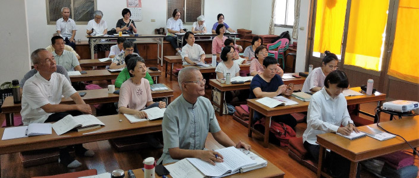

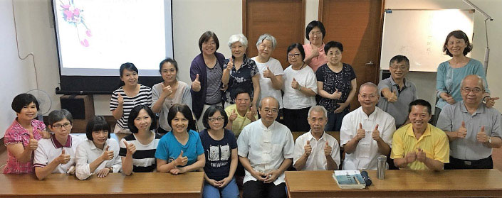

### 溈山大圓禪師警策文講座報導

心筑

雄鎮溈山是肉人

香積廿年才出頭

一腳踢破淨瓶後

識得出塵大丈夫

學會尚未正式成立之前，曾於一九九九年臺灣九二一大地震時，募款賑災並提供當地學子獎學金，宣講《勸發菩提心文》，將善法結合正確因心，累積成佛資糧，將來成就諸佛讚歎的威神力；隔年依著成立學會的因緣，緊接著宣講《溈山大圓禪師警策》，並將多年前依會性法師講錄的錄音謄稿整理成為教材，期許能秉持成立道場初心，真正辦出利益世道人心的事業。

二○一○年二月，會性法師於屏東普門講堂方丈寮之書桌前安詳坐化，為緬懷這位精通天臺的三藏法師，學會當時就在苦無適合場地，於最艱難動盪的狀態中，以六個晚上，借用場地宣講此警策。

今年夏天(二○一八年)，共有兩次宣講此警策文的因緣。一次是福建國學堂，面臨改組變化，學會決定先行撤回派駐學長，在離榕之際，以此警策文，鼓舞當地師資與義工士氣，勉勵大家繼續學習。後因馬來西亞鄭先生與兩位陳學長同時來會學習，為讚彼求法熱誠，故臨時開啟了第二次的講座。

本警策文乃溈仰宗祖師溈山大圓禪師所著，祖師撰文之時，湖南溈山已是一千五百位僧眾的大道場，見到僧眾老中青三代共處，或有名為老參卻無力對治煩惱者、忘卻初發心者、迷失名利者、道心退失渾然不知者，新學者仍懵懂無知，祖師擁有著強大的願力與廣大的心量，知道唯有般若教法和戒法能解決自他煩惱，樹立清淨的道風，成為真正的修行叢林。

長行文中主要分為教誡與示法，教誡當中先顯示色身大患，直接提出世間的無常真相，接著懲出家流弊，既然決志要出離煩惱之家，披上了法服，要知道違俗入道的真正原因，要避免名利失道，不要日子一天天的過，受用又多又好，卻沒有好好地反省改過，進道嚴身。必須將戒定慧三學時刻措於懷中，方易契悟玄道。

如果不好好在道上努力，年紀越來越長，空腹高心，沒有內涵又沒有可以歸過勸善的朋友，隨自己心意說話辦事，沒人能約束，不但自己觸事面牆，後學來請教、詢問，也無法以經典內涵接引後學。最後等到業果時熟，或生病、或臨終時，種種痛苦縈纏逼迫，此時才知道後悔浪費了這樣殊勝的福報，沒有早早開始努力修行，最後只好隨業在三界中不斷輪迴。

教誡的最後結語，祖師感傷的說自己抱著哀憫懇切之心，希望大家不要愛惜面子，要好好面對自己的懈怠，面對從未真正搞懂的生疏佛法，做一番改變。

教誡之後就是示法，先闡明出家正因，修行人，下手處就和一般人不一樣，目標是為了傳承教法，為了對治煩惱，為了報恩和救拔眾生，令眾生也能真正離苦得樂。

為了確立自己修行的初心，祖師用了很精闢的字眼來勸勉大家，若不如此，濫廁僧倫，言行荒疏，虛霑信施。昔年行處，寸步不移。恍惚一生，將何憑恃。

依著宿世莫大的善根福德，才能於今生感得容貌極為可觀的堂堂丈夫相，且有深入學習正法的因緣，怎能端然拱手，不貴寸陰，一生空過，未來也沒有任何保障。

所以要好好提醒自己，不可以耗費光陰，要期許自己成為棟樑之材，並且成為後輩的榜樣，言語要和經典內涵相應，行為上需講究威儀，看重自己。

外緣上須謹慎選擇同行善友，能一起共學，也能互相歸過勸善，跟善知識在一起，就如同在霧露中行，雖不至於將衣服明顯的打濕，但是是時時能夠潤澤。但是如果親近惡知識，不但長惡知見，這一期生命現象結束之後，更易萬劫不復。祖師的文章讀來極有韻味，含意深遠充滿懇切，文句簡要優美又易於讀誦。後輩研讀此文，豈能不好好反省，自我砥礪？

示法當中第二段，緊接著的是顯示入道途徑，入道途徑有二，或可透過參禪（祖師禪）或可透過學教（如來禪），從聞聲見色上，探究心境之間的關係，抉擇並進入空義，或依止善知識的教導，或於教法留心，在末法時期，不要小看一起學習的法侶，共同學習共同辦事，互相要看順眼，彼此相勸行持步步昇進。這樣的學問既紮實又能自他雙贏，成為三界的人天導師，是善知識喜愛攝受的對象，且能成為眾生依靠的對象。

如此的人生才是有意義的人生，不空過的人生，不愧對善根福德的人生，也是未來增上或往生的最好資糧。今年暑假雖因兩岸種種外交政策影響，停擺了幾個預定成行的活動，有幸再次研讀此篇警策文，期望對於福建國學堂的師友們，對於馬來西亞正法的推展，對於學會本身蓮友們道心的提醒與反思，各地正法的推廣，都有正向的影響。

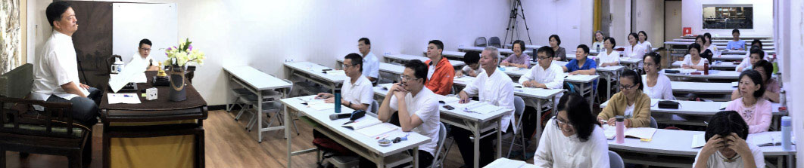

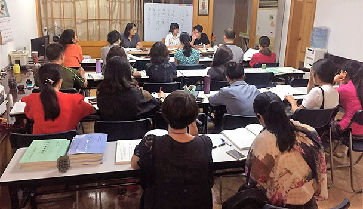

### 畫語自天然
	 ｜陽光畫園與紙飛機遊學寫生課堂

畫語自天然

｜陽光畫園與紙飛機遊學寫生課堂

心筑

親子旅遊是風潮

結合學習方有獲

文化民俗大自然

心得繪畫心靈豐

二○一四年春天，學會舉辦了蘇杭放生之旅，認識了導遊楚穎（小楚），小楚提及她在二○一○年夏季，看到了「孤獨星球」上的一篇文章，作者描述自己在黔東南某個偏遠村寨生活的日子，認識了來自五湖四海的各路外國兄弟們。小楚當下就決定獨自前往探索，並以十五天的時間，走訪了二十多個只有泥路連接的偏遠村寨，她說她除了看到苦難中的樂觀堅強，及泥濘中令人肅然起敬的生命力。而最關鍵的受用，是作為一個旅遊從業人員，她了然旅行的真諦。從此之後她開始著手思考如何幫助他們改善貧困的狀況，以一連串的項目，幫助城市孩子也幫助山區的孩子與家庭。

總之，在小楚的感動中，我們也在二○一七年組團前往貴州，參訪當地苗族文化。並邀請小楚與夫婿張波，在二○一七年暑假，擔任學會與至聖孔子基金會合辦夏令營的師資，課程結束後，與學會一同前往南投，在南投天空的院子裡領略鄉下夏日的星空和佈置的巧思，遊覽了東勢小鎮，也在農地唱歌、聊天，小楚開始在內心籌畫組團來臺灣的文化學習之旅，不走尋常路，通過遊覽、文化體驗、在地交流等方式，帶領大家從不同角度感受臺灣之美，期待與學會師友們的深度互動，真切體會平和、幸福後面的人生觀與價值觀。

二○一八年八月，杭州紙飛機行走教室與陽光畫園的師生，首次踏上了臺灣的土地，而領隊呂芳老師已先行抵臺確認所有行程與相關事務，此行人數雖僅有十六人，但是大家還是想要成行，他們設計了Ｔ恤、帽子和背包，整齊又充滿朝氣的出現在松山機場。在紙飛機的公眾號裡，記錄著第一天的行程：「夏末初秋，蟬蛻不啾，我們開啟了陽光畫園遊學寫生第十七站—發現臺灣之美之旅。對臺灣最初的印象源於電視：軟糯的臺灣腔介紹著這座繁華而有序的城市。今天，我們帶著憧憬，懷揣興奮，開始遠行。早上七點的機場人還不很多，沒有太多的囂鬧，我們卻早已按捺不住激動的心情，接機的呂老師，以及和善熱情的在地人劉師伯和劉師姑，為遠途而來的我們準備了第一份禮物—正宗美味的臺灣珍珠奶茶。住宿的行旅有個特色，速食麵、小零食隨意吃，遊樂項目隨便玩。這可讓我們的小朋友們樂開懷了，剛一到賓館，行李還沒放好就已經玩得忘乎所以。

想像中的臺北，高樓林立，車流喧囂，人聲鼎沸，總覺得應該和大陸的很多大城市沒有太大區別，但眼前的臺北卻繁華而又安靜，和善而又熱情，讓人吃驚、震撼。旅館、大街、過道、扶梯、捷運，各處的人們都輕輕說話，靜靜做事；馬路上車來車往，可幾乎聽不到大陸城市中響不停的喇叭音；所有的機車都排列有序，扶梯上的人們總是秩序井然一律靠右；遇到的人都彬彬有禮地和你問好或用真誠的微笑向你致意。沒有深入這個城市的角角落落，僅僅是淺淺粗粗的幾瞥，已經讓我們對這個城市油然而生好感。

臺北，你好！」

這個行走教室，一開始就標榜不走一般觀光路線，小楚與張波在去年暑假來臺灣的時候，見識到了臺灣的垃圾分類，每一家都遵守規定，有序的把已分類好的紙類、塑膠類、瓶罐類，以及廚餘、堆肥，和須購買專用垃圾袋的家中垃圾，在指定時間、地點，等待三台垃圾車到來。晚間九點半垃圾車準時停在學會門口，可以看見張波興奮的看著倒垃圾的場景，小楚腦子裏面想像著可以當作一個很好的學習課程。然後，有了第二天一早到慈濟學習資源回收的行程。

第二天上午的行程：「今日來到臺北慈濟環保站，還未到門口，就有好幾位老者出門迎接，他們臉上洋溢著熱情的微笑，剛進門聽見悠悠佛教梵音，頓覺一片靜謐祥和。這裡沒有像我們想像中彌漫著垃圾的臭味，相反整理規劃得很清晰，一位老奶奶正在給不同的塑膠袋進行分類，還有一位白髮蒼蒼的老婦人，坐在矮凳上有條不紊地撕回收的一本舊書，再將一頁頁的紙張投進籮筐，據說這些塑膠袋和紙張均可再利用生產出新的物品。解說的老師告訴大家：這些退休老人均是志願者，想於晚年發揮餘熱，有的已經志願工作十幾年，有的甚至幾十年。他們做垃圾回收分類，不為利益，而是發自內心地希望能為保護地球出一份微薄之力，更希望自己的子孫後代能生活在一個乾淨整潔的環境之中。這樣的願心和行動真令人肅然起敬。

在最後的分享會上，同學們也說得非常好。垃圾分類，從根源上講，要減少垃圾的產生。比如我們不買礦泉水，出門帶水杯，就會減少塑膠瓶的產生；不用紙巾，隨身帶手帕，就能保護樹木。做環保，除了要淨山、淨海，更要淨心田。

臺灣行第一站去環保站，去認識垃圾分類，是希望讓大家心懷保護地球之心。在寶島充滿人文素養與文化底蘊的環境中，我們的目光仿佛變得更加明晰，心靈變得更加清澈。」

第二天下午，至臺北藝術大學寫生，先參觀了位於校區內以當地藝術創作為主的關渡美術館，這些表現形式在孩子們的眼中是最有趣的樂園。陽光畫園的師生們在樹蔭底下寫生，將眼底最美麗的景色畫出來。

第三天上午，至學會聆聽老師解析「富春山居圖」，學唱臺灣童謠，下午則參觀故宮博物院，而弘明讀經班的二十位小朋友也共同參與了上午的課程。講述作者黃公望的傳奇生平和這幅畫所經歷的千年故事。課程從歷史上的富春江、文化上的富春江、筆墨紙硯上的富春江，娓娓道來這幅名作相關的故事。隨後，賞析《富春山居圖》，從大陸借展的剩山圖到無用師卷，一步一步走入畫中，走入畫者一生絢爛歸於平靜，沉靜又悠遠的心中。

臺灣童謠，具有本土氣質和傳統精神，旋律雖然簡單，但是對於來自杭州的小朋友來說，閩南語的發音是有難度的。

下午前往擁有近七十萬件古物中極品的臺北故宮博物院，銅器、瓷器、玉器、漆器、琺瑯器、雕刻、文具、印拓、錢幣、繪畫、法書、法帖、絲繡、成扇、善本書籍、清宮檔案文獻、滿蒙藏文文獻，以及包括法器、服飾、鼻煙壺在內的雜項等琳瑯滿目，如果每三個月換展一次，三十年都展不完。

這些文物之所以可觀，是因為中華文化可觀，處處可見文化道統，器物有道、書畫有道、文字有道，有內涵有創意，這個從小學開始的戶外教學場所，到長大之後參加學會舉辦的各項故宮精彩特展，到細細品味策展人的巧思。一場好的國民外交，從認同自己的文化，瞭解文物具備的內涵開始，是最好跟陌生人結善緣的方式。

紙飛機的老師們和陽光畫園的師生們，隨著導覽的腳步，足足站了三個鐘頭，年僅六、七歲的小孩子們不但不煩燥，認真聽講且有疑即問，落落大方又天真可愛，是未來可期的一群孩子。

名符其實的行走教室，紙飛機的老師們精心佈置任務，諸如第三天上午坐捷運（須轉車）前往誠品松菸文創，抵達之後要在有限的資源內採買給父母師長解飢的食物，靜靜的在書店內翻閱立體書等待父母師長逛完街。離開誠品之後他們前往三義ㄚ箱寶，進行木藝彩繪，成品極富創意，細緻精美，有好幾件作品被老闆拍攝當作宣傳品呢！

住進了東勢的民宿，小朋友們抽空完成旅行日記，大人們圍爐夜話。旅行日誌中寫著：「終有一天，我們要離開父母的溫暖庇護，找尋自己的天空。在這之前，唯有努力讓自己的羽翼豐滿。所以我們不斷嘗試新事物，不斷邁出新腳步。

和小夥伴溝通、異地問路、買票、換乘、自己購物、學著DIY，這些在成人看來再簡單不過的小事，對小朋友來說都是新的學習，新的突破，新的進步。循著這樣的一步一個腳印，孩子們逐漸長大，漸行漸遠......」

臺中東勢是小楚指定必訪的地方，這裡是充滿溫情步調緩慢的客家小鎮，也有學會經營的實栽農園，可以感受到臺灣最質樸的原鄉之美。今天，換父母睡懶覺了，早晨時刻，小孩子要負責親手包飯糰給父母們享用，結合當季水果（到東勢怎麼能不吃水果？），民宿主人現磨的熱豆漿，蛋黃酥，還有小鎮特有美味燒餅，這個早晨，父母有滿滿的幸福感。上午的行程是逛菜市場，體驗當地生活，並且採買晚上農地燒烤的食材。日記中描述著：「東勢很小，但人很善良很暖。一路上不斷有人和你點頭微笑致意；大家落落大方地面對你舉起的手機攝像頭，甚至主動邀你去拍照；熱絡地和你攀談去過大陸的哪裡，還有人告訴你她正在追大陸熱播劇延禧攻略；所有遇到的人都衷心祝你玩得開心旅途愉快……風景的美愉悅你的耳目，人心的美則感動你的內心！」

之後參訪坐落在鬧市裡的巧聖先師廟，裡面供奉著兩千五百多年前的工匠暨發明家—魯班，廟中主委為大家一一解說，此廟木雕精緻，巧奪天工，令人讚歎不已，小朋友也現場解起「魯班鎖」。接著前往土牛客家文化館，讓大家瞭解這裡的建築、歷史典故，民俗風情等，緬懷先進開墾的辛苦，創業維艱，守成更難，為後輩的典範。

午間稍事休息後，便至實栽農園參訪，搭土窯控地瓜，採摘成熟了的有機蔬果，烤爐生火、洗菜、串肉，孩子們在旁奔跑，食物陸續上烤架，大家圍坐烤爐邊，邊吃邊聊，邊聊邊吃，自在享受鄉村慢活的氣氛。

「東勢，這個寶島的水果之鄉和客家小鎮，安靜恬然，充滿溫情。無論是民宿的老闆夫婦、學會的師伯師姑，還是菜場的菜農、買菜的居民、晨練的人們，無不彬彬有禮，微笑迎人。他們的舉動，讓人舒心而放鬆，真有賓至如歸之感。

遊學不獨觀景，只為耳目的愉悅。遊學還要學習，去熟悉一地的風土人情，去瞭解一處的人文地理，更重要的，是要在旅途中接觸、觀察各種各樣的人們。通過接觸、觀察和體悟三省吾身，反求諸己，不斷陶冶自己的心性，努力做更好的自己。

願我們都能像東勢小鎮上的人們，一直保有熱情、善良、微笑！」

東勢鎮的短暫停留，接著安排了臺中自然科學博物館，在擁有多種生態的高美濕地，小朋友們用他們自己的角度將周邊景像描摹出來，栩栩　如生。不知不覺就到了夕陽西下，伴著餘暉回到臺中，在逢甲夜市享受當地夜生活的熱鬧，品嘗各式各樣的臺灣小吃。

行程的最後一天，驅車由臺中直往臺灣最北的野柳地質公園，車程三個鐘頭，學會師長大展身手，教導大家吟唱唐詩，舉凡王之渙的「黃鶴樓」、王維的「長相思」等，之後大小朋友們都拿出絕活，歡聲笑語中很快地就抵達野柳，我們從小就極為熟悉，世界級景觀區，經由千百萬年侵蝕、風化的地質奇觀。小朋友們興致盎然的仔細聆聽導覽人員親切又詳盡的導覽，接受任務，尋找著名的各類奇石，並繪製下來。

「蜂窩石、燭臺石、豆腐石、蕈狀岩、鯉魚石……綿延羅列的奇特景觀，讓每位來訪者眼界大開，嘖嘖稱奇。我們讚歎大自然的鬼斧神工，卻也應知，沒有千萬年的海蝕風化之功，便呈現不出現在的一方勝景。我們讀書、習畫、寫字，甚至做人，其實亦然。有聚沙成塔的累積，有鍥而不捨的堅持，才能厚積薄發，才會有極致美的呈現，才能成就最完滿的自我。」

在臺灣的行程已畫下暫休止符，杭州的小朋友們帶著滿滿的回憶回去，這是一場有別於觀光行程的學習之旅，帶著孩子們成長，給他們最豐厚的資源，讀萬卷書行萬里路，未來必是精采可期，對我們而言，也是一場成功的兩岸交流，期待後續更多美好因緣的開展。

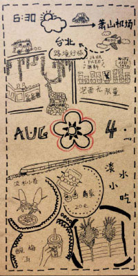

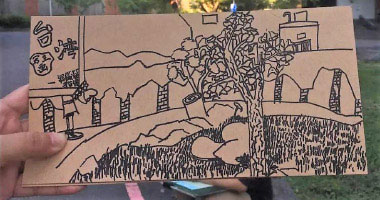

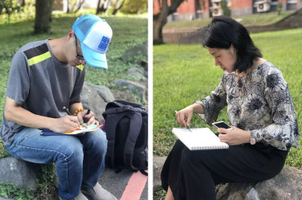

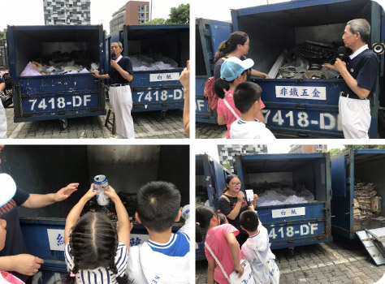

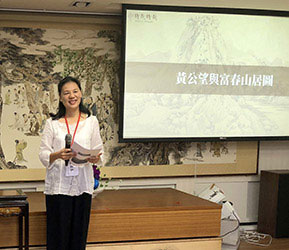

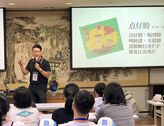

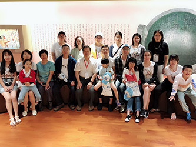

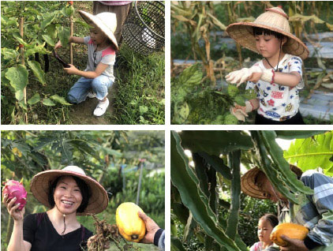

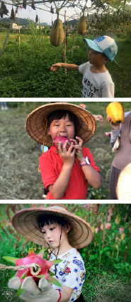

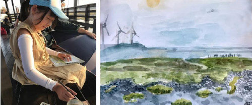

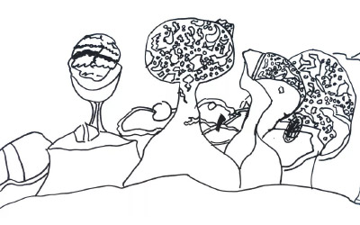

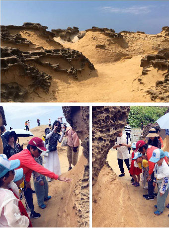
