# 第118期

## 本刊社論

### 如理祭祀祭祀如禮

*編輯部*

非鬼祭之諂邀福

主祭不誠難受福

託人來祭如不祭

誠敬感應真祭祀

死後的世界對人們來說，始終披著一層神秘的面紗，在佛教的人生世界觀裡，透過六道輪迴、十二因緣的理論，把過去現在未來的一切，說明得非常清楚；儒家雖然少言此事，祭祀也始終為孔子所重視，甚至被認為是五禮當中最吉祥的禮節。祭祀的對象是誰呢？無非是死去的先祖、山河大地的神靈，換言之，就是死去的人，自家祖先稱為鬼，對國家社會特別有貢獻者稱為神。祭祀要講究對象、時機、地點、方法等種種細節，當然還有心態，所謂「祭如在，祭神如神在」，當一切條件無所不備時，就能在祭禮中展現出孝道、家族和諧、報本還恩，更能得到鬼神的加被。反之，若有對象錯誤、禮節不周、心態不正，不僅無法彰顯任何意涵，更難望可以獲得到任何福報，怎麼能不謹慎小心呢？

先論對象，孔子說：非其鬼而祭之，諂也。鬼既然是指自家的祖先，跑去祭祀別人家的祖先，求福求加被，這就是一種諂媚的心理，況且別人家的祖先對我們也沒有任何恩德，為何無故祭祀他呢？我們不是他的後代子孫，他又為何要加被我們呢？所以這種違背禮節的諂求，一點益處也沒有。

正確的對象才能產生正確的心態，想望祖先過去的恩德，自然生出感恩的心；觀想祖先就在眼前，才能生出恭敬的心。祭祀就像一場盛宴，宴請我們的祖先與會用餐，試想一般在請客用餐時，主客親臨，主人不在，那將會是多麼尷尬的場面；祭祀若得鬼神來受饗，主祭者不在，鬼神怎麼能夠開心受供呢？所以孔子說吾不與祭，如不祭。這種主祭者不在場的祭祀活動，就等於沒祭祀一樣，家族薪傳的恩情，只能自家子孫才能致祭表達感恩，必須自家子孫主祭，沒有任何人能夠代理。

祭祀鬼神求福，還有一項重點在於平日的為人，忠信篤敬之人，才有忠信篤敬之鬼神賜福，否則獲罪於天，那要向誰禱告呢？孔子曾有一次生了一場重病，與孔子最有革命情感的弟子子路，就為孔子向天地神明祈禱，而後孔子病情好轉，得知此事，就詢問子路是否曾經為他禱告？子路承認有此事，並且引用當時的成語回答孔子：「禱爾于上下神祇。」也就是要向天地神祇禱告。孔子聽聞後告訴子路，我禱告已經很久了。不語怪力亂神的孔子，難道天天都在向神明祈禱嗎？其實不然，孔子的意思是，他平時言行純善，不會違背天地神明，這就是最好的禱告。

儒家的祭禱或者佛門中的法會，至今仍然十分盛行，興辦者、與會者，無非是希望能把意義彰顯，能讓鬼神賜福。但意義不在場面大小，賜福與否，更要後代子孫本人至誠為之，也唯有平日懂得斷惡修善，才能真正趨吉避凶，以上重點如果不能掌握，無論場面有多隆重，祭品有多麼豐盛，恐怕祖先或者神明也不敢受饗，只會累壞了大眾，最後換來一句：「嗚呼！曾謂泰山不如林放乎？」豈非白忙一場。

## 佛學覽幽

### 菩薩清淨的行持
       —華嚴經淨行品（三十四）

菩薩清淨的行持

—華嚴經淨行品（三十四）

*戒慧講述‧編輯部整理*

人才聚集全出路

獨立自了難修福

慧力極限僅出世

善巧能令福慧足

丙二、指事顯因答其徵因

丁一、總徵

丁二、別顯

戊六、乞食道行時願(五十五願)

己二、所睹事境(十九願)

己二、所睹事境 叢林

經文：

若見叢林，當願眾生，諸天及人，所應敬禮。

以下依願所依、願所為境、願境成益這三件事情來解釋。願所依就是願依靠在菩薩身上，另一個願是依靠在若見叢林；願所為境當中，能發願的是菩薩，所發願的是眾生。願境成益當中，益他的部分就四面相來闡述：隨喜、發願、承擔、祈求三寶。隨喜：若眾生都能成為諸天及人，所應禮敬的對象，該有多好；發願：但願眾生都能夠成為諸天及人，所應禮敬的對象，該有多好；承擔：我願意幫助眾生成為諸天及人，所應禮敬的對象；祈求三寶：我祈求三寶加被，讓我有能力幫助眾生成為諸天及人所應禮敬的對象。

若按照南亭老和尚〈講義〉中所說的願境成益，眾生都能得到諸天及人禮敬，而菩薩也可以得到天人的恭敬，此菩薩也可得到佛的功德，並以最殊勝的形象(十種面相)去成佛。

《大智度論》上說，多比丘一處和合，是名僧伽，譬如大樹叢聚，是名為林。《大莊嚴論》上說，眾僧乃勝智之叢林，僧團聚會一處，就好像有智慧的聖者聚集在一起。《禪林寶訓》譯，叢林二字係取其草木不亂生長之義，表示其中有規矩、法度。〈疏鈔〉云：德猶叢林，森聳可敬。叢林如茂盛之樹木，樹木非常高，比喻眾多德廣的士夫所聚之道場。

外在的叢林﹐比如到了溪頭、杉林溪，感覺非常幽靜，清晨起來時雲氣繚繞。但更重要的是人才的叢林，取其人才的聚集，那是真正讓人可敬的，例如印度的那蘭陀寺，能聚集廣大的人才，此時連外國人(玄奘法師)都想去參學。

觀光二字出自於觀卦(  )的第四爻，叫做觀國之光，在第四爻時往上看的前爻，是放大光明，往下看的坤卦是民眾，意指上位者有能力將文化推廣至大眾，讓其他諸侯國家來觀光，觀光即是觀國之光，國家的特色若是以文化聚集人才，必是外國人渴求之處，此處有禮樂教化，有各項內聖外王的教育，呈現的是大同社會。他國必定包機來欣賞、學習，同時亦創造了本國的商機與各種出路，這才是真正的觀國之光。

若是人才聚集處，必是諸天及人所應禮敬的對象，大家看到的是人才的團隊，個人與團隊彼此都有發展，不但他人尊重，連天人都擁護。昔日馬祖建叢林，百丈立清規，將禪宗經營得蓬勃發展，天下道場幾乎是禪宗的天下。

會性法師將叢林分成十方叢林、傳法叢林和剃度叢林，十方叢林是指來自十方的人同聚合，各個學無為，來道場的目的是要求證無為、求證解脫，而且住持的產生，就像〈禮運〉中所講的：選賢舉能，找賢能的高僧大德當住持，而不是一定選住在這個大廟的人，而且不分派系，法師說這是最好的制度，十方叢林所選的住持，大都是已破我執、悟空性、續佛道業之人。

己二、所睹事境 高山

經文：

若見高山，當願眾生，善根超出，無能至頂。

看見高山就要發願，希望一切眾生都能夠依佛法修學，善根超出，無能至頂。出世間上上善就是無上菩提，希望以善法為根本而努力的修行，殊勝的超過世間、出世間，到達出世間上上善最頂的境界。

上上善最頂的境界就是佛的證悟，這是沒有人可以攀上去的，除了佛以外，沒有一個聖者或凡夫可以攀上去的，顯現出來的就是無見頂相，能以不出定的方式利益眾生，看不到佛的頂部，如同他的智慧所證，沒有人能攀得上去的，顏回讚歎孔子「仰之彌高，鑽之彌堅，瞻之在前，忽焉在後」，但並不是沒有軌跡可上，夫子博我以文，約我以禮，內心產生極大的好樂，每天不間斷的學習，雖欲從之，可是還沒達到夫子最高的境界。

善根，意指有沒有能力分辨善惡的那一分，一般人普遍是沒辦法的。在佛法中所說的善根，是指有能力生起通達空性的正見，有能力出世的那一分，透過五停心觀（不淨觀、慈悲觀、因緣觀、數息觀和界分別觀），別相念，總相念，經過四加行（煖、頂、忍、世第一），生起空性的智慧，有能力生起空性的正見，這就是他的善根。此等有能力分辨善惡的人，才能夠得到世間的安樂，有能力生起空性的正見，才能夠得到出世間的安樂，有能力得到安樂的那一分，謂之善根。

善根超出，無能至頂，善根一直超出，像山一樣一直聳立到無能至頂，但我們會認為再高的山也可以爬到頂啊！那是因為現在觀光產路都開通了，所以車子一開就可以開到頂，古時候，蜀道之難，難於上青天，我們要從古人的立場去體會。仰望看著那座山，聳立高出青天，沒路可走，要如何爬上山頂，佛頂很難爬上去，因為還牽涉到個人的善根、福德，牽涉到宿世的因緣。可是困難當中也有方法，就看是否具足善巧方便，困難到需時三大阿僧祇劫者，可以簡單到一念就是，所謂一念就是雖然三大阿僧祇劫很長，怕的是那種覺得三大阿僧祇劫對他來講是小事的人，怕的是這種一定要辦到底的人。好比有心要復仇的人，雖然眼前什麼功夫都不會，但那位仇家別想在家納涼，有天他就會來把你的頭砍掉，怕的就是這種人。（下期待續）

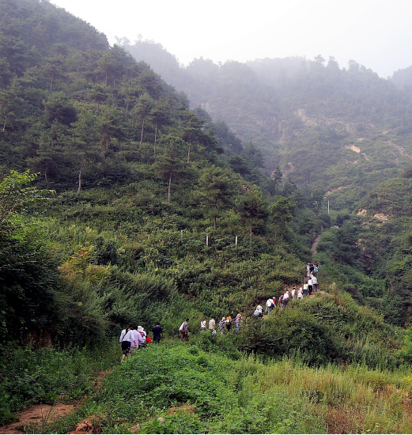

### 大乘百法明門論簡說（二十六）　拾肆、心所有法｜根本煩惱(一)

*戒慧講述‧淨本整理*

正見是量除非理

非理計生人法我

實體成立水抱月

虛生浪死塵點劫

經文：

四、煩惱六者：一、貪。二、瞋。三、慢。四、無明。五、疑。六、不正見。

心所有法中的第四位為六種根本煩惱，此六者為一切煩惱的根本，又稱為本惑，能生出其他各種煩惱，又稱為隨惑，所以認識本惑的行相就非常重要。本惑及隨惑都會煩擾惱亂有情，使有情自惱惱他，並摧壞此世、來世的快樂。凡是善法都可以帶來安樂，惡法就會帶來痛苦，因此煩惱也是惡法。藉由認識煩惱的行相，使我們懂得如何對治煩惱，甚至證得初果（或初地）破除煩惱，原來無明我執是根本煩惱中的根本，體察我的自體性不可得，只是依著作用名言安立而已，才能真正斷煩惱，但這樣的見地並不容易獲得，即便在佛法中，不同宗派對於無我真義的看法也不相同，唯識宗尚有所謂的八識派、六識派；實相派、假相派；有垢派、無垢派；心識一分說、二分說、三分說或四分說等各種見解，無怪乎玄奘大師要千里迢迢跑去印度取經，就因為當時中國佛教無法把真理說清楚，只有依正見修行才能證果，證果的聖者才能了知一切其他宗派見的錯謬，不再受外道見的影響。

煩惱還有一個別稱「使」，這是以譬喻來立名，將煩惱比喻如過去衙門的差使，能使罪人辛勞痛苦，繫縛並囚禁罪人，罪人比喻的就是三界中的有情眾生，煩惱讓有情眾生在對境時造出種種惡業，因而受苦，長劫繫縛於三界輪迴中無法出離。其實繫縛也是能繫縛與所繫縛互相觀待，所謂色不迷人人自迷，使自己不成對境的迷惑者，煩惱安能繫縛我們？煩惱是有為法，既然是有為法必然是無常性、剎那生滅，所以可斷，不會永恆存在，斷煩惱的關鍵就在於能否具備正確的知見，然後依之修行。

天臺宗名相中的「十使」，是指貪、瞋、癡、慢、疑的五鈍使，以及不正見（包括身見、邊見、邪見、見取見、戒禁取見）的五利使。五鈍使是有情俱生而來對於世間的迷惑；五利使則是受到宗派見的影響，產生各種執常或者執斷的錯誤見解。

稱「鈍」者，是因為此類煩惱遇境生起愛著，與生俱來而難以斷除；稱「利」者，是此類煩惱遇境生起種種錯誤的分別，較五鈍使容易發現斷除。雖有認為五利使受宗派見影響，往往生起時更為強烈，所以稱利，鈍者是指這些煩惱生起時較不猛利；但世間許多未受宗派見影響的凡夫，對著所樂境生起的種種愛著，也都非常猛利，因此以斷除的難易來安立利與鈍的說法較佳。

證初果或者初地的聖者，在定中見到萬法實相，出定時不會再受到各種宗派見的影響，即便外道的聖歌很好聽、教友很溫柔、口才很便給，都不會動搖他對真理的看法，爾時此人已經破除五利使（分別執）；但在遇境逢緣時，因為能執的心無始劫來串習已久，仍會產生輕微的愛著，所以五鈍使難斷，也不易發現，必待四果或者八地，才能完全斷除。

五鈍使為貪瞋癡慢疑，其行相將在後續一一細說。五利使在懺公表解上有較多的文字說明，於此依之解說。

身見：「於五取蘊執我、我所。一切見趣所依為業。」五取蘊就是以五蘊（色受想行識）為所取，我為能取。例如我們常說我的身、我的心，此時身心為所，我成為能。在五蘊上認為有一個我，五蘊為我所有，這就是身見。這種見解有俱生而來也有因宗派見而更強化者，是後面四種見解的根本。

邊見：「即於身見隨執斷常，障處中行、出離為業。」因為有身見，以為有我，進而又執著我為恆常存在，或者執著我滅則永滅，障礙中觀正見的生起，無法出離輪迴，稱為邊見。凡是執著有自體性者，不是墮入常見就是墮入斷見，當我在時以為永遠存在，不認為無常會發生在自己身上，以為明天跟今天一樣，後天也不會有太大變化，或者以為有一個永恆不滅的靈魂，此為常見；我死後一無所有，沒有來世，無所謂的輪迴，這就是斷見，常、斷二見都與中觀正見背離。

邪見：「謗因果、作用、實事，及四見之外一切邪執。」在其他四見之外，凡不信因果輪迴，不認為有善惡報應的作用，對於佛法所說的實事不願接受，這樣的執著都屬於邪見。

見取見：「於諸見及所依蘊，執為最勝，能得清淨，一切鬥爭所依為業。」此見是執著錯誤的修行結果為解脫，所謂非果計果，例如修無想定的外道，以為無想天是涅槃。又例如證得初禪之樂的修行人，以為自己已經證得初果。此處「諸見」就是四禪八定的各種修行見解，「所依蘊」就是修成四禪八定境界中所依的五蘊，在這些境界裡執著自己已得涅槃，清淨最勝，但事實上仍有我執，所以這樣的錯誤執著，反而成為與人發生鬥爭的原因，對於與己看法不同者，產生各種爭執。

戒禁取見：「於隨順諸見之戒禁及所依之蘊，執為最勝，能得清淨，無利勤苦所依為業。」此為非因計因，此人所隨順的各種修行看法，以及修行所依的五蘊，並非真正的解脫之法，但他卻執為最勝，能得清淨，殊不知這些勤勞辛苦的修行，一點利益也沒有，或有多智禪定現前，但與解脫沒有任何的關係，甚至益發增加自己的我執。

「見」有推度義，五利使是錯誤宗派見下的所為的推度，若能以推度正確的般若義理，名為正見，屬於善心所中的無癡，是慧心所揀擇的作用，所以見要以慧為體，才不會墮入五利使的執著之中。（下期待續）

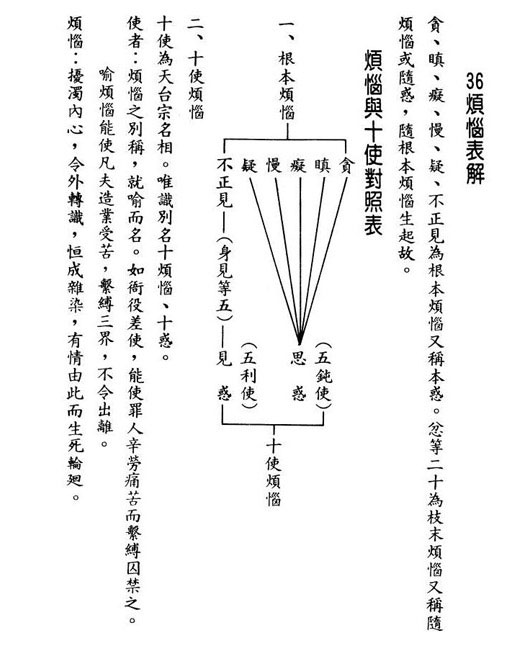

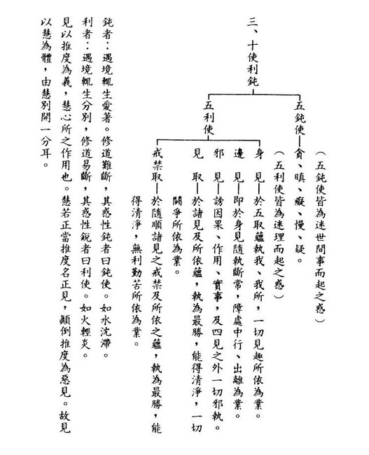

### 佛學概要十四講表簡說（二十）　第三講表

*戒慧講述‧宏法、淨昌整理*

信依信行與法行

因明立宗比量生

正信依量真皈依

法義破障成正覺

(丙)迷信與正信

●迷信屬他

所謂迷信是指一般人，而佛法是正信。丙表上方迷信，屬於其他非佛教徒。下方是正信，學習佛法的人有正確的信仰。迷信和正信的差別在對於宇宙事理的真相是不是真正明白，而所謂不明白，是指對佛法二諦的觀察不明白。

真正明白且深信不疑稱為正信，迷信是對於事理真相有錯誤的認知，同樣是相信不疑，但迷信的力量往往比正信的強。例如鑑定古董，鑑定假古董的人言之鑿鑿，導致整個古董市場把假古董當做真古董，讓一般人掏錢去買它，外相上往往比會鑑定真古董的人還識貨。

這些的迷惑和不明白，表現出來多是斬釘截鐵的肯定，這才是最可怕。如果人們知道自己是迷惑不明白的，內心還是會害怕，想要去弄明白，但如果說的跟真的一樣，這就是最恐怖的。所以此處「迷信屬他」裡面包括相似解、邪解和錯解，所說的人包括世間學者專家、媒體、外道、學佛法的外行人等，產生了對事理的錯誤見解卻毫不動搖的信心。所以，迷信的定義並非僅限於無知的愚夫，自以為是卻堅信不移的才是真迷信。而迷信又分為三類，下文述之。

●無謂有(渴鹿陽燄)

沒有的東西說是有叫做「無謂有」。萬法的自體性是沒有的，但是一般人卻認為有。「渴鹿陽焰」是出自《楞嚴經》的譬喻：有一群鹿非常的渴，在春天水氣旺盛的時候，遠遠地望向遠方，誤以為有灘水在遠方，這些渴鹿以為真的有水，一路追逐，最後卻渴死了。比喻陽焰是不存在的東西，但是渴鹿以為實有一路追逐，就好像世間人把萬法的自體性執為實有，對境界追逐不捨。渴鹿陽焰其他同品喻有水月、空華、鏡中影、空谷響等。

譬喻必須跟有法結合，《金剛經》說：「一切有為法，如夢幻泡影，如露亦如電，應作如是觀。」這個譬喻必須要結合有法。因明學上，喻要結合因，才能夠立宗答辯。在「渴鹿陽焰」中，應知「渴鹿」指凡夫，「陽焰」指沒有自體性的東西顯現為有自體性。萬法顯現像有自體性，但其實是沒有自體性，並非沒有顯現萬法，所以李白的水中撈月，只有身體跳水，我們一般人是連心裡都跳水。

「無謂有」意指眾生無始劫以來輪迴的根本是無明，也就是看不清楚萬法的真實相是沒有自體性，以為有自體性而且執為真實以後，並且追逐不捨。例如世人追逐財富，顯現擁有財富是對自己最好的事情，可是實際上，擁有財富也有很多負面的面相，除了過患以外，還很無常，但是無常的抉擇並非空性的抉擇，兩者仍有相當大的距離；如同擇乳的鵝王，面對水跟牛奶融合時，鵝王可以喝到牛奶不喝到水，所以空性的抉擇必須要細思之。

而所謂財富的顯現，也不過是回應自己過去造作的善業。如果財富的顯現有自體性，又何必觀待善業？其次財富顯現的當下看起來宛然有，可是如果沒有市場、國家的支持，也沒有交易，財富的顯現何在？如果財富有自體性的顯現，狗跑到金庫裡也應該流連忘返，蚊子飛進去應該也不想走了，可是蚊子跟包青天一樣的清廉。所以財富的顯現沒有自體性，如果有自體性，大家看財富會呈現同一形象，因為沒有自體性，所以都是各看各的。

財富顯現當中不但是「渴鹿陽焰」的顯現，宛然有，實際沒有以外，又像房屋倒影在水裡，每個人看的角度不同，有人根本看不到，有人看到小小的，有人看到完整又富麗堂皇的房屋，代表業顯現時，是依著自己的名言去納受這個境界，當過去的善業在浮現出樂果時，假如是發起人，就看到水中的全部，假如是隨喜人，他看的角度只能看到一角，假如沒有造過善業的人，他會在另外一邊什麼都看不到。所以大家都進去股票市場，賺與賠都觀待過去的善惡業，到最後都是觀待福報在賺，當然也要看是什麼心態在投資，是不是結合有福的人一起投資。跟有福的人一起進場，也不一樣，他出場的時候你突然拉肚子，最後全賠光。所以當房屋顯現在水中的時候，他的角度看是全部有，不是那個業就什麼也沒有，所以也是各看各的，都是名言上的顯現，自體上是沒有的，諸法如幻到這種程度。

再舉例《影塵回憶錄》中，諦閑老和尚在重病的時候，碰到一位蒙古大夫，正好給他開一付藥，都不知道什麼病，把脈都不會把，隨便開個藥拿了錢就跑，法師一吃就上吐下瀉，結果老和尚的病竟然就因為上吐下瀉好了。天下像夢幻一樣，顯現像真實，其實哪裡有一點真。

所以第一個錯解叫做「無謂有」，就是沒有自體性的當成有自體性。皆是「未見而言」、「見蛇為龍」和「未究其理」。

●有謂無(近視斥星)

有的當做沒有，是指世俗緣起作用的關聯性是有的，並非錯解緣起是沒有的。這一分的同品喻，叫作「近視斥星」。就是大近視眼，往上看不到天空中的星星，就說沒有星星，把有的當做沒有。凡夫一旦將存在的當下，從無自體性當成有自體性(如上述渴鹿陽焰)生出常見；並將緣起有作用的結束當成斷滅無，生出斷見。

對於過去、現在、未來，在緣起上若沒有這種決定見，眼光是短淺的。緣起的當下，其實是觀待過去說現在，觀待未來說現在，可以關聯到百千萬劫的相續。一般人哪裡會相信，哪裡會想到那麼遠？對於眼前必須要能生起過去、未來、現在的觀察，而且是長遠劫的觀察。

所以這一生造了很多的善，結果受了很多惡報，學佛的人會以為老天眼沒長眼睛，佛法沒有用的，善沒善報。所以印祖〈文鈔〉裡面的陳了常優婆夷，也是佛化家庭，她小孩子十五歲過世，先生從此不信佛。緣起上沒有這種通達，就是近視斥星。

●偏陋執(轎付前價)

偏就是偏於一邊，對於事理的真實研究不清楚，無法對自體性空的道理深入了解，對緣起的道理亦不能做前後觀察，其實是偏於一邊，非常淺陋的，但是他又有這樣的執著，所以可能很看重表面、現實與注重形式。

對照前文「渴鹿陽焰」是對自體性沒有的說有，生起常見；「近視斥星」是對緣起有的卻生起斷滅見，不相信因果關聯。而「偏漏執」則是或執事、或執理，或只看到事或只看到理，而不曉得事和理是互相觀待，在事相裡面必須要把內涵研究清楚，而內涵要在事相上去彰顯。

大家都看過中國古時候的轎子，或者兩人轎，或者四人轎、八人大轎等。此人坐了轎子，下轎以後付錢，因為坐轎子的時候只看到前面抬的人，所以他只願意付前面抬轎人的錢，他說我沒有看到後面的抬轎子，所以不願意付後面抬轎人的錢，這叫「轎付前價」。

阿羅漢算不算偏漏執呢？不能把偏陋執講成阿羅漢，所謂的「偏陋執」，是不知道要從理去莊嚴事相；也不曉得要結合事相來說理。阿羅漢的理是從世間的戒律，乃至於他的禪定，對有情的慈悲喜捨去莊嚴出來的理，空性的理是這樣證悟的。

◎正信屬佛

上文已經說明一般人迷信的三種理由，接下來要說明佛法是正信的理由。所謂正信是對於事理有正確的認知，而且是相信不疑，這屬於佛。是對事理的認識，透過各種推論定出「量」，以量認識世間萬法，成立對佛的信仰。在佛法中有關《量論》的論典，是以能量的心，量所量的境界，心識成為能量，而境界成為所量。心識如果量度境界而成立能量的時候，才會生起智慧。

佛法中「量」有「非量」和「正量」，正量是「現量、比量、聖言量」，除此之外都是「非量」。「現量」是現前的量知；「比量」是沒有現見，但是以正因理解類推得知；「聖言量」是聖人所說，是已經證悟者的言語，所以是能夠相信的。

《因明學》中的「因」必須是現量，要以看得到的現量(因)去推看不到的「宗」，而且兩者產生關聯性的時候就能生起比量智。舉最簡單的例子：有煙、山上有火、有煙故，山上有火，這是我要立宗的主體，「有火」沒有看到，「有煙」是看得到的，看得到的叫作現量，沒看到有火，只看到山上冒一堆煙，然後用火生煙的現量，去推比眼前雖只看到煙，然果從因來，所以生起雖然火沒有顯現，可是你心識通達有火，這是「比量」。

量是最重要的，是迷信還是正信，觀待你的量，學佛得到「聞所成慧」是非量，「思所成慧」是比量，「修所成慧」是現量。上課聽得懂的那一分叫做「聞所成慧」，「思所成慧」就是開始去議論，他人或自己從反面乃至各種立論去推翻自己的立論，推翻不了的那一分就是比量，在定中修學比量的智慧成為現量。聽了聖言量產生的聞所成慧，還是非量，除非這個聖言量拿來作為世俗觀察，那一分才能成為比量。聖言量必須要靠傳承，沒有傳承，聖言量顯現不出來，抱一本《楞嚴經》回家是沒有用的。聖言量是把佛經搞懂以後，內心在量度這個世間的時候，眼光和世間人不一樣，這就是比量通達世間，唯有靠聖言量才能通達世間微細的關聯性，雖然還不能顯現為現量，換句話說，聖人的經驗閱歷可以在你心中生起，這叫「比量」。

由上述可知正信建立的基礎在正量，到底是正信還是迷信，建立的基礎在現量、比量、聖言量；如果建立在非量上就是迷信。《因明學》說佛是一位量士夫，是能成為能量的讀書人。而佛法是否值得我們信任，就看我們是否能以現量或比量通達。

●現量

要確立「正信屬佛」就需要從三個量來量各個法。先說「現量」，它是現前的量知，不會夾雜虛妄分別在當中。述記云：「凡夫眾生無始以來是無明妄動的分別，在前六識量境的時候，只有第一剎那為現量，第二剎那以後有分別妄執」，這是屬於經部的說法。

見到眼前的鬧鐘是不是現前量度？現前量度的這一分包括前五識，眼識看鐘，加上第六意識中五俱意識的眼俱意識，這就是現前量度境界。為什麼第一剎那是現量，第二剎那就成為非量的再決識？第二剎那實則是再決識（非量），只不過依第一剎那現量的力量再次決定境界，如眼識見物。

述記云：「必也修止觀定慧，入定中現量。」一般現量係前五識與第六識所現前量度，而定中現量則惟有第六識量度。「定中現量」是在止當中修觀，例如觀無常與剎那性得到的現量。以眼前看到這本書為例，一般人不會看見這本書的無常性與剎那性，因為這不是前五識的境界，這是定中的修學。諸法無常的變化，是屬於所作性、無常性，是這本書所呈現的面相，要在定中現量通達，絕非眼識，因為眼識只見現前，眼識沒有見到前後的變化，眼看書，這本書未成書之前，以及成書之後的壞滅，在當下是不會顯現的，要靠定中意識去分析，分析到並不是這本書在無常的時候才說無常，這本書才生起就有敗壞性，這個敗壞性是在定中不斷的推理以後，該意境呈現在你的心識面前，所以你回看這個世間都是變動的。

例如選舉的時候，政客拚命握你的手，你可以從他的整個歷史背景去分析，握手時，心是假不是真，從他真誠的動作當中看到他的虛假，這需要第六識去分析，眼識看不到。眼識、耳識及身識呈現的都是賣力的表現，唯有你去分析，才能立刻從他的表情上知道這是虛情假意的，這是定中現量，用意識去分別，不是前五識的境界。

再舉例，這個人走進來，立刻從他走路的姿態知道未來的吉凶禍福，但當下並沒有發生倒楣的事，可是倒楣的事可以在他走路的時候呈現，這是第六意識的定中現量或比量，經過不斷的串習，能夠伴隨前五識生起，所觀的意境可以直接呈現在你的意識前。所以雪廬老人說他晚年的時候，看到人走進來的姿勢、走路的樣子，此人的吉凶禍福百分之七十都可呈現，此人只要再講一句話，百分之九十都會出現。只有學者依著傳承深入經藏，歷境練心才有這種能耐。

述記云：「然後開發聖智現量；如此斷惑證果，轉識成智，寂照德顯。」修學者在定中修止修觀，以空性為所緣，能夠破二障，證得聖者的智慧，即是聖智現量，能同時見緣起的顯現，同時自體性什麼都沒看到。「寂」是空性，「照」是空性的智慧，以空性的智慧照空性，心識前顯現空靈靈，什麼都沒有。六道觀待業果可以顯現，可是六道的自體性是沒有。如果沒有惡業，尋覓不到地獄；如果沒有慳貪惡業，也尋覓不到餓鬼道，當慳貪的惡業被對治時，鬼道就不會出現，所以六道的自體性是沒有的。

述記云：「方能寂然不動，朗照分明，現前如實量知。」是指聖人現量親證事理的真相，證得空性，看到萬法是沒有真實相的。所以現量可以分為兩種，一種是凡夫的現量，一種是聖人的現量。凡夫現量就是前五識的境界，聖人現量就是第六識的境界，世間人看的為什麼和聖者看的不一樣？就是心的體會不一樣。世間人雖然看山，可是看到山的時候，聖者看到山的無常、剎那性、所作性、空性；世間人只看到山的美麗。所以修行的功夫高下不是禪坐的高下，是從量分高下。正信的基礎建立在量，沒有量不要對它生起信心，如果不是以量所成的佛法不要學。

●比量

「比量」不是現前能見，比量的定義就是由此依理則推彼，而得正確結論，透過佛法的「因明」推理而得到。因明的推理要辯論某一個主題，對這個辯論的主體下一個結論，然後用一個因去成立這個結論，最後以一個同品喻來讓眾生懂。所以慈航法師「相宗十講」《因明學》部分，在〈因明入正理論講話〉中，就講到因明學非常重要。例如：否定出家人的立宗，叫做出家人有法，是寄生蟲，因是不事生產，比喻是乞丐。那我們要保護佛教要怎麼保護？總統有法，是寄生蟲，因是不事生產，如乞丐。學生有法，是寄生蟲，因是不事生產，同品喻是如乞丐。

《述記》中舉一個例子，玄奘大師在戒日王座下設無遮大會，也是用因明論式來打敗外道和小乘。整個因明論式裏面最厲害的就是中觀因明論式，你成立你的宗，設你的因，用你的同品喻，拿你的因成立另外一個宗，你就倒了。不必另外立一個因明去打敗你，拿你的矛攻你的盾，對方就倒了。所以今日之下一定要培養對佛法有認知正見的人才，才能夠保護佛教維持正法。

所以比量是學佛者一定要去通達的推理法，因為很多佛所說的道理都不是現見的，要透過推理才能夠通達。佛所說的無常、所作性、剎那性與空性都是隱密而不現見的，我們要用比量通達，佛說現前的事情眾生可以現量通達。但書本顯現的剎那性、所作性、無常性、空性，都必須要透過它的邏輯推理，去顯現它的面相。這一本書在眼識前顯現，這一本書的剎那性竟然在第六識顯現。所以難怪聖者和世間人看的不一樣，這本書的無常性竟然在聖者的意識顯現，但是在我們卻顯現為常性。這本書有自體性竟然在凡夫顯現，這本書的空性竟然在聖者顯現。所以才說修行的功夫是以量來較量。

●聖言量

聖言是指佛的言語、佛所說的法。佛對宇宙人生已經研究得非常徹底，理解得最圓滿，智慧也是最圓滿，他所說的是現量通達而說，成為我們依據的標準，這就是信聖言量的部分，能夠成立正信。

立聖言量的理由是，修行人在比量通達無常、所作性、剎那性、空性，甚至以現量來通達時，對佛生起非常殊勝的崇拜，因為煩惱解脫了，生死了了，回過頭來對佛所說的全部相信，對佛聖言量講到極隱秘的事情，百千萬劫後的事情全部相信。所以阿難尊者才說：日可令冷，月可令熱，佛語不可異也。可是百千萬劫的事情誰看到？誰相信？佛在說的時候簡直像天方夜譚、天馬行空，如果今天我從來沒有在比量和現量上，去通達過佛所說的無常及空性，得到解脫而產生極大快樂，佛在講百千萬劫甚深緣起的時候，如何坐得住呢？佛經很多時候講的都不是現前事，為什麼這些人都乖乖坐得住？佛說極隱秘的事情，例如某人對佛禮拜供養以後，歡喜得跑了五里路，佛說五里路中的每一粒沙都是轉輪聖王的福報，你會相信嗎？他又沒有做什麼大善業，他只是很高興的禮佛而已，要如何相信佛所說？所以當佛在說甚深緣起的時候，沒有無常與空性的現量和比量做基礎，要以聖言量通達極隱秘的緣起法，凡夫辦不到，因為沒有辦法信解，內心無法成立為聖言量。

現量、比量、聖言量都是指心的這一分。所以佛在論因果、甚深的緣起、信佛皈依乃至於發大悲心、菩提心來皈依三寶。三界眾生所成立的功德就像一杯水，佛所成立的功德像大海水，我們難以相信。雖然口頭上自稱學佛，但是看法不會跟佛一樣，所以不能成立為聖言量。佛經放在家裡也不會成為聖言量，聖言量必須是心上認知才成立的。

所以是「正信屬佛」，正信建立在量上面。佛是「量士夫」，能夠使眾生在現前事上以現量通達，空性及無常等隱秘的事情則以比量和現量通達，而甚深緣起等極隱秘事，眾生以聖言量通達而成立比量。因為眾生不可能對聖言量成立現量，連阿羅漢也只看到八萬大劫以內，佛在講八萬大劫以外的事情，阿羅漢也不現見，所以不可能以現量見甚深緣起，此時只能比量得知，比量得知就是，雖然境界沒有生起，可是我相信在那裡。就像看到煙，雖然沒看到火，可是我相信火在那裡。

以前周利槃陀伽出家，出家以後什麼都不會，他哥哥叫他還俗，因為哥哥看到他八萬劫內沒有得道的善根，佛說你哥哥只是阿羅漢，未見甚深的緣起，佛重新調整教學的方式，後來他成為證果的羅漢。所以甚深緣起的那一分，必須要用聖言量去通達。

《述記》中說聖言量還有一個評量標準，就是三法印：無常、無我、涅槃寂靜三法印。以三法印來印可聖言量，依著三量確立學佛的正信。

最後總結，沒有量就無須對它生信心，可是世間都不是以量成立的時候，我們卻對世間產生正信，佛以量成立的我們卻說他是迷信，這不是顛倒嗎？以上說明三量。（下期待續）

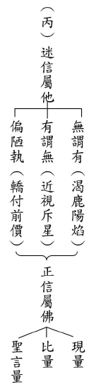

### 人生大事—不能忽略的事實
		助念生西觀念作法研究（六）
助念之意義與規矩
			—雪廬老人講於臺中蓮社—

人生大事—不能忽略的事實

助念生西觀念作法研究（六）

助念之意義與規矩

—雪廬老人講於臺中蓮社—

戒慧講述

臨終能翻轉

關鍵在認知

一句南無佛

六字出乾坤

這篇文稿是 雪廬老人在民國六十八年(一九七九年)，對臺中蓮社助念團所說的開示。

助念的人要懂得往生的道理跟方法。所以，第一段是總說，第二段講助念的道理，第三段講助念的方法，第四段講規矩，第五段講範圍，第六段講助念包和佛堂的擺設，第七段是助念要通達人情世故，第八段是助念團平常的訓練，第九段是助念的時間，第十段是助念所依的經論。雪公老師的文章，看起來好像在跟你聊天，其實，一段一段，脈絡清清楚楚。

第一段：助念即助對方往生。助念者對往生之道理與方法，必須清楚，對方才能得到利益。

助念到底是什麼？助念就是助對方往生，一個人在臨終的時候，總是隨著他的業力有不同的表現。這個時候，不管功夫的深淺，能夠得到蓮友在旁邊幫助，這是非常重要的。特別是能夠在臨命終時維持往生的正知見，須知往生者在臨終會有各種業力的展現，去助念的蓮友可以成就好的外緣，不好的外緣也能對治。

所以去助念的人，對於往生的意義、道理以及方法都必須非常清楚，才能如法的護持，往生者才能夠得到利益，以上的第一段是個總說。

現在葬儀社蓬勃發展，可以從往生前到喪葬事項全部包辦，派兩個人去助念，每個人一小時一千，只要花一萬六，就可以有兩個人輪班助念八小時。

但是對於往生者知見的護持，不是隨便抓一個人來跟著佛號機念佛就可以的。因為，往生與否，全憑信念之有無。臨命終的這一刻，能夠讓亡者堅定往生西方的信願，這是需要學習的。除了信念的強化外，對於過程中該注意哪些事項，避免不必要的過患，這都是需要學習的。

第一段的總說很重要，今天假如要死了，旁邊助念的人要懂得往生的道理跟方法，亡者才能得到利益。這裡面包括助念者懂得往生的道理跟方法，所以念得很有誠意、很有氣象，而且懂得開導家屬和亡者，懂得讓亡者心中產生安定的感覺，並且排除障礙。亡者呼吸速度或快或慢，旁邊的人要懂得配合，不是在那裡為了名或利而念佛，這是毫無用處的。

第二段：人臨終時，各人神識不一。平日所為，此刻影子會一一現行，帶著本性往外走。此時完全是業力在作主，力量大者，在前頭。惡業多，則惡種子力量大，一衝出來就下三道。若善業多，善種子就領著上人天二道。平日有念佛功夫，就有佛種子，佛種子力量大，先出來，就蒙佛接引往生西方。若力量小出不來，別人在旁幫助念佛，就容易出來。所以平日有修持，臨終時佛種子先出，往生就有希望。助念正是幫助提起佛號。

自己平常所為都會在八識田中種下種子，臨終此刻的種子，會一一的現形，帶著我們的本性八識往外走，這個時候完全是業力在做主。力量大的業就在前面帶頭先衝出來，第八識就跟隨著善惡業，馬上到人天或下三途。平常有念佛功夫，就有佛種子，平常多多念佛，也對教理有瞭解，佛種子的力量在臨終先出來，就可以蒙佛接引往生西方。如果力量小，這時候外面的助緣就很重要了，旁邊的人幫忙助念，這些善種子就容易引發。

所以，助念者要懂得幫助亡者提起往生西方的正念。了解西方淨土，是我們最殊勝的去處，而且以念佛蒙佛接引往生到西方極樂世界。就是用這種理路幫助亡者往生西方，所以助念團會認真念佛，引臨終者心裏面念佛，若還有體力，或者嘴巴出聲念，或者是金剛念。

可是，臨命終時每個人的神識不一，平日所為，此刻會一一的現形，古德曾說，多生的惡業在臨終的時候現起，我們並不清楚自己到底過去生中有多少惡業，又如何擺脫惡業，讓臨命終的時候佛種子能夠出來？必須要在臨終的這一刻還沒來到之前，事先把往生的資糧準備穩妥，臨終才會有把握，否則到臨命終的那一刻，容易手忙腳亂。

平常的所作所為會在臨命終，像演電影一樣一直演出，這當中引業帶著本性往外走。此處的「本性」，按照唯識宗來說，在臨命終的時候，平常能夠控制自己的能力漸漸消失，自己能夠做主的力量就越來越小，最後完全都是靠業力，這個時候各種種子在我們腦海裡頭，第六識造作的種子，在第八識一一爭著要浮出來。

往生的時候，中陰身帶著第八識去找和自己下一生有緣的父母。這時候就像搭飛機，當飛機起飛以後，我們就跟這個地方的業無關了，接下來會到哪裡？是飛到美國去呢？還是飛到非洲去呢？飛機降落的時候，就決定了。

人道前六識的功能慢慢收起，沒有克制情緒的能力，所以造作什麼就生起什麼。臨命終像演電影一樣，這當中有善惡業種子起現形。善惡種子長什麼樣子？善是一種替他人著想的心，並且造作了種種利他的事，謂之造作善業。事情結束以後就有一個力量，謂之種子，因緣具足的時候會起現形，謂之果報。或是心情的愉悅，或是遇上貴人解決難題，或是受用美好的境界等等。尤其到了臨命終感覺很舒服，不會怕死，這就是善種子的力量。反之，惡種子的力量，在臨命終會讓我們心情恐慌，在外緣上遇到很多逆緣，未來恐怖的世界會浮現在我們眼前，這些都是惡種子的力量。

善種子當中最重要的就是佛種子，就是臨終那一刻能夠念得出佛號，這就是佛種子的力量。容易碰到蓮友，不會跟你說世俗的事情，也歡喜聽到佛號。如果佛種子的力量薄弱，會不喜歡聽佛號，喜歡醫療苟活，喜歡其他的雜緣，這些都是佛種子不現或者薄弱。

這麼說來，我們這個時候的念佛，跟我們臨終的關係是什麼？這個念佛就是隨時接受往生的準備，可能今天就是人生的最後一天。印祖在蘇州報國寺的關房，他的擺設裡頭，到處可以看到一些毛筆字，大大的寫了一個「死」字，祖師真的時時刻刻把死字擺在心裡頭，所以在無常的概念裏面，最後的決戰點就是「今天就是臨命終」，我們如果沒有培養自己產生這樣的覺受，連粗品的無常都沒有生起，這種心態就會一直延續到臨命終，拖延到臨命終時，也不相信今天一定會死。

所以，產生我必須要修行，我這一生要修行，我現在要修行，我當下要修行，這個時候的佛號，才會變成臨命終生起的佛種子。所以，無常的修學法是很重要的。

今天，我是一個去助念的人，我要懂得往生的道理，我要引導亡者去極樂世界。不管是口頭上的開導，或者是動作上的引導，或者是佛號的引導，我都要幫助他往生極樂，讓他能喜歡念佛，讓他佛號成片，這叫做令他佛種子生起。藉著設立佛堂，供養三寶，懺悔，禮拜，在旁邊做言語的開導，或者引磬，或者清念，或者配合呼吸念，或者在旁邊引導他念，他口渴的時候給他沾一點水，他肚子餓了，就給他煮一點稀飯，總而言之，所有的目的都幫助他往生。

助念團並非接到需要助念的電話，就一定要去幫忙，也不能只問人死了沒？還沒，那我們就不去助念，死了以後我們再去念幾個鐘頭。助念這件事，必須觀待家屬平常的發心，事前和團體、蓮友的結緣，這當中介紹人以及家屬所扮演的角色也極為重要。發心但求問心無愧，因緣看來不夠殊勝不須懊惱，因緣極佳也無須自喜。總之，能實際的利益亡者、利益家屬，並且維護自他善根，至為重要。所以， 雪公老師說，助念這件事情極不簡單，一定要懂道理，否則盲幹，必出大亂子。

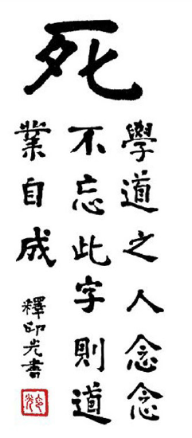

## 孔學一隅

### 論語簡說（二十六）
	  				—子貢問政

論語簡說（二十六）

—子貢問政

時哉講述

國防民生與民信

有信甘苦共患難

外患來時一致抗

人和才是為政要

經文

子貢問政。子曰：足食，足兵，民信之矣。子貢曰：必不得已而去，於斯三者何先。曰：去兵。子貢曰：必不得已，而去，於斯二者何先？曰：去食。自古皆有死，民無信不立。（顏淵第十二篇第七章）

消文
子貢問為政之道。孔子回
**答：** 糧食要充足，兵力要充足，要取信於民。這三者不可或缺。子貢問，在不得已的情況下，三者必須減去其一，何者可以先除去。孔子說：除去國防。子貢又
**問：** 必不得已，要再減掉一個，何者可以先去。孔子回
**答：** 除去糧食，不能去民信。去食雖然有餓死的可能，然而自古皆有死，不足為患，只要人民信賴政府，雖無足食，仍可與國家共患難。若去民信，縱無外患，也有內亂，一個失去人民向心力的國家當然不能立足，所以說民無信不立。

析疑

子貢問政，是要問什麼？

辦政治的方法，有三個綱要。第一個是足食。

足食對於辦政治有何重要？

先談足食。民以食為天，雪廬老人說解決民生的需求。食物足，才能談禮義。

馬斯洛的需求層次理論：先有生理需求，再有安全需求，然後社會需求，再是尊重需求（需要被尊重，有名聲、地位），最後自我實現（實現人生目標、價值觀）。

食物充足，解決老百姓民生問題最為重要，如三民主義中的民生是最重要的。這代表孔子的務實。

為政者如何足食？

在《禮記·王制》裡面說，古代是一個井田制度，旁邊經營的是私田、中間經營的是公田，每三年的耕田，國家就可以貯存一年的糧食。這個時候如果有水災跟旱災，老百姓就不會餓肚子。這就是古代的足食政策。

堯也遇過旱災，舜也遇過水災，商湯繼位的時候也有旱災，如果沒有足食政策，眼睜睜地看著老百姓餓殍載道，這些災民到處亂竄，國家沒有糧食補濟，怎麼安頓難民？

足兵對於辦政治有何重要？

充足兵源，可以抵禦外侮、安定內亂，才能讓人民為生計努力。

此章的兵，應如何解讀？

一、士兵（現代）：以前古代的兵是武器，到了秦漢時期，才有以兵為人。

二、武裝（古代）：弓、矛、戟、殳、戈。用來保家衛國、殺敵。

為政者如何足兵？

古代的為政者足兵，是在農暇的時候訓練，當國家需要才充為兵。古代是徵兵制（每個人都要當兵），朝代慢慢演變成霸權，才變成募兵制（招兵買馬）。

足兵是為了保家衛國、盪平內亂、抵禦外侮，讓人民飽食、足衣。

夫子主張強兵霸權嗎？

夫子是藏兵於民，這種兵是需要的。君不見孔子當大司寇時，齊國為抗衡晉國，於是與魯國結盟。孔子當外交官，談吐都勝過齊國；論軍隊，孔子帶來魯軍兵車兩百乘，齊國僅一百乘。齊國耍詐自覺羞愧，就把鄆、讙、龜陰三處歸還給魯國。孔子主張「有文事者，必有武備」，武備是防範亂世，不是強兵霸權。

足兵與足食間的關係？

足兵才能保障人民生計安全；人民有能力生計之事，才有辦法繳交稅金給國家，讓國家發展，並養軍隊。

民信對於辦政治有何重要？

老百姓對國家有信用，大家能共體時艱。沒有食物，百姓合集；沒有兵力，百姓合資。

夏桀、商紂時有許多兵力，但商湯、周武王都能以寡擊眾。

瑞士雖然人口只有六百萬，但全國人民對國家有信心，因此德國不敢攻打。可見民信的重要。

在《史記》中，商鞅被秦孝公所用，商鞅就是深知建立國信之重要。

此章之信是國家之信用，還是人民對國家之信心？

國家的信用：政令能取信於民，不會朝令夕改，使人民無所依從。

人民相信跟著國家，會在生活上得到快樂，在生命中得到豐富。因為國家辦政治、辦教育故。

國家要爭取人民的信心，人民也要對國家有信心，這是國家建國的骨幹，因此兩者皆為孔子所談者。

國家如何建立信用？

一、法信：頒布的法令，人民願意相信。

二、恩信：老百姓在苦難時，國家會去拯救百姓。

三、幣信：國家發行的錢幣百姓有信心。

什麼情況下，要先去兵？

《大學》：「災害并至。」什麼災害來時要去兵？水災、旱災、蟲災、流行疾病。

去兵有兩個狀況：一是不與百姓爭糧，一是百姓家中一團亂，國家不敢用。

因為國家沒有兵源又沒有稅收，所以必須要去兵。

去兵不是沒有國防的力量嗎？萬一外國入侵或本國內亂而亡國，該如何是好？

為政者不讀《論語》，以為無助於國家民生。事實上因為不與老百姓爭糧、徵稅，自然無法汰換武器。雖然沒有募兵，但人民會願意與國家共體時艱。因此看來雖無兵，實則百姓人人皆兵。

古代有六軍，共七萬五千人。商周有千里之大，天子邦畿有五百一十萬戶，每家若有三口男丁，那就有一千五百萬人。因此，結合全國人民，軍力將超過千萬。

古人有先去兵的例子嗎？

楚漢之爭時，韓信打秦國，韓信只是訓練百姓，就可以上戰場。可見老百姓對國家有信心時，就能藏兵於民。

《論語》中有無去兵思想的篇章？

〈先進篇〉第二十五章：「千乘之國，攝乎大國之間，加之以師旅，因之以饑饉。」此時無食無兵。「由也為之，比及三年，可使有勇，且知方也。」子路可帶領人民，使全民皆兵。

孔子所謂的去兵、去食，都是為了強調民信的重要。

若先去食而非去兵，有何過患？

兵強民餓，如秦國之時，老百姓不信國家愛人民、兵保家衛國，因此既無外患也一定有內亂。因此必先去兵。

什麼情況下要去食，而非去民信？

當整個情況危急，沒有辦法活下去了，要先懂得去食，意思是要與老百姓一起共體時艱。例如以前明崇貞年間，皇帝發不出糧餉，使得兵敗如山倒。李自成打入皇宮，卻發現皇宮內有許多黃金。

管仲說沒有食物就談不上禮義廉恥，或為暴民，如何能去食？

老百姓對國家沒有信心，才會有這種情況；若對國家有信心，即使沒有食物，也會願意為國家打仗。

例如，當時中國被日本打成焦土，但因中國人共體時艱，仍能臨敵。

古人有先去食之例嗎？

文天祥的正氣歌，談到張孫揚，死守昆陽城、抵禦安祿山，既使無食物，也能夠全力守城。

民無信的過患？

號令不行、綱常不維持、賞不認為光榮、刑不覺恥辱、士氣低落、決策不行。縱無外患，必有內亂。

試舉足兵、足食，卻因民無信而亡國之例？

一、隋煬帝：在河南的洛口有一個糧倉，周圍有三十里，米糧堆積如山，可是仍然很快就被唐朝滅掉。

二、陳勝、吳廣起義：老百姓對秦朝暴政已無信心，陳勝、吳廣砍木頭為長槍，拿竹竿為旗，短短時間就號召萬民起義，成為秦國強敵。

三、吳三桂：在西南方偷偷擴充軍力，儲備糧食，起兵造反時，剛開始勢如破竹，後面成為如強弩之末。所以，人數多寡不是問題，民心向背才是關鍵。

民信的功德？

號令能行，綱常能夠維持。得賞時百姓感到光榮，得到刑罰時百姓會感到恥辱，國家上下士氣大盛，百事可成。老百姓願意與國家站在同一方，一起盪平外患、掃平內亂。

足食、足兵和民信之間的關係，是三足鼎立還是循序建立？

若是三足鼎立，代表三者皆不可去，因此不能說是三足鼎立。若是循序建立，則為正確。

如何建立辦政治三要素，足食、足兵、民信的次第如何？

朱子認為順序為足食、足兵、民信。但我們看新加坡國父李光耀總理，原本是廣州人。他在新加坡獨立後，先爭取民信，再讓老百姓的民生問題解決，最後再派兵到臺灣訓練。

總結

一、辦政治的三要素：足食、足兵、民信。

二、民信比食物還要重要，食物比兵備重要。

三、信的重要性，能讓老百姓懂得保家衛國，能夠讓百姓安於生產、讓國家足食，讓國家號令能行、上下一心。拚經濟當然能成，國防當然能成。必然近者悅、遠者來。

四、足食、足兵要建立在民信的基礎上，才是國家長治久安之道，才能讓兵備盪平內亂、抵禦外侮。

問答

**問：** 一般人不辦政治，學習此章與我們有何關係？當如何運用於生活之中？

**答：** 《論語》談的為政很多，一般人以為無用，其實不是。孔子的理想就是辦政治、辦教育。辦政治是為了辦教育，頂尖的人才要懂這個道理。辦教育要把學生培養成辦政治的人才。

這麼大的學問如何用於日用平常？必須要學這樣的大格局學問，如果我們能夠培養很多人才到各行各業，為國家所運用，吃這口飯必然值得。

國家興亡、匹夫有責，是在談辦教育的必要，儒家就是一個培養頂尖人才的學問，要好好的研讀，使自己與他人成為人才。

**問：** 在《論語》之中有許多為政的篇章，許多學生與孔子學辦政治，但為何孔子不大力鼓勵學生出來辦政治？

**答：** 孔子把弟子培養成人才，可以為國家所用。但國家無道，孔子也不鼓勵學生為國家所用。過去魯國是君弱臣強，無道者執政，則孔子不鼓勵。子路去為政，孔子不阻擋。閔損不願出仕，孔子也認同。因為辦政治是千秋萬世之計，培養人才可以因應國家的需要；國家有道，則人才可被用；國家無道，則人才不被用，是國家、人民無福。

**問：** 辦政治是否只需要三個要素？

**答：** 還需要有公心、理念和作法等，但這些都是為了民信而存在。新加坡的成功固然因民信而來，但儒家民信的根本在於道德觀念的建立。

**問：** 現代是打科技戰，國與國之間的軍備競賽會不會民窮財盡？為何孔子不答民信就好？如果國家有完善制度，是否就不用司法單位？

**答：** 足兵是國防。中國自古以來只有國防沒有國攻，若不爭取民信，則國防無法抵擋內亂。孔子的足兵，不會淪為軍備競賽，反而讓全國人民都想維護國家，即使不用武器，人民的士氣也會引起世界的支持。

爭取民信要在足食、足兵的基礎上建立。要顧及人民的民生與安全。再說，民信是足食、足兵的基礎，但禮樂教化等都是民信的經營。

古代的監察御使都是防護，今日也是一樣。監獄並不是要鼓勵人民犯罪，消防隊也不是鼓勵人民放火。兵源的設立不是為了鼓勵內憂外患，而是讓小人、惡人不會成為國家的影響力，且會有所恐懼。

**問：** 足食，足兵，民信，為立國大綱，其中義理是否可以運用在家庭、團隊和個人？

**答：** 民信是企業爭取員工的信任，足食是考慮員工的待遇，足兵則是管理與安全政策。

**問：** 此章了解了信用對於國家長治久安的的重要性，那麼小到個人，人與人之間相處是不是信用也同樣是最基本和最重要的呢？如果之前曾失信於某人，那該通過什麼具體的方法爭取他人對自己的信心呢？

**答：** 事前沒有辦法答應的事就不應答應，事後也要亡羊補牢，為時未晚。羊跑掉了，管羊的人把缺口補起來，下次就不會再跑羊。過能改，如日月之蝕，大家都能見。

**問：** 民信的來源是什麼？民生經濟是不是？

**答：** 一般民信如民生、民生建設，或是以法治來治國，言出必行、貪官法治，這些都是國信的建立。

李光耀總理若能夠貫徹道德教育，更能讓新加坡永垂不朽。

一般以為道德教育不務實，但今天如果不把人教好，家庭不和諧，公司不安定，國家不清明。因此道德教育很重要。

**問：** 孔子的為政理想是否太理想化，因此不被春秋時各國所採。若放到今天，是否孔子的理想也不被世界各國用？

**答：** 衛靈公問孔子兵政，是故意嘲諷孔子，孔子才說吾不會。孔子是契理契機，很多話看人說，但孔子也說我戰則克。當時冉求打敗齊軍，是學自孔子。

中國人與西洋人不同，西洋人值得驕傲，中國人內斂不宣。

各國不用孔子，是他們的沒有福報，不是孔子的悲哀。

**問：** 民無信不立，這是不是所說的治國平天下的「民本思想」？管仲所說的民本思想都有哪些內涵？

**答：** 管仲之器小哉。管仲說：「國有四維，禮義廉恥」，其實應該是孝悌忠信。器小哉是看不到問題的核心，必須要在經學見地上講究，而不只是讓人民過得好日子，更不是虛偽於外表的禮儀。

**問：** 請教老師以法治國和以禮義治國的區別？

**答：** 以法治國是以嚴刑峻罰防止人民犯錯，然人民只求苟免而無廉恥心，若犯錯而人不知，彼亦不覺羞恥。但以禮治國是以法維護禮，禮的本質在孝悌忠信，去維持風氣、品德，讓社會有敬老尊賢，孝養父母，朋友有信的風氣。

若一切依法辦理，則人民的淳厚之心何在？依禮而行，是從內心出發、良心出發，百姓有恥且格，懂得斷惡修善才不會恥辱，因此即使暗處，人民也不願犯罪。如宓子踐治單父，即使四下無人，人民也不願犯罪。許多刑罰備而不用，如皋陶是掌監獄的祖師爺，他的教化讓監獄長草，無人被關，監獄荒廢無用。

**問：** 必不得已去兵是指什麼情況下？在經濟下行的情況下，國家推行諸如減稅等惠民政策，可以理解為去食的一種內涵嗎？在當今中國大陸，民信很有問題，老師有什麼好的治國方略來重新樹立民信？

**答：** 減稅是去食，減少稅收；若在廉能政治上更好，則能發揮更大的功能。失去民信如何改善，領導人要先守法守禮，先有廉能的政治，教育上重視品德教育。

**問：** 以美國或歐洲德國來說，兩強是否有做到孔子所談到的民信呢？

**答：** 國家必然有做到民信，在法律與規章上能夠達到廉政。但若能在道德教育、見地上找出路，則國家會更加富強。

道德教育不妨礙足食、足兵，本質是道德教育，也是內心的出路。若無道德教育、經學的見地，百姓無以處理內心的問題，則無法達到國家的長治久安。（下期待續）

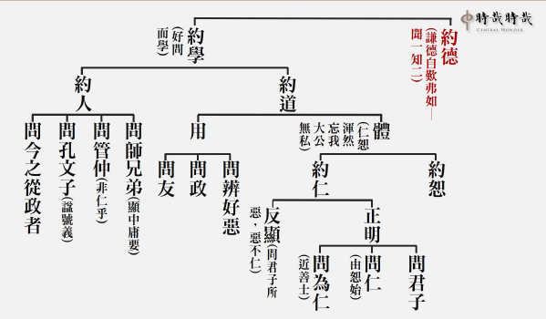

### 孝道跨時代的意義與價值—孝經簡說(十一)　孝是聖人之德也無以復加 —〈聖治章第九之二〉

時哉講述、淨域編寫

聖人功業修身起

推展家教風氣多

祭祀念恩孝為本

臨民德威畏愛之

〈聖治章第九〉的第二回，重點是什麼呢？就是告訴我們家庭的出路，在於「蒙以養正聖功也」。這段話出自於《易經∙蒙卦》，孔子說：孩子從蒙昧無知時，即要「養正」使之開竅，讓他懂得孝順父母，以確保孩子一輩子的幸福。

此章架構，總說「孝是聖人的至德」，是最高的德行；分別來顯示，孝道為什麼是至德的理由，於前次已說明。

此回的進度是-「聖人辦政治興教育，以孝為根本」。總說聖人教孝，乃因家中父母，尤其是父親能夠(嚴)辦家政；所以，對孩子們有教育，孩子們就懂得敬父親；父親對孩子有親，孩子就懂得對父親有愛。其中也引申於對母親。

如果政教有孝道作根本，便能夠大治天下。總而言之，孝道是重在父母，父母除了對孩子有親，也如君臣之間的關係般主持家政。所以，聖人教孝時，一分講親情，一分講主持家政的「敬」，令孩子對父母有愛有敬。

反面告誡，若不從孝道來是悖德、悖禮。居上位的人推展孝道及各種品德教育，不以身作則會適得其反，產生很大的過患，稱作「民無以取法」。如此愈推展禮樂，愈加速禮樂的敗亡，謂之「禮崩樂壞」。所以，君子對於不以孝出發的品德教育與禮節，雖高位也寧可不要。進言之，居高位的人拚經濟，若不能讓百姓從孝道出發，提升內涵與品格，這種地位寧可不要。

下一次的進度是「依著孝道的行持，能夠具有成效」，具什麼成效呢？他的「言行」可以利益百姓，「德義」可以讓百姓遵守，「做事」可以讓百姓效法，「容止」可以讓百姓體察、觀摩，「進退」禮儀可以作為百姓的標準。合起來說，若為政者懂得以孝為本質，外在能夠表現這種氣度與威儀，會產生百姓對領導者既敬又愛，接受他的德孝並視若楷模加以效法，進而奉行領導者頒布的政令。所以，最後讚歎說：孝行是君子的行持與該有的修為，更是其在推展政令時該有的本質。

本章的經文是：「曾子曰：『敢問聖人之德，無以加於孝乎？』子曰：『天地之性，人為貴。人之行，莫大於孝，孝莫大于嚴父，嚴父莫大于配天，則周公其人也。昔者，周公郊祀后稷以配天，宗祀文王於明堂以配上帝。是以四海之內，各以其職來祭。夫聖人之德，又何以加於孝乎？故親生之膝下，以養父母日嚴。聖人因嚴以教敬，因親以教愛。聖人之教，不肅而成，其政不嚴而治，其所因者本也。父子之道天性也，君臣之義也。父母生之，續莫大焉。君親臨之，厚莫重焉。故不愛其親而愛他人者，謂之悖德；不敬其親而敬他人者，謂之悖禮。以順則逆，民無則焉。不在於善，而皆在於凶德，雖得之，君子不貴也。君子則不然，言思可道，行思可樂，德義可尊，作事可法，容止可觀，進退可度，以臨其民。是以其民畏而愛之，則而象之。故能成其德教，而行其政令。』《詩》云：『淑人君子，其儀不忒。』」

釋義

經文：

「故親生之膝下，以養父母日嚴。聖人因嚴以教敬，因親以教愛。」

(因嚴親以教愛敬)「膝下」指孩童幼小時，其高度及於父母膝蓋，可見「承歡膝下」一詞出自於《孝經》，膝下指的是小孩子，子女是承歡於膝下的，為什麼？因為他愛父母親，常見幼兒離開父母，若到了晚上還見不到雙親，就一直哭鬧，怎麼哄都沒有用，可見他天性上對父母親是十分親愛的。那麼「以養父母日嚴」呢？是說孩子慢慢長大，懂得道理了，所以能尊重父母。「嚴」就是尊重，他慢慢地懂得尊重了，這與家教有關。聖人因懂得尊重父母所以教敬，因懂得對父母有親情所以教愛。

經文：

「聖人之教，不肅而成，其政不嚴而治，其所因者本也。」

(政教有本而大治)意即懂得聖人的教育，辦教育不必很嚴格肅殺，就能把人培養成人才。辦政治也不必嚴刑峻法，推行政務就能天下大治。這是為什麼呢？乃是所行皆有所本，這個根本就是孝道，孝道的推廣，必要以身作則，才會有人才團隊來輔佐。

經文：

「父子之道天性也，君臣之義也。父母生之，續莫大焉。君親臨之，厚莫重焉。」

(重在父母君臣)接著說整個家庭，既重親情，也重君臣之義。父慈子孝是天性，且帶著君臣之義。

延續命脈是家庭最重要的事情。常言：「不孝有三，無後為大。」家庭要延續，民族也要延續，成立團體辦道場也重在延續。延續家庭除了有親愛的風氣外，還有君臣的關係，叫作「君親臨之」。對著小孩，父親的這種恩德是最厚的，除了懂得與孩子們有親情，還要有君臣之義，讓孩子有尊敬長上的禮節，這對日後進入社會太重要了！現今許多年輕人離家後，不懂得尊重別人，不曉得要吃多少虧、碰多少釘子。雪廬老人說：「人生呀！許多的道理都不懂，要吃多少的暗虧。」這包括死後棺材封釘，還是會碰釘子，一路碰釘子碰到死。為什麼呢？人情世故不通之故。若家庭教育不從這兒好好教起，年輕人不知道要走多少的冤枉路，要吃多少的暗虧。這怪孩子不懂嗎？有時父母也得擔一些責任。

經文：「故不愛其親而愛他人者，謂之悖德。」(不愛親-悖德)反之，若對父母親沒有親愛，而去愛他人，這叫作「悖德」，即是違背品德。德性是一種能力，若能力是自私自利的，其愈發展愈糟糕。

經文：

「不敬其親而敬他人者，謂之悖禮。」

(不敬親-悖禮)至於不尊敬自己的父母，反而敬他人者，這叫作「悖禮」。禮的本質在敬，若違反禮敬，因虛假而愈發展愈糟糕。換言之，根本不是發自內心去尊敬別人，愈發展這樣的禮，風氣會愈來愈糟糕，謂之「禮崩樂壞」。禮崩樂壞不是沒有禮、樂，而是發展禮樂的人不以身作則，反而加速禮樂的崩壞。

經文：

「以順則逆，民無則焉。」

(民無以取法)欲使百姓順從，百姓卻效法你的逆行。諸如：雖然推展的是品德教育，但百姓效法的是你內心的違逆。此心之違逆就是不敬父母，所以沒有品德的人推行政事，百姓反而會效法你無品的心行。譬如：一個喜好貪污徇私舞弊的君上，三令五申要官員廉潔，要百姓遵守秩序，這是不可能的。

經文：

「不在於善，而皆在於凶德，雖得之，君子不貴也。」

(君子不求無德禮之位)若我們的善不從孝行出發，所有的善將導致於痛苦，這叫作「皆在於凶德」。即便可獲致極高的權位，君子也不要，不看在眼裡。因為不好好的由孝道來推展品德教育，其位置愈高，引發的災難愈重。

經文：「君子則不然，言思可道，行思可樂。」

(約言行)所以一般來說，利益天下蒼生的君子，他寧可是從孝道本質出發的「言思可道」，言語想著是利益別人的話才說。那麼「行思可樂」呢？在行為上，想著能讓人家快樂，這樣的行動才去做。

經文：

「德義可尊。」

(約德義)「德」就是內涵，「義」是見地；他的內涵與見地，是百姓可以遵守的。

經文：

「作事可法。」

(約作事)再者，他的行事是可以效法的。

經文：

「容止可觀。」

(約容止)他的容貌舉止，是可以觀摩的。

經文：

「進退可度。」

(約進退)他的進退禮儀，可以作為百姓的標準。

經文：

「以臨其民。」

(合明)用這種內涵與外相，來面對他外在的威儀及廣大的百姓。

經文：

「是以其民畏而愛之。」

(民畏愛)「畏」是恭敬，百姓既恭敬他、又愛戴他。意即此一領導者，能夠把國家或天下，當成一個大家庭來經營，自己成為大家長。百姓對待他像對待大家長一樣，謂之「又愛又敬」。又愛者，是因為知道這位領導者，是個勤政愛民的人；又敬者，是這位領導者懂得辦教育，懂得讓百姓建立人格、尊敬長上。

經文：

「則而象之。」

(民效法)「則」是有榜樣；「象」是可以效法的；意即百姓有可以效法的榜樣。

經文：

「故能成其德教。」

(受德教) 「成其德教」是接受教育，且政令能夠風行朝野，上下一致遵守。所以，君王推展的德教是有成就的，不會沒有效果。譬如：推展文化教育，到頭來百姓反是不尊崇；推展品德教育，百姓不會作奸犯科。

《詩》云：

「淑人君子，其儀不忒。」

(讚孝行為君子行，舉詩經曹風)這樣的氣象是什麼呢？《詩經∙曹風》說：「淑人君子，其儀不忒。」淑人是善人，是指懂得經營內在、從孝道出發的善人君子。「儀」指人的外在，包括言語、辦事、行止、德義、政令等，都不會有差錯。因為，此人懂得家庭經營的和諧之道，用此來經營團隊、國家與天下，如此是不會有差錯的。

附註：因篇幅過長，析疑與總結下期刊登。（下期待續）

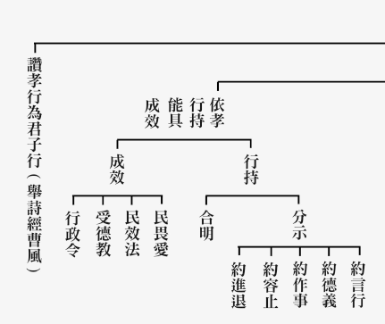

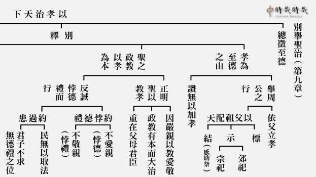

### 孔門心法—中庸之道(六)　第二章 君子小人之別，在於中庸

*時哉講述、茅茹讀書會、弘毅整理*

用中形象難辨明

善用情緒非濫好

內心隱微在出世

芸芸眾生何能知

前言

科比意，他是現代建築之父。他的建築結構和形式內涵，引領二十世紀的風潮，在二十一世紀也延續著他的影響力。新一代的建築，如果要在建築的境界上樹立地位，只有兩種方式，延續他或者推翻他。

對於孔子，也是如此。孔子的學術價值是經得起百代的考驗，很多人罵他是為專制帝王服務的走狗，可是孔子的學說裡，很多都是在約束帝王，並非為專制帝權服務。若論對專制帝王有利，他們應該弘揚法家，為什麼弘揚儒家呢？因為儒家才能真正帶來百姓的幸福，引領全天下人民，走向希望幸福的康莊大道。

孔子的學說是中華文化的道統，包括內聖和外王的學問，整部《中庸》比較偏向於內聖部分。可以從《中庸》裡面，看出孔子在形而上的見地，他是一個出世的聖人，然而他又是一個能入世，具有悲憫天下蒼生情懷的君子。

《中庸》有三十三章，第一章子思闡述了「中庸」的重要性，在第二章，子思以「中庸」這個面向來觀察，辨別君子與小人。君子順應「中庸」，凡事恰到好處，符合時機；小人違逆「中庸」，不了解「中庸」的好處，而肆無忌憚的倒施逆行。順著「中庸」或者逆「中庸」而行，就決定了是君子或是小人，也決定人的一生，到底是要趨吉避凶，逢凶化吉，還是淪落趨凶避吉，伏藏凶兆，答案就在「中庸」裡。

本章科判分析

第二章是分別顯示中庸的宗義，「宗」就是修學法，「義」就是義理。

整體架構是君子與小人之別，分為兩段，第一段總標君子和小人的差別，第二段分別解釋君子學習相應中庸之道，小人是違反中庸。可見，中庸不但是凡聖之別，還是君子與小人之別。

消文

經文：

仲尼曰：君子中庸，小人反中庸。君子之中庸也，君子而時中；小人之中庸也，小人而無忌憚也

。

孔子說：君子是一個用中的人，小人是一個違反中庸的人。

君子之中庸也，君子而時中；

解法一：君子之所以中庸，是因為他具有君子的外相，而且內在的涵養又能夠時時的用中；

解法二：君子之所以中庸，是因為他能時時相應中道；

小人之中庸也，小人而無忌憚也。

解法一：小人之所以違背中庸，是因為具有小人的外相，而且為了爭名奪利，無所顧忌害怕。

解法二：小人之所以違背中庸，是因為小人能夠為了爭名奪利，無所顧忌害怕。

「而」字，鄭康成注解為：而且，連詞；俞樾的《羣經平議》注解為：能。

闡釋義理

一、本章與前章關係為何？

第一章重點是說，以形而上的中入形而下的時候，能夠和諧萬民；第二章又告訴我們，「中」，不只是凡夫和聖人，還是君子和小人的差別。

二、為何此處是仲尼曰？

朱子認為，子思在第一章立論了中庸的重要性，而且我們學習中庸之道，是如人之於空氣，水之於魚一般不能離開。「道也者，不可須臾離也，可離，非道也。」若能如此，修學必能成功，佛家稱為「淨念相繼。」第二章舉出仲尼曰，表示用孔子所說，來證明第一章的立論。

而且朱子還認為第一章是經，後面第二章到第三十三章都是論。而鄭康成認為，各章都是獨立的。

三、中庸是聖人的內涵，此處何故說君子中庸？

君子入世，要有出世之德，才能夠在入世時利益眾生。面對很大的順境時，如名聞利養、各種陷阱、誘惑、勾引，能夠不被這些境界繫縛；面對很大的逆境時，又能克服種種障礙，不會退轉。否則不但不能度眾生，反而被眾生所度。所以君子入世，要具有中庸之德，才能真正入世，真正利益天下蒼生，故說君子中庸。

四、本章孔子所語，其語氣為何？

此章是孔子感嘆的語氣，因為君子具有中庸之德，而小人是違背中庸的，這種內涵已經很久沒有人學了，或者是斷了傳承，或者是為政者、從教者，不會以它作為本質來辦政治和辦教育。

他的感嘆語氣如《論語·雍也》篇裡說：「中庸之為德也，其至矣乎，民鮮久矣」。可是老百姓離開中庸之道已經很久了，能懂中庸之道的人已經很少了。辦政治與辦教化的人，也不以中庸為本質，都是強兵霸權、追逐名利，人生只求眼前的享樂，目光如豆，沒有高遠的、出世的人生觀，所以這是孔子的感嘆。

孔子的感嘆語氣還有：「八佾舞於庭，是可忍也，孰不可忍也」，季氏在自己的家廟跳八佾舞，這件事情都做得出來，什麼事情他做不出來呢？三家大夫撤饌時唱雍詩，以大夫身份來僭越天子的禮。或者「隱居以求其志，行義以達其道，吾聞其語矣，未見其人也」，這種話我聽過，這種人我沒見過，像這種文句都是感嘆的，我們要讀出這種語氣。

五、君子與小人之別，為什麼可以用中庸來區分？

君子與小人的差別，可以從多個面向來看，如君子是公，小人是私；君子是仁，小人是不仁；君子是利他，小人是利己；君子是修養自己的品德，小人內心是追逐名利。

中庸可以看出君子和小人的差別，因為真正有心要去利他的人，如果沒有學習中庸是不能利他的，反而在利他的時候會變質，隨著他的福報愈大，變質就愈多。俗話說，小權力使人小腐化，大權力使人大腐化，絕對的權力使人絕對的腐化。順境腐化，逆境退轉，這怎麼利他呢？

所以君子如果要行君子之德，一定要懂中庸，立住自己的品格。小人不懂中庸，隨境而轉，隨著順境起貪，逆境起瞋，不能堅持品格，甘於下墜，所以中庸又是君子和小人之別。

可是中庸必須要透過教育才知，沒有教育，人做不了君子、聖人。所以辦政治的人，如果不懂得中庸之道，就無法把人真正變成好人。政治辦得不好，老百姓生活差，鋌而走險、治安敗壞；政治辦得好，老百姓享受，好逸惡勞、奢侈淫欲。所以，政治辦不好是危機、死路，政治辦得好也是危機、死路，可見中庸之德有多麼的重要。

六、君子的中庸從哪裡來？

君子一定要學中庸，才能夠成就君子的功德，子貢曾經跟著孔子周遊列國，厄於陳蔡的時候，子貢聽到孔子的性與天道，很感嘆的說：「夫子之言性與天道，不可得而聞也」。

中庸是待機而聞，首先，有心向上、福國利民之人，這樣的人是中庸之機；其次，這種人還要經過苦難歷練。孔子在周遊列國厄於陳蔡的時候，看到弟子們能夠接受這樣的考驗，所以孔子就談性與天道。子貢是個富可敵國的人，在陳蔡之厄時，願意跟著孔子共患難，當他聽到性與天道時，他非常的感慨，感到慶幸。那些沒有跟隨孔子周遊列國顛沛流離、共患難的人，雖然沒有吃到苦，可是中庸之道也沒有聽到。

人生到底要怎麼過才有意義呢？是學道的人生，還是吃喝玩樂的人生？那些貪圖享樂之人，在吃喝玩樂之後，他的內心還是空虛的。而真正學習中庸之德的人，他的內心是非常快樂的，叫作「學而時習之，不亦說乎！」而且慢慢的會感應很多人跟他學習，「有朋自遠方來，不亦樂乎！」這種人不會在順境中退轉，也不會在逆境中失落，「人不知而不慍，不亦君子乎！」

七、君子中庸其功為何？

真正學了中庸，就不會被形而下的境界所繫縛，這樣的人特別有風采、氣質，見地與世間人不一樣，很多的君子會對他贊同，很多人會死心塌地的跟他學習，古人說「得道多助」。他能夠堅持他的道德，也容易把善事做完，容易在眾人才的護持當中，建立殊勝的事功。反之，沒有學中庸的人，無法立住品格，不能得到君子的擁護，入世也顯現不出風采，只剩下吃喝玩樂。我們要經營有意義的人生，找到人生存在的價值，那種快樂不是世間人可以懂的。

八、君子如何相應中庸？

前面說「夫子之言性與天道，不可得而聞也」，可見聞很重要。要想與中庸相應，第一步就是聞，第二步是思，第三步是修。思，就是要從各個面相去想這個中庸的內涵；修，就是把道理運用在日用平常。我們能體悟的內心是德，所體悟的是中庸之道，所謂「道也者，不可須臾離也，可離，非道也。」「君子而時中」，當你能夠時時的相應「中」，你就會把握時機，清楚的知道該進則進，該退則退。

九、時中之「時」其重要性為何？

失去時機的人生有兩種，一種是時機不到，一種是錯過時機。時機不到，結果你卻要這樣做，這叫作躁進；時機有了，結果你不去做，這很可惜，時機失去了不會再來。

時機恰到好處就是該進則進，該退則退，整部易經，其實都在講這個「時」，孔子就是一個掌握時機的人。

在《論語.微子》篇裡面，孔子曾經說，他和伯夷、叔齊、柳下惠、虞仲、夷逸、朱張、少連這七個隱士不一樣，他是無可無不可，時機可，他就可；時機不可，他就不可，完全看時機。掌握時機，那是易經非常通達的人，他才知道掌握時機的重要，在時機到來時，很清楚的知道怎麼辦。

在《孟子》裡面形容，伯夷是聖之清者，因為他有讓位之德，所以是清高；伊尹是聖之任者，因為他擔當大任，商湯王過世，國家大任交在伊尹的手裡，伊尹能夠輔弼太甲，叫聖之任者也；柳下惠是聖之和者，他三次被貶官，都沒有關係，他是一個能夠和諧的人，不在乎個人的名聞利養；但是孔子是聖之時者，能夠掌握時機，這才是最高的。

十、聖之時者，如何是聖人中最高的境界？

孔子自述他的一生，到最後叫作「七十而從心所欲不踰矩」，就是身體、言語、內心怎樣都不會超過法度，這是因為能夠把握時機。當形而上的學問通達到究竟，入形而下的時候，清清楚楚知道它的緣起在哪裡，該進則進，該退則退。只有通達甚深的形而上，才能夠通達甚深的緣起。

君子不會有心犯罪，但君子會犯過，就是不能把握時機，該進沒進，該退沒退。譬如子路，該勇的時候勇，不該勇的時候繼續勇；冉求該退則退，但該進的時候還是不進，這就是過。君子入世要除過，一定要學中庸。孔子整個一生，都是在中庸上學，十五志於學中庸，三十學中庸而立，四十學中庸而不惑，五十學中庸而知天命，六十學中庸有耳順，七十學中庸從心所欲不踰矩，這一章也可以這樣讀。

十一、論語中，君子得中庸的形象為何？

在《為政》篇裡面，就講到「君子不器」，就是講到君子得中庸。器，就是指世間，不器，就是不被世間所繫縛，通達形而上超越世間，這是聖人的證量。

在《憲問》篇裡面也說，表現君子之道有三個，其中一個叫作「智者不惑」，就是學中庸不被世間所迷惑，世間的名聞利養、功名、榮華富貴、妻子兒女、家產田園，這些境界都不能繫縛學中庸的君子，他們能夠超越境界、超越世間。這種人在世間只依道依禮而行，用再大的名聞利養，再大順境、逆境，都不會讓他改變志向。

《陽貨》篇裡說，「不曰堅乎」，這個人的心志堅如鉆石，怎麼磨都不會變薄。就是說君子學道、利益眾生的心，無論怎樣考驗他，都不會改變志向。「不曰白乎」，像美玉一樣，怎麼染都不會變黑，就是君子入世時不會被染污。一般人在名聞利養的場合裡面久了以後，心都變黑了，他退轉了自己都不知道。又堅又白，就是君子學中庸成就君子之德的形象。

十二、小人如何反中庸？

小人在世間裡面，他只會看到富貴權勢、名聞利養，人生的安樂，生活的享受，與人交往只看是否對他有利益可圖。他不會有利他的想法，不會有感恩的心，他是遠離道德、遠離經典的。經典裡面講到利他，超越名聞利養的繫縛，講到人生要怎麼去充實內涵，追求道統，他都是很討厭聽的，聽到這些教法也是悶悶不樂。他對道德、學問，對這些聖人和君子，也是遠離的。

十三、反中庸之過為何？

小人的過患是會把好的風氣敗壞，會把風俗變得刻薄，國家如果運用這種人，他們容易結黨營私，上下交爭利，則國危矣。和這種人交朋友，你人生也注定不好過，娶到這種太太，嫁到這種先生，你也注定不會幸福，生到這種小孩，你也很頭痛，以上就是小人反中庸之過。

十四、無所忌憚的形象為何？

小人反中庸就會無所忌憚，因為沒有了解中、形而上的內涵，不能像君子那樣，不受名聞利養等形的繫縛，超越世間，他也不知道入世去利益世間，所以小人無所忌憚。小人不會有道德的約束，內心不會害怕君子和聖人，害怕道統，害怕這些正知見，害怕天道報應。小人所忌憚的是對他不利，或者是巴結不上那些權貴之人。

在《論語》裡面，對小人無所忌憚的形象有很多描述：

第一、「小人窮斯濫矣」，小人如果窮途潦倒的話，就會為非作歹；

第二、「不仁者，不可以久處約，不可以長處樂」，小人如果貧困就會為非作歹，富樂也會驕奢淫逸，敗壞社會風俗；

第三、「小人喻於利」，小人只會在乎利益；

第四、小人是「成人之惡，不成人之美」，因為風氣、局面愈亂，對他愈有利；

第五、「小人有勇而無義為盜」，小人內心裡面沒有正法為標準，所以容易貪贓枉法；

第六、「小人同而不和」，小人容易同流合污，就是在名聞利養上同，但他內心不是利他的，自然不會真正與人和，團體能和一定是互相替對方著想，如果都只替自己著想，這個團體必不和！如果一個團體只剩下利害關係，這個團體是可悲的；

第七、「小人求諸人」，小人對自己不要求，處處要求別人，犯過時一定推給別人。

十五、有所忌憚就是合乎中庸嗎？

有所忌憚也未必合乎中庸，譬如說，狷者就是指那些保守的人，有所不為，可是該為的時候他還是不為，這也不合乎中庸，這種有所忌憚是處處害怕，處處顧忌。如果是處處怕犯法，怕為非作歹，這是對的，但如果做善法也害怕，害怕傷到自己，這未必是中庸之道。

可是中庸之道，一定有所忌憚，就像曾子說的，「戰戰兢兢，如臨深淵，如履薄冰」。可是戰戰兢兢，如臨深淵，如履薄冰的人，未必是修道人。世間有很多人很膽小，什麼都怕，做壞事也怕，做好事也怕，所以雪廬老人說，有時候浪子回頭比什麼都厲害。世間的人只要對自己不利的都怕，有時候反而還不如浪子回頭的人，作惡到最後想反省，跺腳不幹就不幹，以此狠勁拿來做善，往往那些小善人都比不上他。

所以我們要把孩子培養成人才，不是把他培養成乖乖牌，要讓他能夠走入這個時代，能夠擔當大任，能夠真正去利益別人，發揮他所學的功用，而不是為了一己之私，從小一直學到大學、碩士、博士，雖然有這麼高的學歷，但內心是自私的，這麼多的資源，最後拿來自己享受，這樣的人生有何意義呢？

十六、縱觀君子合乎中庸仍多無用於世，要如何生起對中庸的信心？

《論語.憲問》裡面說到，「不怨天不尤人」，對命運不好不會抱怨，對他人對我的傷害不會怨恨，「下學而上達」，下學就是對世間的學問，如六藝等加以學習；上達是學中庸。二者合起來的時候，這種人的命，叫作「知我者其天乎」，大概只有天才會知道他有多好命。

中國讀書人中最好命的就是孔子，孔子下學六藝，乃至於利益天下蒼生的學問，上學中庸，具備利益世間的心態、能力和道德，以及組成人才團隊發揮大用，他的好命是沒有人可以知道的。

十七、儒家中誰是君子而具中庸的典範？

除了孔子，還有「其庶乎屢空」的顏回，還有「一以貫之」的曾子，還有中庸的作者子思，這些都是儒家中君子而具中庸的典範。

十八、學習本章對我們人生的幫助為何？

第一、《易經.繫辭傳》裡面說「物以類聚」，你如果好好的學中庸，慢慢的你會聚一些有道德的有志之士，這叫物以類聚。

第二、你會具有處世的原則，不會因為得了世俗的名聞利養而生喜，也不會因為失去而生悲。會變得道德高超，見地高遠，心思開朗，煩惱會比一般人少很多，心情比他人愉快 ，能夠交到真正的朋友，做善法的時候得到的幫助，是別人想像不到的。

十九、吾人處世，若求不到中庸的君子，當如何是好？

《論語·子路》篇裡面說，「不得中行而與之，必也狂狷乎」，如果你找不到學中庸的君子，那就找那些狂狷之人。狂就是說這個人雖然進取，但有時候該退他不退；狷是有所不為，可是有時又失去時機，但這兩種人質地都不錯。狷的人不會害人，狂的人有心要去利益別人，只是有時候往往利益的不如法，但他們的心思都是單純的。狂狷之人來學中庸，能夠使狂者收斂，狷者進取，所以找到狂狷的朋友，大家一起來共學，「以文會友，以友輔仁」，這個人在世間是最快樂的。

總結

第一、中庸稀有難聞，要珍惜。不論是在線上或在現場學習，都應該當成很難得、很稀有來學。然後我們按照正確的註解來學，而且是分章、有次地的來學，有問題的時候，能夠互相切磋琢磨的學，而且是大家一起來共造善業的學。如此你必定會有一個開闊、幸福、光明，能夠給後代帶來典範的人生，而不是一生只有庸庸碌碌的過日子。

第二、中庸之道長遠，要用功。學習中庸是一條長遠的路，因為它要花很多的時間，要投入很多的心血，要把全部心志用上，而且有志同道合的朋友共造善業，要有倍感幸福的感覺，因為這是人生唯一的出路。

問答

**問：** 此處的「中庸」和「中和」有何差異？

**答：** 中庸的「庸」，可以解釋成「用」，用中；或可解釋成「常」，就是說「中」是一個長久不變、萬古恆常之道。中和的「中」，是形而上；「和」，是形而下，是入世的運用。

具備中庸的人，他不但能夠在形而上合乎中，在形而下也能和，一個不在乎名聞利養的人，不受這些名聞利養的境界繫縛，入世的時候自然能夠發揮利他的功能，而且依禮而行，能和。所以用中的人，他不但能夠成為出世的聖人，也可以成為入世的君子。

**問：** 如果君子他已成就中庸了，為什麼不稱他為聖人呢？

**答：** 君子跟聖人是兩回事，君子，不一定成就中庸，這裡講「君子中庸」，是說真正入世做君子的人，要合乎中庸，他才能夠真正入世。其實具聖人之德的君子，才是真正的君子；具君子之德的聖人，才是真正的至聖。孔子就是具君子之德的聖人，而且入世的時候，是具聖人之德的君子。

**問：** 鄭康成（鄭玄）將「無忌憚」解釋成「無畏難」，請問這是甚麼意思？這樣可以通嗎？

**答：** 無畏難是不怕困難，而這裡無忌憚的意思是說，小人沒有道德的軌範，良心的譴責，也不相信天理報應，他沒有這些顧忌，心狠手辣，做惡事也不會害怕。但是小人也有顧忌，害怕做了很多事情東窗事發，害怕為了利益互相殘害。

所以，上聯是：小人也有無顧忌，也有顧忌；下聯是：君子也有顧忌，也有沒顧忌。橫批是：從你的顧忌當中，看出你是君子還是小人？從你的不顧忌當中，看出你是君子還是小人？

**問：** 「君子而時中」和「發而皆中節」，時中和中節，它可以說是同樣的意涵嗎？

**答：** 「中節」是說，入世的時候合乎禮的節制，該進則進，該退則退。孔子回到家鄉的時候，就要以長幼尊卑來論，到朝廷的時候，要論地位高低，這就是依禮，不同的場合、身分，要有不同的做法，這叫作中節。時中是說，時時的跟中庸相應，中庸形而上的見地是時時不離開，然後用這種見地去抉擇形而下。

**問：** 在十三經的注疏本裡面，關於「小人之中庸也」這一句，王肅把它改為「小人之反中庸也」，請問這樣可以嗎？

**答：** 醒公說，「小人之中庸也」比「小人之反中庸也」更好，「君子之中庸也」，君子是時時跟中相應。「小人之中庸」，小人是無忌憚的，就算他碰到中庸之道的君子，心裡不會真正看重他，看到中庸的教法，也會覺得毫無分量。進德修業，利他的見地，以及聖人處世的經驗閱歷，這些真正的趨吉避凶之道，在小人心中是一毛不值的。現代人對《論語》也是如此認知的，認為是糟粕，與所追求的榮華富貴毫不相干。

**問：** 小人無忌憚跟小人不知天命而不畏，是否有不同處？

**答：** 二者相同。

**問：** 有註解是這樣說，以性情言之，則曰中和，以德行言之，則曰中庸，這樣的註解是否可採？

**答：** 其實中和，是約法的通達而言，不是依性情來說，中是講形而上，和是講形而下。中和就是以形而上的中入世能和，用中能和，然後依和來顯中，這樣能夠通達兩邊的人是非常厲害的。中庸的確是一個德行，德就是智慧力，用中是一種智慧力。

**問：** 夫子是「聖之時者也」，是否可以引用《論語》上所說，「空空如也，叩其兩端而竭焉」的入出同時來證明呢？

**答：** 「空空如也」是講他「形而上」的成就，「叩其兩端而竭焉」他是入世的能耐，這是可以的。

**問：** 現在很難遇到能用中的聖人，請問像狂與狷的善人，在辦事時要如何做到和合使意見統一呢？

**答：** 很難！所以孔子才會說：「歸與歸與，吾黨之小子狂簡。」雖然這些人都不錯的，可是必須待有「中」的人去裁，使狂的變成不狂，狷的變成有所進取。小人與小人和不來，有時君子和君子也和不來，必得更高之人去調和他們。所以如何充實自己，然後與君子結成團隊，這也是一個非常重要的人生出路。

**問：** 這一章提到，小人不知天命，是否小人一生就不會有人度他呢？

**答：** 小人有兩種，一種是指不學無術，而且心術不正之人，君子唯恐避之不及，當然不肯度他；另一種是指一般的庸庸碌碌之人，然而如果有一天他翻然改悔有心進取的時候，何嘗不是他得度的機緣呢？

結語

中庸是凡聖之別，也是君子和小人之別，從凡夫到聖人，從小人到君子。真正離苦得樂的關鍵就是中庸，這也是孔子的心法。學習《論語》、《大學》、《中庸》、《易經》等經典有關「用中」的語句，以及參考道家和佛家，你對中的體會就不是泛泛的。如果對中都沒有辦法聞、思、修，那該如何用中？不能用中，怎麼和？我們都說和，但如果不是透過學習經典，在見地上和，在品德上和，在很多人生共同的看法上和，是做不了大事的。一般都是要求大家忍辱負重，表面上的和，這是沒用的。（下期待續）

## 藝術賞析

### 孔門七十二賢淺說（二十二）
				          ─梁鱣

孔門七十二賢淺說（二十二）

─梁鱣

圖：江逸子‧文：時哉

聖門座下各不同

狂狷皆待夫子栽

歸與歸與盼培才

性情不同皆歸正

梁鱣，字叔魚，齊國人，居齊國千乘北面尼山，從游聖門甚久，小孔子二十九歲，在齊景公時從學孔子。

孔子家語中記載，梁鱣到了三十歲還沒有兒子，因而想要出妻，結果商瞿告訴他：您不要這樣。過去我三十八歲還沒有孩子，我的母親要為我再娶。老師（孔子）派我去齊國，母親想要請老師讓我留下來。老師說：不用擔心。瞿過了四十歲，應當會有五個兒子。如今確實是如此。我怕是您自己應當晚年有子，未必是妻子的過失。梁鱣聽從了商瞿的建議，兩年之後，果然生了孩子，取名贖字子襄，後為曾子的門徒。

梁鱣於東漢明帝永平十五年從祀，唐開元二十七年追封梁伯，宋加封千乘侯，明朝改稱為先賢梁子。

畫中的梁鱣雙手合抱似乎納諫，貌似厚道之人。有道是：福在受諫。宅心仁厚，自然獲福。二年之後得子，是命呢？還是自己所修之福呢？

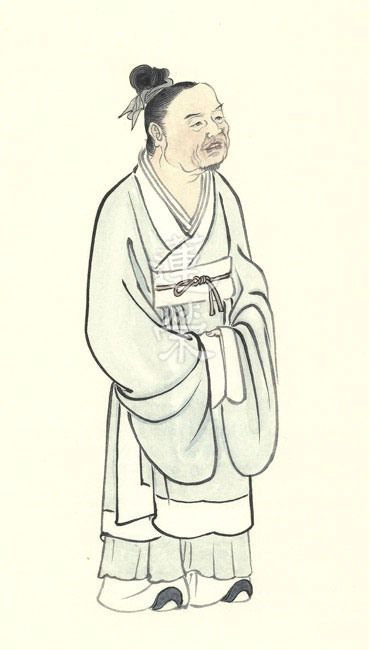

### 華夏精魂千秋(二十三)
		  —明倫史畫─信諾重義─范式

華夏精魂千秋(二十三)

—明倫史畫─信諾重義─范式

圖：江逸子‧文：淨域

文化能感在人心

道義交往信為先

生死雖非同日月

相知相惜是一味

史話

范式，字巨卿，東漢兗州山陽郡金鄉縣(今山東省金鄉縣)人；生卒年不詳，約當漢光武帝時期。年輕入太學，與豫州汝南郡人張劭(字元伯)結為共學好友。張劭常對人說：「范式是我最知己的朋友。」
太學畢業將各自返鄉時，范式依依不捨地對張劭說：「兩年後的某天，我將到你家拜訪，探望高堂與幼子。」當約定的日子快到時，張劭將此事告訴母親，讓母親準備酒菜款待客人。母親說：「兩年前約定的事，如今兩地分隔千里遠，你確定他一定不會爽約嗎？」張劭回
**答：** 「范式是個講信用的人，承諾的事一定不會違背。」母親說：「既然如此，我就為你準備酒菜。」到了約定日，范式果然如期來到，大家把歡暢飲敘舊，最後開心地道別。

分別後，書信往來聯絡，期盼著下一次的聚會。好景不常，張劭突然生場大病，躺在床上日益嚴重，諸多好友前去看望照顧他，他卻感傷的說：「人的生死由天註定，我並不怨恨什麼，只是我與范式最為知交，如今不能再見一面，真是感慨又難過呀！」當天夜裡，張劭就病逝了。

張劭過世的這一夜，范式在夢中見到他，驚喜地問道：「元伯，你怎麼來到山東呀？」不料張劭卻流淚地說：「巨卿，我在今天病逝了，將於初八這一天下葬，如果你沒忘記我，希望能來為我送行。」當范式欲再詳問，天際響起一聲雷，他張開眼只見窗外飄雨，哪有張劭的影子。他想起張劭的身體不好，不禁悲傷起來。

次日起身，便僱用馬車，將人車素色裝扮，飛快的往南前去。山陽到汝南路途遙遠，即便他日夜兼程趕路，都無法趕到靈前祭拜。初八這一天，出殯的隊伍依時辰開動，到了墓地要下葬時，棺材突然變得很沉重，任憑再多人來扛都搬不動，似乎不肯進入墓穴的樣子，大家都感到納悶。

張母見到此景，明白其中的原故，就撫摸著棺木說：「兒呀！難道你還有什麼心願未了嗎？」即示意大家再等一會兒。約莫過半個時辰，見一輛白色馬車飛奔而來，張母即對著棺木說：「兒呀！范式來送你了」范式下車抱著棺木痛哭，輕敲著說：「元伯，你可以走了。我倆生死不同路，從此永別。」隨後拉著繩索，隨眾慢慢將棺材放入墓穴，又在墓前遍植花木後，才依依不捨地離去。范式在東漢初年為官，曾任瀘江郡(今安徽省舒城縣)太守、荊州刺史等職。

圖解

《說文解字》說：「信，誠也，從人，從言。」也就是說，「人言成信」，「誠從成言而得」。要做到「信」，必須說話誠實，言出必行。那麼，何為「義」呢？《孟子》云：「義，人之正路也。」韓愈〈原道〉說：「行而宜之之謂義。」可見，「義」是指人們的思想和言行合一的道德表現。

此圖中江老師所繪，乃范式夜夢心靈感通，研判知己重病垂亡，連日僱馬急奔南下送殯之景。左下角的白馬素車，寓意其馬不停蹄地兼程趕路，想見老友最後一面的誠心與動力。而張劭最知好友重信守義，一定會趕來為自己送葬，所以棺木雖已來到墓前，卻沉重得一時無法搬動。幸賴張母深知二人的交情，相信范式一定會趕來送別，所以示意大家等一會兒。果然不出所望，范式終於即時趕來，著上白衣素服叩拜好友，感得一旁的親友們共掬酸淚。

中國自古對信義有深刻的領悟，言說：「與朋友交，言而有信；人而無信，不知其可也」、「以信接人，天下信之；不以信接人，妻子疑之」、「有所許諾，纖毫必償；有所期約，時刻不易」。是以歷代留下許多感人的誠信故事，諸如：「季札掛劍」、「卓恕赴宴」、「道琮護棺」及本故事的「范張雞黍」等等。由此可見，人重信守義，才會贏得他人的尊重。同樣，對於國家而言，信義是立國的根基，政府須取信於民，才能強國富民。反之，最終的結果或是身敗名裂，或是家覆國亡。（下期待續）

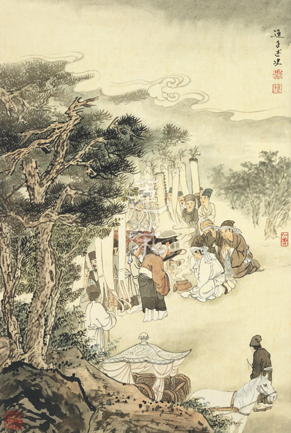

## 專題講座

### 雙國記之二
		  —近代中國

雙國記之二

—近代中國

*戒澤講授‧淨域整理*

西風東漸大衝擊

小儒固執失權變

國勢積弱須變革

近代史實是借鏡

這一節課要談談中國，首先先說明，在看中國這段歷史時，個人的心情是很難過的，希望由還原歷史、認識中國近代發展，作為個人反思與惕勵的增上緣。

鴉片戰爭是第一次與西方較大規模的戰爭，戰敗後中國開始與國外通商通航。在這個時間點上，其實外國(包括英國)只是想有市場即可，還沒有特別不平等的心態。另一方面，中國政府覺得被揍了一頓，但我不與你這蠻夷之邦計較，保持著我是泱泱大國的心態。士大夫階層還是一樣，所謂衣冠上國，覺得各方面都還是優人一等。

但很遺憾的，西方當時怎樣看待中國呢？當時西方將大航海所拓展的區域，連同自己分成三個等級。第一類叫pure civilized，有文明的地區；第二類叫barbarous humanity，野蠻民族；第三類就更差。中國被西方視為是野蠻種族，為什麼會如此呢？其實，很大一部分與當時的中國法律有關。西方認為一個自稱多麼高大上的國家，怎麼可能會有對人民很嚴厲、殘酷的法律，沒事就誅三族、連坐等等，這實在很難想像。

之前談過一個觀念，中國帝王統治採用的手段絕大部份是外儒內法。從漢武帝開始，對外宣揚儒家，為使上下形成共識（如：君臣之義等），使統治起來最順心省力。若統領一縣十萬人，須駐軍八千，這成本太大了，國家會難以維持。所以最低成本又有效率，讓大家形成共識的，於中原地區就是儒家文化。儒家文化很好，但是它被帝王用來作為統治的工具，有無可能性？這是有的，而且從演化的角度，治國者總有可能會摸索出最有效率的方法。

另外一方面，儒家文化強調經營五倫、和諧社會及待人以誠等等，以及對他人投出善意未來會有好的回報這一分，讓那些接受儒家文化的人，也樂意如此做。然而不能說儒家很好，就不會被褻瀆利用。在提倡儒家的同時，帝王是否具有仁心，還得要看他的法律為何？法律動輒抄家滅族，那仁心在哪裡？所以，我們針對問題思考時，要依事實現象來分析。

外國僅看清朝的法律，就認為中國是個「野蠻民族」，竟然有如此對比上的落差。而清政府一方面自我感覺還是上朝，但面對西方船堅炮利時，卻是卑躬屈膝。這樣的情況，隨著一次次的戰爭，先後與諸國簽訂了三百多件不平等條約，其中嚴重的有四十一件，例如：南京條約、馬關條約、辛丑條約等。

所以，中國從一八三九年到一九０一年，情況是十分危急的。在這種情況下，真符合了李鴻章所說的-「三千餘年一大變局」，且是很可怕的變局。這樣的環境中為官者，難道沒有一些明白之人想改變嗎？有的，譬如：郭嵩燾。他曾隨曾國藩辦團練，官至兵部侍郎及駐英公使，他也是曾國藩與左宗棠的兒女親家。一八七五年，雲南發生「馬嘉理事件」，英國使館翻譯被殺，清政府被迫簽訂「煙臺條約」，並被要求派員前往英國道歉，清政府決定派郭嵩燾前往。他只是奉命出使英國，就有人挖苦他：「出乎其類，拔乎其萃，不容於堯舜之世；未能事人，焉能事鬼，何必去父母之邦。」

出使英期間的見聞，歸來寫了《使西紀程》一書，其中談道：「西洋政教、製造，無不出於學。」眼見所及各種進步，太令他驚訝了，他覺得中國要開放學習才能進步，但卻直接被批「有二心於英國，想對英國稱臣。」這個時間點，相對於日本的維新，清朝內部上下大部份是缺乏理智的。提議要改變的人，結局大多是成為砲灰。一八九一年郭嵩燾病逝後，李鴻章奏請將其事蹟宣付史館立傳，清廷以其「出使外洋，所著書籍，頗滋物議」為由，不准其奏。

對立面的保守派代表人物倭仁，為清末理學大師，堅持儒家道統，認為西方是蠻夷，官至文華殿大學士，且為帝師，認為西方是蠻夷。第二次鴉片戰爭結束，清廷於同治元年（一八六二）成立同文館，以培養外交人才。一八六七年，同文館開授天文學，欲考選京外五品以下官員學習天文算學。倭仁上奏提出：「立國之道，尚禮義，不尚權謀；根本之途，在人心，不在技藝。」。講出這麼冠冕堂皇的話，有人敢說他錯嗎？他對於外籍教師是否會真心全意來培訓國人成才表示懷疑，而即使成材，不過就是個術士罷了：「今求之一藝之末，而又奉夷人為師，無論夷人詭譎，未必傳其精巧，即使教者誠教，學者誠學，所成就者不過術數之士。」在洋務運動的當下，強烈反對中國儒生奉「夷人」為師，被派去辦洋務的人，每每遭到保守派的掣肘，成為砲灰。

即便是當時威望極高的曾國藩，也承擔不住砲火。在任直隸總督時，被派往審理天津教案。當時法國天主教傳教士在天津開設育嬰堂，一八七○年六月，天津人民懷疑育嬰堂殺嬰取器官，聚眾到教堂示威。法國領事豐大業往見三口通商大臣崇厚，在路上向天津知縣劉傑開槍，擊傷隨從一名。天津群眾怒不可遏，毆斃豐大業，焚燬許多教堂及法領事署並殺害修女神父。事件發生後，英、美、法等七國軍艦集結天津、煙臺一帶。

被朝廷任命處理「天津教案」，曾國藩十分悲觀，出發前甚至立下遺囑，他深知當時中國遠非西方列強對手，因此主張讓步。經調查後，曾國藩認為責任在己方，建議將天津知府和知縣革職充軍，並處死禍首，賠款修建教堂，清政府再派崇厚赴法國道歉。這樣的處置看起來是合理的，但是全國卻輿論嘩然，詬罵之聲大作，在京師的湖南同鄉尤引為鄉人之恥，甚至直接稱其為「曾國賊」。由此就可以瞭解那時的氛圍是如何！曾國藩被罵翻，天津教案的後續談判，最後由協同處理的李鴻章簽下，以賠償法國四十六萬兩銀結束。

另外一個砲灰代表叫容閎，他負責派員出國學習，自一八七二年起至一八七五年，共派出四批一百二十員，留學生年紀從十至十五歲不等，要求畢業後工作五年返國。容閎同時被任命為留美學生監督及清政府駐美副公使。隨後數年，因幼童習染「西洋風氣」，甚至歸信基督教和剪去辮子，令保守的清朝駐美公使陳蘭彬十分不滿，上奏批評要求撤回學生，便與容閎爭論不休，雖李鴻章從中調停，但清廷於一八八一年決定召回留學生。

那時，許多學生學業未完成，美國耶魯大學校長乃至總統格蘭特及文學家馬克吐溫皆寫信求情，然未能緩轉此事。除了部分因病和擅自留美不歸者外，其餘均召回國授予職務。即便只喝了幾年的洋墨水，這些人日後紛任重職；譬如：唐紹儀擔任民國第一任總理；唐國安為第一任清華大學校長；蔡紹基為北洋大學第一任校長；詹天佑為中國第一條鐵路設計師等。由此得知那時民智未開的程度，出去轉個幾年，回國都很有前途。這是中國第一次辦小留學生計畫，雖是無疾而終，但也留下一些人才，包括：晚清駐美公使梁誠，及最後一任外務大臣梁敦彥。其中梁誠的一項「事功」是與美國協調減少庚子賠款，後來美國也覺得賠償太多了，藉此再與他國遊說，不僅無需再付，還從各國得到不同比例的退還。

中國被侵略得如此慘，有沒想要振作呢？有的。一八六五年，清廷在上海成立江南機器製造總局；一八七五年，命李鴻章籌設北洋水師，下單購　　買軍艦，於一八八八年在威海衛正式成立。那時船艦總噸位為亞洲第一、世界第八，中國軍力一下子就衝起來，但問題也產生了。自稱裱糊匠(到處救火)的李鴻章，在甲午戰後所呈的奏章上寫道：「以北洋一隅之力，搏倭人全國之師，自知不逮。」他可能要表達的是：有太多的無力之處，想做事卻得不到支援。

曾國藩與李鴻章是改革激進派，一心想辦洋務振興國勢，他們與保守穩健派相衝突，誰會佔上風呢？以前談過「認知誤區」，其中有一種「正常化偏誤」(Normalcy bias)，意思是說，常人即使看到一件很巨大的事情正在發生，可是百分之八十五的人會認為應該與我無關。例如：義大利維蘇威火山爆發時，龐貝城大部分的人認為與我無關，照常生活而被火山熔岩 (爆發後四小時才流到城內) 覆埋。這對照到中國，晚清時能接觸到新知識而思謀改變的，就只有五口通商口岸能接觸到西方文化的人口，並同時能克服「正常化偏誤」的人數，這佔中國百分之一的比例都沒有，而那百分之九十九的人，一人一句話就把改革派給淹死了。

在這種情形下，一八九一年戶部尚書翁同龢上奏：「停止採買軍艦及裁撤營勇。」此時北洋海軍才剛剛建成。原本海軍戰力是亞洲第一，到一八九四年時，只是相對的噸位較高而已，至於其他的設備、火砲都已遠遠不足。例如：在甲午戰爭中出盡鋒頭的日艦吉野號，原本是英國要賣給中國的戰艦，但無奈地是並未編列預算。又如：定遠號巡洋艦標準戰力配備為三百箱砲彈，據聞後來發現只有三發砲彈。原本該撥給北洋水師的經費，卻被拿去修建圓明園。在內為掣肘的情況下，李鴻章才敢於大敗之後說「以北洋一隅之力，搏倭人全國之師」。

在這當中，難道沒有中庸份子嗎？有的。湖廣總督張之洞屬於穩健派，他提出「中學為體，西學為用」的口號。在如此情勢下，應該沒有比這更好的吧？推行還會有什麼問題呢？但最大的問題在於這個口號無法落地。中學西學到底誰說了算？該是中學這個「體」吧！所以，張之洞的西學為用，是難以推動的。而這個「體」，就是百分之九十九的人。所以即使有這口號且立意良善，除非從上到下意志堅定要做，否則是沒有用的。

當時還有經學定位之爭。古文經學派說：「夫子述而不作。」意即夫子只是用傳述的觀點解釋經典，今人解釋經典不要將之作任何的聯想。而今文經學派則說：「六經為孔子所編注。」意即夫子針對當時，將經典順應環境做損益。為何要爭論這些枝微末節呢？因為這一點不論定，往下就不必談。

古文經學派不容經典作任何的演化，將大家拖回兩千五百年前。因為無須改變，朝野上下的思想僵固在儒家經典文字中，這就不需要做任何的調整。而今文經學派則認為，要隨著時代的演化而有新解，因為夫子並非述而不作，他是有所增刪的。若今文經學派戰勝，「中學為體，西學為用」之用，才真能發揮功用。

在保守與改革的不斷鐘擺下，光緒皇帝覺得實在不能再如此了，開始推行維新運動，因實施期不過百數日，稱作「百日維新」。試見其條目，真的都很不錯，但細節少有人去探究，因為只撐了一百零三天，結果是推行新政的戊戌六君子（譚嗣同、林旭、康廣仁、楊銳、楊深秀、劉光第），被拖到菜市場口斬首。此六人並非無內涵者，其中譚嗣同（父親為湖北巡撫譚繼洵）臨刑前高呼：「有心殺賊，無力回天。死得其所，快哉快哉！」

此時，慈禧太后本欲走改革路線，後來轉了念頭，認為改革派是要奪權，便收權將光緒帝軟禁在瀛台；同時趨向保守並接觸義和團，乃至藉光緒之名，於一九○○年對八國宣戰。中國連一個國家都打不過，竟同時要跟八國打，可見慈禧有多瘋狂。當時東南各省督撫如張之洞、李鴻章等人，和外國達成和平協議，簽定《東南互保章程》，並考量若光緒、慈禧遭遇不測，當如何運作。又因有李鴻章赴京與諸國折衝運籌，才簽定《辛丑和約》賠付八國的庚子條款。李鴻章為此心力交瘁，不久後就過世了。而八國戰後之所以不直接將中國瓜分，也只是因為各國要搞一個權力的平衡。

當時的情形真應了哈姆雷特（Hamlet）的名言，滿清要面對的就是「生存或毀滅」、「適應或滅亡」（To Be or Not To Be……）。之後，清廷也開始推行「庚子後新政」。從內容看來，較於戊戌變法更為深廣，似乎有心要改，但又為何不成呢？當時的革命黨人，認為清廷號稱要推行君主立憲，但十三人的憲政團中，滿人佔八位（六位宗親）、漢人四位、蒙古一位，實際上是想繼續執政。此外，欲推行新政卻苦無人才，受戊戌政變的影響，有識之士都跑了。最後只改了兩項，一是修改大清律法，二是廢除科舉。

為何以中學為體時，改革如此的困難？舉例而言，西方法律是以「人」為最根本單位，而儒家思想下的統治者，有效掌控的基礎單位是「宗族」，因為是宗族，所以就可以連坐抄家。要將西方的法律引進中國，包括張之洞就深深以為不可，因為這樣會將宗法制度給破壞了。

一九○五年廢除科舉，這也許意味著認為只是讀經典，未能與世界接軌，才讓國家落到如此的地步，因此導致對科舉八股取士的信心完全崩潰。

晚清七十年（一八四○－一九一一）來，身為皇帝的真有一種遺憾，就是「我到底做錯了什麼？而國家會垮掉。」他們難道不認真努力嗎？誠如雪廬老人所說：「清朝皇帝不是不努力」，但只是「未能看清國際局勢」。

物理熱力學第二定律有一現象，叫做熵增(entropy)：「熱流的方向，一定是從熱能高的地方，傳到熱能低的地方。」所以，在一密閉系統裡，它必定從一個比較有秩序穩定的狀態，到最後變成沒有秩序，然後達到一片「熱寂」( death heat )，所有的能量都已消耗掉。回顧整個晚清，其實就是如此的過程。吾人常言：「禮之用，和為貴。」而最重要的和，是要「見和同解」。當團體的知見一直糾結反覆在該穩健保守或改革開放，所有的能量就慢慢消耗掉。能量消耗代表團結的氛圍流失，慢慢地團隊及國家就成為一盤散沙。學生認同雪廬老人所說，清朝皇帝都是很認真努力的，但問題是「未能看清國際局勢」的內涵意義是什麼？百年之後，我們事後諸葛來檢視一下。

首先：知識就代表著力量。中國千年來實行科考取士，但卻是考寫八股文，以四書五經為主要考試內容，學子的知識含量相對被侷限住。自古以來，在搏弈的過程中，帝王一定想將對他有威脅的勢力鏟除，例如世家豪族、開國功臣等等，而廣大的人民百姓呢？只要不具太大的能力或威脅性就好。若以這種帝王術的心態來治理國家，就不會鼓勵民眾去廣泛的學習及思考。面對外來勢力，若有能力鎖國，則盡量不要開放及改革，因為改革代表的就是不確定性以及對皇權的危脅。若以關起門來稱王的心態來看，只要把自己的一畝三分地顧好就可，何必談什麼進步！稅收夠用、百姓不造反就好。

此外，俗語說：「大船難調頭。」許多堅固已久的想法，包括：中國擁有的悠久文化及歷史、我是中原你是蠻夷、隱微處的帝王心態等等，都是大船難調頭，想法很難轉彎。最後被打得很慘時，清廷面臨兩個抉擇，一是不改革遲早要死，二是改革則立馬就死。若開放完全接觸外界的學習，人民一見西方的進步，就如郭崧燾一樣嘴合不攏，回來後的眼光政府就應付不了；但不打開向外學習就只能等死；面臨這種兩難局面。

若說清末碰到這種思想上的障礙無法突破，那麼日本為什麼可以？日本不也同是崇尚儒家嗎？天皇為何敢開放與西方接觸且廣泛學習？這主要是它沒有包袱。幕府當政時，天皇只是個傀儡，沒有行政權、軍權等實質力量，而幕府將軍會強調儒家嗎？他強調武士道，用武士管定百姓。它不能強調儒家，諸如「忠於君」等等，一強調就會嚴重損害幕府的正統性，這是很自然基於私利會有的心態。在這種情況下，新上台的明治天皇開放學習，自然不怕臣民會責怪，即便怪罪也有個德川慶喜替罪，所以能無慮地大刀闊斧改革。我們在讀歷史資料時，要停下來思索「為什麼？」到底發生什麼？為何它沒有這樣，而我卻如此？

接下來談一個問題，既然日本願意學習與改革，且各方面的實力都不錯，為什麼會發生「消逝的二十年 The Loss of Two Decades」這樣的情形？從經濟學家的觀點來看是無法理解的，因為所有的措施方案，該做的都做了，還是起不來。反觀美國在金融風暴中，也使用類似的方案如大量釋出資金、降低利率、銀行寬限融資等，使之度過風暴，現在還是超級強國。

「成也蕭何，敗也蕭何。」日本上下一心、團結一致，以天皇為主的政府，為了獎賞臣民的忠誠，會絕對地照顧子人民，形成「終生僱用制」。每個公司企業就像家族一樣，員工就是自己的成員，一直照顧到你離開。僅這樣還沒有太大的問題，但一九九０年經濟泡沫化後，日本政府為了照顧所有人民（非僅企業），大量地支助扶持大小公司不能倒，許多僵屍企業撐著，沒有健康的營運，但如常付出工資。員工只拿基本薪資，不敢做過多的消費。銀行也被禁止抽銀根，導致許多隱形壞帳，也就不敢再多借貸，許多有成長性的中小型企業仍然無法得到資金的支持。而政府就大量的發行國債，以彌補財政赤字，反正只要不發行外債，沒有外人逼債的擔憂，就一直往下拖著。

反觀資本主義，有其弊亦有其利，好處是「企業該倒就倒」，公司結算清償之後，就會有新的資源與人力流出，重新回到市場上，雖然股東損失，但整個體系有源頭活水。即使曾遭受嚴重危機，讓它倒閉一些企業和銀行，還是可以活起來，因為沒有拖延下去的後遺症。日本則是因為要照顧所有人民，看在大家攜手共進的情份上，導致它一路地撐著。所以它喪失個二十年，或者是說失去個五十年也許都可以撐著，這就是日本的盲點。

清朝的罩門前面談過了，最終導致滿清的結束。那麼該有怎樣的心得呢？看到中國在那七十年裡的搖擺，知道在皇權的運作下，儒家思想被推崇到至高無上且絕對的地位，一整個制約了士大夫及人民的思想，任何的改變都可能會因無法通過「祖訓」及儒家心法的檢驗 (例如：「立國之道，尚禮義，不尚權謀；根本之途，在人心，不在技藝。」) 而作罷。似乎不依著特定角度的經學去走，就是大逆不道。

引用一句《聖經》的話：「凱撒的物當歸給凱撒，神的物當歸給神。」或許不必以經學為涵蓋一切的攝持，高高在上看世間的所有學問；以它的獨大來「一以貫之」世間各領域的知識，就可能會碰到問題，例如要引進西方法律時，便與宗族制不合；引進科技新知時，又以奇技淫巧鄙視之。能否像日本一樣採取開闊的心態，把世俗的學問廣學進來，不夠好的就調整改進，而不要動輒以經學的名義 (往往是偏狹的理解)來一以貫之統攝所有事情。所以，個人認為的經學定位，不妨是「擁眾融合」。它是眾多必備學問中的一環，學者可以從各種學問裡挑選優質的，將其融合整理，才能走入時代。

曾讀過一本書，作者說：「歷史是未來學。」就是過去發生的事件，其所造成的因素、條件若具足了，未來就可能重覆發生。從這個角度來說，它是未來學。所以該趁此機會，看看各個國家民族，它們成功及失敗的原因。將好的因緣、好的因素儘量積聚，不好的剔除。不僅是國家民族的未來走向，其實一般人所聚集的團隊組織，也都會有這種特性。以上所述是兩國論，有關近代日本與中國的心得想法。

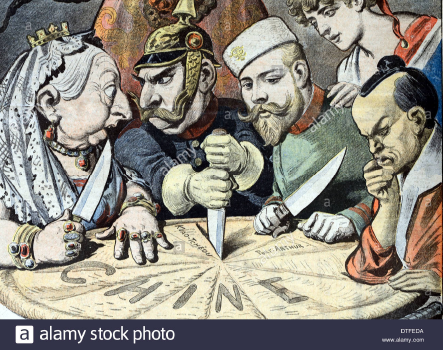

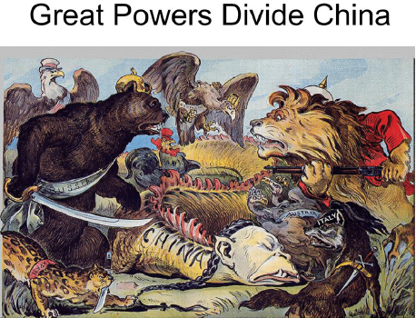

## 蓮池海會

### 戴文郎老居士往生見聞記

*戒安整理*

積善之家有餘慶

留學翻譯助上公

妻逝助念印象深

次子成就往生緣

戴文郎老居士生於民國十九年十一月七日，家中排行第五，居士的父親戴賢廷醫師在新莊職業，常常為了行動不便的患者，帶著診療包到患者家中出診，對於家境貧困的患者，便不收取醫療費用。文郎居士深受影響，自幼便有悲天憫人的胸懷。

老居士十二歲時父親病故，但不影響老居士熱愛學習和努力向上的決心。求學期間，課業精益。小學六年和初中三年接受日本教育，之後考進當時優秀的成功中學，大學進入師範大學生物學系。大學畢業後在中學教了五年書，繼續前往日本京都大學留學，在琵琶湖畔研究浮游生物。回國後，在臺灣科學教育館任職到退休。

王宇清(右四)、戴文郎(後左三)

後來因老居士精通日文，受前史博館館長，也是台灣漢服史研究耆宿王宇清教授找來協助翻譯論文，王教授看完老居士的論文翻譯後跟老居士是說到：「你的日文真是不錯，但是深度不夠，希望你可以多花點時間充實經典。」老居士雖然是理科出身，但本身偏愛儒家思想，從此以後就開始跟著王宇清教授學習經典，並透過王教授的牽線，經常協助孔德成先生翻譯，成為兩位老師的小跟班，之後並擔任日本孔孟學會的翻譯，閱讀了許多日文版的論語書籍典故，經常為日本孔孟學會、論語普及會翻譯，此外還擔任日本學校法人文化學園的第一個海外支部的負責人，並舉辦講座邀請孔先生到日本講學。每年日本的孔孟學會等機構前來在臺北孔廟的祭孔，都必定由老居士接待，數十年來始終沒有間斷，一直到老居士幾年前身體不適後才中斷。

大學畢業之後，和同校美術學系的陳曉冏女士結婚。兩人鶼鰈情深，育有二子一女。兩人同心，身教言教用心栽培兒女，各個秉持家風，學業有成，婚姻美滿，傳續居士內外孫輩，一家和樂融融。

十四年前，夫人因肺腺癌病逝，老居士驟失所愛，深感人世無常，皈依佛法，一心期盼臨終之時，能遇有緣人助念。三年前，老居士因為壓迫性骨折必須終日坐輪椅，但他積極面對生命的難題，堅強又勇敢。每周下樓三次，在家附近診所做復健，和所剩不多的老友寫寫信，還會用傳真機互通友誼。

有一天，老居士對長子國仁說：「你是醫生，如果哪一天，分別的日子來到，我可以選擇在家裡離世嗎？」國仁因為在日本大醫院裡待了好幾年，看了太多虛弱的病人，要忍受許多檢查與治療，就算是抽血、照Ｘ光、ＣＴ都已經是非常折騰了，更別說是插管或電擊，當下心中就下定決心，無論如何都要讓父親最後一段路程走得自在安詳。

二○一八年九月初，老居士開始食欲不振，血壓很不穩，體溫時高時低，女兒國瑛擔心父親的身體狀況想送醫院，同時次子志承致電兄長說明狀況，長子國仁立即在電話中，安撫姐姐及弟弟，請他們不用急著送醫院，因為大家都知道父親的個性，他會希望有尊嚴的活著，絕對不會想去醫院，若有任何問題他願意承擔。長子國仁在安排好日本的工作休診後，返回臺灣一週為老居士診療觀察並抽血檢查，想要明白是否發炎指數太高抑或器官老化，「發炎現象」和「器官老化」互為因果，老居士雖然虛弱，仍可以自己吞嚥進食，吃些稀飯和流質食物，兒女詢問有沒有哪裡不舒服，老居士會搖頭虛弱的說：「覺得累，想睡覺。」

在老居士身體開始不穩定時，老居士任職於臺北弘明幼兒園的次子跟學長請教臨終關懷應注意的相關事項，並於十月二日下午邀請學會師姑及學長們前去探望老居士，除了跟老居士開示要厭離逐漸敗壞的身體，欣求念佛往生極樂世界，也陪伴著老居士一起發願念佛求往生，老居士雖然很虛弱，但還是隨著蓮友的佛號聲，盡力將雙手合十一起念佛並迴向。在蓮友離開後，老居士表示想聽佛號聲，子女便將佛號機放在枕邊播放著。

十月四日清早，老居士就在佛號聲中安詳辭世，子女發現隨即開始排班助念，並通知學會協助安排蓮友前來助念，老師在週四下午三代共修講座結束後，下午四點前來為老居士迴向，最後的開示讓老居士心無罣礙，放下了一切。瞻仰遺容時，只見老居士安詳臉容，嘴口微張，似乎還念著「阿彌陀佛」的「阿」字。

老居士一生無論讀書、做事，都保持一顆「誠懇的心」，並懷著「責任感的態度」有始有終地完成所有的事情。對子女的教育雖然嚴格，但也為子女奠定了良好的基礎，質地都非常的好，才能接受正確的知見，讓老居士得以順利於家中助念往生。

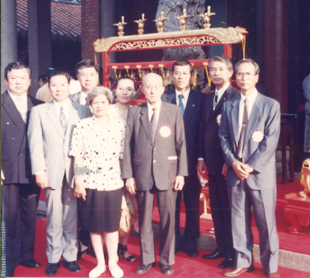

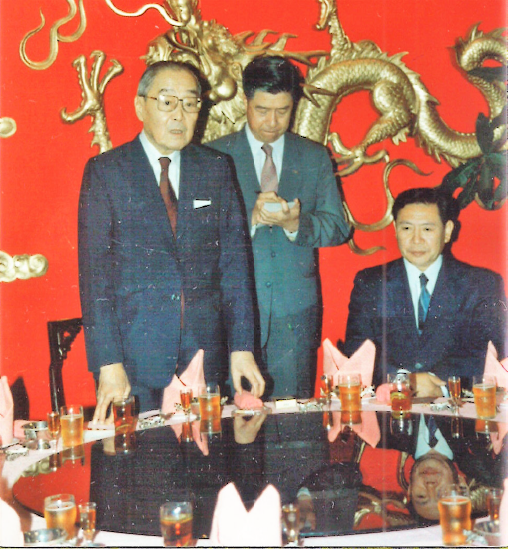

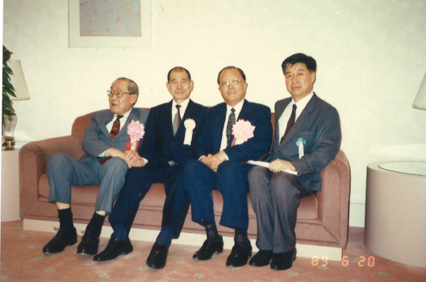

## 活動報導

### 戊戌年秋福州順昌行報導

淨昌

相應法義的旅程

法喜充滿的解疲

團隊默契的五天

化成學會的向心

緣起

六百多年前鄭家祖先在福建板東鎮開發並建立祠堂，一九００年有黃乃裳君帶領一批人前往馬國詩巫〈東馬沙勞越〉開墾，鄭其皇先生祖父亦於一九二八年前往馬國詩巫開墾，至今已有五代傳承。鄭家大哥（其向）率家族於十二年前返鄉重建祠堂，遷徙馬國的族人固定每年均會返回坂東鎮祠堂祭祖。

鄭先生是一位發心的佛教徒，到本會學習，對學會開辦的儒學、佛學等講座課程，有學習的好樂與體會。因有鑑於家族返鄉祭祖儀式流於形式，因而祈請學會為其家族祭祖建立祭祖儀軌。

祭祀祖先若是以報本還恩，慎終追遠的心情，反而是最好的教孝，能令家族團結，令風氣淳厚，祖先受供，子孫亦蒙福。祭祀父母祖先從三代開始，一直到明嘉靖年間，民間開始修建宗祠祭祀，宗祠祭祀列祖列宗已完全普及民間，其他如黍、稷、酒、肉是祭祀必備之物，儀式的隆重進行，體現了對祖先的感念，生起了無祖宗何有父母，無父母何有己身？祭祖中產生對學道的勝解。

學會隨喜鄭先生家族祭祖之善行，維護傳統，延續孝道文化，相信此之善行能令家族福德綿延。

規劃成行

本次活動以協助鄭氏家族祭祖為始，再赴順昌與當地蓮友聚餐聯誼，並一同辦理放生法行，參訪順昌雪廬孔子文化學會與新華幼兒園，後赴福州參觀鼓山湧泉寺，並遊覽鼓嶺地區，以參觀福州馬尾船政博物館為圓滿。

活動如期在九月九日成行，當天通關後在候機室旁，機場為有宗教信仰者設立祈禱室，其中一間內置觀世音菩薩聖像，老師率眾念佛，並迴向此行圓滿。

接機

經過一個半小時的飛行抵達福州長樂機場，迎面而來的是鄭家的接機隊伍，遊覽車上雙方簡短互相介紹以後，老師也簡短開示此行的目的，祭祖是凝聚家族向心力與教育下一代的最好活動，意義非凡；其次學會從西元二００二年起即持續經營順昌的文化教育事業，藉此機緣引導鄭家參訪順昌教育文化事業推展的現況，希望作為東馬發展文化事業的緣起；最後二天是白沙灣讀書會的規劃，是知性之旅，能令鄭家耳目一新。

祭祖場地勘查

下午抵達位於赴福州市閩清縣坂東鎮的鄭氏祠堂，依據祠堂外碑記，此祠堂為閩清縣內鄭氏總祠堂，祠堂占地兩畝，其中堂前廣場與祠堂建物估約各占一半。閩清縣內鄭氏祠堂最早建於明朝年間，此處是二００二年正月舊祠堂遭回祿之災焚燬後，重建時改遷於此處，完成於二００四年。

重建經費主要由鄭家大哥出資二百多萬人民幣為主，加上其他人的捐款，除了掛名重建委員會顧問外，當地仁溪老人會另外寫了一首詩，刻在祠堂外鄭氏源流考碑旁邊的較小石碑上，敬錄內文如下：落款：僑親鄭發旺父子慷慨捐資，鼎力興建宗祠，為賦七律以誌紀念。父子同心愛故園，建祠捐獻舉魁元，三公靈爽倫昭穆，百代規模福子孫，氣象莊嚴深念祖，親情愉悅貴知根，村間父老均懷德，長使勛名永世存。落款：仁溪老人聯合會敬立。

祠堂前廣場寬長各約二十米，牆高超過五米，氣派不小，入口門只一門，表示是子孫現在是平民百姓，進入祠堂後，見中庭寬廣，中置一層蓋的立爐，以臺灣習俗是稱之為天公爐。

過中庭進入正堂，正堂高大寬廣，高約十米寬約十二米，上懸橫匾「三公紀念堂」，正面牆繪著三公圖像，想必是西周宣王時鄭國開國君主鄭桓公、鄭武公及鄭莊公，雕梁畫棟，氣派莊嚴，雖是宗祠，但供奉的主尊是鄭氏始祖，亦有小國諸侯廟堂的氣象。

鄭堂兩側廊柱上由內而外，一對一對的對聯，依著時間的順序，歌頌鄭氏歷代祖先，從三公像兩側的「受封立國拓土東遷支撐周室擎天柱」「抗節成仁揮師西禦切諫烽台捧丹心」，講鄭氏立國初年三公事蹟。也有我們熟知的春秋第一宰相子產「夢蘭吉兆斑衣戲綵聯翩華冑盛東周」，東漢經學大家鄭玄的「帶草溯先芬箋注猶存風雅名家冠後漢」，從西漢、東漢、晉、唐、乃至宋朝、明清，如果不是當朝為宰官，就是教化一方的大儒。雖然我們不是鄭氏子孫，看到這些對聯，遙望先賢也肅然起敬。

祭品

勘畢場地，建議第二天祭品應將供桌擺滿以示誠意，食物擺法則照著飯菜、點心、水果、飲水的順序擺置，雖然無法完全依照古禮，但依著義涵亦有辦理的方式。

祭祖

第二天早上抵達鄭氏宗祠，約四十分鐘的祭品準備與擺設，這一天福州白沙灣農場的讀書會成員趕來支援，也帶來所需的麥克風、音響設備，祭祖在古琴「文王操」的悠揚琴聲中開始，儀式則配合世俗不採用佛法儀軌，也不用梵唄。依著儒家古禮作法，由老師擔任司禮者，學會師長、蓮友擔任禮生及贊禮者對面兩行站立，正式開始祭祖：

一、禮生就位

二、主祭者就位

三、陪祭者就位，鄭家親人，依著長幼順序，男先女後，左右在後方兩側排兩列。

四、啟扉：請當地鄭氏族長開啟宗祠大門，準備迎神。

五、迎神；禮生每人點一支香，隨司禮者引導，請主祭者領隊，陪祭在後，一同出祠堂外迎請鄭氏歷代祖先。

六、迎神祝詞：由司禮者祝詞，依著鄭家的誠意請鄭氏祖先，自鄭桓公、鄭武公、鄭莊公、鄭子產、鄭成功乃至鄭發旺等都來到宗祠接受祭拜。

七、上香：請到鄭氏歷代祖先，主祭者帶領回到祠堂內中庭，禮敬後將香插於中庭香爐後回到大堂。

八、獻爵；向祖先敬酒之前，先洗手。主祭者鄭其向先生為表恭敬，行三跪九叩之禮。

九、獻饌；請祖先吃飯。

十、獻果；請祖先用水果。

十一、上香：用完餐，向祖先求福。希望祖先加被後代福報。

十二、歌舞酬神：樂舞以禮運大同篇與三寶歌代替，由讚禮者(蓮友)唱。(古代天子可以跳八佾舞，諸侯六佾舞，卿大夫四佾舞，士二佾舞。)

十三、撤饌；在請祖先用餐，歌舞以後，祖先很愉悅。接著徹饌，原應依古禮唱詩經，現今以吟誦唐詩代替。

十四、送神；原應依古禮唱詩經，今以吟誦唐詩代替。

十五、恭送祖先：請主祭者率族人出班恭送祖先，至宗祠外，司禮者祝詞：願今日的祭拜，祈求鄭氏祖先永垂加被，使子孫不論居於何處皆能蒙受祖先的加被，都能具足孝、悌、忠、信、禮、義、廉、恥，具足四維八德，人生旅途上福慧雙修，得到內涵與智慧，讓他們能夠為家庭、社會與國家做出一番貢獻，並且能培育子孫成賢孝人才。祝詞畢請主祭者以酒灑地恭送祖先。

十六、請主祭者象徵性發供品，在場每人都分一點以示公平。司禮者祝詞：祭禮最重要三件事：第一長幼有序，第二慎重恭敬，次序井然，第三公平。祭禮中將人生最重要成就的秘密都包括其中。

十七、請主祭者轉身向現場眾一鞠躬，大眾回禮，典禮結束。

十八、最後請鄭氏子孫自由拈香，每人一支香上香。

十九、禮生退。

祭祖儀式在莊嚴肅穆的文王操琴聲中順利結束。走出祠堂，在等待集合時，看見鄭家親族，在宗祠外廣場兩側巨型水泥金爐中，堆起如小山般的金紙，金紙型式與臺灣習慣用的不相同，也不分散直接就點燃，結果就是燜燒，冒起兩團巨大白煙，隨著風向，或者四散，或竄向天際。五里不同風，十里不同俗，隨記之。

儀式結束後，老師提及今日儀式如果能夠在加一篇疏文，就更為圓滿，或者亦可以用迴向取代，可惜因為怕過於繁文縟節而無法施行。

回鄭家祖居祭告

祭完祖，鄭家尚需赴兩處祖居祭拜稟告，分別是鄭居泰先生故居與鄭世興先生故居。這兩處都位處群山環繞之中，車程約一小時，車至祖居附近已無柏油路，皆泥土路，下車後環顧四週附近皆山叢林，杳無人煙。故居現已無人居住，屋前有人闢為養鵝場，想像鄭氏先人在此生活應艱困不易，否則何必遠渡重洋，赴他鄉蠻陌之地。

此處鄭家人就各自上香稟告，然後在祖居屋內，以五十加侖的汽油桶為金爐，塞滿金紙後點火，屋內頓時白煙濔漫，眾人一時俱出，鄭家子孫再將祖居旁祖墳打掃整理。完成稟告後各自原車返回鄭氏宗祠。

中午宗祠聚餐

中午時分回到鄭氏宗祠，鄭家席開十桌，除了馬來西亞的鄭家親人、學會蓮友外，也宴請附近鄭氏宗親，餐後眾人集合上車，往下一個行程順昌縣出發。

途中總結祭祖活動意義

祭祀分為墓祭、家祭及祠堂祭祀。墓祭就是到墳墓上祭拜，一次拜一墳；家祭在家中祭拜；而祠堂祭祀則可大到一個宗族的祭祀，不容易辦得好，其中含藏修身、齊家、治國、平天下的道理。在宗廟祭祀要論輩份，有次序、有誠意，而且是一種感恩，人生很多成功的秘密都在裡面。態度上要「視死者如視生」，眼前雖然是祖先已經過世，可是要把他當成仍活著接受祭拜。其實古時候祭拜，大多是把孫輩的孩童換上祖先的衣服，坐到供桌上接受父親或祖父的祭拜，讓孩子們感受到祭祀的重要性，而且孩子們坐在供桌上會很謹慎小心，也培養日後謹慎小心的精神。

《禮記•禮器篇》孔子曰：「我戰則克，祭則受福。」蓋得其道矣。可見孔子深通作戰與祭祀的道理，而且這兩種道理是相通的。祭祀需要慎重，出兵作戰也是。祭祀講究陣容整齊，作戰亦同。祭祀講究進退適時，作戰亦是。祭祀要祈求加被，作戰也要祈求加被。孔子正通達這些道理。

祭祖呈現出這一輩感恩上一輩的心態，同時也教導下一輩人，把上代的教訓放在心裡，不胡作非為。這一輩人表現孝道，何嘗不是在教下一輩人表現孝道。這種孝道能夠延續，就代表這是一個能得天地鬼神加被、有福報的家族。

供品的部分，《論語》中記載大禹是菲飲食，卑宮室，盡力乎溝恤，致孝乎鬼神。就是大禹對自己的飲食、住處並不講究，但是對百姓的民生問題是看重的，所以他會挖灌溉溝渠，講究工程設施。致孝乎鬼神就是他會在能力範圍內，準備最好的供品。孔子說：禮與其奢也寧儉，喪與其易也寧戚。意思是要稱家之有無，家裡如果過得不好，那怕是水草都可以祭祀；經濟如果許可，供品就擺得好一點，這也是對祖先的恭敬與尊崇。

祭祀尚有散齋七天，致齋三天。散齋七天是說這七天內慢慢收斂自己的心，到致齋三天的時候，就是專想祭祀這件事情，當天上場的時候就不會錯亂，佛教更講究齋戒、沐浴等很多作法，以上都是前行。前行能夠講究，祭祀當天必能感應道交。以前周文王去祭拜他的祖先(季歷跟古公亶父)，一直祭到始祖稷(舜的農官)，在宗廟裡面聽到感嘆的聲音，此即周文王感動神明之相，尤其生出好的兒子，像周武王跟周公旦等，一家幾乎都是人才，是得到最殊勝的加被。

祭祀的過程中，每一程序的樂舞若能講究，就會很有味道，我們則以唱禮運大同篇、三寶歌、吟唐詩來取代。

結束後分供品，每一個人都能分到，表徵的是公平。所以人生處世慎重又恭敬，不但能表徵孝道，又能按輩份次第井然，做事又能公正公平，所有治國平天下的秘密都在此。國君如果看得懂，好好運用的話，治國是很簡單的。孔子也說，治國就如同眼睛看手掌這麼簡單。

天下事說難很難，說簡單也很簡單。雪廬老人在臺中蓮社，雖然有很多聯體機構，但老人無為而治，這些機構按部就班發揮功能，須知過程先講究，才能無為而治。

再者古代封侯拜相，要在宗廟前舉行，在天地祖宗的證明下封爵論賞，表達國君自己不敢專斷，治國若能慎重小心，乃萬民之福。

因為懂得這些祭祀的道理，後代子孫都能在閩清通往順昌行間，討論法義，在歌聲的助興下，抵達山青水秀的順昌縣，順昌的蓮友們已在飯店門口笑臉相迎，好像見到久別重逢的至親好友般，並協助我們入住旅館。

晚餐聯誼

晚上在下榻的三松大酒店與順昌蓮友餐敘，加上原本學會蓮友與鄭氏家族，總計席開五桌。首先由順昌學廬孔子學會副會長致歡迎詞，接著老師致詞：學會從二○一○年在順昌辦活動至今，除了五、六十位老菩薩們每天的共修外，葉園長與老師們接辦新華幼兒園，至今成為順昌最大的私立幼兒園，再看到順昌這些年的進步，每次來訪都有耳目一新之歎。第一次來順昌的人可能會有錯覺，順昌一直以來都這麼漂亮。要知道諸法都是造作性，本來都不是這樣，團體、盛況、環境及人才等都是造作出來的，將來了生死之殊勝也是造作出來的，沒有一樣不是造作出來的。

順昌放生

第三天早上八時整抵達放生場地時，場地已經佈置就緒，現場掛起西方三聖聖像，壇場上堆滿各式鮮花、水果、糖果及餅乾擺設，猶如四大部洲與須彌山般供養，加上壇場右方巨大喇叭所放出的四字佛號，地上排列整齊的主法者拜墊，壇場右側載滿魚族眾生的小貨車，壇場前方約莫六十位順昌蓮友，整齊的分成東西兩班，跟著念佛。說明了最少兩個小時前就陸續採買魚族眾生，佈置壇場與音響設備，展現出順昌蓮友的執行力。

老師在儀式開始前開示，放生除了上述前行準備要周全外，放生要圓滿第一個儀式要做得好，莊嚴肅穆；其次生物要放得好，次序不亂，魚都能優游自在回到大自然。第三個大家要心情好，發菩提心為利有情願成佛，眼前來行放生儀軌。特別是依長白山懺雲老法師所訂儀軌，來作放生的法行。開始之前，並請福州順昌蓮友與來自臺灣蓮友及馬來西亞鄭氏家族互相問訊安好。老師並向大眾說明此次放生法行緣由，由於自九月九日鄭氏宗親回大陸福州祭祖，因華僑回國際祭祖這種活動是很有意義，所以學會來護持這種祭祖的活動。

印光祖師說放生一定要在流動的水域放生，不可以到封閉湖泊放生。第二個是心態要對，就是眾人均有心要以放生作為成佛的法行。第三個環境要如法，是說生物是要能夠在這個環境生存的生物，不能放出去無法適應環境。所以放生有諸多的講究，講究的好就是美好的放生法行。

接下來是儀軌本簡單講解，首先是念印光祖師的放生十大利益，接著唱「楊枝淨水讚」，請觀世音菩薩灑淨，第三個持觀音菩薩的大悲咒，代表觀音菩薩的慈悲；「般若心經」代表觀音菩薩的智慧；悲心跟智慧相應，是名菩提心。菩提心是把成佛當成目標，眼前所作所為都是為了成佛。發起菩提心後，真正開始來行放生法行。

正式的放生法行先要迎請三寶來作證明，所以是「香花迎，香花請」；接著「稱名」，稱頌佛的十種名號，代表佛的全部德能，佛德中最重要的就是說法，只有說法方能令有情破迷啟悟，佛菩薩最重要的功德就是說法。

說法先明十二因緣的流轉門，來認識輪迴怎麼來的；其次用還滅門明如何解脫輪迴。了知輪迴的由來與解脫後，此時會想好好發心學習正法，證得涅槃，解脫輪迴。但是學法要身心清淨來學法，所以要先懺悔身心的罪跟過。身心清淨，入佛門學習正法，要先皈依成為佛弟子。接著發願成為佛門大乘的弟子，才是佛的本懷。接著要問自己，今天辦此放生法行，要達成的目標是什麼？

其次大眾唱頌儀軌要依維那，不可各唱各調，全無規矩。放生活動開始前的點燈，也觀想著代法界有情而點，照亮法界，點亮有情的心燈。

放生對馬來西亞鄭氏家族的某些人是第一次經驗，想必印象深刻，或是入佛門的殊勝緣起。

參訪順昌新華藝術幼兒園

放生後抵達新華幼兒園參觀，不知不覺中幼兒園成立已過七年，劉老師的兩岸往返授課，葉園長率領老師們的努力，得到順昌縣內上從領導當局，下至家長們的認同。從剛接手的六十名學生，到兩年增加至一百八十名學生面臨場地不足，在縣內領導的協助下，找到現在的場地，原是荒廢多年的紡織廠房，二十天內整修簽約完成遷移，再經過五年的經營，招收學生人數增加到今年十二個班三百零二人，老師有三十五位。

隨著園長引導，首先進入二樓，容納今年招收約一百位新生，分成四個班上課，剛進去覺得頗為安靜，走進教室門口才發現裡面是有學生在上課的，一問之下才知是剛開學第五天。建築物雖老舊，但是維持很乾淨，進門就被要求穿上塑膠鞋套，避免把外面灰塵帶入園內。經過廚房的時候，整個廚房約五、六坪大，雖然正在準備午餐，三位廚房阿姨正忙著，周遭地面也很整潔，園長說是縣內唯一通過衛生評定合格的幼兒園廚房。經過三樓走廊時，恰遇一班學員當面走來，非常有精神的大聲問好，可見老師教學的成效。新華幼兒園重視經典教學，並落實日常生活的言行品德，訓練兒童良好生活習慣，建立正確價值觀，學生也懂得關心照顧同學。

研學會的共修設在樓上，一併解決共修會場地問題，而且不只教育孩子，也一併教育家長，每週三家長與老師、蓮友一同跟著時哉時哉網路學院學習，有教法的活水源頭，加上每個月的師資培訓課程，都是新華團隊及順昌共修會欣欣向榮的動力，也敬祝未來幼兒園及共修會都能持續發揚光大。

時至正午，結束在新華藝術幼兒園的參訪，回到三松大酒店用餐，餐後往福州鼓嶺出發。三個多小時的車程中，老師請眾人發表法行及參訪的心得，並交流個人修學心得，能在無意之間參與一場具體而微的宗廟祭祀，真是此行最大的收穫，另外也十分隨喜順昌蓮友與幼兒園的發展成績，並高興能參加一場如法的放生。

抵達福州鼓嶺地區

下午五時抵達鼓嶺的筑嵐山莊，其時細雨濛濛，眾人拉著行李進旅社，略顯窘態。為了能達當地深度旅遊，特別請福州白沙灣農場讀書會幫忙。兩天行程，一天半在鼓嶺地區活動，另個半天參訪湧泉寺，在山莊餐廳用餐，該讀書會蓮友，必到廚房幫忙加菜，有些菜料是從山下帶上來，甚至是難得的食材。

鼓山湧泉寺

第四天早上先參觀鼓山湧泉寺，鼓山位於鼓嶺南方三公里處，占地一萬五千平方公尺，依據清朝初年元賢的《鼓山志》、明末清初為霖道霈禪師的《還山錄卷四》與民國虛雲大師《再增訂佛祖道影二》、《增訂鼓山列祖聯芳集》所記，鼓山湧泉寺最早有記載是唐德宗時靈嶠禪師(印可於馬祖道一禪師)，隱居在鼓山前巖，當時的鼓山寺址是一個深潭，潭中有毒龍，危害百姓。當時有一個郡從事，叫做斐冑的人，請禪師為民除害，禪師臨潭誦華嚴經，龍出聽經，遂徙去。當地百姓感念禪師除害，可能也怕毒龍再回來，就將深潭填平，建立寺院，迎請禪師駐錫，在唐德宗建中四年(西元七八三年)開法，還得到皇帝賜匾「華嚴」，大法弘化一時，但是後來遇到唐武宗的會昌法難(西元八四五年)，僧眾四散，便荒廢了六十餘年，到了五代梁開平二年(西元九０八年)，這時閩王王審知，禮請雪峰義存大師的高足神晏禪師來山駐錫，重建湧泉寺，也稱「國師館」，僧眾千五百多人，一時稱盛。於幹化五年(西元九一五年)，改鼓山白雲峰湧泉院。到了宋朝的咸平二年(西元九九九)年，朝廷特御賜「鼓山白雲峰湧泉禪院」扁額。

些典故傳到後來變成靈嶠禪師以法力降龍，跟毒龍約定借地一日，第二天敲五更鐘後就還地，毒龍安心睡了等五更，寺中就約定不敲五更鐘，傳到後來某一天某人忘記約定，敲了五更鐘，此時的住持神晏禪師以神力再度降伏，所以寺中就約定不敲五更鐘就傳到現在。像我們聽過阿難碰到老比丘將「生滅法」傳成「水老鶴」的典故的人，也就不會奇怪當天導覽員，會有這種神話般的解釋了，更何況湧泉寺在西元一九六六年開始的文化大革命中，僧眾的遭遇之慘，應該不下於會昌法難，如果不試著尋覓真相，就只能以訛傳訛了。幸好我們是跟老師出遊，所以導覽中某些偏離事實的地方，也都請教老師修正。

接下來的紀錄到明朝時，鼓山湧泉寺變成南方佛教的重要據點了，一方面有著禪宗的傳承，另一方面是刻印流通經典的事業，在明清兩代盛行印經，宗教並重高僧輩出，諸如古月禪師與妙蓮老法師等，至於我們熟知的虛雲老和尚、圓瑛老法師不但在鼓山寺出家，而且擔任過方丈。被公認證果聖人廣欽老和尚更是在鼓山寺佛七中證得念佛三昧。這點導覽員說鼓山湧泉寺是臺灣佛教祖庭，這是對的。因為民國初年來臺大德法師們，現在被稱為傳統教派如月眉系、法雲系等，幾乎都在鼓山湧泉寺或出家或受戒，或繼承禪宗法脈，都跟鼓山湧泉寺有因緣。乃至於近年臺灣的四大佛教教團中法鼓山聖嚴法師與中台禪寺惟覺老和尚，亦嗣法脈於靈源法師(湧泉寺出家受戒，禪宗法脈)。而號稱當今鼓山湧泉寺的鎮寺三寶之一的明清時代的木雕佛經版數量有一萬塊之多，應該也還存在，可惜藏經閣猜想或許是因為二００五年的水災的緣故，還在修葺中，不開放參觀。

不只廬山是「橫看成嶺側成峰」，鼓山也是如此。遊歷森森古剎，遙想歷代祖師昔日風采，提振自己道心，也很高興能到此一遊了。

鼓山寺虛雲老和尚重建的閣樓，現被用來當成招待客人用餐的餐廳。

暢遊鼓嶺古道

鼓嶺是位於福州晉安區的避暑勝地，一八八六年由西方傳教士開闢，距福州市中心約十三公里，夏日最高氣溫不超過攝氏三十度，吸引了許多不耐福州酷暑的西方人士。鼓嶺景區是福州鼓山風景區的重要組成部分之一。位於福州市東郊的雙鼓橫斷山脈，面積約二十四平方公里，平均海拔七百五十公尺至八百公尺，最高海拔九百九十八公尺，為福州的第一道屏障。由於其相對海拔較高，從近代至今都是福州著名的夏天避暑場所。外國人為避暑，曾在鼓嶺築起由小方型石塊為建築材料的小洋房—「避暑山莊」，每逢炎夏他們便乘坐由一前一後兩人抬的竹轎椅，沿著古石道登上三千多公尺路程來鼓嶺避暑。如今這些小洋房成為鼓嶺景區一道獨特的風景。

第四天的下午，隨著導覽員帶領我們走一趟當年的鼓嶺古街。導覽員說現今鼓嶺變成福州居民的避暑去處，夏天的假日遊客很多，一房難求，我們是在非假日上去，所以路上遊客不多，可以悠閒漫遊。在百年前可是人來人往，各種商店都有，據說都當時一天要宰三到五頭牛，供應當地的洋人食用，估計當時西方人士概有上千人之數。

山路蜿蜒，石板鋪路，寬約一部小轎車，包括路面與兩旁建築，絕大多數都已經翻新為現代建築，兩層或三層平頂樓房，與少數留下來的百年建築間或獨立。但因為所用的材料依舊是灰白色的花崗岩，加上部分翻新的建築仍採仿古斜頂屋瓦，感覺上景觀並不違和。一路上經過柳杉王公園造訪三十公尺高的千年柳杉，經過大夢書屋體驗文青氣息，看見當年的柯達相館建築物招牌依舊人事已非，洋人游泳池整體完好，池底部一小漥積水有四五條小魚，當時居民活動中心名稱萬國公益社，正有一團年輕人在裡面辦活動，而鼓嶺郵局營運至今依舊不輟。

行至宜夏別墅，是昔時的醫院，今時的咖啡屋。眾人邊品嘗咖啡邊聽老師開示法義：

老師首先提出兩個有關密教的問題。第一、為什麼密教都要把視為階位最高本尊畫成鬼神的憤怒相﹖種種答案開始被提出，首先說是為了降魔，但是示現佛菩薩的慈悲相也可以降魔，所以降魔的理由不成立；也有說是像孔子對宰我晝寢示現憤怒相，是為對治宰我殺雞儆猴，但是這個答案無法解釋孔子對顏回為何不示現憤怒相，所以也不成立。最後老師說出答案，佛菩薩固然以慈悲攝持各種利益眾生的法行，觀待慈悲相才能攝受眾生。但是最高位階示現憤怒相，理由是解脫跟成佛是以對治煩惱的形象來成立，憤怒相所表徵的是，我們在面對煩惱時要觀修出以面對不共戴天之仇的心態面對，必欲去之而後快，而不是貪戀不捨執不放手。這與一般漢傳佛教只有護法神示現憤怒相不同，護法神是為了抵禦外侮，而此處是為了對治內心的煩惱。抵禦外侮容易，對治自身煩惱難。可能一條高速公路都蓋好了，內心依舊未對治煩惱。

第二、密教為什麼把男女雙身的形象表徵慈悲跟智慧的修學法？有人提出女身的慈母的形象可表彰慈悲，但應以母子的形象呈現；也有說男性有智慧、魄力，但莽張飛一樣有魄力，也不能成立。再有提出慈悲跟智慧要結合才能發揮各自的形象與大用，若只有慈悲而無智慧，會成為愛見慈悲；光有智慧而無慈悲，也成為自了漢，這個智慧也不是真智慧。這一說兩者結合固然合義，但依舊無法解釋為何要以男女結合的形象表彰。有引經上講智慧為母，慈悲為父，象徵佛種性是智慧跟慈悲結合所生出來的，用雙身去表達，是第一個答案。

雙身相代表一切生命的開始，生命的源頭如果是智慧跟慈悲結合的開始，所相應的生命才是能夠自利利他的生命。

所有的慾望，最後要克制的是男女之間的慾望，觀察這個形象現起時內心是否生慾望，如果可以不起淫心，代表真正修行解脫清淨的形象。

雙身極難解釋清楚，必須用教法去成立，內心取義相觀修，不是真的去違犯根本眾戒，誑稱雙身修法。

觀察地獄苦也有兩種方式，其一是依照佛經所說觀修生起比量，另外一種是去看恐怖片，你可以不受那個境界的擾亂，同時也可以對裡面受苦的有情眾生生起悲憫心。另外從手機遊戲體會，唯有超越形體之外，入進去才不會在輸贏當中產生情緒。

入定之人有兩種定法，第一種定法是心水澄清如如不動；第二種定法是把境界生起去作觀察。舉例來說修無常觀，敢不敢面對自己即將死亡，如何面對，這才是無常觀。而不是在定中背經文：「世間無常，國土危脆」等，死亡境顯現在前，然後看看會不會生起對未來的恐怖，會不會很多事情還來不及交代......，這叫修無常觀。所以像看恐怖片、世界末日、戰爭爆發與妻離子散的狀況，你敢不敢去面對這些情境？修學空性並不是在背空性的義理，而是顯現快樂的境界、顯現恐怖的境界，然後看自己如何在這些境界中修學空性。眼前鼓嶺的快樂，定中內心也能顯現絕對比實際境界還快樂，此時心態是否能破除對境界的貪愛？破除貪愛有兩種，一種是深知它的過患，一種是修學它的體空。

這也像部隊模擬作戰，模擬到最後實際狀況出現的時候可以解決。我們很多的修行人是從不模擬狀況的，沒有沙盤推演。如消防隊沒有演習，則一旦失火時應付毫無章法。在定中模擬叫作比量，一旦發生的時候才有能力去面對。我們修行往往是非量，什麼叫非量，我們不肯去面對現實，所以一旦狀況發生時無法成立比量去解決。

你可以根據教法講四禪八定的境界，去想像四禪八定的快樂。舉例來說，人生創造快樂，生命中充滿很多的樂趣，包括太太、小孩、莊園、享受、美食，就像我們旅遊的時候不妨走入五星級飯店，實際像夢中去呈現，定中去呈現，風光明媚、雕樑畫棟、美食陳列、高朋滿座，然後開始修無常，你敢不敢接受那種快樂瞬間破滅的震撼，這就是修行最後要面對的。

修學無常觀分三種層次。第一種是快樂瞬間消滅，讓你措手不及。第二種是快樂轉變成痛苦，樂極生悲。第三種是在快樂中感受貪愛，並修學貪愛的過患，或者在快樂中觀察體性是空，那才是真正無常觀的修學。

相反的面相就是苦難，例如二戰的集中營，需要爾虞我詐、人性扭曲、說謊話等等才能生存，在那個環境當中，你要怎麼去堅持菩提心，菩提心要如何堅持，很多人的菩提心都是一句「為利有情願成佛」就結束了，敢不敢去觀修那些書後，還維持大悲心，對這樣的人能不能生出悲憫，對你後面捅一刀的人，你要不要生出悲憫心，或是生活都是在嚴重扭曲人性的環境裡面，要不要生出大悲心？又要怎麼生？這需要帶一點想像，想像集中營的恐怖，沒有人性的事情，沒有辦法相信人類還有這種生存環境當中，如何生出悲憫心？像這種修學法，都是最厲害的修學法。面對這種情況下，還生不生得起道心？

又例如想像自己的未來，很多獨居的人每天很快樂過日子，但是有些老人家行動不方便，要想像可能那就是你的未來。看到由看護推著輪椅出來的老人家，很難想像他年輕的時候健步如飛，當他能隨心所欲過遊山玩水日子的時候，他不會相信他的狀況會跌到這個狀況，最後下場是躺在床上不能動，生活不能自理。在定中想像這些狀況，跌到生活無法自理時，請問道心如何維持？這才是比量的觀修。

對這些重要的題目，你不去作觀修，轉變的力量都不會出來。就像民國六十八年蔣經國總統堅持要蓋高速公路，剛蓋好時開車上高速公路，一眼望去空蕩蕩，一部車都沒有，當時會說蓋這個作甚麼用，簡直是浪費公帑，圖利有錢人，但是今天來看蔣總統當時是真有遠見。所以面對人生如果沒有聯想力觀察、無常的觀察，很多重要的題目例如共住，就會覺得是多餘的，很遙遠的。

如果能有這種觀察，才會認真思維當下應該怎麼辦，但往往我們都將自己命運寄託在希求僥倖能過關，而不是如理如法思維現在要怎麼作，才是對未來是有幫助的，包括，我的無常觀怎麼修？我的公心要怎麼修？大悲心、菩提心要怎麼修？我應該生起在甚麼狀況下去修？例如假設我們一直生活在像鼓嶺如此優美的風景中，無常觀、大悲心如何生？這些全仗想像力。

空性的修學法中，除了熟知的因緣性與觀待性，空性真正觀察還有很多面相，以聚會的快樂為例，這個快樂如果是實體性的話，那每一個人都可以生起這樣的快樂。一般認為聚會的快樂，是聚會的成員每一個都快樂，合起來才有快樂。但快樂如果在每一個人身上就有，那不必聚會。結果反過來要問的是，這聚會的快樂在每一個人的身上都找不到，可是聚會起來怎麼會有？這快樂是湊出來的，但每一個人身上生不出，可是湊出來怎麼會有？個別沒有，合起來更不能有，這才說湊出來快樂沒有體性的，原來這個快樂只有這樣呈現，是沒有體性。

晚課後的開示

晚課後老師開示，鼓山湧泉寺表徵的是歷代祖師，乃至妙蓮老和尚、虛雲老和尚、廣欽老和尚及圓瑛老法師的精神與內涵，傳承的意義。但是一個佛教道場，或者佛教的中小學、大學，不能生起講法聚會，或其中的成員不能生起三寶的覺受，甚至不再學佛，可惜只能流於表相。

柯坪水庫、鴛鴦谷、返回筑嵐論法義

鴛鴦潭與柯坪水庫都距離旅館不遠，所以第五天早上老師帶我們一遊。先赴柯坪水庫，步行約十餘分鐘即抵達水庫，觀賞深潭大壩，山水連天的景緻。鴛鴦谷由兩個潭得名，一個是鴛潭，另一個是鴦潭。返回旅館戶外咖啡座，在亭台樓閣、微風吹動與諸善友聚會中，老師展開另一課問題討論：

第一個問題是寺院中住持所居名為方丈室，典故出自維摩詰經中，居士所居的丈室。但問題是維摩詰雖為古佛再來，但其所示現為居士身，與出家寺院屬性矛盾。理由是此人在丈室內用功，凝聚很多法緣，結此方乃至十方法緣。丈室的功能還有像維摩詰居士與文殊菩薩與諸大菩薩談論法義，很多法義即於其中流出，也非一人單獨用功能知。

第二個問題是維摩詰經後來香積佛國中來了九百萬大菩薩，沒有位子坐，為何維摩詰居士不去須彌燈王佛國再借九百萬張師子座，為何這次自己變現？而且百阿羅漢本來是來探病的，結果居士請坐到最舒適的座位，吃最好吃的飯菜，好像不合二乘戒律。而且頭陀行比丘探病，理應帶吃的去。為何去維摩詰居士那裡就可以反而去吃好的，坐好的。有說是為了讓阿羅漢見識發大心菩薩的殊勝境界，彈偏斥小，嘆大褒圓。但當時整個場面的引導就是要引導二乘發菩提心，因為人生只有這次機會，所以發菩提心後，維摩詰居士此時會拿出他最好的福報來作供養。而此時二乘比丘會高興的接受？還是覺得不應受福？為了教法的目的，引發出菩提心，所以經文後面一個個引發菩提心，此時受福不但不成為罪過，反而可以引發更殊勝的福報。所以借了三萬二千張高廣四萬二千由旬獅子座，二乘比丘每個都坐上去。然後香積佛國土的飯菜每個二乘比丘都吃。所以作每一件事意義是非常重要，意義呈現出來時，福報都可以消化。

接下來是唯識的問題，眼識的生起如果是因果法，因滅果生，當下這一剎那眼識所見，必為前一剎那色法，可是前一剎那已滅，這一剎那的眼識只有兩種可能，第一是沒看見，第二個就是非量，因為見前一剎那的色法不符合現量的定義。

在這一個多小時內，眾人都試著回答，提出種種的說法，但都不能解釋，前一剎那已滅的所緣緣，如何能生下一剎那現量的眼識。因為因滅果生，所以眼識所見必是非量，這與大多數人認知為現量不符。最後老師為眾人解惑：前一剎那眼根緣色塵雖然已滅，但境界的力量在心識前留下影像，成為眼識的相分，所以當下眼識依舊是現量，眼識緣前一剎那的境界所留下的影像，也使眼識符合因滅果生的道理。而這恰好成立萬法唯識的道理，諸法都是內心變現的影像。

福州船政學堂

午餐後，車赴福州長樂機場的空檔，參觀福州船政博物館，博物館占地四千一百平方公尺，展廳共五層樓，加上周遭的相關遺跡如馬江戰役紀念館，所講述的歷史是西元一八四二年鴉片戰爭戰敗後，大清帝國在福建臣民建立現代化海軍的歷史，這支福建水師當時亦聚一時人才，可惜在西元一八八四年中法戰爭中，被武器較先進，戰爭準備較充分的法軍艦隊，一戰而滅。感想是戰爭縱然有視死如歸的軍人，更重要是尋覓戰勝的方法，知己知彼，以己之長，攻彼之短，否則只能徒留後人空嘆了。

賦歸

準時搭上廈門航空班機，返回臺北松山機場，結束有意義的福州之行，感謝老師的帶領、所有的團員們及福建善友們的護持，祝大家心想事成，光壽無量。

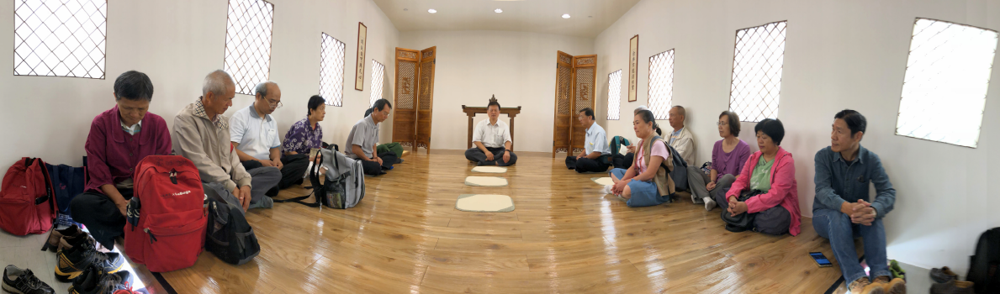

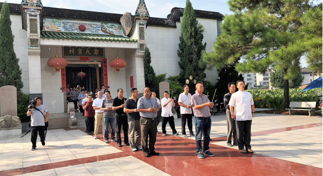

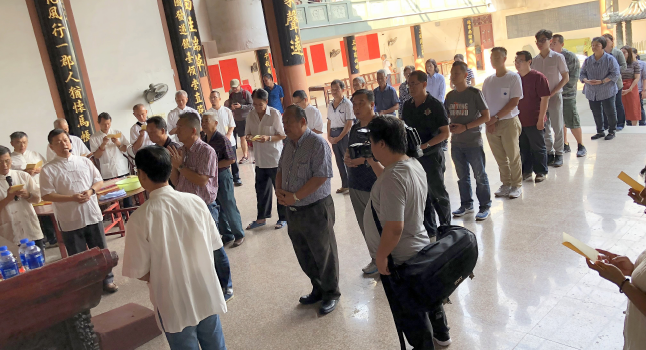

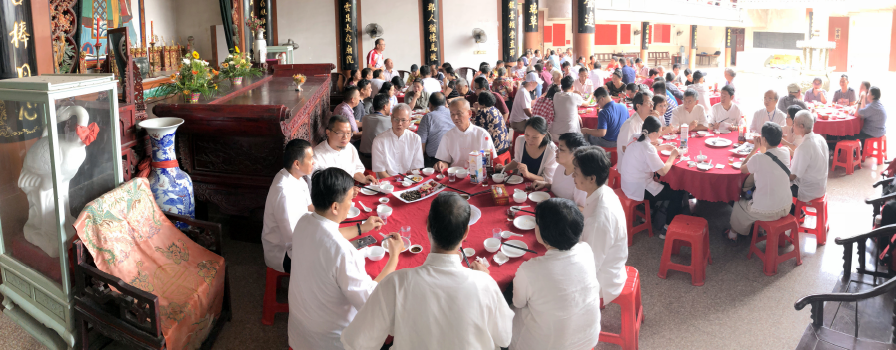

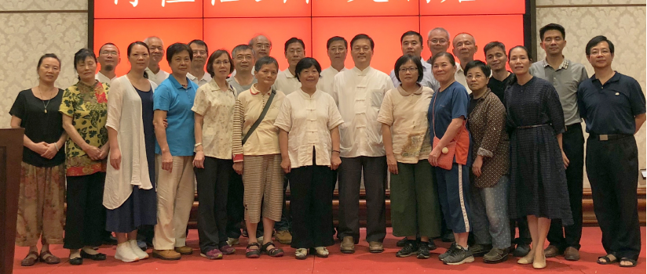

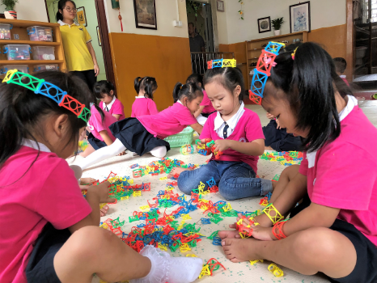

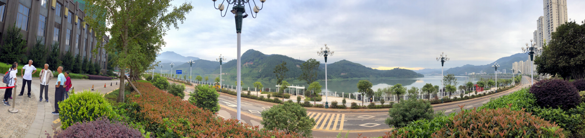

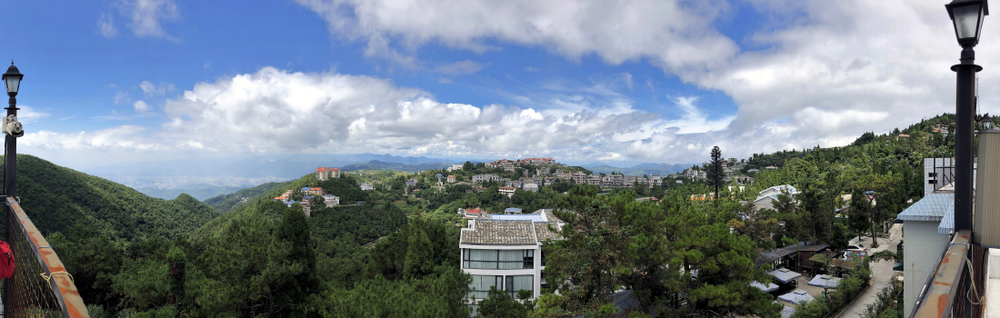

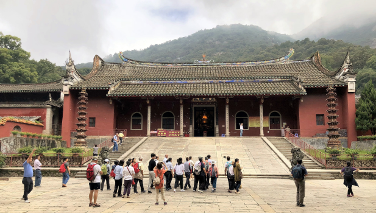

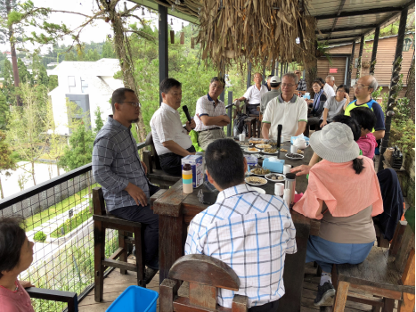

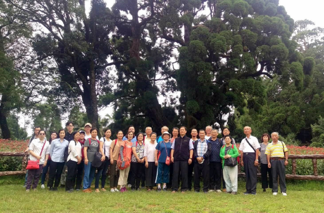

### 二○一八年福建省閩清縣阪東鎮　鄭家祠堂祭祖紀行

淨域

鉅細靡遺的記載

慎終追遠的延續

祖德流芳的仰望

後代子孫的效法

一、緣起

六百多年前，鄭家先祖在福建省閩清縣坂東鎮落腳，一九○○年有黃乃裳先生帶領族人，前往馬來西亞詩巫(東馬沙勞越)開墾。鄭其皇先生祖父，後於一九二八年前往詩巫開墾，迄今已歷五代。鄭家大哥率家族，於十五年前返鄉重建祠堂，日後遷徙馬國的族人，遂於每年返回坂東鎮祠堂祭祖。鄭先生是位發心的佛教徒，因緣到學會參訪，對所開辦的論語、佛學講座等課程，生起好樂之心。鑑於家族返鄉祭祖，徒留於風俗祭拜形式，因而協請學會為之擬訂簡便儀軌，用作祭祖之依據，是為此次福州行的緣起。

二、出發

邀約助行，旋即組成十八人的團體。鄭先生本以為是趟粗勘簡祭，得知學會往行人數後，大感意料之外，便廣邀居於馬、汶的海外親族共會。如此一行人數達於三十以上，加上福州蓮友的襄贊，使得此行殊勝圓滿。

二○一八年九月九日，一行人集合於桃園機場，共搭廈門航空，於下午一時抵達福州長樂機場。出關時，鄭先生與親族們已等候多時，便一同搭車前往宗祠訪察。機場到閩清縣城約一百零五公里，再轉往坂東鎮約二十五公里。車子走S1531機場高速、G70福銀高速及202省道，接鄉道共費時約八十分鐘抵達。

三、參訪

約莫下午三點四十分來到鄭氏宗祠。宗祠位在空曠地上，四周環以田園，地形十分開闊，視覺縱目無礙，近前有梅溪抱繞，遠眺案台筆架山。依《重建鄭氏宗祠碑記》載：略以「梅溪鄭氏宗祠，始建於明朝洪武年間，重修於一九零四年。一九三八年各支各代共同秋祭，始成為閩清縣統宗祠堂。一九一八年至一九九二年，仁溪小學(今為舊址興校)一直辦在祠堂內。一九七二年原址重建，二○○二年正月初九，不幸焚燬。鑑於祠堂是歷代祖宗靈位之處，不僅為敬宗祭祀活動的場所，也是宗族聲譽和源流的體現；因此，焚毀後十日內，族老向宗親發出呼籲信，號召族人團結一致，為建祠出謀出力、獻策獻資。除深得親族人響應外，僑親鄭發旺先生聞訊，即攜妻並邀請南洋許守恩先生，趕回祖地與族人共商建祠大計。期間獻巨資、出大力，堪稱族人楷模。新祠選址與二十六支鄭氏子孫之興旺發達攸關，經與地理師多方勘察，終於選定仁溪村「五丘頭」兩畝地，以舊祠址兌換新地。祠堂從奠基到建成，歷時一年六個月，耗資人民幣兩百萬元，終於二○○四年秋落成啟用。」

常人將祠堂風水的好壞，看作是宗族興衰的關鍵，所以，新建祠堂的選置十分講究。一般鄉祠之選址，優先要求龍脈和生氣來源，採背山面水之勢；其次，考量宗族生活地域間的距離，以方便就近管理維護與集合議事。建築須方正，左右互襯，四勢勻和；明堂要寬大，陰陽相濟，虛實相生；水口得收藏，剛柔互補；這樣能避免衝突與爭鬥等現象。

鄭氏宗祠坐東南向西北，前廣場鋪以地磚，中道為赭色大理石，兩旁行植柏樹，各有一座化紙金銀爐。祠堂呈長方形，前開虎頭門，門額為青石橫匾，上書「鄭氏宗祠」四大字，字跡蒼勁。門前石鼓夾抱五道石階，白牆、綠瓦，黑脊，脊下有「旭日出海」的浮雕，兩側分別繪以吉祥的鹿(陸)與鶴(合)，寓意「宗氏光明，親族六合」。大門貼了對聯，應是今年新春所寫，上聯為「銀花火樹千家曉」，下聯是「華月星歌萬戶春」，橫批「鏡燭輝煌」，無不具光宗耀祖之意。

門前左右各立兩道碑，右一碑為「仁溪老人會」感念僑親鄭發旺父子，慷慨捐資鼎力興建宗祠，為賦七律以誌紀念。詩云：「父子同心愛故園，建祠捐獻舉魁元。三公靈爽倫昭穆，百代規模福子孫。氣象莊嚴深念祖，親情愉悅貴知根。村間父老均懷德，長使勛名永世存。」

右二碑為「鄭氏源流考」，為鄭氏宗祠重建委員會，刻記於西元二○○四年(甲申)仲秋，內容概為：「我國周朝始行封建制。對姬姓子孫及功臣封為公、侯、伯、子、男五等爵位，並賜地為國。西元前八零六年，周宣王把陜西華縣叫『鄭』的地域，劃給弟弟姬友，封為鄭伯，諡號桓公。鄭桓公係黃帝三十五世孫。鄭桓公為幽王司徒(宰相)。《史記》載鄭桓公『和集周民，周民皆悅，河雒之間，人便思之。』納太史伯陽議，把鄭國向東擴大。西元前七七一年，周幽王死於『犬戎之亂』，鄭桓公因勤王殉難，成為名垂千古的忠臣。二世祖鄭武公繼承父志，護送周平王東遷，在滎陽建立新鄭國。武公繼任司徒，成為東周興鄭的賢君。《左傳》記『我周之東遷，晉鄭焉依。』鄭國強大引起諸侯忌妒，周平王棄信背義，強迫武公交出虎牢關地。可惜武公與桓公一樣愚忠禮讓獻地。西元前七四三年，三世祖鄭莊公十五歲接位鄭國，繼任周朝司徒。三世祖創業雖備受艱辛，但仍使鄭國小霸諸侯。梗概綜之，始祖桓公受封立鄭國，在位三六年，任司徒四年。武公合虢鄶十國，遷都滎陽，繼位二七年，任司徒二十七年。莊公完成『南建櫟邑、東到啟封、越河擴疆、西控鞏洛』的強大局面，在位四三年，任司徒三十七年，使鄭國成為強軍，戰車千乘，為周朝的『春秋小霸』。始祖『三公』，功垂青史。鄭國傳了一四世，二三君，四三一年。公元前三七五年康公時，韓國侵佔了鄭國，散民為紀念故國，便以國為姓，稱鄭氏。此後，鄭氏子孫漸雨葉開花，乃至旅居世界各地，各圖發展，根深葉茂，世代繁衍。二千多年來，隨著國人由北向南五次大遷徙，鄭氏從滎陽『隨軍南下』，又遇亂而南，構堂講學，『平而郡守』者甚眾。又從福建漂洋出海者，不乏其眾。全國發展成為八閩輩族。海外拓展史，是源自桓公、過江庠公後裔。據考入梅一千多年，人丁達萬眾。因遷入先後，來流小別，故有二六支派。各支旅居海外鄭氏華僑近萬人，業產千萬至逾億元者數十戶。查考三部《閩清縣誌》，自古至今梅川鄭氏，賢達蔚起，不愧為梅邑望族。公元一一五四年，鄭始登進士，一二○八年鄭自誠狀元及第，一一二三年鄭德起進士，一二二六年鄭睿進士，一二四一年鄭自任進士，加上進士鄭君瑞，宋朝梅邑鄭氏「五進士一狀元」，飲譽八閩。自始厥後，吾梅鄭氏功名，累擠不乏其人。至清朝廢舉止，梅川的鄭氏進士、舉人、貢生四十多人。滎陽鄭史主編宋國楨教授，著文褒揚鄭氏，其譽『公侯接武，台衡繼迹，連榮不衰，當以時代之台柱，歷史之樞機。』」

左一碑為捐資建祠者的芳名。左二碑為「重建鄭氏宗祠碑記」，同為重建委員會所刻記，內容前已概述，後略補如次：「吾梅鄭氏祖先，仕第、賢達輩出，曾出狀元宰輔、八位進士朝官，舉人、貢生更任知縣、千總、教諭、主簿。今萬年寶蓋落成。立於祠前廣場，前有綠帶環腰，舉目遠眺，山巒猶雄偉衛士，後有巍巍靠山，前呈案台筆架，堪稱勝景寶地。宗廟祠宇白瓷裹表，玉色琉璃屋面，飛簷畫棟，氣勢恢，虎頭門上『鄭氏宗祠』石匾蒼勁偉力。柱刻四幅，人物石雕栩栩如生。步入祠門，環廡木雕彩繪相襯，廊欄二十四孝石雕精品，映入眼簾，孝親典故感天動地。願子孫效法其精神，尊敬長輩，順親睦族，團結鄰里，共建美好家園。祠堂從奠基到建成，歷一年六個月，耗資百萬多元，族內捐資極廣，更有不少宗親大力資助，許多賢達及門下，不計酬勞嘔心獻力，各支代表及海外宗親，鎮臨賜教，鈞表謝忱。」

閉合式的宗祠，特徵為通氣孔與窗少，採光與通風透過宗祠內部獲得，象徵家族內部團結。門柱的家訓篆刻碑文，在加強宗祠的莊嚴與凝聚力。鄭氏宗祠除前開大門外，兩側亦有偏門，各券刻以「入孝」、「出悌」二字。至於兩扇大門，則寫著「祖德宗功」四字，乃令進門的子子孫孫，觀望祖宗的功德，努力光宗耀祖。

入虎頭門後，中間是開闊的天井，置放一座天公鑄鐵大爐。內部空間結構安排有序，正眼所見為以祭祀為主的正廳。正廳面闊三間，進深七楹。中間正座設立神龕，奉祀鄭氏始祖桓公、二祖武公、三祖莊公之畫像，名之為「三公紀念堂」。桌案上供奉著南宋狀元鄭始等歷代神主牌，另兩旁設有長生、祿位副座。正副依個別功能按序大小排列，裝飾元素頗為複雜，雕樑畫棟自不可免。廊柱檐坊撐弓花飾，精美顯出莊嚴華麗，與附屬空間的樸實，對比出主次分明井然有序。

宗祠亦設書院，佈在兩側，作兩層結構。下層為迴廊，上層挪出三間，作為紀念室。書院二樓前欄鑲嵌二十四孝青石浮雕，匠工精細，物象栩栩如生。鄭發旺紀念室為紀念其向、其煌先生的父母，有聯道：「慷慨胸襟揚祖德，恢弘氣度劭鄉情」，概已說盡發旺先生愛鄉重建宗祠之願力。另祠內二十多副楹聯施漆描金，長句短詞各異，無非敘述著鄭氏的淵源與輝煌的歷史。以下僅就所記者略加說明：家祠正廳第一楹，有聯寫道：「滎陽家聲遠，南湖世澤長。」這道出南湖(今莆田。元初，開莆鄭氏十二世鄭源深，遷至福州南郊高湖村定居，為不忘祖地，所建祠堂稱「南湖鄭氏宗祠」)鄭氏族人來自於滎陽(今鄭州市下轄縣)，而滎陽鄭氏先祖可追溯到周宣王分封的鄭國，鄭國滅亡後便以國為氏。

正廳神龕楹聯寫道：「受封立國拓土東遷支撐周室擎天柱，抗節成仁揮師西禦切諫烽台捧丹心。」上聯之意是-西元前八○六年，鄭太始祖桓公(姓姬，名友。一說其為周厲王之子，周宣王之弟；另一說為宣王之子)初封於鄭(今陜西省渭南市華州區)。周幽王(宣王子)時，周朝局勢不穩，犬戎屢屢進犯，桓公便遷都於雒水以東、黃河以南之地「滎」，稱作新鄭。桓公時任周朝司徒(管理人民與土地)，位居三公，戮力輔佐周室。下聯之意是-周幽王寵愛美人褒姒，為贏得美人癡笑，每故舉烽火讓諸侯進兵勤王，引得各路諸侯的不滿；雖桓公多次勸諫不可兒戲，但幽王並不聽勸。西元前七七一年犬戎進犯，再舉烽火召兵勤王，惟諸侯以為假訊而未發兵。桓公領軍西行抵抗，不料兵敗被殺，而幽王亦被誅殺於鎬京驪山下。

正廳兩側楹聯之一寫道：「夢蘭占吉兆斑衣戲綵聯翩華冑盛東周，帶草溯先芬箋注猶存風雅名家冠後漢。」上聯之意是-鄭文公的妾燕姞，夢蘭而孕生一子，名蘭，日後繼位為穆公。穆公有十三子，兩位先後為國君(靈公、襄公)，三位被滅，一位不為卿，其餘七位為卿。襄公時，七位兄弟輪流執政，稱作「七穆」。七穆之一公子發，字子國；生子產，名喬，以國為氏，稱公孫喬或國子產。子產執政時，改革內政慎修外交，鄭國舉足揚眉於東周，後人評價其為宰相典範。下聯之意是-經學大師鄭玄，在山東高密長學山收徒授課，山中多書帶草(又名麥門冬)，學生常取來束書，時人稱為「康成書帶」，讓書帶草蒙上了書卷氣。鄭玄博通今文經學，遍注群經，著有《毛詩箋》、《三禮注》等，為東漢集經學之大成者，世稱「鄭學」。

正廳兩側楹聯之二寫道：「桓開國武東遷莊擁強藩傳百代雲昆長存廟貌，周移民晉南渡唐稱望族利一方水土蔚起人文。」上聯之意是-鄭桓公開國，死後兒子姬掘突繼位，是為鄭武公。時幽王之子宜臼繼位為周平王，因鎬京破落東遷定都於雒邑(今洛陽)。武公娶申侯之女為夫人(史稱武薑)，生兩子，寤生與段，武姜偏愛次子段。西元前七四四年，武公病重時，武姜有意立段為太子，未果。武公去世後，寤生繼位，為鄭莊公。莊公在位期間，鄭國國勢強盛，除併吞戴國外，還擊敗周桓王率領陳、蔡、虢等聯軍的「繻葛之戰」，確立了鄭國的「小霸」局面。期間武姜勸姬段反叛兄長，釀成「共叔段之亂」，此即《春秋》所述「夏五月，鄭伯克段於鄢」。莊公後裔綿延至今已百代，其豐功偉績長存於家廟中。下聯之意是-我閩地鄭氏族人，乃西周末年東遷至滎的移民。西元前三七五年，韓國滅鄭，子孫再播遷至陳、宋之間(地跨河南、安徽、江蘇三省)，以國為氏。西晉永嘉之亂後，中原大量人口南遷，鄭姓四十祖昭，率族人於此南渡入閩，因喜愛莆田當地的山光水色，便將河南的十二個祖墳，遷葬於南湖山，日後繁衍成為四大族之一，人稱望族。至唐宋人文蔚起，計出了八位宰相，兩千餘人及第進士。

正廳兩側楹聯之三寫道：「兄弟聚南湖教化風行一郡人猶懷馬帳，才華震北闕編修望重千秋比不讓龍門。」上聯之意是-莆田鄭氏為鄭昭後裔，第十七世孫鄭露、鄭莊、鄭淑三兄弟，在南湖山創建閩地第一所學堂「湖山書院」(此地有南湖)，教化風行文風漸盛，書院林立人文薈萃，由唐至宋始得「十室九書堂，龍門半天下」之局面，當地人無不懷念三兄弟的傳教(東漢馬融授徒時常坐在絳紗帳裡，後人就稱講座或老師為「馬帳」)，尊為南湖三先生。下聯之意是-南宋鄭樵與兄長鄭厚二人，四處借書窮讀，立志讀遍古今書，刻苦力學三十年，鄭樵編寫《通志》二百卷，與《通典》、《文獻通考》合稱三通。其才華震動朝廷，宋高宗詔升為樞密院編修，其文史千秋之業，不虛讓於南湖三兄弟的「龍門半天下」。

正廳兩側楹聯之四寫道：「敢上流民圖發遞銀臺傾崇直節，為雪亡國恥誓師金廈竭盡忠忱。」上聯之意是-北宋縣官鄭俠，上《流民圖》疏於神宗帝(宋時有銀臺司，掌管天下奏狀案牘)，論新法以濟民，若所言越分乞斬於宣德門外，時人都稱讚他正直高節。下聯之意是-明末鄭成功為力保大明江山，誓師於金門與廈門，分路出兵與清軍對抗，竭忱盡忠反清復明。

正廳右堂上書寫「長生」二字，意乃祈求子孫消災延壽，先祖節義永存。正中有聯寫道：「撫侄成名矢志艱辛姑大德，榮宗守義堅貞淑慎女中魁。」此聯實在難解，概是在說兩位偉大的鄭氏女性。上聯之意是-兄長去世了，作為姑姑的艱辛撫教侄子，使之功成名就。下聯之意是-鄭姓女子榮耀宗族，其意志堅定、操守貞節、為人良善、處事慎密，乃女中魁首。唐朝散郎侯莫陳邈之妻鄭氏(侯莫陳，三字為複姓)，因其姪女受策為永王妃，撰《女孝經》一書戒以為婦之道，除申以執巾之禮外，並述經史正義，其餘沒有浮誇之詞。

正廳右堂側聯之一寫道：「師紫陽友西山重道儒千秋卓識，宰中書官樞密膺將相一代英才。」此乃特指南宋鄭僑。上聯之意是-鄭僑師法理學大師朱熹(朱熹父親曾在歙縣紫陽山讀書，後居崇安將廳房題為「紫陽書室」，後人稱為紫陽先生)，又與蔡元定為好友往來(蔡元定，號西山，為堪輿學家，曾於西山頂苦讀，與朱熹為兒女親家)，三人修道重儒，被譽為「朱門領袖」、「閩學幹城」，著作有《書衡》三篇。下聯之意是-孝宗乾道五年，鄭僑禮部殿試舉第一，授官著作郎。歷任鎮南軍節度判官、禮部郎中兼太子侍講、福州知府、吏部尚書、樞密院事，後以觀文殿大學士銜退休。去世後光宗贈太師、郇國公銜，諡忠惠，實乃一代英才。

正廳右堂側聯之二寫道：「經學仰司農黃卷通修稱浹漈，文明搉博士青氈苜蓿守清廉。」此聯指鄭眾、鄭樵二人。上聯之意是-東漢經學家鄭眾，專研《春秋左傳》，章帝時官至大司農，因此被稱為鄭司農。宋代史學家鄭樵，於浹漈山築草堂，所著《通志》為學者所必讀(黃卷指書籍)，世稱浹漈先生。下聯之意是-鄭眾著有《春秋難記條例》和《春秋刪》，鄭玄曾收錄他的六書，即「象形、會意、轉注、處事、假借、諧聲」，其文采光明，為春秋博士(搉，敲擊)，以清廉正直聞名。鄭樵於浹漈山築草堂三間力學著書，期間衣青氈(氈，毛毯)、食苜蓿，一生清廉無外求。
正廳左堂有「祿位」二字，意乃祈求子孫福慧增長，先祖餘蔭庇護。有聯道：「碩德鍾祥翰院生蔴遷首輔，采薪還箭軒車夾鹿(路)拜三公。」上聯之意是-鄭氏歷代人才輩出，進士及第者凡兩千四百餘人。有因德養而致福(鍾祥謂得福)者，有因才學而供翰林者，更有因功績而位居宰輔者(官至宰輔十八人，尚書四十一人，侍郎五十餘人，御史百有八人，歷知府、知州、知縣者千有五人)。下聯之意是-此如東漢鄭弘，本為鄉農樵夫。某日上山砍柴拾得一箭(南朝宋孔靈符《會稽記》說：射之南有白鶴山，鶴為仙人取箭)，不久見一人尋箭，即還之。此人
**問：** 「有何希求？」鄭弘知其為仙人，說：「我常為若耶溪載運薪柴所苦，但願能早上吹南風，下午吹北風。」後果然如此，人稱「鄭公風」。後舉孝廉為騶令(馬官)，為政仁惠，累遷至尚書令。曾上書開零陵、桂陽山道，日後成為交趾七郡與中原地區的要路，往來商旅大車川流不息。章帝拜其為太尉，位居三公。

正廳左堂側聯之一寫道：「榮矣棠棣繼盛風光旖旎眾尋根，偉哉祠堂重開氣勢巍峨人念祖。」此聯乃記觀功念恩。上聯之意是-榮耀呀！鄭氏歷代族輩相繼昌盛(古詩《棠棣》，乃周人宴會時，歌唱兄弟親情的詩，指兄弟)，祖地風光旖旎，後人遠渡重洋尋根建祠。下聯之意是-偉大呀！鄭氏祠堂重建新開，巍峨的氣勢無不在感念先祖的恩澤。

正廳左堂側聯之二寫道：「注經史主博通風範後昆仰康成，題巉崖揚書法蹟昭佳境尊僖伯。」上聯之意是-鄭玄字康成，為東漢經學家，力主博通遍覽群經，創立鄭學，往來求學者眾，門閭能通馬車，後人稱仰謂之「博經堂」與「通德門」。下聯之意是-北魏書法名家鄭道昭，字僖伯，少時廣聞好學，綜覽群言，官至青州刺史。擅長書寫正楷與隸書草，是書法魏碑體寫法的鼻祖，書藝精湛被譽為魏晉書法的「北聖」，與東晉二王(王羲之、王獻之)齊名，其代表作摩崖石刻《鄭文公上碑》及《下碑》，尤其《下碑》被尊為「隸楷之極」，為後世所推崇。

約莫參訪九十分鐘後，驅車前往閩清縣城，此處位於閩江與梅溪的交匯處，是福州往南平的必經要道。晚間下榻於解放大街上的啟源大酒店，飯後難得無晚課，好讓大家休養生息，明日一早備辦祭禮。

四、祭祖

來到宗祠，鄭家族人早先抵達，掃地、擦桌、洗果、備饌……分路齊行。因為此行是為鄭家祭祖，提供一套簡便莊嚴的儀禮，所以，一切都在備辦中適實教導規正。例如：花果與酒饌的數量、位置，盛物器皿的材質潔淨等，無非在示現一個「祭盡誠」之心。主祭陪祭與祭者，衣著要素淨，儀容須端莊，感同「祭神如神在」。這場祭祖活動中，學會人員居於協助立場，分別擔任各項執事，以唐老師為「通贊」主持儀禮，另由兩位師長擔任「禮生」引贊，其餘從旁協助祭禮之進行。

祭祀開始前，主祭者其向先生就神龕前中位，陪祭者依「左昭右穆」之序，於後排成兩列同祭。司儀唱喊「啟扉」，領其向先生到虎頭門，開啟宗祠大門。繼又唱喊「迎神」，由大門處走向天井鑄鐵爐，匝繞一圈引祖宗神靈至神龕受祭。祭禮開始，依次「上香」、「獻花」、「獻果」，再由主祭者「恭讀祭文」。讀罷，全體向上行三鞠躬禮。隨後「飲福受胙」，司儀先領主祭者，將祭酒分灑於各處；再捧糖果分食於親友，讓大家共享祭祀的美好成果。隨後撤饌、送神、闔扉、撤班，一場簡單隆重的祭禮就完成了。當然，中午少不得要辦桌宴會，讓同宗親族共飲暢懷。

五、後記

祭祀祖先若行以報本還恩、慎終追遠的心情，非但不會流於形式，反是最好的教孝之舉，更能使家族團結、風氣淳厚、祖先受供、子孫蒙福，此些觀念皆載於《論語》、《禮記》等經典中。祭祀父母祖先從三代開始，直到明嘉靖年間，民間開始修建宗祠，宗祠祭祖才漸普及於社會。其他，如黍稷酒肉是祭祀必備之物，而隆重儀式的進行，更體現了對祖先的感念，生起無祖宗何有父母，無父母何有己身之思。此乃祭祖所以教本的勝解。學會隨喜鄭先生家族祭祖之善行，而興辦此次福州、順昌行，唯願三寶加被，鄭家家族團結盡孝，多與善友聚會，而有正知見，並維護傳統，弘揚文化。相信家族能輩出人才，或為法門龍象，利益家鄉、社會與國家。

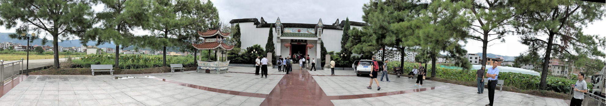

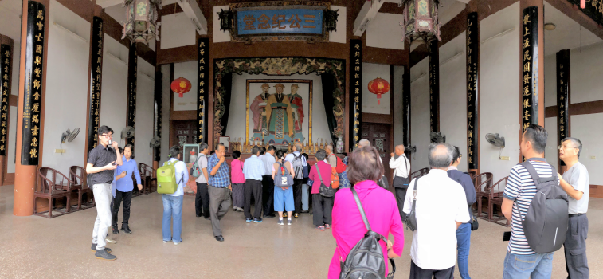

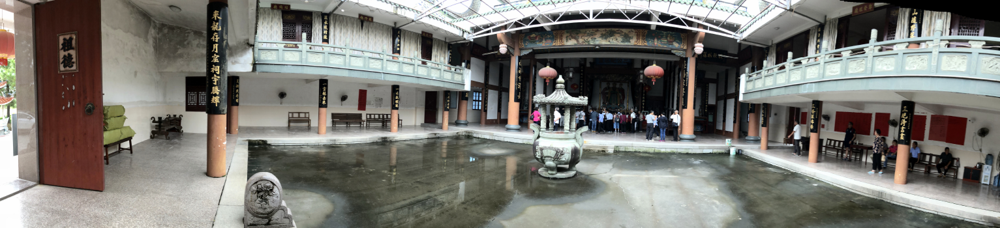

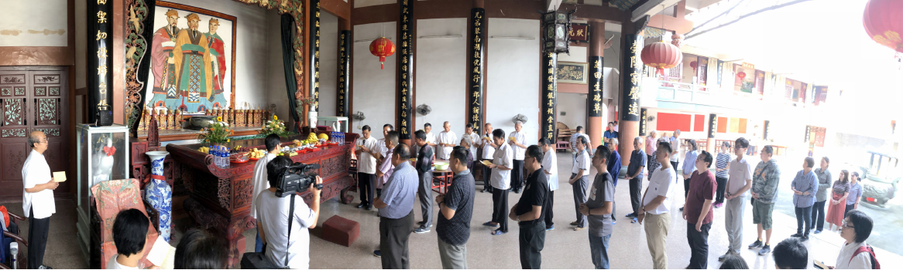

### 中國船政文化博物館行旅記述

淨域

讀聖賢書知民族大義

國難當頭願師法夷狄

人才技術辦船政學堂

難敵迂腐終功虧一簣

二○一八年九月福州、順昌之行，於十九日返臺前，走訪了一趟「中國船政文化博物館」，因為時間的限制，只有半小時的參觀。導覽員聞悉後，便以跳躍式的導覽，簡要地將一至五樓的展物，用最快速的口語說解。一陣鴨子聽雷後，獲悉要將此番記寫心得，頓時墜入五里雲霧中。幸得當時追錄說明，雖音聲嘈雜不清，但試著依所導重點，望能對清末民初的船政發展，理出一個概要來。

中國船政文化博物館，位於福州市馬尾區昭忠路馬限山東麓，北與馬江海戰烈士墓地(福州昭忠祠)為鄰。二○○四年，馬尾區政府為弘揚船政文弘揚船政化，根據福州市政府「發掘船政文化，突破福州旅遊」的指示，投資六百多萬元改造中國近代海軍博物館(始建於一九九七年)，次年並更名為中國船政文化博物館。館樓依山而建，為五層樓建築，展館面積約一千三百多坪，正面造型為兩艘乘風破浪的戰艦，建築風格現代化且氣勢不凡。此為中國首個以船政為主題的博物館，全館分由「序廳」及「船政概覽廳、船政教育廳、船政工業廳、海軍根基廳、船政名人堂」五部分組成，所陳列的珍貴文物、圖片和模型，能將中國的船政發展娓娓道來。以下就樓館次第，分別簡述之。

一樓為「序廳」，以浮雕和圓雕組合，展示船政的總體概況，正面浮雕的五位人物最為吸睛，分別是左宗棠、沈葆楨、嚴復、詹天佑與薩鎮冰。船政之創辦，對近代中國有深遠的影響，二樓的船政概覽，特別營造出「船政衙門」這道景觀。馬尾船政衙門，乃清末直屬中央的部門，不僅是船政的領導機構，也是船政大臣與幕僚辦公議事的處所。前為轅門，豎立兩根旗杆；衙門前座為六柱五間式，設中、左、右三道門，每扇門均畫有門神。正門上方掛一匾，刻以「船政」二字；儀門上有沈葆楨書寫的-「以一篔為始基，從古天下無難事；致九譯之新法，于今中國有聖人。」門外有兩座石獅鎮守，內部陳列十八般武器。

展板以洋務運動興起之背景，分別介紹左宗棠、沈葆楨創立船政之艱辛。一八四○年鴉片戰爭後，清廷面對一次次水師的失敗，深感海防船政的重要，痛下決心對舊式水師進行改革。一八六六年(清同治五年)六月廿五日，閩浙總督左宗棠先上〈詳議創設船政章程折〉，奏請於馬尾設立藝局，摺中說：「臣愚以為欲防海之害，而收其利，非整理水師不可，欲整理水師，非設局監造輪船不可」，並指出此乃「為造就人才之地」。接著又奏〈密陳船政機宜並擬藝局章程折〉，摺中闡述：「夫習造輪船，非為造輪船也。欲盡其製造、駕駛之術耳，非徒求一二人能製造、駕駛也。欲廣其傳，使中國才藝日進，製造、駕駛輾轉授受，傳習無窮耳。故必開藝局，選少年穎悟子弟習其語言、文字、誦其書，通其算學，而後西法可衍於中國。」這說的是教育與學習的重要。又指出「藝局初開，人之願習者少」，必須採取「非優給月廩不能嚴課程，非量予登進不能示鼓舞」的措施。即是後來批准的〈求是堂藝局章程〉，也是我們所熟知的校規與獎懲。

七月十四日，清廷批准設廠製造輪船。船政衙門設在馬尾，概有三個原因：第一、在歷史上，福州一直是國際貿易港口城市，也是海上絲綢之路的重要門戶之一，特別是以馬尾、長樂一帶為給養揚帆處。第二、鴉片戰爭後，中國被迫開闢五處通商口岸，福州為其中之一，各國商船兵艦來福州，均停泊於馬尾。第三、馬尾地處三江(白龍、烏龍、琴)入海口，江闊浪寬，水清土實，地勢險要。

左宗棠受命創辦船政事務衙門，初名為「求是堂藝局」。鑒於陜甘回亂作大，十月十四日清廷命左宗棠為陜甘總督，左宗棠離開閩浙總督前，上奏建議沈葆楨特命大臣總理船政，頒發關防得專奏請旨，以防掣肘。又讓紅頂商人胡光墉(雪巖)協辦船政，因為只有胡光墉有辦法為船政籌資，雖如恭親王奕訢般權貴，也借不到外資。

一八六六年十二月廿三日船廠破土動工，次年二月沈葆楨到任，將船廠面積由十三點六萬擴大至四十萬平方公尺，計有十三個船廠與五個學堂，成為當時遠東最大的造船工業基地。船政衙門創始於左宗棠，成就在沈葆楨，沈總理船政八年兩個月，所以有「左創沈成」之譽。其編制，上設總理船政大臣，聘法國軍官日意格、德克碑為外籍正監督，下設輪船局(造船)、學堂(培訓)與船隊(水師)，學堂因造船、設計與駕駛、輪機專業之別，特區別為製造(前)學堂與駕駛(後)學堂。

船政學堂率先引進西方軍事教育體制及內容，在招收學生、聘用教習、教學內容與方法上，皆與傳統教育有所不同，開創近代海軍教育的新體系。在教學上，不僅完全選用歐洲教材，且全部聘請來自歐洲的外教。前學堂，主修法國的造船技術，用法文教材、法語教學，目的是培養船舶製造和設計人才。而後學堂，主修英國的航海技術，用英文教材、英語教學，在培養海上航行的專業指揮人員。

各學堂語文從最基礎學起，除學算數、幾何、三角函數、微積分外，還學相應的專業課目，注重理論與實務結合。學習造船的人員，半天堂課、半天艦課。學習船駕的人員，五年堂課，其中兩年艦課。這些十三至十六歲的孩子，當時所學的微積分，已是現今大學的課程了。凡成績優異者，選派前往英、法、德等國留學深造。例如：嚴復、葉祖珪、薩鎮冰等六人，前往英國格林尼茨皇家海軍學院進修。

十二月三十日，清廷批准左宗棠在折中所提的〈求是堂藝局章程〉，其規定如下：

第一條：各子弟到局學習後，每逢端午、中秋給假三日，度歲(過年)時於封印(官府關門)回家，開印(辦公)日到局。凡遇外國禮拜日，亦不給假。每日晨起、夜眠，聽教學、洋員訓課，不准在外嬉遊，致荒學業；不准侮慢教師，欺淩同學。

第二條：各子弟到局後，飲食及患病醫藥之費，均由局中給發。患病較重者，監督驗其病果沉重，送回本家調理，病痊後即行銷假。

第三條：各子弟飲食既由藝局供給，仍每名月給銀四兩，俾贍其家，以昭體恤。

第四條：開藝局之日起，每三個月考試一次，由教學洋員分別等第。其學有進境考列一等者，賞洋銀十元；二等者，無賞無罰；三等者，記惰一次。兩次連考三等者，戒責。三次連考三等者斥出。其三次連考一等者，於照章獎賞外，另賞衣料，以示鼓舞。

第五條：子弟入局肄習，總以五年為限。於入局時，取具其父兄及本人甘結(保證書)，限內不得告請長假，不得改習別業，以取專精。

第六條：藝局內宜揀派明幹正(有給職)紳，常川(經常)住局，稽查師徒勤惰，亦便剽學(旁聽)藝事，以擴見聞。其委(兼任)紳等應由總理船政大臣遴選給委。

第七條：各子弟學成後，准以水師員弁擢用。惟學習監工(總工程師)、船主(艦長)等事，非資性穎敏人不能。其有由文職、文生入局者，亦未便概保武職，應准照軍功人員例議獎。

第八條：各子弟之學成監造者，學成船主者，即令作監工、作船主，每月薪水照外國監工、船主辛(金)銀數發給，仍特加優擢，以獎異能。

由此可見，船政學堂的修業規定十分嚴謹。考證第一屆的修學狀況，前學堂製造專業，招生一百零五人，畢業三十九人；後學堂航海專業，招生一百人，畢業三十三人。除前、後學堂外，尚有電報學堂。一八八七年十月，電報學堂畢業生參與鋪設海底電纜，從連江縣川石島到臺灣省淡水廳，為中國自力鋪設的第一條遠距離水線，被譽為是「電信絲路」。二○○三年十二月一日，海底電纜殘物，在川石島被覓得。

一八七四年，清廷為表彰合同期滿，即將歸國的洋員與洋教習，頒發金、銀質獎章以資鼓勵。金質獎章直徑四點八公分，重五十五公克；正面楷書「大清御賜金牌」，兩旁為象徵皇家的神龍；背面楷書「福州船政成功」，兩旁為代表祥瑞之氣的卿雲。現今館藏之御賜金牌，其一為英國海軍教官戴樂爾後裔，於二○○四年十一月十六日所捐贈。

一八七五年，由船政學生獨立製造出的木殼兵艦「藝新號」，沈葆楨稱之「實中華發創之始」。至一八七五年止，福建水師共有十六艘船艦，分佈於沿海各省港口，由船政衙門統一節制。自製的一千五百六十噸「揚武號」，為當時遠東最大的二等巡洋艦，中法馬江海戰時為水師旗艦。一八八八年一月建造下水的第一艘鋼甲艦「龍威號(平遠)」，排水量達兩千一百噸，標誌近代造艦技術達更高水準。船政一號船塢為當時世界上第二大船塢，僅次於英國利物浦造船廠。

日意格(GiquelProsperMarie,一八三五至一八八六)為船政重要人物，本為法國海軍軍官，於一八五六年隨英法聯軍來到中國，後因協助時任浙江巡撫的左宗棠，共同打擊太平軍而關係良好。一八六六年，左宗棠奉命籌辦船政，他因「深知中國語言文字，且禮教、公牘(公文書)亦所熟諳，無須言憑通事、字憑翻譯」，被聘為船政正監督。期間屢赴海外採購機器設備，招募洋匠和原材料；在其指導下，一年多即造出第一艘千噸級輪船「萬年清號」。此外，協助沈葆楨帶領學生赴歐留學。自一八六六至一八七四年任職期間，船政共造出兵、商輪船十五艘，也培育出一批能設計、監造、駕駛輪船的技術人才，及海軍幹部和管理工廠的領導人員。至一八八六年初病逝止，他此生的時光都與船政結合在一起，為船政的創設與發展立下汗馬功勞。鑒於此，清政府除給付月薪一千兩銀外，還特賞他一品提督銜、花翎、黃馬褂、一等男爵、一等寶星等榮譽。

一九○九年(宣統元年)九月四日，海軍大臣載洵南下巡閱海防，巡視船政時設行臺於儲材館，返京後又與薩鎮冰等赴歐考察海軍，並向日本訂造永豐艦(後改名中山艦)。一九一二年四月十九日，孫中山先生卸下臨時大總統職務，返粵時特別至福州，慰問黃花崗烈士的家屬，並考察著名的船政工廠，對船政成就多所讚許，說：「船政足為海軍根基」。孫中山先生十八歲時，曾想進入船政學堂，但願望未能實現。

在四十多年的歲月裡，船政學堂共有畢業學生五百一十名，這些畢業生構成了當時清朝海軍的中堅力量，如：福建水師督帶(同時督領二艦)呂翰，北洋水師管帶(艦長)鄧世昌、劉步蟾、林永升、方伯謙等。畢業生中還有一大批人，成為中國近代傑出的科技人才，如：嚴復(一九一二年首任北京大學校長)、詹天佑(一八八八年從事鐵路工作，被譽為中國鐵路之父)、魏瀚(法學博士，一九一○年任海軍造船總監)、葉祖珪(甲午戰後任北洋海軍統領，主持重建海軍)、劉冠雄(民國初年任海軍總長)、薩鎮冰(一九○九年任海軍統制，一九一二年升上將，一九一九年為海軍總長並兼代國務院總理)等。

馬尾船政為中國近代科技隊伍，打下堅實的基礎。其中，第三屆製造(前)學堂畢業生王壽昌，留歐返國後任學堂法文教習，著力於將歐美文學翻譯為中文，是著名的翻譯家。時有舉人林紓與王壽昌等人，合作翻譯出版歐美九十八位作家的一六三部作品。因林紓不懂外文，便由王壽昌等人先口譯原作，再以精美的文字加以潤飾譯出。當小仲馬的《茶花女》出版後，一時風行海內。林紓因不懂外文，卻成為世界名著譯者，故被戲稱是「不懂外文的翻譯家」。

福州船政設立後，因受世局的影響，而有多番的變遷。就其沿革表觀之，船政學堂於一八六六年十二月開始招生，初設五個單位：製造學堂(前，一八六七年二月、駕駛學堂(後，一八六七年一月)、管輪學堂(一八六八年二月)、繪事院(圖算，一八六七年十二月)、藝圃(機工，一八六八年二月)。一九一三年十月，製造學堂改為福州海軍製造學校；管輪學堂先併入駕駛學堂，稱作駕駛管輪學堂，後再改為福州海軍學校。一九一七年十二月，另設立福州海軍飛潛學校。一九二六年五月，製造及飛潛學校併入福州海軍學校。一九三一年十一月，改名為海軍學校。一九三七年九月，因中日戰事起，學校遷至鼓山湧泉寺。一九三八年六月，遷校於湖南湘潭；十月，再遷至貴州桐梓，稱桐梓海軍學校。抗戰勝利後，於一九四五年底，在青島設立中央海軍訓練團。一九四六年一月，桐梓海軍學校暫遷至重慶丁家後院待命；六月，於上海設立海軍學校。一九四七年四月，併桐梓海校、上海海校及青島訓練團，於青島設立海軍軍官學校。一九四九年二月，因國共戰爭加劇，海軍官校遷至廈門。同年九月，再遷往臺灣左營，即是今日的左營海軍軍官學校。

一九三八年十月，桐梓海軍學校因戰事停止招生。一九四一年十一月恢復招生，當年十四歲的合肥考生劉和謙，在國文作文考題「海軍救國論」上，寫道：「……今日之戰爭，蓋由所謂平面戰而轉成立體戰，更由所謂持久戰而幻變閃電戰……。」當時看法十分精準，受到海軍上將陳紹寬的賞識，特刊於同年十二月第六期的《海軍雜誌》上。劉和謙後來出任中華民國海軍總司令、一級上將參謀總長及總統府戰略顧問。

四樓為船政工業廳，展示船政工業科技及造船成果。船政之造船工藝可分為三個時期，第一期是「全木構造」，如一八六九年六月下水的兵商兩用船「萬年清號」，為千噸級的炮輪，以蒸氣螺旋槳為動力。第二期是「鐵木合構」，如於一八八五年十二月造成的「鏡清號」撞擊巡洋艦，其龍骨為鑄鐵，外面包上木皮，排水量二千一百噸。第三期為「全鋼甲」，如造於一八八七年一月的第一艘「平遠號」鋼甲巡洋艦，其配備電燈、探照燈等，為當時最高水準，後編入北洋水師，參加一八九四年甲午海戰。又如第一艘「廣乙號」魚雷艦，其前設護甲，以保護甲板與動力，為鋼甲代表艦，亦參加甲午海戰。

馬尾船政同時也是航空的搖籃。一九一七年袁世凱死，赴美留學取得麻省理工學院航空工程碩士的巴玉藻(通用飛機廠總工程師)、王助(波音飛機廠第一任總工程師，人稱波音之父)、王孝豐與曾貽經(寇提斯飛機製造處工程師)四人返國。於一九一八年一月設立的馬尾飛機製造處，分別擔任主任與副主任，共同設計製造出第一架雙桴雙翼水上教練機-「甲型一號」，可乘坐兩人，時速一百二十六公里，飛行高度三千六百九十公尺。其後又造出雙座教練機、海岸巡邏機與魚雷轟炸機等十七架飛機，惟當時轟炸機採人工投彈方式。一九三一年遷往上海，與江南製造總局合併，稱為「海軍製造飛機處」。

一八七九年，清廷成立第一支海軍艦隊-福建水師。同年六月，法國駐海防領事土爾克，說：「法國必須佔領北圻(越南北部)軍事基地，一旦清朝被瓜分，將會是最先在清腹地的人。」一八八三年五月，劉永福率黑旗軍擊敗法軍。八月孤拔領法軍攻陷順化，十二月進佔紅河三角洲，爆發中法戰爭。一八八四年三月十二日，北寧失守，清廷派李鴻章與法國議和。談判期間，法軍在諒山遭清軍狙擊，故欲藉佔領基隆與迫壞馬尾，迫使清廷和談。八月二十二日，法國海軍殖民部部長命令艦隊司令孤拔攻擊清廷水師，並摧毀福建沿岸海防設施，此即「馬江海戰」源起。是日，福建軍政當局屢請「塞河」、「先發」，但遭清廷拒絕，並嚴諭「彼若不動，我亦不發」、「無旨不得先行開砲，違者雖勝亦斬」。使水師坐失先發良機。廿三日十三時五十六分，法艦發動攻擊，不到半小時光景，水師損失慘重，旗艦揚武號遭擊沉，船政首次出兵，幾乎全軍覆滅，計有七百九十六名官兵陣亡。

馬江海戰之後，第二次海防籌議，讓清廷確認「以精練海軍為第一要務」，正式成立海軍衙門，以醇親王奕譞為首任總理海軍大臣，統一領導海軍，目標建立幾支海軍艦隊，並先從北洋開辦精練水師一支。又以李鴻章為會辦海軍大臣，專司籌辦北洋海軍。另由船政學堂畢業生周馥、丁汝昌等，共同參與起草〈北洋海軍章程〉，於一八八五年十月三日批准施行，意謂著北洋海軍正式成立。

一八九四年九月，朝鮮發生起義，清廷派葉志超領兵鎮壓，日本亦增兵欲將清軍逐出朝鮮，遂爆發平壤之戰。因戰略退卻的錯誤，僅兩天就一敗塗地，清軍退回中國境內。此前七月，中日才開啟甲午戰爭，光緒帝與明治天皇同於八月一日正式宣戰。從一八九四年七月廿五日至一八九五年四月十七日，戰爭包括三場戰役-「東海海戰」、「黃海海戰」及「威海衛保衛戰」，其中以黃海海戰最為激烈。中方十二艦共有管帶十四人，幾乎全是馬尾船政學堂的畢業生，而下屬的大副、二副等人，屬於學堂校友的更是不計其數。這十四人中，四人陣亡，如鄧世昌駕艦衝向日艦；三人因敗而自盡，如丁汝昌拒降服毒自盡。美籍歷史學家唐德剛蒐羅史料，在所著《晚清七十年》一書中，說：「黃海海戰可謂是馬尾船校，以一校一級而大戰日本一國」，聞之真可謂慘烈之至。

展間陳列一個木製的駕駛輪舵，乃為鎮館之寶，係由長江河道中打撈出來的通濟艦遺物。通濟艦製造於一八九四年，下水後一直作為海軍練習艦使用，故有「濟伯」之稱。一九三七年上海保衛戰時，海軍為確保南京的安全，防止日軍沿長江西進，於最狹的江陰段河面沉船阻塞航道，通濟艦即是當時的沉船之一。

因為時間的因素，必須趕往長樂機場辦理登機返臺，所以急促的參訪就告一段落。回顧福州船政學堂創、停辦的四十多年裡，先後建造了四十四艘大小兵艦與商船，遠遠超過同期的江南製造局，質量皆為全國之冠。左宗棠因此獲得「船政之父」美譽，成為晚清四大名臣之一。一百五十二年前，福州船政學堂創造了多個「中國第一」，包括第一艘千噸級輪船(萬年清號)、第一艘鋼甲軍艦(平遠號)、第一架水上飛機(甲型一號)、第一條海底電纜(川石島至淡水)與近代第一支艦隊(福州水師)。船政學堂也是中國近代最早的軍事學校，五分之三的海軍軍官出自馬尾。而如嚴復、鄧世昌、詹天佑等一大批英才，也都是從這裡培訓成長起來的。福州船政不愧為中國近代軍事工業的先驅，今日行筆至此雖費時耗力，不免更對先賢先烈升起由衷的敬佩。

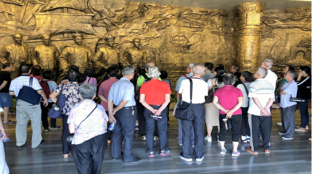

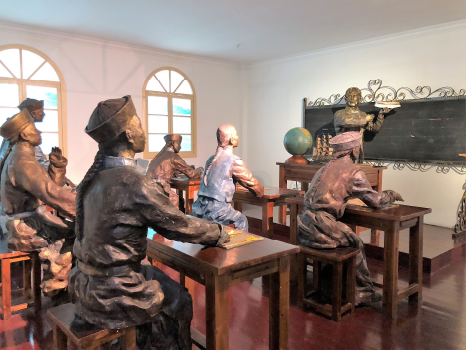

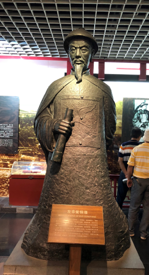

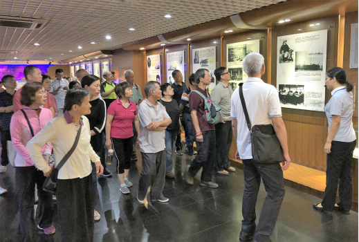
