# 第119期

## 社論

### 創造傳奇、帶動時代的謙謙君子

本刊

傳奇是苦難煎熬

傳奇是順風揚帆

傳奇是造次顛沛

驚奇是無風無雨

人類歷史有四大文明古國，時至今日，敗亡的敗亡，走樣的走樣，早已淹沒在歷史的長河中，唯獨中國的中華文化一脈相傳，是理所當然？還是奇蹟？

沒有人比孔德成先生更了解時間對歷史產生的意義了，先生何許人也？他來自世界唯一且古老又著名的家族，是經歷二千五百多年福報累積延續下來的人物，身為孔子的第七十七代嫡長孫，是聖裔的血脈傳承，更是儒家道統傳承象徵。孔德成先生也是這個時代中能闡述代表中華民族的人，他說：「民族只是個軀殼，文化才是民族的靈魂」，也就是說只有血統、治體、地理、疆土，不足以定義一個民族，那麼什麼才是民族成立的足夠條件呢？唯民族傳統固有的文化才是民族的魂魄所在。

當國家民族面對巨大變動時，或孔子隨魯定公出亡，流離失所；又或孔先生隨國民政府播遷來臺，浮海之時，一位有為有守的君子是如何自處呢？現任奉祀官孔垂長先生說到其祖父一生都在創造傳奇，這句話至為中肯。

孔德成先生打從自入娘胎之際即是千人矚目、萬人期待者，出生百日已貴為公爺，顯要如北辰星，于清、民之世，其地位又何人能及？其不幸又何人能當？孔先生是未出生即失怙，出生甫十七日而失恃，嫡母照顧到十歲病故成為孤哀子，繼由業師照料成長，讀書不輟從未鬆懈，還要照料孔府上下，稚齡當家、主持家政。面對國運、家運泥陷洪流的時代之中，未及弱冠的孔先生，卻能以凜然的士人風骨堅守夫子立處之道，何其難能可貴！

「儒者之風-孔德成先生百歲紀念展」中，特別展出二年前尋覓拾掇出的孔先生青少年日記，日記記錄著孔府一家因日本侵華兵臨城下，不得不避走重慶的日子，數年間，年僅十九歲的孔先生，如何面對五倫關係的應對進退維持家業，或為君、為臣、為父、為弟、為夫、為友、為弟子等，在不同角色中轉換，在在顯示日記中。觀之，孔先生的人生體驗，對應於《論語》經典智慧，即是活生生的驗證，由此可見儒家精神不在理論，重在實踐、運用於生活中的應對進退之道，從而逢凶化吉，並以好學不輟來開創自己的命運。據日記所錄每天功課統計，四年間所讀之書多達二百餘種，這種厚實的精進力道，竟然出現在一個二十出頭、處於亂世中的世家子弟身上，我們不能不相信，孔子的君子培養法是不得了的，孔先生即是典範。

春秋時代孔子的成就由逆境中彰顯，孔先生的能力在苦難的中國近代史中茂發，時代的阻力無法窒礙一位君子創造傳奇！敏學好問、學而不厭，與君子來往學為君子，有好榜樣，有切磋琢磨的對象，有請益提攜的師長，才造就了孔德成先生一生的風采。雪廬老人尊稱孔先生為孔上公，乃實至名歸，須說孔先生百日受爵「衍聖公」，是中華民國最後的公爵，但這是一種人品風骨格局而稱「上」，沒有辜負啊！

或有人說，這是家學淵源所造就！但見歷史上能有幾個王公貴族世家子弟可以不負祖上而自身成就多才多藝？孔德成先生是權威的金石學家、器物學家、禮學家、教育家、書法家，其學問之博，現代學者難出其右。治學上更是無所不用其極，到美國耶魯遊學考察一年，西人「小題大作」務求真確的精神，孔先生更是共冶一爐，對學生採取啟發卻嚴謹的教學方式，其一字也不放過，實事求是的研學、教學精神，應與經學養成階段研學態度的務實有關。

然一九四九年三月自美歸國，中國豬羊變色，輾轉至香港、澳門，在烽火中仍臨危奔赴廣州主持孔廟祭祖大典，欲救全國士氣於一擲，雖未竟其功，但士人救國之心日月可見。及至大陸淪陷，孔先生知道之不能行，而隨政府播遷臺灣，應驗了夫子的「道不行，乘桴浮於海」的千年之嘆。

兩岸局勢緊張，先生潛心教育英才；唯六十、七十年代，中華文化浩劫，孔府受創至深，先生心中悲苦可想而知。且中華民國外交上節節受挫，特別是與日、美斷交，身為儒家象徵，孔子直系傳承的孔先生，在國際聲望備受尊崇，受邀出訪日本、韓國、越南及西歐各國，每到之處講演皆以國際眼光切合該國國情，如到英國倫敦大學並以思想研究聞名者，即以孔子思想影響力切入，在牛津大學談孔子的均富經濟，到德國談儒學的現代化，到荷蘭談孔子的教育思想。這些專題都必須要有國際時事的眼光，以儒家的精神貫通，讓諸國對中華固有文化有更深入的了解，這種周遊列國為國家爭取更多知音、友誼與能見度，是以文化服人的方式拓展外交友誼，能做到的大概只有孔先生了。

孔德成先生與孔夫子有很多相似的地方，祖孫皆生於政治動盪、價值混淆不清的年代，一生曲折，顛沛流離，學不厭、誨人不倦，又終生不離道，造次顛沛必於是，不求名利，能屈能伸，能清、能任事，能和人事，一生為學，教學條理分明、始終如一，這些都是中華文化道統中君子的呈現。孔先生一生都在創造傳奇，是帶動時代的謙謙君子。

二○一九年恭逢孔德成先生百年誕辰紀念，舉辦一系列活動，期待大家進一步認識這位大時代中的人物。

## 佛學覽幽

### 菩薩清淨的行持 —華嚴經淨行品（三十五）

*戒慧講述‧編輯部整*

人生險難因三毒

近逐世樂是瞎忙

燄陽難躲見大樹

乘桴猶如定解脫

丙二、指事顯因答其徵因

丁一、總徵

丁二、別顯

戊六、乞食道行時願(五十五願)

己二、所睹事境(十九願)

己二、所睹事境 棘刺

經文：

見棘刺樹，當願眾生，疾得翦除，三毒之刺。

吳月氏優婆塞支謙譯：「若見棘刺，當願眾生，拔三毒刺，無賊害心。」六十華嚴：「行見棘刺，當願眾生，三毒消滅，無賊害心。」於路上行走時，見到山上或路邊的棘刺樹，碰到棘刺樹（會性法師提及刺桐即桐油樹）會產生痛苦，當願眾生能夠速去除棘刺，更願眾生能想到翦除心中貪、瞋、癡三毒之刺。

外面的刺，刺人痛苦是一時的，三毒刺所產生的痛苦是長劫的，棘刺之刺，可以用醫藥解決；三毒之刺產生的痛苦，世間任何的方法皆無法對治，無奈一般眾生怕的是外面的荊棘之刺，卻不怕三毒之刺，所以佛替眾生捏了一把冷汗！不懂的說不怕，懂局的卻覺得很可怕。

在較量上說，荊棘之刺的害跟三毒之刺的害，南亭老和尚說，雖然樹的身上長滿了釘子，可以刺人至皮膚出血，可是老和尚很有魄力的說「無懼」！最壞的是我們心裡的貪、瞋、癡三毒，能使我們造惡而入三途。

貪、瞋、癡的第一個比喻是毒龍，此毒龍噴出的是劇毒，噴火的時候會傷人、會死亡，但慈悲可以作為許多煩惱的正對治，入慈心三昧時，火任由他噴，噴到沒有火自然就安靜。第二個比喻是毒蛇，四大（地水火風）像毒蛇，在籠子中互相咬來咬去，比喻這四條毒蛇若相互制衡，身體看上去就很健康，四大像毒蛇咬來咬去時，身體就會有很多病變。毒龍是就傷害法身慧命的立場說，毒蛇是就傷害色身的立場說，這兩個角度是不太一樣的；種種的不調會造成身體的傷害，可是身體的傷害是傷害不了慧命的，最怕的是慧命被傷到。

《楞嚴經》中有位畢陵伽婆磋尊者，出去托缽時被毒刺刺到，觀察這其中的痛從哪裡來？痛如果在毒刺上，應該看到毒刺、聞到毒刺、聽到毒刺的名就會痛，因為痛在毒刺那裡，可是不對！講毒刺時並沒有覺得痛。痛如果在我的身根，那我應該任何時間都感覺痛。痛如果在我的身識，那只要我有身體的感覺就有痛。痛不在身根、不在身識、不在毒刺，那痛在哪裡？沒有！可是一身有兩覺，一個是痛一個是不痛，想到的時候痛，根本位（入空性定）的時候不痛，後得位的時候又痛，所以痛不在身根、不在身識、不在毒刺，可是三者和合又顯現，隨著業的顯現，沒有自相，有惡業的人碰到毒刺，藉著身根、身識和毒刺去顯現痛。

臨終的病苦或是惡業所結的果，但以善心面對，就會把痛苦轉成安樂的因。

己二、所睹事境 樹葉

經文：

見樹葉茂，當願眾生，以定解脫，而為蔭映。

願所依為見樹葉茂，願依靠在菩薩身上，願也依靠在見樹葉茂這件事上，當願眾生，所願的是眾生，願所有的眾生都能夠以定解脫。

會性法師提到，見樹葉茂意即我們走在路上，見到茂密的樹葉，要想到它有遮蔽太陽的能耐，例如走路累了、汗流浹背，此時會渴望在陰涼的樹下休息，涼風吹來很舒服。所以見到樹木茂盛，就希望像茂盛大樹一樣能福蔭眾生，解脫熱惱得清涼。

此處之定是能引發出世間智慧，所以稱為寂靜解脫。此定就好像在茂密枝葉的參天大樹可以遮蔭眾生。

見樹葉茂與以定解脫，而為蔭映，這兩者的關係為何？煩惱熾盛的世界如天上的烈日，試想當行走於攝氏四、五十度的非洲大地時，心中必很渴望有可以避蔭之處，忽見一棵樹葉茂密的大樹在那裡，樹下乘涼，吹著涼風的感覺如何？當我們有勝解力來修定，從定得到解脫，就好像躲在樹蔭下那般的清涼，未以勝解力修止觀的人，似在三界煩惱熾盛環境裡中了暑，在追逐名利上昏了頭，或昏而不醒，不曉得方向在哪裡；而有定有解脫的人，自身的感覺如舒服的坐在樹下乘涼，回頭看世間人都在烈日當空下中暑而暈頭轉向。此時以定解脫者能為蔭映，意即此種人除了自己有能力自利以外，也有能力庇蔭眾生，提供眾生安樂。

比如一位高僧大德，他能幫助眾生有修行的道糧，且幫助他修定修觀得到解脫，此即蔭映眾生得到清涼，如大樹提供不堪熱惱的有情，有著清涼的環境。

西晉聶道真的版本是：「菩薩見葉樹時，心念言，十方天下人皆使，道覆蓋得禪迴入三昧。」東吳吳之謙的版本是：「得好葉樹，當願眾生，以道自蔭，入禪三昧。」三昧是為了修觀的三昧，當修觀破了煩惱以後，其實是不會有煩惱的，沒有煩惱就是清涼，清涼就像躲在大樹下，一般的眾生都是很熱惱的頂著太陽，妄見五欲的快樂，衝過去卻如水中月，命終之後在下一世再繼續衝。（下期待續）

### 大乘百法明門論簡說（二十七）　拾肆、心所有法｜根本煩惱(二)

*戒慧講述‧淨本整理*

煩惱稱根本

生起不易斷

種子與習氣

串習認知斷

經文：四、煩惱六者：一、貪。二、瞋。三、慢。四、無明。五、疑。六、不正見。

前面說明了煩惱與十使的關係，接著開始分別說明六種根本煩惱：

一、貪

《百法直解》中貪的定義及業用為：「於有、有具染著為性。能障無貪善根，生苦為業。」有是指三有，即三界；有具是指資助三界的種種條件，也就是三界中的各類事物環境。對於有、有具產生染著就是貪。怎麼樣才稱得上是染著？因為愛我，為了讓我快樂而在三界中不斷追求，想要擁有，是為染著。所以修習四禪八定的行者，雖然必須以慈悲喜捨為助伴，修持種種善法以資助禪定，但內心深處是為了三界中的快樂而修，仍是屬於貪。

無貪、無瞋、無癡才能造善，故稱為三善根，而貪能夠障礙無貪，這種想要擁有的心，會使人造作許多惡業，並滋潤過去的惡業結果，生出種種痛苦，特別是三界中生死的大苦。所以貪必須要被對治，想要對治則要找出貪的根本，就是無明我執。所有根本煩惱都是因為無明我執而起，執著有我，所以為了使我快樂而貪著不捨。對於三界或者三界中的各種事物環境，應知皆無自體性，不過是過去所造業的顯現而已，就像魔術師藉由咒語將木石變成讓人喜愛的金銀財寶，並不真實，所以要有兩種體悟：一、有及有具皆是過去業的顯現，只要造善業就可以現樂果，貪反而是造善的障礙，那又何必貪。二、業所現者是無常法，有如夢幻般無自體性，既不真實，何必貪著？

二、瞋

《百法直解》中瞋的定義及業用為：「於苦、苦具憎恚為性。能障無瞋，不安隱性，惡行所依為業。」苦有逼惱之義，苦會逼惱身心，三界中有無量無邊的各種苦，所謂苦苦、壞苦、行苦等；苦具是指造成苦的各種條件。對於苦、苦具的逼惱，生起憎恚之心就是瞋，瞋有許多過患，所謂：「瞋是失佛法之根本，墮惡道之因緣，法樂之冤家，善心之大賊，種種惡口之府藏。」瞋會破壞禪定，所以修定的仙人皆是慈眉善目；瞋也會破壞異熟果，障礙投生善道；還有所謂的火燒功德林，若瞋心太強，過去和現在所造的功德，都會為之燒盡(感果功能已被破壞)。瞋心能令有情生熱惱而不安隱，隱是指內心不為人知的清涼，在這樣的熱惱之下，很容易造作各種惡行。

要如何才能對治瞋？關鍵在於對苦、苦具的正確認知，修行不是在正確的觀念之外別有修行。例如：（一）、苦來自於惡業，惡業由自己造，只有受苦才能消除惡業，沒有其他的方式可消，故無需瞋。（二）、佛教徒發願代眾生苦，需要承擔力，受苦時不怨天尤人可以培養承擔力。（三）、在比較中發現，太多有情眾生的苦超出於我，為何還對現狀不滿？（四）、孟子所謂：「天將降大人於斯人也，必先苦其心志」，苦是脫胎換骨前的考驗。（五）、瞋無功德，充滿過患，《論語》顏淵篇上孔子說：「一朝之忿，忘其身，以及其親，非惑與。」（六）、瞋是在苦中緣到境界可惡面相而生，不是無因生，也不會在可愛的境界中生，如是觀察苦境對我的好處，瞋又如何能生？或者在苦境中專注緣念佛號，瞋也不生。

三、慢

《百法直解》中慢的定義及業用為：「慢者，恃己所長，於他有情，心生高舉為性。能障不慢，生苦為業」，倚仗著自己的所長，認為自己高於他人，不把他人看在眼裡，是慢的行相。共同修學的同法者中，因為互相比較容易生慢，如此則無法和合。應知同法者的功德如同三寶，沒有同法者將無法在佛法中繼續修學，所以對於慢心要謹慎對治。慢的行相，細分有所謂的七慢：

（一）、慢：對於同等之人，認為彼此相等不必敬重；對於比我差之人，認為就是比我拙劣。此種心態下容易忽視別人可能勝過我的優點，或者若干年後別人可能超過我。

（二）、過慢：過於上述慢心，對於同等之人認為比我差，對於比我高者，認為與我相等。這種慢比前述的慢過分，稱為過慢。

（三）、慢過慢：比過慢又更強的慢心，稱之為慢過慢，其行相是對於勝過我的認為不如我。

（四）、我慢：因為執我而生起慢心，把自己高舉，所有慢心皆因「我」而生，此為七種慢的根本。

（五）、增上慢：增上者強盛之義，指修行人因為精進修行產生瑞象，自認為高於他人，或認為已經證果，實未證得。

（六）、卑劣慢：包括與人相比實在差太遠，確認為只差一點；或者明知他人勝過我，但不肯對他人起恭敬心，向他人學習。

（七）、邪慢：惡人仗勢惡行，心生高舉者。

無論何種慢，都會讓人心生高舉而不願虛心求教，所以會障礙不慢，當認為別人不如我，就會阻礙德行進步，得不到善知識的教導，由惡見生出苦果。

憍慢時常合稱，但憍與慢有所不同，憍是小隨煩惱，是對於自己的盛況深生染著，屬於貪的分位（某一分的行相）；慢則是根本煩惱，自恃所長，把自己高舉，凌駕他人。

生起憍或慢的原因可以很多，懺公表解中舉出七種：無病、少年、色力、族姓、富、貴、多聞。而最重要的是末後告訴我們，謙能治慢。孔門中顏淵能夠以能問於不能，以多問於寡，就是謙謙君子卑以自牧的最佳形象，所有的學問都不專屬於誰，而屬於願意謙虛受教之人。

《百法明門論》是為修行人所造之論，在修學時如何對治慢心，要多觀察同法者的功德，同法者有哪些功德呢？我們所有的佛法觀念都是因為同法者才能學得，佛法能以團隊的方式學習，力量最大，同法者間所結的法緣勝過世間的情緣，佛法的生起處才能讓眾生離苦得樂，所以同法者的團體所造的善業是最大的善業。（下期待續）

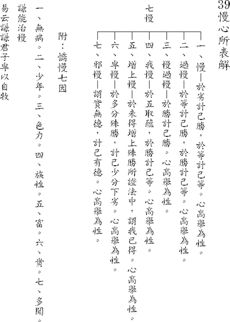

### 佛學概要十四講表簡說（二十一）　第三講表

*戒慧講述‧宏法、淨昌整理*

消極能分善惡業

積極亦有善惡業

惡業消極真斷惡

善業積極真修善

(丁)消極與積極

【消極兩屬】，一般人也認為佛法消極，但所謂的消極是你有我也有叫做消極兩屬，而積極也是你有我也有。所謂消極和積極，到底是好或者是壞的，是由內容來決定，並非由表面決定。

《述記》引孟子云：「雞鳴而起，孜孜為善，舜之徒也；雞鳴而起，孜孜為利，蹠之徒也。」天剛亮時就非常努力去作善法，這是堯舜之徒積極的作善。同樣的，天剛亮就非常努力的謀私利，積極為惡是盜蹠之徒。盜蹠是魯國大夫柳下惠的弟弟，但他是一個擁有九千個徒眾的大盜，每天一早起來就積極作惡。盜蹠橫行齊魯邊界，一生為非作歹，八十幾歲壽終正寢。所以司馬遷不相信因果報應，因為盜蹠是惡有善報。換言之，極隱密的緣起要以聖言量去通達，但如果沒有在現量和比量通達無常與空性，不會把聖言當成量。

上述例子可知，判斷的標準是觀待所作的內容，論定其消極或積極。佛法和世間都有消極面與積極面，但是兩者對惡事與善事的消極和積極是不同的，所以丁表開出【消極兩屬】，佛家是對惡法消極，世間是對善法消極；也開出【積極兩屬】，佛家是對善法積極，而世間是對惡法積極。

◎善消極屬於他

先論【善消極】。世間人說佛法消極，那我也說世間是消極的。世間人對善法消極，所以是善消極屬於他。世間人說佛法消極，佛法說你也消極，屬於善消極的是你，消極就是不幹，所以對善法消極是世間人，「進德修業、濟困扶危、為眾犧牲」都是屬於世間的善法，對世間一般人而言，這些善法是不願意做的，即便做也是勉強少分做而已。

●進德修業

「進德修業」尤其是善法的講究處，「進德」即是智慧能力的增上，「修業」是修學各種學業，想要德學兼備就要進德修業。《述記》將世間人進德修業的種類，分為三種人：第一種人是既進德又修業；第二種人是只有修業沒有進德；第三種人是既不進德也不修業。現代人有修業卻不講進德，所以學歷愈高，犯罪手法越來越精緻。

但進德和修業亦可以是相互觀待的，一個想要追求德的人必須在學上用功，聞思修對道理愈通達，愈能進德，兩者可以相關。

《述記》云：「君子之澤，五代而斬，小人之澤，五代而斬。」此處君子與小人，是指在位與不在位，他們都有本慶和餘慶，大概延續三代、五代。《述記》中說唯有本慶非常純善的人，舉孔子與范仲淹這兩家，乃至於彭二林居士，他們可以擁有綿延不絕後代，都是指他為善非常深厚。

作善分兩類：顯而易見的善法與隱而不現的善法。一般人看不到顏回傳承聖道的善，所以不容易舉顏回，所以孔子過世的時候，魯國上下沒有感覺；子產過世的時候，鄭國整個家家戶戶都關門，生意不做了，萬人空巷，很多人到靈堂去弔喪。孔子過世，魯哀公來祭拜孔子的時候，說了一段很肉麻的祭辭，像十足的政客。所以維持正法，傳承正法的善，一般人是看不到的，但看不見不表示沒有，他的恩澤加被後世，就足以說明他本慶的殊勝。顏回為什麼會早死？因為眾生無福，顏回的氣象是宰相的氣象，所以春秋楚國的子西大夫才會說自己國家的宰輔沒有如顏回的氣象，這種善，一般人看不懂。

●濟困扶危

「進德修業」是約整體而言，「濟困扶危、為眾犧牲」可說是化他的一分。「困」是指他人有困難，「危」特別講國家危難可以伸出援手，此二者皆是善法，但一般人是不如此作的。《述記》引大禹與諸葛亮為例子。大禹王的例子出自於《孟子》〈離婁篇〉說大禹治水，他治水的心是「人溺如己溺」的悲心，眾所周知大禹治水八年在外，三過家門而不入，夙夜匪懈治理水患。另外「人饑己饑」則是講周朝始祖后稷，他也是想到天下缺糧，饑民無數，就好像自己餓肚子一樣來拯救，所以他帶領百姓種五穀，使百姓飲食豐足。上述「人饑己饑、人溺己溺」說明濟困的形象。

扶危的部分是舉諸葛亮，諸葛武侯不忍漢室傾頹，群雄作亂，生靈塗炭，所以他是全身投入，扶漢室的頹危，〈泰伯篇〉說「託六尺之孤」受君王臨終託付來輔佐幼君，「寄百里之命」把國家的政權，江山社稷托付在他身上。諸葛武侯就是典範，輔佐後主鞠躬盡瘁，死而後已。以上是「濟困扶危」。

●為眾犧牲

濟困扶危相對可能會犧牲自己的時間、金錢乃至於生命，所以有為眾犧牲的精神，在濟困扶危這件事是在所不惜的，《述記》也引「殺身成仁、捨身救命」的典故來說明，這些都是屬於善法，但是世間人是消極的。

世間人要成為這樣人物，一定都得讀聖賢書才辦得到，事實上儒家絕不是現代學者所說一般學術，它必須帶著宗教情操，例如對天命、鬼神與祖先有畏懼，懂得進德修業、光耀門楣、對得起列祖列宗及聖賢，所以他們願意在進德修業之後濟困扶危、為眾犧牲，這些都必須帶著使命感和宗教情操，世間大多數作學問、寫論文的人是不會懂這個道理的。

◎惡消極屬於佛

對比消極面來講，一般說學佛者是消極，但是佛的消極是對惡法的消極，丁表就【惡消極屬於佛】，提出了「縱欲享受、營私害公、爭名奪利」　三個面向，這部分佛教徒是消極的。

●縱欲享受

放縱自己在五欲六塵當中享受，起心動念沉迷於五欲六塵，慾壑難填；而且縱欲享受後也無法進德修業。

縱欲享受對比前面的進德修業，進德修業對世間人來說是不幹的、是消極的，對學佛者來說卻積極行之。《述記》舉出佛家「頭陀行」的苦行，乃至於他們對世間的慾望都是非常的淡薄，所有精力都用來修學。《述記》中舉了弘一大師、印光祖師與雪廬老人，大德們在修學上不但不會縱欲享受，而且所有精力都投入修學。

佛法的消極是就惡造作上而言，惡消極是惡的不幹。縱欲享受即是惡，縱欲享受一般人不會認知是惡，一般認為有錢富貴本來就該享受，認知上無法成立是惡。但凡縱欲享受與煩惱熾盛之人，絕無可能進德修業，進德修業對治的是縱欲享受，佛家不但不會縱欲享受，甚至還離欲出家。離欲出家包括出煩惱之家，形象上是身出世俗家，心也出煩惱之家，在家人雖身不出家，心也要出煩惱之家。

講表上下文互相對，兩者是相互有關聯的。

●營私害公

「縱欲享受」是就個人而言，「營私害公」是為了一己私利去傷害公家、公心，此處講到因果的概念是非常嚴謹的，非己之物，尤其是公家之物，是絕對不會拿來私用的。「縱欲享受」是指他家很有錢，他縱欲享受自己的資源，但這樣的人如果到公家來，一定會營私害公。

「營私害公」是把公家資源拿來經營私人利益，在公家裏面謀求私人的利益，這個比縱欲享受的罪過更大，例如：魯國的三家大夫，季孫大夫在魯國裏謀他之私，被稱為「季氏富於周公」。魯國只是一個小國，季孫大夫只是魯國的一位大夫，竟然比周天子宰相的財富還要多，這裡面全部都是聚斂而來，叫「營私害公」。

●爭名奪利

佛家不但不會營私害公，反而講究平等布施，利樂眾生。既不會營私害公更不會去爭名奪利，所以對爭名奪利這件事也是消極的。一般世人對名利非常看重，爭奪之後就會互相傾軋、上下交征利，危及國家。學佛者則對名利看得很淡。

進德修業的人正好就能對治縱欲享受，濟困扶危正好對治營私害公與爭名奪利，而且更能進一步為眾犧牲。

前段說縱欲享受的人，身造作的是殺、盜、淫，口造作妄語、惡口、兩舌、綺語，意造作貪、瞋、癡。而營私害公、爭名奪利的人，一樣造作這些惡業。

◎惡積極屬於他

●身殺盜淫、口四種惡及意貪瞋癡

所謂的積極，學佛者也很積極，世間人也很積極，但是世間的積極屬於十惡業的造作，佛的積極不但不造作十惡業，反而在十善業裏積極造作，乃至於離欲出家、莊嚴地獄、不捨一人、帶果行因。

丁表所列【惡積極屬於他】就是身三、口四、意三，十惡業的開展，這些惡業都是世間人積極造作的。

為說明佛法的十惡業與十善業，先說明法相呈現的方式分為「成法」和「遮法」兩種論式。「遮法」就是用否定的方式呈現，「成法」是直接呈現。

解釋法相可分為表詮與遮詮，表詮就是解釋成法，遮詮就是解釋遮法。遮詮即是用遮的方式詮釋法的定義。舉例空性是遮法，遮掉自性的，不是成立一個空性的，這是無遮的行相。

而布施等廣大行是成法。戒律中有攝律儀戒、攝善法戒及饒益有情戒等三聚戒，但戒律的體性是以攝律儀戒為體性，攝律儀戒就是表相為遮法，如不殺、不偷、不盜、不淫其實是成法，何以故？若是遮法則為常法，常法不變動，若是成法則為無常法。

至於「非遮」是遮除之後引向餘義，例如說某人很胖，但早上不吃，此句是引向晚上吃很多，因為前面加了胖，所以這個叫做「非遮」不是「無遮」。「無遮」是整個遮掉，單純遮沒有引向什麼。詮釋法義可分「表詮」和「遮詮」，「遮詮」當中又分為「非遮」和「無遮」。以上述方式瞭解呈現的法相。

◎善積極屬於佛

十善業部分，將待第十表五戒十善處，再來深入分析。此處就講表上【善積極屬於佛】所列出的四點說明：離欲出家、莊嚴地獄、不捨一人、帶果行因。這是佛法積極處，而所積極的都是善法。

●離欲出家

「離欲出家」不像世間一般的縱欲享受、營私害公與爭名奪利，因為離開了五欲六塵、慾望，出了煩惱家，離煩惱之後有一顆清淨心，就可以進德修業、濟困扶危和為眾犧牲。

「離欲出家」本身就是為了進德修業，離欲就是身離殺盜淫、口離四種惡、意離貪瞋癡，離欲本身就是離縱欲享受、營私害公、爭名奪利。進德修業使自己能德學俱增，抱著不但可以濟困扶危，甚至為眾犧牲的精神莊嚴地獄，比世間人更厲害，而且時間不限今生，能夠長劫莊嚴。

看雪廬老人講表前後關聯，用字精準又要言不煩，老人自述讀書如此，有別於古來的祖師大德的註解，這種表解是古來沒有的，他善用這種讀書法。

《述記》最後講到出家是為了延續眾生的慧命，肩負救眾生慧命的重責大任，是最大的積極。最後這句話：「出家者，大丈夫之事，非將相之所能為也」，此處大丈夫之事，他要對世間濟困扶危，甚至是為眾犧牲、對治十惡業，並且能夠莊嚴地獄、不捨一人、帶果行因，皆非將相所能為。

●莊嚴地獄

離欲出家不只是濟困扶危、為眾犧牲還莊嚴地獄。《述記》舉出我們最熟知的地藏菩薩，以他的悲願來救護地獄眾生，發誓言「地獄不空，誓不成佛」，地獄是最苦難的地方，而菩薩長時劫留在地獄度最剛強難化的眾生，直至地獄空無一人，方成佛。

●不捨一人

代表的是救度眾生，不只是一輩子，還長劫救度，例如這一生只有度了一千個，還有一大堆沒有度，不捨一人表示生生世世都在做救眾生這件事，老人講表的次第分得很清楚。

●帶果行因

「帶果行因」是指已經證得圓滿佛果，成佛以後還是繼續度眾生。「行因」示現菩薩度眾生，例如文殊菩薩、觀音菩薩早就成佛，示現菩薩度眾生。長劫度眾生就像普賢菩薩十大願中：「虛空界盡，眾生界盡，眾生業盡，眾生煩惱盡，我此行願無有窮盡；念念相續，無有間斷；身語意業，無有疲厭。」也就是眾生沒有度完的一天，而我也不捨眾生。

雖成佛度化有情，一期因緣結束以後再發願作菩薩，努力累積在另一世界成佛的因緣，再去度該世界的有情眾生，這是「不捨一人」的行相，世間的將相比不上，這樣的人到世間，善業的力量實在太大了，到哪裡去都吉祥。文殊菩薩人稱妙吉祥，見到他的面都是有福之人，跟他講話都可以改變命運！了凡先生見雲谷禪師，一席談話就可以改變命運。我們凡人腦袋裏面什麼都沒有，每天消磨光陰、日夜顛倒、胡思亂想、晚上做惡夢，跟他講話聊天見面的無不中毒，就像每天吃地溝油、三聚氰胺，不曉得已經中毒，和同事們聊天吃喝玩樂，其實在退轉自己卻不知道，這要有很深的觀修力才會知道。（下期待續）

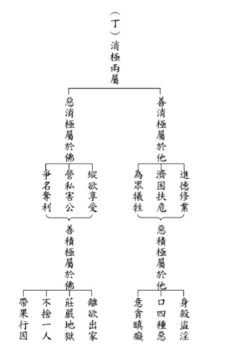

### 人生大事—不能忽略的事實
		助念生西觀念作法研究（七）
助念之意義與規矩
			—雪廬老人講於臺中蓮社—

人生大事—不能忽略的事實

助念生西觀念作法研究（七）

助念之意義與規矩

—雪廬老人講於臺中蓮社—

戒慧講述

理論依據實務作

穩定軍心佛號念

功成身軟家屬喜

慎終追遠風俗厚

第三段：佛教徒不論平素念多少經，或多少咒，臨命終時，種子出來的，唯有阿彌陀佛四字才有用，才能幫助往生。此語甚為重要，大家必須深深記住。

這句話非常的重要，大家務必要深深的記得。記得在聽過法師的演講裡頭，曾經提到，廣欽老和尚在臨命終的時候，臨命終前命令弟子為他念誦大藏經，大眾一部一部的將經典誦起，結果老和尚自己一個人很安然的坐在那繼續念佛。老和尚在臨命終的時候給大家做這樣的示現，臨命終的那一刻，唯有阿彌陀佛這個佛號管用。雪公老師佛七開示裏面也有說，要拿地上的這張紙燒火，必須要專心聚集天上的太陽光，地上的紙才能著火。同樣的，想要往生，是阿彌陀佛四十八願中接引往生願，我用念佛的名號引佛來接引我，所以要聚焦，專心念佛引起佛的加被與攝受，不但專心念，而且念的時間越長越好，念得很高興、很法喜，自然病苦會消到最低，很多好的因緣會慢慢出現。

曾經聽聞大陸各地五花八門的助念作法，有的說必須要追頂念佛，全程採用快板念佛，要展現誠意全程跪下來助念……。還好有這一份助念生西須知的冊子，有一個標準版本可以依循，憑著印光大師、雪公老師的抉擇，慢慢建立正確的助念觀念，並靠講學研討的力量，和合大眾，改變風氣。

浙江諸暨有位老和尚一百零九歲，在臨命終前引來一幫上海來的居士堅持要送他去醫院，他的兒子夾在中間，希望他能夠住世，當時感覺助念的因緣不是特別好，還好寺院的當家師，他的小徒弟是諸暨讀書會的學長，拿了我們的助念生西須知給他看，老和尚臨終前本來要被送去急救，當家師因為看過這個冊子，阻擋了送醫急救，開始大眾助念，後來臨終瑞相非常好，聽說告別式那天有一些瑞相產生。如果沒有助念的觀念，即使大德都可能會有助念的障礙，一切的轉變都是靠正知見。臺灣也有大道場的師父，最後死在醫院，再叫救護車載回道場的例子。

唯有生起助念的觀念，才能夠轉變臨終的業力，沒有例外，正知見之所在就是轉變業力的所在。所以，一定要靜下來去把這些道理弄懂。讓自己的想法改變，就算眼前很多事情看起來好像沒辦法度過，但是只要方向對，觀念轉過來，靠著執行力將業轉變。以上第三段就是助念的方法。

第四段：助念時，要遵守規矩。家人千萬不能出來打擾，亂出主意。人死了不要圖什麼熱鬧。助念團來到家中，可以準備茶水，其餘均不用準備。助念者必須注意二點：

一、自己吃飯，不麻煩別人，只喝茶可以。

二、萬不可收紅包，此絕對不可破例。

萬一破壞規矩，變成不給紅包就心不在焉不誠心念，助念變成去賣錢，這是破壞佛法。連收人東西也不可以。在家人去助念，拿錢就是造罪業，拿人紅包這助念團就完了。大家要學印祖，否則是叛徒，不遵守規矩就是欺師滅祖。

助念時要遵守規矩，特別是家人千萬不要出來亂出主意，畢竟往生者跟家屬之間關係是非常緊密的，如果家屬不護持，又出來亂出主意，助念的蓮友不能作主，也對往生者造成很大的干擾。所以這裡頭有很多觀念必須要留意，特別是人死的時候，重要的是引他去好處所，而非圖熱鬧。

蓮友來到家中助念，方便的話可以準備一些茶水，其餘就不需要準備了。專心念佛是第一要務。助念者必須要注意下面的兩點：自己吃飯，不麻煩別人；萬萬不可以收紅包，這是絕對不可破例的。如果破壞了規矩，助念就變成去賣錢了，這是破壞佛法，同時對自己會產生極大的臨終障礙。引申出來，連收別人的東西也不可以，在家人去助念，拿錢就是造罪業，這個助念團就完了。

大家要學印祖，否則就是叛徒，不守規矩就是欺師滅祖。雪公老師這話說得極嚴重，古時候對於師道極為尊重，雪公太老師在這個地方說出要大家學印祖，否則就是叛徒，不遵守規矩就是欺師滅祖，這是非常非常重的話。

以上是規矩的講究，首先是以助念團為主，意思就是什麼都聽助念團的。但是對於護持往生者，最好是在往生之前，就能夠跟往生者和家屬做良好密切的溝通，家屬跟助念團取得最好的共識，這樣的方式是最好的。並不是事前都沒有溝通，一進去就要通通聽我的，並說這是雪公老師規定的，不然我們要全部撤團，這就不通人情世故了。

雖然是以助念團為主，但是並不代表都不跟家屬溝通，必須要讓家人知道助念團來，全部是誠意的幫忙，裏面沒有牽涉到名聞利養，沒有牽涉到各項的利害關係，家人懂得助念團這個誠意的時候，自然樂意聽助念團的。所以，雪公老師雖然是原則性的宣誓，但是我們要知道裏面真正的意涵，否則我們學佛的都太硬邦邦，雖然看起來助念是幫忙（結善緣），可是實際上跟家屬卻結了不太好的緣，後面要引發家屬來學佛就困難了。

接著，助念團到家裡面，在助念的過程當中，助念者難免會口渴，如果能夠準備茶水方便大家安住念佛是好的，但是去助念的蓮友最好自己帶水，不要麻煩哀傷過度的家屬。

事實上，這個時候大家最重要的是安住下來，專心的來幫助亡者生起正念，如果再去忙這個、忙那個，裡裡外外的走來走去，其實都是一種干擾。你眼睛一看，家屬沒準備茶水，你就心裡很清楚要自己準備了，不能要求家屬準備，茶水裏面還要注意不要喝冷茶、冰茶、甜茶，避免聲音出不來。到了半夜，助念團要自己去買一點麵包，或者煮一點熱食給大家充飢。助念團訓練得有規矩、有分寸，就不會一下子叫人家準備這個、準備那個，甚至還有催促家屬去開死亡證明書等等事項，那你到底是去助念，幫助亡者往生，還是把人家家裡面搞亂？所以沒有實戰經驗是絕對不行的。

死亡證明的部分不急於一時，葬儀社、買棺木的事，助念時間過了之後再來安排都來得及，因為多的是這一方面的資源，半夜打電話給葬儀社都可以，助念團原則上是要讓家人靜下來，配合家人一起來念佛，陪著家屬和亡者一起念佛，家人跟往生者的關係是最密切的，所以家屬能夠在往生者旁邊助念，這個力量其實是最大的，對往生者也產生安定內心的作用，同時家屬參與助念對於整個助念團來講，也生起互相鼓勵的作用。如果這麼親的家人都不來念，關係這麼遠的助念團會認真念嗎？蓮友不是被葬儀社派去的，平常跟家屬又有交情，助念的效果會不錯的，佛法不離人情世故。

以上總說有助念的道理、助念的方法。後文的別說，將繼續介紹助念的規矩等。

再者，人要到現場實際學習、觀摩和演練，亡者還沒斷氣的時候，在旁邊看師長怎麼去處理，讓他安然斷氣，這真的非常重要，因為助念團裡面先到達的人，必須要穩住局勢，回答家屬的問題，讓家屬安心。

曾去某位蓮友家助念，當時葬儀社一直嚷嚷說，天氣太熱，要先冰起來，否則發臭了我們（葬儀社）不收。在這樣的狀況下，你愈有正知見，你的底氣就愈足，能把葬儀社不如法的動作制止。如果沒有實務上的經驗，沒有看過師長的處理方式，我們很容易產生害怕的感覺，也很容易隨意自作主張，或者聽信葬儀社的安排，最後能不能做出最好的處理方式就不得而知了。所以，實務上必須要多多觀察學習，讓自己有護持往生者的經驗，之後內心就會有篤定的認知，遇到類似的狀況，心裡不慌不忙，這是非常重要的。(下期待續)

## 孔學一隅

### 論語簡說（二十七）
	  				—子貢問友

論語簡說（二十七）

—子貢問友

時哉講述

認知偏誤過與罪

自覺良好問題生

忠告善道真益友

珍惜能使令名生

經文

子貢問友。子曰：忠告而善道之，不可則止，毋自辱焉。（顏淵第十二篇第二十三章）

前言

《論語》包含了人生許多疑難雜症的解答，涵蓋範圍諸如辦政治、辦教育、人際關係、識人之學。思維靈敏的朱子，曾說天下再找不到有一部像《論語》這樣的奇書，簡直就是十三經的門戶、精華。

本章所談為交友之道。交朋友這件事極不簡單，今人以為交友不合則分，然古人交友要長期相處，懂得相處之道。朋友之間，不但此生為友，所謂：「九泉之下盡交期」，這一生同為朋友，來生也要相聚為友。友誼是生生世世的累積，因此對朋友之道極其重視。

常人道：「在家靠父母，出外靠朋友。」朋友是進德修業、成就功業最重要的增上緣，是人生最重要的資產。

本章為子貢請教孔子對待朋友之道。若沒有朋友，則無法充實自己的道心，也無法累積深厚的善根福德，更無法發展有道的事業。

消文
子貢問對待朋友之道。孔子回
**答：** 要能以是非觀念勸導朋友，如果朋友不聽從，就不要勉強，停止勸導才不會導致朋友疏遠，甚至變成冤家，這樣就不會自取其辱了。維持交情，他日有機會再勸導之。

釋義

子貢問友，是問「友」的什麼內涵？

此章問交友之道。《論語》中關於朋友的章節，包括知友（不與小人為友、不聽信讒言）、交友（樂於交志同道合的朋友、交守信用的朋友、交與己忠信相合的朋友、交通財知義的朋友、交生死之交的朋友、交規過勸善的朋友、交久而敬之的朋友）。

交友之道非常多，何故夫子答以「忠告而善道之」？

交友之道非常多，但孔子談「忠告而善道之」，這是說懂得跟朋友規過勸善。

規過勸善有何重要，何以是朋友相處之間的義務？

一般朋友之間相處，少有知道此重點者。這一章可參見〈顏淵第十二〉：「曾子曰：君子以文會友，以友輔仁。」文是指典籍，朋友相處一起讀書，一起探討經學的正知見，而這樣的朋友最足以輔助自己的仁心。

一般的朋友總講究在必要時能為自己兩肋插刀、拔刀相助，才算夠朋友，實則，規過勸善才是夠朋友。有朋友輔助自己的仁心、仁事、內涵，才能推展仁的事業。朋友輔助自己，自己也輔友以仁。這裡面有正面說，幫助朋友成就仁；反面說，幫助朋友排除過失障礙。

朋友在五倫關係中，凡是在五倫範圍內的，都應該講究。講究五倫關係，就是敦倫。所謂「敦倫盡份」，是盡自己在五倫關係中的本份，內涵就是一部中國文化，所以極不好講，實在不簡單。

五倫中，有三倫是天然關係，有二倫是道義關係。夫婦的結合原為道義關係，但生了孩子之後，就有父子倫、兄弟倫，乃天倫關係；而君臣倫、朋友倫則是外在的道義關係。

雪廬老人曾引《禮記》說：「父母存，不許友以死；父母不存，可許友以死。」可為友而生死，可見交友之道非常重要。

忠告之形象為何？

孔子在此章形容朋友的形象，是「忠告而善道之」。「忠」就是誠心誠意的為對方著想。

身為老闆，總希望部屬對他忠心，能處處為公司、老闆著想。而朋友之間的「忠」，就是誠心誠意為對方著想。

「告」是告知對方對錯，對的觀念可以導正朋友走入正軌，了解錯的觀念能幫助朋友避開邪見；知道對的觀念能幫助朋友趨吉，錯的觀念能幫助朋友避凶。

善道之形象為何？

在言語上引導：要講究利害關係、是非觀念、顧及情理、比喻告知、透過第三者轉告，這些都是令朋友樂於接受的「善道」。

在行為上引導：讓朋友離開惡環境、接觸好環境；讓朋友聽課學習正知見，改惡向善；交到好的朋友；與朋友共造善業；辦讀書會培養彼此氣質等，都是以方便引導朋友改過的方式。

總而言之，引導要善巧，就是「忠告而善道之」。

何種時機是好的忠告時機？

孔子是「聖之時者也」，沒有好時機，彼此交情再深，有再好的忠告都沒有用。引導要講究好的時機，時機錯了，不論理上多站得住腳，都是錯。
《論語會箋》說，當對方有求教誨的心，這就是時機。如對方
**問：** 「請你為我指正。」「你看我這樣有沒有錯？」「你覺得我有沒有說錯話？」「我這樣做對不對？」

除此之外，也要講究在朋友有空、四下無人的環境方忠告之。且為了彼此交情更深，讓友誼繼續而說。

何種時機不可忠告？

如果對方沒有求教誨的心，也不希求改正。在人多的場合當面指責，或給予忠告，反而讓他面子掛不住。或者他正忙碌，無暇也無心思聽你的忠告。

或是《常禮舉要》：「交淺不可言深。」交情若淺，不能談深入的話題，甚至連規過勸善都要小心。

時機不到而給人忠告，不但對方不領情，還讓自己碰了一鼻子灰。所以說時機要掌握好，這才是「時哉！時哉！」

善道之利有哪些？無善道之過又有哪些？

善巧引導的利益：容易讓他人接受；讓友誼可以提升（朋友因得到勸告而改正過失，獲得的利益愈大、好處更多，也解決了心中的盲點，改變了思想模式，增進生活內涵，又取得更多快樂，因此會感謝你，也會在你有難時伸出援手）。

無善巧引導的過失：由於引導的時機、場所不講究，又嘮叨、重複、繁瑣的說，這是雪公老師形容的「大毛病」；又如朱子註解「以善道導之」，以教導、訓誡的口吻來跟朋友規勸，這些都是沒有善巧引導的形象。

由於不能善巧引導，所以對方不接受忠告，或者使對方疏遠，或讓對方反唇相譏等，有諸多過失。

因此，我們應當取其利益、去其過失，重視善巧方便的引導，這才是盡朋友之義，才能真正「敦倫盡份」。

為何「道」必須作「導」字來解釋？

因為朋友的地位是平等的，不管我們是否在道德、學問、經驗、閱歷上比對方高，但在名言上和對方的關係是朋友，所以我們只能善巧引導來給予忠告，不能善言教訓。

例如我們到某個地方拜訪，對方向兒女介紹我們是「叔叔」或「阿姨」，則我們心裏要很清楚，對方只把我們看作叔叔或阿姨；倘若對方向兒女介紹我們是「老師」，則名言的身分就不同。

千萬不能自己定身分，要看他人是以什麼名言來定位。所以雪廬老人常引《孟子》告誡：「人之患，在好為人師。」

朱子以為善道乃善其說以道之，此道為教道，此解可以嗎？

朱子《集注》中註解「忠告而善道」是「以善道導之」，意思是「盡心以告之，而又加之以教道」，這樣的註解不可採。「道」不是教訓，要解釋為「引導」。如《論語》中「道千乘之國」，應解釋為「領導」千乘之國的人。

既然朋友相互規過勸善乃應盡之義務，為何又說不可則止？

規過勸善是義務，但要觀察不可則止的功德，與不可猶不止的過患。

不可則止有哪些功德？若不可猶不止有哪些過患？

不可則止的功德：能維護友誼；不自取其辱；保全對方面子（害怕別人指正過失）；保全對方的羞惡之心，使之默默改善（劉寶楠《論語正義》：「所以全交，亦所以養其羞惡之心，使之自悟也。」）。

不可猶不止的過患：交情破壞；好意被誤解；無助於勸他誨改；朋友因此疏遠；朋友反唇相譏，勸告反而自取其辱。

如果朋友不接受勸言，就應該停止，以產生功德；如果朋友不接受勸言，而又不停止規勸，便將產生過患。

不可則「止」，是講究斷絕關係，還是講究維繫情誼？

要知道朋友的交往極不容易，因此不要隨便切斷關係。古代交朋友很慎重，與今日合則來、不合則去是不一樣的。在古代，一旦成為朋友，就不輕易斷絕關係。即使非得斷絕關係，也講究「絕交不出惡聲」，跟人絕交不能口出惡言，不但不得罪他，將來還求有復合的機會；倘若口出惡言，則將來連復合的機會都沒有了。

當朋友從淺交到深交，就得努力維繫情誼，因為朋友是人生中最重要的財產。

不可則止，真的以後就止嗎？還是有其他的善巧方便？

徐英的《論語會箋》中舉張伯行的解釋：「不可則止，非必絕之也，不強以必從，徐俟其自悟以為他日忠告之地耳。」

「不可則止」不是一定要「止」，而是不要勉強對方屈就自己。倘若勉強對方屈就自己，則說話必然不好聽，例如說：「你不聽我的話，你就死定了。」「我告訴你，就是要這樣做。」

此外，「不可則止」也不是放棄對方，而是暫時不去規過勸善，等待對方慢慢反省，有所體悟、知過求改，那就是我們「忠告而善道」的機會。

好朋友應該不會當面羞辱我，為何夫子說毋自辱焉？

如果沒有做到「忠告而善道」，朋友雖不致當面對我們冷嘲熱諷，但或因此而疏遠，在做事、行為上與我們保持距離；或不疏遠卻見面不說話；或雖說話卻表情難看，或雖表情無異卻言語態度不好。

朋友不聽規勸則應停止，《論語》中有哪些章節可作證？

如〈里仁〉第二十七章云：「朋友數，斯疏矣。」當我們一次又一次繁瑣的給朋友忠告，將使朋友與我們疏遠，這種疏遠就是自取其辱。

析疑

如何由本章的朋友之道，推衍出君臣之道？

五倫關係的朋友倫與君臣倫中，皆須講究勸諫之道。

《孝經》〈諫諍章〉中說：「昔者天子有爭臣七人，雖無道，不失其天下；諸侯有爭臣五人，雖無道，不失其國；大夫有爭臣三人，雖無道，不失其家；士有爭友，則身不離於令名；父有爭子，則身不陷於不義。」

如果天子有諍臣七人，既使天子無道，也不會失去天下。如唐太宗虛心納受魏徵的直言勸諫，前後十七年的時間，所以成就大唐的貞觀之治。縱然房玄齡、杜如晦功不可沒，然唐太宗特別懷念魏徵，正因魏徵盡上臣子的義務，不斷向唐太宗勸諫。

如果國君有諍臣五人，國君無道也不會丟了國家。如齊威王在宮廷中享樂三年，淳于髡知道不可以直接冒犯。此乃一鳴驚人的典故。

故宮有秦府十八學士，是以人才治國。為何十八學士中，太宗獨懷念魏徵？因為一個成功的領導人，可以接受勸諫。

大夫治理家封地，有諍臣三人，則不失其家。一個讀書人如果有勸諫的朋友一人，則價值也非凡。

由本章如何推衍父子之道？

推演到父子之道也是講勸諫，但不是不可則止，在〈里仁〉篇中說「事父母幾諫」，父母有微小過失時，不勸諫則會引發大過失。孝子不要每天嘮叨，而是要看微細處會引發大過者，事先要勸諫。心裡憂愁要勸，但不能怨恨父母，因為父子倫是天倫。

孝子可不讓父母入非法之事。勸諫是最大的保障，如前說不失其國、其家、其令名等。

若自己有過，朋友對我忠告而善道應如何面對？

應如子路聞過則喜、大禹聞過則拜，這些都是我們的典範。也要愛惜諍友，諍友是對自己關心之人，如全天下只有自己媽媽才會嘮叨，並且把心放在子女身上，為子女著想。

擁有忠告而善道之友，其價值如何？

讀書人若有一位諍友，就不失令名。有朋友讓自己上軌道、有內涵、有好名聲，這樣的價值實在不容易，如一家公司有最好的品牌，這是最可貴的。因此有對自己勸諫的朋友，價值非凡，是大福報。

太宗皇帝說：用銅做鏡子，可以正衣冠。以歷史為鑑，可以知興衰。以人為鏡，可以知得失。這就是諍友的價值，能夠懂得勸諫、據以力爭。

若我不聽勸，發現朋友亦不再勸，應如何自處？

人生財富有二：朋友、老師。《書經》上說：諸侯自得師者王。有老師能夠帶領自己離開幽暗、得到光明，這是最為可貴的財富。得友者霸，如果認為所有人都不如自己，則該亡矣。

若我不聽勸，朋友卻不止時，又該如何自處？

應該要想求誨之心，請對方再指導。因為自己的生氣、臉色讓對方不勸，必定要有求誨之心，要適時請教，不能藉故遠離，要消除誤會。

如果朋友一再嘮叨，雖然朋友不懂禮，可是要知道朋友有情。如家中父責子有時會越禮制，但這是由至情出發，要珍惜情份，在人情澆薄的時代還有肯講真心話的朋友。

原壤夷俟，或其母逝，坐在棺木上唱歌，為何孔子不忠告善道之？

原壤展腳如箕，孔子以杖叩其脛；但原壤跳坐在母親棺木上，孔子就說不失其親，但這樣是不是放任朋友？原壤是方外高人，示現其解脫相，只有孔子知道他的心境，這段友情是神交。

以杖叩脛，是原壤的行為是與禮教相反，並以此講給學生聽，這是笑責，而不是教訓。

總結

規過勸善的友誼應珍惜，才能夠成就大氣象。如父母嘮叨可靜聽，則不是普通人。

老師跟朋友是人生無形的財富，要好好珍惜。范氏與張韶、曾子與子夏。朋友不用多，但取善無窮。

維持情份，人情才會敦厚，如李白與杜甫的情誼。外緣上，尋得老師、朋友是此生的樂透，最為過癮之事。

問答

**問：** 規過勸善要注意言詞，是否可取？《論語》〈季氏〉說益友有三、損友有三，是否可與本章結合？

**答：** 可以與此章結合。言詞很好、臉色很好，是可以用以解釋「善道」的。表達關懷、情誼、想法、懂得善用比喻，這樣的勸說都是善道。

友直、友諒、友多聞，都是在講朋友可以規過勸善，則能成為善友。

**問：** 是否可以用包容來代替善道？

**答：** 但見己過不見他人過，但此時如果不去規勸，導致朋友人生有障礙，怎可不規勸呢？若交情深、對方有求誨之心，但自己又不教之，這樣則有過失矣。

不見他人過，意思是說把他人的過失警惕自己，讓自己修養提升。外圍的人可以不管，但關乎五倫則要講究勸諫之道，以勸誡的這一分來表達父子、夫婦、兄弟、君臣、朋友之情。

**問：** 五倫關係都應該規過勸善，請問夫妻這一倫如何「忠告而善道之」？

**答：** 夫妻結合前是道義，結合後是天倫。夫妻以道結合，且有感情作基礎，由這種關係出發的規過勸善，不但不會破壞感情，反而會更互相珍惜對方。

**問：** 規過勸善的益友難得，我們要倍加珍惜，如果朋友誤會我們而勸諫，我們除了深懷感恩，虛心接受之外，可以把誤會向朋友解釋嗎？如果對方主觀認為他的勸諫是對的，什麼時機解釋比較合適？還是我們選擇有則過，無則警醒？

**答：** 如果今天對方認為自己有某過失，有時心情好就接受，或許你不覺得是過，但可能是自己在保護過失。很多情況是當局者迷、旁觀者清，從某個角度來看可能真的是自己的過失，要懂得先反省自己，而不是解釋自己無過。

**問：** 孔子談交友之道，此有勸諫之道，是否可以請問，朋友之間其它的相處之道。

**答：** 朋友幫助自己進德修業，也要慶幸得到可以勸諫自己的朋友。孔子對子貢的答覆，可看出孔子對子貢的厚愛。此章提供我們反思：太宗難道不是兢兢業業嗎？為何魏徵還要這樣勸諫？是因為太宗想要精益求精，才有後來的大唐氣象。

一般而言，交往久的都會擔心勸諫會傷感情；交淺的反而不好意思勸。交深要善導，怕傷感情，怕勸無效、疏遠距離。交淺不能言深，這是必然。

交朋友要勿憚改才能讓朋友攝受。不要指望朋友指正自己的過失，老師也不容易指正學生。

**問：** 如何才能擁有長久朋友的相處之道？西洋文化可以直呼父母之名，西方的朋友之道是否可採？

**答：** 交友要以文會友，才能長久。如果朋友講究甜如蜜，則不會長久。以文會友，天長地久，久而敬之，患難扶持，規過勸善。

西洋文化與中華文化差異很大，可以取其父子之情，但不需取其父子名份的不如法處，講究名份才不逾禮。

**問：** 老師與學生之間可以有朋友之情嗎？若有，該怎麼拿捏分寸？

**答：** 師生之間所謂亦師亦友，某些部分指導自己如老師。孔德成先生年紀小雪公三十歲，但雪公懂得君臣關係，知道勸諫的時機。

一般老師與學生之間應該要如師生，而不應如朋友。老師可以教訓學生，但若成朋友，就難教訓。但情感上可以如朋友，無話不談。

**問：** 如果兩個朋友的志向相同，都想成就聖賢，但達到目標的方法不完全一致，這時該怎樣相處？比如一個認為誦讀經典更重要，一個認為理解經典內涵更重要。

**答：** 要有老師才能抉擇見地，在老師座下成為朋友，見地更能一致。

**問：** 為何有時朋友越相處越顯得格格不入？是因為不是志同道合的原因，還是因為沒有盡到朋友的義務？

**答：** 忠告而善道之容易疏遠，格格不入反而是志不同、道不合。如果交情愈好，則表示不是普通朋友關係。

**問：** 當交情不夠或不為他信任時，不規過嗎？若要規過，是否要請他最信任的人去勸諫呢？

**答：** 原則如此，不用死在句下。懂得方法、原則，可以巧妙使用變化。你不是他的規過勸善者，則可運用其他方便來幫助朋友。（下期待續）

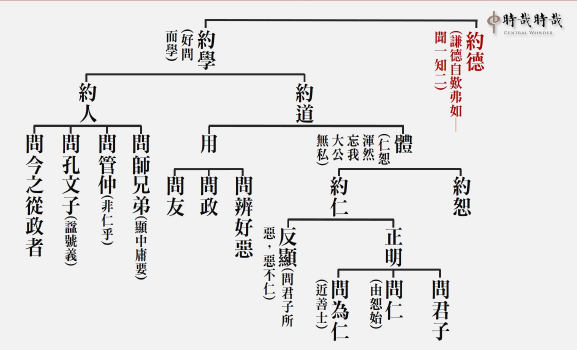

### 孝道跨時代的意義與價值
			  —孝經簡說(十二)
孝是聖人之德也無以復加｜〈聖治章第九之三〉

孝道跨時代的意義與價值

—孝經簡說(十二)

孝是聖人之德也無以復加｜〈聖治章第九之三〉

時哉講述、淨域編寫

聖治天下有章法

家教根本社風厚

祭祀報本國有祥

禮乎禮乎聖治章

本章的經文是：「

曾子曰：『敢問聖人之德，無以加於孝乎？』子曰：『天地之性，人為貴。人之行，莫大於孝，孝莫大于嚴父，嚴父莫大于配天，則周公其人也。昔者，周公郊祀后稷以配天，宗祀文王於明堂以配上帝。是以四海之內，各以其職來祭。夫聖人之德，又何以加於孝乎？故親生之膝下，以養父母日嚴。聖人因嚴以教敬，因親以教愛。聖人之教，不肅而成，其政不嚴而治，其所因者本也。父子之道天性也，君臣之義也。父母生之，續莫大焉。君親臨之，厚莫重焉。故不愛其親而愛他人者，謂之悖德；不敬其親而敬他人者，謂之悖禮。以順則逆，民無則焉。不在於善，而皆在於凶德，雖得之，君子不貴也。君子則不然，言思可道，行思可樂，德義可尊，作事可法，容止可觀，進退可度，以臨其民。是以其民畏而愛之，則而象之。故能成其德教，而行其政令。』《詩》云：『淑人君子，其儀不忒。』」

析疑

經文：

「故親生之膝下，以養父母日嚴。聖人因嚴以教敬，因親以教愛。」

這段文裡，有哪些是我們必須要懂的意思？

一、承歡膝下之子女，如何會養父母以日嚴？

宰我曾經問孔子：「為什麼要行三年之喪？」孔子告之：「孩子在父母親的懷裡三年，期間離不開父母親。若離開父母，不但有安全之虞，還有生命的危險。這三年當中，時刻都不能離開父母親的照顧，與父母是非常親近的，看不到父母就會一直哭泣。」為什麼會「養父母以日嚴」呢？這就是家庭教育。雖然他與父母親愛，但他的敬(日嚴)是怎麼來的呢？

《三字經》說：「養不教，父之過。」這就是家庭教育。家庭教育要讓孩子懂得尊重父母，沒大沒小出了社會一定受害。若此人在家中驕奢、放逸、亂言，試想在外誰能忍受你？你的朋友、上司、團隊能忍受你嗎？所以，在家中沒有這種教育，他怎麼出社會。

二、聖人為何因嚴以教敬？為何因親以教愛？

換言之，聖人辦教育是落實到家庭，讓家庭裡懂得教孩子、愛孩子。此章內容雖講家庭教育，但是許多人成家後卻不會教孩子，所以國家要重視家庭教育這一塊，若將之推展到家庭時，父母才懂得怎麼愛小孩、教小孩。國家領導人若能讓父母懂得愛與教小孩，此人所做的功業也與聖人一樣。

在家中要怎麼敬呢？譬如：孔子就是一位在家裡能讓孩子們懂得敬的人。孔子的兒子伯魚，經過父親身旁邊時「趨而過庭」，懂得對父親表示尊重。試想，他出去難道不會對長官、有道德學問與內涵的人，表示尊重嗎？他若在外面沒大沒小、嘻嘻哈哈，會得到人家的提拔、賞識與教導嗎？所以，現在的孩子們，在家裡若沒有好好的培養，出社會不知道要吃多少的暗虧。

此外，孝子在家中還要懂得給父母親生活的照顧。《禮記》〈內則〉告訴我們，在家中父母怎麼讓孩子，懂得去關心尊重長輩。這種教育雖在家庭中，可是為聖人所提倡，特別是有地位、居國家領導人的聖人，把教育推行落實在家庭中，將產生特別的效果。試想，一個家庭得到安定，家家得到安定，是不是國家就安定？而國家安定、各國安定，是不是天下就安定？不必講什麼冠冕堂皇的大道理，只要將教育落實在家庭中，必然達到非常美好的成效。這是為政的綱領與根本，也是孔子講《孝經》聖人治天下的本懷。

三、對人要從何時教起，才有具體成效？

《易經》蒙卦上說：「蒙以養正聖功也。」乃是孔子解釋文王的卦辭。孔子解釋文王的卦辭有兩個，一個叫作「彖傳」，一個叫作「象傳」。「彖傳」是決定文王這一卦的卦義，「象傳」就是這個卦的相。

蒙卦(  )，上面叫作「艮」，下面叫作「坎」；上面叫作「山」，下面叫作「水」，謂之「山水蒙」。山水蒙的山，艮有「止」的意思；水有「險」的意思，就是止險，把險止住。

為何要把險止住？須知，孩子是蒙昧無知的，你若順著他的蒙昧無知、沒大沒小，順著他的胡言亂語、不知進退，這就慘了，你止不住他的險。所以，叫作山(外卦)下有水(內卦)。第二、三、四爻是個震卦，震卦是開蒙相。山裡的水流動出去，如果有次序、有軌道、有方向，它便能夠潤澤萬物。意即，在孩子蒙昧時懂得啟蒙。從建立品德開始，建立品德要從愛敬父母親開始，如此出去就懂得愛人、敬人。這樣的人會沒有出路、不被提拔、沒有好老師教他嗎？不會的。

這種教育叫作聖人的教育，且「蒙以養正聖功也」，也是培養聖人的方法。古代的大家族，要培養接班人從哪裡開始呢？就從小開始培養。現今許多家庭，認為孩子小，可以沒大沒小、隨隨便便，為何這樣呢？孩子本來就不知道禮，隨他嘛！在外不會叫人稱名，如「張叔叔、李伯伯」等。試想，他從小就不把人看在眼裡，不懂得尊重別人，又怎麼與人相處呀！

雪廬老人深知「蒙以養正聖功也」的道理，辦孩子的學習班不叫作「讀經班」，也不叫作「安親班」，而稱作「啟蒙班」。讀經只是一部分，最重要的是見地開通，懂得用孝道來作為人生的起點，以孝道為本質，來圓滿一生的善行。這個教育從小開始，一直到大，直到功成名就，本質都是孝道的經營。

老人在臺灣的歲月，他說：「我比臺灣人更愛臺灣。我愛臺灣的不是阿里山，也不是日月潭，我愛這裡的人心。」《尚書》中謂之「食其毛，踐其土」，就是吃這裡的飯，喝這裡的水，愛這裡的土地。怎麼愛呢？就把這裡的人教成人才。所以，小孩子要培養他恭敬的心，即是坐有坐相，站有站相。要培養孩子的專注力，安靜中的儀表，行動下的禮儀，吃飯時的規矩，睡覺時的弓臥，乃至於體能的健康與才藝的培訓。

啟蒙班結業典禮時，老人親自出席，孩子們的禮儀自然展現。從小看大，教育要從根扎起。這是我看過最了不起的大德，重視最基礎的事情。我　　　　　　相信孩子這樣培養上來，一定是各個有氣象。惟這種教育也得在家庭中配合落實。印光大師說：「家庭教育是天下太平的根本。」

經文：

「對人之教，不肅而成，其政不嚴而治，其所因者本也。」(政教有本而大治)聖人的教育，如果是這樣的教育，不必嚴肅，政治也不必嚴刑峻法。

一、教不肅，如何教出人才？政不嚴，如何整頓民風？

有人說：教不肅，怎麼教出人才？《三字經》不是說：「教不嚴，師之惰」嗎？政不嚴，怎麼整頓民風？須知，如果重視孝道的人，能充實自己去榮耀父母親與祖先，這種人還需要你嚴格來教嗎？曾子是個魯鈍的人，可是曾子是孝子，他讀書是「人一能知己百知，人十能知己千知」；你學一遍我學百遍，你學十遍我千遍，最後得到孔門的傳承！試問這樣自動自發的人，還需嚴格要求嗎？懂得關懷別人，懂得尊敬長輩的人民，政治上還需要像法家一樣嚴刑峻法嗎？還需大批警力維護社會治安嗎？所以，家庭教育真是天下太平的根本。社會若能重視品德的教育，一定能維持安定。

日本某鐵道曾發生事故，有四個車站臨時斷電，約十五萬人受到影響，其中五千人趕著上班上學。他們要沿著鐵軌走到下一個車站，然後出站去搭車。這五千個人井然有序地行於軌道，沒有吵鬧埋怨，媒體也不見縫插針，胡亂地搶著訪問。試想，若家庭教育不好，他便一路走一路罵，然後媒體也痛批政府，好像政府都是仇人一般。如此更見出品德教育的美好。

二○○八年五月初，緬甸發生了嚴重的風災與水患，大約一百萬人死亡。許多難民無家可歸，可是他們的表現卻十分有水準。當我們去賑災時，難民們家家戶戶盛情提供他們剩下最好的食物，心情好像沒有遭受過災難一樣。接受賑災物資時，沒有惶恐的樣子，秩序井然態度從容。試想，如果這種災難發生在我們身上，我們有這樣的表現嗎？

二、愛敬父母乃由家中風氣而來，何必聖人再教之？

因為有聖人的教育，所以家中父母才知道要這樣愛小孩、教小孩，且要讓孩子懂得愛敬父母，及種種的體貼方法，這有助於他在外與人相處時，懂得去愛護、尊重別人，成為一位成功的領導者，而這樣的成功，是在家庭裡培養起來的。

家庭風氣無論如何好，若聖人不把教育推展於學校、社會，當孩子們進入學校時，學校老師不是這樣教導，社會不是這個氛圍，便糟糕了！家庭教育也教不出好的人才。所以，如何讓國家的領導人是聖人，或者是他所做的功業像聖人的功業，這民族才得延續，國家始能長治久安。

三、此處聖人所指為何？

「聖人之教」的聖人指的就是「堯、舜、禹、湯、文、武、周公」這種人，這種人叫作「明王」，明就是「聖」的意思，明王的教育能推廣於全國，必落實到家庭。然作法上可以因地制宜。譬如：現今有許多作法不能夠循古，但在精神上要延續。換言之，要延續「堯、舜、禹、湯、文、武、周公」的道統，此道統是懂得辦教育，來維持國家的安定，來培養國家所需要的人才，來延續民族的內涵，來成就民族發展的大業。這麼好的道統，為什麼不延續呢？

四、此處聖人愛敬之旨趣，與〈天子章〉是否相同？

頓然發覺到《孝經》真是一環扣一環，第九章的〈聖治章〉與〈天子章〉竟然是遙遙相扣。回顧〈天子章〉，經文：「愛敬盡於事親，而德教加於百姓，刑于四海，蓋天子之孝也。」是說天子在家裡，懂得對父母愛敬，這種德教加於百姓，便可以作為四海的典範，使天下太平。這與本章中所說：聖人推展愛敬父母的教育，是能夠不嚴肅而培養人才，不嚴格而大治天下的。試看，是不是都一樣？

五、〈三才章〉亦有「其教不肅而成，其政不嚴而治」，與本章有何相近之處？

此章經文：

「則天之明，因地之利，以順天下。是以其教不肅而成，其政不嚴而治。」

是說：孝道呀！懂得推展孝道就像天一樣的光明，懂得推展孝道讓百姓互相扶持，善行互相開展，社會欣欣向榮，就像地在養著萬物。這種孝道的推展，最順應天下，讓百姓在家裡過快樂的日子，使父母親能發揮慈愛的功能，孩子們能發揮孝敬的功能，這個社會就是生生不息、彼此互助、觀功念恩的社會，百姓就能過得舒服快樂。

六、父母何有嚴君之相，令子敬之？

孔子又說：家庭裡重在父母君臣，父母愛護孩子是親情，主持家政時又像君臣，有嚴君之相。《易經》〈家人卦〉，孔子：「家人有嚴君焉，父母之謂也。」此卦上卦為巽，巽為風；下卦為離，離為火。所以叫作「風火家人」。風火家人要怎麼看？它的上面是風，風又是木，下面是火，火是因為木而火，有木頭所以火可以燒。而風呢？有風所以火越盛。

意即，一個家裡，第二爻是媽媽，陰爻站在陰位上是正的；第五爻是爸爸，陽爻站在陽位上是正的。換言之，爸爸正，媽媽也正，兩者是口令一致。現在的家庭教育，往往是父母不配合，爸爸說一套，媽媽做一套，孩子該怎麼辦呢？父母的觀念不一致，要怎麼教小孩？聖人的教育讓父母親的觀念一致。

此時家人卦中，父母的觀念一致，且懂得培養孩子孝敬之道。譬如：孩子給爸爸一杯水時，媽媽說：不用。孩子給媽媽拿拖鞋時，爸爸說：不用。試想孩子怎麼辦？他如何表達對父母的愛？還有孩子對父母禮敬時，若父母也覺得「不用」，那他怎麼表達敬？愛敬都不用表達，那麼他到社會的時候，怎麼去關懷、尊敬別人？既不會關愛也不能尊敬別人時，試問他在社會能做甚麼？頂個學歷能做什麼？現在學歷掛帥，空有文憑無實質內涵，沒有人情世故的通達，沒有長幼尊卑的應對，重點在於應付考試，這是現在教育的瓶頸。若果能這樣經營，則自能感覺到家庭美滿興旺。所以，這時再讓年輕人去成家，他便願意。

《易經》的道理，在說趨吉避凶及生生不息，這叫作「生生之謂易」。當看到家庭的可愛時，孩子將來長大了，他也想成家。若家庭不可愛，父親沒辦法慈，子女也沒辦法孝，家庭裡找不到溫暖，子女的印象中，會想去成家嗎？所以，現在便搞得男不婚、女不嫁。雪廬老人說：「到最後，就叫作滅族主義」。男不婚女不嫁，孩子無從生了，這族不是就滅亡了嗎？

七、以周公而論，文王對他有兩種殊勝形象，故恩德厚重無以回報，配天祭祀焉？

再者，文王對周公而言，有兩種殊勝的形象，此恩德之厚重無以回報，所以將之當成上帝來祭拜。第一種恩德，是文王對子女的親愛；第二種是文王把子女培養成人才，像武王、周公都是文王培養的人才。所以，文王對周公自然是恩德厚重，一方面對他很愛護，另一方面又將之培養成人才，培養成可以主持國政的人才，周公後來代理天子七年，期間制禮作樂，開創周朝八百年的天下。

雖然文王積德，但其德要上溯到后稷，真正開創周朝制度的是周公旦，所以孔子說，他最佩服的聖人，就是周公旦。此不是說周公的內涵勝過堯舜，而是指開創周朝八百年基業，這是孔子最嚮往的。試想，這種能耐是誰培養的？是文王所培養，對周公來說，父親的恩德就像上帝一樣。是故，中國的上帝是指父母。雖然世間也有上帝，可是上帝不是造物者，只是管理人間的神明，我對祂尊重。好比說，你對國家的領導人表示尊重，但不是造物主的概念。

中國所謂的上帝只不過是個政局的領導者，中國的上帝，講究的是加被善人，懲治惡人。

八、周公如何以愛敬之教於成王，令彼成為王者之象？

對於自家孩子，一定要讓他懂得對父母的愛與敬，這樣未來才能在社會上有一番作為。試問，周公管理國政並輔佐成王，他要怎樣讓成王有這個氣度呢？

文王有許多兒子，其中最了不起的是武王與周公。而成王是武王的兒子，伯禽是周公的兒子。武王伐紂建立周朝，兩年後就過世了，年五十四歲，當時成王只有十三歲，周公要怎麼輔佐他呢？周公代理他父親的角色，且成為君，以君臣的關係教導他。可是成王是一國之主，是法定的天子，周公便以伯禽代成王，若成王有錯，就處罰伯禽；成王如果不守規矩，他就責罵伯禽，罵伯禽給成王聽。所以，成王就懂得要敬，不能沒大沒小、我行我素，不能以為父親過世了，我是天子就沒人敢管我。

往昔孔德成先生，雖然出生時父母都過世，但家裡有很多人才與幫傭，但也有管他的老師，不能讓這個孩子為所欲為。所以，孔先生說他小時候，一飯不能超過四菜。家中的傭人，需稱呼張叔叔、李伯伯，而不是小張、老李。請人幫忙，要很客氣地說：「可不可以？」事情做完要稱謝，這樣訓練他，使懂得長幼尊卑與愛敬，才能夠主持大政。否則，什麼都不懂，要你做什麼？

成王最後能將國家主持的很好，細想起來都是周公的功德。所以，成王准許伯禽在魯國以天子之禮來祭周公。可是這就麻煩了！孔子說：「禮是不可以僭越的。」禮一僭越以後就糟糕了。魯君可以用「八佾舞」來祭周公，那麼三家大夫也以「八佾舞」來祭他的祖先，如此魯國是不是亂了？禮是絕對亂不得、僭越不得的，禮一旦亂且僭越，後面會有災難發生。

經文：

「故不愛其親而愛他人者，謂之悖德；不敬其親而敬他人者，謂之悖禮。」愛敬他人，若不從本源、孝道出發，就會導致悖德與悖禮。

經文：

「以順則逆，民無則焉。」(民無以取法)悖德與悖禮最嚴重的現象是什麼？就是你想讓百姓順從你，但百姓反而看到你最不孝及不遵守品德的一面，以致無從效法。百姓失去了榜樣，無從遵從你的政令。意即一個很自私的人，想讓百姓行善，那是不可能的；一個荒唐的家長，欲使子女能夠進德修業，那也是不可能的。所以，教育除了政策要好，領導人的以身作則很重要，是最後的關鍵。

經文：「不在於善，而皆在於凶德，雖得之，君子不貴也。」(君子不求無德之位)此語換言之，若非從孝道出發的善，其下場是不好的！

一、上述之人如果得到人爵，有何不幸？

試問最高的人爵是什麼？於天下言就是天子；就國家說是國君。若不從孝道來出發，推展的品德教育是愈來愈糟糕；推展禮樂教育會愈推展愈虛偽，這叫作禮崩樂壞。為什麼呢？《大學》有言：「桀紂率天下以暴，而民從之。其所令反其所好，而民不從。」以暴的「暴」即是桀紂雖然號令天下要順從國家，其實百姓是不順從的。因為桀紂的內心殘暴，行事非從孝道出發。

從孝道出發，為了尊崇父母及祖先，所以，要好好地把位子坐好，這個位子包括了品德、學問、涵養與威儀。而桀紂呢？其只顧自我享受，哪裡會有孝道。所以，「暴」就是只想到自己，這種自私的人，傷害百姓也不在乎。欲讓百姓順從你，百姓不會順從，只會學你的暴行。如果家長放逸，欲教孩子精進圖強，孩子只會學家長的放逸而已。這叫作「其所令反其所好，而民不從。」如此，一個比一個自私，一個比一個刻薄寡恩，天下還會太平、國家還會大治、團隊還會上軌道、家庭還會和諧嗎？所以，《大學》說：「君子有諸己，才能求諸人。」自己先要有品德，才能夠要求別人；自己沒有過惡，才能夠去批評別人。

二、人君若不以道來修身應世，他的權力地位如何不可貴？

不以道的「道」，就是依孝道出發來辦政治興教育，且以身作則落實到家庭，那麼家庭中父母的教育有標準可循，這個標準是國家訂定的。可惜現今沒有標準，雪廬老人的《常禮舉要》，或許是現在的標準。標準者，即是家庭教育要這樣經營。子女要用什麼樣的動作、形象來表達對父母的愛敬？譬如：「冬則溫，夏則凊。」就是表達對父母的愛，但做法可以隨時代改變。又如「出必告，返必面。」來表達對父母親的敬。這或許是家庭教育的「一以貫之」吧！若雪廬老人的《常禮舉要》，再不普及推行，真不曉得還有什麼特效藥？

總結

中國幾千年的家庭教育，從堯、舜、禹、湯、文、武、周公，形成的道統代代相傳。雪廬老人說：「過去時期，是上亂下不亂。」什麼是上亂下不亂？改朝換代的時候，是上亂下不亂。可是到了民國初年，西風東漸以後，是上下皆亂，沒有標準了。一個沒有標準的時代，國家沒有禮樂，沒有標準可循，各行其道，各說各話，沒有標準。

此時，我們要如何從頭來延續民族的精神？岳武穆說：「待從頭收拾舊山河。」要如何從頭來？或許《常禮舉要》可以是個非常棒的入門，《論語》的經學見地，是振興起弊的關鍵，是向上發展的動力。它能使民風淳厚、民族延續、國家強盛，將風氣推展出去時，讓近者悅、遠者來，各國爭相效仿，相信那些恐怖暴力，當會消弭於無形。

例如：大唐在太宗「貞觀盛世」之時，曾經感得猶太教十三個大家族歸順，來中國學習文化，這就是消弭歧見。長安城裡，有五十萬外國人，他們以來中國學習文化及入歸中國為榮，這就是文化的魅力，也是解決社會亂象的最根本方法，是近者悅、遠者來的妙方，是泱泱大國應有的氣度。（下期待續）

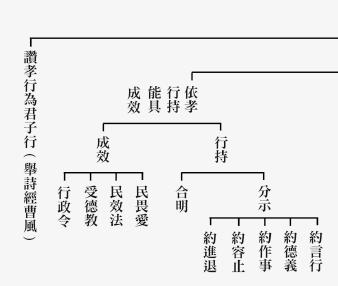

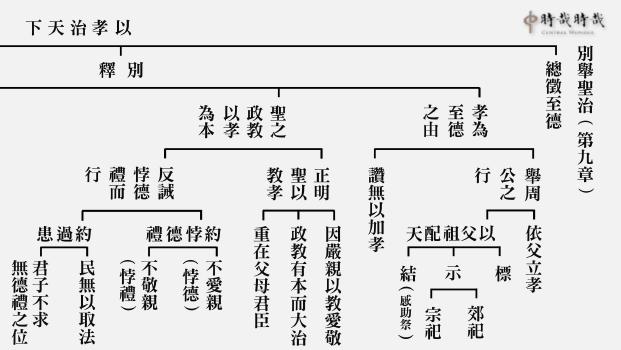

### 孔門心法—中庸之道(七)　第三、四、五章 
    中庸失傳已久，孔子感歎道之不行

孔門心法—中庸之道(七)　第三、四、五章

中庸失傳已久，孔子感歎道之不行

*時哉講述、茅茹讀書會、弘毅整理*

心法最難傳授

表相大眾難分

道統傳承明眼

天下為公大同

前言

生活中的大小事，行住坐臥、穿衣吃飯等，我們無不行在其中，但我們真正懂得如何穿衣吃飯嗎？惟有透過中庸的學習才能令人真正的受食而「知味」。然而，這樣至高的德能已失傳許久，令聖人不禁感歎道之不行。如何透過正法的學習重拾中庸之道，找回生活的意義，值得我們好好地反思一番。

今天把第三、四、五章合為一章說，因為這三章義理是一貫的。第一章講到用中，中庸的殊勝，以及中的修學法；第二章是君子用中能入世；第三、四、五章就是孔子感嘆中庸之道不行。因為道在人傳，道在人弘，意即「人能弘道，非道弘人」，道不是只在書本上，唯有人才懂得道，才能夠把道傳下去。

本章科判分析

因為三、四、五章每章都以子曰開頭，所以朱子把這三章各自獨立為一章，但是如果把三章合起來做一個科判，就能看出三章所講義理是一貫的。

第三章是「總嘆鮮能」，是孔子總體感嘆老百姓不能行中庸之道，已經很久了。

第四章分別解釋緣由，第一個是道之不行，第二個是道之不明。司馬光、王安石及蘇東坡，都認為這可能是錯解，應該先是道之不明，然後才是道之不行，雪公也同意這樣的講法。我們雖然不能改經文，但是我們解經時，還是按照「道之不明，道之不行」的順序。最後以飲食來比喻中庸之道難知，人雖然終日吃飯飲食，可是都不知道它真正的味道。

最後，孔子再次感嘆中庸之道不行。

章旨

孔子雖然感嘆大道不明、不行，但如果我們能夠在道統上明瞭，並且真正想幫助老百姓找出路，對自己和眾生，都會是一條康莊大道。

消文

經文：

子曰：中庸其至矣乎！民鮮能久矣。子曰：道之不行也，我知之矣；知者過之，愚者不及也。道之不明也，我知之矣；賢者過之，不肖者不及也。人莫不飲食也，鮮能知味也。子曰：道其不行矣夫。

孔子感嘆道：中庸之道是最高的人生目標和成就，是止於至善，老百姓不能行已經很久了。

孔子說：老百姓不能明瞭中庸之道，我是知道理由的；因為沒有道統的傳承，所以有智慧的人超過了中庸之道，而無知的人不能達到中庸之道。老百姓不能行中庸之道，我也是知道理由的；同樣因為沒有道統的傳承，有智慧而品行好的賢者超過了中庸之道，而行為不好的人不能達到中庸之道。人沒有不飲食的，但是很少能有吃出其中味道的。

孔子感嘆道：中庸之道真的不能行了！

釋義

孔子十五而志於學，三十而立，四十而不惑，一直到從心所欲不踰矩，就是用中的成就。

「民鮮能久矣」，鄭康成的解法是，老百姓很少能久行，進進退退、退轉的人多。「鮮」是很少很少，幾乎沒有。如「巧言令色，鮮矣仁」，一個會巴結、討好別人的人，仁心是幾乎沒有的。「鮮能久矣」，舉例來說，如孔子說「回也，其心三月不違仁，其餘則日月至焉而已矣」。孔子的弟子除了顏回以外，行仁或者一天、或者一個月，就是很少能久行。「民鮮能久矣」，朱子的解法是，老百姓不能已經很久了！「鮮能」就是不能，朱子的解法是對的。

前面說過「先明後行」，因為不能明白道理，所以才不能實踐，因此先解釋不明。

賢者就是一個有智慧的人，不肖就是行為不好，因為愚，所以行為不好。「鮮能知味」，就是很少知味，雖然我們每天飲食，但是卻不知道味道是怎麼來的？舉例來說，你吃到一個酸酸甜甜的味道，但很難分辨那個酸酸的味道，是從醋來還是從其他果酸來的；那個甜甜的，是從酒味的甜來的，還是糖味的甜來的呢？那個水是泉水來的，還是自來水來的呢？調和當中，到底是多少比例呢？一般人大概不會知道，吃的人只會說好吃不好吃，這樣就結束了。雪廬老人曾說，請客時，女主人切豆腐的刀法，他都吃得出來，這太不可思議了！

中庸之道是否能行，要觀待人而定。智者、賢者，超過中庸之道；愚者、不肖者，不及中庸之道，他們都無法真正懂得中庸之道。如果沒有　　人去傳承、弘揚道，道就失傳了。

析疑

一、將三章合為一章的理由為何？

朱子是分三章，此處合起來的理由是它們的義理一貫，第三、四、五章都是在講道不明、不行，是一個很完整的意思。

二、本章孔子的語氣為何？

孔子的語氣是感嘆的語氣，感嘆不論是智者、賢者，還是愚者、不肖者，都不能明道，不能行道。中華民族的關鍵在中華文化，中華文化的關鍵在中庸之道，如果沒有中庸之道，叫中華文化和中華民族就沒有意義了。

三、中庸乃學習文化最高境界，其形象為何？

「中庸其至矣乎」，表明中庸是學習文化的最高境界。

中是指形而上，叫作「明明德」，「明德」就是通達體性的智慧，前面的「明」就是把這個智慧發明、顯揚出來。這裡面又分為格物、致知、誠意、正心等次第，〈大學〉就是〈中庸〉最好的註解。

「格物」就是來了境界；「致知」就是通達這個境界的體性是沒有的；「誠意」是對境界不生執著，所以不會生貪瞋，就是誠意；六識(眼、耳、鼻、舌、身、意)又以意為主，所以「意」如果能夠「誠」，心(六個識)就能夠「正」。中道如果發揮到極致的時候，就是煩惱斷到極致，明心見性到極致，這叫作「止於至善」，就是聖人的成就。

用中的人在入世的時候，他能「和」，叫作「親民」。因為一切都不是一定的，當利益別人的時候，才能得到自己的福報；傷害別人的時候，就會傷害到自己。所以要想趨吉避凶，一定要去利益別人。

這裡面又分為修身、齊家、治國、平天下，「修身」就是在見地與禮節上莊嚴自身；「齊家」就是能夠在家庭上整齊；「治國」就是能夠利益國家；「平天下」就是能夠利益天下。到「止於至善」，包括他的利他心態圓滿了，他的能力也充實到究竟了，這就是入世的成就。

入世的成就在「和」，家庭和就是家庭成就的形象，國家和就是國家成就的最高形象，天下和就是天下成就的最高形象。這裡面包括：禮、樂、六藝、科技、經濟、民生、道德等等的運用，最後能夠使大家和諧共處，互相替對方著想，一言以蔽之，最高的成就相就是「和」。這是我們中華民族的核心思想，這叫作道統，是民族的命脈。雖然今天講多元文化，但是核心思想是中庸，所以孔子才會讚歎說「中庸其至矣乎」，可是「民鮮久矣」。《論語》〈雍也篇〉中也講到：「中庸之為德也，其至矣乎」，如果一個人懂得中庸，那就具備了聖人的智慧，智慧並非一般說的聰明，因為聰明才智不能讓我們真正趨吉避凶，明心見性。

可是「民鮮久矣」，老百姓不會已經很久了！因為道統已經失傳了，老百姓很少懂得這個道統。中國文化裡面，可能在孔子的時代，懂得道統的也就只有孔子和老子，其他人不會已經太久了！當我們失去中道傳承的時候，飯照吃，馬照跑，舞照跳，好像沒有甚麼關係。殊不知我們一旦失去這種內涵的時候，根本沒辦法趨吉避凶，改變自己的命運，帶給蒼生真正的快樂，維持民族的久遠，只想著眼前生活過得好，這又有什麼意義呢？古代曾經很強盛的國家，可是一旦滅掉後就永滅了，民族被滅後也再沒有重興過，可見道統的重要！

四、民何以不能行中庸之道久矣？

第一，各國國君都是霸權之人，或者只在乎個人的享受，是功利主義者，辦政治和辦教育都不是以中道為本質。

第二，各國大夫看到國君僭越禮制，他們也仿效在那裡爭權奪利，結黨營私，所行也非中庸之道。

第三，老百姓在這樣的風氣下，沒有人出來辦中庸之道的教育，所以民風也被邪見充滿。如孔子到齊國的時候，市場上販賣很多假手假腳，都是因為作奸犯科而被砍手砍腳。民風不好，治安敗壞，季康子也患盜，可見當民風不好時，整個氛圍就是治安敗壞，權臣當道，國君霸權，這種社會裡面，老百姓早就不曉得中道長什麼樣子。再如今日，辦教育的人談堯舜之道，大家已經很難體會了，反而認為教育就是爾虞我詐、功利思想、自私自利，就是比分數的應試教育，就是注重頭銜不注重內涵。就算講堯舜之道，大家已經沒有感受了，根本激不起任何政治人物的興趣，也不會有人把堯舜的政治哲學，當成中國最高的政治哲學來講，所以是「不行久矣！」

在大同世界裡，天下人不只以自己的家人為親人，不只以自己的父母、兒女為愛，而是相互敬愛，愛天下所有的人，使老有所終，壯有所用，孩子們都能獲得溫暖與關懷，孤獨的人與殘疾者都有所依靠，男人有事業，女人有好歸宿，天下沒有欺詐、沒有盜賊，路不拾遺，夜不閉戶，人人講信修睦，選賢舉能，大道之行也，天下為公。這就是孔子夢寐以求的大同世界。

〈禮運大同篇〉裡，講的就是公天下的思想，政治人物是公天下的，不是那種自私自利的，而且是賢人選賢人，不是現在的民主制度，如果民風不好，選舉出來的時候，容易惡人選惡人，小人選小人，壞人選壞人，變成「劣幣驅逐良幣」。孔子也講選舉，可是與現在的民主制度不同，是一種信用的相處，和睦的經營，乃至於是一種慈善的推廣，而且是五倫夫婦的經營，是以公心來對待他人，來經營自己的事業，並且在美好的風氣之下，所有奸盜邪淫的事情都不會發生，治安好的不得了，門戶不關也沒有搶劫，天下太平，這就是禮運大同。

如果好好運用中道，世間的成就相就是這樣，這也是孔子人生當中最高的理想。孔子有這種道統，他也是以此來培養人才。為政者如果能夠用孔子，就可以推廣這樣的政策，而且讓天下達到這樣的狀態。

這是孔子一生的理想，他為政的藍圖就是道統的經營，人才的培養，為政者的以身作則，還有辦政治和辦教育的才能，都是依著道統而培養成為幹才的。可惜這樣好的內涵被束諸高閣，這是很可惜的！

五、道如此之好，何以還會行不通呢？

這是因為領導者認為行中庸之道時，好像是使自己的權力被壓抑。那些權臣也認為行道的時候，他們的私欲也被侷限，不能夠謀一己之私，所以在有心政治的運作下，當然就行不通了！孔子周遊列國一圈後，就明白了道是行不通的。

六、既是很少能知、能行，當如何推廣？

首先，要藉著教育去推廣這個道統和見地，推廣這種典籍和講解。其次，政治上也要宣揚這樣的理念，為政者也要有這種胸懷，也要推舉這樣的人才。教育也是以品德教育為核心，發展出來的都是為了服務他人的技能教育，果然有這種中心思想，一定會有政治和教育的效果。

在古代，當這種道統的風氣推展出來的時候，堯舜時期是「龍鳳呈祥」；文王那個時候，在岐山還有「鳳凰來儀」，天下間很祥和。在還沒有到大同世界的小康社會，如成康之治的四十年當中，監獄長草，我們現在是監獄人滿為患！而且還有很多被釋放，讓他保外，否則監獄都裝不下了。為什麼會這樣呢？就是因為沒有中心思想，沒有品德教育，沒有一個形而上的經營，在形而下入世的時候，也不知道禮的作法、意義和效果，如何創造人類真正的幸福？這些都不好好去研究，專門研究功利思想，研究霸權主義，因此這個世界是愈搞愈糟糕！這些都會是我們未來人類很大的隱憂。

七、孔子如何知道之不行？

因為他看到智者和賢者，愚者和不肖者，都沒有辦法通達中庸；另外在周遊列國的時候，這些國君、卿大夫都不能用他的主張，如此即知「道之不行」。

八、道之境界太高，欲令民能知能行，豈非強人所難？

《論語》上說：「民可使由之，不可使知之」，一般老百姓多是庸俗之輩，雖然講的是民，可是他的影射處是為政者，不懂得以中庸之道為內涵辦政治利益老百姓，教育老百姓，才致使老百姓已經不能行中庸之道很久了！但是如果好好的在政治上、教育上推廣，經過幾代，相信民風會越來越好，懂的人就會越來越多。

九、此處智者的形象為何？如何過中？此處賢者的形象為何？如何過中？

這裡的智者、賢者是指，不能通達中庸之道的智者、賢者，而顏回、曾子是能夠通達中庸之道的智者、賢者。這裡的智者、賢者過中，是說他的智慧固然不會讓他為非作歹，他的賢德是能夠內斂的，能夠修養自己，但是他不能夠掌握時機，往往他的行為雖然在這個時代裡面能夠潔身自好，可是他不能夠真正好好的來利益這個時代。

如果懂得中庸之道，在國家政治不明的時候，還是可以發揮用處；在國家政治清明的時候，可以發揮大用。懂得用中就懂得把握時機，而不是一昧的修養自己，一昧的退後。

十、是否可舉例，過中的智者與賢者？

孔子在周遊列國的時候，就曾遇見到過中的智者與賢者。如孔子到葉地，在返回蔡國迷路的時候，遇到的長沮、桀溺。以及在楚國遇到的楚狂接輿。

這些人都是智者，清楚的知道當時是什麼局勢，但他們都是過中庸之道，採取的是完全無作為。孔子採取的是有作為，叫作知其不可而為之，雖然政治上不能為，但是教育上他能為。所幸孔子把道統往下傳，我們這個民族才發揮了功能，才有了意義，才能夠真正的延續它的價值。

十一、此處愚者、不肖者形象為何？又如何不及？

這裡的愚者並不是指笨蛋，是指那些國君、執政大夫，他們都想對自己有利益，可是採取的方式都是對自己不利的，他們越自私就越對自己不利，越玩弄權謀，只想掌握自己的大權，就越對自己、對他們的後代、對他們的國家不利。

不肖者也不是指那些土匪、流氓，而是因為沒有中庸之道的見地，做出來的行為不恰當。比如老師畫一幅畫，你去臨摹，結果根本不像，神韻、線條都不像，這叫作不肖。不肖就是完全不像，沒有任何一個為政者想讓國家變弱，可是他的作法正好讓國家變弱，讓他自己愈來愈危險，讓他的後代愈來愈沒有福報。本來希望根據古代成康、堯舜、周公這些人的方向來為政，結果四不像，因為沒有掌握到道統思想，所以《易經》〈繫辭傳〉上講，形而上就是道，形而下就是器，「化而裁之謂之變」，就是你要懂得通權達變。用中道的人，在形而下的時候，能夠發揮能力，通權達變，通達人情世故，推舉人才，安治天下之民，懂得辦事業，所以往往懂得中庸之道的人，他才能夠真正在世間發揮大用。

十二、以飲食做為比喻，有何深義？

孔子用飲食來作比喻的深義是說，我們一般吃東西的時候，只是吃一個味道，我們不知道後面人家是怎麼調合的，做菜的刀法、火候是什麼，我們通通吃不出來，只是吃眼前表面的味道。有時候，當我們看到的越平常，越不知道後面的難能可貴。比如說堯舜之道，百姓的門不鎖也沒有人偷盜，鄉野沒有官司，路上發生問題的時候，雙方互相禮讓，一般人都以為這些很平常，可是現今的為政者幾人能夠做到這樣呢？讓老百姓都很滿意，左右鄰舍都可以開門，而不必擔心小偷，發生交通事故的時候，會主動承認錯誤，這些看起來簡單，做起來卻很不容易。越平常的後面越複雜，這裡面要有多少的公心和人情世故，多少的人才團隊互相配合，而且為政者需要有多大的胸懷。

十三、人莫不日常飲食，怎麼會鮮能知味呢？

鮮能知味可以從兩方面講：

第一，在體性上說，「終日吃飯，未曾咬著一粒米」，比如今天你吃到很好吃的滿漢全席，請問味道在那裡呢？味道如果在滿漢全席上，那不需要舌根，有一個朋友的父親身患胃癌，他的胃被切掉後，他的舌頭是沒有味覺的，滿漢全席的味道也品嚐不到；味道如果在我的舌頭上，那就不要滿漢全席也可以嚐到味道了；味道如果在我的心裡面，那不要舌根，不要菜也可以嚐到味道；味道如果在空氣，那也不要菜，不要舌根，就可以品嚐到味道。所以在形而上、體性上來說，通通沒吃到。

第二，就形而下來說，是後面的調味料，能嚐的舌根，還包括你的心情，這些條件湊起來，而浮現出來各種味道。假如你今天去品茗一萬塊一斤的上等茶，你會覺得好喝。可是我如果用冷水來泡，或者你今天心情不好，或者你有鼻竇炎，聞不到香味，相信感覺不到茶葉的價格了，可見味道是被浮現的。觀察體性的時候，什麼也看不到；入世的時候，任何的殊勝都是觀待很多的條件而生起的。

十四、知味的形象為何？

易牙就是一位知味者，他是齊桓公的廚師，齊桓公幾乎是沒有他就活不下，雖然易牙是小人，可是管仲從來沒有說要殺易牙，因為管仲知道齊桓公離不開他。所以管仲到快要死的時候，才告訴齊桓公說，易牙是不能用的。「易牙淄澠」，在《列子》裡面提到，楚國有位白公問孔子說，隱密的言語，可不可以知？孔子不答他，他就問孔子說，石頭丟到水裡面不是隱密嗎？能不能知？孔子說，吳國人可以撿起來，因為吳國人很會游泳，白公就說以水入水，你可不可以分出來？（就是隱密到這種程度是否可以分辨。）孔子說，把淄水跟澠水合起來的時候，易牙可以分得出來，比如說淄水三成，澠水七成，這叫知味。

還有個典故叫「苻朗皂白」，苻朗是苻堅的侄子，他吃鵝肉的時候，就知道這隻鵝的羽毛是黑的，還是白的，可是苻朗後來因恃才傲物而被殺。

另外江老師繪有一幅「陸羽品茶圖」，陸羽曾受湖州刺史李季卿招待，李季卿讓手下的軍士去取揚州的水來泡茶喝，當陸羽拿水來喝的時候，他說這不都是江中的水，還有一部分是江邊的水。那個取水的軍士感到很驚訝，他就說船搖到江邊的時候，因為船晃蕩不小心灑了一半，就舀了江邊的水來湊數，沒想到陸羽竟然能夠分辨出來，這叫陸羽品水。人都飲食，可是人卻都不知道其中真正的味道，就像雪公連切豆腐的刀法都吃得出來，假如你是女主人，面對這樣的客人，你很可能期望下次做另一道菜來招待他吃。

十五、此比喻所要顯示的法相為何？此比喻與中庸之道有何關聯？

我們每天都在飲食，只是知道味道很好，可是卻不知道那些善於做菜的人，是怎樣調和出來的。以此來比喻，我們在日用平常的時候，當看到兒女孝順父母，夫婦和睦，沒有離婚，家庭正常，生活正常，社會上沒有奸盜邪淫，假冒偽劣，燒殺擄掠，監獄長草，大家正常工作，正常退休，一直到壽終正寢，一切看起來都是平平常常，可是卻不知道背後那些以中庸之道來辦政治、辦教育的人，是怎樣經營的。如今看來，越是平常的，越是難得了。正是因為我們不知味，所以同樣是柴米油鹽醬醋茶，我們做出來的飯菜，吃起來單調乏味，或者難以下咽，不吃也不會想的。我們也日用平常，可是因為我們不懂得中庸之道，是無心之人，所經營出來的人生是俗不可耐的，如果再來經營團體、經營國家那也會是一團亂，一切變得都不正常，監獄也人滿為患。知味與中庸之道就是能夠掌握火候，把握時機，恰到好處的經營飲食，經營人生、社會、國家。

總結

調味是不簡單的，能夠調出讓人愉悅的味道，這是廚師的能耐。柴米油鹽醬醋茶，這些調料都放多少，高明的廚師就在這些當中把握一個「和」，所以做出來的飯菜，能夠讓人垂涎三尺，吃完以後，意猶未盡。而同樣是這些調料，同樣的食材，我們一般人做出來的飯菜卻讓人不禁掩鼻，難以下咽。

出世在中，入世在和，所以君子入世，他經營的關鍵也在「和」。孔子感嘆大道能行的時候，天下為公，明君所經營出來的盛況，令大家生活快樂，生命充實，對他自己、對大臣、對老百姓都是出路。可是各國國君、大臣看不到這些，也不願意去做，老百姓就活在一個充滿功利思想、爾虞我詐、自私自利的環境裡面，終生只受用物質享受，內心卻是空虛的，這些哪裡是大家真正想要的呢？

如果我們能夠學習道統，明白並實踐道統，化理想為實際，孔子之道也就不再遙不可及，堯舜之道也並不是烏托邦，禮運大同也不只有感嘆，這才是我們中國真正的出路。

問答

**問：** 道不能行了，難道連孔子也沒有辦法嗎？

**答：** 孔子並非沒有辦法，而是因為國君不用他，權臣對他有意見，孔子沒有辦法發揮大用。果真國君肯用他，或者是三家大夫、陳大夫、楚國子西大夫這些人肯用他，孔子就可以在魯國、齊國或者楚國來推展大道。所以孔子感嘆的是這些為政者沒有這種眼光，老百姓也覺得這樣的日子過得不錯，自我感覺不錯，不知道他可以變得更好。

**問：** 《論語》言「民可使由之，不可使知之」，可見中庸之德人民是不能知、不能行的，孔子又何必要感嘆呢？

**答：** 「民可使由之，不可使知之」，這是指廣大的老百姓，當在推展大道的時候，老百姓「可使由之」，就是過這種好日子，就像堯舜時期的時候，叫「日出而作，日入而息，鑿井而飲，耕田而食，帝力於我何有哉？」百姓過著好的日子，可是卻不曉得後面的國君有多麼賢德，整個國家是在很多人才的運作下，以公心來治世，這個老百姓本來就不會知道。孔子這裡所說的「民鮮能久矣」，是說老百姓沒有受用很久了，包括智者、賢者、愚者、不肖者，都是過或者是不及的，或者如隱士那樣，只是修養自身，不能把握時機，發揮大用。或者家天下的智者、賢者，很積極的要讓國家變好，卻任憑你多麼的努力，也絕對回不到公天下的那種氣象，那個家天下的格局已經障礙你了。

**問：** 本章如何與我們的人生經營相結合呢？

**答：** 一個知味的廚師和一般廚師，用同樣的調料，炒出來的菜是完全不一樣的。所以我們人生不論在甚麼場合都要懂得去調和。要如何調和呢？該用能力去調和就用能力去調和，該用學問去調和就用學問去調和，該用公心去調和就用公心去調和，該用進取去調和就用進取去調和，該用退讓去調和就用退讓去調和。當你能夠具備這些能耐的時候，有你在時所經營出來的味道，和沒有你在時經營的味道完全不一樣。

有的人做得很好，在交棒給下一代的時候，後面的人上來一做，結果味道全部不對。所以我們要不斷充實自己的內涵，在中、和、禮以及道上充實，你就是一個懂得經營人生的人，讓人生處處有味道，你到任何地方，都能帶來福氣又令人難以忘懷。

**問：** 《論語》裡面，有一章是「有鄙夫問於我，空空如也」，這一章裡面的「鄙夫」，與此章中的「不肖者」，有何區別呢？

**答：** 這裡的不肖者是指為政者，家天下的為政者有兩類，一類是智者，一類是賢者，我剛才講的隱士，又是另外一種。家天下的那些為政者，如子產或是成康，這些人努力的想要把國家治理好，可是治理得好也不會像中道。因為中道一定是公天下，是禪讓政治的，整個心胸不是那個道統，怎麼經營味道就是不對。

比如品茶，一般人大概喝不出來，可是內行人一喝，就能品出其中的差異。水質不一樣，泡出來的茶絕對不一樣，用的是揚子江中間的水，還是揚子江江邊的水，泡出來的茶，完全不會一樣。所以公天下的堯舜，和家天下的那些賢者、智者絕對不會一樣。老百姓雖然會覺得差不多，可是對於懂得的人來說，一看就知道差別很大。

**問：** 在這一章，老師在講解智者、賢者的過，所舉的是隱士，過去老師在講《論語》的時候，也提過子張，他就是「過」的一種形象，另外子夏他是「不及」，他們與本章有何區別？

**答：** 子張跟子夏，一個是過，一個是不及，是說在中庸之道的學習當中，他們還沒有到真正合乎中庸之道，所以難免有過和不及。此處的過和不及，是完全不懂中庸之道。

**問：** 就著道之不行，請問道之不行是真的不行，還是意有所指呢？

**答：** 是真的不行，也是意有所指。就真的不行來講，孔子當時不論是在魯國、在齊國、到楚國，都無法推行大道，乃至於要到晉國去，卻得知晉國的賢大夫竇鳴犢、舜華都被殺了，也無法行道。就他意有所指來講，果然有人真的明道、行道，以此來引導天下的老百姓，中庸之道也就可行了。

**問：** 如果說連孔子都沒辦法行道的話，我們該怎麼辦？

**答：** 孔子的努力處與隱士不一樣，他是要把道統往下傳，所以我們當務之急，是好好的學習道統，比如學《大學》、《中庸》、《論語》、《易經》，把這些學會，去發揚、傳承。將來有一天，有人願意在政治上好好的讓它回到正軌，在教育上好好的去傳承這種中心思想，老百姓的生活才會回到正軌，生命才會回到正常的發展。

**問：** 《道德經》上：「治大國若烹小鮮」與本章舉飲食知味，是否是以味喻道？

**答：** 是的，老子的比喻就是這樣。廚師本來就是一個知道調味的人，他懂得火候、刀法、水、調味料等等的運用，而顧客只知道吃，但是懂局的人知道這是不得了的。像齊桓公就是一個知味之人，所以他是離不開易牙的。

「治大國若烹小鮮」就是說，他懂得把所有的人調和一味，比如說君子是很難調和的，小人莫論，你不要以為不用小人就可以成功，君子有時候比小人更難調和。就好像炒一盤菜，屬性通通不同的，你這些大鍋炒、羅漢菜、什錦等，把這些屬性不同的菜調和成一味，是不容易的。尤其是舜的時候，一邦君子都在朝，而且都是有功於國的人，把他們都調和起來，大家相忍為國，可見舜的厲害。有時候我們會發覺到，「看是平常最奇絕，成如容易卻艱難。」有時看起來很平常，可是平常的後面有多麼高難度的經營，才會有平常的顯現。

**問：** 有註解把「智者過之」解釋為，自以為有智慧的人，他看不起中庸之道。「愚者不及」解釋為，總是以為趕不上別人，又達不到中庸之道，請問這樣的註解，是否可以採納？

**答：** 智者，不是看不起中庸之道，是沒有學到中庸之道。譬如說，春秋時期有很多賢大夫，如子產，孔子也說是古之惠人也。子產過世的時候，孔子也是很傷心，鄭國也罷市三個月，人民如喪考妣，可是孔子對子產的評價只是「惠人也」，就是給老百姓恩惠而已，但是並不是用道統的經營。這個就是味道也不錯，但是厲害的人，像陸羽品茶，就知道這個味道不是最好的，它不是江中的水，而是江中的水與江邊的水合的，這個一般人是不會知道的。所以孔子才會說，道已經失傳太久了，堯舜天下為公的禪讓政治，已經失傳太久了。難怪我們現在講政治哲學的，一般不會講堯舜之道，即使講到堯舜的時候，相信在大學讀政治系的同學會睡掉一半，因為民鮮能久矣，所以你跟他講這個，他也不相信。

**問：** 此章提到智者和賢者，請問他們的區別哪裡？

**答：** 智者，就是講他的內涵，知見的通達；賢者，是在講他品行上的成就。譬如賢者是不貪圖名利的，但為什麼可以不貪圖名利、吃苦耐勞、簞瓢屢空、飯疏食飲水？因為他是智者，他有見地，知道該窮則窮，該富則富，不該富的時候富，那是危機！所以賢者的品德一定是靠智者，沒有智慧，他不會有這種品德。所以有個大師說，要有千古的見地，才有千古的品格，千古的見地，就是智者，千古的品格，就是賢者。

**問：** 此章中「鮮能知味」的「味」，所比喻的是我們的本性嗎？是否必須要是明心見性的人，才能夠知味？

**答：** 這也是一種講法，但是一般比較好懂的講法是，我們都飲食，可都不曉得後面人家是怎麼調味的，當通達體性不可得的時候，知道所有的生起都是要講條件的。譬如說，一盤菜好吃的體性是空的，這叫作「中」，入世的「和」是說，這些味道的調和，火候的大小，刀法切功，還有氣氛的經營，這些湊在一起，才出現好吃的味道，這是入世的運用。所以知味是說，你在出世證悟的時候，你知道入世的運用，那就是調味之人，你就是真正的大廚師，治國的大廚師。

**問：** 是否好好學習中庸之道，就能明心見性？

**答：** 中庸之道只是告訴你明心見性的重要，但是它並沒有告訴你明心見性的方法。所以對於古藉還要互相通達，我們一定不要帶成見的去學《易經》、學《老子》，或者是學佛學的形而上的內涵。我們不能帶著門戶之見，要虛心去學習，才能從其他家去通達這一家，你才知道孔子的微言大義。

**問：** 在《尚書》〈大禹謨〉裡面有十六字心傳：「人心惟危，道心惟微，惟精惟一，允執厥中」，這是辦政治的傳承，還是以心印心的道學傳承呢？

**答：** 都有！你必得以心印心才能辦政治，辦政治就是一個調和，就好像炒一盤菜一樣，如老子所說「治大國若烹小鮮」。譬如說什錦菜裡面，有蘿蔔、青江菜、馬鈴薯及其它的肉類，各種不同屬性的菜，還有後面的柴米油鹽醬醋茶，你要如何去調和成一個好的味道，以及火候的掌握。這個就是道統的經營，在形而上來講，就是沒有體性；在形而下來講，都是條件的組合，包括你要把這些人組合起來，你是能組合，他們是所組合，你必須要靠你的品德、才情、學問、心量、忍辱，乃至你的吃虧，該進則進，該退則退，必要的時候，該讓的時候全讓，不該讓的時候全部承擔，像堯一樣，該承擔全部承擔，該退位全部退位。這才能調和，所以民鮮能久矣，這種人沒看過，這種風氣從來就沒有被經營過。

**問：** 續上題，有說法講，十六字心傳是文王、周公之後，內聖傳承在師道，外王傳承在君道，這種說法對嗎？

**答：** 內聖的傳承在明明德，外王的傳承在親民，內聖的傳承在聖道，外王的傳承在君子之道，內聖外王的傳承都在師道，因為沒有老師的教導是不會的。內聖外王的傳承都在君道，因為堯就是這樣的人，他把這樣的傳承傳給了舜。

**問：** 以聖人的智慧，在當時都感嘆無法推行大道，在今天世風日下，一介凡夫的我們又能有什麼樣的作為呢？

**答：** 智者、賢者、愚者、不肖者都是指為政者，他們都不懂得道統，所謂「君子之德風，小人之德草」，所以老百姓才鮮能覺悟。聖人當時不能推展大道，但他並沒有失去信心，他還是要把這個道統往下傳承。今日之下的我們，最重要的還是先辦讀書會，先凝聚一股力量，先把自己改善，先把家庭改善，先把風氣作小改善，盡可能去普及推廣大道，後面還有人跟你學，相信這個風氣只要往下傳，總有一天會有大的轉變的。

**問：** 老師剛才講「終日吃飯，未曾咬一粒米」，如以老師所講的格致誠正來說，吃飯是來了一個境界，然後因為要觀待吃飯者的心情，還有舌根、舌識等等，所以通達食物的體性空，就不會執著生貪、生瞋，故心正，這樣練習觀修就算知味了吧？

**答：** 知味有兩種，一種是知體性空的味；另一種是知現象的味。嘗出形而上的味，沒有經過組合的味，這個味道一粒微塵也沒有，這叫作吃出形而上的味。嘗出形而下的味，是吃的時候知道它是怎麼浮現出來的，刀法、火候、切工、調味料、水質、氣氛等等，這些組合在一起，味道就啪的浮現出來了。所以孔子叫「入其國，其教可知也」，你這個教育是騙不了人的，如果後面有高人來經營，那個氣象是絕對不一樣的。

**問：** 在課程裡面提到，孔子感嘆道不能行，是智者過之，愚者不及也，然後賢者過之，不肖者不及也，老師說是表面的原因，真正的原因，是否是智者賢者、愚者不肖者，他們對中庸並不是真正的了解，如何來看他是不是了解中庸，是否看他在入世能否做到和？

**答：** 入世能和，也未必是真正中庸之道的和，有很多執政者，他也真的能夠辦出政通人和，但是他可能不是道統的經營，唯有你通達道統，你才能夠嘗出那個味道。好比說你是一個知味之人，別人煮出一盤菜出來的時候，你都可以知道他火候到是不到，水質用的對還是不對，刀法是什麼樣的刀法，你才吃得出來。一般人是不會吃得出來的，所以一般可能認為說，中國的盛世就是漢唐盛世，但是懂局的知道，漢唐盛世是比不上成康盛世的，成康盛世比不上三代政治，三代政治比不上堯舜政治，堯舜政治比不上孔子天下為公的大政，但是孔子卻不能跟人家說「我很厲害，沒有我不行。」他只能感嘆說：道其不行矣夫！莫我知也夫，大概是沒人知道我吧！

結語

孔子與老子一樣，都是很了不起的聖人，神龍見首不見尾。但是沒有一個國家讓孔子施政，所以我們再也看不到公天下的重現。在楚國，楚昭王願意把七百里地給孔子的時候，子西大夫就出來說：當年文王七十里就統一天下，你把七百里給他，楚國將來置於何地？楚昭王就沒有封地給孔子。這些人都是愚者、不肖者，都不了解未來的出路，只想著眼前擁有，可是這些人不會認為自己是愚的、不肖的。還有當一個為政者做出一個大氣象的時候，他會認為古人不過如此，三皇五帝不過像他這樣如此而已，這不是很好笑嗎？所以才會說：人莫不飲食，可是鮮能知味。道其不行矣夫！唯有當你懂得道統以後，你才知道對方的味道是不是道，否則你永遠不會知道。

監獄裡的人愈來愈少，覺得不錯，可是誰告訴你一定要有犯人！這些都值得我們深思，所幸我們中國人有聖人做為典範，有道統可以學習。（下期待續）

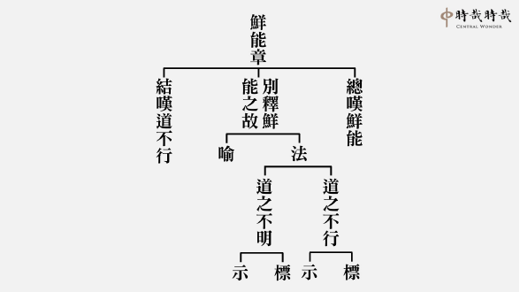

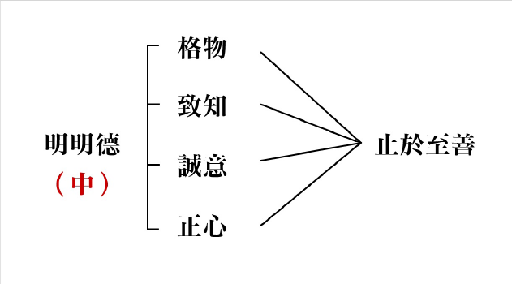

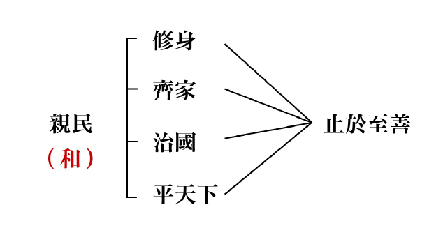

### 三字經簡說（七）

*淨爾整理*

朝代興衰在人

歷史教訓深知

德能培養沉潛

待機發揮時哉

經文：

經子通，讀諸史；考世系，知終始。

通達經書和子書的文義後，可以研讀各種史書，考究歷朝世代相傳的系統，了解朝代的興衰存亡、治亂興替。

本段先言讀書的次第，再明讀史書應掌握的要領在於考世系，知終始。

為什麼經子通才能讀諸史？

每一部史書都有作者的個人觀點與立場在其中，因此同一個事件可能產生不同的敘事，這就是史觀的不同。不同的史觀決定了不同的敘事角度與內容，因此讀歷史的人如果沒有足夠的知識背景、沒有經學的見地涵養，怎麼有足夠能力對所學習的內容具備正確的判斷力與抉擇力？因此必須先通達經子之書，再進入史學的領域。

古人研讀歷史要從考究世系和明白歷朝是如何結束與開國。考世系是因為中國歷史的架構從《史記》、《漢書》以來，奠定了以朝代的更替和帝王統治時間的起迄的敘事模式，而這個模式後來被歷代官方史官所沿用。也就是從司馬遷的《史記》以來，中國的歷史是以帝王統治為中心，敘述的是皇帝權力的起源以及權力的傳承，這都是世世相傳的系次，或許父死子繼、可能兄終弟及，也有親族中擇一抱養繼位為帝者。因為天命而皇帝有了統治天下的權限，天命傳承的順序被稱為正統。因此要讀中國歷史必須先掌握朝代傳承基本架構，這是認識中國歷史的第一步。

仇英所繪伏羲氏

知終始則是除了知道每一個朝代或帝王統治的開始與結束時間之外，更重要的是掌握其中興盛衰亡的原因，讀歷史是為了能知古鑑今、以古為鏡，通古今之變，既有典範可循，也可避免重蹈歷史覆轍。掌握未來的契機。因此知終始或可兩面說，一是了解一個朝代何以步向衰亡，有助於明白下一個朝代何以興起。二是從朝代的衰亡去分析推知其何以立國，以及立國時的用人、政策律法、國家風氣等是否導致後世的滅亡。例如，從秦朝的滅亡既知漢代之興，也從秦朝的快速滅亡而知秦始皇用人施政之失。

經文：

自羲農，至黃帝；號三皇，居上世。

消文：

從教民漁獵、畫八卦的伏羲氏，教民耕種、親嘗百草的神農氏到黃帝，後人尊稱他們為三皇，是三位上古時代的共主。羲農：乃伏羲氏和神農氏的簡稱。

據傳伏羲氏教民結網，於陸地網捕野獸，於水中張網捕魚，有效率地提高上古人類的狩獵成效。伏羲氏又教人豢養牲畜，開啟了原始的畜牧業，讓人類可以不靠外出狩獵而有穩定的牲畜來源。

上古時期的人類沒有文字，為了紀錄事情而使用結繩記事，但往往在時間流逝中忘卻了繩結的意思。因此伏羲氏「造書契」，即是以在木頭或石頭上刻劃符號以代替結繩記事，而其中最著名的則是伏羲畫八卦。伏羲氏仰觀天文、俯瞰地理，觀察日月星象、草木鳥獸，本於陰陽之道而畫下代表天、澤、火、雷、風、水、山、地的乾坤八卦。

伏羲氏善於觀察自然變化，因此而取桐木製作琴瑟，據說他製作的瑟長七尺二寸，上有二十七根絃，有了琴瑟，人們的文化生活也隨之變的更豐富。傳說伏羲氏也有烹飪的好手藝，能在庖廚裏，把因為祭祀而犧牲的動物去其羶腥味，並料理成美味佳餚，所以人們又稱伏羲氏為「庖犧」。

上古的人們生活狀態較原始，禮儀的概念還未成形，婚姻往往是經由掠奪而來，伏羲氏制訂以「儷皮」(兩張鹿皮)作為婚配的禮物，自此人們開始以較文明的禮品餽贈，做為男女婚配之用。

仇英所繪神農氏

伏羲氏之後，神農氏的出現標誌著人類社會仰賴耕種獲取食物的農業時代來臨。神農氏教民製作耕田用的農具，又觀察土壤的特質，例如乾濕度、肥沃或貧瘠，教人民在不同的土地裡播種不同的作物，春耕夏長秋收冬藏，人們開始能穩定獲取食物來源，並且因為農耕而逐步形成定居且群居的生活型態。

原始社會中的人類對疾病的認知非常淺顯，因此壽命也偏短，神農氏遍嘗百草，以身試藥而累積許多以草藥製病的經驗，是中國醫學的鼻祖。神農氏又將琴瑟再進化，製作出五絃琴，有了宮商角徵羽的基礎樂理發展。神農氏又教人們在正午時分以物易物、互通有無，推測這是市集貿易的初始。

神農氏推動發展，人們邁入農業社會，是後續部族、城市、國家發展的關鍵，是原始社會晚期的重要人物，神農氏又稱炎帝，和黃帝同被尊崇為中華民族的祖先，因此我們會稱自己是「炎黃子孫」。

仇英所繪黃帝

黃帝：西元前二千七百至二千六百年間人物，第一位以黃帝作為中國歷史起點的史家即是西漢的司馬遷，黃帝可說是所有中國古代帝王的始祖。黃帝號軒轅氏，其部族為生長於姬水一代的姬姓部落，打敗炎帝所屬的姜姓部落和在涿鹿之戰大敗蚩尤後，成為所有部落的共主。黃帝時期的發明甚多，如倉頡造字、伶倫作樂、嫘祖養蠶取絲、隸首造算數及度量衡、大撓作甲子、容成作渾天儀，而且還有指南車的發明等等，另外還有岐伯教黃帝養生之道，因此後來中國醫藥學又稱岐黃之術。由上述種種可見文明在此時的發展與進步。

經文：

唐有虞，號二帝；相揖遜，稱盛世。

唐有虞，指唐堯和虞舜。唐堯和虞舜被尊稱為二帝，他們將帝位禪讓給賢能的人，是歷史上聖明的時代。揖：讓，揖遜即是禪讓之意。

堯，黃帝的玄孫，名放勳，堯是諡號。堯十五歲時輔佐他的兄長帝摯，並受封於唐，故史稱唐堯。帝摯執政九年無可舉之處，帝摯自知能力不足，又佩服弟弟的才能，因此率領群臣至唐，將帝位禪讓給堯。堯即位後派人觀測紀錄日昇月落，測量出一年有三百六十六天，制閏月確立四十節候，並作曆書授民以時。在政治上舉用賢才，因此在位時天下得以大治。

仇英所繪帝舜相

堯在位多年後，亟思尋覓繼位者，他徵詢多人意見，四方諸侯的首領向他推薦在民間的舜。舜，名重華，因生於姚墟而以姚為氏，舜的父親眼盲，繼母善妒狡黠，繼弟頑劣，但舜都能與他們毫無計較、和睦相處，二十歲時即以賢孝聞名。堯並未貿然傳位予舜，而是將兩個女兒娥皇和女英嫁給了舜，觀察舜治家的能耐。又讓九個兒子和舜一起共事，考驗舜處世的能力。舜成家後，於歷山躬耕，他善於調和鼎鼐，民眾不會為田界鬧糾紛。舜也曾在雷澤捕魚，開導年輕人將厚澤多魚的地方讓給老人家。

仇英所繪大禹治水

堯年事已高後，命舜代理政事，舜以父義、母慈、兄友、弟恭、子孝等五種美德教化人民、引導風氣。舜先請高辛氏八家來辦教育，化導風氣。再讓高陽氏八家辦理地政，推廣農事使人民足食安樂。又打擊為非作歹的四家，遠放渾沌、窮奇、檮杌、饕餮四個凶惡家族，讓社會更安定。舜開四門招待諸侯，贏得四方諸侯的尊崇。舜攝政八年後，堯正式禪讓天子位給舜。舜知人善任，禹、皋陶、契、伯夷、夔、龍、倕、益等人在堯的時後皆已得到舉用，但未有專門的職務分配。舜上任後命禹為司空，負責平治水土；命棄為后稷主掌農業；任用契為司徒，負責以五倫教育百姓；用皋陶負責司法；以棰為掌理百工之官；益負責山澤鳥獸的開發管理，伯夷負責祭祀事宜，是為禮官。還有夔為典樂，主持音樂，舜時的韶樂端正平和。龍為納言，是傳達命令之官。舜不但沿用堯留下來的人才，更進一步讓人才發揮更大的用處，自然天下太平，在位四十九年，垂拱而治。舜晚年效法堯，指定繼承人為治水有功的禹，後舜於南巡途中病死於湖南蒼梧。

堯舜二帝代表著華夏文化最崇高的理想政治，就是禪讓制度。但堯禪位給舜之前，是以全方位的考驗檢視舜的能力，並讓他攝政長達九年，以此累積其辦政治的經驗與實力，絕非貿然而行。而舜不僅在過程中展現個人的領導力，也能沿用堯所舉用的人才，使其得到更多發揮，如此的禪讓制度是嚴謹縝密且務實的，莫怪乎是孔子所稱揚的大同世界。

經文：

夏有禹，商有湯，周文武，稱三王。

夏朝的禹、商朝的湯、周朝的文王和武王，是夏商周三代以王道治天下的聖王。

三王：並非指三個君王，而是指夏商周三代開國時皆以王道治理天下。

皇、帝、王代表著三種不同的境界和三種不同的治理人民的方式。

皇：東漢白虎通：「君也，美也，大也，天之總美大稱也……，號之為皇者，煌煌人莫違也。」

帝：次於皇的名號，白虎通：「德合天地者稱帝。」以道德治理百姓。有天下的概念，但沒有擁有天下的觀念，實行的是公天下的禪讓制度。

王：次於帝的名號。三橫一豎構成王這個字，三橫代表的是天地人三才，一豎代表著貫通天地人的道。說文解字中說王是天下所歸往也。白虎通：「仁義合者稱王。」仁是成己成物，義是合宜，以王道管理天下者曰王，實行的是家天下。

夏代以前，傳子或傳賢，其中以堯舜的公天下為最高境界。但夏商周三代以後則是父死子繼，兄終弟及的家天下。我們可以此概念來理解先秦時期的三皇五帝及夏商周諸王。但到了秦朝，秦始皇自認德兼三皇、功過五帝。自封為始皇帝，從此皇帝又是另一種解釋，已是後話。

經文：

夏傳子，家天下；四百載，遷夏社。

消文：

夏朝的國君將帝位傳給兒子，開啟了天下一家的世襲制度。夏朝歷經四百三十九年才改朝換代。

遷：變易、改變。

社為土神，稷為穀神，社稷合稱國家。

夏朝開國的大禹，是舜帝時掌管水木工程的大臣，大禹治水十三年(一說八年)三過家門而不入，禹深入山林疏導河川平治水患。有一次舜請大臣們談談自己的意見與志向，禹說他只是想著每天孜孜不倦地工作。禹為了治水，陸行乘車、水行乘船、泥行乘橇、山行乘輦，分發食物給百姓。疏通九條大河使入大海，疏導田間小溝使入大河，和稷一起教人民播種穀物，讓百姓足食，又發展貿易互通有無，人們得以安居樂業，諸侯國得以安治。禹的儉樸勤懇讓舜決定傳位予他。禹繼位後，以其部落名為國名，稱為夏后。禹即位後大會諸侯於塗山和會稽，並將各地進獻的青銅鑄成九鼎，象徵天下九州統歸於夏。禹治理國家有兩個特色：一是懸鐘鼓以求才，二是以德服眾。禹在宮室前懸掛鐘、鼓、磬、鐸和長柄的鈴鼓等五種樂器，能教禹道理的可擊鼓，能教禹以義的可擊鐘…，以五種樂器召徠各地賢士進諫，這是禹以其虛懷大度廣納人才。有一次，禹看到一被綑綁的罪人竟落下淚來，禹說：「天下有道，則民不犯罪。天下無道，則罪及善人。百姓中有犯罪的，反映出我治國的弊病與不足啊！」

禹在位期間逐三苗、定九州，王權擴增甚於堯舜時期。禹仿效堯舜，欲將王位禪讓給益。但後來接位的卻是禹的兒子啟，關於這段歷史有兩種迥異的記載，一是禹過世後，諸侯都去朝見啟，益看到啟為眾望所歸，因此主動讓位給啟。二是啟在禹過世後發動叛變，取得王位。事實真相除非等到有更新的考古證據出土，否則難以決斷。不論何者，從禹到啟到太康，中國史從公天下進入家天下的時代，夏代成為歷史上第一個君位世襲的王朝。

夏朝的歷史長達四百年，但只見於後人的文字記載，迄今未有出土文字，因此一直有學者懷疑夏朝不曾存在過，只是傳說。但春秋戰國時期的《左傳》、《墨子》等著作都曾引用夏朝典籍，可見在當時還存有夏朝的文字記錄。在今天現存關於夏朝的有限記載中，啟之後的國君除了少康中興之外，多已德行衰微，後其的帝王更沉迷女色縱情享樂，並搜刮民財導致民心背離，這樣的頹勢持續到了夏桀，終究導致滅亡，由商朝取而代之。

經文：

湯伐夏，國號商；六百載，至紂亡。

湯討伐暴虐無道的夏桀，建立了商朝，傳了六百多年，到了紂王時才結束。

近幾十年來，商朝的文物大量出土，青銅器和甲骨文的發掘，證明了曾經主張商代只存在於傳說和神話中的學者推論錯誤。而且商代出土文物的數量之多和質量之精，讓世人歎為觀止。

商族原是黃河下游的古老部落，始祖契曾經協助大禹治水也曾在堯舜時期任官，傳到了湯，湯伐夏直至紂亡，正好是商朝的始與終。商朝的始，始於夏桀暴政，但商朝的終，終於商紂王的暴政。

商湯王仁民愛物，對萬物網開三面，諸侯歸順。當時夏桀虐政淫荒，為了討伐夏桀，湯弔民伐罪，《尚書》的〈湯誓篇〉就記載著湯欲出兵攻夏時發表的談話，據說湯經過長途的追擊戰、跋山涉水才終於殲除夏朝，擄獲逃亡的夏桀，建立商朝。新王朝成立後，頒布〈湯誥〉示其伐夏為天命所歸，又命伊尹作樂，並改正朔、易服色。

但商朝君位的繼承制度既可兄終弟及也可父死子繼，因而往往引發王權鬥爭，曾有長達九世之亂，直到盤庚遷殷，平息王朝內部的權力傾軋，振衰起弊，故後來商朝又稱殷商。盤庚過世後，又經二世，傳到了殷高宗武丁，武丁守喪三年一言不語，後起用傅說為相，武丁在位五十多年，商朝的文化發展至鼎盛，今日以出土的甲骨文或青銅器，多為武丁時期的成果，大量的卜辭也讓今人得以一窺殷商習俗與文化。

幾代之後，帝乙為王，帝乙的正妃有三子：啟、仲衍和小兒子辛。庶妃有一子為箕子，年紀比啟小，比辛大(一說箕子為帝乙之子，一說箕子只是紂王親戚)。在決定王位繼承時，帝乙本打算立長子啟為太子，但太史認為啟出生時，母親還是妾的身分，但辛出生時，母親已被立為正妻，應該要立正妻之子辛為太子。後來辛繼位後就是後來的紂王，而他兩位無緣王位的哥哥就是孔子所說的殷商三個仁人其中兩位：微子啟和箕子，我們可以想像，若是由微子啟或箕子繼位，殷商的國祚不致斷絕，但天命在紂，錯選繼承人竟導致亡國的命運，而若非有紂，則難顯出微子啟、箕子和比干之仁。（下期待續）

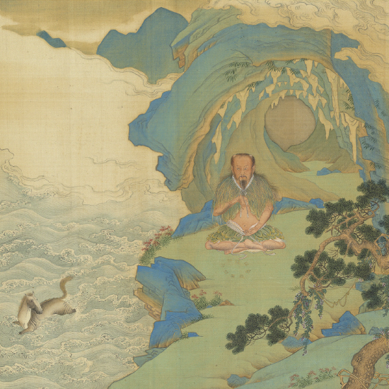

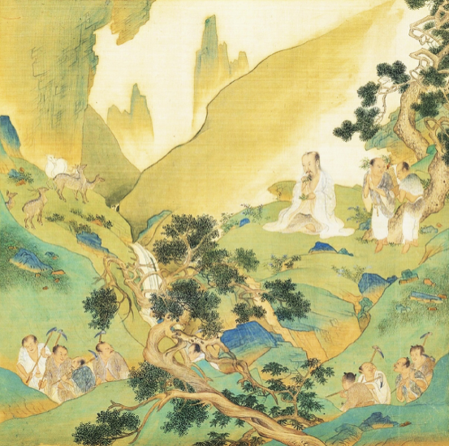

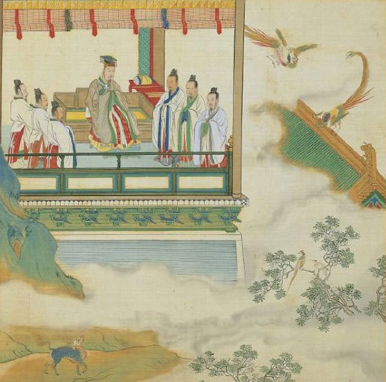

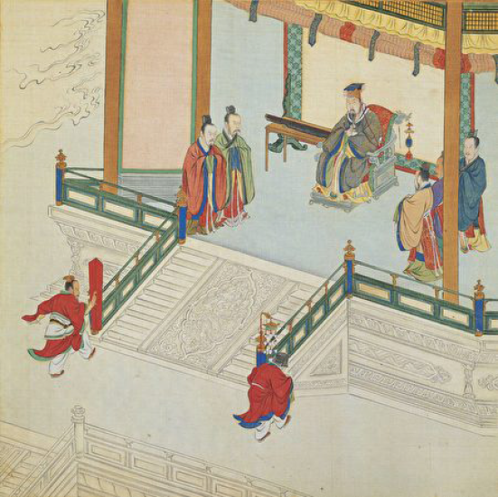

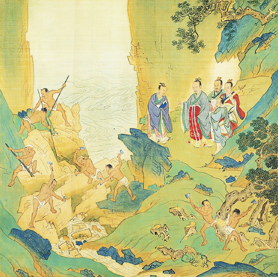

## 藝術賞析

### 孔門七十二賢淺說（二十三） ─顏幸

圖：江逸子‧文：時哉

時遠事難考

德學天爵名

雖具卿相才

時窮也難用

顏幸，姓顏名幸（家語中稱顏辛），字子柳，魯國人，小孔子四十六歲，《史記》索隱引孔子家語則認為小孔子三十六歲。

顏幸追隨孔子學習，名列七十二賢，宋高宗曾對七十二賢作贊，他贊顏幸對於格言嘉語能夠確實遵守，並且善於勸誘他人，明德留芳於後（原文：孰封於蕭，實惟子柳，夙飫（音域）格言，克遵善誘，明德斯馨，賢業所就，以侑於儒，傳芳逾茂）。可見顏幸在孔門中是以德行著稱於世。《孟子》〈告子篇〉中提到：魯穆公的時候，公儀子為政，子柳、子思為臣。可知顏幸亦曾為官。

顏幸於東漢永平十五年從祀孔廟，唐朝封為蕭伯，宋朝封為陽穀侯，明朝改稱先賢顏子。

畫中的顏幸，手拿爵，是常用的禮器，舉凡禮天地、交鬼神、和賓客以及冠、昏、喪、祭、朝聘、鄉射，無所不用，可見其能以知禮教化一方。

充滿文人氣息，目望遠方，頗似一位平易近人的君子，具有能以德風化民的氣象。

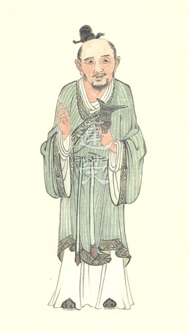

### 華夏精魂千秋(二十四)
		 —明倫史畫─守道堅貞─王霸之妻

華夏精魂千秋(二十四)

—明倫史畫─守道堅貞─王霸之妻

圖：江逸子‧文：淨域

夫賢猶待妻相勉

天爵才是所應求

功名難料殺身禍

急流湧退真隱者

史話

王霸，字儒仲，漢代太原郡廣武縣(今山西省山陰縣)人，生卒年不詳。自幼志節清亮，王莽篡位後，辭官隱居鄉里，安貧樂道，以耕為業。東漢光武帝多次徵召不赴，妻子(不知何氏女，生卒年不詳)也嘉許他的志行。

他有位好友令狐子伯官居楚相，兒子也擔任郡守功曹(秘書)。某回，子伯吩咐兒子給王霸送一封信，去時車馬服從氣派十足。王霸的兒子正在田中種田，聽到有客人來，放下鋤具前去迎接。見來客衣服華麗車馬雍容，自慚形穢不敢抬頭，王霸看了也有愧容。

客人離開後，王霸抑鬱地躺在床上，久臥不起。妻子感到奇怪，經一再詢問原由，王霸才說：「我與子伯乃舊交好友，論才學彼此不相上下，剛才看到友人的兒子容光煥發、衣飾華美、談吐大方，而自己的兒子卻蓬頭垢面、衣衫不整，又未見過大場面，進退失據面帶慚色，身為父親的我，感到非常對不起孩子。」

聽了這話，妻子對說：「你自年輕以來便修清節，不重視功名利祿，視富貴如浮雲，這是你的人生選擇。如今雖子伯官高位崇，又哪裡比得上你的清節高志呢？何必因為孩子一時的羞慚，而忘失了自己的志向呀！」王霸聽了，既驚又喜地起身，說道：「確實是這樣，確實是這樣。」於是，與妻孩們一起過著清隱的日子。

圖解

東晉陶淵明，於晉宋易代之際，給五個兒子寫了一封家書-〈與子儼等疏〉，用平易淺顯的語言，訴說他五十年來的思想與人生態度。其中言及：「余嘗感孺仲賢妻之言。敗絮自擁，何慚兒子？此既一事矣。但恨鄰靡二仲，室無萊婦，抱茲苦心，良獨內愧。」意即：「我曾被王霸賢妻的話所感動，自己穿著破棉襖，又何必為兒子不如人而慚愧呢？這個道理是一樣的。惟只遺憾沒有求仲、羊仲(漢代隱士)那樣的鄰居，家中無如老萊子那般的夫人，懷抱著這樣的苦心，內心實在慚愧。」後人以「萊妻」為賢婦之代名。

陶淵明恨無隱士為鄰、萊妻相伴，其所欲者厥為「知音之求」，故受王霸妻話所感動。春秋時期楚國老萊子，逃世耕於蒙山之陽，楚王遣使聘其出仕，妻曰：「妾聞之，可食以酒肉者，可隨以鞭捶；可授以官祿者，可隨以鈇鉞。今先生食人酒肉，受人官祿，為人所制也，能免於患乎？妾不能為人所制。」於是離開蒙山南往，老萊子也隨妻而居於江南。

王霸之妻有婦德，必然習知萊婦之賢，所以有如此的正見。圖中所繪，乃王霸聞妻言，驚喜起身之景，將抑鬱之情拋諸腦後。夫妻兩人手指向孩子，似乎在說著：「子伯雖官高位崇，哪比得上你的志節清高，何須為了孩子一時的羞慚，而忘失了自己的心志。」《論語》〈子罕篇〉第二十六章，夫子說：「衣敝縕袍，與衣狐貉者立，而不恥者，其由也與。」意指：穿著亂麻所做的舊衣，與著輕暖皮衣的富貴人家站在一起，能不感到覺羞愧的，大概只有仲由吧！又〈里仁篇〉第四章，夫子說：「士志於道，而恥惡衣惡食者，未足與議也。」由此可見士人清心寡欲的難得，而妻能與夫同心，甚至鼓勵持志賢進，更是值得令人讚佩。（下期待續）

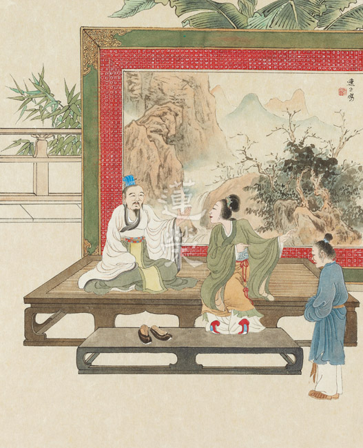

## 專題報導

### 孔德成先生百年紀念活動預告

淨本

歷史因緣聚會

時代人物出現

成功無法複製

典範可以長存

古語說：「十年樹木百年樹人」，培養人才需要有百年長遠的眼光，才能在時間的積累與風氣的化導中，孕育出一代又一代的可用之材。而一位偉大的人才，對於時代的影響可能不只百年，他的人生可以讓人歌詠、他的功績足以扭轉乾坤，他那燭照黑暗的智慧，在薪火相傳中能夠綿延不絕。

在中國有一個興旺的家族，這個家族的興旺，源自於一位偉大的人物—孔子。孔子庇蔭後代的方法很特別，他不靠金錢、沒有官爵，以教育為志業的他，更不會獨愛其子，只把絕學留給自家子弟，所以弟子陳亢高興地說：「又聞君子之遠其子也。」孔子不是不愛子孫，他說：「才不才，亦各言其子也。」意思是人子雖有才與不才之異，但在其父各言其子的那份愛則相同。孔子以不偏私、不靠地位、不給錢財的方式來愛護後代，遠異於常人，這種超凡的眼光，最後給後代居然是給得最厚、給得最多、又給得最久，自公元前五五一年，至今二○一八年，兩千五百七十年來族人繁盛，嫡長孫的傳承，已經到了七十九代，代代皆以學習、弘揚孔子的道統為己任，因為孔子的智慧最有助於民族的綿延與昌盛。

活動前行會議

孔子第七十七代嫡長孫孔德成先生，生於一九二○年，過世於二○○八年，他襲封自北宋以來的衍聖公爵位，並且是第一代的大成至聖先師奉祀官，這樣看似顯赫的地位，在戰火與思潮猛烈衝擊的大時代中，並沒有帶給他一帆風順令人稱羨的人生，反而是充滿辛酸與艱苦的一生，環境雖然艱困，透過傳承自孔子的好學、教學、不怨天不尤人，他依然走出了一段讓人可以無限緬懷的歷史記憶。

中華大成至聖先師孔子協會，在孔德成先生百歲冥誕之際，為先生舉辦了百年紀念活動，無論多麼精采的歷史、深刻的內涵、偉大的貢獻，如果沒有後人宣揚，都將淹沒於浩浩的歷史長河中。孔德成在動盪不安年代中的故事，就像河流泥巴裡的金沙，閃閃發光，這一次的百年紀念盛會，將為我們從歷史長沙中，淘出一顆顆金色的光芒。

本次紀念活動有兩大主軸，一個是二○一九年一月十九日的百年紀念會；另一個是從一月十九日開展，至二月十日閉幕的文物展。紀念會地點為中油大樓國光廳，當天邀請了海內外諸多名士、各國代表與會，還有孔德成先生的高足們，也將一同緬懷恩師致上最高的敬意。紀念展於國父紀念館博愛藝廊展出，包括了約六十件的孔德成先生法書作品（真跡）；襲風衍聖公大總統令、清朝時期蟒袍、朝珠等珍貴文物；孔子世家譜；孔德成先生各時期照片、日記……等等。諸多展件難得齊聚一堂，特別是孔德成先生的法書作品，分別蒐集自孔先生的親人、朋友、學生之手，極為不容易。主辦單位這次還製作了三冊印刷精美的書籍：孔德成先生文集、日記、法書，贈送與貴賓們。臺灣大學葉國良教授早在四年前就萌發蒐集孔先生法書並出書的想法，恰逢此次紀念活動，在他辛勞的鑑定與校對下，法書、日記與文集，都將有最好的呈現。因此這次的百年紀念，無論是出席的人士、展出的珍品、印製的書籍，對於希望親近緬懷儒學大師的朋友們來說，千萬不能夠錯過。

靜態的展覽之外還有動態的影片，中華無盡燈文化學會聘請了紀錄片專家李中旺導演團隊（湖畔工作室），組成歷史研究小組，從田野調查開始，歷時三年，走遍孔先生生前的足跡，訪問了諸多孔先生的親友、學生，閱讀研究了孔先生的相關史料，終於完成了這部紀錄影片，影片將於紀念會首播精彩片段，並分別在一月二十日光點華山電影館、一月二十七日中正紀念堂演藝廳，完整播出。

導覽人員內部集訓

群賢畢至，寶物咸集，如果沒有事先的學習與了解，這樣的盛會也難免會缺乏精彩。因此在主辦單位與中華無盡燈文化學會的邀請下，孔德成先生的高足和專家們，自二○一八年九月開始至二○一九年一月紀念會前，陸續為此次紀念活動的導覽人員和義工朋友們，講授一系列課程：孔先生的歷史掌故、為人、外交成就、日記內涵、修族譜的工作、奉祀官府的意義與成效、孔先生與雪廬老人的交誼、展出文物介紹等。讓這批願意付出時間與心力的朋友們，透過詳實深入的導覽，能夠在紀念活動的服務中有傑出的表現，使與會者留下美好的印象。

導覽、義工研學課程

一代不凡的人物，因為不凡的成就，歷經百年，所以有此百年的盛會。在盛會過後，他應該要在我們每個參與者的生命中，留下有意義的刻痕，陪伴我們走過百年，再將美好延續，澤被後代。

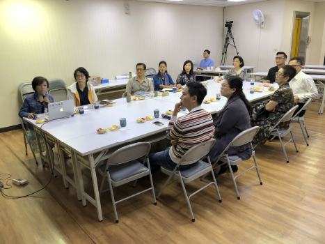

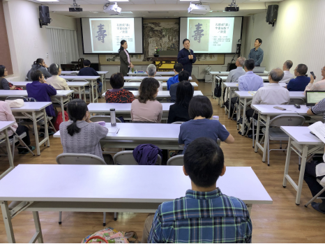

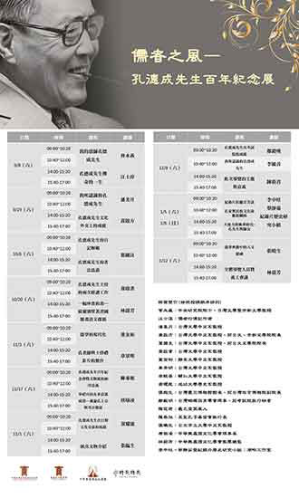

### 大成至聖先師奉祀官府沿革

郭基發

尊孔設官府

奉祀與弘儒

裁撤是機關

民間更弘揚

漢高帝過魯，封九代孫騰為奉祀官，始創推恩之例。漢元帝（西元前四十八年）賜十三代孫霸，爵關內侯，號褒成君，詔以所食邑祀孔子，子孫世襲之始。清雍正就聖廟執事人員，設官分職，各按品級給與章服及祿銀，為聖廟執事人員加爵之始。從漢元帝以後，歷朝均有封爵，名稱或有不同。

自宋仁宗改封衍聖公，一直延至民初。民國二十四年，政府依據中央常會決議，改衍聖公為大成至聖先師奉祀官，爾後官府隨之成立。四配奉祀官一併任命，由國民政府主席林森頒令。五院院長副署—行政院長汪兆銘、立法院長孫科、司法院長居正、考試院長戴傳賢、監察院長于右任。本府原始組織，依據行政院會決議，交內政、教育二部研議決定。民國二十六年抗日戰爭發生，奉祀官奉令撤退後方重慶。本府組織，隨予簡化，復經國防最高委員會第一二一次會議核定。嗣後抗戰勝利，繼之大陸淪陷，孔奉祀官於是帶同官府同仁及部分文物，追隨政府播遷來臺，定址臺中以迄民國八十八年七月，經費遭立法院決議刪除，官府同仁一概退職資遣。孔奉祀官及四配奉祀官事務納入內政部宗教禮俗科辦理。孔府來臺文物經重新整理後，移至孔奉祀官府邸，後寄存臺北故宮博物院。期間立法院多次審議官府經費，於民七十九年度中央政府總預算審查報告明列「（五）大成至聖先師奉祀（官府）預算，應檢討改進，自行研究合法性編列，以資因應」之附帶決議。昔曾擬具「大成至聖先師奉祀官府組織條例草案」送請審議，祈能明察卓奪，維繫此文化傳承法脈，可惜皆未能得著善意回應。茲附上條例草案內容於後。

奉祀官府辦公室

政府為遵崇孔子思想，啟發文化傳統，於民國二十四年一月十八日，明令任命孔子嫡系裔孫為大成至聖先師奉祀官，並任命顏、思、孟之嫡系　　裔孫為四配奉祀官，設置有大成至聖先師奉祀官府。

民國二十六年抗戰軍興，孔奉祀官奉命隨政府撤退重慶，以當時環境關係，縮小官府編制，復經國防最高委員會第一二一次會議核定在案。嗣後抗戰勝利，繼之大陸淪陷，孔奉祀官於是帶同官府同仁及部分文物，追隨政府，播遷臺灣。遷臺以來，本府在整理攜來曲阜林、廟及祖宅文物，宣揚儒家思想，促進國際文化交流各方面盡力所及，未敢或懈。

兩岸分治後，在文化大革命期間，實行批孔揚秦，並將曲阜林、廟及孔府文物肆意破壞，欲藉此消滅孔孟思想及儒家學說。後來發現不但事與願違，且更激起民怨，而於近年來改絃更張，一面大事整修孔林、孔廟，並將孔府及孔奉祀官之居舍一切佈置恢復舊觀；並請孔氏近支人士，以為聖裔代表，參與管理委員會。其意圖在發展觀光事業，也是要號召人心歸向。

現在奉祀官府在我政府所在地的臺灣，至聖奉祀官及四配奉祀官中之三位（宗聖、述聖、亞聖）奉祀官均在臺灣，表示儒家精神傳統在臺灣，這是對岸無法改變的事實。當此時際，如能將大成至聖先師奉祀官府之組織予以法制化，更可強化我文化正統之地位，藉以維繫所有向慕中華文化之國際人士及海外華僑之向心。

作者(曾前後任職奉祀官府後期秘書與總務主任)附錄：孔上公很少來臺中，我親自見過二次面，一次在臺中奉祀官府，老師(雪公)親自把我介紹給孔上公，一次在臺北的家，孔上公指定我北上，以前從沒發生過，臨行早上老師叫我先去正氣街，拿了一封信給我，叫我一見面馬上呈上。孔上公拿了信後，就沒有再出現，最後是孔師母見我還在那，問了一下知道公文要蓋印。蓋完印後，我就回臺中了。至今我仍很好奇老師寫的那封信！

我很感激老師對我的愛護。在臨終前清晨四時，還用心念叫我過去送行。

孔上公，比起奉祀官府的其他人，我接觸得少，當我進去當秘書後不久，他就被任命為考試院長，更沒有時間來辦公室。在老師和孔上公的書信互動中，我更了解老師的用心！老師真為孔家無怨無悔的賣老命！但時局如此，想要有一番作為也難，所以達生豁達而看開，一切都不再在乎！奉祀官府的操持都是老師一人用心所為。論語班、社教班等的設立，老師皆稟報孔上公。時時處處皆為奉祀官府着想，不讓人覺得就是個閒置機關！但最後還是免不掉被裁撤。要我寫孔上公，情感層面的感受不是那麼深，恐怕難於貼切的表白陳述。

炳兄道右  今午把晤新春

健體百福  允符私頌

兄 主持本府論語講座 此乃府中最重要之事 亦為數十年來府中最大之事 較主秘任責重大之比 奚啻霄壤

贈送薄儀 本不足與工作成為正比 惟以 預算所限 只好如此 已覺愧對萬分 若再拒受 使弟更無地自容矣  數十年手足之交 諒

兄當不忍使弟為罪戾之人也 尚望

雲天  百拜以請 專此奉懇  即頌

道安

弟德成敬上  七二  三  七 夜

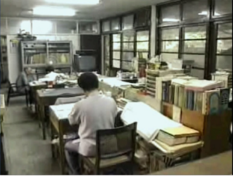

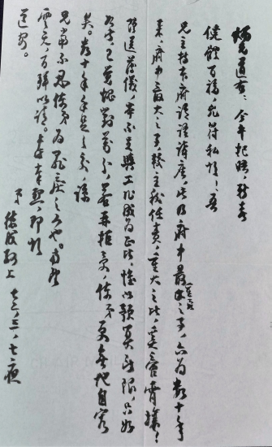

### 給總統的一封信
	 —找回正統請延續奉祀官恢復奉祀官府

給總統的一封信

—找回正統請延續奉祀官恢復奉祀官府

*編輯部*

久旱逢甘九七年

百廢待舉引頸望

人心建設國之本

文化正統立優勢

總統鈞鑒：

猶記年前， 總統眾望所歸高票當選。就任後勤政親民，明德止善，講信修睦，為民表率；又常下鄉訪視，言談幽默，舉止莊重，君子氣度，德量汪洋，必能為國造福。萬望 總統注意健康，領導國家開創新局，是為兆民之福。

誠立國之道，曰名聲，曰民生，曰經濟，曰議事，蓋其根本植於文化；然而，現今文化或多元、或融合，惟必以傳承為依歸，必須要有主軸的思想，共同的價值，方能安民心，聚民意，政策有共識，生活才有和諧的氣象，締造殊勝的投資環境；所以文化直接能安定人心，間接即是興利要件。

誠立足世界，除了經濟的實力外，文化內涵展現的力量不容忽視，富而不好禮或貧而不樂道，則貧國不受國際的重視，富國也不能成為他國之模範，貧富失據，國體何在？即使窮外交、殫財帛之力，仍未逮也。

誠立國之力，立民為先，教育為始，然而現今社會文化失序，教育失焦，眼前生活亦不足以安定，人心漂泊，百姓找不到生活重心、生命意義之所在，流弊叢生，諸如年輕的一代不養、不婚、不育、不教，家庭失能，未來老人社會，國家經濟成長將被少子化蠶食殆盡。

固知，文化之於國家必須要有主導的中心思想與傳承，儒家的五倫關係就是中華文化立基的精神。儒家精神傳承盡在孔家，如國學大師李炳南（雪廬）教授云：「孔家存則中國文化存，孔家亡則中國文化亡。」所以國家文化存亡攸關孔學，政府尊崇孔家，要善待孔子後人，教之育之。

孔子第七十七代的嫡孫 孔上公德成先生，出生甫百日，政府即襲封第三十二代衍聖公；民國二十四年，孔上公年方十六，即以民國肇始之由請去衍聖公銜，政府遂令為特任孔府奉祀官。孔上公平生傳承儒家核心思想，弘宣中華道統文化；民國二十六年，年輕的上公先生由孔府主任秘書李炳南教授陪同，幾經戰亂顛沛，在民國三十八年風雨飄搖之際隨政府浮海來臺，忘年相知五十載，直至李教授辭世，而主秘一職曾由江逸子先生代理，其後，由游宗周先生接任；民國八十七年孔奉祀官府組織裁撤，翌年即九二一大地震，隔年政黨輪替；爾後，教化無方，育民失度，中華文化遭貶抑與摧殘。八年之後，好不容易有個清明之治，此時正是重振儒學、復建奉祀官府舊制最好的時機，且表彰對聖人的追思，為有心提倡文化道統的領導者所必行。

惟孔德成先生不幸在去年十月廿八日辭世，安葬於三峽， 總統您亦明令褒揚，表示政府崇禮賢哲之至意。而於孔先生生前，內政部曾研擬奉祀官職繼任之事，至今仍無任何下文。如今兩岸交流頻繁，對岸有心復興孔家以安定社稷、凝聚國力，不但保留孔先生當初在曲阜城中孔府的起居室，也望其後代子孫能回歸故里。欲禮聘尊崇孔家，迎回山東曲阜接受孔奉祀官職者，應有跡可循，若如是，則臺灣將失去文化正統的立場，失去優勢。

政府應當體會到文化正統與優勢的重要，在亞洲文化中，儒學具有指標性意義，影響力無遠弗屆，是國力也是實力。政府當積極正名孔奉祀官之傳承，並恢復孔奉祀官府，將前奉祀官府文物（或存友人處、或存故宮），蒐集成立孔家文物館（另附奉祀官府存於故宮之文物清單），以紀念這段孔子嫡傳後人在臺灣落腳的特殊因緣，表彰儒家的文化，重視儒學道統的傳承，亦提供全球各國研究儒家研究教育的場所，則國家交流利益可及於文化、學術、教育、外交，何樂而不為？

孔上公一生致力於儒學的弘揚與三禮的研究，在此企盼國家能保留整理孔先生對於三禮的研究資料，作為學習古禮的教材，並重新發現三禮的新時代意義。再則，三十八年前後遷臺的大儒皆已是垂暮之年，若能結合彼等資歷見識，在政府的支持下成立孔學中心，函知寰世，匯儒學道統重鎮於臺灣，必執世界孔學的牛耳，日、韓及中國大陸等數以百計的孔子學院將會回過頭來向臺灣學習。

此事竟成，必能贏得天下有識之士的推心支持，亦使芸芸大眾在混亂的世代裏確立正確的價值觀，令知見清明，行事有所依循，邪知邪見得以消弭，自然政通人和。 總統睿智是全民之福，今懷鶴立企佇之心，只求濟世經邦之道能造福國家。謹肅 敬頌

政 躬 康 泰

中華無盡燈文化學會負責人 唐瑜凌  暨全體成員 拜上

中華民國九十八年三月三十日

### 呈內政部函—
     奉祀官府傳承的必要及意義

呈內政部函—

奉祀官府傳承的必要及意義

*編輯部*

文化孔家兩不分

尊孔能令文化興

人心向善受教化

近悅遠來經濟興

謹臚陳本會「對奉祀官之傳承及促使奉祀官府積極作為」之芻議：

一、重視中華文化不害臺灣文化的發展：

臺灣文化它的內涵到底是什麼？個人淺見以為從臺灣歷史的發展，可知它包含原住民、漢民族、荷蘭、西班牙、大和民族文化等的集合體，而細繹其內涵，莫過漢民族之中華文化，以其時間最長且文化內容最豐富，不重視中華文化，甚至忽略它，有識者均謂極端不明智。

二、中華文化之精髓在儒家文化：

儒家文化自漢後，便成為中華文化之傳統主流，歷經各朝代更迭，或衰落，或振興，或鼎盛，惟始終不曾減損其對世道人心的影響，尤其是歷朝之士，不論在朝居野，俱能發揮中流砥柱之典範，達到安邦定國之使命與成效。而論其師法源頭，便是世代推崇之至聖先師孔子，是以震旦歷代君王，縱使是異族統治華夏，也皆能飲水思源，優孟衣冠，榮耀孔子之子孫，封其爵位為「衍聖公」，不曾墜緒；直至民國成立，改為奉祀官，一脈尊重聖人之後的精神，更表彰政府重視孔家及儒學。

三、傳承奉祀官爵位以與對岸於世界各地遍設孔子學院以標道統：

對岸自文革之批孔揚秦，導致民生塗炭，神州大地子民為馬列思想所取代奴役；自改革開放以來，引進西方資本主義，漸漸國勢增強，惟世道人心，未與之俱進。近年思重振儒家雄風，於寰宇各國遍設孔子學院，從大歷史角度來觀，我等慶幸其改易，惟馬列遺毒一時無法夷盡，簡體字更是與中華文化一刀兩段，成了斷了線之風箏，一時在傳承道統上力猶未逮。

反觀我復興基地，雖經歷八年政黨輪替之去中國化，連帶亦漠視儒家文化，值得稱頌今又出現一批重視儒家文化之精英，過去八年之摧殘，並未傷到根柢，欲與孔子學院分庭抗禮，此其時也，有為政府及有道之士，應振臂高呼，不但要重新恢復奉祀官之體制，更應積極於世界各地設立奉祀官分府，與對岸攜手良性競爭，推展儒家文化，以對世界盡一份心力。

四、廣設分府，以增加就業機會，並提昇國家競爭力：

新政府此刻正以提高就業機會為政策目標，同時兌現競選諾言，若能於國內外增設奉祀官府之分府，必能增加就業人口，連帶宏揚儒家文化，願效野人獻曝，以就教方家：

（一）國內各縣市結合孔廟成立奉祀官分府：

使府廟結為一體，並延伸民間團體讀經運動，廣攬國內經學家培育解經種子經師，以深化讀經內容，進而內化經典深意，改變學子氣質，終而提昇國民素質，成為優秀人力資源，並提昇國家競爭力。若初期每分府以五人計算，全臺馬上即增加百餘人之就業機會，對履行競選支票，有其貢獻，不無小補。

（二）由駐外單位協助下普設奉祀官分府：

我國駐外單位，據以往資料有大使館、總領事館、中華民國商務及領務辦事處、臺北文化經濟代表團、臺北經濟文化辦事處等不同名稱，計百餘單位，可徵調已畢業之文史哲碩博士生，並熟悉儒學經典，或民間書院或團體主講儒家經典人士，賦予彼等共同以宏揚儒學為使命，盡力傳揚儒家文化於世界各地。初期可結合通曉駐在地之語文人才，一併協同宣揚儒學。若平均以五人估計，亦可增加五、六百餘人，此舉可兼收既培養弘傳儒學人才，又可增加就業人口，更可蔚為風氣。

五、縮短孔奉祀官生卒時禮遇，正可表彰政府重視儒學：

回憶九十年前，孔奉祀官為遺腹子時，舉國憂慮聖人後代之斷緒，當嬰兒呱呱落地，知聖人有嗣時，非但聖地曲阜市民欣喜若狂，全國人心亦為之鼓舞。

古往今來對人類歷史最有貢獻者，不是帝王將相，也非工商大賈，而是思想教育家，尤其是至聖先師孔子，為百代所宗、萬世瞻仰，何故？無他！聖人為千秋萬世之子子孫孫，提供一安身立命、趨吉避凶、重視人倫人格、闡揚尊貴的人性等不可思議的學問，為炎黃子胄開展一條人生坦途，故歷代子民感念聖言的教化，方會對孔先生的誕生，載欣載喜，而流露出與古人同出一轍之反應。縱使異族統一華夏，無不對其子嗣加以崇敬禮遇，也保持此一傳統，何況我國長期標榜為中華文化之正統，為漢學中心，為儒學核心，而今值孔奉祀官謝世，政府應趁此一機會，依古禮為孔奉祀官舉辦一場隆重莊嚴又適應現代的喪禮，一則藉以表彰重視聖人之後，再則端正禮俗，為立國以來之五花八門層出不窮的喪禮，立下一典範，供後人取法，此正是時候，祈盼新政府能察納善語。

備註：本文已於九十七年十一月廿五日，以無盡燈儒佛學會名義，呈送內政部，以為陳請。

### 論語班參與孔上公百年紀念會意義

唐瑜凌

雪公論語講學

官府最要業務

千秋文化勝事

孔李一代交情

大成至聖先師奉祀官孔垂長先生所主持的中華大成至聖先師孔子協會，將於民國一○八年一月至二月期間舉辦「孔德成先生百歲誕辰紀念活動」，活動包括了兩大主軸，分別是一月十九日上午在中油大樓國光廳的紀念會，以及一月十九日下午開展至二月十日結束的「儒者之風—孔德成先生百年紀念展」。身為雪廬老人的弟子，似乎總有一股看不見的力量，將弟子們與孔上公連繫在一起。之所以說看不見，因為所學傳承自雪公，而非孔上公；但那股緊緊相繫的力量，就是孔上公對雪公講學無限的護持，有這份護持，大家才得以在老人座下聽經聞法。

雪廬老人於民國三十八年來臺，直至民國七十五年往生，後半生都在臺中講學，也身兼奉祀官府主任秘書一職，領導位於臺中的府內同仁辦公。而大成至聖先師奉祀官孔德成先生，來臺不久已經北上臺北，何以奉祀官府可以繼續留在當地？雖說老人是因為臺中蓮友跪請而留，但若無孔奉祀官的應允，則必須辭職或者一同北上，絕無可能出現官與官府分隔兩地的奇特現象。由此可見孔上公對老人教學事業的護持，才會不惜忍受種種不便，讓官府與雪廬老人留在臺中，可以兼顧其弘法與府務的工作。

有一個眾所皆知的規定，孔家人如果信佛出家，將不被允許入葬孔林。孔上公在歲次己卯年(民國二十八年，一九三九年)一月廿三日的日記中也曾寫道：「下午戴季陶、張溥泉先生等發起救國護法會。此佛家事，本不宜往。乃因戴、張兩位，故情不得卻，強赴之。溥泉謂：孔子非宗教人，所以知為人之道，即孔教也，故中國數千年來無宗教之戰爭。其言是也。」可見上公因為奉祀官的特殊身分，對於佛教種種活動，當會保持一定距離。但這樣的距離，完全不存在於他與雪公之間，不僅重用雪公擔任主秘，不允其退休，至一九八六年雪公往生，孔上公在告別式上的輓聯題：「數萬里流離備嘗甘苦與君共；五十年交誼多歷艱難為我謀。」表達出那樣深厚不可分割的情誼，並且在雪廬老人靈堂前行跪拜大禮。身為老人家的弟子，這些往事又如何能忘記呢！

不只佛法弘揚的默默護持，還有儒學見地的肯定。雪廬老人於民國六十一年開設了論語班，一封現保存於雪心文教基金會的信件，孔上公對雪公如是說：「主持本府論語講座，此乃府中最重要之事，亦為數十年來府中最大之事，較主秘任責重大之比，奚啻霄壤。」本信除了對於老人公務上的肯定，更是孔上公對於老人《論語》見地的肯定。徐醒民老師在臺中講學數十年，桃李遍布，當年聆聽雪廬老人課程的《論語》筆記所成專書《論語講要》，現已成為許多學子學習《論語》的必讀之書，雪廬老人解讀《論語》的智慧，全賴有這本書籍傳承。「接統靈巖十三葉，蓮花一瓣分臺中」，細數過往，若無孔上公的默默護持，此花何能在臺中開？於此百年誕辰活動之際，正是回報此恩的最佳機會。

論語班結業典禮

於此孔上公百年紀念之際，應是臺中蓮社論語班的同學們一同參與活動，飲水思源，報本還恩的好機緣，並因此與孔家再續雙美之前緣，未來隨著孔垂長先生在大陸發展的因緣，更有弘傳雪廬老人《論語》見地的機會，實為文化薪傳上的一件大美事。

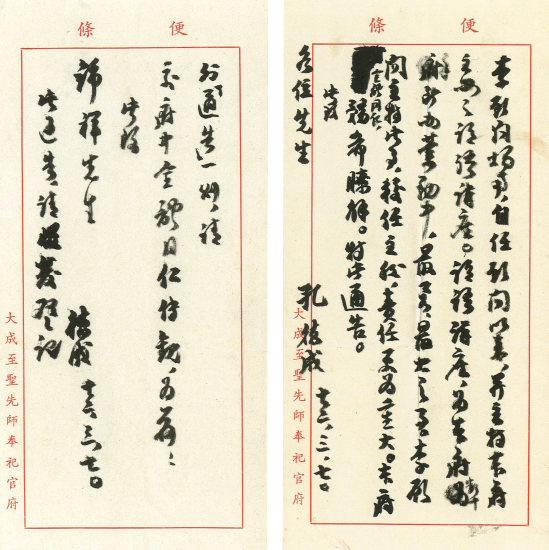

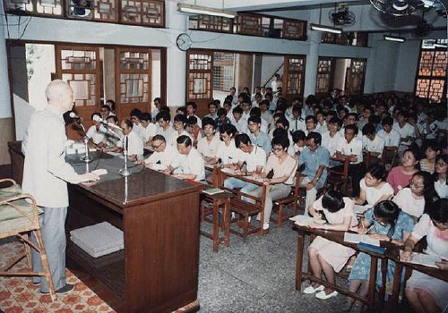

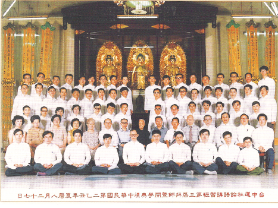

### 奉祀官府由來意義成效
		兼論雪廬老人與孔上公情誼

奉祀官府由來意義成效

兼論雪廬老人與孔上公情誼

時哉講述

半世紀情誼

逃難避居渝

遠遁蠻貊邦

孔子行道處

前言

為何要在培訓課程中，開設此課程？由於學會傳承於雪廬老人（李炳南教授），老人與孔上公的關係非比尋常，方有承辦此次孔上公(奉祀官孔德成先生)百年文物展活動的緣起。雪廬老人曾說：孔家在則中國文化在，孔家亡則中國文化亡。孔家扮演著文化延續的重要地位，更特別是孔德成先生在風雨的時代，尤其是打倒孔家店的風潮中，堅持著文化道統的學習，展現著讀書人的風格，儒家士的精神，並迎來儒家的新局。特別是對岸大陸重新發揚孔子，找回民族文化的根苗。所以護持孔家明年元月於國父紀念館辦孔德成百年文物大展更具意義。

此次的文物展當中，以孔上公的法書、照片及奉祀官府文物等，呈現孔上公的內涵、人格特質，及文化、學術、外交上的貢獻。此次活動結合孔上公在臺高足，在學術領域擁有學養的諸教授們培養學會的導覽團隊，相信在文物展的導覽過程中，參訪大眾能有上述的了解，也提升學會內部的學術涵養。

學會也在孔上公百年文物展展期中，邀請各地讀書會成員來臺，屆時將有遠從對岸：福建、浙江、瀋陽、雲南、瀋陽、北京及馬來西亞等地而來的善友﹐莊嚴這場盛會。

正因維持道統的延續就是維護文化的命脈，所以孔先生雖然有很多頭銜，舉凡總統府資政、考試院院長、國民大會主席團的主席等，但這些職務都遠不及奉祀官這個角色來得重要。

奉祀官府由來意義成效兼論雪廬老人與孔上公情誼

奉祀官府祭祀的對象是孔子，要談奉祀官府由來，首先必須了解孔子對中華文化集大成的貢獻，這些深廣的內涵詳載於中國經典中，有上達形而上的智慧，又能在世間通權達變，處在變化莫測的世間能無往不利且能趨利避害。

漢高祖祭孔

自宋仁宗封孔子第四十六代孫為衍聖公以來，至民國的孔德成先生，為第三十二代衍聖公，位極榮顯。延續超過八百九十年的「衍聖公」爵位，到了民國二十四（一九三五）年時，由國民政府特任孔德成先生為「大成至聖先師孔子奉祀官」，並加封四位奉祀官（孔、顏、曾、孟），設立奉祀官府。從此以「奉祀官」取代「衍聖公」稱號。

《周禮》云，天子之下的三公，受封到八命，再加封時為九命，已居人臣極位，名為「上公」。孔子的後代子孫從宋仁宗起，就被封為「衍聖公」，是衍續聖人血脈的一等公。因此孔德成先生是第七十七代嫡長孫，也是第三十二代衍聖公，故有人稱孔先生為「孔上公」，就是地位在所有公爵之上的意思。

*奉祀官府明訂的主要業務有三項：一、整理及維護三孔文物。二、祭孔以表彰孔子文化道統。三、弘揚孔子思想。*

而奉祀官府的業務該如何推動呢？這就不得不說到雪廬老人。老人能夠到孔家上班，是因為莊陔蘭先生的介紹，雪廬老人曾在濟南市政府任承審員及科長。後來又有機會到莒縣的監獄去上班，辦獄政成功及與盜匪折衝，保護縣民身家性命財產，莊陔蘭先生這位莒縣人看在眼裡，請雪廬老人共同重修莒縣縣誌，對雪廬老人各方面的能耐心裡有數。民國二十六（一九三七）年，因為孔家需要一位幹才輔助孔上公，莊陔蘭先生便推薦雪廬老人進孔家上班。當時雪廬老人是猶豫的，因為長期在外無法承歡膝下，祖父鼓勵他，並云：李家有幸能為聖人做事，應當要好好作，家裡面有人作主不用擔心妻兒沒人照顧。因此老人再次離家至曲阜孔府赴任。不久又因戰亂，跟隨孔先生離開曲阜，從湖北進入四川，民國三十五年　　回到南京，三十六年四月國民政府收復曲阜，才跟隨孔先生三返曲阜，十年間僅回家一趟。

國文補習班結業

民國三十八年元月，奉祀官府奉命撤退臺灣，當時孔上公正在美國遊學，雪廬老人收到派令，親自護送二十五箱文物來臺，路上曾遇到四位憲兵要劫持，後來老人以大義折服，且由這四位憲兵保護這些文物一起走，並協助擊退路上欲劫持的警察。

奉祀官府來臺之後縮編成秘書處，奉祀官奉命北上臺北時，擔任主任秘書的雪廬老人，為了學生求法的熱誠，決定辭職留在臺中弘揚文化，奉祀官權衡輕重，決定隻身至臺北上任，將奉祀官府留在臺中，繼續倚重老人弘揚孔子思想，如此可見孔上公對雪廬老人的完全信任與交情之深！

雪廬老人在各類文化慈善事業的推廣上，獲得孔上公的默默支持，在臺中的各類公開講學中未遭政府刁難。雖說二人是君臣關係，但是因為年齡的差距和彼此亦師亦友的關係，孔先生以兄長稱雪廬老人，且雪廬老人的《論語》見地也深受孔上公的認可，對於其所主持的「論語班」，孔上公在信函中表示：「論語講座為本府數十年來最重要的事情。」雪廬老人九旬退休信函中，提及孔上公知遇之恩：「厚恩汪洋山海難喻，銘骨沒齒未或能忘，但以大局為重，安可因私廢公，然四十年追隨，驟然言辭，中心實如火焚，時勢所迫無可如何而已，茲擬以公私兩全之法，請將主任秘書辭去以讓賢能」，之後又在府中繼續任職至九十五歲，並依孔上公的祈請，亦為了傳承道統的使命，雪廬老人以九十多歲的高齡再抱病上場，開設第三期論語班，一改低調的態度，不但擴大辦理，也在開班期間受學生三跪九叩拜師禮，並付囑學生將來若有機會，要將《論語》弘揚推廣出去。

雪廬老人從二十五歲在濟南任承審員、歷經科長、典獄長、編纂、法官，孔府主任秘書，一直到九十五歲，方於孔府退休，成為兩岸最老的公務員。然退休時國家沒有編列老人退休金的預算，最後孔上公將自己的積蓄兩百萬作為老人的退休金(即上文之「贈送薄儀~數十年手足之交」)，老人不願意拿，孔上公一定要給，老人便轉手作為傳播文化事業的稿費。而老人九十五歲高齡退休後，在孔府繼續當無給職的顧問，孔上公希望老人繼續講授《論語》，老人就這樣奮力講學至往生前一個月。

孔上公與老人的情誼，可由一首首在四川、在曲阜、在臺灣的詩作、信函來往與學生言談事蹟中，看出彼此交情之深厚，孔上公在雪廬老人告別式上所題的輓聯：「數萬里流離備嘗甘苦與君共，五十年交誼多歷艱難為我謀。」這是一段極其珍貴而又難得的情誼，兩人合而雙美，不知影響多少的學人，在中華文化的貢獻上，留下深刻的足跡。

奉祀官府學務

一、孔子聖跡圖：奉祀官府遷臺之後，奉祀官孔德成先生與孔府主任秘書雪廬老人，共同將孔子一生的重要事蹟，從六、七十件歷代保存的檔案中，經過詳實考據，剔除穿鑿附會或無稽傳說部分，嚴正刪述出三十二則史跡可考的文獻，禮請奉祀官府內同仁，也是雪廬老人的高足，名國畫家江逸子先生，忠實的逐文配圖，經過兩年，於一九七０年初完竣，名曰：「孔子聖跡圖」，並經奉祀官孔上公先生題額審定。江先生，陸續繪製各類以藝載道的作品：大幅屏風六藝圖等、論語畫解、明倫史畫及泥塑十哲塑像。

二、國文補習班：一九五二年始，由雪公創辦「國文補習班」，義務傳授中華文化。禮聘孔德成、傅文平、劉汝浩諸師，講授論語。周邦道、許祖成講授國文。老人親授唐詩等課程。

三、暑期修身補習班：一九六一年，始為國小、初中學童舉辦暑期修身補習班，後改為啟蒙班。

*四、大專國學研習營：寒暑假講授中華經典課程，乃現今大專明倫講座前身。*

五、明倫社：一九七０年創辦，專責接引大專青年，後創辦明倫月刊，以闡揚中華文化。

六、論語空中廣播電台：一九七三年，開播「中華文化」節目，獲九所民營電台聯播，展開空中弘法。後因電台廣播成績斐然，乃籌設成立「明倫廣播節目供應社」，擴大空中弘法。一九八四年，再於復興廣播電台開播「明倫之聲」，全省聯播，助益社教。

七、論語班：獲民間善友資助，創辦「臺中論語講習班」，培養弘揚文化之人才。

臺中的奉祀官府在雪廬老人及官府同仁竭力推展下，弘揚中華文化的業務蓬勃發展。可惜隨著老人的過世，一九九八年奉祀官府遭到裁撤，政府漠視傳統文化的推廣，文化的弘揚與傳承，只剩民間機構私下講授。

奉祀官府公務

公務上的代筆：舉凡三節總統贈禮之回信、圓山大飯店、日韓各大學贈字等公務上的往來，皆可見老人和官府同仁的字跡。

祭孔：祭孔各項事宜，臺中和臺灣各地孔廟策劃興建與祭孔相關事項辦理。

結語

最後，以孔府中紀曉嵐的對聯來做結論，對聯：「與國咸休安富尊榮公府第。同天並老文章道德聖人家。」上聯是跟國家共存亡，歷代的衍聖公得到皇帝的厚賞，不但是一等公爵，而且歷朝歷代不斷加封，九命為上公，上聯是人爵。下聯是天爵，文章是詮釋道德的形相，道德是文章的本質，既有人爵又有天爵，唯有孔家。

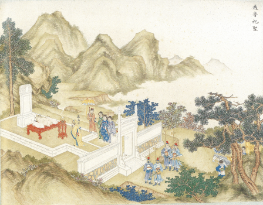

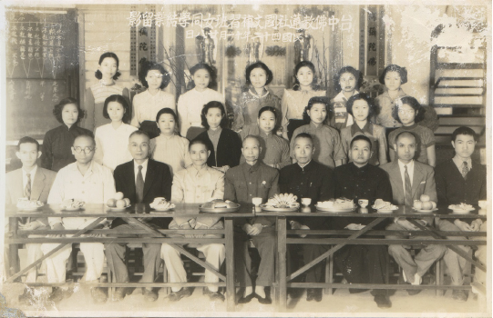

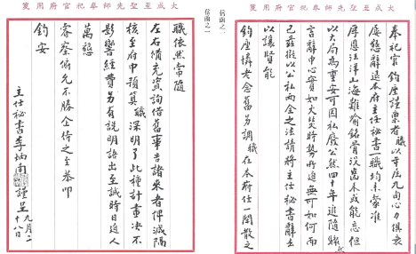

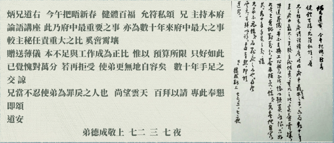

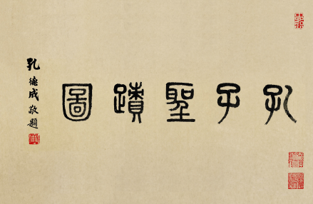

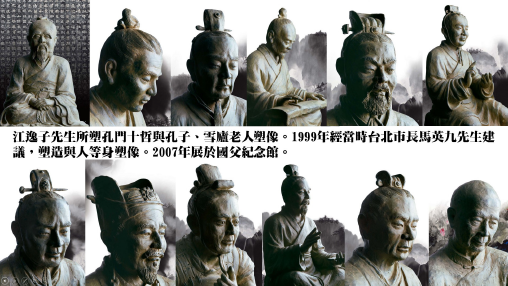

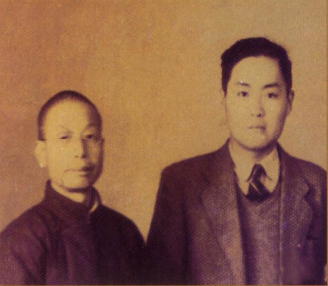

### 猗蘭別墅著書圖文解

淨域

患難顛沛無怨尤

以文會友心安泰

厚積薄發待日出

九夷高照百年展

壹、概說

中日八年戰爭發起，曲阜孔家在國軍的掩護下，逐次向武漢、重慶轉進，因重慶市區屢遭日機轟炸，政府便在渝西歌樂山，為孔德成先生興建房舍兩棟。落成時，老師呂今山取先師孔子《猗蘭操》之意，將之命名為「猗蘭別墅」，成為孔家在抗戰期間的居所，時呂今山、李炳南、屈萬里等先生與孔先生共住。

國民黨大老丁惟汾先生、山東圖書館館長王獻唐先生等也來到歌樂山，一時名流雅士常於猗蘭別墅中書畫聚會。一九四二年，王獻唐先生畫《猗蘭別墅著書圖》一幀，題以「三十一年五月，寫似 達生先生，清品，獻唐時客陪都歌樂山」幾字。

八年抗戰結束後，復員各自返鄉。此時共軍已由東北直取平津迫近山東，國民政府再度保護孔家南撤，最後退至臺灣臺中。期間，孔德成先生返回歌樂山寓所，才三年光景，猗蘭別墅已破落不堪。當時雪廬老人(李炳南)為孔先生的主任秘書，統籌一切南遷事宜，並服務孔家至往生。是故，當老人舉行告別式時，孔先生特行跪叩大禮，更見出兩人如父兄之情。

大陸淪陷時，許多師友不及於離開，譬若：王獻唐、呂今山(一九四九年春，病逝於江蘇常州)者。一九六０年十一月十六日，王獻唐病逝於濟南，此消息隔年傳到孔先生耳裡，不覺地撫今憶往話猗蘭。

辛丑年歲末除夕日(一九六二)，屈萬里先生觀圖填詩寄語，云：「松杉屋外插天青，眼底江山列畫屏。荒徼又驚歲華晚，還將舊淚哭新亭。」并序文說：「此二十二年前余為 達生上公伴讀，居猗蘭別墅時，所為俚句也。憶昔倭人犯順， 公流寓渝州，政府為築館於渝西歌樂山主峰之側，先師呂先生今山，命之曰猗蘭別墅。公揅讀其中，昕夕無間。未幾，向湖老人乘來，卜居山坳，為繪此幀。時余以索米，去渝未立見也。比亂定東歸，甫三載，復值黃天禍作，公又遊地臺員。余乘先 公東渡，同客海疆者，忽忽十三載矣！頃者 公出此幅命題，爰錄舊作請正，蓋今昔有同感焉！」後落款：辛丑歲除日，魚臺同學，弟屈萬里并識。屈萬里(一九０七-一九七九)，字翼鵬。山東省魚臺縣人，曾任中央圖書館館長，為中央研究院院士，專長於《詩經》、《尚書》等上古典籍。

一九六二年九月深秋，孔先生取出《猗蘭別墅著書圖》，與同在台大任職的臺靜農先生共賞。臺靜農，字伯簡，原名傳嚴，改名靜農。安徽省霍邱縣葉家集鎮人，長期寫作，精於書法。孔先生任國立故宮中央博物院聯合管理處主任委員時，為弘揚國粹，曾與臺靜農、王靜芝、王北嶽、吳平等人，成立「六修書畫會」，交情匪淺。臺老在畫卷上題以「日照王獻唐琯為曲阜孔達生德成作猗蘭別墅著書圖，壬寅九秋，臺靜農題」數字。

王獻唐先生(一八九六-一九六０)，初名家駒，後改名琯，字獻唐，號鳳笙、向湖老人；山東省日照縣韓家村人，曾任山東省立圖書館館長、中央國史館副總纂修。「達生」為孔德成先生(一九二０年二月廿三日至二００八年十月廿八日)的號，字玉汝。壬寅九秋，指一九六二年的深秋。

孔先生亦請臺大教授戴君仁先生題跋，其在卷右題詩一首，曰：「高梧策策動秋聲，寂寞草玄書欲成。圖畫長留人永逝，滄波無限海雲平。」並落款「壬寅重陽後 戴君仁題」數字。策策，悲戚貌。草玄，出於揚雄草《太玄》一事，喻澹泊名利，潛心著述。戴君仁(一九０一-一九七八)，字靜山，晚號梅園。浙江省鄞縣人，北京大學畢業，拜入熊十力之門，研究金石古文。抗戰期間教於西北大學，一九四七年來台北師範任教，後轉至台灣大學教學以終。

一九六二年小寒這天，雪公覽圖在卷底題詩三首并序，其一、「萬壑長松非自栽。巖花日對硯池開。名山應有名山業。誰遣斯人魯國來。」其二、「摩詰淋漓畫蜀山。偶來幽境便心閑。輞川西望歸舟杳。墨瀋猶新天壤間。」其三、「別後重來訪舊廬。寒煙蔓草似殷墟。幾回搔首看圖罷。又檢當年未竟書。」(搔首在看圖上)序文說道：「蜀山猗蘭別墅，孔上公避寇所構也。與時往還者皆名流，著述之暇，輒以書畫共歡娛，王子此幀即作於是時也。己丑，上公再至蜀，其居淪廢墟矣。今歲鄉信，王子已歸道山，展玩此畫，有重愴焉！予時曾為從者，故感同而誌之。并錄舊作於末，雪鴻一爪，聊見其居之境。」昔日舊作題名為〈孔上公歌樂山猗蘭別墅寄興〉，云：「翠屏掩映鎖秋暉，靜裏常關松下扉。欄外紫霞隨澗落，窗中黃葉共雲飛。晴江一曲天邊盡，煙嶂千重雨後微。西蜀南陽同不陋，春風從此長芳菲。」落款：壬寅歲小寒節，稷下李炳南識於臺中。清代作家蒲松齡，在《聊齋志異》中寫下了二十多篇，以濟南為背景的傳奇故事，且將濟南美譽為「稷下」(古臨淄)，此後濟南士人多稱稷下學人。

同時間，台大教授張敬女士，合高陽臺一詞牌填詞一首，云：「谷沁幽馨，泉欺夜韻，燄藜淺映虛堂。蠹蝕神仙，紺痕漸隱微茫。乘迴劫盡飄零淚，縱飄靈，更對滄桑。料難應，老了雲山，負了詩腸。鉛黃託付平生願，暗流光一霎，總費商量。魯殿依稀，綸經尚繞東牆。如今莫笑袷衣剩，賸裌衣，也自疎狂。試重尋，一卷秋林，萬卷芸緗。」落款：高陽臺，壬寅孟冬，張敬倚聲。倚聲者，即依著詞牌的音律填新詞。張敬女士(一九一二-一九九七)，字清徽，貴州安順人。北大文科研究所肄業，精於填詞唱曲，一九五一年受臺靜農之邀，至台大中文系教書，專授戲曲課程。

圖卷左下另有兩首詩，為雪公在莒縣的好友趙阿南所題，云：「瀟灑王郎遺世姿，丹青妙筆繫人思。幾回欲下滄桑淚，眼底江山異昨時。」「猗蘭今又寄天南，聖德敦流造化參。更建一圖垂史蹟，無聲神理可齊驂。」落款：癸卯(一九六三)中元後二日，趙阿南敬題。在雪盧老人早期詩文中，有兩首〈送趙阿南〉，云：「此去京華路幾千，相思春草日綿綿。何時重話一樽酒？目斷行雲梅樹前。」「年來已悔訂交遲，偏是相逢在別時。此後愁腸何處遣？松窗延月讀君詩。」詩文讀來友情深摯，一波三折，也不意外於圖中，何有此位大德題字。

貳、圖中原文釋解

一、猗蘭別墅著書圖　三十一年五月寫　似達生先生  清品　獻唐時客陪都歌樂山

註：一九四二年王獻唐在歌樂山，與孔上公等人書畫往來，作此圖贈之。

註：《猗蘭操》最早的版本當是孔子所作，《古今樂錄》中提及：「孔子自衛反魯，見香蘭而作此歌。」在古籍《琴操》中亦有說道：「《猗蘭操》，孔子所作。孔子歷聘諸侯，諸侯莫能任。自衛反魯，隱谷之中，見香蘭獨茂，喟然嘆曰：『蘭當為王者香，今乃獨茂，與眾草為伍，譬猶賢者不逢時，與鄙夫為倫也。』乃止車，援琴鼓之，自傷不逢時，託辭於香蘭雲。」《琴集》中亦有：「《幽蘭操》，孔子所作也。」之語。以此當可確認最早出現之《幽蘭操》當是孔子抒生不逢時﹑懷才不遇之情所作。

二、日照王獻唐琯為曲阜孔達生蘭(應為德字)成作猗蘭別墅著書圖 德(蘭寫錯，後補一德字)

壬寅九秋 臺靜農題

三、萬壑長松非自栽，巖花日對硯池開。名山應有名山業，誰遣斯人魯國來。

詩譯：名山深谷中的高大松樹，並非我栽植的。巖石上的花兒，天天對著我洗筆的硯池開放。歌樂山應有它的不朽，(名山，古帝王藏書之府)是誰差遣孔上公(德成先生)遠從曲阜來此。

四、摩詰淋漓畫蜀山，偶來幽境便心閑。輞川西望歸舟杳，墨瀋猶新天壤間。

詩譯：王獻唐此畫，如擅詩畫的王維，將蜀山畫得如詩般美。偶然來到這蜀(歌樂)山幽境，心便安閑下來。猗蘭別墅似輞川，由西遙望山東故里，因戰事而歸期杳然。這畫中留白外的墨跡，還未乾呢！(天壤，指畫中上下的留白處)

五、別後重來訪舊廬，寒煙蔓草似殷墟。幾回搔首看圖罷，又檢當年未竟書。(搔首在看圖上)

詩譯：離開歌樂山後，三年後孔上公重訪舊廬，不料屋子已被荒煙蔓草所圍繞，像是廢墟了。幾回摸著腦袋瓜看此圖，久久欲罷不能。再把當年在歌樂山沒編輯入書的詩文，翻出來看看。

六、翠屏掩映鎖秋暉，靜裏常關松下扉。欄外紫霞隨澗落，窗中黃葉共雲飛。晴江一曲天邊盡，煙嶂千重雨後微。西蜀南陽同不陋，春風從此長芳菲。  壬寅歲小寒節 稷下李炳南識於臺中

詩譯：翠綠山林屏蔽著猗蘭別墅，在深秋餘暉中交相掩映著。在這閑靜的山中，松下的門扉經常是關著的。欄外的紫色彩霞，隨著山澗流落。窗中的黃葉，隨著飛雲共飄舞。清澈的江水，彎延地流到無盡的天邊。層層交疊的山煙繚繞，在一陣雨後，已稀疏到微乎其微了。想那西蜀子雲亭與南陽諸葛廬，同樣不簡陋呀！(借用劉禹錫陋室銘之句)過了寒冬春風吹起，此園將再開滿芳香的花草。

七、瀟灑王郎遺世姿，丹青妙筆繫人思。幾回欲下滄桑淚，眼底江山異昨時。

猗蘭今又寄天南，聖德敦流造化參。更建一圖垂史蹟，無聲神理可齊驂。

癸卯(一九六三)中元後二日 趙阿南敬題   (為莒縣好友)

詩譯：清高絕俗灑脫不羈的王獻唐先生，雖其人已逝，但留下了這幀絕佳的《猗蘭別墅著書圖》。畫中的設色與筆意絕妙無比，牽繫著我們這些老友的思念。想念著同歷滄桑的老友，每回不禁要垂下思淚來，如今眼前的江山，已大異於昔時了。孔上人今日雖寄居於天之南(台中)，但孔門聖教德澤，卻因而造化了這塊偏隅之地。同期更選整文獻檔案，欲編繪孔子聖蹟圖流傳，此一無聲的圖集一旦完成，孔門性與天道之理自可與神理並齊。

八、高梧策策動秋聲，寂寞草玄書欲成。圖畫長留人永逝，滄波無限海雲平。

壬寅(一九六二)重陽後 戴君仁題

詩解：秋風吹拂著庭前高大的梧桐樹，枝葉搖擺發出沙沙地悲戚聲。孔上公掩門潛心修學，新著的書將要完成了。昔日王獻唐先生將此景畫下，呂今山先生名之為「猗蘭別墅著書圖」，如今畫作重現眼前，而繪者早已離開人世了。想那時名流雅士們立於庭前，從歌樂山俯望著滾滾的嘉陵江，一路南下與長江合流，直至海雲平遠處。

九、

谷沁幽馨，泉欺夜韻，燄藜淺映虛堂。

蠹蝕神仙，紺痕漸隱微茫。

乘迴劫盡飄零淚，縱飄靈，更對滄桑。

料難應，老了雲山，負了詩腸。

鉛黃託付平生願，暗流光一霎，總費商量。

魯殿依稀，綸經尚繞東牆。

如今莫笑袷衣剩，賸裌衣，也自疎狂。

試重尋，一卷秋林，萬卷芸緗。

高陽臺(詞牌名)  壬寅孟冬 張敬倚聲

詩解：山坳沁涼幽靜又馨香，泉響聲欺壓了夜的韻律，火燄的紅藜淺映著空堂。

壁魚蛀書吃了神仙二字(出自太平廣記，喻王獻唐仙去)，青紫色的痕跡漸隱而模糊(微茫，出自李白的〈夢游天姥吟留別〉)。

幾回劫難終到頭，不禁落下飄零淚，我縱放神靈飄忽，面對此一無常變化。想必難以交相感應，只是老了雲山，辜負了詩情。

就在校勘書籍中託付平生願望，回顧苦難如光霎逝，提起來總是道說不盡。曲阜的大成宮殿依舊，治理教化的遺風還繞著鄰家。

如今莫笑落魄只剩件袷衣，即便就剩件裌衣，也豪放自在。試著重尋，一卷秋天的林色(畫中歌樂山的秋色)，與萬卷的書函(芸與緗都有書籍之意，如芸帙、緗帙)。

十、松杉屋外插天青，眼底江山列畫屏。荒徼又驚歲華晚，還將舊淚哭新亭。

辛丑歲除日，魚臺同學，弟屈萬里并識。

詩解：看這畫中，屋外高大的松與杉直插青天，眼下的和歌山與嘉陵江美景皆寫入畫中。隱居在這偏荒之地(台灣)，驚訝一年又到晚秋，大家相視流淚，哪日能還都南京，再至新亭(亦可引申指猗蘭別墅)敘舊。

### 觀猗蘭別墅著書圖有感

傳線

觀圖滄桑浮

君子無怨尤

亂世火中金

人生牟尼寶

一、緣起：更建一圖垂史蹟

此畫乃四川重慶歌樂山之猗蘭別墅圖。為　孔上公避日寇侵華時。於民國二十八年，國民政府擇西蜀歌樂山主峰西側之地，　孔上公在此構築，別墅之名乃　孔上公業師之一呂今山所命，後同鄉向湖老人王君獻唐亦擇居山坳處，日夕相往來，對境有感，遂造此幀猗蘭別墅水墨圖。

孔子後裔世居魯曲阜，史上除第四十八世孫孔端友衍聖公，隨南宋高宗避靖康之變，止浙江衢州外，孰知八百載而後，又逢日寇犯順，掠我山河大地，　孔上公在國民政府軍護送下西行巴蜀避難，此史上大事蹟，雖有相關文獻載於青史，難得可貴有瀟灑王郎以丹青妙筆繪之，繪圖既成、陸續有雪盧老人、屈翼鵬、龍坡靜者臺靜農、張清徽敬、趙阿南等諸大學者題識。圖及題款可謂見證　孔上公居西蜀猗蘭別墅之雪鴻一爪，誠彌足珍貴也。

二、一卷秋林萬卷芸緗

猗蘭別墅座落在重慶郊區七十餘里處，猶如畫裡之房舍，二層木造屋，外圍著柴扉、門前有幽徑、匾題「猗蘭別墅」四字，有所寓意焉。　孔上公避倭寇，倉皇出走孔府至渝，渝地更逢日軍砲火日夕轟炸，命如覆巢之卵，其境遇大似夫子之生不逢時；賭深谷幽蘭與眾草為伍，乃喟然而歎也。

畫圖一卷，秋暉秋林，澗落紫霞，黃葉雲飛，聚居君子，隱居求志，賴有萬卷書帙可齊驂。國土雖危脆，惟歌樂山峻拔，屹立不搖，如仁者君子之懷，歌樂山又何其有幸，共伴魯國君子六寒暑。

魯國斯人寄西南，往來皆名流，雖遭國難絲毫不懈怠，筆耕不輟、著述之暇，以書畫共歡娛，正此時王子繪圖留下不朽的記憶，民國三十八年，　孔上公再造別墅，已廢墟矣，眼見此幅圖，誠可謂繫人思、奪人淚，秋林芸緗，往事縈心頭。

三、名山應有名山業

歌樂山山高松杉插天青，居其下，秉食其毛、踐其土的理念，理當回饋，時任教孔府主任秘書的雪廬老人常於歌樂山雲頂寺弘法利眾，即是出世名山業，又據屈翼鵬題識云，正值弱冠的　孔上公揅讀其中，忻夕無間，爾後成就當代三禮金石大家、及擔任考試院院長等，此段沉潛想必大有關連，所謂身藏名山，蘊含入世名山業耶！

伴讀屈翼鵬亦成為當代詩經、尚書大家，後膺選為中央研究院文學院士。魯殿諸君子，個個自立立人，處於上庠，從事百年大業，不論臺北或臺中，既栽蓮花以薪傳，續佛慧命，復培育英才後進於鱟宮。春風化雨，在在於此段歲月之厚積薄發連繫耶！

又歌樂山猗蘭別墅歲月，最殊勝回饋鄉里，莫過於自我充實，雪廬老人詩句可證「巖花日對硯池開」而自利利他，更是此輩魯國君子的胸懷，雪廬老人詩句「名山應有名山業」應是當時心境最佳的寫照。

四、西蜀南陽同不陋

猗蘭別墅二層木造房屋與孔府寬廣數百間建築群相較，固陋矣！翠屏、欄杆、柴扉與孔府九進院落，莊嚴大門、典麗廳堂、團簇後花園等相較亦陋矣！裌衣、祫衣，與魯殿緇衣素衣黃衣、羔裘麑裘狐裘相較，更陋矣！

猗蘭別墅著書圖未修復前

諸葛草廬有武侯寧靜致遠的安邦志，固不陋！子雲亭有楊子潛心向學，後為大學者，亦不陋！上公別墅，雖門前車馬稀，柴扉不常開，往來鴻儒共參學，書畫賞析共歡娛，了無怨天尤人，不慍不火之形色，而立之前，如是涵養，有聖門高第氣象，不愧為聖裔，誠德行有成之君子，居此別墅，又何陋之有！

五、結語

王子畫此圖後，　孔上公典藏，六Ｏ年代初先後請亦師亦友之雪廬老人、伴讀屈翼鵬、同事書壇巨匠臺靜農、戲曲理論兼實務大師張清徽及趙阿南等，字體或以隸書、魏碑書風或行書小楷，筆帶滄桑，展玩此圖之山水意境，同感重愴焉！後之人循題畫詩，除緬懷此一感人事蹟，亦當喟嘆！生起尊重聖族，重彰史實安置聖裔，非啻將三孔劃規為世界文化遺產而已矣。

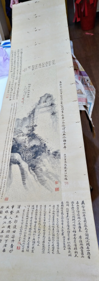

### 孔上公法書之淺見

傳線、心器

師承閱廣成大家

時代淬鍊難項背

提攜後進翰墨情

百年大展孔上公

多年以前，記得後學曾問業師霞翁（薛定之，臺灣書法、篆刻名家）：「達生公之書法如何？」老師答說：「達生公慈悲，給我們這些後生晚輩以書藝為生者留一口飯吃。」可見孔上公書法造詣在文化圈中享有盛名。唯生性淡泊，惜墨如金，作品多被朋友或弟子當成傳家至寶而不顯於市，因此相關法書資料極少，世人多不識；後學不揣淺陋，希冀以十數載浸淫書道之心得，以隻言片語來表達上公法書之妙。

總的來說，觀孔上公法書：字如其人，其人不愧聖裔，承詩禮傳家之典型，光耀祖庭，治學嚴謹，好學不厭，上庠化雨五十年，誨人不倦，為國育才，弟子率多學界一時俊彥，為人厚重，往來皆鴻儒。書藝如其人，嚴謹厚重，一絲不苟之風，令人欽慕。

上公書藝啟蒙極早，加以質地才情俱高，真行草咸善，尤擅篆體；融碑帖於一爐，能入古出古，無絲毫違和之感。後學試著以三個面向分析上公法書之功從何而來。首先為恆常臨池，佳作來自名師傳其書道，取法乎上，味魯公(顏真卿)之書風，兼包北碑之雄強，樂金文小篆，均源於數紀之功，所謂無間臨池之術。其次取材宏富，料想自幼在孔廟碑林之潛移默化，復職掌北溝故宮數載，名碑及名帖親睹拓本多矣，胸蘊藏碑帖，所謂翰不虛動，下筆有由。再其次閱歷廣泛，歷經學界、文化界及政界重職，皆化為書之底蘊，書名不脛而走。上公一生傳奇，欲效上公法書者，若非冰壺玉尺、博覽五車及飽經世故之輩，是學不來的！

於元月「儒者之風-孔德成先生百年紀念展」中，法書的部分佔有極重要的篇幅，共約六十餘幀；蓋就本次法書的來源、書體、文意及創作觀茲淺析如後：此次法書展的一大特色便是作品來源以贈書居多；有別現代書法名家展覽，率多自行感發而創作，而以贈友人、門生、同事及家人為多，所謂感惠徇知（感念有緣，酬答知己）。

贈友人如贈向湖先生-獻唐曾獲魏平樂亭矦印，莊靈-行書自作詩及醉後試玉紅樓筆寫未谷詩，莊慕陵-靜慕；贈後輩莊靈夏生夫婦-李白詩等；贈門生林文月教授-秋入海天七絕，黃啟方教授-萬馬無聲秋塞月、拳石膽瓶對聯、李白詩，張臨生館長-子雲漱玉對聯、李白詩、樂禮敦詩，張光裕教授-妙筆生花，潘美月教授-言忠信行篤敬，吳宏一教授-翠柏寒雲拱畫樓，葉國良教授-阮籍陳登對聯，洪國樑教授-杜牧詩，黃沛榮教授-嚴以責己等。贈同事如李毓善教授-書有事無對聯，尤宗周-劉皂詩，江逸子-犀伯魚父鼎、澹寧齋、柳宗元詩等；贈家人如孔德懋-風雨江山對聯，于曰江-劉長卿詩，吳府-慎言永祐對聯，孫輩-忠信篤敬等。

在所贈書體中，家人多以楷書為主，同事有楷、行、篆、金文；門生有行、篆、金文；友人有行、篆。不同對象以不同書體書寫，孔上公或有其深意吧！至於所寫形式如條幅、中堂、斗方甚至是扇面皆能游刃有餘，字體或大或小，運筆濃淡合度，乾枯溫潤兼而有之，可謂各種題材皆能駕馭，儼然書法大家歟；且文意契合所贈之人，而非僅錄古今佳句。如贈梅廣張臨生對聯：「子雲亭著輶軒語，漱玉泉流翰墨香」梅廣先生為語言學家，故以楊雄比之；臨生女史才情卓絕，以李清照喻之；又如「靜慕」二字，乃一日與臺靜農、莊慕陵同聚一堂，以慕陵所研製壺筆即興而書，除契當下情境且偶然欲書，成一時之佳作也。

書體部分不論篆書或楷書，俱見兼通之美。而兼通在心不厭精，手不忘熟，就孔上公之書藝或已心手運用精熟如贈潘美月教授之作品，又聞輔大李毓善教授憶上公不加思索、文不重複的情形下連寫二三十幅書法，足見渠兼通之能也。又以篆書為例，向為識者所賞，蓋以其通曉金文、善用其形而應用在小篆的創作上；復以楷書而論，書譜有言：「草不兼眞，殆於專謹；眞不通草，殊非翰劄」其楷書之渾厚靈動，得意於其行、草之擅，孫虔禮之言不誣也！

文意部分，蓋祖訓、格言、詩詞等，以書弘道、以書載道，料想上公應亦有此一考量。如祖訓：言忠信行篤敬、夫子之道忠恕而已矣、道千乘之國、三人行必有我師焉等；如格言：張載名句等；如詩詞：自作詩、太白詩、柳柳州詩、未谷詩等；其中上公舊詩創作以其豐厚的學養，亦有唐詩風韻。

而從創作觀來說，以古為新四字最能表達上公書之精髓。以顏體為例，顏體易入難出，東坡入顏出顏是一例，而孔上公亦能踵後，不遜翁同龢，如荷盡已無擎雨蓋作品。又篆書之作，融秦篆清篆之長，饒有特殊韻味。

此次「孔德成先生百年紀念展」為眾人戮力所成，自當希望能達到盡善盡美，而無白圭之玷、大醇小疵之情。後學初聞法書集時，見將風雨一盃酒此作放於卷首，該作於一九九三年成，為上公近晚年作，便知此集非以時間為排序。後學以為若要知曉一人之書法面貌應得從年輕看至老年方知；有志於進一步了解孔上公之書風者，當見法書集時，或可將孔上公之書作，依時期排序，或可見渠書風之轉變，添綴學術價值，豈不美哉！

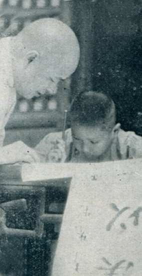

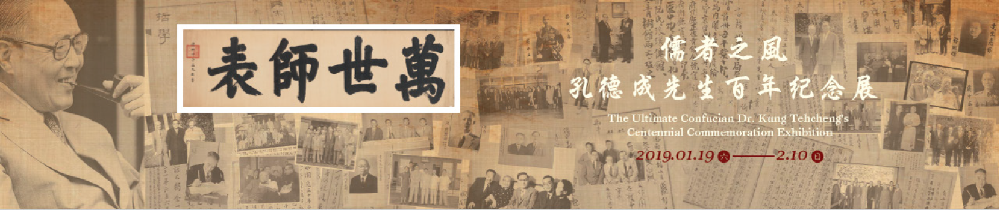

### 孔上公法書之我見

心韜、心儷

拜大展所賜

睹法書才情

胸含經詩豐

下筆如有神

二千五百年來天下第一家傳詩傳禮傳血脈，也傳胸中丘壑！

孔上公出生在烽火連天、內憂外患的民國初年，在執政者的禮遇上，明明可以江寬海闊、任俠灑脫！卻在國仇家恨中，只容執筆方寸；在聖裔的血脈上，明明可以擁抱三孔、己達達人！卻在砲聲隆隆中成為乘桴浮於海的游子，但是這些也造就了他鐵骨錚錚又渾厚穩重的性格。

上公自幼便習書藝，拜前清翰林院編修莊陔蘭先生為師，他由二王入手，後以顏體為主！由於家學淵源，能以孔廟碑林之潛移默化為基，加之攻讀　　不輟，又曾執掌北溝故宮，親睹名家風範，所以取材宏富，信手拈來無不神妙。

又因鍾情金石，大量鐘鼎銘文成為他的一手資料，日夕揣摩之下，不僅走筆間詮釋古意，更間以草法，所以能建立他熟中有生、天然寫意的書法風格，既有文人圓潤秀逸、瀟灑飛動的蕭散之氣，又有疏處可走馬、密處不透風，以紙為明堂，以筆墨為將相的廟堂之氣！

在浩如煙海的中國書論及書帖中，為何孔上公獨尊金石之文？不僅是因為金文凝鍊蒼樸、遒勁高古，更因為其大氣肅穆、渾厚穩重，有泰山之勢。另外，孔上公曾說自己文不讀三代以下，除了｢如用之則吾從先進｣的質勝文之外，大抵也是厭倦了三代以後的阿媚、尚利與紛擾吧！所以孔上公的作品常是求篆於金，通篇鬱勃入古，與史籀同進退。

細觀三代金文，或鐘鼎或石鼓，無不情感真摯，寫氣不寫形，以樸拙見趣，這和孔上公的為人處事如出一轍。孔上公字如其人：不論橫直，均有扛鼎之力，結字疏密開合天然變化，能見其學、見其志、見其道也見其權。

人生際遇也是影響孔上公書法的重要因素，年少的艱厄困頓、顛沛流離，反而造就了他能因字布勢之機：有時質樸率真，渾厚雄肆，大有不畏時世，一往無疑的氣魄；有時一筆之中具存方圓變化、剛柔相參，自有文人意態萬千的奇氣；有時嚴謹而不僵化，乍看似結構均勻、比例協調，一切照章行事，實則生意盎然，有自己獨特的語言魅力。

孔上公是大家心目中儒者形象的表率，一生棄政治而從教育文化。又因深受顏魯公忠貞骨耿言行的鎔鑄，他服膺心正則筆正，就如秦篆，雖然筆畫粗細一致，處處講究對稱、平行看似呆板，然而筆筆中鋒、藏入藏收，這就少了張牙五爪的衝突，又能於轉折處方圓並用，所以書體筆致遒健而富有彈性，多了許多人情味！

書法也講究墨分五彩，墨濃則行筆遲滯，少了靈動； 墨淡則不見氣韻，大傷神采；墨枯則顯得輕浮躁動，如脫韁之馬；墨濕則精神渙散，勢消力竭。觀孔上公之法書，無論篆楷行草，無不體勢婉轉、酣暢淋漓，可謂筆（線條）中有墨（墨色），墨中有筆，不但沉雄樸拙、渾厚華茲，又能孕尖於圓，善於蓄勢，筆墨相融，筋骨血肉具存。

孔上公與李炳南先生（雪廬老人）患難相交數十年，其書法也互有影響。二人皆從顏體出發，也在黨爭國亂民窮中肩負傳承，故常藉詩文往來唱和以澆胸中塊壘。二人的共通處皆是疏密收放自如、臨氣不臨形，能由樸拙中見其端正，且用筆圓熟精煉，能任運隨心，然而雪公之字更加內斂包容、圓融自在、火氣全消；上公則益為舒朗開闊，興之所致則髓體布勢，多了蕭散跌宕的文人胸懷，在與友人書信尺牘中，隨處可見大珠小珠落玉盤之趣。

書法是中華民族最精萃的藝術，其器質變化於心，形之於手，我們從孔上公贈與友人及弟子的作品中，無論是豎的中堂、條幅、對聯，橫的橫幅、橫披，抑或方形的斗方、鏡片，扇面的摺扇等，不僅熟通多體，且能針對人事時地而文意佳妙，何締德之有成？更是達生！後輩小子望塵莫及。

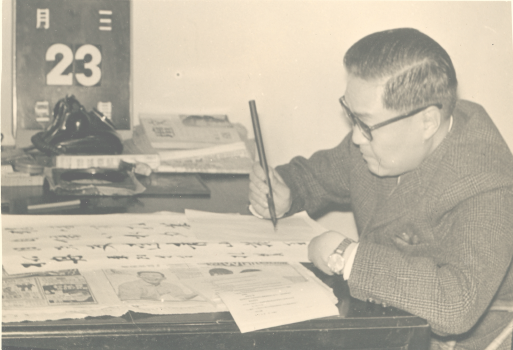

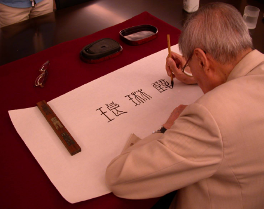
