# 第120期

## 社論

### 末代衍聖公—歷史轉折中的傳奇人物

本刊

孔家代有後人興

達生典範百年展

學會有幸助宣揚

文化春天道統興

孔德成先生，字玉汝，號達生，是孔子第七十七代嫡長孫，也是中國最後一代的衍聖公，還是首任的奉祀官。他不凡的出生，注定成為傳奇，在反孔的時代巨輪之下，他的一舉一動牽動著中華文化的續存；在動盪不安、內憂外患的時局中，他正好成為一部活生生的近代史。因此，適逢其百歲冥誕，本會有幸共襄盛舉，協辦其百年紀念活動，研究孔德成的生平，格外的具有意義與價值。

孔子歿後，哀公改其宅為廟，開啟尊崇孔氏之濫觴，一直到漢代「罷黜百家，獨尊儒術」，奠定了孔子的地位，歷朝歷代就開始加封孔氏子孫，自漢到宋，其封號一直變化，直到宋仁宗封孔子的四十六代孫孔宗願為「衍聖公」，自此傳了三十二代，而孔德成正是這最後一代的衍聖公，象徵著民族文化的血統與道統。

封孔子的後代為公爵，並非為了賦予特權，乃是為了表彰孔子及其思想對天下人的重要性。夫子周遊列國，作育英才，刪訂六經，有系統地整理民族文化遺產，又培養了許多能傳述經典的弟子，集文化之大成，留給後人取之不盡的財富。無論是仁與孝弟的思想、政治上的王霸之別，或者發揚人文之精神，注重人事而非鬼神，又或者開平民教育之先河，有教無類、因材施教都是孔子的新穎創舉；諸多的作法與思想都具有相當的超越性，領先當時的時代，即使到今天也未曾落伍。孔德成亦云：孔子很多的思想放在今日都不會過時，如果有人批評儒家是社會進步的阻礙，那表示他沒有真正懂過儒家。

由於孔子對文化的貢獻，這般殊榮加於孔氏後裔，綿延了二千多年，有著天下第一家的名號，是人類歷史上最古老的貴族。然而與過去的聖裔、衍聖公們大大不同的是，孔德成所處的時代，正面臨著中國歷史上最大的轉折，那是一個民族自信崩解，質疑自我文化，外國勢力入侵，內部紛爭不息的年代。歷經甲午戰爭、八國聯軍以及辛亥革命，這時候的中國政局十分不穩定，一切都處於動盪不安的狀態、思想也相當混亂。在孔德成出生的前一年，一九一九年，爆發了五四運動，孔子及儒家的地位遭受到空前的挑戰。末代的衍聖公，與過去的聖裔大不相同，孔氏的標籤反而成為包袱，備受考驗。

所幸的是天不喪斯文，讓孔家在這個時刻出人才，孔德成先生站在反傳統時代的鋒頭浪尖上，背負孔家的期許與社會的壓力，一面傳承道統，一面走入時代，他以高潔的品格，不世的成就捍衛了孔家的聲望。自幼在家受業的孔德成，追隨明師莊陔蘭、呂今山、王毓華等，博學中西內涵，除了經典古籍，亦包含一般的學校知識，開啟他能連結古今的視野。

在其十五歲時，南京國民政府以世襲公爵不合民主憲政為由，撤銷衍聖公爵位，改為世襲的大成至聖先師奉祀官。當時赴南京就任第一次受訪的少年奉祀官，談吐舉止風雅，外貌年輕卻老成，孔府上下大小事務皆能熟知，對於時事也頗有一番見解。這次露面展現的是大家風範，令時人刮目相看，這位孔家的主人公反倒成為媒體寵兒，是爭相訪問的對象。

北伐統一後，開啟中國短暫的十年榮景，一九三七年，七七事變後，中國抗日戰爭全面爆發，這是第二個歷史轉折，又是中華文化的存亡關頭。蔣委員長派人護送孔德成撤離曲阜至重慶後方，避免成為日寇的傀儡；許多當時的菁英聚集於此，一時間人文薈萃。雖飽受戰火之苦，官府亦曾遭砲彈夷平兩次，期間卻能不忘用功讀書，更與丁惟汾、王獻唐、屈萬里等師友切磋琢磨，磨難下反倒更上一層樓，奠定了日後做學問的豐厚基礎。

抗日戰爭甫結束不久，又發生了國共內戰，此戰果對於中華文化的延續與道統的遷移，產生了重大的影響。孔德成隨著中華民國政府撥遷至臺，落地生根，在文化、外交、政務等領域上貢獻良多。在擔任兩院聯管處主任委員時，打下古物研究的基礎，為後來的故宮博物院留下楷模。並以教授生徒為己任，在臺大及臺灣各大學任教，一直至終老，培養諸多莘莘學子分出訪日、韓、越南及歐洲各國，協助我國突破外交困境，備受日韓禮敬，也廣得國際認可。亦曾任國民大會代表、考試院院長、總統府資政等重要官職。

隨時代流轉，曾為貴族卻能安於平淡，遭逢困局又能突破重圍，守住衍聖公的職責，即繁衍聖人道統，是血脈與法脈的傳承。身為末代的衍聖公，在時代的重大衝擊中，孔德成以個人傑出的形象與成就，保住了孔家的立足點。同時，因其德才與學術地位，周遊列國推展文化等無法抹滅的功績，使孔子嫡系的名義不容置喙，維繫了血統，也彰明了正統。已故的前奉祀官府主任秘書李炳南老先生曾言，孔家在文化在，孔家亡文化亡。時至今日，對岸興起一陣尊孔熱潮，欲大興文化，在此環境下文壇一時猶如武林，各家爭鳴，孔子曾說，名不正則言不順，諸事將難以推行，若無一正統代表集結眾人之力，文化推展亦將窒礙難行。孔德成在這樣紛亂的時代裡成為標竿，庇蔭其後人，成為兩岸文化界的共通符號，足以號令天下，暢行無阻，有利於文化的復興及弘揚。

這一段歷史曲折離奇，思想紛亂無序，文化差點斷根；這一遭人生，高潮迭起，波瀾壯闊，在不平凡中盡顯平凡，留下難以磨滅的足跡。孔德成先生用生命寫下的傳奇，可謂前無古人，後無來者。一時因緣終須盡，延續尤待後來人，期待在紀念活動的回顧與大家的共同研學中，能讓這些真相與記憶不被忘失，永遠的保存下去。

## 佛學覽幽

### 菩薩清淨的行持
       —華嚴經淨行品（三十六）

菩薩清淨的行持

—華嚴經淨行品（三十六）

*編輯部*

華開令人悅

如佛具眾相

能攝眾生意

引入學佛智

丙二、指事顯因答其徵因

丁一、總徵

丁二、別顯

戊六、乞食道行時願(五十五願)

己二、所睹事境(十九願)

己二、所睹事境 花開

經文：

若見華開，當願眾生，神通等法，如華開敷。

在所睹事境中有十九個願，這些願都是借物引境，希望行者能善用其心，見其所睹事境，能對境界有所體悟，藉著境界成就自己，行者以此思修。

東吳支謙的版本是：「樹華繁熾，當願眾生，三十二相，諸好滿具。」六十華嚴的經文是：「見樹好華，當願眾生，開竟如華，相好滿具。」會性法師開示，在第六十五願中有提到華，此處也提到樹華，二者有何不同？第六十五願中的華是泛指一切的華，也包含了在第六十六願中的樹華，第六十六願中的樹華是特指木本的華，樹上開的華必然會結果，第六十五願的華開，如同玫瑰、康乃馨開花但不結果實，或結成了果實卻無法使人受用的，而六十六願中的樹華，它的果實是可以讓人受用的。

會性法師說，第六十五願的華是比喻為因華，因地的華，所以講到神通，就是證果之前會有神通等因，像修學禪定引發神通地。六十六願的華是結果，從因地中證得果位。所以這兩種華有所不同。

若從另一面相來看，第六十五願的華跟第六十六願的華，皆是後得位，可說是佛在後得位時彰顯的神通，在根本位破煩惱障、破所知障時，後得位中佛的神足通、佛的天眼通和佛的天耳通，佛的神足通可以從這裡消失，從那裡出現，佛要度化眾生，可以從極樂世界消失，剎那間在娑婆世界出現，這是指後得位的神通。若按照會性法師的講法，第六十五願是講因地，第六十六願是講果地，華有分為能結果的華跟不能結果的華，若「華」都是指後得位時，可以說是佛後得位果相上的神通(佛的神足通、天眼通、天耳通、他心通、宿命通)。

第六十六願，此處特別講花開出來，不只是那些神變的開展，還講到三十二相的開展，所以看到花，我們可以想到這些神通的開展，代表度化眾生的妙用。神通的開展有幾種功用呢？比如說，它可以是度化眾生的能力、降魔的能力、推展教法的能力，聖者運用神通是不會有過患的，凡夫不能夠發菩提心、不能夠證果、不能夠證得空性的智慧，若引發神通是有過患的，聖者所引發的神通，反而是他度眾生的方便。第六十六願更特別的是在相好這一分，以花的開展來表示相好。

在路上行走，見到樹上開滿了艷麗芬芳的花時，感到美妙無比，心中聯想到佛相好的殊勝，當願眾生的相貌都能夠如佛，具足完美無瑕的三十二相。會性法師說，見到路上花開，有花香、擁有美麗的外表，又能結成果實，希望眾生能夠得到相好莊嚴，就像樹上開花般的殊勝莊嚴，將來會結成果實，具備佛的三十二相。

會性法師說，花開後結果意指三十二相。若從另一個面相說，花開時即是三十二相的開展，直接讓人感到親切，佛的根本位是破煩惱障與所知障，佛的後得位就是具眾相好(顯現神通)，所以這兩願也可以指佛的後得位，當我們看到花的時候，果像根本位，花像後得位，具足了各類的神通和相好，讓眾生覺得很親切、很喜歡，嚮往跟著他去修行，不戀眷國家的王位，那就是相好的功德。

若依著經文來觀修，在願所依，願依靠在菩薩身上，及若見樹華這件事上，願所為境是能發願的菩薩，所願的是眾生。願境成益有四個觀修，第一個隨喜，若眾生都能眾相如華，具三十二相，那該有多好。第二個發願，我但願眾生都能得到眾相如華，具三十二相。第三個承擔，我能幫助眾生得到眾相如華，具三十二相。第四個我祈求三寶加被，讓我有能力幫助眾生得到眾相如華，具三十二相。

以這四面相的觀修，就能把每個願作深入的觀察，從這個願當中，直接成為成佛的善根和順緣，破除成佛的違緣，跟眾生結到殊勝的善緣，就從日用平常開始做起，修行就在日用平常中，看到花就可以有這麼多美好的聯想力。

接著，就經文的字句作解釋及分析，首先提到樹，會性法師說，開花後會結果的樹像桃樹、李樹、蘋果樹等。南亭老和尚說，這裡的樹是指木本類的，接著舉到樹的相好，如楷樹，取其身正直。如松樹，取其高節。

華，有十義，取自《華嚴經》書卷三，含實義、光淨義、微妙義、適悅義、引果義、端正義、無染義、巧成義、芬馥義、開敷義，華有十義的觀修法。舉其中兩條來說，如適悅義，聽到「華」大家都喜歡，春暖花開，顯現的行相美好，見之令人歡喜。

再舉引果義，華會引果，菩薩六度因花結出正覺的佛果。如蓮花無染，代表修行是以不染著世間的名利來修學天爵，因地的修學當中必須要講究無染。

再舉例其他的花，眾花相好，例如菊花有君子義，梅花象徵著堅貞，不經一番寒徹骨，哪得梅花撲鼻香。桃花是「三十年來尋劍客，幾回落葉又抽枝，自從一見桃花後，直至如今更不疑。」這首詩偈是唐代的靈雲志勤禪師所寫的悟道詩，描述他因桃花而悟道的體會。其他諸如歲寒三友松竹梅，梅蘭菊竹四君子，上述之花樹，既可以親近亦可取法。

南亭老和尚說，花開的那一分有說十通、十定、十忍，這些都是指花開的那一分，說通成就、定成就、忍成就，可以把忍擴張到極限，可以把通擴張到極限，可以把定擴張到極限，這叫花開。所以經上舉出十通、十定、十忍，十通說是所有通的總相，十定說是所有定的總相，十忍說是所有忍的總相，忍的差別相無量無邊，總相為十。

十通中，最重要的是有能力去通達最殊勝的義理，去破煩惱障跟所知障，這是整個十通中最重要的義涵。雪公老師說，道通才是所有神通的根本，必須要抓住這個精神說。第二、道通之後，回過頭來在後得位中學習到很多神通，其中的善分別語言通很重要，孔子是六十而耳順，跟別人談話的時候，由對方的言語立刻知道他的心意，在根本位當中，有辦法通達甚深的法義去破二障，在後得位中有能力在語言中去分別他人的語言，從中了解他人的心意，這是所有十神通中最核心的部分，其他的通都是從這兩通去開展。

十定，最重要的定是能在甚深空性上安住，其三昧在後得位中可以通達所有的佛國土，能夠通達眾生的差別相，上求下化，前者是根本位，後者是後得位，在定當中能夠前往十方諸佛國土，能夠利樂一切眾生，這是十定中最精華的部分。

十忍，通往空性的三次第為音響忍、柔順忍、無生法忍，十忍中的這三忍，包括對幻化當中的安住，在根本位上和後得位上的忍，是十忍的核心處。

會性法師於課堂上講這些詩都是信手拈來，其實是受過嚴格的訓練，開悟的人他怎麼講都對，沒開悟的怎麼講都錯。弘一大師的遺偈：華枝春滿，天心月圓。一切都是圓滿的，何謂圓滿？人生在世十之八九皆不如意，但你心意圓滿的時候，事相也圓滿了。佛在度眾生的時候，其實並未圓滿，佛布施但眾生貧窮，佛持戒但眾生造惡業，佛忍辱成就但眾生仍在瞋恨，佛精進但眾生懈怠，佛禪定但眾生散亂，佛智慧但眾生愚癡，既然如此不圓滿，如何能成佛？其實是眾生的那一分不圓滿，可是佛的心意是圓滿的，這是華枝春滿，天心月圓。

接著講三十二相，總說應身佛，佛有三身：法身、報身、應化身，報身佛相好無量無邊，二聖及凡夫只能見到應身佛，如本師釋迦牟尼佛，應身佛相好莊嚴具三十二，每一相又具八十隨形好。

四十八願裡面說：凡生到我國土，都能夠具足三十二大人相。這也是佛的願力，生到極樂世界時就顯現三十二相，意指生到極樂世界的人都是有福之人，三十二相還有八十種好來莊嚴，所以各個不同，例如，比較富有的國家裡，大家都是印堂發亮，下巴肥圓，可是仍然可以分清楚某甲、某乙的差別，粗中有細。

觀佛三十二相是非常重要的觀法，舉例來說，腳有像法輪一樣的千輻輪，意指在因地中，所行都是正道，而且腳行走之處，即是法流通之處，所以感應的是腳底有千輻輪。比如玄奘法師，西行求法以雙腳，東歸中土弘傳正法以雙足，足行都是為了佛法而行。

又如走路穩重的人，代表他在因地中很莊重的走路。就像打佛七，大家在繞佛的時候，實在讓人產生隨喜，因為那個走路的貴相都出來，一個人要如何帶有貴氣？就是坐有坐相、站有站相、走路有走路的樣子，將來要成為別人的表率，必須從日用平常的威儀開始做起。佛在訓練自己時，走路不會走歪、走Ｓ型或輕佻的走，而是穩重的走路，光一個穩重的走就可以震攝許多人，所以在叢林裡面走路叫虎形牛步，此人站出來，可以鎮得住上千人。

認真去觀察每一相，在因地時必須結合什麼因，果上才有如此之相。總之福報是要被練出來的，除了對佛法勝解以外，還要練威儀。（下期待續）

### 大乘百法明門論簡說（二十八）拾肆、心所有法—煩惱（四）

*戒慧講述‧淨本整理*

三細六粗惑業苦

人生真相有誰知

學習正法待熱情

破障生慧須信念

經文：

四、煩惱六者：一、貪。二、瞋。三、慢。四、無明。五、疑。六、不正見。

四、無明

無明又稱為癡，《百法直解》云：「於諸理事迷闇為性，能障無癡善根，一切雜染所依為業。」無明是一切煩惱的根源，依中觀宗無明就是執著法有自體性，阿羅漢已能破除無明，但《百法直解》對於無明的定義較寬，若於諸理事迷闇為無明（唯識宗定義）。阿羅漢雖已斷煩惱了生死，對於八萬大劫以外之事仍有所不知，則依然具有無明（煩惱障為枝末無明，所知障為根本無明），所以唯識宗與中觀宗的看法不同，今以三細六粗說明何謂無明。

三細六粗是解釋無明生起的原委，唯識宗認為，三細六粗是說明有情如何生起心外有法的認知，進而產生執著、生起煩惱、造業受苦的過程。三細為：業相、轉相、現相；六粗為：智相、相續相、執取相、計名字相、起業相、業繫苦相。

「業相」是指一念不覺的生起，此不覺之念極為微細，就如人方入睡開始作夢，睡覺是無明的比喻，作夢是業相的比喻，夢是依睡而來，因無明所以生業相，依此微細業相，進而轉起能見心外有法的能見相，也稱「轉相」，比喻為夢心，夢心是因為作夢而來；依此能見相，分別各種所見相，誤認心外有法，使種種心外之法現前，稱為「現相」，也稱為境界相，比喻為夢境，夢境因為夢心而有。以上是三細的產生，唯識宗將無明分為四十二品，自十住位菩薩開始直至妙覺，歷四十二階位全部斷除，是為無明分分破，法身分分顯。三細是根本無明所生的行相，妄見心外有法，唯識宗歸類為所知障，是法我執；六粗又稱枝末無明，唯識宗歸類為煩惱障，是人我執。

六種粗相皆是源於三細相，第一個是「智相」，對於心外諸法的現相，妄生種種分別，有樂境與苦境在心外呈現，依於所樂的境界產生快樂的感受，苦的境界產生痛苦的感受，如此相續不斷，稱為「相續相」；在相續相當中產生堅固的執著，稱為「執取相」，貪愛快樂，遠離痛苦；對於心外諸法在執著中計畫思量、賦予名言稱為「計名字相」，依著名言安立與堅固的執著，執樂與苦為實有而有愛憎，依愛憎而發動身口的造作，造種種業，認為善業能得未來的善業而造善業，善業成為未來受樂之因，惡業成為後來受苦之因，稱為「起業相」；業因招感果報，在三界中不斷輪轉，稱為「業繫苦相」。善業帶來的快樂與惡業帶來的痛苦，都是被輪迴所繫縛。總而言之，起惑（業相、轉相、現相、智相、相續相、執取相、計名字相）、造業（起業相）、受苦（業繫苦相），就是無明所生的作用，皆因不了解諸法唯心所現，妄認心外有法而產生。

依中觀宗宗義，不認為諸法唯心所現，承認心外有法，但皆無自性。三細六粗就是說明有情如何產生諸法有自體性的誤認，因而造業受苦。三細中的業相，是所知障的生起處，依著業相產生了轉相，轉相就是所知障的能顯現，現相就是所顯現，二者將法顯現為實有；六粗屬於煩惱障，人我執與法我執皆是煩惱障的範疇，因為人法二執都是誤以為法有自體性，只不過一個是在人上的執著，一個是在法上的執著，而人也是法（法的定義為任持自性，軌生物解，萬事萬物皆可稱作法），所以二者的生起並無不同，破除法也相同。智相就是誤認法為實有、有自體性，進而產生執著與煩惱，證果的羅漢或登地的菩薩，入世時雖然法也顯現為實有（仍有所知障），但因為在空性定中曾見法無自性的真相，所以入世中不會產生執著與煩惱。智相所生的執著不斷相續，稱為相續相；相續之中，我愛的、對我有利的產生執取，稱為執取相；對於諸法在執取中計畫思量，賦予種種名言，稱為計名字相，即是對有利我的與有害我的產生殊勝的認知，因此而思維籌謀並付諸行動，得到我想要的，遠離我不想要的，此即造作身口意三業，謂之起業相；由於造業而為業所繫縛，謂之業繫苦相。

了解唯識與中觀的宗義，可知《百法直解》所云：「於諸理事迷闇為性」，其迷闇就是唯識宗的誤認心外有法，以及法的前後相續中誤以為常恆不變，或一滅永滅，或者中觀宗的誤認法有自體性。也因此無明的對治必須要有宗派見的了解，所謂依教修觀，若對教理不明，也無從修觀開慧。

五、疑

《百法直解》云：「疑者，於諸諦理猶豫為性。能障不疑及諸善品為業。」諦理就是真實不虛的真理，對於能夠解脫的真理，猶豫並引向不相信，才是此處的疑心所作用，至於學習佛法時對於教理尚未通達有所疑問，或稱疑情，並不屬於此處的根本煩惱。

諦理大分為出世與入世，出世需要通達空性，入世需要明暸因果，如此才能正確地修行，真正離苦得樂。通達空性的般若智慧，要在宗派見上作正確地抉擇；對於世間的善惡因果報應，也需要透過經典上的聖言量作為我們觀察與修行的指南。有疑則障礙不疑，前述善心所並無不疑心所，因為依《成唯識論》，不疑的內涵包括了信、正勝解、正慧，所以無需另立。

想要對治疑，必須親近善知識、好學、多問，儒家經典中的博學、審問、慎思、明辨、篤行，都是很好的方法。

六、不正見

《百法直解》云：「不正見者，於諸諦理顛倒推求，染慧為性。能障善見，招苦為業。」於諸諦理顛倒推求，就是對真理有錯解，特別是外道的宗派見，因為錯解所以智慧受到染汙，如此之人雖有善行或多智禪定現前，終究無法解脫。不正見的種類可以大分為五，即前述五利使：身見、邊見、見取見、戒禁取見、邪見。此再說明四種凡夫容易產生的不正見，稱為凡夫四倒，四倒皆是對著五蘊所生。

凡夫對著色蘊，也就是自己的身體和所居的世界，認為此依正二報清淨，卻不知充滿不淨，所謂種子不淨、住處不淨、自體不淨、外相不淨、究竟不淨，此即淨倒；身雖然不淨，對著受蘊，世間總有各種歡樂可享吧？不知本質為苦，誤以為樂，稱為樂倒；既然色蘊不淨、受蘊為苦，對著想蘊及行蘊，以為至少心是我能夠主宰的吧？但其實即便心識也是妄想遷流無常，被過去已滅的業所攝持，對境而生，不由自主，誤以為常，稱為常倒；最後對著識蘊，雖然心識無常，但總有真實的我存在吧？我的真實性也不可得，依唯識宗不過是第七識執著第八識的見分以為我，或依中觀宗，「我」也無一絲毫自體性，不過是依作用而安立的名言而已，以為有我，是為我倒。此常樂我淨四倒，為凡夫的四種不正見；小乘聖者通達五蘊為不淨、苦、無常、無我，但不知涅槃的境界為常、樂、我、淨，此為小乘修行人之四倒，唯有大乘聖者才能破此八倒，於諸諦理不再有顛倒推求的不正見產生。

涅槃為何清淨、真樂、真常、有我？因為煩惱不生所以清淨；惑業已除，苦因苦果已滅所以真樂；法身恆常不是無常；對此法身安立為我，如此前後相續之我沒有不同，故稱有我。以上六種根本煩惱說明已畢。（下期待續）

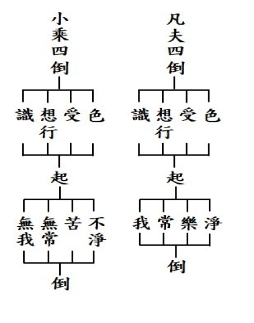

### 佛學概要十四講表簡說（二十二）第三講表

*戒慧講述‧宏法、淨昌整理*

萬法是造作果

無心何來造作

即使一法呈現

觀待心識而現

(戊)神權與自權

一般以為學佛是尚神權，本表說明一般世間才是尚神權，而學佛者是尚自權。「權」就是做主，這邊提出「天帝、神鬼、偽教」，所謂的神權是以它們為主，來主導我們的命運；「自權」就是自己做主，自己可以改變自己的命運。

一般認為佛法就是神權主義，和世間的神仙沒有分別，到佛寺去拜佛和世間拜神廟都差不多。其實佛法是尚自權，但為什麼要到寺廟去求福、求懺悔呢？這些觀念後文慢慢分曉。

◎他尚神權

所尚的神權就是「天帝、神鬼、偽教」。他尚神權就是一種迷信崇拜，一切以「天帝、神鬼、神仙」來決定他的命運。

●天帝（造物主）

「天帝」就是所謂的造物主，以為一切都是上帝所造，這是不圓滿的。如果以上帝為開頭，創造了一切的萬物，會產生什麼樣的邏輯問題？現在以量來決定，如果正確我們就信他，錯就不要學。如果上帝就是開端，就表示有個不用因就可以自己結的果，上帝之生是無因而生。無因而生可以在上帝成立，那世間人就可以依此類推，農夫不用種田也可以有結果，世間人不用努力也可以成功。無因生有太多邏輯上的矛盾，所以天帝造物主的觀念是不對的。

否定造物主，是否定他是造物者，而我們是被他創造的，換句話說我們的命運是由他決定。但問題是，他也不是造物者，物之成各有其因，我們的命運不是由他決定，是由業決定，亦即所謂的不做不有、做已不失以及增長廣大。

●神鬼（司賞罰）

【神鬼】是司賞罰，世間上會有很多遭遇，有賞有罰。尚神權者會認定原來是有鬼神，所以這些賞罰才會降臨在我們身上，但其實賞罰只不過是回應我們所造的善惡業。

就像世間一樣，作惡的人被關到監牢，造善的得到獎勵，看起來賞罰由他（政府），可是如果沒有自己的罪和善，哪有外在的賞罰？可是有人或許不同意，現見很多造善的人不是照樣被處罰嗎？好像是由別人做主。所以才會說甚深緣起是難相信的，現在所遭遇的惡報，是重報輕受。

●偽教（成神仙）

信神仙、求神仙就是外道，外道也有很多的修學法，都是偽教，如《述記》所說，藉符錄齋醮就是設壇祈福，或者藉著乩童扶鸞，像碟仙感通神仙消災解厄，尤其是改變命運去喝符水、拜碟仙、乩童扶鸞，大家相信得不得了！買樂透終於中獎，但是求佛菩薩買樂透卻沒中。能中獎也是回應過去的善業，就算他中獎，後面跟鬼神扯不完，準備倒大楣。佛不需要跟信徒做這種巴結討好。外道的修學，最終成就也只不過是神仙，就算成神仙了也是做不了主，隨業繫縛在六道，不像佛是唯我獨尊。

◎佛尚自權

「他尚神權」全部都是在心外求法，靠天帝鬼神，但是學佛其實是「尚自權」，也就是從自己的內心來修學，內涵是「萬法心造、自轉因果、唯我獨尊」，而萬法心造對造物主，自轉因果對司賞罰，唯我獨尊對成神仙，可見其次第性是完整，而且前後關聯清楚。依神權來修學成為神仙以為長生不老，事實上為業所繫縛在三界，而不是能夠解脫三界和輪迴，得到涅槃的唯我獨尊。

●萬法心造

萬法（苦樂法）全部是由心所造，所以心是一個造作者。述記云：「萬法唯心造」出自《華嚴經》「應觀法界性，一切唯心造」，唯識宗定義「萬法唯心造」就是「萬法唯識」，中觀宗則認為「苦樂的造作者是心」。解法儘管不同，但都指向苦樂是「唯心所造」，不是上帝所造。

●自轉因果

前述說賞罰由神鬼而來，但其實這只是因果的一個展現，賞罰都是由自己造善、造惡而來，不是離開我自作的因之外，別有他可以成立賞罰的果。
或有人
**問：** 他尚神權或佛尚自權我都同意，可是儒家不是也祭天又祭地嗎？天就是天帝？所謂的祭山川，也就是祭神鬼？儒家是從不得罪與求加被的角度去祭祀。孔子說「獲罪于天無所禱也」的概念是說，我的祭祀如果是以造罪來求是沒有用的。「丘之禱久矣」如果不是行善來禱是沒有用的，而如果是行善來禱那我每天都在禱。換言之，我不會成為鬼神呵斥的對象，反而是鬼神加被的對象。且是以善業成為鬼神加被的對象。所以還是自權的概念。

為何他以惡業來求鬼神的加被也加被不到？試問正直有見解的鬼神，他敢加被造惡的人嗎？壞人跟你借刀子要去殺人，你是不敢借的，這跟求神的道理一樣。
進一步
**問：** 如何解釋造惡求鬼神加被，反而得福？他造惡業是招來一堆惡鬼，刀頭舐蜜後倒楣正在開始，所以對他來講其實是大禍。招一批惡鬼來是大禍臨頭。

懂得這個概念才懂得什麼是自權，自權是指命運操縱在我的手裏，可是不妨礙我求加被。求加被是希望你幫助我行善，不要障礙我。我求加被，是我以作善的立場去感應，並不是諂媚鬼神邀福。

●唯我獨尊

唯我獨尊是指佛典記載釋迦牟尼佛誕生的時候走七步，一手指天一手指地，說：「天上天下唯我獨尊。」依《述記》所述，此時的「我」與世間的「我」行相、內涵已不相同，此時的「我」是指已經修學般若，證得我無自性，以空性的智慧破煩惱障和所知障，後得位的名言說是我，而不是有一個自體性的我，如果是有自體性的「我」，仍是我執的範疇。（下期待續）

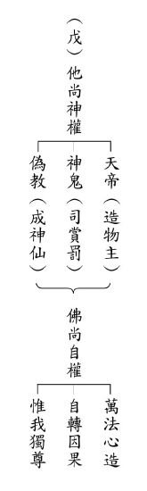

### 人生大事—不能忽略的事實 助念生西觀念作法研究（八）

戒慧講述

臨終障礙多

平常積經驗

護持往生者

淨土一尊佛

前言：有一個秘密想要在這裏說一說，我們這個團體蓮友多半是家中助念因緣而來的。以下舉幾個例子：

某位學長的父親，依著蓮友引薦善知識到醫院去探望老人家。那時候家屬對佛法完全沒有概念，善知識帶了助念生西須知小冊子去，而且留冊子下來，也跟老人家私下談了一些話，善巧的消除老人家內心最隱微的牽掛。老人家早年因為生計，需要去捕魚養家，臨命終時他對這件事情很牽掛，覺得自己人生最大的遺憾，就是捕魚養家。儘管因為種種無奈，十四歲就是一家六口的生活支柱，沒有其他技能，只能捕魚到市場上去賣。善知識善巧的跟老人家做了一些開示，讓老人家很歡喜地接受家人為他做放生的法行，作為助懺，也依此善念得到臨終團體的助念，而有殊勝瑞相。

又某位學長因為是學工科的，當時偶爾零星的聽到佛法，總對於母親講這些神通不以為然。母親後來很善巧的請老師來家裡講助念須知，又因為後來遇到爺爺高齡往生，剛開始感覺很害怕，很難過，沒多久有一群人來家裡面，從白天念到晚上半夜，第二天還要上班，有大部分都是年輕人，甚至還有在讀書的學長，所以從害怕、徬徨到後面安定下來，內心十分感激。

後來每個七，善知識都來家裡，把為什麼要助念，佛法是什麼，我們要怎麼去發心，西方極樂世界是什麼，講得很清楚。那時候才覺得佛法跟過去所想像的完全不一樣，慢慢的把觀念改變。得到他人的幫助，希望以後也可以為別人出一點心力。由得到助念作出發點，練習發心為別人而充實自己而影響整個人生。

助念團之助念千萬不可作表面文章，助念排班公式化，看起來有模有樣，但是效果未必好。助念前多跟家人溝通，把家人都帶入佛法的氣氛中，以助念因緣使家人有學佛的增上緣。

家中遇到喪事，同事、朋友頂多表面慰問幾句，但看到年輕人若肯在半夜犧牲睡眠來助念，易讓家人覺得震撼，作為學佛殊勝因緣。

第五段：凡是蓮友加入念佛班，都有名冊。班員的直接眷屬相信佛法，有了事我們就去助念；若有不信的，就不用說了。這是助念的範圍。

基於現實狀況常常遇到，蓮友彼此多年的交情，但與蓮友的眷屬卻很少連結，若蓮友與家屬都有助念共識，團體一定會傾力幫忙。

若蓮友本身助念經驗較少，或尚未學習正確助念方式，導致亡者從醫院返家時，可能已經斷氣或即將斷氣，此時安排的第一班蓮友，就要有適當的分工，成員中要能有中氣十足，聲音宏亮帶領大家念佛者，讓大眾在佛號聲中安定下來，容易就緒。其次，最好另有一人懂得助念的注意事項，在旁邊請家屬配合，例如蓋好陀羅尼經被後，家屬就不要再跑來跑去，作一些不急之務，先排班念佛，其他的事助念完以後再連絡。如果一定要聯絡說話，就請去旁邊房間，不要影響助念，否則旁邊一堆打閒岔的事，又不能把佛號停下來不念。但是真正該做的事又沒人去做，例如要有人定時去亡者耳邊，提醒念佛求生西方等等，有時家屬來提醒效果更好，最重要的是，要能知道亡者可能有哪些事會放不下，適時開導排除臨終障礙。

第六段：去助念，應準備的助念袋內容物是—三尺大的佛像、臥香爐、二隻引磬、二隻蠟燭、香（香勿間斷）、一杯水及碗，這些我們帶去，不論他家有無。

佛像擺的位置，以病人能看到的為原則，不一定要釘上、掛上，用擺的亦可。也不一定分東西南北，因各人房子不一樣，十方原來不分東西南北的，有佛像就是西方。六字、四字按照規矩念，先念「南無西方極樂世界大慈大悲阿彌陀佛」，再由六字轉四字，用二隻引磬互相配合。

香燭帶去用完可用對方的，若沒有，不點也可以。進門後，班長先裝佛像，點上燭及香，坐位安排好，就開始念。坐位安定好很重要，這可安病人的心，免得病人跟著我們東張西望。病人如果不甚危急，可從「南無西方極樂世界大慈大悲阿彌陀佛」開始念；若危急，從六字念；再更危急，直接念四字即可。一聲阿彌陀佛，三乘皆包括，重要在能引起病人的佛號，就功德無量了。

本段重點在說明助念袋與佛堂擺設應準備之東西。

佛像站著接引為佳，平常不宜躺著看佛像，但臨命終時，因佛慈悲故可躺著看佛像。

懸掛佛像就是色塵出現，引往生者眼根注意，屬於眼根念佛。助念團一到現場，要先把氣氛莊嚴起來。安置佛像以及張貼「念佛中請肅靜」等告示，環境莊嚴之後就坐下來安定念佛，有助於安病人的心。此時如果家屬、蓮友說話要離開現場，不要讓臨終已經很煩躁的病人分心。

不論眾生根機如何，三乘都是阿彌陀佛要接引的對象，環境和氣氛的營造，都是為了引起病人的佛號。

壇場布置、助念與回向儀軌，則無有定法，全部要觀待亡者跟蓮友家屬的狀況條件決定，因緣如果都能俱足，當然壇場布置愈莊嚴愈好，儀軌愈完整愈好，可是如果因緣不足，就只要掌握核心，助念能順利、不被干擾就好。例如某些臨終的體弱人，耳根聽到引磬聲會覺得刺耳不舒服，可以不要用引磬；或者家屬平時沒有接觸佛法，迴向就只要清楚引導家屬的孝思，有一些儀軌可簡化，但這些都要有能觀察亡者及家屬的人，或者平時已有接觸了解的人，方能做比較善巧的引導。很多時候已經被冗長儀軌，磨到善根都不見了，就算他現在一切都聽你的，事情過後可能變成心中隱微的障礙。

第七段：助念者，尚須注意，凡進門前，必須先找主人，見了主人後才可以進房子，以免東西遺失被嫌疑。主人領我們上那去，我們才進那裡。不助念時在一旁不做事，助念時全心在佛號上。助念中，閒雜人不進來擾亂，可以遠看；不可以說要進來探病，說些動情感的話與行為，要知病人一動情就完了。助念時要尊重助念團的規則。只要是在助念，別人都不能去探病，打閒岔，以免動情愛失去正念。亦不能讓病人聽到其他聲音，哭聲更不可以。如此也許會有人發生誤會，認為禁止太多，助念者要忍受這些誤會。病人臨終前若想喝水或吃東西，可以拿給他吃，但不能談話，只能口念佛號拿到前面餵他吃，若說了話，病人的心裡有別的聲音，就不能一心了。

人情世故是很重要的。或有人認為助念就單純去助念，為什麼會牽扯到人情世故？不然！我們到喪家去助念，必須要先找到主人，我們到一個地方助念，對家屬未必熟悉，特別是大部分的因緣，蓮友跟家屬通常是不太熟悉的。一個陌生人到人家的家裡，要懂得避嫌。所以一開始進門的時候，必得要先找到主人，才不會亂闖造成人家的困擾。除了避免瓜田李下，也是對家屬的尊重。

而主人領我們到哪裡我們就只能到哪裡，比如說，主人只開放客廳，我們蓮友很累了，能不能跑到臥房去睡覺？在主人沒有做出的安排的時候，我們是不可以貿然跑到其他房間去的。

接著就是助念的時候會遇到的狀況，有三種：第一、辦事人員正在辦事；第二、排班助念的人正在助念；第三、還沒輪到他的班，他又不是辦事人員。

當然辦事的人必須要很安靜、從容的發揮他安定人心的力量，不可以表現出慌張的樣子，這樣做可以增強家屬對於助念的信心。通常家屬在碰到變故的時候，往往內心是惶恐不安的，所以辦事人員在這個時候必須要很有次第的把該做的事情做好。

辦事人員大分兩類，第一類是跟家屬溝通的人，第二類是布置佛堂的辦事人員。不是屬於辦事的，一類是在現場助念，另一類是還沒排到班。助念的人員當然要一心念佛，但是還沒有輪到的，如果已經先到現場了，可以坐在旁邊內心默念，將體力上做一個調整，輪到自己的班就可以大聲念出佛號。

所以，助念時全心在佛號上，這是第一個要講究的。什麼是全心在佛號上？我們通常在助念的時候，難免會無法克制的想要看自己的班是不是時間到了？或者一邊念一邊打瞌睡，這都是因為平常念佛功夫差，靜下來就出現散亂或昏沉的現象。專心的念佛，就是提起心念，我此刻的助念是要幫助這個人往生到西方極樂世界去，他往生到西方極樂世界，有我盡上的這一分，必須要用這樣的心念來念佛。這個時候我們知道自己是認真的，非常嚴肅的在幫助眼前這個人提起正念，希望他能夠往生西方極樂世界，如果他沒有因此而往生西方極樂世界，很有可能又是無始劫的輪迴。

接著，要觀想他做過我的親人，要像我們在助念自己的親人一樣懇切。按照經論上講，有情眾生，無始劫來都曾做過我的母親，就是「一切男子是我父，一切女子為我母」，在過去生中曾經做過我多次、無數次的父母親，抱著為自己家人來助念的心情，這叫全心在佛號。

第三，我趁這個機會修學念佛三昧，試看看自己專心念佛是什麼樣子。不只是幫助他突破臨命終的障礙，我自己的臨命終也必須要專心念佛才能往生，看看我的功力如何！假如是我面臨臨命終，我是不是能專心念佛，我看到他臨命終，想到自己也會臨命終，這樣的念佛功夫是不是能夠讓我超越臨終的障礙，這叫做全心念佛。

所以全心念佛有諸多講究，還包括如何破除昏沉與掉舉，止觀門中尚分粗沉、細沉、粗掉、細掉，要懂得破除止觀沉掉的方法，然後念佛念出法喜，下次半夜被安排助念，就不會覺得是苦差事。

平常要多串習佛號，精進有四種，第一、是對教法的勝解力。第二、歡喜力。第三、恒心的訓練。第四、懂得調理自己的身心。如果沒有精進的前方便，一上來就像弦繃太緊，一下子就斷掉，精進到最後一定是懈怠(退轉)。

如果有團體，大家一起念，因為有別人的聲音，自己的佛號就容易從心裡面湧出來。把心安住在佛號上，念出法喜以後，下次再去助念才會有高昂的士氣。

助念團當然也包括跟喪家的溝通、認真的念佛、佛堂的布置、後勤的力量，還有要維持場面的和諧安靜，維持護持亡者的正念。

如果病人真的有話要說，助念團也不能硬著阻擋。曾經去助念一位教授，他太太進來跟他講話，我們在旁邊念佛，兩個人講沒兩句話就抱頭痛哭，在那裡一直念佛是沒有效果的，所以我們就出來了。我們在什麼情況下可以堅持自己的規則？在什麼情況下可以隨順？必須要在知見上溝通，如果整個觀念沒有事先溝通，一場助念往往不容易成功。所以，助念不是只有蓮友在念，而是家屬裡要有人當蓮友的後盾，家屬願意承擔，才能夠真正讓亡者得到往生的效果。

有位學長的父親在臨終時，這位學長的舅舅很會腳底按摩，他一進門就說該用腳底按摩，蓮友們在旁邊念佛，說已經臨終不要再觸碰身體了，這時候如果家屬（或者其它蓮友）不來保護蓮友，在旁邊看好戲，那蓮友只有撤退。我們不要干涉人家，清官都不能斷家務事，不可以讓人家很討厭我們，也不可以把佛門拿來賤賣，這時候怎麼辦呢？那時是家屬出面拜託舅舅不要再施予不當治療，我們沒有立場強制做決定，要靠家屬自己出面負責。

以上都是團體發生過的事情，如果沒有經驗，年輕人有時候沒有通達人情世故，被傷害幾次以後就不願意再去助念了。

助念團有助念團的規矩，不可以打閑岔，不可以探病，不可以說一些情話，或者是搬動哭泣等等。這裡面要家人支持，要維護他的善根，可是如果病人神識很清醒，那就是病人最大，如果連病人他自己都不想去護持正念的時候，旁邊的人是沒有辦法的，這時候也只能撤退。

病人臨終想喝水，想吃東西，是可以拿給他的，讓他不要將想喝水、想吃東西的事情記掛在心上，讓他能夠快速回到佛號上面。

這裡面還牽涉一些問題，首先，如果是家人拚命要餵他，那我們可以阻擋，因為此時必須以病人為主。曾經遇過九十四歲的老人家，看護一直灌他食物，他一直搖手不要，旁邊的人無可奈何。現在很多人的夢想是老了找看護，以為自己可以舒服過晚年，如果沒有結到善緣，身邊又沒有孝順的子女，看護灌食物，就像是餵動物吃一樣，而且病人沒辦法告狀。

原則上，病人不想吃就不要給他吃，但是病人要吃的時候，一定要滿足他，否則他容易跟餓鬼道相應。可是如果碰到老人家臨終前說要喝雞湯，怎麼辦？旁邊的人還是要拿一些東西給他喝，但是不一定必須是雞湯，旁邊護持的人，要懂得善巧方便的應對。

人到臨命終時，會有很多的障礙現起，他會想吃、想喝、想坐起來、想臥下去、想要抓癢，想伸腳，想伸手，種種動作都會有，他說想喝汽水，講完之後，又說想喝可樂，再說來杯綠豆湯吧！還沒有喝到又說不然來杯紅豆湯吧。甚至他說來隻雞腿、來個豬腿，這都是實際可能發生的。他可能講過就忘掉了，你只要回說：好，我去拿，讓他高興就沒事了。

大家平日做功課時都要求一心不亂，臨終更要一心。助念者不能咳嗽、哈啾，或發其他聲音，令病人聽了都不好。這要平日練習，要練習無雜音，否則病人正念著佛，被一聲哈啾攪擾，就不知要魂飛何處了。正要斷氣，此刻最重要，於緊要關頭時，家人會想聚在病人前，這要禁止，且不准哭，不可爸啊！媽啊的叫，一律要念佛，會動情就是家人亂壞的。斷了氣後，靈魂還沒走，八識的業力還在身上出不來。功夫好與罪業重者，彈指間就出去了，普通人則出不來，如從蝸牛殼要脫出來般的難過，因此廿四小時不斷佛號就保險了。古人很重視這點。孔子曰，三天後才大殮，三天後靈魂才走，聖人都懂，普通人對生死大事多半不明瞭。

班長要告訴家人，十二小時內不許動，不許換衣服或摸身體等，誰都不准動，過了助念時間才能動。身體若硬了用熱水敷即可。助念到此告一個段落，念四句回向文，行個禮就完畢。班長有陀羅尼經被的送一條，光明咒砂送一包。出了門，我們就一概不管。

總之，助念的意義與規矩，大家不能不懂。古淨土大德，有寫一本「臨終須知」大家可參考研讀。果能幫助一人往生，成就一尊佛，功德莫能名啊！（下期待續）

## 孔學一隅

### 論語簡說（二十八）—子貢問師兄弟

時哉講述

吾黨小子狂與簡

斐然成章待裁中

講學啟發與歷練

三千弟子七二賢

經文

子貢問曰：師與商也孰賢？子曰：師也過，商也不及。曰：然則師愈與？子曰：過猶不及。（先進第十一～十六）

前言

《論語》包含了人生許多疑難雜症的解答，涵蓋範圍諸如辦政治、辦教育、人際關係、識人之學。思維靈敏的朱子，曾說天下再找不到有一部像《論語》這樣的奇書，簡直就是《十三經》的門戶、精華。

消文
子貢問孔子：師弟子張與子夏誰比較高明。孔子回
**答：** 子張的氣象比較開闊，但往往有失中正，如同狂者，不合於中道。子夏的氣象比較拘謹，行為過於謹慎，也不合於中道。子貢說：這樣說來是子張勝過子夏囉？孔子說：太過與不及是相等的，都不符合中道。

「過猶不及」，以走路到目的地做比方，走得超過及走不到，都是未達到目的地，所以不分高下。又以射箭做比方，射得太遠或太近，都沒辦法正中靶心，所以無分軒輊。所謂中道，要在無過、無不及。

章旨

本章過猶不及，正是孔子中庸思想的體現，通達形而上的學問，入世時能依時進退恰到好處，從容中道。

釋義

本章子貢算不算方人？這裡的「方人」是比較的意思，若是謗人，孔子不同意。若是比較，孔子同意。

觀察人到底好不好？觀察如果意在揭發他人的隱私，這種觀察是不好的。如果是擇其善者而從，擇其不善而自我警惕，或是較量不同人之間的高低，來訓練眼力，或老師在觀機逗教的時候，知道孰強孰弱，這些觀察都是好的。論語上說：「中人以下，不可語上也」，中人以下的人，不可以跟他講形而上，中人以上可以，可見觀察的重要。

觀察人有時候是要用放大鏡檢視，好比看國畫，看到最後，最後要看他有沒有敗筆。李唐的〈萬壑松風圖〉，七十萬筆的萬壑松風，每一筆在放大鏡下都禁得起考驗。從中可以看到畫家的耐煩度，難怪是一代大家！孔子也禁得起大家用放大鏡去考驗，叫做「苟有過，人必知之。」

子貢何以要將這兩位師弟作比較？因為他們兩位是後起之秀。而子貢想看看老師如何看待這兩位後起之秀。

孔子的學生分為幾代，第一代如冉伯牛小孔子七歲、子路小九歲。第二代的學生閔子騫小十五歲。第三代的學生，冉求、顏回、子貢都小孔子二十九、三十、三十一。第四代的學生，子夏小四十四、子遊小四十五、曾子小四十六、子張小四十八、子賤小四十九。前面的學生們固然很有才情，後起之秀也不讓前賢，比如子夏是經學的傳承，曾子是性與天道的傳承，子張是孔子過世以後八大派其中之一派的掌門人，子游是禮的權威，子賤治理單父懂得向魯國的君子來取材，治理單父，孔子讚歎功同堯舜。可見孔門的後起之秀蠻厲害的。

後起之秀是怎麼爬起來的？他們接近老師的時間短暫，老師年紀老了，學習會產生那種時不我與的感覺。再者，前面的師兄弟經營了那麼好的環境，他們會充分地利用。三者，會善於學各個師兄的長處。所以，後起之秀懂得善用的，進步會很快。

夫子何以不直接回答孰賢，這樣的回答可以嗎？其實孔子已經在下文清楚說明兩個一樣賢。這個賢當中，有過的賢、有不及的賢，這裡的「過與不及」是指賢者在抉擇的時候，沒有辦法抉擇到中道，這跟他的見地、經驗閱歷有關。

從夫子回答中，可知夫子是一位什麼樣的老師？夫子是一個善於觀察學生的老師。他懂得觀機逗教，懂得觀察學生的根器，知道用什麼教法去引導他。

聖與賢不是就內心悟性來說嗎？聖與賢就著內心的悟性來說，有的會「過」，有的會「不及」，過與不及，其實都是一樣沒有達到中道。唯有不斷地透過抉擇之後，恰如其分地合乎這個時機的中道，那才是聖人的智慧。

夫子評子張之過，在其他論語章節中也有出現過嗎？《論語》〈先進篇〉：「師也辟」，就是講子張過於開張，開張的人不知道收斂，這叫做「過」。

可以將子張之過解成好掩飾過錯嗎？皇侃把「師也過」解釋為：子張這個人好掩飾過錯。可是在《論語》中，曾子說子張是「難與並為仁」，即子張是很有仁心的人，什麼叫仁心呢？仁人君子的過失就像天上的太陽，日食的時候，大家都看得到，回到太陽原來的亮度的時候，大家也看得到。他的過失是大家都看得到，他改過的時候，大家都仰望。這如何是掩飾過錯的形象呢？

曾子的母親跟子張同時過世，曾子竟然穿著喪服，來哭到子張的家，這是不合禮的，因為你怎麼穿喪服，怎麼到人家家？可是曾子說，他不是來弔，是來哭同學的！那個至情流露，因為他對子張交情太深！這樣的人怎麼是掩飾過錯的人？

可以將子張之過解成，遇到困難容易馬虎敷衍嗎？朱子說：過，就是容易馬虎敷衍。可是子張是仁人君子，心存他人，懂得為他人著想，又是八大派掌門人，治學嚴謹，怎會馬虎敷衍？

夫子評子夏之不及，在其他《論語》章節中也有出現過嗎？《論語》〈雍也篇〉有一章：「女為君子儒，勿為小人儒」，

孔子告訴子夏說：你要做君子儒，不要做小人儒。孔子希望子夏能夠把他的所學推廣，光修身是不夠的，要往前走。

另外皇侃說子夏的不及叫做「性疏闊」，也就是思想不夠周延，不夠嚴謹，又說子夏「行事喜好不及而止」，行事喜歡沒到目的地就停止。可是子夏是一個文學科，很會作詩，學《詩經》的人，是溫柔敦厚、思想嚴密的人，子夏也曾經說：「博學而篤志，切問而近思」，廣博的學習，志向堅固，切實問清楚自己所學未悟之事，這樣思慮精密的人，怎麼會不嚴謹呢？

子夏之不及可以說是篤信謹守，規模隘陋嗎？朱子說子夏的不可及，可以說是「篤信謹守，規模隘陋」，規模隘陋是指規模不夠宏大，孔子說：「女為君子儒，勿為小人儒」子夏是一個規模可以大的人，希望他成為一個君子儒。

子夏和子張的個性真如孔子所說的嗎，有何證明？子夏的學生說，我的老師說：可以交往的就交往，不可交往的就拒絕他。可見子夏交朋友很嚴謹，在這嚴謹當中，可能是寧缺毋濫。那子張說：我在老師坐下聽到的是：「君子尊賢而容眾，嘉善而矜不能」，君子尊重賢人而包納眾生，嘉許能力強的，能夠包容那個能力不強的。子張是一個能夠容眾的人。從這裡面可以看出，子張有他的才情，有他的恢弘，可是恢弘當中有他的疏漏。子夏有他的嚴謹，而嚴謹當中有他的氣度不夠恢宏之處。

《禮記》〈檀弓篇〉裡記載：子夏三年之喪守完了，見了孔子，孔子給他琴，他彈不出聲。子夏說：先王制禮，我不敢超過他的期限。表示子夏還有餘哀，這就是不及。

而子張三年之喪守完後，孔子給他琴，子張彈完了。孔子問他，子張說：「先王制禮，不敢不至焉」，不敢違背先王制禮。所以三年過後，他就能夠彈曲成聲。可見子張性情比較「過」，子夏是「不及」。

為何子貢會認為子張較為賢能？這跟子貢的個性有關，子貢在魯哀公十一年的時候，曾經出使齊國，讓齊國退兵；曾經到吳國，讓吳國出兵打敗齊國。又在魯哀公十五年的時候，曾經到齊國去，讓齊國歸還「成」的地方給魯國，子貢有才情又積極有為，做生意也很會看時機，商機恰到好處。所以，他認為子張比較賢能。

一般人也很容易認為過勝於不及。因為積極進取總比考慮再三好。想不到孔子說，「過」等於「不及」。

過猶不及的的形象為何？以中庸之道來看，子夏還沒到，子張是超過，兩者都沒有得到中庸之道，都是一樣的。修正了子貢的看法，也修正了一般人的看法。

可用何種比喻來理解過猶不及？醒公老師上課有兩個比喻。第一個比喻就像煮飯一樣，「過」就是把飯燒焦，「不及」就是沒煮熟、硬梆梆的，兩者都一樣不能吃。

第二個比喻就射箭來講，「過」是射超過靶心，「不及」是沒射到，兩者都沒射到靶心。

試設喻說明，修學亦不可過或不及？一個賢者，一個有智慧的人，在抉擇事情的時候，因為見地、經驗閱歷還不到，往往或過或不及。我們在修學的時候，要特別注意，在因地上不要有過跟不及。

《四十二章經》裡面的第三十四章，講到彈琴的比喻。修學過猛，就像琴弦繃得太緊，太用功、太急進，曲子彈不出來。而琴弦很鬆，也彈不好，修學若是太放鬆、太懶惰、太油條，也不成曲。要保持得不疲不厭，有善法欲，內心有法喜，不要太勞累，這樣就可以往前走。

《論語》中還有哪些人物是過或不及？不及的人物像是「季文子三思而後行，子聞之曰：再、斯可矣。」季文子就是季勇，是季孫家掌權的開始。這個人公忠謀國，凡事再三思維，孔子對他說：想第二次就可以，不要三思。意思是說，個性太保守的人，不用三思，思下去事情就做不成了。而個性太躁進的人，請不要再思，要三思。

過的人物像是「由也好勇過我，無所取材。」

所以，凡事要做到恰到好處不容易。恰到好處是做事情時機剛剛好，該出多少力就用多少力，該怎麼做就怎麼做，這樣的智慧不是賢者能辦得到的，要不斷地學習形而上，不斷地在形而下做深入的分析，才能夠在事相裡面，精準地看到時機，知道一切該如何做。

由上述譬喻，可以體會需入中道的理由，但入中道真正的形象為何？《易經》裡面說「易無體、而神無方」。一個通達到形而上的人，不會被世間的形體所繫縛，可是又能「知幾其神乎」，世間的變化他一看就懂，一看就知道後面發生什麼事。這種人，才是真正入中道的形象，這也是整部《易經》的精華。

如何引導人漸趨中道？漸趨中道要有形而上的學習，在形而下要有禮的深度學習，並且要多多跟善知識學辦事，練經驗閱歷、眼力、膽識，才有辦法在事相當中，找到了切入點，而且是時機剛好，該怎麼做就怎麼做。

中道不偏二邊，在孔子身上可否找到例子？中道不偏二邊，不偏「過」也不偏「不及」。孔子曾在衛國說：「必也正名乎」。這就是在禮上抉擇，如果名分不正，就沒有說話的立場，沒有說話的立場，就難以辦事，不能辦事，禮樂就不能推行，也沒有立場去執行刑罰，這就是孔子在考量是否在衛國執政時，先要說正名。正名多重要，這就是抉擇，這就是中道。

孔子的學生為什麼要跟孔子學習呢？孔子說：「顏回仁者，不能不仁」、「子貢能敏，不能不敏」、「子張能莊不能同」(子張能莊重，可是不能夠和光同塵)、「子路能勇，不能不勇」。

中道是恰到好處。時機該「過」則「過」，該「不及」則「不及」，這叫中道。例如這件事情該勇則勇，看起來是「過」，但非得「過」！所以孔子可以殺少正卯，讓政治清明，這種能耐，才叫做中道。

過與不及有何過患？趨向中道有何功德？過是時機不到而太著急，不及是時機到了卻不抓住時間。例如「可與言而不與之言，失人；不可與言而與言，失言」，這個人可以說時，你卻不說(不及)，就失去了一個人才的機會。這個人不可與言，你卻與他說(過)，就是失言，所以「知者不失人，亦不失言」，這叫做中道。言語沒有過失，對人也沒有過失。

趨向中道的功德就是時機對了，時勢有了，資源有了，而且各方面的效果也出來了，乃至於未來的因緣也出現了，這就是時機。孔子周遊列國回到魯國，刪詩書、訂禮樂、贊周易、修春秋的時機成熟了，因為各國都知道有這樣的人物。回到魯國的時候是眾望所歸，德高望眾。弟子們跟他周遊列國以後，非常肯定老師的德學，願意死心踏地跟隨，傳承的時機也成熟了。這就是孔子周遊列國的目的。儀封人說「二三子何患於喪乎？天下無道，天將以夫子為木鐸。」孔子最後的時機竟然是在周遊列國，歷經苦難之後才出現的。中華文化的傳承弘揚，竟然在孔子的身上出現，是一個能夠掌握天命的人，順勢而為的人。

子張和子夏，在此之後有漸漸趨向中道嗎？《家語》中說，子張有好的功勞不會誇耀。他處於高位時不會喜悅，也不會去貪功慕世，可看出子張的收斂，趨向於中道。

在《家語》裡，子貢跟孔子說，子夏對於往來送客恰到好處，長幼分明，孔子也承許，子夏沒有不及，趨於中道了。孔門的弟子，學習都能在見地上論，能在事相中抉擇、在品行上增長、能夠趨吉避凶。

析疑

本章子貢請教孔子之場景為何？有何證明？場景在《禮記》的「仲尼燕居」裡就講到這一段話，也就是孔子閒居在家沒事做的時候。可見，弟子們都會把握老師沒事的時候問很多問題。

如何依禮將人裁成中道？在形而上的時候，不受形的繫縛。入形而下的時候，要用禮去抉擇，該進則進、該退則退。禮是一個範圍，不要「不及」，也不要「過」，這就是「禮乎禮乎」。

《論語》〈雍也篇〉：「恭而無禮則勞，慎而無禮則葸，勇而無禮則亂，直而無禮則絞」恭敬而無禮節，就會勞苦不堪。謹慎小心而無禮節，就會畏懼而退縮。勇敢而無禮節，就會擾亂秩序。直率而無禮節，常會使人急切難堪。所以禮講究中道。

《論語》有何章節言孔子教學大宗旨即是將人裁成中道？

「歸與歸與，吾黨之小子狂簡，斐然成章，不知所以裁之。」此章是孔子周遊列國到陳國的時候，差不多六十歲，他就講「歸與歸與」，可是孔子六十八歲才回魯國。為什麼一面講「歸與歸與」，一面八年後才回到魯國呢？孔子是在等時機回去，政治的理念或許不可，可以黯然地離開，但是文化一定要風光的回去！所以當季孫大夫這些人在魯國城門恭迎孔子，高規格接待孔子的時候，孔子回到魯國，代表文化要回魯國，那才是一個真正文化發揚的徵兆！

《論語》〈雍也篇〉：「中庸之為德也，其至矣乎，民鮮久矣」，中庸這個德能太高了！老百姓不會，這種事情已經久了。意思是說，中道的教育不普及，老百姓都不會，這件事情太久了！可見教育多麼的重要。

本章可以從子貢身上學到什麼？子貢在孔子燕居的時候，懂得把握機會問問題，且懂得把他內心的想法講出來，懂得問到底，才能修正自己的想法。

總結

從這一章可以看出孔門的教學的中心思想就是「中」。《中庸》是孔子的心法。中庸的「庸」叫做「用」，《中庸》就是用中。用中的人就是通達形而上的人，在形而下懂得依禮抉擇的人。用中，懂得在《易經》的《繫辭》裡面通達形而上。懂得在形而下六十四卦、三百八十四爻裡面趨吉避凶，所以整部《易經》、《中庸》都是用中！《大學》裡面，「明明德」是形而上，「親民」是形而下，也是用中。徐醒民老師在《明倫》月刊的一篇文章說「中華之道，文化之道—中」，中華文化就是用中的文化。

總而言之，孔門的學生，他們的才情都非常高。這裡的「過」跟「不及」，指賢智之人，而不斷地修正過與不及，直到範圍很小的時候，最後用中，這就是學問的成就、見地的成就、經驗閱歷的成就，是一個聖人的「知幾其神乎」的成就。

問答

**問：** 〈子路篇〉：「不得中行而與之，必也狂狷乎。」這是孔子本人所說，反觀此章，孔子的要求會不會太高？某些注解認為，在孔子的心中，只有顏回能稱得上是賢者，所以並不認同子貢這個問題。請問是否正確？

**答：** 孔子說我找不到中道的人才，所以只好找「狂」跟「狷」的人才，所以反觀此章的要求太高。但此章並非對弟子的要求。這章是子貢問老師，子張和子夏這幾位年輕後輩，老師您覺得如何？這兩個人很有才情，當中並沒有談到對他們的要求，老師也只是回
**答：** 「一個過，一個不及。」當然，老師會慢慢地調教他們往中道上走，可是這極不容易的！這一章只是在問師弟的情況而已。

而另外一說認為孔子只有認同顏回賢，所以，孔子不認同子貢的提問，這個注解就離題太遠了。孔子的意思是說在內涵上他們兩位都是賢者，但是在抉擇的能力上，有過和不及之分，還無法進入中道，仍有調教的空間，聖人才是真正有中道智慧的成就者，目前不妨說他們是賢者。

**問：** 關於「子夏之門人問交于子張」，有注解說，在孔子晚年的時候，子張跟子夏都收了一些弟子，彼此互相有攻詰較勁的意味。所以，子貢向孔子請問，這兩位師弟哪一位比較優秀？

又，〈雍也篇〉說到閔子騫辭去費宰的職務，是否也是「過」或「不及」呢？

**答：** 就我們皮毛的瞭解，比如說，雪廬老人在世的講學，這些大師兄、老師們，大家都和合像一家人！可以想見孔子更殊勝！哪有可能結黨派、互相攻詰？這個作者想像力太豐富，孔子並沒有說誰比較厲害，子貢後來回答老師，認為「過」比較重要！可是孔子修正為「過猶不及」，這樣回答，子貢就長了學問。

閔子騫的「善為我辭焉」是恰到好處！孔子做大司寇時，閔子騫當費邑大夫，孔子離開時，閔子騫也馬上離開，已經沒有善知識做領頭，我還能幹一番事業嗎？閔子騫這種當機立斷的能耐，現在誰有？

**問：** 中道非常難以理解，有志之士應該要如何朝這個目標努力邁進？

**答：** 一定要成立讀書會。在《論語》上找到見地，並且在團隊辦事中相互規過勸善、切磋琢磨，慢慢才能摸到恰到好處的覺受，也不會虛張聲勢，也不會毫無作為。

**問：** 有時候在判斷時機上，往往在事情過了以後，才知道：啊！早知道當初這樣做該多好！是不是能請老師提出例子，讓我們瞭解如何把握時機，並做出正確的抉擇？

**答：** 諸葛亮有心要出山，劉備三請，劉備二請表示誠意還不足，劉備四請還不出山表示太矯情，三次就是恰到好處！這個時候誠意也夠，你也不用矯情拒絕，出山之後彼此相惜，如魚得水。如果旁邊有一些經驗閱歷夠的長者，可以好好請教，該做的時候就要做，該收斂的時候一定要收斂，辦事經驗越來越多，再加上經學見地的學習，相信處世的智慧也會越來越高！

**問：** 請問人的個性是否不易改變？像子張、子夏、子路這些學生，要是沒有遇到孔子這樣的明師，他們是不是就改不了了？

又，每個人的習慣養成都需要一段時間，所以，很大部分的人改過都要花一段時間慢慢地改，為什麼《了凡四訓》中卻說，改過可以大刀闊斧、立即地改？

**答：** 人的個性好不好改？人的個性是：好改也不好改，不好改也好改；當遇到善知識，學到了經學的見地，自己也發覺到這就是你人生出路的時候，一切都變得很好改了。

了凡先生舉出風雷易卦，君子改過像颱風在吹，一下子就可以把烏煙瘴氣吹掉，那種魄力就像毒蛇咬到手指頭，你必須當機立斷把手指砍掉，那種當機立斷就是看到問題的主體，看到趨吉避凶的可貴，看到利害關係，這樣的改過力量是很強大的！

**問：** 顏回是「簞食瓢飲，樂在道上」，可惜英年早逝，這樣算不算是過或不及？

**答：** 顏回，當他在用功的時候，難免廢寢忘食，這是一個用功的形象，坦白講，一個人如果用功起來，一直產生法喜，這個不算「過」。過，指的是這個人沒有法喜，可是硬拗，可是一路法喜並非「過」相。顏回的營養不良或許是短命的原因之一，但是有些人就算營養充足，也不一定活得長，另外一個原因是蒼生無福，所以孔子哭顏回，孔子心中的涵義只有顏回知道，之後要去哪裡去找這樣的人才？

**問：** 請問用中是否如孔子所言唯我與顏回能用之則行，捨之則藏之道理？

**答：** 是的。所以用中是該用則用，該過則過、該不及則不及！該勇則勇、該不勇則不要勇，全部都需要智慧去抉擇。

**問：** 在孔子周遊列國的時候，中間遭遇蠻多險難，但是最後和弟子一起平安歸國，這是不是也是孔子能夠用中的成效呢？

**答：** 險難的平安當中，孔子看到時機不對的時候趕快走人，這就是用中的智慧。孔子周遊列國中處處可以看到用中的智慧，該進則進，該退則退。衛靈公不經心地看天上的飛鳥，孔子第二天立刻走人。齊景公對孔子說：「吾老矣，不能用矣。」孔子走人！離開魯國是慢慢離開，代表父母之邦的依戀；離開他國是迅速地離開，代表決定的時候是毫不猶豫！這全部都是用中的智慧，全部都是人情世故的通達。（下期待續）

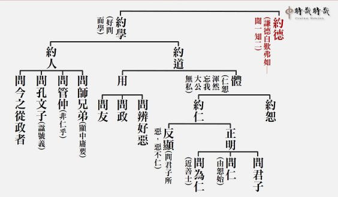

### 孝道跨時代的意義與價值—孝經簡說(十三)
如何以孝事親-〈紀孝行章第十〉

孝道跨時代的意義與價值—孝經簡說(十三)

如何以孝事親-〈紀孝行章第十〉

時哉講述、淨域編寫

事親含身與心

為公方盡大孝

謀親生活出路

人子孝道圓滿

本章的經文是：

「子曰：孝子之事親也，居則致其敬，養則致其樂，病則致其憂，喪則致其哀，祭則致其嚴。五者備矣，然後能事親。事親者，居上不驕，為下不亂，在醜不爭。居上而驕則亡，為下而亂則刑，在醜而爭則兵。三者不除，雖日用三牲之養，猶為不孝也。」

科判分析

這章可以當作是《孝經》中的一個小架構，概分為兩部分。其一：五種行持是能「事親」之道，惟事親之道不僅這五種，譬如：辦政治能夠上下和諧；可見儒家講孝，有修身、齊家、治國與平天下諸端。為政包括治國與平天下，五種孝行是能事親的。第一、表孝子對父母有恭敬心；第二、要快樂地侍奉父母；第三、父母病時要將之當一回事，叫作「憂」；第四、父母過世時要真心思念恩德，叫作「致哀」；第五、父母過世三年後，祭祀時要肅穆莊嚴。整體的禮節是個能事親的孝子。

其二：孝道不僅如此，尚有辦政治能夠上下和諧。正面言之，這位孝子若居於上位不能驕慢，處在下位不能作亂，於同輩中不能爭鬥。如果居上而驕，一定會亡；處下作亂，必受刑罰；在同儕中鬥爭，當見兵戎，即是互相攻擊。總之，人若不能去驕、除亂、免爭，雖對父母很孝順，仍不是真正的孝。這章大義如是，以下再詳細地分析經文內涵。

釋義

經文：

「子曰：孝子之事親也-(標)。」意即，夫子說：孝子侍奉父母親吶！「吶」是個活口氣，儒家經文中保留著這樣的活口氣。古人說話保留他的口氣，是準備要作解釋，並令聽聞者有所期待的。

經文：

「居則致其敬-(致敬)。」要怎麼事親呢？即平常居家時，能盡上力量，這是「致」的意思。而「致其敬」是要懂得恭敬，將這恭敬心表達出來，《論語》上說：至於犬馬皆能有養，不敬，何以別乎？

經文：

「養則致其樂-(致樂)。」這「養」字，要讀作四聲，能養(四聲)者，奉養(二聲)父母也。故致其樂，是孝子能將他的快樂用上，說明孝子奉養父母是很快樂的。有些註解說：「要讓父母快樂」；而此處若解釋為：「孝子侍奉父母，要持著很快樂的心。」試想哪個註解比較好呢？《論語》上說：色難。不是嗎？

經文：

「病則致其憂-(致憂)。」即是父母生病的時候，孝子要表達憂愁。經文：「喪則致其哀-(致哀)。」喪(ㄙㄤ)，即是父母之喪，孝子要表達「哀」思，就是須要真情流露。

經文：

「祭則致其嚴-(致嚴)。」即是祭祀父母，要能夠表達莊嚴。經文：「五者備矣，然後能事親-(結)。」即是這五者能夠完備，此人就是個能事親的人。什麼叫作「能事親」呢？徐醒民老師說：「這稱作『事親的先決條件』」。

經文：

「事親者-(標)，居上不驕-(居上)。」事親的人呀！要居上位而不驕慢。這個「上」字，或可包括天子、諸候、卿大夫、企業老總、商家領導等，這叫作居上不驕。經文：「為下不亂-(為下)。」即居於下位而不會作亂，表示行事能夠恭敬謹慎。這是在家庭裡練出這樣的能力。

經文：

「在醜不爭。」「醜」是同類之意，此處同類特別是指同朝為官。儒家之言常講及辦政治，常人會覺得何以老是談政治呢？這道理很簡單，若政治辦不好，什麼都別談了，沒有好環境與條件，各種事業都做不下去，連風氣也被破壞了。此外，政治紊亂時，外人來侵也無法阻擋，徒讓百姓生靈塗炭，陷於水深火熱中。所以，儒家所論都會導歸到政治，政治一定要講究風氣，要約束領導者。從此可見出，儒家非服務專制帝權，若為專制帝權服務，就該歌功頌德、普遍讚揚。然而，須加以約束，唯有如此百姓才有快樂的生活。再者論說民主制度，難道制度中的政治人物可以不約束嗎？若不約束就信口開河，造成許多的問題。所以，問題不在於政治的制度，而是在於領導者，該有什麼樣的人格特質與風範，才能保證制度能夠發揮功能。

經文：

「居上而驕則亡-(上驕)。」在上位的人若驕縱會敗亡。經文：「為下而亂則刑-(下亂)。」當下屬的若犯上作亂，就會受到刑罰的制裁。經文：「在醜而爭則兵-(醜爭)。」同類相處而彼此爭鬥，最終會演變成刀兵相向，亦即同室操戈相互攻伐。

經文：

「三者不除，雖日用三牲之養，猶為不孝也-(結誡)。」若以上「驕」、「亂」、「爭」三者不根除，雖此人在家裡很孝順父母，窮盡奉以豬牛羊等美食，也算不得是孝。現在許多人為父母添購豪宅，帶父母出國旅遊，給他們很好的享受，這就算是孝嗎？孔子說：「這都不叫作孝。」所以，應該瞭解「孝」的本質、義趣及實際作法。以上是這章簡單的解釋。

析疑

〈紀孝行章〉為何安排在〈聖治章〉之後，理由何在？《經》是前後文貫穿一氣環環相扣。此一安排的理由，是聖人在治理天下時，就是以孝為本質來治理，此時一定會有許多孝子出現。若以孝治理天下，結果沒有孝子出現，顯見是「上行而下不效」，這乃是陽奉陰違。意即是政策不斷地頒布，教育一再地倡導孝道，可是百姓們都不盡孝，這表示領導者與團隊有問題。若領導者以身作則，團隊為公用心推廣，發展下去一定使孝道落實，孝子就紛紛出現了。此孝道落實中，必有許多孝行可以被記載，因此稱作〈紀孝行章〉，次第清楚明白。

所以稱作讀經書，乃每一章環環相扣，如此可知孔子非是想到什麼說什麼。觀於《論語》四百九十八條，哪是想到什麼說什麼，而是日後弟子們集議，將各人所聽聞的內容編輯起來而已。若能做一個架構，便知孔子不是想到什麼說什麼。譬如：他的孝道思想，是一個完整的架構，只是對著何人因緣說那些重點，將對所有人說的內容匯合起來，才能看到孔子完整的孝道思想。所以，怎能說「只要懂一句」便可，當然要全部周知才能知道聖人在想什麼。

第一，孝子平常起居要致敬，「致」就是能夠盡上全力，用於恭敬心上。其理由是什麼？又有何經典可證明呢？《論語》〈為政篇〉中載，子游問孝。子曰：「今之孝者，是謂能養。至於犬馬，皆能有養。不敬，何以別乎。」子游問孝於孔子，孔子說：現在的孝子，常人認為能奉養父母的就是行孝。但是，狗與馬也會服務主人，乃至養育自己的父母，如果奉養不出於恭敬心，那麼孝子與動物有什麼差別呢？因此，孝行要從於恭敬心的理由在此。人與動物不同，人懂得對父母恭敬，懂得表達禮數，這是動物辦不到的。譬如：人在應對時會說「請、謝謝、對不起」，動物就沒有這禮節，這是人與動物的分別。

再者，該如何做到「居則致其敬」呢？江逸子老師有張畫，畫著伯魚經過孔子的面前，他的身段是「趨而過」，就是對父親十分恭敬，稍微彎下腰快步地走過孔子，而不是大搖大擺地晃過去。父親問他：「學詩了嗎？學禮了嗎？」伯魚就回去學詩習禮。這就是「居則致其敬」的表現，內心的恭敬還要顯於外在的態度與行為。又《論語》〈憲問篇〉中載，子張曰：「書云：『高宗諒陰，三年不言。』」殷高宗武丁守喪三年，將國家政事交由太宰處理，亦是居而致敬的表現。

此外，《論語》〈學而篇〉中載，子夏曰：「賢賢易色，事父母能竭其力。」意即侍奉父母要盡心盡力，此恭敬就表現在竭盡心力上。常言道「毋不敬」、「事思敬」，這思敬之意，就是做事要到位的。事父母能竭其力，這種用心盡力，就是表現恭敬心的方式。

《論語》〈里仁篇〉中載，子曰：「事父母幾諫。見志不從，又敬不違，勞而不怨。」即父母犯了大過，子弟要懂得勸諫，若他們不聽勸，態度依然要恭敬，不能因此而輕視之，如常侍奉且不埋怨，這就是孝子的風範，恭敬心是這個樣子的。

《中庸》中載：「夫孝者，善繼人之志，善述人之事也。」此句話的意思，乃孝子是善於繼承父祖的志節，且善於傳述父祖事蹟的。換言之，會將父祖的風範保留下來，即是我們常言的「祖德流芳」。《中庸》這段話特別讚歎誰呢？乃讚歎武王與周公，二人傳揚周文王的風範，這就是恭敬。常人以為恭敬是說：「爸爸早！媽媽晚安！」但哪知含藏著許多的道理，恭敬不是表面的應答工夫，而是心底實際的作為，否則，轉個身全都不當一回事了。

《論語》〈學而篇〉中載，子曰：「父在觀其志，父沒觀其行，三年無改於父之道，可謂孝矣。」孔子也說：父親在世的時候，孩子尚不能自主，所以要觀察他的心志，父親過世後，就要看孩子的行為。若在三年的喪期中，沒有改變父親的遺規，或是將之保留發揚，這個人可以稱作孝子。孝就是懂得保留先人的好，不擅自更動，這表達一種懷念，尤其是守喪三年期中。

原來孝子在家中要表達的恭敬，具有如此多的內涵，那麼有何經典可以證明誰是典範？《論語》〈子張篇〉中載，曾子曰：「吾聞諸夫子，孟莊子之孝也，其他可能也，其不改父之臣與父之政，是難能也。」在《論語》〈子張篇〉中，曾子聽過孔子說：孟獻子的兒子孟莊子的孝行，可能與其他的孝子一樣，但有一件事是其他孝子比不上的。當父親過世後，他繼承卿大夫之位，雖然在位只有短短的四年，但期間沒有改父親的規矩，沒有擯棄父親的臣子。所以，孔子說：這是很難能可貴的。原來「居則致其敬」是這樣講究的。

第二，我們該怎樣做到「養則致其樂」呢？奉養父母內心要很快樂，不能養了心不甘情不願的。為什麼是我養？其他兄弟怎不負責任呢？大陸曾實行一胎化，這樣子奉養就只有我了。然而不是如此，個人應該感到高興，為什麼呢？《論語》〈為政篇〉中載，子曰：「父母之年不可不知也；一則以喜，一則以懼。」其意是，父母的年齡，當孩子的不可以不知道，喜樂的是懂得孝敬父母，能改變一己的命運，是一塊很大的福田。換言之，即懂得用盡孝，來改變自己的命運。另一方面憂懼的是，父母年紀漸增來日無多，更要快樂不懈怠地去經營這塊福田。所以，命理學中觀之為「歹命之人」，其實無須害怕，只要懂得以孝道為本質去行善，就可以改變命運。算命的人卜說你命好，也別太得意，小心厄運就在命好當中現形了。人生的吉凶禍福在心意，絕非在那些命相上的顯現。

第三，「病則致其憂」。《論語》〈為政篇〉中載，子夏問孝。子曰：「色難。有事，弟子服其勞。有酒食，先生饌。曾是以為孝乎。」侍奉父母親時，要心誠意服。子夏問孔子什麼是孝？孔子說：臉色要好看，心意要誠悅。也就是侍奉父母要心甘情願、和顏悅色。又父母生病時，要表現出憂愁的樣子，意思是將父母的健康，當作一回事看待，不要隨便敷衍應付了事。《禮記》〈文王世子〉中說：周文王為世子(王爵的嫡子)時，某回他的父親季歷生病，當內侍告訴他後，便著急地趕去見父親。這急狀到了什麼程度呢？書上說：連鞋子都沒穿好就跑走了。這種感覺就是，將父母放在心上，把身體安危當作一回事。又文王為西昌伯時，武王為世子，聽到父親生病，連衣帽都不換，就急忙趕去探望。這就是一種憂愁的表達，將之當作一回事。而最特別的典故是漢文帝。文帝是漢朝最有名的皇帝，他對母親薄太后特別孝順，平日早晚問安，母親生重病時，更是衣不解帶地親侍湯藥。他這種以身作則的表現，加上為政的仁慈愛民風格，為漢朝的國政帶來大治。

第四，是「喪則致其哀」。意即父母過世時，要懂得真情流露。這有無經典證明呢？《論語》〈子張篇〉中載，曾子曰：「吾聞諸夫子：『人未有自致者也，必也親喪乎。』」意乃曾子說：我曾聽聞老師說，人對感情都會有所保留(自致乃「保留」之意，未有是「皆會」之意)，不會發揮到極致的。但是父母過世的時候，孝子一定會真情流露。《論語》〈子張篇〉中載，子張曰：「喪思哀。」子張也這麼說：對於父母的喪亡，哀思之心是要真情流露的。《論語》〈子張篇〉中載，子游曰：「喪致乎哀而止。」子游如是說：面對喪事是在哀上治喪。所謂的「哀」，就是真情流露。

臨喪致哀有什麼重要性呢？《論語》〈八佾篇〉中載，子曰：「居上不寬，為禮不敬，臨喪不哀，吾何以觀之哉。」孔子說：居上位的人，如果不懂得愛護老百姓，祭祀不懂得恭敬，臨喪不懂得表露真情，這個人有什麼可觀之處呢？換言之，此人必定刻薄寡恩。為君者刻薄寡恩，一國之民一定倒楣；天子刻薄寡恩，天下百姓一定倒大楣。這是無庸置疑的。

那麼，我們面對喪事要怎麼樣去臨喪呢？《論語》〈子罕篇〉中載，子曰：「喪事不敢不勉。」何謂不敢不勉？其意是對父母的孝思，要用上真情，不講究排場與祭品的鋪張，盡力推廣臨喪的孝思風氣。又《論語》〈為政篇〉中載，子曰：「死葬之以禮。」孔子也對孟懿子說：死要「葬之以禮」，即是埋葬父母時，要依禮看身分而為，不可以僭越，搞門面擺排場是不對的，重點在於表達真情。又《論語》〈鄉黨篇〉中載：「去喪，無所不佩。」意是在守喪三年期間，孝子身上的佩飾全都要去掉(以前君子衣著佩玉)。

古代為何要守喪講究三年呢？這會不會太長呀！《論語》〈陽貨篇〉中載，子曰：「子生三年，然後免於父母之懷，夫三年之喪，天下之通喪也。」此處的三年，是說父母照顧孩子時，最初三年是離不開父母懷裡的，一旦離開便要跌跤受傷，所以這三年無時無刻不在父母的保護下。這就是「三年之喪」的理由，父母過世要為之守喪三年，來作為回報。

第五，是「祭則致其嚴」。又父母三年之喪後，要怎樣來祭祀呢？這叫作「致其嚴」，要懂得莊嚴肅穆，如何「致其嚴」呢？《論語》〈八佾篇〉中載：「祭如在，祭神如神在。子曰：『吾不與祭，如不祭。』」意即祭祀的時候，要當成父母在眼前。孔子說：我若因事與病不參與祭祀，或請人代祭，就等於沒祭拜。所以，祭祀一定要人到場，而且觀想父母在前享祭。一如周文王致祭的誠意般，觀想父母親的恩德及前來接受祭拜的那種樣子。又《論語》〈為政篇〉中載，子告之曰：「……祭之以禮。」而且，孔子也對孟懿子說：要祭之以禮。祭祀萬不可僭越分際，臣子不可在家廟跳八佾舞，撤饌時不可唱〈雍詩〉。這都屬於祭祀莊嚴的內涵。

一位領導者，對其父母的恭敬奉養，包括「居、養、病、喪、祭」的真情表露，會有什麼殊勝處？特別是會產生怎樣的功效？《論語》〈學而篇〉中載，曾子曰：「慎終追遠，民德歸厚。」慎終是指喪事，追遠是指祭祀，一位領導者能喪哀祭誠，百姓在他的引導下，便能懂得孝順父母、利益他人，社會風氣自然就會歸於淳厚。怎會刻薄寡恩、作奸犯科呢？雪廬老人說：「根本都不要員警。」現在的員警、法官、律師、檢察官忙得要命，有處理不完的官司，風氣怎麼這麼差呢？可若是好好導正時，社會風氣是會非常良善的。

且來看看《清明上河圖》，畫裡的背景是宋都開封城，亦就是汴京，進城的地方有個衙役所，像是今日的警察局，那人員翹著二郎腿，為什麼呢？因為百姓守法，衙役就無事可做，而今各級公務員忙翻了，好似要忙才搆得上稱作盡忠職守。譬如：員警，一年到頭無法好好休假，百姓這麼難管理、風氣如此糟糕嗎？古時村莊五里內，只要有一隻雞丟失了，便引起全村轟動；而今鄰家死了人，卻一點動靜都沒有。這就是風氣變壞了，原因是以孝道為本質的教育，沒有被彰顯出來。

試問哪個人是喪葬祭祀表達孝心的典範？《論語》〈泰伯篇〉中載，子曰：「禹，吾無閒然矣。菲飲食而致孝乎鬼神，惡衣服而致美乎黻冕，卑宮室而盡力乎溝洫；禹，吾無閒然矣。」孔子說他對於禹無法批評，因為禹懂得對治私欲，便舉出幾個事實來證明。首先，大禹自我的飲食菲薄，但祭祀時的祭品必豐富，這是致孝；平常只穿粗布衣服，但臨朝的衣著就講究典雅，這是恭敬群臣；而所住的宮室不崇偉，盡心於為百姓辦理農田水利，這是厚愛百姓。如此的禹王，既懂得風氣的經營，又能以身作則，所以孔子說：我實在是無法批評呀！

詩云：「明發不寐，有懷二人。」(《禮記》〈祭義〉)《詩經》〈小雅〉中說：周文王這個人在祭祀父母的時候，整夜沒睡直待到天亮(明發不寐)，心中直想著父母二人(有懷二人)。因為懷念到極致時，上家廟去祭祀雙親，父母就好像就在眼前接受祭拜，難怪他會開創八百年的周天下，這是有道理的。

以上五件事都完備了，可以算作是「事親」嗎？徐醒民老師說：「這只是事親的先決條件。」真正的事親是什麼呢？還要包括為公、為政的這一分。所以，下文接著說「居上不驕」。意即居上位的人意態不驕，誰是典範呢？周公便是。醒公說《孝經》中談到周公，說他曾在吃一頓飯時，來了三位客人先後登門拜訪。他忙將口中的飯吐出，前去接待客人，這說明他對人的重視。又當洗頭髮的時候，客人也上門來拜訪，他來不及把頭髮吹乾，就挽起髮來去見客人。甚至於有一回，洗個頭髮要分三次才完成。他輔佐成王代理天子七年，等同於攝政王，送兒子伯禽到封地魯國時，特別以此告誡伯禽說：「我是文王的兒子，武王的弟弟，成王的叔父，對於天下來說我的地位也算很高了。可是我常常要中斷洗沐，多次吐出口中的飯，趕出來迎接到訪的客人，就是這樣還害怕讓天下人寒心。希望你到了魯國，不要以自己的地位來驕人。」顯見「居上不驕」，是多麼重要的人格修養。

其次，「為下不亂」。意即在下位的人，不能犯上作亂。此典範有誰呢？諸葛亮便是。劉備過世時，諸葛亮為丞相，手上握有三十萬大軍，蜀國幾乎就是他的，犯上作亂輕而易舉，但他一生謹慎行事，既聰明又有智慧，悉心輔佐劉禪恢復漢業。他是真正懂得孝道的人，這種風格無忝於父母所生，是真正對父母盡孝道。
第三，「在醜不爭」。醜是指同僚，往往同事之間彼此相爭，找靠山分黨派，較量誰比較厲害。而真正懂孝道的人，是不會去爭奪的，有誰是典範呢？李商隱有首五言詩〈武侯廟古柏〉，其中兩句說：「大樹思馮異，甘棠憶召公。」前句是說漢光武帝有位將軍名叫馮異，從不與人爭功，每當朝廷論功行賞時，他都靜默地坐在一旁的大樹下，絲毫不在意賞賜的事情。當光武帝
**問：** 誰的功勞最大時，便指向在一旁樹下睡覺的馮異，用以表彰他不爭功與退讓氣節，後來人們看到這棵大樹就會想起馮異。所以，王莽那時候逢迎巴結的風氣，就被漢光武帝給扭轉過來。可見風氣一旦被導正，經濟就起飛，民生也樂利了，若公務員不貪污，這國家一定強盛。

以上是這一章的要義。

接著來看各朝的《孝經圖》。北宋李公麟、元朝趙孟頫和明朝仇英的畫﹐都是孝子很快樂地奉養父母，好像老萊子一般彩衣娛親。可是本章中孝行有五項，他們都只強調「養而致其樂」一項。

最後，來看江逸子先生所畫的《孝經》〈紀孝行〉圖。這孝子的家庭如何？看那瓦房牆磚脫落又補土，便知是個平常人家，雖然家庭並不富裕，但成員都很快樂，媳婦帶著孫子敬心奉養公婆。而院外有一群人圍著孝子說話，這群人有揹著網的漁夫，有擔柴的樵夫，有荷鋤的農夫，有打著酒壺的過客，有居中引介的人士，以及抱著孩子圍攏湊熱鬧的婦人，這位孝子正被請來調解糾紛，想必在鄉里中是位值得大家尊敬的人。

江先生與前幾位畫家不同，所要表現的重點在於「孝子是幹才」，不僅只是一位孝順的孩子，還能出來為國家辦事、為社會服務，這才真的是「盡孝」。什麼叫作幹才？就是此人具有調和的能耐，在大時代裡最缺的就是能夠調和鼎鼐。雪廬老人讚歎：「宰相之才像甘草。」宰相為什麼像甘草？是因為甘草能夠調和中藥。此外又像鼓，音樂需要鼓去調和。具調和的能耐，就是宰相的幹才。所以，孝子本身一定要懂得，居家除了盡孝以外，還須懂得充實自己，懂得立身處世之道，懂得為公發心，懂得以辦政治來利益天下蒼生，這才是孝道的圓滿。我人在推展孝道時，實要推展經學教育，非僅是在家裡給父母親鞠躬、幫父母親開門、為父母親掃地等等。這些並非不重要，觀於經文說：「五者備矣，然後能事親。」完備五者叫作「能孝親」，但請注意「然後能」這三字的語氣，之前的只是先決條件，謂之「能孝親」，當五項都完備了，然後才能「事親」，這才是完整的事親之道。

總結

第一、我人如果不讀《孝經》，不從《論語》或其他的經書中，去了知孝的概念，便真的不知道孝的先決條件，及他的真正的形象與圓滿的氣象。所以讀經學太重要了。

第二、一位行孝的人，在家中懂得利益父母，即便不出仕為官行政，在鄉里也能淨化人心，就像江先生圖中所繪的人物，能夠調解紛爭教導規矩，使社會一片祥和。例如：雪廬老人從大陸來到臺灣，雖然沒有居官為政，但在臺中辦了三十幾年的教化工作，把百姓教得善良，鼓勵大家廣發心為公服務，這何嘗不是老人家另一種圓滿的孝道表現。

第三、盡孝道的人，在朝為官不論上中下，若真做到「在上不驕、在下不亂、在醜不爭」，可知所發展的氣象是什麼嗎？當是一個「不計名利、能夠和合、帶動士氣、發揮效率」的人，這種人來當國家的公務員、大官及領導人，便是團隊之福、社會之幸、萬民之慶。（下期待續）

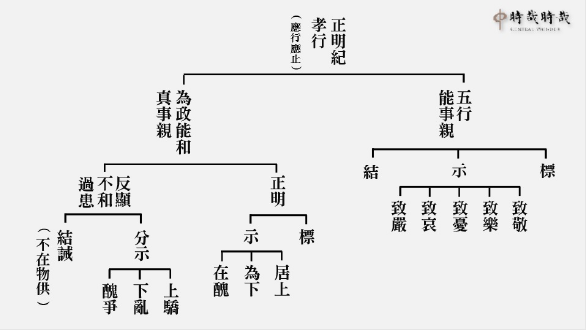

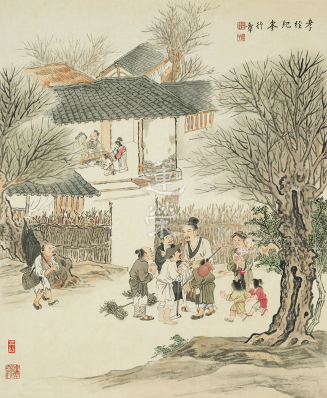

### 孔門心法—中庸之道(八)　第六章：萬代政治的典範　用「中」治國的大舜

*時哉講述、茅茹讀書會、弘毅整理*

好察色言不受惑

隱惡揚善風氣厚

執兩用中形而上

兩端分析利入世

前言

中國古代的政治典範首推唐堯與虞舜，其中又以舜最為可貴，其公天下之成就，至今無人可及，從堯手中接過天下，又能選賢舉能，再將天下交付夏禹，傳公不傳私。孔子讚其大智，而其智慧則展現於辦政治，原來智慧才是治國的根本，行中庸之道才是富強國家的方略。這種辦政治的盛況及氣象，是今人難以想像，也是中國後世政治所未見。恰巧藉著本章經文，從孔子的角度，來看為政者應該具備何種能力，以及辦政治所應呈現的成果。

一個國家領導人，成功的秘密最重要的就是「用和」，泰國國王蒲美蓬就是一個能夠「用和」的人。他十八歲登基，八十八歲過世，在位七十年，他的定位和人生方向就是利他。比如說，他成立了很多的基金會，幫助受害、孤苦以及生病者，設立很多獎學金，為國家培育人才。他還投入很多的熱忱，解決國內的旱災、水災、水質污染、水土流失以及能源問題；還有上千項的農業發展，改善環境、提升農人的窮困。此外，以他崇高政治地位的影響力，他還搭起了泰國傳統與現代的橋樑，讓泰國一方面走入了現代，一方面也維持過去的傳統，得到人們的讚歎。雖然他只是一個有名無權的國君，但在他在位的七十年中，他發揮了和的影響力。在這七十年當中，有二十次的政變都賴他調停，才能夠和平收場。他是一個不搞對立的人，不搞階級對立、黨派對立、族群對立，他主張和諧，所以他深受泰國人民的歡迎，得到了人民的真心擁護。

當他病重的時候，泰國人民不想讓他離開，並且憂慮泰國的未來。當他過世的時候，全國自動為他服喪，所有的單位停止活動三十天，人民願意替他守孝。特種營業場所都自動關閉，全國只剩下黑白兩色。泰國不是依靠專制集權，不是愚民政策，而是在非常開放的政治環境裡面，他竟然得到這麼多的民心，在他過世的時候，老百姓如喪考妣，整個社會都陷入愁雲慘霧之中，是打從心裡面的傷心，用各種儀式來為他祈福。

不管是君主立憲或是民主制度，一個為政者，重要的是以老百姓的福祉為他的福祉，人的出路，政治的出路，都在利益老百姓。中國能夠深入民心的帝王有很多，但孔子特別讚歎的是堯舜禹這三位帝王，他們不只是能夠以公心來利益天下蒼生，更重要是他們傳承的不只是國家大政，還傳承「中」的心法。可是到孔子的時候，幾乎沒有這個傳承，所以孔子才會在上一章感嘆，懂得中庸之道的人太少了，對中庸之道不知不明，也不能行。

科判分析

《中庸》總體科判：第六章是在《中庸》的第二部分，即分別顯示中庸的修學法和義理。

六、七、八、九四章科判分析：中庸可以如朱子或鄭康成那樣分成三十三章，也可以根據各章彼此脈絡整體來看，第六、七、八、九四章都在講用中。

第六章是正面讚歎舜的智慧能夠用中來辦政治，第七章是反面感嘆一般人受世間迷惑，不守中庸之道，在追逐世間的名聞利養中得到很多的災難，沒有學習中庸，是超越不了名聞利養的繫縛。最後結示中庸之道難證，在堯舜禹之後幾乎是斷了傳承，到了孔子才接續這樣的傳承而發揚光大，而孔門的弟子顏回得到了傳承，所以孔子在第八章裡面，特別讚歎顏回是擇乎中庸的人。第九章是感嘆世間人難證中庸，赴湯蹈火的人，心存公心、不要名聞利養的人，都可以找到，但中庸是難以達到的。一個通達中的人，在入世的時候，不會被名聞利養所繫縛，可是在世間不受名聞利養所繫縛的人，未必通達中，所以中是很難證的。

本章科判分析：此章分為三大段，第一段總的來讚歎舜是一個有大智能辦政的人，第二段分別解釋理由，第一，舜是一個能好問好察，而且是隱惡揚善的人；第二，舜是一個「執兩用中」的人。最後讚歎這就是舜之所以稱為舜的理由了。

章旨

本章的主旨是明君聖主的修學法，用中來辦政治，就是要好問而好察邇言，隱惡而揚善，執兩而用中於民。舜的修學法，可以用來辦政治，辦企業，經營一個團隊，領導一個家庭，都會給自己及他人帶來最殊勝的出路。

消文

經文：

子曰：舜其大知也與。舜好問而好察邇言，隱惡而揚善，執其兩端，用其中於民，其斯以為舜乎。

消文：孔子說：舜一定是一個有大智慧的人吧！因為他不瞭解、不明白的事情懂得向人請教，他還是一個能觀察言語之道的人，他能夠明察他人淺近的俚語、諺語、格言，或者他人的忠言、讒言。他會把惡人、惡事、惡法隱藏起來，不讓好人學壞，能讓壞人有所警惕，使惡的風氣不會蔓延。他舉發善人，發展善事，推廣善法，使善的風氣得到推展。他能夠在功過、是非、利弊的兩端中，把握時機，做正確的抉擇，能真正利益百姓，這就是舜之所以稱為舜的理由吧！

釋義

「邇」就是近的意思，「邇言」一種是指俚語、諺語、格言，另一種是指他人的回答，「好察邇言」就是能夠從「邇言」中明白很多道理，或者能夠明辨他人的言語是忠言或讒言。孔子叫作「六十而耳順」，就是從言語當中，不但通達言語的內涵，還通達對方的人品、見地和特質，所以說「不知言，無以知人也。」

「用其中」就是不受兩端的影響，把握時機，該用哪一端就用哪一端。有時候推展一件事情是功，可是時機不到的時候，推展這個事情是過。如王安石變法，君子不肯與他合作，老百姓也在舊法當中習慣了，沒有經過教育不懂得新政，這叫做時機不到，新政雖好但他在這樣的時機下強行推廣就不對了。這要依靠智慧抉擇，把握時機，改革才能成功，這叫作「執其兩端，而用其中於民。」

舜，姓姚，名重華，叫作姚重華，舜是他的諡號，就是「好問而好察，隱惡而揚善，執其兩端，而用其中於民」，舜的諡號就是這個內涵。

析疑

周一、本章與前一章有何關係？前章是感嘆不論愚者，還是賢者，都不能行中庸之道，愚者是指爭名奪利的政治人物，他們是不及。賢者是空有理想，可是不知道時機，躁進的人易過。此章是說唯有像堯舜禹，這種有「中」的傳承和見地，善用人才，觀察風氣，以身作則，自我約束的人，才懂得把握時機。

二、「舜其大知也與」孔子此話的語氣如何？孔子的語氣是讚歎而肯定的語氣，舜一定是一個有大智的人，因為他好問而好察，隱惡而揚善，執其兩端而用其中，因為能夠以智慧為本質，所以才能審時度勢，觀察時事，這樣的施政才能有益於民。如果是自以為是，關起門來幹活，不問不察，而且不懂得兩端，一意孤行的人，如宋神宗雖然是個好皇帝，可是他一意孤行，終致變法失敗。

三、舜之大智如何而來？舜的大智是從對「中」的明白和實踐中來，堯傳給舜的時候是「允執其中」，要相信而且執此中道。有「中」的帝王才能稱為明君聖主，否則頂多是個賢者，如周成王、周康王、漢文帝、漢景帝、唐太宗，成康之治、文景之治、漢唐盛世也不是真正中華文化的氣象，堯舜禹之治才能稱得上。

四、好問有何好處與壞處？好問的好處是透過清楚明白的問，將他人的知為我的知，集眾人之知來對治自己的無知、無明，另外透過好問使自己成為明白人，才能辦好企業，辦好政治等事業。好問的壞處是說，如果你沒有中心思想，然後問道於盲，問的是不懂局的，自以為是的人，這樣的好問就不好了。我們要善用好問的好處，去掉好問的壞處。

五、誰是好問的典範？第一個是孔子，「子入太廟，每事問」，孔子到太廟，在當陪祭者之前的演禮，他進去問禮，包括問禮器、禮儀、供品；問樂，包括問樂器、音樂以及裡面的內涵。他懂得祭祀與天地的關係，懂得祭祀中慎終追遠的內涵，和其中承傳的孝道文化。所以孔子說，「其如示諸斯乎。指其掌。」治國就像看手掌這麼簡單，關鍵是要找到根本、方向和重點。

第二個是顏回，曾子曾經稱讚顏回是「以能問於不能，以多問於寡」，顏回是拿他不懂的去問他人，比如顏回有十分之九的懂，十分之一不懂，但是透過問以後就全懂了。

六、如何依好問而得人生之成就？《論語》裡面就說，「敏於事而慎於言，就有道而正焉」，是說一個敏捷之人要問懂局的善知識，他才能給你真正的出路，而不是問道於盲。善知識根據你問的語句、方法和誠意，來決定是否和盤托出。如劉備去請教諸葛亮的時候，他是公心、誠心和謙卑的問，諸葛亮就立刻替劉備分析天下局勢，因此而三分天下，這就是好問的功德、價值和出路。

七、地位崇高時如何不恥下問？一般地位崇高的人，認為官大學問就大，放不下架子向地位比自己低的人請教，所以要知道不恥下問的好處才行。不恥下問可以讓自己不斷充實，做一個明白人，可以降伏自己的慢心，可以找到好的老師或朋友，可以知道自己的不足，也可以知道對方的人品、心態、見地和格局。

八、在論語中誰是不恥下問的典範？下問就是問比自己地位低的、輩分差的、學問不足的或者學歷低的，不恥下問是幫助降伏慢心的方法，也可以補充自己的不足。在《論語》〈公冶長篇〉裡，孔子讚歎衛國執政大夫孔文子，是不恥下問的人，所以他的謚號為文。而衛國雖然國君衛靈公昏聵，但因為有這些很有特質的大臣，所以才沒有亡國。

九、不好問有什麼過患嗎？不好問有很多的過患，如事理不明，自以為是，慢心很高，不知他人之賢與不肖，善與惡等。

十、邇言包含的範圍為何？邇言包括格言、俚語、諺語這些近言，這些雖然是老生常談，你覺得太平常，可是古人說：恰是平常最奇絕，成如容易卻艱難。如李法曾版的三國電視劇裡，有一段是赤壁之戰前，大破曹軍需要火攻，萬事俱備，只欠東風，已經進入了秋冬，到底會不會吹東風？諸葛亮由一個老漁翁那聽來的俚語當中，知道會吹東風。諸葛亮問老漁翁十月的冬天是否有東南風，老漁翁以俚語回答說，「十冬難見東南颳」，十月的冬天是冬至的時候，「冬至一陽生，陽生地氣生」，冬至的卦叫作地雷復，上面是坤卦，下面是震卦，陽氣從地底生的時候，會吹一陣子的東風，諸葛亮是有意的問，老丈是無意的答，藉著俚語，他知道地底的陽氣生會吹東風，這就是好察邇言。

十一、好察邇言，有何好處與壞處？邇言有兩種：一種是格言、俚語、諺語，第二種是你去問他人的時候，他人的回答。好察邇言的好處，就是能夠明白很多的道理，可是如果沒有分析抉擇、分辨善惡的能力，中了他人的讒言、謊言都不知道，尤其是為政者，權力越大的時候，聽的謊言就越多，聽的阿諛奉承、歌功頌德的言語就越多，變得沾沾自喜，自以為是，乃至誤判形勢，這就是不好察邇言的壞處。

十二、好察邇言殊勝的形象為何？（一）不接受讒言。《論語》<顏淵篇>篇說到，「浸潤之譖，膚受之愬」，讒言就像水逐漸滲透那樣，或者如灰塵逐漸污染皮膚，不知不覺當中被浸潤染汙。伊朗的「灰塵爺爺」阿莫哈吉一生不洗澡，空氣可以讓他的身體變得非常髒，髒的硬塊已經洗不掉了。人受讒言到這種程度的時候，也是無法洗掉的，當積非成是，聽多了歪理的時候，別人再告訴他忠言、正理，他已經聽不下去了。就好像要賣假古董給他人，要先教他怎樣鑑定假古董，當有一天他學會時，再賣假古董給他，他會高價收買，而拿真古董給他的時候，他會當破銅爛鐵給丟掉，一個人可以被洗腦成這樣，所以最殊勝的好察就是不接受讒言。孔子說這種人是明白、有遠見的人，這種人辦政治，才知道方向在哪裡，才懂得誰是善惡對錯。如狄仁傑幫武則天擋住很多的讒言，而且仗義執言，救了很多的忠臣，為武則天推舉大量的人才，所以唐朝才能夠中興，狄仁傑是關鍵的人物。

（二）「不以言舉人，不以人廢言。」君子不要因為他的話說得好聽就用他，還要看他說話的動機，言行是否相符，也不要因為這個人品德差、學問不夠、輩分低或者年輕而廢言。如戰國時趙國的趙奢將軍，就算一個小兵跟他建議，他都會聽一聽，分析看看是否有道理。他的兒子趙括剛愎自用，比他職務低的小兵的建議是不會聽的，所以在秦趙長平之戰時，因為他的失誤，致使趙軍戰敗，被坑殺四十萬，他本人也被殺死。所以孔子才會說：「不知言，無以知人也。」

好察邇言就是能夠體察他人是忠言，還是讒言、謊言，從他人引經據典的格言、俚語中明白很多的道理，這就是舜的大智，舜的耳順，所以舜是明君。

十三、隱惡揚善的用意為何？舜不僅是好問而好察邇言，還有一點是我們現在人不會的，叫作隱惡而揚善。隱惡就是把惡人、惡言、惡法、惡風氣隱住，揚善就是把善言、善的內涵去執行、去推展，營造出好的風氣，用好的人去辦出好的政策。雪廬老人說：隱惡揚善，不只是讓壞人有所警惕，也不會讓好人學壞，社會風氣也不會變壞。

十四、舜如何隱惡揚善，其事例為何？效果如何？在《了凡四訓》裡面說，舜以前在山東雷澤，見到漁夫都找水深的地方去撈魚，而老人被擠到淺灘，舜只是默默不言的把深水讓給老人去捕魚，而且只要有年輕人也這樣做的，舜都大加讚歎，從此風氣改變，這就是隱惡揚善。「隱惡」的目的有時候是讓惡人警惕，讓他不要囂張，有時候不揭發他的惡，目的是不讓他狗急跳牆，有時候是不讓好人學壞。

《了凡四訓》裡說，「期年，皆以深潭厚澤相讓矣。」在舜的帶領下，一年以後，整個山東雷澤地區相互禮讓的風氣盛行。

十五、隱惡不會變成縱容惡人嗎？了凡先生也說，「見人過失，且涵容而掩覆之。一則令其可改，一則令其有所顧忌而不敢縱。」隱惡的目的一個是讓他有改正的機會，一個是讓他有所顧忌而不敢放縱。

十六、揚善時應注意哪些？揚善時要看做善者是否是真心，是否夾雜名利，是否是小人故意做善法來沽名釣譽，所作善法是否以正見為本質，以及你的揚善不會變成幫助他人爭名奪利。

十七、好察邇言與隱惡揚善有何關係？雪廬老人說，邇言當中的惡要隱住，善要發揚，就是好的話要聽、要執行，好的政策要兌現，好的見解要讚同，如果邇言是讒言、謊言就要隱住，但不代表我不知道，只是想要讓他改善，讓他警惕。

十八、執其兩端有何殊勝？「執其兩端」，執功過、是非、事理兩端，懂得離開過得到功，離開弊得到利，懂得在事當中用理，理要藉著事去表現。

就利害兩端來講，要看眼前的利是不是真正的利？如從長久來看是否還是利。舉例來說，子貢贖人而不受獎金，顯示了他的廉潔，所以眼前看是利。可是就長久來看，他人沒有子貢富有，再遇到贖人的時候就會有所顧忌，影響了魯國救人的風氣，眼前看是利，後面卻是害，所以在這兩端當中，一定要小心抉擇。

再就事理兩端來講，論語裡面說，「攻乎異端，斯害也矣！」「攻乎異端」，就是只重視事或者理這一端是有害的。只重視事的這一端，那只是表面功夫，忽視了內涵。只重視理的這一端，沒有事相去表達，內涵也無從去表徵。

十九、如何能執其兩端而用其中於民？孔子說，「吾有知乎哉，無知也。有鄙夫問於我，空空如也，我叩其兩端而竭焉。」「無知」就是通達能知所知的體性空，能知所知是互相觀待的，只有對所知的道理瞭解透徹，我們才能夠真正成為能知，而這個道理也要觀待能知者，才會成為所知，道理不會在愚癡者的面前成為所知，這叫作「無知」，無能知所知的自體性。「空空如也」也是這個道理，而不是腦袋空空，因為孔子非常好學，韋編三絕，也不是說孔子一貧如洗，他在魯國做大司寇年薪是六萬石，是縣長的六十倍。因為孔子「空空如也」「無知」，能知所知自體空，所以他在做事情的時候，能夠叩其兩端，做事非常清楚，道理明白，通達人情世故，通達功過、利弊兩端，而不是無知妄作。有時候是眼前有利，未來有害；眼前有害，未來有利；眼前是障礙，未來是順緣；眼前是順緣，未來是障礙，這些兩端要好好的抉擇。兩端也會因人而異，對謹小慎微的季文子、冉求來說，再思是功，三思是過，對莽撞的子路來說，三思是功。孔子只是把兩端的道理分析清楚，至於你決定如何選擇，孔子是不替你做主的。

二十、施政時執兩用中，人民如何受益？施政的人如果懂得「執兩用中」，他就會懂得長遠的經營，正確的抉擇是非、善惡、功過的兩端，懂得用人的分際，老百姓就受益多了。如泰王在他的主政當中，有時候看起來過程很緩慢，可是長遠的來看對人民是真正有益的，二十次的政變當中，都是被他極高度的耐性化險為夷，事後也不會搞對立，所以他說他為政七十年，要創造的就是和諧，這叫作「發而皆中節，謂之和」，「和也者，天下之達道也。」所以當他過世的時候，泰國人是如喪考妣。

「日出而作，日落而息，鑿井而飲，耕田而食，帝力於我何有哉」，當沒有打家劫舍的時候，好像不需要員警了；當國力非常堅強，沒有外患的時候，好像不需要軍隊了；老百姓都互助合作的時候，好像不需要訴訟委員會了；當老百姓發生問題的時候，就可以自己認錯，好像不需要法官了，整個社會一片祥和，好像就不需要政府了，這才是真正的無政府主義。

《論語》裡面對舜的讚歎，第一個是說，「舜有臣五人而天下治」，舜的人才團隊核心有五個人；第二個是說，舜「恭己正南面而已矣」，他自己以身作則；第三個是說，他懂得治官之道，「舉皋陶不仁者遠矣」，他懂得去找好官，去除壞官，最後老百姓好像不需要政府都可以了。他的音樂也是最和平的音樂，因為當他接受堯天下的時候，沒有權力鬥爭，沒有殺伐，所以叫作「子謂韶，盡美矣，又盡善也」，孔子稱讚只有韶樂才能表彰舜的德，其他人是沒有辦法有這種音樂的。

二十一、舜之所以為舜的理由為何？「舜之言充也，仁盛聖明曰舜」，舜這個名號就是內心充滿對天下蒼生關懷的仁，以及形而上「空空如也」的聖人智慧。

二十二、舜如此殊勝的境界，一般為政者又如何達得到？孟子說，「舜何人也，予何人也，有為者亦若是。」一個想要有所作為的為政者，先要有效法舜的胸懷。《中庸》第八章說，「回之為人也，擇乎中庸，得一善，則拳拳服膺而弗失之矣。」顏回不論是形而上的內涵，還是形而下利益眾生的善法，他都能緊緊握持，不會喪失，正因為他如此的用功，所以從堯舜禹傳承而來的「中」，此心法被孔門最不起眼的顏回得到，在周遊列國時，大家都知道他是高人，孔子也在典籍上讚歎他說，上古的聖人也不過如此。

總結

第一，我們要學習孔子看歷史的眼力，正確的認知評價歷史人物。第二，要知道「中」不是談玄說妙，它是一個心裡面的覺受，而且是一個能夠實行的學問。第三，用中最殊勝的就是辦政治，因為只有政治穩定，企業和教育才能發展。比如說，有一個安定的環境，老師才能安心的教學，學生才能安心的受教，所以「中」最殊勝的地方就是辦政治。當然透過辦教育才能培養「中」的人才，培養文化的人才，培養企業、社會、國家、民族的人才。「中」，就是文化的核心，民族的命脈，治國的精神，人們應該有的中心思想，就是「中」。

問答

**問：** 根據歷史的考證，堯舜在當時，其實只不過是整個華夏地區的部落共主而已，假設舜來到現代，當前的政局、社會、制度，非常詭譎多變，民意、民嘴意見很多，要用中道是可行的嗎？他會怎麼去運用呢？

**答：** 不論政局怎樣混亂，「百變不離乎中」，只要一個領導人，他是有中心思想、有胸懷、有公心、有見地的人，能夠任用賢人，他的施政能夠在兩端上講究，懂得好察邇言，好問而學，能夠用和，看起來國事如麻，但是如果懂得抽絲剝繭，懂得去調理，很複雜的事情都會慢慢變得簡單。歷朝歷代，開國的時候都是一片焦土，可是如果懂得治理之道，可能兩三年就呈現太平景象。孔子說：「茍有用我者，期年而已矣，三年有成」，一年就可以，三年就有所成就，看起來好像很複雜，百廢待舉，如果能夠如前面所述那樣的治理，局面會慢慢的改善，會越改越好。子產就是在亂中成為執政大夫的，他執政的第一年也是老百姓不瞭解，對他不滿，第二年也是平平，第三年是沒有子產不行。再如開始所舉的泰國國王，他在當國王的七十年間，竟然有二十次的政變，一個沒有實權的國王，都可以發揮這麼大的作用，更何況是一個有實權的國王呢？

**問：** 好察邇言會不會讓人認為是有疑心病？

**答：** 疑心病是懷疑對方想要害我，對我不忠，或者是要給我設圈套。好察邇言是我聽了他人的言語後，能夠經過我內心的抉擇，知道是讒言還是忠言。有時候逆耳的是忠言，好聽的話反而是讒言，頭頭是道的反而是謊言。雪公說：董事，董事長，你懂得事情嗎？你聽懂了嗎？孔子叫「六十而耳順」，果然是好察邇言，好人、壞人他知，好政策、壞政策他也知，而且透過好察邇言，他也知道彌補他的不足，不能善用當然也是有壞處的。

**問：** 舜的優點很多，最有名的就是他的孝心，本章為何只提他的好問好察和執兩用中呢？

**答：** 舜是大孝，他能夠推展以孝為本質的德教，可是此章的重點是講一個辦政治的人，他要具備「中」的智慧，要懂得觀察時事，懂得聽言，懂得辨忠奸，他懂得運用人才團隊，來彌補他的不足，使好的政策得到推展。

**問：** 舜用中道來施政，請問是由堯所傳授給他的嗎？

**答：** 舜能夠繼位有三點原因，第一、是他接受各項職務的歷練。堯把兩個女兒嫁給他，看他處家庭的能力；把九個兒子給他教，看他調眾的能力；然後再歷練各種政治職務，包括如何去面對各方來的使節，歷練後作國家的宰相時，已經孰悉各種職務，絕對不是把老百姓當白老鼠試驗。第二、他常常去向堯請教，所以也得到了堯為政的能耐。第三、堯最後傳給他為政的心法，叫作「允執其中」。

**問：** 孔子如此的讚歎堯舜，但如果以孔子與堯舜來比較，結果不知如何？

**答：** 孔子講「祖述堯舜」，就是講到辦政治，根本處就是堯舜，他們就是中國辦政治的典範。但這是孔子的客氣，其實如宰我所說，孔子賢於堯舜多矣，就好比堯舜是在地，孔子就是在天；有子也說，自生民以來，未有如孔子也；子貢也說，「夫子之不可及也，猶天之不可階而升也」。總而言之，孔子比堯舜高太多了，只可惜在當時沒有孔子施政的機會，如果楚昭王給孔子書社七百里地，我們就會看到一個非常有氣象的公天下出現。

**問：** 堯舜跟孔子，他們治國真的能夠達到禮運大同嗎？如果他們這種治國的氣象，能夠抵擋像現今帝國主義的入侵嗎？

**答：** 堯舜公天下本來就是禮運大同，就是說老百姓覺得根本就不需要政府。大家都很守規矩，就不需要交通警察；訴訟的時候，知道正理為何，就不需要法官；大家都能守望相助，就不需要控訴，不需要成立受害委員會，這些都是禮運大同的氣象。孔子就是有這種能耐，而且孔子有人才團隊。

用中的人會盱衡兩端，會看到時代的趨勢。所以雪廬老人說，讀古書不能食古不化，可是也不能趕時髦。古代的制度，現在不能用的就不要用，現代的奢靡、驕縱、浮華、說謊話、亂開支票，這樣的時髦當然不要趕，時代也未必全好，但是你要瞭解時代的進步，可是也要認知傳統的優勢。所以人們讚歎泰王，就是說他七十年來用和，而且他最殊勝的一點就是，他自己就是傳統與現代的橋樑，讓傳統跟現在交軌，而不是用現代否定傳統，與傳統格格不入，然後標榜時代，卻又說不出一個中心思想，也不知道時代前進的方向，這樣的入時代也是沒有什麼意義的。

**問：** 關於「允執其中」這樣的能耐，如何能「成己成物」？

**答：** 「允執其中」就是相信並且抓住中不放，成己成物都要靠中，辦政治、辦教育是最能成物的，成物就是把人培養成人才，成物包括辦政治讓人們生活快樂，辦教育讓人們生命豐富，而本質都是中，讓人能從形而下的和通往形而上的中，最後能夠斷除煩惱，明心見性，得到心裏面真正的快樂。

**問：** 《易經》上的乾卦九二爻的文言中提到，「龍德而正中者也，庸言之信，庸行之謹，閑邪存其誠，善世而不伐，德博而化」，就是說，人君領導的德行，跟此章的關聯是什麼呢？

**答：** 「庸言之信，庸行之謹」就是說，平常說出來的話要有信用，平常的行為要謹慎，越是平常越要在意。能夠管住自己平常言行的人才是國家需要的幹才，因為國家幹才要注意動靜觀瞻，旁邊有人在效法學習，會影響風氣，不可以不謹慎小心。如果用的是那種隨便說、隨便幹的人，國家就非亡不可。但這與此章的中是不同的，中是說通達形而上來入形而下，知道趨吉避凶之道要有這些的經營，可是有這些的經營，未必能通達中。

**問：** 《尚書》裡稱堯舜為明君，是否跟本章有關聯？

**答：** 是的，中就是明的意思，用中的人才是明君，所以《尚書》裡面稱堯是「欽明」，稱舜是「文明」。明就是說他心裡面非常的清楚，不受煩惱物欲的影響，不受境界的繫縛，就好像我們坐在飛機上才看到下面各條路的狀況，一定要超越形體繫縛的時候，回來才能真正入世。用中的人同樣講孝順，可是他知道用孝來趨吉避凶，來通達人情世故，用孝來找人才，來經營風氣，這跟單純的盡孝道，如給父母洗洗腳，搥搥背，那是不一樣的。

**問：** 這一章的內涵要怎樣用於日用平常呢？

**答：** 我們辦家政，辦企業，辦事業，辦國政，不管是辦什麼，一定要對這個工作明白，就要透過好問來補充自己的不足。如要學技術，對方如果是專家來指導，有不懂的地方就要不斷的請教，透過好問，他那三十年的功夫，我們可能三個月就會了。如果不問，那永遠是我們的問題、障礙和無知。此外還要有聽話的能力，對時勢的觀察，對利弊得失的分析，有長遠的見地，又知道眼前要如何下手去做，此章對於日用品常有很大幫助。

**問：** 有人說堯舜他們都是傳說中的人物，請問老師，歷史上真的有舜這樣的人物嗎？

**答：** 孔子祖述堯舜，《尚書》裡面從堯舜開始，而且孔子刪詩書，訂禮樂，贊周易，修春秋。如果真的沒有堯舜，那孔子刪詩書的時候應該刪掉。孔子講「文獻不足故也。足，則吾能徵之也。」意思是說孔子說話都要根據典故，典故足，我說話底氣十足，典故不足，我說話的底氣不足。孔子還說「書云」、「詩云」，孔子都引經據典，如果說沒有堯舜的話，孔子就不會說祖述堯舜了。很多歷史典籍都毀於戰火，再經焚書坑儒，經過朝代變化，很多的文獻都不足了，在孔子當時，可能接觸的典籍更多，更能夠瞭解以前的時代，他認為有堯舜，應該是有所根據的。再如現在有人批評劉備說，劉備的江山是哭出來的，假情假義，如果劉備是假情假義的，那為何諸葛亮、張飛、關公都看不出來呢？一千多年後又不在現場的我們卻形容的活靈活現，諸葛亮會為了一個假情假義的人，鞠躬盡瘁，死而後已嗎？我們現代人要有眼力明辨這些觀點。

**問：** 隱惡揚善中的惡也包括近言，可否請老師再加以解釋？

**答：** 邇言就是近言，包括聽到的格言、諺語，也包括你去請教對方，對方所告訴你的，有的人為你分析事情，有的人告訴你是非善惡，有的人對你歌功頌德，有的人在批評你，這些近言當中，會讓你瞭解很多的事情，明白事理，知道是非善惡，但是惡的近言要隱住。

**問：** 此章是舜在辦政治當中把中道運用於民，對於辦教育來說，要如何運用於學生呢？

**答：** 前面所舉的能知所知，就是中道思想的運用。能知，沒有自體性，所知，也沒有自體性，並不是否定能知所知，而是說你有所知，你才有能知，沒有所知就不會有能知，所以獨立的能知沒有。你教學生的時候，你要成為能知者，一定要在所知上成為能知者，所以教學生一定要教成明白人，絕對不可以教出糊塗蛋。再有，要把學生教成明白人，老師本身要是明白人，雪廬老人說，明白人還未必教出明白人，但是糊塗蛋絕對教不出明白人。我們現在的老師也要有傳承，不能把學生當成白老鼠實驗，要好好的在書本上、道理上去聽聞、去思維、去通達。這樣講書的時候才能夠活用書，否則把書講死了，讓人不辨方向，或者煩惱不能對治，或者沒有中心思想，或者只看眼前的利益，以小確幸為人生的幸福，這樣老師們其實都是沒有辦法真正利益學生，殊為可惜。

**問：** 泰王在治理國政中，是無為而治還是用中恰如其分？

**答：** 泰王應該不會用中，用中一定要有中的傳承，但是他懂得在入世的時候去調和，他不在乎他的名聞利養，不在乎他皇家的面子，雖然不是中，可是他有一點接近。他之所以能夠調和大眾，第一是他本身能夠以身作則，這樣去調和時大家才會聽；第二是不能自私，自私的人是不能調和的；第三是心存為公，他改善農業，設立獎學金，成立很多的基金會，救助醫治了很多的難民、窮人、病苦的人。所以要有調和的能耐、本質、品德、眼光、耐性，大家都接受他，他才能調和。泰國的軍政府政變那麼多次，爭名奪利，可是他出現的時候，大家都要收斂。一個國家一定要培養幾個這種人，在局面出現混亂時，如果沒有這種人出來，局面會更亂。《大學》上說，「楚國無以為寶，惟善以為寶。」人才是真正的國寶，是國家的命脈和出路，比經濟更重要。

結語

《中庸》這本書極不簡單，孔子這個人極不簡單，舜之所以為舜的理由是甚麼？叫作「好問而好察邇言，隱惡而揚善，執其兩端，用其中於民，斯其所以為舜矣！」我們能不能像孔子這樣，三言兩語就說清楚，雪廬老人說，文學博士洋洋灑灑寫了五萬多字，還寫不到這個重點。我們果然知道了文化的美，文化的見地，文化的傳承，文化的內涵，文化的氣象，一定會把一個地方帶出它生命的泉源，它的未來，它的出路都是以這些文化來彰顯。（下期待續）

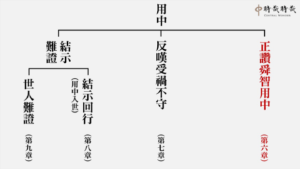

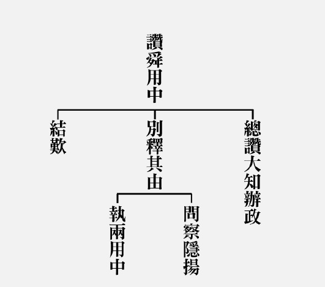

### 三字經簡說（八）

*淨爾整理*

解詩了風俗

學禮能立身

講易見天心

讀史知興衰

經文：

周武王，始誅紂；八百載，最長久。周轍東，王綱墜。

周武王因為紂王殘暴失民心因而起兵討伐之，建立了周朝八百六十七年的基業，是中國歷史上國祚最綿長久遠的朝代。周朝因為犬戎之亂致使平王東遷，建都洛陽後史稱東周。自此朝廷的綱紀法度衰落不振。諸侯國間為了擴張勢力而濫用武力發動戰爭。說客遊走於各國之間，為了功名利祿，以機巧的言論求取諸侯的寵信與任用，在東周時期蔚為風氣。東周始於春秋，終於戰國。春秋時期，五個大諸侯爭強作霸主；戰國時期則有戰國七雄稱霸爭雄。

武王伐紂建立周朝後，未及兩年就因病過世，成王年幼即位，由周公旦攝政。然而，武王其他兄弟對於周公有所不服，因而結合紂王之子武庚發動管蔡之亂，周公東征平叛將近三年之久，亂事平定後為了維持東方的勢力穩定而營建東都雒邑，命為「成周」，舊都鎬京則稱為「周」。

周公東征勝利之後，為了治理廣袤的土地與人民、維持國家的長治久安，周公實施了幾個重要政策，例如井田制度、宗法制度、階級制度和分封制度等，在此僅就和東西周裂變和春秋戰國的亂局最相關的制度說明如下：

一、分封諸侯

周朝有兩次封建，一次是武王克殷後以鎬京為中心分封同姓宗室、酬報功臣及安撫遺民並以此爭取民心。二是周公東征後以東都雒邑為中心重整分封勢力和土地人民。基本上可分為四類：

（一）姬姓同姓親戚：例如周公之子伯禽在魯，武王幼弟康叔在衛。

（二）異姓功臣：姜太公受封在齊。

（三）先聖後裔：舜的後代在陳、夏禹後代在杞。

（四）殷商遺民：微子在宋。

二、階級及宗法制度

分為貴族、平民、奴隸三種階級。宗法制度則有大宗和小宗之別。

貴族階級必須受禮樂的約束，貴族包含天子、諸侯、卿大夫和士。天子擁有的國土稱為王畿。諸侯和卿大夫享有世襲的爵位並擁有土地，諸侯的土地稱封國，士大夫的土地稱采邑，兩者不但擁有土地權也有封地的統治權。士，接受文武合一的教育，出征打仗的是士，士雖然是貴族，但所持有的食田和俸祿是不能世襲的。

平民和奴隸是周朝社會的勞動生產主力。平民，多數為職業世襲的農民，少數為依附在貴族下的工商業者，但當時土地為貴族所有，農民因此必須向貴族供奉粟米、布縷和勞役。

奴隸的來源主要是戰爭俘虜或犯罪平民，和平民一樣是社會的勞動力，最主要的差別在於奴隸的人身自由，例如人們熟知的百里奚，就是秦穆公用五張黑羊皮換來的奴隸，翻身變名相。

周朝建立嫡長子繼承制以穩定統治權、減少爭權位的紛亂。然而當西周末年周天子率先破壞宗法制度，就預示了後來春秋戰國時期的倫常崩壞。

周朝的衰弱始自周厲王時期，周厲王即位後推行專利制，國都附近的山林川澤都收歸管理，人民必須繳納高額稅金方能進入伐柴、獵捕、採集，因而民怨連連。周厲王為了阻止輿論，下令只要有誰敢誹謗國君就處以死刑，人們只好對王室的貪婪剝削積怨在心但噤口不言，周厲王見此，竟高興的對召穆公說：「我能消弭百姓的毀謗之言，人們再也不敢有意見了。」召穆公說道：「防民之口，甚於防川。川壅而潰，傷人必多，民亦如之。是故為川者決之使導，為民者宣之使言。」堵塞的河水一但潰堤必然釀成災害，堵塞百姓之口也將如此。所以治水要疏導河川，治民要讓百姓發表意見。周厲王不聽召穆公的勸諫，一意孤行，終究導致百姓的反抗，周厲王倉皇逃難。自此周朝進入長達十四年無國君，也就是所謂的周召共和或稱共和行政時期。司馬遷的《史記》記載此時是由周公(註一)和召公共同行政，和衷共濟，稱為「共和」。但根據後來出土的文物資料顯示，是有一個共伯名和的諸侯因為受到百姓愛戴而被請到王都代行天子職權，目前學界多以後者之說為是。不論真相為何，周厲王流亡在外過世後，代理者還政於周，擁立逃難在外的嫡長子即位，是為周宣王。

周宣王前期勵精圖治，史稱宣王中興，臺灣故宮博物院收藏的毛公鼎上的金文即是記載著這段時期歷史的重要文物。但可惜周宣王在位將近五十年，後期耽於享樂、脾氣暴躁、殺戮無辜，積怨甚多。周宣王任內有兩個決策深深地影響了接下來的四百年歷史，一是將西邊曾被西戎佔領的土地歸秦國管理，並封秦莊公為西垂大夫，秦因此有了土地和官爵，晉升大夫之列。二是周宣王喜愛魯武公的幼子戲，執意命魯武公立戲為世子，武公過世後，戲即位是為魯懿公。武公的嫡長子一脈心有未平，武公的嫡長孫終究在懿公九年造反，謀殺懿公自立為君。周宣王於是率軍親征魯國，討伐魯君並另立新君。周宣王干涉諸侯國，廢長立少、以天子之尊率先破壞宗法制度，導致威信下降、自此諸侯有所不服，逐漸不從王命。

周宣王過世後，周幽王即位，幽王為褒姒傾倒，烽火戲諸侯只為搏美人一笑。且為了立褒姒為后、其子伯服為太子，而廢了申后及太子宜臼。申后的娘家父親申侯因此結合西戎攻入首都鎬京，幽王被殺，申侯立太子宜臼為王，是為周平王，然而戰後的鎬京殘破不堪，平王在鄭國、晉國、秦國等國的協助下東遷雒邑。因為護王有功，鄭國和晉國君得以擴張封地，而秦國躋身諸侯之列，鄭國因此成為春秋初期最重要的諸侯國，而晉國和秦國在此次的變革躍昇之後，於春秋時期相繼稱霸。然而，周王室卻封地縮減，且因為周平王涉及結合犬戎推翻父親，悖離周朝立國以來賴以維繫的禮樂精神，因此周天子的聲望下滑，於諸侯間的號令日漸難以推行。此即「周轍東，王綱墜」中，王綱墜的原因之一。

周王室東遷後，周平王駕崩時，魯國不前往奔喪。後來周桓王欲討伐鄭莊公，竟號令不了大國還被鄭莊公射傷，可見王命已不行。王命不行所引發連鎖效應是：列國接連爆發內亂，以下篡上時有所聞。諸侯國彼此兼併，例如楚國併吞了四十二國、晉國十八、齊國十、連魯國也併吞了九國……等。諸夏之國混亂，則蠻夷戎狄必然橫行侵擾中原。當時內有篡位弒君之事外有兼併掠奪之危，因此齊桓公、晉文公等建立的春秋五霸霸業對維繫崩壞中的東周秩序大有貢獻。

所謂的「霸」有四個意義：尊王、攘夷、禁抑篡弒、制裁兼併。尊王自然是尊重周王室；攘夷是驅逐防堵外族入侵；禁抑篡弒是指有某個國家發上以下弒上的篡位之事，則同盟諸國非但不承認，而且會出兵協助平亂；裁制兼併，同盟國間互不侵犯且若有遇到外敵入侵，彼此必須出兵相救。

霸業衰微後，諸侯國的大夫勢力崛起並進而篡位篡國，例如魯國的三桓之亂、田氏篡齊和三家分晉。周朝因此進入了所謂的戰國時期。

春秋時期，諸侯國間即便兵戎相見，多少還守信義和盟約，戰爭規模也不大，以車戰為主，戰爭侷限於貴族之間。但到了戰國時期，貴族階級崩壞，平民崛起，農民步兵成為主力，戰爭死傷慘重，例如長平之戰，趙國的四十萬大軍被秦國坑殺。

從春秋到戰國，眾多的封建小國在多次戰亂後變成少數幾個軍事國家，即所謂的戰國七雄：秦楚燕齊韓趙魏。但也因為社會秩序和階級制度的變動，促成了商業的發展和民間自由學術的興起。最亂的時代中，卻是百家爭鳴、中國思想史大爆發的時代。

經文：

嬴秦氏，始兼并，傳二世，楚漢爭。

經過了春秋戰國將近五百年的變局後，到了秦始皇二十六年併吞了六國，建立中央集權的大一統帝國。但秦朝只再傳兩世就進入楚漢相爭的局面。

位在西陲的秦國的富強，有賴於來自東方的商鞅、張儀、范睢、呂不韋、李斯……等人。秦始皇從二十六年統一天下到三十七年駕崩，短短十一年間，除了焚書坑儒建長城之外，他還推行了郡縣制確立了此後兩千年中國版圖的大致輪廓。另外統一度量衡、建立車同軌、書同文、行同倫的制度，以文化統合百姓。但秦朝法令嚴苛、賦稅繁重，加上過度役使百姓，自然引發民怨，秦始皇一過世，各地勢力紛紛崛起，其中以劉邦和西楚霸王項羽的楚漢相爭最為人所知，項羽出身楚國貴族階級，世世代代是楚國名將。但劉邦率先進入秦國首都咸陽，與百姓約法三章後在關中自行稱王，劉邦聽從張良的建議，封存所有宮室府庫，未有破壞。但項羽一到咸陽，即蒐羅婦女寶物並且屠城，一把火燒了所有宮殿，天下百姓對項羽大失所望。因此身邊有張良、蕭何、韓信等賢臣名將的劉邦，由此得以在這場爭戰中取得最後勝利。

經文：

高祖興，漢業建，至孝平，王莽篡。

光武興，為東漢，四百年，終於獻。

劉邦建立了漢朝，是為漢高祖，開創中國史上第一個平民政府，建立漢朝統治大業。漢朝傳到了孝平帝時被外戚王莽所篡。光武帝劉秀復興漢室，稱為東漢。兩漢共四百三十九年，最後一任漢皇帝是被曹操挾持的漢獻帝。

漢朝大業包含文治與武功，在實際的武功上，漢景帝統一中原；在文治上，漢武帝將漢文化的發揚光大。西漢的文治思想，由賈誼率先提出，他提出教育太子、尊禮大臣、闡揚文教、移風易俗等的重要性，並提出治國由法律刑罰到禮樂教化的思想。漢武帝時採納董仲舒的意見，設立五經博士，大興儒術。漢代在天文觀測、造紙、地震科學、醫學等技術均已領先世界。但從漢武帝、昭帝、宣帝之後的皇帝一代不如一代，元帝時昭君和番可知當時國力的日漸衰弱，成帝縱情聲色，哀帝寵愛男色，平帝九歲即位，這種種都促成了日後外戚王莽的篡位。在漢平帝之後，王莽自稱假皇帝代攝政權，並營造出將近四十九萬的官吏、百姓共同上書推舉王莽繼位為真皇帝。王莽建立新朝，但國祚僅短短十五年便被劉秀推翻。

西元二十五年，劉秀即位，是為漢光武帝，遷都洛陽，史稱東漢。劉秀登基後下令成立太學、尊崇儒術、提倡孝道並改革吏治。光武帝之後的明帝、章帝，史稱明章之治。但漢章帝三十一歲駕崩，即位的和帝年僅十歲，他的母親竇太后一族把持朝政，和帝長成後結合宦官驅逐竇氏的勢力，自此之後的東漢，一代復一代地陷入外戚漢宦官爭權的循環之中，根據統計，東漢從第四任漢和帝到第十任的桓帝，短短八十年經過了七個幼小的皇帝、四個太后，七個小皇帝只有四個有機會長到成年，這四個都利用宦官誅殺外戚。平均每十年政權輪替一次，每次都是同樣的外戚與宦官的惡性循環。

從桓帝到漢朝最後一個皇帝漢獻帝，這段東漢末年的時間裡，接連爆發黨錮之禍、黃巾之亂、董卓之亂，最後則是曹操挾天子以令諸侯進入三國魏蜀吳的分裂。（下期待續）

備註一、春秋和戰國之名何來？

春秋：這是以孔子所作的春秋命名，在孔子之前的古史皆稱春秋，因為各國朝廷大事多在春秋二季舉行。公羊傳：春為生物之始，秋為成物之終，始於春成於秋。

戰國：孔子絕筆後稱戰國(源自劉向的《戰國策》)，但因為這時候的諸侯毋須再畏懼孔子的春秋筆，從此戰禍不斷。

備註二、參考資料：

１．國語-周語

２．國史大綱，作者：錢穆，臺灣商務印書館。

３．另眼看歷史，作者：呂正理，遠流出版社。

４．始皇帝的遺產，作者：鶴間和幸，臺灣商務印書館。

## 藝術賞析

### 孔門七十二賢淺說（二十二） ─梁鱣

圖：江逸子‧文：時哉

聖門座下各不同

狂狷皆待夫子栽

歸與歸與盼培才

性情不同皆歸正

梁鱣，字叔魚，齊國人，居齊國千乘北面尼山，從游聖門最久，小孔子二十九歲，在齊景公時從學孔子。

孔子家語中記載，梁鱣到了三十歲還沒有兒子，因而想要出妻，結果商瞿告訴他：您不要這樣。過去我三十八歲還沒有孩子，我的母親要為我再娶。老師（孔子）派我去齊國，母親想要請老師讓我留下來。老師說：不用擔心。瞿過了四十歲，應當會有五個兒子。如今確實是如此。我怕是您自己應當晚年有子，未必是妻子的過失。梁鱣聽從了商瞿的建議，兩年之後，果然生了孩子，取名贖字子襄，後為曾子的門徒。

梁鱣於東漢明帝永平十五年從祀，唐開元二十七年追封梁伯，宋加封千乘侯，明朝改稱為先賢梁子。

畫中的梁鱣雙手合抱似乎納諫，貌似厚道之人。有道是：福在受諫。宅心仁厚，自然獲福。二年之後得子，是命呢？還是自己所修之福呢？

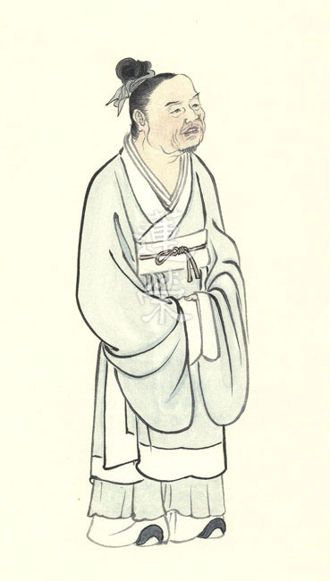

### 華夏精魂千秋(二十四)  —明倫史畫─化民成物─魯恭

圖：江逸子‧文：淨域

仁心須從孝弟

讀書充實無間

歷練能力增長

時間累積成功

史話

魯恭，字仲康，東漢右扶風郡平陵縣(今陜西省興平市)人；生於光武帝建武八年，卒於安帝永初六年(西元三十二-一一二年)。生性仁慈孝友，知書達禮。祖父匡(天潢)在王莽新朝任羲和(大司農)，提出「五均六筦(管)」的經濟政策(抑制富豪兼併)，竟成為權貴謀私的工具。父親紫照於光武帝建武初年，出任荊州武陵郡(今湖南省常德市)太守，死時魯恭十二歲，與弟丕謹服喪禮，哀慟至誠，鄉里稱奇。

十五歲時，與母親、弟弟一同住在太學，終日閉門向學，不與他人閑遊，兄弟皆博通儒學。太尉趙熹賞識他的好學精神，經常讓兒子送些物資給他，但都遭到婉拒。為了照顧弟弟早獲功名，他一再推辭州郡的召舉，在京兆新豐縣(今西安市灞橋區)教書。章帝建初元年(西元七十六年)，丕(魯恭之弟)舉賢良方正，魯恭才做郡吏。

趙熹知其出仕，便召入府內任事。建初四年，帝下詔召集諸儒名士於洛陽白虎觀，共議《五經》異同，魯恭亦參與其事。隨後，趙熹舉薦他為中牟縣(今河南省中牟縣)令，以德化治理地方，不濫用刑罰，鄉里多年難斷的爭訟，經他平理曲直皆能解決。
建初七年(西元八十二年)，司隸州(轄區約河北南部、河南北部、山西南部及陜西渭河平原，計七郡一零六縣)所屬郡縣發生蝗災，農作受損嚴重，唯獨中牟縣沒有蟲害。河南郡尹袁安聽聞蝗蟲不犯中牟之事，心中疑思不信，派郡吏肥親前去察看。魯恭陪伴肥親巡行田野，果然一片平疇綠野，絲毫沒有見到蝗害。來到桑樹下休息時，見一旁野雉啄食、孩童嬉戲，彼此互不侵擾。肥親問孩童：「你怎麼不捉牠呢？」孩童回
**答：** 「野雉就將下蛋孵育了，不可以捕捉。」

肥親聽後很受感動，起身恭敬地對魯恭說：「我來察訪您的施政情形，見蝗蟲不入境，是第一件不平凡的事；教化能施惠及於禽獸，是第二件不平凡的事；年幼的孩童具有仁慈的心腸，是第三件不平凡的事。這正是您政績與眾不同的地方，我不便多加叨擾，就此告別。」

魯恭治縣三年，普受人民愛戴，因母病逝辭官守喪。後任侍御史，拜為《魯詩》博士；平定東州民變，遷升侍中、光祿勳，每能對時政提出善言，和帝時累官至司徒。安帝永初六年(西元一一二年)壽終，享年八十一歲。

圖解

本圖江老師所繪，乃司隸州發生蝗災，唯獨所屬中牟縣沒有蟲害；河南郡尹派郡吏肥親前去察看原由，於巡行田野之後，魯恭與之同坐樹下休息交談之景。肥親見童戲、雉食互不侵擾，又聞童言：「不可擅捕雉鳥」，便知此處是個善教之地，不僅人心善良，且民胞物與，萬物融和，風調雨順。

《論語》中有「仁」者五十八篇，是故說「仁」是孔子思想的中心，用以推行教化。仁者愛人，即是博愛之意。愛人非表面的做作，而是從心底發出。俗謂：「一念善心起，百萬順緣開。」人的命運不好，追根究底就是善心被障蔽了。

《論語》〈鄉黨篇〉中，孔子見山中橋樑上有雌雉，便舉古詩對子路說：「色斯舉矣，翔而後集。」本意是鳥感受到環境有異，一時間便振翅飛去，於空中翱翔觀察後，若覺得無危險才落下來棲息。孔子藉此教諭子路，人之處世要如雉鳥懂得時機，觀機後進則進、退則退。子路聽聞後，拱手向雌雉禮拜，雖無侵擾之心，但雌雉以為將受害，便振翅飛去了。

由是可見，心念之細雖無所見，但卻可以感應到。子曰：「能行五者(恭、寬、信、敏、惠)於天下，為仁矣。」而身為領導者也須愛民，行仁政、施德澤、克己復禮，則一個禮治的社會不難實現。如此再觀於此史話與圖作，魯恭治縣蝗蟲不侵，實是善心仁政之教化風成。（下期待續）

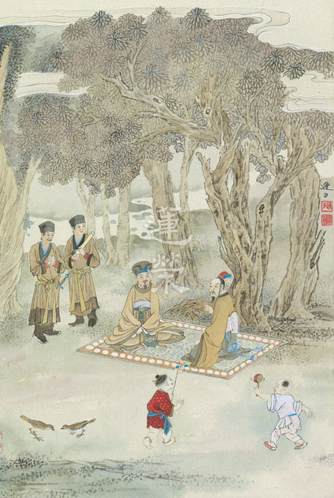

### 華夏道統源流圖後記

圖：江逸子‧文：淨悟

文化延續民族存

道在人身民族魂

典型夙昔民族史

後浪相續民族興

說到神話故事你會想到什麼？一般人想到的可能是希臘羅馬神話、北歐神話；隨著影視娛樂的推波助瀾，將各個神話改編，北歐諸神中的索爾、洛基成為了時下年輕人的熱門偶像。殊不知在華夏文化中也有許多神話傳說，其廣泛的題材、豐富的想像力以及啟發性，並不亞於西方神話，且與之相比，華夏神話更是別具一格。

上古神話與傳說記錄下古代先民對於大自然的解讀、生活的方式與民族的價值觀，是彌足珍貴的文化遺產，許多先民的智慧與結晶，寄託於奇幻的故事中，吸引著孩子的目光，並藉由詩歌、文字等方式保留下來，放眼世界各個文化，無一不是如此。

不僅如此，神話故事更可以認為是今日人類這個物種稱霸地球的關鍵。事實上經考古學家研究發現，遠古地球上的物種豐富性遠勝於今，甚至光是屬於「人」的一類生物，至少就有六種，如常聽聞的尼安德塔人、直立人、智人等等。當前的主流看法是，這些人種曾經同時存在，然而在歷經時間的考驗後，是我們的祖先「智人」逐步淘汰其他人種，接掌了世界。全球知名的歷史學家兼思想家哈拉瑞（Yuval Noah Harari）認為，「智人」之所以能勝出，是因其突出的語言能力，最大的關鍵就是聊「八卦」的能力。因為我們有能力討論「虛構」的故事來凝聚群體，故能稱霸全球。根據研究，自然界的動物群體，或者人類本身，單憑一個人的能力，一個領導者頂多能經營約150人的團體，可是如果藉由細膩的言語表達，透過說故事的方式賦予精神象徵，其凝聚的群體可以突破這個上限，成千上萬的人們將統合其身心，彼此團隊協作，開創不可思議的功業。

正因如此，華夏民族的神話傳說，代表著曾經生活在這片土地上的人們，對於當地的氣候環境，所衍生出來的生存法則與智慧，也正因這樣的故事，團結了一代又一代的人們，保障民族文化能綿延五千多年不中斷，是其他文化所罕有。若能仔細研究推敲，方知其道理，誠不虛妄。

華夏神話寄託的不僅僅只是先民的生活，也不光是解釋世界的起源、自然的現象，更重要的是它承載了道統。對比於西方知名的幾個創世神話，諸神或者享樂無度，視人間如塵土，或者善惡分明，水火不容，十分好戰。相較之下不難發現華夏神話中的主人公性格鮮明，多是體現為眾承擔的勇氣，如盤古開天、女媧補天皆然。崇尚的英雄人物絕非因其驍勇善戰，而是真正的領導者，能為人民解決災厄，帶來福祉，三皇五帝無不正是如此嗎？

這樣的上古傳奇故事代代傳唱，從幼兒發蒙開始，深植於民族的根柢中，成為了凝聚華夏民族的「虛構故事」，也是道統的濫觴，並孕育各個時代的英雄豪傑，這種勇於承擔，不畏艱難的氣節，才能使民族在逆境中不亡，在順境中興盛。這些神話故事，上起三皇五帝前的上古傳說，下至歷朝各代的典範，又經儒釋道三家文化的洗禮淬鍊，賦予更多元的內涵，豐富其色彩。

《華夏道統源流圖》以藝載道，用人物書畫的方式，記錄下文化的瑰寶，畫中人物的儀態神色栩栩如生，有助於我們了解道統的形象與典範，如此圖文並茂更能深入人心，亦符合時代需求。值此時日，能見此書實是稀有難得，更待來者能有流通推廣之因緣，不使道統中斷，以利大眾。

## 蓮池海會

### 陳許碧雲老居士往生見聞記

淨昌

忍苦悍勞忠信質

雖操賤業品德高

奈何不具暇身修

所幸助念得生西

陳許碧雲老居士出生於民國二十六年十一月三十日，臺灣省彰化縣鹿港鎮人，家中食指浩繁，身為大姊的老居士，從小就要幫忙照顧五個弟弟、兩個妹妹及幫忙家務事。這樣的磨練，養成了老居士善於照顧他人，與刻苦耐勞的精神。

成年後老居士經人介紹，結縭陳益生先生。婚後移居臺北市租屋，因為教育程度不高，老居士與夫婿都從事勞力工作，老居士一生隨著社會變遷先後從事替人洗衣、洗車、餐廳廚房及公司清潔等工作，雖收入微薄，但工作勤奮胼手胝足，也撫養一子二女長大成人，都能服務社會，貢獻己力；在如今寸土寸金的臺北市也能擁有自己的房屋，這都是老居士一家人努力的成果。

老居士一生沒有顯赫的學經歷，可是高尚的品格卻在職場中表現無遺。例如六十多歲起在某西餐廳廚房工作，擔任煮濃湯、煎牛排及洗碗等瑣碎工作，夏天的廚房，高溫悶熱。老居士忍苦辛勞工作超過十年，到後來餐廳經營不善，積欠薪資，老居士依舊願意和餐廳共苦，直到餐廳結束營業。對積欠的薪資，也寧願自己吃虧，不為難別人。聽聞到這種「寧人負我，我不負人」的胸襟，出現在老居士的身上，讓吾輩號稱讀聖賢書的後生小子，感到汗顏不已。

老居士的忠信品德並非無人認知，當時老居士同時在另一家公司行號兼差，負責打掃辦公室及老闆娘私人工作，這份工作也超過十年以上，老居士的品德受到老闆娘的信任，在有一次出國期間託付公司重要物件給老居士保管，而不是給公司的內部員工。後來老闆娘生病過世，老闆娘的先生獨居臺灣，老居士也一直在照顧他的飲食，直到後來這一位先生也過世。孔子說：「十室之邑，必有忠信如丘者焉。」誠哉斯言。而曾子所說：「吾日三省吾身，為人謀而不忠乎，與朋友交而不信乎。…」老居士雖然沒有受教育的因緣，但是忠信的特質是老居士與生俱來的，「雖曰未學，吾必謂之學矣」

雖然生活不易，但「樂善好施」對老居士來說不會成為困難，在餐廳的工作時，懂得把多餘的食物，分享給附近作資源回收工作的外籍移工，讓這些漂泊他鄉的年輕人，能在千里之外的異鄉，感受到些許彷彿故鄉長者的關愛。又當外籍移工回饋以較好的衣物時，老居士再反過來，將這些衣物贈送給餐廳的同事。雖然佛說「貧窮布施難」，但這是大致上說貧窮的人比較不具備作大布施的條件，老居士能善巧運用物資行布施，對照某些富貴而一毛不拔的人，有道是「貧賤善巧能布施，勝於富貴而慳吝」、「嚴以律已，寬以待人」。老居士不僅在職場上如此，對待自己的至親家人，老居士滿滿的愛更是顯露無遺，例如老居士將自己工作所得薪資絕大多數都交給先生處理，也從不過問錢的事，完全信任先生的處置，七十歲以後還要子女別包紅包，減輕負擔；六十多歲時為了節省上班所要搭乘公車的費用，還在耳順之年學騎腳踏車；每逢大女兒來工作的餐廳探視，總是詢問是否吃飽；大女兒回娘家要告辭時，除了大包小包的帶，臨別總不斷叮嚀要小心，在作母親的心中，兒女永遠是長不大的小孩，可說是天下父母心都是一樣的。

老居士一生辛勤工作直至民國一百零六年十二月六日跌倒為止，因為傷及腦幹功能，一直陷於昏迷，無法自主呼吸，期間有家屬因為長期在學會共學及發心，知道臨終助念的重要，也有多位師長前往醫院關切，但因緣不具足而無法回家助念。直至一百零八年元月十二日早上發生休克現象，加上腎功能衰竭，往生因緣終於成熟，回家助念八小時後，面容安詳面帶微笑，確為阿彌陀佛接引往生西方之證明。

綜觀老居士一生，誠樸堅毅，溫柔敦厚，樂善好施，捨己從人，雖無豐功偉業，品德善行足堪世人楷模。但善行縱有如恆河沙，如無家屬具助念往生的知見，老居士的往生淨業無由在臨終成熟。期使來者藉老居士之示現，了知經營佛化家庭的重要，即便蓮友大德身具初禪以上不動業的修行功夫，萬一臨終被送至醫院，亦不免折磨受苦。何況吾輩悠悠泛泛，一曝十寒的功夫，能不好好經營自他的往生大業嗎？有志者宜共勉之。

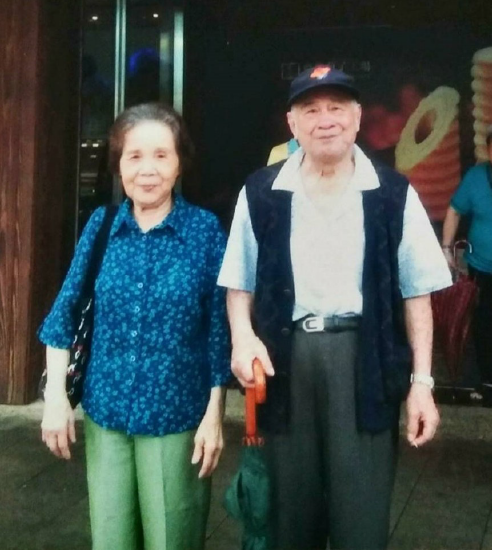

## 活動報導

### 儒者之風｜孔德成先生百年紀念展報導

淨爾

大起大落的命運

定義清楚的人生

相似孔子的遭遇

再啟家族的未來

一九七○年，萬國博覽會(又稱世界博覽會)第一次在亞洲舉辦，這場在日本大阪舉辦的盛會有一樣展品特別地轟動，那是前一年阿波羅十二號從月球帶回來的岩石。那年也是臺灣最後一次以中國館的名義參展，副總統嚴家淦、財政部長李國鼎、經濟部長孫運璿都一起參與了中國館的開幕升旗典禮，而且還見到了日本天皇。就在外界看來兩國邦交達到巔峰的一年多後，中日斷交了。不只中日、中美斷交，世界上大多數的國家都跟臺灣解除邦交關係。七○年代，是臺灣的外交開始陷入困境的年代。但那也是孔德成先生走出國際、以孔子聖裔的身分協助政府推動民間外交之時。

在七○年代以前，孔先生曾經是衍聖公，然後是奉祀官、又兼任國大代表、也曾是國立中央博物院聯合管理處主任委員、同時又任教於多所大學。七○年代後，他的身分又多了考試院院長一職。

孔先生的一生，如同那個時代的多數人，人生就是中國近代史的縮影；但孔先生不同的是，他一個人就代表著一種文化的興衰起落。

大開大闔的一段人生，可以當作從北洋政府到國共分裂的歷史閱讀、可以分析從五四運動到文革的文化波濤、也可以單純讀讀故宮文物在北溝的故事或是台灣大學中文系所的一段難得的學術榮光。

最顛沛流離的一位衍聖公，也是最精彩絕倫的奉祀官。就在這樣豐富又深厚的基礎下，開展出了一部紀錄片、一場紀念會、三本書和二十二天的展覽。

所有的活動都圍繞著這場展覽：儒者之風｜孔德成先生百年紀念展，從民國一○八年一月十九日至二月十日閉幕，於國父紀念館博愛藝廊及東西走廊展出孔子世家譜和新續譜、世系表、孔府珍藏的衍聖公蟒袍、朝珠、孔德成先生的墨寶、日記、書信、手稿、印信以及多幅珍貴照片。

透過位於東西走廊的年表與照片展示，參觀者可以一覽孔德成先生的一生經歷與重大事件。從孔子的世家譜和世系表，我們得以一窺全世界最古老的家族如何的綿延流長。現場的法書除了可以見到孔先生精湛的書藝，更重要的是從每一幅作品背後的故事，我們了解到孔先生和其故交舊友、子媳孫輩以及門人學生往來的情誼。

藉由孔德成先生合集的出版（日記、文集、法書集），讀者可以從日記中了解對日抗戰時陪都重慶的日常與飽受轟炸的情景，但日記中最令人印象深刻的是孔先生的勤學與親子時光。文集中收錄了孔先生曾經發表的研究文章，可見其作學問之字斟句酌。法書集則提供了讀者回溫孔先生精彩的書法藝術。

但文字只是片段，紀錄片串連起孔先生的一生，從片首空拍曲阜孔府到片尾孔先生臺北住家老公寓一隅，觀影者看到的是外部空間由寬大到狹隘的變化，但領會到的是孔先生內在心境的自由淡泊與寬懷自在。

一場展覽，雲集曾經和孔先生共事的故交老友、各期學生、甚至是學生們的學生也來了，還有他考試院的下屬來緬懷長官、山東同鄉後輩來看看他們所敬慕的山東幫幫主的文物、也有日本麗澤大學青年學生特地組團前來。在展場，導覽志工說著他們讀到的孔先生，而來看展的人們則回憶著他們曾經認識、相處過的孔老師、孔院長、孔先生。一個又一個故事在展場中交會，我們都在緬懷，也許緬懷的是老師對學生的厚愛、也許緬懷的是長官的泱泱風采、也許緬懷的是同為流落台灣的山東人的共同記憶、也許緬懷的是一種風範，一種再難得見的儒者之風。

精彩的故事永遠說不完

說不完的故事最精采

展覽不是一時際會，是相識的人一起學習，也是相識和不相識的人，因為在那樣的時間與空間中交會，然後一起歡笑、一起感動、也一起勉勵。

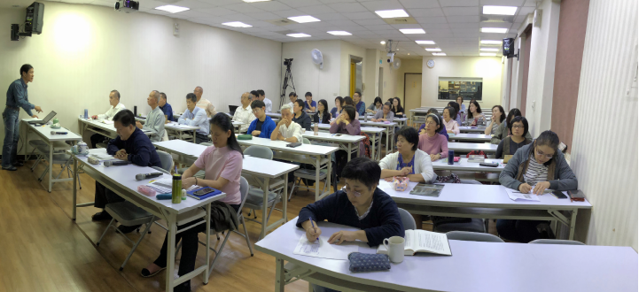

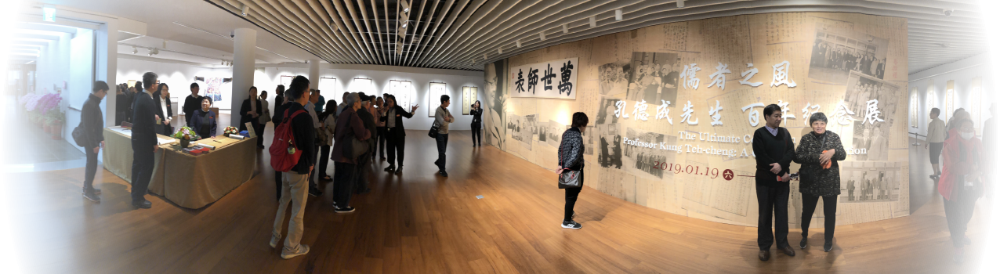

### 儒者之風｜孔德成先生　百年紀念展展場紀實

淨池

境界是一番番挑戰

學習是一次次增上

人生是一層層體悟

生命是一場場驚喜

前言

孔德成先生百年紀念展可謂空前絕後，因為這些法書以前不曾共同展示過，而以後若想重新再匯集所有參展作品，成功的機會可說微乎其微了！目前市面上有許多署名為孔德成先生的法書，其實是由孔先生在奉祀官府的同事，或孔先生的學生代筆。而本次在國父紀念館展出的墨寶已被學者專家鑑定為孔先生真跡，是在不同因緣下親自寫給親友、故交與學生等，故感謝法書持有者竭力護持本活動，同意將珍貴的法書外借參展，我們才能在展場中近距離賞析這些墨寶，實為千載難逢的機緣啊！

展出期間不乏可見孔德成先生後裔、教過的學生、高僧大德、書法名家及文人雅士等親臨會場觀賞，另外有些是慕名而來專程參觀的，而最特別是有許多路過的遊客，其中包括春節期間有許多來自大陸的自助旅行者，本想進入展場四處隨意瀏覽一下就好，想不到竟被熱忱的志工主動為其導覽而駐足良久，因為遊客在導覽志工的介紹下，霎時居然感受到孔先生的法書是有故事的，有內涵的，有生命力的，會讓參觀者眼見耳聽之下，觸動心弦而歡喜讚嘆！可見孔先生的法書固然適合知音摯友細細品味，而對於一般遊客大眾來說，透過被導覽方式，可幫助他們快速瞭解孔先生生傳奇的一生，包括家庭、出生、結婚、求學、避難及遷臺定居等過程，以及如何誨人不倦的培育人才，並以聖裔身分成功推展國民外交，尤其他一生致力傳承與弘揚孔子文化道統部分，更是居功厥偉！

現場多位師長志工表示，無論是聆聽師長精彩的介紹，或是自己為觀眾導覽，每當一場導覽圓滿結束後，就有多一層的人生體會與感動，並慶幸自己有機會與孔子聖裔結下殊勝的善緣，實在太不可思議了！而現場師友間互動良好，有許多美好心得及趣聞，頗値得分享，故藉此批露一二。

沈子匜簋

自稱八六叟的沈德輔老先生，今年八十六歲，家住國父紀念館附近，臺大畢業，早年高考優等進入海關服務後，就常利用公餘閒暇時間，四處參觀各種文藝書法展覽。日前偶然發現此紀念展，驚喜異常，認為展出作品千載難逢，故在第三次參觀時，老先生捐贈孔上公親題「沈子匜簋」影本，於簽名軸上簽名後，附註「元月廾七日三度拜觀並敬奉拾遺壹件」。謹摘錄老先生就展品拾遺說明如下：「西周金文沈子匜簋蓋銘文拓本，孔德成先生民國四十二年癸巳正月所題(並註明『只存蓋』。)按：此時方當盛年，故筆力奇佳……。」

現場導覽人員讚賞老先生學問淵博，邀請老先生一起照相留念，老先生欣然同意，並在現場立即回贈以導覽人員名字所作之即興詩：「鳳凰于飛聖賢垂教，瑛珠煥彩寶婺騰輝。」「志氣長虹，卿雲五彩；玖玉美質，如燄千重。」「志氣干雲，忠義救世；秀質如玉，春日祥和。」

萬馬齊暗究可哀

沈德輔老先生果然學富五車，當他見到孔上公法書「萬馬無聲秋塞月，一鐙有味夜窗書。」時，立刻吟出清朝著名文學家龔自珍詩句「九州生氣恃風雷，萬馬齊喑究可哀。我勸天公重抖擻，不拘一格降人才。」作為輝映。因為詩文中亦有萬馬二字，故老先生特別提出來讓大家賞析。

「九州」指中華大地，中華大地要恢復生氣，必須依靠狂風驚雷般的炸裂力量，此其實已暗示當下中華大地暮氣沉沉，一片死寂。「萬馬齊喑」指千萬匹馬都啞口無聲，比喻國人沉默不語，不敢發表意見。熟悉清史的人都知道，康雍乾三代皆有文字獄發生，莊廷鑨《明史》案、戴名世《南山集》案、查嗣庭「維民所止」案(諷刺雍正無頭)……朝廷動輒以言入罪，導致知識分子埋首故紙堆，考據、訓詁興盛的另一面，就是政治評議之消失。龔自珍似乎認為，國人不談政事，乃中華大地喪失生氣的原因。中華大地要重現勃勃生機，國人必須關注、評議時政得失。「我勸天公重抖擻，不拘一格降人才」，是說人才當以「能否關心國家社會」、「是否擅長針砭時弊」判定，故不宜用僵化的考試形式─考據訓詁名物度數之成就判定誰是人才。龔自珍的見解，教人想到東漢太學生的清議，也想到明末黃梨洲「學校之盛衰，關係天下之盛衰」。

福祿壽三仙

「哎呀！我們都不知道有這個展，不然我們也有孔先生的墨寶和書信啊！」三位年逾八十的伯伯說道。這三位，是中研院院士張玉法先生、前中研院近代史研究員也是山東文獻主編陶英惠先生，以及嘉義大學榮譽教授王克先老師。

張玉法先生說：以前常在會賓樓和悅賓樓跟孔先生喝酒啊！

陶英惠先生說：「我主編山東文獻，孔先生是掛名社長，山東文獻四個字就是他題的。我女兒結婚時也是孔先生證婚。」

三個伯伯都是流亡學生，除了王老師是江蘇人混入山東流亡學生群中之外，另外兩位都是一路從山東流亡到澎湖，再從澎湖到臺灣。

他們看到展場中的一封信，是孔先生寫給臺大張亨老師的，他們說：「張亨是山東學生中第一個考進臺大的。」

他們站在孔先生六十大壽的簽名軸前，點名著：這是我們的校長啊！這是山東企業家啊！這個也是山東人啊！這個是我老家姓陶的！

你怎麼也拿拐杖了？

(以枴杖頓地)這叫以策安全啊！

開展第五天，兩位臺大退休教授彭毅老師和章景明老師在紀念展展場相遇。

章景明老師是孔德成先生眾位弟子中傳承禮學的其中一位，另外兩位是葉國良老師和洪國樑老師。章老師也是臺大學生必看的士昏禮影片的男主角。當時每個學生要各自做研究，例如研究古代器物的形制、馬車、服裝等，必須參考地下發掘的古物報告，研究好了就進行仿製。當時參與復原統籌的就是彭毅老師的先生張亨老師。

彭毅老師帶了她以前台大的學生們來看展，除了監察院副院長孫大川之外，其餘的女學生都已經是退休的國文教師。彭老師回憶她結婚時沒什麼錢，就請台大的師友們在一間館子「美而廉」吃點心，他們夫妻的本意是不想讓老師朋友門破費送紅包，沒想到大家禮數一點都沒少，但偏偏那家館子的食物不怎麼樣，他們夫妻感到過意不去。於是婚後她就在狹小的台大教職員舊宿舍請孔先生、臺老師等人用餐。當時燒飯還要用炭爐，家裡東西少，桌椅鍋碗瓢盆都是去租借來的，那天作的一桌子菜，就一道「屈雞」被孔先生讚美，日後，孔先生常提到彭老師的「屈雞」，害大家以為她手藝有多好。

紅門北去少人家  路轉峰迴日已斜

好是對松亭上坐  山坳遠看小桃花

這是誰寫的詩呢？本來推測是孔德成先生的自作詩，但收藏者臺大中文系彭毅教授說：「就是個山東詩人寫的，也不知道是誰，老師有說，可我忘了。」一九九○年夏天，孔德成先生請學生在會賓樓吃飯，約好十個人，一大張桌子只到四個：何佑森、洪國樑、張臨生和彭毅四人。那晚，何佑森老師開口向孔老師求字，老師竟然應允了。接著洪國樑老師也輕聲求字，老師也寫了。這時，彭毅老師走去櫃檯拿紙，往孔老師面前一擱，說：「老師您不可以重男輕女。」於是，彭毅老師就得到這幅字。

老師找吃飯不能不去，否則損失很大。

見機行事很重要，機會是掌握在自己手上的。

三Ｄ動畫的因緣

葉國良老師在展場與導覽志工說起了一段陳年往事，他說「士昏禮」是孔老師自費請人拍攝的，這部黑白影片使用三十年後已不堪繼續播放，因此葉老師想以彩色三Ｄ動畫拍攝，因為朱邦復先生曾協助莊靈先生拍攝士昏禮這部片子，當時的女主角就是臺大中文系的賀姍姍小姐，大家覺得朱邦復先生對賀姍姍的印象非常好，因為有這段因緣，當葉老師有意請朱邦復先生做三Ｄ動畫時，雖然當場倆人並沒有談價碼，但朱邦復先生卻馬上欣然同意承包。葉老師今日回想起來仍然非常感念朱邦復先生願意伸出援手相助，原先葉老師申請到的金額不到二百萬元，事後朱邦復先生明知不會賺錢卻願意幫忙做三Ｄ動畫，因為朱邦復先生志節高超，他的想法就是跟一般人不一樣，他對錢的事情本來就不會太在乎，為了理想可以勇往直前，所以才促成這件合作案，之後葉國良老師有請朱邦復先生到台大中文系演講，葉師母也知道朱邦復先生幫了葉老師一個大忙，做了一件大善事。葉老師再三強調，因為經費已經申請到了，但是如果不能順利發包，葉老師認為那是一件很丟臉、沒有信用的事。

額外一提，朱邦復先生湖北省黃岡縣人。為中文終端機、倉頡輸入法、漢卡的發明人。由於其對中文電腦發展的眾多貢獻，臺灣及香港地區的華人譽其為「中文電腦之父」，亦因其個性獨具、天馬行空，被人稱為「中文電腦瘋子」。

望月樓的故事

葉國良老師問大家有沒有聽過臺大望月樓的故事？大家齊聲回答說沒有，並個個望著葉老師期待他趕緊說明，此刻葉老師不疾不徐地說臺灣大學有一座「望月樓」，許多人開玩笑說，望月樓望的月就是林文月，還有男同學將自己住的地方取名望月樓，眾人聽後皆驚訝臺大居然有這麼浪漫的傳聞。

林文月是翻譯家、散文家、美食家，是連橫的外孫女，連戰的表姐，臺靜農教授的學生。在臺大中文系，林文月是有名的「系花」，追求者眾，至今仍然流傳著許多男同學愛慕她的故事。林文月最後選擇了郭豫倫，郭豫倫是林文月大嫂的弟弟，日後成了著名的畫家。在二十五歲結婚以前，林文月從不曾下廚，婚後卻練就了一手好廚藝。她的家宴，曾讓許多文化人回味無窮。後來她寫成了《飲膳札記》一書。林文月不僅貌美如花，而且才華橫溢，無論是文學創作、學術研究還是翻譯，樣樣成就斐然。台灣文化界將這位臺靜農先生的得意門生，與周作人、林語堂、張愛玲等相提並論。

値得學習的敬業態度

身材嬌小的張秀玲老師讓人初見的感覺，就像是一位還在唸書的大學生，民國八十七年，張老師唸研究所時，正是上孔老師的儀禮、金文、商周銅器等課程，當時孔老師已七十九歲，她覺得孔老師對她最大的影響是敬業態度，就像論語所說的「出門如見大賓」。

她說：「我就是紀錄片裡坐在老師右手邊的那個人。」以前修課的時候，張老師常要到樓下去接孔上公，因孔上公膝蓋老化行動較不方便，所以會幫他提○○七公事包，張老師印象很深刻的一件事，就是公事包從學期初提到學期末的重量是不斷增加的，當打開公事包時，裡面的資料是整個「崩彈」出來，講義四處飛散，學生見狀自然立刻幫忙撿拾，因為孔老師是隨時補充上課資料的，並常開玩笑說自己的字是「草、小、亂」。無論如何，孔老師上課的資料與厚度是不斷的在增加，絕非原有教材沿用好幾年，可見其勤學用功不斷自我充實，務必將最好的知識傳授給學生，堪稱為人師表的最佳典範。

不可小知可大受

某一天孔老師來上課，上完課後可能與家人有餐敘，為了向家人確認這件事情，故立即想跟家人連絡一下。因為那時學校裡的電話較老舊，要經過跳線後才能轉撥外線，而孔老師不善於操作，所以就請當時還是學生的張老師幫他撥電話，因為孔老師並沒有記住家裡的電話，翻遍了皮夾卻找不到電話號碼的小抄，當時孔老師有一點著急，張老師在旁提醒應該可從助教的通訊錄找到電話號碼，並且主動去助教是抄來孔家的電話號碼交給孔老師，當時她一時忍不住笑了出來，但孔老師見狀沒有因此而生氣，只是輕聲的問張老師很可笑是不是？當然張老師不敢再繼續笑下去，當下心想好羨慕孔老師，因為生活在現代有好多事情要記，有好多號碼要記，但是像孔老師這樣雲淡風輕，可以不要記住這些號碼是件多麼幸福的事啊，也算是人生的一種境界吧，實在値得她去學習。此刻剛好有學長在旁補充說這是聖人不居小節的作風，不會將時間及腦力浪費在瑣碎的小事上，因為孔老師要記這些金文、古器物學及三禮就要花很多時間了！

一門兩代師承孔德成先生

說那天在展場遇到五南出版社出版的「國語活用辭典」副主編，前師大及靜宜大學教授邱德修老師的千金，其千金也是中文博士，現於臺中某大學中文系任教。她在師大讀中文系研究所時，她父親對她說：「要學習，就要跟真正的學者、真正的大家學。」於是，她就成了孔德成先生在臺大第五研究室的學生了。

她回憶，孔老師曾說他當年在北溝故宮工作時為什麼要編《故宮名畫三百種》等書籍，原因是當時故宮同仁薪水太微薄日子太苦，作出版品的其中一個主要目的就是增加大家的收入。

還有一次孔老師帶學生們出去看到滿池蓮蓬，孔老師就叫周鳳五(台大教授)去想辦法弄池裡的蓮子來吃。周鳳五老師不知怎的，使命必達，真的摘了蓮蓬來，孔老師率先取了其中的蓮子放進嘴哩，直說好吃，也要同學品嘗看看，結果大家一吃……是苦的！

日本麗澤大學訪問團

民國二十四年，孔德成先生十五歲時，日方邀請赴東京參加湯島聖堂孔子廟落成典禮。當時日本已經挾末代皇帝溥儀成立偽滿州國，據說日方也想要孔子嫡裔作為軍事及儒家道統的傀儡。年紀輕輕的孔德成先生當即婉拒邀請，改由族人代理赴日。

民國四十六年，日本道德科學研究所和廣池學園聯名邀請、蔣中正先生同意下，孔德成先生受邀赴日，機場內外人山人海都為目睹孔子嫡裔的丰采。日方曾說：「自有歷史以來，思想上子孫一貫相繼歷世不衰者，唯有孔門。」

其實，不論是民國二十四年或四十六年的日方邀約，都和廣池家族有關，廣池家族三代辦教育、推廣儒學文化不遺餘力。

在展覽的最後一天，廣池學園旗下的麗澤大學訪問團特地來到國父紀念館看展，帶領年輕學子認識儒家文化最重要的傳承嫡裔。

孩子們該怎麼認識百歲的孔爺爺？

展場的樂事很多，小朋友來看展更增添展場熱鬧的氣氛。臺北弘明幼兒園和安親班的學生，中華無盡燈文化學會啟蒙班的家長和孩子們，年齡分布從五歲到十八歲。

同樣的展覽內容，不同的年齡有不同的感受與吸收。有的就是來聽一則又一則好聽的故事，有的從孔先生的法書中學習認識大篆小篆行書楷書，有的可以體會孔先生的處世智慧，有的對孔先生和學生之間的情誼羨慕極了~這不太難，因為孩子們最愛聽故事，而孔德成爺爺一生都是故事，出生時軍隊包圍像是電視劇開頭、結婚時眾人引領期盼，但證婚人蔣中正先生卻被張學良綁架挾持、孔奶奶大著肚子要臨盆了卻還要連夜撤走到大後方、在重慶八年躲警報、兩岸分裂又渡海來台……。

每一幅字都是故事，甚至，連每個金文都是一則文字的小故事。而且孔爺爺的好學、勤學是小朋友的典範，舉凡：孔爺爺吃飯不能挑食、能做的事得自己做，不能隨意使喚佣人、對上對下都有禮貌，不能直呼其名……這些都值得小朋友學習。

紅梅閤上鬥茶香

一日午後黃啟書老師為張臨生老師及彭毅老師導覽孔老師法書，當走到「綠螘杯前聯句好，紅梅閤上鬥茶香」對聯前面時，因為此對聯是孔老師為張臨生老師與梅廣先生所寫，作為結婚誌喜，故黃啟書老師當下請張臨生老師自己解釋這幅對聯，張臨生老師特別就「鬥茶香」加以論述，有一次上課時有同學問孔老師為什麼茶越白越好，墨越黑越好？孔老師一時答不上來，張臨生老師說她知道，鬥茶是北宋蔡襄介紹出來的，因為他是福建人，曾任福建轉運使，宋仁宗就叫蔡襄將家鄉的風習介紹一下，到底是怎麼個鬥茶法，為什麼要用黑色的碗？這些答案在宋人筆記裡都有記載，喝白茶要用黑碗才會顯得茶更白，而鬥茶是要比鬥怎麼樣論輸贏，譬如茶末塗在上面不會馬上滲到碗底，還要聞香氣，觀察湯對比色等都是鬥茶的條件，蔡襄就將鬥茶的風習介紹給宋仁宗，所以從宋仁宗以後朝廷裡面很講究喝茶文化，當時的「龍鳳團茶」與「密雲龍」是宮廷的象徵和驕傲，皇親國戚們乞賜不斷，一代名臣歐陽修在朝二十餘年，亦僅得賜茶一餅，可見其難，更遑論文人雅士求之不得，包括薛紹彭及米芾等大名家，常彼此互相致贈好茶，蘇東坡也常邀約好友有空一起品茶。而喝白茶的黑碗為什麼那麼粗那麼厚？因為碗厚粗可以保溫，張臨生老師認為自己幫孔老師回答了這個問題，可能因此留下深刻印象，當後來知道她正在寫鬥茶的文章，才會巧妙的將鬥茶放進對聯裡吧！

樂禮敦詩

黃啟書老師繼續為現場師長及貴賓導覽孔老師所書篆體「樂禮敦詩」四字，黃老師自謙不懂書法，但他認為孔老師篆體寫的好，是因為孔老師是經年累月看著古器物練習來的，以及得自對金文的深入研究，故書寫篆體渾然天成，而別人重在臨帖練習，自然韻味上有所落差。黃老師說孔門以詩禮傳家，孔家趨庭家訓不學詩，無以言；不學禮，無以立，可見學詩禮的重要性。黃老師進一步就第二個「禮」字去論述，禮字寫成這個樣子一般人可能不太容易認得出來，其實這是古字寫法，平常我們看到的禮字，右半邊像豐盛的「豐」字，實際上「豊」才是「禮」本字的寫法，因為上頭是表示「玉」，所謂「禮云禮云，玉帛云乎哉」，玉帛就是在習禮的時候，古人是上供玉帛。而下面這個字很多人誤會是「豆」字，是把玉放在豆上去供，這是錯解。正解是「壴」字，是打鼓的左邊字形，後來演變成小篆時反而看不出原字形了，但從金文可以看出原形，「壴」字形中間圓圓的表示「鼓面」，字形下面的表示「鼓架」，上部「屮」為飾物，我們現在常見的鼓字，右邊加上「支」字，表示一個人手持鼓棒擊鼓的樣子。「禮云禮云，玉帛云乎哉？樂云樂云，鐘鼓云乎哉？」有玉帛有鐘鼓，合在一起就是行禮的過程，所以當我們研究金文才知道「豊」字完全呈現禮的內涵，造字本義是擊鼓奏樂，並用美玉美酒敬拜祖先和神靈。只有孔老師深入研究金文才能把字體寫成這樣，而這也是真正符合本意的，正因為孔老師有這麼深厚的古器物學跟金文的底蘊，寫起來才能那麼優遊自如啊！

後記

學會兩位老師皆師承雪公太老師，而我們又師承之，因為我們經學見地的傳承是有所本的，故歷經數月的培訓課程，終能不負使命將孔上公的法書內涵予以內化，並展開為期三星期的導覽服務。我們也明白了，經過這一段日子的修學研討與導覽，原來文化道統不再是含糊不清，聖者智慧不再是深邃難懂，儒者風範不再是遙不可及，自此我們護持中華傳統文化的信念更加堅定了，原來為公發心，最大受益者還是我們自己。隨著活動的圓滿落幕，我們打了一場漂亮的勝仗，展望未來仍要繼續向前大步邁進，最後就借用蘇東坡的詩句「一年好景君須記，最是橙黃橘綠時。」作為本文的結語！

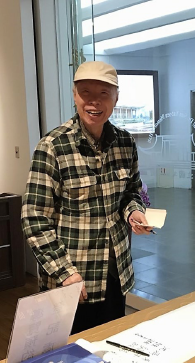

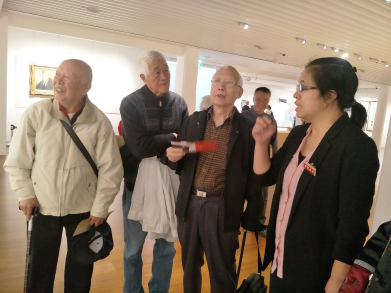

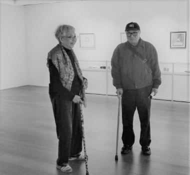

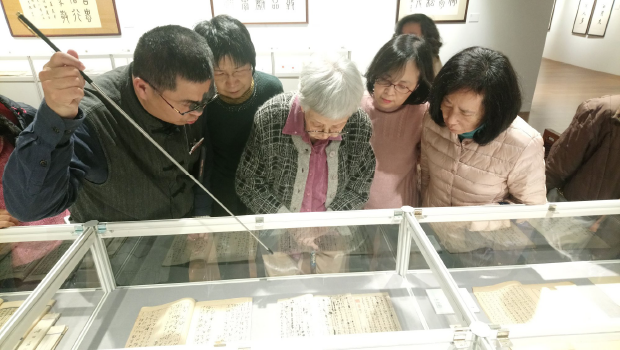

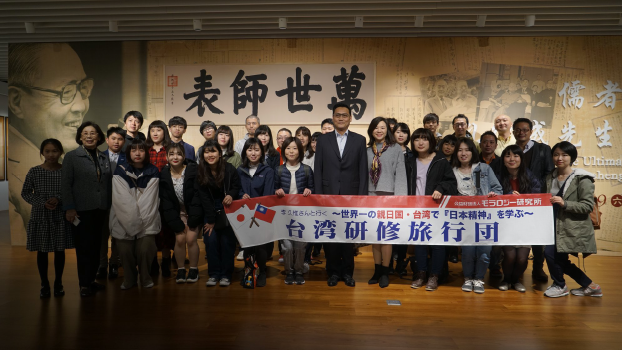

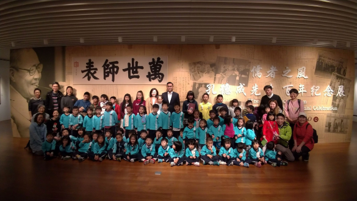

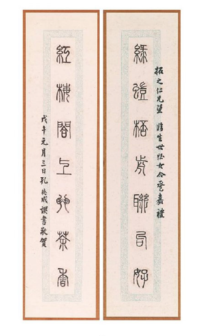

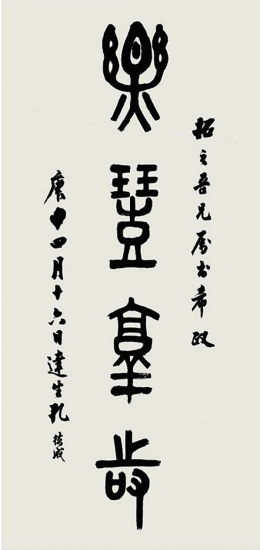

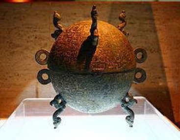

### 真正的卓越：淺論企業家精神的窄定義　二○一九年一月二十日

淨印

立論鏗鏘有力

點出企業本質

子貢儒商典範

孔學走入時代

前言

二零一九年海峽兩岸企業家論壇乃孔德成先生百年紀念的相關活動之一，孔垂長會長代表主辦方中華大成至聖先師孔子協會（臺灣）以及至聖孔子基金會（大陸），親臨新店會場致詞，期許大家「在儒論商」。並由陳執行長擔任論壇主持人，與會者有兩岸學者、企業家、數個民間組織及對此議題感興趣的人士。

論壇主題為「傳統文化與企業家精神」，上午共有四場各三十分鐘的演講，主講者皆是所屬領域的翹楚。下午是開放論壇，有六位與會者受邀各發言十分鐘以拋磚引玉。本學會共出席十三位（含三位雲南貴賓）參與此活動，並受邀發表十分鐘講話。

一般對企業家的認知是有別於牟利的商人，企業家有利他精神。本論壇的演講內容在企業家的定義上沒有離開一般的認知，演講者們在一般的認知上做精彩演繹與心得分享。本文的目的不在記錄這些報告內容，而是將代表學會的十分鐘講話做延伸說明，試圖提出企業家在一般認知的寬定義上，還有更精緻的窄定義，並淺論在窄定義下，卓越的企業家形象。

看見英雄
金庸作品〈射鵰英雄傳〉被改編成電視劇多次，小說中有一段幾乎都被電視劇保留，場景是成吉思汗面對美麗的草原、還沒有攻下的西夏國以及自己將到的死期，與郭靖的一段對話。郭靖問成吉思汗：「人死後需要多大的地方埋葬？」又
**問：** 「什麼是英雄？」郭靖認為成吉思汗征服廣大土地，無數人因而失去性命，遭遇家庭破碎、骨肉分離之苦，這不是英雄，真正的英雄是為民造福，不是陷百姓於痛苦之中。由此可見，蒙古人視成吉思汗為大英雄，而郭靖（或說金庸）的定義有所不同，在金庸的定義下，成吉思汗不是英雄。定義是賦予該名言意義並使該名言有別於其他名言，能被指認與使用，所以觀待能定義者的認知與格局，所定義的內涵就有寬廣狹窄及深淺之別。

關於企業家精神，一個企業家可能具備的能力有：帶領團隊、開發市場、擴張事業版圖、決策魄力、善調和人事及風險管理，還有帶領企業朝向目標前進、達成目標甚至超越目標，並且有使命感、肩負社會責任、將傳統文化道德價值導入企業管理，甚至熱愛國家、能回饋社會、以資源及獲利出錢出力等等。然論版圖擴張、開疆闢土，有成吉思汗與蒙古帝國；論愛國，有岳飛的滿江紅和文天祥的正氣歌；論運籌帷幄，決勝千里之外，有誰比得過諸葛亮？論調和鼎鼐，前有漢相蕭何、唐相狄仁傑；論趨吉避凶，可觀明朝袁了凡先生的改變命運；若論利益社會幫助弱勢，又如何比得過宗教家的慈善事業？

那麼企業家有什麼特殊？對上述人物是甘拜下風或是不遑多讓？在對企業家的一般定義之下，自是比不過這些人物，但若是能別具一隻眼，從對企業家的窄定義來看，則企業家對人類的貢獻足以與上述人物同列。

看見典範

孔子有弟子三千，優秀者位列七十二賢，特別傑出且在德行、言語、政事、文學四領域出類拔萃者有孔門十哲，其中從商的端木賜是言語科代表人物。端木賜字子貢，小孔子三十一歲，在世俗上是跨國事業的總裁，在聖道的學習上，他是一名學生，從十七歲親近大善知識孔夫子，歷二十五年，至夫子過世後為夫子守墓六年。

子貢在經營事業的同時，撥出時間且長時間的向孔子學習，其次，子貢不僅生財有道，更懂如何花錢，他越過救濟貧窮、得到善名的一般格局，將經營企業的利潤拿來護持道統的傳承與發揚，包括老師出訪他國及辦教育的經費，還有資助學法的師兄弟。並非救濟貧窮不重要，而是護住道統與傳承的這一份需有眼力才能看見，如同從商的人一般不會以子貢為典範，甚至可以說沒看到子貢這一號人物。

子貢學道不是懂了一、二分就停止學習，表面上他是富商，骨子裡是向道之心，以道心莊嚴世俗的外表，成為有氣象、能代表國家談判的企業家；以世俗莊嚴道場，將企業獲利轉為護持正法的資糧，並以己身投入學習成為道統的人才，也就是讓自己成為「學習道統」的人，並讓自己護持「學習道統」的人！

孔子曾讚子貢是瑚璉之器，這是稱許子貢是廟堂之才，可以從政；又說子貢臆度事理常常說中，可見如果子貢放下事業，全心全意地學習，以他的悟性，可以得到夫子性與天道的傳承，但因他忙於事業所以只得一半傳承，不像顏回與曾子全得。但也幸好有子貢，今日的我們才有機會了解什麼是與眾不同的企業家。

看見卓越

企業想要永續經營，關鍵在人才，而人才的培育在正確的見地與開闊的格局，特別是政治人才與教育人才的培養事關國運。安定的政治環境有利於辦教育，教育辦得好可為各行各業提供人才，相輔相成。真正的企業家洞察如上，可謂真知灼見，因而生起學習道統與護持道統的使命感，並以己身投入，善用自己能支配時間的優勢作為修學正法的增上緣。

道統的存續不是取道統為我所用，而是我為道統所用。所謂取道統為我所用，好比企業家為了永續經營講究倫理，將五倫中的君君臣臣概念放進企業文化，雖也推廣了五倫的觀念，但為了被企業運用必須修整或擷取，讓五倫合適地融入企業經營。如果只見到道統有這一分好處，殊為可惜，道統是國之重器的內涵無法顯現。

西方人也懂此道理，儘管莎翁作品可用舞台劇也可用電影形式呈現，但英國文學系還是會培養真正會讀能說善教莎翁作品的人，並不會認為已在電影或戲劇中保留了莎翁。而且當其他領域要應用時，仍然需要回到文本，對文本的不同詮釋與演繹必須建立在有能力了解文本之上，才有應用可談，才有莎翁的精神與靈魂。

對道統有使命感，成為學習者與傳承者是對企業家精神的窄定義，賦予窄的定義並不妨礙寬的定義，而是藉由認知到像子貢這樣的企業家典範，方有眼力看出經營企業卻能排除萬難投入聖道學習的企業家，與在企業王國內推行選擇性的擷取自經典的概念，兩者真正的差異在於見地。誰看見了道統？誰看見了傳承？誰看見了道統與傳承的重要？觀待所看見的是殊勝的聖道，能看見的人是真正的卓越超群。

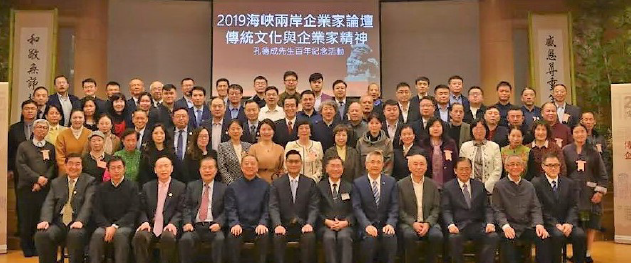

### 二○一九年唯識簡介講座報導

淨本

經學交流水乳融

大展以藝結合道

五日相聚多勝事

未來出路預料中

二○一九年的二月十九日，大成至聖先師孔子協會舉辦的「孔德成先生百年紀念活動」正式開始，分別在中油大樓國光廳舉辦了紀念會，國父紀念館博愛藝廊舉辦了文物展。中華無盡燈文化學會是本次活動的協辦單位之一，前期先有長達五個月的導覽培訓，並邀請了在大陸及馬來西亞的讀書會善友們，一同來臺看展。希望透過此次導覽，讓大眾了解孔子後代，也是當代聖人的孔德成先生一生豐富的內涵，以及他和雪廬老人深厚的交誼。

為了弘揚文化，也為了豐富此次的參訪行程，在二月二十日及二十一日兩天，學會又籌備了一場唯識簡介講座，依著雪廬老人的唯識簡介講表，為大家開解唯識學的內涵，以生起清楚的認識和正知見。

公元四世紀，古代印度佛教高僧無著菩薩，承傳彌勒菩薩唯識之學，開創瑜伽行唯識學派，經世親菩薩、陳那論師、護法論師、戒賢論師，傳至東土玄奘大師、窺基大師，數代相傳發展成宗，名唯識宗，或稱法相宗、慈恩宗。本宗擅長分析法相，對於心理現象及宇宙萬法的關係，更有精密深入的理論體系，學習本宗理論，有助於理解佛教的世界觀、人生觀，掌握各類心理現象，成為自己生命的主人。

而唯識學是佛教很重要承先啟後的樞紐，唯識從下部宗派的基礎建立自己的體系，中觀又是在唯識的體系上建立，而大乘的體系是唯識跟中觀，等於唯識又是大乘的基礎，可見學唯識的重要性。

唐瑜凌老師及其師資團隊，在講座中說明了本宗思想重點，並邀請台灣、大陸、馬來西亞學員，在這兩天的晚間參與分組研討，切磋琢磨，用討論和問答來建立、釐清觀念，解開上課不懂的迷惑，以期能深入唯識義理，一探體系完整的佛門心理學，原來人的心量可以無限廣大，也唯有透過宗派見的了解，才能知道釋迦牟尼佛所說的空義，究竟該如何理解。

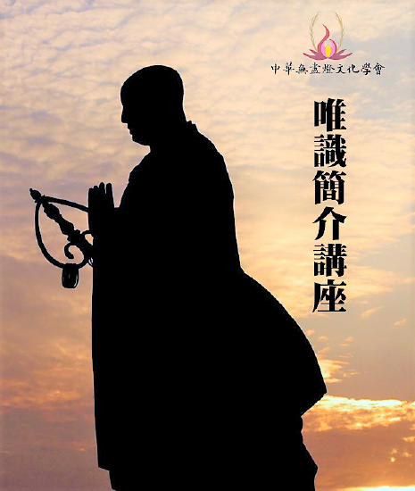

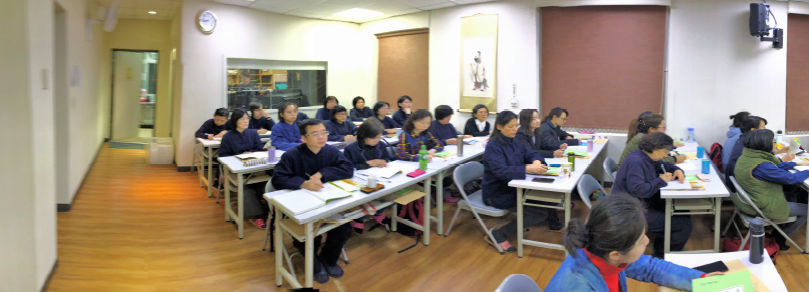

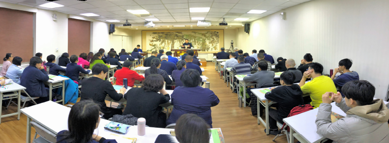

### 二○一九年唯識簡介講座消文(一)

*編輯部整理*

所依六經十一論

心外不成乃修觀

二障能破見世俗

依他而起內心顯

在一部經的開展前會先介紹傳承，介紹傳承的目的有三，首先是對論主的教證功德生起信心，方能對他所傳教法生起信心；第二是感恩，沒有作者造論，我們無福深入經藏；第三是傳承，學習唯識成為聖教弘揚與傳承者，這是人生最大的善業與福報。

世親菩薩是唯識學傳承很重要的人物，是以簡金武老師的《唯識簡介》於代序中引用兩首詩偈，讚歎世親菩薩對唯識學的貢獻，以及對淨土法門的弘揚。世親菩薩依《佛說無量壽經》造《往生論》，並開示「五念門」，為無量壽經的修學法，勸發有情求生西方，是「解在唯識，行在淨土」的典範，也作為我們學習《唯識簡介》的目標、方向。

世親菩薩在佛滅度後的九百年，出生於北天竺的富婁沙富羅國（亦稱為丈夫國）。父親是婆羅門，姓憍尸迦，他有兄弟各一，哥哥是無著菩薩，弟弟是獅子覺，三兄弟都是人才。

世親論師最初在小乘的薩婆多部出家，總共造了小乘論五百部，而且不信大乘，他說「大乘非佛說」，造了謗法的重罪業。

後來無著菩薩示現生病，世親論師趕來相見。見面後無著說我的病是因你(世親)而生，因為你造了謗大乘教法的罪。弟弟固然覺得哥哥說得非常悲切，但不服氣，所以哥哥就趁這個機會宣說大乘的教義，弟弟終於體悟，並且在大乘的學習上產生很多的法喜。世親悔恨過去謗法的罪業，想要割舌頭謝罪懺悔。無著菩薩云：即便是長劫割舌贖罪都無法消除謗法罪！過去以舌頭來毀謗大乘，今後也要以舌頭來弘揚大乘，唯有這樣才能懺除罪愆。從此世親論師就轉弘大乘，並且注解佛經，包括了《華嚴經》、《涅槃經》、《法華經》、《般若經》、《維摩經》、《勝鬘經》等大乘論五百部；合前面的小乘論五百部、號稱為千部論主。

世親菩薩能夠改變命運，關鍵在遇到善知識。

世親論師享年八十歲，他雖然行跡示現於凡夫，但實際理地上是四善根中的明得薩埵，屬於煖位，明就是開始得智慧火的明相，在定中修觀（不斷串習空性的修學法），對於空性的義理越來越明白，謂之明得位。

世親菩薩還有一個特點，就是有四位著名弟子在不同方面的成就超過老師：功德光論師精通戒律，著有《律經》。堅固慧論師精通俱舍，著有《大乘阿毗達磨雜集論》。解脫軍論師以中觀見通達般若經，著有《二萬五千頌般若經現觀莊嚴論釋》。陳那論師在因明的成就勝出，著有《集量論》、《因明正理門論》。

表解架構分析

表解的（甲）定義，標舉「識原於性」和「萬法唯識」，即是整個唯識學的總綱。底下（甲子）和（甲丑）分別闡釋識原於性和萬法唯識。因此（甲）定義又可為「總說」，（甲子）和（甲丑）為「別說」。以上是唯識宗之「教」。（甲寅）則是「唯識修觀」，各宗都有「教觀」，此即唯識宗之「觀」，在入定前不斷串習唯識的教理，能比量通達法在心外不成立，即是該法的圓成實性（唯識宗的空性），法在心內顯現為勝義有，即是該法的依他起性，入定後依所觀境串習所學唯識的教理，最後現證空性，破人我執和法我執，即是「依教修觀」，也就是由「比量」到「現量」認識這個宇宙萬法的真實相。

老人將複雜的唯識教理收攝成簡短的《唯識簡介》，讓人以為唯識學很簡單，實則是老人對經教的通達，才有能力作這樣架構式的歸納整理，是一個整體的認識，有脈絡、次第，可說《唯識簡介》就是唯識宗所依六經十一論的精華！我們不僅眼前要學習《唯識簡介》，作為將來入六經十一論的善巧方便，也要學習老人治表的功力，解經的方法，以及抉擇古注的能力，培養自己成為有見地，有格局，有氣度的讀書人，能自行，能化他，能在混亂的時代裡為眾生理出一條出路。

（甲）定義

唯識簡介是雪廬老人以作表的方式綱要說明唯識宗的宗派見，是了解相宗的最佳入門。所謂唯識，唯乃唯獨、唯有之義，識即吾人之心識，簡而言之唯識宗所要立的宗為心外法無，心內法有，確立一切法的本質即是心識。為了能更深刻的理解這樣的內涵，應從定義下手，這是第一表訂為(甲)定義的原因。

推由

諸法「推由」，窮究萬法的源頭，分析了解我們的現象界是如何來的，它的究竟真相是什麼？此乃至關重要，因學習佛法的目的在於求解脫，而欲解脫除了洞察真相之外別無他法。

萬法唯識

唯識宗說萬法之由有二，萬法唯識與識源於性。何謂萬法唯識？指一切諸法都是心識的顯現，人們所見聞覺知的諸多現象，都是內心所顯，全無外境。唯識宗又是如何成立這樣的宗義？其理據眾多，簡述其二如下。

首先，諸法成立的可能僅有兩分，若非心外，則是心內，反之亦然。古印度佛教的下部宗派如有部、經部皆認為法在心外實有，並由最微細且不可分割的粒子堆疊而成，稱之為「鄰虛塵」或「無方分」，義即鄰近虛空或無法辨別其自身方位之微塵；其概念猶如現代的科學家一般，物質是粒子堆疊，隨著科技進步，過去最小粒子如原子，現代的最小粒子如夸克等。唯識宗的經師反問下部宗派，若有一不可分割之粒子存在，且無法辨別其上下左右等方位，又言法為該粒子所堆積，此說應成矛盾。試想當兩個「無方分微塵」堆疊時，誰是誰的左方，誰又是誰的右方？若指不出方位，則不能堆積，若能指出方位，那理應還能再分割，如何說是最小。可見無方分微塵這樣的概念根本不能成立，既然法在心外且由最小粒子堆疊的概念根本說不通，可見法僅是心內的顯現，外境是一分都沒有。

唯識宗除了站在下部宗派的立場之上成立其唯識義外，更進一步提出「一水四見」的論點。經云，水雖同為眾生所共見，但人見為水，天見為琉璃，餓鬼見為膿血，而魚蝦見為宅舍。世間的依報環境，依著有情過去所造不同的業，而有種種的顯現，若水能於外境成立，理應所有眾生都見水如水，不可能有種種差別。若以日常生活為例，我們所用之金錢財貨，於狗貓雞鴨身上亦不能生起，或可以生，則小狗也應見錢眼開。

依上述所言來解釋唯識宗義之建立雖不完足，但也已說個大半。可見萬法都是心識的顯現，即「萬法唯識」，依此繼而通達「唯識之教」乃欲成立心外無法，「即用顯體」乃言心是境體，因為境界是心識的顯現，離不開心而獨有，故以心為體，兩者結合以「遮無外境」。

識原於性

若繼續探究其理，若一切現象皆由識而來，那麼識又從何而來？由唯識的宗派見，我們將會得出一個答案，萬法的究竟處即是「識原於性」。性是指法性，萬法的體性，法沒有在心外獨立存在的體性，即是該法的體性，也就是該法的空性。此處的空乃他性空而非自性空，其空為心外無法，因心外無故言空，此空意欲引向心內實有，更特別是為了導向第八識的概念，無論心境皆從第八識生，故此法性可解作空性及第八識。而「法性離言」亦從二解，若言空性，則心外無法，又從何說起？若言第八識，其雖能生萬法，但萬法又非第八識，無從指陳，自然「本不可說」。

通達法在心外成立的體性了不可得，一切法皆是心內所顯，並依此見地通達法性，窮究萬法的真相是心外無法，即是法的空性，同時又通達心內實有，並皆由第八識所生。透過如上定義便能概略了解唯識宗的主要思想。

（甲子）性識之別（釋識原於性）

三能變

◎一能變

性是指法在心外不成立的性，引向心內所顯，指的就是第八識。所以識原於性這邊所講的主體是指第八識。

首先，表上的空白的圓圈所代表的是第八識清空的狀態，這是一個成佛之後的理想的狀態。

隔壁畫的黑色點點圓圈，點點代表我們在第八識的善惡業的種子，成立第八識的善惡業種子以解釋因果不失的概念。一切種子皆由因來，每個因又可以不斷的往前推因，因此這個圖所代表的是我們在第八識裡頭的種子無始以來就有染污、不清淨的狀態。

為了表示第八識能夠達到清空的理想狀態，而成立一能變。

◎二能變

二能變指的是第七識，把它安立為二能變的理由，是因為存放在第八識的種子需要有「我」才能發揮功能，使業種成為我的種子，我受果報，而第八識的見分又不是我，所以安立第七識為執我，成為二能變。

◎三能變

三能變指的就是前六識緣第八識的作用，前六識分別有眼識、耳識、鼻識、舌識、身識、意識。由於第七識的作用只有緣第八識的見分為我，不能顯現第八識的根身、器界、種子，第八識的種子顯現為果時，需透過第六識來納受，顯現的方式為下：眼識依眼根緣色塵，讓我們能看見；耳識依耳根緣聲塵，讓我們能聽見；鼻識依鼻根緣香塵，讓我們能嗅味；舌識依舌根緣味塵，讓我們能嚐味道；身識依身根緣觸塵，讓我們碰觸色塵有感覺(例如冷暖澀滑等)；意識依意根緣法塵，讓我們能思考分別。而上述色、聲、香、味、觸、法大家所見皆不同，因為前六識所緣，其實是依據第八識的本質相分變現出六識各個的影像相分，可知除第八識、第七識之外還有前六識，因此成立三能變。

由此可知，其實一變、二變、三變也可以一起說，三個作用同時發生，但不妨稱為三能變。

◎注一：法性如是

萬事萬物歸宗如何？此乃以簡馭繁之大哉問，從古至今中西各派若想成為傑出的理論，都需要回答此大哉問。到底萬法的體性為何？依據唯識宗的定義，萬法的體性是第八識，一切法唯心識所變現，在中國經典中也有兩部書試圖解釋萬法的體性，第一本是《周易》，《周易》的核心思想是太極，所謂「太極生兩儀，兩儀生四象」。萬事萬物是從太極生陰陽兩儀，由陰陽的變化組合而有太陽、太陰、少陰、少陽四象。四象對應四季，少陽是春、太陽是夏、少陰是秋、太陰是冬。

什麼是「太極」？依據易經繫辭傳「易無體而神無方」，太極是窮盡到邊界，那「無極」是「太極」嗎？無極是無邊界之意，《周易》及《繫辭傳》都沒有「無極」二字，無極是陳摶和邵康節發展出來的概念，老子思想也有「復歸於無極」。窮盡到邊界或是沒有邊界二者都是涵遍義，唯識宗的第八識涵遍萬法，可見唯識的第八識和易經的太極或老子的無極，雖因功能作用不同而安立不同名言，但都屬遍覆萬法的概念範疇。

《列子》這部書也是在解釋現象界，其中天瑞篇：「太易者，未見氣也。太初者，氣之始也。太始者，形之始也。太素者，質之始也。」若運用列子中的這四個概念來解釋中陰身，中陰身之前已有形成中陰身的業(十二因緣愛取有的有)，這好比是太易。當一個人過世時，他的神識離開身體（彼滅）成為中陰身（此生），這好比是太始，已具下一生之形，例如投生畜生道的狗時，中陰身有狗形，已具有四肢與尾巴，或投生人道，就有人的形體與直立行走，這是形之始。中陰身見到要投生的該道有父精母血的結合，中陰身就被業力所推動去緣這個可欲境，則形成該道的形體。謂之質之始。

◎注二：不動唯性

「性」有不改義，不隨時間和空間的變化，該法的體性是該法的真相（該法的真實面目）。

佛所證悟的空性(破二障所顯現的空性)名曰真如，意義為真實存在境界上的；唯識宗的空性義是「法在心外不成立」，然此空性義指向「法在心內有」。依唯識宗，萬法的體性是心識，心識的體性是第八識。無始劫以來這些密密麻麻的有漏種子貯存在我們的第八識，修行人因修行解脫道所生的智慧力，此之慧力能將有漏種的體性轉為無漏，或是慧力將阿賴耶識有漏種清除的這一分，是唯識宗的真如本性。

集起唯心

集是「收集」、起是「現起」。前七識造作的善惡種子收藏在第八識，種子遇境逢緣現起果報，不論收集與現起都是第八識的功能，而且只有第八識有這樣的倉庫功能，不會漏掉任何一個種子。

了別唯識

通說八個識都是了別境界，別說了別粗顯境界如色、聲、香、味、觸、法等，就是指前六識。故細究「心識」一詞，「心」取其收集的功能；「識」取其了別的功能。

計實唯境

計者，計度執著；實者，實有。計度執著假必依實、離開境界沒有心識可得，這樣與唯識宗相違的立場，代表是中觀自續派清辯論師。清辯論師主張名言之外尋覓該法的體性了不可得，這是該法的空性。清辯論師是空宗，護法論師是有宗，雖空宗有宗不能相融合，但清辯論師定義空性是名言之外沒有體性；護法論師定義空性是心外無法，他們在建立真諦的方法上都是採取劃出範圍與界限。在世俗諦上，清辯論師主張離開境界沒有心識可得，例如杯子的眼是要藉著杯子才能生起，名言是能顯現、心識是所顯現，杯子只有觀待能認知杯子的人，觀待他的概念而成立有杯子，這是該法的世俗諦。該法觀待名言才能顯現，名言之外沒有體性是該法的勝義諦，名言之內有體性是該法的世俗諦，以上是中觀自續派的見解。（下期待續）

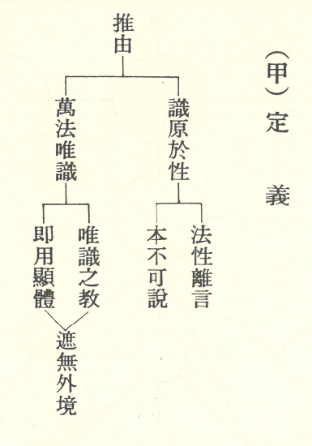

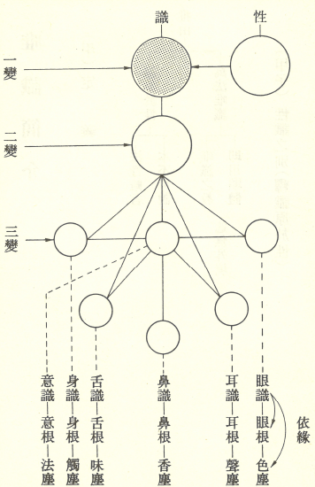

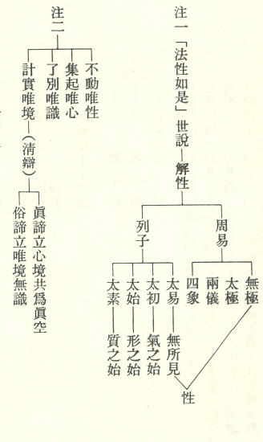

### 二○一九年一月看展讀書心得

*編輯部整理*

大開大闔多起伏

笑傲人生稱酒霸

課堂嚴謹師道尊

風雲際會上公展

杭州紙飛機 譯雯

冬日的臺北，氣候溫潤，比起杭州的陰冷實在使人心情愉悅許多。我與楚穎非常榮幸，得到學會老師們的邀請，於一月十七至二十二日赴臺北，參加此次盛會，不勝榮幸。

經過十八號學會老師課堂上對孔上公生平的介紹，二十號白天的看展，晚上欣賞紀錄片。幾天下來終於對孔上公這位偉大的人物的生平有了基本的瞭解，同時也堅定了隨同學會學習中國傳統文化的心意。

士棋學長做的中國近代史年表我非常喜歡，簡單清晰的介紹了孔上公所處的時代背景。那樣一個時空巨變，風起雲湧的時代，如此波瀾壯濶，人的命運在大時代的裹脅下如同螻蟻，起伏沉澱，不知所终。從一八四０年的鴉片戰爭始，一百多年來中國遭受了無與倫比的撞擊與羞辱，而傳承了幾千年的孔府，作為道統的象徵，風雨飄搖，在大時代各類新思想的衝擊下岌岌可危。孔德成先生作為最後一代的衍聖公，第一代的奉祀官，所承擔的重任是普通人難於想像的。我看孔上公十幾歲時的照片便少年老成之極，紀錄片裡孔先生的學生回憶，老師酒量酒品都是一流，我想在這和喜愛的友人及其學生的推杯換盞中，孔上公一生的壓力是不是可以得到一丁點的釋放？

因為孔上公本人的努力，在那個幾乎要「打倒孔府」的年代，孔上公作為大德，其言行堪為世人之表，為孔府贏得了體面，也贏得了尊重和繼續存在下去的理由。

孔上公的一生是不平凡的，是偉大的。他用自己的堅守為中華民族守住了最後的一點文脈，守住了最後的一絲文化復興的希望。

林老師分享的課程中，我最喜歡的是最後一闕詞：「谷沁幽馨，泉欺夜韻，焰藜淺映虛堂。蠹蝕神仙，紺痕漸隱微茫。乘迴劫盡飘零淚，縱飄零，更對滄桑。料難應，老了雲山，負了詩腸。

鉛黃託付平生願，暗流光一霎，總費商量。魯殿依稀，綸經尚繞東牆。如今莫笑祫衣剩，剩裌衣，也自疏狂。試重尋，一卷秋林，萬卷芸緗。」張敬先生的詞填得極好，寫出了當年孔上公重慶歌樂山逃難歲月時的艱難，也寫出了孔上公一干人的風骨。

先生風骨，高山仰止。

唐老師的課程部分，我最最感動的是雪廬老人早年的任俠仗義。在軍閥割據的年代，人命如草芥。我們今天常說，這世上最高貴的便是人，可是在戰爭年代，人比一切事物都不如。同理心，如果把自己代入戰爭年代，我亦不自知如何自處於亂世。雪廬老人多次冒生命危險於亂世中，解救黎民百姓于水火之中，完全不在乎自己的安危，其對民生的悲憫，可敬可佩可歎。

作為普通人，回首看那個年代，回首看那個年代的人，心中所思所想，千頭萬緒，五味雜陳。孔上公和雪廬老人這樣的大德，在極其艱苦複雜的年代，行為種種，今日的評價是如此，希望不遠的將來，有更多的人能讀到這段歷史，感念到先生們的不屈奮進的精神，並且能夠用自己的方式將中華的文脈傳承下去。

北京原力贏　劉煒

出行臺灣，來之前一個月就很期待了，推掉繁忙的公務，終於心願達成順利入台了！

來臺灣兩件令人神往的事，第一參觀末代衍聖公大成至聖孔德成先生一百年華誕，第二件事情就是參加唐老師唯識正法講座！下飛機，直奔老師主持的中華無盡燈文化學會，見到了孔子七十九代嫡孫孔垂長先生，看著孔先生英俊年輕帥氣，似乎體會到二千五百年儒家風範中的儀表堂堂！關鍵是見到了可敬可親的唐老師，老師身上說不出的味道又親又近更多敬佩仰慕老師博學廣聞，聽老師說出的每一句話都如沐春風生歡喜心，感恩此生有好友凱總引薦善知識有緣遇到通達形而上的修學和形而下的執行的集大成的智者唐老師，心裡滿滿感動！

參加展會不是第一次，但這次展會卻提前做功課，在時哉時哉網路課上唐老師講解孔德成先生生平事蹟，依據大成至聖先師奉祀官孔德成先生一九八四年訪歐洲八國講演之文稿，融合大成至聖先師奉祀官府主任秘書李炳南教授之經學見解，說明儒學如何看待經濟發展及孔子的教育觀，孔德成先生講演內容提綱挈領地直奔重點，內容中可見其學問之廣博。時哉時哉網課內容中講解的提前籌備，邀請的教授，參展的意義，孔先生的顛沛流離一世忠魂，引發了我極大的興趣想早日目睹夫子福澤子孫萬代千秋的傳世偉跡的接班人！最重要的是要感恩唐老師給我們辦的讀書會，感恩白老師每天一則論語的講解發問還有探討，讓我對一代聖人有了正確的認知，敬仰孔聖人亂世危邦積極入世，歷練弟子培養國之棟樑的高遠眼光和高尚情操，傳承孝悌忠信禮義廉恥，積極辦學有教無類無愧萬世師表的稱號！同時更重要體會到末法年代遇到正知正見的善知識是多麼的難能可貴，二千五百年過去了，感恩我能遇上這樣的良師善知識，在論語裡學到正確的為人處世，內心深感榮幸！

抵達臺灣後，學會老師們又給我們提前培訓，特別是老師講解的正統血統道統風雨一杯酒江山萬里心的滄桑酸楚，孔先生在動盪亂世中不愧先祖家風臨危受命使得儒家文化生生不息，更重要的孔先生對弟子的關懷對人生的態度去海外講學，實現了孔子二千多年前的願望。聽著培訓心早已迫切想去展會一飽眼福！因為準備好了，所以如願以償，無論臺大教授導覽還是學會學長導覽那份濃濃的對孔先生的尊崇敬仰都化作每一句話的講解。從出生一百天就做了一等公爵，到十五歲就處理家政大事保護國寶，到十七歲結婚生子顛沛流離，孔先生始終從容不迫在煎熬中萃取智慧，猗蘭別墅智者聚集一代英豪更顯風騷，孔先生他一直知道自己是誰，一直活在自己的角色裡，不談政治一生治學傳承道統無愧無悔！感恩唐老師協辦這樣的盛會，讓我有機緣走近賢聖，在書法展中孔先生給他的孫子們每人一幅字：「忠信篤敬」，這是他光輝的一生行徑，也是他留給子孫後代的聖賢之路！第一次在書畫展中體會到魂魄精神，彷佛看到了孔先生朗朗笑聲中的豁達態度，敦倫盡分閑邪存誠，讀懂人生的甘願受苦，敬禮再敬禮再敬禮！

參展結束，迎來了我期盼已久的唯識課堂，學長告訴我保准聽「糊塗」，我不大相信我會「糊塗」，但第二節課下來，我知道糊塗是怎麼回事了，第一次聽佛法課程，好多名詞陌生夾雜臺灣普通話的表達，的確我一杯又一杯的喝咖啡，希望自己緊緊抓住神清醒再清醒，我終於明白走進我的挑戰區了，想不想學真的、想不想搞明白，學這有啥用？好好在紅塵實修歷練才是最要緊的吧，我開始自己問自己了，困難容易讓人退縮，搞不懂更容易半途而廢，如果近視眼就看不到佛法是真正利益生命可以福慧雙修永不退轉的依靠，只有通達教法義理在生活中觀修實證才能做到永不放棄，再看到年輕學長有外科醫生、還有讀研究生、還有老師都在那麼繁忙中還抽空學習正法，我開始鼓勵自己，咬牙一定搞懂，我身邊能有這樣的善知識普正法，我如果不學豈不在第八識中又播種了一顆惡種子，遇上了就是我的累世福報，我給自己做工作！萬法唯識轉識成智我並不陌生，以前參加過類似工作坊，但和這樣在教義上一絲不苟的運用邏輯辯證科學學習佛法我是第一次，非常感恩唐老師讓我大開眼界，特別是唐老師培養年輕一代人才，述而不作，運用一代先儒李炳南教授的教材論點傳承道統文化的正法延續，令我折服，唐老師火眼金睛博學多才，我只需緊緊跟上就好，一邊學習課程一邊學習老師的教學風格，還有學習中的生活安排，飯菜格外的香美可口，衛生乾淨整潔，就連最細小的喝水和處理垃圾都人性化中井然有序，課上的問答式講解，令人思考中加深印象，課後的組織討論再次消化沉澱，這樣殊勝的安排就是大美的享受，感恩學習正法感恩老師點滴佈陣用心良苦，我下定決心好好學習，不辜負唐老師白老師更不辜負自己遇上恩師，參展學習結束了，我的正法學習之路才開始了，知道了路就不怕遠，我甘願故我喜悅！

酒儒

◎微妙緣起

二○一八年三月，唐老師授課間，學生曾幾次聽聞「明年要辦孔德成先生百年紀念展，希望大家能投入導覽志工的行列。」心想，一年後的事，現在就開始募兵，必是重要活動。雖然對孔先生連皮毛認識都談不上，但覺這是對孔子報恩千載難逢的時機，並感恩學會對茅茹讀書會的厚愛，所以當下就默許-全力以赴！

◎培訓課程

二○一八年九月開始培訓，共有十九位老師（多半是孔先生的得意門生），用十個週六，上一整天的課程，來迎接二０一九年一月十九日，在國父紀念館辦理的紀念展開幕，及為期二十三天的展覽。課程之外，另有志工行前會議，分組進行，沙盤推演，熱烈討論可能發生的狀況，定期回報工作進度，學會蓄勢待發，瀰漫著欣欣向榮的儒者之風。

除了藉由諸位老師介紹孔先生，學會還準備汪士淳先生著的《儒者行》、中華大成至聖先師孔子協會編輯的《孔德成先生合集》(包括日記、文集、法書共三冊）人手一套，各自用功，以充實導覽內涵，挑戰的是沒人確知展出的物件，更不知展場擺放的位置，所以只能先就各片段了解，待開幕後再串連成完整的導覽故事。

◎認識聖人

在閱讀資料的過程，才知孔先生一生傳奇的事蹟，從出生傳奇，稚齡當家，抗日離鄉，乘桴來臺，孔府浩劫，周遊列國，道統傳承等，愈發感到孔先生看似平凡的偉大，一生命運的大起大落，從不怨天尤人，如其詩句「阮籍口無臧否語，陳登心有敬恭人」是其為人處世的準則，典範垂長。

孔先生在重慶其中四年的日記，除了鄉愁，及對身世的感嘆，更有對家人、朋友、部屬，對國家，對國際局勢的關懷。適值中日抗戰，雖是烽火連天，不時要躲警報的日子，卻能在「萬馬無聲秋塞月，一燈有味夜窗書」的境界中，讀完二百多部書，那時大後方人文薈萃，典籍資料豐富，於是最壞時機反成最好時機，大量閱讀，切磋琢磨，孕育豐厚的底蘊，尤其專長的《三禮》化為生活的情調，時時處處以禮待人處事。

◎作育英才

一九四九年大陸變色，孔先生（二十九歲）舉家遷臺，三十五歲就任教於臺灣大學研究所，教授「三禮」、「金文」、「古器物學」。雖擁有國大代表、總統府資政等官銜，孔先生最喜歡的職務是教學，一生「學不厭，教不倦」。依孔先生弟子描述，孔老師以「博文約禮」的態度治學、行事，要專精於一門學問，也要兼顧其他相輔相成的學問；以「頭重腳輕」的方法給學生上課，也就是先嚴格要求堅實的基礎，往後就能開閤自如。孔老師上課「望之儼然」，下課則「即之也溫」，課中學生若有絕妙答，老師桌子一拍，說，太好了！喝酒去！不管杯子大小，不管酒精濃度高低，舉杯必乾，孔先生服膺丁惟汾老師所言，有酒量而不喝，就不真誠！勸酒的話是「乾了！沒乾，成甚麼樣子！」因而享有「酒霸」之稱。厲害的是「惟酒無量，不及亂」酒後還能任運揮毫，妙筆生花。作育英才直到生命的最後，正如曾子所說，「士不可以不弘毅，任重而道遠。仁以為己任，不亦重乎？死而後已，不亦遠乎？」

◎弘揚儒學

孔先生應邀到日本、韓國、越南及歐洲八國等地，作學術文化交流，或作專題演講，以闡揚中華文化道統，如同孔子當年周遊列國，無非期望世界大同；在國內則有賴昔奉祀官府主任秘書李炳南先生（雪廬老人），講授《禮記》、《論語》、詩選等經典，也是用盡最後一滴心血，期為安定社會人心，「未改心腸熱，全憐暗路人，但能光照遠，不惜自焚身。」這首《殘燭》是雪公的詩，恰可做為老人一生的寫照。

◎自助天助

如此一位大德，仰之彌高，鑽之彌堅，難窺其浩瀚的內涵，要如何適任地導覽，實為一艱鉅的任務。本著「志於道，據於德，依於仁，游於藝」的中心思想，懷著好樂學習的熱誠，上課聽清楚、回家想清楚、導覽說清楚，將孔先生的風範，化為心志，並虔誠祈請孔夫子加被，相信，進入展覽場聖府之門，即能如數家珍般娓娓道來。

◎展場現形

所接觸的參觀者中，有書法愛好者、有來自大陸、日本、英國的遠客、也有展品的主人、有一九八四年孔先生訪問歐洲時，駐比利時的外交官、有拍攝孔先生在第五研究室上課的臺大中文系教職員、有孔廟導覽志工……，臥虎藏龍，深藏不露，在導覽過程中，相互問答，才得知其身分，趕緊為自己班門弄斧致歉，轉以請教方式，對孔先生的風範，有更深的了解，例如：臺大教職員提到，當時韓國貴賓，到學校拜訪孔先生，因人數眾多，僅幾位代表入招待室，其他同行者在室外，當室內代表行五體投地跪拜禮，室外貴賓同步行跪拜禮，可見對孔先生是極高的尊重。另齊益壽教授也讚歎：這是我參觀各種展出，導覽團隊最優質的一次。

又有幾位參觀者說，他看展十幾年來，第一次遇到導覽二小時的志工，末學回答，觀待各位對展品的興趣，及對解說的互動，我們才能在此共度美好時光！相對也有導覽中，頻頻看錶的參觀者，即知其心已不在展場，該停就停，千萬不能將所知，像長江黃河般傾洩而出。導覽除了要懂展件，更要懂人心，才能適時地把佳作，媒介給知音，「可與言，而不與之言，失人；不可與言，而與之言，失言。」期許儒家道統永流傳！

佳明

若非兒時好友曉青的再三邀約，自己應該不會前往孔上公展，並重新回憶起在童年時，由外婆口傳有關家族歷史之軼聞記趣。

自今年初，當聽到有人要舉辦孔德成的展覽時，腦中就浮現，這個名字，不就是自己兒時，在孫姨婆家所見的一幅字畫上的署名嗎？沒想到，在進一步向好友瞭解之下，竟然發現，原來外婆曾提起過的爺爺，竟然與孔上公之妻孫琪方的祖父是同一位-清光緒帝的老師孫家鼐。在我的印象中，外婆曾說過，在他祖父的那一代共有五位兄弟，而這五兄弟的孫子，均可稱呼這五位兄弟彼此為爺爺，我想，這也許就是為什麼，外婆和孫琪方女士皆稱孫文正公為爺爺。而外婆所知的孫家鼐，是一位時常手握《資治通鑑》的狀元郎，在他們家中，還有皇帝御賜的馬鞭。只是，由於外婆希望自己的後代不要倚仗先人的成就，乃是要靠自己的努力來享受人生的成果，因此並沒有向兒女和子孫提及過多家族顯赫的過往。直到如今，我們能掌握的家族史料仍十分有限。然而，這個封存已久的秘境，卻因為孔上公展，而重新開啟。

當進入這個展覽中，一個令人感到有趣的展物出現了。這個展物是孔上公與其妻的結婚證書。然而，吸引我目光的地方，不是這張古老的文件，乃是其上的證婚人竟然是韓復榘。雖然我們在中國近代史上讀過此人的名字，但因為聽過外公和韓復榘的歷史恩怨，因此我對他的印象特別深刻。我知道當蔣中正在西安事變中被軟禁時，韓復榘還曾致電表明支持張、楊(張學良、楊虎城)，韓蔣的關係是緊張而對立。然而，從孔上公的紀錄片中，我得知，將蔣中正視為父執輩的孔上公，正是為了等待蔣中正能出席婚禮，而將娶親儀式延遲到了下午三點，只是很不幸地，在婚禮那天，蔣中正正是受到西安事變影響而無法出席。我想像著，孔上公一生有許多艱難的遭遇，當自己所敬愛的人缺席了婚禮，心中是多麼遺憾。但假若這一天，韓蔣兩人，都同時出席了孔上公的婚禮，歷史又會如何演變？是仇人相遇還是因西安事變將兩人分開較好？是韓的勢力太龐大，不請他來證婚會得罪人？還是因孔上公的為人，讓所有人願意暫放恩怨，到場祝賀？究竟真相如何，無從查考，但我願相信是因孔上公的心量，能讓祝福勝過情仇。

也因為韓復榘的名字再次映入眼簾，所以我也開始去查考關於外公劉志平的生平。按照母親的陳述，外公是一位嚴父，兒女們都怕他。但他也是一位喜歡追求公理又愛國的漢子。如果看到國旗退色，便會激動的查問懸掛國旗的人，怎能不將國旗好好地保存？我想，也是因為具有如此性格，外公才會在年少時離鄉背井，加入了革命的腳步。我曾聽外婆說，外公的父親曾任哈爾濱商會會長，家中金山銀山，希望外公從商，只是外公執意要赴北大讀書，於是就不再倚靠家中的供應。按照史料記載，外公一生曾任中國國民黨山東省黨部組織部部長、國民政府外交部亞州司司長、國民黨中央參議員、制憲國民大會代表、南京市法院院長，和立法院立法委員。在國民黨黨史中的CC派系中，可見外公被蔣中正派去山東與韓復榘交涉的故事一二。外公的一生，歷經風浪，而他的結髮，我的外婆，也是位充滿特別經歷的女子。

外婆是於民國元年出生，由於曾住在天津法租界區，從中學起，其父便為她聘請了一位法國女仕來教授她法文。在外婆父親（外曾祖父）的鼓勵下，外婆一路從河北法商學院讀到德國柏林大學的法律系。外婆歷經軍閥時期，學生時期參加過許多愛國救國運動，有時俏皮也為安全起見，會與丫環彼此對換裝束出門看戲。外婆是家中長女，由於父親曾任山西第二高等審判分廳監督推事，因此外婆曾跟隨其父遷至山西，並曉得其父曾調閱蘇三起解故事的原案文件，表明真有其事。在外曾祖父的支持下，外婆於十九歲就獨自搭上了火車，經西伯利亞鐵路一路前往歐洲。外婆說，自己原本預定前往法國留學，但聽聞德國的強盛，因此轉往了德國。外婆一生非常守時，而這個好習慣的建立，是來自一次與德國教授中午十二點的午餐之約。由於深受中國文化客氣謙讓的影響，外婆深怕準時赴席是一種貪吃的表現，因此就刻意延緩片刻，沒想到，錯過了十二　　點正，那位教授就先行離去。此後，外婆再也沒有遲到過。

外婆出身官宦世家，外婆的母親蔣氏的長姊則是嫁到了浙江海寧查家，即金庸的家系。外婆的父親孫觀圻，在晚清時期便已前往日本求學，並畢業於日本中央大學法律系(據網路史料)，在清廷中，是為法政科進士。其最著名的事蹟，便是擔任民國初年軍閥孫傳芳遇刺案的委任律師。外婆說，當其父要娶其母前，還曾表明希望未來的妻子要多具備學識，也因此，其母蔣氏再次進入女子學堂，完成了孫父的願望。也因為在這樣的家中成長，外婆的心胸寬闊，與孫子輩甚至毫無代溝。

記憶中，外婆說過一句名言：「人必須在良好的環境中受長期的薰陶，才能真正的潛移默化，學會正確的禮儀文化和生活之道。」在以往，我對這句話的意象只停留在肚腹穿著之上。然而，在參與了此次孔上公的展覽之後，此話對我的涵義，就不僅於吃穿。經過反思，我覺得我們的社會，早已失去能夠延續三代傳承美好文化的能力。從父至子及孫，每一代都在經歷孤獨和失去。我想這次舉辦孔上公文物特展的目的，就是欲尋回一個美好的文化。但要如何建構一個長久而良好的環境，為下一代建立起曾有的禮儀觀，仍是我們這一代要發省、努力的。若各人能盡一份責任，繼續傳遞這份精神，那麼此次的展覽將更有價值。最後，謝謝我的同學之邀，也謝謝所有成就此展的朋友們。

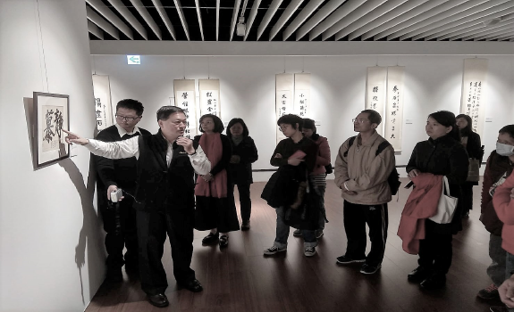

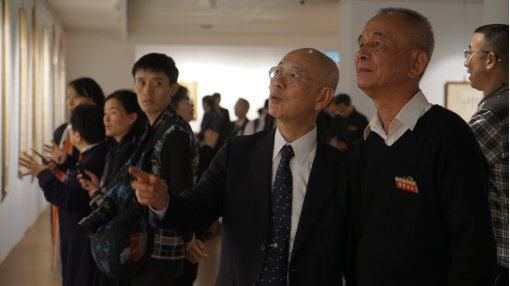

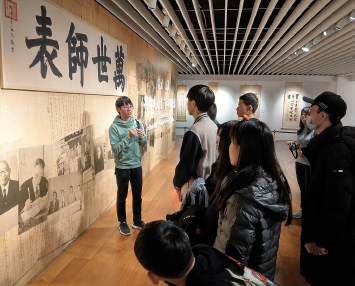

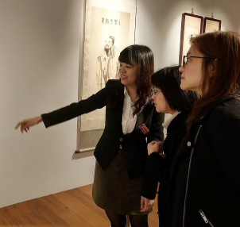

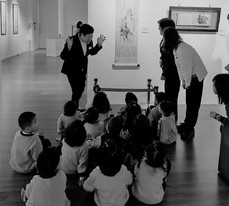

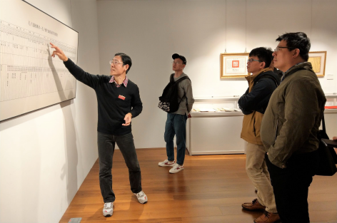

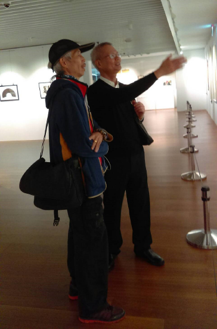

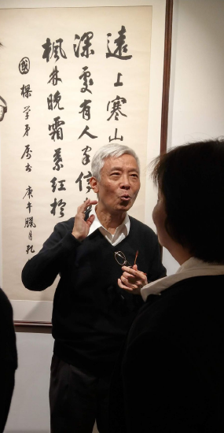

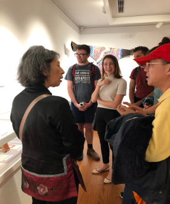

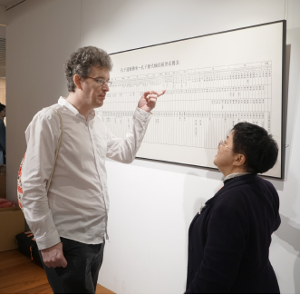

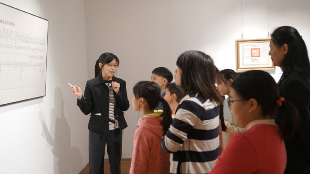

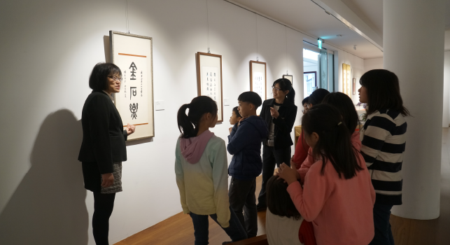

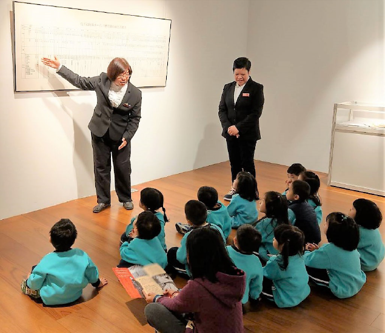

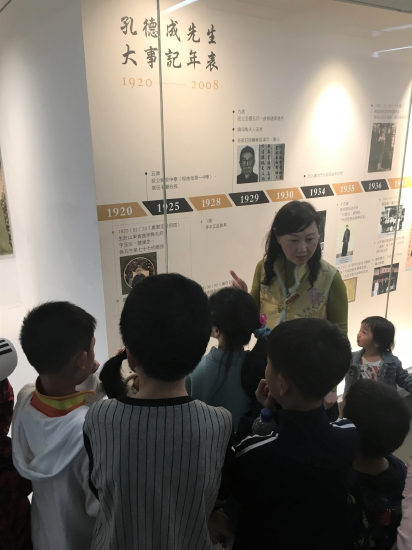

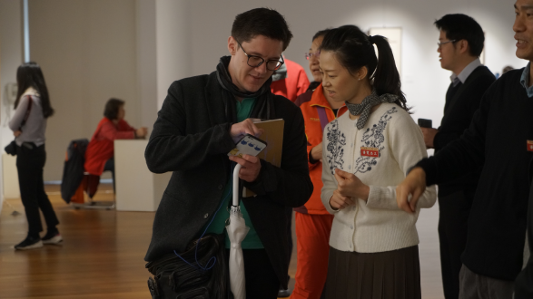

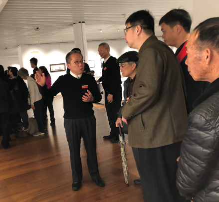

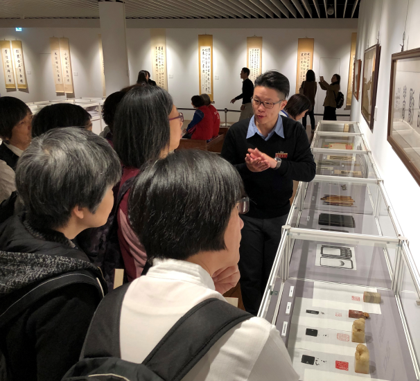

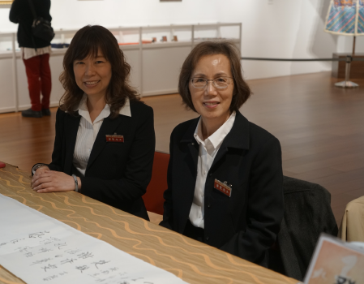

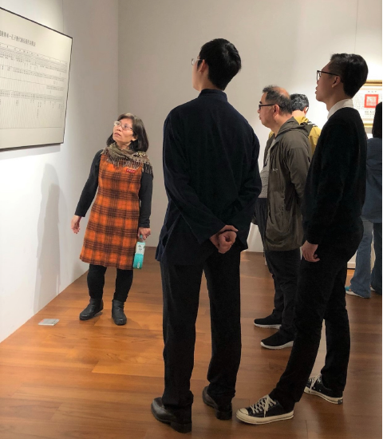

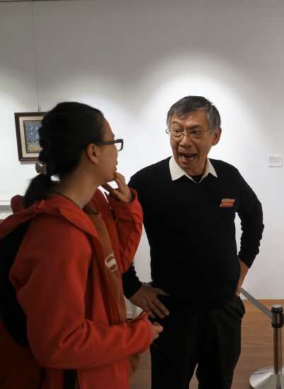

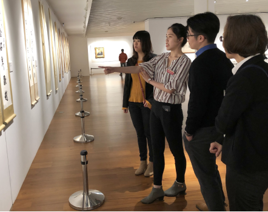

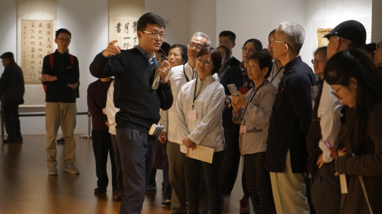

## 後記

### 回顧戊戌年展望己亥年

本 刊

流水一年過

眾友造共業

和合神無方

功德無體性

又是新的一年，全新的開始，湯之《盤銘》曰：「苟日新，日日新，又日新。」這告訴我們平時就應不斷地求進步，而在新年之際，瀰漫著濃厚的除舊布新氛圍，更是我們利用環境振奮自己的好契機。雖然大環境總是充斥著各種的不確定，但只要能充實自己，與世界各地的善友們一同切磋琢磨、互助合作、共同努力，必定能走出一條康莊大道。

過去的一年裡，在老師的指導下，我們仍精勤於經教的學習，並將所學的經典與現代知識結合，以此建立正確的人生觀，找到大時代中的指南。透過網路科技時時與各地讀書會的朋友們交流，不願浪費寶貴時光。我們協助大成至聖先師孔子協會所舉辦的「孔德成先生百年紀念活動」已順利完成，為期五個月的導覽培訓課程，使義工和導覽人員有非常精采的表現，讓與會者留下深刻印象，並開拓出美好的文化事業因緣。此外，幼教、農園等有利於社會大眾的事業，也孜孜矻矻地進行著，讓有緣的親朋好友們，能透過良好的子弟教育使家庭和樂、興旺；也因為有健康無毒的蔬食可以採購，能常保身體的健康。謹此報告過去一年的具體工作事項，未來的一年，在這樣的基礎上，必定能夠更美好！

壹、例行課程（含啟蒙）及念佛共修：

一、中華無盡燈文化學會

(一)每週星期一，晚上七點至九點，開設「維摩詰所說不可思議解脫經講座」，介紹佛淨土之殊勝、廣大神變的意義以及中觀正見的內涵，已經將近尾聲，自民國一○八年三月中旬開始，同一時間將繼續「入菩薩行論講座」。

(二) 每週星期三，晚上七點半至九點，時哉時哉網路教育學院開設「直播講座」，「《論語》中的情緒管理」系列課程已經播出完畢，目前進行的課程是「《論語》｜邁向智者之路」。

(三) 每週星期四，上午九點，至下午三點半，舉行「三代共修」。共修內容包括了上午的念佛，以及下午的講座，現正研討《華嚴經．賢首品》。

(四) 自民國一○七年九月至一○八年一月，每月平均兩次，於星期六早上九點至下午五點，進行「孔德成先生百年紀念活動導覽人員暨義工培訓課程」，使學員深入此次百年紀念活動的的內涵。

(五) 每週星期六，晚上六點半至九點共修活動，分為成人共修班、大專班及啟蒙班（「同心班」限四到六歲幼兒、「學而班」限國小一到三年級、「士心班」限國小三到六年級、「學思班」限國中一到高中三年級），成人班課程為智者大師所著《淨土十疑論》，將進入尾聲，接著的課程主題為《佛說阿彌陀經要解》。。

二、臺中市無盡燈儒佛學會

每週星期六，晚上七點至九點，舉行念佛共修及人生大事研討。

三、中壢研學會

每週星期三，上午九點至十一點，舉行念佛共修及賢首品研討。

四、宜蘭研學會

每月兩次週日上午八點半至十一點半，舉行人生大事研討。

貳、互聯網經營：

一、「時哉時哉網路教育學院」（www.centralwonder.com），24小時持續不間斷播送分享本會文化教育課程。

二、「中華無盡燈文化學會」主網站（www.wct.org.tw），作為學會活動報導之平台，持續更新有關學會講座及活動的介紹。

三、社群平台FB、LINE、大陸微博和微信，也仍繼續經營，與各地學員保持良好的聯繫互動，時哉時哉讀會大小微信群組熱烈討論經典內容，形成共同學習的文化交流網絡。

參、專題講座與活動：

一、民國一○七年一月二十日至卅一日，於台中市無盡燈儒佛學會為馬來西亞來訪蓮友們舉辦「大勢至菩薩念佛圓通及章勸發菩提心文講座」。

三、民國一○七年七月二日，於中壢研學會舉辦「天臺四教儀」講座。

四、民國一○七年七月廿三日至廿六日，於本會舉辦「溈山警策講座」。

五、民國一○七年九月至民國一○八年一月止，本會舉辦「孔德成先生百年紀念活動導覽暨義工培訓課程」，每個月兩次講座，禮請孔德成先生弟子及學者專家共二十位，分次蒞臨本會授課。

六、民國一○八年一月廿一日至廿二日，於本會舉辦「唯識簡介講座」。

七、民國一○八年二月廿四日，邀請莊靈先生至本會演講。

肆、兩岸及國際文化交流：

一、民國一○七年四月七日至八日，受浙江省中脈科技旗下美麗事業部青鳥家族團隊邀請，前往浙江武義舉辦「創新與創業」講座。

二、民國一○七年四月十日至五月九日期間，旅日華僑金春花女士（日本松戶市國際交流協會聘為國際文化大使）來訪，向本會師資學習《論語》。

三、民國一○七年八月四日至十一日，浙江杭州紙飛機行走教室組團來訪，本會為其開設故宮文物介紹等專題講座，並安排至實栽農園參訪學習。

四、民國一○七年九月，派專門師資至浙江省中脈科技旗下美麗事業部青鳥家族團隊常駐授課。

五、民國一○七年九月期間，至福建省順昌縣舉辦護生活動。

六、民國一○七年十月十五日至十九日，前往浙江杭州，與當地讀書會進行交流。

七、民國一○七年十二月十日至十五日，受馬來西亞古晉明門讀書會邀請，前往舉辦「佛遺教經講座」。

伍、法務活動：

一、拜懺法會：淨土懺（民國一○七年一月七日）、大悲懺（民國一○七年三月廿五日）、母親節、浴佛法會及地藏懺（民國一○七年五月十三日）、地藏懺（民國一○七年九月二日）、藥師懺（民國一○七年十一月十一日）、淨土懺（民國一○七年十二月廿三日）。

二、年度齋僧：西蓮淨苑齋僧共十次，圓通寺齋僧一次，正覺精舍呈供養金。

陸、蓮友服務：

一、本年度學會協助助念、臨終關懷、告別式等紀念法會之蓮友，一共十五位。

二、發送年終結緣品。

柒、出版傳播：

一、蓮榮會刊（一一三期至一一九期）。

二、《維摩詰所說不可思議解脫經》科文。

三、《禮記》〈樂記〉與老子《道德經》科文。

四、風雨一盃酒—孔德成先生紀錄片。

願上述各項法行事業之參與者、出資者、出力者，能增進善根福德，於公能莊嚴團體，安定社會國家，有缺失之處，辦事人員要懷著慚愧、檢討及反省的態度，有益於眾的部分，則要生起隨喜及感恩之心。新的一年願大眾以公心繼續各種善法的造作，經營現世的安樂，及未來往生成佛的資糧。
