# 第121期
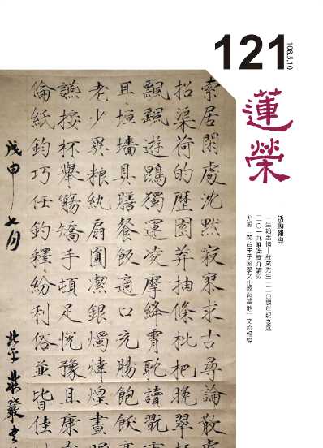

## 社論

### 莊嚴一百二十週年紀念展

本刊

上公莊嚴兩大展

學會投入增氣象

善繼述事父子情

藝術文化展品中

一場展覽，三層視角

刻在國父紀念館展出的《一生翰墨故宮情—莊嚴一二O週年紀念展》，是本學會繼江逸子老師的《道藝春秋》及與大成至聖先師孔子協會合作的《孔德成先生百年紀念展》後再一次承接的文化導覽工作。

準備一個展覽，不只是讀一個人的人生故事，而是從其背景時代去探究歷史脈絡下的生命出處，從而去思考自身的人生價值與出路。

此展既名為《莊嚴一二O週年紀念展》，我們或可擅作主張地將其劃分為莊嚴先生在世時的八十一年，

以及他過世後的這三十九年。

策展人以四個面向呈現莊嚴先生的八十一年人生，這是第一層視角。

第一個面向是從溥儀出宮後成立清室善後委員會、抗戰南遷、文物遷台、

北溝故宮及台北故宮博物院成立等文物遷移脈絡構築而成的《故宮半世紀》。

第二個面向是莊嚴先生一生的書藝精萃—《書道幽光》。

第三個面向是關於文人相交的雅趣的《翰墨知交情》。

第四個面向是藝門家風的《湛藝莊門》。

不論是參觀還是導覽，皆可從這四個面向認識莊嚴老這位書法家、守藏史、故宮博物院前副院長、藝術研究所所長、同時也是培育出四個藝術家的父親。

但讀完莊嚴老人生八十一年的貢獻之後，在他故去後的這三十九年卻是更有興味，因為這三十九年後輩對他的「莫敢或忘」，這也是第二個視角。

一個年逾八旬的長者｜莊靈先生，為已過世三十九年的父親辦回顧展，重現父親八十一年的精采人生：莊靈先生多次走訪父親當年的南遷路線，對父親半世紀前可能在安順華嚴洞壁面題字念茲在茲、細心梳理父母親的人生、交遊，妥善保存父親的日記、書信及各式證件，對父親的收藏每幅字畫如數家珍，而且還能重現父親當年的書房，一切恍若父親過世未久……。

莊靈先生伉儷讓世人見到的是他們對父親的孝思，孔子說「父在觀其志，父沒觀其行，三年無改於父之道，可謂孝矣。」這份孝，不僅僅在文物的陳列上，還有莊靈先生日復一日在展場親自為參觀者一遍又一遍透過展品，娓娓道來父母親的人生故事時，點點滴滴如在目前的那份真摯與情感。

第三層視角在於文化的文化。

什麼是文化？文物能代表文化嗎？

前中央通訊社社長黃天才先生所著《張大千的後半生》一書中有提到一段故事：一九六八年三月初，張大千人在東京，當時正值中國文化大革命高潮，中共將紅衛兵破四舊抄家劫舍沒收來的中國傳統文物書畫，大量賤賣到日本賺取外匯。既是畫家也是收藏家、鑑賞家的大千先生因為好奇大陸究竟賣了什麼東西到海外，而去了買家之一的「日本習字教育聯盟」原田觀峯會長家鑑定文物。原田會長在一九六七年到中國訪問時得知中國在大量銷售古玩書畫，當年春天他成堆買了五千多件字畫、四千多方印石與硯臺。秋天時他再赴廣州，參加中共的秋季交易會，論堆地買下了兩萬多件字畫，每件平均購價才四千日圓，這些戰利品浩浩蕩蕩分了三趟裝船才運回日本。根據大千先生的鑑定，其中有真跡也有贗品，但多數的贗品都是頗有價值的清初以前作品，甚至其中也不乏大千先生早年作品真跡。

文物既可以是牛鬼蛇神、棄之唯恐不及，也可以是文化的表徵品。

而所謂的文化應具備化導的功能，易經賁卦彖辭：「剛柔交錯，天文也；文明以止，人文也。觀乎天文，以察時變，觀乎人文，以化成天下。」

在一場展覽活動中，文物是靜止的，必須透過詮釋才能與世人有進一步的交流。詮釋的方式例如策展陳列，但一般參觀者得到的往往只是展品卡上的簡短說明，僅有少數長期愛好、研究者方有能力僅透過展品便能讀到創作者或策展人的心意。因此導覽是最能快速拉近展品與民眾間的距離的溝通方式，一般使用的語音導覽是利用科技的單向輸出，學會採用的真人導覽則是有溫度的雙向交流，導覽者必須口條清晰、有充分的事先準備，除了能清楚介紹展件之外，尚須具備表述展覽精神與意義的能力。文化以展演的方式傳遞，但文化的內涵卻必須經由語言文字加以詮釋方得以彰顯。因此，「文化的文化」是在既有的文物這類客觀存在中，賦予主觀的詮釋。而主觀的詮釋應當本於經學見地，合乎人情與世情、不違理也不悖禮，並且能啟發人心、導引善良風氣之俗。這才是文化的文化，方能達到以文化成的文治之功。

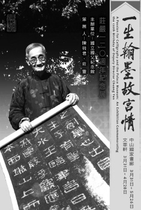

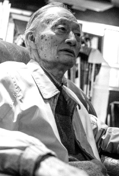

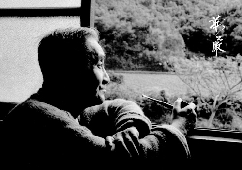

## 佛學覽幽

### 菩薩清淨的行持—華嚴經淨行品（三十七）

*編輯部*

苦難有情菩薩願

常見事物亦能生

處處生機因知識

信手拈來皆心要

丙二、指事顯因答其徵因

丁一、總徵

丁二、別顯

戊六、乞食道行時願（五十五願）

己二、所睹事境（十九願）

己二、所睹事境　果實、大河

經文：

若見果實，當願眾生，獲最勝法，證菩提道。

六十華嚴的經文是：「見樹豐果，當願眾生，起道樹行，成無上果。佛說菩薩本業經，果蓏盛好，當願眾生，起道樹行，成無上果。」南亭老和尚開示，行腳的僧人，在路上見到了結滿了果實的果樹，就想到佛果，但願眾生都能成就理智兼具的菩提道，獲得世間、出世間最殊勝之法。會性法師開示，看到各種果樹結了果實，應當發願，希望眾生得最勝之法，即是證菩提道，菩提是阿耨多羅三藐三菩提的簡稱，是智慧的形象，看到樹的果實，就想到希望眾生能夠成佛。

大家都曾見到果實，但能不能聯想到所有果實中最好的果實就是菩提佛果，就是成就佛的智慧。三乘菩提中，以佛的菩提為無上，是最殊勝的智慧。獲最勝法，證菩提道，意指以最殊勝的方法證得佛的智慧，而最勝的方法就是生起菩提心跟空性的智慧去作十度的修學，使布施的心意圓滿，證得初地，使持戒的心意圓滿，證得二地，使忍辱的心意圓滿，證得三地，使精進的心意圓滿，證得四地等，這就是獲最勝法，證菩提道，看到果實的時候，當作此聯想。

在名相上，果就是實，是同義複詞，也可以說果中之子稱作實，約著儒學來說，果實的核心約仁（果仁），果實有仁始能繁衍續生果實，天地有仁，始能生長萬物，而天地之仁賦予了人類，《周易‧繫辭傳》說：天地之大德約生，《禮運》說：仁為天地之心，此乃因果相續之事理，完全含在仁字之中，人有仁便能成聖成賢，甚至成佛作祖，是以樹之果實，因有仁方可證菩提道，獲最勝法，也彰顯第一句跟第三句、第四句的關係。

果中有實既然叫作仁，仁可以繼續開花結果，假如此果是佛的智慧，佛是為了利益有情去成佛，智慧的獲得也是為了要利益有情。蕅益大師出家時，他的舅舅問他，你出家是為了成佛嗎？一般人若說出家是為了成佛就很了不起了，蕅益大師說，佛尚且不成，意即我不是為了成佛去成佛，如果不是為了利益有情，我絕不成佛。沒有眾生的恩德，生活會產生困難，也不會獲得知識，也不會獲得善根，也不會獲得解脫，也不會獲得福德，也不會成佛，一切的福德都來自於眾生，所以是為了眾生去成佛，為了眾生去修福、修慧，這果中的核心就是仁，我們常說出家人以慈悲為懷，雪公老師說，不只是出家人以慈悲為懷，整個佛法都是以慈悲為懷，果中的核心是仁。

「朝聞道，夕死可矣」的道就是仁，整個孔子學說的中心思想、根本思想就是仁，因為仁心才去成聖成賢，成聖成賢關鍵在他的智慧，賢者是能達到「其庶乎屢空」的境界，聖者是「有鄙夫問於我，空空如也」，因著智慧的差別而有賢聖之分，可是兩者的核心處都是仁。

菩提道是指證得菩提（佛智）的大道，甚深見與廣大行的修學就是成就菩提的大道。佛有兩個快樂，一是菩提覺法樂，一是涅槃寂淨樂，菩提是智慧，約著能證，涅槃是理，是約著所證，能破煩惱障跟所知障的空性就是涅槃。

觀待能顯現真理的心識說是智慧，智慧不能獨立生，觀待所證的理說能證的是智慧，所證的是涅槃，能證的是菩提。

涅槃也可以說是滅諦，滅諦即佛的法身（破二障所顯的空性），佛的法身成為所證，而菩提是佛的受用報身，法身、報身顯現不離佛的應化身而有，所以三身並非自相所成的三身，是觀待下的顯現，自相了不可得。

約二智來說，所覺之境有事理二法，斷煩惱障而證的涅槃是理，屬於一切智的所證，通三乘的菩提；斷所知障而知諸法是事，屬於一切種智，唯佛的菩提。

在《佛學十四講表》中的第一表提到，知法總相的是一切智，屬於證理；知法別相的是道種智，完全究竟的是一切種智，此二者屬於證事。

但從另一個面相來說，因為煩惱障、所知障在證得空性下才能破，證理可以是一切智及一切種智，屬於根本位；證事就是後得位，也就是菩薩的道種智。所以十四講表可以講天台教觀的十四講表，可以講中觀的十四講表，法不會一成不變的。

若見果實，當願眾生，獲最勝法，證菩提道。最殊勝的修學法，是以菩提心跟空性的智慧攝持菩薩十度的修學，證得佛的智慧，是所有修學法中最殊勝的修學法。

經文：

若見大河，當願眾生，得預法流，入佛智海。

六十華嚴的經文是：「見諸流水，當願眾生，得正法流，入佛智海。佛說菩薩本業經，睹諸流水，當願眾生，得正溝流，入佛海智。」南亭老和尚開示，行腳僧人遇到大河的時候，應當發願，願一切眾生，皆入佛法之流，而入海的佛智。會性法師開示，見水流動，希望眾生得入聖流，進入聖人的領域，登入佛法的法流中，進而入智海的佛果位。

若見大河，大河會流到海裡，流入佛的智海，所以入河流等同入海，如此說來，哪一種人一定證得四果？哪一種人一定成佛？以小乘成為預流的聖者，則是四果中的初果，以大乘來說則是初地。

大河，南亭老和尚的講義說河面寬廣即稱大河。會性法師則說，恆河是印度最大的河，所以稱大河，在印度幾乎人人都可以看到恆河，而佛說法大都是在恆河流域一帶，會性法師提到，凡是流動的，大者如江、河，小者如溪，只要是流動的都算，之所以會舉大河，是因為佛說法在恆河流域一帶，恆河是屬於大河，所以才引用大河，實際上只要是能夠流入大海的河，都可以算在這個範圍。

得預法流，入佛的智海，最後還是要入佛的智慧海，見到流水的河，不論是波瀾壯闊的河或是潺潺的小溪，都必須要能匯歸入海，將一切善的造作導歸佛果極樂，方能結合兩者的關係。

結合佛果的極樂，在因地當中，每一個善法都成為我們導歸淨土，導歸當中，特別是要跟諸上善人學習成佛的這一分，是所有導歸中最為殊勝的。

預法流為四果中的初果（須陀洹果），翻成中文就是入流，也就是預入聖流，聲聞證到初果就已經進入聖流，從凡夫超出而進入聖人的領域。夢參老和尚約著參與來說，將河水比喻為佛所說的法，能念念參與佛的法流。南亭老和尚以河水表佛的說法，佛的說法像大河一樣滔滔不絕，能夠隨順佛的說法去修學，就可以入佛的智慧海。佛法的重點在學佛所說的法，所以聲塵很重要。

入佛智海，依著南亭老和尚及會性法師所綜合的，流水流入大海（佛果），佛果即所謂的智慧如海，深廣不可測量，用智海比喻佛的果位。入佛的智慧海，取其廣與深，深的部分可以說是佛的一切種智，廣的部分可以說是道種智。也可以說，佛的根本位是甚深的，可以破二障，佛的後得位可以通達一切世間，成為世間解，所以世間解是約著佛的後得位說，善逝是約著佛的根本位說，佛的十種通號中，都是佛各種面相的觀察。

夢參老和尚說，願眾生造作學法之因、行法之因，將來就能夠證法，證到佛的智海。因是造作學法的因，果就能夠學法，而學法的因在有希求學法的意樂，生起學法的熱情，配合著學法所需要的資糧來努力造作，才有學法的結果。學法的因包括身體健康、精神愉快，有道糧，有善法欲，能夠斷惡修善，破除學法的障礙，使順緣生起，還要求三寶加被，有善知識引導我學法，這些因都要造作，若沒有造作這些因，很可能想學佛時身體不好，沒道糧，一天到晚為生活奔波，遇不到善知識等。所以，不去造作學法的因，果上就有學法的障礙。

行法之因造作之後，果上才能行法，行法之因的行是止觀，止觀之因在於具五緣、訶五欲、棄五蓋、調和五事、方便行五法。還要知道修止、修觀的方便，還要講究學法的環境，要有同儕道友，有外護，這些都是修學止觀的因，條件不具足修止觀，甚而有嚴重障礙。

藉此我們還能對水做各面相的觀修，《論語》〈雍也〉講到「智者樂水」，取它能夠潤澤的那一分來說，喻有智慧的人才能以潤澤的那一分助人之善種生起作用，所以，有心想幫別人的人，定要充實智慧（能力），否則是幫不了的。〈子罕〉的「逝者如斯夫，不舍晝夜」是無常的修學，而這裡的水特別是指佛說法法音宣流的水，從佛法音宣流的流水去入佛的智慧大海，才更是我們這一章所要取的大意，叫作若見大河，當願眾生，得預法流，入佛智海。

### 大乘百法明門論簡說（二十九）拾肆、心所有法｜根本煩惱（四）

*戒慧講述、淨本整理*

正確思維緣起法

通達關聯無自性

苦因苦果觀待滅

涅槃生死等空花

經文：

四、煩惱六者：一、貪。二、瞋。三、慢。四、無明。五、疑。六、不正見。

前述根本煩惱第六不正見已畢，對治不正見要靠正見，正見才能夠讓眾生離苦得樂，外道也希望離苦得樂，但非因計因或者非果計果，甚至不知無明我執的行相，縱有多智禪定現前，也無法出離輪迴之苦。正見的關鍵，在於通達諸法實相破除無明我執，契入聖者的智慧。修學正見所要觀察的內涵，可以歸納為四聖諦：苦集滅道。四諦之下又各有四種行相，稱之為「四諦十六行相」，因為欲界及上界（色界、無色界）都有「四諦十六行相」需要觀察，所以總共是八諦三十二行相。

四諦中的苦諦，在說明苦果；集諦是苦因；滅諦是苦因苦果的滅；道諦是滅除苦因苦果的方法。苦諦下四個行相：無常、苦、空、無我。第一無常，是指有為法必定有生住異滅的變化，若依照有部的看法（世親論師所著的《俱舍論》就是有部的思想），法本來沒有現在有是生，存在一段時間是住，產生變化是異，沒有了就是滅。這樣的認知與一般世間的看法相近，例如花草，從種子到生長開花，維持一段時間後發黃、凋零，最後花朵沒有了，生住異滅如是呈現。經部以上的看法不同，主張的是生異滅，法是剎那的變化，沒有自相可得，無法不斷的維持一段時間，每一個狀態都存在一剎那，第二剎那出現時，已經與第一剎那不同，此一剎那之生同時可安立為住、趨滅，一剎那若是實體法則何能安立三種不同的名稱，不過是依據功能名言假立。諸法在前剎那時的狀態，在後剎那已不存在，後剎那已變化成另一種狀態，某一狀態只有在剎那中存在，這是細品無常的觀察，若說眾生皆有死，萬物終將敗壞，那只是粗品無常。

第二個行相是苦，眾生受無常所逼故苦。一般人以為，人生有苦有樂，怎麼可以說只有苦？苦也因為無常而會轉為樂，又怎麼可以說無常的本質是苦呢？因為快樂會被無常所破壞，比如許多的盛況、很大的事業，到老或死亡就無法維持，失去後的痛苦，又遠大於得到時的快樂，此其一。其二，某一時期的痛苦消失、快樂出現，其實只是另一個階段痛苦的開始。例如久站感覺到辛苦，坐下以後站著的苦消失，但坐著的苦卻慢慢開始出現。又例如小孩時期的痛苦消失，變成了青年，青年的苦開始出現；員工羨慕老闆，等自己成為了老闆，發現老闆也有許多的煩惱，三界就是如此，似乎有樂可得，其實只是不斷地在轉換吃苦的境界而已，佛也不反對有樂受、喜受、捨受，只是它們本質上都被無常所逼，是苦，唯有苦因苦果的離開才有快樂。

苦諦下空及無我的觀察，無論是小乘部派的常一自在我空、獨立實有我無，或者大乘佛法的四大本空、五陰非我，都應該是道諦而非苦諦。提婆論師所論的苦諦，是「無常、苦、不淨、無我」，不淨所以苦，無我的意思是不能自主，我們在生老病死中都無法自主，被業所繫縛的眾生，哪裡有可以自主的我，所以是真苦。

印度是因明邏輯很強盛的民族，釋迦牟尼佛的時代，對於如何修行才能解脫，充斥著各種外道見解，能言善辯，所謂六師九十六種外道。四諦十六行相的觀察，分別都可以用以破除不同的外道見解。

苦諦下四行，可破除外道執苦為樂，執無常為常，執不淨為淨，執無我為我的錯誤看法。

集諦的四行相：集因緣生。集就是收集，造成苦果的苦因是收集和合而來。惑業的和合產生了苦果，苦果本身其實也是一個和合相。例如生病，苦因來自長年的飲食不節制、作息不正常、觀念不導正，生病後的服藥、行動不便、疼痛、煩惱等許多行相，合稱為病苦。果報既然都是和合而成，在因地和合時一定要好好講究，善業是一個人做還是團隊做，是經過思考或者粗心大意，是抱著歡喜心在做或者懷有不滿，都會影響所結成的果，這也是人有富貴窮通差異的原因。集的觀察可以破除外道唯一因的說法。

集諦下因的觀察可歸納為六：相應因，俱有因，同類因，遍行因，異熟因，能作因。相應因就是心王與心所的相應造作；俱有因是心王與心所互相輔助。此二者都是在觀察心王與心所間的體用關係，因為心王與心所的相應與彼此輔助，能造作出未來的果。比如心王緣可愛境，使心所生貪，感應來世無財的果報。

第三個是同類因，自種感自類果稱為同類因，即造作等流。比如過去生樂善好施，這一生也樂善好施；過去生樂善好施，這一生富貴則不是同類因，因為二者行相不同，領受等流不屬於此處的同類因。

第四遍行因，造成苦果的十使煩惱遍行苦集二諦。苦諦下具足十使煩惱，集諦下也有七使，觀察這些煩惱會造成苦果，稱為遍行因。

第五異熟因，是指會造成異世而熟的因，比如今生造善的引業，能夠使我們來世投生天道或者人道，十二因緣就是在說明異熟的緣起，探討的是引業不是此生的滿業。

最後是能作因，根塵為能作，識是所作，根塵和合有力生識，當我們的身體接觸外境時，會產生什麼樣的心理作用，這樣的觀察稱為能作因。因的觀察，可破除外道執苦無因的說法，如裸形外道。

集諦下的緣，是觀四緣能生苦果，以緣的觀察，來了解苦果為何生起。四緣是親因緣、所緣緣、等無間緣、增上緣。緣的觀察，可以破除數論師自性變化苦樂的思想。印度的數論師認為，有一個自性變化苦樂給神我受用，修行就是讓神我發覺自性的引誘，這個自性就像害羞的姑娘，被男人識破奸計以後，會慢慢收起來，不敢再變化，如此神我就解脫了。緣的觀察就是破除有自性變化苦樂的看法，苦樂來自於各種不同的緣，不是自性的變化，而依靠神我的概念去修行，縱然不受誘惑也不能解脫，因為始終有一個「我」。

集諦下的生，是觀察苦會不斷地生，所謂身後還生後有苦。苦會不斷地生，並不是一個業可以感多次果，業只有一次感果的功能，所以惡業感苦果、善業感樂果的功能出現後，便不再感果。苦多次生，是因為惑（無明我執）不除，就會繼續滋潤其他惡業，或者讓有情再造新業，是故苦果無有窮盡。

既然業因感果只有一次性，學佛之人若遭遇逆境，要懂得觀察逆境的恩德，因為惡因只能靠果報成熟才能消除，沒有其他的方式。修行時能感苦果最好，就像生病正好碰到名醫，可以輕鬆解決病苦。修行時的善心與智慧，可以讓苦果的解除變得很簡單，如戒賢論師的病痛以及高僧大德所受的迫害，對他們來講很簡單，對我們來說就很複雜了。生的觀察可以破除苦是大自在天生的外道見。

滅諦所攝的四行相：滅盡妙離。第一個滅，指苦因苦果的滅，破除以為根本沒有涅槃的外道見，涅槃就是苦因苦果的滅，其實涅槃包括諸果滅，不是煩惱滅而已。

第二個是盡，意思是輪迴的五蘊窮盡，五蘊是盛苦的器具，外道所認為的解脫，仍保有輪迴的五蘊，比如證得色界天美好的形象，以為這就是解脫；或者證得無色界天，只保留了受想行識的意想身，一片空蕩蕩的境界中，好似解脫。其實這些都不是解脫，解脫是輪迴所攝的五蘊必須窮盡，滅諦所攝的盡，可破除外道認為有漏身是解脫的宗派見。

妙是指安樂的體性，苦因苦果的滅才是安樂的體性，除此以外一切的安樂，都是以痛苦為本質的安樂，理由如前苦諦所說。外道見認為某些快樂的境界是解脫，比如仙人在山上修行，清心寡欲是解脫，其實不然，因為執我未破，苦因苦果未滅，用我相去受用一時的安樂，都只是以苦為本質的樂。

最後是離，離是就輪迴的現象來說，當被輪迴所攝的五蘊身窮盡，就離開輪迴的現象。沒有眾生的五蘊，哪有輪迴的現象？輪迴的現象可以永離，破除解脫後仍會退轉的宗派見。

道諦下的四面向：道正迹乘。第一個道就是無我的修學法，以此為因，能至涅槃的果，涅槃即前述的滅諦。此處指出無我的修學法能滅除苦因苦果，真正解脫痛苦，破除認為根本沒有解脫道的外道見，他們認為痛苦永無止境，雖然有時可以壓伏，但是又會出生。

正是說道品非顛倒法，破除認為證得無我不是解脫道的宗派見。例如數論師認為神我脫離自性才能夠得到解脫，此中仍有一個我去解脫，與佛法所說無我才能解脫不同。

迹，指道品是聖人行處，只有無我的修學法，才是聖人的行處，破除誤認禪定修行是解脫道的看法。無論禪定功夫多高，神通多廣大，都不是聖人的行處。滅諦的滅盡妙離都是在說明修學無我所能達到的目的地，道諦的道正迹乘都是在講修學無我的過程，但著重面向不同，迹與道看似相近，第一個道著重在過程，是真正能通往涅槃的過程；第三個迹著重在聖人所行。

最後一個是乘，修學無我的過程能幫助行者達到三解脫：空、無相、無願。所以道品不但是聖人的行處，道品也可以幫助行者達到三解脫，聖人的行處凡夫也可以走，這是凡聖的共法，當凡夫走的路跟聖人一樣時，就是一個能夠成為聖人的凡夫，此人的命運將不可限量。

苦集滅道四諦，苦諦的四面向是四個法去分析，為何世間的真實相是苦。集諦、滅諦、道諦都是就一個法（一個狀態）的四個面向去觀察：（集諦）苦因從何而來？（滅諦）涅槃的行相是什麼？（道諦）什麼樣的修行過程可以證得涅槃？

每個人都想解脫於痛苦，也都在追求他自以為的解脫，富貴榮華是解脫？禪定是解脫？順境是解脫？預知時至是解脫？預測世間的吉凶禍福是解脫？結果居然都不是，可見四諦十六行相的觀察有多麼的重要，也唯有四諦十六行相的觀察，才是真正的破外道顯正法的觀察，所以禪宗說：「貴爾見地，不貴爾行持。」正見生起，祖師的位置就傳給你，不論輩份，不論出身。行者修此十六行觀，能夠觀察明白，即得正見，這才是佛法最核心的想法，有這樣的正見才是真正的內道弟子。

### 佛學概要十四講表簡說（二十三）第三講表

*宏法、淨昌整理*

慧眼照真實

法眼了世俗

始樂終世樂

真正四正勤

（己）忽現實與重現實

◎忽略現實屬他

一般人說佛法是忽略現實的，但如果認真探究現實的定義，會發現世間人才是真正忽略現實，而佛法才是真正的重現實。先探究「現實」的定義，一般人追求五欲六塵以為是現實，但是他所追求的五欲六塵其實是一個假法，所以應該說是追求現假。

或有人問，為什麼是假的？明明是真的，也享受到了，終於透過努力該有的都有了，「財色名食睡」「財」賺到錢了；「色」身體很健康，每天打高爾夫，娶的太太很漂亮；「名」得到名聞利養，衣食豐足。

但述記說：「實者不變，變者非實」，原來真正的「真」不會改變的，會改變的就是非實，也就是所謂的「假」。一般世間人所求的五欲六塵是種苦果的因，即使得到快樂也是短暫，因為這個快樂是過去造善業的結果，而追求欲境的貪愛，這種苦因的相續，反而會得到極大的痛苦，以此貪愛欲境的心所得到的快樂是虛假的，惡因如何會得樂果？而佛法所追求的是真樂，這個樂是解脫成佛之樂，所種的因就是正法的覺受，善因的相續必得樂果，這才是真正的追求現實者。

●所求(刀頭舐蜜)

世人追逐的欲塵如「刀頭舐蜜」，在刀刃上嚐蜜，雖吃到甜味，舌頭已被割破。世間人雖得五欲境，後面引來很多過患謂之「刀頭舐蜜」。引來的過患有些不是現世的，所以他以為沒有過患，引到三途去的那一分是很可怕的，可是往往不現見，所以世間人不認為會怎麼樣。有些事情是可以東窗事發，有些東窗事不發，雖說紙包不住火，可是很多紙只能暫時包得住火，終究是會燒出來的，如同「刀頭舐蜜」，貪圖眼前的世間人往往管不了那麼多。

所謂的「假」是說後面引來大過患的那一分，如何成立快樂呢？「假」的意思並不是說受用假，也真的賺到錢、也真的享受人生了，這樣的歡樂怎麼會假？一般人不會相信，問題是引來過患的那一分他看不到。舉例來說：有一個人要被槍斃，現在先給他吃滿漢全席，如何吃得下？但不知下一刻要被槍斃的時候，會吃得很快樂，世間人就是這樣。如豬不知道後面結局會被殺，每每吃得很開心，這叫刀頭舐蜜。多數人都要到臨命終時才會驚恐，才會相信這個「假」並不是說眼前假，而是引來過患的那一分說人生「假」。果然認知到這點，方知此時一生所追求的世俗快樂哪有真的？所求的快樂是刀頭舐蜜。

●所得(昧機畏果)

所得昧機畏果，「機」是指因上的造作，動機的部分。一般人為了所求，鮮少有人去檢視動機，往往會不擇手段，昧著良心、昧著動機追求所欲。可是造作了之後，面對後面的苦果生起時才真正懂得害怕，畏懼嘗苦果。

他所求的東西是昧機求來的，他所求得到以後，反害怕後來會發生的事情。「畏果」包括得了名利以後害怕仇人在後面覬覦，螳螂捕蟬黃雀在後；或是良心不安內心恐慌；或是怕死等等。

●設喻（火烘牡丹）

所設的比喻是「火烘牡丹」，此一比喻說明世間追求以為的現實其實是一個假現實，就好像牡丹非常美，為了讓牡丹開花就用火去烘，天氣和暖花就開了，但此開花只是一個短暫的結果，卻再也不會開了。意即我們世人所追求的快樂都是眼前的、短暫的，而短暫快樂的後面是無窮的禍患。昧機畏果所得到的世間福報，其實是快速把善業消耗殆盡。反之，佛法使善業生起福報，而福報又可以做善業，如此生生不息。然而世間沒有這個概念，賺到錢就拼命享受，身體健康就拚命消磨光陰、縱情聲色，把善業全部消耗完了，如同火烘牡丹，一次讓它成熟。

◎始終真樂屬佛

「始終真樂」是說從開始是樂，終點也是樂，而且樂是真的。這是依據佛法正知見所成立的樂，也並不違反諸行無常、諸法無我與涅槃寂靜這三法印。三法印的道理是樂非真樂，因為樂也是無常的緣故。而且樂的自體性空，不觀待善業的顯現，是沒有絲毫的樂可以得到。是樂的自體性沒有，並不是沒有樂的作用，如果連樂的作用都否定，恰好違反《金剛經》所說的「於諸法不說斷滅相」。認知到樂的顯現是無常的，且沒有自體性，認知到樂在做廣大的惡業時，生起的樂的勢力是小的，樂在做廣大的善業時，生起的力量是強盛的，有這樣正知見的人方懂得廣大而持續的造作善業。善業生起快樂，快樂中造作善業，將快樂轉為作善的資糧繼續往下走，越滾越大。這就是世間和佛法的看法不一樣之處，世間的樂是假的，樂受用完就開始面對苦果。佛法的樂是相續的，體性又可轉成善、善又變成樂，樂的體性又是善，這樣下去就越來越多樂果，所以是始終真樂。雖然同為無常、體性空，但世間的快樂是壞苦，不但被無常破壞而感到痛苦，又因為在樂中造作惡業導向痛苦，且是持續痛苦，所以世間的快樂是假的意義在此。佛法的快樂雖然無常，但其體性是善所成就的樂，當樂的體性轉成善時，樂就能相續生起。

●四正勤法

想得到始終真樂的第一件事就是勤修「四正勤法」，四正勤法是以斷惡修善來經營快樂，而得到的快樂也作為斷惡修善的資糧。例如用財富供養三寶，提供師友們及修道的道糧…。「四正勤」的內涵如同述記：「未生善令速生，已生善令增長；未生惡令不生，已生惡令速斷」。

「未生善令速生」，靠發願令善法速生，八萬四千善法成為所願境，生起能夠做善法該有多好的心，來令未生的善速生。用隨喜來使「已生善令增長」，例如被通知半夜二點到四點去助念，要如何修自己的隨喜？要想到幫助一個人去到極樂世界就等於幫助一個眾生成佛，而且在寒風中送暖對方最感動，並趁此次中間歷經的辛苦把我過去的惡業快速消耗，在這個時候難行能行正好是修忍辱最好的時機，所以很高興的出門。為什麼善會越來越薄弱？就是以厭惡的心情去修善，所修善法的勢頭就越來越弱，到最後就修不下去了，所以修善一定要修歡喜心，已生的善念增長就靠隨喜。靠悔來使「未生惡令不生」，就是所謂的悔其後過，我對這些惡，生出一個後面不能再發生的決心叫做悔，也就是顏回的不貳過。靠懺來使「已生惡速斷」，就是所謂的懺其前愆，過去所造的惡全部要懺除。

以上這些方法配合八萬四千法門，讓斷惡修善的勢力轉強，當斷惡修善的勢力轉強時，感果的功能越來越強，感得福報的功能也越來越強，過去惡業起現行的力量越來越弱，痛苦會重報輕受，福報會增長廣大。

「四正勤法」是我們得樂的因，它不是火烘牡丹，因為所得的樂也會作為「四正勤」的資糧，所以快樂就一直相續下去，始也樂終也樂，叫做始終真樂。可是其體性還是無常、空，只是相續生，體性空、無常，可是相續生起的都是快樂，所以叫做始終真樂。

述記云：「隨緣皆得大自在，不能言其所以然也。」特別是對治煩惱的斷惡修善，特別是以般若修學對治無明我執的那一分，沒有般若智慧的生起是不會得到大自在。

●知果畏因

述記云：「世人『昧機畏果』」，過去的因，我是昧著良心幹的，我害怕未來結果。又云：「佛家則『知果畏因』」我們知道未來的果，所以眼前畏因，就算眼前受福，我也知道如果造惡業未來是苦的，所以是「知果畏因」，把福報當成作善、修道資糧的這一分，凡夫不會有，除非你有學佛的正見。所以，當沒有佛法的正見而生起福報之時，不會把福報拿出來做修道的資糧。當體力很好的時候，不會拿這種體力來服侍師友，護持三寶、研討教理、推廣佛事、和合善友，反而會以健康身體追逐世俗享樂，或努力於世俗的鑽研，最後耗掉青春。

●六根清淨

把所有福報拿來作為行善修道資糧，最後就是要得到解脫，即是「六根清淨」。佛法最後的快樂是導向解脫，所以是「始終真樂」，「始」是世俗的樂，「終」是解脫的樂，此是雪廬老人《十四講表》厲害高明之處。例如觀世音菩薩耳根圓通就是耳根清淨，六根清淨代表解脫、證得空性的果位，而這種解脫的樂是得到安樂的體性，真正的快樂。佛法是現前得安樂、未來得安樂、究竟得安樂，是最符合現實的。世間人才是不明現實，眼前「火烘牡丹」得到短暫的快樂，換得未來的痛苦墮落，何現實之有？

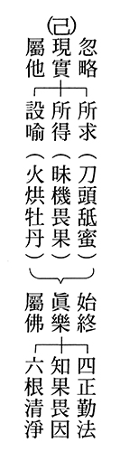

### 人生大事不能忽略的事實—助念生西觀念作法研究（九）

戒慧講述

助念成功家屬助

勿動勿哭勿愛語

若生病者愛與憎

無義助念可終止

臨終助念家屬須知是指病人臨命終時，護持的家屬必須知道的事情，分為八條，以下一一說明。

第一段：病者靜聽佛號，實為至善之事，大命未盡，可以卻病延年，世壽已盡，即得往生極樂，世人不察，每以佛法，但為超度幽冥而設，疑為不吉，庸愚瞽見，大謬大謬，華嚴經，佛升諸天說法，無量天帝，共念佛法，最為吉祥云，念佛者，佛所說之法也，故一心念佛，功德實不可思議。

第一條是正明，要讓病人靜聽佛號，子女是他的善知識。靜聽佛號的功夫非常重要，靜聽佛號可以對治煩惱，使心情平和、愉悅，氣氛美妙，這樣的氣氛能夠感得三寶加被，就算身體有很嚴重的病苦，也會減到最輕；反之，若是心情不好，小病都能引發大苦。此時病人若「大命未盡，可以卻病延年，世壽已盡，即得往生極樂」，能夠往生極樂是因為平常的修學念佛習慣，讓家屬在臨命終提醒，他很容易提起正念，專心聽佛號念佛。家屬也因為病人平常就聽佛號，臨命終不會給他助念的障礙。

可見平時有靜聽佛號的習慣，有助於家屬知道臨命終如何護持，此時蓮友來念佛，家屬就不會阻擋，否則可能會產生不必要的排斥與誤會。「世人不察，每以佛法，但為超度幽冥而設，疑為不吉」，世人多誤認為佛法只有在人死的時候才用得到，平常活人是不要做佛事的。例如，幫病人拜佛、禮佛、念佛，是不是要求他早死呢？會產生這樣的錯覺。事實上，若病人壽命已盡，就算不用佛事他還是會死，眼前要助他好死，病人命未盡，眼前念佛助於他好起來，不管是哪種，對病人都是最有利的。所以認為佛法是為了超度幽冥而設，實在是大謬至極，是平庸、愚昧、心眼未開的想法。

「華嚴經中，佛升諸天說法，無量天帝，共念佛法，最為吉祥云，所以，念佛者，佛所說之法也，故一心念佛，功德是不可思議」，念佛者是佛所說之法，這是廣義的念佛，狹義的念佛是執持名號。念佛所說的法就是念佛所說的成佛法，研究經教就是研究成佛的方法，執持佛名號，也是成佛的方法，尤其臨命終時，念不住佛所說的法了，念佛的名號才有辦法攝心。以上是正面說，要助病人正念。或幫助他病速癒，或壽已盡幫助他往生西方，並用華嚴經證明，念佛最為吉祥。

第二段：凡眷屬人等，切不可入房，與病者作軟愛語，或臨床揮淚，擾亂病者正念，累其墮落。

其次反面的告誡我們，不要障礙臨終的助念。

有兩種不要擾亂病人的正念，第一種是不要引發他的貪愛，第二種是不要引發他的瞋恨。引發貪愛有兩種方式，一種是言語上的引發，一種是身體上的引發。言語上的引發是說軟愛語，身體上的引發是頻頻擦眼淚，依依不捨的樣貌，這二種最會引發病人的貪愛。「凡眷屬人等，切不可入房，與病者作軟愛語」，平常五倫關係夫婦講究和諧，臨命終時，如果真正珍惜對方，一定要有共同的目標，並清除臨終障礙，要幫助對方切斷恩愛，應該提醒對方，不管是上三道或下三道都得繼續輪迴，唯有往生西方極樂世界才是真正解脫，未來還能共同增上。。

有一個故事，女兒希望能夠引導父親去淨土，她懂得善意開導，因為她父親生前很喜歡研究建築，女兒就對他說，如果你到淨土去，彼處建築不可思議，會讓你歎為觀止，可以去那裡好好研究，於是父親很高興盼望往生到那個地方去。對不同的病人有不同的引導方式，要靈活、善巧變通。

助念團一定要引導家屬不可以在病人面前說軟愛語，軟愛語會造成他對世間、對家庭的貪戀，會讓他善業不能引發而墮入惡趣，此時家人要把對病者的恩愛轉成要助其往生的祝福，真正往生極樂世界，眼前的分離只是暫時的分離，未來還能長久的聚在一起，愛要兩邊講，一方面要遠離娑婆的貪愛，另一方面要開導他生起對西方淨土的愛樂，這就是蓮友引導家屬的善巧方便，如果家屬真的辦不到，在現場大哭、說種種捨不得的話，就必須要隔絕，使其不要干擾病人。若最後還是溝通不成，助念團可以撤離。

第三段：病者初氣絕後，切忌哭泣，切忌揩洗手足，搬動身體，掉換衣服等事，因亡者此時，神識未捨，免使痛苦，喪失正念，只須照常念佛，待至煖覺，全捨以後，助念功畢，以上之事，方可舉行。

第三段就是防止生起瞋恨心。病人氣絕後，不要哭泣，也不要幫病人擦身體、換衣服，最保險是助念完八小時、十二小時、二十四小時，之後才沐浴更衣。這其中，助念團要看交情，一般結緣的蓮友，助念團念三小時就可以撤退，若是蓮友的眷屬可以念到八小時，蓮友本身十二小時，家屬自己可以念到二十四小時。這樣能夠保護助念團，讓助念團不會精疲力竭而能長時運轉。全身柔軟以後才可以進行沐浴更衣，幫往生者洗手洗腳、換衣服，在幫長輩親人沐浴更衣時，要懷著不捨、感念的心，雖說人死了沒知覺，給亡者洗檀香水，把身體打理得乾乾淨淨，換上整潔舒適的衣服，他的神識已經去極樂世界，又感覺不到，我們有需要這樣做嗎？其實如果是以感恩的心，做再多都不算多，最後一次碰觸身體去報答是很直接的事情，當下不做，不可能再有機會，而且連最後一個機會都不把握的話，後面做再多都是空談。此時重點已不是往生者，而在於生者。以前印光大師在拜佛的時候，日本人進來，就印光大師，佛菩薩靈嗎？不靈的話拜他做什麼。印光大師回：他不靈，我靈。意即其實我們是藉著泥塑木雕的佛，去觀修佛菩薩，在禮拜佛時生起皈依、禮敬三寶的心、修學教法的心。如此，泥塑木雕的佛跟真佛的功德一樣，因真佛出來也是要引發你這些心態、想法，而且佛菩薩還要藉著泥塑木雕的佛來顯現加被。龍天護持、三寶加被、諸佛護念可能就藉著我們去護持病人，護持亡者當中生起。

以上助念、開導家屬、病人，並不是人死了蓮友才去念佛，而是平常就要經營。團體裡除了辦教法的研討、辦講座、共修外，還要懂得在病人生前的時候跟他結善緣，在正法上做良好的溝通，經營和樂的氣氛，跟家人培養好的默契，這些都能夠幫助病人排除臨終的障礙。

第四段：亡者煖覺全捨以後，臂膝彎屈，難以正直，可用熱水手巾，搭於臂膝彎處，自然照原，其實屈亦何礙，切不可聽從世俗之談，謂亡人手足不直，來生將成折肱、跛足，之人此等謬見，稍有識者，即知其妄。蓋修行有得者，多側臥而逝（稱為吉祥逝），或坐化立亡，夫側臥坐化，手足必屈，不辯自明，即釋迦牟尼佛，涅槃時， 亦側身右脅而臥，故亡人身體之正直與否，實不成問題也。。

第四條講到亡者本人煖覺全捨之後的情況，此時往生者的身體已經冷了，但是手臂、腳可能還是彎屈的，可以用熱毛巾敷於臂膝彎處，就可以恢復為直，但手腳彎屈也不妨礙，不要聽信世俗的說法，認為亡者遺體手足不直的話，來生會缺手或是跛腳，其實只要稍有常識，就可以知道這是謬見妄論。因為我們都清楚一個人往生後，他投胎是根據過去的因緣，跟他往生的時候手足是否直沒有關係。且如果此人天生或後天就有手足上的缺陷，那他是不是將來就必然缺陷呢，可見這樣的說法是說不通的。
有人會
**問：** 為什麼助念完以後往生者身體沒辦法軟呢？敷了熱毛巾還是沒有軟呢？其實一個人的往生與否，不應該過度以有沒有瑞相來論，重要的是在臨命終時，他能不能提起正念念出佛號。至於為何用熱毛巾敷手腳還是沒有辦法直，可能有幾種原因，第一是念得過久了，姿勢彎久了，血液已凝固。第二可能是藥物中毒，醫院裡的點滴藥水，病者體內吸收不了，導致身體膨脹臃腫，身體已腐壞，遇到這樣的狀況，要讓他變成筋骨柔軟是難辦到的。

而病者助念之後是否身體柔軟，跟臨終助念團經營安定的氣氛有關，有時候助念團的念佛氣氛不好，或很多不如法的地方，例如有人大聲講電話、粗魯的搬椅子等，助念完掀開陀羅尼巾被時看到亡者眼睛張開、表情驚恐、手足僵硬。所以平常助念團就必須訓練有素， 雪廬老人甚至說， 打噴嚏、咳嗽都不能有聲音，避免亡者生起恐懼感或受到驚嚇。

另外，助念團要懂得解決家屬心裡的疑惑，比方說有時候助念了八個鐘頭、十二個鐘頭，甚至二十四小時，陀羅尼巾被掀開，家屬第一個會在意亡者的相貌好不好看，眼睛、嘴巴是否張開，有些人甚至有誤解陀羅尼巾被只要蓋到肩膀，這樣可以隨時觀察往生者的樣貌，事實上陀羅尼巾被覆蓋全身的用意是能夠全身加持，免除外界邪魔的干擾，而大家只要自信、自在和氣的念佛，引發往生者願意求生到西方極樂世界的正念，這才是最重要的。當心專注在佛號上，自然不會緣著往生者的相貌。助念完陀羅尼巾被掀開，結果眼睛是張開的，那可能是亡者生前的習慣，或是他見到阿彌陀佛，有種種的情況，我們不能說他是死不瞑目。若掀開陀羅尼巾被時，嘴巴是張開的，也可能是他在念阿彌陀佛，不管是眼睛或是嘴巴張開，家屬在後續處理時，可以很善巧的用方法讓他眼睛、嘴巴合起來，自然也就沒有疑問了。

「蓋修行有德者，多側臥而逝」，就是一般所稱的吉祥臥，也許是坐著走也許是站著走的，坐化的像憨山大師、印光大師，立亡的像王龍舒居士，吉祥臥像弘一大師、雪公老師。側臥或是坐化，手足必屈，不辨自明，能夠坐化或是吉祥臥而走的這麼有修行的人，他的往生當然是沒有疑問的，即使是釋迦摩尼佛涅槃的時候也是側身右斜而臥，所以故亡人身體的正直與否，實不成問題。

第五段：生西以後，家屬應以念佛，代靈前哭泣。

五、六、七段講到家屬應該做的事情。亡者生西後，家屬應以念佛代替靈前的哭泣，此時已助念完畢，了解到往生西方極樂世界的殊勝，更應該真心誠意念佛來幫助往生者，借著佛力加被，幫助他或是在中陰身接引往生，或是在極樂世界蓮品增上。此時念佛的時間可以拉得很長，也可以穿插誦經等，主體是以念佛為主。

第六段：祭祀，應以素齋代葷菜，禁止殺生。

往生者往生以後會有祭祀，祭祀時應以素齋代替葷菜，禁止殺生，因祭祀是為了往生者才祭祀，若是殺生，殺生的業有一部份會回歸到往生者身上。為了往生者能夠順利往生，而且在西方極樂世界能夠蓮品高增，當然就不應該再幫他造惡業。。

如果喪家說往生者平日裡是吃肉、喝酒的，祭祀時要擺放他喜歡吃的菜餚啊？此時可以對家屬說，眼前往生者已投生到天人或淨土這樣清幽乾淨的地方，對於世間的葷食腥羶垢穢，會覺得很臭，拜這些肉品實在是浪費。甚至在道教的神壇裡，內壇是素的，外壇才是葷的，真正神明來時是吃菜的，從這個角度對家屬說，他們可以接受。。

同理類推，為什麼道場要掃得很乾淨，掃地中有一分的功德就是容易引發天人來加被，因為天人喜歡乾淨的地方，臭穢的地方他待不來。。

而我們為什麼要幫家屬助念？幫家屬做七？觀念跟祭祀一樣，我們是為了幫助往生者往生善趣，最好的方法就是助念、做七。而做七純粹是希望佛法可以走入家庭，影響生者。一方面是家庭的聯誼，一方面是佛法的溝通，還可以訓練蓮友們講法語。做七這個方便門也僅止於蓮友本身，開緣太多也不行，主其事者一定要懂拿捏分寸，避免團體花太多的時間在做這樣的事情。

第七段：節省喪事，種種靡費，以作佛事，或買放生靈，為亡人生西之助。

節省喪事的種種靡費，靡費就是不當的消費，省下這些費用來做佛事，來利樂有情，或是買放生靈，為亡者放生，作為亡者生西的一個助緣。

透過這些造作，讓往生者能夠順遂到西方極樂世界去，也讓他能夠依著這樣的功德在西方極樂世界早日花開見佛，蓮品高增。

團體跟葬儀社之間合作就可以節省喪事費用，如果今天只有單純的個案，葬儀社可能會獅子大開口，一場喪事可能花上幾十萬，甚至百萬，但若是團體的往來，他可能會價格公道。這樣開方便其實是很不得已的，在開方便當中我們絕對不能跟葬儀社有利益的來往，還有絕對不准葬儀社另外加價格。

第八段：病者親屬，如有不依照本須知，第二、第三兩項規定者，本團，即停止其助念之義務。

第八段指出第二、三段是助念應有的原則，也是助念團的底線，若家屬不依第二、三段指示，助念團可以不助念，因為助念也無用。

## 孔學一隅

### 論語簡說（二十九）— 子貢問管仲 憲問第十四 — 十八

時哉講述

千秋功罪難論斷

一字褒貶春秋筆

就事論事不袒護

知我罪我在春秋

經文

子貢曰：管仲非仁者與。桓公殺公子糾，不能死，又相之。子曰：管仲相桓公，霸諸侯，一匡天下，民到於今受其賜。微管仲，吾其被髮左衽矣。豈若匹夫匹婦之為諒也。自經于溝瀆，而莫之知也。

前言

論人難，公說公有理、婆說婆有理，有言「千秋功罪任憑說」，功罪沒有準則，一般論歷史人物的時候，都沒有很客觀、公正的言論，或者顛倒黑白，或者我假理想，甚至有言「量小非君子，無毒不丈夫」。演變至今，諸邪見橫行，誰能一秉公心為天下蒼生找後路，誰又能從大局著想、從客觀處來論呢？孔子作《春秋》「一字之褒、一字之貶」，可以分辨清楚一個人的善惡，如此才懂得趨吉避凶，才是真正改變命運之道。

消文
子貢
**問：** 管仲不能算是仁者吧？當時齊桓公殺了公子糾，管仲不但沒有為公子糾殉死，反而當了仇人齊桓公的宰相。孔子說：管仲輔佐齊桓公，稱霸諸侯，匡正了天下，人民到今天還受用他賜予的好處。如果沒有管仲，恐怕我們早已被夷狄統治，外相是披頭散髮，穿著向左襟扣的夷狄之服，成為文化落後的民族。管仲哪裡會如百姓一般見識，為了守著小節小信，自殺於山野田間的溝渠，而沒有功績可以被人知道呢！

章旨

子貢說管仲不為其主人而死，又輔佐仇人，此舉不仁。孔子聽聞而申論管仲的功業，嘉惠天下後世者至大。華夷之防，事關百世，不可以小節而廢大德。不但消解子貢的疑慮，也為後儒論人論事立下準據。

釋義

△ 子貢何以有本章之問？

因為管仲是名聲響亮的大政治家，助齊桓公稱霸，表面看來有種種事功，利益齊國、利益天下。可是，他內心是不是賣主求榮呢？才有子貢這一問。不但有子貢這一問，還有前一章的子路之問。他是仁者嗎？利益天下蒼生應該是仁者，可是，如果就賣主求榮的那一分，管仲是仁者嗎？相同的問題子路也問過，說明評斷人物很困難。「千秋功罪任憑說」，可是到底誰來抉擇呢？今天有孔子的經學見地來做抉擇的時候，就可以少走許多冤枉路，避免很多的失誤、過錯。

△ 子貢對管仲評價為非仁，理由為何？

其一，「桓公殺公子糾」，公子糾是管仲的主子，管仲不但不能為主子而死，還去做仇人的宰相，「又相之」是詩眼，公子糾被殺，管仲不但苟活，還到仇人的底下當宰相。 前一章子路只是說桓公殺公子糾，而管仲沒有殉節，是不是不仁？這一章再加上「又相之」，比子路探討得更深，而且歷史的情形也是這樣。

△ 桓公殺公子糾的歷史背景為何？

齊僖公有三個兒子，大兒子齊襄公，二兒子公子糾，公子糾的母親是魯國人，三兒子公子小白（齊桓公），公子小白的母親是莒國人。齊僖公替公子糾找了管仲跟召忽輔佐，為公子小白找了鮑叔牙輔佐。小白在當公子的時候，就懂得跟國家的重臣像是高傒、國氏往來。

齊僖公之弟生子叫公孫無知，齊僖公很喜歡他，讓他出入、服裝、車馬都比照世子。可是公孫無知跟世子處得並不好，齊襄公繼位的時候，就把公孫無知的待遇廢掉。
齊襄公人品差，妹妹嫁給魯莊公，魯莊公來齊國時，他為了獲得妹妹，就灌醉魯莊公，叫公子彭生把魯莊公勒死，為了要賠罪魯國，又把公子彭生殺死。此人不但亂倫，而且喜怒無常，常說謊話。一次派連稱、管至父去葵丘防守，他們
**問：** 「什麼時候可以回來？」襄公正好在吃瓜，便說：「第二年瓜熟的時候。」（瓜期而代）

第二年不讓他們回來，連稱、管至父就跟公孫無知聯合，乘著齊襄公打獵的時候圍殺他。當時鮑叔牙就帶小白到莒國避難，等到公孫無知殺了齊襄公，齊國大亂，公孫無知繼位的時候，管仲跟召忽保護公子糾到魯國去，所以，公子糾在魯國，公子小白在莒國。

後來，公孫無知暴虐無道，當國君只有幾個月，就被雍廩殺了。高傒、國氏馬上派人到莒國，叫公子小白回來繼位。公子小白從莒國回齊國臨淄，公子糾從魯國回去。小白先出發，公子糾後發，公子糾身旁的管仲帶著部隊兵圍射殺小白，剛好射到小白的皮帶帶鉤，小白連忙咬舌出血，管仲不疑有他，以為小白已死，於是慢慢地出發。想不到公子小白連夜趕進臨淄，高傒、國氏擁護他為國君，名分已定。

公子糾到齊國的時候，發現小白已是齊桓公。兩國就展開一場大戰，小白把魯國部隊打得大敗，並且切斷後路。

△ 管仲返齊經過

開始談判，當時，魯國的賢臣施伯跟魯莊公說：管仲是大才，如果能被魯國用就用，如果不能被魯國用就要殺！

還沒徵詢管仲的意見的時候，齊國的使臣公孫隰朋來到了魯國，公孫隰朋是具有才智者，他跟魯君說：公子糾是我國君的兄弟，我國君不敢殺。但是你們魯國如果不殺，我們就要兵圍魯國，且你們魯君的後路已經被我方切斷，魯國恐慌，就把公子糾殺於生竇。
魯君問施伯該如何處置管仲，施伯
**答：** 放管仲。因為鮑叔牙和管仲是好朋友，如果處置了管仲，鮑叔牙執政會為友報仇，魯國不需要捲入這場兵災。於是就把管仲、召忽送回齊國。

管仲出，立刻知道魯國會後悔，定有追兵。於是編了一首軍歌，讓大家士氣高昂，一天就趕兩天的路。果然，魯莊公、施伯一想不對，派兵來追，管仲、召忽已經進入齊國境內。

有一家的說法是召忽在魯國自殺；有一家的說法是召忽在齊國自殺。

△ 歷史上公子糾乃魯國所殺，子貢為何說桓公殺公子糾？

這就是春秋筆，春秋筆誅心。這一章齊桓公是借刀殺人，他是主謀。在《左傳》的「魯莊公九年」，或者《史記》的〈齊國世家〉，都有講到這一段。

△ 本章從何關鍵字眼論管仲仁與非仁？

「桓公殺公子糾，不能死，又相之」，子貢論管仲「非仁」，孔子論管仲是「仁」，關鍵在「又相之」！子貢認為管仲忘恩負義、貪功忘義，不但不為主子死，還「又相之」，到仇人那裡去當宰相。孔子就從「又相之」的「相」講管仲是仁。

孔子說：「管仲相桓公，霸諸侯，一匡天下，民到於今受其賜。」孔子從管仲做齊桓公的宰相開始說起，說管仲做齊桓公的宰相就是仁，而且是大仁！他稱霸諸侯，成為諸侯的老大，天下從此而導正，老百姓到現在還受到管仲之恩賜，包括孔子都受管仲之恩賜。由於管仲聯合諸侯抗夷狄，維護周天子，維護華夏文化，所以孔子那時，未成為夷狄之人，未用夷狄的風俗與服飾。

△ 桓公重用管仲的因緣為何？

話說「管鮑之交」，關鍵人物是鮑叔牙，鮑叔非常了解管仲的賢能。一起做生意時，管仲拿得多；一起打仗時，管仲先撤退，鮑叔知道管仲家境貧窮，知道管仲有老母親要養，所以始終善待他，不曾有怨言。所以管仲說：「生我者父母，知我者鮑叔牙。」

齊桓公咬牙切齒地想殺了管仲，鮑叔牙說：如果想要齊國富強，就用我和高傒、國氏；如果想要整頓天下，就非用管仲不可。從中可以看出齊桓公是一個納諫、志高義廣、不計前嫌的人，有霸主的氣度與心胸。後來，管仲坐囚車到了堂阜，鮑叔牙親自接見，並讓管仲戒齋沐浴，齊桓公也戒齋沐浴，兩人相見，齊桓公用非常隆重的禮儀讓管仲拜相，做執政大夫，而後齊國大治。

△ 齊國大治的原因是什麼，何以能夠一匡天下？

《史記》記載，管仲稅法訂的很公平，徵稅的主要的用途是救濟貧窮與養賢，但這還不是齊國真正大治的原因。

齊國大治的原因是管仲懂得用人薦才，公孫隰朋的言語和外交禮儀的行持我比不上，委任他當外交部長。甯戚擅長開墾荒地、建築城牆、收聚人口，在我之上，聘他做大司田，就是農業部長。王子成父治軍嚴明且不怕死，能夠保家衛國，請他做大司馬，就是國防部長。賓虛無，能夠判斷案情，公正、廉明，而且不畏權貴，請他做大司寇。東郭牙，敢冒犯國君勸諫，能把問題說到恰到好處、導正國君的錯誤，請他做大諫官。這些人專長都比我強，但是本事不如我。換句話說，慎選總理跟行政院長不是用專長取勝，是靠用人的本事，齊國大治靠的是人才團隊。

△ 霸主的形象為何？

「霸者，伯也。」諸侯之長叫「伯」。《黃氏日鈔》說：當國王、天子的朝政沒辦法推展的時候，由「伯」去主持。後來「伯」聲音一轉轉成「霸」。「霸者，把持也。」邢昺《疏》引鄭康成說，轉成「霸」的意思就是天子衰弱，諸侯稱霸，把持朝政。政教從諸侯出，不是從天子出。

△ 桓公與其他春秋霸主的不同處為何？

春秋五霸中，齊桓公這一霸最好，齊桓公的霸主是「正而不譎」，就是正直不耍權謀，其他的霸主是「譎而不正」，就是耍詐而不正直。例如齊桓公在葵丘會盟的時候，是大家朝拜周天子。而晉文公的踐土之盟召周天子來，以臣召君。所以，孔子才會說：以臣召君，不足為訓。

△ 孔子所在的年代管仲過世已久，人民真的還受其賜嗎？

春秋五霸當中，齊桓公這一霸讓大家至少心目中還有周天子，不會互相侵犯。家裡面，兄弟如果還有父母親，至少維持表面的和平，如春秋時期孔，至少還維持天下的安定，沒有夷狄的入侵，不用被髮左衽，維持了中華文化與習俗，都是受管仲之賜。

△ 被髮左衽形象及意思為何？

被髮是夷狄的髮式。「左衽」就是左扣衣襟，夷狄是左扣衣襟，我們漢人是右扣衣襟。披髮左衽也就是變成夷狄了，即君不君、臣不臣。因為夷狄不講究禮儀，沒有長幼、上下、尊卑。在《論語正義》裡面說，夷狄如果打入中國，必變華夏。華夏的風俗文化一定變調。如果一個民族，風俗、文化、服裝都被改變，等同於滅亡。

△ 匹夫匹婦的形象為何？

當時齊國的首都臨淄城，據說人口將近百萬。《白虎通》裡說，庶人「匹夫匹婦」，也就是一男一女互相匹配，守著自己的家庭，過著恩愛、幸福美滿的日子，這是一般的普通人，沒有什麼德能夠播於一方。

△ 古今匹夫匹婦的不同處為何？

古代的匹夫重然諾，「言必信，行必果，硜硜然，小人哉」，說話算話。而且，行為一定有恆心，最後一定有結果。雖然不知道變通，可是人不錯。古代的匹夫匹婦是能夠誠信地來守住人格。現在的匹夫匹婦不行了，是非紛擾，成天打官司，律師請不完。

△ 從本章中可得知，管仲的事功，最重要處為何？

管仲真正的事功不只是讓齊國國富民強，而是讓齊桓公跟諸侯會合，穿著文人的衣服，不以兵車相見，維持天下的安定。

管仲帶領諸侯去朝見周天子，心目中還有周天子，這是所有霸主裡面態度最好的。

當時周朝發生外患，管仲平定犬戎。周天子非常高興，要以上卿大夫的禮接見管仲，管仲謙讓三次，堅持不要。周天子改以下卿的方式接見，管仲才勉強接受，可見他很懂得分寸。

齊桓公當霸主到後來，想以天子之禮祭泰山、祭地、祭天，阻止他的就是管仲，而且管仲對國君懂得忠告而善道之，能善巧方便的勸諫。

△ 管仲與召忽同輔佐公子糾，召忽殉主的理由為何？

《管子‧大匡篇》裡召忽跟管仲說：主子被殺已經夠羞辱了，今天魯國還要再用我，更增加我的恥辱，因不想以恥辱過生活而選擇自殺。並言：我是死臣。可是召忽從來沒有責備管仲沒有循主而死，反而對管仲說：我是要盡死，而你是生臣，你一定可以幫助國家、幫助齊桓公稱霸諸侯，維持天下的安定。劉寶楠《正義》：召忽言，我是受齊僖公的命令輔佐公子糾，從來不會改變，而我奉公子糾，公子糾死了，我也不敢再偷生。這是召忽死的原因，每個人都有自己做事的根據點，召忽既然盡忠職守，當然是仁心。因為仁是全德，忠是仁的一部分。

△ 管仲與召忽同輔佐公子糾，管仲不殉主的理由為何？

管仲與召忽共同輔佐公子糾，管仲說：若社稷被破，國家祭祀的壇被滅了、宗廟被滅、祭祀被絕了，那我願意死。換句話說，國家滅則管仲滅，國家存則管仲存，管仲是與國咸休，他若死對齊國不利，活則利齊國。管仲是為為了國家效命而活，最後的事功也證明他是為大義而活。

△ 到底召忽對還是管仲對？若管仲才是對的，難道召忽錯了嗎？

管仲是安天下之才；召忽是盡人臣之忠，兩者中沒有對錯。只不過，管仲的事功比召忽大得多。

劉寶楠的《論語正義》言，如果有管仲的才情、有管仲的事功可以不死。否則，還不如召忽的守節。

《集解》說，公子糾那時還沒當上齊國的國君，所以召忽跟公子糾嚴格來說，還不是君臣關係，談不上什麼君臣大義。所以，管仲不死，也不足以深責備；召忽死了，也不足以很深的嘉勉。再則，管仲也沒有背叛齊國，公子糾並未當到齊國國君，君臣之義還沒有達到，今天管仲只是沒有為公子糾死。而管仲還為齊國闖出一大事功，尊王攘夷，維持華夏文化的正統，沒有管仲之力，誰辦得到？

孔子跟子路說「如其仁，如其仁」，管仲就像召忽之仁，孔子讚歎管仲，也沒有反對召忽。

△ 召忽何以為仁？其立論點為何？

召忽忠於齊國，忠於齊國當中，他特別忠於公子糾，這是他為仁的地方。魯國的施伯要用他，他選擇自殺，可見他是為了齊國，忠於齊國，忠於主子，當然是仁。

△ 本章如何看出春秋之志，以及孔子讀歷史的眼光？

春秋之志有三個重點，第一個是論心，管仲跟召忽都是心存社稷，而一個選擇生，一個選擇死。第二個是論公，論公則管仲更有公心，管仲是重在安定天下。第三個是論後世。管仲更是在後世有功，民到於今還受其賜，沒有管仲，我們都要被髮左衽了。孔子的春秋之志就是從大處著眼。

孔子讚歎管仲，也沒有否定召忽。孔子重視大義，可是孔子也重視節操。

△ 本章有哪些處是春秋筆法？

像桓公殺公子糾，就是春秋筆，雖然是魯國殺，但真正的背後主謀就是桓公，這叫做借刀殺人。還有，從「又相之」當中，孔子是從公上論、從心上論、從後世論，管仲都禁得起考驗。

△ 由本章可知人難論、仁難知，吾人該如何論人論事？

雪廬老人說，要多多地依聖言量，也就是聖人的眼光、見地。多讀《論語》，《論語》是十三經的精華與門戶。

△ 學得論人論事的本領，對我們到底有何好處？

可以練眼力、練見地，知興衰、知禍福，可以知道什麼才是真正的人才，什麼才是我們真正要擁護的、真正要依靠的、真正要發揚的、真正要走的方向。其中包括命運的改變、趨吉避凶，人生的好處通通都在裡面。

總結

首先，召忽不事二主，這樣的品德是我們應該要佩服的。

其二，管仲的才情跟事功，是我們要隨喜的。

再來，論歷史的時候，要像孔子一樣「賢者識其大者，不賢者識其小者」，論心、論公、論未來。

有大德說：「有千古的見地，才有千古的品格；有千古的品格，才有超方的學問；有超方的學問，才有蓋世的文章。」文章一定從學問來，才能架構清楚，內涵豐富，而學問一定從道德來，有道德學問的文章才可觀。道德一定從見地來，懂得吉凶禍福，知道對未來、對子孫、對國家、民族都好，有見地才會尊重、弘揚道德。

了凡先生論人的善，不只是要論現行，還要論未來、論久遠，論流弊、論天下。雪公老師說，論人要論公心、論事要論大局、大體。為人處世有這樣的眼光跟心胸，有這種見地學問的時候，命理學對你是不定的。

問答

**問：** 《論語》當中，亦有貶損管仲非仁的篇章，難道這是前後顛倒、次序錯亂嗎？我們應該如何理解？

**答：** 孔子在其他章有說管仲的不好，例如，管仲的氣度太小、奢侈僭越，排場跟齊桓公一樣。此是就事論事，不夾帶個人恩怨，不以偏概全。就本章，孔子讚歎管仲胸懷大局、尊王攘夷、維護文化。

**問：** 究竟桓公與公子糾到底誰是兄長？

**答：** 這是注解上的問題，「二程」在解釋此事時認為只有一種說法可以通，就是齊桓公是哥哥，公子糾是弟弟，所以哥哥殺弟弟可以，否則就是以下犯上。

可是這樣的說法沒有依據證明。《史記》裡只有說，齊國內亂時，公子小白跑到莒國，公子糾跑到魯國，這樣而已。

《論語》完全就公子糾跟公子小白要回國的時候，公子小白是被大臣召回去，而公子糾在路上兵圍小白。再來，管仲去輔佐齊桓公的時候，孔子是在論大局，君的名份已定，管仲以臣子的名份來穩住齊國，維持天下安定、維護文化道統。五倫中，君臣為大倫。

**問：** 現今社會講究的是兼容並蓄，尊重多元文化，是否也要包容這些外來文化呢？

**答：** 外來文化也有其可觀之處，然若提倡功利，重視慾望，則非所攝取之處。多元文化一定要有中心思想，要能吸取精華、去其糟粕。

**問：** 夫子教我們評論一個人是否是仁者，要看他處世發心，如果發心為公即為仁，發心為私即為不仁嗎？

**答：** 仁是全德、是總相，包括很多的德行在其中，仁最強調的是動機，其次是做法。動機雖然藏在隱微處，可是在事相中會表現出來，「視其所以，觀其所由，察其所安，人焉廋哉，人焉廋哉」，動機是隱藏不住的。論管仲，從他私下跟召忽的對談，他後來的事功，他對君主的建言，都可以看出他是心存天下、尊王攘夷、維護正統，嚴防華夏跟夷狄之分。

**問：** 孔子在其他篇章評價管仲不夠儉約，且管仲的理念「倉廩實而知禮節，衣食足而知榮辱」，與孔子的「去食去兵」理念衝突。這樣看來孔子對他的評價應該是褒貶不一，稱他仁人是否讚譽有點過了？

**答：** 孔子是就事論事。就「又相之」來說「如其仁」，管仲的「相」是要「匡天下」，維護華夏，就這一點，要肯定他。至於管仲所說有些立論不對，那是他見地不到。像子貢跟孔子的見地有些不同的時候，也不妨礙子貢是大賢，這是要慢慢修正，不是一蹴可及、一次到位的。

**問：** 鮑叔牙和管仲誰的境界高？

**答：** 管仲高。因為管仲能夠維持齊國、匡正天下，鮑叔牙沒有這個才能。而且鮑叔牙容不下小人，管仲可以跟小人相處。齊桓公身邊有易牙、豎刁、開方三個小人，終其一生，管仲從來沒有跟他們對立。因為他知道齊桓離不開這三個人。而齊桓公也知道要任用管仲，但管仲一死，齊國就內亂，齊桓公就是亂源。

**問：** 史上定位管仲為法家代表之一，這與孔子視管仲治理齊國的作為是仁的看法是否有衝突？

**答：** 姜太公在治理齊國的時候，本來就是依法來治國，所以效果快。可是周公跟伯禽說，縱然齊國以法來治國，一時會強盛，可是魯國依禮來治國，會存在久。果然如周公所說，齊國被田氏篡位以後，魯國還可以相續十代。所以，不要看一時的成功，要看以後的發展。

管仲用嚴刑峻法，犯罪的時候斬手斬腳，齊國市場上到處販賣假手假腳，其實要像孔子從禮上、道德上去導民，這也是齊國不及的地方。

**問：** 唐太宗開創了貞觀之治，即便是有公心及對後世有事功，但卻是通過玄武門兵變殺了自己的兄弟，當上皇帝，應該如何評價呢？

**答：** 唐朝之所以有天下，是唐太宗李世民的功勞，唐高祖李淵是坐享其成，按判斷，李淵應讓李世民當國君，但李淵竟然先立建成為太子，建成容不下李世民，想置他於死地，終於發生玄武門之變，唐高祖就不得不讓位給李世民，而且天下本來就是李世民打出來的。所以，錯誤點是從唐高祖李淵開始犯起的。這跟公子糾、公子小白要回來繼位不一樣。

**問：** 孔子稱讚管仲說「微管仲，吾其被髮左衽矣。」可是，孔子又說「夷狄之有君，不如諸夏之亡也。」如此看來，夷狄也不錯？

**答：** 這是就事論事。「夷狄之有君，不如諸夏之亡也」在孔子那個時候的霸主，已經沒有把周天子放在眼裡，只是聊備一格。所以，「不如諸夏之亡也」還不如夷狄就是一個國君，只是就這個立場來論。

**問：** 孔子稱讚管仲，但是也沒有貶低召忽，有注解說到，魯國有個地方叫做「溝瀆」，相傳就是公子糾被殺的地方，那最後，孔子講「莫之知」，是講召忽之死，不如管仲之生。請問這樣的注解是否可采？

**答：** 公子糾被殺的地方叫做「生瀆」。公子糾被殺，召忽並沒有在那裡自殺。有一種講法是召忽跟管仲到齊國境內的時候，召忽自殺，死在自己的母國，故不必有太多的聯想。不管召忽在哪裡自殺，他不是「匹夫匹婦」的自殺。召忽是奉齊僖公之命輔佐公子糾，主人死了，就算回到齊國，也不忍偷生，因為有辱齊僖公的使命。這跟匹夫匹婦為一點點小信用自殺於溝瀆大不相同。

**問：** 本章孔子在回答子貢的時候，比對回答子路還更加嚴正，甚至針對子貢沒有看見管仲德業的這個過失來闡述，這個注解的推論是否正確？

**答：** 子貢以「又相之」來問孔子，孔子並沒有責備子貢，孔子也是就「又相之」來論管仲的仁，從「又相之」看出師生見地不同。

**問：** 無論是論人或論仁，也都是就事論事嗎？

**答：** 當我們看不到他的心的時候，可以從事項中去分析、討論，因為心是很難知的，除非像孔子這種有經驗閱歷的聖人，「知幾其神乎」、「有顏回者三月不違仁，其餘則日月至焉而已矣」，有這種眼力，則另當別論。其餘的就是要從經學的見地下手，分析事相，最後「人焉廋哉」。舉例來說，管仲如果是一個貪名圖利的人，在周天子以上卿大夫之禮待他的時候，管仲應該自得意滿而接受，可他堅持不要。而且齊桓公當以霸主的身份自得意滿的時候，管仲要他謙讓。周天子的王臣來時，曾經跟齊桓公說，你年紀老大不要下拜，管仲在旁邊說要下拜。甚至齊桓公要以天子之禮去祭天、祭地、祭泰山的時候，管仲都想辦法去諫止他。可想而知，管仲哪裡是志在功名利祿、偷安苟活、貪名圖利之輩呢？

**問：** 同一個學校由許多教職員工組成，彼此有文化差異、價值觀的衝突。今晚這一章對學校維護文化正統，人才選用，有哪些啟發？

**答：** 雪廬老人說，讀歷史要從前因後果去推論，如果他的動機對、事相對、做法對，後面會結出好結果；反之，動機錯、做法錯，又不肯修正，後面果報會顯示出來。懂得這樣讀歷史的人，能夠有見地去修正自己，去斷惡修善。

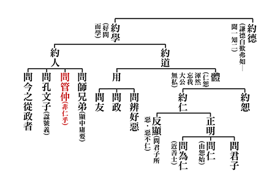

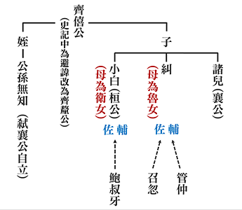

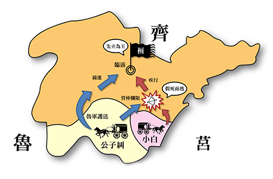

### 孝道跨時代的意義與價值—孝經簡說（十四）

時哉講述、淨域編寫

刑罰維護綱常

禮治導人向善

孝道能令太平

法條備而無用

《孝經》第十一章〈五刑〉

前言

古代與現今都講究治安，治安會用上刑罰，但刑罰之使用須了解它的價值與真義。古時若讀了此章內容，會覺得有好多的酷刑，與現代的人道主義似乎相違背。那麼，記載這樣刑罰的典籍是不是糟粕呢？以下我們要來深入的探討。

《漢摩拉比法典》乃巴比倫王朝第六位國王漢摩拉比所制訂的。此法典刻在一黑色的岩石上，於伊朗境內發掘出來，距今約三千八百年，係西元前一千七百七十二年的作品。岩石上所刻的，是漢摩拉比國王從太陽神手中接來權杖，制訂了全世界最早的法典。法典內容強調的是「以牙還牙、以眼還眼」，重點在於保護貴族。中國與外國的刑罰有什麼不同呢？又禮治國家與法治國家皆訂定刑罰，但兩者有什麼不一樣呢？

目前《孝經》講到第十一章，從「總說孝道」、「別說孝道的修學法與義理」，特別是談到「如何以孝事親」，從「天子的孝」到「庶人的孝」，乃至於〈三才章〉及「以孝治天下」、「聖人治天下」，就有許多孝子的行為可供記錄。但是盡孝的人，若不能為公發心，或從事公務時不講究分寸、長幼尊卑，一旦冒犯了這些法條，或是危害了公家讓父母受辱，這仍不能算作是孝子。所以，本章承接於上一章，特別說明反面誡，以五種刑罰來特別處罰不孝的行為。

本章經文是：

「子曰：五刑之屬三千，而罪莫大於不孝。要君者無上，非聖人者無法，非孝者無親，此大亂之道也。」

科判分析

此章的架構，是總說「不孝」之罪最重，分別顯示大亂之道，是「要脅君王」、「毀謗聖人」及「毀謗孝道」，這是大亂之源。

釋義

經文：

「子曰：五刑之屬三千，而罪莫大於不孝。

(標不孝罪重)

」

意即，孔子說：五類的刑罰，其下的條文有三千條之多，而最嚴重的罪是「不孝」。此不孝表現於三方面，第一、是

「要君者無上」

(要君)，意即要脅君王的人，他沒有上級的概念，不具忠貞氣節，放在哪個位置上都不會忠於本職，其能力權力愈高愈可怕，這是亂源。第二、是

「非聖人者無法

」(謗聖人)，意即譭謗聖人之道的人，他心中不具道德感，也沒有公心，更無斷惡修善的概念。這樣的人私心甚重，講究權謀，爾虞我詐，所見的無非是眼前的利益。第三、是

「非孝者無親」

(謗孝)。意即譭謗孝道的人，他心目中是沒有父母的；換言之，此人與誰都不親，刻薄寡恩翻臉無情，與這種人相交乃至婚配十分的恐怖。結語是

「此大亂之道也。」

這種人看起來好似未殺人放火，但實際上是真正的大亂源。所以，制訂刑罰非是因殺人放火而為，許多隱微處、破壞倫常的罪過，才是真正嚴重的大亂之道。

本章要如何來承接上一章呢？前〈紀孝行章〉說到，如果我們為公家做事，不能好好地發心而污辱到父母，就算在家裡捶背洗腳，都不算是孝。此章更特別談「不孝」，且是最重之罪，於五種刑罰中特別處分這種人。

析疑

△ 古代的五刑為何？又其形象是怎樣呢？

第一、墨刑，即是在臉上刺字。此刑與這人的行為有些關聯，譬如：他做了不要臉的事情，或是於臉上刺字使之無顏見人。第二、劓刑，即是割去鼻子。此刑也是讓人無法立足於世間。第三、刖刑，即是砍腳斷筋，使之不良於行無法為非作歹，諸如刑於盜賊這類人。第四、宮刑，即是去勢，割去生殖器官，諸如刑於姦盜邪淫之類的人。漢武帝時，司馬遷遭受宮刑，這是個無辜的奇恥大辱，他無法面對父母、先祖與後人，整天像個遊魂似的，其事於後面再來詳說。第五、辟刑，即是死刑砍頭，何以古代要用這樣終結生命的極刑呢？

中國京劇裡有一齣戲《包拯怒鍘陳世美》，陳世美貴為駙馬爺，包拯為何賭上烏紗帽也要鍘了陳世美呢？原來他頂不住皇宮的壓力，要陳世美的前妻秦香蓮，拿了休妻的三百銀兩快快回家去度饑寒，並囑咐香蓮好好教育孩子念書，日後千萬不要做官(因為父親陳世美就是個例子，讀聖賢書卻忘恩負義)。包拯見了香蓮含冤負雪離去，心頭一惱摘下烏紗帽，誓要把倫常綱紀正義辦。隨聲叫來劊子手，將駙馬爺帶上，送來虎頭鍘侍候。一聲「開鍘」，便將這負心人處以辟刑了，日後再上殿朝見龍顏，與皇帝說個明白。包拯要與皇帝說什麼呢？這就是讀書人的浩然正氣，執刑是「王子犯法與庶民同罪」。陳世美沒有殺人，但卻犯了欺君罔上、不俸高堂、拋妻棄子之罪，此罪於「享榮華性情變、不顧人倫罪惡滔天」不可赦。中國京劇不但教忠且教孝，這就是中國禮治精神寓於刑罰的目的。

△ 五刑之名出自於哪裡？

《尚書•呂刑篇》中周穆王有位大司寇呂侯，他制訂法條，五刑就從此處來。那麼，三千條又是怎麼算的呢？乃墨刑一千條，劓刑一千條，刖刑五百條，宮刑三百條，辟刑兩百條，加總共計三千條。

法律條文如此之多，輕易就會犯上五刑所屬的罪狀，古代不就是個刑罰國家嗎？上古時顓頊治理苗民，此民不守信用、品德很差，讓他改過自新都無用，所以要訂定重刑罰之，惟顓頊講求必須慎刑。此外勸導禁止巫術，實行仁政，直到堯舜時以人才治國，雖然刑罰仍然保留著，但是備而不用。此如消防車添置著，卻沒有火災發生。

△ 孔子所說的「五刑之屬三千」，對於老子《道德經》第五十七章「法令滋長，而盜賊多有」之說，豈不是法條愈多而盜賊愈盛，老子的話是什麼意思呢？

他說的是法治，不是禮治。於法治，這叫作「只許州官放火，不許百姓點燈」，其中的刑罰只是在保護私利，刑罰只是在遏止民意，這種刑罰制訂的條目越多，犯罪也越多。然何以要有這種殘忍的刑罰呢？其實就在於「遏止亂源、維護綱常」，所以，古代制訂刑罰的目的在此。

△ 禮治與法治社會都設置刑罰，它的不同處在哪裡呢？

《論語•為政篇》中載：子曰：「道之以政，齊之以刑，民免而無恥；道之以德，齊之以禮，有恥且格。」文中說：如果百姓只是不遵守法律就給予處分，則百姓只是躲避犯罪的果報，他的犯因還在；所以，只是沒有羞恥心，圖一個僥倖而已。可是，若為內涵道德的教育，於外進退有禮，處處都替別人著想，這樣百姓是有羞恥心的，且肯歸附於你。此處所說的刑罰，是在最後遏止喪失倫理綱常的人，用以維護綱常禮儀及純厚風氣，並保護善良的人民，刑罰的目的就在這裡。

這種殘忍的刑罰，譬如把腳砍了，若有一天他悔過自新，該怎麼辦呢？或是將鼻子削去、在臉上刺字等等。所以，後來有明王廢了惡刑，漢文帝即是其一。漢文帝當政時，他廢了墨刑、劓刑、刖刑，但宮刑保留下來，到了武帝時，不料司馬遷就受了宮刑。漢文帝何以會廢了前三個刑罰呢？這與緹縈有關。

緹縈是個女孩，父親為淳于意，本在齊國當太倉令，後來退下來當醫生，他的醫術非常高明，治癒許多人。淳于意的個性耿直，不諂媚於權貴，說話常得罪於高官。有次權貴叫他去看病，見了直言不諱地說：「呀！這病無治，不須開藥，吃了也無效。」權貴聽了火大，硬逼他開藥，他雖開出藥方，病人服了還是不免一死。權貴就到官衙告他。漢代有條律令，即是曾為官的人犯法，要上京城來受此五刑。所以，淳于意就從齊國千里迢迢到長安。當時家裡哭成一團，他憤慨地說：「養五個女兒有什麼用？」緹縈聽了十分傷心，十五歲的她便跟著父親到京城申冤，中國的肉刑就從此開始廢掉。以下來說說「緹縈救父」的故事。

緹縈為了救父親來到長安，給漢文帝寫了一封信，內容是：「我的父親淳于意，本是齊國太倉令。為官清正廉明、愛民如子，齊地子民都稱讚他。這樣的好官難得，只因一次診療被人家告了，且還被判處了肉刑，這是多麼殘酷的事呀！我知道犯法的人該受懲罰，本來沒什麼可傷心的。但若人死了，就不可能再活過來，而那些受了肉刑的人，也不會再長出鼻、耳或腳。如此一來，雖然犯法的人得到了應有的懲罰，但若他們從心底知道錯了，即便想要改正也沒有機會。我是父親的女兒，應替父親承擔一些責任。如今甘願到官府中當一名婢女，希望能讓父親免除殘酷的肉刑，使他有改過自新的機會，希望皇上能夠應許我的請求。」

漢文帝歷經呂后之亂，曾與薄太后流落於民間，深知百姓生活疾苦。文帝讀完緹縈的上書後，被她的孝心和膽識所感動，於是以緹縈救父之事作引子，向天下詔告廢除殘酷的刑罰。隨後，丞相張蒼和御史大夫馮敬，根據文帝的旨意，制訂出許多新的刑罰條律，譬如：以前應該刺字的犯人，改判他們去做苦力；應該被削鼻子的犯人，改判他們受三百鞭；以前該砍腳的人，改為鞭打五百下。如此，緹縈以自己的孝心感動了文帝，而文帝也藉此機會廢除了殘酷的刑罰。漢文帝在位三十一年，本身是位孝子，母親薄太后重病臥床，他衣不解帶親侍湯藥三年，是公認漢朝最好的皇帝，與景帝共譽「文景之治」。到隋文帝時，除辟刑外，又將宮刑廢掉。雖肉刑全廢掉了，但各類刑罰還是很多，尤其是特別處罰不孝者。

△ 古制刑罰以不孝之罪最重，其目的為何？

中國在制訂法律時，最後的底線是「維持綱常與天倫」，如果綱常跟天倫維持不住時，整個社會風氣就會敗壞掉，法律也就變成法治的國家，最多是維持表面的安定，一如《老子》說的「法令滋長，盜賊多有」。

△ 古代若弒父，如何處置呢？

《禮記•檀弓篇》中載：魯定公時，下屬向他報告說：「邾婁一地(為子爵曹挾封地)有人殺了父親。」定公聽了很震撼，先自責此乃自己的罪過，隨後說：「臣弒君，國家任何官吏都得誅之。子弒父，除了他的兒子外，家人都得誅他。此外，他的房室土地都不能保存，因為此室此地出了妖孽，所以必須毀壞築為儲水池。至於所轄的縣官降級一等，國君一個月不能飲酒歡樂。」古時對於弒父殺母這種事，視比國家大事還要重大。

若弒君，又怎麼處理呢？《論語•憲問篇》中載：「陳成子弒簡公，孔子沐浴而朝，告於哀公曰：『陳恒弒其君，請討之。』」此陳成子即是齊國的執政大夫陳恒，他把齊景公的兒子簡公殺了。孔子請求討伐的目的有四個，第一、是基於亂臣賊子，人人得而誅之；第二、是他這次討伐一定贏，因為齊國有半數人不服；第三、是他出兵時，可以維持國際秩序；第四、是可以讓魯國季孫、叔孫、孟孫三家大夫警惕，概當時魯三桓就是亂臣賊子一類。所以，這一請討之舉有多重功效，只可惜魯哀公懦弱乏志，孔子還是無力扭轉魯國的局勢。

弒君不行，連要(脅迫)君也不可以。那麼要君的形象為何呢？又古代有誰是要君者？《論語•憲問篇》中載：「子曰：『臧武仲以防求為後於魯，雖曰不要君，吾不信也。』」臧武仲為魯國大夫，因故得罪於孟孫氏，孟孝伯陷告他，季武子將之逐出魯國，他奔往邾國，再到自己的封地「防」。然後請求魯君，冊立他的後代為大夫，當魯君同意後，又跑到齊國去。孔子認為：臧武仲雖說他沒有要脅魯君，他是不信的。

△ 經文中說大亂之道有三個形因，第一個是「要君」。要君怎麼會成為大亂之道呢？

前說「要君者無上」，此人沒有上級的概念，所以容易犯上作亂。而犯上作亂本就是大亂之道，此如曹操、董卓就是要君者，若無董卓、曹操之獨攬朝政，哪有後來的三國之亂？所以，整個就是亂在「挾天子以令諸侯」，這要君即是大亂之道。

第二個是「非聖人者無法」。謗聖如何成為大亂之道呢？概聖人講的是孝道、品德、公心及斷惡修善，若毀謗了他，意即是私心、奸盜、權謀等種種惡行。所以，毀謗聖人者，豈不是大亂之道嗎？

第三個是「非孝者無親」。若與最親愛的人都疏遠，請問他的心中還有什麼可親愛的。所以，此人必定刻薄寡恩，在哪個位置上都恐怖，這稱作大亂之道。《論語•顏淵篇》中載：「齊景公問政於孔子，孔子對曰：『君君，臣臣，父父，子子。』公曰：『善哉！信如君不君，臣不臣，父不父，子不子。雖有粟，吾得而食諸。』」齊景公請問為政之道，孔子對說：「君像君，臣像臣，父像父，子像子。」這就是要守住倫常綱紀。齊景公說：「對，如果都守不住之時，讓我怎麼吃得下飯呢？」國家如果有此亂源，且此亂是一觸即發，試想整體社會是否岌岌可危？若不維護綱常倫理，整體國力的維繫是很薄弱的，即便強兵霸權，也很容易就急墮到弱勢，摧枯拉朽的一碰就垮掉。

在繁多的刑罰條目中，有時會有無辜受罰的情況，譬如：歐陽修說他的父親，判案時往往夜裡睡不著覺，這為什麼呢？因為有時會錯解、誤判。當君子遇到無辜受罰時，該怎麼辦呢？南宋輔廣的《論語答問》中說：人如果有罪卻沒事，這有何光彩的。若無罪受罰，又有什麼好受辱的。再者，人如果隱微處有過失，內心要慚愧地像在大街上被人羞辱一樣。若沒有過失的人，就算被殺或遭貶也是坦然。這就是君子無辜受罰的心態。

如此，誰是典範呢？前說司馬遷無辜受宮刑，而在獄中奮力著《史記》，算是一位。此外，公冶長無罪受墨刑，也是一例。孔子怎麼看待這一件事呢？《論語•公冶長篇》中載：「子謂公冶長可妻也。雖在縲絏之中，非其罪也。以其子妻之。」孔子說：公冶長這個人，是可以將女兒嫁給他的，雖然他被用黑繩綁在監獄裡，可是這並非其罪。當公冶長受墨刑後出獄，孔子將女兒嫁給他，實在是了不起。這又為什麼呢？因為君子重在內心的隱微處，而不是著在外相的刑罰。是故，中國的讀書人有此良知與風範，哪還需要刑罰呢！孔子過世後，公冶長成為儒家的一個學派，可見他像澹台滅明等人，都是繼承孔子學說極出色的讀書人，不會因為受了墨刑，而成為他終身的恥辱。

人生於天地間，在家庭要行孝，於國家要盡忠，而聖人之道是一生的學習，此乃我們努力追求的目標，也是此章的旨趣所在。雖然本章講五刑及三千條律令，但所要點出的旨趣，是聖人之道的學習，是在家孝道的力行，乃至於是對國家社會的盡力、為人民謀求幸福，這才是君子的出路，也是這一章的旨趣。

再來，看看歷代《孝經圖》有關〈五刑章〉的畫作。北宋李公麟所繪的圖，乃孝子返鄉得到鄉里的歡迎，表示這位孝子在外的聲譽不錯。所以，孝道有兩種，第一種是居家行孝，第二種是出外為官，這兩個都可以表現出孝道。儒家以辦政治、興教育來表達對國家的貢獻，與對父母親的尊崇，及彰顯祖先的榮耀，這是儒家了不起的胸懷。

其次，元朝趙孟頫所畫內容，乃傳習北宋李公麟。也是繪孝子返鄉，帶著一些行囊，得到鄉黨鄰里的歡迎，代表這個人聲譽很好，為官有成。而到了明朝仇英，畫法就有所改變了。他畫判官審案，身旁有些僚屬，堂下有執杖的差役，一人被押上前來，此人或是個不孝子。其後有一人跪著控訴，該是他的親人，用以說明刑罰所要維護的就是倫理綱常。

最後，來看江逸子先生的畫。畫中堂上有位判官，慈祥的面貌帶著威嚴，拍桌問案顯出他聽聞而大怒。一旁的僚屬看著狀紙，這其中控訴著什麼呢？原來堂下有個年輕人，其髮鬆散，全身抖顫，雙手上銬，臉蛋早已嚇得發白。一旁跪著拄杖的老人家，或許是他的父親，正指控著他的不孝之行。另一旁的老婆婆，也同時指責控訴，而年輕女子與孩童，該是此人的妻子與小孩。由衣著的比較看來，父母所過的生活清苦寒酸，而年輕夫妻安適享受。妻子掩面哭泣，或是見了先生將受刑罰而傷心，更或是一種後悔不孝的表露。挾拖不孝子的差役，眼神睜睜看著老婆婆的控訴，此處所要彰顯的是，刑罰對治的都是不孝之行，而不孝是正道的大亂源。這種人若行於社會，便容易要君、犯上作亂，更恐怖的是對聖道的譭謗不信。所以整體的氣象，就是用五刑來治不孝。

總結

刑罰的輕重，在於對方罪過的多少，而罪過的多少當中，又以倫常綱紀為所依據的標準。如果違犯了倫常綱紀，就算他沒有惹下滔天大禍，罪都極重。刑罰的目的在維護社會的風氣，此乃首要說明的結語。

其次，古代的教育在導人向善，而刑罰是備而不用的。《新人生觀》一書中說：古代村莊裡少一隻雞，是會引起全村騷動的，現在許多社會亂象，大家早已麻痹了。所以，要如何將古代淳厚的風俗找回來呢？這定要發揚聖人之道才可，且須從孝悌出發，端正品德、開闊見地、為公利他，而下手處是斷惡修善。如此便信人世間，必能把治安恢復成像堯舜時代，不但刑罰備而不用，且還可以廢掉。這才是制訂刑罰的本意，也就是遏止壞風，保護善良風氣，從中引發人心向善。

現今以GDP來衡量一個國家，可是進步不一定只看收入，治安良好、生活指數、幸福指數提高，都是進步。青康藏高原的小國不丹，他們的生活指數、幸福指數為世界第一，人們過得很快樂，卻不一定有錢。在這個國家中，百姓間互相幫忙，沒有奸盜邪淫，貧者不作亂，富者不嬌奢，這難道不是進步嗎？所以，我們為什麼必要隨著世界的逐錢潮流走？為什麼不能好好地建設自己的家園，走向真正的富強康莊大道？如此，這些聖賢的典籍，值得我們參考與借鏡。

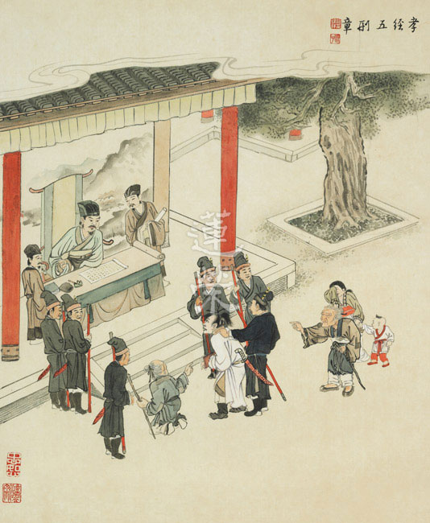

### 孔門心法—中庸之道（九） 第七章 何者才是真智慧？

*茅茹讀書會、弘毅整理*

雖云人貴是自知

若無學習亦難生

皮毛自知到究竟

至聖與佛真自知

前言

這世界上聰明的人不少，認為自己很有智慧的也大有人在，孔子所在的春秋時代，更是高人輩出；袁了凡先生亦云：春秋諸大夫，見人言動，億而談其禍福，靡不驗者，左國諸記可觀也。然而孔子說，世間人以為自己有智慧，卻受誘惑而入陷阱，不懂得避開災禍。到底什麼才是真聰明，怎麼樣才是真智慧，就在本章見分曉。

科判分析

第七章還是在《中庸》的第二部分，即分別顯示中庸的修學法和義理。

第六、七、八、九章，也可以合成一章，完整的講「用中」的概念。中道思想是我們文化的核心，以此為政，此人必是明君聖主，能帶來國家的太平及人民生活和生命殊勝的內涵，也是國家民族命脈之所在。第六章讚歎舜是個辦政治能用中的人，這一章是反面感嘆一般人都受名聞利養之惑，就算學中庸也不能守，因無法往上學而退轉。

第七章的架構是「反嘆受禍不守」，「受禍」是指很多人雖然培養了世俗的學問、能力、才華，但都被引誘到名聞利養的陷阱裡，而受到大災禍，甚至培養得愈高，受害愈深。「不守」是指學道的人雖然學習中庸，但擇而不守，大都撐不久。

釋義

經文：

「子曰：人皆曰予知，驅而納諸罟擭陷阱之中，而莫之知辟也。人皆曰予知，擇乎中庸而不能期月守也。」

孔子說：一般人（指不學習中庸之道的一般民眾和卿大夫、國君、天子）都認為自己是有智慧的，可是被利益所驅使，如同鳥獸那般掉入羅網陷阱之中，而不知道逃避。修道之人（學習中庸之道而遠離世俗名聞利養的人）也認為自己是有智慧的，可是雖然聽聞、思維、修學了中庸之道，卻不能持之以恒，維持不到一個月就退轉了。

「罟」，就是網，可以網天上飛的鳥，陸地上跑的獸，水中游的魚；「擭」，就是籠子類器具，可以捕鳥獸；「陷阱」包括夾子或者地上挖的坑；「辟」，逃避。

析疑

一、本章與前章有何關聯？

前章讚歎舜用中於民，就是他不會被名聞利養所繫縛，不會被順逆境所轉變，心態超然，所以為政可知利害兩端，有時眼前是利，未來有害；有時眼前是害，未來有利。他的抉擇非常準確，能讓老百姓得到很大的利益。

這章感嘆第一種是不學道的世間人，在世俗裡奔走能力很強、很機靈、很有聰明才智，卻受誘入禍；第二種是學道的人進進退退，活得越久，看得越廣，就知道一個人要始終如一是極不容易的。

二、人皆曰予知的形象為何？

就是自我感覺良好，包括兩種人：

一種是不想逃避危險，干脆墮落的。他以追逐世間的名聞利養為快樂和出路，消耗自己一生的時間和精力，所以他是不受勸的，如飛蛾撲火。

另一種是想逃避危險，可是看到他人下場不好時，會認為與己無關；或者自己出現危機時，也心存僥幸。他自以為很聰明，可是最終還是被誘入陷阱受禍，如鳥、魚入網，貓被夾住，如自恃聰明卻仍被籠子關住的老鼠。所以古人說，「一失足成千古恨，再回頭已百年身」，人生就是這樣。

三、為何會發生人皆曰予知的情形？

第一，不知道追逐世俗的過患；第二，即便知道危險，碰到可欲境界時還是認為自己受用仍可僥倖脫離危險，仗勢己有聰明才智。

這些都是教育的問題，在我們的教育裡，沒有遠離可欲境界的傳承、學問和見地，所以培養出來的人，心志不夠開，眼界不夠廣，肚量不夠大，動機不夠單純。在世俗中，那些書讀得越多，商場上越老練，政治上越風光的人，往往掉入的陷阱就越深。

四、鳥獸為何會莫之知辟也？

第一種是不知；第二種是知，但只見眼前利益，雖然小心翼翼，結果還是被誘進來，都是因為他沒有遠離境界的傳承、學問和見地。

五、「驅而納諸罟擭陷阱之中，而莫之知辟也」，顯示的含意為何？

莫知辟，第一種是不以財色名食睡等五欲為陷阱，而認為是快樂和出路。如在商場上打拼，業務員月入斗金，追逐男女之色，在演藝界、學術界、政治界、商場上的好名聲，美味的食物，住處的高品質，還有對時尚的追求。如一臺瑞典的手工打造的豪車，價值台幣一億四千五百萬，人民幣三千兩百七十萬，開出這部車的時候，感到非常的風光。貪圖這些生活上的安樂和享受，帶來奢靡和傲慢，陷入追求物質的陷阱之中，不想出離。

第二種雖然知道是陷阱，小心翼翼的要逃避，可因為沒有能力超越境界，還是被誘入其中，無力自拔。

在追逐世俗當中，我們得到的是：財富、美色、地位、各種名聲、美食、名車、舒適的環境等等，但這些也不過是一點皮毛，暫時的安樂而已。如《四十二章經》第二十二章上說，「財色於人，人之不舍。譬如刀刃有蜜，不足一餐之美；小兒舐之，則有割舌之患。」愛斯基摩人在抓土狼的時候，把刀上塗很多的血，土狼看到後就拼命舔，結果舌頭被割斷，就倒在血泊之中。

第二十一章上說，「人隨情欲，求於聲名，聲名顯著，身已故矣。貪世常名，而不學道，枉功勞形，譬如燒香，雖人聞香，香之燼矣。危身之火，而在其後。」

在追逐世俗當中，我們失去的更多，消耗了身體、精神、時間、青春，沒有去充實自己的內涵，又在其中造惡業，與小人為伍，爾虞我詐，與人對立、結仇，甚至失去生命。如《史記·李斯列傳》上記載：「斯出獄，與其中子俱執，顧謂其中子曰：吾欲與若復牽黃犬俱出上蔡東門逐狡兔，豈可得乎！」秦始皇的丞相李斯，用他ㄧ生的才華去追逐名利，果然位高權重，可是最後他和兒子要被腰斬的時候，他說連想帶兒子出去溜狗打獵都不可得了，此時的一國丞相都不如一個乞丐自由自在。

子曰：「學而時習之，不亦悅乎？有朋自遠方來，不亦樂乎？人不知而不慍，不亦君子乎？」這種自利利他的快樂，不才是我們最應該追求的嗎？

六、不知禍的過患為何？

我們在追逐名聞利養當中，會失去良師益友，對正法的學習，對自己的充實，失去利益眾生的機會，而且如果起煩惱，造惡業，不但自己招禍，還禍延子孫，這不是因小失大嗎？

七、一般人怎麼會知禍不避呢？

一般人的知大都是淺知，沒有真知，所以沒有避禍的道統、學問、見地和能力，沒有像孔子、顏回和曾子那種見地，所以眼看它來，明知它不好，還是知禍不避，還是想貪圖眼前的利益與快樂。

八、如何才是真正的知禍？

要在道統上的知，懂得中庸，懂得下手處，做正確的抉擇，懂得遠離禍患、趨吉避凶，這才是真正的知禍者，不是一面知，一面被誘入罟擭陷阱。

九、知禍的重要性為何？

知禍，比你的學歷、事業和虛名浮利都更重要！可惜現在的教育沒教，也沒傳承。老師也未必有這種見地，教出來的學生就都沒這種思維，只會在世俗上追逐，很可惜！

第一段的「人皆曰予知」，包括一般世間人和有智之人的智慧，其實都是無知，掉入陷阱，浪費了一生，甚至那些學問、能力，正好拿來造惡業，跟眾生結惡緣，乃至禍延子孫。

十、第二段夫子重說「人皆曰予知」，有何用意？

第二段的「予知」是講修學正法的人，能避開世俗的名聞利養，可是都自以為真聰明，已超越了世俗，但在學中庸，學文化的道統、內涵、見地時，往往都「不能期月守也」。

十一、已擇乎中庸何以「不能期月守也」？

第一、得少為足。如冉求曰：「非不說子之道，力不足也。」可是我們在追求世間名聞利養時，卻都能力具足；學習世俗技藝時，可以堅持到底，願繳高額補習費，還早出晚歸；學習道統時卻沒能力，只有三分鐘熱度，如鉆火未熱，半途而廢。

第二、緣務眾多。如孔子評價子貢，「賜不受命，而貨殖焉」，他悟性雖高，可是外務太多，事業太廣，就算他有能力入中庸之道，最後也是出局。

所以培養道統超脫的人才很難，越深入持久的學習，才越體會到孔子之言真乃萬世不移，百代所宗。

十二、哪一種人可以入中庸之道呢？

第一、上智者。如顏回，「既竭吾才，如有所立，卓爾。雖欲從之，末由也已。」他用盡才能，跟著夫子亦步亦趨，不在乎生活的享受，不在乎他人升官發財，他能對治欲望、對治享受，而且能持續用功，這種人就是學習中庸之道有能耐的人。

第二、下愚者。如曾子，「人一能之己百之，人十能之己千之。」他雖然是魯鈍之人，可是他以道統傳承人的心態來學習，下百千倍的功夫，最終傳承中國道統，擇乎中庸的竟然是一個鈍的曾參，這叫作「雖愚必明，雖淺必深」。

雪廬老人曾經講「性相近，習相遠」，「惟上知與下愚不移」，花了好幾個鐘頭，來發揮其義。就要有這種能耐的人擇乎中庸，不是三天打魚，兩天曬網，三分鐘熱度，讀一讀不會了就退轉的人，要抓一般人在追逐世俗一直往上衝的覺受。

十三、擇而不守的過患為何？

《論語‧子路》篇上說，「人而無恆」，「不恆其德」。人如果沒有恆心，大概不會有什麼功德，而且退轉後，想再學就沒勁了，退轉到世俗的時候，反而對世俗會更加追求。

十四、擇而守之的利益為何？

一個人見地愈開，心志愈高，動機愈純正，心量愈大，就愈能離開境界的繫縛，而且願意助成他利益眾生事業的君子愈多，古人云，「得道多助，失道寡助」，他是個能夠福延自己和子孫的有福之人，人稱妙吉祥。

十五、如何才能擇乎中庸而永久守之？

要知中庸之道的重要，知道恆常地守住中庸的殊勝。孔子讚歎顏回好學，人要不斷求學，要有法喜，叫作「學而時習之，不亦說乎」；不能離開良師益友，叫作「有朋自遠方來，不亦樂乎」；而且要遠離名聞利養的繫縛，叫作「人不知而不慍，不亦君子乎。」

十六、夫子說此話時的語氣為何，如何善讀此章？

孔子是很感嘆的語氣，不論是不學中庸的世間人，還是雖學中庸但不能恆守的修道人，最終都掉入世俗的陷阱。越覺得自己厲害，能力越強，越能在各行業競爭的人，掉得越深。再回首時，已是白髮蒼蒼，身體虛敗，兩眼無神，世間的名聞利養，乍似得到，其實失去的更多。所以不要做一個被孔子感嘆的人，要作被孔子讚歎的人，那才是好命。

十七、學習本章對於日常生活有何助益？

讓我們知道少欲知足，遠離名聞利養，學習道統是重要的。如果配合下一章來講，顏回能夠上求下化，擇乎中庸，對利益眾生的善法拳拳服膺。若能學此，則善緣會愈結愈廣，心胸會愈來愈開，命運會愈來愈好，子孫也會因為你陰德的加被，愈來愈有出路。

總結

一、人生難能不退轉。

人生要不退轉是很難的，以前有學生北上要離開雪廬老人，他就問雪廬老人說，「有沒有不退轉的方法？」雪廬老人說「沒有！全退！」如果我們沒有在師友的環境裡好好來學習，想要維持不退，不是第一種被誘入罟擭陷阱，就是第二種撐不久，在那孤芳自賞，沒幾天就退轉。退轉以後，還會走入第一種，被誘入罟擭陷阱，後面的命運如何，不算也可知了。

二、自行化他守中庸。

我們一定要擇守中庸，「擇」包括自行和化他，自行的擇是透過聽聞、思維、修學而了解、體會中庸，化他的擇是契理契機的幫助他人聽懂和體悟中庸。如此他會是天下最好命的人，因為他能帶來自己、家庭、子孫、他人，乃至於國家、民族的出路。

總而言之，此章言淺意深，說易行難，裡面充滿了夫子的經驗閱歷和感嘆。誰才是夫子真正讚歎的人？古有顏回和曾子。處在我們這個充滿了爾虞我詐、名聞利養、世俗誘惑的時代，誰才會成為夫子所讚歎的人？我們是否有顏曾的風采呢？這也考驗到我們的「予知」，到底是真聰明，還是假聰明？是世俗人認定的聰明，還是聖者認定的聰明？這章提供我們這樣的內涵，值得我們反思。

問答

**問：** 不知中庸，如孔子所說的掉入陷阱，有這麼嚴重嗎？現在社會的人，像我們大概是掉了多深呢？

**答：** 孔子講的只是淺比喻，其實更嚴重。因為那些鳥獸被捕住的時候，只是牠自己受難；我們掉入世俗的名聞利養，甚至跟人結怨的時候，不只自己受害，還禍延子孫，所造成的影響是很恐怖的。有些人為了在學術界追求地位的時候，他翻案、批判聖賢，來壞人眼目，那個罪業是很可怕的。所以孔子講的只是淺比喻，其甚深過患，比鳥獸掉入罟擭陷阱要厲害得多。

鳥獸入罟擭陷阱，就知道已入進去，身處現代社會的我們，卻不知已入進去。在陷阱裡，還每天運用腦筋計畫籌謀，費盡心思，惡業越造越多，把自己囚禁的力量越做越強，煩惱業的繫縛比那鳥籠更厲害，讓自己的思維被困住，陷入煩惱堆裡面，外面還有對立、結怨的人，也被人情包袱綁起來，這些比鳥籠、陷阱更嚴重。

**問：** 如果沒有功利思想，人類就停止前進的動力，如何帶動世界發展？反面說，如果沒有功利思想，會不會使世界停滯不進呢？

**答：** 功利思想當然會帶動世界發展，但這種發展都是為了自己的利益，而不是利他的發展，所以發展到最後，會造成貧富懸殊。為了刺激經濟，破壞秩序，能源消耗，空氣污染，那種功利思想的發展，帶來人類未來的惡夢，禍延下一代。

沒有功利思想並不會使世界停滯不進，功利思想是自利，我們換成利他的思想，社會還是會前進的，而且這種前進是互助合作、為他著想、有公德心、富而好禮、貧而樂道的前進。

**問：** 就當前的形勢，如果我們擇乎中庸而守之的話，可能就變成社會的弱勢，那又能對這個時代造成什麼樣的改變和影響呢？

**答：** 我們學道的人不與人爭，結果變成社會的弱勢，這是當今教育的問題。一個自私自利，動機不單純，心思狹隘的人，如何成為領袖呢？二十一世紀，要重新定義領袖，領袖應該是一個心胸開闊，動機純正，見地高遠，有利他思想，與人結善緣，並可以帶給他人內心出路，擇乎中庸的人才。把這種人推出來當領袖，可改變世界，其實，文化就是培養人才、領袖、見地和未來。

**問：** 現代沒有中庸的教導、弘揚和傳承，就沒有人知道中庸，所以就註定這個時代要往下沉淪嗎？

**答：** 孔子在《易經·繫辭傳》中，在論語裡面，像「空空如也」，「志於道，據於德」，「性相近，習相遠」的思想都是在講中庸之道；還有子思的中庸之道，老子講的有關形而上，佛家講般若的部分，都是中庸的學習。

我們要平心靜氣，不要有門戶之見，好好去掌握這些內涵。回過頭來，就知道中華文化的精華，孔子的要語，及堯舜等明君聖主的中心思想，那就是培養人格特質的學問，這種人一旦出來當領袖的時候，會帶來團體殊勝的未來。

**問：** 有些人不懂中庸之道，但也能避開名聞利養，因此一定要懂中庸才能夠避禍嗎？

**答：** 一般人根本得不到名聞利養的，這種莫論。這裡特別講「予知」，就是有頭腦，腦筋動得很快，分析能力強、成績好、有學歷、有競爭力，可以脫穎而出的這種人，往往是社會中的佼佼者。

我們盡全力培養精英，如果培養的是一個動機不單純，自私自利的，只考慮眼前，急功好利的，當然這個時代是愈來愈亂，所以一定要有中庸的學習，這樣的人領眾，才能帶給大家未來的幸福。

如果沒有學習中庸之道，能力愈強，會產生三種狀況：第一種，像飛蛾撲火一樣，那是無知；第二種，雖然明知，可還是掉進去；第三種，就算不想進去，也沒有對治的方法，最後還是掉進去。很多人才就這樣消耗一生，做不了利益眾生的事情。

**問：** 堅持行中庸之道，是否能贏過功利主義、強權主義？另外，只靠中庸就有辦法讓世界進步繁榮嗎？

**答：** 功利思想、強權主義，目前真的是整個時代的主流，如果我們真的把中道思想弘揚出去，它就是一個領袖的教育，假如我們多來培養這種精英份子，走入時代，領先時代，相信是可以對抗功利思想與強權主義的。讓大家去比較，到底是功利思想、強權主義，還是擇乎中庸，在善法上、品德上的實踐及正法教育的推展，會帶給人們生活的安樂、生命的豐富，相信大家是「予知」的，會去選擇。擇乎中庸的人，他真的走入時代，帶領時代，會比功利思想、強權主義好太多了，強權主義、功利思想只有過患，沒有功德。

擇乎中庸當然會帶來整個世界的進步與繁榮，因為這種人不會貪名圖利，爾虞我詐，知道什麼才是真正利他的，而且在利他當中，講究公平，資源共用，而且把資源用在品德教育、善良風氣的推廣，整頓治安，讓社會風俗淳厚。

**問：** 孔子之道已經傳了兩千多年，但現見還是戰亂多於安定，所以孔子之道真的有用嗎？

**答：** 多年來中國的戰亂，如果沒有孔子的教忠教孝，最後一定亂到沒有人收拾的地步。教忠，至少國家有忠臣願意穩定國政；教孝，雪廬老人說，「至少整個中國的朝代是上亂下不亂」，上亂，勾心鬥角、爾虞我詐、爭權奪利，內幕、黑幕重重，但是下面人心穩定，風俗淳厚。雪廬老人說，「自從西風東漸以後，是上亂下亂」，那就很慘了。所以如何把孔子之道保住，讓上不亂下不亂，造就大同世界，開萬世太平，何嘗不是一個很好的文化推廣呢！

**問：** 現在的教育講求速成，而且偏重對未來就業一定要有十足的幫助，可是如果功利主義、功利教育，有這麼多問題，為什麼現在世界上還是以功利主義為主流？

**答：** 這就是沒有看到中庸教育、道統教育、品德教育的殊勝。現在很多歐美的企業，也慢慢的認識到品德教育的重要，如果一個高階主管沒有品德，他帶來的危患，可能會讓公司一夕之間就翻盤了。為了功利思想，沒有在品德上講究的發展，付出的成本和代價太高了。

教育，本來就不應該是速成的、生產式的教育，應該是人格的教育，假如我們為社會培養出來的都是有人格、有分析能力、能為大局著想的人，互相不爾虞我詐，而是互助合作，這些人用在企業，企業是可發展的；用在政府機關，國家是進步的。

**問：** 有注解提到，這一章其實是孔子的自謙之詞，因為前一章是讚歎大舜，所以這一章就自謙自己沒有智慧，而這樣的感慨，正好可以體現孔子明知不可為而為之的偉大之處，這個註解可以採取嗎？

**答：** 「人皆曰予知，驅而納諸罟擭陷阱之中，而莫之知辟也。」如果孔子真是一個有陷阱還避不開的人，那孔子會離開魯國大司寇年薪六萬（縣長薪水的六十倍）的位子嗎？再有，到衛國面臨南子誘惑的時候，為什麼沒有被甕中捉鱉呢？孔子怎麼是這種人？他雖然謙虛，也不能謙到這種程度。

「人皆曰予知，擇乎中庸而不能期月守也」，孔子也不應該這麼謙虛，孔子在論語裡有謙的部分，可是該承擔的部分他也承擔。比如孔子說「若聖與仁，則吾豈敢？」他不敢承擔是聖人、君子，可是朝向於聖人和君子的因，孔子是承擔的。如孔子說他是「學而不厭，誨人不倦」，學而不厭是上求，誨人不倦是下化，傳不習乎就是擇乎中庸。孔子可以謙虛說，我未達中庸之道，可是謙到連擇乎中庸都沒有，連一個月都守不住，孔子未免謙過頭，孔子不是這樣的人。

所以要以經解經，不能望文生義，若孔子謙虛到以上地步，怎麼有資格指導顏回呢？又怎麼有資格去指導子貢呢？

**問：** 名譽財色的危害這麼大，因生見惑而造業，雪公說，「不但道破名障，幻身亦被名損。」如果懂得中庸之道，就可破除這樣的惑和業了嗎？

**答：** 中庸之道，其實就是通達體性不可得的智慧，就是形而上，不被形所繫縛，懂得世間其實都是變化莫測，互相依存的。所以，依存著名聞利養，就會有大禍；依存著利他的學問，禮儀的內涵，就會有大福，入世就可趨吉避凶，中庸之道實在太重要了。

沒有中庸之道的人，君子都做不成，因為君子就是想要利益他人，如果不導向中庸之道，怎能真正利他？那與世間的善人有何分別？君子所以成為君子，就是懂得把人導到中庸之道；善人，就不懂得把人導到中庸之道，頂多做一個慈善家，就被世間歌功頌德的不得了。君子默默的學習中庸之道，來表達對世道人心的關懷，辦教育培養人才，改變時代，往往這個時代的人是不會知道的。

**問：** 財色沒有自體性，關鍵在於如何運用、經營，若求財的目的和運用，像子貢這樣把錢用在刀刃上，用來培養人才、弘揚聖道，這樣子也是有功德的，可以作為修道的資糧，但是即使有這樣的資糧，自己不欲，又不用心的話，是否也沒辦法達到中庸之道呢？

**答：** 子貢是賺得太多了，已不需要忙於外務，孔子勉勵他並不是因為他很有錢，而是認為他是可以學習中庸之道的，孔子不會勉勵一般的財團這樣做，因為他們是不會走這個路的。子貢本可以被引入中庸之道，可是外務太多，孔子感到很可惜。

如果沒懂中庸之道的重要，就算賺了大錢，也不會去護持中庸之道。春秋時代，有兩個富人，一個是子貢，一個是范蠡。范蠡富可敵國，三次把財產散盡，三次把錢賺回來，表明就是看他想不想賺而已，可是范蠡的錢並不是用來護持中庸之道的。一般商家有對聯，上聯是「行商不讓陶朱富」，作生意不讓陶朱公專美於前，這太俗了；下聯是「貨殖何妨子貢賢」，賺錢何妨像子貢這樣的賢，橫批是「沒幾個」。

**問：** 明知山有虎，偏向虎山行，他這樣是知禍不避，還是自不量力呢？

**答：** 兩個都有，一個是自不量力，去就被老虎吃了；一個是知禍不避，明知山有虎，偏向虎山行，明知是陷阱，偏向陷阱行，那不是找死嗎？

有的人是不知，像飛蛾撲火；有的人是知禍，可是他認為應該可以僥倖脫困，不應該這麼倒楣，結果真的就這麼倒楣；有的人想避可是避不開，因為他沒有避的能力，可見避的見地多麼重要。民主時代，很多人在台下的時候，對老百姓非常熱誠，自以為避得了；上位之後，小權力小腐化，中權力中腐化，大權力大腐化。在下面時，仗義直言；選上後，謊話說盡，就知道極不容易。如果沒有學習中庸之道，能力越強，「曰予知」，位越高就越慘。

**問：** 現代的教育，大都在引導追求名聞利養的享受，人們對於中庸這些中華文化卻很陌生，作為家長，應如何引導孩子來學習呢？

**答：** 家長本身要先學習，如果自己都不學習，都沒勁頭，都沒熱誠了，又怎麼引導孩子學習呢？不要急著引導別人，先引導自己，才是當務之急。

**問：** 我們學習要有「人而無恆，不可作巫醫，不恆其德，或承之羞」的精神，可是真要做起來非常不容易，面對名利種種的誘惑，我們應該怎麼保持這種心態呢？

**答：** 其實我們還沒得到名利的誘惑。什麼是名利的誘惑？民主國家選上總統的時候，像美國，下面有上萬個職位等著他安排，資源多得難以想像，沒有上去是不會知道的。

一個人一生最重要的是學習。不管在什麼樣的角色，都要抱著學習的心態，否則很容易掉入社會的罟擭陷阱之中。所以如何保持清晰的頭腦，純正的動機，活到老，學到老，甚麼時候不用學呢？孔子帶著子貢出遊的時候，指著墳墓說，入了那個地方，就可以不學了，趨吉避凶談何容易。

**問：** 世間那麼多陷阱，要怎樣提高警覺性來辨別陷阱？

**答：** 辨別是沒有用的。如果那陷阱真的套到你，你也逃不掉，除了學中庸之道，沒有一個逃得掉。就像雪廬老人跟那個學生說：「全部退轉，沒有一個例外。」不要以為自己逃得掉，「慎勿信汝意，汝意不可信」，人生只有學習，沒有第二條路。讀書會有討論的對象，要像寶一樣的珍惜，那是世間財富買不到的。

結語

很多人都想要名聞利養，並自以為能超越名聞利養，自以為能扭轉乾坤，殊不知極難。所以中庸的學習、道統的維持和傳承太重要了，是一個國家發展的命脈。培養出這種人來當老師、當領袖，那是整個國家民族的出路！

最愛中國的就是孔子！很多人愛國家，就是捐很多的錢，做很多的善事，這也不錯，可是若能好好的學習、傳承道統，來改善人心，這才是最愛國家的人。

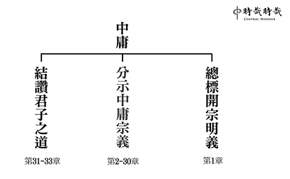

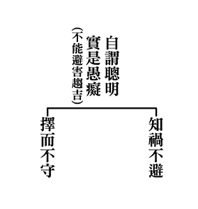

### 三字經簡說（九）

*淨爾整理*

興衰存亡難解

史料分析抉擇

因果前後關聯

最怕以偏概全

魏蜀吳　爭漢鼎　號三國　迄兩晉

魏國、蜀國、吳國都想爭得漢家天下，這段時期稱為三國鼎立，直到司馬炎繼起，統一天下建立晉朝。但爆發永嘉之禍，因五胡亂華，國都南遷到建康(今南京)，晉朝以此為分野而有西晉與東晉之分。

東漢末年政經局勢解體，舊的統一政權趨向衰敗，而新的政權卻無法穩固安定社會。從漢獻帝建安二十五年曹丕篡漢自立為魏文帝算起到復歸統一，前後整整經歷三百九十四年，史上稱這段漫長又動盪的分裂時期為魏晉南北朝。這四個世紀中，僅有短短的三十一年，勉強稱得上是統一的局面，可見這四個世紀間，中國國土和政權分崩割據已是常態。

東漢失去實質政權，中原地區陷入混亂，應該唯一的正統傳承一分為三，魏蜀吳相繼稱帝。東漢全盛時期有五千萬人口，東漢末年黃巾之亂爆發後(西元一八四年)，人口銳減，到了西元二世紀末的三國末期時的人口紀錄是七百六十七萬人。這時的人口因為戰禍而銳減並四處遷徙，為了填補勞力缺口，曹操將在內蒙古西部游牧的匈奴人遷移到山西高原，埋下日後五胡亂華的後患。

經過了一百多年的動亂後，西元二八零年晉武帝司馬炎終於統一中國，但隨著司馬炎駕崩，西晉宗室皇位之爭愈演愈烈，從八王之亂到永嘉之亂，中國又逐步走向天下大亂的崩潰局面。根據錢穆先生的分析，晉室的弱點在於陰謀篡魏，因此即便想提倡名教治國，卻只能倡孝，無法倡忠。再則貴族教育不彰，家庭腐化，子孫庸弱，種下敗因。

永嘉之亂後，匈奴的王族劉淵在山西自稱漢王，先後俘虜了晉懷帝與晉愍帝，晉室滅亡。此後整整一年的時間，中國世界出現帝王統治的空窗期，從秦始皇統一中國到清朝末代皇帝，兩千多年間就這一年中國世界連個正統皇帝都沒有。

西元三一八年，晉朝皇族司馬睿在長江以南的建康即位，是為東晉元帝。東晉一百零四年的歷史裡，朝綱弛紊，北方未有安寧，終究步上滅亡。

宋齊繼　梁陳承　為南朝　都金陵

東晉滅亡後，南方繼而起之的是宋，宋被南齊取代，南齊接著又被梁、陳取而代之，這時期稱為南朝，都是以金陵為國都。

東晉末年，劉裕篡位稱帝，是為宋武帝，史稱劉宋，短短六十年國祚就傳了八個皇帝。蕭道成篡宋自立，國號齊，傳四世七主只有二十四年就被蕭衍所篡。梁武帝蕭衍在位四十八年，勤政愛民，但晚年因為侯景之亂而元氣大傷，被陳霸先篡位。南朝梁從梁武帝建國後傳三世四主共五十六年。陳霸先所建立的陳國也只有短短三十三年就被隋文帝楊堅所滅。

宋、齊、梁、陳四個朝代都是以位在南方的金陵為首都，因此稱為南朝。這四個朝代和之前的魏、晉的共通點在於全部都是經過篡位而推翻前朝改朝換代。上下交相亂的結果，民心之不安可想而知。

北元魏　分東西　宇文周　與高齊

北元魏，即北魏。分裂為東魏和西魏。取代西魏的是建立北周的宇文覺，取代東魏的是建立北齊的高洋。

五胡(匈奴、鮮卑、氐、羌、羯)亂華導致西晉滅亡，王室南遷。與匈奴一樣在曹魏時期移居華北地帶的多個游牧民族在五胡亂華後的混亂期，先後在北方建立了十六個國家，所以史稱五胡十六國。

胡人之所以能統治中國北方，主要是胡人雜居內地，久受漢文化教育並自相團結，且北方世家大族未因戰亂南遷者，多與胡人合作。其中匈奴人與鮮卑人漢化得最早因此也最先崛起。而其中曾經一統北方的北魏，直到西元439年，傳到孝文帝時，大力推行漢化，國力鼎盛，改姓元，因此北魏又稱元魏。

北魏孝武帝時，權臣高歡把持朝政，孝武帝因此西奔關中依附鎮守長安宇文泰，史稱西魏。高歡因此另立孝靜帝，遷都於鄴，史稱東魏。後來高歡之子高洋篡位，改國號為齊，史稱北齊或高齊。而西魏也被宇文覺所篡，改號為周，史稱北周或宇文周。北周武帝宇文邕英勇善戰，一舉滅了北齊，統一北方。但宇文邕僅短短在位六年即過世，繼位的皇帝沉湎酒色，又將帝位傳給了年僅七歲的兒子，因此給了大臣楊堅崛起的機會。

迨至隋　一土宇　不再傳　失統緒

直到楊堅建立隋朝，才一統天下，結束東漢末年以來超過兩百年的混亂。但文帝傳給隋煬帝後就亡國了。

北周最後一個皇帝是楊堅的外孫，楊堅以輔佐小皇帝為名而掌握政治及軍事大權，繼而逼迫外孫禪位，改國號為隋。

隋朝國祚僅短短三十多年，但隋朝終結了東漢末年以來將近四百年的大分裂時代，統一南北、勵精圖治。隋文帝簡化刑法、進行人口普查以擴大稅基，開辦科舉制度、不問門第。根據文獻通考，古今稱國計之富莫如隋。且人口的增加也是自漢代以來最為迅速的，在隋煬帝大業二年，人口就達到四千六百多萬人，遠勝過東漢鼎盛之時。

然而，性好節儉的隋文帝被次子楊廣蒙蔽，廢了太子楊勇，傳位楊廣，是為隋煬帝。隋煬帝即位後下令營建新都、開鑿人工運河並於沿岸興建四十多處行宮、以及三次遠征高句麗均無功而返。好大喜功的隋煬帝在位僅十四年，但官吏殘暴、百姓無依、盜賊四起、群雄競起割據天下，隋朝國勢迅速由盛而衰，由衰至亡。

唐高祖　起義師　除隋亂　創國基

二十傳　三百載　梁滅之　國乃改

唐高祖李淵，以正義之軍平定了隋朝的混亂，創建了唐朝的根基。傳了十四世二十個皇帝，共兩百九十年，直到朱全忠篡位改國號為梁。

唐高祖李淵和隋煬帝楊廣是親表兄弟，隋煬帝在揚州時禁衛軍叛變，於叛變鐘喪命。李淵因此稱帝，國號『唐』，後世稱之為唐高祖。李淵麾下的軍隊在五年之內掃蕩群雄，結束隋末的混亂，再次一統中國，其中李淵的次子李世民大小與役戰無不勝，居功厥偉。

李世民即位後開創歷史上的貞觀之治，是為唐太宗。唐太宗勤於聽政，且身邊人才濟濟，房玄齡、杜如晦、李靖、魏徵…英才輩出，君臣上下，共同望治、齊一努力，政治修明、民力富厚，為唐朝三百年統治定下基礎。

但唐朝在唐玄宗統治的四十四年間，國勢由極盛轉衰。安史之亂成為唐朝運勢的分水嶺，安史亂後，藩鎮割據，這些統領地方的武人多為歸化的胡人或降將，勢力大者相互聯姻勾結，甚至可以不貢賦納稅，因此形成強枝弱幹、地方勢力坐大的情況。唐朝末年接連爆發王仙芝之亂和黃巢之亂，唐代三百年的國基終於在地方的騷亂中傾覆，中國再次陷入五代十國、頻繁改朝換代的混亂。

梁唐晉　及漢周　稱五代　皆有由

梁唐晉漢周合稱五代，五個朝代的興替都是有因由的。

唐朝末年黃巢之亂，黃巢手下大將朱溫背叛黃巢，協助唐朝平定亂世而受到朝廷重用，並逐漸大權在握，先殺宦官後殺朝臣，逼迫哀宗讓位進而建立後梁政權，是為梁太祖。然朱溫雖然推翻唐朝，卻無法取代天下共主的地位，後梁其實只是一個割據中原的藩鎮政權，並無法收拾唐末以來分崩離析、各地割據為王的局面。

唐朝末年由於藩鎮割據，地方自擁兵權，所謂的五代其實是藩鎮的延續，版圖限於黃河渭水下游一帶，短短五十四年間換了五個朝代、八個姓氏、十四個皇帝。開國國君有三個是胡人、一個是流寇(梁)、一個是募兵(周)。其中國祚最長的是後梁十七年，最短的是後漢四年，而且四年間還換了兩個皇帝。可見當時中國北方已經達到最動亂不堪的時代，只要擁有兵權者皆有機會自立為王，驕兵逐帥、強帥易主已是常態，這些皇帝都是誰的勢力強就誰當政，一旦有機可趁就篡位，一個篡一個，無有忠義之情。

後周郭威是五代第一個黃袍加身稱帝者，他積極展開政治、軍事、經濟改革，陸續收拾北方殘破的分裂勢力，養子柴榮即位，重用文人、矯除武人貪暴的習性、招募農人開墾以充實政府財力，南征北討頗有作為，這些措施都為日後宋朝一統中原奠下基礎。然而柴榮早逝，留下孤兒寡母，給了手下大將趙匡胤建立宋朝的機會。

炎宋興　受周禪　十八傳　南北混

年幼的後周恭帝甫繼位就禪位給陳橋兵變皇袍加身的趙匡胤，趙匡胤建立宋朝。北宋和南宋共傳了十八位君主。

炎宋：延續秦漢時期陰陽家的五行學說，而以五行相生相剋的道裡來附會帝王朝代的更替之說和人事的興衰。宋人認為趙匡胤受命為帝王時正值五行的火運，具有火德，故稱炎宋。

從唐朝安史之亂到五代十國的分裂與衰敗之後，趙匡胤重新創建了一個統一的中央政權，但和之前的秦、漢、隋、唐曾有的富強所不同的是，宋朝始終擺脫不了飽受北方威脅的貧弱命運。趙匡胤深知擁兵自重自立的歷史積習，因此『杯酒釋兵權』革除地方兵權勢力的威脅，將吏治、兵權、財賦等權力統一由中央管理，並且大量舉士重用文官。但外患頻仍，大舉養兵養士的結果則造成冗兵冗官，對外不振，對內積弱。讀書人亟欲變法，卻導致新舊黨爭，朝廷大傷元氣，終於爆發靖康之難，金兵南下擄走徽、欽二宗及皇室后妃、太子、宗戚三千人。

徽宗唯一倖存的兒子趙構南渡稱帝，在臨安(今杭州)即位，從此北方為金人勢力，宋朝偏安江南，是為南宋。北宋和南宋共維持了三百二十年，方為蒙古所滅。

遼與金　皆稱帝　元滅金　絕宋世

輿圖廣　超前代　九十年　國祚廢

遼國與金國先後在北方稱帝建立政權，元朝滅了金國、斷絕了宋朝的時代，建立了超越歷代的橫跨歐亞非的大帝國，元朝在中原的政權只傳了八十九年就被後起的明朝給趕回了蒙古高原。

西元九一六年，耶律阿保機統一契丹各部建立遼國，任用漢人謀士、改革制度、建造城郭、進行農業建設、創造文字。在農牧業的發展後援下，契丹的騎兵逐漸成為能與中原王朝相敵對的重要力量，遼國得以統治中國北部兩百多年，成為中原政權的心頭大患。宋真宗年間和遼國幾場戰役均僵持不下，因而簽定潭淵之盟，雙方約為兄弟，宋朝必須每年納幣、納絹給遼國，但換來了此後一百多年的和平。而這段和平時期，給了宋朝文化與經濟高度發展的契機，同時也讓遼國可以無後顧之憂地對亞洲北方的部族興兵，遼國最強盛時期統一了蒙古草原及東北的黑龍江與遼河流域，版圖比宋朝整整大了一倍之多。

當遼國因為內亂而衰敗時，黑龍江流域的女真人崛起，完顏阿骨打稱帝，國號『金』，女真人在北方擊潰遼國讓宋朝朝廷喜出望外，約定與金國聯盟共同攻打遼國，未料，金國輕易取勝，大宋卻潰不成軍，金國後來一舉滅了遼國，又順勢進攻開封，收拾了北宋王朝。

宋高宗建立南宋，在是否北伐奪回失土、救回徽、欽二帝的政策上選擇了與金國議和，從此陷入「和」與「戰」的擺盪循環中。數十年後，先後臣服於遼、金的蒙古人悄悄在北方草原興起，成吉思汗統一北方草原，不再向金國俯首稱臣，繼任的窩闊台要求與南宋聯盟，合力滅除金國，金朝末代皇帝曾派使者求見宋理宗，提及金與宋是唇亡齒寒的關係，金朝一但滅亡，南宋滅亡的日子也不會太遠。但南宋大臣思及和金國上百年的糾葛積仇，拒絕了金朝的請求並加緊與蒙古的合作，如願滅掉世仇。但金哀宗的預言成真，蒙古滅金後，第二年起對南宋全面開戰。但因為蒙古同時也開闢西征戰線，攻佔今天的俄羅斯、波蘭、匈牙利、渡過歐洲的多瑙河等地，南宋得以多拖延了四十多年，到了忽必烈時期才宣告滅亡。

蒙古人創建了前所未有、橫跨歐亞大陸的大帝國。統治中國的時期，從忽必烈攻破臨安成算起到最後一任元順帝被驅逐回大漠，總共只有九十三年，前期對外戰爭不斷、中期政權頻繁更迭，平均每三年換一個皇帝，後期則天災連連、盜賊四起。但元朝僅是失去統治中原的政權，回到大漠後，延續到了最後一位林丹汗之後，蒙古完全臣服於滿清之下。

太祖興　國大明　號洪武　都金陵

迨成祖　遷燕京　十六世　至崇禎

閹禍後　寇內訌　闖逆變　神器終

明太祖朱元璋建立明朝，年號洪武，定都金陵(南京)。明成祖時遷都燕京(北京)，明朝總共傳了十六世到崇禎皇帝，因為宦官專政、流寇造反，其中闖王李自成更攻進京城，崇禎皇帝自盡於媒山，明朝因此而結束。

根據錢穆先生的《國史大綱》中提到：「除卻漢高祖，中國史上由平民直起為天子的，只有明太祖。這是說明蒙古人的政權之下，絕沒有漢人的地位。因此在蒙古政權被推翻的過程中，沒有讓政權之自身醞釀出權臣或軍閥來操縱這個變局。」

明代是中國在經歷了長年異族統治後，終於再建傳統的漢人政治。但天下大定時，明太祖朱元璋已經六十多歲了，太子早死，孫兒孱弱，為了身後之憂，因此封建諸子、誅殺功臣名將、以嚴刑酷法對待士大夫，並且廢了宰相一職，形成君主集權在握的政治型態。

朱元璋過世後，燕王朱棣叛變，是為明成祖，年號永樂，並將國都從南京遷往北京，修建紫禁城、萬里長城與大運河。明朝傳了十六世，兩百七十六年裡有一百二十一年皇帝不上朝，屢屢因為權臣專政及宦官亂政而朝政腐敗不安，沿海地區倭寇猖獗，政府卻束手無策。

明朝末年流寇四起，崇禎十七年，闖王李自成攻破北京，結束了立國兩百七十七年的明朝。

廿二史　全在茲　載治亂　知興衰

讀史者　考實錄　通古今　若親目

中國的歷史詳細記載在從史記以降到明代的二十二部史書中，內容記錄了各朝各代的太平之世與動亂之世，因此而知道國家的興盛和衰亡的道裡。讀歷史的人一定要考究史料，通達古今之變，這樣對於歷史事件就會像親眼見到一樣清楚明白。

《廿二史》可以指二十二部史書，也可以指二十二個時期。但因為下文的《載治亂》，因此偏向採取第一個說法。

從中國的歷史來看，政治錯綜複雜的混亂時代與平和安定的時代交相輪替。春秋戰國時期群雄並起後有了秦漢帝國；動盪不安的魏晉南北朝後迎來的是隋唐盛世；五代十國後有了宋元明清四朝。

但混亂與分裂的政治亂世並不一定代表黑暗，例如春秋戰國時期百家爭鳴；魏晉南北朝時期有書聖王羲之、畫聖顧愷之、有陶淵明、謝靈運的詩文，還有雲岡石窟、龍門石窟的藝術成就。每一個時代有其獨特的背景與環境因素，期間發生的人事物與影響都無法輕忽，因此讀歷史者，除了廣讀、深讀各種史料，提出觀點與見解，才能做到司馬遷所說的『究天人之際，通古今之變，成一家之言』。

參考資料:

1.《國史大綱》

作者：錢穆  台灣商務印書館出版

2.《中華的崩潰與擴大》

作者：川本方招 台灣商務印書館出版

3.《新譯三字經》

黃沛榮注譯 三民書局出版

4.《另眼看歷史》作者：呂政裡 遠流出版

5. 《中國思想與宗教的奔流》

作者：小島毅 台灣商務印書館出版

## 藝術賞析

### 孔門七十二賢淺說（二十三） — 顏幸

圖/江逸子 文/時哉

手執爵杯能習禮

或為官時德化民

樸拙形象令人親

夫子門牆數大賢

顏幸，姓顏名幸（家語中稱顏辛），字子柳，魯國人，小孔子四十六歲，史記索隱引孔子家語則認為小孔子三十六歲。生於魯定公七年，卒年不詳。

顏幸追隨孔子學習，名列七十二賢，除了經書之外，對於聖人所教立身處世之法則，尤為遵循不懈。宋高宗曾對七十二賢作贊，他贊顏幸「孰封於蕭，實惟子柳，夙飫（音域）格言，克遵善誘，明德斯馨，賢業所就，以侑於儒，傳芳逾茂」，即顏幸對於格言嘉語能夠確實遵守，並且善於勸誘他人，明德留芳於後。可見顏幸在孔門中是以德行著稱於世。孟子告子篇中提到：魯穆公的時候，公儀子為政，子柳、子思為臣。可知顏幸亦曾為官。

顏幸於東漢永平十五年從祀孔廟，唐朝封為蕭伯，宋朝封為陽穀侯，明朝改稱先賢顏子。

畫中的顏幸充滿文人氣息，目望遠方，頗似一位平易近人的君子，具有能以德風化民的氣象。

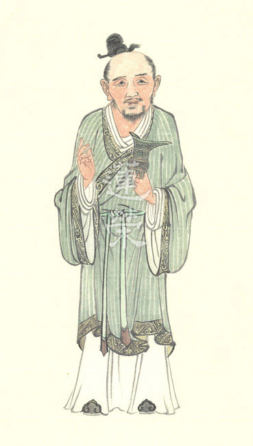

### 華夏精魂千秋（二十五）— 明倫史畫 積德昌後 袁安

圖/江逸子 文/時哉

明君座下廉能吏

平反冤狄數百戶

大雪僵臥不爭食

外戚弄權能抗衡

史畫

袁安，字邵公，東漢豫州汝南郡汝陽縣（今河南省商水縣）人；生年不詳，卒於和帝永元四年（西元九二年）。自幼好學，承襲祖父袁良《孟氏易》之學問，為人莊重有威信，受里人敬重。父親去世，母親讓他擇地安葬，路上遇到三位書生，指點說：「葬於此處，後代出三公。」袁安就葬父在那兒。
明帝時，以明經被舉薦，任洛陽縣功曹史（管人事）。某日洛陽大雪，縣令出巡見家戶掃雪外出求食，但來到袁安家門前卻無通路。除雪入內後，見安僵臥在床，
**問：** 「何以不出門求食？」安
**答：** 「大雪人人皆饑，不應求食於人。」縣令讚賞他的才德，薦舉為孝廉，先後擔任陰平縣長及任城縣令（大縣為令，小縣為長），處事剛直，吏民皆敬畏愛戴。

明帝永平十三年（70年），崇信道術的楚王劉英（明帝異母弟），與方士顏忠、王平作金龜、玉鶴，刻文字為符瑞，遭燕廣密告有逆謀之舉，有司諫請誅之。明帝不忍殺弟，廢徙於丹陽郡涇縣（今安徽省涇縣），後自殺身亡。此案牽連入罪者數千人，明帝大怒而下官急辦，致使許多人受迫含冤認罪。三府（太尉、司空、司徒）推薦袁安查辦此案，帝任袁安為楚郡（今江蘇省徐州市）太守。到任後，先審理無實證的案子，欲讓這些人出獄；而府丞掾史卻叩頭爭論，認為附和者都與楚王同罪。袁安說：「這樣做若不合律例，我負全責，絕不連累你們。」於是列述上書，明帝受馬皇后規勸，同意所奏，因此被釋放出獄的有四百多家。次年任河南尹，政令嚴明，京師雒陽十年間一片繁榮。

章帝建初八年（83年），升任太僕（掌車馬）。元和二年（85年），武威太守孟雲上書：「北匈奴以為和親作假，將要犯邊，建議還俘以作安撫。」章帝召百官商議，多認為匈奴狡詐貪得，還俘將使之妄自尊大；而袁安力陳還俘，一可使邊將不失信於外族，再者可顯示本朝寬容不背約。當時司徒桓虞讚同，太尉鄭弘和司空第五倫反對，最終章帝採行袁安的意見。

元和三年（86年）任司空。章和元年（87年）遷司徒。章和二年章帝逝世，子劉肇十歲即位為和帝，竇太后臨朝聽政，外戚竇憲兄弟專權民怨沸騰，袁安不畏權勢守正不阿，多次上書彈劾糾舉不法，雖慷慨直言到擲帽痛述，竇太后仍置之不理。和帝永元四年三月，袁安去世，群臣痛惜；七月，和帝聯合宦官鄭眾除去竇氏集團，親政後拜袁安的兒子袁賞為郎官。

圖解

東漢楚王劉英一案十分詭疑，明帝對崇信佛道的弟弟並不瞭解，在疑神疑鬼下查辦此事，除劉英廢徙於涇縣外，監獄裡關押了牽連的數千人。當時，朝廷除派遣袁安到楚郡審理此事外，京城洛陽也由侍御史寒朗查案。相較於一般官員審案的畏縮，他倆人發現此乃誣告冤屈，便力陳爾等無辜之情，使得明帝放還獄人。
此圖中江老師所繪，乃某年洛陽大雪，田野屋舍遭受雪覆，當時因普遍缺糧，屢有百姓出門討食，縣官便出外巡訪民情。車駕來到屬員袁安家門前，發現門徑已為厚雪所阻，無人員出入的痕跡，即清除積雪進入屋內，這才發現袁安僵臥在床。探
**問：** 「你為何不出門求食呢？」袁安答以：「大雪紛飛饑民眾多，衙門差役不該與民爭討食物。」縣令讚賞他的才德，特薦舉為孝廉出任縣長，一路遷升至司徒，期間還力斥外戚竇氏集團的亂政。

為政者雖多能，但必要廉始能利民。廉者戒貪，無欲則剛。常言：能者多勞，這是為民服務；但每見能者多「撈」，這就要亂政害民了。左丘明有言：「仁人之言，其利博哉！」言由心表，此語證諸於袁安，其言其行真是剛正仁厚呀！

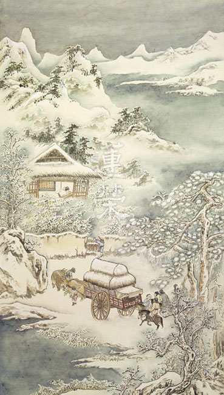

## 活動報導

### 二○一九年唯識簡介講座消文（二）

*編輯部整理*

對境了別是心法

認知己心是真修

造善惡功能不失

因緣會遇識納果

甲子）性識之別

◎注三

注三所解釋的五俱起識、獨頭意識是第六識功能的一分，末那恒識講的是第七識，阿賴耶識講的是第八識，前五識不特別解釋的理由是前五識只有單純將過去所造作的善惡業，當下如實顯現其果相而已。

領納由善業生起的可愛面相（悅意五塵），由惡業生起不可愛的面相（不悅意五塵）。

●五俱起識

五俱起識又稱五俱意識，是第六識作用的一分。分為五種有：眼俱意識、耳俱意識、鼻俱意識、舌俱意識等，前五識如果沒有五俱起識的功能，無法生起領納境界的功能，例如眼識的生起，需要眼俱意識的作用才能生，前五識的其他諸識也是如此。

眼識的前後剎那不能同時生，然因有五俱起識，所以可以同時生起前五識，例如可以同時看電影、聽聲音、聞食物香、啃瓜子及坐在軟沙發上。

嚴格來說五俱起識是指第六識的五俱意識。但如果以較寬鬆的標準來說，前五識起現行都同時要第六識(五俱意識)、第七識(執我的心攝持)及第八識(收藏種子起現行)三種心識的作用。所以五俱起識下面分為分別依、染淨依及根本依，即是這個原因。

分別依

前五識也可以分別境界，例如眼識可分別色塵的顯色、形色及表色；而耳識可分別可意聲、不可意聲及中庸聲等聲塵境界。但前五識只能各自分別眼前的五塵境界，第六識可以廣大而且同時分別各種五塵境界的好壞、美醜、大小、長短，這個比那個甜些，那個比這個鹹一些等，其分別範圍是最大的，不必像眼識受限只能分別色塵境界，耳識只能分別聲塵境界，所以第六識安立為分別依。

染淨依

執著是染淨所依，第六識跟第七識都有染淨，第六識的染是指分別我執，是宗派見所生的我執，例如外道爭議出來的靈魂我、常一自在我及神我等都是分別我執的範圍；第七識的染是指俱生我執，是與生俱來的我執，但唯識派所破的俱生我執，只有破到獨立實有的我(能背負五蘊的我)的範圍，尚未破到即蘊我(五蘊就是我)的部分。如果分別我執破了，第六識轉為清淨；俱生我執破了，第七識即轉為清淨。

第七識是俱生我執的生起處，如果沒有聽聞外道的宗派見，心中雖成立不了分別我執，但亦無能力破分別我執，更不用說俱生我執，如果具備破除俱生我執的智慧，同時可以破分別我執所執的我，所以要特別說第七識的俱生我執。

前五識的作用，都在第七識的攝持下生起。所以第七識的作用如果是染污的俱生我執，前五識的作用就被染污。反之第七識被智慧攝持，前五識的作用成為清淨。所以染淨依所講的就是指第七識的作用。

根本依

前五識的生起，都要第八識的五識的種子起現行，例如眼識種起現行，才顯現眼識的作用。五根、五塵及五識各有種子，都是收藏在第八識，因緣成熟起現行，才會生起前五識的作用，所以安立第八識是前五識的根本所依。同樣的理由也適用於第六識及第七識的根本所依都是第八識。

●獨頭意識

獨頭意識顧名思義就是第六意識生起作用時，有時不必跟前五識俱起，稱為獨頭意識。

可以在兩種狀況下生起獨頭意識，第一種前五識緣境時，可以想到跟當前境界無關的，例如看到甲，聯想到完全不相關的乙，例如作曲家陪著子女看電視，心裡正想著所要創作曲目的音符，或者佛教徒看到鮮花想到供佛；第二種是完全自己生起的想法，不必是任何依前五識對境的聯想，例如想著未來該怎麼改變自己。

獨頭意識的功能是心識中最重要的功能，除了不跟前五識俱起，也具有不受前五識影響的特性，所以古往今來能成功、做大事的人才往往是獨頭意識的作用很強的人，例如歷代忠臣烈士，唐代安史之亂的顏杲卿、宋朝末年的文天祥及明朝末年的史可法，他們難道不知道投降就可倖免於難，還可封侯拜相嗎？這完全是獨頭意識的堅持於大義，不受前五識的威逼恐嚇的影響所致。放眼現代很多成功的政治家、企業家們，也都是強大的獨頭意識擘劃出未來的藍圖，然後堅定的執行才達到最後的成功。世間法如此，出世間法也是這樣，所以古德有一首偈講的就是指第六意識的獨頭意識：三點如星列，橫勾似月斜。披毛從此得，成佛亦由它。

定中意識

獨頭意識依著不同的作用又可歸類為三種，第一種與定心所相應的是定中意識。定心所是百法明門論中五十一種心所有法的一種，指心具備專注的能力說與定心所相應。

而第六意識安立為心王，定、信心及散亂等五十一種心的作用安立為心所有法的理由，是指第六意識可以顯現定的作用，也可以顯現相反的散亂的作用；可以顯現信心的作用，也可以顯現不信的作用，這樣總共五十一種心的作用都依不同的條件成立，顯現相對應的作用。

所以成立定中意識，是指心識的作用只剩下專注的功能。獨頭意識歸類為心所有法總共有五十一種，為何特別標舉出定中意識，理由是定的體性是止，而慧的體性是觀，修止修觀成就定慧，才是解脫成佛的真正方便。所以此處的定中意識，可以分成兩類。第一類是能夠生起慧的定；第二類是慧生起後安住於義理中的定。前者可以與世間禪定共，後者是聖人的出世間智慧所攝持的禪定，不共世間禪定。

獨散意識

獨表示不是前面的五俱意識，而散表示不屬於定中意識，可以緣念善，也可以緣念惡。一般凡夫醒著的時候大多屬於這個狀態，對佛法具備信心的凡夫，只要不是在定中意識，就都是屬於獨散意識的範圍。但此處的散與百法明門論中所定義的散亂並不完全一樣，百法的散亂是指這個散亂會造成修定障礙的狀態，而具備信心及精進的獨散意識，不會是修定的障礙，反而是入定的順緣。

夢中意識

這是指晚上睡眠時作夢時的獨散意識，與白天醒著的獨頭意識的差異在於晚上作夢時是蒙昧的，思考力薄弱，全憑習氣做主。

動身業，發語業

因為第六識的獨頭意識具有審慮思、決斷思(思業)及動發身思(思已業)三種功能，比起其他七個識的思心所，只有任運思的作用來說，獨頭意識造身業口業的作用是最強的。

思維也是心識的心所有法之一，而業果的體性就是思惟，所以心識結合思維，就成立「業」，就是有了感果的功能。思維又依次第分為審慮思(計畫、謀略)、決定思(下決定)及動發身思三個層次。

審慮思(思業)

審慮思所講的就是規劃的能力，世間萬事如規劃得當，最後較易成功。例如現代國家民族的認同，可以統合成千上萬人，乃至數以億計的人成為一個國家，這需要靠領導人，提出一個被共同認可的願景。所以大至治理國家，小至各行業的經營，都需要謀略規劃(說故事)的能力，而且很多最後成功與否，都在規劃階段即已大體決定。審慮思可以規劃出各種方案，評估利弊得失與風險高低，審慮思愈強的人，規劃的能力就愈強。

決斷思(思業)

決斷思所講的就是判斷。當面對規畫後的種種方案，有判斷能力的人可以選擇最好的方案。歷史上有名的成語「房謀杜斷」，即是指唐太宗李世民的兩位謀士，房玄齡善於謀略，而杜如晦善於決斷，就是審慮思與決斷思的典型例子。

動發身思(思已業)

動發身思所講的就是執行力。而執行是靠身體的造作，與口中的言語去達成。審慮思與決斷思都是還是屬於「思業」的階段，尚未訴諸執行；而動發身思策動身口的造作，屬於「思已業」，一旦付諸執行，感果的能力最強。例如以助念為例，在審慮思的階段是考量助念的時機、家屬的配合、可能的障礙與蓮友的動員等等條件，接著依據審慮的結果要下決定興辦這次的助念，執行就靠動發身思以身口跟家屬溝通、場地布置及蓮友排班等種種造作，到最後圓滿完成助念八小時，迴向完成助念勝舉。如果只停留在想要去助念，最後沒有去造作這個善業，感果的能力當然遠遠不如完成助念。

人的一生禍福吉凶都跟說話辦事有關，吉凶禍福的樞機就是言行，例如北京同仁堂創立時由於嚴格的選方、用藥、配比及工藝規範，得到當時清朝皇室的認可，供應皇室醫藥，名聲至今不墜，都賴主事者的堅持。又如古代朝廷上大臣與皇帝對答，一言稱旨可能連升三級，反之忤逆皇帝禍及九族。曾子說：戰戰兢兢，如臨深淵，如履薄冰。雖然主體是空性的修學，但世俗上的顯現恰是身業和語業修行的心法。

引滿二業，諸識獨最，輪迴不停

上文已經知道獨頭意識發動身口業，感果的能力最強。所造下的業分為引業跟滿業二種。欲令所造的業成為引業，要有投生那一道的想法，例如修五戒十善，如果心中有生天的想法，這個善業就成為生天的引業，如果有生人道的想法，就成為投生為人道的引業，如果想求生西方極樂世界，就成為極樂世界的引業。以五果的觀察，引業就是異熟果的顯現。

滿業就是所造的業，圓滿在那一道的受用。以五果的觀察，滿業分為等流果、士用果及增上果等三種。等流果又分為領受等流及造作等流，領受等流是指這個人的受用的苦樂果，例如我們常說某人一生不愁吃穿，有錢有勢，就是樂果的領受等流；反過來說某人一生諸事不遂，窮途潦倒，就是苦果的領受等流。至於造作等流，指這個人相續的心態習氣，例如這個人雖然貧困過日子，但內心是好學不倦，仁以為己任，就是造作等流果。

士用果是士夫之用，就是這個人的能力足以將他要成熟的果報增長廣大，由於他做善的能力強，所以可以把將成的樂果經營成極大的樂果，反之亦然。以現代互聯網社會為例，我們常可以看到某些人，在很短時間內經營事業得到極大的財富，將昔日布施業所要結的財富果增長廣大，就是歸類為士用果。增上果指的是依報環境，例如持不殺生的戒律，容易感應生到一個祥和的環境，社會沒有暴戾的氣氛，歸類為增上果。

如果造作善惡業的時候是被自己無明我執所攝持，不管善業惡業，都是輪迴的業；想要出離惟有造作解脫的業，如何是解脫的業，常常跟講授空性修學的善知識學習，對治無明我執，在斷惡修善德的同時，常作三輪體空的的觀察，能作善的我及所作的善是相互觀待，自相存在的能作所作，一粒微塵也找不到。能夠這樣修學，就是在造解脫的業。

●末那恆識

末那，為梵語 manas 之音譯，意譯為意，思量之義。唯識宗將有情之心識立為八種功能，末那識即為八識中的第七識，恆執第八阿賴耶識見分為我。如何證明恆呢？第六識有時不起現行，例如：定中、極重悶絕、極重昏睡等，事後卻有回憶功能；或者，可以近憶昔我所造，今我所受，今我所造，後我如何受，皆可證明執我心識相續。此我執所執之我是以總相方式攝持五蘊身心別相，換言之，我為能攝持，五蘊身心是所攝持。　　若以為總相我可離開五蘊身心別相獨立存在，則是我有自主性、自成立性、實有性、不變異性，若有這種對我的認知，此即我執；若透過總相我安立，令五蘊身心別相功能發揮則非執著，而是真正對作用了解。

染有我

染有我：認為我有自主性、自成立性、實有性、不變異性，與執著相應。染有我可大分為生我、法我、無我三項。

一、生我(人我)：即獨立實有我。所謂獨立實有我，就是能背負五蘊的我。而此獨立實有我所背負的是五蘊身心。吾人日用平常都有此獨立實有執著，一個我在主宰身心，例如：我叫身體起床、我命令出左腳或出右腳，我叫心維持動力往前進等，宛然有一個我背負五蘊身心。實則獨立實有我是不存在的，因為去觀察離開五蘊身心是否有一個獨立實有我，去找找不到，則知獨立實有我是不存在。

二、法我：任運見到法在心外成立。如何破法我？若法在心外成立，為什麼人來看水是水，魚來看水是空氣，鬼來看水是膿血，天來看水是琉璃，故法在心外不成立，正好引向心內所顯現。

三、無我：破生我、法我者，不會執著有一個東西叫無我。只是我找不到，否定我，不會再去執著有個無我。例如：某人不喝酒，只是否定喝酒，無法再找一個東西叫不喝酒。

淨無我

淨無我：與無我空慧相應。且無漏，所謂漏就是煩惱，煩惱會漏掉功德法財。例如：瞋會破壞過去善法感果的能力。若執著我，面對境界就會生煩惱，有了煩惱就會造業，將來因緣成熟果報就現起。因此，無我才是斷煩惱根源。如何證得無我呢？觀察法在心外不成立，那麼還貪什麼？瞋什麼？即以不對治方式對治煩惱。

●阿賴耶識

阿賴耶識分含藏、異熟、先來後去三部分來說明。

含藏

第八識的自相(性質、特性)，梵語稱為阿賴耶，譯為藏。藏是含藏義。所謂「藏」有三義：一、能藏：阿賴耶識有藏東西力量。能藏的是第八識，所藏的是一切種子。二、所藏：前七識透過種種造作之後，能熏其種子（依緣感果的功能名言安立為種子）於第八識中，前七識是能熏，第八識是所熏。三、執藏：第七識恆執第八識見分為我，故能執藏為第七識，所執藏為第八識。以上何者是第八識主要功能？可以依照不同角度做解釋：

「能藏」：唯識以為法是心識所顯，所以心識要有儲藏過去造作業因的地方，才有能力將法顯現為特殊的形象，例如人見水的例子。或者冷風吹來，有些人冷，有些人不冷等等。而前六識有時生有時不生，第七識惟有執我功能，故安立心識有最微細功能，名之為第八識來儲存。換言之，第八識有此能藏能力，才可說明所有佛教宗派見最重要看法--因果不失的道理，若無第八識能藏功能，則因果失壞。

「執藏」：第七識恆執第八識見分為我，以我為主來攝持第八識，才能令第八識功能發揮，若無總相我攝持，那麼是誰在藏？即便第八識有變現萬法強大功能，若無總相來攝持，所有種種別相都無意義。例如：魯定公離開魯國，則魯國無領導者，已不成為國家，發揮不了國家作作用，故孔子也離開魯國。

異熟

第八識的果相，梵語叫「毘播迦」，中文譯名有二：舊譯為果報，新譯為異熟。說明第八識在造作業因到果報現起時會有以下三種特性：

△異時而熟：「造因果熟，定異時故」，所造的善惡業因，到所受的苦樂果報，這中間往往會有一段時間的間隔。代表因果不可同時，因在果不在，果在因不在，因滅果生。若因果同時則說彼為因，此為果則成無義，因是能生，果是所生，同時存在，請問誰生誰？果先因後也不可能，則成為無因論，所以是因先果後，而且是因滅果生。就因滅果生的道理，說明了因上的造作是非常重要的，因為現在的果報皆從前因滅而來。故很用心在因上造作後，果上莫名其妙殊勝。例如：因上造作布施業，果上投生富貴家庭。

△異類而熟：「因通善惡，果唯無記」，即過去所造之業因，或是善性，或是惡性，或是無記性(無法記別善、惡性)，但成熟後的果報為無記性。因為果報身若是善性，理應一直造善，果報身若是惡性，理應一直造惡。以人身為例：人身若有善性，理應一直造善，人身若有惡性，理應一直造惡，事實並非如此，孔子說：性相近，習相遠。人初生時大多差不多，但經過後天努力學習、經驗累積或貴人相助則結局相距甚大，前者約引業，後者約滿業。所謂引業是引至某道之業，純受報，無法記別善、惡性；所謂滿業是成滿某道苦樂果之業，也就是在某道中受苦受樂是受滿業影響。引業與滿業可以互相變化，最好的引業變滿業是將來引至地獄之業，透過今生遭受種種苦難報掉，例如：印度戒賢論師，過去當國王造下殺生業，來世準備下地獄，透過今生嚴重頭痛償還。最壞的引業變滿業是將來引至善道之業，卻透過今生自私貪婪享受，而將過去好不容易造作善業消耗掉。最好的滿業變引業是運用現前暇滿人生，造作解脫輪迴的善業，最壞的滿業變引業是運用現前諸多資源，造作來世無法學習正法的業。

由此可知，如何將最糟糕的引業或滿業轉變成最殊勝引業或滿業？需要將道理了解，對業果好好觀察，才是最殊勝投資理財專家。

△變異而熟：「種變異時，果方熟故」，從種因到結果的過程之中，就因上言，因已造作不會再變，但果隨時都會因為中間緣的改變而有不同變化。例如：過去造布施業，中間生瞋恨心，則富貴果報不見了。再如：某人一生未遇善知識，臨終因為家人學佛，得到善友助念，往生西方極樂世界，將過去嚴重惡業作一次翻轉。

由此可見，果未成熟前須戰戰兢兢，如臨深淵，如履薄冰。當果報成熟時，才是真正因果不失。另外，人生如何經營將小善變成大樂，小惡變成不結果，大惡變成小苦，甚至不結果之業？關鍵在造作利人相關事業，所謂文武之道未墜於地在人，法與人結合才是重要所在。

先來後去

先來後去是第八識業用。第八識有先來後去作用，但並非如外道的靈魂說，當臨終時靈魂飛出身體，投胎時靈魂又飛進身體。唯識第八識先來後去的概念是：若今生人道至臨終，將要投生天道，此時人道種子爛壞，第八識依正二報種子，生起天道依正二報，以天道正報去受用天道依報環境。

◎注四

「八識四部」是依功能的不同區分為四部。

前五部：前五識(眼識、耳識、鼻識、舌識、身識)為一部，其主要功能是依著淨色根緣五塵境，為心識粗相分別。

第六部：第六意識，主要功能為分別(具三別，自性分別，隨念分別與計度分別)。

第七部：第七末那識，主要功能為恆執第八識的見分為我。

第八部：第八阿賴耶識，主要功能是能藏、所藏、執藏。

「名稱異同」

八識可同名為心，也可同名為識。 而異的部分：第八識的功能特別著重在集起義，收集諸法種子，起諸法之現行，故名為心。第七識是我執的根本，故名為意。前六識特別著重在了別義，故名為識。

「名稱之別」

八識以五蘊做分別，前五識為受蘊，前五識與境界接觸，因有了別而生起苦受、樂受、不苦不樂等諸受生起。第六識為想蘊，因第六識有審慮與計量的功能，簡單說就是有分析與計畫的功能，故稱為想。第七識為行蘊，行蘊是造作性，是我在造作，第七識是執我的心所在之處，故稱第七識為行蘊。第八識為識蘊，蘊有積聚義，前七識與相應的心所積聚之處為第八識，意即第八識積聚這些心王及心所種子並起現行，而有各類心識的活動，所以第八識安立為蘊。

「八識功用」

前五識的功用主要是分別（色、身、香、味、觸塵），第六識最容易轉變，第七識恆常思量第八識的見分為我，第八識具有含藏種子，與有能力使種子顯現為六道的異熟功能。

前五識的功用主要是分別：

眼識：依於眼根，緣色境所生起的了別認識作用。

(如青黃赤白)

耳識：依於耳根，緣聲境所生起的了別認識作用。

(如風雷鐘鼓)

鼻識：依於鼻根，緣香境所生起的了別認識作用。

(如旃檀沉麝)

舌識：依於舌根，緣味境所生起的了別認識作用。

(如鹹淡甘辛)

身識：依於身根，緣觸境所生起的了別認識作用。

(如輕重澀滑)

第六識恒轉易：

恒：意識無時不具，發揮其了別外境的作用，只有五種情況不生起，生於無想天、入無想定時、修滅盡定時、進入深沉睡眠時、昏迷(無意識狀態)，除以上五種狀態，第六識恆常生起。

轉易：第六意識在轉變業力上最為容易，有能力造作善惡業，或使善(惡)業感果的功能轉變。

第七識恆常思量第八識的見分為我。

第八識具有含藏種子，與有能力使種子生起異熟（顯現投胎的環境）。

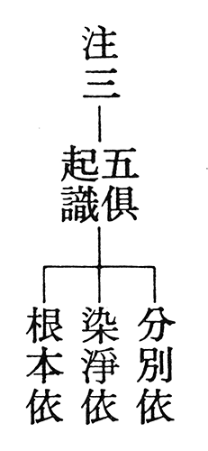

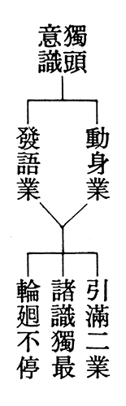

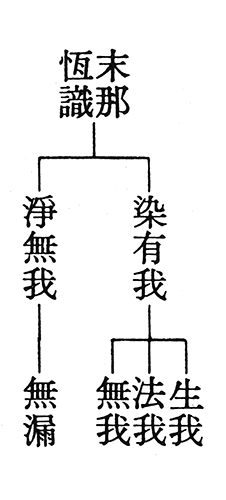

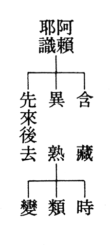

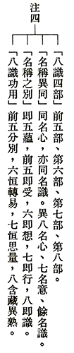

### 莊嚴一百二十週年紀念展 — 觀夜坐圖記之興思

王順福

吾愛莊夫子 素有超然心

法書兼各家 往來有鴻儒

展品豐富性 家人亦知音

觀賞人如織 藝文春風作

一、前言：弱水三千，但取一瓢飲

慕老一百廿歲誕辰紀念展，開幕當天上午假導覽義工之名，得先一睹展覽場之作品，一臨場甚是駭人，既多樣化且展件數量多，為歷來僅見，無怪乎下午開幕典禮時，梁館長永斐致詞云:此次展出有數個第一，展期最長，場所最大涵蓋南北展廳、文華軒及東廊道，展品最龐大多至374件，又有湛藝莊門，渠讚如政壇第一家，莊家乃為蓬萊藝壇第一家。

就故宮半世紀，書道幽光，翰墨知交與湛藝莊門四展區， 巡禮一周，各以一首七絕，速記初次相遇印象，依次為：

（1）南遷史事靈均憶，始末點滴見孝親。

山洞重登尋手跡，蓬萊國寶話艱辛。

（2）古來書道有幽光，字裡真情遺跡彰。

寒食蘭亭祭姪稿，慕陵翰墨繼心腸。

（3）知交千載難尋覓，患難平常不易求。

師友鴻儒存墨跡，興來風采德芳流。

（4）湛藝莊門第一家，潛藏傳統創新加。

中西霑溉聞遐邇，巾幗結陶更值誇。

思量此四首七絕亦是一己日後作為導覽解說現場作品的綱要，惟要記錄此段相逢因緣，仍須秉持弱水三千但取一瓢飲的理念，斟酌再三，乃擇夜坐圖記，期以輕取毛髮深及骨髓的方式，述說自己對莊慕老紀念展契入的面相，藉能闡明其作品的梗概及一生的行誼，雖有企圖心，禿筆或恐半折心始耶。

二、略說夜坐圖記：

(一)夜坐圖：傳移摹寫工夫深，伯樂得識千里馬。

圖是畫於西元一九四五年，時從貴州安順往北遷至四川巴縣水竹溪，戰事稍緩時，慕老委請同僚劉奉璋所繪，奉璋字峨士，是天津人避禍徙至黔中安順，有繪畫天份，時慕老為安順辦事處主任，因人力吃緊，乃拔擢任用二人，一為峨士另黃異，黃異字居祥，擅長苗地風景人物畫，據聞曾獲台省美展第二名，峨士在安順期間，勤摹寫古畫，畫境遂日進，眼界止於取法宋代以前之大家。彼二人更是莊家公子之繪畫啟蒙師，二人同護送故宮國寶至北溝，惜二人均英年早逝，若假以天年，慕老云當在畫壇有一席之地，能與古、今人爭長短也。

峨士夜坐圖乃仿自明沈周，所謂傳移摹寫，作品形式為立軸之水墨山水畫，尺寸大小相近，有別於手卷形製之安順讀書山華巖洞圖，而與同是立軸的戴笠圖相似，此三幅圖，蓋都是慕老之籌劃，請渠搦管而成，後二幀捐贈故宮典藏，峨士之畫能傳世，慕老誠是其伯樂也。此畫之位置經營，茅屋數間，座落在叢山林壑裡，屋前種幾株龍鱗，板橋橫於溪澗上，不論因物象形或用筆老練，深具骨力、富有氣韻，與原作形神逼似，正是隱居以求其志之佳所，可閒居靜坐耶。

(二)夜坐記：銜華珮實

夜坐記一文，言之有物且文采斐然。其用辭典雅，廣泛運用四言體，夾以駢體，更兼散文賦，如描摹屋外屋內身內諸聲，參寫秋聲賦之筆趣，亦不遑多讓耶，此略述該記文藻之美。至言藉夜坐可陶養性靈之方，并探人生奧賾及宇宙之眇諦，滌除玄覽，對外境之聲靜聽之，一聆天籟響；腦海澎湃之聲，息之收視反聽，默然寂照，體察識起處以順正，從而體悟夜坐乃人生至樂，又云夜坐不求必靜，不與緣絕，以修天爵，此一旨趣也發人深省耶。夜坐記既涵養消融了儒釋道之靜坐觀，有文有筆，依情為文，誦之有深味也。

(三)夜坐圖之法書：章草嫻熟，深富韻味。

觀夜坐記法書之貌，依稀記得莊伯和先生言其師書道之追求，不侷限渠一生至交臺老所述，歸納其學書歷程，即一九二○年代專意於褚河南，三○年代轉攻道君體，四○年代著意于趙子昂，六○年復留心北齊之唐邕寫經碑、泰山經石峪金剛經、

水牛山刻石及好大王碑，而提出更有其他書家或碑帖元素如涉獵沈尹默、禮器碑、西嶽華山廟碑、漢簡、顏魯公、坡公及章草。臺老之說，容或粗說，當屬符合；另莊伯和先生補充，自是高見，觀賞慕老榮退與其所書「國立故宮博物院」匾額合照，與大銅鼎題「國父訓詞」拓片，除禮器碑筆意，亦頗多參以史晨、乙瑛碑，至雲烟山水一聯，竊謂融米襄陽筆觸。而夜坐記書體，通篇章草筆意，俯拾便得，略取該記文屬章草筆調如道、導、半、是、長、歲、東、寥、無、才、殘鐘、蟲、內、呼、益煩、識所起、順、夜、天爵、笑、相等，或化點為捺，或化橫為燕尾，或化撇為捺等，蓋是章草之特色，同宗及門其言亦不虛也。

此記書於一九四五年，當屬四○年代法書，乃自運題詞，章草不同今草，可師法帖遠遠不如今草，能運用得如此熟稔，自是非一朝一夕所能練就，足見四○年代習趙體，或只是一面相，究竟習章草始於何時，亦不得而知也？

三、從夜坐到號六一翁：水到渠成

夜坐者，是靜坐於夜間之謂也，為靜坐範疇，從夜坐記可知慕老未逮知命，已然好樂靜坐之至樂，細繹夜坐記一文，當可知曉，此其一也。

臺老與慕老，北大時期，同寓北都西老胡同邢次青宅，各別居北房西廂，臺老時見慕老宿舍，金石考古之著盈棟，又耽於臨池，初不以為然，曾譏翫物喪志，後通達知交以翰墨怡情，天機清妙，復能澄懷味道，乃嘆昔日之淺見！書道闡幽光，由來久矣，此其二也。

不論西遷安順、巴縣，雖有家事、國事之疲憊，閒步林間以放鬆自怡，亦想當然爾，而後徙台，居北溝洞天山堂，曾邀諸友同登吉峰山，或上巳修禊，在在透露出素有散步詠涼天之生活情趣，此其三也。

三五好友，同聚一堂，談書論學，酒為助伴，不必耳順，此其四也。「道道非常道，拳拳太極拳」，何時習君子拳，靈均未語，而「三盃通大道，一醉跌跟頭」，此聯隱微處或可測知花甲之前早已習太極拳，愚好智慧拳(智慧拳、君子拳，皆太極拳之異名)數十年，略知鬆柔之道，能臨跌倒翻之險境而毫髮無傷，非僥倖也，若無幾十載之修練，不致於此，此意外事件，正說明習拳亦有一段歲月，此其五。年年月月日日，如是生活，自我奉行不輟，則六一翁之別號，至六一齡，水到渠成矣。六一翁以神智體書之，亦慕老之創新，未見歐陽永叔有此簽署。

由夜坐圖申一己所見所思，誠不及萬一，未能說出的更多也。

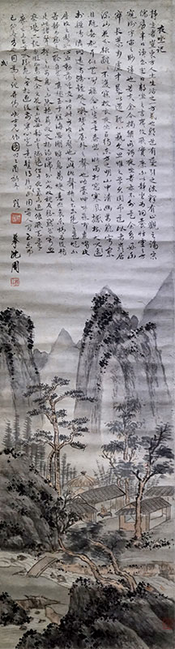

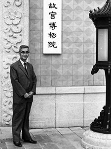

### 莊嚴一百二十週年紀念展 — 也是莊嚴

心韜 心儷 心影

看似現成

百般艱難

造作方有

是名莊嚴

民國十三年，溥儀在馮玉祥的逼迫下走出紫禁城，清宮中的骨董文物成了香餑餑，在軍閥及日本的垂涎下即將被下箸分食。青年莊嚴就在這個背景下，以清室善後委員之姿，開始進入浩瀚又艱苦的守藏生涯。

在進入神武門的那一刻，映入莊嚴先生腦海的不是宮殿的富麗巍峨，卻是「鼠雀爭權、豺狼劫盜」的感慨！民國二十年的九一八事變開啟了故宮文物的遷移史，當時不少有力人士反對南遷，孫科的抗戰為上、寶物無用論；胡適憂慮古物的存放及遺損；魯迅更以「闊人已乘文化去，此地空餘文化城，文化一去不復返，古城千載冷清清」作為反諷，幸好蔡元培以「不願故宮成為圓明園第二，我等成為千古罪人」，才能讓故宮文物遠離日寇貪婪的魔爪。

文物隨著戰事不斷轉移：二十二年暫遷上海；二十五年運抵南京朝天宮；二十六年莊嚴奉命帶著八十箱精品輾轉到貴陽安順華嚴山讀書洞；三十三年倉皇由黔入蜀，安置在巴縣石油溝；三十六年順著長江與各路文物二度會合南京，並在不同的復原聲浪中，好不容易相聚的文物再次分手；三十七年底，原南路的八十箱精品陸續渡海來台，暫止霧峰北溝……那是段與生命同賽跑、與文物共存亡的日子，也是莊嚴先生從轅下之駒蛻變為入趙壁奪印符的沛公。

能成就莊嚴成為老宮人、老夫子或守藏史的並非平穩安逸的生活，而是顛沛必於是，造次必於是的執著，還有讀書遣日、展卷思國的情懷。好友臺靜農先生曾以

「吟壇贈答追長慶，華榭壺觴繼永和」

寫似墨林的才情與逸興；以

「不養生而壽，處塵世亦仙」

點出莊公的灑然與飄卓。江兆申先生更以豹文寓莊嚴如隱士般卻難掩神氣的才華；以漆園吏及鵷雛狀慕老雅逸不群的節操。這絕不是單純的典守文物就能成為「開張天岸馬，奇逸人中龍！」

名為士者要是不能博學於文就會落入俗弱呆，書法如果不能採各家精華同樣失去生命力。就職故宮後的莊嚴先生，日夜浸淫在古文物中，故能飽覽各家風範，不但在書道上融合褚遂良、薛稷、蘇東坡與宋徽宗(瘦金體)、趙孟頫等諸前賢體例，後更揉合雄渾的〈好太王碑〉與樸拙的〈唐邕寫經碑〉濟補館閣體流麗之失，因此「詩有真律，書無定法」成為他入古出古的心得。歷經戰亂頻仍、民初風雲的洗禮以及歲月的打磨，慕老跳脫世俗與政治的樣板，成為具有獨特風格、無羈無絆又勘破紅塵的奇人，也自然生發

「骨董先生誰似我？非玉非銅滿面包漿裹」

之慨！莊嚴就這樣名如其人、字如其人般的「輕騎快劍，一往無前」直入妙莊嚴境。

「官冷繫懷非吏事，地偏相訪定閒人。」

無論是安順、北溝還是外雙溪，總有不遠千里的「閒人」前來小酌或讌集，下酒菜不外乎是藝文掌故及歷代精品文物，詩牌、唱和、吟詩、作對更成為習以為常的文人遊戲，何其風雅清韻之有？套句臺老常說的「你流口水了嗎？」至少我是撫髀長嘆怎麼不早生二十年？

政壇及文壇從不缺為了高位而逢迎拍馬或偽作儒雅之人，號為君子劍的岳不群大概是得其精髓的佼佼者。六一翁逢此往往退避三舍，只好繼續讀書、喝酒、打拳、靜坐、散步及奉行自己，但是，面對「遇深宮讜詞，均如秋風過耳」的滑吏與學者，莊慕老也有其率真的一面，就如丁文江的嘲竹詩，總讓莊嚴墨而不默：

「竹似偽君子，外堅中卻空，成群能蔽日，獨立不禁風，根細擅攢穴，腰柔慣鞠躬，文人每愛此，聲氣想相同。」

以文人自許者當嘆之！戒之！

莊嚴與申若俠伉儷情深、苦樂與共，一個是愛

「慕老吾夫子，行藏似古人」

，一個是憐

「不做封侯想，鍾情薄倖人」

；一個是讚

「門徑多修竹，堆書若積薪」

，一個是愧

「慚我謀生拙，勞卿日荷薪」

。無怪乎臺靜農教授也要跟著和

「羨爾公母兩，深山好養真。」

夫妻之間若非相知相惜怎能到此？想必他們的好友蔣夢麟與胡適也羨煞！

「小有林泉以樂晨夕，高謝弓車畏我友朋。」

看多了政界大江東去浪濤盡，也明白

「年年欲惜春，春去不容惜。」

因此樂於悠遊在山水間日夕靜觀

「青山黃葉樹，千里一村詩」

。但是，騷人要是離騷就少了那份騷動後的騷情賦骨，所以莊嚴先生也常有「芳草有情，夕陽無語，雁橫南浦，人倚西樓」的無奈，因為離恨恰如春草，但見雁橫不見人，只能繼續白頭搔更短了。

莊嚴先生曾多次表達典守故宮是他一生唯一的職業，「歷劫與建業文房並存，平生自詡守藏史。持身在魏晉人物之間，垂死猶懷故國心。」摯友臺靜農先生道出他一生最好的寫照。但看他案頭上「白須一把，赤血滿腔」的對子，是自勉，更是真情！如果說李白是詩人中的劍客，莊慕老也應該是漆園吏中的俠客，如亙古長夜中一道流星，曾經閃亮過！

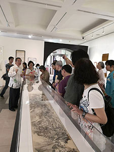

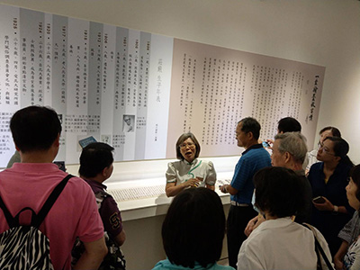

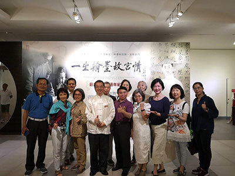

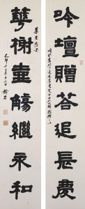

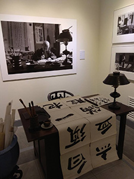

### 二○一九年四月 尤溪「閩台朱子國學文化教育基地」交流報導

淨本

文化道統民族性

注入支流活水源

走入時代新氣象

尤溪閩台朱子園

在福建省中部戴雲山山腳下，有一條潺潺的流水斜貫南北，從北部匯入閩江，稱之為尤溪，別名沈溪，它所流經的主要行政區域尤溪縣，屬於三民市所管轄。此地特別之處，不僅是山光景色優美、歷史悠久的千年古縣，更在於此是理學家朱熹的出生地。朱熹生於西元一一三○年，是北宋滅亡不久南宋剛剛開始的時代，他在尤溪生活了六年，一生七十一年的歲月中，九次回到此地。因為有這樣深厚的因緣，尤溪縣政府在當地打造了朱子文化園，總用地面積4.4萬平方米，總建築面積約14,600平方米，包涵了博物館、南溪書院、朱子塑像、半畝方塘、瘞衣處（埋放朱熹胎盤處）等建物，具有濃郁的朱子文化氛圍。未來還將展開第二期建設工程，占地面積24,972平方米，期望能夠成為一個有教育文化內涵的5A級景區。

就在離朱子文化園不遠的西城區，也將規劃一個主題為「閩台朱子國學文化教育基地」的開發項目，透過國學教育，真正為當地注入文化的內涵、提昇人文素質，使硬體設施因為人文的軟實力，能夠展現完全不同的風貌。

中華無盡燈文化學會組織讀書會作為學會主力，已經有接近二十年的基奠。成員來自各行各業，雖然多半不是中文系的本科生，但都能從共同研學經典中，得到大小不同的益處。自二○一○年開始，團隊師資也走向大陸、馬來西亞等地，開展中華文化的弘揚，八年多來，與各地中華傳統文化愛好者的切磋琢磨，使團隊了解並學習到，將經典文化推廣進入現代社會的各種方法與挑戰，這樣的經驗可謂彌足珍貴，因此在福建敦化學堂善友的引薦下，安排了幾位師資來到尤溪，與尤溪縣委書記楊永生等領導座談，為將來的「閩台朱子國學文化教育基地」，如何注入國學軟實力提供意見。

四月廿一日當天，我們的師資飛抵福州，搭車經過了被山水包圍著的高速路，約三個小時來到尤溪。一行人當天參觀了朱子文化園、尤溪縣街道，晚上並與政府領導、開發商一同用餐，對於當地的具體情形有了更多了解。隔日上午先與楊書記會談，下午正式與書記及所屬各局長們一起開座談會，為當地的未來發展提出建言，大家有很好的交流互動。由於尤溪縣本地也是農產品的出口縣市，因此除了師資團隊過去累積的國學推廣經驗，備受書記等官員的重視，實栽農園無毒農業的成果，以及農園結合露營、校外教學的方法，也帶給他們很好的開發構想。

從中國大陸近幾年的發展中，我們可以知道，硬體設施很快速地能夠達到一定成就，但人文素質的提升、文化內涵的傳播，只能慢慢耕耘，無法一蹴而就。台灣所擁有的中華文化寶貴資源，絕對是值得我們共同努力，使之長遠保存的智慧寶庫，這才是對後代子孫們最大的關愛，如果有一天，這些內涵傳給了別人，卻沒辦法留給我們自己，那會是多麼大的遺憾呢！

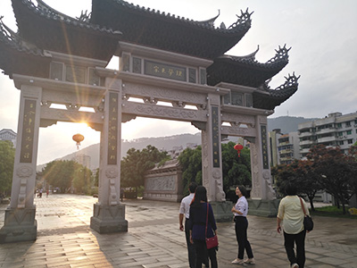

### 二○一九年四月 福州江逸子老師訪談

心若

不斷溫故師生情

耄耋猶懷壯志心

在台伏櫪有未甘

文化大陸火燎原

此次本會因著尤溪「閩台朱子國學文化教育基地」參訪交流，回程經福州，得知江逸子老師剛巧也在福州，便利用短短一小時的時間拜訪座談，與會人員都頗有收穫。

江老師用幽默的言談，把他與雪公太老師的回憶娓娓道來，在場無不聚精會神的傾聽，江老師如數家珍，一樁樁事情都記得清楚。江老師說，在雪廬老人座下學習是件無比幸福的事，雪廬老師解詩的見地、意境都很高遠，每周上唐詩課他都非常期待，但唯有一點，江老師對雪廬老人說他絕不學佛學，雪廬老人說，凡事都有前因，如今你討厭佛法，必有前因，江老師追溯到小時候的記憶，小時候家窮，只能吃番薯簽，他又是老么，當時餓到快要養不活了，有一天，他媽媽便煮了一碗白飯，只給江老師，兄弟姊妹們都沒有，江老師非常得意，此時，正巧有人來化緣，他媽媽虔誠慈悲，立刻把僅有的那碗白米飯給了和尚，自此江老師就種下厭惡佛教的因。雪廬老人懂得善巧方便，有次唐詩課下課，雪廬老人說要停課兩週，江老師難以按耐兩週見不到雪廬老人，於是跑到大課堂等待，雪廬老人看到江老師便跟學生們介紹，並說上完佛學課，因著江老師的緣故，特地為大家講一首詩，如此江老師就不好意思離開，開始聽聞佛學課。江老師深受雪廬老人器重，又加以國畫啟蒙於呂佛庭教授、復從溥心畬、彭醇士、張大千諸大師遊，成為當代知名國畫大家，少年即蜚聲海內外。

江老師生於福建省閩侯縣，十一歲隨父定居台灣。在台灣展開了他藝術的生涯，受到各方賞識，發光發熱，也歷經艱辛，近年，隨者江老師的夫人以及大兒子的過世，連續面對失去至親之痛，江老師說該是放下的時候了，如同童年在家鄉十一年的歲月，希望未來的十一年，可以回到初心，回到故鄉福州，並把這一生嘔心瀝血的作品運回福州，成立道藝春秋館，捐獻給國家，希望讓作品說話，以藝載道，為國家盡一份心力，但凡有心想推廣、學習的人，這些作品都可以作為強大的後盾與資源。而日後的展覽，希望由政府出面主辦，或是以國家對國家的方式辦理，才能真正發揮推廣效用，深入民間教育。

而江老師近期跟蘇州企業合作，為彼打造文化企業館。彼企業強調傳統文化的家精神，以「仁」作為企業經營的核心價值，在企業中落實家道、家學、家規以及家業精神，為世界幸福企業的標竿，並在為進一步推動企業核心價值而創立文化企業館，希望打造一個傳遞中華文化理念的基地，帶領國際跟國內的觀眾，透過文化藝術的體驗，欣賞認識中華文化的內涵，此館策畫「道藝春秋」常設展，精選江老師有儒家道統以及家庭孝道的作品，透過最新科技，建立五感互動體驗，讓傳統文化跟現代接軌，帶領觀展者感受源遠流長的中華文化，並藉此傳遞家文化精神理念—內求與利他，願景是「用心將聖賢文化帶給全世界，造福全人類」。

道藝春秋常設展由通泰媒體團隊規劃打造，已策畫一年的時間，將透過十個展間，以藝為體，以道為用，帶領大家領略中華文化的智慧，將會是一個穿越時空，感受傳統與現代連結的體驗場，也是一趟回歸根本的文化旅程，令人期待，也能讓江老師的作品發揮最大的效用。

聽江老師一席話，他身上有許多寶貴的特質值得我們學習借鏡，江老師是個不忘本的人，言談裡把今生的成就歸功於賦予他內涵、教他學儒學佛的雪廬老人，歸功於賞識他、提攜他的藝壇大老們。而江老師了解自己的天賦、善用熱情，並懂得追尋人生的價值，他很有使命感，使得他能在孤獨的藝術領域中不斷堅持，耐得住寂寞，創造出各種獨一無二的作品，並不以此為滿足，能夠不斷交付自己新的使命，走在尖端，嘗試創新、增上，隨著年歲的增長，作品有不同的風格與體悟，累積下來，都是教育的寶典。誠如江老師說：「我不經營事業，我在繼承老師的道風。人活著不在於生命的長短，而在於給社會的貢獻有多少。」

最後，依然要面對嚴肅的傳承課題，這樣深厚的內涵、技藝、手法，要如何傳下去呢？

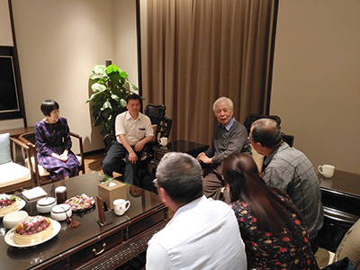

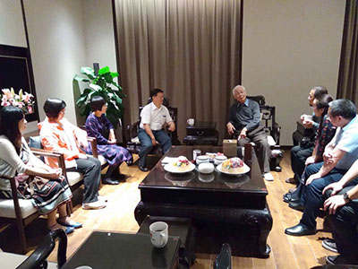
