# 第122期
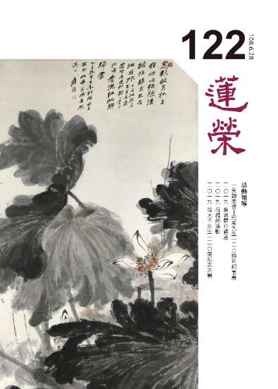

## 社論

### 張大千一百二十歲紀念大展

本刊

曾熙李瑞清　善子張曾益

石濤與八大　董北苑巨然

西洋塑畫作　詩情與法書

足跡遍寰宇　五百年大千

今年適逢張大千先生（一八九九年五月十號–一九八三年四月二號）一百二十歲冥誕，國立故宮博物院特於四月一日至六月廿五日，於臺北院區二樓第一展區，推出「巨匠的剪影-張大千百二十歲紀念大展」。大千先生與國立故宮博物院的關係匪淺，除來臺早期常往北溝故宮鑑賞名家畫作外，日後更立囑將所珍藏的書畫及用印贈予故宮典藏，同時也將外雙溪居所「摩耶精舍」捐出成立紀念館，由故宮代為管理開放參觀。 　　此展從故宮典藏及國立歷史博物館寄存的作品中，精選出書畫精品八十七件、印章八十六方與無數珍貴照片，規劃為「大千師友」、「大千摹古」、「大千與敦煌」、「大千自運」、「大千自畫像」、「大千鉅作」、「大千與臺灣」、「大千自用印」八大單元，試圖呈現大千先生早、中、晚期的書藝與精神，讓觀眾能飽睹其大師風采與絕倫奇藝，實為完整且近距離觀賞大千世界的好機會。

大千居士一生作畫無數，籌辦展覽無人可及，目的無非是要賣畫，得了錢卻每每買進古畫。他駐敦煌石窟摹寫壁畫兩年半，戰亂期間整個團隊吃喝無著，幸賴國銀賒貸度日，經多年才將欠款還完。一九八三年過世，現金遺產不足臺幣二十萬元，老友張群捐資才將後事風光辦妥。如今他的畫作拍賣行情上億元，世人虧他是「最窮的富翁畫家」。

他的畫作絕大部分流於民間，有人質疑此展沒什麼看頭。然而，畫家所珍惜的作品不會價售，若非保留便是贈送好友，其間畫作題款特有深厚的意味，此於「大千師友」展區，與張岳軍書及賀歲山水諸畫中，特能領會。展中有幅《仿石濤山水》，為何仿畫會收入故宮珍藏中呢？原來居士年輕時從臨摹名家畫作入手，尤其喜愛清初的石濤與八大山人兩家，每幅畫摹寫不下十次，對於各家筆法瞭細，此除其與生俱來的才華外，還賴不懈精勤的意志。故而連五代、北宋時董源、巨然的山川煙壑大作，也能仿得微妙微肖，甚乃以假亂真更勝真，諸如藏家陳半丁也分不清真偽，花大錢買入收藏，後人譽其為「石濤再世」。

紀念展中有幅巨畫-《墨荷四聯屏》，位在第二○二室的正中，高一丈二尺(約3.6公尺)，為目前國內各館藏最大尺寸的墨荷作品。一九四三年，張大千由敦煌返回成都，住於昭覺寺中，將臨摹唐宋壁畫所習得的多層次與敷染布局之描繪技法，豪氣地在此畫中表現出來。此一巨幅荷花聯屏，不僅氣勢雄偉、筆墨淋漓，且兼顧到花葉的生長情態與各局部細節，構圖巧妙既能單賞又能聯觀。此畫成於一九四五年，當時戰局呈國軍反攻態勢，未久即聞日寇投降，遂於重慶首次公開展出，轟動一時。

此畫作前後有兩個題款。初期於後題詩曰：「一花一葉西來意，大滌當年識得無？我欲移家花裡住，袛愁秋思動江湖。」詩意概說，我從敦煌石窟歸來，畫此蓮池花葉宛若西方極樂，不知昔日石濤識得此意境嗎？我想要從俗家裡移住到蓮池中，祇愁著這秋天裡的念頭驚動了社會（似若比擬李叔同之出家驚動江湖般）。大滌係指石濤，其在吳中時，康熙南下曾兩度召見，興起了為官的念頭。他在北京四年，看盡官場的虛偽，便回到江南造園作畫，為滌蕩貪官之心思，將畫室取名為「大滌齋」，自號為「大滌子」，晚年畫作署名多用此號。

又題記曰：「兩京未復，昆明玄武舟渚之樂，徒托夢魂。炎炎朱夏便有天末涼風之感。乙酉六月，避暑昭覺寺，漫以大滌子寫此並題。大千居士爰。」昆明湖為北京頤和園最大水域，北倚壽山，清皇室后妃多在此遊樂避暑。玄武湖在南京城裡，東鄰紫金山，乃鍾靈毓秀之地，歷朝名人多環葬在其側。

當勝利消息傳來時，又於右上角題記曰：「忽報收京杜老狂，笑嗤強寇漫披猖。眼前不忍池頭水，看洗紅妝解珮裳。七月即望，日本納降。收京在即，此屏裝成，喜題其上。爰。」所言杜老狂者，乃指初唐詩人杜審言（杜甫的祖父），其為人狂傲，不將他人放在眼中。此中大千居士藉以鄙視日寇。而不忍池，位在東京上野恩賜公園，素以荷花盛放稱勝。昔日大千居士赴日，曾數度前往賞花泛舟。眼前池荷盛放，藉不忍池說不忍之心，用瓣落解珮來形容日軍敗戰丟盔卸甲之慘。

來觀此畫，除崇仰大千居士之神筆外，也藉題記款言了其心境之轉變。那「忽報收京杜老狂」一語，不禁讓人想起杜甫的〈聞官軍收河南河北〉詩，云：「劍外忽傳收薊北，初聞涕淚滿衣裳。卻看妻子愁何在，漫卷詩書喜欲狂。白日放歌須縱酒，青春作伴好還鄉。即從巴峽穿巫峽，便下襄陽向洛陽。」不也心心相印嗎？

大千居士臨畫創作之精進，古來罕見。八個單元不同時期畫作，特別是古人少見的自畫像，正顯示其心路歷程。其學石濤、董源、巨然、唐寅等，青出於藍更勝於藍。學一家入其堂奧並出其圈囿，實已難矣，更何況法眾賢而出其右，更是難上加難呀！其仿功之上乘赫赫有名，後更發展出自己的潑灑墨彩，徐悲鴻稱其為「五百年來一大千」。如此，不難理出故宮明知其假而認真藏入，乃因他是舉世公認的大家，「南張北溥」豈是浪得虛名。

畫展已近尾聲，未能捷足先登者，還有及時跟進的機會，即便錯過了仍後會有期。畢竟大千世界非一時可看遍的，敬待來日更豐彩的展出。

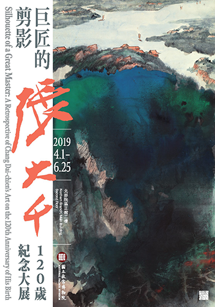

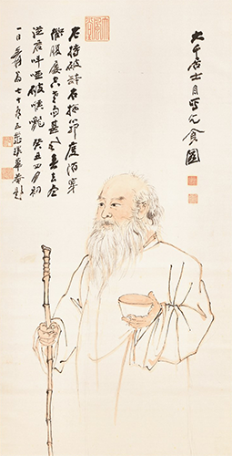

## 佛學幽覽

### 菩薩清淨的行持 — 華嚴經淨行品（三十八）

*戒慧講述、編輯部整理*

具足一味大解脫

慧辯具足善利生

汲井湧泉能逢源

久旱逢雨大地青

丙二、指事顯因答其徵因

丁一、總徵

丁二、別顯

戊六、乞食道行時願（五十五願）

己二、所睹事境（十九願）

己二、所睹事境：陂澤、池沼、

汲井

經文：

若見陂澤，當願眾生，疾悟諸佛，一味之法。

六十華嚴的經文是：「若見陂水，當願眾生，悉得諸佛，不壞正法。」南亭老和尚講義上說到陂澤的陂讀皮，池沼之類，蓄水而不通河流，如同今日的水庫一樣，能保持水的一種淡味，用來引申諸佛所悟的一味之法（諸法的真實性、空性、究竟真相）。

如何保持陂澤的水清淡的一味不受汙染？朱子〈觀書有感〉說：「半畝方塘一鑑開，天光雲影共徘徊。問渠那得清如許，為有源頭活水來。」蓄水塘之所以乾淨、清涼，就是因為有源頭活水，心裡面的法水源源不絕。「疾悟諸佛，一味之法」，了悟諸佛所悟的法都是一味（空性），空性這一味是由破所知障的智慧所顯。

可以做兩輪的觀修，第一輪的觀修：願所依，願是依靠在菩薩及若見陂澤這件事上。其次能願所願，能願的是菩薩，所願的是眾生。

第二輪的觀修：隨喜，若眾生都能疾悟諸佛，一味之法，該有多好；發願，我但願眾生，都能疾悟諸佛，一味之法；承擔，承擔眾生疾悟諸佛一味之法的事業；祈求三寶加被，令我有能力幫助眾生疾悟諸佛，一味之法。

經文：

若見池沼，當願眾生，語業滿足，巧能演說。

六十華嚴的經文是：「若見浴池，當願眾生，入佛海智，問答無窮。」依南亭老和尚的講義，池跟沼是一樣的意思，取其盈滿時比喻語業滿足、巧能演說。

依會性法師的講法，語業滿足講的是口業究竟清淨圓滿，不會惡口、兩舌、妄言、綺語，而且善能說法，使人對佛法產生趣向之心。

池沼，池是一般的水池，在地之上，沼就是窪地，窪地成沼，像日月潭就是窪地挖出來的沼，像故宮南院（分院），就是窪地成一個蓄水池，池沼滿滿的水當中，當願眾生，語業滿足。

業的體性是思，語一定是從意業去發動，造作意業必從思考去發動，從意業去造作口業，所說必從所思而來，即使是任運而生，也都是經過思考過的。佛透過觀機逗教，透過思維法義，透過了解眾生的需求，而語業滿足。滿足就是內涵豐富，且可滿足對方的需求，從說話的音調、音韻或者是內涵，巧能演說，來引人入勝，包括他對佛理及世間事的了解、對眾生的了解，就是辯才無礙的本質。

佛的身口意中，語業的功德最大，《隨念三寶經》裡面提到，佛的無見頂相都不及他說法的功德，佛的無見頂相無法令眾生了生脫死，唯有透過說法方能令眾生了解法義，並依法修學了脫生死。

經文：

若見汲井，當願眾生，具足辯才，演一切法。

六十華嚴經文是：「見人汲井，當願眾生，得如來辯，不可窮盡。」南亭老和尚講義說，汲井就是以繩繫木桶入井取水。辯才，語言滔滔，辯析事理，如九地菩薩得四無礙辯。以四無礙辯演一切法，有如井水，取之不竭，使聽者於聞法中滿足。

此處的汲井，以繩繫木桶入井取水，這樣的取水在印度常有，以前中國鄉下也有，昔曾旅遊中國大陸，也在鄉下看到村民汲井。

見人汲井，可作六項觀察，水桶砰的一下子就到了井裡面，代表墮落是容易又迅速的。水桶很艱難地將水打上來，代表超升善道是很困難的。綁住水桶的那條繩索代表業的繫縛，業的力量可以使人墮落，也可以使人超升。水桶拉上來時，於井的兩邊碰碰撞撞代表即使要超升善道也很辛苦，代表眾生造惡墮落很容易，造善超升很難很難。桶子就是指補特伽羅（士夫）的心識，由士夫攝持意志或放捨心力，而有超升或者墮落，光一個汲井的例子就可以將人生六道講完。

而汲井跟九地菩薩有什麼關係呢？九地菩薩具足辯才，他說法是取之不盡、用之不竭的，就像桶子入井一樣，可以不斷的打水出來。九地菩薩有法、義、辭、樂說四種無礙辯才，法是指法無礙辯，修學佛法需親近善知識，第一步講究的是依法不依人，要依此人所說法得解脫，而不是依他的名聲、地位、富饒、輩分，如同開車問路時，不會在意對方的穿著、身分，所在意的是他對路熟不熟悉。我們在通往解脫或輪迴之道時，在意的是他是不是能說正確道路的人。第二是依義不依語，不是依此人所說的文句是否優雅美妙，而是他所說的合義否？第三是依了義不依不了義，依義中還是了義之言，解脫正見唯中觀正見才是了義正見。第四是依智不依識，修學者要以比量甚至現量的智慧去認識解脫道，而不是以非量的心識錯解正見。

辭無礙就是能夠通曉各種方言，隨意演說，像玄奘法師通達梵文、中文，此即是菩薩的辭無礙。樂說無礙是指菩薩具足悲心的體性，方能克服說法的疲厭，容易精神體力透支，若悲心具足才能克服疲勞與不耐，具足熱情樂說正法。

辯才無礙也是佛的成就相，能使聞法眾生善根快速成熟，得到解脫與成佛的大利益。

### 大乘百法明門論簡說（三十） 拾肆、心所有法 ｜ 根本煩惱

*戒慧講述 / 淨本整理*

心理活動真隱密

世間佛法皆探究

目的不同失毫釐

繫縛解脫地與天

經文：

四、煩惱六者：一、貪。二、瞋。三、慢。四、無明。五、疑。六、不正見。

前述四諦十六行相（連同色、無色界為八諦三十二行相）之內涵及所破外道見，今再以《俱舍論》中見惑、思惑修證次第做說明。《俱舍論》雖為小乘部派之論典，但了解其修學理論體系，有助於我們深入大乘佛法，因為二者並不完全相違，而大乘佛法也是站在小乘的基礎上，更進一步發揮般若的真義。

見惑就是受到宗派見影響，認為所執的我具有真實性，因而對於四聖諦的道理迷惑，產生十使煩惱。欲界迷於苦諦時，十使煩惱都會生；迷於集諦、滅諦者，各有七種煩惱；迷於道諦者，有八種煩惱，以上一共三十二使。迷於集諦跟滅諦為何只有七使？因為要謭除身見、邊見及戒禁取見。集諦是說明苦因，而身是苦果，邊見也是從身見而起的常斷見，明白苦諦即可斷除，所以唯苦諦下有身見及邊見。戒禁取見例如外道錯認苦行為解脫正因，所以可歸於苦諦的迷惑，而同時也是對道諦的錯認，因此只有苦諦和道諦下有此煩惱。

色界、無色界（合稱上界）無瞋，因為唯有修禪定才能投生上界，禪定要以慈悲喜捨為助伴，有瞋火則無法入定，其他煩惱則與下界相同，所以上界一共五十六使，三界合計八十八種煩惱，稱為見惑八十八使，如《俱舍論》云：「苦下俱一切，集滅各除三，道除於二見，上界不行瞋。」

五道：資糧道、加行道、見道、修道、無學道，可用在大小乘修學的階位上論，眼前斷見思惑也可以依五道而說斷證過程。由資糧道至加行道先斷除見惑（分別見），自見道位起至無學道，再斷除思惑（俱生執）。資糧道從五停心觀修起，這是入止觀的基礎，讓心止於道理上進行觀察。五停心觀後先觀苦諦，有別相念跟總相念之分，別相念是一觀對一境：身不淨，受是苦，心無常，法無我。久修成熟之後，可以一觀對四境（例如：身不淨，受、心、法亦不淨）；或者一境用四觀（例如：身不淨，亦苦、無常、無我）此稱之為總相念。以上為資糧道所修觀法，「資糧」是比喻我們想要完成走出三界的遠行，要有這樣的資助與道糧。

加行道取其加功用行之意，分為煖、頂、忍、世第一四個位階，也稱為四善根，因為這是入聖道的根本。煖位開始有能力具觀四諦十六行相，頂位也如此修觀，但定慧力均較煖位為強。忍位又分下、中、上三等，由於正見的力量，四善根至忍位時，就不再入三塗。下忍位遍觀上下界八諦三十二行相，至中忍位則「縮觀」，為了要讓觀慧集中，求其猛力而發無漏智的緣故。八諦三十二行相，每觀一周減一行相，四周減緣一諦，稱為一周減行四周減緣，如是三十一周後，只留一行觀—無常，進入上忍位，上忍位僅一剎那觀一行相，就進入世第一。為何觀留無常？因為小乘的宗義只能現證無常，是法有我空的思想，所以他們能夠破常一自在我、神我、自性我、不可說我，但仍認為有生死、有涅槃。世第一也只有一剎那，就是三界間的最後一剎那，可謂世間第一，下一剎即出世間，入見道位。故俱舍論云：「煖必至涅槃，頂中不斷善，忍不墮惡道，第一入離生。」

見道位所觀修者為上下界八諦十六行相，稱十六心，分為八忍八智。「忍」是對諦理忍可，此時不被惑所間隔，故稱無間道，爾時破我；「智」是由無間道而來，生起能從惑中解脫的正智，故稱解脫道，爾時證無我。上界的「類」，是相似的意思，亦即與下界所觀之法相似。關於十六心的觀修有兩種看法，一說十六心只有二個剎那，第一剎那入前十五心任一心，成見道位；第二剎那入第十六心，為修道位。另一說認為，從第一心到第十五心共歷十五剎那，圓滿見道位，第十六剎那才進入修道位。

理可頓斷，事須漸修。見惑八十八使在入見道位時頓斷，因為所執的我理上本來就無，當見道位現證獨立實有的我無，在法上證得無常，就不會再受宗派見影響，所以八十八使頓斷，稱見惑為理所破或見所斷的煩惱；道理雖然通達，但無始以來不斷地串習我執，能執的心可謂與生俱來，出定後遇境逢緣時還是會生煩惱，屬於思惑，需要漸修才能斷除，所以稱道所破或修所斷的煩惱。斷見惑者對於真理不再迷惑，所以十使只剩下四使：貪、瞋、癡、慢（嚴格地說，還要加上俱生的身見，但為了與宗派見的身見做區別，所以思惑一般省略不提）。

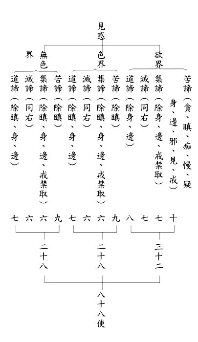

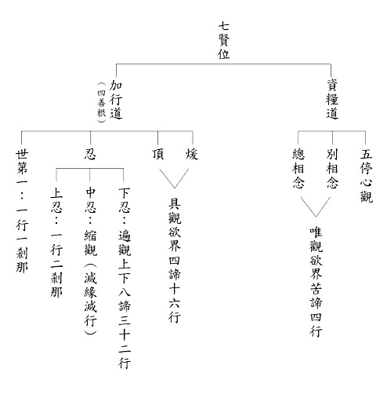

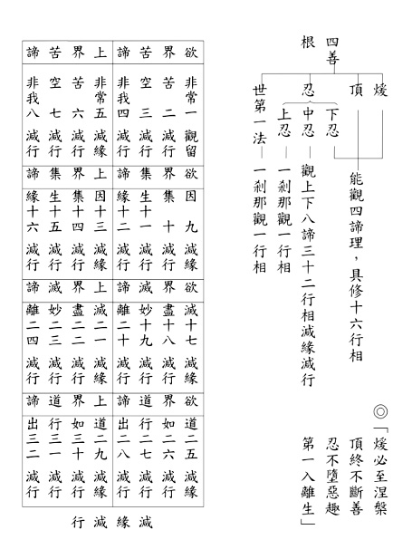

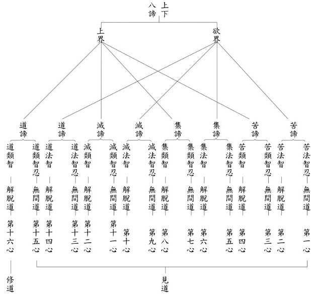

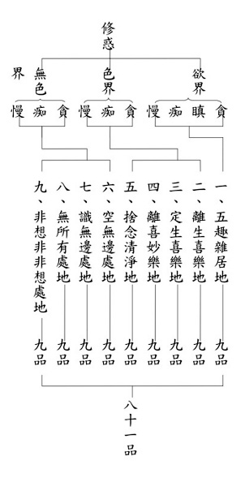

### 佛學概要十四講表簡說（二十四）第三講表

*戒慧講述/ 宏法、淨昌整理*

系統關聯真科學

生量解理見真相

修行並非盲目學

撥雲見日繫縛脫

（庚）不科學與合科學

◎不合科學屬他

現在是科學當道的時代，科學是組織、系統縝密的學問，不論是物質與心靈，方法、理論、都含括其中，對於不懂的事要存疑，存疑的過程要嚴密，最後的理路是能前後關聯貫串，而烘托出真相。一般人誤解佛法不合科學，是不了解佛法而下的妄斷，這樣的判斷方式恰好最不科學。

●人生何為(迷惑)

人生當前所受是苦，當前所受是由過去造作的因而來，一般凡夫沒有這樣的知見。再者，凡夫於當前所受的苦當中再去造下更多惡業，由煩惱引發的力量去造惡業而感應惡的苦果，這個苦果無法解決，如何是合乎科學？科學是有系統組織的學問，應該是要能夠讓你離苦得樂，可是世俗的科學可以把物質分析清楚，卻不能讓你離苦得樂，如何是符合科學？一般人不懂對過去、現在、未來做關聯性，不懂生死的現象，如何可說合乎科學？

●宇宙何關(顛倒)

宇宙的關聯，包括古今、現在和來世、人與動物、業的關聯等，這些是科學所沒有的。回看第一表宇宙觀的森羅萬象，森羅萬象包括六道有情、今昔，對於複雜、千變萬化的各種關聯，科學家無法解釋，甚至無法理解佛法所說的現象。對於不懂的事應抱持存疑，不應武斷的否定。

人生為何而來？為何而去？世俗人對於前後因果的關聯是疑惑的。宇宙何關？人與六道，古、今、未來的時空關聯，世俗人亦顛倒不明。不但不能幫助有情離苦得樂，自己也不能離苦得樂，因為沒有作業的觀察，不能令有情、自己斷煩惱、斷惡修善，不能真正解決痛苦、得到安樂。

●佛學維何(未見)

世俗否定佛法是怎麼否定呢？前面是「我假理想」，我認為佛法就是這樣，是「聽信妄談」，終究是「未見而言、見蛇為龍、未究其理」，認知錯謬，或是只學到表皮，沒有學到內涵。如在證悟的過程中三寶加被的這一分，是世間人不會懂的。生起殊勝的覺受，最後斷惑，全靠三寶加被，普通的學者、無神論者怎麼會相信呢？以上是「不合科學屬他」。

◎統系屬佛

佛法才是最符合科學的、有系統的。

●人生酬業

從佛法來看人生觀是「人生酬業」。「酬業」就是酬償過去所造的業。業分為滿業、引業。引業是引你到這一生的業，滿業是圓滿你這一生的受用，以人道果報為例，「引業」可以引到人道投生，「滿業」圓滿在人道中苦受與樂受。業果的解釋將在後續第四講表及第五講表詳說。

●真妄覺迷

從佛法來看宇宙觀是「真妄覺迷」。「迷惘」就隨著惑業去轉，「覺真」則覺悟到沒有自體性。覺真以後，開始去觀察由惑業感果的關聯性。要離苦得樂也就是要在妄相上斷惡修善，而本質是證悟空性。

佛菩薩的出路在眾生身上，《普賢行願品》有譬喻說：如果果是佛果，花就是菩薩的花，根就是眾生，大悲心就是水。大悲水澆到眾生，開菩薩花結佛果，可見出路在利益眾生。沒有眾生即不能利益，善無從成立，福也無從修，可見眾生的重要性，是福報的關聯。例如你幫助他解脫，關聯是得到自己未來解脫的順緣。去幫忙助念，回過頭來自己得到助念的順緣，晚上出門助念前想一想此道理，就會很開心的出門。

結合覺真迷妄與上述福報關聯性的觀察，即知最殊勝的福報是幫助眾生解脫，這才是真正的「真妄覺迷」。

●萬法歸一

在「人生酬業、真妄覺迷」的現象做觀察，最後導歸到「萬法歸一」，就是佛法的本體論。科學也講本體論，現代物理學所談的分子、原子、電子、核子、中子、質子、費米子(夸克、輕子)與坡色子都在探討本體論，經部也有本體論，經部的本體論就是自相存在最小粒子，完全符合現代物理學的尖端潮流。但佛法的經部宗是三千年前即出現，而經部再往上還有唯識與中觀，現在發展到尖端的科技才相當於小乘部派的經部宗，不禁要問究竟何者才最符合科學？

萬法歸一，依經部宗義，「一」是指最小的微塵，所有的東西都是從最小的微塵堆來的，這個最小的微塵是不可被分割破壞的，此是經部的勝義諦。其他被堆成的都是可以被破壞的，是世俗諦。唯識宗說境界在心之外不成立為勝義諦（空性），心內的顯現為世俗諦。唯識宗以心外不成，萬法是心所變現來破煩惱障、所知障，尋覓在心之外沒有看到該法，一切本來具足，無從貪、瞋，即破煩惱障。

按照中觀來說，「一以貫之」即是空性，例如：見毛巾的眼識在沒見到毛巾前不生，所以見毛巾的眼識自相是空的。當沒有色塵可見的時候，見色塵的眼識不生，所以識的自性也空。勝義諦是空性，勝義諦以外的都是世俗諦。二諦的安立各宗派不同，孔門就說「吾道一以貫之」，這些都是最後達到萬法歸一。萬法歸一就是歸到空性，萬法都是自體空。「人生酬業」言如何業盡情空，「真妄覺迷」言如何從迷妄到覺真，都要萬法歸一。

◆補充：如何確立知見？法四依

上文從反面來說要「消除誤會」，但正面來說要確立正知見。正確的知見建立在聞思修上，聞就是聽懂道理，思是他人教你如何思，就連修也是他人教你怎麼修，聞思修都在「他」，所以沒有離開善知識猶可以成功的。所以禪宗的典故說：趙州八十猶行腳。

聞思修主要靠對象，對象分為法四依。法四依的順序是：依法不依人、依義不依語、依了義經不依不了義經、依智不依識。首先要明白依的是法不是人，在法當中，明白依的不是美妙的文辭語言，而是其中的義理，在義理當中要依了義的義理，不要依不了義的義理，最後在了義當中生起的是智不是識，以下一一解釋。

依法不依人

「吾愛吾師，吾更愛真理。」這句話對不對？其實法就在人身上，人跟法是不能切開的，孔子說「文不在茲乎？」「文武之道，未墜於地，在人」，制度、檔案通過人運用，所以文武之道的關鍵在人。《中庸》上說：「其人存，則其政舉；其人亡，則其政息。」人是跟法不能離開的。人生的決戰點在遇到對的人，處在對的環境，所以說求生西方極樂世界很重要，最好的人和環境都在那裡。

既然如此如何依法不依人？依的是這個人身上的正法，而不是這個人身上不好的地方。這個人長相不好、社會地位低、用詞不夠優美等等，這些都不依。釋迦牟尼佛以前座下很多弟子，有人親近舍利弗尊者時就說，連舍利弗尊者的學問都那麼高，更何況難陀尊者，一定更高深莫測。因為難陀尊者相好莊嚴最為第一。難陀的弟子特別多，比智慧第一的舍利弗還要多，因為外相莊嚴。

眾人皆知問路的時候，面對一個西裝筆挺但不知道路的人，跟一個穿著隨便但知道路的人，當然要問知道路的人。依法不依人是依人要依有法的人，只要能指出你的出路，就不要在意他是什麼人。又例如，子貢名滿天下，顏回默默無聞，去請教教法要問誰。通常大家喜歡問子貢，子貢口才好、言語犀利、旁徵博引、舉一反三。可是比內涵的時候，他比貧賤出身的顏回差遠了。再者，依這個有法的人當中，主體依他身上的法，而不要看他的人。不要把他的過失看成功德，功德看成過失。比如師父罵人，徒弟不可以說：師父不慈悲。不可以用自己的標準、情緒去衡量、檢驗師父，要用法去檢驗。如果這個人如法，當然是依法又依人。又假令其人雖為名人、博士、羅漢或等覺，所說卻不契佛經，亦當捨棄不依。

依義不依語

法已經確定要依了，但法當中要依語還是義？語是文辭優美，義是講究義理。有四種情況：一是文辭和義都很好；二是義理正，文辭不美；三是文辭很好，但沒有義理甚至義理是錯的；四是沒有義理，文辭也不好。這四種情況前兩者可以依，後二者不能依。

依了義經不依不了義經

在確認了要依的是義以後，繼續來確認要依的是了義還是不了義。了義是究竟說，不了義是方便說。舉例而言，父母想要讓孩子用功讀書，究竟處是想培養孩子成為國家的棟樑。但是眼前孩子沒有辦法體會，父母就跟孩子說，好好讀書就有糖果吃。

依了義是指真正能幫助解脫輪迴的，不了義是不能解脫輪迴。般若是了義，其餘就是不了義；甚深見是了義，廣大行就是不了義，佛是為了了義來說廣大行，究竟處就是了義的甚深見。《大智度論》一百品，到第九十八品後有常啼菩薩去見曇無竭三藏法師就是尋求般若，因為具有般若智才能解脫生死。孔子也是講性與天道，一以貫之。

不了義都是為了幫助了義。比如布施是為了讓修學般若的時候有道糧；持戒是為了得到人天身，只有這樣才能接近善知識，才能夠修學般若；忍辱是得到和合的眷屬，方便般若的修學；精進是具有不懈怠的能力，以此修學般若破二障；禪定是為了得到專注的力量來修學般若；學般若是為了來生修學般若的時候容易生起般若正見。像六祖慧能大師這樣，年紀輕輕一點就悟。此即是依不了義而說了義。以上這些變成我們的觀念，變成內心深處的想法才稱為修行，遇境逢緣以此為標準，用這樣的眼光與見地來看事情。

依智不依識

當我們遇到善知識，由他的言語作方便來學他的義，從他的義當中的不了義進入了義，這個時候我們還要從這個了義當中生起比量以上的見地，就是依智不依識。三量是現量、比量、非量，聖言量是因為得到非常殊勝的比量跟現量的無常見和空性見以後，對聖言量產生極大的信心。所以證果或墮落、迷惑或解脫，都是依量來論，依量來建立修行。依智不依識就是要生起量的見地，從比量到現量，至少要到比量的這一分才叫做智慧，尤其對了義生起比量的智慧。

原來確立知見，就是根據四依法，生出般若智慧的知見。一個人雖然具備聞思修，還要看有沒有用正確的四依法來聞思修。聞思修固然重要，更重要的是從四依法來抉擇。從學的對象來論將來的成就。學經就算學得很久，看錯了註解，學錯了見地，都不足觀。龍樹菩薩在解《大般若經》的《大智度論》中，最後就是確立「法四依」，是整個般若經的精華，一個人一生的成敗就從這裡說起。十四講表很有意思，從哪裡切入都行，也可以從第一表講到最後一表，也可以從最後一表講到第一表，以上第三講表圓滿。

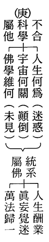

### 人生大事不能忽略的事實—臨終交代事項

*戒慧講述/ 宏法、淨昌整理*

臨終真現實

升沉一念間

平時多講究

畢功於一役

前言

臨終交代事項，也就是亡者本身應該立的遺囑。每一個人都會面臨臨命終，可以藉由臨終交待事項來幫助自己往生。在國外，立遺囑是很普遍的事情，而東方人害怕談及死亡，面對立遺囑的事情不夠開朗。

經文

給我賢孝的子孫們：

本人一生念阿彌陀佛，受益良多。你們若是真實有孝心，就必須幫助我往生西方極樂世界，去那裡享受永遠的清淨安樂，來去自在，這是我這輩子最大最大的願望！

西方極樂世界可以享受永遠的清淨安樂，那裡有良好的環境，諸上善人、聚會一處，思衣得衣，思食得食，心想事成，且無有眾苦，但受諸樂，壽命又是無量的。處在這樣的修學環境，不會起煩惱妄念，可以認真修學教法，不管是在環境上、善友上、受用上、證得果位上都是清淨安樂，身心都得到解脫的安樂。

而「來去自在」是指依著阿彌陀佛在因地的發願，往生者只要能真心誠意，執持名號，欲往生西方極樂世界，都能蒙佛接引，在極樂世界修學後，也可以回到娑婆世界度化有情，來去都很自在。

也許我們很難相信這樣的狀況，但佛是不誑語者，佛有能力說眾生想像不到的範圍時，還可以取信眾生。其實也不難相信，阿彌陀佛本是根據眾生的需求，在因地發四十八大願，願文裡可以感受到阿彌陀佛在因地為了無力斷惑的眾生，做了非常周到的設想，讓眾生只要十念就能蒙佛接引往生，往生後，佛創造環境，讓壽命無盡，身心自在快樂，這不就是人人所嚮往追求的世界嗎？佛力的加被也如同現在的科技，來去自在，就像打電話到美國，聲音幾乎可以同步，跟神通的道理一樣。

當知人要斷氣時，就像活龜脫殼，非常的痛苦。倘若你們真為我好，且希望能庇佑全家，就一定要為我切實完成以下的心願：

人在臨命終時，情況緊急、瞬息萬變，需要家人及蓮友的大力護持，這也是修學者一生努力的最後關鍵。人要斷氣時，這一口氣斷時，神識就離開肉體，謂之：風刀解體，也像活龜脫殼，此時他的身體慢慢爛壞，身心都痛苦，他要離開自己所熟悉的環境，離開親愛的親人，甚至他要離開一生最愛的身體。此時除了此人要有心往生，旁邊護持的人，也要懂得讓他的身體、心理的痛苦降至最低。

一、當我病危時，千萬不要搬動我的身體，不可更換衣服，更不能哭泣、哀嚎。只要虔誠為我念阿彌陀佛，求佛接引我往生西方。

一般世俗，病人病危時會想趕快幫他換衣服，讓他穿著整齊的往生。這些其實不必要，如果是往生者自己要求，在我們可以做到的範圍內，可以隨順滿足他，讓他安心，避免他產生貪瞋，再去引導他專心安住在佛號上。

而此處的病危是指病人已經昏迷，講不出話，此時不要去搬動他，不要換衣服，避免引發他的瞋恨心，不要哭泣哀嚎，避免引發他的貪愛心。此時只要虔誠的為他念阿彌陀佛，避免他的愚癡心，以上是斷他的貪嗔癡。

此時要在旁邊幫助他念阿彌陀佛，並引導他想去極樂世界，並誠懇地代祈求阿彌陀佛的接引，請佛攝受這樣一個無力斷惑的眾生，請佛依往昔生中所發下的大願，接引這位求往生者到西方極樂世界去。我們必須深刻的了解，如果失去這次機會，也許就萬劫不復了，故以一種非常懇切的心來求阿彌陀佛的慈悲攝受。

二、若我神識昏迷，氣息將斷未斷時，請勿再由醫師從事注射強心劑、人工呼吸或其他緊急救護，以免動我的心神，增加本人的痛苦，應該保持安靜，一心念佛，方是大孝。

病者往生前，家人總是不捨，今日之下，醫生也必須盡到醫師的職責，依照程序來辦事，此時除非家屬堅持放棄急救，否則醫生都會急救。急救過程中，臨終者會無比痛苦。家屬在醫院發覺病者不對勁時，要有魄力決定送回家。因為家裡一定比醫院方便，醫院有種種的規定，即使醫院有助念室，也一定不讓病者久留。而且依古人的觀念，都希望能夠在自己家裡往生，畢竟家裡是他最熟悉的地方。我們常會因為帶病人回家，不知如何照顧而猶豫不決，其實只要多諮詢醫師、護士照顧病者的方法，他們可以給予意見。而醫生往往會堅持要給病人最後的機會，家屬也希望醫生能幫助病者起死回生，因而孤注一擲，但很多時候是無謂的急救，糟蹋病人的身心，破壞往生的因緣。

且儘管平素有過助念經驗，但面臨自己親人往生時，往往容易慌亂。而且很多人的助念經驗零碎，每次助念的因緣都是排班去一、兩小時，所以不知道如何排除病者的障礙，不知如何跟家人溝通，不知如何善巧護持往生者，沒有這樣的經驗，就很難在當下果斷下決定，此時要靠蓮友們大力幫忙。我們要建立一個心態，幫助家人要像幫助蓮友，幫助蓮友要像家人，如此有助於我們判斷事情。就好像教自己的小孩要像教別人的小孩，教別人的小孩像教自己的小孩。

大抵一般會討論如何護持老人家往生，但是無常的到來不分年齡、輩分，即使是年輕人、小孩都有可能面臨死亡，我們容易錯誤認知，認為年輕人或者小朋友就應該急救，老年人因為時日不多，體力衰竭，就不要急救，讓他好走。

子夏的兒子過世時，子夏哭成瞎子，曾子去參加告別式，子夏還說：我為什麼慘遭這種天命？連子夏尚且這樣，可見要認知無常不容易，認知無常是任何可能的發生都要接受，平常就可以跟家人溝通觀念，事情發生時才能夠有比較明快的決斷。

三、我將臨終前，請急於○○○蓮友聯絡，請求助念。電話：○○○○○○○，一切須聽從蓮友指示，不可違反。

欲往生者要善於借重外緣來增加自己的穩定度，例如：緊急時要請家人聯絡哪幾位蓮友，平時就要經營與蓮友、團體的良好交情與信任，也要讓家人接觸團體，產生信心與熟悉度。除此之外，平常共修念佛時，就要祈求三寶加被，讓自己臨命終沒有障礙。幫助別人排除臨終的障礙，自己臨終時容易有貴人相助。有些業是遠的，例如拜佛跟開智慧，拜佛是遠因，在拜佛中祈求佛菩薩讓我有好的法本、好的老師、朋友，有環境，身體健康，再經過長時的累積去開智慧。做善法清除我臨終的障礙的這一分，是遠因。近因是我去助念，正是在我臨終時得到助念的近因。

四、自我斷氣後二十四小時之內，應使佛號聲不斷，家屬可以輪班的助念，因為在這個時候對我最大幫助，就是持續為我念阿彌陀佛

。

其餘的喪葬事宜，等過了這段時間之後再辦。　　第一個是病危，我很痛苦所以不要搬動我。第二，當我已經昏迷了，不能講出任何話的時候不要對我急救，好好的念佛，當我接近臨終了，請趕快找人來助念。斷氣後二十四小時內的佛聲不斷，往生前可以配合病者的需要或呼吸，用引罄或木魚或清念的方式幫助他提起正念，要念得平穩，昏迷時要換成引磬，容易攝受他的注意力。

喪葬事宜等過了助念這段時間後再辦，這點很難做到。所以蓮友要讓家屬安心，讓家屬以助念為主。助念後不要去干涉家屬要辦的告別式，助念團要愈單純愈好。

五、至於換洗，入殮……，待往生二十四小時以後，再請葬儀社處理。（倘若怕天熱有異味，可在屋內點檀香、放冰塊即可）

其實「換洗入殮」更好的方法是家人幫忙換洗入殮，此時是很好的機會教育，可以引發孝心、感恩、緬懷的心，很珍惜的送亡者最後一程。「再請葬儀社處理」的暗碼是助念團到此可以不用往下幫忙，可做可不做，可做是為了教育，可不做是來維持原則，沒有一定。當這種方式可以引發家屬報本還恩、慎終追遠，可以幫，如果家屬只是想找人來做，就可以請禮儀公司幫忙，開方便是觀待家屬的誠意，看狀況決定。之後入殮有所謂的小殮跟大殮，小殮就是幫往生者更衣，有些人認為穿舊的衣服就好，有些人認為要讓往生者風風光光地走，所以買一套新西裝，有些人認為要穿海青。其實對於往生者來講，幫他換上平時穿的衣服就可以了，未必一定要新的衣服，寧可經費剩餘為往生者做更多的善法，對他才會有實質的幫助。再來，很多人會燒陪葬品給亡者，但陪葬品無法燒去來生，這些鋪張浪費最好一概不要。他過去修行的東西可以留下來當作紀念，或者拿來用，甚至跟別人結緣都可，往生者已經往生，留下來的東西都很吉祥。往生者在生前留下來的錢，可以幫他做善法，包括齋僧、放生、助印經書，或做種種的這些利益眾生的法行。助念團千萬不要干涉家屬，要維持和諧，維持七七的如法，維持告別式表彰慎終追遠，用儒家的方式來緬懷也很好，只要大眾興起對佛法的好感就善莫大焉了！

六、一切喪葬祭品，出殯宴客，全部素食，絕對禁止殺生，以免增加我的罪業。

蓮友必須站在為往生者著想的立場來跟家屬溝通，全部素食容易引起非佛教徒的不諒解，此時要婉轉的克服障礙，不可強硬規定。

七、所有喪葬皆依佛教儀規，以念佛為主。且喪祭宜節約，不舖張、不浪費。

喪葬以念佛為主，但也不否定其它儀式，有些世俗慎終追遠的方式也可作為引入佛門的方便。

八、逝後四十九日內，全家早晚隨錄音帶念佛，回向我往生極樂世界！如此我才能安享真正快樂，而大家也會非常吉祥光明。

除了佛號不斷外，也包括跟團體一起做善法，舉凡齋僧、放生、共修等，以及作七，並在作七止靜時講述佛法的要點，讓家屬有機會聽聞、學習正法，對往者的增上更為殊勝。

希望今後家人都能信佛、念佛。這樣你們一定能夠得到平安幸福！

此願，希遵從

阿彌陀佛

立言人：○○○

以上就是臨終交代事項，這樣的聲明要自己立言簽名，方才成立。

## 蓮池海會

### 蔡建鵬居士往生見聞記

戒堂

一生是付出

臨終是放下

往生是成果

瑞相是見證

自追隨老師學佛以來，開了眼界，常遇到許多不可思議的事。細想之前，曾與老師在法會有數面之緣的妹婿，有到學會學佛的機緣卻擦身而過，結果好因緣只能在他往生時才結上，殊為可惜亦是不可思議。

妹婿蔡建鵬因病在榮總治療經月，不幸病歿於民國一〇八年四月卅日（星期二）下午一時。建鵬民國五十九年六月二十五日生於戰地金門蔡家，上有兄、姐，下有弟二人。蔡家祖上人才輩出，雖非達官貴顯，世代也少不了拔萃之士，文風頂盛，祖制儼然，祭神祀祖皆發於教端。然而，雖為當地蔡家大族之後，但處於物質匱乏的年代又是戰地，建鵬自幼即養成勤勞樸實的個性，少時為減輕家中負擔，投入空軍士校就讀，畢業後，隨即展開軍旅生涯，他樸實淳厚的質地、豁達開朗的個性，深受長官的賞識與袍澤的愛戴。

姻緣千里，在舍妹麗卿人生最不如意時，建鵬與麗卿無意間結識，五百姻緣天註定，二人遂結連理，夫妻恩愛，互相扶持，建鵬個性率真而厚以待人，視麗卿兩個女兒如己出，如女兒倚欣在告別祭文「給爸爸的一封信」中所說：「（他）是我心中唯一的爸爸，他寬厚的肩膀扛起了家庭的責任，給予了我們一個完整的家…現在才明白簡單的幸福有多珍貴…。那年過年在金門，全家四個人一起吃著簡單的年夜飯，樸實溫馨，非常幸福。」

為便於照顧家庭，妹婿毅然退伍辭別那遷徙不定的軍旅生涯，轉而從事自由度較高的自行車司機行業，隨時照應家人。每年家庭旅遊，帶家人環島爭取共聚時光，愛護家人之心處處可見。後來蔡家姐姐及姐夫對弟弟照顧有加，傳授製作蔥油餅的技術，夫妻同心，四出走賣，一家也和樂融融，不虞匱乏。夫妻二人後來返回金門故鄉，一面工作擺賣，一面籌謀穩定的生活，時逢兩岸已有三通之便，故以自地規劃經營民宿以為未來出路。

古官道民宿的建造，從一磚一瓦、設施裝潢，都極其用心。民宿落成之始，並不汲汲營利，只希望有心體驗金門文化的旅人能有舒適的下榻處，又無償提供住宿者專業導覽，但求賓至如歸，建鵬交天下友於彈丸之地，結下諸多善緣，故民宿經營時間雖短，但口碑不錯，常有回頭再訪及推介到宿者。

一年半前年底大女兒倚吟北京驟逝，對他打擊沉重，時已身體有異，病情起伏，面對癌症病苦，定期門診與住院治療，惜不敵癌細胞之快速蔓延，撒手西歸，享年五十有二。

建鵬生前，未聞佛法，惟對老丈人因念佛而能往生極樂世界甚為好奇，嘗言身後望能若是，又遇倚吟驟逝，想他內心一定對佛法會有些想法，臨終前一星期猶對末學表示擔心麗卿照顧他會太累，實為傾心付託；往生數日前，金門兄弟親友前來探視時，寫下「珍重再見」與諸親友道別，已知時之將至。

然，最不可思議的是，四月二十八日（星期日）因借蓮友善緣，得蒙老師親往探視的機緣，舍妹謂建鵬聽力衰弱，但他見老師到來，仍想支起羸弱的身軀，勉力向 老師合十為禮，對老師的開示「此身已敗，當取極樂蓮花身」，此刻建鵬頓了一頓，卻如耳根大開，心領神受，師姑豎大拇指鼓勵他。老師將離去時，建鵬與師比豎大姆指，對老師所言信受，對求生淨土生了決定見，建鵬的善根福德因緣方具實顯現。

老師囑舍妹安排等待安寧病房中，準備安排蓮友助念。星期一老師請李老師探視回報後回報意見，李老師下午六時許回報言建鵬「今日眼已無法睜開」安排先調至雙人房，並請院方協助優先進住安寧病房。四月卅日（星期二）上午十時半老師丶李師與秀英師姑早上再次前往榮總照拂，數分後決定移往上品蓮助念，當下隨即辦理出院手續，救護車於過午不久安抵上品蓮，下午一時許建鵬往生。建鵬大有福報，往生前意識清醒而能於救護車中得老師一路護持助念至上品蓮，並於安置平靜後十分鐘，在老師、蓮友及家屬們的助念聲中安然辭世，接續由蓮友輪班及家屬助念八小時，最後由仍蒙老師做大回向。

翌晨由黃老師陳老師一大早來幫忙小殮儀式，為大家說法語，使生者往者皆受法益，能生起無常觀，正對應著老師昨夜為蔡建鵬居士回向時說的，人的生命不在於長度，是在於寬度。掌握正見，面對無常時就不會嚇著。入殮時但見法相莊嚴祥和，無病苦，無佈畏相。家屬但覺圓滿，無淒苦哀嚎，舍妹於助念時感覺阿彌陀佛像放光接引。

因緣奇妙，建鵬走到最後仍能依從 老師的開示，讓他萬緣放下，信心滿滿地決定自己要往生極樂淨土，但死生之殊途卻是「千鈞一髮」（引自老師對建鵬往生前一晚的說法），因上不足，還好緣上有關聯上，但如沒有助念、老師的提醒、學會與蓮友的頂力幫忙，建鵬就算多有軍人的勇悍，想要往生？難矣。一切如電光火石，真不知建鵬哪來的福分，禍福如何能翻轉？幾稀矣！可謂：「歸路非關北，行舟卻向西」，念佛往生法門實實在在太殊勝了。

建鵬生前所承諾之善法善行由家屬代其踐行，並於五月二十五日幽冥皈依成佛弟子名曰淨生，願將善法之功德，回向其在西方淨土蓮品增上，滿菩提願，乘願再來。

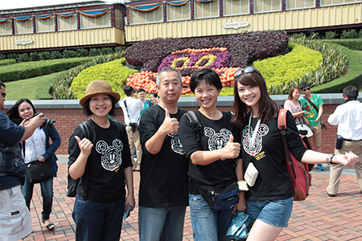

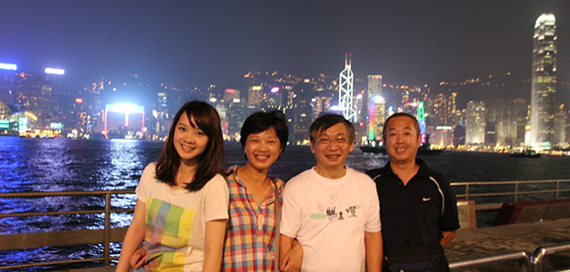

### 陳戊寅居士往生見聞記

仁家

善良不計較質地

外緣護持更重要

千鈞一髮待應變

大道歧路易亡羊

岳父陳戊寅老居士，生於民國二十五年十二月二十五日，卒於民國一百○八年六月二十八日，享年八十四歲。居士出生於政治局勢動盪的時代，民國二十六年發生蘆溝橋事變，中日戰爭全面開打。民國二十八年爆發第二次世界大戰，民國三十四年大戰結束，日本無條件投降，臺灣歸還中華民國，重返祖國懷抱。民國三十八年國民政府因國共內戰失利，轉進臺灣。

居士在社會經濟蕭條的環境中長大，退伍後有感於謀生不易，務農收入無法養家活口。乃隻身離開家鄉，前往高雄。期間適逢美軍駐臺，便與朋友合資在高雄經營酒吧，賺來的錢按月寄給岳父貼補家用，後來結束酒吧工作，把所得盈餘購置田地。其後因家裡三個小孩嗷嗷待哺，也曾一度在臺南市區，以踩三輪車為業，靠著勞力載客賺錢養家。所幸隨著臺灣經濟轉型，臺南地區紡織業發達，佳里地區也成為針織業生產重鎮，老居士終於回鄉，在針織廠任職。並響應政府「客廳即工廠」的政策，在家裡成立代工所，提供鄰里鄉親打工賺錢的機會。

隨著臺灣產業西進風潮，九○年代後針織業開始沒落，很多工廠外移，老居士也適時從職場退休。可是老居士退而不休，雖已不用再為養家活口操心，卻每天下田，種植綠竹、芒果、香蕉、白柚及蔬菜等作物。居士耕作堅持不灑農藥，不用化肥，品嚐種植的綠竹筍與各項果實，特別香甜可口，吃了還想再吃。多年以來，老居士過著日出而做，日落而息的生活，並且常言「要活就要動」，因此身體一直保持健朗，晚輩們都自嘆弗如。

三年前一天早晨，家人發現向來大清早就起來運動的        老居士，早餐時間已到仍未起床，前往察看，發現居士全身發燙，經送醫治療，燒雖退了，然而卻種下身體退化之因。從此健康狀況每況愈下，原本習於早起運動，不畏風雨或大太陽，仍然辛勤下田工作的人，突然變了一個人似的，整日坐在家裡，不喜走動，脾氣也變壞了。之後到臺南奇美醫院門診檢查，發現老居士罹患帕金森氏症！雖經藥物治療，仍然無法控制其逐漸退化的速度，短短兩年多，慢慢的連生活起居都無法自理，需要他人照料！為讓老人家有良好的照護，同修費盡心思，曾經請人來居家照護，因照護人員不符理想，改為白天送請日照中心專業照顧，晚上回家，由家人照顧。同修也申購各項輔具，最近更完成外傭申請手續，這一切都是希望能減輕老居士的不便與痛苦。

半年來，老居士分別在一百○八年一月、四月、六月因感冒引發肺部感染，住院治療。這些日子在病房陪伴老人家，望著病榻上老人家虛弱的身軀，不禁讓我回想起民國六十九年間，末學與麗嬌結婚時，岳父時年四十五歲，正值壯年，意氣風發。出門上班總是穿著整齊，襯衫領帶與光亮的皮鞋，一副精神弈弈、容光煥發，對比眼前身體瘦弱、力不從心的樣子，青春易失，少年不在，令人無限唏噓！

老居士生病期間承蒙老師關懷，特別委請東勢劉老師賢伉儷，蒞臨臺南探望，並提醒老人家要念佛求生淨土，家屬銘記於心衷心感恩。由於陪伴老居士之便，末學也不斷請老人家一起念佛。大部分時間，老人家都默默聆聽，偶而也會跟著念一兩聲佛號，有一次竟然清清楚楚地跟著念了十幾聲阿彌陀佛聖號，令末學記憶深刻！末學深知生病是很痛苦的一件事，尤其長臥病榻、反覆進出醫院，使人意志消沉，希望藉由念佛，減輕老居士心裡痛苦的覺受，與開啟將來往生淨土的契機。

在一百○八年 六月十日老居士因為肺部感染，住進佳里奇美醫院，六月十二日醫生發現肺炎日趨嚴重，擬轉入加護病房插管治療，經家屬討論結果，以老家的年齡與體力狀況，插管或急救只是徒增病人痛苦，沒有實質的幫助，所以未予同意。主治醫師也理解家屬心意，願意讓病人減少痛苦，盡力治療。接下來幾天，老居士病情起起伏伏，時好時壞，一顆心也跟著七上八下，只有藉著佛號安定心情。同時也提醒所有家人要有心理準備，以免措手不及。同修因此於六月十三日與十四日請假回家，整理家務，同時說服家人同意，萬一老人家有所不測，要接回家裡助念，並以佛教儀式辦理，幫助老居士順利往生淨土。

在一○八年六月十八日下午六時左右，醫護人員進行例行檢測，發現老居士血氧濃度七七，低於標準值九十五，而且血壓也開始不穩定。末學與醫護人員確認狀況危急後，當下要求送老居士回家，同時通知家人準備。經辦好相關手續後，醫院同意放行，晚上七時回到家，將老人家安置好後，末學請老人家要跟著念佛，隨即拿起引罄，坐在身邊大聲唸佛，幾分鐘後小舅子也跟著末學一起助念，七時四十八分老居士在佛號聲中安詳往生，彷彿睡著一般。蓋妥陀羅尼經被後，繼續唸佛，晚上九時，草屯的彭太太偕同周太太抵達，加入助念，蓮友到來讓末學心頭安定許多。接著秀英師姑與汪姐陪同麗嬌回到家，東勢地區大批蓮友，在東勢劉老師帶領下也相繼到達，孫子、女們也都連夜趕回助念。感謝蓮友們熱情相助，家屬沒齒難忘！

助念法事直至六月十九日上午六時回向圓滿，掀開陀羅尼經被，老居士面相安詳柔和。家屬則繼續助念到上午八時才告一段落。下午一點在為老居士沐浴更衣時，乾乾淨淨，全身柔軟！佛力不可思議，連葬儀社工作人員都大為讚歎。

老居士生前並未皈依佛門，雖曾念佛，次數不多，往生能現瑞相，有此殊勝因緣，家屬誠摯感謝唐老師教導，及眾多蓮友們鼎力相助。佛法難聞今已聞，祈願老居士能依此緣起，往生淨土蓮品高升，深入佛道，發菩提心，乘願再來！阿彌陀佛！

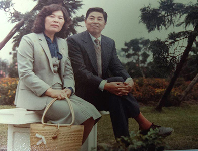

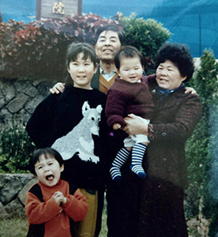

## 孔學一隅

### 論語簡說（三十）— 子貢問諡號 公冶長第五 — 十五

時哉講述

消文釋義言外意

一章豐富難言盡

處世人生大智慧

文化傳承民族魂

經文

子貢問曰：孔文子，何以謂之文也。子曰：敏而好學，不恥下問，是以謂之文也。

前言

人的一生有善有惡，很難被蓋棺論定，古代有一種「諡法」，是用一個字或兩個字來對此人一生做評價，即是蓋棺論定。

消文
子貢問孔子：衛國大夫孔文子，生前亂於家世，其為人不足道，何以死後諡號為「文」。孔子回
**答：** 大抵聰明的人不甚好學，文子不然。不但聰敏好學，且不恥下問，

他能以貴問於賤，以高問於低，以長問於少，以多問於寡。別人以為下問為羞恥，文子不然。文子雖有其他不善，然因敏而好學，不恥下問二者，可以「文」的諡號稱之。聖人隱惡揚善，厚道之教，於此可見。

章旨

記孔子不隱沒人之善。

釋義

本章子貢之問的用意為何？

君子有九思，其中一思就是「疑思問」，有疑惑就要請問，子貢對孔文子諡號為「文」有疑問，因孔文子生前，亂於家世（攪亂家庭倫常關係），為什麼他可以諡號為「文」呢？

孔文子何許人也？

孔文子就是孔圉，又稱作仲叔圉。是衛國的上卿大夫，娶了衛靈公的女兒，成為國君的女婿，位高鞏固，很有權力，擅於辦理接待賓客的外交事務。

本章之問問於何時？

孔子在魯哀公十一年，年六十八歲回到魯國，魯哀公十六年，孔子年七十三歲過世。孔文子是在魯哀公十五年過世，即孔子回到魯國的最後一年，而有本章之問。當時衛國孔悝大夫執政，子路做孔悝大夫的家臣，後被斬成肉醬。

衛國大夫孔文子如何造成其家室之亂？

孔文子的太太，是蒯聵的姐姐，生了一個女兒名孔姞，一個兒子名孔悝。當時，衛國貴族太叔疾娶了宋子朝的女兒，後宋子朝逃亡。此時孔文子想攀親，就叫太叔疾跟太太離婚，再迎娶他的女兒孔姞。

後來孔文子發現太叔疾行為淫亂，就要太叔疾和他女兒離婚，因為太叔疾淫亂的對象是妻子娘家的人。後來，孔文子反而娶了太叔疾離婚的妻子為妾。等到孔文子去世以後，他原來的夫人伯姬，卻私通了身邊的小臣渾良夫，又聯合流亡在外的太子蒯聵，造成衛國的大動亂。

孔圉的兒子孔悝，就是蒯輒的宰相。那時候，蒯聵要回來的時候，就找渾良夫，挾持孔悝，蒯聵就當了國君，蒯輒就出奔。而子路就做孔悝大夫的家臣。

孔文子的政治實權與能力如何？

季康子是孔子六十八歲回到魯國的時候的執政大夫，權力很大，等同於現在的國務院總理，此人沒有把國君看在眼裡，他問孔子說：「衛靈公無道，為什麼不亡？」孔子就告訴他說：「仲叔圉治賓客」，仲叔圉就是孔文子，孔文子迎賓送客，是外交的幹才，祝陀是一個宗廟祭祀的幹才，王孫賈是一個軍事的幹才，衛靈公有這三個幹才，怎麼會亡？也點出衛國的三位幹才至少目中有國君，不像三家大夫這般胡作非為，由此也可見《論語》的暗碼、講話的藝術，言之者無罪，聞之者足戒。

孔文子雖有家室之亂，後蓋棺論定，他對衛國有何貢獻？

古時候紀念一個人，或者是用「諡」，或者是用鼎鑄銘文，孔文子的兒子孔悝在鼎鑄的銘文中，稱他父親是一位有志於復興國家的幹才，因其身分是皇親國戚，是國君的女婿，是蒯聵的姐夫，蒯輒的姑丈，是衛靈公的女婿，又跟三朝都有關係，所以能帶領卿大夫為國效力，而且本身是夙興夜寐，對國家很有貢獻。

諡號的用意

諡號是按照一個人這一生的功德、行為，用一個字或兩個字來概括他這一生，即蓋棺論定。《禮記‧樂記》中說「聞其諡，知其行」，聽到他的諡號，就知道他的行為。但是，這只是就某一部分概括，不是全體的概括。

諡法的沿革

周朝就是諡法的開始，後來被秦始皇廢掉，漢朝又恢復謚法，沿用到清朝，民國時期才真的廢去。

諡號的用法

諡號分成公諡跟私諡。公諡是指此人或者為君，或者為臣，在他過世時，把他一生的事功或德行，給一個諡號，例如：衛靈公諡號為靈，他雖然是國家的亂源，但還有一點靈性，他懂得用王孫賈治軍事，用祝陀治宗廟，用孔文子治理外交，懂得讓蘧伯玉回來執政，讓史魚做諫官，所以叫做衛靈公。雖然他有很多惡，可是不抹殺其善。

私諡是指此人可能是學者，可能是士大夫（國家底層的公務員）。但是這個人的品行、學養不錯，所以他過世時，他的親戚、學生、朋友、同僚等，就他一生的德行，用一、兩個字來肯定他，即是私諡。

敏有何功德，又有何過患？

「敏」指此人天資聰敏、悟性高，有觀察力，是會辦事的幹才。
《論語》中子張問仁時，孔子回
**答：** 恭、寬、信、敏、惠，可見仁者要訓練敏感度，才知道做事的重點跟方向。

而「敏」的過患是容易仗勢小聰明，不易虛心學習。還有不容易謹慎，有時會膽大過頭，所謂藝高人膽大，這是敏的過患。

如何善用敏，以盡其功？

敏的人一定要好學，來加大格局、見地、心量，才不會仗勢小聰明，自以為是。

像顏回，就是一位敏才，他贏子貢贏在好學。子貢輸顏回輸在外務太多，孔子說：「賜不受命而貨殖焉，億則屢中」。

「敏而好學，不恥下問」有何難得之處？

一般鈍的人好學很難得，像曾子魯鈍，但秉持著「人一能知，己百知，人十能知，己千知」的精神，終於成就他成為「一以貫之」的傳承人才。可是，「敏而好學」的人更難，因為鈍的人知道自己不足，所以會好學，敏的人一看就會，不容易認真學習。醒公老師說：有兩種人上課坐不住，一種是「敏」的人，一種是「鈍」的人，老師要去攝受這兩種截然不同的人，這樣高明的老師，捨雪公還有誰可以辦到呢？

「敏而好學，不恥下問」，官大不容易去問官小的，所以人家說「官大學問大」；學問高不容易去問學問低的；品德高不容易去請教品德不好的人；幹才不容易去請教庸才；年齡長不容易請教年紀輕，容易倚老賣老；地位高者不容易請教地位低的。

孔文子是官高、學問高、年紀地位高，但願意請教，這就是他的難得處。

孔子所答有合乎諡「文」之義嗎？

有六種「文」都可以叫做諡號為「文」，一是「經天緯地」，二是「道德博厚」，三是「勤學好問」，四是「慈惠愛民」，五是「憫民惠禮」，六是「錫民爵位」，孔文子就符合第三個勤學好問，也就是提拔他人。就像秦穆公秦晉崤之戰兵敗時，秦穆公檢討兵敗的理由在於他缺乏一位能盱衡大局、提拔後進的人才。

夫子何以不答孔文子其他事蹟，論人論事不是應該要公正客觀嗎？

孔文子還有很多事蹟，例如他是外交的幹才，為國家「夙夜匪懈」的人才，孔子為何要答以「敏而好學，不恥下問」呢？孔子只是就諡號「文」來說，而且是用隱惡揚善的方式回答。

若某人有眾善，如何用一、二字之諡以含括？

《朱子》說，一個人可能名節好、對老百姓有恩惠，品德良善、學問豐厚，眾善如何用一、兩個字去概括？可是諡法的用意是取某一善來給尊稱，不必嚴苛質疑。

若某人善惡夾雜，則如何用諡？

獨舉他的善，而遺漏他的惡，這就是中國文化隱惡揚善的風範。所謂「祖德流芳」，這就是中國的人情味！若讀出諡法後面的意思，會很感動這種風俗、用法，及它的歷史沿革與制度。

管仲與召忽同輔佐公子糾，管仲不殉主的理由為何？

管仲與召忽共同輔佐公子糾，管仲說：若社稷被破，國家祭祀的壇被滅了、宗廟被滅、祭祀被絕了，那我願意死。換句話說，國家滅則管仲滅，國家存則管仲存，管仲是與國咸休，他若死對齊國不利，活則利齊國。管仲是為為了國家效命而活，最後的事功也證明他是為大義而活。

諡號一定要稱善嗎？若此人一無可取又該怎麼辦？

人要到一無可取也難，有些人雖然在社會上沒有貢獻，但至少他照顧家裡、疼愛子孫，或是善盡他個人的責任，總會有一善可取。

若諡號要稱善，為何還有幽厲桀紂這樣的諡號？

周幽王，幽是幽暗，周幽王寵褒姒，讓犬戎趁機打進來，導致西周滅亡。而周厲王暴虐無道，濫殺無辜。夏桀王桀驁不馴，非常兇暴。商紂王是這四位國君裡最壞的，手下為非作歹，帳都算在他身上（助紂為虐），於是「天下之惡皆歸焉」，成就了他的大惡。

政治上的小惡會變成大惡，大惡便會滿盈，幽厲桀紂造成國家動亂、民不聊生，這樣的惡沒辦法以善的諡號來稱呼。

除了孔文子外，在歷史上還有哪些人物的諡號同樣為「文」？

例如：周文王，周文王的「文」是經天緯地之義，也就是堪稱能夠辦政治的大才、有仁德的國君。漢文帝也叫做「文」，其文也是經天緯地的文，他以孝治天下。另外，隋文帝、唐文宗、清文宗也叫做「文」，但各有他所取的「文」。

本章有其他讀法嗎？意思是否相同？

一般的讀法是：「子曰：敏而好學，不恥下問，是以謂之文也。」

而《群經平議》俞樾的斷句為：「子曰：敏，而好學不恥下問，是以謂之文也。」

兩者不同，前者的「敏而好學」是指此人天資敏銳卻好學，很是難得。後者是指此人的「敏」是從「好學不恥下問」來的「敏」。例如：「曾也魯」，曾子本來上課都聽不懂，但後來可以做到楚國的上卿大夫，後來回到魯國教學。「柴也愚」，後面也變化氣質，可見敏是一個人很重要的根器，有的是天生，有的是後天。後天的像曾子、高柴，孔子最厲害的就是，先天不足，後天能栽培、啟發他。

「敏而好學，不恥下問」在孔子身上找得到嗎？

孔子的敏是天生敏，叫做「天生德於予，桓魋其如與何」， 「天生德」就是天生敏。可是孔子的敏又是後天的好學，叫做「十室之邑，必有忠信如丘者焉，不如丘之好學也。」

孔子的不恥下問，在《三字經》裡面說「昔仲尼，師項橐。古聖賢，尚勤學。」孔子也曾說：「三人行，必有我師。」「賢者識其大者，不賢者識其小者，莫不有文武之道，夫子焉不學。」文武之道，賢者懂得文武之道的綱要承天治人，不賢者懂得文武之道的條目、執行方式，只要是了解文武之道的，孔子都不恥下問，向他們學習。魯國多君子使得孔子學得文化的全部的內涵，且一以貫之，成為集大成者。

總結

老師要攝受魯鈍與天資聰穎的學生，考驗智慧與方法。

再者，敏而好學不應該僅止於生活技能上，應該要擴及到經學的見地上，此人才能夠在形而上、形而下通達。形而上通達，能夠改變命運；形而下通達，能夠廣結善緣，而這些都是靠經學的見地、靠人情世故的通達、禮上的抉擇，這種「敏而好學」才是真正的出路。

最後，敏而好學必須要懂得跟有德有學的老師學習，請教懂局的人，把自己培養成幹才。不但要培養「敏而好學」的習慣，還要知道「敏而好學」的方向以及向誰學，或許是這一章的言外之意。

問答

**問：** 現今不用諡法算不算是與時俱進？

**答：** 現今不用諡法，算是與時俱進。可是要把諡法的精神保留下來，要保留隱惡揚善的風氣。不要因為他人的惡，而抹煞其善。諡法留給子孫懷念的餘地，這種精神是要保留的。

**問：** 季文子的文是什麼意涵？

**答：** 季文子在魯國執政時，設了很多便民的政策，此人有公心，生活簡樸，帶動魯國簡樸的風氣。他侍奉三位魯國的國君，為官謹慎，他死後，魯國國君非常傷心，並且給他「文」的諡號。故季文子的文符合慈惠愛民。

**問：** 諡分公諡跟私諡，私諡有哪些例子？諡法有溫厚、厚道，以及隱惡揚善的用法。這跟墓誌銘有沒有什麼關聯性？

**答：** 私諡例如柳下惠（展禽）的「惠」是夫人所諡，展禽曾經三次被貶官，但他能夠受辱委曲求全，胸懷國家、百姓，一心一意想要給予老百姓恩惠，所以叫做柳下惠。墓誌銘也是隱惡揚善，墓碑上面就刻載他的功績，讓子孫留有餘地，這也就是中華文化的溫厚之處。

**問：** 女生是否也有諡號？

**答：** 古代男主外、女主內，所以諡法主要用在男人身上，但並不代表女人就不可貴，所謂天下太平，女人家操了一大半。女人教孩子成為賢子，成為辦政治、辦教育的幹才，或者是能夠以德來領眾的人才，這樣的女人才是天下太平的真正根本。

**問：** 不恥下問是不是也有它不適合的場合或者關係呢？比如上級詢問部屬，會不會顯得自身無知，而被人看不起？

**答：** 能夠不恥下問，別人反而會敬佩，像顏回就是一個「有若無、實若虛，以能問於不能，以多問於寡」的人，他懂得請問，來填補自己的不足。顏回能夠透過「敏而好學」，用「博我以文，約我以禮」充實他形而上、形而下的內涵，變成道高德備者，僅次於孔子的傳承，這種敏而好學才有意義。

**問：** 諡號除了隱惡揚善，讓風氣淳厚，讓子孫留有餘地以外，能不能說也是警惕每一個人，經營人生要更加小心，以免被冠上「幽厲桀紂」這樣不好的名號？

**答：** 一般要到「幽厲桀紂」這樣的惡很難，因他們辦政治，影響的是國家社會的風氣，很快就惡貫滿盈。辦政治跟辦教育人要特別謹慎，因為他的善容易是大善，惡容易變大惡。

引申來講，這一生到蓋棺論定時，如果留有很多功績、德學，自己能有更美好的未來，即為「本慶」，反之，則是「本殃」。這一生的功德能夠光宗耀祖，讓子孫與有榮焉，是為「餘慶」，反之，波及子孫、讓祖先受辱的，即為「餘殃」。藉由此章，我們要懂得經營自己的本慶與餘慶。

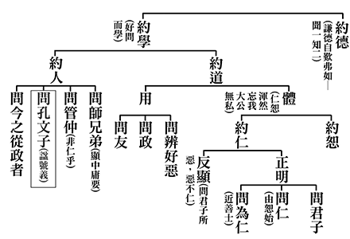

### 孝道跨時代的意義與價值— 孝經簡說（十五）

時哉講述、淨域編寫

言淺義深孝經

仲尼述曾子傳

孝悌質禮樂興

安上治民俗厚

推廣要道天下和樂  〈廣要道章第十二章〉

前言

天下和樂是大家所追求的，像是財神爺和氣生財、家和萬事興等，企業也是講究和諧。商家除了用財神爺來表示財源滾滾外，其實他們拜的是關公。關公本身並沒有發財，為什麼是財神爺呢？正說明和諧來自於合作。常言：兄弟同心，其利斷金。所以，關公被商人當成財神來祭拜。

本章也講和諧，不僅是一般合作的和諧，它是一種品德、禮樂經營的和諧。這種和諧的氣象，其殊勝令人歎為觀止，是中國辦政治的頂峰，是辦教育的宗旨。讀此章深入了解後會覺得孔子的理論實在高妙，用於實際也極具效果。

《孝經》共有十八章，今已講到第二部分，為孝道的修學法與義理。此說孝道是需要推廣的，推廣者有二：第一、這種重要的道理應推廣。第二、推廣後能夠成就自己殊勝的德行，能夠使自己揚名。此揚名非一般所說的名聞利養，而是品德能夠達於極致；繼而辦政治、辦教育利益眾生，這種名聲最足以尊崇父母。

本章經文是：

「子曰：教民親愛，莫善於孝；教民禮順，莫善於悌；移風易俗，莫善於樂；安上治民，莫善於禮。禮者，敬而已矣。故敬其父則子悅，敬其兄則弟悅，敬其君則臣悅，敬一人而千萬人悅。所敬者寡，而悅者眾，此之謂要道也。」

科判分析

本章言推廣孝道能悅民，其架構分為兩部分。第一、總明此推展要道的事功，是孝、弟(悌)、禮、樂這四個要道，它能夠讓天下和諧。特別就「用禮」這一分來說，禮的本質在敬與讓。若國家領導人懂得去敬愛人家的父親，便能夠贏得天下孝子的喜悅；懂得敬重他人的兄長，便能夠贏得天下弟弟們的喜悅；懂得敬重諸侯的國君，便能夠贏得天下臣子們的喜悅。所以，這個國家的領導人能夠創造天下的和諧，是中國文化入世的最高成就。中庸之道講到中和，和也者，即是天下的和諧，為入世的最高成就。在〈廣要道章〉中說的很詳細，故此章也可以做《中庸》的補充。

釋義

經文：

「子曰：教民親愛，莫善於孝。」

是指要教百姓親愛，得百姓之親近與愛護最好方法，這個方法令人讚歎，無以復加，於儒家叫作「善」，在佛家稱作「妙」，最好的方法就是「孝」。將孝道推廣出去時，百姓不但會孝順自己的父母，還會親近愛護國君、天子。再者，

「教民禮順，莫善於悌」

，國家領導若懂得在家尊重叔叔、伯伯、表哥、堂兄，或是懂得尊重長者及有德學的人，百姓就懂得禮順這些長者。所以，將悌道推展出去，使百姓懂得尊重長輩及有學問的人，社會會非常和諧。再者，推動和諧之道的本質是孝悌，而作法是禮樂；此樂，文說：

「移風易俗，莫善於樂」

。移，就是改變；易，是更替，都是改變的意思。風氣習俗的改變，音樂最好。所以，領導人要深通樂教，這才能夠推廣樂教。

「安上治民，莫善於禮」

，禮能夠讓居上的人安，居上的人既身安也心安。心安有次序，能夠長幼尊卑有序，用於治民就能促成社會風氣和善、治安良好。安上，是上面的人安；治民，是百姓大治。百姓能夠互助合作、守望相助、和諧相處，這是禮最殊勝之處，禮的運用能達於這種程度，可說是發揮到了究竟處。樂的運用在於移風易俗，若樂未能移風易俗，此樂是沒有作用的。禮若不能安上治民，則此禮也是沒有作用的。如同《論語》說：「禮乎，禮乎，玉帛云乎哉；樂乎，樂乎，鐘鼓云乎哉。」 禮呀！難道只是禮尚往來、互贈禮物，客套地說幾句話嗎？樂呀！難道只是敲鐘打鼓嗎？

第二段告訴我們，國家領導人及天子須以禮來治民。文說：

「禮者，敬而已矣。」

禮的內涵很多，諸如：祭祀之禮、親喪之禮、君臣之禮、賓客之禮、婚慶之禮等，不論禮的項目有多少，一言以蔽之就是「敬」，敬是禮的本質。一位天子或國家領導人，該怎麼運用禮來和諧天下呢？

「故敬其父則子悅」

，天子敬愛他的父親，那麼天下的兒子皆喜悅。為什麼呢？蓋其孝道推展出去時，你尊重他人的父親，孝子心中也是以父親為重的。所以當你尊重他人父親時，實際上也贏得天下孝子們的擁戴，同時獲得天下孝子們的喜悅。至於「敬其兄則弟悅」，凡敬愛他人的兄長，便會得到天下弟弟們的喜悅，因為孝悌之道已經推展出去了。須知禮的推展，必要是助於孝悌之道推展的禮，若無孝悌之道的本質，僅推展禮是沒有作用的。我們常談禮貌運動，禮貌運動若不從本質出發，不講求品德，僅著於外相的表現，那麼這種沒有人情味的禮，不是真正和諧的禮。

又文說：

「敬其君則臣悅」

，敬重每一國家的君王，顯然是天子的修學法，故而本章〈廣要道〉就是天子的修學法。若你尊重每一國家的君王，那麼這國的臣子們都會喜悅。何以然呢？因為將孝道推展出去時，每個人都有其君上的概念。譬如：孝道的推展讓百姓懂得有國君、有父母，當天子尊重父母及國君，就會讓孝子們喜悅且擁戴你，這稱作「敬一人而千萬人悅」。一人即是父親、兄長、與君上一人。而千萬人悅的千萬人是兒子、弟弟與臣子的喜悅。

最後總結：

「所敬者寡，而悅者眾，此之謂要道也。」

敬重的對象少，而取悅的對象多，這稱作要道。這個要道也可以說是推廣禮樂的要道，其推廣不只是禮樂的方法，還包括禮樂的本質與孝悌的要道。所以，此章的要道應該說是「孝悌禮樂」四要道，謂之天子的修學法。

析疑

本章從〈五刑章〉而來，與〈五刑章〉有沒有關聯呢？

須知〈五刑章〉從〈紀孝行〉來，若在家裡知道孝順父母，卻不懂得在外為公發心，其結果是「居上而驕則亡」、「在醜而爭則亂」，在下位若是爭亂的話則刑。〈五刑章〉乃針對不講究孝道、批評聖人、乃至要脅君王者，要處予刑法。

如此，〈五刑章〉章說：天下大亂時，即是心中沒有聖人的「斷惡修善、孝道及忠於國家」的概念；也就是既不忠不孝又無斷惡修善的概念，乃是大亂之道。本章繼而特別說明：一位天子要如何撥亂反正？須倚靠著辦政治及辦教育。辦政治要懂得以孝悌為本質，以禮樂為方法來辦政治。其本身要以身作則，才能夠撥亂反正。若社會風氣很糟、人心思亂，此謂之大亂之道。

我們由這章中，欲知領導人最重要的修學法為何？

領導人的修學法有許多，包括：品德、才能、統御力等，但最重要的是以孝悌為本質及通達禮樂的作法，這才是領導人修學法中最重要的。文中說：「教民親愛，莫善於孝」，此與〈天子章〉具關聯性。〈天子章〉說：我這個天子在家裡愛護父母，且把此德教推廣出去的時候，天下人不會討厭傲慢他的父母，會孝順雙親。而本章更進一步說：你將孝道推廣出去的時候，不但天下人懂得孝順他的父母，天下的人還會親近愛護你、忠於你，這就是第一章的補充。在〈士章〉中說：「以孝事君，則忠。」即是說：天下的孝子們，不但孝順他的父母，還會忠於這個國家的領導人，是為「同類相聚」。若你是一位品德教育的領導人，有品德的人當然擁護忠於你。

「教民禮順，莫善於悌」，與前章的關聯性為何？

悌道若能往外推展時，不但每位百姓懂得敦行悌道，也懂得順從你，此謂之「以敬事長則順」，包括懂得尊重順從國家的領導人及有德學的長者，無論是為官或在野者。換言之，天子推展孝悌之道，不僅能於每一家中推展，還能讓國人忠順於他，這就是品德教育推廣之功，好處實在太多了。各領導人只重經濟而輕忽品德教育，便無法以身作則，倘能知道品德教育推廣的益處極多，相信各國的領導人是樂於以身作則的，那麼貪贓枉法、營私舞弊、奸盜邪淫的事就近趨於零了。

在《論語‧顏淵篇》中孔子告訴季康子說：「子帥以正，孰敢不正。」領導人就是領導風氣，如果領導人不去引領風氣，是十分可惜的。譬如：百姓將自己做好，卻影響不了什麼風氣。又如：某個企業遵守法律按時繳稅，也不能影響到什麼風氣。而國家領導人以身作則推展品德教育，才是真正影響風氣的人。〈顏淵篇〉亦說：「君子之德風，小人之德草。草上之風，必偃。」君子的德風拂過，小人是順從君子德風的。於《尚書》來看，堯舜時期稱作「比屋而封」，即是大家都是好人，因為堯舜本來是好人。而到了桀紂時，叫作「比屋而誅」，社會上壞人很多，與領導人有莫大的關係。

本章文說：「移風易俗，莫善於樂。」意即移風易俗要靠樂，倘若領導人不講究自己的人格特質，僅發展樂教能否移風易俗呢？

《論語‧陽貨篇》說：「樂云樂云，鐘鼓云乎哉！」樂呀！樂呀！難道只是敲鐘打鼓這般嗎？所以，孝悌是本質，禮樂是作法；這才是真正影響風氣之道，也是領導人應有的責任。

國家領導人想要移風易俗，不但在孝悌上要以身作則，連在樂教上都要如此。你是一位既懂得又能欣賞音樂的人，知道樂教的功能才能推廣，否則是不能行的。但要怎麼知道樂教的功能呢？《論語‧泰伯篇》說：「興於詩，立於禮，成於樂。」意思是，詩會讓人興起許多感懷，像唐詩裡的思君、念家與憶友等，所表現的是溫柔敦厚、為人著想。而立於禮呢？就是這種人情的規範，利益他人的才做，損人的就不能做，這叫作禮。至於成於樂，就是用這個樂來把豐富的人情味表彰出來；因此，詩與禮感化人心最後要靠樂，沒有樂，詩與禮的移風易俗效果不能達於究竟。

孔子說：「小子要學詩。」但是，詩要伴隨著音樂，才能夠興起五倫的關係，且可以管束風俗的厚薄。如果這是個渾厚的音樂，是能夠表彰倫常的音樂，那麼風俗就很淳厚，且因為是有品德的，所以大家可以合群。即便說話也都含蓄，雖有埋怨牢騷，也能點到為止，此謂之「言之者無罪，聞之者足以戒」。這種詩禮樂的經營，特別是樂，能讓人孝順雙親，忠於國家。總而言之，禮樂功能特別是樂教，真能將教育的功效發揮到極致。

現今談到樂教，總會提及中國的音樂，但須知什麼是中國文化。孔子被稱作集大成者，而中國文化沒有排他性，孔子集大成是把道家等諸家的特色收攏來，這才有一家的殊勝、莊嚴與豐富。中國的音樂在漢唐時期達到究竟，其中有許多樂器從國外傳來，諸如：箜篌(似豎琴)、琵琶、二胡、笛子、跋膝管、雞婁鼓、銅鈸等。唐德宗年間，印度有一國家的太子率領樂團來到中國，在長安演奏後將十種樂器送給中國，創造了中國音樂的盛況。中國音樂融合了西域、印度的音樂前進，所以，中國文化從來沒有排他性。

在一場二胡與管樂四重奏的表演裡，二胡拉出萬馬奔騰的氣勢，見出中西樂器是可以協奏的。由萬馬奔騰聲樂中，可以想見邊疆民族的豪邁，還有進入遼闊草原的渾厚開闊心胸。藉著音樂來彈唱說教使人斷惡修善，特別要提到馬鳴大士，此人善於彈唱說故事，讓人感動而斷惡修善，在印度造成盛況。此外，將音樂融入戲劇當中，也能表徵忠孝、改變風俗。

或者是一些好的戲曲、早期的平劇等，都有教忠教孝的功能，使風俗變得淳厚，家戶敞門也沒有竊盜之事，若其中加以五倫教育，對於社會風俗更有加乘淨化的功能。以前的野台戲，像《清明上河圖》裡所繪的，其間演述很多歷史情懷，雖鄉民沒讀什麼書，但對歷史都非常了解，也了解其中的因果報應。

還有，音樂也可以用在經學讀誦及詩詞吟誦上，讓人融入到經學裡面。古詩詞是可以配成音樂來讀誦，像孔子就把《詩經》三千篇刪成三百零五篇，且譜之於樂，可見孔子是懂音樂的高手。一位領導人即便不會彈奏樂曲，也要懂得欣賞音樂，且配合孝悌本質來推廣文化，相信造成的影響不容忽視。尤其最後靠音樂的經營，讓整個風氣達到淳厚，這一點本是〈廣要道〉裡所說的，但是領導人要怎麼去鑑賞好的音樂呢？於是對魯國的樂官之長說：音樂呀！你一定要知道音樂。各種樂器非常的完備，包括內在的修養、指揮的特質與團隊的合作默契。然後開始演奏時，音樂放縱出去非常的和諧，乃至於鐘鼓簫笛琴各自發揮，最後餘音裊裊令人回味無窮。雪廬老人說：諸葛亮臨終為蜀國推薦了蔣琬、費禕，死後延續善良的政風，這叫作餘音裊裊。

維也納為世界音樂之都，城市音樂演奏起來，會把人心都契合起來，這裡面包括快樂氣氛的經營、人情味的經營與上下合作的經營。史特勞斯的家族圓舞曲，在維也納非常的有名，就是一個音樂的經營，一個風氣最好的經營。想不到孔子在兩千多年前，就把為政的理念與作法說得這麼清楚。孔子是這麼完整地去看待政治與教育。

孔子又說：禮是來安上治民的。這句話出自《禮記》，其經解是說：懂得用禮來祭祀宗廟表徵孝道，懂得用禮於朝廷依禮進退。就像上述的音樂中，有樂也有禮，然而是什麼禮呢？指揮家揚手指揮的時候，該哪種樂器出場就揚聲，什麼樂器該停奏就噤聲，這就是禮。所以，音樂的經營好似人才團隊的經營般，這個禮如果推展到家庭，會讓父子兄弟和諧，推展到鄰里鄉黨，會讓長幼有序。對於禮的經營，孔子說是安上治民，它的樣子就是如此。安上之意，是上位的人懂得祭祀之道，懂得在朝廷裡依禮進退，這裡面沒有營私舞弊，沒有勾心鬥角，沒有黨派傾軋，完全依禮來推行政策。之於民間呢？則是長幼有序、父子有情，這就叫作安上治民。

推廣禮教的方法與孝道有什麼關係呢？

後文說：禮的本質在敬，你敬愛人家的父親，則天下的孝子會喜悅，你敬愛人家的兄長，天下的弟弟會喜悅。這與孝道之間什麼關係呢？其實把政治辦好，就是國君最高的孝道。而將政治辦好，就是讓天下和樂，是政治最高的境界，是國君領導人最高的孝道。譬如〈孝治章〉裡說：一位明王(指夏商周開國的國君)很尊重小國之臣，所以，各國的國君會擁戴他。

這與本章又有什麼關係？這一章是說，我敬國君，所以臣子很高興。上一〈孝治章〉是說，我尊重臣，我贏得國君對我的擁護。可見這是〈孝治章〉的補充，意即一位國家的領導人，他不僅是尊重各國的臣，贏得國君們的歡心，還懂得去尊重國君，讓臣子們喜悅，這就是禮的功能。禮的功能懂得該在什麼場合，清楚地表達什麼禮儀。而在表達這個禮儀中，表現自己的恭敬與對對方的重視，且也是一種人情味的表達。再者，這章裡所講的「要道」就是前所說的以孝悌為本質、以禮樂為作法的治理天下之道，能夠讓天下和諧。

本章的旨趣為何？

〈開宗明義章〉中孔子對曾子說：「有至德要道。」要道就是〈廣要道章〉，至德就是第十三〈廣至德章〉。〈廣要道章〉是以孝道為本質，若能結合悌道與禮樂的作法，能夠和諧天下。而將天下政治辦得這麼好的人，能夠成就他的至德，所以稱作「先王有至德要道」。至德就是第十三章，要道就是第十二章，又與第一章「開宗明義」環扣起來了。

圖解

以下來看各家的《孝經圖》。首先是北宋李公麟，他畫裡所繪的好像是「敬人家的父親，得到兒子的喜悅；或是敬人家的兄長，得到弟弟的喜悅」。場景在野外，其中有太湖石、竹子與群鳥，代表一個祥和的環境，經營著這一種禮的風範。其次是元朝的趙孟頫，筆法同出自於李公麟；其中告訴我們，禮是文明人的表現，敬又是禮的本質，且用禮來呈現祥和的畫面，去除社會不良的風氣，是禮教最好的經營。

再來，看江逸子先生的《孝經圖‧廣要道章》。整體氣象如前，但細部不一樣。江先生較從家庭面來表現，天子如何經營他的家庭呢？就是以對父母的孝悌，作為禮樂本質的那一分，成為國君辦善政的要道。圖中天子或是兒子，拿著一個豆來奉養父母，從雙親的皺紋白髮中可知年歲已高。由父親的表情知道他非常高興，孫子們看著爸爸孝順爺爺奶奶，自然也有樣學樣。所以，孝道的風氣是有樣學樣。接著，一旁的弟弟尊敬哥哥，這就是孝悌風氣的經營，孫子也爭先拿食器要去供養爺爺奶奶，這是江老師畫中所經營的整體氣象。

總結

本章雖然以孝悌為本質，但是推展的方式是禮，所成就的是樂。所以，要特別強調的是樂教，樂教的功能太殊勝了。中國發展樂教時，伏羲氏先發明了琴與瑟，這是樂器的開始。有了樂器就有音樂的推展，譬如五帝三代樂之別名：皇帝叫作《雲門》，顓頊叫作《六莖》，帝嚳叫作《五英》，堯叫作《咸池》，舜叫作《大韶》，大禹叫作《大夏》，商湯王叫作《大濩》，周武王叫作《大武》。換言之，樂教的經營是明王，英明天子所重視的，是風氣達到頂端的經營法，帶來的是整體的和諧。

中國有六經，但是《樂經》已經亡佚了。所以，《禮記》中的《樂記》可以取代樂經，徐醒民老師也這樣認為。《樂記》如此說：禮是不同場合有不同的禮來實行，但合起來就是一個恭敬心。至於樂，雖然有不同的樂器，合奏起來就是一個人情味的經營。懂得恭敬心，懂得人情味的經營，懂得用禮樂去發展孝悌為本質的文化，這種人叫作神明。常人說「神明保佑」，這種人叫作神明，神明的神就是指這個人的智慧實在太高了，明就是事理通達。〈廣至德〉是第十三章，至德就是講神明。以上第十二章所說的，就是聖人為天子的修學法。雖然我們不為天子，但主持一個家乃至於團隊，若能用此種原則來經營，就會讓家庭與團隊達到最和諧的狀態。以上是本章所講的概要。

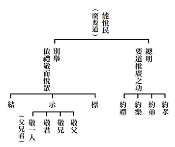

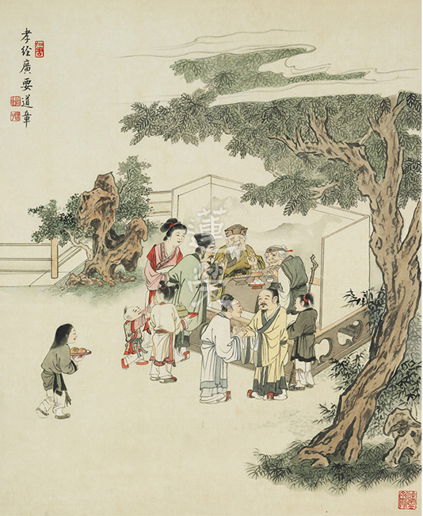

### 孔門心法 — 中庸之道（十） 第八章 中道傳承在顏回，弟子眾中為第一

*茅茹讀書會、弘毅整理*

一生如何過

顏子是典範

難為世人知

孔子是知音

前言

中庸第六至九章從文理上可合為一說，皆在論「用中」之事；本章孔子大讚顏回是能傳承中道、入世用中的大賢，顏回是一個很有風采的讀書人，他在孔門中分量極重，周遊列國時曾得到一些大夫很高的評價。在孔子過世後，歷代君王除了尊崇孔子外，對顏回也十分尊崇。短短兩行經文，其讚歎可謂到了極處，無以復加。可惜現代人對於顏回的殊勝難以理解，或因斷了傳承，或是文獻不足，本次課程特別集結古書中有關顏回的紀錄，希望能夠幫助學者體會顏回的境界，從中學習顏回成功的秘密，了解經文之義理，一同來欣賞這位最具弟子相的學生楷模。

經文

子曰：回之為人也，擇乎中庸，得一善，則拳拳服膺而弗失之矣。

消文

孔子說：顏回這個人，能夠透過聽聞、思維中庸的道理，而體悟到形而上的內涵。並在形而下跟隨孔子學到一個善法時，如六藝百工技能等，他都能將這些道理體悟於心而不喪失。

釋義

「拳拳服膺」，就是兩手的拳頭握在胸前，「膺」就是心的意思。

章旨

顏回成就的內涵，就是擇乎中庸，對善法拳拳服膺，《易經‧繫辭傳》也有這一段，那是孔子對顏回的讚歎，是孔子好學的旨趣，以及聖賢成就的氣象。

顏回為人

顏回是孔門透過修學，成為一個能弘揚、傳承文化，有風采，能辦政治、辦教育，為民族開萬世太平的弟子。

顏回形象

一、好學：畫家江逸子或將顏回畫成一個好學的讀書人，好學是孔門中成就內聖外王的方法，子曰「十室之邑，必有忠信如丘者焉，不如丘之好學也。」三千弟子，七十二賢，孔子只承許顏回與己好學。

二、赤子：有把顏回畫成一個小孩子的形象，《孟子‧離婁下》上說「大人者，不失其赤子之心者也。」代表顏回是一個天真無邪而又充滿智慧的聖者。

三、面頰豐滿：從現今曲阜顏回後代面相或可以推論出，顏回是一位如孔子一樣，有獅子頰、面頰豐滿的人物，如畫家所畫。

四、拳拳服膺：或者把顏回塑造成一個拳拳服膺的形象，束髮插笄代表他是平民布衣，面貌是一個思維的讀書人的形象。

顏回得傳承的條件

一、顏子立志

古人說「人之有志，如樹之有根，如水之有源」，一個人有大志向，才能成就他後面的事功；一個沒有志向的人，注定他是一個庸庸碌碌的人。

《論語‧公冶長》篇中，顏回說他的志向是「願無伐善，無施勞。」顏回如果能夠成為一個在天子或者諸侯手下執政的卿大夫，或者是大夫的家臣，他是一個不誇耀自己善行的人。大臣如果有「願無伐善」的胸懷，一定會創造滿朝的和諧。

「無施勞」，如果顏回被天子委以諸侯之位，他不會施勞苦於百姓，而懂得用人才團隊，辦事有次第，講究時機，百姓能夠和樂的過日子，甚至不知有國君的存在，實在是大同世界。顏回以古代聖王舜為典範，在《孟子‧滕文公》裡面說，「舜何人也，予何人也，有為者亦若是。」舜的境界只要有心想達到，就一定能夠達到，所以立志非常重要，是一個人成就的開端。

二、能識師明

古大德說，你出去尋師訪友，要有看明師的眼力，顏回就是有獨到的眼光來認識孔子。少正卯是與孔子同時期的人物，在魯國講學盛況空前，而孔子可能講的義理過深，弟子們很多聽不懂，所以曾經三盈（爆滿）三虛（空虛），只有顏回始終如一的跟隨老師學習。他能夠把孔子深奧的道理復講給同學們聽，讓他們明白老師的意思，漸漸的就來親近孔子。顏回知道很多人的學問是黑白顛倒、耍嘴皮子的學問，他知道孔子才是有真才實學，通達性與天道的大善知識。

三、 與師交情

顏回與老師交情深厚。孔子五十六歲周遊列國，在匡地被圍的時候，與顏回失散，當師徒再次相聚時，孔子激動地說：「吾以汝為死矣。」顏回也很激動的回應：「子在，回何敢死？」孔子五十才知天命，顏回二十六歲就知道自己是可以傳承天命的人，所以他在匡地被圍時懂得保護自己，護持老師。《呂氏春秋》裡說，「顏回之於孔子也，猶曾參之事父也。」意即顏回與孔子的交情，猶如孝子跟慈父的交情，所以古人說「名為師生，情同父子。」這就是顏回能夠得到傳承的條件。

科判分析

第八章還是在《中庸》的第二部分，即分別顯示中庸的修學法和義理。

六、七、八、九這四章都是用中，第八章就是顏回的中庸之行，他以中來入世，這是世間人辦不到的，這也是孔子的傳承。

顏回的行持包括上求和下化。上求是得到用中的傳承，下化是利益眾生的善法具足。包括辦政治、辦教育、品德的內涵、各種利益眾生的技藝，這些善法他都有殊勝的體悟，叫作拳拳服膺。一般注解都是說顏回對於善法能孜孜矻矻的實踐，可是我們並未在經典當中看到顏回去造橋鋪路、做慈善、救濟貧窮，他在善法當中好像都沒有造作。「拳拳服膺」應解釋為，利益眾生的能力他都具備了，所以周遊列國時，各國大夫都不敢小看顏回，子西大夫更稱讚他是宰相之才。

析疑

一、本章與前章有何關聯？

前章孔子感嘆世間的聰明人，都在追逐名利而被名利所繫縛，就如鳥獸被關在籠子裡。就算學習中庸的人，也往往因為沒有恆心而退轉。此章孔子讚歎顏回是一個能夠擇乎中庸，成就中道，入世能具足利益眾生的能力的人。

二、本章舉顏回的用意為何？

顏回能通達中庸，又能夠入世，這是孔門的精華，文化的核心，也是孔子的傳承。孔子是能教，顏回是所教，這表明孔子也是擇乎中庸，對於利益眾生的善法拳拳服膺，孔子得到這樣的心法，又傳承給顏回。

三、本章孔子的語氣如何？

顏回讚歎孔子高深莫測，「仰之彌高，鑽之彌堅；瞻之在前，忽焉在後。」此章孔子對顏回的讚歎也是無以復加，師徒之間互相讚歎。

四、顏回如何得到傳承？

１、安貧樂道：《論語‧雍也》篇言，「賢哉回也。一簞食，一瓢飲，居陋巷，人不堪其憂，回也不改其樂。賢哉回也。」顏回樂於聞思修，全身心的投入，不在意生活的貧苦，不像子貢的外務很多。

２、學有法喜：《論語‧先進》篇言，「回也，非助我者也，於吾言無所不說。」顏回能夠知道老師說法的義理所在，而且生出法喜。

３、老師樂教：《論語‧子罕》篇言，「語之而不惰者，其回也與。」孔子把顏回看成他的知音，盡興而教，怎麼說都不感到累。

４、聞而圓悟：《論語‧公冶長》篇言，「回也聞一以知十。」顏回對孔子所說的話會作全方位各面相的體悟。
５、不恥下
**問：** 《論語‧泰伯》篇言，「以能問於不能，以多問於寡。」顏回在與同學的交往當中，不會高高在上，貢高我慢，自以為是，而是不恥下問，把不懂的問到懂。

６、教學相長：《論語‧為政》篇言，「退而省其私，亦足以發，回也不愚。」顏回懂得教學相長，發孔子的未盡之意。曾子所說的「傳不習乎」也是教學相長，學就是從老師那裡傳，然後教就是我傳給其他人，傳承就要靠教學相長，把美好的義理往外傳、往下傳。

合明，精進不已。《論語‧子罕》篇言，「子謂顏淵曰：惜乎，吾見其進也，未見其止也。」最後合起來說明，顏回對以上這六條都精進不已，從來沒看到他退轉，所以他獨得孔子讚歎。

求學問、讀書有三種方法和重要旨趣，第一，慎選注解；第二，以經解經；第三，合情合理。以上就是「以經解經」，用論語經文來說明顏回得到傳承的原因。

五、擇乎中庸的形象為何？

《論語‧先進》「回也其庶乎，屢空。」顏回在上求的時候，他能夠屢屢達到空靈靈（體空）的境界，《易經》裡面說「易無體」，易經是沒有體性的，世間的變化是沒有體性的，沒有體性就是變化的本體，這種本體的證悟，唯有顏回證得。

六、顏回得一善，則拳拳服膺而弗失的形象為何？

１、不違仁心：《論語‧雍也》篇言，「回也，其心，三月，不違仁。」顏回在下化的時候，在入世的善法當中，特別是對仁心的學習很有體悟，而且能夠相續的生起仁心，孔子觀察顏回三個月都沒有離開仁心，所以顏回是一個能夠仁心相續的君子。

２、攝持善法：顏回在下化的時候，還能夠以仁心來攝持各種利益眾生的善法，每得到一個善法，他都能夠拳拳服膺。《論語‧顏淵》篇裡孔子對顏回說，「非禮勿視，非禮勿聽，非禮勿言，非禮勿動。」顏淵說，「回雖不敏，請事斯語矣。」孔子曾經對顏回說，看、聽、說話、乃至內心的起心動念，都要合乎禮。顏回說，我雖然不聰明，但依教奉行，包括對道理的體悟，內心裡面不斷地去串習這樣的內涵，乃至行住坐臥當中讓道理都能夠浮現，這就是一個拳拳服膺的形相。

七、學習後的成就，在哪些方面展現？

顏回上求與下化的成就相，包括三個方面：

１、不貳過：以下分別從《論語》、《孔子家語》和《易經》等經典來證明：

《論語‧雍也》篇言，「不遷怒，不貳過。」因為顏回有「中」的傳承，所以他在入世的時候，不會隨著順境起貪，也不會隨著逆境起瞋；又因為他入世有禮樂的善法，該進則進，該退則退，所以他能夠有過失卻不重犯。

《孔子家語》中，「子貢對曰：夫能夙興夜寐，諷誦崇禮，行不貳過，稱言不苟，是顏回之行也。」衛將軍文子請子貢來評斷孔門的師兄弟，子貢讚歎顏回是一個不貳過之人，後面孔子讚歎顏回是一個宰相之才。

《周易‧繫辭傳》中，「子曰：顏氏之子，其殆庶幾乎，有不善，未嘗不知，知之，未嘗復行也。」顏回有了過失會馬上知道，而且不會重犯，為什麼《易經‧繫辭傳》要特別舉顏回呢？因為易經六十四卦三百八十四爻，都講趨吉避凶的道理，但一定是改過之人才能趨吉避凶，而顏回就是一個能夠改過而不會重犯之人，所以顏回最能得到易經的精華。

２、知時機：因為顏回有「中」的攝持和「禮」的講究，所以入世的時候知道時機，能把握時機做事情。在《論語‧述而》篇中，「子謂顏淵曰：用之則行，舍之則藏，唯我與爾有是夫！」孔子稱讚顏回是一個知時機的人，就是國君有道而用我時，我就推展大道；國君無道捨我時，我就藏起來，這樣知時機的人，只有孔子和顏回。

３、通人情：因為顏回通達中庸和禮樂，所以他入世時，可以通達人情世故。《孔子家語》中說，「回也，善於識音矣。」孔子曾經在衛國的時候，聽到一個人的哭聲非常悲哀，孔子就問顏回：這個人是為何而哭呢？顏回說：這是一個生離與死別的哭聲。孔子就問顏回原因，顏回說：我聽過桓山的鳥，在牠的四個孩子長大後，羽翼豐滿，要飛出去的時候，牠的哭聲就像現在這般，所以這個哭聲裡面，不只有死別，還有生離。孔子就找人去問，原來是有一個婦人死了先生，因為沒有錢安葬，所以把她的孩子賣掉換錢，她一方面哭先生的死，一方面哭與孩子的離別。孔子因此讚歎顏回善識音語，顏回通達人情世故能夠達到這種程度。

以上就是顏回學習中庸和善法的成就相。

八、顏回學習聖與仁道的通達，如何得到孔子的讚歎？

顏回因為他所得到的成就，而受到孔子和孔門弟子的讚歎，以及周遊列國時，諸大夫也對他刮目相看，乃至於顏回過世後，歷代帝王除了尊崇孔子以外，對顏回也非常尊崇。以下列舉經典中孔子對顏回的讚歎：

《孔子家語》

１、讚助師攝眾：《孔子家語‧七十二弟子解》中孔子讚歎顏回：「自吾有回，門人日益親。」自從我有了顏回，我的學生對我越來越親近了。因為孔子講的很多道理弟子們都聽不懂，透過顏回的複講，弟子們才知道孔子的言外之意、弦外之音。包括宰我與孔子議論三年之喪，他說一年就可以，孔子和他講三年的道理，他不太服氣，可是當問完顏回之後，他就真正服氣了。可見有一些弟子對孔子的道理不以為然或是聽不懂，都是私下透過請教顏回以後，終於把道理弄懂了，所以對孔子就愈加親近。

２、讚窮不改節：《孔子家語‧在厄》篇裡講到，孔子周遊列國，六十三歲在陳蔡被困絕糧時，子貢冒險出去求得一點米，回來讓顏回煮稀飯。煮飯時，子貢見顏回偷吃，就轉告孔子，孔子以想用稀飯祭祀先人為由來試問顏回，顏回說有灰塵掉落鍋中，丟掉可惜，所以他就吃了，這稀飯不能拿來祭祀了。孔子就感歎的說：「吾之信回也，非待今日也。」孔子對顏回的信心不是今天才建立的，即便是子貢說的，孔子也要找顏回來查證，經他這一問，才真相大白。《呂氏春秋》上說，「所信者目也，而目猶不可信；所恃者心也，而心猶不足恃。」不要相信自己的眼睛，甚至不要相信自己的心，顏回就是一個讓孔子對他有信心的人。

３、讚見微知著：《孔子家語‧顏回》篇裡講到，魯定公對顏回說他的馬伕東野畢非常擅長駕馭馬車，顏回卻說他的馬會走失。魯定公不高興的對手下人說，君子也會說人壞話嗎？結果沒隔幾天，東野畢的馬跑掉了。魯定公很訝異的把顏回找來，問顏回怎麼知道東野畢的馬會丟呢？顏回說，以前舜用人的時候，不會窮盡人力；造父使馬的時候，不會窮盡馬力，所以人也不會逃難，馬也不會逃亡，如果把人民逼到盡頭，那就非常危險了。魯定公就把顏回的話對孔子說，孔子讚歎道：「夫其所以為顏回者，此之類也。豈足多哉？」顏回就是顏回，不必多加讚歎，因為他的內涵太豐富了，可以見微知著，以古鑑今，眼力非凡，看事精準。

４、讚言行有度：《孔子家語•致思》篇中孔子讚歎顏回：「不傷財，不害民，不繁詞，則顏氏之子有矣。」顏回如果執政，他不會勞民傷財，他的言語很實在，顏回就是這樣的人。《易經•繫辭傳》上說：「言行，君子之樞機。樞機之發，榮辱之主也。」君子之道關鍵在言行上，言行如果講究，打開都是福門；言行不講究，打開都是禍門，而顏回就是一個可以打開福門的人。

５、讚志堅不移：《史記•孔子世家》孔子在陳蔡之厄的時候，他故意問弟子們，我們為什麼這麼落魄，這麼倒霉？子路打抱不平，認為君子不應該這麼窮愁潦倒；子貢認為不應該把道講得這麼大，要更務實一些；當問到顏回的時候，顏回說，老師的道大而不容於人，如果是我們沒有把道修好，那是我們的過失，如果已修大道卻不能被用，那過失在他人，而不在我們。孔子聽了高興的說：「有是哉顏氏之子，使爾多財，吾為爾宰。」假如有一天顏回你執政成為多財之人，我願意當你的家宰，就是孔子願意做顏回的臣，幫他推行仁政，顏回在孔子的心目中是這樣的人物。

６、讚德才兼備：《說苑．指武》記一次孔子帶著弟子們到戎山去玩，他問到顏回的志向，顏回說：「回願得明王聖主而相之，使城廓不脩，溝池不越，鍛劍戟以為農器，使天下千歲無戰鬥之患。」我願意去輔佐明王，使他的土地範圍內，不用去修城牆，不用擴充軍備，而且老百姓在這樣政教的推展下，民風淳樸，對國家很有凝聚力，天下永無戰事，百姓安居樂業。孔子聽了就讚歎顏回說：「美哉，德乎，姚姚者乎。」顏回是一個非常有德之人，他的德行非常美好，而且他還是一個非常知道政治內涵和方向的人。甚至孔子說，「吾願負衣冠而從顏氏子也」，我願意把衣冠戴好，來聽從顏回的指揮。

７、讚古賢之風：在《莊子‧雜篇‧讓王》篇中，孔子曾經問顏回：你家裡窮，為什麼不做官呢？顏回竟然說：學習聖道讓我內心快樂，所以我根本不願意去做官。這種快樂是人生真正的快樂，非富貴榮華的快樂所能比，孔子聽了非常感動，他說：「丘誦之久矣，今於回而後見之，是丘之得也。」我在古書裡面讀到很多貧而樂道之人，可是沒有看到過，我今天看到顏回就是古書上講的這種人，很高興這種人被我得到。

８、讚賢愿從之：在《莊子‧內篇‧大宗師》中孔子也說到，「而果其賢乎！丘也請從而後也。」果如像顏回這麼賢能的人，我也願意跟著顏回走。以上所舉《莊子》裡面內容，可以看出顏回在孔子心中的分量，我們讀這一章，一定要把顏回的風采讀出來。

９、讚聖者風采：在《韓詩外傳‧卷七》中，孔子遊於景山，問到子路、子貢和顏回的志向的時候，顏回就把他的胸懷、聖人的理想說出來以後，孔子讚歎顏回說，「聖士哉，大人出，小子匿，聖者起，賢者伏。回與執政，則由賜焉施其能哉。」這個讀書人是一位聖人，像顏回這樣的大人出來執政，就不會有宵小，聖人出來執政，好像太陽，賢者好像星星，顏回執政所展現的風采，是子路和子貢所不能比的。

１０、讚道高德備：在《韓詩外傳‧卷十》中，孔子讚歎顏回說，「善哉，回也。夫貧而如富，其知足而無欲也；賤而如貴，其讓而有禮也；無勇而威，其恭敬而不失於人也；終身無患難，其擇言而出之也。若回者，其至乎，雖上古聖人亦如此而已。」顏回這個人，貧窮就像富貴一樣，地位低賤卻像地位很尊貴一樣，他雖然不像子路這種莽夫之勇，可是他有禮的威嚴，而且他懂得謹言慎行，所以一輩子沒有患難，顏回的風采實在太好了，上古的聖人也不過如此。

以上舉出這些經典都是在說明，顏回在孔子心目中的分量，他在內涵上的風采，乃至於在辦政治上的風采，弟子們都難望顏回之項背。

九、顏回在其他弟子們，或外人心目中的分量為何？

曾子之讚

《論語·泰伯》篇中，曾子曰：「以能問於不能，以多問於寡；有若無，實若虛，犯而不校，昔者吾友嘗從事於斯矣。」曾子讚歎顏回是一個不恥下問的人。曾子作為一個父親，在最後臨命終的時候，對著曾元和曾申這兩個兒子，說出了最隱微的真心話，「微乎，吾無夫顏氏之言，吾何以語汝哉。」我如果沒有顏回的教誨，我沒有辦法對你們有什麼教訓。原來曾子能夠得到孔子的傳承，一方面學自於孔子，一方面學自於顏回，可見顏回對孔子的幫助有多大！

子貢之讚

《論語‧公冶長》篇中，子貢回答孔子說，「賜也，何敢望回。回也，聞一以知十；賜也，聞一以知二。」

他稱讚顏回是一個聽到道理能夠完整體悟的人，他無法與之相比。

孟子之讚

《孟子‧公孫丑上》篇中，孟子評論道：「子夏、子游、子張皆有聖人之一體，冉牛、閔子、顏淵則具體而微。」說子夏、子游、子張，只不過有聖人的某一個面相，而顏回是完整的聖人，而且是微細的表現聖人的風采。

《孟子‧離婁下》篇中讚歎：「禹、稷、顏回同道。」「禹、稷、顏子，易地則皆然。」顏回如果入世辦政治的時候，也能夠像大禹一樣治水、講究民生，也能夠像稷一樣講究農事，顏回不只是有出世的能力，也很有入世的能力。

子西之讚

在周遊列國到楚國的時候，子西大夫對著孔門弟子，如子貢、子路和宰我都很稱讚，可是子西大夫對楚昭王讚歎顏回是，「王之輔相有如顏回者乎？」他認為顏回是一個宰相人才，更勝出子貢、子路和宰我。

透過此章，如果我們懂得顏回傳承的條件，顏回在性與天道和入世六藝的成就，以及傳承之後孔子和弟子們，乃至於春秋大夫對顏回的讚歎，我們才知道擇乎中庸，以及對善法的拳拳服膺有多麼的重要。這是孔門的心法，中國文化的神髓，也是人生最好的出路。我們對顏回深深的景仰，這才是真正文化培養出來的氣象，這才是人才的面相，這才是真正傳承道統而有的風采。

十、一般人有辦法擇乎中庸嗎？

「舜何人也，予何人也，有為者亦若是。」重點還是看我們的心志，再看是否掌握傳承的條件，碰到好的老師，又能夠堅持一路的學下去，當然會擇乎中庸。

十一、學習本章對我們有何啟發？

學習此章啟發我們，人生的經營，就是要在中庸的內涵和利益世間的善法上多多學習，但是學習一定要講究重點和大方向，然後在此攝持下具體而為的學。

十二、如何應用本章於現實生活？

我們要在道統上多學習，不被名聞利養所繫縛；確立人生志向，學習那些有益於世道人心的學問。如此在現實生活中，路一定會越走越寬，福報會越來越多，成為一個能夠領先時代，為時代找到出路的領袖人才。

總結

一、隨師學道共一生，以道攝藝為典範。

顏回十三歲遇到孔子，一生都沒離開，對孔子猶如對父親一樣的親近愛護，與老師同甘苦共患難。在他四十一歲以前，他已經完整的把孔子的道統學完，學的徹底，他真的是一位尊師重道的典範。孔子的生日九二八是教師節，大禹的生日是工程師節，魯班的生日是工匠節，各行各業都有紀念的節日，可是唯獨沒有學生節，如果我們把顏回的生日當成學生節，讓學生好好體會顏回的內涵，尊師重道才是學生的出路，道統的學習才是所有百工技藝的中心思想和方向，學生們才能在學習各種技藝當中，找到靈魂，找到存在的價值，找到人生的出路。

二、千人讚不如一人歎，外通哪比內涵達。

顏回雖然一生是個不起眼的人物，但是卻得到孔子最殊勝的讚歎。這說明人生重點不是外在的出路，有時候外在有出路，但內涵沒充實，不但不能夠真正利益人家，反而會做出傷天害理的事情。雪廬老人常說：吾等不出山，天下還太平，必得出山幹，天下大亂。所以重點不是外在的出路，而是在內涵上的經營。果然學得一身本領、內涵和見地，不怕沒有出路，即使外在沒有出路，也是天下蒼生無福，好好的用功莊嚴這一生，才是我們這一生最重要的出路。

三、散珠一線此章貫，復事斯語效復聖。

有關顏回的資料散在論語以及其它古籍之中，如果把資料收錄完整，再看顏回源頭的成功處，就是「擇乎中庸，得一善則拳拳服膺」，精神都在這一章，從各章裡面講到的顏回，回歸到這一章，才能夠把這一章的大意說的清楚明白。

問題解答

一、顏回看起來窮困潦倒，他真的是中國最有風采及出路的讀書人嗎？

顏回雖然看起來是窮困潦倒，可是他的風采來自於好學，叫作「十室之邑，必有忠信如丘者焉，未嘗如丘之好學也。」孔子三千弟子，孔子只承許顏回是好學的，叫作「有顏回者好學」。風采是來自於在中道和入世君子之道上精進，叫作「吾見其進也，未見其止也。」風采是來自於在遇到境界的時候，能夠不起貪瞋癡，能夠超越世間的繫縛，叫作「簞食瓢飲，居陋巷。人不堪其憂，回也不改其樂。」風采是來自於中道的聞思修，所以「回也，其庶乎屢空」。風采是來自於對眾的公心，「有顏回者，三月不違仁，其餘則日月至焉而已矣。」所以三千弟子裡面，孔子只承許顏回仁、屢空、精進、好學，這就是風采，讀書人的風采要如此經營。

二、顏回如何得到拳拳服膺而弗失之矣的體悟？

拳拳服膺的形象是，兩個拳頭握在胸前，對善法執持不放。這種人在形而上能通達明心見性，降伏煩惱；在入世的時候，能夠對境不迷，知道利益眾生才是他的出路，而且具足利益眾生的善巧方便，叫做能得一善，則拳拳服膺。只有通達吉凶禍福的人，才會有這種體悟。趨吉避凶之道來自於入世的時候，能夠有公心，而且學習利益他人的善法，抉擇出利益他人的時機。對這些善法會很認真的學習，因為唯有給眾生出路，我們才會有出路，這叫作拳拳服膺。

但拳拳服膺不是埋頭苦幹，做事情的時候，先要有清淨的動機，要把利益眾生的方便學懂學通，然後講究做事的次第，還有識人的能力，團體和合的能耐。如果這些都沒有學習，那往往做善的時候會生起很多煩惱，或者福報大、權力大的時候，人就迷惑顛倒，小權力小腐化，中權力中腐化，大權力大腐化，絕對的權力就絕對的腐化。拳拳服膺者因為通達形而上，再回入形而下，知道趨吉避凶的道理在公心入世，懂得經營世間善法。比如辦政治要領導統御，乃至於財經、用人、科技，都要有綱領的掌握，才有辦法知道入世怎樣發展。而且還要有中心思想，帶動他人在內涵、氣象、品格上提升，再運用這些世間的財經、科技才有出路，否則會把人變俗。雪廬老人說：一個俗氣病比癌症末期還可怕。

三、為何顏回得到中庸傳承，卻仍英年早逝？

當一個人學成的時候，人的命早夭還是長壽，已經不重要了。了凡先生說「夭壽不二」，就是當你通達形而上，不被形所繫縛的時候，你知道生命是相續的，只不過這一段生命，是做這樣有意義的事情，下一段生命，是做下一段有意義的事情。其實當你通達的時候，生命沒有所謂夭壽的問題，只不過是一段一段的去做有意義的事而已。可是夭和壽就在利益世間人上是有的，如果聖人和君子是夭，這是天下蒼生的不幸；如果聖人和君子是壽，那就是天下蒼生的幸福。所以顏回的英年早逝，是天下蒼生的不幸。孔子哭顏回，他並不是哭顏回是一個命薄之人，而是哭道統不能傳、蒼生無福！如果不懂得孔子的哭，那對中國文化是外行。

四、顏回擇乎中庸是形而上的成就，為何卻在形而下還想要努力充實自己？經文中：回之為人也，擇乎中庸，得一善，則拳拳服膺而弗失之矣。前後兩段究竟有何關聯？

顏回是為了要入形而下而修形而上，因為要入形而下，如果沒有修學形而上，就會被境界所轉。貧富貴賤榮辱，都會隨境起貪或瞋，如何利益別人？所以為了利益眾生而修學形而上，修學形而上是方便入形而下，兩者是一以貫之。入世要有利益眾生的心態和方便，這要好好的學習，所以叫作拳拳服膺。

五、有人說，孔子不能執政、顏子壽命亦不長乃中國文化最大損失，是否如此？

是的，因為孔子不能執政，不能讓人看到以儒家文化辦政治是如何推行的，現在很多人都認為辦政治是靠權謀和手段。但是辦政治如果沒有用文化來經營，就沒有辦政治的格調、氣象和出路。因為沒有給孔子執政的機會，眾生就不能看到通達形而上與形而下，所經營出來的禮運大同的氣象，感受不到道統的實用性的殊勝莊嚴，這是中國的可惜處。

顏回壽命不長，也是中國文化的可惜處。顏回通達形而上，而且在形而下入世的時候，他知道怎麼抉擇，他通達禮樂，還懂得識人。他跟在孔子旁邊學習，亦步亦趨，而其他弟子，有的因為從政而離開孔子，有的因為辦事而離開孔子。只有顏回對孔子名為師生，情同父子，他把孔子的內涵、處世的能耐都學到究竟。「文武之道，未墜於地，在人」，中華文化在人的身上，顏回是在人上面學中國文化，是所有學中國文化裡面最為殊勝的人，這樣的人早夭，不是顏回的不幸，而是天下蒼生的不幸。

六、古書上還有其他顏回之軼事可說嗎？

《列子‧仲尼》篇中說，孔子閒居的時候，子貢進去見孔子面有憂色，子貢不敢問，出來告訴顏回，顏回就故意彈琴而歌。孔子聽了就果然把顏回找進去，因為孔子有憂，顏回彈琴卻很快樂，他和孔子不一樣，孔子就問他為何如此快樂，他反問孔子為什麼憂愁。孔子讓顏回先說，顏回就說以前聽老師說過，一個人樂天知命就不會憂愁。孔子說他只知其一，不知其二，樂天知命有憂與不憂。不憂的是個人有了出路，就算國君不用你，也只是讓你在行上沒有出路，可是心上的出路不在國君手上。心上的出路不是外人可以決定的，很多人都是在行上找出路，不是在心上找出路，所以一輩子的經營只是在行上經營，不是在心上經營。中國文化是在心上經營，在心上找出路。

可是當今天下國君昏庸，諸大夫聚斂，老百姓失序，樂天知命，所以必憂。因為我的禮樂之道就是要改變天下，當不能改變天下的時候，看到天下蒼生受苦，樂天知命的人本來就應該憂。所以，上聯叫「聖人樂天知命，所以不憂」；下聯是「聖人入世成為君子，所以必憂」，橫批就是「憂不憂」，憂不憂全看自己。孔子表達的是下聯，顏回表達的是上聯，然而顏回只通上聯未通下聯。因為擇乎中庸而不憂，因為天下蒼生找不到出路、深受其苦而憂，所以要得一善而拳拳服膺。

顏回說「得」，得到了孔子的心得，就出去告訴子貢，子貢悵然若失，聽不懂其中的道理。子貢回家後，參悟七天，竟然茶飯不思，形銷骨立，可是還是想不明白。人生有時明明眼前是足以憂的，為什麼可以樂天知命而不憂？入世的聖人為什麼又是必得憂？孔子是兩邊得知，說不憂是聖人，說憂是君子。中華文化的道統就是聖人的內涵與君子的情操，這是缺一不可的。

如此有人就認為列子是不是得到了道家的傳承？《列子》這本書某些見地不錯，但是有些部分還得再斟酌，道家不是道教，《列子》是屬於道家而非道教，整個道家可貴處在通達形而上，而且他們入世的時候，也懂得趨吉避凶之道。

七、顏子當時不見事功，也無文章見於後世，生活簞瓢，為什麼百世之後，從天子至庶人，無人對於其地位有異議？　　有人說因為文獻不足，所以沒有什麼好議的，可是文獻不足那又有什麼好尊崇讚歎的呢？正因為「千人讚，不如一人嘆」，大家都看不到顏回的殊勝，只有孔子看到並讚歎他，愈通達的人愈對顏回讚歎，所以大家對顏回沒有異議。古書上紀錄了他對禮樂、人情世故的通達；他與孔子之間的深厚情誼；他好學，而且是「顏氏之子，甚殆庶幾乎；有不善未嘗不知，知之未嘗復行也」；他簞瓢屢空，而不改其志。

從這些就可以知道，顏回是無可非議之人，並能感受到顏回風采之殊勝，所以歷代帝王除了尊孔以外，還尊崇顏回。雖然顏回沒有留下文獻，沒有事功，可是從這些典籍中對他的讚歎，就可以知道他是讀書人的典範，他得到的是中國文化的神髓，孔子的內涵和精華。

八、有人說顏回活到二十九歲就不幸死去，可是顏回小孔子三十歲，孔子在顏回過世的時候說，「鯉也死，有棺而無椁」，顏回死，怎麼可以有棺有椁呢？

（《論語‧先進》顏淵死，顏路請子之車以為之椁。子曰：「才不才，亦各言其子也。鯉也死，有棺而無椁。吾不徒行以為之椁。以吾從大夫之後，不可徒行也。」）

可見顏回是死在伯魚之後，而伯魚死的時候，孔子是七十歲，那顏回一定是孔子七十之後過世，孔子七十一歲時，顏回四十一歲過世。

九、有人認為，孔子雖然具備龐大的文化知識，可是孔子執政的時候，未必會用到這些內涵，或者用出來效果也不大，各領域的發展也不一定要用孔子之道？

可是子貢作為一個精通財經的人，當他親近孔子時，他才知道辦政治如果沒有孔子的想法，辦政治是不會有出路的。所以縱然他有時候外出辦事，他回來後一定跟孔子學習，而且當孔子過世的時候，這位富可敵國的企業總裁，在孔子的墳墓邊為孔子守喪六年。商人是最務實的，如果孔子之道不切實際，子貢會離開得比誰都快。但是他為老師守喪六年，代表所有行業的出路都在孔子。跟著孔子學習的人，不論是習文還是從武，孔子之道都會幫助他成就。如子路，他從一個太保流氓，後來變成能夠統領三軍的大將。當冉求打敗了齊國大軍的時候，季孫大夫問他說：你的兵法是向誰學的？他回答說向孔子學的。可見孔子之道，除了正道之外還有各種變化，不過用奇道的人，一定要有正道的本質，只用奇道也一定不會有出路，或可能還有想像不到的災難。所以中國文化如果沒有孔子的正道來做本質，中國文化是不會有出路的。

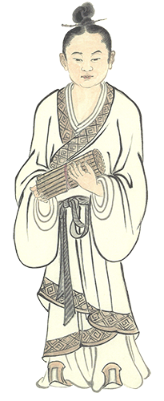

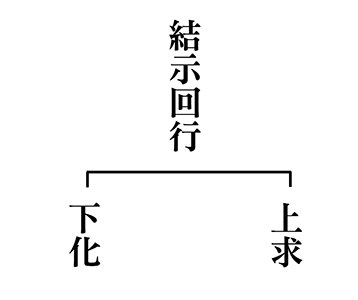

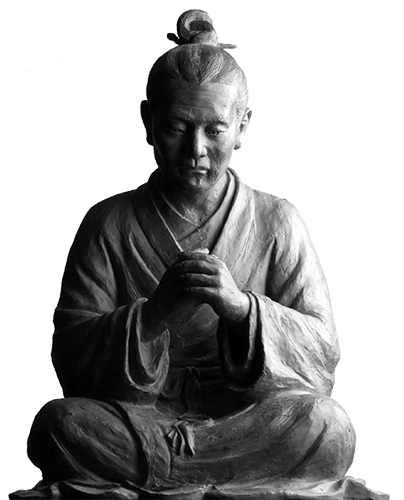

### 三字經簡說（十）

*淨爾整理*

勤學謀出路

利他創前途

典型在夙昔

成就為未來

《三字經》最後的這個段落中，先說明典籍勤學法，再舉物勸學、勉勵幼學壯行成就孝道，最後總結《三字經》可以做為經營人生的方法。

口而誦　心而惟　朝於斯　夕於斯

讀書的要領：口誦心惟。口裡念出聲音、諷誦吟詠，心裡要思惟其中的義理，而且必須從早到晚用心，學問才能成為自己的。

讀書時通常率先啟動的是視覺，再搭配指字讀書或手寫演練，這時候，口誦心惟則是讓自己能更專注於所學。口誦時不僅是口裡唸出聲，聽覺也會隨之啟動。心惟是讀書的方法，思考是為了幫助自己通達學問，甚至能對所學提出問題、尋求解答；反之，如果口不誦心不惟，就算整日坐在書桌前也難有受用。

「口不誦心惟」是一般人常使用的讀書法，但容易在思考中陷入迷思或者昏沉、甚至迷失方向、鑽牛角尖。「口誦心不惟」，只有嘴巴念誦卻不去思索，所讀的學問往往入不了心，缺乏融會貫通，不清楚自己到底懂了多少。

另一層次地說，就是對自己感興趣的、所學的學問隨時隨地念茲在茲、反覆思索、不敢或忘。這不但是反覆地串習，也是許多做學問者往往能靈光一閃而發出創見的原因。

以下列舉出勤學的典範，其中有聖賢如孔子、高官如趙普、苦學中有缺乏書籍者、自我激勵者、環境條件不佳的、也有在生活中奔波仍手不釋卷的；有中年發憤如蘇洵、大器晚成如梁灝、幼穎的神童如祖瑩，也有女流之輩如才女蔡文姬和謝道韞，已及七歲任官如唐朝劉晏者。

昔仲尼　師項橐　古聖賢　尚勤學

從前孔子曾向七歲的項橐學習，古聖先賢尚且如此勤於學習。
關於孔子跟七歲的項橐之間的故事與兩人的對話，並未直接見於典籍。目前所能知道最早同時提到孔子與項橐的文字紀錄出現在《戰國策‧秦策》，文中記載著秦國宰相呂不韋跟神童甘羅的對話，呂不韋想說服張唐出使燕國，卻被張唐拒絕。才十二歲的甘羅自告奮勇去說服張唐，呂不韋斥責甘羅不自量力，但甘羅卻回
**答：** 「夫項橐七歲而為孔子師，今臣生十二歲於茲矣！」，後來甘羅果然成功促使張唐出使燕國。

目前坊間所流傳的孔子與項橐的故事版本多半脫胎自於敦煌出土的唐代抄本《孔子項橐相問書》，故事中敘述孔子東遊時遇到正在玩泥巴做城池的小孩項橐，一老一小因此而展開一場論難激辯，內容包括：何以不戲、何不避車、年少知事、何山無石、共游天下、平卻天下、屋上生松、夫婦與父母誰親、鵝鴨何以能浮…等一系列涉略廣泛的問題。項橐面對孔夫子對答如流，甚至難倒了孔子，孔子因而長歎：「方知後生實可畏也！」

此文本以民間故事的方式流傳，甚至日本、越南均可見到改編版。雖然無足夠的史料佐證孔子與項橐的真實往來對答，但孔子的勤學是無庸置疑的。因為在典籍中我們可以讀到孔子問禮於老聃、學琴於師襄等，而《三字經》取項橐的民間流傳故事為例，既有以聖賢勤學勉勵後進的意味，或也藉此彰顯聖賢的不恥下問、學無常師、無厚古薄今、不貴耳賤目的胸懷。

趙中令　讀魯論　彼既仕　學且勤

宋朝的中書令趙普，經常研讀論語，已經是當朝宰相，仍然勤勉地學習。

趙普參與發動陳橋兵變，推舉趙匡胤黃袍加身，趙普因此成為建立宋朝的功臣之一。他協助趙匡胤繼位後，有鑑於唐末地方擁兵自重、藩鎮割據之亂，而建議宋太祖收回兵權，採中央極權並重用讀書人。宋太祖杯酒釋兵權後，從此奠定宋朝重文輕武的政治形態。

趙普一生三次出任宋朝宰相，根據《宋史》記載，趙普年輕時對學術毫無研究，太祖勸他多讀書，自此一生手不釋卷。他每每下朝回家就關在書房裡讀書，第二天上朝時，總能剛毅果斷地迅速處理決議公務。趙普過世後，家人打開他的書箱，發現裡面就是放著論語二十篇。有人曾說趙普是山東人，只會《論語》。皇帝問他這個傳言，趙普說過去他以半部《論語》幫太祖平定天下，現在願以另外半部論語輔佐皇帝治天下，此為「半部論語治天下」的由來。《三字經》中以三次任相的趙普為例，說明即便身居高位者仍勤學不輟，況乎一般人呢。

披蒲編　削竹簡　彼無書　且知勉

西漢路溫舒劈斷蒲草葉編織成冊，把借來的書抄錄其上。公孫弘把竹子削成竹片，將借來的春秋經抄寫在竹片上學習。他們兩人連書本都沒有，尚且知道要勉力讀書。

在印刷術發明和普及以前，書籍的取得是極為不易的。在此是勉勵人不能因為環境的困乏而放棄求學

路溫舒的事蹟記載於班固的《漢書》，路溫舒的父親為守門人，他命路溫舒去放羊。路溫舒取生長於水澤中的蒲葉編織成冊，將借來的書籍抄錄其上以方便反覆閱讀。路溫書當獄卒時，因為學習過律法，得以轉作獄史。縣裡的人遇到有疑惑的事必定問路溫舒，太守見到他如此好學，感到奇特。他又學習春秋、通曉大義，獲舉為孝廉，最後當上地方官。在漢昭帝駕崩後，漢朝曾陷入短暫的皇位之爭，漢宣帝順利即位之後，路溫舒反對嚴刑逼供，曾經上書漢宣帝，主張尚德緩刑，但並未受到重視。

公孫弘為漢武帝時的宰相，根據《史記‧平津侯主父列傳》記載，公孫弘年輕時家境貧困，在渤海濱養豬，奉養後母孝順謹慎。武帝初即位，建元元年招賢良文學之士，當時公孫弘已經六十歲，也被徵召入京，並被派出使匈奴。返國後的報告不合上意，漢武帝認為他無能，公孫弘於是稱病免官回家。雖然已是耳順之年，但公孫弘仍讀書不懈，沒想到十年後，武帝徵召文學之士，古稀之年的公孫弘又被推舉，公孫弘認為自己先前已經因為無能辭官，因此而拒絕，但仍被堅持推舉給朝廷。漢武帝看了公孫弘的對策，將他拔擢為博士。公孫弘為人恢弘奇特，他認為人主之病在度量不夠大，人臣之病在不夠節儉。他每每上奏事情，武帝若不同意，他不在朝廷上爭辯，常等到皇帝空閒時再去報告、推論。六年後，公孫弘出任宰相，封平津侯，公孫弘開相府東門作為延攬有才學之士的地方。公孫弘擔任三年宰相，病故於宰相任內，享年八十歲。漢武帝統治期間任用了十三位宰相，公孫弘是少數能得到善終的。

頭懸梁　錐刺股　彼不教　自勤苦

晉朝的孫敬都念書念到很晚，為了避免讀書時打瞌睡，於是把頭髮綁在屋樑上。戰國時期的蘇秦發奮讀書，用尖錐刺自己的大腿來提醒自己。他們不需別人督促引導，就知道要自動自發勤勞苦學。

《太平御覽記》引《漢書》記載：「孫敬好學，晨夕不休，及至眠睡疲寢，以繩繫頭，懸屋梁，後為當世大儒。」好學的孫敬擔心自己晚上讀書打瞌睡，於是從屋樑垂下繩子綁在頭髮上，以此警醒自己，飽讀詩書的孫敬後來成為當時大儒。

歷史上唯一一位六國宰相蘇秦是戰國時期的人物，他曾師事鬼谷子學習縱橫之術，習成下山後遊歷數年竟不見用，形同如今的失業青年。蘇秦回到家鄉後，史家司馬遷寫道：「兄弟嫂妹妻妾竊皆笑之，曰：周人之俗，治產業，力工商，逐什二以為務。今子釋本而事口舌，困，不亦宜乎！」

蘇秦得知家人妻妾都私下笑他不事生產，只會逞口舌之利，視其為輸家，蘇秦甚感慚愧，於是閉門不出，遍覽所有藏書，得《周書》陰符，伏案苦讀經年後，終於有所心得，他揣摩出合縱之術後，再次出行遊說各國國君，成功聯合韓、魏、齊、楚、燕、趙六國共同對抗秦國，使秦國十五年間不敢越過函谷關。

孫敬和蘇秦都是對自己的學習有高度要求者，或許他們懸梁刺股的方法已不合時宜，但他們對於追求學問的執著、要求和自我激勵的精神是我們可以學習的。

如囊螢　如映雪　家雖貧　學不輟

晉朝的車胤因為家裡貧窮，買不起點燈的油，到了夏天，就把螢火蟲放在透光的紗囊裡，利用螢火蟲發出來地微弱光線讀書。孫康也是因為家貧無法燃油燈，所以在冬天的夜晚藉雪地反射的光線苦讀。車胤與孫康雖然家境不好，但兩人都勤學不輟。

車胤的故事出自《世說新語‧識鑒第七》以及《晉書‧車胤傳》。車胤十多歲時，當時的郡守王胡之幾次出門時曾經在竹籬中見到他，發覺這孩子氣質與眾不同，對車胤的父親說：「將來這孩子必得大名」，後來和朋友交遊聚會，王胡之常召車胤奉陪。車胤成年以後，風采翩翩、博學又機敏。得到當時東晉權臣桓溫的賞識，桓溫是個文化素養不高的武人，車胤是個能引經據典的文人，只要有重要盛會必定指定車胤參加，如果車胤不在，桓溫就不開心，晉書上說：「無車公不樂」。

桓溫之後，以謝安為代表的謝家掌權，謝家是風雅之家，但車胤的博學和風采讓謝安只要舉辦宴席，也必定請車胤與會。車胤在晉孝武帝時曾伺講孝經，並被拔擢成為當時的國子博士。車胤一生為官剛正不阿，不屈權貴，一路做到吏部尚書。《世說新語》裡說他「清通於多士之世」也就是在人才濟濟的東晉，始終保持心地清淨，才能青雲直上、官運亨通。

孫康，東晉人，晚車胤一百多年，資料有限，除了唐代的啟蒙書籍《蒙求》中有孫康映雪的故事之外，唐初史家李延壽編的《南史‧列傳》中提到其子孫伯翳時有提到：「父康，貧常映雪讀書，清介，交友不雜」。

以上為囊螢映雪的典故，旨在勉人不因家貧而放棄求學。

如負薪　如掛角　身雖勞　猶苦卓

西漢朱買臣是個樵夫，常常挑柴返家時會邊走路邊讀誦書本內容。隋唐時的李密從小就有心向學，長途跋涉去拜師時，就在牛角上掛一部漢書，一邊趕路一邊閱讀。他們兩人雖然身體勞累，但仍能在勞苦中奮發讀書。

會稽人朱買臣負薪讀書的典故出自《漢書》。樵夫朱買臣家境貧無立錐，但卻極為好學，常常揹著柴薪邊走邊誦書。誦，指的是讀誦、背誦、念誦，以口從文。朱買臣的妻子也跟著挑柴，她屢次阻止朱買臣不要在路上讀誦出聲，但朱買臣卻愈念愈大聲，他的妻子以此為羞恥，要求離開。　　朱買臣笑說：「等我五十歲時就富貴臨門了，現在我已經四十多歲，妳辛苦很久了，等我的富貴後一定回報妳。」
朱買臣妻子生氣地回
**答：** 「像你這樣的人，最終就是餓死在溝裡罷了，怎麼可能有富貴的一天呢！」朱買臣挽留不住妻子，只好讓她離開。此後，朱買臣仍然獨自邊走邊讀誦，有一次朱買臣揹柴經過墳地時，遇到前妻和新丈夫在掃墓，他們看到朱買臣又餓又冷還招呼他吃飯。

幾年後，朱買臣跟著上京當差到長安，遇到當時很受皇帝重視的同鄉嚴助，嚴助向皇帝薦舉朱買臣，朱買臣數十年苦讀，一朝得用，他在皇帝召見時講了《春秋》、《楚辭》，皇帝非常高興，提拔朱買臣為官。後來被任命為會稽太守。

會稽的地方官聽說新太守要上任，發動百姓整理道路。太守一行人進入吳縣境內後，朱買臣見到他的前妻和丈夫正在修整道路；朱買臣停下車，叫後面的車輛把他們夫妻一起載到太守府，將他們安置在園裡、供應他們飲食。住了一個月，朱買臣的前妻自縊而死，朱買臣給她丈夫錢，安葬了前妻。朱買臣後來又找來往日的熟人，與他們一同吃飯；曾經對他有恩的人，皆一一報答之。

朱買臣的多年勤學，連最親近的家人都不相信他有改變命運的機會，然而當時機到了，一舉飛黃騰達，扭轉命運。

隋朝人李密是貴族之後，《舊唐書》有李密列傳。李密因為父親的關係成為宮廷侍衛官，某天隋煬帝見到他，對宇文述說：「此人顧盼之間非常人，別讓他當侍衛了。」宇文述就勸李密以才學顯世。李密大喜，於是稱病辭去職務，奮發讀書。李密騎牛去尋訪名士包愷，他把《漢書》掛在牛角上邊走邊讀。途中遇見越國公楊素，楊素看他勤奮，問他讀什麼書，李密答《項羽傳》。楊素和李密交談後覺得此子不凡，回去後對兒子楊玄感說：「我看李密不是等閒之輩。」楊玄感於是傾心和李密結交，楊玄感曾經私下問李密： 「隋煬帝是個猜忌的人，隋朝歷史恐怕不會長久，一但中原有事，你和我誰先誰後？」李密說：「兩軍決戰取勝，我不如你。但招攬天下英雄歸附，你不如我。」

隋煬帝末年，楊玄感叛變，李密成為他的謀士，但楊玄感卻沒有採納李密的戰略，導致兵敗被殺，李密後來投靠瓦崗軍，幾經戰役後，投奔唐主李淵麾下，但在和李淵的互信關係薄弱的狀況下，李密最終大勢已去。

朱買臣和李密二人均能把握時間讀書，且在時機到來，遇到貴人時能一展勤學之功，讓自己一舉得到重用。負薪掛角，靜待時機，一躍而起。

## 藝術賞析

### 孔門七十二賢淺說（二十四）—冉孺

圖/江逸子 文/時哉

優遊法海赤子心

孔門春風常得意

童貞入道是善財

他國慕聖千里來

冉孺，姓冉名孺，字子魯，孔子家語則稱其字子魚，宋國人，生於魯定公九年，小孔子五十歲。是孔子最後期的學生，或許在他們親近孔子時，孔子的人才團隊已塑造了最好的學習環境，有助於這些後期弟子在短時間內得到最大的收穫。

孺字是指幼童、小孩，魯字則有魯鈍之意。畫中的冉孺，雖有大人的形體，但無論是相貌或者動作表情，都像是一位好玩愚直之人，或許畫者正是依其名字造作此像，形塑出一位具有赤子之心的儒者。

宋高宗對於冉孺的贊辭：「紀伯子魯，聖學是務，厲巳斯約，好問乃裕，周旋中規，容止可度，允矣昔賢，後世所慕。」認為他是一位能勤奮自勉，專心聖學的後起之秀，言行舉止無不正其音、執其禮，也因善於發問而學識豐富，儀容舉止都可作為榜樣，是位文質彬彬的君子，為人所敬重，並為後世所仰慕。符合論語學而篇：「君子食無求飽，居無求安，敏於事而慎於言，就有道而正焉，可謂好學也已。」讀書求道，必須做個正人君子，不危害社會從安貧樂道做起，一言一行必須敏於事而慎於言，循規蹈矩，進而修行大道，辦事也必須求教於懂局之人，以資己之悟性，對道理愈了解，自己的品德愈能增上。由此觀於冉孺，可謂是學者的楷模。

冉孺於東漢明帝永平十五年入祀聖廟，唐代開元年間追封為紀伯，宋代加封為臨沂侯，明嘉靖年間改稱先賢冉子。

此圖冉孺手持劍，表徵邦有道時言行如史，邦無道時亦言行如史，如衛國大夫史魚，一生奉公守法、公正不阿。

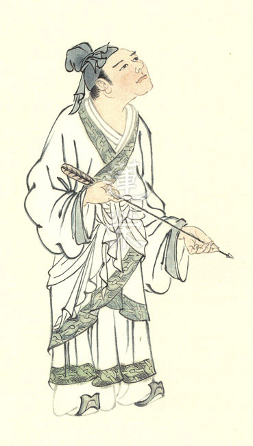

### 孔門七十二賢淺說（二十五）—曹卹

圖/江逸子 文/時哉

人才濟濟孔弟

聖門氣象萬千

禮樂通達大賢

貴冑王室之裔

曹卹，姓曹名卹，字子循，蔡國人，生於魯定公九年，小孔子五十歲。

可見是孔門最後期弟子，雖親近孔子時間很短，或仰賴同修教導與切磋，不妨他成為大賢。

曹卹乃山東曹姓始祖曹振鐸第十八代孫。曹振鐸為周文王之子、周武王的之弟，受封於曹，故以曹為氏。

曹卹為名門後裔，為人恭謹、嚴以律己而正直，於禮樂之道專精學習，能在切磋琢磨中明瞭義理，是一位本質良善，令後世所懷念之人。如論語泰伯篇載：「恭而無禮則勞，慎而無禮則葸，勇而無禮則亂，直而無禮則絞。」「君子篤於親，則民興於仁。故舊不遺，則民不偷。」曹卹認為禮的意義是成就聖人的修學。必須博學於文，約之以禮。才能知道禮的要義與行持的分寸，並活用於禮。禮講究的是行持，講的是謙讓，凡是人所爭奪者，例如名、聞、利、養等，以及世間一切事物，而為人所爭取者，學聖之人皆禮讓之。人人皆存承讓之心，民德歸厚，其心親仁已。曹子循為貴冑之裔，不存世襲之氣息，而謙誠於明道，殊為難得。

畫中的曹卹面目和善，態度恭謹，一襲裝扮儒雅，具有君子風範，也是一位能夠管理政事的人才。宋高宗贊辭：「肅肅曹伯，王室之裔，積習樂道，切磋明義，惟善則主，爾德是類，史筆有煥，令名永紀。」

曹卹於東漢永平十五年入祀孔廟，唐朝封為曹伯，宋朝加封上蔡侯，明朝改稱先賢。

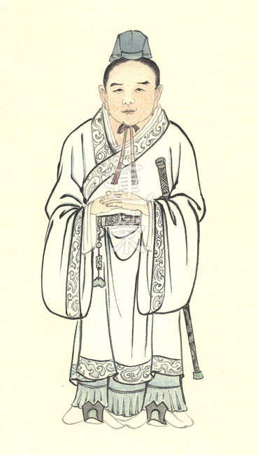

### 華夏精魂千秋（二十六）— 明倫史畫 孝友雙全 薛包

圖/江逸子 文/淨域

無怨孝厚愛弟

處亂世仍受崇

仁者壽德知機

典範存照今人

史畫

薛包，字孟嘗，東漢豫州汝南郡（今河南省平輿縣）人，生卒年不詳。為人敦厚恭謹，幼年喪母，服喪盡哀；對父親至為孝順，名揚鄉里。

父親再娶，後母嫌憎薛包，欲分家驅逐。包雖號啕大哭不願，終被父親趕出家門。薛包在戶外搭茅棚棲身，早晨天一亮就進屋灑掃、整理田園；然而父親並不領情，發怒且杖擊逐出。薛包不得已，只好遷居到里門口，仍是早晚定時問候。

經過一年多，父親與後母受其孝行所感動，便允許他回來家裡住。父親及後母相繼過世，薛包服喪六年，哀傷之舉超過一般常禮。

雙親過世後，異弟要求分產，包苦勸不得只好分家。他挑選衰老的奴婢，說：「他們與我辦事久了，凡事能合我的意。」又將荒田古屋留給自己，說：「這是我從小就整理居住過的，有所依戀不捨。」至於器物就揀些缺舊的，說：「這些我用來比較習慣順手。」因此，盡將好的家產分給弟弟。分家後，薛包勤儉持家，生活不虞匱乏；反觀，弟弟因揮霍無度而日用短絀。包又屢屢接濟他，解救他的困頓。

建光年間（西元一二一-一二二年），安帝聽聞他的賢孝友悌，特別徵召為侍中，但包以身體有病為由，懇辭不赴任。安帝准允帶官養病，特別囑咐地方官，按時問候起居。薛包性情恬淡，閑居不求名利，年八十多得善終。

圖解

薛包以賢孝友悌聞名於鄉里，東漢安帝特別徵召為侍中。侍中源自於西漢武帝，初為一種已有官職的加官，使得以出入宮禁之中；後由郡、國各推舉「孝順親長、廉能正直」一人，先擔任宮中宿衛，待嫻熟朝政事務，再依評第出任官職；成為漢代察舉考試制度之一種官源，名之為舉孝廉。東漢時期設侍中寺，晉後改為門下省，為皇帝的近侍與顧問，主擬詔令。

古語：「忠臣出於孝子之門。」一位孝順父母的人，必能友愛兄弟，此見於薛包更是難能可貴。他早年失母父親再娶，繼母嫌棄欲分家，雖逐出戶仍早晚定時問候。圖中所繪之景，即是薛包一早入戶打掃庭院，父親見了怒目舉杖欲逐之，其不退無怨而任打之，頗有曾子受杖之孝意。然而曾子誤斷瓜藤在先，薛包又有何錯失於後呢？更顯出他對父親的孝敬。

雖繼母生前極欲分家，但最終還是同住一起。父母先後去世，異母弟堅持分產，便將良田好宅分給弟弟，自己留用荒田破屋，後來還大力濟助弟弟。世間常見兄弟鬩牆，為了多取一分不惜對簿公堂，甚至於如曹丕對曹植般，急於相煎相殺。薛包分產讓優取劣，表現出他寬厚的心胸，及不貪取的廉能品性。如此孝親友弟、廉能方正之士，怎能不為君國所愛呢？故而安帝召其為侍中。

然而，薛包並無入仕求功名之心，或已了知宦途深晦之險，此更見其於孝友中並俱智慧。《禮記．中庸》上說：「仁者壽。」仁者有德，故仁者壽，亦為德者壽。薛包活了八十多歲善終，既是仁者也是德者，後半輩子地方官按時問候，這具足了多大的福報呀！概都是來自於他的賢孝友悌之行。

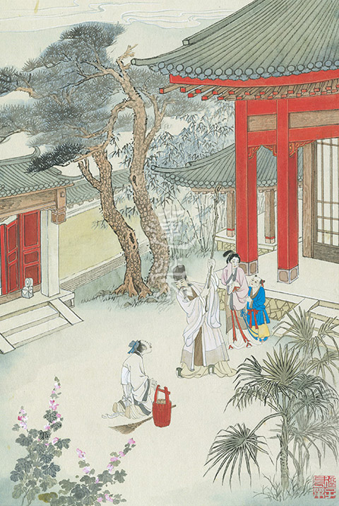

## 活動報導

### 二○一九年唯識簡介講座消文（三）

*編輯部整理*

能量所量體非二

認有距離遍計執

境界體性是心識

唯心所現唯識宗

欲了解唯識，便須從其定義著手，而唯識宗的定義有兩個，即萬法唯識和識原於性。於甲子表中對識原於性，先做細部的探究。而就其定義，法在心外不成，一切萬法皆由心生，更進一步的探究萬法為我們的第八識所生，第八識就是心識與萬法的體性。在一開始就著唯識宗的法性和八個識分析，包含一般世間怎麼解讀法性，和第六、第七、第八識主要的功能認識後，完整了定義中對於識原於性的探討。

在甲丑的部分，針對唯識宗的萬法唯識做進一步分析。既然我們知道一切萬法為心所顯現，那麼了解萬法的概況便能讓我們了解心識。第一部分先從萬法三分來看。

(丑一)萬法三分

◎三分

萬法可以從體、相、用此三個面相去認識它。

「體」法性(空)

體為體性，萬法的體性為法性，唯識的法性和中觀不同，唯識的法性解釋應為：該法沒有在心外自己成立的體性，是該法的空性。此處的空即指他性空，心外無微塵許可以顯現，是諸法的體性，意即該法在心外成立空，是該法的體性，由該法之外的他（心識）來說該法只能以心識為體性，心識之外沒有該法的體性。

中觀宗的自性空是指該法由自己成立的那一分，一粒微塵都看不到，該法自己成立空，是該法的空性。

「相」現境(假)

這裡的相是依他起的緣起相，顯現的境都是依靠心所顯現，依他起的他指的是緣，靠著緣而生而不是自己。而此處說假，因為不是靠自己可以顯現什麼，都是觀待因緣顯現，就此面相說它是假，即自己成立不了什麼，需要依靠因緣所生。

唯識宗所說的依他起，雖然苗芽是由種子、水、肥、空氣條件組合而生起，但是是以心識為體性而生，才是真正依他起義。

「用」生滅(變)

用指作用、用途，萬法只是緣起的作用，觀待這些作用的變化而說生滅。例如當扇子從搧風的作用變成打人，作用改變，體性也跟著改變，搧風時可稱扇子，打人時則可稱小棍子。扇子搧風的功能生時稱扇子，見到熟人怕被人認出而遮臉，此時搧風作用已滅，遮臉作用生起，或稱遮具，不同作用呈現不同體性，安立不同名言。

(丑二) 識境起用

◎心所四分說明

上來，了解心識可以從體相用三個面相認識後，心識還可以從四個不同的面相把其功能說清楚，心王、心所四分說明，此表採四分說的概念，分別就著相分、見分、自證分、和證自證分做說明。

相分和見分是互為能所的關係，唯識宗分析，境界在第八識只能以本質相分為見分所緣，在前六識境界只能以影像相分的方式被心識的見分所緣，境界的體性是心識。例如前一剎那已滅的色塵成為現前眼識的增上緣，且是現前眼識的影像相分，而見分就是眼識能緣之分。

但藉由相分和見分似乎還不夠完整說明心識的功能，因為我們的心識還有一種回憶的功能。怎麼證明我昨日見到，例如昨日看到什麼花、聽到什麼聲音，或被蚊子咬，小時候有什麼遭遇等等，當能緣的心識和所緣的影像都已經滅了，怎麼還能證明我有見到、聽到、聞到、感觸到？所以要證明心識有自我了知的功能，見分緣到相分時有自我了知的功能，故安立為心識的自證分。但自證分並不證明相分的真偽，他只是證明見分而已，有一派人不善讀唯識，以為自證分即是良知良能，而能見真相，若如此何必修學，若如此眾生早已成佛。眾生都必須在善知識的引導、正法的學習，以見真相的方式解脫，此才是真正的離苦得樂，根本沒有所謂的良知良能。

既然見分緣相分需要有一個自證分去證明見分緣到相分，依此邏輯推理，自證分也要有人證明它，證自證分就此成立，讓回憶的功能確立。

針對此四分說的譬喻，請依雪公表解，我們必須先有一個概念，譬喻有時僅就某個角度來做比方而已，不可全盤採認，否則就會產生誤解及矛盾。在相分和見分部分，僅就有形和無形為比喻的重點。相分為心識的影像，如錢一樣宛如有形，從此角度喻為甲方出錢；而見分從能緣宛如無形一般的角度喻為乙方出力。而自證分的功能證明了見分緣到相分，比喻成合同，證明甲乙雙方合作成立。最後將證自證分譬喻為法官，藉由法官判別合同的有效性，說明證自證分證明自證分的功能。

下方兩分互緣不須第五。當安立第四分證自證分來證明自證分時，會產生須不斷安立後者以證明前者的矛盾。但此處只需安到第四分，而無須出現第五分的理由在於證自證分的有效性，它只須自證分來證明即可。就如同法官能夠證明合同的有效性，而法官也因為替能生效力的合同背書，合同也同時證明此法官的有效性。

然則，四分說之中存在一些矛盾，其中包括相分（所）、見分（能），但見相兩分都是心識的面相，怎麼心同時存在能和所，若能所可以同時在一法上成立，就有能作陶的陶師，與所作的陶器成為一的迷失了。再者，自證分約著見分時為能，約著證自證分時又成為所，自證分怎能同時為能又為所。而兩分互緣當中，怎能將被證自證分證明的自證分拿回反證明證自證分，如果可以，那同理便可拿見分反證明自證分，而無須證自證分。

約著四分的矛盾其下方的比喻也存在一些可探討的空間。從見相二分互為能所的概念，所譬喻的法應扣在一起，而非錢和力兩個不同的法；而自證分只證明見分不證明相分，用合同做譬喻，會使人誤認相分也同時被證明。而合同和法官兩者之間的關係，一樣存在著怎能由合同去證明法官的問題，法官應是由人民、政府等其他第三方力量證明其公信力，在安立第四分後，便有需安立無窮後者證明前者的問題。

綜上所述可知，將心識分為四面相去認識，都有其安立的角度和觀點，我們在理解時，需訓練自己分析的眼光，並且善解其背後產生的來由，當知譬喻也僅就某一角度做比方而欲讓我們理解，萬萬不可誤認而將譬喻全盤套用在所比喻的法相上，否則將造成學習理解上的誤解。

◎注五：

相見屬相，二證屬性，相從性生。舉蝸牛喻。

二證互緣。舉權為高低喻。

相分與見分都屬於諸法三分的相（顯境）的一部分，其由心法種生起心法、色法種生起色法。自證分與證自證分都屬於諸法三分的體性，相是被自證分、證自證分所生，然此處所謂的「生」，只不過在觀待之下說生，實則見分由見分種生，相分由相分種生。

相分種生起，見分種也生起，唯有見分的自證分生起，才有辦法讓見分、相分兩分相合，產生認知的功能。唯有總相才能讓別相發揮功能。見分緣相分生起認識作用，是因為自證分的關係，自證分是見分的總相；沒有自證分，生不了回憶的功能，認識的作用也不可能發生。
自證分就是總相，證明認識作用發生，如昨天看到青色，然今天有人
**問：** 「你昨天有看過青色嗎？」能回
**答：** 「有。」是因有自證分，而有回憶的功能。

唯識的宗派見，認為能緣的心識與所緣的境界有距離的這一分，是必須被遮遣的邪見；能與所之間沒有距離的，此是唯識宗成立以心識為體性的宗派見。並以蝸牛兩只觸角比喻見相二分，只是從兩者同時生起的角度來說，但不能只依此喻來認識見相二分，畢竟自證分是為了證明見分，但相分並非從自證分生。而蝸牛的背殼與蝸牛的自身，來比喻自證分與證自證分，這也是不得已的比喻，否則二證都屬於心，怎麼一分為二呢？

自證分與證自證分兩者互緣，舉權量重量的砝碼，與所權量的物品，兩者的重量可以藉由高低權衡相互證明。但實際上，砝碼可以確定物品的輕重，但物品的輕重並不能證明砝碼的準確性，因此這個比喻也只是就二證互緣不必第五來舉例說明罷了。

（丑三）識之能所

◎識能緣量有三

心識能量度者下分為三：現量、比量和非量。

「現量」即現前量度，其境界是「現在前境」，境界顯現在心識之前，並由心識來認定眼前的境界「真實不虛」，是「親證無謬」。心識以正確無謬的智慧親證，意即見到真相。舉例而言，「見屋解屋」，看到眼前的屋子，便可以解屋子的顯色（青黃赤白）、形色（長短方圓），這是古代的比喻。現今的比喻舉月亮來說，「月無圓缺」，真正的月亮是滿月，見到月亮本來的樣子。

「比量」是由正確的推比而得，比量的境界是「不現在前」，所量的境界不在眼前，必須要「借相推度」，藉由已知的相來推未知，而「解義無謬」，是推理不現在前的境界，推理通達，知道有此境界。以「見煙知火」為喻，火是沒有現在前的境界，藉著煙來推度火實有，符合實際的境界。若以今喻，「月行傾轉」，眼前見到不同型態的月亮，以正因推度，知道它的本質是圓滿的。推比生起比量的正因是現量，所以正因不必再以另外正因來成立，否則會有無窮過失。

「非量」是錯誤的認知，它是「現非現境」，可以是現前境，也可以是非現前境。「似現似比」，非量可以是似現量或似比量，似現量例如把眼前的繩子看成蛇，似比量例如把霧看成煙，並以煙錯誤的推度有火，事實上那是山嵐。此二者「事理皆違」，似現量、似比量都違背實際情況。舉「繩蛇火輪」喻，這兩個都是似現量，把眼前的繩子看成蛇，把快速旋轉的火把看成火輪，都不符合真實的狀況。

◎識所緣境有三

心識所緣的境界分為三個：性境、帶質境、獨影境。

「性境」即真實顯現在眼前的境界，所見的境界符合它的體性。「或事或理顯現不虛」，瑜伽行者現證無常（現相）、現證空性（體性）都符合境界的實際狀況。「純其性質非從計度」，純粹就著該法的特性上顯現，不是透過推比的比量或非量（非現非比）。例如：「山色鐘聲見山聞鐘」，眼見山、耳聞鐘，眼識、耳識的現前境界都真實無謬。

「帶質境」是「依於本質起別異解」，依著本質另起一個了解，現前的境界是由本質生起的，但早已不是本質，而起別的了解，例如：黑暗中看到一個柱子以為是鬼，柱子

是本質卻看成鬼（起別異解）。「解境違質而帶彼質」，了解現前的境界（鬼）違背本質（柱子），是依著本質才有這種顯現，並不是說看到鬼中有一分是柱子，例如李廣黑暗對著石頭以為是虎而射虎，沒有石頭也生不起鬼影，說帶有一點本質，其實在所見境中沒有一點本質。

「獨影境」是扣除前面的性境與帶質境，剩下的獨影境是獨頭意識的所緣境。獨影境「不仗本質心緣三際」，不必依仗眼前的本質，而可以心緣過去、現在、未來，例如：規劃未來的生活，「體不顯現心起影相」，沒有境界做它的本質，自己可以心起影相。例如：「夢幻所現即假想等」，夢中的境界或是根本不存在的龜毛兔角之類。

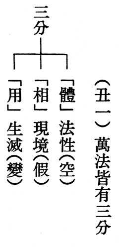

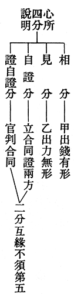

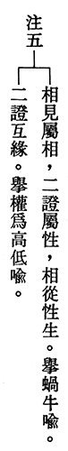

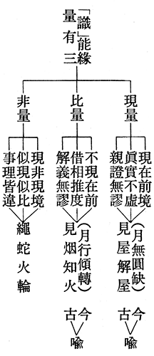

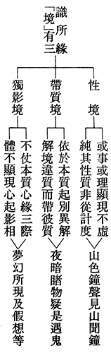

### 莊嚴一百二十週年紀念展 — 導覽志工殊勝行

欲仁

舒適圈裡無作為

幽幽泛泛更痛苦

利他充實是出路

壓力成長乃必然

「導覽」學習的平臺，是從「教室」延伸至「室外」，與大眾結殊勝的善緣，一來有助個人學習上的充實，二來更提升了團隊的「能見度」。由「儒者之風─孔德成先生百年紀念展」後 ，這不思議的因緣就接上了「一生翰墨故宮情—莊嚴一百二十周年紀念展」，也為「雪公一百三十周年展」序幕開啟另一期的因緣，彷彿中是「儒家—道家—佛家」脈絡的顯現。是否由此「文化傳承」另一「新猷」。

學生魯鈍，謹以管見略述此次導覽感想。

終身學習的典範

慕老六十一歲時，仿歐陽修的六一，每日必做六事：「寫字、散步、喝酒、靜坐、打拳、奉行自己。」這看起來是 「暇滿人生」的自在。

每日晨起必先法書，幾無一日間斷，且不以得少為足，縱已年近古稀，尚盡其存款及數套藏書換得「好大王碑」拓本，而且日日摹之長達半年之久，並參與書展與同好分享，若無暇滿人身可得而為耶？縱然住院，文房四寶仍隨時備妥。由此感受到此次「導覽」就是「學習」與「分享」而已，何故？

每天來看展的貴賓，如遇是「行家」，總是戰戰兢兢，抱持「學習」的心境，多方的「請益」，往往能獲得更多的指導，就是「學」而時「習」之一大悅事也；若是一般觀眾，能將所知「和盤托出」，能與有朋「分享」之樂也。豈非人生「活到老，學到老，學不了」寫意。

文物導覽是學習增上最佳的平臺，由此而想到老師曾講過的「學習三區」，即所謂的「舒適區、學習區跟驚恐區」，怎麼說呢？剛開始上場就是「舒適區」，是說所介紹的都是你會的，就是把課堂及資料複習一遍，講完了，你永遠學你會的，所以輕鬆。

在展場初期以此居多，然長久下來就會「孤陋寡聞」如雞肋無味；所以在有其他師長導覽時，就緊跟著聽聞，作筆記，回去後趕緊查詢補充資料，同時也作「思維推理」而進入所謂的「學習區」。

學習區是什麼？就是一定要有知識背景去推理，慢慢學把這些學進去。就是說，你可以克服困難學進去的，你才能把你過去的框架打破，你要把內容弄懂，然後看老師們是怎麼深入淺出，而非「鸚鵡學語」。這就叫「學習區」。

「學如逆水行舟，不進則退。」如何不退？就要提升自己，進入「驚恐區」，這完全超出能力，超出想像，根本就不是自己想像的範圍。

在展場中有「書道幽光」的主題，一定得是由書法高人王老師、楊謝老師方能一一道出個中的「原委」，甚且王老師還在展前自行臨摹慕老的「好大王碑」，將其中的「書法三昧」韻味娓娓道出。方能認識慕老的書法是是出神入化。

所以這也告訴我們，人的能耐有時候要自己訓練自己，沒有辦法別人給；能耐要自己創造，不是被固定的、被框住的；他不斷的去創造自己的能耐，是可以加大的、磨練的、承擔的，受辱的，就是慢慢去練，就如老師常講的像「善財善財童子五十三參」這樣，全部厲害的陀羅尼都會教授予他。

飲酒的另一種面向

「不如來飲酒，可以賦新詩。」「三盃通大道，一醉跌跟頭。」「夜半狂飲白蘭地，伴相依永不違」「白、粉紅、朱紅、赤紅、紫紅」「醉、微醉、真醉、大醉、特醉」等等書聯，這都與「酒」有關，似與佛門「不飲酒戒」格格不入。這反而要由另一個面向看。

「酒霸」孔上公、莊嚴先生都是喝酒人士，但「醉不及亂」，反而脾性很好，行為端正，是無怨無悔為公發心，對國家是認真護持，這些行持，在那個時代裡面顛沛流離，反而是他另外一種的抒懷，「李白斗酒詩百篇」，這種飲酒反而要由另一個面向看，如同我們看菩薩戒行，有的時候就算他放逸，但戒體不失，除非他是邪見生起；菩薩戒體都不是可以批評。菩薩為了利益眾生所以由根本位出定，「及其神變也，則令脩短革常度」，他能夠改變各種固有的法則，也就是說，他可以通權達變，反經合義，就是這個人可以用愛惜萬物來表現慈悲，也可以用殺來表現慈悲，此證量非一般凡夫可以測得的。

「五四」百年的省思

展場中懸掛莊嚴先生所書之「蔡元培校長墓表」。不禁令人慨嘆適值「五四運動」百年，當年鼓吹以白話取代文言，同時把中國的積弱歸咎於儒家，儒家受到科舉的汙名化，儒家經學傳統從此「斷了鍊」。

此運動簡單說，主軸就是「反傳統」，以「現代」的「民主」「科學」來取而代之。而其「後患」就變成兩個極端，一個就是「沒有儒家的中國，成了馬列主義新中國」；再者國府避隅臺灣，強調「言論自由」，或走上民粹的道路上，使得反智式言論充斥，變成民粹式民主，這種不健康的民主政治就成了「製造對立」「無法自制」。臺灣的教育也出了問題，學子未學到正確的「認知」，每天安於「小確幸」，沒有理想和抱負。往往「自由，行為卻很自私」；「信任演變成放任」；「自信演變成自大」。

難道「傳統」與「現代」不能相容嗎？如果沒有自己的文化傳統，對於創造力也是一種嚴重的斵傷！因為所有的創造力，必須植根於傳統的土壤中，才能成長茁壯啊！如同莊嚴先生，他處在世代「改革」巨變當中，但是他從來沒有離開過「傳統文化」，而且在過程中屢屢的「創新」走入時代，沒有讓文化「泡沫化」，這才是承先啟後，繼往開來的胸襟。沒有傳統，只有膚淺的流行文化，所有的流行都很快成為過去式。因為缺乏深刻的文化傳統支援，人心浮動，一窩蜂的追逐流行，而文化只是一陣泡沫而已！流行過後難留下足跡！

將小餅做成大餅

五四百年後的今天，如何重拾前人的智慧，正考驗著自尊自大又自卑的現代人，臺灣的現代化過程中，缺乏文化傳統的支撐，也呈現了漂浮無根的狀態，如何把「弘傳文化」的大餅做起來？就是認真的經營「讀書會」。這又回到「莊嚴展」的價值是什麼？它的價值是藉著導覽團隊呈現，就是觀待解說的人讓展品有價值。所以只要好好的學習，團隊的因緣因大眾的投入付出，就像滾雪球般不斷累積，因緣就越來越殊勝，如華嚴經說：「放大光明無有邊，度脫眾生亦無限。」

其影響所及，包括未來雪公老師家鄉的文物展，甚至孔上公展、莊嚴展未來繼續在對岸展出的因緣。

所以導覽人員多厲害，能自己生出價值嗎？生不出來！莊嚴先生的價值是什麼？他的價值也不能自己顯現，是觀待導覽的內涵而現。所以中觀宗的空性並不是否定緣起法，反而說明緣起法的觀待性，從來沒有否定緣起法。

審視莊嚴先生這一生，民國二十四年的倫敦文物展，民國五十年的美國文物巡迴展，莊嚴先生都參與其中，正因為他有解釋文物的能力。

換句話說，懂得自己的能耐，對事情了解的那一分就是福報的來源。所謂的士用果就是以能力的那一分是很厲害的，他有能力藉著士夫之用，將自己過去少許的布施業增長為廣大的福報。所以才說「業的思維」絕對不是我們看的這麼簡單。

就好像比爾蓋茲、巴菲特這些大財富家，是由宿世的布施業關聯為今生的大事業。諸法都是「造作」出來的，今天的「一小步」，將累積成就未來的「一大步」。

再次感謝 唐老師林老師的領導，諸位導覽前輩的提攜與指導，還有與會的諸有情成就此一盛事。難道這不是「諸上善人俱會一處」，佛國淨土的經營乎！

後記：此文是在「屢敗屢戰」中「湊」出來的，也是在「聲聲鼓勵」中激發而有的；不圓滿處就是前行「一拖再拖」、正行「臨表涕泣」，結行「不知所云」，遑遑不可終日。

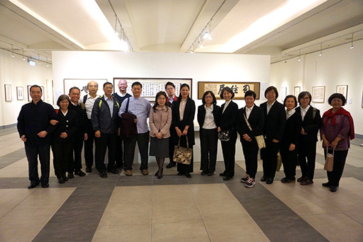

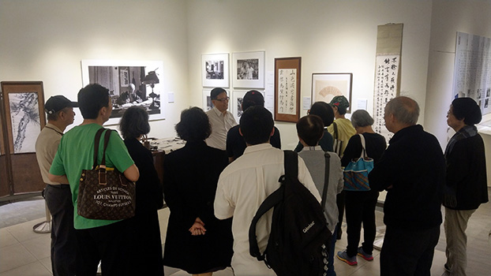

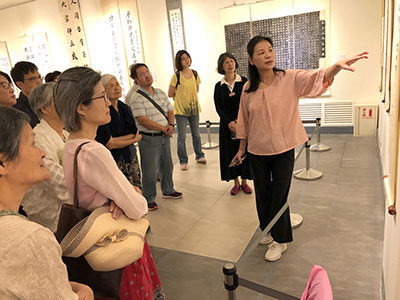

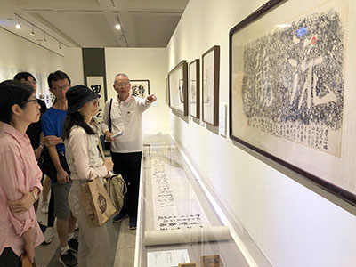

### 莊嚴一百二十週年紀念展 — 悠遊妙莊嚴境

酒儒

一生是一種歷練

一世是一種累積

一心是一種堅持

一味是一種平淡

因滅果生

《儒者之風》孔德成先生百年紀念展，在國父紀念館博愛藝廊，於一○八年二月十日落幕；《一生翰墨故宮情》莊嚴一二○週年紀念展，接著於三月三十一至五月二十六日，假國父紀念館中山藝廊及文華軒展出，分為故宮半世紀、書道幽光、翰墨知交情、湛藝莊門四大部分。據國父紀念館館長梁永裴先生說，展場之大、展件之多、展期之長首創紀錄。承蒙策展人(陳筱君女士、莊靈先生)給我們機會學習，得以更深入認識莊老夫子的內涵，悠遊在莊嚴妙境之中。

莊嚴略事

一八九九年  出生於吉林省長春市，又名莊尚嚴，字慕陵，號六一翁。

一九二○年  進入北京大學哲學系，受教於胡適、馬衡、沈尹默、沈兼士等人。

一九二四年  畢業後，進清室善後委員會，做清點故宮文物的工作，自謂「溥儀出宮，我入宮，當的不是皇帝，而是一個維護民族文物國家重器的老宮人。」

一九三一年  與申若俠女士結婚，後育有四子。

一九三三年  為因應政局變化，押送文物南遷，經南京到上海，分存法、英租界。

一九三五年  押運故宮文物，首次出國至英國倫敦展覽。

一九三七年  因中日戰爭，未免文物受損，選擇精品分成三批，分路運送至大後方，莊老負責押運第一批文物，經武漢，而後安頓在貴州安順華嚴洞，舉家萬里西南遷。

一九四四年  因戰火蔓延，文物緊急運往四川巴縣。

一九四六年  抗戰勝利，奉命接收樂山、峨嵋之文物，運抵重慶。

一九四七年  舉家隨文物東歸南京。

一九四八年  因國共內戰，奉命押送文物渡海來台，暫存台中糖廠倉庫。

一九五0年  文物遷存至新建之霧峰北溝庫房。

一九五三年  升任故宮古物館館長。

一九六一年  故宮文物首次運美五大城巡迴展覽，以顧問身分赴美督展。

一九六五年  台北外雙溪故宮新館落成，文物方得休養生息。升任故宮博物院副院長。

一九六九年  退休，服務故宮四十五年，故宮文物承載中華文化五千年的歷史。國家滅亡，後有復國之日﹔文化一斷，永無補救之舉。莊老的一生，可說就是一部故宮搬遷史，參與人類歷史上規模最大的文物大遷徙，譜寫了中國人保護文化遺產的壯麗詩篇。有人送他一方圖章，上面刻著「老莊老運好」，「莊」是「裝」箱的諧音，「運」是運輸的「運」，又是命運的「運」。不論是指古物，亦或指莊老其人，均為絕妙之詞！晚年任教於多所大學，培育藝術人才，桃李滿天下。

一九八○年  病逝於臺北榮總，臨終仍念著北京故宮。

莊嚴其人

從莊老自書的作品，或友人贈字，可顯現他多面相的人格特質：

◎和鳴

「慕老吾夫子，行藏似古人，撚髭因鍊句，撫髀嗟閑身，門徑多修竹，堆書若積薪，平生清絕處，投老益深真。」若俠贈外。莊老則回以「不作封侯想，鍾情薄倖人，眼中犀角子，相泣牛衣身，慙我謀生拙，勞卿日荷薪，耕前鉏後趣，偕老樂天真。」從其中能感受到鶼鰈情深，安貧樂道的生活情趣，更佩服若俠女士相夫教子之功。

◎教子

為四子莊靈之《代求冊》內有胡適題「要怎麼收穫，先怎麼栽」、羅家倫「從學問裏求智慧，從工作裏得經驗，從藝術裏謀修養」、錢穆「入則孝，出則悌，（謹而信）汎愛眾，而親仁。行有餘力，則以學文」等文人所贈之名言佳句，期勉孩子成大器，可見其望子成龍之殷切。

◎精進

莊嚴先生飽覽歷代名家書畫，加上個人的天賦與努力，每天四五點晨起寫字，午餐後寫字，生活中偶有心得，速提筆寫字，與友人酒後，更能流暢寫字，不但融合諸家字體，還從趣味入手，自成一體。從其臨摹宋徽宗的瘦金體、趙孟頫的《妙莊嚴寺記》、蘇東坡的《寒食帖》、《高句麗好大王碑》等，唯妙唯肖，足見其用功之深。

◎細心

「小窗虛幌相娛媚，破紙隻字皆收藏。」沈尹默老師深知自己學生的個性，以此聯相贈。從莊老保留之書信、便條紙等可見一斑。

◎創新

自創壺筆，用小葫蘆代替筆管製成的筆，創寫字新工具與新筆法，又符合「指實掌虛」的執筆原則，試寫「甲天下」，連寫四幅才得一幅稍滿意之作品。

中國元朝的鄭元祐、清朝的高鳳翰二位書法家，及莊老之宗族莊索先生(莊伯和先生之父)，都以左手書寫，將渠等作品匯成冊，封面為「尚左集」，並以左手試書「尚左集」更厲害的是，字還以反面呈現。

◎寬容

「不作厚古薄今人，莫為貴耳賤目人。」一位看遍故宮珍品的長者，不會捨近求遠，仍能虛心接納今人之作品，寓古於今，以今賞古的眼光及胸懷，實為我們學習之榜樣。

◎練達

「有容乃大，無欲則剛。」悲智內融，取其中道；若非豐富的人生經歷，加上智慧的判斷，遇境難以抉擇。

◎幽默

「三盃通大道，一醉跌跟頭。」莊老酒後滑跤，毫髮無傷，奇哉！回家速以碑體寫此對聯，告知在美國之兒、媳，有此險事，像不像個可愛的老頑童？

◎雅趣

仿王羲之蘭亭修禊流觴曲水，邀集文人雅士，回味千古風韻。

◎淡泊

「味無味處求吾樂，才不才間過一生。」引自南宋辛棄疾《鷓鴣天》，用之則行，舍之則藏，處順逆境皆能自得其樂，亦即其人生觀的寫照。

◎定功

在其《夜坐記》文中「…凡此諸聲，摒之不去，絕之亦煩，不若靜而聽之…余之夜坐，不求必靜，不與緣絕…寧心定意，暫得片時之安用，嘗人間至樂而已…」莊老六十一歲生日時，自號「六一翁」，每天必做之六件事---散步、打拳、飲酒、寫字、靜坐、奉行自己。此文足見其心靜的功夫。

◎空性

為四子莊靈新居題了「幻住居」，題識「昔賢者住幻、居幻，今靈兒又造幻境，使老夫作幻語，大千世界何莫皆幻事？」體會到人生如夢，萬法體空。

莊嚴其友

莊老與藝文同道，如渡海三家張大千、溥心畬、黃君璧；北大師友，如馬衡、胡適、沈尹默、臺靜農；故宮同仁，如孔德成、江兆申等諸好友，因平日往來，而結為文墨知交。

其中如臺靜農先生給莊老的信札「……靜農擬於九日去日月潭，十日隨隊來霧峰，賊不空過，府上好酒獻出便了，此外花生米若干粒即可打發過也。太上老君急急如律令」倘非至交，哪能這般赤情幽默！

又如給莊老的輓聯「歷劫與建業文房共存 平生自詡守藏史  持身在魏晉人物之間 垂死猶懷故國心」把莊老一生的心境與事功，刻劃得淋漓盡致。

張大千先生的摩耶精舍，距莊老的洞天山堂不過一里路，既是鄰居，又是同年，常相往來，切磋書畫。最後給莊老的輓聯「頰上許添毫 我愧是翁成謬賞  天涯方有事 自勘淨土與埋憂」道出同為客居人的鄉愁。

莊老七十大壽，江兆申先生刻印「大椿八千歲為春」賀之。一日，此印失竊，失而復得，欣喜若狂，尊治美酒，慶印歸來，謝諸良友，印壇逸事，傳為趣聞。

莊嚴其子

浸潤於故宮文物，騷人墨客匯聚一堂的環境，造就莊家四子各個藝術才情洋溢，甚至入門的媳婦也非等閒。長子莊申為中國美術史學者；次子莊因長於散文創作，並創作毛筆漫畫；二媳夏祖美是夏承楹（何凡）、林海音的掌上明珠；三子莊喆是國際知名的抽象畫家；三媳馬浩專精於陶藝創作和繪畫；四子莊靈曾任台視攝影記者，推動提升台灣攝影文化；四媳陳夏生任職故宮，公餘精研創作中國結。可說傳承莊老一生追求藝術的精神，莊老往生近四十年，仍能將父親的遺物保留完好，公諸於世。不時看到莊靈伉儷在展場中，謙和地為觀眾導覽，對父親往事歷歷，娓娓道來，渾然忘我，常過了午餐時間，大家都欲罷不能。「夫孝者，善繼人之志，善述人之事者也。」堪為當代孝道第一家庭！

發想莊嚴

一入展場，呈現各種字體的書法，不禁懷疑這可是出自同一人的手筆？書畫要好，「勤練，勤練，再勤練；讀書，讀書，再讀書。」除了勤練，還要有經學內涵，能細膩觀察自然萬物，更要用心思考、深入理解，入心才有感，感覺深刻，才能表達動人，所謂「得之於手，應之於心」。

在介紹《臨蘇軾寒食帖》感受蘇軾被貶到黃州「空庖煮寒菜，破灶燒濕葦」雪上加霜的寒心，當天又適逢寒食節(清明節前後)，因此特別有感，中午吃了一個海苔冷飯糰應景，並緬懷重耳與介之推的悲劇故事。

在展場上看流觴曲水的照片時，斗膽祈請莊靈老師，於東晉永和九年後第二十八個癸丑年，即民國一百二十二年，能邀集四十一位文人雅士，再辦一次飲茶賦詩流觴曲水之雅聚。莊老師哈哈大笑說，「沒把握！」莫非莊老師學過空性正見？知凡事都要因緣和合俱足，才能成辦。

對日抗戰期間，社會動盪不安，莊老在安順讀書山華嚴洞，生活在古物間，等同明、清皇帝才有的福報，此為共業中的別業，莊老善用其別業，在所處環境常與同好切磋琢磨，提攜後進；隨著文物遷臺，與來臺諸大德，共同作育英才，形成一股清流，奠定臺灣的文化底蘊，同時種下自己未來美好的業因。

看著，看著，檢視自己，喟然而嘆，昔日生涯，得過且過，虛度光陰，一事無成，生活無彩，生命無光。或只羨他人成功輝煌，未見他埋頭鑽研，一次又一次失敗的苦難，「沒有天生的釋迦，也沒有自然的彌勒」，唯有依止善知識，靠著團隊的經營，鞭策自己當勤精進，慎勿放逸，才不空過難得的此生！

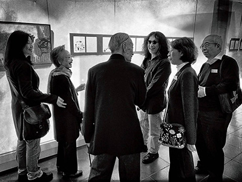

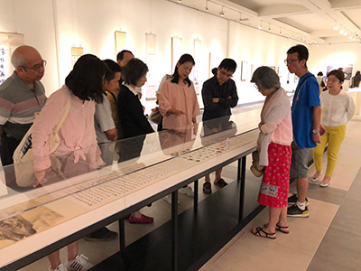

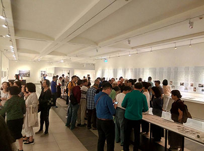

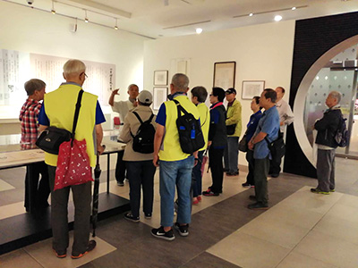

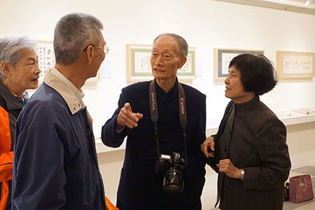

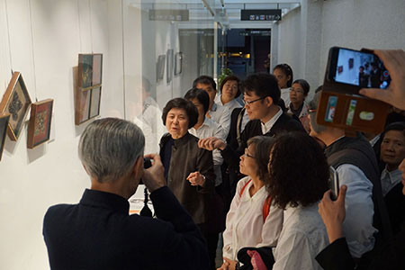

### 莊嚴一百二十週年紀念展 — 書載五倫難得見

傳線

大展見核心

以藝載五倫

作品亦精湛

書法集大成

一、前言

（一）翰墨因緣歲月多

從大學一年級下學期開始加入輔大書畫學會，臨池學書歲月，到今年算算已過了四十餘個年頭，又忝為心玉盦門下，入盤石書會也超過了三十餘年，参與十餘次書會會友聯展，觀賞師友展覽，自己也曾參與雲軒月華四人展，與筱雲博士共同舉辦翰墨新情雙個展兩次，為開拓書法視野眼力，更参觀同道或長輩書法展、紀念展、回顧展等等展出，積四十餘年經驗閱歷，所見雖不敢言多，自問沉浸書法歲月中，也未空過。

（二）導覽點滴嘆不足：

書法展導覽，始自千禧年四人展，隨後零星客串導覽，最是投注心力導覽當屬丙申、丁酉花甲雙個展，由於是導覽自己的作品，無論創作動機、理念及結構布局、書體的安排、風格的轉變種種，無不了然於心，既知其然亦知其所以然，導覽時脫口而出，率皆有據，只是却顧所來徑，雖知書藝本源於道，為人解說時，罕有觸及，實美中不足。

（三）一得未藏翻自利

今年歲次己亥，有幸參與導覽名攝影家莊靈均先生，為他父親莊嚴在國父紀念館籌辦逝世百廿週年紀念展「一生翰墨故宮情」，秉持導覽相長的理念，一次次思維，如何契機讓來觀賞的同好，不虛此行，竟然在一次為社大的書法班導覽解說時，覺展場件件作品雖有如美妙的珠子串起來，莊靈均先生及主其事的陳筱君總經理將故宮半世紀合一串，書道幽光再一串，翰墨知交復一串。那一天，我靈光一閃，突有所感，發現可用不同的串法，慕老與尹默，與從學者心均的兩代師生關係；夫婦唱和、慕老致子叮嚀語，與亦師亦長官馬叔平筆墨題跋、眾友書札往來贈答、莊靈均兄弟的互動，這些作品不正述說千年來的五倫關係，維繫國家穩固社會的關鍵，生起如獲至寶的想法，內心踴躍不已，如是展覽，稀有難得，更是難得一見的精心安排，願借蓮榮月刊一角，分享與會好友。

二、書載五倫難得見

在展場既見作品中傳五倫的大道，當下覺察便為人解說，隨後不時適機宣揚，但細繹除介紹書作寓含的五倫大道，也有闡揚師生情誼的作品，今依次敘述如后。

（一）師道最尊書畫彰

故宮半世紀展區數件作品引人注目，一是慕老於巴縣時委同事劉峨士所繪「安順讀書山華嚴洞圖」，國寶遷徙，何其大事？不啻關係故宮，更在世界藝術史或博物館史值得大書特書的壯烈史篇，適時以繪畫記錄，尤見匠心獨具，畫作引首芳名奉請亦師亦長官的馬院長叔平題簽，後拖尾十餘題跋居先也是由渠師題洪北江詩二首，足見慕老尊師心意。前述展區盡頭，書房重現處對面一矮牆，前後各置一長櫃，依稀記得，其中一面懸掛馬叔老淦莊八景、八首七絕，同向矮櫃右側置抗戰勝利後，其候輪俟東歸時，所臨石鼓文蝴蝶装一冊，而在翰墨知交情區左牆懸掛一件曹魏鮑寄鮑揖二神坐，那是馬叔老珍藏二十餘年的合拓本，慕老來信索寄即贈之，以上書作一捨一藏，師生情誼的深厚，拙筆如我，無以名之！

秋明詞稿手卷，又見尹老與慕老二人師生情深，慕老見北大好友朱家濟有收藏其師尹老作品，備貴陽構皮紙，起而效之，乃有此難得存世的佳作，更稀有的是引首題籤出自馬叔老的墨寶，一篆一行，俱為二位恩師擅長書體，尹老更贈慕老小窗破紙七言聯，不論字體聯句，均有可觀。遙想當時北大自由校風，名聞遐邇，我則尋覓彼師資道合，值後世學界思齊啊！

（二）夫婦情深含敬重

夫婦志同道合，是人生至美的事，苟又能吟詠唱和，更是神仙眷屬，慕老與夫人申若俠，既道合彼此復能酬唱見真情，令人欣羨呢！

君不見，時在乙酉（一九四五），會於巴縣，申夫人興起賦詩「慕老吾夫子，行藏似古人，撚髭因煉句，撫髀嗟閒身，門徑多修竹，堆書若積薪，平生清絕處，投老亦深真」，細審此五律，頷、脛二聯對仗工整，首末兩聯相呼應，對夫君慕老的情懷胸襟誠中肯，不愧是相知甚深的老伴;而慕老唱和二首，先次韻後和韻，第一、二首脛聯「慚我謀生拙，勞卿日荷薪」，「稍入莓苔路，遙聞雞豕音」，一如夫人的情真意切，後申夫人因荷家計，將才情捲而懷之，成就老夫子及四子各善其長的才華。

對夫人的付出，料想慕老點滴藏於內心深處，無怪乎民國五十二年睹蔣夢麟臨老續弦鬧婚變。又見好友董彥堂、李玄同相繼病重，有感而嘆，於中宵酒後賦詩贈若俠夫人，末句「老伴相依永不違」，最附深衷啊！落款處對夫人以平台式稱呼，禮之最敬，從此微細處見出對夫人的敬重心，書道幽光專輯裡精選作品兩扇面作品-贈若俠夫人西江月，落款禮敬同上，後生見諸可思齊也。

（三）憐子適性盡文藝

抗戰前後，四子從民國二十二至二十七年依次降臨，慕老自民國十三年入清室善後處理委員會，後更名故宮博物院，隨著故宮國寶南遷，西遷，東歸，徙台，一路舉家從北平，上海，南京，長沙，安順，巴縣，重慶，後至台灣台中霧峰，最後落腳台北士林外雙溪，四子一路相隨，設身處地而想，備極艱辛，與時推移，四子從稚齢，童年而青少年，由懵懂而漸開智，生活物質條件雖惡劣，幸外有大山大水的滋潤，內有守藏史的父親，隨機在維護石渠秘寶的潛移默化中，教化四子，並延西席丹青課子，歲月冉冉，這些山山水水，或已悄悄植入四子心靈深處。

長子莊申在中國藝術史，學有所長時，在初試啼聲的藝術史著作，其書序言，慕老異常看重，請政界學界名人羅志希親書，從展場的書札，可見對長子的期許愛護。次子莊因文學家，而立赴澳洲講學，慕老賦別云「水擊三千里，飛行一日航，叮嚀無別語，祇道早歸鄉」，將千古為人父與愛子別離的心情，深刻期盼的表露出來。

三子莊喆名畫家，畫藝融合中西，享譽當代，慕老為其齋館「朴庵」題字，朴一字或有垂示深意，又此幅落款是為喆浩書之，三媳馬浩名陶藝家，從細微處也看得出對媳婦等同欣賞憐愛，不僅三媳，次媳夏祖麗在三盃一醉五言聯落款處，亦見到此愛屋及烏的呈現，至四媳陳夏生，名中國結大家，容後再敘。四子莊靈均「名攝影家，此次展出的擘畫者，放眼當代為人子，孰能如是，在父親亡後四十年舉辦如是引人讚歎的紀念展，寥若晨星也。靈均或在慕老晚年隨侍在側之故，互動最是頻繁，展件較多，如為靈均湛如新居題「幻住居」,此幀筆意渾厚，落款內容可見慕老涉獵佛學及書學的功力，又二人大喜之日，慕老至交孔上公德成先生各贈篆書條幅，書太白五絕，婚禮誌慶，各摘二句「長安如夢裏，何日是歸期」,「醉起步溪月，鳥還人亦稀」,思此四句，是否上公以慕老角度書寫，別具深意!慕老憐子，不獨旁及媳婦，更下及深愛的孫女，書道幽光展區第一件唐邕寫經碑作品，落款大意交夏生留存供苹、蘅兩孫將來學書之助，足以證明。

（四）兄弟怡怡尋舊跡

此次展覽會場計有四展區，其中「湛藝莊門」，便體現兄弟和睦的情誼，縱使此展區全是老四對兄嫂的蒐藏，正說明兄弟在慕老及申夫人調教下，兄友弟恭，何況老三莊喆的畫作，還是向史博館借展，確信若非莊靈均珍藏，渠一呼兄嫂也會俱諾吧！

另外一體會，展品未見兄弟怡怡氣象，但導覽安順讀書山華嚴洞圖，總會道出此圖牽連的一些故實，民國八十八年在莊靈均先生的號召，兄弟及子侄門同踏著渠先父先祖父的西遷足跡，還讓湖南長沙大學圖書館補登記錄此一令人難得的光榮史蹟，隨後民國九十二年莊靈均先生因兩岸攝影交流，再度入華嚴洞，二次尋蹤無不流露思親的孝行。

（五）知交贈答追長慶

「知交贈答追長慶」，熟悉此次展覽的蓮友，必發現蛻自臺老臨完白山人的七言聯上聯「吟壇贈答追長慶」,長慶或意指元白二人允為知交，展區名為翰墨知交情，不正說明彼等情誼如元白，藉由翰墨往來贈答，而記錄了一生知交的軌跡，合此將上聯易上二字。

靈均何其有心，於展出前抒發情采並茂的文章，借聯合副刊登載渠先父交往的翰墨知交，如「不唱山歌去考古」寫與甲骨大家董彥堂的交誼，展區朱筆甲骨文有：調寄浣溪紗，南歌子，二幅七言聯，更難得的是為靈均弱冠時書「知之為知之，不知為不知」的格言。

記北大才子羅家倫，以「忍從圖畫認江山」緬懷，志希所吟唱邊塞詩十餘首，置之唐人亦不遜，駐足詩作前，回想渠振筆而書，强記多聞，寫畢不知夜已深矣！又其遊草山，日日月潭等詩，宛如竹枝詞，也同樣可觀，以最為傲的情采詩作，贈與至友，頗見古人風規。

書「我們家哪裡有酒呢？」回憶孔莊兩家的互動，真誠無邪的文人情懷，無拘束的酬酢，至故人莊以壺筆揮灑靜慕二字，而上公主持儀禮復原小組並拍製全球第一部古禮黑白電影，吩咐至交愛子掌鏡，當時師生合影相片，也懸掛展場，最令人感懷莫過於致慕老輓聯，A4紙上恭敬、工整且不苟泐著十一言聯「玉盌金魚，秦火劫殘曾共守;秋鐙春雨，山堂酒畔憶相親」，情真、禮又恰如其份。

展區一角，掛著靈均所拍攝，一幅巨大的攝影大作，那是常尾隨父親慕老造訪老友，靜靜地站在一旁，悄悄地觀察前輩談書論藝或人生哲理而捕捉的永恆畫面。畫面上三人，由左至右：臺老，慕老，大千居士。下有矮櫃，置放二老致慕老書札，靈均據此抒寫「函邀吃烤肉」及「賊不空過」憶與龍坡靜者相處，札文用筆率性無拘，見二老之真情相待。「從北溝到摩耶精舍」，筆與大千的相交，驚奇知己繪畫的悟力與記性，又賞渠洞達人情世故，照片對面懸著絕無僅有、二人弔故人的輓聯，臺老肯定慕老一生行持和對國家的奉獻，大千龍門聯意深殷盼與友共生淨土。一日立在此角落，靜觀巨照，若有所悟，靈均運鏡，別有巧思，壁上條幅獨留「風清」二字，此二字或可概括彼等知交之風骨情調。浪費篇幅多矣，其他師友知交內涵，可閱讀靈均的文章，敘述朋友一倫，就此擱筆。

（六）對上對下誾侃如

觀慕老一生從公，既能敬上，勇於承擔，居高位也獎掖後進，誠如他所書「有容乃大，無欲則剛」。

慕老從事務員，科員，科長，秘書，組長，館長至副院長。在亦師亦長官馬院長叔平的提攜栽培，在近不惑之齡，民國二十四至二十五年參與倫敦中國藝術大展，時馬院長囑其至歐取法他國長處，並指定八條調查項目，諸如博物館管理及陳列法，以舊建築物改為博物館者尤宜注意其改造法，防火防濕之設備，攝影之許可或取締問題等，尤其特別是調查項目七法國整理檔案如何，八十餘年前已注意檔案整理，不得不令人讚歎馬院長的高瞻遠矚，可見渠深曉館有藏至重的宮中檔，所謂强將底下無弱兵。返國後，旋膺重任負責西遷南線之萬擔千斤事，付以安順，巴縣辦事處主任，終一生未離守藏史一責，足見馬院長對慕老的影響至深且遠。

故宮國寶遷徙安順時，人員短缺，招募引進劉峨士及黃居祥等二位年青人，俱擅丹青，是莊家孩子的繪畫啓蒙師，也偕國寶一起至臺，惜二位均英年早逝，而千里馬劉峨士幸有伯樂慕老的遠見，其所畫安順讀書山華嚴洞圖手卷，已經莊家兄弟捐給故宮典藏，聲可傳久遠，無慕老誰知峨士。不僅此例，故宮後進江兆申，傅申等畫壇傑出才俊，或受慕老沾溉，享譽遐邇。

三、結語

一生際遇難追隨

一個亂世的年代，一個可歌可泣的因緣歲月，一群知交好友的聚集，共譜出一段壯麗的樂章，以書跡載五倫之至道，緣滅億劫難再逢。文末謹以慕老致王心均手札，而心均斯人彙集老師墨跡以為寶，如是風範，何其悠遠!就以此難得之事，來劃下此段美好因緣的句點。

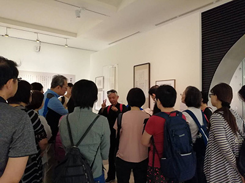

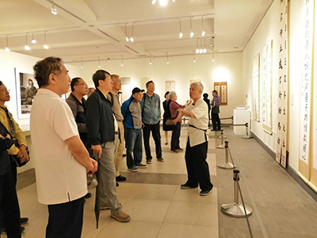

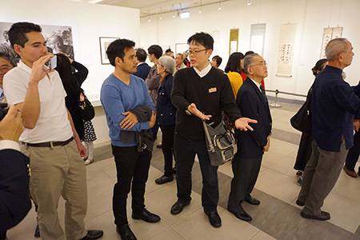

### 莊嚴一百二十週年紀念展 — 藝中有道說莊嚴

戒郁

時代歷練學養豐

幽默風趣厚待人

節操能力堪稱士

哲人雖遠典範存

十九世紀似乎離我們很遠很遠，那個年代還由王朝所統治，有皇帝、有王孫貴冑，有士大夫、有文人雅士、有販夫走卒，女生足不出戶…，但也是一個求不出國運籤的年代。

一八九九年，美國首次就列強對華霸權提出門戶開放政策，沙俄強借旅順港口（遼寧大連）；同年，莊嚴先生出生於吉林長春，翌年即入關至北京避難，三歲即喪母，成長期間皆輾轉於關內關外，或逃難或依親。處於亂世中人，又逢國家結構性更替，生於帝制，少年經歷了革命，成年又差一點成了亡國奴，就像當時千千萬萬的中國人，在大時代變動不居的縫隙中尋找生機，是何等的艱辛與徬徨。

在民國新立初期，莊嚴先生受到正式的教育，從吉林第一中學畢業，因病及各種因素，二十二歲才進入北京大學受教，北大當時新舊名士齊集，可說是俊彥滿京華，師資學生皆是一時之選，產出者皆是國家英才，是高等知識分子的搖籃。

畢業後即經老師引薦入仕，投入國家體制內工作，學而優則仕，進入清室善後委員會，清點王宮中的寶物，親眼目睹一個朝代的過去，另一個時代的興起，在這個節骨眼上，莊老是確確實實的參與其中，看見王宮中桌上放著尚未吃完的蘋果，半點不留情，由不得你，他嘗言：「溥儀出宮，我入宮」，是對人事變遷、物換星移的唏噓吧！

莊先生所言，何嘗不是他一生的寫照，他的入宮，可比很多皇帝都要久，從入故宮清點故宮文物之始，他終其一生都在護佑著這些中華文化的寶藏，不在於它們在拍賣會上的連城價值，而在乎它們每件都是代表了中華文化方方面面的瑰寶。

隨著國家命運的流轉，為了害怕國家文化寶物落入賊寇之手，莊先生及其當時的政府官員、同事，抱著中國文化特有士人的風骨，臨危受命，保護著中華文化的命脈，步步為營，可謂上山下海，死守不放，哪怕是一字一紙，莊先生也會收藏起來，為公家的事事物物留下痕跡證據，這是中國古代士人才會有的人格特質，顛沛必於是，造次必於是，終身不改其志，不同流合汙，但也能忍辱負重，文官體制中，這就是典範，是士大夫的氣度。

在押運文物途中，為避免日軍侵華而毀損或搶奪，更是小心翼翼。莊先生隨公舉家遷移，自其三十四歲，婚後一年即計畫南移。一九三三年，莊先生等員分五路南遷，一九三五年莊先生才三十七歲，即以文物提件監察委員身分被委任文物赴倫敦藝展籌備委員會秘書之職，押運乘英巡洋艦從上海前往英國倫敦皇家藝術學院展出三個月之久，一九三六年返國，遇七七事變後，又開始隨文物再次遷徙，途經武漢、長沙、貴州、貴陽、安順，文物藏身於巖洞內，地稱華嚴洞，莊先生在安順成立辦事處，並任辦事處主任，在安順六年間，接觸文物珍品機會很多，對文物了解深厚，少有人能及。

及後，抗戰勝利翌年，把文物安頓於重慶，待隨文物東歸南京。惟是大勢已去，一九四八年即奉令負責押運文物來台，又經過多個地方移放，後暫存於霧峰北溝，莊家遂在此落戶定居達十五年之久。六十三歲（一九六一）時，仍隨文物赴美國五大城市展覽，六十七歲故宮搬到台北並升任副院長，直到七十一歲（一九六一）退休，莊先生可說是故宮最盡忠職守的老宮人，不獨是故宮文物照護的關鍵人物，也是文物研究著作等身。君子學以致其道，只要講到瘦金體，當今的書法家必定對莊先生讚譽有加，無出其右者，現存許多故宮出版的專書及書畫冊、封面題字，有不少是出自莊老之手筆。當然莊先生的書法造詣，不只善長於瘦金體，或正體、變體、碑文，及晚年對「好大王碑」書體的愛好，呈現出其書法出奇的多樣多變，並不若人說瘦金體的學習「易學而難出」，莊老對各種書體的運用自如，變化隨心，但仍會自嘆說心手未能相應，可見其境界之高遠深厚。

如董橋先生所說：「慕陵先生一生一襲長衫，徜徉在古今書畫的歷史長河中，忘卻名利、忘卻榮辱，跟他的瘦金體書法一樣，散發著文化貴族的泱泱清氣。」

莊先生一生周遊於故土，從文物與古人神遊、遇古人於心，他旺盛的求知欲，不管在任何顛沛流離的環境都會堅毅的學習，從文物中汲取養分，以求知為樂，心無二致，用力既久，日省月試不見異而遷，慕陵先生學以為仕，仕而學，是守藏史，是中國末代的士大夫。

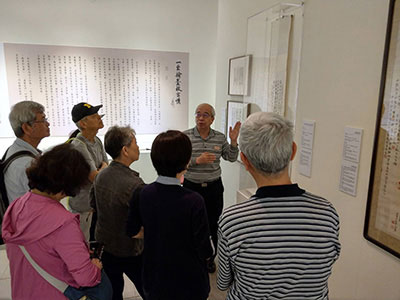

### 莊嚴一百二十週年紀念展 — 除舊更心　莊嚴紀念展導覽心得

許慈軒

莊嚴大展展莊嚴

承擔原來是成長

小事能做做大事

滴水水滴滴穿石

在恩人的照拂與帶領，讓我有機會擔任此次莊嚴先生120週年紀念展的導覽，其中要感謝家豪學長的介紹、玖如老師的引薦，以及林老師的肯定。

高中雖然在校內為公共藝術導覽員，雖對導覽稍有經驗與概念，然而在莊嚴紀念展中的學習，更是顛覆我對現場導覽的認識，有別於從前制式化的背稿，從展前的導覽培訓，到展場上親身感受並欣賞所有的藝術作品，瞭解每一句說出口的從容，背後不僅是時間與努力，更多的是感動和敬佩。

大型展覽對我最大的挑戰就是，不僅是要將作品清楚介紹，來訪也有許多具深厚中文、藝術背景的學者，在導覽過程中也會不時提出學術性的疑問，而當我無法招架時，對方也會分享他的看法及見解，使我不只是一個知識的媒介，也能是知識的受惠者，這之間來往的對談與收穫對我而言都彌足珍貴。由於展區位於國父紀念館內，許多觀光客會順道前來參觀，從圖像及故事的角度向來賓切入介紹，間接穿雜著寒暄交流，即使交會短暫、交流淺簡，但卻已經在我心裡燃起了鮮活的希望，彷彿就真的是開始了我想要播揚中華文化的夢想，同時親身經歷何謂「文化就是民族間的橋樑」的美好。

敬佩莊嚴先生半世紀對文物的守護、文化的傳承，特別有感於他曾說：「溥儀出宮我入宮，不是去做皇帝，是做一個守護文物的老宮人」，這樣的感動來自於明白故宮博物院之價值和堅持的不易，尤其在「書道幽光」展區中更能親感震撼，除了莊嚴先生獨步當代的書法瘦金體之外，也從「有容乃大，無欲則剛」作品筆下看見莊嚴先生的生活、專業、研究精神，很榮幸能有分於導覽這甘於平凡卻又不凡的一生。

### 二○一九母親節活動總報導

茹此

孝母典範地藏王

不妨世俗母子樂

百歲母憂八十兒

助離塵垢真報恩

地藏菩薩是佛門的大孝子，因地曾發願：「自今日後…卻後百千萬億劫中，應有世界，所有地獄及三惡諸道罪苦眾生，誓願救拔，令離地獄惡趣、畜生、餓鬼等，如是罪報中人，盡成佛竟，我然後方成正覺」，地藏菩薩為利益一切有情，使令解脫成佛，不辭辛苦加以救拔，而其度母之大孝，最為究竟，因此在母親節拜地藏懺別具意義。希望普天下的孝子們都可以好好孝順母親，不僅盡口體之養，還要讓母親道業有成，在這樣特殊的節日，結合法會、表演、浴佛，家人、蓮友互相聯絡感情，做最殊勝的孝道展現，是最好的過法。

今年報名人數眾多，大家一起觀修、拜懺，殊勝又溫馨，由於人數突破往年的規模，母親節活動改在室外舉辦，雖然有些悶熱擁擠，卻不減大家的興致與熱情。

此次有各團體的表演，為佳節增添不同的風采，首先上場的是東勢團，其表演無論是裝扮、台詞、演技、劇情都精彩叫座，由於男扮女裝的「笑果」極佳，台詞又逗趣樸拙，使得台上台下和樂一片，笑聲不斷，大家都意猶未盡！

劇中描述在某日清早，住在東勢的老父母因為聯絡不上女兒，決定揹著一大籃自己耕種的有機蔬菜，不辭辛苦的來臺北探望女兒和孫子們，到達時已近中午，女兒看著步履蹣跚又年邁疲憊的父母，內心也深感不捨，關切問候是否用過餐，突顯了「老母一百歲，常憂八十兒」與「樹欲靜而風不止，子欲養而親不待」的心境，提醒為人子女者，要懂得體恤父母辛勞，珍惜孝養父母的時間和機會。

表演中也讓大家體會到，實栽農園的有機蔬菜是集合了大家的努力培植和辛勤灌溉才呈現的美好成果，對食物要生起珍惜和感恩之心。

最後，他們用〈常回家看看〉這首歌做為結尾，歌詞中唱到：「帶上笑容，帶上祝願，陪同愛人常回家看看……，老人不圖兒女為家做多大貢獻，一輩子不容易就圖個團團圓圓」，歌詞深入人心，也象徵學會是一個大家庭，大家要常常回來看看，在佛法、儒學上圖個團團圓圓、平平安安。

再來登場的是可愛的大小孩子們賣力地唱跳〈聽媽媽的話〉這首歌，他們利用假日時間精心編舞與練跳，希望藉著母親節將這首歌的美好畫面及滿心感念呈給現場每一位母親。表演時有些孩子害羞靦腆看地板、有些孩子自信滿滿跳得開、有些孩子時不時脫拍而忙著追上舞步、有些孩子則兩眼直視前方的老師示範，真是生動有趣的場景。

若平時沒有跟母親一起牽手、散步、談心，當眼睛不能看的時候，要如何猜出自己母親的手呢？接下來的節目「猜猜媽媽的手」就是要考驗孩子有多了解母親？多久沒有牽媽媽的手？

當一群大小學長被帶到一旁用口罩遮住眼睛排隊時，被請上座的媽媽們也如大風吹般趕緊調換座位，此時台下觀眾也參與了緊張和歡樂，擔心著這些母子能否順利互認。

遊戲開始後大家依序排隊觸摸長輩的手，有的一下就猜出，有的摸了兩回，原來是有跡可循啊！

學中醫的學長們從媽媽的脈相猜出，注意媽媽裝扮的從袖長或手錶猜出，了解媽媽手型的從摸骨猜出……，加上觀眾的笑聲大小也可以推敲答案，最後大家都順利互認給媽媽一個大大的擁抱，謝謝媽媽為家庭的辛勞付出，媽媽辛苦了！

茅茹團表演新孟母三遷，把大家耳熟能詳的經典故事賦予新意。

茅茹團結合現代生活型態重新編劇，劇中描述孟母為了讓孟子有個良好的學習環境，決定尋找專業又細心的房屋仲介來推薦住所。當孟子住進市場區後馬上學習到如何叫賣，這下可讓孟母擔憂的趕緊向房仲求尋新住所；但搬入新居後卻發現在殯葬業附近，以致孟子喜歡模仿哭喪的儀式，於是孟母又急忙求助房仲，並把自己對學習環境的訴求和對孩子的期許表達清楚，經過一番波折，終於找到一處完美的居住環境，讓孟子可以跟隨善知識的教導，好好用功讀書，學習正確觀念，並以成聖成賢為目標。

但此處在哪裡呢？原來是寧波西街七十號啊！一聽之下，大家是不是都很幸運呢。

節目最後藉著影片能讓大家一同聆聽和分享愛的不同面向和表達方式，有人演奏「夢中的婚禮」感謝母親的陪伴與栽培、有人在母親的畫作前勇敢述說感念母恩，有的是一家老小一起祝福女主人、有的是夫妻默契演出相聲祝福母親……，相信各位媽媽們的內心一定是溫暖而甜蜜的。

可見言語的表達，可以承載很多美好的思想，言語說的愈精準、豐富、細膩、詞彙愈多，愈能讓人生起感受，就像是用心讚歎佛的功德，佛一定聽得到，因為懂得用心到這麼細膩，佛菩薩一定高興聽。

母親節這天在浴佛法會中圓滿落幕，透過外沐佛身，內淨自心，作為母親節最好的莊嚴與增上，並在美味豐盛的午餐中彼此共勉，凝聚向心力，相信大家都歡喜的滿載而歸。

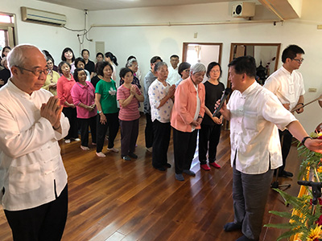

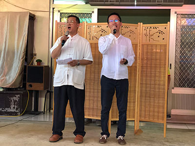

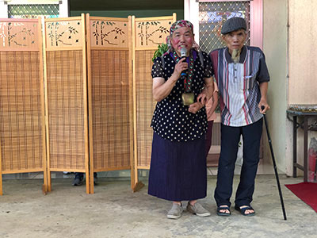

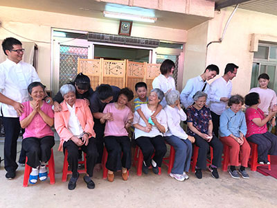

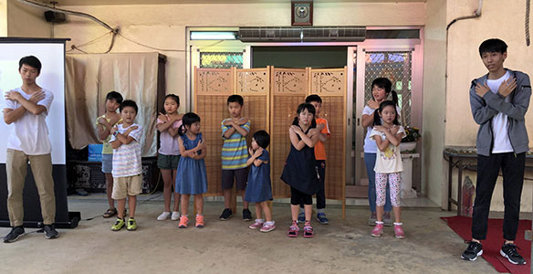

### 二○一九母親節活動 — 母親節隨筆

蔡易儒

母不在平凡偉大

堅忍毅力多付出

善取行相做觀修

愛他勝自菩提心

一個人成長的過程實在不容易。從小時候無憂無慮的歲月，到後來為了學業、工作打拚，漸漸懂得一些做人處世的道理，人生有了一些成就，一路上需要太多人的幫助和提攜。這段過程中，家庭的養育和教育有著重要且深遠的影響。父母親是最早迎接我們來到這個世上的人，也是我們的第一個老師，我們從與父母的相處中學習與人互動，從父母的身教和言教中潛移默化了自己的人格，甚至連喜好、習慣、微細的表情和情感的表達，都和我們的父母牽絆著。

人們很容易將一個人的成就歸因於他的家庭教育。例如孟子的母親三遷居所，只為了讓孟子有良好的教育環境。蘇軾的母親程氏，有一次教讀《後漢書．范滂傳》的故事，范滂為人正直，查辦貪官污吏，卻受黨錮之禍遭宦官陷害入獄，范滂不願連累母親選擇從容赴刑，與母親訣別時，范母勉勵說：「你今天可以與李膺、杜密等忠義之臣齊名，死了又有何遺憾！既有美名，又想求得長壽，可以兼得嗎？」蘇軾聽完，問母親如果他也要做范滂一樣的人可以嗎，程氏回答說：「你如果能做范滂，我難道不能做范滂的母親嗎？」這一番話奠定了蘇軾光明磊落的一生，而這段吉光片羽，被弟弟蘇轍寫進了他的墓誌銘裡。

孟子和蘇軾的品行學問為人所稱道，他們的母親也以此母教被歷史記憶，輾轉成為我們認識的形象。然而，在孟子和蘇軾的心目中，他們的母親又是怎樣的形象呢？

母親對子女的恩德實在太大了！懷胎生產的辛苦，從小含辛茹苦的餵養，一路成長的陪伴，耐心的教導，為孩子的教育、資源做盡打算；總是把最好的留給孩子，把不好的留給自己；對孩子的一舉一動，哪怕不經意的一句話，都記在心裡；害怕孩子吃苦、吃虧、受傷害，牽掛的心沒有一刻休息；即使孩子犯錯了，她都會原諒，即使有再多不完美，她都會包容，因為孩子在她心裡永遠是最棒的。她無私奉獻，無怨無悔；她不厭其煩，卻不擅長表達委屈；她是那個會真心為你的成功發自內心高興的人；她是那個愛你甚過愛她自己的人…。我們在母親的養育下匆匆成長，母親卻在悲歡離合的歲月裡匆匆老去，付出了青春和年華，這樣不對等的戲碼已經上演了幾千年，從過去到現在，也會從現在直到未來。母親的恩德和形象，哪裡是三言兩語道得盡的呢？

當一個人慢慢明白母親的恩德和重要，想要報答母親的恩德，他會把母親視為自己一生的責任，他會開始認真看待自己的人生，想要努力上進，讓母親為自己感到驕傲，不要為自己擔心，想要讓媽媽遠離痛苦、得到安樂，不論遇到任何困難都會努力克服，為了他最愛的母親。當我們看到一個人這樣有承擔力，能堪忍困難、磨練，卻有一顆柔軟的心，我們往往會以為他的母親一定是一位高貴、有智慧的人，善於教導孩子。其實不必然。這樣的母親，可以只是一位平凡的母親。就像地藏王菩薩過去生中，投生為婆羅門女和光目女時，多次為了救拔母親脫離惡道，發願要長劫入地獄度脫眾生，而後成佛，這樣的承擔，雖然需要大悲心、菩提心和佛法的正見，可是當下必須對著她的母親才能生起，儘管她的母親是一個不信三寶、沒有正知見的平凡人，可以說沒有母親，就沒有今天的地藏王菩薩。因此，母親能具足正知見引導孩子固然更為殊勝，但對大部分的人而言，我們不會在意母親是否像孟母或蘇軾的母親那樣偉大；我們的母親之所以偉大，是因為她們是我們的母親。就像史鐵生在《我與地壇》中寫道：「母親生前沒給我留下過什麼雋永的哲言，或要我恪守的教誨，只是在她去世之後，她艱難的命運，堅忍的意志和毫不張揚的愛，隨光陰流轉，在我的印象中愈加鮮明深刻。」

佛經中時常把佛菩薩比喻做父母親，例如《楞嚴經》〈大勢至菩薩念佛圓通章〉，把佛菩薩對眾生的憶念，以母親憶念孩子來做比喻，因為這種很想幫助眾生離苦得樂的心，和媽媽愛孩子的心是相通的，才足以拿來比喻，可以說沒有父母親，我們將難以體會佛菩薩的恩德，是以五倫是學佛的根本，而成立父母親為福田的原因有一分在此，功德等同佛菩薩。然而，世人皆知道要孝順父母親，有多少人真心想要回報佛菩薩呢？我們無始以來在六道輪迴，面對生死時總是自己一個人，在最痛苦的時候，是佛菩薩始終不離不棄，善巧方便引導，才有今日人天的安樂，一路走來多麼不容易啊！然而，每次讀到地藏菩薩好不容易救拔眾生脫離惡道，但不久又眼睜睜看著眾生墮落，旋出旋入，心中總是愧咎與不捨，原來我也是無始劫來一直讓菩薩做白工的其中一人。經上說眾生無始以來受苦所流的眼淚，超過四大海水，然而又有誰曾計度佛菩薩為眾生流下多少汗呢？是以我們應當生起感恩的心，敦倫盡分，孝順父母，發菩提心，依教奉行，修法供養，才能報答父母與佛菩薩的恩德。

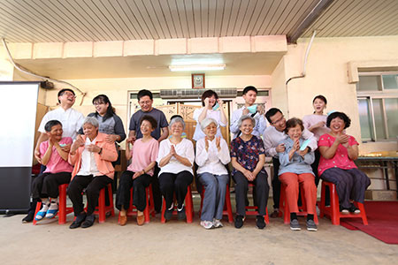

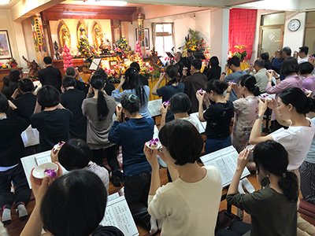

### 二○一九母親節活動 — 四月初八佛誕節

黃啟書教授

結從彩塑飛天來

表徵法行含多義

技巧創新不讓古

後恐來者也不有

佛法教主釋迦牟尼生於釋迦族之迦毗羅衛國（今尼泊爾），姓喬達摩，名悉達多，為淨飯王之太子。據南北朝劉宋時天竺僧求那跋陀羅所譯《過去現在因果經》記載：四月八日明星出時，佛母摩耶夫人眠寤之際，見菩薩乘六牙白象騰虛而來，從右脇入，佛遂降生母胎。夫人十月懷胎，一日出遊藍毘尼園，於二月八日日初出時，行至無憂樹下。正舉右手欲牽摘樹上香花時；佛由右脇而生。墮於蓮花之上，自行七步之後，舉起右手云：「我於一切天人之中最尊最勝，無量生死於今盡矣，此生利益一切人天。」此時天上的難陀龍王、優波難陀龍王等於虛空中，吐清淨水，一溫一涼，灌太子身。後世佛教徒依此紀念佛陀誕生，於佛堂或露天淨地設灌佛盤，盤中陳一手指天、一手指地的釋迦太子像，以香水灌之，稱為浴佛。徵諸敦煌文獻如《大慈如來告疏》《四月八日、二月八日功德法》皆有於農曆四月八日弘揚佛法之相關活動，隋唐時更盛。宋代孟元老《東京夢華錄》亦言宋徽宗時京城四月初八「十大禪院各有浴佛齋會，煎香藥糖水相遺，名曰浴佛水。」清乾隆時《日下舊聞考》則云：「京師僧人念佛號者，輒以豆記其數。至四月八日佛誕生之辰，煮豆微撒以鹽，邀人于路請食之，以為結緣。今尚沿其舊也。」故在中國及漢傳佛教影響所及地，多取農曆四月初八，紀念佛誕。

民國以來，西風東漸。時人對於耶穌降生日之耶誕節，因有教徒彌撒與相關慶典，演變成全民共同之節俗。但四月初八佛誕，則惟佛教徒行之耳。民國八十八年，臺灣地區佛教人士與民眾之發起連署設將「佛陀誕辰紀念日」列為國定紀念日，其後如佛光山、慈濟功德會、法鼓山等各大佛教團體多於五月第二個星期日「母親節」合併舉行紀念及浴佛典禮。

今年農曆四月初八日，為五月十二日，適逢五月第二個星期日「母親節」。在母親節、佛誕節前夕，謹以本次展覽中陳夏生老師三件作品與友朋分享。

陳夏生老師結藝成就無人堪比，又從臺靜農先生習字。但陳老師為人低調、即便自陳作品亦要言不煩。實則作品中，足證老師對於佛理有深厚之領會。緣由有二：其一、中國結飾來源固早。但佛法東來，其造像、壁畫中，多有諸佛菩薩乃至於居士信眾之衣飾描繪，其中多見結藝。陳老師受莊嚴先生鼓勵，潛心研究結藝發展於此與佛法結緣。如《繩胎蓮花首漆如意結飾》、《敦煌飛天仙女壁飾》作品等，都可與山西襄汾元代文殊菩薩彩塑和敦煌飛天壁畫，見其取材淵源。其次，陳老師自云：每忻慕弘一法師人格，尤其所言「以道自娛，無上清涼」一語，最與綰結時之心境相映。小編年少時亦嘗依老師著作，粗習編結。於編綰、理繩、抽線諸工序，無不苦惱再三，正應「治絲益棼」之語。陳老師能「無上清涼」，從《莊子》言即是「無待」，從佛法言即是「應無所住而生其心」，所以才能怡然自得！此一境界，又豈是容易修為的！

繩胎蓮花首漆如意結飾，其工法乃以繩胎作漆藝。工法實較木、竹、夾紵諸胎更難控制。前文已詳，不贅。今單就其結體分析：如意首做蓮花形，蓋以酢漿草結與盤長結組合而成，並將盤長結之八個翼拉長成為蓮瓣、盤長結身為蓮蓬。八片蓮瓣象徵三十七助道品之八正道：正見、正思惟、正語、正業、正命、正精進、正念、正定，為修行佛法之八種途徑。如意趾則以雙錢結(同心結)為之，但亦拉寬一耳翼成為三環，正象徵「三輪體空」，為佛法「六波羅蜜」中「布施」一目宜達到施者、受者、所施之物皆不住於心，才是真布施。簡言之即是「施恩莫望報」，這與《禮記》「不食嗟來食」所討論的問題很類似。

陳夏生老師為研探中國結源流，整理、創新及拓展中國結編織技法的第一人。她用理工科的思路貫穿這門藝術，所有優美繁複、厚重莊嚴的圖案都經過精密的計算，其精心的巧思，使作品富有各種變化與意涵，令人敬佩。這樣千載難逢的作品，可看出其中的智慧與心思的柔軟，很適合作為母親節的獻禮與觀修。

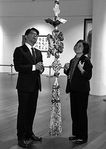

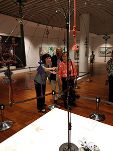

### 張大千一百二十歲紀念大展 — 與天母讀經班家長聆聽 唐老師導覽「張大千一百二十周年特展」

宗徹

著作豐富有多源

傳承歷練與薰陶

眼界豪情詩文經

五百年來一大千

天母讀經班自二○一二年成立以來，遵照唐老師的指示，本著「志於道，據於德，依於仁，游於藝」的理念設計課程，也深知「藝能載道」，藉由詮說者的介紹，能將藝術作品的意義彰顯。然而，由於臺灣的藝術展覽，多展出西方藝術作品，而教繪畫的老師也多較擅長西洋畫家與畫技的介紹、教學，因此孩子們偏認識西洋藝術作品，較少接觸東方藝術。

在學期期中考後，天母讀經班藉著學會與羲之堂合作導覽的「莊嚴一百二十週年特展」因緣，帶著孩子與家長分兩次前往參觀，一次為低年級與中高年級學生設計學習單，讓孩子們可藉此看過所有展件，也從中認識民國時期的知名藝術家與作品；另外一次則針對家長，就四個展區的重要作品進行導覽。非常感謝王順福老師與劉瑞美老師的多方提點，使得兩次的導覽都順利圓滿。

莊嚴先生與張大千先生同年，又同在今年舉辦一百二十週年特展，我們為「打鐵趁熱」，又再次禮請唐老師為家長們導覽「張大千特展」。承蒙唐老師慈悲應允，我們終在五月三十一日成行，讀經班的英文課王天婷老師與七個家庭的家長們，有機會從唐老師深度認識張大千先生的丰采。

當天晚上七點，唐老師才剛帶導覽完一團，匆忙的吃過飯糰，就接著帶我們進入展區導覽。原本以為老師會就重點式的帶領家長看過展品，但老師卻是一件件作品仔細解說，絲毫不顯疲憊，令人感動佩歎！

猶記老師在第一個展區「大千師友」中，談到張大千先生小時候受擅長詩、書、畫、刺繡的母親曾友貞女士的薰陶，十歲就開始學畫花鳥、山水與人物畫。展區的一幅〈耄耋圖〉就是曾友貞女士的作品，一九八二年藝評家李葉霜先生拿著這幅圖的照片給張大千先生鑑識，大千先生眼淚立即奪眶而出。然直到大千先生過世，他都沒有機會看到這幅親筆畫。

唐老師對每一幅畫如數家珍，凡書畫上有題字，老師必讀出並解說意義。在「大千鉅作」區的〈墨荷四聯屏〉前，老師說：「若論帶人前往張大千先生的摩耶精舍參觀導覽次數最多者，可說非我莫屬。」老師說精舍名「摩耶」，是釋迦牟尼佛生母的名字；張大千先生取此名，是因釋迦佛住母胎中依舊於三千大千世界轉法輪，所以說摩耶夫人肚子裡含藏三千大千世界，每尊佛教化區域即是一個三千大千世界，張爰先生法名大千，故取所住之名為摩耶，又居士住的地方可稱精舍，所以全名是摩耶精舍。摩耶精舍是中西建築及擺設的精華，頗具教育功能，因此樂於帶人前往觀覽，也因此熟悉張大千先生及他的諸多作品。

張大千先生一生的許多遭遇可給我們啟發，如戰火時代逍遙繪畫，一九三七年前後，日軍攻打中國，但先生可以在黃山寫生、遊歷各處繪畫；當國民政府播遷來臺，國家經濟一片不好，但張大千先生卻是先到巴西居住（一九五三），再遷居美國（一九六九），可見共業之下有別業。

縱然他闊氣的以二十萬美金買下巴西居處一百五十畝地，想打造中國庭園而建八德園，還因搬造景石傷了眼睛，但最後八德園的美景都被巴西政府徵收建造水庫，一切都沉沒於水中。一九七八年回到臺灣，透過好友故宮前院長秦孝儀先生找到外雙溪的摩耶精舍建地，張大千先生一看就嘆到：「這明明就是董源筆下的〈江堤晚景〉啊！注定這裡就是我的居所。」後來這六百坪河川用地竟是被他買下，但本想要建造兩萬坪的中國式庭院，最終也不得所願；摩耶精舍落成後四年多，張大千先生就因心臟病復發過世。可見人生許多的經營，並非都能如願以償，真是「你有你的計畫，世界另有計畫」。

唐老師為我們一行講解的最後是在「大千與敦煌」展區，介紹〈散華圖〉時，老師說這是《維摩詰經》的天女，當維摩詰居士過世，此處人去樓空、精神不在，就算散花也失去了意義，因此雙手一攤，表示「無可奈何」。面對的人生許多遭遇，縱然也是無可奈何，但不妨也效法大千居士，但盡一生揮灑墨彩，為人間留下多少美好回憶。

徐悲鴻先生譽張大千先生：「五百年來一大千。」我們何其有幸能夠遇到莊嚴、張大千兩位先生的作品特展，又逢唐老師及諸位善知識的導覽，也是千載一時、難遭難遇，無盡感激！

### 張大千一百二十歲紀念大展 — 觀展心得

沈行峰

民國的傳奇

一生的歷練

墨彩的揮灑

驚歎的賞析

一直以來，張大千對我而言，就是教科書級的人物：出現在課本，崇敬的心不可言喻；聯考不考，讓這份崇敬沒有深入。這樣的張大千，在我心中卻也沒有變調，只是靜靜地擱在心裡，就這麼維持了二十餘年，直到「張大千一百二十歲紀念大展」。

張大千本名張爰，十七歲被盜匪軟禁、仍不忘學習，受同為被綁者的老進士所欣賞、指點詩詞。未婚妻的離世，讓他萌生出家念頭、得到了法名「大千」，從此「大千」之名伴隨他一生。於八年抗戰時，他遠赴敦煌學習、臨摹壁畫。而後出國遊歷，躲避了文革之禍，開始廿餘年的海外遊歷生活。晚年眼疾，更讓張大千獨創了潑墨山水，造就他在藝術生涯的最高峰。

一個人終其一生往同一個方向跑去，到底能跑的多遠？

一個人終其一生往同一個方向跑去，到底有多少阻礙？

直到有了年紀、生活有了磨礪，才能體會這一切多難！

張大千化阻礙為基石，站的更高、看得更遠，因此不懈、不斷的往前方跑去，看到了更美妙、達到了亟欲達到的境界！

如唐老師所說，我們要看張大千的「技、道、心」，他的技流露了他的道，而他的心更是醉人，值得我們再三的尋味，也是讓我們該時時效仿的榜樣。

謝謝無盡燈學會唐老師的導覽與解說，讓這位長久擱在心底的教科書人物鮮活了起來。張大千臨摹畫作成就不凡人生，而我選擇臨摹張大千化逆境為祝福的心。

### 張大千一百二十歲紀念大展 — 張大千展心得

楊惠宇

一篇佳作明大千

維摩丈室大山水

師友切磋用功深

五百年來一大千

隨著二○一九年初國父紀念館的儒者之風–孔德成先生百年紀念展，繼之於四月初中山藝廊舉辦故宮前副院長莊嚴先生一百二十周年紀念展一生翰墨故宮情，同時間於臺北故宮也盛大推出巨匠的剪影—張大千一百二十歲紀念大展，有幸恭逢盛會，藉此開啟文化視野的另一扇窗。

三位大家的一生精彩且豐富，可說是近代史的縮影，在那個戰亂頻繁的時代，物資普遍缺乏，有著志同道合者切磋琢磨的聚會，延續著對學問藝術熱誠與精進，代表菁英雖得天獨厚，也需後天不斷努力，除展現自己才華，也以文會友，以友輔仁，內心深處有著發揚傳統文化使命感，更彰顯出大時代淬鍊的不凡。

特別張大千先生憑藉對藝術熱忱及自我期許，練就了一身繪畫武林絕學，舉凡用筆、用墨、布局、寫實、寫意、臨摹及神韻等，無不千錘百鍊，信筆捻來，如同幻師，化出一幅幅鉅作。並且勇於突破、挑戰自己，吸收各家精華，畫風工寫結合，將重彩、水墨融為一體，尤其在潑墨與潑彩方面，為中國畫開創了全新的藝術風格。此外，書法、詩詞無所不通，以文學底蘊加持繪畫藝術，堪稱二十世紀中國畫壇最具傳奇色彩的國畫大師。

俗云：萬丈高樓平地起，羅馬不是一天造成的。凡任何成就都是諸多方面漸次累積、集聚而成，並非一蹴可成。

大千先生無疑是幸運的！除了與生俱來的天賦之外，母親擅長刺繡，二哥張善孖擅長畫畫，張大千深受二人在藝術方面的啟發與薰陶。十六歲時與兄長赴日學染織，上世紀二○年代的上海名家雲集，回上海後，成為前清名士曾熙及李瑞清的門下弟子，彼二師所收藏的歷代名畫極其豐富，大千先生有機會長期近距離地臨摹了諸多的真跡，開闊眼界，領略古畫中的奧妙。再加上喜好大自然風光及遊覽各處山水名勝，海量灌注繪畫靈感與養分。

大千先生無疑是勇於付諸行動的！對日抗戰期間，中國一片火海，卻敢於舉債率領二十餘人，幾十部騾車運載生活物資，浩浩蕩蕩遠赴敦煌，長達二年半時間研習石窟壁畫，由於石窟接受日照時間十今有限，時常一手秉燭，一手持筆，辛苦臨摹了自十六國到元代歷朝歷代的壁畫多達二、三百幅，數量驚人，不僅開拓胸襟及視野，更吸收了壁畫壯觀、靈動、用色、想像及故事滋養，表現在用筆、用墨、格局經營、線條及神韻等方面更上一層樓，令其繪畫藝術貫串清朝至魏晉南北朝。回鄉後，賣了近百件古畫，償還龐大債務，卻也因大量臨摹作品掀起「敦煌藝術熱」，世人得以一窺國寶的藝術魅力，也為整個民族，甚至是世界藝術的發展打開了全新局面。

大千先生無疑是另類藏家！眾所周知，大千先生常常一擲千金，傾其所有將古畫買回家隨時翻看、摹寫。誠如其女兒所說：父親遇到真跡絕對不惜重金，為此寧可不吃不喝，甚至搭上安家置地的本錢也要擁有。一般收藏家、鑑賞家也許僅限於買賣、收藏與欣賞，而大千先生，不僅學習古代書畫的風格和源流，運用歷代藝術精髓，勤於翻看和苦練，將收藏品物超所值，淋漓盡致發揮。例如，對五代畫家董源作品愛好，特別《江堤晚景》以重金及古畫換得，如獲至寶，其恢宏壯麗青綠山水，披麻皴法，搭配層層顏料敷染，前景行旅，遠方飛瀑，點綴著小屋，湖上小舟，伴隨波光粼粼，左下方一方鈐印「南北東西只有相隨無別離」，終其一生，未嘗割愛

大千先生無疑是翻轉仿古魔咒家！現今社會崇尚個人創作，若是仿作必定會遭到眾人撻伐，大千先生憑藉超凡的天賦，幾乎「抄」遍所有古代名家作品，這些作品中有一些幾乎與原作一模一樣，連自己都分辨不出；有一些乃神韻相似，現今全球各大重要博物館中仍藏有他的許多仿品，但神奇的是，有時自承真相，反倒給人驚歎與讚賞。傅申先生曾形容大千先生非同尋常的「抄」功，他是身上拔一根毫毛，要變石濤變石濤，要變八大變八大，要變唐伯虎就變唐伯虎，猶如孫悟空七十二變，一筆在手，乾坤盡收。然而在西方原創思惟模式下，相較東方臨摹傳統，何為糟粕？何為精髓？頗值玩味。

大千先生無疑是冒險家！一九四九年那個兵荒馬亂、人人自危的歲月，大千先生輾轉遊歷了香港、阿根廷、印度、巴黎、巴西乃至於美國等國家。見到了西洋文藝復興三傑，體證了繪畫與雕塑創新及人文思想挹注，遇見了創新立體派大師—畢卡索先生。東西方偉大的藝術融合，就在大千先生豪放、開濶個性中激盪出不朽的經典。

大千先生無疑是心靈療癒家！每一次付出都希望有美好回收，似乎是心中理所當然。然而辛苦經營巴西八德園卻無奈的深埋水中。再一次流浪讓大千先生體會到寄居異地的悲哀，但也體會到：人生愈在谷底愈不可向命運低頭，此時傾其一生絕學創作〈長江萬里圖〉，抒發內心落寞、寂寥，柳暗花明又一村的契機，醞釀於積極向上的。

大千先生無疑是處世哲學家！常言道：人如其畫。大千先生畫作中的灑脫與磅礡，是否透露出其為人度量、人格與智慧？從他與一般人交易古畫結善緣原則，再看看其贈與好友精品畫作，凡事為人著想，過世後畫作卻能不約而同捐予故宮，且自願出錢出力承擔大千先生喪禮事務，乃至於對後進不遺餘力提攜，再再顯示其為人豪爽及偉大，難怪生前、逝後留予無限敬佩與景仰。

大千先生無疑是幽默家！ 絕大多數人最難面對的是自己，中國畫家中最特殊喜畫自畫像的是大千先生，他以各時期所面對情境，以不同面貌呈現世人，表達內心多面情緒。鍾馗像代表著對日抗戰勝利，中國最終如鍾馗抓妖，將軍國主義妖怪驅逐出境。七十五歲丐幫叫賣像，自寫一輩子賣畫，養活一大家子，調侃自己如乞丐般討生活。試問，每個人不也如此嗎？各人在工作領域中討生活，販賣自己價值與時間，一生經營到底換得什麽寶藏呢？

大千先生無疑是創作家！〈廬山圖〉雖非出自對景寫生，但卻透過蘇東坡〈題西林壁〉橫看成嶺側成峰，遠近高低各不同；不識廬山真面目，只緣身在此山中，詮釋畫家心目中的廬山。此畫乃一生最後且最大幅巨作，凝聚了畢生的精粹，融合潑墨彩寫意，呈現出撼人氣勢。畫家面對世間生老病死，即將走入生終點站時，不是抱怨而是表達出內心對世人熱誠、度量與灑脫，是否也意味著一生歷練與經營，需別具一隻眼才能體會其中奧妙？

大千先生無疑是眼光獨到投資家！在世時足跡曾駐留世界各大洲，曾以「一生江海客」來形容自己。七十八歲於士林外雙溪構築「摩耶精舍」，作為畢生追尋桃花源的終點，身後捐贈舍宅、古畫與畫作予故宮，取之於世間，還諸於世間，將此生經營，做最妥善延續、緬懷，引導成來世殊勝走向！

綜觀先生一生，於年輕時期立定人生目標，懂得在過程遭遇的順逆境中不改初衷，運用有形福報經營無形繪畫功夫與朋友交誼，掌握每一次轉變機會，成功挺進藝術殿堂，幾十年孜孜不倦，樂此不疲，積累成無可取代藝術典範。誠如著名畫家徐悲鴻先生所說：五百年來一大千，非浪得虛名也。

