# 第123期
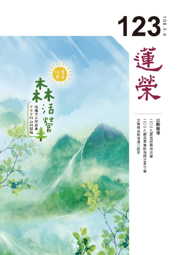

## 社論

### 莫忘初衷—教育的本懷與樣貌

本刊

開啟大腦學而思

終身不違生活用

面對挑戰多能力

態度品德是本質

根據聯合國教科文組織的研究，人類知識更新的周期，從十八世紀初是每八十到九十年更新、十九世紀到二十世紀初是每三十年為一個更新周期。到了二十世紀下半葉，平均每五年為知識更新周期。然而，到了二十一世紀，知識更新周期快速進展到每二到三年。這意味著：

一、多數的知識我們還來不及了解，就已經過期了。

二、現在掌握的知識，三年後也許變成無用的知識。

三、未來世界的樣貌，愈來愈難想像。

所以，未來人才的樣貌，我們的想像又何從能更上世界的變化呢？

因此，聯合國教科文組織近年積極推動以『素養』為核心的教育理念，根據國家教育研究院網站說明，「核心素養」是指一個人為適應現在生活及面對未來挑戰，所應具備的知識、能力與態度。「核心素養」強調學習不宜以學科知識及技能為限，而應關注學習與生活的結合，透過實踐力行而彰顯學習者的全人發展。簡單地說，就是要培育能將知識用出來的終身學習者。以新加坡為例，該國新一波的教改主軸就是「終身學習」，因為他們理解到世界變動得愈來愈快、知識更新週期也愈來愈短，學校所教的已不足以應付未來，終身學習的能力及態度才是學生最需要的裝備。

中國大陸在二Ｏ一六年發布《中國學生發展核心素養》做為課程改革的指導方向。而台灣，則在今年九月起，素養教育以一Ｏ八課綱的形式正式上路，也就是，今年入學的小一、國一和高一生都應該被培養成知道所學的知識和世界有關的終身學習者，而且教育的目的不再是提升競爭力，教育本身即為目的。當一個學生具備核心素養，那他自然擁有競爭力，競爭力是教育的結果，而非目的。而唯有終身學習，才是面對快速變動的世界最好的方法。

但，我們該如何培養出終身學習者？以及，哪些能力可以作為一個終身學習者的輔助？在這個暑假，學會舉辦並參與了兩個夏令活動，一次是與華梵大學合作舉辦徜徉於山林，在遊戲中學習的《夏日經典森活營》，以《千字文》為主軸，小學五年級到高中的學員為對象，帶領孩子從遊戲中學習，並發展出各式的活動與課程，包括思維方式、肢體開發、電影欣賞等，以此拓展孩子們的視野。另一次是與義烏中脈集團旗下的青鳥家族合作，舉辦素質教育親子營，學生班年齡橫跨小學至大學，以「邏輯思維」、「思考式閱讀」、「發散性思維」、「認知偏誤」、「心理認知模式」、「言語溝通與表達」六大課程為主軸，並結合《論語》篇章，古今對應，家長班除了六大領域外，更加入了「心靈探索」與「美學素養」課程。希望藉由短短幾天時間，讓學員重新看待自己、家人、生活，以及淺說跟隨時代的脈動必須具備的能力。這兩場活動，前者開創出經典學習的另一種模式，以引導學員主動積極學習為主。後者則是在素質教育的框架下構築核心素養教育中應具備的能力。

教育不斷的變革，古時候的教育是為了國家培養人才，現在，教育除了人才培育之外，很重要的一部分是幫助每個學生成為更好的自己，具體達到「有教無類」的教育目標，使下一代在面對人工智能、核能威脅、全球暖化等國際局勢，有自信主動、迎接問題、解決困難的能耐。然而，在這個過程中，我們仍要不斷地檢視：

我們所曾經面對過的每一個學生，除了知識與技能，我們給了他什麼面對人生的態度？教育的本懷是什麼？究竟是利己還是利他？如果教育是利益眾生的事業，我們是否不違初心？

愈是在時代快速的脈動中，教育愈是要謹慎而為，一念可以為善，一念也可以為惡，善惡分際難辨，我們是否有引發學生的善根？是否有引起他們對於經典學習的意樂？是否有給予孩子正確的人生觀和宇宙觀？是否有培養他們具備正知見的抉擇力？以及，我們是否時時刻刻清楚明白地知道我們為什麼要辦教育？

教育可以改變世界，但必須一步一腳印地在正道之路上向前行。而且，莫忘初衷。

## 佛學幽覽

### 菩薩清淨的行持—華嚴經淨行品（三十九）

*戒慧講述、編輯部整理*

湧泉橋道流水園圃

隨境見聞覺知觀修

一一發願自他得利

福慧雙修道在平常

丙二、指事顯因答其徵因

丁一、總徵

丁二、別顯

戊六、乞食道行時願（五十五願）

己二、所睹事境（十九願）

己二、所睹事境：涌泉、橋道、

流水、園圃

經文：

若見涌泉，當願眾生，方便增長，善根無盡。

泉或是從地底下冒出來的水流，或是指水的源頭，涌則是指水從下而上冒出。當我們看到從地底下涌出來的泉水，此時可對境發願，所謂：當願眾生，方便增長，善根無盡。善根是對正法的領悟，透過身語意三業造作利益有情的善法。若對正法有所領悟，則利生之心堅固不拔，所以謂之根。此善又可生出妙（樂）果、餘善，故稱它為善根。源源不盡的涌泉就像善根無盡，也像利生的善巧方便，不斷湧現。

若見涌泉是願所依，依靠在見涌泉上，發起了菩薩的願，依靠在菩薩，有菩薩才能發願，你是一個菩薩，願依靠在你而生起願。當願眾生，能願的是菩薩，所願的是眾生。方便增長，善根無盡，願眾生成就的利益叫做願境成益，眾生得到方便增長，善根無盡，菩薩也得到方便增長，善根無盡。

前面說菩薩是要得到佛的智慧，佛的十八種無過失的內涵，並且得到學佛所有的順緣，歸設為十種，要得到這些應當要在行持上發願，之所以名為淨行品，代表行持要清淨。行持如何清淨？走路時碰到涌泉，提醒我們必須發願，所遇的境界、人物，所辦的事情，體性上都轉為清淨，這還包含空性智慧的攝持。

佛所說法何以名為經？涌泉是其中一喻，所指之義為何？對正法的聞思修會生起對世間種種體悟，如對無常的體悟、對輪迴的體悟，對苦的體悟、對眾生的體悟，對悲心的體悟、對空性的體悟等等，這就叫涌泉。

經文：

若見橋道，當願眾生，廣度一切，猶如橋樑。

當我們經過橋的時候，可以觀想這一座橋橫渡在我們生死的河上，橫渡兩岸，我們可以帶一切眾生度過這個橋樑，到達彼岸，你就是眾生的橋，眾生可以依你這條橋，從生死的此岸到涅槃的彼岸。地藏懺裡讚歎地藏菩薩有二十二類，其中一個就是猶如橋樑。

此橋樑可以是我們變成眾生的橋樑，也可以是眾生自己成為他人的橋樑，因眾生也要有廣度其他眾生的能力，他自己就是其他有情的橋樑。如此說來，幫助他人的第一步是自己有解決問題的能力，第二步，要幫助別人有解決問題的能力，與其呵護他，害怕他受傷，不如培養他的能力，足以克服困難，無所畏懼。

要具足什麼樣的內涵才能成為眾生的橋樑？若把橋樑解釋為從生死的此岸到涅槃的彼岸，代表要幫助有情解脫、成佛，這其中包括對眾生悲心的攝受、方便的接引、願力的持續、忍力的除逆、慧力的度化，如果這些都沒有就談不上做橋樑，故二乘人也沒辦法做眾生的橋樑。如果把行持菩薩道看得太簡單，容易生起退轉，如果看得太難又會裹足不前，應該要一方面知其難，一方面有能力來完成它，因為知道其中聚集了大功德，就會驅使自己完成它，像世間人在完成事業的時候，因為知道完成後有很大的利益，自然會驅動自己完成這些事業，佛菩薩亦然。讀到這句話的時候，也可以引申當願自己將來成為橋樑，將來成為文殊菩薩、地藏菩薩，乃至成佛，這其中包括多少的善因緣、佛菩薩善知識的培養。所以當一個有情眾生被培養成菩薩、被培養成佛的時候，諸佛菩薩是砸下多少的資本，若不回饋，後果該有多可怕。如同深受父母的厚愛，卻不去回報，享受生活與教育資源，成為一個有能力的人，觀待能力生起的福報又獨享，後果不堪設想。

南亭老和尚講義說「願一切眾生出家修行」，出家人梵行清淨，比較容易修得證果，在家眾相對不容易，我們應該要如何理解與定義這句話？

在家人學法卻弘法利生，諸佛菩薩不會怪他，但是出家人如果不弘法度生，是要被責備的，就好像一個公司的總經理不去推動業務，是要被責備的，因為他是承擔者。出家人顯現出家相，就必須去推展佛法，必須成為眾生的橋樑。今天佛法成為正法、像法、末法、滅法時，嚴格說來責任在出家人，因弘法度生是出家人的職責，責無旁貸，不能責備在家人，而在家人則有輔助的責任。

這一段話可以看成當願眾生有這個承擔，雖然不一定有這樣的因緣，可是要有這樣的承擔，承擔雖然很苦的，但是會激發能力，能力不能自己生、不能獨立生，無自相生，都是觀待承擔而後生，解釋為心出家也可以，解釋為出家人也未嘗不可。所有的眾生都出家的這件事，或許因緣不到，但是他必須要訓練出這種承擔力，因緣到時他必須要有這樣的承擔。

經文：

若見流水，當願眾生，得善意欲，洗除惑垢。

當我們見到水流的時候，要發願希望眾生可以得善意欲，洗除惑垢，洗除無明我執。

古時洗衣服都是在流水邊洗，流水有除垢的力量。《春秋繁露》言，流水有諸多功德，例如：流水直奔向前，像是精進，孔子說：「逝者如斯夫，不捨晝夜」，取的是無常。此處的流水取的是得善意欲，洗除惑垢。得善意欲是指我的欲望就是要得到善意，這個欲望是最難的，孔門的心法中叫做「我欲仁，斯仁至矣」，得到仁心的根本秘訣就是欲。世間人有許多欲望，希望收入高一點、房子大一點、買部車子、生活品質高一點等等，而所有欲裡面最好的欲就是欲得善意，此為武功秘訣。了凡先生改變命運，無子變有子，無福變有福，沒有功名變有功名，全都是從善意欲來，想要得到善意欲須從因果知見來生起，利益有情的善意，了凡四訓立命之學、改過之法、積善之方、謙德之效都是善意。了凡先生雖然知識淵博，上通天文、下達地理，通兵術治河等，然在他心中份量最重的非世間這些知識技能的老師，而是雲谷大師，因為大師讓他心中生起善意的欲，由此而改變命運。

善欲意會成為往生的助緣，《百法明門論》中提到，心與十一個善心所相應即是善意，信、精進（勤）、慚、愧、無貪、無瞋、無癡、輕安、不放逸、行捨、不害是十一個善心所。通說有這十一種的善意，別說善意是心與證悟空性的智慧相應，欲得此善意（證悟空性的智慧）洗除惑垢，惑就是無明、貪瞋癡煩惱。慧是最殊勝的善意，能夠洗除惑垢。惑，按照天台的說法有三種，見思惑、塵沙惑、無明惑三惑，統歸為二障中的煩惱障，被煩惱障所薰習但不能生起煩惱障的是所知障，洗除惑垢講淺處是煩惱障(見思、塵沙、無明惑)，講深處就是二障，有惑就會造業，有業就感苦。此處為何不說業垢而說惑垢，因為還有煩惱所做的善業或惡業都稱為有漏業，皆是輪迴的業，破煩惱後所做的善業，體性才轉為無漏。惑會發業、潤業，所以除掉惑垢時既不發業也不潤業，業就不會有感果的功能，不發業所以不會造作苦因，不潤業所以苦因不會結成苦果，故有業不會感果，有惑垢才會感果，惑垢除掉，則即使有業亦不感果。所以惑業當中以惑為上首，沒有惑就不會造新業，但是有舊業，然舊業沒有被惑所滋潤，就沒有感果的功能。阿闍世王生在佛世造了很嚴重的惡業，佛為彼宣說般若的道理，當生起正確的認知模型時，這些將成熟的業通通成為不定業，一般人未斷煩惱，卻把不定業變成生苦果的定業，豈不哀哉。

經文：

見修園圃，當願眾生，五欲圃中，耘除愛草。

六十華嚴的經文是：「見修園圃，當願眾生，耘除穢惡，不生欲根。」佛說菩薩本業經的經文與六十華嚴相同。

首先是四面相的觀修法，一是願所依，願依靠在菩薩身上，及依靠在見修園圃的這件事上。二是願所為境，能願的是菩薩，所願的是眾生。三是願境成益，隨喜，若眾生都能在五欲圃中，耘除愛草，該有多好。發願，我但願眾生都能五欲圃中，耘除愛草。承擔，我要承擔幫助眾生都能五欲圃中，耘除愛草。祈求三寶，我祈求三寶加被，讓我有能力幫助眾生都能五欲圃中，耘除愛草。

園是種水果的果園，圃是種菜的菜園，在路上行走，看到果園、菜園，當願眾生，希望眾生在自己心中的五欲圃中都能耘除愛草。世間五欲境有財色名食睡，它們也是色聲香味觸的五塵境。眾生貪著五欲境於輪迴中沉溺不起，此處希望眾生在五欲中能去除愛草，意即不要貪著世間五欲，增長煩惱使自己墮落，所以要像菜園除草一樣，把對五欲境的貪愛除掉，菜才能長得好，心田的善根才有辦法發芽結果。

財色名食睡是五塵當中粗猛的塵境，是就能令貪愛生起的那一分，財屬於色塵，色可以是色塵也可以是觸塵，名屬於聲塵，睡屬於觸塵，例如喜歡睡軟床，要有暖氣、冷氣調節，但是睡也有可能是色塵，想要住在富麗堂皇、舒適美妙的環境。五塵境不一定會成為五欲境，五塵當中的財色名食睡，才會成為五欲境。

五欲圃中，要耘除愛草，不是應該耘除五欲嗎？為何是耘除愛草？五欲是園圃，五欲是菜、果、很漂亮的花園，要耘除的是愛草，不是耘除五欲。對五欲境產生貪愛，五欲才成為過患，五欲的自相不可得，沒有功德的自相、沒有過患的自相，生起愛的那一分就是過患。

財，如果成為自己修學跟他人修學道糧的那一分，財是功德，而一般人將財拿來當棺材本就很可惜。真正的聰明人，懂得用財，很多老人家往生前最隱微處看不開的就是錢。

色，男女之色如果是結合在傳宗接代，家庭佛化，相夫教子，體性可以轉為功德。

名，有一個好名聲，以這個名聲做號召，要辦善事時大家願意配合，善事得以發展，阿彌陀佛其中一願就是希望自己的名聲能普聞十方，所以感應到釋迦牟尼佛來宣傳阿彌陀佛。

食，天台二十五方便中有調食、調身、調息，調食非常重要。供養食物還能產生功德，布施食物，使對方恢復體力，將來感應自己是大力之人；布施使大家得飲食後，容光煥發，感應將來自己容光煥發；布施食物使大家能夠讀經、解經，開發智慧，所以感應自己將來也開發智慧。

睡，在精進中有所謂的暫止息力，即好好休息，成為修行的順緣，甚至家中睡覺的房子，何嘗不是自己修行的道糧，也可以成為他人修行的道糧。郭子儀將軍的後代將汾陽府捐贈成為寺廟，郭大將軍生前有福、死後有福，有道是：汾陽舊宅今為寺。捐贈為寺廟，成為修行的道場，體性轉成功德，這是真正的聰明人。

善用五欲法，它可以變成修行的道糧，五欲圃中，五欲是水果、是菜園，五欲境是從善業而來的，是過去的善業生起的福報，若能於福中修善，此福的體性也能轉成善。

比如說出國時住五星級的飯店，這是過去的善業顯現，這時候要思考怎麼住，讓這個住有代價，身體得到舒適的調養之後，作利益眾生的事，住此五星級飯店就有功德。

割除愛草當中，有兩種割法，一種是斬草不除根，一種是除根。修學空性是要對境修，是破所執的境沒有，通達所執的境了不可得，能執的心方不生。除愛是通達所愛的境界了不可得，能生的愛自然就沒有。

例如：可愛如果有自相的話，應該任誰看都可愛。黃金我們看來很可愛，狗來看不可愛，所以可愛的自相沒有，可愛只不過是就你這一分安立，若就牠那一分可以成立的話，不必就你內心安立它就可以顯現。可愛是在你內心上的安立，或大家共同的安立，生起可愛的面相。宿世共造的善業，大家會共同安立可愛境，成為一種舒服的享受，如果把它的體性轉為道糧，可將所造善業增長廣大，如果只是享受欲境，善業就被窮盡，所以可愛的自相是沒有的。同樣的，可愛的自相都了不可得，可怕的自相也了不可得，因為可怕是觀待可愛。此時，可愛的自相看不到、可怕的自相看不到，愛也沒有、恨也沒有，回過頭來看，通達了它原來是世俗上因緣的生起、名言的安立，是眾生可以拿來受用的這一分，生起快樂的那一分，是眾生可以通達的，如何讓這個快樂成為修行的道糧，這就是非常重要的知見。

### 大乘百法明門論簡說（三十二）拾肆、心所有法—根本煩惱（五）

*戒慧講述、淨本整理*

岔路行中分岔路

小乘亦分利鈍修

現證無常非初果

聲聞二部非了義

經文：

四、煩惱六者：一、貪。二、瞋。三、慢。四、無明。五、疑。六、不正見。

從修道位至無學道斷除思惑的歷程，要在各種所緣境中觀察無我的真理、四聖諦的內涵，使能執的心愈來愈弱。所以學佛若道理不明白，也無從修起，破我執是整個佛法的核心，學佛不學此，好比買櫝還珠，十分可惜。我們雖然沒有破見惑的智慧，但日用平常間也可以提起般若的道理隨緣觀修，有助於減低煩惱、增進般若的習氣。對於佛法的真理沒有勤加學習、練習，就好比醫生開藥，病人卻不願意服，此時不能說醫藥無用、佛法不靈。

修道至無學道都是在三界中漸修，三界分為九地，每地都有貪瞋癡慢（但上二無瞋）的煩惱各九品，一共八十一品，稱思惑八十一使。欲界為五趣雜居地，由地獄、餓鬼、畜生、人、欲界天所構成，雜居就是都住在一塊，唯有入禪定者才能脫離此地。此地的九品思惑，又分為上中下各三品（其他八地也是如此區分）。對境很容易生起煩惱者稱為上三品；中三品要面對強烈的境界才會生煩惱；下三品者對著猛利的境界，煩惱只會徐徐而生，而且剛開始沒有感覺，需要不斷地誘引才生。比如世間美好安樂的順境不斷地慢慢誘引，行者貪戀世俗的心才會出現。

色界天有四地，依《俱舍論》，離生喜樂地是以戒律離開欲界的男女、飲食、睡眠，得到內心的喜樂，因為整個戒律的重點就在對治此三者，此為比丘戒的三大精神，欲界中再厲害的人物，都無法離開男女、飲食、睡眠；定生喜樂地是因為二禪時禪定工夫成就，由定生出喜樂。三禪叫離喜妙樂地，此地慢慢離開第六識的喜，只剩下前五識受用身輕安之樂稱妙樂，一個人如果沒有內心的喜悅無法繼續向上，所以初禪、二禪都要靠內心的喜去修行，三禪禪定功夫更上一層，喜悅反而成為禪定的障礙，所以只保留前五識受用身輕安之樂，這種快樂勝過世間所有的享樂。

第四禪天是捨念清淨地，連身體的快樂也捨去，因為此時身體的快樂也是禪定愈發增上的障礙。四禪連身體的快樂也不緣念，渾然忘我，爾時容易妄認已經解脫，所以有些外道認為這就是解脫道，但其實執我的心仍在與解脫無關。

再往上至無色界的四空天，是因為厭離色身，使他進入沒有色蘊的生命狀態。老子也說：「吾有大患，為吾有身。」但老子所修與無色界天不同，因為老子通達無我的道理，了知此身無自體性，不是無色界天的厭離色身。空無邊處是以虛空為所緣的厭離色身；識無邊處天是冷冷地看著自己的心識，使心識不緣境；無所有處天連心識都厭離，什麼都不想了，空靈靈的；最後非想非非想處天更是空靈靈的，不過還有微細的想我。以上四天都有我執，有一個我在受用這種空靈靈的境界，所以也都不是解脫。

斷見惑可稱為聖者，是破所斷的煩惱才能安立為聖人，不是神通廣大。斷見惑的聖者從五趣雜居地至非想非非想處地，共有九十一品思惑要斷除，每品也都有無間道、解脫道，可分為四向四果，稱八輩上人。預流向就是見道位的前十五心，第十六心證得初果（須陀洹）。證初果後，人間天上要來回七次（潤七生），此階段稱為一來向，才能斷除欲界六品思惑，證得一來果（斯陀含），人間天上只剩一次來回。斷欲界下三品思惑的過程為不還向，斷盡稱為不還果（阿那含），就是不會再到欲界。三果以前都在欲界中，可見欲界煩惱最難斷，而且又以上上品煩惱為最，需要潤兩大生才能斷除。在欲界中是正見的力量使行者不入三惡道，如果沒有般若正見，順逆境都很容易生煩惱，透過在境界中不斷捕捉我相予以破除，愈發練熟則煩惱愈輕，並可以發現上界更細微、徐徐而生的無明我執。

執我的心既然是有為法，體性無常，就不會一直起現行，須待緣而生，所以唯識宗認為第七識執第八識的見分恆以為我，中觀宗並不同意。禪家祖師為何要趁行者不注意時狠狠地給予教訓？就是要讓他在大逆境中去捕捉「我」，我的感覺生起，才能透過正見推理去破我。無始劫的輪迴中，我們遭遇各種的苦，所謂：「脫馬腹，入牛胎，閻王殿前幾度回，始從帝釋殿前過，又到閻君鍋裡來。」這些遭遇比祖師大德的苦行還苦，但卻沒有成為我們學佛的資糧，就是無法在這些境界中捕捉我，並用般若正見觀察。

阿羅漢向是從色界離生喜樂地開始，至無色界有頂地（即非想非非想處，三界以此為頂），一共八地，每地皆有九品思惑。在斷無色界有頂地的第九品（最後一品）思惑時，所入之定稱為金剛喻定，比喻此定如金剛般堅硬，能斷無間道（破我），第九品已斷，稱為證解脫道，成就小乘無漏的聖者。

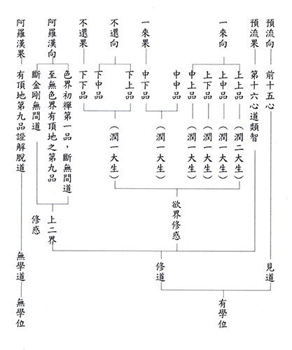

### 佛學概要十四講表簡說（二十五）第四講表 人生當前之所受（觀受是苦）

*宏法、淨昌整理*

三藏綱領十四表

離苦得樂是本質

苦因苦果是所知

滅苦之道乃所修

總說第四表到第八表關聯性

第四講表、第五講表與第八講表可一起合觀，都在講人生觀。第四講表首先樹立正確的人生觀。人生觀就是觀察自己人生的真相，原來是以苦為本質的人生，第五講表示這些苦必有原因，第六講表說不但是我們的人生是以苦為本質的人生，六道有情也是如此，第七講表是這些六道有情分布的範圍。第八講表則是對治苦因，從苦中得解脫。

原來人生都是苦因生苦果的相續，我們要脫離輪迴、解決痛苦，要如何下藥呢？如果以四聖諦來說，第四表是苦諦門，第五表是集諦門，第八表就是道、滅二諦。學佛法最基本的就是四諦門的觀察。

道、滅二諦門，成為三寶中法寶的體性。為什麼不是四諦門，而是道滅二諦門呢？苦集二諦分別說輪迴的現象是苦果與苦因，而道滅二諦才是在講離苦得樂。道諦是苦因的滅，滅諦是苦因苦果的滅，苦因苦果的滅名言安立叫做涅槃，讓我們真正脫離痛苦。可見法寶是以能離苦得樂的那一分來建立法寶。

我們常說「皈依法」。法的定義是軌生物解，任持自性。軌是一個範圍，讓我們生起對一個事物的了解，比如桌子有桌子的形象。任持自性是指他有他的特性，可以安立為他的定義，非我們皈依的對象。所皈依的法寶是說依之而能離苦得樂。依著對滅、道二諦的了解，才能苦因、苦果的滅，出離輪迴。

人生當前之所受，是從苦諦門觀察，沒有對苦諦門的觀察，不會知道輪迴是以痛苦為體性，所以不會希求苦的解脫，也不會去尋覓苦果的因，更不會有苦因的對治，所以不會有滅道二諦。沒有認識苦，談解脫都成為空話。認識苦的功德就是讓我們生起希求解脫的出離心。這個苦裡面有：依三途的苦尋求出離，這是第一步的出離；第二步就是依六道的苦尋求出離，這是佛法最基本的心態。

已經認識苦，苦到底能不能離開？苦是有為法，有為法是無常，可以離開。如何知道苦是有為法？因為它會變化，現見很多苦的變化，比如說飢餓苦、病苦可以被解決，可見苦是生滅的有為法，可以被改變。有為法是由因而成的法，因滅則果滅，所以苦果可以離開，否則修學佛法沒有意義。

苦因亦然，也是無常，也會改變。比如我們在咀嚼苦果的時候，各類苦果各有其因，用此因成立此果，用滅此因去滅此果，苦因滅則苦果滅。此時滅苦因的道，可以拿來修學，四諦於是成立。

對比世間人以追求快樂的方式來離開痛苦，佛法是以除苦因苦果的方法來離開痛苦，安樂的體性建立在苦因苦果的滅，與世間人差異甚大。世間人沒辦法離開苦果苦因，因為以追逐其他的快樂來解決眼前的痛苦，眼前的痛苦只是暫時的離開，追逐的快樂其實也不是快樂，而是種下新的苦因。此樂越受苦果越增加，不斷有新的苦果要受，一路吃苦。現見的樂只不過是前面苦果的暫止息，眼前的苦因又會造成未來的苦果，就佛法的觀察，根本只是苦因苦果的相續而已。眼前的樂只不過是剛才的苦不起現行，就像站起來時，坐著的苦消除，站起來的痛苦還沒有生的時候妄認有站起來的快樂，但是站起來的痛苦慢慢地在生，如果站起來是快樂的話，應該越站越快樂，結果越站越痛苦，可見站起來不是真正的快樂。同樣的，大部分的人都認為沒有錢是痛苦，去追逐成為有錢人的時候，沒有錢的痛苦固然消失，有錢的痛苦正在慢慢生起，在這過程中妄認有快樂，可是有錢的狀態待的越久的時候，有錢的痛苦就越來越多，可能親情不見了，朋友疏離了，常常患得患失，乃至於對錢財貪愛不捨的憂悶感也有了。可見安樂的體性建立在苦因苦果的滅。

四念處中觀身不淨、觀受是苦、觀心無常三者屬於出離心，觀法無我則屬於解脫道。這些是苦因的滅，最後涅槃寂靜是苦因苦果的滅。所以一個人所說的到底是不是佛法，不在於他的學問、輩分，名望、人脈如何，在於他所說的法有沒有符合三法印。三法印就是諸行無常、諸法無我及涅槃寂靜。諸行無常包括觀身不淨、觀受是苦及觀心無常。諸法無我即觀法無我，這些都是苦因的滅，果就是涅槃寂靜。連結四諦的觀察，苦因苦果的滅，就是離苦得樂。佛法在講樂的時候，沒有另外再說一個樂，只是講苦因苦果的滅而已。世間是苦因苦果的相續，佛法是滅世間苦因苦果的相續，而成立安樂的體性。所以涅槃四德：常樂我淨，這個樂的體性是安樂的，是苦因苦果的滅，不是另有一個安樂。極樂世界的本質也是最後要成立常寂光淨土，破煩惱障、破所知障，也是苦因苦果的滅。

(甲)領受種類

◎苦、樂、憂、喜、捨

觀受是苦，對眼前的所受來做觀察，人生所受用的境界就是苦，才能夠真正進入離苦得樂的思維。第四講表分成四個表來說明，甲表談到領受的種類，分別為苦、樂、憂、喜、捨五種感受。首先觀察身心的領受，身領受的是苦和樂，心領受的是憂和喜。這都是對著順境、逆境我們自己身心的領受來說，不苦不樂、不憂不喜的叫做捨受。認識這些領受後，即可得知為何觀受是苦中只剩苦受。

例如苦，在領納逆境的時候，身有逼迫感受是苦，心生起憂愁的情緒。在領納順境的時候，身有快樂的感受，心上生起喜悅的情緒。至於沒有領納順境或者逆境的時候，生起一種不苦不樂的感受，這是同時約著身和心來講的，是捨受。我們身有苦樂，心有憂喜，身心不苦不樂就是捨。

◎樂虛、苦實

苦和憂，是實實在在的領受，樂、喜、捨是虛的，會變化成苦。從宗義上立論，可以說苦、樂、憂、喜、捨全假，因為都是體性空，都是觀待而生，沒有自體性。此處是從世俗的角度，不從勝義的角度來說。

待在苦、憂的狀態裡不會變成樂、喜、捨。但是在樂、喜、捨的狀態不斷安住，就會變成苦、憂。

可是現見很多痛苦，努力解決不就變成樂了嗎？此處的實在，不是說它是常法，苦、樂、憂、喜、捨都是無常法，是有為法。無常法為什麼說是實？例如吃飽飯了，餓的苦就解決了。

世間人不斷用短暫的快樂來除眼前的苦。如果去觀察的話，解決了眼前的苦，產生了的新的覺受其實也是苦，只不過是小苦的產生，慢慢生成大苦。述記舉例夏天很熱吃冰淇淋，好像是一件很快樂的事情，可是一直吃，就變成苦事了。

炎熱的夏天是一個苦果，為了離開此苦果而吃霜淇淋，以為是種樂因。但苦和樂不能在一法上出生，一法上不能有相違背的體性。例如：火不能又是炎熱性，又是濕潤性；一個人不能是男又是非男。當我得到快樂的時候，痛苦消失，於是就認為我吃霜淇淋是樂因。這一分佛法也同意，佛法不會違背世間人的經驗，但如果吃霜淇淋是樂因，應該一直吃會不斷生起快樂，應該因越來越多，果就越來越生。現見卻不是，因越來越多，果越來越慘。

或有人問，我吃一杯冰就好，是否可行？雖然眼前得到的清涼，等吃完後，還是感到很熱。這個樂只是苦的暫息，樂會變壞而回到苦。

且實際觀察熱天吃霜淇淋，熱天流汗，身體已經虛了，再吃冰，等於是敗壞身體的因。而且熱外放，冰進來內收，中年頭髮變白，晚年氣虛，四肢無力。可見樂因都不能承認，還有很多的苦因。世間的快樂在哪裡呢？

追求眼前的快樂來解決當下的痛苦，雖然當下的痛苦看起來消失了，但是等此樂一停止，苦還是上來，乃至於我們追求快樂不斷產生小苦，小苦會演變為大苦，最終還是變成苦的。所以快樂是會變化的，最終變為苦，來說它是虛的。

既然苦、憂是實的，又要如何離苦得樂？苦果還得從苦因來對治。熱天吃冰淇淋正面來說不是樂因，反面來說它是苦因，只不過是把前面的苦暫時止息，妄生一個樂覺。前文已說，苦因苦果可以解決，因為都是無常法。而到底什麼是苦果苦因，是最後的決戰點。苦果看懂了，苦因就懂了。苦果沒看懂，苦因還是不能離開。

孔子說的「志於道，據於德，依於仁，游於藝」、「發憤忘食，樂以忘憂，不知老之將至云爾」，都是苦因苦果的滅。修道人不是另外有一種人在人間之外，真正看懂離苦得樂之道，能離苦得樂叫做道人。

述記又說論語四百九十八條的中心思想是「學而時習之，不亦說乎」，所學的綱宗就是道、德、仁、藝，能學的綱宗就是志、據、依、游，道跟德屬於形而上，所證的道是形而上的道，能證的是通達形而上的德，是輪迴苦因苦果的滅，依於仁、游於藝則是世間利人之道，能使行者遠離三途，得生人天兩道，是三途苦因苦果的滅。沒有在苦因苦果的滅之外，別有安樂可得。

述記引《禮記‧學記》：「藏焉，修焉，息焉，游焉」，藏是要懂得內斂，修是要多串習，息是要在所學的法上安住，游是指這樣的人將來才能出去游方，利益他人。

述記引第三講表論點：「始終真樂屬佛」。認知到四正勤跟知果畏因時，是三途苦因苦果的滅，六根清淨，是輪迴苦因苦果的滅。開始就是這樣用功，直到終了，就是始終真樂。種樂因得樂果，樂果讓他有學道的資糧，再種樂因，循環往復，增長廣大，世間人沒有這種人生觀。世間人只會在順境中生喜，遇逆境生悲。

述記云：「故知不論儒佛，欲得真樂，惟有聞道、修道、證道之一途而已」，聞道、修道和證道，儒家和佛家都要通過聞思修才能證果。

述記引孔夫子云：「朝聞道，夕死可矣」此道就是世間道，仁心的追求法，成就君子；出世間道，就是空性的修學法。無論世間和出世間，都是苦因苦果的滅。離苦是修道的第一步，所以認識苦非常重要，觀察苦因苦果如何滅，以及觀察對治苦因的道，要聽這種道的人才叫做聞道之人，要修這種道的人才叫做修道之人，要證這種道的人才叫做證道之人。子曰：「學而時習之，不亦說乎」，如果不是在這樣的道中學而悅，就跟夫子的學問沒有關係。

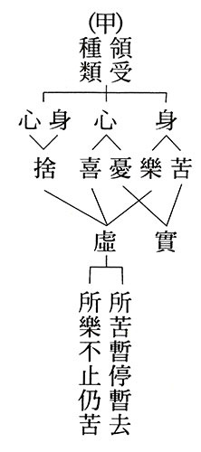

### 人生大事不能忽略的事實—助念通告

*宏法、淨昌整理*

家中助念貼通告

來往親友知作法

省卻費力之溝通

安心念佛最得力

助念通告前言

助念通告是為了保證助念效果，當助念團到達現場時，必須張貼的告示文，能讓家屬、親人知道該如何配合助念團。此舉可以避免家屬或親人進來時，需要不斷溝通，以前助念就常面臨這種窘境，每換一批人，助念團就要大費周章的重新講解，講完後有人諒解，有人不諒解，場面秩序無法維護，家屬講話聲音有時過大聲，也會干擾現場。而助念通告的條文簡單明了，象徵公信力，可以省去很多溝通的力氣，讓場面莊嚴，讓眾人安住在佛號上。

來訪探視之親友及所有家眷務必遵守的事項：

一、念佛中保持肅靜。

保持肅靜包括不要講話，不搬動桌椅，不走來走去，甚至也不能在病人前咳嗽、打噴嚏、打哈欠，也要避免過多的開示，開示必須在念佛聲中，簡短幾句提醒，要他萬緣放下，求生西方就好，而非長篇大論，講一些與往生無關的佛法。

二、大家現在要能表達孝心（愛心）唯有念佛，在念佛聲中助送他安詳往生西方極樂世界。

這一條充滿人情世故，一般表達孝心會拜腳尾飯，會哭鬧、搥胸、頓足，會抱著屍體痛哭，以為如此才能表達孝心。然而念佛幫助病者往生西方，才是真正的表達孝心。真正的孝道是要幫助父母離苦得樂，只有念佛幫助他往生西方，才能達到這樣的目的。否則就如同印光大師所說，變成羅剎女之愛。

三、請各位親友出聲念佛，不會念的小聲跟隨念。

這條很重要，出聲念佛要念得整齊、莊嚴，念不好寧可跟隨佛號機念，有的人聲音過高亢，有的人聲音過於低沉，都要有意識的小聲配合別人，避免造成佛號不好念，大家念得很痛苦，如此就降低了助念的效果，這也是常見的情形。其中男眾或辦事人員，千萬不要為了表現自己的領導能力，帶領大家念佛，卻又念得不好。

四、助念之時，請勿—

（一）焚燒金銀紙

（以免汙染空氣影響念佛）

（二）觸摸身體

（免得引動他的情愛失去正念）

（三）號啕哭泣

（若覺悲傷請至他處）

（四）與患者噓寒問暖

（以免妨礙念佛）

第四點回應第一點，第四點做好，才能維持第一點的成效。

五、談論別事，請至他處。

一般談論事情，會談論到他的生前有沒有交待，特別財產分配是家屬最在意的，此時要善巧的引開大家的在意點，其他包括葬儀社請哪一家、喪葬儀式要如何進行，誰來主法，誰來封釘，誰來做故人生平介紹等等，都是家屬會在意的，此時助念團要告知親友家屬，這些待決議的事項都有本所依，有經驗的傳承，無須太掛心，眼前專注在佛號上，其餘種種在助念之後可以協助他們解決，讓家人安心的念佛。如果家人親屬非得趕快把事情釐清，就要離開助念現場，至一旁溝通。

我們團體在這方面也累積了一些經驗，像是有葬儀社願意配合我們，在亡者往生時會先到現場，跟家屬溝通，請他們不要慌，等助念過後再過來處理後續，此時家人才安心下來助念，上述總總事項愈講究，愈能幫助臨命終者往生西方，因此不要小看這些小事、瑣事的處理能力。

### 正覺精舍齋僧清公開示

*淨昌整理*

大人不失赤子心

學法熱情是典範

法門龍象天人護

末法以燈照迷航

學會於一零八年七月二十一日分別赴清公上人道場埔里圓通寺與正覺精舍興辦年度齋僧法事。齋後中午十二時十五分大眾齊集精舍法堂，恭請清公上人講法。上人先以《六十華嚴》的第四十三卷的一段偈頌為大眾開示，簡明扼要說明菩薩從發心直至成佛的修學法。文分三段，第一段三聯六句，說明菩薩發心的動機、修學方法。第二段二聯四句，闡明佛力加被的重要。第三段總結出發心到成佛的精要。上人開示菩薩修學法後，再以《大乘顯識經》中，最後佛勉勵大眾的偈頌，勉勵在場大眾要勇猛修學。開示深奧，抑或初機不易了解。學會特為大眾作白話消文，以使自他兩利，圓滿福慧雙修美事。

「菩薩心如地，饒益一切眾」

，是說菩薩的心如大地承擔眾生離苦得樂的大業，菩薩的行持都是為了饒益一切眾生，以辦教化等的各種善巧方便，令眾生的善根生長，福慧成就。就像大地承載並生成萬物。

「柔軟慈心根」

，菩薩的動機是想要給眾生安樂，而慈心就是想給予眾生安樂，所以慈心是根。像慈母對剛出生的嬰兒一樣柔軟呵護，所以是柔軟慈心根。

「無上大悲莖」

，而菩薩以教眾生修學「苦、集、滅、道」四諦的修學法來給眾生安樂。所證悟的滅諦，是苦因苦果的滅，這才是安樂的體性。悲心是拔眾生的苦，苦因苦果的滅，才真的拔除眾生的苦。大悲心特別是不遺漏任何一個有情的心態，這樣的拔苦，才能真正給予眾生快樂。而且唯有教導有情修學般若方能出離三界、脫離輪迴，沒有任何其他方法能超越輪迴，故以植物的莖來比喻無上大悲。

「功德葉智華」

，德是智慧力，有智慧的人才能開展教化等種種利人的事功。以德能開展事功，如同樹木枝葉的開展。以這些功德葉輔助智慧的花，意即智慧除了靠聞思生起以外，還要歷事練心，慧力方能增勝，比喻以葉輔助花開。

「持戒為妙香」

，具備智慧的修行人，所持的戒才究竟清淨，他清楚了解每一條戒律的運用，何者應作，何者不應作。這樣的持戒是活潑的，能利益眾生。比喻成花的妙香。戒律的本質是智慧，戒體方能清淨。如同香依花而有，花也因香而更令人注目。

以上第一段講菩薩的動機、方法到成就。以下第二段講佛的加被。

「如來淨慧光，開敷菩薩華」

，上文所說的菩薩功德葉智慧花。所靠的是如來清淨智慧的引導，比喻太陽光的照樹，成就的是樹的開花結果。

「不著有為水，普令眾生喜」

，而如來以般若的修學法教化有情，令眾生能破障，遇事不生執著，使眾生得到解脫與成佛的安樂，這是真正的歡喜。或說雖有利益有情的各項事業（有為），但不著這些有為，所作事業不求名不求利，不為自己求安樂，當然能辦出成效而令眾生喜。如同植物特別是蓮花不著水、爛泥巴，而開出各色美妙的花朵，令眾生見之歡喜。

第三段就是總結初發心至成佛的修學法。以植物從種子、成長、開花與結果作為比喻。

「直心為種子」

，直心者正念真如，真如就是萬法真正如是體性空。所以直心就是緣念空性的心，它是成佛的種子，由彼成就破二障的智慧而成就佛果。

「慈悲為根芽」

直心種子要生長成慈悲的根芽，智慧是要服務於眾生，而非令自己受用。

「智慧方便莖，五度為枝條」

，由種子生根發芽，並由芽而生莖，意即有空性的智慧。與慈悲的心態能入世學習成就種種利生的能力（智慧方便莖）。由莖（樹幹）而生枝條，意即以空性的智慧攝持入世的能力，由此入世的能力成就五度的事業，謂之「五度為枝條」。

「禪葉諸明華」

，以五度（施、戒、忍、精進、定）廣大行的事業，作空性智慧的助伴，在甚深禪定中生起破煩惱障、所知障的智慧。禪定猶如能結果的花葉，由繁茂的花葉結成纍纍的果實。

「一切智為果」

，由肥沃的土地（承擔）種下直心的種子，生起慈心的根以及無上大悲的莖，生長出五度的枝條，功德的綠葉，開出智慧的花，散出持戒的香，一切修學最後匯入止觀。以禪喻葉，以觀慧之明喻花，以花葉孵成一切智（佛的智慧）的果實。

以上為成佛之道。

由於大家聞法的熱情，感動了清公法師，在炎炎的夏日，法師清晨三點即起床做早課、佛前大供、僧團應供，到中午時已甚為疲累，隨緣開示供齋的大眾，由於大眾的善法欲，讓清公欲罷不能，並另依大乘顯識經結尾偈頌作為對大眾的勉勵。

「當勇超塵累」

，初機學佛的人，應當勇猛的超越五欲（財、色、名、食、睡）六塵（色、聲、香、味、觸、法）的拖累。色法本來不成立為塵，可是當我們執著色法實有，有自體性的存在時就是癡。執著實有去追逐就生貪，貪不到就生瞋。對我們來說，這時候色法就成立為色塵，其他五塵類推可知。

「勤修佛正教」

，勇猛的目的是修學佛所說的正法，正法的體性就是修學戒定慧。持戒是斷惡修善、利益有情。持戒的人累積修學定慧的資糧，所以持戒的人比較有入禪定的福報，但是禪定功夫需要另外的修學法。同理，有禪定功夫的人也容易開智慧，但般若的修學法也要另外修。嚴格來說，戒、定的修學都是為了幫助證得般若的智慧。

「除滅死軍眾，如象踐葦蘆」

，勤修戒定慧的行者，當修學成就時就可以對治死魔。破煩惱障對治分段生死，出離三界。進破所知障對治變易生死，成就佛果。

「持法奉禁戒，專精勿虧怠」

，想要像大象踩蘆葦一樣的對治死魔，初機學佛的人就要好好受持修學佛法，奉行佛所制定的禁戒。在家人最重要就是五戒，不殺生、不邪淫、不偷盜、不妄語、這四條是性罪，意即體性就有罪，不受戒，作了一樣受苦果。第五條戒是不喝酒，是遮罪。對這些戒法愈專精愈有利於我們修學成就，例如業的思維，尤其以各種正確認知，來奉行戒法，而非種種認知偏誤來持戒，持戒的意樂殊勝，遇境逢緣又能觀照戒體，奉行無虧，則對定慧之助大矣哉。

「以棄生流轉」

，戒定慧的修學成就則棄生死流轉。

「盡諸苦有邊」

，窮盡的是諸苦及有邊（三界）。戒定慧的修學就是窮盡諸苦，不再輪迴。

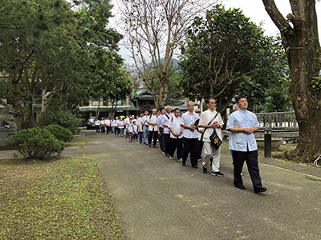

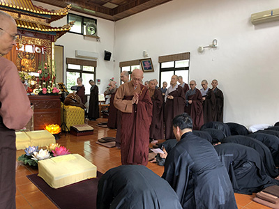

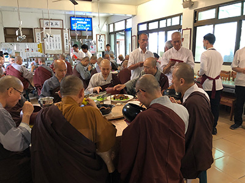

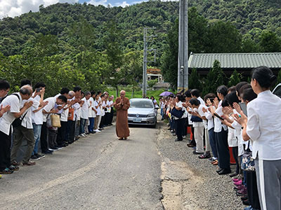

## 孔學一隅

### 論語簡說（三十一）— 子貢問士

時哉講述

善問善辦成大賢

上士之才國棟樑

周遊列國甘苦嘗

廬墓六年世絕無

經文

子貢問曰：何如斯可謂之士矣。子曰：行己有恥，使於四方，不辱君命，可謂士矣。曰：敢問其次。曰：宗族稱孝焉，鄉黨稱弟焉。曰：敢問其次。曰：言必信，行必果，硜硜然小人哉，抑亦可以為次矣。曰：今之從政者何如。子曰：噫！斗筲之人，何足算也。

前言

讀書人是出路最好的形象。中國分為士農工商，士是社會的領頭者，不論是辦政治、辦教育都仰賴士，而這樣的讀書人分為三種，此章慢慢來分析。

消文
子貢問孔子：怎麼做才可以稱為有志向的讀書人呢？孔子回
**答：** 自己的行為，要有羞恥心來約束，能有所為，有所不為，出使外國，能完成外交任務，不使君命受辱，如此，可以稱得上是有志向的讀書人了。子貢說斗膽請問次一等的讀書人？孔子回
**答：** 宗族的人稱他是孝子，鄉里的人稱他能行弟道。子貢說冒昧請問再次一等的讀書人，孔子回
**答：** 說話，必定守信不移，做事，必定堅持到底，雖是不能變通，像石頭一般堅實器量淺狹的人，然而也可以稱為再次一等的讀書人。子貢最後問他心中想要問的問題，說當今的從政者是什麼樣的讀書人？孔子歎息的說：噫！只重視自己利益器量狹小的人，哪裡能算得上是讀書人呢？

章旨

孔子論讀書人必須具備的條件，以德為本，以能為末。

釋義

子貢何以有本章之問？

子貢在孔門中，長於言語，他問的事情，往往問在此而意在彼。本章他以迂迴、旁敲側擊的方式來問「今之從政者何如？」

士的形象為何？國家用士來辦政治，最重要的象徵為何？

士為讀書人，讀書人的心就是「志」，他志在達到內聖外王的境界，志在找尋內在、外在的出路。古代士、農、工、商謂之四民，讀書人是四民之首，是社會的領頭者，能領導風氣。雪廬老人言：「讀書人沒有恆產，但是有恆心」，他不會羨慕他人的榮華富貴、家財萬貫，而是全心在道上。讀書人懂得興衰存亡，懂得歷史的教訓，懂得文化的內涵及品牌的打造，懂得整體氣象的提升。用士來辦政治是對學問、道德、道統的肯定，能以文化、教育的推廣、培養人才來發展經濟，發展民生與各種文明的制度。

關於士的次第本章分為幾種？

本章士分為三種，老子《道德經》亦把士分為三種，三士都約著形而上來論，上士聽到道便勤而行之，用道淨化身心，培養見地，他知道這是真正的出路。中士「若存若亡」，悟性不夠、好樂心不足，而下士只追求眼前的利益。此中孔子論三士都約著形而下論。

上士的形象為何？

上士能夠「使於四方，不辱君命」，上士出使各國，不會讓君王的命令受到汙辱，這是他的才能。而他「行己有恥」，這是他的德，所以上士有德有才。

例如：齊國大夫晏子。晏子曾去訪問楚國，楚王仗著自己國勢強盛，想乘機侮辱晏子。因晏子身材矮小，楚王就命人關城門，並在城門旁邊開了一個五尺高的洞，讓晏子從這個洞進去。晏子便對接待的人說︰「只有訪問狗國，才從狗洞進去。我今天來到楚國，不應該從此洞進去。」楚王只好大開城門迎接。

楚王安排酒席招待晏子，這時有兩個武士押著一個囚犯從堂下走過。楚王便問︰「那個囚犯犯的是什麼罪？哪裡人？」武士回答︰「犯了竊盜罪，是齊國人。」楚王對晏子說︰「齊國人怎麼這樣沒出息，幹這種事兒？」晏子回︰「淮南的柑橘，又大又甜。可是一旦橘樹移種到淮北，就只能結又小又苦的枳，這是因為水土不同的緣故，同樣的，齊國人在齊國能安居樂業，一到楚國，就做起盜賊來了，也許是兩國的水土不同吧。」楚王最後說：「對於德高望重的人，我們隨便開玩笑，便是自取其辱。」

晏子出使是「受命不受辭」，亦即接受上級指派的任務，但能臨機變通，以隨機的言語滅楚國的威風，維持齊國的國格，這就是上士。

「行己有恥，使於四方，不辱君命」是否是孔子的觀機之言？

上士有很多種形象，孔子特別言出使各國，不侮辱國君的命令，這是孔子的觀機之言，因為子貢就是這樣的人才，子貢有意的問，問「今之從政者」，孔子有意的答，讚歎子貢為上士。

如何才能「行己有恥」？

行己有恥即用羞恥心來約束自己的行為。恥是八德之一，孝悌忠信禮義廉恥。孟子言：若得恥，則為聖賢。有恥的人只做如法的事，不如法的事絕不做，即使對方恩威利誘都不做。雪廬老人說：有恥的人，就是「八風吹不動」。

上士的恥是能為國家辦事，存心為公，事情辦不好成為大恥辱。

上士這樣的人才是如何訓練出來的？

此人的質地好又好學，身旁有良師益友的指導，與懂局的人一起辦事，好問而學累積經驗閱歷。這樣的人才千載難逢。

中士的形象為何？

「宗族稱孝焉，鄉黨稱弟焉」，這是中士的形象，《孝經‧士章》言，中士是一位孝弟之人，懂得經營家庭的和樂。而忠臣必出於孝子之門，忠於職守，調和團隊、修養自身，體會他人的需要，這些能力都是在與家族相處練就的。

「宗族稱孝，鄉黨稱弟」的歷史典範？

《史記‧天子朝親》，舜在還未當皇帝前，就是宗族稱孝、鄉黨稱弟的人。當了皇帝後，竟然回家對父親瞽叟跪拜請安，連貴為天子堯的女兒娥皇、女瑛也跟著一起請安，這就是舜齊家的能耐，此即天子以孝治天下的案例。

又例如閔子騫，他的孝能使一家和諧，「人不間於其父母昆弟之言」。

有注云：宗族稱孝，鄉黨稱弟，不待學亦能，如此可乎？

此注解出自《溫故錄》，認為質地好即可，不必學。可是論語上子夏說：「雖曰未學，吾必謂之學矣」，不學他如何會，其中包括很多見地及方法，就算不學，他的家學讓他習以性成，這也是潛移默化的學。

今日選才，不以中士標竿而取，其弊為何？

若一個人，在家不能孝悌，出仕如何會感恩、付出、為公發心、盡忠職守呢？反之，若以中士為標竿而取，這樣的人懂得感恩、盡忠職守，就算他能力不足，也會想辦法把能力培養起來。

下士的形象為何？具備下士的能耐有何功德？有何過患？

言語有信用，行為有結果，但他不知變通。過患是看不到義之所在，例如，有人跟你借刀，你為了守信用也借了，結果他用刀來殺人，就成了過患。論語上說：「信近於義，言可復也」，信要用義去衡量，有時候可以不必守信。例如孔子在「蒲」地，被公叔述要脅不准回衛國首都帝丘，他怕孔子回去後，將公叔述欲叛之事洩漏給衛靈公，孔子也發誓如果回帝丘，一生不得志。公叔述退兵，子貢問孔子：接下來要去哪裡？夫子說：回帝丘！子貢疑惑夫子前後言行不一，孔子就說：要脅我是不仁，答應他是不義，不仁不義的盟約怎能作數呢？而孔子早知行道一生不得志，知其不可而為之，故發誓也沒關係。

守法有恆之人，已屬世間難尋，何以會成為下士？

下士是守法有恆之人，已屬世間難尋，但古代很多，《論語‧公冶長》篇說：「十室之邑，必有忠信（下士）如丘者焉」，意即此地只有十戶人家，一定會有忠信如孔子這樣的人，雖然這樣的人不知變通，但他的言語能兌現，交代他辦事一定有結果。

下士不知變通，而上士能行權變，在論語中有相關的章節嗎？

《論語‧衛靈公》：「君子貞而不諒」，即君子未必要守信用，必須要以義來衡量利害得失。義就是正知見，《大學》中說：「君子不以利為利，以義為利」，意即義之所在一定有利。

今天從政者不是為國辦大事嗎？何以連下士都不如？

從政者為國辦大事，事情雖大，但辦事者若只講究權力鬥爭、黨派利益，這樣的人仍是斗筲之人。斗筲就是竹器做的斗量，即是心量、器量、格局小，只在意眼前，不在意未來的發展，這些都是斗筲之士。大權力大腐敗，絕對的權力絕對地腐敗，這樣的人連下士都不如。

孔子時代做官的門路為何？與古代選士有何不同？

孔子講的正好是古代的選士，趙佑的《溫故錄》中說，要從鄉黨舉薦人才給國家用時，他選擇能夠孝友、守信用之人，這樣的人有德行、有才藝，堪稱上士，推薦給國家用。

可是孔子時代的做官，門路不是這樣，孔子時代時三家大夫都是世襲，子弒父，臣弒君比比皆是，連下士都稱不上。

斗筲之相及其所顯之義為何？

斗筲就是竹器做的斗量，一斗兩升，斗筲大概十二升。所顯的義理就是此人的氣度、格局、心量小，很膚淺，只看眼前。辦政治的人如果只在於權謀私利，只討好眼前的老百姓，不管未來的發展，縱使他再有才能，只能算是斗筲之士。

斗筲之人有無歷史人物可佐證？

魯國的三家大夫即是，僅著眼於自己的利益，像是季孫大夫可以討好百姓以對抗國家。而私下裡三家互相爭鬥，一旦危害到三家利益時，他們立刻團結，小人的形象一覽無遺。

曾子每日以忠信省身，難道也是硜硜然小人哉的下士嗎？

曾子以忠信來修養、省察自己，並非下士，因他懂得變通，能變通的為上士，上士懂得什麼是大忠。舉管仲跟召忽為例，管仲懂得義之所在，他讓齊國強盛。而召忽為公子糾自殺，兩者都是忠，但管仲是大忠，這是下士不及的。

由本章可知士的修學，以何為本，以何為末？

此章告訴我們，下士是忠信，中士是孝悌，可見孝悌忠信是士的根本。士之末就是那些才能、「使於四方、不辱君命」的口才等等。

上士的修學乃行己有恥，難道中士下士不必知恥嗎？

這種寫作手法叫做省文，實際上每一句後面都要加「行己有恥」。但上士之恥更是以能力不足為恥，所以不光要有好的質地，還要不斷的充實自己各方面的能力。

本章如何提供我們反省之道？

陝西的大儒李二曲說：讀書人如果有羞恥心，天下的風俗才能導正。讀書人都沒有羞恥心，天下的風俗絕對不會導正。讀書人如果寡廉鮮恥，天下的風俗會變得刻薄。

行己有恥的人，才能夠成就人格，成為人家信任的君子。而如果沒有羞恥心，說話不算數、行為不作數，也不以沒盡孝、沒盡悌為羞恥，這種人居在家中、居在鄉黨行為上有所虧損，此人縱然才藝長處很多，都不足以救贖他的罪過。

孔子心目中真正的上士形象為何？

孔子有些話是就理上說，有些話是就機上答，這一章是就機上答，子貢有意地問「今之從政者？」孔子也有意地回答「我讚歎你是上士」，表達對子貢的肯定。

而真正的「上士」是什麼？叫做「達乎性情之理，通乎物類之變，知幽明之故，睹遊氣之原。」即此人通達形而上，懂人情世故，懂得祭祀的道理，也懂得吉凶禍福的變化。

孔子的弟子中，哪些是真正的上士及一般的上士？

真正的上士就是顏回跟曾子，通達形而上學。一般的上士像是閔子騫，做過費邑大夫，冉伯牛做過中都宰，仲弓做過季氏宰，子貢做過外交官，宰我是內政的幹才，子路是千乘之國的三軍統帥，冉求是多才多藝的政治家，子游曾經做過武城的縣令，子夏做過魏文侯的老師，皆可稱為上士。

總結

一、透過子貢的善問，我們才知道「今之從政者」的情況。而從政者，不可以用斗筲之士，要用「言必行，行必果」、「宗族稱孝，鄉黨稱弟」、「行己有恥」、「達乎性情之理，通乎物類之變，知幽明之故，睹遊氣之源的人。

二、論事且先不要論才，要先論德。換句話說，要先論下士、論中士，後才論上士。

三、有羞恥心的人，才是真正的下士、中士、上士。

四、有下士、中士的基礎，而成為上士的人，他才能夠經世濟民、福國利民，成為國家的棟樑。

五、學無止境。下士學完要學中士，中士學完學上士，上士學完要學上上士！學無止境。人的一輩子都是學的，唯有學才有出路，唯有學才有風采，唯有學才有見地，唯有學才是國家真正的人才，唯有學才能帶給自己跟眾生的快樂。

問答

**問：** 斗筲之人透過讀書學習，也有機會成為士嗎？

**答：** 斗筲之人有兩種，一種人是器量小，可以培養成器量大；一種人是小人，像曹操、三家大夫、陽虎，這樣的斗筲之人，用教化也無法改變。

**問：** 《顏氏家訓》中有「上士忘名，中士立名，下士竊名」，與此章是否有關聯？

**答：** 「忘名」是形而上，可是本章的「上士、中士、下士」，都指形而下，《老子》講的「上士、中士、下士」都是指對形而上的道理怪解或誤解，故讀古書一定要分類，孔子講世間法，老子講出世法。

**問：** 如果不適合從政，士在這個社會上是否就沒有什麼用途？

**答：** 士可以傳道統，而道統是民族的命脈，是文化的本質，是各行各業的靈魂！它是政治的精華，必須要保住。有言道：「百無一用是書生」，可是真正的士具足見地、氣度、胸懷、能力，社會不用他，反而是社會的不幸。

**問：** 如果有人能辦事，我們要如何判斷他是不是斗筲之人？

**答：** 像是三家大夫也懂得討好民心，齊國的陳公子，也懂得討好百姓，給百姓便宜。但是他們沒有文化的遠見，不會培養百姓的品德，不會伸張公義，不會長期經營，只貪圖眼前的小利，所以他可能花大批的精力去投入百姓眼前物質的需求，發展經濟，可是卻不會投入培養人們見地、內涵的教育工作，對國家長遠的發展沒有幫助。

**問：** 子路也曾經問過孔子「何如斯可謂之士矣」，孔子的回答是：「切切偲偲，怡怡如也。」是否可以跟本章搭配？

**答：** 「切切偲偲，怡怡如也」是一個讀書人的情懷、修養、學養，這樣的學養如果能成為他「言信、行果」的學養、孝悌的學養，是一個能夠辦政治大才的學養，那他就是下士、中士、上士。

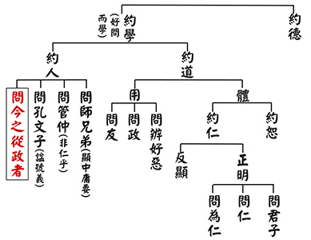

### 孝道跨時代的意義與價值—孝經簡說（十六）

時哉講述、淨域編寫

教以孝悌風氣厚

君臣和合國家興

至德要道文化髓

曾子所傳稱宗聖

推廣至德感化人民 —〈廣至德章第十三〉

前言

廣至德之意，即是推廣「至德」。這個至德是聖人的內涵，要怎樣將聖人的內涵推廣出來呢？聖人的內涵若自己受用，叫作「自受用」；推廣出去時，叫作「他受用」。至德推廣於天下，百姓才能得到幸福。

哈佛大學做了一個長期實驗，用了七十六年、花費兩千萬美金，持續對兩百多人追蹤觀察。兩百人中，有的長命，有的短命，有的長命又收入高，生活幸福快樂，試問到底是什麼樣的秘密，讓他們有這樣的好結果呢？是來自於名、利嗎？是來自於事業嗎？結果發現都不是，這個實驗竟然只有一個結論，聽了你會覺得很值錢。即是雪公老師《常禮舉要》中說的：「通達人情世故」。這個祕密使一個人能夠長壽、健康、快樂、幸福、收入增加。

這似乎難以想像。通達人情世故，要怎麼通達法呢？在家裡從孝悌之道開始，通父母親的心，通達兄弟姐妹的心，一旦相處和合人際關係就好，從這兒改變他的命運。很多人行善中，不知道通達人情世故的重要。雪公在《常禮舉要》講到人情世故的重要，且說：「《常禮舉要》只有我可以說。」這裡面含藏著深厚的文化底蘊，是老人一生能夠轉危為安、趨吉避凶的良方。《孝經》就是以孝悌之道，來謀造人際關係的和諧；而良好的人際關係，根本就是一個人情世故的通達。

本章在《孝經》中為第十三章。簡單複習先前幾章，〈開宗明義章〉的「宗」，是講孝道的修學法，「義」是講孝道的義理。分別來說孝道的修學法，先說孝道的重要，文說：這是天子要推廣的，諸侯、卿大夫、士、庶人都要做的；甚至於大家若能在這本質上，推動家政與國政，則與天地合稱「三才」。常言：「天地人三才」，但是天地人要怎麼成為三才呢？《孝經》所說的修學法，就是天子以孝來治天下，即是聖人治天下之法。

領導人以孝道為本質，來發展政治、教育等各項事業時，必然有許多好事發生；所以，就有〈紀孝行章〉。在善良風氣的攝持下，就有許多孝子的行為可被記錄。反之，不孝的人是要被處罰的，於是有了〈五刑章〉。

孝道教育必須被推廣，其中分為三項，首先是推廣中能讓百姓喜悅。如何讓百姓喜悅呢？即是你推廣孝道，百姓便懂得愛敬他的父母；你推廣弟道，百姓就懂得尊敬他的兄長。如此，我恭敬他的父母，會讓天下的孩子們喜悅；我恭敬他的兄長，能使天下的弟弟喜悅；我恭敬國君，能夠讓天下的臣子喜悅。我敬的人少，喜悅我的人多。這裡分兩邊的經營。一分的經營，是我推廣孝悌之道，讓大家能夠孝順父母，愛敬長上；另一方面，我也懂得愛敬、尊重對方的長上，贏得後輩們的喜悅。這是經營天下的和諧之道，這能使國家強盛、民風淳厚、事業發展，既是成功的祕密，也是拚經濟的良方。

其次，是「能成至德」。「廣至德」意即我推廣這個孝道，不但讓天下百姓敬其父母，同時表徵我也敬天下的父母，所以推廣孝道。我的德能是一種聖人的德能，聖人的至德就是推廣孝道。而聖人成功的祕密與內涵究竟是什麼？即是以孝道為本質的修學。我將這個內涵推廣，就是把聖人的功德推廣出來，讓百姓能夠受用，稱之為「廣至德」。

釋義

經文：

子曰：「君子之教以孝也，非家至而日見之也。教以孝，所以敬天下之為人父者也；教以弟，所以敬天下之為人兄者也；教以臣，所以敬天下之為人君者也。《詩》云：『豈（愷）弟君子，民之父母。』非至德，其孰能順民如此其大者乎？」

這章經文是「能成至德」，當然也可說是至德的推廣，及成就至德的祕密。有兩個段落，第一段是要「興辦教化」，把聖人的功德推廣出來。在興辦教化中，重在身教而非言教，身教要教以孝、教以弟、教以臣。第二段是說此種崇高的德行，發展出來就是「順民」，即是百姓的心中都想離苦得樂，便順著他所想使之離苦得樂。可見聖人最核心處就是離苦得樂；整個中國文化一言以蔽之，就是離苦得樂。

而離苦得樂的修學法究竟是什麼呢？本章舉出《詩經‧大雅》提供一個離苦得樂的修學法，這樣的經營才是民之父母，且讚歎說：這種崇高的德行（至德），才能真去利益百姓（順民）。利益百姓是君子的情懷，也通聖人崇高的德行，這兩者是彼此相通的。因為具崇高德行的人不會徇私，反而會去利益他人。不自私的人是個聖人之德，而利他的是個君子情懷。雖然兩者的方向不一樣，但可以互相輔助。以下依次解讀每段的大意。

子曰：「君子之教以孝也，非家至而日見之也。（反顯）」此段在說：君子非僅言教而已。這裡的君子，是指天子。天子有時稱為「明君」、「聖主」、「君子」。此說：「君子之教以孝也」，就是君子用孝來教。應怎麼教呢？叫作「非家至而日見之也」。「非家至」就是非至家，不是到人家的家裡；「而日見之也」就是每天見他，告訴他孝的道理。孝不是這樣教的。

他怎樣來教孝、教弟、教臣呢？「教以孝，所以敬天下之為人父者也；（教以孝）」此語有兩種說法，第一為教孝的目的，是讓天下的子女去敬父親。自然地，天子本身要先敬自己的父親，才能使天下人敬其父親。第二為何要教孝呢？乃因我敬天下的父母，所以我教孝。前一章說「我教孝」，是我教他去孝敬他的父母親，才是真正利他，本章是說因為我去尊敬天下人的父母親，所以我教孝。我教孝，讓天下人懂得去敬他的父母親。而我對天下父母親的恭敬，要怎麼表達呢？就是用孝道去表達我對天下父母親的恭敬。

其次，教弟，怎麼教呢？「教以弟，所以敬天下之為人兄者也；（教以悌）」這有二說，其一、我天子在家族中，對堂兄、表哥這些兄長們的禮遇，推廣出去能讓天下人懂得弟弟尊敬兄長，晚輩能敬長。其二，我尊敬天下的兄長們，所以我教弟；而我教弟，是讓天下人尊重他的兄長，來表達我對天下兄長的敬意。

再來，天子怎麼教臣道呢？「教以臣，所以敬天下之為人君者也。（教以臣）」天子之下有許多的國家，國家的領導者叫作國君，而這些國君的領導者就是天子。天子要怎麼教臣道呢？解法很多，其一、我教臣道，讓天下的臣去尊敬他的國君。其二、我尊重天下的國君，所以我教臣道，讓臣去尊重他的國君，來表達我對天下國君的恭敬。

綜述本章的概意，即是：教以孝道，讓天下的人去恭敬其父，這就是我天子對天下父親的恭敬。教以悌道，讓天下的弟弟懂得去恭敬其兄，這就是表達我對天下兄長的尊重。教以臣道，讓天下之臣去恭敬其君，來表達我天子對各國君的恭敬。

最後舉出《詩經‧大雅》泂酌篇云：「愷弟君子，民之父母。非至德，其孰能順民如此其大者乎？（舉詩經，贊至德順民）」愷者，和樂的意思；弟也，很平易；即是和樂平易的君子。此君子是懂得經營孝悌與臣道的人，能讓天下人和諧，這種君子就是民之父母。接著說：「非至德，其孰能順民如此其大者乎？」意即是，聖人最崇高的德行、至深的內涵，就是要讓百姓離苦得樂。這一能耐要怎麼去推廣呢？即是推廣孝道、弟道與臣道，此時才能讓天下和諧，使百姓能有真正幸福的感覺。

析疑

本章與前章的關係？

前章為「廣要道」，本章是「廣至德」，回顧「開宗明義」，其中說到「先王有至德要道」，至德就是第十三章，要道就是第十二章。以「至德要道」來順應天下，百姓發揮用後就會和睦相處，這兩章的關係在此，細看蠻有道理的。譬如：我教孝，讓他能夠愛敬父親；我教悌，讓他能夠順從兄長。現在為了表達我對父親、兄長的恭敬，教孝道讓他們恭敬父親，來表達我對天下父親的恭敬。教悌道讓他們順從兄長，來表達我對天下兄長的恭敬。這是就兩邊來說的。

此章把天子說成君子，有何深義？

天子有時說成君子，有時候說成明王。明王是指帝王具聖人之明、頭腦清楚的這一分，心不隨名利境而轉。而君子是指帝王具君子胸懷的那一分，以他的能力將所治的世間轉成太平盛世。如果將帝王說成明王時，就是屬於「至德」的這一分；如果將之說成君子，就是屬於廣要道的那一分。所以，儒家最高的目標，是要能成就為聖人、君子。成就為聖人叫作內聖，成就為君子叫作外王。內聖外王的學問，《大學》以「格物、致知、誠意、正心」通達內聖，以「修身、齊家、治家、平天下」來實踐外王。《中庸》說：「喜怒哀樂之未發，謂之中」，就是成就聖人之德；「發而皆中節，謂之和」，就是君子入世能調和人才團隊，發揮人才的功能，利益天下蒼生，內聖外王就是中國文化核心學習處。

本章天子要如何幫助各國之臣皆能敬其君？

此章除要天子教孝、教弟外，還特別提及天子要幫助各國的國君，怎麼幫忙呢？就是讓各臣子恭敬他的國君，若各臣子不恭敬其君，就會像魯國三家大夫的亂政。當魯國亂、齊國也亂，什麼都亂的時候，天子還怎麼治理呀？儒家的學問讓為政者懂得和諧天下、開展事業、家庭快樂。

所以，天子要怎麼幫助天下的臣子去恭敬他的國君？第一，《論語‧八佾》云：「君使臣以禮，臣事君以忠。」意即君在用臣的時候，是合乎禮的。這合乎禮包括對他的看重，且是在正道上的要求，自然臣事君是回報以「忠」的。是故，若天子、君王在朝廷裡，讓臣子對他以忠時，這只是教臣道；教臣道須在各國中，要好好地來盡忠於國君。當然，此時也暗示諸侯，必須要依禮來對待臣子，不能用主奴關係來吆喝。何以要禮遇他呢？因為他在辦理國家大事，必須要禮遇他。

往年，雪廬老人在莒縣當典獄長時，非常禮遇教誨師，因為他在辦獄政的教誨教育。古代國君路過大臣的辦公處所，是要下輦的，哪怕是沒人在也要下車。這是為什麼呢？難道天子小於大臣嗎？非也，乃是尊重大臣為國辦事，只要是為公發心戮力的，都要尊敬他。雪公在台中時，員警上門查戶口，雖警階低下，老人都恭敬地讓他清查。老人家為何要恭敬受查？因為員警在執行公務，所以無論官階高低，一體尊重。
第二，《禮記‧祭義》云：「朝覲，所以教諸侯之臣也。」諸侯拜見天子時有朝覲之禮，即是依照時節朝拜天子。此時，諸侯要將臣子角色演出來，這才會以臣禮來待君王。譬如：你要先孝順父母，孩子才會孝順你。所以，諸侯朝覲天子時，要表達當臣子的禮儀，這樣你的臣子對你這位國君才會表達為臣之禮。不免有人要
**問：** 天子於重要時節召請諸侯來，而諸侯要對天子稱臣，何需這種繁複的禮節？有時儒家繁複的禮節中，大家忽略了背後的含義，此含義就是教臣道。當諸侯對國君如此恭敬時，他的臣子便看在眼裡，也會對他這樣的恭敬。當國君冒犯天子時，他的臣子也會對其冒犯。當我們對父母無禮冒犯，自己的孩子也會對我冒犯，其理就這麼簡單。

古時隨便提一個禮，它背後的含義很深，今人若不將義理究出，便歸罪說：都是為統治階級服務，在玩主奴婢僕的關係。吾人須知禮含藏著許多的人情世故與吉凶禍福。所以，雪廬老人說：許多年輕人出社會時處處碰壁，自己不曉得為什麼碰壁？原來，學校沒有好好地把禮的精神、重要性、效果及作法教給孩子，使得他們在社會上處處碰壁。雪廬老人以一個碰足釘子的過來人，編撰《常禮舉要》，其目的就在讓年輕人不要因不知禮而吃虧。果然能夠在禮上經營、懂得趨吉避凶、與人和睦相處、尊重別人，才會贏得他人的友誼，這叫作人際關係。具有良好的人際關係，才是個真正幸福的人。

第三，天子怎麼教臣道呢？北京城有座天壇，是皇帝祭天的地方。古代的祭天為郊祭，即是在郊外祭祀上帝，行祭禮時，上帝是君，天子是臣，這是在教臣道。何謂臣道？就是這樣地表達我為上帝之臣時，天子之臣就懂得要恭敬天子。然後，諸侯看在眼裡時，諸侯之臣也會去尊重他的國君，這就是教育。所以祭祀之中，不僅是敬奉天，祈求天能夠加被德澤、風調雨順、國泰民安，其背地裡的本質就是一個教育。

教以孝弟，其推廣的形象是如何？

《禮記‧祭義》中說，推廣的形象從朝廷開始，換言之，當從朝廷裡開始做起時，無論行於鄉里或軍旅都能推廣。因為倫常關係講究了，從朝廷裡做起，其影響力大，引申到公共秩序時便懂得尊重別人，社會風氣自然都良善了。但若不去做時，社會亂象及缺德之事就層出不窮。

如此推廣會具有何種成效？

《禮記‧祭義》中說，推廣的成效是大家會為了這個風氣而效死，也就是願意保護國家；所以，一個很和諧、風氣好、氣氛佳的國家，實際上是很有凝聚力的國家。前曾例舉：希特勒把波蘭、奧地利消滅了，將法國大部分佔領了，但對於只有六百萬人口的瑞士，為什麼不去消滅它呢？奧地利表態「中立」，希特勒照樣消滅它。中立的瑞士為什麼安然呢？原來，瑞士這個國家社會和諧，而且舉國皆兵，當國家受到侵犯時，全國人民一起保護國家。所以，往昔天子真心治理天下無須多兵，當全國百姓皆誓死保護國家時，眾志成城的力量是很可觀的，這就是推廣起來的成效。

天子要如何將孝弟，從朝廷發起達至於州縣，乃至於每條大街小巷？

教孝之中，雖然父親不在了，但我用祭祀的方式（祭祀是一種教孝），來表達孝子的情誼。所作所為都是光宗耀祖、讓父母添增光彩的，這種孝心的表達即是「發乎朝廷」。而弟要怎麼經營呢？孝除了孝順父親外，也懂得禮遇叔伯們。而弟，除了自己的親族兄長外，要怎麼去表達呢？《禮記‧祭義》中說：「三老五更。」相傳古代統治者設三老五更之職，以尊養老人。「三老」可指國家三公，「五更」是國家重要的臣子，其退休後，天子在太學中宴請他們，以表達尊養之禮義，這是一種方式。其二，或說天子宴請社會上賢德之人，用以表達禮遇，等同於禮賢下士、尊重賢德、敬愛長者，這是天子的弟道之教。

教孝弟從朝廷出發，然後達於大街小巷，使整個風氣改變從善。所以，《論語‧子路》篇中孔子說：「善人為邦百年，可以勝殘去殺。」而仁人呢？仁人比善人更高明，仁人就是指君子，他必是三十年就可以改變風氣。孔子又說：「如果用我呢？期月而已！」意是用我為政，一年就可以改善，三年就有成就。這為什麼呢？因為懂得方法，本身又以身作則，能善用人才團隊，社會風氣就快速地變化了。

至於教臣道呢？特別是對為國效忠、與民謀利且懂得行臣道的人，以立廟祭祀來表達，無外也是一個方式。譬如：諸葛亮的「武侯祠」，就是一位盡臣道者的祠堂。中國的廟宇，不要小看了它，它就是一個典範，一個教臣道的典範，不會因為主弱臣強而篡位。這種倫常關係的維護，使他成為中國士君子的風骨，變成民族的延續，可貴的是文化。

最後舉《詩經‧大雅》云：天子是「愷悌君子，民之父母」。「民之父母」就是把天下、國家當作家庭來經營，若遇到路上有餓死的人，視其如子如親。當推展孝悌之道時，實際上就是把天下當成家庭來經營。有人或說中國亦有貴族之世襲呀！但這不能怪罪儒家，儒家的情懷並沒有要為統治階級服務，儒家只是要求統治階級要如此做，這樣才能延續政權，獲得百姓的擁護，國家才能強盛久遠，但統治階級不做，儒家也沒有辦法。

而本章所舉的《詩》，其原意如何？

周成王年少繼位，由周公與召公輔佐政事，「愷悌君子，民之父母」八字，乃召公告誡成王的話。意即，你成王經營天下，是要經營天下的和樂氣氛。雖然要拼經濟，讓百姓生活過得好，但這究竟是幸福與成功嗎？若能推展孝悌讓天下和諧，讓富而好禮、貧能樂道，便是把天下當作一個家庭來經營。所謂家和萬事興，把天下、國家當家庭來經營時，這才叫作「民之父母」，否則，沒有資格稱「民之父母」。

由此可見，周公與召公的輔政，乃是希望天子成為天下的大家長、諸侯成為一國的大家長、大夫在封地裡成為一地的大家長。上下一起來經營和諧的關係，社會一片和樂，沒有以下犯上、奸盜邪淫之事，百姓生活就不需要另外謀劃了。當大家互相為對方著想時，就不會有餓殍載道；當鰥寡孤獨廢疾者皆有所養時，社會就不會有慘絕的事情發生。所以，古書的好處，實難以形容它內涵的殊勝，更難描述它推廣起來的氣象。因為典籍上雖有堯舜禹湯文武周公，但不透過對古書的瞭解與重新推展，我們都無法知道它究竟有多麼殊勝，只是認為載於古籍而已！事實上，魯國與周天子沒有給孔子執政的機會，所以很難想像這個孝悌之道推展出來以後，用禮來運轉大同世界的天下氣象。因為沒看到，就沒有覺受，即便載在古書典籍上，依然生不起覺受。

本章的結論：「非至德，其孰能順民如此其大者乎？」乃說因為是「至德」，所以才「順民」。順民之順到何種程度呢？

即順到教孝、教悌、教臣的程度。可見，順民要透過辦政治與教育，才是真正的順民。順民並不是百姓作奸犯科時，依順於他；是要辦政治與教育時，讓百姓懂得孝悌之道，懂得經營人際關係與和諧，這樣順民才是至德，才是聖人最崇高的德行。最崇高的德行是什麼樣子呢？原來聖人是最能夠經營人際關係，把它推展出去時就是君子。聖人自受用時就是聖人，這是至德的形象。推廣至德就是把聖人最崇高的德行、最隱微處的見地弘揚出去，讓大家都得到聖人的受用，這就是君子，就是順民。

本章旨趣與古籍中的一段話類似，是哪一段？

《禮記‧表記》載：子言之：「君子之所謂仁者，其難乎！《詩》云：『愷悌君子，民之父母。』愷以強教之；弟以說安之。樂而毋荒，有禮而親，威莊而安，孝慈而敬。使民有父之尊，有母之親。如此而後可以為民父母矣。」在這段文中，孔子說：君子之所謂仁者（原來這章把天子稱作君子），就是君子要行仁是很難的。試看《論語》中，有誰被稱許是仁？只有顏回，其他的叫作「日月至焉而已矣」。連德行科的仲弓（冉雍），孔子都說他「未知其仁」，可見仁有多難！

仁的根本是孝悌。若這人懂得在辦政治與教育時，發展孝悌之道到最好的狀態，使天下和諧便是位仁者。可惜的是，孔子與顏回都沒有執政的機會，即便是辦教育時，也沒有執政者大力支持。所以，見不到仁者的胸懷，看不到聖者的見地，是中國文化最可惜的地方。其後說「愷悌君子，民之父母」，就是經營和樂的人際關係，是把天下當成大家庭來經營的人，這才能稱為民之父母。

圖解

以下來看畫家怎麼表達《孝經》的章句涵義。首先北宋李公麟，他的表達法很有趣，就是畫一位孝子來供養父親，送個禮物就是教孝。南宋馬和之，畫孩子送禮物供養父親，人物後方有屏風，一旁栽有芭蕉樹。至於元朝的趙孟頫，表達的方式也差不多，只是將場景由室外換到屋內。

而江逸子老師怎麼表達呢？整體來看，畫作中有兩道景，一主一從，由此可知左上角的聊天，為畫面補景之用，真正的主題在右下方。當天子教孝、教悌、教臣時，會發生什麼事情呢？就是推展於鄉野時，會演禮示範。演禮很重要，大家見了就會開始學習，講究回去後該怎麼表達對父母、兄長、師友等的尊重。演禮的重要，在於調整心態、訓練儀規、整齊動作，是謀得趨吉避凶的方法，是通達人情世故的方便，當百姓都重視，普及到鄉野，社會也就建立了和諧關係。江老師這一幅畫的義趣，就在表達《孝經》透過演禮來廣泛推展。

總結

文說：「至德要道。」首先，至德就是內心的出路，要道就是給別人出路。所以，整個中國文化就是給自己出路、給別人出路。其次，這個出路一定要透過辦政治與教育，辦政治是環境，辦教育是給人見地。人有了見地才有出路，沒有見地就沒有出路。

整篇〈廣至德章〉告訴我們要上行下效，天子除懂得以身作則，還要懂得推廣的方法，這樣下面的人才能效法。至此，家庭整齊了、國家治理了、天下也太平了，就達到禮運大同的世界。禮運大同的世界，其實就是一個和諧的世界，是一個以孝悌為本質的社會；臣對君忠，君對臣禮，這個和諧關係就是一個大家庭的經營，叫作天下一家。天下一家的人，才有資格說「天下為公」。這種聖人的情懷、君子的情操，是中國文化的本質，也是讀書人要辦政治、輔佐長官的見地。如果我們把見地傳播出去，有一天領導者肯用此辦政治，也懂得以孝悌為本質來推廣教育，則禮運大同的世界就不遠了，這也是儒家對世道人心、對民族的貢獻。

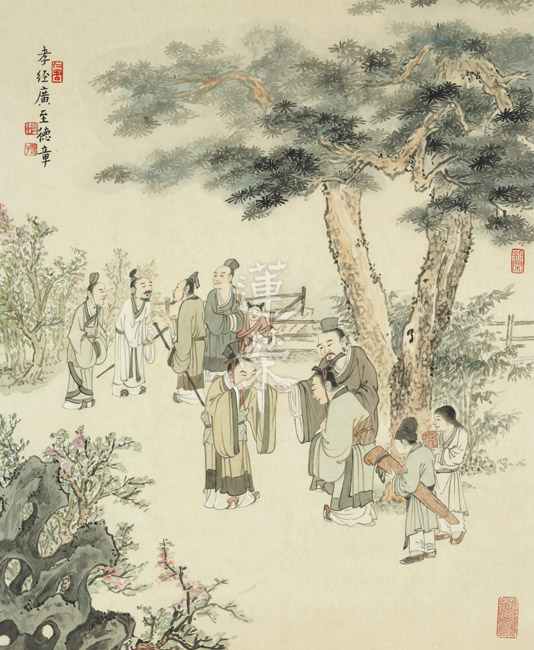

### 孔門心法—中庸之道（十一） 第九章

*茅茹讀書會、弘毅整理*

入世君子行

提起能放下

出世聖人德

仰讚彌高堅

前言

中庸六至九章皆論及用中，本章結示證得中庸之難能可貴。捨棄天下，不受爵位，不惜性命，赴湯蹈火，這些都是一等一的難事，然而這樣算是達到中庸了嗎？本章將比較中庸與上述事例的同與不同，深入了解為什麼得到中庸是如此可貴，能夠超越一切難行之事。看事情須看本質，而非表面，透過中庸的學習讓我們增長智慧，一起當個明眼人。

本章說，國家天下要「均」，就是要財富平均，貧富差距不要太大；或者說「均」是能夠任用人才團隊，找有德的人共同分擔國家大政，如此國家天下才能夠免於內亂和外患。

中庸總體科判

第九章還是在《中庸》的第二部分，即分別顯示中庸的修學法和義理。

六至九章都在談用中，第六章正面讚歎舜是能用中治國的人。第七章反面感嘆一般人在世間追逐名聞利養好像動物掉入陷阱一般。而且就算學中道的人，大多不能持之以恆，容易退轉。最後說明中庸是很難證的，尤其是形而上的道。而顏回是一個能夠在形而上不退轉，在形而下能夠學習利益眾生善法的人，具備辦政治、辦教育的能力，雖然未辦政治，但在辦教育上能幫助孔子的弟子通達聖道，顏回的事功一般人看不到，只有懂局的人知道顏回事功的殊勝。

本章科判分析

本章「世人難證」，中庸難證。分為兩段說明：形而下是可成的，「約君位」是指天子和諸侯可以找人才團隊來治國，共同分擔國家大政，甚至把國家禪讓出去。「約爵祿」是指爵祿可以辭。「約生命」是指可以赴湯蹈火。這些品德雖然在世俗上都很難能可貴，然而卻不是中庸，中庸是聖人的修學法，所以叫「形上難證」。很多人誤解中庸，以為中庸就是凡事不依靠兩邊，或是很多事情折衷處理，或是好人、壞人兩邊都不得罪。其實中庸是一個明心見性、形而上的學問，如果讀一些形而上的典籍，如老子、莊子、佛家的般若，或者學習易經，慢慢的對「中」就會有皮毛的了解。

章旨

孔子列舉世間最難達到的境界，比如說，天下國家可以給別人，爵祿可以不要，為國家、理想或者抱負，可以犧牲生命，這些都是世間最高的品格，可是卻無法與中庸所經營的內涵相比。前者是可能達到的，而中庸如果沒有傳承，沒有透過聞思修是不可能成就的，故中國最有風采的讀書人就是顏回。

經文：

子曰：天下國家可均也，

釋義：

「均」有以下幾種解釋：一、朱子解釋為平，能夠把國家治理太平；二、平均，解釋為貧富平均；三、分擔，就是把國家大政分擔給人才共同治理，非由一人獨裁；四、禪讓，把國家讓給有德的人來治理，這是最殊勝的。

消文：

孔子說：擁有天下的天子，或者擁有國家的諸侯，能夠把天下國家治理的很太平，或者讓國家貧富平均，或者把國家大政分擔給人才共同治理，乃至禪讓給有德的人來治理。

經文：

爵祿可辭也，

釋義：

「爵」是指卿或者大夫，或公、侯、伯、子、男等爵位；「祿」包括兩種，薪水和封地的祿。像魯國的三家大夫，陳國的陳大夫、高大夫，他們不但有爵，還有祿，所擁有的財富非常可觀。

消文：

爵位與俸祿是可以辭去的。

經文：

白刃可蹈也，

釋義：

「蹈」是及或踏的意思。

消文：

當雪白鋒利的刀口架在脖子上，或者在戰場上衝鋒陷陣時，面不改色，視死如歸，對國家忠誠，甚至可以犧牲自己的生命，如文天祥。

經文：

中庸不可能也。

消文：

中庸是形而上聖人的內涵，是孔門性與天道的傳承，沒有傳承與下苦功的學習與實踐，很難達到中庸的境界。孔門只有顏回和曾子得到，而子貢只在聞思上有體悟。

析疑

一、本章與前章之關聯為何？

上一章是讚歎顏回在形而上擇乎中庸，在形而下是得一善而拳拳服膺，他並不是急著去造橋舖路，去做很多善法，而是去學習利益眾生的善法。這章特別講到中庸是很難達到的，以此來烘托第八章顏回的難得，那些世間有品德的人都比不上顏回。形而上的通達實在太可貴了，以形而上來入形而下的時候，他的見地、涵養和品格，都不是形而下的人可以懂的，具有形而上聖人內涵的君子，比世間的君子殊勝太多了！我們常說的君子，一般是指此人不欺暗室，能夠慎獨，像曾國藩就強調慎獨，卻未必是中庸。

二、天下國家可均也的形象為何？ 所指對象為何？

「天下國家可均」的形象，我們特別要講的朝代就是大清帝國，七十萬的滿族統治五千萬的漢族，他們是用文化來治國，在治理邊疆的時候，懂得尊重他們的文化，「可均」包括讓邊疆的民族自治。所以在清朝末年，邊疆最動亂的時候，英國慫恿西藏獨立，西藏都不會獨立，這就是均的力量。

孔子以文化的內涵來辦政治、辦教育，培養的是人的見地、理想、品格和氣度，所經營的氣象十分殊勝。如果沒有這些，教育就會淪為應付考試，政治只以經濟為導向，實為可惜。

「可均」還包括國位都可以讓，典範是伯夷、叔齊，伯夷是為了孝，叔齊是為了弟，寧可不要國君之位。

三、爵祿可辭也的形象為何？所指對象為何？

爵祿可辭的形象，就是一個人對國家充滿熱忱，但是他心裡面可以不要名聞利養的，如果不合乎道，即使利祿再多也不要。像孔子在魯國有六萬石的薪水，原憲是孔子的家宰，薪水是九百，孔子的薪水是原憲的六十倍。但是當理想不合，不能施展抱負的時候，孔子絕對不會尸位素餐，這就是爵祿可辭的形象。

我們再舉一些故事來看「爵祿可辭」的形象：

１、趙盾辭官

趙相國曾對國君說道：「主公你不明是非，不辨忠奸，從不想親政愛民，只知道橫征暴斂，縱情聲色，常言道：天下乃仁人之天下，唯有德者居之，像你這樣失仁失德，總有一天官逼民反，眼看著大好山河就要斷送在你手上。…這是老臣最後忠言，聽不聽任憑於你，我趙盾不能助君王，挽危局還有何臉面留戀相位，老臣告退。」趙盾的忠心可昭日月，他官大薪水高，但是爵祿可辭。不過趙盾勸諫國君的言辭畢竟太過激烈，所以和屠岸賈忠奸不兩立，最後屠岸賈把趙氏抄家滅族，這也是在進退應對的禮上沒有講究所帶來的過患。

２、包公鍘美

包公在開封做府尹時，曾經斬了陳世美，中國式的歌劇有一段演出，包公對秦香蓮唱道：「我不能眼看你含冤負雪返家園，聽著，這頂烏紗我不戴，也要把倫常綱紀正義辦。」此即中國式的歌劇，唱腔好，跺的官步顯示出高貴的氣質，包公在斬陳世美的時候，那種正氣就是爵祿可辭也，官可以不做，這在世間很難能可貴，所以包青天才能傳頌到現在。

四、白刃可蹈也的形象為何？ 所指對象為何？

白刃可蹈就是赴湯蹈火在所不惜，尤其是武官，當然文官也可以，如文天祥。文天祥被俘後被關押在監獄裡三年，最後要被斬的時候，寫下：「人生自古誰無死，留取丹心照汗青。」被殺時神色不變，從容就義。元朝皇帝忽必烈對他非常欽佩，當他後悔想刀下留人時，文天祥已經被斬了。文天祥本來是公子哥，想不到當國家危亡時，立刻成為忠臣，而且是一個能夠白刃可蹈的民族英雄。這與佛門的弘一大師一樣，早年風花雪月，但三十九歲出家後，一變而成為律宗的祖師。所以當人有改過、幡然向上的那種魄力時，是一般人的小善難以比擬的。有些人雖然是大惡，可是當他忽然反轉的時候，變為大善，一般善良的人只能維持小善而已。

白刃可蹈特別要講的典故，就是秦趙澠池相會，因為秦國要打楚國，所以拉著趙國來會盟，趙國不得不來。會盟時，秦昭襄王想要把趙國當成屬國，威逼趙王彈琴，藺相如毫不懼怕，針鋒相對，終於憑藉他的膽識，迫使秦王擊缶。在小國與大國聚會的時候，小國也可以據理力爭，維持國格，藺相如的這種舉動，讓會盟的兩君平起平坐。

後來廉頗大將軍心中不平，認為自己功勞大過藺相如，所以處處為難他，藺相如則處處躲避。他人就說：你這個宰相是不是怕將軍？他說：在澠池會上，我都尚且不怕秦王，我還怕廉頗？為什麼會這樣呢？因為將相和，國家才能興，我是站在國家的立埸，所以才如此。這種忠臣既不愛財，又能白刃可蹈，一個國家如果都是這種人，國家哪裡會不興盛呢？

還有一個特別有名的例子，就是諸葛亮到吳國去借兵，那時候曹操已經派人到吳國去，逼吳國投降，吳國的文官都贊成投降，魯肅希望諸葛亮說服吳國的文武官員，一起聯合抗曹。諸葛亮一個二十八歲的年青人深入吳國，如果他外交失敗，他就可能會被吳國捉去見曹操，就會有性命之憂，所以這叫做白刃可蹈。

五、以上三喻所要顯示的涵義為何？

這三個比喻所要顯示的涵義是，這三種人的品德非常令人欽佩，世間雖然少有，但還是可以找到，然而中庸的內涵卻更為難得。懂得中庸之道的人，他在世間所造的善法，前面這三種人達不到，因為這是在見地上論。如果以中道文化去經營一個國家，那所展現的氣象難以想像。

六、為什麼中庸不可能也？

「喜怒哀樂之未發，謂之中。」中就是能夠明心見性，學習中道可以明心見性，對治煩惱，超越世俗。「不可能」是說，或者沒有明師傳承，或者沒有好的法本，或者有的人雖然學習中庸，但大概都是進進退退。像冉求也跟孔子說，「非不說子之道，力不足也」，孔子說他不是力不足，而是他畫地自限。很多人都是如此，認為他沒有這個根器，或是沒有時間，或是學起來很困難，畏懼困難而退縮。像子貢有能力通達中庸之道，卻因要處理的俗事太多，沒有投入足夠的時間學習，障礙了他學習中庸之道。

七、中庸真的不可能嗎？

如果一個人有決心又有傳承，又肯好學，又能夠摒棄門戶之見，能夠從《中庸》、《論語》，或者是《易經》，或者是老莊，或者是佛家的般若當中，幫助理解中庸，而且花時間好好的細細的去研究，透過思惟、修學來體會中庸，可以達到中庸。「回也其庶乎，屢空。」屢空就是屢屢達到中庸之道，顏回就是一個能夠達到中庸的人。再有就是曾子，孔子告訴曾子說，我的道是一以貫之，以中道來貫穿世間的道理，曾子領會了孔子所講的中道。還有子思作中庸，就是根據中的道理來寫的一本論典。

中庸的境界太高了，老百姓不能已經很久了，如果沒有這種傳承和法本，任憑你學習世間何種學問，都學不到中庸。世間人雖然很努力的學習，可是沒有人來講和指點中庸之道，沒有人來聞、思、修中庸之道，沒有同儕互相切磋中庸之道，沒有人以中道來辦政治、辦教育，人們沒有方向、門路，最終還是「道其不行矣夫。」中道大概是不能行啊！剩下的只是強兵霸權、拼經濟，教育就是只講功利、應付考試，培養的大多都是世俗的人才，辦不出一個有氣象、有品味、有見地的政治局面。

八、孔子說此話的用意為何？

是說君子的修學法是可以的，而聖人的修學法很難得，這一定要有引路者，不是在外相、事功上論的。如果以聖人的內涵來進入君子的領域，以仁心去利益他人，那種君子之道也不是世間的君子之道所能比的，如之前所講的顏回的功德，是一般人所看不到的。儒家的禮與世間的禮不太一樣，世間的禮是提供很多親切的服務，但是這種氣象還算是末流，當真正進入到形而上時，所展現的禮儀叫做「禮乎！禮乎！」「禮啊！禮啊！」只有內行人才看得懂！這叫「內行看門道，外行看熱鬧。」

九、不達到中庸有什麼關係嗎？

不學習、不達到中庸，老百姓還是一樣的過生活，朝代還是繼續演變，照樣強兵霸國，秦國不用孔子之道，用法家治國也使國力強盛。

可是中庸上卻說，「道也者，不可須臾離也。」中道是心中隱微處的中心思想，以此來經營每件事情，你是否有中心思想，所呈現出的氣象是不同的，懂局的人能夠看得出來，他能夠從你所做的事情當中，看出所含藏的中心思想，含藏的你對道的體悟和尊崇。

總結

一、三喻辦政國家強，中庸經營真出路。

國家的大政，如果是一個可均的人當領導者，可辭爵祿的人做大夫，能夠白刃可蹈的人為文武百官，這個國家在世間一定是一個非常強盛、無人敢欺負的國家。但是中庸的內涵，才是這個國家更應該經營的中心思想，辦教育的本質，國民內心的出路。

二、明君治國盛世現，聖王用中更難得。

一個英明的領導者，可以把貧富差距縮到最小，可以任用人才團隊治理國家，也可以像成王、康王一樣治國四十年，而使監獄長草，不像現在監獄人滿為患。但是堯傳位給舜的時候，他講到為政者的心法，就是「允執其中」，允執其中的氣象，一定要聖人治理國家，才可以辦到。

三、智愚皆可得中道，朝聞夕死又何妨。自行化他不離中，無可不可隨機應。

聖人並不是遙不可及的，不論是愚鈍的曾子，還是有智慧的顏回，都可以透過學習，最後能夠得到聖道的傳承。《論語》上說，「朝聞道，夕死可矣」，有人說道是指仁道、君子道，但是最難能可貴的解法是配合中庸說「朝聞中道，夕死可矣！」因為那是人生最重要的學問、見地和意義所在，人活著不能如行屍走肉一般，也不是為了世俗名聞利養而活，是要有意義的活著，就是聽聞中道、思維中道、修學中道，以中道自行、化他，以中道辦政治、辦教育，以中道來經營君子之道。通達中道的人，他在後得位入世的時候，他是天下國家可均可不均，爵祿可辭可不辭，白刃可蹈可不蹈，孔子說，「無可無不可」，那就是中道的抉擇，這是中華民族最殊勝的地方。中國的中，不是地球的中間，因為地球是圓的，沒有所謂的中，中國的中是中道的中，文化的中國才使中國有真正的出路。

問答

**問：** 有注說，天子、諸侯、大夫皆位高而富有之人，將土地、財富分人實非難事；清高之人為求後世榮名，放棄爵祿，故非難事；勇士志在成名建功，捨身蹈白刃，亦非難事，此解可乎？

**答：** 這樣的註解不可採，這些都是很難得的，只是觀待中庸之道的時候，就說不難，但是觀待世間人，他們是很難得的。勇士拋頭顱灑熱血，這怎麼不難？一般人是不可能的。清高之士能夠不去追求榮華富貴，到手的榮華富貴可以不要，一般的讀書人哪裡能夠做得到。天子、諸侯、大夫把所擁有的土地分送給他人，如泰伯、仲雍三讓天下，孔子稱讚說，「其可謂至德也已矣」，又稱讚伯夷、叔齊為古之賢人，怎麼不難呢？爵祿可辭未必是清高，清高之人也未必是求後世之名。這裡所說的爵祿可辭，並不是指清高之人，並不是在求後世之名，而是說一個人雖然有爵祿，但是如果理想抱負不能實踐的時候，他寧可不要，像文天祥或諸葛亮。諸葛亮是一心光復漢室，安邦定國，「漢賊不兩立，王業不偏安。」所以白刃可蹈，面對曹操、孫權，爵祿可以不要，這是君子的行為，未必是清高之士。

**問：** 有註解說，中庸是平常之行，視之似易，行之實難，這種說法可以嗎？

**答：** 中庸雖然是平常之行，但卻並不容易。顏回「擇乎中庸」，孔子說「吾道一以貫之」，只有曾子懂，這怎麼視之似易呢？要通達中庸很難，行之更難！但是「視之難，行之易」，當你真正通達道理的時候，做起來真的不困難，困難是在道理不通。

**問：** 李白和杜甫，他們都是仕途不得志，這樣是否比爵祿可辭還要略遜一籌呢？

**答：** 爵祿可辭是說，一個人雖有名利但可以不要，李、杜也是名利可以不要的人。仕途不得志，他們也很在意，但他們並不是在意名利本身，而是在意國家大亂，他們空有才華，卻不能施展抱負，所以鬱鬱不得志，對不能用於世而感到無奈。

**問：** 上一章講到顏回是得一善而拳拳服膺，一善是指顏回擇乎中庸，得到的形而上的智慧嗎？

**答：** 不是，得一善是講入世的時候，辦政治、辦教育要有能力，包括六藝、識人、禮樂的運用等能力，這些都是利益眾生的善法，都要好好的學。

**問：** 陶淵明不為五斗米折腰，是賢人還是清高之士？

**答：** 分辨清高之士與賢人，要看其見地。陶淵明的見地，一看就知道是賢者，一定有形而上的思想。慧遠大師想要陶淵明出家，甚至可以答應他留頭髮，可以娶妻生子，可以喝酒吃肉，然而陶淵明卻反問慧遠大師說，那我幹嘛出家，我不是在家就好了嘛！從此可以看出，慧遠大師對他尊重到這種程度，他不是普通清高之士，簡直就一位通達形而上的賢者。

**問：** 孟子裡面有，「挾太山以超北海」、「為長者折枝」這兩樁故事，可否用此來比喻中庸之道難行與可行的心態呢？

**答：** 「挾太山以超北海」也不難，有的人有毅力時是很可觀的，如李冰父子修建都江堰，真是鬼斧神工，愚公的移山填海，雖然都很難，但是都不如中庸難。因為難在沒有門路，沒有傳承，難在各說各話，難在師心自是，難在以非為是。

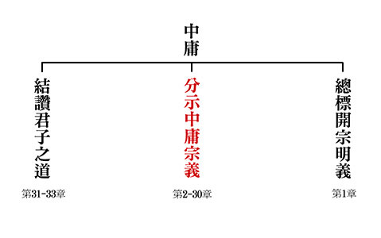

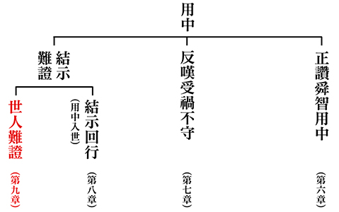

### 三字經簡說（十一）

*淨爾整理*

童蒙好教材

重治應時代

出版利幼學

盼多讀者閱

蘇老泉 二十七 始發憤 讀書籍

彼既老 猶悔遲 爾小生 宜早思

蘇老泉二十七歲才發憤讀書。他年紀已不小，且後悔自己開始得太晚，你們這些後生小輩，應該早點立志求學。

蘇洵小時候雖然有讀書的機會，但他並不喜歡當時的正規教育，因此並未認真向學。婚後多年才生下蘇軾，在如願以償得到兒子後，蘇洵的二哥和大舅子也相繼考上進士，在外做官。蘇洵看著幼子，又想想踏上仕途的親友，開始後悔荒廢了年少時光。他的夫人是受過良好教育的女子，她鼓勵蘇洵上進，蘇洵因此在二十七歲時發憤為學，幾年後進京趕考卻落榜，回到四川後，據說蘇洵把之前所寫的文章全部燒掉，閉門奮發，因此而通達《六經》、百家之說，下筆頃刻數千言。蘇洵帶著兩個兒子蘇軾和蘇轍做學問，到了宋仁宗嘉佑年間，他帶著兒子們上京趕考，這時的蘇洵已經四十七歲了。到達京城後，蘇洵將他的作品呈給當時士林中最受敬重的翰林學士歐陽修，蘇洵的文章在士大夫間爭相流傳，他簡樸的文風一時成為讀書人仿效的對象。那年他的兩個兒子又同時考上進士，自此蘇氏父子三人享譽文壇，日後均名列唐宋八大家，一門三傑傳為千古佳話。

若梁灝 八十二 對大廷 魁多士

彼既成 眾稱異 爾小生 宜立志

宋朝的梁灝八十二歲中進士，而且在殿試時對答如流，領先眾人脫穎而出成為壯元。像他年紀這麼大了還能考取功名，眾人都嘖嘖稱奇，你們還年輕，應當及早立定志向。

梁灝是否八十二歲中進士，眾說紛紜。《宋史》梁灝是在宋太宗年間，時二十三歲中狀元，九十二歲過世。在其他史籍中也有梁灝二十三歲中狀元，四十二歲過世的記載，並說梁灝很有能力，每每上朝進奏時，辭辯明敏，對答如流，甚得皇帝欣賞。梁灝之子梁固於宋真宗年間考取狀元，時年二十二歲。梁灝和梁固為中國科舉史上罕有的父子狀元。

本段應是勉勵人有志者事竟成，但因史書記載的梁灝卒年有異，因此本段取其精神，其餘存疑。

瑩八歲 能詠詩 泌七歲 能賦碁

彼穎悟 人稱奇 爾幼學 當效之

北魏祖瑩八歲的時候就能讀誦詩書。唐朝李泌七歲就能以碁道作詩。他們聰慧過人，時人稱奇，你們剛開始求學的孩子應當效法他們。

祖瑩是橫跨北魏、東魏、北齊間的人物，他身處在動亂的魏晉南北朝，他出生在北魏，過世時卻已是北齊人了。

以文學見重的祖瑩作為一個生在北地的漢人，年輕時正好逢上北魏漢化的黃金時期。祖瑩八歲就能背誦《詩經》、《尚書》，十二歲入太學為中書學生。祖瑩極為好學，父母擔心他讀書讀到影響健康，屢屢禁止也無效。祖瑩常偷偷地把火苗埋在灰燼中，等父母入睡後再點火讀書，而且還用衣服被子遮住窗戶，就怕被家人發現他半夜不睡覺爬起來用功。勤學又博學的祖瑩因此逐漸為眾人所知，人們稱他為「聖小兒」。中書監高允每每讚歎祖瑩的才氣非其他學生所能及。

曾經中書博士張天龍開講《尚書》時，祖瑩被選為主講。祖瑩半夜讀書精神勞倦，不知不覺天已破曉。趕著出門時竟然拿錯了同寢室同學的《曲禮》上座。他怕被嚴厲的博士罵，不敢回去取書，竟然就拿著《曲禮》背誦《尚書》，一字不漏。講完課，被同學發現此事，眾人皆大感驚訝。後來傾心漢化的北魏孝文帝聽說他的事蹟而召見祖瑩，孝文帝命令祖瑩背誦五經章句並陳述大意，祖瑩博學多才，得到孝文帝的讚賞，因此官拜太學博士。
唐朝開元十六年，唐玄宗聽聞七歲的李泌敏捷能作詩，於是召見李泌。李泌到的時候，玄宗正和燕國公張說下棋，就命張說考考李泌，張說要他以「方圓動靜」作一首詩，李泌請他再說清楚，張說解釋：「方若棋局，圓若棋子，動若棋生，靜若棋死」。李泌隨即回
**答：** 「方若行義，圓若用智，動若騁才，靜若得意。」玄宗大悅，賜給李泌絲帛，要他的家人：「好好培養之。」

天寶年間，唐玄宗想起早慧的李泌，召他來講老子，李泌表現不俗，因此提拔他出任翰林供奉，擔任太子的老師，李泌因此和皇太子形成亦師亦友的關係。李泌後來得罪楊國忠，只好辭掉官職歸隱山林。

安史之亂爆發，太子臨危受命即位為肅宗。肅宗召來他的老師李泌，李泌不願當官只願以客卿身分陪皇帝議論國事，李泌和肅宗共商軍國大計，李泌所言，肅宗無不聽從，李泌協助肅宗收復長安與洛陽，肅宗聽聞捷報大喜，即刻準備起駕回京，李泌建議肅宗應一鼓作氣徹底平亂卻未獲採納，安史之亂因此又拖了七年之久。二京收復，局勢漸穩的時候，李泌見肅宗寵信宦官李輔國，因此自求隱退以避禍。

唐代宗即位後又召李泌入朝，凡是官員的任免必和李泌商量，國家和軍政大事也必讓李泌與議。李泌自知為朝中大臣所忌，因此自請前往治理南方。

唐德宗時又召李泌回朝出任宰相，德宗將李泌比喻為管仲、傅說這樣的歷史名相。李泌一生經歷唐朝四位皇帝：玄宗、肅宗、代宗、德宗，四次入朝四次隱退，史所罕見。　　從肅宗到德宗，皇帝一即位就想召李泌為朝廷服務，李泌既能與聞國政，對皇帝、國家發揮影響力，又能明哲保身、深諳趨吉避凶之道。在亂世中能貢獻才學又自我保護者絕非易事。

祖瑩和李泌雖都是早慧的神童，但兩人並未因為聰穎過人而廢學，反而在學問上力求精進，因此而有了日後被當朝皇帝賞識重用、為國貢獻心力的機會。

蔡文姬 能辨琴 謝道韞 能詠吟

彼女子 且聰敏 爾男子 當自警

東漢末年的蔡文姬是宰相蔡邕的女兒，從小就能辨別琴音的好壞。東晉宰相謝安的姪女謝道韞出口成詩，是詠絮之才。這些女子尚且聰慧靈敏，你們這些男子，更當自我警惕，好好努力。
蔡琰字文姬。東漢末年宰相蔡邕之女，蔡邕為當時的大書法家、文學大家，更是琴文化史上的琴學大家，不但會製琴也善於作曲。蔡文姬耳濡目染，自幼博學多才，好文辭且精通音律。後梁劉昭的《幼童傳》與宋代《太平御覽記》裡記載，有一晚蔡邕在家中彈琴，琴絃斷了，蔡文姬說：「第二絃。」蔡邕於是故意再斷一弦而問之。文姬
**答：** 「第四弦。」絲毫無差。

根據《後漢書‧列女傳》記載，蔡文姬長成後初嫁名門之後衛仲道，未久，丈夫過世，因為膝下無子，於是歸寧娘家。董卓之亂爆發後天下大亂，蔡文姬被南匈奴軍擄獲，被迫嫁給南匈奴左賢王，旅居胡地十二年生下兩個孩子。後來曹操掌權之後思及故友蔡邕無嗣，且十分同情蔡文姬的遭遇，因此重金贖回蔡文姬，這就是史上知名的文姬歸漢的故事。

蔡文姬回到漢地後，曹操將她許配給同鄉的董祀，董祀擔任屯田都尉，因為觸犯法令被判處死刑。蔡文姬以一介女流親自向曹操求情。時值寒冬，曹操正大宴賓客，聽到蔡文姬來了，就向滿場賓客介紹蔡邕之女。沒想到蔡文姬進來時蓬頭赤足、叩頭請罪，聲音清亮言辭明辯，內容令人心酸哀傷，眾人皆為之動容。曹操被蔡文姬感動而決定赦免董祀之罪。當時天氣嚴寒，曹操賞賜蔡文姬頭巾與鞋襪，並問她說：「聽說蔡家藏書豐富，你還能記得多少？」蔡文姬說：「從前亡父藏書四千多卷，幾經戰落全部遺失，現在我能背誦的只有四百多篇。」曹操大喜，說：「那我派十個抄寫員去紀錄你所記得的文章。」文姬說：「男女有別，您給我紙筆，我來默寫，禮不親授。」於是憑記憶默寫出四百篇文章，文無遺誤。

謝道韞是東晉宰相謝安的姪女，也是著名書法家王羲之的兒子王凝之的妻子。
《世說新語》記載，在一個雪花紛飛的寒冷冬天，謝安和家人圍爐閒談，與家中孩子們講文論義，一會兒雪下得大了，謝安欣然地問大家：「白雪紛紛何所似？」紛紛而下的大雪像什麼呢？謝朗曰：「撒鹽空中差可擬。」謝朗比喻像在空中撒鹽。但謝道韞兄女回
**答：** 「未若柳絮因風起。」公大笑樂。自此，後世稱讚能施善文的女子為「詠絮之才」。

另有一次，謝安問謝道韞：「毛詩何句最佳？」謝道韞答道：「吉甫作誦，穆如清風。仲山甫永懷，以慰其心。」吉甫就是周朝的賢臣尹吉甫。「吉甫作誦」是指的尹吉甫寫的「丞民之詩」，這詩讚美周宣王的卿士仲山甫，助周宣王成就中興之治。謝安稱讚謝道韞頗有「雅人深致」。

謝道韞長成後，在謝安的安排下嫁給了門當戶對的王凝之。多年之後，爆發「孫恩之難」，匪賊孫恩攻進會稽城，局勢混亂，王凝之卻只是閉門祈禱天兵天將來救，謝道韞勸諫無效，命令家中婢僕執刀持劍防衛。孫恩大軍長驅直入，王凝之在城門附近被賊兵攔截斬首，但謝道韞鎮定自若，帶領家丁乘亂突圍出城，衝上大街，雖然還是被賊兵俘虜，但孫恩看到謝道韞一介女流的膽識與謀略為之折服，對其改容相待，命人送她安返故居。此後，謝道韞一直寡居會稽。

蔡文姬與謝道韞的共通點：

１、女流之輩—古代不重視女子的學術教育，因此能為文作詩者屈指可數。深為先天條件的弱勢，兩人還能以其才華聞名後世絕非易事。

２、名門之後—看似得天獨厚，自小耳濡目染，但若沒有想學好學的心，也不過是一位平凡的大戶千金。

３、無法自主的婚姻—婚姻之路的坎坷沒有阻斷他們的才識，蔡文姬做了悲憤詩二首、樂曲胡笳十八拍流傳於世。謝道韞的詩文可惜已經亡佚，無法一窺文采。

４、生逢亂世—在亂世中更見她們巾幗不讓鬚眉的氣勢，蔡文姬為救夫向曹操求情，謝道韞一女當關擋下賊兵，她們的才智與膽識非常人可比。

唐劉晏 方七歲 舉神童 作正字

彼雖幼 身已仕 爾幼學 勉而致 有為者 亦若是

唐朝劉晏七歲就被舉為神童，並被拔擢為負責校勘典籍的正字官。他雖然年紀幼小，卻已任職為官，你們這些幼學之人，只要勤勉努力也能有所成就。有志向、肯努力的人也應當效法之。

正字官：唐代的九品官，是基層官員。

根據《新唐書‧劉晏傳》，唐朝開元年間，玄宗封禪泰山的途中，時年八歲的劉晏獻上《東封頌》一文，玄宗很讚賞卻不相信是出自一個七歲小童之筆，於是命當時宰相張說考考他，結果劉晏對答如流，張說回報玄宗說劉晏是個國寶。玄宗於是封劉晏為正字官，負責校勘典籍，劉晏借此良機遍閱群書，學問斗進，為日後參與國政奠定良好基礎。

天寶年間，劉晏離開長安，轉任各地的地方官，他在地方擒拿盜賊、鼓勵農作，農民可以安心生產，各地都立碑感念他。安史之亂爆發後，戰禍導致關中地區「人煙斷絕，千里蕭條」、「獸游鬼哭」。劉晏被任命為彭原太守，到任後，招募流民、開墾良田、保境安民，因為政績顯赫，很快地被拔擢到中央。當時的唐代經過戰亂，財政瀕臨崩潰，軍費高漲但收入萎縮。中原人口銳減、米價飆升，通貨膨脹達到百分之五千，糧食匱乏到「太倉空虛，鼠雀猶餓」，連皇宮都有所不足，令唐代宗憂憤難眠，當時宰相推薦劉晏擔任京兆尹、戶部侍郎、兼管鹽鐵、鑄錢等。劉晏新官上任馬上投入恢復漕運、南米北送的工作，歷史上稱劉晏這個人「為人勤力，事無閒劇，必一日中決之」、「安史之亂，天下戶口十亡八九，所在宿重兵，其費不資，皆倚辦於晏，晏有精力，多機智，變通有無，曲盡其妙。」劉晏治國理政十六年，以養民為先，富國卻不勞於民，雖然掌理國家財政，號稱「軍國之用，皆仰於晏」，但劉晏過世時全部財產「唯雜書兩乘，米麥數斛」罷了。

以上為各類型的勤學典範，以下反誡不勤學者，比之犬雞蜜蜂都不如。

犬守夜 雞司晨 苟不學 曷為人

蠶吐絲 蜂釀蜜 人不學 不如物

狗會守夜看門，雞會晨啼報曉。如果人不求學也沒有才能，怎麼能算是一個有用的人呢？蠶吐絲結繭可以做衣料，蜜蜂採花釀蜜供以食用。人如果不學就無益於世，那就連昆蟲都不如了。

本段是互文，雞和犬都是家禽，尚知努力為人類服務，蠶和蜂只是小小的昆蟲，但卻能發揮大功用，人若不用心學習，連人的作用都沒有，不如雞、犬、蠶、蜂有貢獻。人若用心學，天生我材必有用，人類能發揮的大用如修身、齊家、治國、平天下，小則利己、大則利他。

《三字經》的最後，再次勉勵學習與孝道的關係，並且以此經可作為傳芳後代的人生經營法為全書作結。

幼而學 壯而行 上致君 下澤民

人在幼小時就要努力學習，長大後才能實踐所學，回饋社會，對上能輔助國君辦理政事，對下能為民謀福。

求學的目的在實踐，實踐致君澤民，也就是治國平天下。

揚名聲 顯父母 光於前 裕於後

得到他人的讚譽，名譽聲望得到宣揚，同時榮耀父母，而且能光耀祖先、福蔭子孫垂裕後代。

《孝經》開宗明義章提到「立身行道，揚名於後世，以顯父母，孝之終也。」建立孝行的名聲，讓後世稱揚，彰顯父母的德性，這是孝道的圓滿。本段結合孝經的概念，令祖先同享光彩、陰德庇蔭子孫。

人遺子 金滿籯 我教子 惟一經

人們遺留給子孫得通常是整箱的金銀財富。而我只留下《三字經》這一部書，用以教導子孫好好讀書。

勤有功 戲無益 戒之哉 宜勉力

凡是讀書人勤勞用功必有收穫，嬉遊貪玩毫無益處，以此兩句話警惕自己、應當勤勉努力。

《三字經》全文主旨在於「學」，全篇總結在於「勤」。學能勤，必有成。

《三字經》簡說  全文結束

參考資料

１、《蘇東坡傳》 作者：林語堂 風雲時代出版

２、《新譯三字經》 作者：黃沛榮 三民書局出版

３、《三字經簡說》台中蓮社印行

４、《世說新語》三民書局出版

## 藝術賞析

### 孔門七十二賢淺說（二十六）—伯虔

圖/江逸子 文/時哉

孔門多人才

後進爭氣多

善學建人品

名聲後世揚

伯虔，姓伯名虔，字子析（孔子家語稱子皙），魯國人，小孔子五十歲。

伯虔在孔門弟子中，以儒行著稱。孔子以詩禮樂教弟子，在《論語‧泰伯第八》篇說：「興於詩，立於禮，成於樂」，詩者言志抒情，禮者天地之序，樂者人倫之和，導其真情，而歸自性，為入聖之學也。是諸弟子共同學科，人人必須修學課門。因此孔子以「志於道，據於德，依於仁，游於藝」為教育導向。伯虔學習的造詣頗深，在道業的學習上小心謹慎，終有所成而流芳百世，故其立身處世受人尊崇，世享後人祭祀。

宋高宗讚其為：「有懷子析，全魯之彥。儒行既名，聊伯乃建。兢兢受道，奕奕峩弁，懿選嘉封，世享馨薦。」意為伯虔是一位有大作為之人，是魯國俊彥之才。依教行持是一位有名望之人，唐朝時封為聊伯，給予崇高地位，亦是對其善行之肯定，可以長久接受祭祀。

子析於漢永平年入祀聖廟，唐朝追封為聊伯，宋代加封為沐陽侯，明朝改稱先賢伯子。

畫中的伯虔頭往上揚，右手插腰，表所學的自信，一身布衣的形象表他是不慕榮利之人。他相貌敦厚，年紀輕輕，即才華出眾，令世人見賢思齊。

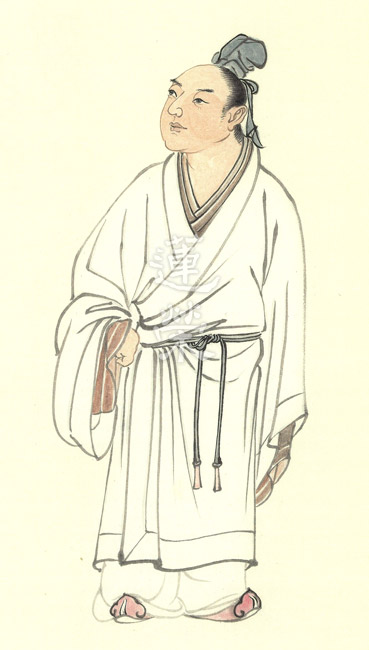

### 孔門七十二賢淺說（二十七）—公孫龍

圖/江逸子 文/時哉

學海無涯每月進

有情有義願赴難

可貴所學統異端

俠氣不讓子路前

公孫龍，姓公孫名龍，字子石，春秋楚國人（孔子家語說是衛國人），小孔子五十三歲。

《史記‧魯世家》記載：魯哀公時，齊國的田常想要作亂篡權，於是讓齊簡公命人派兵攻打魯國，藉此減弱田常政敵的勢力，以便他乘此機會在齊國國內行事。魯國是孔子的父母之邦，面臨滅國之難，孔子憂傷，詢問弟子誰願出使為魯國解危，子路、子張與子石等一一請求出使任務，皆被孔子拒絕，最後子貢請行，孔子方允。子石之請雖未成，但他身為楚國人，願意獻身為夫子父母之邦赴湯蹈火之義行，甚獲肯定。

以公孫龍的人格特質而言，可以引用孔子所說：「不得中行而與之，必也狂狷乎，狂者進取，狷者有所不為也。」公孫龍行中庸之道，而能調和。其次具有中流砥柱之慨，對事對理，乃至與朋友之交，真有困難，願挺身就義。

子石於漢永平年入祀聖廟。唐玄宗追贈為黃伯。宋高宗贊公孫龍「黃伯著祀，公孫是云。彌縫中道，協輔斯文。藏修方異，漸漬甚勤。史詞不忘，播為清芬。」有位黃伯受人祭祀，原來就是公孫龍先生。其言行能合中道，勤於協助孔學的發揚，矯正異端學說，勤於學業，不斷進步，對於歷史能夠強記，清雅芳馨之名，永遠流傳。

畫中的公孫龍模樣粗曠，張口仰天，雙目神情哀戚，或許是對於世風日下表達心中的哀嘆。雙手緊握表徵道義之劍，是亟欲伸展胸中抱負的形象，是儒者知其不可為而為的入世情操。

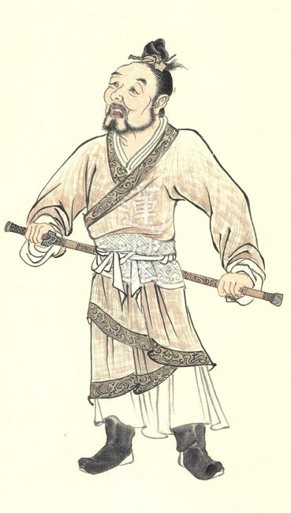

### 華夏精魂千秋（二十七）— 明倫史畫 孝儉致化 趙咨

圖/江逸子 文/時哉

混亂動盪的時代

情操冰雪的品性

能感動賊的孝行

薄葬歸去的人生

史畫

趙咨，字文楚，東漢兗州東郡燕縣（今河南省延津縣）人，生卒年不詳。父親趙暢，曾為博士；年幼喪父，事母至孝，州郡推舉孝廉不任。桓帝延熹元年（西元一五八年），大司農陳奇舉薦為博士，掌管經教，累官至涼州敦煌太守。

桓帝年間，宦官與士大夫間的矛盾激化，黨錮之禍連起，彼此相互殘害。靈帝建寧元年（西元一六八年），太傅陳蕃與大將軍竇武，謀劃要誅除中常侍曹節，因事機洩漏反遭王甫與宦官所殺。趙咨因感朝綱紊亂，以病請辭，返回東郡自耕自食。

當時各地賊寇流竄。某天夜裡盜賊來搶，他怕母親受到驚嚇，先到門口迎接，並設宴款待，抱歉地對盜賊說：「母親年老體衰需要靜養，家中並不富裕，還請大家高抬貴手，留點衣糧以奉養母親。」至於妻孩之需，一點都沒提起。賊人聽了既感動又慚愧，跪下辭別說：「我們太無理了，不該侵擾賢良的人。」

靈帝知其賢孝，屢召為徐州東海國相，推辭不得而赴任。途經滎陽時，昔日所舉薦的敦煌令曹暠，特地在路旁等候迎接拜謁，但他過而不停。曹暠對下屬說：「趙君德高名重，經過我的縣境卻不及迎拜，實是生平的憾事。」於是追至東海（今山東省郯城縣），拜謁之後辭官歸鄉。

趙咨為官清廉生活簡樸，有人送他兩條魚乾，竟然兩年都未吃完，鄉里豪貴聞知不敢奢侈，民風歸於淳樸。東海相三年勞瘁而身病，上書請求免職，獲召為議郎（顧問），帶病至雒陽述職。

趙咨病重自知來日不多，臨終前對舊屬朱祇、蕭建等交付後事，要他們買來一口素棺，底層鋪上黃土墊底，好讓屍體迅速腐化早歸后土，莫讓子孫改變了殮葬計畫。當送喪到家時，兒子趙胤不忍父親屍體與黃土并合，想要改變殯葬的方式，但朱祇等人仍依遺命辦理薄葬，時人稱讚他是明達之人。

圖解

趙咨少年喪父、侍母至孝，先被州郡推舉孝廉不任，後又為大司農陳奇舉薦為博士掌管經教，可見其為人品德學問俱優。桓、靈二帝期間，朝政因官宦黨派爭亂不已，便告病辭官返鄉耕食，並不以官場厚祿為戀。民初國學大師章太炎先生，其位在杭州餘杭的故居，刻著一道遺訓：「凡人總以立身為貴，學問尚是其次；不得以富貴而驕矜，因貧困而屈節。」正說明人生在世，萬勿妄自卑賤，不可足恭諂笑，須做個對得起天地的人。

此幅畫中，江老師特別描繪「暗夜盜劫」之景，來彰顯「孝儉致化」一題。東漢末年社會動盪不安，貧寒者紛起盜賊之心，乘機打家劫舍、中飽私囊。暗夜裡，盜賊來到了東郡鄉里，趙咨聞見主動迎請入內款待，難道他不怕凶狠的盜賊嗎？原來他考量的是，莫讓母親受驚嚇了。此說明他既是個孝子，也是個正人君子。即所謂：「平日不做虧心事，暗夜不怕鬼敲門。」

然而，凶狠的盜賊於一頓飯後，為何跪下拱手辭別呢？原來趙咨還特別為他準備些衣糧，且抱歉地說：「家中並不富裕，望能留下一點奉養母親。」環顧趙咨的住家，為荊籬茅蓬所建構，雖曾在京城為官，但返鄉後真也是個兩袖清風。常言：「盜亦有道。」此道之所在，乃是遇上了孝子，即便再凶狠的匪徒，都要良心發現為之感動又慚愧。江老師雖簡單畫出二人的應對，但卻十分精準地將「致化」表現出來，這也是趙咨被舉孝廉、薦博士的祕處。

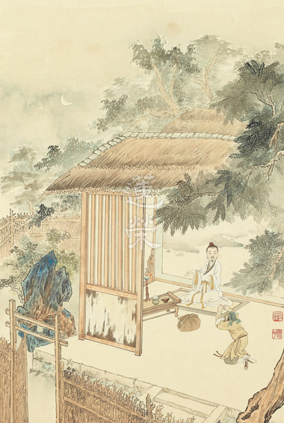

## 活動報導

### 2019 夏日經典森活營 活動報導

淨爾

曉雲法師的創辦

山林學習的環境

活用怡怡的景觀

師資道合的成果

開啟國學夏令營的全新想像

關於夏令營，我們還能有什麼想像？

關於國學，有沒有另外一種教學可能性？

面對新世代學生，經典怎麼散發吸引力？……

關於教育，我們自我提問，但也自尋出路。

哈佛大學研究員陶德羅斯說：「父母一定要做的唯一一件事，就是幫助孩子找出那些事能引起他的學習動機。」 換個角度，作為長期投入啟蒙教育的教學團隊也可以這樣說：「老師一定要做的其中一件事，就是幫助孩子啟動自主學習機制。」

新加坡教育部長在去年的一場演講中提到：「時代改變太快，我們已經無法預測未來的世界需要什麼能力，但我們可以教學生，養成終身學習的態度與能力，因為學習不是競爭，而是一種必須終身養成、覺得自己有所不足、時時要再進修的態度。」

台灣今年九月上路的《十二年國教課程綱要》（簡稱一Ｏ八課綱）的重點是《素養教育》，根據親子天下雜誌：「素養是一Ｏ八課綱的DNA（基因），指一個人為適應現在生活和面對未來挑戰，應該具備的知識、能力和態度。」「一個有素養的人是能把知識用出來的終身學習者」。

「終身學習」是教育的目標，因此，作為國學經典推廣團隊而言，孩子每一階段的學習目的，除了品格的建立、知見的引導、國學知識的積累之外，還有一個目標—「讓孩子保有對經典的好奇心與學習的樂趣和熱情，成為一個有正知正見的終身學習者。」

山林是我們的場域，教室沒有界限

1991年，是學會和華梵大學初次結緣的開始。

當時，華梵大學護持委員會合唱團邀請唐老師前往授課。隔年，唐先生邀請合唱團前往台中東勢演出，迄今，東勢的長輩們仍對這場他們人生中的第一場音樂會津津樂道。

二ＯＯ三年學會原計畫於華梵大學舉辦夏令營，卻因為SARS爆發而計劃終止。

學會自一九九九年於台中新社鄉東興國小舉辦第一次的夏令活動起到今年，二十年來正巧舉辦了

二十次的寒假及暑假的心靈成長營，但始終未能實現帶孩子到華梵的夢想。今年，這第二十一次的營隊，我們希望讓孩子們離開城市、拋開３Ｃ、走入山林，因此在相隔多年之後再次前往華梵大學場勘，承蒙該校哲學系王惠雯教授鼎力相助，讓團隊在華梵的每一間教室、每一處山景都看到了各種想像的可能性，勾畫出一個動得夠、玩得夠、也學得夠的夏日藍圖。因此計畫依著華梵大學寬闊的空間、美好的山林與地景藝術打造一個前所未有的、讓孩子張開全身的細胞去感受與體驗學習的樂趣的夏日經典森活營。

山林就是教室、學習沒有邊界，學．思．行，時時刻刻在這裡發生。

換個方式學經典

學習的持久，來自每一次發自內心快樂的學習。

夏日經典森活營主軸課程為《千字文》，梁武帝時命大臣周興嗣以書聖王羲之的字編創出《千字文》，這一千個不重複的字，內容涵蓋天文、地理、歷史、倫常、成語、寓言、生活美學、音樂、建築…等豐富內容。整體課程設計目的在於啟動孩子全身式學習、並藉由華梵大學的山林場域讓習慣室內課程的孩子們動起來。

在五天四夜的課程裡，除了有早晨的跑山與晨間運動，還有黃昏時分的分組活動，讓熱愛運動的青少年可以盡情流汗、喜歡靜態的學員可以擁有靜謐的桌遊、或閱讀時光。

正式課程既有《千字文》的骨架如《破解千字文》、《千字文的文字冒險》、《史多瑞接力》、《千字文過招》、《人格的向度》、《另眼看歷史》、及特邀華梵大學黃智陽老師講授的《千字文法書大觀園》等課程外，也有培養學習方法的《思辨訓練》和王惠雯老師的《點亮燈泡創意思考法》。另外邀請綠光劇團的趙惇儀老師帶領孩子體驗五感學習的《咬文嚼字》。

古人的文本對於今人的意義不再只有一字一句的入文背誦釋義，而是要學習其中的開創性、多元性、架構性、邏輯性與關聯性。這，才是學習的趣味與方法。以《千字文》的骨架課程為例，《史多瑞接力》為萃取出《千字文》涉及的數十個故事，由師資團隊接力完成故事之夜。而《破解千字文》、《千字文的文字冒險》、《千字文過招》以及最後一天的《千字文闖關》均是以遊戲帶動學習，讓學員能快速熟悉《千字文》，並以競賽和團隊合作的方式啟動學習動機與熱忱。

此外，為了讓學員在第一天迅速認識隊員、熟悉環境並進入團隊學習狀態，特別安排了一場山林巡禮，藉由華梵大學廣闊的場地例如阿育王柱廣場、牧牛地…等五處地方分別設計了五項闖關遊戲：唐詩配對的《詩書山林》、甲骨文的《始製文字》、牧牛圖的《坐朝問道》、講究團隊合作的《焉哉乎也》和《同舟共濟》。

晚間活動安排了音樂之夜—《千字文的音樂發想》，並因為夜雨，無法觀星空，而放映了《轉山》及《最酷的旅伴》兩部電影。

整體森活營設計以全景式的課程及參與式學習啟動孩子熱情、主動的學習模式。不僅重視學習成果，也要重視學習的歷程和方法。但受限於五天四夜的時間，尚不足以完全深入《千字文》的意涵，期待，或許日後有機會再舉辦《千字文》進階版的森活營以彌補此次未竟之內容。

九十天的全速推進

從學會決議要辦暑期夏令營到營隊的超展開只有短短九十天籌備期：選定地點、多次場勘、企畫案及公文往返、偕同校方會議及場地交接、籌組師資團隊、課程研討開發、文宣及制服製作、招生、邀請值星和隊輔參與、教具設計、行前採買、物資整理、香積組小至調味料大至鍋碗瓢盆打包上山、環境打掃到開營前一天入住…。

此次的教學團隊以學會啟蒙師資及部分明倫史畫故事師資為主，共同發想、設計執行並製作教具。

總值星官特邀馬來西亞蓮友何幼珠老師來帶領學員跑山、活動，成功凝聚團隊士氣，副值星官為能動能靜、可以嚴肅也可以玩開的鄧峻豪學長。隊輔有豐富經驗豐富的賴明貞老師、過去學會的啟蒙班學生唐維典、羅真，另外還有甫從澳洲畢業回台的陳薇安、因為莊嚴展導覽培訓而結緣的準大學生許慈軒、台大黃啟書老師的學生楊舒涵、以及華梵大學哲學系學生會主席董立委等七位。由七位隊輔分別帶領三個小組—生薑芥菜、游鯤獨運、學優登仕。達到在大自然中體驗、在經典裡學習、在生活中實踐、並且讓學員快樂又難忘的目標。

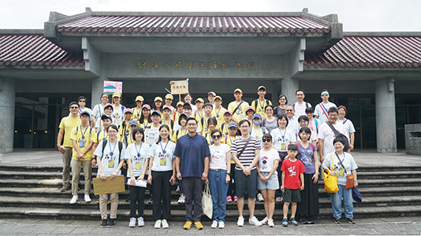

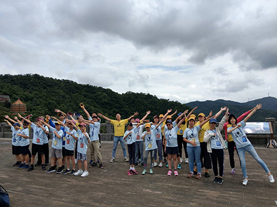

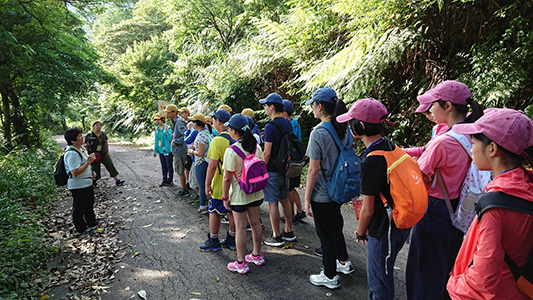

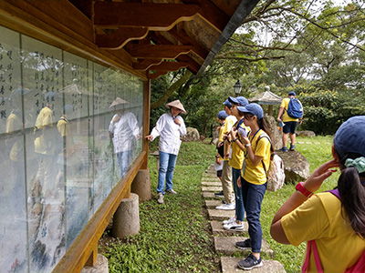

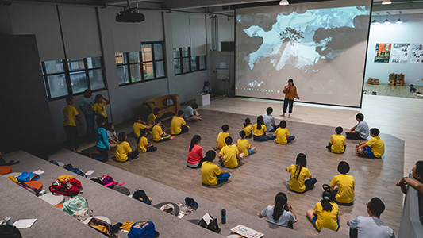

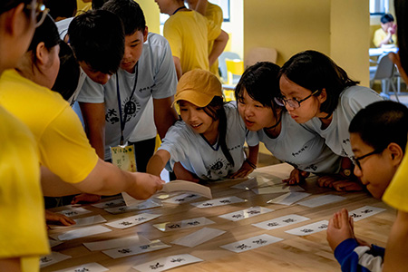

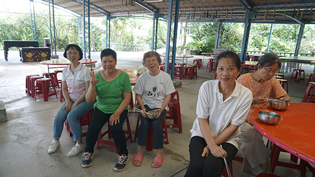

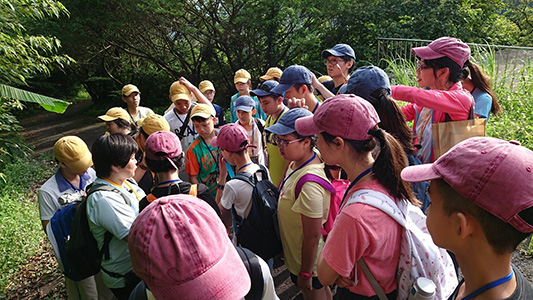

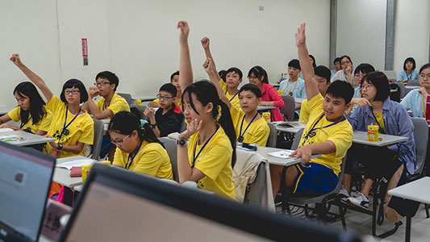

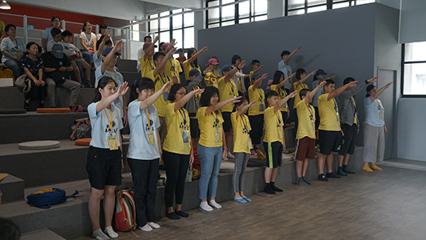

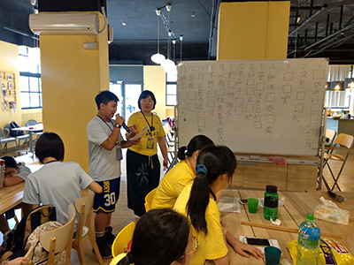

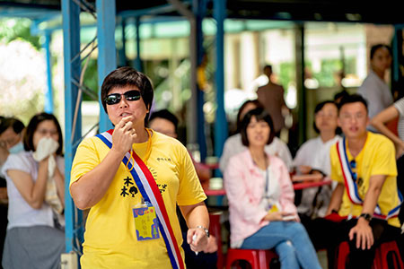

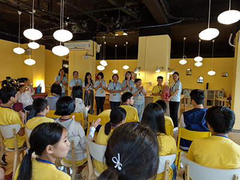

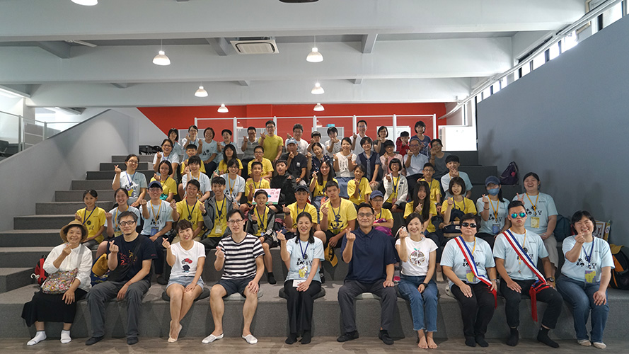

### 夏日經典森活營心得

賴明貞

梁武時期千字文

華梵山林森活營

青春共舞文化曲

動靜開發學潛力

參加過許多弘揚傳統文化的營隊，第一次看到森活營的文宣海報，當下就心動想要參加，幻想著暑假、山林、遊戲和經典可以擦撞出怎樣繽紛的火花，於是乎毫不猶豫的加入了行政教學團隊的行列，也期望自己在參與的過程中吸收日後推廣國學的養分及能量。

行前會議在莊嚴一百二十週年紀念展的縫隙中召開，林老師說原本想推出無菜單課表，視學生當日的狀態、氛圍、天候及大家的心情決定上課內容，好時尚的點子啊！腦中倏地浮現出同學們期待老師上菜的眼神、看到菜色的驚嘆以及迫不及待品嚐的渴望。後應華梵大學要求，林老師與核心小組仍先擬出了新鮮感十足的課表，再經過大家腦力激盪、集思廣益，雛形已具，然行政工作千頭萬緒在有限的人力及資源下顯得捉襟見肘，了知ㄧ個活動的成就除了團隊的齊心合作，需要更多的承擔與熱情去支持。

活動前一天的場勘和環境打掃也是營隊難忘的ㄧ環，一早到達校區已見大家在賣力地打掃上課教室、周圍環境，甚至連分類大垃圾桶也刷洗ㄧ新，還見到CEO夫婦在最髒臭的廁所清掃，以身作則的形象、同心協力的目標、到最後精疲力竭的身軀及煥然一新的環境，親身投入其中感受到所謂的義工具有ㄧ種特質叫無所求的付出，可以做事時用盡全力，揮著汗還是開懷的笑，一種內心久違的悸動，讓盤算著五天挑戰體能極限該如何節省體力的我，頓時決心打開心胸格局，突破自我設限。

營隊的序幕曲在各隊響徹雲霄的隊呼聲中正式啟動，是青春無懼的朝氣活力，也是對未知冒險的篤定信心，呼應著許多家長致詞時對寶貝的叮嚀及活動的肯定，才發現好多孩子都是自發的報名參加，原來大家和我一樣引領期盼另類學習經典的新奇體驗。午後上場的第一堂課，是受同學們壓倒性喜愛的山林巡禮，連身為隊輔的我都不得不承認確實迅速凝聚了團隊的向心力，並激發高昂鬥志，在夏日午后頂著豔陽聽著蟬鳴，一起奔跑於華梵諾大的校區，闖過一關又一關考驗聯想力、記憶力、反應力，更是全隊合作默契的競賽遊戲，相信各隊在邁向終點的那刻，彼此的心早已更加靠近。

接下來粉墨登場的就是主角千字文，它是南朝梁武帝的文學侍從周興嗣在一夜之間文思泉湧所作出來，由一千個不重複的字所組成的四字韻文，也是我國重要的啟蒙經典之一，但短短的五天時間如何讓同學們速讀經典，對經文熟悉、經義有概念呢？於是乎師長們用心良苦將千字文裝扮成各種好玩的遊戲，焚膏繼晷苦思規則、製作教具，只為吸引同學上課更專注，學習更熱情，再加上早晚規律讀經進而競速飆經，最後一天的千字文過招，教學團隊視學習況狀臨時調整了課程內容，由同學們接力闖關團隊計分來驗收大家的學習成效，果然大家都不負所望闖關成功，且比預期的時間快了許多，是潛力大爆發，還是五天境教之功？當然師資、教法、同儕、學習氛圍、外護支援等等，都是缺一不可的要素，仍忍不住想要對同學們的表現按個讚，你們真的太棒了！

這次課程精心之處還聘請了二位當地教授來為大家授課，王惠雯老師點亮燈泡思考法，從觀賞哆啦Ａ夢的卡通引導大家靈光乍現的創意並非天馬行空，仍有其思考歷程，就如同哆啦Ａ夢幫大雄解決問題時，每每拿出來的神奇法寶，看似未來科技或夢幻魔法，但不也是一種運用創意思考來解決問題呢！黃智陽老師的千字文法書大觀園，讓我們認識了中國歷史上千字文各種書體的代表作，珍貴的是老師還分享了這些流芳百世作品不同韻味的美之所在，令內心藝術的小畝田及對美的涵容鑑賞力，逐漸萌芽甚或得到更多的滋潤灌溉。

營隊課表裡還有一個自己的期待，就是趙惇儀老師表演訓練的課程，一方面因為鮮少接觸這類領域，另一方面讓我回想起剛畢業時，也是劇團義工的好友每季相邀欣賞舞台劇的美好時光，那臨場立即的感動震撼至今難忘，而在聽聞劇團「紙風車319鄉村兒童藝術工程」的夢想，就是由民間自發的力量，走遍台灣319個鄉鎮，讓偏遠地區與鮮少接觸藝術活動的小朋友們，也能欣賞原創性的精緻兒童劇及美好的藝術饗宴，內心深深佩服這群熱愛表演藝術者的理念和使命感，更令人動容的是夢想終於實現，但這不是終點，夢想又延續擴大為368鄉鎮市區兒童藝術工程，期望結合更多力量繼續感受藝術的創意與美好。藝術活動的感染影響力由此可見，而表演課程中也感受到對肢體支配的笨拙、恣意表現的羞澀，及運用身體與人互動的陌生，新奇的體驗提醒著自我再度開發這些被遺忘的原始能力。

當天空換上了黑絨絨的晚禮服，鑲嵌在裙襬上數不清的小星星就爭相地閃爍發光，山裡的景色越夜越美麗，晚間的節目亦是越夜越精彩，史多瑞接力一口氣聽完千字文裡的寓言神話、歷史典故，重溫睡前聆聽床邊故事的幸福感。電影之夜播放的「轉山」是一部關於騎行、也關於親情與夢想、考驗與成長的電影，有許多值得深思的觀點，自以為心中的夢想若能利己也利人就更偉大了，超越極限背後其實要超越的是自己，除了要有充分的準備和鍛鍊，也莫忘內心力量來源的那個人，更希望的是見你平安回家。千字文的音樂發想則是透過音符旋律來認識千字文的另一個面向，用聽覺描繪出千字文的模樣，原來學習還可以用多重感官的體驗感受，讓經典變成一首首美妙的樂章，更加地悅耳動聽扣人心弦。

每次報名營隊義工總和「隊輔」緣深難分，但因它是最貼近學員、最能全程參與的角色，也常讓我樂在其中，不同的是這次的任務除了和隊員同進同出上課活動外，還要一起闖關搶答、聲嘶吶喊、跑山跳舞，甚至同寢共眠，難怪其他隊輔都是青春大學生，相較久待冷氣房OL就顯得費勁吃力，幸而遊鵾隊的小可愛們守序有禮，立委隊輔親和多才，大家剛來時的生疏默契不足，經過努力也培養出革命情感，闖關時小兵立大功，隊呼變得氣勢如虹，離去前大家燦笑的合照，英姿煥發的招牌動作已無疑展現出我們就是一個團隊。

多美妙的緣份讓大家相識相聚，共同留下了一段精彩的回憶，相信經典的內涵還會在未來繼續發酵，發揮意想不到的作用，所以開始預約下次營隊的啟動吧！期待與你們在經典的大道上再度相遇。

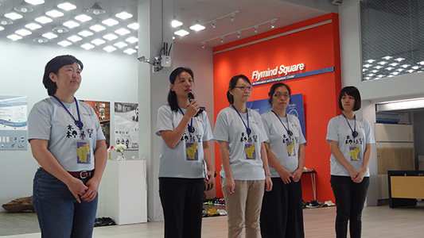

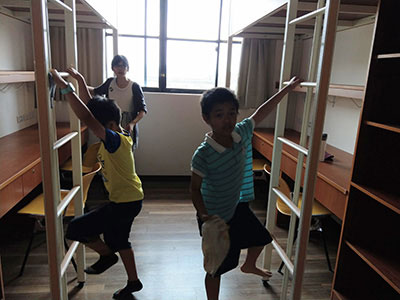

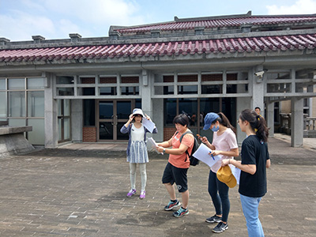

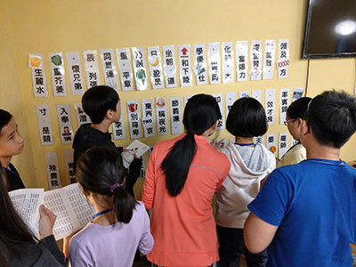

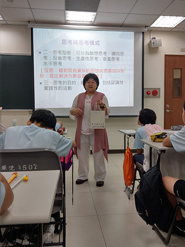

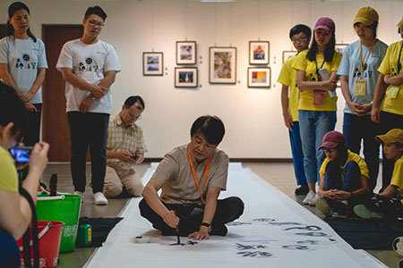

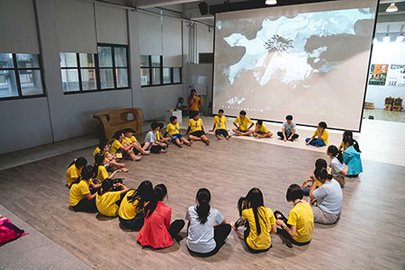

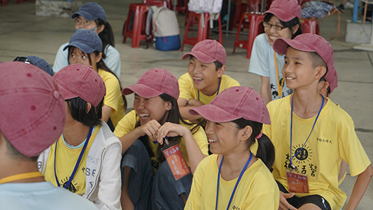

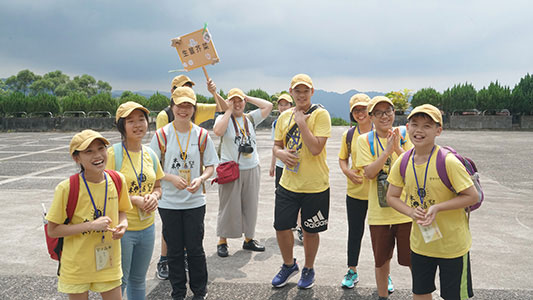

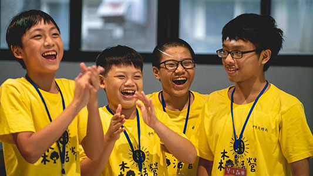

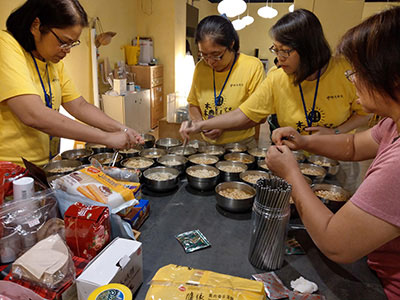

### 經典Ｘ創新Ｘ合作Ｘ觀點

羅真

純真善良傻大姊

藝術天分幽默感

帶動歡樂士氣多

帶人帶心好隊輔

二○一九年夏天我遇到一群跟我說「我們一起來讀書」的同儕，這種事情在我生命中不常出現，很開心我意外的參與了夏日經典森活營，在其中，老師的扶植、孩子們多樣的性格、隊輔間的互助與相處，除了會成為難忘的回憶，更是給了我許多不同的想法。

我在小學，也曾經參加過學會的夏令營，在我印象中，那是一個嚴肅、莊重的場合，所以當我媽媽跟我說「學會要辦夏令營，要不要一起去開個會，看看妳在裡面能不能做些什麼事」之後，到真的去開會前，我足足做了兩周的心理準備，告訴自己坐姿要端正、說話要有禮貌，以免去學會顯得太失禮，並且懷著準備要加入香積組的心情進入會議室，準備第一次和老師及學長們的會議。

突然地，我成了隊輔，突然地，會議結束了，我排開了接下來兩週的部分原定計畫，迎接這趟突如其來的奇幻旅程。

學員們陸續來到營隊，就坐於各小組的桌子上，我抬頭迎來每一位我的小隊員，得到的回應無一不是「皺眉、傻眼、向我確認隊名的真實性」，由於「生薑芥菜」此隊名對於我的隊員來說，霎時間有點難以接受，在想隊呼和練習隊呼時，我們士氣難以團結，甚至有點內鬨，但好險大家都不害羞，可能是因為他們彼此都認識，所以勉強願意喊出聲音，我們的小隊長白宇涵也不惜辜負自己的尊嚴，力挺扯嗓喊口號。山林巡禮的小隊跑校園闖關活動時，大家無形的分工，有人找神氣卡，有人負責衝刺給大家追，有人負責破解題目，我則是邊跑邊努力活著追上大家，這時候我充分見識了劉定瑋的精力旺盛和孔佑心的鬼靈精怪。這是我們相遇的第一天，我的心情很矛盾，一邊是害怕自己無法讓隊員們跨過怪異隊名的心結而無法團結，一邊是堅信自己的隊名反而會是最後大家團結的重要因素。

晚上華梵大學的大廳很涼快，值星官聚集隊輔於此開會，我們坐在這裡唯一的一盞燈下，檢討各隊情況，大致到一個段落後，我們以為要各自回房睡覺了，值星官幼珠老師突然開始一一對每一位隊輔提出個別問題指導或加以鼓勵，再來又和大家談到未來的志向和對於目前生活的想法，雖然說很想睡而且有點不知所措為何對話會來到這個階段，但不知不覺，我被影響了，表面似乎幼珠老師和我們談的是人生，但我們被強迫思考人生目標之餘，其實也延續了這個思考中的狀態，立即被應用在我們隔天對自己小隊的所作所為和期許，潛移默化。是在事後我才發覺這些談話間的反思，確實成為一大部分之後我們與隊員之間相處、隊輔之間的配合和我自己下一步抉擇的底氣，無疑也是讓我們互相成長的一大動力。

第二天一早，大家一起去跑山，其實在營隊開始前一天，值星官帶隊輔走一次跑山的路線，我走完之後便告訴自己和其他人，我絕對不會走第二次，我隊的另外兩位隊輔會代替我完成這項工作，但前一晚直至深夜的促膝長談燃起我的鬥志，我想如果不跟著小隊再走完這一趟，我便會失去多一次團結大家的機會，於是在我邊咒罵做此決定的自己，邊又跟大家再跑了一次山。

之後幾天進行了許多課程：

◎千字文系列、法書大觀園

像林老師說的「化千字文於無形之中」，我們從各種遊戲和故事中初遇千字文，到理解、熟悉，也學習了其背後的藝術價值。

◎人格的向度、思考哲學課、另眼看歷史、思辨訓練

對於事件的反應不會只有一種，應該退一步看大局，用不同的觀點思考其他可能性，這是我這幾年才慢慢接觸和理解的觀念，解決之路不是只有一條，不同於自己的想法不一定就是歧見。像是此次營隊的主軸「千字文」，老師們設計了精彩的活動，增加了不同的經典文學學習方法。

◎音樂和紀錄片及電影之夜、惇儀老師沒有千字文元素的咬文嚼字兒童表演肢體開發課程

不同藝術媒材的欣賞和體驗其中樂趣，從中學習堅韌、不放棄、團隊合作，我覺得我很幸運能輾轉於藝術間成長，有人說「每個人都要有自己的信仰」，我所認識的信仰，不一定是宗教，像是藝術就像是我的信仰，我可以在我迷失的時候透過閱覽影視音、書籍甚至創作來提醒我接下來的方向是多彩繽紛的，藝術也能聚集和我志同道合的朋友，互相切磋、討論。

來到最後一天，這時候的生薑芥菜小隊早已擺脫怪異隊名的陰影，更甚以其為榮。

【白哥】，白宇涵依舊稱職，但有別於一開始的害羞，後來的他根本放飛自我，總是和大家開心的打成一片。

【小護士、體育班】，劉定瑋雖然一開始比較難以控制，讓三位不認識他的小

隊輔有些頭痛，但也很認真的學習千字文，並且對於隊內有受傷的隊員照護有加，提供專業護理知識和醫療器材，受封小護士之綽號。

【雷哥】，雷龍鈞，時而放空卻一鳴驚人，會沉溺在自己的喜好之中，並且完全不吝嗇於分享他的興趣。

【黑馬】，廖宥橙認真的對待每一次接觸千字文的機會，讓他不但成為此次營隊黑馬，更讓小隊在千字文競賽時更有信心，也更提升了隊內學習千字文的風氣。

【時語】，黃時語，充分展現五位手足之首之大將之風，理智的代表，在大家亂成一團的時候，會記住

大方向，像個掌舵手帶領大家不要偏離航道，而且在大家玩樂的時候，也不會一本正經，依舊可以跟大家打成一片。

【佑sin~】，孔佑心，鬼靈精怪神眼力，從第一天開始只要遇到問題馬上就可以想出好辦法，也經常一語道破盲點，讓大家從死胡同裡驚醒，找到另一個解決的好方法。

【來自遠方的瓖瓖】，尹悅瓖，跟宥橙站在千字文之戰的最前線，從第一天集合時，看到牆上貼了很多少一個字的千字文，就已經開始在學員手冊上開始畫線，絕對不浪費任何一秒的戰士。

【香香姐姐】，許慈軒，中興大學準國文系學生，各位仁慈的老師派給我的中文打手之一，其實跟某些學員其實差不多大的香香姐姐很可愛，會直接指正學員生活的不良習慣，還是個梗圖高手，為營隊留下很多搞笑的回憶。

【台大中文系】，楊舒涵，顧名思義是台大中文系的在學生，拯救我許多時刻的高材生，只要我已經當機了，或是超出我能力範圍所及的事情，她就會接手帶領學生把作業完成，我常想如果我隨身可以帶著像她這樣一本活字典，應該會很方便。

謝謝唐老師、林老師多年來的關照，從我小時候到現在提供了很多大中華文化經典學習的機會，就算我不認真，依舊給我成長的空間。

謝謝各位老師、學長和超級香積組師姑們，遇到你們很開心，謝謝一切的教導與包容。

謝謝我的隊員們，生薑芥菜超可愛。

謝謝另外兩組隊員們，你們也各有厲害之處，有你們我們才能在這次營隊有一個這樣的大家庭。

謝謝其他隊輔們，真是個有趣的奇遇記，認識你們很開心。

謝謝值星官幼珠老師不辭辛勞教導我們陪伴孩子的方法，馬來西亞口音讓整個營隊有更多快樂的回憶，告訴凡事要有耐心，提醒我們要有自我的目標和成長。

有這次機會真的很難得，每天都學習及成長許多，點點滴滴會牢記在心中隨時反思，期盼下次再與大家相聚的時刻。

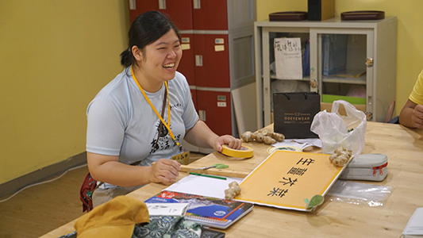

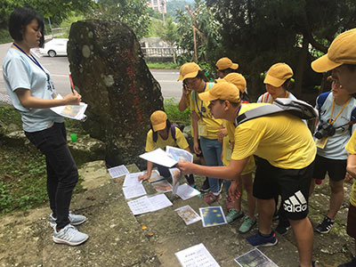

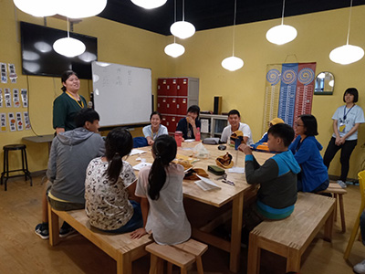

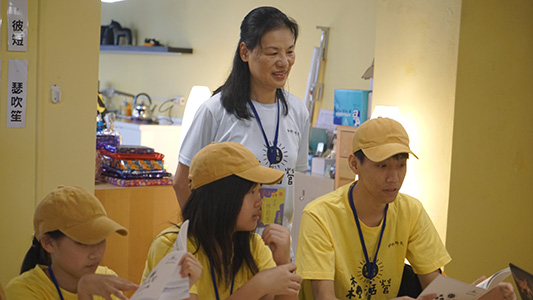

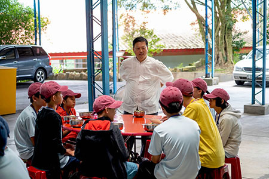

### 今夏互放的光亮—夏日經典森活營心得

許慈軒

多番嘗試的人生

碰到驚奇的改變

心中星空的亮點

行到水窮的桃源

七月的第一天，我在華梵。

感謝這一切巧妙的機緣，讓我走進學會，遇見學會的大家。此次的森活營不僅是為孩子們打造一個學習經典的快樂園地，同時也為一座助我進入大千世界的橋樑、一個重要的社會化媒介。過去六年的生活除了讀書之外別無選擇，世界狹小到只剩自我和溫飽，對於這樣一個悶蒸於水泥叢林的人而言，走入華梵這一片世外桃源，就如長期生活於暗處卻意外迎上隧道口的陽光，希望來的突然而不真實。

在學習做一個隊輔的同時，除了領導特質之外，讓我有所心得的是陪伴和觀察，每夜和孩子們道晚安後的檢討會，值星官所心心念念的就是那些守著後花園的孩子，希望能帶著他們勇敢踏出去欣賞山林的壯闊、快樂大家的快樂，看著他們小心翼翼的有所保留和嘗試，就特別心疼也特別敬佩，有些人用了一輩子才體悟何謂「改變」二字，而森活營的學員僅用了五天。

雖然這次營隊未出現那片我們所期待的星空，但電影之夜—Visages Villages這部片帶給我的啟發和感動，可能還遠遠超越原本星空下會有的震撼。每一次出走都是遇見一些臉孔、一些故事，而這些部分就是旅行最單純的意義，人們帶著自己的背景和價值觀前來，在彼此交會時所互放的光亮和激盪，已是那天雨夜中最美的星空，特別是那些真摯的笑容以及清澈的瞳孔，都將成為往後的希冀，當遇世界不公時，仍能相信世間純良。

經過山林和千字文經典的洗滌與沉澱，讓我反思自己對於文學的喜愛以及學習的意義，走出校園之後，處處是驚喜，遇見了這群善良且勤學的孩子，結交了正值青春且懷有夢想的學長，總的來說，這次營隊就像一把篩子，順勢帶走封閉又青澀的自我，篩住了我對這個世界的希望和初心，我還在找尋適合自己的位置，但願今夏遇見的我們，在不遠的未來都能成為自己喜歡的樣子。

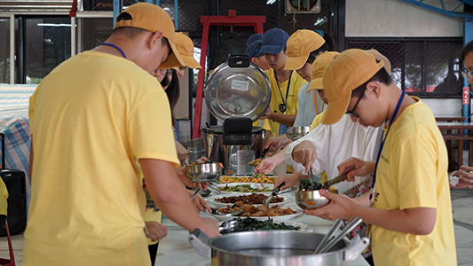

### 營隊心得

楊舒涵

人生的奇遇

五日的相會

已滅的善種

未來的增上

營隊首日，乘車上山。山路迂迴，加上連日睡眠不足，意識逐漸朦朧，迷迷糊糊間，遂忘路之遠近。

再睜開眼時，忽見車煙稀少、屋舍雅靜、草繁葉茂，朝暾曖曖一如千百年前的歲月。學員最幼小五，最長亦不過高二，卻皆敦厚而敬學，燦燦的打招呼和朗朗的讀書聲，迤邐出古籍中勾勒的儒者氣息。山上的學校，場地與場地間的距離不短、路徑上坡與下坡接連，卻見孩子們井然有序地行於大道之上，眼中彷彿若有光。

但那光，或許更是源自於他們的善良。人與人之間毫無隔閡，年紀大的幫助年紀小的、能力高的幫助能力較不足的，而其笑容盡皆赤誠溫煦。想起電影《奇蹟男孩》的台詞：「When given the choice between being right or being kind, choose kind.」很感動地看見：眼前的所有人，不只聰慧，更一次次地選擇了善良。

這會不會是因為他們自幼成長於一個如此溫暖的環境呢？詩書敦厚陶冶性情，而父母師長的用心更令人如沐春風。印象最深的是結業式時，竟然每一個孩子都得到了為他們量身訂做的獎。坐在台下的我，聽著老師逐一稱讚各個學員，眼眶不禁微濕。

乘車下山，五日來山上的笑語卻不曾遠去。或許，這次營隊對我最大的意義，是讓我再次相信，相信世上仍有桃源，仍有不計利益的溫情與暖心，而凡此種種，將常駐於每一聲純淨的笑語中，散播至更遠的地方。

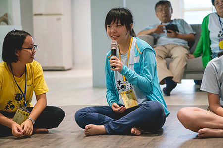

### 誠惶誠恐的夏天

唐維典

人生的嘗試

迎新的挑戰

團隊的合作

學習的熱情

學會在暑假中接連排了三個活動的任務給我，而此次夏令營擔任隊輔正是我第一個任務。這次特別的是開辦夏令營在華梵大學，雖然位在台北，但已遠離城市的喧囂，寓教於樂於石碇的山林之中，這也讓多數離不開3C的我們，能沐浴在自然環境幾天，陶冶性情、放浪形骸、鍛鍊體力、陪養團隊精神。即便在室內活動，也有各種有趣的知識補充及競賽活動來深入了解古人的著作，還有豐富的課程訓練同學們思考力。

此次作為主軸的千字文，它是用一千個不重複的字，去串聯各種古人的常識與觀念，可謂提供古代學子們一種很好的知識懶人包，當中字中有話、有常識、有故事等，然而到了今天要孩子們去認識古代對自然科學的認識以及歷史的掌故等等，除了透過閱讀書籍，或許換一種新方式學習，更能激發年輕一代對古文更深入的認識與興趣。教學團隊的老師們可謂絞盡腦汁，課程中包含了各種競賽遊戲，在娛樂中寄託教育的作用，有克漏字、圖像填空、翻牌湊對、圈圈叉叉等。很佩服教學的老師們，可以將千字文製造出這麼多有趣生動的遊戲，能夠讓同學們對這次課程留下獨特的記憶，原來讀文言文不是想像中的枯燥、難解，而是少文能攝多義，認識文中細膩的安排與巧思。

學會辦過好幾次夏令成長營，多以靜態課程為主軸，動態課程為輔助，當時候我還是常任的學員，不知不覺十多年過去了，也到了帶領年輕學員的年紀。而過去我未曾參與過外面的營隊活動，不知道外面營隊會做哪些事情，隊輔又怎麼帶領，第一次擔任隊輔的我，沒有經驗的我可說全然在猜測與摸索，不知怎麼做更為稱職，是全新的挑戰。但在值星官勉勵下，我明白隊輔最重要的工作，就是在這幾天活動中，要像父母般的關照隊上的同學們，陪著他們闖關奮鬥，生活上大小的事情要讓他們有依靠的燈塔，在營隊中獲得足夠的安全感，願意與你掏心肝分享事情，大家的心同在一條船上，而我也勉勵為之。事實上隊員們都很自動自發，幾乎不需我們操心，甚是欣慰，不管是大朋友、小朋友們都很棒，非常專心投入在每一次的課程學習與競賽之中，時常主動提出內心的想法，互相討論意見，實在很喜歡他們，小小年紀就充滿著自信，有自我的想法，熱情果敢、勇猛直前，然而這次也出現一位打不進心房的隊員，最後依靠我們另一位隊輔及值星官，才讓她稍稍敞開心房，慢慢調整多天離家內心的不適。

身為隊輔與其說是陪伴學員們成長，不如說是一起成長，因為這幾天共同為營隊生活奮鬥，穿衣吃飯睡覺都生活在一塊，培養革命的精神，活動中我看到學員為了爭取團隊佳績，很努力地投入學習爭取勝利，嘶聲力竭地呼喊隊呼，積極奮力地參與競賽搶答，學員的那份熱情執著不容置疑，彼此互助合作、互相鼓勵，追求更大的結果，這就是團隊共學最難得之處。從學員們身上，我看到了青春熱血，以及他們專注投入的反應能力，對於理解事情的聰慧都讓我們刮目相看。雖然我們學優登仕隊離奪冠有一些距離，且從學員的表情能感受到他們心情的失落，但孩子們「在我心中是最棒的！」

此次森活營雖然是我意外的行程，卻也有著意外的收穫，認識隊輔們、新同學，以及全新的教學模式，這就是夏令營對我的意義。

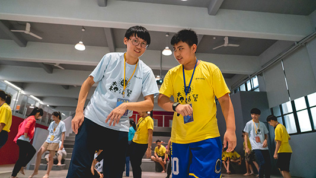

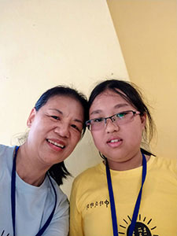

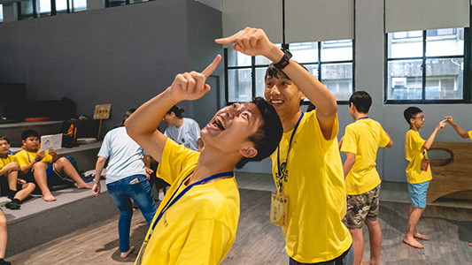

### 夏日經典森活營有感

陳薇安

活動引發學習欲

學習經典具熱情

善巧方便無鑿痕

鬼斧神工人才出

在這次的夏日經典森活營中，我獲得的收穫真不少。這次是我第一次擔任隊輔，也是第一次參加和中華文化貫通的營隊，算是踏出自己舒適圈的第一步。非常感謝老師們給予學生這個寶貴的機會，自我學習成長，再次接觸中華文化，找回自己的根。任何第一次總是不會一帆風順，但很慶幸的，我身邊總有貴人給予建議與輔助，在我不知所措時拉我一把。雖然只是短短的五天四夜，卻能明顯的看出大家的成長，真是令人讚歎！看到學生們在營隊中對於學習熱情與投入，我感到又激勵又感動，老師們的精心策劃完全沒有浪費掉。在營隊的最後一天，當大家一同合唱「感恩的心」來感謝老師們的辛苦與關照時，感動的氣氛使我不禁落淚。因為我知道老師們真的花了很多很多的心思和勞力來策劃這個營隊，老師們的付出與偉大真的不輸父母。最後，我想提出這次另我最有感悟的千字文句子之一是「川流不息」：世間一切人事物，就像川流一樣遷流無常。因此也告訴我們，要保握時間，對於學習不要間斷，好好充實自己的內涵。

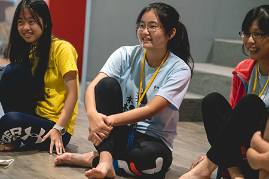

### 夏日經典森活營｜隊呼大集合

*編輯部整理*

在這次的夏日經典森活營中，我獲得的收穫真不少。這次是我第一次擔任隊輔，也是第一次參加和中華文化貫通的營隊，算是踏出自己舒適圈的第一步。非常感謝老師們給予學生這個寶貴的機會，自我學習成長，再次接觸中華文化，找回自己的根。任何第一次總是不會一帆風順，但很慶幸的，我身邊總有貴人給予建議與輔助，在我不知所措時拉我一把。雖然只是短短的五天四夜，卻能明顯的看出大家的成長，真是令人讚歎！看到學生們在營隊中對於學習熱情與投入，我感到又激勵又感動，老師們的精心策劃完全沒有浪費掉。在營隊的最後一天，當大家一同合唱「感恩的心」來感謝老師們的辛苦與關照時，感動的氣氛使我不禁落淚。因為我知道老師們真的花了很多很多的心思和勞力來策劃這個營隊，老師們的付出與偉大真的不輸父母。最後，我想提出這次另我最有感悟的千字文句子之一是「川流不息」：世間一切人事物，就像川流一樣遷流無常。因此也告訴我們，要保握時間，對於學習不要間斷，好好充實自己的內涵。

生薑芥菜隊

生薑袪寒

我們

生而美麗

將成大才

芥菜回甘

我們

借錢必還

菜鳥高飛

生薑生薑生薑

芥菜芥菜芥菜

生薑生薑生薑

芥菜芥菜芥菜

學優登仕隊

學優登仕

團結一致

學優登仕

獨樹一幟

學優登仕

必得第一

學優　學優　學優

dance dance ooh~~

遊鶤獨運隊

夏日經典森活營　遊鶤獨運得第一　遊鶤　遊鶤　遊鶤加油　加油　加油

夏日結伴鯤鵬脊　經典學習知天地　森活體驗譜丹青　營隊表現得第一

期待下次再相聚......

### 夏日經典森活營 學員心得

*編輯部整理*

寓教於樂森活營

不爭而爭君子乎

團隊訓練動而靜

烘雲托月千字文

生薑芥菜隊

白宇涵

當初聽到有辦一個夏日經典森活營，我便興奮的與父親分享並表達我必定要參加的想法，參加的經費也是自掏腰包的，活動開始前一天，我甚至因為十分期待與少許的咖啡因而興奮的睡不著覺。

雖然到達後，發現跟隊輔及少許的隊員互不相識，但一想到接下來五天都能與這群夥伴共同努力，心中就十分雀躍。果不其然，在這幾天中，雖然組員一開始都較為內向，但在隊輔及遊戲的幫助下，大家默契都明顯提升，組與組之間的競爭也十分激烈，同學間的切磋琢磨，都能夠化作在我們知識與想法創新的食糧。

森活營的課程十分豐富，教師及隊輔亦是亦聚群英，雖說課程五花八門，但也全都不脫離千字文這一主題，像在「史多瑞接力」課中，我了解到千字文許許多多的故事。在「另眼看歷史」中，我理解許多事物與歷史並非一體兩面，也了解古代很多史官對歷史真相的堅持，還有我們究竟該如何用其他角度來思辨歷史，相信，但要驗證。

千字文能應用的方式太多了，裡頭知識包羅萬象，或能舉例的實在太多了，但我自己體悟最多的就是思辨訓練中的「選擇，成為真實的自己」，人的選擇權都在自己手中，世界的不公平都是能夠化為自己進步的原動力，只有自己才能決定自己的人生，化困境為助力。

非常感謝這次學會舉辦的千字文森活營，相信每一個參與的人，都能從中獲得些體悟，從而運用至生活，乃至未來，讓自己做自身最好的版本！

廖宥橙

這次的森活營真是非常有趣又充滿挑戰，我感到最尷尬的時候就是在宿舍中，每天早上起床時，我們房間裡的人都還沒起床，又怕吵到他們，又想出去盥洗，真是進退兩難。

我覺得最精彩的課程就是士棋老師上的「另眼看歷史」，教我們要從三個角度去看事情，是什麼（what）、如何做（how）、為什麼（why），而其中「是什麼」跟「為什麼」是最重要的，因為將來人工智慧會取代你做事，但他們無法了解那是什麼，為何要做等問題。

這個營隊比外面其他營隊更豐富、更好玩，其他夏令營不是玩得太誇張就是在教室裡死命讀書、寫作業，這個營隊卻是在玩樂中學習。我並不是在某個課程中感到非常緊張，我是在嚴格的加、扣分的情況下緊張，我們這組的分數總是大起大落，一下子扣到四十分，一下子又加到五十分。相較於我們，其他組的分數總是穩定而緩慢的增加，所以形成了一場激烈且刺激的比賽，再這樣下去，我的心情可是會吃不消呢！

營隊中有個有趣的地方，那就是有「神器卡」，種類五花八門，我們這組的卡應該是最多的，前三天都捨不得用，到了最後兩天則是怕用不完，果然不能這麼捨不得。

這次營隊非常有趣，讓人興奮，希望下次寒暑假能夠再辦一次類似的活動！

劉定瑋

這次的夏日森活營讓我這個暑假充滿活力，其實我原本沒有要參加，因為要參加籃球比賽，但最後一刻居然讓我有機會趕上這個營隊。

這次主要的課程是千字文，雖然一開始完全不知道千字文是什麼，上課後我才知道這是一篇沒有重複文字的文章，之後每天的課程讓我愈來愈深入，從零開始往上疊加，到最後的遊戲我有五六成都答對，這中間也仰賴很多同學、老師、隊輔給予幫助，提醒我、教我，才讓我可以學得那樣快，雖然不能說全部學起來，但能在短短五天裡有這樣的收穫已經很棒了！

我們團隊之間競爭激烈，讓我們互相搶答，然而小組之間也都是互相幫忙、合作的。這次的森活營真的給我很棒的印象，希望還有下一次，我一定會再參加，也可以邀請同學、朋友一起來。

孔佑心

我認為在這個森活營學習到了很多有關千字文的資訊以及故事，我也學習到了一些基本的生活自理能力。也學習到如何在最心愛的家人、最喜歡的抱枕，最愛的玩具不在身邊時，要如何克服「想念」這個情緒。不管是動物或是人類，當和家人分離時，都會產生思念的感覺，這是很正常的。其實到最後，我也是會有點想家。

*第一天，我們整理了房間，闖了有趣的山林巡禮以及史多瑞接力後就回宿舍就寢。隔天就帶我們去跑山。老實*

說，我不喜歡跑山，因為跑完山之後，我全身痠痛無比，最重要的事是，因為那次的跑山，我的腳從第二天痛到第四天，可悲的是它還離不開我。

在這個森活營中，我學到了生活能力，也交了更多朋友，希望下次可以再參加。

雷龍鈞

我懷著興奮的心情來到這個夏令營，一切都很美好，我印象最深刻的活動是第二天的跑山，我看到了不少的動植物，也聽到值星官多元的講解，還有很多新奇有趣的事物。而我感受最深的是士棋老師的「另眼看歷史」課，那堂課並沒有談很多的歷史，主要教我們如何「另眼看」，要我們用不同的角度看歷史，也許能看出新的價值觀，並找出何為義之所在。

營隊結束了，我們興奮的來，明天也要興奮地走了，這個夏令營真的很好玩。

黃時語

一開始，當我知道學會辦了一個夏令營時，媽媽就已經幫我報名了。拿到通知單時，我覺得要準備的東西好多，而且，只有我一個人去，就開始有一點苦惱，最後沒辦法，只好硬著頭皮來了。

當我來到華梵大學時，就覺得：哇！好大，之後一定很累！之後，我來到星月廳，加入了這個奇特的「生薑芥菜」隊。一開始，我們是最落後的，不管是呼隊呼、做隊牌，都是最後的，但是之後我們就開始急起直追了。

經過這幾天，我們不僅玩得很開心，還學得很開心。我覺得，這次的夏令營，要謝謝辛苦的老師、師姑、師伯們，不管是上課、玩遊戲，還是好吃的每一餐，都非常有趣，當然還有辛苦的隊輔們。希望下次還能來這麼有趣的夏令營！

尹悅瓖

第一天來到這裡，其實心裡是害怕恐懼的，畢竟從小到大都沒有參加過這種活動，後來進到了星月廳看到了組員並了解後，才發現，哥哥姐姐弟弟妹妹們都友善無比且聰明絕頂，我心想：真是太好了！原來夏令營就是這樣。

這次夏令營的主軸是千字文，以前背過的，不過早已忘得一乾二淨。千字文的內容著實有趣，文情並茂、文思泉湧，值得一次又一次的看，一次又一次的反覆思考其中的倫理，隊輔及老師也是不停的訓練我們如何破解千字文所蘊含的道理。在第二天，我們玩了「千字文的文字冒險」，那真是腦力激盪，訓練記憶、團隊合作，最重要的是，如何有條理、有次序的排列出一組又一組的句型。到了月黑風高的夜晚，看了一部電影「轉山」，過程中，我覺得觸動心弦的是男主角書豪在要放棄的時候，發現一個媽媽帶著小孩打電話給久久不回的父親，剎那間，他頓時明白自己背負的不僅僅是他哥哥的願望，還有小川哥的夢想，他的旅程就此繼續展開。

第三天，在大雨淅瀝淅瀝的拍打下，「咬文嚼字」的課程開始了，老師一開頭要求我們做瑜珈動作，殊不知，是要讓我們心靜下來，鬆動筋骨，老師的課程又生動又幽默，兼具演員所具備的特質。

夏令營，也訓練我們要有自信、團結、勇敢、冷靜思考，因為只要缺乏其中一項，就成不了一個團隊，團隊需要同心協力完成一項任務，且兼具這四個元素，就算沒有得名次，收穫成果也是滿載而歸的。

學優登仕隊

林敬

七月的太陽，是熱情的；七月的風，是暖和的；七月的笑容，是燦爛的，在這個可愛的七月，我參加了經典夏日森活營，來替短短兩個月的暑假揭開序幕。

抵達華梵大學的第一天，心中還有些許不安，害怕時間會很倉促，使我趕不上大家，但在融入「學優登仕」這個有趣的小隊後，我漸漸擱下心中的大石，有同伴、隊輔的陪伴真的令人備感溫馨，我們一起吃飯、一起答題、一起成長。從第一天下午的闖關遊戲開始，學優登仕就拿了好多神氣卡，贏了其他小隊真的很有成就感，獲得榮耀的瞬間是讓一個隊士氣高昂的關鍵，雖然學優登仕在後來的比賽並不是每次都獲得勝利，但至少我們已經努力過，沒有留下任何遺憾。

回憶是最美的，因為我們曾經一起創造過，我們當了五天朝夕相處的隊友，共患難、共得失，相互扶持、相互砥礪，也許和某些人的緣分只有這五天，但在我想起這段記憶時，回憶中一直有你。

還記得第一天副值星官在創客中心嚴厲的模樣，摘下墨鏡後卻變成了學優登仕的隊員之一；還記得第一天在木板床上翻來覆去，輾轉難眠；還記得小組比賽，很多老師都給予我們莫大的幫助；還有共創振奮人心的隊呼，氣喘吁吁的運動時間，上課時的朗朗書聲，仍讓人意猶未盡，冒險還沒結束，這是另一個開始。感謝所有的老師、師姑、師伯、隊輔、同學，謝謝你們填補了我的青春，成了這個溫柔的七月中那抹最美麗的回憶。

鄧峻嘉

一開始來這個營隊，我們這一隊人很少，團員又內向，但隨著隊輔的帶領及我的帶動下，大家漸漸願意喊出聲，到後面大家都喊到沙啞了呢。

很感謝林老師的五人團隊，把死板的千字文變得這麼有趣。而這幾天值星官為了培養我們有禮貌的習慣，運用了團隊競賽，這一次的營隊跟外面營隊不同的是團員間年齡落差很大，之前我參加的年齡層幾乎都相當，而外面的夏令營，當隊伍中有一人不合群，我們可能會用同儕的壓力、隊輔的壓力去壓迫，導致不合群的人不得順應，但在這裡我們不能用這麼強硬的手法，而要半推半就、委婉的引導，其實一開始是很不高興的，身在一個團隊不就應該要配合嗎？但隨著時間的推移，與那位團員的心懷放寬，負面的情緒漸漸消散，取而代之的是團隊的成就感愈來愈大。

短短幾天裡，我覺得老師教我們最重要的是要能動能靜，很常前一堂課是運動時間，下一堂我們就要坐在座位上準備聽講，又或者是前一秒在吵鬧，下一秒思緒專注在書本。

但這幾天下來我覺得比較可惜的是，只有解釋千字文其中的意涵或者述說其中的意思，沒辦法深入思考，可能是考慮到時間有限，及有年紀較小的朋友，但我還是覺得很可惜。

課程中我印象最深刻的是士棋老師的「另眼看歷史」，怡瑩老師的「思辨訓練」，雖然其他老師的課也都非常精彩，但我個人比較偏愛與學生互動多的老師以及有關思考的課程。

孔佑仁

我從一開始連千字文是什麼都不知道，在去華梵大學的路上還看影片來惡補，聽說千字文不重複任何一個字，激起我的好奇心。第一天拿到手冊我登時找找看，找了好長一段時間，果然沒有重複的字。

光陰似箭，夏令營的時間一下就過去了，我學到更多關於中國文學、歷史、書法的中華文化。

旅途中遇到挫折與失敗是難以避免的，夏令營也一樣，不過卻能充實、改變自我，有機會我一定會再參加的。

放假要出門走一走，不要老是宅在家裡玩3C，跟著森活營，動靜皆宜，擁有很好的天然戶外林場和乾淨教室，讓都市小孩可以接觸自然。離開車水馬龍的都市，來到幽靜的山林，是現代都市人最欠缺的一樣生活經驗。這幾天我不僅接近大自然，和大自然一起度過分分秒秒，生活小事也離不開大自然，收穫滿滿。感覺不想回家。

葉庭妤

今天已經是第四天了，課程也將邁入尾聲。這幾天受益良多，萬分感謝自己能有如此不可思議的機緣，我很幸運，真的！

第一天到華梵大學時，我用平穩的步伐掩飾內心的雀躍。一方面是期待未知的驚喜，無論是開心還是難過，都將為這趟如夢似幻的經歷點綴著，很微小、精緻，卻閃閃發亮，讓人無法忽視。另一方面是平常身為學生，被沉重的考試壓力壓得喘不過氣，平日、假日，甚至是暑假，皆難以放鬆、沉澱身心。難得有時間可以出去踏青，接觸大自然，彷彿開心到飛上了天。

第一天課程相當充實，尤其是山林巡禮，一個分組闖關的活動，我體悟到團結的重要性。不過在休息時間也很充實，我住的宿舍房間出現兩隻蟑螂，我很驚嚇、憤怒。後來平穩心情，經過思考後，才發覺自己闖入牠們生活的場域，我到底憑什麼錯怪牠。

在千字文中細細品嘗字間的奧妙，才知道古人如此文思泉湧，人外有人、天外有天啊！

最令我印象深刻的是：「擁抱生命的不完美、不圓滿、不公平」，我是一個不完美的人，我與眾不同，我喜歡自己。我知道做個不完美人或許很辛苦，但一定很酷。停止抱怨，接受所有的不圓滿，因為環境不會改變，改變之道在於自己。

這次森活營所有的課程安排都特別用心，感謝所有人無私的付出，以及老師們教學的熱忱，期待自己可以為別人貢獻，哪怕只是綿薄之力。

劉牧承

這次的夏令營是我參加過最好玩的，也是最特別的，在這四天裡，我們用遊戲的方式上千字文，也上了很多精彩的課程。

我們這隊雖然是對千字文最不熟的，但我們也因此學會了團結合作的精神，遇到難題時一起討論和分享意見，就算沒有得到分數或被扣分我們也不會放棄，反而會更加努力。

這幾天課程中，我最喜歡「創意思考的哲學」以及「另眼看歷史」兩堂課，我很喜歡士棋老師做的簡報及上課時的幽默感，他教我們事實與觀點的概念，並且讓我們用事實與觀點來看歷史。惠雯老師在「創意思考的哲學—點亮燈炮思考法」的課程裡，教我們必須以不同的角度看一個事物，因為這樣或許就能發掘一些不同的事物及現象。

玩千字文活動時我們這一隊都很緊張，因為我們對千字文實在超級無敵不熟，所以我們都一直看手冊，我們也利用飯後讀經加深印象。

這幾天的活動來得快去得快，時間不知不覺就過去了，我也準備帶著一顆收穫滿滿的心回家，並準備升上六年級。

邱奕修

今天是夏令營的第一天，抱著忐忑不安的心來到華梵大學，來到了宿舍。在星月廳有一群人們在等著你們，那就是你們隊的隊輔。

第一天當爸媽要離開時，你哭了，值星官和隊輔一直安慰你，你卻一直、一直哭。好不容易不哭了，卻發現馬上就要去山林巡禮。走完山了，發現並沒有那麼可怕，就安心的度過第一天。第二天早上過得很好，下午之後，你又想回家又哭了，而且想吐，對吧？最後，由副隊輔和一位中醫師的幫助下不哭了，但回宿舍你跟爸媽打電話撒嬌，鬧著要回家，唉，真是的！

森活營的重點是千字文。「天地玄黃…」雖然不想，但這是一定要的啊，不想也要啊。

這次的夏令營使你增長了許多，進步了許多，是嗎？

正值星官非常的友善，副隊輔也很關心你，老師都很親切，你以後要勇敢一點，不要那麼愛哭了，好嗎？

游鵾獨運隊

林誠

我覺得這次夏令營很好玩，來之前看到活動課程表，我就非常期待了，六月三十日一大早我就興高采烈的出發了。

這個夏令營主要是教千字文，了解千字文的意義，也玩了很多相關的遊戲。雖然玩遊戲的分數我不太滿意，因為我們這小組年紀都很小。有一次，我們這組難得第一名，結果，我們的分數竟然被別隊用「神器卡」換走了，我們努力得來的四十多分，被換成二十多分。

不過，這個營隊還是非常好玩，也學到非常多知識，希望明年還有這個夏令營。

陳宥蓁

二零一九年的七月，我參加了學會的森活營，以千字文當主題，那晚我高興的睡不著，期待明天的到來。

「宥蓁，該起床了！」我聽見姑丈的聲音，要出發去華梵了，到了華梵，我進了游鵾獨運隊，我們三隊名稱的由來都源於千字文，第一組叫「生薑芥菜」，第二組是「游鵾獨運」，第三組是「學優登仕」，我們上了千字文的白話翻譯以及老師們的史多瑞接力課。

我們上了九堂其他老師的課，每一堂都很充實，讓我們學到很多東西，像我就學會千字文的意思，我希望下次還可以參加夏令營，並且在森活營中學習獨立。

涂平心

六月三十號我來到了華梵大學參加森活營，我們分成三組，這些隊名是從千字文中命名的，這個營隊要住四天，每天都要很早起床，真的很棒！

當天下午有一個要跑來跑去，超累但很好玩的「山林巡禮」課程，途中藏很多神器卡，有些是可以換吃的，有些是功能牌，我們找到的卡很少，其中有一個關卡是要在三分鐘內八個人手牽手，腳還不能離開巧拼板的走一段路，我們就兩人踩一個巧拼，另一個向前丟來當路走，後來因為要從最後面傳到第一個人的時間太久，就沒有達成任務，關主就只好讓我們用兩個人完成任務，真是好玩啊！

接下來的每一天都很好玩，也讓我學到很多知識，就像黑的相反並不是白，而是非黑的所有顏色等等，真是太有趣了，也讓我認識了千字文的歷史故事、詞語的意義等，希望明年寒假、暑假都有辦，我知道的話就會參加的喔！

龔育億

這次夏令營對我非常有意義，而且很有趣，我非常興奮。

我最喜歡的課程是「另眼看歷史」，這堂課讓我學到了事實和觀點，並且排除非Ａ即Ｂ或非黑即白的刻板印象，士棋老師的上課方式很活潑，讓人覺得很新潮、前衛，這種教課方式的好處就是很適合年輕人有效學習並且能活用在生活上。

我們還去了山林巡禮，我們游鵾獨運隊的隊員各個眼睛伶俐，找到了厲害的神器卡，並通過許多關卡，讓我最印象深刻的是用嘴咬著筆寫字，而隊員要猜白板上寫的是什麼，過關後還請我們吃蛋糕，真是太棒了！

我希望下次還可以再辦一次活動，又好玩又充實，對我有很大的幫助。

葉庭儀

一開始來到華梵，在山裡我感覺很陌生，很不先進，我們怎麼會來這裡？這個問題浮現在我心中，但過沒多久，我們進到上課的地方，星月廳和創客中心，問題就煙消雲散了。雖然我們要一直上上下下的爬樓梯或坐電梯，才能去上課和吃飯，身邊也常有小昆蟲、小動物為伍，但就是這樣，我們遠離塵囂，更親近彼此和大自然。

分組的隊呼，被我們喊得響徹雲霄，帶起我們團隊的士氣，看哪一隊喊的最大聲、最有活力，遇到師長們，我們禮貌的問好，值星官帶我們跑山、運動，時時刻刻給我們打分數，提醒我們一些生活中的規矩，隊輔陪伴我們，也讓我們遠離手機的掌控，能專心的學習，能去和身旁的人事物交流，表達自己的想法。

每一堂課、活動，都很有意義，從千字文到電影、書法、思辨，都讓我印象深刻，雖然我一時還無法分享，但這些肯定對我將來有莫大的幫助，將慢慢領受、體會。謝謝整個森活營和我自己。

很開心很感恩的部分像是：點心、各餐餐點，上課所學全部、很好笑的隊輔們、很厲害的同學們、很用心的老師們，游鵾獨運、口號、宿舍、千字文，周興嗣、洗衣機、遊戲道具們、記分板、很高興的值星官，分享時間，餐前觀修，闖關遊戲、午休、打球等，都讓人會心一笑。

郭廷逵

我很喜歡這次的夏令營，因為我可以學習到新的知識和交到許多新朋友。

這是我第一次參加需要在外面住宿的夏令營，也是我自己離開家裡最久的一次，而且這次還要自己洗衣服。雖然我之前有去過三天兩夜的畢業旅行，但那裡都是我認識的人，而不像我剛來參加夏令營時，只有兩個人是我認識的。

我最喜歡的課是「另眼看歷史」，一開始老師先讓我們猜圖片的眼睛是哪一種動物的眼睛，猜完之後才正式進入主題。另外，千字文的遊戲也很好玩，因為單獨看千字文會覺得很無聊，透過遊戲和圖片來學習千字文是一件很好的事。

這次的夏令營我覺得團隊合作也是一件很重要的事，因為有很多事情一個人不能完成，需要整個小隊一起合作才能得到分數，如果小隊中有一個人不認真，那可能就會因此而失分。

我很喜歡這次的夏令營，因為我可以和同學討論問題，而且我也學習到了如何和陌生人合作和溝通。希望下次還可以來參加。

### 2019義烏素質教育親子夏令營活動報導

*編輯部整理*

五百餘人的齊聚

素質教育的啟蒙

改善應試的氛圍

重新學習的出發

學會二Ο一九年的暑假活動滿檔，其中夏令營除了在臺灣華梵大學舉辦的森活營外，還有與大陸義烏中脈集團合作的素質教育親子夏令營。何謂素質教育呢？素質教育是讓國民素質提升的教育，人有無限的潛力，但唯有透過教育，才能夠開發潛能。教育可以將人們培養成人才，使各行各業欣欣向榮的發展，國家也才能永續前進。

素質教育親子夏令營結合了與現代接軌的幾項主題課程，學生班的課程有「邏輯思維」，讓人不會盲從；「思考式閱讀」，是一種淘金式的閱讀；「批判式思維」，讓思考禁得起考驗；「發散性思維」，是一種人工智慧無法取代的創意；「語言的溝通與表達」，讓人們能夠協同合作；「心理認知模型」，能用認知模型解決各種問題；「認知偏誤」，矯正錯誤的認知，讓自己的認知能夠走進時代；「心靈探索」，有效排除自己和他人心中的陰影，擁有一個健康的身心；「美學素養」，遇見生活中的美學，培養生活品味。並結合《論語》的學習，看見不朽智慧的應變與運用，挖掘生命的寶藏，有方法、有目標、有內涵、重本質，此次前往義烏的師長、學長無不精心籌備課程、設計活動，以期達到最好的效果，以下由各個任課老師簡介課程。

心靈探索／高老師

修學儒學與佛法，目的之一都是希望成為更好的自己，能夠逐漸破除自身的種種障礙，包括了種種的煩惱、認知誤區以及因為所知不足造成的過害。

但想要達成此目的，除了學習之外，還有一塊領域應該特別關注，也就是瞭解我們的潛意識。根據一些心理學家的估計，潛意識所占的心識總量比例，可能不會低於冰山在水面下的體積。

想成為儒家的君子，首先要能做到不自欺。而根本的內涵是需要先認識自己的潛意識，若自身的潛意識與浮在檯面的意識是走不同的路，如何能做到不自欺呢？能夠被承許為「自知者明」，真的有好一大段的功夫要做。

學習心理學的內容，可以幫助我們更深入的認識自己。以幾條基本的底層邏輯為綱，藉著觀察不自覺流露的語言、想法以及眼前與他人建立的關係模式，讓我們看到，從出生以來可能發生過但或被遺忘（被壓進潛意識）的經歷，以及我們的心識活動是以什麼樣的不自覺的模式在運行。

透過不斷的探索，看到潛意識，並與意識慢慢融合，我們就逐漸成為一個完整的自己，成為一個充滿生命力，有著自信與熱情的健康生命體。所謂的自誠明，是不是也包含了這樣的內涵？個人也在慢慢體會，文殊菩薩的智慧劍，好像也要立基於健康的心理人格的前提下，是否有所謂的「般若」後乎？針對種種疑情，末學願意花更多的時間來深入。

研究心理學，除了對個人能有上述的益處之外，還可以再向上一層，把觀察的對象放在一個民族或者是一整個人類。例如任何一個民族，都有著共同的記憶，以及想要壓抑的集體無意識。做這樣的研究，也會對民族所傳承的文化內容，有更深一層的理解與認識。

能夠做上述的學習，對於有心要推廣文化以及深入儒學和佛學內涵的行者，會有非常大的助益。期望能夠更清楚的認識自己，認識自身所屬的群體，以及在人類文明中所在的位置，並且具備更善巧的能力來自利利他。

言語溝通與表達／陳怡瑩、莫秀玲

成功溝通的要素是：他想溝通你也想溝通；成功表達的前提是：他想表達你想聽或是你想表達他想聽。「有意願」則順利，無意願則阻力多多，至少有兩件事可輔助我們令他人產生溝通或傾聽的意願，第一要選對時機，第二要選對切入點或者懂得採取不同面向的描述。通常對一個事物，觀待我們對它的認識有多深或多廣，就可以有愈多的面向去描述它，但通達各種面向還不夠，若能拿掉不當的情緒，則可避免偏離主題，離有效溝通更近一些。

反面來說，我們可試著觀察有哪些性格容易造成言語溝通與表達的障礙，例如「渴望得到認同」、「沒有自信心」、「好比較且善妒」、「不理性」、「輕易讓情緒成為主人」、「覺得世界不公平」等等都是我們可以省思的。

最後，讓我們想想為什麼有的演講沒有華麗包裝與演說技巧卻能吸引聽眾？因為那是演講者獨一無二的經驗，除了聽他說出來好像沒有辦法隨意就得到，因此如果我們可讓自己的人生經驗與體會具備獨特性，散發智慧的風采，那麼聽我們說話的人就會想聽下去，這也是一種與人結善緣的方式。

◆課程大綱(學生班)：

１、了解溝通的形成並學習有效的表達

２、學習走出自己、掌握溝通之鑰：同理心

３、溝通高手：傾聽與表達

◆課程大綱(大人班)：

１、說與聽的遊戲

２、借歷史故事看溝通的時機與切入點

３、你誤解了嗎？語句的表面意思與真正含意

４、掃除言語溝通與表達的障礙

５、沒有裝飾與技巧的成功演講秘訣

邏輯思維／林士棋

隨著人類社會的演進，其型態變化愈加劇烈。尤其網際網路的普及，使得各式各樣的資訊得以大量流通、交換、結合、再生，人與人之間的互動也產生微妙的變化，更多的可能性應運而生。處於現今社會，學習如何快速地應對各類變動，是重大的課題。想要面對複雜的環境與變化，就必須洞見事物的本質，因此邏輯思維與批判性思維是培養未來人才的關鍵之一。

邏輯思維本身是一種抽象思維，它與形象思維不同，是運用抽象的概念、範疇來揭示事物的本質，再透過比較、分析、歸納等方法，表達認識現實的結果。而掌握和運用這些思維形式和方法的程度，也就是邏輯思維的能力。由此可知，掌握邏輯思維能力的第一步，正是龐大的知識背景，其中又包含吸收資訊的能力與記憶力。

單單擁有邏輯思維的訓練，仍不完足；邏輯思維近似於一種內部的訊息處理機制，由內向外輸出結論，但須仰賴外部的資訊輸入作為食糧。因此還需要另外一種角度的思維模式來相輔相成，也就是批判式思維。如果說邏輯思維能幫助我們把事情的理路表達清楚，那麼批判性思考則可以幫助我們辨明所接收的訊息。

批判式思維又可理解為邏輯清晰嚴密的思考，是一種謹慎地運用推理，去斷定一個訊息是否為真的能力，在資訊爆炸的現代是不可或缺的能力。辨別事實與觀點是開啟批判式思維的第一步，漸次還要能保持合理的懷疑、不帶偏見並依據事實的分析，甚至是多種角度的觀察，最終更要能做到持續的自我批判。

邏輯思維與批判性思維的技巧方法相近，但不同的動機，帶來不同的效果。唯有熟練的交替運用兩種思維方式，能讓我們洞見真相，在紛亂的世界中找到一條通往真理的路，以更正確的方式認知這個世界，進而做出更正確的回應與抉擇。

思考式閱讀 ／白文輝

機器人與人工智慧可帶來生產力成長與績效提升，如果這些科技被用來對抗疾病或氣候變遷等重大議題，將為社會帶來廣大效益。但是，有些重大挑戰必須克服，其中最重大的挑戰是：未來我們在職場中需要的技能，將發生重大改變。

英國牛津經濟研究院二○一九年六月二十六日發表報告指出，自從兩千年以來，機器人的出現已經減少全球約一百七十萬個製造業職位，預計於二零三零年，全球約有兩千萬個製造業職位將被機器人取代，低技術工作的地區將受到最大的影響。未來的工作性質將不斷變化，速度會愈來越快，令人難以想像。經歷這種不斷變化形勢的我們，需要持續學習和個人成長，成為一位終身學習者，才有可能不致於被時代所淘汰。

相較於其他方式，閱讀是學習和吸收新資訊最快速的方式之一，透過閱讀來學習會比較輕鬆、方便、成本低。此外，相關研究指出，閱讀能夠透過抽象的推理能力、更多的詞彙和更廣泛的世界知識來改善智商。跨領域閱讀則有助於提升創造力，帶來創新和洞見。閱讀還能提高言語智商，有助於讀者成為更熟練和長於表達的溝通者。閱讀小說可以增進同理心和瞭解社會線索，有助於讀者更加瞭解別人。最後，閱讀是最好的身心鬆弛方式，因為讀六分鐘的書可以降低壓力百分之六十八，而且有些研究指出，閱讀甚至能夠防止阿茲海默症，延長心智壽命。

許多億萬富翁都把閱讀視為他們致勝的關鍵，華倫‧巴菲特曾透露自己每天閱讀五百頁，知識才會如利息一樣累積。比爾‧蓋茲和伊隆‧馬斯克也是如此，前者每週讀一本書，後者曾說閱讀讓他創造出火箭，由於火箭可重複使用，故大幅降低了成本。查理．蒙格則說他這輩子遇到的聰明人沒有不每天閱讀的。

閱讀的方式可分為非思考式閱讀和思考式閱讀，非思考式閱讀又稱為海綿式閱讀，此種方式習慣被動吸收、不假思索地記住新知和觀點，不會主動取捨及評價資訊內容，就好像吃食物時，什麼都吃，不加以判斷分辨優劣。思考式閱讀又稱為淘金式閱讀，傾向帶著問題去主動思考資訊真偽，並與之保持互動，做出客觀評價，得出自己的結論。再者，思考式閱讀強調作為讀者，我們與作者是平等的。作者敘述觀點時，我們也要同時進行思考：作者的寫作目的是什麼？作者用於支持觀點的內容是事實還是主觀判斷？我們同意作者的觀點嗎？有什麼論據支持我們的觀點？怎樣從另一面看作者的觀點？作者提出的問題有沒有更好的解決辦法？我們怎麼看待文章中的事件？在這樣的情況下，可以使讀者分辨出重要和非重要資訊，把事實與觀點區分開，確定作者的目的和語氣。同時，能推導出言外之意，填補資訊上的空白，得出符合邏輯的結論。

因此，我們能在資訊爆炸的時代中，具備有如孫悟空的火眼金睛，分辨、過濾接收到的資訊，不容易被從眾效應、權威效應或名人代言效應所影響。藉此擁有不被洗腦的能力；能客觀評價圖書、雜誌及網站上讀到的文章或論述；評判一場講座或演說的水準高低；提出自己的觀點並進行論證；撰寫出有理有據的論文；積極地參與各種討論。

發散性思維理論／唐微智

人腦可以分為兩種思維模式，一種是聚合思維，一種是發散思維。聚合思維是處於專注、收束、邏輯性的狀態，可以做分析、歸納與演繹，而發散思維能夠擴散出去，延伸問題，打破框架逆向思考，多維度聯想、天馬行空，創意也因此產生。

有趣的是，創意不只跟想像力有關，還跟理解力密切關聯，因為創意打破了既定認知，試圖以全新的方式理解事物，以不同的面相看待這個世界，理解推進了，創意就油然而生。蘋果創辦人賈伯斯曾說：「創造力就是將不同的東西連結起來。當你問這些創意人士如何想出這些點子的，他們反而會感到有點不好意思，因為他們只是『看』到一般人看不到的東西罷了。他們有將不同經驗連結起來並且創造出全新想法的能力。」我們跟創意人士其實只差一步，好比麥子要釀成酒精，需要加入酵母，我們只要切換到發散模式，找到酵母，也可以激發創意，釀出新酒。

而如何切換腦部至發散模式呢？創造力研究專家霍華德．格魯伯提出３Ｂ理論，也就是睡覺（bed）、洗澡（bath）、坐公車（bus）３Ｂ。此三種方法的共同之處就是會進入放鬆的狀態，阿基米德就是在自家洗澡時想到國王出的難題的答案，提出了浮體原理，但阿基米德並不是憑空獲得，而是經過了百思不得其解的過程，做足了功課，才可以在放鬆的洗澡時，靈光乍現。如同愛因斯坦所說：「事後回想，你總是可以發現緣由，直覺其實是早期智識經驗的結果」，故前置的造作很重要，愈多的條件聚合，靈感才能在某一剎那湧現。也說明聚合思維的重要，沒有聚合思維的能力，發散就淪為空泛。而睡覺時，知識會重整與強化，經過沉澱後，早上起來忽然就想通了，相信很多人都有經驗，所以要帶著問題睡覺，讓睡眠發揮價值。在公車上，也就是交通上，要善加利用時間，通勤時，不要只顧著滑手機，放空想想事情，也是不錯的選擇。

其實不只３Ｂ理論，中國還有個三上理論，提出者是宋朝的歐陽修，三上就是枕上、廁上、馬上，是不是跟

３Ｂ理論有異曲同工之妙呢！原來不論古今、中西，只要是對的方法，大家所見都略同，很多歐陽修著名的文章，都是三上時寫出來的，前人的發現，減少了我們嘗試的時間，用對方法，就可以找到創意的門徑。

而最多人用，也最好用的發散模式是什麼呢？答案是散步。許多的哲學家、作家、科學家、音樂家、詩人都是散步時獲得靈感，像是齊克果、愛因斯坦、宮崎駿、莫札特等都有此體悟，達爾文甚至還有一條長約四百公尺的步行道，名為「沙徑」，讓他可以邊走路邊思考問題，他還會用步行這條沙徑多少次，來描述自己花了多少時間、心力解決一個問題。沒有靈感的時候就起來動一動，散步可以促進思考，但是記得要隨身攜帶紙筆，隨時記錄想法，免得好的靈感稍縱即逝，悔不當初。除了散步外，也可以做些不花腦筋的小事，例如煮飯、打掃、看風景、畫畫等，都可能有幫助。

最後，除了培養自己切換大腦模式的能力外，也要多見多聞，懂得與人交流請益，釀出的美酒才愈加香醇、耐人尋味。

發散性思惟之創意小宇宙／淨爾

我們今日生活之便利，來自於前人的創意與實踐。我們可以輕鬆舉出一長串以創意改變世界的人名，卻往往覺得自己不是個有創意的人。
但當我們
**問：** 「怎麼樣才可以成為有創意的人？」之前，我們要先問自己：「我是個有閱讀習慣的人嗎？還是我善於觀察？或善於透過各種方式吸收知識、擷取資訊？」創意資料庫最簡單的來源，是大量的、廣泛的、甚至雜食的閱讀。閱讀文字、閱讀人、閱讀環境，但閱讀必須是有效的閱讀，方能在你需要的時候神來一筆、靈光一閃。
但在那靈光閃爍的瞬間之後，未被執行的創意只是想像，但被執行的創意不代表必然成功，成功執行的創意也不一定是好的創意。這世界上已經充斥太多被成功執行、但卻對人類造成不良影響的創意。因此我們還要
**問：** 「到底應該要做一個沒創意沒影響力的人，還是要做一個有創意但是卻為世界帶來負面效益的人，抑或是成為有創意也能正向影響世界的人呢？」我想，大多數人當然會選擇成為有正向影響力的創意人。

所謂的正向影響力，就是利他，而利他來自於正知正見。

「那我們應該先培養自己／孩子成為有創意的人，再培養他有正知見？還是先擁有正知見再成為有創意的人？」

當然是培養正知見，因為至少正知正見會讓我們不致為惡。有了正知見再擁有創意，那每一個創意都會是利他的契機。就算沒有辦法擁有創意，我們還是可以利他，只不過，是用比較沒那麼有趣的方式罷了。

因此，學創意前，不如好好學習正知見吧。

發散性思維之形形色色／孫珮茹

透過觀察生活環境中種種形狀與色彩結合的變化，啟發孩子的聯想力與創造力，並以「為什麼每個人好惡的顏色不同？」讓孩子體會色彩因個人情感、生活經驗、文化風俗而有所差異。藉由「色彩是否會說話？」之議題進行討論，建立色彩基本概念，如：三原色、三屬性、十二色相環等，過程中運用六種與色彩對話的方法—冷暖、對比、漸變、明暗、遠近、聚散，帶領孩子在生動圖片與遊戲互動中學習如何與色彩對話。

為使孩子體驗「畫中有話」的意涵，除了一同欣賞享譽國際的名家及其巨作之外，更進一步了解每幅畫的構圖張力、背景故事與用色技法，學習畫家們一生學無常師、不斷充實的精神，以發散性思維突破挫折困境，方能成就偉大畫作。

「我在蒙德里安的格子裡看見……」是讓孩子成為創意畫家，以紅黃藍黑四色盡情描繪於黑格子中，藉此認識自己的內心情緒，勇於表達想法與感受。

心理認知模式／唐維典

如何正確的認知並解讀眼前所面對的處境，是每個人都最關切而且希望具備的能力。就如同數學要學好必須具備九九乘法表等工具，想要正確認識世間就必須具備多種的認知模式，因為環境是複雜的，而世界是多變的。認知工具箱裡的工具越多，我們就越具備應變環境的能力。

本課程套用在物理、數學、經濟、生物等領域的知識，教導大眾建立起多樣的心理認知模型。

認知偏誤／王姿云

請閉上雙眼想像一個畫面，在一片寬廣無際的草原上，無數的掠食者潛伏其中，眼前忽有一群牛羊向你迎面奔來，試問，你會同樣拔腿向後狂奔，還是往前一探究竟？相信你內心應該已有了答案，現在把場景切回現代，而你是一位投資人，面對股市大跌帶來的市場恐慌，你應該繼續抱著手中持股，還是跟著拋售呢？

在時刻充滿危機的遠古時代，當機立斷，憑直覺採取行動或許是最佳的生存守則；但在相對穩定發展的現代，恐怕就不是這麼一回事了。這樣不假思索的直覺反應，歷經數百萬年的演化進程中，早已深刻的寫入腦中，無時無刻影響著我們的決策。現代心理學家將這類有特定模式的判斷偏差統稱為認知偏誤。這些偏誤可能導致感知失真、判斷不精準、解釋不合邏輯，或各種「不理性」的結果。

接著我們要再問一個問題，認知偏誤與儒佛的學習又有何關聯性呢？孔子總結其一生以改正過失為最高成就，所謂「從心所欲不逾矩」的境界；不約而同，佛家亦是以無明我執的對治為其最高成就，唯有成佛乃能究竟斷除煩惱習氣。通論儒佛，皆有一個共同的目標，即是除罪改過。

然而有心的罪亦斷，無心之過難亡；大部分的學人都知道要克制己心，改過遷善，卻忽略了思維系統中的內建偏差，導致做了錯誤決策而不自知。想要對治過失的第一步即是認識過失的型態，透過了解認知偏誤，可以讓我們在日常生活中提高警覺，留意可能發生的錯誤思維，更進一步學習如何改善與消除。無論是對世俗才智的提升，或者儒佛智慧的充實，都將有莫大的助益。

結語

以上就是活動報導與課程簡介，五天有別於學校的學習，雖然人還是坐在教室內，學習的內容卻是迥然不同，俗話說：「與其餵魚給學生吃，不如教學生釣魚的方法」，師資團隊也趁著此次營隊的機會學習、討論釣魚的方法，希望帶領自己與學生一起找到多元的、適合自己的方式，去領略世界上各門龐大精深、變化莫測的學問。

### 我可以配戴鑽石嗎？

陳怡瑩

尋覓世間出路

善用領域知識

名言通達作用

幻化正是空性

感謝主辦方及學會合作本次講座，讓我有機會增廣見聞，獲益匪淺。義烏聞名於世界，它的發跡是因為它地少又缺乏資源，曾經義烏當地人為了謀生，冒著風險做起小生意，然後有些規模，之後再擴大，做起了全世界的貿易，可以如何形容呢？如今當我們走進一家歐洲的新旅館，我們所見所用的物品可能都來自義烏，或者用當地人的話說：義烏除了軍火不賣，甚麼都可以買到。義烏富起來了，也帶動周邊農村或小縣城，回首過去竟是因為沒有路走，硬是走出一條路。

在經濟生活上，人若面臨求生存的困境，怎麼也要拚出一個未來；在心靈上，觀待要拚出心的出路或見解的出路，觀待為了擁有智慧、降伏煩惱，而有依止善知識並學習、與善友交流分享。然煩惱長什麼樣子？修行人觀察又觀察，如人飲水。或許認知誤區可以給我們線索；理性思維長什麼樣子？或許思考模型可以讓我們一探究竟，於是很奇妙的，要研究煩惱不是一直盯著煩惱二字，是研究一下關聯性的學問，再回來發現自己好像有一點懂煩惱的形象了。也許在歷史上孔子和佛陀的時代，沒有出現過認知誤區或思考模型這樣的名詞，然而現代語言因為名言的力量卻可能發揮高速列車的效果，讓我們穿越時空去理解當時的智慧結晶，並且因理解而讚歎它真的是歷久彌新的璀璨鑽石！

藉由善用現代的分析工具使我們的因果信念更耐得住考驗，使我們能與當代對話，使我們不會自棄於時代的快速變化，使我們成為能配戴正見鑽石的人，不亦美哉？

### 難忘的成長之旅—以畫為鏡、以境練心

茹此

教學熱情具能力

觀摩觀機多方便

化為悲心與覺受

三寶加被龍天喜

對末學來說，「義烏」地名是陌生的，義烏的六大領域課程是難懂的，義烏的六百名學員更是未知而不理解的，在得知學員年齡橫跨國小中年級到大學，必須跑堂授課及考驗控班能力後，內心惶恐不安，怎敢接此大任！承蒙唐老師、林老師、高老師及各位學長的提攜與鼓勵，才戰戰兢兢接受磨練與學習的機會。沒想到的是，自己在這八天旅程中得到殊勝的法喜、震撼的體會與藝術的啟發。

在發散性思維的課程裡，末學嘗試帶入生活中各種形狀與色彩的創意碰撞，讓孩子們透過畫面觀察自然環境的奇異變化與有趣發想，從中了解色彩對身心的觸動與感受，並介紹張大千、畢卡索、雷諾瓦、蒙德里安、梵谷等名家及其畫作，欣賞著每幅作品的構圖用色、細膩技法、空間張力，更重要的是學習名家們「學無常師」及「創新創業」的精神，以發散性思維突破種種挫折困境創造出絕世巨作，遺留後代細細品味及收藏。課程最後讓孩子們在輕柔樂聲中，以紅藍黃黑四色進行蒙德里安的黑格子創作畫，許多孩子的作品都十分驚艷，令人又難忘。其中令末學震撼的是他們大膽構圖的創造力與勇於描繪內心狀態的表達力，有位學員從小無法跟父母生活，他只用黑色畫出各種尖銳曲折的線條；也有學員在畫面中心處畫了一個顏色繽紛的夏日小孩，因為個性爽朗又樂於助人，但卻無法錄取學校而難過的畫滿黑色烏雲圍繞；有學員立志成為心理學家，畫面充滿大大小小的愛心和方格子；還有一位高中生個性孤僻冷漠，全身充滿刺青，剛到營隊時不與人交談，經過老師們的引導和鼓勵，慢慢融入團隊生活，甚至願意上台分享令他難過受傷的成長歷程，在創作畫中呈現許多美麗而憂傷的圖騰，聽之看之不禁讓人一陣鼻酸，使末學想起福祿貝爾的名言，「教育無他，唯愛與榜樣而已。」這是末學第一次體驗藝術治療中的「以畫為鏡」，透過描繪去傾聽畫面，直接與創作產生連結，學習認識自己的情緒並與之對話，更啟發末學想進一步了解關於藝術治療的內涵。

於國小的兩班課堂中，孩子的學習態度非常積極主動，氣氛亦較喧嘩躁動，正巧給予末學磨練控班能力，思考如何幫助孩子們收攝身心後再啟動主題課程；相較之下，國中至大學班級則安靜平淡許多，須在教學中以互動提問與分組表演等方式，讓孩子提起興趣聆聽課程，每一堂課程的點點滴滴皆是「以境練心」的機會。又於活動第二天晚上，突然接獲家中電話得知母親跌傷骨折急待開刀，當下末學實在心急如焚，思考是否先返台灣，甚幸有諸位老師學長們不斷安慰關心及提醒好好念佛，且母親及家人亦期望末學專心參與全程活動，加上科技便捷能每日與母視訊，才使末學身心平靜圓滿此行，內心真是感恩再感恩，願將功德迴向母親身體早日康復，福慧增長！這又是一次遠距離「以境練心」的深刻體會。

跑堂授課其實有很多好處，備課內容須隨學員年齡調整事理深淺以達良好的學習效果，空堂時段又可觀摩每位老師的講學方式、團隊遊戲、互動技巧，從中看出自己的不足，得到新的啟發，實在受益良多。尤其發覺大陸孩子普遍勇於表達想法，唱國歌鏗鏘有力，連打架都無須怒罵的鋪陳而直接動手，使老師當場措手不及，家庭與學校也認為這是習以為常的風氣，教導孩子「打架不能輸，人家打你，你要還手！」相較台灣的教育方式與社會風氣皆倡導同理心、防霸凌，實在迥然不同。

用餐時間也非常難忘，口裡吃著清甜的生蓮子和美味佳餚，耳裡聽著傅先生非常戲劇又有所感觸地侃侃而談，他憶起小時家境窮困為做生意掙錢，火車上常常發生躲避公安抓包的趣事，說著義烏從一個小市集變成全球最大的小商品批發市場的過程，如今成為一帶一路的起點站。特別感謝小青學長細膩周到的準備許多水果點心讓我們享用，連寢室裡也插上美麗的鮮花，實在備感溫馨。

一開始許多孩子是被父母逼著騙來參與活動，他們內心難免排斥與抱怨，但愈靠近結業日，彼此情感愈加親密與不捨，期待下次再續。對末學而言，此趟旅程是難忘的、人情是濃厚的、課程是精彩的、觀課是難得的、經驗是增上的、體會是深刻的、歷練是苦澀的、切磋是必要的、學習是快樂的、視野是開闊的、教學是相長的、教育是熱忱的……，更需探求與反思的是，當旅程圓滿結束後，自己無論在心態和做法上能否在各領域不斷充實與研學，虛心學習他人優點，將這份熱情延續才不負此行。

### 義烏夏令營感想—福州敦化學堂

福州敦化學堂

共學造順緣

相互補不足

發揮整體性

承辦教育業

鐘石蓮：

義烏親子夏令營感想很多，末學就兩點略說：

一、收穫最大的是看到孩子們不一樣的閃光點。每天學習結束後，孩子們都能夠及時提取記憶複講，雖然他們的準備時間才短短的二十分鐘甚至更短，他們的筆記不是那麼完整，但他們倆倆並排站演說，時而像小老師一樣滔滔不絕，時而像主持人之間的默契互動，復原老師課堂的點點滴滴。孩子們能夠將課堂所學內化，在生活中學以致用。舉例而言，清晨小朋友在去義烏前膝蓋摔傷了，找了一個小診所去包紮，連續包紮三天，並未有實質性的好轉。醫藥店的朋友建議天熱不能包紮，塗點紅藥水好的快。可孩子就是願意相信醫生的話，不願聽別人的勸。直到去義烏的前一天還去診所包紮，共包紮六天了。到義烏後情況有些糟，可能沒及時消炎，傷口有些紅腫化膿，包紮的布粘在傷口上取不下來，人生地不熟，孩子只能聽取媽媽的建議用酒精在周圍消毒後把紅藥水滴入包紮的布上，每天早晚兩次，沒想到第四天傷口上的布脫落了，傷口癒合了。媽媽興奮地脫口而出：那診所的醫生是明顯的確認偏誤，耽誤傷情。孩子立馬糾正：這是權威誤導傾向。因為相信醫生才會忍受連續六天在診所被揭傷口的痛。例子很多，孩子們隨時能夠運用課堂所學舉例說明。

二、在言語的溝通與技巧課上，清晨小朋友在思維導思圖中寫下要挑戰媽媽的極限，著實讓媽媽惶恐。感恩陳怡瑩老師和莫秀玲老師課堂上深入淺出的引導，讓媽媽深刻意識到自己在親子教育方面存在的嚴重不足，這也是終身學習的方向。

五天的學習雖早已結束，卻意猶未盡，每個老師的專題都非常精彩，受益匪淺。老師一直強調要終身學習，學習過程中，要具備想清楚，講清楚，寫清楚的能力！不斷學習內心才會越發充實，運用所學處理好各種人際關係，運用經學智慧去圓滿人生！

鄭惠：

我們敦化學堂有一群以文會友、以友輔仁、切磋琢磨、相親相愛一家人，能有敦化學堂，都源於、受益於以唐老師為核心的臺灣無盡燈學會諸位老師不斷地指導與激勵，收穫成長，減少困惑、增加未來信心。所以我們一路追隨老師，帶著孩子來到了義烏素質夏令營。

這幾天的學習下來，收穫很多，雖然有些內容我們之前已經接觸過，但再複習一遍，又有新的認識與感悟。每天晚上我們聚集賓館回顧、討論，腦力激蕩，總有火花碰撞。充實又受益。

在營中，我們不斷強化為什麼要學習、為什麼要終身學習的觀念；以及學習什麼，諸如當代社會背景下，要拋棄的種種認知偏誤、應建立的正確思維模式、如何有創意、如何閱讀、如何正確言語溝通等等，課程精彩又很實用。讓自己最近懈怠的學習熱情重新激起，激勵自己學以致用，不能被實際的境界困縛。

短短幾天，肯定不能把這些內容系統、詳細地講解完善，雖然有的課程緊湊，甚至留白，但是，留白正是給我們思考。我感觸比較深的留白，除了論語沒有講完部分，是陳怡瑩老師的正確看待人生的不公平。它可以被分析，而不是停留在不公平這個事情上。不公平一定存在，怎麼讓我們贏在不公平上。這個留白，是讓我們回來要好好去思考哲學問題。

上完這個課程，我們感覺特別幸運與踏實，大人小孩都受益。AI時代，我們孩子們已經能清楚地認識到他們遇到的危機與挑戰，同時我們也欣喜看到孩子的接受能力與潛力，這幾天，孩子每天晚上跟我們複講當天上課的內容，流利順暢、有邏輯、具思辨。並且，這幾天老師有向家長展示孩子表現的部分，很多來自我們敦化學堂的這四個孩子。唐維典老師展示一些孩子們「我愛的自己」的思維導圖，陳予晴最為突出。她寫我要做對社會有貢獻的人、想做一個老師，因為能培養學生；想寫小說，因為她知道孩子們愛看哪種書。還要寫論文、還要做一個溫暖別人的人，對自己則要求是不貳過……太棒了，場上掌聲響起，我也深受感動，志存高遠的孩子，在幾年的學習中，潛移默化，提高了自己的格局，因為她站在了巨人的肩膀上；比如「挑戰媽媽的底線」，是蘭清晨情緒下的一句氣話，家長如何讓孩子發展情緒又能管理情緒，給我們家長做了一個警醒。還有唐微智老師展示孩子複講的視頻，是予晴和思源；下課間，莫秀玲老師誇讚一個福建的孩子上課互動回答很優秀，一對號，又是我們的孩子，恒旭同學。真棒，我的孩子們！

我們欣慰，我們慶幸，跟著唐老師的無盡燈學會，跟著正統有傳承的老師，讓我們不論自己學習，還是教育孩子，都有方向、有信心。我們知道，唯有終身學習，跟著名師、明師學習，有一群善友、團隊，學而時習之，人生才會不亦說乎，才會有出路。

林娟：

感恩老師們提供這次素質教育親子營活動，我和孩子都非常喜歡這次活動！喜歡課程內容的多元化，設計的現代感，親子同一體系，溝通無障礙。

從孩子們課上課下的表現情況，以及每次課後積極地提煉複講，我們看到孩子的收穫與成長。正如他們所說，這次上課跟以前不太一樣！跟傳統學習古文不同，這種新模式的學習，瞬間讓《論語》活躍起來，讓思想飛揚起來！

多元化的課程到處都是精華，讓我腦洞大開。舒適圈、學習區、提取練習、聚合性思維、思考式閱讀……所以要更好地處理家庭關係和適應社會，我們要終身學習，要有方法的學習。

比如心靈探索的課程，讓困惑中的自己明白，要改善親子關係，先決條件是更深入了解自己。現實生活中，我們面對親子教育問題時，總習慣把問題歸咎于孩子。課後我明白了要更多地從自己身上找原因，認清自己，了解內在的潛意識。只有這樣的學習，自己才能做一個有智慧的媽媽，才能改善親子關係。

周巧雲：

這次親子夏令營內容豐富、精彩、實用，非常棒！課程內容在日後的學習、生活上也都是可以運用得到。

課程的許多概念，之前只是聽說沒有深入了解過，像邏輯思維、發散思維、思考式閱讀等，學習後才有了進一步的瞭解。還有心理認知模式以及言語溝通與表達、人文藝術、心靈探索等課程，它們都讓我們可以在生活中對境感知，並及時糾正一些偏誤。尤其言語溝通與表達，末學邊學習邊反觀自己與人溝通上的障礙與不當，特別是在孩子教育上的一些問題更在學習中被挖掘和認識。

此行的最大感受，就是發現人如果不學習太糟糕，根本不知道自己的錯在哪裡，該如何糾正自己。而學習還要多領域的學習，與團隊共學太重要了，在切磋琢磨中補缺補漏，讓自己變得更為強大。

總之，這次學習收穫滿滿，充實快樂。感恩老師們精彩的課程與辛苦付出！

唐立新：

義烏講座結束一個多月了，但是老師的話語仍然在我的耳邊縈繞，「想清楚、說清楚、寫清楚、終身學習。要有強大的知識背景，思維和分析事物」，如雷貫耳。慶幸自己能遇到如此的善知識。知見的改變，就是命運的改變。如何讓如此的知見來滋潤我們的心田，提升我們的慧命，是我們要面臨的努力的方向。感恩老師！

郭英萍：

此次帶孩子去參加親子夏令營真的是收穫滿滿。人類即將邁入人工智慧時代，如何不被淘汰，唯有終身學習。而如何才能做到有效的學習，學與思又是密不可分，不管是邏輯思維、發散性思維或者思考式閱讀都為我們開啟了看待世界多面相的能力。就如孩子所說的這與之前學校老師所教的完全不一樣。我們互相鼓勵以後不僅要用好聚合性思維，更要多多開啟有邏輯的發散性思維。學以致用離不開人際交往，所以學好言語溝通與表達是必須具備的。而人際交往不管是二元關係或者多元關係都要先探索心靈。我們的命運其實就是內心的潛意識，認清自己才能進一步對自己做出改變。這與「己欲立而立人」的要求是一致的。

令人感到特別驚喜的是，孩子這次學得特別好，因為這次課程本身就很帶有創意，所以激發了孩子的好奇心。在這點上值得我們作為孩子終身老師的父母應該好好學習。再一次感佩以老師為首的強大師資團隊。也希望在老師們的鞭策下，在學習路上能不斷增上。

許海燕：

義烏之行，感觸頗多，為課程設計之嚴密，更為師資團隊之強大。

夏令營課程的主題圍繞著認知、思維、自我探索、美學素養等的提升做了精心設計，它們既各自獨立又緊密聯繫、相互促進。說實在話，每個課程都讓自己意識到雖為現代人但並不「現代」。平日生活、工作中，常會因沒有足夠的知識儲備、沒有強大的思維能力去認知、解讀自己所面臨的處境，在造成認知偏誤、表達錯誤時還不自知，更別說創意、美學素養、自我認識等能力的匱乏了。所以，每上一次課，都可謂是一次敲打，警醒自己要學習的東西太多太多。「多元思維」一詞並不陌生，但從未有意識地將其與自身關聯起來。因此，當它以嚴謹綿密、具體可感的方式撲面而來時，儘管無法全盤領受，也會自然而然地感受到它的強大，想到若具備了這些能力，那麼生活境遇的多面向便可準確地被認識和應用，便可更好地成為生活的主人。這時，「學如不及」的心也就隨之生起。

而更令人感歎的是，夏令營師資隊伍的專業強大。老師們寓教於樂、充滿創意的課堂講學總能讓大家思緒飛揚，不自覺中就貼近了所學內容。於我而言，無論老師們在臺上活潑潑地互動、還是靜靜地講授，都不禁會在心裡感佩：他（她）是如何做到的？這種心情，應是羡慕吧。充足的資料、精巧的簡報設計、靈活的課堂應變，都不禁讓人生起「前輩可敬、後生可畏」的感覺。念及自己，想到時節如流，更是冷汗涔涔。

所幸一切未晚，身處敦化學堂，末學與大家有幸得無盡燈學會唐老師及其他諸位老師的親自指導，真是莫大的福氣。深深感恩之餘，也提醒資質淺薄、年紀不輕的自己切莫辜負了時光與時機。

此外，還須說說此行最令人驚喜、欣慰的事，那就是孩子們的複講時刻。每天，我們一行都會進行記憶提取練習，而孩子們用4F（事實、感受、發現、未來）幾個維度來展示課程帶來的腦力激盪時，總是非常落落大方，表述清晰、流暢完整，真是後生可畏，未來可期啊！

愉快的時光總是匆匆而過，心裡有了歡喜，便有了希冀。說得再多，化為行動才算到位。那就努力學習，繼續前行吧！
