# 第124期

## 社論

### 觀音畫作流通因緣

本刊

戰亂中的成長

不敢忘的母恩

繪觀音的回向

輯成冊的流通
觀世音菩薩家喻戶曉，除了在廣大人群中有不可思議感應外，在《大藏經》中各部佛經屢屢宣說觀世音大士殊勝方便之力。如成佛三大部之一《華嚴經‧第三十九品–入法界品》，記載善財童子五十三參（參訪五十三位善知識）而一生成佛，其中第二十八參即是參訪觀世音菩薩，菩薩教以大悲行門，平等教化一切眾生。之二《大佛頂首楞嚴經》中文殊菩薩為阿難及娑婆眾生抉擇圓通修學法，即以觀世音菩薩的耳根圓通為善巧入道要門，觀世音菩薩證得耳根圓通，並以三十二應身、十四種無畏，種種方便度化眾生，故又名「施無畏菩薩」。之三《法華經‧觀世音菩薩普門品第二十五》，即是宣說觀世音菩薩度眾生的方便及威神之力，當時無盡意菩薩曾問佛陀關於觀世音菩薩名號的由來，佛
**答：** 觀世音菩薩乃觀世間音聲，能聞聲救苦，令有情解脫苦厄而得名。另於《般若心經》中，觀世音菩薩以舍利弗為當機眾，宣說修學般若的道次第，依此次第修學現證法身，經文中提到「觀自在菩薩，行深般若波羅蜜多時，照見五蘊皆空，度一切苦厄」，故觀世音菩薩又名「觀自在菩薩」。

其次《大悲心陀羅尼經》亦宣說觀世音菩薩往昔為正法明如來，現前輔助阿彌陀佛教化西方。《悲華經》則宣說觀世音菩薩未來將為眾生成佛，名號為一切功德山王如來。並於《大寶積經無量壽如來會》（無量壽經的別譯）明觀世音菩薩往昔即於娑婆世界修學成就，故與娑婆世界最為有緣。觀世音菩薩能尋聲救苦，方便感應，有能力通達眾生的種種需求，也有能力給予眾生成佛的快樂，故有「家家彌陀佛，戶戶觀世音」之讚。

觀世音菩薩跟江逸子先生的因緣頗深，江先生在對日抗戰的第二年出生，母親虔誠信仰觀世音菩薩，在抗戰期間懷孕的母親天天祈求觀世音菩薩加被，江先生在娘胎中便種下善根。十一歲跟隨父兄赴臺灣求學，母親希望他能在臺灣完成學業，沒想到從此與其母人天永隔。在江先生心中，母親慈愛、殷殷教誨的形象，都化作一幅幅觀世音菩薩畫像，是以每逢母難日或母親的生辰、忌日，江先生定會提筆繪製觀世音菩薩像，觀世音菩薩是慈母、是依靠，也是自己修行與心量之體現。

江先生筆下的觀世音菩薩造型多變、用筆流暢、墨色靈動，蓋內心的柔軟會表現在相貌、體態的柔軟，外在美是內在美的體現，每幅觀世音菩薩的臉部神韻、身體姿態、設色花紋、手持之物、背景營造不盡相同，足見繪者的用心與對觀世音菩薩各面相的洞悉。畫作中的觀世音菩薩或慈眉善目、和藹莊嚴；或剛毅有力、悲智雙運；或清涼恣意、自在輕安，其表情隨順有情眾生的心意而變化。作品有以流水表徵耳根圓通的觀音、灑甘露水的大悲觀音、悠然不羈的豪邁觀音、善財童子五十三參中的童子拜觀音，留有鬍鬚彰顯威嚴智慧的觀音，此外還有竹林觀音、雲間觀音、白衣觀音、送子觀音、蓮花手觀音、巖塵觀音、六臂觀音、十一面觀音、三十六觀音……等，有白描、有淡彩、有重彩，尺幅或大或小，皆是一時之選，令人心生嚮往，能端正觀者身心，也可藉由畫作來觀菩薩之功德。

畫佛菩薩像旁人容易忽略的關鍵是人體構造拿捏，傳統中國繪畫不注重透視法，研究人體也不透徹，尤其元明清以降，畫美人只畫漂亮臉蛋，身材比例往往禁不起檢驗。是以先生曾下一番苦工，上了人體素描的課，對於骨架、比例、肌理結構、姿態線條、明暗對比皆能掌握到位。此外，先生參訪敦煌，觀覽壁畫而脫胎換骨，一改從前仕女畫的纖弱體態，轉以豐肌艷骨、高大健美、外柔內剛的手法呈現。

創造力構築在豐富的知識涵養上，江先生追隨李炳南老教授（雪廬老人）多年，在其座下深入儒佛經典，奠定了江先生以藝載道的格局見地。加上後天的努力、敏銳的觀察力、難能可貴的經驗閱歷，而能秉承師志、不背初心、多遇貴人，創造出一幅幅世間絕無僅有的作品。江先生一九六九年恭製「普門品示現圖」，一九七一年作「觀世音五十三相」，一九九七年六十歲時，以一年的時間繪製巨幅的「千手千眼觀音」， 先生曾云：「在恭製過程中，屢蒙不可思議之感應，完成之日，猶如一場無遮大會，其心境得未曾有暢快與解脫感。」

除了各式觀世音菩薩像外，圖集亦收羅地藏王菩薩、大勢至菩薩、西方淨土、西方三聖、重彩的「極樂妙因圖」、白描的「極樂妙果圖」、淡彩的「極樂妙緣圖」與「涅槃圖」等，皆與觀世音菩薩緊密關聯。觀世音菩薩與大勢至菩薩同為阿彌陀佛之脅侍菩薩，觀世音菩薩為西方極樂世界後補佛，頭戴寶冠，其上頂著阿彌陀佛，表徵最殊勝的恭敬。大勢至菩薩為十方諸佛威神力的代表，其威神力來自於念佛，以智慧光普照一切，使人得到無上力量、威勢自在。地藏菩薩於釋迦牟尼佛涅槃前，受佛託孤，承擔度脫六道眾生之責，《地藏菩薩本願經》中，佛亦咐囑觀世音菩薩流通地藏菩薩之悲願及救苦能力。而西方極樂世界清淨莊嚴，諸上善人聚會一處，煩惱不起，又能隨處學習，時刻熏陶聖業，是真正皈依處。

今蒙林小英居士，發心將江先生多年繪製的各類觀世音菩薩像集結成冊發行，不僅可欣賞其繪畫藝術上的偉大成就，修行者若能結合經典內涵做深入學習，亦能幫助提升自我內涵，產生對道的甚深見與菩薩廣大行的堅定信心，是為珍貴的教材經典。

學人與江逸子先生之結識可追溯至親近 李雪廬老師初期，是最晚入門的弟子，當時由李和光老師引薦，有幸拜會具有大師風範的前輩江逸子先生，後參訪其畫展，為之震懾，種下護持江先生的緣起。

江先生作品豐厚，藝術造詣首屈一指，專精於畫佛像、人物、山水、花鳥等，其屏風、塑像、盆景等亦是鬼斧神工、天賦異稟，令人歎為觀止。敝會承蒙江先生看中，於幾次先生展覽時成立導覽志工團隊，弘揚作品精神，後又有機緣拍攝紀錄片《如是獨行江逸子》呈現先生之作畫歷程與一生風骨，備感榮幸。適逢觀音圖集發行在即，觀覽各式觀音圖像呈列眼前，竟只是一隅，先生一生所畫的觀音像不計其數，不禁感佩先生源源不絕的創作功力與一路走來始終如一的恆心，更感念江先生對恩師 雪廬老人的念茲在茲，是為後輩學子們的表率，亦將先生尊之為師。在此蒙受先生託付序文，敬慎提筆，以為供養。

## 佛學幽覽

### 菩薩清淨的行持—華嚴經淨行品（四十）

*戒慧講述、編輯部整理*

園苑林木可表法

無憂佛果是所表

即世體悟修福慧

佛果猶在世間成

丙二、指事顯因答其徵因

丁一、總徵

丁二、別顯

戊六、乞食道行時願（五十五願）

己二、所睹事境(十九願)

己二、所睹事境：無憂林、園苑

經文：

見無憂林，當願眾生，永離貪愛，不生憂怖。

六十華嚴的經文是：「見無憂林，當願眾生，心得歡喜，永除憂惱。」佛說菩薩本業經：「見田稻穀，當願眾生，廣殖福德，不為災患。」

會性法師講解，有一種樹名叫無憂，使人看了心生歡喜忘卻憂愁，所以叫無憂林。在路上行走見到能使人忘卻憂愁的樹林，當願眾生，遠離貪愛，不生憂怖。因三界六道眾生有貪愛故充滿憂愁、怖畏，假如沒有貪愛之心，不會患得患失，就不會憂愁怖畏，所以願所有眾生都永離貪心及愛心，得到無憂愁、無怖畏。

古書上記載釋迦牟尼佛的母親就是在無憂樹下從右脅生下了釋迦牟尼佛，是時九龍吐珠、菩薩沐浴、人天讚歎，天地間出現了最吉祥的氣氛，就好像孔子出生時黃河清，無憂林終於成名。摩耶夫人在無憂樹下生下了釋迦牟尼佛，除了彰顯出母親生小孩的快樂，還彰顯釋迦牟尼佛有能力帶給眾生無憂，所以，與其發展物質，不如建立無憂的事業，有讓眾生無憂的能力。

「見無憂林，當願眾生，永離貪愛，不生憂怖。」樹木名為無憂，我們應作思維，樹都可以無憂，人最具靈性，怎麼還憂愁呢？尋覓憂愁的因在何處，發現憂愁、恐怖的因來自於貪愛，心經上說：「心無罣礙，無罣礙故，無有恐怖」，無罣礙就是沒有貪愛，有貪愛就有罣礙，無罣礙就無有恐怖，意即不生憂怖，憂怖的形象是患得患失的心，得之者害怕失去，失去者害怕得不到，所以得失對他皆不利，沒有一件事情對他是有利的，整天憂心重重，不知道如何過日子，沒錢煩惱，有錢也煩惱；出門煩惱，不出門也煩惱；孩子回來煩惱，孩子出門也煩惱。憂愁、恐怖來自於貪愛，離開貪愛就可以離開憂愁、恐怖，愛是從執著來，有執著就有愛，所以最後還是要破執著，三界都是愛，愛不重不生娑婆，破除執著才是貪愛的正對治，破除執著不是破心內的執著，是尋覓所執的境了不可得。在止觀門的修學法中說，不是破眾生的執著，而是破眾生所執的境了不可得，觀察所執的境沒有自相，能執的心就不生，能執的心不生，觀待執著的貪愛才能破除。如此說來，對於沒有破除貪愛的人，其實快樂的本質是痛苦的，快樂的背後是悵然所失，所以為什麼會生起對所有眾生的憐憫心，對乞丐生出憐憫心，對富翁也生出憐憫心，因為就算得到很多快樂，也不過像是腐朽的鋼筋水泥加諸油漆，看似漂亮，其實不堪一擊，縱使走路虎虎生風、印堂發亮，若將他的名利拿掉，就像洩了氣的皮球，因為所貪愛的快樂是假的，所依仗的東西在三界中看起來真實，實際根本沒有體性。而佛菩薩就有眼力通達那些是假的快樂，快樂的背後是以恐怖、憂愁為本質，故不會對有情眾生在世間上的安樂生起任何欣羨之心，反而對三界的悲憫心油然而生，這就是菩薩的隱密，隱是指常人無法了知他的內心，用世間的情境無法通達他。

經文：

若見園苑，當願眾生，勤修諸行，趣佛菩提。

《六十華嚴》的經文是：「見好園池，當願眾生，勤修眾善，具足菩提。」《佛說菩薩本業經》：「見好園圃，當願眾生，得周滿池，道法備具。」

在路上行走時，看到花園、苑子（指用圍牆圍起來的花園），希望眾生能精進勤修各種修行法門，八萬四千法門，門門皆可入道，修行目標就是求成佛，希望眾生能夠成佛，趣向無上菩提。

見園苑與勤修諸行趣佛菩提有何關係呢？園苑靠人工整理，經常治理、拔草、澆水、培育，花木才能茂盛，眾生的心地也是一樣，要把心地的無明草、煩惱草拔除，才能增上菩提。我們就是自己心中花園的園丁，外面的花園可以打理的整整齊齊，怎麼可以讓內心的花園無明草叢生，藏汙納垢？所以要常常做自己心地的修整。十住菩薩有所謂的發心住跟治地住，治地住就是發心之後，好好整理內心美妙的花園，讓自己容光煥發、和藹可親，讓自己成為眾生的燈塔，讓別人看到自己就像看到了希望，你就是別人的安樂，讓對方見到你就像見到一座美妙的花園，成為有情眾生非常渴望見的對象，帶給眾生真正的安樂，引導眾生，成為眾生的依止、善友。外面的園丁很辛苦，整理內心的花園也同樣要花很多功夫，才能造作出美妙的內心園林，謂之「勤修諸行，趣佛菩提」。

「勤修諸行」，菩薩諸行的總綱是布施、持戒、忍辱、精進、禪定、般若六度，六度的根本心態是大悲心跟菩提心，布施、持戒、忍辱屬於修福，禪定、般若屬於修慧，精進是通前通後，因為修福也要精進、修慧也要精進，修福修慧所要達到的目標是成佛果，修福資助修慧，使智慧格外有力能破所知障，得到佛菩提。

### 大乘百法明門論簡說（三十二）拾伍、心所有法—小隨煩惱（一）

*戒慧講述、淨本整理*

正知能見煩惱相

善巧對治非理相

正念能緣善法相

推理串習精進相

經文：

五、隨煩惱二十者：一、忿。二、恨。三、惱。四、覆。五、誑。六、諂。七、憍。八、害。九、嫉。十、慳。十一、無慚。十二、無愧。十三、不信。十四、懈怠。十五、放逸。十六、昏沉。十七、掉舉。十八、失念。十九、不正知。二十、散亂。

隨煩惱就是隨著六種根本煩惱而起的煩惱，依照與根本煩惱的關係，可分兩類，第一類是分位煩惱，第二類是等流煩惱。分位煩惱是根本煩惱某一分的行相。例如瞋，可以表現為拍桌子罵人的忿，也可以表現為心中暗暗地記恨，「忿、恨、惱、害、嫉」的本質都是瞋，所以說「以瞋一分為體」。分位煩惱既然是根本煩惱的某一面向，那就只是「假立」，並不是另外有一個獨立的分位煩惱存在。

「覆、誑、諂」是以貪癡一分為體，貪與癡相應而起時，可以表現出隱藏自罪、保護自己過失（覆）的樣子，也可以是欺誑（誑）他人或諂媚（諂）他人的樣子，本質都是貪、癡。比如保護自己的過失（覆），是因為圖名利（貪），而且不相信因果報應（癡），在起覆的同時，就有貪與癡的心理作用在其中，無貪癡則不生覆，誑跟諂也是如此。分位煩惱中「憍、慳」是以貪的一分為體，「放逸」以懈怠及貪瞋癡四法為體，「失念」以念及癡各一分為體，「不正知」是以慧及癡各一分為體。

另一種等流煩惱，是以根本煩惱為因所生出的果，所以它與根本煩惱為同等流類，離開根本煩惱就不會有等流煩惱，但等流煩惱已經變異，不屬於根本煩惱某一分的行相，它與根本煩惱行相不同，分別有：無慚、無愧、掉舉、昏沈、不信、懈怠、散亂。以散亂為例，心無法專注於所緣境，到處流蕩，這與六種根本煩惱的行相都不相同，但如果沒有根本煩惱，也不會出現散亂的情形。

隨煩惱依據生起的範圍，是否具有「自類俱起、徧不善性（心）、有覆無記」的特性，可分為大隨煩惱、中隨煩惱與小隨煩惱。「自類俱起」就是同類中的煩惱可以同時生起，小隨煩惱不會自類俱起，生忿就不能生恨，生恨就不會生惱，這些煩惱行相不同，一時間只會生起一種，不會同時有兩種以上的小隨煩惱出現。中隨與大隨煩惱皆能自類俱起，例如生無慚同時生無愧，不信同時可以懈怠，甚至八種大隨煩惱都可以一時俱起。

「徧不善性」是指煩惱可以遍及一切的不善，與之相應而起。例如中隨煩惱，當一個人不具慚愧心時，貪瞋癡的分位或等流煩惱都可能相應出現。但小隨煩惱則不具備此特性，屬於瞋的分位，就不會跟貪的分位或等流煩惱相應出現。大隨煩惱也能遍不善性，而且還遍及有覆無記。有覆無記就是我執所攝持的無記業，執我的心障蔽無我的真理，所以稱為有覆，雖有我執，但仍有可能造善，例如世間沒有破我執的慈善家。大隨煩惱在本質上屬於無記，所以才能與有覆無記相應而起，比如某人忘記過去所學的正法（失念），但他仍然是一個好人，只是障蔽了對真理的了解，此人可能造善、可能造惡，所以失念不能記別為善或惡。

對於根本煩惱及隨煩惱的特性與內涵若能了解，就懂得如何觀察自己的心識，很容易認識自己的心，並且在心上找出路，孔子與顏回就是知道人生要在內心中找出路，所以孔子回顧自己的一生，所說的成就都與心境有關，而非外在的功名，所謂是：十五而志於學，三十而立，四十而不惑，五十而知天命，六十而耳順，七十而從心所欲不逾矩。

以下分別說明十種小隨煩惱。第一個是「忿」，《百法直解》云：「依對現前逆境，憤發為性。能障不忿，執杖為業。此即瞋恚一分為體。」善心惡心一定要對境，忿所對的就是現前的逆境，憤發就是憤怒發展，這是忿的定義。依著定義所生的作用，就是能把不忿的心障住，拿著武器傷人。所以拍桌子罵人、打架、拿刀棍群毆等，通通是忿，可見我們是依共相的定義來認識忿，忿之下還有各種不同的別相，所以忿也只是名言安立，連所面對的逆境，也要觀待我們的認知去安立才能成為逆境，即便境界讓人不舒服，透過不同的想法，也不一定要起忿，可見煩惱都是自己找的。

《論語》顏淵篇載，子曰：「一朝之忿，忘其身以及其親，非惑與？」發起一個忿，忘了他的身，忘了他的家人，難道不是惑嗎？忿最能招災難，這是一種對治忿的觀修法，在利害關係上多思考。雪廬老人曾說，「趙氏孤兒」這樣的悲劇，就是起因於忿。趙盾與晉靈公起衝突，居然大罵晉靈公，屠岸賈在旁邊等到趙盾一走，聯合晉靈公就把趙盾三百餘口抄家，這就是一朝之忿的後果，所以孔子的這段話看似平常，卻是很厲害的觀修法。

第二個恨，就是懷恨在心。《百法直解》云：「由忿為先，懷惡不舍，結怨為性，能障不恨，熱惱為業。」懷惡就是討厭對方，結怨在心，不恨的心就會被障住，產生的作用是熱惱，心裡面很不舒服，好像火在燒。恨的定義也是一個共相，有三十年的恨、有五十年的恨、有來世當毒蛇也要報仇的恨，有冷笑的恨、有緊閉雙唇的恨，通通是恨。

但恨的人真的要以忿為先嗎？忿會表現出來，有些人卻不會表現憤怒，只是記恨在心。所以應該如《俱舍論》所說：「恨者，謂於忿所緣事中，數數尋思，結怨不捨。」不一定要忿在先、恨在後，只是兩者都是緣違情境界而生。數數尋思，就是一次一次想著，一次一次感到不舒服，怨恨心就一直相續。所以對治煩惱的方法除了空性，一般人可以結合利害關係，修行人更要觀察煩惱如何生起，讓自己在千變萬化的境界中，能夠忿恨不生。例如可以觀察逆境給自己的磨練、心智的成長、惡業的消除，或者憐憫對方也是被煩惱所繫縛，才會有這樣錯誤的言行，如同醫者見到發瘋的病人那般。這些如理的思維，都能斷除忿所緣事中的數數尋思。

《順正理論》中談到「恨」與「忿」的差別：「如樺皮火，其相猛利，而餘勢弱，名為忿。如冬室熱，其相輕微，而餘勢強，名為恨。」忿的怒火就像樺皮樹的火，看起來燒得很猛烈，但一下就沒有了，恨如冬天家中所燒的木炭，慢慢燒，燒到以為沒有了，風一吹火相又起，餘勢強，可以一直延續下去，其實恨是愈久愈厲害，木炭燒的比喻還不足以表明恨的行相。如袁盎與晁錯，十世追怨不捨；又如琉璃王滅釋迦族，釋迦牟尼佛三次親自阻擋他，都擋不住他滅釋迦族的決心。然而忿恨終究只是帶來長時的熱惱與痛苦，以及跟冤冤相報無盡的輪迴，所以找到對治這些煩惱的方法，才能真正找到出路。

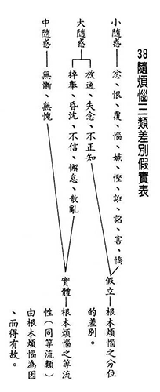

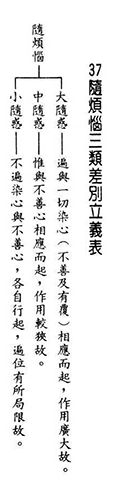

### 佛學概要十四講表簡說（二十六）第四講表　人生當前之所受（觀受是苦）

*戒慧講述／宏法、淨昌整理*

依苦生出離

懺悔煩惱業

安忍眾苦受

對苦眾生悲

廣學菩薩行

成佛利有情

(乙)苦果略舉

由甲表「領受種類」得知人生是苦，接著乙表「苦果略舉」。苦果可分為三苦、六苦、八苦、一百一十苦、六百六十苦乃至八萬四千苦。

三苦是苦苦、壞苦、行苦。三苦是能攝，八萬四千苦是所攝。苦苦成為能攝，八苦的生、老、病、死、愛別離、怨憎會、求不得、五陰熾盛苦成為所攝。我們對世間的認識是從總相去認識別相。苦苦、壞苦和行苦成為能攝的總相，世間八萬四千種苦都是別相。

◎苦苦

我們都是以總相和別相的方式認識苦苦，乃至萬法。例如森林裡的每棵樹都長得不一樣，高矮胖瘦美醜枯榮，在我們眼中是不同的差別法，安立同一個名言叫做樹。例如：符合柏的體性，都叫做柏樹，可見我們是用分類的方式來認識境界。凡是符合身心的逼惱相，都叫做「苦苦」，可是他們長的都不同。就像生老病死，乃至於胎卵濕化，乃至於人天、地獄、餓鬼的身都不同，可是他們都同名為身。符合身心逼惱相特性的都叫做苦，諸法為名言安立所分類。

所以我們把身心逼惱的形象名為苦苦，含攝著生老病死、愛別離、怨憎會、求不得、五陰熾盛苦，含攝著六道中胎卵濕化的身，只要是有情的身，通通具備這種特性，名為身，就是苦。

●生苦

生苦分三種苦：入胎、住胎和出胎的苦。

入胎苦以省庵祖師的詩來說︰「業風吹識入胞胎，獄戶深藏實可哀」，由業力風吹入的胞胎，回應我們過去所做的善惡業。在猶如暗室的母胎裡面坐十個月的牢獄之苦，極不舒服，這是住胎苦。

引業令心識與父精母血和合，名言安立叫做業風吹識。父精母血和心識在胞胎相合，這個時候會妄見宮殿、花園，或者美女等，每個人不同。引業的引導會錯現，就好像我們會錯現燈紅酒綠是好的，玩樂、滑手機是好的，就是妄見。

述記引《入胞胎經》云︰「生藏（如胃）之下，熟藏（如膀胱）之上，內熱煎煮，五處緊縛，如在革囊。」嬰兒在內臟中受到壓迫，母親體內的熱像煎煮，手腳四肢加上頭部五處都被綁緊，如被革囊緊緊包縛。母親的一切行動都會影響胎兒，當母親吃下食物，胃會漲而下壓到嬰兒，消化以後膀胱充滿尿意又會上擠，所以嬰兒的五處是緊縛的。母親吃多吃少，他都很苦惱，母親吃的很油膩，或者水分攝取不足導致很乾燥，或者冰、熱、酸甜苦辣鹹淡，各種味道，都會讓胎兒備嘗苦痛。

出胎苦又分胎產苦和產出苦，胎產苦就是走一段產道的出胎之苦，胎兒從狹窄產道出，如合山地獄一般，此時母子交危，可說是「鬼門關前走一回」，剛剛生出的時候，皮膚非常細嫩，一接觸外面空氣就好像刀割一樣，乃至於臍帶還要被切斷，極其痛苦。產出苦就是接觸到外面環境的苦。故入胎、坐胎、出胎，都是苦。

除此以外，六道中生苦有以下觀修方式：

第一是六道五蘊身都是眾苦隨逐。當生命一產生時，就是眾苦所隨之處。比如畜生道，牠一生下來，所有畜生的苦就隨逐。或者人一出生，人的苦就隨逐我們，意即所有人間的苦都要吃，生、老、病、死、悲、歡、離、合，天災戰亂都要受，所有人生的痛苦他一定要完整地嘗過，這叫做眾苦隨逐，只要一生為那一道，那一道的苦就尾隨而來。

第二是所有的煩惱習氣也都隨逐而來。第一是就苦果來說，第二是就苦因來說。他的煩惱習氣也都通通帶過來了，沒有一個留在前世。

第三是眾苦所依。前面是眾苦所隨，而此身體是眾苦所依。要靠身體才能生起苦和煩惱，身體是生起苦因苦果的好地方。

第四是苦因所依。也是所有煩惱都依這個身體來。煩惱一定要有地方生，這個身體就是煩惱所依。

第五個是想要離開這些苦都離不開，一定要面對死亡的苦。所以才見到生，就知道必死。沒有不死亡的，一切聚會的結局就是散會。

以上是生苦，入胎、坐胎、出胎和它的五種觀察。坐上修就是結合有法認真觀察、放在自身上找覺受，觀察生苦如果沒有解決，就會在我的來世生起，我入人家的母胎，我受入胎、坐胎、出胎的苦。

十四講表也可以由苦因跟苦果的角度來看：第四表是苦果，第五表是苦果苦因，第六表是各種形象的苦果苦因，第七表是苦果苦因的環境，第八表是苦果苦因怎麼滅，清清楚楚。第八表是總說，九、十、十一、十二是別說。第十三表是為我們介紹對治苦果苦因最好的環境，西方極樂世界。第十四表就是請大家及時修學對治苦果苦因的方法，是為吾人應有的覺悟。

●老苦

我們一生必然要邁向老病死，老就是一個生住異滅的過程，我們的人身很快就老了，依此來觀察老的苦：

第一類是外相跟顏色衰敗。我們老了以後顏色不再容光煥發，頭髮白禿，彎腰駝背，笑起來的時候額頭像砧板，這些外相和顏色變得不好看，他人不喜歡親近。這樣的老是人人身上都會發生的。

第二類是力氣衰退，失去彈性。經上形容老人，想要坐下來的時候好像是繫在樹上的袋子斷掉了繩子。站起來要人攙扶，幫忙者如同拔樹根的困難。說話有氣無力，走路也慢吞吞的。年輕人難以理解老苦，等到老了才知其苦。

第三類是諸根衰退。根力衰敗，眼睛、鼻子、耳朵都不如以前，例如眼睛老花、耳朵聽得很吃力、牙齒掉光等，白天一直睡，晚上睡不著，抵抗力弱，天氣一變就感冒、咳嗽、發燒，自己辛苦，照顧的人也不勝其苦。且意根衰敗，記憶力就衰退，常常失念，事情記不住，只記得陳年往事，一再重複的遙想當年，令年輕人受不了。想學東西也學不起來。

第四類是受用境界衰退。冷氣吹不了，吃飯吃不下，吃東西困難，所煮的東西都要爛爛的，美食早已變味，而且食慾不振。年輕人可以撐飽，老人家不能吃撐，很多人為了盡孝道給老人家吃很多，老人家又惜福，結果吃撐了，就麻煩大了，這也是我們每一個人的未來。

第五類壽量衰退，人老了最怕的就是壽命將近，這是壽量衰退的苦，馬上就要面臨死亡。尤其是接到白帖的時候，兒時的同學眼見今年少幾個，明年少幾個，漸漸輪到我了。這種壽命在減少，天增歲月人減壽，令人可怖。

以上是老苦。老苦是慢慢發生的，如果是突如其來就老了，我們可能承受不住。

●病苦

老苦不是馬上到來，但是病苦會隨時出現，我們的身體是地、水、火、風四大假合，地大是堅礙為性，在我們身上體現為骨、爪、齒。水大是以潤濕為性，在我們身上是膿血，涕、唾、尿等。火大是以燥熱為性，在我們人體上體現為溫度。風大是以動轉為性，就好像我們的呼吸。四大是假和合，不調時就會生病，而受各種折磨。

病苦也分五個面向觀察：

第一是身體變壞，病苦折磨時，人會形容枯槁，身形變壞，變成皮包骨，身上到處都是皺褶。原來印堂發亮，走路虎虎生風的運動高手，病了以後變成四肢纖細，肚子飽脹，眼睛外凸，不人不鬼的樣子。此人的前後看起來好像沒有關聯性，這樣的事情也會發生在生病的我們身上。

第二是住於憂苦、增長憂苦。病人晚上睡不著，吃飯吃不香。大家不喜歡跟病人相處，病人也不能出去玩，別人來探望他也苦，因他要在病中花精力去應對，別人不來看他也苦，時常感到孤獨、落寞。所以病人的心情是很矛盾的，苦中的人往往火氣大，因為他不懂得如何安頓自己。修行人平常修行不得力，生病了就更不得力，憂苦就把他的道行都淹沒掉。

第三是對悅意境界不能受用。好吃的吃不下，住院的環境不好。病房裡面人很多，晚上或有人在打呼嚕，或有人在做噩夢亂叫，或有人睡不著起來大喊，互相打擾不能休息。空氣間瀰漫的都是消毒水的味道。

第四是不悅意境界是非受不可，比如病苦本身要就要承受，連帶的很多苦也要承受，打針吃藥、開刀、化療、灌腸、胃鏡等。

第五是面臨生命終結的苦。被人宣佈病危的時候，巨大的恐怖來襲身心，十分折磨人。以上這些都會真實的發生在我們身上。

●死苦

死亡的痛苦每個人一定會遭遇。失去生命的時候這種戀戀不捨是苦，乃至於要離開世間的所有是苦，述記引省祖詩云︰「脫殼生龜真痛絕，落湯螃蟹漫慞惶！」死亡的苦像要把烏龜的殼剝去那樣痛苦，像是螃蟹掉到熱湯裡面那樣慞惶。

用五個苦來總攝所有死亡的苦：

第一個是要捨離所愛物，捨離我們覺得非常可愛的錢財、地位。換句話說，我們一生努力所追求的都是要離開的東西，而我們卻花十二萬分的精力去追求，世間人以為這叫做積極。

第二個是死亡的時候要離開親眷家族，會有離開親人的感覺。我們要如何體會死亡的感覺？古人要送別一個朋友到遠方，可能幾年都沒有音訊，這種是生離。而此處是死別，以後不會再聚會了，再也見不到了。

第三個是離開親愛的朋友，在外面花很多時間交往的朋友，天天聯絡的，都是要離開的。

第四個是最難捨離的是我們自身。離開自己的身體後不知道該如何應對，對未知的未來充滿恐懼，好像突然讓我們一絲不掛、什麼都不能帶的去到一個完全不認識的國度一樣。

第五個是死亡本身就要受非常猛厲的痛苦。就像前面說把龜殼扒下來的痛苦。

這些都要結合我們自己的觀修，才會幫助我們生起出離心。以上是生老病死苦。

### 二○一九年唯識簡介講座消文（四）

*戒慧講述、編輯部整理*

大乘車軌有兩類

唯識中觀依佛語

離經一句是魔說

了義猶待宗派見

（甲寅）唯識修觀

（寅一）三性觀法

◎五法三性

前述已將唯識之教闡明，此處將說明如何依唯識之教修觀而得解脫。先明三性觀法，次說五重唯識。說明三性觀法之前需先將萬法做一個分類，歸納為五法。

我們都是以共相的方式認識這個世界，舉凡燒熱性稱之為火，能承載的那一分或稱之為桌子等。「相」即是所謂的境界，「名」是施設名言，相和名是心識所分別的境界，妄見法在心外成立叫做徧計所執，唯識宗稱為世俗有，相和名便屬於徧計所執之法，是心外法，需要遮遣。唯識宗的徧計執有兩個，第一個徧計執是執有外境成立，謂之性向徧計；第二個徧計叫異門徧計，就是將麥克風賦予名字，如果麥克風的名言是實際存在不改變，應該從未見識過麥克風發聲功能的人來看，也知道是麥克風，狗來看也是麥克風，鬼來看還是麥克風，然實際真相是各看各的，正因為實際的真相是各看各的，所以萬法理應於心之內主觀存在而非於心之外客觀存在，所以是萬法唯識，在心外無法可得（性向徧計所執的法是根本無），異門徧計執所徧計之法是有的，只不過是觀待某些有情是有的，是依他起上各有所執，其作用是不能否定的。

法沒有徧計所執性（性向徧計），但是有依他起性，「分別」是內心對各種名相的功用善加分別，屬於徧計能執，此能執的心是有的，否則如何執著境界，故稱作依他起，然執境界在心外的那一分是妄有（想像出來的），但是生起執著的心識是有的，是由第八識的心識依緣而起的果法，是由種子的他依緣而起的心法，依緣而起的心識和境界都是有的，是勝義有。

唯識宗二諦的修學當中，世俗諦分為世俗有以及勝義有，也就是世間人見為諦實的，有一分是對的，有一分是錯的，徧計所執的法（法在心外的那一分）稱為世俗有，需要被遮遣，心內所顯的緣起法是勝義有，需要被承認。而圓成實屬於勝義諦，依著勝義諦才能解脫生死，見到法在心外不成，才能破煩惱障與所知障，唯識宗的見真實就是法沒有在心外存在的體性，即是該法的圓成實性，依此能破二障而稱為勝義諦。

正智是能證真如的智慧，可分兩部分來理解，正智的根本位現證法在心外無，該法未在心外成立即是該法的真如，在能所雙亡的狀態下，於心外見不到該法，此時不見正智也不見真如，稱之為圓滿成就真實；正智的後得位見法在心內顯現，心與境皆是心內所顯、能所觀待的緣起法，屬於心內法，須好好的觀照。

依此三性觀法，可歸納出「三性三無性」。也就是徧計所執相無自性，而能執的心是有自性的，所以徧計能執性是有的。依他起的自生性(因和果的體性為一)無，所以是依他起自生無自性，但心內的緣起法不可以沒有，所以是依他起的他生有自性。圓成實的人我性(獨立實有我)與法我性(法在心外成立)無，所以是圓成實勝義無自性，而圓成實的二種我空是有的，無人我性和無法我性是有的，所以是有自性，若無自性則無法依之證果，也無法成佛。

接著，以五重唯識觀引向解脫與成佛，成立唯識宗的勝義諦，也就是所謂的圓成實性。

（寅二）五重唯識觀

◎五重唯識

一切法可歸納為五法，五法又可歸納為三性，已如前述。五重唯識觀是唯識宗證得勝義諦的觀修法，透過：「遣虛存實識、捨濫留純識、攝末歸本識、隱劣顯勝識、遣相證性識」五個步驟，由淺至深、由粗相到細相去觀察，最後證得圓成實性。

遣虛存實識：

所要遣除的是心外諸法，所要存留的是心內諸法。依據唯識宗宗義，法在心外根本不存在，既然根本無，就談不上體也談不上用，徧計執周徧計度心外的一切法實有都要遣除；因緣所生的心內諸法有，否則就會成為斷滅見，因此存留依他起性和圓成實性。

捨濫留純識：

此處濫是指相分，即所緣之境；所要保留的是能緣之心，包括了見分、自證分及證自證分。其實沒有相分，見分也無從顯現功能，而之所以要捨除相分，是因為觀修的目的，在證明唯有識，一切法唯心所造。

攝末歸本識：

末是指見分，本是指自證分及證自證分。見分在此階段要再收攝起來，使其回歸到本體。見分緣相分，需要自證分的證明才能發揮功能，所以稱之為本；自證分與證自證分可以互緣，互為能所，所以此處稱：「識自體有能所二取」，是觀修所要導歸之處。

隱劣顯勝識：

劣者為心所，勝者為心王，心所依著心王才能生起，並與心王相應同緣一境，是附屬於心王的心理現象，有時生、有時不生，所以心所為臣，心王為君，隱蔽次要者，顯現主要者。

遣相證性識：

此為最後一個階段。前階段所顯八識心王，也不過是依他起的因緣所生法，所以是此處要遣除的事相，此事相與前述的相分意義完全不同。因緣所生的實性是遣除事相後的所證，實性是什麼呢？即圓成實。行者在觀修中證悟，前七識皆由第八識所生，第八識也是由自證分與證自證分而生起作用，是故唯識是外境不成，唯識宗對於外境的遮除屬於「非遮」，也就是有所指向，指向唯識所現，前七識也是由第八識顯現，萬法唯第八識所現，故稱唯識。

（寅三）八識轉四智，四智成三身

◎八識轉智

進入勝義諦觀察後，最後目的是令八識轉四智，而成就佛的三身。首先必須先了解「轉」這個字，轉並非將八識心王心所消滅，而是以智慧去攝持、利用八識，讓其只剩下見真理的作用。也就是以八識為體，去發揮智慧的功能，舉例來說，如同三國的諸葛亮（智慧），攝持劉備（心王）令張飛、關羽等（心所）去執行任務（造作）。

接著從第八識開始看起，第八識被大圓鏡智所攝持時，令所有的有漏種子全轉為無漏的體性。之所以稱之為大圓鏡智，意指如實的顯現所有輪迴現象，如同鏡子一般，大圓鏡智成為能顯現，一切法成為所顯現。而佛的法身，為積聚諸法成身，當一切智成為能知，則一切法皆成為所知。大圓鏡智成為能證，法身成為所證。

第七識被平等性智所攝持，使第七識緣第八識見分，雖生起作用，卻不生起我執，此智慧為破煩惱障、所知障的智慧，在體性空與心外不成立上了解一切平等，人我與法我皆體性無，故稱之為平等性智。成就的報身，即是破二障的智慧。

第六識被妙觀察智所攝持，第六識是最善於觀察，最具分別的，當無人我、法我執時，才能如實觀察眾生的根器，通達甚深的緣起，去了解眾生所需。

前五識被成所作智所攝持，令前五識善用各種境界，以神通變化來幫助眾生，成辦所需，成就種種佛事。第六識與前五識成就佛的應化身，以此來做利益有情事業以度眾生。

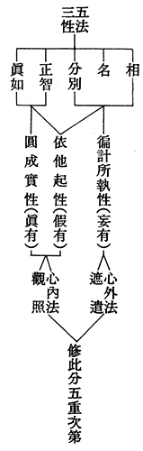

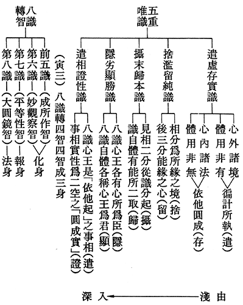

### 大佛頂如來密因修證了義 諸菩薩萬行首楞嚴經—七處徵心（一）

*戒慧講述、淨本整理*

佛是大論師

徵心究何在

七處尋尋覓

無處找到心

前言

自古佛門就有這樣的說法：「開慧的楞嚴，成佛的法華，富貴的華嚴，破相的金剛。」楞嚴就是指《楞嚴經》，全名為《大佛頂如來密因修證了義諸菩薩萬行首楞嚴經》，本經以佛陀弟子阿難遭受摩登伽女之難為緣起，釋迦牟尼佛命文殊菩薩持楞嚴咒往救，解除此難。阿難獲救之後，悲泣祈請釋尊教導，十方如來得成菩提，因地上的修定方法，釋尊為其說出修學「首楞嚴大定」之密因，所述內容，集成此經。由於本經卷帙繁浩，不利初學，二○一九年暑假講座，特別選出「七處徵心及二十五圓通」講授，以掌握本經大要。本刊過去曾完整刊出二十五圓通章之內容，故今再編集整理七處徵心篇章。

《楞嚴經》中可見中觀的意趣，但也有如來藏等不同部派的思想，可見是釋迦牟尼佛教法的匯集，而非佛陀在一個時期中所宣說。本次宣講，以中觀宗義來貫串經文，體會覓心了不可得的究竟義理。

經題

本經全名為《大佛頂如來密因修證了義諸菩薩萬行首楞嚴經》，涵義如下：

大佛頂：

「大」是相當崇高的讚歎詞，如《論語》中有「大哉！堯之為君也」、「大哉孔子」的用語。「佛頂」就是佛的無見頂相，此相表徵佛無上的智慧，即本經蘊含佛慧於其中。

如來密因：

如來為佛的十種稱號之一，如就是真如，也就是空性，佛具有能破除煩惱障、所知障的空性智慧，並依緣起而來應化世間，故稱如來。成佛之因有顯因、有密因。顯因是菩提心，密因即中觀正見。由於所證的空性深密難可了知，所以稱能夠證得空性的中觀正見為密因。

修證了義：

佛一生所說經典有了義與不了義，不了義者例如人天福報之法，了義者就是能夠證得空性，了生脫死成佛之法。本經依著如來密因所修，可以證得空性，故稱修證了義。

諸菩薩萬行：

意旨要從菩薩法藏通達佛法藏。通達空性的甚深見，還要有菩薩的廣大行為助伴，才能破除所知障，證得佛果。所以要有「諸菩薩萬行」，才能達到佛的「首楞嚴定」。

首楞嚴：

就是佛究竟堅固大定的名稱，可以同時見空性又同時見世俗，現證空性的心識能夠不斷相續，永不出定，所以也永遠不會退轉。

經：以上「大佛頂如來密因修證了義諸菩薩萬行首楞嚴」為所詮釋，經是能詮釋。詮釋的方法有表詮及遮詮，對於菩薩入世的廣大行，以表詮敘述；對於證得空性的甚深見，則以遮詮敘述，就是要遮除一切法的體性。

科判分析

七處徵心依據明朝交光大師科判，一共分為二大段落：「丑一、按定徵處分」及「丑二、隨執隨破」。在第二段落處，總共又分為七個子段落，即釋尊與阿難尊者徵心的七次答問。

丑一、按定徵處分

「定」的意思是心所專注的地方，「徵處」就是徵求所在之處。佛陀在本段經文中，詢問阿難尊者，心專注於何處？並徵求心之所在。

一、按定分

討論心專注於何處？藉由討論，引出下一段的「徵處」。

（一）、問定分

釋尊提問心定於何處？讓阿難尊者回答討論。

１．「教以直心應徵」

釋尊教導阿難尊者，誠實地答覆他，關於心專注於何處的問題。

２．雙徵能見能愛

釋尊舉出兩個問題，來徵問阿難尊者，當見佛三十二相時，能夠看見跟能夠生出喜愛的是什麼？

（二）、答定

阿難尊者回答釋尊所問。

二、徵處

徵求心與目的所在之處。

經文解釋

汝今欲研無上菩提。

佛告訴阿難尊者，你今天非常想要研學成佛的智慧。「菩提」就是佛的智慧，只有慈悲沒有智慧，無法度化有情。佛的智慧由廣大行與甚深見莊嚴而成，所展現的道力、神通，是殊勝不共三乘的行相。

真發明性。

佛的智慧是能證，所證得的是真正開發顯明空性，此處空性特別是破二障（煩惱障、所知障）所顯現的空性。在法性宗認為有一個空性可以去證得，但中觀宗則認為，所證的空性也是觀待能證的智慧才能顯現，所以都沒有自體性。

應當直心，酬我所問。

「直心」在經論中有不同的解釋，遠離名聞利養為直心，或者體悟真理，依正法而修為直心，但此處特別是指誠實、表裡如一。釋尊告訴阿難尊者，應該誠實地的回答我所問的問題。

十方如來同一道故，出離生死，皆以直心。

十方如來同在一道中出離生死，都是因為能誠懇地學習，捨棄名聞利養。

心言直故，如是乃至終始地位，中間永無諸委曲相。

心因為能誠懇，從凡夫開始，歷經菩薩階位的十信終、十住始，十住終、十行始，十行終、十迴向始，十迴向終、十地始，十地終、佛果始，過程中間永遠沒有外道宗派見這些委曲相。

阿難，我今問汝，當汝發心緣於如來三十二相，將何所見？誰為愛樂？

佛對著阿難尊者說：「阿難，我現在問你，當初你因為如來的三十二相而發心出家，是用什麼見佛？是誰產生愛樂？」原來阿難尊者過去是見到佛的相好，想要成為佛的眷屬，所以才發出離心出家。佛示現相好，雖然是希望眾生能發成就無上菩提之心，承擔佛的事業，但觀待小乘人則只發心出離三界，成為佛的常隨眾。

阿難白佛言：世尊，如是愛樂，用我心目。由目觀見，如來勝相，心生愛樂，故我發心，願捨生死。

阿難向佛報告：「世尊，這樣的愛樂，是用我的心及眼。由眼看見如來殊勝的相貌，由心生出喜愛、樂與佛相處，是故我發心，願意捨棄生死輪迴。」

佛告阿難，如汝所說，真所愛樂，因於心目。

佛告訴阿難尊者：「如你所說，真正有所愛樂，是因為心與目的緣故。」

若不識知心目所在，則不能得降伏塵勞。

若不能認識心目所在，則不能降伏追逐六塵境界所生的疲勞。摩登伽女也是六塵所顯現的可欲境，使阿難尊者內心追逐疲勞，佛以神咒救護只能暫時，必須具有中觀正見，才能永脫塵勞的繫縛。

譬如國王，為賊所侵，發兵討除，是兵要當知賊所在；

喻如國王被賊寇所侵擾，國王發兵討除，士兵要先知道賊寇所在。賊在此指的是心與目，國王指的是補特伽羅我（身心主宰者）。發兵討除是比喻修學對治法，所對治者為心目，在所有的對治法中，只有空性的觀修才能真正斷除煩惱。

使汝流轉，心目為咎。

使你生死中流轉，是因為心與目的過錯。其實眼根緣色塵境界生眼識，我們所見的是境界在心上所呈現的影像，所以能夠回憶過往，甚至回憶前世。能見的是眼識，屬於心的功能，不是眼根在看。

吾今問汝，唯心與目，今何所在？

釋尊繼續對阿難尊者說道：「我現在問你，就此當下，你的心和眼在哪裡？」此猶如達摩祖師為二祖慧可安心，唯有覓心了不可得，才能真正安心。

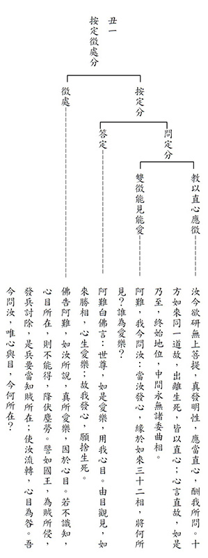

### 人生大事不能忽略的事實—助念座談大綱

*戒慧講述、編輯部整理*

臨終升沉難思議

善巧安慰與開導

配合家人助念行

殯葬作七教化生

助念的重點可以分為病障關懷事項、護持生西正見，以及成功案例參考，以下分別說明之。

◎病障關懷事項

對於病者的關懷問候，必須了解病人的病情屬於哪一類，判斷他到底是業障病，或是作息不正常引發的病，還是飲食不調的病，準確判斷後才來提供他醫療的方法。對作息不正常者，要勉勵他早睡早起、多運動、鍛鍊身心，促進新陳代謝、增加抗氧化能力；對飲食不調者，要請他講究健康、良性的飲食，且定時定量、細嚼慢嚥；對業障病者，則要鼓勵他多發心、多念佛，甚至請他的家屬多幫他做功德，對不同人的不同病障要有不同的關懷差別，才能對症下藥。

◎護持生西正見

病危開導：

病者面臨臨終時，要開導他萬緣放下，完全皈依三寶，一心念佛，才能對治輪迴的業。此時要提起他念佛的信心，肯定他平時的貢獻及所做的功德。

臨終助念：

臨終助念時，要懂得助念的正確觀念，並講究助念的規矩、方法，助念團配合家人，一起來完成他的助念大業。

作七追薦：作七、告別式有一定的程序，作七法語內容要勉勵家人發心、對法生起信心，乃至於生起因果正見，生起皈依三寶的心態。引發家人有這些觀念最能夠迴向往生者蓮品高昇，或在中陰身時往生西方。

◎成功案例參考

還有一些成功案例參考，我們可以見賢思齊，引發我們的信心，產生對助念作七的好樂，讓我們更講究助念方法，更細膩觀察應如何作為，以上是助念座談大綱主旨所在。

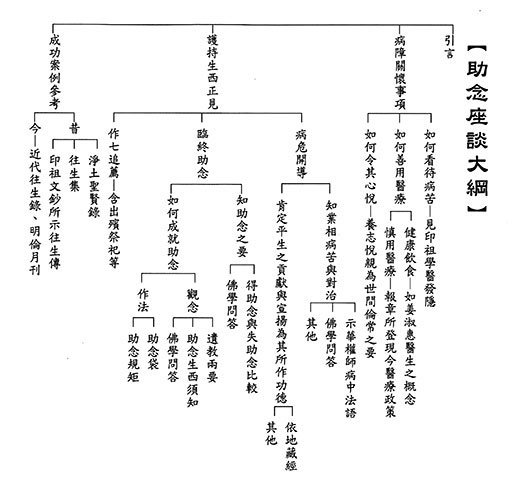

## 蓮池海會

### 張謝菊妹往生見聞記

慧慈

堅持的個性

多采的人生

負責的教師

美妙的臨終

張謝菊妹老居士民國十九年出生於桃園縣楊梅鎮，因為父親經營米商，所以從小家裡豐衣足食，物資不虞匱乏。老居士雖是獨生女，萬般寵愛集一身，卻沒有因此而享樂驕逸。家庭教育的端正培養，使得老居士顯現出嚴謹的個性和甚高的自我要求，在那個年代，能考上台北女子師範學校，著實不易！

十八歲畢業後，回到母校楊梅國小任教。二十二歲結婚，婚後面臨最現實的生活挑戰，婚前從未下廚，必須從傳統生爐火煮飯開始，起初，時而燒焦，時而沒熟，心理壓力之大，難以形容！歷經一次次失敗的煎熬，不斷研究改進，很快就能抓準火侯，後來也成為能做一桌佳餚的大廚！

因丈夫在新竹工作，故請調職到新竹市東園國小，剛入校就被校長指派成立鼓笛樂隊，老居士雖從未吹過笛子，是全新的體驗，最後終於訓練有成，於國慶遊行，鼓笛隊熱鬧登場。

老居士因長女出生辭去教職，全心照顧。把一雙女兒打扮得漂漂亮亮，希望人見人愛；讓女兒學習芭蕾舞，期待她們體態優美又有韻律感；買許多故事書，教孩子閱讀，希望她們增長知識，豐富生命。

後來復職於楊梅國小，適逢五十周年校慶，被校長指派教大會舞，老居士並非舞蹈專業老師，一切從零開始，從選曲、編舞、服裝設計，一項項克服，當天精彩上場，喝采連連，自此之後，每年參加學校民族舞蹈比賽，不負眾望，年年抱「優勝」獎盃為校增光！

老居士退休後展開新生活，從舞蹈的律動，轉入繪畫的寧靜，學素描、水彩、油畫。十年的用功，第一次參加澄星畫會「久釀」師生聯展，子女這才驚覺老居士有繪畫的天份，更佩服其認真學習的毅力！豐碩的成果看似簡單，那是需要堅強的意志力和持久的耐力，「活到老，學到老」是老居士一生的座右銘，繪畫成為老人家晚年生活的重心。

老居士對女兒和學生都非常嚴格，她在小學任教四十五年，桃李滿楊梅，學生各個都對她印象深刻，常有學生來探望她，有時會邀她去聚餐，去烤番薯……，開心之餘，她會問學生：「過去我好嚴格，會打你們，你們會恨我嗎？」學生說：「小時候很皮，若非老師管教嚴格，現在可能是社會的負擔。」

兩年前，她以近九十高齡，為孫子凱為的結婚，親手繪製了一百張各式花的喜帖。從試做到正式畫出，每天早上愉快的開始，連續將近半年完成！這份需要恆心與毅力完成的一百份婚禮請柬，有滿滿愛的祝福，也是她人生最後的大創作！

老居士認真對待每件事的態度，以身教教導子女對學習的堅持；熱情好客的特質，使得家中常訪客不斷，也直接教導子女待客之道；其正直誠懇贏得親友的信任，教導了子女做人誠信的重要；老居士觀察力敏銳，不但細賞周邊的景物，還掃瞄到子女細微的過失，對子女有諸多要求，有時雖讓子女不耐煩，這何嘗不是訓練子女做事要力求完美，耐得住批評，不要自以為是？

今年五月，老居士身體疼痛難挨，才願意求助醫生，診斷是癌症，經與醫師討論，希望能居家療養，定期回診打針。面臨老病死苦，最無助的當下，善知識提議齋僧、放生、拜懺、供養大德等善法，為老居士消災祈福。暑假期間，讀書會指導老師帶著學長們到居士家裡共學，課後陪老居士一起念佛、迴向，氣氛融洽。

記得有一次，老居士問女兒「南無阿彌陀佛」是人名？還是地名？女兒連夜作了簡報圖檔，介紹阿彌陀佛是極樂世界的校長，祂辦了一個教學環境優美、教具資源豐富、師資陣容堅強的一流學校，您是這麼認真教書的好老師，阿彌陀佛一定非常歡迎您，只要您發願想去，常念阿彌陀佛，阿彌陀佛一定會接您到極樂世界！

十一月十五日傍晚，老居士家人從日本回來探望，當時子女看到老人家眼球上翻了幾秒鐘，女兒非常緊張的念佛，但老居士很快就恢復正常，還意識非常清楚，問女兒泡什麼茶、拿什麼點心招待客人。

隨後女兒便請教師長，師長對居士女兒說，若見臨終徵兆，家人就要特別留意，要陪在身邊，輪班念佛。十一月十六日星期六早上九點，家人見老居士眼神異樣，立刻全家一起念佛，並提醒老居士，要跟隨大眾佛號，即便無力出聲，也要跟著默念。

十點鐘，老居士要求換衣服，原本女兒覺得衣服挺乾淨的，不用換，所以拉拉她的衣袖，虛晃一招，她前後說了兩次「脫掉」，只好順從老居士換了衣服，順便擦澡。

十一點半，茅茹讀書會善友們來陪伴老居士念佛一小時。之後小女兒一家人從高雄回來，孫子從台北回來。一一和老居士報到，老居士還捏捏曾孫的大腿，牽著他的小手，看著他！十五點四十分，子孫全都圍在老居士身邊大聲念佛，看著老居士閉上眼睛，闔上嘴巴，心跳從微弱漸漸停止，繼續助念二十二小時，沐浴更衣時，全身柔軟，面貌和順，這就是蒙佛接引，往生極樂世界的瑞相。

老居士走得十分安詳，家屬非常欣慰，更肯定臨終前助念的重要，得助念的諸多因緣平常就要好好累積，需以三寶為底蘊，多與人結法緣，方能成就最後的往生。子女亦發願依著善知識與善友，努力學習經教，發揮此生最大的價值！祈願藉著老居士的示現，讓更多人有方法、有信心，求生極樂世界。

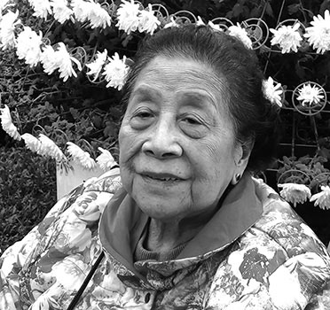

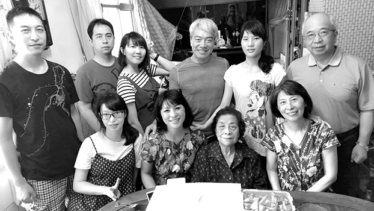

## 孔學一隅

### 論語簡說（三十二）— 子罕篇第十三　子貢善探師志，問行藏

時哉講述

善探師志言語科

藏諸沽諸待識貨

待價而沽君子心

不妨等待玉韞櫝

前言

人的價值如何呈現？是充實自己內涵，還是憑外界肯定，何者比較重要呢？

以前蘇富比跟嘉士德兩家拍賣藝術品跟文物的賣場，一年的營業額大約是十億到二十億美金之間，相當於三百億到六百億台幣。拍賣時候場面非常熱絡。那時拍賣了一件東西，大概是一八九三年「表現主義」的一幅畫，是挪威的畫家愛德華墨克所畫的「吶喊」。這幅圖若是出現在地攤，也許五千塊都沒人要買，但出現在拍賣場，竟然賣到一億兩千萬美金，相當台幣三百六十億、人民幣七十二億，極其昂貴。

以此作為引言，人生的出路，到底是要去追求？還是要等待？這一章會給我們答案。

經文

子貢曰：有美玉於斯，韞櫝而藏諸？求善賈而沽諸？子曰：沽之哉，沽之哉。我待賈者也。

消文

子貢設一個比喻問孔子，有一塊美玉在這裡，是要放在櫃子裡藏起來呢？還是找一個識貨的商人來賣掉呢？夫子何等高明，一聽便知，也用比喻回答子貢：賣了吧，賣了吧！我等待識貨的商人來買。

章旨

此章子貢善巧的以比喻探問老師的心志，孔子答以待價而沽。有道德有學問的君子，當然要入世造福人群，但不能求售於人。全章問答，皆用比喻，意在言外，猶如詩篇。

科判分析

此章經文分為兩部分，第一部分「約著學生」，學生子貢用比喻來問老師：「有一塊美玉在這裡，這一塊的美玉像和氏璧、像翠玉白菜，這樣的美玉是要藏在木櫃裡呢，還是找到很好的商人賣掉？」子貢真的是一個會說話的人，他藉美玉想問老師，到底您要被用，還是要隱藏起來。第二段「約著老師」，孔子說：「賣了吧！賣了吧！我等待識貨的商人。」是為「待價而沽」。

釋義

本章子貢以美玉之喻問的歷史背景及用意？

孔子周遊列國而無所作為，子貢想了解夫子內心的想法，故以比喻探問夫子到底是有心想作為呢，還是要把自己藏起來。

本章問答皆以喻言之，有何殊勝處？

《詩經》有所謂的賦、比、興，賦是直接陳述，比是以彼物比此物，例如唐詩裡用棕樹去比人的意氣衝天，去比人不斷地接受逆境考驗。此章以玉來比喻，問者意在言外，答者也意在言外，兩人皆是用《詩經》的比法，是非常高明的說話藝術！所以，《論語》不但含藏豐富的義理，也是很優美的文學。

子貢以美玉比喻什麼？

美玉比喻孔子德才兼備，他以形而上的內涵去莊嚴他的德，此德在任何場合中都不會變節、不會退轉，而他的才能又可以安邦定國，故比喻孔子的德跟才，是一個稀世珍寶的美玉，如同「和氏璧」、「翠玉白菜」。

韞櫝而藏諸比喻什麼？

韞櫝而藏諸是指把美玉藏在木盒裡，不讓人看到美玉，意即把內涵隱藏起來，喻為「韞櫝而藏諸」。子貢藉此來問孔子是否要把自己藏起來，不讓人見到自己的內涵。

善賈的形象為何？

其形象是「良賈深藏若虛」，真正識貨的商人，看起來是平常人，他的才華深藏不露，形同沒有。中國人跟西洋人不一樣，西洋人都是聰明外露，中國人則越厲害乍看越平常。

求善賈而沽諸比喻什麼？

比喻要找識貨的鑑定家、買家來收藏，比喻有德、有才的人要懂得給明君用，明君就是善賈，他會出好價錢，而且會愛惜、禮遇人才。

求善賈而沽諸的形象為何？

形象是「懷瑾握瑜」，瑾、瑜都指美玉，懷瑾握瑜是深藏不露。即賣者懷藏美玉，但深藏不露，當對方是一位懂得鑑定寶物的專家的時候，他也深藏不露。兩人見面高手過招，立刻知道對方是否懂局，當買賣成交時，叫做良禽擇木而棲，鳳凰都是擇梧桐樹而棲；君子要擇明君，唯明君懂得愛惜君子，君子才能夠在明君之下發揮才能。

善賈是什麼呢？雪廬老人上課說賈跟商不一樣，商人是到處買賣，到處走動。賈是在一個地方不動，等你來。

何以不說「求善商而沽諸」？

因為各國國君都待在各國內，「善賈」就是固定一地不動，等待他人拿東西來鑑賞。孔子周遊列國，希望得明君賞識任用，孔子就是美玉藏於木櫝。此時，國君到底是善於識貨的商人，還是俗不可耐的商人，一見便知。

歷史上有善賈而沽諸的明君嗎？

江老師的《明倫史畫》一百幅，其中有一幅就是殷高宗，他在位五十九年，諡號武丁，是殷朝中興的國君，他任用版築工人傅說，殷高宗就是善賈，他懂得鑑定這位蓋房子的工人是稀世珍寶，有安邦定國的才能。殷高宗故意說有神人托夢，讓眾人對起用傅說沒有異議，傅說因此發跡，成為幫助武丁中興商朝的大宰相。

子貢以「求善賈而沽諸」來問，是否問得很輕鄙？

「求善賈而沽諸」是說，你這一塊美玉，是不是要找識貨的商人來賣？這是《詩經》的比法，孔子也用玉來講他的出處之道。子貢所比不但不輕鄙，用字、用意都非常文雅。

有道德學問的君子，不是應該舍之則藏嗎，何以不選擇韞櫝而藏諸呢？

《詩經》有所謂的賦、比、興，賦是直接陳述，比是時為亂世，孔子為何不選擇「韞櫝而藏諸」呢？ 依此章上下文可知，孔子的「韞櫝而藏諸」是觀待「沽之哉」而說的。也就是孔子想賣，但若對方不識貨，孔子就「韞櫝而藏諸」，連貨都不要拿出來。而孔子選擇「沽之哉」是因為聖人在亂世中本來就想有作為，否則空有才華。他又是一位入世的君子，怎麼可以沒有作為呢？他的心裡面是要「沽之哉，沽之哉」，想為明君所用，但若國君是俗不可耐的商人，孔子也不以賤價賣出。所以，孔子心態是沽之哉，可是碰到俗君，就只能韞櫝而藏諸。

有道德學問的君子，既然有心於世，為什麼不願奔走市街求賣？

讀書人知道培養德行、才能是要被大用的，不是為了滿足國君的一己之私，也不是為求名求利，所以，要講究的是用你的人有沒有心存天下國家，如果彼心存天下國家，那我就被對方所用。就像管仲為齊桓公所用，傅說為殷高宗所用。亂世裡有兩種國君，一種是橫徵稅賦、虐待百姓的暴君，一種是有心要振作的國君，像殷高宗在殷商的中期，當時商朝很弱，可是他有心想作為，如果沒有賢能的君子來輔助他，他一樣不能扭轉乾坤。所以，亂世的君子也有兩條路，一條路是隱居起來，一條路就像孔子一樣「沽之哉」，明君用我，則輔佐他一同撥亂反正；國君只想要強兵霸權、俗不可耐，就選擇「韞櫝而藏諸」。

孔子答以兩次「沽之哉」要表達什麼？

代表越是亂世，君子越想被用，因為亂世就是他想要拯救蒼生的時候，君子充實這麼多內涵，就是有心要入世，所以「沽之哉、沽之哉」。君子跟隱士不一樣，君子就算在隱的時候，都是想要「沽之哉、沽之哉」。而隱士就是要「隱之哉、隱之哉」，「藏諸、藏諸」。

若真遇到善賈，要如何沽？

齊桓公見管仲的時候，齊桓公是善賈，管仲是美玉，管仲怎麼賣呢？兩個人互相戒齋、沐浴，齊桓公待管仲，以非常尊貴的禮來迎管仲。或者是劉備請諸葛亮，劉備是善賈，諸葛亮是美玉，劉備三請出山。假如你今天擁有的是和氏壁，或是〈富春山居圖〉、〈萬壑松風圖〉、〈早春圖〉這種世界珍之瑰寶，絕對不會到拍賣場去給俗人叫賣。

摩耶精舍張大千先生出遊桃園巴陵時曾經看到一個幾百年的鐵柏盆景，張大千先生出價格想買，對方不賣，張大千怎麼出價格對方都不賣，後來張大千很失望要走的時候，種盆景的人就問旁邊說：那個留鬍子的是誰？旁邊人回：是張大千。種盆景的人立刻找張大千回來，把盆景送他，因為他知道張大千愛盆景，懂得養盆景養到出神入化，所養的盆景都像游龍一樣。 這就是善賈、善沽。

賈者暗指何種人？

賈暗指能夠推展大道的明君。他求賢若渴，在亂世時想撥亂反正。一個想要入世的君子，想要去利益天下蒼生的君子，會樂於在這樣的明君下，發揮他的政治長才。

孔子已明沽之哉，為何還是沒有實現他的理想？

孔子周遊列國時，各國的國君雖然都高規格地接見孔子，可是，他們的氣度、見識、想法都是看眼前，而且是功利主義、霸權主義，所以，孔子寧可把美玉藏在木盒裡面，寧可不說自己的才能，僅與國君依禮相待。

待賈而沽，是求還是不求？

面對明君是求，面對強兵霸權是不求。他的內心是求，可是碰到只想強兵霸權的國君，他的心態是不求。

現在假貨很多，希求賈者識貨是否不切實際？

關鍵在自己是不是真貨，是真貨就不怕不識貨的賈者。

士的貴賤是由國君還是自己決定？

一個讀書人的貴賤，由自己決定，如果遇到國君是「善賈」，他就「沽諸」，士就變貴。如果遇到的國君是昏君，他就「韞櫝而藏諸」，就變賤。就好比拿寶物到商人面前時，賣不賣寶物是賣方決定。當對方不識貨，寧可不要賣。

古代保留很棒的古畫的人，要轉手時，他看對方是否識貨，而非價錢，因為此寶物他愛之如命。像是吳宏裕極其喜愛〈富春山居圖〉，特意將藏有〈富春山居圖〉的這幢樓改名為「富春居」，安放名畫。並日夜茶飯不思地觀賞臨摹，到了朝夕不離的地步。這種人，就算你出高價他也不賣，他要的是識貨者。

就像是江逸子老師的〈伯樂識馬〉圖，伯樂遇到馬時就顯出看馬的才能，馬遇到伯樂時就顯現千里馬的能耐，兩者互相觀待。

古德中有那些待賈之人？

例如文中子，《三字經》裡面不是說「有荀揚，文中子，及老莊」，五子者其中一個叫文中子，文中子叫做王通，字仲淹。他在隋文帝的時候，上書十二條治國的大道，隋文帝不用。換句話說，隋文帝不是一個能夠識貨的善賈，所以，他後來就沒有再給隋朝用，到隋煬帝的時候他更沒有被用，他專心講學，蔚為盛況。他的弟弟王基是初唐的田園詩人，孫子王勃是初唐四傑，他的學生魏徵，《群書治要》就是魏徵收集給唐太宗治國的法寶。

後來隋煬帝被殺的時候，王通流淚地說：大亂之後必有盛世！因為大家渴望盛世，果然就迎來唐太宗的開平盛世。王通說：可惜我的命等不到。他死的時候才三十三歲。

例如吳康齋，吳康齋是朱洪武年間出生，活到七十八歲，經歷明惠帝、明成祖、明仁宗、明宣宗、明英宗、明景帝、明憲宗這麼多朝代，他曾經被皇帝徵召到東宮講學，後來就藉故生病開溜。大家問他：好好的職位為何不做？他說：明朝的政治橫行霸道、慘忍、刻薄寡恩，我能夠逃出來，已屬僥倖，保命而已。可見讀書人在情況不對時，懂得舍之則藏。

待賈會不會太矯情？

所謂矯情是沽名釣譽，假裝很有道德，故意不讓他用，其實內心很想被用，被用之後，就施展自己的私心求名求利。此處不是矯情，此處只是說真正有志利益天下蒼生的我就被他用，有志於私利的，就收藏起來。

萬一待賈不成，豈不空過一生？

待賈不成，正好充實自己，充實自己哪裡會空過一生？再來，充實自己，也有很多志同道合的人，近者悅，遠者來，怎麼會空過一生？

總結

第一，人生重在充實自己，自己必須是真貨。

第二，人生是與世無爭，不與他人爭名奪利，而是培養才德，等待識貨者任用。

第三，越不跟他人爭名奪利，反而越得到真正識貨者的恭敬。

第四，當你不被小人利用的時候，其實是避凶；當你能被君子用的時候，其實是趨吉，待賈原來就是趨吉避凶。

第五，這一章還可以學到子貢說話的藝術，用詩經的比法，比喻優美契合，彼此心照不宣。

第六，這一生就算待賈不成，就算窮到底，也要保有自己的節操。

第七，人生充實自己，不會沒有出路，出路可以在培養人才，可以在默默地以正法來利益世間。

第八，雪廬老人曾說：你就算沒有被大用，也要培養一個小用。好比子路經過魯國城門時，晨門對子路說：你從哪裡來？子路說：自孔氏。晨門說：是「知其不可而為之」的那個人嗎？可見管城門者是高人。意思是說，大用之人雖然不能被大用，可是不能無用，至少有職務在身，能夠養家活口，不要成為社會的包袱。所以，隱可以隱於朝，可以當個小公務員；可以隱於商、可以隱於農、可以隱於工，就是必須要養活自己、照顧家庭，不可以因懷才不遇，變成社會的累贅。畫〈富春山居圖〉的黃公望，他其實是大才，精通《易經》，他不被用的時候，至少算算卦，拿一點收入養家活口。

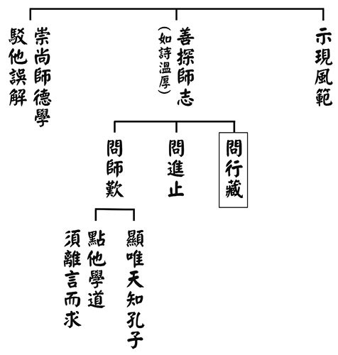

### 孝道跨時代的意義與價值— 孝經簡說（十七）

時哉講述、淨域編寫

揚名實質德與學

家庭做起辦政治

口碑建立人稱善

不枉不忝真孝子

君子如何顯揚於後世–〈廣揚名章第十四〉

前言

名聲被張揚出來有好有壞，究竟怎樣的揚名是利或不利，而好的名聲要怎麼被發揚呢？是自我吹噓、還是有口皆碑呢？有位英國爵士溫頓先生(1909-2015，Sir Nicholas George Winton)，二戰前是英國倫敦證券交易所的交易員，一九三八年耶誕節他前往瑞士渡假，發現捷克陷入戰爭風暴中。當時，德國著手屠殺蘇臺德區的猶太人，住在捷克的猶太人，莫不想要攜家帶眷逃出去，若實在不行，也要讓孩子衝出來。溫頓先生受友人託付前往布拉格，出面與納粹交涉繳交保證金帶離難民。自一九三九年三月至九月戰爭爆發前，計有七班火車運了六百六十九個孩子出來，得到英國家庭的收容。惟可惜的是，第八班火車上的兩百五十個孩子沒能運出，事後因邊境封鎖生死不明。
這項救援工作的艱辛難以想像，隨後因二次大戰的慌亂，此事逐漸塵封。他四十歲結婚，沒對夫人葛蕾特(Grete)提起過這件事。一九八八年當他八十歲時，某天太太收整閣樓，無意間看到這件資料的清單，感到非常的震撼與訝異，便把它提交給英國廣播公司(BBC)，這個故事就這樣宣揚出來了。BBC邀請他談談往事，節目中安排了當年被救的女孩，就坐在溫頓的身旁，當主持人突然告知時，溫頓既驚訝又感動。節目進入尾聲時，主持人
**問：** 「現場還有誰是被溫頓救出的人？」周圍的人紛紛起立。

當時溫頓先生受到普世的尊崇，不僅英國女王頒予爵士爵位，連捷克總統也頒予國防十字第一等勳章，各種榮譽接踵而至。二○○九年，為紀念義舉七十周年，「溫頓火車」從布拉格開抵倫敦。許多溫頓小孩趕到英國，場面十分溫馨感人，當時救出的小孩已經白髮蒼蒼了。獲救之人不乏當今的社會名流，諸如：導演卡雷爾‧賴茲、工黨政治家杜布斯勛爵。人們稱他為英國的辛德勒，他的神情依舊謙虛淡然，對於所做的事蹟，他說：「看起來了不起，但我做時不覺得了不起，有人天生偉大，有人做到偉大，有人被賜予偉大，而我只是第三種人而已！」這就是揚名聲的人，其實他只是以德性來做善事，這個揚名聲是不得不然的，是時機所致。就如佛家所說的「龍天推出」，揚名聲原來是這樣發揚的。當他一百零六歲過世時，英國首相卡麥隆也給予最高的讚譽。

世人讚歎他是英國的辛德勒，何謂辛德勒呢？乃二次大戰期間，德國納粹屠殺許多猶太人，有位辛德勒先生為了營救猶太人，在自家工廠裡僱用猶太人。為了安撫德軍的不滿，便招呼德軍高級軍官吃喝玩樂。有時做善法是很痛苦無奈的，但他保住一千兩百多位猶太人未被屠殺。日後這種救援猶太人的義行，都稱作辛德勒。英國有英國的辛德勒，德國有德國的辛德勒，中國也有一位辛德勒。何鳳山為中國外交官，一九三七年派駐奧地利領事館為一等秘書。一九三八年德國併吞奧地利，何鳳山改派駐維也納總領事。當時猶太人欲逃出境，三十幾個國家不肯發簽證，唯獨何鳳山拚命的簽發，惹得德國沒收領事館房舍。即便如此，他自費租一間小房子，繼續發給簽證，雖然政府記他一支小過警示，他也未歇手。隨後二次世界大戰爆發，德國與日本同盟，他再也不能發簽證了。有人說他發了上萬張的簽證，送出來的猶太人，有人在美國當過財政部長，有人是億萬富翁，何鳳山就是中國的辛德勒，這叫作「公門中好修行」。

溫頓與辛德勒是私人行善，何鳳山是依著公家資源做好事。公家的事情須公事公辦，可以官腔官調依法辦理，也可以法外開恩多行善舉，所以何鳳山活了九十七歲。竊以為積陰德的人必有後福，這包括他的家庭和樂、壽命延長及災厄消除。雖然做善法很辛苦，要背負壓力、面對責難與排除障礙等，但就命理學來說，凡是經過考驗的善法，其陰德愈大、成就愈高、名聲愈響亮，愈讓後人懷念，這即是「廣揚名」之義。

本章經文是：

「子曰：君子之事親孝，故忠可移於君。事兄悌，故順可移於長。居家理，故治可移於官。是以行成於內，而名立於後世矣。」

科判分析

「廣揚名」是《孝經》中第十四章，《孝經》總說是孝道的修學法，別說則突顯孝道的重要，並分別說明各階層人士要如何盡孝。若天子到庶人皆能盡孝，就能將天地和合起來，讓社會一片祥和，是為三才。所以，聖人以孝治天下，就會有許多的孝子出現，許多孝行被紀錄。反之，若違背孝道就要被處罰。此孝道的要道須被推廣，且是聖人最崇高的德性，能以孝道為本質來辦政治興教育，從家庭到社會國家，此人的名聲一定能推廣出去，能夠利益當代與後世。後人所懷念的名望，必是實際的公德，是名實至名歸。

此章簡單的科判是說「能揚名」，分別顯示是「由內到外」。譬如：家庭的孝可以移到對國君的盡忠，家庭的悌可以移到對長官的順。那麼居家將家政辦好，可以移到為官將政治辦好，這樣的人一定可以揚名。

釋義

首先，

子曰：「君子之事親孝，故忠可移於君。」

對雙親行孝道，以孝道去對君王就是忠，可見古時君王把天下或國家，當作是家庭來經營。而孝子為國家辦事時，也把國當成家，叫作移孝作忠。譬如：在天子座下的公務員，把天下當作家；若在諸侯那裡當公務員，他就把國當作家。所以整個中國的政治，就是一個家政，由家擴大為國、為天下，本質有別於西洋。

其次，

「事兄悌」

，把對兄長的友愛、恭順移於長，對長官就像對伯叔兄長般恭順。不論長官如法不如法，基本上還是要對他恭敬。對於不如法的事情，我們可以勸諫，三諫不從則可以離開單位。

再者，

「居家理」

，即是調理得當，包括人、事，此治家的能力可移於官，即將辦家政移於辦國政，治理天下。

接著說

「是以行成於內，而名立於後世矣。」

「內」指家裡，以孝悌治理家庭，則理行成於內。然後由內而外，對國君盡忠，對長官順從，乃至於居官治理政事，像辦理家政這樣有條不紊。在人事中謀求和諧，而生起次序，此人的名聲就會立於後世。為什麼不是名傳於後世，而要用「立」呢？此立除了要傳名外，還包括後世依然會有孝、悌、禮這樣的行為。立就是以他為典範，此人不但自己做的好，還能影響當代、後代的人。

析疑

本章與前章有什麼關聯呢？

前兩章是廣要道與廣至德，而孝道要怎麼推廣呢？即是我推廣孝悌之道，贏得孝子與弟弟們的恭敬與喜悅，這就是經營天下的和諧之道。那麼廣至德呢？即為了表徵我敬天下的父母，所以我推廣孝道；為了表徵我尊敬天下的兄長，所以我推展悌道。這就是聖人最崇高的德性。接續到本章，即是懂得在家裡辦好家政，並移出照辦這樣的國政，此人的名聲一定能推廣於當世、弘揚於後代。這是本章與前章的關係。

《孝經‧開宗明義章》說：「立身行道，揚名於後世。」開宗明義講揚名，本章也講揚名，這兩者的關係如何？

開宗明義講的立身行道，揚名後世，是指我能夠以德修身，並且推廣德（能行）與道（所行）而揚名於後世，就是報答父母親的方式，讓父母親與有榮焉，才無忝所生。本章也是如此，不僅說孝悌在家裡能夠進行，而且能夠把孝悌運用出去，治家與治國同是這樣，這也是廣揚名。兩者差異在於，這章的廣揚名較偏向於辦政治，而開宗明義章較偏向於自我的修道及推展道。

揚名有害、有利，其利與害為何呢？

揚名若未究其實質而揚之，此揚名是有害的。《論語‧顏淵篇》中說：「色取仁而行違，居之不疑。」意即我裝個樣子，表現出一付仁人君子，表面上似乎在利益別人，但實質上是裝個樣子。「居之不疑」是說，自己以為四處結善緣的目的是為了發展自己的名利，且認為自己是仁人君子。這種揚名是傷害自己的陰德，被人識破時反是一文不值。又〈里仁篇〉亦說：「君子去仁，惡乎成名。」內心如果沒有仁，怎麼可以成名呢？可見內心不仁厚的人，揚名對他很傷害。內心只求做表面工夫，只想爭取名利、拉幫結派，這種名聲愈揚愈害自己的德性，被他人識破則一文不值，此即揚名之害。揚名要講究揚名的本質，前所說的溫頓爵士與何鳳山，皆是心存仁厚，其名聲是後人幫他弘揚的，此謂之「廣揚名」。

此處例舉王莽來說。白居易〈放言〉詩之三說：「贈君一法決狐疑，不用鑽龜與祝蓍。試玉要燒三日滿，辨材須待七年期。周公恐懼流言日，王莽謙恭未篡時。向使當初身便死，一生真偽復誰知。」「放言」即是放肆地說一說，此為白居易與元稹遭流放時所作。大意為：人生有一法能夠將疑惑解除，既無須占卜也不用試人。想試一塊玉要燒上三天，試柴質要等七年。當年大家認為周公會造反，身上揹負了多少的壓力。王莽還沒篡位的時候，大家認為他是謙謙君子。假使當時周公與王莽都早亡，王莽成了仁人君子，而周公是萬惡不赦的小人。可是天道好還，當時間拉長了，就見出王莽是小人，周公是君子。這詩中所說，告訴我們看事情不是一時的，占卜沒有實用處，須經過審慎觀察及時間歷練，才有斷事與認人的能耐。認人絕不簡單，揚名也是一樣。王莽的揚名，反而加速了他的滅亡。

以上是揚名之過，是沒有本質的揚名。現在許多人的揚名不講究這些，不覺得是在傷害自己的陰德，不覺得是在傷害子孫，等報應來時後悔已經來不及了。再者反說，揚名之功及其案例如何呢？揚名之功的意思，是你真有實質的揚名，即會彰顯父母，父母生你與有榮焉，這是報答孝順父母的一種方式。此外，因為名聲被實質發揚出去，讓人家認作是典範，便以你為標準。譬如：虞世南有一首〈蟬〉詩：「垂緌飲清露，流響出疏桐。居高聲自遠，非是藉秋風。」意即：蟬的嘴型尖尖的，像戴著一頂帽子，宛若天爵的帽子，觸鬚像帽帶般垂下。牠爬上高高的梧桐樹，代表慎於選擇出處；叫聲響亮又傳得遠，意謂聲名遠播。然而這聲遠，並不是藉著秋風(指時機)而得，乃是自身的德行與修持(飲清露)所致。此意即是，一個人性德清白，又能慎選出處，名聲自然能傳揚出去；傳揚之由有三，第一、能夠榮耀父母；第二、成為世人典範；第三、眾人仿傚學做。舉《孔子傳》對話為例，當時孔子名聲傳揚出去後，諸國弟子前來向孔子求學，其中有衛國的子貢(十八歲)、陳國的子張。如果孔子的名聲沒有傳揚出去，他們怎知道魯國有高人呢？

子貢：衛國商人端木賜，字子貢，慕孔夫子之名前來拜見。

孔子：請。

子貢：我有一事不明，想請教於夫子。

孔子：請講。

子貢：如果一個人能夠得到眾人的喜歡，他能稱得上是個仁人嗎？

孔子：不能。

子貢：那什麼是仁人呢？

孔子：一個人如果好人都喜歡他，壞人都厭惡他，也就接近於仁人了。

子貢：這兩件事我請教過許多人，只有孔夫子的回答令我信服。……我要拜孔夫子為師。

以上這段對話就是揚名，《論語》中說「一鄉之人好之，何如，未可也」。大家都喜歡他，他是好人嗎？未必。他可能是壞人，因為兩邊討好，鄉愿德之賊。一鄉人討厭他，他就是壞人嗎？未必。這個人或是很有眼光，可是得罪了當時的人。那麼不如怎樣呢？不如好人喜歡他，壞人討厭他，這就是孔子的答案。子貢十八歲來親近孔子，一直到四十二歲孔子過世，都沒有離開老師。此後四十二歲到六十五歲間，是子貢發揮才能的時光，這與他在孔子座下的勤習好學有關。

揚名聲有好處，也有壞處。不講究實質的揚名，是有壞處的，而且是大壞；講究實質的揚名，或許有好處，讓人知道有典範，使與之學習遵從父母，此種揚謂之「有朋自遠方來，不亦樂乎。」

不揚名亦有其功過，它的功是什麼呢？有何案例呢？

一般君子是憂患沒有能力，而不憂患人家不知道我，這就是不想揚名。別人知不知道我，不是我所在意的，我在意的是有沒有能力充實德學、利益他人。不揚名的典範是誰呢？《論語‧公冶長》中顏淵說：「願無伐善，無施勞。」顏回不誇耀自己的善，這就是不揚名其實功。實際來說，不揚名的人就不會有太多的應酬，得許多時間來充實自己。佛經上也說，一個人名聲大揚時，便會有許多人來親近你、向你請教，就像眾鳥倚靠在樹上，這棵樹不久就枯折了，你沒辦法應付這麼多人跟你求學。其次，你根本不是那一塊料，大家表象上在跟你學，實際上是在浪費大家的時間。自己不僅沒上進，反而一直在退轉，所剩下的就是一個空名。所以，不揚名有不揚名的功，顏回就是一個典範。
孔子叫顏回去當官，顏回不要。當官將政治辦好，不就是揚名了嗎？顏回不要，那他要什麼呢？不揚名，可以少掉很多的應酬，多出來的時間可以用來學習聖道。顏回說他一生最盼望的，就是傳承孔夫子的學問，所以終其一生沒去當官，默默無聞的在孔子身旁學習，盡傳孔子全部的精華。如此試
**問：** 顏回有無揚名呢？有的。孔子讚歎顏回，不就是幫顏回揚名了嗎！受得起孔夫子讚歎的有幾人？《論語》中孔子讚好學的有誰？顏回。當得起孔子說仁的是誰？顏回。擔得起夫子說智慧屢空的是誰？顏回。這種揚名是真揚名，顏回得到孔夫子真正的讚歎，孔夫子的一字之褒、一字之貶，顏回得的都是孔夫子的褒。千載之後，大家除了知道孔子外，一定也知道顏回。之前到山東曲阜去祭孔，到孔廟時也很渴望到顏廟，雖然顏廟不起眼，但想要去看看這位千古好學及獨得孔子精華的弟子到底何樣？所以，不語揚名者，其實也揚名了。

接著來說不揚名的過。不揚名有什麼過？其案例又是什麼？

《論語．陽貨篇》中云：「子曰：年四十而見惡焉，其終也已。」意即一個人到四十歲，還讓人家討厭，好名聲揚不出去，這個人大概沒有用，很難改變了。人過了四十歲以後，有很恐怖的感覺，因為個性大概都定了，別人不太敢講我們了。雪公晚年時說：「人到老了很麻煩，好處是經驗閱歷豐富，麻煩的是個性難改了。」有過失不能改、不肯改，即便他人見著也不敢講。這樣的人活得愈久，過失領得愈多。

快樂是來自於過失的對治，障礙是來自於過失的累積。《論語‧子罕篇》言：「後生可畏，焉知來者之不如今也。四十、五十而無聞焉，斯亦不足畏也已。」一、二十歲的人是可畏的，怎麼知道他將來不如你呢？後生的年紀輕、體力夠、吸收力強、分辨能力足，所以發展潛力很大。但如果到了四、五十歲還沒沒無聞，其道德、學問、能力不足，就沒什麼可畏的了。如此說來，四、五、六十歲的人，是否人生就沒有前途可言了？其實，此話是一種警惕，意即我們可不要像一般四、五、六十歲人這樣，人生在無謂的忙碌中過完了。尤其許多人退休時，便放棄了學習。既放棄了希望，也不知道對治過失、累積功德，當過失累積得愈來愈多，這個人生是不是愈過愈恐怖呢？

春秋時期的齊景公，生前財富有馬四千匹，相當於現在有四千輛奔馳、寶馬。馬是當時財富的象徵，當他去世時，民無德而稱焉，即是百姓說不出他有什麼功德。一個國君一生庸庸碌碌，無名可揚，這叫作不揚名的過失。有些人喜歡一生庸碌，然而一生庸碌，對治煩惱的能力愈來愈薄弱，過失愈來愈多，煩惱愈來愈重，生活愈來愈無聊，子女與你的距離愈來愈遠，對生命愈來愈無奈無趣，然後活的愈久愈痛苦，這種活命有什麼意思呢？

不揚名有這樣的過失，什麼叫作揚名？即是你真的有內涵、功德與善法，可以被人稱述的。雪廬老人說：「人生在世是你用之於社會，你也必須要去服務社會。」你從早上穿衣、吃飯、喝水，乃至於用的各種東西，樣樣是別人努力的付出與服務，才有一生的享受，怎麼可以不自我充實增上，不貢獻自己服務大眾呢？這是良心問題。

如此說來，君子欲揚名嗎？話說不揚名有它的過，那麼君子要不要揚名呢？揚名的意義與案例是什麼？《論語‧學而篇》云：子曰：「不患人之不己知，患不知人也。」意即無須憂患人家不知道你，要憂患的是你不能真認知一個人。人想揚名沒有錯，但是不要憂患名聲不揚，這叫作「人不知而不慍，不亦君子乎」。不想揚名是因為不想揚名的過失，想揚名是因為想揚名的功德，其標準是要能夠去利益別人。若真能充實自己，即便名聲傳不出去時，也無須生氣懊惱，還是要好好的充實自己，等待機會。

《論語》有一章說，我們會怪時機沒有歸我，怪我沒有機會、遭逢厄運。可是孔子反問弟子，有一天你真有那個舞台與時機時，你該怎麼辦？所以，人應該好好的充實自己，雖然想揚名也必須要有實質內涵，即便名聲還是揚不出去也無須怨怒不滿，儘管充實自己，好好地斷惡修善，一定會有時機的。

《論語》中雖說，君子很害怕死的時候「名不稱焉」，名聲沒有流傳出去，君子也是害怕無實質可稱述。而揚名的目的，是我真的有實質去貢獻大家，真的有內涵去供養大家，而我的名聲為大家所稱述。

以上將揚名與不揚名間的交集點分清楚，不揚名是因為我要有很多的時間充實自己。如果我沒有實質可揚呢？這個我也必須檢討。當我有實質的時候呢？我的揚名對眾生有幫助，這也是我的福報。可是當我有實質，名聲卻揚不出去的時候，我也無須怪罪別人，依然樂天知命，充實自己，等待時機。這就是本章〈廣揚名〉所要談的。

君子很樂於宣揚君子的名聲，可是當君子的名聲被揚出來後，容易遭到小人的嫉妒與迫害。名揚出去如何不遭嫉，它的方法為何？

方法要很幽默，如達巷黨人對孔子說：你這個人太了不起了，博學到不知道要怎麼成名；禮樂射御書你都會，不曉得要從哪裡來說你的名聲。孔子竟然很幽默的說：我沒有辦法成名(無所成名)，那我到底要怎麼成名呢？是要駕馬車成名？還是射箭成名？我看我還是駕車成名比較好。這就是中國式的幽默。換言之，名聲發揚遭嫉的時候，有時幽默可以化解尷尬與嫉妒。

但是名揚還是會遭嫉，尤其在亂世，又該怎麼面對呢？孔子說：甯武子這個人，在國家有道時就表現智慧發揚名聲，在國家無道時就變成愚笨，這就是大智若愚、明哲保身。名揚在亂世時，要懂得把才能收藏起來，須知才能愈多名氣就愈大，在亂世時就愈倒楣。有個寓言故事說：莊子某天到他人家作客，主人殺了一隻會叫的雞宴請。會叫的雞寓意是有用的，此處要說的是「大智若愚」。處在亂世時，名聲要收起來，揚名對你是有害的。而在治世天下太平時，你卻無德可被傳揚，這就得怪自己。

又他人有實質之名，你要揚他的名，這樣對大家都有幫助，須把握何種標準？它的典範為何？

標準：對方是有德有學的人，他的名聲發揚對眾生有幫助，那麼一定要幫忙發揚他的名聲。典範就是子貢。孔子的名聲能夠傳遍天下就是靠端木賜。《史記》上載：「夫使孔子名布揚天下者，自貢先後之也。」意即子貢在孔子生前死後盡力發揚老師的名聲，讓孔子的名聲家喻戶曉。當孔子的名聲發揚出去後，當世許多人依著孔子的名聲來學，過世後人也依其名聲繼續學道。所以，發揚他人的名聲是有功德的。

本章言：若居家治理的好，就有為官的能力。居家要怎麼治理呢？

除了對父母盡孝、對兄長盡悌道外，還要成為太太的榜樣。《詩經》上說：「刑於寡妻。」意即要成為太太的榜樣，要懂得善教子女，為孩子找好老師，與善知識往來，以助長家風，這叫作「談笑有鴻儒，往來無白丁」。此外，要懂得說話的場合，不任意得罪人，以幽默來化解尷尬。何以大家庭可以培養人才呢？上聯叫作「動則得咎」，下聯叫作「面面俱到」，橫批是「國之大臣」，就是這樣培養起來的。以前人才都是家族培養出來的，現在的小家庭就沒有這個功能了。

明年是雪廬老人往生三十週年，農曆三月五日是他的忌日。雪公老師就是家庭教育培養的，可知他的祖父李壽春老先生是怎麼磨練他的嗎？

譬如，帶出去作客時，要雪公看他怎麼當客人；回家後要說吃了那幾道菜，教你事事留心。有客人來家裡時，讓雪公在旁邊看他怎麼招待客人。所以，這個在練膽識、氣象。雪公就是在這種家庭教育下被培養出來的，當你懂得提攜後進，懂得替長輩辦事，懂得看場合說話，懂得化解尷尬，這叫作「居家理」，此人出來一定是人才。難怪莊太史(陔蘭先生)為孔家找人才的時候，就推薦雪公老師。雪公除了是家教培養出來的外，還有莒縣獄政的歷練，對他極其重要。

人的教化行成於內，若此人將孝、悌、禮治理的很好，出來一定是個人才，必能揚名於後世，這個典範是誰呢？江逸子先生畫了一百幅的明倫史畫，第一幅是「天子朝親」，即是舜這個人。舜的家庭很難調理，帝堯將兩個女兒嫁給他，看他如何持家。接著啟用他作官，讓他經歷各種職務，試練統理國家的能耐，最後將天子的大位傳給他。舜成為天子後返家，見到父親時立即趨前請安，這就是教孝於天下的最好方法。雖然父親是個瞎眼的老頭，繼母是個囂張的惡娘，弟弟是個不敬長的人，但是他都能夠一一地化解狠戾，讓父親變成慈父，讓繼母變成慈母，讓弟弟能夠尊敬兄長。這就是行成於內而揚名於外的最佳典範。

又本章與士章有什麼關係？

士章也是講究孝可以成忠，悌可以成順，但本章更重要的是士人為官的能力，是在家裡培養起來的。中國許多傳統官人，考試及第後就能夠當官理政，這與其家族有關。現今人們考試及格卻不通達人情世故，不懂得長幼尊卑，不能夠進退應對，無法在言語上與人溝通，不曉得怎麼利益眾人，這是沒有用處的。所以，這一章就是士的養成，士人的能力在家族裡培養，如此出任官職，自然能將政治辦得好，能利益天下蒼生，能將名聲立於後世。以上是這一章的大意。

圖解

最後來看畫作。北宋李公麟的畫，表現此人為官，斷案審判明確，意即他在家裡能夠主持公道，為官時是個很棒的司法官，就像包拯、子路一般。其次，南宋的馬和之與元朝的趙孟頫，圖作與李公麟相似，也是說此人在家中懂得理家，入仕就懂得為官與君臣相處，成為一位好的父母官。

江逸子先生的畫作整體氣象分兩邊來看，右下是此人在家中恪盡孝道，讓父母很愉悅。左上是他能夠將理家的能耐，用於為官與君臣相處，懂得進退應對。這些能力都在家裡培養起來，而名聲就會悄悄地被宣揚出去。左下方兩人交頭接耳講話，就是揚名的意涵。所以整體畫作的氣象，就是「廣揚名」。所以，家族是培養人才與經營人際關係的地方。

總結

最後，以一個故事來作為本章總結。哈佛大學教授羅伯．威丁格(Robert Waldinger)是「快樂」研究案第四代的主持人，這個研究前後進行七十五年，計訪問七百二十四人。這些受訪對象分兩類，一是哈佛出身的，一是貧民窟出來的，後來發展有成為總統、部長、教授、醫生、乞丐者，把最好與最壞作一比較。經七十五年，看他們由少到老的情況，追蹤他們的子孫，看幸福到底在哪裡？結果顯示，愈孤單缺乏人際關係的人，其個性愈是難以相處；此種人身心有障礙，頭腦退化得快，壽命普遍不長，終成孤苦之人。反之，善於良性互動的人，其人際關係是建立在品德上。此研究指出朋友不必在多，在於實質。為什麼在實質呢？這與品德有關。品德好人際關係自然好，懂得關懷別人也受到別人的關懷，能夠與人廣結善緣。這種人際關係有助於身體的健康，有益於心靈的活躍，能使腦筋不退化。許多年長的老人，腦袋靈光不退化，與孩子住在一起，同親友往來相處和睦。這種人際關係所展現的幸福，包括：成功的事業、健康的身心，長壽少病。七十五年的研究耗費兩千萬元美金，期間有人半途退出，有人生命早早結束，最後「幸福」的結論與祕密，導歸於一個「良好的人際關係」。

原來中國人的孝道，就是人際關係的開始。你與父母、兄弟、親友間相處得不好，試問還有什麼人際關係呢？沒有人際關係的人，具有口碑嗎？身體會健康嗎？能得到他人的關照嗎？能久活於世嗎？以上都無，則身心障礙、心情鬱悶，乃至於頭腦退化，最後提前死亡。由此觀之，竟然許多成功的祕密，在經書中可以聞見，所以讀經「開卷有益、取善無窮」啊！

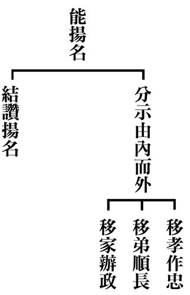

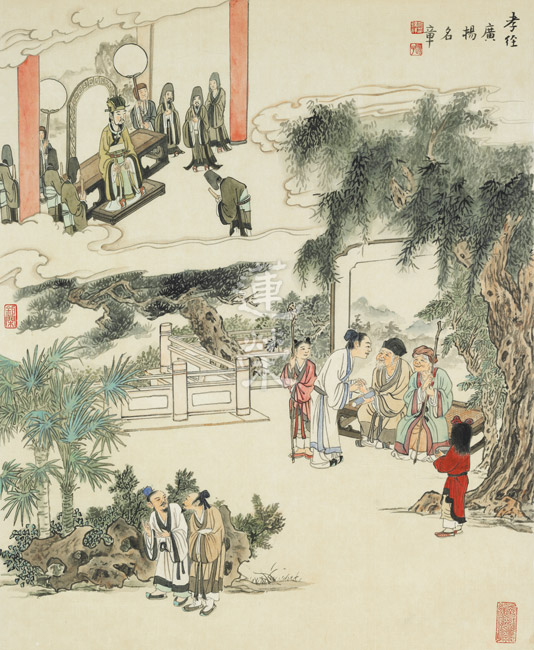

### 孔門心法—中庸之道（十二） 第十章：真正的強者（上） 南方強、北方強

*茅茹讀書會、弘毅整理*

剛柔皆可說是強

忍力之強南方強

勇捍之強北方強

聖仁之強中國強

前言

世間定義的「強」有很多，何者最強？在追求強者的境界時，是否只有更強，沒有最強？強者的頂點究竟立於何方呢？透過二千五百年前子路的一問，開啟了後人了解何謂強者的眼力；又從孔子之對答中，見識真正最強的風範。究竟如何成就天下無雙，是憑任武力，還是仰賴智力，又或者有其他超越世俗的答案？真正的強出神入化，真正的強高深莫測，真正的強就在中庸第十章：子路問強。本課程將深入探討經文旨意，針對南、北的強者一一剖析，並與現代強者相較，還原強者的真實定義。

中庸的內涵，主體是介紹「中」，但也包括在世俗法上要如何表現「中」，本章所說的真正的強者，是一個堅守中道的強者。我們一般所謂的強，在動物裡面，如獅子一吼，所有的禽獸都變得安靜，再如野狐在攻擊其他動物的時候也很凶狠。就人來說，有像李小龍這種快拳快腿的武術之強，還有在戰場上的強，如西方的亞歷山大，他的帝國橫跨歐亞非三洲，再如東方的成吉思汗，他所率領的蒙古軍隊橫掃歐亞大陸，屢戰屢勝，如果攻城受阻，一旦被他攻下的時候，他就屠城，是一個凶狠的強者，這些是男人的強。女人的強，如英國的維多利亞女王，她在位的六十三年中，英國成為日不落帝國。維多利亞女王曾經見過印度的國王，印度是英國的殖民地，太陽從東方升起，從西方落下，照的都是英國的領土，可見它的版圖之大。就軍事來講，有三個強國：美國、俄國和中國，美國曾經在廣島和長崎投下原子彈，結束了第二次世界大戰，這就是用武器來表現強。所以我們一般人所認為的強包括：動物的強，人的強；男人的強，女人的強；西方的強、東方的強；古代的強，現代的強；個人的強，國家的強等等。

本章所論的強包括三種：

第一種是南方強，是以柔來表現強。就如鄭國的執政大夫子產，他對國君恭敬，對百姓給予恩惠，使用百姓時，小心而又合乎義。南方強就是溫柔敦厚，恭儉莊敬，是柔中的強。

第二種是北方強，是以剛來表現強。如魯哀公十一年，齊國與魯國發生大戰，魯國的左軍元帥冉求大勝，而右軍的孟家卻大敗，齊軍就一路追殺，孟之反不怕齊國的強敵，保護部隊墊後，後來回到城門裡面的時候，他不居功，他說墊後不是因為他勇敢，而是因為馬跑得慢，這就是北方的強，不貪生怕死。

第三種是中國強，這是孔子最為讚歎的。以前黃俊雄的布袋戲，有一齣「雲州大武俠史艷文」，戲裡虛構他為明朝的兵部尚書，其中一段講到中國強：「處變不驚，莊敬自強，中國強，中國強，中國一定強，不屈不饒志氣昂，處變不驚莊敬自強。」這就是那時候的中國強。但孔子講的中國強是如顏回那樣，安住在中道，國家有道或無道都不變節，顏回才是真正的中國強。

科判分析

中庸總體科判

第十章還是在《中庸》的第二部分，即分別顯示中庸的修學法和義理。

首先是子路問強，孔子總說三類的強，分別是南方強、北方強和中國強。南方強是君子寬厚的強，用柔來表現強；北方強是勇士的強，用剛來表現強。但是這兩種強就如烘雲托月，更要烘托出的是中國強，中國強是強中強，勝過南方強和北方強。中國強有三種強，一是「合而不同」，此人可以和他人和平相處，不爭名奪利，可是也不會同流合污；二是立在中道，不會偏於事或理，他在做事時，是全理成事、圓事成理，就是能夠根據全部的道理來表現事相，用事相來表現全部的道理。而且在國家有道時，他雖然是富（有錢）、貴（地位高）、亨通，他不會改變他過去所執守的中道，叫作富貴不能淫；在國家無道的時候，他即便是貧（沒有錢）、賤（地位低）、窮（沒有出路），他也不會改變他內心所安住的中道，這種強才是真正的強，是強中強。

經文：

子路問強。子曰：南方之強與，北方之強與，抑而強與。寬柔以教，不報無道，南方之強也，君子居之。衽金革，死而不厭，北方之強也，而強者居之。故君子和而不流，強哉矯。中立而不倚，強哉矯。國有道，不變塞焉，強哉矯。國無道，至死不變，強哉矯。

消文：

子路問強者的形象。孔子回答說：你問的是南方的強呢？還是北方的強呢？還是你所要學的強呢？心胸寬廣並且能夠替他人著想，以這種心量來教化他人，當對方無理取鬧，或者辱罵你、傷害你，乃至面對惡人、小人的障難、迫害，都不會去報復，這就是南方的強。這種以柔來表現的強，是君子內心的意境。

以武器和盔甲為席，枕戈待旦，隨時準備作戰，就算戰死也不後悔，這是北方的強，是勇士內心的意境。

因此君子入世既能與他人和諧相處，又能堅守原則，不諂媚巴結、同流合污，這樣的強才是強中強。能夠立於形而上的中，不倚靠在世俗法上，不會被境界所轉，或者不偏於事或理，這樣的強才是強中強。當國家有道時，君子能夠被任用擔當重任，但仍然不會改變他們沒有出路時的道心，富貴不能淫，這樣的強才是強中強。當國家無道時，小人在朝把持朝政，君子即便窮苦潦倒，地位低微，在世俗上沒有出路，面對親友亨通發達，他們內心隱微處都沒有一點羨慕仰望，乃至到死都不會改變，貧賤不能移，這樣的強才是強中強。

釋義

「與」，同歟，語助詞。「抑」，還是，轉折詞。「而」就是你的意思。「寬」就是心量很大。「柔」就是替別人著想。「以教」就是以寬柔的心量教化他人。「居」有兩種含義，一種是身體所住，另一種是內心所安住，現代很多人是身體有地方住，可是內心如孤魂野鬼一般飄來飄去，無所安住。「之」是代名詞，代指「寬柔以教，不報無道」，「居之」就是內心安住在「寬柔以教，不報無道」的境界裡面。「衽」是席子，「金革」是武器和盔甲，「衽金革」就是以武器和盔甲為席。「不厭」就是不會厭倦、討厭。「強者」就是指勇士。「和」要依禮來和，依禮進退，以大局為重，不和他人爭名奪利，通達人情世故。「矯」就是強的意思。「不倚」，不倚靠世俗法，或者解釋成不偏於事或理。

析疑

一、本章與前章有何關聯？

第六章講到舜是一個能夠行中道的人；第七章感嘆世間人不是在世俗中打滾，就是學中道半路退轉；第八章讚歎顏回是一個能夠安住中道，而且入世能和的人；第九章感嘆治國的人才，甚至是可以赴湯蹈火，割讓功名，拱手讓江山的人，都不如內心安住在中道的人；第十章更說這樣的人才是真正的強者。所以其實六、七、八、九、十章，也可以另做架構來說，中庸不一定是三十三章。

二、子路此問之目的為何？

子路本來就是一個強者，《論語‧公冶長》篇裡說，「道之不行，乘桴浮於海。」就是孔子說在中原不能推展道，誰敢跟他坐著一條破船到海外行道，大家各有顧慮，不敢回應，只有子路願意跟隨，所以孔子說「好勇過我，無所取材」。難怪子路過世的時候，孔子哭於中庭，因為那是革命情感。所以子路在孔子的心目中本來就是一個強者，那他為什麼還要問強呢？就如富可敵國的子貢問孔子什麼叫做萬貫家財？孔子會不會覺得很好笑？其實子路是很想知道孔子心目中的強，到底長什麼樣子？他有沒有符合老師內心的想法？如果從這個角度來看的話，子路就是一個好問而學的人，我們很多人讀書是沒有疑惑的，真正會讀書的人是在沒有疑惑中去找疑惑。

三、孔子之答有何妙處？

孔子答的妙，強不是只有以剛來表現，柔也可以表現強，而且當安住在中道，國有道、國無道都不變的時候，那才是強中強。

四、該如何理解「強」的真正內涵？

《易經‧乾卦》裡面說，「天行健，君子以自強不息」，就是說天體的運行是沒有停止的，君子的強是周而復始的。總說君子的強，就是每天認真的、努力的實踐正道，包括聽聞、思惟、串習教法，或者是自行化他，度己度人，就像勤勞的農夫每天種田那樣。

五、南方強是強在什麼地方，又以何為典範？

行忍者，乃《佛遺教經》裡面說，「忍之為德，持戒苦行所不能及，能行忍可名為有力大人。」南方強是一個能修忍的強，包括順境和逆境的忍，這是那些認真斷惡修善、持戒苦行的人所不能比的，能夠忍辱的人是有力量的人。就正面來說，這種人以忍來保護他內心的寬柔和仁心，來教導大眾。就反面來說，當別人無理取鬧，甚至傷害他的時候，他不會與人身體衝突，言語不會尖酸刻薄，乃至內心都不會起瞋恨。一般人做善事時都是憑著意氣之勇，可是當遇到逆境時卻不能忍辱，那也就不能負重了，身體行動上即便開始時抱有熱忱，可是終究難免半途而廢；言語上不能與他人溝通、協調，只會發牢騷、埋怨，甚至推諉過錯；內心則是自以為是，煩惱重重。所以雪廬老人才說，諸弟子們有一個字是比不上他的，弟子們說了很多，雪廬老人都說不是， 最後他說「就是忍！」所以南方強是一個柔的強，是一個能忍的強。

南方強的典範：

（一）東漢劉寬，寬對侍婢湯污身

從中可見劉寬的修養非常好，不會惱怒於人，雪廬老人也曾讚歎東漢的劉寬是一個能夠忍的強。

（二）呂文懿公，不計鄉人醉酒罵

《了凡四訓》裡講到，呂宰相告老還鄉的時候，大家都非常佩服他，尊他為「泰山北斗」，就是眾山與眾星之王，有一個鄉人喝醉酒罵他，呂宰相不跟他計較，叫做不報無道。

（三）清張英，教子不與人爭地

清朝宰相張商英的兒子與他人爭奪土地，他寫信告訴他父親，認為有當宰相的父親作後盾，而且對方是無理取鬧，絕對可以把土地要回來，結果打開回信一看，上面寫道：「千里來書只為牆，讓他三尺又何妨。萬里長城今猶在，不見當年秦始皇。」

（四）趙藺相如，示弱廉頗為大局

趙國宰相藺相如，處處對廉頗示弱，他是為了趙國的大局和黎民百姓的安危，所以不在乎個人的屈辱，以忍辱維護仁心，以大局為重。最終，廉頗深受感動而負荊請罪，二人同心協力輔佐趙國。

六、南方強為何是君子居之？

因為君子可貴的就是他的胸懷，外相修的是忍辱度，內心安住的是仁厚之道，這就是君子的形象。顏回有一分就是南方強，因為曾子在讚歎顏回的時候，說他是「有若無，實若虛，犯而不校」，當別人冒犯顏回的時候，顏回也不計較。

七、北方強是強在什麼地方，又以誰為典範？

南方的強是強在柔，北方的強是強在剛；南方的強是強在文，北方的強是強在武。

北方強的典範：

（一）史可法衣不卸甲

史可法曾在安徽任鳳陽和廬江的兵備道，有警報時，他往往幾個月不就寢，和士兵一起坐著守夜，當晚上起夜的時候，盔甲上的冰霜「咔啦咔啦」的掉落下來。史可法本來是一個黑黑的、矮矮的、眼睛炯炯有神的書生，可是也可以表現出北方強。

（二）關公刮骨療傷

關公曾被毒箭射中手臂，請來神醫華佗為他治病，治療時關公手臂鮮血淋漓，卻能一邊喝酒一邊下棋、談笑如常。岳武穆曾說過，文官不愛財，武官不怕死，國家就會興。劉備雖處三國之弱，可是國家就是仰賴這些文臣武將，才能安邦定國。

（三）子路結纓而死

子路在衛國被圍攻時身受重傷，要被殺的時候，他還記得老師的教誨，於是要求把帽帶結好，而後從容就義，被剁成肉醬，孔子傷心欲絕，終生不吃肉醬。子路死的時候是六十三歲，是為「子路結纓而死」。

八、南北方的強者，何以有如此差異？

南方以柔來表現強，北方以剛來表現強，因為南方是水鄉澤國，物產豐富，女人漂亮、婀娜多姿，男人文雅，「一方水土養一方人」，在這樣的環境裡所形成的就是以柔來表現強。北方是天寒地凍，謀生困難，要跟大自然鬥，在畜牧當中忍苦悍勞，練就一身強健的筋骨，所以北方的個性跟南方不一樣。

九、南方強的君子與北方強的強者孰強孰弱？

這就如說物理考一百分和數學考一百，誰比較厲害？這是不能比較的。南方以柔來表現強，是維持他寬厚的心胸，忍辱負重，但不能失去原則，懦弱無能，或者同流合污；北方以剛來表現強，是能夠護持正法，保國安民，而不是爭強鬥狠，不問是非，不講道理。

總結

一、師生問答顯真強。

子路是北方強的個性，當他問強時，孔子告訴他除了南方強、北方強之外，更重要的是中國強，這叫作「如切如磋，如琢如磨」，孔子想讓子路更上一層樓。

二、南柔北剛皆是強。

君子如果能選擇以剛來維護正統，而且可以從容就義，真是北方強的形象。如果溫柔敦厚，又能夠安住正道，那也是表現南方的強。

三、人有南北性卻無，觀機逗教入中道。

總而言之，南方的強有時可以以柔克剛，北方的強有時可以勇悍來行仁道、王道，這也是一個維護道統的殊勝方便。南方強和北方強都可以脫胎換骨，變成中國強。教育並不是把大家都剃成平頭，讓大家個性一樣，而是順著個性去發展，就如孔子那樣「觀機逗教，循循善誘」，順著北方勇悍剛毅的個性，進入北方強，進入中道；順著南方溫柔敦厚的個性，進入南方強，進入中道，最後能夠引入聖賢，這才是真正的大教育家，這才是孔子之道真正的內涵，真正的風采。

問答

**問：** 本章講到南方強是寬柔、不計較，不報無道，為什麼是強者的形象呢？

**答：** 此章所說的寬柔是就禁得起考驗的那一分說強，而不是寬柔本身是強。比說，一個人心量廣大，能替別人著想，而且在面對挫折、障難、逆境或者是侮辱這些考驗時，都禁得起考驗，這才叫作強。所以強可以用柔去表現，也可以用剛去表現強，剛能表現強，也是說他能禁得起考驗，尤其在生死交關的時候，他是禁得起考驗的那一分說強。

**問：** 南方強是否可以說是文德，北方強是武德呢？

**答：** 文和武後面都要加一個德，否則不能顯示出南方強和北方強。如果北方強是那種爭強鬥狠，像三國裡面夏侯惇那些人，則不能叫作北方強。如果是有武德的，如軍人保家衛國，才叫作北方強。一般都認為民主國家裡面，那些集會的、打架的、鬧事的人好像是強，俗話說，「勇於內鬥，一定是怯於外戰」，因為他們的內鬥都是為了保障他們個人的利益，當有一天國家遇到安危的時候，他們不會去保護他人的利益，相反是犧牲別人的利益。所以，北方強和南方強是具備武德和文德的，而且是禁得起考驗的。

**問：** 南方人如果能夠做到南方強，北方人能夠做到北方強的話，是不是就已經不錯了？

**答：** 如果他是不學道的人，這已經是不錯的。但如果他是一個有心要脫胎換骨的君子，如此章裡面所說，君子和而不流，中立而不倚，君子是有心要去入世、維護道統、辦教化的人，他不只能是南方強或北方強，他要進入中道強，這要透過聞思修才可以的。所以冉求曾經跟孔子說，「非不說子之道，力不足也」，孔子說不是冉求力不足，而是「今女畫」，是你自己畫地自限，不可以把自己鎖在一個境界上，人是要有步可進的，是要突破瓶頸的。

**問：** 有人說：南方強，北方強，不必加「人」，北方是馬也強，鷹也強，乃是代表一方，不是只是指人而已，這個說法可以採取嗎？

**答：** 此章從頭到尾都是在講人。北方強就是衽金革，死而不厭，每天備戰，睡時躺在武器和盔甲上面，而且死而不悔，就是說那種行軍作戰，為國為民，馳騁疆場，不怕死、不怕難，這是指人。寬柔以教，不報無道，這是南方的強人，也是指人，這是很清楚的。

**問：** 不報無道是否是就私人上來說，是以德報怨，如果是在公家上來說，應該是要報無道，以直抱怨？

**答：** 不報無道是說，我私下可以以德報怨，可是在公家的立場上要以直報怨，所以老子主張以德報怨，孔子主張以直報怨，不可以把公家的資源拿來以德報怨、做人情，這裡說的不報無道，是特別講處世的胸懷，而秉公處理又另當別論。

**問：** 是否可以說在打天下或抵禦外侮時，要用北方之強；而治天下或者強國對待弱國時，要用南方之強呢？

**答：** 抵禦外侮的時候，本來就是北方強；治理天下的時候，或是強國對弱國的時候，本來就是南方強。尤其是在維護世界秩序的時候，是要同情弱者，而不是修理弱者，美國最大的麻煩就是修理弱者，害怕強者，所以他當然不能維持世界的局勢。

**問：** 上一章講到知易行難和知難行易，是否可以說，對北方是知難行易，而對南方是知易行難呢？

**答：** 這兩個都是「知難行易」，知難就是說它裡面的內涵不容易知，不是我們表相看得這麼簡單。文德和武德的內涵，都要講究公心、利人，是用柔還是用剛來表現強，而不是我們所認為的那麼簡單，要先學裡面的內涵，否則就可能以為爭強鬥狠、剛愎自用、師心自用強，自私自利是不能成為強的，有些人吵架的時候，聲嘶力竭，非得到自己的利益不可，但這不是強。所以一定要好好了解內涵，不能從表相來決定。當知道裡面的內涵，做起來就容易了，否則要怎麼做呢？這叫知難行易。可是下聯叫作知易行難，這是說你以為表面上很容易，可是行起來是難的，因為你根本不知道內涵，所以叫作知易行難。

**問：** 如果把北方之強的覺受，拿來用在上求中庸之道，就像「朝聞道，夕死可矣」，而把南方之強來下化利益大眾，這樣是否可以呢？

**答：** 可以這樣延伸來看，把北方強的個性拿來求學，好學不倦、精進勇悍的來修學正道，不達到目的絕不終止。我們求學的時候，就要像在天寒地凍當中，可以忍苦悍勞。有一個故事說，有一群人跟著老師天寒地凍，吃的、穿的、住的都不好，所以他們師兄弟商量說，我們回家吧，這個生活太難過了！有一個就說，這種天寒地凍的生活，我們如果都忍受不了的話，我們怎麼會知道這個道是難求的，有時候要靠這些境界來幫助我們對道的體會，才更珍惜所學的道。如果道是在吃喝玩樂中別人硬塞給我的，我們很難珍惜。有時候從小到大一路學上來，他不會珍惜，反而在外面漂泊以後，終於碰到正道的時候，他珍惜的不得了！這叫作「眾裡尋他千百度，驀然回首，那人卻在燈火闌珊處。」所以用北方強的覺受來學中庸之道是可以的。南方強來下化眾生、厚待眾生，不要跟眾生為敵，而且能夠包容他人，當他人犯了過失的時候，你要站在他是無知的立場上原諒他，這也是可以的。

**問：** 老子崇尚以柔克剛，「上善若水」，「天下之至柔，馳騁天下之至堅」等等，是否是指南方之強呢？

**答：** 不是，老子的強是中道強。《孫子兵法》是奇道，但是它所依的是正道，老子和孔子是孫子兵法的本質，我們可以從孫子去看老子和孔子。孫子講「道天地將法」，「道」就是以正道治國，這樣國家才有戰力，如果不用正道治國，老百姓離心離德，部隊都不願打仗，三家大夫在國內內鬥，軍隊出去都不想為他們打仗。「天」就是時機；「地」就是所處的地理的位置；「將」就是為將者，如冉求、子路；「法」就是紀律；「禮」就是紀律的本質。其實整部孫子兵法，一言以蔽之，就是《論語》裡面所說的「臨事而懼，好謀而成。」「多算勝，少算不勝，而況無算乎？」孫子的本質也是孔子。至於老子的「上善若水」，「天下之至柔，馳騁天下之至堅」等等，其實都是站在中道來看怎樣入世的。

**問：** 越王勾踐臥薪嘗膽算不算南方之強忍辱的典範呢？抗日戰爭時期的二十九軍大刀隊是否是北方之強的典範呢？

**答：** 勾踐臥薪嘗膽的忍辱這一分，可以算是南方強。可是南方強其實是寬柔的，而勾踐是要報復，所以本質上有一點不同。勾踐後來復興時，縱情於聲色，可見他的忍辱是為了個人的私利，如果真的是為公家，那打敗了敵國後，不會這樣治國。二十九軍張自忠的大刀隊真的就是北方強，中國抗日戰爭時期，有很多的部隊就真的是不知道死的北方強。所以日本緃然有精密的武器，其實打不垮的是中國部隊捍衛國家的決心，那就是北方強的個性。

**問：** 老子主張「以德報怨」，孔子主張「以直報怨」，何者的境界比較高？

**答：** 就好像數學考一百分和物理考一百分，這兩種境界是不能比較的。老子的「以德報怨」是跟人相處的時候，要像此章所講的「不報無道」，別人無道，我也不報復他。可是處理公家的事情時，不能以德報怨，所以孔子才會說，如果他人用怨，你用德來報，如果他人用德，你就不知道如何回報了。孔子和老子是從不同的角度來看問題的，不能一概而論。

**問：** 有註解說，這一章是孔子以中庸之強來抑子路的剛氣，可以採取嗎？

**答：** 不行。孔子從來沒有壓抑子路的剛氣，孔子曾評價子路是「好勇過我」，這個人是「無所取材」，就是找不到有這種勇氣的人。此章只是說，孔子想要把南方強和北方強向上引入中道強，而並非是壓抑子路的北方強。我們的教育不能壓抑人的個性，而是應該順著人的個性去發展，但是發展的方向要對，方法要恰當。

**問：** 南方強是以寬柔的胸懷教化他人，還是以寬柔為宗旨來教化人，或是具備寬柔的教養，何者為是？

**答：** 應是第一個。寬柔以教，就是以寬柔的胸懷來教化他人，但也不妨說，是寬柔的教導他人，以及具備寬柔的教養。但是解釋為以寬柔的胸懷來教化他人更好，因為君子本來就是要教化他人的。所以孔子才跟子夏說：「女為君子儒，無為小人儒」。

**問：** 有注解說，這一章是孔子諷罵子路自以為最強，是否有這個意涵呢？

**答：** 此章只是子路問強，孔子回答南方強和北方強，強可以用柔或剛來表現，還有必須要學的強就是中道強，但並沒有在壓抑諷罵子路。《論語》中子路問孔子如果去打仗，三千弟子當中，用誰統率三軍？孔子只是說，當一個將軍不可以莽撞行事，要「臨事而懼，好謀而成。」《孫子兵法》十三篇，一言以蔽之，叫作「臨事而懼，好謀而成」，此章不是罵子路自以為強。

**問：** 有一句成語叫「以柔克剛」，是否代表柔比較強呢？

**答：** 以柔克剛的柔是說可以堅持到底，不受境界所轉，內心很柔順，不跟對方起衝突，但堅持自己的原則，是辦事很重要的修養。所克的剛是指那種火爆脾氣，爭強鬥狠，或者是三分鐘熱度，英雄氣短，這樣來說以柔克剛。但是並不代表剛就一定被柔克，那種真正自強不息的剛，也是另外一種強。

**問：** 剛柔並濟，符不符合中道呢？

**答：** 中道不一定是剛柔並濟，中道有時候選擇剛，有時候選擇柔，這是不一定的。如顏回在某種場合表現為剛，某種場合也會表現為柔。所以《孔子家語》裡面，孔子說子路能剛，可是不能柔，而通達中道的人，如孔子和顏回，他們會根據時機來選擇剛或者柔。中道可以是剛柔並濟，但剛柔並濟不一定是中道，叫作若Ｐ則Ｑ，但若Ｑ則不一定Ｐ，這就是邏輯推理。

**問：** 論語裡談到「棖也欲，焉得剛？」這是屬於哪一方的強呢？

**答：** 孔子把剛定義在「無欲則剛」，南方強和北方強都可以是無欲的，文官不愛財，武官不怕死，都是無欲的強。比如「寬柔以教」，可以是無欲的寬柔，「衽金革，死而不厭」，也是無欲的強。如關公，雪公老師說，「你看關老爺不如，我看比天還大！」。所以寬柔可以無欲，也可以有欲，強可以無欲，也可以有欲。那些爭強鬥狠，為保障自己利益的抗議之士，不能稱為強，意即沒有膽量的人，表面上可能很凶悍像流氓，但其實是小混混而已。

所以要像子路、史可法、張巡、許遠，這才叫強。而不是那種欺善怕惡、爭強鬥狠者。荊軻若有讀中庸，就不會找秦武揚刺秦王，秦武揚就是在鄉裡面爭強鬥狠、欺軟怕硬的人，結果荊軻帶著秦武揚去見秦王，秦始王一邊翻圖，一邊看後面的秦武揚，秦武揚嚇到腿都站不起來，秦王懷疑一定有詐，果然圖窮匕見。

**問：** 為什麼要用君子來彰顯南方強，而用強者來彰顯北方強呢？

**答：** 因為君子本來就是「溫柔敦厚，詩教也」，那是君子之教。一般來講，不容易在君子身上看到北方的勇，而用柔來表現的南方之強，一般人看不出來，但是用勇者來表現強，一般人容易看得到。可是君子不能只居在南方強和北方強，君子還要進入中道強，該剛則剛，該柔則柔，或者剛柔並濟，從容中道。

**問：** 君子是外王之道的圓滿，再後面論述中道之強的時候，也用君子來表示，通篇都是論強，卻在北方強用勇者來論述，這樣是否會造成本章文義上的混淆呢？

**答：** 不會，因為一般人本來就認為強者的形象是北方強那樣，這是孔子隨順世俗來說。孔子沒有否定世俗，可是他還要從世俗以外的面向來說南方強和中道強，這是孔子「烘雲托月」的做法。就好像看一個人可以從正面看，反面看，側面看，怎麼看都是這個人。南方強和北方強的核心處都是中國強（中道強），所以一個國家如果以中道來治國，就叫中國。所以並不是說中道強是君子，而是說君子入世的時候，不能只有南方強，還要懂得中道強，以形而上的內涵來入形而下，這是真正君子的圓滿形象。所以孔子有時候被稱為聖人，有時候被稱為君子，孔子被稱為君子的時候，並不代表孔子沒有聖人之德；被稱為聖人的時候，並不代表孔子沒有君子的胸懷。入世的君子要有中道的概念，他才知道何時顯現為南方強，何時顯現為北方強，何時要剛柔並濟。

**問：** 仁者無敵，是否是南方強的形象？

**答：** 仁者無敵，如果這個仁者是屬於形而下的話，或許是南方強，但是如果這個人是進入中道以後，他有時候也是有北方強。仁者無敵包括，仁者心中是沒有敵人的，還有仁者不會有外患，或者外患不會成為他的患。自古以來，仁君治國的時候，沒有內亂，也不會有外患，即便有外患，也不會是他的患。《孫子兵法》裡面說，在廟堂開始算計的時候，道天地將法，我通通具足的時候，其實還沒出兵，早就知道一定會贏。這叫做運籌於帷幄之中，決勝於千里之外。所以仁者無敵，既可以是南方強，也可以是北方強，既可以溫柔敦厚，也可以表現勇悍。

結語

孔子溫柔敦厚，不怨天、不尤人，這是南方強；可是孔子在夾谷之會的時候，義正嚴詞的斥責齊國，不應該以夷狄之道來對待魯國，然後當齊國以兵車一百輛來威脅時，孔子以兵車兩百輛來回應，這就是北方強。所以只有通達中道的聖人才能夠拿捏分寸恰到好處。我們如果把書讀懂讀通，才會知道該進該退，才知道真正的取捨之道。

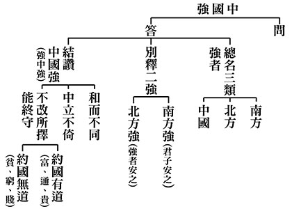

## 藝術賞析

### 孔門七十二賢淺說（二十八）—冉季

圖／江逸子 、 文／時哉

王者之後不愧姓

受命傳道不辱師

名聲或隱不識賢

升堂受封表平生

伯冉季，姓冉名季，字子產，春秋末年魯國人，是孔門後起之秀。精通六藝，為人莊重博學。

冉季在孔門下學習，奉夫子之命絳帳設墊，廣納學子，終身不問仕途。宋高宗贊曰：「東平子產，姓著盛時。奉師於塾，講道之微。答問甚敏，淵妙以思。升降陛簾，尚想英姿。」冉季（子產）被封為東平伯，在周文王時其子季載封於冉，其後以地為氏，所以他的姓在周初盛時是受尊重的。奉師孔子之命講道於私塾，能將道講得精微，條理分明，答問也十分清晰敏妙，為孔門同窗所敬重的傳經人，桃李廣被，講學的英姿留給後人無限的追思，為世人留下崇高的師範。

冉季於東漢明帝永平十五年入祀聖廟，唐開元年追封為東平伯，宋朝封為諸城侯。

古七十二賢畫像，冉季與奚容箴並列於一張畫，兩人相互交談。今見冉季畫像，雖是獨自一人，但形貌像是正與左手邊之旁人對談，與古作之意境有相彷之處。他頭戴方巾，臉型可知是個方正之人，由蹙眉捻鬚的表情，似是任重道遠的承擔，左手持劍柄，想必也是位行義之士。

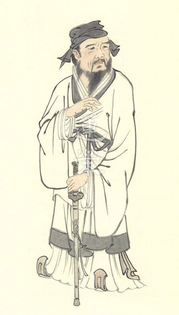

### 孔門七十二賢淺說（二十九）—公祖句茲

圖/江逸子 文/時哉

能從遠來習聖教

端正於禮文質佳

綠葉能托花取勝

大賢助成聖教揚

公祖句茲，複姓公祖名句茲，孔子家語稱公句茲，字子之，山東兗州府人。從齊國來隨孔子學禮，成效顯著。

宋高宗贊曰：「惟彼子之，錫伯期思，與賢並進，得聖而師，彬彬雅道，翼翼令儀，正目至言，廟食不隳」，說這位公祖句茲是唐朝追贈的齊思伯，與其他大賢一同上進，能夠受教於聖人孔子，在學習上合於正道，是一位文質彬彬的君子，儀容風範十分的美好，眼正而不邪，口說合於義理的話，因而能夠受享後人的祭祀不中斷。從贊辭內容可知，公祖句茲在孔門中也是以習禮見長，而且是一個行事嚴謹之人。

《論語‧八佾》篇載，子曰：「夏禮，吾能言之，杞不足徵也。殷禮，吾能言之，宋不足徵也。文獻不足故也，足，則吾能徵之矣。」三代之禮樂文獻，至周，可謂完備。

成王感周公樹德於周，特賜魯國享周天子之禮，孔子則集其大成。禮的根本，是仁孝誠敬，又有衣冠文物等文獻端正倫常，讓世間有儀範可循。公祖句茲從孔子學，可謂深入禮的內涵精神，氣象可觀。

公祖句茲在東漢永平十五年入祀聖廟，唐玄宗追贈期思伯，宋朝加封為即墨侯，明朝嘉靖年間改稱先賢公祖子。

畫中的公祖句茲胖得可愛，似乎是一個具有幽默感的人。遠望思量，左手執持佩玉好像在警惕著自己，處世言行必當合於義、合於理。

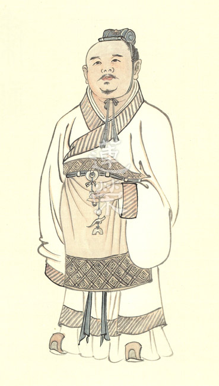

### 華夏精魂千秋（二十八）— 明倫史畫 教化遼民 管寧

圖／江逸子 、 文／淨域

或為遼東帽

情操厲冰雪

一生是堅持

完成在人格

史畫

管寧，字幼安，東漢青州北海國朱虛(今山東省臨朐縣)人，生於桓帝延熹元年(西元一五八年)，卒於曹魏齊王(曹芳)正始二年(西元二四一年)。生性恬澹，不慕榮華，十六歲喪父，孤身又家境貧寒，親友濟助財物品以供殮葬，管寧推辭不接受，堅持自力處理父親的喪事。

他與華歆、邴原為友共學，人稱一龍，歆為頭、原為腹、寧為龍尾。某回，管寧與華歆同在園中鋤地，掘出一塊金子來，管寧視若瓦石不動心，而華歆高興地拾起察看，才不捨地拋於一旁。又一回，兩人同席讀書，有高官車馬雜沓鑼鼓喧天經過，管寧依樣坐著讀書，華歆卻跑到門外觀看。管寧認為彼此志趣不合，即拔刀割開坐蓆與之絕交。日後華歆投靠曹操，貪求榮利做了不少壞事。

東漢末年黃巾賊作亂，管寧與邴原前往幽州遼東郡避亂，雖太守公孫度邀請住於官舍，但他情願在山谷裡搭茅廬自耕自食。前去遼東避亂的人愈來愈多，日久山谷聚成小村落，管寧便設學堂講授詩書，並以身作則引人向善。

當時村人常為了汲水而爭吵，管寧私下買來許多水桶，汲滿水分置於井邊供人取用。後來村人知道是管寧所為，慚愧之餘而互相謙讓，不再為汲水而爭吵。又有一回，村人的牛跑到管寧的田裡吃作物，他將牛牽到蔭涼處餵食牧草，比牛主人更為善待牠。牛主人感動之餘，此後加倍小心看管牛隻。由於管寧的親為善教，原本化外的遼東之地，漸成為禮儀之邦。

管寧的妻子早死，有人勸他再娶，但管寧卻說：「每省思曾子『吾日三省吾身』之言，及想到漢成帝時任少府的王駿，妻子過世後未再續弦，人們問他理由，即說：『我的德行不及曾子，孩子王崇也不如曾華、曾元，怎麼敢再娶呢？』的話，每每讚歎不已，又怎能因遭逢妻子早逝，就違卻了本心呀！」

魏王曹操多番徵召不成，直到魏文帝曹丕黃初四年(西元二二三年)，考量遼東將有亂事才返鄉。期間華歆多番力薦，雖文帝授以太中大夫、明帝拜為光祿勳，乃至齊王曹芳下詔以「安車蒲輪，束帛加璽」之禮相請，皆以老弱為由請辭。管寧一生教化鄉里，澹泊以明志，八十四歲以病終老。

圖解

《世說新語．德行篇》載：「管寧、華歆嘗同席讀書，有乘軒冕過門者，寧讀如故，歆廢書出看。寧割蓆分坐，曰：『子非吾友也！』」日後世人即以「割蓆分坐」，表示朋友間因志趣不合而各行其道。

東漢末年，華歆、邴原、管寧三人共學，時人稱譽為「一龍」；其中華歆為龍首，可見才氣以華歆為第一，而管寧屈居龍尾。然就掘地出金觀之，管寧視若未見，華歆拾而賞棄，二人對於利益當頭，管寧之志節高於華歆甚多，於日後所現昭然若揭。

江老師所繪圖作，特別彰顯管寧教化遼東之功。圖左的井邊汲水，村民秩序井然，不再爭先恐後，全係受管寧為公發心所感召。圖中管寧設席講學，不因偏地仍善教，使得遼東地區成為禮儀之邦。又因其善教所以揚名，圖下三人竊竊私語，即是揚其好名。是以，遠在中原的魏王曹操，都想盡辦法要召他入朝佐政。若非遼東有亂事，他必以教化偏地為志業。當其回到中原，雖魏文帝、明帝屢屢授職加勳以禮相請，其仍不為官銜利祿所誘，澹泊明志，依然致力教化於鄉里。

此較之於位列相侯的華歆，雖官家評其：「深慮國計，年德名望，清而不介。」但多是就事功而說。《三國演義》作者羅貫中，將華歆描寫成是趨炎附勢、助紂為虐的政客奸臣，故詩云：「華歆當日逞兇謀，破壁生將母后收。助虐一朝添虎翼，罵名千載笑龍頭。」何以評價兩極化呢？華歆是個不可多得的人才，但聽令於曹操捉拿伏皇后，協助曹丕篡漢登上帝位，卻讓他揹上千古的罵名。所以，當華歆位居司徒，百般薦舉管寧而辭退不受時，更見出管寧德性之高潔，及割蓆絕交的先見之明。

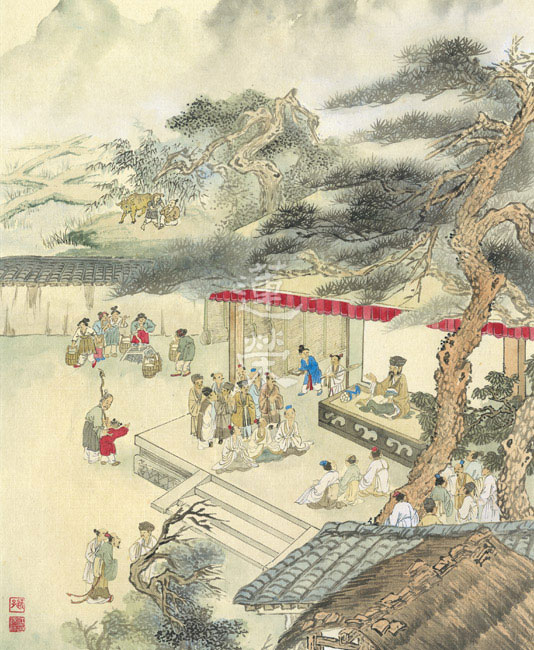

## 專題報導

### 亞馬遜雨林大火與冰川融化之反思

楊茹軫

文明演進享受多

破壞自然難復原

犧牲後代子孫福

環保執行挽劫運

二○一九年的夏天，大火持續摧毀亞馬遜雨林，以平均每分鐘燒掉一‧五座足球場的速度肆虐延燒，令人怵目驚心。

亞馬遜雨林是全球最大雨林，面積約為臺灣的一百五十二倍。其存在有效減緩全球暖化，因而有「地球之肺」的美稱，它也左右了南美洲各地甚至更遠地區的天氣模式。亞馬遜雨林有六成面積在巴西境內，因此這場大火大家紛紛把目光投向巴西，然而早在這個夏天之前，早在我們關注亞馬遜雨林的大火之前，它所承受的幾乎到達不可恢復的臨界點。

巴西土地每年都會遭受大面積的火燒，除了每年七月到十月因亞馬遜地區的旱季導致火災，還有為了取得農業用地而放的火。年年都有火災，為何獨獨今年受到萬眾矚目？因聖保羅市的一場黑雨，這場燒了半個世紀之久的大火，終於得到全球的關注與重視。

為了發展經濟，巴西政府與私人企業合作，將許多樹林砍光、燒淨，並開始養牛，種植稻米、甘蔗與大豆，此外還有許多礦場與伐木公司進駐，提供當地居民更多就業機會。這樣的發展模式在短短幾年內，的確為社區、國家帶來豐厚的收入，但這些欲求不滿的私人企業，砍伐完珍貴的樹木時，便會虎視眈眈繼續吞噬下一片森林，只留下過度開發、難以回復的生態浩劫。

十九世紀中，因應全球與日俱增的肉類需求，大豆的產量已不足以維持畜牧業的發展，於是在美國農業學家的研究下，經過雜交育種與基因改造後，培育出適應溫暖氣候的大豆品種，巴西是全球重要的農作物生產地以及出口國，是世界重要糧倉，不僅玉米、蔗糖、咖啡產量在全球首屈一指，也是僅次美國的第二大大豆生產國及出口國。在中美貿易戰的推波助瀾下，大豆更顯得有利可圖，中國對於大豆的需求，從美國轉向巴西，許多巴西人看準商機，將經營數十年的田地重新整治改種大豆，更甚者不再使用同一塊田地，明明只需休耕一年就可以再次使用田地被拋棄一旁，為了獲取更多的利益，商人轉而去燃燒一片又一片的森林，人類的貪婪終於引發不堪想像的後果。

幾十年內，巴西人的飲食模式從本地農作物、水果、魚、井水和河流裡的淡水，轉變成外來飲食，隨手丟棄的瓶罐、包裝垃圾汙染了社區。由於沒有廢物管理，許多居民每天都在焚燒塑料廢物，塑料污染的情況開始惡化。而火災也經常失控，燒毀周圍的熱帶雨林。

熱帶雨林的大面積消失對當地環境無疑是一場災難，原始的生物多樣性將永遠消失，碳排放量大幅增加，濃煙飄向附近城市，影響人體健康，也導致全球氣候惡劣的變化。很多人會怪罪巴西人，為了自身的利益，不惜放火燒毀雨林，但已成定局之事不可扭轉，在雨林之外的我們，應爬梳了解相關知識，檢討自身，以身作則、推己及人，做有益社會的事。

除了雨林耗損外，由於全球變暖，冰川大規模加速融化的現象慘不忍睹，地球每年損失多達三千九百億噸的冰雪，導致海平面上升、海水倒灌。據前年科學家研究指出，南極洲冰層正在快速消融，若此嚴重危機無法緩解，那麼二○七○年之前，大約四分之一南極冰川將會融化消失，損失難以估計，生態系統亦會大幅變化，企鵝、海豹、海鳥等將會大規模滅亡，而整個海洋生態的魚類數量也會減少。於臺灣而言，部分西部濱海低窪地區將被淹沒。此外，冰川融化若截斷洋流運動，可能造成極端嚴寒的天氣。更嚴重的是水的重量會改變地殼板塊的穩定平衡，從而導致天災的頻繁與加劇，令人堪憂。

美國研究機構「氣候中心」最新研究顯示：「地球暖化造成海平面上升的情況加劇，如果碳排放量再不踩煞車，到了二○五○年，全球將有三億人遭受海水威脅，是原本預估的三倍，沿海居民被迫大舉遷徙，恐怕還將誘發治安危機，各地動亂不斷。西元二○五○年，孟買可能會被淹沒，從泰國到越南，再到上海，人類只能以水為家，在水上漂泊度日。」 CNN氣象主播說：「這無關海水上升的高度，而是關於土地海拔高度，比我們原先想的還要低」，新聞報導、研究一次次敲響警報，再不做出改變，後果不堪設想。

人類的自私，為取所需，無所不用其極，因果昭然，大自然強而迅速的劫奪、反撲，危及人類生存的基本安危，因應受傷的地球，若想亡羊補牢，必須有所作為，國際社會和許多國家政府都承諾要採取行動來保護地球，減緩氣候變暖速度。而身為老百姓的我們可以從自己的食衣住行下手，IPCC聯合主席黛博拉‧羅伯茨博士說：「個人也許無法決定土地怎麼用，種什麼，卻完全可以決定自己餐桌上要什麼、不要什麼」，我們應多吃蔬菜水果，少吃肉類和乳製品，並盡量買本地的農產品和當季蔬果。為了滿足人類的口腹之欲，世界上大量的牲畜畜養，而這些動物的排泄物，不僅釋放出二氧化碳，還製造甲烷和氧化亞氮，對氣候變遷影響嚴重，肉類中特別要少吃牛肉，因亞馬遜放火後的地域常做為牧牛場。再者，要力行節能減碳，購買環保物品、隨手關閉不用的電器、節約用水，循環再利用，並多搭乘大眾運輸工具或步行，影印時盡量使用雙面列印，或廢紙利用，以減少砍伐木材與使用紙張。三者，要時時關切國際社會議題，涉足了解國際的環保組織，與人分享及討論環保議題。恐怖的電影場景有朝一日可能真實上演，期望我們將此危機銘記在心，而非隨著新聞事件落幕而事過境遷，亞馬遜雨林與冰川融化是促進反思的開始，讓我們努力維護現有的環境，不再造作新的破壞地球的因，地球永續經營，人人有責，相互分享與提醒，保衛我們的生存地。

### 記兒住院牽引

卓瑪

生命韌性來自苦難

承擔是大愛與無私

成長乃歷練與學習

成就為各因緣累積

孩子是先天性脊柱側彎的患者，大多數脊柱側彎的孩童是在國小中年級因不明原因側彎，而先天就側彎的嬰兒更是罕見，通常會伴隨其他器官組織的異常。

養育孩子這四年多來，父母的心情時常七上八下，必須協調工作、家庭、經濟、照護、夫妻分工等之間的平衡，也得隨時客觀觀察孩子臨時出現的變異。

舉例來說，孩子三歲九個月大時常常動不動就張大嘴巴，甚至說青菜咬不斷、吞不下，起初我們以為他在開玩笑，或是偏食，免不了給他提醒與叮囑；經過一兩週的觀察，才發現這是無意識的舉動；趕緊向治療師反應，才知道有可能是因為長高導致胸部彎度增加，連帶影響下顎骨頭與咬合。如果沒有覺察生活中的小異變，父母很有可能因此錯怪孩子。

孩子的成長歷程有著必要的辛苦，在三歲以前歷經了九次肢體與局部器官的重建和整形手術，以及術後半年的復健、打了八件無法脫下的體石膏，換穿矯正背架至今、出生至今的復健與運動仍然持續進行。年幼時因為肌肉低張常常做復健做到嚎啕大哭，老師擦乾眼淚、媽媽抱一抱後繼續做，往往下課沒多久便倒頭大睡。

一直以來，我們盡可能配合醫師與治療師的建議陪伴孩子努力，但一抽高，這些努力似乎都不夠彌補他惡化的速度。今年五月我們回到醫院追蹤，側彎的度數居然惡化十多度，腰椎的度數已破百度，這樣的結果讓我們十分憂心，也難過不已。

醫師建議做牽引治療，利用重力的原理將身體拉直，爭取心肺跳動的空間，才有可能將侵入式的手術向後延期。

這項牽引治療是指將頭圈鎖在頭骨表層上，牽繩向後吊沙包，逐漸增加重量，把身體往上拉提、伸直，治療期間需住院，無論是站、坐、躺、臥都必須拉吊著沙包。

手術前幾個月，我們偶爾會和他聊即將到來的牽引治療，孩子聽到要住院、要手術、傷口會痛，說著說著就害怕的哭了。媽媽告訴他要把阿彌陀佛放在心裡，開心時、害怕時都想著阿彌陀佛陪在身邊，他是無量的光明，最有智慧的老師，會讓我們安心。心裡準備做了幾個月，以為做足了，直到進到手術室，孩子仍害怕的不敢放開媽媽的手，不斷哭喊著「媽媽我真的很害怕」，媽媽把手貼在孩子的胸口上告訴他睡著時阿彌陀佛會陪著他，媽媽也會陪著他，請他練習不要害怕，孩子在佛號聲中沉睡。即使手術的用意是為了幫助孩子，但看到孩子的害怕，仍不忍心讓孩子遭受恐懼的感覺。

手術結束後媽媽進到恢復室陪伴，從遠方就看到病床旁邊圍繞四到五位護理師，傳來孩子的哭叫聲「我好痛！」、「我不要戴這個！」趕緊上前幫忙，看到孩子雙手抓著剛裝好的金屬頭圈，企圖扯下，大哭大叫，非常憤怒。孩子看到媽媽後哭著向媽媽拜託：「媽媽我好痛，我不要戴這個，叫醫生現在幫我拿下來！我超痛！」頭殼植入螺絲處的血還沒完全凝結，陣陣血腥味撲鼻而來，為了安撫孩子，媽媽的眼淚不敢落下，只得盡力安撫，稱念佛名給他聽，期盼他能夠及早適應傷口的疼痛，減少痛苦。

承蒙佛力加被、學會師長們的迴向以及醫療團隊的細心照護，當天晚上孩子清醒後便說沒那麼痛了，情緒緩和許多，傷口也恢復得很好，疼痛感逐日減輕，術後一週便不再疼痛，只有增加沙包當天略感不適，隔天也就很快適應新的重量。

期間感恩唐老師與林老師的慈悲，讓宗徹與卓瑪二人得以輪流上班與照顧孩子，工作與家庭得以兼顧；學會大眾的關懷與鼓勵，讓我們有力量面對種種接續的挑戰。無盡感恩！

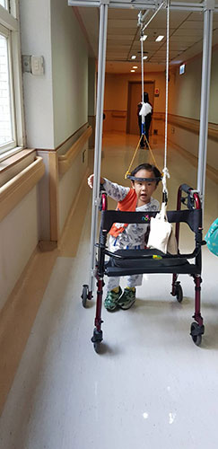

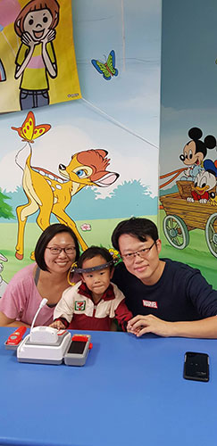

## 活動報導

### 七處徵心、二十五圓通講座報導

淨本

有朋遠來相切磋

楞嚴法會重開演

世尊上善悲與智

觀音圓通大佛頂

一場法會的興起，可以有各種的因緣，可能是弟子千里跋涉的祈請，也可能是佛陀觀察機緣成熟而無問自說；有人可以在順境中對佛法生起信心，更多的是，生命在無法突破的困局中，蒙佛救護或開導，因而生起了無比的感動。楞嚴法會的緣起非常特別，看似起於淫女的誘惑，背後卻是佛陀與阿難生生世世相隨所累積的革命情感，是故佛陀小題大作，在阿難遭難之際，從頂上放出百寶無畏光明，光中生出千葉寶蓮，有化佛在上結跏趺坐宣說神咒，佛敕文殊師利菩薩持咒前往救護，帶回了阿難及摩登伽女，法會由此開始，阿難尊者不僅因此證果，諸菩薩、阿羅漢，更在本會中宣說了自己得證圓通的妙法，給後世眾生們帶來無比殊勝的利益。

今年的楞嚴講座也是難得的因緣際會，在兩岸關係緊張的情勢下，仍有許多大陸的學員們克服種種困難不遠千里而來，馬來西亞學員人數雖然不多，但都是長時一同學習的善友。臺灣當地的學員老師們，在此之前已經興辦了一系列的暑期講座活動，大家仍不辭辛勞，一同圓滿了這次的「海峽兩岸暨馬來西亞暑期文化交流講座—《楞嚴經》七處徵心及二十五圓通章」。

講座以經典的講授為主軸，由老師帶領學長們所組成的師資團隊，在四個多月前，就已經開始了密集的培訓。七處徵心，還有六塵、六根、六識、七大，二十五種妙法，也是二十五種不同的入道因緣、二十五種不同的個性與人生，老師將他們的故事，配合不一樣的副講師資分別講授，交織出「三界無處不是繫縛，卻也無處不是解脫」的深味，課後的小組研討，學長間彼此的問難與解惑，讓大家都能一定程度上聽懂課程的內容，長養心中的法喜。

講座活動的第三天下午，學會安排了故宮博物院導覽，讓大家一同前往欣賞故宮現正展出的歷代書畫展、巨幅書畫、故宮動物園、戰國漢代玉器與國之重寶，感受佛學之外的中華文化氛圍。

適逢秋季祭祖的因緣，學會在講座的最後一天，興辦了一場地藏懺法會，透過老師拜懺前的懺本講解，讓大家直入經懺的義海，維那悅眾也在聽眾誠意的加持下，非常有默契、有韻律、有道氣地引領著大家，現場簡直如天樂繚繞令人法喜充滿。很多參與法會的大陸學員私下表示，他們一直都在感動當中，內心有如大雨滂沱，把自己身上洗得乾乾淨淨，那種心得讓人聽了非常震撼，難怪說初發心成佛有餘，若能保任這樣的善根，菩提道上必定沒有困難可以將其打倒。

每場講座都是一個開始，不會是結束，各個讀書會的成員們在學會完成了這次的課程後，紛紛準備著回去後的復習與討論，並期待下次的聚會。這樣的成果讓我們感覺到，不論教學或行政上各種的付出與服務，都是非常值得，這是學會給學員們最好的供養，學員們也回饋給學會最好的回報，這是一次最好的交流。

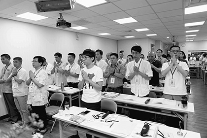

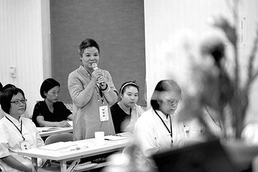

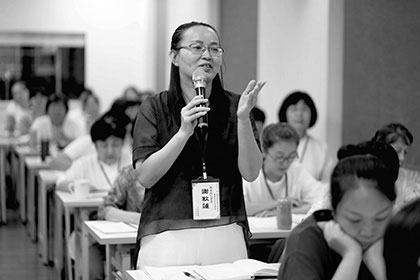

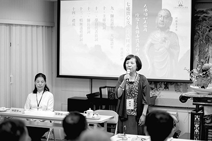

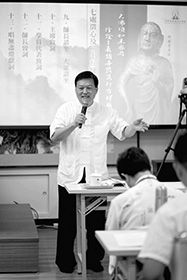

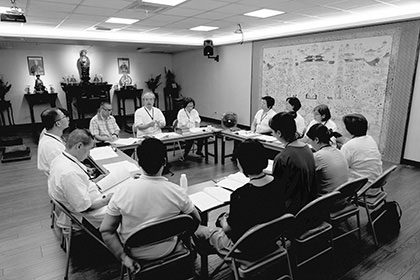

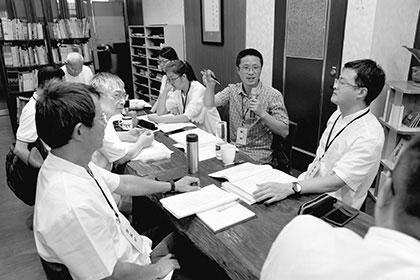

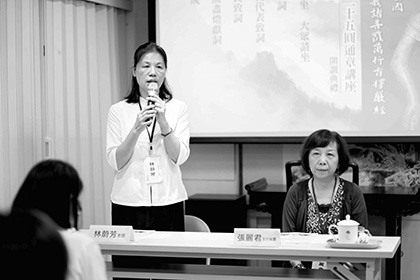

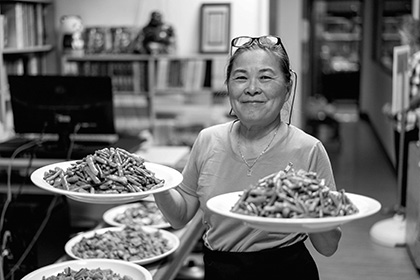

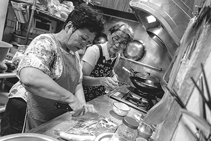

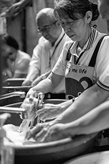

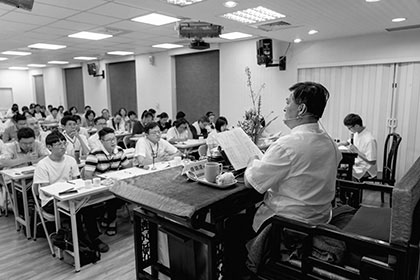

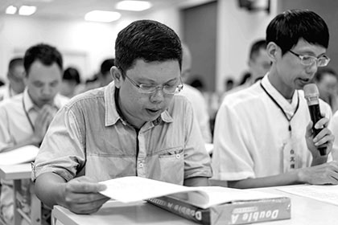

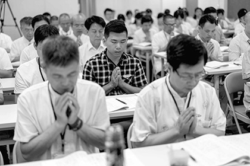

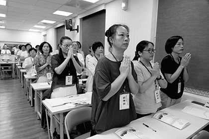

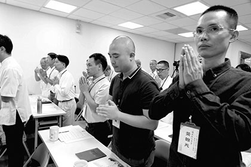

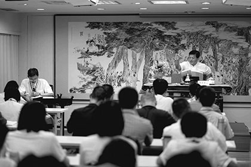

### 七處徵心及二十五圓通章講座心得

*編輯部整理*

講座歸來，物事紛紛，吾心卻安然。已滅的法會，化作今日的心燈。修行在人間，美好觀念指引日用平常的感覺，很妙。回觀此講座遊學之旅，收穫滿滿，擇要供養大眾：

一、找準癥結，從根本處解決問題

阿難遭摩登伽女之難，佛陀令文殊菩薩持楞嚴咒救下阿難後，開大會讓阿難徵心，讓諸菩薩、阿羅漢們彙報修學心得。這是佛陀對阿難最究竟的愛，因為阿難遭禍的根本原因在以心迷色。只有明白心法的真相，才不會被欲塵所迷惑。

最究竟的愛，原來是啟發對方生起正見！觀念轉變，命運才能改變。

世間紛爭，乃因世人執妄為真，以見聞覺知的這個妄心為真心，陷入固見、各執偏誤、自說自話、爭名奪利。遇到障礙時，就想著找關係，到處攀援，而不是往內找原因，增長內涵、提升自己的見地和能力。長此以往，貴人可救你一時，無法救你於一勞永逸。

覓心了不可得，並非根本無心，而是能所觀待，條件具足，心識才生起。萬法皆如此，條件具足則生、條件消滅則滅。斷惡修善，就是要觀察善惡業的條件，令惡業的條件不生，成就善事的條件。觀待而生的妄心可以令人成魔，也可以令人成聖成佛。學法者，方向既立，就要去創造成聖賢的相應條件。

任何事的解決都是如此，先瞭解問題在哪裡，才能真正解決問題。

二、沒有一蹴而就，老實學、老實修

初學者，往往急切的想多聽點，多學點，儘快的成就。如蘇洵所說，「天下之學者，孰不欲一蹴而造聖人之域」。

在二十五圓通章，二十五位菩薩、阿羅漢們報告自己證悟空性的心得，似乎都是頓悟，可是老師點睛指出，諸菩薩、阿羅漢們歷劫的修學，包括與眾生結善緣的福德，才有後來的頓悟。

正如孔子的生而知之，從累劫的困而學之、學而知之來。時間的累積，不僅是聽聞的累積。阿難的經歷告訴我們，光有聽聞，而不去實修，終不能成就。正如經文所言，「雖有多聞，若不修行，與不聞等。如人說食，終不能飽。」

若仗著多聞而不實修，反墮魔道。不耍花招，直心直行，老實學、老實修，才是學生的出路。

三、帶著使命感、跟隨傳承的腳步

二十五圓通章的菩薩、阿羅漢們不乏外道轉為佛陀弟子者。誠如老師所言，若盲修瞎練，則十人修行，五雙著魔。在末法時期，更須跟隨有傳承的明師學習，才不會反墮魔道。

很幸運遇到傳承。唐老師說，淨土相會時，可以無愧地對雪公說，此生不負師恩。課後討論時聊到這個細節，學生們都不勝唏噓：唐老師以弘法利生來感謝佛恩、師恩，這份願力和承擔，是學生們的榜樣。

最好的感恩是承傳。帶著使命來修學，以師志為吾志，才是一個合格的學生。無盡燈學會為我們點燃智慧之燈，我們也要把這盞燈傳下去。

有傳燈的願望，還須有傳燈的能力。觀世音菩薩能千處祈求千處應，是其因地上與眾生共患難，這些境界都歷練過。敦化學堂的學長們，當在老師的指引下，團隊共學、共修、共辦善事，在廣大行中歷練、找覺受，串習法義，讓自己成為堪受之才。

福州敦化學堂 ／ 孫競

學生至誠頂禮，感恩老師們的無限恩德，布施無上妙法。空性勝義，明我心目。世間妙有，暖我肺腑。甘露法水，潤我身心。天廚妙供，飽我飢腹。一時窺見傳承，感念祖師高德，身形至偉。感動諸位師長，殷切誠懇，將心與付。六日因緣，忽然夢醒，今在福州，恍若隔世。感懷珍念，相聚之時。因學習了七處徵心，卻也小悟心無定所，唯憑是人安放處。臺灣福州、東西不隔。師恩師德，就在目前。能夢所夢，其性空寂，感應道交，實難思議。

六日學習，如春沐風；學習熱情，似夏如火；所學豐實，如秋獲果；靈臺融通，如冬清涼。一切因緣，和合勝景，一時乍現，條件稀有，令人感慨。

學生在此從三個感動、感悟、感激的角度，報告此番學習的心得。

三十好幾，男人當當，卻在上課時被老師所言感動數次，同來的同修也說第一次看我感性一面，而我卻不窘迫，如此勝景，若不落淚，豈非頑石牲畜。

現報告落淚感動、感悟、感激之處。

一、釋迦如來小題大做，愛護阿難

老師問我們：是什麼樣的因緣，令世尊舉楞嚴法會，集諸菩薩眾、二乘聖者，國王臣子、廣大民眾，俱來莊嚴道場？是什麼樣的因緣，二十五聖者心心相印，井然有序，紛說圓通？是什麼樣的情感，令世尊大費周章，為阿難開悟考慮得如此周到。若無久遠以來深刻的因緣，無數的感動，無數的惋惜，無數的悲歡離合，深恩意重，又豈有此次楞嚴勝會，我們能夠得闻智慧法門，徵心破處，去妄明真？

忽然感悟，我們眼前每一次的講座盛會，又何嘗不是這樣的呢？老師和師長、同修們深思熟慮，策劃安排，用心良苦，大費周章，小到三餐零食，大到課程法會，可謂無微不至，盡其至誠。我們何德何能，能夠受到這樣的恩惠，這種「小題大做」的智慧，隱藏著諸佛菩薩和傳承師長們的深深慈悲，隱含著累世的恩情。學生深受感動，對佛菩薩的慈悲心小有感悟，對諸佛菩薩和師長們長久以來的付出，無限感激。

二、持地菩薩心地法門，一時得印

正如老師所言，當一個人內心隱微處，始終奉行的心地法門，忽然被知音點破並產生共鳴，這樣的一句勸勉，是多麼令人感動。如來佛眼，知持地菩薩行持，為他摩頂，為他印證，畫面溫馨感人到了極處。引發的感動爆炸起來，力量自然不可思議。持地菩薩久遠劫來，行低微苦力之事，於最是難行處能行，不以工作貴賤而有所分別，令末學汗顏。為人負擔重物、為人鋪路平地，正是菩薩行中，最實在感人之處。為人負物，則能荷擔眾生之業。為人平地，則能暢通所行之路，一切皆平。菩薩實是肩負如來家業，行在日常生活中。平常之處，最不尋常。我們正是缺了這種「傻勁」、「蠻勁」，缺了這種一往無前的精進。學生在此深受感動，對菩薩行小有感悟，對諸佛菩薩和師長們長久以來的承擔，無限感激。

三、勢至菩薩淨念法門，緣的動人

二人相憶，貴在用心。我們久遠來心行粗劣，處世對人都是若逢不逢、或見非見，全不懂得用心之要。老師課上教我們去找到心心想念的覺受，學生如同心開意解。念佛法門，唯在用心，心心掛念阿彌陀佛，若能如世人掛念戀人、和珅心繫乾隆一般，觀察、理解、體會、事事想在他先，豈有不能把事辦好的道理。真正把佛菩薩的用心看懂，領會，就能明白諸佛菩薩的智慧。真正把阿彌陀佛時時刻刻放在心上，行住坐臥，穿衣吃飯，念念不忘，夜夜抱佛眠，朝朝還共起，豈有不成就的道理？學生藉著回憶日常中母親對學生的照顧，真是無微不至，觀察入微，時刻應許。想到母親因為學生的不懂事而時常失眠，心中也是懊悔疼痛。那種母子之間生死與共的感覺小小升起，感動非常。若是孩子也如母念子一般記掛母親，空間自然不是二人的障礙。學生在此深受觸動，對三寶的用心略有感悟，對諸佛菩薩和師長們長久以來的守望和引領，無限感激。

四、觀音廣陳，傳承大德的良苦用心

觀音菩薩三十二應，正像師長和同修們對後學們的引導與陪伴。千處求則千處應，小求小應、中求中應，大求大應，上合諸佛真心慈力，下化眾生契機契理，這種攜帶傳承的厚重感與使命感，化作充滿智慧的強大能量，以超日月光的熱情橫被大地。當學生在最後一天法會拜懺時，呼喊著諸佛名號，淚流不止，聲愈洪亮。當老師提到雪廬老人在西方蓮花台上微笑看著我們將傳承延續不負使命時，那份心情難以言喻。一時彷彿看到了往聖先賢們殫精竭慮利益蒼生的開顏慈貌，織成一幅旋轉無盡的光輝畫卷，又看到了臺灣的師長們在日日夜夜裡燃燒着生命之火，以超人的強大心力，點亮兩岸三地盞盞明燈，這是希望與智慧之火，能夠溫暖無量劫的真實造作，如何令人不動容。

其實，此行諸多的感動之處不勝枚舉，又哪裡是有限的篇幅所能盡述。學生愚鈍，也只能略作感言。

最後，感恩三寶加被，成就因緣，感恩唐老師、林老師及學會師長、同修們的恩德。講座功德殊勝行，無邊勝福皆迴向。願所有參與大眾與弟子一樣，頂戴歡喜，信受奉行。希望老師未來繼續帶領我們，能去西方，給雪公太老師一起彙報，不辱使命。

至誠再禮傳承：

能禮所禮性空寂，感應道交難思議，

我心道場如帝珠，十方三寶影現中，

我身影現傳承前，頭面接足歸命禮。

福州敦化學堂 ／ 鄭世語

一、阿難覓心，了不可得

釋迦牟尼佛慈悲開示，機緣成熟，幫助遭難的阿難覓心，直心的阿難在七處徵心，世尊一一為阿難尋覓，七處皆無。在根、塵相遇，已滅的心識方有能力再生，在根上無心可得，在塵上也無心可得，在已滅的心識上又如何可得，謂之三輪體空，了知諸法的生起，不過是依因仗緣，互相觀待，尋覓體性連微塵也不可得，通達體性空的智慧即是解脫的能力。

二、二十五圓通，得證果

各阿羅漢及菩薩為阿難述說他們證果的因緣，他們或是在世俗上通達空性，或是在世俗上發揮智慧的作用。這些阿羅漢或菩薩或從塵入手，或從根入門，或從識切入，或從七大證入。因此，有六塵圓通的，有六根圓通的，有六識圓通的，有七大圓通的，共計二十五圓通。

三、觀音廣陳，菩提行

已證佛果的觀音菩薩示現三十二應化身，每一個應化身，都能以成佛的能力來幫助一切眾生，成就決定勝或增上生的安樂。以十四種無畏的勇氣，拔除有情的苦難，體會有情不平的情緒，心裡的需求。學生深受感動，要廣學觀音菩薩的心量、圓融的智慧，來利益一切眾生。

四、學生感悟

這幾天，在老師諄諄教誨下，學生通過《大佛頂如來密因修證了義諸菩薩萬行首楞嚴經》中七處徵心和二十五圓通的學習，收穫非常大，老師給學生打開了一扇心靈之窗；一扇智慧的法門。其實，學生比阿難還要慘，阿難還可以從七處徵心，學生最多可以從三處徵心。並且，學生以前的思維模式主要是唯物主義辯證觀，煩惱很多，很多事情找不到答案。最近一年多來，在老師們的引領和教導下，接觸了佛學經典等聖賢教育，知道心和物要互相觀待，如「萬法唯識，識源於性」， 萬事萬物均無自體性，都是觀待而產生的，都是條件具足而顯現、產生作用。所以，可以運用空性的智慧去創造有利的條件，使棘手的、困難的事情都可得到圓滿的解決。學生學得非常開心，由此，也建立了新的思維模式，重新樹立了人生目標，願意按佛所說的教理，在生活中一步一步落實。

福州敦化學堂 ／ 馮韻呂

此次研討會因緣殊勝，非同尋常，感恩、感念、感動、感慨，數次流淚，難以釋懷。語言蒼白，盡力將所感略為記述如下。

一、世尊對阿難厚愛而說此經，這是阿難的因緣，也是本經的因緣，也是我等凡夫百千萬劫以來難遭遇的法緣。如此殊勝，能不珍惜乎？

二、世尊對眾生的深愛，我等知否？阿難以心目愛樂而遭摩登伽女之難，也以心目愛樂如來勝相而出家。故此世尊徵問阿難心目何在？生死流轉心目為咎，如果不去妄心之迷，阿難的磨難會沒完沒了。

我等凡夫實比阿難更執著我心實有，生種種煩惱，造種種惡業，生生世世受苦受難。世尊慈悲，藉阿難之緣說此大法，以期救拔眾生出離生死苦海中，實在是比父母親對兒女的恩德更重千百萬倍。如此深重恩愛，我等怎能不感懷涕泣。

三、修行在日用平常中，要善於將所造作與善法結合。六塵六根六識七大二十五圓通，條條大路通羅馬，修行開悟之法門一樣，都是觀空性，但著手處卻不盡相同。例如味塵圓通，藥王兄弟以當醫生累積菩薩行，順著醫生的因緣修廣大行與三寶及正法結殊勝的因緣。嚐遍草木金石，悉知酸甜苦辣鹹及諸和合之味。而觀想味道的自體性無，如果味道有自體性，那麼不需要借助我們的身心，他自己就能成為味道，螞蟻飛蟲或者桌椅板凳也能了知其味。或者味道也是對著不同的個體而呈現，例如辣椒的辣味如果有自體性，那為什麼同樣的火鍋，四川人不覺得辣，而我們覺得辣？藥王兄弟由此觀想，因味覺明，而以味因證得圓通。

值得警惕的是，同樣是行醫，如果不把行醫的功德與三寶及正法結緣的話，還是不能出離生死，甚至造作罪業而更加墮落。所以，無論作何行業懂得將所做善法與正法結緣，讓善業增長廣大，賺功德法財，才是真正的大生意大智慧。其次學習在日用平常中，在穿衣吃飯五倫關係中時時觀想一切都是因緣和合，條件具備就生起，條件缺失的時候，什麼都沒有。因此我們要努力去經營的就是各種因緣的聚合。既要努力又要隨緣，心安理得。如此處處無心方能事事圓通。

四、從零到一是最難的，必須要發心、要願意承擔。學會是因為一九九九年臺灣南投大地震而契機成立，歷經辛苦走到今天。感佩老師及各位師長們，無私無畏地付出，每次到學會都感覺像回娘家，無比溫暖溫馨，從拖鞋擺放、點心咖啡、餐餐可口的飯菜到課程講授、課後分組研討，以及故宮的導覽到最後一天莊嚴隆重的法懺，每個環節絲絲入扣、用心良苦。老師心心念念都是傳承師志，以師志為己志，弘道篤行，經歷種種逆境考驗而未曾動搖一分一毫。老師說，佛法的興衰傳承完全由我們造作，而不是在佛。佛法是教育，把法說清楚，這是弘揚佛法唯一的方法。老師真切至誠的感言字字珠璣、令人動容。

五、老師也說真正的大乘佛法，是利益別人。但唯有利益別人才能最終真正利益自己。正如佛說大法，利益眾生，但也成就自己的功德。觀音菩薩三十二應、十四無畏廣利眾生，也與眾生結了殊勝的法緣。經典無人說，雖智莫能解。這些道理，經由老師的口說出來，特別感動，老師就是這麼做的。惟有依著這樣的理念才能不忘初心，方得始終。不學習就不知道這個道理，日日圍著小我造作種種惡業而不自知。一念天堂一念地獄，難怪曾子總是戰戰兢兢如臨深淵如履薄冰。其中深奧，值得深思。

六、大勢至菩薩教我念佛三昧，曰：「若眾生心，憶佛念佛，現前當來，必定見佛，去佛不遠，不假方便，自得心開，如染香人，身有香氣，此則名曰：香光莊嚴。」

這是大勢至菩薩百千萬劫的心得，但我們卻當做耳邊風，不以為然，甚至以為菩薩藏私吝法，念佛就能成佛，哪有那麼簡單。老師一語道破天機：眾生不知道緣的重要性。如果單憑我們自己的力量，當然是不可能。佛菩薩何等慈悲，只要信願行，佛菩薩的無量光無量壽加持我們是毫不費力的。可惜我們愚昧固執，總是不願相信、不敢相信佛菩薩的悲心和願力，於是任由自己愚癡墮落、隨業流轉。

感念大勢至菩薩為我等開示如此殊勝且最契我們根基的修行法門。至心稱念一句阿彌陀佛，都攝六根，淨念相繼，不懷疑、不夾雜、不間斷，得三摩地，成就無上菩提。

然而十方如來，憐念眾生、如母憶子。我等卻愚昧無知如頑童，總是在躲避、在捉迷藏。於是「一專為憶，一人專忘，如是二人，若逢不逢，或見非見。」我等不知何時才能心光乍現，幡然悔悟，浪子回頭。諸佛的懷抱永遠為我敞開，然我已錯過百千萬劫，此生還要再繼續蹉跎墮落嗎？捫心自問，不能不感慨萬千，痛哭流涕。

七、老師教學培養的人才，各個堪擔大任，明師出高徒。學會今年來承辦各項重要活動，幼稚園及安親班的教學成果，都十分讓人讚歎。這些都是從無到有，利人利己的最好證明，也是我們學習的動力和方向。感恩美妙的緣分，感恩老師對學生們一路走來的引導，希望自己能夠在善友們的提攜幫助下，提升知見和能力，將來一起在廣大行中去造作善業，並且能夠在傳承和光耀正法的事業上做出一點點力所能及的貢獻。千言萬語，僅以小詩一首作結：

七處徵心無有心，二五圓通處處通。

三十二應普廣行，明燈無盡照大千。

學生至誠頂禮，感恩師長們布施無上甚深微妙法，讓末學有一種「正對寒燈獨坐，忽將鼻孔衝開」的感覺。

本次學習一開始純粹希望自身開慧，學到後面思想觀念開始轉變。以前喜歡看書自學，現在了解，看書自學和團隊一起共學差距實在太大了。看書自學能看懂並正確理解字面意思已經不錯了；再到有能力理解字面意思，並且能正確了解作者的意圖及言外之意則又更進一步了；若能學以致用，發揮在正道上那又是更進一步了。然而團隊的學習遠遠不止於此，有世間的禮儀，人情世故的通達可以現量證得；有人文的體現和關懷，有現量，為日後的比量做奠基；有明師的指引，有同儕的相觀而善，切磋琢磨，共同進步，拓展人脈，且不易退轉；還有很多很多方面的學習體驗等等，言語不能周全。接下來，分享一些末學自己本次學習的一點小小心得：

七處徵心：阿難遭摩登伽女之難，佛敕文殊師利菩薩持楞嚴咒前往救護，帶阿難及摩登伽女，歸來佛所。阿難見佛，頂禮悲泣，恨無始來，一向多聞，未全道力。釋尊引導阿難覓心，在內找不到；在外找不到；在根裡找不到；在內外找不到；在和合處找不到；在中間找不到；阿難詞窮，以為無著就是心，其實也錯。釋尊最後讓阿難及諸菩薩、大阿羅漢明白覓心了不可得，既是了不可得，何來被色所迷的心？煩惱又何來？

二十五圓通章是諸佛、菩薩、大阿羅漢各自宣說成就無學的法門，同時也告訴我們二十五圓通如同世間的各種藥方，開始不理解為什麼要學這麼多，還產生煩惱，心裡嘀咕直接教一種適合末學個人修行的法門不就行了？學到後面才明白，老師是讓我們自己醒悟，明白自己適合什麼藥的同時，也學到他人需要的藥（修行法門），想想之前自身的心量實在太小了。唐老師說學佛要把精華抓到，否則一切都是空談。看懂世間法就是看懂佛法，所以要在世俗中歷練責任心、能力、耐性、忍辱等等。在人事上講究，找到關鍵點，把問題搞清楚，借助內因外緣，名師、善友，因為有前面的歷練和忍辱負重，再有傳承名師的指點，把概念弄懂，藉助空性的見地，萬法都是因緣生，只要條件具備，機緣成熟則事成。

唯有在團隊中精進學習，勇於承擔，發大心為利益他人而學，「學然後知不足，教然後知困。知不足，然後能自反也；知困，然後能自強也。故曰：教學相長也。」「慢慢修時快快到，低處修時高處到」，學習更要講究持續力，累積到一定程度開始質變，最終學習力和改變自己的速度會讓自己都驚訝！「子曰：默而識之，學而不厭，誨人不倦，何有於我哉！」。越往上學越覺不足，越學越通達，對他人越有幫助，越有能力解決他人問題的時候，自己的問題也就迎刃而解了。

唐老師教導我們學佛要有熱情，要有強烈地使命感，要有強烈地欲望，還要有傳承明師的指引，謹言慎行，既要勇於承擔；也要小心翼翼不要錯下承擔。到底該如何抉擇？自己看著辦。

國外有句名言：一個人要成功，要有明確的目標與計畫，要有強烈的欲望，努力的解決一個又一個問題，還需要有教練。唐老師說，想成為什麼樣的人就跟什麼樣的人在一起，但更重要的是什麼樣的人是我們的點睛之人。

順昌縣雪廬孔子文化研學會 ／ 胡露妹

前往臺灣，一行八人一路上感覺要回娘家似的，都是激動與感動！

此次學習七處徵心、二十五圓通，是尊貴的法。唐老師偉大的傳法精神，深深打動我的內心，聽聞正法、空性的智慧，破煩惱障、破所知障，啟發自己內心的感觸，菩薩萬行，利益有情眾生。而我很慚愧，正在聽課時，感覺老師講的太好了，而來不及做筆記，多數都沒記到，悟性又差，如果真的有條件反覆多聽幾遍該有多好啊！

聽課時感覺老師把我內心七竅都打開了！阿難與佛對話，心在哪裡？透過唐老師講課，自己好像懂了一點點，空性的智慧要在入世磨練，心生則種種法生，眼、耳、鼻、舌、身、意，六根六塵六識，心識產生萬法境界，歷緣對境修，修學平時要靠境界來突破，心力靠境界來考驗，要是沒有老師教導我們，境界現前就會被障礙住。

二十五圓通觀世菩薩三十二應身修學法，應以何身得度就現何身而為說法，那是觀世音菩薩在因地修持各種能力與智慧，都是以各種優秀身分出現，幫助弱者，眾生歡喜，則佛歡喜，乃佛法可貴之處。

這幾年感恩唐老師及其團隊的陪伴帶領下，從第一期兩岸師資培訓到現在十年，時間很快就過去了，但從當時自己什麼都不懂，到如今能力與智慧有所成長，也體會到唐老師為了報師恩，傳承文化精神，不怕困難，一切都是為了培養人才傳承文化，作出貢獻，知道培養人才重要性，各地成立讀書會，辦活動，都是歷練每個人心力與能力的提升。建立一個平臺要有團隊精神以及和合力量，才能讓正法久住，才是一個團隊的價值所在。

順昌縣雪廬孔子文化研學會 ／葉波

暑期五天的講座結束了，回顧這幾天，處處是學問。反觀自己，發現所知實在有限、要學的實在太多，所以，感受也是多方面的，主要有以下幾點體會：

首先，機會難得。「法不孤起，仗緣乃生」，任何一件事的促成，都必須具足方方面面的條件，但往往卻因缺少某一條件而功虧一簣。本次學習，正值香港動亂，部分大陸學員無法順利成行，因此，對本次難得的學習機會倍感珍惜！

其次，法門難遇。《首楞嚴經》是照妖鏡，而「七處徵心與二十五圓通」又是該經的精要部分，老師再以中觀的正見來加以講解，不論根器如何、不論是否聽明白，至少都在八識田中種下了極其殊勝的金剛種子。有時真的慶幸自己有這麼好的機會，真像是中了一個大大的獎一樣！反覆的問自己「這是真的嗎？怎麼可能？」

第三，故事難講。八月十三日晚上一到臺北，老師就藉著咖啡說：「要會講故事」，剛開始覺得，講故事有什麼難？如果真的那麼容易，為什麼老師一提問，學生卻一句話都說不出？反覆體會這句話的含義，發現講故事真的不容易。因為講之前，要大量地學習、大量地聽、反覆地思維，心裡頭要有大量的、高深的學問和內涵。然後，針對不同的物件，用生動的語言，說出不同的故事，讓聽者能夠歡喜接受、能夠獲得利益。老師正是這樣，將一般人都難以理解的高深的傳統文化，變成一個個生動的故事，讓人聽了還想聽、學了還想學，並且回味無窮，真得是欲罷不能！而這些正是學生難以企及的目標。怎麼辦？借用太史公的話說：「高山仰止，景行行止，雖不能至，心嚮往之！」

順昌縣雪廬孔子文化研學會 ／ 許振良

這次所學學生感悟頗深，七處徵心講所悟，二十五圓通章講所修，五十種陰魔講所證。將聖者如何出離，成就解脫說的非常清楚。

本經是因為阿難尊者感魔境，幾乎破戒成為修學嚴重的障礙。可見修學的路上，障礙重重，即使在佛身邊都會入魔境，何況凡夫，業力的顯現有時連佛也無可奈何。

本經的旨趣都是空性的修學法，七處徵心，發現心都不在這七處，那到底在哪呢？可見心都沒有體性，是觀待世俗的緣起而有的顯現。有時在好境界中生起善良的心，有時在壞境界中生起惡毒的心，有時善、有時惡；有時柔軟、有時剛強。

若不了解心無體性，待境而生，容易對一個人的看法，產生固定不變的印象，例如認為他是一個「不好的人」，所作所為都會以不如法的角度去觀察，即使他表現好，心內也無法如此認知，並以名言定義他為「不如法的人」，此人好的一面就無法被看到，心識當中就造成對他的片面認知，不但對人如此，對事物也如此，無法全面看待人事物，人際關係處理不好，事情也做不好。

另外在學習過程中，每當遇到爭論的時候，往往爭得面紅而赤，總是以執我的心識認知自己是對的，再加上配合自己的語言，聲調，或者表情，把執我執法表現的淋漓盡致。然而這種執也是自相空的，如果不是執有我，何來愛我，為了我的體面，即使犯錯或是不合理，依然強辯。事過之後自己好像又變得理性，麻煩就麻煩在平靜後，認為自己沒有我執。下次遇到同樣場景，老毛病又犯了，可見這種觀察法，是自己比較欠缺的，當努力串習熟之，帶給自己真正的安樂。

順昌新華藝術幼兒園 ／ 葉雲珍

通過四天的學習，學生收穫滿滿，七處徵心這一章講到心在身外、身內皆不可尋時，心識無自體性。學生的覺受是想到這次能聽聞佛法是不易的，必須觀待眾多條件的具備，條件愈具足，聚會、法會愈莊嚴，缺少一個條件，這場法會的成功率就歸零。想到了人的一生要成就一件善法不易，我們要如何發菩提心，從內來講要用心去珍惜，從外來講就是好好認真謹慎行持善法。

學習二十五圓通當中，針對六塵圓通中藥王味塵的覺受是：作為一名良醫自己要了解藥的苦、酸、鹹、淡、甘、辛等味，並諸和合、俱生變異是冷是熱有毒沒毒都能知道。同樣的，作為優秀幼教管理者或者優秀的老師也好，都要講究如何教好孩子，真正利益到每個家庭，應多面向去了解孩子，真正走入他們的內心，以真誠心看待家長內心的需求，教育的價值才得以體現，讓孩子們得到真正的快樂。學習五根圓通，讓我明白做任何事情，眼力的培養很重要，透過跟隨傳承有知見的恩師學習佛法、了知法義，才知重視自己的五根，發揮最大的功能，顯現五根的價值。對六塵、六識的體會亦然。

學習觀音廣陳，想到在辦事時要像觀世音菩薩那樣發大菩提心、發大清淨願，做事用智慧力面對不同眾生、不同事相、不同境界，都應隨順大眾所需所求去一一滿足，有求必應，有難必解。這樣才能把傳承的教育事業的心燈代代相傳、發揚光大，讓自己在臨命終時少一分遺憾，多一分往生的資糧。

最後在拜地藏懺法會當你能隨文入觀時，內心的覺受是人生就像一場莊嚴的法會一樣，可以分五部分，前行到最後的懺悔回向，法會的前行由眾位善知識們合力準備，才能顯現這麼殊勝的壇場，唱到香讚及懺悔文時，眼淚情不自禁的流淌，沐浴在諸佛的悲心和智慧力攝持下，洗滌自己內心隱微深處的罪惡，願意一輩子跟隨恩師學習聆聽正法，好好把所聽到的、所聽懂的、所聽明白的法義用在日常生活中。

這次學習期許自己不應是「若逢不逢，或見非見」。而是要時時提起精進學習之心，時時經營自己寶貴而短暫的每一分每一秒，好好經營生命，讓有限的生命活出精彩。感恩！

順昌新華藝術幼兒園 ／ 李名添

非常感謝老師能給我這次學習的機會！很開心又能來到臺灣學習，老師舉雪公曾說：「我來臺灣，不是愛臺灣的阿里山和日月潭，我是愛這裡的人心」，一下飛機我就能感受到臺灣老師們的熱情好客。

這幾天學習有以下幾個感受：

第一，周利槃特迦，一百天一個完整的句子都記不住，記了上句就忘記了下句，周利槃特迦之所以會有這個果報，是因為他在迦葉佛時代曾經為三藏法師，對於弟子卻吝惜不肯教授，所以造成此世愚癡的果報，現在的苦是源於過去的因，令我生起「戰戰兢兢、如臨深淵、如履薄冰」的覺受，在日常生活中，我們要小心自己身口意的造作。

第二，超日月光佛在教大勢至菩薩念佛三昧，重在（念）字，這個念要怎麼念？就是心心念念都要有阿彌陀佛，而我們就沒有心心念念有阿彌陀佛，佛念念不忘要把眾生救出輪迴，如母憶子，母親時常為子牽腸掛肚，心心念念都在子女。所以我要做改變，常常憶佛、念佛，憶佛就是心裡隱微處隨時想佛，心裡隱藏著對佛的想念，永遠念念不忘。

瀋陽任遠讀書會 ／ 鄧雪

很榮幸能參加楞嚴經七處徵心二十五圓通講座，又能聽到唐老師講課，真的很興奮。同時感謝各位老師及學長們的辛勤付出，才有我們圓滿地聆聽。此次講座收穫滿滿。

一、七處徵心問難式教學，讓我感受到佛法的教育是生動靈活的。阿難提出的問題，佛都給與解答，這種邏輯推理讓我有很深的體悟，讓我重新認識到自己缺少這種問題式追問。如果應用到教學中，學生會記憶深刻。所以今後會鍛鍊自己與學生進行這種邏輯推理的方式，同時成為學儒佛正見更好的助力。

二、體會到二十五圓通修學的殊勝。

讓我瞭解到各個圓通的修學法，體會到空性的修學，從能、所、中間，依因緣性、觀待性去體會無自體性；是觀待作用，依法之作用而安立名言，尋覓法的實有性，連一粒微塵也不可得。

（一）從藥王味塵中體會到苦辣酸甜。苦的是自己用功不夠，不能對教法有深入的理解。辣的是上課的內容深，吃不到嘴裡。酸的是自己對空性理解有小小的感悟，不再是記問之學，而是能應用到生活中，去觀修空性，及對治煩惱習氣。做法上從觀待性，因緣性上去考慮。條件很重要，條件具足才能成辦一件事情，少了任何一個條件都功虧一簣，而這些條件是需要不斷地歷練才能具有。歷練中要時時刻刻有戰戰兢兢的覺受，方避免功虧一簣。甜的是能聽到如此美妙的教法，心裡美美的。

（二）大勢至菩薩念佛圓通中讓我理解到，念佛沒有用心的去念，只是若逢不逢，或見不見的樣子，所以感應不到佛菩薩的加被。要有念到深入骨髓的境界，如母憶子的覺受。自己從來沒有這種覺受，這次才有對念佛很深的體悟，自己念功不深，才會不斷的退退轉轉。

（三）觀音菩薩耳根圓通。體會到為什麼那麼多人供奉觀世音菩薩，原來他可以應化無數身度化眾生，與眾生結緣，這種廣大行是大乘佛法才能修學。菩薩的修學不一定要證悟空性，而是依願力成就，這種修學真的不可思議，也體會到佛菩薩的用心良苦。而我自己缺少與眾生結緣的心，陷在自己的小天地中，福慧不足，所以要多做事情來修福，多學習教法來修慧，還要有承擔力，勿總給自己畫地自限，覺得做不到，今後會努力去做傳承與弘揚儒佛的正知正見，多積聚資糧，才能往生淨土。

衷心感恩唐老師、林老師及各位老師學長們精彩的講解，也感恩師伯師姑們做出美味的飲食，來到學會有種回家的感受，真心期待下次我們的相聚。

瀋陽任遠讀書會 ／ 弘毅

在入世中體會無所不在的道

今年暑期，有幸參加學會舉辦的七處徵心及二十五圓通講座，本次講座給我留下很深刻的印象。首先是老師那種無私、充滿熱忱、不遺餘力的弘法精神，以及老師對經典的那份眼力和體悟，以點睛的手法為我們直指佛法要旨，以自己的心得經歷引領我們融入佛法意境；其次是林老師所展現出的那種莊嚴安定，卻又平易近人，既能幫助老師弘揚教法，又能操持內外事務；再有就是各位老師、學長在課下對我們的熱情招待，周到安排，以及耐心的解答我們心中的疑惑，這些令我十分感動、感恩和敬佩。

下面我就講座內容，談一下自己的心得體會。

一、七處徵心

約阿難正面來說，我們可以學習他的探索精神和創意思維，他不斷的尋覓心到底在哪裡，從各個面向去設想和分析，且能夠依理和依教來論述問題。反面來說，我們要避免他對教法沒有真正理解，甚至錯會經義，背書是不能解決問題的。

約世尊來說，學習世尊的邏輯思辨方式，首先要清楚他人所講，釐清他人的思路，然後就著他的因得出另外的結論，而不是另立一個觀點，那樣就會各執一詞，爭論也不會有結果。

二、二十五圓通

總說，日用平常皆有道。透過二十五圓通的學習，使我了解到諸大菩薩、阿羅漢就是在日用平常的歷緣對境當中證得空性、得到圓通。在日常的行住坐臥，六根對六塵時，結合所學教法，不造作惡業及無記業，而是造作善業，時時處處都成為自己體悟的契機，化腐朽為神奇，賦予他們不同的意義和價值。長時熏修，爭取把自己宿世所造的善業在此生引發，最終幫助自己得到往生。

別說，烏芻火大，上求下化熱如火。不論是在學習教法，還是在做利他事業，不論是遇到瓶頸，遇到各種障礙，即便身心疲憊，或者受到傷害，都能以法水療養身心，都能以所發大悲心、菩提心及利生的願力克服困難，始終保有熱情，一如既往的跟隨老師繼續學習教法，承擔利益大眾的事業。

琉璃風大，身心所動因緣起。在日用平常中，觀察自己以及他人的身心為何而動，分析其中的關聯性、因緣性，每一個揚眉瞬目、舉手投足，都有其中的緣由，都是觀待條件而起。

勢至根大，念佛關鍵在念深。學習教法要如畫龍點睛，把握關鍵點，還要結合自身生活經歷抓覺受，體會的越深刻，行持的才越有力量。另外還要把握每一次機緣，在與他人相逢時，由無緣到結緣，由緣淺到緣深，一切善法都要依緣才能生起，所以這是入世所必須要好好經營的。

觀音廣陳，隨緣度眾大悲心。首先要有幫助他人的心態，然後是對教法的通達，還要在辦事當中增長自己的能力和經驗閱歷，透過入世現量的累積，在他人所遇困境時，能夠傾聽他人的心聲，不壞世界，在世間的規矩法則下，比量的分析抉擇，可以任何角色來利益大眾，這大概就是孔子所說的君子不器吧！

以上就是我在本次講座中體會較深的幾處，講座已經結束，它以滅法的形式在我心內相續，我將透過讀書會各位善友再一起共學，把所學教法聞熏聞修，貫徹落實在生活的點點滴滴當中，在世俗中依照聖見，傾聽法音，品嘗法味，在成就他人當中成就自己，同時也期待與諸位師友的下次相聚，共襄盛舉。

### 己亥年秋福建行總報導

心筑

回憶如夢幻

當時卻歷歷

善業已成滅

相續不思議

十月初，因應福州敦化學堂的祈請，學會擬定於對岸十一長假尾聲前往，以〈觀音耳根圓通〉與《地藏菩薩本願經》兩部分與該讀書會交流，後因江老師致電邀師長們前往福州，故而同行。此時，順昌縣新華幼兒園祈請學會指導，依此因緣再順勢辦理放生活動。本來預計二人小組前往大陸的四天行程，擴大辦理成了小團的七天精實之旅。

十月四日，下機之後便前往位於福州西南郊的阿彌陀佛大飯店，江老師就住在飯店頂樓的總統套房內，我們也被禮遇與江老師同層而住。在福州看到江老師是一種很特別的感覺，以前和江老師見面，不過就是幾個小時車程的時間，現在要千里迢迢出境、入境的折騰一番才能見到，以前江老師身邊有師母、小明的陪伴，現在是乾女兒小英學長陪同在側。

江老師十分歡喜，說起他八十歲用近兩年時間畫完的〈地藏經經變圖〉，這是他年輕時對恩師雪廬老人的承諾，現在已完成。剛好隔天就要跟敦化學堂一起研學此經，我們斗膽向老師商借此畫，期待讓大家一飽眼福，因緣就是如此的奇妙，江老師不但出借甫完成的〈地藏經經變圖〉，更慷慨答應隔天與讀書會大眾們座談，講解關於畫作的因緣。

江老師接著拿出這一年完成的另外一幅長幅畫作，上面有民國六十九年張大千先生所提的三個「種德軒」大字，江老師說這三個字他收藏幾十年了，整理畫作時看見了大千先生對他的期勉，就像舊雨重逢一樣。此幅圖蒼勁有力，完全看不出是一位八旬老人暮年時的作品，或許是江老師對自己的加油打氣，也是老當益壯的證明。畫作最後江老師也將與大千先生的一段因緣寫出，並描寫出自己的心志，所謂「圖畫堯民太朴存，衣冠兼得見高門。種松千樹如種德，教子一經今教孫」。

江老師明年春天將在北京辦展覽，並期待在雪廬老人一百三十週年冥誕之際，至濟南辦展以茲紀念。這也是老人晚年的咐囑，將文化用藝術的方式帶回。

飯店主人吳董提供了一塊地，欲建館保存江老師所有作品，老人家說文化館不要以他的名字命名，就叫做「道藝春秋」，期待能夠讓作品保留，有助於文化推廣與深耕。師長也允諾將會負責畫作整理和運送，讓作品能完好的榮歸故里，可惜的是台灣沒有有心、有力人士，能夠對作品悉心照顧，然而就這樣默默的把原作送至大陸，好像老人家不曾在台灣一樣，實在不甘心，祈願在江老師原作運至大陸前，能夠有因緣先在台灣盛大展出，再風風光光地把作品送回大陸，也不枉費老人家在台灣的一段因緣。

原訂計畫是在敦化學堂將暑假二十五圓通當中的〈觀音廣陳〉細講，再輔以地藏懺時未能好好研學的《地藏經》做過脈，〈觀音廣陳〉部分用一個晚上做了一點深入的探討，其實二十五圓通當中每一位大士，成就的過程並非經文所說的那般簡略，大乘行者也如觀世音菩薩，需要透過長劫廣大行與甚深見的配合，方能累積廣大的資糧，成就佛果。

之後的課程做了更改，為了讓江老師安心講課，也為了畫作能有空間好好開展，臨時租了阿彌陀佛飯店的會議室，作整天的授課。江老師從塑造雪廬老人塑像、繪製五十公尺的〈地獄變相圖〉，到現在繪製超過五十公尺的〈地藏經經變圖〉，他完成了對老師的允諾，現在唯一的心願就是希望歷年的作品能良好的保存，大眾能依著這些畫作對道有所體悟。

研學的時間總是太過短暫，敦化學堂的學長們搬了新家，漸漸像家人一樣的凝聚起來，在教理上逐步前進，在辦事中彼此合作，此行也抽空與謝總夫人見面、吃飯，相信學堂和謝總，經過幾年的沉潛學習後，定能撥雲見日，有一番大作為。

七日中午用過學堂學長們自製的大餐後，帶著跟江老師商借的〈地藏經經變圖〉前往順昌，與七日上午飛往福州的學會蓮友在順昌會合，在順昌的幾天，主要是做《入行論》的研學和舉辦大型放生法行，順昌的蓮友們多年研究《入行論》，對此論頗有心得，此行也藉機切磋琢磨，彼此能再次深入此論。

放生法行在佛門中是極為重要的善法，可惜近年來或放生環境不好，或倡導者未注意環保問題，導致社會輿論觀感不佳，近年來大型放生活動已漸漸不再辦理，僅剩民風淳樸的地方還能偶爾興辦大型放生。此次放生，船家因為是順昌蓮友王醫師的病人，免費商借船隻和工作人員，全力配合多趟來回岸邊至水域中央的放生。雖因魚群數量過多，而使得放生時間拖延許久，魚群數量之多令多人體力耗盡，身上也沾滿了魚腥味，但整個放生活動仍是莊嚴又有紀律，眾人法喜充滿的滿載而歸，從台灣專程帶來的供品也適時與大眾結緣，是眾緣和合、群策群力的一場法事。

下午一行人至華陽山莊走走、喝茶聊天，有些蓮友去養生館體驗，在華陽山莊吹著和煦的涼風，聊著如何永續經營團體，讓年輕人也能參與，不可以沈浸於現在的狀態，做同溫層的相互取暖，團體有未來自己才有未來，要依著現在的團結和和諧做長遠的規劃，老師提出了這樣的省思。

在順昌的最後一個晚上，晚餐以自助餐的方式在新華幼兒園舉辦，實修多年的老蓮友和幼兒園師資都在邀請之列，菜色豐富多樣且養生，主廚與幫廚共四人，完成了百人以上的餐點，實在令人佩服，餐會中老師點名讀書會的副會長擔任助念團團長，助念法行在共修團體中扮演十分重要的角色，不但能幫助團體中實修者順利往生極樂，也能帶動其家庭和諧，引領家屬認識並加入學習，主其事者雖然需要付出極大的心力，但其中卻隱藏著滿滿的陰德，十分隨喜。

從順昌回到福州，人員分兩批行走，一批前往福州與飯店吳董見面，一批則往和平古鎮，順昌蓮友前行探路且動用人脈安排古鎮之旅，提前打點素食餐點和儺戲等，務求令大眾歡喜又有所收穫，實在讓人感佩。

晚間再回到阿彌陀佛大飯店與江老師、福州讀書會學長們用餐，相互交流修學心得，在福州見到熟悉的善友，雖然只是幾日短短的相處，相信時間與空間從來都不是距離，慢慢修時快快到，厚積薄（博）發之日指日可待，時常線上切磋琢磨，線下見面增進情誼，後會有期。

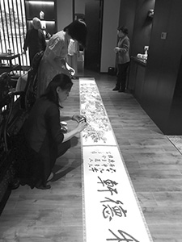

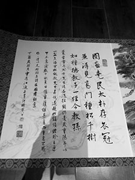

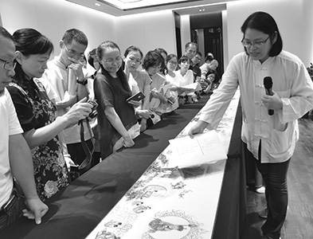

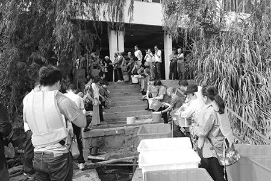

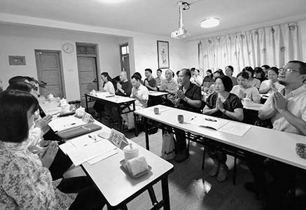

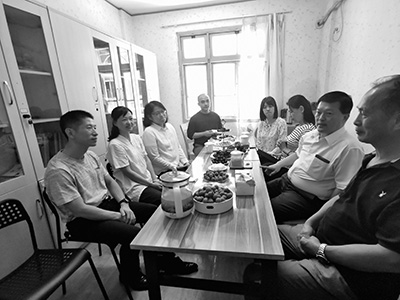

### 與江逸子老師座談會

*福州敦化學堂整理*

以窮養志藝載道

千件作品文化館

道藝春秋承師志

聖賢功業龍天喜

緣起

適逢大陸十一長假，江逸子老師與唐老師、林老師於福州會面，江老師拿出熱騰騰的大作–耗時兩年完成的《地藏經經變圖》，令人歎為觀止，難以相信這幅超過五十公尺、筆力遒勁、寫意精美的長卷出自一位八十歲老人之手，眾人拜歎稱奇。而福州敦化學堂也趁十一長假與臺灣老師共學，巧的是研討主題為《地藏經》與《楞嚴經–觀音廣陳》，因而促成與江老師座談的機會，江老師欣然答應讓大眾一同欣賞這幅《地藏經經變圖》，故於十月六日上午在江老師住所飯店租會議室舉辦座談會，近悅遠來，一些讀書會的蓮友也一起參與此次盛會。

江老師自言

宣揚地藏的功德，是報答雪公老師對學生的厚愛。雪廬老人明年一百三十周年冥誕。藉此來討論經典、展閱《地藏經變圖》，是七天連假最有意義的過法。

在藝壇上，很多長輩對我有期待，希望我可以在藝壇大放光彩。我在三十歲以前已在臺灣藝術界成名多年。後來有個同輩畫家在報紙上發文批判我，說我的作品墨守成規，沒有創新。我看了很生氣，就想在報紙上面打筆戰回應。回應前我去找恩師雪公，雪公聽說來龍去脈後笑一笑說，恭喜你，終於有人嫉妒你了。沒人嫉妒你，說明你是庸才，才是要生氣的事情。我聽了老師的話恍然大悟。

我跟著恩師學習三十年，老師循循善誘。剛遇到老師時，老師問我學詩了嗎？我從小就學詩，啟蒙老師是我母親，她從小教我千家詩。母親小時候是她弟弟的陪讀，結果讀得比弟弟還好，她雖然一肚子的學問，卻奉行女子無才便是德，不自專，凡事都與父母、先生商量。

我十一歲跟父親到了臺灣（母親留在大陸），從小學一年級開始學習。到了學校，老師教「小貓叫、小狗跳」，就覺得學校怎麼教這個，私塾教「人之初，性本善」，教怎麼做人，從人的根本做起。怎麼到了新學堂學貓學狗，從畜牲做起。回家就跟父親爭執，不想要讀小學了，父親說，人必須要有志氣，志可以增加你的道業。早期到臺灣非常潦倒，父親身體多病，哥哥是軍人，好喝酒。我一生滴酒不沾。我以父親為主，人生要以孝為根本，人不懂孝，連畜生都不如。

給我解惑授業的恩師是雪廬老人，遇到雪廬老人，我專心從老師處學詩聞法。

雪廬老人是孔府的主任秘書。我三十一歲起在孔府上班辦事，管孔府的文獻和文物、人事和社會教育。李老師創辦蓮社，明倫社和論語講習。老師講詩講得非常好，他跟孔夫子一樣，是述而不作，溫故知新。

學習要深入經典，不深入經典如何有新的見解出來？畫也一樣，畫中要有內涵。有些畫悅目，但是不能感染人，必須要畫中有物，就像平常講話，不讀書就講話不得體。現在很多年輕人喜歡學西方，出國念了碩士回來，但是消化不好。要記得，方塊帽不是白戴的，要先奠定自己的基礎，整治好自己的胃腸，別人的東西你才能消化，開口講話才不會是鸚鵡學語。我教年輕人學畫，要先學論語，一年把論語背下來。學習要以濟世為本，己欲立而立人，己欲達而達人。

十九歲時，我有機會到故宮博物院（當時在台中霧峰北溝），天天臨摹古畫，還有機會聽專家講這些畫好在哪裡。學不厭博，但修不能博，樣樣通就樣樣鬆，一定要取法乎上，要學就要找最好的來學。從民國初年到五四運動，大家都渴求知識，但知識有善知識有惡知識，人要能夠擇善固執。擇善固執很難，人都好新，我回到家鄉後跟親朋講，衣服大家愛新的，人要戀舊。沒有文化，是很嚴重的事情，沒文化的人，穿得一表人才，卻出口成髒。故德性很重要，仁很重要。仁要加厚、要愛人，仁是老祖宗創建的極高智慧。

李老師臨終囑咐很多話，有許多交代。老師對我說：「你要把文化傳回去苦難的中國。我把文化帶到臺灣，你要把它傳回去。學生那麼多，獨獨你一個在藝術上面有長才，你在山水、人物、花鳥你都很用心在學，都很到位，希望用這些東西來載道，通過藝術把文化帶回去。」他是位菩薩，菩薩畏因，眾生畏果。他囑咐我畫《地獄變相圖》，那一幅畫醞釀四十年完成。畫完成之後，二○○四年在日本京都光明寺展出，九天有十幾萬人次參觀。日本人看畫很規矩，依序前進看完之後，跟師長請求再排隊看一次，不會擋著其他人。日本雖然有很多不好的地方，但是他們對文化的保留值得我們借鏡。反觀中國，一直在毀自己的文化，這是很悲哀的事情。

畫展期間，南亞大海嘯，一夕之間卷走十幾萬人。我當時就發願，一定要把《地獄變相圖》編成一個冊子來說明。光明寺主持希望我做一個回向文，我就寫了：「無言說法有緣聽，寂靜西山忘古今；青楓紅葉如來意，數記霜鐘天地心。」

回到臺灣我編了因果圖鑒，回向南亞海嘯的罹難者。很多事情用心去做，佛菩薩就加持你，因果圖鑒在很短時間就完成了。因果圖鑒離不開十殿閻羅王，一殿一殿畫下來，講閻羅王陰間批判什麼罪什麼罪，人們會不想看，善巧說法很重要。我就想到童年在家鄉聽戲、聽說書，後來到蘇州聽評彈，就借鑒他們，用通俗、快板說書的方式來寫因果圖鑒。比如喝了孟婆湯去投胎怎麼來表達，我就寫「人皮缺貨、六畜興旺」，人身很難，得到人身不要辜負。

二師兄徐醒民老師說，這一套文筆，雪公老師沒有教，能讓人看了不疲倦，這有意思。大師兄淨空法師說，他想把《地獄變相圖》當經來講，但不易講，而你能用畫和文字來講出來。

眼前這個《地藏經變圖》的因緣，起於五十年前。雪公老師說要講地藏經，讓我在菩提樹雜誌上畫插畫。《地藏經》是佛門的孝經，我有興趣，想聽聽看。後來就做了筆記，畫插畫。眾生畏果，菩薩畏因，眾生怕苦，但不見棺材不掉淚。我們大家念佛求往生。往生對菩薩來說是解脫，但是菩薩乘願再來、倒駕慈航。這是菩薩的因地過程。

《地藏經》畫了一年多才完成。願起了要兌現，不能空願。我常年晚上九點入寢，早上三點起床。從畫地獄變相圖開始，一幅畫就是上年的經營。心在一處，不要飄，要專注。

《地藏經變圖》，發願要畫成長卷 不像《地獄變相圖》那麼順利，有很多障礙，但都一一克服。順境不成道場，逆境才是道場，人在惡劣環境下自己能體會才是關鍵。

畫地藏經的障礙比地獄變相圖障礙更厲害，畫了一半，內人往生，第二年大兒子往生。不懂的人會說我做這個功德在何處？但人要懂得因果，各人因果各人負。

《地藏經變圖》畫了一半，我打電話給吳董，想在他經營的阿彌陀佛飯店完成地藏經變圖，吳董非常地歡迎。不經逆境不成道場，不經浩劫不能成佛。不要求神問卜，你要問自己，這是你修行的機會。

地藏經畫完後，我又畫佛涅槃圖。忉利天說地藏經後，釋迦牟尼佛涅槃。釋迦牟尼佛在此世間說法四十九年後涅槃。我在敦煌看過佛涅槃的塑像，很感人。那時剛剛改革開放，我回到大陸，第一線就去敦煌。張大千先生從藝術的角度強力推薦我去，但我是從藝和道之間去看。福州有位學生帶我去，當時的戈壁荒漠很危險，嘉峪關旅遊局局長派專車護送我們到敦煌。敦煌研究院院長段文傑親自接待，我受寵若驚，當時我在大陸並沒什麼知名度。原來段院長跟張大千有師生之誼，他開了幾個特窟給我參觀。在一個窟看到佛涅槃像，我眼淚直流，我請段院長摒退左右，就剩段院長和我時，我跪下三頂禮，然後當場寫生寫下來。

後來，地藏經畫完，我就再畫佛涅槃，「累吾化身八千次，為汝說法四九年」，非常感動，我有願就一定要兌現，世間也講誠信才行得通。

最後我題一首絕句。我老師當年在重慶歌樂山弘法，山上有個破廟，傳遍了是地藏王再來。那天很多人在那等著，結果那天老師上山講經，被人認為是地藏王菩薩示現。我曾經問老師是否地藏王菩薩再來，他說：心懷彌陀，願行地藏，他還說：孩子你以後也要心懷彌陀，願行地藏。

以一首絕句來回向：「猶憶當年松柏志，倒駕慈航幾人知。閻浮世界風光少，悲願傳馨翰墨足。」

記得人身難得，不要枉費生命。世間的人好好盡倫常，出世的悲願要兌現，這才不枉我們這一身的人皮。再次輪回人皮缺貨，我們就很難領到了。

前幾天在香港見到淨空老和尚，我說你是淨土宗大德，我也連續兩次下地獄。風裡來火裡去，好好珍惜生命，好好把功德回向。現在作品雖然完成了，但是老師當初說希望我用丹青筆墨，把文化帶回中國。用講的，可能講者有心聽者無意。用畫，既可以欣賞，又可以畫中有話。唐老師跟我相得益彰，我的畫由唐老師來講是最好的，這是多生多劫的因緣，佛菩薩安排的，我們要珍惜。眼下在這裡跟大家結個緣，因緣殊勝。

問答
唐老師
**問：** 繪畫要把內涵傳達，老師這一代的風光（神采筆墨）如何傳承給下一代？
江老師
**答：** 這個問題很好，但很難回答，因為每個人的生命特質不一樣。我的青年時代沒一天好過，現在想吃又不能吃。人生的福報與生俱來，我整個體能都衰退，我十六歲一個人生活，早年十八九歲在台中北溝故宮博物院，畫就在眼前，拿著筆墨在眼前臨摹，很清晰，現在的故宮看畫距離好遙遠。

當年撿破銅爛鐵拿來賣，換個饅頭到故宮去臨摹畫，故宮工作人員跟我都很熟，說要開放伙食房給我配菜，但我不願意。我娘說過，窮可以養志，人窮不可以志窮。當年莊慕陵（莊嚴）先生說我比出家人還清苦，叫我饅頭僧。中午大家休息，整個博物院只有我一人。我在故宮博物院見聞很多，得益最大。故宮經常有達官貴人參觀，博物院就派專家導覽，我在旁邊掏著耳朵靜靜聽。現在沒有這樣的因緣了。因此那五年我得益非常大。

而且我學的畫從魏晉到唐宋，在故宮博物院都有，我都看到了。我是窮人，但是我腰杆是挺直的。我從不乞求，一生就是養這個氣節。生命是自己在掌握。恩師疼我就是疼這一點。他老人家的道德文章不是我們可以追上的，但是志向要在那裡。我現在還有幾年可活？人是百年過客，我的願是世間完成後，還要回到極樂淨土。

當初我學從人物入手。中國古代的繪畫也有弊病，西洋也有些東西不錯。西方的文化要學習，但不是全盤接受，而是要有取捨。西方也有很多可以仰慕之處。自己的胃腸要先健全，學習西方的才能截長補短。心正則正，一切唯心造，心很重要。線條是書畫的生命，書法是線條與結構的結合。王羲之寫蘭亭集序，那是草稿，再寫一次也沒有那個樣子了。

我娘是虔誠的觀世音信徒，我在娘胎裡就聽娘念觀世音菩薩。她教我三字經、千字文、千家詩。我沒進過洋學堂，考上也沒去，沒有錢去註冊。但是我很幸運，當時很多老先生去臺灣，臺灣太小沒有那麼多位置給他們，就坐冷板凳。我才有機會接觸這些老先生。

我是乾燥的海綿，泡在甘露水裡。在故宮就泡了四、五年。

雪公儒學、佛學是權威，中醫也很權威。他講黃帝內經，現在能講這個的人不多。老師教學生一定要正，要往上學。今天有這個機會結這個緣。我這四十多年都在完成恩師交代的事情。現在地藏經、涅槃像畫完了，要普皆回向。中國文化要讓世界都來瞭解。

記得當年李老師的一個學生很會辦事，有一次完成老師交代的事情，老師問辦得如何，他說可以。老師讓他複述過程，老師聽完過程後就說，你這孩子辦事能力很強，但辦事過程缺乏厚道，技巧太多。老師說辦事要學子貢，不但有口才，做事還要厚道，才做得完美。你這孩子就是取巧，不夠厚道。恰好老師說完後走過我辦公桌邊，我正在在畫下棋圖—兩個人在下圍棋。老師問這幅畫為誰畫，我說我只是消遣，沒專門為誰畫。老師說我來題一首詩：「應著人間讓子碁，平衡結局最相宜。從無君子求全勝，得意當時是錯時。」讓是人生最高的道理，不管做什麼都是最高的道理。堯舜也讓。謙就是讓，六六大順，就是謙讓。這首詩變成我的座右銘，中國文化就在其中。

我跟淨空老和尚說，將來在聯合國教科文組織的畫展用這幅畫做結。我開始的繪畫老師呂佛庭老師，我曾經跟他學過禮運大同，什麼主義都離不開禮運大同。用禮運大同開始，最後用讓子棋為回向、終結。

唐老師：

請老師講講建文化館的意義。

江老師：

這個事情還在進行中。

福州是習主席工作十五年的地方，省外辦的宋克寧主任也很熱心，我回來的第一次畫展就是在福州辦的。

我第一次（一九八八年）回福州。剛回來時，很多大陸畫家來找我評論，我只能讚歎，不能批評，因為這些畫家是在筆桿上面討生活的。而我不同，我是在筆桿裡守窮養志。

當時福州有個畫家說要在於山畫院跟我合作開畫展，說要互相拉拔。我說只有兩間啊，兩間我都要。于山畫院辦事處主任覺得這個臺胞口氣很大，問我有沒辦過畫展，我說在臺灣小地方辦過，又問能不能寄畫冊來瞧瞧。我火了，他們是遊擊隊，我是正規軍。我就寄了兩冊。

他們就請文聯來評估該不該請我到福州來辦畫展。文聯請了福建師大美術學院教授們來開會。專家說于山畫院是買賣畫的地方，這個畫是博物院的等級，不是你那地方能展的。

後來我還是沒同意辦畫展，因為損人利己不能做，損人不利己更不能做，人家是靠筆桿討生活。

後來福建省外事辦主任宋克甯先生到臺灣來看我，跟我深談兩次，請我回福州辦畫展。我說：忠恕之道，己所不欲，勿施於人。我現在回到福州，大家很熱鬧，聚聚餐、講講話，到我回去辦完畫展，就會門庭若絕，沒人要來看。後來就到了二○一一年，應文化部之邀，在故鄉福建博物院舉辦《道藝春秋—江逸子國畫雕像作品展》，展出時間從二○一二年新曆元旦一直到舊曆元宵兩個月，這是保留檔期，一般只留給國寶級畫家的檔期，比如徐悲鴻這樣的大家。那次展覽，中央還給了補助，也在國內藝壇奠定了基礎。在藝術的成就上，術沒有用，要在道上，道才是重點。現在在大陸，沒有什麼應酬，可以好好來把地藏經變圖完成。

宋主任和吳院長（正祥吳董）很真誠。吳院長說老師回來，我送一套像樣的樓房，你畫多，我房多。我說這是兩碼事，我是借住在阿彌陀佛大飯店，在極樂國土完成畫作。在這一住半年他還沒討厭我。

在這建文化館是宋主任提起的。他說老師你在臺灣，畫畫沒有合適的設施設備，住的條件不好，畫的保存條件不好，很多都被蟲蛀了。不如利用現代技術做複製畫，在上面簽名蓋章，就可以拿去展覽了。我說這樣好，這樣可以分身千萬億。

我跟師兄淨老說，做畫展要國家來做，不能只是宗教來做，宗教是含藏在文化裡面。現在與師兄是一年相見一回老。人生還有幾年，好好把畫作做一個宣揚。我的雕塑是無師自通，這是佛菩薩的加被。淨空老和尚讓我畫地獄變相圖，這是佛菩薩手把手在畫，不是孤立畫成的。佛是自信，不是迷信。因果一滴不漏。菩薩垂目慈悲，金剛怒目降魔。時時刻刻要反省自己。所有罪都是口業帶來的，要管好自己的舌頭。 要學地藏菩薩的悲跟願。

宋主任說文化館建起來要叫江逸子美術館。我說不可，江逸子的名字只是過客，將來建起來要叫「道藝春秋文化館」，道藝春秋是我一生的事業。道裡有藝，藝裡有道，以藝載道，春秋是褒貶，在畫作中點到為止。參加活動，我看到這裡很多小朋友穿著印有孝親尊師的上衣，我很感動。我一生就是孝親尊師，孝為道源功德母，一切從孝開始。

唐老師總結：

江老師今天的談是經驗之談，是大格局的、發展中華文化的、啟蒙的、發展道力的談，也是指明未來走向的談，我們要學習江老師養志的精神，以藝載道的人生格局，盡己所能所長，為文化道統盡一番心力。

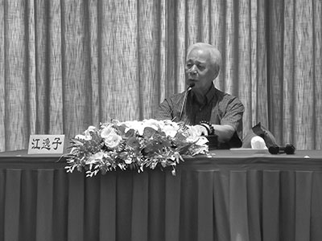

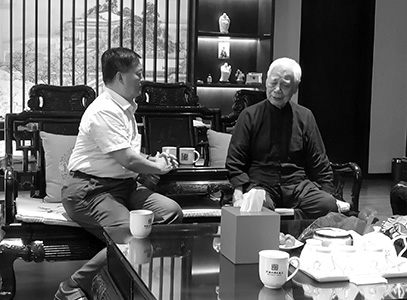

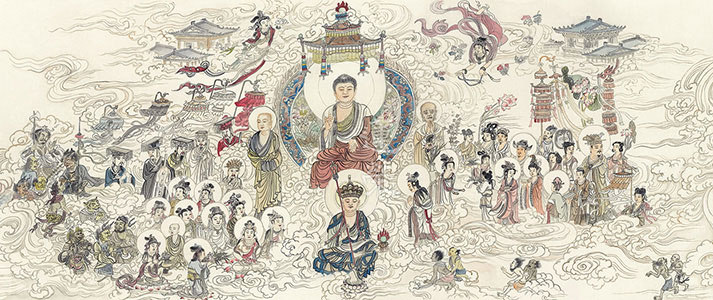

### 順昌福州行心得

禮悅

以文會友福建行

放生幼教經變圖

匆匆四日滿載歸

循序漸進踐跡行

今年十月初很高興有機會在老師與多位蓮友帶領下，參加順昌及福州之行。其實原本此行主要目的是老師有事赴福州與江老師會面、再赴順昌與蓮友聚會。因緣際會臨時邀請幾位蓮友一起赴順昌放生，並與當地蓮友交流。

每次老師舉辦的旅行，都會訂定一本經典的研學，作為此行的主軸。本次也不例外，選定了「入菩薩行論」作為標的。我們台北蓮友之所以有福報能學習「入菩薩行論」，其實還要感謝順昌蓮友的堅固學習這部論典時間長達九年，在來台參訪老師時向老師請法。老師為了讓台北蓮友能以這部論典與順昌蓮友交流，才慈悲的在今年初於學會每周一晚上的研學，開講「入菩薩行論」。眾所周知，本論是大菩薩寂天論師在西元八世紀的著作，後來在藏傳佛教中廣為流通，講解跟著作的版本很多，在藏傳佛教被當成發菩提心的入門經典。老師所採的版本是隆蓮法師翻譯，宗喀巴大師弟子賈曹傑大師註解「入菩薩行論廣解」，這個版本的好處除了大師有作詳盡的科判，讓我們架構式學習，能很快以綱要來認識經文，大師作的科判能把寂天論師的旨意發揮透徹，並且在廣解中很多地方補充佛法的基礎見地，加上有反復提問辯證義理，再加上二位老師詳盡的解說，相信台北有幸聽聞的蓮友，都獲益匪淺。佛所說法藏如乳，後代祖師大德依之做論藏，將義理提煉成酪、生酥、熟酥乃至醍醐妙味，用時代語言解讀妙勝之法，有正確的註解加上善知識的教授，台北蓮友真是福報很好，有一個好的機會學到這部論的傳承。

依著老師的指示，一路上大家除了交流學佛心得，增進彼此認識之外，研討的目標都是「入菩薩行論」，雖然老師在台北只有講到第四品，但這幾天下來，相信大家對學過的內容印象加深不少。到順昌之後，老師也以兩個晚上的時間，在順昌的幼兒園，與當地蓮友一起，把本論的大科判從第一品到第十品精簡扼要的講過一遍，糾正了我們很多的錯解，另外也更準確理解菩提心概念。

除了論典的學習，我們還有幸見到江老師剛完成的五十公尺巨作「地藏經經變圖」真跡，這是江老師早年向雪廬老人承諾要畫的作品，看著作品，想到幾十年的承諾放在心裡，百感交集。江老師不是不想教出像樣的弟子，而是這個時代不會再有這種機運，就算有跟江老師一樣的天賦跟志向，也碰不到像雪廬老人這樣見地的老師，特別唐詩的造詣、以藝載道的見解，也不會有第二次。在北溝故宮時期，書畫在展間直接面向觀眾，可以清楚閱讀臨摹歷代書畫名家的大作，並聆聽大家在書畫前的講解。內因外緣條件具足下，才能成就豐碩的一生，學藝術如此，學儒學佛何嘗不是這樣，機不可失，一去不再。

江老師的畫作，學生外行看不到位，也只能隨喜表象。可是有一件事卻是我們的榜樣，那就是江老師對道的堅持以及魄力。在年高八十之際，遭遇喪失妻、子之痛，由此而發悲心完成長約五十公尺的〈地藏經經變圖〉，並發願將自己一生所繪以藝載道三千件的作品運至福州，籌畫成立文化館，弘揚中華文化。這種毅力及魄力，小江老師三十歲的我們，不知何時才學得來。

觀摩新華幼兒園也是此行的重點之一，在很多方面可以作為榜樣，不但幼教辦得好，招生滿招，每天又有老菩薩念佛共修，有年輕人學佛，蓮友又有每周經教的研學，又聽說助念的風氣也逐漸推廣，假以時日定當風氣改變。在順昌的第二個晚上，沾老師的光，當地蓮友特別於幼兒園招待我們與順昌蓮友共進晚餐，主廚是幼兒園的廚師一個人，加上兩位助手，變出二十幾道菜，可供應一百人食用的餐點，老師請出來跟大家一見面，這位主廚女士看起來若無其事，完全看不出來剛才辦過一場大菜的感覺，只能說真是驚人的辦事能力。

放生也是此行的法行之一，順昌縣是福建的內陸山區縣份，面積約莫有二千平方公里，大約跟新北市一樣大，可是人口只有二十萬人。新北市可是住了四百多萬人，可見當地算地廣人稀了，跟現在台灣比起來放生的環境算很好的了。放生的地方雖然叫作富屯溪，可是水面寬的地方應該有四五百公尺，深度也夠，當地一片青山綠水，也沒有看到有工廠冒煙，聽當地蓮友說順昌附近這一帶的政策是要發展觀光，所以沒有工廠。

放生的儀軌一如以前，在老師的帶領下，場地的布置與買放生的魚，都由當地蓮友負責，台灣的蓮友擔任維那悅眾，很莊嚴的完成。這次所放的魚比較多，有兩千多公斤，載了三部小卡車，因為都是大魚，數量多，擠在卡車上魚箱可能已經有一點缺氧，加上剛開始時用小水桶傳遞比較慢，第一船放出去的魚有一些狀況不好；後來老師當機立斷，改要求大家用大水箱傳遞，並且也多加一些水在箱中，後面就比較好了。可見辦一件佛事，方方面面都需要有眼力的人，照顧到細節，不是那麼簡單。

最後一天還有參觀位於順昌西北方約莫六十公里的和平古鎮，這個地方自古就是從江西南部進入福建的要道，被稱為開閩第一街，站在入口處，微風徐徐，彷彿當年車水馬龍，人來人往的富庶景象，在眼前如電影般一幕幕走過。該鎮開發歷史可追溯自唐朝，現存的建築約莫是明清時期留下來的，全鎮是一個城堡式的建築，可以想像古代戰亂時期，這個鎮就是一個防守的據點。雖然整體建築有保留，但是在文革時期曾被破壞，細微處並沒修復。葉園長安排我們去看儺戲，頗有古味，可是沒有口白，有古拙的趣味。

四天的福州順昌之行，一下子就過去一個多月，現在再來回想當時的狀況，好像是作夢一樣，如同老師所說，雖然回憶起來是非量，但覺得在教法上有收穫，參與了團體的善法，感到非常的高興，期盼下一次機會的來臨，感謝二位老師，感謝大家。

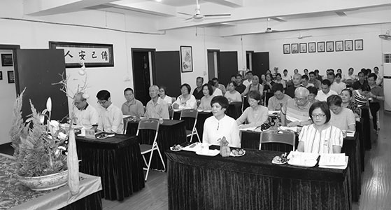

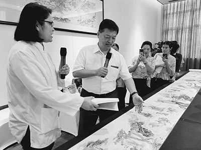

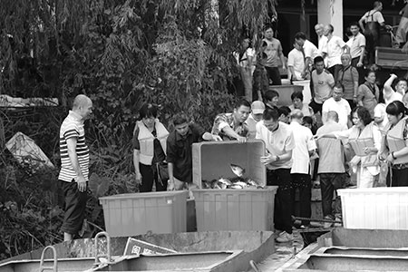

### 固鍀塾開幕—道藝春秋展畫作緣起介紹

圖/江逸子 文/淨本

年齡八十餘

廉頗尚能飯

筆下千秋作

文化以藝載

江逸子先生，本名錦祥，一九三八年十月生於福建省閩侯縣，一九四九年隨父定居台灣。先後從呂佛庭、溥心畬、彭醇士諸大師學習，並習畫於故宮博物院，由唐、五代及兩宋下手，專攻人物，繼而兼山水、花鳥等，深受張大千先生賞識，與其成為忘年之交。江先生又追隨濟南大士李雪廬讀書，以經史詩文為主，兼修佛學，奠定日後以藝載道之根基。一九六九年後，供職於大成至聖先師奉祀官府管理處主任，掌管孔府之文獻典籍，至一九九八年退休。江先生從事繪畫六十餘載，創作勤而不輟，是當今國際著名國畫大師。

近年來，隨著中國大陸經濟水平的提升，造就出不少成功的大企業，他們在管理方法上各有不同，有的企業家熱衷於追求中國老祖宗的智慧，期望將中國文化的管理思維，運用在現代公司治理上。蘇州固鍀電子股份有限公司，成立於一九九○年，主要從事生產銷售各類半導體晶片、二極體、三極管及各式整流橋堆等系列產品以及電子元件電鍍加工，現在是全球最大的二極體生產商之一，占世界產量的8%-9%，公司產品全部出口，遠銷四十三個海外國家和地區，擁有三千多個國際客戶。該公司董事長吳念博先生，就是一位對於中華傳統文化深具信心的企業家，而蘇州固鍀電子股份有限公司，也確實藉由中華文化的理念，經營出令人驚豔的企業精神與績效，該公司每年有好幾千名的外國參訪團朋友前往參觀，他們的經營模式，成為哈佛商學院管理理念案例教程唯一的中國企業，也成為聯合國教科文組織邀請講演的幸福企業。

二○一八年，吳董事長因緣際會下，認識了台灣通泰媒體應用有限公司賴麒宇董事長，經賴董事長介紹，對於江逸子先生的國畫畫作甚為驚歎，因此決定在企業廠區內，興辦一個展覽場地，展出江逸子先生之畫作，並委託通泰媒體設計規劃，期望能夠成為一個寓教於樂的文化場所，讓所有來到固鍀企業的朋友們，或者固鍀企業內部的家人們（該公司內部同仁互稱彼此為家人，此也源於中國家文化的傳統理念），都能在此更深入地體會固鍀的企業精神，以及中華文化的深層內涵。

經過一整年的努力，包括實體展場設計、線上展廳規劃、畫作挑選、導覽培訓、影片拍攝、法規研讀、現場施工等過程，固鍀的文化展廳漸具規模，十分讓人期待。然而就在這種種過程之中發現，畫作導覽及培訓，可能是最不容易達到圓滿的一個區塊，江逸子先生以藝載道的作品，有待懂得道統內涵的導覽者去闡述弘揚。於是在江先生的親自推薦下，賴董請唐老師帶領師資團隊協助參與導覽及培訓工作，通泰媒體曾經承攬中華無盡燈文化學會在二○一四年創辦的時哉時哉網路教育學院，再一次的合作，彼此間都有更多的默契。

二○一九年十月，唐老師所帶領的導覽團隊在通泰媒體的引導下，一起走進完成度已達九成的文化展廳，展廳設計十分雅致又富有文化氣息，序廳、平安鐘、山水終究是山水、道統源流、至善之家、學琴師襄、先樂後藥、墨寶舞動、願力牆、文化驛站，一共十個文化景點，透過畫作與科技的結合呈現、虛擬與現實的巧妙安排、聖賢精神的現代演繹，讓人駐足流連，不覺時間已過。而這一個美好的文化展館，搭配線上文化館，正式命名為「固鍀塾」，它被期許能夠成為一個文化的場所、教育的場所，是一個能夠提供參觀者精神資糧的園地。

展場的空間規劃可謂神來一筆，像是世外桃源，據賴董說，空間規畫是由一位臺灣頂尖的設計界大師協助，讓大家很快討論出大共識，而空間色調以汝窯瓷色定調，為了配合燈光，經過三番調色才終於完成。逛一圈展場，便會感歎於其設計規劃、內容編排、科技體驗、互動環節、美感營造等氛圍，十個展間都讓人眼睛為之一亮。

固鍀塾於十一月十八日正式對外開幕，並邀請在地的長官與各地文化界人士前來共襄盛舉，開幕式溫馨莊重而令人感動，由通泰媒體應用有限公司賴麒宇董事長親自主持揭開序幕，道盡固鍀塾成立的因緣，以及透露許多不為人知的祕辛，固鍀的大家長吳念博董事長表達歡迎及宣揚固鍀塾的理念，希望從固鍀塾做起，慢慢擴展讓世界這個大家庭都能浸染文化的氛圍。江老師雖身體有恙，甚至前幾天還在發燒，仍現身說法，給予固鍀塾莫大的支持。學會因著唐老師、林老師等前期的畫作導覽培訓，也有一批人同行，參加這場盛會。

賴董致辭：

此展場能以今天的面貌呈現，最大的支持來自固鍀的吳董事長，他提供心無旁騖的創造空間，提供完全的信任，我在兩岸三地接過非常多專案，從來沒有一個專案像固鍀塾這樣信任交付，合作過程中，吳董為我們排除一切困難，像是臺灣方擬定的合約，都是臺灣的用字遣詞與要求，吳董卻一字不改，非常難得，因為每個公司都有自己的體制，一般都要多次磨合。另外，匯款的部分，吳董也排除萬難，讓經費可以直接匯到臺北，這非常不容易，因為一般要匯款到臺灣，必須有相對應的海關報單證明以及產品文件證明，可我們承接的是一個公司的企劃項目，不會有海關報單等證明，但吳董協助聯絡相關人士，一週後便解決了這個大問題。如此情況不勝枚舉，當一個合作方願意用盡全力、想方設法解決困難，我們便會試圖精準完美的完成每一個項目來作報答、回饋，感謝固鍀塾給我們這麼多的優惠、這麼好的條件待遇，在雙方的互信基礎下，才建立出這樣的平台。

江老師的作品貴在精，不在多，展場裡的展件全部加起來也才十八幅畫作，但認真導覽起來三小時都不夠，我們希望能帶給觀眾啟發性，若作品再更多，就會偏離一開始的目的。而江老師應著我們的要求，一口答應為固鍀塾新畫了一幅吳泰伯的畫像，非常感謝。

品牌互聯網的時代，任何一個團體、企業、組織、服務，被賦予文化後，其精神、價值層面就會拉高許多，固鍀塾身先士卒，希望對全世界輸出我們的文化，經濟或許能使一個國家強大，但是文化才能使一個國家偉大。

江老師致辭：

江老師身穿一襲深色長袍，緩緩邁上舞台致詞，他說：學人一生當中，遇到很好的良緣，我很幸運遇到李炳南老師，他老人家一個人來到臺灣，把儒佛道理帶到臺灣，他的學生成千上萬，我剛好有畫畫的長才，機會很好，老師告訴我，要堅持一個願，一般畫家靠筆墨討生活，老師勉勵我要有悲心，還要有願力，要取法乎上，弘揚幾千年的中華文化。學人如今八十二，知道來日無多，想為文化做點事，文化最主要建立在一個人的信念上，我們不要忘記，孔子是我們集大成的至聖先師，我經常勸大家多讀論語，論語是中國智慧的結晶。這些以藝載道的作品，我都願意無條件奉獻，相信有一天，我們可以看到文化重新在世界上大放異彩，希望全世界都知道中國的文化，感謝吳董事長的愛戴，提供這樣的場地，禮樂傳家很重要，希望固鍀禮樂傳家，這是一件非常有意義的事情。

唐老師致辭：

固鍀塾道義春秋展的成立，內心非常感動，道是人生趨吉避凶、趨利避害之道，代表人類正統、內求利他的思想，江老師在雪廬老人座下學習，以藝弘道，內涵深遠，很多臺北故宮的老同事都認識並且敬佩江老師。從一幅以藝載道的畫作中，我們可以欣賞畫者的筆墨、線條、神韻、經學、見地、個人涵養體悟、辦事能力、朋友交往，以及他的多方閱歷，而賴董能令科技與文化結合，讓固鍀塾完美呈現，令人隨喜讚歎，「德不孤，必有鄰」，我們要能別具一隻眼來欣賞，這是對國家、文化的認同，對民族文化的擁護，也是對世界的供養。誠如賴董所說，學校成立後，必須要不斷的充實內涵，畫作可以表徵文化，但還需要有人解說、傳承，故導覽解說、辦理讀書會都尤為重要，要慢慢來，不是一蹴可幾的。

江老師在大陸出生，在臺灣成就，以畫作宣揚中華文化，影響深遠，難可言喻。吳董事長深具魄力，知道企業的核心要用文化去呈現，眼光獨具。學會抱著隨喜的心情，樂於把江老師的畫作發揚光大，也相信固鍀以文化作為核心理念，是世界企業效法學習的對象。

隨著舞台螢幕幻化成一道古色古香的大門，啟動儀式開始，主事者、重要貴賓列席門前，在倒數過後眾人一起推開門，此時，令人心馳神往的寒山寺鐘聲響起，揭開了展覽的序曲，固鍀塾將帶給大家，帶給全世界美妙的中華文化，希望透過固鍀塾，全世界都能發展中華文化，提升自身層次，讓這個世界更祥和。

就著固鍀的因緣，唐老師過去以來所錄製的江老師圖畫導覽工作，又繼續啟動，希望未來無論在固鍀塾也好，或者在時哉時哉網路教育學院也好，都能有最好的導覽，將江逸子老師所創作的載道作品，用色彩與聲音為大家帶來最好的呈現，本刊也會持續刊載這些畫作的緣起，敬請期待。

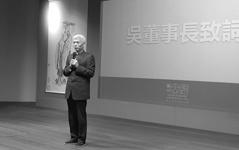

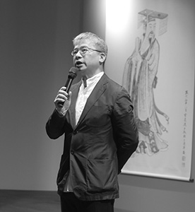

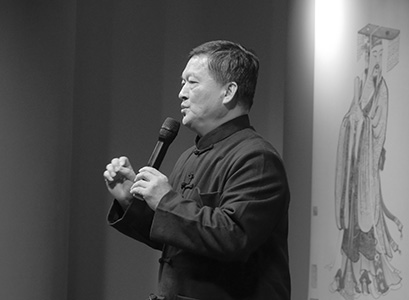

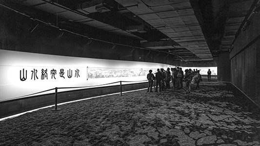

