# 第125期
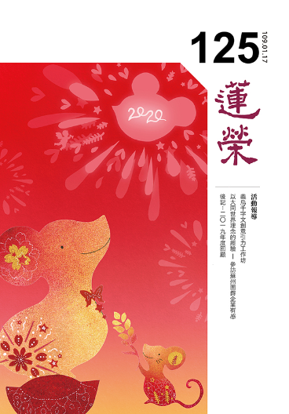

## 社論

### 鼠來妙寶銜金到

*編輯部整理*

賦予鼠年意義

寶貴人生開創

靈敏群居學習

跨越時代挑戰

二○二○是庚子年。「庚」是金，「子」是鼠，是為金鼠年。金屬白色，故又稱白鼠年。有對聯言：「一日時辰子為首，十二生肖鼠佔頭；子時一到開新律，鼠歲三春報好音」，鼠年為開端，跟人類的關係也非常微妙，鼠年有哪些值得我們探討的呢？

若翻閱成語大全，人們對鼠可說是好感全無，負面聲評一面倒。相貌醜陋，神情狡滑者被稱為「獐頭鼠目」、相貌兇惡者被稱為「狼眼鼠眉」；受到打擊後狼狽逃跑是為「抱頭鼠竄」、「膽小如鼠」；眼光短淺、氣量狹小，不顧大體者叫做「目光如鼠」、「鼠目寸光」、「鼠腹雞腸」；做些見不得人的事情稱為「鼠竊狗偷」，有時候還因為「一粒老鼠屎，壞了一鍋粥」。《詩經‧碩鼠》把碩大的老鼠喻為貪官污吏，《韓詩外傳‧社鼠》中晏子借鼠進言，用土神廟中穿洞的老鼠比喻圍繞在國君左右的奸臣，或仗勢為惡的小人。總之，老鼠就是一個過街人人喊打的生物，最怕的就是鼠輩猖獗，擾人清夢。可說是從外貌、行為到寓意，遭人無限鄙視唾棄。

老鼠又是眾多疾病的來源，古代鼠疫病猖獗，還造成大量死亡。而老鼠長年長牙，必須經常磨牙，電線、建築物等便會飽受磨難，甚至引起不明火災。聽起來，老鼠好像百害而無一利，若世界上沒有老鼠，是否會更加美好呢？答案卻是否定的，因自然界的生物鏈一環扣一環，老鼠是食物鏈的底層，如果滅絕，會造成生態的混亂。而醫學、科學、心理學等也常常借助白老鼠的犧牲來取得巨大的發現與發明。

老鼠也有值得我們學習的地方，首先，老鼠的存活率高、繁殖力強，據說在沒有外力干擾的情況下，一對老鼠一年可以繁衍八百隻後代，可謂子孫滿堂，雪廬老人也鼓勵大家多生孩子，讓中華民族更加強大，多子多孫多福氣。許多國畫或藝術作品，亦取老鼠的一胎多子、繁衍成群的意象，表徵多子多孫、福氣滿滿。再者，老鼠很聰明，具有人類七、八歲的智商，加上其身手敏捷、目光銳利，而能穿牆越壁、時時警惕、靈機應變，故不容易落入人類的圈套。在西方的卡通中，不論是迪士尼的米老鼠、三隻花梨鼠，還是傑利鼠，都給人一種機靈的形象，我們可以學習老鼠的靈敏、待機而動，如《論語》中說：「君子欲訥於言而敏於行」、「敏於事而慎於言，就有道而正焉」，都是可以努力的目標與方向。另外，老鼠具有強大的適應力，再險惡的環境，牠都能夠生存，面對各種緊急情況，牠總能想盡辦法逃離危險。並找到食物來源，延續生命。新的一年，我們亦要勉勵自己不畏險阻，克服逆境，不斷成長，透過廣博的學習，增長自己的知識，拓展自己的認知疆界。

而老鼠具有四種特性：宿居性、學習性、群居性、柔軟性。宿居性指牠如果住慣某處，便不會輕易搬走，即便受到一些干擾，也會暫時逃離，再想辦法搬回來。我們對道的體悟亦然，身心安住在道上，便不會隨便遷移。學習性指當老鼠看到同伴遇害或自己遇害，會記取教訓不再上當，我們可以聯想到顏回的不貳過，時時察覺自己的過失，不斷修正自己的言行、起心動念，見賢思齊，見不賢而內自省。群居性指老鼠是群居動物，會互通消息，也說明了團體的重要，依止具正知見的團體便能切磋琢磨，並在生活上彼此提攜、互通有無，節省大量的人力、物力。柔軟性指老鼠的身段柔軟，能屈能伸，一點縫隙就能鑽過去，我們要學習牠把身段放低，遇事不會卡關，心胸開闊、態度良好，貴人就在你身邊。

綜合上述，在此分新秒異的時代，我們要學習老鼠的生命力、靈敏度、適應性、宿居性、學習性、群居性、柔軟性。銀花萬簇迎金鼠，祝福大家鼠年行大運，在庚子新年都能活出熱情、靈敏、意義。

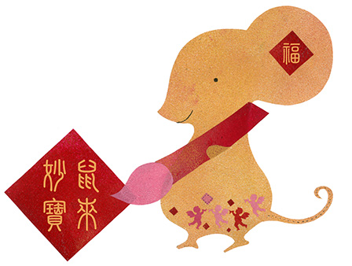

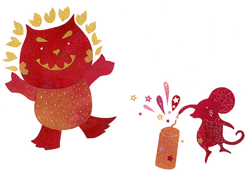

## 佛學幽覽

### 菩薩清淨的行持—華嚴經淨行品（四十一）

*戒慧講述／編輯部整理*

善用其心真修行

嚴飾祝彼相好嚴

無嚴飾願修頭陀

苦行福慧兩相宜

丙二、指事顯因答其徵因

丁一、總徵

丁二、別顯

戊六、乞食道行時願（五十五願）

己二、所睹事境(十九願)

己三、所遇人物（有二十四願）

己三、所遇人物：嚴飾人、無嚴飾

一百四十一願共分為十類，這是第六類，在道路上托缽乞食，分三部分，第一部分是在道路上行走，第二部分是碰到的事情，第三部分是所遇的人物，目前的進度在所遇的人物，二十四類人，分為十二組，第一組就是見嚴飾人跟見無嚴飾人。

經文：

見嚴飾人，當願眾生，三十二相，以為嚴好。

這是第七十八願，所遇的人物有二十四類分十二組。願所依是見嚴飾人，是依靠在見嚴飾人這件事上發願，能發願的是菩薩，所發願的是眾生。

見嚴飾人，嚴指的是身體所穿的衣服很端莊、整齊，飾指裝飾，在路上行走時，見到穿著衣冠整齊的人，甚至是所穿的衣料很高貴而且有種種裝飾的人時，心中作如是想，祝願此人未來以三十二相自莊嚴，在這個世界上，穿得再好也只不過外表莊嚴而已，都不如自己好好修學佛法，將來成佛後，具足三十二相、八十種好的莊嚴之身，那才是最莊嚴的。

古人以所著之服襯出他的高貴、威勢，以清代論，可從服飾上分二品、三品，乃至九品官職。見到種種宮物莊嚴自身者，這樣的莊嚴能得到他人的畏敬，而福慧莊嚴的三十二相更讓人尊敬，所謂：三祇修福慧，百劫修相好。以福慧所成的三十二相、八十種隨形好最為殊勝莊嚴，是九界咸歸，是十方共讚，是名聲普聞，是十方人天頂戴，是三界導師，是四生慈父。

所謂的四步修學法，一是隨喜，若眾生能以三十二相、八十隨形好而自莊嚴那該有多好。二是發願，希望眾生都能得到三十二相，以為嚴好。三是承擔，我能開導眾生修學福慧，得到三十二相，八十隨形好。四是祈求三寶，讓我有能力幫助眾生得到三十二相等，以為莊嚴。

經文：

見無嚴飾，當願眾生，捨諸飾好，具頭陀行。

無嚴飾指衣服穿得簡單樸素，甚至破破爛爛的，遇到這樣的人，要思維在這個世上穿得再好也都是假的，沒有內涵則一點實質也無。希望眾生捨棄嚴飾，修行頭陀行。頭陀是梵語，意指修治、抖擻、棄除，也就是要打起精神、勇猛精進、滌除煩惱與塵垢，斷除對衣、食、住的貪愛，來修練身心。無嚴飾，在六十華嚴中是素服人。見素服人，甚至是穿著衣料差、充滿補丁、破爛汙垢衣服者，願這些眾生具足頭陀行。在頭陀行當中有十二類形象，有助於我們知足常樂、具足梵行。持佛戒律的形象中，以頭陀行最為殊勝，儒家中修頭陀行最成功的就是顏回，他簞食瓢飲，居陋巷，人不堪其憂，回也不改其樂，這是修頭陀行的顏回。

頭陀法有十二項，針對一般日常生活立下十二種修行的條件，亦稱為「十二頭陀行」。依據頭陀法，修行頭陀行只要生活上有最低需求的「三衣一缽」就足夠了，以下說明之。

頭陀行中，衣服有百衲衣與三衣，百衲衣包括糞掃衣、屍棄衣跟塚間衣。糞掃衣指撿他人丟棄不要的衣服，屍棄衣是指人家裹屍體後丟掉的，塚間衣是指墳墓裡面的衣服，這些破布拿回來拼裝而成的衣服，稱為百衲衣（百片破布拼裝而成），故一般出家人自稱老衲。三衣指出家人三種場合穿的衣服，即：僧伽梨、郁多羅僧、安陀會，其餘常衣都不能要。僧伽梨指大衣、重衣、雜碎衣、入聚落衣、高勝衣，為上街托缽或奉召入王宮時所穿的衣服，由九至二十五條布片縫製而成，又稱九條衣，穿此衣顯現為福田，讓你在福田當中種上供養的善種，故較為慎重講究。郁多羅僧：是專為掩蓋上半身而披的，用七塊布片縫製而成，又稱為七條衣，於禮拜、聽講、法會、布薩時穿著。安陀會即內衣、中宿衣、中衣、作務衣、五條衣，為做日常勞務時或就寢時所穿著，用五塊布縫成，掩蓋腰部以下。

再來飲食的部分有五，其一是常乞食，指的是要自行出去乞食，不能接受他人特別的供養，也不能接受他人將飲食特別送進寺廟來。為何佛要制訂這麼嚴格的規矩，除了因出家人靠乞食降伏自己的慢心外，也是給在家人種福田的機會，供養時二人的距離近，容易跟在家人結法緣，此時說法的因緣生起，說法的因緣不能自己生、不能獨立生，要借著在家人的供養而後生，此機會要給在家人。就好像有時候父母要讓子女服務，藉此跟他親近，進而利益、教育他，以上是常乞食。

其二是次第乞食，「次第乞食者，一日到一家得食則食，不足即止，次第到七家得食則食，不得亦止」，意指在托缽時不能分貧富之家，走到哪一家就向哪一家托缽，而且最多只能七家，七是一個圓滿數，若走訪七家，都沒有乞食的因緣，表示今天沒跟眾生結到善緣，乖乖的回家懺悔、反省、餓肚子。次第乞食不能選擇，釋迦牟尼佛規定，不能每天都走同一條路，佛並非苛刻，制這條戒的動機是讓乞食者不生分別心，不分別貧富、貴賤，並不是不知道貧富貴賤，而是不在意貧富貴賤。很多分別並不是執著，比如：分別它是茶杯的那一分不是執著，分別茶杯有自相的那一分是執著，認為凡分別都是執著的那一分是錯誤的見解，否則人人皆可以是阿難、舍利弗，不用分別。分別當中生起有自相的那一分是要破的，純粹是名言生起的那一分則不能破。

其三是一座食，即一坐下來就要吃飽，也就是日中一食，若突然遇到有事情，錯過了時間便不能再回去吃。此規定的理由是免數食妨礙修行，修學禪觀時，不要每天為了食物忙碌，修學禪觀可以讓人心靜下來，耗費的能量最少，心靜下來時，不再去花很多時間吃飯、洗缽、上淨房，一餐的營養足夠一天的修行。但如果是在用功經教，則可開緣。

其四是節量食，指控制食量，不過食，缽中只受適量的飯菜。有些人受八關齋戒，晚上不能吃，中午就吃過量，節量食則不允許，否則貪心就在中午那一餐增長，而且吃了不消化，胃腸受不了，佛制戒後面的動機多好。

其五是時後不食，即午後不飲漿，食後不受非食之食，頂多喝白開水，不飲漿特別是指有顆粒的，不能過午不食，結果下午就泡五穀粉或米漿來喝，特殊狀況可以開緣喝牛奶，更嚴格一點就喝開水，但是基本條件就是不能有顆粒。

住處有五，一是住阿蘭若，寂靜處，即遠離世俗、城市、人群，安住在較安靜的空閒處。二是塚間住，指住於墓地、火葬場處，見死屍臭爛、狼藉、火燒、鳥啄，體會無常、不淨，無常、不淨的觀察是三法印中的第一法印，以此為基礎，再進一步去修學自相空的無我觀，得到空性的智慧，這是第二法印，以空性慧破煩惱障(甚至所知障)證得涅槃，即是第三法印–涅槃寂靜觀。三是樹下住，住在樹下至少還可以遮風避雨，但不准在同一棵樹下過兩天，否則大家都會搶一棵大樹為家，這告訴我們，三界中無處可依戀，破除依戀、愛執、捨不得。四是露地住，即坐於露天、空曠之地，比樹下住更嚴格，無法遮風避雨。廣欽老和尚昔時曾修露地住，他整晚露地坐，第二天起身時，只有他坐的地方是乾的，其他都是濕的，這樣的頭陀行不是普通人，露地坐是訓練自己無依無靠，連最後依靠乘涼、遮風避雨的大樹都捨掉。最後一個是常坐不臥，多打坐、少趴臥，晚上也不躺下來睡覺，目的是隨時警覺。無法常坐不臥則可吉祥臥，睡時右臥如弓，以正知正念互念道心，此人不但睡得熟，又有警覺力，是睡眠的修學法，能夠把白天的修行持續到睡眠中，又持續到第二天，這就是修學法的講究，功夫自然能夠用上去。如果是仰臥、趴睡，則容易產生妄想、糊里糊塗作夢至隔天。再來是入睡前要做觀修，在睡眠中最容易增長昏沉、沉默，尤其是睡得多，故在睡前要做光明想，心放亮破暗相，有助於投生到光明的世界，像極樂世界。睡前生起正知，有妄想立刻察覺，並安住於善所緣(正念)上，以上就是睡眠的修學法。

### 大乘百法明門論簡說（三十三） 拾伍、心所有法 ｜ 隨煩惱（二）

*戒慧講述／淨本整理*

心態一一講究

方知善惡行相

愚者在意形象

智者即相論心

經文：

五、隨煩惱二十者：一、忿。二、恨。三、惱。四、覆。五、誑。六、諂。七、憍。八、害。九、嫉。十、慳。十一、無慚。十二、無愧。十三、不信。十四、懈怠。十五、放逸。十六、昏沉。十七、掉舉。十八、失念。十九、不正知。二十、散亂。

第三「惱」，也是瞋的分位煩惱，是瞋某一分的行相。《百法直解》云：「忿恨為先，追念往惡，觸現逆境，暴熱狠戾為性，能障不惱，多發凶鄙粗言蜇螫於他為業，此亦瞋恚一分為體。」惱的發生，是追念過去所遇到的違逆境界，所以心中相續著恨，眼前又觸到逆緣而生忿，內心猶如火燒，而有凶狠乖戾的心態。這樣的心所作用，會障礙不惱，多發出鄙陋粗惡的言語甚至攻擊他人。忿與惱的差別，在於惱以忿恨為先，忿則是對於眼前的違逆境界而生。

第四「覆」，《百法直解》云：「於自作罪，恐失利養名譽，隱藏為性，能障不覆，悔惱為業。」覆就是覆藏，對於自己所造的罪，唯恐因此失去利養與名譽，所以想要隱藏罪行。這樣的心所能障礙不覆(懺悔)，並產生悔惱(害怕別人舉發，或害怕面對自己的良心)。什麼樣的行為可以稱為罪？佛法中罪以摧折為定義，也就是這樣的造作會招苦，此苦會摧殘折磨造作者，才可以稱為罪，佛門的淨命與軌範，都是為了不讓有情產生摧折而說。造罪者既然害怕苦的摧折，就應該要懺悔並遷善改過，才能避免惡業成熟結果，而今愚癡不明因果的道理，為了貪圖自己的利養名譽，覆藏自己的罪，反而將會招致更為苦的苦果。所以覆是以貪癡為體，是貪癡的分位煩惱。癡是對事理不明瞭，可以說是一切煩惱的根本，若無癡也不會產生瞋恨，而此處覆心所特別指出以貪癡一分為體，是針對修道人理應認清因果卻迷惑事理而說。覆心所會遮蓋我們光明磊落的個性。至於因為產生正知見而對自己的罪行感到後悔，並不屬於覆心所的業用。

覆的對治要靠發露懺悔，以發露來對治覆藏，覆藏比喻如罪惡的樹根埋在土中，要讓此罪根暴露在陽光下，才會枯萎而死，不會感苦果，其方法有三：作法懺、取相懺、無生懺。

作法懺例如在佛前禮拜，稱念思惟罪過，求哀懺悔，又或者向當事人、向大眾表示懺悔；取相懺是因為懺悔而感應瑞相，可以說是作法懺成功與否的一種驗證；無生懺者，必須要有通達空性的智慧，了知罪性本空，觀待沒有能造罪的心，就沒有所造的罪業，觀待生起懺悔的心，就可以破壞已造罪業感果的功能，苦果有因無緣也無法生果。在這樣的觀察之下，可知再深重的罪業都可懺除，然而唯有觀待真正發起菩提心者，才有能力使罪業永不感果，阿羅漢雖證悟空性，仍被滿業所繫縛，入世時依然會隨其過去生的造作，而有種種痛苦產生。

第五「誑」，誑即欺誑，以不實的言語行為欺騙人，《百法直解》云：「為獲利譽，矯現有德，詭詐為性，能障不誑，邪命為業，此亦貪癡一分為體。」欺誑的目的也是為了名聞利養，偽裝成有道德學問的模樣，或者顯現神通，其實都是包裝自己的不良動機，來詭詐迷惑他人。誑心所會障礙不誑，並以邪命為業。諂跟誑可以說是發菩提心最大的障礙，已經身為修道人，居然還為了利養詐騙他人，此處也是特別針對修道人，舉出誑是以貪癡一分為體。

邪命有許多種，必須是矯現有德的行業，才是誑心所業用的範圍，所以經營賭場、風月場所等職業，並沒有矯現有德的心態，都不屬於此處所謂的誑，《百法》中的誑還是與修行有關，認識這樣的心所，有助於修行人修道。佛制中有四邪命、五邪命，就是避免出家人為了生活而影響修道。

四邪命中的「下口食」是指種植田園、和合湯藥以求衣食以活命。過去百丈禪師也提倡出家人要耕種，所謂「一日不作，一日不食」，但其用心不是為了利養，而是希望修行人能夠活絡筋骨、服務他人、不要懶散，所以論其用心，並不屬於邪命。「仰口食」是能夠看天文、天象，「方口食」是曲媚豪貴，例如幫助有權勢的人處理許多問題，獲得他們的信賴與崇拜。「維口食」是卜卦算命、使用咒術等。這些行業為的是求利養，對出家人來說就是屬於邪命。

五邪命包括「詐現異相」、「自說功德」、「占相吉凶」、「高聲現威」、「說所得利」，這些行業也都是論心，來決定是否屬於邪命，否則雖然從事這樣的行業，仍然可能屬於正命，所以學習《百法》才能掌握大乘佛法修行的旨趣。過去廣欽老和尚也曾只吃水果，信徒們都十分佩服，後來他老人家開始喝牛奶，就是不希望大家以只吃水果能活命的異相而盲目地崇拜偶像；佛陀也是最善於自說功德，然而佛的用意不是在求供養，是增進大眾信心；佛門也有占卦算命，儒家也有《易經》，為的是利益大眾，求的是改過以至於無過；叢林中的糾察司也需要高聲現威，他是要維持秩序；佛在經中也描述了供養三寶的福報，這是為了鼓勵大眾並說明因果，以上都不是為了名聞利養，就都不屬於邪命。論心才能論善惡邪正，但心難論、相易明，所以修行也不能不注重形象，也要從基礎開始做起。

對治誑的方法，就是要有平常的生活、平實的言語、平靜的心情，這才是矯現有德的正對治，真正幫助自己專注於修道的事業。

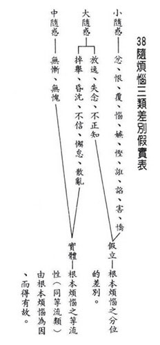

### 佛學概要十四講表簡說（二十七）第四講表　人生當前之所受（觀受是苦）

*戒慧講述／宏法、淨昌整理*

以苦為師非空言

實際觀察生現比

出離悲憫皆能生

解脫成佛是所成

(乙)苦果略舉

由甲表「領受種類」得知人生是苦，接著乙表「苦果略舉」，苦果可分為苦苦、壞苦、行苦，前期已講完苦苦中的生老病死苦，以下從愛別離苦開始。

●愛別離苦

前述死亡是死別，此處是生離，離開我們親愛的人，此處特指男女的離別，此種別離之苦令人斷腸。述記引省祖詩云︰「虞氏帳中辭項羽，明妃馬上謝君王」，項羽垓下之圍，在帳中和虞姬相別，也就是有名的霸王別姬。明妃即王昭君，她出嫁匈奴時和漢元帝相別，也就是有名的昭君出塞。最典型的愛別離是梁山伯與祝英台，又如唐明皇和楊貴妃的「在天願作比翼鳥，在地願為連理枝」，道盡愛別離的心酸。

離別包括家人、父子、好友的離別，還包括天災、人禍、戰亂，像當年戰亂後臺海兩岸親人分離，很多人一別後，再也沒有見面過。

例如唐伯虎，二十五歲時其父母及太太過世，妹妹不堪打擊而自殺，他因而有所體悟，故他的印章叫做「六如居士」，亦即一切有為法如夢、幻、泡、影、如露亦如電。好不容易振作，二十九歲時至南京考試成為解元，乃舉人第一名，從此風光，準備上京考狀元。想不到三十歲捲入官場弊案被牽連作弊，被貶到地方當公務員，憤而離開公門，從此過著狂放的生涯。一切都非常的無常，不堪人世間的打擊。

愛別離苦會產生幾種狀況：

其一回憶往事令心裏受不了。其二無法振作，心情憂戚，言語愁嘆。如屈原〈離騷〉中有家國之憂、君臣之別。王維亦說：「春草明年綠，王孫歸不歸」，都是言語的愁嘆。其三身體的不安。心裡憂戚，語言愁嘆，唯一的心念就是念對方，以致書讀不下去，道修不成，若把這種覺受拿來憶佛、念佛立刻一心不亂，可惜普通人不會。其四是想東想西，非常煩惱，成為修定中最嚴重的障礙。在修定時，瞋心雖然會破定，可是瞋容易悔悟，而走神者最難回神。患得患失成掉舉，想東想西變散亂，一生修行成為過失。其五是回憶起對方的好處就受不了，乃至認為沒有對方我就不知何去何從。其六是我所受用的缺乏，本身就是痛苦。

苦的觀察很重要，蕅益大師說要以苦來做解脫門，世尊告訴我們以苦為師，苦會讓我們想出離，想要找到苦因去對治，會讓我們懺悔、反省、謙虛、修學忍辱，會讓我們體會別人的苦，增長大悲，苦會讓我們在尋求苦因當中生起三輪體空的智慧。世間的老師不會讓我們生起出離心、大悲心，除非苦。所以苦是我們的老師，沒有它我們不會解脫，諸佛菩薩的秘密就是以苦為師。

如何成為自己的善知識和別人的善知識？須認識苦，生起苦的覺受，並且能夠令人遠離苦果和苦因，這樣的人才是善知識，才能幫助別人離苦得樂。

●怨憎會苦

「愛別離、怨憎會」，所親愛的偏偏別離，所怨恨的、討厭的卻偏偏聚會，也就是所謂的「不是冤家不聚頭」。我們內心所怨恨憎惡的人，他往往會到我們眼前，想遠離卻遠離不得，這就是怨憎會，心裡產生的苦就是怨憎會苦。冤家聚會後產生憂惱、苦楚，乃至於害怕被牽制和懲罰，擔心產生惡名，當中又生出種種苦惱，乃至於冤家聚會後心裡生的煩惱違背正法，也會讓我們死後墮到三塗受苦，這都是怨憎會產生的苦楚。

述記引宋朝陸游和唐婉的故事，他們本是一對非常親密的夫妻，但因為婆婆不喜歡媳婦，逼著兒子離婚，兩人就被硬生生的拆散了。有一次遊沈家花園的時兩人碰面了，因為彼此還非常珍惜這段感情，所以唐婉就寫了一段《釵頭鳳》，後來陸游也回了一段《釵頭鳳》在沈園的牆壁裡頭。唐婉回去以後鬱鬱而終，陸游也一生遺憾，抱憾離開，終生鬱鬱寡歡，情執害人。

怨憎會的苦可以歸納為五個：

其一是我們遇到冤敵時，內心會產生憂愁、痛苦，就像唐婉嫁到陸游家，每天面對婆婆很痛苦。其二是害怕他控制處罰。其三是害怕有惡名，冤敵會給你很多的罪名、毀謗，連孔子也不例外，不管為公或是為私發心，都有冤家，都會在怨憎會上受很大的痛苦，除非懂得認真觀察，把它的體性轉成善法，否則都會因受苦而起瞋恚。其四是因為有恐懼、苦惱，一些恩恩怨怨很容易讓人身體、精神快速消耗而死亡。其五是跟冤家相處當中往往有很多對立，一定會違背很多正法，內心有很多的恐懼，這些都容易造成死後墮惡道。

●求不得

「求不得」是想求的求不到，以至於求得了害怕會失去，都屬於求不得苦的範疇。述記云：「人生不如意事，十常八九」，心裡所想要求得的、順遂的事情往往得不到，能得到的非常少，這都是求不得苦。

述記引省庵大師詩：「揚帆履見沉舟客，掛榜偏傷落第人」，你要揚帆、行舟的時候，往往會看到遇到險途的沉舟客；金榜題名揚名吐氣，在掛榜的時候其實有更多的落第人會受傷。《儒林外史》中的范進一直考到五十四歲好不容易終於中舉，大半青春都在科考中，結果考上之後樂極生悲成為瘋子。

求不得的痛苦，也能歸成五類來說：

一、求不得的時候發生憂愁和痛苦；二、會有憂愁的言語；三、身體會有不安的現象；四、所求求不到時，常常想到所求境界的好，每每回想以後造成內心的痛苦；五、因為求不得，所以受用就有所缺乏。

●五陰熾盛苦

五陰熾盛苦可說是八苦的總綱。五陰指色、受、想、行、識，也就是五蘊身，其實是在因緣和合上假名安立、積聚而有的。色指四大假合的色身，也就是在地水火風基礎下所安立的色身。受是對著各種境界我們所生的各種感受，名言合集為受。想是對著境界，以名言的方式安立其相，意即境界不能自己呈現什麼行相，而是我們心識輸出的結果。行是對著境界生起貪心或者瞋心等種種心理活動都叫做行。識指我們的眼耳鼻舌身意識，乃至於唯識講的八識都是識。

上一段是解釋五蘊的蘊，色受想行識可以叫做蘊，也可以叫做陰。「蘊」有合集之意，例如身體就是地水火風組成，地水火風是互相觀待而生，所以是名言上合集，而不是自體性合集。受也是合集，我所謂的受，只不過是把苦受、樂受及捨受合起來說一個受而已，感受當中的苦受，也有很多種類的苦受，比如愛別離的苦受、怨憎會的苦受、求不得的苦受。想也是種種的想，例如因為各種境界不同就有各種取相的心。行就是各類的心理活動。識是眼耳鼻舌身意的心。所以我們的身心是一個合集，在合集之上統說一個我。

所以五陰可以叫做五蘊，五是色受想行識，蘊有積聚義。以下細細分析：比如能積聚色的是地、水、火、風四大。為何是名言積聚而不是自體性積聚？舉例來說：地大沒有水、火、風則不能自己成立為地大，地大的顯現是對著水、火、風說的。火的出現是對著地、水、風說的，沒有一個另外的火可得，如體內的溫度是觀待著體內的運行（風之動），身體養分的吸收，才有體內溫度的生起，不是體內有一個溫度。這些都沒有自體性，剩下的就是名言所顯。

受是種種苦樂憂喜捨的感受說受，受的實體性也沒有，若受有實體性，則不必觀待順境就能出現樂受，也不必觀待過去已滅的善業，然而沒有過去的善業和眼前的樂境，樂受也無從出現。苦樂憂喜捨都如是觀察，各種感受的自體性都沒有，湊成的五個受又何有自體性，故苦受也不過是統說所有的苦受而說，並非有一個東西叫做苦受。比如對著天災說苦、對著人禍說苦、對著愛別離、怨憎會、求不得說苦，受蘊不過是統收各種受的名言安立而已。

想是取境的名言，對境生起取境的相，也是觀待心識的取相，不是有一個自體性的境界被你取。例如你看花是黃色，花並非自體性呈現黃色，而是觀待我能夠見黃色的眼識去認知他。而能見黃色的眼識還要觀待有別於色盲的眼根；再者，非受情緒影響的眼根所見，若發脾氣的眼根來見時花又變成紅色。故黃色的花只不過是大家在某一個心境下所顯。

取境的相也沒有自體性，同樣的冷風吹來，取風的相若有自體性，則大家都會覺得風吹得很涼爽、舒服，不會有人覺得寒冷刺骨。所以諸法都是名言觀待、隨業所顯，沒有過去的善業，眼前怎麼會吹到涼風，而觀待過去的惡業眼前的涼風則變成刺骨的冷風。諸法如幻相，卻妄認有一個真實的外境存在，而對順境生貪，對逆境生瞋，貪瞋會讓我們在人世間備嘗辛苦並且墮落三塗。

行結合各種心所，百法的五十一心所都名為行，心所有法共有五十一種，主要分為：遍行有五、別境有五、善法十一、根本煩惱有六、隨煩惱二十、不定法四，再細分細目會更多。原來五蘊的蘊合集這麼多，假名安立說是我。我為總相，五蘊所攝百法為別相。

五陰熾盛的「陰」是覆蓋遮蔽之意，也就是色、受、想、行、識這五法會覆蓋、遮蔽我們的真心，它是一個因緣法上的假和合、名言安立假有的，我們執為真的有色、受、想、行、識而合集成一個真正的我，就遮蔽了我們的真性。對著五蘊會生起法我執，對著五蘊生起的我會生起人我執，陰蓋了真心。妄見有法我，有人我，實則無實質的人我與法我，所以《百法明門論》最後引導要通達的就是補特伽羅無我和法無我。

再則它又叫做五陰熾盛，熾是火在燃燒，熾盛也就是燃燒的火非常旺盛。執人我與法我的心生起各種妄相，心亦隨之躁動、擾亂不安，這就是五陰熾盛。

五陰熾盛的五陰要歸類到行苦，五陰熾盛要歸類到苦苦。是因為根據五陰產生我，有我後，讓我樂的生愛，讓我苦的生恨。因為我，而有種種的追逐，所以叫做五陰熾盛。因為五陰，會生起種種的情愛，有了五陰所有的煩惱都能生。因為有我，所以對世間的追逐是鍥而不捨、精進不已，是為五陰熾盛。而且這種想要讓我得到快樂，而向外進行種種追逐的心壓不住，這種苦就壓不住，所以慧可見達摩祖師說：「弟子出家心不安」，這就是五陰熾盛，要壓而壓不住，這就是苦苦。達摩祖師言：「將心來，與汝安」。慧可悟道：「覓心了不可得。」就是般若。

●內之（內）不淨

上文生、老、病、死、五陰熾盛叫做「內之（內）不淨」，都是我們身內的苦。內裡不止這些苦，還有更多的不淨。就發現五蘊所成的苦，除了要去感受生、老、病、死、五陰熾盛之外，整個五蘊身皆不淨。七種不淨從「種子不淨」開始說起，煩惱為業因，而由父精母血和合誕生是為「受生不淨」，在母胎中十月，是「住處不淨」，在胎中食母血之不淨，為「食噉不淨」，十月生時腥穢狼籍，是「初生不淨」，乃至於通身舉體都是不淨，即「舉體不淨」，最後是「究竟不淨」，死後做九種觀察：這個人開始葬了、身體開始壞了、流血、流膿、蟲子來吃、骨和肉散開、剩下骨頭、最後骨頭剩下灰，人生就是這樣，叫做不淨的九種想。這些都可以說是往內觀察是「內之（內）不淨」。

上述觀察法非常重要，古印度有一種修學法就是到尸陀林(停屍的森林裡)，因為過去死後屍體要丟到森林裡。但佛經有些典故講法不同，例如說波斯匿王時代的王舍城，城裡常常有百姓家失火，國王就下令說，再失火的話，那一家人就要搬到屍陀林去住，命令頒佈後王宮便失火了，所以國王就搬過去，故王舍城是在屍陀林上建的皇宮。

古代人死亡時，還有一種方法是將自己的屍體布施給修行人，讓修行人觀察屍體的胖脹、壞、血塗、膿爛、淤青、被蟲噉、骨肉散、剩下骨頭、被燒剩下灰的九種變化，從這裡開始降服世間的貪愛，尤其男女之愛。以上是「內之內不淨」。內指生老病死、五陰熾盛，內之內包括身體的不乾淨，還有死亡以後的九種不淨變化。

●後之（後）輪迴不停

後就是死亡，身死亡之後並不是一了百了，死亡以後的輪迴不停，由引業引到下一生，由滿業去受各種的苦樂報，後面還有更多的輪迴不停，來受不同的苦。

●外之（外）天災人禍

外是指身心之外會受愛別離、怨憎會、求不得，這是由身外造成的苦楚。但是除了愛別離、怨憎會、求不得之外，還會有再往外推的苦，這邊講了天災人禍，像水災、火災、刀兵劫，還有像颱風、地震這些種種的苦都是外之外。

外之外的天災人禍，看起來都是共業所成，但是共業當中也有不共業。共業所成，例如釋迦族被琉璃族滅，就是因為過去某一劫琉璃族為村中池塘的魚群，被村民(釋迦族)共吃，而當時有一個童子沒有共造殺業，但他曾拿棒子朝最大條魚的頭上敲了三下，這位小孩就是釋迦佛，故受報時，釋迦族被滅，而此童子成佛時頭痛三天，此是共中不共。

共業當中還分為正酬和借酬，正酬就是你殺他，他來殺你；借酬就是此人雖然不來殺你，可是我們會感應另外一個報應，像原子彈丟在長崎廣島時，死傷無數的老百姓是借酬。以上是外之（外）天災人禍。

◎壞苦

受樂受喜會變化，最後終究是苦，所以是壞苦。也就是我們前提所說的「所苦暫停暫去」，這個快樂只不過是我們前面所受的苦暫時停止，暫時被對治。「所樂不止仍苦」，這個快樂受用完後苦又產生，或者這個快樂繼續享用下去也是苦的，人生不過是這個苦到下一個苦，不斷的受苦而已。

壞苦一言以蔽之就是無常，壞苦必須結合有法做觀察，生起苦的感覺，而且要從苦是所解脫，去生起能解脫的心，才會有苦因的尋求及對治，這些觀察都是修行。佛教徒的修行就是以正知見為本質，包括對無常、空性、因果的體會，尤其是對因果的體會，不去做很多的觀察則很難生起。例如上文佛說釋迦族被滅之因，一般人很難相信。但阿羅漢通達無常和空性後，回過頭才會對佛語所言的甚深緣起生起不共的信心，否則很難相信。

佛說因果的時候，前後不相違，若干年問他還是這個答案，不像我們世間人說了就忘記。有一個故事，釋迦牟尼佛時代，有一位外道講未來發生的事情，佛帶著弟子和外道一起接受供養的時候，叫功德主上面加很多的飯，下面藏著菜，到中午的時候外道還沒有吃飯，以為菜還沒上來。自稱有神通的外道，連飯下面的菜都不知，豈非好笑？然佛是近也知，遠也知，而且前後不相違背，他所說的話，可以成為你通達業果的比量，是通達甚深緣起的比量，所以聖言量就是我們的比量，聖言量就是以聖言量作為緣起的比量。

◎行苦

行是遷流生滅，五蘊身心相續不斷，能造作能受用，謂之行蘊，它(五蘊)以行為體性，三苦當中最根源的是行苦。

而苦苦、壞苦也是以行苦為自性，沒有行苦就不會有壞苦和苦苦。行是指剎那生滅的蘊，依之生起「人我」和「法我」是一切苦果的因，所以說壞苦和苦苦的因在行苦。出離心就是要出離行苦，對著苦才有出離。所出離的是苦，能出離的心才能生起，所要出離的三苦當中，又特別是出離行苦，因為他是苦苦、壞苦的體性。

比如說，一個法的生起，存在只能說是剎那，存在的剎那當中它生起的那一分叫做生；它的存在的那一分叫做住；它只能維持一剎那，這一剎那叫趨滅，因為沒有趨滅哪裡有第二剎那。可是，這一剎那怎麼又可以說是生已、住、趨滅？一個法上怎麼可以有相違的東西？可見這一剎那只能說是名言上的剎那，是觀待下一剎那說的剎那，不是自體性的剎那。如果是自體性的剎那，怎麼會又生、住、趨滅？可見那是名言上的說明而已。

以上就苦果的列舉當中，觀待過去的業，苦苦是從惡業來，壞苦是從所造的善業來的，行苦是從執我的心來的。執我的心是無記業，談不上善惡，惡業生起苦苦，善業生起壞苦，無記業生起行苦。可見苦苦、壞苦、行苦沒有體性，觀待業的顯現而已。

一般人在苦苦生起時，最能引發瞋心，修行就是在苦苦中滅除瞋心。如何在苦苦中降伏瞋恚？要知此苦是回應過去所造的惡，是自造自受，所以要懺悔、反省自己過去的惡業，不會去怨天尤人，否則受此苦是沒有意義的。裸形外道也修苦行，可是彼等是無義的苦行，因為他並沒有以正確的知見去面對境界，所以並沒有因此得到解脫或是消除惡業。

於苦苦中降伏瞋的方法，除了懺悔、反省過去的惡業，對眼前的苦苦修忍辱，修學對苦的出離，乃至於對同樣受苦的眾生生起悲心，這些都是降伏瞋恚的方法，如果做三輪體空的觀察那更殊勝。

其次說壞苦是樂受，它會變壞，可是在樂受當中貪還是顯現，前面的苦在消失的時候妄見樂受的這一分是有的，所引發的貪愛該如何對治？要觀修這種樂受會把善業消耗，如果我們產生放逸、傲慢，生起與貪愛相應的種種煩惱，那是很可怕的。而樂受會變化，樂受的本質都是痛苦，又何必去貪愛？樂受只不過是把前面的苦暫時停止，而眼前的苦因還沒增長為苦果而已，這個樂受沒什麼可貪愛的。當把教法做實際的觀修，這個教法就變得格外有力，才能成為真正的修行人。

再說行苦。行苦是捨受，捨受容易引發的癡，就要去觀察五蘊的和合其實是自體性無。所執的五蘊是無常變化的，無常是空性的初門，因為自體性無，所以它隨緣變化。觀察五蘊的剎那生滅當中所執有實體性的五蘊是沒有的，那五蘊上生起的我又何嘗實有？

苦成為所解脫，要把苦觀察出來以後才有一顆能解脫的心。（乙表結束）

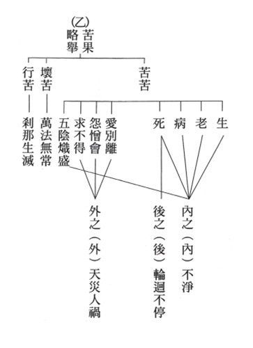

### 大佛頂如來密因修證了義 諸菩薩萬行首楞嚴經—七處徵心（二）

*戒慧講述／淨本整理*

七番問答覓心目

不知所在無實體

對境而生由滅因

能見所見性空寂

【科判分析】

丑二、隨執隨破

（七處破心或云七番破處）

寅一、「破在內」（內處）

前段最末，佛問阿難尊者心與目之所在，阿難尊者於是一一提出他所執著的處所，而也隨之被佛一一攻破，此大段之問答稱為七處破心，或七番破處。

一、「阿難引十生同計在內」

阿難尊者引出一切眾生可分十類，同樣都是心在身內。

二、「如來以不見身中為破」

如來就是釋迦牟尼佛，佛以眾生無法看見自己身體內部，來破除阿難尊者心在身內的觀點。

（一）、「喻定次第」（定境定見也）

透過比喻來決定境界由內到外的次第。

１、「定境內外」決定環境的內外次第。２、「定見次第」決定從內到外所見的次第。３、「遠見之由」

說明能夠看見遠方的理由。

（二）、「出定總名」

顯示出如來大定的總名稱。

（三）、「正與決破」

佛正面破除阿難尊者心在身內的觀點。

１、「按定所答」按照阿難尊者所回答的內外境界次第。２、「反難失次」反問阿難尊者能否見外不見內（見遠不見近）。３、「就謬難破」依上述比喻，破阿難尊者的錯謬處（破除他說心在身內的觀點）。

(1)「先與合定」先將阿難尊者觀點的錯謬結合比喻指陳出來。

(２)「詳申其謬」詳細申論阿難尊者錯謬處。(ａ)「在內不見謬」心在內卻看不見身體內的錯謬。(ａ１)「正難當見」正面問難，若心在內應當見到身內臟腑等。(ａ２)「以淺況深」以淺處來比況深處。(ｂ)「昧內知外謬」不見身內卻能見知身外面的錯謬。(ｃ)「遂與決破」由見推理破除阿難尊者認為心在身內的觀點。

【經文解釋】

阿難白佛言：世尊，一切世間十種異生，同將識心居在身內。縱觀如來青蓮華眼，亦在佛面。我今觀此浮根四塵，祇在我面。如是識心，實居身內。

阿難尊者對佛稟白：「一切世間的眾生，隨其不同見解而造作各種差異之業，由業而生十種不同的形象，不管如何，他們的共通點就是心識都居在身內；縱然見如來，即使眼如紺青色，望之如出汙泥不染的青，也如十類眾生在臉面上；我也同樣依觀察眾生而知我的眼耳鼻舌四根，只在我的臉面上，如此心識實際是居於身體內。」

十類生是十二類生中（胎、卵、濕、化、有色、無色、有想、無想、非有色、非無色、非有想、非無想），扣除無想跟無色，泛指一切眾生。青蓮華眼形容佛眼，是離開煩惱欲望的眼睛，眼神如嬰兒般。青者紺青，即帶青的琥珀色，佛的眼瞳如赤子之眼，大人者不失赤子之心。此處阿難尊者的觀點，也是大多數人的看法，就是心在身體之內，眼睛在外，我們都是藉由外在眼看，由心去感知，俗話也說眼睛是「靈魂之窗」，眼睛在外是內在心靈的窗口。

佛告阿難，汝今現坐如來講堂，觀祇陀林，今何所在？世尊，此大重閣清淨講堂，在給孤園。今祇陀林，實在堂外。
佛陀告訴阿難尊者：「你現正坐在如來講堂中觀看著祇陀林，這是什麼地方呢？」阿難尊者回
**答：** 「世尊，這個廣大有重重樓閣的清靜講堂，在給孤獨園裡面，而今祇陀林的林樹，確實是在講堂之外。」

「祇樹給孤獨園」是佛陀行腳弘化中，一個很重要的道場，位於舍衛國城外，是奇花異樹、林木蔥鬱的美麗林園，原本屬於該國的太子祇陀所有。後來給孤獨長者想買下此林園，供養世尊講經說法，依祇陀太子的要求，他必須用足以鋪滿園林地面的黃金來購買，這是給他刁難，沒想到給孤獨長者果然照辦，讓祇陀太子十分驚訝。由於黃金只鋪在地面，無法鋪在樹上，所以祇陀太子決定，園林由給孤獨長者買下供養，樹木則由他來供養，因此才稱為「祇樹給孤獨園」。所以講述本經的地點，就是在祇樹給孤獨園中的講堂內，講堂之外，可以看見園中的花草樹木，稱為祇陀林。

阿難，汝今堂中，先何所見。世尊，我在堂中，先見如來，次觀大眾。如是外望，方矚林園。
佛陀接著問道：「阿難，你現在在講堂中，先看見什麼呢？」
**答：** 「世尊，我在講堂中，先看見如來您，其次看到旁邊的大眾，如是再往外望，才看到外面的林園。」

阿難，汝矚林園，因何有見。世尊，此大講堂，戶牖開豁。故我在堂，得遠瞻見。
佛說：「阿難，你遠矚林園，是什麼原因才能看見呢？」
**答：** 「世尊，我們所在的這個大講堂，門窗都開通，是故我在講堂中，得以遠瞻而見到林園。」

爾時世尊在大眾中，舒金色臂，摩阿難頂。告示阿難，及諸大眾。有三摩提，名大佛頂首楞嚴王，具足萬行，十方如來一門超出妙莊嚴路。汝今諦聽。阿難頂禮，伏受慈旨。

就在此時，世尊在大眾之中，舒展出他金色的手臂，用手摸阿難尊者的頭頂。世尊告示阿難尊者及在場大眾：「有一種三昧，名為『大佛頂首楞嚴王』，能夠成就各種菩薩法行，這個法門是十方如來超出一切世俗高妙而無法形容的莊嚴路，你現在仔細地聽。」阿難尊者頂禮，伏身接受如來的慈悲意旨。

佛身體顯現金光色相，表徵說法瑞相，以手摸阿難頭頂，表現對他親切地攝受以及他們間的特殊情誼。三摩提是定的名稱之一，義譯為等持，就是平等持心，不受昏沉、掉舉、散亂等干擾。佛在此時特別說出「大佛頂首楞嚴王」的名稱，因為將要跟大眾開示最微細的宗派見，也是因為這樣的宗派見才能證得如來大定。「大佛頂首楞嚴王」之意，已經在經題處解說，這是十方如來究竟堅固的大定，具足廣大行與甚深見，可以同時見空性又同時見世俗，高妙至極而無法言說。

佛告阿難。如汝所言，身在講堂，戶牖開豁，遠矚林園。亦有眾生，在此堂中，不見如來，見堂外者？

佛陀告訴阿難：「如你所說，身處在講堂之中，門戶開通，所以能夠遠矚林園。也有眾生在此講堂中，沒有看見如來而直接看見講堂外面嗎？」

阿難答言。世尊，在堂不見如來，能見林泉，無有是處。

阿難尊者回答道：「世尊，在講堂裡沒有看見如來，而直接看見外面的林泉，完全沒有這樣的事情。」

阿難，汝亦如是。汝之心靈一切明了。若汝現前所明了心，實在身內。爾時先合了知內身。頗有眾生，先見身中，後觀外物？

佛說：「阿難，你也是如此。」「你的心識靈動，可以明瞭一切事物。若你當前能明瞭的心識，確實在身體裡面，這個時候應當先完整地了知你內身。難道有眾生，先見自己身體中，而後觀看外面景物？」

縱不能見心肝脾胃，爪生髮長，筋轉脈搖，誠合明了，如何不知。

必不內知，云何知外。

「縱然說心肝脾胃這種深層的臟腑不能見到，淺處指甲毛髮的生長、筋脈的轉動變化，確實應該是完全能明瞭，如何會不知道？必然不能知道內裡時，又怎麼能夠知道外面？」

是故應知汝言覺了能知之心住在身內，無有是處。

「所以應該要知道，你說那覺了能知的心識住在身體裡面，完全不正確。」

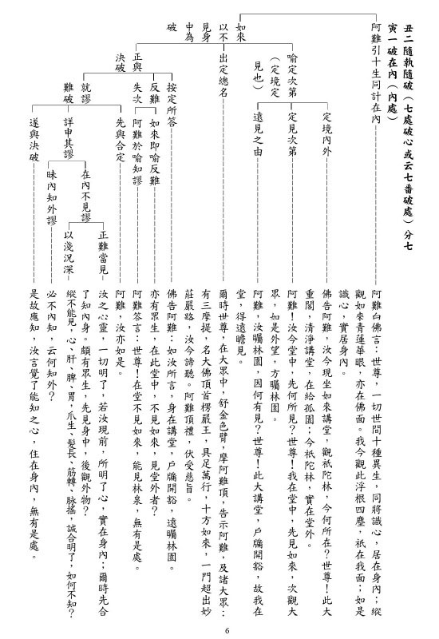

### 人生大事不能忽略的事實 得助念與失助念之損益比較—得助念

*戒慧講述、編輯部整理*

業轉力大在臨終

助念功德難思義

平時累積善因緣

升沉竟在一念間

本章談得助念、失助念之損益比較，即得助念之益、失助念之損的比較。說明外緣的重要，一如善財童子在文殊菩薩指導下，參訪五十三位善知識，他從凡夫修學一路至成佛，就是靠這些外緣善知識的教授及三寶的加被，使其發心快速成就。

內因、外緣都必須具足，可是臨終時，外緣尤為要。攸關生死存亡，攸關生到西方極樂世界，或者繼續六道輪迴，這樣的利害關係，一差就是八萬四千里。

得助念舉劉曉愚居士為例，科判正明緣善得助念必可當生了脫，即能夠緣善的助念可以了生死。正明下分四段，第一段是素位護佛教常培福德，劉曉愚居士素守本位，是佛教有力的外護，公門公權力大，因而對佛教的保護或破壞，力量皆強。

第一段—素位護佛教常培福德下分四小科：

一、    歷任公職常為國忙

經文：

劉曉愚居士，名景烈，江西贛縣人。少年留學東瀛，與蔡公松坡等同學。光復後，曾任第一屆國會議員。民六七年間，任職方司司長。

劉曉愚居士歷任公職，常為國忙，他留學日本，光復後在大陸做第一屆的國會議員，後任職內政部的方司司長，可謂忙碌於公門。

二、    從兄學佛護持法門

經文：

從堂兄好愚居士，名景熙者，乃贛州大紳，素尚佛學。故居士少時，對法門亦肯護持。

劉曉愚居士從堂兄好愚居士學佛護持法門，其堂兄乃贛州大紳，在地方上德高望重，影響力大，他平素崇尚學佛，劉曉愚居士受家風所感、見賢思齊，年少時就有護持法門的因緣。

三、    主持公道保護寺產

經文：

城中壽量古剎，頹廢已久。民國初，土人藉辦國民小學之名，並謀得全佔字據，盤踞其間。後由居士發起，請大春和尚兼任住持，藉資保護。及民八九年，寺與該校涉訟，均由居士德望所及，一倡百和，靡然風從，凡地方紳，商，學界各正士，一致主張公道，遂將學堂遷出，保全寺基，及贖回田租若干。

時江西城中有壽量古剎(壽量寺)，相傳建立在梁武帝時代，頹廢已久。民國初，土人藉辦國小之名取得了字據，便盤踞其中不肯離去，於是劉曉愚居士請大春和尚兼任住持，藉資保護寺產，興弘正法。而請神容易送神難，至民國八、九年時，壽量寺與該校涉及的種種訴訟官司，都由居士的德望所及，登高一呼，商界、學界、各界、與佛法相應的修學之士、能夠主持正義的公道之士皆響應，讓土人遷出學堂。居士曾為此地的國會議員、方司司長，在地方享有聲望勢力，故能順風而轉，保全寺院的基業，也贖回田租若干。這只有用公權力才有辦法，善用公權力來保護正法，結合當地有力人士，維持正法流通，比一般做善力量還大，也跟後面得助念大有關係，因為他對佛教的貢獻實在太大了。

四、    全力贊襄保全重興

經文：

至二十二年開馬路，該寺適當路線，已定中為大馬路，兩旁作小菜場，全寺盡毀，萬無保存之餘地。緇素已至山窮水盡，知森昔日佐助大春和尚，與該寺向有因緣。其時在蘇隨侍印老，必識有力護法，函請設法挽救。適居士亦由避難來蘇，已皈依印老法師，吃花素，修淨業，法名德誠。森為二十尺之鐵質大士法相起見，奔走呼號。得以達到保全，進而重興者，亦得居士讚襄之力不少。迨其二十五年回裡，寺事尤多賴維持。

民國二十二年因為開馬路，該寺適當的路線，已定中間為大馬路，兩旁作小菜場，因此全寺盡毀，毫無保存餘地，寺院僧眾已到了山窮水盡的時候，正疑無路時，便想到昔日德森比丘曾佐助大春和尚，與該寺向有因緣，德森比丘是在蘇州隨侍印光祖師的侍者，想來必定認識一些有力的護法，於是寫信希望能夠設法挽救，此時剛好劉曉愚居士亦因避難而來蘇州，並且已皈依印光祖師，吃花素(方便素食)、修淨業，法名德誠。為了要護持佛法，所以德森比丘當仁不讓，以二十尺之鐵質大士法相(曾經是江西省最高的一尊佛像)起見，到處奔走呼號，希望能得到有力的助援、保全寺產，進而能重新興隆佛法、振作風氣，劉曉愚居士出力不少，並於民國二十五年回江西省故里，保全壽量寺的法物，並大力護持。

第二段—隨緣做功課，宿業難消，分四小科。

一、    修持難專

經文：

但因公私眾務紛繁，信心雖發，實行難專。每日不過少時功課，隨緣修習而已。

儘管劉曉愚居士能夠素位護持佛法，從公到避難，都盡力的護持佛法，可以說是一位有力的外護居士，可是在修學上，因公私眾務紛繁，信心雖生，修行難專。每日不過少時功課，隨緣修習而已，這成為修行重大的考驗與障礙。佛法最可貴的是內明之學，著重內發實修、解行並進，對治煩惱習氣，修行講究善巧方便，否則一般在家人，眾務繁忙，只能隨緣修學，難以對治往昔所造的惡業，以及在臨終生起的障礙。

二、    宿業感報

經文：

至二十七年秋末，因宿世今生殺業所感，又發生大病。（當身未皈佛時，喜打鳥網魚，殺害許多生命。民十幾年時，曾生對口瘡，病勢危殆，痛苦之極，遂發願斷此惡習。因念觀音菩薩救苦救難，忽憑空聞香，病遂漸愈。）

到了民國二十七年秋末，因宿世今生殺業所感，又發生大病，他當年尚未皈依佛門時，沒有正知見，喜打鳥網魚，殺害許多生命、惱害眾生。故民國十幾年時，曾生對口瘡，口腔潰爛，痛苦之極時，發願斷此惡習，念觀世音菩薩救苦救難，忽憑空聞香，病遂漸癒。他在病苦中懂得以苦為觀察，內省發願，產生覺悟，實為不易，一般人大概都不堪苦痛折磨。

劉曉愚居士或有善根，或有善知識開導，故發願斷殺害眾生的惡習，更結合念觀世音菩薩的修學法，感應憑空聞香，劉曉愚居士將來對佛門會有大貢獻，所以佛菩薩願意事先幫忙他。一個家庭中如果其子弟們將來對佛門做大貢獻，這個家不知道要蒙受多少的福報，可惜一般人不會知道。這樣的人看似平常，可是一但修行的力量被提起時，就容易全部拉起來。實修的這一分，一定要跟公家發心結合，才能夠一方面護持公家，一方面藉著公心來轉變他的業力，而團體或大家庭的力量會回過來助他轉變業力。

三、    以病為藥

經文：

纏延日久，痛苦難堪，令其子發莊，匯洋數百圓，囑森供養印老，及代作其他功德。

森辦理後，回函勸其長素，聞至年底始實行斷葷。

分為兩小段，其一是發心供養，因為殺業感大病纏延日久，將近半年，使劉曉愚居士痛苦難堪，乃令其子劉發莊匯好幾百銀圓，託付祈請德森比丘替他供養印光祖師，因為印光法師是他的皈依師父，也是一代的大德，這樣的善知識緣很殊勝。並且請德森比丘幫他代作種種利益眾生的功德，把錢用在刀口上，非常難能可貴。

按理講，劉曉愚居士隨緣做功課，應道力薄弱，但他卻可以撐半年，還發心勇猛，供養數百大洋。他如何懂得這種道理？這就是交往善知識的好處，得外緣護持，決戰點是心力。

其二是實行斷葷，德森比丘為其供養與作善行後，就回函勸其長期茹素。因此時已是生死關頭，吃素能長養慈悲心，是殺生業的正對治，劉曉愚居士經過勸導後，內因外緣具足，便開始茹素。

四、    眷屬得緣知要

經文：

延及二十八年三月，病勢日重。幸妻妾子媳，皆印老之皈依弟子，均知臨終助念之緊要。乃於十七日，向壽量寺，請二僧為之助念。

延至二十八年三月，病勢日重，幸而劉曉愚居士的妻子、妾、子、媳，皆印老之皈依弟子，均知臨終助念之緊要，外緣太殊勝，一門皆善根，組成佛化家庭，這與居士往昔很多外緣是跟佛教結合有關。乃於十七日，居士病危，家屬便向壽量寺引請兩位出家僧人來為助念。

接下來這段是臨終得助念瑞相殊勝，下分三小科。

一、    居士預知時至

經文：

至十九早晨，居士自知當辭塵世，遂令抬出庭前，一換空氣。喚兄弟囑咐後事，並令長子發莊，跪聽遺囑。

外緣都生起時，就是把他過去善根的遠因轉成現在助念的近因，至十九日早晨，居士自知當辭塵世，遂令抬出庭前，一換空氣，可見他頭腦清楚。接著便交代後事，喚兄弟囑咐後事，並令長子發莊跪聽遺囑。

二、    大眾及時念佛

經文：

說畢，眾見面色特異，即仍抬回臥室。二僧與家人，同聲助念佛號。發莊敬捧阿彌陀佛接引像，請其觀看。

交代完後事，就可以放下好好的念佛。眾人見老居士臉色特異，把居士抬回臥室，二僧與家人同聲助念，長子發莊敬捧阿彌陀佛接引像，請老居士觀看。

三、    居士臨終現瑞

經文：

因大病初起，仍為頸項外症，致左手下垂，數月不能提舉。正近屬纊之際，及見佛像，左手忽活動如常，舉起合掌。便現歡喜踴躍之象，急念阿彌陀佛。其時毫無痛苦，隨眾念佛聲中，安詳而逝。時年六十一，即己卯古曆三月十九日也。

此時因大病初起，左手數月不能提舉，見到佛像，左手忽然能活動如常，舉起合掌。便現歡喜踴躍之象，急念阿彌陀佛。在佛號聲中，安詳而逝，得年六十一歲。

最後一段讚因果勝妙，並勸眾綢繆，分為三小科：

一、    讚果定生西

經文：

居士大病數月，痛苦難堪，實由惱害眾生之後報重報，轉作現報輕報。及至臨終，得此瑞相，可謂諸根悅豫，正念分明，舍報安詳，如入禪定，決定生西而無疑。身後喪葬宴客，一一皆遵印老函示，概用素筵，開南贛佛化之先河。

居士大病數月、痛苦難堪，此是由於過去殺業所感，而現在重報輕受，並現諸根瑞象，正念分明、捨報安詳，如入禪定，這是生西的徵兆無疑。居士過世後的喪葬宴客，一一皆遵循印祖的指示，宴席皆為素食，開江西城佛化的先河。

二、    讚因緣具足

經文：

如斯善利，雖由本人善根成熟，而家眷飭終如法，善以助念，亦實極大助緣。

居士內因外緣具足，得以臨終助念，如理如法。

三、    勸眾早注意

經文：

故末後一著，望四眾佛子，及早注意。

最後以此例勸四眾弟子，及早注意。

以上是得助念之益。

## 孔學一隅

### 論語簡說（三十三）— 述而第七—第十五章 子貢問進止

時哉講述

生待以言問行止

探問師志知歸與

國事複雜觀本質

依仁進退能趨辟

前言

一個人的進退抉擇很重要，裡面含藏吉凶禍福，這一章孔子的抉擇是一種眼力、見地。告訴我們要依著名份來辦事情，名正言順事情才能辦成。而子貢是悟性敏捷的人才，他能問到要害，一問就知道夫子的用意，是辦事、說話不可多得的幹才。

經文

子冉有曰：夫子為衛君乎。子貢曰：諾，吾將問之。入曰伯夷、叔齊何人也。曰：古之賢人也。曰：怨乎。曰：求仁而得仁，又何怨。出曰：夫子不為也。

歷史背景與消文

本章歷史背景是孔子周遊列國第五次入衛國，當時的國君衛出公蒯輒，是衛靈公的孫子。在此之前衛靈公之世子蒯聵，被扣上謀殺南子而未成功的罪名，出奔宋國，事在魯定公十四年。至魯哀公二年春，衛靈公過世，夫人南子稱靈公遺命立公子郢，但郢不肯接受，建議傳位給太孫輒。於是衛國人乃立蒯聵之子輒為君。

同年六月，晉國臣子趙鞅挾著與衛國的宿怨，帥師名義上是送蒯聵回國，實則藉此入侵，並進兵到戚這個地方，此處是衛國之邑。魯哀公三年春，齊景公想要報復晉國昔日對齊無禮之怨，遣其臣國夏，與衛石曼姑聯合，圍困戚邑。以拒蒯聵歸國。蒯聵出奔回國，以及蒯輒繼位拒父，皆是受人挾制，而非註解所言的父子爭國。
此時孔子與諸弟子正在衛國，頗受衛君蒯輒崇敬，且有意請孔子執政。冉有疑夫子有意助蒯輒，卻不敢直接問老師，乃私自問子貢：夫子會幫助蒯輒嗎？子貢亦不了解，遂入問孔子：伯夷叔齊是怎麼樣的人？這兩個兄弟讓國的高尚德行人人皆知，子貢哪裡不懂，然子貢提問這兩個人的言下之意是，夫子若不助衛君，應說伯夷、叔齊做的對。夫子若助衛君，應說伯夷、叔齊為非。孔子回
**答：** 伯夷、叔齊是古代讓國的賢人。子貢又
**問：** 伯夷、叔齊初雖有讓國之賢，而終於餓死，伯夷是否怨恨父親，叔齊是否怨兄？子貢此問言下之意是，若夫子不助衛君，應回答沒有怨恨。而孔子回
**答：** 伯夷、叔齊二人讓國皆是求為仁，若伯夷違背父親遺言而立為國君，將心不安。叔齊是弟，兄長已逃至他國，若自己立為國君，亦心感不安，於是與兄一起逃，他們都是在行孝悌之道，都在求仁道，雖然終於餓死，但得成於仁，又有何怨呢？可見孔子講求相讓，而非相爭，這是仁政的根本，更是衛國百姓之福。子貢一聽了然於心，乃退而告訴冉有說：夫子不會幫助蒯輒。

章旨

此章明孔子進退依仁。

科判分析

此章分為兩段，第一段是「學生問老師進退」。第二段是「從師生問答當中，知老師不助衛國」。第一段子貢問老師的進退之道。第二段師生的問答中，子貢透過論伯夷、叔齊的為人，論其賢與仁，而知老師不會幫助衛國。

子貢是一個很有內涵的人。他的風範就是謙德，他善於探索老師的心志，他問老師要「行」還是要「藏」？藏就是隱居，行就是出來行道，上一章子貢借著美玉問行藏，這一章又「問進止」。

釋義

本章的歷史背景為何？

孔子周遊列國十四年，五次入衛國，此章是最後一次到衛國，時間是魯哀公六年到魯哀公十一年，孔子六十三歲到六十八歲，這個時候的衛國出公蒯輒，已在位四年，年十四歲。孔子六十八歲離開衛國，蒯輒十九歲，等於孔子在衛國待了五年。

冉求何以有本章之問？

蒯輒對孔子很重視，想請孔子執政做宰相，孔子在衛國是被待價而沽，還沒有當宰相時，就領了蒯輒的公養金（公家給予的奉養）六萬石，原憲在魯國當孔子邑宰，他的薪水是九百石，六萬石則約有六十倍的差距，可見孔子在衛國是高薪被供養。衛君請孔子為政，孔子不置可否，孔子到底要留還是要走，冉求心中產生疑問，又怕去問會被孔子責難或反問，或不置可否，於是找了說話富有藝術的子貢去問。

「唯」與「諾」有何差別？

「諾」是上對下，或者是平行。「唯」是下對上。孔子曾跟曾子說：「吾道一以貫之」，曾子曰：「唯」。「唯」就是「是的」。「諾」是「好」。長者叫你去做什麼事情，你不能回答「好」，要回答「是」。很多都要依著《常禮舉要》，才懂得長幼尊卑之分，不會失禮。

孔子是「沽之哉，沽之哉」的美玉，為何當國君禮請辦政治時，卻要觀望呢？

當時衛靈公跟彌子瑕（男）關係曖昧，而衛靈公的太太南子跟宋朝（男）關係紊亂。衛靈公的兒子蒯聵得罪了南子，被南子一黨扣以預謀殺南子未成的罪名而逃往宋國。蒯聵出逃時，衛靈公並沒有廢掉他的世子之位，因衛靈公還有一點靈性，知道此是冤案。

蒯聵出逃，衛靈公要立兒子公子郢，公子郢不願意，衛靈公死後，南子欲立公子郢，亦招公子郢拒絕，南子只好立蒯聵的兒子蒯輒繼位。

魯哀公二年夏天，衛靈公過世。魯哀公三年，晉國的趙鞅挾持蒯聵到戚（在衛國的封土裡）。齊國的國夏跟衛國的石曼姑把戚圍住，這件事情從魯哀公三年到魯哀公十五年，所以，蒯聵在戚待了十三年，回不了國家。

衛國的情勢混亂，必須由蒯聵、蒯輒解套，旁人無法幫忙，故孔子觀望。

晉國趁靈公死後，挾蒯聵回衛的目的為何？

當時陽虎在魯國得罪三家大夫，他跑去晉國，教晉國用計謀打通衛國。只要晉國能夠打通衛國，就可以攻魯國、齊國、宋國，可見陽虎是小人，國家不用他，他便想辦法讓自己的國家滅亡。

晉國表面上是要扶持還有世子之名的蒯聵回來奔喪、繼位，實際上是要入侵衛國。

事情發生在魯哀公三年到魯哀公十五年，蒯聵被圍困在戚地（現今河南），戚地是一個會盟台，雖只有十四點四萬平方公尺這麼小，卻是很重要的軍事據點。晉國如果進入戚，打通衛國，就可以打魯國、齊國、宋國，往東方稱霸。

當初，孔圉(孔文子)娶了蒯聵的姐姐為妻，生了孔悝。孔文子過世，孔悝做執政大夫，子路做他的家邑宰。後蒯聵的姐姐與孔文子的車夫渾良夫私通，出公十二年，渾良夫與蒯聵密謀，潛回衛國，挾持孔悝召集群臣以發動政變，亦殺了子路。

蒯輒逃奔魯國。蒯聵自立為衛國君主，是為衛莊公，史稱衛後莊公。

莊公三年十月，衛莊公蒯聵因言獲罪于晉國，趙簡子包圍衛國，十一月，莊公蒯聵出逃。

有注解說，此時衛國情勢乃父子爭國，真的嗎？

此講法出自鄭康成。但若以邏輯分析，若是父子爭國，則孔子不會入衛國，也不會一待待五年，還接受一年六萬石的供養。離開衛國的時候，還依依不捨，留下高柴跟子路。再者，若是父子爭國，蒯聵當國君，還會把兒子再迎回來嗎？所以歷史並不是父子爭國。

蒯聵入戚待回國就位，是否合法？若合法，衛國為何反對？

蒯聵的世子之位並沒有被廢，所以合法。衛國反對他有兩個理由，一是南子已經立蒯輒為國君，而且已經得到國家的擁護。二是現在是在拒絕晉國的勢力入侵，晉國跟衛國有世仇，蒯聵回國不能挾帶晉國勢力回來。故衛國的反對理由，一是為了保護國家，二是為了保護新立的國君。

孔子在《春秋》中如何評論此史實？

《春秋》一字褒貶，寫道：「晉趙鞅帥師納衛世子蒯聵于戚。」

魯哀公二年「晉趙鞅帥師」，可見是外國勢力，「納衛世子」，表示蒯聵沒被廢，所以他不是回來篡位。「于戚」，他回來的時候，是晉的勢力，是外國的勢力入侵。

「齊國夏，衛石曼姑，帥師圍戚。」魯哀公三年時，「齊國夏」，表示說齊國也來了，衛的石曼姑「帥師圍戚」，這裡面沒有講到衛君，按照理講，出兵打仗要國君發布命令，可見蒯輒作不了主，蒯輒只有十歲登基，南子掌握朝政。

論歷史要公正、客觀，所以不能稱他們為父子爭國，不能說他們父不父、子不子，不能扣上種種惡行。

衛國拒蒯聵回國繼位，發兵擋之。孔子沒有反對，理由為何？

沒有反對是因為他是挾晉國的勢力入侵。

衛國發生這種亂事，亂源何來？

亂源就是衛靈公，衛靈公有意要立蒯輒，可是沒有立。而衛靈公沒有廢蒯聵，蒯聵有衛國世子之名。該廢的沒廢，該立的沒立。就造成了回來的是世子，蒯輒是被擁立的國君。照理蒯輒不應該拒絕世子，可是世子挾帶晉國的勢力入侵，國人當然要發兵，齊國是跟晉國是世仇，齊國也要發兵，所以，這是一場國際戰爭。

南子欲立公子郢為君，此人不願，其理由為何？何以注云此人賢且智？

衛靈公死後，南子要立公子郢，公子郢不願意，因為他知道國家大政掌握在南子手上，充滿很多變數與災難。再來，他認為世子沒有被廢，所以即使自己被立也沒用。注云此人賢且智，賢指其不要位子，智指他能夠衡量利害關係。

子貢何以要用伯夷、叔齊來問？

因為伯夷、叔齊的狀況跟蒯聵、蒯輒類似，伯夷跟叔齊都是孤竹君的孩子，伯夷是嫡子，叔齊是庶子，孤竹君想要立叔齊，可是沒有遺詔。

子貢把伯夷比成蒯聵，把叔齊比成蒯輒；伯夷沒有被廢，叔齊沒有被立；蒯聵沒有被廢，蒯輒沒有被立，這樣的問法是《詩經》的比法，孔子不得不答。

而夫子答以「古之賢人」，因為賢者內心是沒有欲望的，約著伯夷、叔齊都讓位來說。

古之賢人的面相很多，為什麼只問怨乎？

因為賢者內心沒有私怨，伯夷、叔齊最後餓死於首陽山。他們可以怨父親為什麼不立遺詔，害得他們選擇逃走，終究餓死。子貢問「怨乎」，是詩眼，意即夫子若不助衛君，應說伯夷、叔齊做的對。夫子若助衛君，應說伯夷、叔齊為非。

伯夷、叔齊何以能無怨？

因為他們心中是賢者，而且是求仁，既然求仁得仁，又有何怨呢？好比男女相悅組成家庭，父母養孩子，過程縱然艱辛，亦不會埋怨。仁既是一生的理想、追求，又何來怨。

伯夷讓位是孝，叔齊讓位是悌。伯夷讓位是因為爸爸屬意弟弟。他站在孝的立場，叔齊站的立場是悌。孝悌是仁之本，求仁得仁，為了理想、為了他的目標去努力奮鬥，又有何怨。

子貢聽完夫子之答，何以馬上知道夫子不幫助衛君？

首先，他們不是父子爭國。再來，解鈴還需繫鈴人，還是要蒯聵、蒯輒自己解決問題，旁人幫不了忙，孔子在等待他們兩個怎麼解決問題。

有注云，此時的衛君蒯輒，是位君不君，臣不臣之人，真的嗎？

如果是「君不君、臣不臣」，孔子怎麼會留五年？蒯輒是被南子跟國家擁立的國君，何來君不君，他也不是蒯聵的臣子，何來臣不臣。

夫子到底有沒有聽懂子貢問的用意？
孔子六十而耳順，一聽即知子貢用意，立刻回
**答：** 「古之賢人。」子貢再
**問：** 有怨嗎？孔子馬上說：「求仁而得仁，又何怨？」意即伯夷站在孝、叔齊站在悌，兩人都是求仁得仁，孝悌、仁是天爵，國君是人爵，有志於天爵的人，人爵不是他的在意處，怎麼會怨呢？

子貢真的有聽懂夫子之意在不助衛君嗎？

子貢很清楚求仁而得仁，蒯聵跟蒯輒最後的決戰點就是要讓，如果他們不表態、沒辦法讓，孔子也無法幫誰。

總結

人生不是為了名跟利，重要處在賢跟仁，內心的修為是賢跟聖，外在的整個事業是靠仁心，這是人生的出路。

名聞利養有好有壞，合乎道義、仁、賢的名聞利養是好的，反之則是災難。

《老子》說「天道無親，常與善人」，內心有賢，外在又能行仁，這樣的人會得好報。伯夷、叔齊雖然餓死，但心安的那一分才是人生的出路，心安，即使過得窮愁潦倒，都是快樂的。若吃得飽、穿得暖，卻一天到晚擔心受怕，這個日子又有何快樂。

此章子貢妙問、孔子妙答，非子貢是不能問、非孔子是不能答，我們可以從中學習子貢說話的藝術、《詩經》的比法，也可以看到孔子答話的精準，看出孔子在論史、論人的眼力，這也是《春秋》的眼力。進退出處如果有經學的見地，必然能趨吉避凶、改變命運。

問答

**問：** 由本章可推斷，這時候孔子在衛國出仕的意願，也可以顯示出孔子這時候在衛國出仕的，這樣的是否是正確？

**答：** 孔子這個時候絕對沒有在衛國出仕，如果孔子現在在衛國當官，就不能只觀望是否幫衛君，而是一定要助衛君。所以，孔子並沒有在衛國做事，只是領了公養之金，是衛國國君養賢的待遇。

**問：** 孔子贊許「管仲相桓公」是仁。此章伯夷、叔齊不顧社稷，相繼出奔，導致商朝亡在紂王的手上，是否有過失呢？

**答：** 伯夷、叔齊不是商朝，是商湯王所封的一個小國–孤竹國。伯夷、叔齊是守著小義，不以下犯上，武王伐紂是行大義，因為紂王已經失去了人性，這時不能以常格來論，所以，選擇都對。但就整體來說，武王符合大義，伯夷、叔齊符合小義，孔子都讚歎！

**問：** 伯夷、叔齊雖然是小義，但是他們修的是天爵，試問人爵和天爵的分別是什麼？

**答：** 人爵就是人中的地位，比如說卿大夫、國君，天爵就是道德仁義。國家有道，被重用為卿大夫，是人爵、天爵皆有，若國家無道，窮困一生而沒有人爵，可是有天爵。孔子就是有天爵、沒有人爵。

**問：** 孔子在等待蒯聵與蒯輒他們如何來解決這個問題，他們能不能直接以父子的名份來解決？如果不宜，有沒有什麼更好的解決方法？

**答：** 他們不可以父子的名份出來解決，因衛靈公心意不在蒯聵已經很久了。

也不能以兒子的名份來解決，蒯輒就算要讓國，國家臣民也不讓他讓，這一章難解決就難在他不是父子爭國，可是解決之道還是要看父子。

天爵要別具一隻眼來經營，具備看未來的眼光，知道人生要如何經營。而且是心安理得、心曠神怡、身具輕安。經營天爵者不是賢者就是仁者。

所以怎麼解決？就是至少有一方一定要讓，或是兩者都讓，孔子才有辦法解決。

**問：** 如果當初「晉國納世子蒯聵于戚」的時候，衛國直接派兵去打趙鞅，再把蒯聵救出來迎回衛國，立為國君，會不會也是一個解決的辦法？

**答：** 衛國不是晉國的對手，晉國打衛國的目的是要讓衛國一通，就可以打齊國、魯國、宋國，此時齊國會保護衛國。因為齊國跟晉國本來就是世仇，這是一場國際的紛爭，很難解決。

**問：** 如果伯夷、叔齊的出走是對的，那萬一留下來的繼承人不賢，導致誤國害民，這樣又怎麼能夠說他們是賢人？又怎麼能說有智慧呢？

**答：** 一個是孝、一個是悌，他們就是天爵。合乎孝悌的就做，不合乎孝悌的就不做。當然站在大義的立場，有待他們更高的智慧去解決，不過他們至少能夠站在這一點上，孔子也應該讚歎！

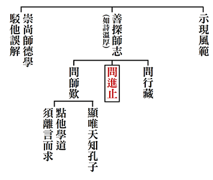

### 孝道跨時代的意義與價值—孝經簡說（十八）

時哉講述／淨域編寫

經文攝多義

挖掘義似金

友之法語言

改之命大吉

前言

諫就是勸諫，諍就是諍論。眾人知孝的本質是順，然而要一昧地順嗎？其次，一般人都喜歡聽好話，聽讚美褒獎的話，若有人勸諫時，我們心裡是愉快還是不舒服呢？再者，一個人的心智高、心量大，想法往往與世人相反，當聽到別人對他規過勸善，其心是如何？他與常人不同的地方，在於懂得接受別人的雅言、正言與勸言，所以能夠贏得他人的恭敬。他若是一位領導者，便會贏得部屬的擁護；若是一位國君，會贏得臣子們的忠心；若是個父親，會贏得孩子們的敬重；若是老闆，會贏得員工的愛戴。所以，通達人情世故、有豐富閱歷的人，始知納諫的重要。察看一般心量小、智能低的人，很討厭別人對他的勸諫，自然無法接納別人的雅、正、勸言。這樣的人不能走上正道，無以德學充實，最終損失的是自己。

本章為《孝經》的第二段，即是分別顯示孝道的修學法與義理。孝子除了對父母和順外，還要懂得諫諍，勸諫過程中難免有冒犯的地方，這就是諍。到底什麼樣的時機該勸諫？又勸諫須講究什麼方法？它的效果如何？入文後逐一說明。

本章經文是：

曾子曰：「若夫慈愛恭敬，安親揚名，則聞命矣。敢問子從父之令，可謂孝乎？」子曰：「是何言與？是何言與？昔者天子有爭臣七人，雖無道不失其天下。諸侯有爭臣五人，雖無道不失其國。大夫有爭臣三人，雖無道不失其家。士有爭友，則身不離於令名。父有爭子，則身不陷於不義。故當不義，則子不可以不爭於父，臣不可以不爭於君。故當不義則爭之，從父之令，又焉得為孝乎。」

科判分析
其架構為-需要諫諍。曾子先
**問：** 順是不是孝、孝是否一定要順呢？孔子答道：有時候是要諫諍的。科判答釋諫諍為孝旁有括弧「喻親於道」是很重要的旨趣，實是孝道裡很高的境界，這個道才是家庭、社會與國家要經營的本質。孔子反面告誡答說，一昧地順從是不對的，接著說明勸諫的利益。天子如果有勸諫的大臣，天子得保有天下。諸侯有勸諫的臣子，諸侯能保有國家。大夫有勸諫的臣子，大夫會保有封地。讀書人有勸諫的朋友，讀書人會贏得美名。父親有勸諫的兒子，父親便能如法而行。如此看來是謂「喻親於道」。既然謂之「喻親於道」，子女怎能不學道呢？勸諫他人需要有正知見。

其次結示，須要勸諫的時機是父母不義之時。不義即是言行不如法，而勸諫講究時機、方法，非是放縱己意的勸，此諍包括不惜犯顏直諫。若凡事順從，隨順父母的傷天害理，這哪裡稱作是孝呢？至於父母的一些無傷大雅小嗜好，就無需任意勸諫。以上為整體架構。

釋義
首先，曾子來
**問：** 孝是不是一定要順呢？

曾子曰：「若夫慈愛……。」

指我已經聽聞了慈愛，也聽過了對父兄、君王、長官恭敬，如此做能讓父母安心及揚名。揚名是因為能夠辦政教，乃至於身體力行宏道；名聲能夠推廣出去，即是對父母盡了大孝，這些都是聞命。聽聞教法叫作「聞命」，命，即是老師講給你聽的，就像長官的命令一般，必須要去執行。佛經有所謂的「依教奉行」，命就像依教奉行，接獲命令時即須執行，聽聞教誨時必要奉行。如此觀之，聞命二字頗有味道，非是左耳進右耳出，而是像接受命令一樣要去執行的。
接著，曾子斗膽請
**問：** 兒子聽從父親的教誨，宛如接到命令般要去執行，這樣算不算孝呢？此時，孔子反面告誡這是不對的，說：

「是何言與？是何言與？」

這說的是什麼話，話不可這樣說呀！意即曾子所問的問題不對，孔子以告誡的口吻回答，不可以一昧的順從。如果父親的教誨不義、不如法，這種行為必須去勸諫。不僅是兒子對父親如此，孔子接著舉出五個例子來說明。

首先說以前天子身邊若有七位諫臣，即便辦理政事不如法(無道)，也不會喪失天下。邢昺《疏》說：「昧以教，昧以正」，就是不能以道及正知見治國。辦理政教不以正知見為本質，諸如耍手段、算心機、搞權謀等，謂之無道。天子雖然無道，若有勸諫的臣子七人，就不會喪失天下。再者，諸侯若有五位勸諫的臣子，即便諸侯無道也不會失去國家，例如吳王夫差即使治國無道，有伍子胥這樣的諫臣，越國再強也不敢兵犯吳國。大夫若有三位諍臣，大夫雖然無道也不會失去封地與祿位。讀書人有規過勸善的朋友，此處未寫雖無道，為何文氣轉變了呢？因為讀書人若無道就交不到朋友，所以不能說雖無道，而言身不離於令名。讀書人未致仕，無人輔佐，須靠著道與友交往，謂之「以文會友」。有不如法的地方，朋友會規過勸善導引你到正途，此時依然不離開美好的名聲。而父親若有規過勸善的孩子，則父親身免陷於不義，此謂之「喻親於道」。

勸諫的時機是

「故當不義」

之時，如果不義、不如法的時候，

「則子不可以不爭於父」、「臣不可以不爭於君」

。不義就必須勸諫，否則何能算是孝？然而許多子女在勸人的時候，一手指著人家，實際四指是向著自己。所以，勸諫別人的時候，要像《大學》章句所言的一樣，就是「無諸己，而後非諸人」。當我沒有這個過失的時候，我勸說他人才會有效果。

前章已將孝順的道理說明，凡修身、齊家、治國、平天下都歸到孝順裡，包括對父母生前死後的孝。但並沒有就反面來說，若父母不如法的時候該怎麼辦？於是有了此章。曾子之所以有這一問是因為《禮記‧檀弓篇》說：侍奉父母要把他們的過失隱蓋不冒犯。如此說來，莫非是不能冒犯勸諫父母呢？若依孔子前章所說，似乎都不能冒犯勸諫，要一昧的順從？因此曾子才有這樣的提問。然而，孔子說：

「是何言與？是何言與？」

意即話不可以這樣說，曾子每在關鍵時刻提問，孔子也順勢開演孝道的另一面相。可見老師的善講，還要觀待學生的善問才能發揮。

《孝經》前提到對父母恭敬、安父母的心及揚名聲以尊崇父母，可是未提到慈愛。本章曾子說：「若夫慈愛恭敬」，但是孔子前面沒有講慈愛，曾子是不是聽錯了呢？其實不然，此慈愛之「慈」在古書上，有時是父母對子女，有時候是子女對父母，兩者都可使用。例如：《禮記‧內則》說：侍奉父母要以慈來奉美好的食物。什麼是慈呢？即是父母的形象在你面前很可愛，心裡看了就非常舒服的那個面相叫作慈。可見這個慈是通於父母與子女的，父母看子女很高興，而子女看父母時有沒有很高興呢？往往都是父母看子女很高興，子女看父母親是否亦如是。這個慈用的真好呀！《禮記‧喪服四制》中說：殷高宗在位五十九年，他在父喪的時候叫作「慈良」，意即又慈又善良。慈是說他心裡面想的都是父母，一想到父母就很高興。《莊子》一書中也說：事親孝慈。不僅有孝，還有慈，慈就是打從內心裡接受父母。

曾子提問「一昧的順」都稱作孝嗎？「疑思問」很重要，是君子進德修業的方法之一，即有疑必定要想辦法問清楚，才能解決內心的疑惑，充實正知見。

曾子說：「若夫慈愛恭敬，安親揚名，則聞命矣。」「夫」是發語詞，《孝經》中共出現六次，第一「夫孝，德之本也。」意即「孝啊！是德的根本。」德是內涵，而孝才是內涵的根本。懂得給自己快樂的人，是有內涵的人。然而，要怎麼給自己快樂呢？必須在外境上找到出路，就是要與人結善緣。於結善緣中，要先從父母緣起，這樣才懂得與別人結善緣，這才是人最厲害的內涵。許多人認知的內涵，都是成績好不好、能力強不強等等，但人生真正厲害的內涵是到底通不通達修福修慧的方法，而修福修慧的方法從孝開始，改運之法從孝開始。

第二「夫孝，始於事親。」意即孝從侍奉父母開始。第三個「夫」言：孝，是天經地義的事情。第四「夫然，故生則親安之。」意即是當你這樣做的時候，父母在生前是很舒服地活著。這該怎麼做呢？可以參閱〈孝治章〉內文所說。第五〈聖治章〉，說：「夫聖人之德，又何以加於孝乎！」意即聖人之德沒有超過孝的。最後，就是本章的「若夫慈愛」，「夫」一共在《孝經》中出現六次，都是發語詞。

身邊有勸諫的人多麼的重要，孔子舉例說明。先以天子為例：天子若有勸諫的臣，即便無道也不會失去天下。實例像是漢成帝時，有位興平縣令朱雲，因帝師張禹受寵又護短誤國，便上殿極力勸諫成帝。因他自比龍逄、比干，勸諫的口氣很直，成帝受不了要殺他。當衛士拖他下殿時，雙手攀著欄杆不從，直將欄杆扯斷了才被架走。此時左將軍辛慶忌出列，脫解下官帽與印信綬帶，伏在殿下叩頭說：「朱雲這個人，一向以耿直聞名於世。倘使他說的話對，萬不可以殺他；即便話說的有誤，也應該寬容他。因為你不容他，以後沒有人敢講真話。」辛慶忌叩頭流血，成帝怒意稍解，殺朱雲之事遂作罷。事後，工匠要修理欄杆，成帝卻說不要修了。因為當他看到這欄杆時，便想到直諫的臣子。天子有諍臣，雖無道，不失天下。

析疑

此章裡說諍臣，天子七個、諸侯五個、大夫三個，這七、五、三是怎麼來的呢？

各家註解開始湊數！天子為什麼有七個呢？因為天子有三公、四府，所以加起來是七個。諸侯為什麼有五個呢？因為諸侯有三卿、內史、外史五個。大夫為什麼有三個呢？因為大夫有家宰、家邑宰，家宰就像主任秘書，家邑宰就是封邑的縣長，湊齊來三個。但《左傳》說：只要是臣子都有規過勸善的責任，因為領的是百姓的薪水，本來就要服務百姓，國君如果有過錯，且這錯會傷害百姓時，領百姓納稅錢的人怎可以不勸諫呢？此時，難道大臣才能勸諫，小臣就不能也不必勸諫了嗎？並非如此。譬如家庭，難道只有長子可以勸諫父親的不義，次子、三子都不能勸諫嗎？並非如此，意指天下之大，哪怕諫臣只有七個，都不會失去天下，可知諫臣的重要。若有一人肯對你說真心話，真是福報。

天子了解聽諫的好處，他該怎麼辦呢？要抱持怎樣的胸懷呢？誰是典範？

唐太宗李世民是歷史上有名的納諫之君，三十五歲登基，五十七歲駕崩，對於朝政能從善如流且勵精圖治，創造貞觀之治的盛世。他曾說：「以銅為鏡可以正衣冠，以古為鏡可以知興替，以人為鏡可以明得失。朕常保此三鏡以防己過。」看人的行為表現，可以明白得失的緣由。好的即效法，壞的就惕勵。究竟來說，我們時處有許多鏡子，不僅是梳妝台前的照鏡，只要眼睛睜開隨處都是鏡子，讀書、交友及社會現象等皆是，端看你能觀照嗎？當你將事情看明白時，可謂是「直擊禍福」。

其次，唐太宗最有名的是納諫，聽納誰的勸諫？

諍臣的典範是魏徵。魏徵從貞觀元年輔佐太宗至十七年，雖然貞觀之盛有二十三年，但後期盛況不如前十七年，正因為少了魏徵。魏徵對太宗是知無不言、言無不盡，其奏書以《諫太宗十思疏》為代表，相承治國的道理還包括《群書治要》，將各家治國要點收錄整理給太宗看。此外，太宗在裁決上的疑誤，他都能不客氣地提出來，有時當場讓皇帝很沒面子。又因為有賢淑的長孫皇后，太宗才知道君明臣諫之寶貴；意即國君是位明理的人，才會感應臣子的勸諫，如果君王昏聵，臣子就遁隱不敢說了。國家企業如此，家庭也是這樣，領導人太剛愎自用、我行我素，實在是無法長住久安的。

若天子不受諫而亡天下，有何例子呢？

試舉《孝經》來說。江逸子老師流通的這版《孝經》，乃是黃道周的書法，他是明朝崇禎年間的人物，曾對崇禎帝提出諫言，卻捱了八十大板關入獄中。在獄中十五個月身心極度受創，倚靠著破茶几書寫《孝經》，總計寫了一百二十部的《孝經》。觀其文字不慍不火，表現出讀書人的修養。清兵入關後被俘，拒不投降遭殺身亡，氣節一如文天祥般，謂之「慷慨捐身易，從容就義難」。歷史上有許多典範，都可以作為我們的標竿。

此處說天子，天子是指先王嗎？

不是。先王指夏、商、周時期有德位的人，包括：夏禹王、商湯王、周文王、周武王乃至於周公、周成王、周康王等。此處言「雖無道，不失天下」，先王皆是有德位者，所以，天子不是指先王。以上是說天子，可見諫臣的重要，人生在世有規過勸善的朋友多麼的重要。

若諸侯接受勸諫時，該有什麼樣的胸懷，誰是典範呢？

衛武公姬和，此人稱睿聖武公，他在君位五十五年，活到九十四歲，親眼見到周厲王遭流放及周宣王的中興，乃至於周幽王因寵愛褒姒被犬戎侵擾而敗亡，甚至於幫助周平王復興東周。歷經西、東周，看到了周朝的興衰，即是以歷史為鏡可以知興替，所以勵精圖治。他的作法是，要臣子們極力舉發他的過失，且年歲愈老愈害怕，擔心功勞大了，大家只對他歌功頌德。他每天活著的目的，就是希望過失愈來愈少。於是人稱睿聖武公，換言之，此人是聖人。

武公協助周平王復興東周，遷都雒邑時，年紀將近九十歲。他上朝勸周平王說：鎬京已經被打毀了，夏禹王卑宮室(宮室不雄偉)，我們勵精圖治的人，本該簡樸與百姓同甘苦共患難，這樣新朝代才能站起來。但是周平王並不愛聽，於是不倚老賣老，話點到這裡就為止。武公是一位很有內涵的諸侯，《詩經‧衛風‧淇奧》讚歎武公：「有匪君子，如切如磋，如琢如磨。」意即指武公是個精益求精的人，過失愈來愈少，像工藝品一樣愈做愈精緻。一個人的過失愈改愈少，其價值愈來愈高，表現愈來愈殊勝，成為典範。

納諫的諸侯，衛武公是典範；納諫的天子，唐太宗是典範；勸諫的臣子，魏徵是典範。那麼，勸諫諸侯的諍臣典範是誰呢？

是春秋時期的季梁。楚國攻打隨國時，楚國先以老弱殘兵誘導隨國出戰。隨君將迎戰時，大夫季梁對國君說：我們治國在修明政治，並與鄰國兄弟親密加厚，這比打敗楚國還要重要。他說「民為神主」，神明之主是人民。當你政治教育辦好了，百姓蒙受利益，你祭祀求神明加被一定管用。隨君把話聽進去了，因未出戰，楚國就退兵了。隨國乃春秋時期小國，楚國此後不敢進兵隨國，因為「季梁猶在，楚不敢伐。」一位諫臣的威力就如此之大，所以一國中頭腦清楚的人愈多，且居於高位時，國家就愈發強盛。

反面來說，諸侯不受諫而亡國的例子為何？

此要特別提伍子胥。吳王夫差建有館娃宮、響屐廊，寵愛西施吃喝玩樂，無道到了極點，但越王勾踐根本不敢打他，全因為伍子胥的關係，由此知道諫臣的威力。伍子胥死後三年，吳國出兵北伐齊國時，越國才敢乘機背襲吳國。姑蘇城密佈的水道，都是當年伍子胥與吳王合力營造的，可想而知伍子胥這個人的能力與忠心。然何以伍子胥對吳王夫差這般忠勸最終還遭殺呢？因為夫差不相信伍子胥是吳國命脈之所在，他的忠言逆耳，耿耿忠心不被看，而這一殺吳國就注定滅亡。

天子、諸侯、大夫要有諫臣，那士呢？讀書人有沒有諫友的例子？

譬《論語‧季氏篇》說：「友直，友諒，友多聞。」友直就是能夠規過勸善的朋友，友諒是此人有公心，友多聞指此人學問好，可以與之切磋琢磨，提攜他人。能與直、諒、多聞的人交友往來，是人生中無價的財富。有這種見地時，就會是個很有內涵的人，一定能改變命運。

《論語‧顏淵篇》中子貢曾問交友之道，孔子說：「忠告而善道之。」如果真心將對方當朋友看待，會彼此友善忠告，且善加引導。朋友如此交往，則彼此幫助甚大。

接受朋友的規過勸善，應該持有怎樣的胸懷呢？誰是典範？

第一個是子夏。子夏在西河教學時，貴為魏文侯的老師，德高望重，卻因喪子哭瞎了眼。曾子去看他時，子夏因己的遭遇而忿恨不平，認為自己付出很多，曾子呵責地說：首先，在西河一帶，人們只知道有子夏，而不知道有孔子，這不是過錯嗎？其次，兒子死了怎麼能夠哭瞎呢？父母死了你也沒有哭瞎，八十多歲的子夏聽了，丟下手杖向曾子謝罪，說：我離開善知識太久了，所以聽不到這麼美好的言語。孔門弟子就是如此氣象。

再來，是袁了凡先生。《了凡四訓》中說：先生曾經在丁丑(萬曆五年，時四十五歲)年，於京城遇見二十八歲的馮開之。了凡先生雖通達命理，但並不以命理來觀人，他用另外一個角度看人。馮開之有位朋友季霽巖，經常當面指責他的過失，他平心靜氣地接受責備，毫無一絲勃怒。了凡先生對說：你今年一定能夠登第。果然當年就考上了，這就是了凡先生看人的眼力；換言之，納諫的心量不是普通的心量。俗話說：量大則福大，而量大特別是在接受諫言的這一分上。回觀唐太宗貞觀盛世，與納諫密切相關。

誰是讀書人中的諍友典範呢？曾子。曾子懂得在適當時機，勸止朋友的言行，如他適時地指出子夏的過失。很多人不知道此為過失，且別人指出的時候，也不認為那叫作過失。一旦他人舉出的時候，聽了覺得很不舒服，不但臉色驟變，還會回嘴相譏，因而失去了改變命運的機會。

懂得勸諫父親的兒子，應該要有什麼樣的形象？

《論語‧里仁》篇說：「事父母幾諫，見志不從，又敬不違，勞而不怨」，意即侍奉父母時，見到稍微不同的變化就要勸諫。「幾」是隱微的意思，甚麼叫作稍微變化？乃變化的趨勢是往非義、傷天害理、損人利己之處蘊釀。當尚未發展成行為時，就要即時恭敬地勸諫，雖內心勞苦也不要有怨言。勸諫作法依據《禮記‧內則》所言：「父母有過，下氣怡色，柔聲以諫。諫若不入，起敬起孝，說(悅)則復諫；不說，與其得罪於鄉黨州閭，寧孰諫。父母怒、不說，而撻之流血，不敢疾怨，起敬起孝。」意即對父母的勸諫態度要謙和、顏色要好看、言語要溫柔，這樣的勸諫才有成效。

但是，前說的伍子胥勸諫時，不是太直接、太冒犯了嗎？須知，伍子胥對吳國有革命的情感，吳王闔閭幫他報了殺父之仇，隨後輔佐吳王夫差建立江山，裡面含藏兩代的感情，非一般的勸諫。若人極勸到這樣都聽不下去，那種昏庸與吳王夫差有何兩樣呢？而勸諫父母的典範是閔子騫，他懂得在關鍵時刻勸父親留住後母，維持一個家庭的和諧圓滿，這就是子對父勸諫的典範。

本章的旨趣為何？

《孝經》前幾章所說的孝道，乃從侍親、公心與進德修業出發，繼而對父母之喪與祭祀來說孝。而本章更重要的是要將父母引導到正道上，其作法如何？第一、為人子女是否行於正道上。第二、何謂引導於正道，歷史上有誰是典範呢？ 顏回與顏路皆在孔子的座下學習，這就是對父母最好的正道導引。此外，還有曾皙與曾子。顏路與曾皙列名孔門七十二賢，曾子與顏回都是孔門的傳承，兩人乃喻親於道的最好典範，父子都在孔子座下同學，就是最高的勸諫作法。

圖解

先看北宋李公麟的畫，畫中呈現一位氣宇軒昂的國君安坐在上，後頭環列著嬪妃，前面有一人對國君勸諫，看其態度十分恭謹。所以，勸諫要講究言語、態度及顏色。其次來看南宋的馬和之；畫面變成在宮殿裡，階梯下有位臣子在勸諫，一旁的衛士與臣子們，都眼睜睜地瞧著他。再來，元朝的趙孟頫，只是將宮殿的景象，移到戶外而已。至於明朝仇英，則是將景象移到宮殿內，更加細膩的表現。

最後，來看江逸子老師的畫。從整體氣象來看，第一眼看到的是團扇、屏風及屏風中的山水，這代表此人是能夠統攝天下的，若非天子就是國君。座上的人氣宇軒昂，整齊地穿戴著禮服禮帽，見其平伸的的手勢，概是在說「起來，平身」。大家的眼神，不約而同地望向前方，原來座下有兩位臣子或跪或立在諫言。可能跪著的人在勸諫，而另一位臣子加以補充說明。這個緩頰的動作很重要，前說朱雲被拖下堂將殺頭時，一旁的辛慶忌即時幫他緩頰，這才免去漢成帝錯殺之失。了凡先生在《四訓》中說：要懂得成人之美，要懂得分人家的謗，做善事有時要幫助別人，萬不可以看著忠臣去死。

再來看國君身旁的衛士，其表情似乎在說：一個勸諫怎麼氣氛瞬間凝滯了。這種凝滯的氣氛，往往因為說的話不中聽，大家會害怕國君等一下發怒。看大臣們的表情十分嚴肅，互相張望，莫不在等著看會發生什麼狀況。如此整體的氣象如何呢？從國君的和顏悅色及平伸的手勢看來，知道這是一幕納諫的圖作，國君能夠接納臣子的諫言，就是國家強盛的徵兆。懂得將難入耳的話，當成好聽的話來受用，此人不是普通人。

什麼是逆來順受？乃將逆境當成順境來接受。反面來說，則是順來逆受，順境時要作逆境來感受，因為有時順境反而令你起貪、放逸、消沉，故反而要當成逆境來看待。又逆境當成順境來接受，你的想法與常人不同時，命運必定與一般人不同。所以，看人能否改變命運，只要看他的氣象、聽他的想法，就知道他是什麼樣的人物。

總結

人生在世最幸福的，是有畏友。第一、這個朋友你怕他，他講的話你在意，他的存在能讓你趨吉避凶。第二、當你有這種畏友時，要感到高興；反觀自己，要充實德學、有過能改，才能成為他人的畏友。能成為改變他人命運的人，成為他人生命中的貴人，使交友有意義與價值。

再者，家庭中父親對孩子規過勸善時，孩子要有聽勸的心態；而孩子對父母親勸諫時，父母也要有納諫的心態。彼此在道上經營這個家庭時，才能夠成就家庭真正的未來，每個成員都能改變命運。還有領導者與部屬間，若能互相規勸彼此幫助，大家懂得互相珍惜時，社會就不會有燒殺擄掠、作奸犯科等的亂事。所以，辦教育才真能止住社會的亂相。本章含藏許多人生成功的祕密，真正通達人情世故的人，才會知道它的重要。

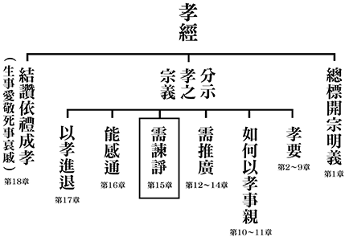

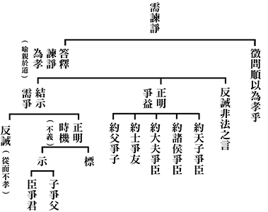

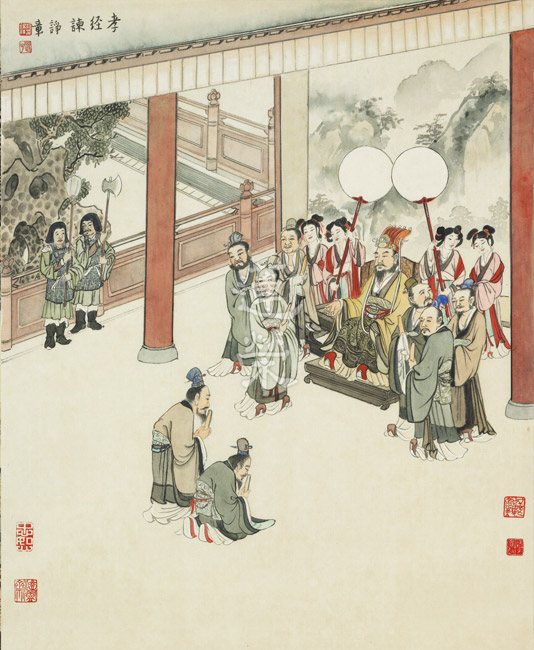

### 孔門心法—中庸之道（十三） 第十章：真正的強者（下）中道強

*時哉講述／茅茹讀書會、弘毅整理*

強者能剛亦能柔

和而不流倚中道

國家有無道皆然

用行舍藏仁與智

前言

世間定義的「強」很多，何者最強？在追求強者的境界時，是否只有更強，沒有最強？強者的頂點究竟立於何方？透過二千五百年子路的一問，開啟後人了解何謂強者的眼力；又從孔子之答中，見識真正最強的風範。究竟如何成就天下無雙，是憑任武力，還是仰賴智力，又或者有其他超越世俗的答案？真正的強出神入化，真正的強高深莫測，真正的中道強就在中庸第十章：子路問強。

強的表現形式有多種，剛、柔、進、退、見地、降伏煩惱、精進不已、忍辱求和，形象皆不同，只有透過學習經典才能知曉。強者是能夠真正辦事成功、進德修業，能夠得到人才，反之，爭強鬥狠那不是強。

經文：

子路問強。子曰：南方之強與，北方之強與，抑而強與。寬柔以教，不報無道，南方之強也，君子居之。衽金革，死而不厭，北方之強也，而強者居之。故君子和而不流，強哉矯。中立而不倚，強哉矯。國有道，不變塞焉，強哉矯。國無道，至死不變，強哉矯。

消文
子路問強者的形象。孔子回
**答：** 你問的是南方的強？還是北方的強？還是你所要學的強？心胸寬廣並且能夠替他人著想，以這種心量來教化他人，當對方無理取鬧，或者辱罵、傷害你，乃至面對惡人、小人的障難、迫害，都不會去報復，這就是南方的強。這種以柔來表現的強，是君子內心的意境。

以武器和盔甲為席，枕戈待旦，隨時準備作戰，就算戰死也不後悔，這是北方的強，是勇士內心的意境。

因此君子入世既能與他人和諧相處，又能堅守原則，不諂媚巴結、同流合污，這樣的強才是強中強。能夠立於形而上的中，不倚靠在世俗法上，不會被境界所轉，或者不偏於事或理，這樣的強才是強中強。當國家有道時，君子能夠被任用擔當重任，但仍然不會改變他們沒有出路時的道心，富貴不能淫，這樣的強才是強中強。當國家無道、小人在朝把持朝政時，君子即便窮苦潦倒，地位低微，在世俗上沒有出路，面對親友亨通發達，他們內心隱微處都沒有一點羨慕仰望，乃至到死都不會改變，貧賤不能移，這樣的強才是強中強。

析疑

一、強哉矯的語氣為何？

強哉矯的語氣是一種讚歎的語氣，這樣的人，十萬人難得其一。

二、如何做到和而不流？

和而不流，一定要懂「禮之用，和為貴」，依禮來進退，依禮來謀造和諧。禮是先王之道，是最美的，用禮來通人情世故、進退應對。善用禮者，才能夠與人和諧相處，謀造家庭、團體的和諧氣氛。

三、為什麼和而不流是強中強的形象？

《老子》第十五章中言「古之善為士者」，古代上等的讀書人，「渾兮其若濁」，雖然有上等的智慧，深厚的學問道德，但他能夠入世，可以跟鄉間老百姓和諧相處，愉快聊天，這種人出神入化，非一般人所能想像。臺灣政治人物中，蔣經國先生是最能跟老百姓和的，可是不流，就是說這個人有治國的想法，蔣先生可以作為今日為政者很好的參考對象。

大約從行政院副院長開始，經國先生就不斷深入民間，成為第一位臺灣走透透的行政首長。以行政建制來說，老百姓跟院長之間，至少隔了五道牆，老百姓的聲音，必須穿透這五道牆才能上達天聽，這顯然是不可能的。所以他喜歡跟民眾面對面，從親近去瞭解他們。這就是和而不流，雖然他是一個大政治家，但可以跟老百姓打成一片，使得他深得人心。

我們如今只能從這裡去體會上等的讀書人的形象，老子所講的上等讀書人的氣質，可以出神入化，變化莫測。

四、誰是和而不流的典範？

《論語‧微子》篇裡面說，「直道而事人，焉往而不三黜」，柳下惠被貶官三次，一般人都會認為很丟臉。有人就說，你乾脆離開魯國去發展吧。他說，我如果是正直辦事，到哪裡都會被貶官。他甘願在魯國被貶官，這叫做和，不會跟人爭名奪利。可是不流，他不會因為被貶官，就開始逢迎巴結，蠅營狗苟找出路，是為和而不流。所以《孟子‧萬章》篇裡面，讚歎柳下惠是「聖之和者也。」以上是君子入世的修學法。

五、為什麼中立而不倚是強者的形象？

君子出世的修學法叫「中立而不倚」，「不倚」即不倚靠，內心不隨境界而轉，因為境界的體性空，所以不倚靠境界，不會在順境生貪、逆境生瞋、中庸境生癡，釋儒道三家講到最高的意趣是相通的。中立不倚者，才能降伏煩惱習氣，才是真正的英雄，是強中強，可以跟大家打成一片，卻又不流俗，可以降伏煩惱習氣，控制自己的情緒，不會與他人爭強鬥狠。

六、誰是中立而不倚的典範？

《中庸》第八章中說，顏回此人「擇乎中庸」，《論語‧先進》篇說「回也，其庶乎，屢空」，這就是中立而不倚。孔子也是中立而不倚的人，《論語‧子罕》篇言「吾有知乎哉？無知也。有鄙夫問於我，空空如也，我叩其兩端而竭焉」，當成就形而上的時候，在他的心識前看不到世間，這叫做無知。「空空」是講所證悟的體性是空空，但入世時能看到兩端，可以跟鄙夫清清楚楚的分析這兩端，如功過、是非等，讓鄙夫自己決定，孔子不替人作主。

七、國有道，不變塞焉，其形象為何？

國家有道的時候，也不會改變，跟他在沒出路的時候一樣，塞就是還沒有出人頭地的時候。國有道的時候，這個人一定出人頭地，因為《論語‧泰伯》篇中說「邦有道，貧且賤焉，恥也」。

一般人沒出路時，姿態很低，有出路的時候，眼裡就沒有別人。不變塞指不管有沒有出路都一樣，是為強中強。

《了凡四訓》言「即命當榮顯，常作落寞想」，一個人命運尊貴榮顯時，要常作落寞想，好像命運很坎坷，沒人搭理。有權勢的人，要體會失勢的人的落寞。「即時當順利，當作拂逆想」，而當你權勢大，沒有人敢忤逆你時，應做忤逆想，才不會處處貢高我慢，發號施令，因為無權勢時，他人不會聽從指揮，這樣就會珍惜他人的擁護，而不會隨便浪費大好時機。「即眼前足食，常作貧窶想」，眼前吃得好的時候，要想想沒有錢的貧，沒有房屋的寠，才會惜福。「即人相愛敬，常作恐懼想」，當你有德的時候，人家對你愛敬，要常作恐懼想，要慎獨，否則被人暗裡看破，一文不值。「即家世望重，常作卑下想」，如唐朝郭子儀為國家立下汗馬功勞，家世望重，但要常做卑下想，這都是別人給的機會。「即學問頗優，常作淺陋想」，學問很好的要常作淺陋想，淺即少，陋即俗，以為自己很有學問，其實還差得遠。仔細推敲，可能《易經》、《禮記》、《詩經》以及老莊學說，還有很多沒有讀懂的地方。一個常作淺陋想的人，他才會想精益求精，更上一層樓。所以了凡先生說「天下聰明俊秀不少，所以德不加修，業不加廣者，只是因循二字」，都是因循，自我感覺良好，日復一日，年復一年，以至於被後來者居上，很可惜。進步的要領，是要常常感到自己的不足，才會進步，這就是「國有道，不變塞」的形象。

八、國有道，不變塞焉，誰是典範？

《史記》中記載，周朝初年武王病逝，成王年幼，局勢不穩，周公代理天子職位，很多謠言對他不利，因為中央不穩，所以他不敢到魯國去當國君，就送他的兒子伯禽去就職。他對伯禽說，他是文王的兒子，武王的弟弟，成王的叔叔，他對國家有汗馬功勞，在功成名就的時候，尚且「一沐三握髮，一飯三吐哺」，其實他已經功成名就、萬人之上，尚且像在找出路那般戰戰兢兢，何況是伯禽呢？這叫做「國有道，不變塞焉。」國家有道的時候，他還是如同沒有出路的樣子，謙恭有禮，禮賢下士。

九、國無道，至死不變，其形象為何？

孔子說「人不知而不慍，不亦君子乎」，國家無道，大家蠅營狗苟，鑽營巴結，沒有人知道我，我也不會內心不滿，這就是君子。

孔子還說「不怨天，不尤人，下學而上達」，「下學」就是好好學習內聖外王的學問，「上達」是能夠達於天，獲得天命。天命有兩種，一種是趨吉避凶，另一種是會得到鬼神的加被。孔子雖然沒有辦政治的天命，可是他有辦教育的天命。

十、孔門弟子中，何人有中道強的氣象？

中道強是在任何時候，不論順境還是逆境，對中道都有信心。在順境時有信心實屬正常，而在遇到逆境、困苦、障難、挫折的時候，還對中道有信心，這才是強中強。在「厄於陳蔡」的時候，孔子趁這個機會考驗弟子子路、子貢和顏回。

舉孔子傳片段為例：

孔子：孔丘之道並非邪惡，為什麼不被世人所理解，而像野獸一樣在曠野中徘徊？仲由啊！你說呢？

仲由：也許是我們的仁德還不夠，所以世人才不肯相信，或者是我們的智慧還不夠高，所以世人才不肯接受。

孔子：如果說，有了仁德，就能得到世人的信任，那麼世人沒有比伯夷、叔齊更有仁德的了，可他們卻餓死在首陽山上。如果說有了智慧，世人就能夠接受你的主張，我看殷朝的比干就夠聰明的了，而他卻被殷紂王剜心而死的。（孔子的因明論式）

孔子：端木賜，你說說？

端木賜：弟子覺得，是不是夫子之道過於高深，所以才難為世人所理解，如果夫子之道稍為靈活一下或降低一些，也許…（商人的習氣）

孔子：善於耕種的農人，未必會有好的收穫；能製作精美器具的人，也未必會遇到真正的識貨者；一個持大道的君子也是如此，未必會被世人所理解。

孔子：顏回啊！你說說？

顏回：天下不容夫子之道，正說明夫子之道的高深，如果夫子之道不求高深，那是夫子之過。如今是高深的夫子之道不為世人所接受，這就非夫子之過，而是天下執國政者的過錯。

孔子：知我者回也。

孔子很高興地說，假如顏回是有錢人，我願意當你的家宰。孔子是一個在任何苦難當中都很有幽默感的人。很多人遇到挫折時，都會像子路、子貢那樣，行有不得，反求諸己。聖人推展大道，本來就有順境和逆境，可是有時候未必都是自己的問題。國家無道的時候，持大道本來就會有逆境，這時應該要至死不變，這才是強中強。外表不能夠剛強，要和而不流。

十一、應如何較量以上三類強者？

南方強是以柔來表現強，北方強是以剛來表現強，而孔子心目中，能夠守大道的才是強。守大道的人，內心能夠中立而不倚，對外是和而不流，老子《道德經》第十五章裡面講的「古之善為士者」，就是此道理。

十二、顏回有南方強的形象嗎？

《論語‧泰伯》篇裡稱讚顏回是「以能問於不能，以多問於寡，有若無，實若虛，犯而不校」，「犯而不校」就是別人冒犯我，我不會計較，這就是南方強。

十三、顏回有北方強的形象嗎？

《論語‧子罕》篇裡孔子稱讚顏回是「吾見其進也，未見其止也。」一直不斷的往前走，至死不悔，就是北方強的形象。

十四、國無道，至死不變， 所不變者為何？

所不變的就如《論語‧泰伯》篇裡的「篤信好學，守死善道」。「善道」指內能夠中立而不倚，外能夠和而不流，就是內聖外王，是最殊勝的善道。在任何情況下都要持守這種善道，就算像《老子》八十一章中有很多變化、權變，但都是在彰顯中立而不倚，和而不流的大道，而不是像子貢那樣把「道」降低，這叫做守死善道。世間人在維護榮華富貴之道是守死，無所不用其極，他們都守死他們的道，若君子沒守死自己的道，反倒不如小人了，要抓住這種覺受。

十五、學習本章對我們實際的用處為何？

見地非常重要，有了此章的觀念，才知道要如何去表現強。有時候表現剛強才是強，有時候反而要示弱才是強；有時候進是強，有時候退才表示強；有時候跟人家和合表示強，有時候要跑掉才是強，《易經》的遯卦叫天山遯，都是不一定的。所以有智慧的人才能辦好事、趨吉避凶。

十六、本章的主旨為何？

南方強、北方強固然是強，孔子更要我們進入中道強。中道強是在國家有道的時候，也不會因為富貴而淫，國家無道時則「貧賤不能移，威武不能屈」，不能淫、不能移、不能屈的就是「中立而不倚，和而不流」的中心思想，中道的見地和處世的原則是不會改變的。

總結

儒家說「隱居以求其志」，其志業就是學習強中強，「行義以達其道」是辦政治、辦教育時，也用強中強的學問。在用人上，要用南方強的人，用北方強的人，乃至於用中道強的人。以中道治國，才是真正的強。所以君子在形而上是中立而不倚，在形而下是和而不流，這才是君子的強中強。

問答

一、籧伯玉跟甯武子是不是中道強？

**答：** 籧伯玉是位君子，國家有道時做官，國家無道時隱藏起來，不隨波逐流，就形象上言他像中道強，但到底是不是中道強，還是要看彼見地，不過孔子讚歎他是君子。甯武子，在國家有道時表現智慧，國家無道時表現愚癡，這反而是他的高明之處。後來因為衛成公用了他，衛國延續三百年，都是甯武子造就的大業。「用之則行，舍之則藏」的這一分，像君子的行為，但是不是有中道的見地，這是難以論斷的，只能說這些都很難得了。

二、學習中庸的目的是不是為了要成就中道強？

**答：** 中道強固然是《中庸》要講的強，可是想要成就中道強，就要通達《中庸》裡「中」的學問，以及《大學》中內聖的學問，《易經》繫辭傳所言「易無體而神無方」，老子講的形而上，都要好好通達。乃至於形而下的依禮進退的抉擇，都是屬於中道強，極不簡單，不容易達成，但那是目標。

三、有注解說不變塞是不忘本，好比飛黃騰達後，不忘初衷，是否可采？

**答：** 一般說的不忘本是指不忘恩負義。但是此章的不變塞應該特別指「中立而不倚，和而不流」，與世間人的不忘本是不同的，如做生意發達後，回報曾經幫助過他的人，或者是很有抱負的為政者，當他有機會辦政治時，仍然能夠把他過去的初衷都拿出來，可是未必有中道的見地。

四、不變塞焉，有註解說儘管自己的時運不濟，那也不會改變自己的操守，請問這樣的註解可採嗎？

**答：** 此註解不能採，因為國家有道的時候，你不可能貧且賤焉，不會時運不濟。儒家的觀點是，邦有道時，孔子和顏回這樣的人一定是富且貴焉。不變塞是指榮華富貴時依然像時運不濟時那樣戰戰兢兢。

五、蘇軾的《留侯論》上說：「天下有大勇者，卒然臨之而不驚，無故加之而不怒。此其所挾持者甚大，而其志甚遠也。」可歸屬何種強呢？

**答：** 看起來是北方強，像張飛、關公，關公刮骨療傷，就是北方強很勇悍的形象，大部分人都會認為這個叫做強者。沒有透過孔子這樣定義，我們還不知道南方強和中道強，而且中道強是強中強。所以子路是北方強，像子遊這些人可以叫南方強，而顏回是強中強。

六、《菜根譚》上說：「做人要脫俗，不可存一矯俗之心；應世要隨時，不可起一趨時之念。」可謂「和而不流」的處世之道嗎？

**答：** 人要脫俗，不可以矯俗，可是和而不流的時候，有時還是要很俗，老子說：「渾兮其若濁」，我跟他們很和，但不同流合污，因為我內心的想法跟他們不一樣。入世的時候，因時而變，與家人和諧相處，可以完全入俗，但內心是脫俗的。

七、良知良能與中道意思相同嗎？

**答：** 良知良能是指你本性裡有知、有能，如《三字經》上說「人之初，性本善」，然後你要好好去開發它。可是「性相近，習相遠」，是說人都是差不多的，要好好的培養，才有正知和正能，如果反向培養，就叫做邪知邪能。而中道是說，當你通達萬事萬物是沒有體性的時候，了解到人可以變得很好，也可以變得很壞，二者不同。

八、有注云，國家有道時，始終不變為標奇立異，有錯就改過自新，才是強哉矯的完人，這樣的說法可以嗎？

**答：** 不變塞，解釋成不標奇立異，矯解釋為矯正，這樣文氣是不通的。不變塞是說，在國家有道時，我變得顯赫了，但依然像過去沒有顯赫的時候那樣，強哉矯應解釋為強中強。前面的南方強、北方強，孔子都同意是強，但中道強才是真正的強，這樣語氣才順暢。

九、歷代的名臣，如范仲淹，包青天等，都是國有道不變塞的人，可以說是中道強嗎？

**答：** 范仲淹做參知政事，包青天做樞密副史，在宋朝都叫做宰相，尚書左僕射、門下侍郎都是宰相。他們雖然官居宰相，功成名就，仍然與未發達前一樣，不貪名圖利，但是這些人都不可以叫做不變塞。不變塞是說，中立而不倚，和而不流，孔子深深期許的是，君子要具備中道正見。

十、有注解說 ，中立不倚當然很好，但不可矯枉過正，變成一味倔強而不通人情世故，那也要加以矯正，這種說法可採嗎？

**答：** 這家注解的中立不倚是指過分中立不倚靠是不對的，或正因保持中立不看時機就變成騎牆派，所以要強哉矯，要把他矯正過來。中立而不倚是指我立於中而不倚靠世間法，這是在形而上的見地，叫做空空如也。這樣解的依據是以經解經，因為《論語》說「空空如也」，就是沒倚靠才空空的，「其庶乎屢空」，就是沒倚靠才會屢空。

十一、「天行健，君子以自強不息；地勢坤，君子以厚德載物。」可否用天地分別對應北方強與南方強呢？

**答：** 君子以自強不息，如果是在中道上自強不息，在學問道統上自強不息，就不只是北方強。君子以厚德載物，和而不流，能夠入世和，「和也者，天下之達道也」，也不能說是只有南方強。所以這是很難論斷的，還要看到底有沒有中道的見地。

十二、有注云，中立而不倚，是不倚於欲，是不迷於欲，若迷於欲則無法中立，如此可乎？

**答：** 中立而不倚，就是不依靠在順境和逆境上，順境和逆境的自體性了不可得，沒有境界的實體性可以倚，所以就不會有貪和瞋。所以不倚並不是不依靠，保持中立，決不表態、不發言，也不是不迷於欲，有時反而迷於欲才保持中立，不得罪兩邊，當個騎牆派。

十三、《論語》上說，君子和而不同，與和而不流是否同義？

**答：** 是的，和而不同就是雖然可以和俗人相處，但不會和他們的想法一樣，與和而不流同義。

十四、請問中道如此難學，若能安忍其中，好好學習，是否也是強的形象呢？

**答：** 是的，安忍在其中學，就是在聽聞、思維、串習修行時，真的想辦法弄懂中道，花時間去慢慢研討、品讀，克服種種困難學會，就是進入中道強的領域了。

十五、孔門中還有沒有誰問過強？

**答：** 子路本身就是強者，孔子曾讚歎他「好勇過我」，所以由他來問強比較合理。透過子路的提問，孔子把強的種類都說盡了，再問大概都不會超出南方強、北方強、中道強。不論是塞或通，國家有道或無道，都顯現為中道強。

十六、老子的「渾兮其若濁」是和而不流，這是入世，下一句的「孰能濁以靜之徐清」，是不是形而上，中立而不倚呢？一般人是和而流，濁而不能清，是嗎？

**答：** 濁以靜，這個人能夠在濁當中安住，止而安住靜。在越濁的地方，越能以靜安住中道，心水澄清，這都是刻意練習與成效。

十七、強是否就是不動的意思呢？

**答：** 就南方強來說，如果能夠安住在柔上，北方強如果能夠安住在剛上，君子居之，強者居之，不動如果是指安住在此內涵上，可以名為強。

十八、和而不流，中立不倚，國有道，不變塞焉，國無道，至死不變，是否這四者都具備才叫做中道強，如果只有其一就不算呢？

**答：** 是的。通達中道的人，他在見地上是中立而不倚，在形而下，他懂得和而不流，如老子所說「古之善為士者」是「渾兮其若濁」的形相，那一章都是在講形而上。而且入世在禮上很多的抉擇，都和中道正見有關，所以持戒或者是在禮上要清淨的人，都要以中道正見、因時因地制宜的變化抉擇，而不是呆板教條的去做。

十九、中庸的「至德」跟仁的「全德」有什麼關係？

**答：** 仁的「全德」是指孝弟忠信、禮義廉恥，這些德目通通是仁的範圍，仁是總相，這些是差別相。比如說「忠」，我盡忠才能跟上級和合，而和的目的是為了利益天下蒼生，所以忠也是仁。再如「孝」，家裡面經營和諧的風氣，就是我要經營國家的和諧風氣，所以孝也是仁。「信」，只有守信，朋友才會和我們合作，跟朋友合作，才能辦出利益眾生的事業，所以信也是仁。可是中庸「至德」的德是講智慧力，是所有智慧中最高的智慧，形而上的智慧，沒有這種智慧很難入世。

二十、南方強是君子居之，中道強也是君子的內涵，兩者區別為何？

**答：** 孔子也說君子不應該只有形而下，也應該在形而上來成就君子的內涵，聖人是有君子內涵的聖人，君子是有聖人內涵的君子，這才是儒家的全貌。儒家當說君子的時候，就含藏著聖人，說聖人的時候，就含藏君子，有時不能單純的看君子是形而下，看聖人是形而上。

結語

經學見地越來越高，對世間就越來越了解、越來越融入，跟世間人就越來越和樂。此是能夠利益天下蒼生的學問，是要延續的道統，也是民族的命脈。經學的通達，是我們現代人更應該具備的正見，才能走入時代、領先時代、莊嚴時代、利益時代。

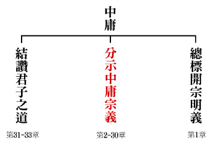

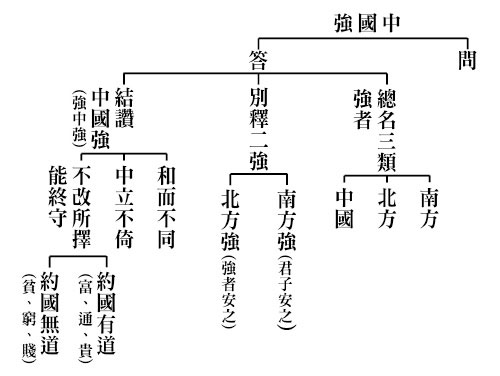

## 藝術賞析

### 孔門七十二賢淺說（三十）— 秦祖

圖／江逸子 、 文／時哉

名雖不遠播

人是躬行者

雖屈地僻處

參學得成就

秦祖，姓秦，名祖，字子南，春秋末年秦國人。鄭康成說他是陝西西安府人。

周武王伐殷紂而有天下，得力於太公姜子牙，太公封地於齊，周公制禮作樂，承續文化道統，齊國發展經濟卓越，魯國則為春秋時代文化樞紐。孔子生於魯國，終身為學不厭，誨人不倦，刪詩書、訂禮樂，五十而知天命，通曉《易經》，韋編三絕，做十翼。祖述堯舜，憲章文武之道，並加發揚光大。

當時秦楚之邦雖有一股新氣象，而文化仍然離不開齊魯之淵源，秦國的地理位置距離中原較遠，秦祖能夠突破千里迢迢的障礙，從師於孔子，想必是一位好樂於學習，努力提升自我之人。而他的學習成果也十分卓著，宋高宗稱讚他「秦有子南，贊贊述作。守道之淵，成德之博。範若鑄金，契猶發藥。歷世明祀，少梁寵爵」，即讚美秦祖能頌揚傳述聖學，深遠地守持大道，廣博地成就德行。受聖人教化，竟能如聖人一般，聖人教化於他猶如醫治病，藥到病除，可見秦祖是一位躬行實踐者，賢德為歷代所祭祀。

秦祖在東漢永平十五年從祀，唐朝時封為少梁伯，宋朝加封為鄄城侯，明朝嘉靖年間改稱先賢秦子。

畫中的秦祖布衣整齊樸素，寬鼻，大額頭，顴骨突出，頭上梳著髮髻，腳蓋長筒黑布鞋，表情肅穆，有著純樸堅毅之相，似乎也有點像秦朝兵馬俑的人物造型，或許這正是春秋時期秦人長相的特徵。

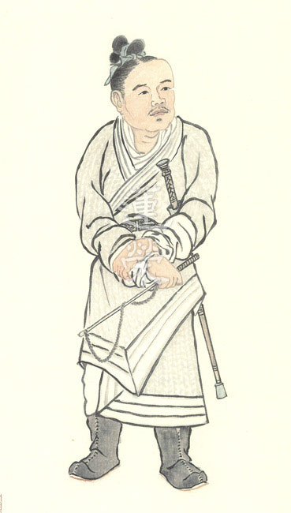

### 華夏精魂千秋（二十九）— 明倫史畫（鞠躬盡瘁 諸葛亮）

圖／江逸子　文／淨域

兩表酬三顧

隆中天下對

託孤寄命才

任重道遠德

史畫

諸葛亮，字孔明，東漢徐州瑯琊郡陽都縣（今山東省沂南縣）人；生於靈帝光和四年，卒於蜀漢懷帝建興十二年（西元一八一~二三四年）。年幼雙親俱亡，叔父諸葛玄前往徐州照料。因曹操攻打徐州陶謙，便帶諸葛亮及弟均等家人，前往襄陽投靠荊州刺史劉表。耕讀於南陽郡鄧縣（今襄陽市西二十里），稱作隆中。

建安元年（西元一九六年），獻帝從李傕手中逃出，曹操迎往許都，挾天子以令諸侯。次年叔父病逝，諸葛亮十六歲，俊逸豪邁有匡天下之志，好唸〈梁父吟〉，常以管仲、樂毅自比。時人不以為意，只有好友徐庶、崔州平等識之，譽稱臥龍先生。

建安六年，曹操攻汝南，劉備敗走，劉表准其屯兵新野。建安十二年冬，徐庶向劉備推薦諸葛亮，三顧茅廬始於隆中對策。亮分析天下形勢，提出「先取荊州為家，再下益州三足鼎力，後進中原一匡天下」的構思，進用為軍幕。

建安十三年曹操為丞相，南征荊州。劉表病死，子劉琮請降，劉備於長板坡敗逃至夏口。諸葛亮往東吳柴桑（今江西省九江市）作說客，在魯肅與周瑜的共意下，說服孫權聯合劉備以抗曹。赤壁之戰曹軍大敗，魏、蜀、吳三國鼎立之勢形成。

赤壁戰後，蜀軍又取下荊南四郡，劉備拜亮為軍師中郎將，督軍於臨烝（今湖南省衡陽市），負責充實軍需。建安十七年，劉備進兵益州，諸葛亮隨軍平定各郡縣。十九年攻破成都，劉璋投降；任諸葛亮為軍師將軍，鎮守成都負責提供兵伐後援。

獻帝延康元年（西元二二○年），曹丕篡漢自立為帝。隔年，漢中王劉備稱帝，以亮為丞相，領司隸校尉，天下三分鼎立。章武二年（西元二二二年），劉備奪荊州敗退永安（今重慶市奉節縣），隔年病死白帝城，臨終托孤劉禪於亮，說：「子若不可輔佐，取而代之。」諸葛亮以「敢盡股肱之力」表明忠貞之節。

諸葛亮整軍經武、勵精圖治、開誠布公、信賞必罰，懷帝劉禪拜為武鄉侯。建興三年（西元二二五年）平服南蠻；建興六至十二年，五伐曹魏，鞠躬盡瘁，死而後已。八月，終因積勞成疾，病逝五丈原，葬於勉縣（今陜西省）定軍山，享年五十四歲。曹魏大將軍司馬懿稱讚他是「天下奇才」。

圖解

章武二年，劉備奪荊州敗退永安，隔年病死白帝城，臨終托孤於亮，說：「君才十倍曹丕，必能安國，終定大事。若嗣子可輔，輔之；如其不才，君可自取。」諸葛亮以「敢盡股肱之力」表明忠貞之節。

《三國演義》中將劉禪寫成是「扶不起的阿斗」，因其治國無能使之後方不穩，所以，導致諸葛亮連番北伐失利。然而庸能的劉禪，諸葛亮為何不廢而代之，死前還安排能臣良將輔政，讓其在位長達四十一年之久呢？揆其因或是，第一、亮為忠臣：其感念劉備「三顧茅廬」之情，必將盡心佐政一統天下。第二、出師無名：蜀漢以「匡扶漢室」為口號，講究仁義，訴求「漢賊不兩立，王業不偏安」。若其代劉，就成了曹操第二，師出北伐即名不正了。第三、天下未統：當時天下三分，魏、蜀、吳各據一方，而蜀是其中的弱者。此時若廢掉劉禪，劉備的舊屬漢臣可能異心，如此蜀國自亂無益於一統大業，自背於匡扶漢室之初衷。

江逸子老師所繪之圖，即是描述當時白帝城託孤之景。於宮室中，病弱的劉備坐在帳內，一旁的女侍小心服侍著。劉備雙手合抱於胸前，目視著帳前的諸葛亮，微顫的嘴似乎在說：「如果阿斗這孩子，實在是無法輔佐，你就取代他吧！」諸葛亮聞此臨終之言，即刻伏地痛哭地說：「我哪敢不盡心盡力地輔佐他呢！」一場託孤大戲於焉展開，兩旁的重臣們聽了，不免也要同心掬淚，共向於一統江山的大業。

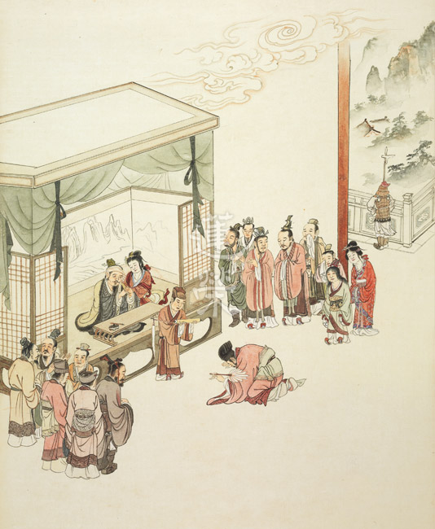

### 道藝春秋畫作介紹 峽谷無垠 — 山水終究是山水

*圖／江逸子 、 文／編輯部整理*

一生是一種堅持

傳承與不懈努力

留待知音的賞析

得象得志得其人

江老師筆下的「峽谷無垠」畫卷長五十公尺，奇特壯觀，畫中景色變幻莫測，山勢高低起伏，有著馬遠跟夏圭的筆意，途中的蒼松就像游龍般變化莫測，鬼斧神工。江老師在大峽谷實地寫生後，經過用筆、用色、用墨、線條、暈染，或寫實或寫意的工筆與揮灑，將山石、蒼松、雲霧、水紋，水流、激湍、人物表現得淋漓盡致。這裡面有深厚的傳承、歷練、揣摩、體悟，刻畫出大峽谷的神韻。

大峽谷位於美國亞利桑那州西北部，是科羅拉多河經過數百萬年以上的沖刷與堆積而形成，其地形、地貌不斷改變，終於呈現無法想象的奇景，作者以敬天畏地的心情來描摹寫生，回台灣後以寫意、傳神來表達他對這片山水的體悟，當作者以實景做基礎，呈現心中的大峽谷時，彷彿帶領我們以各種不同的角度來欣賞大峽谷，或深入其中或旁觀變化，或高空俯瞰，或谷底仰望，種種不一而足，令人歎為觀止。

畫作整體的山水畫是頂部平坦，岩壁垂直而下的巨大山石，斧劈皴的畫法極有魄力，下面有委婉的河流。科羅拉多高原抬升時，科羅拉多河及其支流切割層層沉積岩，由此形成了大峽谷。地貌多變，將近二十億年來的地質變遷史一覽無餘，舉世聞名。大峽谷的兩岸都是紅色的巨岩斷層，既聳立又陡峭，形容為岩層嶙峋，重重疊疊上去，形容為層巒疊嶂，它夾著深不可測的谷底，並隨著太陽的強弱或氣候的變化而有各種色彩的呈現，它時而深藍、時而棕色、時而赤色，讓人驚歎大自然所呈現的花紋，光彩奪目、斑斕詭秘，宛如仙境般的七彩繽紛，難怪張大千先生跟江老師，有時候對山水的讚歎到無以復加的時候，只好用潑彩跟潑墨，來表達對山水幻變的形容，那種蒼茫迷幻，是讓人流連忘返的心境。此種心境對這仙境，是一種想像不到的體悟。

畫作中還以不同的松樹姿態來表達群山峻嶺，這種深山仙境，會讓人有雲深不知處之感。畫松是作者繪畫的一絕，他曾臨摹歷代畫家畫松線條跟神韻，還親自到古寺去看蒼松，給予自己心境上的體悟，將松樹經營宛如各種游龍神變，神乎其神、妙乎其妙。

瀏覽畫作時，先是得其象(表面的形象)，再得其神(畫中的神韻)，再來是得其志(得到作者後面的想法和佈局)，但最重要是得其人，經營這幅畫作的作者就是國畫大師江逸子。這種得心應手的畫作，就像王羲之的《蘭亭集序》，也像蘇東坡在黃州寫的《寒食帖》，只能望之興歎！人生中不可能再畫第二幅。

這與中國的山水畫風格完全不同，江老師說他一生最大的成功處就是勇於挑戰自我、挑戰潮流、挑戰框架，這是勤練苦練，加強自己的能耐外，也是通往成功的秘道。他以前求學於擅長畫小品的溥心畬先生，也承襲了張大千先生敢於突破傳統的風格，成就了他可以畫小品、可以畫大畫，乃至於西洋畫，中國畫皆能隨心所欲。

一般國畫的山水是遠看看氣象，近看看交代，畫中有很多的小景可以捕捉，或者平淡的河流，或者激湍，在激湍中還有坐皮筏，令人感到驚險萬分。在江水悠悠當中，還有兩邊無盡的風光顯現，我們在峽谷當中，心情時而平靜、時而澎湃、有時驚險過癮。畫中用羽毛裝飾頭冠，騎在馬背上的印第安人，交代了峽谷曾經是他們馳騁的家園，他們曾經在此遊獵，如今已變成觀光客吸睛之用。畫中的遊客或是擺起拍照的姿勢，或者觀看告示牌，或自顧自己的欣賞，或兩兩交談，暗示這片從來沒有開發過、保持原貌的大峽谷，是全世界很奇特的觀光景點。而我們要尊重大自然，大峽谷雖局部開放，成為景點，但遊客不是大峽谷的主人，只是大峽谷的陪襯，觀光資源永遠是國家的財富。

作者繪出大峽谷的實景，也繪出畫家的想象，在虛實之間交代了不同的地形、不同地段的大峽谷，氣候變化的瞬間，改變了大峽谷的面容，隨著文明開放，大峽谷也開放了，我們可以在大峽谷裡面，走馬看花淺嚐，也可以心領神會、流連忘返，歸去時成為內心永不磨滅的記憶，而不管你怎麼看怎麼想大峽谷，山水終究是山水。

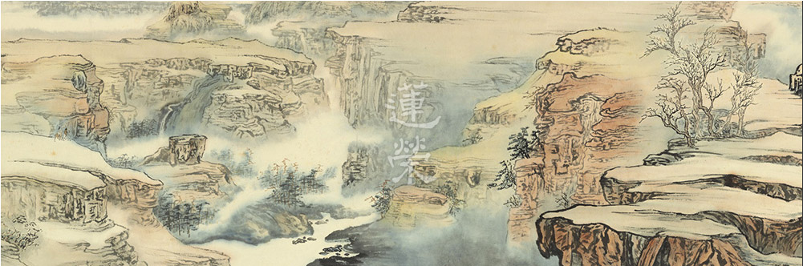

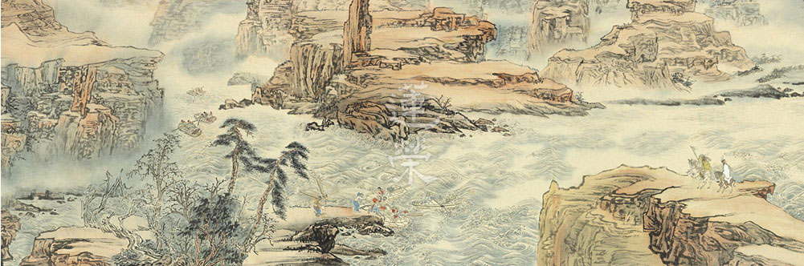

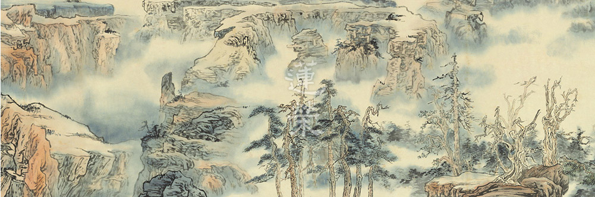

## 活動報導

### 義烏千字文創意引力工作坊

文／心若

多門學習一門入

一門學習涉獵廣

同溫取暖無意義

走出新局真挑戰

如果你想在湍流中划小艇，最好的方式是持續且快速的划，順著湍流，保持穩定度。若是本能抗拒，用力撐住划槳，想讓小艇停滯，不但無益於事，還可能因為姿勢不當，而有翻船的危險。在時代的湍流下，許多認知已悄然煥變，終身學習已不再只是一種個人追求、理想構築，而是必備的人生姿態，不願意終身學習者，便會淹沒在時代變遷的洪流下，不改變，下場就是被淘汰。過去，深入掌握一門別人沒有的知識，便可以取得成功；「現在想要成功，就必須持續參與新的知識流，不斷更新自己的知識存量」，知識流的時代，沒有中流可居，要有未來，必須有方法的力爭上游，啟蒙經典的學習亦須跟上潮流，看清教育趨勢，急流勇進，才能尋幽秘境，一探桃花源。

臺灣順利搭上世界教育先驅國家的大流，推行108課綱，實施教育翻轉，其核心理念是「成就每一個孩子，適性揚才、終身學習」，意即幫助每一個孩子找到自己的興趣、熱情所在，往適合自己的方向發揮天賦長才，如此終身學習也才能發生。新課綱的基因是素養，即知識、能力與態度的加總，培養面對未來的能力。而真正的成功是找到自己的激情，並運用己之能量去鼓舞他人，讓他人也能找尋、創造激情，當一群人都取得成功時，才是最終贏家，就像傑出的交響樂團一般，各司其職，而震撼磅礡，這是個人單打獨鬥無法企及的。啟蒙在做的事亦是激起學生興趣，進而了解經典意涵，學以致用，內化為生命的態度，組成讀書會，共同做利益他人的事業或善法，故啟蒙教育也需翻轉，須先從翻轉老師的觀念開始，所以此次義烏千字文師資培訓營我們以新的方式呈現。

新的方式就是工作坊，取名為「千字文創意引力工作坊」，因應六月底七月初學會借用華梵大學舉辦的「夏日經典森活營—千字文的山林探險」而誕生，當時以千字文為主軸，寄情於山水、寓教於樂。七月學會至義烏辦理素質親子教育營六大領域講座時，義烏青鳥家族的主事者凱總聽聞森活營的妙用，心嚮往之，想比照辦理，便請學會為之培訓師資，再由當地師資在義烏辦理千字文的冬令營。故學會於十一月中旬，由林老師組成五人師資團隊前往義烏，並採用四天的工作坊模式培訓師資，以參與為核心，互相討論激盪出冬令營的藍圖，進而產出課程，我們的角色是陪伴、引導，以及排解問題，而課程內容、進行方式、行政作業皆由當地師資產出，如此，即能開發因地制宜、量身打造的課程，老師們也能達到共同備課、互相觀摩、在一片混沌中研發創新，而能力大增。

工作坊並非訓練課程，很多人誤以為工作坊即是由一位或是多位老師輪流上台講解，大家問問題，並根據上課內容分組討論，實際上工作坊不僅於此，而是大家提出問題、共同討論、尋求解方的過程，全體積極參與，訂定執行方法，集體運作，討論過程時時檢驗共識，最終拍板定案，定案後亦持續發現問題，彼此回饋修正，才能盡善盡美。

千字文創意引力工作坊也開出幾堂課程穿插，帶領師資確立核心理念及建構應有的知識能力，包括「國學在當今教育扮演的角色」、「千字文體操—起源設計」、「背誦好好玩」、「科判分類」、「如何說一個好故事」、「千字文萬花筒(遊戲設計)」等，這些課程是一種鷹架，讓師資們的觀念從懵懂輪廓漸漸邁向柳暗花明，而此套課程亦可套用至其他教材。

義烏青鳥家族師資們都是自願投入，他們最可貴的地方是接納度高，對事不對人，不用拐十八彎說話便能節省不必要的力氣時間，也能快速進步。他們的想法本就不守舊，故對於新的思維、作法上手容易。若能加強經學底蘊，時常預習、複習、練習、切磋討論，相信辦理冬令營能有所成效。

教學力與學習力互相觀待，內因外緣具足時，新航道由此展開，兩旁的風景、氣候生態變化多端、新奇特別，彎彎繞繞、縱橫交錯，等待我們去領略，途中若遇障礙、起霧、湍流，要保持鎮定，群策群力，核心理念是我們的指南針，透過不斷的校準，認清自己的方位以及要到達的定位，在加速的河道上保持動態穩定，流出屬於自己獨特的風景。

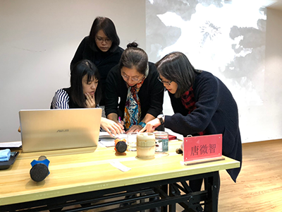

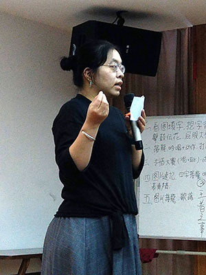

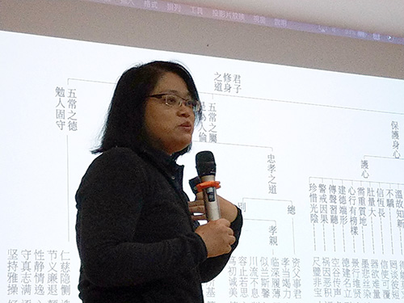

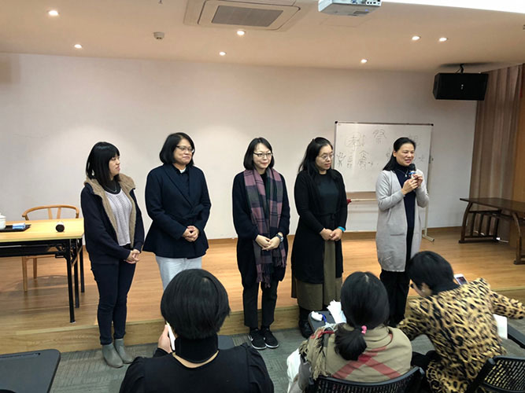

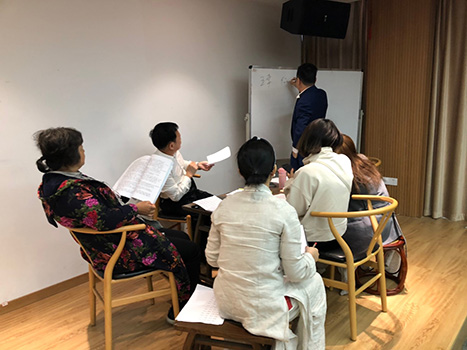

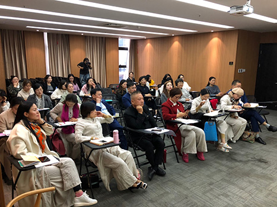

### 以大同世界理念的經驗 — 參訪蘇州固鍀企業有感

文／王文徽

目標高遠向上爬

障礙重重待克服

展館人才能推展

企業文化是靈魂

固鍀企業，是中國大陸目前唯一聯合國認證的幸福企業，創辦人吳念博董事長秉持著中華儒家文化的內涵來經營企業。有別於一般企業把公司規定和法條規範的清清楚楚，論功行賞、賞罰分明，固鍀企業以利他和信任員工為出發點，用心了解員工實際需求而設計出各種配套措施。舉例來說，部分員工來自內陸地區偏遠農村，往往孩子留在家鄉給爺爺奶奶帶，一般公司父母親最多只能在過年時回家與孩子團圓，在固鍀則有額外三次的探親假，依據路途遙遠程度不同，給予六到八天的假，如果配偶是職業軍人，則有額外兩次探親假。固鍀公司園區設有托兒所和課後輔導班，解決了孩子放學後沒人帶的問題。固鍀有特殊的獎金機制，員工的父母親和岳父岳母年紀在六十五到七十五歲之間，每人每月兩百元的獎金，八十歲以上每年再多加兩千，簡而言之，固鍀間接照顧福蔭了員工的家人。給員工這麼豐厚的福利及這麼少的規定，此舉或可提升員工的工作效率及榮譽感、自我約束力和團隊合作的向心力也會提升，固鍀員工上下班不用打卡，遲到早退的事卻鮮少發生。

員工之間也有能力在不同工作性質的不同部門之間互相支援，當公司其他部門人力出現缺口需要支援的時候，彼此樂意去幫忙、學習和承擔，用此機制訓練人人可以當一位領導幹部，必要時也可以當一位稱職的作業員，而且會主動地提出改善製程動線設計以優化出更高的產量、更好的效率、更低的成本。

固鍀員工如何做到奉公守法呢？因為透過教育和公司整體風氣帶動的影響，利他的心態被無形中培養起來了，而且吳董事長本身就是一個典範，由制度員工感受到公司為員工著想，將公司經營成大家庭，就會是成功的案例。

其次很重視教育，營造了一個可以實踐的環境。學習課程中以中華文化聖賢教育為主，以利他為出路，以弟子規和常禮舉要為處世的依據。上班前大家先讀誦，等心沉靜下來後，再上線工作。這些正向的知識背景為基石，實行在生產線上、在提升製程動線上、在吃飯用餐上、在服裝儀容上、在維護環境整潔上、在待人接物上、在孝養長輩上、在教育子女上、在社區服務上…，如此則可以為公司和員工乃至於員工的親友帶來美好的利益。

固鍀吳董事長為了讓他人了解企業文化的內涵，特請通泰的賴總規劃了一展覽館，取名為「固鍀塾」，並取材於一系列江逸子老師的國畫和結合蘇州特色，設立好幾個主題，由道藝春秋介紹孔子開始，到最後寫下心願的明信片，一路慢慢地引領大家認識聖賢文化。高科技的公司當然要以高科技的方式來呈現企業文化，每一個主題之間會運用一些巧思或是隱藏的電動門來區隔，當要轉場到下一個主題時，突然身旁的一面牆慢慢的滑開，眼前又是另一個不同感受的場景，每個人都會忍不住地發出驚訝又讚歎的聲音。光線的安排和投影技術的運用，將某些主題表現在虛實之間，使觀賞者更能沈浸在情境裡。企業文化以這般的方式呈現還真令人大開眼界。然而，如果只有高規格的硬體設施和聲光效果，而沒有導覽人員解說，則整個固鍀塾就失去了靈魂。很幸運地能有唐老師親自導覽解說，將中國五千年來核心的文化，一條線從黃帝一路串到底，彷彿進入了時光隧道，讓中華文化為我們進行一次的洗禮。

這次固鍀塾成立開幕大會，邀請海內外大德共襄盛舉，大家無不讚歎、驚艷。就像當一尊佛成功創造一個淨土時，有情可以在淨土受用佛的福報，諸佛菩薩也會前往擁護讚歎。吳董事長開創了固鍀企業好比創造了一個淨土，員工在企業工作裡得到資糧，在公司裡受教育智慧得到增長，全世界的公司紛紛慕名而來交流參訪學習。當然固鍀企業在經營上也有其困難與挑戰，諸如中美貿易戰所帶來的影響，以及員工福利雖好，但平均薪水低於其他高科技企業的問題，另外固鍀塾在開幕之後，如何找到優秀的中華文化師資，來提高導覽團隊的素質，也是固鍀塾長久發展的關鍵。我們常常聽聞「出世間法就是世間法」，感覺頗有道理。也許佛菩薩也是長時劫來一路練上去才有後來果地的成就吧！隨喜讚歎吳董事長的功德，也期許自己不斷地充實正法內涵，累積深廣的知識背景，不離良師益友，向佛菩薩學習一路練上去。

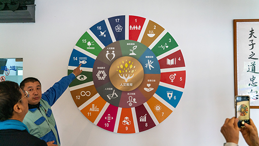

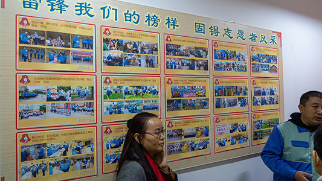

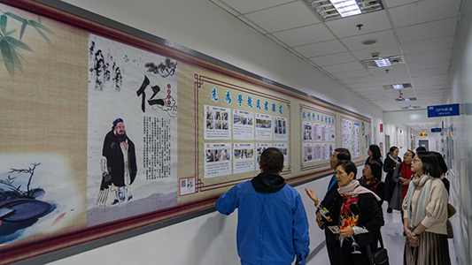

### 後記：二○一九年度回顧

*文／編輯部整理*

累積複利的成長

苦樂酸辣的過程

堅持走完的經驗

學思解行的體悟

新的一年也象徵著新的展望，《公羊傳》云「一元復始」，若新的一年是一本書，則我們有了三百六十五頁的空白，等待我們豐富內容。物理學家愛因斯坦也曾說：「學習昨天，活在今天，希冀明天。」凡走過必留下痕跡，每一步如何走得踏實、沉穩，將決定我們未來的美好、莊嚴。

回首來時路，在老師的引領下，我們又走過了一年。在佛學經典研學上，我們學習了《華嚴經》、《楞嚴經》、《入菩薩行論》及《佛說阿彌陀經要解講義》；在儒學的共學上，我們透過《論語》認識素質教育的內涵；在佛事參與上，我們一同拜懺、齋僧、共修、研學；在文化學習，我們參與了「儒者之風—孔德成先生百年紀念展」、「一生翰墨故宮情—莊嚴一百二十周年紀念展」、「巨匠的剪影—張大千一百二十歲紀念大展」、「來之鋼積墨山水大展」、「以文會友─雅集圖特展」、「小時代的日常─一個十七世紀的生活提案」等導覽；在兩岸文化交流上，我們受邀參加義烏、蘇州固鍀企業、青島和為合企業的各項交流研討；在親子活動方面，也在臺北華梵大學舉辦〈夏日經典森活營〉與義烏舉行〈暑期素質教育親子營〉及《千字文》創意引力工作坊。我們的東勢有機農園的農產品通過了中興大學的檢驗，我們的共住因緣也愈來愈趨近實現。謹此報告過去一年的具體工作事項，未來在這樣的基礎上繼續開展新年，必定更加美滿！

壹、例行課程（含啟蒙）及念佛共修：

一、中華無盡燈文化學會

１．每週星期一，晚上七點至九點，開設「入菩薩行論講座」，介紹寂天菩薩所造論中，修學者如何受持菩提心，及學六波羅蜜多行。講座自民國一○八年三月十八日開始，至民國一○九年一月十三日，已進行到「忍辱品第六」的研學。

２．每週星期三，晚上七點半至九點，時哉時哉網路教育學院開設「直播講座」──「邁向智者之路」十七堂、「論語中的時間管理法則」六堂、「從《論語》談素質教育」系列課程，目前已有十九堂課上線。

３．每週星期四，上午九點，至下午三點半，舉行「三代共修」。共修內容包括了上午的念佛，以及下午的講座，現正研討《華嚴經．賢首品》。

４．自民國一○八年九月二十九日至一○九年一月十九日，每月平均兩次，於星期日早上九點至下午五點半，進行「《楞嚴經》『五十種陰魔』研學培訓課程」，作為馬來西亞開設講座的前行。

５．每週星期六，晚上六點半至九點，舉行「週六共修」，分為成人共修班，課程為《佛說阿彌陀經要解講義》，目前已進行到「著解序文」的研學。另有兒童青少年的「同心班」限四到六歲幼兒、「學而班」限國小一到三年級、「士心班」限國小三到六年級、「學思班」限國中一到高中三年級，結合時代脈動學習經典內涵。

６．每月一次週六下午兩點至五點，開設「啟蒙師資培訓班」，建置四個啟蒙班的課程系統教材教案，老師輪流現場試教並進行團隊研討，以明倫史畫、常禮舉要、十大弟子為主軸課程。

二、臺中市無盡燈儒佛學會

每週星期六，晚上七點至九點，舉行念佛共修及人生大事研討。

三、中壢研學會

每週星期三，上午九點至十一點，舉行念佛共修及《觀無量壽經》研討。

四、宜蘭研學會

每月兩次週日上午八點半至十一點半，舉行《淨土十疑論》研討。

貳、互聯網經營：

一、「時哉時哉網路教育學院」（www.centralwonder.com），24小時持續不間斷播送分享本會文化教育課程。

二、「中華無盡燈文化學會」主網站（www.wct.org.tw），作為學會活動報導之平台，持續更新有關學會講座及活動的介紹。

三、社群平台FB、LINE、大陸微博和微信，仍繼續經營，與各地學員保持良好的聯繫互動；「時哉時哉讀書會」大小微信群組熱烈討論經典內容，形成共同學習的文化交流網絡。

四、協助後製「莊嚴展」影片剪接。並採訪歐豪年、周功鑫院長等，並製作專訪短片。

五、為蘇州固鍀塾「道藝春秋」網站錄製線上課程內容。

參、專題講座與活動：

一、民國一○八年二月二十四日至三月二十六日，共八個週六下午，邀請莊靈先生、羲之堂陳筱君女士、莊伯和先生等，為我們就「一生翰墨故宮情—莊嚴一百二十周年紀念展」進行專題演講。學會導覽師資團隊也在此期間利用週三晚間就展品進行研學。

二、民國一○八年三月三十一至五月二十六日「一生翰墨故宮情—莊嚴一百二十周年紀念展」展覽期間，負責展場導覽工作。

三、民國一○八年五月十四日與五月十七日，受邀前往警察廣播電臺，接受臺長宣介慈女士訪問，介紹「一生翰墨故宮情—莊嚴一百二十周年紀念展」。

四、民國一○八年五月十八日邀請通泰媒體總經理賴麒宇先生蒞臨本會演講，主題為「與『聯合國幸福企業』交流三百天的學習與分享」。

五、民國一○八年六月三日，受邀前往警察廣播電臺，接受臺長宣介慈女士訪問，介紹「巨匠的剪影—張大千一百二十歲紀念大展」。

六、民國一○八年六月三十日至七月四日，假華梵大學舉行五天四夜「夏日經典森活營」，以《千字文》為核心，讓青少年學子以統整式課程認識經典內涵。

七、民國一○八年八月二十日邀請前國防部副部長林中斌教授蒞臨本會演講，主題為「國際禮儀：淺見初探」。

八、民國一○八年八月三十一日邀請中國結藝專家陳夏生女士蒞臨本會演講，主題為「中國結的歷史面貌」暨手作課程。

九、民國一○八年九月二十四日，受邀前往上品蓮佛教禮儀有限公司座談。

十、民國一○八年九月二十八日邀請通泰媒體總經理賴麒宇先生蒞臨本會演講，主題為「用土地跟社會對話─讓農場不只是農場」。

肆、兩岸及國際文化交流：

一、民國一○八年七月八日至十三日，受邀前往義烏，舉行「義烏素質教育營親子夏令營」。

二、民國一○八年七月十五日至二十三日，受邀前往蘇州固鍀電子股份有限公司進行交流，舉辦導覽師資培訓，課程主題有：「道藝春秋」、「新時代的氣象─人文與科技」等。

三、民國一○八年十月四日至十月十日，受邀前往福州敦化學堂、順昌幼兒園講授觀音耳根圓通與地藏經，並承蒙江逸子老師抬愛，商討導覽一○九年春天於北京博物院的大型展覽，至順昌新華藝術幼兒園開講入行論等。

四、民國一○八年十月十五日至十月十八日，受邀前往參加蘇州固鍀電子股份有限公司進行文化交流。

五、民國一○八年十一月十二日至十五日，於義烏舉辦「千字文創意引力工作坊」師資培訓。

六、民國一○八年十一月十八日，受邀前往參加蘇州固鍀塾開幕儀式。

七、民國一○八年十二月二十五日至二十八日，受邀前往青島和為合企業三週年生命教育論壇，為與會大眾講說「從孔子的高度看命運的改變」。

伍、法務活動：

一、拜懺法會：大悲懺（民國一○八年三月十七日）、母親節、浴佛法會及地藏懺（民國一○八年五月十二日）、地藏懺（民國一○八年八月十八日）、藥師懺（民國一○八年十一月三日）、淨土懺（民國一○八年十二月十五日）。

二、年度齋僧：西蓮淨苑齋僧共九次，圓通寺、正覺精舍齋僧各一次。

陸、蓮友服務：

一、本年度學會協助助念、臨終關懷、告別式等紀念法會之蓮友，一共十位。

二、發送年終結緣品。

柒、出版傳播：

一、蓮榮會刊（一二○期至一二五期）。

二、《儒者之風》孔德成先生百年紀念展‧培訓講座合輯。

三、〈華梵夏日經典森活營〉專刊。
