# 第126期
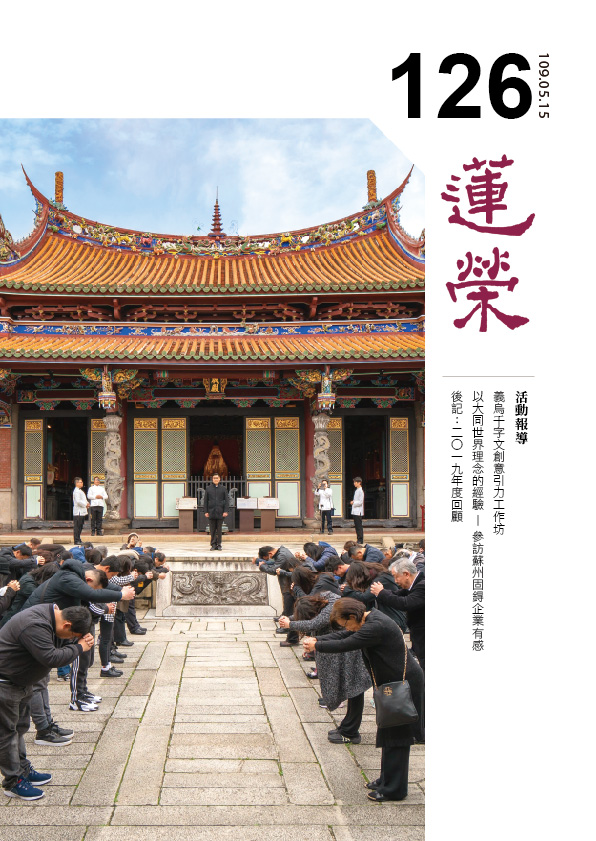

## 社論

### 庚子年初新冠狀疫情的啟示

*編輯部*

庚子金鼠不平常，冠狀病毒漫延快

居在家中能避險，安住正法除心病

心康身健真除疫，此善覺受由禍生

福禍相倚老子意，願與善友相共勉

庚子年初，中國武漢爆發「2019冠狀病毒病」的傳染事件，隨即感染人數迅速增加。為了防止病毒擴散，官方宣布封城，停止一切公共交通工具，關閉所有旅遊景點，並規定所有人居家隔離，非必要不得外出。在確診病例不斷湧入數據庫的情形下，中國公告延長春節假期與復工日期。直到近日，各國持續有病例發生與增加，但各種治療解法也相繼提出，希望不久之後，病毒的傳染就能告一段落。

從病毒傳播事件發生之始，學會就陸續在「時哉時哉讀書會」的微信群組上傳送了一些短偈，為身在對岸的善友們加油打氣，也是自我期勉的觀修參考；不論此時或在未來，若有類似的情事發生，不妨可以閱讀參酌。

面對這樣突如其來的病毒傳播，擁有信仰的我們，藉由平時薰修鑽研，已有對正法的認知，且了解共業之中有別業，因此能不隨各種訊息的牽動，將心安在正向的思維上。而由於病毒肆虐，藉此機會少出外走動，多在家中自我進修；或者必須出門，也戴上口罩，少開口、多念佛；或仍然需要上班，則減少與人交談，以正念來處理事務。

平日或較少關注健康，這段疫情蔓延的時光，讓大家更注意到自己的身體狀況，也開始注重養生，檢討作息，關心防疫，留意衛生。這是一次整體保健衛生提升的機會，我們要把握學習，善加應用。

老子說：「禍兮福之所倚，福兮禍之所伏。」很多的禍端，總伏藏在沉溺福報的舒適圈裡；很多的福報，也須藉由禍的磨礪、考驗來顯現。懂得福禍消長之道，就能善用擁有的福來創造增上，感恩面臨的禍來修煉成長。

飯疏食飲水而樂，申申夭夭是孔子

簞食瓢飲居陋巷，不改其樂稱賢哉

危機困頓練耐力，閒暇計劃未來路

接收正向不煩躁，新年猶待新氣象

孔子疏食飲水、曲肱而枕，樂處在其中，申申夭夭心曠達。顏淵簞食瓢飲、居在陋巷，人不堪其憂，顏淵也不改其樂。他們都在苦中作樂，或者說，都在苦中能自得其樂。

後世無數的讀書人們，總將「孔顏之樂」作為快樂的典範，這種快樂讓他們能「發憤忘食，樂以忘憂，不知老之將至」，由此超越時空的限制，遨遊於心靈成長的世界之中。

然而，孔顏的學習能耐，必然也是養成的。就像孔子曾說「吾嘗終日不食，終夜不寢，以思，不如學也」，可見孔子也有過探索學習的歷程。任何技巧與習慣，都要靠刻意練習成就。那麼，身處困頓的遭遇，練習各種正向思考的思維模組，也是相當好的時機。

期許自己樂觀的前進

逆緣變成增上的轉變

在資訊發達的時代，我們最不缺乏的就是方法，但缺乏的是能應用方法的機遇。等待時機不如利用時機，現前當下運用零星時間做好自我充實，平時有如陶侃搬磚那般累積學識內涵、研讀大乘經教，親近善識同法，培植往生資糧，都是我們立即可以著手進行的事。

形同閉關的庚子年

與往昔不同的經驗

給我們人生很多的不一樣

學會處逆造次顛沛的心境

天之未喪斯文向上的人生

網路上有統計，近年來的世界各國，在遇到庚子年時，多是災禍頻繁。例如一八四○年的庚子年，是中國第一次鴉片戰爭；一九○○年的庚子年，八國聯軍打進京師，慈禧太后西逃故里；一九六○年庚子年，中國遭逢連續三年的大飢荒，數千萬人飢餓而死。除中國之外，一九○○年的印度發生大饑荒，一九六○年非洲因獨立年，屍殍遍野；美國加入越南戰事；智利發生九‧五級大地震……。

不論是巧合、概率還是自然規律，今年的庚子年確實一開始就不太平。然而，「逆境來時順境因」，一切的困難都是增上的契機。倘若將災禍視作一個閉關的機會，藉這樣完全不同以往的遭遇，來重新自我審視、調整、規劃、再出發，將會帶來人生許多不一樣的變化。

「是福不是禍，是禍躲不過」，是福是禍不是誰說的算，但有能耐轉變眼前的困境，成為自己向上的資糧，那麼禍便不是禍，福就真是福。這種能耐不是嘴上功夫，要像觀世音菩薩的「侍多千億佛」，廣參方、多磨練，有如孔子「烈士不困行不彰」的親驗認知，才有「天之未喪斯文也，匡人其如予何」的自信底氣。

金鼠新年瘟疫侵，艱難猶予自希望

逆境還須堅持力，風雨更能生信心

缺憾還諸於天地，因緣待努力創造

人在遭逢逆境時，總有一種看不到未來的感覺。特別在這次庚子鼠年瘟疫的傳佈，報章媒體上不斷傳來新增的病例與死亡案例的消息，讓我們真切體會到「無常迅速」的逼迫。

面對無常，擁有信念，如《論語》云：「君子無終食之間違仁，造次必於是，顛沛必於是。」由於君子抱持著「something bigger than ourselves」（比自己更大的目標）的認知，因此能在置身於動盪的環境下，鼓舞自己與他人，並愈挫愈勇、奮力向前。

這種信念，是不置身事外的處世態度，如曾國藩說：「大抵謂天下事在局外吶喊議論，總是無益，必須躬身入局，挺膺負責，乃有成事之可冀。」

因此，有中國武漢的計程車司機張磊，在見到當地孤苦的居民沒有交通工具可以出外購物、添購藥品等情事，便穿上防護裝備，配合居民委員會的聯繫安排，義務載送需要外出的居民。由於他這輩人的「挺膺」之舉，帶動了數以千計的各地計程車義工加入。又有身在雲南的李姓夫婦，擔心武漢缺乏物資，而自發性地載送物資與蔬果，往返雲南、武漢兩地數趟，計超過一．二萬公里的路程，縱經責難，卻義無反顧。還有各地的商家紛紛每日免費送上咖啡等餐點，在免洗杯盤與餐具上親手寫上祝福，送到醫院給照顧病患的醫護人員。他們都在缺憾中帶來希望的光芒，在困難中創造宏大的溫情，因為他們知道，實際用行動來表達關愛，遠比任何言語、祝禱來得更加實際。

傳染劇毒人心危，寒冬過去春天來

一番變局需省思，新局猶待善共業

逆境需要開拓法，能力培養迎未來

品德公心是本質，趨吉避凶可預見

二○一九年冠狀病毒無形無生，彷彿隱身殺手環伺，隨時都要來殺害我們，這樣的氛圍著實讓人擔憂！好在各國的專業人士，紛紛投入研發藥品，各項防護作業也愈來愈容易施行，希望這波陰冷的病毒寒流逐漸消逝，迎來春天的暖陽。

我們要思維的是自己是否在苦難之中累積覺受，讓此時的現量體驗，成為未來的比量能耐，足以使我們像孔子、顏回遇苦不覺苦、樂學在其中，也能像觀音等諸大菩薩般難行能行、難忍能忍，來迎接一切未來的挑戰？

我們是否在危難之中充實自我，看見更大的目標，積極地為將來的十年、二十年，乃至終身學習，以增上生為期，經營此時此刻，因此從不退縮、逆流而上，突破重重難關，成就有意義的現在與未來？

我們是否在關鍵時刻挺膺而出，體察他人的需求，並藉著機會奉獻自我，盡一己微薄的力量，以成就利益眾人之事，懷抱七分仁心、三分道義，躬身入局、直面挑戰，期成入世君子的我輩中人？

同舟共濟都在一條船上

互相共勉增上自己心力

寒冬來了料想春天不遠

造次顛沛維持仁人胸懷

這次的新冠病毒疫情，連結了億萬中華民族同胞的心，也連結了整個世界每個人的心。大家雖同受病毒的威脅，但也同舟共濟，相互扶持，要一起走過這一大段辛苦的日子。

比利時的音樂家尚‧馬龍（Jean-François Maljean）為這次受難的武漢人民寫了一首歌《黎明的編鐘聲》（Chime of the Dawn Bells），歌詞末尾寫道：

「編鐘響起時，音樂終將會驅散黑暗，

陽光照耀在江面上，永不言棄。

聽到編鐘聲響起，站在黃鶴樓上，獨白：

夜走了，天亮了，天空和鐘聲一同醒來了。」

願這段苦難，如歌詞所寫，化作編鐘之聲，響徹天際，使聞鐘聲者，煩惱轉輕，智慧增生。

願我們都如武漢市花的梅花般，堅毅不撓，耐寒綻放，不畏顛沛流離，堅持仁義，心懷正法。

讓智慧的光明驅走黑暗，以菩薩的胸懷注入暖陽，願疫情早日過去，人心歸善，大地春回。

## 佛學幽覽

### 菩薩清淨的行持—華嚴經淨行品（四十二 ）

*戒慧講述、編輯部整理*

處處是修行

所見即所願

隨喜及大悲

上求與下化

丙二、指事顯因答其徵因

丁一、總徵

丁二、別顯

戊六、乞食道行時願（五十五願）

己二、所睹事境(十九願)

己三、所遇人物（有二十四願）

己三、所遇人物：樂著人

經文：

見樂著人，當願眾生，以法自娛，歡愛不捨。

樂著指對世間法很愛著，見到樂著人，我希望佛法能當作他的娛樂、歡愛不捨，不要貪著世間的五欲。在六十華嚴中，見志樂人，當願眾生，清淨法樂，以道自娛。志樂人是指有志願，且希望用佛法來當作自己的志向，並以佛法的菩提大道做為他快樂的境界。

見樂著人，樂有兩種讀音，若讀ㄧㄠˋ就是好樂，追逐自己心中的樂趣，好樂在得到，南亭老和尚及會性法師都解ㄧㄠˋ。另一個念法是念ㄌㄜˋ，樂在其中，像在打電動、玩象棋、玩電腦般精進，樂著的著是黏著、貪著、執著，世間好樂財色名食睡，還有ㄧ些人好樂去學習世間法，像是琴棋書畫等，或是好樂在研究發明。見樂著人，當願眾生，以法自娛，思維我們能否能如世間人對財色名食睡的好樂般生起，對佛法的好樂心，努力的弄懂中觀義理，並推理、完成自己的論述，研究經教各派註解就像研究各種圍棋招數一樣，分析祖師大德的注解、科判，找到規則、獲得法喜，其實培養法器的人才跟培養世間人一樣。

經文：

見無樂著，當願眾生，有為事中，心無所樂。

見世間不貪著的人，希望眾生能對世間虛妄不實的有為法心生厭離，不去愛著。心無所樂是對俗事沒有興趣，例如：不愛聊天、不愛看連續劇、玩遊戲。

有為法必須觀待造作而生起，納受時會產生三種感受：苦受、樂受、捨受。觀待過去的惡業生起苦受，觀待過去的善業生起樂受，觀待過去的無記業生起捨受。心中對於過去這三種業顯現的感受都無所樂，因為有為法皆無常，感受的自相亦不可得，苦受樂受也是回應過去自己的善惡業所引起，若不觀待眼前的逆境它不會生起苦受，沒有眼前的順境不會生起樂受，沒有眼前的中庸境不會生起捨受，這是第一分的觀察。第二分的觀察是，如果我們沒有認知它為順境的時候，請問樂受在哪裡？如果受有自相，冷氣吹來大家應該都快樂，但實際不然，對一個病入膏肓的人，一陣冷風吹過來，寒風刺骨，受的自相又在哪裡？可見是在個人的心理認知上顯現，在境界上無法成立。

萬法只有兩條路，有自相與名言生，若有一分的自相就有一分不帶名言，例如當一陣冷風吹來時，如果它有一分的自相，應該所有人都說它涼，不必觀待名言，可是剛運動完的人全身熱呼呼，會說冷氣開得不夠強，此時冷氣的自相在哪裡？冷氣的自相不可得的時候，冷氣只能名言生，名言通達它是順境時才能生起樂受，感受逆境時才生起苦受，可見樂受、苦受的自相不存在，又何謂受苦受樂呢？所以經文上說「心無所樂」，很多人會錯解為對人生沒有感覺，事實上心無所樂是勝義諦，勝義上通達受的自相不可得，觀待世俗上過去的善惡業生起眼前名言的認知。

經文：

見歡樂人，當願眾生，常得安樂，樂供養佛。

見到歡樂的人，應當生出隨喜心，歡樂人相對於苦惱人，歡樂來自於擁有財富、名聞利養、身心健康、眷屬和睦。一般人常見不得他人好，對方愈殊勝自己就愈受不了，而菩薩的心量開通，見到他人高興自己也很高興，這就是心量的訓練。

見歡樂人，願所依的是菩薩，所依的是見歡樂人，願從依靠菩薩而發、依靠見歡樂人而發。當願眾生，能願的是自己，所願的是眾生。願的利益是眾生能常得安樂，樂供養佛，而菩薩還盼望得到如佛般的三業清淨及三業之前的十種德相。樂可念ㄧㄠˋ，好樂供養佛，以供養佛是我內心好樂的境界，我就是喜歡供養佛；可念ㄌㄜˋ，我供養佛的時候樂在其中，兩種讀法形成兩種不同的解釋。

世間有增上的安樂，比如人天、解脫、成佛的安樂，其中以成佛的安樂最殊勝、最沒有過患，所以此處的安樂應指成佛的安樂。菩薩看到歡樂人時，希望他得到成佛的安樂，這是菩薩不得了的心胸。常得安樂是果，因是樂供養佛，常得安樂包括佛的殊勝加被助我除障，在教法中得到勝解，遇到善知識，這些都是從樂供養佛中得到佛力的加被。但學習教法未通達者，往往認為常得安樂的因是菩提心、大悲心、空性智慧與十度的修學，不認為樂供養佛是成佛的因，此時若不做辯證與邏輯的推理，遇到這樣的問題則無從答起。樂供養佛是指在修學佛法中，生起對佛法勝解的這一分要靠佛力的加被，乃至破除修學佛法時的障礙，使自己積聚順緣、去除逆緣，容易發起大悲心、菩提心、空性正見、在十度的修學中得到覺受，這些都是從樂供養佛、得佛加被生起。

樂供養佛的意義還可增廣，除了在佛前做供養，擺上香花水果、供品、飲食、衣服、醫藥、臥具等等，還要含藏什麼觀念呢？即我所有的努力都是用來供養佛，將大悲心拿來供養佛，將菩提心拿來供養佛，將空性的正見拿來供養佛，將努力去利益眾生作種種殊勝法行事業，拿來供養佛。諸供養中，法供養最，比供養鮮花水果功德還要大，因為供養佛是讓佛高興，而佛最高興的事情是所有眾生都成佛，如同為人子女若能好好建立自己的人格、充實內涵，將這分功德拿來供養父母時，父母最高興，所以能夠幫助自己和眾生成佛，這是供養佛當中體性最殊勝的，因為佛也是要幫助眾生成佛，居然由你去做的時候，佛會非常高興。

再者，供養的心態一定要相續，如同我們對歡樂的事情一定是好樂相續，希望歡樂越多越好，今天明天歡樂，今年明年歡樂，供養佛的心態應該像這樣的相續，而不是一成不變的習慣或只是完成一件事情，所以在供養佛的當下必須與歡樂的事情做直接的連結，心態包括：學習正法時很快樂、聽到要利益眾生就很開心、做供養佛的事業時很高興，而不是聽到要去利益眾生時就心生煩惱，聽到要去學習正法時就很無奈。釋迦牟尼佛的座下有一位弟子供養佛後，看到佛接受他的供養，便很高興地跑了五里路，釋迦牟尼佛說，這高興地跑了五里路上的每一粒沙是一個轉輪聖王的福報，可見高興供佛跟不高興供佛差別很大，我們一定要抱著歡喜的心態來做每一個善法。

結合四步的修學法。第一是當願眾生，常得安樂，樂供養佛該有多好。第二是我願眾生常得安樂，樂供養佛。第三是我能幫助眾生常得安樂，樂供養佛。第四是懇請三寶加被，我能幫助眾生常得安樂，樂供養佛。

經文：

見苦惱人，當願眾生，獲根本智，滅除眾苦。

苦惱與歡樂相對，苦惱包括身苦跟心苦，要破除身苦跟心苦一定要獲得現證空性的根本智，才可以斬斷煩惱的根本，斬斷惑就會斬斷業，斬斷業則痛苦不會出現，過去的惑業等流而生起現在的惑業，造成心裡很痛苦，是為心苦；過去的惑業呈現在生老病死就是身苦。

愛別離、怨憎會、求不得，這些苦就是心苦，是惑業的等流，惑業的等流當中，造作等流是心苦，領受等流是身苦，獲得根本智可以除掉身苦和心苦，滅除身苦跟心苦就是滅除眾苦的根本，眾苦的總相就是身苦、心苦，身苦、心苦的別相就是眾苦，當總苦沒有了，別苦也不能生，可見得到根本智的重要。

在路上看到苦惱的人，若彼身苦，會顯現病老；若彼心苦，會一臉愁雲，倒煩惱給你，當你看到這些痛苦時，除了引發自己的警惕外，還要把對方的痛苦當成自己的痛苦，這種痛苦今天在他身上發生，明天可能就在我身上發生想，除掉這樣的危機必須得到根本智，得到根本智時才能幫忙他除掉痛苦，而他想獲得根本智必須要有因緣法，你就是他的老師，所以充實自己才有能力幫助別人。

苦有三苦、八苦，三苦是苦苦、壞苦、行苦；八苦是生、老、病、死、愛別離、怨憎會、求不得、五陰熾盛。南亭老和尚講義中有些引證，唯識宗跟中觀宗的看法不太一樣，根本智在現證空性時就斷惑證真，斷煩惱障與斷所知障都是從根本智上斷，後得智是從空性定出定面對眾生時，知道怎麼修布施、持戒、忍辱，後得智能夠修福。根本智是慧的那一分，後得智是福的那一分，菩薩要修福修慧，根本智生起時能夠生起慧，後得智生起時能夠生起福，福慧圓滿就是佛。

成佛兩大障礙即煩惱障跟所知障，煩惱障分為分別煩惱障跟俱生煩惱障，所知障也分為分別所知障跟俱生所知障，分別煩惱障跟分別所知障是受宗派的影響才有，俱生是不受宗派的影響就有的。但在中觀宗的立場來說，所知障沒有所謂的分別所知障，分別煩惱障跟俱生煩惱障就是俱生我執跟分別我執，破了之後，不能生起煩惱障的習氣的那一分為所知障，所以初地到八地破煩惱障，八地到十地是破所知障。

何謂金剛後心，即能斷煩惱的心如同金剛般能摧壞煩惱，特指等覺菩薩的最後一剎那進入金剛喻定，第二剎那成佛謂之金剛後心，成佛就是斷所知障，斷俱生種習就是斷最微細的所知障成佛，八識規矩頌中說「金剛道後異熟空」，金剛道後就是指金剛後心，異熟空就是輪迴的五取蘊的體性滅除，輪迴的生死滅除，輪迴的五取蘊體性滅除，叫做金剛道後異熟空。以唯識宗來說，阿羅漢只破人我執，他雖然不會生起輪迴的現象，可是法我執的所知障還在，所以輪迴的體性還在，只是輪迴的現象不生，這是唯識宗的看法，若是中觀宗則講法不同，佛法中最難的就是弄懂宗派見。

### 佛學概要十四講表簡說（二十八）第四講表

*戒慧講述 / 宏法、淨昌整理*

受苦行相廣且劇

惑業為因相續生

追求微樂難出離

愚盲遇法縛解脫

(丙)三界統苦

苦有前一表所言的三苦、八苦，這一表言三界以內的一切眾生都得受苦，無一例外。三界即欲界、色界、無色界，三苦為能遍，三界為所遍。

●欲界—苦苦、壞苦、行苦

欲界的眾生統受三苦，欲界包括六層天(四天王、忉利天、夜摩天、兜率天、化樂天以及他化自在天)和下面的五趣雜居地（其餘五道所居處，我們人類即居此中）。因為此範圍的眾生，都有飲食、男女、睡眠等種種的欲望，故名欲界，煩惱障中以貪欲為首，貪欲是一切煩惱的根本，貪染欲塵，是一切苦的根本原因。孔子說：「飲食男女，人之大欲存焉」，不只人類之大欲，也是眾生之大欲，有此大欲，則不能出欲界，也免不了受苦苦。

●色界—壞苦、行苦

色界眾生兼受壞苦和行苦。色界包括四禪，共十八層天(初禪三天，離生喜樂地；二禪三天，定生喜樂地；三禪三天，離喜妙樂地；四禪九天，捨念清淨地)。

此範圍的眾生，因為有禪定的功夫，已無男女飲食的欲望，卻仍保有色身和宮殿樓閣等色相，及禪悅的樂受，故名色界。可是，身為苦本，仍然不離生、住、異、滅，為生死繫縛，所以仍有壞苦和行苦。

●無色界—行苦

無色界眾生單受行苦。無色界包括四層空天(空無邊處天、識無邊處天、無所有處天、非想非非想處天)。此界的眾生，所入禪定更深，名四空定，不但無飲食男女欲望，也沒有色身的執著，只留神識，以虛空為所緣，但是執我的心未破，故名無色界。神識為招苦之緣，為一切妄念所依起，所以仍有遷流生滅的行苦。

由此可見，只要是三界內的凡夫，都得受苦，無一例外。所以佛學教導離苦的辦法就是必須脫離三界。

(丁) 受苦益起顛倒

●解苦妄作，復造苦因

一般凡夫受苦時，都想要立即離開痛苦，然而沒有正知見，不了解真正離開痛苦之道，無知妄作，不但不能解苦，反而造下苦因。

●加苦續苦，無有已時

眾生受苦之後，並不是從此完結。因為煩惱不斷，會起惑造業而結果，惑、業、苦三者惡性循環，輪轉不止。

●喻如揚湯止沸

這種情形，猶如在沸湯上揚風，使其暫不沸騰，然終非治本之道，最後仍是滾上加滾而已。而治本之道便是要釜底抽薪，破障斷業，脫離三界，不再感苦。

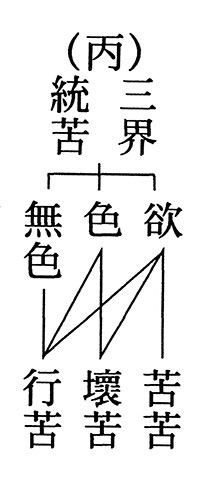

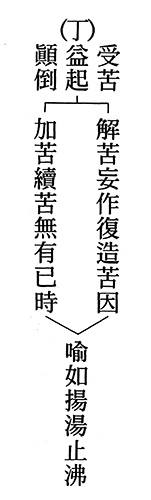

## 孔學一隅

### 論語簡說（三十三）— 憲問第十四—第三十五章 子貢問師歎，顯唯天知孔子

時哉講述

語似平常義難明

廣大知識方能解

一生學問與經歷

民族由他說意義

前言

問路時，要在意的是此人是否知道路，而非在意他的穿著、相貌。學習者要有依止善知識的眼力，找對人、學習方向須正確。大多注解把此章當成孔子的牢騷話，但此章其實是中華文化之神髓所在。

經文

子曰：莫我知也夫。子貢曰：何為其莫知子也。子曰：不怨天，不尤人，下學而上達，知我者其天乎。

消文
孔子感嘆的說：真的沒有人知道我。子貢認為夫子周遊列國已名滿天下，怎麼會這樣說，所以懷疑的
**問：** 怎麼會沒有人知道夫子您呢？孔子便說：真誠行道，卻遭逢種種橫逆，然我不埋怨上天不加被於我，因為天命如此，就得承受，也不會責怪他人對我的誤會與傷害，不論遭受何等逆境，都不怨不尤，且一步步學習形而下、形而上的學問，上達到最高境界，這不是人所能知，真的知道我孔某的，只有上天了。

章旨

孔子感嘆道不行。

科判分析

此章分兩段，第一段孔子反嘆沒有人知道他，「子曰：莫我知也夫。」意即大概沒有人知道我了吧，感嘆萬分。子貢問夫子：為何你感嘆沒有人知道你呢？孔子說：「不怨天，不尤人，下學而上達，知我者其天乎。」正面說明唯天知孔子。

不怨天指命運雖然很乖舛，可是不會怨天。不尤人指在人事上遭到很多的挫折、障難，可是不怨恨別人。下學而上達。皇侃說是下學、上達天命，故知道我的，大概是天了吧！

釋義

此章夫子之嘆，其歷史背景為何？

魯哀公十四年春，叔孫氏的車夫鉏商打獵獲得異獸以為不祥，請孔子往觀。孔子去看時，此異獸被殺傷前左腳，且已死。孔子說：這是麒麟啊，牠是有仁道的靈獸啊。牠的出現是有德天子出現的吉兆，但牠卻生在亂世，又被人打死，莫非我道已窮。

因自古麒麟出現，一定是像堯、舜、禹、湯、文、武、周公這樣的明君在位，百姓知其為祥兆，均不忍傷其身。魯國當時政治紊亂，並無明君在位，麒麟出現，又遭殺害，麒麟是最仁慈的野獸，代表孔子最想推行仁道，可是屢受傷害，一生未遇明君，雖有救世之道，終不能行於世，於是絕筆〈春秋〉。其中包括自己不被用及沒有人知道我的感嘆。

夫子之嘆語氣為何？

「莫我知也夫」，也夫就是大概吧，是一種保留的語氣，大概是沒人知道我了吧！孔孟最大的差別在於孟子說話武斷，孔子說話不武斷，語帶保留。

孔子大名鼎鼎，卻說「莫我知也夫」，豈非欺人？

孔子大名鼎鼎，其一，他在中都做中都宰，把中都治理得很好，人人稱頌。其二，他當魯國大司寇，路不拾遺、夜不閉戶。其三，周遊列國時，與各國國君平起平座，並向孔子請教國家大政，揚名國際。其四，《史記‧仲尼弟子列傳》中說：「使孔子名布揚于天下」，名聲揚名於天下，是「子貢先後之也」，子貢先前的推廣、後面的推廣。且孔子晚年回到魯國，講學的時候是盛況，不但有本國人來學，還有外國人來學。唐玄宗〈經魯祭孔子而歎之〉一詩中道「今看兩楹奠，當與夢時同」，表示孔子過世以後，會得到很多人的仰望，死後大家朝拜。而孔子說「莫我知也夫」，並非感嘆他人不知其名氣，而是感嘆他人不知道其內涵。

子貢用什麼樣的語氣反問孔子？

不以為然的口氣。用意是要引出孔子牢騷話後面的意義，孔子說：「不怨天，不尤人，下學而上達，知我者其天乎。」孔子說自己是一個「不怨天，不尤人，下學而上達」的人，知道我的大概是天吧？

夫子有何可怨天之處？

其一，孔子是大善人，可是命運乖舛，七十歲時造化弄人，兒子伯魚過世，差一點斷了後代，還好有遺腹子延續香火。其二，孔子七十一歲時，顏回過世，差一點斷了傳承。還好後來曾子能夠「一以貫之」。其三，孔子七十二歲時，愛徒子路枉死。其四，他七十三歲過世。孔子內涵豐富、心態是極致的大善人，但是命運乖舛，應該最足以怨天。

夫子有何可尤人之處？

怨、尤互文，皆為埋怨之意。孔子為國為民，懂得辦政治、教育，治理魯國時，卻受到只想要鞏固一己私利的三家大夫的掣肘、為難。魯國王道政治行不通，孔子周遊列國第一次至衛國時，衛靈公未用他，他就到了匡地，被匡人誤以為是陽虎而慘遭圍困。後來孔子回到衛國，還是沒被重用，於是轉而到曹國，亦不受用，至宋國，遭「宋人伐木」，在大樹下與弟子演禮時，掌管軍事的司馬桓魋派人把大樹砍倒，追殺孔子。孔子終於逃出宋國，到了鄭國。後來回到衛國又不受重用，只好到陳國、蔡國，準備入楚國時，被陳蔡大夫圍困，讓孔子一行斷糧七天，這樣有利於天下蒼生的人，卻處處受到人事上的災難！

夫子究竟有何能力不怨天、不尤人？

答案就在下文「下學而上達，知我者其天乎」。孔子通達整體，所以他才能夠在利益眾生當中不怨天、不尤人。很多君子入世時，雖有能耐，也懂得下學，可是往往人生的挫折很多，牢騷滿腹。像蘇東坡問太太朝雲：你看我大腹便便，裡面裝什麼？朝雲回：蘇學士滿肚子牢騷。人越入世，越有情懷，牢騷越多。孔子的修養極好，爐火純青。在患難還能堅持自己的志向，在逆境中成長，下學而上達。

下學的形象為何？

皇侃說：「下學的是人事。」《黃氏後案》說：「練習世間的事。」總而言之，就是六藝，或者是世間的技能，或者是辦政治、辦教育的學問，或者是通達人情世故的內涵，都是下學的形象。

上達的形象為何？

上達是通達於上，一是通達吉凶禍福，他懂得斷惡修善。二是通達形而上，不會被形體所束縛。上達者不會被眼前境界所轉，他知道順逆境都是考驗他做善的能耐、決心、心量，心不隨境轉。

而下學的人是很多利益眾生的方便他都會，懂得以心轉境。改變命運就是心不隨境轉，內心沒有煩惱，而能以心轉境，廣作善法。心不隨境轉是智慧的力量，以心轉境是廣種福德。

「知我者其天乎」，此處的天指什麼？

此處的天有兩種解釋，一種是通達吉凶禍福之理。第二種是指《中庸》或者是其他儒家經史所講的天地鬼神，冥冥當中都知道孔子，如揚雄《解嘲》中說：「高明之家，鬼瞰其室。」意即孔子暗地裡都被鬼神看透。

天又知道孔子的什麼？

知孔子的形而下的仁心，包括他入世的情懷、心量、見地、能耐、情操、抱負，能以心轉境。知孔子的形而上的智慧能力，使他不受形體的繫縛，進入本體，心不隨境轉。《易經‧繫辭傳》就是形而上，心不隨境轉，《易經》的六十四卦、三百八十四爻是形而下，以心轉境。

孔子到底是命好還是命壞？

一，孔子是通達經學的人，二，有機會在貴族世襲的政治制度下，做到中都宰及大司寇，短暫地實現自己的政治主張。三，在齊魯的夾谷之會，得到外交的勝利，使各國歸還侵占的土地，在政治上達到巔峰。四，他能夠群言惑亂，折中於他，以他為准。五，他過世後，弟子守喪三年，子貢廬墓六年。六，他的孫子子思，經孔子的弟子還有曾子的教導，成為儒家性與天道的傳承者。七，他得天下英才而教之，座下三千弟子、七十二賢、入門十哲，人才濟濟。八，各朝代的君王皆推尊他，連元朝、清朝入主中原都推尊。九，子孫綿延至今八十代，香火不斷。十，第七十七代的孔德成，得到諸多耆老的教導，並得到雪廬老人當他五十年的家臣，孔德成先生在雪廬老人過世時，寫了一幅挽聯：「數萬里流離備嘗甘苦與君共」，顛沛流離，一起逃難，更感人的是下一句：「五十年交誼，多歷艱難為我謀」，種種的艱難考驗，雪廬老人都替孔上公找出路。以上都說明孔子的命好。

常言「萬般皆是命，半點不由人」命運到底是天注定還是人決定？

不肯努力、不肯親近善知識、不肯下學而上達的人，當然是天註定！肯親近善知識、肯修學內涵、下學而上達的人，當然是自己決定！

既然不怨天不尤人，夫子何必又歎無人知己？

不怨天、不尤人意思是個人是否有出路都沒關係，但夫子感嘆的是內涵無法被推廣、天下蒼生無福。

他人若能知夫子的內涵，有何殊勝之處？

《漢書‧五行志》言，領導風氣者，如果能夠知政治如何辦、教育如何推廣，如何引導人心，則能夠讓災難消、福報興。顏師古的注解言，人君如果能夠「下學而上達」，通達吉凶禍福的道理，不但能趨吉避凶，還懂得「精誠」的重要，是以「精誠所至，金石為開」，能帶來國家、民族的昌盛。民間如果有這樣的高人，能幫國家培養辦政治、教育的人才，此國家帶來的強盛不可言喻。

總結

一、人生要追求的是內涵、而不是名氣。當有一天被人家知曉的時候，必須要反思自己是否真的有這樣的內涵。

二、天知孔子有多麼好，因為天知孔子的情懷、內涵、理想、抱負，所以最後說「天將以夫子為木鐸」！意即此人是傳承文化的木鐸，平民百姓出生的孔子竟然最後成為文化的「天子」，他的命令大家尊崇，解經大家尊崇！是文化界的領導者，這種天命是上天賦予的。

三、要檢視自己的學問是否真的可以下學而上達。

四、「不怨天，不尤人」是非常好的修養，孔子的不怨天，不尤人是經過種種考驗而得，這種修養又是從他好學而來的。

五、雪廬老人說「不怨天，不尤人」是不變，「下學而上達」是隨緣，隨緣不變、不變隨緣，這也是經文中最高的意境，是大乘經典最高的意境。

六、上達是能夠心不隨境轉，下學是以心轉境，這又是改變命運最好的方法。

問答

**問：** 孔子此章特別向子貢吐露牢騷，是否有特別的用意？

**答：** 孔子對自己的出路是「人不知而不慍」，沒有牢騷，可是對於自己的內涵無法推廣，無法利益天下蒼生則有牢騷，故向子貢吐露心聲。孔子吐露的本意是：君子固然要在意名氣的流通，但更重要的是自己是否具備讓他人認識的內涵，是否能夠下學而上達，這才是中華文化的本質。

**問：** 學習惟有天知的內涵，反過來就是世人都不知，這樣不會很孤單、落寞嗎？連孔子這樣的聖人都感歎沒有人知道他，這樣做有何好處？

**答：** 寂寞是因為他人不知道你的內涵，但是天知，所以也不寂寞，天會賦予另一條出路，就像孔子雖沒有政治的出路，卻有辦教育的天命。

夫子的孤獨落寞有幾個，一，俗人不知道夫子，這種孤獨落寞有何不好？二，孔子也是「近者悅、遠者來」，很多人千里迢迢來向他求學。三，亂世不用孔子，孔子正好趨吉避凶。四，他能夠充實自己、培養人才、等待未來。

聖賢有兩種，一種是隱士的聖賢，一種是「知其不可而為之」的聖賢，正好在亂世中充實自己、有力作為，給予天下蒼生出路，更顯出其修養、內涵。

**問：** 東漢張衡言上達就是佐國理民，也就是治理國家、人民之道。也有注解說上達指王道，此註解可採嗎？

**答：** 治理國民、乃至於這些王道，都是形而下，是下學，而非上達。上達指形而上，看不到形，像《老子》的無為。形而上是無為，形而下是無不為。所以孔子的學問是無為無不為，無不為而為。治下理民的事情都是形而下，可是要靠形而上的修養幫助，方能使他不怨天、不尤人。

**問：** 不怨天、不尤人與下學而上達是否有因果關係？

**答：** 真正的「不怨天、不尤人」就是「下學而上達」的不怨天、不尤人。下學的人，如果去利益天下蒼生，除非是盛世，如果在亂世當中，他要不怨不尤是不可能，一定要有形而上的修養，形而上的修養才是真正煩惱的正對治，才是真正能夠不受境界所轉的那一種修養，要靠上達，不是靠下學。

**問：** 有注解說四書五經都是講下學，只有將胸中怨尤之情都斬去，方能下學，這個注解可采嗎？

**答：** 四書五經也有講上學之處，如《論語》中顏回屢空，孔子空空，《中庸》言喜怒哀樂之未發等等。心中的怨尤完全除去一定要上達的修學法，下學而上達是下學而且上達，一個是形而下，一個是形而上，是兩件事，不是下學而後上達。

**問：** 如何定義形而上與形而下？

**答：** 形而下包括仁心、入世的方便、六藝的學習、人情世故的通達、各種技藝，這些都是下學，讓君子入世時能以心轉境。上達是心不隨境轉，脫離形體的繫縛，進入本體的修學法。所以中國文化裡有本體論、有現相作用論，叫體相用具足。

**問：** 在《論語》其他章節中，孔子也曾經感嘆「吾不復夢見周公」或者是說「鳳鳥不至，河不出圖」，其中這些感嘆也是牢騷話嗎？還是有其他深意？

**答：** 都是牢騷話。感嘆生於亂世而內涵不被知，無法撥亂反正，很可惜。站在天下蒼生無福的立場上，難道不感嘆嗎？這種情緒的語言是發而皆中節。

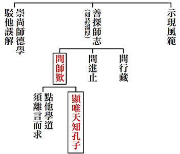

### 孝道跨時代的意義與價值—孝經簡說（十九）

時哉講述、淨域編寫

雖不語怪力亂神

卻須至誠祭鬼神

不見不聞不信有

洋洋如在十方間

推廣至德感化人民–〈感應章第十六〉

前言

說到感應，大概都會想到「怪力亂神」，想到宗教迷信之詐騙，而詐騙當中，不外乎是詐財與騙色。此中譬如「求籤」，尤其是在選舉之時，候選人常會去求籤，所得的籤詩無不各自解釋。還有「擲茭」，看神明的旨意是什麼？或者是「起乩」，讓神鬼附體；或者是「托夢」、「通靈」。這些給人的感覺，無非是妄談吉凶禍福的人，雖然「信者恒信，不信者恒不信」，但它帶給社會負面的影響，往往比正面的還要多。所以，有志之士不屑一顧，認為是不合科學、神權主義、宗教迷信，乃至於是一種社會巫術。但是，感應完全是這個模樣嗎？難道一無可取嗎？以下來深入探討。

紐西蘭的橄欖球隊，在比賽前要跳一段「毛利戰舞」，這是求神的加被。而企業開工動土或電影開拍前，也要上香求神加被。又如雪廬老人晚年興建六吉樓，要蓋教室給學生讀書，老人也是焚香求加被，在地上釘樁為界，好讓蟲蟻三天內搬家。此外，美國遭受到九一一恐怖攻擊時，全國最傳唱的一首歌就是〈上帝保佑美國〉，孩子們也合掌求加被、求感應。

如此觀來，求加被、求感應這件事，到底好不好呢？要在什麼樣的前提下來談呢？它是否有別於一般的祈求？〈感應章〉所談的是什麼樣的感應？感應對人的福報有多大影響？人在做事時他的順緣到底是怎樣形成？感應是個非常重要的方法，儒家怎麼看待這件事？

《孝經》第十六章也是孝道的修學法及義理，以孝道為本質去求感應，而此感應是有助於政教的推廣及整體氣象的提升。感應在儒家是正面的發展，要善加運用。

本章經文是：

子曰：昔者明王事父孝，故事天明；事母孝，故事地察；長幼順，故上下治；天地明察，神明彰矣。故雖天子，必有尊也，言有父也；必有先也，言有兄也；宗廟致敬，不忘親也；脩身慎行，恐辱先也；宗廟致敬，鬼神著矣。孝悌之至，通於神明，光于四海，無所不通。《詩》云：「自西自東，自南自北，無思不服。

科判分析

這一章的架構是「能感通」。能感通分為兩部分，第一、是「彰明孝悌之道」，彰明孝悌之道是個「能通」，且讚歎孝悌之道是個能通天地鬼神的能通。這種人辦理政教時，懂得在因與緣上發展，其氣象是讓人佩服的。第二、孝悌之道能夠「能通」，所通的就是神明；即是祭拜天地神明時，能使神明來接受祭拜，且給予祭拜者許多福報。

釋義

第一段經文：「子曰：『昔者明王事父孝，故事天明；事母孝，故事地察；長幼順，故上下治；天地明察，神明彰矣。（神明彰）』」孔子說：古時的明王（指三代英明的君王，例如：夏禹王、商湯王、周文王、周武王、周公），因為盡心盡力地事奉父親，懂得將事父的道理推廣出去，所以是從事父裡面去明白天道的，因此在祭天的時候，以懂得天道的方式來祭天。這是感應的前提。而對母親盡心盡力地孝順，懂得事母之道，所以就懂得明察地的道理，因此懂得以地的道理來祭地。明與察叫作互文，意即「參互成文、含而見文」。所以「事天察、事地明」也可以說是「事天明察、事地明察」，兩相互文。

再者，懂得依理來定長幼尊卑、上下和諧，叫作「故上下治」。治是治理，能夠讓上下和諧各安其位。「天地明察，神明彰矣」，就是以能「明天道、察地道；察天道、明地道」來明察天地，即常言的明察秋毫，以懂天道、地道的知見來祭天地。神明彰矣的「彰」，就是天神、地神來接受祭拜，謂之神明彰矣。以上是以孝悌為本質的天子，祭祀時能得到神明的加被，而神明親自來接受祭拜，叫作「能通神明」。

第二段經文：「故雖天子，必有尊也，言有父也；必有先也，言有兄也；宗廟致敬，不忘親也；脩身慎行，恐辱先也；宗廟致敬，鬼神著矣。（鬼神享）」此處是「能通鬼神」，即是祭祀自己的宗廟時，能夠感應祖先來接受祭拜，並且賜予子孫厚福。所以說「天子，必有尊也」，意乃雖貴為天子，但並不是最大者，為什麼呢？在家族中，「言有父也」是雖然父親過世了，但還有叔父、伯父等；「必有先也」是還有長輩們。是什麼長輩呢？謂之「言有兄也」，就是表兄、堂兄這些長輩。換言之，天子還有他該盡孝悌之道的地方，就是他的家族。天子懂得在家族中推廣孝悌之道，朝廷、民間、全國就能推廣孝悌之道，天下就能一派和諧。

這種孝悌天子「宗廟致敬」，即是到自家宗廟祭拜祖先時，抱持著不敢忘記親人的心態。因為他的生命得自於父母、祖先的賜予，且慧命的培成也是父母幫忙找老師教導而有，乃至於擁有天下的基業，也是父親、祖先辛勞的累積成果。所以，天子是「脩身慎行，恐辱先也」，就是能以德學來修身，謹慎他的行為，唯恐辱及過世的先祖，讓祖德能夠流芳，使父親與先祖有面子。因為此天子的施政很好，所以讓祖先倍加光彩，懂得用這種心態見地來祭拜祖先，祖先就會來接受祭拜，且給予後代子孫厚福。

最後，「孝悌之至，通於神明，光于四海，無所不通。（贊能通）」即讚歎孝悌者是個能通之人，通什麼呢？「孝悌之至」乃懂得內心與外緣的經營，懂得祭祀的經營，這個孝悌達到了極致，能通於神明。這種孝悌學習達到極致的人，於祭祀之時能夠與神明感通。而「光于四海」，就是此人的智慧有能力統治天下。四海指天下，乃因此國家四邊環海，稱作天下。有能力統治天下叫作「無所不通」，意即他的政令、教育能通。此中包括人才團隊，包括各國對他的佩服，包括民心歸向於他，所以他是「無所不通」。

《詩》云：「自西自東，自南自北，無思不服。（贊令人服）」，最後舉出《詩經‧大雅‧文王有聲》一文言，自西、東、南、北觀之，沒有不拜服的。這一「思」字沒有意思，即是「無不服」，此人叫作「政通人和、上行下效、民心歸望」，正像〈得民心者得天下〉這首歌一樣。

析疑

一、本章與前章關係為何？

前章是勸諫，包括天子、諸侯、卿大夫、士與庶人，而本章特別講天子。意即能接受勸諫的人，他懂得修身慎行，則必然講究品德與學問，尤其是在孝悌，因為孝悌是品德的根本，也是學問的根本。此人懂得將孝悌從內推展到外，又能好好辦理政教，當他祈求天地祖先加被時，必能獲得鬼神之助而得到許多福報，這就是感應之道。

二、感應是什麼樣的形象？有什麼功過？

其過失就是前說的「不盡人事，求神問卜」，乃至於疑神疑鬼。這種人時常煩惱，心中盡是名利，賊頭賊腦，胡言亂語，善人遠離，惡徒上門，乃至於夜寢不穩、常入惡夢，讓人不屑於親近。

感應的另一面是功德，若此人懂得盡人事，懂得天地的道理來祭天地，懂得慎終追遠的道理來祭祖先，這個功夫實在太大了。所以，感應有正負面的影響，見地越好越能夠發揮它正面的價值。

一般說到感應，直覺聯想到的是宗教，然而宗教的情操，比宗教的形式更為重要。許多人未必信仰宗教，但是他有宗教的情操，反而是更可貴的，例如：史懷哲、南丁格爾或特蕾莎修女。

三、《孝經》中有時稱明王，有時稱先王，意義有何差別？

《孝經》中「明王」出現兩次。第一次在第一章裡，說：「明王以孝治天下」。其次，是第十六章，說：「昔者明王，事父孝」。而「先王」呢？一共出現三次。第一次於〈開宗明義章〉中說：先王懂得用孝道來順天下。第二次於〈卿大夫章〉中說：懂得依先王的服制來穿，依先王的言語來言，依先王的行持來行；換言之，先王是大臣的典範。最後於〈三才章〉中說：先王見到孝悌之道是可以感化人民。將上述五處中的明王與先王作對比，原來先王就是明王。

然而，何以有時稱先王、有時稱明王呢？蓋稱先王是講時代的過去，稱明王指這些人是頭腦清楚的，即他懂得以孝悌為本質的興辦政教，懂得祭祀祈求加被，懂得運用人才團隊，懂得風氣的經營，這才是真正頭腦清楚的明王，是謂之「大政治家」。至於只見到眼前利益，言談僅在乎一己的名聞利養，乃至於言行前後不一者，只可謂是政客，怎能稱作大政治家呢？

四、前（諫諍）章內容有諸侯和大夫，此章為何只有稱天子？

因為這裡說到祭拜天地，只有天子才可為。諸侯只能祭社稷，社是土神，稷是穀神，除社稷神外，還有封地內的山川。徐醒民老師說：譬如泰山是天子能祭的，魯國只能祭魯國境內的泰山，齊國只能祭齊國境內的泰山（古齊、魯以泰山為界，齊北魯南）。所以，這章明顯地是指天子。

五、天何以能表徵父？有何經典證明？

孔子解釋《易經》有十種，其中一種叫作〈說卦傳〉。說卦就是解釋卦，將卦比擬成什麼？譬如：將乾卦比擬為天、比擬為父。明王是這個英明的天子，他懂得盡孝道，懂得父之道就必得天道，為什麼呢？因為父親在家裡，栽培子弟的善根、慧命，就是屬於教育與大政的功能，像天一般。春夏秋冬讓萬物成熟，天父好像家裡面的父親，所以用這個天來彰顯父之德。他懂得父道，就懂得天道；懂得孝順父親，就懂得如何祭天。

六、地何以能表徵母？有何經典證明？

《易經》〈說卦傳〉中說：坤是地、是母。事母的時候，想母親就是一個哺乳、養育的形象。此表徵大地如母哺養生育萬物。所以，由父道來體會天，由母道來體會地，懂得天道、地道來祭天地，且要盡人事，這才能夠求鬼神的加被。

七、所謂「天地明察」，依據《禮記》〈祭義〉與〈王制〉的記載，意義為何？

天地明察是指對山林草木不可以隨便亂砍，對動物不可以任意濫殺，古代所說的天道、地道，是尊重天的覆蓋與地的養育功能。所以，這是最高的環保意識。環保意識絕不是站在人類的觀念上，而是站在整個天地有好生之德的概念來說環保意識。

如不丹是世界的淨土，雖然它位在印度與中國之間，旁有錫金和尼泊爾，可是與所有國家的走法不一樣。全國森林覆蓋率百分之七十，國王非常喜歡大自然，境內不可以有塑膠袋及奢侈品。生活雖然不像先進國家這麼發達方便，但幸福指數排行高。不丹人民爽朗，文化保留完整，隨著大自然歌舞。百姓慶賀國王生日時，國王說：「你們種十萬顆樹，就是對我生日的最好祝福。」

這給我們乃至於歐美先進國家一個很大的反思，我們究竟要怎麼經營國家的幸福呢？許多人用GDP與消費的概念，然而大量地消耗物資，卻讓全球氣候暖化，讓世界變異災難頻仍。所以，這種經濟的消耗，普遍浪費奢侈的導向，實未必是全人類之福，也未必是後來發展的坦途。

八、明王長幼順，為何能令上下治？

明王不但懂得孝悌的經營，還懂得長幼順，懂得禮教的功能。禮教的功能就是懂得長幼尊卑，讓和諧之道能在長幼尊卑裡發展。若以下犯上，那怎麼和呢？若上不治下，那怎麼和呢？所以「禮之用和為貴」、「長幼順上下治」就是講禮的經營，這不但是有孝悌的經營，還有禮的經營。

九、天子祭天地如何讓神明彰（出現接受祭祀）？

天子盡了人事後去祭天地，祭天地後神明彰，彰就是神明接受祭祀，那麼他怎樣讓神明出現接受祭祀呢？祭祀講究的散齋（外在）七天、致齋（內在）三天，即是十天裡有七天先散齋，就是先戒齋沐浴（不近女色、不聞樂、不臨喪），到後面的時候還要很認真地去重視（內觀）祭祀這一件事情。於祭祀當時，不論樂器、舞蹈、禮器、供品、儀式都非常完整，表達出祭祀的誠意。在這樣的因緣下，神明自然會出來接受祭拜。《論語‧八佾》云：「祭如在，祭神如神在。子曰：『吾不與祭，如不祭。』」如在眼前，接受後人的祭拜，給予很大的厚福。

十、天子會在何種場合表達對有父（叔伯）、有兄（表堂兄）的恭敬，做為孝悌教化的推廣？

天子除了祭拜外，還要表現孝悌之道，他家裡有叔父、伯父、堂兄、表兄，在家居、宴會的時候；這兩種場合連天子都要重視長幼尊卑。例如：孔子為魯國大司寇，回到家鄉時沒有大司寇的身分，這叫作「序齒不序爵」。齒是牙齒，指年紀，這時只論年齡不論爵位。所以，天子在家族私下的聚會、宴會，乃至於祭祀的時候論長幼尊卑，這就是表達孝悌之道，以身作則、上行下效、風行草偃。

十一、此處天子修身慎行是什麼樣的形象？目的難道只是恐辱祖先嗎？

天子除祭天地外，還講究修身、慎行，而經文說：「恐辱先也。」依理來說，天子的修身、慎行，還包括要安萬民、統攝臣子，但怎麼目的只有「恐怕侮辱祖先」這樣子呢？其實這裡有很重要的概念，乃是天子會想到他的生命是祖先給予的。他擁有慧命也是父母栽培的。所以，他要把這個角色演好，來尊重給予他生命、幫助他成長慧命的人。其本質是讓祖德流芳，讓祖先因為我更有光彩。這不妨礙他對百姓的愛護，及對人才團隊的提攜。以上是說天子的祭天祭地。

十二、天子宗廟致敬是什麼樣的形象？鬼神著又是什麼形象？

天子祭拜宗廟，鬼神來享受，此鬼神就是他的歷代祖先，《中庸》載：「子曰：鬼神之為德，其盛矣乎！視之而弗見，聽之而弗聞，體物而不可遺。使天下之人，齊明盛服，以承祭祀，洋洋乎如在其上，如在其左右。《詩》曰：『神之格思，不可度思，矧可射思。』夫微之顯，誠之不可掩，如此夫！」意思是：鬼神是很厲害的！你看不到、聽不到，可是你在體會萬物時，不可以忽略鬼神，以為它好像不存在。於齋戒沐浴祭祀鬼神時，在誠心祭拜時，它就如同在面前、在左右，來的時候是不可思議、不能懈怠的。它在你很微細體會中顯現，鬼神的功德實在是不可以掩蓋的，尤其它對你加被的那一分，是不可以掩蓋的。

十三、治天下、神明彰、鬼神著的氣象為何？

治天下、神明彰、鬼神著，整部《太上感應篇》講的就是這個道理，神明彰、鬼神著就是《感應篇》的重點，中國有本書《瑞應圖》，這個時候叫作「天降膏露」（下甘霖）、「地出醴泉」（冒泉水）。四季如春，逢凶化吉，出現很多的瑞相，乃至於人才顯現被大用，就像舜以皋陶掌司法、以契辦教育、以稷興農事、以禹辦工程，如此舜可以坐北朝南彈琴自樂，身不下堂而天下大治。這就是神明的加被及加上自身的努力所成。

所以，《詩經‧周頌‧執競》中說：「降福穰穰。」穰穰就是非常豐富。《易經》也說：「自天佑之，吉無不利。」意即老天爺保佑，無不吉祥。然而，必須要「人事先盡」。感應之道與一般求神問卜之感應，最大的差別在於人事，人事要盡才談得到加被。人事包括孝悌、敬德、修業等等，必須要有這些能耐，才能真正得到加被，否則反是遭難逢禍。

北宋王安石變法，最後搞得百姓流離失所。那時天乾物燥了十個月，宋神宗發愁不已，雖祭天也沒有用，就是不下雨。縣官鄭俠上呈《流民圖》，說百姓因為王安石變法，流離失所到如此地步，神宗看了《流民圖》就流淚。鄭俠對神宗說：「只要把新政改除，十天內必下雨，否則砍我的頭。」到第八天遲未下雨，眼看鄭俠的頭就要不保，旋即下了一場大雨。神宗終於決定換下王安石。司馬光有首〈客中初夏〉詩：「四月清和雨乍晴，南山當戶轉分明。更無柳絮因風起，惟有葵花向日傾。」寫的就是這件事情。詩寫到清明節、雨晴、南山忽然清楚，這代表亂世已過，政令清明；柳絮也被風吹掉，代表小人都退朝了；向日癸花向著太陽，代表百姓都擁護你。此詩若無雪廬老人詳釋，常人會以為司馬光在歌詠清明時節，但能懂得時令與政局，則知司馬光全在藉時令講人事。

十四、本章舉《詩經‧大雅》之言，是否能作為本章總義理所在？

當然可以，因為這章告訴我們的就是「近悅遠來」之道，《詩經‧大雅》中說：「自西自東，自南自北，無思不服。」你把朝廷、國家經營的好，各國都會擁護你，你的政令能通，風氣能效行，「以德服人，中心悅而臣服也」，就是孔子以《詩經‧大雅》來作為這章的結論。

十五、本章之旨趣為何？

在因上先要有孝悌的正見，然後推廣孝悌形成風氣；在緣上還要有求鬼神的加被，這鬼神包括天地及自己的祖先，必然能得萬民的擁護，乃至於風調雨順、惠風和暢。古代的聖王裡，他不但有盡人事的能耐，還有宗教的情操，像這種祭祀就是宗教的情操。當然，他們所施展出來的政治，後面的昏君是不會知道它的內涵。所以，後來許多的霸主，以為開創天下後，古代的明王也不過如此，然而差多了。明王雖然治天下，並沒有像霸主一樣以武力開疆闢地，而是文化內涵的經營。以上是這章的大意。

圖解

首先，北宋李公麟的圖，畫的是天子與皇后一齊去祭拜，前方是祖先的牌位及許多祭器，器具裡盛裝著供品。其次，南宋的馬和之，他畫面呈現的景象是比較後期的；譬如：遠方的鼓、兩旁的鐘與磬，說明祭祀鐘鼓齊鳴。中間有人在跳樂舞，旁邊是持笏觀禮參祭的大臣。房子裡擺出許多的供器，代表這是宗廟，中間戴禮帽的是天子，走上台準備在宗廟前祭祀祖先。元朝趙孟頫、明朝仇英所繪，與馬和之一樣。

最後，來看看江逸子老師的《孝經‧感應章》圖。整體氣象是一位明王在祭祀天地，這裡特別可以想成是周公，因周公為周朝制禮作樂。雖然文王以德來成立周，但是真正擁有天下的是武王，可惜武王兩年就過世，成王繼位周公代理天子輔政七年，嚴謹制禮作樂奠定國基。所以，周公其實就是天子，這裡可以當成周公在祭祀天地，手中拿的是觚。觚是酒器，表達他是一位懂得禮樂經營的人，在家能孝順父母，懂得孝悌之道，用此內涵來祭祀天地，求得天地鬼神的加被。

明王身後有兩位大臣，一位讀疏文，一位棒食器。一旁羅列著諸侯來助祭，五色旗與幡飄揚，表徵著他們的地位。周公面前的鼎，既可燒香也可以裝食物。香案旁有觶與盉，皆是酒器。供桌上的壺、卣是酒器，盨是盛食物的，盤是裝水洗手用的，觚是酒器。《論語‧雍也》中說：「觚不觚，觚哉觚哉！」就是講這一個酒器。

此圖整體的氣象，是個在〈八佾篇〉所說的「相維辟公，天子穆穆」。相維辟公是指兩旁的諸侯，站在那兒就像國家領導人的氣派。天子穆穆是指周公或成王的風采極佳，莊嚴肅穆。整體最和諧的氣象，在祭祀的時候全部呈現。此時難道不得天地鬼神的加被嗎？試問天地鬼神不在這時加被，要在什麼時候加被呢？然後，鬼神加被會讓人們感受到，不但天降膏露、地出醴泉，乃至於山林能夠滋養萬物，人才輩出國家太平。這就是天子明王懂得辦政治興教育，懂得祭祀求感應，原來是先盡人事，而後求加被，這一點是有別於前言的怪力亂神。

總結

凡事都要在德學與人事上講究，不僅人際關係要好，並懂得祭祀的道理，這時才能善於開展風氣，且天下和諧吉祥事不斷地湧現，自己的功德才能夠無限地開展。懂得這樣經營天下的人，會讓天下吉祥平安；懂得這樣經營國家的人，國家也會和諧呈祥；懂得這樣經營家庭的時候，家庭也會家和萬事興；個人也是在家和、國和、天下和當中得到最好的成長。這謂之「感應」。

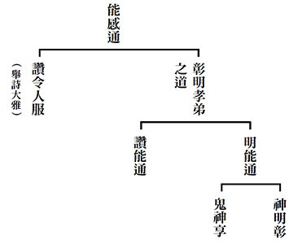

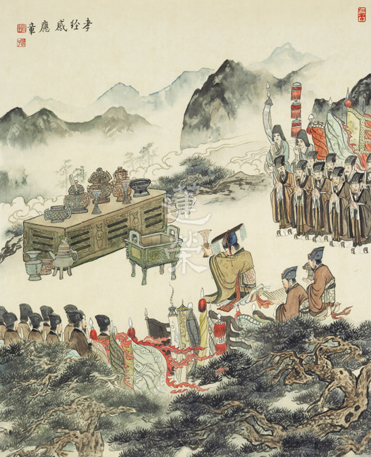

### 孔門心法—中庸之道（十四） 第十一章：孔子的不為與不能

*時哉講述 / 茅茹讀書會、弘毅整理*

素隱行怪中途而廢

君子聖人不為不能

雖求中庸過與不及

不妨為賢而為大才

前言

一般人對於修道人的想像，不外乎是煉丹的道士，修仙的隱士等等，他們不僅道行高深，也是人人欣羨的對象。然而這樣是真正的修道人嗎？對於修道我們應該有什麼樣的認識，孔子於本章中提出了他的看法。真正的修道應是修習內聖外王之道，於此基礎，孔子有其不為，亦有其不能。就在這為與不為、能與不能之間，彰顯出正道的可貴，還有孔子不同於常人的胸懷與心志。

張載說：「為天地立心，為生民立命，為往聖繼絕學，為萬世開太平。」中庸就是往聖的絕學，尤其是中，通達體性、形而上，是民族的命脈和道統，有這種道統才能稱為優秀的民族，所建立的國家才成為一個實質的國家，而非只有經濟體制。

很多人都喜歡奇聞異事，比如來無影去無蹤，能夠知過去、未來，行蹤飄忽不定，說話富有玄機。這樣的人有些是跟名利相應，固然不可取，可是有些雖然是超脫於名聞利養，但也不是入世的君子，他只不過是一個行為詭異，或者是思想很奇特的人物。

《麻姑仙壇記》中的「麻姑獻壽」，就講到麻姑跟她哥哥在見面聊天的時候說，他們已經看到滄海為桑田，桑田為滄海三次了，現在再看滄海已經水少了一半，又要變成桑田了。大海變成田要幾千萬年，而他們已經往復看到三次，可想而知麻姑的壽命有多長！而且麻姑長的只有十八歲的樣子，這樣出神入化、來無影去無蹤的人大家都很羨慕、佩服。再有，大家佩服達摩祖師，不是佩服他美妙的玄語，而是他如何「一葦渡江」，腳踩在一枝草上面就可以過江。大家也佩服八仙的逍遙自在，遨遊江湖，隨緣濟世，神變莫測。還有世間的算命先生鐵口直斷，也讓人非常佩服，像了凡先生遇到的孔先生，能夠把了凡先生一生算得清清楚楚，某年某月該考什麼功名，某年某月要當什麼官，某年某月會壽終正寢，已發生的事情都如孔先生所料定，未發生的事情也都知道。另外，有些世間人很喜歡扶乩這類事情，能告訴你很多不知道的事情，這些奇人異事所顯現的特殊功能，在世間很容易被傳述，而且大家也很喜歡，像是有名的哈利波特，席捲全世界，小朋友都耳熟能詳，《論語》還沒有他們流通的廣泛。這章就告訴我們，什麼才是人生真正應該追求的。

科判分析

中庸總體科判

第十一章還是在《中庸》的第二部分，即分別顯示中庸的修學法和義理。

本章科判分析

此章科判是講君子，反面來說，君子不為的是，素隱行怪求名，不會去索求隱微的道理，行為很詭異來求名。第二，君子不能行道、守道只到一半就退轉，君子學道一定是有始有終。正面來說，君子要學的是聖人的內涵，在亂世中能夠超脫繫縛，即使一身的才華不被他人知道，也不會生氣。

經文：

子曰：素隱行怪，後世有述焉，吾弗為之矣。君子遵道而行，半途而廢，吾弗能已矣。君子依乎中庸，遯世不見知而不悔，唯聖者能之。

消文

孔子說：索求隱藏的事情和道理，行為很怪異，對於這類事情和人，後世的人感覺很神妙莫測，所以都很喜歡傳述，然而我是不會去做的。君子遵循中庸之道而行，在沒有學成之前，半路停止、退轉，我是不能的。君子學習中庸之道，在亂世中，逃避世間，隱藏起來，一身的才華不被他人知道也不會後悔，這只有具備形而上內涵的聖人才能辦得到，因為聖人不會對境起貪瞋癡，憤世嫉俗，甚至退轉。

釋義

「素」有兩種講法，鄭康成的註解是「向」的意思，「素隱」就是把自己隱藏起來，因為害怕在亂世中受到傷害。另外一種講法是，朱子根據《漢書‧藝文志》中說「素」當「索」字講，即索求意。「素隱」就是索求隱藏的事情和道理。「行怪」是行為詭異，「遯世」是逃避世間。

章旨

我們要依著中庸而行，尤其在亂世的時候，就算一生不得志，都沒有成名，也不會後悔，必須要把自己培養成有德有學的君子。用道來經營人生、利益蒼生，辦政治不行，也可以辦教育，辦教育不行，也可以找有緣人，把道統往下傳，君子永遠是積極面對世間的，就算遯世，也不是消極逃避。

析疑

一、本章與前章的關聯為何？

前章言無論國家有道或無道，我都是學中庸之道。此章更特別講能夠在亂世中避世而不會後悔，這就是君子，而這種能耐是依中庸才有的。

二、素隱行怪的目的為何？

素隱行怪就是索隱行怪，有的目的是為了求利，如扶乩、扶鸞、卜卦、算命，有的是為了求名，還有一些學神仙之道的，他既不是求名也不是求利，可是他也不會入世來利益有情，即便利益有情，也只是隨緣濟世，並沒有想要利益天下蒼生，沒有想透過辦政治跟辦教育，改善天下人的生活，豐富天下人的生命，他所注重的是個人的超脫與安樂，他所修學的也不是真正聖人的超脫之道。

三、素隱行怪的形象為何？
素隱行怪最有名的就是「睡仙」陳摶，他在唐朝末年的時候就很有名，歷經五代，後周世宗叫他「白雲先生」，宋太宗叫他「希夷先生」，「希」就是視而不見，「夷」就是聽而不聞，不相應此世間。他很喜歡睡覺，睡功很好，一睡幾個月，身體不會發臭，睡到最後身上都是灰塵，可是起來後精神抖擻。他常常睡覺，有時候出去玩時，逢人就
**問：** 現在的天子是不是趙匡胤？如果說不是，那還是不行。有一天他忽然聽說天子是趙匡胤，就高興得滾下驢子來說：從此天下大定！從唐朝末年就知道趙匡胤當天子天下就會大定，歷經唐朝和五代，他早知天下大事，這是很厲害的。據說紫微斗數和無極圖就是他發明的，後經過周敦頤、邵康節，一直傳到孔先生，把了凡先生的命算得非常準，祖師爺就是陳摶。大家對他極其羨慕，有人說他活了一百二十歲，有的說是一百四十歲，有的甚至說是二百多歲，沒有人真正知道他的壽命。而且他來無影去無蹤，有時在華山，有時在武當山，最後死在峨嵋山，這些山相距都很遠，可想而知他的厲害。

四、後世為何會傳述呢？

因為人對生命都有不可知的茫然、好奇、無知，所以很希望去找自己的出路，就對素隱行怪之人很是佩服，對他們講的話很尊崇，乃至於去傳述他們的內涵和學問。

五、是孔子不為還是不會？

孔子是一個會而不為的人。孔子是一個莫測高深的人，他對《易經》非常通達，《易經》的十種注解，都是孔子所作，孔子深通人的吉凶禍福。顏回也讚歎孔子「仰之彌高，鑽之彌堅，瞻之在前，忽焉在後」，所以孔子也有能力故弄玄虛，談論人生的吉凶禍福，掐指一算就知道天下大事，眼睛一看就知道未來出路。比如說，商瞿子木要出差的時候，他母親反對，因為他到四十歲還沒生小孩，孔子就告訴她不用擔心，她兒子以後會生五個孩子，後來果然應驗。

雖然孔子也可以這樣，但孔子不走這樣的路，不以這樣的形象面對大眾，因為他重點要講的是五倫教育，人格的健全發展，否則人們只是想跟他學習那些隱秘的道理，不願意聽聞正道。可是孔子最有價值的學問是五倫的教化，是斷惡修善，趨吉避凶。

了凡先生也學到了孔先生很多神妙的部分，可是他傳給兒子的卻是斷惡修善、趨吉避凶的道理，是人生要有修養，要改過遷善，懂得命運的經營，要有謙德，懂得「謙則受教有地，取善無窮」。這是他作為父親傳給兒子的絕學，而所傳的是正道，並非詭道，因為正道才有利於人的發展和出路。所以孔子不是不會，而是不為。

六、素隱行怪，不為的功德及為之的過患為何？

佩服、好樂、追求、學習、傳述素隱行怪的過患：

１、學小道誤大道。《論語‧子張》篇中說「雖小道，必有可觀焉」，如下棋、卜卦、算命等等，雖然是小道，也一定有可觀之處。但是如果要學習聖道、君子之道，會被學習小道所耽擱，因為人生是有限的，很多人都甘願把時間和精力花在小道上。有些人說學君子聖賢這些大道，他沒有辦法，沒有能力、體力、時間，可是在學習小道時就都有了，可見都是為和不為而已。

２、容易導入邪道。當你能力很強時，如果動機不單純，就容易求名求利，以及財色等等都上身。

３、影響社會風氣。當你行為詭怪，追求隱密的人、事和道理的時候，你也會影響社會風氣，社會需要的是五倫的教化，這樣社會才能正常的發展。

不為的功德：不去素隱行怪，就會有很多時間學習聖道，學習君子的內涵，而且跟有內涵的人一起共事，發展事業，帶動正常的風氣，對個人、家庭、社會和國家，都有莫大的利益。

七、遵「道」而行是否指中庸之道，又該如何遵道而行？

君子要遵道而行，所遵的是中庸之道。能遵是指：

１、聞思修。只說不做則無用。

２、五步修學。博學，廣泛的學；審問，不懂要發問；慎思，好好地思維觀察；明辨，把問題分析清楚；篤行，還要懂得在日用平常中，運用這樣的道理。

３、自行化他。君子要以中庸之道利益自己，教化他人。

４、不離而修。君子不離中庸之道，要如小人對名聞利養那樣，學習小人蠅營狗苟，逢迎巴結，追求利益無所不用其極。再如吳洪裕（吳正志之子）得到黃公望的《富春山居圖》時，茶飯不思的觀賞臨摹，朝夕不離，君子應以此覺受保護聖道，以此心態自行化他，而不是「言之者諄諄，聽之者藐藐」，可有可無。對所聽課程應記而不失，而非付諸東流。

５、不半途而廢。君子不能學道半途而廢，如此必然成功。

八、為何遵道容易半途而廢？

１、見名利，倍覺學道難耐。因為世間人追求名聞利養，表面很風光，而有志於成為君子的人，學習經典的內涵，又孤獨、又寂寞、看起來在世間又沒有出路，午夜夢迴時，會佩服、羨慕人家飛黃騰達，眼見他起高樓，眼見他香車美女，有種種美好的享受，此時學道的樂趣就不見了，最後退轉。

２、求速成，總感聖賢易得。老師朋友難得，君子學道很辛苦，然而小人追求名聞利養時也不容易。小人都願意克服千辛萬苦去得到名利，君子卻想要撿便宜，想今天學習，明天開悟，不懂得日久天長的累積，經營自己內心的出路，當看到他人飛黃騰達時，就很難堅持到底，結果行百里而半九十，半途而廢。

３、世稀有，賢哉顏子有恒。《論語‧雍也》說「賢哉，回也。」學道的時候，颜回飲食簡單，住處簡陋，但仍不改學道的快樂。一個學道有法喜的人，才會堅持到底，否則都是半途而廢。孔子學道有法喜，並且看到目的很殊勝，知道學道對自己和天下蒼生是有好處的，所以孔子說他不能半途而廢。

九、半途而廢有何過患？

半途而廢比沒學還糟糕，表示世間的榮華富貴、名聞利養比道還重要，心志不夠堅強，隨境而轉。而且一旦轉出去以後很難回頭，因為這種失敗已經讓你不想重頭再來。回到世俗的時候，反而會卯足勁來追求世俗，因為你已經認為學道是沒有發展的了，這就是退轉。以前有學生請教雪廬老人：離開老師到外地去發展，有沒有不退轉的方法？雪公說，沒有！全退。能夠堅持到底，學有所終，學道有法喜，看到道的價值，看到道成就以後的殊勝，這是很難的。在學道的過程中，常常會在外境的障礙下，或者內心不斷的生起煩惱時，萌生退意，是以中途退轉。包括冉求都說「非不說子之道，力不足也。」孔子說他非是力不足，而是「今女畫」，是你自己畫地自限。

因為孔子知道退轉的過患太大，所以他說「吾弗能已矣」。

十、吾弗能已矣的形象為何？

１、好學。《論語‧雍也》篇「十室之邑，必有忠信如丘者焉，不如丘之好學也。」孔子說，一個地方只有十戶人家，一定有質地像我一樣好的人，可是都不如我好學，好學可以令人不退轉。好學就是好聞思修，好博學、審問、慎思、明辨、篤行。

２、不離而修。「道也者，不可須臾離也。」每天不斷的充實自己，對道有追求、體悟、法喜，能夠自己受用，進而利益他人，這是生活中最有意義的事情，離開道生活就變得沒有意義了。就好比讓小人離開名聞利養，魚離開水，人離開空氣，沒辦法活下去。同樣讓君子離開道，如果也有活不下去的覺受，那學道一定會成功的。

３、堅持到底。《論語‧子罕》篇中說「譬如為山，未成一簣，止、吾止也」，比如在堆積一座山，尚未完成，只虧欠最後一簣土，如果從此止住，便不能成功，所以要堅持到底。

４、人一己百。「人一能之，己百之；人十能之，己千之。果能此道矣，雖愚必明，雖柔必強。」人家一次學會，你就一百次；人家十次，你就一千次，果然你懂得這樣用功，你就算愚，都一定會明，你就算柔，都一定會強，這就是曾子成功的秘訣。

十一、孔子為與不為和能與不能有何分別？

「不為」和「不能」是此章的詩眼，不為的是索隱行怪，裝神弄鬼，異乎尋常，或者呼風喚雨，似有似無，乍隱乍現的；為的是正道、常道、內聖外王之道。不能的是半途而廢，好比說，君子不能傷天害理的事，小人不能不要名聞利養；能的是內聖外王之道，而且到達目的地。

如果我們能夠不為索隱行怪，一生為內聖外王的大道努力，不半途而廢達到目的地，能有這種胸懷，就是往孔顏的大道上走，那這一生的出路就非常寬廣，能趨吉避凶、加厚子孫，也一定能夠利益社會國家。

十二、君子有必要遯世嗎？遯世的目的為何？

遯世有時候是明哲保身，有時候是不與俗人苟合，有時候是不與小人共事，有時候是必須要躲避亂世，好好充實自己，所以遯世有時候是有必要。

十三、君子遯世的形象為何？跟隱士有何不同？

好比同樣是躬耕南陽，隱士是要離開世間，不與世間人打交道，然而君子是充實自己等待天時。電視劇《諸葛亮》的主題曲唱到：「聊寄傲於琴書兮，樂天知命，以待天時。」天時就是明君當道時，可以出來展現才華，而才華正是在遯世的時候培養起來的。

我們一般說「消息卦」，十二月可以配合十二個卦，這是徐醒民老師在講《易經》時所說。四月是一個陽剛的乾卦，五月時，物極必反，下面就有一個陰爻出來叫做姤卦，姤卦好比人世間亂象出來了，比如子弒父、臣弒君，代表天下要大亂了，表示小人當道，政治、風氣皆敗壞，所以此時君子要懂得遯，如果再不遯的話，七月叫否卦，那就像箕子、微子，在否卦的時候就逃不掉了。

此章說君子「遯世不見知而不悔」，遯卦是天山遯，上面是天，下面是山。天即遠，遯卦就是要跑到遠方的山中躲起來，叫做天山遯。整個卦象是亂世卦，就是陰長陽消，從第一爻陰、第二爻陰，從下往上，準備第三、四、五、六爻都要陰，因為卦勢慢慢往上走，表明亂象越來越厲害，「小人道長，君子道消」，這就是遯卦。

「遯而亨」是說，遯的人要懂得充實自己，才能有未來的通達。當有明君當位的時候，你要與時行也。「小利貞」好比陳公子逃到齊國時，齊桓公是第五爻，表示說他是一個陽剛之位，而且尊重賢才，可是陳公子完，在那個場合中要懂得謙虛，叫做「小」，要從小職位開始歷練，而且要懂得正道，所以陳公子在齊國很低調的慢慢上來，如果他一開始就接受齊桓公的重用，因為無功於國家，就會有很多人嫉妒他，甚至會傷害他。

所以遯有兩種意思，一種是遠遠的逃掉，一種是要被用的　　時候要從小用開始，慢慢的展露頭角、積累事功，不要馬上被大用，得到人家的信任後，才能夠真正的去發揮長才。

「浸而長」就是慢慢的成長，就像陳公子完在齊國那樣慢慢的成長，懂的遯，君子就懂得在亂世當中如何自處，找到自己的出路。

此外遯卦還要配合乾卦來看，第一爻講到「潛龍勿用」，龍具有非常殊勝的能力，能夠呼風喚雨，飛天遁地，可以比作通達形而上的人，但是他在亂世的時候要隱藏起來，不會去跟世間人鬥爭、較量，而是逃離世間，但內心不會憂愁。人家不知道他，他也不會悶悶不樂，人家用他，他很願意推行大道。如果人家跟他對立，那就不違背人家，收藏能力，可是他充實自己、利益天下蒼生的志向，永遠不會被拔奪。君子和隱士最大的差別就是，君子永遠充實他自己，不管盛世或亂世，不管被用或隱遯，都充實自己，這就是君子的情懷。而一般人不被用的時候，就不充實自己了，唉聲嘆氣，甚至憤世嫉俗，結果使自己變為無用之人。君子不但利益世間積極，遯世也積極，所以永遠是積極的面對世間，只不過有時選擇的是用遯的方式而已。

「用之則行，捨之則藏」，隱居以求志，雖然有利益天下蒼生的志向，但必須要學習利益天下蒼生的學問，找到能利益天下蒼生的老師和朋友。

十四、孔子名滿天下，怎麼會不見知呢？

有三種不見知，第一種是他人不知道你的名氣；第二種是他人不知道你形而下的內涵；第三種是他人不知道你形而上的內涵。孔子雖然是一個名滿天下的人，可是他也感嘆不見知，他所感嘆的是雖然他人知道孔子的名聲，可是不知道他的性與天道，他真正的內涵不被人知，叫做「莫我知也夫」！

十五、不見知而不悔的形象為何？

《論語‧學而》說「人不知而不慍，不亦君子乎。」因為他人不知道我的名聲和內涵，所以不用我，可是我都不會生氣，這是君子的胸懷。老子在第四章也說「和其光，同其塵」，和光同塵就是說，君子雖然有治國安邦，乃至於通達形而上的內涵，可是在時機不對的時候，他會把光芒收起來，看起來跟世間人一樣，在鄉間可能跟漁夫、農民相處的很快樂，叫做同其塵。可是一般人絕對想像不到，這個很平常的人，他一出山就可以安邦定國。

十六、孔子是要我們不要名聲嗎？

《論語‧衛靈公》篇中說「君子疾沒世而名不稱焉」，君子很害怕死了以後名聲不被稱揚。其實亂世不用名也沒有關係，好好的充實自己，培養出值得他人學習的內涵，這是君子應有的心量。君子就算不能辦政治，可是在鄉野間，能夠把道統弘揚、往下傳，一樣也會有君子的名聲。君子最怕的就是因為毫無用處而無名，因為沒有內涵而不得不隱居。

十七、前曰君子，後云聖者， 為何遯世不見知而不悔唯聖者能之？

入世的君子必須要有明心見性的聖人內涵，才能夠在亂世中，不會怨天尤人，憤世嫉俗，不會被境界所轉。所以想要學君子之道，如果沒有聖人的內涵，不是退轉，就是憤世嫉俗，君子不僅要有入世的能力，還必須要通達中庸的內涵，這種形而上的學問，讓君子不被世間知道也不會後悔。

十八、若是唯聖者能之，我們應如何是好？

我們雖然不是聖人，但是我們可以學習聖人的見地，學習中庸的內涵。

總結

一、半途而廢終無成。半途而廢，不用說君子，就是世間人追求學業、事業也不會成功。半途而廢的習氣一旦養成，人生注定一事無成，那些事業成功的企業家，那些求得名利的小人，沒有人是半途而廢的。既然他們都知道不能半途而廢，那想通過學道來利益自己和天下蒼生的君子，怎麼可以半途而廢呢？

二、內聖外王是正途。學習內聖外王之道，內心降伏煩惱習氣，外在依禮來通達人情世故，在人世間正常的發展，是這一章很重要的旨趣。

三、依乎中庸永不悔。不論時局如何變化，人生永遠要依乎中庸，學習君子利人之道。處在亂世的時候，用中庸來入世做觀察，才真正能洞明人情世故，所以古人說：世事洞明皆學問，人情練達即文章，橫批是內聖外王真出路。

問答

一、古時候也有遯世不見知而不悔者，如長沮和桀溺，像這樣的人，我們可以稱他們為聖者嗎？

**答：** 長沮、桀溺都是高人，他們知道自己處在亂世之中，也知道孔子是一個到處尋找明君的人，他們是離開人世間隱居起來，這與孔子是不同的。但他們不是素隱行怪，因為他們只是耕田，以正當的職業來養活自己，並沒有裝神弄鬼。至於他們是否是聖人，這要看是否有中庸之道，無從得知。

二、孔子說：「鳥獸不可與同群，我非斯人之徒而誰與」，表示孔子是不會遯世的，但是本章還說唯聖人能之，是不是表示說只有聖人可以遯世，這當中是否有矛盾之處呢？

**答：** 這是因為場合不同而有不同的抉擇。就孔子積極的去尋覓明君的那一分，這叫作君子不遯世；可是孔子三十五到五十一歲時只在魯國講學，隱起來不為三家大夫所用，後來他周遊列國回來，也志在講學，這叫作君子遯世。國家亂時就遯世，包括隱於山林和隱於人群，不同時期有不同的回答，是否遯世全靠智慧的抉擇，只不過遯世時不會怨天尤人，不會後悔。

三、有註解說，素隱是假智，行怪是假仁，積其精神而使後世有述是假勇，此註解可採嗎？

**答：** 索求隱微的道理是假智，不是真正能利益天下蒼生和出世間的智慧；行怪是行為很詭異，不是真正的利人，真正的利人是君子行正道來利益天下蒼生，所以是假仁；行假智假仁，當然是假勇。但假不可以解釋成虛偽、小人行徑，素隱行怪的人未必是小人，只是說假智、假仁、假勇不是真正的智仁勇，此解是可以的。

四、本章「君子依乎中庸，遯世不見知而不悔，唯聖者能之。」依李道平《纂疏》：「震，為世。震陽隱初，故曰遯世。然道雖不行，而理達于心，故無悶。即《中庸》所謂遯世而無悶也，遯世承不易世而言也。」可否請老師釋義？

**答：** 遯卦，上面是天，下面是山，叫做天山遯，山的含義就是該止則止，上面再加一個天，就是要逃得愈遠愈好，明哲保身。有時候你逃掉是為了保住道統，就像箕子裝瘋賣傻，等到武王伐紂成功的時候，武王去請教箕子，箕子就可以把大禹治國的九疇傳給周武王，所以才有我們今天所見的《尚書‧洪範九疇》。

五、有關楚狂接輿，長沮桀溺，這些隱者算不算本章所說的素隱行怪的人呢？

**答：** 不算。楚狂裝瘋賣傻是為了不被楚王所用，就像箕子那樣，有些人到否卦了才想遯，可是已經來不及了，所以只能裝瘋賣傻。長沮桀溺雖然在那裡種地，但對天下了如指掌，只是不選擇入世，他們都不是素隱行怪。素隱行怪要像陳摶，左慈等人那樣，如左慈在聚會時，曹操說要吃松江魚，左慈就往盆里面倒水，然後用釣竿從裡面吊出一條松江魚，結果滿座皆驚。

六、有注解說，遯世必須出離人間，永遠不被世人所知，只有出世的聖賢才可以做到，此注解可採嗎？

**答：** 是的。出世的聖賢是指通達形而上的人，但不一定與君子之道相應。有聖人的內涵，所以遯世不見知而不悔，如果他又有君子的胸懷，那麼在遯世時，他也會努力的充實自己入世的內涵，時機到時，他會出來利益天下蒼生。這一章是在講具有君子情懷的聖人，而不僅是講聖人。

七、有注解說尋求隱僻的道理和做詭異的事情都是強求危道，求名而不擇手段，雖後世也會記載留名為其傳記，但他偏離了中庸之道，是過的表現。後句接著是君子能夠按照中庸之道來行事，但持力不足，不能持之以恆，是不足的表現。最後表示執中庸之難。此注解可採嗎？

**答：** 素隱行怪不一定求名利，像陳摶、左慈這種人就是不要名利的。他們偏離中庸之道是因為沒有中庸的傳承，可是那種飄飄若仙，與世隔絕，四禪八定的修學法是有的。他們所行不是中庸之道，所以談不上中庸的過和不及，他們學的是仙道，不過也是有過和不及的。該入世的時候沒有入世，這就是不及；不該表現的時候表現，就是過。學習中庸半途而廢是退轉，退轉就談不上過和不及。

八、君子疾沒世而名不稱焉與本章遁世不知而不悔是否有衝突？

**答：** 沒有衝突。君子在亂世中，就算不被領導人所用，也不會做無用之人，這就是君子和隱士最大的差別。所以孔子在亂世中整理典籍，教授生徒，延續道統，表示他對天下蒼生的關懷，對民族的重視，以及他了解時代對道統的需要。在政治上，他沒辦法施政利益天下蒼生；可是在教育上，他可以發揮提攜後進、栽培人才的功能。君子害怕的是沒有可以被人稱讚的內涵，在社會上沒有功能可以發揮，如果有一身的才華，要入世發揮作用，所以孔子才跟子夏說「女為君子儒，無為小人儒。」

九、有注解說，中道而行，中途而廢，或趨於異端，會有這種的情形發生嗎？

**答：** 會。有時候學道之人學道不成，退轉後反而會學一些方術，因為學道之人很厲害，學習方術綽綽有餘。當他們不想學道，去追求世間安樂的時候，那些異端在世間是很有發展的，如卜卦、算命、測字，或者是談吉凶禍福、神變等，學道之人來學是很快的，很容易求得名利，並且得到他人的恭敬。

十、有關一些隱士，他們到底算不算素隱行怪，像巢父、許由和老子，他們都算是素隱行怪嗎？

**答：** 都不是。老子是一個遯世不見知而不悔的聖人，老子在當時只能遯世，而且他胸懷修身、齊家、治國、平天下的大學問，他是一個能夠在遯世當中充實自己的人。孔子問禮竟然是千里迢迢從曲阜到周朝都城洛陽去請教老子，禮是入世的大學問，裡面包括典章制度、進對應退、趨吉避凶的道理，可見老子是一個遯世的聖人，可是又有君子的胸懷，他不入世是因為時代所趨，而不是索隱行怪。至於許由、巢父，純粹是出世的高人，如果他們是索隱行怪，堯才不會找他們作天子。在中國國君當中，孔子獨尊堯舜，堯眉分八彩，看人是洞如火光，一切看得清楚，他是不會找素隱行怪的人來當天子的，所以許由、巢父應該是方外高人。

十一、本章孔子提出不為素隱行怪是否是當時的現象或是學中庸的告誡呢？

**答：** 應該都有。素隱行怪不要說當時，現在也是趨之若狂，在亂世時更是如此。但孔子說在亂世當中，反而要積極作為，並不是要從政，而是要積極的培養自己，投資自己，充實內涵，這才是真正在這時代裡應有的情懷，也是出路所在。

十二、沒有依止善知識修學，如何才能學道不退轉？

**答：** 顏回如果沒有孔子的教導，他就不可能有這一生的成就，子路如果沒有親近孔子，也是不可能從一個太保轉變為一個將才。所以說沒有依止善知識而修學，要想不退轉，這種困難是沒有辦法形容的，好比在天寒地凍時，問怎樣種田，真的很難回答。

十三、「允執其中」心法的傳授，如果有私心，是否就無法成就呢？

**答：** 雪廬老人說論人要先論公心，有兩種人，一種是為了公心充實自己，一種是為了私心充實自己。一般的情況是，為了私心充實自己的人都很有成就，但因為他是為了自己而學，所以他所學是有限的。如果為了公心來充實自己，他的範圍是很大的，因為他的學問要很廣才能利益天下蒼生。一個真正的老師是不會計較自己的名聞利養的，對有公心的學生，他才願意教，對有私心的學生，他是不會認真教的。如孫臏和龐涓同樣向鬼谷子學習，鬼谷子教孫臏的多，教龐涓的就少，老師是會看人的。

結語

君子不論在任何時代都懂得投資自己，在亂世亦如此。使自己變成一個眼界寬的人，思維縝密的人，能夠面面俱觀的人，禮節周到的人，懂得進退的人，就一定會有出路。不要抱怨沒有人提拔自己，只要努力投資自己就對了，就算在政治上沒有出路，但在道統上，在利益眾生的教育事業上，一定會有出路，孔子、顏回都是如此。顏回在歷代都受到尊崇，他的後代到了八十代，如今在曲阜還都不錯，相續顏子的家風。所以出路不能只看名利的那一分，有時候名利反而不是出路，什麼才是真正的出路，這是我們要思考的課題。

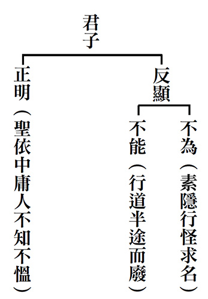

## 藝術賞析

### 孔門七十二賢淺說（三十一） —漆雕哆

圖／江逸子 、 文／時哉

摳衣憤起越堅難

造次顛沛不忘學

縱苦英才也按步

寒天飲冰點滴心

漆雕哆，姓漆雕，名哆，字子斂，春秋末年魯南武城人，孔子家語作漆彫哆，孔子弟子。

漆雕哆舉止端莊，風度翩翩，心態恭敬，勤奮學習，日日增進見聞，博聞善記而內斂謹言，將孔子的聖教傳頌於世。宋高宗讚其：「子斂受封，爰居武城，亹亹其聞，翩翩其英，摳衣時習，願學日明，誕敷孔教，爵里疏榮。」漆雕哆受帝王封賜，封為武城伯，他求學開道很勤勉，早年是英姿勃發的少年，依時學習，自動自發的學習，人生日漸明朗。竭力宣揚孔子的教誨，受爵封地，表彰他的光榮。

漆雕哆於東漢明帝永平十五年從祀聖廟，唐朝開元年追封武城伯，宋代加封為濮陽侯，明朝嘉靖年間改稱先賢漆雕子。

畫中的漆雕哆頍冠抿嘴、低頭沉思，摳衣表示要出發學習，或許思維的是如何克服種種的障礙，若能不畏艱難必能苦盡甘來，果然成就為大才，名列七十二賢。學習雖要講究善巧方便，如有良師益友與好的教材，但更要靠熱情與恆毅力，才是學有成就的徵兆。

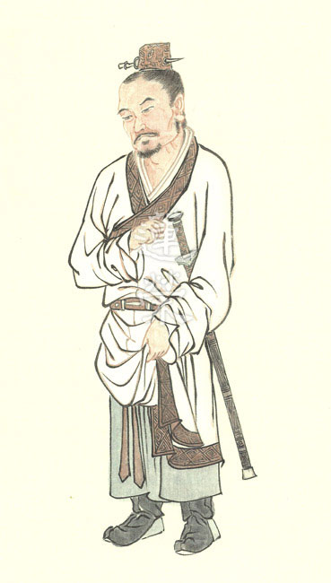

### 孔門七十二賢淺說（三十二）—漆雕徒父

圖／江逸子 、 文／時哉

高賢漆雕有三人

端莊好學遠名利

人生過客韶光逝

典範不易待師培

漆雕徒父，孔子家語名從，字子文，或作子有，子期，魯國人。

《論語‧雍也》篇說：「子曰：君子博學於文，約之以禮，亦可以弗畔矣夫。」文者經學也，主要是指儒家經典，廣言之，包括文化學術之文理知識皆能淵博精通，然處世、待人、接物皆能循規蹈矩，合乎情理自我約束，依禮而行，在人生道路上，無論為學問道，可謂不致偏離經論，而能得其中道。

孔門高賢中姓漆雕者有三人，分別為漆雕開、漆雕哆以及漆雕徒父，素稱三賢堂。皆以治學謹嚴、品德高潔所著稱。漆雕子文出入五經，性情恬淡，不務世間名聞利養或爵祿，悉心聖道，孜孜不倦，於孔門弟子中以德行好學相稱，唯顏回與漆雕子文受夫子嘉許，亦受後世景仰。

宋高宗贊其：「遐思子期，挾策聖帷，涉道是嗜，微爵可縻，在德既賢，在名乃垂，洋洋之風，逮今四馳。」遙想漆雕徒父，手不釋卷，對於聖道的學習十分好樂，沒有什麼名位可以羈絆他，成就出賢人的德行，美好寬大的風度學養，使他美名傳於四方及後世。漆雕徒父在東漢明帝永平十五年入祀聖廟，唐玄宗追封為須句伯，宋大宗祥符加封高苑侯，明嘉靖年間改稱先賢漆雕子。

畫中的漆雕徒父顯現出和藹可親、雍容大方、手不離書卷的神態，平易的舉止中富有書卷氣息，是一位以德行著稱讓人如沐春風、樂於親近的儒者。

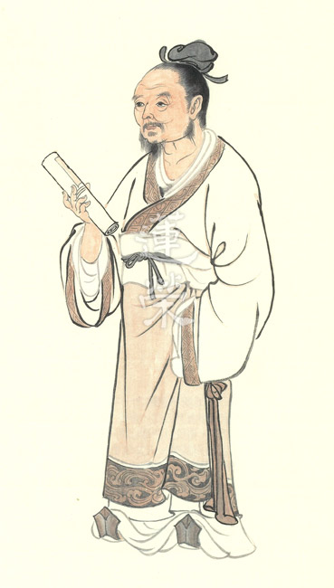

### 華夏精魂千秋（三十）— 明倫史畫 成己成物 童恢

圖／江逸子 、 文／淨域

德不孤必有鄰

後世祠廟祭拜

立碑讚頌典範

成己成物童恢

史畫

童恢，字漢宗，東漢徐州瑯琊郡姑幕縣（今山東省安丘市石埠子鎮）人，生卒年不詳。父親仲玉樂善好施，自幼耳濡目染，養成急公好義的性情。

靈帝時，司徒楊賜對他十分欣賞，召為府中幕僚。楊賜因直諫遭彈劾免官，原有僚屬紛紛辭去，惟有童恢一人為楊賜上書辯護。最終楊賜獲得平反，拜光祿大夫。當原有僚屬回府時，童恢反而辭職他去。

靈帝光和五年（西元一八二年），楊賜拜太尉，他薦舉童恢為不其縣令（今山東省即墨市）。他為官清正，獎善勸惡，提倡農桑；不出三年，縣治清明，民風和樂，四方來歸，居民多達兩萬戶。

某年，縣境發生猛虎傷人事件，縣民設置陷阱捉到兩隻老虎，抬到縣衙交給官府處置。童恢對虎說：「依律殺人者死，傷人者論罪。如果傷人就俯首認罪，沒有傷人就呼聲喊冤。」這時，一隻虎低頭露出恐懼的樣子，另一隻則抬頭咆哮，想要衝出獸欄。大家看了頗為驚訝，這才知道人心至誠，可以感通獸類。

童恢治民政績卓著，後來遷升為揚州丹陽郡太守（今安徽省宣城市），終卒於任上。不其縣民為紀念他，在縣內造衣冠塚與童公祠（今青島市惜福鎮付家埠村）。元代重修為童真宮（今名為通真宮），成為道教全真崋山派宮院，仍然奉祀童恢。

歷朝地方官或名士對童公祠多有碑記。宋朝即墨縣令孫彭年撰〈童府君祠記〉；元順帝年間山東宣慰使普顏不花，立〈延佑重修童真宮碑〉；明朝饒州知府張允掄，於國亡後退隱嶗山，撰〈童公祠記〉；清朝嘉慶六年，即墨知縣歐陽大勛，撰〈童公廟碑記〉。這些地方官或名士皆是飽學之人，於讀《漢書．循吏傳》中認識童恢，又任官或隱居於即墨與嶗山，而對於童恢的政績典故特別相應，因此立碑撰記加以頌讚，更能彰顯童恢成己成物之誠明。

圖解

人生在世其面相隨時在變，此不僅是老化的問題，更是氣質的實際，見了即一目瞭然。俗話說：「人生四十歲以後，要對自己的長相負責。」以前是父母生給你的，以後是自己造化的，長相會說話，那全是修身練心的結果。

《太上感應篇》中說：「吉人語善、視善、行善，一日有三善，三年天必降之福；凶人語惡、視惡、行惡，一日有三惡，三年天必降之禍。」這雖是常言的「心靈福至」，然而更是「人做天看」。天人得感應，人獸亦相通，這全在心上感通，誠則靈，譬如「水清月常來，心淨佛自現」。

江老師繪述童恢治縣愛民政績，特別以「感通獸類」來表現，其何以如此呢？印光大師曾說：「感應之道如撞鐘，大叩大鳴，小叩小鳴。世間每有小感而大應者，乃宿生修持之功德所致。」如此觀於童恢感通老虎，豈是異端邪說，乃真性德所降服。所以，歷來每有地方官為其修祠撰記，多是受其為官清正、成己成物所感呀！

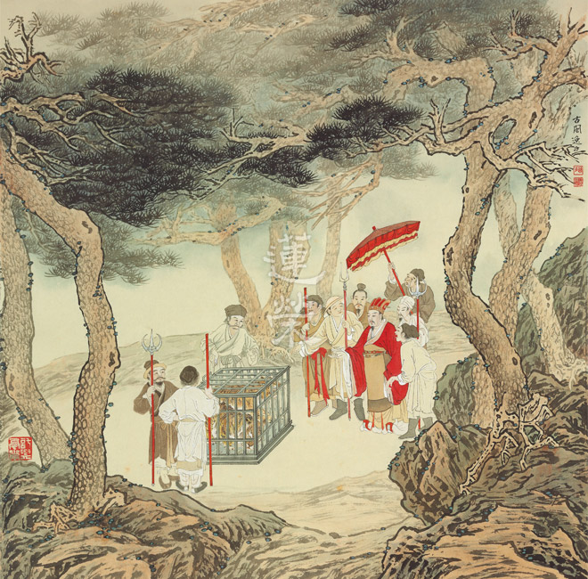

### 道藝春秋 人文始祖　伏羲氏

*圖／江逸子 、 文／編輯部整理*

畫卦表徵天地人

改進狩獵製皮衣

生存禦寒予文化

中華文明由他始

淵遠流長的中華文化五千年是怎麼來的呢？跟這幅畫作的主角伏羲氏息息相關，伏羲氏是華夏民族的人文始祖，是傳說時代的三皇之一的人皇，陶淵明自稱羲皇上人的羲皇就是指他，因為他是中華文化的發端，傳說他出生於現今甘肅天水縣。究竟伏羲氏有何過人之處呢？

這幅畫中的伏羲身披毛皮，下裙是鹿皮，當時約莫是在新石器時代，仍處於原始蠻荒的部落時期，傳說記載他帶領人們用獸皮縫製衣服抵禦寒冷，他還教會人民結網打魚、投矛狩獵。為了生存必須要在覓取食物之法上不斷改進，才能養活、維持人類生存，同時教民馴養野獸。據說他還發明了陶塤、琴瑟等樂器，將音樂帶入人們的生活，修身養性。他還創造了文字（楔形文字），是中國古文字的發端，取代了以往結繩記事的記錄形式。遠古時代的生活非常仰賴大自然，伏羲氏改革以提升人們在大自然中的生存能力，又以音樂豐富其心靈。

伏羲氏還有一項非常重大的發明，他根據天地萬物的變化發明創造了八卦（八組符號），他發現天地萬物的運行不但有規則，而且這些規則只用兩種簡單線條就可以紀錄掌握天地運行的道理，兩種線條代表陰陽，並用已知去預測未來，令人欽佩。今甘肅省天水市西部有座卦台山，相傳就是伏羲畫八卦的地方。

他的卦象解釋天地與人生的吉凶禍福的關聯，深深的影響了整個中華文化的思維模式，做為中華文化天人合一思想的奠基，也是江老師這幅畫的主題。

畫中的伏羲氏鬚髮皆白，表徵是一位高壽之人，面容像是慈祥的老頑童，老子說大人者不失其為赤子之心。背後山巒疊翠、霧靄蒸騰，點出身居高處。畫中的他倚坐石邊，抬頭觀察天象，眼神充滿著對著天地的想法與體悟，相信伏羲氏即便身處在這個時代，也是一位富含創意的人。

他右手拿著的是樹枝，呼應畫出地面上的八卦線條，每一卦有三畫，代表天、人、地，人在天地之間，須以斷惡修善維持人類和諧，配合天地好生之德。左手抓著烏龜，是這幅畫的點睛之處，原本應該是正面的烏龜，現在被翻轉過來，陰陽互轉，地氣上升、天氣下降，天地交融，乃祥和之徵。《易經》的泰卦，三陽開泰所言就是此氣象。

《周易‧繫辭》是現存典籍中第一次對伏羲歷史貢獻進行系統的歸納，面對這幅描述伏羲的畫作，可想而知歷史的進化是隨著人類的感悟而往前推移，相續到這個時代的我們，將如何引導下一代發展的基礎與方向，會是我們這個時代必須深思的課題。

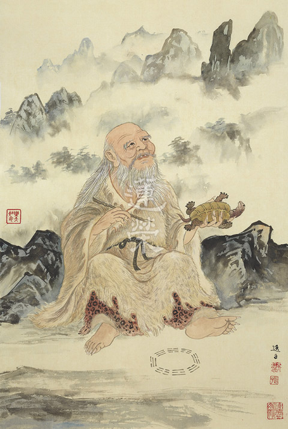

## 活動報導

### 紀念孔德成先生百年誕辰展覽暨儒家經典講習—由敦品勵學至誨人不倦

文／王順福

孔廟府林今遽變     達公遺憾隱微中

生民未有緜遺緒     他教先知邈失踪

敦品一生兼勵學     誨人上庠有聖風

刊碑明府詮天意     理想共和拱儒宗

孔上公百年誕辰紀念展就要落幕了，感慨良多耶。两次隨力充數任導覽人員，首次解說以紀錄片中弟子洪國樑教授對三孔一席話，最撼動我心，其言或是孔上公內心最深層之心願，惜乎未遂，恐亦是天地之遺憾吧！

此次睹聖裔世系表，有所感發，特分享來賞之儒學同好者，問觀者東西方聖者之子孫，除孔聖猶在，餘聖後裔今安在？足見孔聖德蔭之殊勝，又子孫中代有人才出，更是不可思議耶！

還記得初讀文心雕龍‧序志篇，見彥和讚：「自生人以來，未有如夫子者也」，思維何以古人，甚至一代文豪，都不吝讚美夫子，而此言追本源自亞聖孟子之言，其後清世宗雍正賜孔廟大成殿匾額即「生民未有」，頗驚訝彥和竟與帝王理念雷同也。夫子獲讃，實不分貴賤耶！

達公衍聖，怙恃俱失流落身，遭逢厄運，亙古無有，世路滄海最深知，志學耄耋持敦品勵學，正學之不厭耶，吾觀其書「敦品勵學」勉次子維寧，實乃其一生寫照，歌樂山日記載明矣，書如其人，分外鮮活。

達公於最高學府化雨春風五十寒暑，正誨人不倦耶，得金石趣，弘揚三禮，栽培英才，門人弟子崢嶸學界，主持儀禮復原研究及士昏禮影片，誠如弟子所言，乃學術創舉，曠古無有，無愧聖人家風。

丙申年正是禮器碑後第三十二丙申，與好友筱雲博士假新店圖書館，舉辦「翰墨詩心」書法聯展，時重臨此碑一通，以資展件，碑文中「獨見天意」，見之別有深趣，乃為一文「禮器碑之深思—尊孔立憲之」政治烏托邦，置於作品集，以申慨歎。

五權憲法立國，運作至今，何異三權憲政？放眼今世莫言總統制或內閣制，或君主立憲或馬列體制，或均非具吾國特色之政制體制，两岸立國先機皆襲西方體制，立國未標以文化為核心價值，商周國祚雖遠，不及素王，遑論西方歷代王朝興落，而今大不列顛及日本猶尊女王天皇，彼二王朝德被子民，與素王較，實不可同日而語耶，素王虛位體制，正可顯示吾國立國特色耶，但終究是一己烏托邦之見耶。

三孔是世界文化遺產，更是孔家遺產，乃不爭之事實！如何取得一平衡，考驗兩岸重視儒學之中國人，也考驗列為世產之專家，更考驗孔氏宗族，非宗長一人之責耶！

昨晚已搦管，一夜輾轉反思，不吐不快，今晨續書，聊供關懷孔家未來走向人士之參考耶，並就教方家識者指正。

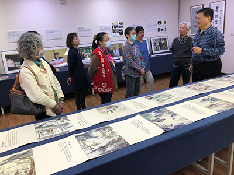

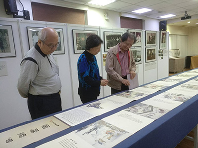

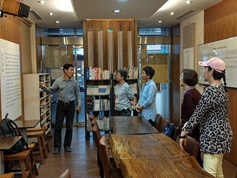

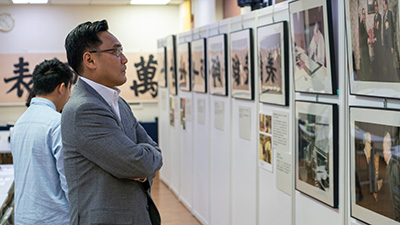

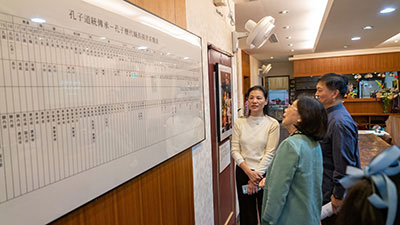

### 紀念孔德成先生百年誕辰展覽暨儒家經典講習— 前仆後繼傳承文化—磚瓦下的獨白

文／心韜、心儷

文物重現歷史

詩文記載滄桑

人們盼望富壽

白雲蒼狗世間

但能造作善業

不枉人間一回

「繁華已逐水東流，斷甓時從耕者得。」

然而，歷史的遺跡若只從耕者得之，泰半只剩價格，若能由學者得之，則終使有價值的文化重現。因為世人所見多為表淺，最多就在電腦桌前完成剪貼工作。士人則性喜鑽研、溫故知新，所以能成就一家之言；常家往往在有疑處無疑，得過且過不求甚解，藏家則是在無疑處求疑，所以廣為蒐羅、深入研究，每有會意便欣然忘食。王獻唐、董作賓與孔德成先生不但是民國初年的士者與藏家中的佼佼者，也是戰火連天中重要文物的守護者，在一磚一瓦中均能見到他們的博學與知交。

文物是死的，只有深見其價值者能讓它活過來，由王獻唐先生所贈，「衍聖公」孔德成先生所珍藏之「新室遺甓」與「富範瓦當」即是一例。王獻唐一生治學嚴謹，鍾情於金石、考古、聲韻、版本，常與孔德成、董作賓、李炳南等人鑒古識今、詩文往來。他們不只從史料上考證，更注重實地的鄉野調查，對文化遺產的整理和保護更是不遺餘力。

民國二十六年五月，王獻唐先生與孔德成先生在曲阜奉祀官府初次見面，獻唐先生在日記中寫道：「達生年方十八，人甚聰明，言語得體，力學不倦，談及學術，具有本源。並言屢讀余之著作，歷歷述其要點不爽，為之驚異。」抗戰期間，獻唐先生將山東珍貴文物遷至曲阜奉祀官府，就是基於對孔上公先生的了解，認為他是擔起保護文物最可靠的人選，其後文物一路西南遷，至棲於岩窟佛寺，雖衣食不繼而不改其志，王獻唐以「那羅延室」及「雙行精舍」寓意志堅牢不破及福慧雙修；孔上公更以「猗蘭別墅」勉勵自己為君子之守，揚揚其香。之後，二人更因守護文物的使命而成為亦師亦友的莫逆。

曾為山東省圖書館館長的王獻唐，珍藏許多高古的彝器、石刻與古籍珍本，其中大概要以秦漢磚瓦最特別了，可說是除了甲骨、鐘鼎、陶器、竹簡、紙張之外另一種珍稀的文化載體。目前出土的漢磚多為古代墓室或祠堂中牆瓦的裝飾之用，始於以秦為代表的戰國，西漢開始逐漸普及，至東漢大盛，期間的新莽成為主要的分界點，王獻唐所拓印的「新室遺甓」就是一個具有豐厚的歷史信息的珍貴的資料，具有建築及書風轉化的時代意義。

「新室遺甓」為新莽時期的墓室漢磚，由於王莽以偽造符瑞的方式篡位稱帝，曰：「新室當分陝，立二伯，以豐為右伯，太傅平晏為左伯，如周、召故事。」後世即以新室為新莽的代稱。遺甓者此指漢畫像磚或文字磚，漢畫像磚常用於墓室建築裝飾，多刻有人物、花鳥、紋飾、動物等吉祥圖案，有的古樸簡約，有的繁複瑰麗，多為秦漢時期達官顯貴的厚葬習俗所使用，寄望來世能富貴繁榮。而文字漢磚則常見吉語銘文，泰半為平民百姓所使用，表達了當時下層社會人們對美好生活的追求與祈望，除了寄望亡者未來的嚮往憧憬之外，更祈求後代子孫吉祥如意、安居樂業。其刻法為陽文篆書或隸書，文字周邊多見網紋、菱紋、蒲紋、圈紋、格紋、米紋等，亦有祥瑞祝賀之意。

以下分別為「新室遺甓」中王獻唐、董作賓與李炳南先生的題跋：

王獻唐：

「豐泉舊識鐶中意，氈墨新添紙上財。誰分空山彈鋏客，逼人富貴一時來。」

漢磚中錢幣的造型是王獻唐以前在山東豐泉時曾經見過，所以能了解其中代表的意涵。如今以氈墨拓印之，就像新添了錢財一般。在這幽深少人的山林，誰有馮諼的才情能分得此錢而獲得逼人的富貴呢？話說的輕鬆幽默，但是當時日人覬覦國寶，王獻唐為了典籍文物免受兵燹侵擾，於槍林彈雨中跋涉七千餘里，終讓珍貴文物能留在齊魯大地，他在日記中寫道：「這些是我的生命。」這逼人富貴也僅成為文人間的玩笑罷了！

更題：

「右上一磚做五十錢形，為新室大泉五十渻文。下一磚作富貴二字，同出陪都江南岸古墓中也，疑皆新莽時物。友人蔣逸雪遠道訪得，以富貴磚見餉，澷拓二紙，一贈逸雪，一以自藏。時三十一年二月二十一日，獻唐題記。」

原來此錢幣造型的圖案上應有原文「大泉五十」四個字，然而大泉二字卻缺漏了。其下的磚文為「富貴」二字，與上圖之錢幣形印拓同樣出於陪都四川的古墓之中，所以王獻唐懷疑這也是新莽時期之物，且為其友蔣逸雪訪得，不遠千里而來見贈於王獻唐，後者以之拓印二份，一份送給逸雪，一份自己收藏。吾人可別小看了拓本的價值，在千百年的歷史長流中，歲月的沖蝕與人為的損毀會令其漫滅消亡，而拓本相對保存較易，較能看到碑文的原貌，除了可以提供有心者臨摹觀賞之外，所留下珍貴的史料足跡與書法風格，更具有極高的文獻研究價值。

董作賓：

「向湖老人得富貴磚於渝洲，寫大泉五十，磚拓存此幣。卅一年三月十三日遊歌樂山，連留信宿，拜觀老人題詠，戲謂酸味可掬，書以記之，用博一粲，弟董作賓題。」

王獻唐因居於歌樂山西麓的向湖而自號向湖老人，其實王獻唐當時未到天命之年，也不算老，不過弘一大師有一方「三十稱老」印，喜歡金石印拓的他自稱老也不為過。獻唐先生在四川成都獲得友人蔣逸雪見贈刻有富貴二字，以及錢幣造型上刻五十圖紋(大泉二字已缺漏)的漢磚各一方，董作賓於民國卅一年三月十三日遊歌樂山，與王獻唐、孔德成、李炳南先生暢談而連留忘返暫居猗蘭別墅，拜觀王獻唐所題詠

「誰分空山彈鋏客，逼人富貴一時來。」

戲稱王酸味十足(蓋王獻唐當時捉襟見肘、三餐不繼，而謂所拓紙錢可稍用哉？)特別寫下以記之，博得見者一笑！然而，我們卻能於其中窺見四人對文化瞭解之深刻與交情之醇厚。

李炳南(雪公)：

「磨沙剪紙拓青氈，圜法依稀可辨年。未必當時空藻飾，疑同流俗瘞金錢。」

青氈為雙關語，除了指稱墨綠色的拓包之外，亦暗指清貧的生活，

「門巷蕭條酬應懶，英雄末路一青氈」

，當時局窘困，大多數的人只求生存下去，哪還能顧得風簷展書閱讀風雅？也只有像孔夫子的登門弟子般，才能將文化傳承看得比性命還重要。因之，雪公觀想當時王獻唐細細將漢磚表面上的沙粒灰土清理乾淨，再剪裁適當大小尺寸的帛紙作為拓印，在這圓形錢幣的圖案中，依稀可以分辨出是哪一個時期的幣制，這磚面圖案及紋路未必只是徒勞的裝飾而已，雪公認為這應該是當時人死亡後，以該種紙錢作為陪葬的風俗習慣。

我曾參觀埃及圖坦卡門的陪葬品，其中文物圖騰多是祈求一己來世之富貴榮華，也不乏血淋淋的狩獵與征戰，反觀中華民族的陪葬品中，連建築方式及圖樣都能移風易俗，多了仁人君子的文化思想與對子孫的期勉。

又記：

「十二雄文海內臣，漢家宮闕記和親。從來富貴尋常事，唯願博施濟眾人。」

西漢先後歷經了十二位君王，國內曾出現無數雄才大略之臣。漢家與當時若干蕃邦進行和親政策，宮闕墓室無不記述此事。從古墓中漢磚的文字圖飾中可以了解富與貴是人之所欲，然而雪公卻視富貴如浮雲，只希望能博施濟眾，廣施德惠於民。《論語．雍也》：「子貢曰：『如有博施於民而能濟眾何如？可謂仁乎？子曰：「何事於仁，必也聖乎！堯舜其猶病諸！夫仁者，己欲立而立人，己欲達而達人。能近取譬，可謂仁之方也已。』」《史記》：「雖在征伐之間，每存仁愛之念，博施濟眾，實可為天下主。」原來在雪公心中能博施濟眾者方是聖君。這與前二人所題，不僅暗指時局，更是眼界大開、慈悲喜捨，實為詩文中的絕品。

另一幅「千秋萬歲」及「富範瓦當」也極具文字趣味與歷史價值，其字體為篆書。正式的刻印多用篆書，因其筆畫粗細一致，容易刻畫，同時為了排版及畫面平衡的需求，往往可以將該字解構，然後將部件搬移到適當位置，甚至同一筆畫還可伸長縮短或轉彎，可說是變化多端，可以展現出書家的高超技法及豐富多樣的美感。

王獻唐：「

不向嵩山呼萬歲，但將文字付千秋。支離身世滄桑眼，生計何須與富謀。」

漢武帝登嵩山時，聽到嵩山山神向他呼萬歲，群臣亦呼萬歲，此後便作為臣民祝頌天子之辭。但是世間哪有萬世的富貴？再高的爵位也不過是爭一時，只有載道的文字才能流傳久遠，堪稱千秋。可嘆亂世中眼中所見皆是「有弟皆分散，無家問死生。」支離的不僅是漂泊流浪的家與人，還有美麗的河山。也只感慨「旌旆影，滄桑話」，又何苦狡譎的機關算盡為生計去謀求朝開暮落的富貴花？

又記：

「千秋萬歲瓦出吾鄉堯王城，現藏鼎丞先生許□富字瓦去春得於渝市，衛聚賢謂成都白馬寺出土。」

王獻唐在其家鄉山東日照堯王城發現上有千秋萬歲字樣的瓦當，堯王城是大汶口文化和龍山文化時期的都城，也是亞洲最大的歷史都城，具有新石器文化指標價值的意義。目前這千秋萬歲瓦當收藏於聲韻及風俗學大家丁鼎丞先生處。另一個富字瓦當則是去年春天王獻唐在四川渝州收得，以發掘漢墓著稱的考古學家衛聚賢認為這個富字瓦當應該出自於成都的白馬寺。

董作賓：

「川中漢墓遺存數多，故石刻文字繪畫及古磚發現亦黟，而瓦當不常見。此拓有白馬寺富字，當極可珍異。聞之大法師(衛聚賢)該地出土古兵器，文字奇特，花紋類晚周銅器，以此當互證。白馬寺殆一重要之遺址歟，質之，獻唐兄以為如何，弟董作賓題。」

目前所挖掘的漢墓以四川為最多，所以墓室中常見的石刻文字繪畫及古磚也雜多而不知其主，且因年代久遠而漫漶變黑，用來在屋檐前端蔽護檐頭的瓦當則是不常見到。此拓印中有白馬寺富字，字形及圖紋都保存良好而清晰，這是非常珍貴罕見的。曾聽聞衛聚賢說該地出土的古兵器上有奇特的文字與圖形，應該與晚周時期的銅器類似，可以互相作為佐證，白馬寺是中國非常重要的遺址，王獻唐則為考古及金石學大家，所以特地請教之。

孔上公：

「富範瓦當來白馬，千秋古篆出堯城。兩行氈墨傳君手，照眼應多感慨情。」

用來作為模子的富字瓦當來自白馬寺，千秋萬歲瓦則是出自於堯城，此字在形體上和結構上皆可見到精心變化，規範嚴謹中亦窺見其質樸靈活，頗有拙趣，與漢印有異曲同工之妙。富字與千秋萬歲二者皆以通行于春秋戰國及秦代的篆體來刻印，而此印又為古繆篆，多了隸書的感覺，為書法篆體所少見，且筆勢連貫、清晰，線條飛動自然、變化多端，可見到書者的率意。如今獻唐將之拓印成畫心，並請孔上公、董作賓及雪公等人作的題或跋記誌，想必看過的諸君不僅因古篆的稀有而眼睛為之一亮，也會為世事的成住壞空、無常變化而感觸良多吧！

雪公：

「梵剎王城野日昏，千秋潤屋兩當存。人間萬事皆雲狗，斷腸巴山話稷門。」

位於河南洛陽的白馬寺不但是佛教傳入中國後興建的第一座寺院與第一部八大人覺經與四十二章經的譯經處，也是十三朝的古都，如今卻沒落在荒野之中。「昏」字既指夕陽西下日已昏，也隱喻家國危亂令人斷腸，有壺觴難解千般事，筆墨徒添一紙愁之感，與末句可說是互相呼應。「兩當」者直指千秋萬世與富字二種瓦當，既是當時富貴人家建築常用，也是希冀子孫綿延的象徵，而潤屋則是富的代稱，大學中曾言：「富潤屋，德潤身」，想要真正得到千秋的富貴只有德了。偏偏「天上浮雲似白衣，斯須改變如蒼狗」，世事變幻無常，身為古物的守護者又哪能一味的寄情山水、刻霧裁風？古有巴山夜雨，讓思念有了發洩的聲音，然而君問歸期未有期，因為國不成國又何以為家？稷門在山東，且為戰國時各家學派及人文思想薈萃的中心，當時可說人才濟濟。雪公此處以稷門指山東家鄉，在四川重慶避難，思鄉心切，流落他鄉說他鄉的往事卻歸不去，看到梵剎王城當年的氣派，勝只存兩當，更生起富貴榮華有如白雲蒼狗之感。

法無自性，玩物未必喪志，端看「新室遺甓」墓室漢磚、與「千秋萬世」、「富」字瓦當，積澱著當時的歷史、建築藝術、書風轉化及社會制度的時代意義，是先人留給我們不可再生且珍貴的文化遺產，當我們細「讀」時，無不優游於歷史隧道。明董其昌認為：「『骨』者，所存過去之精華，如肉腐而骨存也；『董』者，明曉也。『骨董』之者，即明曉古人所遺之精華也。」然而今人見到骨董卻只見鈔票，只聞銅臭，所謂的傳承亦僅在拍賣場，實在可惜！

文物之所以有價值，在於士人用文化藝術、禮教道德與生命精神用心的加持，因此故宮或是孔家的文物，不僅是成為有價商品而已，更重要的是象徵文化的傳承與延續的媒介。孔子是士人與中華文化的代表，而孔德成先生傳承了精隨。在展覽中我們看到那怕是一漢磚一瓦當，孔先生都認真考據研究，不放過所有細節，希望能藉此證明並闡述優良歷史文化，這是老人家給我們證明他的軟實力，更在文化革命的洪潮氛圍中，期待成為撐住最後一片天的中流砥柱，前賢已仆後人豈能不繼乎！

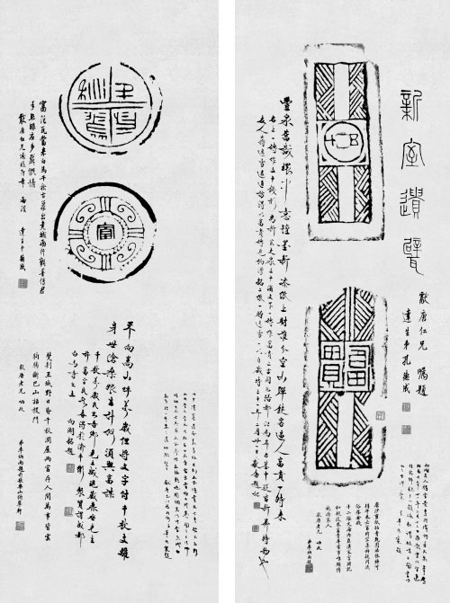

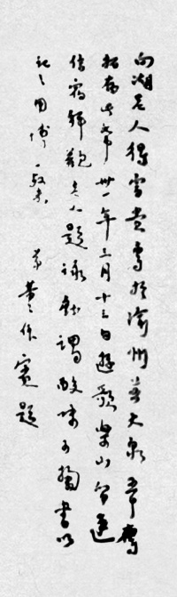

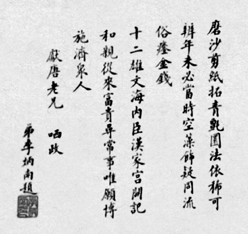

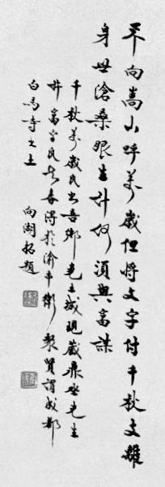

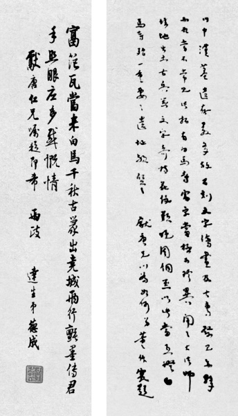

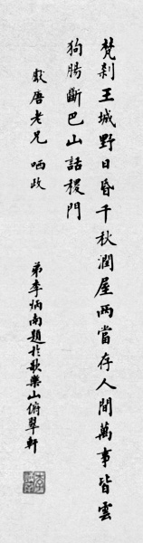

### 孔氏宗親祭祖與新年團拜

*文／編輯部 轉載文章*

一生博學好禮的孔子

一代人才輩出的學生

一直受到尊擁的傳承

一時宗族聚會的家祭

二○二○年二月十六日，大成至聖先師奉祀官孔垂長先生帶領孔氏宗親於孔廟舉行近百人的新春祭祖和團拜活動，學會有幸受邀擔任祭孔之禮生與工作人員，事前經過孔廟習老師、施老師們的精采講演與訓練，大家反覆練習，望能展現一番新氣象。

此次儀節精要而不失隆重，是一次試驗也是示範，意義非凡，當天天氣驟降，執事學長們薄裝上陣，不畏嚴風刺骨，各司其職，與會圓滿，參與者皆滿載而歸。

藉由此次祭孔，可以弄懂古禮的意義，如同《論語》所說「入太廟，每事問」，是一種研習、尊重、傳承，這樣的經驗難能可貴。而禮損益至今，如何成為現代人延續生命的意義所在，亦是我們必須深思的課題！在儀式中我們也祈求孔子及歷代聖賢能加被，去除一切違緣，積聚一切順緣，大家共體時艱，消除瘟疫，消除內心的惶恐與不安。

以下轉載至聖孔子基金會微信公眾號所發布之文章，供大眾參考。

臺灣孔氏宗親新春祭祖試新禮

宗主致辭願疫情早息病者速愈

庚子年臺灣孔氏宗親新春團拜，於今日（二月十六）上午十點半，假台北孔廟舉行，圓滿完成。本次團拜最大特色，在過程中加入了祭孔的儀式，由宗主孔子第七十九代嫡長孫孔垂長先生，率領八十多位的台灣孔氏宗親們，共同祭拜先祖至聖先師孔子。台大中文系黃啟書教授依據古禮，研發簡短版的祭孔儀式，在台北孔廟的協助下，禮請釋奠禮資深禮生指導，由中華無盡燈文化學會禮生團隊上場擔任祭祀禮生，過程隆重肅穆，令宗親們十分感動，最後在團拜的道賀聲中，圓滿本次的新春祭孔暨團拜典禮。

孔子是中華文化中最重要的人物，司馬遷在《孔子世家》贊中提到：「中國言《六藝》者皆折中於夫子，可謂至聖矣！」孔子誕生至今已兩千五百多年，許多當代重要的普世價值，諸如孝順、敬人、愛民、愛人、守禮、講信用、有勇義、能知恥等，皆與他的思想不謀而合，其見地高遠利益後世，成為後代孔氏宗親以及許多人心中所景仰的對象。

二○二○年二月十六日(農曆庚子年正月二十三日)，孔子第七十九代嫡長孫、大成至聖先師奉祀官、孔氏宗主孔垂長率臺灣孔氏宗親代表近百人，在臺北孔廟大成殿舉行新春祭祖和團拜活動。孔垂長在團拜致辭中表示，向在大陸各省、乃至於海外各地受到疫情影響下的所有孔氏宗親們，獻上一份最虔誠的祝福，並願疫情早日平息，病者速愈。

曲阜孔氏自先聖孔子以來，族裔繁茂，遍佈海內外，其中臺灣有孔氏宗親約七千餘人。往年臺灣孔氏宗親春節團拜，形式與一般團體差異不大。今年，為復興傳統文化，通過禮儀凝聚宗親親情，以孔垂長先生為會長的至聖孔子基金會委託臺灣大學中文系禮學專家與臺北孔廟共同研擬孔氏宗親祭祖禮儀。台大中文系黃啟書教授等學者依託古禮，結合現代實際，在闕裡的四仲丁祭祭孔大典(釋奠禮)和作為月朔與歲時常祭的釋菜禮基礎上適當簡化，經過數月努力，提出方案。經過孔氏宗親充分討論，最後確定孔氏宗親祭祖儀典。此次孔氏宗親新春祭祖與團拜，是此新式儒禮的第一次試行。

新試行的孔氏宗親祭孔儀典有序班、入班、禮神、上香、祝辭、立願、禮成、團拜等八項儀節。

序班時，按照孔氏字輩排序。但考慮到各家闔家團聚之情，所以一戶出席時則以家長字輩為准，站於同列。這樣既尊重昭穆，又不失親情。

禮神與上香時所進行之拜禮，原來多行鞠躬禮。現參考前任大成至聖先師奉祀官孔德成先生禮學研究心得所提出的立拜禮(即拜手禮)，更為肅穆古雅。而在討論中，孔氏宗親們都認為：向先祖孔子致敬時，如果能跪拜叩首，更能表達崇仰孺慕之情。所以最後確定的儀程中，立拜禮和跪拜禮都有採用。

孔氏宗親新祭祖儀典與以往不同的地方還體現在增加了「立願」這一儀節。按照古禮，只能由奉祀官、陪祭者入殿致祭，而新儀典考慮到增加每一位宗親的參與感，讓每一個人都在儀典中能感受和表達虔敬之情，立願儀節讓每位宗親都能入殿，在宗主監臨觀禮下，于祖先神位前發心立願。這既可以滿足宗親敬祖的情懷，也加深了宗主與宗親間敦睦宗誼的有形聯繫。

今日舉行儀典過程中，臺北天氣時陰時雨，儀程細節也不免有些變動。正如與會的孔氏宗親所共同關心的大陸疫情，持續影響著就學、百業以及商務的正常交流。儀典禮請臺北孔廟釋奠禮資深禮生指導，由中華無盡燈文化學會禮生團隊擔任祭祀禮生，過程隆重肅穆，令宗親們十分感動，最後在團拜的道賀聲中，圓滿完成本次新春祭孔暨團拜典禮。

孔子第七十九代嫡長孫、大成至聖先師奉祀官、孔氏家族宗主孔垂長先生在致辭時表示：今日在開闊的大成殿前，我們選擇照常舉行團拜。一則便於臺灣宗親們互賀新禧；但更重要的是，向在大陸各省、乃至於海外各地受到疫情影響下的所有宗親們，獻上一份最虔誠的祝福，願疫情早日平息，病者速愈，健者康泰，社會人群間能再找回原有的祥和與親近。正如《論語》所言：「君子無終食之間違仁，造次必於是，顛沛必於是。」所以在疫情嚴酷的考驗下，我們更應該恒持人傷我痛的仁愛之心，相互扶持與鼓勵，這才不愧先祖孔子的殷殷教誨。

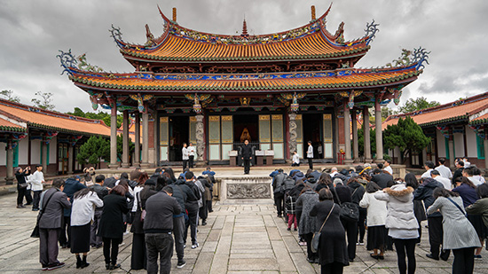

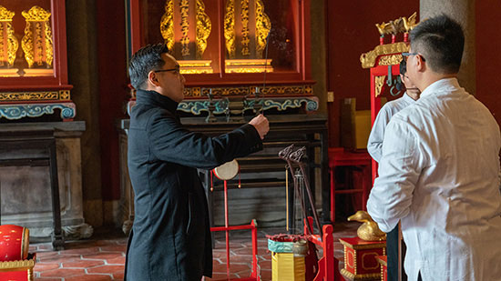

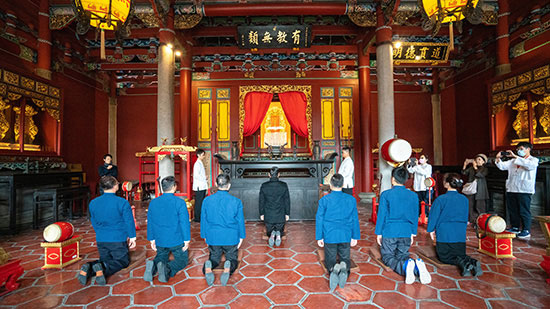

### 孔氏宗親新春團拜禮生初體驗

文／賴明貞

禮之形式古今別

慎終追遠意義同

民風淳厚宗族聚

孔家典範時代新

「一元復始，萬象更新」二○二○庚子新年對末學而言，最欣喜又榮幸之至的事，莫過於可以參加台灣孔氏宗親的新春團拜，而且是以禮生的身份親睹整個儀程進行，這個在中國承傳了千年歷史的世家貴族，頭一回在台北孔廟舉行致敬孔子之新春團拜活動，居然能參與其中，真可謂三生有幸啊！

此難能可貴的機會應是緣於去年孔德成先生百年紀念展，導覽培訓課程不僅讓我們深入了解孔德成先生，也更加認識孔子的家族風範，縱然今日已無百年前的富貴榮華，詩禮傳家的祖訓家風，仍延續了千年不墜的貴族內涵及顯露於外的氣象光采。於是乎像是莫名的巧合，亦宛如冥冥中的安排，我們不知情地先參與了孔廟釋奠典禮禮生的研習，學到了祭孔典禮的程序和用意，也知道禮生在整個典禮中的角色及重要性，然後就接到了這項任務，經過台大黃啟書教授辛苦籌劃及兩次緊湊的排練，我們就正式披甲上陣了。

在孔廟排練的過程中，時而見到參訪遊客或活動義工佇足徘徊觀看我們的演禮，想起司馬遷於史記孔子世家中提及，因讀孔子書感受到夫子如「高山仰止，景行行止」的德性，非常仰慕夫子的為人，所以親自去了魯地，觀看宗廟廳堂、車輛服裝、禮樂器物，還看到了當代的儒生們依時在夫子故居演習禮儀，而我彷彿也在此刻穿越到了二千年前的西漢，隨著太史公的腳步穿梭其中看到演禮的畫面，感受到夫子的春風化雨，禮的實踐讓人更有氣象，讓孔廟古風再現，也讓人流連忘返久久不忍離去。

到了新春團拜當天，孔氏宗親男女老少都非常早就抵達孔廟準備，他們有人遠從花蓮、南部，甚至是美國回來，在解說典禮流程時都非常認真專注，且此次儀程宗親們還首次要求加入跪拜禮，慎重心意可見一斑。團拜有一「立願」儀節是讓宗親依序進入大成殿內，於孔子牌位前祝願，意即於夫子見證下立下新年新希望，有幾位行動較不便的親族長輩，依然堅持入內祝願，讓末學感受到了家族的凝聚力及榮譽感。哲人日已遠，典型在夙昔，夫子留下的人生典範，正是後代子孫最佳的學習榜樣。

到在這個科技進步、物質無虞的年代，中國年的氣氛似乎越來越淡薄，反不如跨年晚會受現代人青睞，許多老祖宗留下來珍貴的傳統也因而逐漸被遺忘，有了禮生初體驗之後深深覺得禮的學習讓人更沉穩莊重，結合禮的團拜活動，讓年節更有意義溫度，家族聚會活動也可以不只吃吃喝喝歡樂一場，除了團聚一起互道恭喜，還有對老祖宗的緬懷，對來年的自我期許，多麼美好的一年之始啊！

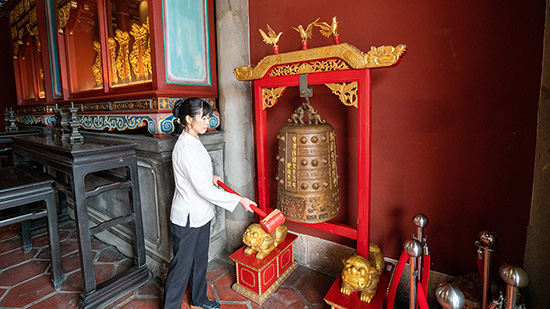

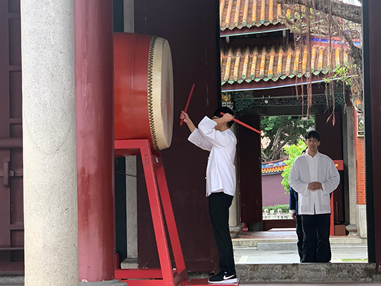

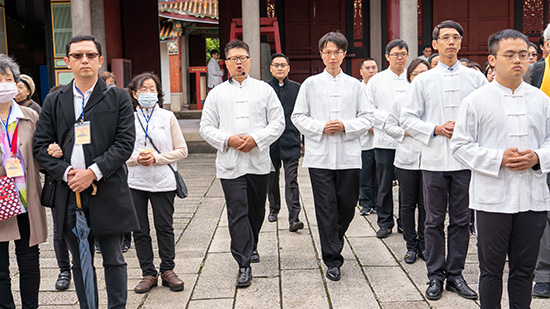

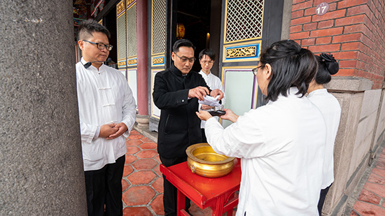
