# 第127期
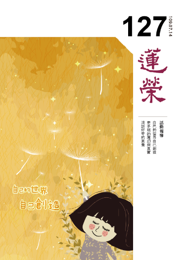

## 社論

### 後疫情時代

*編輯部整理*

宏觀看世知新局

能力合作正法質

列強國際爭鬥間

心中桃源利他業

隨著世界各地慢慢地解封解禁，大家摘下口罩，久違聚會，政府推出種種方案振興經濟，民間也開始出現報復性消費，經過新冠狀病毒近半年的掃射，世界重新洗牌，人們的生活、工作、教育、旅行等都被迫改變，經濟停滯、貧富差距擴大、貿易戰持續開打，新冠肺炎也很可能重新席捲而來，一波未平、一波又起，我們會面對怎麼樣的後疫情時代呢？該何去何從？心態該如何重新建立呢？

臺灣無疑是此次疫情中的幸運兒，地球上還有許多國家猶陷水深火熱之中。據統計，全球武漢肺炎確診人數於今年七月突破一千二百萬人，死亡人數超過五十萬人。美國解封後每日確診人數創新高，每天都增加三到四萬人，死亡人數超過十三萬人。新加坡超過四萬人確診，巴西、墨西哥、俄羅斯等國疫情險峻，沒有緩和的趨勢。印度每日確診持續創新高，每天確診近兩萬人，累積已經超過五十萬人…。各國面對醫療體系崩潰、經濟崩盤、政治局勢不穩定，人心惶惶，人民及難民孤苦無依的病死在路邊或倒在自家中的事例不勝枚舉，相對的臺灣是良好的避風港，疫情控制得當，歸功於政府的宣導、相關單位的努力、人民的配合，得以維持不錯的成效，也使得各國爭相借鏡。

疫苗尚未問世，而各國、各地逐步解除封鎖，暑假即將來襲，人潮接觸的機會繁多，難以繼續防堵，經濟也不容許持續的鎖國，各式行業都渴望重振，此時的風險控管機制顯得格外重要，考驗系統的完善，政府、人民的判斷力及應變能力。

疫情帶來許多新的轉折，像是全球供應鏈的改變，原本各產業極度依賴中國市場，疫情爆發後，中國許多產業停擺，導致供應鏈斷掉，供應鏈的重組勢在必行，而它的數位化、透明化，將是各企業需要努力的方向。區塊鏈的時代來臨，過去一家企業通常僅須跟供應商對口，現在企業之間則必須團隊合作，彼此了解、彼此信任，從封閉走向開放，這樣的轉變，可使企業更具韌性，更能應變各種緊急的突發狀況。後疫情時代，國與國之間的合作將更加緊密，走向生產基地多角化的運營。

因為疫情而加速演化的新生活方式，最顯著的應該就是新科技的開展，像是數位平台、雲端資料服務等企業都大幅成長，線上教育學習勢不可擋，工作連線亦然，AI、5G等數位科技將引領我們走向下一個階段，所謂的5G時代，即第五代行動通訊技術，萬物互聯，具有超高速、大連結、低延遲等特點，號稱速度比4G快一百倍。時代只會愈來愈快速，數位科技自動化、智慧化是趨勢，能站穩腳步，快速適應新的科技變化者，就有更大的機率能夠生存。誰能在線上進行創新，就有機會在全球大勢中取得新契機。

伴隨著疫情，健康議題尤為重要。後疫情時代，飢餓潮擴散，2.6億的人口缺糧，而病毒全球化，挑戰各國的公衛體系，以及未來防疫的管理模式、藥品研發。一波波的失業潮，挑戰人們恐慌而疲憊的身心，富人愈富、窮人愈窮的社會，也很可能出現群體不滿而導致的政治動盪。大家都在困境與傷口中尋找新的出路，再再考驗人的心理與能力。

我們不確定疫情是會像海嘯一般席捲而來、全身而退？還是會像潮水般一波一波的漲落？若不幸爆發第二波疫情，多國重新實施封鎖，全球經濟萎縮將達7.6％（OECD），不堪設想。可以確定的是不管疫情是否再度侵襲，大環境已無法回到過去，全球運作規則已改變，面對不可控的衝擊，儘管臺灣目前防疫成效卓然，也不可掉以輕心，要保持高度警戒，維護自己與他人的安全。自身必須要培養能力，尤其是培養被別人大量需要的能力、洞悉全球變化的能力，接受、適應、應用新科技的能力，還要張開雙臂，與人溝通合作，單打獨鬥已不適用，必須要開啟新的視野，才會有一番新的事業。

面對後疫情時代，你準備好了嗎？

## 佛學幽覽

### 菩薩清淨的行持 — 華嚴經淨行品（四十三）

*戒慧講述、編輯部整理*

身體形象是所依

罪福能依是能感

美醜健疾是所感

佛相身強是所願

丙二、指事顯因答其徵因

丁一、總徵

丁二、別顯

戊六、乞食道行時願（五十五願）

己二、所睹事境(十九願)

己三、所遇人物（有二十四願）

己三、所遇人物：無病人、疾病人、

端正人、醜陋人

前言

經文：

見無病人，當願眾生，入真實慧，永無病惱。

無病人跟疾病人倆倆相對，無病即身體健康，六十華嚴把見無病人翻作見強健人，意思更圓滿，因為縱然無病，假使其身體虛弱，手無縛雞之力，也沒有多大的好處。

見強健人，希望大家都能得到真實的智慧，才能夠永無病惱。看到無病人很高興的當願眾生永遠不要有病，而且能快快樂樂，然須入真實慧，永斷業繫，才不會被病所惱。

張飛怕病，病最能讓人起煩惱，因為人病久了會很無奈、洩氣，事事提不起勁，尤其很多事無法自理，要借助他人幫忙，覺得自己很無用，很是無奈。雪公老師晚年生病，病苦磨人，連大德也不例外，心態要超越病苦不是簡單的事，所以《無常經》特明老、病、死，心態超越老病死的束縛，才是真功夫。

入真實慧為何是因？此處特指不會被病所惱。除掉病苦有很多種方式，像是運動、吃藥、治療等等，為何最後的根本是入真實慧？因為病苦是由惑業所成，而業感苦，惑生業、惑潤業，所以以惑為主，而要破執著才能斷惑，破執著就從入真實慧去破，惑業不生痛苦就不生，這是八十華嚴說的。可是六十華嚴寫得更好，會性法師也比較贊成六十華嚴，「見強健人，當願眾生，得金剛身，無有衰耄」。完全就身體上來講，現在強壯健康的身體沒有什麼好處，那只能短暫維持，要好好修學佛法，才能得到金剛不壞身，得到法身慧命，永遠不衰敗。「得金剛身」就是真正入真實慧得金剛身，而「無有衰耄」，衰指體力衰，耄指年紀老行動不便。這種現象在金剛身是沒有的，佛就是金剛身，他已業盡情空，只是示現老病苦，示現無常，讓我們知道每個人都會經歷這樣的過程，所以要警惕自己及時修學正法。當身體衰敗時，能夠有智慧而不被身體的衰敗所苦。佛以願力來示現老病苦，不是業力所顯，諸法自性空，業力雖然不顯現，但願力可以顯現，願力顯現的那一分是為了要利益眾生，讓有情眾生知道老苦可以修、病苦也可以修、死苦也可以修。

我們在路上見到身體強健者要生出隨喜心，並樂見他能把體性轉成金剛身，即內心生起真實慧。強健者如關公、趙子龍，一身是膽、體力強健，那些武將的能耐其實都跟過去生中造善業有關，過去布施飲食，或是像二十五圓通中的持地菩薩以體力來服務大眾，所以其體力、精神、能耐會越用越強。

經文：

見無樂著，當願眾生，有為事中，心無所樂。

見世間不貪著的人，希望眾生能對世間虛妄不實的有為法心生厭離，不去愛著。心無所樂是對俗事沒有興趣，例如：不愛聊天、不愛看連續劇、玩遊戲。

有為法必須觀待造作而生起，納受時會產生三種感受：苦受、樂受、捨受。觀待過去的惡業生起苦受，觀待過去的善業生起樂受，觀待過去的無記業生起捨受。心中對於過去這三種業顯現的感受都無所樂，因為有為法皆無常，感受的自相亦不可得，苦受樂受也是回應過去自己的善惡業所引起，若不觀待眼前的逆境它不會生起苦受，沒有眼前的順境不會生起樂受，沒有眼前的中庸境不會生起捨受，這是第一分的觀察。第二分的觀察是，如果我們沒有認知它為順境的時候，請問樂受在哪裡？如果受有自相，冷氣吹來大家應該都快樂，但實際不然，對一個病入膏肓的人，一陣冷風吹過來，寒風刺骨，受的自相又在哪裡？可見是在個人的心理認知上顯現，在境界上無法成立。

萬法只有兩條路，有自相與名言生，若有一分的自相就有一分不帶名言，例如當一陣冷風吹來時，如果它有一分的自相，應該所有人都說它涼，不必觀待名言，可是剛運動完的人全身熱呼呼，會說冷氣開得不夠強，此時冷氣的自相在哪裡？冷氣的自相不可得的時候，冷氣只能名言生，名言通達它是順境時才能生起樂受，感受逆境時才生起苦受，可見樂受、苦受的自相不存在，又何謂受苦受樂呢？所以經文上說「心無所樂」，很多人會錯解為對人生沒有感覺，事實上心無所樂是勝義諦，勝義上通達受的自相不可得，觀待世俗上過去的善惡業生起眼前名言的認知。

經文：

見疾病人，當願眾生，知身空寂，離乖諍法。

「見疾病人」跟「知身空寂」有何關係呢？所有的病苦由身識去接受，身體接受病的痛苦，心裡接受煩惱的痛苦。

「知身空寂」，身的自相空，身了不可得，請問是誰在受病？可是身體明明是實有，如何說是空寂？乃因身跟心互相依靠，身要靠著心才有身體的作用，例如一個沒有心識的人，何來身體在受病苦之事，所以身的自相若沒有靠著心，身的功能在哪裡，要靠著心身體才有作用。虛雲老和尚入定去兜率天的時候，紅衛兵將他打得七孔流血，其實他沒感覺，身不受苦，因為身的作用是觀待心才有。廣欽老和尚在山中入定四個半月沒吃東西，在禪定的法喜中，身不受餓，可是當他出定時，立刻趴倒，身馬上受餓，所以爬著出去找食物。

龍樹菩薩《中論》二十七品的修學法，空性的修學法琳瑯滿目，四大是能造，身是所造。能造的四大自相空，地大的自相空，無水、火、風則地大不能顯現；水大的自相空，無地、火、風則水大不能顯現，依此類推，地、水、火、風的自相都空，能造的自相都空，所造的身自相又在何處，自然也了不可得。

「知身空寂，離乖諍法」，離開乖違、競爭的方法，就是要證得空性的智慧，此人就不會與他人對立、爭鬥。須菩提解空第一，得到無諍三昧，內勤克念之功(能證空慧)，外弘不諍之德(無諍三昧)，我都尚且不可得了，哪有你可得，就沒有人我的對立、乖違、鬥爭，證得空性的理和，是為根本位，後得位就是外面事項的六和，見、戒、身、口、意、利的和。內證的根本智慧叫做中，外面與人和叫做和，叫做「致中和，天地位焉，萬物育焉」。

身空寂，身的自相不可得，而由身生起的我自相也不可得，它是離乖諍最殊勝的法門。所以見到疾病的人，當願眾生要觀修空性，除了能夠遠離惑業外，還要觀修身體去受苦的那一分，身體的自相在哪裡，身體的自相尚且都不可得，請問是誰去受病？

知身空寂才能離乖諍法，見疾病人時，要知道想脫離此病苦，必須要從破煩惱的那一分去脫離，破煩惱要從建立真實的智慧去破，從心去脫離的。同樣是病苦，修行人跟不修行的人差別甚大，不修行者要靠特效藥、點滴、醫生、護士脫離病苦，而這樣的脫離並不能真正的脫離病苦，修行人在脫離身苦的時候是從心去脫離的，跟我們世間人在脫離病苦想法不一樣。

經文：

見端正人，當願眾生，於佛菩薩，常生淨信。

見端正人，南亭老和尚的講義上說到，端正的形象是相貌五官端正、四肢完具，而且長短適中、皮膚白皙、齒白齊密、髮長而漆黑、聲音宏亮，端正相是諸多條件的和合，而每一個條件都不簡單，比如說髮長而漆黑，釋迦牟尼佛就是黑髮，是聖人的種性。

相貌端正可以生起諸多功德，端正人容易生起他人的信心，菩薩修忍辱就是希望讓自己的形象端正，讓別人生起信心，容易跟人結善緣，也容易成為善知識攝受的對象，做善法時也容易得到他人配合、擁護。

依此引申，我們對六度都可以重新觀察，修布施是為了使來世修學空性時有道糧，不用太認真就有足夠的財富，可以好好讀書充實自己；修持戒使來世可以成為人，而不是成為無法修學的畜生道；修忍辱是為了成為端正人，使善知識喜歡，願意攝受；修精進使自己在修學空性時有恆心、有幹勁，不會半途而廢；修禪定為了方便以後修學空性時，能夠安住在空性的義理上；修觀是為了在修學空性時特別有觀察力。要以上述的心態來修學六度。

再來說，端正人是以什麼樣的因緣得到的，南亭老和尚的講義中說，皆由過去生中言存端正、心地光明而得。心地光明使自己皮膚發亮、有光彩，言存端正使自己相貌端正。端正人一切的心思皆是為人著想，且是被正知見所攝持，使得他今生顯現端正。

「見端正人」與「於佛菩薩，常生淨信」有何關係呢？相貌端正的果相由對佛菩薩生起清淨的信心而來，因為佛菩薩的相貌最端正、氣質超俗，對佛菩薩生起淨信心，自然會隨著佛菩薩的因地去做端正的因，生起的果相便會如佛菩薩一樣端正。舉例而言，玉琳國師本來非常醜陋，於藥師佛前生起淨信心，來世投生為清淨莊嚴的比丘。祖師大德的相都很敦厚，跟他前生對三寶的恭敬有關，所以寺廟中的大德在塑佛像時是很講究的，因為佛像表徵佛的端正。

清淨的信心即對於端正人其端正相的果與因，皆不懷疑。比如說佛菩薩利益有情的心、修歡喜的心、修隨喜的心、大悲心、菩提心、非常樂意攝受眾生的心等等，種種的因感得其現起的相貌端正，又因他生起的心都是為了有情，他的端正是很有親和力的端正，使得有情特別想親近。觀音菩薩的相好莊嚴中，特別有一分是眾所愛近，而釋迦牟尼佛的端正，會讓阿難尊者畏愛兼抱。端正人有時功德很大，當時舍利弗講經時，外道聽起來非常震撼，並說若醜陋的比丘都有這樣的功德，更何況是具足莊嚴佛相的難陀，一定更為殊勝，事實上難陀還比不上舍利弗，可是眾生會如是想，所以回過頭去親近難陀，這就是端正人的功德，可是端正人不能光憑自己相貌端正而不好好充實培養自己，否則就成了外相端正，內在卻無內涵的人。

見端正人是願所依，能願的是菩薩，所願的是眾生，「於佛菩薩，常生淨信」，希望眾生能得到這樣端正相好的功德利益，特別是對佛無有過失、清淨的身口意三業，生起清淨的信心，是自己相好最殊勝的因。

修這一條願時，第一要用隨喜的心來修，隨喜的形象是眾生愈做善菩薩愈高興，希望眾生見佛菩薩能生清淨的心。隨喜無須出錢出力，但光是心意就可以累積非常多的功德，反面來說隨喜可以除掉嫉妒的障礙，嫉妒的形象是他人愈好我愈痛苦、愈生氣。第二是發願，希望眾生能於佛菩薩前，常生淨信，眾生沒有這樣做，但我希望他這樣做。第三是承擔，菩薩能幫助眾生於佛菩薩，常生淨信。我希望我的能力能幫助眾生於佛菩薩，常生淨信。第四是祈求三寶加被，讓我有能力幫助眾生於佛菩薩，常生淨信。

經文：

見醜陋人，當願眾生，於不善事，不生樂著。

見醜陋人是願所依，能願的是菩薩，所願的是眾生。

醜陋相對於端正而言，南亭老和尚講義中說，醜是指相貌殘缺，陋是指行為卑鄙，即是行為舉止處處都只想到自己，不在乎他人感受，不注重團體規矩，陋就是俗氣，人不論相貌英俊或醜陋都沒有關係，但是最重要的是不要俗氣，也就是要在說話、談吐、舉手投足、辦事等等考慮到別人，並且有學養內涵，善於觀察他人需求，懂得應對進退，自然表現出不俗的風範。

如何不得醜陋的果相，就要遠離醜陋的因，醜陋的因就是不善事，即不造惡業，不造損人利己的事，對惡業不生樂著之心。醜陋的根源是有執我的心識，生出的貪嗔癡等煩惱。

我們要知道造不善事的過患，以及做善事的功德，還要知道如何對治不善事，以及如何造作善法，對善法的造作要生歡喜心，對不善事的造作要生懺悔心，用各種的方法讓自己於不善事不生樂著，用各種的方法幫助自己在善事樂著。善事如何樂著？就是在自己造善或見他人造善，或與大眾共同造善時修歡喜、修隨喜，使自己修善的勢力轉強，染著惡法的勢力轉弱。修行一方面要有正知見，一方面還要有善巧方便，懂得修行的要領、門道，懂得修行的滋味，這才是真正會修行。

反面來說，於不善事不生樂著，很討厭生煩惱、造惡業、跟惡人相處，會性法師說常發脾氣的人照鏡子會發覺相很難看，惡業會讓人醜陋，惡業特別是瞋恨的那一分，百法中說「忿、恨、惱、害、嫉」，五種皆以瞋恚一分為體，所造的惡業、所做的不善事，最能感應醜陋的相，此時降伏當中特別要降伏瞋恨的那一分，如何降伏瞋恨？反面要知道瞋恨的過患，正面要知道修慈悲的功德，無法生起慈悲時怎麼辦呢？雪廬老人說慈不下去就忍，但要知道忍的功德，而且要感激對方給我機會修忍辱度，沒有他提供此機會，則修不到忍辱度。到了極樂世界，沒有環境修忍辱度，在娑婆世界才能修得到，對方給我們機會修忍辱度，功德跟阿彌陀佛一樣大，應該產生高興的心態、歡喜的忍，而非心上一把刀，無奈的忍住。

六十華嚴的經文是「見醜陋人，當願眾生，遠離鄙惡，以善自嚴。」醜陋當中，瞋恨是他的直接因，所以修忍辱是對治瞋恨最好的方法。

### 大乘百法明門論簡說（三十四）拾伍、心所有法 ｜ 隨煩惱（三）

*戒慧講述、淨本整理*

認知心裏活動

方能斷惡修善

隱微用心黑白

君子小人天淵

經文：

五、隨煩惱二十者：一、忿。二、恨。三、惱。四、覆。五、誑。六、諂。七、憍。八、害。九、嫉。十、慳。十一、無慚。十二、無愧。十三、不信。十四、懈怠。十五、放逸。十六、昏沉。十七、掉舉。十八、失念。十九、不正知。二十、散亂。

第六「諂」，《百法直解》云：「為罔他故，矯設異儀，險曲為性。能障不諂，不任師友真正教誨為業。此亦貪癡一分為體。」諂心所的作用，是欺罔他人，而故意設置或裝出奇特的禮節儀態，其實內心是陰險邪曲，為的是自己的名聞利養。這樣的心理現象，無法堪任善知識的教誨引導。

小人很善於運用諂心所，能夠討好他人，說別人喜歡聽的話，得到別人的支持，所以諂心所的運用也要通達人情世故，只可惜這樣的通達是用來蒙騙他人，不是用來幫助他人。所以知人十分重要，知人就是對他人心理作用的觀察，《論語》中孔子說：「不患人之不己知，患不知人也。」孔子對人的觀察，不只表面的作為，還有心上的細膩觀察，所以他說：「視其所以，觀其所由，察其所安。」總是教誨學生們要提起各類善心所，諸如孝悌忠信禮義廉恥。曾子說孔子的一以貫之之道是「忠、恕」，子思則用「誠」這個字，來加以發揮孔門心法，誠懇正直就是諂心所的正對治，唯有如此才能得到善知識的攝受，所以說：「菩提妙法樹，皆生直地心。」

諂心所與前述覆心所互相依附，都是害怕失去名利，所以諂媚他人、隱藏罪過。諂心所是貪與癡各一分的面相所假立的心理作用。希求名聞利樂是貪，妄認這些才是人生的安樂是癡。

第七「憍」，《百法直解》云：「於自盛事深生染著，醉傲為性。能障不憍，生長雜染為業。此以貪愛一分為體。」對於自身的盛事產生很深的染著，也就是沉溺於其中，對自己這樣的盛況感覺很滿意，此時容易得少為足，甚至得意忘形而肆無忌憚。讓人沉溺其中的盛況可以很多種，諸如身體健康、學歷、種族、家世背景、財富、交友、博學多聞等，都可以讓人產生貪愛、志得意滿。這樣的心態會生雜染，也就是增強愛我的心念，人變得愈來愈自私，為了自私自利而去發展各類的盛況。

憍心所是貪愛一分的面相所假立的心理作用，貪愛能生起各種面相，憍只是其中之一的面相（作用）因為貪著自己的盛事而沉溺其中，所以不易見到他人的優點，進而向他人學習。謙虛可以是憍的正對治，卑己以尊人，發現自己的不足，就會尊敬別人，懂得求學。

第八「害」，《百法直解》云：「於諸有情心無悲愍，損惱為性。能障不害，逼惱為業。此亦瞋恚一分為體。」對於一切有情眾生沒有慈悲憐憫之心，而是想逼損、惱害眾生，這樣的心理作用生起時，會障礙悲天憫人的心念，造作出逼迫惱害眾生的行為。煩惱法不只是會惱害他人，真正的果報是惱害自己，違損自己此世或他世的幸福與快樂。造作害心所的有情，在等流的心態上，常常會感到悶悶不樂，並且常處喧鬧不安的環境，善知識不願與之親近，來世易入三塗，所以其實是自害，沒有任何好處，應該多串習慈悲觀，以同理心感受眾生的痛苦，並思維因果的可怕，讓害心所不生。害心所是根本煩惱中瞋心所一分作用的假立。

第九「嫉」，《百法直解》云：「殉自名利。不耐他榮。妒嫉為性。能障不嫉。憂慼為業。此亦瞋恚一分為體。」嫉心所也是瞋心所一分作用的假立。殉是犧牲的意思，嫉妒之人，為了自己的名利什麼都肯犧牲，不願意被他人超越，所以對於他人的盛況，心中會產生不耐、不舒服的感覺。嫉心所讓人心量狹小，如此福報也小，隨喜他人才能創造自己的出路，才是調和鼎鼐的宰相之才，儒家四書中的《大學》云：「若有一个臣，斷斷兮無他技，其心休休焉，其如有容焉。人之有技，若己有之；人之彥聖，其心好之，不啻若自其口出。實能容之，以能保我子孫黎民，尚亦有利哉！」真正不嫉妒他人，能夠為國舉才，創造大眾的福利，才是一位子孫黎民能夠依靠的大材。春秋時期衛國的大夫公叔文子，提拔他的家臣僎，與他居於平等地位，一同上朝事君，孔子聞知此事，就說，公叔文子可以諡為文。這也是見他度量，能夠成人之美的好榜樣。

小隨煩惱中最後一個心所，第十「慳」，《百法直解》云：「耽著財法，不能慧捨，秘吝為性。能障不慳。鄙澀畜積為業。此亦貪愛一分為體。」一個人沉溺於錢財，或者對於自己的學問技能，不肯慷慨施捨，內心隱微處是吝嗇，這就是慳心所的行相。這樣的心所會讓人粗俗、酸澀，緊守著自己所擁有的東西。

財可分為內財及外財，外財如金銀珠寶，內財如學問知識技能，捨內財比捨外財更為困難，因為這些內涵學之不易，是生起我執的關鍵處，如果沒有透過智慧去觀察，寧可一身絕活陪葬，也不願意傳授他人。《華嚴經》中善財童子五十三參，參訪了五十三位善知識，之所以都能獲得他們的傾囊相授，一方面是因為文殊菩薩的介紹，再一方面是善財童子求法歷經千辛萬苦，誠意十足，還有就是善財童子是已發菩提心之人，能夠承擔利益有情的大業。所以智慧之人不會慳吝外財，也不會慳吝內財，但看對方的誠意與用心，然後將所學往下傳承。本論譯者玄奘法師，也是懷抱傳法利生的大志西行，才能獲得已經高齡一百零六歲的戒賢論師，重啟講壇，授予經法。捨之一字，是慳心所的正對治。

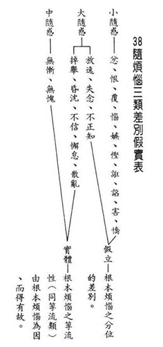

### 佛學概要十四講表簡說（二十九）第五講表　人生三際之抉秘（十二因緣）

*戒慧講述／宏法、淨昌整理*

面對生死而哀嘆

曠達右軍亦不免

有幸佛法東傳來

揭開生死神秘紗

前言

第四表及第五表都是探討正確的人生觀，第四表言人生當前之所受，三苦的本質是行苦，以五蘊遷流變化為本質而生起執我的心，執我的心想追求快樂、離開痛苦，可是最終求到的快樂是壞苦，所得到、離不開的是苦苦。離苦得樂要有方法，方法是苦因苦果的離，特別是苦因的離，第五表言人生三際之抉秘，從苦果去探尋苦因，苦果是有為法，是造作而來，我們要觀察過去造成苦果的因緣為何，了解苦果的由來，就不會在此苦果上再造苦因，如佛經上說不受第二支箭，第一支箭指五蘊身，第二支箭就是不要在此五蘊身上再造苦因。此表特別講十二因緣的重要，解脫的思想中最重要的就是十二因緣的觀察。

人生三際之抉秘

第四表說明當前的人生是苦果，第五表「人生三際之抉秘」，是從苦果找苦因，找苦因必須通達過去、現在、未來三際，「抉秘」是抉擇他的秘密，不會在眼前再造苦因，修學的聖者苦果受完就解脫，甚至以不受的方式使苦果不成為苦果。

十二因緣可以分為兩類，第一類為小乘的不了義跟大乘的唯識宗所認為的三世兩重，三世即過去、現在、未來，會產生兩重的因緣果，第一重是過去因緣、現在苦果；第二重是現在因緣、未來苦果。第二類是大乘中觀了義認為的兩世一重，兩世指現在和未來，產生一重因果，以眼前為因，結下來世的果。

目前以三世兩重因果來講第五講表，這也是一般對人生三際之抉秘的解法。

我們一般人對於生死的看法有三，一是人死後一場空、一了百了，二是生死由造物主決定，三是認為人的生死由自然界的偶然現象決定，而我們經由推理分析發現此三者皆語焉不詳、錯誤百出。

首先人死後若為一場空，試分析人死後心靈滅還是不滅，心識是由前面的心識生後面的心識，後面的心識從前面的心識而來，結果死後為一場空，這樣的說法是「有因而無果」，與現見不合，好比要農夫工作，可是不求有結果，努力讀書但沒有前途。第一剎那的心識由前面的心識而來，結果前剎那沒有心識，後剎那有心識，是為「無因而有果」，該法就變成無因生，也與現見不合，就像農夫耕種才有收成，農夫不耕種，何來的秋收冬藏。

再者，如果生死是由造物者認定，造物者如何會造出反對他的人，而且還造出一大堆造罪業的眾生，而造物者卻不需要負任何責任，這也說不通。

三者，若生死為自然界之偶然現象，何以偶然的如此不合乎科學、毫無邏輯，「何以我偶此然，你偶彼然」，例如：為何你偶然有智慧，我偶然沒智慧，你偶然有福報，我偶然沒福報等，這些都不合理。

世間的科學、學術宗教，都難以解釋上述的問題，唯有佛法能徹底說明，此表標題為「人生三際之抉秘」，佛揭發了千古無人能解的秘密。

九界眾生皆有生死，三界六道凡夫為分段生死，破無明的聖者為變異生死，變異生死是無明所留的習氣。十二因緣從無明來，聖者破了無明，猶有三業煩惱雜染的習氣，但已不生三業煩惱的雜染，就像是酒倒光了還留有酒味。煩惱障是破人我執(執人我有自體性)、法我執(執法我有自體性)，所知障是留有煩惱障的習氣，見法為實有，可是不會生起執著，不生執著乃是因為他在入定中見到法沒有自體性，出定後能以比量通達法非實有，煩惱絕非一破永破，而是對境界不產生實有的那一分，才是煩惱的正對治。

（甲）雙重因果

雙重因果可分為兩組，過去因緣、現在苦果為一組，現在因緣、未來苦果為一組。

●過去因緣

過去因緣-無明(緣)-(無始煩惱)

過去因緣是無明為緣，行為因，無明是執我的心，無始無明雖然含有煩惱障跟所知障，可是無明不能攝所知障，所知障是不會生起無明的習氣，就像是阿羅漢瞋的習氣不會讓他墮入輪迴，此瞋又如何算是無明呢！聖者的所知障，是煩惱障破了以後才破到所知障，煩惱障破不到，所知障一定破不到，因為所知障是煩惱障所留的習氣。破除所知障，不但通達該法非實有，還通達甚深的緣起。

有部、經部跟唯識宗都把煩惱障當成見思惑，其實煩惱障不是只有見思惑，還包括人我執跟法我執。見惑的根本是身見，在五蘊身身上計有一個常一自在的我，即在身上執出一個我，此我是常一。常指昨天跟今天一樣，一指整體，自在指可以跟身心不一樣，這種錯誤的見解連農夫都不會有，信外道才會有，也就是外道講的靈魂我。破的方式是分析常一自在的我跟五蘊是一還是異，一定是異，因為我跟身體分開，才有一個我是常、一、自在。好比人在帳篷中，帳篷是五蘊身，裡面的人是常一自在，則離開帳篷應該可以見人，可是現見沒有人在身體裡會看到靈魂。

還可以分析靈魂我在死亡之前有還是沒有，若有則要找他在哪裡，如果他躲在胃裡，則砍掉四肢他應該不會痛，他只有兩條路，一條是跟身一樣，一條是跟身不一樣，跟身不一樣，指不出他在哪裡。若沒有，死了以後變成靈魂有，又變成無因生，生前沒有靈魂，則死後的靈魂跟我有什麼相關，如何成為解脫。

再來破獨立實有的我，獨立實有的我是主宰五蘊身心的我，背負五蘊的我，這也不能承許。我跟五蘊不能是一，因為五蘊變老，我也變老，五蘊滅則我滅，又何有來生的我呢。身見就是破到常一自在的我(神我)及獨立實有的我(不可說的我)。

有了身見，接著就會執著死後還有沒有我，形成邊見，邊見有二，即常見跟斷見，常見認為永遠有，斷見認為死了就沒有。見取見，即我去取修行所成的果報，可是涅槃是觀待我的自體性沒有，並不是有一個我去取涅槃，有我又如何會得涅槃。戒禁取見是藉由種種的苦行把我獨立出來，但是我是對著身心說我，如何獨立出來。邪見是撥無因果，例如裸行外道。

見惑指的是破獨立實有的我跟破常一自在的我，沒有破到自相的我，所以斷見惑只有斷粗相的我執，沒有斷細相的我執。見惑屬於分別執，是分別出來的，如外道的見解。分別執的人是理所破，去觀察所執的我到底有沒有就可以破，所執的我本來就沒有，道理通達就能破，叫作理可頓斷。

思惑如貪瞋癡慢疑等，是俱生執，與生俱來的見解，是道所破，能執的心本來就有，叫作事須漸修，在事相上要歷事練心，不斷地在每一件事上觀察我無，因為執著的習氣還在，所以不斷觀察我到底在哪裡，能執的心就慢慢弱。沒有在理上頓悟，在事相一定修不到。修行的關要就是見真理，見真理要透過聞思修來見。

唯識宗認為根本無明是法我執，枝末無明是人我執，意即把法我執當成所知障，枝末無明當成煩惱障，煩惱障就是見思惑。但是中觀把無明都當成煩惱障，認為人我執、法我執都是根本無明，只不過就著對象不同，能執的心是一樣的。有執著就有煩惱，有煩惱就會造業、受苦，所以人我執、法我執都是輪迴的因，而中觀把法我執所薰下的習氣，不會生起法我執當成所知障。這是兩宗的大差別，見思惑是小乘不了義的宗派見，見惑跟思惑是煩惱障的粗相，煩惱障的細相是人我執、法我執。若懂得唯識宗，再以此基礎去了解中觀宗，就能夠了解大乘思想，因為大乘思想不離開唯識宗跟中觀宗，了解大乘思想就可以了解佛陀真正義趣所在，並不是沒有涅槃、沒有生死，而是涅槃跟生死的體性都了不可得。

無明的生起是同類相續，如同西瓜種才會生起西瓜，有情相續為有情，無情不會相續為有情，有情也不會相續為無情，過去執著的心已滅，未來生起執著的心，例如已滅的眼識生起未來的眼識，是為同類相續。無明通說是在一切事理上沒有明了，對於宇宙的真相不明了，此處特別說妄執有自性見、執有自體性產生的執著，才是生死輪迴的因。

修行第一步是因果的正見，第二步是空性的正見，修行的本質就在正見。

●過去因緣-行(因)-善惡之業

以無明為緣，產生行，也就是由無明煩惱的助發，產生因緣，產生想造作善惡業的行，無明是生死輪迴的緣，行是生死輪迴的因，由心上的行造作為生死之因，生死為無明與行之果。

三界眾生起了見思煩惱(無明)，會助發策動身口意去造作種種的善惡業，善業又分為動業、不動業，不動業就是修禪定不被轉動的那一分。

無明因為有執我的心，所以會去造善、造惡，而不管執我的心是去造善、還是造惡，所造的業都參雜了無明的見思煩惱，染污不淨，是名「有漏業」，三界眾生的煩惱流漏不止，故功德會漏失。

無明、行是過去的因、緣，會召感苦果，也就是下一次會講的現在苦果。

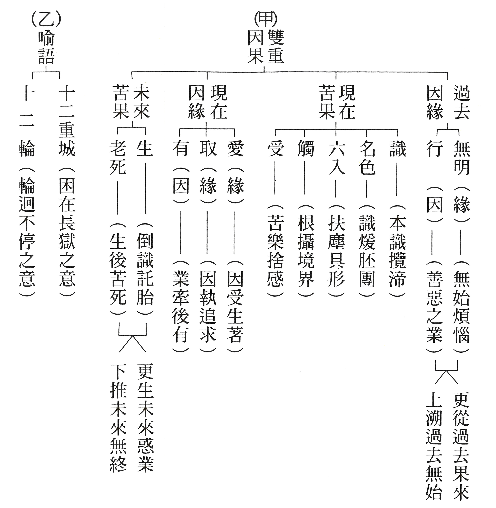

### 大佛頂如來密因修證了義 諸菩薩萬行首楞嚴經—七處徵心（三）

*戒慧講述、淨本整理*

應成論式破他立

破他處中顯空性

有情執實心顛倒

長劫輪迴無邊際

【科判分析】

丑二、隨執隨破

（七處破心或云七番破處）

寅二、「破在外」（外處）

阿難尊者於前提出心在身內的看法，其實這也符合大多數人的認知，假如心不在身內，又會在哪裡呢？然而佛透過比喻反難，破除了心在身內之說。本段阿難尊者於是提出心在身外的看法，也被世尊破除。

一、「阿難引燈在室外為喻」

阿難尊者引用燈在室外為比喻，證明心在身外是佛的了義之說。

（一）、「轉成謬悟」

阿難尊者將如來破除心在內的說法，轉成錯謬的理解。

（二）、「徵引燈喻」

引用燈光為比喻來說明心在身外。

（三）、「自決同佛」

自己決定認知同於佛的真實義趣。

二、「如來以身心相知為破」

如來透過比喻說明，身心能夠相互感知，破除心在身外的說法。

（一）、「先以喻明」

如來先用比喻說明心不在外的道理。

１、「如來喻明外不相干」

如來用比喻說明內與外是兩法，互不相干。

２、「阿難於喻了知不迷」

阿難對於如來各人吃飯各人飽的比喻，能夠了知沒有迷惑。

（二）、「正與決破」

如來將法跟喻結合，正面破除心在身外的論點。

１、「合喻無干」

如來將法跟喻結合，說明若心在身外，身心二法應不相干。

２、「驗非無干」

驗證之下，身心二者互相關聯，並非無干。

３、「遂與決破」

於是決定破除阿難尊者心在身外的論點。

【經文解釋】

阿難稽首而白佛言，我聞如來如是法音，悟知我心實居身外。

阿難尊者以頭叩地向佛頂禮，然後對佛說：「我聽聞如來這樣的法音開導，從此了悟，知道自己的心事實上居在身外。」

所以者何。譬如燈光然於室中，是燈必能先照室內，從其室門後及庭際。一切眾生，不見身中，獨見身外。亦如燈光，居在室外，不能照室，

「為什麼呢？譬如燈光在室內點燃，這盞燈必然能夠先照亮室內，光再透過房室的門照到庭院邊際。一切眾生，沒有先見到身中種種，而只有見到身外種種，就像燈光位於室外，所以照不到室內。」

阿難尊者此處以燈做為心的比喻，心若在身內，就像燈在室內，應該能夠看到身內種種，然而卻無所見；可見心是在身外，所以我們能看到身外之物，就如燈在室外那般，能照明房室以外的境界。

是義必明，將無所惑，同佛了義得無妄耶。

「這樣的道理十分明白，將不再有任何疑惑，如同佛真正的義趣，可以沒有錯誤吧！」

佛告阿難：是諸比丘，適來從我室羅筏城，循乞摶食，歸祇陀林。我已宿齋。汝觀比丘，一人食時，諸人飽不？

佛告訴阿難：「這些比丘們，剛剛跟著我到室羅筏城（舍衛國），依序托缽行乞，並將食物做成糰食（飯糰容易吃飽，比丘眾吃飯糰以守過午不食戒，較能度過長夜），回到祇陀林。我已經用完齋飯（宿有止義），你看眾比丘，一個人吃的時候，是否大家都感到飽足呢？」

阿難答言：不也，世尊。何以故。是諸比丘，雖阿羅漢，軀命不同。云何一人能令眾飽。

阿難尊者回答佛說：「不會的，世尊。什麼原因呢？這些比丘眾，雖然都是阿羅漢，但每個人（有情）的形體（軀）不同，心（命）也不相同，各自相續，怎麼能夠一個人吃飯，就讓大家都感到飽足呢？」

佛告阿難：若汝覺了知見之心，實在身外，身心相外，自不相干。則心所知，身不能覺；覺在身際，心不能知。

佛告訴阿難：「如果你覺知明瞭的心，實際上就在身外，則身心兩者毫不相干，因此心所知的，身不能覺；身體上的感覺，心也無法感知。」

阿難以比喻來說明心在身外，佛也用比喻來破除其說。佛以自己跟比丘眾行乞吃飯的比喻，來說明身與心的關係，佛與比丘眾的身心分離，所以當佛吃飽飯，比丘眾不會有飽足感；若心在身外二者分離，那麼身體的任何感覺，心應該也不能了知；心有任何所知，身體也無法感覺，就像佛與比丘眾各自吃飯個自飽的道理一樣。

我今示汝兜羅綿手，汝眼見時，心分別不。阿難答言：如是，世尊。佛告阿難。若相知者，云何在外？

「我現在向你展示這潔白細嫩的手（兜羅綿手是佛的三十二相之一），你眼睛看到的時候，心能不能分別呢？」阿難回答說：「是能分別的，世尊。」佛告訴阿難：「若眼見（屬於身體的感覺）而在心中能產生分別，如此身心能夠相知，怎麼能說心在外呢？」

是故應知，汝言覺了能知之心，住在身外，無有是處。

「所以從此應該能了知，你所說的覺了能知的心住在身外，完全不正確。」

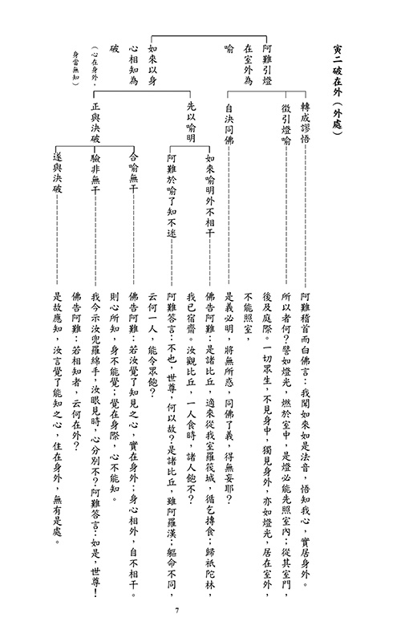

### 人生大事不能忽略的事實 得助念與失助念之損益比較—失助念

*戒慧講述、編輯部整理*

努力皆為臨終時

轉變全由念佛心

助念善緣至為要

一念相應一念佛

本章談得助念、失助念之損益比較，即得助念之益、失助念之損的比較。說明臨終外緣的重要，攸關生死存亡、是否往生的利害關係，不可不慎。

得助念舉劉曉愚居士為例，科判正明緣善得助念必可當生了脫；失助念舉李德宏居士為例，科判反顯緣缺失助念僅種得度之因。

得助念於上期刊載，本期談失助念李丁氏之例。

第一段：反顯緣缺失助念僅種得度之因

◎皈依奉佛知報恩

母女相依如一日

李丁氏，法名德宏，曾經嫁給揚州李某，婚後因夫婿納寵妾，李丁氏未生育，難安於家。於是跟著繼母丁德元居士別處而居。繼母視其如己出，互相依靠扶持，二十年如一日。

同求皈依為法侶

求皈依：民國十七年，由親友引見印光老法師，母女兩人叩求攝受皈依，請賜法名。

賜法名：印光老法師念其誠懇，慈悲應許，並題法名為德元(母)、德宏(女，即李丁氏)。

謹修持：皈依後，便長期吃素、學佛，謹慎修持，母女相依，從原本的眷屬轉於法侶。

真誠孝敬出世師

眷屬凋零：痛念俗緣福薄，眷屬凋零。

幸遇良師：今有幸能依靠淨宗印光大師為師，為出世父母，乃屬萬幸。

真切孝敬：於是孝敬印光大師之心，十分真切。

◎宿業障難糊塗死

總明宿業所障因緣欠缺

信行皆佳：論李德宏居士平日對佛學的修持，一切皆在劉曉愚居士之上。

因緣欠缺：唯恨宿業所障，助念因緣欠缺。

別示臨終送醫萬難助念

戰亂流離殊堪憐憫：民國二十七年夏，德元、德宏見武漢將近淪陷，乃從香港到上海暫避。因房價高昂，租賃不易，若住客棧，則開銷大而多不便。太平寺真達老和尚，素來知她們母女信佛真切，當此大劫，流離失所，眷屬凋零，於是心生憐愍，便在寺中辟一淨室，幫助他們與其他老幼等五人同居(女眾寮房)。

忽患傷寒醫藥罔效：至民國二十八年三月初，李德宏忽患傷寒。到了四月中，醫藥已無效，病勢日重。寺中佛事繁多，屋宇又少，若死於寺，將無法安頓，不得已而送醫院。

醫院章程難以助念：醫院章程，都是依西法，不得臨終助念。入院兩三天，學佛的同道，皆不能前往助念。

結嘆糊糊塗塗死在醫院

遂於四月十八日早，糊糊塗塗，死在院中，得年五十。

◎結嘆臨終不如法

有修持如法助念當得益：如此向有信心修持之人，若臨終得如法助念，往生瑞相，當不在劉曉愚居士之下。

有所障祇作未來得度因：但因機緣障礙，全然失去助念之利益，致使平日對佛法的信心，現生不得受用，只能作為未來得度的因緣，非常可惜。

第二段：結勉緇素重因果成就往生勝緣

◎總結臨終助緣甚要

劉曉愚居士與李德宏居士兩相比較，確知臨終助念之關係，實為重要。

◎別釋萬善成就往生

理顯因果實不爽：雖然，有因之功必然有果，世間上沒有無因之果，也沒有無果之因。

事證結善緣得益：

正：劉曉愚居士行種種善法的利益，宿世種的善因今天果成熟，故得到好的眷屬作為善緣成就往生大業。

反：李德宏居士平日修持甚好，最後卻失助念，大概是因為宿世破壞他人的勝事，致使感得種種不如法的時節因緣，諸如戰亂、生病進醫院、臨終無人護持等障難。

結明當生須了脫：且今生信奉三寶之一切善行，決定可作未來得度之因，毫無疑義。

當生了脫為直捷：但究竟不如當生了脫為直捷。

◎結祇廣結往生勝緣

結：故印光大師常說，利人即是利己，害人害人甚於害己。

祈｜注意因果：願有志往生西方的出家眾、在家眾，一舉一動，都要注意因果。

祈｜回向往生：必使所做的每一步都要跟往生有關，才能成就往生的勝緣，非常重要。

## 孔學一隅

### 【關心觀心】《易經》蹇卦對困局的啟發

*唐瑜凌講述、宗徹整理*

瘟情橫行人難行

局勢動盪心不安

卓越領導標本治

世界合作有未來

前言

隨著冠狀疫情爆發，學會藉由「關心與觀心」系列直播課程，談談如何面對疫情，主題定為「關心‧觀心」。

關心，就是關心疫情對世界造成的影響，除了健康方面的影響，還包括之後將要面臨的經濟危機，以及各國政局動盪的衝擊。

觀心，是我們要如何照顧自己的心，讓我們處在家庭、社會、國家之中，在痛定思痛之餘，得以重新出發，安頓身心。

透過關心、觀心，讓我們在國家、社會、天下的變動局勢下，找到趨吉避凶、離苦得樂的正道，從而因禍得福。

應本次主題，特從《易經》說起，因《易經》最講變化之道，在變化當中，有好的變化，也有壞的變化。像這次疫情所造成經濟、政局的考驗，看似壞的變化，我們也能從中尋求改進之道，藉由這樣的因緣，反而能幫助我們改善並解決過去的一些弊端，並迎向新的未來。

課程將從《易經》中蹇卦、困卦、否卦與謙卦的視角，看這次疫情所帶來的啟發。首先談「蹇卦」。由於疫情的蔓延，各國或採封城、封地、封縣等防範措施，就像「蹇」所展現的「困頓」字義，人們被封在一處，走不出去。再談「困卦」，各國的鎖國、地區的封鎖、家居的隔離，像是「困」在時局之中。接著談「否卦」，人們遭逢著天地的「否」運，與過去熟悉的美好日子、安定生活、經濟繁榮全部顛倒相反。正如美國一位富豪說：「這種局面是我九十年來從沒看過的。」我們到底要如何因應這樣的亂象？什麼才是因應之道？道理就在《易經》的「謙卦」之中。

蹇卦

蘇東坡〈和子由澠池懷舊〉一詩中，就談到蹇卦。

這是蘇東坡和著他的弟弟蘇子由所寫的詩。蘇東坡和蘇子由曾經跟父親蘇明允一起到京城趕考，路過澠池縣。後來蘇東坡到鳳翔去作官的時候，又經過了澠池縣。東坡的弟弟寄了一首詩給他，他為和弟弟的詩而作了此詩，內容是──

「人生到處知何似」，我們這個人生，不論走到哪裡，都像什麼樣子呢？「應似飛鴻踏雪泥」，像天上的鴻雁，在雪地上留下的爪痕。「泥上偶然留指爪」，這些爪印還在雪上面。「鴻飛哪復計東西」，鴻雁飛出去了，哪裡會記得牠是往東飛還是往西飛呢？「老僧已死成新塔」，當時在澠池縣招待他們的老僧，當蘇東坡再拜訪澠池縣的寺廟時老僧已經過世，寺中的僧信造塔以紀念老和尚。「壞壁無由覓舊題」，或因當時三蘇在牆壁上曾留下詩文，但現在已經找不到了。「往日崎嶇還記否」，過去從四川眉山出來，前往開封城趕考，在趕考這段人生的崎嶇旅途與心境，子由還記得嗎？「路長人困蹇驢嘶」，蹇驢，就是象徵蹇卦的蹇驢。路途漫漫，那驢子像是跛腳一般，走不動了。

地上留下的爪痕，就像人生走完了幼兒、青年、壯年，其實這些走過的歷程，只是留下的足跡而已，我們哪裡還會記得這些足跡當時的樣子？回憶都只是片面、短暫而模糊的，恰似鴻飛留下的爪印，隨著時間也慢慢模糊、不見了。

我們辛苦地走完人生，像鴻飛一樣，只留下爪泥、留下印記而已。事情雖曾經做過，事業也曾經打拚過，但僅留下爪痕，再回現場，已人事全非。

我們人生肩上的擔子沉重，又逢長路崎嶇漫漫，就像蹇驢一樣，有種走不動的感覺。午夜夢迴，不知如何是好，像是驢子在漫漫途中嘶叫，內心感到茫然。

欲知《易經》道，需問過來人

孔子非常喜歡《易經》，著有十種註解，其中《說卦傳》便把每一個卦象像什麼作了敘述。

孔子能從變化當中，知道趨吉避凶、斷惡修善的道理。了凡先生說：「易為君子謀。」這也出自《易經》的註解，就是說《易經》的內容，都是替君子來謀人生的脫困之道；小人用《易經》，是沒有用途的。

過去我們在臺中聽徐醒民老師上《易經》，聽了十年的課。老人家以清朝大儒李道平的註解，來解說每一個卦辭、每一字的來由。註解極其繁雜，對初入門者而言，就像是一部深奧的有字天書。我們沒有能耐在短時間內全部依註解將卦象講完，只能簡單說一說。「欲知山下路，需問過來人」。

坎上艮下蹇

傳說孔子周遊列國之前，卜卦所得的就是蹇卦，意思是在各國都走不通。世界目前的局勢，就像蹇卦一樣。

蹇卦的卦象，卦辭中說「坎上艮下蹇」，上面的坎卦象徵著水，下面的艮卦象徵著山，所以讀作「水山蹇」，表示山上有水路難行。好比我們到千島湖去遊覽，看那水漫漫的只剩下山頭，就像是山被水淹沒的樣子。

從前孟浩然有一首詩說：「迷津欲有問，平海夕漫漫。」像一片汪洋大海般的前程，我要在哪裡問渡口呢？無怪乎孔子從葉國到蔡國的時候，也曾一時找不到渡口，請子路去問津。

蹇卦之象

「水山蹇」整體的卦象要怎麼看呢？

蹇卦是從「風地觀」的觀卦而來，從上爻跟第三爻交換以後，變成了蹇卦。

從納甲圖上看，坎卦從坤卦而來。卦辭上面說「利西南，不利東北」，東北就指蹇卦。水山蹇，上面是坎卦，在納甲圖裡面屬於西南；下面是艮卦，在納甲圖中屬於東北。根據納甲圖，「利西南」主要在講坤卦，「不利東北」就是指艮卦。坤卦是上卦，上卦就是坎卦，因為坎卦從坤卦來，所以叫做「利西南，不利東北」。東北是艮卦，艮是止，止就是不利；坤是地，地就利於行走，所以說「利西南」。如果知道每一個字是怎麼來的，讀《易經》就能讀出喜悅。

利見大人，貞吉

卦辭：「利見大人，貞吉。」這是在講蹇卦的九五爻。

蹇卦雖然整體呈現出人生困頓的一面，但「利見大人」，指的是有人來主導、負責，將能突破困局。這要說到國家的領導人跟各級的領導人，如果能夠扮演大人的角色，會讓老百姓走出困局。此外，如果一個人有大人的內涵，也能使自己脫困，有走出去的氣象。

《彖曰》：蹇，難也，險在前也

「彖」，有決定的意思，而《彖傳》就是孔子所決斷一卦的意義。《彖傳》中決定的卦象與分析的卦辭，對我們理解《易經》的各個卦，起到重要的意義。

「蹇，難也。」蹇，就是很困難、走不出去，好像跛腳的驢子。

坎卦，有險的意思。「險在前也」，就是指走不出去。像我們現在很多人都得居家隔離，大家都怕感染疫情造成身體的障礙，帶給家人的麻煩，造成資源的浪費，因此不涉足聚眾的場所。很多學校都得放假，城與城之間不交集了，很多國與國之間也都不來往了，所以說「險在前也」。

見險而能止，知矣哉

如果我們有足夠的知識背景，知道避免染疫的方法，如做好個人的衛生防護，捨棄無謂的聚眾活動，所以「見險而能止，知矣哉」，這就是能脫困的有知之人。

蹇，利西南，往得中也

「西南」為坤卦，就是指上面的艮卦是從坤卦而來。「蹇，利西南，往得中也」，這是說我們跟大人配合，才能整體脫困，才能產生利益。所以，國家訂定的政策規定、各項命令，我們都應配合，在非常時期的現階段，這麼做最有利。

不利東北，其道窮也

「不利東北」講的是艮卦，因「艮」代表止。「其道窮也」，告訴我們都應停止。例如很多商業的活動、交流的活動、經濟的活動都要停止。但也因此顯得窮困，所以很多國家可能都要面臨經濟困窮的命運，這樣的危機是空前的。

利見大人，往有功也

我們一般說「往來」，這兩個字是《易經》的術語。一個卦的上面三爻叫做「外卦」，下面三爻叫做「內卦」。一往一來，代表了事物運化的規律。「利見大人」，指利能在九五得見。有知識背景、有能力、有公心，又能與人合作，「往有功也」，就能藉由配合國家政令，產生功效，形成力量。

當位貞吉，以正邦也

如果是合格的領導人，能得眾人擁護，就屬於「貞」。「貞者，正也」，純正的、有公心的領導人；「以正邦也」，就能端正國家，導正風氣，帶出困局。

蹇之時用大矣哉

善用蹇卦的人，將能發揮非常好的作用，幫助我們身心安住、自我反省、重新檢討，在特殊的時局裡，做許多政策的改進，以及未來方向的規劃。這樣的自省檢討，就能運用「蹇」來發揮最好的效益。

「蹇」象環生，轉成既濟

如果將蹇卦的第一爻導正成陽爻時，就變成了「既濟卦」。

「既濟卦」，就是每一爻的位置都是當位，即陽爻在陽位上，陰爻在陰位上。所以，如果能夠導正蹇卦的初爻，就能導正廣大的民心，整個蹇卦反而迎來了既濟卦，呈現出人人互相幫助合作、共同協作的景象。

這次的疫情，讓我們體會到世界就是一個共同體。面對疫情，沒有人是病毒之下的例外。蹇卦之象，促使每個人反省：世界上的各種戰爭都應消弭，各種爭端都應平息。人們藉此困局，做深度的自我檢視；地球整體命運的和合氣象，就靠著瘟疫的蹇促而誕生，真正印證了「蹇之時用大矣哉」的意涵。

蹇卦圖的啟發

《左傳》上有些歷史故事，跟卦辭都有關聯，所以讀《易經》的人，如果能配合《左傳》的典故，就更能看出各卦的意涵。

有一個歷史的典故，談的就是蹇卦。在楚漢之爭的年代，有一位將軍叫鍾離昧，他本來是楚國項羽的人，後來投靠韓信。

蹇卦圖中，「使」，就是出行的意思；「鹿」，代表剛健的出行；「千里」象徵要走千里之遙；「五個戰鼓」，表徵號令不一、心意不定。所以這個蹇卦圖，所呈現的景象就是「路難行」。果然，鍾離昧這一行，一去不復返。

《象傳》曰：山上有水，君子以反身修德

孔子對《易經》十分喜愛，作了十種註解，叫作《十翼》，就像是以十隻翅膀來解釋《易經》。

〈象傳〉是解說各卦的卦象。「象」是〈大象傳〉，每一爻的爻辭是〈小象傳〉。「山上有水」就是指外卦的坎卦，也就是水。「君子以反身修德」，即遇到坎險的時候，君子要反身修德，迴光返照，檢討自己，一方面看看動機是否純正、能力是否足夠、因緣條件是否具足。如果這些都能反省，了解艱難困局的整個情況，則有機會突破困局；就算不能突破，君子也能安住其中。所以「反身修德」，就是這個卦的卦象之意。

初六：往蹇來譽

初六爻，指當我們占卜的時候，是從下面一直往上排出卦象，所以初六爻是先占卜出來的第一爻。爻辭，每一個卦的卦辭是文王的註解，每一個爻的爻辭是周公的註解。「往蹇來譽」這一句，就是周公的爻辭。

初六爻告訴我們「往蹇來譽。」往蹇，指外卦是困頓的；來譽，指內卦是好的。這意思就是說，在蹇促的時局，不要外出、不要開拓，要安住。

《象傳》曰：往蹇來譽，宜待時也

「象」，是去看這一爻的爻相。

「往蹇來譽，宜待時也」，根據孔子解釋，這一爻就是要君子「宜待時也」，暫時不要外出、不要往前走、不要急躁找出路。

《三國演義》的電視劇，湖北演員李法曾先生所飾演的諸葛亮，可以說相當成功，獲得很多觀眾的喜愛。其中有一段主題歌曲〈待時歌〉，就是諸葛亮表明心志的詩詞「鳳翱翔於千仞兮，非梧不棲；士伏處於一方兮，非主不依。樂躬耕於隴畝兮，吾愛吾廬；聊寄傲於琴書兮，以待天時。」

鳳凰可以飛千仞之高，但只棲息在梧桐；讀書人伏處於一方，要明君才依靠。樂於在田園耕讀傳家，甘於澹泊；讀書充實內涵、彈琴抒發心志，以待明君聖主，再出來輔佐，開創天下太平。這就是讀書人的心志。

六二：王臣蹇蹇，匪躬之故。

六，指的是陰爻；二，就是在爻的第二個位置。

爻辭上說：「王臣蹇蹇，匪躬之故」王臣蹇蹇，就是君王跟臣子都是困頓的；匪躬之故，就是不可以在那裡沒事幹，要不斷努力找出路。「王臣」就是二跟五爻，陰爻站在陰位上，陽爻站在陽位上，所以王臣都是當位，表示王臣都合格。

「蹇蹇」就是很努力。且看各國，不論是國家的領導人，或是各省各市的領導人，大家都忙碌不堪，可是都找不到解藥。這個蹇蹇的形象，尤其在疫情發生的這個時候，最重要的就是努力地找到解方。解藥出不來，大家都無路可走，因此除了封城、封地、封縣以外，沒有什麼可以作為的。而呼吸器，或者其他的急救，都只是暫時的措施。然而，「匪躬之故」，不可以在那裡安住卻沒事情做。

《象傳》曰： 王臣蹇蹇，終无尤也

孔子為何說「王臣蹇蹇，終无尤也」？只要王臣很努力幹活，老百姓看在眼裡，雖然政局很困頓，待在家裡面像鳥兒關在籠子裡，身心不舒服，可是「終无尤也」，因國家各級領導人埋頭苦幹，老百姓看在眼裡，都願意共體時艱，不會怪罪國家。反之，如果國家各級領導人，只為變相發財、謀取好處，就會引發民怨。

第二爻「王臣蹇蹇」告訴我們，各級領導人要夙夜匪懈來紓困民心，否則民心就會像未爆彈一樣，一發不可收拾。

九三：往蹇來反

第三爻為九三爻，就是陽爻為九，站在第三爻，這也是當位的。在蹇卦中，一、三、五爻都是當位。「往蹇來反」，往外卦是困頓的，返回來是好的，跟諸爻都是一樣。

《象傳》曰： 往蹇來反，內喜之也

在疫情的困局之中安住下來，國家好好地整頓內政、反省政策、疏通民怨、流通民生，「內喜之也」反而會讓老百姓感到高興。看第三爻是艮卦的最上爻，止到最究竟，代表著實在疫情沒辦法控制的時候，要整個安住下來。

但是整個安住下來，老百姓沒事幹，各級領導人卻忙碌不堪，有太多事情要解決、民生要解決、民怨要解決，還有很多疏通的管道要疏通。

六四：往蹇來連

上卦是坎，所以往險不通；來連，連也走不通。「連」就是連連，即局面愈來愈困頓。有些國家，沒有紓困的方案，就愈來愈險峻；不曉得該怎麼辦，考驗領導人的智慧。

《象傳》曰：往蹇來連，當位實也

此時只有一條路，就是做事的人要當位，且在位置上做該做的事，只有這樣才有辦法往前再走。例如你是衛生官員，就好好地執行衛生政策；或者在醫療系統擔任職務，就盡量擴充病床、照顧病人；如果是民生官員，要盡量流通物資，讓老百姓居家也買得到東西。如此就是「當位實也」。

領導人要不斷地出來信心喊話，因為雖然公布疫情數字讓人感到恐怖，但是有強大的執行團隊來安定民情，老百姓還是會安住下來，不至於被恐怖的心態所淹沒。

九五：大蹇，朋來

第五爻叫做九五，陽爻站在第五爻，這是在大位上。

「大蹇，朋來」大蹇，指走到了最困頓的時局；朋來，就是國際間要合作。要怎麼合作呢？跟人合作，一定要誠心誠意、互通有無、資源共享，不能趁時難來發大財。若能導正風氣，各國能從這次冠狀疫情當中得到教訓，就不要再去發展傷天害理的核子武器，或者開發造成氣候災難的機械科技，或者發明造成危害人類的人工智能。

《象傳》曰：大蹇朋來，以中節也

周公爻辭上說「大蹇，朋來」，孔子就註解「以中節也」。

中節，指第五爻站在最好的位置，而且有相當的節度，能得到很多幫助。所以說「得道者多助，失道者寡助」，大至一個國家、一個城市，小至一個團體、一個家庭，無不是在這個原則當中運行。

上六：往蹇，來碩。吉，利見大人

「往蹇」是沒有可去之處，已在最上爻，已沒有去處。「來碩」是繼續克服眼前的障礙。「吉，利見大人」指在上爻當中，還有前五爻作依止。一般而言，上爻就好像這些國家的元老，當然由國家的領導人來主持國政。

《象傳》曰：往蹇來碩，志在內也；利見大人，以從貴也。

「來碩」，就是來到的成果豐碩。「志在內也」，好好地志在安邦定國，志在安定民生。「利見大人，以從貴也」，從九五爻，到其他各爻，大家上下一致，不要互相猜忌、互扯後腿，自然能夠找到最好的良方。時間久了，大家慢慢地能夠耐煩，很多因應的政策也穩定了，民生也就不會匱乏。乃至於找出解藥，時局便很快變好了！以上就是蹇卦的大意。

結語

（一）說蹇卦的目的，是因冠狀疫情所造成的世局，使得人與人之間不得往來，各國採取封國、封城、封市、封縣等措施。疫情造成醫療資源崩解、經濟蕭條、失業潮，以及人心惶惶不安，人們似乎處在一種走不通的局面，這就是蹇象。

（二）蹇卦的整體卦象是坎上艮下，這種困局讓人們盼望有卓越的領導者來整治，而領導者必須有公心、有能力、有品德，且信賴專業，才能帶領人們走出疫情的陰霾，重建社會的秩序，應變未來經濟的蕭條。這是整體的卦解。

（三）各爻回顧大要：

１、初六爻「往蹇來譽」，告訴我們整體政令是要解決當前的疫情，人民須配合政策，不去涉足群聚的場所，也要照顧好個人衛生。每個人都將自己看作是人心社會安定的模範，相互提醒、互助合作、共體時艱，這是解決疫情的良方之一。

２、六二爻「王臣蹇蹇，終无尤也」，面對棘手的問題，尤其是這次的新冠病毒，不斷地改變傳染方式，世界人人都感到緊張害怕。國家與個人都遭受病毒的威脅，簡直前所未見。由於沒有相似的案例，領導人惟有夙夜匪懈、急功近義，才能漸見曙光。

３、九三爻「往蹇來反，內喜之也」：不要冒險，要退守安住，人民不要出國去玩，不要群眾聚集，不要派對狂歡，大型遊樂場等聚會所都要關閉等等。如果不能嚴防人們的聚會，疫情就難免擴散，這將會使社會國家付出慘痛的代價。所以不能僥倖、大意、輕忽，必須戒慎恐懼。

４、六四爻「往蹇來連，位當實也」：封國、封城、封地等政策，需要大家共體時艱，配合各級領導人。而各級領導人一定要有高度的同理心、愛心，且善用行政資源，才能帶領人們度過這往來艱難、前所未有的歲月。

５、九五爻「大蹇朋來，以中節也」：大難雖在，但是領導人最重要。所謂「德不孤，必有鄰」，國家的領導人能夠堅守正道，採取國與國的合作，雖然民間沒辦法往來，但只要能合乎正道，帶動正向風氣，一定能夠得到友邦的幫助。

７、上六爻「往蹇來碩，志在內也；利見大人，以從貴也」：倘若種種的措施正確施行，執行者有執行力，且人人不心存僥倖，則局面會慢慢好轉。從這次的疫情教訓，人們一定會得到諸多寶貴的體會；如果能夠好好珍惜所擁有的資源，且國家能導正民心、與賢能者合作，並待時而動，這些都將是國家未來脫困的徵兆。

（四）孔子對蹇卦的決定：「蹇之時用大矣哉！」我們從聖人的智慧裡，找到實際的出路，不只是外在的出路，更是內心的出路。如老子所謂「禍福相倚」，如果好好運用蹇卦，人們將能因禍得福。

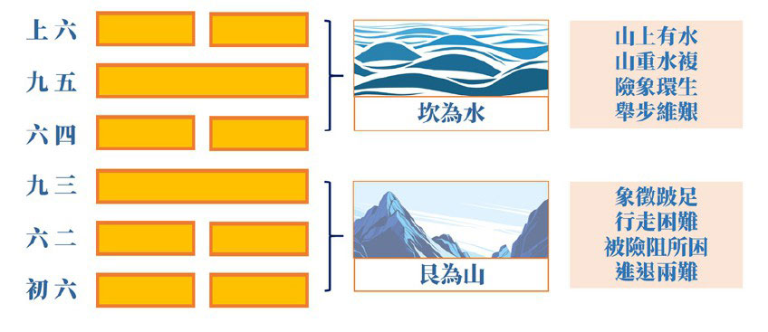

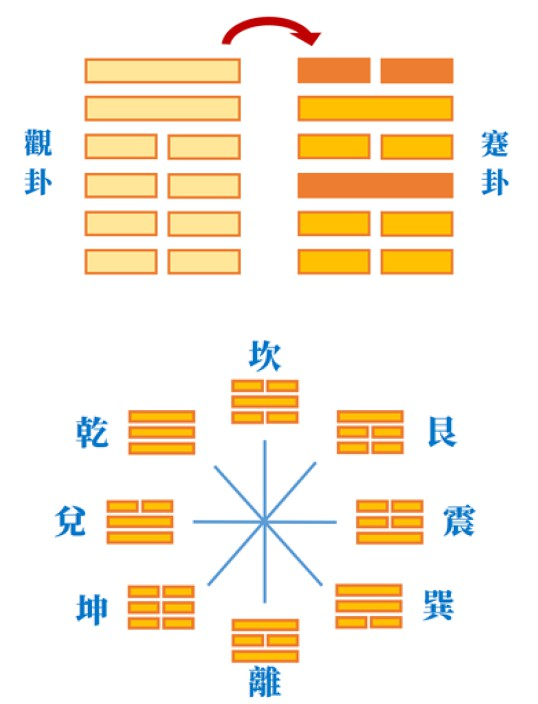

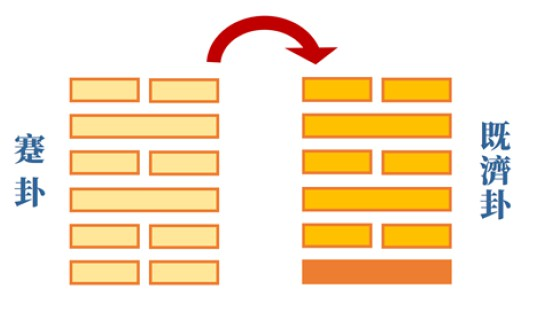

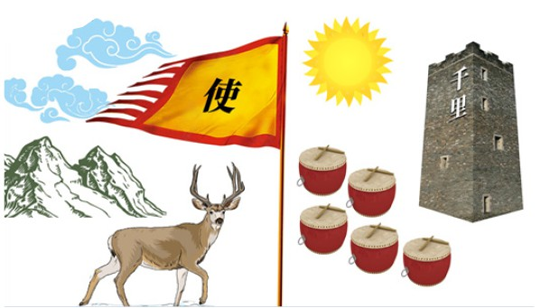

### 【關心觀心】《易經》困卦對困局的啟發

*唐瑜凌講述、宗徹整理*

鎖國防疫民生凋

家庭安住勉學習

冬去春來指日待

機會能給準備好

前言

上一篇我們認識了蹇卦，意指路難行；這篇談困卦，顧名思義，就是被困住了。

困卦的卦象叫做澤水困，上面的外卦是澤，下面的內卦是水。為什麼澤水是困卦？因為澤流到水中，水成了爛泥，船在澤水上航行就被困住，魚若在澤裡也被困住。爛泥巴將生物和船隻都困住了，叫做困卦。

亨，貞大人吉，无咎。有言不信

文王為困卦做的卦辭，第一句話開頭就是「亨」，意思是亨通。困對位在九五爻的人才能亨通。「貞」指正，亨通要靠正。「大人吉，无咎」，困卦對於大人而言吉祥無咎，雖處困局，但不會有過失、過患。所以學習《易經》的人，必得要志求君子之道，所謂「《易》為君子謀」。

可是卦辭中又說「有言不信」，就是在困局當中，在位者的很多作為，不容易取信於眾人。處順境時，上位者所言，大眾比較容易相信；處逆境時，上位者告訴大家未來有出路，較不容易被相信。意思是，上位者很多施政理念，都要以行動來代替語言。

《彖》曰：困，剛揜也

《彖傳》決定這一卦卦辭的意思。

孔子說：「困，剛揜也。」揜，就是遮掩；剛揜也，就是指在上位者周圍都是剛強難化的人。好比孔子在陳蔡的時候，表現得一副自信十足，但很多的弟子們卻難生起信心，甚至懷疑：「都餓成這樣了，我們還要學道嗎？」「能不能務實一點？」所以被剛所揜，蒙蔽了眼前的路。

有句話說：「逆境堅定力，風雨生信心。」風雨如何生信心？逆境怎麼堅定力？不過是順境時喊的口號而已。面臨逆境時，真有這種道德勇氣、心理氣魄嗎？

險以說，困而不失其所

「險」指澤下的水象，是所謂的「坎水」，看起來險象環生。「險」是下卦的卦象；「說」是上卦的卦象。說，就是兌卦，喜悅的意思。所以澤也有悅的意思，詳情請看孔子的《說卦傳》。

「困而不失其所」，雖然身處困境，君子不會失掉他的根據。孔子餓於陳蔡時，並沒有失去對大道的嚮往。這一點只有顏回可以體會，難怪顏回過世，孔子「哭之慟」。這種對大道的堅信，是靠著險難磨礪出來的。

亨，其唯君子乎

亨，就是亨通。在困局中還能亨通，大概只有君子吧！小人哪裡會亨呢？孔子說：「君子固窮，小人窮斯濫矣。」君子還會固守窮，小人窮就犯上作亂了。所以困能亨，講的是大人、君子。

貞，大人吉，以剛中也

貞者正也，在困局當中，堅持內心的正確信念，對大人就是吉祥的開始。「大人」，是有力量的人，在政治上握有實權。「以剛中也」，重要的是內心正直善良。

這一卦，上面是澤，下面是水，第五爻和第二爻都是中，位於上卦之中、下卦之中，都是剛中。在一個卦裡，這是好的卦象。

有言不信，尚口乃窮也

處於困卦當中，所說的話別人不信，所以「尚口乃窮也」，如果一直用口說，就會有窮，必得要拿出辦法、能力、作為、決心，才是走出這一卦的重要方法。

困卦圖的啟發

此圖耐人尋味，如車子只剩下一個輪子，怎還能行？魚在澤中已沒有水，待人來救；屋中的人又老又病，等待醫藥。所以困卦當中，要等待救援，還要給自己打氣。

以上卦辭我們都瞭解了，現在來看爻辭。

初六：臀困于株木，入于幽谷，三歲不覿。

周公說：「臀困于株木，入于幽谷，三歲不覿。」這是講初爻。

「臀困于株木」，株指枯木。屁股坐在枯木上，愈坐愈不舒服。「入于幽谷」，幽谷是黑暗的、陽光照不到的暗谷。「三歲不覿」，三年看不到光明，意思是說處於災難之時，好似困於幽谷、不見光明、坐立難安的感覺。

占到初爻，就像找不到出路一樣。沒有解藥就是沒有出路，無限期的控制著人們的行動，個人生計受到影響，國家整體經濟也跟著垮了。

《象傳》曰：入于幽谷，幽不明也。

「入于幽谷」，好像進入了伸手不見五指的地方，眼前沒有案例可循，沒有解藥，也找不到出路。「幽不明也」，不知道路在哪裡。這以上是初爻的現象。

九二：困于酒食，朱紱方來，利用亨祀，征凶，无咎

「困于酒食」，就是九二爻與九五爻相應的樣貌。九二爻是有實權的人，它的六三與初六爻都是陰爻，意思就是被小人所困。困，有困於逆境，也有困於順境。

「困于酒食」，指君子困於順境，受到小人賄賂、巴結，尤其國難當頭，最是發財的時機，因此小人營私舞弊，利用局面亂來佔便宜。

「朱紱方來」，天子叫做朱紱，諸侯叫做赤紱。朱紱方來，講的是九五爻的上位者對君子的信任。

「利用享祀」，或者是利用享祀，用酒食來祭祀，意思是說要懂得資源不是拿來貪污，而是拿來分享的。尤其懂得把這些資源拿來照顧弱勢、照顧嗷嗷待哺、為病所苦的人。

「征凶无咎」，往外發展一定有凶，因此要是安住於所處的範圍、作勢的範圍，就不會有過失（无咎）。

君子身處於小人堆裡面，仍要堅持正直善良，且不宜莽撞、衝動。「征」就是莽撞、衝動，或者是討伐，這些都不宜，應該好好守住本分。

《象傳》曰：困于酒食，中有慶也

「困於酒食」，指君子被利養所困。坦而言之，有時身處在小人堆裡，不接受賄賂也活不了，甚至要正直還做不了事，該怎麼辦呢？「中有慶也」，還好有位居九五的在上位者支持。如果維持著正直，不受誘惑，就能順利的往下走。

六三：困于石，據于蒺蔾，入于其宮，不見其妻，凶

卜到這一爻，可真是凶險！

「困於石」講九四爻，九四爻為剛爻的緣故。「據于蒺蔾」是說九四爻又像身處荊棘之中，上也不行，下也不行。「入于其宮」當君子回到家裡；不見其妻，家人也不理會，凶。

《象傳》曰：據于蒺蔾，乘剛也。入于其宮，不見其妻，不祥也

孔子對此爻象的解釋是「據于蒺蔾，乘剛也。」

孔子所說的「乘剛」，就是位在九二爻的上爻對下爻而言，上爻叫做乘，六三爻乘著九二爻，就是騎馬的意思。乘剛，如同騎馬入蒺藜，找不到出路，處處受到阻礙。「入于其宮，不見其妻，不祥也」，回到家看不到太太，顯得不祥，意思就是說身在外沒有資源，凶象環生；在內又得不到內應，到了這步田地，簡直非死不可。

卜到這一爻，應該要好好爭取家人的支持，甚至在面對外境，要能柔軟安住。如孔子說：「邦有道，危言危行；邦無道，危行言孫。」

九四：來徐徐，困于金車，吝，有終。

來，指往來。往就是往上卦，來就是來下卦，由外而內。

上卦的澤象，就是水流徐徐的樣子。

「困于金車」，下卦為坎卦，可以象徵車輪。坎者，險也，所以「困于金車」，是在講車子被困在爛泥澤中。「吝，有終」，走不出去，可是會有結局。為什麼呢？

《象傳》曰：來徐徐，志在下也；雖不當位，有與也

「志在下也」只要君子盡己分內職責，好好維持，志在於下，而不去想自己的升官發財，或者是攀附外緣。「雖不當位」指九四爻的不當位，卦象上陽爻在陰位上，顯示位置不當，或者得不到他人信服，或者可能資歷尚淺，或者不能勝任職務，或者是臨時代理。例如古代的欽差大臣的職位，有時可能因皇上一時興起，讓六品官去任職，但任職之後，面對下面的二品官員們，難以施展作為。故有時位不當就會有困難。

「有與也」，由於志在下，仍有路可走。孔子分析這一卦的重點就在「志在下也」，這是解決問題很重要的心態。如剛剛舉例的六品欽差，只要心存厚愛部屬，在轄區內關愛人民，就算上級不支持他，或是身處官場亂象之中，仍能做好本分，得到擁護。

像袁了凡先生在寶坻縣做官的時候，雖是萬曆年間的腐敗朝廷，但他爭取轄區內人民們得以減糧減租，後來被公認是八百年來最好的縣令，就是身在險惡的官場裡，也能得到善終。

九五：劓刖，困于赤紱。乃徐有說，利用祭祀。

劓，是割鼻子的刑罰；刖，是砍腳的刑罰。「困于赤紱」，如前所說，天子為朱紱，諸侯為赤紱。困于赤紱，就是剛剛上來整頓的時候，諸侯不見得信服。就好像新上任的領導人，在舊官場裡的體制下，有種無可奈何的感覺。如果君子懂得善用刑罰，恩威並重，「乃徐有說」，就慢慢能得到肯定。

「說」是指上卦的兌卦，慢慢的民心歸向、局面開展、大家認同。 「利用祭祀」指善用祭祀的心態，能感恩天地，報本還恩，人們便會覺得這個人心態善良，舉止厚重，感恩有德。

《象傳》曰：劓刖，志未得也，乃徐有說，以中直也；利用祭祀，受福也

「志未得也」指位在九五的上位者，沒有辦法開展抱負。「乃徐有說」，慢慢的受到肯定。「以中直也」，指卦象的陽爻站在陽位上，是當位的爻象。「利用祭祀，受福也」，祭祀是受福之道。

換句話說，身為國家的領導人，他有三個關鍵要點：一是領導人的品德能力、抱負理想，與人才團隊。二是懂得祭祀的道理，善求加被。三是善於運用他人對自己的支持。

第五爻象徵君子本來得不到諸侯的支持，但慢慢的透過施政的恩威並濟、善用祭祀，終能受福，如孔子說：「我祭則得福，我戰必克。」

上六：困于葛藟，于臲卼，曰動悔有悔，征吉

「困于葛藟」是陷於荊棘之意，位居上爻，好似困到了極處。「于臲卼」指很危險的場所。「動悔」指行動當中會有悔，因為時機還不到。「有悔」，懂得反省改過，不致一意蠻幹或自我感覺良好。或者說，採取行動了，在事後懂得懺悔、反省、改正。「征吉」，最後時機一到，便能脫困。

《象傳》曰：困于葛藟，未當也；動悔有悔，吉行也

困到了極處，什麼都不適當、都不正當。然而，懂得反省檢討，接納別人的逆耳忠言、苦口良藥，就能脫困，獲得吉祥。如古代的明君衛武公，或者初唐的唐太宗，在整個國家的政變當中治國，搖搖欲墜的國政當前，再難聽的話也要聽得下去。一旦時機到了，就有機會脫困。

結語

（一）總體而言，困卦解釋目前的疫情環伺，為什麼人們會遭遇困難，以及面臨困境的原則與脫困方法。整體卦象，有如被小人繫縛，被瘟疫蔓延圍攻一樣。君子要以接受磨練的心態來迎接困難，這對於個人的成長反而是吉祥的。

（二）各爻回顧大要：

１、「初六爻：臀困于株木，入于幽谷，三歲不覿」。誠如文中所說，當屁股坐在枯木上，顯得坐立難安；又像進入幽谷之中，見不到陽光、出路。我們身處疫情環繞的時局，也是身心不安，前途茫茫，這是困局的形象。

２、「九二爻：困于酒食，朱紱方來，利用享(亨)祀，征凶，无咎」。意思是君子困於艱難或名利之中，前者讓人退失向道的心，後者讓人腐蝕心志。在艱難當中，縱使有利可圖，也要分享自己的優勢，努力的付出，堅守住本分，反而不會迎來過患。這是君子的心態。

３、「六三爻：困于石，據于蒺蔾。入于其宮，不見其妻，凶。」陷於阻礙，入於荊棘，好比君子在人事上、環境上、助緣上都得不到援助，讓人感到絕望。這是不祥之兆，但應要以「得道多助」的心態，爭取小範圍的助援，如家人的支持；再將能力範圍慢慢擴大，直到足以脫困為止。這個時候，倘若自吹自擂、自我感覺良好，終將自尋死路。這裡說明作法。

４、「九四爻：來徐徐，困于金車，吝，有終」。雖然九四爻的位置不正，陽爻站在陰位上，但君子憑著做人的正直（因為是陽爻），仍可發揮功能，助人助已脫困。雖然所處的位置很尷尬，發揮的功能很有限，但仍可以創造有利的局面。

５、「九五爻：劓刖，困于赤紱，乃徐有說，利用祭祀」。此爻說明了領導者雖然沒有部屬的同心協力，依然不得其志；而面對腐敗貪污的官場，也難以整頓。但憑自身的正直、誠意，仍可感動辦事者，甚至誠感天地，最終仍能達成自己的使命與目標，但需要時間的積累。

６、「上六爻：困于葛藟，于臲卼，曰動悔有悔，征吉」。受困於動亂危險的場所，所作所為只能靠反省自己的動機與作法，並在有利的時間走出困局。

（三）在瘟疫蔓延、經濟蕭條、政局動盪當前，困卦會給我們很多的啟發。從個人、家庭、社會到國家，依著困卦的啟示，冥冥之中終有明路出現。

（四）此時談《易經》的啟發，並不是唱衰世局，或者消極無可作為，反而在積極面對脫困之道。可以說，君子雖然有時採取消極的作為，但總是抱持著積極的心態。

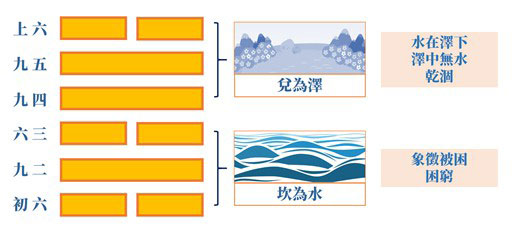

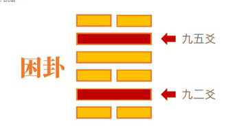

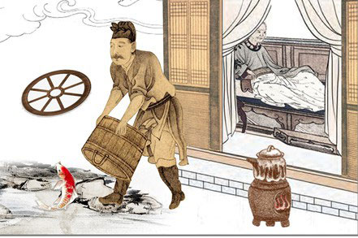

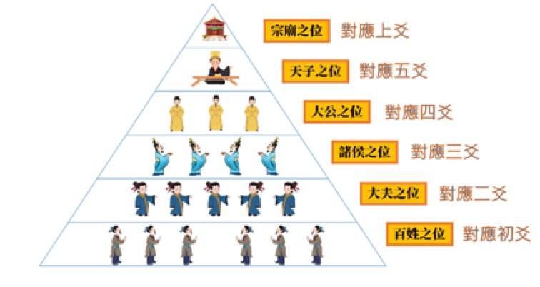

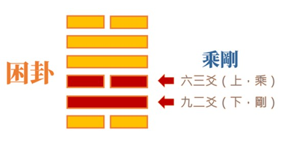

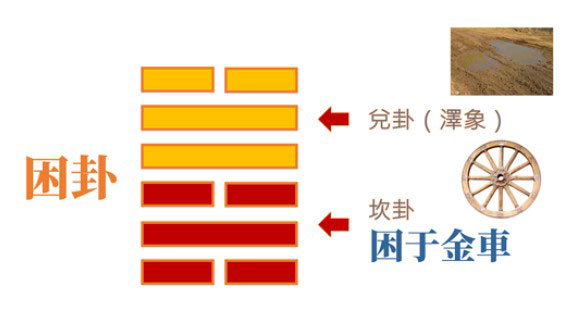

### 【關心觀心】《易經》否卦對困局的啟發

*唐瑜凌講述、宗徹整理*

天地閉塞世局亂

謙懷充實結善緣

有心世道松柏志

否極泰來是必然

前言

這次學習的系列主題名稱為「關心‧觀心」，一方面關心疫情的現況，一方面觀察自己的心，重點在從心裡面找到出路，進而能在身體上找到出路。

目前的進度是「否卦」。之前我們談蹇卦，從「路難行」裡找到出路；接著講困卦，在「被困住」中尋求解脫。否卦，則是「遭否運」，特別是目前疫情壟罩全球，不論是公共衛生還是經濟影響，都非常嚴重。可以預見整個時局將使得許多工廠倒閉、政局動盪、人們失業……，這些都像是否卦的形象。最後，我們將會談謙卦，從謙卦中找到脫困之方。

在講蹇卦的時候，除孔子註解《易經》所分析的蹇卦，在《論語》裡面也有蹇卦的形象。比如孔子周遊列國，人家不了解他，道不能推廣，於是說：「道不行，乘桴浮于海」。

困卦如「子畏於匡」，就是孔子在匡地時被困住，或者在陳蔡時被困住，這都是困卦的形象。

否卦，《論語》裡也有記載孔子遭逢了否運的文字，在接下來的講解中，我們將能一探聖人遭逢否運的處境。

所以蹇、困、否的卦象，孔子都遭逢過，可見聖人跟我們一樣倒楣。可貴的是孔子有豁達的心胸、強大的知識背景、高瞻遠矚的眼光、洞察機先的智慧、降伏煩惱、對治習氣的能力、不卑不亢的處世態度，乃至私下不斷充實自我的精進，使他能在春秋的否運中，走出一條康莊的大道，是我們現在面臨瘟疫時，最值得參考的典範人物。

孔子所遭逢的否運

在否卦裡，《論語》記載孔子周遊列國到衛國的時候，「子見南子」這一章，就談到孔子遭逢的否運。南子是衛靈公的夫人，把持著衛國的國政。她想見孔子，期望藉著孔子來漂白自己。孔子不得不見，子路就不悅了，於是孔子直言地說：「予所否者」，你看我遭逢否運，「天厭之」，老天爺也厭惡我，老天爺也放棄我。意思是說他人生走到這裡，已在否運之中。

我們再看看整個春秋時局的戰亂之中，孔子想要發揮他的理想，到陳蔡的時候，也被厄於陳蔡，這是孔子另一個人生的否運。當時孔子就說：「歲寒，然後知松柏之後凋也。」天氣愈寒冷，才愈知道松柏是等到了春天才凋謝。意思是說，當人才培養出來，君子才算是真正大功告成。在混亂、困頓、否運的時機裡，君子要保存實力，為國家培養人才。

天地否

否卦叫做「天地否」，上面是乾卦，下面是坤卦；上面是講天氣，下面是講地氣。按照理講，上天下地應該是很好的自然現象，怎麼會是「否」呢？事實上否卦是說明天氣不下降、地氣不上升，陽與陰不能交融的形象。

此外，下面三爻叫作內卦，上面三爻叫作外卦；下面三爻是陰，上面三爻是陽。這代表小人得勢在內，君子被排斥在外，是天地不交的情況。怎麼個不交法呢？陰陽又是怎麼不諧和呢？其實就是小人當道，風氣大壞，民不聊生，因而天地易位。天地沒有辦法恢復祥和之氣，因此可能有瘟疫、戰亂，乃至旱災、水災等等災變的發生。否卦的形象就是這樣。

《彖》曰：否之匪人，不利君子貞

《彖》是文王的卦辭，決定這一卦的卦意。「否之匪人」，匪人表示小人，最麻煩的小人是「以子弒父，以臣弒君」，造成天下大亂。尤其得位的小人，更足以讓天下大亂。「不利君子貞」，這些小人在位，不利君子行正道，所以蘧伯玉在邦有道的時候，他可以「危言危行」；邦無道的時候，他可以「卷而懷之」，像國畫一樣把自己收藏起來。

大往小來

否卦從「風山漸」的漸卦而來，三、四兩爻互相往來。

大往，就是第三爻的乾爻為陽爻，所以稱為「大」，往上走叫做「大往」；第四爻是陰爻，相對為「小」，往下走是「小來」。漸卦的第三爻到第四爻，第四爻到第三爻，總稱「大往小來」。

《象傳》曰：天地不交，否。

否卦的卦象，《彖傳》上說「天地不交」，就是上面的天氣下不來，下面的地氣上不去，所以叫作否。

君子以儉德辟難，不可榮以祿

「君子以儉德辟難」，遭逢否運時，應收斂自己。像蘧伯玉一樣，愈收斂愈好。不論是才能、學問、地位、財富等，但凡所擁有的好情勢通通都要收起來，才能避難。

「不可榮以祿」，不可表現光榮，不可表現自己很有榮華富貴，那都將為自己招難招嫉。以上是否卦的形象。

則是天地不交，而萬物不通也；上下不交，而天下无邦也。

「天下无邦」就是國不像國。例如魯昭公在一場內亂中，被三家大夫逼出亡，魯國就成了一個沒有國君的國家。一個沒有國君的國家，就不叫做國家了。魯國已不成國，且三家大夫把持政局，孔子便離開魯國，去見齊景公，有意在齊國施展抱負。我們可以試想看看：一個有理想、有抱負的讀書人，身處於否運當中，該怎麼去找尋他的出路呢？

內陰而外陽，內柔而外剛

內陰而外陽，否卦的上卦為乾，下卦為坤；上是外，為外陽；下是內，為內陰。

內柔而外剛，就是小人的形象，表現得很剛直，其實內心脆弱的不得了，因為他只在意名利，沒有什麼道德勇氣，所以一旦面對著自己的私利，什麼原則都可以放棄、都可以妥協、都可以答應。

內小人而外君子，小人道長，君子道消也

這個卦象叫做「內小人而外君子」，內小人，就是朝廷都是小人；外君子，君子都被貶抑在外。王安石的變法不能說不好，有很多變法在現在來看，政策都挺新穎。然而，王安石之所以敗，就敗在「內小人而外君子；小人道長，君子道消也」。

從否卦的形象，我們可以明白，天地的氣氛是根據人事而變的，天地人三才是以人為主，人諧和了，天地也能祥和。倘若人不能按照綱常而以下犯上，則天下大亂，天地也必然要反常。所以老子說：「大兵之後，必有凶年。」

否卦圖的啟發

圖中一位身著官服的人坐在那，彷彿等待良機。因為整個否卦的卦象，都象徵著君子無可作為。一個人將弓與箭丟在地上，代表半途而廢。還有一面破鏡，所謂「破鏡不能重圓」，代表事情不能圓滿。屋前有一個處著拐杖、生病的人，代表臨終有損，意思是一個好人、君子，身在否卦當中，都會遭受損害。就好像一個健康的人，在天氣轉換、環境不好的情況下，特別容易生病。

否卦從漸卦來

要知道否卦，除了說是從漸卦來，還要知道否卦是怎麼形成的。先看漸卦三、四爻的變化。

四月卦叫做乾卦，五月卦叫作姤卦。天風姤，地氣開始有了變化。六月卦為天山遯，意思是當以下犯上、以臣弒君、以子弒父的事件多了，君子要懂得遯逃；再不遯逃，就到了七月的天地否，到時小人當道，君子想逃也逃不掉。

初六：拔茅茹，以其彙，貞吉，亨。

從最下一爻開始看，初六爻就是否，才剛剛否而已。「拔茅茹」指拔草的時候被連根拔起，表示在否運的時候君子無所作為。「以其彙」，彙就是類，指同類相聚。「貞吉」，只要一群人共同維護正道，便有吉祥。「亨」就是在初六爻還算通達。例如雪廬老人剛來到臺灣的時候，面對著動盪的社會，他便結合當地人們，一起透過辦教育來穩定基層人心。初六爻告訴我們，初逢否運應聯合志同道合者，保存實力，一同維護善法，未來自然吉祥亨通。

《象傳》曰： 拔茅貞吉，志在君也

孔子解釋爻辭的典籍，叫做《小象傳》；解釋卦辭的，叫做《大象傳》。

《小象傳》裡說：拔茅貞吉，指在亂世裡不要一個人單打獨鬥，否則一定退轉。
以前有一位老師請教雪公老師：「有沒有不退轉的方法？」雪公老師回
**答：** 「沒有，全退！」

初六爻告訴我們，在否運的時候，大家要好好地互相切磋琢磨。好比我們因瘟疫而走不出去，可以利用網路通訊設備，大家一同交流經學，保存實力。「志在君也」，一個人要怎麼保存實力、自我充實？先要志在國家，而不只是想充實自己而已。如孔子囑咐子夏：「女為君子儒，無為小人儒。」孔子要子夏要作君子儒，不要做小人儒。小人儒並不是指品德差的小人，而是說只是把所學拿來自己受用。實則，學問之道就是要拿來分享的。

這裡特別要舉東漢末年桓靈二帝的時候，有一位叫郭林宗的名士，在混亂的時局中，以初六爻的體會，暗暗地護持讀書人，以文會友，切磋琢磨，因此他保留了在否運風氣大壞的東漢末年，一絲高雅奇偉的君子元氣。

六二：包承，小人吉，大人否亨

「包承」是與上面的第五爻相應。第五爻是陽爻，在正位上。

「小人吉」意思是說雖然居於下位，但懂得與上位者配合，縱使可能處在否卦當中，可能之前的朝廷太腐敗了，但有君子在位，如開國的國君，或是明君剛上任，面對著混亂的朝政，下面的人一團亂，蠅營狗苟、假公濟私，問題層出不窮。但是在下位者，有君子懂得配合上位明君的政策，來維持正道，叫做「小人吉」。

「大人否亨」，就是有位的人其實志向推展不出去。

《象傳》曰： 大人否亨，不亂群也

「否亨」就是沒亨，政策推展不去。「不亂群也」，雖然如此，大人不會被小人讒言所蒙蔽。所以當大人在位時，旁邊的小人不斷進讒言，此時就要像雪廬老人說「耳根要硬」，要懂得防微杜漸。

《論語》上說：「浸潤之譖，膚受之愬，不行焉，可謂明也已，可謂遠也已。」解卦最好的參考資料，要從《論語》的紀錄、《禮記》的禮來解卦，就能找到卦的出路。

老子是一位道學非常通達的人，但孔子到周朝向老子請教的是禮，而不是請教道。因為卦是一個道象，載明吉凶禍福之道。但在吉凶禍福之道，如何趨吉避凶？得要從禮上去找，所以說：「道德仁義，非禮不成。」

六三：包羞

第三爻為「包羞」，就是否到了極點。包羞，就是很多丟臉的事情都被包藏住，很多亂象都被包藏住。

此爻所要表達的意象，即表面上「金玉其外，敗絮其中」，外面很好看，但內部不堪入目。又像「糞土之牆」，牆壁內部的材質已經腐朽了，外面塗再好的油漆也上不去，所以「不可圬也」。

《象傳》曰： 包羞，位不當也

位不當也，就是一三五爻是陽位，結果陰爻站在第三爻，就是位不當，不在正位。此外，在下卦的坤卦象徵否到了極處，那就是「包羞」，呈現出表面粉飾太平、歌功頌德，而裡面其實是一團亂，這才是最可怕的。所以有時人禍比天災更恐怖。

否卦告訴我們，正人君子應該要有所作為，每一爻都揭示著君子的出路。

九四：有命无咎，疇離祉

有命，就是上承九五，下在三個陰爻之上，所以是「有命」。處在此位，有政治實權的人相信你；雖然位不當，如被破格重用、任命，卻无咎。

无咎，君子行正道，上位者給予支持，所以沒有過失。

疇離祉，疇是這一類；離，是附的意思，相附在一起；祉，就是福祉，還是有福氣的。

《象傳》曰：有命无咎，志行也。

「志行也」，意思是志向得以推行。君子受上位者賞識，自己又能懷有抱負、理想，雖處在小人堆中，依然可以轉變風氣。所以孔子才會說：「舉直錯諸枉，能使枉者直。」意思是說：正直的人在小人之上，風氣就能導向正直。

對治瘟疫，政治的清明至關重要，尤其領導者需有強大的知識背景，能引領上下團結一致。當在上位的人有愛民的心智，又掌握治國的理想，這樣的災變一定會走到盡頭，國家人民也將翻轉命運，迎向光明。

九五：休否，大人吉。其亡其亡，繫于苞桑

九五是陽爻站在陽位上，所以陽爻叫做「休否」。休否，就是否象已經沒有了。

「大人吉」，好比周文王在羑里七年，九五休否，代表否運開始通了。休否，大人吉，像周文王這樣的大人，開始轉否為吉。其亡其亡，雖然這些危機解除了，可是依然沒有脫離險境。如紂王雖把文王給放了回去，可是朝中的小人依然還在，所以雖然一時危機解除，但還有可怕的命運在後頭，必需小心應對。

「繫于苞桑」就是繫於葛藤，這是說君子要懂得去處理人際關係。君子的厲害之處，在於懂得跟君子相處，也懂得跟小人相處。君子與君子的相處，叫作「敬而敬之」；君子跟小人的相處，叫作「敬而遠之」，「敬」是要點。

這是周公的爻辭。

《象傳》曰： 大人之吉，位正當也

孔子的《小象傳》解釋此爻：「位正當也」就是九五爻是一個當位之爻，所以代表君子慢慢地能夠從否運脫困。就像文王，靠著他的溫良恭儉讓，不斷地充實自己，修補與小人的關係，於是能自羑里之難脫困。

上九：傾否，先否後喜

「傾否」指否到極處的時候傾了。好比孔子到魯桓公的廟，廟裡有一座欹器，一旦水倒滿了，整個就翻覆。否到極處就傾覆，意思是「否極泰來」，所以是：先否後喜。

《象傳》曰： 否終則傾，何可長也

「否終則傾」，就是否極泰來。「何可長也」，意思如雪萊的詩：「冬天已到了，春天還會遠嗎？」此次疫情，只要各國能團結一致，共體時艱，互相合作，瘟疫「何可長也」？否運終將翻轉，時通則能運泰。

結語

（一）《易經》的否卦，給了我們對於疫情脫困之道的啟發。這一卦的整個局勢，就是從安泰到混亂，從通暢到閉塞，從泰卦而入否卦，所謂「君子道消，小人道長」。小人當道，比瘟疫更可怕，不利君子推展大道。所以，志為君子，當面對否運，一切變得愈來愈糟糕，除了要當下好好觀心，行為上避免小人的作風。轉變風氣從自己開始做起。

（二）以下複習每爻的重點：

１、否卦初爻裡，顯示出「小人跋扈，結黨營私」，但風氣還沒有形成。此時，君子應該團結協作，往正道上，就算居於劣勢，也能亨通。

２、六二爻告訴我們，局面雖然混亂，但有九五的明君在位。縱使指是剛剛上任，還不能立即造成改變，依然還在否運中，但至少不會被小人所亂。只要內心正直的本質不變，君子就有出路。

３、六三爻顯示小人當道，否運到了極處，時局相當混亂。各種包藏羞恥的事情，表面光鮮亮麗，裡面一塌糊塗。君子在這樣的時局，還懷有松柏之志。如春秋時期，魯國三家大夫表面上還是制禮作樂，還是維持著宗法制度，該有的祭祀沒有間斷，但內部卻是一團亂。此時的孔子，面臨著國家的亂局，思索著要去齊國，還是去其他國家，或者繼續留在魯國。後來孔子決定帶著學生周遊列國，一方面不至於被大染缸所染，另一方面讓學生親身經歷各國的局勢，使他們胸懷四海，有獨特的遠見。孔子真是了不起的萬世師表，百代宗師！

４、九四爻是說，雖然君子有九五之命，但位子不正。然因他被上位者所信任，因此可以制服下三爻的小人；依附在九五爻，所以有福祉，可以施展抱負。

５、九五爻顯示大人在位，呈現吉祥，否運終止，然而小人的勢力還在，所以要有居安思危的感覺，步步為營才能終止否運。

６、上九爻象徵否不可能一直否，終有休否之時，叫做否極泰來。局勢丕變，靠著君子努力，才有轉變的結果。《易經‧乾卦》云：「天行健，君子以自強不息。」不管君子怎麼否，藉由逐步地改變，終有時來運轉的時候。例如孔子在世，雖不能改變春秋的亂世，但他的道統繼續承傳，成為中國歷代思想史的基本核心。君子如果懷有像天體運行而不終止的心志，不斷地學習、推展大道，則不管他遭逢的是順境還是逆境，都能趨吉避凶，離苦得樂，這就是所謂：「《易》為君子謀。」

（三）《易經》的否卦，對於眼前整個瘟疫橫行的時代，乃至各種否運的災難，我們都能從中找到出否的良方。恭祝大家否極泰來，邁向康莊大道。

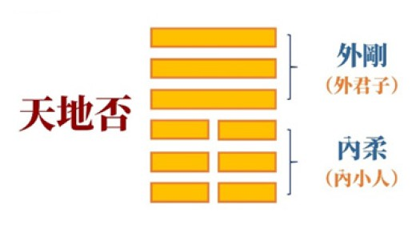

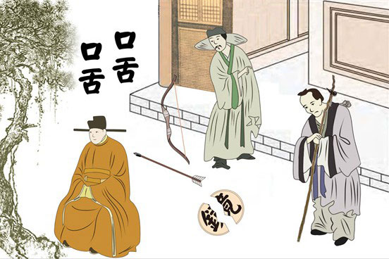

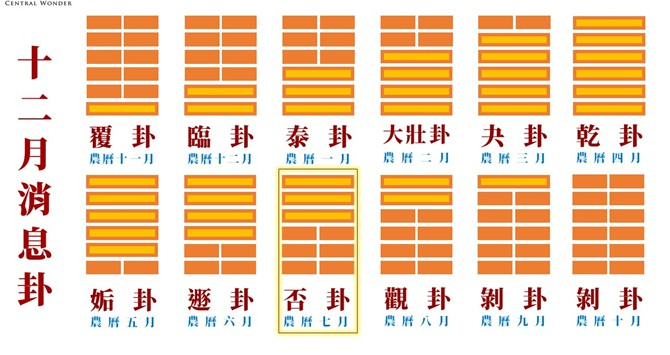

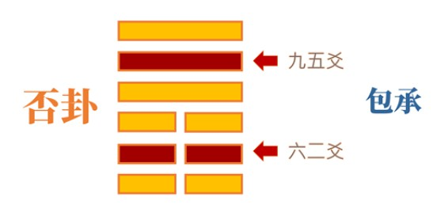

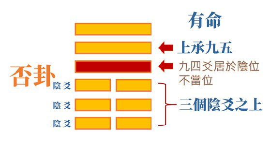

### 【關心觀心】《易經》謙卦對困局的啟發

*唐瑜凌講述、宗徹整理*

高而能下卑上行

能問不能多問寡

有若無且實若虛

犯而不校是顏回

前言

蹇卦、困卦、否卦顯示了路難行、處困局、逢否運，現在從謙卦找脫困的方法。

謙卦是地山謙，上卦是地，下卦是山。地在上，山在下，就是一個謙卦的形象。

身處愈高，心態愈低，《孝經‧諸侯章》中說：「高而不危，所以常守貴也；滿而不溢，所以常守富也。」身處高位的人，不恃才傲物，欺上凌下，便不會遭逢危險。懂得禮賢下士、謙沖為懷，所以常守貴也。滿而不溢，就是身處富貴的人，不驕奢淫逸，體貴心驕，則不致過盈滿溢。懂得富而好禮、善用財富，所以常守富也。

地山謙，代表地中有山，山體高大卻埋於地中，象徵着謙虛為海，屈躬在下，禮敬賢者，是謙的形象。

《尚書‧虞書‧大禹謨》云：「滿招損，謙受益。」《了凡四訓》也曾引用來談「謙德之效」。滿招損，代表位高的人忘了危，富貴的人滿而溢，傲慢又驕奢，一定受損。謙受益，是富的人懂得謙沖為懷，貴的人懂得禮賢下士，謙沖而有禮，一定受益。

再者，地山謙有穩重的形象，代表有才華、有能力、有人脈、有分量、有事功的人，才談得上謙。如《史記‧樂書》說：「君子以謙退為禮，以損減為樂，樂其如此也。」

謙不是對庸俗之輩而言，一般人本來就該謙虛。謙指才德兼備、立功言德的君子，應以謙退為禮。謙卦的每一爻，形容的正是周公的形象，藉謙卦來講周公這樣的君子，一生所呈現的是謙退有禮的典範。

「損減」就是損減自己內心的欲望，損減自己的受用。周公「一飯三吐哺，一沐三握髮」，損減自己的優勢，讓賢者出頭的表現。「樂其如此也」，君子非常快樂自己能如此，除了得到很多人的擁護，也會聽到很多真心勸諫。

《論語》裡，符合謙的形象，除了孔子以外，就是顏回。曾子曾讚歎顏回：「以能問於不能，以多問於寡。」其實這是孔子的形象，而顏回學自孔子，也有這樣的涵養。「以能問於不能」如孔子「入太廟，每事問」。「以多問於寡」如孔子學琴於師襄。「有若無，實若虛」，這是顏回的謙遜形象。孔子與顏回啟發我們，謙是有與實才談得上謙的修養，無跟虛怎麼談得上謙呢？「犯而不校」是顏子對待他人的態度。當有人冒犯顏子，顏子都不予計較。好像武功出神入化的人，面對三歲小孩明言挑戰，不會與之一般見識。

「昔者吾友，嘗從事於斯矣」，吾友指顏回，嘗從事於學孔子、有修養、待人之犯而不校等這三件事情。從事，這個詞常用在「從事什麼行業」，而顏回就以這三個為平日修身的行業。

謙卦從剝卦而來

山地剝，是從上九爻到第三爻，第三爻到上六爻。乾下來，就表示天下來，這就是謙的形象。謙的形象下來，變成山在內、地在外的形象。剝卦到謙卦是從這裡來。

謙，亨，君子有終

此為周文王所解謙卦之詞。「亨」是亨通，指謙卦六爻皆亨通。「君子有終」，指君子的事業一定能達成。

《象傳》曰：地中有山

謙卦上面是地、下面是山，叫做地中有山。

謙，君子以裒多益寡，稱物平施。裒多，就是取多益寡，是公平的形象。稱物平施，物指有情眾生。稱物，就是稱合你的多少，我公平的施予。例如，把多的拿來補給少的。

二、三、四爻是一個坎卦，坎卦是水，水有平相，就象徵了公平的給予。

例如我們現在的資本主義，最大的麻煩就是貧富差距過大。少數的人，擁有國家非常多的財富，形成社會不公平的現象。

《彖》曰：謙亨，天道下濟而光明，地道卑而上行

《彖》在此是要決斷謙卦。孔子說謙亨，謙是亨通。

天道下濟而光明，剝卦從上九爻下來，為「天道下濟而光明」；下面六三爻到最上面的爻位，是「地道卑而上行」。意思是說，你卑賤，反而讓你在上；我尊貴，反而使自己在下，這就是周公禮賢下士的形象。

周公多才多藝，他跟從父親學習，早期的教育資源都保留在貴族，而周公又是好學敏達的人，他其實最足以恃才傲物，而卻能禮賢下士，把對方舉高，壓低自己，這就符合謙的形象。

天道虧盈而益謙，地道變盈而流謙。

這一句在《了凡四訓》中，原來是從謙卦的彖辭來的，出自於孔子。「天道虧盈」是上九爻下來，「而益謙」即助成為謙卦。「地道變盈」，六三爻到上六爻，「而流遷」，如天象的運行。「虧盈」，比如日正當中，慢慢地往西走，也就變得不太熱也不太亮，這就是虧盈。月亮也是一樣，到月十五的時候，就慢慢地往月不圓的階段進行。「地道變盈而流遷」，水往低處流，謙就是往低處走。「鬼神害盈而福謙」，盈就是「高而妄為，滿而自溢」的人。揚雄有一篇文章叫做《解嘲》，他說：「高明之家，鬼瞰其室。」自以為高明的家裡面，朱門之家（門是朱紅色的），鬼正偷偷地觀看著。意即了解這富貴人家，不過只是表面風光，裡面卻是那些見不得人的事情。「害盈」就是鬼神會降禍其上。「人道惡盈而好謙」，人們很討厭那自滿、驕傲、視才傲物的人。而好謙，所以周公善用謙卦，得到眾多賢人來輔佐他，造成西周的盛世。《尚書‧君陳篇》說：「黍稷非馨，明德惟馨爾。」

我們比較熟悉的是周公的兒子伯禽，他是後來魯國開國的君主；在〈君陳篇〉，我們認識到另外一位周公旦的兒子君陳。當時君陳準備幫助周公前往洛陽管理。黍稷非馨，明德惟馨爾，就是飯菜香都不如明德香，美食固然香味引人垂涎，卻不如人格與學問所散發出來的馨香，使人樂於接近。謙尊而光，卑而不可踰，君子之終也。

《彖傳》所謂「謙尊而光」，就是上九爻到六三爻的「尊」，與二、三、四爻坎相的「光」，在〈說卦傳〉裡面，坎是月，坎的伏就是旁通卦的離卦，而離卦是日相，所以說「謙尊而光」。

卑而不可喻，六三爻到上六爻的時候，超過不了上六。

君子之終也，君子善用謙卦，一定能有所成。

面對世紀性的疫情之災，為政者若能謙卑面對，帶領人民共體時艱，並承認不足而好好地找尋良方，必然能有突破困境的一天。

謙卦圖的啟發

騎著一隻鹿，代表君子的亨通有路，或指因謙而能得遇善知識的引導。鏡子代表破鏡重圓，或者靜止內觀，也可以說應止則止。而「公」字代表懷存公心。三人恭謙的樣貌，表示能禮賢下士，或者與人合作，協作進取。這些都是謙的出路。

初六：謙謙君子，用涉大川，吉

初六爻，我們看到君子一謙再謙。周公在還沒有出人頭地的時候，就跟隨良師益友學習，不能因為出身貴族家庭，就以為官大學問大。「用涉大川」指謙卦上面的二、三、四爻，就是一個坎卦，也是一個水相。而三、四、五爻的震卦，也是一個舟相，因此說「用涉大川」，如此舟行水上，是吉的形象。

《象傳》曰：謙謙君子，卑以自牧也

「自牧」就是自己管理自己，好像牧羊人把牛羊管理得很好，「卑以自牧」，很謙卑地看到自己的問題，先管理好自己，才能找到覺受，也才知道怎麼管理別人，這是領導者必須先有的覺受。

《韓詩外傳》說：「夫《易》有一道焉，大足以治天下，中足以安家國，近足以守其身者，其惟謙德乎！」《易經》有一個方法，可以幫助天子治天下，可以幫助諸侯安國家，可以幫助士大夫、君子守身，大概就是謙了吧！

二六：鳴謙，貞吉

六是陰爻，在卦的第二爻的位置，叫作鳴謙。貞吉，指所呈現的是吉祥的樣貌。

鳴象是什麼呢？就是卦上面的震掛，象徵雷鳴。「鳴謙」，就是一個人的謙引起了共鳴，大家願意親近他一起共學、切磋琢磨，願意跟他一起共事、合作事業。

貞吉，特別是表示謙卦的二、四、六爻都是陰爻，也都在陰位，因此都在正當的位置上，叫作「貞吉」。

《象傳》曰：鳴謙，貞吉，中心得也

「中心得也」指心中所想的目的，有良師益友幫忙，便會得到。例如漢惠帝在得到四大老輔佐的時候，劉邦就知道要將天下給他，不管戚夫人多少的枕邊細語、多麼地柔情似水，劉邦也不為所動。這六二爻的形象。

九三：勞謙，君子有終，吉

九三也是陽爻站在陽位上。二、三、四爻為坎卦，又叫「勞乎坎」，代表「勞謙」，很辛勞的意思。意即要辦出一番事業，除了謙以外，還很辛勞。

如子路問孔子怎麼辦政治，孔子就告訴子路：「先之，勞之。」執政者要以身作則，吃比人民更多的苦。像過去臺灣的領導人蔣經國先生，在任大位之前很是辛勞，總與百姓在一起，且身先士卒，發起各種工程來利益百姓。「君子有終」，君子一定能將事業做到最後。「吉」，達成圓滿。

《象傳》曰：勞謙，君子萬民服也

君子尚未坐上大位，已經贏得民心。就像周公，一生奉行謙卦，廣受百姓的愛戴，也成為後世君子的典範。謙卦作為整個蹇卦、困卦、否卦的出路。

六四：无不利，撝謙

六四爻，是陰爻站在正位上。「无不利，撝謙」。撝，就是能發揮謙的功德。

《象傳》曰：无不利，撝謙，不違則也

為什麼能發揮謙？因為他不違背原則。謙的原則，就是禮賢下士。了凡先生說：「謙則受教有地 ，取善無窮。」一個人受到他人的批評指教，內心不會自我感覺良好，也不會聽不下別人的建議、良言、勸導，而能將別人的良言勸諫裝入內心。不違背謙的原則，所以內在愈充實愈豐富，人脈愈來愈多，事功也愈來愈多。

六五：不富以其鄰

到了六五爻，雖然陰爻站在陽位上，可是他有謙。陰爻站在陽位，就像周公身為攝政王，而不是天子。「不富以其鄰」，上面的坤卦是富。不富即不會以富驕人，不會以富來炫耀。如周公代理天子七年，不會以攝政王的地位來驕人。想想周公任代理天子多年，滿朝文武都是他的人脈，真正的天子成王還會在他的眼中嗎？可是周公竟然一樣地謙沖為懷，守住為人臣應有的處世態度，這叫做「不富」。「以其鄰」就如周公攝政時期，對於那些諸侯各國，不會以真正的天子來自居。

利用侵伐，无不利

漢儒喜歡用互卦來解決卦辭的問題。二、三、四爻與四、五、六爻正好是地水師的卦象，這叫「上下連互」。侵伐的象，叫作利用侵伐。到六五爻的時候，看周公攝政時期，管叔、霍叔、蔡叔跟著武庚在商朝的地方造反，周公可以利用謙來侵伐，無不利。

《象傳》曰：利用侵伐，征不服也

六五爻跟上六爻，反而是以不謙來行謙。上六：「鳴謙，利用行師，征邑國。」「鳴謙」表示以謙之行引起共鳴。上六爻攝持了卦下方的震卦。

「利用行師，征邑國」，剛剛講地水師的卦象，代表謙可用於征伐。例如，周公已不在天子之位，仍然得到天子周成王的重視，可以有征伐之權，在天子的信任下保家衛國。

後來周公送兒子伯禽到魯國開國，而周公身為退位的攝政王，依然還輔佐周天子，卻不會讓周天子有功高震主、如芒在背的感覺，真是了不起！

歷代以來，除了周公之外，還有諸葛亮輔佐後主劉禪，劉禪還稱諸葛亮作相父。周公與諸葛亮真的都是用謙到極處的人，故言「《易》為君子謀」。

《象傳》曰：鳴謙，志未得也，可用行師，征邑國也

周公雖已從攝政王退位，依然有實權領兵保家衛國，得到周天子成王的信任。《孔子家語‧儒行篇》云：「儒有衣冠中，動作慎，其大讓如慢，小讓如偽，大則如威，小則如愧，其難進而易退也，粥粥若無能也。其容貌有如此者。」「其大讓如慢」，真正大謙讓，反而像慢這樣。如說「大恩不言謝」，古代馮諼吃孟嘗君的飯，有肉吃肉，有酒喝酒，這就是「大讓如慢」，看似傲慢，其實骨子裡是謙，隨時準備為主子效死。「小讓如偽」，小讓的人看似很虛偽。「大則如威」，大讓的時候好像被威勢所嚇，而表現得戒慎恐懼。孔子說：「臨事而懼，好謀而成」，就是君子以謙心辦事的形象。「小則如愧」，小讓的人表現很慚愧，似是慚愧自己做的不夠好。「其難進而易退」，看起來好像很難向前跨步邁進，且很容易退縮的樣子。「粥粥若無能也」，好似沒事幹、無能的模樣。

其容貌有如此者，這類有謙德的人，辦事戒慎恐懼，他不答應你則已，一答應則使命必達。就算不答應，他也在權衡得失、縱橫全局，找目標邁進，分析自己的局勢，掂量自己的能力。這樣的謙者，會有一種如愧、如威、如偽的感覺，然一旦被他想清楚、做決定後，會全力以赴。

反過來說，老是誇誇其談「那個沒問題，包在我身上」的人，態度慢而威，一點也不愧、不偽，那才是問題大。

此外，謙的六五爻與上六爻，也像《論語》上面所謂：「君子無所爭，必也射乎。揖讓而升下而飲，其爭也君子。」

君子在處世態度上無所爭，但這種無所爭是以爭來顯示無爭，這就是「大讓如慢」。

真正大的謙讓，就像傲慢一樣，如在射禮中，反而以爭表達無爭。所謂爭，就是爭著把箭射得準；而無爭，則是在比賽較量中，處處展現運動精神與揖讓禮節。

總結

（一）謙的整體卦象，就著有能力、有才能的人來談謙德，一般人本來就應該虛心受教。有謙德者，呈現出「有若無，實若虛」的境界，能虛心接受別人的諫言與教誨，也才是受福之人。

（二）各爻的回顧：

１、初爻談到謙謙君子的自我管理，他不躁動、不傲慢，理智勝於情感，縱使冒險也有周全的準備，如孔子說「臨事而懼，好謀而成」。

２、 九二爻告訴我們，要憑著做人處世的方法與態度，養成各種入世的能力，來引發共鳴。而有能力、能成事的謙，才會引起共鳴，有利於各項事業的發展。

３、九三爻突顯勞苦功高而又能謙的人，必然可以政通人和，得到萬民歸附，且上下一心，同甘共苦，共體時艱，度過困難。

４、六四爻是不要違背做人處世的原則，來發揮謙的美德，因此就算處在困局中，也能無往不利，即所謂「得道多助」。

５、六五爻告訴我們，為君者不應重個人享受，並與鄰近的國家與人民和睦共處。縱然此人有豐富的德能，但是能夠用謙，而不致盛氣凌人，如此更有能力來「利用征伐」，降伏威嚇無道之國。這也是儒家與霸權政治不同的地方。

６、上六爻告訴我們，為臣者雖然無位，但是因謙到極處，而得到六五爻國君的信任，所以依然可以用征伐的手段，來討伐無道之國，恢復地區的和平，乃至世界的和平。

（三）總的來說「謙則受教有地，取善無窮」，能接受別人的諫言與教誨，這種人會得到很多的善，包括事業得以成就，許多善人擁護，以及福報的聚積，甚至能趨吉避凶。

（四）本卦是《易經》的特例。《易經》中，每一卦都有吉有凶，只有謙卦不但整體卦象，乃至每一爻分別來觀察，都是吉祥，所以「謙之一字，六爻皆吉」。雪廬老人在臺中建教學大樓，其中一棟就取名叫「六吉樓」，正是取謙卦來說六吉。

（五）品學兼優、人脈廣博、事功輝煌、位高權重的領導人，如果懂得用謙，就會像衛武公那樣，人稱睿聖武公，活到九十五歲，創造衛國的太平盛世。從西周變成東周，能夠安定天下的睿聖武公，就是善用謙德，於是已被衛國臣民公認為最好的國君，卻還每天問群臣說：「我有什麼過失，趕快告訴我，讓我改進。」這樣的君主，反而令政通人和，既維護一方的安定，也維護了各國之間和平的關係。

（六）領導人到各個階層有能力的人若善用謙，真的是團結一氣，無災不除，無疫不治。舉國上下都發揮謙德的影響力，共創太平盛世。

（七）這次【關心‧觀心】系列，我們不去分析疫情的緣由，各國怎麼相互發生影響，以及後來將有什麼經濟上的變局，而是單純從《易經》的蹇卦、困卦、否卦、謙卦，來看整個疫情所形成的困局，我們應該要怎麼看待，並從中找到個人與國家的出路。

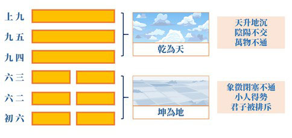

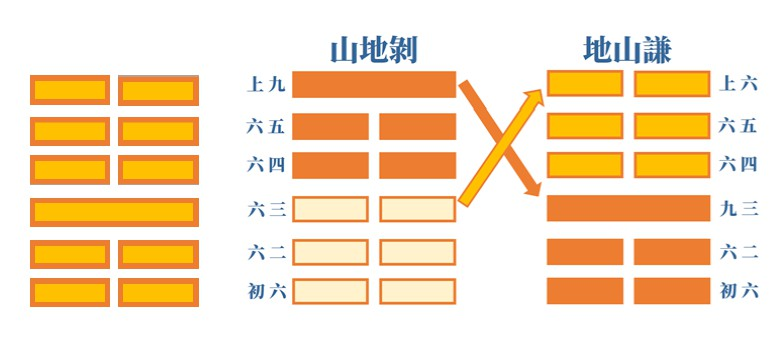

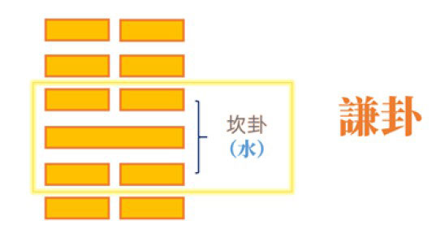

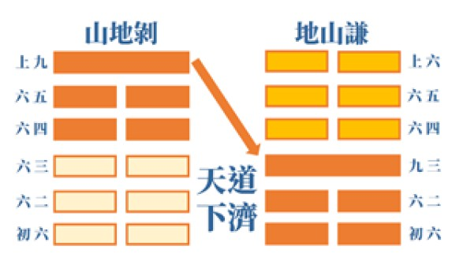

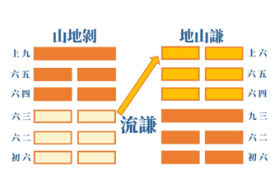

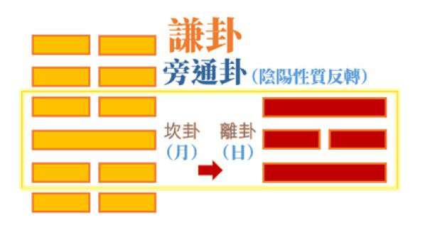

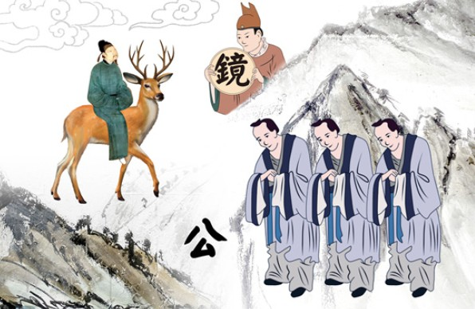

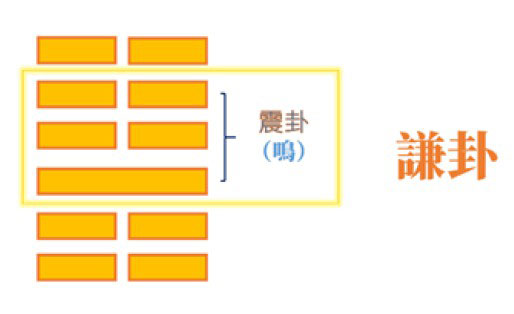

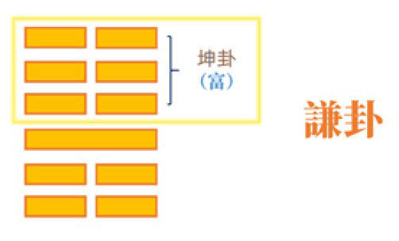

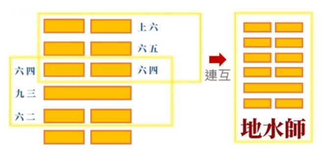

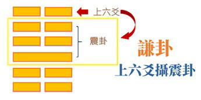

### 孝道跨時代的意義與價值 — 孝經簡說（二十）

時哉講述、淨域編寫

可貴興辦天下利

重在和睦上下情

盡忠補過心乎愛

國之棟樑民父母

事君以孝進退才能成人之美〈事君章第十七〉

前言

眾知一位成功的領導人，要從成功的部屬當起。然而，我們要怎樣做個成功的部屬呢？本章告訴我們做個成功部屬的形象，包含他的人格特質、內涵與修養，若能將這些內涵充實、特質樹立、形象具足，相信未來的出路是無可限量的。

本章在《孝經》中，是孝道的修學法，就義理言，是以孝進退的一章。一位能在家盡孝的人，於朝廷裡便懂得進退合宜，且能把孝的本質發揮在公家朝廷上。

架構

本章架構說明以孝進退的君子「如何事君」，意即如何與領導人相處。與領導人相處是很重要的學問，若處的不好怎能得到長官的信任，又長官怎能放心讓你辦事，如此的出路在哪裡呢？這中間可分為兩項，一是事君之法，即與領導人相處的方法；一是事君之效，乃彼此互動的成效，若方法得宜就會有成效，能獲得信任和諧相處，共辦利益眾生的事業，這個大出路就改變了命運。

經文：

子曰：「君子之事上也，進思盡忠，退思補過，將順其美，匡救其惡，故上下能相親也。《詩》云：『心乎愛矣，遐不謂矣；中心藏之，何日忘之！』」

釋疑

首先，來看事君之法。子曰：「君子之事上也」，這個君子要怎麼與領導人相處呢？「進思盡忠」，他上朝時，要想辦法將才能貢獻出來，誠心誠意地為團隊、國家服務。「退思補過」，而於退朝時，即思補君王的過失。「將順其美」，當君王有良好的政策，不要扯後腿肆意批評。「匡救其惡」，當君王有過惡時(無心為過、有心為惡)，要適時匡正他的罪惡。如此便是成功的部屬，相信不僅國家需要這種人才，企業也要這種人才。

如果得到這種人才就不得了，企業的未來是條康莊大道。「故上下能相親也」，即是領導者與部屬，就能如家人般親密地相處，不僅能辦出一番利益眾生的事業來，且彼此的交情都非常好。中國儒家之情不但是建立在公心上，還建立在彼此的私交上，當然這個私交的本質是公心的，所以叫作「上下能相親」。

最後，孔子舉出《詩經‧小雅‧隰桑》詩句說：「心乎愛矣」。這個忠臣對國君是有愛的，這個愛是一種交情、一種關愛。「遐不謂矣」，是說即便離開國君出去辦事，也不會太遠。這有兩種情況：一種是身與心都離不遠；一種是身遠而心不遠。遐是遙遠，不謂是不會，合意就是不會說是遠，縱然身遠心也不遠。換言之，心思在國家、團體上，即使身體遠離，心都沒有離開，這就是可貴的公心。雪廬老人說：「用人用在公心。」這人若有公心，則團體是興盛之貌；若為私心，那麼團體絕對不會興旺。領導人與部屬如果有公心，團體一定欣欣向榮。如此「中心藏之」，心裡面懷藏的就是國君、天子與領導者；意即他將領導人當成一回事，把推行政策當成一回事，把團體的事情當成一回事，這種人才真能辦出事情來。若他根本不把這當一回事，就絕不會辦出利益眾生的事情來，所以叫作「中心藏之，何日忘之」，是不會忘記的。我們對重要的事情是不忘的，對名聞利養的事情也難以忘記。但這個成功的部屬呢？他反而不會在乎名聞利養，在乎的是團體的事務。譬如一位忠臣，他在乎不忘的是國家的事情，這樣的人一定能讓國家興盛。

析疑

本章與前章的關係？

前章是說一位懂得孝道且能修身慎行的天子或國君，祭祀時會得到大感應，因為人事已盡，必得鬼神的加被。本章更特別講到，國君或天子懂得以品德為本質，去發展政治、興辦教育，必須要有成功的部屬輔佐配合，才有辦法成就一位優秀的領導人。前於〈卿大夫章〉中說：「赫赫師尹，民具爾瞻。」說明國家一定要有這種卿大夫。

本章講到「君子之事上也」，君子與領導人的相處，他的形象是什麼呢？

前說有德無位，接著來看《孝經》中稱君子的七處。

第一、〈聖治章〉中說：「君子不貴也。」就是有德位的君子，他不會在乎帝王之位。堯傳位給舜時，舜並不在乎那個帝位。君子在乎的是此位是否能利益眾人、發揮大用，而且這個位子要配德，若以搶奪而來，用各種善巧方便明爭暗鬥得來，寧可不要。所以，當堯過世時，依生前計畫是要把天子之位傳給舜時，舜選擇離開。後來經大家擁戴，他才回來接下天子之位。

第二、亦說：「君子則不然。」意即君子不會在名聞利養上講究，會在言行、得義、辦事、容貌等上講究。

第三、又說：「淑人君子，其儀不忒。」「淑人君子」指這個君子有品德，他的外在威儀與內涵相稱。以上這三個君子，都講到有德有位，即是國君與天子。

第四、〈廣至德章〉中說到「君子之教以孝也。」即是講到辦理政教的領導人，須懂得以孝道為本質來推廣教育，而政治也是為了教育而提供服務的環境。

第五、在所引《詩經》文句中說到「愷悌君子，民之父母。」愷悌君子即是講和樂的君子，這種君子是百姓的父母。換言之，國君與天子將國家及天下，當成大家庭來經營，百姓都是他的孩子。這樣的人，必定從公心來辦理政事。所以，儒家的政治叫作「大道之行也，天下為公。」辦政治的人從公心來辦事。

第六、〈廣揚名章〉中說「君子之事親孝。」此中君子是指讀書人，非是國君、天子。這個讀書人侍奉父母親以孝，便能將孝道移作忠。

第七、本章所講的君子，此一讀書人懂得與上級善處，便是個成功的部屬，將來也會是個成功的領導人。

君子如何與上級處理好關係？

首先是「忠」，忠就是誠心誠意地與上級相處，沒有欺詐鬥爭。從曾子之三省吾身，謂之「為人謀而不忠乎！」當替人籌謀時，本於誠心誠意。《中庸》將「忠」當成「誠」，子思最後談成功的心法，謂之「誠」，誠就是忠的意思。

盡忠要怎麼做呢？即是文中說的「進思盡忠」，上朝時要想辦法把忠盡上，孔子在宗廟朝廷「便便言，唯謹爾」，便便言是將話說得清楚，將政策分析透徹。又將該辦的事情講清楚，也注重講話的語氣與態度；於禮節上要遵守，這就是謹守本分。

忠臣是國之棟樑，天子要怎麼認識與看待？

試舉唐朝狄仁傑來說明，狄仁傑的能力固然厲害，但他對國家的忠誠，更是令人敬佩。他將過世時，武則天親往探病。病危的狄仁傑心仍懸念著朝廷，見武則天來到，一再推薦張柬之為相，使得武則天哀悲將失棟樑，愈益景仰這位人中的忠臣。

忠臣對於國家有何利益？

當時武則天想立侄子武三思為帝，狄仁傑便要導正武則天的罪惡，因為武則天若立了侄子為帝，唐朝將發生內亂，狄仁傑說了一段話來導正武則天。他說：「當姑姑立侄子為國君，日後妳不可能配祀於太廟，孩子無法祭祀父母，而侄子又怎會祭祀姑姑呢？」這段充滿智慧的話打動了武則天，讓唐朝回到李氏天下，免於陷入內亂。狄仁傑以善巧方便來補救過惡。

又如宋高宗問岳飛：「天下如何太平呢？」岳飛說：「文官不愛財，武官不怕死，則天下平。」不愛財、不怕死都是忠臣的特質，若國家有具有風骨的忠臣、有品格的忠臣、有學問的忠臣、有能耐的忠臣、顧大局的忠臣，則國家必然強盛。

忠臣除了上朝時能盡忠，退朝後還能補過，他如何補過呢？

所謂補過，即是修補皇帝君王的過失。清代雍正皇帝推行新政時，許多地方積欠國家稅款，他希望各地方政府還錢，因為催款操之過急，臣工們就矇騙他。譬如：一些人先借錢還國庫，代表他有能力償還，至於借欠的錢，就增課老百姓各種名目的稅，這就是欺君、逢君之惡。當皇帝躁進、急功好利、思維欠慮、賞罰不明、用人不當時，欲顧其顏面，則過失要怎麼去修補呢？若天子懂得治國，不在乎表象、形式，而在於內涵與真誠，則這個國家一定強盛，國家需要這種忠臣。

補天子之過是希望皇帝不要在門面上講究，若一味地講究門面，臣下就會討好你、逢君之惡。表面看來好似配合國家的政策，可是私下卻是向百姓收錢，用橫徵稅賦來填補虧空。

補天子的過惡，誰是典範呢？

舉荀林父為例，晉景公三年(前597)，晉楚交戰於邲(今河南滎陽東北)，由中軍元帥荀林父領軍的晉國，因偏將違令而敗退，楚莊王獲得大勝。荀林父自請死罪，晉景公本欲賜死，時有大夫士貞子(士渥濁)以「子玉還在」一事諫說：「林父事奉國君，進則竭盡忠誠；退則彌補過錯，乃國之干城，怎能殺他呢？其敗戰，如同日月之蝕，哪會損害它的光明呢！」景公聽後，免其罪官復原職。

真正補天子之過的典範是誰？

乃《詩經》中提及的周宣王。宣王是一位中興的國君，他有兩位重臣，分別為「赫赫師尹，民具爾瞻」的尹吉甫，以及古公亶父的後代仲山甫。仲山甫為周朝的王公貴族，但至宣王時家道已沒落，以農商為生，日後被舉薦到朝中，受宣王重用擔任相職。因此，宣王當朝有尹吉甫、仲山甫兩位宰相。尹吉甫曾讚歎仲山甫，其譽見於《詩經‧大雅‧烝民》的八首詩歌，讚他是個善補天子之過的人。第六首詩說道：「袞職有闕，維仲山甫補之。」「袞職」就是穿龍袍的天子，如果天子有過失的話，仲山甫是可以補國君的過惡。這八篇詩歌，全在讚歎仲山甫。尹吉甫讚歎仲山甫，由兩位宰相間的相輔為國，便可想知忠臣的特質除了為國辦事外，彼此間是互助合作的，所以宣王能中興周室。

君子退朝時，能補天子的過失，那麼可否說是補自己的過失呢？

魯國《國語》中有〈魯語〉，《國語》是說各國的歷史，〈魯語〉是講魯國的歷史。〈魯語〉記載大夫公父文伯退朝時，其母敬姜對他說：一個讀書人，早上起來後要去讀書授業。雪廬老人說：古代的私塾教育，孩子上學時，父母可能都還沒有起床。白天要勤學貫通，晚上要重複溫習，並且思維今天的過失，若如此才能安心睡覺。退思補過有兩種說法。一是補君王的過失；另一是補自己的過失，補己之失就舉《國語》中的例子。

再舉范仲淹為例，雪廬老人說：范仲淹夜寢，會思索一天的作為，若位高俸厚而事寡，心裡會感到不安，便想著明天該做什麼，將今日所缺欠的補上，規劃妥當了才安心地去睡覺，這就是退思補過。然而本章是講補天子的過，蓋因這章名為〈事君章〉，即是如何誠心誠意地對待國君，怎樣去補過、導正、順美，讓國政日榮。

順美如何順？

其中包括不計名利、不較毀譽，而一般的順美，概都是「含和吐明庭」(語出於〈正氣歌〉)。順美不是說你做事我高興，有時順美須要忍辱負重，此處特別舉林則徐為例。道光皇帝欲禁菸，滿朝文武也知禁菸之必要，再不禁菸大清帝國就要亡了。禁菸政策雖好，但大家都不願去幹。所以，順美有時要不計毀譽，林則徐承擔禁菸一事，將命睹上去，雖千萬人吾往矣，便見其是順美的忠臣。印光大師讚歎林則徐，乃真有風骨、品格、學問的大臣。

忠臣順美外，還須懂得導正君王的罪惡，但要怎麼導正呢？又什麼叫罪惡？

譬如：魏徵勸諫唐太宗，有時讓太宗難堪，甚至氣得要殺魏徵；這已不是過錯，而是罪惡了。唐太宗的了不起，在於他背後有長孫皇后，能適時地導正他的罪惡。長孫皇后具備善巧方便，懂得大臣之間彼此合作，從天下安危著想，為黎民百姓請命，使國家的棟樑發揮安定大局的作用。當國君愈能導正時，上下必能相親，政策能順利推行，展現一番氣象。此氣象顯於家庭必是和諧的，懂得怎麼去侍奉父母親，所以《論語‧學而篇》說：「其為人也孝弟，而好犯上者，鮮矣！」他不會冒犯君上，懂得善巧方便去導正，即便此忠臣有危難時，其他人臣會去援助，就如長孫皇后救魏徵一般。唐太宗殺魏徵的心本來堅定，但經長孫皇后這麼一勸，不僅保住了良相魏徵，且還增重了魏徵在太宗心裡的份量。

天子要怎麼讓臣子來盡忠呢？

君臣間要互相講究。《論語‧八佾篇》說：「君使臣以禮，臣事君以忠。」意即國君令使臣子如禮如法，則臣子侍奉君王一定忠誠。此外《尚書‧周書》中說：「克明」，一位領導人克明，即是能夠光明。雪廬老人說：「做個明白人很重要。」明白人是明白事理，明白公心的重要，明白大臣盡忠的可貴，明白大臣補我的過失、匡正我的罪惡，明白這人是國家的棟樑。明白了這些，必能讓下屬盡忠。一個企業的老闆也是這樣，要客觀地看待員工發掘人才，不求全責備，不要於各方面要求他，須從他的能力上去要求，他的職位是什麼，就把這個職位的工作做好。例如：農夫，不別求他會文書，只在他的農事上要求即可。

原來國家經營的秘密就是天下和，而天下和必要朝廷上下相親。欲使天下人正，國君必要先正；所以以身作則，才能夠影響天下。既然上下相親，但本章結論的《詩經》說：「遐不謂矣。」意即是不要說遠。忠臣既與國君上下相親，又怎麼說其遠而不遠呢？譬若周公東征，其討伐管叔、霍叔、蔡叔時，他離開成王確實很遠，可是這種遠離叫作「遐不謂矣」，身體雖遠，心不遠。意即身體即使離開朝廷很遠，心都沒離開朝廷，這就是古代忠臣的形象。

《詩經‧國風》中有周南與召南兩篇，周成王的輔政大臣裡，除了周公外還有召公。召公有時也會離開國君訪探民情，往往在崗上樹下聽百姓唱歌，或是聽講一些民情，這些風俗民情採集下來，寫成文字就成了國風。雖然他離開國君很遠，可是在做有利於朝廷的事，故身遠而心沒離開朝廷。整個忠臣的形象與成功的部屬，在《孝經》第十七章中被描摩得淋漓盡致。而這個成功的部屬，將來必是成功的領導人。

再來說個故事，北非利比亞這個國家，二O一一年內戰前社會欣欣向榮，被譽為是非洲的瑞士。男女平等，國家教育普及，小學到碩博士公費，電力與醫療全免，房屋貸款零利率，購車國家出資一半，務農國家提供土地與種子，每人每年可分紅五百美元，婚嫁時國家更補貼五萬美元。當英、法、美空襲利比亞，推翻領導者格達費後，各族乘機爭著當家做主，國家陷入內戰紛亂中。除議會兩派彼此爭鬥外，反抗軍也擁兵自重，無休止的燒殺搶奪，成了IS伊斯蘭國犯罪的恐怖溫床。四年內戰，導致二十萬人死亡，一千一百萬人流離失所；歐美國家以包著糖衣的美麗口號，要幫利比亞百姓爭取民主，結果卻把它打爛了。所以，一國的大臣無法和合時，誰來號稱要解救國家，無非是包藏著私心，終亂無法收拾，可憐的老百姓們，以往的福利全都成了雲煙。

由此來看本章的旨趣，國家真需要忠臣，且要相互尊重制度，好好地護衛國力，徹底執行良政美策，尤其是營造上下相親。大臣們果能如此輔佐國家、導正國君，上下間能夠建立和諧的團隊，必能帶來國家的昌盛與人民的幸福。

圖解

北宋李公麟的畫，圖左上方是臣子能上朝來盡忠，下朝後能退思補過；所繪之退思補過，意乃是補自己的過失、充實自我。而趙孟頫也是這樣，上朝盡忠，退朝思過充實。至於江逸子先生所繪的〈事君章〉，有何不同呢？

圖分兩部分。下圖這一人，居家時自我充實，或於充實中想著，上朝時要怎麼奏事，這包括：美好政策的建議、國君過失的諫正等。窗外有竹，代表士大夫的氣節。當他居家認真功課，上朝時就能侃侃而談，提出許多利益國家的政策。他能整理儀容、端正態度、謹言慎行，即使直諫國君也委婉以勸，所以國君聽了也不覺得失顏。圖中國君聽言，兩手平伸上擺，示意讓臣子起身，表示這人匡正君之惡，方法是十分善巧方便的。天子身旁的大臣，臉色和悅沒有嫉憤或不以為然，這代表同朝為官彼此和睦相處。整體氣象就是，一位居家能夠充實、上朝得以奉獻的忠臣。這是本章所要表現的旨趣。

總結

一、孔子非常仰慕三代明王的政治，即是堯舜、禹湯、文武周公三代明王的政治。三代明王的政治是，為上能克明，為下能盡忠，這就是上下相親的形象。

二、舜在《尚書》中曾對臣子們說：你們不要因害怕我，而不糾正我；不要在前面順著我的過惡，在後頭批評我。你寧可在前面說我的過惡，我願意改正。所以，天子果真能包容忠臣對他的諫言，那便是上下相親的最高形象。

三、這些忠臣將天下當作家庭來看待，把孝移到朝廷上，視天子國君為大家長。因此，君臣把國當成家來經營，整個中國的政治就是把國當成家，把天下當成家來經營。而維持家庭的和諧，將此覺受移來維持國家、天下的和諧，就是儒家最高等的政治。所以，孔子說：大道之行也，天下為公。這是孔子施政的最高理想，也是中國政治有別於外國的地方。透過本章更可以看出，儒家治國的胸懷，在天子的胸懷，在忠臣的胸懷。

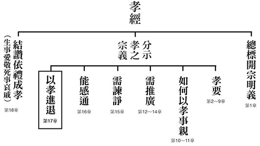

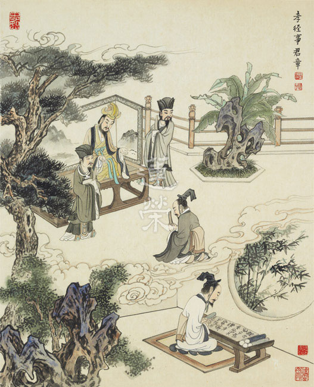

### 孔門心法—中庸之道（十五） 第十二章：從夫婦關係開始經營的君子之道

*時哉講述 / 弘毅整理*

大道形上與形下

聖人君子成就相

落實五倫夫婦始

要為萬世開太平

前言

孔子教育的核心在成就君子與聖人，然而其道甚大，難知難全，雖然不容易把道理說全，但卻能從小地方經營起。入世的能耐在人際關係中培養，良好的人際關係也是幸福快樂的泉源，下手處就在夫婦之間。

科判分析

中庸總體科判

第十一章還是在《中庸》的第二部分，即分別顯示中庸的修學法和義理。

本章科判分析

「君子之道」總說是體隱用廣，在體性上一般人難以證得，在作用上也難以發揮道廣大的用途。不但一般人無法發揮道的作用，在世俗上君子的行事也不容易圓滿，在體性上聖人也未必通達的究竟。後面舉詩喻，老鷹在天上飛，俯察下面的獵物，深水的魚體察到春天的來臨而從深淵游上水面，比喻君子體察形而上的理體和形而下的運用，但不一定能究竟。道的運用能令天下和諧，先從五倫開始，而五倫安定從夫婦之道開始，發展至極致時，功同天地。能令天地運轉正常，像是四季如春，地是能長養萬物，例如人能透過科技的力量水利灌溉，培育森林，就可以養活數以億計的人類，並以森林保護物種。更能將環境塑造成培養人才的環境，將人培養成聖賢和君子，這些天地辦不到，只有人才辦得到。

經文：

君子之道，費而隱。夫婦之愚，可以與知焉。及其至也，雖聖人亦有所不知焉。夫婦之不肖，可以能行焉。及其至也，雖聖人亦有所不能焉。天地之大也，人猶有所憾。

消文

君子之道，不僅是有形而下廣大的作用，也有形而上隱微的體性。有些夫婦雖然格局小、見識有限、目光短淺，只是有某種專長，如木工、種田或在企業，只重視經營家庭的溫飽，生活的安樂，但也知道做人要誠實、講信用、有禮貌，這樣的人是可以參與君子之道的。可是君子之道的內涵達到極致的時候，不但能延續傳統的精神，也有走入時代的作法，作用與內涵的究竟處聖人也有所不知。克守倫常的夫婦雖然不像聖賢那樣有內涵與氣象，但他們誠實、守信、有禮貌，這樣的人也是行君子之道的一部分。可是君子之道推展到究竟，藉著辦政治、辦教育，能引領各行業通往聖賢與君子的氣象，這不是普通的能力，要有諸多相關的配合，即使聖人也辦不到。天地廣大無私的生養萬物，但人還是有很多的遺憾和不滿，像是自然界的水災、旱災、地震等，人為的戰亂、爾虞我詐等。

釋義

「費」，按宋儒講法是用處很廣，可以指形而下的作用，能夠和諧萬物謂之和。「隱」，就是體性隱微(形而上)，謂之中。中和之道就是君子之道，既有聖人的內涵，又有君子的心量。

經文：

故君子語大，天下莫能載焉。語小，天下莫能破焉。詩云：「鳶飛戾天，魚躍於淵。」言其上下察也。君子之道，造端乎夫婦，及其至也，察乎天地。

消文

君子所講的大道理，不只是讓百姓安居樂業、豐衣足食，而是能令百姓也成為君子和聖人，是內聖外王之道，這樣大的功德是天地辦不到的，也不能承載的。講到君子能證大道理的心念，即便是一個很小的、乃至一剎那的心念（卷之則退藏於密），都不會被破壞，不會退轉，因為他透過比量到現量的證得，見到了離苦得樂的真相。《論語》說「三軍可奪帥，匹夫不可奪志」。《詩經》上說，老鷹飛到高高的天上，但可以俯衝下來抓動物，魚在天氣寒冷的時候，就潛到暖和的水底，等到天氣回暖時，又從深水中跳出水面。這告訴我們要在日用平常當中，體察形而上與形而下的道理，既要有君子的動機、情懷和做法，又要有聖人的見地。此外在辦政治、辦教育，領導團隊的時候，也要上下體察，看看大家是否有改變，煩惱變少，心情爽朗，悟性變高，風氣變好。君子之道可以大到盡虛空遍法界，小到一個心念，它的開端卻是夫婦之道。當你有能力體察形而上與形而下的天地道理時，君子之道就可以發展到究竟，從夫婦開始，發展到家庭、社會、國家、天下，發展到人類以及萬物。

章旨

聖人和君子之道是難知難行的，可是匹夫匹婦也可以知和行，這是三根普被，利鈍全收，知的愈多，人生就愈明白，行持愈穩健，快樂也愈多。人生全部的出路都在人際關係，而人際關係的重點是五倫關係的和諧，五倫關係又從夫婦之道開始。

析疑

一、本章與前章的關聯？

前一章說明君子不要素隱行怪，尋覓君子和聖人之道，也不可半途而廢，而且這一生要有用之則行，舍之則藏的情懷。此章告訴我們推展君子之道，要從夫婦開始推展。就算你一生沒有被用，也可以在家庭裡面，推展夫婦之道、父子之道、兄弟之道。所以論語裡面有人問孔子說：你為什麼不為政呢？孔子知道沒有為政的條件和因緣，但是他說，書云：「孝乎惟孝，友于兄弟。施於有政，是亦為政，奚其為為政。」在家辦家政，一樣的可以行君子之道。君子之道可以從夫婦開始發展，發展到家庭，帶來一家的和諧快樂，再影響到其他的家庭，就可以形成一個小範圍的社區。如果國家還是不任用，「人不知而不慍，不亦君子乎？」這就是君子的素養。

二、夫婦之愚、夫婦之不肖如何可以「與知」與「能行」君子之道？

夫婦之愚指見地不寬，看法不夠遠，生活只重眼前。不肖是指行持上早出晚歸，只知賺錢使家庭溫飽。就像鄉下的老太婆，但也知道一些君子之道，知道做人要光明，要有信用，要堂堂正正。以前的中國，透過彈唱、戲曲、說書等各種方式推展君子之道，所以鄉間沒有讀過書的老太婆、老先生都大略懂這些道理。雪廬老人在莒縣當典獄長時，旁邊有一個說書的，雪廬老人說：他的功德比我當典獄長的功德還要大。透過聽書，大家知道忠孝節義、因果是非、能趨吉避凶。

三、如何體會天地間遺憾的事， 就在我們不知不覺中持續發生？

自然界的災害如旱災、暴雨、氣候變遷、溫室效應等。人為的災害如戰亂、車禍、貧病交迫，以及煩惱多、情緒不穩定，對人生感到迷茫等，這些都是天地之間的遺憾。如果能推展君子之道，天地之間的遺憾就會降到最低，例如懂得替對方著想時，人與人之間的糾紛、戰爭就平息了。人祥和時，天地也祥和，災變也就消弭了。但是只能說把遺憾降低，還是會有不足、不滿的，因為要把所有人都教成聖賢極不容易。

四、「鳶飛戾天，魚躍於淵」出自詩經，原意為何？

詩經的原文是「鳶飛戾天，魚躍於淵，豈弟君子，遐不作人。」「鳶飛戾天」指壞人跑了，「魚躍於淵」指好人出來了，這是讚歎文王施政，使壞人遠離，好人出頭。「豈弟君子，遐不作人」，和樂的君子為何不培養人才？可見辦政治、辦教育，不僅讓老百姓生活過得好，更重要的是生命過得要有意義，要培養人民能夠成為聖賢和君子，這是原文的本意。引到本章時，是斷章取義，指上下察，鳶和魚可上可下，就是告訴我們要懂得去觀察形而上和形而下的道理，觀察天地的道理來辦政治、辦教育、辦家庭、辦事業。

五、君子之道的發端為什麼是夫婦？

君子是一個「能造」君子之道的人，君子之道是從夫婦開始，先有夫婦，生了孩子，然後才有父子這一倫，孩子多了，就有了兄弟這一倫，出去才懂得跟他人相處，健全了朋友這一倫，懂得上下關係，君臣這一倫也健全了，是為良好的人際關係。良好的人際關係是快樂的泉源，有了快樂身心就健康，家庭快樂才能「家和萬事興」。每個家庭都如此，國家必然強盛，民族必然延續，發生外患時，大家都會保家衛國，因為大家都愛這樣的家和國，叫作「藏富於民，藏兵於民」，老百姓都很富有；老百姓都可以作戰，有勇氣保家衛國，以上是君子造端夫婦的理由。

六、夫婦之道是君子之道的發端， 應該如何經營？

第一是擇偶。擇偶要雙方都能相處融洽，另外還得聽長輩的意見，因為結婚不只是兩人的事情，還關乎兩個家族的聯繫。以前雪廬老人證婚時是非常慎重的，因為那是福氣的源頭，五倫的源頭，是家庭的開端。擇偶不要看對方的財富、地位、人脈、權勢，要看其家風，門當戶對指家室清白、志同道和，這些是擇偶考慮的條件。

第二是相處。要講究以道相交，懂得和諧相處。古人說，以利交往者，利益用盡交情就沒有了；以勢來交往者，勢力盡時，對方就離開了；以色相交者，當色衰則愛情就生不起了；而以道交時，能天荒地老。所以夫婦要以道相交、舉案齊眉，雖然親密，卻有分寸。要能「從一而終」，不嫌對方醜，不嫌對方貧，經營的是歡樂又有內涵的家庭、依禮節相待的家庭，家庭和諧才能培養出人才。

七、夫婦之道有誰是典範？

「舉案齊眉」梁鴻和孟光，梁鴻英俊瀟灑，孟光卻不漂亮，可是她知道如何跟先生相處。還有王霸的妻子不會因為先生貧窮而看不起他，裡面有很深的感情、很深的內涵，彼此相知。諸葛亮娶太太時還沒有飛黃騰達，後來封侯拜相了，他們夫婦的相處如昔，這就是夫婦相處之道的典範。

八、暗合君子之道所經營的家庭， 所呈現的氣象為何？

夫婦相處從擇偶開始，慎選對象比考慮他的社經地位還重要，因為那是家庭的開始，是善教子女的源頭，是整個家族和諧的關鍵，是兩個家族聯姻的橋樑。家庭經營不好，事業也不會成功，難以交到好的朋友，沒有人際關係，得不到人生的快樂，出路也很侷限。大陸泉州的土樓，中間是一個祠堂，外面就是上百人居住，是一個大家族。每一個家庭住的空間都不大，卻能和諧相處、依禮相待，懂得長幼尊卑。在亂世時，土樓有完備的防禦工事，可以互相保護，就形成一個互助合作的社區，是最完整的共住理念。

九、和諧的家庭對社會的幫助有多大？

如果家庭正向、安定、和諧、團結，所培養出來的孩子亦是如此，孩子對父母很孝順，父母可以安度晚年，此人到企業、國家也都會是人才。反之家庭亂七八糟，孩子便無所適從，長大後男不婚、女不嫁，不生小孩，晚年淒涼。所以說「君子之道，造端乎夫婦」。

總結

一、此章的核心是夫婦之道，婚姻對家庭、社會、國家和未來至關重要。

二、在家庭裡面，不只有物質的享受，更要重視精神的充實。其中包括交友、讀書，都是經營美滿家庭的方法。

三、經營夫妻之道以古人為典範，如諸葛亮和黃月英，舉案齊眉的梁鴻和孟光等，不會因為富貴改變其志，飛黃騰達也不會拋棄糟糠之妻。

問答

一、中庸把君子之道講得如此大，世人還有機會成為君子嗎？

君子之道是內聖外王的學問，一般來講，學君子之道，解君子之道，行持君子之道，還有道理經過行持以後，對道理有所證悟的，都可以叫作君子。就好像學生，小學也可以叫學生，大學也可以叫學生，有心向學的人都可以的。

二、在《大學》當中，講君子之道是從修身開始，可本章是由夫婦開始，兩個次第一樣嗎？

修身是總綱，不僅是獨處的時候，在夫婦相處、經營家庭、治理企業、團隊，治國、平天下，都要講修身，修身的範圍很大。如果要推展君子之道，這時候的修身是要懂得改善自己，改善與他人的關係，懂得交往的分寸，是人際關係的修身，這要從夫婦開始。

三、君子之道是知難行易，還是知易行難？

君子之道，夫婦可以知，可以行，是知易行易；聖人也有所不知，有所不能，是知難行難。知易行易指匹夫匹婦，知難行難指聖人。知難行易指知道以後再去做，那才是真正的做，叫知難行易，可是不代表行就容易，叫知易行難。

四、現實生活中經營好人際關係，似乎不必學君子之道也能辦到，學習君子之道真的是人生真正的出路嗎？

一般說的良好的人際關係往往是利益自己，或者落入世俗層面，只是在生活上享受。而君子之道所經營的人際關係是利他的，是幫助他人在生命上有所得，這才是人生真正的出路所在。

五、同人卦，虞氏取震夫巽婦二人同心之義。由此推廣，則為卦辭同人於野，亨，利涉大川，利君子貞。與中庸「君子之道，造端乎夫婦。及其至也，察乎天地」的關係？

同人就是志同道合，夫婦相處一定要有情感，但情感要結合志同道合，這樣的情感才會歷久彌新。若是為男歡女愛，色衰則愛馳，若是為對方的財富，當對方財富不足時，便無法同心，故志同道合的同心才能夠久遠。

六、「上下察」與博學、審問、慎思、明辨、篤行，以及和修學止觀有什麼樣的關聯？

我們可以從博學、審問、慎思、明辨、篤行去上下察，即了解的察，問清楚的察，經過思維的察，邏輯分析明辨清楚的察，以及去檢驗、行持的察，這樣對察的體悟就越來越深了。止是懂得這樣的道理，觀是懂得在日用平常運用此道理做觀察，也可以用止觀去博學、審問、慎思、明辨、篤行，都是上下察。

七、有一種說法是費當惠講，道能行則施惠給百姓，道不能行則隱居，此註解可採嗎？

不能。因為君子之道能推行，施惠給老百姓，道不能行，我就隱居起來，匹夫匹婦是不會知的。「用之則行，捨之則藏，唯我與爾有是夫」，匹夫匹婦只知道生活上的享受，至於道能不能推展，君子的出處抉擇，匹夫匹婦不會知道，故此講法與上下文氣不合。

八、有注云，君子之道造端乎夫婦。此是指因人性所起的愛欲作用，如此可乎？

造端乎夫婦是指君子要推廣大道的時候，要從夫婦這一倫開始去推廣，這才是君子要注意的地方。國家、天下來自於家庭，家庭起源於夫婦。經營夫婦之道，所要講究的包括：擇偶、相處、學禮、學道、持家、善教子女，以及由愛欲而生小孩，傳宗接代，這種愛欲代表神聖的使命，攸關家庭的和諧、國家的強盛、民族的延續，不能解釋成男歡女愛。

九、詩經可以斷章取義，看到「鳶飛戾天；魚躍於淵」，還可以有哪些聯想呢？

天空任鳥飛，海闊任魚躍，人如果不被名利所繫縛的時候，就像魚躍的無拘無束，老鷹的自由翱翔。月亮高掛天空時，代表聖者證悟的圓滿，或者是吉凶禍福、造善得樂、造惡得苦的道理圓滿。

十、如果家中只生一個孩子，父母該如何培養他來發大心呢？

第一、親戚朋友交往的時候，可以把家庭變成一個大家族，古代大家庭容易把人培養成一個能夠察言觀色，進退井然的人才。所以常說「寧娶大家奴，不娶小家女」，大家奴要應付很多人，嫁出去後人，她是一個大將來主持家庭。所以嫁娶這件事極不簡單，如果家庭小，又不能跟家族融合的時候，只生一個孩子，就會有很多不足的地方。

第二、可以辦讀書會，創造良好的學習環境，讓孩子們一同學習、培養相處之道。

十一、君子之道、賢人之道、聖人之道，三者有何區別？

君子指外王、形而下的那一分，賢人和聖人指形而上的那一分。賢人比聖人的等級低，賢人屬於悟的那一分，聖人屬於證的那一分。

十二、修學君子之道與中華文化道統的復興承傳有何當代價值意義？

整個中華文化就講五倫，中華文化就是如何建立良好的人際關係，良好的人際關係就在夫婦，這樣的關係是建立在道統上的，有道統的學習，以良好的人際關係去推展政治和教育，核心處是道統。

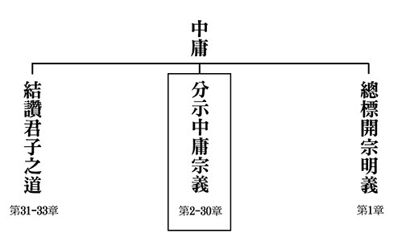

## 藝術賞析

### 孔門七十二賢淺說（三十三）—壤駟赤

圖/江逸子 文/時哉

布衣不妨人高貴

出路名利非選項

胸中江河待明君

人生樂趣在法喜

壤駟赤，姓壤駟，名赤，字子徒（孔子家語稱作穰駟赤，字子從），春秋末年秦國人。

秦祖、壤駟赤及石作蜀，遠自秦國前來向孔子問學，又能名列七十二賢，因此三位賢者號稱隴上儒學賢，亦稱隴上三儒。壤駟赤在學習上喜好發問請益，《論語》上說「不憤不啟，不悱不發」，大叩大鳴、小叩小鳴，壤駟赤善問善學，是位以詩禮修學有成的學者。詩者，是人情的極致，上通天文，下達山川萬類，乃至於人文政事，都囊括在內。禮者，體也，道德倫常由之生，壤駟赤就是以詩禮傳家成為楷模。

宋高宗贊辭：「式是壤伯，昭乎聖徒，執經請益，載道若無，詩書規矩，問學楷模，得時而駕，領袖諸儒。」尊敬這位壤伯，在聖廟排在聖徒行列之中，學習經書、向師請教義理，學問一天天充實，但有若無，實若虛，學然後知不足。詩書旨趣用為世間法度，是問學的模範，充實自己待時而顯，為諸儒之領袖。

壤駟赤在東漢永平十五年從祀於孔廟，唐朝追封為北徵伯，明朝嘉靖年間改稱先賢壤子，清朝又稱壤駟子。

畫中的壤駟赤雙手握於前，轉頭目視一旁，神情祥和安定，正直而自然，具有儒者的氣度與風範。

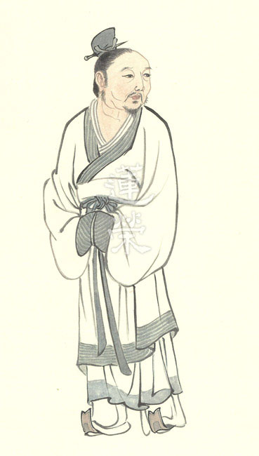

### 孔門七十二賢淺說（三十四）—商澤

圖/江逸子 文/時哉

慨歎賢哲少記錄

後世難從彼學效

學習經教重質地

表裡如一學可成

商澤，姓商，名澤，字子季，孔子家語稱字子秀，春秋末年魯國人。商子季是位樂學知命的高士，在孔子座下為學十分誠懇，為人弘毅正直，他對於詩、書、易、禮、樂、春秋六經都有相當深度而踏實的學習，通達六經要旨。

孔子逝世後，商澤設私塾教授生徒，春風化雨，德澤廣施，受時人推崇。

宋高宗贊曰：「邈矣子季，睢陽是伯。屏息受業，延教登席。未踐四科，固涉六籍。祀典載之，好是正直。」時代久遠的子季，受封為睢陽伯，戒慎恐懼地接受教導，受請登上杏壇教化諸生，雖不是孔門十哲，但涉獵通達六經。在祀典有記載，子季是正直之士，所學言行合一。

商澤在東漢永平十五年從祀於孔廟，唐代追封為睢陽伯，宋代加封為鄒平侯。明朝嘉靖年間改稱先賢商子。

畫中的商澤以一手指著另外一手的手掌，似乎正在教授弟子，把道理釋清楚，對應他以涉覽六籍為樂。

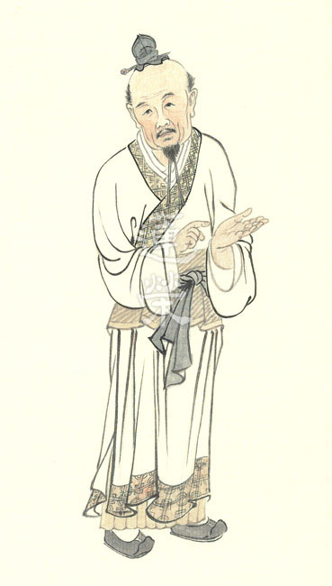

### 華夏精魂千秋（三十一）—明倫史畫　孝悌傳家　王祥與王覽

圖/江逸子 文/淨域

處在亂世難進退

保全孝悌立人格

出處難為權變智

更是佩服孔子眼

史畫

王祥，字休徵，魏晉時期徐州瑯琊郡臨沂縣(今山東省臨沂市)人；生於東漢靈帝中平二年，卒於西晉武帝泰始四年(西元一八五-二六八年)。王覽，字玄通，祥之異母弟，比祥小二十三歲，為名書法家王羲之五世祖；生於東漢獻帝建安十三年，卒於西晉武帝咸寧四年(西元二○八-二七八年)。

王祥早年喪母，既失愛於父，又受後母朱氏虐待。然而父母有疾，則衣不解帶親侍湯藥，甚至臥冰求鯉以奉母。王覽生性孝悌，自幼見兄被母所虐，每每挺身保護。王祥在鄉里有聲譽，朱氏更加嫉恨，便密謀以毒酒害他。王覽直接將酒奪來，王祥知道有異，兩人相爭不讓，朱氏見了便一把打翻。日後凡是飲食，王覽一定先嚐，這才打消朱氏謀害之心。

東漢末年戰亂不斷，王祥帶著繼母和異弟到廬江避亂，隱居二十多年不仕。西元二二○年，曹丕篡漢為魏文帝，以呂虔為徐州刺史。繼母朱氏去世後，始應呂虔之徵任徐州別駕(刺史的佐官，相當郡丞)，他除了治民教化外，也協助討伐盜賊，使得州界內一片安定。

黃初六年(二二五年)，文帝東征孫權，利城郡(今江蘇省贛榆縣)士兵作亂，太守徐質遭殺，呂虔平亂有功，封萬年亭侯。曹叡即位為明帝，呂虔推舉王祥為茂才(即秀才)，出任溫縣(今河南省溫縣)令，後遷任大司農(掌財政)。

正元元年(二五四年)，十四歲的高貴鄉公曹髦即位，祥因參與司馬師「廢曹方立曹髦」的計畫，獲封關內侯，官拜光祿勳(掌衛侍)，後轉司隸校尉(洛陽軍事首長)。次年，隨司馬師討伐鎮東將軍毌丘儉與揚州刺史文欽之亂，封萬歲亭侯，遷任太常(掌儀禮)。曹髦入太學，祥被任命為三老，帝王之師。

甘露四年(二五九年)，曹髦殺司馬昭不成，被賈充指示成濟刺殺，王祥涕淚哭說：「老臣無狀」，令眾臣面有慚色。元帝景元元年(二六○年)，升任司空(掌御史)；咸熙元年(二六四年)任太尉(掌軍事)，加侍中。西元二六五年，司馬炎稱帝，為西晉武帝。拜王祥為太保，進封睢陵公；召王覽為宗正卿(管皇族)，二人以孝悌傳家，後世多出賢才。祥年老多次乞求退休，武帝仍欣賞倚重，下令留職帶俸居於府中，命長子王肇為給事中(出入宮廷)。泰始四年(二六八年)四月，王祥病逝，享年八十五歲，弔唁者無一閒人，宗族王戎說：「太保可謂清達矣！」

圖解

元人所編《二十四孝》中有「臥冰求鯉」一節，此乃出自《晉書．王祥傳》所載。傳云：「母常欲生魚，時天寒水凍，祥解衣將剖冰求之。」眾知後母對其嫉惡，寒冬後母欲食魚，王祥只得往河邊尋魚。然而天寒地凍，必要破河冰始能捕之。又冬衣厚重不便行動，故而要寬解衣服而剖冰。《晉書》所述平實，而《二十四孝》取材復添油加醋，便將《晉書》中第一傳的王祥，型塑成孝心感動天地的「臥冰求鯉」。

王祥確實孝親友弟，故而能受薦舉大用，乃至位居司空、太尉，加侍中、太保，封睢陵公。江逸子先生繪王祥、王覽孝悌之行，何以棄耳詳的「臥冰求鯉」，而就「酒菜先嚐」一節呢？蓋是「求鯉」之臥冰言過其實了，而「毒菜」之孝悌卻恰如其分。圖中後母於酒菜中下毒，躲在屏風後偷看好戲，不料親生子王覽知母異心，一方面為保護哥哥與之共食，另方面也讓母親知難而退。如此幾回下來，不僅讓兄弟的感情更好，也讓後母打消了害死王祥的念頭。

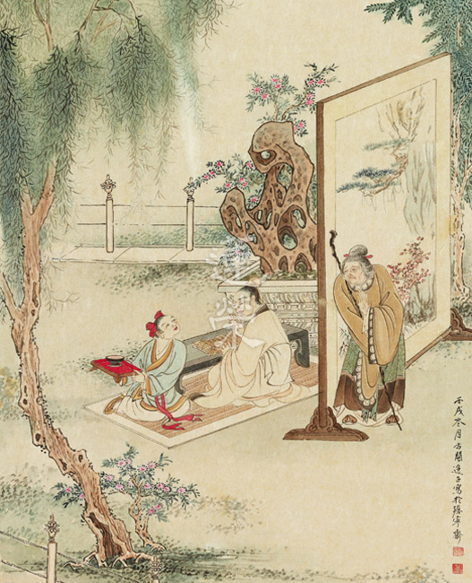

### 道藝春秋（三）人文始祖　神農氏

*圖/江逸子 文/編輯部整理*

中華文明的貢獻

歷史長河的光芒

草藥農業的起頭

遊牧生活的結束

神農氏是農業的發明者，西洋的農業發明大約是在一萬年前，中國的農業發明是在五六千年，中國比西洋的文明慢了大約四五千年，可是後來居上，這要感謝這些道統人物，早期先人是狩獵採集，常常有一餐沒一餐，因而產生幾個問題，一是不容易生存，二是常有一些生病的併發症，三是因為食物取得困難，所以人口有限度，容易夭折。故改變人類的生存方式非常重要，神農氏最大的貢獻就是讓人們從狩獵生活轉變成農耕生活。

文化跟文明不一樣，文化指思想的演變，文明更挾帶著生活方式的演變，生活方式沒有改善，則文化不能推展，換句話說，文明是刺激文化發展與延續的方法，早期人們的生活方式是很原始野蠻的，生存不易，人口不能繁衍，所以神農氏對中華民族的貢獻實在太大了。農耕使養活的人口增多，又因為需要大量人力耕田，也促進人口的蔓延。

「炎帝神農氏，姜姓。母曰女登。有媧氏之女。為少典妃。感神龍而生炎帝。人身牛首。長於姜水。因以為姓」，神農氏的母親因感應神龍之氣而生下他，相傳神農氏是人身牛頭，其後的蚩尤，還有現在貴州苗寨所拜的祖先都有牛角，其實就源自於神農氏的頭型。江逸子先生畫的神農氏，頭兩側突起，中間凹陷，來表徵神農的牛首特徵，其左手握著翻土的工具，叫做「耜」(音同四)，也就是當時所用的石器，「耒」是上面木柄，用麻繩捆起來，相貌好似現在吃西餐的叉子一樣，其實是翻土的工具，是神農氏的發明，此器物能夠翻土、播種。

畫中神農氏的手孔武有力，腹部肌肉結實，雙腳踏實穩重，其實江逸子先生除了善畫國畫、山水、花鳥外，他的人物畫是非常厲害的，也曾經學習畫西洋人物，有畫模特兒的訓練，所以能把人的肌肉線條、人體比例都抓得恰到好處，國畫裡畫人物是畫家最難處理的，江先生不但能夠處理人物問題，還善於處理人物喜怒哀樂的表情，各個不同。

神農氏的左手象徵中華文明的進程，右手說明他是嘗百藥的先祖，各行各業都有祖師爺，農業的祖師爺就是神農氏。江先生特別畫他的右手持著如靈芝般的珍貴藥材，象徵神農氏親嚐百草，在那樣的時代，神農氏嘗試身邊所有的草類，分辨記述草的味道以及作用，是很偉大的創舉。百草只是個範圍，實際神農氏所嚐的數目應該遠遠超過。他曾經一天嚐過七十毒，也就是中毒七十次，都以茶葉作為解藥，茶葉是中國最早的中藥，它讓人心曠神怡、精神爽朗，茶葉後期又發展出娛樂的內涵，文人相聚飲茶喝酒，喝醉酒時茶也能解醉。禪宗裡還有雲門餅、趙州茶，趙州禪師逢人都說喫茶去，吃茶最能提神醒腦、讓人開悟，而茶的祖先就是神農。

採取中藥都要跋山涉水，到窮山惡水裡遍尋、遍嘗，危險重重，要面對洪水猛獸的攻擊、蛇蠍的攻擊，有時候攀爬岩石，還可能跌傷，還有飢餓的問題，過程非常辛苦。我們在讀到賈島的〈尋隱者不遇〉「松下問童子，言師採藥去，只在此山中，雲深不知處」一詩時，除了體會詩的意境很優美外，其實背後充斥著辛苦、辛酸，在荒山野地裡可能會迷路、被猛獸攻擊、失足遭遇不測等，萬分危急。所以看到神農氏一圖，給我們很多的想像空間。

《神農百草經》就是以神農氏命名，因為所有中藥的延續發展是由他來，不管是寫了《傷寒論》的張仲景，或是唐朝的孫思邈，這些草藥的發明延伸，通通是以神農氏作為源頭。畫家在畫此幅作品時，不但講究神農氏的造型，還包括他所處的環境、握持的農具、把玩的藥草，都在彰顯他對文明的貢獻，以及他不畏環境的艱難，有著膽識過人的勇氣。

觀此幅畫作時，我們要看到的道統源流的本質在利他，要體會先祖的功德，產生尊崇，才能夠走入畫家所畫的內涵。

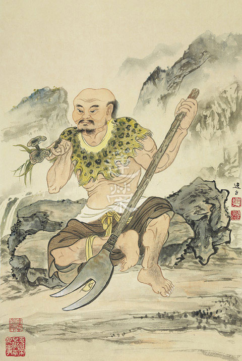

## 活動報導

### 自己的世界自己創造

*文／編輯部彙整*

士心畢業送大禮

創造世界在心靈

打造能力在認知

共中不共真未來

國小邁入國中是一個重要的轉換期，孩子們將告別稚嫩的童年，通往課業繁重的國中生活，踏入煩惱的青春期，在這青黃不接的階段，如果有人可以適時的提攜引導，對迷惘或是具有衝勁的小學畢業生將是一大助益。

週六啟蒙班士心班有六位小學畢業生，為了把握他們畢業典禮到放暑假前的精華時光，學會為這群孩子量身打造了五天四夜的課程，興辦【自己的世界自己創造】營隊，期望五天的學習，學生能構築出自己的世界、自己的故事、自子的價值觀，培養好奇心、國際視野，善於交友、掌控情緒，善於思考、動腦。

每日的晨間交流，林老師會與孩子們就不同的主題討論，諸如「自己的世界自己創造」的種種可能性，人生有標準答案嗎？如何找尋最佳答案？只要我高興、我喜歡可不可以？偷個懶比較好嗎？請用更多的形容詞形容你所見（名詞）、請用更多的副詞形容你的行動（賦予意義）等等，希望孩子們發現因上努力的可貴，人生方向盤其實掌握在自己手中，所謂不作不有，作已不失，功不唐捐。期許他們發揮想像力開啟新契機的扉頁，提起彩筆增添生活的色彩，跨出步伐增加生命的強度，自己的世界自己創造。從第一天孩子寫下乏善可陳的「自己理想中的生活」，經過五天課程的激盪後，他們寫下了讓人激賞的「現階段重要的十件事（或更多）」。有些孩子振筆疾書，有些孩子鄭重其事，希望暑期生活開始，能把這次所學的觀念及他們的心願帶到生活中實踐。

這五天林老師還安排了晨讀小篇幅的《聲律啟蒙》，《聲律啟蒙》按韻分編，包羅萬象、天文、地理、花木、鳥獸、人物、器物等都含括在內。從單字對到雙字對，三字對、五字對、七字對到十一字對，聲韻協調，孩子們琅琅上口，念著念著就背起來了，最後一天也與師資群一同上了林老師的聲律啟蒙課，其中音律優美、典故繁多、有趣好玩，可設計為日後的啟蒙或營隊課程。

大多數的課程都在室內進行，晨走時間便顯得彌足珍貴，即便孩子們睜著半醒的眼神、拖著緩慢的腳步，去中正紀念堂、臺大等地活絡筋骨，徜徉於美好的環境，對一整天的學習有莫大的幫助，也添加了麥當勞早餐及品味臺大冰品，提升滿足感。

每日傍晚會有動動腦時段，帶領孩子們大開腦洞，打破框架，開拓新思路，質疑我們不曾想過事情的原因、探究跟我們密切相關的主題。

此次課程安排多元豐富，由幾位老師共同擔綱，以下一一介紹每位老師精彩的課程。

史多瑞的魔幻與真實  陳幸汝

這三天裡以兩百八十分鐘跟同學們分享了以下內容，後文會有更詳細的介紹。

１、文字增胖術 --學習以更完整的句型描述人事物。

２、說一個好故事：以靶心人公式帶領學生嘗試清楚、簡要地說一個故事、介紹一本書。

故事試寫：海明威的" For sale: baby shoes, unworn"或 「今天我又向媽媽介紹了一次我自己」

３、閱讀的四層次提問法：文章選讀--古劍。

４、從螞蟻--蜘蛛--蜜蜂，被動式-主動式-創造式三種學習法。

５、以冰山理論認識文章中的角色變化--文章選讀：一片葉子　（The last leaf）

６、培養人際關係的秘訣

生活儀式感　唐微智

試問人們為什麼要跨年、為什麼要過生日、為什麼要辦婚禮、為什麼要有畢業旅行、畢業典禮、為什麼要有喪禮等等，我們可歸結出一個答案—人是需要儀式感的動物。

新年的煙火倒數、過年的張燈結綵、活動的剪綵儀式等，不光具有代表性，還有一定的渲染作用。它會影響一個人的心理、情緒、情感，行為，由內而外帶給自己不同的想法、不同的體驗，而使生活過得更有格調、更有滋味。

《小王子》一書中，小王子第一次遇到狐狸時，狐狸告訴他，相識是需要一定儀式的，這很重要。伴隨著儀式，很多無關緊要的東西就會被賦予意義，使生活開始有了期待。狐狸對小王子說：「如果你每天都在下午四點鐘來，那麼在三點鐘的時候，我就會開始高興。隨著時間過去，我會愈來愈開心。到了四點鐘，我就會開始躁動不安，我會發現快樂的代價！但如果你來的時間不固定，我就永遠不知道該在什麼時候培養情緒…儀式是必要的。」「儀式究竟是什麼？」小王子問道。狐狸告訴他：「它就是使某一天與其他日子不同，使某一時刻與其他時刻不同。」

儀式感可以是全人類的共許的，也可以是家庭的、個人的。村上村樹說：「儀式是一件很重要的事。它讓我們對在意的事情心懷敬畏，讓我們對生活更加銘記和珍惜。」了解儀式感的意義，接著便教同學們如何建立儀式，建立的方式是在固定時間、(固定地點)、固定步驟，做容易重複的事情，儀式結束後能恢復能量或平靜。舉例來說，固定在早晨七點醒來，伸個大大的懶腰，向鏡子裡的自己微笑，這麼小的事情都可以是儀式，開啟美好的一天。我們可以就著一天中幾個時段設置屬於自己的儀式感，像是一大早、傍晚、睡前，幫助我們在不確定的生活中，種下幾枚確定的因子，使我們更大膽，更能航行於起伏多變的生活中。

儀式感讓我們找回生命主控權，「把將就的日子過成講究的日子」。

認識自己的情緒　唐微智

青春期的孩子，個體發育逐漸成熟，面對急驟的生理變化，心理會產生成人感與半成熟間的矛盾，渴望受到信任與尊重，渴望獨立自主，心理既開放又封閉，成就感與挫折感交替，再再都會讓他們的情緒更加強烈、大起大落，故認識情緒、與情緒共處對即將轉大人的這群孩子格外重要。

以電影之夜《腦筋急轉彎》揭開了情緒的序幕，利用電影中五個情緒角色帶領孩子們討論人的基本情緒，及探討有情緒到底是好事還是壞事？人格修養到達極致的聖人也會有情緒嗎？得出情緒沒有好壞，依著情緒而產生的行為才有好壞的結論。

除了基礎情緒外，人的情緒是複雜糾結的，課堂中請學生列出他們所知的情緒，會發現負面情緒比正面情緒多，而我們不需要壓制自己的情緒，不必擔心自己會陷入情緒的漩渦，因為情緒的本質就是不持久。我們要學習的就是如何與情緒共處，首先要能接納情緒，並用一些生理輔助急性情緒下降，例如深呼吸、散步等，再來要試著理解情緒、消化情緒，辨識出自己真正的情緒，有可能以為自己在生氣，分析之後才發現是忌妒，或是委屈。辨識出自己的真實情緒，才能調控情緒，給予情緒真正的需要，做出恰到好處、合理的或是想要的行為。

而《腦筋急轉彎》這部片除了探討情緒外，涉略的概念也非常廣，例如人格、記憶、童年、耳蟲、潛意識、夢境等議題，也在課程中與同學們分享。

交友力—友誼停看聽　白文輝

有研究報告顯示，當青少年遇到困難時，會先找朋友商量的人最多，其次才是父母，可見朋友在青少年心目中非常重要。此外，隨著年紀的增長，朋友對一個人的健康和快樂將越來越重要，甚至會超過家人。因此，有必要盡早了解自己的交友觀，適時適度的調整，以利人生道路上能獲致友誼，自己也能成為他人身邊的益友。

課程中透過簡報、歌曲、動畫影片、學習單等，鼓勵動腦思考，討論及分享，藉由交友狀況的自省，探索自我，整理出個人交友觀，例如：交友的好處、朋友的定義、朋友對我來說像什麼、維繫友誼的小秘訣、最容易傷害友誼的行為、認識朋友的管道和場合、父母對我的叮嚀，以及怎麼樣才算得上是朋友？身為一個朋友，我覺得自己做過很棒的事情？在與別人當朋友時，我應該要再注意和改善的是什麼？

除此之外，一般人認為的超級好朋友，經常具備以下條件：我能自在的說出想法、可以開玩笑、功課或能力好、我和他無話不聊、經常一起行動、和我很要好。然而，我的朋友都符合這些條件嗎？這些條件都是正面的嗎？如果沒有適度拿捏掌握時，會發生什麼問題？比較實際的交友條件是哪些？在和朋友相處時，我覺得朋友認為我是一個怎麼樣的人？我的交友觀念中，哪些會讓我和朋友建立良好的友誼？哪些會讓我無法交到好朋友？哪些可能會讓我陷入危險的情境中？經由尋找超級好朋友的活動，以一連串的問題，體認不合理的交友觀對自己的影響。

最後，從影片反思，價值澄清的活動中，檢視自身交友觀的合理性，藉此破除一些容易造成衝突的交友迷思，培養自己在交友上應保有彈性，用正向的態度去經營人際關係。用同理的方式體會他人的感受，並修正自己的交友模式。

好奇心的素養、國際觀有什麼用？　戴于山

這堂課的目標，是引領孩子們：（一）學習覺知、感受與表達的差別；（二）認識好奇心的定義與重要性；（三）辨別對好奇心培養的錯誤說法；（四）了解保持好奇心的方法。

課程主要參考伊恩‧萊斯里（Ian Leslie）《重拾好奇心：讓你不會被機器取代的關鍵》一書，書中的一些例證以及理路的分析，藉由課程帶領孩子一起思考。

「國際觀有什麼用？」這堂課嘗試從另外的切入點，進入對國際觀的理解，即：「國」（國與國）、「際」（之間）、「觀」（要怎麼觀察、怎麼關心），進一步嘗試結合《大學》的八目，探索：自己與世界（從我與國，談齊家、治國、平天下）、自己與他人（從我與際，談修身功夫）、自己與自己（從我與觀，談格物、致知、誠意、正心）。重點是如何從自己到世界，達到相互協作、和諧共處的目的。而關心生活、關心世界的格言，就是明代顧憲成先生說的：「風聲，雨聲，讀書聲，聲聲入耳；家事，國事，天下事，事事關心。」

佾舞體驗課程　賴明貞

此次活動適逢學會團練八佾舞，便趁此難得的機會邀請同學們見習，並為他們解說內涵及實地演練。

一、佾舞簡介

１、論語出處：八佾第三

孔子謂季氏：「八佾舞於庭，是可忍也，孰不可忍也？」

２、與其他舞蹈的不同之處

（１）佾舞的含意：

「佾」的意思就是「行列」，「佾舞」就是一種行列整齊的祭祀舞蹈，相傳起源於周公，是古代最隆重的祭祀所使用的儀式。現今還能夠看到佾舞的場合，是祭孔時的釋奠禮。在釋奠禮中採行佾舞這種最隆重的祭祀儀式，代表後世對孔子至高的尊崇。

（２）功能／作用：祭祀舞蹈

（３）對象： 孔子或神明

（４）內涵：

融合禮、樂、歌、舞於一體，佾舞的動作本身隱含禮的意涵，樂曲則是中正平和的宮廷雅樂，樂曲譜有歌詞，四字一句，一字一個動作，共四言八句32個字，內容在稱揚讚歎孔子的功德。

（５）表演者：佾生

佾生最初是由貴族士宦人家的子弟擔任，佾舞也是當時的官學生的必修教養。除了良好的出身背景之外，還必須儀表出眾才能擔任。在臺北佾生則是先由大龍國小的學生來擔任。

（６）舞器

跳佾舞時，左手橫拿籥在內，象徵平衡，右手直拿翟在外，象徵正直。籥是一種竹子做的樂器，主陰，外型跟笛子相仿，象徵聲音與和諧。翟是用雉尾羽毛作成的飾物，主陽，象徵外在合於禮儀的容貌。籥翟結合，體現了陰陽和諧的天地秩序。

（７）智慧教學：隊伍分東西兩班動作相對，但教授口令卻是統一的。

（８）體力鍛練：看似莊重平和的動作，跳完卻是大汗直冒。

（９）教育意義

周公制禮作樂以來，佾舞就是人和神溝通的舞蹈，由於是表演給神明看，首先要求眼神不外視，彷彿神就在心中；佾舞其實也是自己與內心的對話，是內省的過程，不受他人影響，可以讓學生學會自制及專注力。佾舞也蘊含了儒家理念的文化傳承。

二、示範「揖讓謙辭」動作

三、影片欣賞｜二○一○年 台北孔廟 祭孔釋奠習儀

四、佾舞體驗

實際演練佾生的動作，包括學習抬腳、跨腳、點腳、曲腳等基本步伐，以及起式和初獻禮第一式的動作。

透過佾舞課程，讓孩子們了解佾舞的意義、動作，是難能可貴的體驗。

桌遊之夜　潘秀鳳

夜晚的課程也豐富有趣，有楊滿郁老師帶來的合唱之夜以及《夏綠蒂的網》經典名句導讀，也有歡樂的電影之夜及桌遊之夜，桌遊選擇玩演化論，演化是升上國中一定會接觸到的生物相關課程，此桌遊的知識性很強，他還有擴充版，挑戰更加複雜，難得的是孩子們配合度高，成功合作贏過老師，大獲全勝。

除此之外，還玩了「聖托里尼」，規則簡單易學，但是要花心思，此遊戲有基礎版，也可加入卡片改變規則產生不同的變化，孩子們認真投入的程度實在值得讚賞，遊戲本身驚險萬分也讓人有很好的遊戲體驗。

「物競天擇，適者生存」是達爾文演化論當中的經典名句，「生存下來的物種不是最強壯，也非最聰明，而是最能夠適應改變的。」遊戲中的互相合作和自我保護，讓彼此情誼加厚，在面對越來越複雜的世界，如何讓自己雖蠻貊之邦行矣？面對更艱深的課業、情緒不定的青春期，合作、共生可以保命，必須具備讓自己更強大的特性，舉凡巨化、銳目、穴居、斷尾等求生存的技能，好好思考如何善加運用，演化成更有智慧力的大人，成為一個連自己都喜歡的大人。

讓身體與心靈共同成長　蕭惟元

擔綱了某一天的動動腦時光，對應當日課程的主軸「認識你的情緒」，安排了幾個問題討論，讓同學們動腦思考，期望能在研討對答當中，找到讓自己保持積極、樂觀、不怕困難的方法。對於一位即將面對國中生活的小學畢業生來說，未來的不確定感，可能會帶來很多情緒上的起伏；生理上轉入青春期，同時也會引發心情上的化學變化，這樣的改變，絕對是一個人在成長過程中，升級或沉淪的關鍵時期。

問答討論的主旨，在於讓同學們了解，心情的調適與情緒的掌握，可以讓人突破各種挑戰，不只是小學升國中的挑戰，還包括未來各類各樣的成長與轉變，都看自己如何用心。從經典上看，孔門的弟子顏淵，曾受到孔子高度的讚歎，顏淵生活在一般人不能忍受的陋劣環境之中，他還是能夠不改自己內心的快樂；從今日現實生活中看，有許許多多成功的企業家，都是因為善於提起自己的心力，所以能將自己、將企業，帶往更高的層次、更好的績效。

研討的具體問題為：

１、心與身體有著什麼樣的關係？

２、人的心力到底可以多強大？

３、如何才能把心力一步一步地提升起來？

這是三題非常有趣，而且非常有意義的問題。藉由問題的思考，找到自己生命中源源不絕的動力，自己的世界，真正能夠自己去創造。

以上便是這次營隊的課程簡介，更詳細的幾門課程內容請見後文。

這次大概是學會有史以來辦過最小的營隊，可謂前無事例、後或無來者，縱然小型，師資們還是全力以赴，期望為孩子們搭建升上國中最好的橋樑，五天過後，孩子們長出隱形的翅膀，帶著滿滿的祝福，飛向新的里程碑。

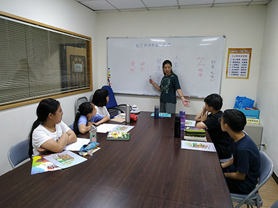

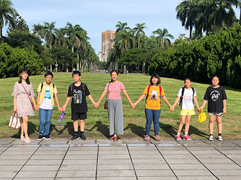

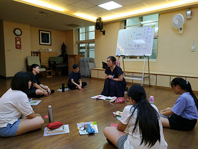

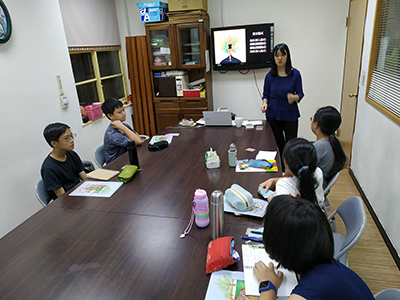

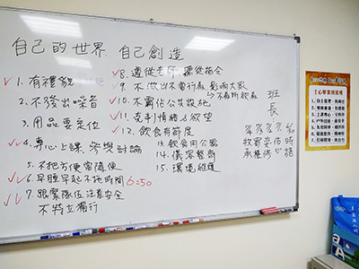

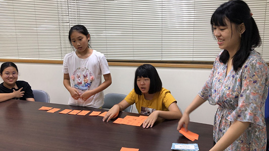

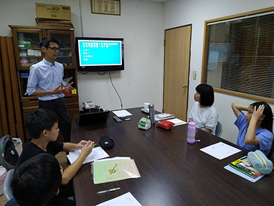

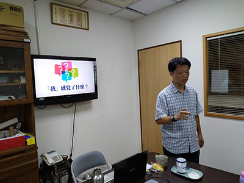

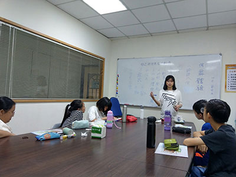

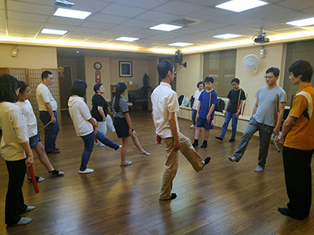

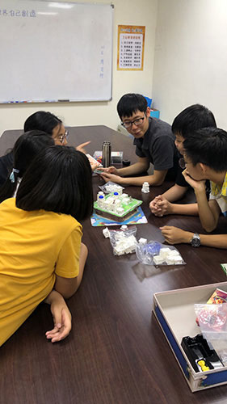

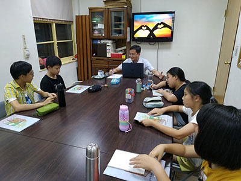

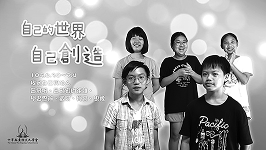

### 自己的世界自己創造 學員心得

*文／編輯部彙整*

打破框架學習樂

重新建立世界觀

五天四夜一晃眼

鵬程萬里高飛去

世界還是有希望的　黃時語

「這個世界，沒救了。」一開始的我，想要放棄這個世界。因為現在疫情嚴峻、海平面上升、自然資源被破壞等，這些都讓我充滿絕望。不只是環境破壞、氣候異常等問題，還有掌控國家的貪官污吏在動手腳，這些都讓我對這個世界充滿絕望。

來這個營隊前，我覺得很麻煩，因為中間會遇到一個學校的重要考試，無法全程參與課程，但我沒想到，短短幾天下來，能改變我對這個世界的看法。

不知從哪節課開始，我竟然對這個世界漸漸有好感，也漸漸改觀。一開始我也想試著做些什麼，或學習什麼，盡一點力、做一些改變，但後來也發現這是靠一己之力無法完成的。「每個人都有可能改變世界」，我上完這幾堂課後，終於導正我的觀念，對這個世界抱持希望。

原本，我厭惡世界的觀念，沒有一個大人能真正導正我的想法，但在上完這幾天的課程後，我終於了解我原本觀念的錯誤之處，也很慶幸能來上課，謝謝各位老師辛苦的教導！

五天四夜的學習　廖宥橙

畢業後，我報名了學會辦的夏令營，因為我參加過上一次學會辦的夏令營，感到非常有趣，所以也來到了這一次的夏令營。一進到學會，我便感到緊張，無所適從，跟著老師上五樓的房間，熱的感覺像個烤爐似的！接著便展開了這五天四夜的學習之旅。

結束了前四天的行程，我非常的慶幸自己有來這個課程內容既豐富又有趣的營隊，課程的內容非常的多元，有閱讀方面的，交友方面的，儀式感方面的等等…。並且內容充實，授課方式也很有趣，完全不會讓人失去想要認真學習的動力。

這次課程中，最大的收獲就是要如何管理自己的情緒，這對我來說非常的有幫助！管理情緒是人生中的一件大事，這對交朋友等方面非常有幫助！

我的心情　孔佑心

六月三十號，我帶著期待卻又生氣的心情走進了無盡燈文化學會參加夏令營。這不是我第一次參加學會的夏令營了。上一次的夏令營很有趣，可是這次我必須放棄跟同學出去玩的機會。不過既然來了就得認真，不能有任何損失。

從一進到上課的教室，我就抱持著要有很多很多的收獲回家。從史多瑞的魔幻與真實到儀式感生活、交友力到夏日詩歌夜、桌遊之夜到八佾舞體驗。種種的課程，都為我增添了不少的知識。到了晚上，我和邱弈修一起聊天、一起做運動，一起抹乳液，最後一起睡覺，這些也都是很寶貴的回憶。

上課時我總有點昏昏欲睡，但是都會被自己的心志叫起。這些都將成為我的—長期記憶。

沒有標準的世界　劉牧承

畢業後，我度過了一星期無聊的暑假，因此參加「自己的世界，自己創造」營隊 。

來到這裡的第一堂課，就面對回答許多問題的考驗，沒想到我的大腦從這一刻開始，變得比以前更加靈活，面對多數的問題，都能有源源不絕的想法，這是令我最開心的成長。這五天我們上了很多的課，但我最喜歡的是好奇的素養和國際觀有什麼用，這堂課裡的問題在所有課程裡數一數二的多，我們學到一件很重要的事「沒有一個標準答案」，這也更讓我覺得來學會學習是多麼幸福的一件事。平常在學校上課，課本裡總是有一個標準答案，讓學習成為一件很死板的事，我覺得這樣的方式讓大腦無法常常思考，因為自己不會出現「為什麼」，但這兩堂課老師讓我們盡情的思考，如果換個角度，是不是就能看到新的東西，就像我們永遠只能看到月球的一面，所以我們認為月球只有這樣，但看到背面時，我們就會知道換個角度能看新的東西。

過了五天，看似很長卻又短暫的時光，雖說短暫，卻帶著豐富的知識離開。

### 自己的世界自己創造課程—史多瑞的魔幻與真實

文／陳幸汝

閱讀素養寫作力

多看多寫多商量

學習層次當如蜂

採得百花轉成蜜

北宋文學家歐陽修說：「文有三多：看多、做多、商量多。」

看多，就是多閱讀。做多，就是多練習寫作。商量多，是指看別人的文章時要有辨別力，自己的文章也要虛心求教，知道自己的缺點所在。

而這就是一○八課綱中最強調的「閱讀素養」所需具備的能力。

在這次的活動中，設計了「史多瑞的魔幻與真實」課程，目的就是要帶領學生把握時間多閱讀多寫作多商量。下手處則是從每個人都喜愛的故事入手。

聽故事，可以拉近人與人的距離。

讀故事，可以讓視野更寬廣。

說故事，可以訓練溝通能力。

寫故事，可以培養表達力。

想故事，可以開發創造力。

《史多瑞的魔幻與真實》就是奠基在從聽故事、讀故事、想故事、說故事、到寫故事的一連串過程。

在課程的一開始，先帶孩子們翻開記憶庫，從時間到空間，從事件到畫面，然後再讓他們用詩化的語言形容當下的自己：

--我像在森林中探險的旅行者，準備面對挑戰。

--我像沙漠中的商人，雖然有水有食物，卻感到迷惘找不到方向。

--我像大海中的小魚，幸福卻沒有方向。

--我像暴風雨中找不到方向的小船。

--我像天空中的老鷹張開翅膀，準備飛翔。

孩子們說出了處在人生第一個轉變期的狀態，有的人對未來感到迷惘，但有的人已經準備好要迎向未來，同樣的是，他們都感受到自己在廣大的天地間的渺小。而他們每一個人的自我形容都已具備成為一個故事的雛型。

緊接著進行「語言的增胖術」，孩子們共同打造了一個關於架著紅色跑車的富商和一個駛著黃色車子的人的故事。再利用這個隨機共構的故事說明世界上百分之九十九的小說、影劇都通用的靶心人公式。

在第二天的課程中，除了讓孩子們以能迅速理解故事的靶心人公式介紹自己想介紹給大家的讀物，並讓他們以靶心人公式寫一個故事。

故事的題目有兩個：

１、今天我又一次向媽媽介紹了我自己

２、出自諾貝爾獎得主海明威的「代售：未穿過的嬰兒鞋」 (For sale: baby shoes, unworn.)

有孩子道出青春期前後的孩子的成長與變化：

今天我又向媽媽介紹了我自己，可是媽媽總是認為她是全世界最了解我的人。但我卻說：「新的一天就是全新的自己，所以往後的每一天，我都要向媽媽介紹我自己。」

也有孩子發揮想像力，寫出海明威六個字背後隱藏的故事：

有一個窮婦人，她一直在做嬰兒鞋。

幾年前她的孩兒一出世就染上嚴重的疾病，無力回天。這讓婦人受到重創，也因這樣，讓原本無依無靠的她開始出現幻想、神智不清的狀況。她的孩子過世後，她就常常坐在窗邊喃喃自語，縫製嬰兒鞋。嬰兒鞋愈堆愈高，婦人的食物愈來愈少，所以她決定賣她的嬰兒鞋，但她神智不清的時間也越來越長。所以，據我所知，她現在還坐在窗邊縫製嬰兒鞋。

在讀故事的部分，我們選讀了臺灣作家葉言都的短篇小說《古劍》和美國作家奧亨利的《一片葉子》。以此進行下列兩種思考與討論：

１、學習的三個層次：

分析英國哲學家培根提出來的學習的三個層次：螞蟻、蜘蛛和蜜蜂。

螞蟻總是勤勞地儲存食物，不分好壞。

蜘蛛會吐絲結網，在架構中有效過濾適合自己的食物。

蜜蜂則是會講採得的花蜜貯存、轉化為更可口、營養更豐富的蜂蜜。

多數人的學習像螞蟻，貯存知識卻不懂得分類與轉化，屬於被動式學習。有一部分人會有效截取有用的訊息進行統整、組織、解釋，是主動式學習。少數人學思並用，會思考、轉化知識，提出觀點，這是屬於創造式的學習。

２、基礎的四層次提問法：

６Ｗ提問( When、Where、Why、What、Who and How)

引發感受的聯想(你喜歡… 你想到…)

提出自己的看法 (例如：作者想表達的是…)

產生行動 (我學到…)

閱讀故事的課程中嘗試帶領孩子們能從文本中擷取重要的訊息、統整文本出現的概念並加以解釋、與提出看法及說明。

在兩百分鐘的《史多瑞的魔幻與真實》課程中，我們和孩子們經歷一段故事的旅程，在這個旅程中，希望他們能張開感官，聆聽故事、閱讀故事、想一個故事、寫下故事到說出故事。

故事的閱讀力，讓我們可以吸納各種知識。

故事的想像力，讓我們可以享受飛離地球表面的快樂。

故事的寫作力，讓我們學會記錄這個世界的喜怒哀樂。

故事的溝通力，讓我們可以傳播美好的價值、偷渡正確的知見、並且有機會改變他人、改變世界。

### 自己的世界自己創造課程—動動腦時間

文／孫珮茹

開發生命潛能

思考定義訓練

善交朋友切磋

自律帶來自由

此次營隊，每天都會有半小時至一小時的時間帶領孩子們動動腦，思考學校不會教，但是生活一定用得到的有趣課題，以下簡單分享末學與孩子們一起動腦的發想。

動動腦時間（一）

一、做事前，會先怎麼做？
在「動動腦時間」的一開始，讓孩子們先想想：自己做一件事情之前，通常會先做什麼？大部分的孩子都回
**答：** 先思考怎麼做、做的方法、後果如何……。就如同我們喝水是因為知道口渴，打電話報警是因為知道有緊急狀況，自己無法處理。如此說來，我們是否應該先知道為何要上學，再決定要不要上學，這樣比較合理呢？五位孩子們認真的想了幾個理由—義務教育、為了學習知識、成為有用的人、交朋友……，大家會發現這些理由可用兩個字含攝—「學習」。

二、上學的重要性是什麼？

推導出上學是為了學習，再引導孩子們思考上學最重要的學習是什麼？學習如何「學習」的方法，並在學習中發現自己才能與興趣，找到自己的想法和想做的事，無論將來想從事什麼職業，都需要學習相應的教育，即便在學習過程中遇到種種挫折，可能看不懂、考不好、學得吃力、被比較、人際關係不理想、還沒找到興趣……，也能在失敗過程中學習突破的方法與創造無限的可能。

像是麥可‧喬丹曾說：「高中時，我曾被籃球校隊拒絕，在我的籃球生涯中，我的投球錯誤超過九千次，我輸了三百場賽事，當籃球教練和隊員相信我會投下成功的一球並贏得賽事時，我失敗了。在籃球生涯中，我不停地失敗、失敗再失敗，這就是我現在成功的原因。」

《哈利波特》暢銷全球後，J.K.羅琳從此聲名大噪，但成名之前的羅琳也頻頻受挫。《哈利波特》系列的第一部著作《哈利波特與魔法石》是羅琳在咖啡館內寫成的，她是一位單親媽媽，生活費要靠社會津貼支持。完成首部著作後，羅琳向十二家書商推薦這部書，都被拒絕了，但羅琳沒有放棄，堅持繼續找，終於被一間出版社老闆的女兒看到，才成就了現在一舉登上富人排行榜的羅琳。

三、什麼是「學習力」？

課堂中發現孩子們對於「學習力很強」有不同的認知，到底是「知識很豐富」？還是「學東西很快」？藉此讓孩子們分享自己是否曾主動學會一樣東西，有人說自己學會騎腳踏車、自己學會綁頭髮、還有人說自己在國小二年級時就幫一歲的妹妹洗澡，讓末學非常感動也自嘆弗如。在電腦世界，也有「知識很豐富」跟「學習力很強」的區分。例如電子字典與谷歌沒有辦法辨別任何資料庫裡面沒有內建的訊息，屬於知識豐富；AI人工智慧卻是學習力很強，可以在任何新的狀況，根據過去的經驗跟儲存的知識來做出正確的判斷。所以鼓勵孩子多主動學會和嘗試一樣東西，再面對新東西都能很快學會，因為有過去學習經驗，也可以想想自己在學校的學習經驗，是注重死背知識的學習，還是思考式的學習？

四、什麼是「思考」？

學習思考，從學習「觀察」開始，讓思考不被知識跟技巧取代，尤其不知未來的世界還會出現什麼，若知如何學習，出現新東西都能靠自己主動積極的能力學會。到底思考是什麼呢？

１、不是想像力：真正的思考需嚴謹紀律符合邏輯，將想像的東西實現，是「執行力」的表現。

２、不是想太多：是為了知道「為什麼」，釐清因果關係，並非要知道正確答案，如雞和蛋之理。

３、不是快就好：能立刻回答問題是「機智」，確認每句話是否符合邏輯則是「會想」，兩者不同。

４、不是不決定：思考會想到做事的好處和壞處，凡事有相對性，根據「認知」、「傾向」選擇決定。

５、是學習力：面對問題並不是立刻解決，而是先「觀察」。我們從出生就透過觀察、拆解、判斷、概念的過程理解世界，決定人事物的作用和價值，例如幼兒拿到新玩具，總是先用手抓起來，東看西看之後，還放進嘴裡咬一咬，甚至丟到搖籃外面，看看爸爸媽媽的反應。

五、我應該知道自己以後要做什麼嗎？

當孩子聽到：「美國《人類與機器關係的未來時代》的研究指出，在二○三○年的各職業中，有百分之八十五的職業未被創造。現在的我真的有可能知道、或應該知道以後要做什麼嗎？現在怎麼決定現在還不存在的事情？」現場突然一片哀嚎與無奈……。

如果我十年後最想做的工作，有百分之八十五根本還不存在世界上，現在能做的準備工作是什麼？是否要多元開放的學習新事物？是否要培養觀察和思考的能力？以不變應萬變。

動動腦時間（二）

一、朋友的定義？

「你覺得亞洲人的朋友多，還是歐洲人的朋友多？」這個議題引起孩子們的各種推理和討論，有的人認為歐洲人很開放，又常常辦派對，所以朋友應該很多；有的人認為是亞洲人的好友滿天下。以德國人為例，他們很務實，就連交友也講究實際，一台車出去玩，四人剛剛好；一桌吃飯，四人也剛剛好，彼此可以深談又不無聊，除非其中一人搬到外地或去世，否則不會想交新朋友，所以要打入德國人的交友「小圈圈」，往往「額滿」，加入的過程就像層層面試。芬蘭人也是個很慢熟又獨立的特質，知心好友真的不多，平均二到三位而已。

反觀亞洲人朋友好像很多，五湖四海。但是仔細想想，我們的朋友夠不夠深？夠不夠全面？往往可以聊戀愛話題的朋友，卻不適合談工作；可以一起逛街購物的朋友，不見得能夠與他討論解決問題的方法；朋友家可以借住，但個性很難相處。這些在歐洲人眼中，只是可交往的人，不是好朋友，可見是各國對「朋友」定義不同的現象。那麼，你跟朋友在一起時，可以做哪些事情呢？

二、有哪些朋友可以豐富我們的生命？

引導孩子當個有「四種朋友」的人：

１、「年紀差距大」：長輩能幫助我們理解不同世代之間的思維邏輯，汲取他們的經驗閱歷。

２、「用不同母語」：語言是文化表現形式之一，承載不同文化精神，能拓展理解與包容。

３、「社經歷不同」：不同價值觀和世界觀，幫助思考社會多面向。老闆、店員、學者話題不同。

４、「正確人生觀」：引導從何而生？怎過一生？死歸何處？的質疑與安頓，抉擇人生目的、態度、價值、理想的觀點，幫助創造自己的世界時不會以錯誤方式建構。

三、思考必須是一個人才能進行的活動嗎？

你有沒有分組討論，或是進行分組報告的經驗？感覺如何？會不會覺得很沒效率、討論沒共識、每個人只進行工作的一部分再草率拼湊，不如自己搞定？甚至水準也不怎麼樣，既不是你的想法，也不是我的想法，而是大家的想法。

難道思考必須是一個人才能進行的活動嗎？跟別人一起思考會不會產生一加一大於二的效果？無論臉書、谷歌、LINE、乃至各行各業，裡面一定有一個絕頂聰明的創辦人，但是這些企業能夠具有巨大的規模和影響力，絕不是靠一個優秀的老闆可以辦到的，還需要有強大的團隊，團隊裡的每個人都在做自己單打獨鬥時，不可能做到的事。所以一個人可開一個行動咖啡館，但是自己一個人，不可能變成星巴克；一個人可成為家教老師，或著開一家有名的小型補習班，但不可能靠自己的力量建立和經營一間學校。所以我們是否太高估了一個人可以做到想到的事情？

當每個人都以自己為中心時，團隊就成了讓自己慢下來的累贅。許多覺得自己很優秀的運動選手，參加個人項目很卓越，但在團體項目中，卻因為急於個人表現而使團隊失分慘敗。例如籃球硬要自己投籃，不願把球傳給更適當的隊友，結果不只沒投進，還被對方搶到籃板球。

思考看看，如果你可以決定的話，你心目中最理想的團隊要具備哪些條件？

四、人生可不可以想做什麼就做什麼？

認為是「可以」，你可能是一個喜歡自由的人。可是一個人可以決定自己要做什麼，真的沒有副作用？認為是「不可以」，你可能是一個謹慎的人。可是你真的說得出，為什麼我們要謹慎嗎？什麼事情都謹慎小心，步步為營，真的比「為所欲為」好嗎？

如果每個人都是自己想做什麼就做什麼，你認為社會上會有哪些現象產生呢？例如闖紅燈會發生危險、警察不抓犯人，導致治安變亂、醫生不想為病患看病，使病情惡化……。

五、自律可以帶來自由嗎？

引導孩子思考「自律」和「自由」的定義。「自律」是能夠控制自己的行為和情緒，不危害他人，同時知道自己要什麼，能夠落實執行；「自由」是一個人可以決定自己要做什麼。相信沒有人喜歡讓別人決定自己該如何生活，但是如果又沒有能力自律，下場就會很慘。

有人覺得自律或接受規範，就是失去了自由和自主權，其實恰恰相反。過去聽過一個烏龜和毒蠍的故事。烏龜要渡河，毒蠍希望搭便車。烏龜說你一天到晚螫人，我不敢。毒蠍說我不會，如果螫了你，我也會淹死。游到一半，烏龜劇痛，臨死前問毒蠍你為什麼這麼做？毒蠍說，我控制不了自己。我們也常這樣，有時明知該做的事，卻怠惰不做。不該做的事，卻一直重複，都是自律功夫不夠。

可見自主自律後，才有真自由。每一個決定，都有必須承擔的後果，很多研究都指出，自律比智商更能預測一個人未來的學業表現、工作成就及身體健康。自律的功課需要一輩子不間斷的努力，不管是情緒、語言、反應、時間、錢財和身體健康等面向，都需要自律的管理。未來我們希望成為什麼樣的人，現在就要開始做準備。

這次的課程，很開心能夠與孩子們一起開腦洞、玩思考、找出路，也聽到每個孩子的心聲與秘密。

還記得禮儀規矩重要嗎？「別折斷自己的翅膀，再怪別人不讓我飛！」

還記得每天照鏡子為自己打氣嗎？「今天的我會更有笑容、更有學習力！」

*還記得美國前海軍上將威廉．麥克雷文教導改變世界的成功之法嗎？「就從整理床鋪開始！」*

由衷祝福即將要踏上國中生涯的你們，帶著技能與自律的雙翼，在廣大的世界裡自在翱翔，在學習中找到樂趣、在挫折中勇敢突破、在朋友中尋求知己、在團隊中成為人才、在自律中發現自由。

謝謝你們啟發了我……

### 自己的世界自己創造課程—Charlotte’s Web《夏綠蒂的網》名句導讀

文／楊滿郁

天真世界名著

引動純潔心靈

探索趨辟過程

面對死亡態度

《夏綠蒂的網》Charlotte’s Web是美國作家埃爾溫‧布魯克斯‧懷特Elwyn Brooks White（一八九九年七月十一日｜一九八五年十月一日）的作品，《夏綠蒂的網》在一九五二年出版，翌年便獲得美國圖書館協會的紐伯瑞兒童文學獎書目銀獎，除得獎外，《夏綠蒂的網》一直都在暢銷書排行榜上，是兒童讀物中前一百的常勝軍。據二○○六年發佈的消息，其銷量已達四千五百萬冊並被譯成二十三種語言之多，可見其為兒童文學經典之作。

作者懷特作品無數，文采斐然，自一九二七便是《紐約客》The New Yorker雜誌的撰稿人長達六十年之久，從一九三八年到一九四三年，他還是《哈潑雜誌》Harper’s Magazine的專欄作家。一九五九年，懷特補編他Cornell大學老師William Strunk Jr. 在一九一八年出版、英文編輯必讀的寫作指南《文體要素》The Elements of Style。

在一九三○年代後期，懷特為侄女轉向兒童小說寫作，他作的幾本兒童讀物都非常暢銷，他的第一本兒童讀物《小鼠斯圖爾特·利特爾》Stuart Little於一九四五年出版，受到熱烈歡迎，一九五二年出《夏洛特的網》，兩本書獲得高度讚譽，一九七○年出版《天鵝小號》The Trumpet of the Swan。

故事摘要

約翰‧阿爾伯家的母豬共生了十一隻仔豬，但母豬只能餵養十隻，最矮小的仔豬可能會沒辦法養活，約翰決定把他殺了，約翰的女兒芬兒求父親把小豬留下作寵物，她叫牠韋柏。

小豬韋柏生活態度積極，長太大被賣給芬兒的叔叔霍莫的農場後，總是可以感染周圍的人和動物，但韋柏還是感到寂寞。後來，一個很溫柔的聲音說願意和他做朋友。第二天，韋柏起床見他的新朋友——灰蜘蛛夏綠蒂。剛開始農場裡的動物對夏綠蒂很反感，覺得她很噁心，但韋柏不認同，覺得她很漂亮，相處後兩人成了好友。

當老綿羊告訴韋柏，聖誕節時他會變成耶誕大餐，韋柏很害怕向夏綠蒂求助，夏綠蒂承諾會救他，想到的辦法就是在她的網上編出讚揚韋柏很出色、很與眾不同的字來，比如說韋柏是「SOME PIG了不得的豬」、「TERRIFIC棒棒」、「RADIANT閃動」、「HUMBLE謙恭」，因為如果她能讓韋柏出名，韋柏就不會被殺了。多虧了夏綠蒂的幫忙，韋柏在鄉村大會上得了獎。

但在她生命的盡頭，在大會間夏綠蒂如世間母親般，為韋柏使盡了力氣編出「HUMBLE謙恭」的字網後，才用她最後的生命來產卵吐絲包卵，完成她當媽媽延續下一代的使命。最後，夏綠蒂在韋柏大會得獎後不久就死了。為了報答她，韋柏把夏綠蒂死前所產的卵帶回了家，並在農場中對卵進行孵育，雖然多數孵出的蜘蛛都到外頭去開創自己的新生，但Joy、Aranea和Nellie這三隻依舊留在農場裡，並和韋柏成為好朋友，世代不變。

作者懷特以平實、低調的文字撰寫，被認為是兒童文學的經典之作，無論成人還是兒童都喜歡。在農場中用繩鞦韆進行搖擺的經歷的描述是寫作節奏中經常被引用的例子，因為句子的速度反映了鞦韆的運動。二○○○年，《出版商周刊》將該書列為有史以來最暢銷的兒童平裝本。一九七三、二○○三、二○○六年改編成動畫長片、真人電影版發行。

主要教育概念

真正的朋友、友誼的概念

選擇一個真正的朋友，與外表無關，漂亮與醜是主觀，穀倉中的其他動物據說夏綠蒂醜陋而對她反感，但夏綠蒂成了韋柏最好和忠實的朋友。

死亡的概念

死亡是整個夏洛特網絡中的一個主要主題，而蜘蛛夏洛特的網絡則帶來了死亡，夏綠蒂的蜘蛛網分隔生死兩個世界的屏障。通過小說中蜘蛛不斷殺死和吃掉蒼蠅，懷特使小豬韋柏和讀者的死亡觀念變得正常。小豬韋柏和老鼠鄧普頓都沒有將死亡視為生命的一部分。鄧普頓只將其視為遙不可及的將來會發生的事情，而威爾伯則將其視為一切的終結。蜘蛛夏綠蒂去世，導出「即使面對死亡，生命仍在繼續，終極的善勝利」。懷特討論死亡的一些現實，從小說中，讀者了解到死亡可能延遲，但無法永遠避免。

改變的必然與超越

變化是無法避免，小說中季節的變化，角色也經歷了自己的變化。喬丹·安妮·德弗羅（Jordan Anne Deveraux）還解釋說，整個小說中，小豬韋柏和芬兒都經歷了從童年到成年的轉變。韋柏成為夏綠蒂孩子的看護人，就像夏綠蒂看守韋柏一樣，角色的改變超越改變的界限，韋柏以不同的方式切換經歷變化。

年輕純真與成長

小說中的小女孩芬兒從小就成長、韋柏年輕而天真。在芬兒和韋柏的純真與青年成長之間進行比較。起初，韋柏和芬兒都因為意識到生命必須終結而感到震驚。然而，在小說的結尾，兩個角色都學會接受一切都必須消亡，小說提出了成年人的世界觀與兒童的世界觀的差異。

### 自己的世界自己創造課程—淺談好奇的素養

文／戴于山

好奇可生憤悱心

啓發能舉一反三

欲罷不能潛力生

曾魯柴愚成大賢

在您開始讀這篇文章之前，先邀請您留意一下自己的坐姿，留意一下自己的呼吸，留意一下自己觀看文字的距離與周圍的燈光，留意一下心情（若稍微有些起伏，請給自己暫停四十秒到一分鐘，不特別想什麼，只是感受自己的身心）。

當您接受了邀請，作了上述的一些觀察，相信您會有一種安定感油然而生（若您還錯過了第一段，請您再給自己一點時間，仔細地閱讀，並嘗試給自己一點時間做「暫停」的練習），您將能體會「覺知是力量之源」。這樣的覺察力，是一種素養的基礎，有了這樣的基礎，會幫助我們更有敏銳的覺知，進一步有了與人事物更深的連結。

活出明白，是素養的基礎

如果看過《風中奇緣》這部迪士尼的動畫片，或許會記得女主角寶嘉康蒂（Pocahontas）那首「風之彩」（Colours of the Wind）歌詞中的一段：「到森林裡那些隱藏在松樹下的小徑奔跑，品嚐大地上充滿陽光甜味的野莓，在你身邊豐饒的大自然中打滾，給自己一次機會，絕不要懷疑它們的價值。暴雨和河流是我的兄弟，蒼鷺和水獺是我的朋友，我們彼此心手相連，連成一個無盡的圓。」

傳統的部落中，許多沒有接觸過文明的居民，有著可以感受大自然的能力，甚至可以跟萬物溝通對話。在他們的心中，萬事萬物都有生命，都有神性，因此他們對天地充滿敬畏，也讓自己的身心與大自然產生連結，從中汲取力量，並藉由自己的身心來回饋天地。

身處於現代，我們多半被水泥牆包圍，被人造物環繞，被身邊推送的訊息所吸引，在五光十色的屏幕與各式各樣的裝飾裡迷茫。而被動地被牽引，反而使得我們主動感受的覺知受到了障蔽。忙碌地處理著各種資訊的到臨，卻來不及給自己的身心合一，也因此被動地受外在環境的牽引，而疲於奔波，甚至感到精疲力盡。

好奇的素養，是讓我們有機會給自己一些暫停，回到身心一致的覺知狀態，真實地感受到自己，感受到環境，從而在感受中迸發有意識的想法與思考，並進一步真切地表達自我，活出「明白」。

也許您曾經聽過物理學家愛因斯坦的一句話：「我沒有特別的天賦，只有強烈的好奇心。」或者蘋果創辦人賈伯斯說的：「求知若飢，虛懷若愚。」乃至孔子說：「十室之邑，必有忠信如丘者焉，不如丘之好學也。」但到底是什麼讓愛因斯坦有「強烈的好奇心」？讓賈伯斯「保持飢餓，保持愚笨」（Stay hungry. Stay foolish.），乃至孔子的「篤信好學」？

有了好奇，就會展開探索，而激發動力，如善財童子的遍訪老師，提了好問題，也得到這些老師們的接納，於是產生溝通，並進一步有了連結，接著在互動關係中得到正向的改變，並在探索中得到接納、理解與體悟。

要怎麼才能夠擁有好奇心的素養呢？

兩類好奇心

英國作家伊恩‧萊斯利（Ian Leslie）著作的

《好奇心》（Curious: The Desire to Know and Why Your Future Depends on It）一書中，談到人們至少有兩類好奇心：消遣的好奇與知識的好奇。

消遣的好奇（diversive curiosity），來自於「無止盡的喜新厭舊」，不斷地在感官的刺激中游移，卻似乎怎麼也無法滿足自己，且在這些新奇事物的追求中逐漸失去了生活的核心目的與意義。

知識的好奇（epistemic curiosity），則是「滿足與欣喜的源泉」，不單來自知識的學，而更像是孔子所說「默而識之」的心領神會，於是不停地在生活中「學而不厭」地在各種遭遇裡和啟發與領悟邂逅。

好奇心需要啟發

想知道好奇心怎麼來的，但看嬰兒就可以窺見一二。小嬰兒對於身邊的事物充滿好奇，只要給足夠的刺激條件，嬰兒就會不斷地嘗試探索，從中獲取認知。

再看動物，有攝影家在森林中放置遙控攝影機，野生動物不論陸海空，只要見到這臺攝影機，都會忍不住靠近探視一番（可以到Youtube搜尋，這樣的短片其實挺多）。

因此，好奇心需要被激發，透過引導或添加的外部條件以啟動。好奇心固然「本自具足」，但若「不假方便」，也無由生起。

好奇心消失是壞事嗎？

孩子在成長過程中，會有一段好奇提問的過程，如果大人善於引導，就能讓孩子保有好奇的態度，並從閱讀與提問中找到學習的樂趣。但若大人的態度是：「別問這麼多！」「去去去！孩子有耳無嘴，多聽就好。」這樣的話容易撲滅孩子內心好奇的火苗。

另外，研究指出，好奇心隨著年齡的增長逐漸消退。

但好奇心會被年齡的增長給遏止嗎？

萊斯利在書中說，好奇心的衰退不見並非壞事。像嬰兒那樣被動而全然地好奇，容易顯得混亂；但隨著成長而使認知更有系統性，於是更能「集中探索」，這樣的好奇顯得較有效率，對汲取知識是有幫助的。

而好奇心不容易產生，多半源自於人們成長之後，滿足於自己所知，而較不願意主動探索，這就如同查爾斯‧達爾文說：「無知比知識更容易招致自信。」反之，如《禮記‧學記》上說：「學然後知不足，教然後知困。知不足，然後能自反也；知困，然後能自強也。」我們對事物了解愈多，才會對未知的事物產生強烈的好奇，於是更加促進自己不斷學習。

網路資訊發達，幫助好奇心了嗎？

活在二十一世紀，網路科技提供了人們獲取知識前所未有的便利性，想要知道什麼，幾乎都可以透過「谷歌大神」（Google）或維基百科（Wikipedia）找到答案。但知識的便捷性，是否真正幫助了人們？還是反而使得人們在知識罐頭中淺嚐即止，不再繼續深究？

《華盛頓月報》（Washington Monthly）的專欄作家凱文‧德拉姆（Kevin Drum）曾分享一個觀點：「網路正在讓聰明的人變得更聰明，笨的人變得更笨。」

就像孔子說：「工欲善其事，必先利其器。」善用網路的人，自然能運用這項工具來達成自己學習的目的；而不善運用的人，也難從中真的獲得什麼啟發。

逆境幫助好奇？

有說焦慮會使好奇無法產生，人一但焦慮，就很難產生好奇心，甚至會阻礙創造力。

不過，在《好奇心》這本書中，談到好奇心其實也因阻力、衝突、不確定感、未知與奧祕所推動，畢竟有了困難，更會激發人們的創意，想方設法解決問題。創意背後的推動力，往往正是遭遇了逆境的好奇心。

一九三○年三月，好萊塢曾經受到基督教牧師的要求，與美國電影製作與發行協會主席威爾‧海斯，一同起草了《海斯法典》，其中共有十二條禁令，主要約束電影中的低俗與暴力內容。

看似這些法令將箝制住好萊塢的電影業發展，結果恰恰相反。在《海斯法典》發布後，好萊塢的市場迅速擴張，甚至一年可以拍出七百部電影。因此當時有製片人就不禁嘆道：「《海斯法典》對我的保護，遠比它對我的傷害要大得多。」

可以說，逆境反激發出來創造力，可見限制不見得會堵住一個人的出路，有時反而讓人提升到另一個高度。

關於好奇心的謠言

以下是《好奇心》書中提供給我們三項關於好奇心教育經常會有的錯誤認知及謠言：

（

一）兒童不需要教師的指導

有些教育工作者認為，應該要讓孩子適性而為，不該經由大人們所設計的教育來抹殺孩子們天生的好奇心。但前面我們也談到，孩子的好奇心需要透過引導才能被激發。

有名的《師說》一文，韓愈的那句千古名言：「人非生而知之者，孰能無惑？惑而不從師，其為惑也，終不解矣。」有老師幫助孩子們走過一些學習的困頓，提供一些創意的引導與方法的指點，都有助於孩子基於指導之上更進一步。

當然，如果老師只要求學生死記硬背，或者照本宣科地授課，也很有可能會扼殺學生的好奇心。

（二）事實性知識抹殺創造力

作者特別舉TED非常著名的一次關於教育的演講，來自肯‧羅賓森爵士（Sir Ken Robinson）二○○六年的《學校扼殺了創意嗎？》，點閱率高達六千萬，相信不少關心教育的人都看過。他認為現在的學校就像是一座教育工廠，提供的是大量的事實性知識（factual knowledge），目標是產出一個個受教育、拿學位的學生，但這讓學生顯得木訥而失去創意。應該注重孩子們的天賦，並讓他們有屬於自己成長的環境。

但《好奇心》作者關注的重點在於：是否學校的學識教育就顯得沒有必要，且將扼殺學生的創造力？

例如莎士比亞從小所受的教育，就是通過反覆的背誦來學習上百種拉丁文的修辭學，其中還包括大量與生活經驗無關的古代文章。而擁有兩百多項發明專利的雅各布·拉比諾（Jacob Rabinow）曾說過他對創造力的看法：「愈早著手構建數據庫愈好，你能夠在存儲了大量訊息的氛圍中成長。」

作者歸納其意思是：「即使是天才，也需要在自己的領域中積累多年的知識才可能創造出傑作。」如哈佛大學認知心理學教授丹尼爾·T·威林罕（Daniel T. Willingham）說：「事實性知識必須先於技能。」

想想過去中國教育的人才養成，似乎也是不斷地透過反覆背誦，以及大量的閱讀積累，加上老師與同儕共同創造學習與討論的環境，才有這些人才在各領域創作上的成就。真正需要關注的不是傳授事實性知識是否必要，而是在學生接受完每一堂課的教學之後，是否有考察學生對所學知識的熟練度，以及再三確認學習的落實成效。

（三）學校應當傳授學習能力而非知識

有些關於教育的改革說法中，認為學校應該傳授學習能力，一旦學生掌握能力，就會依著自己的興趣，去學習相關知識，不必學校傳授。

但實際上，學校傳授知識的重點，是藉由教學系統來確認學生對基礎知識的掌握與積累，並運用各種方法，幫助學生補足知識汲取過程中的缺口，即知識之間的串連，或關鍵點的提示等。

簡單說，一個人學習的知識越多，得到的就越多，而想學的也會越多。而學習能力差的人，更需要透過學校的教學來輔助累積知識與訓練記憶，以加強學習成效，縮小與學習能力強、教育資源多者的差距。

而記憶的重要，作者舉下棋的例子：一流的棋手往往不是下棋的技巧多麼高超，而是背的棋譜夠多。關聯式的記憶又尤其要緊，怎麼使不相關的概念藉由聯想等方式產生意義，更能加強長久記憶的效果。

背景知識的積累與記憶能耐的養成等，這些都對創造力有莫大的幫助，就像氧氣之於人一樣的重要，畢竟「好奇心的火焰無法在真空中燃燒」。

擁有好奇心的方法

怎麼能擁有好奇心？萊斯利提供了三個重要的方法：

（一）積累廣泛的知識

例如中國古代，大宅院的生活型態，使得人們容易彼此學習經驗，獲取來自前人承傳下來的常識與知識。而現代學校所傳授的知識，以及藉由跨界閱讀、讀書會等學習渠道積累的知識，好比「站在巨人的肩膀上」，能夠奠基一定的學識基礎，來幫助自己產生好奇，進一步激發探索更多廣博未知世界的動力。

（二）始終保持對新事物的開放態度

成甲先生在《精準學習》一書中談到「綠燈思維」，就是有別於紅燈思維的防禦態度──聽到與自己不同的觀點，就消極處理，並做好反駁準備。

綠燈思維，就是遇到新的觀點或不同於自己的意見，願意先接納，並進行理性的溝通，達到彼此思想的交流與整合。

賈伯斯曾經說：「我特別喜歡跟聰明人在一起工作，因為最大的好處是不用考慮他們的尊嚴。」這句話的深一層解讀，就是聰明人懂得把重點擺在溝通與理解對方，而非一味地維護自己的尊嚴。成甲先生說：「真正的尊嚴是發現改進和成長機會，成為更好的自己。」

（三）始終用有趣的眼光觀察世界

愛因斯坦曾經舉自己五歲時看指南針，覺得指南針永遠指向一個特定方向，這是一件很值得思索的事情。在從熟悉的事物中發掘不尋常的好奇心驅使下，他研究了馬克士威電磁學與牛頓力學，最後發現了狹義相對論。

一位叫做勞拉‧麥金納尼（Laura McInerney）的女子，大學時期在麥當勞打工，每天早餐工作時段，她大概要打開四百多個雞蛋來煎蛋，日復一日地重複著這些相同的動作。但她觀察到雞蛋凝固變熟的過程很奇妙，於是深入研究蛋白質持續受熱不再溶解而變為固體的過程，於是獲取了獎學金，後來攻讀教育學的博士學位。畢業後，她在《衛報》（The Guardian）撰寫專欄，現在是一名教育界記者、Teacher Tapp的共同創始人，也是西方知名的作家及演說家。

《創意文案》的講師東東槍先生，就提到對事物有不同的觀點，而產生洞察，就是：「當我們比別人更深刻地看清事物的本質之後，比別人更清楚地看到那些被忽略、被遺忘的事實之後，所得到的那些能讓人既感到新奇，又認同的結論。」

事實上，徹底證悟的佛陀，也是先有了對世間有趣的觀察眼光，才讓他決定離開皇宮走上出世之路，更決定有別於苦行者的修行方式，以中道的態度修學，最終覺悟了宇宙人生的真相，成就了正覺。

總結

文章讀到這裡，不知您是否還保持著對自己目前閱讀的覺知呢？如果您還察覺著自己的呼吸，並在閱讀的過程中也同時觀照著自己閱讀的身心狀態，那麼非常為您感到歡喜，因為您更靠近了那份敏銳靈動的好奇心。

接下來我們回顧一下這篇文章的重點。

首先，本文提到身心的覺察可幫助我們活出明白，這是素養的基礎。生活中給自己多一些暫停，可以累積身心的覺察力，有助於了解感受、迸發思考，並明確表達。

本文也介紹了作家伊恩‧萊斯利在《好奇心》一書中提到的幾個觀點，如消遣與知識這兩類好奇心，前者會刺激人們的感官，卻容易消磨好奇心；後者則是知識的好奇，使人愈學愈有力。

但好奇心也需要被啟發，善用團隊共學的環境，以及現代網路資源來幫助自己學習，甚至遭遇逆境也可以刺激好奇，從限制中提升好奇的高度。

文中進一步提到三項關於好奇心教育常有的認知錯誤，如兒童不需要教師指導、事實性知識抹殺創造力、學校應當傳授學習能力而非知識，然沒有教導則沒有刺激好奇的因素，沒有事實性知識也沒有好奇的氧氣來刺激好奇的花火，沒有學校的共學環境更難使學習弱勢者得以增進學習力。

最後，萊斯利提供了三個擁有好奇心的方法：積累廣泛的知識、始終保持對新事物的開放態度、始終用有趣的眼光觀察世界。

相信，藉由上述的文字，您已然對好奇的素養有大致的認知。祝福您在覺知中獲得身心的一致，在終身的學習中獲取知識的力量，在好奇中成為更好的自己。

