# 第128期
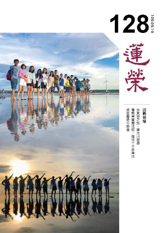

## 社論

### 終身學習

*編輯部整理*

能學所學性空寂

熱情好奇重方法

多元系統能推理

閱讀語言學與習

人類的遷徙從七萬年前開始，踏出非洲大草原，從歐洲擴散到亞洲，從歐洲的北方，再擴展到美洲，並僅花五萬多年的時間，就散佈到全世界。祖先之所以能夠遷徙演化，在於具備些許先決條件，諸如製作禦寒衣物、狩獵、製作投擲工具、搭屋及共同協作等等的能力。

由此聯想，假若我們要遷徙到二十年後的未來，眼前要具備哪些能力、內涵？在論能力之前，要先了解未來世界的樣貌，未來將是各領域知識持續快速成長的時代。以群體及國家的角度而言，文明開展程度的高低，與是否容易跟周邊的社群團體聯結密切相關，當聯結點愈多，知識交流愈頻繁，文明發展程度則愈高。例如西方文明開展從兩河流域開始，與中間的地中海沿岸，周圍土耳其、希臘等等，彼此交流密切，加上氣候溫和，適合作物生長，更促進了知識及文明的開展。

回看中國的地形，中國與歐洲、西亞的聯結都受到高山阻隔，而北邊的草原天氣過冷，比較多武力切磋，缺乏文化的交流，所以文明開展的較慢。再加上政治體制逐漸走向大一統，對內維穩是主要考量，也不熱衷於和外界的交流。雖然曾有過地大人多的農業大國優勢，但在封閉的氛圍下，最終在工業革命後，西方文明快速拉開了與中國之間的差距。

在物種演化的過程裡，所處的環境越複雜，能夠適應並生存的就是越複雜的有機體。人類這個族群，當今面臨的最大考驗，是如何能在知識爆炸的時代，認知上也能作相應的演化。遷徙到未來，我們必須自己做更多的聯結，聯結的目的是為了多領域的學習，讓自己的認知不斷更新迭代。

當認知配備不同，學習的知識不同，就能看到世界的不同色彩與面向，並有著截然不同解決問題的能力。舉例而言，經濟學中的機會成本的正確定義是「放棄的最大可能」，假如我有一百塊錢，投資Ａ就不能投資Ｂ，當我只能看到A、B兩個選項，跟能夠看到一百個選項，我的機會是截然不同，就能作出更好的選擇。當視角、配備層級愈多元，眼光愈深遠，投資就能得到愈好的回報。面對問題解決問題時，也是如此。

所謂的「生態位／選擇壓」，指所處的環境，會塑造我們成為不同的樣子，處於相對舒適的環境，就會養成比較悠閒的特質，而失去警覺、失去應變力，我們要跳出舒適區，進入學習區，給自己一些挑戰，挑戰難度超過現在能力可負荷的百分之十五到二十，會帶來良好的學習成效及成就感。

一般人不希望看事情有盲點，但比盲點更可怕的是盲維，盲維即我們從未意識到的維度，盲維多了，視野就窄，知識貧乏，思維見解就會落後於時代，適應不了形勢，便難以立足於競爭日益激烈的社會。故要調動自己主動學習的心態，有好奇心，學習新知，充實不同領域的內涵，可以是主題式的領域探索，也可以是無目地的涉獵從沒接觸過的領域，獲得意外的驚喜。理想中我們要累積不同的素材，腦筋的運轉才會更加精彩。

面對未來多元知識爆炸的時代，有哪些特定領域是不管自己的專業如何，都一定要學習的？包括社交、理財、語言、心理學等，特別是要培養批判性閱讀能力，因為取得知識最快的方式是閱讀，人的記憶力有限，通常讀完一本自己拍案叫絕的書，一年後記憶只剩百分之十五，若未建立強而有力的索引，便無法回溯，所以我們要帶著思考、帶著疑問來閱讀，勇於跟作者對話，甚至是不同意作者的觀點，提出自己的想法。從一開始的碎片式、網狀式的資訊，經過聯結、思維，將其變成樹狀邏輯的結構，最後以線性的方式書寫或講出來，這就是讀書的三部曲。有意識的輸出才是輸入，最有效的方法是學會作筆記，能夠全方位的學習，當看到的世界、問題跟別人不一樣，人生的走向自然也不一樣。

巧婦難為無米之炊，沒有基礎的知識背景，便談不上思維，所以先談閱讀的重要性，再談培養能夠獲益終生的思維習慣，具備不同的思維模式，有推演的能力，如同招式多樣、訓練嫻熟的武功高手，能夠看清眼前的情勢，遇到任何情況都能快速的見招拆招，累積多元的知識使自己具備更多的看清事情的方式。

多聞多見可以補自身的不足，「你就是平常相處最親近的五個人的平均值」，多跟比自己強的人相處，善於提問，彼此碰撞產生火花，若是生活中難以遇到高手，別忘了，書中自有黃金屋，與好的作者學習、對話，便是跟高手過招，我們也要經常練習關聯性推導的能力，永遠抱持疑問，想辦法去解答，在自己的頭腦裡打造擂台，創造碰撞、較量的機會。

我們要不斷地、隨時隨地的思維，慎思而後提出疑問，所學才真正扎根，透過深入思考辯證，強化腦內的神經元連結，當神經元夠粗，往往可以碰撞出新火花，透過碰撞、分解、移植、重組，使每一個知識點發光，產生新創意，能夠解決別人不能解決的問題，當擁有聞一知十的新創意，何愁江郎才盡。

還要時時反省、警惕，跳出認知框架，自覺所學之不足，智人與靈長類最大的差異就是反省檢視的頻率不同，智人高出很多。未來世界很殘酷，真正競爭激烈的環境，下錯決定、做錯事，沒有人會跟你說，要靠自我反省覺察。

除了反省外，還要能隨時顛覆自己現有的認知與想法，隨時主動探索，看看是否有其他沒看到的知識面向，要提升自己的知識結構(聯結的神經元夠粗夠多，才會形成結構)跟認知維度(維度包括面向，能有更多的領域)。

再來要具備寫作的能力，表達自己的思想，練習寫得精準、有邏輯條理、重點分明，讓別人愛不釋手往下看，從申述論文練習開始，再到專題、研究報告撰寫，訓練自己資料蒐集、分析、觀點陳述、正反面意見辯證的能力，更甚是創意寫作，以及更專業、方方面面都要照顧到的劇本寫作。寫作之外，言語表達也很重要，演說包括肢體語言、自信心、現場氛圍的掌控等，我們可以參考別人成功的演講，訓練自己即席演講、即席辯論、模擬會議的能力。

而人與人的相處合作、解決問題都靠良好的溝通能力，要對欲傳達的事情有系統、結構的掌握，敘述有條有理、邏輯分明，以免傳達時零零落落、詞不達意。把話說清楚僅是溝通的基礎，面對不同的對象及場合，如何讓聽者能夠接受並且認同，考驗講者的溝通技巧、臨場反應、說服功力。溝通是雙向的，因此善於聆聽與回饋也很重要，能聽懂對方想表達的重點，消化過後用自己的想法或心得去回應對方，或是進一步挖掘出更深刻的話題。

情商也很重要，一個人的情商高低會體現在他的魅力與價值上，情商在心理學上稱為情緒智力，擁有高情商的人，不僅能自我情緒管理，還懂得處理他人的心情，故高情商者多半社交能力極佳，情緒敏銳而穩定，具有強大的適應性，對人、事高度投入，富有同情心，能夠觀察身處環境的氣氛，進而組織團體，獲得眾人的信賴與追隨。

最後，也可以考慮學好英文，因為最即時、先進的知識內容都是英文，學英文能更快速的與國際接軌，認識新知。總結上述，我們要培養自己各方面的興趣與愛好，成為一個生活多采多姿、充滿正能量的人，期許自己不論年齡多長，都要有年輕的學習心態，不斷的往上走，終身學習。

## 佛學幽覽

### 菩薩清淨的行持—華嚴經淨行品（四十四 ）

*戒慧講述、編輯部整理*

止住修與觀察修

二者互助免沉掉

擾動昏暗息放光

輕安生起方雙運

丙二、指事顯因答其徵因

丁一、總徵

丁二、別顯

戊六、乞食道行時願（五十五願）

己二、所睹事境(十九願)

己三、所遇人物（有二十四願）

己三、所遇人物：報恩人、背恩人

前言

智首菩薩請問文殊菩薩要如何得到佛的功德，當然就是要善用其心，在行持當中被菩薩願跟空性的智慧攝持，使行持能夠清淨，所以名之為淨行品，將日用平常歸為一百四十四條，分為在家跟出家，雖然我們沒有出家，可是其中的道理可以拿來運用，像是出去托缽乞食所走的路，所遇的事情，所碰的人物等，以及要如何發願，都提供我們非常正確的觀念，有助於我們遇境逢緣時提起正念。行持會被菩薩願跟空性的智慧攝持，使行住坐臥說話辦事，眼見色、耳聞聲、鼻嗅香、身接觸、意知法，都能成為清淨的造作，而且果報直通佛果，這樣的修持實在是太殊勝了。修行講究善巧方便，而淨行品就是善巧方便的修學法，目前的進度是在所遇的人物當中的見報恩人、背恩人。

經文：

見報恩人，當願眾生，於佛菩薩，能知恩德。

報恩人的形象是知道對方的恩德，生起回報的心，見報恩人，能把對方的好處、功德、恩惠顯現，見到對方可愛的面相來報恩時，我才能顯現我是報恩人。當對方的恩德在我心識前不能顯現的時候，我又如何會生起報恩的心呢？

中國的報恩還講究少恩多報，受人點滴，答以泉湧。慎終追遠的祭祀都是一種報恩的法行，這種人會讓風氣淳厚，報恩當中看到對方的好，我想報他的恩，這又是大悲心非常重要的引發處。故學校如能教孩子懂得感恩父母師長，懂得觀修父母師長的好處，其功德甚大。

我是能報恩，對方是所報恩，對方可能是我的父母、師長、施主，可能是國王，可能是眾生。最殊勝的報恩是幫助對方離苦得樂，除了安慰他、引導他外，最重要的是讓他生起修福修慧的正知見，唯有修福修慧才能離苦得樂，我幫助他引起修福修慧的正知見，讓他有修福修慧的能力，才是最殊勝的報恩。

知道佛菩薩的恩德來報恩，是有情非常重要的知見，當他懂得報世間的恩時，才有可能引導他了知佛菩薩的恩德而去報恩，於佛菩薩有恩德想要報恩的那一分，是修皈依中非常重要的動機，能知恩德，欲報恩，由這樣的引導下修皈依，去報佛菩薩的恩德。

如何真正的報佛菩薩的恩德？即盡心去做利益有情的事業，因為佛菩薩最在意的就是利益有情，所以充實自己發菩提心去利益有情，最能報佛菩薩的恩德。供養佛菩薩、親近佛菩薩，修學正知見的目的，皆是為了去利益有情。報有情的恩是要幫助他、引導他有修福修慧的知見，回過頭來報佛菩薩的恩德時仍是去利益有情，上下互相結合。

世間有父母恩、國王恩、眾生恩、施主恩，出世間有三寶恩，特別是說法主—佛。這些都是讓我們得到世間與出世間安樂的對象，是我要非常感恩的對象。華嚴疏鈔中說「見報恩人，當願眾生，於佛菩薩，能知恩德」，希望有情眾生能夠知佛菩薩的恩德而報恩，因為佛菩薩的恩德是隱密難知的，一般人感覺不到佛菩薩的恩德，只會感覺到世間主管提拔的恩德，父母養育的恩德等等，佛菩薩隱密的功德必須有正確名言的觀察，華嚴疏鈔分為十類，透過會性法師的解說，有助於我們生起皈依的心態，而且也知道佛菩薩的恩德當中，興起的報恩的想法，以及報恩重要的方法。

第一「發心普被恩」

，意思是觀待佛菩薩想要幫助有情眾生離苦得樂、究竟成佛的發心，佛菩薩不會遺漏每一位有情，普遍的救渡眾生，這就是佛菩薩的恩德。「普被」指未有遺漏，包括我們自己，都是佛菩薩所加被的對象，包括吾人能夠遇到佛法，遇到善友，能有修行的道糧，有健康的身體，沒有外境天災人禍的逼迫，都是靠佛菩薩一分的加被才容易生起，雖然也有自己的善業在其中，可是有一分是靠佛菩薩的加被。

第二「難行苦行恩」

，在娑婆世界每一處都有釋迦牟尼佛為法捨身之處，結緣非常廣，沒有人能贏過他，釋迦牟尼佛的苦行讓許多菩薩感動，所以願意效法，菩薩被咐囑，即便末法眾生一大堆不如法，菩薩都願意保護娑婆世界的修行人。這跟世間辦事一樣，上面的人對你有恩德，縱使辦事辦不下去，仍要堅持辦到底，這就是難行苦行的恩德。

第三「不顧自身，一向為他恩」

，釋迦牟尼佛為了成佛行菩薩道，所有心意皆是為了度脫苦難的有情眾生，且盡未來際，如果沒有「一向為他」的悲心，佛已業盡情空，何必跑來這苦難的世間，而諸菩薩見佛如此也都追隨而來，這就是佛的人格感召。如果沒有佛力加被，沒有佛前面的人格感召、捨己為人、一向為他，哪有我們在人壽百年的末法時期仍有現在學佛的氣象，所以能夠研討佛法都要很感激。

第四「垂形六道恩」

，釋迦牟尼佛成就無上佛果，已經得到最殊勝的快樂，卻為了眾生到六道中示現，尤其是到苦難的地方來度化眾生，尤其是投生到人道示現生老病死，告訴我們可以透過修行從生老病死中解脫，佛如父母般帶著我們成長，光帶一個都很辛苦了，何況佛面對的是所有的有情眾生。

第五「隨逐眾生恩」

，《勸發菩提心文》中說「世世生生，隨逐於我，心無暫捨。」釋迦牟尼佛要度任何一個眾生，就要隨此眾生到人道、地獄道等等，使眾生有種善根的因緣。「垂形六道」指空間上，例如示現為人道，在人道經過種種的努力，建立法幢的事業，垂範後世。「隨逐眾生」指時間上，例如願意跟有情結緣，有情到哪裡就跟到哪裡，願意用這種方式來拉拔有情。虛雲老和尚朝五台的時候，有乞丐文吉在旁陪伴，幫助虛雲老和尚度過病苦，後來才知道此乞丐文吉就是文殊菩薩，這就是隨逐眾生，要花大量的時間、耐力、願力、智慧、幹勁、資源去做。

第六「大悲深重恩」

，釋迦牟尼佛全部的心思都放在有情身上，不但是所有的有情，乃至於某一類的有情，甚至是某一位有情都不例外。見到眾生痛苦佛比眾生更痛苦，眾生快樂佛比眾生更快樂，他用的心意是大悲深重，把眾生看成非常可愛的愛子，眾生的一分痛苦，佛就有十分的不忍，眾生的一分快樂，佛就有十分的快樂，就像母親全部的心思都鎖在子女身上，佛菩薩整個生活的重心都在眾生上。

以上六條為一組，是佛對眾生的恩德，以下七到十，四條為一組，指佛自己的能耐。我們有時候想對別人好，可是沒有能耐，例如眾生生病，你想治他的病，可是自己都在生病當中，又如何治他的病呢？他有煩惱，結果你比他更煩惱、更憂愁，又如何度他呢？故不只講佛對眾生的恩德，還要講佛的能耐。

第七「隱勝彰劣恩」

(隱勝彰劣德)，德就是佛的能耐，佛會把自己的殊勝處隱藏起來，顯現他卑劣的那一分，此是為了引導眾生，就像孔子對於顏回，孔子真正的證量是「夫子奔逸絕塵，顏回瞠乎其後」，其實顏回贏不了孔子，孔子是故意示現，在顏回前循循善誘引導他，孔子即使顯現最卑劣的部分都有甚深的內涵，那是他的能耐，不像我們示現卑劣的時候人就變卑劣，沒出路的時候，整個人的信心就喪失，得勢的時候變成自負的人，失勢的時候變成洩了氣的皮球，可是聖賢、佛不會，他們不管身在何處都有自信，這是他的能耐。

第八「隱實施權恩」，釋迦牟尼佛有崇高的證量，法華經中也是一樣，引出眾生的出離心、大悲心、空性的正見，在法華會上引出眾生成佛的意樂，授記彼成佛。總之花很多時間，很有耐心的引導有情，當眾生想逃，佛還想盡辦法攝受回來。

第九「示滅令慕（生善）恩」

，即使在最殊勝的盛況，該走的時候就要乾脆的走，要示滅生善，雪公老師就是在他最盛況的時候很有魄力的走掉，在最好的時機走掉，大家可能就會醒過來發憤圖強，釋迦牟尼佛示現涅槃時其實是盛況，這就是諸佛菩薩放下的能耐。

第十「留餘福報以濟為苦，悲念無盡恩。」

佛將教法流通與傳承，把他的福報留給眾生受用，例如家裡小孩有心向學時，父母會將他的福報轉給孩子，例如請好的老師、給予諸多求學的資源等，這就是父母的福報加給孩子。佛經上說末法時期的修行人，即使世界只剩下巴掌大的面積可以耕田，我法的修行人絕不餓死，這就是佛將他的福報轉給修行人去受用，使他有道糧。

南亭老和尚講義中提到「假使頂戴經塵劫，身為牀座徧大千，若不說法度眾生，畢竟無能報恩者。」意思是假使我們將釋迦牟尼佛頂在頭，就像觀音菩薩頂阿彌陀佛一樣，經過百千劫，或者是身體顯現為牀座，徧三千大千世界，讓佛坐在法座上說法，普賢菩薩出來的那個象騎，那就是身為牀座，助佛一臂之力，但是最重要的是說法度眾生，若不說法度眾生，一樣不能夠報答佛恩。可見說法傳承，能夠影響當世及利益後世，是所有恩德中最能報恩的。

經文：見背恩人，當願眾生，於有惡人，不加其報。

背恩人與菩薩是發願的所依。能願的是菩薩，所願的是眾生。「於有惡人，不加其報」，菩薩得到三業離垢成德的利益，希望有情眾生對有惡之人不加其報，眾生能夠得到這樣的利益，就是眾生對有惡之人不加其報，菩薩也這樣願自己能如是，並且依願修學得到成佛的利益。

四面相的修學法，一是隨喜，眾生對於惡人能不加其報該有多好。二是發願，但願眾生都能夠於有惡人不加其報。三是承擔，引導眾生對於惡人不加其報。四是請三寶加被，我能有能力幫助眾生對惡人不加其報。以上是四面相的觀修。

見背恩人有兩種狀況，一種是對有情，一種是對自己，背恩當中最大的背恩就是恩將仇報。一般人見到忘恩負義、恩將仇報的惡人會很憤慨、生氣，甚至想要殺掉他，此時要當願眾生修忍辱，不加其報。但南亭老和尚講義中提到，如果是子女不孝父母，而為其父母、師長、親戚、朋友、鄰里、鄉黨、皆置之不理，聽其自然，則與風教大有關係，則不敢置一言矣。意即如果不善用這句話，會造成社會的亂象及恐慌，只在乎微小的人道，忽略了廣大有情的安定，這樣的慈悲是爛慈悲，就像《了凡四訓》中提到的副宰相呂文懿公，他當時告老還鄉，鄉人喝醉酒擋住他、辱罵他，他為了不生事就不予計較，後來醉人橫行鄉里，第二年被殺，呂公開始反省，若當時懲戒他一番也許他就會收斂，不至於到現在的下場，仁慈心是站在幫助眾生成長的那一分才叫做善心。

真正的「不加其報」要像曾子說的「上失其道，民散久矣，如得其情，則哀矜而勿喜。」之所以會有背恩人是風氣使然，為政者要反省，要可憐此背恩人是風氣敗壞下的犧牲品，如果他能遇到好的老師、好的環境，很多人關愛他，就不致流落成社會上的太保流氓，此時應該「如得其情，則哀矜而勿喜」，就算是處罰他，臉上都是不忍的表情，故不加其報是指在心意上的，是慈悲心的顯現。高柴在衛國為官時，將一個犯人行以削足之刑，後來逃亡時此犯人為守城門者，居然幫助高柴逃亡，一問之下才知道，當時高柴在行刑時臉上盡是哀憐的悲悽之情，所以這位守門人謹記在心，如今才會幫助高柴出關。（下期待續）

### 大乘百法明門論簡說（三十四）拾伍、心所有法—隨煩惱（四）

*戒慧講述、淨本整理*

由定義知心心所作用

諸法無實體僅唯作用

依作用安立名言定義

知心作用方善用其心

經文：

五、隨煩惱二十者：一、忿。二、恨。三、惱。四、覆。五、誑。六、諂。七、憍。八、害。九、嫉。十、慳。十一、無慚。十二、無愧。十三、不信。十四、懈怠。十五、放逸。十六、昏沉。十七、掉舉。十八、失念。十九、不正知。二十、散亂。

以下開始說明中隨煩惱：無慚跟無愧。所謂的中隨煩惱，是指此類煩惱生起的範圍，較小隨煩惱大，但又小於大隨煩惱。中隨煩惱能夠「自類俱起」，就是生起無慚的時候，也可以生起無愧，兩種心所可以同時生起。在小隨煩惱中則無法同時生起，例如生忿的時候就不會同時有恨。中隨煩惱另一個特性是「徧不善性」，中隨煩惱可以遍及其他不善的心所，與其他不善的心所同時生起。例如某人沒有慚愧心，所以沒有反省的能力，他同時就會生起其他不善的心所，這也是小隨煩惱不具備的特性，所以中隨煩惱的範圍比小隨煩惱大。而大隨煩惱除了兼具「自類俱起」、「徧不善性」兩種特性，還具備「有覆無記」，這是中隨煩惱所沒有的。「有覆無記」就是我執所攝持的無記業，執我的心障蔽無我的真理，所以稱為有覆，雖有我執，但仍有可能造善，例如世間有很多沒有破我執的慈善家，或者外道也會修善。大隨煩惱在本質上屬於無記，所以才能與有覆無記相應而起，比如某人忘記過去所學的正法（失念），但他仍然是一個好人，只是障蔽了對真理的了解，此人可能造善、可能造惡，所以失念不能記別為善或惡。

《百法直解》云：「無慚者，不顧自法，輕拒賢善為性，能障礙慚，生長惡行為業。」不顧自法就是不顧自跟不顧法，不顧自就是對自己不要求，不顧法就是不會以法來檢驗自己，法可以分為「教法」跟「證法」，「教法」就是佛所說法的傳承，「證法」就是聽聞修學教法生起不害（就是不損惱眾生，十善業的本質都是不害）跟涅槃的力量，這些都不成無慚者所關心與重視。

無慚之人言行與聖賢完全違背，輕視賢人，拒絕善法，猶如黑暗與光明的對立。然而應知光明與黑暗都無自體性，煩惱與正見之間的對立不是像兩軍對峙廝殺，煩惱是對境非理作意下才會生起，亦即對境界生起有自體性的面相，而認為境界可愛或者可惡，產生貪嗔；若能以正見觀察眼前的境界，煩惱自然不會生起，所以說迷悟在一念之間，光明出現就沒有黑暗，不是兩相對抗拚到你死我活去分出勝負。

不看重自己的人就會輕視賢人、拒絕善法，因為喜歡懶惰、放逸的人，不會喜歡跟上進的一起，不會喜歡聽聞充實自己的道理。所以無慚的人沒有反省能力，會生長各種惡行，親近不了善知識。當我們知道這類心所定義，我們進一步要能夠善用這些心所，要生出慚，肯反省自己、提升自己、充實自己，讓過惡越來越少，甚至達到無過的境界，這才是改變命運的方法，改變命運就是心所的運用。

《百法直解》云：「無愧者，不顧世間，崇重暴惡為性，能障礙愧。生長惡行為業。」以上是無愧的定義，無愧者對於世間的輿論、他人的勸告聽不下去，此人心中不相信善人，不相信聖賢佛菩薩，對於邪惡暴虐反而崇敬看重。邪惡暴虐未必是殺人放火，宣揚邪說顛倒黑白的名人，擁有眾多的追隨者，更為恐怖，正法的喪亡關鍵在於分辨邪正的能力，當人們完全無法辨別邪正，正法也無興盛的可能。

無愧能障礙愧，讓人沒有反省的力量。世間輿論有力量，可以維持一定的公安，無愧的人對世間輿論完全不顧，這是放棄最後的底線，這足以摧毀世間的安定。

整體而言，慚是對自己，愧是對他人。無慚的人自己過得很自在，不肯上進、不學教法，即便過墮落的日子也覺得很高興，沒有恐怖的感覺；無愧者不會對惱害他人的事情感到怖畏，不害怕眾人的指責，例如賣黑心商品，即便被查獲也只是覺得自己倒楣，沒有悔意，甚至振振有詞。

《法苑珠林》云：「二法唯欲界繫，唯是不善，一切不善心心所法，皆徧相應，唯除自性。」此可以依據「無慚無愧三門分別」表來作說明。「界繫門」，無慚跟無愧只有在欲界才有，色界及無色界沒有，能生色、無色界要靠禪定的力量，禪定的眷屬是「慈悲喜捨」，也就是要靠「慈悲喜捨」禪定才能修成，這些善心所都是靠慚與愧才能生起，讓自己不斷反省、不斷向上，所以上二界不會有無慚無愧。

「三性門」，無慚跟無愧本質是不善的心所，所以不能與「有覆無記」的心所一同生起，已如前述。《法苑珠林》所謂「唯除自性」，就是指「有覆無記」是慚心所跟愧心所所不能徧的。「相應門」，就是無慚無愧能徧一切不善心心所，不善心心所成為所徧，意思是無慚跟無愧能與一切不善心心所一同生起，這都是因為沒有反省的力量。

《增一阿含經》說，有慚愧心的人才能與畜生分別，因為畜生是大欺小、強欺弱，有的動物甚至兒子吃了母親都不覺慚愧，動物界彼此相殺相吃，一點也不覺得有什麼不妥，所以說慚愧心（羞恥心）是人跟畜生的分別。

印光祖師說：「縱有修持，總覺我功夫很淺，不自矜誇。」因為對自己要求很高，所以永遠覺得自己不夠，而再用教法所說跟自己比對，當然會覺得自己很淺。「看一切人都是菩薩，唯我一人，實是凡夫。」這是很好的修學法，就是藉由慚愧的力量來改變自己、修正自己。（下期待續）

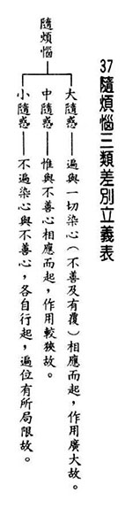

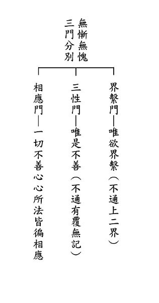

### 佛學概要十四講表簡說（三十）第五講表　人生三際之抉秘（十二因緣）

*戒慧講述、心若整理*

三世兩重或兩世一重

三世相連不斷苦與樂

無明愛取有來世引業

貪愛不生需能斷無明

前言

人生成就的目標、修學的過程、下手的方便，要破除的障礙，要生起的內涵，一一都在十四講表呈現。

第五表告訴我們生從何來，死往何去，解決了千古一大謎團，解決子路的問題「敢問死」，孔子說「未知生，焉知死」，此表正是這段經文最好的註解。

十二因緣可以從兩種方式體會，一種是雙重因果，過去因、現在果，現在因、未來果，過去、現在、未來為三世；第二種是現在、未來是一重因果。目前以三世兩重來講第五講表，也是一般對人生三際之抉秘的解法。第二種說法較為深入，是大乘了義宗義的解法，以後有機緣再說。

十二緣起的無明有人我執跟法我執，唯識宗承許根本無明為法我執，枝末無明有迷理無明（人我執）與迷事無明(業果愚)，中觀則認為人我執、法我執都是根本無明，把兩者都當成煩惱障，因為長的一樣，法我執是執法我有自性，人我執是執人我有自性。無明所薰下的習氣，不會生起無明才是所知障，這是兩宗的大差別。

我們先了解唯識宗的宗義，以此為基礎去了解中觀宗，了解這兩宗，就可以了解大乘思想，了解佛陀真正的意趣。

人我執與法我執只不過就執的對象不同，能執的心是一樣的，有執著就有煩惱，有煩惱就會造業，造業就會受苦。所以人我執、法我執都是輪迴的因，既然都是輪迴的因，都叫做煩惱障。而見思惑只是煩惱障的粗相，煩惱障的細相是人我執、法我執，所知障是法我執所薰下的習氣，不會生起法我執，或是身語意的造作薰下習氣，此習氣是不會生起煩惱的習氣。

現在苦果 → 識→名色→六入→觸→受

●識

我們由前一期生命，進入下一期生命，會經歷幾個現象，以下列點呈現。

１、先是「病危」，此病危是進入臨終的病危，表示一期的生命現象將盡。再來「斷氣」，是外息斷，內息未斷，氣脈還在流通。

２、接著「身漸冷」，身體的部位漸漸變冷，《大集經》說：如果頭部最後冷卻，是證聖果或是直接生到淨土，眼部最後冷，是生到天道，心最後冷是生到人道，腹部最後冷是投生餓鬼道，膝蓋最後冷是投生畜生道，腳板最後冷是投生地獄道。《瑜珈師地論》認為，如果投生天人道，會從上往下捨，心臟是最後捨處。

３、「亂心位」，臨命終身體已經是冷卻，進入「悶絕無心位」的狀況，沒有知覺，前六識已不現行，由八識田中的業種子紛亂生起，最後由業種牽引名言種現行，業種子是我們所造的善惡業，所造的五戒十善，會引我去緣念人道、受用人道，可以受用那一道叫作名言種子。由於強烈愛執自己的身體，到臨命終時非常害怕身體即將逝去而生起自體愛，生起下一生。亂心位是六識漸漸的失去人道緣念的那一分，在下一期生命現象心識生起之前，人道的緣念不見了，但還不知道要投生到哪一道，故安立為亂心位，例如來生要投生為狗，狗的心識還沒生起，人道的緣念不見了，此時的悶絕是緣念人道的力量已經沒有了，亂心就是隨著業種隨便亂跳，像是搖彩一樣，不知道會搖出何獎，不知道會去哪一道，去哪一道的心識不一定，但是一定會出現一個臨命終最強而有力的心識，識離開身體的後一剎那，立刻進入中陰身。

亂心位之前為粗想，進入亂心位為細想，細想是無記，細想之前可善可惡，所以在臨終粗想時見善知識，受其開導很重要，善知識讚歎他這一生曾經做過的善法，及告訴他將來要去的地方有多殊勝，引發他的善念進入細想位，進入下一道。進入細想位時，此人已經沒有分別能力，如果粗想時引發他不善，恐怖的感覺生起，進入細想位，他已經沒有能力對治恐懼。

《俱舍釋》引頌云：「諸業於生死，隨重近串習。」即走到來生的力量不出重、近、習、念這四個道理。重業是此生所造極重的善、惡業，此業決定他會往哪一道，例如殺父殺母，哪怕是十年前、二十年前造的，臨終強烈的愧疚，會引起那一道的心識生起而投生那一道。近業是近處的業，往生前沒多久的業，在臨命終神識要離開時生起，所以臨命終的護持、助念、引導很重要。習業，較常串習、造作的業，當此人沒有重業，近業也都差不多的時候，就會看習業，此時看到底是外道串習得多，還是內道串習得多。念業，神識要離開前的那一念。業種子牽引，例如要投生地獄道，可能會生起想要殺的習氣，看到一群羊，就衝進去。印光祖師說，現在活著要把自己當成中陰身看待。業種子牽著你往前走。自體愛愛不住的時候，會抓一個東西來愛，所以自體愛會滋潤業種。

４、「識離（全身冷）」，從斷氣至識離，每個人的時間多久不一定，跟此人的品行、願力有關，即善業造得多、造得大，容易走得快，惡業造得重、造得大，也容易走得快，而一般人不太好也不太壞，就走得慢，例如此人一生只有家庭觀念，所緣念的就是妻子兒女、家庭，這類人不太好死。所以人一定要有胸懷、志向、理想、目標，不能眼光只有鎖定子女，會造成往生的障礙。亂心位到整個心識離開叫作「識離」，心識離開對形體的緣念的那一剎那，生起類似下一期生命的意想身，謂之「中陰身」，此時全身冷透。

「中陰身」，又稱中有身，是這一生過度到下一生的中間，稱為「中有」，是為「本有滅，中有生」，待下一身生起稱為「後有」。強烈自體愛生起，牽到下一生也就是中陰身，上一世的五蘊身剛消失，下一世的五蘊身還沒生起，是為中陰身，全身冷透，身體的溫度不見，心識也不能緣念了，整個離開了。

中陰身的模樣為「彷彿生陰」，長得像將來要投生的那一道的樣子，而形量較小。人死後不是有一個像我的靈魂飄出去，而是我死(通身冷透)的後一剎那，已經變成類似下一生的形象，要走到下一世。中陰身投生地獄前，顏色會像是燒焦的木頭；若是投生餓鬼，顏色會像是汙濁的水流；若是投生畜生道，顏色會像煙；若是投生為人或是欲界天，顏色會是黃金色；若是投生色界天，顏色是白色，代表禪定的力量。至於無色界則沒有中陰身。

中有身最長不會超過七天，若七日內沒有投胎，中有身就會消失再生起，「或同類生，或由餘業轉，餘類生」，重新生起的中陰身有兩種情況，一種是跟他之前的中陰身同類，表示他還是趨向那一道，另一種是由餘業轉，可能因為亡者的家人為他念佛、超薦、做善事，使他轉變，例如本是要投生人道，轉為天道，還有一種情況是，家人反方向的做很多惡業，亡者吸收這樣的惡業，可能本來要投生為人，結果變成投生為畜生。七七四十九天，中陰身最多變化七次，就會去投胎。

５、「攬二渧」，中陰身形成後，等待有緣的父母去投生，見到有緣的父母行淫事，生起境界愛，如果要投生為男，可能是喜歡母親討厭父親，投生為女，可能是喜歡父親討厭母親，而想要自己取代，去跟此境界相合，一看到境界，投入境界，中有就滅了，生有現起。胎卵生會是這樣，濕生、化生則不是。或者四生要投生的時候很多幻象，這是其中一個現象，不是所有的現象都這樣。都是以業力為主，幻見境界，跟人生前的習氣都有關。

●色—識煖胚團

父精母血結合投胎者的心識，在煖氣培育下，長成胚團的樣子謂之色，這是生命現象的相續，此時五根還沒有長成，對著五根生起的眼、耳、鼻、舌、身的識也不能生，而五根未長第六識也無從去分別外境，單純的心識緣念肉團相續而已，故叫名。意識生起需觀待法塵，此時的意識模糊，長大也回憶不起來，沒有六識的作用不能稱為心，沒有五根的作用不能稱為身，所以統稱為「名色」。

生命現象剛開始在母親的胚團裡就是一團，雖然肉眼看所有的胚團都沒有差別，但此胚團有生命的相續，所以安立名色的名言，聖者能從此胚團與過去業的關聯當中，知道他未來的變化、走向，而予以安立符義的名言。從這一團胚團開始，就決定了我們的未來，就像我們把現在當成中陰身來走向未來是一樣的道理。

●六入—扶塵具形

六入即眼、耳、鼻、舌、身、意六根，因六根能入六塵(色、身、香、味、觸、法)，外之塵境由此而入，汙染淨心，故名「六入」。

名色只是胚團，慢慢長成五根的形，到六入時整體成熟，能夠生起五識的功能，六入是從五七到第三十八個七(入胎到出胎總共要經過三十八個七，此時腦部、五根、身體成熟)。

根有兩種，看不到叫作「正根」，又稱為「淨色根」或「勝義根」，也就是氣脈，例如老年重聽，並非傷在耳朵。初禪風大充身，身體輕快，好像脹滿的皮球般快樂輕鬆，就是氣脈通達的展現。看得到的根是「扶塵根」，又名「浮塵根」，即浮在表面上的五官。

淨色根是根，浮塵根是塵，因為五官像是眼球、耳穴、鼻柱肉眼可見，可是氣脈看不到，氣脈是氣的流通，跟心識觀待而生，所謂觀待而生是有氣脈則有心識，無心識則無氣脈流通。

「扶塵具形」指六入漸漸長成，形體具足完備，意識以意根為所緣，生起能分別外境的意識，以及各種不緣外境的意識(獨頭意識)。五根成熟的時候，心識的功能方能生起。

●觸—根攝境界

出胎後，六根與六塵接觸，生起識的那一分叫作「根攝境界」，前五識依五根攝取五塵，而第六識則廣泛攝取一切法塵，前五識謝落的影像由第六識分別。

小乘《俱舍論》說，嬰兒時期雖與外境接觸，根塵觸三和合，有覺知，但是不會去取苦、樂、捨這三種感受的差別，故名為「觸」，不名為「受」。

●受—苦樂捨感

有了接觸後會產生感受，領納所觸境界，感覺苦、樂、不苦不樂。

以上五支，是今生的生命果報，是由「過去因緣」引發的「現在苦果」。受此生命果報，又起惑造業，遂形成「現在因緣」。（下期待續）

### 大佛頂如來密因修證了義 諸菩薩萬行首楞嚴經—七處徵心（四）

*戒慧講述、淨本整理*

眼不在根內

離根應有心

若根內有心

諸根有多心

【科判分析】

寅三、破根裏

（破心在眼根之執，此為根裏處）

阿難尊者提出心「在內」、「在外」的說法，都被佛破除，於是接著提出心潛藏在根中（眼耳鼻舌身）的看法。

一、「阿難以瑠璃合眼為喻」

前面心「在內」、「在外」的說法都未得佛的認可，並被佛破除，阿難尊者進一步提出心潛在根中的說法，並以透明的瑠璃碗與眼相合為比喻。

（一）、「悟前轉計」

阿難尊者了悟前所說法錯謬，轉而提出另外一個看法。

（二）、「承徵指處」

承佛之問，阿難尊者指出另一個處所：根中。

（三）、「引喻瑠璃」

引用瑠璃碗的比喻來說明。

（四）、「脫前二謬」

心潛伏根中，所以能夠脫離前面在內、在外說法的錯謬。

二、「如來以法喻不齊為破」

佛也以瑠璃碗的比喻結合有法，結果事實與比喻不相合，破除心潛藏根中的看法。

（一）、「正破」

佛從正面說明理由，破除阿難尊者的看法。

１、「正辨不齊」

正面辨別瑠璃碗的比喻與有法結合時不一致。

(１)「先以按定法喻」

以阿難尊者所決定的琉璃碗比喻來說。

(２)「喻中實見瑠璃」

依照比喻，眼睛確實會看到琉璃碗。

(３)「法中不能見眼」

比喻結合有法，心卻看不到眼睛，會直接看到山河大地。

２、「雙開兩破」

無論心能看見眼或者不能看見眼，都有錯謬之處，佛皆予以破除，所以比喻跟有法不能結合。

（二）、「結破」

結論破除阿難尊者的看法。

【經文解釋】

阿難白佛言：世尊，如佛所言，不見內故，不居身內。身心相知，不相離故，不在身外。我今思惟，知在一處。

阿難尊者對佛稟白：「世尊，如佛所說，看不見身體內，所以心不在身內。身心能夠相知而不會互相分離，所以心不在身外。我現今思維，知道心在某一處了。」

佛言：處今何在。阿難言：此了知心，既不知內，而能見外。如我思忖，潛伏根裏。
佛說：「處所現今在何處？」阿難尊者回
**答：** 「這個能夠了知的心，既不知身內，而能夠見到外面，如我所思量的結果，應該是潛伏在根（眼耳鼻舌身）之中。」

猶如有人，取瑠璃碗，合其兩眼。雖有物合，而不留礙。彼根隨見，隨即分別。

猶如有人拿取透明的瑠璃碗(如現今眼鏡)，蓋住他的雙眼，雖然有東西蓋在眼睛上，而不會留有障礙，他的眼睛隨所見，都還是能夠分別眼前景物。

然我覺了能知之心，不見內者，為在根故。分明矚外，無障礙者，潛根內故。

所以我的覺了能知的心，看不到身體內，是因為潛伏在根內的緣故；能夠明白地看見外面，沒有障礙，是因為潛伏在根裡的緣故。

佛告阿難。如汝所言，潛根內者，猶如瑠璃。彼人當以瑠璃籠眼，當見山河，見瑠璃不。如是，世尊，是人當以瑠璃籠眼，實見瑠璃。
佛陀告訴阿難尊者：「如你所說，潛伏在根裡，猶如瑠璃碗蓋住雙眼。此時瑠璃碗是眼根的同品喻，雙眼是心的同品喻，雙眼在內，瑠璃碗在外，就像心潛伏在眼根內。」「這個拿瑠璃碗罩住眼睛的人，當在見到外面的山河景物時，會看到瑠璃碗嗎？」阿難尊者回
**答：** 「是的，世尊。當此人以瑠璃碗罩住眼睛向外看，實際上會看到瑠璃碗。」

佛告阿難。汝心若同瑠璃合者。當見山河，何不見眼。

佛陀告訴阿難尊者：「若你的心潛伏在根裡，如同雙眼在瑠璃碗之下。你的心在看見山河時，為何沒有先看到雙眼？」

若見眼者。眼即同境，不得成隨。若不能見，云何說言，此了知心，潛在根內，如瑠璃合。

「若能看見自己的雙眼，眼睛就變成是外境，不能成為能看的眼。若不能看見自己的雙眼，如何能說這個了知的心潛藏在根內，猶如與瑠璃合的比喻。」

是故應知，汝言覺了能知之心潛伏根裏如瑠璃合，無有是處。

「是故應該知道，你說覺了能知的心潛伏在根哩，猶如雙眼與瑠璃相合，這是完全不正確的。」（下期待續）

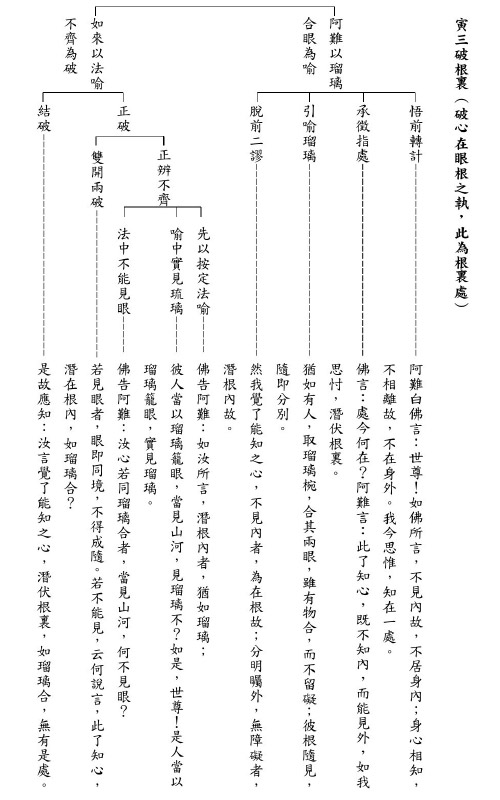

### 《佛說觀無量壽佛經》九品觀章（上）

*果清律師開示、宗澈整理*

卸任寺院住持

求法觀經九品

憶及學會創立

造作最好緣起

前言

學會於二○二○年八月三十號前往圓通寺齋僧，由於疫情過後正覺精舍較保守，便促成今年夏天僅在圓通寺齋僧之法行。果清律師將卸任圓通寺住持，此次是我們在圓通寺最後的請法，飯後果清律師為大眾開示「《佛說觀無量壽佛經》九品觀章」，希望藉著齋僧請法、佛力加被，衝破各類對政局不利的障礙，大家有安定的環境可以修學、推廣正法，作為團體的增上、往生的資糧。會刊將分幾次刊登當天師父的法語。

開示

「《佛說觀無量壽佛經》九品觀章」

佛告阿難及韋提希：「凡生西方有九品人。上品上生者，若有眾生願生彼國者，發三種心，即便往生。何等為三？一者、至誠心。二者、深心。三者、迴向發願心。具三心者必生彼國。復有三種眾生，當得往生。何等為三？一者、慈心不殺，具諸戒行。二者、讀誦大乘方等經典。三者、修行六念，迴向發願生彼佛國。具此功德，一日乃至七日，即得往生。生彼國時，此人精進勇猛故，阿彌陀如來與觀世音及大勢至，無數化佛，百千比丘，聲聞大眾，無量諸天，七寶宮殿，觀世音菩薩執金剛臺，與大勢至菩薩至行者前。阿彌陀佛放大光明，照行者身，與諸菩薩授手迎接。觀世音、大勢至與無數菩薩，讚歎行者，勸進其心。行者見已，歡喜踊躍。自見其身乘金剛臺，隨從佛後，如彈指頃，往生彼國。生彼國已，見佛色身眾相具足，見諸菩薩色相具足。光明寶林，演說妙法。聞已，即悟無生法忍。經須臾間，歷事諸佛，遍十方界，於諸佛前次第受記。還至本國，得無量百千陀羅尼門，是名上品上生者。」

佛陀告訴阿難尊者，以及韋提希夫人：上品上生的情形：凡是往生西方極樂世界的眾生，共分成九品人：上品上生者，如果有眾生意願往生極樂世界的話，除念佛之外，必須發起三種心，當下就能夠往生。哪三種心呢？

第一、至誠心

，就是專志誠實的心，專心一意，至誠懇切，真實不虛的心。應等於《起信論‧信成就發心》三心當中的第一「直心」，也就是「正念真如法故」的心，假若不能直心正念真如法，怎麼可以稱作專志誠實的心呢？

第二、深心

：

就是願求深法好樂佛果的心，等於《起信論》所說的：「樂集一切諸善行故」的這種心，非常歡喜，積集一切諸多善行的心，好樂修習一切善法，也就是歡喜眾善奉行的意思。將眾善奉行的功德，一一歸向心源，期望成就無上高深的佛果。又者，深心也有幾種意思：有決信之心（決定相信的心），等於《觀經四帖疏》中說生起「決定深信」的心，也就是一心憶佛，對淨土法門決定奉行不改變，若有人勸修其他殊勝方便之法亦不從，決定不改變自己的信心，這個就是深心。

第三、迴向發願心

，就是萬善迴向西方，莊嚴淨土，普願自己以及一切法界有情都能求生極樂，乃至圓滿佛果的心。即《起信論‧信成就發心》所說的「大悲心」，想要超拔一切眾生痛苦，拔苦的目的也是為了使令成就無上佛果。

以上三種心總合起來，也就是菩提心的內涵。具足這三種心的人，必定能往生到極樂世界去，所以叫作「當得往生」。

又有三種眾生應當能夠往生西方極樂世界，哪三種呢？

第一、慈心不殺，具諸戒行

：有慈悲心不殺害一切眾生，具足諸多的戒行。為什麼不殺一切眾生，因為一切眾生都是我們過去的六親眷屬，也是未來的諸佛。既然如此，我們怎麼可以忍心殺害他們呢？這就含攝了《觀經》前面說的三種福業，其中第一福業：「孝養父母，奉事師長，慈心不殺，修十善業」（世間的善法）。

具足諸佛的戒行，這就包括了在家戒、出家戒，七眾佛弟子特別依照自己所受的戒法，而有輕重等持（輕戒、重戒、平等心守持），不令有所毀壞。這也就是三福當中的第二福：「受持三皈，具足重戒，不犯威儀」的意思。

第二，讀誦大乘方等經典

：要讀誦大乘方等經典。照著本子念就是「讀」，離開本子能夠念出來就是「誦」。所以說「半月半月誦戒」是要背誦的，不是讀戒而已。戒要背誦，所以大家受了在家戒，要認真背起來。「大乘方等經典」指大乘的經，「方等」就是「廣大周遍，本具平等」的道理，要緊的是在讀誦時有沒有屏除雜念、恭敬至誠、隨文入觀、消歸自性。果然能夠如此地讀誦經典，必然能夠化除狹小的心量，成為廣大無邊的胸襟，將佛法的要旨逐漸地消融於不知不覺當中。所以讀誦大乘經太好太好了！換句話說，無邊的秘密自然能夠獲得。這等於《觀經》說第三福業：「發菩提心，深信因果，讀誦大乘，勸進行者」的內涵。因此我們淨業的行者，大乘經典不可不讀啊！

第三、修行六念、迴向發願生彼佛國

：六念是念佛（慈悲導師）、念法（三世佛母）、念僧（人天福田）、念戒（清淨身心）、念施（普濟貧窮）、念天（長壽安樂，此天為第一義天，念念不忘諸法實相，而能求證中道妙義）。當能修習這六念法門，將所修的功德，統統迴向發願求生西方極樂世界，具備這些功德，能夠長期修習正法，甚至一日乃至七日，命中壽盡也就能夠往生。

命終往生極樂世界的時候，因為這個行者精進勇猛修行的緣故，阿彌陀佛與觀世音菩薩和大勢至菩薩，還有無數的彌陀化佛，百千位迴小向大的比丘、聲聞大眾僧，並及無量諸天（根據會公《觀經講錄》說道：「無量諸天有兩種解釋：一是指隨無量化佛來迎的極樂世界諸天人眾，二是指娑婆世界欲界、色界等諸天天人。」讚歎行者殊勝的功德，和隨喜迎接行者往生的天人），帶著往生者將居住的七寶宮殿，通通來迎接。

觀世音菩薩手執金剛臺（最殊勝的蓮花寶臺），與大勢至菩薩，到這位行者的面前，阿彌陀佛放出廣大光明照到行者的身上，讓他當下感到清涼自在。諸位菩薩伸著右手迎接，觀世音菩薩、大勢至菩薩和無數的菩薩，讚歎這位行者，勸勉策進這位行者的身心，使令他往生更為自在。

這位發願求生西方的行者，見到種種瑞相現前之後，頓生歡喜踴躍自起，自己看到自己的身體乘坐在金剛寶臺蓮花座上，跟隨在彌陀導師之後，像彈指般短暫的時間，就能往生到極樂世界去了。

往生到極樂世界之後，看到佛的報身一切相好具足，看到諸位菩薩色相也都具足，依正光明，寶樹瓊林，演說微妙第一義法音，聽了之後就證悟無生法忍（對諸法不生不滅的真理忍可一心，再也不動搖了，在他的心裡面沒有看到諸法有一點生滅的相，都是如如不動，不生不滅的相，這個就是證悟無生法忍）。經過很短暫的時間，經歷侍奉供養諸佛，周遍十方世界；在諸佛前，次第領受將來成佛的記別。回到了極樂世界，就獲得無量百千總持一切法的無量義等陀羅尼法門。這是上品上生行者的情形。

上品中生者，不必受持讀誦方等經典。善解義趣，於第一義心不驚動，深信因果，不謗大乘；以此功德，迴向願求生極樂國。行此行者命欲終時，阿彌陀佛與觀世音及大勢至，無量大眾，眷屬圍繞，持紫金臺至行者前，讚言：「法子！汝行大乘，解第一義，是故我今來迎接汝。」與千化佛一時授手。行者自見坐紫金臺，合掌叉手，讚歎諸佛，如一念頃，即生彼國七寶池中。此紫金臺如大寶花，經宿則開。行者身作紫磨金色，足下亦有七寶蓮華。佛及菩薩，俱時放光，照行者身，目即開明。因前宿習，普聞眾聲，純說甚深第一義諦。即下金臺，禮佛合掌，讚歎世尊。經於七日，應時即於阿耨多羅三藐三菩提，得不退轉。應時即能飛行，徧至十方，歷事諸佛，於諸佛所修諸三昧。經一小劫，得無生法忍，現前受記，是名上品中生者。

上品中生的行者，不一定受持讀誦大乘經典，然而他們善於了解大乘佛法中的義理旨趣，對於甚深第一義諦（中道實相妙理）了解得甚為透徹，心不落入空有二邊，深信大乘因果都是實相，因此決定不會譭謗大乘。就用這些修因的功德，迴向願求往生西方極樂世界。

修行這種行門的行者（將功德迴向願求生極樂世界的行者），生命將要終了的時候，阿彌陀佛與觀世音菩薩及大勢至菩薩，以及無量大眾、眷屬（聲聞菩薩眾）圍繞，拿著紫金臺來到行者面前，讚歎說：「法王之子！你修行大乘淨土法門，了解中道第一義諦，所以我現在現前來迎接你。」跟上千化佛伸手同時迎接。

行者自己看見坐在紫金臺當中，合掌叉手高舉表示對佛的恭敬，並讚歎阿彌陀佛以及讚歎十方諸佛，因為佛佛道同故，像一段很短的時間，就往生到西方極樂世界七寶蓮花池中，這座紫金臺與大寶蓮花相等，經過一夜就開了。

以下講到往生的利益：行者身體變作紫磨金色，足底也有七寶蓮花座，阿彌陀佛與觀世音菩薩及大勢至菩薩等同時放出光明，照耀行者的身體，眼睛即刻開發明亮。因為過去的薰習，也就能善解第一義諦，所以到了西方，聽聞無量天人眾的音聲，純粹宣說大乘甚深第一義諦的妙法，就下來紫金臺，並禮拜諸佛，合起掌來，恭敬讚歎彌陀世尊功德。經過了七天，證無上正等正覺得到不退轉。這時他已經得到神足通就能夠飛行，普遍到達十方世界，經歷十方供養諸佛，在諸佛的國土修行種種三昧（正定），經過一小劫修行，證得無生法忍，獲得將來成佛的記別，這就是上品中生的情形。

上品下生者，亦信因果，不謗大乘，但發無上道心，以此功德，迴向願求生極樂國。彼行者命欲終時，阿彌陀佛及觀世音、大勢至，與諸眷屬持金蓮華，化作五百化佛，來迎此人。五百化佛一時授手，讚言：「法子！汝今清淨，發無上道心，我來迎汝。」見此事時，即自見身坐金蓮花。坐已華合，隨世尊後，即得往生七寶池中。一日一夜蓮華乃開，七日之中乃得見佛。雖見佛身，於眾相好，心不明了，於三七日後，乃了了見。聞眾音聲，皆演妙法。遊歷十方，供養諸佛。於諸佛前聞甚深法，經三小劫，得百法明門，住歡喜地。是名上品下生者。是名上輩生想，名第十四觀。

上品下生的情形：行者也是深信因果，不毀謗大乘佛法，只是能發無上菩提心，用這一些功德迴向發願求生極樂世界。

行者將要命終的時候，阿彌陀佛與觀世音菩薩及大勢至菩薩，與清淨大海諸大菩薩，就拿著金蓮花，化作五百尊化佛，來迎接這位行者。五百尊化佛同時伸手，讚歎說：「法王之子！你現在身心清淨，發起無上菩提心，所以我現在來迎接你。」行者看到這些瑞相時，就自己見到身體坐在金蓮花上，坐上之後蓮花就合起來，就跟隨著彌陀世尊之後，就能往生到七寶池中。

經過一天一夜修行蓮花才開，在七天當中精進用功，乃能見到佛，雖然出來就見到佛身，但對於佛的八萬四千相好並不能分明瞭解。又經過三七二十一天後稱性起修，他就能見到性種性的地位，之後能斷除塵沙惑，才能分明清楚一切。聽到極樂依正二報眾多音聲，都在宣流微妙的法音，便能遊行經歷十方世界，精進供養十方諸佛。在諸佛面前，聽聞甚深微妙的法音，經過三小劫，證得百法明門，安住十地最初的歡喜地。這叫做上品下生行者的情形，這就稱作上輩往生的觀想，叫作第十四觀。（下期待續）

## 蓮池海會

### 楊敏男老居士往生見聞記

楊士賢、楊雅琇、楊茹軫

少欲知足自信強

公認家中好男人

行醫修淨農夫樂

意外仍能生淨土

楊敏男老居士生於民國三十二年十月十一日，新竹縣新埔鎮人。家中世代務農，居士在家中排行第三，上有兄姊、下有弟妹，因母親身體不好，平日除了幫忙生火煮飯、照顧母親外，還要擔負起割草放牛、下田種稻等農活，再利用僅剩的時間苦讀，因而養成其善用時間與堅毅不拔的精神。

新竹中學畢業後，考上高醫藥學系，成為方圓百里內少見的藥劑師。民國六十年四月，老居士與劉瑞蓉女士結為夫妻，育有一子二女。婚後雖家庭、事業兩頭忙，但憑著一股對中醫的熱忱，利用瑣碎的時間日夜苦讀，於民國六十七年參加中醫師檢特考、一年連過兩關，取得中醫師資格。成為中醫師之後，老居士並未因此放逸，每有空暇仍努力不懈的精進醫術，他曾說：「不辜負病人對自己的信任，這才叫負責任。」其孜孜不倦、努力用功的態度，對子女影響深遠。

後逢太太生病，老居士一肩扛下家務，並細心照顧，之後即便太太身體日漸好轉，他仍舊把家務當作自己的責任，愛護之心、溢於言表。其後因擔心外面果菜不安全，便整理樓頂閒置空間成空中菜園，種植水果及青菜，除自用養身，更用心增加產量，希望孩子們回來時能有新鮮好吃且無農藥的蔬果可以吃。近兩年更頻繁回新埔老家，將老家的果園整理，過著早上當農夫，下午當醫生的生活。為了體現對土地的熱愛和對子女的關懷，老居士堅決拒用農藥和除草劑，費心自製鳳梨酵素及廚餘堆肥來照顧果樹菜園，親自除草不假他人之手。家人經常勸諫，「年紀大了，可以考慮退休，不要這麼疲累」，老居士卻嚴肅的表示：「還有病人需要我」。

老居士個性認真負責，勤儉持家，一生對於家庭的護持、子女的愛護、以及對病人的照顧，都全心全意。甚至其對其果園的照顧，都如同對待子女一般用心。老居士此生竭力扮演好每一個角色，堅持做甚麼就要像甚麼，卻很少在意自己，心心念念為的都是他人，即便衣服破了也不在意，只要家人好就好，綜觀這些年所為，受他恩惠者又何止親人而已。

學佛後，老居士對淨土法門深信不疑，一心要求生西方。除了在佛法經義上刻苦研究之外，也常常勸人深信因果、念佛求生西方。更不吝於分享自身體驗對佛法不可思議之事，或對於佛法經義之見解。雖時有不同的意見和爭執，但只要老居士認為對的事情，便會義無反顧勇往直前，這正是老居士一貫的生活態度。

今年八月三十日，老居士一如往常回鄉下操持農活，不慎跌落山溝，與世長辭。第一時間兒子看見老居士面容安詳，未見因身心受創而有驚恐貌，深信老居士在最後一刻應呼「阿彌陀佛」名號。幸得太太對三寶深具信心，及兒女對父親的孝心與護持，摒棄世俗對意外死亡的忌諱，讓老居士直接回家接受助念。在師長蓮友們的鼎力相助下，經過助念十五小時，老居士全身柔軟、面容詳和如睡著一般。一個星期後大殮，面容依舊自然，令家人深感佛力不可思議。子孫們也藉此因緣茹素四十九日，並廣造眾善、專注念佛誦經，將功德迴向老居士。

老居士此番真是險之又險，若非仗佛力加持、蓮友護念及本身信願，而不能得此殊勝因緣。唯願老居士往生助念之種種，能增長生者對佛法的信念與堅持，努力求生西方世界。

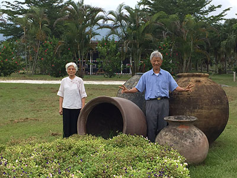

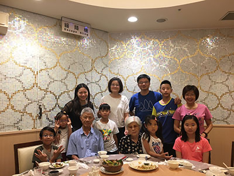

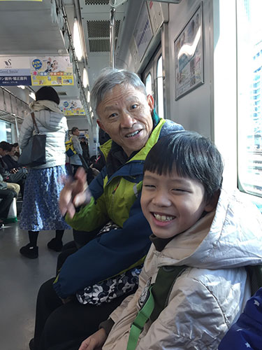

## 孔學一隅

### 論語簡說（三十五）— 陽貨篇第十七—第十九章

時哉講述

夫子或對某人發

子貢當時懂局人

借問引出夫子意

道在言外而悟之

前言

本章夫子竟然向弟子們表示不想再說什麼話了。是因為夫子不願再教導弟子嗎？還是另有言外之意呢？本章乃孔子提示弟子道要離言而求，言語雖能詮釋道，但不是道；道理要靠心領神會，而言語只是指引。故可知，「予欲無言」並非不想教，而是一種無言之教。但不禁又要問，難道學道就不必言語嗎？

《莊子》天道中說，語言有其限制性、侷限性，很多事情無法說清楚。舉例而言，要描述一杯水是冷、稍冷、熱、極熱，唯有喝下去才知道，否則難以體會。意即未經實踐，很多語言無從了解。

教育是要引發學生的善法欲，讓他了解文字語言所要形容的義趣。老莊所形容的形而上是「因指見月」，藉著手指頭去看到月亮，它是離開語言文字的，越懂道的人越說不出來。

可是老莊也說了很多，所以本章如果誤讀的話，會認為語言文字不重要。

語言文字到底重不重要？它對我們的影響如何？我們是不是藉著語言文字去了解義趣？藉著語言文字去形容形而上，脫離了語言文字去體會形而上的時候，語言文字的功能如何？都是這章要談論的內容。

經文

子曰：予欲無言。子貢曰：子如不言，則小子何述焉。子曰：天何言哉。四時行焉，百物生焉。天何言哉。

消文

孔子說：我很想要不說話。子貢說：老師您若不把道理說出來，則弟子們如何依著老師所說來闡述、傳承呢？孔子說：天沒有說什麼，而四季不停運行，萬物因此生生不息，天辦了一切事，祂有說話什麼話嗎？

章旨

此章孔子提醒弟子，學道必須離言而求，言語是詮釋道的工具，而不是道。

求學要在躬行處體認，不可專在言語上尋求。

科判分析

這一章分兩段。

第一段：「子曰：予欲無言。子貢曰：子如不言，則小子何述焉。」

表示道超越言語文字。孔子說，我很想不說話，不說話是我內心的渴望。「言」是自己說，「語」是對談。《論語》中四百九十八條大多都是對談、議論，故不能叫做《論言》。子貢說，老師如果不說，做學生的要如何闡述這些學問呢？意即老師要說，學生才能夠闡述出去。

第二段：「子曰：天何言哉。四時行焉，百物生焉。天何言哉。」孔子點出，學道要離開語言文字而成就、而證悟。天沒有說什麼，而「四時行焉」，春夏秋冬不停地運轉，萬物生生不息。「天」讓「四時」次第成就，「天」讓萬物生生不息，請問「天」有說什麼呢？

釋義

孔子說「予欲無言」的語氣如何？

孔子的語氣是「唉！我很想不說」，是要點悟某些弟子的感嘆詞。

孔子如果不言會有什麼問題？

子貢說：「子如不言，則小子何述焉。」「述焉」即後面的複講、義趣的弘揚、傳承，或是懂得義趣的著書立說。這些都是要老師先講述，弟子們再來論述，若老師不說，什麼學問都傳不下來。

聖人言語的價值為何？依物件不同，其言語又可分為幾類？

君子有三畏，其中一個是畏聖人之言，即對聖人的言語要很警惕，因為那是吉凶禍福的所在，是形而下的出路、形而上的道理，讓修學者能得到解脫，這就是聖人言語的價值。

聖人的言語又可分為幾類。第一類，隨他的心意而說，例如孔子對曾子、高柴這些資質愚魯者，不能想什麼就說什麼，要說他們能聽得懂的。第二類，慢慢引進來以後，老師可以一部分隨自己的心意說，像是孔子對子貢、冉求等學生，便是隨自己的心意說，把學生引到孔子想引的境界。第三類，對於顏回這樣的學生，則可全部隨自己心意說，想到什麼說什麼，孔子曾讚歎顏回「回也非助我者也，於吾言無所不說」，顏回在課堂上時，像是愚癡的人，對於老師所說，無所怪問，可是私下發議論、複講時，能闡發老師的未盡之義。聖人言語的第三類價值就是隨自己心意說，把對方引到最高層次。

此處孔子舉天之形象為何？

天助成一切事情，天都不說，此處所謂的「天」即我們必須要從「言說」去悟「不言說」的部分。很多言語其實在形容意境，要從意境中體會言語在講什麼，否則無用。

若如天之無言，則聖道功能不彰，如何教化世人，傳承聖道？

傳承聖道靠老師說，學生才根據老師講的道理去闡述、發揮、弘揚、傳承。而往往很多人是望文生義、師心自是，自己認為就是這樣講，或是遇到諸多邪見師友，而誤入歧途。

再者，如果不了解言語的旨趣，或是不去實踐，如何體會言語的言外之意、弦外之旨，以及通往形而上之路呢。

《莊子‧外事篇》有個故事，齊桓公在堂上讀書。輪扁在堂下砍削車輪。他放下椎子和鑿子走向堂上去問桓公說：「請問您所讀的書都說些什麼？」桓公說：「是聖人的話語。」

輪扁說：「聖人還在嗎？」桓公說：「已經死了。」輪扁說：「既然這樣，那麼君王您所讀的便是古人的糟粕啊！」桓公說：「寡人讀書，你一個製作車輪的人怎麼能夠這樣隨便妄加議論呢？你要是有道理便好，要是說不出個道理，那就該處以死罪。」輪扁說：「我是拿我做的事來做比喻。砍削輪子，要是輪榫太鬆，容易鬆滑；要是太緊了，那就會滯澀而放不進去。最好要不鬆不緊，這樣才能夠得心應手，我口裡說不出來，卻有奧妙與訣竅在其中。而這種訣竅，沒有辦法言傳。」所以光語言文字是沒有用的。

老子說：「道可道，非常道；名可名，非常名。」老子講了很多的治國之術，可是他的開宗明義就是形而上。可以道(言說)的就不是常道，意即形而上是透過語言文字上去了解的，它不是語言文字。形而上的「名」是不變動的，因為本體只有一個，而形而下的「名」是變動不拘，可「名可名」的。《老子》先講形而上，後面再演變很多治國之術，可見形而上是統攝形而下的中心思想。

本文孔子答子貢兩次天何言哉，意義相同嗎？

「天何言哉」是孔子的總說，「四時行焉，百物生焉」是別釋。天雖然不說，可是天幫助一切發生，最後說「天何言哉」。

「道」不是言說，所以在言說上沒有道可得。道是經過實踐，才知道言說的意涵。

孔子不欲言，是針對子貢多言而發此議論嗎？

子貢說的「小子」，指孔門座下的學生們，而不是指自己，表示此章是孔子針對在場的學生說這樣的話，於是子貢代表在場的學生發問，希望老師能夠繼續講述，弟子們才能夠傳述。老師說得多，學生就聽得多；學生聽得多就思維得多；思維得多就悟得多。我們可以觸類旁通、私下討論、互相研究，只要老師說，我們都可以繼續發展下去。

宋儒不在現場，卻直指孔子之意是針對子貢多言，會產生什麼問題？
在現場都可能有問題。例如，餓於陳蔡時，子貢看到顏回偷吃稀飯。便去向孔子報告：賢者也會有卑僕的行為嗎？孔子立刻
**問：** 你看到什麼？並把顏回找來說：稀飯拿去祭天。顏回
**答：** 不能祭了，因剛才風沙大，上面一層沙。我們已經七天斷糧，糧食得之不易，所以我把上面的沙先喝掉，喝過的稀飯不能祭天。由此可見親眼看到的，尚且有問題。

有注云，夫子是「欲訥於言而敏於行」，要弟子不要說多做少，特別是子貢，如此可乎？

子貢並不是說多做少的人，他在魯哀公十一年救了魯國的亡國之禍。魯哀公十五年，子貢要回了魯國的土地。孔子周遊列國、顛沛流離，開銷由子貢買單，孔子過世後，子貢還守喪六年。

有注云，孔子以「天何言哉」開示子貢，可惜他始終不悟，如此可乎？

子貢曾說「夫子之文章可得而聞也，夫子之言性與天道，不可得而聞也。」感嘆夫子性與天道的內涵太好了！一般人聽不到。
又例如子貢曾問孔子：「貧窮的人不諂誑，富貴的人不驕傲如何？」孔子回
**答：** 「很好，但不如貧窮的人樂道，不如富有的人好禮。」子貢說：「是不是《詩經》裡面說的『如切如磋，如琢如磨』呢？就是精益求精呢？」孔子便讚許子貢的悟性，可以與他言詩。

孔子的「欲無言」是不是不欲言教？孔子不願再教導學生嗎？

後文說「子如不言，則小子何述焉」，老師你如果不說，我們怎麼去演繹、傳述、弘揚、深入、傳承呢？這就是言教。

孔子自己說「學而不厭，誨人不倦」、「自行束脩以上，吾未嘗無誨焉」、「不憤不啟，不悱不發」，這哪裡是不教呢？問題是學生有沒有根據老師所說的去體悟，或者是透過老師所說的義理去實踐，再回過頭來看到語言的價值。

有云，以天喻道遠離文字，心行見聞覺知，是否開口便錯，動念即乖？

有人說天比喻道，因為天是離開萬事萬物的天，道表示離開語言文字、離開見聞覺知，見聞覺知都是指心的作用，意思就是開口就錯，動了念頭就錯，因為道是離開語言文字跟見聞覺知的。

此引禪宗的「動念即乖」，可是如果動念都錯，那聖人如何證道？動念即乖是指世俗的心念到不了，不是說沒有任何的心念可以到。

學道到底要離言還是依言？

學道依言指要依著道、依著語言文字去聽聞、思維、體會，體會言外之意、弦外之音，體會形而上。可是離言證悟後，回頭還是要依言引導他人。

有注云，孔門傳承顏、曾，一者不違如愚，一者魯，都不在言語見長，可見言語是學道障礙，如此可乎？

若言語是學道的障礙，孔門何必分德行、言語、文學、政事四科。政事科的冉求代表季孫大夫做過使者，文學科的子夏做過魏文侯的老師，在魯國講禮學的時候，子游是一個標竿，群言惑亂以子游為依歸，這些都是靠言語的講述。

如果只重視言語，不了解言語所指的義趣，只是在言語下講求華麗的文字、虛浮的表象，那言語是障礙。可是言語如果能夠指歸向上、指歸義趣，不會成為學道的障礙。

有注云，由本章了解要傳承孔子之道，還得如禪家「以心印心」，用心體會道的本來面目，如此可乎？

以心印心指自己本身證悟後，對方也證悟，你就以自己的心去印他的心。禪家的以心印心指當你學道有所體悟時，一見對方就可判斷他是否有學道。就像孔子對曾子說：「吾道一以貫之。」曾子曰：「唯。」孔子便了然於心。

本章不是以心印心，而是說明道在語言文字之外，要有所體悟，回過頭來才知道語言文字的價值。

總結

第一，雪廬老人說，〈陽貨篇〉多記其當時之事與時之言語，以當時之人，皆悉知之，故記之略，後人則難知矣。這一章注解很多的揣測，不足以採用來解釋，應該要規規矩矩地注解它。

第二，孔子的道有言語的、有言語之外的道，言語之外的道包括形而下、形而上，孔子集大成，收羅各家精華成為一個體系，時人卻把孔子當成一家之言，很是可惜。

第三，言教很重要，透過言教才能夠聽多、思多、體悟多，回過頭來，才知道言語的價值。

第四，言語的價值在引出形而下的義涵，例如仁心的重要、斷惡修善的重要、改變命運的重要，引出形而上能夠解脫的重要。言語引你改變命運、通往解脫，言語的價值就在你身上顯現。

第五，一定要親近善知識去學習言語的內涵，在辦事、處世當中體會言語的義趣，看到道的價值。

問答

**問：** 《論語》有一篇「高宗諒陰，三年不言」，此「不言」指什麼？

**答：** 此章「不言」是不言教，「高宗諒陰，三年不言」，「諒陰」指天子居的凶廬，即天子遇到父親的喪事，不能住在宮殿，要住往他處。三年不言並不是三年都不說話，而是三年不言朝政，因為心思專注在父親的喪事上。

高宗的三年不言，有其政治目的，父親留下的臣子中，有一些他不想用，可能是因為品德不佳，可是他沒辦法絀退，只好委託宰相去處理。

**問：** 儒家的「天」有幾種的含義？

**答：**  １、上帝，此上帝不是造物主，如果說萬物都是上帝創造的，則斷惡修善成為無用，因為一切決定在造物主手上。此上帝是如果你能斷惡修善，他能夠幫助你趨吉避凶。２、吉凶禍福的道理。３、形而上。

**問：** 本章跟《孟子》書中提到的「天不言，以行與事示之而已矣」，即以行為與事件去顯示。《莊子》書中也提到「天地有大美而不言，四時有明法而不議，萬物有成理而不說。聖人者，原天地之美而達萬物之理，是故至人無為，大聖不作，觀於天地之謂也。」與本章的意思是否相同？

**答：** 都相同，告訴我們這些形而上的道理要離開語言文字去體悟的。但並不是說剛開始不要語言文字。

**問：** 道在日用平常中求，這一句話應該怎麼去理解？

**答：** 道必須要結合日用平常，了解道理後要用在日常生活，在實踐中體會。再者，讀經要引發我們悲天憫人的心，看到聖人的情懷、有情的恩德，想到生活中的享受都是來自於別人的幫忙，所以我們要為天下蒼生努力奮鬥。

道指到形而上的時候，我們要在日用平常中要去體會空空如也的體性，《易經》說：「易無體，而神無方」，所有事情都沒有本體，端看如何運用。

**問：** 如果本章是顏回在場的話，孔子也會這麼說嗎？若孔子這樣說，顏回會怎麼回答呢？

**答：** 顏回不違如愚，什麼都懂，一目了然，所以不會像子貢一樣問老師為何感嘆。

**問：** 本章除了要在語言文字之外有所體悟，是否還有其他意思？

**答：** 本章談到體悟及實踐，但實踐必須從體悟來。體悟如果沒有實踐，只是在發揮想像力而已，並不是在經歷上說。至於說後面的著書立說，也必須經過對道理有所體悟，再去發揮、著書立說、演繹。（下期待續）

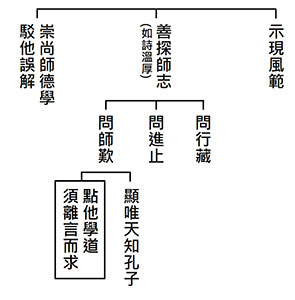

### 孝道跨時代的意義與價值— 孝經簡說（二十一）

時哉講述、淨域編寫

孝乃經天緯地行

大而無外小無內

聖道之本生大用

纍纍樂果從彼出

孝子喪親的禮法〈喪親章第十八〉（上）

前言

《孝經》研學進入最後一章〈喪親章第十八〉。眾知孝道實是人格的養成處，它分為兩部分，一是父母在世時，另一是父母過世後的行孝之道。人的一生要有品格、有尊嚴、結善緣、有見地，能辦出好的政治、教育，這須從孝道出發，才能將上述所說經營的圓滿。此外，為政者本身，若在喪葬祭祀能特別以身作則，並且化導風俗，相信整體社會會帶動感恩、為人著想的風氣。這樣的環境有利於經濟發展與人才的集中，所以，《孝經》的十八章裡，特別是第十八章，都是國家強盛、民族延續的秘密所在。

架構

總說是《孝經》的「開宗明義」，即是「孝道的修學法與義理」。分別說是「孝道很重要」，它是各階層必須要做的，譬如：天子、諸侯、卿大夫、士、庶人，都是必須要盡孝道的。天子把政教辦好，產生極和諧的氣象，這時天地和諧的氣象，就是人類最幸福的現象。所以，人稱為「三才」的理由就在此。

其次，要如何以孝事親呢？要透過天子以孝來治天下，用聖人治理天下的榜樣與典範來治理天下，百姓就懂得以孝來事親。這種孝道是需要推廣的，推廣能夠取悅於天下，能夠成就辦政治的人，他偉大的德行也能夠發揚好名聲。除了對父母盡孝外，父母若有什麼不如理如法之處，子女們也要懂得勸諫導正父母，這更是孝道圓滿的現象。孝子們若能懂得孝親敬長來祭祀，必能感應天地神明。不但能夠盡孝，還能以孝來進退，這特別講的是能夠盡忠。以上說的是《孝經》十七章。

第十八章是父母過世時，該怎麼依禮來圓滿對父母的孝道。本章經文架構總說喪親。惟孝子的父母過世了，要怎麼來表達喪祭之事呢？於喪事來說，總的要有「哀戚之情」，但此哀戚最多只能三天不食，不能超過三天，否則就會危害了性命，反而不是行孝之道。父母過世要守喪三年，守喪至多三年，這表示「喪」有終止的時候。而父母入殮時，須備以棺、槨、被服，且祭祀莊嚴，出殯送葬還要選擇好的墓地，此乃是「三年之喪」。就祭祀來說，父母出殯之後，牌位附在祖先之後，於宗廟裡接受祭祀。最後結贊，若父母活著時，懂得以愛敬來表現關懷；父母過世後，能以合乎禮的哀戚形式，來表達對父母的思念，那麼孝道就非常的完備了。

經文：

子曰：「孝子之喪親也，哭不偯，禮無容，言不文，服美不安，聞樂不樂，食旨不甘，此哀戚之情也。三日而食，教民無以死傷生，毀不滅性，此聖人之政也。喪不過三年，示民有終也。為之棺槨衣衾而舉之，陳其簠簋而哀慼之。擗踊哭泣，哀以送之；卜其宅兆，而安措之；為之宗廟，以鬼享之；春秋祭祀，以時思之。生事愛敬，死事哀慼，生民之本盡矣，死生之義備矣，孝子之事(親)終也矣。」

釋疑

子曰：「孝子之喪親也。」(總明喪親)這是總說，孝子的父母過世了。「哭不偯，禮無容，言不文，服美不安，聞樂不樂，食旨不甘，此哀戚之情也。」(總明哀戚之情)孝子表達的哀戚之情謂之「哭不偯」，意即號啕大哭到氣竭，哭到哭不出聲為止，表達十分哀痛的孝心。「禮無容」即不太講究進退的禮儀，無論什麼樣的訪客來，都沒有心思接待。「言不文」是言語也不加修飾，僅人問他答而已。「服美不安」乃守喪期間穿孝服，穿上美麗的衣服心理不安。「聞樂不樂」是聽到美樂，心情也快樂不起來。「食旨不甘」吃到好吃的東西，也不覺得爽口。孝子心裡面哀痛父母過世，哪有心情去行世間的享樂呢！這就是「哀戚之情」。

經文：「三日而食。」(標)父母過世三天裡實在吃不下，但聖人規定三日以後一定要吃，理由是「教民無以死傷生，毀不滅性。」(示由)，乃教導百姓不要因為父母之死，不吃不喝以致生命損傷，反是不孝之舉。所以「毀不滅性」的毀，可能是形體會消瘦，但不會喪失性命。因為三天不吃喝、睡不著覺，難免形體會消瘦，不如以前白胖，謂之「毀」。而「不滅」，就是不會失去性命。

經文：「此聖人之政也。」(結明)這是聖人的仁政，仁政就是用禮來節制人情，孝子盡孝道要有節制，不能超過這個範圍、喪失性命。經文：「喪不過三年，示民有終也。」(標)守喪要三年，但不要超過三年，一般而言是二十五個月。此乃告訴百姓，喪期是有終止的時候。

經文：「為之棺、槨、衣、衾而舉之。」(入殮)入殮、出殯的時候，要怎麼出殯？叫作大殮、出殯。大殮是棺木封釘，準備要出葬。棺是內棺，盛裝遺體；槨是套住棺的外棺。「衣」是大殮身穿的衣服，「衾」是包裹屍體的棉被。埋葬的「葬」，其實是「藏」的意思，就是衣服足以莊嚴這個身體，然後棉被裹著身體，棺又把身體蓋住，槨再套著棺，代表這個屍體是密藏完好的。

經文：「陳其簠簋而哀慼之。」(祭嚴)出殯時要祭祀，所陳列的簠簋為祭祀盛穀物的禮器，「簠」之器形為內圓外方，「簋」是內方外圓。為何用此禮器祭器表達哀戚呢？因為祭祀時，已見不到父母來享用，所以感到非常的傷心。

經文：「擗踊哭泣，哀以送之。」(送葬)棺木移走時，當是「擗踴哭泣，哀以送之」。「擗踊」之意，可以說是哭得跳起來，其中「擗」是男哭跳得比較高，「踊」是女哭跳得比較低；也可以說是哭得捶胸(擗)跺腳(踊)。無論如何都是表達極度的哀傷。而「哀以送之」，就是悲哀地送喪父母。

經文：「卜其宅兆，而安措之。」(墓地)意即事先卜卦，看墓穴的風水位置是否吉利。「宅」就是墓穴，若事先卜卦吉利，就可以用來安置棺木。經文：「為之宗廟，以鬼享之；春秋祭祀，以時思之。」(約祭)遺體葬在墳裡後，要將靈神迎回來，奉在自家的廟裡。古代的祀有宗廟，士一廟、大夫三廟、諸侯五廟、天子七廟，迎回來奉在自家祖先的宗廟，並以「鬼」禮享之。父母死了叫作「鬼」，正人君子死了叫作「神」。「享」是祭拜食物，請父母來享用。春秋兩季不寒不熱，於此時來行祭祀，春祭概在清明時節，秋祭為中元節前。另於父母生、亡日或母難日時，同行祭祀之禮，用以表達思念父母的恩德。

經文：「生事愛敬，死事哀慼，生民之本盡矣，死生之義備矣，孝子之事(親)終也矣。」(結贊盡孝完備)孝子果真這樣做，於父母生時事奉雙親以愛敬，父母過世時備辦後事以哀戚，則一般人(生民)知恩報恩的本份就盡心盡力了，辦理喪事祭祀的義理也完備了，如此一來，孝子事奉父母算是圓滿了(明代黃道周法書最後一句，無「親」字、有「也」字，是與今流傳內容唯一異處)。以上是這一章的大義。

本章何以是《孝經》的結尾？ 因為前十七章告訴我們，不管孝子是什麼身分，須依著身分來盡孝道，且講究的是心態、方法，懂得移孝作忠，不止利益家庭也利益國家。這一章更特別談到父母過世要如何辦理喪事、行祭祀，用辦理喪事、追思祭祀，來圓滿整個孝道，使本章成為《孝經》的結尾。

析疑

《孝經》說此章的理由為何？

這一章很重要，眾知一國的風氣，定要從孝道上經營，而孝道之經營，最重要的是喪葬祭祀。父母過世了，孝子藉喪葬祭祀將餘恩保留在心中，傳承於後代子孫。這種感恩的風氣，從天子去推廣時，曾子說是「慎終追遠，民德歸厚。」慎終是妥當的辦理喪事，追遠是要依禮來祭祀。這種感恩心成為風氣的來源，人民一定會互相幫助、彼此體諒，乃至於能夠助成其他品德的發揮。如果國家能夠如此，就不需要員警，世間也不會有以下犯上、殺父弒母者存在。雪廬老人說：現在的政治，如果沒有從根本之道講究，整個社會的亂象無從禁止，那麼家家戶戶便人人自危。試想，推展孝道對家國都有利，那麼為何不推展呢？這實在是很可惜。

《論語‧為政》篇載：「孟懿子問孝。子曰：『無違。』樊遲御，子告之曰：『孟孫問孝於我，我對曰無違。』樊遲曰：『何謂也？』子曰：『生，事之以禮；死，葬之以禮、祭之以禮。』《孝經》說這一章的理由就在這裡。孝道不僅是父母在世時「事之以禮」，還要於過世後「葬之以禮、祭之以禮」。

又《論語‧八佾》篇載：「林放問禮之本。子曰：『大哉問。禮，與其奢也，寧儉。喪，與其易也，寧戚。』」林放問禮的根本時，孔子說：問得太好了，祭祀之禮，與其講究奢侈，寧可儉約，表達誠意。喪事的辦理與其完備，不如內心的哀戚。這一章講喪葬祭祀的原則，它是禮的根本，這個根本實是從報本還恩開始。試想，禮如果不是在感念人情、恩德，便是你來我往的虛應故事。

《論語‧陽貨》篇載：「子曰：『禮云禮云，玉帛云乎哉。樂云樂云，鐘鼓云乎哉。』」所以，孔子說：禮呀！禮呀！難道只是你送玉、我送帛嗎？樂呀！樂呀！難道只是敲鐘打鼓嗎？如果不能表達五倫深厚之情，此禮與樂有什麼意思呢？於表達人情中，是個為人著想、感念恩德的，若不從自己的父母開始，此一美好的品德怎麼去發揮開展呢？社會的亂象怎麼去對治呢？本章告訴我們，孝子喪親之時，人是號啕大哭不拘禮節的，言語是不特別講究修詞的。

守喪穿喪服的等級與意義？

在中國文化中，穿喪服有其特別的等級與內涵。其等級有斬縗、齊縗、大功、小功、緦麻之別。這五種喪服表達九族的關係，九族是上從高祖、曾祖、祖父、父親、我，然後下至子、孫、曾孫、玄孫。以前抄家滅九族是最嚴重的刑罰。明成祖攻破南京時，令方孝儒詔書天下，方孝儒不肯，成祖氣得要殺他九族。方孝儒說：「殺十族我都不怕。」結果，成祖竟把方孝儒老師的族人也殺掉，湊成十族。喪之五服就是這九族的關係，這章特別講到的是「斬縗」。父母、祖父母之喪，或者太太服先生之喪，就是「斬縗」。二十五個月裡，除了喪服外，親友的婚喪喜慶，一概不能參加，且要表達喪事當中的禮儀，即是前說的「哭不偯，禮無容」等，乃是自然哀戚的真情流露。

喪服維持的重要性，對家屬、社會風氣有何助益？穿喪服似乎已不符合時代意義，其能否應著時代作變革？

不。維持喪服有其重要性，對家屬及社會的風氣具有正面功能。團體中往往有親友過世，便經常接觸喪葬事宜，曾聽一位葬儀社老闆說：「現在有個怪現象，臨喪普遍穿黑衣褲，著黑衣固然可以統一，但我不曉得誰是孩子、誰是孫子…？」如果依禮穿喪服，明眼就知道你的等級，是兒子還是孫子？是平輩、晚輩還是長輩？

古代喪服何以用縗麻，有何意義？

斬縗就是用粗麻。古代的喪服，無論是斬縗、齊縗、大功、小功、緦麻，實際上都是用縗麻所做。斬縗的「斬」字，是衣服不縫邊，並以粗麻做腰帶繫綁，代表服最重的喪事。古代的喪服為什麼皆是縗麻所做？此「縗」之意，係指家喪的錐心之痛，故而稱作縗麻。

常人對於守喪者，如何表達恭敬？常人對守喪者要表達恭敬，為什麼？

因為守喪的人在盡孝道，是極佳的社會風氣，見靈車經過時，不能按喇叭催促，也不能亂語「這家死人了」，要懂得尊重喪家之思親念恩。以前雪廬老人見警員前來查戶口，都恭恭敬敬地把戶口名簿奉上，不因為對方官職的高低，而是敬重他在執行公務。社會的亂象往往在於失敬，甚至於傷害執行公務的人，卻判處無罪。如此試想，社會的亂象怎會止住呢？又恭敬如何能表達呢？《論語‧子罕》篇載：「子見齊衰者，冕衣裳者，與瞽者。見之，雖少必作，過之必趨。」孔子雖貴為魯國大司寇，但見到「齊衰者(服重喪的人)」，即便他的年紀還小，若坐時一定站起來，若站立時一定移動位置。他人在服喪、守喪時，要表達同情心與恭敬心，這個社會才會顯得溫厚，感恩的風氣方能引起來。許多人以為做善法，必要出門去做，然而行善另有一法是不用錢就能做得的，只要你維護社會善良的風氣，這個善法就不得了。

本章所說哀戚之情，《論語》上孔子是否亦有言之？

《論語‧陽貨》篇載：「子曰：『夫君子之居喪，食旨不甘，聞樂不樂，居處不安。』」《孝經》裡說居喪，吃不出味道，聽到音樂也不快樂，除此之外，《論語》更增加一個「居處不安」。即是住在好地方也會心不安，於是住在另一個處所(凶廬)守喪，不住在原來的地方，用以表達對父母的哀思，且這個哀傷不能把性命喪失掉，是有禮要節制的。

《論語‧子張》篇載：「子游曰：『喪，致乎哀而止。』」子游對於居喪一事說：到達哀的程度就可以了，不可超過，否則反是不孝。這即是仁政，聖人知道孝子會真情流露無法自已，於禮必要加以節制，否則把身體弄壞，不是真正的盡孝道。

父母過世哀痛逾於常情，三日後還不吃飯，會有什麼過患？

《禮記‧曲禮》中說，如果三日之後還不食，將造成身體嚴重的損傷或喪命，反而對父母親不慈不孝。子思於祖父孔子在世時，只是個三、四歲的孩童，但卻表達要傳承祖父的志向，孔子聽了非常高興。子思後來隨著曾子學習，通達了性與天道；其在禮的抉擇上，幼年時便知曉道理。他與老師的對話如下：「曾子謂曰：『伋，吾執親喪水漿不入口者七日。』子思曰：『先王制禮不敢過焉，君子居喪水漿不入口者三日，杖而後能起焉。』」(見於《文廟賢儒功德錄》)
曾子說：「伋(指子思)我告訴你，當我父母過世時，我哀傷到七天吃喝不下。」子思回
**答：** 「哦！先王所制的禮不可以超過。君子居喪時三天水漿不入口，那時已不勝體力了，須要拄著拐杖才能起身。」子思對老師這樣說，這就是「幼而知禮也」，是子思的不凡處。子思受困於宋國時，說：「我的祖父受困於陳蔡，還能對弟子講性與天道，而我在宋國遭困，怎可以沒有心得呢？」所以，就在宋國寫了《中庸》，那時他只有十六歲。

守喪為何以三年為限，有何依據？

孔門弟子宰我曾問孔子守喪三年是否太久了？《論語‧陽貨》篇載：「宰我問三年之喪，期已久矣。子曰：『子生三年，然後免於父母之懷。夫三年之喪，天下之通喪也。』」此意是說，父母生下我們，在懷裡抱養三年，所以我們用三年守喪來回報父母，這三年之喪是天下的通喪。又《禮記》更說：「夫三年之喪，天下之達喪也。」這個「達」是什麼意思呢？乃指上從天子下到庶人，都得這樣做。此一作為就是，無論穿著喪服、吃著粗食、住著凶廬，乃至於想著父母的恩德，自夏商周三代迄今都是一樣的，這叫作「達喪」。「達」不僅是指天子到庶人，連夏商周三朝都是如此。

對於孝子而言，守喪三年還有何深層意義？

守喪三年除了父母生育抱養我三年，所以父母過世時，以守喪三年來回報外，此更深含義於禮上說，既能令不孝之人不得不這樣做，也可使孝子們不能太超過。有的孝子終生哀傷，心情跌進去拔不出來，這樣反而不孝，是不可以的。所以，講三年之喪，一方面約束孝子不可以終生守喪與哀傷，一方面也可以警惕告誡不孝的人要有所振作。守喪三年能壓住超過的人，將不及的人提上來，這就是恰到好處的中庸，能讓社會的風氣發揚，保住賢哲不要終生守喪與哀傷，成了禮崩樂壞的局面。

古代為官時逢到父母之喪，該怎麼辦？

這個喪事是最重要的，父母過世謂之「丁憂」。「丁」就是遭逢、遇到，古代特別指官員居喪，父母過世要辭官守喪三年。期間家裡不許婚嫁，任何應酬都不行；但若國家急需此人辦理政事，就另當別論。例如：晚清同治中興人物沈葆楨，守喪百日就被左宗棠推薦，出任船政總理大臣，國家徵召乃不得已之事。又如，明代張居正輔佐幼帝朱翊鈞，萬曆六年父母過世，離京返家守喪。當時萬曆帝僅十六歲，特別倚靠他主持朝政，因此僅返家守喪百日。如此說來，三年之喪是天下的通喪與達喪。

《論語》中有誰是三年之喪的典範？

《論語‧憲問》篇載：「子張曰：《書》云：『高宗諒陰，三年不言。』何謂也？」此中所說高宗諒陰，是指殷高宗武丁住在凶廬，就是孝子另外住一個地方，不住在皇宮裡。在居喪的三年中不言，是說武丁不去議論朝政，將國事交給宰相處理。這三年裡他實是在想著未來怎麼治理國家、舉用賢才。三年後武丁將國家形勢觀察清楚後，便正式治理國家，不但把衰敗的商朝復興，也提振禮教，執政的五十九年是商朝的盛世，所以廟號稱作「高宗」，「高」就是讚譽他將國勢拉升起來。三年之期，除了守喪念父母恩德外，其中還有許多的內涵，譬如「無改於父之道」，意即不改變家中的老規矩，這個典範是誰呢？《論語‧子張》篇載：「曾子曰：『吾聞諸夫子，孟莊子之孝也，其他可能也，其不改父之臣，與父之政，是難能也。』」曾子聽聞夫子談說孟莊子。孟莊子為孟獻子的兒子，孟獻子是《大學》中所說的賢大夫，乃魯國三家大夫之孟孫大夫，他的兒子是孟莊子。孟獻子過世時，孟莊子世襲父親的位置，居大夫之位僅有四年，其中三年守喪，一年辦理政事。在這四年中，他沒有換過父親所任用的臣子，沒有改變父親行政的風格。所以，曾子才說：我聽過老師提及孟莊子的孝道，除了與一般孝子的守喪之行外，特別難得的是那「不改父之政、不改父之臣」之行，這不是一般孝子做得來的。

上述三日而食、三年喪期之旨趣(更深的涵義)為何？

《禮記》中說，孝子臨喪三天後吃得下飯，又守喪三年，此時，仁者可從孝子守喪的心態、作法中，見到他對父母的親愛；有智慧的人看到孝子依禮而行的理智；強者看到孝子的志向與耐力。這個人必是國家的幹才，在行禮時有他見地支持的那一分。《禮記》上亦說，這個人若為人子的就是孝，為人弟的就是悌，為人父的必是有貞潔之父。社會若都是這類人，這個社會真不得了，必是富強康樂，近者悅而遠者來，經濟興旺人才集中，國家強盛民族延續。

總結

首先，父母恩德之重，在現今這個時代，很難認真去觀修，反而殺父弒母之事，在社會上每見發生。古代把殺父弒母，看作是世間最不吉祥的事，必要處以就地正法，然後將他的住家摧毀，把殺人的地方挖成池塘。

其次，《論語‧子張》篇載：「子張曰：『士見危致命，見得思義，祭思敬，喪思哀，其可已矣。』」一位讀書人，在危險時候能夠承擔，懂得愛財有道，面對喪事能盡哀，行祭祀能盡誠，能如此也就沒白學了。」

再者，《禮記》中說，禮是順應天地的，禮的作息配合天地、四時與陰陽，什麼叫作配合陰陽呢？喪禮與婚禮本來就不一樣，它是配合陰陽、合乎人情的。試想一個禮的運作，既是配合天地、四時與陰陽，又合乎人情義理，那會是個怎樣的禮呢？禮運行起來，對整體社會的影響力如何？對人心的影響又如何？

最後，喪事中血緣是講究恩，至於對外呢？譬如：參加喪禮時、祭祀講究禮與義理，而「三日而食、三年守喪」表現的是節制。然而其中有許多的變化，譬如：有時必得移孝作忠，這代表的是權變。所以，整體喪禮中有恩情、理智、節約、權變，不是表面所見的這麼簡單。如果此人能好好地行禮，既有原則又配合人情，能照顧全體又知進退懂權變，這不是人才又是什麼呢？

眾知，禮之所在就是道的所在，道就是仁心，乃至於從禮中去了知人情，通達吉凶禍福的體性本是空的。該如何善用禮來趨吉避凶？整個禮的本質又走入性與天道。以上是本章的大意，果然家庭中能圓滿盡孝，國君及領導者能戮力推行，則上行下效民德歸厚，這才是時代的出路。（下期待續）

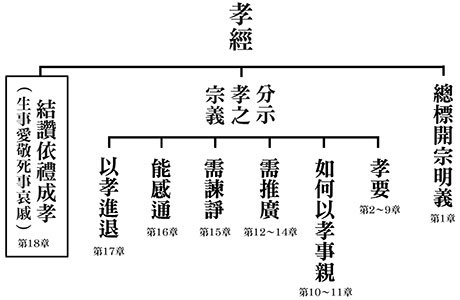

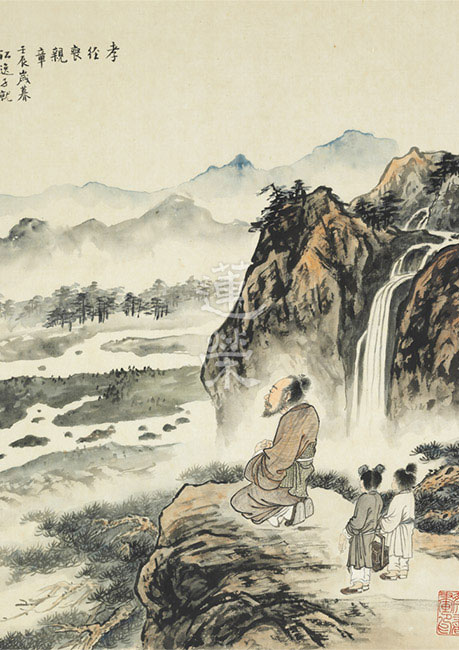

### 孔門心法—中庸之道（十六） 第十三章：道不遠人，原來我們跟道這麼近

*戒慧講述、弘毅整理*

道從教倫盡分出

言行相顧得信譽

可貴資產是人格

性與天道在其中

前言

世間百工技藝皆有其道，茶有茶道、花有花道，武士有武士道。人人都想求道，而孔子亦有他所求之「道」，但是道要如何求，道在何處？子曰：「道不遠人。」對於有心求取孔子之道者，這句話給了我們一個方向，沒聽到會抱憾終身，迷踪失路，聽懂則能心領神會，終生受用不窮。

道在人身上，離開人則不能稱為道。而人離開道，就不能進德修業、破迷啟悟、離苦得樂，所以人與道是相應的。

科判分析

中庸總體科判

第十三章還在《中庸》的第二部分，即分別顯示中庸的修學法和義理。

本章科判分析

本章分為兩段，第一段是道在人身，第二段是忠恕近道，表現在世間的倫常。

經文：

子曰：道不遠人。人之為道而遠人，不可以為道。

消文：

孔子說：道不可以遠離人，人在修學道而遠離人，這不可以成為道。為道要透過聞思修，用於日用平常才可以。道離開人就不能稱為道。

經文：

詩云：「伐柯伐柯，其則不遠。」執柯以伐柯，睨而視之，猶以為遠。

消文：

《詩經》上說：「我們砍樹幹做斧柄，做斧柄的法則就是手上握的斧柄。」拿著斧頭的木柄來砍樹，不用手上的斧柄來作標準，要用木頭來做斧柄是不可能的。

釋義：

「柯」，斧柄；「睨」，斜著眼看。

經文：

故君子以人治人，改而止。

消文：

因此君子要用有道的人來培養人、管理人，君子是要改罪和過的，否則就如王莽和曹操雖然有才，卻壞亂天下。或者說，君子要求自己嚴格，對他人是不苛刻的，只要對方願意改正罪和過，就可以了。

發明：修道的標準在人，有道的人才能弘揚道，沒有道的人則無法弘揚道。修道必須透過聞思修，多多串習，使體悟愈來愈明顯，直到道理像是在眼前看花瓶一樣明顯。君子用有道的人來管理人，不可以只有法令規章，這樣是沒有用的，法治治國，民免而無恥，事項條文沒有用。只有質地好、好學的人，才能導正風氣、培養人才。心術不正者，想要他弘揚道，也是不可能的，不但會糟蹋道、傷害道，還會使道提前滅亡。孔子的學問能培養君子之才，是因為以道人才能培養出道人，少正卯則是培養小人之才，因為以小人之心來培養，只能培養出小人。

經文：

忠恕違道不遠。施諸己而不願，亦勿施於人。

消文：

能夠行忠恕之道就離大道不遠了。不願意他人施加給自己的（如他人對自己無禮、不守信等），就不要施加給他人，這就是將心比心的恕道。

釋義：

「忠」，心術正，表裡如一，有誠意；「恕」，將心比心。

經文：

君子之道四，丘未能一焉。所求乎子以事父，未能也。所求乎臣以事君，未能也。所求乎弟以事兄，未能也。所求乎朋友先施之，未能也。

消文：

除了前章所述的夫婦倫，君子之道在倫常中還有四倫，我不能在任何一條上圓滿。所求要能以子來侍奉父親盡孝道，我未能夠做到圓滿，因為事父之道包括：兄弟和睦，孝順父母的身和心，規過勸善，好的態度、言語，以及為國盡忠等；所求要能以臣子來侍奉國君盡忠，我未能夠做到圓滿，因為事君之道包括：懂得如何與國君相處，公心辦事，和合大臣，勸諫之道，善巧方便，知識背景和辦事能力等；所求要以弟弟來侍奉兄長，我未能夠做到圓滿，因為事兄之道包括：恭敬，和諧相處，孝道的攝持，以治國來齊家的觀念等；所求要能與朋友先結善緣，我也未能夠做到圓滿，因為要與質地好、好學、有公心的人結善緣，包括禮儀、態度、言語、禮物等方面的講究，如子路是「願車馬衣輕裘，與朋友共」，這就是先施之的體現。

經文：

庸德之行，庸言之謹，

消文：

平常的行持要有德，如不要失禮於人或者沒有公德心等。平常的言語要謹慎，不能輕佻或者不守信等。

發明：

謹言慎行是很重要的，不僅在重要的場合或者對著重要的人如此，在平常也要注意，如對著鄰里家人，也要懂得了解他們的需求，察言觀色，不說過分的話，做過分的事情，否則會在不經意當中，減輕彼此的交情，失去他人的信任。

經文：

有所不足，不敢不勉，有餘不敢盡。

消文：

要反省自己的言行有哪些不足之處，不敢不勉勵自己要注意平常的言行，否則在做善的同時，會因為言行的過失而使福報流失，或者因為沒有好好的對待陌生人，而導致後面好的事情不能發生，或者因為不好的對待，而導致壞的事情發生。言語行持不能太滿，要留有餘地以便自己修正或者讓他人指導。

經文：

言顧行，行顧言。君子胡不慥慥爾

。

消文：

言語要顧慮行為，要看是否能夠做得到；行為也要顧慮言語，要注意行為是否在兌現言語。若不注意，會讓自己的善緣減少、福報消失。所以君子何不在言行上急切的講究呢？

釋義：「慥慥」，朱子、鄭康成的講法是「實在」；王引之《經義述聞》上解釋成「急切」。

章旨

１、道沒有離開人，這個人才是有道之人，有道之人的人生才真正有出路。

２、道不是抽象的，而是可以實踐的，實踐在忠恕。忠是誠實的質地，恕是將心比心的心態，能夠在五倫上將心比心，必是敦倫盡份的君子。

析疑

一、本章與前章關聯為何？

前章言君子之道從夫婦開始，本章言道不能離開人，人也不能離開道。不只講到夫婦之道，還講到其他四倫，以及人際關係相處在平常的言行上講究。居家中容易隨便，不經意的得罪家人，愈熟悉就要愈小心言行，吉凶禍福就在平常相處，所以「看似尋常最奇絕，成如容易卻艱辛。」

二、中庸之道難證，得道之人如此稀有，為何還說道不遠人？

中庸之道難證，是因為有這樣的見地的師友很難得，所以難懂中庸之道；得道的人如此稀有，因為有心學習的人很少，即便有心學習，但往往好學的心不夠，如同孔子說：「十室之邑，必有忠信如丘者焉，未嘗如丘之好學也」。道不可離開人，離開人則不能成為道。

三、道若離開人，難道就不是道了嗎？

《中庸》第一章言：「道也者，不可須臾離也，可離，非道也。」道一離開人就不是道了。《論語》離開能講解、能觀修、能悟證者，就不能成為《論語》。

四、道在人身的證明為何？

《論語‧衛靈公》篇說：「人能弘道，非道弘人。」只有人才能彰顯道，道不能自己彰顯人。《論語‧子張》篇說：「文武之道，未墜於地，在人。」中國文化的典籍在文王、武王時完備了，但道統能夠傳承下來，是因為有人來弘揚。

五、道雖然在人的身上，但要如何獲得？

《楞嚴經》上說：「此方真教體，清淨在音聞。」教法的體性在傳承，即老師說法、學生聽法。要如何清淨呢？《中庸》上說：「博學之，審問之，慎思之，明辨之，篤行之。」要廣博的聽聞，在《論語》上，學與聽二字互用，如「衛靈公問陳於孔子。孔子對曰：俎豆之事，則嘗聞之矣；軍旅之事，未之學也。」審問就是不懂的要問明白，慎思、明辨即對所聽聞的道理進行思辨，如孔子講善，我們要思維善的定義、形象、做法、效果，有時要反經合義，必須要面面觀察、架構式思維、文句前後推敲、抉擇註解，通達辦事之道，運用人情世故等，才能對所講的內容完整了解。篤行指說話辦事是否能運用上所學的觀念，透過實踐加深對觀念的理解、體悟和通達，而不是離開觀念盲目的去執行。鄉下人的篤行是做不出君子之道的，君子之道就在篤行中歷練體悟，使體悟愈來愈明顯，就像是眼見花瓶一樣清晰分明。博學、審問是非量；慎思、明辨是比量，是悟；篤行是現量，是證。

六、若道遠人，會發生什麼後果？

遠離道的人是非道之人，如追逐物慾、享樂，煩惱現行，追逐名聞利養，變得庸俗，無良師益友，生活沒有內涵、體悟，得不到快樂，即使得到榮華富貴，擁有家產、田園、妻子、兒女，可是在福報當中也沒有快樂，反而要靠安眠藥、鎮定劑來度日，沒有快樂的福報又有何意義呢？

七、為何會發生人之為道而遠人的情形？

一種是雖然跟著良師益友學習，但卻是口耳之學，表面學道但內心遠離道。另一種是世俗人為了名聞利養學道，只是為了考試而學習經典，老師和學生的心中，還是追求世間的庸俗。

八、伐柯伐柯，其則不遠，其原意為何，本章又是何意？

原文出自《詩經‧豳風》「伐柯伐柯，其則不遠。我覯之子，籩豆有踐。」砍樹幹、砍樹幹，我手上所握有的斧柄，就是製作斧柄的法則。周成王見周公東征回國，陳列籩豆等禮器，有禮的迎接周公，化解了他們之間的誤會。另有一解：凡是我值得交往的人，都要以禮儀相待，表達自己內心對他的尊重。因為志同道合的人很難得，我們有時任意相互傷害，難維持友誼而輕易破壞關係，就失去好友，傷害自己修道，最後損失的是自己。

九、君子如何以人治人？

此章是講以人治人，不是以法治人，如果所用非人，法治反而犯罪率很高。如齊國法治，結果犯罪者很多，市場多賣假手假腳，這叫「苟免無恥」。道是不能離開人的，即便志同道合者一起相處，也要非常注意日用平常的言行，否則可能會導致摩擦，降低交情。

《論語‧子路》篇裡說：「善人為邦百年，亦可以勝殘去殺。」要靠善人治理國家一百年，才能將殘暴的風氣消除，死刑可以不用，而法治是不可能做到的。「善人教民七年，亦可以即戎矣。」善人辦教化七年，老百姓有國家和民族的概念，懂得保護國家。「如有王者，必世而後仁。」如商湯王、周文王、周武王、周成王、漢文帝、漢景帝等這種王，必須經營三十年，人民才有公德心，懂得替對方著想，整個風氣才能改好。孔子自言：「苟有用我者，期月而已可也，三年有成。」孔子可以依著他的見地、品格、才情、人才團隊，一年可以安定國家，三年將國家大治，可是如孔子這般的能有幾人呢？

十、君子之道始於夫婦之倫，而本章僅舉其他四倫，其用意何在？

要將經文前後會參，前章標出夫婦倫，此章標出父子、兄弟、君臣、朋友等四倫，合看就是完整的五倫。

十一、朋友先施之的言外之意為何？

交友不要求回報，要向對方釋出善意，我們往往希望對方了解自己，但很少先考慮到對方。我們事業的成功、進德修業都要靠朋友，「在家靠父母，出外靠朋友」，我們遇到困難要靠朋友幫忙，台諺說：「不惜手腳」，要與人先結善緣。這樣的朋友要在日用平常中好好相處，要對治自己的煩惱，緊急時言語也不要粗暴，才有可能交厚。

在此分享陶侃的故事，以前陶侃的母親看到陶侃招待范逵時，因為家貧而無以款待，於是就剪了頭髮賣錢買飯菜，以自己的草蓆拿來餵馬。今天我們很難理解，可是古人就有這樣的魄力，後來范逵成為陶侃的貴人，他推薦陶侃為官，陶侃從此平步青雲，這一切的成就，都從其母親的頭髮、草蓆開始，這就是朋友先施之。陶侃後來在東晉集文武官之首，他為人的簡樸、待人處世的溫厚，與母親的家教有關，所以說：「治國平天下之權，女人家操得一大半。」

十二、庸德之行，庸言之謹，在平常有何稀奇之處？

利害關係、吉凶禍福就在平常的言行之中，不要荒誕、詭異、偏激、暴力、誇張、浮躁、輕佻、亂說、不實在，而是要正常、合理、通人情、替他著想，這比看算命先生改命還要有用。「邦有道危言危行，邦無道危行言遜。」邦有道時言語和行為都要很正直，邦無道時行為很正直，言語要很謙遜，平常的言行都要很小心。《易經‧繫辭上》說：「言行君子之樞機」，言行是成就君子的關鍵，只有心好是沒有用的，一定要在言行上改變，特別是在庸德之行，庸言之謹。

十三、庸德之行，庸言之謹，有餘不敢盡，其殊勝處為何？

學習經典要懂得以經解經，才能一門深入，《論語》和《中庸》可以互相參考。《論語‧為政》篇說：「多聞闕疑，慎言其餘，則寡尤。多見闕殆，慎行其餘，則寡悔。言寡尤，行寡悔，祿在其中矣。」

我們雖然聽聞很多，但有疑要從闕，有把握的才說，但仍不能說滿；雖然見多識廣，但行為要謹慎，不能做滿。說的、做的太滿就會有問題，都要留有餘地，留有反省空間，留有讓人指正的地方，留有轉圜商量之處，福報就在其中。

十四、言顧行，行顧言的功德為何？

當一個人重視他的言語、行為時，在工作中，他必然被上級提拔重用，在道業上，師友也願意與他相處，助他進德修業，給予他出路，如果言語行為不相互顧及，那福報、出路都會失去。《論語‧為政》篇中「子貢問君子。子曰：先行其言，而後從之。」行為要顧及、兌現言語，言語要跟從行為，這樣的言語和行為才是有信用的。

總結

人生有順境也有逆境，在順境時不要太得意，順境只是讓人生有些快樂，要善用快樂，不能在快樂中迷失自己，當大家擁護你時，更要戰戰兢兢、戒慎恐懼；在逆境中，我們要好好的在質地、道德、學問、見地上反省檢討，果能如此，那順境和逆境都能幫助我們成長。

問答

一、此章講忠恕違道不遠，孝悌為仁之本，為何不說孝悌違道不遠？

孝悌忠信、禮義廉恥，八德特別以孝悌為主，但此處說忠是質地，能夠表裡如一，這樣的質地很重要；恕可以推廣，我們希望兒女孝順自己，所以也要孝順自己的父母，各種品德都能被恕來推動，忠恕比孝悌所涵蓋的義理更廣。

二、既然忠恕如此重要，那為何孔子只解釋恕而不解釋忠呢？

恕可以推到忠，我們希望別人為自己盡忠，所以也要對別人盡忠，恕道可以推廣到各類品德，所以只談恕。

三、經文上說君子以人治人，也就是人治，但歷史上為何治國都要用法治？

法治能強盛一時，但不會長久，如商鞅變法。人治如堯舜禹湯文武周公，人治的影響力長遠，能從根本上解決問題。人治並非不用法，是奉公守法的人來推展禮教，如果都做該做的事，那就不必用法，法是不得已才用的。孔子回答齊景公說，禮、樂、政令、刑罰四位一體，以禮樂來辦政治，以身作則，人人敦倫盡份，就不必用到刑罰了。刑罰不得已才用，用時也是為了維護禮樂，維護善良的風俗，與法治的概念不同。人治是道在人身上，讓人學道這一分更為重要，而法治是道不在人身上，然後用法來約束人不為非作歹，結果只是表面制止，內心仍然蠢蠢欲動。

四、本章君子之道談到四倫，只講到下對上，那麼上對下要如何依禮而行？

此章是說孔子自己在四倫上反省，都沒有做到圓滿，其實下對上、上對下都要盡份。

五、中國自古以人治居多，講情為多，故有違法亂紀之事，反而導致衰亡，如何理解呢？

人治講人情，但要合情合理，如父子相告，父親要判的輕，兒子要判的重，不可以大義滅親。領導者要以身作則，然後去要求他人，如果他人不遵紀守法，這時為了保護好人，維護禮制和善良風氣，不得已才用法，但這不是法治。法治中也有講人情，有時反而是違法亂紀，輕判變成重判，重判變成輕判，法治只是苟免而已，而人不必在道上發展。人治一旦出現問題，那是因為領導者已經不修道了，違背禮制，只講情面，營私舞弊，法律變成保護壞人，那另當別論。

六、有云，本章庸德庸言，是指我們只能作到最平凡通俗的人所要求的行為道德及好話，如此可乎？

讓我們做到庸俗人要求的言行，那是不合理的。此處指的是平常的相處之道，我們言行要講究，才是禍福之樞機。當然平常人所在意的言行，我們也要在意，不要得罪別人，讓人下不了台。且更要注意平常與親人朋友相處時的言行，特別是與進德修業的師友相處，更要講究平常相處之道。

七、君子之道四，丘未能一也，此處一是指全天下都能辦得到君子之道這四條，孔子希望全天下都辦得到，然遺憾未達到，請問老師這樣的注解說得通嗎？

孔子希望全天下的人都敦倫盡份，這樣的標準太高，難以做到。即使是《禮運‧大同》篇，也只是「謀閉而不興，盜竊亂賊而不做」，不是大家都變好人，只是讓壞人不敢作亂而已。孔子通達人情事理，所以此注解不可採。

八、本章有注云，孔子自幼喪父，所以不能求乎子以孝之道事父，如此可乎？

孔子父親雖早逝，但對待父母的觀念是一樣的，孔子娶宋國亓官氏時，也是由母親作主，此章只是舉父親為代表。

九、孔子之兄早歿，所以不能以求乎弟以事兄，如此可乎？

弟以事兄，還要包括表兄、堂兄，乃至比自己年長一些的人，都屬於悌道。所以此章只是說，家族相處之道不容易，一個人能與家族相處和諧，必然是個人才。

十、孔子不得用於魯，故不能求乎臣以事君，如此可乎？

孔子五十多歲時，也擔任過中都宰、司空和大司寇等職，這都是臣以事君，而且做得很好，只是說未能圓滿，是對自我的反省，以及告訴大家想要做到圓滿是不容易的。

十一、孔子之友在齊有晏平仲，在魯有臧文仲，在衛有蘧伯玉，在鄭有子產，在晉有叔向，皆為聲氣之交，未嘗先施以恩義，如此可乎？

孔子雖然在魯國，可是臧文仲是孔子的前輩，他不是孔子的朋友；鄭國子產也不是孔子的朋友，孔子也沒有到過鄭國；孔子也沒到晉國見過叔向。聲氣之交是孔子心中仰慕這些人，但並不是真正交往的朋友。

孔子在魯國有很多師友，他是學無常師，不論文武之道的大者還是小者，孔子都有學到。孔子如果不懂得先施之的交友之道，沒有在禮儀、態度、做法上請教他人，他人怎麼會把真正的秘訣教給他呢？

十二、孔子舉四倫時，後面都說未能也，一方面是行五倫及其至也，雖聖人亦有所不行焉。另一方面，孔子是至聖，他是否能行德圓滿呢？這是否是孔子的謙虛說法？也是孔子的「言顧行，行顧言」呢？

孔子是行德圓滿的至聖，雖然他自謙未能圓滿，但弟子們都知道孔子的見地、內涵、品德，在順境與逆境中的勇氣、氣魄與能耐，他的言行是中國讀書人最高的典範。

孔子此處所說的確是語帶保留，但我們要知道孔子是大成至聖先師，中華文化的集大成者。孔子是老師的典範，叫作以人治人，今日師道不把孔子作為典範，所以無標準可循。道不遠人，但我們總以遠人來傳述學問，則都是口耳之學、記憶之學、才藝之學，不會是內聖外王的學問。

十三、在《弟子規》中之「事雖小，勿擅為。苟擅為，子道虧」可否與本章之「庸德之行，庸言之謹」相結合呢？

《弟子規》中只是說孩子在家中與父母相處，要注意這些事情，但其實還包括與兄弟、朋友、機關的首長部屬、同輩，乃至不在意的人相處，如果能夠注意自己的言行，就會有很多難以想象的福氣含藏其中。「庸德之行、庸言之謹」是要講究的，往往人都在越平常、越不在意中，口氣不好、臉色難看，結果前面結的善緣，後面一次砸鍋。國學講的都是吉凶禍福之道，開卷有益，取善無窮，了解這些內涵對人生的幫助太大了！（下期待續）

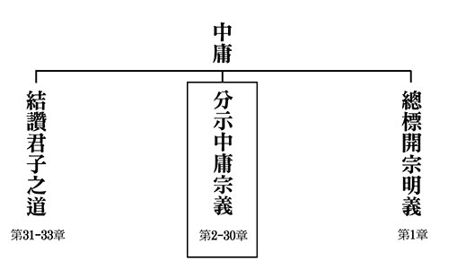

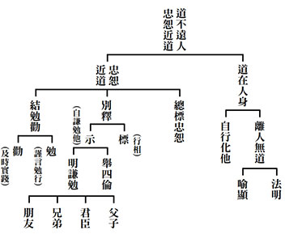

## 藝術賞析

### 孔門七十二賢淺說（三十五）—石作蜀

圖/江逸子 文/時哉

西秦夷狄人

東土七二賢

文風披三隴

孔廟所祀賢

石作蜀，複姓石作，名蜀（亦有稱其姓石，名作蜀），字子明，春秋末年秦國成紀人，為孔門後期弟子。

周敬王三十七年，孔子結束周遊列國，自衛返魯，不入仕途，志於悉心教學著述，及六經整理，繼續刪詩書、訂禮樂、贊周易、修春秋、制孝經等，吸引弟子三千餘人前來學習，精通六藝者有七十二賢。

當時，石作蜀不辭辛勞，遠自隴西邊境，投身於孔門學習。他在學成之後大力發揚儒家文化，淳厚地方的風俗，為三隴一帶的教化作出重大的貢獻，美名流傳至今。

宋高宗贊曰：「在昔石邑，能知所尊，懋依有德，克述無言，鼓篋槐市，揚名里門，此道永視，彼美常存。」從前有位石作蜀先生，能知道尊重孔子，喜歡依靠有德之人，能闡述孔子性與天道無言之教，以文會友互相切磋，能揚名於家鄉，令聖賢大道成為大家所見，永植人心，此種美德常存於世間。

石作蜀東漢永平十五年從祀於孔廟，唐代追封為郈邑伯，宋代加封為成紀侯，明朝嘉靖年間改稱先賢石作子。

畫中的石作蜀相貌俊朗，穿著文人的服裝拱手作禮，又揹著弓箭武備，代表他出生為驍勇善戰的秦國人，雖跟中原文明不同，卻能文武融合，學有氣象。

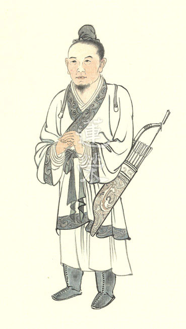

### 孔門七十二賢淺說（三十六）—任不齊

圖/江逸子 文/時哉

南蠻遠來學

亂世卷懷之

不同隱士耕

著書培後進

任不齊，姓任，名不齊，字選（家語稱字子選），小孔子六歲，春秋楚國人。

任城書院學海樓釋奠先賢任子記中提到：楚國曾以上卿禮聘任不齊，他無心仕途，不願意作官，回鄉著述教學，著有〈詩傳〉、〈禮緯考〉及〈逸語〉三篇，其出眾弟子有東門子高、蒯伯儀。

任不齊是很珍惜時間的人。宋高宗贊曰：「任城建伯，其表曰選，淑問雅馳，才華清遠，競辰力行，愛日黽勉，孔教崇崇，令緒顯顯。」唐朝封任不齊為任城伯，字造，人稱任造先生，他的善名遠播，才華也是有目共睹，是愛惜光陰努力向學的賢者，將崇高的孔子教化事業，發揚光大。任不齊的才能是外顯可見，他在求學的態度上，會爭取時間，愛惜光陰，努力上進。

任不齊身為楚國人，卻遠道而來魯國，向孔子學習，這樣求學的誠摯態度，通悟後人，這般風範足讓後人虔誠祭奉。

任不齊於東漢明帝永平十五年從祀，唐代追封為任城伯，宋代加封為當陽侯。

畫中的任不齊穿著布衣，表徵其不慕榮利，不願為官，而把自己打扮成平庸之輩，顯現為大智若愚的形象。

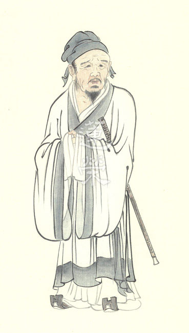

### 華夏精魂千秋（三十二）— 明倫史畫 韜光用德 孫登

圖/江逸子 文/淨域

裝瘋賣傻如楚狂

用行捨藏真道人

亂世如風吹殘燭

君子遠小人遯亨

史畫

孫登，字公和，號蘇門先生，三國時期魏國司隸州河內郡汲縣(西晉改制汲郡，今河南省衛輝市)人，生卒年不詳，約當西元220-280年。他博才多識，熟讀《易經》、《老莊》之書，能彈一弦琴，尤擅於長嘯。竹林七賢之阮籍與嵇康，都曾前往求教拜謁。

孫登孑然一身，獨自在北山挖掘土窟居住，夏天自己編草做衣，冬天便披下長髮覆身，平生隱居安閒無事，常彈弦琴自娛。性情溫良不發脾氣，有人故意捉弄他，將之投入水中，想看他發怒的樣子。可是孫登從水中爬起，卻哈哈大笑，一點也不介意。

後來往住宜陽山，有燒木做炭的人見了，知道他非比尋常，想與之交談，但孫登絕口不語。魏文帝曹丕聽聞後，命阮籍前往拜訪，雖主動與他談話，他卻默不作聲，只是長嘯而退。阮籍回到半途，聽到像鸞鳳的鳴聲，清響遍於山林谷間，細聽才辨出是孫登在長嘯。

後來嵇康到首陽山隨他遊學三年，問他有何目標抱負，孫登始終不答。嵇康將離開，對孫登說：「我要走了，先生難道沒有臨別贈言嗎？」孫登說：「火生而有光，如果不會用光，光就形同虛物，重要的是會用光，光就能發生作用。人生而有才能，如果不會用才，才能反而會招禍，重要的是會用才，才就能利益天下。所以，用光在於得到薪柴，可保持久的光耀；用才在於識得道德真性，乃可保全天年。如今你雖多才，可是見識寡淺，惟恐誤身於當世，希望你要慎重。」

嵇康未能體悟孫登的話，後來果然因呂安之事而入獄，引起社會上極大的反應。司馬昭擔憂他的影響力，便聽採校尉鍾會的建議，將之處死於洛陽東市。臨終前嵇康在獄中作〈幽憤詩〉，詩中有「昔慚柳下，今愧孫登」兩句，感慨當初不聽孫登之勸。

晉惠帝時，太傅楊駿將孫登請去，問什麼都不回答。臨別楊駿送孫登一件袍子，孫登出門後向人借把刀，先把袍子割成兩半，繼而剁碎扔在門前。里人見了，都說孫登是個瘋子。八王之亂時，皇后賈南風設計讓楚王司馬瑋進京殺楊駿，廢其女皇太后楊芷，誅三族死千餘人。至此，大家才明白孫登割袍碎棄，乃是對楊駿的一種無言預示。

圖解

道家講無為，此無為並非是什麼都不做，而是識破情空的自然任運，既無排斥也沒強制，乃順著規律不妄為。世間人庸碌於生活，不求名但也追著利，於名利中打滾，無以出脫清淨之身，難以認知禍福與共。

孫登身處魏晉時期，因通達觀修老易之學，故能安於隱逸閒居的生活，自與時下講求清談者不同。江師所繪圖，乃描述竹林七賢之首嵇康，遊學首陽山三年，將離去時與孫登的對話之景。孫登長嵇康三歲，兩人習於老莊、擅長古琴，雖嵇康一曲《廣陵散》聞名天下，又是曹魏皇家女婿，但最終與司馬氏結怨，惹得殺身之禍。

此圖中，右為孫登，左是嵇康，身旁皆有琴，代表兩人都擅長操琴。前有一堆火，點出嵇康將離開首陽山，孫登告訴他有才還得適時用才，否則有才反遭禍的道理。

俗謂「聽君一席話，勝讀十年書。」人能聽話，可惜的是非不受用，而是都當耳邊風了，不用。（下期待續）

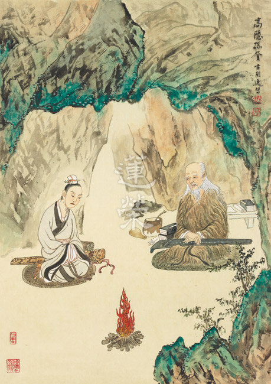

### 道藝春秋（四）血統祖先　黃帝

*圖/江逸子 文/編輯部整理*

文明承載文化

文化延續民族

民族立國本質

立國創造文明

傳播文化價值

五千年前中華文明到了黃帝時，進入制度化。中國歷代帝王大多都會設廟來祭祀黃帝，表徵統治的正當性，黃帝是中國歷史文化中很重要的標誌人物，大家公認他是中華民族的血統祖先，而稱自己是黃帝的後代。相傳堯、舜、禹、湯等均是他的後裔，因此黃帝被奉為中華民族的共同始祖。

人類文明早期階段，天下還未一統時，各部落會推派共主，黃帝當時就被擁護為共主。當一個地方政局安定，就會衍生很多發明與創造，畫家江逸子先生畫的黃帝圖，體現了文明的進程，以前都是獸皮，或者袒胸露乳。到了黃帝，有了制度化的衣冠，他的太太嫘祖發明以蠶絲製作衣服的紡織技術，使得大家都有衣服可穿，是衣著文明的進展。

文明的進展可以表現在生存的方式、飲食的方式、交通工具等等。江先生所畫的就是上衣下裳，一般說的衣裳就上衣下裳，下裳就像裙子褲子這樣。江先生的繪畫交代仔細，每一筆都交代得清清楚楚，比如說衣服的紋路裡面畫龍畫雲，胸前還有海水波，畫雲畫龍表徵中國的帝王，因為龍變化莫測，代表帝王的能力。《易經》的乾卦就是以龍為主的卦，九五爻代表帝王之尊，皇帝九五之尊叫飛龍在天，表徵帝王的就是雲中的龍。龍還分五爪龍、四爪龍、三爪龍，五爪龍指天子，四爪龍特別是象徵卿大夫，三爪龍一般民間可以用。

畫中黃帝的神態安詳，展現一種回顧的姿態，像是在回首往事、回聽大臣的意見、回想過去的經營。他手上捧的是「笏」，一般大臣的笏用在上朝時，為了如實地奏報皇帝，故寫重點在笏上以防忘記。古代開會時，大臣要簡要詳明的說話，話不能冗長，直接點明重點、講出真相。國君天子拿的笏則是一種溝通天地的功能，是一種恭敬安詳的握姿。他頭上戴的帽子很有趣，頭上長板的叫做「綖」，「綖」是前面圓後面方，代表天圓地方，前面的圓紅代表陽，後面白代表陰。他的板子「綖」是用玉做的板子，或者是其他材質，前低後高，代表居高臨下、關懷百姓，「旒」就是絲線串著珠，「旒」有九個旒就九條絲線，九是中國的陽數，代表「陽數之極」。每一條「旒」有十二個珠子，代表十二個月，在這十二個月裡都要順應天時、孜孜矻矻，不懈怠地來從事政治，才能創造天下安定的局面，太平盛世看起來無事可做，其實後面的努力是老百姓看不到的。「旒」還能遮住黃帝的視線，不要看得太清楚，代表領導人不要觀察得太明有傷厚道，也讓臣子們不要直接看到黃帝的表情，意思是不讓臣子有揣摩上意的機會，往往揣摩上意就會講好聽的話，帝王便會活在自我感覺良好的氣氛中。所以有時候皇帝要喜怒不形於色，並不是心機城府很深，而是不要讓臣子揣摩上意。所以黃帝的服裝、儀容就代表中華文明的進展。

黃帝特別重要的發展就是曆書，用天干地支來記錄日子、季節。我們現在很多的黃曆的源頭就是黃帝做的曆書。神農氏雖然發明了農具耕田，大家可以普遍的繁衍人口，可是大家沒辦法知道春耕夏耘秋收冬藏的正確時間，天時很重要，中國以農立國，不能耽誤農事，古代的天時錯，史官要被砍頭，所以古代的曆書太重要了，完全按天時來辦事。

古代祭太廟時，還要把月曆拿出來看這個月是正月還是二月還是三月，不同月份有不同的做事方式，該如何配合農時，如何告訴老百姓現在是什麼季節，應該種什麼植物，這些做國君的都要很講究，才能保證一年的豐收，極不簡單。

黃帝還把不斷演變的音樂定下五音十二律，還設立了井田制度，周朝井田制度的濫觴就是黃帝，井田制度有公田有私田，它不但能夠讓老百姓集中、繁衍人口，還方便國家的稅收，同時也從神農氏的醫學不斷發展，這就是文明。

在朝中黃帝除了接受大臣們的奏摺以外，還與大臣們談論天時、農時，甚至醫藥，可見黃帝的好學用功，就算到今日，此人也符合時代需求，後來就整理成《黃帝內經》，當然《黃帝內經》後面還有很多的演繹，但是開頭就是他跟大臣們之間的養生問答，以上種種的發明，其實都是在前人的基礎上而有黃帝的開拓，將中華文明提升到另外一個層次，改善人們的生活，注重人們生活的內涵。這些人性的表現，其實就是中華文化的道統，而最能彰顯道統的就是帝王，因為最能利他的就是這些握有政治實權的帝王，果然帝王有利他的想法、利他的能力、利他的目標，以及知道利他的價值，就是真正道統的所在。道統在人身上，孔子在彰顯這些帝王的時候，就是要後面的政治人物、領導者有典範可循，能夠為人民服務、開創人民的福祉、創造人們生活的內涵、生命價值。

站在黃帝這幅畫作面前，我們要看到先民的努力、開創文明的氣象、承接前朝的基礎、治國的氣象，以上是觀賞這幅畫作的反思。（下期待續）

## 活動報導

### 仲夏夜之旅‧學思出遊趣

心若

好玩衝動的體力

父母呵護的成長

出遊盡興與協作

交流激盪出情誼

這學期要從二二八露營活動取消開始說起，身為學思班(國中、高中、大學)導師，也身為啟蒙班過來人，知道留住此年齡層的孩子極不容易，感謝有怡瑩老師眼光獨到的歷史課，珮茹老師新穎有趣的藝術賞析課，以及專題老師們各顯長才，讓學思班沒有請假的風氣。除了課程符合學生胃口之外，每學期我們也興辦出遊讓課業繁重的同學們稍微放風，讓旅遊成為成長的催化劑，成為凝聚情感的強心針，可惜疫情打亂了所有的排程，二二八連假的「時哉你農我農露營趣」在活動前一天告吹，吹散了學生的念想，也讓前置作業幾天的師姑師伯們辛苦付諸東流，損失一路延續至開學種種課程的無限延期，好在五月中旬終究開學了，學生們一一回流，趁勝追擊，便敲定了七月中的班級出遊，師生共十七位踏上了三天兩夜的旅程。

鑒於政府為振興經濟祭出一連串暑期十八歲以下的免費景點，安排出遊行程時老師們也盡可能地減少學生的經濟負擔，白老師及宇涵更事先場勘，過濾掉不適合的景點，行程異動幾回，最終我們走訪了人煙稀少的忘憂谷、龍貓隧道，也去了許多熱門景點像是宮原眼科、第四信用合作社、高美濕地等，原本預想會到處人擠人、在火烤下汗流浹背地排隊，導致不愛擦防曬的男同學們局部曬傷、中暑等等，結果這些令人擔憂的現象通通沒有發生，感謝天公作美，颱風擦肩而過，帶來涼風陣陣，舒服愜意，觀光客也不多，莫名的順利，更留下許多網美照及創意團體照增添旅程的厚度。

然而第二天的暢遊麗寶樂園就跟預想情形相同，伴隨十八歲以下入園免費的政策，大批人潮湧入，民宿老闆前一晚便向我預告幾日來他親眼所見的可怕場面，一早火車像是屍速列車般駛來，一開門便會有源源不絕的喪屍湧出，沒有靈魂的朝著麗寶狂奔，我們想必不可避免，好處是我們有遊覽車庇護，不需要像喪屍般行動，即便如此，早上三小時的排隊也才換到兩個左右的遊樂設施，難怪有句話說免費的最貴。老師們一度思考下午是否更改行程，午休時間，同學們給了新答案，進麗寶樂園時，園內會發給每人一張券，集滿三張可以兌換優惠項目，其中包括玩密室逃脫，於是同學們利用午餐時間向陌生人募集優惠券，很快便集滿所需，人人都賺到一次團體密室逃脫，體驗後都興奮異常、意猶未盡，這樣的舉動，大概就是團結一致、眾志成城最好的示範。

晚上九點開始是自由活動時間，老師們不查房，也不限制幾點睡，甚至還提供滿滿的零食、飲料讓同學們享用，唯一的條件是要玩就要一起玩，不可以獨自玩手機，故晚上大家齊聚在八人房玩桌遊，度過難忘的夜晚。熬夜玩遊戲、一雙雙愈晚愈明亮的眼睛大概就是學生時代旅遊的精華，在吵吵鬧鬧中積累的情感，最是不可磨滅。

放鬆玩樂之餘，乘車是很好的交流時機，可以分享各景點資訊，也可以觸及到課堂中沒有機會談的重要主題，本次車程話題圍繞後疫情時代的趨勢，與學生們討論時代的脈動、職業的更替，以及應該具備的姿態、能力等等，希望不久後即將踏入大學，邁入社會流的同學們有所體會與反思。

新冠狀病毒可說是繼西班牙大流感以來全球最大規模的流行病，導致政局動盪、經濟重創、醫療資源匱乏、油價跌幅、央行干預，產業打擊、教育型態改變等等，其可怕之處在於時間拉得夠久，久到足以引發許多社會根本性的變革。若是對照同樣是瘟疫及技術革命同時發生的十四世紀黑死病，可以發現因為一場漫長的黑死病，導致一連串的效應，一方面人口銳減使得人們必須大量接納新技術來節省人力，一方面人們不再相信上帝，個體意識萌生，迎來了文藝復興，這樣的骨牌效應，最終促成了十八世紀的工業革命。

這波疫情又將推動怎樣的新發展呢？很多難以預測，較顯而易見的便是5G時代提前來臨，以及全球線上化的勢在必行，也牽涉到未來職業的選擇，二○一三年牛津大學教授寫了一篇論文《雇傭的未來》，對現存的七百多個職業進行評估，未來將有一半的職業消失，同學們紛紛猜出未來會消失的職業，像是司機、實體店店員、翻譯、裁判、一般事務員、程序員、消防員、警察等等，導出的結論是：規則明確、技術較少、高危險，你能做別人也能做的工作就容易被取代，而職業大量的交替時間點專家預估會在二○四五年發生，稱為奇異點，如同人類之前經歷過的農業革命、工業革命、電器革命，到三十年前的信息革命，現在的人工智能革命，機器開始漸漸擁有人的判斷力及認知能力，二○四五年，人工智能會徹底取代人力，不光是體力，還有腦力，在此之前，其實已經開始一波一波的轉換，我們正身歷其境。但終究有一些事情是電腦做不了的，未來的工作趨勢就是要去找尋AI的弱項，具備創新力及想像力，如同愛因斯坦所說：「想像力比知識更為重要。因為知識是有限的，而想像力包括知識的一切，它推動著社會的發展，它是知識革命的泉源。」

全球線上化使得現實世界不斷融入線上，好處是可以多元發展，出路更加寬廣，如同網路平台各種節目都能存在，形式五花八門，大家各出奇招，只要找到自己獨特的魅力與特性，都有潛在的市場，但隨之而來的競爭力也愈強，造成幂律化，以前很多事情都是常態分佈，例如賣同一個產品，最佳銷售員和普通銷售員所賺的差額不會太大，大體上平均分布，而幂律化是一個極端分布的世界，未來百分之二十的人會占據百分之八十的財富，新世界打開多元的渠道，也開啟壓力的大門，除了前述的創新力及想像力外，還要具備獨立思考的能力、跨學科學習能力、美學的素養等等無數個學校沒教過的能力。世界很豐富，索取資訊很容易，但是力拚要靠自己，保持開放而機警的心態，提高心理素質，才能不被淘汰。以此勉勵同學也期許自己要放寬視野，累積被需要的差異能力。

辦活動大小事物繁雜瑣碎，非常感謝珮茹老師、白老師大力分擔，出遊換取更美好的回憶、不容易說散就散的感情，祝福同學們能夠不斷進步，延展更多可能性，我們下學期學會見！

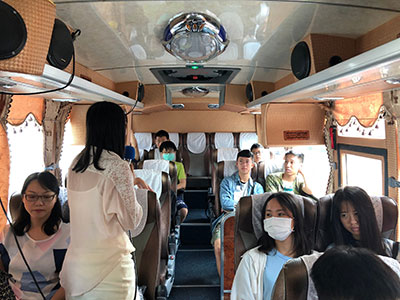

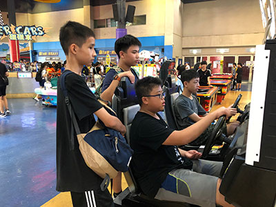

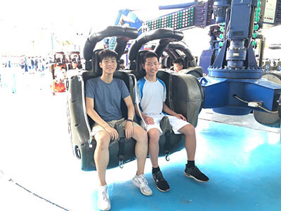

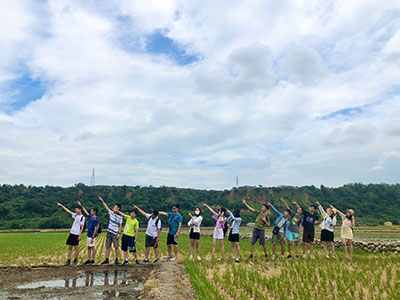

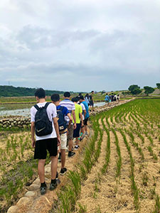

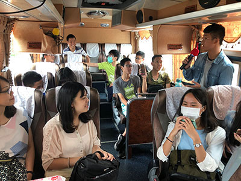

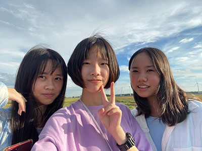

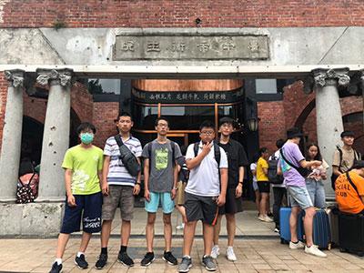

### 仲夏夜之旅‧學思出遊趣 學生心得

*編輯部整理*

活動成功期待下次

盡情玩樂知識吸收

團隊合作各種闖關

戶外教室寓教於樂

學思班二○二○暑假三天兩夜出遊　　葉庭儀

這次出遊平安快樂地回到家後，收到微智老師的訊息，請我們打一篇心得時就覺得，對嘛！沒那麼簡單，你以為出去吃吃喝喝玩玩就好了嗎，不！和在學會上課一樣，課後要寫心得呀~

想起去年暑假多采多姿的華梵森活營，讓升上高三，原本還在小小猶豫要不要參加這次仲夏夜之旅的我，瞬間決定參加，並開始期待出遊，不想要錯過任何和學思班相處的機會。

這次出遊，在車上微智老師幫我們上課，我們在輕鬆的氣氛下搶答、聽講，這或許是我覺得最精采的部分了，因為除了欣賞平常看不到的風景、吃美味的食物之外，還能在出遊時學到東西，莫過於是最大的享受了吧！

出遊和在學會上課是很不同的感覺，可以看到大家與平時上課不一樣的一面，和有點瘋狂的一面。像是晚上大家聚在一起玩桌遊，玩到超過平常上床睡覺的時間好多，但真的沒辦法，因為一玩起桌遊，不僅精神特別好，還會對時間的流逝完全無感，可以一直玩、一直玩，創造特別的回憶。

第二天去麗寶樂園時，我們幾個女生一起行動，一起玩了幾項刺激的遊樂設施(實際上是兩個，因為排隊要排超級久)，一起消磨排隊的無聊時光，享受從高處滑落再被水潑了一身的當下，在這麼一個太陽炎熱到足以把我們熱到不想說話的夏日，還能很開心，創造出沁涼的樂園回憶。而在麗寶的午後，感謝陌生人的幫助，大家得以實現一個超聰明的選擇—玩密室逃脫。真的超開心超好玩，玩的時候大家像一群偵探，找尋所有可能的線索，努力推理破解層層關卡，最後一起逃出來時，超級有成就感，雖然遊戲中用掉了一兩個提示，但已在麗寶不留遺憾。

最後一天回到學會結業式，老師算這次出遊所有的花費給我們看，讓我們對辦一個活動有些概念，我才知道原來辦一次活動有這麼多要考量的事情，很不容易。謝謝帶我們出遊的微智老師、很會拍照的白老師和很照顧我們的珮茹老師，還有一起出遊的同學們。

對了，老師說明年我們的出遊要挑戰出國，而且要試著自己規劃，希望可以實現！

有別於一般的旅遊　　鄧峻嘉

這次學思班出遊非常充實，不僅是娛樂豐富多樣，還有廣闊的知識學習。每到一處景點時，老師們都會介紹那個地方的歷史、地理等等，比如在忘憂谷，白老師就跟我們說明水稻為何有分一期、二期。

在幽靜的龍貓隧道，也不僅僅是讓我們拍拍網美照，更是以那邊的植物「無花果」來當作教學的材料，我們才知道原來早期的無花果是作清潔劑之用。

第三天去糖廠時，老師們也做了很多功課，才能帶我們走一些特別的路線，以及了解那邊的歷史文化，更甚至也有意外的插曲，遇到專業的養蜂人，專家的解說讓我們了解蜜蜂的生態以及辨別真假蜜蜂水。

這種出遊的方式，有別於一般出遊僅僅是吃吃東西、玩玩遊戲場、打打球，此次出遊期間吸收到不同的寶貴知識，卻又輕鬆不費力，不僅能玩到也能學到，真是太好了！

永不斷的友情　　張育杰

有別於以往單純坐在教室裡靜態的知識成長，這次的出遊是動態的身心靈健康，這次我們昂首闊步踏出了那一扇扇的門，也悄悄的推開了一片片幽閉的窗，漸漸地拉近了同學之間的距離，慢慢地拋開了網路的成癮。是什麼拉近了我們之間的距離，我想就是那窗外的陽光了吧，耀眼的陽光、炙熱的空氣，打退了多少宅男宅女對出門的慾望，卻激發了多少想翱翔天際、完成遠大夢想、憧憬。「只有有目標的人，才會在烈日下奔波。」我們正是踏著穩健的步伐和從不退縮的信念，步步向前。

在這次的旅程中，我看到了同學不一樣的一面，原本在教室裡是鬥智、比思維，到了教室外是展現體力與戰鬥力的超展開，早上的忘憂谷健行、下午的高美濕地慢跑、再到晚上的桌遊鬥智、深夜的桌遊鬥智、清晨的桌遊鬥智，不斷的延棚，像極了我們永遠不會斷的友情。

原本寡言的我也開始敞開心胸，與同學聊天、談心。雖然，天下沒有不散的筵席，但天下有不斷的學習和不散的友誼，期待下一次的相遇與旅行。

充實的出遊　　龔育億

晴空萬里的週四早晨，我們備好行囊，魚貫而上遊覽車，開始了期待已久的出遊！一路上，微智老師引導我們思考搶答關於疫情的議題。三天兩夜的行程中，讓我印象最深刻的是第一天的活動。

當天吃完午餐後，我們前往高美濕地，換上拖鞋並跟著隊伍走上濕地步道，高美濕地占地很廣，遠望過去，使人心胸開闊，感覺很舒服，再走上海堤，左邊是風力發電，中間有很大片的濕地，有的地方有水，有的地方是泥沼，我和林誠一面在濕地上走，一面欣賞美景，在地上還看到了許多死掉的招潮蟹，應該是人山人海的遊客們把牠們踩死了吧！之後我還在地上挖起洞來，也和同學們玩踢水，真是難忘的經驗！更感謝白老師幫我們拍了許多漂亮、有趣的照片。

傍晚，我們前往逢甲夜市，人潮洶湧，各自分組鳥獸散，我、蔣立齊、孔佑仁先買了木瓜牛奶和炸物，我吃素所以買了臭豆腐。後來逛到一間拉麵店，這就是我們的晚餐，店內風格清新明亮，一股香氣撲鼻而來，我點了一碗關東煮拉麵，食材豐富，挺美味的！飯後，我們去夾娃娃，蔣立齊竟然夾到一把武士刀，真是幸運！之後發現一家打靶的攤販，一局的規則是每人可打十二顆氣球，我選了一把步槍，一開始的槍法是很準的，百發百中！但最後一顆卻沒打中，沒拿到任何獎品，好可惜呀！

開心的時光總是過得特別快，一下子就到了星期六，透過這樣的旅遊互動，可以讓我們的情感變得更緊密，希望往後還能舉辦更多的出遊活動，再次感謝各位老師們。

學思班台中出遊遊記　　雷元泰

這趟出遊，我們在台中經歷了難忘的三天，接觸了許多從未認識的事物，最重要的是，彼此的感情因此更為融洽、更加熟悉。

出遊第二日，在麗寶樂園，我們一起體驗了非常有趣的密室逃脫遊戲。在密室中，遇到的每個題目都非常讓人頭疼，在計時器逐漸減少的同時，大家各自絞盡腦汁思索解法。

謎題漸漸被解開，但時間也逐步逼近零，承受的壓力愈來愈大，大家開始有些急躁不安，總算在彼此適時的安撫下，又緩下心來面對每項難題，最終在所有人的分工合作中，將複雜的難題一一破解，完成密室逃脫。

在緊湊的解謎過程中，我們深深感受到團隊合作的重要，所有人各司其職，大幅縮減解謎的時間，這次的密室逃脫，少了任何人都難以達成。

第三日，最讓我感到難忘的是月眉糖廠中的煙囪坑道。一走過進入坑道的樓梯，眼前是飽受戰火與歲月侵蝕的磚牆，配上坑道中微微的氣悶感和略厚的灰塵，這種有歷史感的氛圍，是我生活中少有的經歷，特別難以忘記。

而這次出遊最大的特色是微智老師在出遊結束後，將這次的活動花費、辦活動的注意事項等資訊告訴我們，讓我們對於辦活動有更深刻的認識，這種學習是一般不易學習到的，是非常棒的學習。

此次出遊，不只是一般的玩樂活動，而是在學習中完成各項活動，讓我感到非常充實，班級感情也更濃厚了，希望未來還能有機會參加出遊！

關於學思班的那個夏天　　葉庭妤

結束了三天兩夜的台中之旅感到很滿足，所經歷的一切彷彿歷歷在目般難以從腦中抹去，感謝為這段旅程貢獻心力的所有老師和學員，所有的美好皆因你們環環相扣。

第一天的龍貓隧道讓人置身於森林的懷抱，一圈又一圈的特色卻不會有壅擠的氛圍，反而有一絲的沁涼舒爽。下午的宮原眼科讓人明白什麼叫作吃甜的心情會變好！之後一定要再二訪。我們在接近日落最美的時分抵達了高美濕地，雖然沒能目睹夕陽餘暉，但還是很值得。

凝視著廣闊的天空有種人生無限希望的感動，希望每個人都能緊緊擁抱屬於自己的機會和幸福。連續兩晚大家梳洗後聚在一起玩推理遊戲，很充實也很難忘。

第二天從一早就直奔麗寶樂園，人潮太多排隊到汗如雨下，我們吃過午餐後索性放棄，改玩密室逃脫，雖然我沒有什麼貢獻但重在參與。晚上的逢甲夜市逛的吃的很盡興，活在當下的感覺是很真實的享受人生。

第三天打保齡球、逛糖廠、配上午餐吃到飽的餐廳就回台北了，謝謝這三天的充電讓我有動力迎接新的生活新的挑戰，滿心期待下一次的出遊。

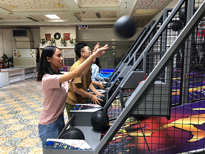

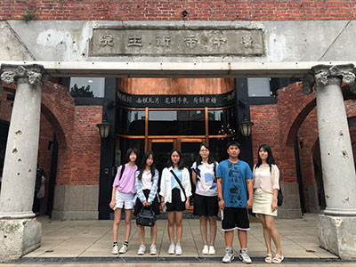

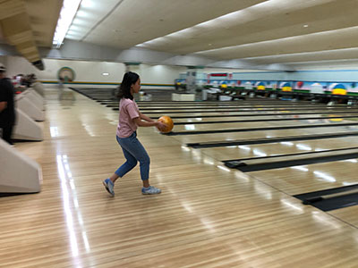

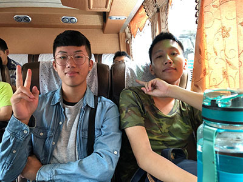

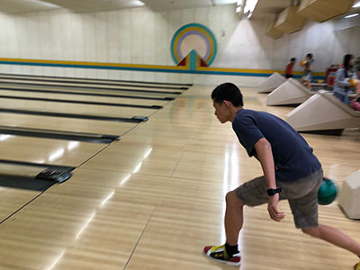

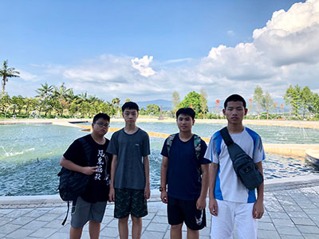

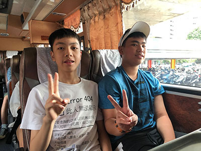

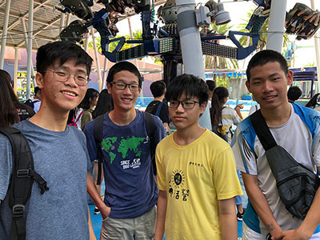

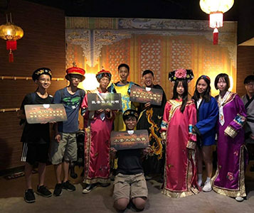

### 暑期兒童書法班—臨池十字修學法 溫故知新

王順福

書法如此教

撥雲而見月

處處可師法

情趣得神髓

一、前言

(一）因材施教

今（一○九年）夏應學長請，於學會開辦六週，每週一次之書法課，對象以國小中、高年級學子為主，據聞開辦緣起在高雅同學，因要代表學校參加書法競賽，彼自律心強、自我要求高，透過幸汝學長而找到末學，能得好自發臨池之學子，人生一樂也！乃欣然接受，雖不致於誠惶誠恐，思前想後，遂憶起臨池十字修學法來引導學子。

此修學法十年前，曾發表蓮榮月刊八十一期，在此不重複贅述，面對心未定的莘莘學子，如前所作對聯「臨摹十字猿心治，遵奉前賢定力增」，發端有一對一教授友人之女公子，繼而在敦化南路及寧波西街書法班，均曾演說教導。蓋有數次經驗，於此法尚駕輕就熟，惟前對象與此次迥異，也不能依樣畫葫蘆，而須另覓十字，選帖中屬正向正能量且有豐富內涵，以薰習六根的十字，對幼齡的學子是不契機的，慎選合宜的十字，亦煞費腦筋，因材施教誠不易耶。

(二）溫故知新

前十字修學一文內容設施：提及以「難易字」、「部首所攝字數排名前十」、及「具正能量意義字」。此番教學分二段，前段講書法理念、後段現場臨書，臨書教材為歐陽信本九成宮醴泉銘，講課內容仍沿襲三設施，此故也。所謂難易，前文概念是就筆畫繁簡而論，有別於以往擇十正能量之字，而改取筆畫繁簡中之「一」、「二」「十」、「人」、「之」、「力」、「永」、「期」、「龍」及「鳳」十字，除人永二字與前同外，餘皆相異，此故中新也；昔揀十正能量字未能成文，因重在單字之意義，而本期後四字「永期龍鳳」，有針對學子寓含期勉之意，此又新也；講述部首加以書寫示範字及闡明帖中自謂之難駕馭之字如「巖、鑿、鬱、勝、襲、獻、龜、養、醴」二者亦新也；而研習十字修學法，腦海更湧出尚可從帖中形聲字、重文會意字、異體字、非楷書字形、銘詞押韻字、雙聲疊韻字等面向，就不同需求者而擇十字，此故中求新也。教學中另番體會，真乃教學相長耶。

二、擇法：

（一）施以繁簡中

開課前既存以筆畫多寡—繁簡中為授課總綱，接續不斷思維如何選此十字，面臨多數毫無臨池經驗的國小學子，先簡後難或是一善巧地啟迪，從帖裡選出「一二十人之力」前六字，作為示範，一二字習橫，十加入豎筆，人字復練習撇捺，之一字更臨點、挑、短撇（啄之筆法），力又增橫彎鉤，以上基本筆畫於前三週引領學子步趨。後四字「永期龍鳳」，約在第三週集出，帖並無此四字，作為後三週書寫重點。(略釋消文，天下父母親終其一生，無不期勉希冀自己的孩子成龍成鳳。)永期屬筆畫近適中之字，龍鳳歸類為繁之筆畫，如此十字即囊括繁簡中。同時釐定此句，作為六週之成果目標，惜達至目標除跟隨家長、老師外，僅一二學子稍有達標，畢竟時間不足，十字修學一期半年，何況僅僅六週，能有如此表現，亦稍感安慰矣。

（二）重大發現：永字八法

書譜云：「圖真不悟，習草將迷。」此語說明臨池也貴在有悟，古之書家體書之道，不乏其人，若張長史（旭）觀挑夫爭道，又如涪翁黃山谷（庭堅）見長年盪槳，得悟筆法，竊謂或不出永字八法。

永字八法即側、勒、努、趯、策、掠、啄、磔，愚譽之為古人臨池筆法之重大發現，並喻為能開往書法康衢之司南及開啓古今大書家之門的萬能鑰匙。十字修學不論何種揀擇，宜選「永」字之道理在此。

以九成宮歐字為例，當講過永字八法，次週便問學子歐字之側點有何特徵，如象山六巨石之石嗎？或似高峰之墜石？引導孩子溫故知新及舉一隅而三隅反，除審視單點外，要能觀察此帖中二點有冰點、羊頭點、立皿二字中二點，三點有水、雞爪、奚三點等，尤其三點水，更是歐體極具卓越的象徵符號，熟稔串習其點之筆性與結構，即得八分之一之神似與形似，其餘類推，此固是溫故知新與舉一反三耶。又示諸學子藉此永字，以求一筆不苟的臨池態度，換言之，行筆時要能筆筆送到家，並引申作課業應一絲不苟，更要專心不二。言之雖高，乃取法乎上，由此可入矩，反之則出規。

三、字裡弦外之音：

講課是分享臨池心得，深深覺得解析書法與寫字是應齊頭並進，所謂先器識而後文藝。書法的知與行宜合一，亦如解行當並進，書理、佛理與知行哲學，或亦有相通吧！

然上述心得，焉能與小小學子宣說，只可善巧方便說，見字拆字，講部首排行前三：草、水、木，便告訴學子「讓」的美學及謙德之效，寫草頭與木、水旁，上下或左右組合結構之合體字，都要把謙讓的精神放入，上讓下、左讓右，才能寫出字的美，互相爭執位就差矣！學子一試便知，與同學兄弟姊妹相處，也是這箇道理。

「人」一字，十字修學正能量及此次筆畫繁簡中皆選到，列入一次課後作業，翌週詢問學子，不外就直立雙足行走之動物，無能就參天化育、與天地並列為三才之人而說，乃引上印下光法師所著「人字發隱」一文，就人之四義：人者仁也、忍也、任也、盡也，乃試以童言童語解說，仁，厚愛自己的兄弟姊妹，進一步愛堂表兄弟姊妹，再進一步愛同學，把愛漸漸擴大散開，就是仁也。忍就是忍耐，午後多次帶同學上象山之上六巨石、八美、陽明山等地，忍著汗流浹背的苦，耐著上階爬坡的勞累，達目的地，得嘗登高望遠賞景的果實。

帖上總有自己難寫好的字，不可裝做沒看到，矇混過去，要面對，要克服。上列取難寫的十字，除以行書結體的「勝」及兼採減筆畫和挪動位置的「襲」等二字外，同學竟然認出其中八字，此八字均迥異現行印刷體，能讀出當下頗為驚訝！雖非上課重點，心中暗歎孺子可教也。楷書碑帖藏著行書筆意，是引導臨池者更上層樓的媒介，它是創作者苦心孤詣的密意耶，此意學童難了知，減筆挪讓，亦復如此。講此十字，另有醉翁之意，如巖鑿鬱等，筆畫超過二十畫，不論線條的掌控或結構佈局或點畫位置的經營，無不考驗技巧與定力，過關、便往前邁出一大步，引申學子求學時，課業一樣會碰到關卡，不能任意棄械，舉雙手投降，課堂中類似說法，不知學子心有悟乎？

四、結語

幸汝學長知見卓越，為孩子所訂書道課目標在：養正、養心、養氣、養定、養美、養禮，接下為人師之角色，觀此高遠的目標，不由得不讚歎！

開課首日，本著先入為主之重要影響，次第宣講書法可以養正、心、氣、定、美、禮，此六養果能遵奉雪廬 老人闡示之十字修學法，對初學臨池者，當能見效。通說臨池學書者，坐姿要求端正挺拔之身法，行筆中鋒、不疾不徐、用筆知所分寸、運筆處處提醒「讓」之人生態度，長久悠遊潜習，足以養正、養氣、養定、養美、養禮耶。

別取十字修學法，半載攻十字，特可收初學者迷惘、貪多、散亂等猿心，真能安住十字修習，定可養心及養定，非誑語也，真實語也。

八識規矩頌奘師善用數字作頌，如「中二大八貪嗔癡」、「九緣七八好相鄰」、「遍行別境善十一」等，受此啟發，雖弗能為臨池學習者作頌，此番教導童蒙運用此善巧方便法，如三腕枕提懸、四寶筆墨紙硯、四德尖齊圓健、五指擫押鉤抵、五體篆隸楷行草等，融合數字記名相，對啟蒙引領學習，不失良策。畢竟記問為學業之基礎，有記問為底子，思維方有問題產生，而問題又是一切學問增上的根本，其然耶？

總上，十字修學法溫故知新之淺薄心得耶，方家識者有以教之。

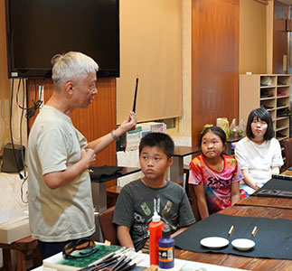

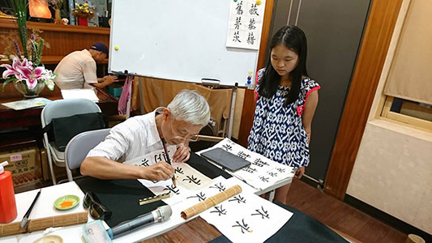

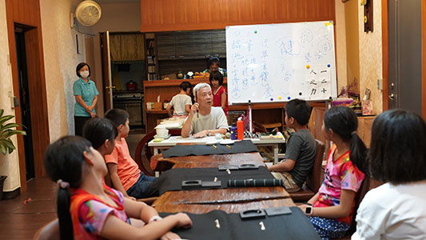

### 暑期兒童書法班—好好寫字 寫字好好

陳幸汝

孩子教育全心投入

自我充實伴他成長

以藝載道書法功底

登山臨水書法神韻

前言

三人成眾。

今年暑期學會興辦的六堂兒童書法課源起於三個想學書法的小女生。兩個是覺得會寫書法很棒，一個是從沒有系統地學過書法，卻要代表學校參加台北市國語文競賽書法組的學生。於是在王老師的首肯之下，開啟了難得的暑期六堂課。

三個小女生，擴增為八個小孩，再加入四個家長，以及一位早就想好好學書法的英文老師。週四的快樂書法班就這樣成形，展開了六堂每次到下課都意猶未竟的書法課程。

王老師在學會一樓的有限空間中，向大家展示了書法的廣闊風景，比海還深的是書法的意境，比山還高的是書法的道藝相融，既然我們還登不了山、下不了海，於是王老師為孩子們開啟的書法大門後的那條香榭大道就是值得依循的學習方向了，踏實地走好腳下每一步，為的就是有一天能領略山的偉岸、海的深遂與美麗。即便領略不了，至少，我們都曾經走在大道上，享受過定下心來好好寫字的寧靜與快樂。

＊＊＊＊＊＊＊＊＊＊＊＊＊＊＊＊＊＊＊＊＊＊＊＊＊

蘋果電腦創辦人賈伯斯在他一場著名的講演中提到一個故事：

賈伯斯在進入里德學院六個月後就休學，但他卻在大學裡待了十八個月才真正離開校園。這段時間裡，他不再需要修一般課程的學分，因此他去旁聽了里德學院堪稱全美第一流的藝術字課程，在這裡，他不只學會不同字母組合的字元間距、了解字與字之間留白的美感，認知到字型是閱讀的橋樑，承載了與內容文意相呼應的責任。這段時間的學習型塑了他的美學概念，深深影響了日後蘋果電腦的優雅簡約的美感風格，也影響了後起的所有個人電腦。

隨著賈伯斯這場講演的流傳，讓許多人開始留意西方藝術字體，以及裝飾字的運用，也有人將此翻譯為「書法」，意指書寫文字的方法。

然而，相較於我們從小認知的「書法」，總覺得以書法稱呼西方藝術字，兩者似乎不能對等看待。因位對比西方藝術字旨在「實用」和「美觀」，漢字書法不僅深奧太多，而且具有獨一無二的特性。

例如，漢字書法是全世界唯一一種文字本身可以成為具流傳與收藏價值的藝術品。

其次，漢字書法蘊含了書寫者內在的性格、情緒，和外在的志向與生活品趣，從字裡行間到成文成章，書寫者、文字、文意、閱讀者，四者之間隱然流動的意趣與張力，這感受是人人不同，一封普通的書信可能因為書寫者的書法境界而讓閱讀者有了三百八十種詮釋與解讀，這樣心領神會的閱讀經驗絕非印刷字體所能表現。

寫一帖好字要有陳年功底與創造性思考。陳年功底來自於勤練、多看，創造性思考則是在勤練、多看之下跨越想像力的邊際。

在今日書法課在學校教學中已全然邊緣化的環境下，孩子們竟有這麼好的因緣能親炙王老師的書法課，老師將其數十年功力化約為六堂課，從第一堂的坐姿調整、親握孩子的手教他們執筆、介紹各種書體、教他們好好地寫好「一、二、十、人、之、力」 六個字。孩子們才發現，原來在大大的九宮格裡一橫一豎一點都不容易，寫書法不是用麥克筆，從頭至尾一般粗細，寫書法，即便是一橫畫都要有身材、每一筆都要講究一波三折，快不得卻也慢不得。

第二堂課是大家都見過，但卻寫不好的「永字八法」：怎麼在一個點裡一波三折？橫劃如勒馬、豎劃要蹲一下再站起來，勾起來要勾的優雅不群。寫字怎麼也要學策馬？風掠水面不能了無痕，要輕卻還要扎實落筆，一撇要像鳥啄樹一樣，又狠又準。捺是收尾，要收得漂亮就要停頓一下、顧盼一下才有餘韻。

第一堂課回家練字寫「一、二、十」，孩子們說怎麼寫個「十」都老是歪掉。第二堂課回家練習永字，孩子們說：「永字比十字難寫多了，都寫不漂亮。」第三堂課寫「永期」因為有了前兩週的基本功，好像容易上手了點。第四堂課寫「龍鳳」，孩子們說：「還是永字簡單，筆劃比較少。」就這樣寫著寫著，到了第五堂、第六堂，曾經認為的難，在反覆練習與老師指導整後，大家竟也慢慢得心應手，愈寫愈好。

國小學童常用漢字就有五千個，浩瀚漢字海，難免讓人有被淹沒感，王老師教大家幾個秘密絕招，一是十字修學法，選十個字練到好，不難吧？二是常用部首法，常見部首如艸、水、土、木、金、人…等，把這些部首練好了，那我們至少能寫好一萬五千個漢字的半邊。三是選正能量字練習，既練字又煉志。

王老師教導孩子寫字要練到「一心不亂」、「一筆不苟」、「一絲不苟」。

這不也是日常生活中應有的講究嗎？起床沒摺被，沒關係。桌子有點亂，沒關係。水壺忘了洗，沒關係。功課字寫太醜，沒關係。遲到，沒關係。什麼都沒關係，什麼都苟且地過了。

寫字還要講求「筆筆送到家」。事情是「做了」，還是「做好」了？寫書法不只是在細節講究，而是在「心」的講究。因此自古練字不離練心。

書法是靜中有動，動中有靜。在靜心中寫字，每個字都是流動的，字在九宮格中流動，一點一捺卻都是在動態的世界中靜觀所得。

當年衛夫人帶王羲之校外教學，教他觀察天觀察地觀察大自然，體會書法本法於自然。

「橫」，如千里陣雲，隱隱然其實有形。

「點」，如高峰墜石，磕磕然實如崩也。

「撇」，如陸斷犀像。

「折」， 似百鈞弩發。

「豎」， 如萬歲枯藤。

「捺」， 似崩浪雷奔。

「橫折彎鉤」如勁弩筋節。

王老師不只教孩子們寫書法，還領著孩子們去校外教學。去象山觀六巨石看樹看萬物生長的姿態。去圓山八美看山看林看天空看飛機起降，去陽明山小隱潭觀瀑布、爬楓香樹。去台灣博物館看展覽。

書法不只在教室裡，書法在自然裡、在生活裡。

離開教室、登山入林、享受林下清風。

王老師恨不得把他心下眼底的萬千世界展開給孩子們看，希望他們能有所領略，能練字練心練氣練志。

這是暑期給孩子的養分，加了老師滿滿的用心與愛與期許。

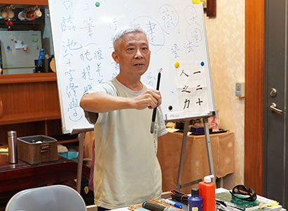

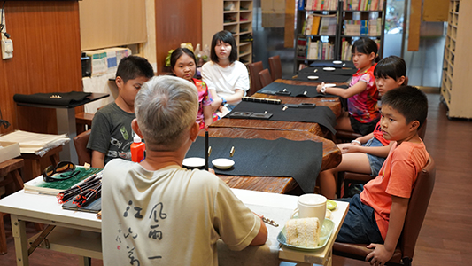

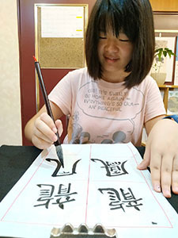

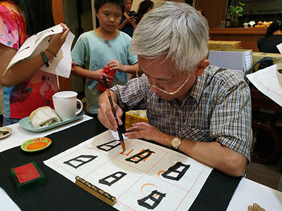

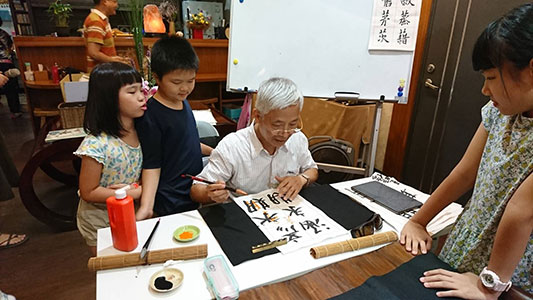

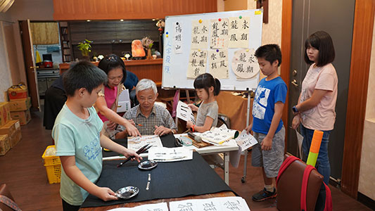

### 暑期兒童書法班—書法課心得

王天婷

文化使藝術有道

歷練使道更鮮明

走入傳統活用今

如龍噓氣已成雲

書法，若是臨池，寫成作品，各有巧妙；若教學，是中華文化的傳承，為人之道亦在筆墨之間，為師者，影響著學子，和王順福老師學習書法，讓我看見不同的格局。這一切的因緣，都要感謝學生要參加北市書法比賽，我方能有福氣與老師結這五堂之緣！

世界上只有一種文字能成藝術品，那就是中國字，篆隸楷行草，深深的吸引著我，直至今年暑假和王順福老師開始第一堂課的前兩年學習，我只能買字帖練字，如大海撈針，卻遲遲無法自書。在我加入的第一堂課，王順福老師教導我們「十字修學法」，一聽，恍然大悟！挑選十字，專注刻意練習，這方法真的極有效！老師教導我們選字技巧，如：部首選字、正能量選字、難字選字…僅僅五堂五個星期，我們雖只練習十字，看似很少，卻因專注與刻意，最後大家也完成了一幅四字小品。

一位好老師，是能啟發學生的思維，而不僅只是知識的給予，王老師便是如此的引航者。「授人以魚不如授人以漁」！如老師讓我們臨的九成宮，是歐陽詢著名的楷書字帖，很多人以此為臨池練習，然而卻不知此文章為何人所撰？為何而撰？王老師啟發了我們讀字帖要了解其背景，了解書法家用筆特色，才能把文字寫出感情。永字八法是練習書法最重要的一字，我之前練之卻不明瞭每一法之精處。受王老師的啟發，我開始在網海中搜詢，側、勒、弩、趯、策、掠、啄、磔，每一筆都有故事，如最後一筆捺的磔是指古代的極刑，而寫時需一波三折，有時形現有時意到。斜撇策是策馬奔騰，最後輕撇，是馬主用鞭在讚美馬兒，不得沉重用力鞭打。

學而時習之，在短短一個多月中，王老師帶領我們找到練習書法的方向。然而更讓我有收穫的是老師分享的中國字上下左右互相禮讓的品德，練字要一字不苟、一絲不苟、一心不亂、筆筆到家。為人處世與書法的連結，感受中華文化之博大精深，而不僅是寫毛筆字而已。

最後一次上課，老師更臨別贈學子凡事「自我要求」，以提升自己。他說「要明天的學習更好，惟有自我努力，自我要求，天下沒有白吃的午餐」，近知天命之年的我，亦同為師者，深有同感。藉此文再次感謝王老師傾其數十年來的功力教導，和孩子們為了比賽而願意學習藉此成就了我的願望。

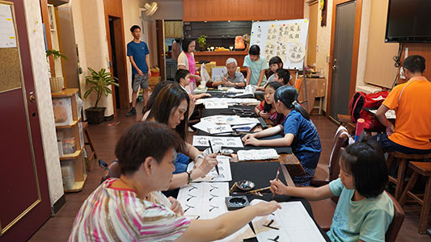

### 暑期兒童書法班—書法課心得

王天婷

文化使藝術有道

歷練使道更鮮明

走入傳統活用今

如龍噓氣已成雲

書法，若是臨池，寫成作品，各有巧妙；若教學，是中華文化的傳承，為人之道亦在筆墨之間，為師者，影響著學子，和王順福老師學習書法，讓我看見不同的格局。這一切的因緣，都要感謝學生要參加北市書法比賽，我方能有福氣與老師結這五堂之緣！

世界上只有一種文字能成藝術品，那就是中國字，篆隸楷行草，深深的吸引著我，直至今年暑假和王順福老師開始第一堂課的前兩年學習，我只能買字帖練字，如大海撈針，卻遲遲無法自書。在我加入的第一堂課，王順福老師教導我們「十字修學法」，一聽，恍然大悟！挑選十字，專注刻意練習，這方法真的極有效！老師教導我們選字技巧，如：部首選字、正能量選字、難字選字…僅僅五堂五個星期，我們雖只練習十字，看似很少，卻因專注與刻意，最後大家也完成了一幅四字小品。

一位好老師，是能啟發學生的思維，而不僅只是知識的給予，王老師便是如此的引航者。「授人以魚不如授人以漁」！如老師讓我們臨的九成宮，是歐陽詢著名的楷書字帖，很多人以此為臨池練習，然而卻不知此文章為何人所撰？為何而撰？王老師啟發了我們讀字帖要了解其背景，了解書法家用筆特色，才能把文字寫出感情。永字八法是練習書法最重要的一字，我之前練之卻不明瞭每一法之精處。受王老師的啟發，我開始在網海中搜詢，側、勒、弩、趯、策、掠、啄、磔，每一筆都有故事，如最後一筆捺的磔是指古代的極刑，而寫時需一波三折，有時形現有時意到。斜撇策是策馬奔騰，最後輕撇，是馬主用鞭在讚美馬兒，不得沉重用力鞭打。

學而時習之，在短短一個多月中，王老師帶領我們找到練習書法的方向。然而更讓我有收穫的是老師分享的中國字上下左右互相禮讓的品德，練字要一字不苟、一絲不苟、一心不亂、筆筆到家。為人處世與書法的連結，感受中華文化之博大精深，而不僅是寫毛筆字而已。

最後一次上課，老師更臨別贈學子凡事「自我要求」，以提升自己。他說「要明天的學習更好，惟有自我努力，自我要求，天下沒有白吃的午餐」，近知天命之年的我，亦同為師者，深有同感。藉此文再次感謝王老師傾其數十年來的功力教導，和孩子們為了比賽而願意學習藉此成就了我的願望。

### 埔里圓通寺齋僧心得

林妙音

有果方說有因

有因未必結果

因緣會遇受果

善因緣何處覓

唐老師說：玩是很重要的，因為有很多感情的培養，都是從玩當中去凝聚力量。

思緒回到二○一五年的夏天，初次參加大專青年經典研習講座的場景，當時同個小組中有個首次來台的山東女孩，我們倆因活動結識，一直到現在都有聯繫並相互勉勵。儘管同組的前輩都對我相當友善，但是只比我大一歲的女孩，正因年齡相仿而有了共通話題，結合學長提到同齡的孩子是如何有動力，也願意到學會上課時，我就把這個想法代入自己和現在都仰賴微信聯繫的山東女孩，我內心想著，如果她在台灣，很積極地都去學會上課，我是不是也會很期待，即使我再怎麼忙碌也都想去學會呢？內心的答案是肯定的，因為有伴了真的能加強學習的動力，應該會是很期待見到朋友的那種感覺吧！

其實末學根本不懂齋僧是什麼就興沖沖的來了，能搞清楚自己的困惑，對我而言是很值得開心的事情。聽到唐老師解釋齋僧的歷史背景，理解結夏安居對於修行人的重要，唯有真正理解整個法行的知識背景，我才不會是上車睡覺、下車尿尿，到現場走馬看花凌亂的結束一天的行程，其實唐老師把我內心一開始的想法說出來了，我當時覺得又好笑又慚愧。不過很慶幸自己參加這麼殊勝的活動，因為我也希望自己在修習正法的時候，能有道糧呀！真的覺得自己特別幸運，這個緣好奇妙，我就是誤打誤撞有機會參加的，外在條件剛好符合，這次活動應該也能說是我握住了這把「道糧」吧！

因果的錯綜複雜，人與人之間的點滴都可能是牽一髮而動全身，了凡先生擔任寶坻知縣完成一萬件善事，事隔多年後聆聽，發現自己小學時看故事果然是懵懵懂懂，只記得了凡先生做善事改變了自己的命運，所以從小就告訴自己要立志當個好人，也理解當官可以幫助好多人，但卻不曾思考到三千善與一萬善之間，是「緣」讓了凡先生有「勢」去發揮力量，更別說探討擁有「勢」的時候，要懂得珍惜，別等失去時才後悔。人與人相處和因果都是「利害關係」，沒有因就沒有那個果，假如我要湊齊十個因緣才能產生我想要的果，而我只具備九個因緣，這個果就不會產生，而我們能從果去推因，卻無法肯定有因必有果，這其中的變化著實奧妙。不僅如此，對於佛力加被的探討，末學印象相當深刻，佛力在哪裡？當外在條件都不具足的時候，佛力加持在哪裡？好比地上的水汙濁一片，天上的月光是無法照入的，佛力加被到底存不存在？當佛力加被沒辦法成為條件的觀待時，程度能為零，但條件完全俱足力量卻能達到一百！唐老師說這就是體空，前面我是聽明白了，但「體空」這詞真的太奧妙了，感覺這兩個字背後有太多太多涵義，知道「體」的部分全是利害關係，體空這個空和空性，我到底是怎樣的我，哪個我才是真實的我，而為何我的本體是「空」？其實我有種好像懂了什麼的感覺，又好像什麼都還不明白，我不知道如何去描述我內心的感覺，這種感覺很有趣，很奇妙，而且……很有意思。

一個人要成長，後面要犧牲多少人？我們每個人從出生開始都享受著別人付出的成果，走在柏油路上、喝水、照明等等，不提到學習，光是我能安穩在電腦桌前打字，這背後有多少人付出呢？我們都是吃著社會資源長大的，確實應該要明白理無久享的道理，所以付出自己的力量，才能無愧於心呀！我驚訝著果清律師講課完，唐老師內心的感動和哽咽，回顧一整天所聽到的課程，末學也要期許自己，做一個永保初心，懂得感恩惜福，更要成為一個願意犧牲奉獻的人！

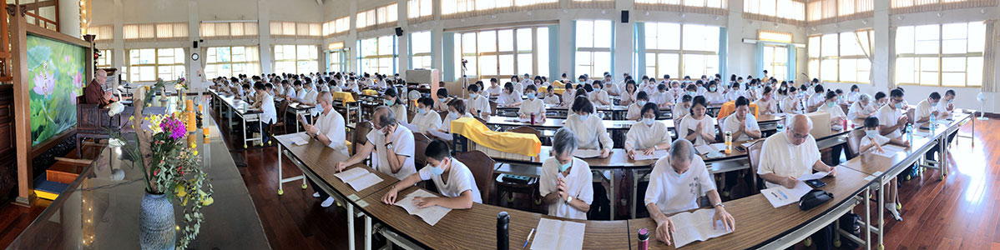

### 念死無常超前部署的齋僧

聞道

結夏齋僧免遺珠

已成回憶情境現

人生難得大善業

轟轟烈烈幹幾場

這是末學第二次參加學會在清公和尚道場舉辦的齋僧，去年第一次抱著初體驗及仰慕清公的心情參加，覺得非常殊勝，所以決定下次有機會一定要參加。加上近來經歷身邊親友的老病死，以及學習《入菩薩行論》後，更加堅定要排除困難去齋僧的決心。末學一直不斷的告訴自己，對於親友顯現無常的現量，必須練習在自己的身上生起比量，產生無常的覺受。老師說最厲害的人生就是修學死亡無常，從死亡回過頭來看，要怎麼面對？超前部署在哪裡？作戰計畫是什麼？

末學的超前部署就是趁著現在眼睛還看得見，耳朵還聽得清楚，身體還能走得動，頭腦還能思維，要努力精勤的造作善法累積資糧，讓臨終的善業放大，惡業縮小，甚至不起現行。而造作善法必須講究對象及做法，所以作戰計畫之一就是跟著學會去圓通寺齋僧。圓通寺是清公的正法戒律道場，在末法時期能有如此持戒精嚴的道場，真的是我們殊勝的福田，再透過老師的指導策劃、學會的安排執行以及善友的共襄盛舉，更能讓我們的往生資糧快速成長。

清晨五點半滿心歡喜搭上學會幫大家安排的遊覽車，展開了齋僧法行。上車後在老師的帶領下，大家一起做早課念佛，在佛號聲中，末學彷彿置身在往生極樂世界的專車，真希望臨終也能搭上這班專車去見阿彌陀佛。接著在老師的前行法語中，更加體會今天齋僧的殊勝之處：

一、孜孜不倦造作善法：不要小看一大早出門，晚上才回家，這就是訓練孜孜不倦造作善法的精神。一般人每天早出晚歸工作，也是孜孜不倦，所追求的只是今生短暫的安樂，但是孜孜不倦造作與三寶有關的善法，得到的卻是佛果究竟的安樂。

二、團隊力量大：不要小看團隊造作善法的力量。有一位蓮友很發心，拿著一大筆錢到圓通寺護持，收到的僅是一張捐款收據。而學會帶著一百多位蓮友，以同樣的錢來齋僧，不僅可以在大殿參加午供，辦桌菜及呈供養金供養諸位法師，還可以聆聽清公講經說法，不僅修福，還可以修慧，更加殊勝。這次深深的體會到，沒有團隊，就算有錢這麼殊勝的善法也修不到。

三、清公的修行典範：民國一百年學會邀請清公於道場開幕典禮講課，當時清公在五台山剛傳完三壇大戒，非常疲憊，但是搭機返台後，便直接坐車到學會住下來，而且為了準備明天的課程，通霄讀書，沒有睡覺。老師當時與清公並不熟識，而且學會只是一個在家團體，清公可以推辭，說有事無法前來，派一位圓通寺或是正覺精舍的副住持來就可以。但是清公並沒有這樣做，對於答應的事情，堅持信守承諾的完成。清公的誠意與守信實為我們修行人的典範。

四、護持佛制：佛制戒結夏安居是因為印度有三個月的雨季，而且天氣炎熱，不適合外出托缽，所以僧團集聚在一個地方精進修行，由在家居士以生活用品來供養僧團修福，並請比丘說法為修慧。現在遵守佛制結夏安居的僧團不多，所以我們必須珍惜齋僧的機會。結夏安居對於比丘的修行非常重要，所以我們要繼續不斷的護持，讓結夏安居的佛制能延續下去。

上午九點多抵達圓通寺，大家集合後，老師在大殿教導我們結合普賢十大願王做廣修供養的齋僧，讓我們今天所修的福報可以增長廣大。在大殿做完午供後，由學會安排代表恭呈供養金，並以豐盛的菜餚供養僧團。中午十二點大家用過午齋後，進入講堂準備聽清公講經說法，開始修慧。

當末學看到講義的標題「佛說觀無量壽佛經—九品觀章」，眼睛為之一亮，興奮無比。感恩佛菩薩加被，今天可以聽到清公開示九品往生，幫助末學規劃念佛往生的作戰計畫。接著聽到引領的法師以美妙莊嚴的音聲唱誦本師名號及開經偈，末學不禁留下感動的眼淚，感恩釋迦牟尼佛的慈悲，將這麼殊勝的淨土法門流傳下來，為末法時期的凡夫找到一條脫離六道輪迴的出路；今天能有機會聽到清公和尚講說《觀經》九品，真的是「無上甚深微妙法，百千萬劫難遭遇」，也期許自己「我今見聞得受持，願解如來真實義」。此時對於馬鳴菩薩以音樂說法感動很多人出家，生起了一點皮毛的覺受，也更加嚮往能到極樂世界聆聽寶樹演音及眾鳥說法，生起念佛、念法、念僧之心。

清公和尚講經威儀十足，卻又不失幽默，末學聽得法喜充滿。尤其清公講到下下品的眾生造作五逆十惡的罪業，臨命終來不及觀想念佛，遇到善知識，教導他趕快稱念南無阿彌陀佛，在每一念之中滅除八十億劫生死之罪，於一念頃往生極樂世界，多麼殊勝！而我們沒有造作重大的罪業，只要能堅信淨土法門直至臨命終時能至誠懇切念佛，十念乃至一念都一定能往生。造善造惡在一念之間，念佛往生也是在一念之間，所以我們要對持名念佛的功德深信不疑。清公還說了一個在家居士預知時至，身無病苦念佛安詳往生的公案，來幫助我們生起念佛往生的信心，希望大家回去以後能深信切願認真念佛，萬善回向往生極樂。最後還特別準備梅子綠茶跟大家結緣，令人備感親切。

更令人感動的是清公七十多歲高齡，身體微恙，為了跟我們講經，犧牲中午休息時間，還連續講經兩個半小時。但是清公並沒有疲憊之色，講話中氣十足，聲音宏亮，還欲罷不能。老師說這就是清公對佛法的熱情，以及對眾生的誠意。這兩樣是我們最缺乏的，應該好好的向清公學習。清公當初在台中蓮社只是一個職員，但是發心學戒，承擔如來家業，現在成為當代律學的大師，所以我們不要小看自己，只要勇於承擔，堅持不懈，最後也可以成為佛法的傳人。這讓末學想到《入行論》所說的，佛以輕和微妙法(法喜)，能讓我們遠離逸樂及勞倦，來斷除對於善法怯弱的懈怠而成就菩提。末學在清公身上得到了印證，也期許自己能效法清公的精進。

非常感恩學會的師長，為這次齋僧的安排付出很多的心力與勞力，造就大家福慧雙修的殊勝機緣。末學很慚愧未能參與付出，在此不揣淺陋，與大家分享當天的見聞與感想。祈願學會在老師的領導下，大家能勇悍的聞思修、學善法，為往生大業超前部署，念佛同生極樂國。阿彌陀佛！

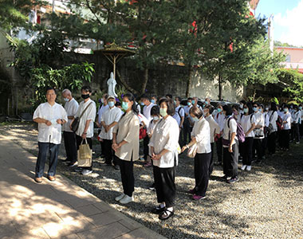

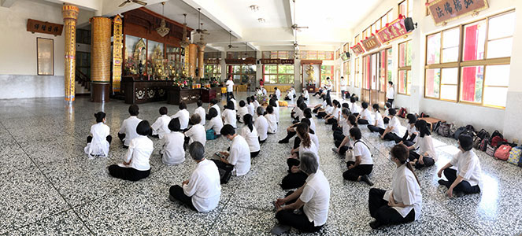

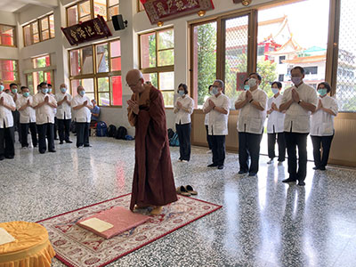

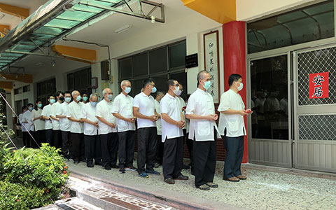

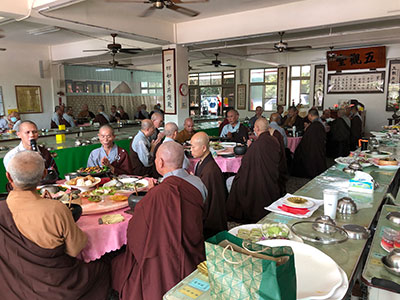

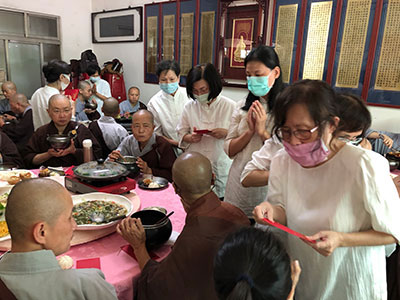

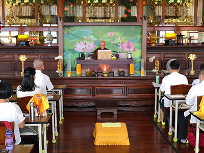
