# 第129期
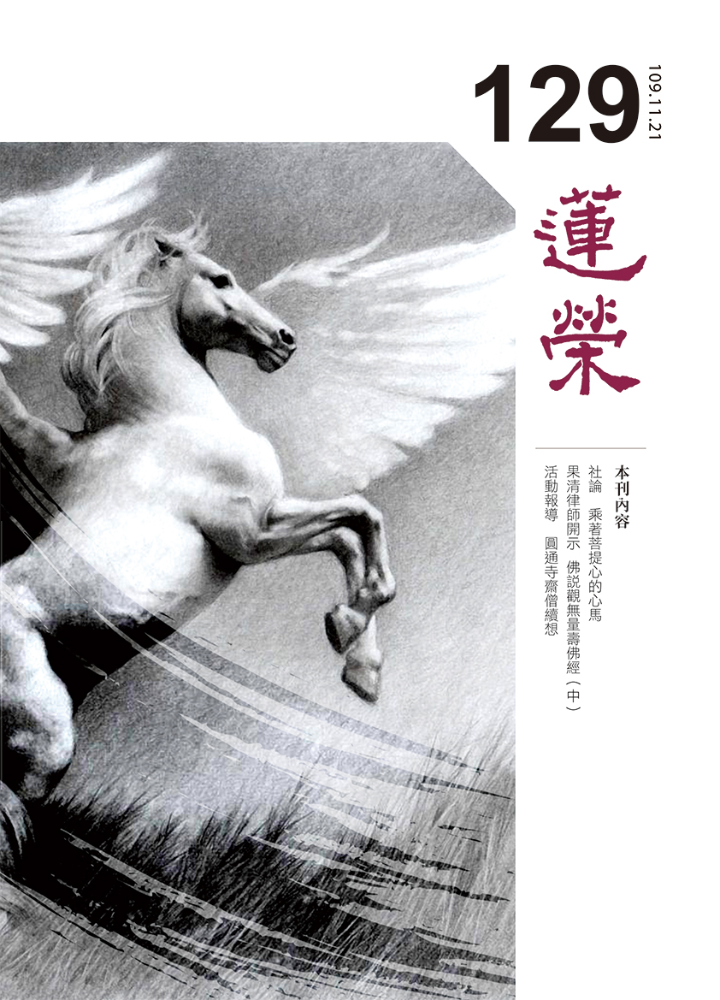

## 本刊社論

### 乘著菩提心的心馬

*編輯部整理*

善述菩提心

開佛果寶藏

是良性循環

安樂趨安樂

菩提心是「為利有情願成佛」的心，並不是有一個東西叫作菩提心，而是和合出來的，正因為菩薩看到利益眾生的好處、價值、意義，看到最能滿足此價值意義的是佛果，故他努力地追求佛果，這些組合的心態叫作菩提心。

菩薩對有情熱情的程度就像世間名利客努力追求榮華富貴一樣，可以餐風曉露、忍飢耐寒、冒險犯難，可以組成團隊、精心籌畫、時時檢討，可以忍受過程的艱辛、變化，因為菩薩明瞭菩提心就如同藏寶圖在手，唯有菩提心才能挖到佛果的寶藏。

世間做善業得樂果就像芭蕉開花，花開花謝就結束，世俗的大善人做了很多大善業，但是樂果會一次把善業用完，可能一生富貴，擁有無窮的財富受用，但這一生就用盡，花掉了廣大的善業。而菩提心所引發的善業、所結的快樂，像野草般能不斷蔓延、不斷生長，不會因為受用以後而結束，有菩提心的人受用福報，反而會開發善業，如同國王因為王位而能做更多的善法，形成良性循環。

菩提心是心力的強盛、心力的承擔，在不斷利益有情中，生起無量的能力與智慧，不斷的修學法義，超越種種苦難，造種種利益有情的善業，這樣的大悲心與菩提心遠遠勝於諸聲聞的功德。

《入行論》中說「於菩薩行不應怯弱」，經文是：「是故悉除疲厭心，菩提心馬為承載。轉從安樂趨安樂，心既了知何怯為」，要除掉種種世俗瑣事所帶來的生活奔波、身體疲勞、心理厭倦，觀想補特伽羅我騎乘菩提心的心馬，趨向安樂處。

古代的交通工具就是馬，馬可以帶領主人走過千山萬水，可以突破各種險難，馬的特徵是快速、乘風而行、馳騁沙場，用自己的力量和赤誠，歷經血與火的洗禮。而菩薩乘著菩提心的心馬，可以冒險犯難、不畏艱苦，前往各種增上生，例如：轉輪聖王、忉利天王、夜摩天王、兜率天王、色界的究竟天王，各式各樣的高位他都可以抵達，也可以統理四大部洲，或是一個世界，或是三千大千世界，他擁有無盡的資源，能做想像不到的種種善法，又多又廣。

當心力強盛如馬，可以將我的意志力發揮到極致，有崇高的理想抱負，堅定的意志力，勇於承擔，具有使命感，發菩提心，願意學習菩薩的種種法行，轉世間庸俗之心，轉自己疲憊的身心，把世間種種風光納為修學的覺受。視一切世間歷練為安樂，行在安樂的道上，得到安樂的果報。既然乘菩提心行於安樂之道，趨往安樂之果，心善了知者，怎麼還會怯弱呢？故能夠在道上修行無所畏懼，對菩薩行永不怯弱。

西元二○二○年對世界各國而言，皆動盪不安，一波未平、一波又起，未來的世界變化無人可以預測，世間快樂的本質終究是苦，唯有佛果才是真正皈依處。凡夫直至佛果之路，要靠強而有力的心馬，運用心馬的概念，能吸收各界的幫助資源與擁護，能遇到有理想抱負、有遠見格局的善知識，願意擁護我們的核心價值，三寶也會樂於加被，心乘著這樣的概念，叫作心馬，他會不斷帶領我們通往安樂處，快速的累積福慧的資糧，來圓滿佛果，這就是菩提心馬。

## 佛學覽幽

### 菩薩清淨的行持—華嚴經淨行品（四十五）

*戒慧講述／編輯部整理*

戒教相應是沙門

自他兩利正法揚

調柔寂靜正法幢

人天師表功德巍

丙二、指事顯因答其徵因

丁一、總徵

丁二、別顯

戊六、乞食道行時願（五十五願）

己二、所睹事境(十九願)

己三、所遇人物（有二十四願）

己三、所遇人物：沙門、婆羅門

前言

修學者出去乞食，在道路上行走時，會有三種狀況，一種是他所遇的路況；二是他所看到的事情；三是他所遇的人物。目前進度在他所遇人物｜見沙門，經文都是兩個一對，如前分有嚴飾、無嚴飾，有樂著、無樂著，端正、醜陋，報恩、背恩。而此處的沙門跟婆羅門是一對，沙門比較約內道說，婆羅門比較約外道說。

經文：

若見沙門，當願眾生，調柔寂靜，畢竟第一。

經文四句，通常分三段，第一句指依此事來發願，此事也許是自己，或者是看到他人的種種情況、事物，而發起此願，叫做眾所依事，也是願所依，即依此事來發願。第二句是願所為境，即以眾生為發願的對象，能發願的是自己。後二句是願境成益，希望在此境界上能成就何種益處，又可分成自利跟利他。由這樣的願望能成就前面所造諸佛之德，也願我與眾生得「調柔寂靜，畢竟第一」。此偈分成幾個層次，首先要想如果眾生都能夠如此該有多好，此不僅是隨喜，還要能夠發願，但願眾生都能夠如此，發願後，更進一步說我願能幫助眾生達到此境地，可是自己能力還不夠，所以要祈求三寶的加被，讓我有能力幫助眾生成就此願，成就眾生調柔寂靜，畢竟第一。

「若見沙門」，沙門在印度泛指所有的出家眾，不僅是佛教內道，一般婆羅門或是外道出家者皆可稱為沙門，他們以修行、苦行、乞食為生。會性法師說，以前還會特別標出「沙門釋子」，使人一聽便知是出家人，到後來沙門才演變成佛教出家眾的專有名詞。沙門是印度話，後漢時傳來中國翻成喪門，用字不妥，慢慢才演變為如今的沙門。《俱舍論》中說：「諸無漏道是沙門性，懷此道者名曰沙門，以能勤勞息煩惱故。」會性法師說，勤息的意思是勤修戒定慧，息滅貪瞋癡。

沙門的體性即是勝解無漏道，能修學無漏道的那一分才能稱為沙門，名為沙門必須要有此體性才能命名，合乎此特質方能成立，就像名曰桌子，其特質是可以在上面用餐、讀書，凡符合此定義及特性的即可名言安立為桌子。沙門如果沒有善知識、法本讓他修學無漏道時，就不能安立為沙門。

唐朝釋玄應大師所作的《一切經音譯》中提到，沙門有三意，一是止息，止息一切諸不善法。二是劬勞，謂修一切劬勞苦行。三是聽聞，謂多聞薰習是常業也。所以名為沙門的那一分必須要具足聽聞方能生起無漏道，無漏道的那一分反面來說可以止息、降伏煩惱，「菩薩摩訶薩云何降伏其心」，就是以般若智慧去降伏其心。劬勞苦行，一切的善法也因為無漏道的修學，使修學善法格外有力。對無漏道有勝解的人，叫他破皈依體他辦不到，他對三寶的信心是很強而有力的。

南亭老和尚說《瑜伽師地論》中沙門分為四類：勝道沙門、論道沙門、命道沙門（說道沙門）、污道沙門（壞道沙門)。依會性法師的說法，沙門有四種，一是證道沙門，證果以上的聖者。二是說道沙門，雖未證果，但對教理非常通達，能自利利他。三是活道沙門，雖還無法利益眾生，但對自身的修持非常用功、嚴謹。四是汙道沙門，指不如法、或破壞自己所修學的教法。會性法師說我們起碼要像活道沙門。

勝道沙門指證道沙門，能夠證得初果位以上，或是大乘初地位以上的，稱為僧寶，三寶之所以稱為寶，是因為勝道沙門的這一分，有一個這樣的人就可以成為寶，如果這樣的人沒出現，就要論道沙門、命道沙門加起來四個人和合，才能稱為僧。論道沙門即說道沙門，他透過聽聞體悟佛法，成為傳承，弘揚正法、培養人才，雖然他是凡夫，可是功德非常大。勝道沙門是聖者，勝道沙門以下的都是凡夫。命道沙門是在說道沙門的引導下，願意和合修學正法，以修學為命。汙道沙門是壞道沙門，有兩分，一分指破戒，一分指說相似法，將佛法顛倒說，破壞佛法的正見，破戒、破和合、破軌則是論道沙門、說道沙門或是命道沙門的反面相，都是可怕的罪過。

「若見沙門，當願眾生，調柔寂靜，畢竟第一。」南亭老和尚引《金剛經》佛說：「我得無諍三昧，人中最為第一，是第一離欲阿羅漢」來解釋，「調柔」指沒有煩惱的形象，「寂靜」形容證悟空性的形象。「無諍」例如破薩迦耶見，薩迦耶見是所執的我，破薩迦耶見就是破自相的我，和合是破我的那一分、沒有你我他的對立，「無諍」其實就是解空，證悟空性，不會跟眾生爭論，因為世間都是妄見有自相，在自相中說好說壞，解空者不見自相，故不會跟世間爭論，自然調柔、煩惱不生。「寂靜」是無有一法可得，自相所成的法一法皆無所得，內心空靈靈的很寂靜。

沙門跟「調柔寂靜」的關係為何？沙門為因，「調柔寂靜，畢竟第一」為果，見到沙門時希望眾生能夠有此成就，調柔寂靜對內來說是已經降伏煩惱習氣，對外來說能夠在辦事中與人和合，在根本位時能證得空性，在後得位時能戒同修、見同解、身同住、利同均、口無諍、意同悅，以上是沙門的功德，不但自己成為眾生的福田，和合沙門以後也成為眾生最殊勝的福田，眾生即種微少善種，可以產生纍纍的果報，提供眾生這麼好的福田給眾生種善種，產生纍纍的果實。

畢竟第一的意思？解脫與成佛都靠修學空性的智慧，空性的智慧破煩惱障的那一分安立為解脫，破所知障的那一分安立為成佛，這是無可取代的。修世俗的方便如布施、持戒、忍辱等皆無法破煩惱障、所知障，並非這些不重要，是就著慧的這一分可以破二障來說福是不能夠取代慧的。但是為了慧必須修福，福如果不是用來資助慧，則沒有意義，會成為三世佛冤。福資助慧，使慧格外的有力，成為度眾生的能力，此時方能真正修到福。

經文：

見婆羅門，當願眾生，永持梵行，離一切惡。

婆羅門以前是印度的四種姓之一，是最高種姓，梵王生四姓：王之口生婆羅門，臂生剎利，脅生毘舍，足生首陀。廣義來講，婆羅門泛指佛教以外其他一切的宗教人士，都可以稱之為婆羅門，看到修女、神父都可以說是婆羅門。

印度的婆羅門之所以強，強在他有經典的依據，而這些經典都出自於梵天之口，不容改動，恆常不變。四吠陀的經典，凡婚喪喜慶、種種活動皆有詩歌朗誦，道理涵在其中，而且軌範人的進退應對、追薦祭祀，婆羅門中的數論師立聲常彰顯其傳承無誤，因明家則以聲無常，所作性故，如瓶破之。

婆羅門翻譯成中文的意思是淨行、淨裔、永持梵行，梵就是淨，永持梵行就是永持淨行，離一切惡。吳月氏翻譯的《佛說菩薩本業經》「見異道人，當願眾生，遠去邪見，入八正道。」永持梵行指真正的淨行。

婆羅門雖然也是修學清淨行，可是這個清淨行只有某部分上清淨，並非整體的清淨，例如他們會約束自己的身口意，但不是跟因果結合，他們是為了升天，他們歌詠讚歎的對象不是三寶，而是他們的神，就像那些外道，雖然也約束自己的身口意，但他只是保持身心的寧靜及快樂，不是煩惱的正對治，煩惱的對治包括要修無常、修空性，那才是煩惱的正對治。

清淨行包括佛所制的戒，婆羅門遵守的戒律有時候比內道還要嚴格，並好樂、勇悍的去執持戒律。

梵行中又特別指般若智慧的梵行，行持清淨，不但是破煩惱惡的現行，還破煩惱的種子，破煩惱種子的梵行是指空性智慧的行持，能破煩惱的種子及煩惱的習氣。（下期待續）

### 大乘百法明門論簡說　拾伍、心所有法 —隨煩惱（五）

*戒慧講述／淨本整理*

生忍樂欲名能信

心隨欲境不放逸

勇悍修學名精進

福慧雙修成正覺

經文：

五、隨煩惱二十者：一、忿。二、恨。三、惱。四、覆。五、誑。六、諂。七、憍。八、害。九、嫉。十、慳。十一、無慚。十二、無愧。十三、不信。十四、懈怠。十五、放逸。十六、昏沉。十七、掉舉。十八、失念。十九、不正知。二十、散亂。

大隨煩惱生起的範圍大於中隨跟小隨，也是根本煩惱的等流或分位。不信、懈怠、昏沉、掉舉、散亂，屬於根本煩惱的等流；放逸、失念、不正知，屬於根本煩惱的分位。

《直解》云：「不信者，於實德能不忍樂欲，心穢為性，能障淨信，懈怠所依為業。」不信是因為過去貪瞋癡的心力太過強盛，所有的快樂都是來自於世俗的追逐，對於三寶所說的離苦得樂，既不現見也無法相信，產生不了學習的力量，是以貪瞋癡為因所生的等流煩惱，與貪瞋癡的行相不同。

所謂的「實」，是指諸法的實事、實理，可分為「真諦」跟「俗諦」，「諦」也是真實的意思，真諦是聖人智慧見為真實；俗諦是凡夫以為真實。凡夫看世間各種事物都顯現為真實；聖人的智慧則見到空性為真實，但聖人並不是看不到世俗法，而是在世俗中會看見世間一切事物也非實有，只是妄有的顯現而已。世俗的一切沒有自體性，跟根本沒有世俗完全不同，前者只是否定自體性，仍有現象跟作用，後者則是墮入根本無的斷滅見。

《百法》此處的「實」，約真諦（空性）上說，空性是聖者所證，能證的是聖者的「德」。由於能證的德與所證的實，所以聖者有「能」，就是有力量引導眾生修學各類法，乃至於修學空性，解脫成佛。「佛法僧」與「實德能」的關係，佛的德是能證，實為所證；法的德是能詮，實為所詮；僧的德是能修，實為所修。佛用所說各種法，都是要幫助眾生生起能證「實」的「德」。相信佛法僧是能證、能詮、能修，實德能是他們的所證、所詮、所修，因此有能力引導我們離苦得樂、脫離輪迴，甚至成就究竟佛果，除此之外沒有其他方法，這才是真信。所以我們是不是真的相信三寶，也要用此定義來勘驗自己。不信者，對於實德能不忍樂欲。「忍」是忍可的意思，因為相信，才忍得下、學得下，耐得住煩，可以學進去般若的大論。不信者不忍可，所以也生不起對佛法的歡喜好樂，也不可能生出勝解。不信者「心穢為性」，意思是體性汙穢，所有的善法都不能生，所有的煩惱都會生，這是因為沒有正見，沒有善友的力量，自然無法對治煩惱，就是佛來也沒辦法了。

過去對佛法修過淨信心的人，這一世聽聞佛法會生出感動，例如給孤獨長者聽到釋迦牟尼佛的名號，就自然身毛為豎，非常渴望見到釋尊。又例如六祖聽人誦金剛經，內心非常震撼，這也是過去世對般若修過淨信心；反之，不信就會障礙淨信，不願聽聞正法（不實），不喜親近善知識（無德），也不肯眾善奉行（不能），這樣的人也就容易產生懈怠。

《直解》云：「懈怠者，於斷惡修善事中，懶惰為性，能障精進，增染為業，設於染事而策勤者，亦名懈怠退善法故。」為何懈怠不直接稱為懶惰？因為特別是針對修學佛法不精勤而說懈怠，這樣的人對於世間名利的追逐還是很有衝勁、很勤勞，只是因為對佛法沒有信心而不肯精進，雖入佛門，也沒有修行的勢力。更有甚者，耽著于睡眠，聽課、打坐、修行，都有辦法休息或睡著，平白浪費自己多劫累積才進佛門的善根，也談不上承擔度眾生的大業。懈怠會障礙精進，因為提不起勁，而在貪圖享樂當中，也很容易生起各種染法，沒有對治這些惡法的力量。

《直解》云：「放逸者，於染不防，於淨不修，肆縱流蕩為性，障不放逸，增惡損善所依為業，即以懈怠及貪瞋癡四法為體。」放逸之人就像無鉤的狂象，大象最怕鐵鉤，鐵鉤比喻正知，只有透過「正知」能夠馴服無始劫以來放肆、任性的心。沒有「正知」，對於自己的煩惱一定無可奈何，愈壓煩惱愈強。「正知」就是能夠察覺自己的煩惱，對於煩惱的生起有高度的警覺，比如城門的守衛，只要守衛保持警覺能夠發現敵人，敵人就無法進攻。所以學習《百法》就十分重要，一一認識這些煩惱的行相，對於身口意三門能懂得數數觀察，讓自己成為善於用心的人，在修行上才能事半功倍，脫胎換骨。

懈怠是對正法提不起勁，放逸是很喜歡追逐世俗，放縱自己流盪於其中，所以二者不同。放逸會增惡損善，讓煩惱之賊把自己的功德法財全部盜光。什麼是「功德法財」？好比世間財，要努力去賺取才能得到，是我們維持生活之所需，如果被人偷走，一定會感到十分沮喪；功德法財也是如此，同樣要透過斷惡修善努力去累積，雖然無形，但它的效用更大，能讓人消災免難、趨吉避凶，所以當功德法財被煩惱賊偷走時，應該要比世俗錢財更為難過，可惜大多數的人不知道功德法財的重要，才會放縱五根緣五欲境，生起煩惱，盜空自己的功德法財。

放逸是懈怠及貪瞋癡四法的分位煩惱，也就是放逸的不同面相，分別會顯示出貪瞋癡或懈怠的行相。比如「於染不防，於淨不修」這是懈怠的行相；「肆縱流蕩」中，會生起貪瞋癡的行相。有論中特別提到，相較於慢心所跟疑心所，放逸障礙人三善根（不貪、不瞋、不癡），有股勢力讓人不願意策勵自己，在名利場中放逸追逐之人，往往難以攝心學佛，因此應當特別警覺。（下期待續）

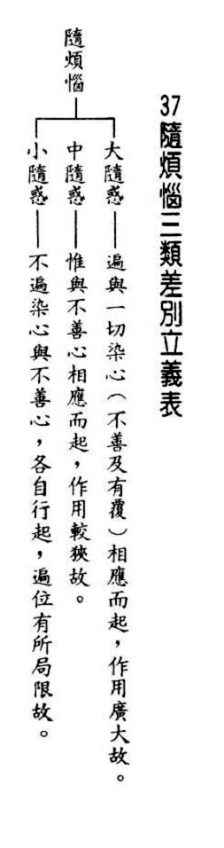

### 佛學概要十四講表簡說（三十一）　第五講表　人生三際之抉秘（十二因緣）

*戒慧講述／心若整理*

生從何來死往何

結生相續前無始

往後無終真可畏

無明不生輪迴無

前言

第五表「人生三際」指過去、現在、未來，「抉秘」指生從何來、死往何去，千古的謎團要靠佛法來解答。第五表猶如街亭，街亭若失守，則全軍覆沒，意即縱然第四表生起出離心，但如果不知道出離的方法，出離心則無用，裸形外道、勝論師、數論師皆想出離，但都苦於沒有出離的方便，故第五表重要至極。

（甲）雙重因果

現在因緣：這期生命果報繼續起惑造業，又會形成現在因緣。現在因緣含愛、取、有這三支。

●愛(緣)

伴隨無明，領受外境而生起染著的心，因著苦樂捨的感覺而生執著，因著苦受生起乖離愛(很想離開他)，因著樂受生起不離愛(不要離開他)，因著捨受生起不壞愛(不苦不樂，希望這樣悠閒的狀態不要壞)。愛是七情的根本，喜是所愛的現前，怒是討厭的現前，哀是所愛的失去，懼是所愛的怕得不到、得到的怕失去，惡是所討厭的隨逐，欲是想得到所愛的，七情全都圍繞著愛。愛的境界有兩種，一種是資具的受用，另一種是淫欲。人生說起來就是組成家庭(淫欲)、追求快樂、追求種種享受，認真賺錢、謀求功名就是為了擴充自家的受用(資具)，難得的暇滿人生就這樣空過了。

●取(緣)

取從愛來，當有所執著、貪著的心漸漸增強時，就會進一步去追求、去取。由愛染執著，趨向追逐。以人生階段來說便是青壯時期，此時愛欲轉強，開始要去追求。愛是下品的貪著，取是上品的貪，愛取歸為惑而非業，因為愛取是起煩惱的階段，業是造作，心裡面計畫，造作身口意三業，業的造作是因為愛我，是惑的滋潤。

●有(因)

愛是很喜歡，取是非要不可，有是想辦法去要，透過心裡的計畫、口說、具體行動，想辦法得到，包括對事業、名利的追求，乃至於修學禪定都是如此，四禪八定才能修成，故十二因緣可說是共整個輪迴、共所有苦樂的。

投生的業在愛、取、有造作之後而有，投生的業成為未來輪迴果的因，愛取是緣，愛是「因受生著」，因受生貪著，取是「因執追求」，非要不可。有是去造作，叫做「業牽後有」，牽到後面的有。

未來苦果：上述的因緣具足就會生未來苦果。

●生

來到下一生，叫做「倒識託胎」，因壽命終了時迷糊顛倒，識是顛倒的，是業果愚、真實義愚，託胎就是父精母血結合坐胎，由業力牽引去受生，又是一期生命因緣的開始，開始受現在苦果。

●老死

生了以後，就趨向老死，開始有種種的變化。一種講法是生、住、老、死，第二種講法是生的第二剎那，就趨向於老。

過去因緣從過去苦果來，現在因緣結成未來苦果，未來苦果是未來未來苦果的因緣，所以是「更生未來惑業，下推未來無終」。往前推無盡，往後推也無盡。

（乙）喻語

十二重城(困在長獄之意)：好像被困在一重一重的監獄裡，被十二重圍牆重重圍住，沒有出離的時候。

十二輪(輪迴不停之意)：十二因緣像十二車輪，像是齒輪一環扣一環，輾轉相扣，輪迴不停。

上來已將第五講表以三世兩重的方法講完，但是第五表又可以再分為了義與不了義的說法，首先我們探討一個問題，表上說愛取從觸受來，但是觸受未必生愛，破無明的聖者，觸受就未必生愛。又現在的因緣愛取比照無明、行，可是無明長得不是愛取的樣子。愛取如果沒有無明所相應的觸受，如何生愛取？觸受如果就能生起愛取，表示不用無明就可以生，有了觸受就生愛，則無人可以脫離輪迴。

依照大乘了義宗義的說法，第五表可以說是兩世兩重，也可以說兩世一重，實際上只要一重就解釋清楚，不需要到兩重。分為能引支、所引支、能生支、所生支，待下一期再一一解釋。（下期待續）

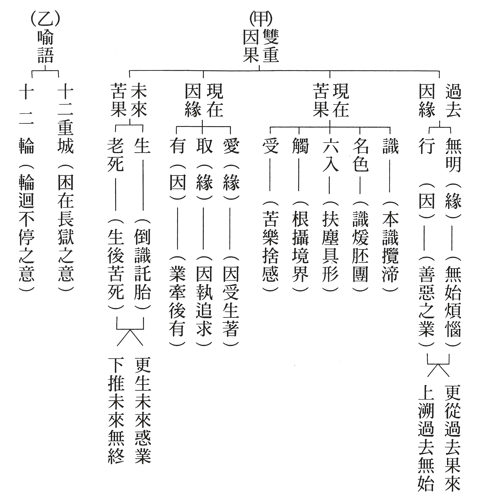

### 大佛頂如來密因修證了義諸菩薩萬行首楞嚴經—七處徵心（六）

*戒慧講述／淨本整理*

心若實有能尋覓

有內應見臟與腑

見暗不成為能見

破在內有實有心

【科判分析】

寅四、破內外（此計同在內）

前面佛已分別就心「在內」、「在外」、「在根裡」三種說法予以破除，阿難尊者此時仍以「心在內」為立場，提出另一種看法。

一、「阿難以見明暗分內外」

阿難尊者以見明跟見暗，來分別心是見內或見外。

（一）、「承前轉計」

因為前面的看法被佛陀破除，阿難尊者轉而提出新的看法。

（二）、「正分內外」

分為見內及見外來說明心之所在。

１、「先伸藏暗竅明」

先申明五臟在體內所以是暗；竅穴對外所以是明亮。

２、「證成見外見內」

以當前見明或見暗，來證明心是見到外或見到內。

（三）、「請決於佛」

請佛為自己的看法提出決斷。

二、「如來以不成見內為破」

佛以心並沒有見到身內，來破除阿難尊者此處的看法。

（一）、「正破」

佛從正面說明理由，破除阿難尊者的看法。

１、「破所見之暗不成在內」

以見到暗不是見到身內來破除阿難尊者的看法。

（１）「雙開對與不對」

閉眼見暗時，佛陀開出兩種可能，一種是暗境界與眼對；一種是暗境界不與眼對。

（２）「雙破兩途皆非」

暗境界與眼相對或不與眼相對，兩種可能性佛都予以破除。

Ａ、「對眼之非」

暗境界與眼相對的錯誤。

ａ、「正言不成內」

正面問難，眼所對的境界如何會是身內？

ｂ、「反顯不成內」

反面顯示，眼所對的境界不是身內。

Ｂ、「不對之非」

若眼所對的不是身內，那說看到身內是錯誤的。

２、「破能見之眼不得返觀」

以能見的眼無法反觀自身來破除阿難尊者的看法。

（１）「以合能而難開不能」

佛陀反難，若閉眼能看身內，為何開眼時不能。

（２）「雙破不見面與見面」

佛陀雙破開眼能見面或不能見面兩種可能。

ａ、「破不見面」

以開眼不能看見自己的臉面，破除阿難尊者的看法。

ｂ、「破見面」

以開眼若看見自己的面，將會產生各種不合理的現象，破除阿難尊者的看法。

（ａ）「心眼在空過」

開眼若看見自己的面，會發生心與眼都在虛空的過失。

（ｂ）「他成己身過」

心與眼根若在虛空，會發生他人身體變成自己身體的過失。

（ｃ）「身成不覺過」

依上所述，還將發生眼已見但身無覺知的過失。

（ｄ）「轉成兩人過」

若執意認為身與眼各有覺知，那會成為一個有情變成兩個有情的過失。

（二）、「結破」

結論破除阿難尊者的看法。

【經文解釋】

阿難白佛言：世尊，我今又作如是思惟。

阿難尊者對佛稟白：「世尊，我現在又做這樣的思維。」

是眾生身，腑臟在中，竅穴居外。有藏則暗，有竅則明。

「眾生的身體，腑臟在其中，孔竅居於外。藏在內的則暗，有孔竅的則明亮。」

今我對佛，開眼見明，名為見外。閉眼見暗，名為見內。是義云何。

「現今我對著佛陀，開眼時看到明亮，稱為見到外面；閉眼時見到黑暗，稱為看到身體內，這樣說法如何呢？」

佛告阿難。汝當閉眼見暗之時。此暗境界，為與眼對，為不對眼。

佛陀告訴阿難尊者：「當你閉上眼睛看到黑暗時，這樣的暗境，是與眼睛相對，還是不與眼睛相對？」

若與眼對，暗在眼前，云何成內。

「若與眼睛相對，暗境在眼的前方，怎麼說是看見身體內呢？」

若成內者，居暗室中，無日月燈。此室暗中，皆汝焦腑。

「眼睛是對著前方，若仍說眼睛看見的黑暗是身體內，那處在暗室之中，沒有日光、月光、燈光，這樣的暗室皆成為你體內的五臟六腑。」

若不對者，云何成見。

「若暗境不與眼睛相對，眼睛不對境，怎麼可以見得到境界。」

若離外見，內對所成。合眼見暗，名為身中。開眼見明，何不見面。

「若眼睛是離開身體，由外對著身內而見，此時閉眼看到暗，說是看到身體內；當開眼明亮時，為何看不到自己的臉面？」

若不見面，內對不成。

「若不能看見自己的臉面，那麼說眼睛是離開身體，由外對著身內見，就不能成立。」

見面若成。此了知心，及與眼根，乃在虛空，何成在內。

「若眼睛見到臉面真的成真，這個能知覺的心以及眼睛，就是在虛空當中，如何會成為在身體內。」

若在虛空，自非汝體。即應如來今見汝面，亦是汝身。

「能見的心與眼若在虛空中，當然就不屬於你的身體。若能見的都是屬於你的身體，那麼應該佛現在看見你的臉面，能見的佛也是你的身體了。」

汝眼已知，身合非覺。

「而且你的眼在虛空向身體看已有知覺，整個身體都沒有知覺，身與心成為無關的兩法。」

必汝執言身眼兩覺。應有二知。即汝一身，應成兩佛。

「你若必定執意要說，身與眼兩者都有知覺，那麼同時應該就有兩個知覺，成為兩個有情，你一個身體，以後成佛應該可以成為兩個佛。」

是故應知汝言見暗名見內者，無有是處。

「是故應該要知道，你說見到黑暗的境界，稱為看見身體內，這是完全不正確的。」（下期待續）

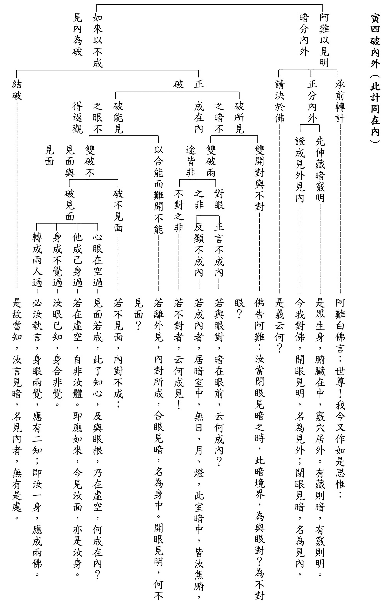

### 《佛說觀無量壽佛經》九品觀章（中）

*果清律師開示、宗澈整理*

中品戒善與世善

戒是無上菩提本

含攝廣大與甚深

博文約禮踐佛跡

前言

學會於二○二○年八月三十一日至圓通寺齋僧，午膳後果清律師慈悲為大眾開示《佛說觀無量壽佛經》九品觀章，上期會刊已講完上三品，本期續刊中三品。

開示

佛告阿難及韋提希：「中品上生者，若有眾生受持五戒，持八戒齋，修行諸戒，不造五逆，無眾過惡；以此善根，迴向願求生於西方極樂世界。行者臨命終時，阿彌陀佛與諸比丘，眷屬圍繞，放金色光至其人所，演說苦、空、無常、無我，讚歎出家得離眾苦。行者見已，心大歡喜。自見己身坐蓮花臺，長跪合掌為佛作禮。未舉頭頃即得往生極樂世界，蓮花尋開。當華敷時，聞眾音聲讚歎四諦，應時即得阿羅漢道，三明、六

通、具八解脫；是名中品上生者。」

佛陀告訴阿難尊者以及韋提希夫人：「中品上生行者的情形：假若有眾生能夠受持不殺生、不偷盜、不邪淫、不妄語、不飲酒這五條戒，始終清淨無所違犯，又受持八關齋戒（就是關閉通往惡趣的門路，而開設通往人天、涅槃的大門。所遵守的戒法，就是在家五戒，其中不邪淫改為不淫，然後再加上不坐臥高廣大床，不著香花鬘瓔珞香油塗身，不觀聽歌舞作樂，這些都是放逸，都能增長惡習），修行諸多戒法（包括出家五眾：比丘、比丘尼、式叉摩那、沙彌、沙彌尼的戒法），不造作弒父、弒母、弒阿羅漢、破和合僧、出佛身血等五逆的重罪，能夠持戒清淨，就能避免造作諸多過患。用這些所修的善根，迴向求生於西方極樂世界。

行者臨命終的時候，阿彌陀佛與諸位比丘現前迎接，然後這一些眷屬圍繞佛旁，放出金色光明，到行者面前，佛協助他們回顧一向以來所修的法，佛也為他們解釋宣說：苦（如八苦：生、老、病、死、求不得、愛別離、怨憎會、五陰熾盛，以及其所衍生的無量諸苦）、空（無我、無我所）、無常（一期生命的生滅的無常，以及四大、五蘊剎那生滅的無常）、無我（對生老病死作不了主、沒有主宰力）的法。

讚歎出家人的種種功德，如《涅槃經》說：「在家逼迫，猶如牢獄；一切煩惱，因之而生；出家閑曠，猶如虛空；一切善法，因之增長。」在家逐漸感覺逼迫，好像處在監牢一般，一切的煩惱從此而生。而出家就是清閑心曠，好像虛空，一切的善法因此就增長。又者，《出家功德經》也說，假若能放男女、奴婢、人民出家，功德是無量的。就好像四天下，滿滿的都是成就阿羅漢果的行者，經過一百歲的供養，這種的福德也比不上有人為涅槃的緣故，一日一夜出家受戒，功德是無邊的。這一段是讚歎出家，得離眾多的苦惱。

行者看到這些瑞相以後，心裡生起重大的歡喜之心，自己就看到自己的身體坐在蓮花寶臺上，於是就長跪，雙膝著地，然後合掌，恭敬頂禮阿彌陀佛，還沒抬起頭來，就已經往生到了西方極樂世界，蓮花不久也就綻開。

正在蓮花開敷的時候，聽到眾多的音聲，讚歎苦集滅道四諦法門。苦諦是世間苦果，集諦是世間的惑業，由於起惑造業，招感世間苦果；滅諦是滅盡涅槃的境界，道諦是修習出世的聖道，即戒定慧三無漏學，開出三十七道品：四念處、四正勤、四如意足、五根、五力、七菩提分、八聖道，這就是道諦的內涵。修出世間聖道，我們才證得了滅盡涅槃的境界，證得不生不滅、無為的法性，已然了脫生死，證得涅槃緣起的境界，就在那個當下證得阿羅漢果，然後就有三明（過去宿命明、現在漏盡明、未來天眼明）、六通（天眼通、天耳通、他心通、宿命通、如意通、漏盡通），具八解脫（內有色想外觀色解脫、內無色想外觀色解脫、淨解脫身作證、虛空處解脫、識處解脫、無所有處解脫、非有想非無想處解脫、滅受想解脫）；這個就叫做中品上生行者的情形。

「中品中生者，若有眾生，若一日一夜持八戒齋，若一日一夜持沙彌戒，若一日一夜持具足戒，威儀無缺。以此功德，迴向願求生極樂國。戒香薰修，如此行者命欲終時，見阿彌陀佛與諸眷屬放金色光，持七寶蓮花至行者前，行者自聞空中有聲，讚言：『善男子！如汝善人，隨順三世諸佛教故，我來迎汝。』行者自見坐蓮花上，蓮花即合，生於西方極樂世界。在寶池中，經於七日蓮花乃敷。花既敷已，開目合掌，讚歎世尊。聞法歡喜，得須陀洹，經半劫已，成阿羅漢；是名中品中生者。」

中品中生行者的情形：假若有眾生或者一天一夜受持八關齋戒，或者一天一夜受持沙彌十戒，或者一天一夜受持比丘、比丘尼的具足戒，有威可敬，有儀可則，無缺無壞，用這種功德，迴向切願求生極樂世界，戒德馨香薰染修行，像這類行者，生命將要終了的時候，見到阿彌陀佛和諸位比丘眷屬放出金色的光明，拿著七寶蓮花，到行者面前，行者自己聽到空中有聲音，讚歎說：「善男子！善女人！像你這樣修持淨戒，能夠如法修行的賢善者，隨順了三世諸佛教導的緣故，我來迎接你。」行者自己見到坐在寶蓮花上面，蓮花就合起來，就往生到西方極樂世界去，在七寶池當中修行，經過七天，蓮花才開。蓮花開後，開啟慧眼，恭敬合掌，讚歎彌陀世尊。聽聞妙法，心生歡喜，證得小乘初果須陀洹，經過半劫以後，就成就四果阿羅漢。這就叫做中品中生行者的情形。

「中品下生者，若有善男子、善女人，孝養父母，行世仁義，此人命欲終時，遇善知識為其廣說阿彌陀佛國土樂事，亦說法藏比丘四十八大願。聞此事已，尋即命終。譬如壯士屈伸臂頃，即生西方極樂世界。生經七日，遇觀世音及大勢至，聞法歡喜得須陀洹。過一小劫，成阿羅漢。是名中品下生者。是名中輩生想，名第十五觀。」

中品下生行者的情形：假若有善男子、善女人，恭敬孝養父母雙親，力行世間仁愛慈善事業。

《詩經》說：「哀哀父母，生我劬勞。」很值得哀憐的父母親，生下我們是那麼的勞苦，我們做子女的，怎麼可以不孝順呢？這不合道理。所以「百善孝為先」，百種的善行，我們首先都要孝順父母。父母不懂得孝順，你會愛護其他人，哪有這樣的事？

這個人生命將終了的時候，遇到善知識，為他詳細介紹阿彌陀佛所創立的極樂世界種種莊嚴妙樂的事情，也是說彌陀導師因地做法藏菩薩比丘時，發了四十八大願，行菩薩道，用行山來填願海等等的事。聽到這些事情以後，不久也就生命終了。

好像一位身強力壯的人，一伸一屈手臂這麼短暫的光陰，他就往生到西方極樂世界去了。經過七天的時候，遇到觀世音菩薩以及大勢至菩薩，聽到妙法，法喜充滿，證得初果須陀洹，再經過一小劫的修行，就成就阿羅漢果。這就叫做中品下生行者的情形。這稱做中輩往生的觀想，叫做第十五種觀法。（下期待續）

## 蓮池海會

### 陳文明老居士往生見聞記

陳秀春

任勞任怨付出

終生學習熱情

厚愛親族提攜

往生淨土再來

陳文明老居士生於民國二十三年，南投縣埔里鎮人，家中排行老二，上有一兄，下有二個弟弟、三個妹妹，小學畢業時成績優異，校長親自登門拜訪，希望能繼續升學，無奈家庭因素無法繼續升學，但仍能於農忙之餘自行修學，對語言頗有興趣，懂得日文及印尼話，七、八十歲時仍能自己看空中美語雜誌，聽收音機學習英文，是位好學不倦的老人家。

陳文明居士婚後育有三子一女，經由朋友介紹北上工作，於當時業界頗有盛名的工業配線工廠當學徒，從基層磨練，由於工作表現優異升任廠長。在職期間，有一次廠內升等考試，要畫線路圖，當時家中沒有書桌，老人家索性將門拆下來當作書桌使用，即便環境克難，仍然想辦法解決，可見其做事一絲不苟，靈活變通，盡心盡力去完成每一項工作。擔任廠長期間，出差印尼，學會印尼話，日後太太需要找看護，即請印尼看護，以利工作上溝通。

太太糖尿病控制不佳，引發腎功能衰竭，導致洗腎，選擇做腹膜透析，當時老居士已年近八十歲，一肩擔起重任，負責太太的洗腎事項，學習腹膜透析操作，其工序複雜繁瑣，操作者需注意手部清潔及消毒問題，而近兩年洗腎過程，未曾發生感染問題，可見老人家做事不簡單，對護理常識非常有概念。

太太於民國一百零四年往生，老居士長期照顧太太，身體出現異樣，小腿水腫，在埔里當地醫院檢查後，病況不妙，北上再檢查確認肝癌末期，老人家年事已高，且肝癌太大無法化療，僅能做栓塞，前後做了數次。由於飲食調整得宜，病情大致上還可以控制，這段期間還到暨南大學上了幾年的樂齡課程，活到老學到老，是後輩的典範。

今年三月份再北上做定期例行檢查，發現腫瘤已擴散轉移，只剩半年生命，老人家安然接受結果，心中平靜，沒有絲毫難過表情。端午節前北上住女兒家調養身體，當時腹部突起，如皮球般大小，無食慾，走路都有困難，身形日益消瘦。八月下旬時，他告訴兒子，自己想走了。九月十一日清晨身體不適，回醫院就診並住院，由於先前有吐血及血便，院方希望照胃鏡檢查，以釐清原因，老居士拒絕了，又因腎功能不佳，院方希望洗腎，老居士也再次拒絕，他知道這些檢查只是稍稍延長生命，對病情沒有絲毫幫助。九月十四日轉安寧病房，老居士當場簽署拒絕急救聲明書，他至始至終頭腦清晰， 甚至在臨終最後時刻也能如此清醒。

九月十五日本學會師姑及學長們前往探視，懇切叮嚀老居士念佛。九月十六日早上又吐血，但血壓穩定，直到中午十二點半左右，血壓突然下降，安寧病房主治醫師詢問是否輸血，老人家堅定拒絕，兒女再次詢問，依然拒絕，家人謹遵辦理，也叮嚀老居士即便嘴巴無法念佛，也要在心中默念佛號。

老居士臨終前與死神搏鬥的那一幕令人動容，只見他不斷以薄弱身驅，不停左右邊交換側躺，可見當時疼痛到極點，在卻未曾喊過一句痛，臉上也不曾出現過一絲一毫的痛苦表情，可知其為人自律甚嚴，即便痛楚難挨，依然咬緊牙關，勇敢承擔人生的最後一關，並於下午五點十四分安詳走完八十七歲人生旅程。

非常感謝秀英師姑接到老居士病危的消息，放下手邊的工作，費心安排助念事宜， 也非常感恩學會師長、學長們前往醫院助念及老師到場開示，若非如此，家屬們必定心慌意亂、無所適從，不能安穩助居士生起正念。助念八小時中，家屬見到學會助念的殊勝氛圍及助念的莊嚴，相信在家人、親友、長輩心中都留下深刻的印象，也由衷希望藉此殊勝的因緣，家屬皆能種下日後聽聞佛法的機緣。

謹以此文感念陳文明老居士生前對家人的無私奉獻、照顧及對後輩的提攜，並對老人家一生的為人處世深深表達敬意，阿彌陀佛！

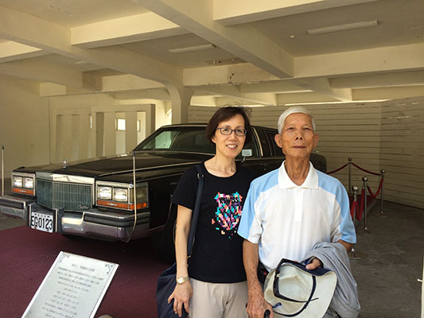

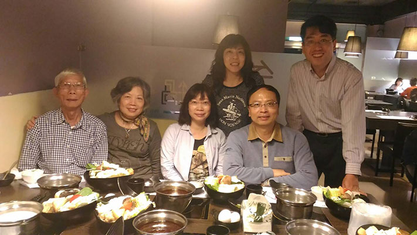

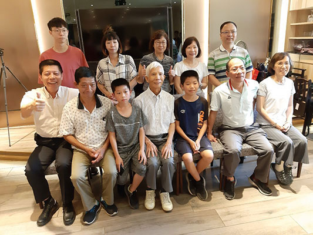

### 陳王李綉蜜老居士往生見聞記

陳麗嬌

勤奮家務一肩擔

悲憫助人愛動物

先生離去失重心

放下身苦念佛去

陳王李綉蜜居士出生於民國二十六年七月七日，臺南市西港區的大戶人家，家中經商也務農，兄弟姊妹八人排行老三，上有兄姊、下有弟妹，從小聰明伶俐，小學成績優異，畢業後考上初中，卻因當時重男輕女觀念，老居士必須放棄就學來協助家務，故國小畢業即在家協助父親經營汽水工廠的配料工作，成為家裡雙親的得力助手。

民國四十五年，陳王李綉蜜居士二十歲，經媒受之言與陳戊寅居士結為夫妻，娘家與夫家經濟差異大，但奉持嫁雞隨雞的古訓，居士也能過著刻苦耐勞的日子，勤儉持家、少言多做，每天都要下田工作，煮飯、洗衣、事奉公婆、養豬養雞自然不在話下，甚至生產後都沒辦法好好坐月子，沒辦法調補身體，生活全靠自己，平時還會外出做工，像是插秧、割稻、種甘蔗、收成甘蔗、種甘藷、收成甘藷等工作都不嫌辛勞，為了燒火柴薪還免費去幫別人拔甘蔗葉，就這樣日復一日的靠著做工賺取零錢貼補家用，而老居士兢兢業業的態度為鄰里鄉人所讚美，也為子女帶來身教、言教的好榜樣。

遇到外地挑著擔子以物易物的老人，居士還會將他們挑擔的東西買下來，減輕他們的重量，看到溝裡剛出生的小狗沒母狗養育，便帶回家照顧，這份悲憫之心，是她為人處世溫柔善良的本質。

後來先生陳戊寅居士到針織工廠上班，生活有了改變，當時政府推展客廳即工廠，陳戊寅居士便引進公司要加工縫補的針織衣物到家裡，由陳王李綉蜜居士經營代工，居士便帶領著村裡的婦女由農田走入客廳賺錢，經營得有聲有色，再多的工作也消化，公司都很放心，大家拚命的代工，改善了經濟，不用風吹日曬去做工，但也是另一種苦的生起，總是沒晝夜的趕工生活，茶飯都沒時間吃。

辛苦了大半人生後，兒女相繼成婚，居士含飴弄孫協助代養，視為己責、盡心盡力。後來先生往生，居士無伴，又身體不適，兒孫無法隨時承歡膝下，備感孤獨，對這娑婆世界萌生去意。

居士年輕時喜歡到寺裡幫忙寺務，跟著師父們做事念佛，也皈依三寶，曾一度對家人表示要出家，但家人反對因而作罷，年輕就吃早齋一直到現在，與佛教結下深深的善緣。後來因女兒學佛，曉於一些念佛往生、求生淨土的觀念，在空閒時都會主動念佛，更因有團體的關懷，也能有每週佛號十萬聲的成績，自己也感到高興。也因此多次大事化小、小事化無，對蓮友們來訪的開示居士也都能接受，也很樂意跟大家互動，種下往生的善緣。

此次助念仰仗團體、蓮友的護持，全家大小化悲痛為助念的力量，一心一意祈求阿彌陀佛慈悲接引，助念十二小時後，居士全身柔軟、臉色溫和、略帶笑意，非常慶幸家裡有學佛的因緣，依止團體的力量，才能如理如法的護持居士往生西方淨土，唯願居士生前付出、累積的果報，換得西方清淨土，與諸佛菩薩共同學習，共證菩提，而家屬們看到老居士的示現，也提醒自己生命無常，有限的歲月不能用在世俗享樂上，要親近善知識，學習正知正見，依靠和合團體，互相扶持、廣結善緣，讓自己也能具足殊勝的往生順緣。

陳王李綉蜜居士是一個典型賢德的家庭主婦，含辛茹苦、操持家務井然有序，凡事以家庭為重，從未自己出門遠遊，所有的操勞都希望子女有成就，兒孫平安健康，自己則逆來順受，過著清苦平淡的日子而無怨言。對人和藹可親，克己利他，是賢妻良母，更是子女楷模，老居士安享天年，歸返極樂國土，親友鄉里無不哀弔不捨，其賢淑品德將長存子女親友鄰人之心中。

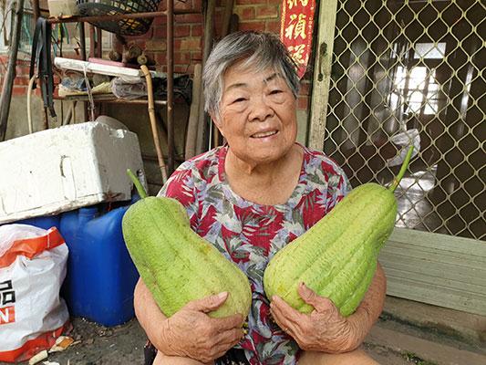

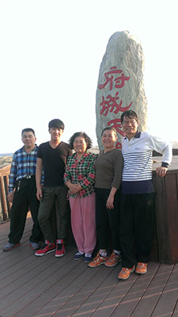

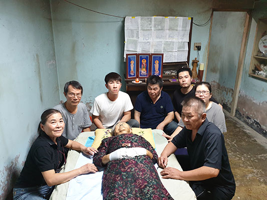

## 孔學一隅

### 論語簡說（三十六）— 學而篇第一—第十章　夫子五德聞政，異於常人

時哉講述

處世難在認同聖人

認同難在對道勝解

勝解難在聞思修道

聞思修道難在多聞

前言

一國之政乃是國家機密，夫子究竟有何能耐能在周遊列國時聽聞各國國政，是夫子求來的，還是國君自願告知呢？就連弟子子禽也有這樣的問題，子貢未直接回答，僅說夫子以溫、良、恭、儉、讓而得聞。最後總結夫子之「求」與他人之求不同，然而不同之處又是什麼？子貢為何不答是夫子求還是國君給，留給後人許多疑問。這一章就來談孔子為什麼有這種能耐？他到底有什麼樣的內涵？

經文

子禽問于子貢曰：夫子至於是邦也，必聞其政；求之與，抑與之與。子貢曰：夫子溫、良、恭、儉、讓以得之；夫子之求之也，其諸異乎人之求之與

。

消文
子禽問子貢：夫子周遊列國，所到之國，必能聽聞其國的政治風俗，是夫子求得的嗎？還是其國君自動說給孔子聽的？子貢回
**答：** 夫子外貌溫和、內心善良、外敬內恭、儉約、謙遜，具備這五個德行，令列國國君信服尊敬，所以孔子所到的國家，各個國君、大臣會自動來跟孔子研討、請教國家大事，可以說是求而不求，雖是夫子求聞政，實是由人君自己給的。

章旨

此章子貢解釋孔子了解各國政事的原因，完全由於威德感化而得。

科判分析

本章分兩段。第一段是：「子禽問于子貢曰：夫子至於是邦也，必聞其政；求之與，抑與之與。」子禽跟子貢都是孔門弟子，名列七十二賢。子禽問子貢，老師如何聞政？「夫子至於是邦也」，「是邦」即「這個國家」，可能是衛國，可能是楚國，也可能是陳國、蔡國等，夫子不管到何國，一定會聽聞此國重要的大政。「聞政」到底是夫子求來的呢？還是國君給予的呢？透過子禽的問，答案應該是二選一，一個是老師去求，另一個是國君主動給予，結果子貢並未以二分法回答。
第二段便是子貢的回
**答：** 「夫子溫、良、恭、儉、讓以得之；夫子之求之也，其諸異乎人之求之與。」子貢巧妙的點出老師是以五德來聞政，跟他人的求不一樣，跟蘇秦、張儀這些說客、謀士的求不同。

釋義

本章歷史背景為何？

孔子周遊列國，欲用王道來說服君王。夏、商、周朝都稱王，王道即各個諸侯國，必須有天子的領導。如果不把天子看在眼裡，臣子也不會把國君看在眼裡，導致各國互相征伐，大夫以下犯上，造成天下大亂。王道政治講究禮樂教化，培養善良人心，用人方面德重於才，才能長治久安，孔子為了這樣的理想而周遊列國。

子禽是什麼樣的人物？

陳亢，字禽，子是對他的尊稱，小孔子四十歲，是孔子後期的弟子，春秋陳國人，陳大夫子車的弟弟，可見陳亢是貴族。《論語》中有三章講到子禽，可看出子禽是善於觀察人的人。本章他觀察孔子，另一章他問孔子的兒子伯魚說：你父親私下是否有教外別傳？還有一章，子禽私下對子貢說：其實老師不如你，你太客氣了！所以，觀察當中，也有他無法觀察正確、觀察究竟之處。

子禽是子貢的學生，還是孔子的學生？

朱子說子禽是子貢的學生，因為子禽曾對子貢說：「子為恭也。」即先生您太客氣了，「仲尼豈賢於子乎？」「仲尼」指孔子，這樣來推論起來，好似陳子禽是子貢的學生。實則不然，《史記‧孔子世家》、《孔子家語》，或者鄭康成，都說子禽是孔子的學生。

本章「子禽問於子貢曰：夫子至於是邦也」，「夫子」就是「我們的老師」，很清楚子禽是孔子弟子，而「子為恭也」只是子禽很客氣地稱呼子貢。

承上，若是孔子的學生，為何他會認為子貢賢於仲尼？

此種誤解可被原諒，因為當時子貢的事功比孔子大很多，單就外相看，難免有錯解。叔孫武叔也有此錯解，魯國亦有好些人有此錯解。子貢不會沾沾自喜，而是把孔子的內涵說給大眾知曉，言孔子只是未得邦家，若他得到邦家，推展禮、樂、仁、德，這種證悟是天德，唯天能跟孔子相應，不是子貢可以比擬的。

聞政與聞事有何不同？

「聞國政」比如一國的政治、政策、用人，或是禮樂教化、國運、人心，有些牽涉到極端的機密，而「聞事」只是一些建設，發生的事情。若對方不夠信任你，他不可能請教國政，甚至國家官員的階位不夠大，都無法聽聞、參與國政。而孔子入他邦可聞政，代表其眼光、見地、格局、心量、德行、能力，都得到國君的重視、禮遇、推尊，而願意請教。

夫子至於他邦，為何要聽聞他國國政呢？

孔子周遊列國的目的是推行王道、安邦定國，「與聞國政」，表示孔子受到國君的信任予進一步的請教，他可以提出方案來解決，甚至國君可以任用孔子及孔子的團隊來執政，符合他周遊列國的目的。

他國國君主動向夫子請教大政，其中有何特殊意義？

五德是孔子的人格魅力，在國君心中有十足的份量，使國君不會懷疑孔子會洩漏機密，不會懷疑孔子是否懷藏機心、權謀、會不會干涉內政等，而能很坦然地以國政請教孔子，甚至是請教孔子任用人事的機密。

「溫良恭儉讓」有何難得之處？

溫是「色思溫」，臉色溫和，沒有刻薄之氣，此是內心的修為顯現在外相上，即所謂「有諸中，而形於外」。孔子是「望之儼然，即之也溫」，表情莊嚴肅穆，但親近他時，就非常溫和。

善是儒家最高的字眼。良是善良，善良是內心替他人著想，不追求名利，有經學的見地，知道替他人著想的重要，內心無損惱他人之心，如同《老子》言「大人者，不失其赤子之心。」嬰兒絕無傷害人的心，一般人年齡愈長，愈容易有人我是非、利害關係，乃至於各種算計。赤子之心要靠經學見地的經營，人的修為到了極致以後，反璞歸真，內心善良，這是極高的智慧經營出來的。「大人者」就是智慧絕頂聰明，但不會耍詐。

恭是「貌思恭」，貌是容貌跟外相。外相莊重、恭敬，表示此人不會輕佻，外恭之人，會感得他人的重視、禮遇與欣賞，而肅然起敬。

儉是儉約，即身、口、意三業，有約束自己的力量，這種約束是一種反省的能力，曾子說「吾日三省吾身」就是一種約束、反省，不會犯過失。

讓是謙讓。讓是禮的本質，懂得依禮進退，不與人爭名奪利，愈是利害關係愈不爭，這種人能讓團體和合，《老子》說：「惟其無爭，則天下莫與之爭。」此人不爭名奪利，請問天下人還跟他爭什麼？而此人心胸開拓，給人莫測高深的感覺，是為天爵。

子貢何以不回答「夫子求」或「國君主動給」，而要答以溫良恭儉讓？

子禽以二分法來問子貢，子貢若答「夫子求」，則夫子與蘇秦、張儀有何不同，都是為求一官半職，如果回答「夫子不求，國君主動給」，那夫子何必去聽、去解決，國君請夫子為政時，又何必考慮斟酌再三。以前堯去請教許由、巢父時，他們一看到堯就跑，堯想請他們做皇帝、國君，許由便跑去向巢父說：堯侮辱了我的耳朵！巢父還到河邊洗耳朵說：你此話也污染我的耳朵。

子貢答以「溫、良、恭、儉、讓」，這就是答話的藝術。雖然求，可與一般的求不同，這種不求而求，感應國君更願意給，毫無保留的向孔子請教。

子貢答覆子禽夫子五德以聞政，語氣為何？

子貢的語氣是活口氣，雖然說得中肯，可是語氣不說滿。這種答覆法就像孔子說：「語之不惰者，其回也與」，在不肯定當中有肯定，有肯定當中還語帶保留，很客氣地說，有別於一般人說話的武斷。

夫子真的能以五德聞他國之政嗎？

是的，因為五德中，有內在的修學法、有外相的修學法，國君跟孔子接觸後，發覺孔子是可以敞開心胸來談問題的人。孔子得聞他國機密，離開他國時，他國國君也不會起疑心，甚至去追殺。至於餓於陳蔡是因為陳蔡怕孔子到楚國去，楚國強大將不利陳蔡，如此而已。

本章如何體會子貢之善言？

子貢彰顯孔子的內涵，善巧地說出老師內在、外在的修為，受到他國國君的賞識，這五德是我們修學的目標、入世的能耐、人生的出路，讓我們贏得他人尊重、青睞與信賴。

總結

第一，本章可以學習子禽的善問、子貢的善答，並且是透過觀察的善問善答。

第二，子貢的回答語氣中肯、不武斷，略帶保留，有迴旋空間，很溫厚。

第三，溫、良、恭、儉、讓這五德很重要，包括內涵及外相的修學法，就像曾子臨命終時，對弟子們講一生成功的秘密，講內在的修學法，而對孟敬子講外在的修學法。兩者合起來就是一位賢者、聖者的內涵。

第四，要善學五德。臉色想辦法不喜怒形於色，凡事想到別人，不帶刻薄、肅殺、憤怒、喜怒無常之氣，這是一種修養。在內心上，要懂得反省自己，去除煩惱，心思單純，沒有傷害他人的心念，並知道利益他人才是自己的出路，此時內心朝向於善良。外相上要懂得莊重、恭敬，對人事物不輕佻，能贏得他人的重視跟恭敬。在人際關係中，要懂得守分寸，「君子思不出其位」，講究服裝、儀容、說話、談吐、行為，才能維持國家的體面、莊嚴、神聖。再來，要懂得依禮進退，本質是謙讓，不與人爭名奪利，計較利害關係，此時心思公正，能夠和合團體，獲取信任。臉色溫和、心地善良、外相恭敬、懂得約束自己、謙讓，而且本質都是用智慧在經營，這樣的人會成為企業、國家的幹才。五德就是孔子的人格魅力，是他凝聚人才團隊成功的秘密，這樣的團隊到各國去，無不讓各國國君刮目相看、分庭抗禮，國君不會把他當退休的臣子、退休的公務員，而是能夠推尊、請教國政，這樣的風采，就是中國文化的特色。

問答

**問：** 子貢舉的這五條是隨緣而舉、還是孔子德能的總綱要？

**答：** 這五德有外相的修學法、內心的修學法、依禮進退的修學法，孔子完整的修學法、入世的能耐就是這些，當然其本質是形而上，但形而上的內涵一般人無從了知，子貢的回答已是綱要而舉了。

**問：** 「子溫而厲」，為何孔子在臉色上既顯示溫和，又要顯示厲呢？

**答：** 孔子是「望之儼然，即之也溫」，「望之儼然」是「厲」，「即之也溫」是「溫」，此人安住在內在的修為上，所以是「厲」，是一種正直的形象，而對眾時是很溫和的，這是內在的涵養與外相的顯現。

**問：** 子貢何以只說這五德？

**答：** 我們可以把五德相關的彙整，例如依禮進退的範圍可以歸到「讓」，因為讓是禮的本質，行禮的君子不會與人爭名奪利，又懂得進退應對，不會傷害、妨礙別人，能夠調和鼎鼐。

**問：** 《論語》有一章問「有一言可以行之者乎？」，孔子回答「恕道」，恕道跟此章的五德有分別嗎？能否直接說「以恕而得聞」呢？

**答：** 「溫良恭儉讓」的「良」就包括恕，良是善良，善良有很多修學法，比如說將心比心，不希望別人傷害你，就不會這樣去傷害別人。而五德中又講到臉色要溫和、外相要莊重，對人、事、物要懂得尊重，這些是處世中不容忽視的。

**問：** 有注解說，人心風俗的敗壞皆因大家想要求，無法像夫子一樣不求，是因為不相信不求可以成功，此說法可採取嗎？

**答：** 此說是清儒陸隴其的《松陽講義》提出的。陸隴其認為人心之壞，壞在求名求利，求個人的出路，自私的苟活，而不管天下蒼生的安危，這樣的風氣愈盛，人心愈壞。陸隴其所言是品德上的另外一種反思，但本章的重點是「夫子之求之也，其諸異乎人之求之與。」夫子的求與他人不同。

**問：** 顏回的「一簞食、一瓢飲、在陋巷」這種不求，能否與夫子的求較量？

**答：** 有顏回的不求，才有夫子的求；有孔子的求，正好顯示顏回的不求。顏回的不求是不求名聞利養、不求虛偽的出路。正是因為不求，才有孔子的求。孔子的求是沒有名聞利養的求、沒有虛名浮利的求，才有真正為天下蒼生安危而求，求王道文化推展、求各國國泰民安，他才會周遊列國餐風曉露十四年，接受各國國政，希望能施展理想抱負，此求正好顯示他的不求，請問意境誰高？

**問：** 現代人若具備這五德，會不會容易被其他人騎在頭上？

**答：** 五德中可進可退，能夠得到有道的人尊重、得到弟子們的擁護、君子們的重視，如何會被人家騎在頭上？反之，毫無主張、懦弱、內心渴望名利，又未以德學充實，才會被輕視。

**問：** 國君主動來請教孔子國政，但是最後還是不用孔子，具備五德，也不見得有用？

**答：** 不是國君不用他，是孔子不願被國君用。正因為孔子不求名、不求利，只想施展理想抱負，而碰到只想發展強兵霸權國君，何必再跟國君造共業？

**問：** 國君既知孔子道德學問高，而且不疑有他，願意敞開心胸向孔子請教，為何最後卻還是不讓孔子有機會以五德執政呢？

**答：** 當國君的目的只是要發展武力，或是滿足私欲，而不是要去尊重周天子，維護天下的安定，推行禮樂的教化，孔子何必被任用？國君不是不知道孔子的好，但若任用孔子，會處處被約束。既得利益的大臣們，也不是不知孔子的好，但是孔子會讓他們的私欲沒辦法發揮。三家大夫不是不知孔子的好，季桓子死前甚至還對季康子說：我生前最大的遺憾就是把孔子趕出去。可見未用孔子都是私利作祟。

孔子自己也說「道之不行，吾已知之矣」，周遊列國是一種歷練，學生們歷經風霜都更成熟了，有向道的信心，而孔子經過歷練後的講學，風采無限。

**問：** 老子的求、孔子的求，有多處互通，老子以「玄」為眾妙之門，孔子以「智」為眾妙之門，有何異同處？

**答：** 老子是不求，孔子是求，可是孔子的求是有不求的能耐。孔子的求正彰顯老子的不求，可是孔子的求又不是老子主張的。在亂世中，孔子選擇入世，老子說「玄之又玄，眾妙之門」、「道可道，非常道，名可名，非常名」都在講形而上。而孔子的《易經‧繫辭傳》從形而上來講到形而下，「易無體而神無方」所證的易沒有體性，能證易的心識也無方，兩者皆同，只是一個選擇在入世表彰，一個選擇在出世解脫。（下期待續）

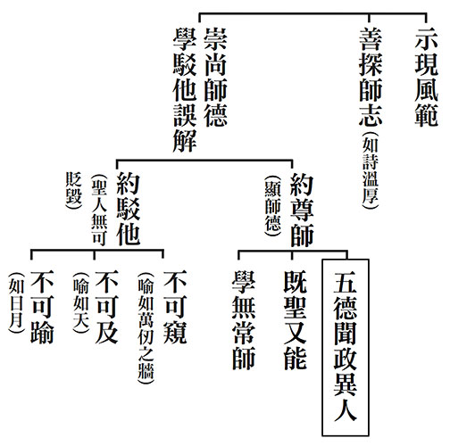

### 孝道跨時代的意義與價值— 孝經簡說（二十二）

時哉講述、淨域編寫

解在六經行孝經

經天緯地孝之行

內聖外王孝之至

慎終追遠孝之道

孝子喪親的禮法《喪親章第十八》（下）

前言

本章是《孝經》十八章的圓滿。〈喪親章第十八〉是很重要的一章，《禮記》中有關祭祀部分，譬如：祭法、祭義、祭統；有關喪事部分，譬如：奔喪、問喪、服問、間傳等，即是包括〈檀弓篇〉。講到喪與祭，極麻煩又難懂，除了古時作法不易懂外，如何將此精神延續到今，這是很重要的。

在祭義裡，曾子有段話說得好，他說：奉養父母除了口體之養外，還有個人品德的經營，無論人際關係的經營，乃至於教化，都是在榮耀父母。在奉養父母中，包括平常的愛敬、終生之養及喪葬祭祀的供養。孝道是中華文化最重要的部分，曾子說：仁心要在此處認定，禮要在此處實行，義要符合這才稱作義理，信要在這裡出發。所謂的堅強，要從這裡實踐做起；快樂要順著這個禮，往外發展才叫作快樂；刑法要從這裡制定。孝簡直就是中華文化最核心的部分。喪葬祭祀是隨著前面對父母的奉養，包括忠君愛國與品德圓滿，合起來就是孝道的修學法。

《孝經》多讀幾遍後，原來的總科判要修正一下。第一章開宗說的是孝道的修學法與義理，接著分別解釋孝道的修學法與義理。孝道是君子外王之道的發展，推廣有它的功效，且勸諫父母是孝道的一部分，以孝來祭祀時，能感通鬼神，大孝在忠。最後第十八章，說喪祭是盡孝的。而外王之道的部分，包括三才在孝；因為天子、國君、卿大夫、士人、百姓盡孝，則君臣合力辦政治興教育，以孝道做本質時，人才可以變成天地的核心，與天地合稱為三才，才能創造天地間最和諧的氣象，讓有情萬物自然地發展。特別讚歎的是孝治天下，通說君王、聖人以孝治天下，舉周公是個典範，盛世中有許多孝治的行為可紀錄，乃是孝行可記。

以上正面說孝道的發展，反面來說不孝的人要受到懲罰，這就是君子所謂的外王之道。接著說推廣之功，孝道推廣之功在第十二章，說：凡能取悅人民和諧天下，且能成就聖王的功德，並可以藉著孝發展品德，這君子便能夠揚名。最後，勸諫父母親也是孝的一部分，孝道祭祀最能感通鬼神，大孝在忠。總結：喪葬祭祀圓滿孝道。《孝經》就是孝的架構，能說的是孔子，所說的是《孝經》，聽者是曾子，且傳承將孝道的義理弘揚。兩千多年後，吾人接受此寶貴的思想，開創一生的命運。

架構

本章架構前已說過，其總說喪親，分別顯示喪葬祭祀，喪葬祭祀分喪與祭。總說喪時，父母過世孝子是哀戚的，而分別解釋呢？三日之後必得食，不可因此將身體弄壞；此外，還要守喪三年，期間包括父母的入殮、祭拜、選墓、送葬。以上是屬於喪的部分，祭的部分是建立宗廟來祭拜父母，春秋依時祭祀。最後結讚，能於父母在世時這樣地愛敬，過世後在喪葬祭祀上能如此用心，孝道可以說是完備了。以上是整體科判，架構清楚，古人的文筆非常好，言語很有次序，雪廬老人說：「言語先具次序，辦事要求練達。」

經文：

子曰：「孝子之喪親也，哭不偯，禮無容，言不文，服美不安，聞樂不樂，食旨不甘，此哀戚之情也。三日而食，教民無以死傷生，毀不滅性，此聖人之政也。喪不過三年，示民有終也。為之棺槨衣衾而舉之，陳其簠簋而哀慼之。擗踊哭泣，哀以送之；卜其宅兆，而安措之；為之宗廟，以鬼享之；春秋祭祀，以時思之。生事愛敬，死事哀慼，生民之本盡矣，死生之義備矣，孝子之事(親)終也矣。」

釋疑

總體說來就是：「子曰：孝子之喪親也！」這位孝子的父母過世了，在臨喪中他如何表達哀戚呢？他的哭不偯，「不偯」就是放聲大哭，沒有委曲婉轉，不會講究禮的容貌。即是不會去招呼客人，不會去講究應對進退，言語也不多加修飾。因為哀戚之故，穿了美好的衣服感到不安，所以穿喪服；聽到美好的音樂也不會快樂，因為心不在那裡；吃到可口的食物，也覺得沒有什麼滋味，甚至於吃不下去。這就是孝子的哀戚之情，不是刻意矯揉造作，而是自然真情流露。

三日而食，指一定要吃，否則會喪了性命。此教導百姓，不要因為父母之死而傷害了自身，這是聖人的仁政。聖人的仁政，乃是懂得依禮來節制人情。守喪不過三年，是教導百姓喪期要有始終，不能一輩子處在哀傷中。父母大殮出殯時，屍體要穿戴整齊。衾就是裹起來，舉之就是把遺體入棺，當遺體入棺後稱之為柩(屍體在床稱尸，在棺稱柩)。並且陳列簠簋等種種祭器，以哀戚的心情來祭拜。為什麼要哀戚呢？因為祭拜時見不到親人來享用，內心的哀戚是真情自然的流露。《詩經》云：「詩三百，一言以蔽之，曰：『思無邪。』」即是詩人的真情流露，人最可貴的就是真情。

祭拜後移靈出殯，所表現的是一種「擗踊哭泣」，意即子女悲哀地送葬父母，痛哭到極處時或是搥胸(擗)、或是跺腳(踊)。當哀戚真情流露時，情景就不是裝模作樣。有子曾經想要廢掉「擗踊」之禮，某回出遊時，見到一個小孩向媽媽要東西，媽媽不給他就一直哭跳。有子見了心想，原來「擗踊」是這個樣子，那是不能廢的。莫認為古禮說的都是矯揉造作，實際不然，人之情到真處便是自情流露，不是常人可以了解的。

再者，要如何選擇墓地呢？曰：「卜其宅兆。」首先要卜卦，選一方好的墓地。宅，是墓穴；兆，是墳地，這兩字的意思實質上相同。卜宅兆另有一種講法，即是要有好的預兆，才能夠選那塊墓地。曰：「而安措之。」安置這個柩，之是指靈柩的柩。曰：「為之宗廟。」且在祭祀時，為父母親營建宗廟。曰：「以鬼享之。」並以鬼禮來祭拜父母，請享用供品。而祭拜的時機是何時呢？是春秋兩祭。曰：「以時思之。」此外，還要應時思念父母，包括父母的生辰忌日等。如果懂得喪事盡哀、祭祀盡誠，加上生前的愛敬之心，則身為人(生民)的本分也就盡到了，養生送死的義就完備了。死生還有別的意思，後面文中再說。以上是本章簡單的消文(上回已說過)。

析疑

此處特別講三年之喪。三年之喪中，第一個是父母過世後，入殮要有棺槨，棺與槨有何特殊意義？

《禮記‧檀弓篇》子思曾經說：父母過世大概三天就要入殮。等三天才入殮是怕還陽。入殮後準備下葬，這一「葬」字，其實就是「藏」，不讓他人見到遺體，因為遺體會慢慢地腐爛，不現出這個模樣，是對父母遺體的尊重。棺盛裝屍體以覆蓋，槨於棺外再加以包覆起來，棺槨整體上就是包藏遺體。《禮記‧檀弓篇》上說棺槨，但是槨不能進墓園，古代葬禮也講究儉樸，只是後來演變講究厚葬，帝王達官富豪的大墓陪葬甚豐。

歷史上，何時開始有棺與槨？《易經‧繫辭》傳中說：人死時是不用棺槨的。那早期何以有棺、槨呢？這禮是慢慢演變來的。遠古時，父母過世了就將之置放於野地，然而孝子見到遺體腐爛，內心感到不忍不安，便將之隱埋起來，不讓他人看到。後來慢慢演進，到舜時就發明棺材，使用瓦及陶做成的棺。到了夏朝，繼而燒土磚圍在棺的周圍。進至殷商時，就有槨包覆在棺外，是為外棺。周朝時，又再墳墓外面做一個屏障。所以，喪葬之禮是慢慢演變而來的。

孔子任中都宰時，制訂養生送死的禮，百姓之棺厚四吋，槨厚五吋，等於是保護屍體，不使屍體快速腐爛。然而，在《禮記‧檀弓篇》中，有子請問曾子說：「您是否聽過老師講喪的內涵？」曾子說：「有，老師說死的時候，就讓屍體快快腐爛。」有子說：「不對，這一定不是老師說的。」曾子說：「我親耳聽老師說，人死了就要快快腐爛。」其實屍體以棺包起來是藏，再用槨加以覆之，是避免太快的腐爛，可是孔子竟然說，遺體趕快腐爛的好。有子又說：「夫子講這話一定有其含意。」曾子說：「這是我與子游當場聽到的，你不相信就去問子游。」有子回問子游，子游說：「那是夫子的有為之言。因為夫子在宋國遭到司馬桓魋追殺，又見到司馬桓魋長年為自己營造石棺，如此自私自利的人，故而說其死了還不如快快地腐爛好。」孔子的個性溫和，概不會講這般激烈的話，話意訴求是針對司馬桓魋，只有聽得懂的人才了解。弟子們中，子游一聽就知道意有所指，而魯鈍的曾子就只聽了表面的意思。所以，聽課學習要帶一點悟性。當然，曾子之種種好學，日後還是通達了孔子的一以貫之之道。

上說，有棺有槨是古代的禮制，孔子雖然制訂了棺槨來保護屍體，但是他的兒子死時，只有棺沒有槨，這不也奇怪嗎？

《禮記．檀弓篇》中說：第一、製做棺槨時不能僭越，要遵守等級；第二、即便合於等級，也須考量經濟能力，不能太過奢華。孔子為魯國大夫，周遊列國歸魯時，享受公糧出入馬車，日子理應過得不錯。按禮來說，孔子辦喪可以有棺有槨，但兒子過世時，竟然是有棺無槨，只因為「窮」呀！孔子去世時，只有茅屋三間，這意味著他的俸錄都拿去投資教育人才了，所以，兒子去世時窮到只得有棺無槨的等級。

古時無論棺槨或入殮的衣服，都有等級，依天子、諸侯、卿大夫而不同。後來的帝王，一心經營著他的陵墓，陵墓修得愈漂亮，陪葬品愈豐厚，最後都發生盜墓的情形。晚清慈禧太后大修普陀峪定東陵，死後葬入不過二十年，即被軍閥孫殿英給盜了。當地宮金券門打開時，置在寶床的棺材被撬開了，陪葬的金銀珠寶遭掠奪，價值五千萬銀兩，口中的夜明珠被取出，屍首則丟棄於一旁。試想生前所汲營的榮華富貴，到頭來有什麼用呢？

棺槨與衣被的準備，既不能僭越等級，也需要衡量家庭的經濟狀況。出殯時祭拜盛物的器具有簠簋，它的形式與用途在《論語》中有提到，子貢曾問孔子說：「老師你看我是什麼呢？」孔子說：「你是瑚璉。」瑚璉就是簠簋，夏朝時稱作瑚，商朝時稱作璉，到了周朝就叫作簠簋。簠的型制是內圓外方，簋則是內方外圓。若家中經濟情況不好，以竹子編成。經濟好的便用銅製，而且禮器數量可以比較多些，但是仍須依著等級而為。辦喪時，要看死者的等級；祭祀時，看生者的等級，這是不能僭越的。在送葬時，會有擗踊的動作，這個禮是不能廢的，但擗踊也不能哭得太傷心。《禮記‧檀弓篇》中提及，孔子見孝子為母哭喪太過傷心了，便說：「這種過分哀傷是不行的。禮可以往下傳承延續，但必須要節制，不要讓人把身家性命毀傷了。可以表現出哀戚之真情流露，但是不可以過分。」

古代國君出遊遇到喪家，會派出使者前往弔唁，這是一種禮節。前回提及孔子對服喪的人，會表現出恭敬與哀戚，因為舉喪之人能夠盡孝，是值得尊敬的。《禮記‧檀弓篇》中說到，孔子的母親過世時，想讓父母合葬，父母合葬始於周公，之前的父母不一定合葬。譬如：舜巡狩天下，死葬於湖南蒼梧，妃子娥皇、女英最後沒有與舜葬在一起。可見周公之前，父母沒有合葬之禮，至周公以後，父母才合葬。孔子想把父母合葬在一起，但不知爸爸的墓地在哪裡，便將母親的棺木暫厝在路旁，讓往來的人知道他有喪事，想探知爸爸叔梁紇的墓地在哪，好讓父母合葬。當時魯國國君昭公見到這一幕，讓子家羈大夫前往弔唁，行擗踊之禮表達對孝子的同情，古代民風是如此的敦厚。

古代的人很同情喪家，不僅國君要去弔唁，參家喪禮的人將心比心。孔子說：「子食於有喪者之側，未嘗飽也。」意即參加喪禮或前去幫忙的人，雖喪家提供飯菜，卻不飽食一頓，表達我同感哀戚之情。又說：「子於是日，哭則不歌。」參加喪禮這一天，哀哭而不唱歌，是一種同情、同理之心。

選擇墓地要事先預卜，這卜卦的道理是什麼？

其一、找個好地方，尊重愛護父母的遺體，像李公麟、馬和之畫中所繪的景都是好地方。其二、依孔安國的意思，是怕墓地下潮濕有水，或是考量未來社會的變遷，所以要先卜卦。此外，亦有人生前就先卜找好墓地，不勞子孫麻煩。《禮記‧檀弓篇》中的成子高，將死之前對兒子說：「我生前無益於國家，死後也不想害這個國家，你幫我找塊墓地，只要不是農作之地就可以。」意即選擇墓地簡單就可，不需要龍虎之穴。宋代范仲淹在蘇州任官時，買下南園一塊地，風水師恭賀他這是塊寶地，建府邸子孫公卿輩出。范仲淹聽後，認為獨自顯貴不如辦學育才，便捐出土地蓋學校。顯然這個卜卦，並不一定要是名山勝景，但起碼不是塊惡地。

父母送葬到墓地後，就要營建宗廟，這宗廟的型制須看孝子的身分。士，一廟；大夫，三廟；諸侯，五廟；天子，七廟；顯見孝子營建宗廟，其身分至少是士以上。其次，什麼時候設宗廟？「宗」實是「尊」(祖先)的意思，「廟」就是「貌」(外貌)；所以宗廟者，是來祭時見到祖先的外貌。意即祭祀的時候，要當成祖先坐在上面接受祭拜。所以，進入廟的時候，就是祭如在的意思。《禮記‧檀弓篇》中說：「足哭之後就可以設宗廟。」足哭就是一百天，百日之後從喪變成祭。但一般百姓沒有宗廟，要怎麼祭祀祖先呢？有兩種作法，其一、將牌位放入家族祠堂，春秋以時祀之；其二、沒有祠堂就在家中立個牌位祭拜。

祭祀有春秋兩祭？為什麼是春秋時節呢？它的涵意如何？

這有兩種說法，其一、春天氣候溫和不炎熱，秋天秋高氣爽未寒冷，所以春秋兩季，是一年中最好的時節。其二、春天迎雨露，大地回春欣欣向榮，此時以快樂的心情迎祭祖先；秋天臨霜降，大地蒼涼萬物蕭瑟，此時以悲戚的心情追祀祖先。所以，春祭時可以奏樂，秋祭則不可。春秋祭祀還強調感應之道，如何感應呢？《禮記‧祭儀》中說：「祭祀時禮數不要太繁，過繁會讓人失去恭敬心；但也不能太簡，過簡會讓人忽略而不做。」所以，現今許多祭祖之事不斷地簡略，簡略到擺完供品就離開，聚在一旁聊天，後來大家索性不參加了，找個代表去送禮應應景。這樣是不行的，所以禮數之維持，不要太繁瑣，也不要太簡略。

祭祀之前齋戒十日，包括散齋(戒)七天，致齋(宿)三天；前七天在外戒，後三天在內止，後三天才是嚴格的齋戒。在齋戒的十天裡，子孫想著過往親人的種種，舉凡生活作息、言談舉止、心智能力等，心裡想得越多越好，待到祭祀時就像如對目前一般。許多導演在導戲時，他先融入主角的臉，不斷地想著這個角色會發生什麼事；譬如：心智如何發展，外型說話怎麼一回事。想著想著直到上戲時，導演的幾乎就是主角的化身。祭祀的道理也是如此，儘量想、儘管想，到祭祀時就真的是如對目前，感應之道就從這裡生來。

現今古禮已無法完全照做，該怎樣將喪葬祭祀這一套作法，適用到新時代呢？

不妨保留精神，如今一般的作法是什麼？譬如：父母過世時先行小殮，小殮就是死後若干時間後(假設一天)，先沐浴更衣。之後有停靈、大殮、告別式、家祭、公祭、出殯、啟靈火化入塔或土葬、引靈安座。這與古時入宗廟的道理一樣，引靈安座後設牌位，或入祠堂、或供在家裡按時祭祀。現今作法可以這樣，其中在告別式時，特別要有贊禮者，即是主持喪禮儀式的人(司儀)。《禮記‧檀弓篇》中說：「辦喪事沒有贊禮之人，就讓人感覺到太簡略了。」有子過世時，魯悼公前往祭拜，子游擔任司儀。子游對於禮非常通達，曾子與子夏一同與喪，認為子游贊禮不太如法，但事後檢討起來，子游是對的，可見子游的厲害。孔門的學生都是高人，在什麼場合該做什麼事，清清楚楚。

臺北故宮博物院展出《清明上河圖》，各家中獨無北宋張擇端的圖。張擇端的《清明上河圖》是最早的，圖中有一幕是孝子身旁插的柳枝，這代表從郊外掃墓回來，而馬上坐著富貴官人，表示這個家族很盛大。《清明上河圖》是清明時節祭祖掃墓，古時的閨女平日大門不出、二門不邁，所以在清明節的時候，很高興能藉機外出踏青，在山野裡聚會玩耍。以上是這章的整體意思，它包括喪葬與祭祀，孝子的禮儀在這裡完備了。

本章的旨趣究竟是什麼呢？

《禮記‧檀弓篇》中孔子告訴子路：「喪事的精神在哀，恭敬與誠意比祭品、陪葬物還重要。」儒家文化不強調繁文縟節，重視的是動機與心態，講究的是心法。喪葬祭祀沒有心法，那祭品、陪葬物與禮數都是無用的。常人以為儒家講排場及繁文縟節，但儒家所講究的禮是誠意，於喪葬中就是哀戚，於祭祀裡就是恭敬，這才是維持禮的精神所在。否則儀禮在作法中，重要的精神全都不見了，只剩下毫無功效的表面。

各代的《孝經圖》，如何表現〈喪親章〉？

北宋李公麟用卜卦來示意，孝子將過世親人葬在名山勝水中，也就是「卜其宅兆」找到好的墓地。南宋馬和之繪以掃墓，去掃墓的地方風光優美，表示安葬在吉地。元朝趙孟頫畫法同前，也將父母安葬在好地方，那裡有崇山巨木，風景非常的秀麗。

最後，來看江逸子老師的畫法及表意。首先，遠方呈現空濛的意境，近處孝子著緦麻之服，代表正值守喪期間。孝子跪地遠望，所望處正是父母墳地，喻意他常懷思親之情。遠處所繪高山流水，代表父母養育之恩如山高似水長。孝子拱手示意內心誠敬，鬚髮未剃乃情狀哀戚，已無法顧到儀容外貌。後方童子拿著食盒，代表著在這要多待一會兒，一時就不回家吃飯了。明朝四大家之首的沈周，他懷念老師時，也是用山高水長去表現師德之高、師恩之長。如此，江老師所繪的整體氣象，就是孝子的哀思之情，而這哀思所表徵的，就是我民族文化裡最重要品德根源-「孝道」。

總結

第一、《禮記‧檀弓篇》中說到：「賓客來我這裡，若沒有地方住，就住在我家。不幸死時，家鄉沒有親人，我(孔子)就出面將他安葬，我作他的家人。」台語的意思就是「厝內給人家死都沒關係」，這就是中華民族的心量，若真把喪葬祭祀辦好，其實對己是很有福報的。不用擔心害怕生辰八字相沖，不能面對棺材。

第二、《孟子‧離婁篇》中說：「養生不足以當大事，送死才足以當大事。」換言之，喪葬祭祀反而是件大事，父母不會死兩回，孝子在經營孝道時，是一種品德的經營、人生的經營、感恩懷念的經營，更是一種風氣與命運的經營，其中的內涵太多了。

難怪曾子說：「快樂從這裡說起，信用從這裡說起，仁從這裡說起，利從這裡合乎起。」曾子真是一位有眼力的讀書人，難怪他後來的命運是條康莊大道，見地正確，後面全部對。《荀子》一書中說：「你不能因為仁而廢言。」荀子曾舉過一個故事，說：「堯曾經問舜：『你覺得那個人情怎麼樣？』舜說：『別提了，人情本來就是薄的。』(原來儒家或正法的教育，就是要經營一個敦厚的人情。)舜對堯說：『結婚以後的人，往往孝道就會愈來愈薄了，這是人情。而慾望愈來愈多的人，信用就愈來愈少。又一個人多絕路，他的忠心就慢慢失去。』」所以，許多人到最後功高震主，開始不忠心了，下一步就想篡位，霍光就是這樣。然而，人情要如何維持敦厚？懂得觀功念恩，懂得吃水果要拜樹頭，懂得飲水要思源，這些容易懂嗎？若不從孝道培養出來，能懂得這些嗎？

本章最後要談到的是，儒家的概念-「身體髮膚受之父母」，身體既然是父母生的，就不能說是我的。譬如：這個東西是別人給你的，但是你一拿到就說是我的。很多人就認為不要管我，這是我的自由。然而儒家的概念，你是被父母所生，受父母所養的，怎麼可以說身體是你的。此時，應該好好地想到父母，就好像他人給你大恩德時，你就要為別人著想。為人設想中，包括：如何在生活上想到別人，如何在品德上維護父母的尊嚴，如何在行為上榮耀父母。人的快樂要從孝道出發，國家的刑法要從孝道做起，這樣的國家才能長治久安。

這一章喪葬祭祀太重要了。孟子說：「它是人生的大事，是孝道的經營，是風氣的養成，是民族文化的核心處，是品德的源起，是人才的搖籃，是國家長治久安之道，也是民族延續的源起。」難怪前人說孔子的概念，解在六經，行在孝經。很高興我們根據總科判表，分章解釋細說，終於將孝道各個面相分析出來，其中包括：三才之道，外王的修學法，以及怎麼去推廣孝道，如何行孝感通神明，到最後以喪葬祭祀來圓滿孝道。相信這十八章研學下來，會對儒家有不一樣的見解，會對傳承仰望，會延續這樣的道統來做為利益後代子孫最好的保障。(孝經終)

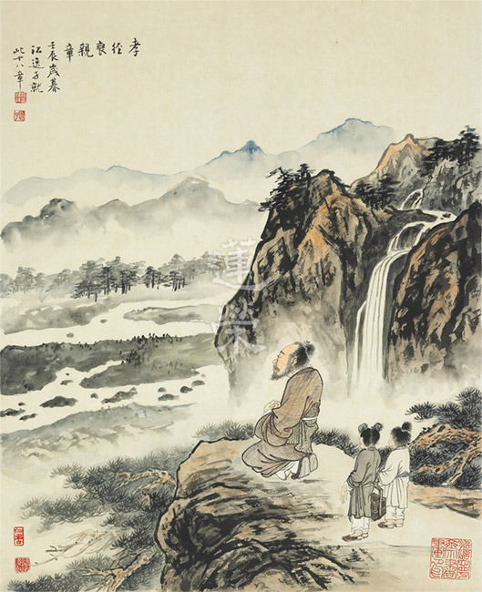

### 孔門心法—中庸之道（十七） 第十四章：君子盡其本分，反求諸己

*時哉講述、弘毅整理*

樂天知命君子行

說易行難反求己

素位而行歷緣修

不怨不尤唯天知

前言

現代社會比過去分工更為精細，人人各有其位，各有角色要扮演，就好像機械設備中的各個零件，一個也不可少。「社會」這個機器也是如此，若在其中的每一個人都能夠恰如其分的做好自己分內之事，家庭才有幸福，國家才會上軌道，天下才可能太平。君子就是一個能守住本分，修正自己的人，所以關於君子的修學法，不正好就是安定社會，皆大歡喜的良方嗎？

我們都知道日本武士刀很厲害，刀刃很鋒利，但是要經過諸如火燒除去雜質，水洗增加延展性，一公分厚度的武士刀，就需五千層的冶煉，製作過程讓人歎為觀止。武器需要千錘百鍊才能成就鋒利 ，人也需要千錘百鍊才能成為有能力、有擔當、有理想、有抱負的人，成為一個在任何情況下都不會退轉、 墮落的君子。一個人能屹立不搖，具備千古的見地，能夠有很好的內涵 、才學 ，都是要經過千錘百鍊的。

科判分析

中庸總體科判

第十四章還是在《中庸》的第二部分，即分別顯示中庸的修學法和義理。

本章科判分析

本章分為兩段，第一段是道在人身，第二段是忠恕近道，表現在世間的倫常。

本章分兩段，第一段「素位而行」，是君子的總說。君子安於自己的位置並發揮功能，做不出成效就反求諸己，不推諉責任和過失。君子可能身處於富貴、貧賤、蠻荒未開化的夷狄或患難之中。君子可貴的並不是人生的美滿，而是在富貴、貧賤、夷狄、患難之中都能安住，而且心不離道，這才是君子應有的形象。第二段「行正求己」，君子是行為正直、言語合理、心態正常的人。道若推展不出去，他就反省自己。君子若在上位，不會驕氣凌人；若在下位，不會對上級討好、巴結、諂媚、拍馬屁。當他遇到困難、挫折、障礙時，有能力處理這些境界而不怨天尤人，坦蕩的等待時機。小人在遇到挫折、障難時，就會鋌而走險，心存僥倖。最後以射箭來比喻，箭射的不好，要反省自己，懂得改進，這就是君子的形象。

消文釋義

經文：

君子素其位而行，不願乎其外。素富貴，行乎富貴。素貧賤，行乎貧賤。素夷狄，行乎夷狄。素患難，行乎患難。君子無入而不自得焉。

消文：

君子不論現在自己身處何位、何種環境、何種名分，都能把該做的事情做好，不會超出本份，諂媚巴結、鋌而走險、眼高手低，不會希求非分的地位、財富。

君子若現在是富（富有）貴（地位高）時，懂得如何在富貴中行持，在富中不會驕慢、淫逸、奢靡，能好禮而樂善好施；在貴中不會仗勢欺人，能禮賢下士，提拔人才。

君子若現在是貧（窮困）賤（地位低）時，懂得如何在貧賤中行持，不會諂媚、討好、巴結他人，能安貧樂道，好好向學，令他人崇敬、景仰、有信心。

君子若現在是身處夷狄時，懂得如何在夷狄中行持，在言語上講究信用，待人誠懇，不奸詐，守住自己的人品人格，日久天長，經受住考驗，終究會被他們接受、歡迎，這就是自己的出路。

君子若現在處於憂患障難之中，包括颱風、海嘯、地震等天災，或者遭逢戰爭、瘟疫、車禍，或者生病，他都懂得如何在患難中行持，懂得磨練耐心，堅強毅力，考驗意志，堅固願力，如同千錘百鍊的武士刀一樣，冶練出剛毅、堅韌不拔、可堪大任的人才。患難對於有理想抱負的君子而言，是成就的礪金石，是冶煉成金的熔爐。

君子入富貴、貧賤、夷狄、患難都能得到他所該得的，在富貴中養成好禮和樂善好施，在貧賤中養成安貧樂道，在夷狄中養成忠信篤敬，在患難中養成堅忍不拔的性格，君子並不是故意找罪受，而是透過患難困苦、顛沛流離、種種折磨，作為自己的考驗，君子可以在任何境界中成就自己。

釋義：「素」，現在；「夷狄」，未開化的蠻荒之處。

經文：

詩云：「伐柯伐柯，其則不遠。」執柯以伐柯，睨而視之，猶以為遠。

消文：《詩經》上說：「我們砍樹幹做斧柄，做斧柄的法則就是手上握的斧柄。」拿著斧頭的木柄來砍樹，不用手上的斧柄來作標準，要用木頭來做斧柄是不可能的。

釋義：

「柯」，斧柄；「睨」，斜著眼看。

經文：

故君子以人治人，改而止。

消文

：因此君子要用有道的人來培養人、管理人，君子是要改罪和過的，否則就如王莽和曹操雖然有才，卻壞亂天下。或者說，君子要求自己嚴格，對他人是不苛刻的，只要對方願意改正罪和過，就可以了。

發明：修道的標準在人，有道的人才能弘揚道，沒有道的人則無法弘揚道。修道必須透過聞思修，多多串習，使體悟愈來愈明顯，直到道理像是在眼前看花瓶一樣明顯。君子用有道的人來管理人，不可以只有法令規章，這樣是沒有用的，法治治國，民免而無恥，事項條文沒有用。只有質地好、好學的人，才能導正風氣、培養人才。心術不正者，想要他弘揚道，也是不可能的，不但會糟蹋道、傷害道，還會使道提前滅亡。孔子的學問能培養君子之才，是因為以道人才能培養出道人，少正卯則是培養小人之才，因為以小人之心來培養，只能培養出小人。

經文：

忠恕違道不遠。施諸己而不願，亦勿施於人。

消文：

能夠行忠恕之道就離大道不遠了。不願意他人施加給自己的（如他人對自己無禮、不守信等），就不要施加給他人，這就是將心比心的恕道。

釋義：

「忠」，心術正，表裡如一，有誠意；「恕」，將心比心。

經文：

在上位，不陵下。在下位，不援上。正己而不求於人，則無怨。上不怨天，下不尤人。故君子居易以俟命，小人行險以徼幸。子曰：射有似乎君子。失諸正鵠，反求諸其身。

消文：

君子如果處在上位時，不會欺凌下位者，君使臣以禮，懂得以禮相待，懂得留有餘地，不結怨，因而能得到下位者的擁護。

君子若處在下位時，不會攀緣、拍馬屁、討好、巴結上級，但會尊重配合上級，使上下合作、團隊一心。

君子能端正自己的身體、言語和思想，而不會苛求別人，所以不會抱怨他人，也不會被他人抱怨。不管遇到患難、顛沛流離、夷狄、貧賤等各種困境，都不會埋怨老天爺不公平，不怨恨別人傷害、迫害、羞辱，這才是君子的修養。平時沒事時沒有火氣不代表修養好，這種修養是要經過歷練才能養成的，如武士刀要經過火燒水洗、千錘百煉才變得鋒利。一個人在經歷這些考驗時，如果還能堅定志向、砥礪品德、確立見地、修正錯誤的看法，就能在境界中完成君子的品格、情操和見地。

因此君子懂得平易的等待天命、時機，如《易經》中教導的依禮進退、依五倫修身、依道自利利他，懂得趨吉避凶之道。小人往往在挫折、障難中，害怕貧賤、痛苦、磨難，因此鋌而走險，非分的希求名聞利養，希望不透過斷惡修善、忍辱負重，來脫離境界的繫縛，好逸惡勞，心存僥倖。

孔子說：射箭可以用來比喻君子，只要是射不中靶心，都會反省自己技術不好，求自己的技藝進步，君子碰到挫折、障難、逆境考驗、道不能弘揚的時候，應反省自己是否德學、耐力、願力不足，人情世故不通達，禮節不講究，道心不堅固。

釋義：

「援」，攀緣；「易」，平易；「俟命」，等待天命；「正鵠」，靶心。

章旨

１、道沒有離開人，這個人才是有道之人，有道之人的人生才真正有出路。

２、道不是抽象的，而是可以實踐的，實踐在忠恕。忠是誠實的質地，恕是將心比心的心態，能夠在五倫上將心比心，必是敦倫盡份的君子。

析疑

一、本章與前章之關聯為何？

上一章講到敦倫盡份，這一章更講到素位而行，行有不得，反求諸己，兩章合看，更可以看出君子應有的風範與內涵。

二、如何善用外境建設自己？

當貧賤的時候，不是故意去貧賤，而是不得不如此。如邦無道的時候，大環境就是營私舞弊，貪汙腐敗，君子不跟外面的小人同流合汙，自然就會貧賤。或遭逢橫禍，要被貶到夷狄之邦，或者生病、車禍、天災、戰亂等等，都要善用外境來建設自己。如看戲讓人著迷，曲終人散時，令人蕩氣迴腸，不忍離席，正是因為演員演什麼像什麼，並且各個角色互相配合，才成就美好的戲劇。君子也是如此，能夠安忍於自己的處境，能夠任重道遠，配合別人來改善風氣，修養自己的德學，成就自己一生和他人的善業，共造社會善良的風氣。

三、素位而行有何特殊稀有之處？

素位而行有很多好處，可以充實自己的內涵，一般人不會在各種境界上磨練、充實自己，並且發揮自己各個角色的功能，如果有這樣的見地、心量、想法，就願意在環境中，充實自己人生的見地，考驗自己的耐心，歷練成就自己的內涵，這是非常特殊稀有的，唯有君子才能辦到。

素位而行有兩種，一種是講究名分，《論語‧子路》篇說：「衛君待子而為政，子將奚先，必也正名乎」，孔子強調名分的重要，如果超越了名分，叫作「勇而無禮則亂」。如基層公務員可以就自己的職務，解決民眾的問題，但不可以行使長官的權力，最終裁決仍由長官決定。

另一種是在倫常中，《論語‧顏淵》篇裡說：「君君，臣臣，父父，子子」，為國君的把角色演好，就是懂得充實內涵、依禮待人、用人得當；為臣子的把角色演好，朝廷一團和氣；為父親、為子女的把角色演好，則家庭一團和氣。家和國如果都是和諧的，這就是強盛的形象。

如果不素位而行，就如《論語‧顏淵》篇裡說：「信如君不君，臣不臣，父不父，子不子，雖有粟，吾得而食諸」，國家有內亂，上下不和，此時縱然經濟發達，但亂象頻出，甚至有敗亡的徵兆，這樣的享受又有何意義呢？

上述可見，富貴中行乎富貴，才是富貴唯一的出路；貧賤中行乎貧賤，才是貧賤唯一的出路；夷狄中行乎夷狄，才是夷狄的出路；患難中行乎患難，才是患難唯一的出路。素位而行，就是在名分中安分守己，在倫常中敦倫盡份，這是唯一的出路。君子如果通達這樣的見地，必然能趨吉避凶、逢凶化吉；小人行險僥倖，縱可逃得一時，也逃不了一世，縱然逃得了今生，但終將禍延子孫。

四、沉迷富貴有何害，反之善用又有何功？

有的國外球員炫富，縱使有幾十億的身價，最終卻因吸毒、過度享受而傾家蕩產、妻離子散、家破人亡。迷戀富貴除了自己遭殃，還禍延子孫，富不過三代。因此富貴之人要善用富貴，才不會白白浪費，不會吞下富貴帶來的痛苦。

五、富貴之人應如何善用富貴，才不會白白浪費？

富貴之人可以展現公益形象，舉凡環保、節能減碳、社區參與、慈善救濟、推展文化事業等都能不遺餘力的奉獻己力，這才是富貴者的責任 。

老子說：「聖人不積，既以為人己愈有，既以與人己愈多」，愈是為人著想，自己收穫愈多；愈是給人財富，自己財富愈多。二○一九年，比爾蓋茲（Bill Gates）先生又蟬連世界首富，擁有一千一百億美金的身價，但他是世界最會做公益事業的人，而且愈做公益，就愈成為世界首富，可說他是最懂得運用富貴的人。有一家咖啡館，提倡買咖啡的人，可以點兩杯咖啡，一杯自己享用，另一杯則用咖啡貼紙貼在牆上，提供給窮人也可來享受咖啡，獲得招待，你的享受也同時兼顧別人，店員不會因為富貴而特別招待，也不會因為貧賤而特別疏忽，使得社會充滿溫情，為人著想的好風氣也一直延續。

六、貧賤之人應如何看待貧賤？

貧賤之人要反省自己努力不夠，沒有好好充實，能力不足。貧賤之人可以從貧賤中看到人生的真情，這是富貴之人難以看到的。貧賤之人如果能夠安分守己、不希求、有品格、有情操，就更能得到人們的尊重，如顏回得到子貢的尊敬，就是因為他充實德學，在周遊列國時，沒有人會看輕顏回，連楚國子西大夫都認為他是宰相之才。

七、貧賤有何優缺點？

貧賤的缺點是生活不充裕，物資很缺乏，經濟很拮据，無法滿足家人的需求，也會讓人看不起，甚至遭致羞辱。但雪廬老人說：貧賤的優點比缺點多很多，有無限的好處。貧賤時能看得到人情冷暖，因不用應酬而有時間充實自己，也容易交到真心的朋友，子女也大多會刻苦上進，不會出現富貴人家的奢靡浮華。如果貧賤者有這樣的眼光，就能安於貧賤中；若沒有這樣的眼光，則在貧賤中不能安分，當財物拮据、受到羞辱時，就會痛恨貧賤，生起很多煩惱，乃至憤世忌俗。

八、素貧賤，行乎貧賤的樣子？

有時富貴會變夷狄、貧賤、患難，人世間是無常的。但在肯亞、阿根廷、摩洛哥、印度等國家，很多人生下來就是貧賤的，可能面臨環境上的考驗，如身處高原流水，面臨毒蛇、猛獸的阻撓，或者身體有殘疾，但有些孩子反而懂得求學，在貧賤中仍然能充實自己，享有求學的快樂，這是我們身處富有國度所未能及的。如果不好好上進，則對不起那些積極求學的貧賤者。

九、如何做到素夷狄，行乎夷狄？

《論語‧衛靈公》篇說：「言忠信，行篤敬，雖蠻貊之邦行矣。」言語上要誠實守信，行為上要厚道、對人恭敬。哪怕是生在未開化的蠻陌之邦，大家還是會歡迎講信用、待人厚道的善人。反之，動機不良、說謊話、做壞事，走到哪裡也不受歡迎。

在《論語‧子路》篇裡孔子對弟子說：「居處恭，執事敬，與人忠，雖之夷狄，不可棄也。」懂得獨處，做事實在，對人有誠意，只要不放棄這樣的德行，就是在夷狄的出路。

十、素夷狄，行乎夷狄的榜樣？

第一個是唐朝的文成公主，她從青海到西藏時，一路上是一片荒涼，綿延不絕，看起來好像沒有什麼變化。她從繁華的長安，去到荒涼的西藏，不論風土民情、氣候、飲食，都是天差地別。但文成公主沒有埋怨、哭泣、牢騷，而是把文化帶到西藏，造就了今日西藏文化的昌盛，她也是藏族人最歡迎的漢人。

第二個是雪廬老人，六十歲來臺灣，那時臺灣還未開發，講話臺灣人都聽不懂，但他從來沒有埋怨、牢騷。他九十六歲時說自己從未嘆過一口氣，既使過年一個人吃年夜飯，卻不覺難過。他一生堅定、刻苦、有遠見、有才情、有熱忱，他是「未改心腸熱，全憐暗路人，但能光照遠，不惜自焚身。」當他過世時，學生如喪考妣，他是「素夷狄，行乎夷狄」的榜樣。

十一、如何面對患難而做到素患難，行乎患難？

《禮記‧曲禮上》中說：「臨難毋苟免」，面臨患難，不要求苟免，就是不要用非分的方式逃離患難，如沒有錢時用非分之道，做不好的事業或勾當來賺錢。

要用什麼心態來面對障難呢？如文成公主到西藏，或者君子遭受充軍、勞改的患難，像林則徐為中華民族的延續而禁鴉片，下場卻是被充軍到新疆，成為鴉片戰爭的犧牲者，他做善反而遭受苦難，但他臨難卻不求免除，勇敢的去面對。《孟子‧告子下》中說：「天將降大任於斯人也，必先苦其心志，勞其筋骨，餓其體膚，空乏其身，行拂亂其所為，所以動心忍性，增益其所不能。」這就是老天爺對自己的考驗，讓自己的心志堅定，身體硬朗，忍耐力加強。如果在這幾方面考驗成功，歷練過後，自己的承擔力、堅忍力、忍辱力、願力都會進步，君子有時候要靠外境磨練而成就，雪廬老人說：歡迎困難、迎接挑戰。

敘利亞是當前世界最糟的地方，每天都有戰亂，死了很多人。老百姓自發組成白頭盔隊賑災救濟，在炮火連天的環境下拯救傷亡，在患難中還發揮君子的情懷去利益他人。如同中日抗戰時，雪廬老人從濟南逃到大後方，在烽火連天中，還組建救護隊救助傷亡的人，這就是「素患難行乎患難 」的典範。在敘利亞的難民之中，大家都沒有飯吃，但是在轟炸的恐懼、無奈、兵荒馬亂、民不聊生當中，卻轟出了這種情懷。所謂「路遙知馬力，日久見人心」，「疾風知勁草，板蕩識忠臣」，可見君子是被考驗出來的。

十二、無入而不自得，要如何得？

君子處在富貴、貧賤、夷狄、患難中，可以得到心安、人品、歷練、閱歷、志向、安忍、考驗、善緣、人格的成就，得到的太多了。不要只是把所得側重於錢財，人生的內涵才是真正的得。

十三、正己而不求於人，應如何正己？

《論語•衛靈公》篇裡說：「躬自厚而薄則於人，則遠怨矣。」端正自己，要求言語、行為、心態上講究，但對別人不苛責。別人有他的因緣和不足之處，因不會苛責別人，不會怨天尤人，則遠離自己的埋怨，也遠離了別人對自己的怨恨。

十四、正己而不求備於人，其形象為何，有何特殊稀有處？

正己而不求備於人，這樣的人不會苛求人，不要求他人完備，不會爭功諉過，會為他人著想，容易與人合作，遠離人家的怨恨，這樣的人極為特殊、稀有，也是君子的人格修養。

十五、如何做到上不怨天，下不尤人？

君子明明做得很好，應該得到福報，卻往往遭受到災難、痛苦、困境，此時要如何才能做到不怨天，不尤人呢？《論語•憲問》篇裡說：「不怨天，不尤人，下學而上達，知我者其天乎」。「下學」是說，我們應在人事上學，在貧苦、富貴、患難、夷狄中學，好好的學得人情世故、道理通達、內涵充實、體諒別人。「上達」是說，能通達於天道，自然能趨吉避凶、逢凶化吉、改變命運。

十六、君子居易以俟之，形象為何？

「居易」指很平易、正當的道理，就是君子安住之處，尤其是《易經》上講到的趨吉避凶的道理，都要在人倫、名分、道理、人情世故上講究。《了凡四訓》上說：「易為君子謀，修身以俟之，一毫覬覦，一毫將迎，皆當斬絕之矣。」有一分的非分希望、討好巴結、心思不正都要斬斷。

十七、如何做到居易以俟之？

一定要通達行險僥倖的過患，居易俟之的功德，還要懂得親近老師、朋友，好好共學，增長見識、培養能力，在環境上多多磨練自己，慢慢的才能在道理上體悟，處於逆境才能坦然，進而逢凶化吉，這些做法是環環相扣的。

十八、小人行險以徼倖，其形象、過患、目的為何？

小人在遇到困難痛苦時，一定會想很多不入流、不合道理、邪門的招數，只求過關，形象就像是走鋼索一樣，也能夠走過去，但如果遇到大風吹來，總有一次會墜落萬丈深淵。

行險僥倖的過患是每天提心吊膽，君子遠離，小人親近，而且煩惱眾多，心思詭異，雖然名利雙收，卻得不到該有的人生快樂，恐懼的心態使他白天緊張，晚上失眠，就算一生熬過這些風險，最終卻禍延子孫。

十九、為何以射箭做比喻？

君子反求諸己，孔子比喻就像射箭，射箭的人射不好時，就會反省自己，君子也是一樣，在逆境中反省自己，不爭功諉過，願意接受別人的勸導、指正、善緣，看到別人的長處就改善自己，樂於接受別人的舉正，樂於改過。當運動員做不好，教練很兇的修理他，他都能欣然接受，君子要像運動員一樣，精益求精的在思想上、行為上、言語上追求進步，使自己過失越來越少，福報越來越大，智慧越來越深。

二十、射箭失準有何原因？

一般人射箭射不中，往往會推諉、多方掩飾，如推託是箭或弓的材質不好，或是風太大、陽光太強，或是昨夜沒睡好，或是今天忽然生病，或是運氣太差，或被別人陷害等等。但運動員不會這樣推託，因為就如《禮記•射義》裡說：「射者，仁之道也。射求正諸己，己正而後發，發而不中，則不怨勝己者，反求諸己而已矣。」運動員都會反省自己技不如人，只有重新再來，取得好成績。君子為了要歷練人格，修養德學，成就才情，堅忍毅力，就應該像運動員這樣。

總結

一、富貴、貧賤、夷狄、患難是無常的，富貴時不要得意忘形，因為也可能會變成貧賤；身在夷狄也不必怨恨，也許富貴就在其中；有時患難成為成長的契機。人生是不一定的，不要只看眼前、表面，要經營完整的人生。人生不是短跑，而是馬拉松，不是一下子跑完一百公尺就完了，後面後繼無力，懂得經營人生的人，如馬拉松一樣，能夠一直跑下去，最後才能脫穎而出，這是歷煉出來的。

我們不要去羨慕富貴，有時富貴者可能會淪為階下囚；不要瞧不起貧賤，貧賤者未來可能成為達官貴人；不用羨慕那些平步青雲的，他們有時在鬥爭中被流放；不要怕患難，漢文帝就在患難中當上皇帝。人生無常，不要看到好的就討好，看到壞的就瞧不起，眼光千萬不要短淺。

二、上下關係的相處，要上不陵下，下不援上，守住這樣的原則，才能經營出好的團隊。

三、君子雖然要在富貴、貧賤、夷狄、患難中素位而行，但要懂得入世，不能只是抱持古道，不了解現代。君子雖然不能追趕潮流，但也不要食古不化。大陸中央有句口號：「不忘本來，吸收外來，面向未來」，這樣才是博古通今、走入時代的君子，西洋的科技、邏輯推理都可以運用到中華文化，作為學習的方法，這才是君子入世應有的胸懷。

總而言之，老子和孔子都認為時機很重要，老子曾對孔子說：「君子得其時則駕，不得其時則蓬累而行。」時機好的時候飛黃騰達，時機不好時也要安分守道，把握時機是本章的重點，富貴、貧賤、夷狄、患難都可以是成就的時機。

問答

一、如果都不做本份外的事，在某些情況下是否會被認為太自私了？

君子本來就是利他的心態，《大學》裡說：「君子以義為利」，「義」就是利他，但要在範圍內利他，如公家機關的承辦員，可以盡自己的本分去便民，但不能超越職權去做，僭越會讓人懷疑、猜忌，與長官不和，同事間也會認為他是霸道的人，結果適得其反，君子「素位而行」是很高的智慧。

二、若行有不得要反求諸己，為何堯要殺鯀，舜要逐四凶，禹要殺防風氏，孔子要殺少正卯？

君子在公在私都要反求諸己，但如果一個人沒有盡到他的本分，沒有好好經營，傷害了老百姓，那麼站在執行者、長官的立場上，要追究他的責任，在公家領域必須予以處分，否則宵小橫行，社會混亂。「行有不得，反求諸己」是自己必須反省是否在職務的本分上，做到合理要求人、提拔人才、阻止屬下作不當之事，二者不相矛盾。

三、君子是否只能要求自己，不能要求別人？

要求別人時，要看到他的能力、職分，不能要求他做能力、職權之外的事。如果屬於行政人員，不能要求他在科技上的成就，對農夫不能要求他作文書，對文書也不能要求他會種田，君子不能求全責備。

四、要想成為君子必須要經歷這些考驗嗎？

君子不經過考驗怎知道自己是君子？怎知道自己是心志堅定、忍辱負重、願力堅固、能安忍的人？君子想要做出一番事業，利益他人，一定要有承擔，經過考驗，才能成就君子，如金子要經過火燒水洗、捶打冶煉後，密度才會高。

五、有的人會反省自己的過失，會做好自己的本分，但沒有學習過經典的內涵，此人可算君子嗎？

如果此人有良師益友，能互相切磋琢磨，這樣也可以。但一般來說，沒有學習經學內涵，沒有標準，無法知道自己的過失和對錯，也無從反省。如學習了《常禮舉要》，我們才知道在禮上是否犯了過失，對長輩是否禮數不到，行為上是否冒犯他人，言語上是否在意了他人的心態，沒有通過學習，往往都不覺得是自己的過失，那怎麼成為過失愈來愈少的君子呢？

六、現見人生有很多不依正道而行，日子還不是過得好好的，成為善人或君子難道是唯一的出路嗎？

這些人表面看起來過得很好，但細細探究，他們往往內涵膚淺，內心空虛、煩惱很多，人生沒有方向。君子雖然有時看起來不好，但實際上他能對治煩惱，心胸開闊，精神爽朗，那才是真正的人生。我們要懂得定義人生，就好比辨別真假古董，真正的古董是要有內涵的。

七、居易以俟之，是否過於消極？

有時太過躁進是不行的，要懂得等待時機，是充實自己、廣結善緣、堅固心志、練磨情操、對治煩惱的等待，時機到時就能順勢而行，好好的發揮他的能力，發展他的理想和抱負，這樣的等待是積極而非消極的，比逆勢而行好太多了！是非常高的智慧。

八、有人說：韓信未得高位時能忍胯下之辱，得高位後卻被名利沖昏了頭，這不就是不能「素位而行」 嗎？

是的，有些人在貧賤時能安忍，但到了富貴時就沖昏了頭，今日民主制度選舉也是如此，選舉時表現的滿腔熱血，選上後卻營私舞弊，能夠經受住歷練，才是真正君子的形象。

九、有云，素位而行，本位主義，往往是多做多錯，少做少錯，不做不錯，不正是許多公務員的心態嗎？

「素位而行」若不善解，就以為只是守住本分，而此處是說，雖然要懂得不越權，不做非分之事，但可以發揮本分。如兒子不做長輩的事，不代長輩做決定，但兒子還是能發揮功能，讓家庭和諧，盡上孝心，勸諫父親的過失，保留父親好的做法，這些能力在他做兒子的時候蓄積，等到他主持家政時，能夠青出於藍。

十、患難、貧賤時如何調適自己素位而行？

要靠見地、同參道友以及對成就君子的信心，在富貴、貧賤、夷狄、患難中素位而行是唯一的出路。把道理想清楚後，想不素位而行也辦不到。在磨練耐心、充實內涵、累積善緣，跨越不同場合障礙後，便成為可以處理各種不同問題的人才，成為主政者、企業家、教育家。

十一、現在人有各種身分，應如何取捨輕重素位而行呢？

要看是什麼場合，例如董事長回到家裡，對著父親就是兒子，對著太太也不是對著員工，如果在公司的場合，兒子是員工，此時就是董事長對著員工，而不是父親對著兒子。不同的場合，就要符合相應的身分，要執行名分內的事，不要越權，才能樹立典範。再如行軍作戰時爸爸是將軍，兒子是步兵，步兵就要聽從將軍的命令。又如皇帝膝下的阿哥們，在家為父子，在朝就為君臣，不能把阿哥的習氣帶到朝堂，要把自己的角色演好，做好本職。

十二、女性的天職是相夫教子，應用於現代，也需要在外工作，結合本章應該怎麼解釋？

走入時代必須順應時代，女性出門在外擔任重要角色或機關首長，那是大家都公認的身分，是什麼職位就把本職做好。但女性回到家中，就要把太太、媽媽的角色演好。有一位樂隊的指揮家回到家後，就在拖地板，這就是素位而行。

十三、儘管對道理都知，如何在碰到困難、面臨問題時能及時生起正念呢？

生起正念不容易，要常常聽講道理、串習觀念、複講、練習、寫筆記，透過各種方式記住道理，遇到境界時如果沒有生起正念，要提醒自己下次注意，要不斷的自我暗示，不斷的接受他人的規勸，不斷的訓練自己提起正念的能力。

十四、君子素其位而行，此章列舉這四個方面有何特別之處嗎？

人生大概就是富貴、貧賤、夷狄、患難等幾個境界，或者說就是順境和逆境，要細分當然還可以分出很多。

十五、君子行有不得，反求諸己。現今社會的人都反求他人，都認為自己沒錯，請問要如何覺察自己該反求諸己？

現今社會很多人不想學習君子之道，想要學的是發財之道，君子之道跟社會的觀念有時是不合的，但要了解君子之道才是真正的出路，不管別人怎麼看待。盡量要跟反求諸己的人做朋友，不要跟反求他人、苛求他人、刻薄寡恩的人相處，要敬而遠之，親賢遠佞，大家在反求諸己的環境裡，互相勸善規過，成就愈來愈高，欣欣向榮。

十六、除了射箭以外，還有哪些可以用於反求諸己的比喻？是否有其他與射箭有關的人生哲學？

其他如跑步、射擊、游泳等比賽項目，都要反求諸己，然後苦練，都可以作為君子進德修業的覺受。

我們的求學，不能以貧窮或者父母照顧不周為理由，因為一樣有許多成功的例子，我們不能拿許多理由來搪塞自己無法成功，那樣反而是傷害自己。我們要拿正面的理由來勉勵自己，如有些人可以在困境中脫困，又如公司各部門要求業績，都要反省自己，而不是反求他人，君子反省自己的覺受亦如此。

十七、君子居易以俟之，換句話，可以說是「盡人事，聽天命」嗎？

聽天命之前一定要盡人事，要問自己是否有充實自己，遇到境界時是否盡到本分，是否在夷狄、患難時素位而行。如果是盡了人事，這時是聽天命，就是要看時機，時機不到則安忍，時機到了就要好好發揮。（下期待續）

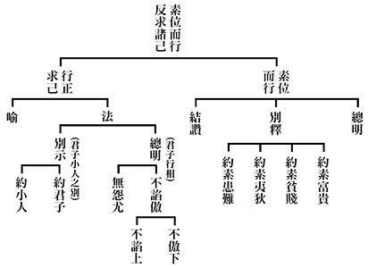

## 藝術賞析

### 孔門七十二賢淺說（三十七）—公良孺

圖/江逸子 文/時哉

危亂仗義如子路

師生建立革命情

最難千里學聖道

造次顛沛能不離

公良孺，姓公良，名孺，《史記》作儒，字子正，春秋末年陳國人，在今河南開封府陳洲，是孔子及門弟子。
《孔子家語》記載，公良孺為人賢而有勇，孔子周遊列國離開陳國到衛國去，經過蒲地時，遇到公叔氏佔據該地，將要對衛國進行叛亂，因而擋住了孔子一行人的去路，並將孔子包圍了起來，公良孺當時帶著五輛車子跟隨著孔子，他感慨地說道：過去我跟隨著夫子，在匡地遇到危難，在宋國遇到司馬桓魋砍倒大樹派兵追殺，今天又困於此，這是命吧！與其見到老師再次蒙難，寧願我在此與蒲人搏鬥而亡。公良孺拔劍糾合眾人，準備與蒲人作戰。蒲人因此受懾恐懼而說：只要孔子盟誓，不將叛變之事告發於衛，就放他們離去。孔子盟誓，但隨後仍前往衛國，子貢困惑地說：「已經盟誓，可以違背嗎？」孔子回
**答：** 「對於要脅而成的非義之盟，遵守反而是不仁，不仁不義的盟約，何必遵守。」

公良孺於東漢明帝永平十五年從祀，唐開元年追封為東牟伯。宋朝加封為牟平侯，明朝改稱先賢公良子。

宋高宗贊曰：「陳有子正，為世所重。制行維賢，義理之勇。學不自滿，才堪大用。牟平其封，式彰光寵。」公良孺字子正，陳國人，為世人所遵從，一切行為合乎賢者，其勇合乎義理，學習有熱情有好樂，從不滿足，才幹足以堪當大任，封為牟平侯，以表其榮。

宋朝張智稱讚公良孺的武德：「子幼真賢，從師尼父，服膺大猷，希跡好古，詩書甾畲，仁義干櫓，匡蒲之役，展也孔武。」贊揚公良孺信守大道，尊崇古禮，為仁義奮戰，在孔子危難時展現武功，保護老師。

畫中的公良孺配劍，左手輕握劍柄，右手插腰，儀表堂堂，展現出穩重而有勇，是仗義勇為保護夫子的形象，眉宇間透露著學習、有成、充滿自信的形象。

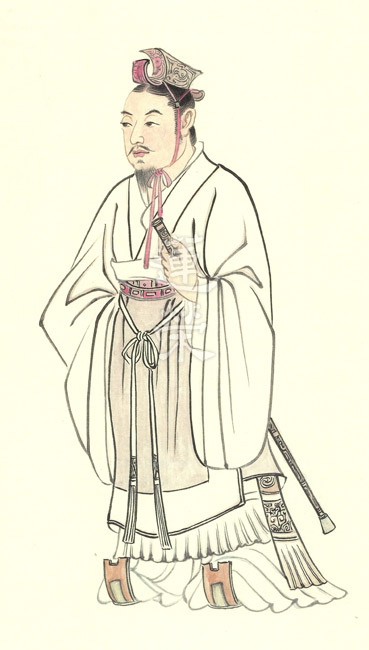

### 孔門七十二賢淺說（三十八）—后處

圖/江逸子 文/時哉

亂世處世智慧

功高能不振主

對陣以德服人

碑文紀念事功

后處，姓后（孔子家語后作石），名處，字子里，山東青州府人，春秋末年齊國人。

后處在聖門中學習，名列七十二賢，為人謙敬誠懇，如《論語‧里仁》篇所言：「古者言之不出，恥躬之不逮也。」又「君子欲訥於言，而敏於行。」他在孔門求學，從來不高談闊論，一定要自己做得到，其言才肯出口。認為言語是心聲，關係個人品學修養，不得不謹慎，因而深獲孔子讚賞。後來子里在家鄉齊國，秉承孔門聖道，深造其學，始終不敢違背初衷，學有所成，在衰落時代，注入一脈清流。

后處於東漢永平十五年從祀孔廟，唐朝封營丘伯，宋朝加封為膠東侯，明朝嘉靖年間改稱先賢后子。

宋高宗贊曰：「溫溫子里，入聞至聖，攬道之華，秉德之柄，深造閫域，不乖言行，全齊之封，竹素榮盛。」溫和的后處，聞孔子傳道的訊息，便來魯國拜師學習。能學到孔門精華，能握持德之精華，已達深邃境界，言行不相違，受封膠東侯（宋朝因后處是齊國膠東一帶的人，便將他封為膠東侯），成為孔門中齊國的代表。

后處的故鄉據說在大明湖附近，後代呂元善稱讚后處出生地大明湖：「青土上腴，山高水渚，惟大明湖，受華不注，毓為精靈，是生后處，至今想見，膠東月樹。」後人認為優秀的賢哲出生地必是佳地，后處在大明湖附近出生，沾染靈秀氣質，願意在亂世跑到魯國跟從孔子學習，表達對道德學問的興趣。

畫中的后處低首垂目閱覽書卷，可看出他處世穩重、謙恭和悅、謹慎小心，凡事必講究出處、文獻根據，不隨意漫談。（下期待續）

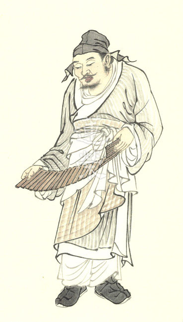

### 華夏精魂千秋（三十三）明倫史畫 修德愛民 羊祜

圖/江逸子 文/淨域

亂世處世智慧

功高能不振主

對陣以德服人

碑文紀念事功

史畫

羊祜，字叔子，西晉南城人，祖籍東漢兗州泰山郡南城縣(今山東省平邑縣魏庄鄉)；生於三國曹魏黃初二年，卒於晉武帝咸寧四年(西元221-278年)，為泰山名門望族羊氏之後，東漢名相蔡邕為外祖父，父祖皆為太守，姊姊羊徽瑜為晉景帝司馬師之后。

羊祜十二歲喪父，哀思逾於常禮，事奉叔父羊耽十分恭謹。曾在汶水邊見一老人，說：「他相貌大吉，六十歲前建功於天下」。他體態瀟灑又博學多才，以擅文長論稱名於世，娶夏侯霸之女為妻，州官、五府紛紛薦任他為官。

曹魏時期，祜任中書侍郎、秘書監、相國等職。司馬氏與曹氏集團彼此權鬥，祜與兩家都有姻親關係，在夾縫中採取迴避態度。齊王正始初年(240年)，大將軍曹爽排擠太尉司馬懿，將權力掌握在手中。祜雖年輕但頭腦清楚，並不依附曹爽。正始十年，司馬懿發動高平陵之變，殺曹爽一干人等；祜的岳父夏侯霸避殺而投靠蜀漢，親友都與之劃清界線，唯有祜全力接濟家屬，這皆得於他對司馬氏的態度。不久，母親與長兄羊發相繼去世，服喪守禮十多年，為世人所稱譽。

司馬炎稱(武)帝後，祜升任尚書左僕射、散騎常侍、鎮南將軍。在晉伐吳的過程中，祜於泰始五年(269年)出任荊州都督，鎮守襄陽與吳將陸抗對峙。祜不尚武力攻伐，以德懷柔遠近，屯兵厚實軍力，深獲江漢民心。某回行軍經過吳境，收割稻穀充實軍糧，隨即命人計算價值，以絹布償還所欠。其開誠布信修德以對，使得吳國駐守在石城(今湖北省鍾祥市)的兵力歸附，長江漢水間的土地皆為晉有。

對於羊祜的德行度量，陸抗亦讚稱：「雖樂毅、諸葛孔明不能過也！」某回陸抗重病，羊祜派人送去良藥，部下怕藥裡有毒，勸陸抗不要吃。陸抗毫無疑慮地服下，並說：「世間哪有會毒人的羊叔子呢？」兩人在對峙期間，荊州戰線處於和平狀態。

泰始十年陸抗去世，羊祜上奏出兵伐吳，因群臣反對而作罷。咸寧四年祜重病，臨終推舉杜預任鎮南將軍，出守荊州，日後果然於西線計取江陵，再進兵健康滅吳。祜病逝後，襄陽百姓在峴山建廟立碑紀念他，來祭者睹碑生情而垂淚，杜預將此羊公碑稱作「墮淚碑」。武帝追贈他為太傅。

圖解

哭是一種感情的流露，多因懷傷而生起。世謂：「讀諸葛亮《出師表》不哭者不忠，讀李密《陳情表》不哭者不孝，讀韓愈《祭十二郎文》不哭者不慈。」以上三篇古文，所以讀了令人垂淚，乃是因為受到人情真摯的感染。

羊祜鎮兵駐守襄陽時，登峴山對同遊者說：「自有宇宙，便有此山，由來賢達勝士，登此遠望如我與卿者多矣！皆湮滅無聞，使人悲傷！如百年後有知，魂魄猶應登此山也。」羊祜死後，襄陽百姓在峴山建廟立碑，以示紀念。

後人何以讀碑墮淚？羊公碑記其中年受命復出，武帝任其為中軍將軍散騎常侍，對內釐訂王法，對外綏靖邊境，運籌國威於禁軍，掌握大權於帝宮，當時之盛況，沒有人超過他的。然其始終態度莊嚴恭敬，處事謹肅戒慎，誠信執行帝命。如此大權在握之人，卻是個仁厚不尚武之人，其修文德愛護百姓，故而贏得晉吳兩國軍民的敬重。

江師所繪圖，乃展現後人遊峴山觀碑之情。碑前眾人恭仰目視，有的指碑讀文，有的拱手禮拜，有的揮袖拭淚，有的交耳接談，所意無非是感念羊祜的功德；是以，竟其功業的杜預，稱此碑為「墮淚碑」。圖後景畫以迷濛高山，喻意其仁德如山之妙高崇遠；而前景繪以蒼勁老松，更喻意恩澤似松之千古長蔭。（下期待續）

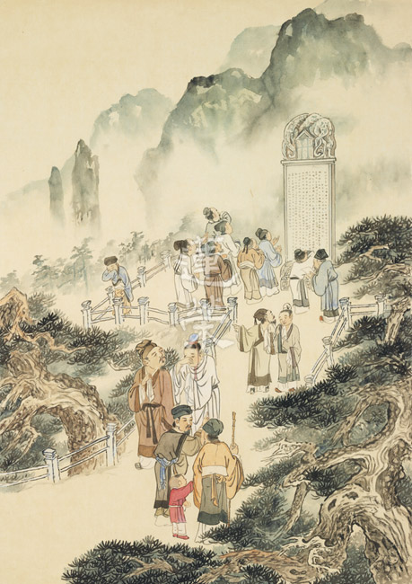

### 道藝春秋（五） 禪讓天下 仁政愛民 堯

*圖/江逸子 文/編輯部整理*

眉分八彩南面相

舉賢善政百姓安

禪讓由他先開始

謗木旁前思諫言

中國古代的帝王傳位講究世襲，從堯帝開始才有禪讓制，即讓有德有能的人繼位，當中可見其公天下的胸懷，在《論語》中，孔子對堯的讚歎更是無以復加加。

這幅畫作特別突顯堯站在一個謗木旁，謗木相當於現代的留言公告。堯為了管治天下，制定法度，禁止欺詐，便樹立謗木，鼓勵百姓批評自己的過失。畫中他穿著便服，捻著鬍鬚，表情若有所思，手勢是一種在琢磨的樣子。他在想老百姓為什麼會有這樣的反應，是對我哪些施政感到不滿意嗎？這是堯最了不起的地方，從他當帝王一直到禪讓帝位，沒有一天對自己滿意。

堯穿著便服，是因為古代帝王在議事政壇裡面，聽到的都是臣子們的阿諛奉承之言，若想聽到真相，最好方法就是微服出巡。微服出巡有三種方式，第一種是到謗木前看看老百姓對他有什麼批評，堯認為：「只要有一個人民挨餓，就是我使他挨餓；只要有一個人民受凍，就是我使他受凍；只要有一個人民犯罪，就是我害了他。」所以越看到老百姓的批評，他的內心越高興，越是琢磨著該怎麼改善、怎麼跟大臣們商量，有哪些政策和思慮未周全。

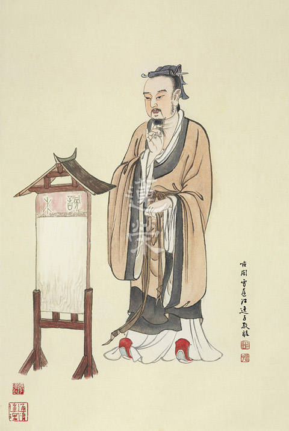

## 活動報導

### 圓通寺齋僧續想

淨銘

往事如煙不如煙

亦有參訪殊勝事

人生百味須覺受

出離大悲由此生

我同期同學們的聚會，雖常舉行，然每次見面，只見白髮蒼蒼，或髮禿齒搖，不免感嘆時光易逝，垂垂老矣，觀其不管官位多高，失去舞台，只能坐捷運。回憶往事，無常竟如此迅速，想到若無佛法薰習，無依止正法團體，就只能是隨緣度日而已。秋柳之歌云「想當日，綠茵茵，春光好，今日裡，冷清清，秋色老」。聚會時大家所談無非學生時代如何，滿懷壯志踏出校門，應付各種狀況如何等。然現今又如有歌云「有魂無體就像稻草人」。大家都會說過幾年，可能要加一桌，給外勞吃，然也束手無策。徒呼「時光一去不復回，往事只能回味」嗟乎，人生真的只能如此嗎？

佛法之難聞，如我同學一百六十餘人中，有官至中將者，有大學教授者，有十四職等公務員者，雖願汲汲營營於如幻世俗，也無一人真正願入正法，更別談能有「以法會友」之可能者。

民國六十二年，懷著懵懂，跟著高中同學一起參加軍事聯招，進入陸軍財務經理學校正期學生班，開始了前所未曾身受的「有理的教育是訓練，無理的教育是磨練」的軍事化生活。

短暫的在校生活，隨即被送到「陸軍第一士官學校」開始了為期三個月的「你不是一個人，而是只能聽命的機器」的入伍訓練，時值蔣公在世，是高喊反攻大陸的時代，艱苦的訓練是必然的，每天二十四小時同學們同吃、同住、坦然相見（連洗澡都是同一間大浴室），同學們淚與汗的相互扶持，相互鼓勵，已初始種下深厚感情。

結束了三個月的跌、倒、滾、爬，終於回到學校，原以為脫離苦海，但是接二連三的，如經濟學、會計學、統計學等專業課程外，還有其他多種學科，更加不間斷的軍事訓練，有些同學萌生退學意念，當時有位同學，其父為上將，或常離校，後又被勸回。

相較民間大學暑假三個月（我們不到一個月），寒假二個月（我們不到兩週），是我們遠道而來的學生，一年兩次回家的快樂時刻，然板橋火車站同時擠滿那麼多人，於是訓練成果與革命情感出現了，先由幾位擠上車，再從窗戶伸手拉一個個從窗戶爬入（那時火車可開窗），其場面堪稱壯觀。

收假後，新學期前，又是一連串訓練。

民國六十五年之暑訓，被送往某兵種學校，接受另類的軍事訓練，因友軍協調有誤，炮擊我們射擊場地，造成演習誤傷，現場同學們高呼救援的，解下皮帶緊綁受傷者傷口的，找木頭作簡單擔架的，衝出通知友軍不能繼續開炮的。救護車到時，抬者傷者爬坡送上車的（我們訓練地點在山谷），隨同卡車送往醫院的。

我當時距離被炮擊地點僅不到二十公尺，當時在場的人連傷心的時間都沒有，沒有閒人，沒有哭泣的人，只有來回穿插忙碌救助的人。現場情形震撼，戰場上的恐怖，竟活生生的親身經歷，難堪述說。

回到宿舍當晚，總聽到從蓋著頭的棉被裡，傳來泣噓聲，在裝甲兵學校近二個月的星期例假日，同學紛往受難者家中及醫院，慰問老人，聆聽其家屬哭泣聲，所以我們班的革命情感非常人所能體會，也是至今所有同學都有保持聯繫，互相問候、聚會的延續。經歷炮彈洗禮，感情之深厚，如同戰場存活老兵，互相尋找，互相扶持，沒有利益關係，只有情感關係。這也是其他期別所想像不到如此有凝聚力的一期。畢業後，在各個不同單位服務，互相幫助支援，頃其全力不求回報，事例太多，不勝枚舉。

事發後，我們接到封口令，在那個資訊不發達，媒體不能報導，此事如同陽燄，如同炊煙，話過無痕，消失在時空裡。

結束暑訓回到學校，繼續三年級的學習，然腦中一直縈繞如果炮彈稍偏，受難的可能是其他同學，或者是我。人生到底是怎麼一回事？為何會碰到這種事？災難來時，如何逃避？類此種種疑問，不斷湧現。

因弟弟當時學佛，所以我寒假回家時，與之詳談想要求得一個讓自己滿意，讓心靈舒展的答案。也許是宿世因緣成熟，弟弟說不然你去一趟蓮因寺。

之後返校，腦中仍縈繞著「去蓮因寺，去蓮因寺」，六十六年八月畢業後抽籤分發空軍雷達中心，該單位因任務需要，每月八天例休，但須分兩次，每次四天，餘二十四天均需待在山上，六十七年九月份我終於踏上參訪之路，獨自前往南投水里，下火車才想到沒問地址，經詢問計程車司機，載我到達目的地-蓮因寺。

進入寺院，只見一個小佛堂，當時無大殿，一位師父法相莊嚴，頂禮之後，才知正是懺雲法師，不知哪來的勇氣，和師父說「我在寺院住三天可否」，師歡喜應允。

我並未作任何身分表明，也非學社一員，沒想師父只說先拜佛，當晚餓肚子，因不知有過午不食，十點打板睡覺，可我哪有那麼早睡，出外看到師父仍在佛堂修行，隔天早上三點半打板起床，漱洗上佛堂，師父已在拜佛。緊接早課後，休息時間，我當時沒多想就說：我想皈依。師父答應了。於是就在佛堂，單獨授予我為時二個多小時的皈依儀軌。

現在想起來，真不好意思沒讓師父休息。緊接著全體（出家弟子四人，還有一位預備要出家的居士，我是唯一在家人）上《佛遺教經》的課程，我有聽但沒有很懂。午飯後短暫休息，再上課，後拜八十八拜。晚課時間，至繞佛時，只留小盞燈，師父端坐，手中拿小杯水，舉眉，佛堂小，沒幾步就經過師父面前，我看著師父，一幅震撼現象出現了，師父臉上祥和且放出金色光芒，那小盞燈並非金色，怎會如此呢，不斷經過，不斷緊盯師父身形，不斷打量是否其他光源，確定是自然散發。這個發現使我震驚，使我對師父產生不可遏止的信心，在我離開蓮因寺前的幾日晚課，都是這樣目不暫捨的盯著看，內心充滿歡喜。
第四天午後，我告別師父收假回營，臨行前，我
**問：** 師父，我要如何行止。師父便到書架取出幾本弘一大師傳記著作，並說：看看弘一大師，如何身在塵世，心不染著吧。接受書籍後，內心歡喜，頂禮而退，回到紅塵。

在已經記不得哪一年的時光，上廣下欽老和尚身體欠佳的消息傳遍佛教界，懺公師父急忙趕來，我們大約十多人跟隨懺公，到達承天禪寺，見到老和尚，時老和尚端坐椅上，身體前後搖晃，非常無力，懺公領眾頂禮，老和尚一見懺公頂禮，忽然很快立刻下座，面對頂禮，這是我唯一見過的場景。

時懺公言：老和尚請你繼續住世，作為我們依靠的力量。老和尚言：我外表身體看來還好，但內部器官，如腐壞之樑柱，將無法支撐房屋。並向大眾說，你們要好好依止懺公，尤其懺公引導青年學子學佛深入經教是我無法做到的，懺公是正法明如來。

接著對懺公說，在你的引導下，教法定會繼續弘傳。懺公言：您是百萬信徒的信心來源，您身體雖然不好，但您只要住世，我們才能安心辦道。懺公再三懇求老和尚住世，老和尚說：好，我答應你。結束談話後，忽然不見老和尚，原來已經如沒病一樣，迅速爬上樓梯，速度之快，相信年輕人也沒幾個可比得上，況且老和尚已八十八歲了，不可思議。

親眼目睹，在清晨天未亮時，我們去拜見老和尚，老和尚移座室外，我們圍繞在四周，時清晨水霧，已將我們頭髮、衣服微微沾濕，但老和尚身上卻一點都沒濕，當時我想：莫非護法神，在幫老和尚撐傘，此亦是另一個不可思議。

有一位問到：老和尚，前幾天有位拜山者，突然身體不適亡故，請問他往生何處？老和尚略顯不悅之色說：念佛，反正他一定是往善道。

再次見到懺公，是懷著忐忑不安的心情，因為我怕被問到有沒有用功，近況如何等等，我將無言以對，繼而再想：我可能想多了，師父現在弟子那麼多，齋戒學會也教導不少學生，可能師父看到我，只會是似曾相識的吧。

但是仍然不敢太靠近，低調點吧，只要看到師父我就滿足了。好像是公園，一群人圍繞師父，忽然師父站起來，呼喚五公尺外的我「瑜銘你過來一下」，心中嚇一大跳，心想該來的，終究是來了，只能硬著頭皮過去，沒想師父卻往前走，我跟在後，然後師父脫下袈裟，摺好後說你在這拿著，然後如廁去了，我的手捧著動也不敢動，師父取回袈裟後，只點一點頭，但我手已是抖動不已。其餘時隔久遠，多已不復記得。這種戒慎恐懼的心態，是一個未來會見殊勝大德的緣起。如何讓這個覺受在正法中安住，未來會有一些想像不到的偶然。

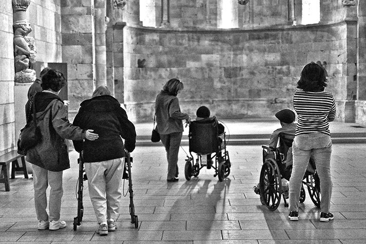

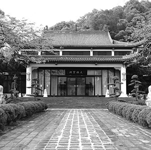

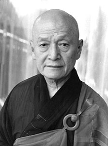

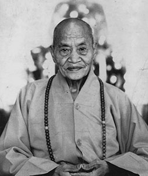
