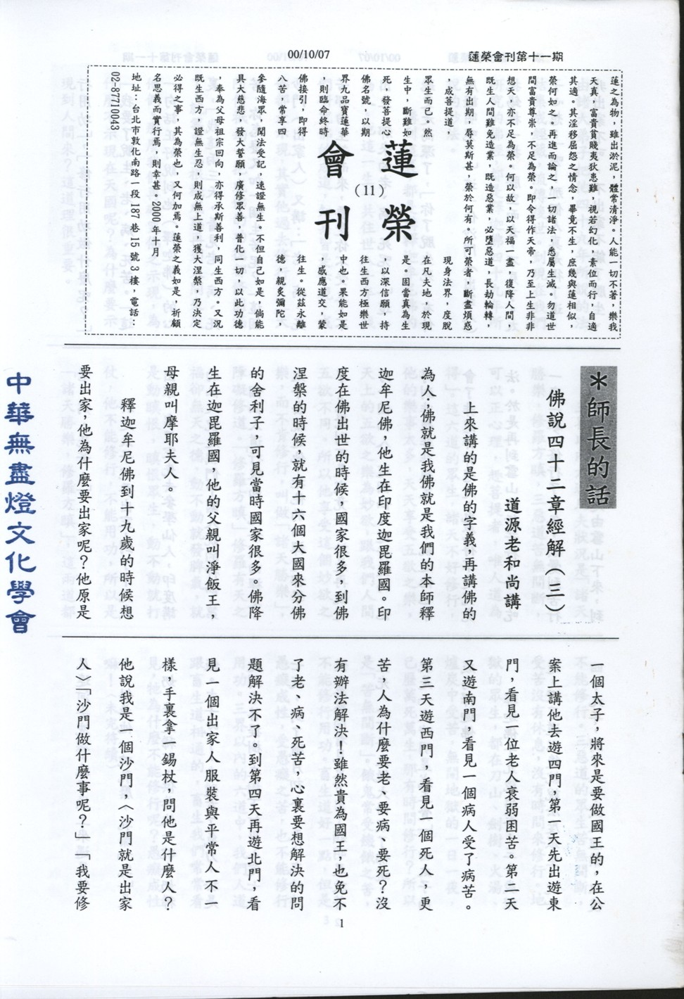

# 第12期

## 大德法語

### 佛說四十二章經解（四）

*道源老和尚講授*

什麼是愚癡成性？比方說我們家裏養的狗，牠很通人性，我們一叫牠就來，你天天餵東西給牠吃，牠跟你很好，但如果向牠宣說佛法僧三寶的名字，怎麼樣講，牠都不會懂。三寶的名字都不懂，怎麼能明白佛經的道理？不明白佛經的道理又如何能修行？所以畜生道愚癡成性，不能修行。

這六道凡夫中其他五道都不能修行，可以正心理，趣菩提道者，唯人道為能。「正心理」，心理就是我們的思想，可以將之修正、修正，調整、調整，我們人的思想就是貪圖五欲之樂，但人間的五欲之樂粗而不妙，而且苦多樂少，容易覺悟。他覺悟了，他就趣向於菩提，可以調整自己的心理，就是調整自己的思想，不趣向於五欲，而趣向於菩提之道。「唯人道為能」，只有人道的眾生才可以做的到，只有人道的眾生才可以修行，才可以成佛，因此釋迦佛他不在其他五道示現成佛，而在人間示現成佛。

講到這裡就是奉勸諸位，我們都是人道的眾生，我們直接可以修行，可以了生死，可以成佛道。我們有修學成佛的能力，要是不修行，實在對不起你自己，因為人身難得易失，得一個人身很不容易，必須你前生沒有造殺、盜、淫、妄這四種惡業，才能得人身。人身很難得，「易失」容易失掉；因為人的生命短促，最多不過一百年，再多活到一百二十歲，轉眼之際人生都完了，再得人身很難，所以人身難得而易失，在短促的時間你要好好地、精進地用功，不要辜負人身，這樣才對得起自己，對得起釋迦佛。

再講一講釋迦佛示現在人間，為什麼示現在皇宮裏，有兩種意思，第一表示尊貴，皇太子出家就憑他的身份，大家對他就生敬仰，所以他(佛)為表示他的身份尊貴，投生在皇宮做太子，以太子之尊示現出家。

第二種意思是令眾生警覺人間沒有快樂，雖然貴為國王，不能免脫老、病、死苦，釋迦佛示現將來要做國王的太子了，他要不出家，做了國王還是要老、要病、要死，所以說人間除了老、病、死苦外，還要加上一個高深的道理，就是再加一個「生」苦。貴為國王，免不了要生、老、病、死苦，所以教一切人要提高警覺，趕快修行，了脫生死之苦。

「佛」字已講完，再來談佛說的「說」字，蕅益大師解釋「說」者，「悅」也，喜歡之意，因為佛以度眾生為懷，「悅」者，悅所懷也，眾生的根機不熟，佛不能說法，所以心情不悅，心懷不悅。眾生的根機夠了，佛可以應機說法，可以暢達度眾生的心懷，所以大生歡悅。

「四十二章」，「章」是節、段的意思，每一節、每一段就是一章。我們要知道四十二章經不是釋迦佛說的一部經，而是由印度請來的兩位高僧迦葉摩騰、竺法蘭在一切佛經中摘錄出來的四十二段，四十二節，也叫四十二章。為何不是佛說卻又冠上「佛說」兩個字呢？因為這四十二條沒有一條不是佛說的，它是從一切佛所說的經典中摘錄出來的，所以仍然等同佛說。

再講「經」，梵語「修多羅」，華言契經，契者合也，上合諸佛之理，下合眾生之機，所以叫做契經，簡單翻譯，就翻譯「經」字。將經名七個字合起來講，「佛說四十二章」是此經的別名，經之一字是一切經的通名，只要是佛說都叫經。華嚴經也叫經，法華經也叫經，經是一切佛說的通名。佛說四十二章是此經的別名，這一部經不是華嚴經，也不是法華經，叫做四十二章經。再釋別名，「佛」是能說之人，「四十二章」是所說之法，所以叫做能所已備。經題講完，再講翻譯人，後漢迦葉摩騰、竺法蘭同譯，要看蕅益大師的註解。你們的本子都是蕅益大師解釋的本子，為什麼要看這本註解呢？因為這裡面有介紹佛教傳進中國的一段歷史，如果我們看了這一段註解，就能夠明瞭佛教與中國文化的淵源了；後漢即東漢，對前漢而言之，漢朝有西漢、東漢，西漢又叫前漢，佛教進入中國是在後漢，也就是東漢，東漢建都在河南省洛陽。〈未完待續〉

## 共修研學

### 勸發菩提心文（十二）

*心爾*

如何捨偽求真：「念念上求佛道，心心下化眾生」，念念心心是一樣的，念念心心是注意力，乃各人重點所在，不妨礙吃飯睡覺，不妨礙聊天，看經典。但做這些事的重點很清楚。蕅益祖師的自勉云：舉事不足以自利利他，這事不辦；說一句話不足以自利利他，這句話不說；動一念不足以自利利他，這個心念不動；若不足以自利利他，所起心念皆成浪費。

「聞佛道長遠，不生退怯，觀眾生難度，不生厭倦」：聞佛道長遠，成佛需三大阿僧衹劫，且觀修教法，愈往上愈微細難入，窺基大師研究法相，讀到吐血，彼乃登地菩薩應跡，尚且如此。佛道長遠，內心用力要很強、很猛、很專一，用起功來比別人吃的苦更多，受的辛酸也絕非他人想像得到，付出與所得簡直不成比例，可能別人擁有的你都失去。「觀眾生難度，不生厭倦」是哪一種眾生？是有錯不改的眾生、是蠻橫不講道理的眾生，是跟你對立、說什麼都不聽的眾生，另外還有一種是恩將仇報的眾生，像提婆達多這種人。觀眾生難度不生厭倦，尤須百折不回，釋迦牟尼佛來娑婆世界已八千次，乃至於為一個眾生下地獄、下無數次，彼百劫千生，猶不肯悔改，而且作惡多端，佛是曾無一念捨棄之心，吾人試問這時還會心心下化眾生嗎？「如登萬仞之山，必窮其頂。」如登高山必登到最高頂，爬山過程是辛苦的，但為什麼要往上爬，因為登上最頂之樂難以形容，在過程中自我挑戰看自己的毅力、耐力有多強，這時還不退轉，心心還在上求佛道，念念還在下化眾生，這種耐力、毅力、心力，將潛能發揮到最極至，這樣的人不得了，這些潛力的激發都得靠眾生，眾生是你的大恩人，沒有眾生無由發揮潛能，這些講不通，不可理喻的人，激發你的耐力、毅力；你的威猛、勢力、神通、道力、願力，都是靠他而成就，沒有他，哪有你？所以到山頂上的快樂，那感覺、那種殊勝、那種愉悅，比喻成佛一樣；藉著眾生給他的挑戰、挫折、忤逆，往上爬的過程是很辛苦的，但爬到山頂上的感覺非語言所能形容，只有他的眼光最遠，心志最高，能耐最強，這都是眾生賜給他的，眾生是大恩人，佛果的功德殊勝、無比莊嚴竟然都是眾生所賜與的，眾生是恩公，恩德何止比山高比水深！

「真」就是在修行過程中，你的在意處，在日用平常裡，到底發心有否正與真，若是「正發心者」，不會去追求這些外務，「真發心者」遇到中間之挫折絕不會退轉。「心」之重點即在上求下化，如母親的重點就是一心一意把孩子撫養長大、教育成人，雖然也是上班、下班、做種種的家務事，乃至於應付酬酢，但彼之注意力與重點還是在子女身上。正與真之菩提心如何分別？能對治利養、名聞、恭敬、欲樂、果報之執求，而為生死、為菩提者，是名正，在佛道上精進時遇到難以突破的障礙而不退轉，是名真菩提心。故要判斷這個人是不是真有修行，只需看他的注意力在哪裡？重點在哪裡？在過不了關時，他的重點是不是還是那個重點，這才是真正有修行功夫了。

「有罪不懺，有過不除，內濁外清，始勤終怠，雖有好心，多為名利之所夾雜，雖有善法，復為罪業之所染污，如是發心，名之為偽」。

吾人為下化眾生而上求佛道時，除了願力以外，主要重點在對治煩惱，降伏習氣，方能發展善法以利益眾生。若不能淨化煩惱，則願力不清淨，而且空有願力。何以故？未從淨化煩惱中，產生很強的能力，因此度眾生變成空有願力，且在事相中煩惱現起，變成墮落退轉之緣，所以要懺罪除過，乃約著降伏煩惱、對治習氣而言。「罪過」詳細說，無心的叫做「過」，有心的叫做「罪」，有心的要懺，無心的也要除；若不除即內濁外清（裝樣子，擺門面）煩惱都藏在內部，外面卻示現出修行的樣子。這個很微細，微細到自己都察覺不出，有時自己有問題都不知道，叫內心腐爛之相，到什麼程度？教法很通達，善法也多做，此時卻內濁外清是最恐怖的，尤其增上慢，總認為自己一定對，別人不要勸我，只有開示別人，沒有被別人開示的餘地，這些很微細的我見、我愛、我慢、對自己看得很重，對別人看得很輕，如此修行，而不知懺罪除過，一旦遇境逢緣爆發的力量很強，引起的業障也很厲害。叢林裡的老參，講不得、做什麼事都不能講他，謂之「始勤終怠」，就是剛開始的初發心很好，後來都懈怠，但表面維持精進行相，內心卻十分懈怠（增長愛、見、癡、慢）雖有好心，都為名利所夾雜。雖然辦了一些善法，如助念、作七、告別式、放生、教育、法會等善法，但其內在的源頭是煩惱，心不清淨即是罪業。發心之猛不猛、能不能突破障礙，看他往內對治煩惱有多深入。在願力堅持下，煩惱的對治有多麼深入，說他發心有多麼真。以上是為凡夫開正眼，令去邪取正，捨偽求真。

接下言大、小、偏、圓是另外一種比對，乃兼為二乘、菩薩指示，在比對中讓我們確認菩提心真正的行相，在正偽莫辨當中分得清楚，否則有一天危害起來很厲害的。菩提心被染污時，其過患無窮，修行就是在除這些過患（邪、偽、偏、小四種過患）。

「眾生界盡，我願方盡。」所有的眾生都能轉迷為悟、轉凡為聖、轉生成佛、眾生都成佛了，我的願才完成，謂之下化。「菩提道成，我願方成。」乃上求，我下化要下到這個程度，上求要求到這個程度，「如是發心，名之為大」。（未完待續）

## 蓮池海會

### 蔣立人老居士往生見聞記

*編輯部整理*

蔣立人老居士民國八年十月五日出生於湖南省衡陽縣。高中畢業後，適逢對日抗戰乃投身軍旅，加入捍衛中華、保國安邦的行列。三十一年六月在陸軍輜重汽車第一團任中尉譯電官，並且隨著部隊深入西陲雲南省。

就在烽火平息之際，蔣居士轉任公職與國民政府播遷抵達寶島臺灣。民國三十四年，任職於臺灣省行政長官公署機要室，三十六年轉任聯勤總司令部臺灣供應局，三十七年重回祖國大陸南京，其間服務於國防部，三十八年共黨竊據神州，山河因茲變色，老居士轉由廣州渡海來台；是年五月以同中尉軍階退伍，十月份赴省府民政廳任科員，老居士對公務一直秉持認真負責的態度，其間曾因辦理中央公職人員增補選工作及連續服務績優，不僅多次獲得記功嘉獎，而且升任股長一職。生性恬淡，不求聞達的他於民國六十八年八月十六日自文書股長職內申請自願退休。

為人懇摯、待友忠誠是老居士最佳的寫照。個性謙順、平易近人素為友朋所稱道。少年時代投筆從戎、中年發心為公辦事，前後達三十餘年之久，一生既無顯赫之功、亦無傳世巨著，他可說是大時代中一介平凡人，但其平凡處亦能展現不平凡。退休後寄寓中興新村公家宿舍，直至病逝、未置恆產。居士之德配林阿玉女士於民國六十三年因腦溢血遽然辭世，堅強的他，竟然獨居二十多年之久，子女們雖然都誠摯地表達出孝順奉養之心，但老居士格外體恤晚輩，不肯增添其生活負擔，每天的飲食起居皆自行料理，簡約樸素、安貧樂道，子女三人亦不辜父親大人之期望，各自完成高等學歷，謀得令旁人稱羨的事業成就。

長子昌成畢業於台灣大學法律系，通過國家特考，進入行政院新聞局服務，並以公費留美攻讀外交碩士學位，目前在華盛頓中華民國駐美代表處從事對美文宣的各項工作，長媳戴女士畢業於師範大學，曾任職於教育部。兩名女公子淑慧、淑瑛大學畢業後，分別擁有幸福美滿的家庭，長女婿陶先生現任花旗銀行協理，次女婿盛先生則在台灣建築業界，開拓了一片天地。蔣老居士對子女們的教育十分重視，關懷之至、無怨無尤。民國八十六年，蔣老居士罹患輕度中風，半身幾乎已呈現出麻痺狀態，但仍以無比的決心和耐心，每日配合醫師指示，勤加復健，從在療養院中拄著柺杖，蹣跚而行，終能日行千步，逐漸不再依賴他人。去年的九二一大地震使得南投縣受創嚴重，蔣老居士踩著崎嶇不平的破碎路面，獨自前往省政府求援，這對一位曾經中風，且不良於行的八旬老翁而言，是多麼艱困的考驗！

今年春節前夕，老居士北上與長女一家人共享天倫之樂，旋即感到身體不適，進入松山醫院接受治療，其後病情每況愈下、日趨轉劣，五月中旬完全進入昏迷狀態，然而先生雖為病苦所繫縛，但宿世善根具足，終得家人及蓮友們之護持，大眾皆懷著至誠懇切的心，為老居士助念，就在一片莊嚴的佛號聲中，蔣老居士蒙佛接引、安詳捨報。

## 啟蒙園地

### 談教育（六）　餘力學文

心在

一個德學兼備的好子弟，應該在日常生活中，奉行師長給我們的教誨；孝弟、謹信、汎愛眾與親仁皆為分內之事，至於行有餘力，則可安住在「學文」。好比父母請小朋友幫忙做家事，結果孩子推三阻四，這不但無法替大人分憂解勞，反而虧失了孝道，就像一棵根部受傷的樹木，其枝葉又如何茂密繁盛呢？

孔子曰：「質勝文則野」，一個質地很好的人，若缺少習禮學藝，就顯的粗鄙俚俗。子路問他的老師：「南山有一種天生筆直的竹子，拿它來作射穿牛皮的箭，既精準又耐用；如果人擁有良好的本質，又何須學習種種的技藝呢？孔子回答說：「要是箭尾能再加上些羽毛；箭頭裝上箭鏃，射入皮革不是更深更準嗎？」可見孔子期望他的學生，能夠具備文質彬彬的君子人格。小朋友無論在家或在校，應當把握學習與人和諧相處的機會，將德行的根基打穩，否則很容易養成矜誇浮華的習性。學文可以幫助自我充實、開闊淑世濟人的胸懷。論語中提及：「百工居肆以成其事，君子學以致其道。」各行各業皆有其辦公處所，以成就其事業，更何況淑世的仁德君子，更應該虛心好學，努力增上。只可惜今日之下盛行一種詆毀聖賢的風氣，特別對孝道倫常的概念嗤之以鼻，無怪乎世態炎涼、人心不古啊！

子曰：「君子博學於文，約之以禮，亦可以弗畔矣夫！」心中有了自利利他的遠大志向，還須廣泛研究各類學問，並以禮節來約束言行，使自己能夠成為兼具知識和禮節的君子。弟子規告訴我們讀書的方法及若干應有之心態，所謂：「讀書法，有三到」，心、眼、口一起專注在書本上而且要實實在在地達成目標。曾國藩先生說過：「桌上不可多書、心中不可無書」；古今善於讀書的人，一書在手、通本讀完，正是掌握住「方讀此，勿慕彼，此未終，彼勿起。」的原則了。小朋友在學習的過程中，遇到困惑不解處，先不必苦求強記，以從容自在之心，好好涵泳研讀一番，終有豁然通達的光景。再者古人讀書，常以木簡記下心中的疑問，提醒自己反覆思惟，向他人請益，這種求學態度可以使人的學問更加紮實穩固。良好的生活常規，端賴持之以恆的落實，尤其因力求讀書環境的整齊清潔，從前的儒生，對書冊典籍十分恭敬，即便寫字磨墨也都格外嚴謹；我們心中存有一分恭敬，便有一分收穫；十分恭敬便有十分收穫。

「非聖書，屏勿視」，時下以商業掛帥的報章雜誌乃至於各類影音光碟，多半偏向聲色之娛，不法商人枉顧良知良能，從中牟取暴利，孩童在成長之路，應特別留意心智發展。假使沒有獲得正確的教育，其日後的觀念行為皆有偏差之虞。弟子規所闡揚的道理，正是聖人的訓誨，所謂：「蒙以養正，聖功也。」可塑性極大的孩童，倘若接受完善的啟蒙教育，便能造就聖賢的功效。孟子言：「言非禮義，謂之自暴也。」又云：「吾身不能居仁由義，謂之自棄也。」一個人言行不合乎禮義，就稱為「自暴」；縱使明白禮義的內涵，卻又不肯加以實踐，就稱為「自棄」。堯舜乃中國之聖賢，其傳下的道統，正是孔子集大成的五經，也是令吾等引以為榮的文化寶藏。「舜何人也，予何人也，有為者，亦若是。」只要大家虛心開卷，勇於擔當，漸次力行，一介凡夫也可生入聖賢之域，和往聖前賢把手同行。
