# 第130期
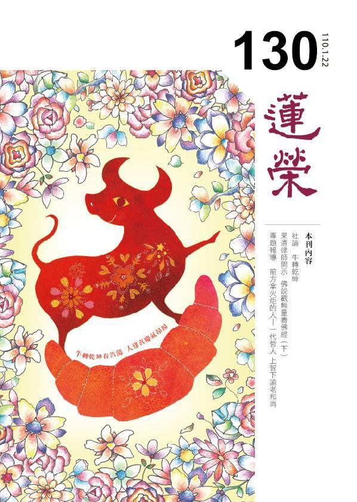

## 本刊社論

### 牛轉乾坤

*編輯部*

牛之表法與意義

莊嚴金牛迎新春

憤怒牛王超障礙

正法遍地是未來

庚子年疫情鬧得沸沸揚揚，各國的政治、經濟運作產生劇烈的變革，人們的工作、生活與思維模式也不得不轉換，無論樂不樂意，都要學習如何與病毒和平共存，培養強大的適應力與強健的體魄。疫情改變了產業結構，遠端產業、外送行業、線上工作與學習比比皆是，揭開了新時代的序幕。

就算疫情過後，我們也不可能回到過去，改變是人人要面對的課題，二○二一年，世界將進入新的常態，隆冬開春之際，大家莫不希望能牛轉乾坤，一掃陰霾，但願望須有寄託處，在正知見所攝持下的願望才不致淪為空願，牛年就從觀牛開始，觀牛的功德、特色、值得學習效法以及要引以為戒之處，給自己新的期許、新的啟發，共業難以轉變，而別業的心境、作法則可重新思維再出發。

牛之於古今、之於我們，其貢獻不可磨滅，對於牛的崇拜，最早可追溯到四千多年前的大禹，傳說大禹每治好一個地方的水患，就會鑄造一隻鐵牛投入水底來鎮壓水患。

古時候的牛一年到頭忙，只有在秋收之後比較悠閒，在中國許多地方都把農曆的十月一日訂為「牛生日」，這一天，農夫不但不讓牛繫鼻繩工作，還讓牠們享用豐盛的糧草，並在牛角上粘一個湯圓幫牛慶生。在早期的黃曆裡，扉頁上都會印著「春牛圖」，勉勵人們一年之計在於春，要學習牛人精神，努力用功、打拚事業。

中國數千年來都是用牛來耕田、拉車、載人、運貨，所以牛是農耕文明的最大財富，也是生產力的象徵，在古代一直享受著國寶級待遇。

《左傳》中說「國之大事，在祀與戎」，牛是上等的祭品，稱為「犧牲」，「君無故不殺牛」，就算是天子，也不能輕易動牛一根汗毛，只有在天子祭天祭祖時才可以殺牛祭祀。

秦朝時，不僅將全國的耕牛登記在冊，更不定期差遣官兵上門調查，一旦發現牛被虐待，或是未被養好，牛的主人便會遭受嚴厲的懲處。漢朝也規定，牛年老後才可以宰殺，宰殺前還必須到官府報備，如果有人故意殺牛，將腦袋不保，可見各朝代對耕牛的重視。早期出身農家的臺灣人也都基於尊敬而不食牛肉，是飲水思源和純樸善良精神的體現。

綜觀東方的牛，象徵勤力、刻苦耐勞、堅毅不拔、忠厚老實、任勞任怨，又有正義感，愛打抱不平，是人類最佳的夥伴。

在西方，牛則象徵財富與力量，想到無懼的牛，就會聯想到十八世紀興起、備受爭議的歐洲鬥牛活動。有趣的是，牛並非對紅色有特殊的傾向，牛其實是無法分辨色彩的色盲，會被紅布激怒是因為牛對持續晃動的物品感到好奇，選用紅色則是讓人們產生亢奮，製造冒險娛樂的效果。

也並非所有的牛都對於這類晃動的紅布有所反應，鬥牛場上北非的公牛特別不一樣，牠們經過多年的訓練，脾氣變得相當火爆，容易受到刺激。我們也應訓練自己保有清醒的身心，對於不相關的事物視而不見，也不必受到外在環境的影響，作好自己的主人，才是處世的保身之道。

想想華爾街上的那頭雄赳赳、氣昂昂的銅牛，眼神篤定、蓄勢待發，或許這就是牛年我們可以參考的姿態，而勇往直前的同時，仍要懷抱著仁慈的胸懷，多一分理解，多一分體諒，去擁抱這個不確定而多元的世界。

當然，牛也有缺失，像是固執不知變通、不解風情、鑽牛角尖等，都是令人躑躅不前的大忌，我們應極力避免，擇其善而為，其不善則對照自身，努力調整自己的個性缺失與認知偏誤，才不會如同磨牛，身雖行道，心卻停留在原地。

要學習牛的忍辱負重、辛勤耕耘、深具毅力，當方向正確，牛步雖緩，精進不懈，也能成為人生準則。而心理學專家們發現，只要嘴角上揚，就會讓自己感到歡悅，因此，新的一年就算大環境依然不堪，也想辦法讓自己充滿幹勁，或許就有能量衝刺到年終。特別是在學習正法上的精進，就像是大威德金剛示現忿怒相，是文殊菩薩的化身，是最能降魔的本尊，有精進的精神、胸懷，不斷學習、嘗試，將是迎接牛年最殊勝的意義，辛丑年祝福大家牛轉新運、福慧雙修。

## 佛學覽幽

### 大乘百法明門論簡說(三十七)　拾伍、心所有法　隨煩惱（六）

*戒慧講述／淨本整理*

止觀障礙沉與掉

失念忘失修學法

進進退退有何用

暇滿人身空餘恨

經文：

五、隨煩惱二十者：一、忿。二、恨。三、惱。四、覆。五、誑。六、諂。七、憍。八、害。九、嫉。十、慳。十一、無慚。十二、無愧。十三、不信。十四、懈怠。十五、放逸。十六、昏沉。十七、掉舉。十八、失念。十九、不正知。二十、散亂。

《直解》云：「昏沉者，令心於境無堪任為性。能障輕安毗鉢舍那為業。」沉沒就是心往下掉，或往後收提不起勁，昏沉就是暗，如烏雲蔽月，無堪任是抓不住境界，例如想要念佛卻抓不住佛號，好像人走入暗房一樣，看不到眼前的境界。

毗鉢舍那是觀，奢摩他是止，修止有成就才能修觀，比喻晚上提燭火觀壁畫，但風吹使燭火搖曳，看不清壁畫，此時透過燈罩能使燭火穩定，照亮壁畫。風吹比喻各種能擾亂心的境界風，燈罩比喻止，火光比喻觀力，所以止未修成觀力也提不起來。止跟觀修學成就都會產生輕安，也就是風大充身，遠離煩惱的粗重相，而昏沉其實對於止與觀的輕安都會產生障礙，不只是對於止有障礙。吾人修學淨土法門，持名念佛是主要的修學法，這屬於止的功夫，如果鎖住佛號的境界，觀察佛的功德或空性等義理，才屬於觀的功夫，所以念佛想要有成就，就必須除去昏沉。

癡與昏沉容易產生混淆，昏沉是癡的等流，二者行相已不同，但昏沉是因為癡所產生。癡可分為因果愚跟真實義愚，也就是在境界中沒有因果的觀察，或者沒有真實義的觀察；昏沉則是修行時對於所緣境沒有執持能力，如人剛剛睡醒，此時睡意尚濃，仍被睡眠的勢力所攝持，有壓迫沉重之相。其實睡眠的勢力很容易增長昏沉，這是修行要特別注意之處。

昏沉的細相稱為沉沒，比粗相的昏沉更難察覺，昏沉者已經無法緣念境界，如入暗房全無所見；沉沒者仍能緣念境界但勢力微弱，許多修行人看似定功深厚，其實禪坐或念佛時都處於沉沒之中，自己也不曉得。甚至修行產生沉沒仍然可以有快樂，可以生至欲界天，因為沉沒者仍可為善，但無法生至色界跟無色界天，也無法出離三界。

昏沉既然是暗相，要用光明想破除暗相；沉沒因為勢力微弱，要用熱忱、善法欲，思維佛功德、正法殊勝、功德法財可貴，把自己修行的勢力往上拉，增強緣念境界的力量。

《直解》云：「掉舉者。令心於境不寂靜為性。能障行捨奢摩他為業。」行捨的意思是不用再修對治法，就能持續處於內心寂靜的狀態，奢摩他（止）可以達到行捨的境界，毗鉢舍那（觀）也有其行捨的境界，就是不用特別修對治法，能任運產生觀慧，使心寂靜。止與觀的行捨都會被掉舉破壞，令心不平靜，因此本論的定義較狹。掉舉有身口意三種，例如內心想別的境界而七上八下是意掉、嘴巴亂言語是口掉、坐立難安是身掉。

止上的掉舉，例如念佛時內心緣念其他境界七上八下；觀上的掉舉，例如因為緣念其他事情而無法觀察法義。掉舉也有粗細之分，粗相的掉舉是緣念所修以外的其他境界而無法安定；細相的掉舉，是眼前看似安住於所緣境，但心中其實有微細的不安，較粗相難以察覺，這種隱微處想追求其他事務的渴望或者不安，如果沒有及時發現並予以對治，積累日久，將是修行的沉痾，甚至成為退轉不願再修學的原因。無常、體空、不淨觀等法義的串習，都有助於自己破除掉舉的煩惱。

《直解》云：「失念者，於諸所緣不能明記為性。能障正念。散亂所依為業。」對於所緣境界不能明暸記住就是失念的定義。散亂依靠失念而生起，因為忘失而緣不住所緣境，無法生起專注力（正定），心就會散亂，此定義也較狹，其實止觀等修學法的忘失，不只會發生散亂，也會導致掉舉跟昏沉等煩惱的延續，因此失念被歸類為八大隨煩惱，若只是對於世俗事務的忘失，其嚴重性還不至於如此。

人在緊急或危難時特別容易失念，忘失過去所學的正法把心念導正，隨著造次或顛沛的環境而慌亂不安。所以孔子說：「君子無終食之間違仁，造次必於是，顛沛必於是。」這必須對於修學法有銘記不忘的能力才能如是。

佛法中四念處是很重要的觀修，面對各種境界若能提起，才不是失念之人。人在世間無非是希望能過得快樂、享受生活，所以對外境會有許多追逐。四念處中的觀身不淨，讓人可以離開對身體的貪愛，放掉自私的心，減少對於外境的追逐。或問，雖然身體不淨，但感受可以是快樂的感受？這就是在感受中沒有做苦諦的觀察，感受雖有快樂，但終將敗壞，終將無法改變苦苦、壞苦、行苦的結果。感受最終是苦，自己無法作主，但心總是自己可以做主吧？這是又進一步的問題。實際上的狀況，當我們對著順境就生貪、對著逆境就生瞋，自己根本做不了主，所以也要觀察心無常，無常也是修學空性的初門，非常重要。縱然有情對於心也無法自主，但諸法總是真實的吧？其實法也沒有自體性，都是觀待有情的心才能成立，例如可愛的境界也要觀待有情心上如此顯現，同樣一個境界對於他人就未必成為可愛，可惡境亦復如是，這就是法無我的觀察。身受心法可涵括一切法，所以身不淨、受是苦、心無常、法無我，這四念處不忘失也非常重要。（下期待續）

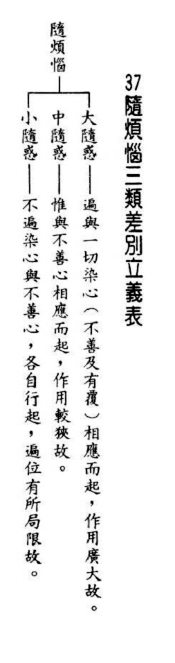

### 大佛頂如來密因修證了義諸菩薩萬行首楞嚴經 — 七處徵心（六）

*戒慧講述／淨本整理*

佛為大論師

番番辯證後

心顯空靈靈

佛為量士夫

【科判分析】

寅五、破合處（此計乃無定處）

在接連被佛破除錯誤看法後，阿難尊者又提出心無定處的看法。

一、「阿難計隨所合處心隨有」

阿難尊者舉出曾經聽聞的「心生故種種法生，法生故種種心生」，認為心是在與法結合之處。

（一）、「謬引昔教」

阿難尊者雖然引用了過去佛曾說的教法，但錯解箇中義理，因此成為謬引。

（二）、「指體標處」

依據佛所說教法，指出心之體性存在於何處。

（三）、「總脫前過」

由於重新指出心之體性所在之處，所以免除了前面幾種說法的過失。

二、如來以無從來無定體為破（無從來，則不能隨合；無定體，則豈能隨有）

如來以心沒有從哪來也沒有體性，來破除阿難尊者的說法。

（一）、「正破」

正面論述以破除阿難尊者的看法。

１、「牒其所計而定有體」

佛依據阿難尊者心有體性的說法提出問難。

２、「約無從來以破隨合」

佛依據心並沒有從哪來的論點，破除阿難尊者所謂「心與法合之處就是心所在」的看法。

（１）「正審從來」

正面審查阿難尊者所謂有體性的心，究竟從哪邊來。

（２）「因救轉辯」

阿難尊者因為看法將被佛破除，轉變說法辯解。

ａ、「阿難救見為眼」

阿難尊者挽救自己的見解，說能見的是眼。

ｂ、「如來辯眼無見」

如來向阿難尊者辯明，眼無法看見。

３、「約無定體以破隨有」

佛依據心並沒有體性的論點，破除阿難尊者所謂「心與法合之處就是心所在」的看法。

（１）「先開四相」

佛先開出心若有體性四種可能的行相。

（２）「一一推破」

佛再就四種行相一一推理破除。

ａ、「破一體」

破除心與身為整個一體的說法。

ｂ、「破多體」

破除心有多個體的說法。

ｃ、「破徧體」

破除心徧滿整個身的說法。

ｄ、「破不徧體」

破除心只在身體某一處的說法。

（二）、「結破」

結論破除阿難尊者「隨所合處，心則隨有」的看法。

【經文解釋】

阿難言：「我嘗聞佛開示四眾：『由心生故。種種法生；由法生故。種種心生。』」

阿難尊者說：「我曾經聽聞佛為四眾弟子開示：『因為心生起的緣故，所以種種的法相生起；因為種種法相生起的緣故，所以心生起。』」

觀待所緣而有能緣，觀待能緣方有所緣，心與諸法其實都沒有實體性，相互觀待，這才是佛說這句話的真義。然而阿難尊者錯解，產生自性見，以為心為實有，先有心而後與法相合，或者先有法然後與心合。實則心與法沒有先後，沒有所緣哪有能緣？沒有能緣哪有所緣？

我今思惟，即思惟體，實我心性，隨所合處，心則隨有。

我現在思維，這個思維的體性，實際上就是我的心性（思維可推動一切心理活動），隨著能緣的心與所緣的法相合之處，心就隨之而存在。

亦非內外中間三處。

所以心也不是在內、在外或中間這三個地方。

佛告阿難：「汝今說言，由法生故，種種心生；隨所合處，心隨有者」，是心無體，則無所合。若無有體而能合者，則十九界因七塵合，是義不然。」

佛告訴阿難尊者說：「你現在所說，由法相所生的緣故，則種種心生；心與法所合之處，心也隨之而有。那麼這個心是有體性還是沒有體性？如果心沒有體性，就沒有所合的法，沒有體性的心如果還能與法相合，那麼在十八界（六根、六塵、六識）之外，應該成立第十九界，也就是這無體之心；並且在六塵之外，還有一個與無體之心所合的第七塵，這道理是不正確的。」

本段佛在說明，並不存在一個「無體性的心識」，所謂心無自體性，只是說明心也是緣起法，不能獨立存在，並不是另有一個無體性的心識存在。

「若有體者，如汝以手自挃其體，汝所知心，為復內出，為從外入？若復內出，還見身中；若從外來，先合見面。」

「如果心是有體性，例如當你用手撞擊自己的身體，你能知的心，是從身內出來與撞擊的境界相合？還是從身外過來跟撞擊的境界相合？若心是從身內出來，則應該見到身內的種種；若是從外來，那應該先看到自己的臉。」

阿難言：「見是其眼，心知非眼，為見非義。」

阿難尊者說：「能見的是眼，心是能知與眼不同，所以心能見的說法是錯的。」

佛言：若眼能見，汝在室中，門能見不？則諸已死，尚有眼存，應皆見物；若見物者，云何名死。

佛反問道：「如果眼睛能見，你在房室裡面，能看到門嗎？那麼已經死的人，還有眼睛存在身上，應該都可以看到事物；若可以看見事物，怎麼可以說那個人死了呢？」

佛此處所說的重點，眼識依著眼根緣色塵，色塵顯現時，眼見與心知不能分開，否則已死之人也有眼根，為何就不能見物呢？

「阿難，又汝覺了能知之心若必有體，為復一體，為有多體？今在汝身，為復遍體，為不遍體？」

佛又接著問阿難尊者：「你那明瞭能夠感知的心，若一定有體性，是一個體還是多個體？現在這個心在你身體中，是遍布整個身體，還是沒有遍布整個身體，只侷限在某一處？」

若一體者，則汝以手挃一支時，四支應覺；若咸覺者，挃應無在。若挃有所，則汝一體，自不能成。

「如果心是一個整體，你用手撞擊身體的某一肢時，四肢都應該有感覺；如果四肢都有感覺，撞擊就不是偏在某一個部位；如果撞擊只侷限是某一個部位，那麼你一體的說法就不能成立。」

若多體者，則成多人，何體為汝？

「如果心是多體，因為有體性，所以各自成立，那你就變成多個有情，到底哪一個有體性的心是你呢？」

若遍體者，同前所挃；

「如果有體性的心是遍布整個身體，那就如同前面心為一體的推理，撞擊身體某一處，全身都要有感覺。」

若不遍者，當汝觸頭亦觸其足，頭有所覺，足應無知，今汝不然。

「如果心沒有遍布整個身體，當你觸碰頭同時也觸碰腳，頭有感覺，腳應該沒有感覺，因為心跑到頭的地方，但你現在並非如此。」

是故應知，隨所合處，心則隨有，無有是處。

「所以應該知道，隨著心與法所合之處，心就跟著存在，是完全不正確的說法。」（下期待續）

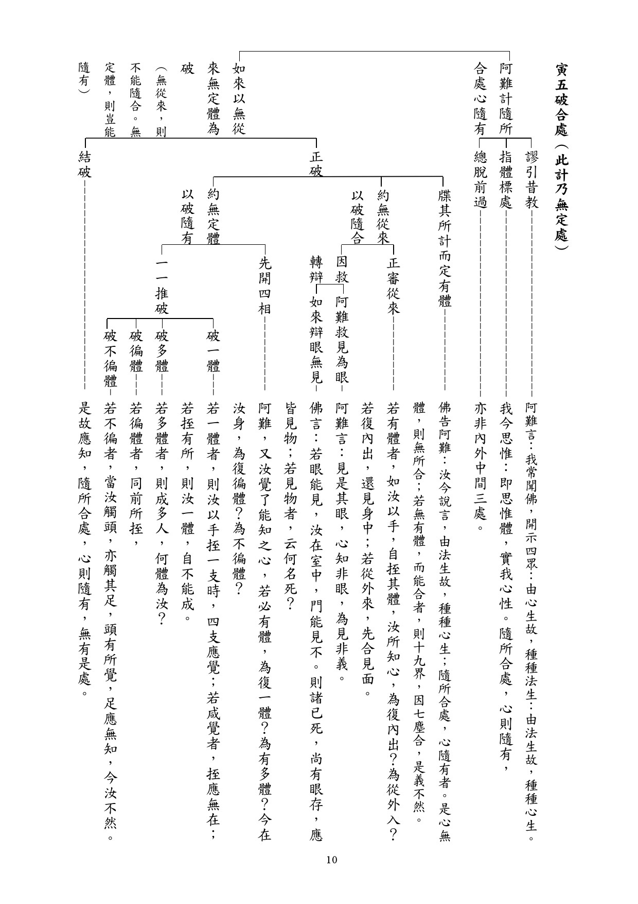

### 《佛說觀無量壽佛經》九品觀章（下）

*果清律師開示／宗澈整理*

下品造惡破戒五逆罪

臨終遇善士皈命念佛

剎那轉五濁淨土相現

花開聞法發心得增上

前言

學會於二○二○年八月三十一日至圓通寺齋僧，午後果清律師慈悲為大眾開示《佛說觀無量壽佛經》九品觀章，上兩期也刊載完上三品及中三品，此篇言下三品。

開示

佛告阿難及韋提希：「下品上生者，或有眾生作眾惡業，雖不誹謗方等經典，如此愚人，多造惡法，無有慚愧，命欲終時遇善知識，為讚大乘十二部經首題名字。以聞如是諸經名故，除却千劫極重惡業。智者復教合掌叉手，稱南無阿彌陀佛。稱佛名故，除五十億劫生死之罪。爾時彼佛，即遣化佛，化觀世音，化大勢至，至行者前，讚言：『善哉！善男子！汝稱佛名故諸罪消滅，我來迎汝。』作是語已，行者即見化佛光明，遍滿其室，見已歡喜，即便命終。乘寶蓮花，隨化佛後，生寶池中，經七七日蓮花乃敷。當花敷時，大悲觀世音菩薩，及大勢至菩薩，放大光明，住其人前，為說甚深十二部經。聞已信解，發無上道心。經十小劫，具百法明門，得入初地；是名下品上生者。」

佛陀告訴阿難尊者以及韋提希夫人，下品上生行者的情形。

或者有些眾生造作了眾多惡業，雖然不會毀謗大乘經典，這種愚痴的人造了很多惡業，沒有絲毫慚愧羞恥之心。生命將終了時，遇到善知識，為他宣說大乘十二分教最初經題的名字，因為聽到這些諸多經題名字的緣故，除滅了千劫以來所造的極重罪業。那位善知識又教導他雙手合掌高舉當胸，至心稱念南無阿彌陀佛聖號。因為至誠稱念佛名的緣故，就滅除了八十億劫以來生死的重罪。正當那時候，阿彌陀佛就派遣化身阿彌陀佛、化身觀世音菩薩、化身大勢至菩薩，到行者面前讚歎說：「善哉！善男子！（善女人！）因為你至誠稱念阿彌陀佛聖號的緣故，諸多罪業消滅，我現在來迎接你。」化身西方三聖說過這些話之後，行者就見到化身佛的光明，普遍充滿了他所住的房室，見後生起廣大歡喜心，隨著就捨報，就乘坐七寶蓮花，隨著化身佛之後，生到七寶蓮池之中。

經過七七四十九天的修行，蓮花才開。正當蓮花開的時候，大悲觀世音菩薩以及大勢至菩薩，放出廣大的光明，照行者的身上，站在他的面前，為他宣說甚深微妙的十二分教所談的義理，聽到了以後，生起了甚深的信解，而且發起無上菩提心。經過十小劫，具足百法明門，可以證到最初歡喜地。這叫做下品上生行者的情形。

佛告阿難及韋提希：「下品中生者，或有眾生，毀犯五戒、八戒及具足戒，如此愚人，偷僧祇物，盜現前僧物，不淨說法，無有慚愧，以諸惡法而自莊嚴。如此罪人，以惡業故應墮地獄。命欲終時，地獄眾火一時俱至，遇善知識以大慈悲，即為讚說阿彌陀佛十力威德，廣讚彼佛光明神力，亦讚戒、定、慧、解脫、解脫知見。此人聞已，除八十億劫生死之罪。地獄猛火化為涼風，吹諸天華。華上皆有化佛菩薩，迎接此人。如一念頃，即得往生七寶池中蓮花之內，經於六劫，蓮花乃敷。當華敷時，觀世音、大勢至，以梵音聲安慰彼人，為說大乘甚深經典。聞此法已，應時即發無上道心。是名下品中生者。」

佛陀告訴阿難尊者以及韋提希夫人，下品中生行者的情形。

或者有些眾生，毀犯了在家眾所受的五戒、八關齋戒，或者出家弟子所受比丘、比丘尼的具足戒（也應當包含式叉摩那戒、沙彌戒、沙彌尼戒等等在內），像這一種愚痴的人，偷取佛寺常住的僧物。這裡含攝兩種僧物：第一種、常住常住僧物，第二種叫十方常住僧物。常住常住僧物，就好比這個講桌、座椅，乃至師父們的寮房、種種的精舍，或者常住的電、沒有主的東西，都屬於常住常住僧物；倘若放火燒掉了，損失慘重，就損失了常住常住僧物，罪業非常重。十方常住僧物，就好比早齋、午齋，打板集合排班來用餐的僧眾，只要他不破眾戒，都有份可以受用；而居士有時候為常住掃地出坡服務，也可以受用；或者過午不食、持八關齋戒者，也可以受用常住的午齋。其他或如外面請來的工人，有時也可以請他們用齋。隨便空空泛泛普通的居士、俗人，就不隨便請他受用，否則就損他的福報，因為這些煮食都是十方善信供養出家師父修行用功的，並非師父吝惜這些食物。或者直接盜取這些飲食、衣服、臥具、湯藥等，那就是偷盜僧祇物。

另外還有盜取現前僧眾的財物，也分兩種：一、現前現前僧物，二、十方現前僧物。現前現前僧物，就是有人布施給師父的衣服、藥品，或者布施房舍裡頭的用具。十方現前僧物則是往生的出家五眾所遺留的財物，律上都有規定，好比某位僧人有簡單的一個茅棚，裡頭所有的財物，他往生之後，依照律儀，歸給常住，俗家無份。不能說法律上沒有規定，因佛有明確規定。佛世時有一位跋陀羅比丘，他過世了之後，遺留下來的物品價值有三十萬兩黃金，所以國王想要，親族想要，僧團也想要，佛陀就判定：國王沒份，親族沒份，他是出家的僧人，他所擁有的物品，理歸僧團所有，悉屬常住。依照世俗法律規定，判歸給俗家，這就給俗家造罪了。所以依照佛陀判定才是正確的，我們要知道這個道理，以免犯罪。另外，講到在所有偷盜罪中，盜僧物罪最為嚴重，佛陀在《大集經》中說：「盜僧物者，罪同五逆。然盜通三寶，僧物最重。隨損一毫，則望十方凡聖一一結罪。」偷盜僧物的話，罪過如同五逆罪，如果損失一絲一毫，就要向十方僧、聖賢僧一一結罪。又《方等經》華聚菩薩云：「四重五逆，我亦能救；盜僧物者，我所不救。」犯了四重罪、五逆罪，華聚菩薩尚且能夠救；偷盜僧物的話，菩薩就不能救了。所以盜僧物罪業非常深重，怎麼可以不畏懼謹慎呢？

為了名聞利養而說法，沒有一點慚愧心、羞恥之心，本來應該修習種種善法功德，而他卻造作了許多惡業，用來莊嚴自身。像這一種罪人，因為造作諸多惡業的緣故，應該要墮入地獄。生命將要終了的時候，地獄眾多的火塵、火網等等同時現前，遇到善知識用廣大慈悲之心，就為他讚歎宣說阿彌陀佛有十種的威德智慧力（知是處非處智力、知過去現在未來業道智力、知諸禪解脫三昧智力、知諸根勝劣智力、知種種解智力、知種種界智力、知一切至所道智力、知天眼無礙智力、知宿命無漏智力、知永斷習氣智力），廣泛地讚歎佛世尊光明神通智力，也讚歎戒身（如來之身、口、意三業遠離一切過非之戒法身）、定身（如來真心寂靜，自性如如不動，遠離一切妄念，稱為定法身）、慧身（也就是如來的真心，體性是光明，自性沒有昏暗，觀照通達諸法的法性，也就是慧法身，指根本智）、解脫身（如來的自體沒有過累，解脫一切的繫縛，也稱作解脫法身）、解脫知見身（證知自體本來沒有染著，已經實際得到解脫，就稱作解脫知見法身）等五分法身。這個人聽了之後，當下去除八十億劫生死的重罪，這時候地獄的猛火便化成一陣清涼風，吹落諸多天花，花上都有化身的西方三聖來迎接這個人。像一念這麼短暫的時間，就能往生到七寶池中蓮花裡頭，經過六大劫的修行蓮花才開，觀世音菩薩、大勢至菩薩用清淨的法音來安慰這個人，為他宣說大乘甚深微妙的經典。聽到這種法音以後，當下就發了無上菩提心，這叫做下品中生行者的情形。

佛告阿難及韋提希：「下品下生者，或有眾生作不善業，五逆、十惡，具諸不善。如此愚人以惡業故，應墮惡道，經歷多劫，受苦無窮。如此愚人臨命終時，遇善知識，種種安慰，為說妙法，教令念佛，彼人苦逼不遑念佛。善友告言：『汝若不能念彼佛者，應稱歸命無量壽佛。』如是至心令聲不絕，具足十念，稱南無阿彌陀佛。稱佛名故，於念念中，除八十億劫生死之罪。命終之時見金蓮花，猶如日輪，住其人前，如一念頃，即得往生極樂世界。於蓮花中滿十二大劫，蓮花方開。當花敷時，觀世音、大勢至以大悲音聲，即為其人廣說實相，除滅罪法。聞已歡喜，應時即發菩提之心；是名下品下生者。是名下輩生想，名第十六觀。」

佛陀告訴阿難尊者以及韋提希夫人，下品下生行者的情形。

或者有些眾生造作不善業，如五逆重罪、十種惡業，具足一切不善業，像這種愚痴的人，因為造作惡業的緣故，應當墮落到三惡道去，經過許多劫壽，所受的苦報是無窮無盡的。像這種愚痴的人，在臨命終的時候，遇到了善知識，說種種的話來安慰他，也為他宣說淨土微妙的法門，教導他使令觀想念佛，這個人被痛苦逼迫，來不及修習觀想念佛，善知識就告訴他說：「你假若不能觀想念佛的話，應當稱念歸命無量壽佛（南無阿彌陀佛）。」此時從觀想念佛轉為持名念佛，如此用至誠懇切、慚愧懺悔的心，令念佛音聲不斷，乃至具足十念，稱念南無阿彌陀佛。因為稱念佛名的關係，在每一念念之中，就滅除八十億劫生死重罪，念佛滅罪這麼多啊！這麼殊勝啊！

我們平時既沒有造作五逆、十惡重大罪業，也偶行善業，那怎麼不往生極樂世界呢？決定往生！所以要深信持名念佛的功德，要深信不已啊！只是要臨命終還對正法不懷疑，不改修對治方便，這樣的信心一直到命終，不暫停正念，十念乃至一念，都能往生。我們一生造作善業、惡業，都是一念之間，所以念佛往生也在一念之間，不必很多。

所以說《觀經》九品往生觀，幫助我們對淨土法門的信心，有如是因必有如是果。看看每一品的修證得果都不一樣，都有其因果的不同之處。

生命終了的時候，見到青色蓮花，好像太陽一樣，安住在行者面前，就好比一念很短暫的時間，就能往生到極樂世界去。在蓮花中修行，滿了十二大劫，蓮花才開，觀世音菩薩、大勢至菩薩用大悲音聲，為他廣泛宣說一切諸法實相，教他做實相懺悔法，假若修實相妙觀，重罪除滅，他聽了之後就法喜充滿，當下就發了無上菩提心。這叫做下品下生行者的情形，稱作下輩往生的觀想，叫做第十六種觀法。

胡松年居士往生公案

經文講完了，最後講一個「胡松年居士往生公案」作結束，他預知時至，身無病苦，安詳往生的公案。

民國三十七（1948）年某月某日的一個早晨，有一位鬚髮如銀、健步如飛的老居士，進入了靈巖山寺的山門，便高聲對門頭師說：「師父！我來給您告假，明天上午八點鐘我就要回家了！」說過之後，就向門頭師頂禮一拜。
門頭師一聽驚了一跳，於是就
**問：** 「老居士！你住在新塔院裡不是很好嗎？為什麼忽然要告假回家呢？」

那位老居士笑笑地對門頭師說了：「住新塔院裏好是好，但是再好也沒有像家裡這麼好吧？」他指的家就是極樂世界。

門頭師聽了又是一驚，心想：「一定是誰得罪了他？不然他是不會急著要回家的！」

於是， 那位老居士就到了客堂，進入了庫房，又入了方丈室，乃至跑到了東西關房，看到人就拜，拜了就說：「「師父！我來給您們告假，明天上午八點鐘我就要回家了！」

當他到了丈室與妙真和尚告假的時候，妙真和尚不相信地看著他，而他卻認真地對妙真和尚說：「我昨天晚上夢見了觀世音菩薩和師父（指印光大師），菩薩用淨水向我頭上灑了灑，師父手執一朵黃色蓮華放在我腳上說：『後天上午八點鐘我來接你，趕快請人助念！』看情形我就要往生了！和尚慈悲請您老人家派幾位師父助我念佛，免得到時候心忙意亂，作不得主！」

妙真和尚看到他說得那樣認真，知道不是玩笑的，就親自陪他到了客堂，叫僧值師馬上派人替他助念。他，到底是誰呢？他就是胡松年老居士。

客堂裡面的四位知客（真華長老也在裡面當知客）和一個僧值，一聽說和尚要派人替胡松年居士助念，有的就感到驚奇，有的就覺得好笑。有的竟然說：「大概是胡居士住在塔院裡住得太寂寞了，叫幾個人來敲敲念念的，要驅除寂寞吧？」然而和尚的命令是不敢違背的，僧值師只好到佛學院裡面找了八個學僧，隨著胡居士去新塔院。 胡居士臨離開客堂時，手就指著客堂牆上掛的一付對聯，聯語是：「應當發願願往生，客路溪山任彼戀；自是不歸歸便得，故鄉風月有誰爭？」然後他連續說：「我就要去與師父同享『故鄉風月』了，我就要去與師父同享『故鄉風月』了！」

第二天吃了早粥，許多執事都用好奇的心去新塔院，來一睹聲言在八點鐘就要「回家」的胡松年居士的究竟，當然真華長老也不例外。

然後大家進了新塔院，就聽到一陣緊似一陣的念佛聲， 從胡居士的靜室裡面傳出時，共同有一種「大事不好了」的感覺，但是等到了進入胡居士的靜室裡面，大家緊張的心情就鬆懈下來了；原來這時候胡居士正在與妙真和尚談笑自若地細聲交談著。只聽和尚問他說：

「你早上吃稀飯了沒有？」

「跟平時一樣，吃了兩碗。」

「身上有不舒服的感覺嗎？」

「沒有，一點也沒有。」

不過，胡居士接著又肯定地說：「我在八點鐘一定要去的！」

後來妙真和尚又問他，要不要通知他在上海銀行界服務的公子？他搖搖頭說了：「這點，我昨天就想過了，還是不通知他們比較好的，因為他們都不太懂佛法，一看到我要走了，一定會哭哭啼啼的，反而打閒岔。和尚既然也想到了這點，就請和尚馬上打電話通知他們吧！我想：等他們接到電話來到這兒，我也就到極樂世界了！」

可是，當時鐘的長針指在七點半上，說也奇怪，靜室裡面的人和物都漸漸起了變化！先是胡松年居士的姿式由端坐變為側臥，然後念佛聲由高誦變為低吟，由六字變為四字，由四字變為一個字——「佛、佛」，最後看到居士唇動，就聽不到聲音！

助念的人看到這種情形，都緊張起來了，尤其是妙真和尚，眼看到這位多年的老護法就要離開人間了，緊張當中也帶幾分的感慨！

桌上的一盞小小的油燈，光亮原來是忽明忽暗、極其微弱的，奇怪，在時鐘剛剛敲過八下─鐺─鐺─鐺─鐺─鐺─鐺─鐺─鐺─，胡松年居士咽了最後一口氣時，突然光明炯炯，猶如一千個太陽聚在一個房室裡面；並且，在靜室百步以內的上空，好像有「百千種樂，同時俱作」而成的一種聲響，自然發出「南無阿彌陀佛！南無阿彌陀佛！」的六字洪名。大家目睹這種「放光現瑞」，和耳聞這種「天樂盈空」的境界，大家都異口同音地說：「 胡松年居士真的蒙佛接引，往生西方極樂世界去了！」

這鐵一般的事實擺在眼前，使我不得不深信印光大師所說的：「淨土法門，別無奇特；但要懇切至誠，無不蒙佛接引，帶業往生」的幾句格言。淨土法門沒有另外什麼奇特的，只要我們懇切至誠、深信切念地念佛，沒有不蒙受阿彌陀佛的接引，可往生到極樂世界去的。

以上是真華長老在《參學瑣談》書中記載的公案。我今天從裡面抄錄出來，講給諸位聽。今天說了不少時間，將《觀經‧九品觀章》講過，有如是因必有如是果，又講了一個胡松年老居士的公案。講經的目的，就是幫助諸位回去了之後，對淨土念佛法門能生深信，發起切願，好好念佛，萬善迴向往生西方，將來個個往生極樂！

目前正在疫情當中，我們臺灣還好，外國還在流行當中，也恭祝諸位：身心康泰，吉祥平安，一切病痛不住身，一路平安回家去，阿彌陀佛！（全文完）

### 菩薩清淨的行持—華嚴經淨行品（四十六）

*戒慧講述／編輯部整理*

遇境逢緣善用心

文殊傳承善護心

常具悲願空性慧

刻意練習成俱生

丙二、指事顯因答其徵因

丁一、總徵

丁二、別顯

戊六、乞食道行時願（五十五願）

己二、所睹事境(十九願)

己三、所遇人物（有二十四願）

己三、所遇人物：苦行人、操行人、著甲冑、無鎧杖

前言

能願的是菩薩，所願的是眾生。菩薩希望有情能夠堅持志行，不捨佛道，菩薩除了能夠堅持志行，不捨佛道外，也希望能夠身語意三業「離過成德」，獲得種種的成就。另一個基礎的觀修，就是隨文隨喜發願，觀想眾生能夠如此該有多好，我發願希望眾生能夠如此，並且願意承擔，實際的幫助眾生，最後祈求三寶加被，讓我有能力完成這樣的宏願。

經文：

見苦行人，當願眾生，依於苦行，至究竟處。

苦行分內道、外道，外道像是婆羅門、尼乾子等，尼乾子叫做耆那教，其教義是自我永遠存在，依露形、拔髮、塗灰、自餓、投淵、赴火、自墜高崖、五熱炙身、持牛等戒，是他們主要解脫的方法。內道的苦行是頭陀行，摩訶迦葉是頭陀第一。

頭陀行有十二，一是住阿蘭若，二是常行乞食，三是次第行乞，四是受一食法，五是節量食，六是午後不得飲漿，七是著敝衲衣，八是但三衣，九是塚間住，十是樹下止，十一是在露地坐，十二是常坐不臥。

外道苦行不了義，內道苦行了義，因其將苦行拿來磨練自己，做有意義的事情，苦行是一種修學法。

《八大人覺經》第二覺支是少欲的修學法，第三覺支是知足的修學法。試問假若人生一無所有時，是否還願意修行？當最後一分的依靠都消失時，還能對正法生起信心嗎？這是一種歷練，人到臨命終也要過此關卡。當初雪廬老人飄洋過海來臺，一切從零開始經營，一無所有的皈依是真正的皈依，一無所有的修學是真正的修學，苦行的功德是沒修苦行的人想像不到的。

經文：

見操行人，當願眾生，堅持志行，不捨佛道。

見操行人，會性法師說是意志堅固、行為端正如法者，顯現在外的形象是能夠堅持，當願眾生能夠堅持志行，不捨佛道，所有操行中最殊勝的就是能以菩提心的意樂成就佛果，利益一切有情。在修學當中，空性智慧的證量是不會退轉的，可是菩提心有可能退轉，此願特別希望有情在行菩薩道、通往佛果的道路上，菩提心的意樂不會退轉。

見到有操行者，希望他能堅持志行，行持為志向所攝持，志向落實在行持上，兩者相互觀待，不捨佛道，佛道是由道通往佛果，最殊勝的那一分就是菩提心不退轉，大乘利根的修學法要先於般若的意趣上來修學，能夠通達空性的正見，才能讓自己的菩提心不退轉，所以佛的智慧是所有佛果中最殊勝的，如果把佛的智慧拿掉，佛果即顯現不出任何功德。

佛的智慧要靠見地得到，操行對內是要降伏煩惱，對外是要能夠不捨一個有情，做一切利益有情的事業。能夠對治煩惱、修學般若意趣、通達空性正見，能斷煩惱障，以空性智慧攝持利益有情的事業，在事項上充實累積自己的內涵，提升自己智慧的證量，能斷所知障，故操行是靠見地，除了空性的智慧這一分，還要靠事項上的歷練，蕅益大師《寒笳集》言，有出格的見地，方有千古的品格，品格就是操行，有千古的品格才有超方的學問，有超方的學問才有蓋世的文章，所以學問要從做人來，可是做人要從見地來。孔子周遊列國操行之所以可以不退，就是贏在見地，見地讓行持容易走下去，因為他知道對天下蒼生的好處、對自己的好處，立住這樣的品格不困難，而能夠樂天知命，不像一般讀書人若沒有功名、沒有出路，就會怨天尤人。關鍵就在見地，學問從人格來，人格從見地來，禪宗傳位就是傳見地，沒有見地就不會有操行，縱使此人的操行不錯，能夠奉公守法，但他不是千古的操行。以見地攝持的操行，一般的好人絕對辦不到。

以見地來講，儒家的說法是要能夠安住在仁心的境界，並且在空性智慧上通達，通達仁心的殊勝，不修仁心的過患，以及「其庶乎屢空」的功德、殊勝。他願意下功夫，回過頭來在世間「簞食、瓢飲、居陋巷，人不堪其憂」，他也不改其樂，否則容易怨天尤人，心平氣和的那一分若沒有見地是辦不到的，雪廬老人一個人跑來臺灣三十幾年，沒有另娶、沒有隨順世俗，碰到逆境、挫折、障難，完全沒有洩氣，活到九十六歲從未嘆過一口氣，不是普通的見地辦得到的，沒有見地那種格調絕對到不了。

佛道是以道來成佛，佛果最殊勝的是智慧，智慧以見地達到，而見地是操行的根本，上下文連貫，堅持志行都跟其見地有關，有見地自然有志向，夫子六歲俎豆禮容，十五歲志於學，從小見地就異於其他小孩，有這樣的見地，又立住目標，幫助他持續充實，堅持往目標前進，互相觀待，當見地愈夠、志向愈明確，想充實自己的心愈強，碰到障礙、突破障礙的能力愈強，因為他知道障礙對自己的好處。

經文：

見著甲冑，當願眾生，常服善鎧，趣無師法。

甲冑就是穿戴戰甲，通常穿著戰甲是要從事征戰，會造成傷害對方的結果，跟利益有情背道而馳，而菩薩見到此，反過來希望眾生穿上盔甲，可是是能夠利益他人的善鎧，能夠趣無師法，一切善裡面，最根本的出發點是利他，而不捨一個有情的利他，是善中所遍的範圍最廣的，想幫助有情究竟離苦得樂、成就佛果，也是利他最殊勝的形象。此處所說的「常服善鎧」，是以菩提心的意樂攝持所行六度萬行，「趣無師法」有兩種的面相，一是知道老師、善知識的自相空，是觀待有想認真學習的學生，他才能發揮老師的功能，不想向彼學習正法，安立他老師之名是無用的，在這一分來說無師。另一個是期許自己能夠成就究竟的佛果，因為唯有成就佛的證量，且在一切時，一切處中，不必依靠老師就可以生起俱生慧，成佛的證量不必依師而生，且能做一切有情的老師，以後者請法更好。

看到武裝軍人的形象，我願眾生「常服善鎧，趣無師法」，精進有披甲精進、攝善法精進、饒益有情精進三種，善鎧特別指披甲精進的那一分，是披願力甲，意即任何的困難、障礙過不了關時，並不是障礙、困難大，而是我的願力不足，若我有願力，便可克服障礙，例如常啼菩薩求法時所遇到的困難、挫折是我們難以想像的，他就靠著願力克服。往昔觀音菩薩利益有情，最後退轉大悲心，由阿彌陀佛安住頂上勸慰，堅固菩薩願力，重新發願而行，終於成就大慈大悲的聖者。披甲精進就是要將願力甲披在身上，一切時處提醒自己要有這樣的願力，而此願力總原則是下化上求，特別是上求，度化眾生的心態固然要有，更要具足度化眾生的能力，最殊勝的就是成佛的能力，成佛時不論他至何處化生，不必依師而能以俱生的方式生起佛的智慧。所以本師釋迦牟尼佛在菩提樹下成道時說「奇哉奇哉，一切眾生，皆具如來智慧德相，但因妄想執著，不能證得。若離妄想執著，則一切無師智，自然智，清淨智皆悉現前。」無師智就是佛生起智慧的那一分不必觀待老師，八相成道或十二相成道都是佛為利益有情而示現，包括他入胎、住胎、出胎、童子嬉戲、結婚生子、出家、苦行、降魔、成道、轉法輪，到最後涅槃，都是在佛的智慧下攝持的。有情眾生看到他在菩提樹下成佛，才說他成佛，成佛之前都不算，這是小乘人的看法，大乘人以為既然生起俱生慧，這些示現不管生老病死或者是結婚生子，甚至是示現苦行，其實都有教育意義，因為印度很多外道都要靠苦行，佛用苦行來度他，最後再告訴他苦行無義。如果前面入胎、住胎、出胎、童子嬉戲、與耶輸陀羅結婚都不算成道，在菩提樹下成佛的那一分才開始算成道，就不能說是八相成道了，所以前面示現的種種都是佛智慧的表法。

百法對精進的定義是「於斷惡修善事中，勇猛強悍，而為體性，對治懈怠，成滿善事而為業用。」精進又分成了披甲精進、攝善法精進、利益有情精進，這兩者有何關聯？

攝善法精進是攝持種種的善法去利樂有情，此時會產生很多的障礙，這些障礙不去利樂有情就不會發生，沒有願力就會做不下去。攝持善法很辛苦，修學各種法門去利樂有情都很辛苦，比如《華嚴經》整套都在說利樂眾生的方便，比如雪廬老人的絕學沒有人能學，也沒人想學，因為能耐不足，沒有那樣的願力，是以攝善法精進中包括成佛的方便、利樂有情的方便，那都是很辛苦的，如果沒有願力、沒有披甲，度眾生的方便有時候不具足，一去度有情便障礙盡出，很多的善巧、陀羅尼都要努力勤學，第三個饒益有情精進也是要靠前面的願力，當有情對你非常忤逆時，沒有前面的披甲，則利益不了。

經文：

見無鎧仗，當願眾生，永離一切，不善之業。

相對於著武裝的甲冑，此處的無鎧仗是著便服，相對於前面著甲冑要去傷害有情，眼前看到有情沒有穿甲冑，起的願是希望他們永遠離開、不造作一切的不善之業。一般對於「不善之業」的解釋是所有為己之事皆為不善，其實最根本的原因是執著法有自相，尤其是先執著觀待有一個自相的我，因此讓我樂的生貪、不樂的生瞋，及產生種種分位與等流的煩惱習氣，造作一切傷害有情的事情，是所謂的不善之業，要真正永離，一定要以空性的智慧先破除法我、人我的自相，斷見思惑、斷煩惱障，再進一步還要斷除煩惱障的習氣(所知障)。而成就的佛果有幾個表徵，所居之室是慈悲室，所著衣服是柔和、忍辱衣，證悟空性內心是調柔無諍的，悲心度眾，會有諸多障礙，所以要靠忍辱堅持下去。

前面的「常服善鎧，趣無師法」講披甲精進，雖然利樂有情披願力甲，然利樂有情的那一分，必須要有能力，所以「趣無師法」，初學者心態雖想著要利益有情，行持上卻是以利益自己為主，不充實自己的能力，就無法利益有情，利益有情的願變成空願，所以「常服善鎧，趣無師法」。「見無鎧仗」指穿便服，「永離一切不善之業」特別指過去是著鎧仗去除掉惡業，而現在惡業已經除去，所以不用穿鎧仗，就像過河需要舟，到岸即不需舟，軍人無戰爭可打，也不用穿軍服，真正成為佛的智慧那一分，已究竟除滅煩惱，也能任意生起願力，利樂有情，不需刻意披願力甲，防止煩惱賊的傷害，已無煩惱故。（下期待續）

### 佛學概要十四講表簡說（三十二）　第五講表　人生三際之抉秘(十二因緣)

*戒慧講述／心若整理*

流轉觀察是苦諦

逆向觀察是集諦

此滅彼滅是滅諦

無明能滅是道諦

前言

第一講表像是寶藏圖，所藏的寶琳瑯滿目、非常殊勝，第二講表講獲取寶藏的方法，第三講表言要充實前後藏寶處的裝備、建立必獲至寶的信心，第四講表告訴我們安於現狀就是死路，第五講表說明何以安於現狀是死胡同，第六講表明我與有情同受困於現實，對這些如母恩德的有情當生慈悲心，第七講表說明受困的有情分布在哪些範圍，第八講表帶他們一起去採寶。佛經上有大商主帶著商人去海上採寶之喻。第九講表有五種採寶的方法，所得的寶也有殊勝的差別。第十講表從三塗解脫到人天，第十一講表從三界解脫到涅槃，第十二講表從九法界解脫到成佛，第十三講表是修學解脫道的環境，第十四講表講人生難得又無常，要當下修學解脫道。

第一表猶如核心，第五表猶如街亭，是很重要的轉折，第四表生起出離心，但若沒有出離的方便，則不知如何出離，第五講表對修行正見有極大的幫助。龍樹菩薩《中論》二十七品中，第六品特別講十二因緣，可見其重要性。

上來已將第五講表以三世兩重的方法講完，但是第五表又可以再分為了義與不了義的說法，依照大乘了義宗義的說法，第五表可以說是兩世兩重，也可以說兩世一重，實際上只要一重就解釋清楚，不需要到兩重，以下一一解釋。

十二因緣從無明來，無明就是煩惱障(人我執、法我執，即根本無明)，產生業果愚(枝末無明，不能生起由業感果的勝解)、真實義愚(根本無明)，愚是顛倒執著義，是輪迴的主因，業果愚是顛倒執著業果，不但不信解斷惡修善才能離苦得樂，更有甚者對業果知見的毀謗，而真實義愚是對空性義理顛倒執著，認為有自性，至於其它的愚在小乘部派叫做非染污無明，非染污無明不會生起煩惱，不會成為輪迴的因。

無明

：「如播種者」，因為無明是推動的力量，因執我而愛我，愛我就會去造作，沒有無明就不會去造作愛我的業，為了讓我樂而有身口意造作，造作(行)就是播種。

行

：透過造作而有後之苦、樂果，猶如播下種子，未來成熟果實。在業果愚的攝持下，所播的種自然是顛倒、損人利己、毀謗因果的，所造的業自然就是「非福業」。了凡先生遇到雲谷大師前，沒有正確的知見，就改不了命運，正確的知見要靠聽聞而得，透過雲谷大師一席話，他認知到斷惡修善才能改變命運，而且要有斷惡修善的方法與見地，才能真正的斷惡修善。沒有正知見時，就算他是好人，都無法改變命運。

在真實義愚的攝持下，造善業為了來世得人天，這是「福業」，為了生到色界天跟無色界天，所造作的業就是「不動業」，非福業與福業都叫作「動業」， 四禪八定的業叫作「不動業」，即造作此業不會轉動，禪定功夫好的人，死後生禪定天，不會到其他道，也不會墮落，因為修學禪定者得到輕安，得到很大的快樂，這種快樂是世間無法比擬的快樂，所以他投生的力量強。歸在真實義愚是因為他們還是為了愛我，為了讓我離苦得樂而有禪定修學。

識

：猶如「播種於田」，種子是業，心識是田，業種子播在心田裡，將來會在田裡收成果報。由無明所造作的行，會留下業習氣的種子，播種在「識」，識分成「因位」和「果位」，無明、行透過愛我去造作，造作會成為另外一個輪迴的因，造作出一個有能力跟父精母血和合的心識，但這個心識還沒生起，還沒去投胎，故叫做「因位識」。舉例來說，此人造很大的善業，臨命終見到勝境，快樂逝去，此愉悅的心識讓他投生善道。反之造惡業，臨終遇到寒境，渴望取暖，若沒有被滿足與引導，這個想取暖的心會引發他前面所造的惡業成熟，成為投胎的心識，他就投生到炎熱地獄，若此人臨命終感覺熱，生起想取冷的心識，若沒有被滿足與引導，就可能帶他到寒冰地獄，臨終就是如此可怕，所以在旁邊護持者一定要想辦法引發他的善業。

從無明、行到因位識，是能引支，能引支是今天或是今生造作了很多的心識，但是不知道哪一個心識會在臨終成熟，比如今天布施的心識，可能會在天堂成熟，罵人的心識，可能會在地獄成熟，哪一個心識會先引發到哪一道難以了知，故臨終就像搖彩。能引支、所引支是一重因果，此之因位識含藏生果(識、名色、六入、觸、受)的能力。

名色

：父精母血與投胎心識和合，此時是一團胚團，僅有生理現象，謂之色，相續的心理現象謂之名，在三十八週住胎的過程中，六根漸漸長成，能入境界。

六入

：六入是「身差別」，有眼根、耳根、鼻根、舌根、身根、意根的差別。

觸

：出胎後接觸境界，根、境、識觀待和合，但觸也可能是在胎裡，例如母親蹲著洗衣服，肚裡的小孩就不舒服，這就是觸的感覺慢慢生起，胎教就讓他感覺到環境很好，痛苦的感覺減少，潛移默化，氣氛好，生出來的孩子就特別安定，可見環境的培養非常重要。

受

：受從觸來，境界上的種種受用，觸悅意而生樂受，觸不悅意而生苦受，觸中庸而生捨受，都跟業有關係，悅意境生樂受，觀待已滅的善業而有悅意境的生起，由之生樂受，其次觀待不悅意境生苦受，是由已滅的惡業而來，總之觸境生受都沒有自體性，隨業生起。

愛

：觸受不一定生愛，沒有無明的推動則不生，有無明的推動，才會由執我的心去產生貪愛。觸受聖者一樣有，因為觸受觀待業而來，差別在於聖人在觸受當中不生愛，而凡夫會生愛。講義上的觸受是講果位識來生的觸受，即下一生，因為果位識的觸受還未生起，不會有觸受生愛。

愛、取、有

：愛取有三支是能生支，是因的部分，愛是對苦樂捨三種境界產生乖離、不離、不壞(希望此境界不壞而愛)，由無明(執我的心)相應的觸受樂境而生愛，取是愛的增上，分為欲取、見取、戒禁取、我語取。欲取是對樂境有好樂心，見取是非果計果，即我認為這個果很好，產生好樂，例如我想生天，或我想把神我逼出體外而得涅槃，是對境界的愛好產生強烈的追逐。戒禁取是非因計因，見取見跟戒禁取見都約外道說，外道追求目標是很厲害的，能夠一生在恆河邊修苦行，無怨無悔。我語取是對五蘊身生起一個真實的我的想法而執取，亦即名言上取五蘊身有一個自性的我，有自性的實體，而貪愛自身，生起上品的貪愛，滋潤業力，開始計畫、籌謀，策動身口意去造作，叫做「有發芽能力的種子」，愛取如種子灌蓋施肥，使業種有生果的能力。造作無數投生的心識，由臨終的愛取滋潤某個在心識上由無明、行所薰下的識種去投生，由愛取潤心識上某個無明所造的業種，此與平常一大堆的愛取不同，取決於臨命終。故平常要經營重業(內心裡最看重的)、近業(接近臨命終時，那些力量強的業)、習業(內心哪個業串習最多)、念業(內心的念頭決定去向)。

不動業那一分的愛取，有能力讓不動業成熟於下一生，因為修禪定帶來的快樂太強烈了，世間的享受完全看不上眼，修行修出法喜，人生開始轉變，愛取的那分潤業強而有力，即使臨命終障礙重重，都不會受影響，大德就是如此，這就是愛取的力量極為強盛。

臨終的愛取會讓心識當中某個種子有生果的能力，心識業種無量它先成熟，如彩券的搖彩，去潤善業的愛取，一定是對善法有強烈的好樂，這種力量來造作善法，格外的有力。

生、老死

：生果以後就有生、老死，繼續輪迴。

綜結上述，第五講表一般來講分為能引支、所引支(一重因果)、能生支(因)、所生支(果)，加起來是兩重因果。而能引支、所引支是這一生，能生支、所生支是來生，可是能引支、所引支是指未來的果，未來的果是我這一生所造作的，當能生支潤到所引支，所引支就變成所生支。

無明、行、識三支，愛、取、有三支，合為因位六支，此生圓滿，代表我這一生因為執我的心造作很多的業，引導我去投生，能生支就是我特別會對某一業產生愛取，業會在來生成熟。而所引支、所生支是來生的業果，有名色、六入、觸、受、生、老死共六支，有因位六支及果位六支，果位六支是來生圓滿。 （下期待續）

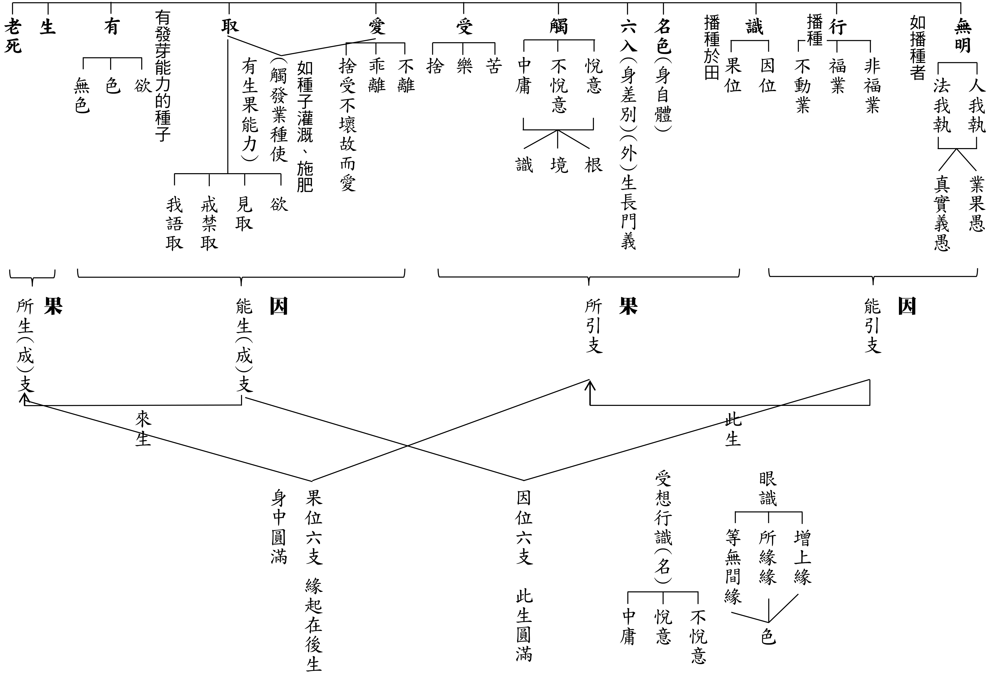

## 蓮池海會

### 張鄒嘉玲老居士往生見聞記

法忠

一味善良施予人

一句佛號撒手去

一心求生斷氣時

一生畫下圓句點

張鄒嘉玲老居士於民國十八年農曆七月一日出生於中國湖南省芷江縣，在家中是獨生女，備受父母寵愛，十六歲那年經朋友介紹，認識當時因對日抗戰跟著國民政府軍從山東移防至湖南的芷江機場駐守，且大他十二歲的張景文先生，兩人情投意，合於民國三十四年結婚，婚後兩週抗戰勝利，先生高興的買鞭炮慶祝，而老居士則自己一人躲在家中哭泣，先生問她抗戰勝利為何反而哭泣呢？老居士說抗戰勝利本應該高興慶祝的，可是想到就要離開父母親、離開家鄉了，心裡難過，先生便安慰老居士抗戰已經勝利了，等一切安頓好後，會接父母一起居住，更會好好的奉養他們，如此居士才安心跟著先生移防駐守南京，這段期間先生常常寫信、寄錢給父母，讓老居士很感動，覺得先生是個守信用、重承諾，可以一生依靠的人，誰知接著又是國共戰爭，生活始終無法安頓下來，終於在民國三十八年跟隨國民政府播遷來臺住在建國十村，直到四十六年才生下長子，因為結婚多年才得子，所以對長子保護得太過頭，導致抵抗力差高燒不退，造成長子腦筋燒壞而引響智力，於十六歲而離世。繼長子之後生下長女忠敏，接著生次女忠琪時難產差點性命不保，最後剖婦才順利生產，接著生么弟程豐時也是剖婦生產。三個孩子接續誕生，再加上失智的長子，照顧四個孩子很辛苦，此時又因治療長子的病花掉家中所有積蓄，還向朋友借錢，而軍中微薄薪資難以負擔長子醫藥費及維持四個孩子的生活費用，所以先生就利用下班之餘努力兼差工作，因此照顧孩子及治理家務的重擔全都落在老居士一人身上，老居士艱辛地把四個孩子拉拔長大，接著有了孫子，又繼續照顧孫子，當時老居士的眼睛因視網剝離視力不好，仍然毅力堅強、用心照顧三個孫子和一個外孫，這種堅韌精神實在令人敬佩。

見義勇為的靈動俠女

住在眷村期間老居士對左右鄰居都非常照顧，只要家中有好吃的飲食都會分享，見到鄰居有困難時，也會義不容辭、挺身而出幫忙解決困難，有一次隔壁鄰居因為積欠福利社太多錢無法償還，福利社的老闆跑到他家拿家中最值錢的東西去抵債，因他們家中最值錢的就只剩下一床棉被，老闆就要把棉被拿走抵債，鄰居媽媽想到晚上睡覺孩子沒有棉被蓋，就跪地求老闆手下留情，把棉被留下來，最後互相爭執到家門口，老居士看到就挺身而出，了解事情原由，並勸老闆給他們留一條活路，但是老闆不罷休，老居士靈機一動，將家中下個月的糧票押給老闆，拿到糧票老闆才願意留下棉被，如此化解一場糾紛，也讓鄰居全家老小晚上睡覺有棉被蓋不會受凍，老居士真像一位很靈動的俠女，為人打抱不平，不會畏懼對方是位強悍又不通人情的男人，老居士的智慧勇氣有如大將之風。

佳節送溫馨

俗語說：「每逢佳節倍思親」，老居士常不忍心那些住在機場單生宿舍、離鄉背景的光棍們躲在宿舍思念家鄉而心情難過，所以住在機場旁邊的眷村那段日子，每逢假日老居士都會叫先生邀請這些光棍同袍來家裡聚餐吃飯，飯後還為他們安排牌局，讓他們高興愉快度過假期，所以每逢過年過節家中都有好多先生的同袍一起來過年過節，老居士替人著想的心思是如此細膩溫馨。

關懷朋友心始終如一

老居士因孩子讀書關係租屋臺北婦聯四村，當時只要鄰居的孩子在臺北讀書、做事的，都無條件提供吃、住，雖然屋舍沒有很大，大人一間、小孩擠一間，也這樣過了好多年，直到讀書的畢業了，做事的結婚了才離開，這些孩子到現在還惦念著老居士，過年過節都會來探望，感念老居士當年的愛心照顧，對老居士的恩情永記於心。

搬離眷村後，老居士還是經常回村子探望老朋友、老鄰居，直到老居士視力慢慢不好，行動不方便，才囑咐大女兒要常回村子探望叔叔伯伯媽媽們，探望回家後還要跟老居士回報他們的生活狀況，就連初二回娘家時，老居士還不斷叮嚀大女兒先去給叔叔伯伯媽媽們拜了年才回娘家，老居士對好友們的愛護關心程度始終如一，直到這些老朋友一個個離老居士而去。

失去依護的日子

十年前先生過世後，老居士隨兒子搬遷至春日路居住，因傷心難過讓本就視力微弱的雙眼快速惡化，直到最後這三年完全失明，因失去終身信賴依靠的先生，內心的孤獨無助，再加上失明內心的恐慌不安，又身體老化、智力衰退，最後這一年已經無法下床行動，智力衰退到有時連兒孫都不記得了，往生前兩個月因尿道發炎發燒住進桃園榮民醫院，兩周後又因腎臟衰竭住進加護病房緊急洗腎，兩周仍無起色，人又痛苦受罪，最後經由兒女同意放棄治療轉入安寧病房，身體反而好轉，直到住滿一個月必須轉出病院才回家安養，回家後第三天安寧居家護士來家做居家護理時，都覺得老居士比住醫院時精神氣色好很多，此時老居士已經斷食一個月了，因老居士回家後身體精神都有好轉，開始少量餵食一些流質牛奶，眼看一切都要好轉，不料回家第四天下午老居士的狀況突然惡化，血壓血氧一直往下降，直到晚上九點呼吸急促，兒女在身邊一直提醒老居士念佛求生西方極樂世界，那是老居士生前最想去的地方，也經常要大女兒帶她去，去中壢佛堂拜懺時也要唐老師帶她去西方極樂世界，也希望唐老師和大家一起去，因為女兒常跟她說西方極樂世界有多好，老居士記在心裡，臨終斷氣的前半小時，女兒在老居士耳朵邊再敘述西方極樂世界的美好，問老居士要不要去，老居士吃力地點頭，女兒說要念阿彌陀佛才能去，老居士雖然很喘，但是嘴巴仍不停地一張一合念佛，讓身邊的兒女感動的眼淚不停流下，同時大聲跟著老居士一起念佛，約莫念了半小時，老居士大口喘了一口氣，一聲「阿」就往生了，一切平靜安詳沒有任何掙扎，後又經家屬蓮友助念八小時，原本微張的嘴型也閉合面容安詳，此一幕感動家人，使得兒子、兒媳認同臨終助念功德不可思議，非常感恩學會蓮友們幫助老居士圓滿走完人生最後一程。

### 臨終助念經驗報告

韓玲

人生大事線上課

有賴文輝善講解

助念觀念須落實

往生大業堪可成

前言

韓玲學長平時是琴行的老師，後來加入諸暨養正學堂並發心擔任啟蒙班師資，由於浦江鄭曉青學長和諸暨樓迪波學長的介紹，前往義烏青鳥讀書會參加共學，期間聽聞了人生大事—不可忽略的事實，對臨終助念和往生淨土生起興趣，雖然工作繁忙，但仍堅持每周參與課程，結下了此次幫助外婆—周香花居士獲得臨終助念的因緣。以下為韓玲學長的經驗報告：

周香花居士　簡介

周香花居士膝下有兩個兒子和三個女兒，大字不識，沒有文化。丈夫壯年橫死，此後便開始念佛。於一○九年十月二十九日左右，身體狀況直線滑落，至十一月四日上午九點往生，享年八十七歲。此次臨終助念雖有阻礙，但兒女、媳婦、女婿、孫輩平時都算孝順，順緣仍多。唯一遺憾的是最終未能素席。後經建議，再做放生，家人都欣然應允。

臨終助念經驗分享

一、知外婆時日無多後，便從能入手處入手，故在房間內擺放佛號機，全天不間斷播放，六字佛號—南無阿彌陀佛旋律安定舒緩，音量輕柔。當下大家諸事繁雜，但進到此房間聽到此佛號，聞香裊裊很有放鬆之感。令大眾不排斥就是接受的第一步。

二、把助念想法與家人長輩逐一交談，家人只要稍有感同，立即讚歎其格高通達。交談後統計意見，估計可行性，有所應對準備後，再召集一處取得決定。如遇意見相左，橫生不備，不要氣餒上火，不要覺得家人不理解，每個人都有自己看問題的立場與出發點，不傷和氣，清楚自己的目的，以退步周旋。

三、聽從昭如學長指導，開始布置佛台，準備花果、淨水、大小蠟燭、臥香、法器，並將西方三聖和阿彌陀佛像供起，法相莊嚴，氣場與之前只聞佛號又大不同，進出者恭敬心更易生起。此外，還要努力使自己條理清晰，穩定陣腳，給家人可以交托之感，至此事又更進一步。

四、協調大家心理，多以喜喪相勸，悲傷之氣隨減。跟家人宣講臨終現象，動之以情、曉之以理，讓家人知道斷氣之後神識實未離開，觸碰搬動亡者如龜脫殼般痛苦不堪，所以即將咽氣之前都要保持距離，不可觸碰，更不可哭喊呼喚，包括四大分離時產生的吐血、拉肚子等突發狀況，都要知曉處理方法，以免干擾亡者往生西方。以上事項需反復吩咐，道理說通，一次次確認家人們心態，以免真到了生離死別之時，傷心忘情難以克制。此時，自己心中也要反復進行情景推演。

開導如做法得當的種種殊勝之處，其中可講述正反事例，令家人們有所醒覺並生起信念，感受到對外婆的利益處，心生嚮往，彼時才能克制情緒，做理性的操作。

五、外婆咽氣前後控場極為重要！前面都是理論，至此為實操！眼見親人氣息漸無，傷心難免。首先要穩定自己的情緒，知道自己此刻的責任所在，冷靜指導現場，指示大家不靠近，不發聲，若是實在難以抑制，便到外面哭完再進來。

此前已提前清理房間雜物，整齊列好椅凳，當下引導親人入座，把佛號音量放大，讓大家跟隨助念。因為有之前的意識輸入，至此甚為順利。

六、安排座位時，主事者的位置與大家獨立相對，搶佔主導。引磬不大會用可不用，但觀當下情景，光念佛號仍顯儀式不足，如有法器加身更得佛力加持，覺得臨場要有所權變，所以大膽取出引磬。輕輕一擊，空靈迴響震懾，家人們更加順從所示。期間操作如有不如法處，阿彌陀佛大慈大悲，定知心意不要怪罪。

七、助念從早上九點至晚上十點，整整十一個小時，最後作回向。回向完畢後，揭下陀羅尼經被，外婆面容微笑，比走時要好看。從頭至腳檢查身體溫度與肢體柔軟度。頭頂似有微溫(不十分確定)，手臂有明顯溫度，下肢沒有溫度。腿部關節較為僵硬，手臂關節隨意擺動非常靈活，換衣服時摸到背部皮膚光滑柔軟。擦洗身子，換好衣服，移至門板上，家人繼續助念一段時間。後停放五天時間內，佛號機始終不停，也有時時助念，至此頸椎都還是軟的，直至火化。

八、結語感謝。原本一開始是聯繫專業助念團，但遭遇家人反對，只好打電話退回。後來鍥而不捨一再嘗試，最終自己立地組建了一個助念團，實在是令人難以置信。家人們從不同意到接受，最後有所依賴，諸事相詢，事情能順利辦下來，絕離不開昭如學長背後悉心指導，讓我在與外婆的告別中做了一次珍貴的學習體驗。也非常感謝許小琴學長(是舅媽也是一起學習經典的同學)一直從旁助念，還要感謝曉青學長特地從浦江趕來，幫助完成整場助念。也要感謝琴行同事大丁老師，幫忙四處奔走購買佛堂用具。感謝大家的護持，阿彌陀佛！

補充說明

一、提前開佛號機(音量不要過大)，助念佛號四字或六字都可。看大家習慣哪一種。

二、布置佛堂佛台(鮮花、水果、淨水、臥香、蠟燭)，西方三聖掛像。佛像的擺台要營造出高勢，不要下陷，且要在外婆可以看見的地方。

三、在外婆耳邊引導，西方極樂世界的美好，要跟隨菩薩的接引，若能自己開口念佛號就念，不能念也可心裡跟隨。

四、詢問是否有未了心願，極力幫助消除顧念，好心無掛礙，安心離去。

五、事先準備陀羅尼經被，佛具店有賣。在還沒斷氣前蓋至胸口，斷氣後則把臉部一起蓋住。

## 專題報導

### 前方拿火炬的人—一代哲人 上智下諭老和尚（ 往生二十週年紀念 ）

心超

教宗般若行淨土

軍旅半生轉僧侶

戒教莊嚴勤著書

培養僧才歿世稱

修行想要脫胎換骨，除了自己有心振作的內因，還需要有外緣的拉拔，特別是大善知識的外緣，那是百千萬劫難遭遇的。這樣的善知識是典範，如時下語「偶像」能令自己這樣的頑夫、懦夫，見聞之能廉、能立志，所謂能廉是不隨世俗欲境而墮落，所謂能立是想看重自己，向聖賢看齊。只要想起這位典範（偶像），內心就能有一個標準，讓自己進退不失據，才是有福報之人！智諭老和尚對於弟子就是這樣的一個存在。三十多年前大學時代的參訪，直至二十多年前每週日上山的聽經聞法，在老和尚往生二十週年後的今日，淨苑道風依舊，道場窗明几淨，師父們法相莊嚴、談吐不凡，忠厚善良的面相是世海中難覓的安定。各項演法念佛等法事持續進行，從未間斷。令弟子每回結夏上山，都十分感謝淨苑給予我們在家弟子種福田的機會，也珍惜這些親近淨苑的因緣。

二十多年前，有機緣每星期日上山恭聽老和尚開講楞嚴經，那是老和尚第二次開演楞嚴經，七處徵心已經結束，和尚的體力已不如前，有時僅能念著自己寫的注解，大致講一講裡面的內容，課後由住眾法師主持研討將未盡之意說明。那是我們一段難得忘懷的時光，是臺北與臺中蓮友相聚的理由，會後雖各奔西東，但法緣在內心深處又多一層的烙下，成為未來成佛的勝緣。

那段老和尚抱病講經的週日法席，在老和尚辭世前的一年，已由弟子雙邊扶持而上講堂，漸至數位弟子抬著椅子拾級而上講堂，我們也有幸作為扛座者，想到了作為文殊、普賢或者地藏座騎的殊勝。課堂上，老和尚掛著笑容的臉龐、有言不盡義的急切之情、有因病而喘息不平順之無奈、法堂上講課的音聲已由宏亮轉為力竭之微音。弟子也只能用一堂一堂不缺課的方式，默默期待以能聞者的方式留住這樣一位戒律嚴謹，護持正法的能說者。

大和尚圓寂二十年當中，有因緣與同道學習楞嚴經，特別七處徵心、二十五圓通及五十種陰魔，期望能開佛知見，認知成就菩提的修學法，也盼望在經教的學習中能辨魔障，不會在修學途中退轉或走入歧途。不敢退墮於世俗的享樂，不甘願虛度光陰無所事事，這些特別由二十多年前於老和尚座下聽法，見和尚忘法忘軀之因緣而來。

老和尚雖已離世二十年，法師弟子們仍繼續傳承他的教誨，研讀他對經論的注解，遵守他制定的規矩，傳承未斷，哲人不遠。套用李雪廬居士一首詩「時計鐘」來表達對老和尚仰之彌高的讚佩，詩曰：「警眾太殷勤，曾無間寸陰。幾人長夜醒，不負轉輪心。」

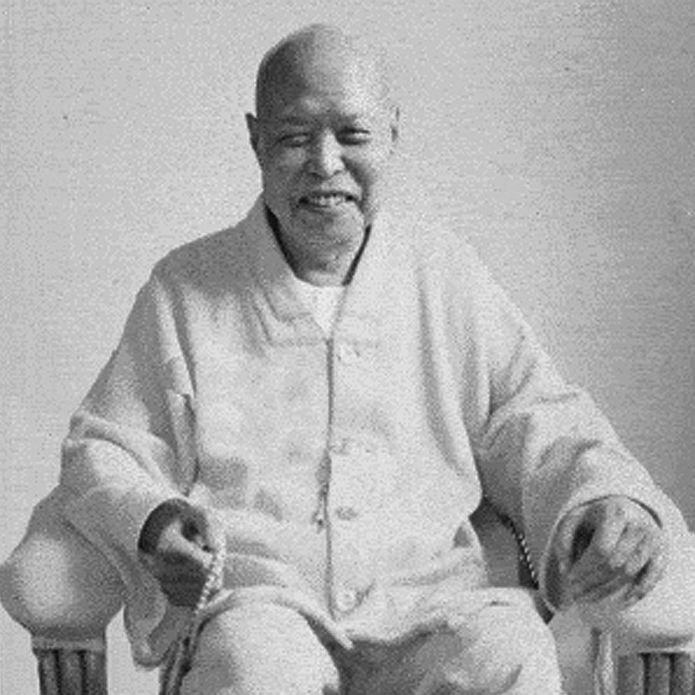

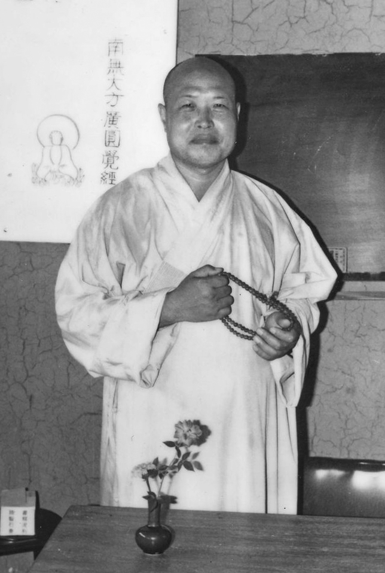

## 後記

### 庚子年終歲末回顧與展望

*編輯部*

蹇困否時局的經營

衝寒放梅迎春散香

可貴善友和合共學

福慧積累迎向未來

庚子瘟疫年已去，辛丑牛轉年已來，中華無盡燈文化學會在新冠疫情侵襲的這一年，配合社交距離的規定，減少了部分實體課程，轉入線上課程；由於出國的種種限制，使得二○二○年有更多核心與義工幹部的課程開設，並將週六共修參加人員編組，讓大家能以小組方式研討所學、相互交流，增進善友之間的情誼。

在大家的和合之中，學會持續以經教為主的共修，藉由正確知見廣做各類善法，特別是文化、教育事業的推廣。謹此報告過去一年的具體工作事項，讓我們一同隨喜過去的成果，迎向美好的未來。

壹、例行課程（含啟蒙）及念佛共修：

一、中華無盡燈文化學會

*（一）每週一，晚上七點至九點，開設寂天菩薩《入菩薩行論》，現已講授至禪定品第八。*

*（二）每週三，晚上七點至八點，開設時哉時哉網路教育學院「【關心‧觀心】」系列課程，講授已圓滿。*

（三）每週五，下午一點半至三點半，開設《華嚴經‧賢首品》課程；每隔週五，晚上七點至八點，開設蓮榮網路學習平台，播映《華嚴經．世主妙嚴品》系列課程。

（四）每週六，晚上六點半至九點，舉行「共修研學」，分為成人共修班、新進先修班、日進班（高中大專）、學思班（國小六年級至國三）、士心班（國小三至五年級）、學而班（幼兒園大班至國小二年級）分別上課，並於晚間八點至九點，集合成人共修班及新進先修班，講授《阿彌陀經要解講義》。

（五）隔週六，早上九點半至中午十二點，開設【佾舞研習班】：研討《論語》中「禮」相關條目並複習臺北孔廟釋奠典禮之佾舞。

（六）隔週六，下午兩點至五點，開設【啟蒙師資班】：研學內容為《聲律啟蒙》，並發想課程，以及各班會務討論。

（七）線上讀書會：

大陸部分，每週二、四晚上及週日早上皆有線上研學，包括儒學及佛學，參與單位有：福建敦化學堂、福建永陽孔子學會、瀋陽任遠、山東濟南德明、時哉杭州、浦江遠流、義烏青鳥、順昌雪廬、福建樂淨、永康龍川、諸暨弘德、諸暨養正學堂。

馬來西亞部分，隔週五晚上進行《華嚴經》研討，每隔週日晚上進行《論語》課程。

二、臺中市無盡燈儒佛學會

（一）暑假開設《十大礙行》專題研學。

（二）每週日，晚上七點至九點，舉行共修研學及《人生大事》研討。

三、中壢研學會

：每週三，上午九點至十一點，舉行念佛共修及《十大礙行》研討。

四、宜蘭研學會

：隔週日，上午八點半至十一點半，舉行《淨土十疑論》研討。

五、茅茹念佛會

：每週六，上午八點半至十一點半，研討《論語》和《十四講表》。

六、卓越芝蘭讀書會

：每週二，晚上七點至九點，成人班研討《論語》、啟蒙班以《論語》、《常禮舉要》、《明倫史畫》為核心課程。

七、義工培訓班

：每月一次週日，上午九點至下午三點半，進行《聖道三要》研學。

貳、互聯網經營：

二Ｏ一四年成立的「時哉時哉網路教育學院」（www.centralwonder.com）至今持續經營，成為各地讀書會共同學習經典的文化平台。

一、儒學與通識課程

（一）視頻部分

因應未來疫情將成為常態，學會將更重視網際網路課程的經營，儒學課程部分，原先「時哉時哉網路教育學院」的「經典學院」推出【關心‧觀心】系列視頻課程，以「絕處逢生」為題的問答開始，接著系列二以《易經》蹇、困、否、謙四卦來探討如何突破當前困局，還進一步於系列三藉由《老子》來看君子在困局中的成長之道；系列四透過《莊子》看「上游思維」，為動盪的未來做好防範於未然的準備；系列五藉由「不確定性思維」，得以反脆弱的心態，因應充滿變數的疫情後時代（Post-pandemic Era），目前在Youtube、騰訊等網路頻道播映，一年間的訂戶與點閱率對比往年都有倍數的增長。

*二○二一年新的學期開始，將講授「核心價值的人生─《大學》」。*

（二）音頻部分

另外，針對音頻課程部分，除原先的「唐瑜凌老師陪你讀《論語講要》」課程，「啟蒙學院」由學會製作「時哉故事童心格」音頻系列課程，為孩子們講述人物傳記、傳奇故事及節慶主題等專輯，目前主要在SoundOn、Spotify、Apple Podcast、YouTube和喜馬拉雅等平台播放，已收到不少正面的迴響。

（三）協助製作部分

學會與中華大成至聖先師孔子協會共同製作「聖裔話儒─孔子古今說」，由孔奉祀官孔垂長先生於學會錄製，並由「時哉時哉網路教育學院」團隊後製，目前已在至聖孔子基金會微博平臺與微信公眾號、世界孔子後裔臺灣聯誼會、中華孔子後裔儒學促進會等不同網站播映。

二、平面宣傳部分

平面宣傳部分，學會在新的一年推出「每日唐加言」，每天上午八點在Facebook等平台上刊登一則唐老師的語錄，供大家平日學習時添加幾句好話的參考。

三、佛學視頻課程部分

佛學的研學方面，學會製作《華嚴經‧世主妙嚴品》的研學課程，放上YouTube的「蓮榮」平台，供蓮友大眾得以研學。

四、佛學教學平台「蓮榮網上學」推出

未來學會將推出「蓮榮網上學」網站，結合分階學習、多元素材、社交互動、雲端筆記等功能，除了可以看到更豐富的《蓮榮》會刊內容上線，還將從歷年會刊中提煉初、中、高級佛學課程，結合佛學問答、佛學名相等內容，供有心學佛者另一個學習的網路平台。

五、「實栽農園」網站

為擴大農地無毒蔬果買賣服務，實栽農園網站自二Ｏ二Ｏ年四月開始試營運，方便大家上網採購，並期望藉此結合更多共同理念的朋友，一起為健康飲食努力。

參、專題講座：

一、因疫情關係，寒暑假例行講座行程都暫停，仍保留線上與週六共修、週日義工培訓班。

二、本會與大成至聖先師奉祀官孔垂長先生主持之中華大成至聖先師孔子協會，及至聖孔子基金會合作的相關講座暨活動：

（一）2020年1月18日至2月26日，紀念孔德成先生百年誕辰暨儒家經典講習。

（二）2020年2月14日至26日，紀念孔德成先生百年誕辰特展協助展覽與導覽。

（三）2020年2月16日，庚子年孔氏宗親祭孔及團拜擔任禮生及樂生。

肆、其他文化交流活動：

一、2020年2月12日，聯合國ＮＧＯ組織國際木魚計畫創辦人依法法師來訪交流。

二、2020年6月5日，臺北市孔廟管理委員會舉辦「孔子第七十七代嫡長孫孔德成先生紀念展」開幕式受邀出席。

三、2020年6月12日，國立教育廣播電台「幸福密碼」節目主持人張麗君女士邀請專訪，題目：「儒學經典的優美與智慧」（於2020年9月18日上午十點至十一點播出）。

四、2020年6月30日，元大創投董事長、《當孔子遇上哈佛》作者李克明博士來訪交流。

五、2020年7月11日，舉辦專題講座「我的記者生涯」，張麗君女士主講。

六、2020年10月24-25日，勢至念佛會四十周年紀念會受邀出席。

七、2020年11月3日，積穗國中資優班專題講座受邀前往演講。

八、2020年12月24日，淡江大學文錙藝術中心與花蓮天步文化藝術基金會主辦「萬里通航-從印度洋到太平洋」開幕式受邀出席。

九、2020年12月24日，廣東省珠海市新浩裕集團台灣顧問團新禾國際投資有限公司林大維先生、林艷雀女士來訪交流。

伍、法務活動：

一、拜懺法會：大悲懺（2020.8.9）、地藏懺（2020.9.6）、淨土懺（2020.12.28）。

二、年度齋僧：西蓮淨苑齋僧九次（呈供養金），正覺精舍齋僧一次（2020.8.29.）圓通寺齋僧一次（2020.8.30.）。

三、護生法行：東勢實栽農園（2021.1.2）

陸、蓮友服務：

一、2020年協助蓮友助念、告別式及做七者十位。

二、發送年終結緣品。

柒、出版傳播：

今年一共出版十一期蓮榮會刊（120期至130期）。

上述各項法行事業，參與者、出資者、出力者，於個人能增進自己的善根福德，於公上能莊嚴團體，安定社會國家。若有任何缺失之處，辦事人員應深懷慚愧、檢討反省；對於能利樂有情的部分，要生起隨喜及感恩之心。

新的一年，隨著疫情等諸多變化，以及中美關係緊張，願大眾好好提起教法，回向自他無災免難，人間瘟疫止息，並以公心繼續善法的造作，成就現世安樂，與未來往生及成佛的資糧。相信在有限及短暫的生命中，將是最殊勝的莊嚴。

## 孔學一隅

### 論語簡說（三十七）— 子罕篇第六、第七章　夫子德學，既聖又能

時哉講述

本末不偏廢

盛年難再來

有涯學無涯

內聖與外王

前言

文化復興運動的代表人物里昂納多‧達文希是位多能者，他身兼繪畫家、雕刻家、建築家、發明家、工藝家、地質學家等等。而多能者是否可以成立為聖人，又人生到底是要追求內在涵養到極致的聖人、外在的利益有情的心量、以及氣度、格局到圓滿的君子，還是以多能來成為追求的目標呢？子罕篇的第六章、第七章就是解答，這兩章可以合說。

經文

大宰問於子貢曰：夫子聖者與。何其多能也。子貢曰：固天縱之將聖，又多能也。子聞之曰：大宰知我乎。吾少也賤，故多能鄙事。君子多乎哉。不多也。（子罕第六章）

消文
大宰問子貢：你們的老師是聖人吧！為什麼說他是聖人呢？因為如果不是聖人何以會有如此多的能力呢？子貢回
**答：** 上天本來就有意放縱我的老師成為大聖人，而又多能。（可見多能與聖者不能混為一談）孔子事後聽聞他們的對話，撇開大宰讚揚他是聖者的話，很幽默地就「何其多能」這句話發揮，說道：大宰他知道我嗎？我年少的時候地位卑賤，必須謀生，所以會做很多粗鄙的小事，雖然這些生活的瑣事會得很多，但與修道、治國、平天下沒有關係。不但聖人，即使是君子，也不必多能於這些謀生的技能。

章旨

子貢辯才無礙，巧妙地糾正大宰對聖人內涵的誤解，並說明多能與聖者不能混為一談。於此章中能領略聖人幽默的面相。

經文

牢曰：子云，吾不試，故藝。（子罕第七章）

消文

子牢憶及：孔子曾說，因為我沒有被國家試用，所以有時間多學技藝。

章旨

孔子自說未替國家辦事，所以能多學技藝。孔子、周公，都是聖人，尚且多藝，普通人豈能一無所長。

科判分析

本章分為兩大段，第一段大宰問子貢：你的老師是聖人吧？「與」雖不是武斷之詞，但是是在客氣中的全稱肯定，意即「你的老師大概是聖人吧」。大宰成立聖人的因是「何其多能也」，此有邏輯問題，多能如何能成立為聖人的因呢？如果多能可以成為聖人的因，多能也可以成為君子的因，也可以成為小人的因。《三國演義》中司馬懿也是多能，諸葛亮也是多能，可見多能可以成立為小人，也可以成立為君子，多能變成不定因。

子貢就著大宰的外行問題，善巧地顯示聖人跟多能是兩回事，「固」即本來如此，本來老天爺就放任孔子成為大聖，而且「又多能」，「又」表示「多能」跟「聖人」不同，並未否定大宰所言，只是大宰用多能來成立孔子是聖人的那一分被子貢否定，這就是說話的藝術。

孔子聽到大宰如此崇高的景仰，到底是高興還是落寞呢？孔子說：大宰知道我嗎？「乎」是疑惑詞，表示不贊同大宰，此時孔子不去論聖人，而說多能也不是君子的當務之急。再以中國式的幽默嘲諷自己，說自己的多能是由於小時候貧賤，所以什麼雜事都要會。大宰以多能來成立聖人，孔子說多能未必是聖人，多能也未必是君子。結論是君子也不以多能為貴。

「牢曰：子云，吾不試，故藝。」子牢是孔子的學生，他說孔子曾經很客氣地說過「吾不試，故藝」，即孔子多才藝是因為他不被試用，一般試用期為三個月、半年，能力被認可時才能補時缺，孔子說：因為我沒有被用，就不妨多方學習。

其實孔子是真正的多才多藝，舉例來說，孔子是音樂家，《詩經》三百篇都能弦而歌之，配上樂譜來彈。孔子是大政治家，提出了「禮運大同」，孔子還是內聖外王的大思想家，是周遊列國闖蕩的旅行家，還是能夠教出菁英子弟的大教育家。

釋義

本章的歷史背景為何？

孔子周遊列國，曾經幾度表現很卓越的能力，大家公認他是聖人，故有本章大宰之問。

而各國都有大宰，像宋國、魯國、陳國、吳國等，難以考據是何國的大宰。

大宰是何官名？

在西周時，大宰是宰相的職位，用六典來治國，即政典、教典、禮典、字典、刑典、事典，以經學來治國。春秋以後，大宰已經在太師、太傅、太保之外，變成小官，到了秦國，大宰變成負責帝王的飲食、祭祀貢品的職位。到了漢朝，大宰又變成祭祀的禮儀官。在晉國時，司馬師廢太師，變成大宰，所以大宰又變成三公。宋徽宗時期，大宰變成宰相，叫做「尚書左僕射兼門下侍郎」，「尚書左僕射」管行政，「門下侍郎」管政策。宋朝有兩京，東京是開封、西京是洛陽，司馬光當時在西京當禦史，由於是閒差，他用十五年整理出《資治通鑑》，後被宋哲宗的母親提拔為宰相，入朝為官時，萬民夾道歡呼，人心在司馬光，司馬光的名稱就是尚書左僕射兼門下侍郎。

由大宰之問，可得知何事？

如此大的官都講外行話，可見周遊列國孔子是「莫我知也夫」，沒有人知道他，就算有人知道孔子是聖人、是君子，而且又多能，列國國君只對多能有興趣，對孔子的內聖外王的內涵沒興趣。

孔子具備哪些能耐，被大宰認為何其多能？

第一，孔子三十五歲到三十八歲時至齊國，當時齊景公看到一隻鳥只用一隻腳展翅，就問國內的大臣此是何鳥？展翅何義？孔子在高昭子家中講學，齊景公便派人來問，孔子唱曰：「商羊起舞，天將大雨」，是下大雨的徵兆，朝臣認為是無稽之談，高昭子相信，命人疏通水溝、修堤防，果然連下三天雨，附近各國釀成水災，獨齊國防災嚴密，齊景公讚歎地說道：「聖人誠不我欺」，並請教孔子國政，孔子提出「政在節財」，並曉以秦穆公所以稱霸西戎的理由，齊景公很高興。
第二，孔子在高昭子家中講學時，周朝廟失火，齊景公問孔子說：你知道是哪一間嗎？孔子回
**答：** 是周厲王，因為他改了文武的政策，此人好大喜功、出入排場，沒有福報卻居在廟中。齊景公說：今日才知聖人的智慧！
第三，季孫意如過世，吳王夫差派人來弔祭季桓子，當時孔子在魯國講學，便
**問：** 他有個骨頭非常地大，到底是什麼骨頭？連伍子胥都不知道。孔子回
**答：** 是防風氏之骨。當年大禹在會稽山集合諸侯時，防風氏最後到，且態度囂張，被大禹殺後埋在會稽山的山下，他的骨頭就是這麼大，可見孔子是博物君子。

再來，季孫意如的兒子季孫斯(即後來的季桓子)當主政大夫時，向孔子問政，孔子講的他都不大有興趣，就乘機去更衣(如廁)。回來時，有人告訴他井裡面挖了一隻羊。他就趁機考孔子：剛才在井裡挖了一隻狗。孔子說：不是狗，是羊。木頭、石頭的怪叫做夔，或者是魍、魎；水怪是龍、或者是罔、象，土怪是羵羊，所以是羊，這種羊不雌不雄，就是非男非女，徒俱羊形。季桓子非常佩服。

又孔子到陳國時，有老鷹被楛木作的箭射穿，掉到陳國宮殿，箭頭是用石頭磨尖做的，陳湣公不知是什麼箭，派人請問孔子，孔子回答隼(鷹)自遠方來，此楛矢（楛木作的箭）產自肅慎，從前武王伐紂，肅慎上貢楛矢石砮（楛木作的箭，箭頭用石頭磨尖作成）。武王分賜給女婿陳侯胡公。陳湣公派人去庫房盤查，果然如孔子言，陳湣公非常讚賞孔子是一位博物的君子。

孔子在陳國時，魯國有宗廟失火，消息傳到孔子處，陳國問孔子：是魯國哪個廟失火？孔子說：是魯桓公跟魯僖公。因為魯桓公縱容三家大夫，使他們後來成為魯國的執政大夫。而魯僖公的兒子魯文公，把魯僖公的廟排位排在魯閔公之上。照理講魯閔公是嫡子，魯僖公是庶子，排序應該是魯閔公、魯僖公、魯文公，他竟然把魯僖公排上去，這是非禮的祭祀。

又孔子在陳國講學時，季桓子過世。季桓子過世前跟他的兒子季康子說：我一生最大的遺憾就是沒有用孔子，你一定要把他找回來。

孔子過世時，弟子們太想念孔子了，便讓酷似孔子的有若坐在孔子的位子，大家朝拜，有人跟有若說，以前跟著孔子出門時，孔子看天象說，月亮在畢宿裡面，後來，月亮離開畢宿星座時，孔子就說：明天會下大雨，要準備雨具，果然明天下大雨。孔子又看月亮說：月亮回到畢宿裡面，後天不會下雨，果然後天不下雨。有若無此能力，故不同意有若接替孔子。

孔子也精通《易經》，孔子的後期學生商瞿，是解《易》的大家，後來的傳承像是李道平的《周易集解纂疏》，都跟商瞿、子夏有關，漢朝的京防就是商瞿的傳承。孔子曾派商瞿到齊國去，商瞿母親因其還未生小孩而阻擋，孔子說：不用擔心，他四十歲以後會生五個， 果然言中。

聖人何以不是多能？

聖人是通達形而上的本體，不是通達相，通達相才是多能。

近代還有哪些屬於多能之士，但不是聖人之例？

愛迪生就是多能之士，他是發明家，有一千九百零三項專利，可是愛迪生是商人本位，其發明都跟賺錢有關，他不是聖人。

德國人萊布尼茲，是哲學家、數學家，通才，有名的微積分，還有電腦的二進位，都是他發明的，他能在馬車顛簸下發明出數學公式，多能但不是聖人。

大宰之問如此外行，子貢如何化解尷尬？

子貢把聖人跟多能分開，善巧地化解尷尬，不直接說對方的錯誤。且子貢也承許大宰讚歎孔子的多能，大宰一聽便心裡有數了。

為何夫子是天縱之將聖的人物？

《論語‧述而》篇說「天生德于予」，孔子是俱生的悟性，公冶長篇「十室之邑，必有忠信如丘者焉，不如丘之好學也」，可見孔子不但是天縱英才，而且後天好學。還有一個秘密就是魯國多君子，孔子曾讚歎宓子賤是君子，而他成功的秘密就是「魯無君子者，斯焉取斯」，因為魯多君子、多人才，宓子賤才學成一身的能力。只可惜三家大夫把持國政，人才在野不在朝，造成魯國的衰弱。

天縱之將聖，一是天生，二是後天好學，三是環境，這三個叫做老天爺放縱孔子成為聖人。

子貢為何用「縱」來描述夫子成就大聖之德？

縱是放縱、放任、任由他，即任由孔子、放任孔子成為大聖，老天爺放縱他不斷地學習、不斷地成長，最棒的就是有很好的環境。

子貢曾經說：「文武之道未墜於地，在人。」中國文化的典籍在文武時期完備，文武之道代表中國文化傳承未斷，在魯國有賢者、有不賢者(小賢)，大賢通達全體，小賢通達細部，放任孔子到處學。孔子天縱英才、後天好學，又懂得一以貫之，又肯歷練自己，而且有心量願意把才智拿來利益天下蒼生，難怪中國文化的傳承在他。

夫子之答是多能於小藝嗎？

孔子曾經當過倉庫管理員，帳目清楚，又通人情，考慮來繳稅者的路程、人口數，考慮豐收、欠收因素，而能公平收稅，令人心服口服。他也當過畜牧官，把牛羊養得肥肥壯壯，增強國力。

也曾向師襄子學琴，除了把曲彈熟外，更把曲的神韻彈熟，再把作曲者的心意、作曲者都彈出來。也曾問禮老聃、訪樂萇弘，這些都是孔子還未被重用的時候，這些多能是想要去利益天下蒼生的多能，能夠匯歸心性的多能，而不只是才藝技能。

夫子的幽默，其他論語章節中有嗎？
達巷黨人曾說：「大哉孔子！博學而無所成名。」讚歎孔子什麼都會，不曉得要用哪一個名來稱呼，即稱讚孔子是全才，沒辦法用某個才能來概括。孔子居然回
**答：** 我都沒有辦法成名，我到底是射箭成名、還是駕馬車成名？我看我駕馬車成名比較好。這就是中國式的幽默。

夫子為何不回答聖人不必多能，反而說「君子多乎哉，不多也」？

照子貢的意思，多能未必是聖人，而孔子說多能也未必是君子。多能變成因明學中的不定因。真正立宗答辯最厲害的是，我只要拿對方的因成立另外一個宗，對方就不堪一擊。

君子要入世利民，難道不必多能嗎？

君子入世利民，可貴的是胸懷、見地、用人、通達人情，那才是君子的內涵。美國的羅斯福總統說：多能之後，都變成社會的未爆彈，爆炸起來，社會要付出慘痛的代價。多能教育產生的過患是很可怕的。

本章何以要與下一章「牢曰：子云…」合看？

兩章的意思相同，可以合看。

學習本章能得到什麼啟發？

本章章旨告訴我們，君子的內涵跟聖人的內涵才是當務之急，這樣的多能才會變成利益天下蒼生的大用。要以聖人跟君子為目標，聖人是內聖、君子是外王，內聖就是明心見性，外王就是有利益天下蒼生的胸懷。這樣的人再培養多能，如同鑽石經過精密地設計、切割、打磨、拋光，他的多能必定對天下蒼生有利。

總結

一、好漢不怕出生低，孔子出生低，但不會怨天尤人、憤世嫉俗。孔子也是「多能鄙事」，懂得去服務別人，不斷地歷練自己，不怕做苦差事。所以在還沒有被試用之前，要多多充實自己。

二，孔子固然是充實自己的才藝，但更重要的是充實自己經學的見地。多能未必是聖人，多能未必是君子。而聖人跟君子才是文化的本質，多能只是文化之末，不可以本末倒置，但如以本攝末，由末扶本，更是推展大道的能耐。

三、雖然人生不以多能為主，可是不能沒有才能，因為必須要有養活自己的本事。《孝經》上說：「天子之孝、諸侯之孝、卿大夫之孝、士之孝、庶人之孝」，就算是庶人，也要有一技來孝養父母，養家活口。

四、如果是內有聖人之氣象、外有君子之胸懷的多能，這樣的多能將是天下蒼生之福。孔子也沒有反對多能，只是多能必須被聖人的見地、君子的胸懷所攝受。

問答

**問：** 君子、聖人的成就都不需要多能，多能到底是功德還是過患？現代教育強調多元化，以多能作為衡量一個人的標準，我們應以什麼樣的心態來處世？

**答：** 多能到底是功德還是過患，多能是不定因，即多能可以利人也可以害人，君子跟聖人會把多能拿來利益別人，多能變成功德，小人會把多能拿來利益自己，就變成過患。儒家講內聖、外王，此人不會被名利所轉的那一分是聖人的功德，能夠有利益別人的心態，以及利益別人的見地的那一分是君子。聖人是心不隨境轉，君子是心能轉境，是整個中國文化的本質。把人的胸懷開拓為利人的胸懷，而且有崇高的內涵，這才是真正教育的本質。

**問：** 哪些歷史人物的多能是能夠造福百姓，哪些歷史人物的多能會危害百姓？

**答：** 像周公就是一位多才能的人。武王過世，周公代理天子七年，制禮作樂，完備周朝的典章制度、禮樂，在周公的制禮作樂下，周朝的民風大振，此是把多能發揮到極致。

反之，王莽也是多能之士，但他包藏禍心，表面說恢復周朝禮制，其實是為了滿足一己之私，最終弄得民不聊生、國破家亡。

**問：** 本章孔子是否有鄙視多能的意思？

**答：** 夫子沒有鄙視才藝，他只說君子不以多能為貴。君子成為君子不是靠多能，聖人成為聖人也不是靠多能，多能不是聖人的因、不是君子的因。孔子甚至說「吾少也賤，故多能鄙事」，子牢也說「吾不試，故藝」，還沒有被試用時要多多充實能力。孔子從來沒有認為能力不重要，而是說能力的充實，必須要往成聖成君子的方向來充實。

**問：** 古代注解中，有一種斷句是：「固天縱之，將聖又多能也」，可否採取？

**答：** 老天爺放縱孔子成為「將聖」，是最好的，因為大宰以多能來成立聖，現在子貢把這兩者分開，說老天爺放縱他成為大聖，然後又多能。逗點一逗錯，味道全跑掉。

**問：** 孔子曾說「君子不器」。孔子到底是贊成多能，還是反對呢？

**答：** 君子不器是不被器所限制，君子還要通往形而上，君子如果是有聖人之德的君子，才是真正入世的君子。真正利益天下蒼生的入世者，會得到很多福報。君子入世的能耐，要靠聖人的智慧作為他的支柱，至於多能，不是君子的當務之急，所以，君子不以多能貴。但多能對君子的幫助也很大，可是君子的成就不是以多能來成就，多能不能成就為君子。

**問：** 一個聖人或是君子，如果他只會一項能力，並沒有達到多能或是多才藝，這樣依然可以是一位君子或者聖人嗎？

**答：** 宋徽宗什麼都能，就是不能做皇帝，其多能反而亡國。多能要有經學的見地、用人的能力、人情的通達，那才是重點，要在經學上充實，在見地上開闊，多能才成為功德。

**問：** 孔子說「大宰知我乎」和「莫我知也夫」的語氣和意義有何不同？

**答：** 「莫我知也夫」是大概沒人知道我了吧？很客氣，不武斷，不把話說死，但這當中有一點肯定，意即真的沒人知道我。

「大宰知我乎」是疑惑詞，大宰以多能來成立我是大聖，你真的知道我嗎？

兩者不同。

**問：** 《論語》中有沒有關於「固天縱之君子」的章節呢？

**答：** 例如宓子賤，宓子賤治單父時，功同堯舜。宓子賤小孔子四十九歲，孔子過世的時候，宓子賤只有二十四歲，卻有堯舜的氣象！孔子讚歎道：「魯無君子者，斯焉取斯。」正因為魯國多君子，放任宓子賤到處學，學成君子。宓子賤的能耐是由魯國多君子而來，是這些前輩們創造出來的風氣。

**問：** 古人讀書志在成聖賢，現代人追求多能，是否因為現代人認為成為聖賢是高不可攀、遙不可及？

**答：** 古代志在成聖成賢的這一分，也是經過孔子入世以後的教導，歷代的讀書人都有這種胸懷，或者是成聖成賢，或成為君子。成聖成賢指形而上，成君子指形而下，兩者都非常重要，皆為儒家追求的目標，也是孔子的義趣所在。現在沒有這種傳承，沒有這種經學的見地、涵養，大家都追求多能。

**問：** 莊子曾說：「吾生也有涯，而知也無涯，以有涯隨無涯，殆已。」表達的是否也是人生的重點不應該放在多能呢？

**答：** 是的，人生有限學問無限，必須在內涵上經營，學習形而上使你能夠有斷煩惱的能力，學習形而下才有真正幫助有情脫困的能力，特別透過辦政治跟辦教育，這樣的幹才是社會上最缺的，而不是在一些枝末才藝的培養。

**問：** 老子也是「天縱之將聖」嗎？

**答：** 是的，老子出生便是位奇特人物，天生德加上後天的用功，還在周朝檔案局長的任職上，能夠遍覽典章制度。老子跟孔子在形而上的見地相同，理念卻不同，孔子要把形而上的見地配合形而下的見地來利益天下蒼生，知其不可而為之，跟老子的方向有點不一樣。

**問：** 「固天縱之將聖」，「固」可以解釋成宿命嗎？還是也要靠自己努力去開發而得？

**答：** 兩者都有，但是努力開發更可貴。像孔子「吾少也賤」就是學習的障礙，可是孔子能夠努力突破困局，聚集順緣，叫做天縱，這兩者都可，孔子皆有。孔子固然是天生德，可是也有後天的努力。

**問：** 在孔門中有德行、言語、政事、文學四科，我們可以說言語、政事、文學這三科屬於多能的範疇嗎？

**答：** 可以。德行科就是在君子跟聖人當中的涵養，言語、政事、文學都是能力的培養，能力的培養是資助聖人跟君子的內涵，所以孔門的四科不是獨立的四科，言語科、政事科、文學科都是資助德行科，德行科才能夠導正這三科，而且能夠利益天下蒼生。（下期待續）

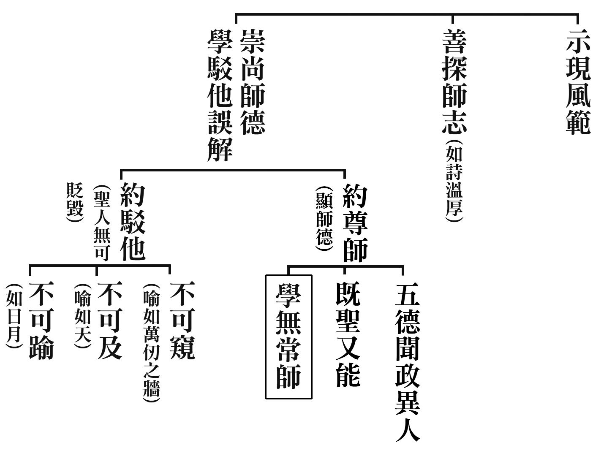

### 孔門心法—中庸之道(十八)　第十五章：君子化導他人由近而遠

*時哉講述／弘毅整理*

興國由家

能近取譬

親民之始

明德為賢

前言

君子志在治國、平天下，帶來萬民的福祉，而這樣偉大事業的下手處，竟然是從家庭開始。

一個人的成功來自於家庭的和樂，「家和萬事興」，家庭是人們的避風港，是挫折時的休息處，是養精蓄銳、    弭平煩惱、重新出發、磨練養成的地方。古人說：興邦必從家庭開始。《大學》說：「一家仁，一國興仁」，可見家庭的重要。這一章更特別點出家庭是君子的發端，君子想要成就偉大的功業，必須從家庭開始，而家庭的和樂，必得從夫婦相處中得來。整個家庭就像美好的音樂，令人聽後心曠神怡、流連忘返，尤其是夫婦的相處，猶如琴瑟和鳴，能夠創造美滿和諧的家庭。琴有五弦或七弦，相傳為文王製作，瑟就多到五十弦，琴聲上揚外放，瑟低沉而內斂，美好的樂曲如同夫婦相處，這是家庭和樂的開端。

果然君子知道經營家庭的重要，則「治大國如烹小鮮」，原來君子的內涵、氣象、情懷，即是把國當成家治理，從家庭呈現出一個好的開始，溫暖可愛，大家互助合作，諸侯讓國成為一家，天子讓天下成為一家，這就是中國與外國政治最大的差別。

科判分析

中庸總體科判

第十五章還是在《中庸》的第二部分，即分別顯示中庸的修學法和義理。

本章科判分析

君子有形而上和形而下的修學，形而上的修學能超脫世間繫縛，形而下的修學可以利益天下蒼生。君子利益蒼生必須從近處到遠處，從親近到疏遠，喻如登高要從低處起，行遠要先從近處出發。家庭的經營，從夫婦、兄弟、妻子開始，來表達對父母最殊勝的孝道，這是君子度化眾生事業的開端。

消文釋義

經文：

君子之道，辟如行遠必自邇，辟如登高必自卑。詩曰：「妻子好合，如鼓瑟琴；兄弟既翕，和樂且耽；宜爾室家，樂爾妻帑。」子曰：父母其順矣乎。

消文：君子之道，如《大學》所說「修身、齊家、治國、平天下」的道理，包括君子的見地、行持、能力（知人善任、辦事才藝等）。經營君子之道，懂得從自己家庭開始，才能擴及到國家、天下。好比到遠處必須從近處開始走。當年玄奘大師西行，從大唐西安出發，到天竺取經，走了五萬多公里，也是從近處到遠處求學，終於成就他一生的學問、才情，成為一代高僧。要登高也必須從低處開始登，像險峻的華山，或是登泰山的南天門，都是從低處到高處。

《詩經‧小雅‧常棣》中說：「與妻子可以很好的相處，就像彈琴、瑟一樣，一起配合彈出美好的樂曲。」結婚祝福時常說「琴瑟和鳴」，夫妻一定先從兩人情投意合開始，從年輕攜手踏上人生的旅程，共同經營美滿的一生，有福同享、有難同當，直到兩人白髮蒼蒼，還是攜手同行，家庭的經營從夫婦開始。

「兄弟的相處，如鳥的兩翼合作才能高飛，才能越過大海。兄弟互相合作，會使和樂越轉越深。」兄弟交情從小開始，互相合作、體諒、幫忙。

「這個人懂得夫婦、兄弟相處之道，與妻子好合，進而和好家庭和家族，讓他的太太、子孫全家和樂地生活在一起。」家庭和樂就是使事業、團隊、國家、天下和樂的開端。

孔子說：「這大概就是對父母最大的順從了吧！」可見孝順父母有很多面向的經營，不只是平日噓寒問暖、搥背洗腳，孝道是各種處世能力的培養、人情世故通達的開端。當家庭和樂，父母親會特別的高興，這樣就是間接的孝順父母，比直接的孝道更為可貴。

江逸子老師的《孝經圖》中，讀書人把孩子教養得很有氣象、內涵，兄弟彼此團結合作，其父母自然高興。表面上看只是把家庭經營好，實際上就是對父母親最大的孝道，是孝敬心最好的表達。

釋義：「邇」，近處；「妻子」，此處指太太；「翕」，如鳥的兩翼相合；「耽」，和樂轉深；「室」，與太太相處的房間；「家」，家庭或家族；「妻帑」，太太和子孫。

析疑

一、本章與前章的關聯為何？

第十四章講的是「素位而行」，君子能盡本分，第十五章特別講君子回到家庭，先盡到家庭的本分，倘若未能盡到家庭的本分，則其它的理想抱負都無從談起。

二、本章只不過是家庭和樂的經營，如何能說是君子化他之道？

本章開頭是「君子之道」，不是說常人的家庭經營之道。一般人的眼光只是把家庭經營和樂，而君子經營家庭是另有目的，他會將經營家庭的經驗擴充於外，治理團隊、國家、天下都是如此。君子胸懷廣大，做法有次第，何者為先、為本都是清楚明瞭。

三、由近及遠、由親及疏有何殊勝，不由近及遠、由親及疏有何過患？

領導者希望每個家庭都和諧，這樣國家才能和諧，領導風氣時，人家會首先看你的成果，家庭要先和諧，這才是由近及遠、由親及疏的殊勝。

領導者自己家庭不和樂，就沒有說服力讓人相信。倘若每個家庭都不和諧，所培養的子弟出來辦政治，社會就會亂象頻仍，難以治理，這就是過患。

一般人經營家庭的目的是甜蜜幸福地經營世俗的安樂，而君子把家庭整頓和諧的目的是為了利益天下蒼生，所以君子的目的、胸懷、能力、莊嚴、理想、抱負都不同，所經營美滿家庭的功德更多。

四、引用的詩經其原意為何，在本章中又代表什麼意思？

本章引用的詩句出自《詩經‧小雅‧常棣篇》，有兩種講法：一種是讚歎周文王有「宜室宜家」的能力，把周朝經營得像家庭一樣和諧。當老百姓家中有生活上的困難，或者生命遭遇障礙時，周文王都於心不忍，好像家庭的小孩出事一樣，內心不安，甚至苛責自己，這就是經營國家的胸懷。

第二種講法是周公治理天下，殺了管叔、流放蔡叔、貶謫霍叔，傷了兄弟之情，這首詩是希望兄弟間能夠和好。《詩經》能譜成曲，可以在重要的場合演奏，倘若兄弟間有了誤會，想要和好時，樂隊就演奏這首詩，藉由聚會唱這首詩歌，兄弟就彼此捐棄前嫌，和好如初，此是《詩經》的妙用。

本章是斷章取義，彰顯君子把家庭經營成這樣，才是王道文化的開始，辦政治要從辦家政開始做起。

五、為何說家庭是化他之始，而非修身？

《大學》裡講化他要從修身開始，自己先做好才能引導別人，《中庸》此章是說家庭是化他之始，要推展政治一定先要讓每個家庭和諧，政治才會辦得好，而非只給老百姓富足的生活。有些歐美國家，經濟雖然增長，可是犯罪率也隨之增長，要想國家和諧，必須要從家庭經營開始，兩者角度不同，並不衝突。

六、夫妻好合的利益與不合的過患？

夫妻好合的利益要多了解，如夫妻好合再給公婆盡孝，公婆才能接受，如果吵吵鬧鬧，孝道也無從談起。夫妻好合才能成為子女的典範，才能發揮善教子女的功能，才能在事情上共同商量，才能讓先生有避風港、休息處、充實處，才能在親友聚會時，成為親友間效法的對象。

夫妻不合的過患也要多體會，如家庭教育會做不好，夫妻身體也不健康，公婆不能接受盡孝，在親友間也不能成為典範，壞處太多了。

七、想要妻子好合，首先應注重？

《論語》上說「賢賢易色。」娶太太不要看重相貌，要看重內涵，能相夫教子，孝順公婆，處世圓融，和諧妯娌，乃至成為辦政治、辦教育的君子的賢內助。

《詩‧周南‧關雎》上說：「窈窕淑女，君子好逑。」想要利益天下的君子，很想追求這樣的女子，倘若追求不到，就會「寤寐思服」，日思夜想。如果能追求到，就會高興的「琴瑟友之」、「鐘鼓樂之」。此指周文王，他知道娶妻娶德對周朝有很大的幫助，所以周王朝的興盛，除了周公制禮作樂的功勞，還有太姜、太妊、太姒善為輔助，才造就了周朝八百年的天下。

八、妻子好合的其他條件為何？

結婚典禮很重要，雪廬老人在學生婚禮時，都親自主持證婚，且寫結婚證書。證書中就講到夫婦要懂得《關雎》、琴瑟和鳴、相夫教子、兄弟姊妹相處、家庭要多子多孫等道理。三十多年前，雪廬老人就預見了少子化的過患，因此到九十六歲還親自證婚，沒有近視、老花眼、重聽，寫起文章不但清楚，講起證婚的話也條理井然。

《論語‧學而》篇上說：「因不失其親，亦可宗也。」結婚後，男女雙方的親人互為親人，這就是民族大團結，是中國文化的特殊處。這種禮俗端正醇厚，可以由近及遠、由親及疏。懂得「不忘本來、吸取外來，面向未來」，是學習傳統文化重要的立足點。

九、三天一小吵，五天一大吵，夫妻間難免意見不合，應如何改善？

兩個人結合後，由於生活習慣不同，在觀念上也不一致。如出入作息、讀書、飲食、起居等習慣不同，日久就容易爭吵。在爭吵時，先生要多想妻子的長處，現今的婦女要具備十八般武藝，煮飯、燒菜、洗衣、整理家務、招待賓客，又身為職業婦女，比古代的女人還要難當。教育子女也比過去不容易，教育多元，環境複雜，在孩子身上花的時間比古代婦女更多。

而太太爭吵時，也要想到先生的辛苦，為了在瞬息萬變的時代中求生存，賺取薪水很難。夫妻間互相體諒，婚姻才能走得長遠，更重要的是要有共同的喜好，在老師、團隊中學習，能化解很多的婚姻障礙、問題。

十、兄弟既翕的利益與不合的過患？

兄弟之間相處要合作，「翕」是鳥的兩翅，翩翩起舞，可以飛越森林、大海。兄弟和合要像桃園三結義，不是兄弟都能像親兄弟，那麼親兄弟更應該像親兄弟。商家開店都要拜財神，而財神是關公，意義是「兄弟同心，其利斷金」，兄弟團結合作、家庭和諧就是發財的秘密。兄弟合作則能成為學問、事業的夥伴，可以成為互相參考重要意見、提供勸誡、規過勸善的對象。

反之，兄弟、姊妹不合，會傷父母的心，讓家庭和諧的氣氛破壞，也讓他人認為這個家庭父母教育的不好，而且也給孩子樹立了不好的榜樣，因此兄弟姐妹相處不融洽，乃至包括事業、求學時沒有得力的夥伴，過患太多了。

十一、想要兄弟和樂，首先應注重什麼？

兄弟和樂就是盡孝道，要以這樣的格局來看待兄弟的和樂，還要注重的是要把與外面朋友相處的感覺，用在兄弟之間體會。

十二、兄弟和樂的其他條件為何？

要互相了解對方的個性、想法、觀念、做事情的態度，不要忤逆對方，因為家裡重在講情份，而不是重在講道理。兄弟間盡量多做家事，以真情相待，則兄弟和樂的條件越多，兄弟間就越容易和樂。

體會。

十三、兄弟不和應如何改善？

第一，情緒一定要穩定；第二、不要宣揚對方的過錯；第三、多多彰顯對方的功德；第四、相處有摩擦時，自己要先退一步；第五、做家事要多做一些，不要爭誰做多做少；第六、在財務方面不斤斤計較。相信不和的條件去除越多，不和的現象就會越少。

十四、兄弟既翕，和樂且耽的典範？

兄弟和合的典範是王覽和王祥，弟弟王覽是繼母所生，哥哥王祥不是親生的，繼母很討厭王祥，並且經常打罵他，王覽就袒護哥哥。後來王祥有了名聲，繼母甚至想用毒酒害死他，王覽知道後就爭著要喝毒酒，繼母不得不把毒酒打翻。王覽處處保護、禮讓哥哥，這樣的陰德讓他的後世有九代的公卿，可見家庭就是積陰德的地方。

十五、現代兄弟間多分家而居，該如何應用本章內涵？

固然現代兄弟分家而居，但還是要有大家庭的概念，趁著父母尚且健在，兄弟間可以多聚會見面，讓彼此都有盡孝道的機會，就算道不同不相為謀，但也不妨礙彼此間的和諧相處，更何況志同道合的兄弟，更應該和諧相處。

十六、宜爾室家，樂爾妻帑的典範？

兄弟相處好，兒孫也能調和。

第一個典範是明朝鄭濂七代同堂，明太祖就問他一千多人的大家庭是怎樣做到和諧相處的，他說不聽婦語，並非是不聽女人的話，而是說不聽挑撥離間的話。明太祖就想試試他這個做長者的智慧，故意賜給他兩個梨子，分財物時要很小心，很多家庭的嫌隙、爭吵、對立、動盪往往都是因為分配不均造成的。鄭濂就將這兩個梨子打碎，放到水中煮了兩大缸，每個人都分得一碗梨子湯，大家謝主隆恩，明太祖就非常佩服他的處世智慧。家中的爭端都能處理得當，在企業、國家擔任領導者，就能善巧的處理各種恩怨。所謂「人事」就是人際關係處理好，事情一定辦得好。在大家族能夠處事圓融，在外也能通達人情世故，處世順利。

第二個典範是唐朝的張公藝，他九代同堂，《三字經》上說九代是指自高祖、曾祖、祖父、父親、自己、兒子、孫子、曾孫、玄孫，九代的人口共處一家，唐高宗問他身為高祖的和諧家庭之道，他便要紙筆，寫了一百個忍字。忍是上位者忍，不是下位者忍，雪廬老人曾說辦道場大家有一個字不如他，學生們有說禮、忠、信的，老人都說不是，而是忍字。忍字太難了，忍是智慧，是情懷，是度量，是遠見，是格局，是一種處世的能耐。

有時難免分配不公，要忍；有時長幼尊卑因禮儀不到而惹出閒話，要忍；有時處事難免被認為偏袒某一方，要忍；講話時可能這邊高興，那邊卻得罪了，也要忍。人生就是這樣，往往忍的人才能成就見地、胸懷、品行、情操、學問。

十七、最後引子曰有何用意？

子思最後引用祖父的話，原來經營家庭就是對父母最大的孝順，大概就是讓父母身心滿意、舒服，表示這樣的經營，雖然不是直接的盡孝，是間接的孝道，但卻是最好的孝道。

十八、本章對現代社會的啟發為何？

男女的交往，妻子好合就在於彼此不重視財富、地位、車子、名牌等虛榮。孝不是在物質上，而是在精神上講究。和諧是福報的源頭，是發財的秘密，是事業的開端，是成功的訣竅，和諧來自於家庭。要多子多孫，才是家庭的興旺之相。五倫關係從家庭開展，做到究竟就是君子人格完成的時候。一個領導者當善於處理家庭的問題時，反而贏得最多掌聲。歐巴馬總統在八年任滿即將下臺時，掌聲最多處不是他修建了多少鐵路、飛機場，打敗了多少國家，而是他善於處理家庭關係，懂得和諧之道的經營，這才是他成功的秘密。

總結

一、夫婦的好合，是很有默契的侍奉公婆，經營和諧的家庭，一定是要有內涵，注重風氣經營的好合。

二、好合是開端，所以要慎選對象，在人品、個性、和合能力上選擇。經營家庭難免遇到問題，要靠相互攜手才能突破障礙，一定能帶來家庭的和諧、事業的成功。

三、君子不只是在家庭上要有所成就，更要去利益天下蒼生，那才是君子的胸懷，以家庭的成功為基礎，成為向外利益天下蒼生最好的開端。

四、子思雖然寥寥數語，但卻把人生成功的秘密宣說完備。子思通達孔子形而下的意趣，點出家庭的重要，以家庭為發端。我們不得不佩服子思在兩千多年前看問題的眼力，了解君子成敗的基礎，入世的發端，給我們入世很大的振奮，作為很重要的依據，也引出人生成功的方向。（下期待續）

## 藝術賞析

### 孔門七十二賢淺說(三十九) — 奚容箴

圖／江逸子、文／時哉

他國來求學

能正時弊風

堂堂似子張

周遊卿相才

奚容箴，姓奚名容箴，孔子家語稱奚箴，字子楷，或子皙，春秋末年衛國人，名列七十二賢。

奚容箴是位質地良美的君子，為人中和寬容，言行溫和莊重，自幼就具有深厚學問基礎。進入聖門後，如登堂奧，體會道的奧秘，使他心胸開闊，學有所成，對文化道統具有強烈的使命感，對先賢先聖德行，策力效法與承受。學成之後，以他文章風範，以及道德學養，感化時下之偏亂，以儒風矯正時弊，蔚然成風，望重儒林，受人尊崇與景仰。

宋高宗贊曰：「雍容子皙，已望堂堂。幼則有造，成則祖述。文采日化，儒風力弼。永觀厥成，德音秩秩。」宋高宗讚美奚容箴個性溫和，學問已到了高深處，表現出堂堂的氣象。其實他在年幼時就在學問上有所造就，能得經學的傳承。文學素養日有進步，端正儒學之風，成就可觀，可作典範。

據說奚容箴不但受孔子調教，也曾與孔子周遊列國，也曾參與《論語》的編撰，紀錄孔子的嘉言。

奚容箴於東漢永平十五年從祀孔廟，唐開元年追封下邳伯，宋朝封濟侯，明朝改稱先賢。

畫中的奚容箴手扶束帶，溫和莊重之相帶有寬容之氣，其目光深切，好似在思維該如何打造良善的風氣。

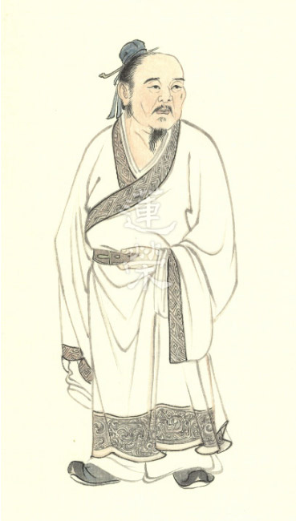

### 孔門七十二賢淺說(四十) — 公肩定

圖／江逸子、文／時哉

中庸之才

文學造詣

追隨淵商

聖教傳承

公肩定，公氏，名肩定，字子中，又稱子忠，春秋末年魯國人，有一說為晉國人。

公肩定於孔門中學習，以恆持忠信稱名於世。孔子教學以孝悌忠信為人格基礎，孔子期勉弟子：「弟子入則孝，出則弟，謹而信，汎愛眾，而親仁。行有餘力，則以學文」以德行、言語、政事、文學問孔門四大科目，使孔門弟子本末兼修，美好的文采建立在美好的質地上。

公肩定為孔門才德特出之士，道遵中庸，德依師門，述而不作，信而好古，以為訓行。

宋高宗贊原文：「公氏子忠，聖門之俊。修行文學，恆存忠信。道究一中，牆依數仞。梁父受封，榮名益振。」稱讚公肩定是孔門的俊彥之才，研究文學，心中常存忠信。在學道中追求的是中道(性與天道)，是依循孔子的教導，而非無知妄作，受封為梁父侯，名聲遠播。

公肩定於東漢明帝永平十五年從祀，唐開元年追封新田伯，宋朝封梁父侯，明朝改稱先賢。

畫中的公肩定雙手交握，側首觀境，一臉凝重的神情，或許有所感悟，似是有志於安邦定國的讀書人，憂國憂民的形象。（下期待續）

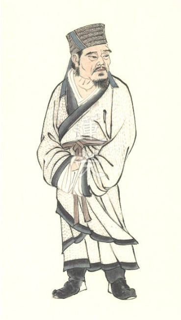

### 華夏精魂千秋（三十四）　明倫史畫　篤孝清介　王裒

圖／江逸子、文／淨域

哲人雖遠典範存

父死子隱教書業

孝名遠播道尊親

文化賴由人格顯

史畫

王裒，字偉元，魏晉時期青州城陽郡營陵(今山東省昌樂縣)人，生年不詳，約卒於晉懷帝永嘉五年(西元三一一年)。生性至孝，尚氣節，守禮度。

父親王儀官拜司馬，為安西將軍司馬昭僚屬。魏齊王嘉平四年(西元二五二年)，魏軍兩路攻打吳國東關(今安徽省含山縣)失利，雖大將軍司馬師自擔敗責，但王儀認為責任在於西路統帥司馬昭，因犯怒而遭司馬昭處死。王裒悲憤至極，終生不向西坐，以示不臣於晉室。雖朝廷多番徵召一概不應，隱居山林以教書為志業，並在父親墳旁築屋守墓。

王裒雖家貧，但生活能自給自足，從不接受他人的饋贈與協助。他生性孝順，每天到父親墳前叩拜，想起父親因直言而遭冤殺，就倚著柏樹痛哭灑淚。母親生前膽小畏懼雷聲，母親死後每遇打雷，裒便立刻跑到母親的墳前，對著墓說：「孩兒在這，母親您不要害怕。」王裒每讀到《詩經•蓼莪》：「哀哀父母，生我劬勞」一句，便痛哭不已；因此，門生都略過不讀，以免讓他觸動情傷。

除對父母盡孝外，王裒亦有知人之能。同鄉人管彥有才無名，王裒認為他努力必會顯達，於是與之結交，日後管彥官至西夷校尉。而北海人邴春，係名士邴原的後人，年少有志節，貧寒自處四處游學，時人認為是邴原再世。但王裒以為邴春心狹貪名，將不會成大器，果然日後學業無成。

王裒博學多聞行事依禮，在鄉里極具名望。某次，門生要到安丘縣服力役，請他代為說項，他雖拒絕卻陪同前去，有千餘人隨行。安丘縣令以為王裒來訪，便正衣冠出門迎接，結果見到王裒哭送門生，即下令該門生無須再服力役。然而，縣民卻以免役之事為恥，認為縣令有失官箴。

惠帝時朝政紊亂，八王互相殺伐，匈奴人劉淵起兵於離石(今山西省呂梁市)，國號漢，自稱漢王。懷帝永嘉四年(西元三一○年)劉淵死，子劉聰殺太子劉和，即位為漢趙昭武帝。次年四月，聰派石勒破滅十萬晉軍，殺太尉王衍；又遣呼延晏攻取洛陽，擄懷帝、殺太子及宗室，且縱容軍隊燒宮室、掘陵墓、擾生民，史稱「永嘉之亂」。雖司馬鄴在長安繼位為愍帝，但中原動盪盜賊四起，百姓多遷往江南避禍。親友勸他一同前往，但因顧念親墳不忍離去，最終為盜賊所害。

圖解

王裒忠孝事蹟流傳悠久，最初僅在山東一地。唐初修編《晉書》時，太宗欽定為王裒立傳，並將孝行寫入孝友篇。玄宗開元七年，又將其收入《孝經》一書，使儒家十三經成為士子必讀之書。

後人編《二十四孝》一書，又將其收入。清代名臣張之洞作《百孝圖》一書，亦將王修、王裒祖孫二人列入，並稱讚王裒是「孝子和烈士兼而有之」。日後官民大推《二十四孝圖》，王裒的事蹟便傳揚各地。

王裒為父死於非命而不仕（舉孝廉），且在父親墓旁築廬而居，每日跪拜抱著柏樹哭泣。又母親生前怕雷聲，死後每聞雷聲即跑到墓前，向墓說：「裒在此，母勿懼。」日後賊寇作亂鄉人南避，他因不忍棄墓遠走，終為亂賊所害。

宋代林同有詩讚：「悲哉生我劬，奈此念親何。墓側有枯樹，詩中無蓼莪。」末句說的即是他授課時，每讀到《詩經•蓼莪》：「哀哀父母，生我劬勞」一句，即再三流淚，學生只得將《蓼莪》刪去。王裒的孝篤非常，他認為人的行為，最理想應當歸於善道，不必以己能力加諸於人身，甚至呵責別人做不到己能做的。

《二十四孝》故事載王裒「聞雷泣墓」，此若王祥「臥冰求鯉」、孟宗「哭竹生筍」，皆是孝之至極所致，故而編選廣為傳揚。本圖江師所繪為「聞雷泣墓」一景，觀圖可聽見跪在墓前的王裒，大聲對著墓説：「母親莫怕，裒兒在此！」（下期待續）

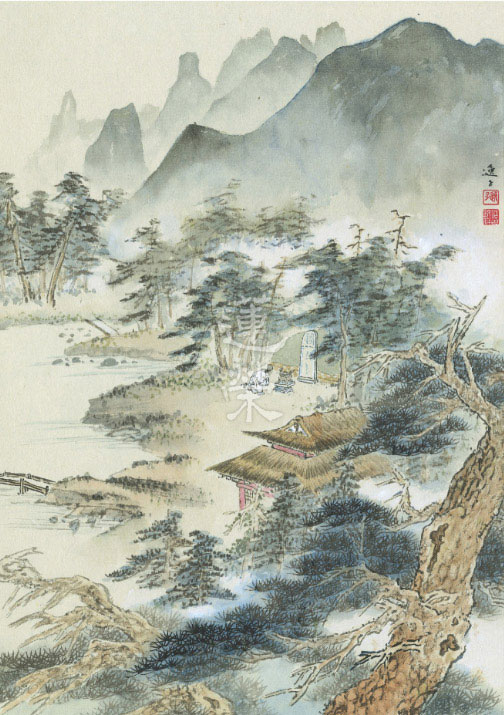

### 道藝春秋（六）　孝治天下　舜

*圖／江逸子、文／編輯部整理*

眉分八彩堯異相

目有重瞳舜特徵

歷練艱難民成帝

禪讓太平巍巍乎

孝治天下出自《孝經》，聖人治天下以孝做本質，在家懂得感恩父母者，在外便懂得感恩提攜自己的長上，在家是小孝，出社會歷練是中孝，成為帝王、發展道統，讓大家懂得孝親、齊家、治國，這是大孝，除了風氣的帶動，還要有帝王的氣象、相關人才的培養、歲月的歷練，才能成就這種善政，舜就是如此得天獨厚的人物。

畫者江逸子先生畫舜的冕旒，畫法跟畫黃帝一樣，彰顯他是平民登基，舜如果沒有碰到堯，他終其一生只是個種田的農夫，或是在黃河邊做陶的工人，能夠做到皇帝，要感謝堯帝的欣賞，破格錄用。

畫中舜拱手謙遜的形象，是他人格特質的顯現，二十四孝故事記載，舜的生母早逝，父親再娶，而繼母與弟弟待舜刻薄，處處爭鋒相對，舜卻始終如一，對父母恭順如常，對兩個弟弟加倍關心，因此名聲遠播。後來舜雖然貴為天子，回去省親時，對著失明的父親、氣勢跋扈的母親、桀傲不遜的弟弟，依然客氣，不會用權勢壓人，乃至於能禮賢下士，從堯手中承接天命，再傳位給大禹，都是這種姿態。

中國傳統社會中，很多人都把孝講成愚孝，但舜不是愚孝，他懂得小杖則受，大杖則逃的道理，他還是情緒管理的高手，生在這樣的家庭，卻從未怨天尤人、哀聲嘆氣，也不會懷恨在心、施予報復，《大學》中說「一家仁，一國興仁」，經營家庭良好的氣氛，有助於施政，把自家打理好，向外推展到社會、國家，才能治理得好，舜懂得如何跟家人、親族人相處，這是堯最欣賞他的地方。

舜還在各項職位中歷練，長達三十年，兢兢業業、不敢懈怠，把帝堯交代的事一一辦妥，不僅把事情辦好，更是慎重恭敬、面面俱到，終於舜在六十一歲時登上帝位，可說是大器晚成，累積了各種治國的能力，懂得情緒控管，又通達人情世故，使他登基後能鳴琴垂拱、無為而治，又知人善任，有人才團隊，閒暇之時，舜會在辦公室彈琴、吹南風、享受人生，因為他是內行人，各部門的事務皆了然於心。舜的無為而治中，最厲害的是他懂得賦予重任，例如賦予禹治水的工程，解除水患。

跟堯不同的是，堯有時過於仁厚，舜則是當機立斷，當時有四大皇卿國戚在朝作亂，分別為渾沌、饕餮、窮奇和檮杌，堯處理不了，舜上任後，一一放逐，展現其魄力，智慧、仁心、勇氣並進。

江先生所繪的舜，可看出他謙虛受教的形象，他的雙手舉在下巴的位置，表示對人作揖，他有天空般的胸懷，又能辨別忠言、讒言，懂得恩威並重、禮賢下士。江先生說，這些傳說人物與故事，已經很難百分之百還原當時的樣貌，作畫時除了參考相關文獻，讓畫面合乎當時的時代背景外，最重要的是「相由心生」，透過閱讀大量的史冊，去了解此人物及他一生所做之事，知道此人的心性，就能對其外相、面相有所想像。觀看此畫，我們要別具一隻眼看舜的處世能耐，愈了解其內涵，愈能看出這幅畫的可貴。 （下期待續）

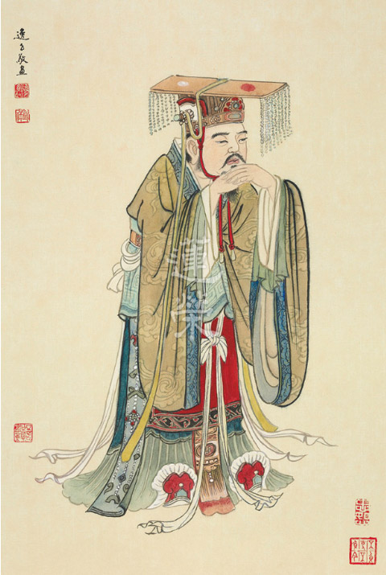
