# 第131期
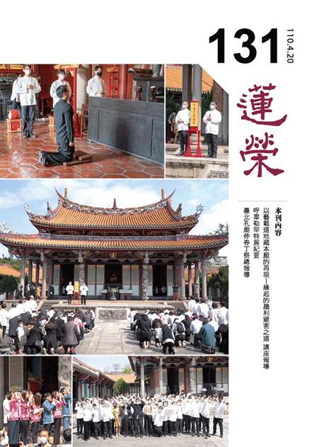

## 本刊社論

### 中觀正見的價值與現代學佛

*編輯部*

家庭和樂身心適

修身齊家在明德

中觀正見明德質

殊勝緣起條件多

邁入而二十一世紀的今天，世界繼續朝向工業革命4.0的方向狂奔，各種新興科技不斷滲透進入我們的生活，這個時代的人更依賴電腦、手機與網路。食、衣、住、行、育、樂都可以在網路上完成。「秀才不出門，能知天下事」不再是少數人的稀有比量，而是成為一般普羅大眾的現量。

這個時代各種不同領域的資訊獲得，用狂潮或氾濫的字眼已不足以形容，這個人只要他願意，一天二十四小時不睡覺，他都可以不斷地汲取各種新知。這是一個歷史上奇特的時代，有各種稀奇古怪、新奇好玩的物慾誘惑，打開手機、電腦，毫無限制的隨時隨地進入眼簾。反言之，這也是一個最好的時代，只要想查閱，整部大藏經都在網路上，歷代祖師的註解，近代及現代法師的講經筆錄，只要你想讀，幾乎沒有讀完的時候，想想隋朝智者大師，這位曾經在釋迦牟尼佛座下聽靈山會上的妙法蓮華經，後來在天台山的拜經台禮拜了十八年，等不到楞嚴經的東來。今天我們卻可以在網路上，在實體的經典流通處，想拜讀哪一位法師的講解，幾乎沒有任何障礙就可以親閱之，時代的差異變化是如此巨大。

資訊的氾濫，知見也跟著多元化，一人一把號，各吹各的調，公說公有理，婆說婆有理。一個家庭裡，可能每個人心目中佛法甚至宗教的定義都各不相同，也無所適從。維持佛法在家庭中的延續，已經變成每一位學佛者心中的大石頭。雖然歸元無二路，方便有多門，條條大路既通向羅馬，也通向佛門。有人因為聽到佛門的莊嚴的梵唄進入佛門，有人為追尋人生的真理而聞經教，有些人則遇到人生的困境欲尋找答案，有些人跟著父母一起學習佛法，更多的是因家人往生後見到助念的瑞相而進入佛門。進入佛門的人很多，可是經歷歲月的洗鍊，人情事相的折難，離開的也不少，不即不離是很典型的態樣。

這個時代要保護佛法，延續家庭的佛化，家庭親情的經營非常重要，攝法不可少，必要時候金剛怒目的折法也有不得不出的時機。但是最重要的應該是以佛（量士夫）對法的詮釋為內涵，試著在家中建立起以正因來成立比量與現量的氣氛，似乎是一條可行之路。一來這是佛法的核心命脈，解脫的正路；二來當諸多看法提出來時，可以成立正因檢驗之。若找不到正因的立論，問題就不攻自破了。或者以此不正確的因，可以反過來成立另一個宗。這樣的方式剛開始經營是辛苦的，可是當思維模式導向尋覓正因時，家人就會透過思考，找尋正確的因，成立正確的宗，這樣的作法正好是聞思修三學的重點。

其次講解佛法需要結合這個時代的條件與語言，才能讓聽者生起覺受，例如在以牛車馬車為主要交通工具的春秋時代講：「大車無輗，小車無軏，則何以行之哉」，是很貼切。拿來現代講，恐怕先要花一大堆時間解釋輗跟軏到底是甚麼物品。現代解釋萬法沒有自體性，可以拿現代的汽車或電視來做例子。同樣是一堆汽車零件或者電視零件，在還沒組合時，不能發揮車子承載的作用，或電視觀看的作用時，說它是汽車或電視是沒有意義的。甚至汽車報廢後不能發揮承載的作用，說是壞掉的車子也沒有實質意義，因為諸法是依作用安立名言。這不用學習中觀也是如此，只是一般人習焉而不察，卻常常在不知不覺中生起自相存在的那一分，最後整個陷進去，在我跟我所中生出無止盡的煩惱。

真正通達中觀正見的人，面對世間能夠通達人情世故，做出正確的抉擇，因為就算煩惱法也是緣起法，觀待執著有自性的人，諸法對這個人來說就是自性存在。而我的自性一旦真實存在，就算天王老子來也得讓路，所以很多時候佛菩薩或祖師大德面對很多狀況也只得苦笑讓路。

中觀正見的學習是困難而漫長的，它須要先學習眾多佛法入門的經典科目，建立佛法的基礎知識，然後才能一步一步建立抉擇的能取。而且光讀書沒有在事相上歷練也是不行的，因為沒有事相上的歷練，又如何在其中懺罪積福呢？沒有懺罪積福，經教的領悟能力也無從生，所以，能夠堅持以佛法經營家庭、人生的人，在經歷多年甚至一生的努力後，或許在某一天驀然回首時，發現一切的努力都是值得的，雖然一路跌跌撞撞、七上八下的，仍會慶幸還好是走在這一條路上。但願大家都能一起在這條路上共同前進，凡我同志，盍興呼來。

## 佛學覽幽

### 菩薩清淨的行持—華嚴經淨行品（四十七）

*戒慧講述／編輯部整理*

異論不離神我

萬法現實繫縛

苦行永不解脫

悲哉愚癡行者

丙二、指事顯因答其徵因

丁一、總徵

丁二、別顯

戊六、乞食道行時願（五十五願）

己二、所睹事境(十九願)

己三、所遇人物（有二十四願）

己三、所遇人物：論議人

經文：

見論議人，當願眾生，於諸異論，悉能摧伏。

此處的論議人是佛法在宗派的見解上去論議，而非瞋心ㄓ諍辯的形象，菩薩希望一切有情在所有宗派見解中皆能如獅子吼般有正確的知見，能消弭所有不正確的知見，能夠以智慧為本質，在教法上辯才無礙，降伏他人的錯誤知見。

南亭老和尚提到外道中的勝論師及數論師，勝論師認為法為實有，內境、外境皆實有，而且都是積聚而來的，「六句義」根據分析萬法萬物所得，「句」指它的名言，「義」指根據此名言來思考所得的狀況或是見解，六句義指的是實、德、業、同、異、和合六句。實指萬法的體性，認識法首先要認識法的體性，法的體性分別為地、水、火、風、空、時、方、我、意等九種，這九個是一切法的體性，色法的體性不會離開地水火風，空間亦是實有，有空間才能生萬法，空間、時間、方位、我、心意，萬法的體性不出這九類，而且這體性是真有、實有，稱之為實。這九項是一切法的體性，法不能離開空間而有法，不能離開時間而有法，不能離開地水火風而有法，有情不能離開心意而有有情，地水火風就是有情身的體性，意就是有情心的體性，還有一個我在主宰，這是萬法的體性，而且是透過觀察後的歸納法，印度人最喜歡冥想，去做種種歸類，而且都很有哲理。

德就是德相。體性跟德相配合，比如蘋果的相就是蘋果的體性，蘋果的體性從未離開過蘋果的相而說蘋果的體性，德就是那個所顯現的相，而顯現的相其體性不能離開這九種。

業包括它的作用，無論是色法還是心法，法一旦生起一定有它的作用、德相、體性。

再來同、異算一個屬性，大有是一個屬性，和合是一個屬性，而且一一都有證明。大有，在相宗十講裡面慈航法師的因明入正理論，他所說的勝論派的六句義，然後說到佛教徒如何駁倒勝論派，他一定要先懂勝論派的定義，《彌陀經》裡面說三類善知識，第一類叫做眾所知識，就是指像舍利弗這類舉國聞名的論師，因為其論議強，能夠打敗外道，解出佛經的真義。

大有是總相，總相是實法，舉例來說，所有符合能裝水的定義通通叫做杯子，杯子是總相，而每一個杯子在眼識下的差別杯則是別相。經驗法則中本來就有很多總相，我們都是用總相在看事情。

論議是非常重要的，佛在世時，大比丘眾所知識、長老、舍利弗等等，都是很有名的大論師，眾所知識指能打敗外道的那一分，名揚印度，所以他們出去托缽時都是滿缽，不是指在林邊水下長養聖胎，有著殊勝的禪定力量，降伏外道卻能力不足。論師一定學習很多宗派見，有能耐去論議。提婆達多最後鼓動僧團造反，提婆達多比佛更苦行，連鹽巴都不吃，連牛奶都不喝，夾帶苦行、慢心的威力，這種修行人執著起來是很可怕的，他帶領僧團，結合阿闍世王的勢力，想要取代佛。佛此時選擇沉默，靜待日後發展，也看弟子們如何運用所學來處理問題。佛座下的舍利弗及一些長老比丘很有論議的能力，他們就去提婆達多所帶領的僧團處做種種的論議，在見解上打敗他們，而不是比禪定、比苦行，否則比打坐、持戒，很難有勝負。可見論議是保護佛教的方式。

南亭老和尚舉出來的勝論師六句義，數論師二十五冥諦，是印度非常有名的宗派見，是印度非常強的外道，如果能將勝論師及數論師的宗義弄懂，大概就掌握了印度外道的核心思想，他們辯論通常無往不利，辯論完接受供養的寶傘蓋，有時候出門身後都有十幾支傘蓋，代表他在十幾種場合中打敗對手，佛教中能耐不夠深厚的人都不見得能贏，此時要真的對佛理有深入的了解，才有辦法上場論議。

六句義是用六個大要、六種分類將萬事萬物認識清楚，印度的論師其實都是用歸納法，而且自有他的解脫道，講起來非常完整，無懈可擊，除非你見其要害。

佛雖然說無我，但那是看場合而說，比如對著犢子部說有我，對著經部以上說無我，可是此處的無我跟唯識宗的無我，跟中觀宗的無我都不一樣，我們要了解各宗派彼此間的差異分別，要有這樣的能力，正確的認識勝義，正確的認識世俗。天台裡面講到擇乳的鵝王，牛奶跟水和在一起時，鵝王可以喝到奶而不喝到水，牠知道分別處，我們如果知道分別處，才能了知佛說的究竟義趣，才知道什麼叫做成佛，成的是什麼樣的佛，目標明確後，才知道下手用功處，才知道自己學習的進展。不分別是指空性，證得空性的時候，是無一法可得也無從分別，以無分別智來證得空性的那一分而說無分別。可是事項中若說不分別，是不符合世間軌則的，亦不被世間承許。

以下例舉幾個六句義，一一來破：

例ㄧ：同為人，而人中有白種人、黃種人、黑種人，大有就是在萬法中，總可以擁有別，總跟別都是實法。

破法：假如總可以擁有別，那麼總跟別是一還是異？佛性是實法還是非實法？佛性跟佛果是一還是異？佛性如果等於佛果，表示已經成佛了，那何必修行？佛性跟佛果如果是異，則是兩個完全無關的兩法，怎麼修行都不會成佛，這麼說來佛性是非實法，因為佛性若有，不是一就是異，沒有第三條路。既然佛性跟佛果非一也非異，那佛性是什麼？佛性是對著佛果才能說佛性，佛果是對著佛性說佛果，這兩者都不可得，是相互觀待的，意即佛性可以說是你具足的潛力，可是如果沒有成佛，說具足佛的潛力則無用，就像西瓜種有長成西瓜的潛力，但是沒有長成西瓜是沒有用的。所以佛果不可得，當你成佛的時候才說你有成佛的潛力，你因為有成佛的潛力說你成佛，兩者互相依靠。

例二：樹木名為樹木，可以包括樟木、檜木、杉木、柳木等等，這些都是實法，名為樹木的也是實法，叫做大有。同品喻是如同異性，例如水跟水可以是相同，可是水可以有別於火，我的大有性是我的總可以擁有你的別，可是我另外可以成立一個總。

破法：上述的同品喻根本不是同品喻，同異性是水跟水同，水跟火不同，問題那根本不是成為大有性的同品喻。總相怎麼可以是實法？總相名為樹木，但如果離開樟木、檜木、桃樹、柳樹等種種樹，樹木在哪裡？

例三：我是在五蘊上說我，我是總相，五蘊是別相，二者皆為實。

破法：勝論師的六句義，其實就是用總相來成立實法，而從總相來成立實法當中，我就是五蘊的總相，五蘊是差別相，立一個實在的我，總是實法，別是實法，只要我跟五蘊脫離就解脫，所以去修種種的苦行，比如在恆河邊修火供，在樹林中修苦行，讓我不要依靠五蘊，餓了就讓它餓，苦就給它苦，只要把「我」清楚明白的顯現時，我離開別法，我就可以孤伶伶的解脫，因為我是實法，這些別相也是實法，離開了這些種種差別相的實法，就可以孤伶伶的得到解脫，這跟後面的二十五冥諦是有關係的。破的方法就是去找尋離開五蘊的「我」在哪裡？發現不可得。離開五蘊指不出我在哪裡，那個孤伶伶的我根本非實法，卻硬要將它脫離五蘊，如何得解脫。

外道說死後靈魂我去見上帝，可是離開五蘊的我，靈魂又在哪裡，是找不到的。有人說靈魂跟身體一樣大，那身體長高了靈魂也應該要長高，身體變矮時靈魂也應該變矮，身體老去時靈魂也應該變老，可是外道又說靈魂不變，前後矛盾。勝論師的宗義從開始便錯，苦行根本無法解決他的問題，孤伶伶的我根本不可得，又談何解脫，一生的修行都在浪費時間。所以很多都在恆河邊修苦行，主張讓我跟五蘊分開的那些人，大多都屬勝論師派，包括裸行外道，他的本質都跟勝論派有關係。

瑜伽行者固然不會犯離蘊的我，可是犯了在五蘊上說我的毛病，所以他在不吃不喝的禪定當中，生起明顯的我在受用禪定的快樂，我的感覺還在，而且很明顯，修出一個很大的我，不但沒解脫，離解脫很遙遠。沒破我是不能解脫的，因為執有一個我，讓我樂的我愛，不讓我樂的我恨，愛恨生起一切的煩惱，造種種惡業，有業而去受苦，哪裡有解脫過，不過修出了一個我在受樂，我就是五蘊，我雖然離開五蘊沒有我，可是我就是五蘊我，他會錯覺是我去承受快樂。

而數論師的二十五冥諦是說，在外道，八萬大劫之事冥然不知，昧為自性，所謂冥初自性叫作冥諦，由著冥初他覺知增長，所以冥初生智大，由覺知生我慢心，生我執心，從自大生我心，有我執的心會顯現色聲香味觸，叫做五唯（唯也可以說是微小的微），我心生五唯之後，五唯又可以生地水火風空的五大，由極微而生。從五大能夠生出眼耳鼻舌身五知根，有覺知的能力，有五大又能夠生出五作業根，這裡的作業根是包括口手足還有大小便處，再來是意根，此處的意根指肉團心，也是由五大所成，所以從五大生意根又叫做平等根，意思是說，此心可遍一切根境，所以稱為平等。最後是神我，這個神我是常住不壞的，計為涅槃。全部加起來就是二十五冥諦，數論師用這二十五個數目來論解脫。

二十五冥諦分勝義跟世俗，勝義當中又分神我跟自性，立一個神我就準備要解脫了，自性是我想要享受快樂的時候，要透過自性去變，比如去創造人世間的快樂，進入世俗享受快樂的時候，從覺，他會透過覺知去內現自我、外現外境，外境要透過慢，慢就是說我有能力可以變現，慢當中現了五唯跟十一根，五唯就是色聲香味觸，五唯又會生出五大地水火風空，十一根就是會有五作根，五作根就是嘴巴、手、腳、大便道、小便道，五知根就是眼耳鼻舌身，還有意根，這就是十一根，慢，會生起五唯跟十一根，五唯又會生起五大，加起來就是二十五。我這一宗的解脫道是什麼呢？就是神我，我想要去受用快樂，自性就會產生，心內會現我，外現外境，透過五唯，透過慢心，生出五唯、五大、跟十一根，讓我從心、根去受用外境，可是有一天神我覺得很丟臉、很羞恥，此時神我就想跟自性分開，自性就把這些享受樂境的功能收起來，我跟自性分開，我孤伶伶的解脫，所以他還是會繼續去修火供、修苦行，去持狗戒、雞戒、牛戒，要把我跟自性分開，讓自性不要去變化，只要自性不要去變化，我就不會去受用，這個時候我就孤伶伶的解脫，可是問題是那個我怎麼有可能獨立獨存呢？辯證法同前，離開五支根、五作根，離開意根，爾時我在哪裡。

勝論師與數論師皆是立我宗、立神我宗，本質跟基督教、天主教一樣，都是立靈魂宗，就是常一自在的我。可是常一自在的我若有，那它在何處，離開五蘊的時候它在哪裡，他固然不是離蘊我，即蘊我也找不到。那我到底在哪裡，我是怎麼生起的，是對著五蘊自然而然名言安立稱為我，對著檜木、柳木、杉木說是樹木而已，並沒有一個實在的法，我只不過在五蘊上名言說、總相說我，整合它們，如果那個真實的我，你不去破它，則無法解脫。

勝論師立六句義，數論師立二十五冥諦都是在找解脫道，卻都錯得離譜，所以佛法厲害，厲害在見解，縱使全世界剩下你一人學佛，縱使外道生活比你享樂，家庭比你幸福，事業比你順利有成，你還是不會改信他教，學佛唯一不退轉就是靠正見的力量，而關鍵處在於修行的解脫道。

當我們從佛經中慢慢去解道理的時候，會發覺人生有很多的快樂，道理愈解你人生會愈快樂，原來事情就是這樣辦，人生可以有這樣的走向。以孔顏之樂來看，顏回簞食瓢飲、居陋巷，人不堪其憂，回也不改其樂，不改是指此境界雖苦，可是顏回心安在道上，所以快樂不改，這叫做心不隨境轉，而孔子是「飯疏食飲水，曲肱而枕之，樂亦在其中矣」，樂就在粗茶淡飯上，即以心轉境，就像佛每天吃馬麥，吃了九十天，心情卻很快樂，阿羅漢問佛這九十天是不是苦中作樂？佛說吃馬麥的當下就是天廚妙供，是真樂，可見孔子跟佛一樣，都是以心轉境。（下期待續）

### 大乘百法明門論簡說(三十八)—拾伍、心所有法　隨煩惱（七）

*戒慧講述／淨本整理*

忘先所學的教法

散亂於世俗欲塵

遇境無可用正知

庸俗過患的一生

經文：

五、隨煩惱二十者：一、忿。二、恨。三、惱。四、覆。五、誑。六、諂。七、憍。八、害。九、嫉。十、慳。十一、無慚。十二、無愧。十三、不信。十四、懈怠。十五、放逸。十六、昏沉。十七、掉舉。十八、失念。十九、不正知。二十、散亂。

對治前述失念的方法，就是要保持「正念」，也就是面對境界的時候能夠不忘記用教法去觀察。甚至連睡覺，我們都可以讓自己保持正念，例如睡前觀想，睡眠是為了讓自己有體力修學正法，止息屬於精進四力（勝解、歡喜、恆常、暫止息力）之一；又例如睡眠前可練習呼吸，或者觀察夜眠晝醒，尤如死亡又接續下一生的過程，訓練面對死亡的能力。面對境界要能提起正念，才不是失念，這才是修行，假如課堂上所學的佛法，在日用平常間全部用不上，那其實是很嚴重的失念。失念是散亂所依，因為失去正念，各種煩惱趁虛而入，不只如此，昏沉、掉舉等，也都會隨著失念生起。

再來說明散亂，《直解》云：「散亂者，於諸所緣令心流蕩為性，能障正定，惡慧所依為業。」掉舉是在一個境界上七上八下，心靜不下來，無法專注於修學；散亂是東想西想，到處流盪。例如念佛念到一半，想晚上要吃什麼、小孩怎麼還沒回來等。這些心思在我們學佛前不易察覺，真正學習教法想要修行時，才會發現散亂、掉舉、昏沉等狀況是那麼的多，好比平常看空中是透明清澈，但當陽光透進來時，才發覺原來佈滿了灰塵。灰塵本來就有，只是有待陽光照臨才能發現；散亂、掉舉、昏沉等心所本來就有，但是要在修止修觀時才會知道這些煩惱的厲害，平時隨順煩惱不會發現。

散亂會讓心思收不回來，這樣的人打坐中雖然不會昏沉、不會打瞌睡，但是想東想西，座上完全無法修行，比如曾經有人說，他在打坐過程中，可以把自己看過的京劇在腦海中演過一遍，打坐時間結束正好演完準備過堂吃飯，如此一座之間所修的都是散亂。散亂心就像獼猴攀樹，時而在此，時而在彼，一下子攀緣這個境界，另一下子又去攀緣另一個境界，這樣的人在緊急的時候一定提不起佛法，這也是念佛人求往生很大的障礙。

散亂能障正定，惡慧也依靠散亂而生。散亂者的特性，就是無法在所緣境上細心分析，此人生活忙碌而沒有重心，靜不下來，對事務無法正確揀擇，所以說是惡慧所依。過去紙上談兵的趙括，平日言談就是有散亂的問題，不知專注重視各類人的意見，與其父趙奢不同，因此趙括之母知道其子無法勝任抗秦重任。

接著說明不正知，《直解》云：「不正知者，於所觀境謬解為性，能障正知，多所毀犯為業，此以慧及癡各一分為體。」不正知特別講外道見，外道見對所觀境產生謬解，例如把無常看成常，把沒有靈魂說成有靈魂，把大自在天認為造物主，或者把世間一切看成根本無等，在這樣的基礎上，生出種種錯誤的修學法就是不正知。不正知會障礙正法的知，會毀犯正知之下所應遵守的戒條。

根本煩惱有「不正見」，與此處「不正知」的不同處是什麼？不正見指凡夫俱生或分別執我的心，因為執我的心而生出許多錯誤的修學法就是不正知。所以《直解》上說，不正知以癡與慧一分為體，癡就是執我的心，慧就是揀擇，在執我的心上，揀擇出種種錯誤的修學法，就是不正知的行相。以上已將根本煩惱法六、隨煩惱二十說明完畢。（下期待續）

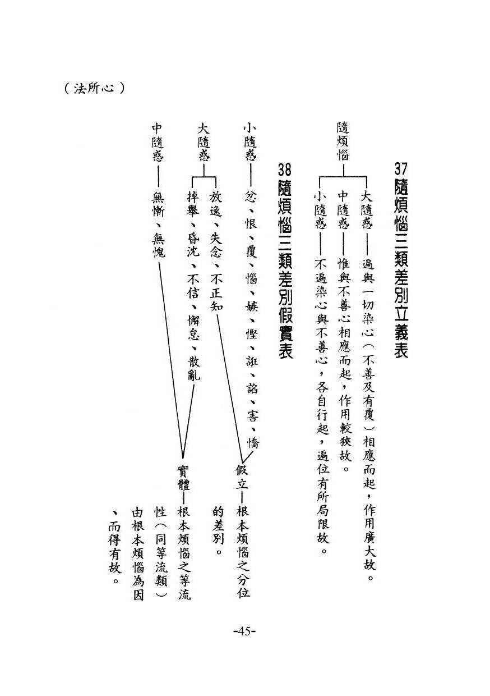

### 佛學概要十四講表簡說（三十三）—第六講表　宇宙有情概況

*戒慧講述／心若整理*

輪迴之處有六

苦樂由業而定

戒定真香人天

可貴擁護三寶

前言

十四講表中第四表、第五表言人生狀況，建立正確的人生觀，第六表、第七表講宇宙的概況，如實了知後建立正確的宇宙觀。宇是空間，空間十方；宙是時間，時間三世，通達古往今來，宇宙分為有情世間、器世間，歸納在十法界，器世間在第七表說明。

第六講表講到宇宙有情概況，能攝的是十二因緣，所攝的是輪迴的有情。有情所以名為情，代表有執著的那一分，有惑就會造業，造業就會受苦，被情所攝的成為六道，被智所攝的成為四聖。眼前就著有情來說，即指六道眾生，第六表較約著正報的種類，第七表較約著依報的環境。從中可以生起對宇宙有情的了解，而發起大悲心、菩提心，也就是發起要救度有情的心態，而必須要成佛，成佛必須要修學解脫道，沒有修學解脫道就去利益有情，對眾生意義不大。佛法的決戰點就是修學解脫道，第八表是修學解脫道的總綱，第九表告訴我們有五類的解脫道，第十表說明人天的解脫道，第十一表說明聲聞、緣覺的解脫道，第十二表講菩薩的解脫道，第十三表言解脫道修學的環境，第十四表揭示解脫道要當下修行。

第六講表

第六講表把這些輪迴的有情分為天、人、修羅、畜生、餓鬼、地獄六類，每一道都用類受跟苦厄來說，類受即正報的種類及其受用，受用當中特別以壽命來說，成為福的總綱。苦厄是不管受苦受樂，本質都是苦的，用這樣的角度來說六道概況。

首先為何稱為六道，道是道路的意思，有能通之義，有情眾生輾轉來回於此六條路輪迴，這六條路又互相通達，例如天可以直接通到人，也可以直接通到地獄，如同高速公路般四通八達。而能造成互相通達的那一分是靠著善惡業，故六道又名六趣，有趨向之意，眾生造下善惡業，善惡業的因會牽引我們趨向六道。

六道眾生狀況千差萬別，所以舉類受，也就是種類與受用，受用當中舉壽量，先談天道。

◎天道 ｜ 類受

天是天然、自然義，是六道中最殊勝的一道，他「受用天成」，意即不必努力造作就能有受用，衣食住行都是自然天成，就像北俱蘆洲，稻種撒下去，不必耕種即有收成，水不必經過過濾就可以喝，花也自然生長。思食食至，天道就是天廚妙供所成，想吃什麼就變現什麼，思衣衣至，天衣無縫，天衣殊勝，想要穿什麼衣服，衣服就自然穿上了，不必剪裁，不必洗滌。其亭臺樓閣花園亦是非常殊勝。再來講到「威德特尊」，表天人的身相儀容巍峨莊嚴。「神通自在」指他能變化的那一分，就像孫悟空七十二變般，以此三面向來說天道的殊勝，這是名為天的定義。

天的依報、正報皆較人間殊勝，不會有便痢、唾痰、膿等，不會有三十六種不淨，沒有骯髒臭穢之物，這也很麻煩，天人很難觀身不淨、觀心無常、觀法無我，會認為有一個我在享受。

再看天的種類，分為欲界天、色界天、無色界天。

欲界天

有六層天，名為欲是因為他還有男女、飲食、睡眠的欲望，還有色聲香味觸之五欲。像是八關齋戒最重要要守的就是不淫及過午不食，乃至於要對治睡眠、引發精進，可見持戒是造作未來感生天的因。

欲界天的六層天是四王天、忉利天、兜率天、化樂天、他化自在天，每一層都很殊勝，上一層天又比下一層天殊勝，以下一一介紹。

一、四王天

位在人間地面高四萬由旬之處，須彌山高出地面八萬由旬，他在須彌山的半山腰，四王天的人有七十五丈高，有男女婚嫁行欲，跟人間一樣，不同的是小孩為化生，在男子的兩膝中所生下的孩子則是男生，在女子兩股中生下的孩子則是女生，男生男，女生女。生下小孩後自然會現寶器來裝天廚妙供，資源豐盛，小孩長大後與諸天等高身量，即可赴天女處娛樂。

此天有四大天王，統御諸惡鬼神，令其不敢囂張肆虐，其下有三十二位天將，來協助寺廟。韋馱菩薩為三十二將之首，受到四大天王的尊重，因為他非常有修行，且護持正教，韋馱菩薩如入四天王所在處，四天王都會站起來，因為韋馱將軍的功勞太大，像外面大將軍打仗回來見皇帝一樣，皇帝都很客氣，叫作「韋將軍修童真行，護正法教，是故魔王不能得制。」課誦本裡有：「韋馱天將，菩薩化身，擁護佛法誓弘深，寶杵鎮魔軍功德難量」，如果韋馱菩薩將金剛降魔杵橫置在兩掌之間，就表示此廟接納四方，歡迎大家進來，如果韋馱菩薩的金剛降魔杵立在地上則代表不准進入，金剛杵的位置雖然只是很小的細節，卻能給雲遊到此的僧人們提供很大的信息。寺廟前的彌勒菩薩笑臉迎人，入到寺廟後韋駝菩薩黑臉威勢，肅立規矩。

為什麼四大天王、三十二將會護持出家人，因為有通有別，通是忉利天的天主憍尸迦(玉皇大帝)在迦葉佛時代是蓋佛塔的功德主，本身就是對佛教護持者，他也是在須菩提座下聽課的學生，護持正法的理由是如果不護持的話，邪魔歪道、阿修羅的力量增強，對天是不利的，就像一個國家的政治，當犯罪者愈多，政治保不住，所以一定要壓制犯罪，弘揚文化變成不得不然的措施，維持政局的方式。

北方多聞天王是黃色的守護神，拿著傘蓋代表威勢，因多聞使能力轉強，散發自信心。西方廣目天王，是紅色的守護神，握著寶珠、捏著蛇，捏蛇代表能夠降伏貪欲，權力大、貪欲重，寶珠來滿眾生的願。南方增長天王，是藍色的守護神，捧著書、拿著智慧的劍，代表書劍江山，內能夠降伏煩惱，外能夠成就智慧。東方持國天王拿著琵琶，象徵禮樂教化，聖王要多聞、好學、降伏貪欲、增長智慧、禮樂教化，合起來就是一個國王必須要具備的政治內涵。

什麼樣的人可以成為四大天王？其在因地中還是有男婚女嫁，但非貪戀女色的心，結合的目的是為了家庭、宗族的延續，這樣的人死亡時是光明的，可以投生到四王天。不過還是有些許男女的欲望，所以屬於欲界的範圍。

「諸世間人，不求常住。未能捨諸妻妾恩愛，於邪淫中，心不流逸，澄瑩光明，命終之後，鄰於日月，如是一類，名四天王天。」「如是六天，形雖出動，心跡尚交。自此已還，名為欲界。」有些許男女的欲望，然有持戒或護戒的那一分都能成為欲界天的因，有定的那一分能成就色界天、無色界天的因，有慧的那一分可以出離三界。

居須彌山腰，在四萬由旬的宮殿處，四王天壽命五百歲，一天是人間的五十年，總共的壽量是九百萬歲。受生是在父母肩上或懷中，忽然化出，佛經有各類描述，天的變化太多，不是佛經一語可以說盡。六欲天雖行淫欲，但沒有三十六種不淨。

食物有觸食、思食、識食和段食，有接觸、用想的，或用心識來吃，例如眼睛以顏色為食物，思食是依所學去作很多思維，使內心非常法喜，又耳朵以聲音為食物，整個空蕩蕩的房間都是樂團。識食是心在定中，不用吃飯，段食就是一頓飯、一頓飯，所吃進去的流入身體各個支分，且馬上消化，沒有排泄物。而「隨其福德，飯色有異，上者見白，中者見黃，下者見赤」。

二、    忉利天

位在須彌山的山頂，離人間地八萬由旬處，共有三十三天，在一個平面上，諸侯有三十二天。此特指在迦葉佛時代，有三十三個女生共造一個佛塔的因緣來說的，並非每個忉利天都是三十三天。在釋迦牟尼佛所攝的娑婆國土中，有十億個忉利天。此單位世界的忉利天王名釋提桓因，又稱為天帝釋，就是在佛成道時，用法輪來請法的那一位。此天身長一百五十丈，而帝釋天主身長三百丈，因其過去偏修恭敬業的緣故，特別是禮敬迦葉佛、造殊勝的寶塔。帝釋天宮殿最為殊勝，其餘三十二天宮、園苑，境界光色各異。諸宮天王想要遊戲時，天女圍繞，奏諸音樂，食物為天酥陀，飲天甘露，每天去不同的淨土玩，花樣甚多，乘寶車、寶船，遊香水河，歌舞言笑，非常放逸，忉利天主能勸這些天人修道業，不要放逸，免於臨終墮落，其對佛法的擁護，受諸天王恭敬愛戴。

天有三苦，一是苦衰象現，二是與阿修羅作戰的苦，三是各地天王容易換人，中央權力大，地方緊張。

帝釋天住的宮城叫作善見城，位於須彌山頂中央，城外西南有善法堂(釋迦牟尼佛為母說地藏經之處)，是忉利天眾集會之地，每逢初八、十四、十五這三齋日，天眾集合於此堂，詳問人天的善惡，及討論如何制服阿修羅等事情。帝釋天升堂後，三十二天左右坐，四大天王則依四門坐。就像古代帝王開會，底下諸侯群集，大雅就是天子朝會諸侯，諸侯都戒慎恐懼。

帝釋屬於須彌系的統治者，整個須彌系為一單位世界，如同今日所說的太陽系，統領忉利天以下所有眾生，一直包括到無間地獄，宛然是一個造物主，苦樂由他，好像雇主跟員工的關係。

雖說造善得樂、造惡得苦不由造物主，可是現見很多是由造物主決定，造物主彷彿有生殺大權，其實若沒有過去的因，眼前根本不會被他攝受，比方說甲縣的縣長很囂張跋扈，可是乙縣的人就不受影響，都是因果攝受，但不妨礙說有造物主。

帝釋天為須彌系之統主，忉利天以下都歸他統理，四大天王幫忙管理，分為八部神眾，他們要巡視下界，觀察人等生類是否有持戒、布施、修福德等事，並報告給帝釋天。如果修德者很少，行惡者多，帝釋就會憂惱如此天眾減損，阿修羅增加，如果聽到精進者多，則帝釋天與三十二輔臣都非常歡喜，並遣善諸神來保護其身，在人間持一戒者，會有五善神保護之，五戒具持者，會有二十五守護神保護。

三十二天像是諸侯或者總督，管理國家各個省份，四天王天則類似直系部隊，人道修學正法有助於天的威勢，將來升天，更助天的威勢。

他們統攝的範圍：從忉利天以下可以分為三類：

ㄧ、天神：含天、阿修羅等，為天帝釋所統。

二、地祇：含餓鬼、地獄等，為閻羅王所統。

三、人畜：為轉輪王所統。

帝釋天正統天神，兼統忉利天以下六道，閻羅王正統餓鬼、地獄，兼統人、畜生，因為人畜死後會到閻羅王處做善惡的分判。轉輪王正統人，兼統畜生。民間所奉玉皇大帝，指帝釋天而言。而帝釋宿植善根，常向佛請法，且率領四王及八部為護法聽眾。

三、    夜摩天

比忉利天加一倍高、一倍廣，忉利天已是須彌山頂，夜摩天再更高處，居在天上。夜摩又翻譯為時分，「時時唱快樂故」，不同時間有不同時間的快樂，從早快樂到晚上，此處日光照不到，但用蓮花的開闔來明晝夜。夜摩天一天是人間的兩百年，活兩千歲，共是一億四千四百萬歲。淫心愈來愈薄，往上層升的力量愈強。其心態愈來愈柔軟，「自不樂忿諍，勸他令和順」，可見天的高低層次，都論心的柔和、心的定力。可見一個人耐得住煩、心態柔和很重要，和平的處理問題。

四王天、忉利天為「地居天」，而從夜摩天以上都是「空居天」，同樣是欲界，為何還有地居天跟空居天之別？乃修養很好的人成為欲界天，即所謂的四王天、忉利天，可是要往上爬，不依地而住的空居天就要靠定力上去，此定力屬於欲界定。

四、    兜率天

在夜摩天之上，高度廣度都是夜摩天的一倍，壽命四千歲。於虛空中有地如雲，上升精微，跟下界諸人天境沒有關係，為兜率天所住。兜率譯為知足，謂夜摩天受用欲界妙五欲樂已經是最高了，但受樂時不知足，而此天能知足，特別講彌勒菩薩的教化區來說，有正法見地者受樂才會知足。

兜率天中別有一生補處(等覺)菩薩居處，名為內院，由彌勒菩薩所居，於此等待因緣成熟，降生人間，示現八相成道。

五、    化樂天

兜率天之上倍高倍廣，壽命八千歲。於虛空處有地如雲，超越兜率天，是化樂天所在地。此天娛樂時，自以神力、福力變現種種五塵妙欲來娛樂自己，故名「化樂」，自己變化受樂。

六、    他化自在天

化樂天之上倍高倍廣，壽命一萬六千歲，於虛空處有地如雲。此天想要得到快樂時，由於天特別是化樂天變現，給他化自在天受用。化樂天猶如他化自在天的奴僕。

七、    摩羅天

被他化自在天所攝持，魔王名「波旬」，時常擾害修行人，常恐行者出離三界，魔眷減少，故令鬼神等部屬作種種惱害，破壞行者善根。

過去斷惡修善才升天，為何會有摩羅天？因為天是共外道、共凡夫，外道修善的勢力也很強，有的沒有解脫的正知見，當其成為欲界天，發現有人要解脫時，難以容忍，故會行種種惱害，如同中東回教國家，虔誠誦可蘭經，對自己的教義、戒律認真持守、膜拜、做功課，卻對佛教敵意深厚。

以上六欲諸天，都有五欲與男女之欲，然五欲的快樂是一天勝過一天，而淫欲是一天輕於一天，《俱舍論》說：「六受欲交抱，執手笑視淫」，四王天、忉利天為形交，跟人間一樣，然忉利天但出風氣，沒有其他的不淨。夜摩天男女相互擁抱就是淫事，兜率天男女互相握手為淫事，化樂天男女互相笑一笑，欲心即息。他化自在天男女互相看一眼就完畢。這是由於定力的淺深而有淫欲的輕重差別。（下期待續）

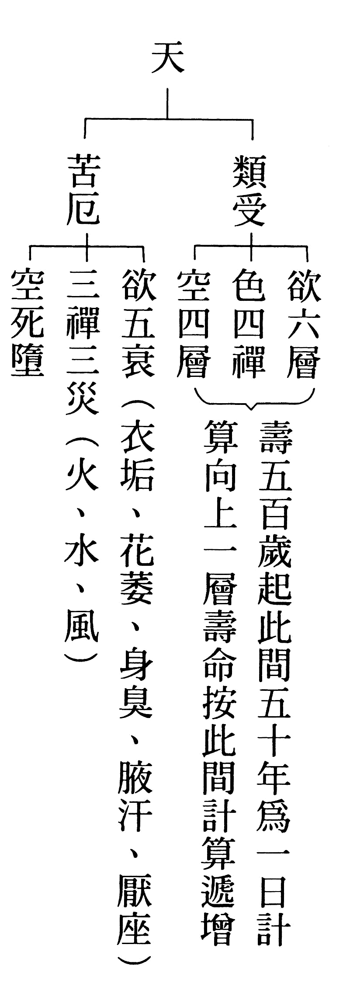

### 人生大事不能忽略的事實—示華權師病中法語

*戒慧講述／編輯部整理*

心志求往生

因緣不思議

自發性用功

感應道交易

此文以出家眾為代表，顯示生病時的用功法，首要自己生起生西的決定見。文分三大段，第一段是總顯出苦法要，第二段別釋要速求西歸，第三段結勸我們要心佛相應。

總顯出苦法要

經文：

「人生在世，皆不能免疾病死亡之苦，當此等苦事發現之時，唯有放下萬緣，一心念南無阿彌陀佛」。

本段印祖以同理心，先安慰病苦中的華權師，人生終究要面臨病苦、死亡，對症下藥的方式是要放下萬緣、一心念佛。

別釋速求西歸

速求往生西方極樂世界，科又分為「預防」及「治療」。

「預防」，印祖指示在病中即需志在往生、不作他想。

經文：「若氣促，則只念阿彌陀佛四字，一心求佛慈悲，接引你往生西方，除此一念外，心中不可再起一絲毫別種的想念，亦不可望病速好，亦不可另起求神求天保佑的想念。有此種想念，便與阿彌陀佛之心隔開了。因此便不能得佛慈悲加被之力。你要曉得，天地父母，均不能令你出生死輪迴，唯有阿彌陀佛，能令你出生死輪迴。你若肯放下一切，一心念佛，若世壽未盡，就會速好。若世壽已盡，即往生西方。然不可求病速愈，只可求速往生。求病癒，若壽盡，便不得往生。求往生，若壽未盡，則速得痊癒。往生西方，好處說不盡，較彼生到天上，做天帝天王，尚要高超過無數無量萬萬萬萬倍。你切不可癡心妄想怕死，有怕死的心，就不得往生了。有怕死的心，就不得往生了。我們在世間，猶如蛆在糞坑裡，囚在監牢裡，苦得了不得。往生西方，如出糞坑監牢，到清淨安樂逍遙自在之家鄉，何可怕死。若一有怕死的心，便永遠在生死輪迴中受苦，永無出苦的時期了。」

志在往生：心中最隱微的秘密以滅法的方式來攝持。一般來說，人皆以求生怕死總攝所有的想念，而且不相信自己今天會死（常見），無常觀也從來沒有結合自身來說無常。如果能夠改變觀念，結合緣上的造作，業就會跟著改變。我們凡夫大抵都是心隨境轉，沒有確立的正知見，命運難以改變，佛雖然加被，但不代表真的能往生。

不作他想：當我內心隱微處以求生怕死為主，對醫生的信心比對佛的信心還要來得多，不再以佛為皈依的對象，便破了皈依的體，想要病好，或者求神丹妙藥、天神保佑，當我對佛的信心不足，跟佛無法感應道交，我不能成為所攝受者，佛亦無法成為能攝受，結果就是無法蒙佛加被。

佛對我們的加被，在淨土的那一分，因環境殊勝，在清淨的佛國土中，依著善知識讓正法推展無礙，且能降魔。外感上，醫生開的藥能夠對症下藥，將身體調好。念佛的實質效益，可得佛力加被而心情愉悅，夜夢安穩。

「治療」

經文：「你若能出聲念，則小聲念。不能出聲念，則心裡默念。耳朵聽別人念，心中亦如此念。又眼睛望著阿彌陀佛，（即室中所供的佛）心中想著阿彌陀佛。有別種念起，當自責曰，我要仗佛力生西方，何可起此種念頭，壞我大事。你若肯依我所說的念，決定會往生西方，了生脫死，超凡入聖。永劫常受快樂，了無一絲一毫之苦事見聞，又何有此種之疾病苦惱乎。儻心中起煩惱時，要曉得這是宿世惡業所使，要壞我往生西方之道，要使我永遠受生死輪迴之苦。我而今曉得他是要害我的，我偏不隨他轉。」

往生西方，連輪迴的大苦都可以除了，何況眼前小苦。不求延年益壽，但求好死，阿彌陀佛連了生死都可以幫助，何況是病速好！我們必須要通達對痛苦的認知，佛號才是真正的治療。

正面來講要都攝六根，六根都緣著阿彌陀佛名號，出聲念、心裡默念，耳朵聽他人念，眼睛看著佛像，其中又以意根為主，意根收則五根都收。

反面來講能伏惑業，自己做自己的主人，自己就是勸自己的人，極樂世界沒有病苦，作善容易，有榜樣可循。要有修苦行的能耐，有承擔痛苦的能耐，以佛力加被來度過身體的病苦，也超越宿世惡業所引發的煩惱，例如殺生的惡業容易生起恐慌，瞋恨心容易引發憂鬱等。但這些煩惱，最厲害的煩惱是對往生沒有信心，平常沒病的時候要用大量的善業去稀釋惡業，內心在意的是往生淨土。要知道業力不可思議，容易把我們帶入三途六道；但是心力也不可思議，藉著佛法將觀念作很大的調整，藉著佛經所說的道理來調整自己的心態；最後就是要相信佛力不可思議。

結勸心佛相應

經文：

「除過念佛外，一事也不念他。那就能與佛心心相應，蒙佛接引，直下往生矣。好記我語，自可速得莫大之利益。」

內心嚮往極樂世界，心心念念都安住於佛號上，不但不求病好也不求神保佑，更不癡心妄想貪生怕死，絕對能得莫大的利益，安然往生。

（下期待續）

### 大佛頂如來密因修證了義諸菩薩萬行首楞嚴經—七處徵心（七）

*戒慧講述／淨本整理*

根塵中間無有識

在內在外皆不成

尋覓心了不可得

能所雙亡空性現

【科判分析】

寅六、破中間（根塵中處）

阿難尊者提出心在根塵中間的看法。

一、「阿難計心在根塵之中」

阿難尊者以為心在根塵之間。

（一）、「阿難泛說中間」

阿難尊者先大致上表明心不在內、不在外，則心當在中間。

１、「謬引昔教」

錯謬引用過去佛與文殊菩薩等談實相時，也曾說過心不在內、不在外的道理。

２、「檢前立中」

檢視前面幾次討論的結果，而立論心在中間。

（二）、「如來確定中相」

如來先要阿難尊者確定所謂「中間」的位置在何處。

１、「雙徵兩在」

如來徵問阿難尊者，所謂的中，是在某處之中？還是在身之中？

２、「雙示不成」

如來開示無論是在身之中或者在某處之中都不能成立。

ａ、「在身不成」

如來開示心在身之中不能成立。

ｂ、「在處不成」

如來開示心在某處之中不能成立。

（三）、「阿難別出己見」

阿難尊者另外提出自己的見解。

１、「異佛現說」

阿難尊者表示，他的看法與佛現在所說的兩處不同。

２、「同佛昔說」

阿難尊者舉出往昔佛的說法，認為心在根塵之中。

二、如來以兼二不兼為破

如來以心體兼在根塵上或不兼在根塵上的論來破除阿難尊者的看法。

（一）、「正破」

如來正面論述破除阿難尊者的看法。

１、「雙開兩途」

若心在根塵中間，如來開出兩種可能性。

２、「雙示俱非」

如來開示，兩種可能性都是錯誤的。

ａ、「兼二非中」

心體兼在根塵之中不能成立。

ｂ、「不兼更非」

心體不在根上也不在塵上也是錯誤。

（二）、「結破」

結論就是阿難尊者「心在根塵之中」的說法不能成立。

【經文解釋】

阿難白佛言：世尊，我亦聞佛，與文殊等諸法王子，談實相時，世尊亦言，心不在內，亦不在外。

阿難尊者對佛說：「世尊，我也聽過佛與文殊菩薩等諸法王子談論實相時，世尊也說：『心不在內，也不在外』。」

如我思惟，內無所見，外不相知。內無知故，在內不成。身心相知，在外非義。今相知故，復內無見，當在中間。

「如我思維，身內毫無所見，心在外則身心互不相知。對於身內無所知，所以心在內的說法不能成立；身體有感觸心都能知，所以心在外也不合於義理。現在身心相知的原故，而又無法看見身內，所以心應當在中間。」

阿難尊者遭到摩登伽女之難，就是眼睛看、心想，若沒有心，眼睛也視而不見，耳朵也聽而不聞，否則死人有眼有耳，為何不能見聞？但心究竟是在何處？阿難認為在中間，佛接著要問他，所謂的中間是指哪裡？

佛言：汝言中間，中必不迷，非無所在。今汝推中，中何為在。為復在處。為當在身。

佛說：「你說在中間，中間必然不是讓人迷惑了不可得的處所，不會沒有所在的位置。現在你推論認為心在中間，中又在哪裡？是在身外某處？或在身內？」

若在身者，在邊非中，在中同內。

「如果所謂的『中』是在身，那在『身邊』還是『身中』？若在身邊，名言安立為『邊』就不是『中』；若在『身中』，那就跟前面所說的心在身內看法相同。」

若在處者，為有所表，為無所表。無表同無。表則無定。何以故。如人以表，表為中時，東看則西，南觀成北。表體既混，心應雜亂。

「如果所謂的『中』是在身外某處，是可以表現出來的某處？還是不能表現出來的某處？如果不能表現出來，那就等同沒有這樣的地方；如果可以表現出來，那也無法定出中間。什麼原因呢？如果有人表示心在某處並稱為中間時，東邊看這個心是在西邊，南邊看這個心就成為北邊，表現為『中間』的自體性根本找不到，中間只是觀待性顯現，那這個心的位置應該是雜亂難有定所。」

此處佛陀的說明，可知方位也是觀待下成立，我們常念的「西方」極樂世界，是觀待地球與極樂世界的位置而稱，讓眾生有所依循，非謂西方永遠是西方。

阿難言：我所說中，非此二種。

阿難尊者接著說：「我所說的中，不是佛陀您所說的這兩種。」

如世尊言，眼色為緣，生於眼識。眼有分別，色塵無知。識生其中，則為心在。

「如世尊所說，眼根是能緣，以色塵為所緣，可以生出眼識（心的作用）看見色塵；眼根有分別作用，色塵沒有認知的作用，眼識在眼根與色塵中間產生，那才是心的所在。」

佛言：汝心若在根塵之中，此之心體，為復兼二，為不兼二？

佛陀說道：「你的心識若是在根塵中間生起，這個心體兼存於根塵之上？還是根塵之上都沒有？

若兼二者，物體雜亂。物非體知，成敵兩立，云何為中。

「若根與塵上都兼有這個心，根與塵的能所關係雜亂，到底誰是能緣誰是所緣就分不清楚。色塵不像眼根有感知的作用，眼根與色塵一個是能緣，一個是所緣，相互對立，不能同存於一法之上，心體如何能夠兼在根塵之『中』」。

兼二不成，非知不知，即無體性，中何為相。

「若根與塵上都沒有這個心，心不在能了知的眼根上，也不在沒有了知作用的色塵上，離開能緣的根及所緣的塵，都找不到心的作用，所以心沒有體性，那麼所謂的心在『中』，是什麼樣的形象呢？」

是故應知，當在中間，無有是處。

「所以應該知道，你說『心識在根塵中間』，完全不正確。」（下期待續）

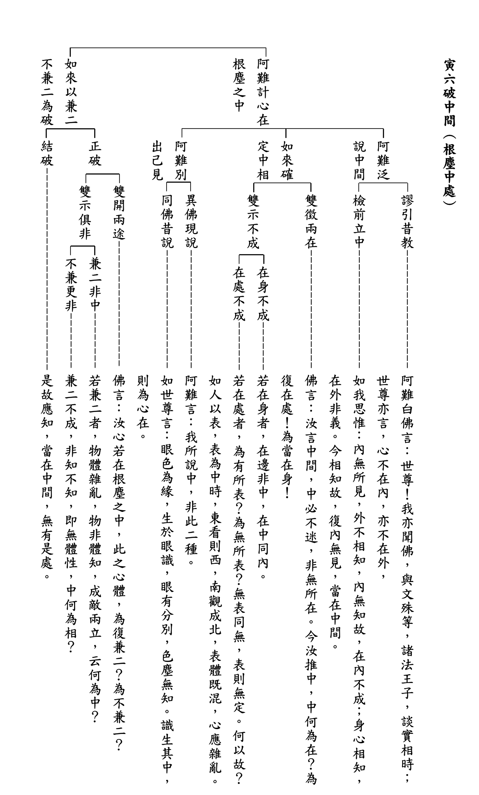

## 孔學一隅

### 論語簡說（三十八）— 子張篇第二十二章　夫子學無常師，傳承文武之道

時哉講述

一生好學成能知

文武之道是所知

大綱細目皆講究

內聖外王乃所證

前言

德語系的國家，諸如德國、瑞士、奧地利，其職業教育做得很成功，因為他們是師徒制，有固定的老師。在學校有理論的課程，私下有老師特別指導，透過實物磨練，使他們出社會能夠得心應手。而本章孔子的成功處就是有老師，只不過孔子沒有固定的老師，這是孔子不同處，亦是他的成就處。

經文

衛公孫朝問于子貢曰：仲尼焉學。子貢曰：文武之道，未墜於地，在人。賢者識其大者，不賢者識其小者。莫不有文武之道焉。夫子焉不學。而亦何常師之有。（子張第二十二）

消文
衛國公孫朝問子貢：孔子的學問從何而來？子貢回
**答：** 文王、武王雖已不在世，但文王、武王的道統並沒有喪失，至今還在世間，由人流傳。才器大的人能記其治國、平天下的大道，普通人能記末小的修身齊家之道，由此看來，他們所記憶無論大與小，都是文武之道。凡能記得一部分文武之道的人，孔子都跟從他學，所以沒有固定的老師。

章旨

人能弘道，文王、武王之道靠人流傳，孔子學無常師，完整傳承文武之道。

科判分析

本章分兩大段。第一段是衛國的大夫公孫朝問子貢說：你的老師從哪裡學？

第二段子貢回答公孫朝之問，又分三段。第一段「文武之道，未墜於地，在人。」總說周文王、武王過世後，道統沒有滅亡，在人流傳，傳承未斷。第二段顯示傳承沒有斷的理由，即「賢者識其大者，不賢者識其小者。莫不有文武之道焉。」學習文武之道大分為兩類人，第一類是賢者，即有體悟的人，能夠「識其大者」，能知道文武之道的大。「不賢者」並非小人、惡人，而是悟性少之人，知道文武之道的小。不管是賢者還是不賢者，都有文武之道。第三段讚歎夫子得到完整的傳承，傳承在聽聞，「而亦何常師之有」，哪有固定的老師呢？這就是孔子的秘密。

釋義

本章舉衛公孫朝有何涵義？衛公孫朝是誰？何以有本章之問？

公孫朝在各國都有，翻閱史籍，鄭國、楚國、魯國皆有記載，馬融注解，「衛公孫朝」就是衛國大夫公孫朝。《白虎通》的「姓名學」講到，諸侯的長子要繼承王位時，叫做世子，其餘為公子，公子的兒子叫做公孫，世姓公孫，如子產就叫做公孫喬。公孫即衛國的權貴、國君的後代，他的大夫(職位)是世襲而來。

本章是讚歎的語氣問子貢，孔子是從哪裡學來的？何以有這麼多的內涵？是無師自通天生就會，還是學自哪個老師呢？

衛公孫朝為何稱孔子為仲尼？

孔子的母親顏徵在嫁給叔梁紇，至尼丘山致禱，生出孔子，為感謝尼丘山神明的護持加被，便將兒子取名為丘，字仲尼(仲指在家排行老二)，他人可以稱孔子為仲尼，或者孔子的徒孫也可以稱他為仲尼。

何謂文武之道？

《中庸》說孔子是「祖述堯舜，憲章文武」，「祖」是根本，根本的講述處是堯舜。「憲章文武」的憲是法的意思，法明的是文武，換句話說，典籍保留在文王、武王，而所傳述的是堯舜的內涵。《尚書》讚歎堯「欽明」，讚歎舜「文明」，此明解釋為形而上，在《尚書》、《論語》裡面，堯傳給舜叫做「允執其中」，舜傳給禹叫做「人心惟危，道心惟微，惟精惟一，允執厥中」，「中」就是形而上，「喜怒哀樂未發謂之中」，意思是成為一國之王，必須具有形而上之德，即聖人來配君子的大位，因為聖人是不隨境界轉，不會被名聞利養所動，所以堯舜能夠禪讓天下，真心去利益眾生，堯傳給舜的心法是中，舜傳給禹的心法也是中。「憲章文武」的目的就是「祖述堯舜」，原來文化的典籍除了形而下的通達外，還要通達形而上，才更見君子的風采及內涵。

文武之道能代表中華文化的全部嗎，為何不說是堯舜之道？

在劉寶楠的《論語正義》中說，大道從堯舜傳到周文王、武王時，文化典籍、制禮作樂的制度已非常完備，中華文化的全部即指典籍來說，為何不說堯舜之道是因為堯舜之道也在典籍，而這些典籍代代相傳，一直到文王武王時典籍完備。

文武之道代表中華文化，有其他經典可證明嗎？

《論語‧八佾》篇說「郁郁乎文哉，吾從周」，就是這些文章、典章制度非常完備，所以孔子從周。孔子、子貢皆以文武之道來說中華文化，中華文化就是文武之道的典籍，能夠彰顯聖人內涵。

文武之道的實質為何？

文武之道在人，而不在典籍，叫做「人能弘道，非道弘人」，人才能把經書的義涵發揚出來，才能夠根據經書的內涵去培養人才。經書無人講述則無價值，孔子曾經問禮於老子，老子對他說：你所說的那些人，他們的骨頭都已經枯朽了，只有他們的言論還流傳在人間，這段話便是「文武之道，未墜於地，在人。」之義。

除了子貢說文化道統在人，還有哪位哲人說過此話？

孔子被圍困於匡地時曾說：「文王既沒，文不在茲乎？」當後面的人都不懂得文化內涵時，文化的道統就失傳了，經書保留再多也無用。人才能弘揚、傳承文化。文化是一個國家的靈魂、企業的命脈，一個民族的長治久安之道。

賢者如何知文武之道的大，其形象為何？

子貢說，賢者是知文武之道的大，劉寶楠《論語正義》中說，文武之道的大是「承天制人」，「承天」是懂得吉凶禍福的道理，懂得形而上，而用典籍來治國，叫做「制人」。以《大學》來說，像治國、平天下就是文武之道的大。以《中庸》來說，能夠發揮經典的中和之道，就是文武之道的大。還有懂得《易經》六十四卦、三百八十四爻的趨吉避凶之道，跟形而上的易無體、神無方，就是文武之道的大。通達人情世故、通達義理，通達文武之道的氣象，就是文武之道的大，這就是賢者。

不賢者如何知道文武之道的小，其形象為何？

文武之道的小，就是懂得名相、制度、條目，乃至於修身、齊家之道。或是在《易經》裡面，只懂得這些卦辭、卦相的解釋而已。

「識」讀「志」其義為何？

識解釋成敘述的述，可見賢者可以敘述文武之道的大，或是可以記住文武之道的大、可以體會文武之道的大。

賢與不賢皆是孔子時期之人，說明了什麼？

說明孔子能學的太多了，孔子能夠取其精華成為完整的內涵，造成盛況。例如能讀《禮記》是文武之道的小，能夠把《禮記》的精神抓住，編成《常禮舉要》，應用於時代，則是文武之道的大。

孔子向賢者學就好了，何必向不賢者學？

此處的「不賢者」不是指小人、匪類、品德很差者，而是領悟力不夠。可是他們各有所長，賢者能在氣象上通達，不賢者可以通往一些條目的細節，就像孔子向師襄學樂的技法，或者入太廟請問這些禮節、儀式。

本章可說明孔子的成就來自學無常師嗎？

如果懂得《因明學》的立宗答辯，學無常師是不定因，學無常師可以集大成，也可以毀了他，多能者不是也學無常師嗎？但若學的是外道見、邪派見，沒有中心思想，學到最後雜亂無章、漫無頭緒，可見學無常師是不定因。孔子學無常師可以成就，一是因為他是天生德，有極高的領悟力，二是因為他好學過人。

子貢為何如此回答公孫朝，孔子到底是生而知之還是學而知之？

學無常師是學而知之，可是孔子又說自己是「天生德於予」，即生而知之。其實孔子是「生而知之」也「學而知之」，有極高的領悟力，又透過學習了解世間，透過「多學而識」通達各個老師的精華，又能「一以貫之」。孔子示現跟隨老師學習，示現好學，示現自己是有老師才能通達。

試舉孔子向懂文武之道的賢者與不賢者求學之例？
孔子曾問官郯子，子就是子爵，他本身姓已，是少昊氏的後代，他的父母眼疾，要喝鹿奶，郯子就披了鹿皮去擠鹿奶，差點被獵人射殺。此人在魯昭公十七年時，接受魯國的邀請來到魯國，席間吃飯時，叔孫昭很好奇的
**問：** 你身為少昊氏的後代，少昊氏都是以鳥來名官，請問是何意？郯子回
**答：** 黃帝那時有雲的瑞象，就以雲來命官，神農氏那時候有火的瑞象，就用火來命官，伏羲氏有龍的瑞象，就用龍來命官，少昊氏是黃帝的長子，那時有鳳凰來儀，就以鳥命官。鳳凰鳥是掌管曆法的，所以司空、司寇、司徒，都用鳥來命官。孔子二十七歲的時候就去郯這個國家，拜訪郯子來學官制，這是學習文武之道的小，又如學琴師襄也算文武之道的小。

孔子三十五歲到周朝拜訪萇弘學樂，萇弘就盛讚孔子有聖人的氣象，孔子向其學樂理、樂的經營、樂的氣象。又問禮老子，包括問禮的經營、禮的氣象，這可以說是文武之道的小，也可以是文武之道的大。

學無常師有何功德與過患？

學無常師可以吸取各家之長、增廣見聞。但若不知取捨、照單全收，就容易相互矛盾，內心無從取捨，最可怕的是沒有眼力去認識老師，結果學的都是邪門外道；而孔子就算看了邪門外道的書，都可以把它轉成正道。

妄自菲薄與不自量力有何差別？

諸葛亮的《出師表》告訴阿斗不宜妄自菲薄，國家有人才團隊的協助，大家都要報答先帝的知遇之恩，怎麼可以毫無振作？而不自量力是說能耐不足者，偏要去任此職位。

人人都可以為堯舜、人人都可以學孔子，不要妄自菲薄，但若要學無常師跟孔子一樣，就是自不量力。

孔子為什麼不教弟子學無常師？

第一，孔子本身就是集大成，攬各家精華於一身。　　第二，學生非生而知之者，也沒有孔子的好學過人，也不一定有眼力去認識名師、益友。最後就會「大道以多歧亡羊，學者以多方喪生」，因岔路太多而迷失正確方向、誤入歧途。

本章與「郁郁乎文哉，吾從周」有何關聯？

「郁郁乎文哉，吾從周」出自《論語‧八佾》篇第三，講周朝的典章制度完備，孔子說：夏朝、商朝到周朝的典籍，周朝的典籍完備，所以我跟從周朝。而本章是要跟老師學，才能真正懂文武之道，今日學孔子的內涵，就是學文武之道的大、小，就是學真正中華文化道統的全部。

本章的旨趣為何？

學要有本有末，本是文化道統，末是多能。有文化內涵時，才能導正多能的方向，才能夠攝持多能，創造時代的價值，莊嚴時代。

總結

一、人才是出路，而人才從好學來，好學才有出路。

二、好學靠老師，不用走冤枉路，而能夠很輕易學到他人的內涵。

三、有師通是有常師還是無常師，端看你是否是生而知之者，有沒有眼力認人，是不是能夠把他人的內涵學通？

四、有常師要由本入末，「末」就是多能，「本」就是品德、經學見地、人情世故的通達，懂得依禮進退，懂得吉凶禍福。

五、雪廬老人說：走入時代，不昧潮流。有經學的見地，不會食古不化，也不會追逐無益的潮流，而能夠博古通今。

問答

**問：** 孔子曾經做過委吏、乘田、中都宰，後又到中央做大司寇，他如何能有時間做文化的集大成？又如果我們不具備孔子的條件，就不能學無常師，要如何理解《孟子》所說的「人人皆可為堯舜」呢？

**答：** 一個人的內心裡面，如果抱持的宗旨就是學習，只要此人有心，一定會克服困難花時間去學習。再來，堯舜把政治辦得很清明時，天下太平無事，大家安分守己。《孟子》說：人人皆可以為堯舜，告訴大家不宜妄自菲薄，但不可以自不量力。求學一定有次第、步驟，不能漫無目的、毫無章法。孔子一定是經過多生的學習，才有這一生的天生德。

**問：** 本章是否可與「三人行必有我師焉」、「夫子入太廟，每事問」這兩章互相引發？

**答：** 「三人行，必有我師焉」指不管跟誰在一起，都善學對方的長處，對方的短處變成自我警惕，這是孔子厲害處，不會近朱者赤、近墨者黑。「入太廟，每事問」是在演禮的時候，是一個傳承，問禮器儀節等是文武之道的小，而祭祀會帶來國家的長治久安則是文武之道的大。

**問：** 本章可以跟「君子不可小知，而可大受也，小人不可大受，而可小知也」這一章相通嗎？

**答：** 君子大受是講君子的才器可以大受，不可以用小的地方去知他，君子可能不會修馬達，可是卻能承當大使命，小人則不能用大受去責他，各歸各，這是講到才器、心量，而本章的賢與不賢是講領悟力，兩者不同。

**問：** 孔子學無常師，又能一以貫之，是否有矛盾？

**答：** 一以貫之特別是講通達形而上的那一分，學無常師，學習文武之道的大與小，都被一以貫之所攝持，這是孔子天生德的能耐，可是天生德也必須要學而知之，學而知之才懂得世間。（下期待續）

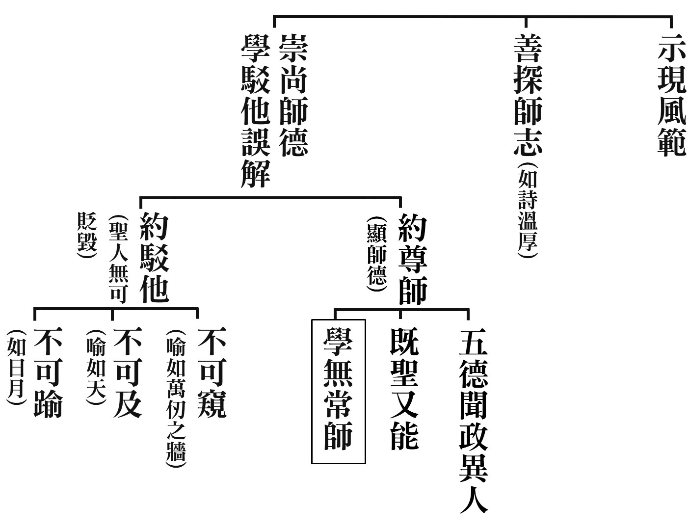

### 孔門心法—中庸之道(十九)　第十六章：面對未知心存敬畏，感應之道就在其中

*時哉講述／弘毅整理*

盡人事祭鬼神

厚親族揚正法

信敬鬼神而遠

正直者方獲福

前言

面對浩瀚的宇宙天地我們應該心存敬畏，對於可知的是如此，對於未知更應該如此。天地萬物的運作，自有一套道理，即使處於科學發達的時代，也只能略知一二，無法探究分明。中庸云「鬼神之為德，其盛矣乎！視之而弗見，聽之而弗聞，體物而不可遺。」能通達鬼神者，才能完整了解孔門的心法，透過內心的誠敬才可以感應得到庇佑，這種來自外部的助力，可以幫助我們逢凶化吉，也能讓學習之路更加順遂。

清明節、端午節、中秋節和農曆新年是中國的四大節日，清明節是在春分過後的第十五天左右，大概是四月四日、五日、六日這三天中的一天，「清明時節雨紛紛」，清明節時一般都會下雨，淨化空氣，消除灰塵，「路上行人欲斷魂」，去掃墓的行人在雨中行走，身體受濕，心中也難免戚戚然，「借問酒家何處有」，掃墓完想要借酒消愁，就問哪裡有酒家，「牧童遙指杏花村」；尤其小姐、小孩子們很喜歡清明節，一年難得出門，此時除了掃墓外，還可以踏青。乾隆皇帝登基的時候，有一幅〈清明上河圖〉就描繪了兩千多人在清明節踏青的場景，除了節日的清明，還包括政治的清明。

清明節祭祀鬼，祖先就是鬼。中國除了祭鬼外，還講究祭神，祭神有很多類，其中有兩項非常重要，一個是祭祀黃帝，我們都是黃帝的子孫，這是在祭祀血脈；一個是祭祀孔子，這是在祭祀慧命。當年雪廬老人在一九四七年跟著孔奉祀官回到曲阜時，就主持祭孔大典，國大代表蔡玉成稱讚老人對祭孔大典不論是禮器、樂舞、精神和形式，都非常通達。所以老人到臺中後，曾經被聘為臺中孔廟祭孔的首席顧問，在形式、樂器、樂舞等方面都加以指導。

除了祭祀黃帝和孔子以外，各行業都會拜源頭，感恩他們所做的貢獻。第一個是工匠魯班，還有祭祀最傑出的司法官皋陶，祭祀藥王神農氏，祭祀他們代表飲水思源。在中國是這樣，西洋也是如此，如在運動比賽前，都會禱告，透過莊嚴的儀式祈求加被，希望這場比賽能夠順利。在泰國的清邁，和臺北的平溪比較類似，聚會時會放一萬盞孔明燈，還有夏威夷在一九九九年開始舉辦水燈節，他們釋放水燈來回向給先人和過世的親朋好友，可見祭祀鬼神求加被，中國和外國皆然，此章就是在講授這樣的道理。

中庸總體科判

第十六章還是在《中庸》的第二部分，即分別顯示中庸的修學法和義理。

本章科判分析

本章講鬼神之德，祭祀的時候要很有誠意，才能得到福報。首先總體說明鬼神的威德，然後分別顯示鬼神是看不到、聽不到的，但體察萬物的時候不能遺漏鬼神，所以要誠信的祭祀，接著引用《詩經》說，鬼神來了是不可思議、不可以懈怠的。最後結勸，在很隱微、看不到的地方，感應的時候是很顯明的，無法掩藏。

消文釋義

經文：

子曰：鬼神之為德，其盛矣乎！

消文：神的德能是非常殊勝的，能給人福禍，無所不在。

在浩瀚的宇宙中，有太多的不可知，科技越發達，越發現所知太少。那些越深入去研究的科學家，就越不敢否認鬼神的存在。

經文：

視之而弗見，聽之而弗聞，體物而不可遺。

消文：鬼神的形象是看也看不見，聽也聽不到的，正因為一般人沒有見聽鬼神的量，所以才否認鬼神的存在。

就如同在可見光以外，有我們人眼所看不見的光的存在，同樣也有人類所聽不到的聲音。看不到、聽不到不代表不存在。

「體物而不可遺」有兩種解釋：第一種，我們體察萬物不可以遺漏鬼神；第二種，鬼神體察有情（人或動物）不會有所遺漏，《尚書》中說「作善降之百祥，作不善降之百殃。」

經文：

使天下之人，齊明盛服，以承祭祀。洋洋乎！如在其上，如在其左右。

消文：天下的人在祭祀之前，齋戒沐浴，用明衣布擦乾身體，然後穿上莊嚴的衣服，還要有禮器、供品、樂舞等方面的講究，再去祭祀，就會感應到鬼神如同汪洋大海，好像在上面，又好像在左右，無處不在。我們在祭祀當中，表達對先人的緬懷、感恩，表達慎終追遠。

經文：

詩曰：「神之格思，不可度思！矧可射思！」

消文：《詩經‧大雅‧抑》上說：神明來了，是不可思議的，不可度量的，我們用真誠心祭祀都來不及，況且我們懈怠應付了事呢？

雪廬老人曾經在曲阜看過祭孔大典，當時的巡撫眼睛都不敢東張西望，下雨時有人給他撐傘，糾儀官立刻說「撤蓋」。有誠意才能感應道交，很多大人都在物慾的追逐當中喪失了誠意，沒有了乾淨的相貌，純真的表情。我們要如小女孩那樣誠心的祈求父母送她一個蛋糕，或者在很晚的時候，祈求父母能平安歸來。

釋義：「格」，來了；「思」，語助詞；「矧」，況且；「射」，懈怠，不在乎。

經文：

夫微之顯，誠之不可揜，如此夫。

消文：在看不到、聽不到的地方，用心體會就能感應得到，實在是不可以掩藏、欺騙的，就這樣吧。

如蓮花上面的小水滴，看起來很微細，可是在放大鏡下就很明顯。或者如在監視器下小偷自以為很隱秘的行為，卻很清楚的顯現在警察的監控下。

再如雪公和屈萬里先生是好朋友，剛來臺灣時，當雪公為奉祀官府來臺缺糧時，屈先生二話不說，將米缸之糧全數饋贈，自己不留半點，當屈先生有一次遭了賊盜家裡被洗劫一空時，雪公就馬上量做幾件衣服寄給他，屈先生卻客氣的寄回來，雪公再寄過去，並義正嚴辭告訴他朋友間是要互通有無的。即便很少見面，但互相之間的關懷是能夠用心體會的，會用人事的誠意，就會用鬼神的誠意，二者相通。

鬼神是不可能被欺騙的，它無處不在。如同父母的心思都在小孩身上，小孩騙父母說要去讀書，父母的眼睛如同孫悟空的火眼金睛，一看就現出原形，所以在父母的誠意下是藏不住的。

釋義：「微」，看不到、聽不到的地方；「誠」，實在是；「揜」，掩藏，欺騙。

章旨

本章主要在講鬼神的有無，鬼神的德能，以及祭祀的殊勝。

析疑

一、重視祭祀的根本原因為何？

我們所祭祀的鬼神包括祖先、對國家有貢獻的人和行業的開創者，祭祀的根本原因就是報本還恩，吃水果要拜樹頭，飲水要思源。

二、本章與前章的關聯為何？

前章說君子要想利益天下蒼生，讓他們得到快樂，要透過辦政治和辦教育，辦政治的關鍵是謀造和諧，而和諧從經營家庭開始。此章是說祭祀鬼神必須要有誠意，這樣才能感應道交。

三、在科學發達的現代社會中，本章是否流於迷信？

美國物理學家理查‧費曼曾經說過：「科學家總嘗試想盡快證明自己是錯的。」牛頓的粒子說被惠更斯的波動說打敗，量子理論又推翻前面的概念，以前科學家認為太陽系有九大行星，可是現在卻認為是八大行星，可見科學是不斷更新的。DDT可以除瘧疾和殺蟲，可是如果流入水域被魚吃掉後，再被人食用，會令男人精子受損無法生育，女人會導致流產，生出的小孩會智能不足或者發育不良，以前認為農藥吃了不會有問題，現在沒有人還會抱持這樣的觀點。以前很少有人會關注環境問題和氣候暖化，現在成為人們關注的焦點。所以科學並不等於真理，科學理論是在不斷更新的，科學認為沒有鬼神，也只是暫時的認知。

四、鬼神何以能無所不在？

我們看不到、聽不到鬼神是不能成為否定鬼神存在的因，這是因明學的邏輯。《易經‧繫辭傳》上說：「精氣為物，遊魂為變，是故知鬼神之情狀。」遊魂就是心識，我們東想西想就是遊魂為變，鬼神可以藉著精氣的流動，發揮心識（遊魂）的功能，就好像我們今日通過衛星收視，在家收看美國的棒球比賽。

五、對於看不見、聽不到、摸不著的鬼神，應抱持何種心態？

我們應該抱持著「敬鬼神而遠之」的心態，雖然要祭祀鬼神求加被，但不要事事請教鬼神，而是要藉著聖賢的道理把人事做好。

六、祭祀鬼神有何利益，不祭祀鬼神有何過患？

祭祀鬼神可以令我們生起報本還恩的心態，讓造作善法具備順緣，對社會風氣有正面的影響。神是典範，他們曾經對國家、社會、行業做出貢獻，祭神就是祭典範。不祭祀鬼神，我們難以生起報本還恩的心態，不懂得追溯源頭，發展善良風氣，也沒有典範可以效仿。

七、鬼神為何能夠賜予福禍？

鬼神是根據一個人所做的善惡而賜予福禍，就好像我們在單位工作好壞而得到領導的獎懲一樣。

八、鬼神賜予福禍的故事？

南朝宋有一位將領叫王玄謨，他一次去和北魏打仗，結果戰敗，主將一怒之下要將他斬首，他晚上夢見有人告訴他，只要念一部經一千遍就可以免死，他醒來後就堅持念完一千遍，果然有人替他求情，主將只好放了他。看起來好像是人事，可是冥冥中又有鬼神的幫忙。就好像你求加被去面試應聘，然後見到主考官感到很親切，回答很得體，就被主考官破格錄用。南朝齊蕭睿明的母親病重臥床，他侍奉母親孝道圓滿，有一天，突然來了一個人給他東西，讓他給他的母親服用，他母親吃了後，病就好了。以上都是鬼神賜予福禍的事例，是不可思議的。

九、古今之禮大不同，現代應如何祭祀鬼神才合禮？

古今時代不同，禮儀自然不同，要根據時代特徵、風俗變遷而有所損益。

十、如何才能感得鬼神出現接受祭祀？祭祀的心法為何？

邀請鬼神前來接受祭拜，要在心法和做法上講究。

心法：《論語‧八佾》篇裡說：「祭如在，祭神如神在。」祭祀鬼神時，要如同就在眼前一樣。又「禮，與其奢也，寧儉。」禮的關鍵在誠意。比如，一個朋友很有誠意的邀請你，你是能夠感受到的，下次他再邀請你，你也會很樂於接受。人事與鬼神之事相通。

作法：《論語‧鄉黨》篇裡說：「齋，必有明衣，布。齋必變食，居必遷坐。」祭祀前，必須齋戒沐浴，擦乾身體。飲食上不能大魚大肉，起居上夫妻要分房居住。《弟子規》說：「事死者，如事生。」事奉死者（鬼神）要像事奉生者一樣，如給死者供奉的飯菜，做的要讓生者都想吃才行，不能隨便應付了事。

十一、領導者帶頭祭祀有何利益？

領導者帶頭祭祀，會引發教忠教孝的風氣。祭祀祖先就是教孝，祭祀三軍陣亡的將士就是教忠，祭祀民族英雄就是樹立典範，如諸葛亮、關公、史可法等。祭祀他們會起到教育的功能，使民風淳厚，懂得報本還恩，知道舉頭三尺有神明，所以以前人心善良，作奸犯科的很少，治安很好。

十二、如何才能使天下之人，齊明盛服，以承祭祀？

要讓現代人齋明盛服的去祭祀，就要讓他們知道祭祀的功德、鬼神的德能，誠意和作法的重要，如果有此認識，就不會穿著隨意、馬虎輕佻、東張西望。就好像去參加一個重要的應聘，會事事講究。

十三、本章所舉之詩，原意為何？舉為本章之意又如何？

《詩經•大雅•抑》篇裡說：「相在爾室，尚不愧於屋漏。無曰不顯，莫予雲覯。神之格思，不可度思，矧可射思！」在你房間偏僻的地方，也要有敬畏之心，不要因為不明顯而馬虎隨意，神來了是不可思議的，怎麼可以馬虎懈怠呢？原意是講慎獨的重要，不要以為在隱微處有不好的想法和做法，沒有人知道，鬼神是知道的。揚雄的《解嘲》裡說：「高明之家，鬼瞰其室。」在那種有高門大院的人家裡，如果在某個角落花天酒地，構思著陰謀詭計，好像外人都不知道，可是鬼神卻能清楚的知道。就好像今日利用衛星探照，監控系統一樣，如果懂得鬼神的德能，就會慎獨。慎獨有三種：第一，要對得起自己的良心；第二，君子是無法欺瞞的；第三，鬼神是騙不了的。

此章不是在講慎獨，而是在講祭祀。祭祀不可以馬虎輕佻，要齋戒沐浴，講究儀式。

十四、本章與中庸之道有何關聯？
儒家有三大學
**問：** 內聖、外王和鬼神。通往內聖外王之道都要有鬼神的加被，有些人莫名其妙的碰到善知識，有些人卻碰到的是邪師邪友。《中庸》是子思闡述孔子的心法，是內聖外王之道，學習中庸之道也是要有鬼神加被的。

十五、在凡事要眼見為憑的現代社會，如何運用本章內涵於生活之中？

牛頓一生關於科學的著作只佔百分之十六，講到神明的卻佔百分之八十四。愛迪生一生有一千多種發明，包括電燈泡、留聲機等，當他發明遇到瓶頸時，他是靠祈禱來突破的。愛因斯坦曾經說過：「學得越深入，才曉得自己的學問其實膚淺。」所以，現在的科學也只是暫時有限的認知，科學所不知道的是更多的。

十六、本章對現代人民乃至社會國家有何啟示？

實力固然重要，可是運氣也不容忽視。康熙年間八阿哥要對付雍正時，有人問他有幾成把握，他說九成，還有一成是天意，結果就敗在了那一成上。諸葛亮經過周密的算計，眼看要把司馬懿燒死在上方谷時，結果天空中下起了雨，這就是天意。孔子的母親嫁給年老的叔梁紇，可是她在尼山祝禱後，生下了健壯的孔子。孔子一次生重病時，子路也向上天祈禱孔子能夠痊癒。臺語講：「七分靠打拚（內因），三分天註定（外緣）。」但有時候是「三分靠打拼，七分天註定。」有時候外緣比內因更重要。

總結

一、科學不斷變化，人對於無知的事情，不能簡單的否定，而是要謙虛的去探究、分析、考證。

二、用已知的去面對未知。要有因明的分析，邏輯的推理，客觀的判斷，不能主觀的妄下論斷。

三、誠心才能感應加被。懂得了鬼神的道理，會對天地充滿了敬畏，懂得斷惡修善，求加被，懂得慎獨，害怕隱微的過失成為今後的災難，還可以幫助我們建立人格，對治煩惱，提升反省改過的能力，這才是君子的修學法。

問答

一、儒家到底是重祭祀，還是人事？

儒家重人事，講究五倫關係的經營，斷惡修善，講到品德、好學、利他的重要，很少講到鬼神，但是不能忽略未知的力量，而要想獲得鬼神的加被，要在人事上講究。另外祭祀也是人事的彰顯，是對後代慎終追遠的教育。

二、今日沒有宗廟，領導者該如何表現對鬼神的重視？

雖然沒有宗廟，但是就鬼來講，可以祭祀自己的祖先，報本還恩；就神來講，指為國家做貢獻的民族英雄、三軍將士、行業的開創者，帶動整個國家緬懷先烈，緬懷這些有功之人，助長國家風氣正面向上，使國家欣欣向榮。

三、祭祀時與鬼神感應是何種形象？

一般情況鬼神是聽不到、看不到的，但當你祭祀很有誠意時，內心是能感應到鬼神存在的，甚至能聽到鬼神的聲音。如周文王非常有誠意的祭祀祖先時，能夠感應到祖先的嘆息聲。

四、祭祀可以得到鬼神的加被，為什麼要敬而遠之，不是應該尊敬，親近鬼神嗎？

「遠之」是說，不必事事求教鬼神，必須按照聖賢的道理去做。要結合時代，和他人配合，盡到人事，能夠擔當，有理想抱負，懂得向他人請教學習，充實自己的才能，再去求加被。

五、「大禹致孝乎鬼神」的形象為何？

孔子讚歎大禹在祭祀中孝表達到極致，包括在齋明盛服，禮器、供品、儀式與態度等方面的講究，如同孝子事奉父母，都不敢怠慢。

六、子不語，怪力亂神，因此一般認定孔子是無神論者，此處中庸卻又大談鬼神之事，是否自相矛盾？

「子不語」指孔子很少和他人談論鬼神的事情，因為信者恆信，不信者恆不信，問得太多也是無關宏旨，甚至引入歧途。但是孔子也有說，如「祭如在，祭神如神在」，「非其鬼而祭之，諂也」，「禮，與其奢也，寧儉。喪，與其易也，寧戚。」等，都說明鬼神的存在。

七、此章說鬼神「視之而弗見」，有時候小孩或臨終的老人說有看到，偶爾也聽說年輕人也有看到的，「聽之而弗聞」，那文王在祭祀的時候不也聽到了祖先的嘆息聲嗎？

大體上人們是看不到、聽不到鬼神的，在某種條件下能夠看到、聽到是要另當別論的。

八、既然看不到、聽不到那孔子是如何知道鬼神的存在，並且如此稱讚呢？孔子不是「如有所譽，必有所試」嗎？

這就是感應之道，很難說清楚。就好像練氣功，平常不知道氣存在於何處，醫療器械都無法檢測到，可是一提起來就有。練太極拳的人平常看起來很柔弱，當氣提起來的時候，幾個人都不能推動他。感應之道就是如此，只可為知者言，難與俗人道。

九、誠是否是形而上的修學法？

誠是普遍的學習方法，可以幫助我們通往形而上和形而下。

十、夫子「祭則得福」，是否與尚書太甲說「鬼神無常享，享于克誠」有關呢？

是的。鬼神不是你叫他來就來，大抵一般人祭祀，鬼神都是沒有來的。因為供品做的也不好吃，又沒有誠意，沒有如在眼前的感受，鬼神不會來。如同邀請貴賓，卻沒有合乎邀約貴賓的禮儀，如何能邀請到呢？

十一、《了凡四訓•積善之方》中講到許多善人善事，其中多有與鬼神相關之記述，例如台州應尚書聞鬼語而救人一事，這些故事能相信嗎？

要成立一件事情，可以分為依理成立、依教成立和依人情推理成立。依理成立是看邏輯推理是否合理；依教成立是指一個人從來不會騙人，而且他的邏輯推理能力是非常強的，你雖然對他所講的道理難以理解，但還是願意相信他所說的。依人情推理成立是說，《了凡四訓》是袁了凡先生寫給兒子的，他怎麼會欺騙自己的孩子呢？再有袁了凡先生是一個懂得斷惡修善、頭腦清楚的人，他可以把善剖析辨別為：真假、端曲、陰陽、是非、偏正、半滿、大小、難易等方面，改過的心態上包括：恥心、畏心和勇心，改過的作法上分為事上改、理上改和心上改，他還被認為是八百年來寶坻縣最好的知縣。從這些內容可以看出了凡先生是一個很有德行、理智和威望的人，他的話是非常可信的。

十二、若善人不求鬼神，也會得到加被嗎？反之，惡人求鬼神，能得到加被嗎？

以人事來類推，如果你是大善人，當你看到有人做善時，雖然他沒有求你幫忙，可是你還是想幫助他，只是因為他沒有求助，你無法發揮更大的力量幫助他，只能暗中或者有限的幫助。就好像孩子沒有求父親幫忙，父親只能暗中幫助，如果孩子有所請求，父親就可以全力幫忙。因此善人雖然沒有求鬼神加被，但鬼神也會暗中加被他，只是沒有誠意的祭祀加被那樣大。

惡人求鬼神加被，善的鬼神是不會加被的，如果求得了惡的鬼神加被，他雖然暫時亨通，但反而加速了他的敗亡。

十三、善人完全否定鬼神，還可以得到加被嗎？

如果你是一個大善人，另一個善人否定你，你雖然不會幫助他，但也不會加禍給他。就好像北宋的那些大政治家，如司馬光、范仲淹、歐陽修，他們雖然政治理念各有不同，但不會互相陷害。所以對於正直的鬼神，你雖然否定、反對它們，一般來講，它們只是不會加被你，但不會加禍給你。然而如果太衝撞、惹怒鬼神也是不行的，要適可而止。

十四、我們雖然在祭祀時是很誠心、虔誠的，但是因為現在沒有統一的祭禮，禮儀沒有到位，會不會有所影響？

國家最好請大儒參考古禮，再結合時代，制定出一個現代人可以有的做法，或者自己通達古書以後，隨順時代而變化。如雪廬老人對於婚禮、喪禮都有一套程序，後輩的弟子們可以拿來實行，做事還是要有一套次序的。

十五、若誠心誠意祭祀，但卻殺雞宰鴨，這樣會有感應嗎？

雪廬老人也是同意古時候太牢的做法，梁武帝才改成素食祭祀。在國家或者家族祭祀時，除非你是領頭人，否則不要去反對他人殺生祭祀，禮是靈活的，要兼顧人情。

十六、古代孟宗哭竹、王祥臥冰求鯉，有沒有可能也是得到鬼神之助？ 生公說法頑石點頭，也是鬼神示意的嗎？

孟宗哭竹史書上有記載，孟宗是三國時吳國人，他的母親想吃筍，冬天無筍，孟宗就痛哭，結果竹筍就長出了筍芽。王祥侍奉繼母至孝，他的繼母想要吃鯉魚，王祥臥在冰上，鯉魚就自己跳出來。他們後來都做大官，享大福。這些無中生有的現象，沒有鬼神的加被是不可能的，這就是感應之道。

關於生公說法，劉禹錫曾經有首詩寫道：「生公說法鬼神聽，身後空堂夜不扃。高坐寂寥塵漠漠，一方明月可中庭。」生公說法，頑石點頭，這是鬼神加被才顯現的。

十七、祖宗都是過世多年的先人，按時間看應該都已經投胎轉世，那後人祭祀時還能請回嗎？

就算先人已經轉世，如果能夠誠意的祭祀，其他的鬼神也會來加被。就好像你是一個善人，即便你的父母沒有幫助你，其他的善人也會幫助你。

十八、太甲違禮，伊尹規勸說：「為君若不能敬守君道，順天地，畏鬼神，則不得善終，必辱沒先王」，還有「敬鬼神而遠之，可謂知矣」，與《孝經•感應》章的關聯為何？

伊尹規勸太甲要守君道，孔子回答樊遲要敬鬼神而遠之，《孝經•感應章》是孝子去祭祀，這些的共同之處都是要先盡人事，然後才能求得鬼神的加被，也是好風氣的經營之道。

十九、無神論者是唯物主義，有神論者是唯心主義嗎？

不是唯心，也不是唯物，心識要對著境界才會生起，境界也不能自己成立，心識和境界是互相觀待的。如身體很健康，心情就舒服，或者很有道德的人，可以把身體的不舒服壓制到最低，心和物是不相衝突的。

二十、鬼神、神佛是一樣的嗎？

就外緣的加被上來說都差不多，只是品德上有高下之分。老子、孔子過世後，可以把他們歸為神，但又與一般的神不同，他們具有聖人的氣象。祭孔大典時包括：迎神、初獻禮、亞獻禮、終獻禮、撤饌、送神，可見是把孔子看作神的。祭禮中表徵孔子的功德，彰顯祭者的身分，讓人們懂得報本還恩，體會長幼尊卑，促進社會變得和諧，做事有分寸，有內涵和秩序。孔子說，如果真正懂得祭祀的道理，儀式完整的演好，「其如示諸斯乎，指其掌」，治國就像看手掌這樣簡單。（下期待續）

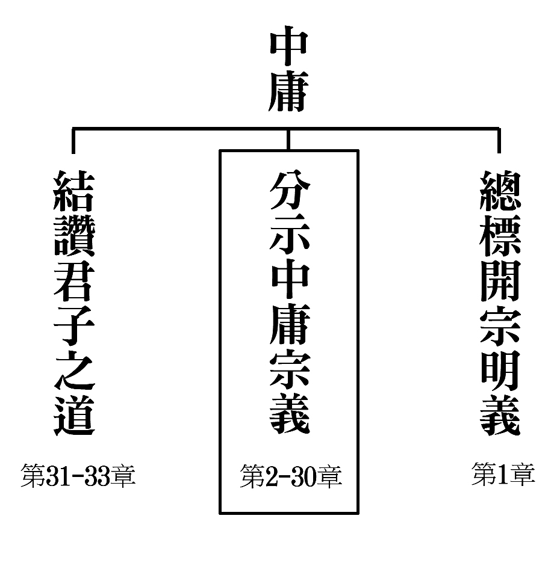

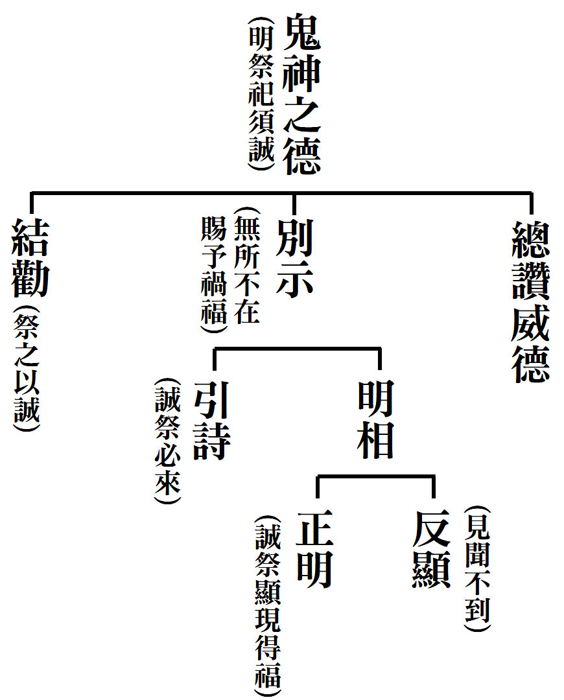

## 蓮池海會

### 林素香老居士往生見聞記

淨昌、禮悅

良善家風賢淑性

子女學佛能護念

助念畫下圓滿句

猶待後續勝因緣

老居士出生於民國二十八年三月四日，臺灣省彰化縣二水鄉人氏。家風是樂於為社會大眾服務奉獻。老居士祖母曾長期在當地碧雲寺院廚房發心煮飯，供養大眾。父親長炎公擔任農會主管退休，下班後務農，樂善好施又樂於公益，為便利鄰近農民耕種，以私田闢道供人方便行走，曾擔任村長，服務一村鄉親，又代表鄉親與糧食局折衝糧價及稻穀存放等事務，凡事盡心盡力，與人為善，為一方所稱揚。老居士在這樣的家風薰陶下，養成一個刻苦耐勞、樂於助人、溫和、善良、恭敬、節儉又謙讓的個性，特別當時生活環境不佳，老居士有了工作後，時常替長輩購置日常用品，給弟妹們買點心，成為多年後大家溫馨的回憶。

老居士在斗六家商畢業後，毅然選擇投入教育界，當成一生的志業，並且終身不改其志，服務四十餘年，先後服務彰化縣二水國小、仁豐國小及萬來國小，擇善而固執，對老居士的稱揚是恰如其分。在擔任教職期間，老居士是一位真正能夠做到把自己的學生當成自己的孩子一樣來照顧教育，即便老居士已經退休接近二十年，依舊會有當年的學生來探望老居士，重敘昔年在校的師生情誼。

老居士在立業以後，經人介紹與夫婿景銘公結為連理，景銘公也從事教育界，最後以學校教務主任退休。婚後相夫教子，胼手胝足，育有三女一男，長女與三女都繼父母之志，從事教職。次女高考及格，獨子醫學院牙醫系及碩士畢業，現在於臺中市開設牙醫診所。老居士與先生能安分從事教職，造就英才，也加被自己的子女各各都是人才，都能造福社會。

自從子女小時候開始，老居士就像陀螺般的辛勞，又像蠟燭般燃燒自己照亮別人，辛勞一生，都是在為了別人著想。自孩子們學生時代，就要很早起床準備早餐，催促著大家上班、上學要準時不要遲到，而居士總是最後出門，趕著一小時才一班客運車，偶爾趕不上車遲到了，自己獨自面對繁忙教學及行政工作，多年後在閒談間，每每提到當年校長，總是再三感恩他的寬容與體諒，也要子女們凡事懂得回饋與守分。然而下班後又是轉戰另一個繁重工作，除了督促孩子的課業外，早期還要用柴火來煮飯、燒洗澡水及永遠處理不完家務，所以時常提醒孩子們，要懂得運用時間及規劃好要做的事，不要浪費光陰。

此外，居士也和夫婿景銘公常利用假日集合親戚朋友或鄰居的孩子們舉行趣味活動，諸如賽跑、吃西瓜比賽、吹乒乓球過關等種種遊戲，發洩孩子旺盛的精力，也促進彼此感情。特別是利用子女暑假即將結束時帶全家至臺北遊玩，以前的圓山兒童樂園、動物園、百貨公司都留下一家人足跡，晚上就住在教師會館，去吃豐盛晚餐，欣賞著都市繁華。常說是給大家留下美好回憶，也意味著開學後要努力學習。

居士個性堅毅不拔，忍苦捍勞。結婚之後，小孩陸續出生，家中食指浩繁，雖然夫妻同為教師，但當時年教師薪資微薄，居士下班後還養雞、鴨等貼補家用，常利用假日準備食材與子女一起做小點心、包水餃等，孩子們都期待溫馨時刻的到來；此外還好學不已，繼續進修，最後以在職進修的方式取得當時省立臺中師專學歷。以一人同時而身兼多職，在學校當一位好老師，在家侍奉公婆是好媳婦，教養子女成材是好媽媽，又要貼補家用，又要在職進修，老居士的能耐是子女的好榜樣。

老居士在子女心中所呈現的影像，嘴角總掛著親切和藹的笑容，姿態是不疾不徐的優雅端嚴，家裡永遠維持著整齊清潔，生活是井井有條並規律，事情總是耐煩的自始至終做到圓滿，有居士在的家永遠都是子女心中最堅固的堡壘。而對周遭的人的關心好像是永無止境的，不管是面對長輩、親戚、子女、同事、鄰居、學生，永遠給予正面向上、努力進取的叮嚀，即便一次二次做得不如意，總是耐心鼓勵及陪伴。老居士待人處世，不僅是子女的榜樣，更是鄰里同事間的典範。

老居士退休之後，因喜好大自然，常偕同夫婿爬山、旅遊並注重養身。後來有了孫子後，也樂於承擔年幼孫子短期照料，讓年輕人參與短期儒佛課程，有機會充實自己，雖然自身並沒有深入對教法學習，但也依此結上殊勝法緣。為了讓孫子在鄉下有充實生活，即便自己沒有吃素，也特別花心思煮出營養健康蔬食來吸引食用。曾經請游泳教練教導孫子游泳，並帶領登山健身，阿公也指導下象棋，事後還常津津樂道：小朋友每天帶著棋盤找爬山老人下棋，有一天老人先下山，竟一路狂追至半山腰，言語中滿滿存著阿嬤對孫子的疼惜與愛護！

值得一提的是於二○○一年有因緣參與學會主辦的緬甸參訪放生之旅，一路上參訪了大金塔、蒲甘、曼德勒、茵列湖等聖地、旅遊勝景，並做種種法行，諸如：齋僧、供養出家人、放生、點燈、繞塔及聽聞各類法義，這一趟旅程除了養身更能滋養心靈。爾後，每每提及旅程種種，總是有著既充實又愉快的回憶。

隨著年歲漸長，老居士經歷身體老化與病苦的磨練，幸而子女孝順護持安養，又能以佛法開導老居士，藉由病苦來認識娑婆世界痛苦的本質，並生起往生西方的信心與願力，即使病苦折磨，也勉力抄寫佛經、讀經及念佛，這病苦反而成為修學的資糧與增上的因緣。最後娑婆世界的因緣結束，果決勇敢的向醫生說不要再開刀，而要回家助念。在家親眷屬與蓮友排班助念八小時之後，面容安詳，面帶微笑，圓潤光澤，竟比生前好看，甚至年輕了許多歲，往生西方極樂世界決定無疑，這是對老居士一生行業最好的回報。

綜觀老居士在家庭與工作中填滿了一輩子歲月，有時候子女們都誤以為那是天生就有這些良好的個性，殊不知，耐心、恆心及毅力，在人情事項歷練下，才能彰顯出它的圓潤及光彩。而於臨終意識清楚，除了一心念佛外，總攝對子孫後輩期待是：努力與團結，更可見彼對晚輩厚愛！孔子在論語上說：「君子疾沒世而名不稱焉。」老居士所示現，亦未嘗不符合君子在處世的某一個面向，子女及其學生如能克箕紹裘，亦可為沒世而名稱之一分。

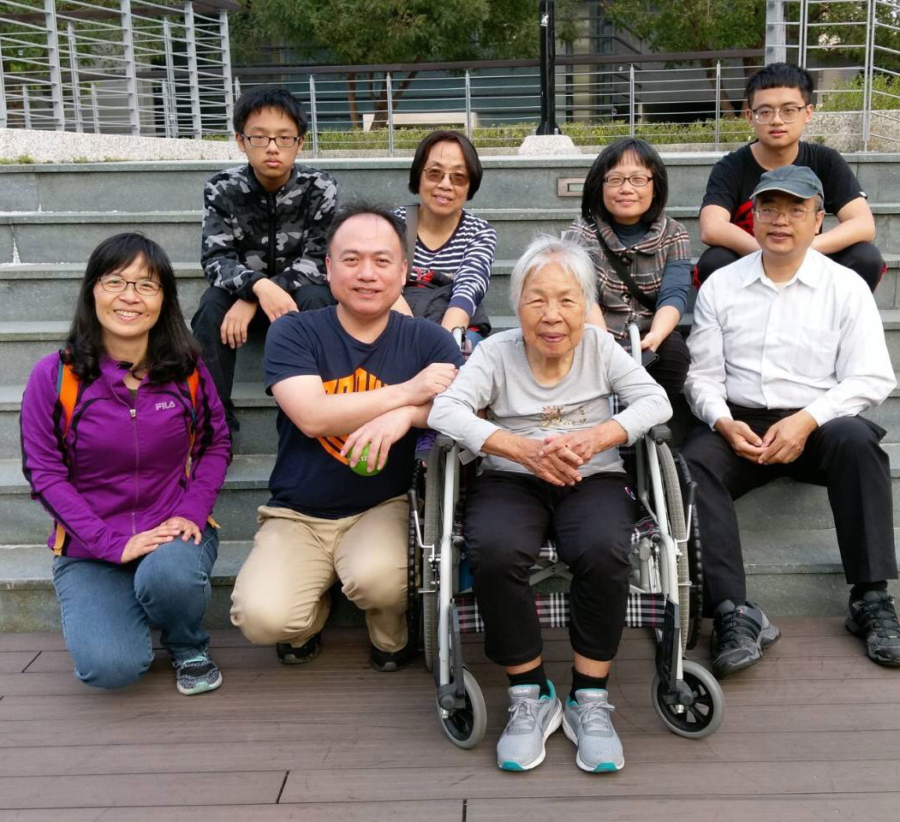

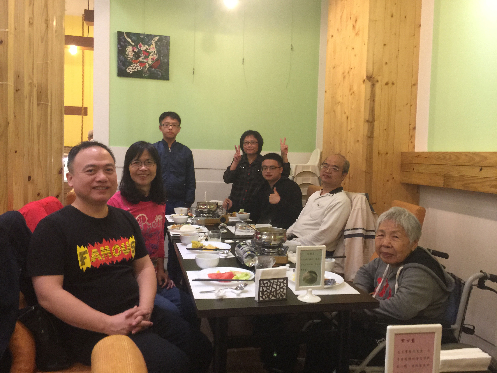

### 陳張勉老居士往生見聞記

陳素琴

養女農耕持家勤

齋戒念佛掃寺院

壽終內寢西歸後

生者應思死生事

陳張勉老居士生於民國二十年九月九日，屏東南州鄉種植香蕉的農家，嬰兒時期即被送予彰化田尾鄉溪畔村姓陳的農家作為養女，並準備認作童養媳，養父脾氣暴躁，故老居士常遭鞭打，童年困頓，雖然辛苦，卻認命知足，小學二年級因為頻繁的空襲而休學，民國三十八年與陳益順正式結婚，攜手辛苦農作，生活在大家庭下，每天都要下田耕種、打理家務，生活仍然困苦。之後搬離溪畔村，與夫遷到嘉義市。老居士少女時期學過裁縫，便幫人縫製女裝貼補家用，丈夫則承租農地耕作，種植稻米、水果、花，老居士也在市場路邊擺攤賣花，供給五個子女讀書。

老居士那份堅毅、勤儉持家的辛勞，子女們都感念其無私奉獻，而各個勤於所學，雖然食指浩繁，但每個孩子均受到高中以上的教育。老居士在子女們紛紛成家立業後，並沒有選擇在家享清福，而是揹起了小書包，到嘉義市安慧中學識字，在法師的教導下，非常認真學習，從幾乎不識字到會抄佛經、念誦佛經，大兒子常開玩笑說：「能克服重重障礙，看得懂字都是佛祖教她的啦！」老居士每天清晨三點半起來在家做完早課，大地仍一片漆黑，便騎著車去普渡寺做早課，課後留下來幫寺院做清潔工作，與寺院住持、法師們結下殊勝因緣，她除了做義工勤布施，持齋念佛受菩薩戒，也參加為往生者助念的團體，每日忙碌卻自覺充實，老菩薩的精神令子女們讚歎與感佩。

老居士在八十八歲高齡時，因為髖骨骨折而植入鋼釘固定，以致無法正常行走，依賴輪椅代步，隨年歲增長身體每況愈下，近半年來，失智症狀也來煩擾…，所幸老居士長年持齋念佛、行善積德，嚴守清戒、守護口業的善因，即使在失智的狀態下，她仍然每天聽著在耳邊播放的佛號，安安靜靜地睡覺休息。

三月七日一大早，照顧老居士的外勞逃跑了，子女們齊聚一堂討論後續應如何照顧…。當天老居士一整天都未進食，到了晚間只剩下微弱的氣息，不知所措的家人便請學會蓮友前來探望，蓮友抵達時以衛生紙確認老居士已無鼻息，隨後半夜在學會蓮友們熱心相助下，助念八小時後，老師讚歎老居士面容安詳，像睡著一樣帶著微笑，全身柔軟。子女們深感佛力不可思議，看著老居士的面容，彷彿在告訴子女們：「孩子們，一切都是最好的安排，你們因為看護逃跑而共聚在我身邊，有這樣的陪伴，我已知足，而我此刻也要跟著阿彌陀佛走了，不要悲傷，請為我誦經祈福。」

若能平日即有臨終護持的概念，更能把握黃金助念時點，老居士臨終幸得蓮友護念而往生，倘若半夜助念時家屬亦能共同排班念佛，相信更是莫大的增上緣。除了提醒自己要把握短暫的生命，不貪求世間的快樂，廣結善緣，並仰賴團體的勉勵，依此因緣全家共同護持正法的延續，更是未來於西方淨土重逢的契機。

## 藝術賞析

### 孔門七十二賢淺說(四十一) — 顏祖

圖／江逸子、文／時哉

不以貌取人

好學能九思

長期薰聖道

成就難可知

顏祖，字襄，今本《家語》稱他作顏相，又作柤，字子襄，春秋魯國人，在今山東兌州曲阜縣人，孔子的及門弟子，雖名聲不大，然是很用功的學生，在孔子仍在魯國巷弄教學時就跟在老師旁邊了，他兢兢業業、好學不倦。某天聽夫子課堂言：「生而知之者，上也。學而知之者，次也。困而學之，又其次也。困而不學，民斯為下矣。」子襄聽到這番話，感悟良多，自認自己是個困鈍之人，只有發憤才能補拙。又聽聞夫子說：「君子有九思，視思明，聽思聰，色思溫，貌思恭，言思忠，事思敬，疑思問，忿思難，見得思義。」如獲至寶，興奮不已，矢志力行，認為如此才能見聖望賢。於是書寫在竹簡上，奉為圭臬，慎思篤行，求其志、達其道，守於心，明於德，屢屢實踐忠恕之道，而克己復禮，學習不敢稍有鬆弛，深得孔子讚賞。

顏祖在東漢永平十五年從祀孔廟，唐朝封臨邑伯，宋朝封富陽侯，明朝改稱先賢顏子。宋高宗贊曰：「闕里始教，群弟皇皇。好學不倦，時維子襄。疏封賜命，侯于富陽。於萬斯年，名譽益彰。」孔子在闕里家鄉開始教育生徒的時候，有許多博學有才之士，其中顏祖是好學不倦的代表者之一，受皇上賞賜為富陽侯，相信往後名譽會因賜封而更加顯著。此贊能看到宋高宗對於顏祖的求知好學，給予高度評價。

畫中的顏祖，頭巾束髮乃平民形象，或彰顯不慕榮利，表現出求學殷勤、求知若渴的態度，好似聽聞法義有所體悟，拳拳服膺，態度誠懇真摯，心悅誠服，願意終生奉行。

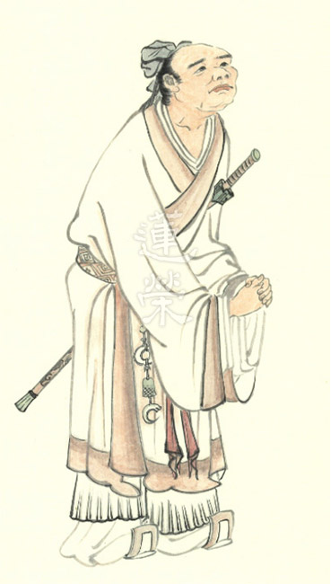

### 孔門七十二賢淺說(四十二) — 秦商

圖／江逸子 、 文／時哉

孔父秦父大力士

兩子皆賢為師生

終身向學孔夫子

人生最難師與友

秦商，字子丕（家語謂其字不慈），春秋魯國人。

秦商的父親秦堇父是孟氏家臣，與孔子之父叔梁紇皆為氣力逼人，是名震當時的勇士。叔梁紇生聖人孔子，秦堇父之子秦商事孔子為師，也成為一代賢人，兩者俱為立身行道，揚名於後世，以顯父母的模範。

秦商是孔門弟子中，年紀很長的學生。明代山東布政司都事呂元善描述秦商「一姓兩賢，商年為最，以吾一日，何況四歲？受教應先，故當出類，門籍無妨，謙處後位。」孔門弟子為賢者有四位姓秦，除了秦商，另有秦祖、秦非、秦冉。呂元善特別針對山東姓秦的秦祖與秦商來說，秦商小孔子四歲，在孔門受教弟子中年齡大於秦祖，應該位列前輩，甚至是冉伯牛及子路之前，依年齡大家要叫他師兄，在孔廟中排列卻位在秦祖之後，可見孔廟排列有一定順序，不是按照年齡排列。

秦商是東漢永平十五年從祀孔廟，唐朝封上洛伯，宋朝封馮翊侯，明朝改稱先賢秦子。宋高宗贊曰：「孔父秦父，相尚以力。俱生賢嗣，相與維則。是父是子，致詰疇克。會弁儒林，令名無極。」孔子父與秦商之父，兩人均以大力聞名於時，兩人均生優秀的兒子，皆是高德之子。像這兩家父子，問誰家能相比呢？傑出於孔門弟子中，美名傳至永遠。

畫中的秦商是一位白髮蒼蒼的老人。秦商立身行道，不失謙和莊重，為學嚴謹，每對古籍，常常逐字推敲，從不苟且，為儒門長者的風範。（下期待續）

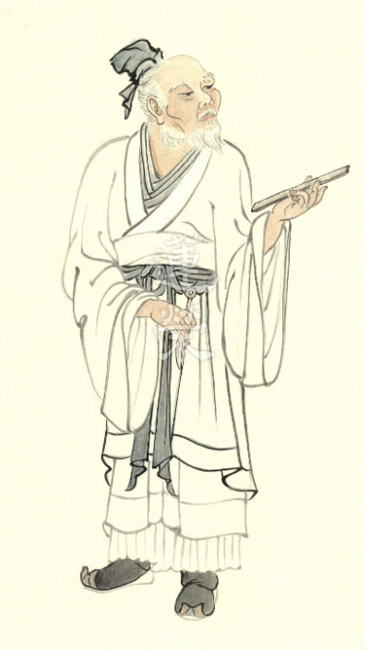

### 華夏精魂千秋（三十五）　明倫史畫　慈教善導　陶侃之母

圖／江逸子、文／淨域

子賢貴友從母始

陶母典範須發揚

天下太平母教孝

溺愛無方禍之源

史畫

陶母姓湛，晉朝揚州豫章郡新淦縣（今江西省新幹縣）人；生於三國吳太祖赤烏六年，卒於東晉元帝太興元年（西元二四三-三一八年），乃東晉名將陶侃的母親。

湛氏年幼受過些啟蒙教育，是個略通文墨的女子，深知讀書的重要。先生早逝，獨自撫養孩子，家貧以紡紗織麻維持生計及供養陶侃讀書。侃年幼貪玩無心用功，陶母見了十分憂心。某日大雨未上學，陶侃蹲在織布機旁玩，見梭子來回穿去感到好奇。母親靈機一動，問他課業的情況，陶侃便背誦《賢文》，至「光陰似箭，日月如梭」一句時，母親即指著手裡的織梭說︰「你看這梭子來去匆匆，是不是很快速呀！日子一天天地過去，像不像織梭和飛箭一樣的快逝呀？」陶侃明白母親的用心，從此發憤勵學。

有一回，同郡人范逵被舉為孝廉赴洛陽任職，旅途中遇大雪投宿於陶侃家。當時家裡沒有餘糧，而范逵的隨從車馬又不少，陶侃為此感到困窘。母親毅然剪掉長髮，拿到市集換些米肉回來待客，又將床上所鋪的稻草切碎，充作范逵馬匹的草料。范逵發現陶母的長髮不見了，追問下才知道事情的本末，不由的感慨說：「有母親如此賢能，怎能不造就出賢才來呀！」遂與陶侃成為莫逆之交。

陶侃經人引薦到外地任官，離家前母親耳提面命，並取出一個包袱讓他帶上。到任後打開包袱，只見裡面裝著一坏土、一個土碗及一塊素布，他體會母親的用意，土塊是讓他不忘家鄉，土碗是要他保持自家本色為民服務，素布則是為官清廉不貪枉。

陶侃任職潯陽縣吏，負責監察魚梁（捕漁器）的工作。某回他託人帶罈魚鮓（醃魚）回家中奉養母親，並附上告安信。母親收到信物十分高興，但當知道這魚是從官家魚製坊拿的後，隨即原封包好送還，內附一封信責備陶侃，說：「你當縣吏，以官家的東西送我，不但對我無益處，反而增加了我的憂慮呀！」陶侃從此恪遵母訓，謹慎行事廉潔不茍。

西晉惠帝太安二年（三○三年），張昌於荊州叛亂，荊州刺史劉弘任陶侃為南蠻長史，一舉消滅張昌叛軍，封東鄉侯，此後一路以戰功升至太尉，封長沙郡公。東晉成帝咸和九年（三三四年），因病辭退過世，享年七十六歲，諡號桓公。

圖解

中國雖是個父系社會，但常言：「成功的男人背後，總有位成功的女人。」這說的除是家庭和合外，也指出為妻、為母的重要，其既關乎家族的盛衰，也決定國家的興替。歷史上讚頌母親的偉大，特別選列孟子、歐陽修、陶侃、岳飛為典範，稱渠等母親為四大賢母。

昔日女人家結婚後，無不期盼著生子，得子意謂著有後，母親也因子而提高地位。母以子為貴，這非能坐享其成，還要耗費許多心血始能。故而，孟母斷機杼紗線、歐陽母削蘆荻寫字、岳母針刺精忠報國，每一作法雖然不同，其著眼處盡皆相同。即是將教育放在首位，言教身教合一，使孩子成為忠孝兩全的仁人君子。

江師所繪圖，正點出陶母身教的可貴賢德。圖下方的梅花披染白雪，說明那時正是隆冬嚴寒之際。窗旁的牆壁露出泥磚，意謂陶家生活不裕。當友人范逵往洛陽任職，途經陶家叨擾投宿一夜時，雖家中米缸已無餘糧，陶母仍悉心想法子熱誠招待。

圖中長几上備好飯菜，范逵坐定後才發現到，這頓飯原來是陶母變賣長髮換來的，讓他吃得倍感靦腆。此外，還將草蓆剪碎，充作草料給馬兒餵食。對於這樣的盛情，不由的感慨說：「有如此賢能的母親，怎會造就不出賢才來呀！」於是與陶侃結為莫逆之交。陶侃後來因軍功，遷升至太尉一職，都督八州軍事，出任荊、江兩州刺史。圖中牆上所掛的弓劍，特別說明陶侃在軍事上的成就，也是自幼以來在母教下不斷習成的。（下期待續）

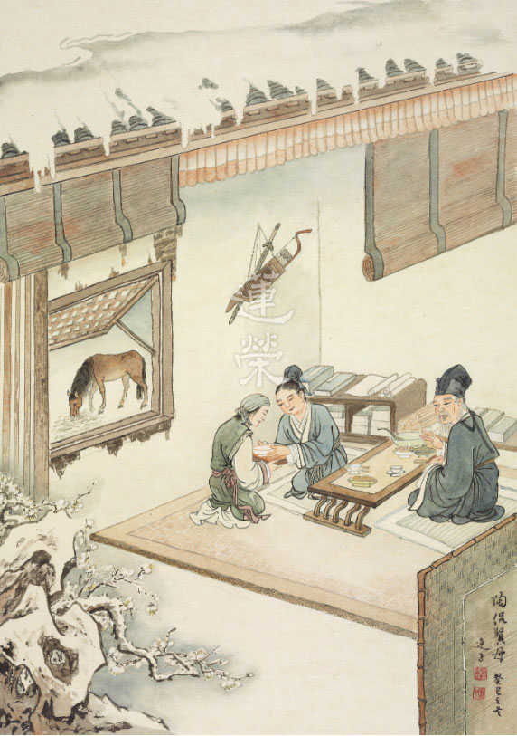

### 道藝春秋（七）　治水有功，得民心者得天下　禹

*圖／江逸子 、 文／心若整理*

江師功德道統圖

以藝載道化民心

由舜禪讓治水功

九州鑄鼎禹王功

新聞報導中不時會看到世界各地極端氣候現象肆虐全球，時有洪水淹沒村莊的消息，人民損失不計其數，各國政治無不以救災為首要任務。想像一下，在四千年前的古代中國，洪水不斷，又沒有水利建設，沒有治水的設施，人民如何生活，如何與大自然和諧共處呢？

在四千年前的古代中國，有兩件事很重要：一是當時鑿井技術尚未普及，人們生活離不開水，因此河邊就是最理想的居住地；二是科學家分析了千年以上的松柏類樹木的年輪厚薄，發現地球上的雨量不固定，各時期的雨量都不同，像是十二世紀末到十四世紀初，雨量是增加的，而十五世紀到十六世紀末，雨量則是減少的。綜合上述兩點，當時人們已經進入初步的農業部落社會，生活多半定居在湖泊或是河流附近，大夥兒在此種田、養牲畜、打獵、採集，沒想到面臨降雨量忽然增加，氣候變遷、洪水來勢洶洶、河水暴漲、家田毀壞，大規模的人畜傷亡，治水便成為領導者的當務之急。

治水不是靠蠻力，而是靠對土地山川的認識與了解、土地丈量、科學知識、人才團隊運用，人力的掌握等等，極不簡單，當時鯀用圍堵的方式治了九年，洪水繼續為患，鯀就被放逐了。舜能夠納諫納賢，獨具慧眼，舉用鯀的兒子禹接任治水，要知道用罪人的後代，需要相當的膽識魄力，萬一禹也失敗，舜扛不起兩次的用人失當。

禹受命治水後，分析了父親失敗的經驗，認為這種被動治水方式不能解決問題，必須將無處宣洩滿溢出來的水，大規模的疏導才行。禹在外治水十三年，「三過家門而不入」，甚至孩子出生，他在門外聽到孩子的哭聲都無暇進去。「三」在古籍中通常是虛詞，代表次數多，可見禹為了國家治理水患，能將私情暫放一旁。

江逸子先生所繪的禹，畫出禹治水的形象、治水的艱難，治水要因勢利導，而非處處圍堵，治水有時候要入窮山惡水、群山峻嶺、萬壑樹參天，雲深不知處，要面對豺狼虎豹、蛇蠍的襲擊，要小心天候的不穩定，有時下大雨、溪水暴漲，還有諸多生活上的不便、身體的不適，像是感冒、發燒等，腸胃不適的上吐下瀉。

圖中禹為了治水勘查地形、確認地勢，登上石頭高處，頭戴巾帽，精神耗費太多導致禿頭，墨子說的摩頂放踵即指大禹，其腳皮也都磨破，手、腳都長繭。禹身穿尋常簡樸的服飾，衣帶飄動，迎風而立，顯示他為民踏遍九州的氣象，下裳看起來很不一樣，是為了治水的方便與機動而改良。

畫面背景上方出現的紋路是雲紋，一來展現風起雲湧的自然力量，搭配翻飛的衣衫，在靜中帶出了動態感，再來雲的翻湧也代表時間的流逝，下方的滾滾怒濤，更突顯禹治水時站在第一線的氣概。原本水是柔軟的，是孕育生命的元素，但畫面上的水卻讓人覺得險象環生，成了危害性命的災難，對比強烈。

當時滔天的惡水，竟能淹沒丘陵高山，人民時時刻刻不生活在恐懼之中。經過一連串翻山越嶺的努力，禹終於成功疏導九條河道，修治九個大湖，測量九座大山。東臨大海，西至沙漠，從北到南。有名的長江三峽就是大禹當年開山鑿路、疏通河水的工程，杜甫所寫〈禹廟〉一詩即講此事蹟。畫中洪水滔滔，不少的家庭漂蕩在水上，流離失所、無家可歸、收成泡湯，多少的設施都被洪水沖垮，不曉得該如何是好，禹雙手執治水的工具「鑿」，用來疏通水道，史書上亦記載禹拿著準繩和規矩，身邊帶著測定時辰與方向的儀器，可見禹治理水患的同時，更將視野放大到整個神州大地的山川資源、風土人情，詳細記錄。

畫中禹的面容神情有些凝重，不知如何治起，但並不是無奈、一籌莫展、洩氣，而是想辦法解決，想要突破艱難逆境，像是先天下之憂而憂的樣貌，也點出他經年累月兢兢業業，擔負人民身家性命大任，臨淵履冰對抗洪水猛獸的心境。人們為表達對他的感激之情，於是尊稱他為「大禹」，即偉大的禹。禹從舜手中接管了天下大位後，傳說他親自鑄九鼎，象徵九州，此後便成為華夏至尊神器，擁有九鼎就是擁有天下國家政權的象徵。

禹治水的功績應該分為三方面，一是解決水患、改善民生，二是遮蔽父親治水的失敗，洗刷父親的屈辱，使大家不再追究其過失，這是孝子的表現，三是藉著治水把天子舜的聲威、教化傳播到遠方，如此顯赫的事蹟，使舜不得不禪位給他，因為他的功勞最大。他接受禪讓後，得到各方諸侯的擁護，建立王朝。堯舜時期是部落共主，大家開會商量折衷，禹建立的王朝是號令天下，各諸侯照辦，這樣的能耐來自於治水利益天下蒼生，幫助諸侯解決水患，得民心者得天下。而禹雖然貴為帝王，成為夏朝的開國國君，可是他素日裡還是吃粗茶淡飯，穿一般民眾的服裝，居住的宮殿也是普通房間，苦民所苦，經歷這麼多苦難，仍然保有簡樸的生活。大禹為公不為私的精神，論語中讚歎道：「禹，吾無間然矣」，孔子對於禹王，沒有可非議的了，禹王一生飲食菲薄節約，祭祀祖先卻盡全力，準備豐盛潔淨的祭品，致上最誠摯的孝心。平常穿的衣服很粗惡，上朝穿戴的禮服禮帽，卻講究華美莊嚴。居住的宮室低矮，卻盡力在百姓息息相關的溝洫工程。對禹王，實在沒有任何可非議之處。禹的功勞太大，以至於大家擁護他的兒子啟繼位，開啟家天下，實屬無奈。

總結大禹一生，積極向上、胸襟寬闊、眼光長遠、著眼大局、不畏艱難、為國為民、矢志不渝，讓黎民百姓不再遭受水患之苦，也成功光耀家門、為父脫罪，更進一步發揚天子恩德，繼承王位後兢兢業業，使社會安定祥和，令人敬佩。 （下期待續）

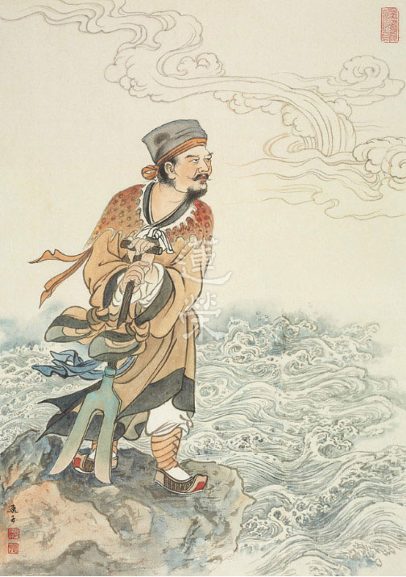

## 活動報導

### 以藝載道地藏本願的再現 — 緣起的趨利避害之道　講座報導

*編輯部*

經變圖緣起

長卷能載道

講座文義顯

菩薩加被生

前 言

學會於二○二一年寒假二月四日至二月七日興辦《地藏經》講座，多達兩萬字的《地藏經》，廣陳過去因緣、未來果報，國畫大師江逸子先生，以近兩年的時間，將內容描繪成超過五十公尺的《地藏菩薩本願經圖》，是他晚近以來最磅礡恢弘的大作。本圖將於年節後印刷成書出版流通，承蒙江先生看重，本會自二〇〇六年承接國父紀念館道藝春秋展的導覽工作之後，便漸漸熟捻先生事蹟與畫作，先生囑咐本會寫序，並期望能結合師資，為此圖書註解說明作導覽手冊，並培訓導覽人員，盼此圖在兩岸三地能廣為流通。

學會曾整理編輯《地藏經科文》，蓮友們也長期浸潤在佛典經教中探討研學，配合江逸子老師此次經變圖鉅作的出版，相信大家定能成為《地藏經》輾轉流通最有力的助緣，成為地藏菩薩跟觀音菩薩弘揚本經的得力助手，亦是學會蓮友們修積功德的最好因緣。

值此新冠病毒肆虐，二〇二一年開春國際上出現多樣變種病毒，國內發生群聚感染，人心惶惶之際，既然無法在國內外舉辦大型講座，正好拾起書本，累積能力蓄勢待發，安心完成畫作的導覽手冊，將地藏菩薩成就的因緣了然於心，為座上之觀修，為歷緣對境修之攝持，作一位舉手投足、行住坐臥、說話辦事都能轉為佛果資糧的行者，成為改變命運，享受人生大樂的士夫。江老師的《地藏菩薩本願經圖》，實踐了年輕時對恩師雪廬老人的承諾，完成了地藏菩薩的心願，相信亦是成為雪廬老人於常寂光中能乘願再來的增上緣。

《地藏經經變圖》畫作緣起

二〇一九年的十一長假，與江逸子先生於福州會面，江先生拿出耗時兩年時間，甫完成的《地藏菩薩本願經圖》，著實令人歎為觀止，難以相信這幅超過五十公尺、筆力遒勁、寫意精美的長卷出自一位八十歲，甫遭夫人與大兒子相繼往生的老人之手。

本圖以長卷的形式創作，繪製的過程不似二〇〇一年受淨空法師邀約、二〇〇三年開春繪製、只花九個月就完成的《地獄變相圖》那麼順利，在遭遇很多障礙時開筆，江先生的夫人因病往生，第二年大兒子也因意外也相繼往生，後來受吳董護持而在福州的阿彌陀佛飯店完成此幅經變圖。先生在逆境中安住身心，寄情於地藏菩薩的悲願中，曾說：「不經逆境不成道場，不經浩劫不能成佛。」原來走出人生的谷底，要靠的是不可思議的善業。

繪製地藏菩薩相關之《地獄變相圖》與《地藏菩薩本願經圖》的因緣，起於五十年前，雪廬老人曾宣講《地藏菩薩本願經》，讓江先生在菩提樹雜誌上畫插畫，同時江先生就邊畫插畫邊做筆記。從畫《地獄變相圖》開始，每一幅畫都是一年半載的經營，《地獄變相圖》介紹墮入地獄後所受的種種罪報，同時說明地獄果報皆是自作自受，並非閻羅天子所定之罪，令眾人了解人身難得的可貴，及起心動念造作惡業墮入地獄的可怕，生起離苦得樂之心，老實修行而得度脫三塗之苦。而《地藏菩薩本願經圖》則詳述釋迦牟尼佛一期度化之將盡，上升忉利天宮，說法為報母恩，所說之法竟是地藏菩薩本願。世尊以宣述地藏菩薩的本願來報答佛母摩耶夫人生育之大恩，也以地藏往昔為孝女之典故，為世間孝子盡大孝之楷模。

《地藏菩薩本願經圖》畫完後，江先生又繼續繪製《佛涅槃圖》。釋迦牟尼佛上升忉利天為母說地藏經後，隨即入涅槃，釋迦牟尼佛在此世間說法四十九年後涅槃。先生言及曾受張大千極力推薦，改革開放後在敦煌看過佛涅槃的塑像，十分感動。當時的戈壁荒漠很危險，嘉峪關旅遊局局長派專車護送到敦煌，敦煌研究院院長段文傑親自接待，原來是因為段院長跟張大千有師生之誼，特別開了幾個特窟給江先生參觀，先生說一看到佛涅槃像，不禁熱淚縱橫，跪下三頂禮，當場寫生臨摹下來。

經變圖的最後，江先生題了一首絕句，述說當年雪廬老人在重慶歌樂山弘法，山上有個破廟，傳遍了是地藏王再來，那天很多人在那等著，結果那天雪廬老人上山講經，被人認為是地藏王菩薩示現。老人說：「心懷彌陀，願行地藏。」老人也跟江先生說：孩子，你以後也要心懷彌陀，願行地藏。此首絕句即是：「猶憶當年松柏志，倒駕慈航幾人知。閻浮世界風光少，悲願傳馨翰墨滋。」雪廬老人曾希望江先生用丹青筆墨，把文化帶回中國。畫作，既可以當藝術品欣賞，又可以畫中有話，這是多生多劫的因緣。

當時福州的敦化學堂趁著十一長假一同共學，巧的是研討主題為正好是《地藏經》，因而促成與江老師座談的機會，江老師欣然答應讓大眾一同欣賞這幅《地藏菩薩本願經圖》，故於二〇一九年十月六日上午在阿彌陀佛大飯店租會議室舉辦座談會，後又將經變圖請至順昌與雪廬夫子研學會的讀書會成員一同欣賞，能參與此次盛會，大眾或邊誦經邊觀看，或合掌聆聽學習，皆歡喜莫名。

地藏經介紹

地藏經共分十三品，第一品<忉利天宮神通品>詳述釋迦牟尼佛一期度化之將盡，上升忉利天宮，說法為報母恩，所說之法竟是地藏菩薩本願。第二品<分身集會品>是佛放光令各地地藏菩薩來集，接受世尊的託孤，加被提攜後世剛強難化的眾生。第三品<觀眾生業緣品>、第四品<閻浮眾生業感品>與第五品<地獄名號品>，此三品是指地藏菩薩所度化的眾生，煩惱業感苦，最可怕的果報是成熟在地獄，而往昔生中，地藏菩薩曾為國王、為孝女、為長者子，皆發大願利益眾生，其中以孝女的身分，名為光目女、婆羅門女，為拔濟其母於地獄，而發地獄不空誓不成佛，眾生度盡方證菩提的大願，最令人記憶深刻。第六品、第七品與第八品，世尊讚歎地藏菩薩是眾生度脫的殊勝勝緣，<如來讚歎品>讚歎地藏菩薩的功德，<利益存亡品>直指眾生陷於五欲泥濘中，又擔負著自私自利所起的種種煩惱，善退惡增幾乎無法自拔，必須外有大善知識引導我，平時多多造善，臨終時自己與家屬都懂得如何護持造福，<閻羅王眾讚歎品>描述此土眾生剛強難化，地藏菩薩面對被度脫的眾生不久之後又墮地獄，不斷累積自己度眾生的能力，惡毒鬼王擁護善男女，主命鬼王發願擁護閻浮眾生。第九品<稱佛名號品>顯示有情在地藏菩薩超拔之後，亦需要佛的幫助，成為修法的順緣，第十品<較量布施功德緣品>闡明需有修學資糧，第九品與第十品是殊勝的成佛因緣。第十一品<地神護法品>由堅牢地神宣誓保護修學地藏法門的修行人，第十二品<見聞利益品>佛放光指示觀世音菩薩流通地藏菩薩功德，成為地藏法門最有力的流通者，第十三品<囑累人天品>則不斷重複咐囑交代地藏菩薩承擔末世度化眾生的重責大任，地薩菩薩也安慰佛不要憂慮，他會善盡其責，努力度化這些剛強難化的眾生，此時虛空藏菩薩也依著佛咐囑的因緣請問地藏菩薩功德利益，願意流通此地藏法門，好好護持地藏法門的修學。正因地藏菩薩有如此殊勝之行相，若能誦念本願經及菩薩名號，對菩薩聖相供養、讚歎、禮拜，所生之殊勝功德不可計量。總之菩薩是眾生之大福田，暗夜之明燈，貧者之寶藏，險難之善導，欲述其德，窮劫難盡。

地藏菩薩的殊勝可貴是祂的大願與大行，而菩提心的引發至為關鍵，利用對母親的孝心來引發就是善巧方便。地藏菩薩承擔使命，面對滅法時代的眾生，目的是要在彌勒菩薩示現成佛之前這段時間，護持他們不墮三惡道（才可以交棒給彌勒菩薩）。

要幫助他們達成此目標的方法分正反兩面，內容由地藏菩薩以及祂的團隊成員提出，這些方法也是我們末法以及滅法時代的眾生需要牢牢抓住的。

正面來說：念佛名（包括對地藏菩薩的禮敬供養讚歎等）、修布施、持戒（釋迦牟尼佛為四天王介紹地藏菩薩，累劫教化眾生都在宣說因果）、出生時及臨命終的重要注意事項（每一期生命流轉的節點，生死之時為特別的關鍵）。

反面來說，眾生被度脫之後又仍然墮落，原因何在？需要認真的檢討並找出對治的方法。若不能有效對治，有情最終輪迴的大本營是在地獄。

《地藏菩薩本願經圖》畫作賞析

江先生所繪的《地藏菩薩本願經圖》，依《地藏經》之十三品分別繪製，《地獄變相圖》標題使用俊秀的楷書，長卷畫作獄卒與地獄眾生人物大小相符，用色鮮明，人物表情生動，審問犯人的嚴肅表情，鞭打罪人的嚴厲手腕，地獄有情苦痛與哀號的表情，活生生地展現在畫作上。各殿閻羅天子衣服華麗展現尊貴、各式刑具機關靈動，人物肌肉線條細緻分明，每一筆都可見繪者用心雕琢，令觀者聞之足戒，生起極端恐怖不願墮落之心。

《地藏菩薩本願經圖》的重點在釋迦牟尼佛與地藏菩薩的悲心，標題使用厚實的隸書，畫面中佛、菩薩、獄卒與地獄有情，依功德力而有大小懸殊的差別，整幅畫線條出神入化，看似隨意勾勒更顯柔和，獄卒、刑具與地獄有情，依稀彷彿可見出自於變相圖但又出現各種新的刑具，地獄中受苦眾生，相對於獄卒與菩薩，形象瘦弱矮小，表情不似變相圖有立體感，既猙獰又苦痛，經變圖中的受苦有情雖然依然面容苦楚，但筆觸柔和中一筆帶過的線條，內心生起的不是害怕而是憐憫。

各品篇幅或長或短，江先生依照所學，將各品精華展現。業緣品、業感品、業報品，所繪的地獄又像合在一起畫，又可以把段落分開那般靈動，而地獄的刑具和動物也與地獄變相圖相仿，但又好像重新看一幅新畫那樣一直發現新大陸。宰官、居士們讀書的樣子似曾相似於孝經圖，第十品中，施人尊者施福勝，畫中塑造巨幅佛像又像親臨緬甸大金塔現場，圍繞金塔旁一尊尊高大尊貴的佛像那般令人仰望。第十一品言地神護法流通，大家是否以為會看到地神出來證明？非也，江先生以地藏菩薩比丘像手捧錫杖飛越怒濤描寫經中經文：「自然畢竟出離苦海。」跳脫一成不變的預設框架，實在絕妙。經文若言及地獄，則以灰暗的巨石、荊棘分隔；若言及其他，諸如菩薩功德、加被放光、擁護流通等，則以松樹將場景區隔。整幅畫作有傳承、有相互輝映，更有作者無限巧思。善巧表達眾生造業受苦，復造業又受苦，不斷受生地獄苦痛難離，而地藏菩薩以「地獄不空，誓不成佛」之願，經中（畫中）不斷的看見若能誦念本願經及菩薩名號，對菩薩聖相供養、讚歎、禮拜，所生之殊勝功德不可計量。

畫卷的最後，江先生回憶雪廬老人往昔叮囑，如今因緣俱足完成老師交代之事，並遵淨空法師囑咐，將自癸未（二〇〇三）年以來的三個夢境繪製出來，其至誠之心可堪檢驗，其以藝載道之功後無來者。首先在癸未九月十九寫至泰山殿時，夢見自己為菩薩塑像，且虛空中告知已塑四尊地藏菩薩像，江先生夢醒後估算一下，連雪廬老人塑像共計已塑四尊無誤，或有傳雪廬老人乃地藏菩薩應化而來，老人亦曾謙虛地說自己與地藏菩薩有相同的願力。其次，在午休時夢見地藏菩薩與十殿閻王及諸天聖眾，法會殊勝莊嚴。地獄變相圖即將完稿之時，又於凌晨菩薩入夢，宣召諸道眾生於光中，顯示地獄恐怖悚慄之狀，苦口宣說因果報應種種業相，菩薩慈悲真誠，無休無止不勝感傷，江先生自云，醒來時不覺淚透枕巾。菩薩三度密集入夢，綠川之畔雪廬老人殷勤教誨，不敢有辱，師徒之情盡在畫中展現。

＊＊＊＊＊＊＊＊＊＊＊＊＊＊＊＊＊＊＊＊＊＊＊＊＊＊

於此述說講座因緣，並簡述《地藏菩薩本願經》重點內容及經變圖畫作完成之不易。並刊登「畫說地藏」一文，此為江逸子老師親自說明畫「地藏菩薩本願經變圖」之緣起。其後並彙整講座中各種討論重點，及會後善知識們的各類心得及觀修稿。又特別整理有關故宮展之「呼畢勒罕特展紀要」一文，以饗大眾。

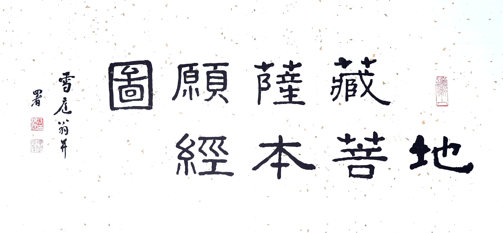

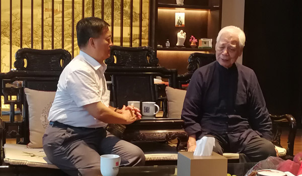

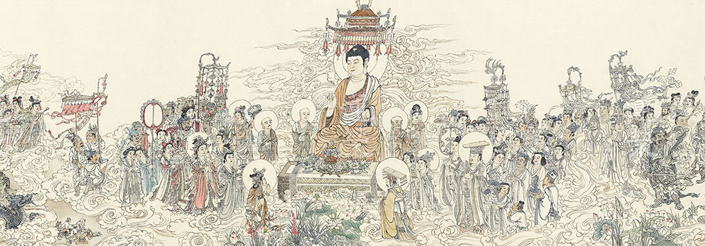

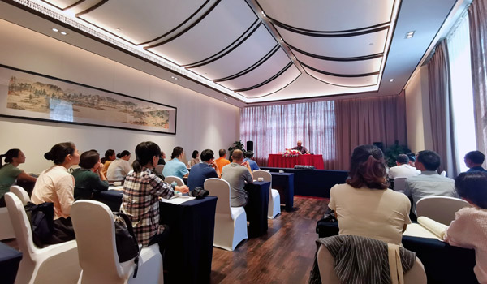

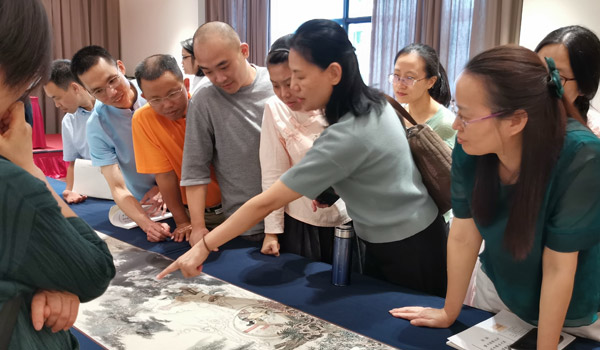

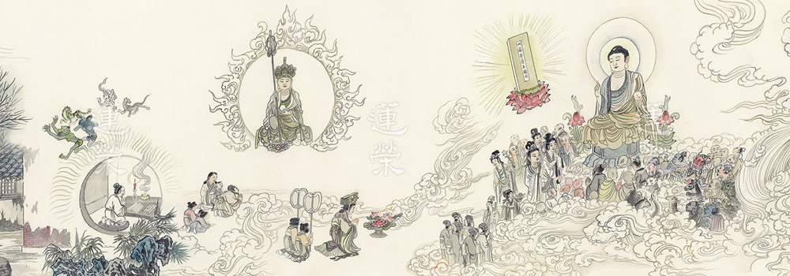

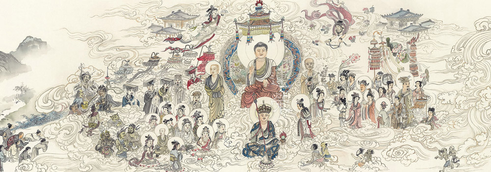

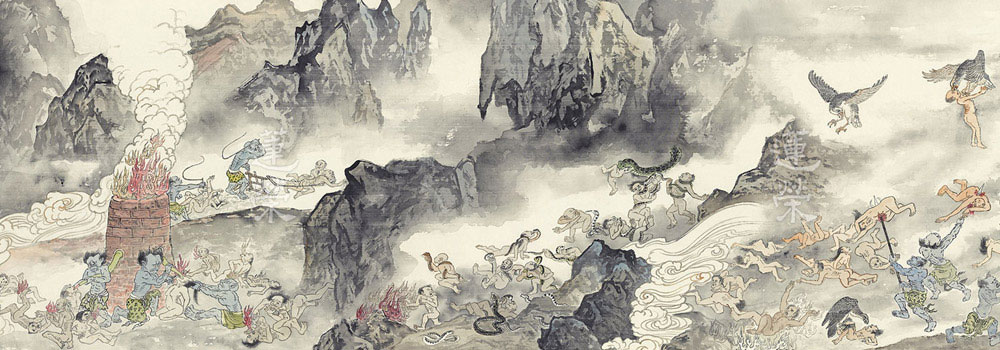

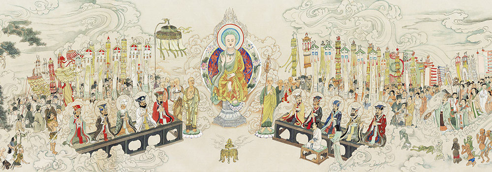

### 畫說地藏

以藝載道地藏本願的再現 — 緣起的趨利避害之道　講座報導

*編輯部*

經變圖緣起

長卷能載道

講座文義顯

菩薩加被生

前 言

學會於二○二一年寒假二月四日至二月七日興辦《地藏經》講座，多達兩萬字的《地藏經》，廣陳過去因緣、未來果報，國畫大師江逸子先生，以近兩年的時間，將內容描繪成超過五十公尺的《地藏菩薩本願經圖》，是他晚近以來最磅礡恢弘的大作。本圖將於年節後印刷成書出版流通，承蒙江先生看重，本會自二〇〇六年承接國父紀念館道藝春秋展的導覽工作之後，便漸漸熟捻先生事蹟與畫作，先生囑咐本會寫序，並期望能結合師資，為此圖書註解說明作導覽手冊，並培訓導覽人員，盼此圖在兩岸三地能廣為流通。

學會曾整理編輯《地藏經科文》，蓮友們也長期浸潤在佛典經教中探討研學，配合江逸子老師此次經變圖鉅作的出版，相信大家定能成為《地藏經》輾轉流通最有力的助緣，成為地藏菩薩跟觀音菩薩弘揚本經的得力助手，亦是學會蓮友們修積功德的最好因緣。

值此新冠病毒肆虐，二〇二一年開春國際上出現多樣變種病毒，國內發生群聚感染，人心惶惶之際，既然無法在國內外舉辦大型講座，正好拾起書本，累積能力蓄勢待發，安心完成畫作的導覽手冊，將地藏菩薩成就的因緣了然於心，為座上之觀修，為歷緣對境修之攝持，作一位舉手投足、行住坐臥、說話辦事都能轉為佛果資糧的行者，成為改變命運，享受人生大樂的士夫。江老師的《地藏菩薩本願經圖》，實踐了年輕時對恩師雪廬老人的承諾，完成了地藏菩薩的心願，相信亦是成為雪廬老人於常寂光中能乘願再來的增上緣。

《地藏經經變圖》畫作緣起

二〇一九年的十一長假，與江逸子先生於福州會面，江先生拿出耗時兩年時間，甫完成的《地藏菩薩本願經圖》，著實令人歎為觀止，難以相信這幅超過五十公尺、筆力遒勁、寫意精美的長卷出自一位八十歲，甫遭夫人與大兒子相繼往生的老人之手。

本圖以長卷的形式創作，繪製的過程不似二〇〇一年受淨空法師邀約、二〇〇三年開春繪製、只花九個月就完成的《地獄變相圖》那麼順利，在遭遇很多障礙時開筆，江先生的夫人因病往生，第二年大兒子也因意外也相繼往生，後來受吳董護持而在福州的阿彌陀佛飯店完成此幅經變圖。先生在逆境中安住身心，寄情於地藏菩薩的悲願中，曾說：「不經逆境不成道場，不經浩劫不能成佛。」原來走出人生的谷底，要靠的是不可思議的善業。

繪製地藏菩薩相關之《地獄變相圖》與《地藏菩薩本願經圖》的因緣，起於五十年前，雪廬老人曾宣講《地藏菩薩本願經》，讓江先生在菩提樹雜誌上畫插畫，同時江先生就邊畫插畫邊做筆記。從畫《地獄變相圖》開始，每一幅畫都是一年半載的經營，《地獄變相圖》介紹墮入地獄後所受的種種罪報，同時說明地獄果報皆是自作自受，並非閻羅天子所定之罪，令眾人了解人身難得的可貴，及起心動念造作惡業墮入地獄的可怕，生起離苦得樂之心，老實修行而得度脫三塗之苦。而《地藏菩薩本願經圖》則詳述釋迦牟尼佛一期度化之將盡，上升忉利天宮，說法為報母恩，所說之法竟是地藏菩薩本願。世尊以宣述地藏菩薩的本願來報答佛母摩耶夫人生育之大恩，也以地藏往昔為孝女之典故，為世間孝子盡大孝之楷模。

《地藏菩薩本願經圖》畫完後，江先生又繼續繪製《佛涅槃圖》。釋迦牟尼佛上升忉利天為母說地藏經後，隨即入涅槃，釋迦牟尼佛在此世間說法四十九年後涅槃。先生言及曾受張大千極力推薦，改革開放後在敦煌看過佛涅槃的塑像，十分感動。當時的戈壁荒漠很危險，嘉峪關旅遊局局長派專車護送到敦煌，敦煌研究院院長段文傑親自接待，原來是因為段院長跟張大千有師生之誼，特別開了幾個特窟給江先生參觀，先生說一看到佛涅槃像，不禁熱淚縱橫，跪下三頂禮，當場寫生臨摹下來。

經變圖的最後，江先生題了一首絕句，述說當年雪廬老人在重慶歌樂山弘法，山上有個破廟，傳遍了是地藏王再來，那天很多人在那等著，結果那天雪廬老人上山講經，被人認為是地藏王菩薩示現。老人說：「心懷彌陀，願行地藏。」老人也跟江先生說：孩子，你以後也要心懷彌陀，願行地藏。此首絕句即是：「猶憶當年松柏志，倒駕慈航幾人知。閻浮世界風光少，悲願傳馨翰墨滋。」雪廬老人曾希望江先生用丹青筆墨，把文化帶回中國。畫作，既可以當藝術品欣賞，又可以畫中有話，這是多生多劫的因緣。

當時福州的敦化學堂趁著十一長假一同共學，巧的是研討主題為正好是《地藏經》，因而促成與江老師座談的機會，江老師欣然答應讓大眾一同欣賞這幅《地藏菩薩本願經圖》，故於二〇一九年十月六日上午在阿彌陀佛大飯店租會議室舉辦座談會，後又將經變圖請至順昌與雪廬夫子研學會的讀書會成員一同欣賞，能參與此次盛會，大眾或邊誦經邊觀看，或合掌聆聽學習，皆歡喜莫名。

地藏經介紹

地藏經共分十三品，第一品<忉利天宮神通品>詳述釋迦牟尼佛一期度化之將盡，上升忉利天宮，說法為報母恩，所說之法竟是地藏菩薩本願。第二品<分身集會品>是佛放光令各地地藏菩薩來集，接受世尊的託孤，加被提攜後世剛強難化的眾生。第三品<觀眾生業緣品>、第四品<閻浮眾生業感品>與第五品<地獄名號品>，此三品是指地藏菩薩所度化的眾生，煩惱業感苦，最可怕的果報是成熟在地獄，而往昔生中，地藏菩薩曾為國王、為孝女、為長者子，皆發大願利益眾生，其中以孝女的身分，名為光目女、婆羅門女，為拔濟其母於地獄，而發地獄不空誓不成佛，眾生度盡方證菩提的大願，最令人記憶深刻。第六品、第七品與第八品，世尊讚歎地藏菩薩是眾生度脫的殊勝勝緣，<如來讚歎品>讚歎地藏菩薩的功德，<利益存亡品>直指眾生陷於五欲泥濘中，又擔負著自私自利所起的種種煩惱，善退惡增幾乎無法自拔，必須外有大善知識引導我，平時多多造善，臨終時自己與家屬都懂得如何護持造福，<閻羅王眾讚歎品>描述此土眾生剛強難化，地藏菩薩面對被度脫的眾生不久之後又墮地獄，不斷累積自己度眾生的能力，惡毒鬼王擁護善男女，主命鬼王發願擁護閻浮眾生。第九品<稱佛名號品>顯示有情在地藏菩薩超拔之後，亦需要佛的幫助，成為修法的順緣，第十品<較量布施功德緣品>闡明需有修學資糧，第九品與第十品是殊勝的成佛因緣。第十一品<地神護法品>由堅牢地神宣誓保護修學地藏法門的修行人，第十二品<見聞利益品>佛放光指示觀世音菩薩流通地藏菩薩功德，成為地藏法門最有力的流通者，第十三品<囑累人天品>則不斷重複咐囑交代地藏菩薩承擔末世度化眾生的重責大任，地薩菩薩也安慰佛不要憂慮，他會善盡其責，努力度化這些剛強難化的眾生，此時虛空藏菩薩也依著佛咐囑的因緣請問地藏菩薩功德利益，願意流通此地藏法門，好好護持地藏法門的修學。正因地藏菩薩有如此殊勝之行相，若能誦念本願經及菩薩名號，對菩薩聖相供養、讚歎、禮拜，所生之殊勝功德不可計量。總之菩薩是眾生之大福田，暗夜之明燈，貧者之寶藏，險難之善導，欲述其德，窮劫難盡。

地藏菩薩的殊勝可貴是祂的大願與大行，而菩提心的引發至為關鍵，利用對母親的孝心來引發就是善巧方便。地藏菩薩承擔使命，面對滅法時代的眾生，目的是要在彌勒菩薩示現成佛之前這段時間，護持他們不墮三惡道（才可以交棒給彌勒菩薩）。

要幫助他們達成此目標的方法分正反兩面，內容由地藏菩薩以及祂的團隊成員提出，這些方法也是我們末法以及滅法時代的眾生需要牢牢抓住的。

正面來說：念佛名（包括對地藏菩薩的禮敬供養讚歎等）、修布施、持戒（釋迦牟尼佛為四天王介紹地藏菩薩，累劫教化眾生都在宣說因果）、出生時及臨命終的重要注意事項（每一期生命流轉的節點，生死之時為特別的關鍵）。

反面來說，眾生被度脫之後又仍然墮落，原因何在？需要認真的檢討並找出對治的方法。若不能有效對治，有情最終輪迴的大本營是在地獄。

《地藏菩薩本願經圖》畫作賞析

江先生所繪的《地藏菩薩本願經圖》，依《地藏經》之十三品分別繪製，《地獄變相圖》標題使用俊秀的楷書，長卷畫作獄卒與地獄眾生人物大小相符，用色鮮明，人物表情生動，審問犯人的嚴肅表情，鞭打罪人的嚴厲手腕，地獄有情苦痛與哀號的表情，活生生地展現在畫作上。各殿閻羅天子衣服華麗展現尊貴、各式刑具機關靈動，人物肌肉線條細緻分明，每一筆都可見繪者用心雕琢，令觀者聞之足戒，生起極端恐怖不願墮落之心。

《地藏菩薩本願經圖》的重點在釋迦牟尼佛與地藏菩薩的悲心，標題使用厚實的隸書，畫面中佛、菩薩、獄卒與地獄有情，依功德力而有大小懸殊的差別，整幅畫線條出神入化，看似隨意勾勒更顯柔和，獄卒、刑具與地獄有情，依稀彷彿可見出自於變相圖但又出現各種新的刑具，地獄中受苦眾生，相對於獄卒與菩薩，形象瘦弱矮小，表情不似變相圖有立體感，既猙獰又苦痛，經變圖中的受苦有情雖然依然面容苦楚，但筆觸柔和中一筆帶過的線條，內心生起的不是害怕而是憐憫。

各品篇幅或長或短，江先生依照所學，將各品精華展現。業緣品、業感品、業報品，所繪的地獄又像合在一起畫，又可以把段落分開那般靈動，而地獄的刑具和動物也與地獄變相圖相仿，但又好像重新看一幅新畫那樣一直發現新大陸。宰官、居士們讀書的樣子似曾相似於孝經圖，第十品中，施人尊者施福勝，畫中塑造巨幅佛像又像親臨緬甸大金塔現場，圍繞金塔旁一尊尊高大尊貴的佛像那般令人仰望。第十一品言地神護法流通，大家是否以為會看到地神出來證明？非也，江先生以地藏菩薩比丘像手捧錫杖飛越怒濤描寫經中經文：「自然畢竟出離苦海。」跳脫一成不變的預設框架，實在絕妙。經文若言及地獄，則以灰暗的巨石、荊棘分隔；若言及其他，諸如菩薩功德、加被放光、擁護流通等，則以松樹將場景區隔。整幅畫作有傳承、有相互輝映，更有作者無限巧思。善巧表達眾生造業受苦，復造業又受苦，不斷受生地獄苦痛難離，而地藏菩薩以「地獄不空，誓不成佛」之願，經中（畫中）不斷的看見若能誦念本願經及菩薩名號，對菩薩聖相供養、讚歎、禮拜，所生之殊勝功德不可計量。

畫卷的最後，江先生回憶雪廬老人往昔叮囑，如今因緣俱足完成老師交代之事，並遵淨空法師囑咐，將自癸未（二〇〇三）年以來的三個夢境繪製出來，其至誠之心可堪檢驗，其以藝載道之功後無來者。首先在癸未九月十九寫至泰山殿時，夢見自己為菩薩塑像，且虛空中告知已塑四尊地藏菩薩像，江先生夢醒後估算一下，連雪廬老人塑像共計已塑四尊無誤，或有傳雪廬老人乃地藏菩薩應化而來，老人亦曾謙虛地說自己與地藏菩薩有相同的願力。其次，在午休時夢見地藏菩薩與十殿閻王及諸天聖眾，法會殊勝莊嚴。地獄變相圖即將完稿之時，又於凌晨菩薩入夢，宣召諸道眾生於光中，顯示地獄恐怖悚慄之狀，苦口宣說因果報應種種業相，菩薩慈悲真誠，無休無止不勝感傷，江先生自云，醒來時不覺淚透枕巾。菩薩三度密集入夢，綠川之畔雪廬老人殷勤教誨，不敢有辱，師徒之情盡在畫中展現。

＊＊＊＊＊＊＊＊＊＊＊＊＊＊＊＊＊＊＊＊＊＊＊＊＊＊

於此述說講座因緣，並簡述《地藏菩薩本願經》重點內容及經變圖畫作完成之不易。並刊登「畫說地藏」一文，此為江逸子老師親自說明畫「地藏菩薩本願經變圖」之緣起。其後並彙整講座中各種討論重點，及會後善知識們的各類心得及觀修稿。又特別整理有關故宮展之「呼畢勒罕特展紀要」一文，以饗大眾。

### 學習地藏經有感 — 千里之行始於足下

戒澤

緣觀待因方生效

因若無緣難生利

因緣會遇難思義

經教聖言原思真

在地藏經裡包括閻羅天子及四方天王等眾，都曾請問世尊，為何眾生被救度之後還繼續墮落？首先要很明確的認知，有情無始劫來一直在沉沉浮浮，偶爾被度脫之後卻又墮落，其原因全部要歸咎於自身。因為佛菩薩雖有能力把我們拉拔向上，但是之後卻仍然志性無定，煩惱因蔓不斷成為日常，以至於造善不能持續，造惡卻增長廣大，甚至最後永處惡趣，佛菩薩都沒辦法。

既然這是自己造成的，就唯有靠自己才能改變，不要有幻想，認為真到急難險處念佛求加被就好了。佛菩薩最多衹能保我們一時，永世的問題，要我們自己去面對、解決。

這一篇文章先談斷惡的部分。一般世俗的人就罷了，為何學佛的人，知道因果的道理，但惡的事情卻往往在自己有意無意中就造作了？主要原因是我們太輕視、或嚴重低估了我們對治煩惱的能力。要扭轉這個現象的關鍵起步，在於自己要能隨時有覺察的能力。每天定量定次的練習數息觀（或流行的正念冥想），能幫助我們強化在日常對境當中啟動觀照的能力，警覺到自己是否煩惱有在生起。

同樣重要的就是要認識各種不同煩惱的形象，可以先用十善業以及百法明門裡的六大煩惱和二十隨煩惱作為標的，去體會並熟悉每一種煩惱和業生起時的自身生理與心理的狀態。同時也要去認真體會觀察，在面對哪些不同樣的境界當中，會造成某一種煩惱的生起。越能細節的認識敵人以及引發敵人的環境，越能幫助我們在敵人及境界出現時，儘快的認知。若配合著觀修各類煩惱會造成的可怕後果，養成對煩惱「如惡惡臭」的直覺本能，更會達到事半功倍的效果。

透過持續的練習，讓自己覺察的能力變得敏銳，而覺察到煩惱生起時，也更能猛力的警醒，使之不再蔓延，此是修行紮實的基礎馬步功夫。個人學佛得不得力，道場有沒有道風，除了研讀經典的數量以及與人相處的恭敬謙退之外，這也是重要的自我評量參考。

此外我們也要培養跟三惡道特別是地獄道不相應的氣質。地獄的氛圍是剛硬，冷酷以及熾熱，我們就要努力養成柔軟、溫和與清涼的心境。

慈悲心的修學非常重要，可是要能讓慈悲心不退，每天觀想眾生如母或者是自己唯一的愛子，可能力道會有不足，因為這樣的觀想都不是現量的呈現，若不善學，時間久了這些觀想或念誦往往也可能變成滑口而過。

我們要先以每一個會比較頻繁相處的人（例如公司同仁、朋友；跟自己關係親近的親人先不包括在內，因為那比較容易練習）作為對象，細微敏銳的體會對方的心境與曾經的經歷，試著真正看見對方、與之共情。

共情能力的培養很重要，菩薩四攝法裡的同事，應該不僅解釋為和對方共同造作、共同經歷一些事，還要包括在過程中能用心眼看見對方，體會對方。若缺少這一部分，同事之後可能彼此還是陌生人。

透過慢慢的練習共情，即使對方某些個性是自己原本不喜歡的，我們會覺察到，在與對方相處時，心中開始帶著一份柔軟與溫和。假如與周遭的每個人相處時心中都有柔軟的心，那就會累積變成我們的氣質了。此外，懺悔與反省好像與柔軟無關，但若真的有心懺悔反省，心態上都有著柔軟的一分，常能如此也能幫助我們更少地犯過失。

心清涼的氛圍某一部分與理性思維脫不了關聯，因為理性思維時熱惱不容易起現行。所以我們要養成不以感受，而是以理性思考去面對境界的習慣。面對境界第一時間一定有感受甚至煩惱的生起，但我們就要覺察到，並能用思維來替代。

其中不可避免的牽涉到我們要養成廣學的好習慣，若缺乏相關聯的知識背景，面對境界時，我們即使想思維也無能為力，或是有可能用錯誤的既有成見與經驗（鐵錘）去應付。學而時習是《論語》裡的開宗明義，我們若能每天花三十分鐘在不同領域去累積並消化知識，不光是心中常生歡喜，也可以運用他們作為跟這個世界打交道最好用的工具，對境時用思維而非感受的能力也可以慢慢任運的發生。

末學期許透過上述的練習，自己的煩惱能不滋生，惡能慢慢減少，心能變得柔軟溫暖，對境時又能清涼的面對，造善的能力也在慢慢增上。

### 知其不可為而為的地藏菩薩及聞地藏經變圖有感

戒福

以藝載道經變圖

一圖抵千言教化

化導人心能黜化

導覽如虎能添翼

壹、前言

據上次聞《地藏菩薩本願經》，已十寒暑，時曾感興發而為文以記之，今再次聽聞，又逢江逸子老師高齡手繪《地藏菩薩本願經圖》，能無感乎？

貳、聖言量之信受

本經〈忉利天宮神通品第一〉，是釋迦佛結夏安居在忉利天，為母摩耶夫人說地藏菩薩本願經，序分開宗明義所演說，以今之科技，猶不能證明此天，遑論其後千萬億地藏菩薩分身〈分身集會品第二〉、各類地獄，聞之令人生大怖畏〈地獄名號品第五）、閻羅王及惡毒鬼王、主命鬼王等之出現〈閻羅王眾讚歎品第八〉、〈利益存亡品第七〉、地神擁護此菩薩之不盡渡生志業〈地神護法品第十一〉等等，四眾佛弟子秉持聖言量之明示，堅信佛陀及諸菩薩所言，而信受已。畢竟宇宙之大、難思議，而多維空間的交錯，忉利天之存在，並非不可能，只是科技未昌盛到無所不知，若未來世非不能證明其存在。又與會者來自十方各個世界，可以推知世尊說此經，是契來者之機，非虛妄耶！何況末法芸芸眾生定力不足，根器卑劣，無法親見，弗能證悟親睹，是自己問題，非諸佛菩薩之不現，故誦此經惟有以聖言量信之，若疑之，恐陷於凡情臆測聖言，須抱持如先賢所云，此殊勝經典，乃密意顯說。至於，非四眾弟子無聖言量之薰習，或疑為神話傳說，正見其不自量也。

參、知其不可為而為的地藏精神

經文信受除聖言量外，講座中心超師參以其他論典如《入菩薩行論》及因明學，相互引證、儒學義理參照發明及現代學說如心理學來善巧闡述經義，時而引起共鳴，時而發人會心，非完全襲用舊說，令與會者耳目一新。

地藏經序分〈忉利天宮神通品〉及正宗分〈分身集會品〉、〈閻浮眾生業感品〉，所敘說地藏菩薩前身：大長者子、婆羅門女、國王、光目女，久遠劫來從師子奮迅具足萬行如來，覺華定自在王如來、一切智成就如來、清淨蓮華目如來，於因地中，世世即不斷而相續發大願：我今盡未來際不可計劫，為是罪苦六道眾生，廣設方便，盡令解脫，而我自身方成佛道，此願後化為「地獄不空，誓不成佛」。如是大宏誓願，心量如虛空，超乎想像，已達文字表達極致，理難企及。

出世間行願，無由階梯，且參儒學經文比量體會一二，「士不可不弘毅，任重而道遠，仁以為己任，不亦重乎？死而後已，不亦遠乎」（泰伯篇），「抑為之不厭，誨人不倦而已矣」（述而篇），不疲不厭無乃諸佛菩薩鮮明的形象，雪廬一脈如上淨下空法師，蓮社導師醒公，國畫大師江逸子，直至無盡燈文化學會心超師，皆沿此風範。然盡度此方國土、他方國土、此世界、他世界罪苦六道眾生，不正是如同菩薩夫子之「知其不可為而為」（憲問篇）心願，最佳的寫照，雖然此語也是難可階升，惟容或比量而知地藏菩薩之度眾精神矣！

肆、德不孤必有鄰

地藏菩薩之德，大矣哉！壯哉！偉哉！累劫度罪苦六道眾生，此非至大無邊的仁德為何？在世尊後彌勒前，更欣然勇於接受釋迦佛之付囑，寄未來際之命，度脫娑婆世界剛強難化之閻浮提眾生，非他世界，亦非他方國土，正是我等所居世界國土，焉能不感恩戴德！

婆羅門聖女、光目女孝行之示現，讓吾等了知此經正如儒家孝經，而其孝德尤過之！生前孝行與我儒家文化之教化觀無異，所謂：孝弟也者，其為仁之本歟！(學而篇)正因經文有此德之本的記載，豈不弘傳於華夏。

而孝道之極致，無非令至親脫離六道輪迴之苦，所謂「親得離塵垢，子道方成就」，光目女度母為解脫菩薩，實是萬世為人子之典型也！此上德允為儒家孝德之更上層樓矣。
「德不孤，必有鄰」，地藏菩薩之仁德，感召諸多菩薩，如本經〈閻浮眾生業感品〉中之定自在王菩薩白佛說，「世尊，願不有慮，我等千萬億菩薩摩訶薩必能承佛威神力，廣演是經，於閻浮提利益眾生」，又〈閻羅王眾讚歎品〉中主命鬼王（後之無相如來）白佛言：「願不有慮。我畢是形，念念擁護閻浮眾生，生時死時，俱得安樂」。其次，如〈地神護法品〉之堅牢地神白佛言：「世尊，未來世中，若有善男子善女人，於所住處，有此經典及菩薩像，是人更能轉讀經典，供養菩薩。我常日夜以本神力，衛護是人……一切惡事，悉皆消滅。」再則，〈見聞利益品〉文內，世尊告觀音菩薩，云：「地藏威神力，恆河沙劫說難盡，見聞瞻禮一念間，利益人天無量事。」又云：「觀音至心聽吾說，地藏無盡不思議……廣宣大士如是力……，是故觀音汝當知，普告恆沙諸國土。」更有〈囑累人天品〉之虛空藏菩薩
**問：** 「未來世中，若有善男子善女人，乃及一切天龍，聞此經典及地藏名字，或瞻禮形像，得天龍護念、善果日增、集聖上因等廿八種利益，復得速超聖地等七種利益。」隨擷取以上經文，以證地藏菩薩度脫罪苦眾生之不孤耶，得如是不可說菩薩、鬼王、地神等之襄助，此一響應，正如心超師所言：末品之咐囑，乃世尊之加被地藏菩薩，予一切資源，以度閻浮提眾生，非孤獨也。

伍、能畫長者及所畫地藏經變圖俱難得

經能「自此界以及他方，由現在以及未來，無有留礙，方名為流通」（彌陀疏鈔句），善哉！其言。本經自翻為中文迄今，流通千餘年，又忉利天宮與會者來自十方，聞是經後各返回己土，想當然耳，自無須贅敘，名為「流通」，名副其實也。而經文流通，貴能因應時空環境，並無所不用其極，亦是必然，否則恐怕難走入各各不同的時代。中土地廣人眾，能識之無，終屬少數上層人士也，為遍及中下層黎民，先賢將經文改易為通俗易懂之變文及繪畫形式之經變圖，良有以也。

懼佛經經文之隱沒不傳，冥冥之中有諸菩薩眾之加被，遠從前秦僧人樂樽於敦煌造第一座石窟後，相續千年至元朝，壁畫經變圖，於焉而生，舉凡阿彌陀經、無量壽經、觀無量壽經、華嚴經、法華經、維摩詰經等經圖，在敦煌藏經洞、莫高窟等深藏著，而地藏經中地獄名號品，也以地獄變相圖方式勸戒世人，如是經變圖，盛時一度流傳於世間，後沈靜數百年，以無言方式存在，直至一九○○年再度出現世人眼前。

今逸老所畫地藏經變圖，參古形式而造此經變圖，或前無古人耶敦煌研究院莫高窟經變畫統計表，未見此經圖１。其內容承載地藏菩薩之宏願，將其知其不可為的精神呈現出，實令人無比的讚歎，經變圖感召代代藝術家承先啟後的創作，諸佛菩薩德不孤，又再次應驗，由是而知，此畫作誠難得耶。

而所畫鉅作之難得，尤須觀待能畫者之因緣生起的難得，謹就自己皮毛的觀察與體會，簡略於後：

一、耄耋之年：

五十公尺的長卷，以少壯而言，猶是吃力不討好，何況年八十有三四，體力、目力、定力、耐力、思惟力等，均呈日衰的狀況下，還能秉持超拔之毅力完成，此難得一也。

二、從聖哲為師：

「地藏菩薩本願經圖」以隸書書寫於卷首，落款雪庭翁自署，雪庭分指從學李炳南、呂佛庭二位恩師，前者即雪廬老人，人稱雪僧，儒佛大家，一生學術成就及教化世功，為世人推崇且肯定，其事蹟遺物國家以數位元典藏方式永久保存，其人人格如巍峨的高山，最令人仰瞻，一如地藏菩薩，時賢譽為聖人２。庭乃呂佛庭，呂佛老號半僧，擅丹青，富創意，沾溉後學，多矣！文化總會為表彰對臺灣美術教育居功厥偉者，舉辦「傳燈」系列展覽，先生名列其中，亦是一代哲人也。逸老何其有幸，得親近聆聽二位大師之教，可謂入室，此難得二也。

三、以教化題材為創作核心：

今世藝術家莫不求新求變，創造自我風格為尚，而能本著良知與仁者情懷，關懷世道人心，已寥若晨星，藉藝術以或顯或隱來化導人心，才是具正確觀念，富靈敏的情感，又終一生將此一理想篤行，其為逸老乎！序人倫、申教化，迥異流俗，何況「地藏菩薩本願經圖」以古為新，畫作極古與極新表現臻絕妙，價值同不朽耶。上述其遊於藝３之勝解，難得三也。

四、有幸親臨敦煌唐窟：

民國八十（一九九一）年暮春時，逸老作敦煌五日遊，獲彼時敦煌研究院段院長文傑先生格外禮遇，特開唐窟數窟供其觀摩，事後表達此短促之行，最大的收穫：「……深深悟得藝術家真正的使命，及其無為的真諦，……諸佛菩薩法象間，似乎引導著我堅持的情操與方向……」４，逸老日後西方極樂世界白描圖、地獄變相圖等相繼於道藝春秋展展出，實與此殊勝因緣有密切相關，又揆諸兩岸藝文人士，能得如此機遇，亦屬罕見矣。且逢此次處疫情猖獗之際，猶奮臂握管竭力造此「地藏菩薩本願經圖」，用解世之災難，此難得四也。

五、去私存誠的創作觀

私心為己名，私慾為己利，創作有此名利牽絆，難止佳境也！逸老素喜畫佛菩薩聖像，曾自道：「造像之初，必先心存恭敬，虔誠禮讚，使心與菩薩同其悲願。然後筆筆由心念發出，不敢草率……完竣時，常常覺得菩薩法像，常常超出我原構的意境……自然而然地躬身向作品頂禮。」５當畫作呈現世人之前，無有不可觀耶！此段赤誠的陳述，乃逸老以為「誠可感通萬物之理」，應「變幻之情」，自然「心純手敬」，如是心悟手從，無私心私慾作祟，則所畫所造自「靈境沛然」，有如是創作觀，難得五也。

六、洞達六法：

能畫經變圖之條件，不乏矣！山水、花鳥、雲霧、衣飾、動物、人物種種技能，無不會通，且更須兼通佛典，方能為之。約而言之，宜備傳移模寫以儲寶，「饅頭僧」雅號，正記錄其厚實傳模之功，經年累月的創作，經營置位早歷練嫻熟，因物象形及隨類賦彩，亦了然於心，筆筆恭敬，於骨法用筆必深有心得，心手匯歸一揮而就，料想就逸老而言，亦不難矣！加以本經義理深趣，契合本懷，從忉利天宮至囑累人天品，菩薩法象莊嚴而多樣、或諸天祥雲、或地獄恐怖、或惡獸襲人、或酷刑陳列、或講經說法……，品品經營無不精心佈局而合經訓，隨類賦彩無不合宜，用筆毫芒皆定力所攝持，水到渠成的鉅作，自然氣韻生動，難得六也。

陸、結語：

走筆至此，雖斟酌再三，師友精彩演說、論辯，疏漏連連，思維與文字，走走停停復回顧，前言姑且不論，第二段聖言量之信受至德不孤必有鄰，似乎只是就地藏菩薩本願之題名略釋而已，而末段也僅對經變圖就能畫之逸老所畫此經圖之難得因緣，淺述而已。相信定有師友依不同角度契入，而書寫豐富導覽內容。

１、國立自然科學博物館，2017，〈敦煌風華再現—續說石窟故事〉，國立自然科學博物館。

２、江逸子，1996，〈論語畫解 第二集〉P.69，大成至聖先師奉祀官府。

３、江逸子，1996，〈論語畫解 第二集〉P.75，大成至聖先師奉祀官府。

４、江逸子，1996，〈論語畫解 第二集〉P.91，大成至聖先師奉祀官府。

５、江逸子，1996，〈論語畫解 第二集〉P.17，大成至聖先師奉祀官府。

### 地藏經與經變圖講座心得

志如

辦事修學成就兩利

安住法義耐煩人情

老當益壯願意承擔

荊棘路上消除業障

奇妙緣起

一通來自福州的越洋電話，江逸子老師請唐老師為作「地獄經變圖」導覽手冊，是為親因緣。經變圖重在經文的「經義」，有別於變相圖重在「像」，要了解畫作的精神，首須深入經文的涵義，故於二O二一年二月四日至七日，興辦為期四天的「地藏經與經變圖講座」。

江老師八十幾歲高齡，遭逢家變之苦，在異鄉孤獨地以二年的時間完成此圖，若能廣泛流通，教化人心，當是對江老師最大的功德迴向。雪公曾讚說：「經變圖一幅抵千言」，也就是說，一幅經變圖的功能，與經同等地位，可見其重要。

義工前行

舉辦講座，有能講的老師，所講的經文科判講義，還要有能聽的學員，這次因為疫情關係，海外學員無法參加，臺灣報名者約八十人。為迎接講座，一月二十八日總動員義工大掃除，整潔環境，同時清除內心的煩惱污垢，以開闊清淨的心，迎接法雨的滋潤。

香積大任最為繁重，每天早上八點，有多位義工來幫忙挑菜、洗菜等前置作業；早上課程結束，就能及時提供熱騰騰的飯菜；餐後、課後輪流洗碗與整理教室，讓大家能身安道隆，專注學習。最可愛的是，非排班的義工，也提早來卡位，賺功德法財不落人後！

上課正行

《地藏菩薩本願經》本願是核心處。地藏菩薩久遠劫來，為渡閻浮提性識無定又剛強難化的罪苦眾生，發不可思議威神誓願：「地獄不空，誓不成佛，眾生度盡，方證菩提。」此大願若無空性正見，高超的神通力，及菩提心攝持，很容易就被頑強眾生擊潰。地藏菩薩這種承擔力，在久遠劫前，仍為凡夫身時，就不斷發願，造作，累積因緣，培養能力，漸漸磨練而成，並非一蹴可幾。

觀其悲願，得諸佛菩薩讚歎，天地鬼神護持，願共組團隊渡眾生，但眾生無知，頭出頭沒，總把地獄當故鄉，故經千萬劫仍未能度盡，其悲心與耐力，實難可測度。

在利益存亡品中提到，臨終設福，死後造善，對亡者能消滅眾罪，受勝妙樂；反之，臨終失助念，死後沒人為之做七，或殺害祭拜，則亡者罪業轉增深重。地藏菩薩以神力方便救拔罪苦眾生，並廣宣流布此經，欲令娑婆世界眾生，百千萬劫永受安樂。

這一年中，經歷親友往生近十位，參加助念、做七共數十場，深刻感悟到，臨終者多無力自主，得利或增罪，關鍵在能否遇善知識，並須眷屬願依教奉行，為亡者誦經、念佛、營齋等，修種種善法，方得超生，可見除了自身學佛，外緣眷屬，也是助功之大力士，佛化家庭，乃當務之急。

戶外教學

正值故宮「呼畢勒罕」（蒙語：藏傳高僧的轉世化身之意)---清代活佛文物大展，老師安排於二月五日下午看展，此特展以清代活佛相關文物為佈陳內容，一以介紹清廷與各重要活佛間的互動，一以說明清宮藏傳佛教藝術的特色。

宗喀巴（1357-1419）是此大展的靈魂人物，於十五世紀創建格魯派，是藏傳佛教一代祖師，被認為是文殊菩薩的化身。史上將宗喀巴、賈曹傑、克主傑合稱為「師徒三尊」，名為師徒，情同父子，故又稱「父子三尊」。有能傳的宗喀巴，有所傳的弟子，佛法才能弘揚傳承。

除了「解」教法，更需「行」的歷練，宗喀巴建甘丹寺，由通達教理，善於解經講學的賈曹傑，擔任工程總監，允文允武，刻苦耐煩，以世俗為道用，以煩惱為道用，才堪為龍象，成為傳承的大器。一代大師之被推崇，非只會禪修或念佛，世間人繁瑣的雜務，需耐煩來克服，人情世故的歷練，在在都是修行的考驗。

結行流通

四天的課程，在歡笑、感動、省思等百味雜陳的情懷中，剎那就過去，地藏菩薩的孝心、悲心、大誓願心是我們的學處；故宮「呼畢勒罕」展中，看到宗喀巴傳承下來，達賴、班禪、章嘉、哲布尊丹巴等四支活佛世系，多處於動盪的環境下，仍能保持清淨心，不斷以講經、辯經來充實自己，培養人才；並與清廷維持友好關係，以政教合一的方式，安定社會，教化人心，傳承佛法。

講座圓滿，也種下江老師地藏經變圖推展的因。整部地藏經都在講緣起法，甚深緣起難了知，順勢把握當下因緣，努力造作與三寶有關的善法，效法地藏菩薩和西藏大師們的勇猛精進，在善知識教導，佛菩薩加被下，為宣揚地藏經變圖，盡一己棉薄之力，時機一去不復來，時哉！時哉！

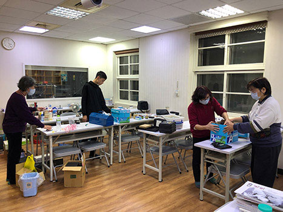

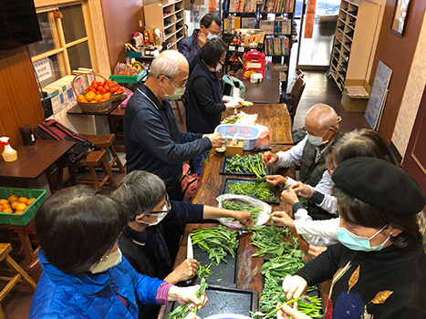

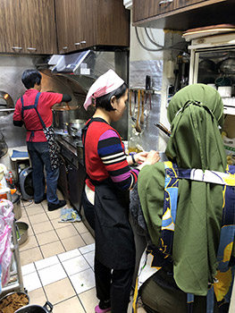

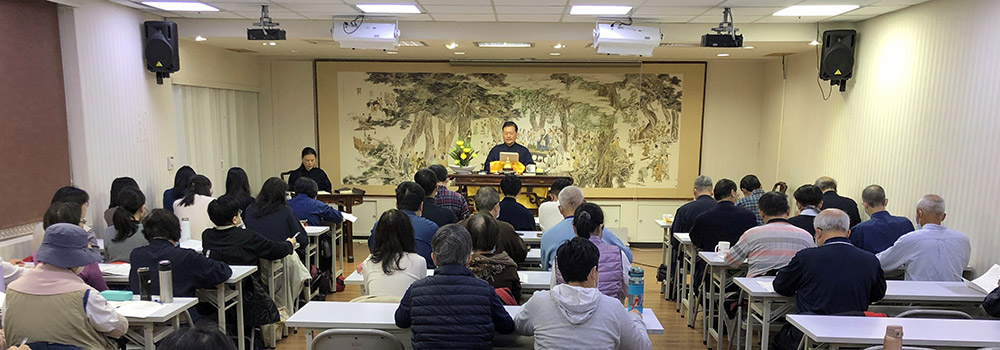

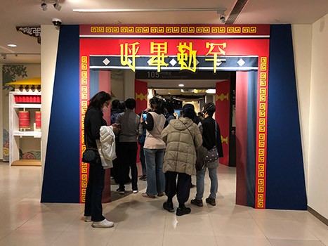

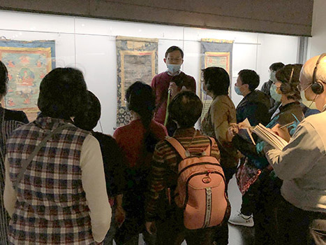

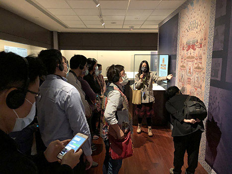

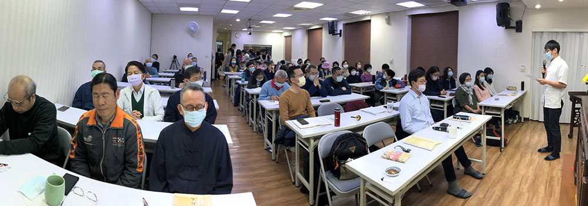

### 地藏經與經變圖講座餐前觀修

楊志卿

這一會我們參加地藏經與經變圖講座，地藏經是佛門的孝經，地藏菩薩在因地以婆羅門女、光目女的行相，顯現孝心，她以至誠心大興供養，發願救拔墮在地獄的母親生天，甚至成佛，這是最極致的孝道。儒家的孝經裡說到，「立身行道，揚名於後世，以顯父母，孝之終也。」就是將自己的名聲流傳於後世，讓父母也能享受到榮耀。在《論語》中也說到，「君子疾沒世而名不稱焉」，君子憂慮，終其身，沒有留下好名聲，讓人稱揚，這些都是孝心的發揚。

孝道是德行的根本，從孝順最親愛的父母做起，擴大到親友，再擴大到鄰居，陌生人，動物，一切有情眾生，但因俱生我執的堅固，執我和我所，其他非我族群，苦樂就與我無關，但算算無始劫來輪迴的次數，每一個有情都可能是我過去生的父母，既然能孝順今生的父母，過去生的父母怎能置之不理呢？

以此理論建立自他平等的觀念，自然就會像地藏菩薩，為使有情得安樂，不疲不厭，耐心的隨機說法度眾生。例如，在經文上說到，「若遇飲食無度者，說飢渴咽病報」提醒我們在用餐的時候，飲食要有節度，才不至於吃出許多毛病。乾隆皇帝說：「不貪不淫可以養德，能清能淡可以養壽，少食少怒可以養神」。

待會我們用餐的時候，要以平等心夾菜，不要看到喜歡的就拚命夾，看到不合口味的的就跳過去，避之唯恐不及，營養均衡為養色身，養好色身為求正法，學習正法為利益眾生，眾生離苦得樂，才是地藏菩薩的本懷，合其本懷，才是對地藏經真正的信受奉行。以上餐前觀修供養大眾，祝大家用餐愉快！

張玖如

地藏菩薩以孝心和悲心，最能彰顯其特質，昨天的餐前觀修講孝心，今天以悲心為主軸與大家分享。地藏菩薩發大願廣度眾生，雖知閻浮眾生，剛強難化，難調難伏，依然發願：「地獄不空，誓不成佛」這種大悲心，一定要有正知見為底蘊，要有十八般武藝權巧方便度眾生的能力，更要有菩提心的攝持，才不會被頑強眾生打敗而退轉。

除了具備以上條件，光靠地藏菩薩一個人的力量，就能辦到嗎？很難！本經各品中的當機者，如文殊師利、摩耶夫人、定自在王菩薩、四方天王、普賢菩薩、普廣菩薩、大辯長者、閻羅天子、惡毒鬼王、主命鬼王、堅牢地神、觀世音菩薩、虛空藏菩薩等等，都是地藏團隊的成員，陣容堅強，共同護佑，救拔罪苦眾生。可見凡事都需要有和合團隊默契經營，效果才能以複利方式增長廣大。

就如煮一頓飯，光有一個大廚也不行，還要有義工幫忙撿菜洗菜，才能及時上菜；餐後也要大家一起收拾善後，環境才能恢復整潔，更需要各位學長歡喜享用，這些飯菜，才能呈現它的美味。當我端起那碗滿滿愛心的飯菜，覺得我好像他化自在天的天人，享受他人造作的成果。想想平常在家，張羅三餐是我的責任，我何德何能，沐浴在上課的喜悅之餘，下課馬上就有熱騰騰的飯菜侍候，福報太大了！今天能得此樂果，想想，也很隨喜自己，過去世曾造的善業，再以此樂果為因，造作與佛果關聯的法行，這樣因果不斷循環，如雪球般愈滾愈大，迴向作為往生成佛的資糧。

年關之際，家家戶戶忙著打掃、辦年貨的時候，各位選擇來參加地藏經與經變圖講座，在因地我們種下與三寶有關的法緣，期待在成佛路上，持續組成一個堅強的牛人團隊，為傳承佛法，為弘法利生，為無盡燈，為極樂世界招生而努力！祝大家用餐法喜充滿，身命慧命得以滋養。阿彌陀佛！

色身的延續　心法

我們的色身有種種的不淨外，還很多的過患，貪愛色身會讓人好逸惡勞、放逸頹廢，或是追逐名利，沉浸在世俗的快樂中，甚至造作損人利己的惡業，惡業會結成三途的苦果，這些惡業還不包括毀謗三寶、毀謗聖賢，造作很多傷害正法的業，結果更是恐怖。

雖然色身有這些過患，但也有功德，像是觀待色身的延續，才有心識的生起，有心識的生起才能緣念正法，做正法的修學，所以色身的維持也很重要。

色身的衰敗、生病會造成心念無法集中、無法強而有力的生起，會花很多時間來解決身體的痛苦。

古人講究身安而後道隆，養心固然重要，養身也不惶多讓，除了身體的保健、運動、充足的睡眠外，吃飯也很重要。修行人的四事供養中，包括飲食、衣服、醫藥、臥具的供養，來保證身體的健康，是修道的本錢。

用餐講究營養可口，可口才會有食慾，吃進去才會讓身體有動能，有精神則利於佛法的實修。釋迦牟尼佛在世的時候，托缽化緣不只是跟信徒結善緣，還有一分就是延續生命，所以我們對修行人提供飲食的功德非常殊勝，同樣的，提供同法者飲食也很殊勝，我們要感謝香積幫忙做飯的師姑師伯們，忙進忙出，讓我們有修學的道糧，當飢腸轆轆，沒有食物的補充，講座也辦不下去，可見講座的延續，除了每一堂課的老師研討法義外，還仰賴飲食的提供。

其次，僧團結夏安居時，僧眾不能外出托缽，只能在固定的範圍內，接受在家人的供養，《地藏經》是釋迦牟尼佛入涅前最後一次的結夏安居，他選在忉利天為母親講演《地藏經》，來報答母親的恩德，推廣孝道，從孝道引發大悲心、菩提心，地藏菩薩就是楷模，釋迦牟尼佛在忉利天廣演大法，忉利天的天主一定會提供天廚妙供，提供種種的美食，來回饋釋迦牟尼佛四十九年辛苦的度化眾生。

釋迦牟尼佛度化眾生的過程中，曾住過皇宮、精舍、曠野、樹下，也住過信徒的家，是適應力非常強的修行者，也遇過很多挑戰，僧團也發生很多意外，國家也遭遇很大的變局，釋迦族被滅族，他這一生可說是遍嘗酸甜苦辣，但卻沒有讓他失去道心，反而成就了他的堅忍、能耐、願力、心志，以及處世的智慧，最不可思議的就是阿闍世王，他在法華會上被佛授記，從吃飯當中，我們可以聯想很多釋迦牟尼佛發生的事情，在吃飯時做很多觀修，也是釋迦佛遺留下來的儀軌，雖然再平常不過，但也是成佛最殊勝的法行。

吃飯當中可以將諸佛菩薩的證量、加被吃進去，將佛果的安樂來供養有情，而這個佛果的安樂包括修行人在修行的過程中有道糧，有天廚妙供，就像極樂世界的有情在享受美食一樣。享受美食也可以是貪圖享受，而輪迴六道、墮落三途，也可以是成佛的道糧，在這邊祝福大家用餐愉快、法喜充滿。

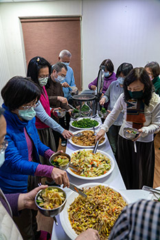

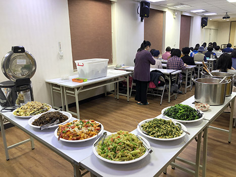

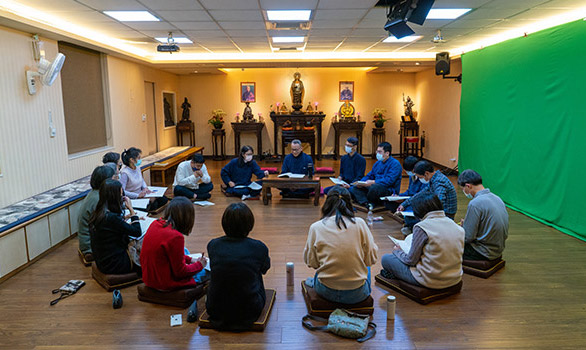

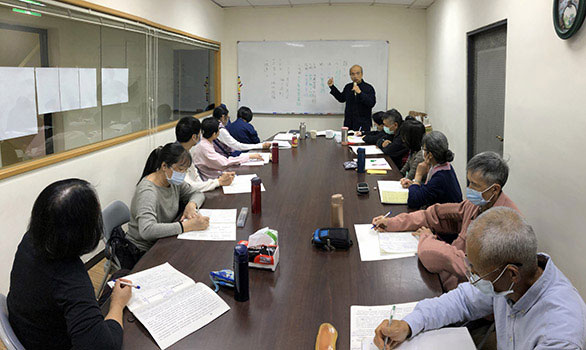

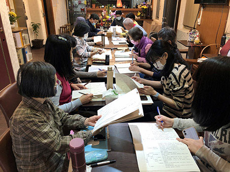

### 呼畢勒罕特展紀要

以藝載道地藏本願的再現 — 緣起的趨利避害之道　講座報導

*編輯部*

經變圖緣起

長卷能載道

講座文義顯

菩薩加被生

前 言

學會於二○二一年寒假二月四日至二月七日興辦《地藏經》講座，多達兩萬字的《地藏經》，廣陳過去因緣、未來果報，國畫大師江逸子先生，以近兩年的時間，將內容描繪成超過五十公尺的《地藏菩薩本願經圖》，是他晚近以來最磅礡恢弘的大作。本圖將於年節後印刷成書出版流通，承蒙江先生看重，本會自二〇〇六年承接國父紀念館道藝春秋展的導覽工作之後，便漸漸熟捻先生事蹟與畫作，先生囑咐本會寫序，並期望能結合師資，為此圖書註解說明作導覽手冊，並培訓導覽人員，盼此圖在兩岸三地能廣為流通。

學會曾整理編輯《地藏經科文》，蓮友們也長期浸潤在佛典經教中探討研學，配合江逸子老師此次經變圖鉅作的出版，相信大家定能成為《地藏經》輾轉流通最有力的助緣，成為地藏菩薩跟觀音菩薩弘揚本經的得力助手，亦是學會蓮友們修積功德的最好因緣。

值此新冠病毒肆虐，二〇二一年開春國際上出現多樣變種病毒，國內發生群聚感染，人心惶惶之際，既然無法在國內外舉辦大型講座，正好拾起書本，累積能力蓄勢待發，安心完成畫作的導覽手冊，將地藏菩薩成就的因緣了然於心，為座上之觀修，為歷緣對境修之攝持，作一位舉手投足、行住坐臥、說話辦事都能轉為佛果資糧的行者，成為改變命運，享受人生大樂的士夫。江老師的《地藏菩薩本願經圖》，實踐了年輕時對恩師雪廬老人的承諾，完成了地藏菩薩的心願，相信亦是成為雪廬老人於常寂光中能乘願再來的增上緣。

《地藏經經變圖》畫作緣起

二〇一九年的十一長假，與江逸子先生於福州會面，江先生拿出耗時兩年時間，甫完成的《地藏菩薩本願經圖》，著實令人歎為觀止，難以相信這幅超過五十公尺、筆力遒勁、寫意精美的長卷出自一位八十歲，甫遭夫人與大兒子相繼往生的老人之手。

本圖以長卷的形式創作，繪製的過程不似二〇〇一年受淨空法師邀約、二〇〇三年開春繪製、只花九個月就完成的《地獄變相圖》那麼順利，在遭遇很多障礙時開筆，江先生的夫人因病往生，第二年大兒子也因意外也相繼往生，後來受吳董護持而在福州的阿彌陀佛飯店完成此幅經變圖。先生在逆境中安住身心，寄情於地藏菩薩的悲願中，曾說：「不經逆境不成道場，不經浩劫不能成佛。」原來走出人生的谷底，要靠的是不可思議的善業。

繪製地藏菩薩相關之《地獄變相圖》與《地藏菩薩本願經圖》的因緣，起於五十年前，雪廬老人曾宣講《地藏菩薩本願經》，讓江先生在菩提樹雜誌上畫插畫，同時江先生就邊畫插畫邊做筆記。從畫《地獄變相圖》開始，每一幅畫都是一年半載的經營，《地獄變相圖》介紹墮入地獄後所受的種種罪報，同時說明地獄果報皆是自作自受，並非閻羅天子所定之罪，令眾人了解人身難得的可貴，及起心動念造作惡業墮入地獄的可怕，生起離苦得樂之心，老實修行而得度脫三塗之苦。而《地藏菩薩本願經圖》則詳述釋迦牟尼佛一期度化之將盡，上升忉利天宮，說法為報母恩，所說之法竟是地藏菩薩本願。世尊以宣述地藏菩薩的本願來報答佛母摩耶夫人生育之大恩，也以地藏往昔為孝女之典故，為世間孝子盡大孝之楷模。

《地藏菩薩本願經圖》畫完後，江先生又繼續繪製《佛涅槃圖》。釋迦牟尼佛上升忉利天為母說地藏經後，隨即入涅槃，釋迦牟尼佛在此世間說法四十九年後涅槃。先生言及曾受張大千極力推薦，改革開放後在敦煌看過佛涅槃的塑像，十分感動。當時的戈壁荒漠很危險，嘉峪關旅遊局局長派專車護送到敦煌，敦煌研究院院長段文傑親自接待，原來是因為段院長跟張大千有師生之誼，特別開了幾個特窟給江先生參觀，先生說一看到佛涅槃像，不禁熱淚縱橫，跪下三頂禮，當場寫生臨摹下來。

經變圖的最後，江先生題了一首絕句，述說當年雪廬老人在重慶歌樂山弘法，山上有個破廟，傳遍了是地藏王再來，那天很多人在那等著，結果那天雪廬老人上山講經，被人認為是地藏王菩薩示現。老人說：「心懷彌陀，願行地藏。」老人也跟江先生說：孩子，你以後也要心懷彌陀，願行地藏。此首絕句即是：「猶憶當年松柏志，倒駕慈航幾人知。閻浮世界風光少，悲願傳馨翰墨滋。」雪廬老人曾希望江先生用丹青筆墨，把文化帶回中國。畫作，既可以當藝術品欣賞，又可以畫中有話，這是多生多劫的因緣。

當時福州的敦化學堂趁著十一長假一同共學，巧的是研討主題為正好是《地藏經》，因而促成與江老師座談的機會，江老師欣然答應讓大眾一同欣賞這幅《地藏菩薩本願經圖》，故於二〇一九年十月六日上午在阿彌陀佛大飯店租會議室舉辦座談會，後又將經變圖請至順昌與雪廬夫子研學會的讀書會成員一同欣賞，能參與此次盛會，大眾或邊誦經邊觀看，或合掌聆聽學習，皆歡喜莫名。

地藏經介紹

地藏經共分十三品，第一品<忉利天宮神通品>詳述釋迦牟尼佛一期度化之將盡，上升忉利天宮，說法為報母恩，所說之法竟是地藏菩薩本願。第二品<分身集會品>是佛放光令各地地藏菩薩來集，接受世尊的託孤，加被提攜後世剛強難化的眾生。第三品<觀眾生業緣品>、第四品<閻浮眾生業感品>與第五品<地獄名號品>，此三品是指地藏菩薩所度化的眾生，煩惱業感苦，最可怕的果報是成熟在地獄，而往昔生中，地藏菩薩曾為國王、為孝女、為長者子，皆發大願利益眾生，其中以孝女的身分，名為光目女、婆羅門女，為拔濟其母於地獄，而發地獄不空誓不成佛，眾生度盡方證菩提的大願，最令人記憶深刻。第六品、第七品與第八品，世尊讚歎地藏菩薩是眾生度脫的殊勝勝緣，<如來讚歎品>讚歎地藏菩薩的功德，<利益存亡品>直指眾生陷於五欲泥濘中，又擔負著自私自利所起的種種煩惱，善退惡增幾乎無法自拔，必須外有大善知識引導我，平時多多造善，臨終時自己與家屬都懂得如何護持造福，<閻羅王眾讚歎品>描述此土眾生剛強難化，地藏菩薩面對被度脫的眾生不久之後又墮地獄，不斷累積自己度眾生的能力，惡毒鬼王擁護善男女，主命鬼王發願擁護閻浮眾生。第九品<稱佛名號品>顯示有情在地藏菩薩超拔之後，亦需要佛的幫助，成為修法的順緣，第十品<較量布施功德緣品>闡明需有修學資糧，第九品與第十品是殊勝的成佛因緣。第十一品<地神護法品>由堅牢地神宣誓保護修學地藏法門的修行人，第十二品<見聞利益品>佛放光指示觀世音菩薩流通地藏菩薩功德，成為地藏法門最有力的流通者，第十三品<囑累人天品>則不斷重複咐囑交代地藏菩薩承擔末世度化眾生的重責大任，地薩菩薩也安慰佛不要憂慮，他會善盡其責，努力度化這些剛強難化的眾生，此時虛空藏菩薩也依著佛咐囑的因緣請問地藏菩薩功德利益，願意流通此地藏法門，好好護持地藏法門的修學。正因地藏菩薩有如此殊勝之行相，若能誦念本願經及菩薩名號，對菩薩聖相供養、讚歎、禮拜，所生之殊勝功德不可計量。總之菩薩是眾生之大福田，暗夜之明燈，貧者之寶藏，險難之善導，欲述其德，窮劫難盡。

地藏菩薩的殊勝可貴是祂的大願與大行，而菩提心的引發至為關鍵，利用對母親的孝心來引發就是善巧方便。地藏菩薩承擔使命，面對滅法時代的眾生，目的是要在彌勒菩薩示現成佛之前這段時間，護持他們不墮三惡道（才可以交棒給彌勒菩薩）。

要幫助他們達成此目標的方法分正反兩面，內容由地藏菩薩以及祂的團隊成員提出，這些方法也是我們末法以及滅法時代的眾生需要牢牢抓住的。

正面來說：念佛名（包括對地藏菩薩的禮敬供養讚歎等）、修布施、持戒（釋迦牟尼佛為四天王介紹地藏菩薩，累劫教化眾生都在宣說因果）、出生時及臨命終的重要注意事項（每一期生命流轉的節點，生死之時為特別的關鍵）。

反面來說，眾生被度脫之後又仍然墮落，原因何在？需要認真的檢討並找出對治的方法。若不能有效對治，有情最終輪迴的大本營是在地獄。

《地藏菩薩本願經圖》畫作賞析

江先生所繪的《地藏菩薩本願經圖》，依《地藏經》之十三品分別繪製，《地獄變相圖》標題使用俊秀的楷書，長卷畫作獄卒與地獄眾生人物大小相符，用色鮮明，人物表情生動，審問犯人的嚴肅表情，鞭打罪人的嚴厲手腕，地獄有情苦痛與哀號的表情，活生生地展現在畫作上。各殿閻羅天子衣服華麗展現尊貴、各式刑具機關靈動，人物肌肉線條細緻分明，每一筆都可見繪者用心雕琢，令觀者聞之足戒，生起極端恐怖不願墮落之心。

《地藏菩薩本願經圖》的重點在釋迦牟尼佛與地藏菩薩的悲心，標題使用厚實的隸書，畫面中佛、菩薩、獄卒與地獄有情，依功德力而有大小懸殊的差別，整幅畫線條出神入化，看似隨意勾勒更顯柔和，獄卒、刑具與地獄有情，依稀彷彿可見出自於變相圖但又出現各種新的刑具，地獄中受苦眾生，相對於獄卒與菩薩，形象瘦弱矮小，表情不似變相圖有立體感，既猙獰又苦痛，經變圖中的受苦有情雖然依然面容苦楚，但筆觸柔和中一筆帶過的線條，內心生起的不是害怕而是憐憫。

各品篇幅或長或短，江先生依照所學，將各品精華展現。業緣品、業感品、業報品，所繪的地獄又像合在一起畫，又可以把段落分開那般靈動，而地獄的刑具和動物也與地獄變相圖相仿，但又好像重新看一幅新畫那樣一直發現新大陸。宰官、居士們讀書的樣子似曾相似於孝經圖，第十品中，施人尊者施福勝，畫中塑造巨幅佛像又像親臨緬甸大金塔現場，圍繞金塔旁一尊尊高大尊貴的佛像那般令人仰望。第十一品言地神護法流通，大家是否以為會看到地神出來證明？非也，江先生以地藏菩薩比丘像手捧錫杖飛越怒濤描寫經中經文：「自然畢竟出離苦海。」跳脫一成不變的預設框架，實在絕妙。經文若言及地獄，則以灰暗的巨石、荊棘分隔；若言及其他，諸如菩薩功德、加被放光、擁護流通等，則以松樹將場景區隔。整幅畫作有傳承、有相互輝映，更有作者無限巧思。善巧表達眾生造業受苦，復造業又受苦，不斷受生地獄苦痛難離，而地藏菩薩以「地獄不空，誓不成佛」之願，經中（畫中）不斷的看見若能誦念本願經及菩薩名號，對菩薩聖相供養、讚歎、禮拜，所生之殊勝功德不可計量。

畫卷的最後，江先生回憶雪廬老人往昔叮囑，如今因緣俱足完成老師交代之事，並遵淨空法師囑咐，將自癸未（二〇〇三）年以來的三個夢境繪製出來，其至誠之心可堪檢驗，其以藝載道之功後無來者。首先在癸未九月十九寫至泰山殿時，夢見自己為菩薩塑像，且虛空中告知已塑四尊地藏菩薩像，江先生夢醒後估算一下，連雪廬老人塑像共計已塑四尊無誤，或有傳雪廬老人乃地藏菩薩應化而來，老人亦曾謙虛地說自己與地藏菩薩有相同的願力。其次，在午休時夢見地藏菩薩與十殿閻王及諸天聖眾，法會殊勝莊嚴。地獄變相圖即將完稿之時，又於凌晨菩薩入夢，宣召諸道眾生於光中，顯示地獄恐怖悚慄之狀，苦口宣說因果報應種種業相，菩薩慈悲真誠，無休無止不勝感傷，江先生自云，醒來時不覺淚透枕巾。菩薩三度密集入夢，綠川之畔雪廬老人殷勤教誨，不敢有辱，師徒之情盡在畫中展現。

＊＊＊＊＊＊＊＊＊＊＊＊＊＊＊＊＊＊＊＊＊＊＊＊＊＊

於此述說講座因緣，並簡述《地藏菩薩本願經》重點內容及經變圖畫作完成之不易。並刊登「畫說地藏」一文，此為江逸子老師親自說明畫「地藏菩薩本願經變圖」之緣起。其後並彙整講座中各種討論重點，及會後善知識們的各類心得及觀修稿。又特別整理有關故宮展之「呼畢勒罕特展紀要」一文，以饗大眾。

### 臺北孔廟仲春丁祭總報導

*編輯部整理*

凝聚宗族仲春丁祭

祭祀興起祖輩榮耀

於戲大哉仲尼至聖

千載宗族精神所依

二○二一年三月十四日，於臺北孔廟大成殿上演一場莊嚴肅穆、震懾人心的祭祀暨團拜典禮，由孔子第七十九代嫡長孫、大成至聖先師奉祀官孔垂長親自率領臺灣孔氏宗親九十餘人共襄盛舉。本次活動首次試行了中華大成至聖先師孔子協會和至聖孔子基金會委託臺大中文系團隊與臺北孔廟研擬的仲春丁祭祭儀，廣受參與活動的孔氏宗親及相關專家好評。

曲阜孔氏繁茂數千年，族裔周遍四海。以往臺灣孔氏宗親都是像其他民間團體一樣舉行新春團拜。去年，孔垂長先生所主持的中華大成至聖先師孔子協會和至聖孔子基金會委託臺大中文系團隊與臺北孔廟研擬仲春丁祭儒禮，以闕里禮志中月朔與歲時常祭之釋菜禮為基礎，並酌情參考當今禮儀，提出丁祭方案：儀程共分為典禮開始、入班、禮神、上香、行獻禮、恭讀祝辭、讀訓、立願、禮成、團拜、成人禮、合影等十二項儀節。務使保存古禮精神，適用當代民情。

臺大黃啟書教授說這場祭典是經過二個月，四十餘人的集思廣益，匯聚一百四十人的力量，成就一場中斷七十年的典禮，意義至為深遠，「原先只是一件被延遲的新春團拜，因緣巧合的『升格』到仲春丁祭的模式。仰賴奉祀官與臺灣孔氏宗親的全力配合，臺北孔廟的全心襄贊，還有臺大中文系、中華無盡燈文化學會合組的禮生團隊。在風和日麗的農曆二月初二，龍抬頭日子裡，我們共同完成了一個未曾夢想過的典禮。從去年的禮神、立願、團拜；今年復增行了獻禮、讀訓。並在宗親見證下，為六位宗親學子簡單而隆重舉行了成人禮。雖然儀節間仍不免稍有瑕疵，但能流暢地讓八歲到八十歲的參與者在一個半小時內，從從容容、歡歡喜喜的行完所有儀節，挑戰不能說不大。正因為有了宗親們與觀禮貴賓的包容、工作團隊的合心與協力。所有難處反到成了『闖關』的樂趣！」短短一番話道盡了初出至圓滿的過程、心態與成效。

學會有幸在祭典中擔任各項職務，因應孔垂長會長、孔氏宗親及黃教授邀約，比去年投注更多義工，有照看全場、解決大小疑難雜症的通贊，有帶領宗主、宗親、扯破喉嚨、同時想辦法保持速度一致的東西班引贊，有莊嚴會場、敲擊響亮震耳、餘音繞樑的鐘鼓手，有製作家訓卡、準備供品與場佈的前行工作者，有現場示範立拜、儀節的禮生，還有全場照看，搶拍鏡頭的攝影團隊，眾人皆抱著歡喜又戰兢惕勵的心態上陣。其實習儀的時日很短暫，從整體儀節內涵教學、習儀到上場僅一個月左右的時間，除了原定的練習日外，大家極力再爭取一天至孔廟練習，黃教授更是冒著大雨到場指揮，經過緊鑼密鼓的籌備，流程路線最終底定，大家互相搭配、專注一境，希望能成為與會最好的莊嚴。過程中最能體會司馬遷所說的「諸生以時習禮其家，余低回留之不能去云」，禮儀透過演練才能彰顯內涵，才有助於傳承，而孔廟就是最好的場地，能讓心生起祭祀典禮的敬畏與感動，眾人沐浴在和合的氛圍下，成就一樁吉祥事。

祭典當天在防疫的規範下，參與丁祭的孔氏宗親和特邀貴賓、禮生團隊皆佩戴口罩，魚貫入孔廟。九時許，在孔廟欞星門前依字輩序班，有年事已高拄著手杖的長輩宗親，也有尚需父母提攜的幼童，大家齊聚一堂。其中孔祥寶家族連續兩年團拜皆為三代同堂，參與人數都在十餘人之上，最引人注目。眾人依儀節在鐘鼓肅穆聲中，致祭、跪拜，並大聲誦讀家訓，只見宗親等拿著學會製作的讀訓卡，齊聲朗讀《論語》條目三章，這樣的畫面顯得難得可貴，許多宗親更是拿著讀訓卡跟孔廟合影留念，以生為孔子的後代而倍感榮耀，彼此的心更加凝聚在一起。入殿立願的儀節，是宗親們最期待的。經過去年的經驗，大家都非常珍惜珍貴的八秒鐘「許願時間」，這也成為大家對丁祭最有印象的環節。有宗親在儀式後表示：入殿時鐘鼓交鳴，頓感神聖莊嚴，在這樣的氣氛中許下心願，真是難得的體驗。

今年新增入的成人禮儀節，在沒有彩排、僅靠線上視訊指導的情形下，仍能如儀進行，是因為從禮生到參與的學子和家長，都十分認真。儘管學子與家長、貴賓、宗主的互動略嫌生澀，但已能夠完整地將成人禮的諸項儀式十分到位地呈現出來。當主禮人詳讀每一位學子的自傳，再謹慎地取以適當的字，學子們都感到雀躍與感動。尤其在瞭解到每個人「字」的寓意與典故後，倍覺莊重。甚至有宗親都遺憾自己已過了行成人禮的年齡，沒有這樣取字的機會。

孔垂長先生表示，四仲丁祭是孔氏家族的傳統，但民國以來衍聖公改易為大成至聖先師奉祀官，闕里孔廟已不可能維持前清的祭祀費用與禮樂編制，仲秋丁祭更易為九月二十八日孔子誕辰與教師節由官方一併紀念舉辦，大宗再遷出闕里孔府之後，家族的四仲丁祭早已不復舉行。今年因緣際會將新春團拜延到二月，卻意外促成了首次由孔子後裔所主辦的孔氏宗親仲春丁祭，本次徵考古禮、酌以今儀，推出了一套在時程、人力與經費上都適合的方案，並數度習儀，成就了今日莊嚴又不失溫馨的典禮。臺北孔廟除在場地、禮樂祭器上鼎力襄助，資深禮生老師亦對我們多有勉勵。本次活動目的並不在於複製古代的祭儀；也不是要新創一套現代儀典。而是希望讓各地孔氏族裔在力所能及的基礎上，合禮容情地表達心中對於祖先的崇仰，並對自身未來許下宏願。正如禮生團隊特別在這次丁祭完成之後加上了成人禮，就是希望用存古通今的時代精神，來迎接一代又一代的孔氏後人，這樣無論是孔氏祖訓還是儒家思想，才能歷久彌新，傳承不息。

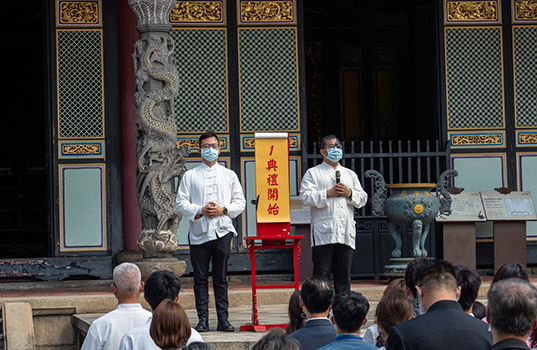

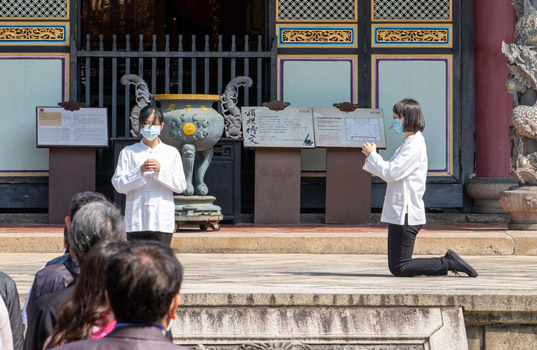

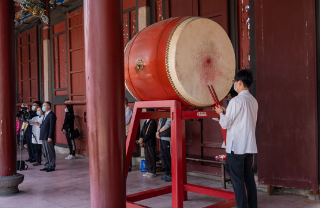

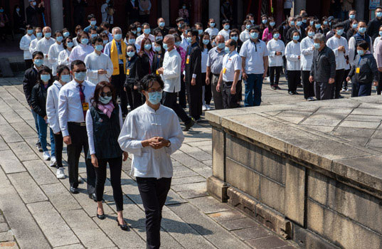

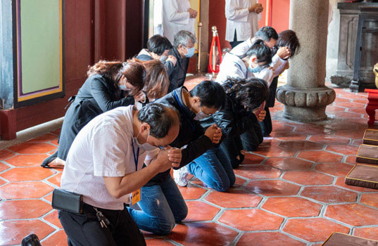

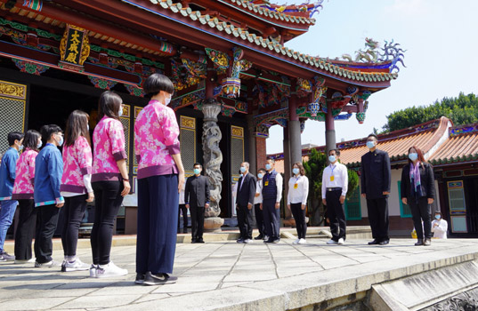

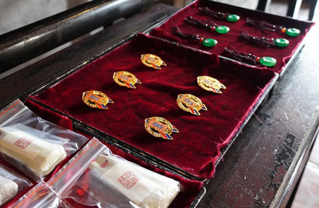

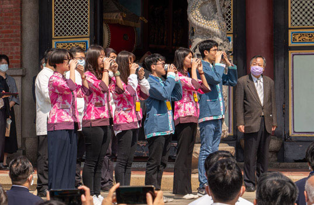

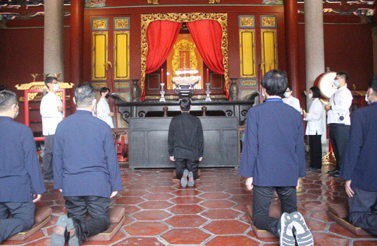

### 二○二一臺灣孔氏仲春丁祭暨新春團拜有感

昭如

廣大知識背景

經學禮儀型式

孔子以禮聞名

原來如此這般

慎終追遠，民德歸厚。祭祖不是逢場作戲的儀式，而是凝聚家族情感與教育後代子孫的絕佳時機。有天下第一家美譽的孔家，為了復興傳統文化，通過禮儀凝聚宗親，帶頭做出示範，特別委託臺大中文系教授與臺北孔廟共同研擬孔氏宗親祭祖禮儀，歷經數月的努力，終於大功告成，自去年開始與學會合作，於臺北孔廟試行孔氏宗親新春祭祖與團拜的新式儒禮。然而，精益求精，今年更在去年的基礎上，增修了相關儀節，期能保存傳統精神，又能適應當代潮流，以利未來推行至海內外各地施行。身為學會禮生團的一員，能置身其中，參與這兩次典禮，實際操作和體會經典中所示的內涵，乃是極其幸運的一件勝事！略擇幾點感悟紀錄如下：

損益應世

孔子曾言：「殷因於夏禮，所損益，可知也。周因於殷禮，所損益，可知也。其或繼周者，雖百世可知也。」顯示禮是變化的，本質雖是五倫十義，但做法會隨著時代有損有益，該刪減的刪減，該增加的增加。孔氏仲春丁祭暨團拜即是如此，觀待財力、物力、人力、環境、對象、時機等條件，根據古禮、參考今禮而有所增刪，使規模精簡便捷，又不失莊嚴肅穆，並納入讀家訓、立心願、成人禮等環節，不會太繁瑣，也不至於過於簡略，頗有麻雀雖小五臟俱全之貌，符合當今時代所需。

凝聚宗族

祭祖團拜意義深遠，是凝聚宗族向心力和聯絡彼此情誼最好的活動，《孝經．聖治章第九》提到：「周公郊祀后稷以配天，宗祀文王於明堂以配上帝，是以四海之內，各以其職來祭。」簡言之，周公把始祖后稷和父親文王等同於上帝般對待，一起接受後代的祭拜，以孝治國，因此感應四海之內的諸侯，各帶官職來助祭。孔子第七十九代嫡長孫孔垂長先生也藉由祭拜先祖至聖先師孔子，率領近百位臺灣孔氏宗親齊聚一堂行禮如儀，並錄製影片，做為各地後裔祭拜孔子之典範。此外，更在會後一同聚餐，互相交流，和諧相處，其樂融融，無疑對宗族注入了強大的生命力，加深對彼此血緣上的認同感。孔家作出如此榜樣，對世界各大家族有著領導的作用，對社會淳厚風氣的影響做出了極大的貢獻。

教育後代

孝道是中華文化的核心思想，祭祖是孝道的教育和展現的方式之一，舉凡長幼有序、觀功念恩、飲水思源、百善孝為先、祭如在、祭則得福、視死者如視生、身體髮膚，不敢毀傷、立身行道，光宗耀祖等等，其中含藏著諸多人生成功的秘密。此次儀程吸引部分孔氏宗親以三代同堂的方式參與其中，長輩們透過以身作則，恭敬謹慎，誠心誠意的祭祀先祖，對後代子孫的教育將產生深刻影響，若確立其人生觀、價值觀和處世態度，成為懂得感恩和願意承擔的後輩，勢必能獲得真正的福報，贏得眾人提攜和協助，成就利人利己的功業，這遠比表面的考試成績重要太多。未來若能妥善的加以運用，引發更多三代同堂的出席投入，其教育所發揮的大用將難以估算！

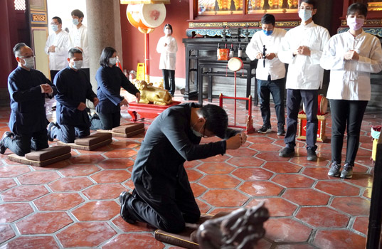

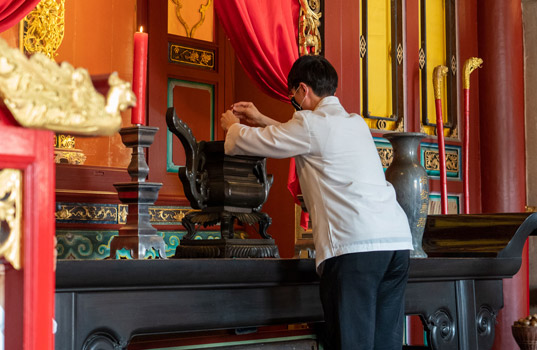

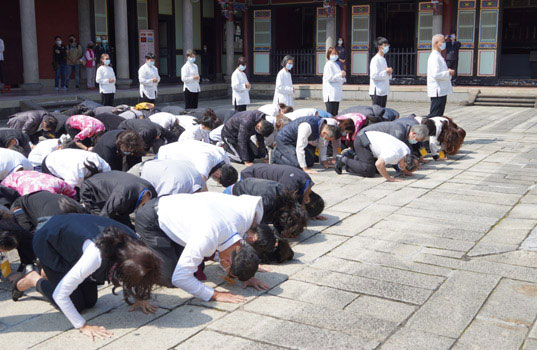

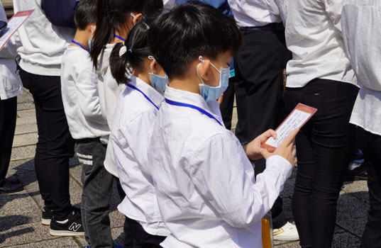

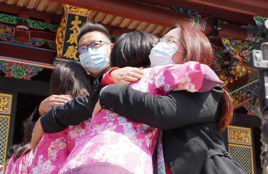

### 一日引贊，一月練習

陳秀春

禮節要靠演練

氣質逐漸呈現

個性漸漸穩重

命運化學變化

當學生所負責引導的宗親在大成殿聽到西班學長喊「持志有恆」，心想結束了，鬆了一口氣，帶領宗親走出大成殿。

回想二月二十一日第一次在孔廟練習，當時扮演宗親角色，對於引贊的走位完全沒有概念，回家後忐忑不安，心裡多麼盼望能有再一次的練習機會。

慶幸隔沒幾日，學會通知三月六日能再練一次，心想太好了，這一次的練習絕對必要。三月六日上午的練習，終於對引贊走位比較有概念，但呼班的音調不容易，心裡既緊張又害怕。

當天演禮結束後，在往圓山捷運站路口，自己開始練習喊著「宗親入殿就位、正衣冠、跪、拜、祝願、興、持志有恆」，口號是正式的話語，不是平常說話語調，且要配合步伐，走路速度不能太快，亦不能太慢，若太注意口號及節拍，步伐就怪怪的，變得不會走路了。雖然只有短短十幾個字，居然還會漏詞，偏偏是漏掉「祝願」，實在是離譜。

幸好當天下午黃教授特別費心錄製了呼班的錄音檔，讓引贊有了依循的範本，晚上自己對著音檔，紀錄每句口號的秒數及音調，試著跟音檔練習，只希望不要失誤及怯場。

三月十三日下午在外面做最後的練習，緊張的感覺油然而生，想著明天要正式上場驗收成果了，心裡暗自祈求佛菩薩加被，希望明天臺灣孔氏宗親仲春丁祭暨新春團拜，一切順利圓滿。

三月十四日正式入班進場，自己還擔心引班到大成殿會緊張、走路不穩、發抖，只能不斷深呼吸，告訴自己一定可以的，沒有問題，以平常心面對，當最後聽到西班學長喊「持志有恆」，心想結束了。事後回想整個過程，能有機會參加此次活動，對自己而言，未嘗不是多了一次人生的另類體驗及學習機會，畢竟此類機會不是常常有，也不是絕大多數人有此因緣能接觸及參與，感謝學會提供各種不同學習的平台，讓自己有機會參加多元的學習，使自己不斷增長廣大，人生有不一樣的亮點，謝謝！

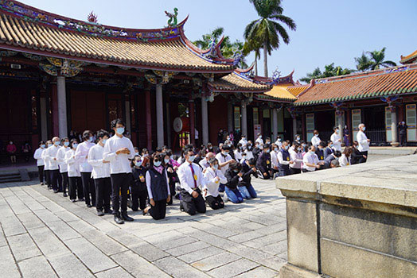

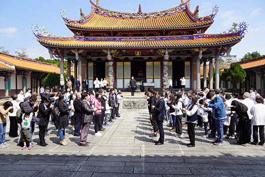

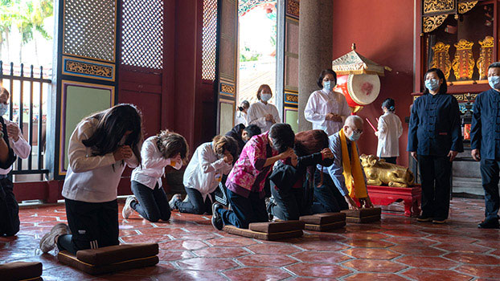
