# 第132期
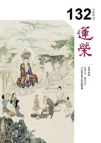

## 本刊社論

### 非營名利，義成名利

*編輯部*

點出學會存在意義

勾勒成員參與願景

戰略戰術參與熱情

有效運作以義為利

雪公在世時曾叮嚀弟子：「你們不能藉佛法開佛店，貪名圖利。儒家之書言『士』，有上士、中士、下士。下士求名，中士隱名，上士逃名。凡是沾上名利，道就減損。然而農、工、商、法、醫，自食其力者，不算為貪。」

然而，不貪名圖利，不藉佛牟利，那做為推動正法的組織，應該怎麼籌措營運的資金？中士求隱其名，上士欲逃盛名，那麼我們將要怎麼使正法宣揚、正道普及，代佛宣化？

《大學》云：「不以利為利，以義為利。」《論語》云：「君子疾沒世而名不稱焉。」看似合於義則利可以得，合於君子之行亦當名揚此時後世。如雪公說：「自食其力者，不算為貪。」弘揚正法的組織應自食其力，自立自強。

自食其力，就不免要營利；然正法團體不同於一般企業，應該怎麼自我定位？佛教團體通常都被冠以「非政府組織」（NGO），或者一般稱為「民間團體」，若行慈善則被稱作「公益團體」，或者因宗教理念的推廣而被歸類為「宗教團體」。中華無盡燈文化學會在內政部正式立案為「社團法人」，應該屬於「民間團體」；所推動的是儒佛的思想內涵，但學會應該怎麼更精準地定位，既成為一個能符合法規制度，又不違傳承叮囑，可以整體自給自足，永續利生事業，是本篇社論所要討論的主軸。

被譽為「現代管理學之父」的彼得‧杜拉克（Peter  Drucker），他所關注的其實並不是企業，也不是管理，而是人在社會生存的狀態。由於當代人們較關注的社會組織為民間企業，藉由企業來實現自我的價值，杜拉克也把他的研究重心放到了企業上。杜拉克留意到，在企業與政府部門之外，還有一種組織在二戰後迅速崛起，這種組織就是非營利組織。1990年，杜拉克便把目光投向美國的90萬個非營利組織；當時美國平均每兩位成年人，就有一位是某個非營利組織的志願者，且每週至少為所屬組織服務3小時。似乎可以說，當時美國國內最大的「雇主」，就是非營利組織。於是他將生命中的最後20年，除了寫作之外，都投入到了非營利組織中，期許能幫助這些組織更好地運作、發展，也將他的研究寫成了《非營利組織的管理：原理與實踐》（Managing the Nonprofit Organization: Principles and Practices）一書，而這本書在日後也成了全世界非營利組織的必讀書目之一，被譽為「非營利組織管理聖經」。

本文將大量引用杜拉克書中的觀點，嘗試探索中華無盡燈文化學會作為一非營利組織的未來與想像。

非營利組織

所謂「非營利組織」（Non-profit Organization，NPO），名稱源自於美國國內稅法（the Internal Revenue Code， IRC）的專用名詞。根據 IRC 第 105 條第 C項第三款規定：「所謂的非營利組織，係指在稅制下符合免稅條件的善意組織，包括教育、宗教、科學等，必需是致力於公共利益而非促進私人組織的利益，方可享有免稅待遇之組織。」由於不是以謀取利潤為組織運營的目的，且需創造公共利益，故稱之為「非營利」。

在台灣的法規之中，其實並沒有特別界定「非政府組織」是何種組織，可以說，非營利組織或非政府組織多是人民團體法之下所定義的人民團體，此中包括社會團體、職業團體、政治團體；但亦有部分的財團法人，由於早期台灣在法規上允許公司成立財團法人基金會，若想成立公司又不願成立基金會，便選擇非政府組織或非營利組織作為歸屬。可以說，台灣的非營利組織幾乎都是非政府組織，而台灣的非政府組織也幾乎都是非營利組織。

從上所述可知，作為社團法人的中華無盡燈文化學會，也屬於非營利組織。

精神內核

杜拉克在書中提到，非營利組織應是富有奉獻精神的組織，其存在應「給個人和社會帶來深刻的變化」，因此先要有具體的行動目標，作為該組織的使命與意義。組織使命可以永恆存在，至少是在所能預見的未來中存在。

而成功的使命必須要有三個要素：機會、競爭力、奉獻精神。所立定的使命也必須反覆地審視，考量是否需要對其中內容進行調整或重新定位，且要讓使命有長遠性，以長遠目標為期。而使命更要對應到戰略，透過內部的培訓與志願者的培訓，使組織的每個成員都能完整地轉述使命，甚至展現使命的精神。而戰略更將促進組織自我調整，放棄不再有效的措施、方案和服務。

因此，組織必須保持幹練、熱情與創新能力，行動的首要要求是：始終保有競爭力、隨時準備調整變革和永不驕傲自滿。

中華無盡燈文化學會的宗旨：「確立儒佛正見，效法佛孔人格，實行福慧理念，傳播正法淨世」，就是學會每一個成員所應具備的精神內核，也是使命所在。學會的機會，展現在時哉時哉網路教育學院，展現在蓮榮網上學，使儒佛的正見，藉由無國界的網際網路，來宣揚孔子與佛陀的人格精神，期藉由網路節目的製作，來傳播正法、淨化世道人心。學會的競爭力，就是學會的師資團隊，以及雪公的傳承。而學會的奉獻精神，展現在所有每一位投入學會事務中的成員，在護持活動、擔當事務、關懷蓮友、祝福迴向、探病問候、往生助念等各方面。

學會的宗旨可以永存，任何世代都需要儒佛的正見；然學會在每個發展階段的戰略性規劃，就有賴於有志之士一同發心投入，在「摸著石頭過河」的進程中，累積經驗，碰撞思維，找到謀略。

實現理想

杜拉克認為，非營利組織並不只是提供服務，更希望終端服務的對象不至於成為消極的受惠者，而是積極的行動者。非營利組織需要計畫、營銷、人才與資金，這些都需要人力的投入。

組織本身也要避免一切使人才流失的錯誤，特別像是尚未驗證的創意，或自以為是，或者寧願局部修補卻不全面檢討的創新。

實現理想要能將使命、目標與推廣整合成一個有機的行動，把握適當的時機，並符合人們的需求，提供價值與感動。而為使非營利組織能長遠發展，必須要致力於培養長期捐獻群體，並建立強大董事會，充分發揮其能量，促使組織發展。

在學會共學的大眾，既是「效法孔佛人格」，孔子是當仁不讓，佛陀行深般若，兩位聖者所揭示的思想，都是要人躬身入局、入世利生才能成就自我。而學會的價值，就在提供共造善法的條件，使能發揮的力量增長廣大，成就更大的功德法財。學會就像是一隻「金雞母」，需要更多人來維護，使善財滾滾；需要不斷有年輕一代加入，使貼近時代的想法得以施展，目的在令「儒佛正見」得以久住人間。

績效講究
杜拉克說，任何一個非營利組織存在的目的，都是要改造人類與社會。但究竟成效如何？有必要考核。要緊的是，組織內部成員要反覆地
**問：** 「我個人應該對什麼負責？無論是組織還是我個人，都應該牢記些什麼？」

所以學會的每個成員都必須有這樣的自我檢視，不論是「仁以為己任」，或者是「將此身心奉塵剎」，我們都要不斷地檢視自己：到底現在所做的一切，是否真正產生了實際的效應？在做每件事情時，是否都有將所做迴向成聖成賢、往生順緣、佛果圓成？

志願者

企業與非營利組織之間最大的差異，就是人力資源管理與關係網路管理。但人在組織中總要有所奉獻，杜拉克說：「歸根結底，如果一個人在非營利組織中無所作為，那麼他的工作又有何意義？」

非營利組織的管理人員，必須與志願者們一起工作，讓志願者們明確目標與規定期限，一同制定出可執行的工作計畫，並在其中各自將所負責的範圍完成，並能適時做出必要調整。訊息傳達的流暢特別要緊，所以整個組織必須是一種學習型組織，重視訊息的貫徹，也能不斷在反饋中進步。

而富有經驗的非營利組織管理人員，最後的職責就是：要讓所有人輕鬆工作、輕鬆獲得成果、輕鬆享有工作的樂趣。而最終所呈現的成果，必然是令人滿意的、符合理想的。

學會不單是「金雞母」，還是「選佛場」，怎麼能在學會中賺飽功德財、成就菩提業，要緊在於有所建樹。此外，每個學會成員都是非營利組織的志願者，必須講究相互服務，如內地總強調「為人民服務」，有服務精神，才是志願者精神。而每個志願者，更要將學會的使命成為自己的使命，藉由不斷地學習來體會、學會利生的種種善巧方便，甚至影響身邊的人都一起加入這使命的承載與實現。

自我發展

在杜拉克的認知中，管理學是一門人文學科。杜拉克說：「管理的對象是基於工作紐帶、擁有共同目標而聯結在一起的由人組成的社群，因此管理總是避免不了處理人性的問題，也正如所有有過實踐經驗的人所認識到的那樣，管理還需要處理善與惡的問題。」所以管理要面對人性的善惡，還有引導人們的價值觀。其實，管理就是一種自我實現到團隊共成的學科。

杜拉克認為，自我發展應從服務著手。要問問自己：「希望被人記住的是什麼？」然後不斷改進、進行變革。可以說，自我發展最佳途徑是透過自我評估，人們從中學會謙虛，願意自省，就會集中精力取得進展，並放棄無效計畫。

學會作為非營利組織，所營運的目標自然不是以利為導向，而是以人為導向。有不同的人能衍生出不同的事業，關鍵是學會的成員要將學會視作幫助自我實現的土壤，願意承擔一方的土地深耕細作，來成就繽紛的利生事業發展。

義成名利

《大學》云：「有德此有人，有人此有土，有土此有財，有財此有用。」使命必須由人彰顯，有人就有使命發揮的空間，也才有促成使命的資金湧入，最終能將使命延續、在每個世代發揮大用。而「義者，宜也。」如何藉由中華無盡燈文化學會的每個個體，成就學會的永續發展，相信還得藉非營利組織的運營管理顯學，使每個成員都有所依準、堅持做出對的事，最終才能成就整體與個體的理想與自我實現，一同促成正法事業的名利雙收。

## 佛學覽幽

### 菩薩清淨的行持—華嚴經淨行品（四十八）

*戒慧講述／編輯部整理*

遠離口業四邪命

戒止三業五邪命

正命八正道支分

修學正法殊勝緣

丙二、指事顯因答其徵因

丁一、總徵

丁二、別顯

戊六、乞食道行時願（五十五願）

己二、所睹事境(十九願)

己三、所遇人物（有二十四願）

己三、所遇人物：正命人

前言

華嚴經淨行品是智首菩薩向文殊菩薩請問如何得到佛的功德，佛的功德特別是十力、四無所畏、十八不共法，而成就通往佛德會有十種能耐，這十種能耐及佛的功德，該如何得到？智首菩薩這一問，文殊菩薩就宣說得到佛功德的方便，這一百四十一個願，依菩薩的願力及菩薩的智慧來攝持、行持，行持中有在家、出家、座上修、歷緣對境、日用平常的行持，以及托缽走在路上的行持等等，目前的進度在乞食道行時願，共三部分，第一部分是在路上行走的路況，第二部分是所碰的事情，第三部分是所遇的人物。

經文：

見正命人，當願眾生，得清淨命，不矯威儀。

願所依，願依靠在菩薩身上，定義為「見正命人」這件事上，第二，願所為境，能發願的是菩薩，所願的是眾生。第三，願境成益，一是隨喜，若眾生都能得清淨命，不矯威儀，該有多好。二是發願，我但願眾生都能得清淨命，不矯威儀。三是承擔，我能幫助眾生得清淨命，不矯威儀。四是祈求三寶，祈求三寶加被，讓我有能力幫助眾生得到清淨命，不矯威儀。

無論在家、出家，其衣食住行等一切經濟生活，是以正當手段獲得的，就叫做正命。看見正常、如法過生活的人，希望眾生能離邪命，三業清淨，不偽裝威儀。從事正常的經濟生活很重要，因為大部分的罪惡都是從不正常的經濟生活而來，譬如此人從事殺雞的工作，如果一天殺十隻雞，一個月下來就殺了三百隻雞，一年就殺了三千六百隻雞，如果從事一生，此人跟雞結的怨就很深了，造的罪業也很重。在家人的正命需要合法，不但要國家法律所許可的，而且是不違背正法的。

會性法師提到十六種惡律儀，這十六種惡律儀會障礙我們在佛法上的進修，一是屠兒，是對屠戶的暱稱。二是魁膾，就是執行死刑的人。三是養豬羊，四捕魚，五是獵獅，六是網鳥，七是捕蛇，八是養雞、狗。這些都是以殺腥，或者是養來自己吃，或者是養來賣。九是咒龍，學習寫法咒術，咒於龍蛇，以為戲樂。十是做賊，十一是捕盜，十二是獄吏，獄吏是看守監牢的囚犯，可能有時候要逼打囚犯，讓他遭罪，故也屬於惡律儀。十三是營女家，十四是沽酒家，十五是習染家，這會汙染環境。十六是壓油家，例如壓芝麻油，可能會殺死很多蟲。

這十六種惡律儀可歸類為殺生、偷盜、邪淫、妄語、飲酒五類，以上是在家人的正命。

出家人的正命，一是佛誌言出家人要出外托缽，或是由信眾供養，分兩類，一是四邪命食，二是五種邪命，四邪命食偏於口業，第一是下口食，出家人種植田園和合湯藥，以求衣食而自活命。第二是仰口食，仰觀星宿日月風雨，為人說吉凶禍福，第三是方口食，謂出家人曲媚豪勢，通使四方，巧言多求以自活命。第四是維口食，謂學種種之咒術卜算吉凶，以求衣食而自活命。以上四種都是邪心求利，以活生命。

再說五種邪命，這五種邪命不同於四邪命食，四邪命食是口業，五種邪命是通於三業，第一是詐現奇特，指出家人在威儀行動上表現與眾不同，本來沒有而自以為有，例如他可以不吃飯，或睡在都是針的床上，或者會發光，或現神通，目的是要他人信仰，以求利養。第二是自說功德，出家人口才辯給，但皆講讚歎自己、批評別人的話，使見到他的人心生敬仰，目的是以求利養。第三是占相吉凶，出家人學紫微斗數、風水學等，幫人家看相、看風水、算命，目的亦是以求利養。第四是高聲現威，令他人敬畏，出家人講話很大聲，很有自信，表現很有威儀的樣子讓人敬畏，目的亦是求利養。第五是為他說法，為他說法本來是無過的，但若是為利養，就有過了。以上介紹邪命，都是由誑所生，誑即心懷意謀，誑的體性是欺誑，《俱舍論》二十一卷云「誑，謂惑他」，以妄誕不實的言語、行為自欺欺人，迷惑眾生，謂之「誑」。他的心裡為什麼要自欺欺人、對人行詐呢？百法直解云：「為獲利譽，矯現有德，詭詐為性。」之所以自欺欺人是為了獲得名聞利養，而偽裝出一副有道德學問的模樣，以荒謬、怪誕的言行來迷惑人，內濁外清，內心汙穢濁惡，充滿貪嗔癡煩惱，外表卻裝得清高廉潔、道貌岸然，未得言得、無戒言戒，以上是誑的體性，該如何對治？從身口意來說，《大乘百法明門論》言第一是「行動唯求平常」，平常即是道，道在日用平常之中，吾人平素行動，應力求平穩平凡，不突現奇相，不裝模作樣。第二是「言語唯求平實」，像孔子不講怪力亂神之事，他平素的言語教化多偏重於實際生活、倫理道德，從不談論怪異荒誕、好勇鬥力、悖亂敗德和鬼神迷信之事。第三是「內心唯求平靜」，心為一身之主，言行均受其指揮。要求言行平常平實，必先求其內心平靜，然欲求內心平靜，必須格除物欲，衣食住行，但生活所需之外，不再過分貪求，貪求便是多欲，多欲是煩惱痛苦之根源，一切紛爭擾攘之所由生。簡老師說，一般人出入佛門，有兩件事情最為重要，即在解門方面，應先求知見正確，而在行門方面，則是要求正命，吾人學佛若見地不正，平素又以邪命過活，則學佛決定不成就，只有永遠在生死海中浮浮沉沉而已。

當然有些似邪命，然隱微處是利益有情，則非邪命，例如示現神通或是利眾，然有些高僧大德在示現神通後會入涅槃。其次自說功德，如果是為了使有情生起對三寶的信心、對傳承的信心，自說功德的那一分或許可，一般大菩薩是和光同塵，隱聖同凡，《易經‧賁卦》上說：「小人的然而亡，君子闇然而日章」，上面是山相，下面是火相，火在山中，德是潛藏在裡面，外相看不到，謂之和光同塵。

《論語》中說：「天生德於予，桓魋其如予何。」「子畏於匡。曰：文王既沒，文不在茲乎？天之將喪斯文也，後死者不得與於斯文也；天之未喪斯文也，匡人其如予何？」「文武之道，未墜於地，在人。賢者識其大者，不賢者識其小者，莫不有文武之道焉。夫子焉不學？而亦何常師之有？」子貢讚歎孔子，孔子也自己讚歎自己，自說功德的那一分，就是指他有傳承、使命感，讓弟子們生起對正法的信心，這是可以的。

再者，占相吉凶可不可以？若讓有情生起對因果的決定信心的那一分是可以的。而高聲現威，令他敬畏的這一分可不可以呢？寺院中的糾察師就是要高聲現威，要令大眾敬畏，否則如何管規矩。上述示現要離開諂誑，特別是離開誑的心，不可詐現有德而實無德。佛法有開有合，開遮各有條件，總之要善知法義、善用佛法。（下期待續）

### 大乘百法明門論簡說(三十九)　拾伍、心所有法—不定

*戒慧講述／淨本整理*

善用不定作斷修

學習百法善調心

一切全部作分別

此種認知最可怕

經文：

六、不定四者：一、睡眠。二、惡作。三、尋。四、伺。

不定心所有四，一、睡眠。二、惡作。三、尋。四、伺。

睡眠又稱眠心所，是一種心理作用，也觀待生理而生起，以心力提不起勁的作用來定義它，《直解》云：「睡眠者，令身不自在，心極暗昧，略緣境界為性，障觀為業。」眠心所的作用令第六識起昏沉，因此障礙前五識的分別能力，使人進入睡眠的狀態。此心所不一定是善或惡，如果夢中造善即是善，造惡即是惡，或者也有可能無記。眠心所的造作或與白天心理活動有關，所謂「日有所思，夜有所夢」，人的心理活動是相續不斷，所以清醒時造善，眠心所也易造善，反之亦然。精進的資糧包括暫止息，為了精進而睡眠也是善，睡眠能作吉祥臥，能觀想佛菩薩的加被，睡醒有充足的精神與體力去如法修行，都能使睡眠成為善心所，但如果是為了偷懶而睡眠，障礙精進的睡眠，那就是惡心所。眠心所善惡的判別，要從作意開始，先定義清楚自己睡眠的目的，才能讓睡眠成為功德。

睡眠心所因為是第六識的作用，會障礙前五識的分別，所以眠心所只緣法塵，此與前述定中意識、獨散意識及五後意識皆只緣法塵，前五識皆不起作用的情況相同，但作用不同。

眠心所的作用與人面對死亡時也有其相似之處，也就是人在進入睡眠之前，一般不會意識到自己已經睡著，都是不知不覺中進入夢鄉；人死亡時也是如此，從此生進入中陰身（進入另一個世界），自己不會立刻意識到自己已經死亡。死亡過程中在進入另一個世界之前，心識緣五蘊的力量漸漸薄弱，直至完全空靈，之後才會是另一個世界的現起，一般人不會察覺此時已經是下一世。而修學空性的人，在下一世生起前的空靈狀態中，能夠提起修學空性習氣的比量智，結合當下的空靈感，容易證入能所雙亡的現量境界。能所雙亡的境界很難現證，即便是阿羅漢在出空性定之後，也很不容易再進入空性的現量之中，所以他們喜歡獨修，不斷減緣減行，才能再證入其中，因此有藉著死亡的空靈去現證空性的方法，能在死亡時證入空性者，才能真正稱為「圓寂」，一般對大德過世，都以圓寂來尊稱。

再說明「惡作」，也稱為「悔」，以因來立名稱為「惡作」；以果來立名稱為「悔」。《直解》云：「追悔為性，障止為業。」此心所的功能是很討厭自己過去的造作，所以現在感到後悔。如果過去造惡，現在追悔，或者過去沒有造善，現在後悔，那就屬於善；反之若過去造善，現在後悔，或者過去沒造惡感到後悔，就是屬於惡。對於無記事業感到後悔，則屬於無記。

蕅祖云：「行人修行五悔，正貴永斷相續，勤策眾善，非但追思懊惱而已。」五悔分別是指懺悔、勸請、隨喜、迴向、發願，此五者都可以被後悔過惡的心態所攝持，都成為懺悔的內涵，所以悔心所是修行上很重要的心態，應善加運用。睡眠及惡作都會障止障觀，因此《直解》上說睡眠障觀、惡作障止，只是就一分說。

「尋」可以說是粗想，「伺」可以說是細想。《直解》云：「尋求者，令心怱務急遽，於意言境麤轉為性；伺察者，令心怱務急遽，於意言境細轉為性。」尋伺都是透過「想」心所，以名言的方式在境界中取相，所謂「以名言的方式」，意思是藉由有情的認識去生起各種相，稱為意言境，即名言境，諸法只能以名言的方式呈現在心中，比如想著佛，並生起種種功德的想法，但是狗貓雞鴨等，對於佛的認識就不相同，也生不出功德。心識都是名言取境，前五識也是如此，比如冷熱的感知，同樣的境界有情各自有不同的認識，在人感覺冷，在北極熊就覺得熱。

尋伺同樣可以是善也可以是惡，於名言境中取相分別時速度很快，所以稱尋伺的作用是令心怱務急遽，尋是就總相（大略）去思維，伺是細部的考慮。

《直解》又云：「（尋伺二者）俱以安不安住身心分位所依為業，並用思及慧之各一分為體。」尋伺是思心所推動第六意識產生粗分別跟細分別，分別屬於慧心所的作用，因此說尋伺是以思及慧之各一分為體。此外《成唯識論》上說，「思」是徐緩而深細；「慧」是簡擇，急躁而粗浮。慧的簡擇快速，思量籌謀則緩慢，所以尋伺時，當思在前慧在後（思多慧少），人可安住；若慧在前思在後（慧多思少），人就不安住。

《直解》云：「不定是善，不定是煩惱，不定遍一切心，不定遍一切地，故名不定。」不定心所，為何稱為「不定」，因為其作用不一定是善也不一定是煩惱，也有可能是無記；不定心所只能跟第六識相應，無法遍及一切心識；睡眠及惡作只有欲界有，尋伺只有欲界跟初禪有，所以不定心所也不遍一切地。

為何初禪以上沒有悔（惡作）心所？悔箭入心者難以入定，是故初禪以上就沒有惡作心所的作用。

為何初禪以上沒有眠心所？睡眠是第六識昏沉的作用，初禪以上定力強盛也不會發生。

為何二禪以上沒有尋伺心所？依據《俱舍論》，初禪稱為「離生喜樂地」，二禪才是「定生喜樂地」，初禪是戒律上（梵行）的成就，定力仍有不足，修定時還要透過尋伺來觀察欲界的過患，捨棄欲界貪愛，才能往上修。至二禪定功真正成熟，定中所生的喜樂就會讓行者向上用功，追求更高的定力境界，所以此時不必再用尋伺去觀察欲界的過患，否則反而成為修定上的擾亂。然而就止觀的修學來說，尋伺不應只有初禪以下才有，因為行者至二禪想要再往上時，也要透過尋伺觀察「欣上厭下」，欣三禪厭二禪，所以修三禪定；欣四禪厭三禪，所以修四禪定，因此二禪以上應該也有尋伺心所的作用。以上為心所有法中不定心所的說明。（下期待續）

### 佛學概要十四講表簡說（三十四）　第六講表　宇宙有情概況

*戒慧講述／心若整理*

暇滿難得壽無常

業果不誣輪迴苦

天樂本質是壞苦

數思能生真出離

前言

第六講表言要對有情生起大悲心，而大悲心的生起從第五講表來，第五講表是非常重要的決戰點，看到有情被無明攝持，被煩惱繫縛，這才是真正大悲心生起之處。六道眾生包括天、人、修羅、畜生、餓鬼、地獄，我們除了要了解六道眾生正報的享受、依報的種類、種種的苦厄，更要了解這些苦厄的因都是由無明所生的愛取，繫縛有情，使其在輪迴中流轉不停。目前的進度是六道有情中的四禪天。

色四禪(四禪天)

此界天因為有禪定，所以遠離欲界的粗相，猶有身形、樓閣、宮殿等細的色相，仍然未出離色相的牢籠，此時還沒厭離色身，也無法證悟空性，必須具有四種禪定的功夫，才能得生此界。

此四種禪定，是禪定次第中最根本的，名為「根本四禪」，共內道、外道與凡夫，行者大多修數息觀等，調息攝心，從粗住、細住，達到欲界定、初禪的未到定，乃至入初禪定等，凡夫外道也能修得，但是都沒有空性慧，所以不能斷惑出離生死。而佛法則有空、假(在緣起上修空)、中等觀慧，然其相應的定力仍不離根本四禪。

修內道者，最好的方式是在止上修觀出離三界，又有三種方法，一是生起色界定，甚至是最高禪定，從此處修學中觀出離三界，二是只要修到初禪的未到定，從初禪的未到定修空性的正見出離三界，三是只修欲界定，在欲界定修觀慧出離三界。三個方法當中最重要的是修欲界定來修觀慧(空性的智慧)，因為一生最重要的就是要得到正見，而非修禪定，正見沒有提起來修禪定會成為障礙，尤其因禪定引發神通更會釀成災難。佛法最可貴處是透過講學議論生起正見，這才是人生的精華。

即使要修根本四禪、修空觀才能出三界，還是得修欲界定來修觀慧，因為初果、二果、三果都是在欲界定修觀慧，到四果才在色界定修觀慧，定功的目的是幫助修觀慧，把觀念弄懂。

像釋迦牟尼佛座下的比丘很快都能證到四果，那是環境給予的方便，比丘戒不是靠一人持得來的，這也說明道場的功德與力量，可是力量難建設，卻容易被破壞。

色界天分為初禪三天、二禪三天、三禪三天、四禪九天，共十八層天。以下一一說明：

初禪三天

初禪三天是梵眾天(初禪百姓)、梵輔天(大臣)、大梵天(國王)，《選佛譜》說：「若在人中坐禪，得此根本初禪，不失不退，則命終矣，必生梵眾等三天中，是為生初禪天之因也。」又云：「超六欲天，遠離飲食、淫欲、睡眠三種過患，故名為梵，梵者清淨離染之謂也。」

初禪三天，《俱舍論》的講法比較就戒律勝的那一分說，整個戒律的主體就是對治慾望，最大的貪就是對飲食、淫欲、睡眠的貪。

試問瞋跟貪何者較容易對治？瞋是一時之間，時間過了也就過了，而貪是綿綿密密、剪不斷理還亂，飲食、睡眠、男女之愛是一般人快樂的泉源，飲食、男女之愛好理解，而睡眠特別是講住處的經營，金窩銀窩不如狗窩，要拿掉很難。

初禪定又叫作「有尋有伺三昧」，有尋(粗觀察)有伺(細觀察)針對欲界說，心裡隱微處所在意的不肯放下，尋伺就是透過粗想、細想，一個一個找出來，觀察其過患，思維放下的功德，透過語言分辨的能力去做細膩的觀察與放下。到二禪以上定名為「無尋無伺三昧」。

但若按照經部以上的講法，升到二禪仍是有尋有伺，因為升到二禪是觀初禪的過患、二禪的功德，還是一樣尋伺，升到三禪一樣是觀二禪的過患、三禪的功德，升到四禪也是觀三禪的過患、四禪的功德，還是要尋伺，叫作厭下欣上，而有部的講法是，我放掉欲界的尋伺，專心的修禪定，就可以從初禪、二禪、三禪一路上去到四禪，不需要觀下界過患、上界功德，兩家講法不同。

初禪大梵天王為一小世界的統王，一小世界含一須彌系及須彌系以外的欲界四空居天、初禪三天，也就是從無間地獄到初禪三天，通通被其管轄，是為一單位世界。一小世界成壞一次為一大劫，劫初成時，大梵天王最先受生，劫壞最後的時候，彼最後滅，等於最早受生，最後滅。世界成有二十劫，一大劫有成住壞空四中劫，每一中劫有二十小劫，所以一大劫有八十個小劫，成劫二十劫當中，先有器世間，後有身體，火燒初禪，水淹二禪，到風吹三禪的時候，是第六十四大劫之後。

《選佛譜》云：「欲界六天，未離散亂地，故五欲習強，而威神不遠；二禪天以上，已離尋伺，故德位雖貴，而號令不行。唯初禪大梵天王，劫初成時，最先受生，餘諸天人，並呼為父，故三界中，其權獨重(彼亦恆壞大慢，自謂我是一切眾生之父)，雖以具大我慢，聖者不生其中，實則諸佛道成，彼必首為請法主。」由其為世界之主，凡遇佛出世，必先請轉法輪。釋迦牟尼佛成道時，忉利天是拿法輪來請法，大梵王天是拿法螺來請法，整個須彌系的負責人就是忉利天，一個單位世界的負責人就是大梵天，此二王很有威勢，他們向釋迦牟尼佛請法，表徵請釋迦牟尼佛要有政治威勢，就像儒家推展教化，除了等待教化、眾生得度的時機，還要等待政治的時機與擁護，才可以帶動世間人學習。

初禪叫作離生喜樂地，離開欲界的生，喜樂從戒律來。

二禪三天

少光天(百姓)、無量光天(大臣)、光音天(天主)。不論人中、天上、欲界天、初禪天，但於初禪定不住不著，專精求進，入第二禪定，命終得生少光等三天中。

二禪三天以光的殊勝來定名，特別講定中破暗、破昏沉、沉沒的那一分。少光天是百姓，無量光天是臣子、光音天是王。但也是以福報跟定力殊勝來分，不論人中、天上、欲界天、初禪天，但於初禪定不住不著，專精求進，入第二禪天，命中得生少光等三天中。

有部說二禪天已無尋、伺功能，而尚有禪定的歡喜、身體的快樂。沒有尋伺是因為欲界的過患已經不用再觀察了，若繼續觀察欲界的過患，反而成為修定的障礙，昏沉、掉舉是對欲界的欲境放不下，才要觀察欲界欲境的過患，把修學的勢力拉起來，而二禪是以攝受太陽光的那分把內心的昏暗破除，此時已不用觀察所貪戀的欲境有何過患了，此時已經沒有語言，定力修成的人，大概都不太喜歡說話，說話最散氣，也最分心，二禪天說天語時，口發出淨光，光就是他的語言，很多事情不用溝通，放光就可以彼此通達，故名「光音」。

二禪叫作定生喜樂地，喜樂從定力來，喜是內心的喜悅，樂是身識的感覺，就像肚子餓是身識的感覺，而不是意識的感覺，用意識說自己飽是沒有用的。二禪定力修成便不喜歡管人間事，因為統御的心念會擾亂禪定的功夫，而禪定的快樂是世間的快樂比不上的，世間的快樂簡直微不足道。
初禪以戒律勝，有統治的形象，二禪以定勝，名義上是二禪管初禪，實際上都沒有管。所以初禪的大梵天王就統管六欲天，便自認為自己是變化有情的主導者。佛成道後，沒有說法的因緣，便要入涅槃，佛一入涅槃，三界整個黯淡下來，影響擴及整個天界，連大梵天王的形體、宮殿都黯然失色，照理來講升到梵天者，特點就是明亮，因為此人沒有欲界的煩惱，欲界煩惱的黑暗已經被破了，人是明亮的，宮殿也是明亮的，而此時佛要入涅槃的那分成為能暗，三界成為所暗，大梵天王便去向釋迦牟尼佛請教天暗下來的秘密。大梵天王向釋迦牟尼佛請教應如何修學，釋迦牟尼佛首先懾服大梵天王的傲慢心，便問大梵天王：你覺得這個世間是你所造的，所有眾生都是你所成的嗎？你認為自己高過一切眾生，是世界上最偉大的人嗎？大梵天王回
**答：** 是的。釋迦牟尼佛便問了十幾個問題反難他：大梵天王，你既然造了一切世界與眾生，那你是誰造的？你的世界又是誰造的？大梵天王回
**答：** 不是我造的。可見大梵天王也知道自己不是無中生有。釋迦佛又
**問：** 整個宇宙世界經過劫火燒的時候，是你造成的嗎？整個三千大千世界那麼多的宇宙、日月的轉動，它們的形成是你造成的嗎？這些星球中的日月，都有日月天子在掌管，他們常出去玩不在宮中時，是你命令的嗎？整個世界都有四季的變化、宇宙的變化，是你造成的嗎？眾生作夢時會見種種色、聽種種聲，有種種感受，是你給予的嗎？人分很多種類，形相端正的、醜陋的、富裕的、貧窮的，種種的差別相，是你賦予的嗎？世間有很多恐怖的事情發生，像是水災、火災、風災、刀災，以及很多人為的危害，是你造成的嗎？所有的眾生都會生種種的疾病、四大不調，也是你造成的嗎？結果通通都不是，大梵天王又怎麼可以說自己是主宰者呢？眾生造業受苦、造業受樂，成為男相、女相等都不是大梵天王能阻擋或是造成的，如何可以說是世間的造物主呢？釋迦牟尼佛透過以上的問答摧伏了大梵天王的我慢。

大梵天王便向佛頂禮，反問佛陀，世間的形成、有情種種的受用，是誰造作的？佛就為他開說十二因緣，可見第五講表的重要。

三禪三天

三禪三天是少淨天、遍淨天、無量淨天，以淨的這一分來說禪定，內心沒有夾雜煩惱、沒有喜的躁動相，連心裡面的那一分樂也不用了，因為心裡面的樂也障礙禪定，此時很平緩、愈安靜愈好。不論人中、天上、初禪天、二禪天，但於二禪的定力不住著，向上提升，一心精進，這是有部的說法。證到第三禪定者，命終即生少淨天等三天中。

三禪天，沒有禪定的歡喜，而有身體的快樂，此時風大充身，氣脈通達，不在乎心理的樂，全身毛孔、五根等，都恬愉快樂，三界第一，身體的快樂最甚，三禪之外，沒有比他好的。(喜是欣喜踴躍的心，樂是感受風大充身，純是身樂的感覺，心已不躁動了，所以喜較粗動，樂較恬靜。)

三禪叫作離喜妙樂地，心純粹享受身體輕安之樂，氣脈打通的愉悅。

四禪九天

四禪九天，在有部以上的講法也是靠厭下欣上，觀下界的過患，觀上界的功德，從三禪進入四禪。經部以上的講法，四禪都要用到尋、伺。而有部的講法是尋伺到二禪以上就不用了，因為定力修成，不用再去觀欲界的過患了。不論人中、天上，初、二、三禪天，但於三禪定住不著，一心精進，證第四禪定者，命終得生四禪天中。

四禪天，沒有喜樂動轉的心，沒有心裡的快樂，也沒有身體的快樂，只與捨受(不苦不樂的感覺)相應，苦樂憂喜都不見了，進入渾然忘我的境界，可是執我的心還在，是由執我的心來受用不苦不樂的境界。此時沒有身體的快樂，就像專注於所緣境，專注到仔細的時候，身體氣脈通的緣念也不見了，此時不是鼻子呼吸，純粹是體呼吸，身體的氣脈跟外界相通。為何還有捨受呢？縱然不受苦、不受樂，但執我的心還在，享受著不苦不樂的感覺，所以還有捨受。

入四禪定者，以禪定力引生微密無表色法大種遍身，身體內地、水、火、風四大種所生色法，不顯於外，所以稱為無表色。色法可以表現叫作有表色，像是舉手投足、屈、伸等，色法的動作是眼識所緣，不是意識所緣，是可以表現的。大乘部派的講法是無表色是思所薰下去的業種子，好比此人不斷串習自己修行的功夫，最後氣質顯現出來，它是不能表現的色法，待懂得的人去認識，否則會以為他就是個平常人。無表色是心法，要用第六意識去觀察。

若延伸而言，善法也可以分成有表善法跟無表善法，有表善法比如捐錢給乞丐，乞丐拿錢去吃飯，這是看得到的叫作有表色。無表色的善法好比蓋一座講堂，讓大眾共學，每次去用，此人的善業就增加。無表不是他當時造善的那一分，而是事後所產生效益的那一分。

無雲天：從夜摩天至三禪天皆依雲而住，四禪後是無雲天，天上沒有雲氣，宮殿所依的就是天空。《選佛譜》云：「此天果報微妙，宮殿隨身，並如雲之地亦所不須，故名無雲天。」以上的每一天都是無雲天。

無想天：特別就修學外道所生的天來說，外道修學無想定(只要有想我就厭離，最後進入四禪，可是他並未厭離色身)就會生到無想天，內道弟子不生此天。此人要投生到無想天時先引起要升到無想天的心，進入無想天後，在半劫內把想法滅掉，這是他前生的習氣，四百九十九大劫進入無想，最後半劫因為不耐煩，又生起想而墮落。可見快樂太久了，還是會思念欲界，只要不是究竟的解脫，再怎麼享樂，最後都會覺得無聊。

後面的五天，從無煩天到色究竟天，名為「五淨居天」，或「五不還天」，三果叫作不還果，亦即不會再來欲界受生，故五不還天表示三果以上的聖人所居，證得三果的第二剎那就成為四果相，所以嚴格來說五不還天是四果相的聖人所居，五不還天的聖者從初地到八地去斷色界、無色界，八地各有九品思惑，等於有七十二品的思惑，在五不還天一次斷。此五天是聖人所居，凡夫天眾聞而不見，以凡聖業果異故。

色究竟天是色界之頂，因為無色界就沒有形象，色究竟天的身量是一萬六千由旬，是三界當中身高最高的一個天人。

空四層(四空天)

無色界有四層天，叫作空四層，或是四空天，此界天禪定更深，沒有世間的欲望，連色相都捨掉了，「五陰」中只有四陰，而無色陰，所以叫無色界，又叫空界。前面的初禪、二禪、三禪、四禪，都想出離三界，都想了脫生死，以為自己已經了脫生死，麻煩就在這裡，這樣的了脫生死就像想把沙煮成飯，是不可能達到的。

空無邊處天：四空天也要修學解脫法，他的方法是厭離色，厭離色當中取空的那一分來修，就進入「空無邊處天」，緣念虛空以為是解脫，只剩下非常微細的第六意識來緣無邊的虛空，心識前空靈靈的，可是是執我的心識在受用空靈靈，執我的心識沒有被對治半分。緣念空靈靈的虛空，死後進入空靈靈的世界，又因為厭離色身，所以是意想身(意念所成的身)，想要去哪裡就去哪裡。

識無邊處天：緣念虛空的那一分也不要了，轉緣自己的心識，冷冷地看自己的心識，不再緣外緣，即一般說的觀心法門。心緣外境就像賊要去偷東西一樣，我就冷冷地看我的心要怎麼做賊，以心為所緣，後面的心緣念前面的心去不斷觀察，此時心不緣外，沒有外境，空靈靈的，以為解脫。同樣是觀心，內道的觀心是覓心了不可得，就像《楞嚴經》開頭的「七處徵心」，找尋心到底在何處，發現通通找不到，才知道心的生是沒有自體性的。連心的自體性也沒有時，萬法的自體性又在哪裡呢？此時的解脫是六道、十法界都不見了的解脫。

無所有處天：此時起心動念都厭離了，不緣虛空、不緣心識，只要起了心念我都厭離，什麼都沒有、什麼都不要，是他認為的解脫，可是還有一個執我的心識在厭離、在享受空靈靈，沒有被對治。

非想非非想處天：「非想」是沒有想，「非非想」是有細想，只要有想就厭離，厭離一定是觀待有想，什麼想法都不要的時候，外境就空了，以為解脫。

此界為三界之頂，壽命八萬大劫。《選佛譜》云：「四空天雖無色質，不可說其方隅處所，而心王、心所猶有所緣空處、識處、無所有處、非非想處、定果法塵(四空天種無業果色，有定果色)，非我計我，愛見(見思惑)未除，未出因果輪迴也。」

所謂「定果法塵」，就是有定果色但其實不是色，空靈靈在你面前好像是色，其實不是，此時沒有身體，剩下意想身，不會在色身裡面被繫縛，遨遊在空靈靈的世界中享受，「非我計我」是以為證空是解脫，但執著的心沒有被對治，還是用執我的心去受用空靈靈，所以愛見沒有被除，宗派見的分別執還在，見惑沒有斷，俱生執也還在，執我的心識都在，思惑(由執我而愛我)沒有斷。四空天雖然沒有下二界的粗妄想，但還是有微細妄想，也就是執我的心。空靈靈是他的法塵，是以執我的心識去受用空靈靈的境界，煩惱從來沒有斷根。（下期待續）

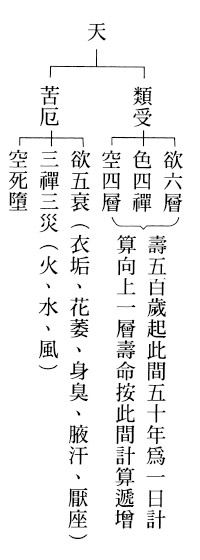

### 大佛頂如來密因修證了義諸菩薩萬行首楞嚴經—七處徵心（八）

*戒慧講述／淨本整理*

心是見境者

無境何來心

一切皆不著

如龜毛兔角

【科判分析】

寅七、破無著（此計并處一無）

阿難尊者提出心不在任何地方的看法，也為佛所破。

一、「阿難以不著諸物為心」

阿難尊者提出不執著、不在任何地方稱為心。

（一）、「引佛昔教」

阿難尊者引用過去佛教授諸大弟子所說的內容。

（二）、「釋成請決」

阿難尊者解釋佛的說法，請佛決斷是否正確。

二、「如來以諸物有無為破」

如來以心在某處或根本無兩種情形，來破除阿難尊者的說法。

（一）、「正破」

如來正面論述破除阿難尊者的看法。

１、「雙徵有無」

如來以存在某處或根本無二者來徵問阿難尊者，心是屬於哪一種情形？

２、「雙示不成」

如來開示兩種說法都不能成立。

ａ、「無尚不成」

心若根本無則像是龜毛兔角不存在，不能成立。

ｂ、「有豈能成」

心若有相，那就不是根本無，就有處所，豈能成立心不在任何地方的說法。

ｉ、「標定」

標明有心必定有方位。

ｉｉ、「釋成」

解釋心一切無著的錯謬。

（二）、「結破」

如來結語破除阿難尊者心不在任何地方的說法。

【經文解釋】

阿難白佛言：世尊，我昔見佛，與大目連、須菩提、富樓那、舍利弗，四大弟子，共轉法輪。常言覺知分別心性，既不在內，亦不在外，不在中間，俱無所在。

阿難尊者向佛說：「世尊，我往昔曾經見到佛在般若會上，請四大弟子：大目連、須菩提、富樓那、舍利弗共轉法輪（或主講、或復講、或問答）。會中常說，能覺知分別的心，既然不在內，也不再外，不在中間，因此心都不在這些地方。」

阿難尊者此處所言雖然不錯，但佛的意思是，除了觀待性、因緣性之外，心不能自己成立在某處，並不是心沒有在任何處所。

一切無著，名之為心。則我無著，名為心不。

「一切不執著、無可安置處，就名為心；則我沒有執著時，就叫做心嗎？」

佛告阿難：汝言覺知分別心性，俱無在者，世間虛空水陸飛行，諸所物象，名為一切。汝不著者，為在為無？

佛告訴阿難尊者：「你說覺知分別心性都沒有所在，那世間虛空、水陸飛行等各種物象，稱之為一切。你所謂的不執著，是在這一切的虛空、其他物象當中？或者不在虛空也不在其他物象中？」

無則同於龜毛兔角，云何不著？

「若不在一切虛空及其他物象中，那就等同於龜毛兔角是根本無，如何說有一個不執著、無可安置的心？」

有不著者，不可名無。

「若有一個不執著、不可安置的心，那就不能說沒有。」

無相則無，非無即相，相有則在，云何無著？

「沒有行相就是根本無；不是根本無就要有相，有相就會有所在之處，怎麼會說沒有所在處？」

是故應知，一切無著，名覺知心，無有是處。

「所以應該知道，你說心一切都不執著、不在任何處所，名為覺知的心，這是完全不正確的。」（完）

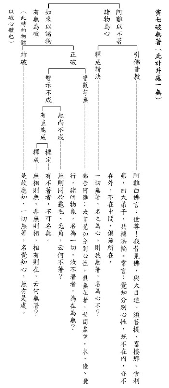

### 人生大事不能忽略的事實　臨終三大要（一）

*戒慧講述／編輯部整理*

護念臨終三大要

義本佛經聖言量

病人生起正知念

助念功成大善業

前言

要讓一個人往生西方，病人、家屬與助念團三者必須互相觀待，如鼎的三足。「臨終三大要」是印光大師講到一個人臨命終時，旁邊的人面對病苦者應如何開導，有三大要點必須注意，才能保證他臨終無障礙。

內文分科

首先是「總顯助念的重要性」，重視「生死事大」，這件事情很重要，特別是往生淨土了生死的這件事情，故必須要重視臨終助念，而臨終助念需要平常重視敦倫盡分。

第二部分「分別解釋助念的方法」，助念講究善巧方便，不是莽撞不通人情，也不是不預先跟家屬溝通，病人臨終斷氣就硬要去助念。

臨終助念的三大要點是：

第一：「開導安慰，令生正信。」

除了給予病人正知，還要安慰家人，護持病人的正知正念才是真正的盡孝。

第二：「換班念佛，以助淨念。」臨終時心力孱弱，需倚靠他人幫助生起正念，生起佛號。在臨終前、欲斷氣和斷氣之後，須講究種種分班念佛的做法與注意事項，更特別叮嚀家人要預先與親友作說明。

第三：「切戒搬動哭泣以防誤事。」反面來說，在他過世後，最少在八小時內不要搬動哭泣，搬動哭泣會引發亡者的煩惱，成為往生嚴重的障礙。

文章的最後一部分「結明助念之益」：印光大師在文章最後要為人子女者，在臨終護持的方法上好好講究，才是所謂的真孝。

文章至此已經結束了，但祖師再次叮嚀，投生六道皆因現世造作業報，只要至誠念佛，加上眷屬善友的助念，決定可以帶業往生，不用處處檢驗試探，妨礙往生大事。

總顯助念之要

一是「生死事大宜早計慮」

經文：

世間最可慘者，莫甚於死，而且舉世之人，無一能倖免者，以故有心欲自利利人者，不可不早為之計慮也。

世間的苦有身苦、心苦，為了身心快樂忙碌一輩子，到頭來面臨死亡的時候，發現是一場大騙局，但是死不可怕，最可怕的是未知的恐懼，不知道斷氣之後要去哪裡，那絕對比剛出社會找不到工作還要驚恐幾百倍。想要躲避死亡是不可能的，沒有任何人能夠倖免。所以有心想要幫助自己好好面對死亡，或者想要學習幫助他人面對死亡，引導往生的菩薩行者，必需要好好學習生死大事。

二是「同修淨土當生成就」

經文：

實則死之一字，原是假名，以宿生所感一期之報盡，故捨此身軀，復受別種身軀耳。不知佛法者，直是無法可設，只可任彼隨業流轉。今既得聞如來普渡眾生之淨土法門，固當信願念佛，預備往生資糧，以期免生死輪迴之幻苦，證涅槃常住之真樂。其有父母兄弟，及諸眷屬，若得重病，勢難痊癒者，宜發孝順慈悲之心，勸彼念佛求生西方，併為助念，俾病者由此死已，即生淨土，其為利益，何能名焉。
此處特講往生，現在就必須要培養往生的徵兆，死亡是要被經營的，死是前滅，是對著後生而云前滅，這一期生命現象能受取的我和所受取的五蘊互相觀待，同時生起但非自體性的同生，生與滅也非同一法，後面的生和前面的滅存在有關聯性，所以死亡是需要被經營的，《論語》中子路也
**問：** 「敢問死」，孔子回
**答：** 「未知生，焉知死。」想要改變命運的同時，命運同時在改變，想要知道怎麼死，先從生道講究起。

不知佛法者，就像生了重病的人，或者看不懂病症，或者根本不知道有病，不但不知道自己有病症，即便病症已出現，也不知道如何就醫，所以是無法可設，只能任由他的善惡業流轉牽引於各道之中。

今日既然已經得聞如何透過助念往生淨土的念佛法門，就自利的部分，必須要信願念佛，不但有想要往生淨土的心願，還要好好念佛，預備往生極樂淨土的資糧。期望不再輪迴生死受苦，苦何以稱為幻苦？苦由已滅的惡業生，必須要真正往生才叫做淨土法門，往生淨土便能在成佛的環境中，滅除煩惱常住空性，真正的離苦得樂。

在利他部分，若有父母兄弟和其他家人得到重病，病有業障、外感與內傷等分類，身體或已病變難以痊癒者，這時我為護持者，應該要知道什麼是真正可以利益他，若是長輩就發孝順之心，若是平輩晚輩者，就發慈悲愛護之心，必要讓他身心舒適。有時自己勸請念佛的因緣不具足，也可以祈請或者他信賴或尊敬的人，或者是關係親密者、或者是德高望重的善知識、或者是了解認識他的朋友，來勸他念佛求生西方，並帶領他一起念佛。氣氛要愉悅、舒適，令病者欣然接受身軀敗壞的事實，對淨土法門產生好樂，其中的眉角和諸多注意事項，是致力於臨終關懷者，必須要好好經營的重點。

希望病者能依著這一期生命現象趨滅的因緣，往生極樂世界，在成佛的環境中，無有眾苦但受諸樂，這是天地間極大的善業，這樣的好處實在是無法說盡。

三是「列三大要臨終助念」

經文：

今列三要，以為成就臨終人往生之據。語雖鄙俚，意本佛經；遇此因緣，悉舉行焉。這三要者：第一，善巧開導安慰，令生正信。第二，大家換班念佛，以助淨念。第三，切戒搬動哭泣，以防誤事。果能依此三法以行，決定可以消除宿業，增長淨因，蒙佛接引，往生西方。一得往生，則超凡入聖，了生脫死，漸漸進修，必至圓成佛果而後已。如此利益，全仗眷屬助念之力。

往生特別要在臨終講究三件事，以下就列出來幫助我們作為自他臨終往生注意事項的依據。祖師自謙語詞不夠雅言，但本於佛經，而說臨終護持的三大要點，遇到護持他人往生的因緣時，可完全照用。

臨終三大要的第一要是要「善巧開導安慰」，有分為對病人的開導和對子女的開導。如果助念團懂得對病人開導，對家人開導，那這個人的往生的障礙就排除了。

第二要是「大家換班念佛，以助淨念。」旁邊護持亡者的家屬與蓮友，平常若能一起共修，念佛念出味道，讓臨終者在佛號聲中身心舒暢，要知道往生是活著往生，在臨終前就要超前佈署，培養助念中祥和的氣氛。

第三是「切戒搬動哭泣，以防誤事。」臨終狀況危急，呼吸一念不起便已進入來世。臨終之時身軀四大分離，搬動身體易令亡者起瞋心，家屬在旁哭泣則容易讓亡者貪戀世間，此時最好一心念佛，才不會耽誤往生大事。

果然能夠依照以上三要點護持臨終者，決定可以消除多生多劫對三寶的疑惑，改變無始以來，每一世都在怕死的心當中結束生命，命運大改變，自己生起信心，護持者善巧開導，內因外緣配合下，病人臨終必能蒙佛接引，往生西方。

往生極樂世界之後，則超越凡夫進入三乘聖者的境界，在解脫與成佛的環境中，漸漸離開生死輪迴，並且步步升進，直至圓成佛果，這些從凡夫入聖流的種種殊勝改變，全都仰賴蓮友幫助眷屬，眷屬幫助亡者，在外緣上幫助亡者生起正念，助念功德真是巍巍殊勝。

四是「共盡倫常有備無患」

經文：

能如是行，於父母，則為真孝；於兄弟、姐妹，則為真悌；於兒女，則為真慈；於朋友、於平人，則為真義、真惠。以此培自己之淨因，啟同人之信嚮，久而之之，何難相習成風乎哉。今為一一條陳，庶不至臨時無所適從耳。

臨終要具備三大要，但更要在平常重視倫常關係，真正能夠幫助他往生極樂，若他是父母，則是對父母盡上真正的大孝；若他是兄弟姊妹，則是對兄弟姐妹盡上悌道；若他是晚輩，則是對晚輩兒女真正的慈愛；若他是朋友或一般人，則是對朋友或一般人盡上道義之交，或給予最實際的恩惠。

助念風氣能夠開展，不但培養自己往生淨土的因緣，更能開啟同法者對淨土的信心與嚮往，久而久之，淨土法門蔚為風氣，相信定能大大降低往生淨土的障礙。平時佛化家庭，開展助念風氣，也就不至於臨時面對自他臨終狀況而無所適從。（下期待續）

## 蓮池海會

### 為　連志道老師封棺法語（轉載）

果清律師開示

正覺精舍　果清律師

諸行無常　是生滅法

生滅滅已　寂滅為樂

時維

中華民國一百一十年七月四日（農曆五月二十五日）辰時 乃弘明實驗高中創辦人　連志道老師往生封棺之吉辰。

師俗姓連，名淑美。志道乃就讀內典研究班時 雪公老恩師 所為取之字號。師出生於民國三十四年五月七日，安詳示寂於一百一十年七月三日（農曆五月二十四日）丑時吉辰，享壽七十六歲。

師祖籍是本省基隆市人。曾就讀 文化大學中文系 取得學士學位 暨逢甲大學中文系 碩士學位。並曾任職 慧炬雜誌社期間 為求法故 不辭辛勞，每週通車至台中諦聽 雪公恩師之華嚴講座。

民國六十三年至六十七年入讀內典研究班，衲亦曾加入，共有八位同學，情同手足。日夕相處，切磋琢磨。親近之師長主要是 雪公恩師、周家麟教授、徐醒民教授、王禮卿教授等。四載之間奠定佛學儒學之基礎，作為爾後自行化他之本。

從此以後定居中部，長期親近 雪公恩師等。民國六十六年任靜宜大學佛學社團指導老師 兼任慈光圖書館附設幼兒園園長，六十七年任慈光育幼院副院長，衲亦曾與之同事。

六十九至七十五年參加三期台中蓮社論語講習班，攝取中華文化之精華。七十六至八十二年任教台中蓮社社教科 唐詩、佛典選講等課程。八十四至八十七年掩關於台中新社鄉中和村，晝閱三藏早晚作課念佛，曾行般舟三昧 精進用功 令人欽佩。

九十年於台中創辦 第一所弘明幼兒園，培養民族幼苗。爾後陸續於 台中、彰化、南投地區合計創辦八所弘明幼兒園，學生合計450人。九十四年創立弘明佛教基金會，積極籌備弘明高中。九十六年創立弘明實驗高中（附設國中、國小）學生人數：小學部 約400人、國中部約100人、高中部約100人，合計600人。只要這些機構存在世間，則福德恆流，此即律上所謂「事在無作」也。

師洞達人情世故，通達佛儒教義，有身教有言教，講起課來生動感人，因此受化者眾。近幾年來感染腦瘤之疾，以致體力一日不如一日，然而神智皆能維持清醒狀態，倚仗三寶加被暨平素深信切願持戒念佛功夫，在眾多親信弟子輩暨諸位蓮友助念聲中安詳往生，即今封棺之句 如何舉揚言耶？

創辦弘明修眾善 自行化他功德多

如今撒手西方去 上品蓮台禮彌陀

頂禮　清公和尚

南無阿彌陀佛！

### 以志於道的方式堅持師命 — 懷連志道老師

善慧

帶有俠氣志道之士　　雪公坐下出類女流

師之斥責向上一著　　聽課神態猶如知音

般舟三昧千仞獨登　　承擔難思辦學事業

挫折障難一肩扛起　　十年一劍成效俱在

人生旅程承蒙提攜　　台北弘明因緣由他

臨終歸去了無遺憾　　雪公座下再續前緣

人生就像虛空中的線條，各有各的方向與發展，兩條線交集的機率很小，能夠在同一時空相遇的機緣很稀少，而在相遇當中被對方影響的那一分更是微乎其微、難能可貴，大部分的相遇或是點頭之交，或是萍水相逢，或是在職場上相處、在名利聚會中見面，或在世俗中吃喝玩樂，每個人都有自己的想法、自己的業、自己琢磨的未來，能夠成為他人的典範，影響他人的一生是不容易的。

我的人生中，雪廬老人對我的影響甚大，而老人的群弟子們，對我的影響更大。雪廬老人是主要影響者，老人經營出的團隊，更是徹底影響了我的人生走向。如同說到孔子，絕對不能忽略孔門弟子，連老師就是雪廬老人弟子群的其中之一。

我從小在眷村長大，學佛從來都不是人生選項，直到讀大學時，因為大同工學院普明學社的指導老師蔡宏謀老師是臺中蓮社的蓮友，我受到同班同學程正介老師的影響，加入學社，才跟臺中蓮社有了交集，這就是緣起法，如若不然，我的人生大概就是化工系畢業，到化工廠上班，結婚生小孩，退休後看報紙喝茶、評論時事、照顧孫子，最後至養老院，結束這一生。人生的走法大概定論，除非遇到非常了不起的善知識，才有可能變成超凡的人生經營，否則就只是謀求生存、養家糊口。

很感謝學社的培養，特別是課後的練講因緣，讓我對佛法有較為深入的學習，大學時參加齋戒學會，認識懺雲法師，又因懺公的風采，對佛門產生強烈的好感，道就在人的身上彰顯。

真正與臺中蓮社結緣，是在當兵退伍到職場上，由學社的因緣去臺中學習論語和華嚴經，此時連老師開始浮出檯面，華嚴經講座現場非常壯觀，秩序井然，位子固定，大家對雪公老師的仰望、崇拜，以及求法的熱情，使我震撼。這除了雪公老師的能耐外，還包括弟子們在課堂上或者在外圍經營出的風氣。華嚴經課後有三組研討，一組是興大的，一組是連老師帶著女眾，另外一組就是我們這一組。連老師當時給人的形象就是和藹可親，如同大姊姊，大家都叫她連姊，求學的女眾學子們，不但願意向連姊請問佛法，更多的是心事的陳述，簡直就是一家人。連老師聽課幾乎似入定的方式聽課，一面寫筆記，一面高興地點頭，整堂課都沉浸在法喜當中，這是很難想像的，因為雪廬老人的語音不容易懂，他舉的典故我們都不明所以，雖然聽不懂，可是現場好學的氣氛深深感染著我們，使大家容易投入課堂的學習。

因為參加論語班又在華嚴講座上複講華嚴經，承蒙蓮社看重，被任為啟蒙班老師，教論語和常禮舉要，大家像一家人一樣，上完課後會遊蕩於各個聯體機構，有時跟著學長們去育幼院參觀，育幼院真正的負責人就是連老師，她內典班畢業後，就依雪公老師的意思去主持育幼院，育幼院是極其麻煩的，孩子或是單親家庭，或是雙親不在身邊，這些孩子們有著個性上的缺陷，非常不好帶，要消耗很多的時間陪伴孩子的成長，會性法師覺得很可惜，為何用內典班培養經學的人才，畢業後去育幼院做消耗寶貴光陰的事情，一度對雪公是有誤會的。但雪公認為學教理的人必須要在事項上歷練，才會真正成長，或者與一般道場培養人才的方式不一樣，有時被培養的人容易產生增上慢，愛耍嘴皮，因為沒有外面的歷練，容易把事情看得太簡單。

很多人以為上班就是歷練，實則不然，上班跟做佛事是兩回事，某些職場上的厲害人物在道場裡沒辦法發揮，因為這是兩個截然不同的環境，在外面有成就者不一定在道場就會有成就，因緣各不同。把工作做好，又要推廣正法實不容易，就像雪廬老人把典獄長幹好是一回事，藉著典獄長把佛法弘揚出去又是另一回事，所以印光大師讚歎雪廬老人，並不只是因為他是成功的典獄長，更讚歎的是他能帶動莒縣學佛風氣的這一分。

內典班四年和論語班這幾年當中，尤其在第三期論語班的時候，雪公老人的體力不堪來上課，學生們只能聽雪公老師的錄音帶，第三期的同學手上拿著連老師的筆記對著錄音帶聽課，連老師做筆記的能力實在太好了，簡直就是聽課的時候連呼吸都忘了才有辦法有這樣的功力，她也是為了一些上課聽不懂雪公山東腔的同學，才有這種的做法。這一段歷程中，上課、記筆記、練習複講和辦事，幾乎是連老師生活的全部。她也是單身女性當中，最有理想、方向的。參觀育幼院，我除了了解形式跟規模外，對這位負責人的道心，能夠帶出孩子的氣象充滿了佩服，緣就是這樣慢慢的結上。

雪公在世的時候，能夠在蓮社講佛經的只有連老師，在蓮社上台講經這件事情，是雪公生前最慎重的事，雪公老師不見得讓某些教理通達的人上台講經，這一點或許其他法師無法通達，其實老人的能耐非一般人能了解。當時徐醒民老師和周老師負責講論語，老人華嚴經請病假時，周老師會代講，講經時間是每週三，地點是慈光圖書館，而蓮社週四是連老師上台講無量壽經。這種殊榮，諸弟子們只有連師，或許雪公看中的是歷練。連老師後期何以有這麼大的影響力，跟這些都很有關係，當然內典班之後的社教科，也是一批有志佛行事業的年輕學子，其中連師是當中極為重要的老師，或許她被叫老師是從那個因緣開始的吧！

雪公老師往生之後，周老師先接週三華嚴經的課程，醒公老師再接週四的佛學課程。或許是因為有關雪公骨灰送回大陸的事情，處理上有一些風波，所以連老師在蓮社講經的因緣就此畫下句點。後來她可能為了要在逆境當 中考驗自己的道心，便依著果清律師的建議去閉般舟三昧關，成為台灣閉此關唯一的女眾，她能夠吃得消般舟三昧的苦跟之前在蓮社艱難的歷練很有關。我有幸在她閉關三年中，在她已經熬過九十天常立不坐不臥的修學法，熬過睡眠的障礙，示現輕安的氣象，在閉關的後期中願意撥出暇時見客的時候，我有幸跟程正介老師和廖老師去看望她，在關房中聊得很愉快。當初在臺中蓮社三組華嚴的複講中，我們這一組的複講其實是最重要的一組，所以相信她也知道我這樣的人物，此時我們請教她一些修行的問題，她也很高興、很樂意的把我們當自己的親人來回答。

連老師出關後，選擇了一個距離蓮社不太近也不太遠的地方–南投草屯，作為發展佛行事業的基地，不太近是因為當時處理雪公老師骨灰之事遭到很大的批評，造成有些蓮友的不滿。選擇此地距離蓮社也不太遠，或保留跟蓮社一線的關係。連老師在社教科的教學很成功，故這些社教科的學生們願意跟隨她一起增上，連老師就帶著這群有基礎、有理想、有熱情、有使命感的學生一同成長。

當時他們想要辦學，我們有幸相遇帶著連老師去東勢看地，並在已故羅先生海拔近四千公尺的茶園喝茶聊天，才知她僅一百萬的資金，我以共修會的歷練，認為她的理想和現實簡直不成比例，對於看地和辦學充滿不確定性，也對這樣的事情能否成功充滿不信任。

那一場聚會結束後，雙方繼續埋首於諸多事務中，後來九二一大地震，我們因應需要，成立了無盡燈儒佛學會，慢慢地聽到她幼兒園一間間的辦起來，我相信這是她確立了大目標之後，將小目標一一地逐步完成，所以先辦多間幼兒園，在有一定的人數後，再辦國小，有一定規模後，再辦國中，再辦到高三，即所謂的一條龍，十年磨一劍。

他們的工作量太大，教育局又多有刁難，加上資金不足、資源有限，連老師的身體在長期的折磨下，出了很大的狀況，晚年這幾年幾乎都只能養病，沒辦法有更多作為。這時才體會古人說「身安而後道隆」。

在蓮社諸師當中，她與鄭勝陽老師（雪公侍者）公認最有俠氣，在雪公往生之後，是最想把雪廬老人的教法帶回大陸的老師之一，所以連老師也很欣賞我們學會曾經組團去大陸濟南等各地講學，她便很希望我們學會來做這樣的事業，特別是將弘明辦學理念及作法到濟南去落實，以報雪公師恩。但是連師那裡派不出人手，我們兩邊又沒有辦學基金，所以合作計畫無法落實，加上雪公親人的保守觀念，經過幾番努力，還是宣告失敗。雪廬老人教法事業隨著連老師的過世，大概算是曲終？還是後繼有人？

在連老師辦理幼兒園到國小已逐漸具規模時，開始找地蓋學校，將國小、國中、高中一起合辦，除了要成立基金會來承租土地，蓋學校及各項教學設施，教育部為了要保證此項計畫真實，基金會要有六千萬的押金，作為實力的表徵。當時連老師有些憔悴與無奈，這一關看似過不了了，令我感嘆很多功德主都錯過真正布施的時機。當她得知我們要幫這個忙時，我們的因緣更深一層的建立了。

當時的學會還在敦化南路，回來告知蓮友台中弘明需要我們在關鍵的時候幫忙，否則會成為他們辦學的障礙，甚至無法繼續下去，蓮友們都願意幫忙，或少部分現金的幫忙。其次是無息的借款，但更大一筆的是房屋抵押借款的利息，有默默護持的善心人士在三年內將這一筆利息付完，這也是非常值得一提的事情，之後的兩、三年內，連老師也在學校的營運當中，很有信用的將這些款項還清。看得出來連老師借錢爽快、還錢爽快，兩三年內只要有餘款就還，相信借錢出去的蓮友們應該是鬆了一口氣。從此也可以看出這個人的信用程度，而且我們雙方沒有立下任何的借據。連老師感念學會的幫忙，曾北上到故宮拜訪我，或者到敦化南路拜訪我們，後來學會在中華居士會研學，她也抽空過來做開示，希望我們未來能兩邊交流。

臺北弘明幼兒園就是因為連老師的鼓勵和支持才辦起來，當時她看上我們臺北的年輕人可以做，我也認為這些年輕人有幼教的背景，可以共創事業，但是要開始做的時候，年輕人都不願意出來，也不表達支持，當時是很茫然的，還好連老師把從臺北南下到弘明幼兒園任職的雅丰還給我們，加上謝校長拔刀相助，所以台北弘明一路跌跌撞撞，終於穩定下來，這期間也經過了九年，之後幼兒園人事與教學上算是有了一貫的宗旨，並與學會作有力的連結。

弘明實驗學校在體制規模上大定之後，連老師的身體算是垮了，弟子們不忍，除了日常的照料外，或者去日月潭、溪頭踏青，或者去日本瀏覽，相信是連師人生最快樂的時光。但體力越來越衰，像是不能改變的業力，最後這一段日子裡，併發之苦也非一般人能承受的，那是三叉神經痛和腦瘤的折磨，在這期間我們見上了一面，中間有一些傳話的誤會，藉著那次的談話都能夠釋懷，也對弘明能夠從幼稚園一直到高三，有上千個學生，兩百個工作人員，一個千餘人的團隊深表佩服。

過去連老師的母親在基隆，過世時我們臺北的蓮友去助念，發覺到許多社教科的同仁，這些她教出來的學生，或是聽課的弟子們，對她母親的護持，讓我深深感動教法的力量，這種教法與人情味帶出來的向心力，是世間不可得的，所以我更堅定了學佛發心的這條路。

今年七月三日凌晨連師終於了無塵念撒手歸去，真正脫離病苦折磨。兩個星期前預知時至，學生們也都有心理準備。雖然正處於三級警戒的疫情期間，是不能聚眾助念的，但是對於大德是不會有妨礙的，他們都是共中不共，這一點也讓我們作善業有氣無力的人，有一個很好的覺受。

哀哉，雪公各弟子都只能表徵雪公的一分，合作起來才會是一個完整的雪公，各行其道時則不勝其難，連老師就是典型的一位，造作偉大的教育事業時，過程的艱難雖然不能阻擋她的道力、願力、忍力，但足以拖垮她的身體。

她辦教育的過程充滿奇蹟，沒有大功德主捐大筆的款項，就這樣點點滴滴做起來，大功德主竟然看不到教育事業需要護持的重要，也令人匪夷所思。有的道場一直跟信徒化緣，以致信徒恐慌，而雪廬老人從來不跟信徒要錢，或面臨一個麻煩處，就是信徒們沒辦法知道雪公老師後面的各種艱難心酸，同樣類比連老師，她的艱難和辛酸也非一般人所了解。

連師往生的消息傳出之後，本來應該親往助念，但是因為疫情的關係，只能在台北念佛回向之，但有些往事或許怕連師過世之後灰飛淹滅，或藉由她往生的因緣加以述說，若能依此之呈現連師的願力、好學、承擔、歷練、堅持，或是此文的價值，而非僅世俗一般回憶之文而已。

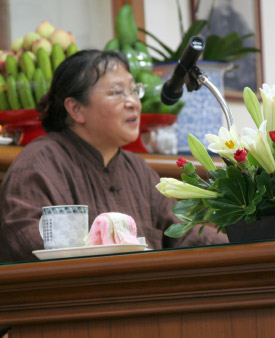

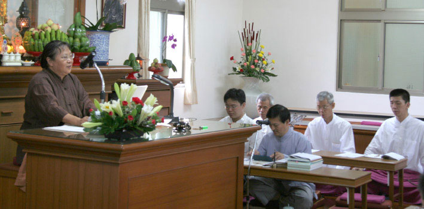

## 孔學一隅

### 論語簡說（三十九）— 子張篇第二十三章　聖人不可窺，如萬仞之牆

時哉講述

才華橫溢端木賜

安邦定國外交才

自知之明師生別

貨殖何妨子貢賢

前言

人要懂得觀己與觀人。有時內涵淺者觀人會故弄玄虛，而深者觀淺者，一定知道對方內涵不足；深者觀深者，一定知道對方是很有內涵的。本章子貢觀察孔子，跟叔孫武叔觀察孔子正好不同。我們可以透過子貢的觀察，知道孔子的內涵。

經文

叔孫武叔語大夫於朝曰：子貢賢於仲尼。子服景伯以告子貢。子貢曰：譬之宮牆，賜之牆也及肩，窺見室家之好。夫子之牆數仞，不得其門而入，不見宗廟之美，百官之富。得其門者，或寡矣。夫子之云，不亦宜乎。

（子張第二十三）

消文

魯國大夫叔孫武叔在朝中告訴諸大夫：子貢的德學超過了孔子。另一位大夫子服景伯把武叔的話告訴子貢。子貢說：若以宮室周圍的牆做比喻，我的牆高度只到人的肩膀，大家在牆外就可以窺見裡面的美好。孔子的牆有好幾仞高，就像是天子或諸侯的宮牆一樣，裡面有宗廟，有朝廷百官，必須由門進入才看得到。如果不得其門，進不去，就看不見宗廟的規模完美，以及朝中百官儀容的富盛。得其門而入的人或許很少了，叔孫武叔這位門外漢說出如此外行的話，不是當然的嗎。

章旨

子貢以宮牆做比喻，說明孔子德學的高深，非一般人所了解，也形容出叔孫武叔的淺見。

科判分析

子貢善探老師的心志，對老師的德學也非常尊崇，當孔子被他人誤解時，子貢能有力批駁，這是駁他當中的第一章，說明聖人的內涵是不可以在牆外窺見的。

本章分為兩大段，第一段是「叔孫武叔語大夫於朝曰：子貢賢於仲尼。」叔孫武叔在朝中貶損孔子，向諸大夫說子貢的內涵、德學勝過老師孔子。

第二段子貢用比喻來說明孔子的境界。文分為三小段，第一小段是「聞言」，子服景伯在朝中聽到叔孫武叔如此說，就轉告子貢，可見子貢不是魯國大夫，子貢是接受魯國的聘請辦重要的事，在魯國沒有官職。

子貢聽後，用兩個比喻來說自己跟孔子的差別，一是自比為一般人家的低牆，他的牆只到肩膀這麼高，所以外人可以窺見家中的好，包括建築、家具擺設、人丁、富貴的情況等等。

再用第二個比喻來形容孔子，孔子之牆「數仞」，一仞如果算八尺，就是好幾人的高度。外人無從窺見裡面，想了解其中的內涵必須得門而入，才能見到「宗廟之美，百官之富」，可見牆指的是宗廟的外牆。

孔子像宗廟，而子貢像一般的富貴家庭。舉這樣的比喻是因為叔孫武叔身為大夫，或入門談公事，或參加祭祀，用宮牆這樣的比喻叔孫武叔好懂。

「得其門者，或寡矣。」得門而入，看到「宗廟之美，百官之富」是很少的，很少人能得門而入，一般人是不能從宮牆大門而入的，而叔孫武叔就如一般市井小民在門外見不到宮牆之美，而說外行話。此章也顯示了子貢的口才與幽默。

釋義

叔孫武叔何許人也？

武是他的諡號，叔孫武叔，邢昺《疏》叫做叔孫州仇，他是公子叔，意即他是魯國國君的後代，叔孫武叔「語大夫於朝曰」，可見他是世襲的大夫。

魯哀公十一年，齊國要打魯國，子貢到吳國借兵，吳國跟魯國合力要打齊國時，魯國的統兵馬大將軍就是叔孫武叔，當時吳王夫差給他盔甲、劍，叔孫武叔接的時候不知該如何是好，因為古代國君賜劍時是要自殺的！吳王夫差說：你要恭敬地接受你國君的任命。子貢此時乘機說：州仇捧甲從軍。意思是說公叔子披著盔甲，跟著吳王夫差去殺敵，說的得體，又解決了一場尷尬與危機。

他何以會說出子貢賢於仲尼？

有的注解說，子貢晚年趨於聖人，叔孫武叔才會這樣讚歎，其實不是。而是因為子貢在魯哀公七年時，吳太宰伯嚭召季康子，季康子不敢去，魯哀公去了，這時子貢去答話，吳太宰伯嚭才饒了季康子。

魯哀公十二年，吳太宰伯嚭要跟魯君會盟，魯君不同意，因為魯哀公八年已經會盟了，可是又不敢不去，就派子貢去，子貢說：以前盟約是用心、用信用、用供品去盟約，找神明來作證，結果你現在把它改了，意思是今天的盟約，未來還可以改哦？既然都可以改，則每天都可以盟約，每天都可以改，則何必盟約。順利的化解這一場尷尬。

魯哀公十五年，子服景伯是全權大使，到齊國去，子貢做介紹人，經過一場談判後，把魯國失守地「成」，也就是孟孫大夫的封地要回來了。

基於上述子貢有這麼多事功，叔孫武叔才會說「子貢賢於仲尼。」

子服景伯何許人也？

魯哀公三年，孔子在陳國，聽到魯國宗廟失火，立刻推知是魯桓公、魯僖公的廟，當時救火的大臣就是子服景伯和南宮敬叔。

魯哀公七年，吳國跟魯國會盟，吳王夫差貪得無厭，向魯國要求一百隻牛羊豬當供品，貪得無厭，子服景伯就知道吳國會亡。季康子要討伐邾國，子服景伯勸告，季康子不聽，沒想到邾國就去找吳國打魯國。而子服景伯在魯哀公八年，代表魯國跟吳國結盟。

魯哀公十二年，子服景伯參與吳國、魯國、衛國、宋國的會盟，擔任類似欽差大臣的角色。魯哀公十三年，子服景伯被吳國囚禁，可是他巧妙地分析局勢而得以歸國。魯哀公十五年，子服景伯跟子貢出使齊國，成功討回失地。從上述可知，子服景伯是朝中的賢大夫，通權達變。

子服景伯於朝中聽到貶損孔子之言，子貢聽了做何感想？

子貢聽了不驚不喜，因為外行人說外行話，沒什麼好震驚的。所以此時子貢不會謙虛的說場面話，而是設一個比喻讓外人明白。

子服景伯將叔孫武叔之言告訴子貢的目的為何？

或是子服景伯內心覺得叔孫武叔講得很對，從而納悶為何子貢還對孔子這麼佩服，且死心塌地的追隨，故轉述給子貢。

子貢以「及肩之牆」的比喻來說明什麼？

子貢不慌不忙設比喻回答，說自己的內涵淺顯易見，事功、內涵大家都看得到，故容易讓人佩服、恭敬。

子貢以宮牆數仞之喻來說明什麼？

說明孔子的內涵深不可測。我們如果有去過曲阜的孔廟，其宮牆就像這樣。外人看不到裡面，除非由門而入，才能見到宗廟之美，百官之富。

由此二喻，可否明孔子與子貢境界的差別？

子貢就像一般的大富人家，孔子就像帝王人家，一般老百姓或許會認為差不多，但若清點過故宮的精品，會興起「五嶽歸來不看山，黃山歸來不看嶽」之感，看乾隆的珍玩，從此不逛珠寶店。

叔孫武叔身為大夫，跟著魯君去祭祀宗廟，能看到宗廟之美，百官之富，他一定懂得那是世間大富人家比不上的氣象。

孔子為何自設門檻，非得要人由門而入？

其實孔子沒有設門檻，他有教無類，且「學而不厭，誨人不倦」，但孔子也設門檻，叫做「自行束修以上，吾未嘗無誨焉」，必須要穿戴整齊、有禮貌，甚至要有見面禮。還要「不憤不啟，不悱不發」，觀待學生才教，這就是門檻。孔子帶著弟子們周遊列國尋找王道出路，即便「道之不行，已知之矣」，人才的磨練才是孔子真正的目的，明知不可為而為，孔子是不設而設，設而不設，一步一步地引導弟子們學進去。

宗廟之美，百官之富的形象為何，代表何意？

宗廟之美就像天壇，天壇的面積是故宮的四倍大，是最高等級的建築物，其佈局、設計、裝潢，都是雕樑畫棟、無與倫比，精巧絕妙。還包括禮器、樂器、供品，乃至於樂舞等等的擺設。

「百官之美」論語上說「相維辟公，天子穆穆」，輔助天子是「辟」，也就是諸侯，「公」是夏商之後的公，雍容華貴，文武百官擁護，各國國君擁護，周成王站出來，態度溫和又嚴肅，這要感激周公的調教，一站出來便是「望之是人君」的氣象。

叔孫武叔的評論，顯出他是怎樣的人？

一是未見而言，沒看到就可以說一大堆。二是見蛇為龍，把表象當成內涵。三是未究其理，走進來但沒有走到底，好比以為孝順就是幫父母洗腳，禮節就是鞠躬作揖，信用就是說話守信，而不能深入禮的趨吉避凶之道，孝順的承天制人，守大義的真信，把文化淺看、小看了。從子貢的比喻可知，叔孫武叔對孔子的誤會是「未見而言」，沒有看到就做評論。

叔孫武叔是不知孔子還是不知子貢？

陳櫟的《四書發明》說，子貢是知道孔子的內涵的，他「智足以知聖人」，叔孫武叔若知道子貢，可以從子貢去類推孔子，此處可回推他也不知道子貢，是中華文化的外行人。

子貢何以說叔孫武叔貶損孔子之言是適宜的呢？

子貢並未直接否定叔孫武叔的話，而是反諷地說叔孫武叔的話說得很對，這段話正好顯示叔孫武叔的外行，正好顯出他根本沒入門，這就是說話的幽默感。

叔孫武叔又不是子貢的老師，何以夫子稱之？

子貢最後說「夫子之云，不亦宜乎」，古代的大夫也可以稱夫子，可見叔孫武叔是朝中世襲的大夫。

孔子之門到底在哪？

孔門有人說是學習進退應對的禮門，有人說是公心、利益蒼生的仁門，有人說是性與天道之門。其實孔門是傳承的門，如果沒有傳承，入不了禮門、入不了仁門，也入不了性與天道之門。中國庭院是「曲徑通幽處，禪房花木深」，引人入勝，上等客才能看到最殊勝的風景。所以入了孔門，還要不斷地入門，才能夠真正看到「宗廟之美，百官之富」。

為什麼說得孔子之門而入者寡矣？

寡比少還要少，大抵學孔子之道，就是不學無術，就是未見而言，不然就是見蛇為龍，或是人云亦云、私心自是，或是無師自通、被注解誤導，得門的沒幾個。

孔門弟子中，哪些弟子是得其門而入，哪些是入院升堂？哪些是入室？

得門(大門)而入的有三千弟子，真正得門(二門)而入的像七十二賢；入院升堂(登入廳堂)是孔門十哲，真正入了孔子房間，看到寶物的，大概就是顏回跟曾子。

子貢回答的氣象為何？

子貢說話得體，可是不是謙虛話。顯示子貢是入門之人，否則形容不出宗廟之美，百官之富。

還有哪些弟子對孔子亦有如此殊勝的了解？

特別舉顏回，顏回對孔子是「仰之彌高」，愈仰愈高，看不到頂，就是佛的「無見頂相」，像鑽石一樣，愈鑽愈堅硬，鑽不進去，想要學得更深，就會更辛苦，才知道後面的厲害。

有無其他典籍可以證明，孔子殊勝之處絕非外人能輕易得知？

孔子自言「吾十有五而志於學，三十而立，四十而不惑」，三十立住經學的見地，通達性與天道，四十入世能通權達變，「五十知天命」，知道自己有弘揚與承傳的天命，「六十而耳順」是度化眾生時，善於了知眾生的心理變化，所謂觀機逗教，每一個道理都是幫助他知得更周圓更徹底。「七十而從心所欲不逾矩」，任憑心念怎麼動，一點過失都不犯，簡直像是佛的無過失三摩地。
在《列子‧仲尼》篇中，子夏問孔子弟子們的狀況，孔子回
**答：** 顏回比我仁，子貢比我有辯才，子路比我勇敢，子張比我莊重。既然這些學生都比孔子強，為何還在孔門座下學習，因為顏回能仁但不能不仁，子貢辯才無礙，卻不能訥於言，子路勇，但該怯弱時不會示弱，子張莊重而不能與民同樂、和光同塵。可知孔子的變化多端，令人難以想像。

子貢對孔子之知算究竟嗎？

其實子貢只是入門看到宗廟之美，百官之富而已，還不到究竟。真正到究竟，是自己擁有宗廟之美，百官之富。

本章章旨為何，如何應用於世？

原來這麼多的內涵才是人生的出路，才是凝聚人才團隊的秘密，孔子可以出將入相、為政、辦教育。再來，言語要符合智，像叔孫武叔的言語就不符合智，符合智的言語是可以分出是非、曲直、正邪，可以分出凡夫跟聖人的言語，才令人可尊。

總結

一、本章勉勵我們不要做外行人。即便外行，也不要說外行話誤導他人，尤其是對文化的領域，更要小心謹慎。

二、宗廟之美，百官之富像孔子的形而下的內涵，其禮讓人趨吉避凶，其仁讓人聚集福報，性與天道讓人得到大解脫。通達形而上的內涵，讓人能夠斷除一切的煩惱，得到大解脫，這要找對的老師，下死功夫去讀、去學。

三、本章除了叔孫武叔給我們的警惕，除了子貢善巧的引導，最後顯示的是孔子之道，是世間各種學問難以項背，也是文化的內涵、出路與福報。

問答

**問：** 謙虛是中國人的美德，子貢談到他的老師時，形容是否有失謙虛的美德？也有注解認為子貢所說過於誇大，該如何證明子貢所言屬實？

**答：** 謙虛是對自己來講，但是來表彰師德，是如實把其德顯現出來，這既不是傲慢、也不是謙虛。顏回甚至還讚美老師是「仰之彌高，鑽之彌堅」。對於很殊勝的老師，本來就應該尊崇。《韓詩外傳》中齊景公也問子貢：你的老師是怎麼樣的人？子貢回
**答：** 是聖人。齊景公
**問：** 如何聖？子貢
**答：** 不知。景公說：既不知，你還說他聖人？子貢說：臣在天之下，臣知天很高，可是有多高則不知，臣在地之上，臣知地很厚，但有多厚也不知。齊景公覺得讚譽過頭了，子貢說：沒有過頭，臣拿一抔土給泰山，泰山不增加雄偉，臣從泰山裡面挖了一抔土，泰山也不會減去什麼。孔子就是這樣的人物。

**問：** 如果子貢所言屬實，我們崇拜孔子，會不會變成造神運動？顏淵曾經說「仰之彌高，鑽之彌堅」，如果拿來跟這一章來比較，是不是可以看出顏淵的德學成就高過子貢？

**答：** 子貢對孔子的崇拜在經學的見地，人情世故的通達，還有在周遊列國時顯現的風采，乃至於進退之道、禮的抉擇，子貢佩服得五體投地，子貢身為一名務實的商人，他對孔子是很務實地檢驗，才會由衷地讚歎。

顏回說「仰之彌高，鑽之彌堅」，那是愈學進去，愈知道自己不足的感慨，這種感慨是好學的形象。而本章子貢是稱讚孔子的內涵是宗廟之美，百官之富。這裡面無從比較顏回和子貢誰更高，一個是進去學以後的感覺，一個是就他所觀察的孔子而言。

**問：** 孔子的內涵深廣，卻遭到叔孫武叔這樣的誤解，孔子自己也曾說「莫我知也夫」，孔子的人生是否讓人感覺可憐？

**答：** 是眾生可憐，不是孔子可憐。眾生無從知道孔子的內涵，也無從由此內涵去找到人生的出路。孔子反而是「人不知而不慍，不亦君子乎」。

**問：** 如果以現代的傳播觀點，做學生的能夠幫老師做宣傳，是不是也有助於文化道統的推廣？

**答：** 推廣一定要向大眾推廣真正好的老師，像雪廬老人就值得推崇、發揚。雪廬老人的見地有助於我們對經學與文化的了解。而且推崇者本身要是入道之人，不是光外行的宣傳。

**問：** 子貢用的譬喻，想要比的是夫子的器量還是是孔門之道呢？

**答：** 都可以。如果沒有這種見地，一定沒有這種器量，如果沒有這種才華，器量也不能真正去發揮功能。

**問：** 為什麼孔子的弟子不廣為流傳孔子的內涵？

**答：** 廣為流傳難在人才難得、傳承不易。沒有像曾子這種「傳不習乎」、「人一能知己百知，人十能知己千知」的精神。再來，還要靠政治力量的擁護，還要有辨認抉擇注解的能力。 有道之士德不孤，必有鄰，有同參道友，內心快樂，就有心裡的出路。

**問：** 在春秋當時，得孔子之門而入者寡，在兩千五百年後的今天，是不是得到入門的人更少了？要如何證明我們也是得門而入？

**答：** 慎選注解，依照真正的老師去做抉擇，或許可以得門而入。懂得抉擇古書、慎選老師，會產生「仰之彌高，鑽之彌堅」的感覺，發覺經學真的可以解決內心的疑惑，處理問題的能力轉強，這樣才談得上找到文化經典之門。

**問：** 得其門的門可不可以用性與天道(形而上)來解釋？

**答：** 禮門、仁門、性與天道的門，都是孔門。《論語》中也說「志於道，據於德，依於仁」，在形而下是仁門，形而上是性與天道之門。這些都要從傳承的路途進去，否則「大道以歧路亡羊，學者以多方喪生」。

**問：** 此門是傳承之門，《論語》中出現的幾位隱士，或是老子，他們有機會看到孔門的宗廟之美，百官之富嗎？

**答：** 形而上有兩種，一種是直接入形而上，超越人世間，另一種是能夠以此形而上一以貫之形而下的各類學問，孔子跟這些隱士的不同處就在這裡。這些隱士也佩服孔子，孔子也知道他們是有志的隱士，但是道不同不相為謀，這些人未必要學孔子之道。可是他本身已經有文化的一部分，他可以出世，但是入不了世。孔子是一個既出世又能入世的人，這才是孔子的風采。

**問：** 子貢聽到子服景伯轉告後，才設譬喻及發議論，子服景伯有沒有把這些話奉還給叔孫武叔呢？

**答：** 有沒有已經不是重點，因為子貢藉著這個場合來說說孔子真正的內涵，來較量老師跟學生子貢的差別，叔孫武叔跟子貢的差別，子服景伯懂了。子服景伯懂了以後，他自然會去處理後面的事情。

**問：** 萬仞宮牆的典故正是否來自此章？

**答：** 是的，本來是數仞宮牆，後來演變為萬仞宮牆，意思是除非找到門，否則你用任何方法都沒有用，就算書讀千遍也沒有用。傳承是無可取代的價值，自己閉門造車、私心自是、想像豐富，都差得遠了。（下期待續）

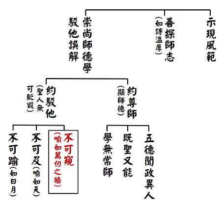

### 孔門心法—中庸之道（二十）　 第十七章：涵養德學才能掌握天命

*時哉講述／弘毅整理*

大德能得位祿名壽

艱難歷練天降大任

受命於天成事於人

本慶自得餘慶子孫

前言

人人都想得福，得權、得名、得利、得長壽，然而什麼樣的人最有福，什麼樣的人必能兼而得之？上古時期的大舜，正是以德受福的榜樣，雖出身低微，環境惡劣，仍能謹守孝道，最後得到天命成為天子，集眾福於一身。這樣不起眼的出身，為何能夠搖身一變成為真正的人生勝利組，關鍵就在一個「德」字，本章就告訴我們如何以德掌握天命，什麼才是真正的福報，以及這樣的福報如何求得？

中庸總體科判

第十七章還是在《中庸》的第二部分，即分別顯示中庸的修學法和義理。

本章科判分析

本章是說大德是受天命的，福禍都是由天保佑而得，福是由德而來，禍福都是觀待自己的造作而得的，而且上天加被善人得福，惡人得禍。「福依於德」特別舉舜，他是一個以大德來經營大孝的人，所以能夠修福受福，他的本慶是能夠得到天子之位，餘慶是死後能夠得到宗廟祭祀，子孫後代得到分封，並且代代祭祀他。孔子讚歎他因大德而得到位、祿、名、壽，再舉《詩經》來說明依德而受福，最後讚歎大德受天命。

消文釋義

經文：

子曰：舜其大孝也與。德為聖人，尊為天子，富有四海之內。宗廟饗之，子孫保之。

消文：孔子說：舜大概是大孝了吧。「天子朝親」就是他大孝的體現，舜以大德居天子之位，來經營孝道，使孝道得到推展。舜的德達到了聖人的境界，又被尊為天子，富有天下，或者說連東夷、北狄、西戎、南蠻都能夠攝持。他死後能夠得到宗廟祭祀，子孫代代相傳，保有富貴和祭祀的榮耀。舜過世後，禪讓給禹，夏、商、周共一千八百多年，周朝還分封舜的後代於陳，保有對舜的祭祀，乃至今日，依然建有舜廟來祭祀他。

釋義：「四海」，天地四方，皆海水相通，四邊有東夷、北狄、西戎、南蠻；「饗」，祭祀。

經文：

故大德，必得其位，必得其祿，必得其名，必得其壽。

消文：大德修福受福，必然會得到天子之位，得到天子的俸祿，有天子和聖人的名聲，因為能夠利益眾生，所以能得到長壽，舜六十歲即位，在位四十八年，一百零八歲過世。

經文：

故天之生物，必因其材而篤焉。故栽者培之，傾者覆之。

消文：上天生養萬物，必然會因著它的材質而加厚，上天會促成做善的人得福，也會促成做惡的人得禍。因此有心栽培自己的人，上天也會培養他，成德成才。如桃園拉拉山的神木，它們向下紮根，老天爺就用風霜雨雪栽培它們。對於傾倒的人，上天也會加速他倒下去。如那些拔根傾倒的樹木，風霜雨雪只會加速它們的腐爛，不會令它們得到滋潤成長。順境可以讓人好好的充實自己，造作善業；逆境可以讓人堅韌不拔，培養耐心，反省改過。反之，順境可以讓人放逸墮落，逆境讓人怨天尤人。所以老子說：「天道無親，常與善人」，上天沒有對誰特別親近，但常常會把福給予善人。

釋義：「篤」，厚。

經文：

詩云：「嘉樂君子，憲憲令德，宜民宜人，受祿於天。保佑命之，自天申之。」故大德者必受命。

消文：《詩經》上說：善樂的君子，擁有非常明顯美好的道德，能夠厚待百姓，對待官員能夠知人善任，使人民得到幸福快樂，他也會得到上天所給予的俸祿。上天保佑他並且給他天命得到天子之位，又因為有天子之位，讓他從上天那裡重受天命，得到天子的俸祿，還有因為愛護百姓而得到好的名聲，以及因為造作利益百姓的善業，而使壽命延長。因此大德的人一定受天命，得到天子的位子、俸祿、名聲和長壽。

釋義：「嘉」，善；「憲憲」通「顯顯」，明顯的意思；「令」，美好；「民」，一般人；「人」，有官位的人；「申」，重申。

章旨

從本章孔子對舜的讚歎可以看出，孔子不為專制帝王服務。堯、舜、禹是禪讓制，不是傳位給有血緣關係的人，是公天下，天下是天下人的天下，不是舜的天下，所以孔子贊同的是公天下。再有堯、舜、禹的禪讓是賢人選賢人，不是全民選舉。古希臘的哲人蘇格拉底講「哲人皇帝」，有正知見的人才能當皇帝，柏拉圖也認為，一群瞎眼人怎麼會選出一個明眼的人呢？中國的選舉制度是，選賢舉能，講信修睦，賢人選賢人。人生要經營大德，必然會得到大福，順逆境都是得福之道，如拉拉山的神木，所有的風霜雨雪都幫助它成為神木。

析疑

一、本章與前章的關聯為何？

前章講的是鬼神的加被，此章講以大德來經營大孝，得到鬼神的加被，得到天命，得到殊勝的福報。

二、辨析有德有位、有德無位、無德有位、無德無位。

堯、舜、禹、湯、文、武、周公都是有德有位之人，此章特別舉出舜；孔子、老子、顏回等人是有德無位；那些昏君、暴君就是無德有位之人；無德無位是指一般的老百姓。

三、為何大知大孝皆舉舜，難道沒有其他人選嗎？

並非沒有其他人選，只是說舜的大孝是在逆境中經營的，舜的大知是與堯相同，通達形而上的內涵，並以此來辦政治，所以特別舉出。

四、可以說孔顏大知大孝嗎？

孔子和顏回也是通達形而上學問的人，而且以道統來立身處世。《孝經‧開宗明義章》說：「立身行道，揚名於後世，以顯父母，孝之終也。」以道來立身，來莊嚴自己的身心，並且推展大道來利益他人，這是大孝的形象，所以有大知必然有大孝。

五、如何理解天子二字？

天子是中國最高的統治者，天子表示他的權力受命於天，其含義有三：

第一，表明他不是至高無上的；第二，他是要受天理、天道、天神約束的；第三，如果他是昏庸、殘暴的，就會被推翻。

天子若能明瞭這三個含義，他是不會自以為是、昏庸殘暴的，也就不會被人推翻。

《詩經‧小雅‧北山》裡面說：「普天之下，莫非王土，率土之濱，莫非王臣。」整個天下都是天子的土地，一直到海邊，沒有人不是他的臣民。天子的福禍都是最大的，因為成敗都由他負責。

六、舜已經把天下禪讓給禹，子孫如何保之？

舜雖然已經把天下禪讓給禹，但人們對他非常景仰，禹對舜的家人非常尊重，讓舜的子孫保有祭祀舜的權力，歷經夏、商，到了周朝還被分封為陳國，延續對舜的祭祀。

七、堯舜時代為何還有水患？

堯舜時代黃河、長江水患嚴重，當時地廣人稀，全靠人力，堯任用鯀治水失敗，舜用禹治水才得以成功，歷經兩代終於解決了水患。

從中也可以看出，堯舜是非常注重民生的，再有用對人也是非常重要的，最後當水患等災難過大時，是必須要花費很多時間才能解決的，從中也能夠體現他的智慧、努力，以及老百姓和他的同心協力。

八、大德與大孝的關聯性為何？

大德是以見地和風氣來經營孝，使孝成為大孝。《孝經‧天子章》講到，天子愛敬自己的父母，把這種風氣推廣出去，使得天下的百姓都愛敬自己的父母，這種風氣的經營非天子莫屬，也是天子最重要的責任。至於專業的事務，只要用對人就可以了。

九、怎麼樣的人可以算得上是大德？與大慈善家的差異為何？

一般人會認為大慈善家是大德，如洛克菲勒做了很多慈善事業，是否就是大德呢？大德其實是通達內聖外王之道的人，懂得如何辦政治和辦教育，讓風氣變好，治安變好，夜不閉戶，盜竊亂賊而不作，人心向善，人才輩出。這樣的大德看起來並沒有像大慈善家善事做得明顯。就如同失火了，消防員救火受到表彰，而對那些做了很多防範措施、避免失火的人卻沒有人注意，也沒有給予表彰和獎金。

十、為何大德能夠必得其位、祿、名、壽？

大德必得其位是說有能力得到位子，只是如果領導者是三家大夫那樣的小人當政，就會如孔子那樣不願意為他們所用。不僅是大德願意任用大德，就連小人有時也願意任用大德，如唐朝動亂時，就讓郭子儀出來安定國家。大德得到位後，也就會有俸祿，福國利民就有了名聲，做了很多的善事也會得到長壽。

十一、大德受位的形象為何？

《論語‧泰伯》篇裡說：「子曰：巍巍乎，舜禹之有天下也，而不與焉。」舜、禹是非常崇高的，他們擁有天下而不參與。大德受位後，他們不會對名利生起貪心、傲慢和淫慾，不會患得患失，而是藉著職位好好的福國利民。

十二、現見沒有具備大德，但卻也得其位、祿、名、壽者，該如何理解此事？

大德受位是取福，無德受位是取禍，小位小禍，中位中禍，大位大禍。取禍以後，祿也不會長久，也不會有好名聲，患得患失，恩怨鬥爭也很難得壽。

十三、孔子有德，為何當時沒有像舜一樣的位、祿、名、壽？

孔子是有能力得位的，只是如果不能在位子上發揮用處，他寧願不要。季桓子在臨終時對季康子說，以前他得罪了孔子，希望季康子能夠把孔子迎接回魯國，這也說明孔子是有得位的能力的。

孔子的弟子來自各諸侯國，如果他沒有祿的話，是難以供這麼多人開銷的。就如雪廬老人到台灣辦教育培養人才，供弟子們吃住，沒有祿是不行的。

孔子的名是千秋之名，歷朝歷代都有宗廟的祭祀，到今日第七十九代孔垂長先生還被迎回曲阜，主持祭祀。

十四、顏淵有德，為何反而短命？

顏淵短命是蒼生無福，他被各朝所尊崇，直到今日他的後代還在祭祀他，他是「宗廟饗之，子孫保之。」他是「簞食瓢飲，居陋巷」，如此貧窮的一個讀書人，能夠享有這樣的大福，正是大德受福的例子。

十五、天之萬物，如何因才而篤？

上天對於萬物會因著它的材質而加厚，好的加速使它更好，壞的加速使它更壞。如果你是善人，就愈容易碰到善人、善事和善風氣，當你越來越有德時，他人也願意提拔、親近你。如果你是惡人，你就越容易碰到惡人、惡事和惡風氣，當你越來越無德時，你所接觸到的都是勾心鬥角，得到災禍。

十六、如何解釋天佑的道理？

做善天佑，天厚其福，因為有德，所以會得到很大的栽培，中國有位鐵路工程師就叫作詹天佑。

十七、如何才算得上大福？有何殊勝？

大德所經營的善業叫作大福，如舜以他的天子之位來辦政治，福國利民；孔子以他的大德來辦教育，使他人有慧命，他們都享有大福，得到人們的尊崇和祭祀，子孫後代也得到延續並且有好的出路。

十八、為何會說受祿於天，而非受祿於百姓？

一個有心充實德學的人，順境會讓他得到幫助，逆境會讓他反省、改過、耐煩、修忍辱，都是在幫助他。受祿於天，就是冥冥中得到加被，讓他在順逆境的幫助下改變命運，讓他得到很好的老師、同學，對正知見有很好的體悟，在得到提拔時，能夠做很多利益百姓的事業，最後被百姓擁護。

十九、本章所舉之詩，原意為何？舉為本章之意又如何？

本章所舉之詩原意是讚歎周成王的，引入本章通說是讚歎舜，特別的也可以說是讚歎堯、禹、武王、周公，以及其他明君聖主。

二十、舜是有德有位的明君聖主，一般人該如何看待此章？

舜也是在逆境中成長的，儘管父母對他非常不好，可是他仍然賺錢供養父母。後來堯把兩個女兒嫁給他，他還是先後去做農夫、陶工、漁夫的工作，當他藉著所做的工作，把周邊的風氣改善時，堯才讓他當公務員，在各種公職中歷練，最後才讓他主持國政，得到百姓的擁護。舜的父親不是財主、企業家、君王、高人，種種的不幸都在他的身上發生，然而他卻得到天命。上天有時是在順境中栽培人，有時是在逆境中栽培人，懂得在順境和逆境中被栽培，這就是有大德的氣象，我們不要做那種在順逆境中都壞爛的人。我們要不斷地充實自己，用能力、品德、人情世故的通達來經營善業，利益他人，這就是「最佳人緣獎」。

二十一、若是只求小確幸，不學本章也沒差？

有些人只求小確幸，在小安逸中自我滿足，可是人生還有更大的出路，這不是說要與人競爭、爭強鬥狠，而是要不斷地充實自己，肯被他人磨練。

二十二、本章對有志於改善社會風氣者，有何種啟發？

有人主動掃地三十年，當有一天他沒有掃地時，其他人會詫異他為何不掃，大家會認為那是他的工作。有廠商不偷稅、漏稅，結果其他廠商偷稅、漏稅，他們反倒認為這個廠商很傻。所以我們要不斷充實自己，接受歷練，當能力具備又有機緣時，能夠知人善任，團結人才，改善社會風氣。

二十三、學習本章應如何看待福禍的道理？

福禍都是從德來，孔子本章所講的福不是家財萬貫，也不是得到莫名其妙的加被，而是特別舉舜的大福。他的改命遠超袁了凡先生，他從一個凡夫俗子、遭受打罵的小孩，不斷地脫胎換骨，最後成長為一個大德，居天子之位，人生有無限的可能，舜在大禍中可以經營大福，而很多人卻從大福走向大禍。他們吃著山珍海味，穿名牌、開好車，結果助長了傲慢，目中無人，當逆境來時，就變得頹廢。老子說：「禍兮福之所倚，福兮禍之所伏。」如果福不是以德來經營，福中就含藏著禍，小福小禍，中福中禍，大福大禍。如果是一個有德的人，在禍中就含藏著福，小德小福，中德中福，大德大福。我們不用羨慕他人好的際遇，而是要反省自己是否努力充實內涵，善用順逆境來栽培自己。最應該發牢騷的是舜，可是他卻在逆境中成長，有些人卻在福報中發牢騷，這就是取禍之道。

總結

朱元璋開國後，大臣都讚揚他功同堯舜，他反問大臣誰是禹、皋陶、稷，大臣們若不是，他怎麼會是堯舜呢？《詩經》上說：「永言配命，自求多福。」要永遠的配合天命，只有有德之人才能求得福報，求得不會轉成禍的福，利益天下蒼生的福，加被後代的福，自己來世增上的福，而不是做了錯事自求多福。孔子在《坤卦‧文言》中講自己得福叫本慶，子孫受福叫餘慶，「積善之家，必有餘慶」，孔子在本章講了趨吉避凶、得天命的道理。

問答

一、現見有人做惡得福，做善卻得禍，我們要如何理解？

做善得禍，先要反省做善時是否認真去做，動機是否純正，用人是否得當，做善時是否看時機場合，如果都有講究還是得禍，那可能是在消除過去的惡業。另外孟子說：「天將降大任於是人也，必先苦其心志，勞其筋骨，餓其體膚」，有時要在做善得禍中積陰德，消除惡業，有人不跟小人為伍，官運不亨通，卻得到平安健康，子孫賢孝，這種福報是不容易被看到的，得禍是在磨練他。

做惡得福，是在消耗他過去的善業，另外得福也是他敗亡的徵兆，會讓他更加鋌而走險、目中無人，更加心狠手辣。如同一個人吃了一頓滿漢全席，接著就被槍斃，怎麼可以稱為福呢？

二、一般說天子要創造百姓的財富，那為何此章卻說天子富有四海呢？

《論語‧顏淵》篇講，魯哀公認為稅收不足，想要征稅，就請教有若，有若建議他減稅，魯哀公說本來就不足，怎麼還要減稅呢？有若就說：「百姓足，君孰與不足？百姓不足，君孰與足？」百姓富足，稅收才會多，百姓不足，稅收怎麼會多呢？百姓富足，天子才是富有四海。

三、有注解說，舜有大孝於天下的功德，才使得他的父母、祖宗永保祭祀，得到後人的祭享，此說是否可採？

舜有大德而得到位、祿、名、壽，得到世人的祭祀，但天子可以祭祀七世祖，諸侯可以祭祀五世祖。祭孔時，後面有崇聖祠，就是孔子前面的五代，舜因為有益於天下蒼生，所以他前面的幾代也受到尊崇，但主體還是在講舜。

四、在今天「民主」當道，回看古代的「君主」、「專制」、「封建」可以劃上等號，且認為是貶義，是落後與腐朽的代名詞，那「封建」的正確意思應為何呢？

當時天子沒有能力治理天下，因此天子分封宗室和功臣做各地的諸侯，幫助天子治理天下。然後周公以五倫為本質製禮作樂，用來約束天子、國君和大臣，如果能夠很好的施行，不會落後腐敗，只是在父傳子、子傳孫中，不能傳賢而導致的。孔子是「祖述堯舜，憲章文武」，公天下是他心中理想的制度，只是當時人接受的是家天下的制度，所以他不得已也要接受，但是可以通過禮來約束各個等級，讓他們各盡本分，還是可以維持小康的局面的。

五、本章「故大德，必得其位，必得其祿，必得其名，必得其壽」與大學的「有德此有人，有人此有土，有土此有財，有財此有用」有關聯否？

有德之人會得到他人的擁護，有機會施展抱負，能夠得到很多的資源，發揮人和財的大用。

六、有云，傾者覆之，是指傾者再覆上土，不要砍伐，重新扶正，如此可乎？

「栽者培之，傾者覆之」，是在講上天對有心栽培自己的人，也會栽培他使他成才，對於傾倒的人，也會加速使他敗亡，而不是在講人對傾倒的樹木覆上土，不要砍伐，重新扶正。

七、應該如何充實、歷練成為大德呢？

要有經典的學習，懂得取善和對治惡，懂得在順逆境中充實、增上自己，如舜一樣充實見地，並且歷練自己，德行是學習和磨練出來的，能夠通達形而上的內涵，對治煩惱，成就大德。

充實和歷練是離不開讀書會，一起共學是成就大德的開始。經學越通達，對形而上的道理越了解，越能發出公心，越往大德的路上走。在辦事中懂得順境是在增上自己，逆境是在考驗自己，如果能夠懂得這些道理的重要，經過不斷地歷練，命運也會得到改變，通往大德的路就是趨吉避凶、離苦得樂之道。

八、該如何理解新聞中，孝子意外短命而亡一事？

孝子在孝順父母的同時，也要注意自己的身體健康，不能因為自己是孝子就可以什麼都不在意。顏回可能就是因為不注意自己的身體，導致營養不良而短壽。有長壽的因並不代表會長壽，有些緣可能會破壞長壽。孝子也不可以酒駕、闖紅燈，否則也會意外死亡。所以孝子也要懂得反省，不可以認為有天神保佑，什麼都不怕，上天一定是保佑謹慎、戒慎恐懼、充實德行的人，不會保佑那些粗心大意、無所忌憚的人。

九、堯舜這樣的仁君為何感應洪水這樣的大患？

當時人們必須要住在靠近水的地方，下大雨時，河水上漲，就會形成水患。百姓如果逃到沒有水的地方，又沒有辦法生活，所以為政者只能去治水，而中國疆域廣大，人口稀少，水患很難得到治理。堯聽大家推薦鯀，就任用他去治水，可是他所用的圍堵法無效，舜上台後就用禹治水，禹以疏通法使水患得到了治理，這就是用人的問題。德包括見地、品德和能力，所以有德之人也要不斷充實自己，歷事練心，光有品德是不行的，配合的條件越多，德就越大越深。

十、福的定義為何？五福怎麼解釋？

《了凡四訓》說，福就是利益他人的心態和做法，如果只有利他的心，沒有利他的做法，福中就有取禍之道。做善是要講究心態、做法和過程的，所以做善取禍是要反省的，當然有時也是一種考驗、歷練。

五福包括壽、富、康寧（健康）、攸好德（積陰德）、考終命（壽終正寢），所以除了能享受福報，也能依福造善業，合起來才叫作福，才是真正有福的人。大德經營善業，人生朝向五福。一般大眾所認知的有福之人，就是單純的享福之人，甚至一邊享福，一邊造惡業，我們還心生佩服，殊不知他的福正是取禍之道。

十一、既然大德也有可能無位、祿、名、壽，那孔子為何要這樣語氣肯定的說「必得」呢？

「必得」是說大德有能力受，只是有時他不想要，如說顏回必有位，孔子要他去做官但他不要。孔門弟子中子貢最佩服顏回，如果國君問子貢要人才，顏回必受推薦，他有能力得位、祿、名、壽，但顏回志不在此，而是志在傳承聖道。

十二、孟子說天意在民，那民選不就代表受天命嗎？

天意在民是說，當你政治辦壞時，百姓受苦，上天要加害於你，讓你遭受惡報；當你做了很多善業時，百姓得福，你也會得福報。現在的民選是編織美夢、亂開支票、意識形態而當選，這樣的民選之人不是得到天命，他們也不會真正利益百姓，而是使風氣變壞，惡人變多，善人變少，取得大位正好是取禍的開始。天命是懂得努力栽培自己，然後得到機會。

十三、本章所謂大德，是否可以等同於《論語》中所說的「朝聞道，夕死可矣」之人呢？

大德一定是先要充實自己，特別是在道統的學習，所以才說「朝聞道，夕死可矣。」經營大德才是最會經營福報之人，這要先從聽聞道統開始，這才是人生最有意義的。不像一般人這樣的道理都沒有聽聞過，庸庸碌碌過一生，甚至是反其道而行，成為自私自利、造惡的小人。

十四、「天將降大任於斯人也，必先苦其心志，勞其筋骨」，受天命一定要先受苦嗎？順境不可以嗎？

順境也可以，但是無法考驗你的心志。文天祥說：「時窮節乃見」，順境無法看出志向，是無法增上意志、忍耐力的，心志如果不被考驗，無法知道自己是否心志堅定。火在燒金時，能把金的雜質除掉；逆境考驗人時，可以把人的懦弱、懈怠、不肯反省等種種缺點除掉，之後才能在順境中成為純金，否則就是鍍金，甚至只有金的顏色而已。（下期待續）

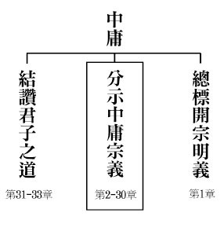

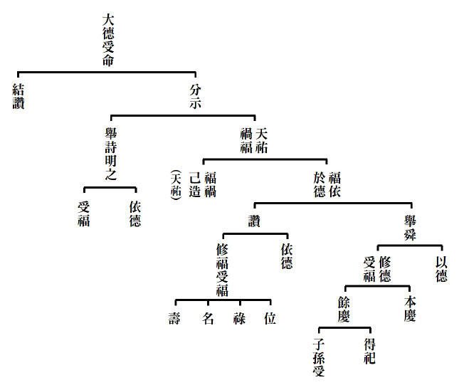

## 藝術賞析

### 孔門七十二賢淺說(四十三)—申黨

圖／江逸子、文／時哉

有欲焉得剛

觀欲多過患

吹壎調躁心

成孔門大賢

申黨，姓申，名黨，字周，春秋魯國人。

申黨為人木訥寡言，用功向道、意志堅定，同門皆謂其剛毅，《論語‧子路》篇記載，有一天夫子講述修身養德之道而說：「剛毅，木訥近仁。」其心方正不移為剛，果決明斷為毅，具此涵養者，可謂近乎仁了。可是孔子接著說：「我還沒見過真正剛強的人。」有人就舉申棖說：「申棖是位剛強的人。」孔子接著說：「申棖心中存有私欲，怎能算是剛強的人呢？」一般人不知自己有本性，只憑感情用事。感情用得不正，則不免作奸犯科。用正，則性情和順。「棖也慾。」就用而言，自當用得正，正如樂器中的土壎，聲音低沉而和諧。

申黨於漢明帝時入祀聖廟，唐玄宗追封為魯伯。宋高宗贊曰：「剛毅近仁，志操莫渝。 性匪祝鮀，面豈子都。有一於此，剛名可圖。云欲則柔，蓋生之徒。」無欲與恆毅力接近仁心，這樣的人他的志向操行是不能超越的。個性不是祝鮀之佞或是宋朝之貌美，這些都是名利之圖，何足稱剛？有欲則柔而不能剛，然過剛者死，柔者或能生。

畫中的申棖手中拿壎，吹壎讓心能夠沉穩下來，和緩內心的躁動相。可能申棖所學的內涵不足以降伏他內心的慾望，就像閔子騫剛入孔門時，還對功名富貴榮華心生嚮往一樣。壎的聲音低沉，藉著這樣的聲音，讓人靜下來，免得欲障礙自己的靈敏之氣，或者障礙自己學習的心態。而申棖身穿布衣，或是表徵向道之士，孔子雖不承許彼為剛者，但或許孔子有意使彼聞之，讓他能警惕與自勉，終為孔門的大賢。

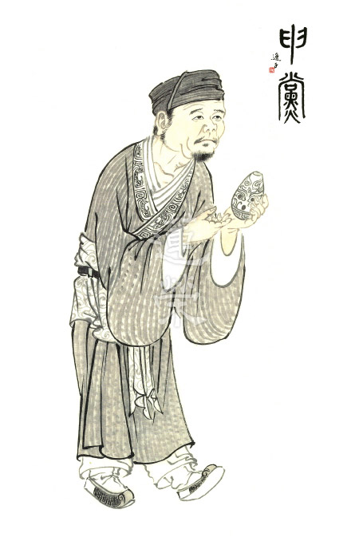

### 孔門七十二賢淺說(四十四)—顏之僕

圖／江逸子、文／時哉

俯首沉思胸中墨

蒲扇輕搖除熱腦

最難世俗煩惱堆

人我是非一扇揮

顏之僕，字子叔，《史記》作字叔，春秋末年魯國人，為人性情敦厚，言行具威儀，志趣堅定，而有所期，甚獲夫子的贊賞與勉勵。顏子叔追隨孔子，親澤聖教，篤志力行，敏事慎言，輔助仁德的推行與聖道弘揚，在衰亂之時，發揮教化作用，促進當時學子學習詩禮，同時也匡正觀念與風氣，受人敬重景仰，揚名於後世。

宋高宗贊曰：「親承尼父，志銳所期，道尊是輔，泥在鈞陶，木就規矩，終縻好爵，揚名東武。」顏之僕親自承受孔子的教導，信服孔子思想，向著理想奮力前進，努力弘揚儒家學說，教化百姓，過程好似陶匠將泥土塑成陶器，或木匠將木頭按照規矩裁製做成器具，終於得到美好的爵位，唐朝贈爵位為車武伯，以顯耀其德。

崔遵度贊曰：「洙水悠悠，子叔優優，及肩等賜，升堂並由，元后時邁，禮成介邱，旌此達者，爵為列侯。」(案：洙水是流經孔子家鄉的河川)說明顏之僕的成就與修為幾乎和子貢、子路相等，使得後代君王將他入孔廟奉祀。

顏之僕於東漢明帝永平十五年從祀孔，唐開元二十七年封東武伯，宋大中祥符加封宛句侯，明代改稱先賢。

畫中的顏之僕手拿蒲扇，蒲扇是夏天扇涼的工具，同時也代表文人雅士能夠心有所得、了然於胸，脫俗的感受，有志向，也願意傳承，舒服快意、淡泊名利的感覺。（下期待續）

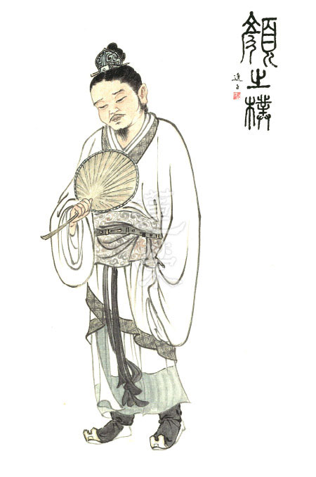

### 華夏精魂千秋（三十六）　明倫史畫 至孝冥感 劉殷

圖／江逸子、文／淨域

天爵相應人爵

質地配合能力

高而不危言行

滿而不溢自約

史畫

劉殷，字長盛，魏晉時期并州新興郡(今山西省忻州市)人，生卒年不詳。自幼孝順，七歲喪父，哀慟守喪，三年不曾露出笑齒。

九歲那年寒冬，曾祖母王氏因無堇菜而食不下嚥，他到水澤邊痛哭說：「我的罪業深重，窮困不能奉養曾祖母，祈求皇天后土慈悲哀愍。」不久，有聲音似說：「停！不要哭。」放眼一看，水中竟長出堇菜來，歡喜地採回家給曾祖母吃。

他的生活簡樸清苦，某天夜裡夢見有人對他說：「你家的西牆下有粟米。」醒來後便去挖掘，果然得到十五鍾的粟，鍾上有銘文寫著：「七年粟百石，天賜孝子殷。」這百石的粟米，過了七年才吃完。鄉里人知道他的孝心感動神靈，便競相捐米送布給他，收下後只道來日再報答。

他勤學博通經史，有濟世之心；誠正且重氣節，鄉人皆稱讚。州郡知其賢能屢屢徵召，但皆以曾祖母需奉養而婉辭。同郡豪族張宣子敬愛其人品，將女兒許配給他，並告誡說：「殷至孝冥感且才識過人，將來必定功成名就，妳要謹慎事奉。」張氏性情婉順，夫妻兩人共盡孝道。王氏逝世，夫婦兩哭拜靈前，突然西鄰失火，見風大火急向上蒼祈禱，火竟然繞燒過東鄰，殷家絲毫無損。

八王之亂後，齊王司馬冏輔政，召其為新興太守，政績斐然。永嘉四年，匈奴南下進佔洛陽，擄懷帝至平陽城。皇太子司馬鄴在長安即位為愍帝，改元建興。建興四年(西元三一六年)，劉聰攻破長安，擄愍帝，西晉滅亡。當并州成為漢趙領土後，劉殷也落入漢王劉聰的手中，聰賞識他的謙和廉正，特授以侍中、太子太保之位，後累官至尚書。

殷有七子二女，傳各子分別以《五經》、《史記》與《漢書》，因此經教得以興盛。二女娥與英皆賢德，為劉聰的貴嬪，聰想修建鳳儀殿，廷尉陳元達諫言不可，聰怒而欲殺之。劉娥上疏說：「自古以來敗國，多由婦人引起，我曾痛惡這現象，如今我也遇上這事。惟恐後人罵我，不如將我賜死在這殿中吧！」聰看後釋放元達，並將疏文給他看，說：「外有你、內有皇后輔國，我還有什麼好憂慮的。」於是停建鳳儀樓。娥被立為武宣皇后，英也被追諡為武德皇后。北方官家之盛，以劉殷一門為最，最後他高壽而終。

圖解

漢代取才有「舉孝廉」一法，此乃基於「忠臣出於孝子門」的信念。古人認為能孝順父母的人，才會對國君盡忠。《後漢書‧韋彪傳》載：「孔子曰：『事親孝，故忠可移於君，是以求忠臣必於孝子之門。』」

史稱：北朝官威之盛，莫如劉殷者。其盛威非欺凌而來，乃自我修持所致。《晉書》上說：「劉殷弱冠，博通經史，綜核群言，文章詩賦靡不該覽，性倜儻，有濟世之志，儉而不陋，清而不介，望之頹然而不可侵也。」故而，永嘉之禍晉室南遷後，前趙昭帝劉聰特別任用他為侍中，並娶其兩位女兒娥與英為妻。

身為皇帝的老丈人，他常告誡子孫說：「服事君主之法，應注重婉言勸諫，萬不可冒犯龍顏。」故而，當廷尉陳元達諫阻興建鳳儀殿，昭帝欲怒殺之時，劉娥以自身之命上疏宛轉勸之。又他與朝廷公卿恭敬相處，常將自己放在朝班之末。士人操守品行不良者，不能進他的門。有冤情不能伸張者，投訴於他而得以昭雪的，有上百人之多。

如此的忠臣，其為孝子嗎？他七歲喪父，家貧守喪三年，哀傷至身形枯損。九歲寒冬時節，曾祖母王氏食慾不振，經瞭解原來是想吃堇菜，然而在這隆冬季節裡，水澤邊怎採得到菫菜呢？或是老天感動於他的哭訴，讓他挖到了一斛多的菫菜。晉惠帝時，曾有多次機會入仕，他都以要照顧曾祖母而婉拒了，待到王氏過世後，才出任新興太守一職。

江師圖繪隆冬掘菫菜之景，乃用以特別彰顯劉殷孝行感動天地一節。時人或將之歸於趣聞軼事，但俗話說：「人在做，天在看」，又《尚書》言：「天視自我民視，天聽自我民聽」，這雖是講民本的思想，但人天對於孝子之愛敬，實在是同一的。（下期待續）

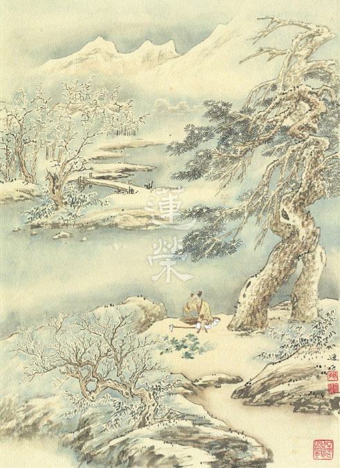

### 道藝春秋（八）　網開三面，德名遠播　商湯王

*圖／江逸子 、 文／心若整理*

三代開國是君子

尚德能令眾國服

行有不得反諸己

後代典範是道統

「網開一面」的成語大家都耳熟能詳，此典故正來自畫中的這位聖王—「湯」。

有一次湯出行在外，看到補獸的人在野外張開四面網子，圍成一個矩形，並對天祝禱說：「希望四面八方的獸類，全部都跑進我的網子。」商湯看到，惻隱之心油然而生，說：「這麼做，豈不是趕盡殺絕嗎？」於是命令他們撤掉三張網，改祝禱詞說：「你們這些獸類啊，如果想從左邊躲開，就跑向左邊吧！如果想要從右邊逃掉，就跑向右邊吧！如果你們不聽從命令，那就進入我的網中吧！」其他諸侯聽到這件事都說：「湯的仁心德行實在是太令人敬佩了，竟然可以施惠於禽獸。」於是湯仁德聲名遠播，得到眾人支持。

為何各部落的首領聽說商湯王網開三面的事後，紛紛稱讚商湯王是一個好領導並歸順呢，若從網開三面的故事來看，會有很多疑點，例如：網開三面則狩獵一無所獲，豈不有礙民生發展、浪費時間，各部落為何稱許？興許網開三面是一個比喻，主要彰顯湯王的仁德，對比夏桀，《呂氏春秋》有一段記載，或可補充：「萬物不同，而用之於人異也，此治亂存亡死生之原。故國廣巨兵彊富未必安也，尊貴高大未必顯也，在於用之。桀紂用其材而以成其亡，湯武用其材而以成其王。湯見祝網者置四面，其祝曰：從天墜者，從地出者，從四方來者，皆離吾網。湯曰：嘻，盡之矣。非桀其孰為此也？湯收其三面，置其一面。更教祝曰：昔蛛蝥作網罟，今之人學紓，欲左者左，欲右者右，欲高者高，欲下者下，吾取其犯命者。漢南之國聞之曰：湯之德及禽獸矣。四十國歸之。」

意思是說，萬物對任何人都是一樣的，但人們使用它們卻各不一樣，這是治亂、存亡、生死的根本。因此，國土廣闊，兵力強大，未必安定；尊貴富有，未必顯赫，關鍵在於如何使用它們。夏桀、商紂運用他們的才智卻造成了他們的滅亡，商湯、周武王運用他們的才智而成就了帝業。商湯在郊外看見獵人四面設網，便說：除了夏桀那樣的暴君，誰還會做這樣的事情？湯收起了三面的網，只在一面設網，重新教那人祈禱說：古人是根據蜘蛛張網學會了同樣張網捕獵。禽獸想向左的就向左去，想向右的就向右去，想向高處的就向高處去，想向低處的就向低處去，我只捕獵那些觸犯天命的。漢水南邊的國家聽說這件事情後說：商湯的仁德連禽獸都顧及到了。於是四十個國家歸附了湯。別人在四面設網，未必能捕獵到鳥，湯撤去三面，只在一面設網，卻因此得到了四十個國家的歸附，這不僅僅是捕捉飛鳥啊！由此可見，網開三面體現出了商湯的仁慈，也顯露出了他以天下為己任的博大胸襟。

商湯王祈雨的事蹟也很有名，古代每當遇到重大災害時，有仁德的帝王都認為是上天對自己統治不滿意所發出的警訊，故要齋戒沐浴、反省修德，更甚者下罪己詔，把災禍之因歸咎於己，讓天下寬恕自己的失政於民。此乃古時的帝王治國理念，以德配天。所以當一個帝王真心為民祈禱時，他的德行就會感動天地，流芳百世。

商湯王以身為民求雨的事蹟在《呂氏春秋‧季秋紀‧順民篇》、《墨子》、《荀子》、《國語》、《說苑》等書中均有記載。商湯王以「政不節歟？民失職歟？宮室崇歟？女謁盛歟？包苴行歟？讒夫昌歟？」六件事反省， 第一：是因為我的政令不當或不夠周密，使得朝臣百官有所失職嗎？第二：是由於我的施政不勤或管理不善，造成百姓未蒙其利，甚而流離失所？第三：因為我的宮室修建得太高，裝設豪華，有所浪費公帑或過於奢侈嗎？第四：是因為我嬪妃或侍女過多，或有誤信嬪妃之言，導致有所不公嗎？第五：是因為訂定的法令不夠嚴格，致使官員鑽法律漏洞，貪污受賄，致使百姓受害嗎？第六：是由於我用人不淑，疏於嚴加考核，使得讒媚小人得勢嗎？此六件事涵蓋了政令、臣子、百姓、宮室、後宮、用人，可謂面面俱到，歸過於己，因而感得大雨。

江逸子先生畫的商湯王並沒有穿著黃袍，因為湯的身份一開始也是夏朝的一個諸侯國，因夏朝末期治國不當，人民處於水深火熱中，湯才因著人民的期待改朝換代，畫家取其仁者而治的身分過程來畫出湯的形象。

湯的腰間有一口配劍，在古代佩劍和佩玉是君子的象徵，佩劍更代表身分地位的象徵。雖然劍是一種武器，對君子來說更是一種飾物，一種象徵。劍雙面有刃，容易傷人亦傷己，故配戴雙刃之劍來自我警惕。劍的剛柔相濟、體文經武得到歷代君子名士的珍愛，配劍演變成禮儀的一環。江逸子先生在畫中搭配劍，是在顯示湯身為一個仁者的氣度。如果是霸者的話就會配刀，刀單面有刃，是傷人的工具武器，所以古代許多配飾、器具都有特別的意義。

從《論語‧堯曰》篇商湯王討伐夏桀的誓詞，我們可以看到他為政者的胸懷，「曰：予小子履，敢用玄牡，敢昭告于皇皇后帝。有罪不敢赦，帝臣不蔽，簡在帝心。朕躬有罪，無以萬方。萬方有罪，罪在朕躬。」商湯王伐夏桀王，告天的誓詞說，我小子履，很斗膽的用黑色的犧牛(夏代祭祀用牲尚黑，湯在此時，仍用夏禮。)祭祀昭告上帝，夏桀有大罪，不敢赦免他的罪，夏桀王是上帝的臣子，幫忙上帝管理一方，所犯的罪已不能被隱蔽，上帝心裡看的很清楚。我本身有討伐的罪，請上帝不要牽連其他百姓，百姓若有罪，罪都在我。從此告天之詞可知，商湯王是順天奉法，具承擔力及愛民之心的統治者。

商湯不只具備仁德之心，還能任用賢能，網羅伊尹、仲虺輔佐，為商朝立下汗馬功勞。即位後以仁、德為治國思想，減輕徵賦，致力生產，安撫民心，深受人民愛戴，在位三十年勢力急速增大，使商朝成為一個強大的國家。 （下期待續）

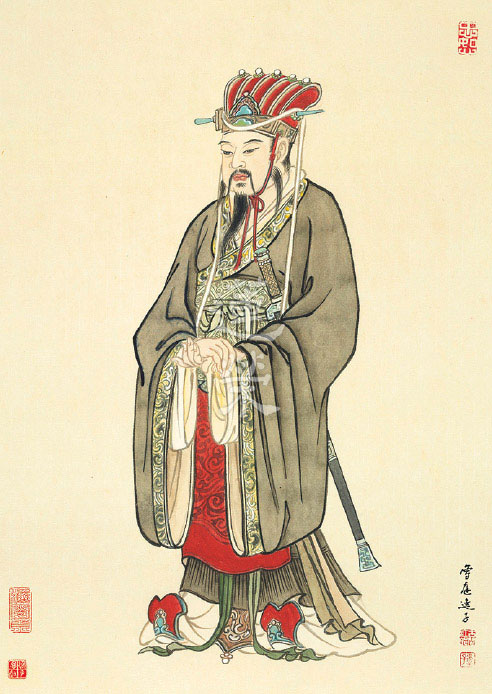

## 活題報導

### 二O二一年寒假地藏經講座　以藝載道地藏本願的再現—緣起的趨利避害之道—以地藏菩薩本願經圖導覽(二)

圖／江逸子 、 文／唐瑜凌

完成師咐囑

地藏經變圖

一圖抿千言

經義隨圖傳

忉利天宮神通品第一

釋迦牟尼佛為報答母親摩耶夫人生育之恩，在時機因緣具足時，也就是入滅前一年，帶著弟子們上升至忉利天宮做結夏安居，並為母說法。一時間，十方無量世界的諸佛菩薩前來致意，因為他們已經知道佛將入滅，將承擔教化眾生大業，交待地藏菩薩，這是十方世界的大事，相邀至忉利天做見證。爾時釋迦佛含笑放出百千億大光明雲，並發出種種微妙的音聲，召集天龍鬼神及娑婆世界的神眾、大鬼王、人非人等，都齊來集會，並趁此機會要交待後事，賦予地藏菩薩神聖使命。

畫中釋迦佛的兩側有脅侍阿難與迦葉尊者，迦葉尊者為老比丘相，從其面相與項光中知為苦行聖者，阿難為相好之比丘，另有比丘隨行阿難，表徵釋迦牟尼佛帶著僧團來善法堂天宮結夏安居。前方胡跪請問的是文殊菩薩，長跪恭敬手持柄香爐迎請說法者即是忉利天的主人玉皇大帝。畫面中，世尊右側較為高大持笏者或是六欲天天主或是四禪天的天主，帶領眷屬，他們或持花瓶或奇石或寶盆，想必是莊嚴道場用，或持笏跟隨來受持法義。畫卷最右是四大天王，做此法會的護衛。世尊左側身形較大恭敬合掌者為佛母摩耶夫人，夫人氣質雍容華貴，一望即知是母儀天下的福祿中人，有披肩及紅色衣裳。畫面往左延伸是八部等眾以及他方世界各地神眾，天眾是飄搖而來，神鬼眾則在下，亦趕路而來，有龍形、有魚頭、有羊首，亦有他方國土諸大鬼王，風塵僕僕趕來集會，連中國鍾馗的造型及雷公都有，畫面經營十分有趣與唯妙唯肖。

第一品的整體畫面上，各地湧現的人物表情嚴肅，想要經營的是看不到盡頭的與會大眾，畫家用摩肩擦踵的形象表現，人物表情各個不同，而大菩薩豐滿的雙頰、穠纖合度的身形，足見畫家年輕時在人體結構比例上所下的硬功夫。象徵威勢的華蓋上裝飾有各式各樣的寶物和吉祥的鳳鳥，除了回應繪者的創意巧思更代表禽鳥繪畫也難不倒他。大菩薩各遣侍者手捧供品，姿態各異的盆栽能看出江先生早年在轟動盆栽界的成就，柔軟順暢的線條顯現繪者的內心調柔，每一筆都是七十年的功力，仔細端詳更會發現琳琅滿目的珍寶出現在畫中，彰顯大菩薩的富貴和法會的莊嚴，就像精心打扮，穿金戴銀又整齊明亮，穿著最美麗的華服，帶上珍藏的絕世禮物，參加一個極為重要的宴會。（下期待續）

