# 第133期
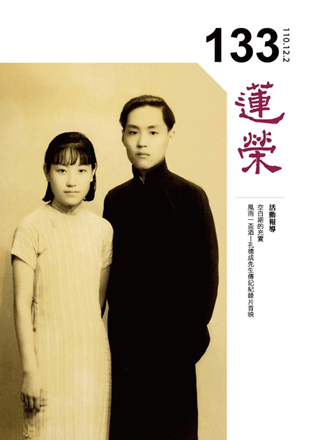

## 社論

### 與其聽天由命，不如安身立命

*編輯部*

聽天由命心不隨境轉

安身而立命心能轉境

共業難轉或聽天由命

別業需轉必安身立命

近來臺海兩岸的關係緊張，時不時傳出可能會發生兩岸軍事衝突的消息；人們也擔心到底美中關係是否因此交惡，進一步使得臺灣經濟陷入困局。各種不同的推論甚囂塵上，使得人心惶惶。

而新冠疫情時而好轉，時而又轉成嚴重，看著各國每日公布的染疫人數起起落落，又有某些說法預測第三劑疫苗施打後的國家，在病毒變種的威脅下，仍不免要面對再一波疫情的打擊。臺灣居民們才剛剛打完第二劑，或才接種第一劑疫苗，甚至仍在等待接種，聽到這樣的消息，不免感到擔憂而困惑。

人間福禍變化無常，福禍相依；生命本來難論長短，死生有命。既然如此，飄風不終朝，驟雨不終日，天地運行此消彼長，自有其變化儼然，何不聽天由命？

然而，此時與其聽天由命，不如安身立命。

趨吉避凶本是人心所求，離苦得樂本為眾生所願，但此時必得要謹念安身立命之道，方能在風起雲湧、苦難將臨的當下，身心得以安頓。

安身，即孔子所謂的「修己以敬」，也就是謹慎地修身修心。身安方能道隆，因此照顧好自己身體，鍛鍊強健氣力，飲食均衡攝取，作息正常穩定，保持良好體態，才能在突發狀況到來，有健壯的身體與免疫力，以面對動盪的世局，具備耐得住病毒侵擾的免疫力。

安心，則不外《大學》之「止定靜安慮得」功夫：心志求明明德，希冀往生淨土，發願成就佛果，利益無邊有情，並以三寶聖教為內心不變的依止，是為「止」；篤定求道，專心一志，心無旁鶩，不論任何信息進入耳中，或者各種報導映入眼簾，都不妨礙自己修道的心念，是為「定」；每日安排功課，務使身心安頓，有時間安靜學習，不斷增長自己內心的力量，充實知識能耐，是為「靜」；由於信念充足，方法運用得當，則無憂於各種考驗，無懼於各類磨難，更能積極應對變局，是為「安」；總在思索經教義理，總是推敲聖賢道理，何來閒功夫去討論是非？何來閒空檔去論斷人我？是為「慮」；於是能在每日精進修持之中，得幾番增長、獲幾分利益，積聚殊勝資糧，期證圓滿佛果，是為「得」。

由是則任何天災地變的共業，看似無以阻擋，也難以扭轉局勢，然個人的別業卻能日新又新，時時增上，彷彿身雖在三界之內、五行之中，內心已超脫生死的侷限，時常優遊於佛國淨土之中；縱使國際情勢幾番風雲變化，經濟未來彷彿走入至暗時刻，也能善用時局，找到穩健脫困辦法。所以他人或苦於其中，但吾人卻能日日歡喜，此並非幸災樂禍，而是懷有核心價值，不致人云亦云、隨波逐流，自有一番求道法喜，心安自得。

所以孔子說「不知命無以為君子也」，何以知命？就是了解這番道理，於是顛沛流離、造次倉皇，終不至於動搖內心對濁世的出離、對般若的習學、對佛果的精進。

二○二一年故宮鎮院三寶十年一展，《谿山行旅圖》、《早春圖》、《萬壑松風圖》三幅存世近千年的作品，人們在心遨遊於畫境之餘，可曾感受到這些畫家在筆畫之間細語他們雖處於亂世，仍心有山水、怡然自得的超然灑脫？文人畫最後一筆的溥儒，從皇宮走入尋常百姓家，從亂世走到偏安地，仍不輟詩書畫，終日沉浸於道藝之中。看完這難遭難遇的展覽後，走出展間，回到現實之中，是否能提起正念，依舊得以安身立命，勇悍積極自處應世？

明代文學家馮孟龍說：「萬般皆由命，半點不由人。」但東晉葛洪也說：「我命在我不在天。」其實法無定法，本來都是隨個人造作而受苦樂業報。如今我人學儒學佛，可以不正觀自得安身立命、發菩提心自利利人乎？

## 佛學覽幽

### 菩薩清淨的行持—華嚴經淨行品（四十九）

*戒慧講述、編輯部整理*

善用世俗境界

體性轉為修法

佛法不離世間

覺受當下顯現

丙二、指事顯因答其徵因

丁一、總徵

丁二、別顯

戊六、乞食道行時願（五十五願）

己二、所睹事境(十九願)

己三、所遇人物（有二十四願）

己三、所遇人物：國王、王子

經文：若見於王，當願眾生，得為法王，恆轉正法。

若見國王，希望眾生能做出世間的法王，甚至是成佛，常轉法輪，說出世間正法來利益、開導眾生，使眾生離苦得樂，斷煩惱、了生死。法王是法中之王，也就是成佛，《法華經》云：「我為法王，於法自在。」如來是諸法之王，釋迦方志，凡人極位，名曰輪王。聖人極位，名曰法王。《維摩經》上說：「佛於諸法得勝自在，故名法王。」《無量壽經》中也記載「佛為法王，尊超群聖，普為一切天人之師。」轉正法輪，指佛說法，佛的教化，如車輪旋轉，能轉凡成聖，能輾一切煩惱，謂之法輪，轉法輪，佛說法度眾生即為轉法輪。輪，在《止觀輔行》亦曰輪具二義，一者轉義，二摧碾義。在《法華文句》中記載，轉佛心中化他之法，度入他心，名為轉法輪。恆即長時間，無間斷的轉正法。

托缽乞食的修行者，每天都去托缽，能見各色人物，他在路上也有可能見到國王，國王出巡時會伴隨浩浩蕩蕩的車隊、軍隊、威武的將士，展現出國王的威勢，此種榮華富貴我們不須羨慕，因那只是一時假象。我們反而要藉著見到國王來發願，眼前的國王掌管生殺大權，我們取其自在義來發願，國王在其領土範圍裡，有生殺大權的自在，有給予人民、諸侯封官爵位的自在，能取能予，取甚至是可以取到對方的性命，予甚至可以給予到非常殊勝的官爵，這都是國王的權力，在權力的範圍內他非常的自在。

而我們希望有情眾生在哪裡自在？權力的自在？名聞利養上的自在？其實最好的自在是在法上的自在，那是一種對法的勝解，能以法修福修慧，能助有情離苦得樂。這位對法非常自在的聖者，他的內心是快樂的，而且知道如何使用法，並轉法輪，用法來破二障，特別是說法的這一分，能令有情脫離煩惱業的繫縛。

「恆轉正法」，佛的內心通達教法(意業轉法輪)，故面對境界的時候，他內心可以對境界各面相的認知，比如對到受苦的眾生，他立刻知道布施這一法如何運用在眼前的境界上，這就是轉正法輪。對於逆境，立刻可以生起忍辱，因為忍辱的修學法在內心運轉，這叫做內心轉法輪。身體也轉法輪，《金剛經》中，須菩提看到佛在行住坐臥、托缽行腳的時候，對佛說「如來善護念諸菩薩，善付囑諸菩薩」，這就是身體轉法輪，這種細膩處須菩提也能體會，實在是太殊勝了。而佛說三藏十二部，就是在語上轉法輪。
試問身口意三業轉法輪，以哪一個業轉法輪的功德最大？
**答：** 意業雖然主宰身跟口，但是在利益有情的那一分，以口宣說正法最為殊勝，孔子說「予欲無言」，子貢說「子如不言，則小子何述焉？」沒有說就沒有傳承，沒有傳承，眾生就無法破迷啟悟、離苦得樂，佛無法靠身業跟意業轉法輪直接利益有情，佛無見頂相的功德都不如佛說法的功德，所以身口意三業利益有情，以語的功德最大。

反之身口意三業以哪一個過患最大？也是口業，《常禮舉要》說：「口為禍福之門，話要經過一番考慮再說」，口業雖然由意業所攝持，論功論過，口業都是最厲害的，所謂一言興邦、一言喪邦。

佛雖然得為法王，恆轉正法輪，可是佛在正法、像法、末法，不轉正法輪的時間比轉正法輪的時間還要多，多到難以想像，可見沒有恆轉，轉的時間少，不轉的時間多，恆轉正法該如何解？恆轉正法的那一分，特別要講口業，因為唯有口業說法，才有傳承，請佛轉法輪，特別是請佛說法的那一分，不是請佛身轉法輪、意轉法輪，雖然三業都有，可是口的這一分，往往是講的時間少，不講的時間多。恆是觀待眾生的需求，才能生起恆，而不是它自己可以生起恆，所以登地菩薩跟佛在實報莊嚴土聚會的時候，佛是以不示現涅槃的那一分來攝持他們，可是佛離開實報莊嚴土，則以示現涅槃的那一分，來跟眾生暫時告別，所以恆轉正法輪的恆，是觀待有情說恆，自相的恆是辦不到的。

所謂教法、教法輪，證法、證法輪，很多人都會搞混，其實修學的關鍵，就是要把佛法的觀念弄懂，像玄奘法師西行八百里的流沙，經過顛沛流離、種種障難到印度，他的目的就是想了解佛法，對佛法生起正解，能夠傳承，換句話說，人生的意義，是對於正法的了解，以及如何把正確的佛法傳承給後人，曾子叫做「傳不習乎」，分兩邊講，一個是老師傳給我的，我有沒有真的弄懂，一個是我傳給學生的時候，我是不是真的懂了。忠信是曾子的質地，但是習的那一分，才使他成為三千弟子中最出色的。這兩分都要突破很多的障礙，因為要生起大福報的人，本來就是要接受各種障礙考驗，如同在公司要升上總經理、董事長，本來就要經過諸多考驗與障難。

轉教法輪的那一分，一定要得到一切種智才能轉教法輪，法跟法輪的解法不同，法輪的根本在說法者，因為有一切種智可以把法轉出來，轉法輪的那一分一定是一切種智，教法輪是觀待佛的一切種智說教法輪，而教法是傳承，也就是能夠接受、弄懂，並講清楚，孔子叫做述而不作，就是將聖人的見地解釋清楚，教法輪是觀待一切種智，教法是觀待傳承。教法並非我們自身轉出來的，我們是聽別人的，不是自己轉出來的。

學習教法之後，在理上通達能實修，得以現證空性的那一分叫做證法輪。證果，有比量的通達、有現量的通達，證法輪的那一分必須要是現量的，是指初果或初地以上的聖者。證法是以比量通達者，比如像蕅益大師，「名字位中真佛眼，未知畢竟付何人」，凡夫可以比量證得真理，聖者以現量證得真理，這一分是證法輪。

第九十九願

經文：若見王子，當願眾生，從法化身，而為佛子。

消文：看見國王的兒子，希望眾生都能從佛法中成就，成為法王子，行菩薩道，繼承佛利益眾生的事業。

南亭老和尚講義說到，因聞佛法而斷障得果，佛授記而為佛子。得果是指成佛，欲成佛必須先斷煩惱障、所知障，欲斷二障必須先斷二執，欲斷二執必須先明二空。此處的斷障得果是指斷煩惱障，得大涅槃聖果，斷所知障得大菩提聖果。首先了知宇宙萬法的真相，一切法無我，二空指我空及法空，我空是了知有情眾生的生命體乃五蘊和合的一種假象，無獨立自主性。法空是指諸法自相空，為因緣所生，相互觀待，由有情名言安立而顯現。破二執：人我執，即在有情眾生的生命體上生起的錯誤知見，執著此生命體為實我，有我執會產生三種愛，第一個是自體愛，愛著自己的生命體，第二個是境界愛，愛著與自己生命體有關的環境，如衣服、飲食、功名、富貴等等，第三個是當生愛，在臨終時，對於未來受生之處(有緣父母)生起愛著；二執的另一個是法我執(法執)，存在於諸法上的錯誤知見，執著世間萬事萬物都是實法。

破二障跟佛子的關係為何？王子是從國王的身體生下來，佛子則是從佛口生出來的，王子繼承王位，佛子繼承佛位，王位跟佛位何者較大，就著世間所顯現的福，王位簡直比不上佛的一根毛，王位是三千大千世界裡面的一個小世界裡面的南瞻部洲裡面的一個國，一個三千大千世界有十億個四大洲，每一洲的國家就有數百個，換句話說，南瞻部洲裡的王位，在三千大千世界中數量比螞蟻還要多，而佛能雄證三千大千世界，也就是這些國王都被佛所攝，佛在顯現世間福德的那一分，國王也難以想像。要坐國王的大位，必須是國王所生才行，而要坐佛的大位，必須從佛口生，從法化生，法是從口出，轉法輪特別是指口的那一分，是以道場的講法、學法、傳法等就很重要，整個道場的核心就是流通正法，把核心處拿掉，道場不是學習正法的地方，則成為無道之場，在道場裡的人沒有法水可飲，慧命也飢渴而死，即使念佛道場，念到最後也索然無味。

法從佛口出，而我們學習法，就被法化生，繼承國王的是生命，繼承佛的是慧命，慧命是被化生出來的，慧命本來沒有，聽聞佛法後才有，就像生命本來沒有，經過父精母血和合而誕生，道理相同。從法化生，而為佛子，成為佛子是要從佛口一直傳承，一切有部說佛經是色塵，也就是書本，經部跟中觀說是聲塵，唯識宗則說是證悟者的心識，何者正確？《楞嚴經》云：「此方真教體，清淨在音聞」，教法的體性，最清淨的是在音聞，聲音說、耳朵聽聞，最清淨的是這一分，所以中觀宗說佛經是聲塵，但是保留佛經是靠嘴巴說，才能一個一個傳承下去，這就是佛經的體性。

從法化生即法是從口出，如何知法一定是從佛口出？《金剛經》上說「從佛口生，從法化生，得佛法分。」法是觀待佛口，佛子從佛口生，而佛口說出的法，我聽了之後懂了，我就是從法化生，我的生命可以是胎生、卵生、濕生、化生，可是我的慧命是化生，得佛法的那一分，法華經也是這樣說。

世間的傳宗接代，靠的是生殖，佛的傳宗接代靠的是佛口，從法化生，所以佛也要傳宗接代，這就是佛的傳承。父母親如果看到自己的小孩感冒發燒，會立馬帶孩子去看醫生，同樣的，如果此人是佛的傳承、是佛的後代呢？此人有難，三寶怎麼可能不救，解釋《大般若經》的《現觀莊嚴論》上說，對佛法有勝解的那一個人，當他成為佛的傳宗接代時，他的形象可以有兩個比喻：第一個是比喻世間的母親生病，孝子們把母親團團圍住，佛的傳承者如果有難的時候，三寶把他團團圍住，三寶的加被就是這樣；第二個比喻是，這個人很有錢，結果被大盜發現，他們把有錢人團團圍住，若有想要進來偷東西的小賊，大盜就會抓起小賊的衣領丟出去。同樣的，佛的傳宗接代，這個人會被佛菩薩團團圍住，而外面那些魍魎鬼魅外道想要進來干擾，就會被三寶抓著衣領丟出去，這就是傳承，佛菩薩要保護他的傳承，傳承如果斷了，燈就暗了，宇宙黯闇，有情眾生如同瞎了眼般，四處跌撞、掉入深淵或險處，就像三歲小孩一樣，當佛法消滅之後，眾生就得在黑暗當中摸索，所以這個火怎麼可以讓它斷呢？這叫無盡燈。

若見王子，要生起這樣的心。從佛的口，佛所說的法，懂了之後化生，變成佛子，特別是對大悲心跟菩提心的修學法懂了之後，而來修學大悲心、菩提心，他就成為佛子，佛子是因，佛是果，大悲心、菩提心是因，成佛是果，道理是一樣的。再依著大悲心與菩提心修學佛所講的六度、十度的修學，有了十地菩薩的成果，最後去成佛。（下期待續）

### 大乘百法明門論簡說(四十)　拾陸、色法（一）

*戒慧講述、淨本整理*

色法分根塵

助心生善惡

心為具境者

覓心不可得

論文：第三、色法，略有十一種：一、眼。二、耳。三、鼻。四、舌。五、身。六、色。七、聲。八香。九、味。十、觸。十一、法處所攝色。

第三大類色法，本論的分類是大分、是總說，還可以有更細緻的分類與討論，當我們愈明瞭佛法的道理，就愈能帶給自己及他人真正的快樂，特別是突破閱讀論典障礙，真正深入其中時，那是人生最美好的體會。

色法就內而言是眼耳鼻舌身，就外而言是色聲香味觸及法處所攝色。唯識宗認為色法是心與心所所變的相分，因為唯識宗否定外境，外境皆是心識所現，所以將色法稱為相分。在有部及經部，認為外境是由粒子堆積而成，若將物體不斷拆分，最後可以發現皆是由最小粒子堆積而成，稱為「鄰虛塵」，這種鄰近虛空的最小粒子也稱為「無方分」，也就是無法在其中分出東南西北等方位，因為當一個粒子可以分出方位，它就能夠再繼續拆分，就不會是最小，唯有不能分出方位的「無方分」出現，才是真正的最小粒子，這就是組成外境最根本的基礎，不會被破壞，稱之為勝義有。

但唯識宗否定外境的存在，理由是所謂的無方分根本不存在。方位是相對的概念，只要有任何一個點，無論大小，都可以以此點為中心，分出上下左右等方位，所謂是「曰南北，曰西東，此四方，應乎中。」粒子不會因為微小而成為沒有方位的粒子，因此不可能存在無方分的最小粒子，所以外境不是由粒子堆疊而來。

既然外境不是堆疊而來，那是從何而來呢？外境被否定後只剩下一種可能，就是從心所現。唯識宗再以「一水四見」立論，以水為例，人見為水，鬼見為火，魚見為空氣，天人所見則成琉璃，可見外境不是在外實有而是內心所顯現，才會因為有情業力不同而有變化，就如同作夢，夢中一切都是夢心所現，一覺醒來夢境是一無所有。既然色法是心所顯現，所以才稱為「相分」，而也因為外境都是心所見、所聽、所聞、所觸的影像，我們才能夠有回憶的功能，即便投胎轉世換了身體，也都有回憶前世所見所聞的可能。

外境既是心所顯現，是否由前五識所現？比如眼見花，花是否由眼識所變現？當花在眼前時，眼識不得不然會顯現花，可見有一個花的本質存在，才讓眼識不得不然地顯現出花的形象，這樣的本質從何而來？即便第六識可以天馬行空地想像各種境界，卻無法任意變現出眼識所見的影像，比如將所見的花變為鑽石，可見本質不是從第六識而來；第七識只有微細執我的功能，因為當第六識無法發揮功能時，如重度昏迷，仍有我執的作用，待昏迷醒來以後還可以知道「我曾經昏迷」，可見我執並沒有中斷，所以才安立為第七識的功能，第七識既然只有執我的作用，也不會是所見本質的源頭。

唯識宗認為花的本質是來自於第八識，第八識中過去所薰習種子的醒覺，才讓眼識不得不然地見到花朵。種子在第八識起現行稱為「本質相分」，再由本質相分變為前六識所緣的「影像相分」，所以同一朵花，不同人所見的顏色也不盡相同，甚至心情不同時所看的顏色也會不同，這是因為前五識所緣都是影像相分的緣故，若大家看到的都是花的本質，又怎麼會產生差異呢？以上說明唯識宗將色法安立為相分的立論基礎。

心和心所皆有四分（四種功能）：相分、見分、自證分、證自證分。相分的安立說明如上，那又是為何需要安立見分呢？相分是所緣，見分是能緣的力量。以眼見花為例，若不安立見分，每個人所見的花都應該相同，正因為相分必須觀待見分才能顯現，所以每個人所見不同，此即必須安立見分的理由。

又該如何說明有自證分的存在？是因為我們有回憶的功能，在見分緣相分的當下，有自證分這樣的力量存在，所以事後才能夠回憶，否則見分緣相分後，見分及相分皆已不存在，如何能夠回憶知道自己曾經見過花？可見有自證分，自證分能證明見分（曾經見），並沒有證明相分（所見相的細節對錯）。

見分既然要有自證分為證，自證分應該也要有另一個能證明它的力量，否則認知也會隨著見分緣相分的消亡而無法回憶，然而如此一來，會發生必須一一證明的無窮過患，所以護法論師為了止息辯爭，安立了證自證分，能夠與自證分互相證明，以斷無窮之過，此即唯識宗心和心所皆有四分的論述，藉此合理說明認知的過程。

唯識宗所成立的四分說也存有問題，因為相分不必是第八識種子的醒覺，而是有方分粒子堆積而成，唯識宗以否定無方分的論點進而完全否定外境，有其立論上的過謬處，不能以理論上完全不存在的無方分，直接否定現見由有方分堆疊而成的外境；無方分確實不存在，但外境仍可以由八方合集、因緣所生的有方分粒子堆疊所成，只是有方分既然是八方合集而來，也無自體性，並非如小乘部派所以為的無方分，是不能被破壞分割的勝義有，因此《清淨道論》言，在定中能見到無方分的最小粒子，並非正確。

另外當見分緣相分時，也不必安立自證分，我們在回憶過去所見的相，就知道過去見到相之時，必定有能緣的心，心與境互相觀待，能緣的心與所緣的相都不能獨立存在；同樣的，在回憶過去的心情時，也立刻能夠知道，在過去那樣的心情下，必定有所緣的外境，所以不必特別安立自證分來證明見分。此外若自證分成為能證明，見分成為所證明時，心就同時有能緣跟所緣，能所同時在一法出現，這是無法相容的矛盾，比如陶師製作陶瓶，陶師是能做，陶瓶是所做，不會既是能做又是所做；火是能燒，柴是所燒，不會既是能燒又是所燒。自證分與見分在心上同時出現有此矛盾，自證分與證自證分也是如此。（下期待續）

### 佛學概要十四講表簡說（三十五）　第六講表　宇宙有情概況

*戒慧講述、心若整理*

描述世間實不易

現量觀察契機說

至盼有情生出離

成佛究竟能解脫

前言

十四講表是很完整的架構，第五講表是因緣的觀察，探討如何從輪迴的現象中解脫。第六講表言有情眾生分為六道，第七講表說明這些有情眾生分布在三千大千世界裡面，第八講表告訴我們，若想解脫、離開輪迴、痛苦，方法就是戒定慧，透過戒定的資糧生起慧的那一分，能夠對法做雙關觀察、斷惡修善、通達道理、解脫輪迴。第九講表生起智慧讓我們來生投生為人天，是五乘的解脫，脫離三途六道，甚至到成佛脫離九法界。第十一講表言如何脫離地獄、餓鬼、畜生的修學法，是以解脫為本質的修學法，要修學四諦十二因緣，第十二講表透過六度的修學，幫助我們不但能破煩惱障，還可以破所知障成佛。第十三講表說明能夠幫助我們修學成就的環境，就是西方極樂世界，最為殊勝。第十四講表告訴我們人身難得、佛法難聞，修學佛法要趁年輕、趁當下。

目前的進度是第六講表—宇宙有情概況，有情眾生都是在輪迴中受苦，或許有苦有樂，但本質都是痛苦，苦因不除，苦果猶在，探究苦因就是無明我執，具足苦因苦果的有情分布在六道。上來已講完天的類受，也就是正報的種類跟依報的享受，受了天福表面上是快樂的，但無明我執還在，所以實際上本質是痛苦的，接著要進入諸天的壽量及諸天的苦厄。

諸天壽量

以上三界諸天共二十八層，壽量一天長於一天。四王天壽五百歲，人間五十年為彼一日計，合為人間九百萬年。忉利天壽千壽，人間百年為彼一日計，合為人間三千六百萬年。夜魔天壽二千歲，人間二百年為彼一日計；向上每層加倍遞增，乃至他化自在天壽一萬六千歲，人間一千六百年為彼一日計。

初禪大梵天壽六十小劫，二禪光音天壽八大劫，三禪無量淨天壽六十四大劫，色究竟天壽一萬六千大劫，非想非非想處天壽八萬大劫。（大劫、中劫、小劫後詳）。

天道 — 苦厄

三界諸天統皆有苦，以下分別來說。

欲五衰

欲界天福享盡，壽將終了時，自然會出現五種衰相：

一、衣垢：天衣本來是光潔明亮柔軟的，但是福享盡壽終的時候，自然會生出垢穢。

二、花委：天人身著鮮明華麗的裝飾品，寶冠珠翠等，在壽命將盡時，頭上的冠花開始凋零。

三、腋汗：天體本來很香，輕清潔淨，壽命將盡時，兩腋開始流汗。

四、身臭：本來潔淨的身體也開始發臭。

五、厭坐：非常喜愛的天座，在福盡壽終時，就會坐不住、感到不安。

天人除了五衰相現的苦之外，還包括平常遊樂的天女，一遇到五衰相現的天人，天女就會掩鼻而去，乃至於平常親近的眷屬都會掩鼻而去，沒有感情，五衰相現的天人必須面臨自己一個孤孤單單死去的情景。

再者，因為有天眼通，可以看到自己將投生何處，例如看到自己將墮入畜生道或地獄道，而自己沒有能力解決這樣的困境，心生恐懼不安。且就算不是在臨命終，天人也有生存上的害怕，諸天王的威勢差別很大，一般的天人也是小心謹慎的維持自己的富貴。甚至大天王發威，小天王都恐懼不安，維持富貴實難矣！

天跟阿修羅之間還常有作戰之苦，因為阿修羅的女生很漂亮，這些女生都喜歡天人，要嫁給天人，便增加阿修羅王的憤慨。阿修羅的很多果報，都被天拿去享用，也增加阿修羅的不滿。阿修羅王因為憎恨忌妒的緣故，常常跟天作戰，是天的痛苦。

色界天、無色界天雖然沒有這些現象，但是也有墮落的苦，感到惶恐不安，即便是只有受想行識的識蘊的無色界天，業報盡要墮落的時候，也是很恐懼的。又因為享福享慣了，身體有一點點的苦痛都難以接受，所以叫做「三界無安，猶如火宅，眾苦充滿，甚可怖畏」。無明我執的對治才能解脫，小乘(鈍根)只有對治人我執，大乘(含小乘利根)除了人我執對治的面相很多之外，還在法我執上做諸多的觀察，用廣大的觀察來破所執的我，發現所執的我自體性沒有，此時能執的心不生，生起空靈靈的感覺，回觀世界，如夢幻泡影，煩惱究竟不生，這才是真正的解脫。

世間的修善，本質不是成聖成賢的修善，故來世雖可投生為人或天，卻沒有辦法投生到有正見的地方，更沒有辦法解脫，甚至因為知見不正的斷惡修善，會感應到修羅道，或是跟外道結合，可見保住儒家、佛家的重要性。

三禪三災（火、水、風）

色界三禪天以下，有水、火、風三種劫災的苦。劫譯為大時，是一個長時間單位，有大劫、中劫、小劫之別，一大劫裡面有成、住、壞、空四中劫，每一中劫又各有二十小劫，故一大劫是八十小劫、四個中劫。我們現在的大劫叫作賢劫，總共會有一千尊佛出世，釋迦牟尼佛是第四尊，彌勒菩薩是第五尊，因彌勒菩薩在兜率天，一天是我們的四百年，壽命四千歲，換算就是五億七千萬年。

成劫：共二十劫，每一個大劫，會有一次火災，火災只燒到初禪天，七次火災後，會有一次水災，八大劫的時候，就會把二禪天淹沒。水災七次，加上火災八次，最後一次風災，就會吹到第三禪天。成劫先從器世間成，接著是有情世間成，因為器世間不成，人無法居住，大三災小三災不會到第四禪天，所以成從第三禪天開始。

住劫：共二十劫。人壽八萬四千歲，每一百歲增加一歲，增加到八萬四千歲，每一百歲減一歲，減到十歲，從十歲到八萬四千歲，再從八萬四千歲降到十歲，一增一減，是為一小劫，共有二十小劫。減劫末有小三災，人歲一直減，減到三十歲的時候，就會發生饑饉災，鬧飢荒，人歲減到二十歲時，會有疾病災，疾病蔓延，減到人歲十歲時，有刀兵災，遍地植物都像劍一樣可以傷人。

壞劫：共二十劫，分為有情壞跟器界壞，器世間要壞之前，有情先壞滅，從地獄開始壞滅，再到鬼道壞滅、畜生道壞滅，一直到六欲天壞滅，有情都投生到其他地方去了，慢慢的環境無法居住。鬼道跟畜生道的有情不見了，再來人道的環境不能住人，人道也不見了，六欲天的環境也不能住天人，所以天人也不見了，到初禪天環境沒辦法住人，初禪天的人也不見了，人先不見了，到第二十小劫開始，環境壞了，火燒到初禪，初禪以下到地獄全部燒光，經過七次火劫後，會有一次水災，水災到第八劫的時候，會淹到二禪，二禪天就不見了，到第九大劫，二禪天才出現。每一大劫之後，初禪天就會出現。又再經過七次的水淹二禪，也就是經過五十六大劫之後，六十四大劫的時候，就會有一次風災。

空劫：共二十小劫，三禪之下，萬有滅盡，沒有有情，也沒有器世間。

以上簡略說明，下一期再細細分辨成劫、住劫、壞劫、空劫。（下期待續）

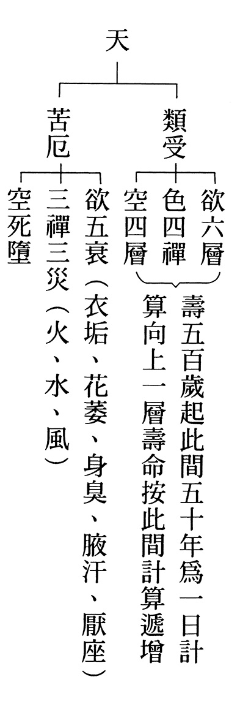

### 人生大事不能忽略的事實　臨終三大要（二）

*戒慧講述、編輯部整理*

護持親人生西方

世間真孝誰能識

也助自己臨命終

淨土聚會真團圓

前言

要讓一個人往生西方，病人、家屬與助念團三者必須互相觀待。「臨終三大要」是印光大師講到一個人臨命終時，旁邊的人面對病苦者應如何開導，有三大要點必須注意，才能保證他臨終無障礙。首先是「總顯助念的重要性」，重視「生死事大」，這件事情很重要，特別是往生淨土了生死的這件事情，故必須要重視臨終助念，而臨終助念需要平常重視敦倫盡分。第二部分「分別解釋助念的方法」，助念講究善巧方便，分為三部分。

一是開導安慰令生正信，分為總標與別釋。

總標部分，經文：第一、善巧開導安慰，令生正信者。

善巧開導安慰，分為對病人、對家屬的安慰和開導，一位及格的善巧開導安慰者，自己必須是一位想要往生淨土的人，說到往生這件事自己是嚮往好樂的，這時候引導病人往生、引導家屬護持，容易氣氛感染，開導才有力量，才稱得上是有效的探訪。而探望者最好和病人與家屬有關連性，事先了解對方的狀況，並且是一位結合往生淨土與佛法的正見，擁有許多助念經驗的修學者。

探訪的重點在於令生正信，引導病人和家屬生起對臨終與淨土的正確知見，以這樣的正知力產生對淨土的信心，以病人篤定的內因結合家屬誠意的護持，易在往生時生起破障的順緣。

別釋分為開導病人和開導子女。開導病人分為勸行、釋疑和結成三部分。

開導病人第一部分勸行，其中分為切勸與詳釋，切勸之經文：

「切勸病人，放下一切，一心念佛。」

此處清楚明白地勸病人放下一切，一心念佛。面對的病人是老參還是新學，自己的身分是晚輩還是長輩，彼此的關係是交淺還是交深，態度、說法和內容也會不一樣，大原則是將他的問題當成我會面對的問題，開導對方的當下其實就是在開導自己，幫助他生起正念的當下，正是堅定我自己往生的信心。

勸行中的詳釋，分為放下一切與一心念佛，放下一切當中，分為速令交代、作往生想和不戀塵境。經文：

「如有應交代事，速令交代。交代後，便置之度外，即作我今將隨佛往生佛國，世間所有富樂、眷屬，種種塵境，皆為障礙，致受禍害，以故不應生一念繫戀之心。」

這一期生命的因緣已經面臨結束，準備離開之時，要好好面對內心的罣礙，該說的話勇敢說出來，該交代的事交代清楚。清楚交代之後，瀟灑地萬緣放下，提起佛號，嚮往佛果，隨佛往生。試問世間所有美好快樂的受用，眷屬親密圍繞的幸福，是往生的障礙還是助緣？還得問問看自己內心重點放在哪裡，臨終時塵境成為障礙，就有大禍害，往生與否，命運是天壤之別，念佛不改心，等於說空話，老修行者更要將念佛當成改變今生命運的重頭戲，個性和行為愈來愈篤定，那種尊貴又穩當的氣氛，相信臨終時必定是正念分明。

勸行中的詳釋，放下一切之後是一心念佛，分為真性不死和念佛得生。經文：

「須知自己一念真性，本無有死。所言死者，乃捨此身而又受別種之身耳。若不念佛，則隨善惡業力，復受生於善惡道中。若當臨命終時，一心念南無阿彌陀佛，以此志誠念佛之心，必定感佛大發慈悲，親垂接引，令得往生。」

臨命終時，身體上的病痛難以忍受，心裡上的茫然和懊悔一樣痛苦。要知道我的生命現象也是一念真性，所謂的一念真性指的是空性，空性指一切都是條件組合，本來就沒有所謂的生滅，所謂的生是各種條件具足的生起，所謂的死，是生的條件不具足，另外一種生命現象的條件已具足。

我們自己沒有能力獨自前往極樂世界，必須要仰仗阿彌陀佛的力量接引往生，若不仰仗佛力，臨終的愛取滋潤過去的善惡業，而成為來生的有，命終之後必將隨著過去的善惡業，投生於六道中，受用種種苦樂果。

臨命終時，若一心嚮往極樂世界，稱念彌陀名號，只要我們想去，阿彌陀佛定會兌現曾經發過的誓願，親自來接引我們往生無有眾苦，但受諸樂的極樂世界。

開導病人的第二部分，釋疑，分為疑與釋，祖師自問自答，經文：

「且莫疑我係業力凡夫，何能以少時念佛，便可出離生死，往生西方？」

這個問題類似天台智者大師十疑論中第九和第十疑，祖師寬慰大眾，不要懷疑自己不能往生，仍然被善惡業纏縛，在忙碌的生活中僅能抽出極少時間念佛，這樣卑微又少許的功課中，一介凡夫怎麼可能離開生死繫縛得以往生西方極樂世界。

祖師回答分為事證和理明，約事證部分，經文：

「當知佛大慈悲，即十惡五逆之極重罪人，臨終地獄之相已現，若有善知識教以念佛，或念十聲，或止一聲，亦得蒙佛接引，往生西方。此種人念此幾句，尚得往生，又何得以業力重，念佛數少，而生疑乎？」

阿彌陀佛發願親自接引眾生至極樂世界，十惡五逆指的是極其可惡的惡業，對象是對我有恩的父母，具有智慧可以帶給社會安定力量的阿羅漢及佛(修行者)，以及和合的修行人團隊，作法是將他們殺害等等。例如《淨土聖賢錄》當中記載了唐朝張善和一生以殺牛為業，臨終時看到數十頭牛來索命，張善和要妻子迎請僧人幫忙助念，告知旁人地獄相已現，張善和大聲念佛不到十聲，說自己見到佛，也見到蓮華寶座，說完就往生了。另外佛在世時，阿闍世王成長為太子時，結交了一直想要謀害釋迦牟尼佛的提婆達多，在提婆達多的教唆之下，發動兵變篡位，囚禁父母親，父親餓死於大牢之中，所幸後來提婆達多良心不安，全身生瘡腐爛，在世尊面前懺悔、皈依，後來一心念佛求生淨土，臨終也真實蒙佛接引，往生極樂世界，而且是上品中生。

是故，再重大的惡業，只要不是充滿邪知見的小人，猶可挽救逆轉地獄的惡業。善知識教以念佛法門，臨終時只要發願前往，佛號或十聲或僅一聲，都能蒙佛接引，這樣的人念幾句佛號都能往生了，所以不需要妄自菲薄，認為自己是業力纏縛的凡夫，念佛數不多，就懷疑自己沒辦法往生。

理明部分，就理上解釋如何結合阿彌陀佛願力接引眾生往生佛國，分為正、反、喻、結四部分，正面闡釋佛與眾生是感應道交，佛因地當中的發願和眾生想要去兩者相互交通感應，即得往生。經文：

「須知吾人本具真性，與佛無二，但以惑業深重，不得受用。今既歸命於佛，如子就父，乃是還我本有家鄉，豈是分外之事？又佛昔發願，若有眾生，聞我名號，志心信樂，乃至十念，若不生者，不取正覺。以故一切眾生，臨終發至誠心，念佛求生西方者，無一不垂慈接引也。」

我們都有成佛的潛力，但是因為煩惱深重所以不得解脫。今天能夠深入佛法的教典，如同世間孝子和父母心有靈犀、感應道交，想要到極樂世界，就像遊子思故鄉那樣，想要回家鄉和父母團圓的心意十分濃厚，整個極樂世界就是一個大家庭的經營。

阿彌陀佛第十八願，是不同於他佛的願，就是親自接引眾生往生極樂世界的善巧方便，只要我們心志確立，志心信樂，想要去極樂世界，相信釋尊所言，相信阿彌陀佛極樂世界的殊勝，只要眾生想去，以稱念佛的名號為通關密語，至誠懇切念佛求生，即能感應佛以福田力攝受眾生，以強而有力的外緣，令眾生暫時伏惑，臨終時阿彌陀佛無不慈悲親自接引眾生往生。

理明部分，第二是反顯，勸病人不要懷疑、不要怕死，經文：

「千萬不可懷疑，懷疑即是自誤，其禍非小。況離此苦世界，生彼樂世界，是至極快意之事，當生歡喜心。千萬不可怕死，怕死則仍不能不死，反致了無生西之分矣。以自心與佛相違反故，佛雖具大悲慈，亦無奈不依佛教之眾生何。」

首先勸病人不要懷疑，對法起疑情也善也不善，初果此疑是導向否定，則此疑是惡，如果此疑是導向肯定的，即為善。若有懷疑極樂世界是不是真實存在呢？懷疑阿彌陀佛真的會來接我往生彼國嗎？懷疑自己善根不足，何德何能承受佛的加被？臨終種種障礙不一而足，要一一為其排遣。懷疑而不決定或否定，就會耽誤了自己人生的重要大事，要依著善知識引導，找到正確的方向，離開充滿眾苦的世界，到無有眾苦、但受諸樂的極樂世界，從此過上好日子，是一件非常快意的事情，當對往生極樂世界生起無比歡喜之心。

何況怕死就不會死嗎？怕死終須一死，死有輕如鴻毛，有重如泰山，這一期因緣結束時，身體已經不堪，就像住屋已經壞爛卻不願意搬到新家一樣，內心不願意往生極樂世界，就算阿彌陀佛大慈大悲，發願想要親自來接亡者往生極樂世界，沒有往生的內因，佛也無可奈何，當然也不會往生。

理明部分，第三是比喻。經文：

「阿彌陀佛萬德洪名，如大冶洪鑪；吾人多生罪業，如空中片雪。業力凡夫，由念佛故，業便消滅；如片雪近於洪鑪，即便了不可得。」

阿彌陀佛用他所有的德能莊嚴自己的名號，吾人專持名號能攝持十方諸佛菩薩的鼎力護持，阿彌陀佛這四字名號是往生淨土的通行證，是解脫成佛最殊勝的外緣。而我們多生多劫的惡業，就好像空中一片片飄落的雪花，《觀經》上說：一句佛號，可超越八十億劫生死重罪，一念決定、猛利的佛號，令生死輪迴不成為障礙，帶著多生的業去往生，依著佛力讓淨土的業先成熟，業並沒有被消滅，是輪迴的業不生，故云消滅。就好像一片一片的雪花靠近千度左右的鍋爐，雪馬上就消失蒸發。也可以想成被仇人追殺時，逃到警察局由警察保護。

理明部分，第四是結言。經文：

「又況業力既消，所有善根，自然增長殊勝，又何可疑其不得生，與佛不來接引乎。」

前面依佛經所言，一句佛號可以消八十億劫生死重罪，所以叫做業力既然依著念佛而消，善根是擁有因果正見和相信三寶功德，在念佛當中得到阿彌陀佛以及十方諸佛的加被，雖說是業力凡夫，平時忙於俗務，少有時間念佛，也無須疑惑自己無法得生淨土，只要真切渴望前往極樂世界，阿彌陀佛必定來接引。

開導病人的最後一部分，結成此段，經文：

「如此委曲宛轉開導安慰，病人自可生正信心，此係為病人所開導者。」

文中用委曲宛轉來描述開導安慰病人的狀態，軟弱者要提振精神，打氣加油，有疑慮者要以理說明，正被苦逼面臨臨終的病人，相信病和死不會成為他的障礙，能對淨土生起信心，老實念佛，吾心信其可行，移山填海之難猶如反掌折枝之易，臨終恰好是轉變的契機。

開導安慰令生正信的別釋部分，分為開導病人和開導子女，開導子女部分著重在孝道的展現，分為正明助念盡孝、反顯隨俗致咎和結重神識得所。正明助念盡孝，經文：

「至於自己所應盡孝致誠者，亦惟在此，」

開導病人固然難，開導子女也不容易。因為一般家裡面有病者臨命終，光是面臨離別，心思難過又混亂，甚至認為不急救就是不孝順，所以不去講究活下去的品質，只講究他能不能活下去，是現在這個醫學界的盲點，也是要開導病人跟開導子女的障礙。

子女能夠成為亡者往生最好的外緣，幫助亡者生起正念，所謂：「親得離塵垢，子道方成就。」護持父母往生極樂，離苦得樂，這才能算是盡上真正的大孝。

反顯隨俗致咎，經文：

「切不可隨順俗情，求神問醫。大命將盡，鬼神醫藥，豈能令其不死乎？既役情於此種無益之事，則於念佛一事，便紛其誠懇，而莫由感通矣。許多人於父母臨終，不惜資財，請許多醫生來看，此名賣孝，欲世人稱我於父母為能盡孝，不知其天地鬼神，實鑑其心。故凡於父母喪葬等事，過於張羅者，不有天災，必有人禍。」

求神問醫這件事情，未臨終時應該要接受醫生的指導來按時服藥，雖然醫生會給我們一些指導，但是不能想著醫生治療我就一定會好，接受治療是盡人事，但是不能把所有的希望都寄託在醫生那裡，這是非常重要的觀念。

如果亡者大命將盡，鬼神醫藥也沒有辦法讓他不死，自古以來，就算再厲害的人，也沒有一個人能活到現在，所以雪廬老人說，中國五千年文化，一言以蔽之，就是死光光，沒有一個活到現在，人哪有不死的呢？

在旁邊護持的家屬，子女們把心思都放在這些求鬼神、求醫藥的無意義事上，無法專心念佛，如此，則無法跟佛菩薩感應，無法得到阿彌陀佛的加被。

子女在父母臨終時，花大錢請許多醫生來治療，表面上看起來是極其孝順，其實是在賣孝。賣孝就是我的行為得到很多人的讚揚，可是賣出去的是假貨。沒有護持父母的正知正念，就算得到世間的讚揚，那都不是孝。

結重神識得所，經文：

「為人子者，宜注重於親之神識得所；彼世俗所稱頌，固不值明眼人一哂，況極意邀求，以實罹不孝之大咎乎。」

為人子女，要注重的是父母親命終之後的去向，臨終緊急時，重點在護持對方的善根，讓病人能放下萬緣，以往生為他鐵定的出路。這些鋪張又表面的做法，在明眼人看來是會被笑話的，內心渴望得到別人的讚賞，其實是蒙受不孝的大過錯。《論語》上說：「禮，與其奢也，寧儉；喪，與其易也，寧戚。」祭祀之禮以誠心為本，與其奢華，寧願節儉，奢則失其誠，從儉則無此失，可得其本。喪，與其和順有條理，卻不合情理，則寧願哀戚，哀戚可得其本。於父母喪葬之事，如果太過鋪張浪費，一定會有大禍。（下期待續）

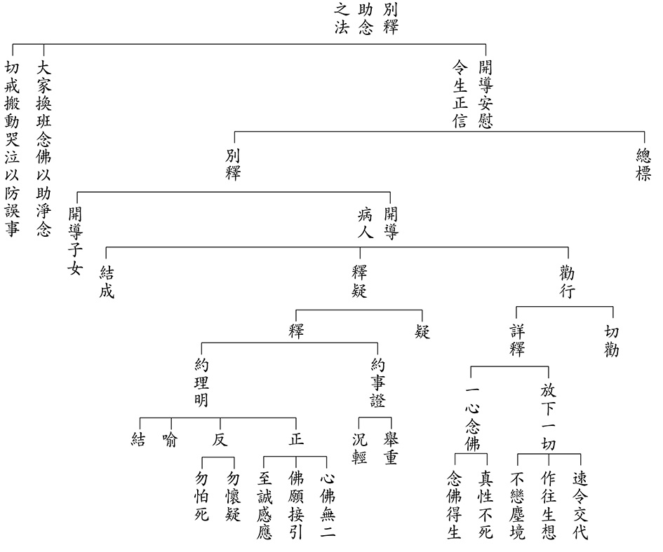

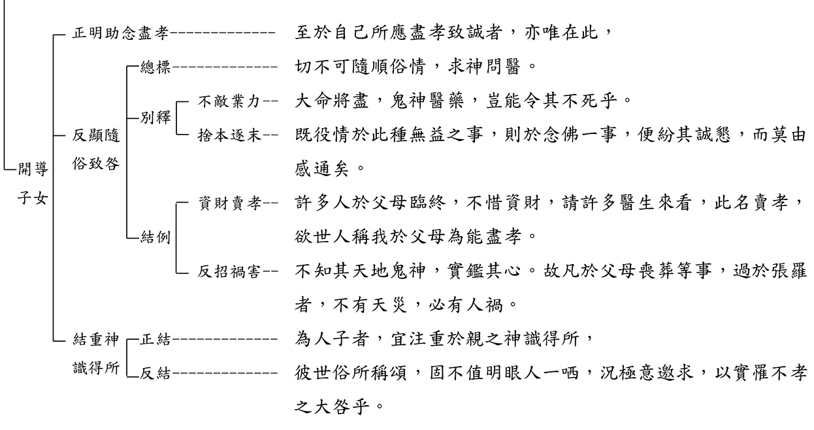

## 蓮池海會

### 尹蔡樹梅老居士往生見聞記

尹乃熾

可貴的心量　虔誠的信仰　外相的開朗　內心的鬱悶

唱歌的化解　親情的療癒　先生的往生　佛法的印象

三寶的結緣　助念的順暢　瑞相的回報　乃熾的孝心

大心的萌芽　學會的投入　福慧的實修　勝果的未來

尹蔡樹梅老居士出生於民國二十五年六月十日，台灣省彰化縣二水鄉人，遷台始祖仁德公於清乾隆年間，自福建省漳州府金浦縣渡海來台，至父親蔡陣公應為第五世。蔡陣公除務農外，亦精於魯班技藝，所製精巧木飾，稱譽桑梓。

二水鄉有一座巍峨莊嚴的碧雲禪寺，係於民國十年，由蔡陣公與數位當地信眾發起，奔走勸募所建。蔡陣公亦發心承作寺中部份木作，故該寺為蔡陣公立長生牌位，法名永傳。

老居士身為么女，上有一長姐及四位兄長。因與兄姊年齡差距頗大，故幼時常跟隨母親左右，並隨母親到碧雲禪寺和安德宮禮佛及參拜天上聖母。老夫人經年吃早齋，老居士也因之養成早餐茹素的習慣。老居士從小就十分聰慧，多才多藝。小學成績相當優異，畢業前，老師還特地到家裡勸說老居士的父母親，讓老居士考初中。可惜當時普遍重男輕女觀念，老居士終究未能繼續讀書，雖然未能繼續升學，但老居士邀集鄉里同齡孩子向當地漢學老師學習漢文數年。小學畢業後學做裁縫，並幫忙兄嫂打理農事和家務。日後老居士的四哥到台北當小學老師，老居士也隨之北上，並且在黑松汽水上班，也正是在黑松汽水上班期間，經同鄉同事介紹結縭尹元甲居士。

尹元甲居士出身官宦世家，為人豪爽好客，輕財重義。結婚當晚即將銀行存摺及印章交給老居士，老居士從此開始當家，承擔家業。結婚後數年，先生在職場上遇到障礙，有段期間生活十分拮据。元甲居士在其自傳「水留痕」寫到「樹梅和我結婚未久，我經濟一度陷入困境，幸她勤儉持家，我才能再度出發」，老居士生前提及大女兒小時候，有天下午睡覺醒來肚子餓一直哭，那時屋外傳來叫賣餅乾的吆喝聲，當時翻箱倒櫃想找個五毛錢買餅乾給孩子吃都找不到。

直到先生到新生報任職副主任，並配有廈門街的公家宿舍，生活才逐步穩定。當時省政府主席謝東閔，希望家庭人力也能投入工作，將自家客廳作為工作場所，因此提倡「客廳即工廠」的口號。老居士為了貼補家用，響應政府號召，接了許多家庭手工藝半成品在家裡加工，還曾在自強市場賣餅乾、糖果，也和朋友做過珠寶直銷。老居士的子女說：「如果媽媽多讀幾年書，很可能就不會嫁給爸爸做一個平凡的家庭主婦，而是開創事業的女強人」。

當時的台灣正值農業社會轉型為工商業社會，老居士家鄉的侄兒姪女北上就讀或就業，不是住宿在老居士的四哥家，就是住老居士家中，而且是住到成家後才搬出。先生在台世交或親戚的孩子，只要假日來家作客，老居士一定豐盛招待、噓寒問暖，臨走時還會私下給孩子零用錢。如果是北上讀書住宿家裡，老居士也是視同己出的呵護照顧，每天為其做便當當午餐。正是因為老居士長期默默付出，無形中凝聚了整個家族的向心力。

老居士結婚不久就知道新婚夫婿在大陸有太太和孩子，老居士的小女兒在寫給姪女悅瓖的一封家書寫到：「爺爺是上校，軍人結婚是要打報告的。有一晚，爺爺凌晨下班回了家，卻楞在桌前，似乎想寫東西，卻下不了筆，要他休息，又說還得忙。折騰許久，爺爺掙扎的告訴奶奶，要寫結婚報告，他是再婚，必須填『妻亡』，他寫不下去。當時奶奶只說了句，早點睡。』，「瓖瓖，妳爸爸和三個姑姑，從小就知道鎮江老家還有『祖母、大媽、大哥、大姊』，從沒有想過要問奶奶為什麼願意讓我們喚一聲『大媽』，我們可能一輩子也見不到面，奶奶可以不認，至少不阻止我們認。」

老居士的兒子說到：「我和三個妹妹從小就知道大陸有大媽、大哥和大姊，高中時，爸爸就經由美國、香港的親友寄錢回大陸」。因為老居士的同理心，體諒和顧念夫婿對大陸家人的虧欠，在兩岸開放的十年前，就配合並支持先生經由美國或香港的親友寄錢回大陸。老居士是先生照顧大陸家人最堅強的後盾，即使後來因為先生替親戚作保拖累，需連帶賠償一佰萬元(按：老居士住家位於松山區敦化北路，當時對面七樓有電梯大廈，一戶售價約八十萬元)，導致住家被查封，老居士精神大受衝擊，患上憂鬱症，但仍持續匯款給大陸家人，沒有中斷。甚至在兩岸三通後，建議先生和大陸家人先在香港會面，這才讓元甲居士能夠在相隔數十年後再次見到大陸的家人。香港會面後，更是數次陪同先生回大陸探親，每次回去都準備許多美金、金戒子回去分送大陸家人和親戚。

老居士的二女兒回憶說：「之前爸爸幫忙作保的親戚晚年搬遷到新竹，爸媽仍不時前往探望。有一次該親戚將銀行存摺與印鑑交給媽媽，請媽代為處理銀行事務。媽當時打開存摺發現帳戶有數百萬元存款，但媽卻沒向該親戚要求償還當初作保理賠的一百萬元」。

老居士敦化北路住家附近有個社區公園(北寧公園)，在先生中風前，老居士每天上午到公園和附近鄰居作香功。因為老居士個性熱情，與人相處不說是非，因此在香功班人緣極好，遂被大家推舉為班長。這個香功班創立之初僅有數人，日後人數不斷增加，在老居士擔任班長期間，人數突破百人。老居士的兒女在追思老居士一生行宜的追思文中寫到『除了尹媽媽、尹太太、大嫂、屘姑、婆婆、奶奶，在媽媽一生這麼多的頭銜中，我想媽媽最喜歡的應該是在她在同儕、同好間這「班長」的頭銜，因為，這代表的是她自己，以及他對人生的態度。』

元甲居士於民國九十四年八月九日往生，因兒子因緣，獲唐老師與學會師長護持助念，助念後相貌安詳，全身柔軟，讓老居士和家屬體認到助念殊勝功德，尤其日後的作七和告別式，讓原本哀戚的喪事，轉變成一場一場莊嚴的佛事。經由法的薰習，讓家屬內心獲得平靜與祥和，並與學會結上法緣。

老居士在八十歲時動了更換心臟瓣膜的大手術，雖然手術成功，但身體狀況需賴藥物控制，體力大受影響。手術後，老居士即由敦化北路搬到新店與兒子共住。老居士兒子表示：「自從媽媽搬到新店後，母子才有比較多的時間聊天。聊天中，才知道爸爸生前愛吃的紅燒和麵食，媽都不喜歡吃，尤其令我驚訝的是我和妹妹都喜歡吃的豆腐，媽竟然說寧可吃醬瓜，也不吃豆腐。原來媽自從嫁給爸爸後，一切以爸為主，一切以孩子為主，連自己偏愛的飲食也遷就先生和孩子。」。

老居士搬到新店後，日漸減少外出活動，但是平日生活作息非常固定。每天早上起床，一定先到客廳的佛堂和祖先牌位前向菩薩請安，向尹氏祖先請安。每天傍晚，在佛堂前拿著媳婦為老居士寫的回向文，將每天念佛功德回向自己往生無障礙，回向給兒女、媳婦、女婿和孫子。每逢西蓮淨苑舉辦超薦法會，老居士除念佛十萬聲回向給超薦對象外，也發心供養三寶。在新店居住期間，每逢年底，學會師長定會探望老居士，除表達唐老師關懷之意外，在聊天互動中，深入淺出地述說淨土法義，勸老居士發心念佛，老居士也以其嘹亮歌聲感謝大家的誠意。

今年七月四日上午八時，老居士發燒到三十九度，全身無力，家屬立刻將老居士送往北投振興醫院。住院期間病情起起伏伏，三進三出加護病房，又值疫情期間，家屬探病十分不易，平日多以手機視訊方式與老居士溝通、打氣，例假日前，去醫院做核酸檢測，需等檢測結果是陰性反應，才能在假日到醫院看老居士。住院期間家屬甚為擔心老居士在醫院往生，只有每日祈求三寶加被老居士早日出院。十月二日下午，老居士雖然插著鼻胃管和尿袋，但終於回到自己熟悉的住家。

老居士的兒子回憶說到：『十月四日下班，趕著回家準備上修心七義論第一堂線上課程。進家門，習慣性地說「媽，我回來了！」，走進老居士的臥室，看了老居士一眼，又叫了一聲「媽，我回來了！」，因外傭阿蒂正幫著老居士清潔身體，就走出房間。萬萬沒想到，這竟然是自己見老居士的最後一面和說的最後一句話。』

十月四日晚上七點零七分，老居士安詳地離開人世。家屬非常感謝學會師長當天晚上陸續前來為老居士助念。更感謝唐老師在隔日凌晨三點多來家裡為老居士助念並主持回向。回向後，老師掀開陀羅尼經被，看老居士相貌安詳，身體柔軟，對老居士甚為稱讚。家屬繼續輪班念佛到十月五日中午十二點。在老居士往生後十七個小時，女眷家屬幫老居士淨身時，仍是全身柔軟。

綜觀老居士勤苦一生，相夫教子，是典型的賢妻良母。在八十六個寒暑歲月中，老居士以同理心和利他的精神照顧家人和周遭親友。老居士的身教和言教，不僅帶給子女美好的人生價值觀 ，也累積自己晚年得以親近善知識，聽聞淨土法門的福德因緣。讓自己在人生最關鍵時刻，得到家人及諸多蓮友護持助念，仗此殊勝助念功德力，往生西方極樂世界，永離生死輪迴，當生成就。

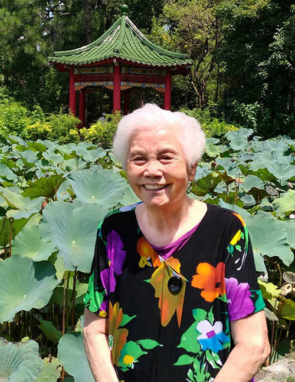

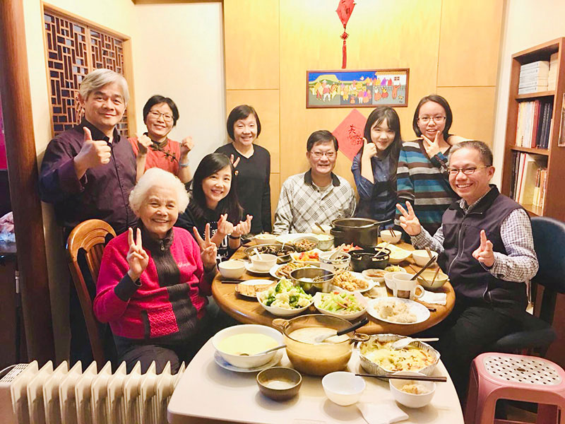

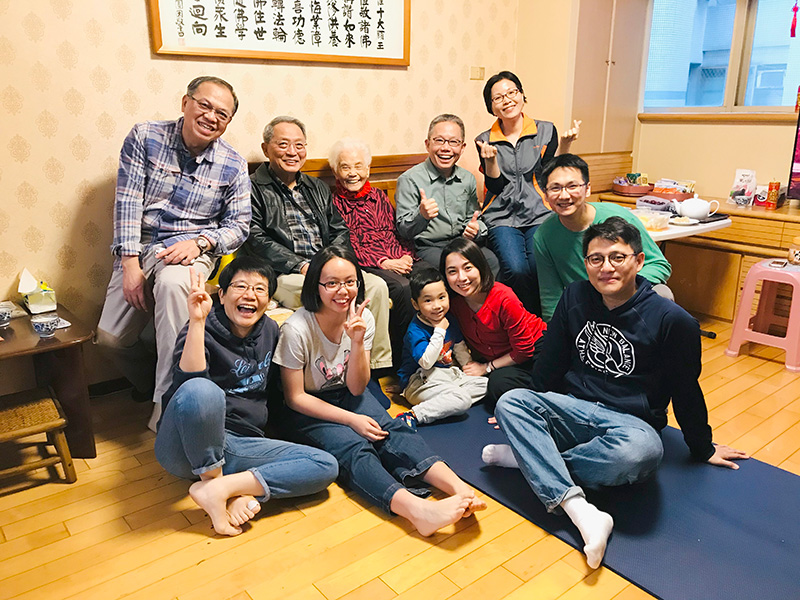

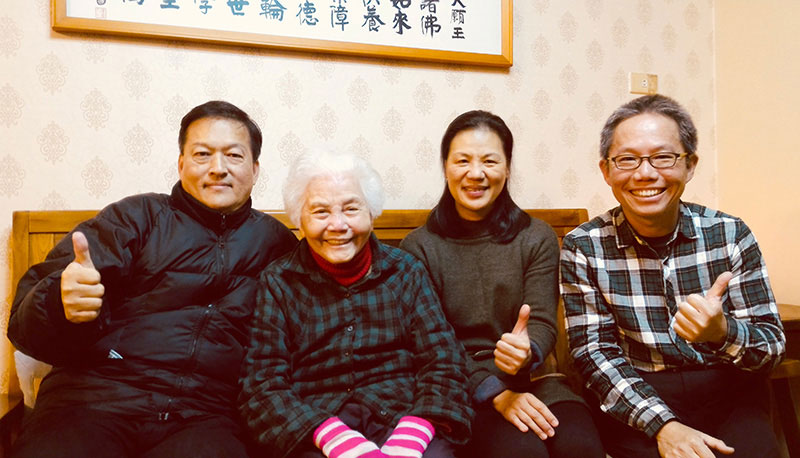

### 葉日和老居士往生見聞記

賴秀滿

前去卓蘭講學的緣起

三媳公心主持的感應

鎮長昔為蓮友的護持

東勢蓮友助念的成就

葉日和老居士生於民國十八年三月二十四日，台中縣東勢鎮新伯公里。

四歲時因生母生病往生，隨即被送予苗栗縣卓蘭鎮新厝里阿姨家當養子，與葉顯煌(台灣歌仔戲傑出女演員王金櫻女士的先生)烏來雲仙樂園創辦人同為阿姨家收養兄弟。

老居士是日據時代國小畢業，自幼在家務農奉養父母，哥哥葉顯煌是國中畢業(高等科)，被養父送往日本栽培，後來經商有成，成為知名企業家。

老居士成年後，養父因心想沒有親生子嗣，又再娶一房，生下五男三女，幾年後，變賣大部分的祖產隨二房遷居屏東縣內埔鄉定居，留下養母及年幼的大弟、大妹、二妹給老居士照顧。

二十歲時與苗栗縣大湖鄉新開村邱綢妹女士結婚，婚後生下四子。為了一大家子的生計，除了種田外，夫妻倆還種香茅釀香茅油變賣，養鹿取鹿角販售，養豬、雞、鴨貼補家用，晚上還要到溪裡用電力捕魚，宰殺好第二天拿到市場變換現金，非常辛苦的持家。

因為穀價大跌，大大影響生計，卓蘭鎮農民紛紛轉作水果，老居士也把耕地分批轉種枇杷、橘子、水梨、葡萄等等作物。經過數年的研究，才轉作成功，經濟才稍稍改善。

老居士平日嚴肅，不苟言笑，加上教子甚嚴，四個兒子與媳婦與老居士應對總是戰戰兢兢。四個兒子中，大兒子國小畢業務農為生，二兒子高中畢業在鋼鐵業服務，三兒子聯合工專畢業，是高考及格的公務員，在苗栗縣政府府秘書長職務中退休，四兒子高中畢業，在鐵路局退休，孫輩九人全部大學畢業，其中有五人是合格實授國家公務員。

老居士一生勤儉持家，為人不善言詞，也不善交際，但是很肯為公發心，為了方便大眾行走，幾次以私地闢道，自費鋪設水泥，方便大家行走，舉凡葉家宗親婚喪喜慶，無不是盡全力協助完成，頗受鄰里鄉黨及宗親的敬重。

老居士八十八歲之前，身體雖有微恙，但還算硬朗，九十歲那年，因為跌倒髖骨骨折後，加上數次手術，以致無法行走，需要依賴輪椅代步，九十二歲之後更頻繁進出醫院。

今年二月某一天，老居士告訴照顧她的看護說：我九十三歲了，不想一直起來，我要念阿彌陀佛了。同住的三子與三媳覺得機緣到了，一定要想辦法滿老居士的願。於是跟老師祈請老居士往生時請蓮友前來助念，老師說會全力護持。期間也請佛弟子卓蘭鎮詹錦章鎮長協助排除家族眾議，為老居士往生時助念作準備。

十月二十日是老居士住院第八天，因為不想進食，被醫院判定自然老化而出院返家，回到家還歡喜與小曾孫女握手打招呼，二十一日整天只喝半瓶配方奶，二十二日發燒整天無法進食，傍晚六點半分呼吸開始急促，八點解除體內餘便，清洗乾淨後，八點三十五分自然往生。

隨後在老師的協助下，鎮長及卓蘭、東勢的蓮友紛紛趕來助念，家人也排班念佛八小時，第二天早上八點由禮儀社人員及鎮長和兒子們沐浴更衣，鎮長說：老居士很好更衣，臉色溫和，手還有一些餘溫。

老居士一生未曾學佛，往生竟會有如此殊勝的助念因緣，真是不可思議的福報。家屬非常感謝老師及蓮友們的協助與護持，滿老居士念佛求往生的願。阿彌陀佛！

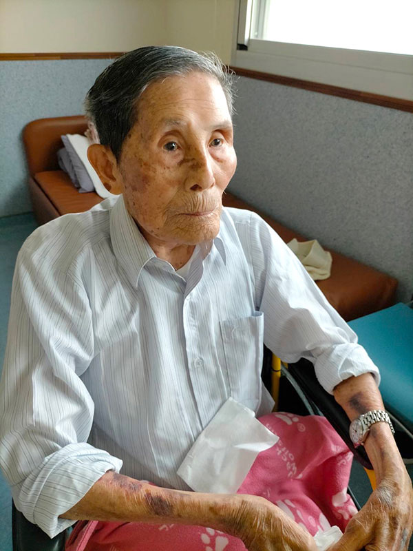

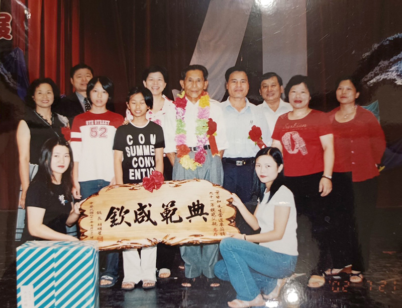

### 陳碧珠居士助念往生見聞記

福建敦化學堂　唐立新記錄

風雨中延續學堂

穩定中發揮功用

佛法攝文化推廣

佛號成助念大業

我的婆婆陳碧珠，西元一九二七年出生於福州小商之家，素與人為善，嫁給身為大家庭次子的我公公後，尊老護幼，持家工作兩不誤。

公公婆婆生兩兒兩女，慈養嚴教，待媳婿亦如親生，闔家和睦。一九九三年，公公去世，婆婆與長子、長媳同住。我先生是家中老小，比大伯（我先生的大哥）小十一歲。先生和我每週會回去看望婆婆。我的兩個大姑姐（婆婆的兩個女兒）也常來看望。全家在我婆婆的言行身教之下，和睦如故。

直到今年農曆七月十五後，素來康健的婆婆突然發生昏厥，去醫院檢查，醫生說是臟器的自然衰竭，於是全家決定讓老人回家安養。我和先生也搬回去同住，輪班陪伴、看護老人。這些年我有幸跟隨唐老師團隊學習，懂得了一些義理，在這兩個多月照顧婆婆的過程中，會仔細觀察婆婆身體的各種變化，並就自己的觀察以及感受跟學堂的善友們切磋請教。病床前兩個多月的照料，讓我近距離的觀察到老病死的苦，用《十四講表》中的語言來形容，最後婆婆老人家真是形消骨立，雖然看著心痛，但也無能為力，此時也在心中許下了一定要幫婆婆往生的願望。

其實婆婆一九九三年就有緣接觸佛法，之後家中開始供奉觀音菩薩，並茹素至今。婆婆在與佛友交往過程中有了助念往生的概念，我在照料婆婆時也常常跟婆婆討論此事。因此婆婆早前有交代，希望臨終大家不要哭泣搬動，而要茹素念佛，幫她助念往生。

雖然老人有要助念的意願，但該怎麼讓沒學佛的大伯及全家人接受並實施臨終助念，我心裡沒底。我是最小的媳婦，而且全家只有我一個人皈依佛法。我的先生因長期不自覺有聽聞我們上課的內容（在家中跟老師連線上課時，我會打開揚聲器），潛移默化中有了一定的認同，他表示不會反對助念，但他擔心我們大聲念佛，敲敲打打，影響鄰居，一直強調低調。大嫂曾與我一同接觸過國學，也不反對助念。可是大伯明確表態說他不信這些，我聽後也只是笑笑沒有說教一句，在相處中依然時時尊重他。

到了九月廿二日，我們感覺婆婆不對勁，身體腫得比平時厲害，手腳也有些涼，到了晚上八點多鐘，大家都有些緊張。大姑（我先生的大姐）請大家趕緊商量後事該怎麼辦。慌亂中學堂有人建議找了熟悉助念的法師，他說家和萬事興，要尊重大伯的意見，家人要達成共識，商量好後再打電話給他。當大姑聽到師父說家和萬事興也很感動，當時大家都休息了，大姑叫起大家，把師父所說向家人轉述，大家聽後，一致同意請法師來。

九月廿三日早上六點左右，法師來開示、給婆婆皈依，並交代說家人念佛比誰念都好，家人先念佛，再請同修幫忙助念。師父走後我們都輪班念佛，而我的先生一直坐在媽媽面前念佛，直到十點五十分，婆婆安詳咽下最後一口氣。因聽過師父開示，全家人鎮定自若念佛，直到學堂同修們趕來助念。全家這才商量該如何通知其他親屬以及後面的事該怎麼辦。最後決定到晚上再通知其他親屬，家人也可專心念佛，也沒有其他親人哭哭啼啼的。當晚十點後，兄弟姐妹們排班念佛，以家庭為單位，每兩小時一班，念佛時大家發現原來最排斥最不會念佛的大哥，剛開始時嘴都張不開的大哥，到最後卻念佛念得最勤、最久、最專心。到了我和先生並排坐在婆婆面前念佛時，我看著先生認真念佛的樣子，心中感慨萬分，此時此景是前世是今生，是夢境，不知不覺濕潤了雙眼。

經過助念，婆婆瑞相十分明顯，四肢柔軟，面相安詳，氣色比臥床時還好。第二天所有來弔唁的親朋好友都讚歎不已。婆婆的弟弟剛開始時聽說我們沒按當地習俗第一時間換衣服，非常生氣，可當他親眼看到自己姐姐的瑞相後也覺得不可思議，驚歎不已。

辦完婆婆的後事，心裡無盡感恩，無比慶幸自己跟著有傳承的唐老師的團隊學習，深深感恩老師們的教誨，如果沒有學習也不知要助念，即使助念也是勉強行事，並不會如此用心。沒有學習自己一定嚎啕大哭，畢竟生離死別，再也見不到婆婆。在此深深感恩海峽彼岸的唐老師及學會的所有老師們的諄諄教誨，正因為有了老師們的教誨，才有了我們的敦化學堂，才有了我們學堂的好氣象，再次深深感恩老師！

歲月無情，婆婆已經往生將近一個月了，但婆婆的形象歷歷在目，她一生秉持善念、為人著想、吃苦耐勞、勤儉節約、忍辱負重、精進持戒的家長風範的形象，永遠留在我的腦海，並成為我一生的榜樣。

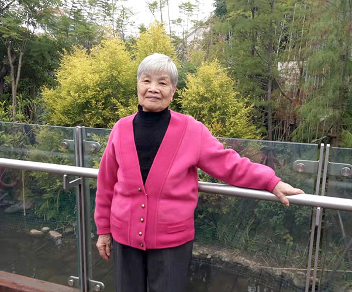

## 孔學一隅

### 論語簡說（四十）— 子張篇第二十四章　聖人無可毀，如日月無傷

時哉講述

大名鼎鼎端木賜

分庭抗禮諸侯聞

智足知聖能辯白

最難富貴是賢哲

經文

叔孫武叔毀仲尼。子貢曰：無以為也。仲尼不可毀也。他人之賢者，丘陵也，猶可踰也。仲尼，日月也，無得而踰焉。人雖欲自絕，其何傷於日月乎。多見其不知量也。

（子張第二十四）

消文

叔孫武叔毀謗孔子。子貢說：不可以如此。仲尼是不可以毀謗的，因為他人的德學再高也不過如丘陵，還可以任人踰越。仲尼的德學高如日月，無人可以踰越。有人雖想毀謗日月，其實是他自己絕棄於日月，對日月有什麼傷害呢？同理有人想毀謗仲尼，也傷害不到仲尼，正好顯示其自不量力罷了。

章旨

子貢形容孔子的學問道德高如日月，即便有人毀謗，也無損於日月光輝，只不過顯現他自不量力而已。

科判分析

子貢具有謙德之風，善探師志，他人對孔子有誤會，子貢可以有效地批駁，本章特別針對叔孫武叔來說。

本章分兩大段，第一大段就是「叔孫武叔毀仲尼」。叔孫武叔毀謗仲尼。

第二段是學生子貢的反駁，「子貢曰：無以為也。仲尼不可毀也。」老師無可毀，無就是不，以就是用，為是造作，意即不可以造毀謗的口業，其他人都可以毀謗，就是仲尼不可以毀謗，毀謗聖人，不可原諒。理由是「他人之賢者，丘陵也，猶可踰也。」約著他人來說，他人就是孔子以外的他，包括賢者與不賢者，他人的不賢當然容易超過；而即便是賢者，也像丘陵一樣，可以超越，而舉其有待改進之處。可是孔子是「日月也，無得而踰焉」，孔子是不可以超過的。

最後感歎：「人雖欲自絕，其何傷於日月乎。多見其不知量也。」人雖然想要自絕於日月，可是對日月有什麼損傷呢？「多」就是正好、恰好，正好顯示叔孫武叔是一個沒有份量的人。

釋義

本章的歷史背景

子貢的聲望非常高，尤其在魯哀公十一年，他救了魯國的幾乎要亡國之禍，名聲大噪，很多人都認為子貢賢於仲尼。

孔子是聖人，且心心念念都在國家與天下蒼生，為何還會遭到毀謗？

孔子周遊列國回到魯國，不但沒有被士君子所讚歎，還遭毀謗，《荀子》的〈儒效篇〉說，像善於架馬車的造父，他沒有馬車如何表現自己是善駕馬者；後羿善射，但若沒有弓箭，又怎麼顯示出他是會射箭的人？同理，孔子是可以治理天下者，卻沒有發揮之處，無法展現大用，難免會讓人以為無用，甚至加以毀謗。

叔孫武叔和孔子沒有利害關係，為什麼要毀謗孔子？

會遭受到毀謗，有的是因為過去的惡業，或是眼前禮數不周，得罪對方，有的是因為造作善業，而遭對方嫉妒，理由可以有很多種。叔孫武叔或以為孔子無用，或因孔子回到魯國講學，受到很大的尊重、推崇，也許叔孫武叔認為孔子沒有這種德能擔當這樣的恭敬，總而言之諸多理由，我們無法知曉是何者。

既然叔孫武叔是掌權大夫之一，為何子貢說其不知量？

叔孫武叔是魯桓公後代、公子叔的第六代孫，是世襲的大夫。魯國的政局掌握在三家大夫手裡，叔孫武叔是三家大夫掌權大夫之一，說話自然有份量。

此處說不知量的理由是：

一、他在孔子的宮牆之外，對孔子的內涵是外行，所以子貢說不知量，對孔子來講，不知所量。

二、能量，能量是叔孫武叔，叔孫武叔的智慧非常地膚淺，所以叫做不知量。

三、份量，好比一個不懂物理學的人，卻發表物理的概念，正好令人覺得他在物理學裡沒有份量。叔孫武叔此說，正好顯現自己不了解聖人。

孔子聽到了這樣毀謗，為何不辯白？

一、子貢形容孔子像日月，叔孫武叔就像蜀犬(四川的狗)。蜀犬難以看到太陽跟月亮，所以太陽出來的時候狂叫，蜀犬吠日，太陽不必跟它辯白、計較。

二、《了凡四訓》說，你如果跟他人辯白，就如同春蠶吐絲，愈吐愈多，把自己包起來，何必呢？

三、有人說，此時孔子已經過世，故無法辯白。可是，此說沒有證據。不管如何，孔子若是站在公家的立場上，就會把話說得很清楚，像〈鄉黨〉篇說「孔子於宗廟朝廷，便便言，唯謹爾」，但若是在私人的評論上，孔子可能就不予計較。

孔子不辯白，子貢為何要出面辯白？

叔孫武叔毀謗孔子，會讓大家認為聖人就是如此，有以凡濫聖的過失，即認為凡夫比聖人好，聖人就是有這些過失，或者以為聖人無用。子貢當然要辯白，否則會傷害眾生的慧命，讓世間人把無過之人看成有過。

其他弟子為何不挺身而出？只有子貢一人獨自辯白？

子貢不論財富、地位、才情、事功、對魯國的貢獻，都是極有份量的，是辯白的最佳人選。且子貢跟著孔子，受教很深，他不但了解孔子，也是位博學而識者，在陳蔡之厄時，也曾聽聞夫子的性與天道，所以子貢才會說：「夫子之文章，可得而聞也，夫子之言性與天道，不可得而聞也。」可見夫子言性與天道，是待機而說，上述可知，子貢的學習廣泛而深入，還跟著老師周遊列國、出生入死、患難與共，對孔子知之甚深。再者，子貢對叔孫武叔也有恩，吳王夫差當時賜劍給叔孫武叔，叔孫武叔不知道怎麼辦時，子貢助他解圍。諸如以上所說，子貢出來辯白最恰當。

子貢為何以丘陵來形容賢者？丘陵可逾越，難道是指其他賢者可以毀謗？

丘陵可以逾越，可以超越，可以爬到上面，意思是說，其他的賢者可以當得起毀謗。因為當你的才情、見地、氣度、學問上到一個格局的時候，是可以超過賢者的，既然可以超越，就可以見到他的過失，就像老師之所以可以指責學生，就是因為老師比學生高，可以看到學生的過失，並加以指正。過就是無心之過，或者時機不對，或者場合不對，或者不知進退，這就是過失，你的意境比他高時，你一定看得到，叫有可逾也。

比如子路捲入衛國的內亂，最後被斬成肉醬，子路雖然很有道義、忠心耿耿，可是衛國那樣紛亂的局面，子路是沒有能力插手的，子路卻為了保護蒯輒，為了阻止亂事發生，而被斬成肉醬，這是昧大義。

又如冉求，謹慎保守，三思以後反而不行動。孔子便告訴他：「再思可也。」雖然三思很多，但對於過於保守者，再思就可，這就是賢者，有可指陳的過失。

孔子說子張是可以莊重，可是不能跟大家和合，子貢是可以辯論，可是不能夠木納；顏回是有仁心，可是不會權變，各有過失。這些過失，是可以被指陳出來的。就像衛武公常常跟大臣說，不要因為我年紀老、德高望重，就認為我沒有過失，你應該要指出我的過失，我一定會常常在意這個過失，並且努力改進，所以，衛武公過世時，諡號為「睿聖武公」，即能夠改過的聖人。

子貢為何以日月形容孔子？

子貢形容賢人為丘陵，聖人是日月。意思就是差太多了，日月是達不到的，聖人跟賢人雖然只有差一點，名詞上叫賢人、聖人，其實境界相差甚遠，簡直遠到難以想像。

即便顏回跟孔子的境界，夫子走的時候，顏回跟著走；夫子快走的時候，顏回跟著快走；夫子快跑的時候，顏回馬上就看不到夫子了，所以才說「仰之彌高，鑽之彌堅」。

日月無得逾越，代表孔子無可批評，孔子真的沒有過失嗎？

以日月來說，那樣的境界是你達不到的，既然達不到，試問要如何指出他的過失？

在《說苑》中子貢跟齊景公說：「孔子像天高，可是我不知道有多高；像地厚，我也不知道有多厚；所以，我也不了解他，我根本無從了解、無從達到，我怎麼可能指出他的過失？」孔子的境界達不到，但我們如何知道他沒有過失？孔子曾自言：「七十而從心所欲，不逾矩。」從心所欲就是不管心念怎麼動，都不會離開規矩法度，也就是沒有過失，身無失、口無失、意無失，佛家在讚歎佛的時候，就是這種讚歎。沒有過失的聖人，那種聖人的意境是我們無法想像的，透過學習經學，除掉自己的所有過失，不但有心的罪沒有了，連無心的過也沒有了，在各種場合都拿捏得清清楚楚、恰到好處，孟子讚歎孔子是聖之時者也，該進則進、該退則退。孔子是無可無不可，都是在時機上講究。

孔子已成就無過，為何叔孫武叔還是可以找出孔子的過失加以批評毀謗？

叔孫武叔是一個未入門者，連孔門在哪裡都找不到，孔門牆中的「百官之富，宗廟之美」自然也看不到，可見外行人要找內行人的過失也可以找出很多。

是不是為公發心與為私發心都是毀譽參半？

很多人都怕毀譽參半，害怕被批評，午夜夢回時，會覺得懊惱、痛心、憂悶，為公發心，是君子譽、小人毀，因為你阻礙了小人的利益。為私發心是小人譽、君子毀。你想逃避毀譽參半是辦不到的。

人有可能達到無毀有譽的境界嗎？

有一種人討好君子、討好小人，叫做鄉愿，終於無毀有譽。可是無毀有譽，或是假公濟私的小人。

比起毀譽參半，何不選擇無毀無譽？

無毀無譽就像隱士一樣，或是不問世事，或是無用之人。可是我們能夠活著，都是別人幫忙，所有的福報都是來自於眾生的服務，怎能無用於世呢？既然有用於世，要逃離毀譽參半幾乎不可能。總而言之，毀譽參半如果是對天下人有利、對社會國家有利，這樣的毀譽參半反而是好的。只不過國家教育功能不張時，為公發心的毀譽參半中，往往善人少、惡人多。

以道德公心辦事卻受毀謗，令人更加難受，如何跨過此障礙？

一、如果為公發心，面對的是小人跟惡人，就不要指望他對你讚歎。二、正好藉此練習自己忍耐的功夫以及毅力。三、反而要多用君子去發展善法，改善社會風氣。

孔子在經營文化的千秋大業時，鮮少人能見其後面帶來的影響，眼光短淺者占多數，眼光長遠者占少數，出來辦事情時，假如要辦對未來有益的事情，大抵都是大毀小譽的毀譽參半。

毀孔子正好就是毀自己，真有這麼嚴重嗎？

子貢舉例：「人雖欲自絕，其何傷於日月乎。」人要自絕於日月，結果對日月無傷。孔子的見地是出路，孔子講入世的修身、齊家、治國、平天下，這是入世的出路，孔子講形而上、性與天道，是解脫的出路。故毀謗孔子等於毀謗自己的出路，因為一個人的出路在於見地。

一個微小的變化，如果不去調整，它會發生巨大的改變。有些微微的變動，如果不詳加注意與導正，演變到最後，會如同股票市場崩盤。

子貢如果不出來批駁，不把事情說清楚，後面就可能演變成認為孔子是專制帝王的走狗，天大的誤會都有可能發生。

本章告訴我們什麼道理？

本章告訴我們，聖人是不可以毀謗的，毀謗一定會滅己，不願意接納這種見地時，就不會有離苦得樂的能力。

本章還告訴我們，聖人尚且會受到毀謗，所以我們受到毀謗也沒什麼大不了，被別人毀謗時，我們要反問自己到底有沒有在努力充實內涵，這才是重點所在。再來，善人受謗，我們要懂得去分謗。舉例來說，子貢就懂得站出來解釋，善人一定要彼此互相扶持，不能獨善其身，這時候才能開展淳厚的風氣，才能夠讓別人不造無端的口業，止息毀謗的風氣。

總結

一、口為禍福之門，最大的禍就是毀謗聖人，毀謗聖人有時候比殺人放火還嚴重，因為道理通達時能開智慧眼，但是你毀謗聖人，讓他人認為聖人的內涵無用、沒有出路，反而傷害他人的出路，而去造作諸多墮落的惡業，這是要負責任的。

二、要學習子貢說話的藝術，他善用比喻，本章子貢就用丘陵、日月的比喻來講聖人是無可毀的，聖人是無過失的。

三、揚聖人，能夠讓好的見地開展，讓他人學習，讓風氣改善，也能保留民族的命脈，因為民族的命脈就在聖人的見地。

問答

**問：** 現在社會開放、言論自由，我們見到他人的過失都不能批評嗎？

**答：** 批評過失，會讓社會的風氣變壞，而隱惡揚善對社會風氣是很重要的，隱惡不只是讓惡人有所警惕，也讓好人免於學壞。就算要批評他人的過失，也要避免人身攻擊、避免羞辱對方，不僅對社會風氣不好，也易與人結仇怨。

**問：** 孔子的諸多言論、論述已經不合時宜，根據這一點，我們也不能有所批評嗎？

**答：** 我們要保留的是孔子對吉凶禍福的那種見地、性與天道的見地，至於孔子在《禮記》上面說的一些禮儀，比如車馬的禮儀，現在沒有車馬了，當然不適用，可見作法會隨時代演變，必須有所損益，但是精神要保留。

**問：** 子貢之辯與孔子自辯會有什麼不一樣的效果？如果一個人為公做事的時候，受到他人毀謗，沒人站出來，他是否還要自辯、或者不辯了呢？

**答：** 子貢不論在魯國的聲望、地位、知名度、貢獻，還有曾經救過叔孫武叔的因緣，以這種立場來講，子貢出來辯駁的效果遠比孔子好。而且子貢的辯駁是懂孔子的辯駁，是一個入孔子之門的辯駁，是可以把叔孫武叔導正的辯駁。

**問：** 善人受毀謗的時候，要懂得分擔，是不是我們所說的成人之美？

**答：** 受到毀謗，若是屬於公家的部分，本來就要解釋清楚，如果屬於對你私人的檢討、批評、改進的那一分，有時候出來辯駁也無用，愈辯駁反而讓對方覺得你在爭功諉過，旁人或認為你不堪被指導，與其這樣，還不如沉默。

而善人分謗，是成人之美的一種沒錯，我來護持、幫忙、隨喜此善人，如果他被毀謗，我來替他解釋，跟他站在一塊。

**問：** 叔孫武叔毀謗孔子，有沒有可能是因為他嫉妒孔子呢？

**答：** 很難說，因為叔孫武叔是掌權的大夫，孔子是備位大夫，他們沒有政治的利害關係，我們只能說，或許從某些立場來講，孔子周遊列國都沒被用，回到魯國好像也無用，當聖人不能發揮用途的時候，難免讓人感覺到是無用之人，就在這裡做文章。

**問：** 現代人有些人也會毀謗孔子，我們面對到這些毀謗孔子的人，是否能舉這章來跟他說明？

**答：** 是的，子貢已經替我們辯論了，兩三千年的子貢在現場，經過了這麼多年長期的觀察孔子，做出了這麼多的結論，兩三千年後的我們都不在現場，也都跟孔子沒有相處過一天，沒有聽過一天的課，僅憑一點有限的資料就可以說三道四，這是不合理的。

**問：** 子貢說叔孫武叔批評孔子，剛好正顯示他不夠分量，《論語》中子貢也曾去毀謗別人，也被孔子制止，是不是因為子貢也不知量呢？

**答：** 子貢毀謗他人，其實不是不知量，子貢看人很精準，子貢善於方人(比較人)的當中，其實孔子都同意他。像子貢在《孔子家語》中講到弟子們的各種狀況時，孔子是笑笑相許，只是毀謗人時，孔子不同意。孔子希望子貢能進德修業。

而子貢在本章提出反駁，重點是避免我們以凡濫聖，在見地上的辯駁是需要的，見地需要被導正，不能讓它變成蝴蝶效應漫延。

**問：** 毀謗聖人，就是斷自己的出路，這是不是就是持禍歸身（今子罵我，我今不納，子自持禍歸子身矣）的意思？

**答：** 真的是這樣，因為聖人不會計較，但是你毀謗聖人，其實就是斷了他人的出路，也斷了自己的出路，當很多人沒有辦法依循聖賢的見地而有所出路，這個禍害是由你造成的，你本來就是持禍歸身。

**問：** 孔子如日月，是不是說他面對毀謗時是心不隨境轉，八風吹不動？

**答：** 孔子性與天道的能力就是心不隨境轉的能力，如果孔子的心隨境轉，早就在惡劣的國際情勢中退轉了。孔子能夠以公心來行道，表示他不只心不隨境轉，更能以心轉境。

**問：** 夫子有像子貢這樣的學生，站出來替他辯護，如果有人毀謗我們的老師，我們是否應站出來辯白，還是讓老師自己去回應？

**答：** 有時候是時機的問題。還有，在辯白時最重要的是見地上的辯白，其他有些事情，說多也無用。（下期待續）

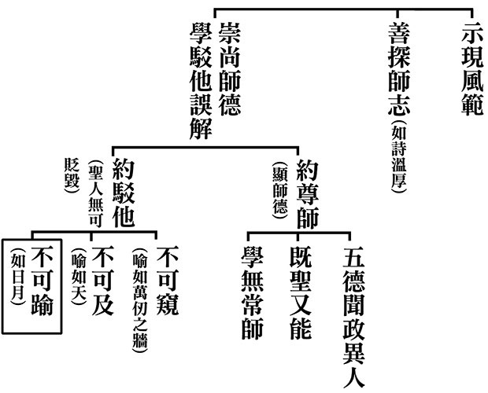

### 孔門心法—中庸之道(二十一)　第十八章：後繼有人的無憂

*時哉講述、弘毅整理*

動亂的時代

處世的智慧

禍福的相依

取捨的抉擇

前言

孔子說無憂的人大概只有文王了吧。可是仔細觀察文王一生，其實是波瀾壯闊、高低起伏的。文王的父親季歷死在牢裡，自己又被紂王囚禁七年，長子伯邑考被紂王做成羹湯，文王還被逼迫喝下自己兒子的肉羹。然而大仇未報，文王就病死，理應憂憤纏身，到底要如何不憂呢？本章感人處即在於文王的無憂。

人的成長過程中，難免有升學的競爭，無不想方設法擠入高校、名校，這是求學的辛苦。還有跟異性的交往，要能互相欣賞、坦誠相交、彼此珍惜、觀念一致、理財和睦、生活習慣的磨合、與對方家庭家族的和諧，以及望子成龍、望女成鳳的心情，無不操碎了心，加上經濟壓力，成為生活的重擔。又人工智慧的發展，工作換新，必須培養諸多斜槓能力，好不容易熬過了青年、壯年、中年，到了老年，歲月讓青春不在，孩子們離開了父母，進入了空巢期，憂心孩子們的事業，自己也感到孤單落寞。退休了無所事事，在這個過程中，或者白髮人送黑髮人，或者死了先生，成為寡婦，或者死了太太，變成鰥夫，或者看到親人的死亡，感到憂愁恐懼。

人生處處充滿了抉擇，可是自己卻沒有抉擇的能力，如何解除內心的煩悶，讓內心是沒有憂愁的狀態，離苦得樂，經營無憂的一生，過上無憂快樂的生活，相信本章可以給我們不少啟示。

中庸總體科判

第十八章還是在《中庸》的第二部分，即分別顯示中庸的修學法和義理。

本章科判分析

本章讚歎文王、武王和周公，他們開創了周朝八百年的天下，本章是他們的道統精華所在。首先讚歎文王是一個無憂的人，以及說明他無憂的理由。然後讚歎武王繼承了曾祖、祖父和父親的大業，討伐紂王救民於水火，得到名、位和祿的福報，他的餘慶是死後被人祭祀，子孫保有祭祀。武王過世後，周公輔政，承接文武之德來定喪祭之禮。他首先追封古公亶父、王季為天子，以天子之禮來祭拜周家的祖先，然後讚歎周公以表徵孝道的喪祭之禮通達於天下（包括諸侯、卿大夫、士、庶人），喪禮的規格要看喪者的身份，祭禮的規格要看祭祀者的身份。喪期是一年的，大夫以下都要遵守；喪期是三年的（父母之喪），就算天子也要遵守。周禮重點在喪祭之禮，表達的是慎終追遠，可見孝道是周禮的核心，是製禮作樂的本質，發展出來的就是仁政，因此造就了周朝的八百年天下。

消文釋義

經文：

子曰：無憂者，其惟文王乎。以王季為父，以武王為子。父作之，子述之。

消文：

孔子說：無憂的人，大概是只有文王吧。他以季歷為父親，以武王為兒子。從王季開始開創事業，制禮作樂，到武王時闡述、發揚光大，到周公時完備。因為家業、制禮作樂、志向大業、道統能夠傳承，所以文王是無憂的。

釋義：

「文王」，周成王給祖父的謚號；「王季」，季歷應該是公，不是王，這是周公給祖父的追封。

經文：

武王纘大王，王季，文王之緒，壹戎衣而有天下。身不失天下之顯名，尊為天子，富有四海之內。宗廟饗之，子孫保之。

消文：

武王接續曾祖古公亶父、祖父季歷和父親文王的基業，並且發揚光大，然後誅滅商朝而得到天下。武王伐紂不是以下犯上、大逆不道，而是推翻暴政，讓百姓安居樂業，這是天下最大的善業，所以他不但沒有因此失去好的名聲，反而使他的名聲更加顯赫，被尊為天子，富有天下。他過世後能夠得到宗廟祭祀，他的子孫代代相傳，保有富貴和祭祀他的榮耀。

釋義：

「纘」，繼承；「緒」，基業。「壹戎衣」，朱子根據《尚書‧武成》篇解釋為一次穿上軍服，可是武王是兩次穿上軍服才打敗紂王，第一次是孟津觀兵，第二次是牧野誓師，故不採。應該根據《尚書‧康誥》篇解釋為，「壹」通殪，誅殺；「戎」，大；「衣」，通殷，秦國人的讀法。所以「壹戎衣」解釋為，誅殺大商。「饗」，祭祀。

經文：

武王末受命，周公成文武之德，追王大王，王季，上祀先公以天子之禮。斯禮也，達乎諸侯大夫及士庶人。父為大夫，子為士，葬以大夫，祭以士。父為士，子為大夫，葬以士，祭以大夫。期之喪，達乎大夫，三年之喪，達乎天子。父母之喪，無貴賤一也。

消文：

武王晚年接受天命，完成父親文王的遺願，討伐紂王，可是他伐紂成功後，僅做了兩年的天子就過世了，在臨終前把朝政託付給弟弟周公，周公輔政七年，代行天子職位，成就了文武之德，他通過制禮作樂使禮樂更加完備，追封曾祖古公亶父、祖父季歷為王，以及在郊外以天子之禮，祭祀古公亶父之前的列位祖先，一直到始祖后稷，以此來彰顯孝道。這個喪祭之禮，能夠普遍的施行於諸侯、大夫（在天子或諸侯供職或享有封地之人）、士（普通公務員）和從事各業的百姓之中。具體的做法是：如果父親是大夫，兒子是士，那當父親過世時，就要以大夫之禮來安葬，以此來彰顯他的地位，祭祀時要看生者的地位，兒子的身份是士，那就要以士的禮節來祭祀。如果父親是士，兒子是大夫，那就要以士的禮節來安葬父親，祭祀的時候依兒子的身份依大夫之禮來進行。喪祭之禮的核心是孝道，是報本還恩，這也是周朝保有八百年天下的原因，這樣的人來祭天，最能感動神明，得到加被，讓他的國家風調雨順，人才輩出，民風淳厚。旁系的親屬過世，大夫以下都要守喪一年，天子諸侯因為國家大事重要，可以不必遵守。但是三年之喪，即便是天子都要遵守。父母過世，不論貴為天子，還是賤如百姓，都是要守喪三年的。只有維繫孝道，才能造就淳厚的風氣，慎終追遠，民德歸厚，國家才能長治久安。

釋義：

「末」，晚年。「期之喪」，一年之喪，指旁系的親屬過世，如父親的兄弟姐妹。

章旨

文武之道在禮樂，禮的關鍵在喪祭，喪祭的本質在孝道，周朝以此開國並延續。

析疑

一、本章與前章的關聯為何？

前章講的是舜以大德來經營大孝，因此他得到名、位、祿、壽，此章也是在講以德來經營孝，特別是講制禮作樂來治理國家，通過喪葬祭祀來尊崇祖先、父母，彰顯孝道，是禮樂的精神所在，所以與舜一樣，大德者享大福。

二、周文王其人其事

周文王在紂王時被封為西伯，《禮記‧文王世子》中說，他對父親季歷非常孝順，每天都向父親請安，父親生病時，他心神不寧，也感得兒子武王對他的孝順。《呂氏春秋》裡說，有一次蓋房子挖到尸體，他的屬下說，這是沒有主人的尸體，他說國君就是國家的主人，天子是天下的主人，怎麼會沒有主人呢？他就下令把屍體埋了，鄰國人聽說後都佩服他的德行。虞芮兩國因田地起爭執，兩國國君去找文王理論，結果進入周國後，發現耕者讓畔、行者讓路，感到非常慚愧。文王執政共五十一年，在第八年時發生地震，有人建議把工程建的更加穩固些，他沒有採納，而是說地震與人為有關，要好好的修德、做善法，如改善民生，照顧鰥寡孤獨。《詩經‧大雅‧大明》篇說「有命自天，命此文王」，說明文王是一個具有天命的人。《詩經‧大雅‧文王》中說「文王在上，於昭于天，周雖舊邦，其命維新」，文王是與天德相應的，周國是一個已經傳承了千年的古國，從堯時封后稷於有邰，歷經夏商，然而還能夠得到統一天下的天命。《尚書‧周書‧無逸》裡說，「文王受命，惟中身，厥享國五十年。」無逸篇是周公對周成王的告誡，讓他不要放逸、懈怠，德學都來自精進。周公就舉父親周文王的事跡來說，文王是四十七歲當上國君的，九十七歲過世，在位五十年，他愛護百姓，尊重賢能，常常招待賢人都沒時間吃飯，周公以父親為典範，所以他後來是「一沐三握髮，一飯三吐哺」。在文王八年時發生地震，他除了救災外，就是好好的反省自己。

三、從本章可知，文王為何可以無憂？無憂的定義為何？

文王從父親季歷那裡繼承基業，又有兒子武王傳承光大，而堯的兒子品德不好，舜的兒子愚笨，湯和禹的兒子也不如武王、周公，商湯的孫子太甲因為無道，而被伊尹放逐到桐宮，所以就這一分來講，堯、舜、禹、湯都是不能與文王相比的。如果你的父親、兒子都是有德有學之人，那其它的憂愁又算得了什麼？文王做易經六十四卦的卦辭，周公做三百八十四爻的爻辭，父作之，子述之，就連孔子也沒有這樣的兒子。

四、文王身處在商紂王時代的亂世，真的還能夠無憂嗎？

文王的父親王季在監獄過世，他自己也被關了七年，天下倒行逆施，百姓身處水火之中，身為一個仁者怎能無憂？所以上聯是「不憂而憂」，下聯是「憂而不憂」，橫批是「到底憂還是不憂」。人生有憂與不憂，雖然憂天下蒼生，但是可以充實內涵，家庭和睦，有父親可學，有兒子可傳，家族的道統、志業能夠傳承，就這一分講是無憂的。

五、一般人要如何像文王一樣無憂無慮呢？

有個ABC理論，A就是事情，B就是你對事情的看法，C就是壓力，比如小孩考試不好，父母也沒有給壓力，因為父母的看法是快樂成長。文王在羑里被關七年，隨時可能喪失性命，換作一般人早就不堪了，可是文王反倒演述周易。可見對事情的看法很重要，如果你認為這件事情能夠磨練、考驗、堅固自己的願力，加大忍辱度、促進自我反省，考驗反而成為幫助。如果你能了解人生的志向、目的、意義，清楚的定義自己，在大時代的混亂中，不會隨境而轉，在充實自己中得到快樂，如文王、孔子、顏回一樣。

六、孔顏也是發憤忘食，樂以忘憂，何以本章說惟獨文王無憂？

有時經文是就某一分來發揮的，《論語‧泰伯》篇裡說：「巍巍乎，唯天為大，唯堯則之」，只有堯才是效法天，可是舜禹也是如此，其中又說：「舜禹之有天下也，而不與焉」，舜禹得到天下不是靠追名求利，可是堯也是如此。再如「有顏回者好學」，可是曾子「人一能之己百之，人十能之己千之」，曾子也是好學的。此章只是就文王有好的父親、兒子，能夠把道統、禮樂、志業傳承，就這一分來講無憂。

七、父作之，子述之的殊勝為何？

道統在文王的家族傳承，堯、舜、禹、湯也沒有如此。

八、文王如何教出武王與周公、康叔等，才德兼備的好孩子？

文王能夠教出武王、周公、康叔等才德兼備的好孩子，這來自於良好的家庭教育。印光大師寫的《天下太平之根本》說道，女人很重要，如古公亶父的太太是太姜，季歷的太太是太妊，文王的太太是太姒，她們相夫教子，所以後世稱太太。再有武王、周公以父親為榜樣，看到父親含辛茹苦、忍辱求全，對百姓百般呵護，禮遇賢才都顧不上吃飯，這些都看在他們的眼裡並且效法。對孩子最好的教育就是父母以身作則，創造家庭的和諧。文王有好的父親和兒子，所以子思讚歎說：「其惟文王乎」。

九、一般人應如何才算得上是繼承家業？

如文王一樣，品格、學問、見地、道統的繼承才是最好的繼承，否則就算繼承幾百億，繼承天下也沒有用，就像那些亡國之君。

十、武王伐紂，為何能號召天下諸侯，共同舉兵起義？

雖然周國領土不大，但經歷古公亶父、季歷、文王，到武王時，已經經營了一百年，武王藉著百年的積累，再加上他是一個有理想、有抱負、有格局、有見地、能入世的人，所以武王伐紂才能感召天下諸侯共同舉兵。

十一、周公其人其事

武王過世後，周公是周朝的關鍵人物，如果沒有他，周朝都可能很快亡國。但有一件事情要特別說明，武王伐紂成功後，不知如何處理商朝遺民，姜太公建議都殺，召公建議有罪的殺，無罪的釋放，而周公說，百姓有過，在予一人，應該跟他們坦誠相見，給他們田地，他們一定會擁護的，武王就採納了周公的建議，這就是周公的心量。

十二、周公何以能追王大王、王季，這些帝王名號有何用意？

周公制禮作樂當中，最了不起的就是祭禮和喪禮，周公追封古公亶父和季歷為王，後代能夠有所成就，要感恩祖先，這就是孝道。懂得感恩父母、老師的人，才懂得感恩別人，一個刻薄寡恩的人，如果學問和能力很強，反而是社會的災難。從周公追封三代開始，後世也都效仿追封三代，如《了凡四訓》裡記載的楊榮，他做了太子少師後，追封父、祖、曾祖，曾祖是以擺渡為生，卻能在當地發洪水時，不撈取財物而是撈人，因為曾祖的陰德加被，到了他父親時，家境漸富裕，最後楊榮官居少師。

十三、葬禮依死者身份，祭禮按生者身份，此制度背後所隱藏的內涵為何？

葬禮要依死者身份，比如他對國家貢獻很大，葬禮的規格要高。祭祀要按生者身份，是向祖先報功，感恩祖先的賜予，才有今日的成就。前者是尊重死者的貢獻，對他的肯定；後者是報功，揚名聲，顯父母。孝子如果懂得這些道理，為了尊崇祖先，報答父母的恩德，一定會好好的充實自己，提升自己的品德、能力、學識，施政一定會為公發心，利益百姓，國家一定成為強國。

十四、今此禮達乎諸侯大夫及士庶人，其意義為何？

周公制定這樣的喪葬之禮，是為了把孝道普及下去，禮樂的本質在仁，仁的本質在孝，孝道就是整個中國道統的核心所在。所以《孝經》裡說「先王有至德要道」，這個要道就是指孝。

十五、周朝國祚能延續八百年，與此禮有關嗎？

禮除了能節制人情，還能防止僭越，如死者是士，就不能以大夫之禮安葬，祭者如果是大夫，就不能以天子之禮來祭祀祖先。依禮而行，就不會犯上作亂，三家大夫雖然囂張，可是還不敢推翻魯君，禮可以幫助維持國家的安定。反之，諸侯看不起天子，大夫也會看不起國君，士也會看不起大夫，上行下效，國家必然內亂。此外禮還可以表達報本還恩，慎終追遠，這些就是周朝延續八百年的原因。

十六、文武周公皆聖人，為何不學堯舜禪讓？

堯禪讓是因為丹朱品德不好，舜禪讓是商均愚昧，可是文、武、周公都是聖人，如果他們禪讓，百姓也不會答應。另外家天下經過夏商一千年的實行，百姓已經不會再接受禪讓了，且周家的家風良好，又做出很大的事功，禪讓也不是那麼容易的。

十七、周家歷史對我們人生有何啟發？

周文王以道統來行善積德，帶動風氣，庇蔭子孫，這才是真正的人生出路。

十八、學習本章，對一般人的生活有何用處？

喪葬祭祀講究的是真誠、節制以及不越分，人生就是要真誠，要懂得上下尊卑，不僭越，能夠尊重他人，經營良好的人際關係，這樣必然會得到他人的讚美、恭敬、擁護和幫助。

十九、本章對現代領導者的啟示？

領導者要得民心，不是只有發展經濟，如周文王還有反省、檢討、慈善、品德、禮樂、孝道、風氣、道統，這樣的領導者才能得到民心。

總結

蔣先生曾經說「生活的目的，在增進人類全體之生活；生命的意義，在創造宇宙繼起之生命。」不僅要經營自己的生活，還要關照他人的生活，生命一定要延續。所以成家立業不是只有愛人，還要生養和教育子女，有利於家庭、社會和國家。領導人要整頓家庭，教育下一代，對社會風氣有更好的影響，由這樣的家庭組成的國家必然強盛，民族必然長治久安。

問答

一、文王可以教出武王這樣好的孩子，堯舜為何反而辦不到？

第一，正因為堯舜沒有好的孩子，反而成就了禪讓政治；第二，文王通過不斷地突破逆境，取得成就，這是另外的一種教子，武王、周公看到過父親的歷練，會很珍惜所得，那些只是看到父親已經成就的孩子，就不會有這樣的覺受。康熙當年也是帶著孩子去歷練，所以他的孩子都很有能力。第三，周家從后稷開始，到古公亶父、季歷、文王，歷經千年，累積的陰德加被讓後面能夠生出好的子女。

二、文武之道與文武之德有何不同？

文武之道有大有小，大是指承天治人，有治國胸懷，懂得治國的道理；小是指禮的條目、樂曲等。文武之德是指能體會文武之道的智慧，而且是能夠把文武之道運用出來的能力。

三、文王被囚羑里，仍推演《易經》，心不隨境轉；入世上承王季，下啟武王，道統延續，那麼此章的無憂是指周文王在形而上與形而下辦國政這一分都是無憂嗎？

此章不只是就具備形而上與形而下內涵來說，孔子、顏回也具備這樣的內涵，而是說文王的無憂特別是指，他能承接父祖基業，又有兒子傳承，家庭讓他無憂，他的兒子體貼、好學、有品德、有見地，這是非常難得的。唐太宗晚年都想自殺，因為他的兒子互相爭權。

四、此章可以算是文王通達中庸之道的證明嗎？

文王能夠推演《易經》，對其中的道理通達，入世能夠趨吉避凶，通過禮樂和仁政帶來百姓的安樂，至於是否有形而上的內涵，要有專門的文章記錄才可以確定，他也被稱為聖人，或許有形而上的內涵吧。

五、是不是說只有具備形而上的內涵才能無憂，只有形而下只能是暫時的無憂？

當我們的內心是利他的時候，就自己這一分來說，就不會成為自己的憂愁，但以形而上的內涵去斷煩惱時，才真正是究竟的無憂。

六、周朝這麼重視禮樂教育，為何最後也走向衰弱呢？

家天下父傳子、子傳孫終將如此，當父親已經成為天子，他的奮鬥和歷練沒有被兒子見到時，在富貴中一代不如一代。然而因為有禮樂的約束，周朝歷經八百年，即便後面東周衰敗了，還延續了四百年，而漢朝、明朝衰敗後就垮了，可見禮樂制度對維持家庭、國家穩定發揮了重要的力量。

七、家裡有道統的學習，就可以解決生活中所有的憂嗎？

道統的學習包括形而上和形而下，形而上的學習可以幫助我們對治煩惱，如顏回簞食瓢飲而不改其樂，讓我們明心見性；形而下的學習包括怎樣運用仁心利益大眾，但要走入時代，充實各領域的知識，否則只有利益眾生的心，沒有利益眾生的方法，能夠辦出利益眾生事業的無憂才是真正的無憂。

八、堯是聖人治天下，但為什麼會有品德不好的兒子，他治理國家很好，那理應對家庭教育也很好，為什麼會出現這種情況？

正因為堯的兒子品德不好，堯禪讓時百姓才同意，否則百姓也不會答應的，這可能是成就禪讓政治最好的緣起，人生禍福相依，要看如何看待，堯的兒子品德不好，看起來是禍，可是因此而成就公天下，反而是福。

九、現代教育講求與孩子做朋友，這跟傳統的尊卑禮儀是否違背？

要走入時代，不能食古不化，有時也要傾聽孩子的心聲，不能太講究長幼尊卑，反而失了父子親情，禮之用，和為貴。有時父子關係也可以如朋友、兄弟，不必過於拘泥角色，目的都是為了引導孩子，化解溝通的障礙，接受你的教導和好的觀念，但也不能沒大沒小。

十、文王憂的是什麼？與無憂相較量又如何？

文王的無憂是他的家庭讓他無憂，文王所憂的是天下，孔門的無憂是道統的獲得，孔門的憂也是天下。憂與無憂都是就某一分說，老百姓身處水深火熱之中，國君怎能無憂？

十一、有注解對「武王末受命，周公成文武之德」的斷句是「武王末，受命周公，成文武之德」可取嗎？「無貴賤一也」斷句為「無貴賤，一也」可以嗎？

不行，如果武王沒有受命，又怎會有後面的「尊為天子，富有四海之內。宗廟饗之，子孫保之。」此句是說武王晚年受命討伐紂王，大家都擁護他，成為天子，可見武王是受命的。至於「無貴賤一也」是否斷開，這是沒有關係的。

十二、父為大夫，子為士，葬以大夫，祭以士。父為士，子為大夫，葬以士，祭以大夫。有沒有激勵後代超越前代的內涵？

沒有。葬禮看死者的身份，很殊勝的下葬是在表彰死者的功德，很殊勝的祭祀時表徵生者，是向祖先報功，揚名聲，顯父母，是孝道的體現。有這樣的規定也是避免僭越，即便生者地位很高，也不能給親人超越規格的下葬，死者沒有相應的功德是不可以的。生者的身份不夠，也不能超越自己的身份去祭祀父母。

十三、有人說孔子是喪葬公司的總經理，請問該如何看待？

我們結合時代下定義時要慎重，孔子雖然是喪葬禮儀的權威，可是他並沒有從中獲利，他是為國家演述周朝的喪葬制度，讓我們在這種制度中看到精神和意義，進而肯定這樣的做法，否則只剩下繁文縟節，就會感到多餘。

十四、請問像羅馬帝國存在一千五百年，甚至超越中國的周王朝，是否禮樂治國不一定是國祚延續的唯一條件？

羅馬帝國並非同姓存在，沒有父傳子、子傳孫延續那麼久，而周朝厲害在姬姓延續了八百年。

十五、武則天改國號為大周，表延續從周，又自稱為文王後代，豈非鬧人笑話？

武則天本身就是竊國，因為唐朝並沒有倒行逆施，她身為皇后大權獨攬，流放兒子，是為竊國。狄仁傑認識到當時推翻她會造成大亂，所以不如好好的輔佐、導正她，後來用張柬之當宰相，把她的兒子迎回來，延續唐朝，這是狄仁傑的智慧。

十六、周禮中有許多繁文縟節，請問老師，我們如何能讓周禮走入時代？

周禮是歷經夏商周而來，又經過後面的朝代一直到清朝，期間經過多次增刪，應該是「其或繼清者」，所以雪廬老人說，我們今日應該參照清朝的禮儀。兩岸都應該參考清朝，時代需要的就增加，時代不需要的就刪減，但是要保留道統、品德、風氣，這才是領導者應該注意的。（下期待續）

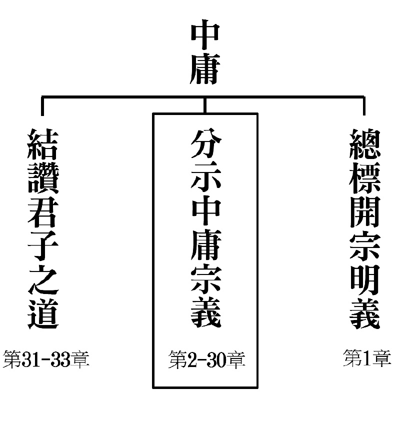

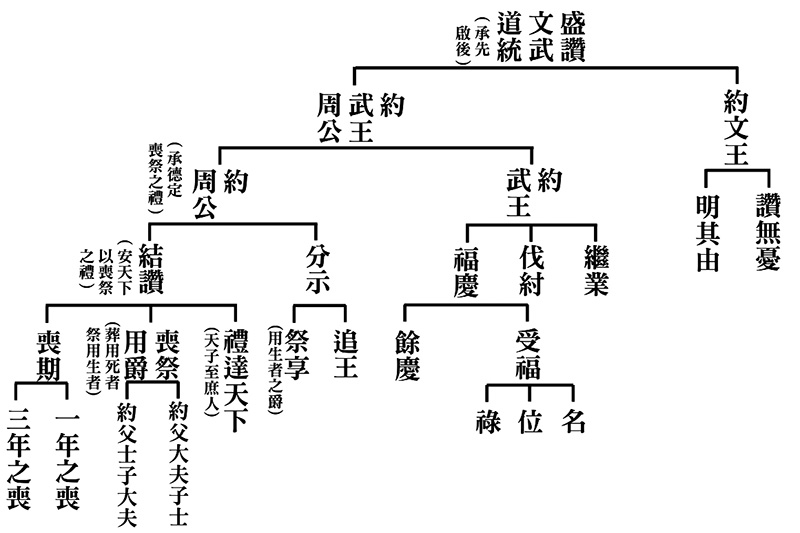

## 藝術賞析

### 孔門七十二賢淺說(四十五) — 榮旂

圖：江逸子、文：時哉

樂教六藝養身心

抒發鬱悶笛聲吹

孔子彈琴表心聲

發而中節謂之和

榮旂，字子祈，孔子家語稱為榮祈，字子祺。春秋末年魯國人。榮旂於孔門中，屬於後起之秀，崇尚德行，是位有修有為的學者。性情敦厚，言行謹嚴謙遜，深受同儕敬重。

榮子祈與人論學，總是真心誠意、推誠相與，做學問的方法是多聞、多識、多反省。態度中懇，從不急躁，處處自問是否合於義理，合乎仁義則從之；不合則存保留態度。發覺過錯，勇於改過。即使心中遇到橫逆的事情，總是私下古琴或者吹簫，來排遣心中的鬱卒，從不遷怒，更不發牢騷。

榮旂在孔門七十二子著稱於德性。宋高宗對榮旂讚揚：「伯茲雩婁，務學實著，三千之徒，七十是預，匪善莫行，惟德乃據，紀於前書，式彰厥譽。」說榮旂受封雩婁伯，務實學業有成效，孔子有三千弟子，他列在七十二賢之內，行為上不善不行，只做好事，任何言行都以道德為依歸，古籍上有記載，在此表彰其榮譽。

梅詢稱讚榮旂是「聖人之門，學者洗洗，彼美子祺，行修志淳，異端茲害，微言服勤，格於我宋，侯封是新。」孔子的門徒，有學識者多，那位美好的子祺，德行修為讓人感覺美好，心志善良純樸，遇到有非道之害，也能發自內心遵行孔子的言論。到了我宋朝，加封新的侯爵(厭次侯)。

榮旂於東漢明帝永平十五年從祀，唐玄宗追封為雩婁伯，宋封厭次侯。

畫中的榮旂，面容愁苦，或者是自身遭逢逆境，或者是對時事變局的憂心，手中拿著笛子，表徵他有音樂的素養，藉著音樂的陶冶來撫平心中的鬱悶。

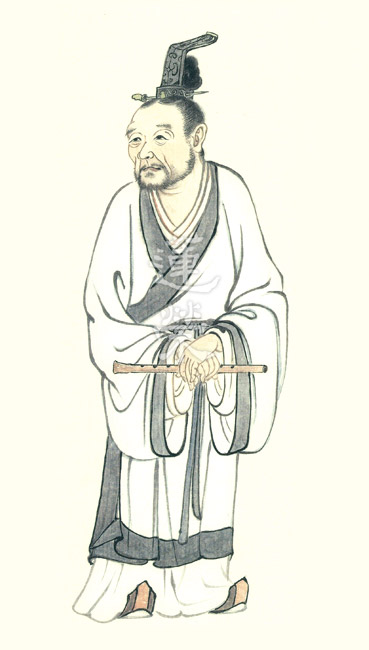

### 孔門七十二賢淺說(四十六) — 縣成

圖：江逸子、文：時哉

孔門弟子臥虎藏龍

出類拔萃魯國菁英

進退合宜趨吉避凶

助成教化聖道流通

縣成，字子祺，史記仲尼弟子列傳正義：縣（音玄）。春秋末年魯國人。子祺為人耿介，堅守志節，不尚苟合。縣子祺師事夫子有所悟，豁然影響其生命氣質，養成澹泊而積極，學養榮通於大道，堪稱孔門的楷模。

縣成是有美德的人。宋高宗贊揚縣成：「子祺安雅，擅譽魯邦，啟祚鉅野，煒矣風猷，時哉用捨，出倫離類，後學是假。」是說縣成在進退適宜，態度安正優雅，進退適當，在魯國享有盛譽，唐朝時封為鉅野伯，教化有成，進退適時，超越當時同儕，在門徒中，是一位有美德著稱的人。

縣成也是有能力的人，他能學會孔子所提倡的德性，奉行微言大義，跟隨孔子學習，也因為他自身的資質很好。石中立稱讚縣成：「異能之士，孔徒實繁，悅服至德，祖述微言，富稟天爵，游乎聖門，追崇之典，胙以侯藩。」說明縣成在孔門中屬於有特殊才能的人，他不止遵行孔子所提倡的道德，還能奉行前人精妙的話，能處於道德與禮儀都能適當合宜，是一位修學天爵之士，跟從孔子學習，受後世追贈加封侯爵，以侯爵之禮奉祀。

縣成於東漢明帝永平十五年從祀孔廟，唐玄宗追封為鉅野伯，宋朝大中祥符加封武城侯，明朝改稱先賢。

畫中的縣成，手中拿著鼎，代表對禮很了解，或也是一位瑚璉之才，面相或是幽默風趣，所謂「禮之用，和為貴」。（下期待續）

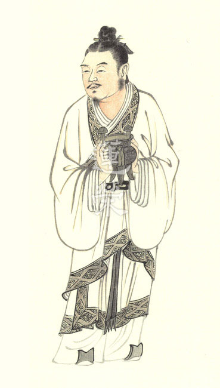

### 華夏精魂千秋（三十七）　明倫史畫　仁孝清廉　吳隱之

圖：江逸子、文：淨域

以身作則除貪風

廉吏能革積弊習

周濟親友能安貧

孝悌廉潔是家風

史畫

吳隱之，字處默，東晉兗州濮陽郡鄄城縣（今山東省鄄城縣）人；生年不詳，約卒於晉安帝義熙九年（西元四一三年）。生性至孝，清廉守節，博通文史，溫文儒雅。

年少家貧，從不非分妄取。父母先後去世，每思之痛哭哀切，鄉人皆以為孝。鄰人韓康伯的妻子，對先生說：「以後如果掌握人事權，就要薦用像這樣的人。」當康伯為吏部尚書時，即向朝廷薦舉，任輔國將軍功曹（助理），哥哥吳坦之為豫州刺史袁真功曹。

廢帝太和四年（西元三六九年），大司馬桓溫第三次北伐前燕，派袁真攻譙、梁二郡，奪石門放黃河水入汴渠，以利水陸撤退。而桓溫孤軍深入糧草被斷，不得不退兵。因袁真未達目的，桓溫只得退走陸路，中途遇襲大敗而歸。桓溫上表治罪袁真，袁真即據守壽春（今安徽省壽縣）叛降前燕。

太和六年，桓溫率兵攻破壽春，俘虜叛亂首領押送建康問斬，吳坦之也株連其中。隱之聞訊拜見桓溫，請求代兄以死。桓溫愛憐他的勇正，赦免了坦之，並提拔隱之為尚書郎。

孝武帝太元十年（西元三八五年），謝安過世，弟謝石任衛將軍，以隱之為主簿。他雖官居要職，但俸祿賞賜都分給親族，自己反而是刻苦自勵，生活清苦地像是貧寒庶民。當時女兒出嫁無粧奩，以賣狗所得充作費用。

後來出任晉陵（今江蘇省常州市）太守，此地多為躲避永嘉之禍的僑民，龍蛇混雜秩序紊亂，給地方官吏提供搜括之便。他任職期間，始終恪守清儉，不以權謀私騷擾百姓，家中甚至連僕人都不用，事務全由妻子一人承擔。

廣州一地偏遠，歷來刺史多貪贓枉法，為革除這一弊病，又特命隱之為龍驤將軍、廣州刺史。上任後更加清儉，以青蔬魚乾為食；居家以竹簾作屏風，席上不鋪坐毯。州吏敬畏而不敢妄貪，嶺南積弊從此改正。

任職期滿回都城健康時，什麼東西都沒有帶，遷官中書侍郎，累官至御史中丞。孝武帝要為他營建屋宅，拒絕而甘於住在茅屋小宅中。有子吳延之為江州鄱陽郡（今江西省鄱陽縣）太守，承襲父親清廉之風；其餘子弟所學或不如，但孝悌潔敬如父，可謂一門孝廉。安帝義熙八年以年老退休，帝授以光祿大夫、加金章紫綬；次年病亡。

圖解

吳隱之一生清廉，無論官居何處，所住的都是茅屋小房。當累官至御史中丞時，孝武帝實在看不過去，主動要為他營建屋宅，但都為他所拒絕，這種清廉之風真是令人讚歎。

他的清廉該怎麼圖示呢？江逸子老師特別就「賣狗嫁女」籌備粧奩一節入手。圖中的茅屋瓦房四堵蕭然，屋中沒有藝品鋪陳，擺設的僅是草蓆竹簾等物。然而，時任謝石衛將軍府主簿的他，生活怎會如此窮酸呢？

主簿一職起設於漢代，其性質如現今的主任秘書。若在縣府，為區區九品官的幕僚，但在東晉的衛將軍府內，則是統管文事位高權重。衛將軍乃二品要員，位在三公之下，掌理京師禁衛軍，可見當時吳隱之的官俸不少，但大部分都移濟親族了。兩袖清風之人，絕不貪枉非分之財，所以嫁女兒時，連個陪嫁品都要賣狗才能籌得。

圖中畫的吳隱之住在茅草屋，只有竹簾做屏風，所坐的草蓆上沒有厚褥墊子，看似貧窮，但所展現的志節，卻是清遠貴氣。真正貴氣的人，不從房舍衣馬中展現，而是經由厚道、善良、守信、謙虛、正直、堅毅、廉潔等人格特質中，隱隱地散發出來。

圖中或向女兒說可以賣狗籌辦陪嫁品，手指向那隻聞聲回頭看的狗，妻子也順著手指望向那隻要被賣的狗，整幅圖有嚴肅的一面，也有表現有趣的一面。（下期待續）

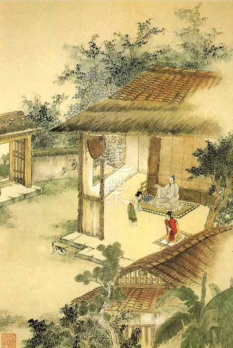

### 道藝春秋（九）　大孝知親三讓天下　泰伯

圖：江逸子、文：心若

讓位無痕民不知

天德巍巍吳泰伯

仁心君子誰能似

春秋眼力知大德

泰伯，是周太王長子，有兩個弟弟，仲雍跟季歷。泰伯自號句吳，為春秋吳國的始祖。

江逸子先生畫中的泰伯，手握一卷竹簡，身著中原華夏衣冠，顯示他來自文明之地。後面的背景，從遠方的小山與腳邊的雜草叢生，可見所在之處偏遠蠻荒。泰伯站在水邊，江先生細膩地描繪了水邊叢生的蘆葦與粼粼水波，而水波和後面的小山之間，什麼都沒有畫，自然的留白，這一片空白就是吳越地區的太湖，此為中國水墨留白的藝術，不畫出來，就能意有所指。整幅畫不只畫出泰伯，更帶出泰伯將北方周朝的文化帶到南方，將禮樂文明帶到荊蠻之地，教化吳地，經過千百年累積，江蘇得以成為文明薈萃所在。泰伯的功績，即使吳國滅亡之後，仍然保持影響力，現在談到最具代表的中華文化，江蘇仍為第一。

當初泰伯從北方來到吳越之地，背後有一段非常精彩的故事。話說泰伯的父親古公亶父是殷商時，西北方的諸侯。鄰近外族狄人常常侵擾擄掠，古公亶父不願互相殺伐死傷人命，便讓出居住的豳地，遷徙到岐地去。因為古公亶父慈愛人民，大家感戴恩德，舉國扶老攜幼跟隨遷徙。再加上鄰國人民也聞風而至，就共同在岐地營建了城郭房屋安住。古公亶父更進一步改變了戎狄粗劣的風俗，建立起良好的各種制度，國人得到安居樂業，相處和睦融洽，不斷歌頌古公亶父的仁德。

古公亶父有三個兒子，老大泰伯，老二仲雍，老三季歷。季歷的兒子名叫昌，也就是後來鼎鼎大名的聖王周文王。依照當時的宗法制度，王位理應由嫡長子泰伯繼承，最後古公亶父卻是傳給了老三季歷，再傳給季歷之子姬昌，什麼緣故呢？

據說周文王誕生的時候出現了祥瑞之兆，祖父古公亶父非常欣賞疼愛這個孫子，曾說：「能夠成就興盛的聖王功業，非姬昌莫屬！」泰伯與仲雍得知了父親的心意，雖然表面上父親完全沒有表露出來，臨終時也吩咐一定要泰伯繼承君位。然而泰伯做為一個孝子，清楚知道父親真正的心意，仲雍也和泰伯心意相通，於是趁著父親生病，假借上山採藥之名，拜別父親，逃到南方。為了顯示決心還「斷髮、文身、為夷狄之服，示不可用。」讓自己失去繼承的資格，使得王位不得不傳給三兒子季歷，再傳給姬昌周文王。因而有了泰伯「三讓天下」的說法，三在中國古代代表「多」的意思。《論語》上孔子也稱讚泰伯說：「泰伯，其可謂至德也已矣。三以天下讓，民無得而稱焉。」孔子稱讚泰伯的道德可以說是到了至高處，曾經以天下三度讓位給季歷，第一次讓是為了躲避王位而告別父親到南方，第二次讓是父親過世，泰伯回來奔喪，但不接受繼位，第三次讓是季歷還是推位給他，泰伯言已在吳越之地，依當地風俗而斷髮文身，此種形象在中原是受到刑罰之相，不可為宗廟社稷之主。泰伯始終沒有顯露他讓國的痕跡，他保全了父親的慈愛，又能保全父子兄弟的感情，這種崇高的德行，一般人無從稱頌他的至德。

泰伯不惜毀傷身體髮膚，也要辭讓王位。明明可以做周家開國之君，但他不做，而是毅然決然去度化蠻荒，把位置讓出來。泰伯的退讓一方面成就了文王，另一方面也成就了自己。成就後來一統天下興盛的周朝，所以《論語》才說讓天下，文王武王的天下是泰伯讓出來的，而泰伯自己也成就了一個吳國與江蘇的文明。真正的「讓」，看似失去，實則為成全。退一步海闊天空，懂得謙讓的真意，就能留給別人也留給自己更大更多的空間。 （下期待續）

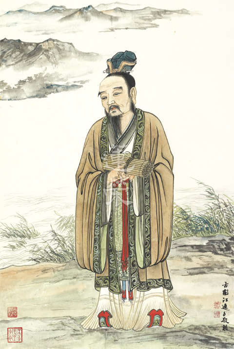

### 以地藏菩薩本願經圖導覽(三)

圖：江逸子、文：唐瑜凌

佛門學子地藏王

由孝發出難思願

所化眾生難窮盡

忉利天宮做擁護

忉利天宮神通品第一之二
此時佛問文殊師利法王子：「依你所見，可知道此會來了多少人？」法王子
**答：** 「以我的神力，千劫測度，不能得知。」佛說：「我以佛眼觀察，也是數不盡。這些都是地藏菩薩已度、當度、未度，已成就、當成就、未成就的有緣眾生。」

今天十方無量世界來了這麼多諸佛菩薩、天眾、龍眾、神鬼等眾，就是為了發起法會，藉著文殊菩薩的問答而發起地藏法會，經中文殊菩薩為佛上首弟子，對佛所言信受不疑，但小果聲聞、天龍八部及未來眾生等，雖然聽到如來的誠實語，心中必定有所疑惑，即便相信接受了，　　還不免生起毀謗。文殊菩薩代替眾生問佛，請世尊廣說地藏菩薩的功德，他在因地修了什麼法門、發了什麼誓願？而能得到這種不思議的果。

佛回答地藏菩薩累積的因緣難以想像，就算將三千大千世界，所有的草、木、叢林、稻、麻、竹、葦、山、石頭、微塵，一物一數，每一物作一恆河，恒河中的每一粒沙作一個大千世界，而每一個大千世界內的一微塵作一劫，這一劫時間內所積的塵數，每一微塵又作一劫，而地藏菩薩證十地果位(有成佛能力)以來的時間太久遠了，時間遠到千倍於上述譬喻的數目，更何況他在因地當中聲聞、辟支佛果位的時間。他所發的誓願一次次加廣，所累積的能力一次次增強，跟眾生結的善緣一次次加深，成為世尊託孤的不二人選。

本品廣說地藏菩薩行願分為兩部分，首先是昔日為大長者，見佛莊嚴相好而發大願，為了度脫一切受苦眾生，盡未來劫，廣設方便，做各領域的學習，增加自己的能力，也做種種佛行事業來得善知識加被，所發的願是：眾生盡得解脫，自身方得解脫。

另一部分也是畫作所要表達的部分，述說地藏菩薩久遠劫前是以報母恩發大心作為他成就的甚深緣起，話說當時是覺華定自在王如來的像法時期，當時的地藏菩薩還是一位婆羅門女，她的母親生平相信神怪，輕視三寶，命終墮於無間地獄。婆羅門女到先佛塔寺供養，問求母親的生處。感應如來於空中發聲，讓其早回端坐念如來名號，即可知道母親去處。婆羅門女念佛一日夜後，忽然夢見自己到一海邊，此處水湧沸，夜叉驅趕罪人，惡獸相競奔食。有一位無毒鬼王稽首來迎，告訴婆羅門女此處是地獄，只有威神與業力才能來到。當她詢問母親的去處時，鬼王告知因妳為母親設供修福，您的母親三天前已生天了。婆羅門女夢歸後，便在如來塔像前立弘誓願：「盡未來劫廣度罪苦眾生。」婆羅門女發心之時，無間地獄罪人，亦得受樂。而當時的無毒鬼王，就是現在的財首菩薩；婆羅門女就是地藏菩薩。

畫作在呈現婆羅門女供養發願救拔其母之事，更彰顯地藏大願是由孝心而始，所謂：親得離塵垢，子道方成就。難怪本經被稱為佛門孝經，孝子是菩薩大悲心、菩提心的源頭。在畫作下方是無毒鬼王執笏稟告婆羅門女此是地獄之處，鬼王雖是貌惡卻是心善的菩薩，從鬼王的形象表徵菩薩的大悲，頭髮豎立彰顯憤怒，或以此相壓制罪人的惡行，在波濤洶湧的海水中，另有一鬼執幡，以彰顯鬼王的氣勢，另有一鬼手捧蓮花做供養，表達對婆羅門女的讚歎，此等孝子如同蓮花，芬芳絕塵。婆羅門的手勢似乎說明，祈請鬼王不必行禮，右手表達對佛禮讚方得佛殊勝加被，能入地獄而毫髮無傷。

畫作上方是婆羅門女母親已生天享福，而主視覺中央一片空蕩，即是婆羅門女發願之時，地獄罪人頓時升天，可想而知下一剎那地獄又充滿罪苦眾生，但那一剎那的喘息，是地獄罪苦眾生千萬劫來唯一的清涼，天庭上祥雲朵朵，音樂環繞，天人合掌恭迎婆羅門女的母親，另有天人手執卷冊，或是已在天上註記名字，在雲霧飄渺處，天宮殿宇相連，呈現的是天人的豪貴莊嚴與受用。所繪不但符合經義，更集合繪者數十年在各領域的繪畫功力，或人物線條、或人物表情、或山水皴法、或花鳥靈動、或衣服擺飾，都令人歎為觀止。 （下期待續）

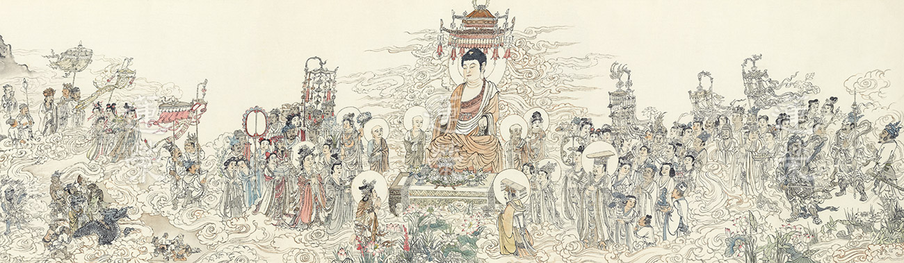

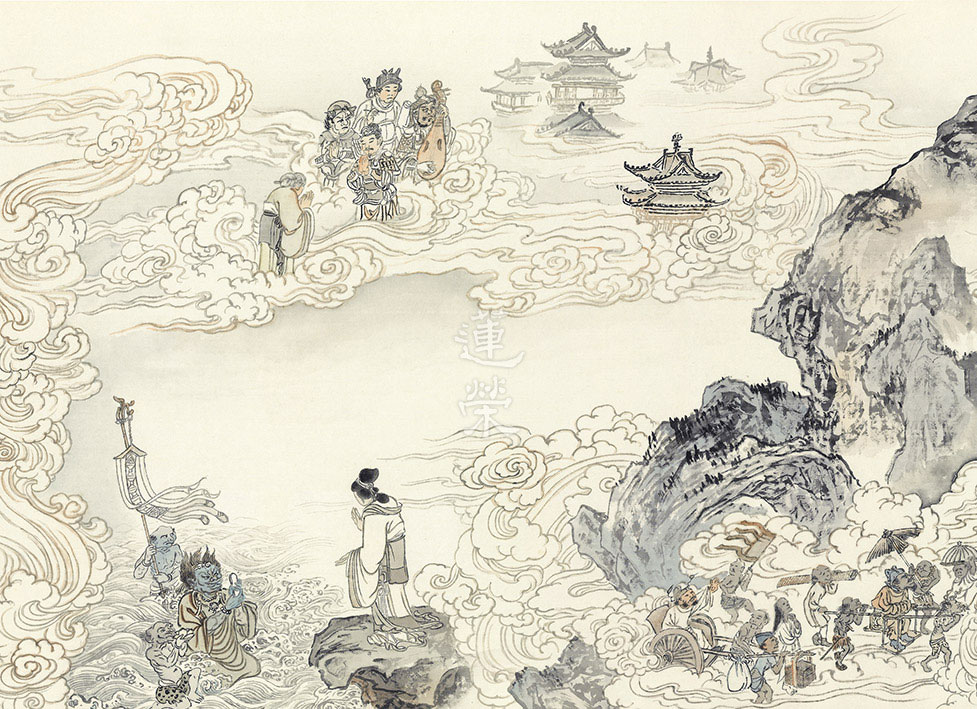

## 活動報導

### 空白期的充實

心若

誰說共學無作為

孔子當年多作為

學誨之外何有餘

經營好命由利他

今年五月，拜疫情席捲之賜，學會遵循政府防疫規定，匆忙結束了實體課程，大家過上窩居的三級人生，疫情籠罩的暑假，可以成為最長的放鬆空窗期，不僅符合防疫政策，大夥兒也樂得輕鬆愉快，但是暇滿難得壽不留，空白期正好是凝聚眾人的契機，也是成長的良機，若能把握這段時間，做完整的規畫、有共同學習的目標，又能扎實的研討複習，對於團體與個人都會是一大裨益。

於是，學會捨棄了寶貴又順理成章的休息充電時間，以邊充電邊放電的方式，賣力地跑向下一哩路。首先上陣的是夏令營

「宇宙探險秘密客」

，邀請國小三年級到高中三年級的大小朋友們參與，報名學員共有四十六位，依據年齡分為小秘密客跟大探險家，於七月每周三、四、五上午上線，當個宇宙真相探險秘密客，共同探討世界運行的軌則，拼出世界真實樣貌的地圖，課程包括「世界的運行有軌則嗎？」「地獄列車直達專區」、「鬼門大開說鬼事」、「你看得道，但你了解嗎？」、「超醜超漂亮，結果完全不一樣」、「Move to heaven上天堂真的好嗎？」、「酸甜苦辣的人生，居然是全宇宙最美好的寶藏！？」、「一起去最快樂的遊樂園」、「這個世界公平嗎？」這些絢麗的課程名稱背後，探討的內容是六道狀況的介紹，由不同的老師們接力上課，帶領學員飛天遁地，最後找到極樂世界作為依止處。每周還有一堂「秘密客說秘密課」，一點發散，無限擴張，每一堂都有開箱驚喜，由每一個參與者共同完成，經過推理挑戰得出答案，開啟同學們思維的學習力，讓人生從有限賽局，到無限思維、無限賽局。

對參與的師資而言，這次暑期線上課可謂刻骨銘心，籌備期短暫，為了抓緊學員的注意力，老師們必須事先熟悉zoom介面，摸索課程形式，並經過幾番開會討論、沙盤推演，才使課程順利進行，大家互相觀課，達到共備與協作。

最後一堂總結，讓孩子們討論，你覺得這個世界公平嗎？如果我不相信因果，我會成為怎麼樣的人？如果我相信因果，我會成為怎樣的人？如果世人不相信因果，世界會變成什麼樣子？如果世人都相信因果，世界會變成什麼樣子？一個月下來，孩子們都有了很棒的答案。

*小朋友有充實的課程，大人也不惶多讓，在馬來西亞學長熱情的請法下，學會特別開設每周日上午的線上佛學講座，講授宗喀巴大師的*

《緣起贊》

，並以法尊法師翻譯解釋的文本為教材。佛的說法中，以宣說緣起最為殊勝。宣說緣起的好處是，能以緣起為正因，通達空性，回過頭來，以空性為正因，通達緣起，幫助我們了解世間的關聯，了解世間萬法的生起，幫助我們從緣起中通達非實有性、觀待性、關聯性。課程從六月二十七號跨度到十月三號，相當於一季的課程馬拉松，相信有跟上腳步、堅持學習者，佛學程度都已晉身到下一個檔次。

除了線上課程的加冕，佛學全新網站

【蓮榮網上學】

經過緊鑼密鼓的籌備製作，也在八月隆重推出，本網站會逐步充實學會過往的各類佛學課程，蓮榮會刊在網站中也會有全新的呈現，還有各類方便大家學習的操作設計，絕對是一個使用舒適、方便又充滿內涵的好園地，歡迎大家多多使用、交流回饋。

一百一十年第一學年度開學，因為疫情尚未明朗，學會決定繼續採用線上教學模式，經過暑假的洗禮，大家駕輕就熟，研討小組也都運行良好。十月四日開始，每周一晚上開設佛學線上課程

《修心七義論》

，本論是最完整的菩提心修學法，是伽喀瓦大師的傳承，由弟子們以偈頌的方式整理記載，菩提心的修學法要上溯到金洲大師跟文殊菩薩的傳承，眼前特別是頗邦喀大師最心愛的弟子—昂旺朗吉堪布的講授。修學菩提心有七種要義的修學法，如此才能發起菩提心、維持菩提心、鍛鍊菩提心，將所修學的廣大行及諸多的甚深見都轉成成佛的資糧，成為佛果的莊嚴。菩提心的引發是所有福報、所有功德的泉源，本論以淺顯易懂的方式，讓我們容易生起覺受，又能深入法義。

每週六晚上一樣是啟蒙線上課程時間，定名為

「時哉週末派」

，豐富內容薈萃，敲擊孩子們的心房，分為三個班級，學而班（小一至小三）的課程是讀誦論語、聽佛教小故事，每周都有不同主題，讓孩子們多方粗淺地認識佛學，觀念扎根。士心班（小四至小六）以論語課為主，幫孩子們建立正確地知見，培養看事情的眼力。學思班（國一至高三）有兩門主軸課程：歷史新思路及中文探險趣—古文篇，由於近幾年課綱略古詳今，這兩門課程幫助同學們以不同角度宏觀、微觀歷史與中文的奧妙。

隨著疫情漸漸解封，活動也跟著回溫，學會於十一月七號及十四號各舉辦一場故宮巡禮，鑑於故宮博物院端出睽違十年的

「鎮院國寶—范寬、郭熙、李唐」

，限時展出三位北宋殿堂級畫家的山水畫：《谿山行旅圖》、《早春圖》及《萬壑松風圖》，是下半年度必看的大展，這三幅畫有劃時代的指標意義，筆法各有千秋，也影響後續文人及哲學思想上的發展。除了三幅巨作外，

「文人畫的最後一筆—溥心畬書畫特展」

也非常值得一看，溥心畬融合諸家特色，發展出秀逸淡雅、溫潤清新的風格，加上他的人生閱歷與思想，耐人品味。

以上就是學會從五月疫情後到今年底的概況，線上儒學、佛學直播及預錄課程持續更新，面對外部的不確定，內部的提升與突圍就很重要，當我們聚焦在未來的目標以及現階段的成長時，文化產業反而是最能鍛鍊心志與面對變局的良藥。

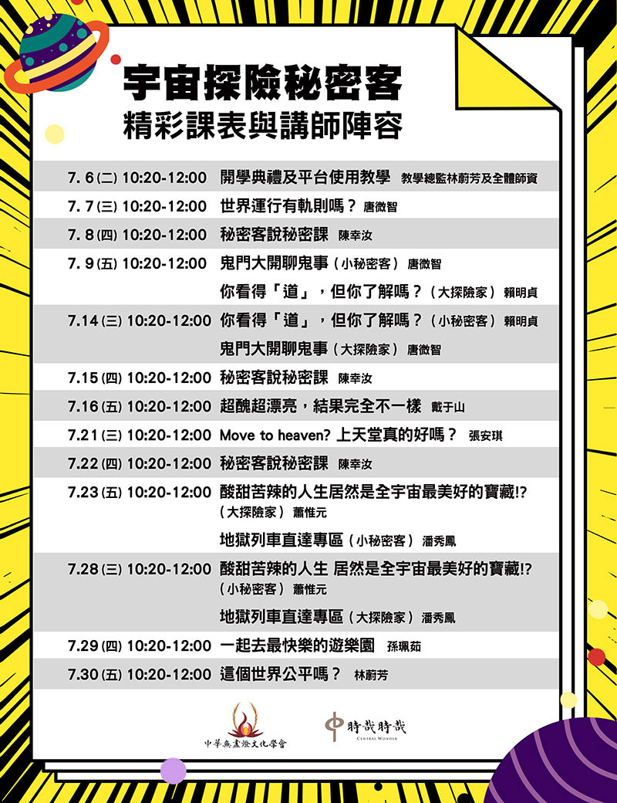

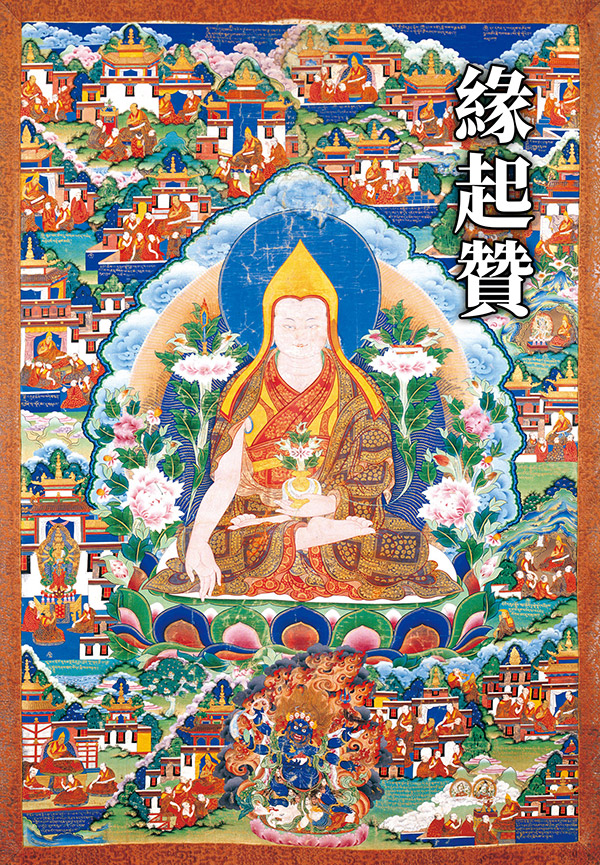

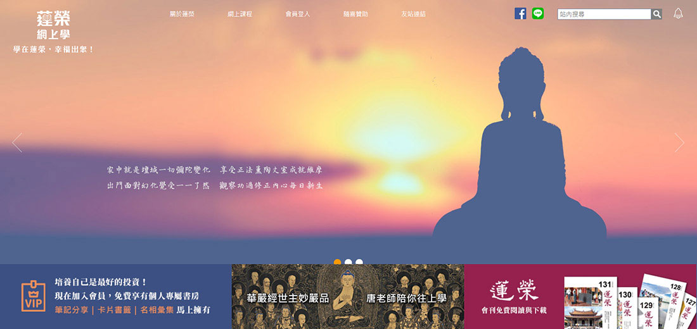

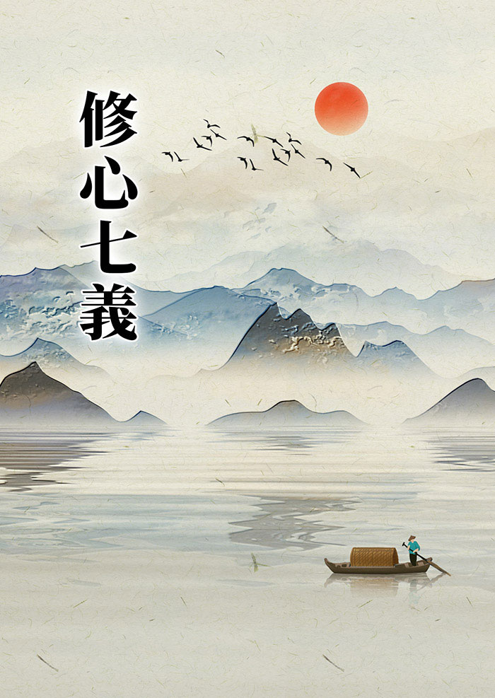

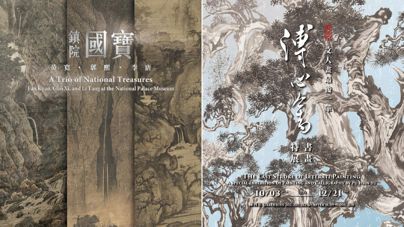

### 風雨一盃酒—孔德成先生傳記紀錄片首映

*編輯部整理*

歷史大戲的推出　悲歡離合的時代

高潮起伏的劇情　朝代最後的公爵

民國正統的樣板　尋常百姓的快活

誨人不倦的生涯　酒霸歡樂的宴席

莊周達生的豁然　平淡歸去的落幕

風雨一盃酒—孔德成先生傳記紀錄片在眾人引頸期盼下，終於大功告成，並於二○二一年十月二十八日在臺北孔廟首映。

孔德成先生是從風雨中昂首闊步走出來的人物，一出生便是傳奇。在江寬海闊卻難以容身的時代，先生輾轉流離，活出波瀾壯闊的人生，留下一種高山仰止不隨境轉的儒者之風，引得後人無限緬懷追思。

猶記二○一九年時，我們在國父紀念館博愛藝廊及東西走廊舉辦了儒者之風—孔德成先生百年紀念展，展出先生珍貴的墨寶、日記、書信、手稿、印信以及多幅老照片、孔府的文物等等，讓大眾能夠進一步認識孔德成先生這位富有學養、具有人格魅力，對社會國家有大貢獻的人物。在展場一隅，電視牆上播出孔德成先生紀錄片濃縮精華版十五分鐘，成為觀眾聚集駐足處，短短幾分鐘，帶領我們重啟一代儒者之風，歲月動盪，先生背負著血統與道統的使命跨步向前，大時代過去，眾人沉浸在「誰言世路如滄海，闊地寬天流落身，我醉狂歌君莫笑，憐君同是客中人」的無限感慨中。

相較於靜態展，文物、墨寶等在展出後回歸各收藏者手中，再難聚首，紀錄片是一種動態的沉浸式體驗，從影片中珍貴的歷史片段，我們能一睹先生的談吐與風采，而採訪者的描述，猶如一顆顆閃耀的珠子散落，考驗導演、製片、剪輯師串線的功力，本片的題材、主旨、意義、觀點、立場等等，都經過反覆的淬鍊取捨，能夠千古流傳。

籌拍孔德成先生傳記紀錄片的因緣要從二○一六年說起，當時對岸要拍攝大孔府連續劇，需要孔家授權同意。大成至聖先師奉祀官孔垂長先生睿智決定採納學會建議，拍攝正式官方紀錄片，保留珍貴且正確的史實以正視聽，如此，不管外界如何做文章，正統的歷史就用紀錄片說話。孔垂長先生委託中華無盡燈文化學會籌組拍攝團隊，於是我們跟李導演、蔡導演再續前緣，進入緊鑼密鼓的籌畫與拍攝。

紀錄片從組織歷史研究團隊進行半年的田野調查出發，爾後來回兩岸的人物專訪拍攝，乃至腳本編纂剪輯，歷時三年完成，在二○一九年先生百年冥誕之系列活動中於臺北光點華山電影館試映。期間承蒙蒞會學者專家提出多項寶貴修改意見，團隊復又經兩年的訂正、潤飾，終於在二○二一年全片殺青。整部紀錄片展現孔德成先生的一生，有大時代的磅礡，也有讀書人的風骨。從歷史的高度上，更呈現先生在文化傳承上的深厚意義。

首映會擇於十月二十八日在孔廟播出，別具意義，因為當天正是孔德成先生逝世紀念日，只是受限於疫情管制，謹具函邀請與本片相關的人士參與，與會的各界賢達，包括參與紀錄片受訪者、孔德成先生的高足們，各界學者專家、慈濟基金會、社團法人中華孔氏宗親會、中華孔子後裔儒學促進會、山東同鄉會、福智文教基金會、儒道研究協會及製片小組，共九十幾位蒞臨參加。

在影片播映前，影片出品人中華大成至聖先師孔子協會會長孔垂長先生先偕同孔府家屬與製作團隊在臺北孔廟大成殿舉行簡單莊重的告廟儀式。在劇院中再特別向與會的來賓表示：先祖父德成先生自幼紹承聖裔使命，勤勉向學。在動亂的時代中屢次遠離林廟，手足離散而不得相聚，其心中的沈鬱憂思是世人不容易見到的一面。尤其因為兩岸隔絕，眾人多各自了解先祖父生平的一半，未能景仰全貌，不免令人慨歎。甚而有道聽塗說，以偽亂真者。所以，製作一部客觀詳實的紀錄片，有其迫切性與必要性。紀錄片歷時近六年完成，不只對於全球孔氏族人是一大貢獻；對於了解大時代的經典人物，更是裨益史傳甚多。適此首映之日，孔垂長先生謹向所有工作團隊、受訪的師長以及提供影像素材的人士與機構，致上由衷的感激。

觀影結束後，監製中華無盡燈文化學會唐瑜凌會長表示：中華無盡燈文化學會的指引導師李炳南教授，是孔德成先生奉祀官府的主任秘書。正由此因緣，本人深感孔家在文化傳承上的重要意義。幸有李中旺、蔡靜茹兩位導演願意承擔孔德成先生紀錄片的大任，拍攝過程既尊重史實，亦表現戲劇張力，歷經多年終於完成。今日首映，本人內心澎湃，實難以語言形容。紀錄片中展現在悲歡離合的時代下，一位世襲貴族子弟，如何在新舊思潮與政治紛亂中，堅持弘揚優良中華文化，並屢為國家做出外交貢獻。孔先生不僅值得我們景仰，更值得我們學習與追隨。

紀錄片導演李中旺先生表示：非常感謝孔會長、孔媽媽及無盡燈學會唐老師、林老師的信任與支持，才能在諸多困難下完成此片。由於這次的參與讓拍攝團隊的所有人，對孔先生由一無所悉到深受感動，是我們最大的成長。整部紀錄片以民國史為背景，呈現孔德成生先在時代的波濤中所堅持的士人風骨。一部紀錄片最期盼的，就是有更多的觀眾來緬懷與感受人物的生命歷程與內心世界。今天的首映是第一步，希望未來有更多的方式與管道讓更多更多的人看到這部片，這是我們最大的心願！

貴賓孔德成先生門生中央研究院曾永義院士表示：今天我已八十多歲了。如果說有些成就，都是老師當年所傳授給我們嚴謹勤勉的治學態度以及誨人不倦的教育精神。回想當年老師滿臉喜悅的和我們分享長孫垂長誕生的消息；而今看到孝順的垂長能以這部片獻給疼愛他的爺爺。這就是老師詩禮傳家的實質表現啊！隨後，葉國良教授也歷數了老師逝世以來，門生故舊藉由紀念追思、學術會議、文字傳記、法書文物展、出版全集等各種方式，傳述老師的德業。今天紀錄片告成，則更能為大眾打開一個了解老師一生努力的渠道，不再限於學術或政壇上口耳相傳而已，的確是一重要的里程碑。

這次首映，特地選在臺北孔廟舉辦。孔廟陳宗緯執行祕書表示：孔德成先生自遷臺以來，除出國訪問講學外，皆於臺北孔廟接續奉祀孔子的聖裔重責。直至髦耋體衰，方交付孔垂長先生承繼。職是之故，先生紀錄片能於臺北孔廟首映，實深感榮耀。更冀望不久的將來，經過一定的授權與規劃，本片能成臺北孔廟常態播映的影片，讓更多來訪的民眾與外賓，得以崇仰德成先生的景行典範。

首映後，未來將經由中華大成至聖孔子協會授權，陸續安排在相關場合對外公開放映。對於廣大群眾，足以補充文本傳記與圖片文物外，更加生動的視聽感受。片中對於先生一生波瀾壯闊的時代逢遇，詳實刻畫；更對其秉承家學、孜孜不倦，致力教育研究的豐偉成就，多所著墨。相信更能透露先生這位末代衍聖公更為淵博、性情的面向。

而孔德成先生這位傳奇人物，跟臺灣佛教其實也有間接的關係，沒有他，雪廬老人到不了臺灣，臺灣的佛學及儒學的推廣，也不會產生後面驚天動地的變化。

事先都不知道會發生什麼事的人生，隨著前世的願力及所造的業，踏上此生的挑戰，把握來臨的機運，用盡人生最大的努力，勇於承擔，加上事後的回向，相信來生的可觀就在這一生決定。

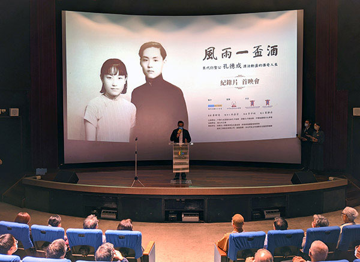

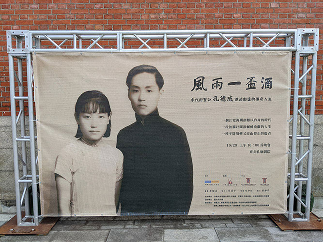

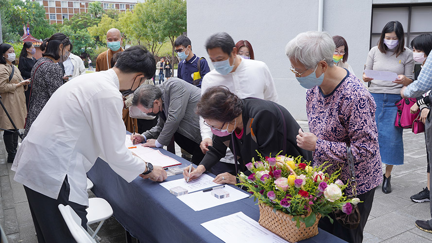

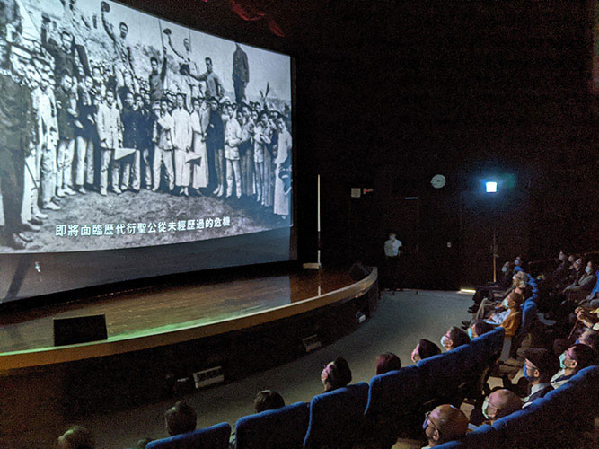

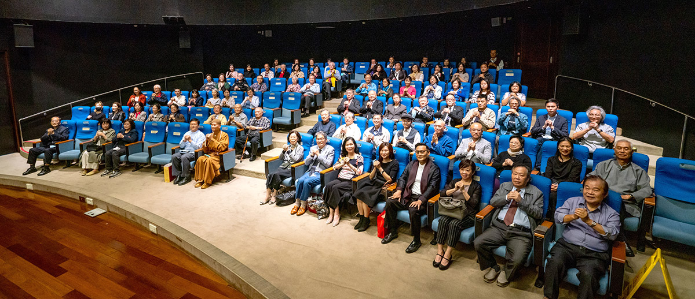

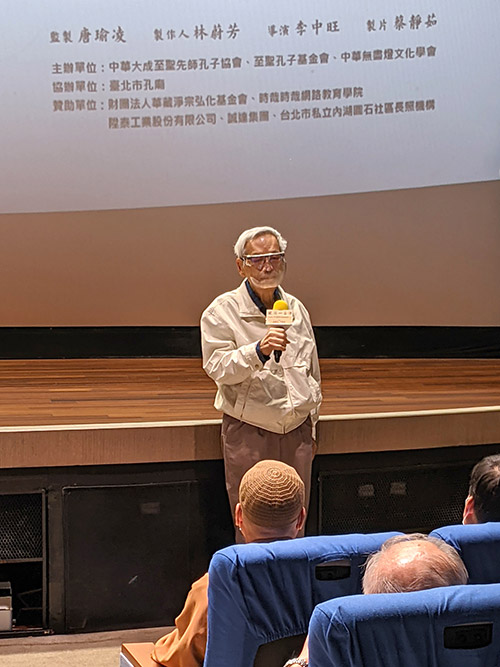

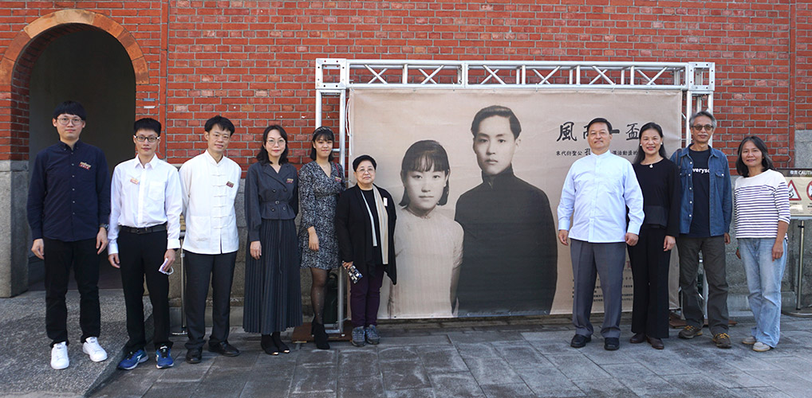
