# 第134期
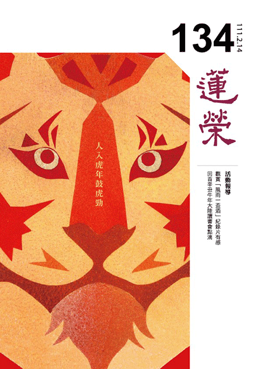

## 社論

### 壬寅虎年新展望

*編輯部*

由虎卦爻看改革

煥然一新真改觀

大人虎變功德巍

政教能令氣象新

歲月如梭，很快又到了新的一年。壬寅虎年開新春，《蓮榮》獻上新展望：祝福Covid惡疫清零，二○二二好事成雙。

講到虎，《易經‧革卦》的九五爻，就談到「大人虎變，未占有孚」。

革卦是從井卦來的，即上卦是水，下卦是風，所謂「水風井」。井卦很形象地展現出人困於井中的情形。好像去年的疫情，全人類都被困在疫井之中，必得要有適當的變革，才有脫困的可能。

在〈序卦傳〉裡，孔子說井卦之後就是革卦，意思是有效的改革可以幫助人們脫困，如能力的增強、時勢的判斷、掌握有利的條件等，總之都需要通過變革，方能帶來新氣象。

革卦九五爻的「大人虎變」，是指老虎在夏季會脫毛，到了秋季會長出厚毛來避寒，於是展現出美麗嶄新的斑紋。而華美的虎斑，就是《易經》中所謂的「虎變」。

「虎變」意味著變革之後的風采，好比《詩經‧大雅‧文王》說：「周雖舊邦，其命維新。」周朝雖是古老的諸侯國，但經過改革之後，擁有新的天命，展現新的氣象。

「未占有孚」的「孚」意指「信心」，由於變革的成果，使得人們對新氣象充滿了信心，乃至對造成改革者的恆心毅力與人格特質深深肯定。

改革者由於能掌握時機，又有實質能耐，於是能果決地做出變革，帶動身邊的人們燃起希望心火，對於未來充滿信念，於是展現出整體幸福的樣貌。

例如阿爾巴尼亞（Republika e Shqipëris）的首都地拉那（Tirana），過去是一個治安動盪且市容骯髒的城市。在二十世紀末，地拉那給人的印象就是一個破敗不堪、腐敗黑暗的都城，到處都可以看見社會的陰暗面。就在兩千年千禧年，一位名叫艾迪‧拉瑪（Edi Rama）的新市長接下了這座城市，他決定為這座城市帶來變革。就像「大人虎變」般，艾迪‧拉瑪親自畫出草圖，再結合藝術家與當地的美術學校學生，要為城市賦予全新的色彩；他們運用鮮豔且誇張的圖案，為一棟棟陳舊破敗的樓房換上新貌。

首先市民們訝異於市容的變化，接著逐漸展露笑容，紛紛討論起眼前城市的新氣象。後來市民開始對自己居住的城市抱有信心，店家移除了窗戶上的防盜網，以配合市容；人們減少隨地投擲垃圾，共同維護環境；警力雖然沒有增加，但市民認為城市變得更安全；沒有強制規定，人們都紛紛恢復繳稅。整個城市就在艾迪‧拉瑪市長上任之後，幸福感大大提升，一間間咖啡館展現出昔日的熱鬧，一個個居民們樂意為城市的教育與展望提出自己的建言。

彖傳上說，隨著「澤火革卦」之後就是「火風鼎卦」，也就是通過變革，自然轉禍為福，革故鼎新。象傳方面，孔子說：「大人虎變，其文炳也。」老虎脫毛重長之後，虎斑燦爛，非常顯著。

五年後，地拉那由於稅收增加到原來的六倍，商業活動增長為原來的三倍，拉瑪市長將稅收用到公共開發項目，拆除公共用地違法建築五千餘棟，並栽種四千多棵行道樹，使得整座城市成為世界知名的觀光景點。

中國古代的秦朝後有文景之治，隋朝後有貞觀之治，那麼鼠年、牛年之後，甫來乍到的虎年，將要帶給人們什麼樣的新展望呢？

疫情肆虐增添人們許多苦難，同時也給了人類警醒，面對疫情成為常態化的世界新局，人人都應抱有誠惶誠恐的心態，謹慎觀察時局，並順勢而為，為自己賦予不同的「虎變之色」。

我們可以通過靜觀自得，賦予身心除去煩惱習氣的顏色；通過好學進取，賦予思維殊勝認知的顏色；通過適應變革，賦予苦難堅韌無畏的顏色；通過中道慧觀，賦予未來因禍得福的顏色。

壬寅虎年，祝願我們都能：虎變有福，革故鼎新！

## 佛學覽幽

### 菩薩清淨的行持—華嚴經淨行品（五十）

*戒慧講述、編輯部整理*

一地之長者為民抉擇是非

一國之大臣為民開創風氣

見長者大臣當願眾生看齊

菩薩行不離世法而發願行

丙二、指事顯因答其徵因

丁一、總徵

丁二、別顯

戊六、乞食道行時願（五十五願）

己二、所睹事境(十九願)

己三、所遇人物（有二十四願）

己三、所遇人物：長者、大臣

經文：若見長者，當願眾生，善能明斷，不行惡法。

第一個願所依，能發願的是菩薩，菩薩是依著若見長者的這件事情來發願。第二個願所為境，能願的是菩薩，所願的是眾生。第三個是願所成的利益，希望眾生能夠得到善能明斷，不行惡法。菩薩除了能夠得到善能明斷，不行惡法之外，也能夠三業離過成德，成就佛的十力、四無所畏及十八不共法。

接著從四種面相來觀察，第一個是隨喜，眾生若能善能明斷，不行惡法該有多好。第二個是發願，即我希望眾生善能明斷，不行惡法。第三個是承擔，我相信我能幫助眾生達到這樣的願，達到善能明斷，不行惡法。第四個是祈求三寶加持，加持我能夠幫助眾生得到善能明斷，不行惡法。

眾生要善能明斷，不行惡法，這一段才是重點，若眾生已經能善能明斷，不行惡法，當然很隨喜他，若眾生還沒做就發願希望他做，眾生需要你度他的時候，就要去度他，如果是去承擔，就需要三寶加被，以上是四個面相的觀修。

此處的長者，依照會性法師的說法是世間有名望、品德尊貴的人，稱為長者。智者大師在〈法華文句〉裡面提到，長者有十種德行，一是姓貴，即種族高貴。二是位高，比如那些大臣告老還鄉，他就是一鄉的長者，威力比縣長還要大。三是大富，大富可能是家中幾代的積業、龐大的財產，就像全曲阜城的稅收都歸孔家，所以他是曲阜的長者。四是威勢，因為他家世好，可能是位高、大富，所以具有威勢，縣長要推行事情的時候，也需要長者幫忙。雪廬老人說，到一個地方，要先拜見地方長者，因為長者懂得地方的生態，有地方的人脈，《論語‧公冶長》說：「子謂子賤，君子哉若人，魯無君子者，斯焉取斯。」宓子賤懂得跟地方的長者相處，故能把地方治理得非常好，身不下堂而地方大治。五是智深，即智慧很高。六是年耆，即此人年紀較大、輩分較高。七是行無失，即行為清淨，八、禮備即禮儀備，是上人所歎，此人連國家都知道，連政府當局都知道，在地方上有這種影響力，例如管寧的「或為遼東帽，清操厲冰雪」，他回到山東講學的時候，朝廷都知道他，他的名望直通中央。又例如朱熹，在閩北上課，他的名望直通中央。十是下人歸敬，即一般老百姓都願意來歸順、歸化他，因為他能夠出錢替人排憂解難，遇到問題的時候能夠一言九鼎，家鄉遇到荒年的時候，可以把穀物拿出來賑災，遇到護持學堂的事，也可以講學來教化當地，等於他在家鄉比縣老爺還有威力。

會性法師說，長者最起碼要具備三個條件，一是名盛，在地方上富有盛名，講話很有份量，能判斷是非，為地方人民排解糾紛，有能力領導地方，受地方老百姓的尊重。再來是德隆，道德很高，前面所說的名盛，不是憑空而來有的名盛，是依著他的德隆而名盛。除此之外，長者還要具備大富，要很有錢，像《法華經》中〈比喻品〉中的長者那般富有，因為富有才有能力做種種的善法，清涼國師的疏鈔說所謂長者即為明斷也，而年高有德，亦長者義。

以上說明了清涼國師所說的十種長者的形象，以及會性法師說的三種形象，為何此處經文「若見長者，當願眾生，善能明斷，不行惡法」，都沒有對應到上述所說？其實會性法師說長者是有名望、有品德、尊貴的人，所謂的德就是他的智慧力，智慧力最殊勝的表現就在於他對法有抉擇力、勝解力，能夠分辨是非善惡，對因果有決定見，能夠抉擇正法，不會似是而非，這種人絕對不會去造作種種惡法。換句話說，長者最重要的是對於法有覺察的能力，能夠知道斷惡修善的重要，而且善於抉擇善跟惡，像了凡先生改過遷善，他的積善都是抉擇出來的，而善能明斷，不行惡法，才能保住他的名聲、功德、富貴，富貴如果不是在斷惡修善上的抉擇，是有災難的，位高如果不是在斷惡修善上的抉擇，位高也是災難。世間很多人得到位高、權重、富貴，如果不是經過抉擇力，都是災難的開始。善能明斷，不行惡法，才是長者應該要有的本質，拿掉這些，上面讚歎也沒有用，下面歸向也沒有用，因為下面的歸向是小人歸向，君子不歸；上面讚歎可能是利害關係的結合，如同地方幫派，唯有善能明斷，不行惡法，才能讓長者的實質意義彰顯，否則名為長者都有過患。

經文：若見大臣，當願眾生，恆守正念，習行眾善。

大臣，可以是古代的宰相，或是現代的部會院長。在清涼國師的疏鈔中說，「守王正法，始曰大臣」。大臣，如宰相尚書之流，皆輔佐國王而理國事者。出家人在外托缽乞食，看到路上有大臣，希望眾生能夠恆守正念，習行眾善，恆常的守住自己的正念，時常行善業，不要忘記善法。就正念來講，小乘人的修行方法是修四念住：觀身不淨、觀受是苦、觀心無常、觀法無我，由前三者來引發出離心，由後者體會自相空，證得出離。八正道的正念是屬於後得位，所謂正念即是內心能夠緣念正道法，及住道法，即是緣念修行的方法。所謂善，在《百法明門論》中說，一個法於過去、現在、未來三世皆能順於正理，能夠利益自己也能夠利益眾生，由此定義可知，所謂的善不是只看眼前，而是要看此事做了之後是否有流弊，此善亦不能光為自己好，還要看是否對天下人都好，才稱之為善。《了凡四訓》中的中峰禪師也認為，所謂善即是有益於人，有益於人就算打人、罵人也是善，若只是利益自己，就算有禮恭敬亦是惡。

我們見到大臣，當願眾生，恆守正念，習行眾善。意思是不要巴結，《增廣昔時賢文》中言「見官莫向前，做客莫在後」，百姓見官是一件很難得的事情，見官員時，要行禮，不能靠太近，不要往前去巴結，做客莫在人後，就是不要遲到，不要落在後面，讓主人一直等，比如說主人辦婚宴，六點開席，七點還沒有來三桌，主人的心情是心急如焚。《常禮舉要》中說，做客一定準時，而且要提前到，這就是懂得人情世故，以上是第一種講法。

「恆守正念，習行眾善」第二種講法是，善法是利益有情，而且會帶來他眼前的安樂、未來的安樂，但是此處的習行正念是說，做善的動機、方法以及結合共識，這些他都能恆守，恆守就是他有這樣的觀念。恆守正念，正念有兩種講法，一是我念佛，緣念的這個境界，叫做正念，第二種的講法，如果按照止觀門的講法，正念是修學法你都記得住。念，在《百法明門論》的定義是「於曾習境，令心明記不忘」，他對過去所學的教法都沒忘記，他做善的時候，知道怎麼做，例如他學過布施法，在布施的時候他就知道怎麼做，他知道動機如何安立、共識怎麼建立、觀修如何觀、儀軌如何執行，回向如何圓滿等。八正道的正念的那一分，就是在世間當中，他要做什麼事情的時候，對於他所要做的那些概念，是沒有忘失的。正見是根本位，正念是後得位，正語、正業、正念、正思維都是後得位。

雖然見到大臣不要拍馬屁，可是基本的恭敬一定要有，因為他代表國家來執行國政，我們必須對他所代表的職位尊重，古人講究肅靜迴避，就是基本的尊重。一個大臣如果恆守正念，習行眾善，他所做的善法是老百姓比不上的，他帶來的風氣影響，是老百姓無法達到的，《論語》上說：「君子之德風，小人之德草，草上之風，必偃」，大臣握有公家資源，他的職位具有影響力，人家說公門中好修行，像子產在鄭國當宰相，鄭國夾在楚國跟晉國之間二十二年，可是楚國也不敢輕視鄭國，晉國也不敢輕視鄭國，所以不是國家小就一定弱、一定會被欺負，關鍵不在國家的大小，關鍵在有沒有人才。子產過世的時候，孔子也傷心地流淚，說子產是惠人也，子產是帶來老百姓利益的執政大夫，是一個宰相之才，有宰相之器度。

可是很多大臣還不是貪贓枉法、徇私舞弊，為何說一定都是恆守正念，習行眾善？而且恆守正念，習行眾善也不一定要跟大臣學，世間很多人，他的行善是很有勇悍心的，為何一定要跟大臣學？這段很不簡單，孔子說「所謂大臣者，以道事君」，名要符實，名言為大臣的，一定是以道事君，大臣在做善法的時候，跟民間做善法不一樣，他一定是很有格局、深度和遠見的，所以當子產推行善政的時候，老百姓第一年反對，歌謠中都希望子產快點死，第二年這樣的歌謠漸漸消失了，第三年的時候歌謠轉為讚歎，說子產如果死的話我們該怎麼辦，可見做善法的時候，不需要去討好人，而是有格局、有遠見來經營善法，善講究的是風氣的影響、團隊的士氣，未來的發展，還有個人修學的增上，帶來的道風。古之大臣很多著眼點，都不是老百姓可以體會的，甚至有些是不會得到贊同的。團體在做善法的時候，一定要有這種格局、見地、共識、承擔、遠見。（下期待續）

### 大乘百法明門論簡說(四十一)

*戒慧講述、淨本整理*

所顯色法歸十一

能顯根識各歸六

二者觀待成能所

皆無自相無一法

論文：第三、色法，略有十一種：一、眼。二、耳。三、鼻。四、舌。五、身。六、色。七、聲。八香。九、味。十、觸。十一、法處所攝色。

色法的定義是變壞及質礙。變壞就是會有成住壞空的現象，質礙是在同一空間中，會互相干擾妨礙。色法可以分為能造的四大與所造的各種色法。四大即地水火風，地是堅硬性、水是濕潤性、火是煖性、風是流動性，世間所有色法都是由此四大所組成，但四大其實也是彼此互相觀待才能成立，比如若沒有堅硬性，也無法顯現濕潤性等，因此四大也無自體性，不可誤認為四大是不可破壞分割的最小粒子。色法種類雖然繁多，約內五根、外六塵而言略可分為十一種。

外六塵是前五識及第六意識所緣的境界，比如眼識緣色塵、耳識緣聲塵，意識所緣稱為法處（也稱為法塵），可分為法處所攝心跟法處所攝色，法處所攝色屬於色法，比如回憶昨天所見到的花；法處所攝心比如回憶昨天看見花時的快樂心情，屬於心法及心所有法的範疇。

根可分為「淨色根」及「浮塵根」，浮塵根即眼睛、鼻子等器官，屬於外六塵；淨色根就如中醫所說的氣脈，這才是真正內五根的範疇，不是識所緣的外六塵，但統歸於色法。淨色根是心識所依，依著根能生識，然而淨色根也需要藉著浮塵根（身體各器官），才能使心識成為能緣，境界成為所緣。根識之間相互觀待，根強則識明，根弱則識弱；心力強弱的轉變，也能使根產生變化，比如修定功者，心力強盛風大充身，甚至能轉變眼根成就天眼通，可見根與識皆無自體性。

再以眼根為例來說明內五根的道理。眼根梵語「斫蒭」，是「行盡」的意思，以眼能行盡諸色境，一目了然，所以名行盡。但其實看是眼識在看而不是眼根，否則如何能夠回憶？此外還可以進一步討論，若見物的是眼識不是眼根，是眼識到所見物的位置見到了該物，還是該物跑到眼識前成為眼識之所見？比如眼識見到花，花仍在原地，並沒有跑到眼識前，而眼識也沒有跑到花所在處，否則眼根與眼識分離，眼根失去眼識，應成為無用之眼根；且若眼識離開眼根，眼識應可回看自己，然而並沒有辦法回看，可見眼識也沒有離開。此外若眼識見花是以移動到所見物的方式看見，那麼看遠物所花的時間，應該要比看近物的時間來得長，但是景物無論遠近，在眼識前都是同時出現。關於此問題，在經部宗的看法，認為是境界（花）的力量使眼識產生影像（花的影像）；唯識宗認為眼識現量所見為影像相分，是本質相分的影像。其實無論是眼識見花、耳識聞聲，或者鼻識聞香等，都是條件具足當下的顯現，所以天眼通者可以見到極遠處的境界，甚至看見天道等其他道的景象，也是因緣條件具足所產生的結果，諸法皆是如此。眼識所見的現量境，既然只是境界在心識前所分別的影像，那麼可知諸法的呈現唯名言安立。藉由認識色法來認識心，有助於通達中觀的意趣。

淨色根在唯識宗認為是「不共相種」所變現之色法，因此自己的淨色根無法為其他有情所受用；山河大地或者浮塵根，可以為其他有情所共同受用、共見的外境，則屬於「共相種」所變現。依據唯識宗的宗義，有情的第八識都是橫遍十方，豎窮三際，所以彼此的第八識是完全互相交疊，共相種是共業所成，共變而成大家所見的外境，不是單一有情的第八識所變現。

外六塵中的色塵，是「眼識之所取，眼根所對之境」，這是唯識宗對於外境的定義，外境只是心識的相分，心識外並無任何一法。色塵可以分為顯色、形色、表色。顯色當中以「青、黃、赤、白」為能顯的基礎，所顯現的是「光、影、明、闇、煙、塵、雲、霧及空一顯色」。「光」只是某一種顏色的增強，「影」是某一顏色被障礙的情形，「明、闇」是顏色的對比度（圖像中明暗區域最亮的白和最暗的黑之間，不同亮度層級的測量，漸變層次就越多，從而色彩表現越豐富）。「煙」是指火氣，也是青黃赤白呈現的效果。「塵」是風吹起細土，「雲」是水氣或說龍所吹的氣，「霧」也是水氣，以上同樣都是青黃赤白的效果。最後說明「空一顯色」，虛空是無為法，是遮除色法而說虛空，無為法不可見，不是眼識所緣而是心識的所緣。空一顯色並不是指虛空，而是虛空中的光明或者其他顏色，比如被高山雲彩所莊嚴的天空，這才是眼根所對境。

形色指的是顯色所堆積而成的形，有「長、短、方、圓、麤、細、高、下、正、不正」，表面平整的是「正」，表面不平整者為「不正」。以上都是眼識的所緣境，因為眼識一見即知長短方圓等的差別，尚不需意識的分別。

表色也是顯色所堆積，是眼識所緣再經意識分別，就其功能名言安立為各種動作，包括「取、捨、屈、伸、行、住、坐、臥」等。無論顯色、形色或表色，都無自體性，都是觀待下的顯現，以「取」為例，必須有能取、所取跟中間的取，才能成為取，此三輪都無法自己成立，若能取有自體性，則不需所取的物品，自己就能取，見到任何物都能取；若所取有自體性，那無論是誰都會去取；中間取的動作，不可能沒有能取、所取就出現，取的體性如是，其他色塵也都是如此。（下期待續）

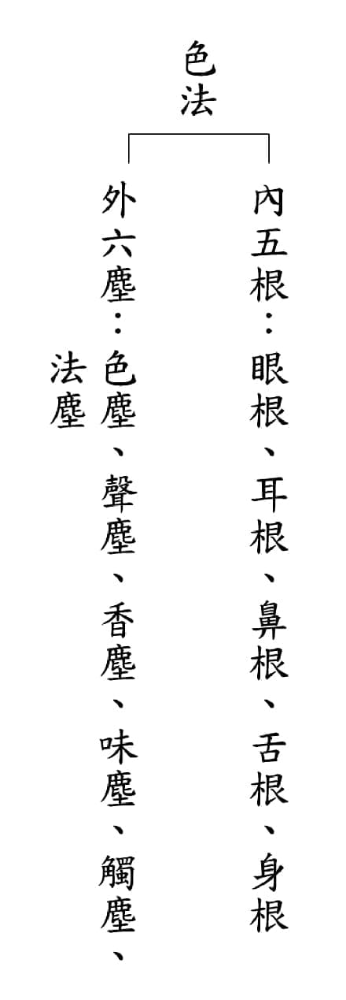

### 佛學概要十四講表簡說（三十六）

*戒慧講述、心若整理*

輪迴現象複雜萬端

升沉猶如井輪汲水

一念善念浮沉關鍵

修學解脫就在今生

前言

第六講表—宇宙有情概況，有情眾生都是在輪迴中受苦，或許有苦有樂，但本質都是痛苦，苦因不除，苦果猶在，探究苦因就是無明我執，具足苦因苦果的有情分布在六道。上來講到天的類受與苦厄，苦厄當中有欲五衰、三禪有三災，及無色界的空死墮。

色界三禪天以下，有水、火、風三種劫災之苦。劫譯為大時，乃一長時間單位，有大劫、中劫、小劫之別。三界眾生世界的生滅變化，用成劫、住劫、壞劫、空劫四中劫述之。成劫為一世界之成長期，住劫為壯盛期，壞劫為老死期，空劫為滅無期。一小世界（初禪大梵天以下，內含一個須彌系）每經一次的成、住、壞、空為一大劫，其中含四中劫，每一中劫含二十小劫。上一期已經簡明成劫、住劫、壞劫、空劫，本期詳述之。

三禪三災裡面，在成劫開始的時候，先成就器世間，因為它經過火災、水災、風災，風災已經燒到三禪，三禪被毀了，故在成劫的時候，先成就器世間，就從第三禪天開始。六十四大劫之後的第六十五大劫初，是先成就第三禪天的環境，每八大劫之後，第九大劫的成，成就第二禪天的環境，每一大劫空以後的第二大劫的成，先成就初禪天的環境，雖然它們都是在這個大劫成之後才出現的環境，可是三禪天是在六十四大劫後的第六十五大劫出現，三禪天可以維持六十四大劫，三禪天是少淨天、無量淨天、遍淨天，遍淨天的壽命就是六十四大劫，生量六十四由旬。第二禪是水災後，一個大劫會有一個火災，火災只燒到了初禪天，所以二禪天還在，七次火災後會有一次水災，所以八大劫的時候就會把二禪天淹光，水災經過了七次，再加上火災的八次，最後一次風災，就是第三禪天。第三禪天的環境出來了，才有第三禪天的人，在風災後，第二禪天的環境出來以後，才有的二禪天的人來，初禪天是火災後，初禪天的環境出來後，初禪天的人出來，但是初禪天是從二禪天的光音天來的。欲界天，是在每次火災後初禪天建立了以後，在欲界的空居天也慢慢地建立起來，先有器界，再有投生，投生到欲界空居天的人也都是從二禪天下來的。

欲界的空居天包括他化自在天、化樂天、兜率天、夜摩天，這些都是在虛空中依著雲而住，到第九的時候，就是欲界的蘇迷盧系，就是忉利天、四王天，一直到人間，欲界蘇迷盧系的環境先有，再有其生命現象，人種就是從光音天來的。成劫有二十劫，人種是在住劫的時候才有，在住劫的二十劫當中，人壽有八萬四千歲，從每一百歲增加一歲，每一百歲增加一歲，增加到八萬四千歲，再來每一百歲減一歲，一直減到十歲，從十歲到八萬四千歲，再從八萬四千歲降到十歲，一增一減叫做一小劫，這樣的小劫有二十小劫，減劫的末有小三災，就是人歲一直減，減到三十歲的時候，就會發生飢饉災，整個世界鬧飢荒，沒什麼食物可以吃，人歲如果減到二十歲的時候，會有疾病災，疾病蔓延，一直減到人歲十歲的時候，就有刀兵災，遍地的花花草草都像劍一樣，可以傷人。以上小三災就是饑饉災、疾病災、刀兵災。

成住了以後進入壞劫，壞劫前面叫做有情壞，也就是整個器世間要壞之前是有情先壞滅，有情壞滅也是從下界開始壞，地獄先壞滅，然後再鬼道、畜生道、到人道，他們會去投生，一直到整個六欲天的有情都投生完了，到了初禪天，這些有情也都到其他地方去了，要經過十九小劫。

這十九小劫的意思是說，有情會慢慢的沒有了，因為沒有居住的環境，地獄已經沒有辦法居住，所以地獄的人空了，鬼道、畜生的環境已經沒有辦法居住，所以鬼道跟畜生的有情也不見了，再來人道的環境也不能住人了，所以人道也不見，再來六欲天的環境也不能住天人了，所以天人也不見，到初禪天的環境已經沒辦法居住了，所以初禪天的有情也不見。

第二十小劫開始環境壞了，火先燒到初禪，把初禪以下一直到地獄全部燒光，經過七次火劫以後，會有一次水災，在第八劫的時候，水災會一直淹到二禪。所以二禪是七火一水，第八大劫的時候，二禪天就不見了，到第九大劫，二禪天才出現，每一大劫之後，初禪天就會出現，每一個八大劫，就可以把二禪天滅亡，第九大劫才會出現二禪天。

再經過七次的水淹二禪，也就是五十六大劫之後，第六十四大劫時就會有風災。七水一風，每一個水災有七個火災，所以七個水災有四十九，再加七個火災等於六十三，第六十四大劫的時候是風災。此時三禪天就全部被破壞了，接下來進到空劫，空劫有二十個小劫，所有的三禪之下沒有有情，也沒有器世間，以上就是大劫簡單這樣說。

《佛學概要十四講表述記》一百零三頁，先從壞劫說起。他是從壞劫、空劫、然後再成劫、住劫來說，次第正好跟前面的排法不同。

壞劫是有情的器世間先壞滅，也就是整個世界要走向壞滅，有情先壞，從下界先壞，也就是從地獄眾生先壞滅，地獄有情眾生壞滅分成兩種，一種是地獄眾生他的地獄業報已經報盡的話，他自然就會生起後悔的心，而轉世到人中。情況愈危急的時候，有些人會悔改，悔改的時機就是他業報窮盡的時候，兩者是相互觀待。以前釋迦牟尼佛在地獄裡，他看一個老者被鞭打，當時釋迦牟尼佛也是地獄的眾生，他為老者求情，惹得鬼王惱怒，一鞭打過來，釋迦牟尼佛的腦漿迸裂，那一念的悔心出來，釋迦牟尼佛就投生為人了，所以這兩者是相互觀待的，在惡劣的環境中，互相砍殺，容易生起悔心。

第二，在地獄受報的眾生，他的業還沒有盡，就轉生到其他世界的地獄繼續受報。就好比我們世界不能住人，人就會投生到其他地方，漸漸的地獄有情壞盡，環境不能住人了，就像人類不斷地破壞能源，造成很多的燒殺擄掠、對立爭鬥，讓環境愈來愈惡劣，不能住人，不能住人到最後就有兩種情況，一種是死掉以後去投生到其他的地方，一種是有些人他會開始反省，變成他的轉機。

接下來畜生道、餓鬼道的有情眾生，當整個的環境愈來愈惡劣，他們也會生悔心，慢慢地就受生到人間。整個環境愈來愈惡劣有兩種情況，一種是愈來愈狠，第二種是愈來愈恐懼，懺悔反省心生。愈來愈狠的人，死後會投生到其他地獄，愈有後悔心的人，就會投生到人間。

人間也是如此，當整個環境愈來愈壞時，在人中剛開始會有人除去五蓋，也就是煩惱蓋，獲得初禪定，其他人看到他的示現，就輾轉跟他學，自然就離開五欲，修學到初禪定，再慢慢從初禪定修學到二禪定，所以他們命終後就生到二禪天，這就是《俱舍論》的講法之一，當然這只是所有講法當中的一種講法。

五蓋障是貪瞋眠悔疑，其對治法就是戒定慧，以戒來對治貪瞋，以定來對治眠，以慧來對治悔跟疑。戒律的根本精神就是在對治世俗的貪跟瞋。定對治眠，因為禪定的人，他要對治的就是昏沉相；慧對治悔跟疑，悔就是會後悔，比如我們作善會後悔，後悔這件事情會成為你修定的障礙，這時候靠著慧去破，疑惑也要靠著慧去破，讓你心理方向確定、正見生起，能夠進入禪定天。

為什麼餓鬼、地獄、畜生都是轉生到人間？難道地獄就不會轉生到畜生道？畜生道不會轉生到餓鬼道嗎？因為畜生、餓鬼他們都還是煩惱中人，這也是其中一個面向說而已，並非所有的狀況都如此，各部派的講法會有些不同，此是說後悔的力量強，讓他們可以有投生到人道的機會，可是投生到人道，也必須要人道生育，所以雪廬老人說，大家要多生小孩，讓人道興旺，而且有正法的學習機會。人道的劫要盡的時候，有人會去獲得初禪定，因為眾生有這種禪定的種子。人道愈危難時，有時候想要解困的心就愈強，就像是災難來襲時，念佛較易專注。當發覺人要面臨一些災厄、困難的時候，求佛的心、修學的心會比較強。

人會生到初禪天，有些命終之後生到二禪天，因為人跟二禪天比較有緣，這是指釋迦牟尼佛那個時代的狀況，並不是所有的世界都是這樣。

下面講到天界的眾生，像六欲的天眾、初禪的天眾，都會慢慢進到二禪天，直到二禪天完全沒有有情，也就是在初禪以下整個小世界的有情都壞盡。

初禪大火，不像森林大火，而是一種劫火，其實很多有情眾生在最後大災難出現之前，會透過反省、修學進入初禪天，或是進入到二禪天，進入到二禪天之前，劫火燒到初禪天的時候，他們就已經逃掉了。在壞劫前面，有情慢慢地逃走，經過了十九小劫，第二十個小劫就開始出現劫災，火災出現。壞劫的時候才談到世界末日，我們現在在住劫的第九劫，後面還有十一劫，所以我們還不會面臨到世界末日，但是我們也面臨到很多問題，像是能源、空氣、疾病等，往後問題會愈來愈多，愈來愈嚴重。

下面形容劫火是怎麼燒的，整個五趣雜居地，沒有雨水了，沒有草木了，當時出現七個太陽，威力強盛、火焰猛烈，燒盡了器世間，一直燒到初禪的大梵天，全部燒完。所謂的「復有六日輪漸次出現」，總共有七個太陽，這是就著當時婆羅門的概念去講天文，佛有三種說法，第一種是隨自意語，第二個是隨他意語，第三個是隨自他意語，隨自意語就是我想說什麼就說什麼，隨他意語就是說要必需他懂得我才能說，第三個隨自他意語，就是我說，而且他也可以懂，當時的印度是婆羅門的天下，這時候用天文觀去跟他對決是沒有意義的，有意義的主題是要讓大家了解生命的本質是什麼，造成生命輪迴的原因是什麼、如何消除，至於天文觀就隨順印度的婆羅門的想法，讓印度人可以懂的觀念來說。我們現在大量消耗能源的時候，天氣也是熱得要命，開始氣候變化，衍生很多問題。

接著講到三災當中的水災，也就是經過七次的劫火以後，才會在第八劫的時候發生水災。所以火燒初禪，水淹二禪，在七次的火災之後有一次的水災，所以初禪天要被滅七次以後，第八次水災出現，把二禪天滅掉，二禪天的光音天的壽命是八大劫，就是指七次火災，一次水災，正好是八大劫。

水淹二禪以後，等於是五十六大劫，每八大劫出現一次水災，八乘以七等於五十六，所以第六十四大劫也是在經過了七次的火災以後，就會出現風災。風吹到三禪，把三禪以下包括二禪、初禪，一直到地獄，全部吹盡。

火災的感覺，就好像宇宙大爆炸；水災的感覺，就好像星球移動；風吹的感覺，就像整個星球都在飄移。為什麼會有火災、水災、風災？其實外三災都是由內三災來的，也就是由內心的煩惱引動、感應來的，如果沒有內心的三災就不會感應外三災。

為什麼會有火燒初禪，因為在初禪天還有尋伺，尋伺是一種心裡的分別，就好像猛火，可以燒惱我們的心，所以可以感應到外面的火災。

初禪應用尋伺的目的是遠離欲界的過患，用尋伺去遠離欲界的欲火，而真正欲界的欲火跟欲界的躁火要到二禪才能降伏，二禪才是真正定功的形成，意思是說，你雖然用尋伺在除去欲界的欲火跟躁火，人世間有很多的欲火跟躁火，火氣在內心，在二禪才能夠真正被對治，所以欲火跟躁火就感應外火，就像地獄裡面抱銅柱，睡鐵板床，這跟人世間的欲火、躁火都有關，如網路流傳的色情片、恐怖片，讓年輕人心浮氣躁、心思不定。

二禪是被水淹，二禪沒有尋伺的心，但是他有喜心，也就是內心的一種躁動，喜就好像水一樣，可以潤身，所以就感水災。

以上初禪的尋伺，尋是粗想，伺是細想，他粗想細想的目的，就是要觀察欲界的過患，遠離欲界男女、飲食、睡眠的欲望，可是他到二禪才能真正遠離這些欲望，所以欲火會感應外火，二禪的定生喜樂地，他禪定當中內心很喜悅，身體很快樂，內心很喜悅，內水感外水，這是水淹二禪。

第三禪風災怎麼來的？三禪已經沒有心裡的喜，但是他有風大充身的快樂，他有動息，也就是有呼吸的這一分，動息就會感風災。還有鼻息，內心的氣息，依賴氣息生活的這個息，感應外風，所以風吹三禪。

到了第四禪，他的喜心及輕安的快樂都不要了，他的出入息也就斷掉了，所以外面的風災都不會降臨。此時修學禪定已經渾然忘我，現象都不見了，就像念佛的人，念到剩下佛號，身體不見的時候，身體的快樂也不會在意了，所以風災也不見了。四禪天原來都不受這些災，可是他們會受空死墮的災，其實空死墮比較約著四空天，第四禪天一旦大限到來，他「不樂入禪，風觸吹身，唯除眼識，其他都苦」，不樂入禪，就是業報到的時候，他坐立難安。

以上是壞劫，接下來看空劫，也就是整個有情世界還有器世界到三禪，全部都沒有有情了，這個空劫還要再經過空空蕩蕩的二十小劫，之後才有成劫出現。成劫跟壞劫它是相反的，成劫也就是整個器世間、有情世間只剩下四禪，這時候他在成劫的時候，會是器世間先形成，然後有情再來投生。

而且是先出現上界後出現下界，如果是一個大劫裡面來講，先出現的是初禪，後面才生六欲天，後面才出人，後面才出下三途，如果是八大劫之後，先出現二禪，如果是六十四大劫之後，先出現三禪，所以先上界後下界，先器界後有情界，先環境後有有情。

從三禪天開始說起，經過六十四大劫的風災過後，到成劫的時候，他的第三禪天的器世間會先完成，接下來是二禪天、初禪天的器世間完成，這時候，第四禪天入定的有情，他的壽命或者福報盡了，就會降到第三禪天或者第二禪天。

這些只是現象之一而已，也有可能是他方的世界過來，也有可能是有情眾生死亡了以後投生到三禪天，這只是現象之一，並不是所有的都是這樣。同樣的，在二禪天當中有一個有情他剛好壽命盡、福盡，他就降到初禪天來受生，這就是在初禪天出生第一個人，他叫做最大梵，也就是大梵天王，因為他是獨自一個人受生到初禪天，沒有伴侶，非常孤獨，所以他也希望有其他天眾的出生，當他心這樣想的時候，其他的天眾也剛好壽盡，也都生到初禪天來了，這是講釋迦牟尼佛那個時候的情形。初禪下面，也就是欲界的四空天也慢慢的完成了，他是在雲端，在這些雲端的宮殿住處也完成了，就有有情從二禪天降下來。

四空天包括夜摩天、兜率天、化樂天、他化自在天，以上都在空中，雲端上面有他的宮殿、住處，有他的生活環境，這些有情都是從二禪天來生到這宮殿中，二禪天未免太多人了吧？才可以投生到初禪天、投生到四空天，問題是，愈往上人應該愈少，愈往下人愈多，所以這也是現象之一而已，其實還包括欲界天投生到初禪天、夜摩天、兜率天、化樂天、他化自在天，或是他方世界來的，這只是根據《俱舍論》講當時的狀況之一而已。

水災過後的成劫就是已經水淹二禪了，所以器世間先完成，有情從三禪下來；火災過後的成劫就是火燒到初禪，所以是先從初禪天器世間先完成，有情再從二禪降生，大梵天王是最初從二禪天降下來的大梵天王，所以他是第一人，後面的像欲界的空居天他就慢慢的形成，乃至於地居天，然後五趣雜居，慢慢形成有情下來，他就一直以為他是造物主，所以也被外道奉為父，是造物主。

這就是指印度的婆羅門教所說，大梵天有禪定的力量，而且神通很多，可見印度婆羅門教的上帝，還比基督教、天主教上帝還要厲害，厲害到釋迦牟尼佛都無可奈何，民間信仰是最難扭轉的。

初禪以上都說完了，空居天也說完了，空居天建立，有情也投生了以後，就是下面的地居天，還有地居系，也就是整個須彌系，也慢慢地完成，這些完成其實都是由眾生的業力增上而漸漸形成的。

須彌系就是整個須彌山，須彌山就包括山頂忉利天、山腰四王天，須彌山的旁邊有七山、八海，七個山八個海，就是說一個山圍繞裡面有一個海，第二層山圍繞第二層海，第三層山圍繞第三層海，像現在軌道的概念，釋迦牟尼佛是順著當時婆羅門的概念來講。七山八海，第八海之外有大鐵圍山圍入，第八個海當中有四個洲：東勝神洲、西牛賀洲、南贍部洲和北俱盧洲，我們屬於南贍部洲。

這些器世間完成了以後，有情開始降生，這邊的說法都是從二禪光音天下降的。二禪光音天下降也是其中一個現象，至於禪定的修學法這些，都是相通的，比如說初禪的未到定修學七種作意得到初禪的正分，二禪修學得到二禪，三禪修學得到三禪，每一個十劫修學法都一樣。以上將壞劫跟空劫、成劫都說完了，下一期再來分辨住劫。（下期待續）

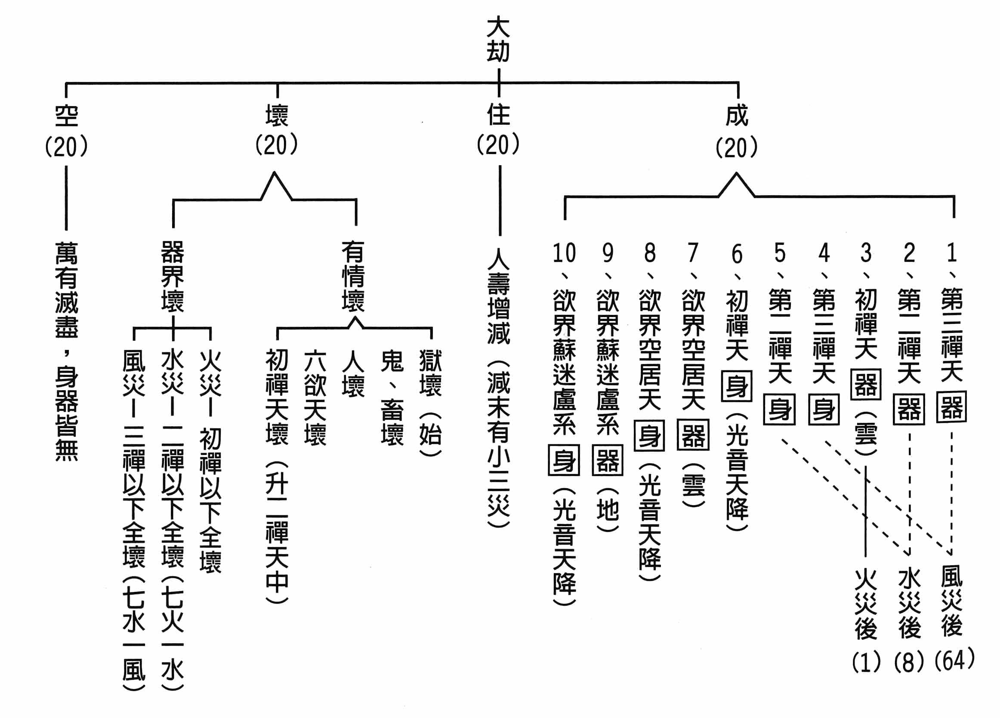

### 人生大事不能忽略的事實 臨終三大要（三）

*戒慧講述、編輯部整理*

排班原則二小時

二人一班輕聲念

配合家屬心需誠

佛號平穩助益多

前言

要讓一個人往生西方，病人、家屬與助念團三者必須互相觀待。「臨終三大要」是印光大師講到一個人臨命終時，旁邊的人面對病苦者應如何開導，有三大要點必須注意，才能保證他臨終無障礙。首先是「總顯助念的重要性」，重視「生死事大」，這件事情很重要，特別是往生淨土了生死的這件事情，故必須要重視臨終助念，而臨終助念需要平常重視敦倫盡分。第二部分「分別解釋助念的方法」，助念需講究善巧方便，分為三部分。前期已將第一、開導安慰令生正信刊登結束。本期接續第二，大家換班念佛，以助淨念者。分為總標與別釋。

總標

總標部分，經文：

「第二、大家換班念佛，以助淨念者。」

此處是臨終的正行，換班念佛有條不紊，幫助亡者心安在佛號上，生起正念。

別釋部分，分為重明助念之要、正舉助念立法和結示親友禁忌三部分。首先重新闡明助念的重要，經文：

「前己開導病人，令生正信。然彼病人，心力孱弱，勿道平素絕不念佛之人，不易相繼長念，即向來以念佛為事者，至此亦全仗他人相助，方能得力。以故家中眷屬，同應發孝順慈悲之心，為其助念佛號。」

前面已經說明了該如何善巧開導病人令生正念，也告訴家屬該如何護持病人，病人能生起正信是往生極樂世界的因，必須先確立病人已生起正信，外緣的幫助才使得上力。

本段的重點在於病人體力已衰，心力嬴弱提不起勁，全部得要仰仗外力的幫忙。不要說平常不念佛的人難以長時念佛，就算是平常每週可以交上十萬聲佛號功課的蓮友，或者是擁有幾十年念佛功夫，在道場為公發心的總鋪師，面對病苦的折磨，也難提起佛號，至此「全部」得要仰仗他人的幫忙，佛號才能提起。

所以家中的眷屬，在病人臨終前，更要發孝順和慈悲的心，以佛號來幫助病人生起正念。文章中此處並未提及助念團，也未提及親朋好友，就是家中眷屬！家中眷屬要承擔起幫助病人正念的重責大任，此時正是病人最需要幫助和依靠的時候，身體上漸漸衰敗的痛苦，和隱藏在內心中許多放不下、不足為外人道的家務事，這樣內外雙夾的痛苦外人無法為其分擔，一位孝順的兒女，承歡膝下最好的方式，除了陪伴，就是大家同心護持病者生起正知正念。

別釋

別釋第二部分是正舉助念立法，分為未至將終、將欲斷氣和氣斷之後，前面精心的鋪排，為的就是臨命終的這齣戲。既然病人身心孱弱，全部須仰仗外力，那麼外力的助念就極為重要了。未至將終時，須注意分班念佛、音聲適中、引磬清引、專念四字、同一念法與勿斷佛聲幾個部分。

分班念佛分為四個部分，首先是分三班輪念，經文：

「若病尚未至將終，當分班念，應分三班，每班限定幾人。頭班出聲念，二三班默持，念一點鐘，二班接念，頭班、三班默持。若有小事，當於默持時辦，值班時斷斷不可走去。二班念畢，三班接念，終而復始。念一點鐘，歇兩點鐘，縱經晝夜，亦不甚辛苦。」

以上說明排班方式，重點在顧及人情，護持的蓮友要注意不要造成家屬的負擔，也不要隨意進出破壞念佛的氣氛。當時的時代背景，交通上不及今日方便，地址也難查找，所以一起出發可以互相照應，最為方便；今日則可以先行通知，把半夜班表先排好，讓半夜前往的蓮友先處理要事或者稍作休息再出發，時間和心態上都更為從容。總之，訓練有素的助念團，不隨意打擾家屬和病者。家屬除非萬不得已，在病人尚未臨終之時，也儘量不要隨意地要求蓮友半夜排班。

若需要長時間排班助念，需顧及大家的體力輪流休息；若遇到半夜需要護持，必須念及大家隔天上班，若人手充足，可以互相支援，每一班間隔可以縮短，這樣大家都不會太累，可以減輕隔天上班的疲累。半夜的佛號不要太過低沉與緩慢，須不急不躁，避免低沉與緩慢易打瞌睡，如此精心安排，睡意濃厚的半夜，也不會太過辛苦。

分班念佛第二個部分，知功德無量，經文：

「須知肯助人淨念往生，亦得人助念之報。且莫說是為父母盡孝應如是，即為平人，亦培自己福田，長自己善根，實為自利之道，不徒為人而已。成就一人往生淨土，即是成就一眾生作佛，此等功德，何可思議。」

利他就是利己，幫助他人生起正念得以往生，自己臨終也容易得到他人的助念。不要說為了盡孝才去助念，即便是不相關的人，在別人臨終時這樣去幫忙，也是培養自己的福報，長養自己對法的悟性，自己才是最獲利的一位。

成就一個人往生極樂世界，幫助他到成佛的環境中繼續學習，即是成就娑婆世界的罪苦眾生，到一個無有眾苦但受諸樂的環境，旁有大善知識引導，能夠具備成佛的大因緣，助念功德實在是不可思議的殊勝。

分班念佛第三個部分，令佛聲不斷，經文：

「三班相續，佛聲不斷。」

家屬分班念佛，有因緣的蓮友也可以排班護持，未斷氣之前還是以家屬為主要護持者，如果實在無法陪伴，也要選擇佛號音調與病者平素念的佛號一致，且品質穩定，聲音清晰耐聽的佛號機取代，務必讓病人在安穩的環境下，靜聽家屬陪伴所發出的佛號，眼見佛像、耳聽佛號，意念也是渴望前往極樂世界。

分班念佛第四個部分，感病人念聽，經文：

「病人力能念，則隨之小聲念；不能念，則攝耳諦聽，心無二念，自可與佛相應矣。」

家裡是一個很好的修行環境，讓病人安心。此時病人若有體力可以跟著大眾小聲念佛，旁邊護持的人也可以隨著病人的呼吸念佛，病人若沒有體力，也可以只跟一個字，也可以僅僅攝耳諦聽，主要在感應病人以念佛號、聽佛號，取代念病痛。家屬外緣上的幫忙，讓病人心裡面放下對世俗的戀捨與即將離開熟悉環境的驚恐，念念與佛相應，自然能夠感應佛加被，臨終得到阿彌陀佛親自接引。

念佛分班之後，接著要注意的就是音聲適中，經文：

「念佛聲不可太高，高則傷氣，難以持久；亦不可太低，以致病人聽不明白。不可太快，亦不可太慢。太快則病人不能隨，即聽亦難明了；太慢則氣接不上，亦難得益。須不高不低，不緩不急，字字分明，句句清楚。令病者，字字句句，入耳經心，斯易得力。」

佛號要注意不可以太尖銳，也不可以太低沉，聲音高亢過於用力，傷及肺氣及肺之津液，讓咽喉失去潤澤，容易沙啞，佛號不容易持久；佛號聲音太低也無法讓病人聽明白，病人已經很虛弱了，如果佛號模糊低沉不容易跟上節奏，易起煩惱。此時病人心力贏弱，語速太快無法跟隨，佛號只會是背景音，起不了作用；語速太慢病人呼吸不夠長也接不上。

總之，旁邊護持的佛號須講究高低適中，不緩不急，穩穩妥妥的字字分明，一字一句清清楚楚。讓病人將佛號聽得清楚，入得了心，這樣的護持才算有益。如此可見，坊間所用的佛號機，實在無法取代親人的護持，雖說是備用仍須慎選，音調高低、語速快慢，各道場念法不同，此佛號機是否與病者相合，品質良莠參差不齊，最好親自挑選適合陪病使用。

接著，引磬清引，經文：

「念佛法器，惟用引磬，其他一切，概不宜用。引磬聲清，聽之令人心地清淨。木魚聲濁，故不宜用於臨終助念。」

此處重點在清，臨終時身體病苦、心思混亂、眉頭深鎖，體力、心力都用不上力，此時在外緣上要特別注意病人的需要，避免造成病人無謂的煩惱，引磬的聲音清亮，只要不要敲得太用力、急躁，配合前面協調的音調，讓病人容易跟上念佛的腳步，心地清淨，時光一溜煙的過去，那種臨終身體痛苦，心裡又寂寞難熬的時光，在這位臨終病人身上幾乎看不見。

接著是同一念法和勿斷佛聲，經文：

「又宜念四字佛號。初起時，念幾句六字，以後專念『阿彌陀佛』四字，不念『南無』，以字少易念。病人或隨之念，或攝心聽，皆省心力。家中眷屬如此念，外請善友亦如此念，人多人少，均如此念。不可一起念，歇歇又念，致令病人，佛念間斷。若值飯時，當換班喫，勿斷佛聲。」

家屬與助念團蓮友的音調需一致，如果有意見不一致的狀況，就以病者熟悉的佛號為主，祖師在此處說到四字佛號字少易念，實際上真是如此，六字佛號轉音多，不熟悉的人換氣位置也有所不同，有時因為每個人念佛習慣不同，會在自己習慣的地方拉長音，越拉越長也導致其他人呼吸不順暢，病人更是難跟。四字佛號音準易拿捏，速度可控制，病人或者隨旁邊護持的佛號一起念，或者攝耳諦聽，省心省力又身心舒暢。

護持的家人們這樣念，前來幫忙的善友們，不論是蓮友或者朋友，只要是來探望病人的親友很容易就可以跟著念，人多人少都是這樣念，時時與淨土氣氛相合，病人絕對是身心愉悅，柔軟歡喜。

絕對不可以有時念，有時不念，有時念佛有時聊天打閒岔，有時哭泣有時發牢騷，該處理的家務事在前面就該善巧開導安慰，越接近臨終，此時佛號絕不可斷，家屬護持排班空檔，或者換班吃飯時，情況不緊急的時候，半夜家屬可以睡在病人旁，以佛號機小聲護持病人。

以上是尚未臨終，現在來說將欲斷氣，經文：

「若病人將欲斷氣，宜三班同念。」

欲斷氣時，有時呼吸會漸漸短促，有時呼吸會突然快突然慢，有時會漸漸放緩。有的病人雖然體力差但是睜著眼，炯炯有神，這時候旁邊護持的人要更有士氣的引導他，家屬具備正知見，三班同念，眾志成城的護持病人往生大業。

氣斷之後，經文：

「直至氣斷以後，又復分班念三點鐘，然後歇氣，以便料理安置等事。」

佛號不間斷地，待病人斷氣後，助念團繼續排班念八小時。祖師當時的狀況是在戰亂當中，所以文中所寫，只能最低限度希望助念團可以在病人斷氣後幫忙三小時。各助念組織有不同的時間和人員規定，有的道場因為女眾居多，所以婉拒半夜的助念要求，有的道場則依著蓮友的親疏分別，助念時間也不盡相同。臨終助念，家屬最好單純只請某一個道場負責，不要請很多單位來助念，結果腔調、高低、做法各不相同，佛號的殊勝功德反成為人情的酬酢，對亡者無益，也徒增無謂煩惱。

助念八小時之後做迴向，助念團離開之後，家屬或繼續念佛或移往葬儀社入殮，料理後事。

大家換班念佛的最後一個部分，祖師特別提醒親友禁忌，經文：

「當念佛時，不得令親友來病人前，問訊諭慰。既感情來看，當隨念佛若干時，是為真實情愛，有益於病人。若用世間俗情，直是推人下海，其情雖可感，其事甚可痛。全在主事者明道理，預令人說之，免致有礙面情，及貽害病人，由分心而不得往生耳。」

往生重要時刻，除了念佛以外，親友前來問候、勸說、安慰等等情事，一律婉拒。這樣的做法並非不盡人情，親友探訪等世事，當在病人臨終前安排妥當，此時是往生關鍵時刻，當以念佛為主。

從感情層面來看，探望的親友隨著病人意願一起念佛，那樣的情感流露才是真實幫助病人，也才能真正表現彼此的真實情愛；若來探望只是回憶美好過去，或情感澎湃、啼哭難捨，看似彼此感情深切，實在是推人入火坑，對病人是百害無一益，就算明眼人在場，也只能搖頭嘆息！如果遇到這種情愛的場面，助念團勸阻不聽，撤退是可以的。

所以助念團到現場，許多話必須事先跟家屬做充分的溝通，方能避免病人往生之時遭遇種種障礙，助念團或礙於情面難以啟齒，導致病人分心，貽誤了往生極樂世界的殊勝大業。（下期待續）

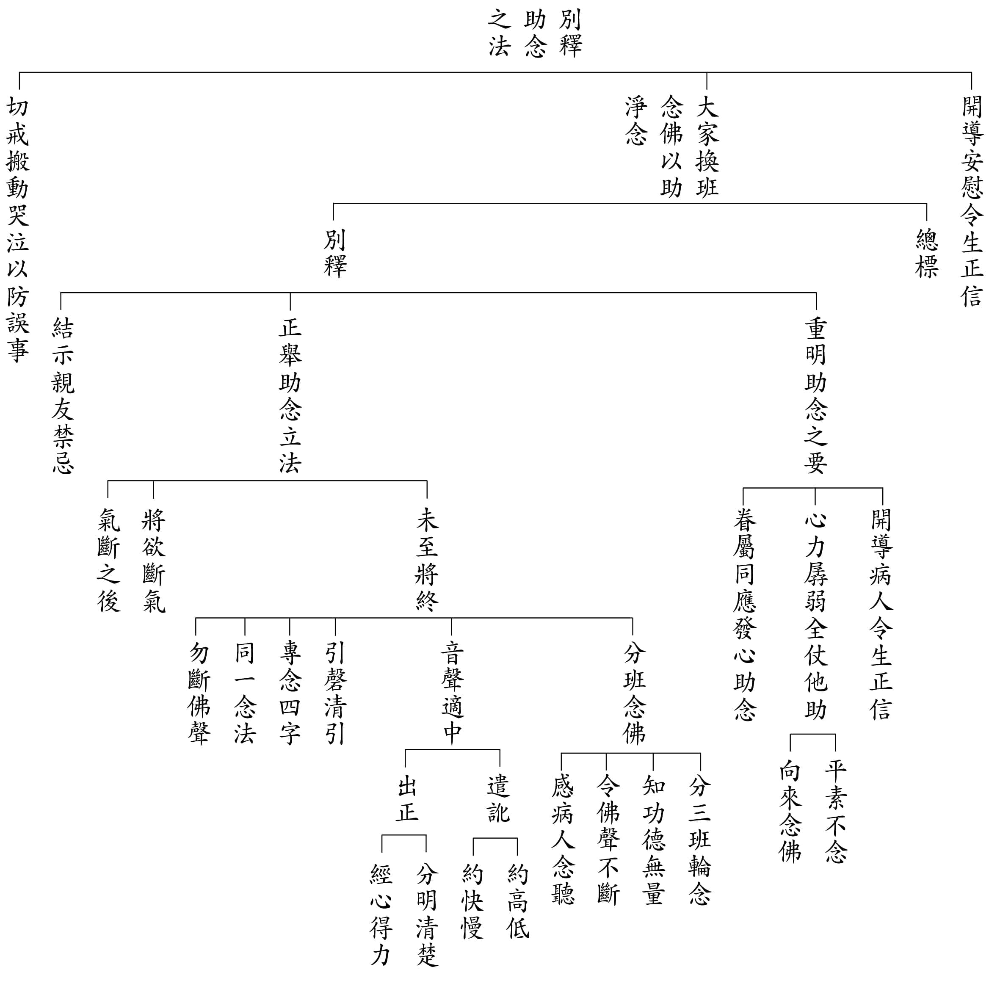

### 緣起贊論略釋（一）

*戒慧講述、心若整理*

贊見說緣起是大師

能讚者宗喀巴怙主

造論解贊僧海法增

法尊略釋由藏譯漢

講座因緣

《緣起贊論略釋》講座是由馬來西亞學長的祈請，而促成暑假疫情期間每周日上午線上共學的因緣，所依課本是由宗喀巴大師著，二世達賴、法增大師造論，法尊法師翻譯解釋的文本為教材。課程從六月二十七號跨度到十月三號，相當於一季的課程馬拉松。佛的說法中，以宣說緣起最為殊勝。宣說緣起的好處是，能以緣起為正因，通達空性，回過頭來，以空性為正因通達緣起，幫助我們了解世間的關聯，了解世間萬法的生起，幫助我們從緣起中通達非實有性、觀待性、關聯性。唯願透過研學，大家都能深入法義，了解緣起的道理，生起法喜，並運用在生活中。

緣起贊論略釋

「敬禮緣起性，證已悟他者，謹依先覺釋，略述少分義。」

「敬禮緣起性」

此是法尊法師開示的篇首禮贊，篇首禮贊是很重要的禮節，其目的是為了交代因緣，去除造論的障礙。一般做善事前都需要排除障礙，就個人別業來講，做善違反無始劫的習氣，本來就困難；就共業來講，末法時期，不是隨順做善的法運，容易遭惡人、小人傷害，故須排除障難。而真正的做善是傳承、弘揚法脈，幫助有情離苦得樂，離苦得樂的方法是苦因苦果的滅，因為所有的快樂都會導向痛苦（壞苦），導向輪迴，苦因苦果的滅這樣的善事才是可以導向解脫的。

「緣起性」

諸法的特性就是緣起，此有故彼有、此無故彼無，此生故彼生、此滅故彼滅，萬法都是待緣而起，其條件複雜到令人難以想像。空性是指法的生起沒有體性，只能仗緣，諸多條件聚合才有諸法生起。證得空性正好通達緣起，同樣的，通達緣起者也正好通達空性，這才是最殊勝的體悟。

「證已悟他者」

證已：以緣起為正因通達空性，從空性通達甚深的緣起，此人已證得。

悟他：有哪些方法可以悟他，例如說法、造論、講學、研討、在事項上磨練，令彼對法的體悟是透過正因生起比量，上述這些都是悟他。

「謹依先覺釋，略述少分義。」

先覺即能通達緣起的證悟者，謹依著先覺的解釋，簡略的來敘述緣起贊論少分的義理。

先覺通說指釋迦牟尼佛、宗喀巴大師，別說指二世達賴、法增大師。

從「略述」兩字可以看出法尊法師的語氣跟心態，是很謙虛、客氣、恭敬的，意即我只能把這些大師的義理少分的闡述而已。我竭盡所有的力量都沒辦法講清楚，只能簡略的說。

「今者此中略依二論解釋宗喀巴大師所造《由說甚深緣起門中贊大師頌》。」

今天就依著二論來解釋宗喀巴大師所造的《由說甚深緣起門中贊大師頌》，所謂甚深緣起，就要講到佛說三種清淨觀察，第一種是佛說現事，眾生可以現量通達，例如佛說雪山是白，可以由眼識以現量的方式來驗證。第二種是佛說隱密事，眾生可以比量來通達，例如無常、空性。第三種是佛說極隱密事，眾生只能靠聖言量來通達佛說的甚深緣起，例如非常微細的因果，你的頭髮每根的來由，什麼樣的因素讓你有這些眉毛，你為什麼會出生在這個家庭等等。故甚深緣起法即空間太遠、時間太長、業太微細，這些是一般聖者都不能通達的，謂之不染污無明。宗喀巴大師就從佛說甚深緣起的這個門來讚歎佛，用五十八的偈頌來讚歎，而不是從神通、王子、貴族或甚深禪定等這些門來讚歎佛。

「二論云何？謂一切有情無上親友妙蓮花手現比丘相第二世達賴喇嘛僧海法王，及末運悲攝有情住持正法無能比對，具慧法增大善知識所造者是。」

二論是哪兩位大師造的論？即第二世達賴喇嘛僧海法王，和具慧法增大善知識。第二世達賴喇嘛有諸多殊勝處，包括他從小善根深厚，對宗喀巴大師像產生莫名好感，常行供養。其顯密教法通達，是西藏前輩上師公認最厲害的因明學大師之一，講學盛況，座無虛席，活到六十七歲，相傳是仲敦巴（藏傳佛教噶當派創始人）再來，曾轟動熱振寺。

形容二世達賴喇嘛叫做「謂一切有情無上親友妙蓮花手現比丘相」，佛菩薩都是眾生無上親友，所謂的親友是當你處在患難中，他都不會離開，就像父母親對子女不離不棄般，友就是願意肝膽相照、患難與共，無上親友指最為殊勝的親友，一般的親友最多只能解決此世的苦難，而讚歎二世達賴僧海大師是能幫助眾生解決輪迴的苦難，然而成佛是真正幫助眾生究竟離苦得樂。並讚歎二世達賴是「妙蓮花手，現比丘相」。

其次讚歎緣起贊另一位解釋本論的大師-法增大善知識，叫做「末運悲攝有情住持正法無能比對」，此時法運是末法，在末法以悲心來攝持有情，悲攝有情最殊勝的方式就是住持正法，就像燈火照亮暗室，住持真正的涵意就是引導學者聞思修，作為傳承教法的方式，「無能比對」意即沒有人是他對手，無人能夠企及。

一、釋論名

「由說甚深緣起門中稱讚無上大師世尊善說心藏」

大師宣說緣起，故叫做無上，開派祖師都可稱為大師，如龍樹論師、提婆論師等等，而最無上大師就是世尊（釋迦牟尼佛），世尊是佛十種通號的總說。無上大師是善說者，從他說甚深緣起的這個門來贊歎他，不是神通這一門，不是大慈大悲這一門，也不是相好莊嚴這一門，而是甚深緣起的這一門來贊歎。

「善說心藏」，是論特別的名稱，釋迦牟尼佛的善說心藏就是緣起，佛說布施、持戒、神通等都是善說，但是心藏是緣起。「由說甚深緣起門中稱讚無上大師」這幾個字，是論的等起，等起即引申、延伸，緣起可以延伸為善說心藏，佛說緣起時，就是善說心藏。

「稱讚者，謂由信敬發歎美言。此有二種，謂增益贊及實德贊。今是第二。」

能稱讚的是宗喀巴大師，他對無上大師佛世尊的稱讚是充滿極大信心的稱讚，此信心是法行人的信心，是真正了解後，打從內心的相信，由信心而生恭敬，而發出讚歎的美言。美言有兩種，一種叫做增益贊，增益贊屬於客套話，實德贊是對對方的真材實學、真實德能打從心裡的贊歎，此處宗喀巴大師對佛的贊歎屬於實德贊。

「所稱讚境，謂無上大師釋迦世尊正等覺者。無上等義，論中廣說。」

世尊是佛十種通號的總，以正等正覺的那一分為世間所尊，正等正覺即以緣起之門來破二障，從破二障當中來成立甚深緣起。以破二障的方式說覺，破二障需要靠空性的智慧，最殊勝的正因就是緣起。無上等義，論中會廣為說明。

「稱讚門者，復有多種，謂贊佛身相好等事，或贊佛語轉教等事，有贊佛意智悲等事，有贊佛業化度等事，有贊佛德神通等事；或說事贊，或舉喻贊，如是等類，難為盡舉。此中所贊，謂說教法。」

稱讚的門路有很多種，到底要稱讚釋迦佛的哪一門呢？佛的身、語、意、事業、功德都是可以稱讚的，但這些都不是本論所要稱讚的，以下一一說明。

「謂贊佛身相好等事」

贊歎佛的三身、三十二相、八十種隨形好，等包括種種的神變、事功，身體所做的業。佛的三身即法身、報身、應化身，法身是所證得的真理，報身分為自受用報身和他受用報身，自受用報身是證得真理的智慧，他受用報身是佛的相好莊嚴， 應化身是佛應著眾生的需要，而有種種的變化身，以各種形式存在。三十二相、八十種隨形好，是佛的果相，佛陀莊嚴的色身中，顯而易見，一目了然的特徵稱為「相」，約略可分為三十二種，叫作三十二相；細微難見，不易查覺，像是氣質、風采、攝受力等等，能使人生起欣喜愛樂之心的，就稱為「好」，共有八十種，叫做八十種好，由於這八十種好是隨三十二相而有，所以又稱為八十種隨形好。

「贊佛語轉教等事」

贊歎佛轉教法輪、證法輪。所謂教法輪，是觀待佛智慧所說的法，這個法能夠輾平眾生的煩惱。佛不必藉著上師，不必依靠任何人，而把法講出去，教法輪只有佛才做得到。而教法指傳承的這一分，凡夫也可以成為傳承。所謂證法輪，是根據教法輪，透過聞思修來輾平煩惱，這是初果、初地以上的能耐，以現證空性的智慧來破分別執，對教法是能現量通達的。凡夫則是能證法，靠聞思修來比量通達教法等，包括六十四梵音，即如來的音聲，有六十四種殊妙之相，例如：柔軟聲、悅意聲、明亮聲等。等還包括佛語的特性，佛以一音演說法，而眾生能夠遠近同聞、隨類各得解、隨義各得解，遠近同聞指不管是在近處或遠處的人們聽到他的聲音都一樣清楚。眾生隨類各得解例如螞蟻可以聽到螞蟻的聲音，蟑螂可以聽到蟑螂的聲音，各地人也都會聽到以該地方言來宣揚正法。眾生隨義各得解即大乘人聽大乘法，小乘人聽小乘法。

「贊佛意智悲等事」

佛意包括智慧、悲心，等包括種種道理的體悟、人情世故的通達。

「贊佛業化度等事」

佛業指佛行事業，化度指度化眾生，包括供養大眾、維持僧團、跟王侯將相相處、推展教法事業，「等」包括降伏三迦葉、度化剛強難化的有情眾生。

「贊佛德神通等事」

佛具有千變萬化的神通，「等」包括到忉利天宮說法、以神通打敗六師外道。

以上贊佛的身語意事業德能神通可以用五方佛來表徵，五方佛又稱五方如來，五方是東南西北中五方，各有一佛主持。分別是中央的毗盧遮那佛（俗稱大日如來）、東方阿閦佛（即不動佛）、西方阿彌陀佛、南方寶生佛、北方不空成就佛。用五方佛的名號來表徵佛五種殊勝的面向。

毗盧遮那佛表身，毗盧遮那就是遍一切處的意思，表示佛身遍一切處；阿彌陀佛表語，因阿彌陀佛說法的那一分最為殊勝；不動佛表意，因為佛的心意就是不動，現證空性的智慧，無所搖動；不空成就佛表事業，即事業是不空成就；寶生佛表功德，生出功德的意思。

「或說事贊，或舉喻贊，如是等類，難為盡舉。」

或舉出佛的事情來贊，例如佛的本生故事，是講釋迦牟尼佛的前生，本事指佛弟子們的事蹟。或用比喻來贊歎佛的德相，例如《華嚴經》說的：「剎塵心念可數知，大海中水可飲盡；虛空可量風可繫，無能盡說佛功德。」以上對佛的贊歎，各種各樣，難以一一舉出說明。

「此中所贊，謂說教法。佛說教法，廣有顯密大小三藏十二部等無量差別」

而《緣起贊》要贊歎佛的，不是以上說的，而是說教法的這一分，佛語事業才是佛最殊勝的。

佛說的教法，廣的來說為顯密大小三藏十二部，能詮釋的是經、律、論三藏，所詮釋的是便是顯、密、大乘、小乘，入大乘之門是菩提心，入小乘之門是出離心。而顯跟密都是大乘，差別在於，顯是就因的這一分而言，密是以果為道用（例如：自現為本尊、自現為壇城等）。

經典的體裁，分為十二部，有一首偈頌說：「長行重頌並授記，孤起無問而自說，因緣譬喻及本事，本生方廣未曾有，論議共成十二部。」

以下說明：

（一）長行部：就是經文一行一行的長文。

（二）重頌部：用偈頌方式重複地再把經義說一遍，把長行經文重說。

（三）授記部：佛給菩薩授記的，譬如汝於某某劫，應當成佛，名號為何，壽命有多長，教化眾生有多少，在什麼國土裡……等等，都預先說明了。

（四）孤起部：孤單獨立的偈頌，與前文不相連，而且與後面的經文也沒有關係。

（五）自說部：平時有人請法，佛才說法，唯獨如《阿彌陀經》，無人請法，佛不問自說。

（六）因緣部：敘述某種事發生的因緣。

（七）譬喻部：用比方來說明經文的義理。

（八）本事部：說佛弟子在因地所行的事蹟。

（九）本生部：說佛前生弘法利生的事蹟。

（十）方廣部：就是方正廣大的經，有圓融無礙的境界。

（十一）未曾有部：從來沒有見過的神通變化，例如華嚴、法華、地藏諸經開講之前的神變。

（十二）論議部：佛弟子研究經律的報告，或者佛與弟子討論的記錄。

「等無量差別」，為什麼要加一個等？等就是包括佛在說世俗法，太多太多了，不勝枚舉。

「然其正宗，意在治惑」

正宗即主要的修學法，其核心價值在於治惑，離苦得樂的重點在苦因苦果的滅，治惑才是苦因苦果的滅，為何不在樂的那一分說，要在苦因苦果的滅上說？因為快樂都會導向痛苦，故必須要苦因苦果的滅，所以意在治惑，惑就是痛苦的根源，苦因滅了，苦果就滅。

「煩惱根本，無明是極」

治惑的根本，要對治的核心，最極處就是無明我執。無明就是煩惱障，無明的習氣就是所知障，小乘破煩惱障、大乘破所知障。離苦得樂的關鍵在治惑，一般說起惑、造業、受苦，惑從無明來，治惑核心處是無明我執的正對治，唯有無明滅才是苦因苦果的滅。

「能治無明，唯有緣起」

能夠對治無明的，只有緣起。龍樹菩薩中論二十七品講空性的修學法，都能對治無明，此處講只有緣起，是指要以緣起為正因來通達空性，從緣起中了知世俗，唯有緣起可以，其他不行。

「故以此贊，為最勝贊。如是教理，論中廣述。」

所以以《緣起贊》是最殊勝的贊，換句話說，對佛用緣起來贊歎是最殊勝的，會讓十方諸佛都感動。「教」指言教，「理」指道理，透過說明、思辨來顯現。教理在《緣起贊》中都會廣為陳述。（下期待續）

## 孔學一隅

### 論語簡說（四十一）— 公冶長篇第十三
誰說孔子沒有哲學思想，子貢感歎難得聽聞

論語簡說（四十一）— 公冶長篇第十三

誰說孔子沒有哲學思想，子貢感歎難得聽聞

時哉講述

觀機逗教循循善誘

或文章或性與天道

夫子之教利鈍全收

弟子有幸時代明燈

經文

子貢曰：夫子之文章，可得而聞也；夫子之言性與天道，不可得而聞也。

（公冶長第十三）

消文

孔子的學生子貢說：老師所傳授的六藝及修身、齊家、治國、平天下的經典，可以聽得懂，並且學得到；至於老師所談論的性和天道，深微難知，難以有機會聽聞，也難以聽得懂。

章旨

此章言夫子之道，深微難知也。

科判分析

子貢是能聞性與天道的大才。本章經文分為兩段，第一段：「子貢曰：夫子之文章，可得而聞也」，夫子講述的文章，文章指文化典籍，像六經詮釋的就是六藝，六藝能夠幫助我們進退應對，乃至於調和身心、學習各項技能，夫子講述文化典籍，這是聽得到的，可見文武之道保留下來，必須由人講解，典籍才發揮其義理與價值。第二段：「夫子之言性與天道，不可得而聞也。」夫子講本體及趨吉避凶的道理，這是聽不到的。

釋義

本章歷史背景
孔子周遊列國，從陳蔡準備進入楚國的時候，被蔡國大夫兵困，絕糧七天，當時子路替孔子打抱不平說：「君子亦有窮乎？」難道君子還有窮愁潦倒的時候嗎？孔子回
**答：** 「君子固窮，小人窮斯濫矣。」這樣的困境，正好磨煉君子的松柏之志，如同《論語》上說「歲寒，然後知松柏之後凋也。」

本章子貢的語氣為何？

想不到在窮途末路、困厄當中，可以聽聞夫子講述性與天道。子貢很隨喜自己及隨行的弟子們可以聽聞，並慨歎未隨行的弟子未能聽到這麼好的概念。古人說「朝聞道，夕死可矣。」此道即是性與天道。

本章孔子由幾個方面來詮釋中華文化？

本章從文章、性、天道三方面來通達中華文化。文章就講到禮、樂、射、御、書、數六藝，六經所詮釋的就是六藝。禮講究應對進退，樂能調和人心，射是一種體能項目，御是駕馬車，是服務師長、長輩的技能。書是文字，還包括文書。數是數學、財經、科技。以六藝充實自己，可以拿來修身、齊家，甚至治國、平天下，這些都是人事與能力的培養。

夫子之文章如何可得而聞？

夫子有教無類，收學生不分貧、富、貴、賤、智、愚。孔門座下，貴如孟懿子，賤如子路，貧如原憲，富如子貢，智如顏回，鈍如高柴，孔子都願意接納，只要求學者行束脩之禮，服裝儀容整齊，懂得以禮來恭敬老師，孔子都樂於教導學生入世的各種學問，可以充實自己，可以利益他人。

如何了解天道？

老子說「天道無親，常與善人。」老天爺跟誰都不親，沒有誰是老天爺的親、誰是老天爺的仇，善人才是老天爺厚愛的對象。換句話說，斷惡修善，才能趨吉避凶。

老子又說「天道好還。」你作善，天道暗暗地還給你快樂；你吃虧，天道暗暗地還給你便宜；你佔便宜，天道暗暗還給你吃虧。所以，吃虧就是佔便宜，佔便宜就是吃虧。

老子又說「天網恢恢，疏而不漏。」天網看似不周密，但是疏而不漏，意即作善得樂、作惡得苦，沒有漏網之魚。

古文《尚書》裡面說「滿招損，謙受益」，一個志得意滿的人，其實是受損的。而謙虛受教的人，其實是獲得利益的。天道是對善人加福，對非禮者加禍。謙虛者懂得向他人求教，善知識願意提攜他，他就能夠得到正法。孔子說「賢者，百福之宗，神明之主。」一個人的智慧、福報來自於善知識。

孔子在《易經》謙卦的注解說，「天道虧盈而益謙」，月圓則趨向月缺，月缺會愈朝向圓滿。意即謙虛、不足的人，他會請教善知識，不斷地得利益。自滿的人，沒人教他，他就不斷地受損。可見天道是來自於親近善知識、獲得正見，此時自然有能力斷惡修善、趨吉避凶。

武王伐紂的誓詞裡面說：「天親自我民親，天聽自我民聽。」天站在老百姓那裡，善待老百姓，就得福；虐待老百姓就得凶，所以，利他才是王道。《大學》最後的結論就是以義為利，義才是真正的利益所在。

得聞天道有何殊勝？

斷惡能夠離苦，修善才能夠得到快樂。以正知見建立利他的心志與做法，充實利他的學問，而且講究利他的時機。若國家人人都懂得利他，此國必定強盛，家庭成員每一個都想替對方著想，家庭必會興旺，個人有利他的想法的時候，未來出路就在其中。

夫子在詮釋中國文化的時候，有人道、有天道，第三個就是本性，該如何了解性？

《論語‧陽貨》說：「性相近也，習相遠也。」性大家都差不多，貧富貴賤大家都差不多，沒有善性、沒有惡性。若富有善性，那富人會一直做善；貧者如果有惡性，貧者會一直會造惡。可是都沒有，而是觀待習。

因為串習的緣故，使一個人的見地、個性都會改變。在串習後，有的人自私，有的人利他，有人多能，有人無能，有人可以一以貫之，有人雜學，可見經過串習以後，人的見地及個性會愈差愈遠，苦樂也就愈差愈大。串習的是善，有善的見地、有行善的能力、有行善的做法，他的快樂就愈來愈多。串習的是自私自利，他所得的痛苦就愈來愈多。

《中庸》說「天命之謂性。」有的解釋為，天命是天然賦予的，性就是天然賦予的。另一種講法是明心見性的人得天命，像孔子就是一個通達性的人，傳承的天命在孔子，曾子就是一以貫之的人才。六祖明心見性，所以五祖傳承給他，代表誰能夠通達性，誰就能得傳承的天命。

《易經‧繫辭傳》裡面最核心的一句話就是「神無方，而易無體」。神就是心識，能證的是神，所證的是易，易是沒有本體的，能證的心識也沒有方，對著《易經》才有通達《易經》的心識，心識不在東方、不在西方、不在南方，心識是自體性沒有的，《易經》也沒有自體性。因為沒有自體性，所以可以有各種的變化。

心因為沒有自體性，當緣念到善法時，你就能夠起善心。當緣念到惡法的時候就起惡心，當心通達聖的道統時就起正見，當碰到邪師說法的時候就起惡見，心是沒有自體性的，《易經》也沒有自體性。《易經》六十四卦、三百八十四爻，千變萬化的道理，君子用是吉，小人用是凶。小人即使卜出吉之卦，雖吉必凶。君子縱使卜出凶卦，也是雖凶必吉。

通達性與天道有何殊勝？

通達性的人，他知道諸法的自體性沒有，所以他不會隨著境界而轉。境界沒有苦的性、也沒有樂的性。善用苦的人，苦會幫助他得到成就；善用樂的人，樂會幫助他成就。

懂得天道，懂得斷惡修善，就能轉變境界，壞運變好運，厄運變順利，通達性的人叫做不隨境轉，通達天道的人叫作以心轉境。

如何體會文章、性與天道三者的關係？

孔子講文章可得而聞，孔子講性與天道不可得聞，在孔子一行餓於陳蔡七天的時候，學生有幸聽聞性與天道，原來逆境不是逆境，真正的出路在見地，不在境界。性與天道就像電腦裡面的程式碼，掌控電腦的硬體、軟體的運行，要靠程式碼。換句話說，想要活用經典的人，要懂得性與天道。

夫子的文章、性與天道是就典籍而分嗎？

每一部中國文化典籍，都是文章，會用的人，呈現的都是性與天道。舉例來說，《易經》是文章，典籍裡面講到趨吉避凶的道理是天道，裡面講到易無體、而神無方是性。《論語》裡面講到「空空如也、其庶乎屢空」是性；善用每一章來趨吉避凶，這是天道；而《論語》顯示的四百九十八條都是文章。

既然性與天道是孔門精華與出路，為何不可得而聞也？

「中人以下，不可語上」，中等程度以下的人，不能夠跟他講上等的道理，「中人以上可以語上」，中等程度以上的人可以語上。問題是中等程度以上的人，他還必需想要懂。對於想要學習，其程度又是中等以上的程度，孔子就可以對他說上等的道理。又孔子在大家受磨難時講性與天道，可見道是要被珍惜的，老師要觀學生的根器而教，才能讓學生得利。

子貢是性與天道的聽聞者，但他是傳承者嗎？

《論語‧先進》篇說「賜不受命」，表示子貢沒有接受天命。子貢雖然聽聞性與天道，可是不是性與天道的傳承者，要成為性與天道的傳承者還必須要像曾子這樣下死功夫。顏回的悟性雖然高出曾子百倍，尤要下死功夫，如同孔子曾說：「有顏回者好學。」即便顏回悟性絕頂聰明，學習也都精勤不間斷。

子貢富可敵國，雖然心不在錢財上，可是他花費很多時間、心力做生意，終於不是性與天道的傳承。可見人生不可能全包全贏，最終，孔門得到性與天道傳承的就是顏回跟曾子。

釋、儒、道是中華文化的三大元素，其核心處是否相同？

道家比如老子，也是談很多吉凶禍福的道理，很多概念都偏向於形而上，這就是性與天道。佛家也很多講到趨吉避凶的道理，講到本體皆空的道理，核心處都一樣。所以釋、儒、道三家，核心處都是性與天道，只不過儒家偏向於入世，道家、佛家偏向於出世。

總結

一、文章、性與天道是所傳，所傳觀待能傳的人。「夫子的文章是可得而聞也」，可見聞才能夠傳文章。「夫子之性與天道，不可得而聞也」，子貢慨嘆未隨行的弟子們聽不到，可見傳承的第一步在聞。

二、性與天道是文章的精華。文化能趨吉避凶、帶來個人、家庭、國家民族的好運，這才是真正的文章。文章裡面所通達的道理就是天道，天道所顯示的就是沒有本體，運用之妙，存乎一心。一本《論語》可以入世、也可以出世。一本《易經》，可以只是一些算命的道理，也可以是趨吉避凶之道，還通往形而上，就看怎麼學。

三、學的人要懂得藏，懂得收斂，把心安住在上面，最後才能夠出去弘揚傳承。

問答

**問：** 在《論語》中，顏回只提到「夫子博我以聞，約我以禮」，我們如何得知他是性與天道的聽聞者與傳承者？性與天道的傳承在孔子的孫子子思之後就失傳，如今，還有這樣的傳承嗎？

**答：** 「博我以聞」的聞就是文化典籍，「約我以禮」就是在禮上去莊嚴。至於他有沒有性與天道，就要看他怎麼去提煉裡面的內涵，孔子曾讚歎顏回「其庶乎，屢空」，屢屢達到空靈，這是性的成就。孔子又讚歎顏回說「用之則行，舍之則藏」，換句話說，顏回是最懂時機的人，天道就是懂得趨吉避凶，該進則進，該退則退，性與天道的傳承，就在顏回身上。

明朝大儒焦循的《焦氏筆乘》說，性與天道的概念，《老子》是「累言之」，說了很多，佛家是「極言之」，如果有老師，懂得這些內涵來詮釋《論語》，你認真地聽，便會了解性與天道，從了解性與天道開始，做第一步的傳承，透過思維、串習，體會裡面的內涵，得到傳承。

**問：** 孔門這麼多人才，只有幾個人聽聞性與天道，甚至只有個位數能傳承、理解性與天道，這樣大部分學生的資質應該都是中人以下，如果中人以下的資質，想要聽聞甚至理解性與天道，該如何是好？

**答：** 中人以下的資質當然不可語上，真的要聞道，並覺得性與天道比世間任何的學問都有價值，這種人要特別有見地、有理想、心志特別高遠，對文化想學習到核心，則此人是可以學的。

原則上中人以上可以聽性與天道，但是並不代表所有的情況都是如此，曾子就是一個魯鈍之人，可是人一能知、己百知，人十能知、己千知，想不到性與天道的傳承就在他身上。

**問：** 有注解說，文章是道德的展現，而性是人所受的天理，天道指的是天理的本體，這樣的註解是否可採？

**答：** 性是本體，天道只是一個作用。宋儒好講天理，天然的道理。儒家跟道家講的是天道，它有運行的軌則，有作善得樂、作惡得苦，吃虧就是佔便宜，佔便宜就是吃虧軌則。

**問：** 窮其一生都很難真正地了解性與天道，我們是否好好地專注在世間法上學習就好？

**答：** 對於一個有理想、有抱負的人，學了性與天道，他才有辦法經營社會、國家的風氣，培養人才。他的能力、格局、心志是大的，此人如果願意學，出路是很可觀的。因為他懂得認人、懂得看事情、懂得趨吉避凶，在大時代中不受迷惑，能夠為大家找到內心的出路。

**問：** 不論是現代或是過去的歷史人物，很多傑出人士都沒有學過性與天道，可是他們在人情世故上懂得應對進退、也能夠趨吉避凶，是否不一定要學習性與天道？

**答：** 很多人只看眼前之利，忽略了長遠的經營，眼前經營的再好，可是禁不起長遠的考驗。不懂得風氣的經營、不懂得在內心上謀得真正的出路，他沒有能耐去經營整體的人生、未來的人生，乃至於人群的出路、社會的風氣。

**問：** 《中庸》說「天命之謂性，率性之謂道，修道之謂教」，這句話三者的關係是否就是文章、性與天道之間的關係呢？

**答：** 修道是依語言文字之教，此教是能詮釋，性與天道成為所詮釋。（下期待續）

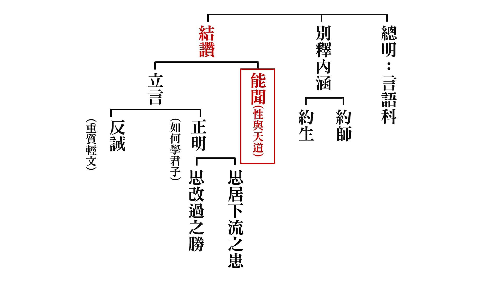

### 孔門心法—中庸之道(二十二)
第十九章：驚天地、泣鬼神的孝

孔門心法—中庸之道(二十二)

第十九章：驚天地、泣鬼神的孝

*時哉講述、弘毅整理*

孝義開演各面相

趨吉避凶福慧修

永保四海萬眾歸

先王至德合天帝

前言

家庭的和諧要從孝道開始，家庭是人格養成的地方，也是人生成功的起點，孩子要學會體諒人情，懂得感恩，懂得觀察別人的需要等等。

當前國學教育在兩岸推廣，在大陸有《弟子規》，其成效就是能夠讓孩子懂得孝順父母。比如說，幫父母親捶捶背或者是洗洗腳，推廣這樣的運動讓孩子們開始懂得去關心父母，不是只有父母關心孩子而已。西洋人雖然他們的字典裡沒有孝，可是他們會用行為來表達孝。比如說，母親節的時候會送康乃馨，或者送禮物、蛋糕，也會定期有家庭聚會，經營家庭的和諧。

《孝經》中除了講庶人經營家庭的和樂以外，讀書人更懂得經營家庭教育來盡孝道，進而在國家當公務員辦政治擴充孝道，乃至於成為國家領導人，把國家經營得有氣象，表徵孝道，或者是天子推展善良的風氣，把孝道發展到極致，這些都是一個讀書人應盡的責任。

武王、周公能夠繼承文王志業，又能以禮樂祭祀表現孝道，可謂是最通達的大孝，是驚天地、泣鬼神的孝，這樣的能力不僅能表現孝心，還可以用於治國，引領風氣。孝道的用處廣泛而不可思議，值得我們深究體會。

中庸總體科判

第十九章還是在《中庸》的第二部分，即分別顯示中庸的修學法和義理。

本章科判分析

首先總體讚歎武王和周公對孝道是通達的，第二部分特別解釋什麼是達孝，第三部分是以祭祀之禮來達孝。在宗廟祭祀時，要有前行準備，禮儀有表相和意涵，人要如何行禮，祭禮包括祭天之禮和祭宗廟之禮，如果能夠懂得祭祀的表相和意涵，治國就會像看手掌一樣簡單。

消文釋義

經文：

子曰：武王周公，其達孝矣乎。夫孝者，善繼人之志，善述人之事者也。

消文：孔子讚歎說：武王和周公對孝道是通達了吧，因為他們能夠把孝道的風氣推展到民間。達孝就是說，善於繼承先王的心志，即文王想要伐紂的心志。還要善於傳述先王的事業，發揚光大，以禮樂教化百姓，讓他們生活安定，生命充實，過上安居樂業又有內涵的日子。

經文：

春秋修其祖廟，陳其宗器，設其裳衣，薦其時食。

消文：在春秋兩季祭祀的時候，先要修繕、打掃祖廟，然後把鼎、觚、爵、觥、豆等祭祀用的器皿陳列出來，再把祖先遺留下來的衣服給孩子穿上，扮演祖先，接受祭拜，這叫尸，還要擺好當季的食物用來供養。

釋義：「裳衣」，先祖所遺留下來的衣服；「薦」，祭獻。

經文：

宗廟之禮，所以序昭穆也。序爵，所以辨貴賤也。序事，所以辨賢也。旅酬下為上，所以逮賤也。燕毛，所以序齒也。

消文：在宗廟行禮之時，第一個要注重的是輩分。祖先牌位要依照左昭右穆擺放，左邊是父親，右邊是兒子，不僅牌位擺放依照左昭右穆，家族墓地的位置也是這樣排列，還有祭拜者也要依據左昭右穆的輩分行禮。

第二個要注重的是爵位。依照爵位高低來確定主祭與陪祭者，並且按照昭穆排列位置，以此來辨別貴賤。

第三個要注重的是賢德。辦理祭祀事務時，按照個人的專業、才能來擔任相應的職務，如有的人負責祭祀行禮，有的人負責擺放供品，有的人負責看門，有的人負責迎賓送客等等，以此來辨別能力的高低。

第四個要注重的是下對上的禮節。在祭祀當中，眾多的親友在一起飲酒，下位者要先向上位者敬酒，敬酒時，先給上位者倒酒，然後自己要先飲酒，一直到最卑賤的人都要行此禮節，以此表達對上位者的恭敬。旅酬也可以指恩惠的施與，在分供品的時候，即便是守門的、做雜務的人，都能夠分到一份供品，表示君恩的賞賜可以遍及所有人。

第五個要注重的是年齡。在祭祀結束後的饗宴中，頭髮較白的要坐在上座，頭髮較黑的坐在下座。

在整個宗廟祭祀中，有輩分、貴賤、賢能、年齡的區分考量，還有賞賜的公平，所以辦政治、辦企業的大要都可以含攝在宗廟的演禮當中。

釋義：「昭穆」，「昭」，明，陽光能夠直射的位置，「穆」，肅，陽光不能直射的位置，左為昭，右為穆，昭穆可以指宗廟祭祀神主的排列次序，也可以指墓地葬位的左右次序，或者祭拜者的行禮次序；「旅」，眾多；「酬」，飲酒；「逮」，及；「燕」，饗宴；「毛」，頭髮。

經文：

踐其位，行其禮，奏其樂，敬其所尊，愛其所親，事死如事生，事亡如事存，孝之至也。

消文：站在先王以前祭祀時所站的位置，行先王所行過的禮儀，奏起先王祭祀時的音樂，這是位子和禮樂的傳承。如周成王繼承了周武王、周公的位子，然後依著周公所制定的禮樂來行禮奏樂。「相維辟公，天子穆穆」，諸侯陪祭，天子肅穆莊嚴，從宗廟祭祀中可以看出，天子得到諸侯的擁護，四海承平，萬民歸附。祭祀的人要尊重先王所尊重的有德學之人，愛護先王所愛護的親人。辦喪事的時候，就好像所祭祀的對象是活人，所擺放的祭品是可以吃的，心態肅穆莊嚴，禮節合宜。在祭祀的時候，祭拜祖先如在眼前，可以說是孝道的極致了。

經文：

郊社之禮，所以事上帝也。宗廟之禮，所以祀乎其先也。明乎郊社之禮，禘嘗之義，治國其如示諸掌乎。

消文：郊社之禮，是用來事奉上帝和土神的，周朝也把始祖一同祭祀，後來演變為築天壇和地壇，以祭祀天地。宗廟之禮，是用來祭祀祖先的，這是在室內進行的，周朝是在明堂祭祀。如果懂得郊社之禮，禘嘗之禮的含義，懂得在祭祀裡面序昭穆、辨貴賤、辨賢、禮節遍及上下，講究輩分、尊卑，恩惠施與到最下賤的人，懂得在祭祀中培養人才，訓練人的威儀、儀態、談吐、禮節、進退，對於治理國家的道理就瞭如指掌了。

釋義：「郊」，野外，祭上帝；「社」，土神，祭地；「禘」，五年的大祭，如祭祀始祖或開國的帝王；「嘗」，秋祭之禮，其實也包括四季的祭祀。

章旨

本章是藉著天子的喪祭來表現中和之道，而中和之道融在孝道、報本還恩裡表現，因此治國就如看手掌一樣簡單。

析疑

一、本章與前章的關聯為何？

前章講文王、武王和周公，尤其是武王和周公能夠把文王的道統延續，用喪祭之禮來表徵祖先之德和報功。本章特別講祭祀的表象和內涵，傳承父親的心志和事業，並且發揚光大。

二、本章的其達孝矣乎與十七章大孝也與的口氣有何差異？

兩章雖然文字不同，但口氣是一樣的，「大概是這樣吧！」看起來都不是很肯定，但意思都是肯定的。

三、武王周公的達孝與舜的大孝，有何不同？誰比較殊勝？

舜的殊勝是以德居位，來經營孝道的風氣，使得天下大治。武王和周公的達孝是藉著禮樂制度、宗廟祭祀，表徵孝道，含藏著治國的全部內涵，有對祖先的懷念，有後代子孫的報功，有家風的呈現，有大臣的風範，有辦事情當中的和合，有宴會中的敬老尊賢，美好的風氣都在宗廟祭祀中經營，所以孔子對周公是非常讚歎的。

四、善繼人之志，善述人之事的孝與一般的孝，有何不同？

一般人的孝不過是體貼關懷父母，而繼志述事的孝代表的是心志和事業的傳承，利益天下蒼生的心志、品德、學問、能力都傳承下來，這是一般人的孝無法相比的。

五、武王周公，是達孝者，難道文王不是嗎？

文王對父親季歷也是非常孝順的，季歷心裡不好受或吃不下飯時，文王也是一樣，可是此章的達孝特別是說，在制禮作樂、宗廟祭祀中表徵孝道和王者的氣象，以天子之位來經營孝道，成為長治久安的根本義趣，而文王是諸侯，不是天子，是無法繼志述事的。不過有時候兒子也不一定能繼志述事，如伯魚就差孔子太多了，所幸他的兒子子思傳承了孔子的聖道。

六、為何選擇春秋兩季來修其祖廟，陳其宗器，設其裳衣，薦其時食？所要表達的涵義為何？

春賞秋罰，打掃修繕，以前孔子帶弟子到太廟，有弟子看到太廟都有破敗之處，就問孔子原因，孔子回答他說，保留一處破敗是為了勉勵後代要不斷地修繕。陳列祭器、衣裳、供品表達的涵義是不敢自專，凡事都要稟告，皇帝要慎重賞罰、用人，不要放逸，善用權力。

七、古人以子孫為尸代表祖先受祭，其意義為何？

子孫為尸代表祖先受祭，穿上祖先的衣服就代表祖先，就如同欽差大臣拿著聖旨就代表皇帝，孩子從父親祭拜祖先的禮節中，就學會了如何事奉父親。

八、序昭穆有多重要？不序昭穆有什麼關係？

序昭穆就是講究輩分，是內不亂，這樣外才不會亂。《大學》上講：「一家仁，一國興仁」，沒有齊家就沒有治國。

九、現代流行的顯學是人皆生而平等，為何還要序爵辨貴賤？

對國家有功勞和沒有功勞的人是要分別的，有德和無德的人也是要分別的，這樣才能引導人們為國家做貢獻，提升自己的德行。

十、序事辨賢的意義為何？

說話、辦事要有條理、章法，要臨危不亂，擺放供品要整齊，奏樂要清楚明白，這樣的才是人才，而不是做事馬虎，講話草率，不講究禮儀的。宗廟乾淨、整齊、莊嚴、肅穆、嚴整、有次序，這樣的場合才能培養人才。這樣的做法到今天即便不能傳承，但精神要傳承，在國家有大事時，這樣的人才是可以堪當大任的，平常嬉皮笑臉，重要的事情都不當一回事，在遇到大事時就更不行了。

十一、上述之行為何可以稱得上是至孝呢？

在祭祀的禮樂中，把輩分、貴賤、長幼、尊卑都統統演好，人才得到訓練，治理國家的大要都呈現出來，繼承先人的心志和事業，這才是至孝。

十二、治國真的像看手掌紋容易簡單嗎？

是的，因為治國的大要就是懂得尊重賢才，親愛你所親的，懂得禮樂教化，分貴賤、長幼尊卑，合乎秩序而行，國家大政如果沒有倫理、秩序、和諧，即便經濟發達，也是犯上作亂，誨淫誨盜，營私舞弊，那也是不足為觀的。

十三、現代領導人深究這些禮制無法用於時代，更不會拿來治國，不是嗎？

一些禮制的做法無法用於今日，但精神是可以沿用的，國家、企業、團體的領導人如果能深入儒家的內涵，才能知道治國、治團隊、治家的秘密。

十四、本章之內涵如何運用至企業、團體、學校、家庭乃至於個人？

如果能夠運用此章內涵，企業、團體、學校、家庭、個人，必然都能夠依序而行，互相配合，不爭功諉過，互相推尊，該承擔時承擔，該幫忙時幫忙，該退居幕後時就退居幕後，該衝在前面時就衝在前面，和諧湧現，事情在不知不覺中就辦成了。

十五、本章跟中庸有什麼關係？

本章是用序昭穆、辨貴賤、辨賢、逮賤、序齒、禮樂、祭祀的互相配合來經營和諧，這裡面都是有「中」的思想，懂得這樣辦的人能趨吉避凶。國家的大臣懂得互相補充不足，互相配合，默默地把事情辦好，主政者就如舜一樣，在堂上彈琴，身不下堂而天下大治。

總結

一個人道理懂得越多，志向才越明確，做法上才能實踐，而做法上越實踐，志向就會越明確，道理也就會越通達，周公制禮作樂代表他對禮樂的通達，也代表他對國家大政的掌握，也代表他對父親的心志和事業的傳承。

問答

一、有注解認為，舜才是真正的大孝，武王周公不過是明達孝道而已，可以這麼說嗎？

達孝並非只是通達孝道，而是至孝，所以經文最後說「孝之至也」，孝道達到極致，繼承先王的心志和事業，藉著宗廟祭祀去表現報本還恩、慎終追遠，國家的風氣也會變得非常好。

二、有注解認為，本章是孔子稱讚由武王時代開始，周公所制定的祭禮，乃真正通達人倫孝道的宗旨，是否可以採用？

周公以前也通達人倫孝道，只是周公時把孝道達到圓滿，是「孝之至也」。

三、「善述人之事」是否可解為善傳述先人事蹟讓後人知道？

這樣理解也是可以的，不過此章特別是講武王、周公繼承、傳述父親文王的心志和事業，並發揚光大，父親是諸侯，兒子是天子，總攬中國歷史，也只有武王和周公如此。

四、有云，設其裳衣，裳是官服，祭祀時把祖宗官服擺一擺，衣服掛一掛，如此可乎？

不行，裳衣是祖先留下來的，是給尸穿的，由後輩子孫穿著祖先的衣服，代表祖先接受祭拜。

五、「旅酬」的「旅」解為眾多的意思，醒公老師的中庸筆記上「旅」是當終字講，請問是否都可以呢？

「旅」還是解為眾多較好，在宗廟祭祀當中，下輩人敬上輩人喝酒，而且自己先喝，這個禮節從上到下都是如此，也是訓練下輩人在各種場合的禮儀，讓小孩敬茶、敬酒、說吉祥話，這就是從小的家庭教育，訓練小孩的威儀、禮節、談吐、氣質、氣象，未來可承擔大事。

六、懂得祭禮，治國其如示諸掌，鄭玄注說治國其事易如置物於掌中，如此可乎？

此句要和《論語》裡的章節合看，有人問孔子禘禮，孔子回答說「知其說者之於天下也，其如示諸斯乎。指其掌。」如果懂得禘禮的話，治理天下的道理就像看手掌上的紋理一樣清楚，孔子是指著手掌說的。

七、魯國當時有逆祀之事，如此可見逆祀也沒什麼大不了，不是嗎？

魯僖公與魯閔公皆是魯莊公之子，魯僖公為庶子而年長，魯閔公嫡而幼。魯莊公薨，魯閔立為君，魯僖公為臣。魯閔公薨，魯僖公立為君。至魯僖公薨，列神主時，魯之宗人夏父弗忌，佞魯僖公之子魯文公，將魯僖公神主升在魯閔公神主之上，是為逆祀。孔子說：「禘自既灌而往者，吾不欲觀之矣。」因為是逆祀，所以孔子不願意看了，如果國君不去講究輩分、倫常關係，後面大夫一定亂，逆祀就是魯國的亂源。

八、過去這些良善的禮制，現今還有傳承嗎？我們要如何能夠傳承、恢復，並走入時代呢？

很多古禮的做法今日都沒有人懂了，即便是懂也沒有用，居今之世，行古之道，災必逮夫身，我們現代人在今日能做到的範圍內保住禮節，重點是要了解禮節的意義，如本章知道了宗廟祭祀的內涵，就掌握了治國的方法、精神和原則，再配合時代發展一套禮儀，讓現代人能夠接受。

九、燕毛，序齒，萬一輩分高但年齡小，如何排？有的年紀輕輕頭髮已白，難道要上坐嗎？

本章只是大概說，頭髮白一般是代表年齡長的，像顏回二十九歲頭髮就白了，那要另當別論。序昭穆時，還是要按照輩分高低來排列的，宗廟祭祀後飲酒時，是要按照年齡來就座的，在宗廟祭祀的整個過程中，有輩分、貴賤、賢能、下對上的理解、年齡等方面的講究，行禮的人就在這裡得到訓練，彰顯高貴。

十、有云，旅酬下為上是指參與祭祀服務工作的人，酬勞要一律平等，尤其對最基層人員更重要，如此可乎？

旅酬如果按分供品講，賞賜是要普及到所有人，但還是要根據尊卑貴賤、有功或無功來區別對待的，否則賞罰不分明是無法領導大眾的。

十一、請問辯貴賤時，如何講和呢？辨貴賤是否指針對道德上的拙劣與否，而非講求貧富之分呢？

此章的爵可以講爵位，也可以講祿位，公、侯、伯、子、男就是爵位，上、中、下大夫是祿位，爵是以德為本質，祿是以功為本質，要尊重有德之人，才會激勵無德之人效仿。有德之人是有公心的，當大家都尊重有德之人時，就都會為公發心，自然就會和諧。反之，如果有德、無德一律同等對待，就會讓人覺得無德也沒有關係，大家都是私心滔滔，那是很難和諧的。所以尊重輩分、辨貴賤、辨賢、旅酬、燕毛，這些都是和的經營。

十二、請問善繼人之志，所以父親留下產業，要繼續幹，不可以賣掉，如此可乎？

繼承老店也要懂得脫胎換骨，有根據時代而改變經營的手法，分析市場的需求，機器也要更新換代，繼承的是先人的心志、能力、眼光，適應自己的時代，而不是回到古代。

十三、本章講到祭祀的許多功能，要如何應用到現代呢？

可以借用古禮來祭祀抗日英烈、開國功勛，緬懷死難同胞，或者為英雄們立碑、立廟，或者建立紀念公園，主政者親自去祭祀，來表彰他們的功勛，發揚他們的功德，敘述他們的成就，以及激勵後輩奮發向上，延續他們的精神，以此來教導民眾盡忠，為國家民族做貢獻，這也是對父母盡最大的孝道。做法可以改變，保留其中的精神、意義就可以了。

十四、古人以子孫為尸，會不會把孩子推之為「小祖宗」呢？

不會，因為尸是要恭恭敬敬的坐在上面，不敢亂動，子孫穿上祖先的衣服，扮演尸的時候，就要拿出祖先的氣質，是不敢開玩笑的，特別是下面站著的人都是非常有氣度的時候，坐在上面是戒慎恐懼的，呼吸都快停止了，下來後就會知道什麼是肅穆莊嚴了。這樣訓練出來的孩子，該表現的時候能夠表現，能夠應付大場面，到了接班的時候就能直接接班，這是小家庭出來的孩子所無法應付的。

十五、本章說：「薦其時食」，又有孔子「不時不食」。這也是說「事亡如事存」嗎？

「薦其時食」是說，祭拜祖先時要用當季的新鮮食物，包括用豆裝的五穀雜糧，用俎裝的太牢三牲；孔子的「不時不食」是說，孔子不吃宵夜、點心，這是不一樣的。「事死如事生」這是指喪，在講父母過世的時候，祭拜如在眼前；「事亡如事存」是指祭，去世三年後，祭祀時如同他們還存在。兩者都是祭如在，辦事時可以借用這種如在眼前的覺受，那是非常了不起的，所以從祭祀當中我們可以得到很多的訓練。

十六、從宗廟祭祀中懂得序昭穆、序爵、序事、旅酬、燕毛的內涵及功德，那如果祭祀宗廟時違背了這樣的禮，分別有什麼過患呢？

如果這些都不講究的話，場面會亂哄哄的，不能表徵對有德有功之人的尊崇，也無法區分辦事中的賢與不賢，事情就不會辦好，主持儀式之人也會被人看輕，得不到重用，長幼不分時，長者不會高興，幼者沒大沒小，家族不能和諧，國家大事當然也辦不好。

十七、是否懂得祭祀之禮外，加上愛敬之心，是否才能對天下才能瞭若指掌？

「敬其所尊，愛其所親」，尊重先王所尊重的有德學之人，愛護先王所愛護的親人，所以懂得祭祀之禮的人一定是有愛敬之心的。

十八、除了天子、國君之外，平民百姓可能做到至孝、達孝嗎？

制禮作樂是天子才能做的，平民百姓是辦不到的，所以天子、國君和平民百姓是不一樣的。不過平民可以隨喜、擁護，懂得祭祀的內涵、意義和效果，懂得辦教育去宣揚這樣的旨趣，也是可以分到很多功德的。孔子就是以平民的身份，推廣禮樂的教育、聖王的道統，樹立典範，孔子的功德也是非常大的，平民雖然做法和天子有很大的不同，但一樣可以經營出殊勝的功德。

結語

《禮記》中講的有關祭祀的內容非常多，內涵非常廣，要懂得其中的意義非常難，掌握其中的精神、旨趣，再結合當今時代，能夠區分尊卑、貴賤、賢與不賢、年齡、輩分，就是謀造和諧之道。（下期待續）

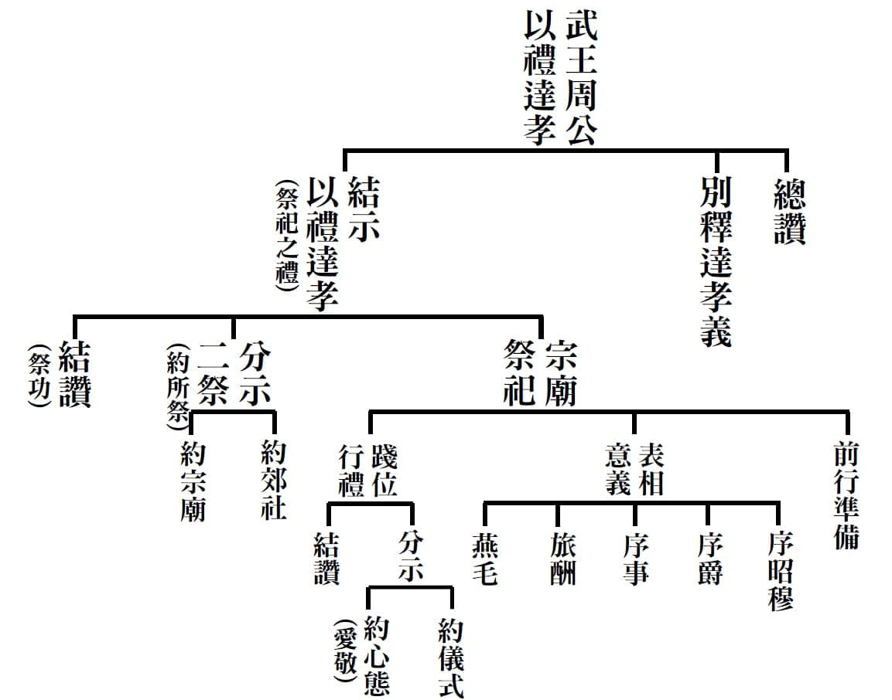

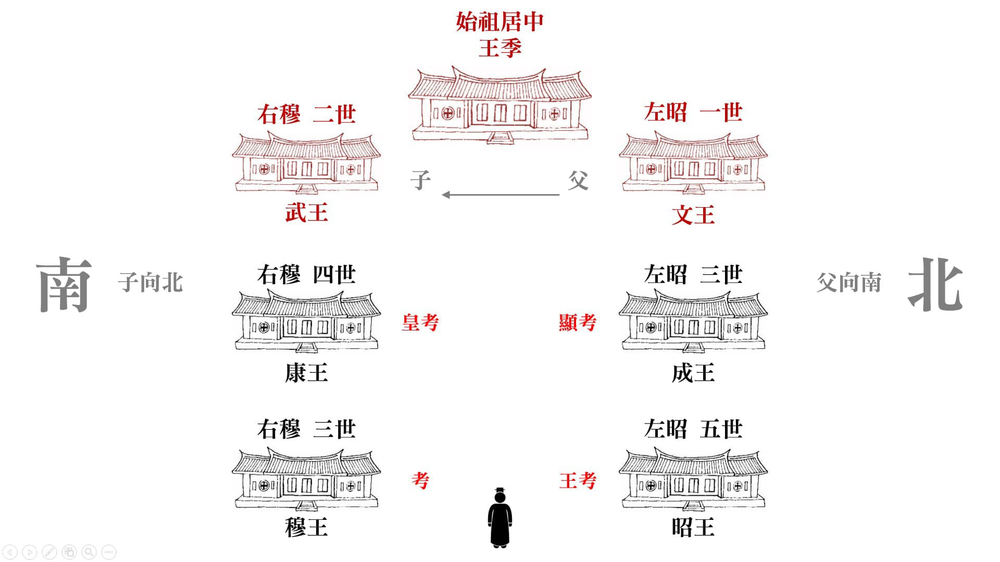

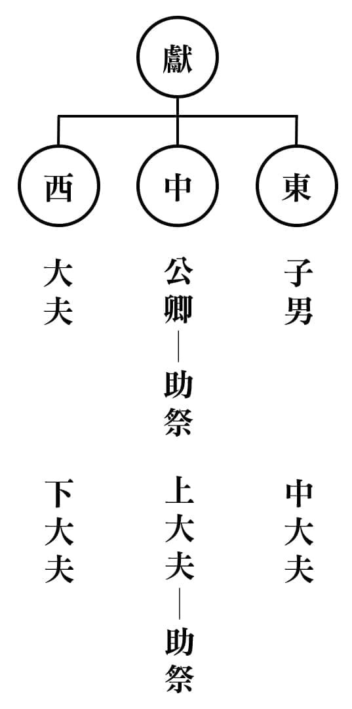

### 孔門十哲—孔門弟子中最耀眼的十顆星（一）

*圖：江逸子、文：編輯部*

夫子座下精英

頂尖政治人才

出類拔萃氣象

後學效仿典範

在繪畫中有一種烘雲托月的手法，是以渲染雲彩的方式，烘托出想要表達的重點。我們都知道至聖先師孔子有教無類、因材施教，開平民教育的先河，弟子有三千人，其中精通六藝的有七十二賢，《鹽鐵論》上說，這七十二賢都是諸侯卿相之才。

而能升堂入室的就有十位弟子，這十位便是箇中翹楚，精英中的精英，十哲各有各的天賦、能力、才情與個性，合集起來就是一個能發揮大用的團隊，但如果不是透過夫子的循循善誘、適性揚才，也不會有這般令人稱羨的盛況，眾弟子們就是絢麗的雲彩，孔子是絢麗雲彩背後那枚皎潔的月亮，透過了解十哲，孔子的內涵魅力也就呼之欲出了，這樣的人才團隊也延續了儒家思想，影響千年。

《論語‧先進》篇把十哲分為四個類別，經文是：「子曰：從我於陳蔡者，皆不及門也。德性：顏淵、閔子騫、冉伯牛、仲弓。言語：宰我、子貢。政事：冉有、季路。文學：子游、子夏。」

從經文中可以知道，四科分別是德行、言語、政事、文學四科。

德行說明品格及見地的重要，有見地方能立住人格，否則經不起境界的考驗。

言語科是擅長協調溝通，能以辭令安定政局的言語，還可以講述義理、弘揚聖道，這樣的言語是能夠安邦定國的言語。

政事科的重點在於給人民安定的環境，讓教育可以推展，使各行各業欣欣向榮。

而文學科是具有文化底蘊，深通古籍，能夠傳承經學見地，利益人心的文學，跟我們一般對文學的認知不同。

孔門四科就是把人培養成有品格、有見地、能言語、會辦事、有文采的人，這樣的人必定能夠領先時代、創造時代，是中華文化的核心價值，是學習中華文化的出路。

而四科各有代表弟子，並不是說弟子們只專學一科，而是他們都能多方面的學習，又在某一面向特別突出，這樣的人才正是國家社會所需。

仁心的代表顏回，

孔子曾經觀察顏回的言談舉止三個月，發現顏回都沒有離開仁。三個月是一季的長度，可以推知顏回就算遭遇顛沛的困境，仍然不會離開仁，心都在道上。至於其他學生，只不過偶爾一兩天到達仁的境界罷了。顏回不在乎物質的享受，知足常樂，他的快樂來自於學習的體悟，特別是得到孔子性與天道的傳承。顏回雖然學養豐富卻能虛懷若谷、不恥下問，不但自己好學，也能跟同儕分享，闡發老師的未盡之義，是夫子最得力的左右手，顏回可以說是仁心的代表。

和諧家邦的閔子騫，

我們都知道「母在一子寒，母去三子單」的典故，但其中的難處與智慧，一般人卻難以體會，孔子讚美閔子騫的孝心到達了極處，這個極處並不在於他能忍氣吞聲，而在於他能在逆境中維持家庭的和諧，讓別人沒有辦法見縫插針，說些非議誹謗父母的言論，這沒有相當的能耐是辦不到的。閔子騫入孔門學習前後，也有極大的轉變，他將所學內化後，從面有菜色，到容光煥發，整個面貌一新，是孔門中和諧家邦的代表。

樂天知命的冉伯牛，

冉伯牛跟隨孔子周遊列國，厄於陳蔡七天時，眾弟子喝著沒有米粒的野菜湯，臉色疲憊，大多一病不起。此時唯有冉伯牛能與夫子心平氣和地在房中彈琴、吟唱，可見他的修養氣度與能耐。冉伯牛晚年不幸得了麻瘋病，卻樂天知命，孔子深深哀嘆：這麼好的人，怎麼會得這樣的病呢？這是天命啊。

可使從政的仲弓，

仲弓為人敦厚穩重，心胸寬大，還善於問問題，且力行實踐，孔子不輕易讚美他人，卻曾經稱讚仲弓可以從政了，這是對他能力極高的評價。仲弓曾被季氏聘請當家族的總管，他向夫子請教為政之道，並掌握了為政的關鍵處在能舉用賢才，而事半功倍。

能言善辯的宰我，

宰我在大家的印象中是個白天睡大覺，被夫子責備「朽木不可雕也」的學生。宰我還曾經問孔子，守喪三年太久了吧，應該守一年就好，引來夫子的斥責。宰我身為十哲之一，怎會如此呢？其實這是後人的誤解，宰我發揮能言善辯的能力，跟夫子一搭一唱，讓老師有機會把道理說清楚，使眾弟子們銘記在心。

廟堂之才子貢，

子貢向孔子學道的心很強勝，他善於提問，特別善用比喻問出老師心中隱微的意思，是說話的藝術家。他在理財經商上也有著卓越的天賦，是孔門弟子中的首富，也是春秋時期著名的富商，並支助孔子周遊列國一行所需，作為強而有力的後盾。子貢是老師心目中的國家大才，分量舉足輕重，他能言善道、儀表堂堂，是各國禮遇的上賓，在外交場合上無往不利，不愧是廟堂之才。

多才謹慎的冉有，

冉求生性保守謹慎，每做一件事情前，總會通盤考慮所有的可行性，但容易考慮過多而裹足不前，孔子勉勵他做事要積極進取，並勇於承擔，不要畫地自限，冉有虛心接受孔子的教導，最後他的才藝也得到了孔子的印證。

好義知禮的季路，

子路率真豪放、勇猛仗義，但並非粗莽，而是有軍事長才的守禮之人，他有著「雖千萬人吾往矣」的勇者氣慨，伴隨夫子左右。子路在為政方面充滿自信，孔子也肯定他的治理長才。可惜子路個性太強，在衛國政變中，不忘保持君子的尊嚴，結好帽帶，從容赴難，至死都好義知禮。

發揚禮教的子游，

子游嫻熟於禮樂，優游於詩書。他年紀輕輕二十多歲就治理武城，孔子到了武城，聽見弦歌的聲音，微笑的說：「割鷄焉用牛刀」，表面上惋惜子游大材小用，實則讚歎子游能將禮樂大道實施於武城，發揚禮教。

經學傳承的子夏，

子夏精通六藝，深知教育與學習的重要，因此孔子去世後，子夏便在西河教授生徒，受到當時魏文侯的禮敬。子夏的著作也很多，又能透過門下弟子，傳至公羊高、榖梁赤，完成了《公羊傳》、《穀梁傳》，解釋《春秋》的微言大義。子夏可謂是傳述經義，開啟後學，奠定儒學的研究者，是傑出而成功的教育家。

以上就是孔門十哲淺顯的介紹，孔子座下各形各色人才濟濟，裡面的內涵琳瑯滿目，他們透過孔子啟發式的教育，發光發熱，不論是內心的修為，還是外在的事功，都是後人學習的榜樣。（下期待續）

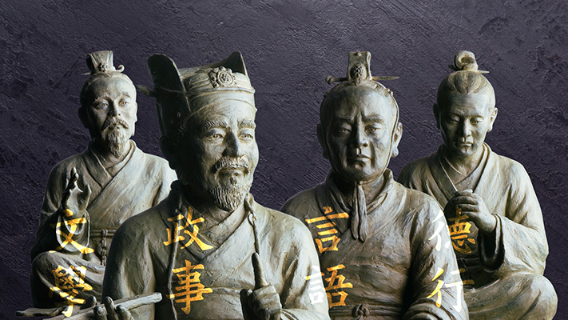

## 藝術賞析

### 七十二賢淺說(四十七)｜蘧伯玉

圖：江逸子、文：時哉

孔子五次入衛

蘧子諸賢原因

寡過知非君子

君雖無道不亡

蘧瑗，字伯玉，孔子弟子，是春秋時期衛國著名的賢大夫。蘧瑗為人外寬內直，嚴以律己，寬以待人。有一次，衛靈公和南子在寢室裡，聽到附近有馬車接近的聲音，突然停止了片刻，不一會兒車子又發出聲音。南子一聽便說，馬車上的人一定是蘧大夫。因為當時人乘馬經過公門之前，必須下馬步行一會，表示敬意。一般人嫌麻煩，見到四下無人，便不會照辦，在衛國，對這些微小支末的禮節也會遵行的，只有蘧大夫了。可見蘧瑗表裡如一，真摯坦蕩，只要是對的事情，便會維持原則，不圖一時方便。
蘧伯玉與孔子情誼深厚，孔子每次出入衛國，一定住在蘧伯玉府宅。《論語‧憲問》篇記載，「蘧伯玉使人於孔子，孔子與之坐而問焉。曰：夫子何為？對曰：夫子欲寡其過而未能也。使者出。子曰：使乎！使乎！」蘧伯玉派遣使者來訪孔子，孔子問使者：「最近蘧先生都在做些什麼？」使者回
**答：** 「先生想要減少過失，卻總覺得還做不到啊！」使者離開後，孔子敬佩蘧伯玉的修為，並讚嘆蘧伯玉派來的使者不是一般的使者。蘧伯玉也曾感慨地說「年五十，而知四十九年之非」，是一位深具反省檢點的政治家。

據《闕里文獻考》記載，衛國當時政局不穩，經歷兩次政變，蘧瑗均能置度外，不受權勢利用。晉趙簡子想要攻打衛國，派去探查的人回來稟報：「衛國有蘧瑗為政，不好進攻。」簡子便打消攻打衛國的念頭，可見蘧瑗為政的賢能，是他國敬重忌憚的對象。

蘧瑗擁有才能，一開始衛靈公並未重用他，反而信任寵愛彌子瑕。衛國另一位賢士史魚屢次諫言，衛靈公仍不聽勸。直到史魚死前，要求兒子說：「我在衛當臣子時，不能將賢士蘧伯玉推薦上去，這是我的失職。我死後，將我屍首放在牖下就好了。」史魚死後，衛靈公得知此事，大為震驚，便逐退彌子瑕，任用蘧瑗。史魚的屍諫，看得出史魚的忠心，也看出蘧瑗的君子作風與賢能。宋高宗贊曰：「有衛伯玉，夫子與居。寡過未能，薦贊使乎。以屍諫君，友則史魚。果得進賢，爛然簡書。」《論語‧衛靈公》篇記載，「子曰：直哉史魚！邦有道如矢；邦無道如矢。君子哉蘧伯玉！邦有道則仕；邦無道則可卷而懷之。」孔子將史魚與蘧伯玉在政治修養上做比較，同時顯示出忠臣與良相的不同性格。蘧伯玉在邦有道的時候，他可以「危言危行」；邦無道的時候，他可以「卷而懷之」，像國畫一樣把自己收藏起來。窮則獨善其身，達則兼善天下，澹泊自處之道，不懷得失之心。

蘧瑗於漢永平年入祀聖廟，唐開元二十七年贈為衛伯，明嘉靖九年改祀於鄉，清朝雍正二年入祀孔廟。

畫中的蘧瑗，因有官職在身，所以裝扮上顯示尊貴，其人德智兼備、敬事不苟、慎獨自律，其表情若有所思，雙手背於後，似表徵他寡過知非、行年五十而知四十九年非的自省精神。蘧瑗還有一句名言，叫作「恥獨為君子」，意思是自己具備君子的美德不算什麼，還要帶動風氣，影響培養他人成為君子。（下期待續）

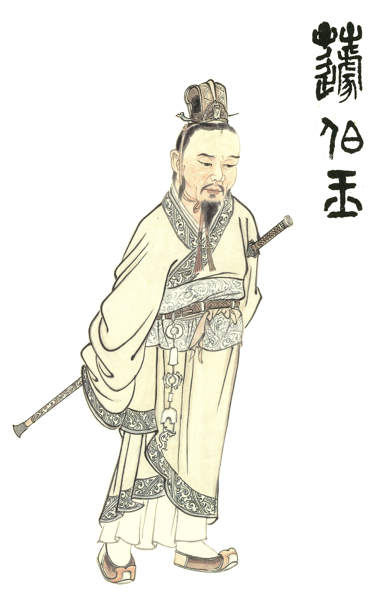

### 華夏精魂千秋（三十八）
明倫史畫　貞誠仁正　高允

華夏精魂千秋（三十八）

明倫史畫　貞誠仁正　高允

圖：江逸子、文：淨域

伴君如伴虎

編史遭大禍

正直與積德

高壽庇子祿

史畫

高允，字伯恭，北魏青州渤海郡（今河北省滄州市一帶）人；生於道武帝登國五年，卒於孝文帝太和十一年（西元三九○-四八七年）。好學清正，通曉經史術數，喜好春秋，在鄉授業。太武帝拓跋燾知其廉正，徵召為中書博士，升侍郎承領著作郎（掌撰國史），教授景穆太子拓跋晃經書，極受禮敬。

神麚二年（西元四二九年），崔浩與高允、鄧穎等共同編撰國史。崔浩想藉此「齊整人倫、分明姓族」，朝中沒有幾人同意他的作法，中書博士盧玄勸他三思而行，但崔浩堅持己見。太延五年（四三九年），崔浩聽著作令史閔湛、郗標之言，刻史於石上立於道旁，高允曾預言：「這將為崔門惹來大禍，我們也脫不了關係。」北人不滿憤告於帝，崔浩終因編撰國史而獲罪，高允也受到連累。
太子想為高允脫罪，對太武帝說：「允雖一同編撰國史，但有關制度部分都由崔浩所作，請赦命。」帝問高允可是這樣？允回
**答：** 「我與浩一同作史，至於注疏，我還寫得比他多。」帝大怒道：「如此，怎能放你生路。」太子又說：「允是個小臣子，駭於您的天威，所以失言。」帝再問真是這樣嗎？允
**答：** 「太子因為我侍講日久，所以為我乞命；但所說具實相對，觸犯天威罪應死，不敢虛妄。」帝感歎道：「真是正直呀！人難免畏死，而你臨死不移，真是不容易。對君實言，真是貞臣。」於是赦免高允的罪。

太武帝要他依旨擬詔：「自浩以下僮吏以上，一百二十八人皆誅五族。」高允認為直筆忤上罪不至死，據理強諫不奉詔。帝雖不悅，只得滅崔浩一族。太平真君十一年（西元四五○年），崔浩九族盡滅，但其餘隨從親眷保命者達數千人。

某天，文成帝拓跋濬（景穆太子之子）召開朝會，發現著作郎高允二十七年未曾升官，也不見有怨言。不覺地感慨道：「你們雖提刀持笏，但站著升官封爵。高允用筆輔國，卻一直當個郎官。他的部屬有百餘人已任刺史，你們不感到羞愧嗎？」司徒陸麗稟告說：「陛下教訓極是，高允雖沒少受皇恩，但家中貧苦，妻兒沒有恆產。」帝即前去高家察看。

帝見其年劭，知所得皆贈於部屬，生活窘迫，便按時送去衣食，並任命長子高忱為長樂太守。高允歷事五帝，出入三省，敬事清儉，以九十八歲壽終，帝賜資以喪用，諡號文。

圖解

古人平均壽命不長，三十得年，六十享壽，甚者耆壽，高允歷事五帝九十八歲壽終，直可視若嵩壽。人之壽命無非命運所成，其間造化多變，自與性德相關。綜觀高允一生，好學清正，召為太子講學，遇事能直言規勸，逢難不卸責躲避，故能得君王的寬諒重用。

江逸子老師所繪圖，特別著墨於崔浩興史之難。北魏太武帝信道，曾不顧勸大肆抄滅寺僧，君臣間不易相處。太武帝命高允擬詔：「自浩以下、僮吏以上，一百二十八人皆誅五族。」高允直筆上書罪不至死，且秉笏據理力諫不奉詔。兩旁重臣聞之莫不皺眉，為高允的身家性命擔憂。太武帝雖不悅，聽允之言，也只得僅滅崔浩一族輩；如此，高允以其性德之力，保住隨從親眷數千人命，日後福壽雙全、庇蔭子孫，是很自然的事。（下期待續）

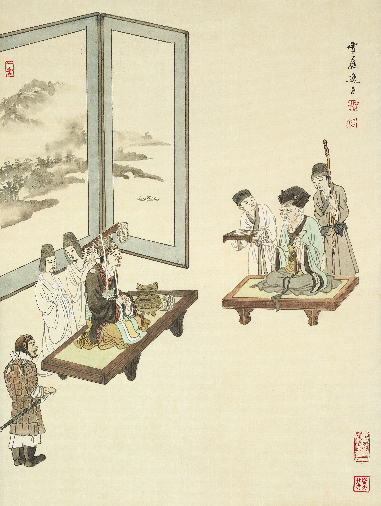

### 道藝春秋（十）
孟母善化，禮教規矩

道藝春秋（十）

孟母善化，禮教規矩

圖

古代大賢母

三遷僅一例

處理夫妻間

婆媳關係和

當我們提到孟子的母親，一定會先聯想到孟母三遷的故事。江老師則是慧眼獨具，畫出這幅非常具有現代意義的家庭故事。讓大家知道，孟母除了很會搬家，處理婆媳家庭問題也是非常厲害！

畫作上的孟母坐在榻上，孟子之妻侍立在側，還用衣袖拭淚，滿腹委屈的神情。孟子則是滿臉愧疚，低著頭站在前方。發生什麼事呢？

事情是這樣的，有一次孟子進入夫妻兩人的房間，看見妻子踞坐在地上休息，也就是兩腿像八字形一樣分開蹲坐於地，這在古代是很不雅的動作。孟子一看就非常生氣，轉頭就走。妻子覺得委屈，丈夫如此不悅，好像夫妻的情分已經到了盡頭，所以就去跟家裡的大家長孟母表達離去之意。妻子說：「我聽說夫妻在自己的房間，對待彼此應該就像自己人。但是我今天在自己的房間休息，先生一見到就非常不高興，這是不把我當妻子，反倒是當成客人了。身為一個女人，即使是作客，按規矩也不能在別人家過夜呀。婆婆，請您讓我回家去吧。」

孟母聽到自己的媳婦揚言要走，馬上把孟子叫來曉以大義：「兒子啊！按照規矩，進門之前，是不是要先問問看有沒有人在裡面，表示尊重。進入廳堂之前也一定要出聲提醒裡面的人。入內前，視線還要保持往下，這是避免撞見尷尬的事。今天你不先反省自己有沒有遵守禮節，反而拿禮節去指責妻子，是不是做得太過份了？」

孟子自知理虧，便向妻子及母親賠罪。江老師還在旁邊畫了服侍的童子，好像看到什麼有趣的事。天天在外面滔滔不絕，辯駁群人的孟子，竟然被母親說得啞口無言，實在是趣聞一件。後面的屏風是補景，水中的鴛鴦代表鶼鰈情深，孟子願意聽勸，夫妻言歸於好。岸邊的柳樹，取的是柔順之意，一方面講的是孟子之妻不會直接跟丈夫起衝突，另外也暗示孟母以柔克剛的處事態度。

其實人與人相處都會有大大小小的問題，每個人來自不同的家庭環境、教育背景、成長歷程，性情自然大不相同。但這些都不是問題，即使是家人之間，面對事情也不能完全用感情判斷是非，感情有時是沒有標準答案的，人總是習慣放大自己的委屈，很少會先去體諒別人。孟母聽到媳婦的說法，並沒有偏袒自己的兒子，而是以「禮」作為依據，讓家人之間互相尊重、和睦相處。那禮是什麼呢？《禮記‧樂記》說：「禮者天地之序也。」懂得順應天地萬物運行的道理，當然包括與人之間的相處之道，自然生活的一切就能在秩序中運行不亂。 （下期待續）

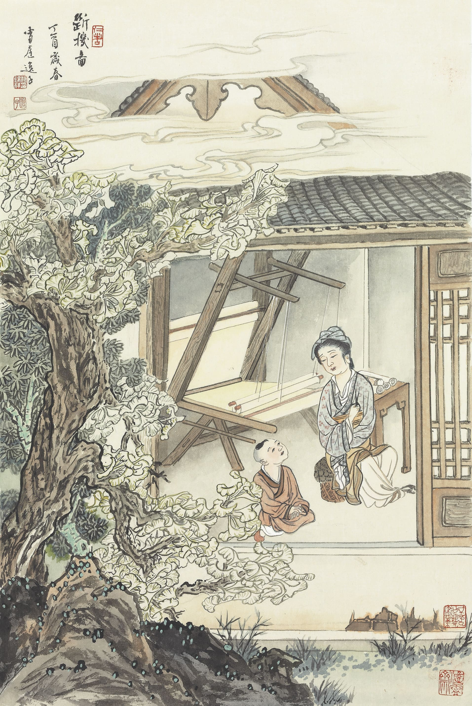

### 以地藏菩薩本願經圖導覽(四)

圖：江逸子、文：唐瑜凌

託孤寄命地藏王

分身來集願承擔

忉利天宮是盛會

彌勒出世前化主

分身集會品第二

此時無量世界的分身地藏菩薩，各領著所教化而得解脫的大眾，來到善法堂天。以歡喜踴躍，目不暫捨的恭敬心、好樂心來瞻仰世尊，並聆聽法義。

世尊此時像世間慈父對待幼子那般，伸出金色的手臂，親撫各地分身而來的地藏頭頂，表示讚許、加被與關懷，讚歎地藏大士與自己皆是累劫勤苦，以教化的方式，度脫剛強難化的罪苦眾生，並昭告大眾，滅度之後到彌勒出世前，所有娑婆五濁惡世的眾生，教化的重責大任交付給地藏菩薩，直到彌勒出世。

畫中供桌上擺放著蓮花樣式的香爐，香煙裊裊、祥雲湧現，代表著佛的五分法身香，佛的內涵稱為法身，比喻具有五種功德。修戒定慧所生香氣，謂之戒香、定香、慧香，得了解脫，謂之解脫香（根本位），在後得位了知已得解脫謂之解脫知見香，合之即是五分法身香。香雲繚繞中，釋迦牟尼佛跏趺坐於蓮臺之上，有項光表徵智慧，有背光表徵威神力，身形較大則表徵證量，慈眉善目中殷切承許託孤大臣地藏王菩薩。而世尊左手向上代表接引提攜，右手手掌向下表示慈悲加被。在重重圓光中顯示佛的威神力、智慧力、神通力等等皆不可思議。

這種場景猶如世間的託孤寄命，地藏菩薩猶如世間託孤寄命大臣，全權承當佛不在世的重責大任。畫中的地藏菩薩具有項光，正跪於佛前如託孤大臣，領受法旨。兩旁的比丘合掌形象，表徵分身來集的地藏。此時的地藏涕淚哀戀，安慰世尊，無須擔心後世惡業眾生，無人承當教化他們的重責大任，堅定的決心再三宣告自己願意承擔這種辛苦艱難的大任，得到佛的肯定讚歎並願從旁暗中護持。也預告地藏菩薩久遠劫來，不斷地發大誓願，並完成誓願，在度化因緣圓滿，會證得佛果菩提。

人在臨命終前會表現出內心最放不下的事，世尊唯一放不下的就是娑婆世界的罪苦眾生。這一幕有地藏菩薩捨我其誰的承擔，有世尊讚歎且展現最有誠意的護持，世尊是能委託，而地薩菩薩承許自己在佛滅度之後的承擔大業，成為最殊勝的所委託，而後世罪苦眾生的我們，是中間委託之人，吾人何其有幸，得到佛的眷顧，地藏的承擔，敢不奮力行持自利利他，以報答佛及地藏大士深恩厚德。（下期待續）

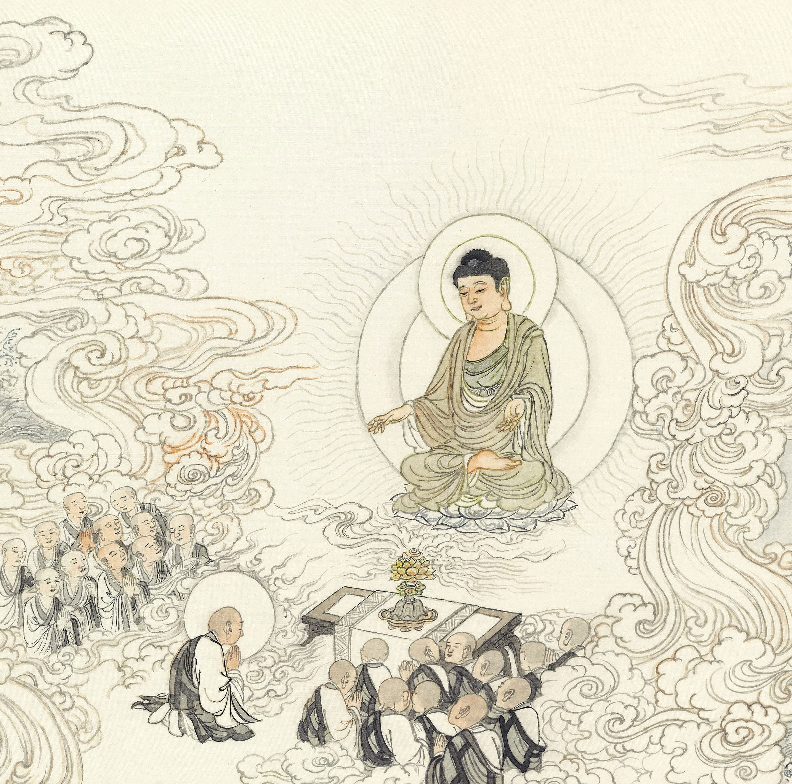

## 活動報導

### 觀賞「風雨一盃酒」孔奉祀官德成先生（號達生）紀錄片有感——俱見天意

傳線

經歷難思變革

達生向晚灑脫

雪廬無怨護持

孔家關鍵延續

民國一○五（公元二○一六）年在「翰墨心情」書法展中，臨了一通禮器碑碑文「惟永壽二年（156），青龍在涒歎……，製作之義，以俟知奧，於穆韓君，獨見天意……」，昔時對臨，於碑文無感，丙申年再臨寫時，怎知正逢該碑卅一甲子後，特別感遇「獨見天意」四字，乃於作品集中，就此抒發烏托邦的感想。韓明府見孔廟遭「秦項作亂」後，而「離敗聖輿」，睹其崩壞，而呼籲修復。有鑑于此，除「造立禮器，樂之音符，鐘磬瑟鼓……」，並「宣抒玄汙，以注水流，法舊不煩，備而不奢」，無力查證韓君此舉，結合官民共同整飭孔廟，就孔廟修復而言，是否為濫觴，但無疑為當時朝廷所高度重視，立碑並安置孔廟，即孔廟三碑之一。遂後歷朝歷代為尊崇百代宗師，祭拜萬世師表的孔聖，持續不絕的莊嚴孔廟，方有今日的規模，信乎！禮敬孔聖，知禮羊不可棄，皮之不存，毛將焉附，明此，時士人詠韓君之德，渠「獨見天意」耶！

衍聖公名號消，奉祀官頭銜始，達公正逢其時，傳奇的一生，「儒者行」，載之甚詳，為其一生的傳記，其中描述在日麗澤大學姊弟重逢，相擁而泣，真情感人，令後人見證兩岸分隔的悲痛，讀之賺人熱淚！後贈書「風雨一杯酒，江山萬里心」予姊，達公風雨一生，心繫江山萬里的三孔，汪君（汪士淳）「儒者行」，竊謂別有見地，是另一種形式的見天意耶？

繼之羲之堂於國父紀念館博愛藝廊，有「儒者之風」百歲紀念展，將達公一生學術及書法成就，披露予世人，尤其是三禮的傳道，特別是儀禮士昏禮影片的製作，更是劃時代的壯舉。深厚的金石素養，出入大小篆，融為自家風格，弟子獲之如得至寶。行書信筆拈來，化魯公筆意於腕下，蒼渾有味，不讓前賢。展出之時，偶充當中華無盡燈文化學會導覽義工一員，為人解讀達公書作，其中見「敦品勵學」之作，殊為感動，姊弟分隔兩地，聞大姊惡耗，向其述說無時不以此四字自我砥礪，真情的表露，賞之發人深省。又以「言忠信，行篤敬」訓勉孫子女，夫子格言中難得一見的銘文性質，亦有深意。此展告世人，達公一生精進好學，作為孔聖七十七代嫡孫，無愧先人矣，此展又是得見天意的形式耶！

而後在文化學會有一小型達公紀念展，當時也忝為導覽員，為人解說時，忽生一發想，世之聖人，他如耶穌、穆罕默德等，其有後裔在今世乎！縱有之，孰若孔子世家譜之綿延不絕的史錄，孔聖沾溉後世，特別是中華民族，其深厚也不可思議耶！

今（民一一○）年十一月二十八日上午，再次觀賞學會苦心擘畫六年，不斷修訂後的「風雨一盃酒」達公紀錄片，觀後實有所感，不揣庸陋，以詩「俯瞰巍峨三孔地，隨軍巧避日寇虜。讀書養志居蜀臺，飯食曲肱繼鄒魯。功業赫明如草芥，人師化雨若先祖。從今飛入尋常家，有生以來竟目睹」速記之，以留當下的感懷。

首聯巍峨三孔地，達公昔日生於斯長於斯，因抗戰而徙後方，得免日寇威脅利用，此人生中第一次留與離的抉擇。次聯言所居蜀西歌樂山猗蘭別墅，二樓平房，甚簡陋矣！惟師友德馨，可安居讀書養志。抗戰勝利後，又逢國共內戰，在美游學後，轉遷臺員，及老居於台北南京東路公寓，生活雖不優渥然得避文革浩劫，是人生第二次生死的抉擇。於臺大上庠傳道授業解惑，得收寶島英才教之，是人生志趣第三次重大的抉擇。三孔、歌樂山、臺北公寓，三個場景，畫面差距，何其懸殊！若不是心存「飯疏食飲水，曲肱而枕之，樂在其中矣」及「誨人不倦」的胸懷，試問何以處之！影片中諸弟子，一時俊彥，有黨魁曾院士永義、三劍客中二位：黃院長啟方、禮經著名學者章教授景明與經學專家葉國良等等……，彼等侃侃而談，渠師治學嚴謹，課堂上諄諄善誘，課後溫煦待之如子弟，聞之感佩師資道合，此蓋為鄒魯之風耶。

三聯述達公除奉祀官特任官一職外，歷經國大代表主席團的主席、故宮中央博物院管理委員會主任委員(相當於今故宮博物院的院長，兼中央圖書館的館長)、以聖裔身份佐政府外交，考試院長等顯赫地位，不戀棧職位，得巳無喜慍，如女弟子潘教授美月所云，終其一生栽培弟子成就德學，為最大樂事，所謂「樂節禮樂」，五十三載春風化雨，一如夫子「誨人不倦，何有於我哉」！末聯是自己深深的感慨，回顧聖裔逢歷史上秦火坑儒，而南宋南北宗等，不論歷代聖裔為侯為公，所經變革之大，莫大於達公也，時代巨輪慘烈，「嘆鳳身嗟否，傷麟怨道窮」，達公從小失怙失恃，及長遭戰火，中年聞文革隳壞鄒邑魯宅且挖墳，逮老奉祀官府被廢除……，達公猶如「鳳兮！鳳兮！何德之衰……今之從政者殆而！……」的翻版。三孔劃成世界文化遺產，弟子洪國樑的表露，最為語重心長，當是達公心聲？此亙古無有的劇烈變化，使後繼之奉祀官，將隨達公飛入尋常百姓家，影片似已傳達如是訊息！七十九代嫡孫孔奉祀官垂長，偉岸 如達公，氣宇不凡，所謂「德不孤，必有鄰」，既有達公諸弟子門生及有識之士羣力相助弘揚儒學，再團聚孔氏族人，爾後也能因應時代需求，開創出新的局面。

有生之世，透過紀錄片竟目睹聖裔千古無有的變局，拍攝歷盡千辛萬苦的二位導演，及監製人、製作人及相關贊助者，共作此富有深遠文化意義的紀錄片，應也是見此天意耶！

聖教的內涵為中華民族的核心價值，秦漢以來已成文化的主流，前修證之史實矣，其興衰與國運成正相關。天意為何？即聖教不衰，不論在聖教之枝葉或根本上維持，流別或源頭之闡明，也不管形式表徵之彰顯或實質內容之闡發，都是維繫聖教之不墜，均見天意耶。

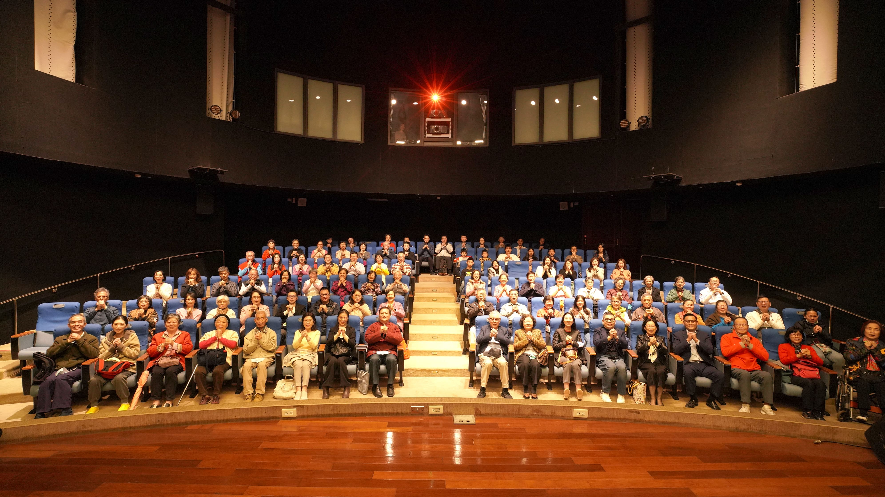

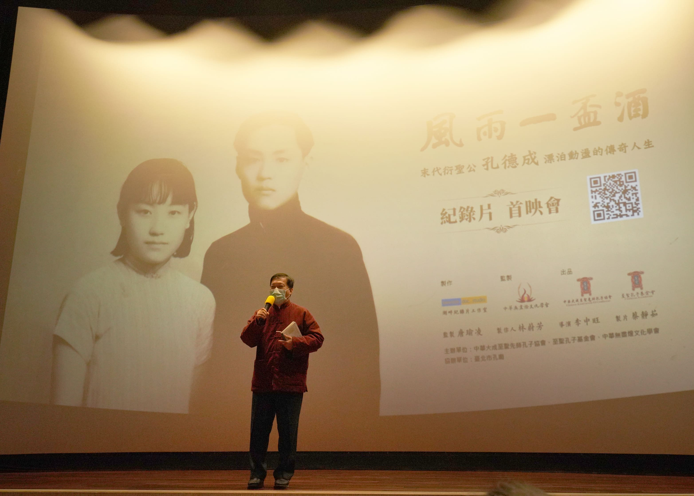

### 風雨一盃酒—東勢七映

張酒儒

東勢盛事紀錄片

山城活動耳目新

前行場地能除穢

農地佳賓續未來

殊勝緣起

風雨一盃酒，講述孔子第七十七代嫡長孫---孔德成先生一生傳奇，身處在風雨飄搖的大時代，展現讀書人風骨的紀錄片。東勢有幸於二O二二年一月九日（日），恰逢雪公誕辰紀念日放映，顯得特別有意義，能有此殊勝的一會，要感謝實栽農園負責人賴師姐的發心，在一個以農業為主、人口老化的東勢地區，找場地、找觀眾、找志工、邀貴賓……，點點滴滴化不可能為可能，可見只要肯承擔，必得佛菩薩加被。一月八日清晨下了一場大雨，五點十二分發生四點五級震央在東勢的地震，猶如諸佛來集，大地震動，普降甘霖，護持七映！

歡樂前行

去年五月因疫情關係，各種大型室內活動停辦，東勢高工國際會議廳，因長時間未使用，內外環境都需大掃除。活動前二天，近二十位志工以最虔誠、歡喜的心，協力整理，煥然一新，也感謝二位導演，二度來會場，一測再測影音設備，並製作貴賓名牌，黏貼在貴賓席上。因奉祀官孔垂長先生闔家及諸多貴賓們，觀賞完紀錄片，隨後即蒞臨實栽農園，所以小木屋及庭院等環境，也必須整潔雅致，以歡迎貴賓。志工們在歡笑聲中，共同完成這些前行任務。

賓客雲集

當天除了孔奉祀官闔家，在師長的陪同下蒞臨會場，另有台中市政府客委會江主委、東勢區翁區長、山城週刊吳社長、外交部退休鄭大使、及多位校長、教授、企業界主管等，共約兩百二十人與會，是東勢罕有的藝文活動盛況。唐老師在會中致詞時表示：希望藉由紀錄片做為出發點，將客家文化與中華文化結合，落實至生活中，讓儒學涵養對社會有所貢獻。

貴賓分享

台中市政府客委會江主委分享：製作團隊十分用心，考證詳實，片中描述切要，孔德成先生一生奉獻於教育，作育英才無數，直至生命最後一刻，正呼應客家人崇尚文化、以讀書為本的精神，主委並以客語發音，舉例客家人對子孫期勉要用功讀書的俚語---「濫泥糊毋上壁」與論語「糞土之牆，不可圬也」相對應。孔家說，江主委是他們看過最好的政府官員。唐老師也非常樂意助他一臂之力，在東勢推廣文化事業。

學習等流

孔德成先生出生才三個月，就襲封為衍聖公，自幼習禮，五歲就正式主持家祭。千百年來，歷代衍聖公晉見皇帝，皇帝都要衍聖公好好讀書，讀書猶如與生俱來的使命。孔府請來最好的老師，如莊陔蘭、呂今山等教四書五經及書法，還加設歷史、地理、音樂、算數、語文等科目。孔先生憶兒時，背書乃天經地義之事，現年事雖長，仍能熟記一些，實在是受惠於幼時嚴格的教育所賜。加上留美期間，接觸到美國學人小題大作、鍥而不捨的精神，終其一生，都是學而不厭，誨人不倦，在台大授課五十三年，直到生命的最後一年。

豁達人生

孔德成先生是位遺腹子，出生十七天，生母王太夫人就去世，由庶母陶夫人養育，九歲庶母去世，即承攬孔家大業。一九三七年(十七歲)日軍進逼山東，蔣委員長諭：撤退時一定將奉祀官孔德成帶走。不得不叩別祖廟，離開家鄉。大姊孔德齊因遇人不淑，心情抑鬱，二十五歲就走完短暫的一生。一九四五年留守孔府的恩師莊陔蘭受到土共迫害致死。一九四九年(二十九歲)舉家遷臺，從此未曾回故鄉，與二姊孔德懋分隔兩地。一九六六年(四十六歲)文化大革命，孔府大浩劫，祖墳遭刨，偌大家產在他手中被毀損、沒收，這種椎心之痛，令孔先生無顏回鄉見祖先，誓言此生絕不回大陸。一九八九年(六十九歲)長子維益逝世，享年五十，喪子之痛，讓孔先生一生悲傷的情緒宣洩出來。一生遭遇無數生離死別之苦，若沒有無常或空性的見地，要如何度過這些難關？原來孔先生號達生，有其豁達淡泊的人生處世態度。

餘興節目

放映會結束後，貴賓轉移陣地，參訪實栽農園。孔子第八十代嫡孫，體驗拔蘿蔔的樂趣，非常開心！種植無毒蔬菜，提供自我及他人的健康，大家對這片淨土都讚歎不已！希望有更多人投入，發揮淨土最大價值。部分貴賓留在農園午餐，享受師姑們的天廚妙供，一碗又一碗，頻頻叫好，不知素食竟可做得這麼美味。鄭大使幽默的言談，更添加用餐愉悅的氣氛，希望藉這次的活動，凝聚更多在地關注文化的鄉親，大家攜手合作，再造東勢風華。

美中不足

這次辦活動，多虧蓮友們大力幫忙，以及親友們的鼎力相助，大致圓滿落幕，但仍有缺失，有待改進，即影片播映完後，觀眾紛紛離席，猶如看電影散場般地離去，以致後面貴賓精彩的心得分享，少了約三分之一觀眾聆聽，非常可惜。因對當地觀眾屬性不了解，未能先設應變措施，如工作人員應提醒還有心得分享，請稍後離開；或在播映前就先請貴賓致詞，以提起觀眾觀賞影片的意樂。若有其他更好的辦法，歡迎大家建議，作為下次辦活動改善的方針，或有未盡事宜，也請師長、蓮友們多多指教。

### 回首辛丑牛年大陸讀書會點滴

弘毅、譯雯、樓迪波、王金

人生大事學習心得　弘毅

忠厚善良堅持道

有幸人生做善友

切磋琢磨日日新

要為成佛做資糧

本學期繼續跟隨白老師線上學習人生大事課程，透過老師有情有理的傳承講授，又結合具體事例說明，使我認識到人生大事對於我們每一個人都非常重要，可以說人生一切的經營都以之為核心，要真正當回事，以下是本學期的學習心得。

一、把往生成佛當成最大事業。如上課所說，一般人上班工作真正是為了什麼？無非是賺錢，就算工作時沒有一直想著賺錢，可是內心隱微處卻是如此，任運的生起，無處不是佛法，以世俗為道用，把這種覺受抓過來，用到學佛上，早上一睜眼，第一念就要想著成佛，一天的工作生活都要以這個念頭來總攝，所說所做都有服務於這個想法，都為成佛做準備，積聚資糧。

二、人生無常，要有危機意識。我們一直講人生無常，可是如白老師所說，這一般都是口頭上說說而已，這樣的覺受沒有真正的生起，否則怎麼還會放逸自己呢？正歎他人命不長，哪知自己歸來喪。都是看到別人無常，自己卻很有常，沒有真正的無常觀念，人生就是得過且過、隨波逐流了，人身難得，佛法難聞，傳承難遇，有腦力，有體力，有因緣，這些條件都具備，實在是稀有難得。必須要好好把握，抓住當下的機會，抓住那命懸一線，否則真的不知道未來會怎樣。自二○一九年與諸位老師一別之後，先後經歷兩岸關係的變動，新冠病毒的肆虐，當下又面臨網絡的監管，從這些真的可以看出，一切法都是因緣而起，因緣具足時，都可以順利開展，也沒有覺得怎樣難得，可是當因緣變化時，一切又顯得那麼虛幻，好像這件事很難把握，難以實現。回想老師在學會的課堂上為我們暢演教法，時而慷慨激昂，震動人心，時而明辨義理，發人深思。還有課間、課後與諸位老師學長的一起切磋談論，在學會學習、生活的點點滴滴，老師在故宮博物院的導覽，在學會老師的帶領下的出行、參觀，想起臺北夏日的炎熱，冬季的雨聲，特別有一次老師為我們送行，在雨中，我們的車漸行漸遠，回頭觀望，老師仍然在雨中揮手，不禁想起老師講的李白那首詩：「孤帆遠影碧空盡，唯見長江天際流。」這一幕雖然已成為過去，卻深深的烙印在我的心中。這一幕幕的場景宛如夢幻泡影，都是被浮現出來的，可是沒有這些，就沒有目前自己的觀念變化，如白老師所說，都沒有自體性，所以要善於把握當下的因緣，創造未來有利的條件，以有利於自己和他人。

三、平常的功夫很重要。如《楞嚴經》裡面說的：「如染香人，身有香氣」，常念佛，常串習佛法，身上就有佛的味道，就像染香一樣，身有香氣，要長時熏習。決定能否往生，重、近、習、念很重要，如果沒有重大的善惡業，就要看平常的用功了，平常的用功也是為了最後一念的正念提起，平常不用功，臨時抱佛腳，寄希望於最後有人助念直接往生，那是非常難的。

四、善法團隊的重要。除了自己用功外，還要注意團隊的經營，沒有好的團隊護持、助念，往生是很難的。要注重平時團隊的共學共修共助，在見地上相合，在生活上互助，多結善緣，特別是學佛的因緣，這是未來特別要加強的地方。

以上是本學期學習人生大事的粗略心得，課程中有很多亮點，很多新穎的觀念，很多打動內心、啟發思考的地方，內涵十分豐富，可惜因為自己的經歷有限，還有陪孩子上課的耽誤，所得不及萬一，實感慚愧抱憾，真心祈願來年能夠繼續學習更多內涵，以此自利利他，成就自己和他人的人生大事。

論語中的六經心得　譯雯

多領域學習的時代

文化必須學的領域

創造不一樣的際遇

成功人不說的秘密

當今社會背景下，禮當如何損益。末學談談自己的想法。

一、就國內的情況，大家談禮色變，大多數人已經不知道什麼是禮，但是對禮充滿成見，以為禮教就是腐朽沒落的舊中國的代表，禮教會殺人。今日要消除這些成見談何容易，成年人從小受到的教育，得到的認知是非常難改的，而且越是高知家庭，越是對禮教充滿偏見。末學從前有一女同事，人非常聰敏，末學也曾推薦她看了一些學會的課程。她聽後以為很不錯，但覺得現在有意思的東西太多，還是不願意認真的學習國學。只是提了很好的建議：成年人的習為何如此重要，再談禮的損益。習氣很多時候積習難改，但是對小孩子來說，尚可讓他們從小就學習正確的知識，不妨從幼稚園的小朋友入手讓其學習。末學一聽便想，學會常年開展幼稚園國學教育，可見讓幼兒學習，讓其家長學習都是非常必要的。本人在沒有機會接觸到學會的國學教程時，也對所謂禮教充滿偏見，以為禮教束縛人性，學習了方知，中華文化的核心是禮，禮不是束縛人性，而是建立一套制度，真正的將人性的光輝引領出來，使得個人養成好的習慣，家庭建立好的氛圍，社會和國家建立好的風氣，所以第一步是必須知何謂禮。

二、兩次工業革命後，人類的生活水準得到空前提高。同時西方列強歷史上各時期對中國的侵略，國家各個政權的慘敗，使得中國人對中華文化充滿了懷疑和自卑，以為我們的文化和制度都是比不上西方的。所以近代以來提廢除中國文字者有之，甚至要將中國文化連根拔起，全盤西化。且不說國家層面，先說家庭層面。五倫十義中的孝字變成了十分奇怪難解的事物，國家提倡，普通民眾論理都喜歡講一個孝字（能否講到核心且先不論），但越是高知越是對這個字眼不甚討論，當今的很多家庭喜歡借用英文的LOVE表達父母子女間的感情，其實表達的意思跟孝有一定的接近之處，可是內涵是沒有孝豐富，那麼現在我們再討論孝，能否從西方人所說的愛為突破口做對比，讓普通人瞭解何謂中華文化的孝？還有女性在家庭中的地位和作用，上兩周的佛學課白老師也多有講到，女性在家庭教育中的重要性。末學曾聽過一個笑話，如果想害一家人，就故意把自己家女兒教壞了嫁到這家，保證這家祖孫三代都不要想有什麼好日子，一家人全部完蛋。這雖是笑話，但可見夫妻關係在倫理中的重要性，特別對於子女教育來說，母親起到很大的作用。現在的女性多是職業女性，也很難像古書裡說的那樣，可以專職在家照顧家庭，教養子女。然而並不是說母親不天天守著孩子，就教不好孩子。末學的舅媽就是個良好的案例，她是五十年代英語專業的大學生，多年以來一直孜孜不倦尋求政治上的發展，大舅也是一位學者。夫妻兩人回家以後，就各自進入自己的房間學習，兒女看到父母親非常繁忙於自己的工作，也養成了極其自律的生活習慣和學習習慣，雖然舅媽沒有把時間花在天天指導兒女做作業上，她也實在真的抽不出這個時間來，但是言傳不如身教，末學的表姐後來成為世界排名前十以內大學的教授，可以直接用英語給英國人講法學。正如白老師所說，時代發生了變化，要用時代可以接受的語言去講授傳統文化。五倫十義是禮的基礎，怎樣觀待時代去講好倫理道德，讓現代人建立良好的家庭關係和社會關係，其實難度真的很大，道路也十分漫長，只是這些工作必須有人願意承擔。

末學想用〈知是眾妙之門〉的科判結尾，所有的隱士都勸導孔子不要再四處兜售仁政主張，國君們根本聽不進去，像他們那樣隱居才是聰明正確識實務的，然而孔子不為所動，政治的方法行不通，那就辦教育，通過教育教化人才，傳播文化，再慢慢改良政治環境。一次杭州讀書會的成員一起討論，大家談到歷史的進程，有朋友以為，歷史是客觀的，總是會隨著規律去變化，沒有必要太多人為干預，總是會有人去做。可是末學以為，如果大家都覺得有別人會去做，自己不動，等著有別人會去承擔，那到底最後誰去承擔？歷史又會往哪裡走？末學聽唐老師的線上視頻，說起來雪廬老人九十多歲了還在給青年學生傳授中華文化的總綱「志於道，據於德，依於仁，游於藝」，而且並不因自己講了幾十年早已滾瓜爛熟了就不備課，而是每次上課前一天都不見客，認真在家準備。以期每次課程都能跟上時代的發展。末學實在深受感動。也感到自己十分幸運，能夠跟著學會，參加白老師每週三次的線上研討，課程理據分明，非常非常細緻，也讓末學深為佩服。今天這堂課非常的具有時代性，而也只有走入時代，禮教也好，國學也好，才能得到更大更寬廣的發展，中華文明作為全世界沒有斷代的文化，繼續發揚光大。

二○二一學習心得體會   時哉杭州讀書會譯雯

勇於檢討自己的純潔    找到方向迷茫的去除

慢慢修時快到的篤定    點滴累積能力的必然

農曆虎年馬上來臨，想想牛年春節似乎尚在眼前，時光如梭，不禁讓人傷感於光陰虛度，而個人並沒有辦成多少事情，或者扎實的學到多少知識。

回首新冠疫情以來，生活中種種的變化，學生一方面慨歎人生無常，誰也沒預料到科學如此昌明的時代，病毒會肆虐全世界。因為新冠疫情，多少人被裹挾其中，上演各種悲歡離合，很多的故事讓人或憤怒或傷感，個人也只能唏噓不已，千萬種的情緒難以道出；另一方面，學生也很慶幸，能參加白老師開設的線上學習，繼而聽了唐老師很多的視頻課程。人生終於找到了正確的方向，彷佛於混沌中不斷摸索的人尋到明燈，也彷彿在被溫水煮的那隻青蛙，突然知道該往哪個方向努力前進，能改變自己最終悲劇的命運。

記得白老師二○一九年尚在杭州為我們傳授國學知識時。某次課堂，學生突然想到：《論語》裡講了忠臣孝子，講了夫妻兄弟朋友，可是沒有說「我」？為什麼沒有「我」呢？「我」又到哪裡去了？入世的學問，不是特別的強調「我」的這分需要努力的嗎？西方人也認為，東方社會始終只強調集體，從來沒有「我」的位置，「我」的感受是看不到的，「我」是不受重視的，「我」是可以為了集體為了大家隨時犧牲的。所以五四運動以來，新興知識份子常常抨擊中國傳統文化沒有人權，不在乎個人的感受，只有「君君臣臣父父子子」，「君要臣死，臣不得不死」，「父要子亡，子不能不亡」。傳統文化裡糟粕極多，知識份子往往喜歡西方的哲人和哲學，以研究蘇格拉底等古希臘的哲人，和黑格爾、尼采等近現代哲學家為榮。

學生當時忍不住請教白老師，《論語》裡為什麼沒有我？我到哪裡去了？白老師當時笑笑沒有回答，學生也就沒有再糾結於這個問題。

後來白老師線上開設了《佛學概要十四講表》課程，曉青學長送了末學課程教材。學生打開此書相當震撼，原來「佛」的意思是智者、覺者，而學佛的目的居然不單單是學生一直以為的求解脫，而是成佛。當然白老師也說了成佛是很難很難的，好比我們一個普通人，說自己的人生目的是成為比爾‧蓋茲。

但是佛學相較其他宗教來說，其他的宗教都只是讓信徒行善，做個好人，最終到達理想的天國，永遠受到上帝的庇護。其他宗教的子民，他們的上帝永遠是高高在上的憐憫世人，只有釋迦摩尼說：學佛的目的是為了成佛，是可以和佛一樣成為智者、覺者，獲得真正的自由，不為宇宙的規律所繫縛，獲得真正的自由。由此學生以為佛的境界和慈悲心不是一般宗教主所能比擬的，佛學是門極有趣的學問，對不同根基的人佛說法的方式有也不同，每個人都能在佛學中得到真正的樂趣。

學生很小的時候，就覺得自己的人生目標就是為了追求自由，但是隨著年齡的增長，也知這世間只有相對的自由，沒有絕對的自由。學生從小就認為在快樂的境界中一定要收斂自己的情緒，否則樂極生悲就在眼前，而且往往世間的快樂，在體驗時非常開心，比如吃好吃的，到好玩的地方去玩，掙了很多錢，看了很好看的書，買了自己喜歡的東西……，但是過去以後，這份快樂往往特別脆弱，而且容易變質。學生小時候特別愛吃牛肉乾，但是每次吃了腸胃都會不舒服；到好玩的地方玩過了，當時好高興，過了也就覺得如此而已，甚至隱隱覺得還不如不去；掙了錢，又覺得不應該太多花在自己身上，結果自己辛辛苦苦操勞，錢永遠是給周圍的人和事掙；看了好看的書，當時覺得好看，時間長了很多也就淡忘了；買了喜歡的東西，也許過幾天就完全不喜歡了。而且心中隱隱覺得，太過開心必然招來禍事，各方面必須克制為妙。可是學生學了佛法以後，內心有一種安然平靜之感，學習佛學真的可以學的時候很高興，回味的時候也很高興，不斷的學習，不斷的對治煩惱，不斷的增上，日積月累有所得，雖然人世間難免遇到許多的坎坷與不幸，學佛以後能從容面對，不怨天尤人，能從內心中升起覺察與懺悔之心，破除種種煩惱障。

從學佛開始，學生就覺得除了聽白老師講，時間安排是固定的，課時又少有點不太過癮，必須自己大量的學習，才能對佛學有初步的了解。於是又去網上聽了徐醒民老師、鄭振煌老師講的《佛學概要十四講表》。醒公的課學生是在二○二○年夏天聽的，當時完全沒有一點佛學基礎，聽得一頭霧水；鄭老師的課學生也是在十月聽了一段時間，其中夾雜了英文梵文，還有各個教派的知識，非常豐富，鄭老師講了好幾年都沒有講完，學生覺得難度很大，但是還是堅持有時間就聽一些。十一月份學生偶然看到聖賢法師和達賴喇嘛的世紀法會的視頻，心中生起極大的歡喜和羡慕，甚是羡慕那些可以從小便學佛的大師們，有機緣很小就開智啟蒙，不用像世俗人一樣在世間如孤魂野鬼一般的遊蕩，以為是周遭一切是熱鬧的，其實都是空。目前學生在心無旁騖反反覆覆聽唐老師在蓮榮網上學的佛學課程-《四十二章經》和《華嚴經》。聽了唐老師的佛學課以後，別的老師的佛學課學生都放棄了，唐老師的課確實字字珠璣，反覆聽的好處在於，學生佛學基礎很差，之前沒有接觸過佛學，所以很多地方聽起來都猶如天書一般，但是每次聽都覺得多少聽懂了一點，所以知識反覆咀嚼，依然其樂無窮，就如同學生聽老師講《中庸》，每次聽都像一次新課，知識豐富無窮，歡喜心無法形容。

學生二○一三年偶然去舟山出差，便順路拜謁了觀音菩薩的道場。二○一五年始學生就決定不要當天離開，在普陀山上住一晚上。那晚學生記得很清楚，晚上在百步沙散步，突然就來了一隻非常黏人友好的小狗，和學生玩了很久，可以說是學生遇到的陌生狗之中，最為友善的一個。小狗走了，學生站的位置就在普陀山巨型觀音像的側背後，學生一直凝望觀音像的方向，突然之間就意識不到身體的存在了，有個幾秒的時間覺得自己脫離了身體的束縛，當時的感覺是真自由了，前所未有過的愉悅，短短幾秒這種難以說明的愉悅便消失，身體的感覺也回來了。學生雖然覺得這種感覺很真實很妙，但是因為從來沒有結交對這方面知識有了解的朋友，也就沒有太過在意。只是會覺得，原來身體真的是個累贅，沒有了會舒適很多。但是「子不語：怪力亂神」，這種說不清道不明的體驗，如果遇到騙子，多半會被騙去搞靈修，這種靈修往往是騙都市有錢有閒的人口袋裡的錢的，組織這類活動的人滿嘴跑火車，沒有一句真話，還是完全不要認識為好，當然也許其中真有能人，但是遇到的機率太低，沒必要去賭概率，奇遇的機率極低，沒必要專門花時間去找尋。

學生在杭州多年，杭州被譽為江南佛國，吃齋念佛的人極多，信基督教天主教的人也多。學生最早的民主方面的知識啟蒙，便來自於杭州的基督教徒，可是後來沒有跟他們再來往，是發現他們私生活不太嚴謹，而好的宗教人士在學生看來，私生活必須非常嚴謹才是。當地的學佛人很喜歡到處放生，以至於到處都是食肉的巴西龜，把土生土長的本地龜吃得難覓蹤影，也使得外界對學佛的人很有看法，所以學生對私生活不嚴謹，缺乏起碼常識的人講的話真的一句都不敢多信。多年以來，學生一直覺得宗教是極好的，尤其佛教是很高深的學問，但是沒有機緣的事情，學生是一向不去強求的。不是真正有智慧的老師，學生也不甘願真正聽話，進而去信解行證。

二○一九年十月的時候，學生就聽白老師的規勸，開始吃素，到疫情開始以後，學生就許願今後不再吃肉。小時候，有次和母親上街，請求媽媽花了五元錢買了只烤鵪鶉，這在大家收入不高的八○年代，已經是很好的零食。學生很想吃這個鵪鶉，可是鵪鶉閉上眼睛的樣子至今歷歷在目特別清晰，它特別特別的痛苦。當時學生就哭得非常傷心，媽媽在旁邊一直笑學生膽小，學生也害怕浪費食物辜負母親的心意，媽媽覺得這是好東西，自己一口也捨不得吃，全部留給女兒。所以學生一邊哭一邊將鵪鶉整個吃了下去。後來，學生也常常問父母，為什麼人要吃動物呢？父母的回答都是：動物本來就是給人吃的，如果人不吃動物，地球的生態平衡就會亂掉，所以吃動物是沒有任何錯誤的。小時候過年都是家裡在菜場買活雞來殺，父親實在不是一個殺雞的高手，每次他把雞殺得亂叫亂飛，學生都忍不住一個人躲在臥室痛哭，但是說來慚愧，每次雞肉吃得最多的也是學生本人。現在想來，學生很為父親難過，他本來長期吃單位食堂，自己什麼都不會做，更不會去殺生，突然有這麼個小孩，也只能選擇殺掉這些無辜的動物滿足孩子的口腹之欲，平添了很多罪過。作為小孩子，學生無法克制對肉食的渴望，成了真正的肉食動物，也再不為吃肉感到羞愧和傷心，但是每每是自己需要做菜觸碰生肉時，心裡還是會有不適和難過。索性二○二○年三月到如今，學生都沒有違背過誓言，沒有再吃過肉，也不再想吃肉了。吃素後，果然心情平和了很多，沒有那麼暴躁易怒。

每每聽白老師週四的《人生大事》，周日的《佛學概要十四講表》，配合白老師消文的老師學長們都非常的精進，學生內心非常羡慕。然而也知道這份對佛法的精進，是各讀書會的老師學長們長期投入時間精力所經營起來的氣象。正如唐老師常說：快快修時慢慢到，慢慢修時快快到。所以也沒有什麼可著急的，只要從內心真正產生法喜，認真去聽學會的種種的佛學課程，假以時日必有所得。

原來學生常常煩惱的原因，是心裡有那麼一個我，總覺得我受了委屈，我很辛苦，我很累，別人都不理解我，也不體諒我，所以常常生氣心火旺盛，進而影響睡眠。現在學生通過學習國學和佛法，知道其實並沒有一個有自體性的我存在，我只是因緣和合所生，今天的我和過去的我、未來的我都在不斷變化，輪迴中的我也許做錯了很多事情，所以今生會受到他人的一些挑剔和責難，如果再為此不高興，和眾生結下惡緣，說不定累生累世都要在對方身上吃苦頭，只要對方不是原則上的大問題，還不如理解放下，不要去深究。只是道理上想通了，有時候遇到境界，還是難免起各種亂七八糟的念頭，可是內心隱微處比之前真的平和了許多。

近年來，學生也注意經營和長輩們的關係，因為種種原因，學生並不太願意和家裡的長輩多來往。現在每逢節假日會去看看他們，平時給他們買點小禮物。對於平輩的小夥伴，主動來往去看看自己的侄子侄女們。因為主動釋放了善意，也收到了溫暖的回饋，同時也發現長輩們真的年紀大了，確實需要晚輩的關心，加上各種世事的變化，他們也比記憶裡的要平和友善很多。

在學習的過程中，學生有很多問題，比如我是沒有自體性的話，那我一旦變成有自體性了會怎麼樣？能所雙亡是什麼意思？如水就水何解？老師說：「資之深，方能左右逢其緣」，所以首先要充滿法喜的努力的學。每次聽老師的視頻，心裡都十分羡慕，唐老師實在懂太多，知識太豐富了，才能侃侃而談又不背離中心思想，整堂課邏輯嚴謹。老師在《四十二章經》裡說：這個課是偏向小乘的講法，是對初機來講的，對老參的講法又不一樣。學生想，如果不是老師做到了「資之深」，也不能在課堂上做到如此的放任自如，對不同根基的人有不同的講法。

二○二二年又是嶄新的一年，學生跟學會短短幾年學到的東西，比之前幾十年學到的加起來還要多得多，最後的理想還是希望帶業往生，去往西方極樂世界，這樣才能真正脫離身體的束縛，在那邊好好學習，最終能有所成，能真正的實現自由自在。也要在這個過程中，生起利他之心，多做利他的事業，學生現在在做國家推進的青少年研學活動，學生也想好好的學習國學，並且好好學習國家新教改推行的教學方式PBL，能夠把兩者做一定的融合，從而使符合國家新課改標準而有趣的國學課程能夠直接進入校園，讓孩子們從小就產生嚮往學習國學的正知見和樂趣，孩子們長大以後，其中必定有佼佼者能學貫中西，一代代的傳下去，其間必然會再產生大德。那學生的這一點點發心和實際的工作也就有了些許現實意義和境界了。當然這對學生的能力是非常大的考驗，學生也常常覺得自己能力不夠，需要不斷不斷的學習，需要建立志同道合的團隊一起努力。

感恩老師的教導，讓學生终於有了正知見。長路漫漫，只有不斷的學，不斷的思，不斷的下苦功，才能在人生的道路上不白走一次，才能有朝一日到西方極樂世界重新開啟更高維度更多智慧和更多法喜的學習方式。

二○二一年學習彙報               韓蕾

體是空性或特性  相乃總相由組合

用是特性之作用  特性作用緣起有

不離觀待假名立  世事虛妄竟如此

自白老師二○二○年十月份開講《佛學概要十四講表》以來，學生跟隨白老師學習已一年有餘，老師講課的習慣是先總覽概況（有時是全文框架，有時會回顧前幾節課內容要點），再細講本進度內容，而且老師的細講，一是從多個角度（體相用因緣果事理）來分析內容，二是結合我們在工作、生活中經常接觸到的事例來說明，三是通過與消文學長，還有對線上的三、四位學長隨時提問互動的形式啟發我們的思考，從而瞭解我們的學習消化程度。

感恩雪廬老人哀憫眾生，將煙渺浩瀚的三藏十二部彙集進十四個講表中，做為我們佛弟子初探佛法大海的入門課程。十四講表的第一至第三表等同序分，講述學佛的目標和方法；第四至第十三表等同正宗分，講述有情眾生所居的環境，所受的苦報，受苦的原因，還有佛陀指導的離苦得樂之法；第十四表等同流通分，警醒我們人身難得，佛法難聞，要珍惜時緣，往生成佛。

諸法生起三由—因緣果，這三個方面無法獨立存在，需要相互觀待才能互為作用。比方說本次學習的機緣，因：有教材（雪公撰寫的十四講表），得到唐老師的課程授意，白老師具備了講授十四講表的能力，技術層面有線上直播軟體；緣：各地讀書會的同學們有了初步儒佛內涵的積累；從而促成了開講此次十四講表課程這個果。這只是一個角度，就著課程來看的分析，但萬法都不一定，因緣果是可以相互轉換的，學生們也可以做因，因為有人聽，所以課程能夠開展；老師也可以做緣，因為唐老師看到重講十四講表的時機成熟了，因為白老師有時間精力了，所以這個課程能夠開展。因緣果中各個要素又可以衍生出去，跟其他事項互為觀待，比如由此課程的順利開展，可能會是白老師將來開講唯識、心經等後續課程的因。

看似簡單的因果道理，其實延展脈絡的關聯上是錯綜複雜的，只有富有眼力的人才能略曉一二，老師講，因有常暫不同，緣有強弱分別，果則遲早有時。這一年來的上課過程中，因為線上直播管理政策的影響，課程會偶有短暫中斷，或者白老師要出席學會活動等原因，課程也會調整時間，這些都會引發我們對諸法無常的體會，一方面要珍惜學習的機會，明白一旦各個因緣中缺了一個，這個課程就停止了，另一方面也要自己積極努力，促成因緣的條件，組合出讓課程順利進行的結果，比如課上認真地聽，做筆記，緊跟老師的思路，極力思考老師的提問，課後多與學堂的同參善友們切磋琢磨，能夠提出好問題，再就是平日裡與家人建立良好的關係，家庭氛圍和諧，在學習上得到他們的理解，這樣在家裡上課時，有人陪伴孩子，處理家事，自己就能心無旁騖地安心聽課。還有非常重要的一點是，抱持著菩提心的學習，學習目標是積聚往生資糧，廣結善緣，在能夠領會佛法要義的基礎之上，提升自己的綜合組織，條理分類，邏輯思辨，言辭豐富，文理通暢，能夠精準輸出等多方面能力，入世能將佛法的內涵契機契理地分享給他人，出世間能夠幫助他人離苦得樂。

再次感謝唐老師、白老師搭建的學習平臺，讓我能有機會接觸到世間和出世間的智慧，產生出提升自己內涵的意願，並能在諸多善知識的引導下，建立正確的知見，還能有同儕善友相互砥礪扶持，讓自己在善法的滋養下培育善根，長養法身慧命。感恩所有的遇見。祝願唐老師、白老師，以及各位善知識和家人們，新的一年裡，吉祥順意，智慧增上，龍威虎振，福壽康寧！

學習《老子》的一些思考　諸暨養正學堂　樓迪波

觀念從難到易的摸索

學習從亂到序的前進

成長從加到乘的複利

目標從小到大的達成

《老子》的課程，相對於《唐老師陪你讀論語講要》，難度稍微難一些。但是，記得曾聽老師說過，很多的內涵，都必定要從聽聞來，而且看我們自己是否俱足「隨逐不舍」的能耐，就是恆常力。如此，最後才能看得到，看得懂，看得透。

我們一般認為，聽課應該從易到難，因為易的都學不會，那難的目前就不用去學了。但是，聽聞並不是一定從簡單聽到難，或者只是聽《論語》，其他的課程慢慢來，我不是《論語》都還沒學好嗎，其他課程怎麼學得懂呢？其實不同的課程，是可以相互通，互相幫助的，乃至於實踐和歷練，也都幫助理解。老師下面很多的年輕人，也是所有的課程都聽，再自己找時間慢慢消化，一點一點累積。我們不可以妄自菲薄，畫地自限，自我局限。人生有限，一定要趁著現在還有暇滿人身的時候，努力學習，不要想著難的課程以後來學，不一定有機會哦！

曾子的成就是內因（自己的刻苦好學）和外緣（孔子強大的人才團隊）的具足才顯現出來的。今天得遇老師，其實老師已經累積了這麼多年，有這麼強大的人才團隊，也就是說，我們已經遇到了實力最強的外緣，接下來就看我們的內因了，內因到什麼程度，我們的成就就到什麼程度。

老子課程裡提到關於形而上，形而下，體空，性與天道等概念。第一次聽老師的課時，這幾個字根本寫不出來，到現在，稍微能懂一點點，都是辛苦出來的，與聰明無關，只是一遍又一遍，在老師不同的課程中聽一點，記一點，再聽一點，都是這樣學上來的，也不會說聽不懂，所以我就不聽了。那絕對不會有現在這一些理解。所以從未知進入已知，要做大量的聽聞與觀察，別無他路。莊子裡說：「嗜欲深者天機淺。」貪圖享受，在追逐名利的人，怎麼會做這樣的觀察呢？

那如果說聽懂了這些，又有什麼用呢？其實就像老師上課時候所說的因指見月，順著手指去見月亮，但手指不是月亮。我們現在所學都是為了終極的目標，去搞懂這些觀念，成為自己思想。因為那才是人生最重要最核心最終的目標。但有些人或許會說，不搞懂又如何？不搞懂，那就該怎麼輪回還怎麼輪回，因為搞懂還要去落實，才能成就，如果連搞懂這一步都沒有，那更別說去做到，而受用真實的利益，真的是門都沒有。

道其實沒有那麼玄妙高深，道就在日用平常間，道就在正確的觀察中顯現。不懂的人覺得它是虛無縹緲很難懂，懂得人覺得它是正常的運作而已。只是要一個懂得人慢慢引領我們入進去，當然也觀待我們自己想進去。

課程裡，老師講到：世間各個條件的組合，產生的作用，依著這個作用，安立的名言。這才是世間相！沒有實體法的體空，是根本沒有辦法安立名的。沒有實體法的無，但又因著其作用而安立一個名言說他有。體空表示相不是實體，但他可以發揮作用，依著他可以發揮的作用安立名言。有是條件的組合，無是體性空。有和無是一體的兩面。

桌子是就它組合出來的作用安立的，並不是有一個實體法。同時說無是指沒有實體法，同時說有，是條件組合有的作用而已。舉例來說：在化學裡，氫氣加氧氣可以組合成水，並沒有在氫氣和氧氣以外多一個東西，只是兩者組合起來產生的作用，沒有增加實體法，只是增加了一個作用，依著這個作用，安立的名言叫做水。

名是依著作用而安立的名，若離開了這些條件的組合，哪裡有什麼世間相呢？比如離開氫氣氧氣的組合，哪有水作用可得，沒有水的作用可得，怎麼安立水之名呢？

人生也是，觀待什麼樣的條件組合，什麼樣的可能都會發生。當掌握這些道理的時候，就會經營自己成最好的命，最爛的命都可以經營成最好的命。

老子從來沒有否定世間，只不過這個世間是聖人觀察的世間，而不是我們普通人看的那個樣子，他們觀察的世間是很有趣的，也是很快樂的，所以老莊之樂，孔顏之樂是真正的快樂，是我們世間人難以想像的快樂！

還有一些的觀念像是：道是能證，德是所證。道分為世間道（修身齊家治國平天下）出世間道（性與天道，用德與能力去證明著一些的內涵），自己明心見性，在外面又有很好的事功，經學是價值就能很好的走入時代。

天道分為世俗和勝義，世俗的部分是吉凶禍福，勝義的部分是空空如也的本性。天道是出世間道，人道是世間道。儒道合之則雙美，離之則兩傷。儒釋道三家有著不同的側重點，但是也蘊含者相同的意趣的部分，真是非常妙！

以上很多內容都是摘自於老師的課程，我們就從這每一條中慢慢入進去，只要想，就一定可以懂，就像《論語》裡面說的「我欲仁，斯仁至矣。」欲是心法。心心念念想要，渴望得到，就一定可以達成，至少也在路上。就像世間人追求名聞利養一樣，心心念念，那種渴望，讓他去得到這些，這樣的覺受抓過來用在學習道上，一定成功！

禮讓為國一章消文反思     濟南德明讀書會　王金

承擔的壓力是成長

學講的態度是充實

科判的分析是全局

文義的闡述是體悟

一、準備階段

〈論語中的六經〉網上課程採取的是各讀書會輪流配合白老師，承擔消文工作的方式，以便於讓參與學習的每個人都有機會體驗課堂互動，得到老師最直接的啟發和幫助。現在回想自己之前的學習狀態，在未親身參與消文之前，上課之前做的預習工作比較少，只是淺讀《論語講要》，泛泛聽取唐老師的條文講解，對這一章涉及的一些有助於理解和實踐的重要問題缺少主動的思考，所以當老師上課對這些問題進行引導和提問時可能就不能緊跟老師的思路，這樣一來上課的收穫極易浮於表面，不容易與自己的生活實際結合起來，更談不上用學習幫助自己的人生更加有成就和氣象。

承擔能夠幫助自身成長和發展的工作一定是需要突破自身舒適圈的，在這個過程中，會有壓力、有些緊張，甚至後悔自己的承擔決定，消文工作也是如此，在確定章節資訊之後，頭腦中顯示出來的先是混亂和逃避，這時就要多多調動成長式思維：將自己的心態調整成學習和進步的狀態，而不是展示自己多知的形象，後者會減弱學習的效果，自身陷入傲慢懈怠的情緒當中，非常不利於長期的發展。伴隨著成長式思維的建立，我開始了消文準備。首先，老師上課時多次強調科判的重要性，之前的老師學長對科判的解讀也非常清晰明瞭，可是當自己試圖對科判進行系統的分析和解讀時，發覺還是有難度的，也是經過了反復理解內涵和斟酌詞句多遍，才形成了課程開始時兩三分鐘的科判介紹。這個過程無疑強化了自己對課程體系的各章關聯的理解，明確了各章在整個體系中的位置。

在對章節本身的準備過程中，首先我仔細學習了唐老師的講解和相關舉例，加深對經文的理解，對其中的例子等進行搜索和細化理解。《論語講要》這一章的內容雖然簡短，但是包含了很多重要的義理。在理順內容邏輯的同時，我就開始自己預設問題，對不同問題的嘗試回答也是加強對文本理解的過程。還有之前課程的筆記也是很重要的，比如我發現在總明的第五章「禮樂為天子事業」和「禮」的這個部分有很大的關聯，其中列舉的春秋各國禮崩樂壞以及季孫大夫等違反禮樂的例子用在禮的部分也是非常合適的；在「禮的本質」這一部分的仁、真情、讓三本質也是密不可分、缺一不可的，應該做統一的思考和兼顧。

二、消文過程

在經過大概一週緊張的準備之後，終於迎來了週二的上課時間，老師的講解既總結回顧前邊的課程，又循循善誘深入每節新課的重點。在交流講解的過程中，老師有問到我準備過的問題，我內心稍微輕鬆一點，但是講解過程中通過老師的補充解釋，我就更加明晰了自己在思考過程中缺乏的方面和角度。比如我在準備過程中意識到了禮讓不只於利益上位者來治國家，也可以在當今社會應用到家庭、學校、讀書會等各類團體之中，但是更深入一層，在這些團體中做怎樣具體的運用我沒有考慮過，這樣的思考是片面的，因為和自己的實際結合起來舉出例子才是更有助於學習的理解。老師在講述過程中曾多次啟發我聯繫生活中的具體實例來說明這一章，但是很慚愧我一直以來缺少了對生活的觀察和對知識的實際關聯和應用，因此在老師引導回答的時候我的頭腦空白，徒留尷尬和汗顏。我想我會一直記住這種感覺，將它變為我以後聯繫實際學習的最好的動力，在以後對經典的學習中更多思考經典對自己生活的啟發和幫助。還有在整個回答問題的過程中，我有些問題想要有所表達，卻沒有完全理清思路，導致輸出的觀點多餘的語氣詞很多，可能會對別人的完整理解造成障礙，啟示我以後在表達之前要多一會思考的時間，理清思路，清晰地闡明自己的觀點。

在本次課程中的消文配合中，我更加直觀地學習到老師對經文本身深刻的理解和多角度、多面向的思考方式，對於一個重點，老師總是從正面強調、從反面警戒，並舉出恰當的事例說明我們理解經典包含的深刻義理，有幸跟隨聽取這樣深入的講解，我們自當一步一個腳印地學下去，利益自己的人生，利益他人和社會。在這節課中，老師在最後的部分提到了「當仁不讓于師」，引導我們思考這句話和無事不讓二者之間並不矛盾，當讓則讓，但是遇到行仁之事又是要勇於擔當的，因為同樣都是符合仁的本質。進而老師舉到讀書會負責人的例子，這是課程的每位成員都能切實感受到的，擔當一個團隊成長的重任並不是一種負擔，而是可以作為開啟智慧、增長能力、積累福報的途徑。小到各類團體，大到堯舜以天下讓，透過老師的講述和啟發，我的內心有一種感動油然而生，感動於堯舜最有氣象的禪讓政治，感動於孔子對禮讓為國至高的讚揚、感動於如今很多人為公發心、利益他人的善舉。

非常幸運和感恩有這次消文機會，感謝老師的啟發和指導、感謝讀書會團隊對我的鼓勵和幫助，我將會動力滿滿地學習下去，和大家一起成長和進步。

## 後記

### 辛丑年終歲末回顧與展望

*編輯部*

匆匆一年過，回首多興革

成效雖可觀，猶須戒慎恐

多變世局勢，步步能為營

膽識與能力，只有向前行

辛丑牛年，新冠疫情嚴峻，中華無盡燈文化學會配合社交距離的規定，從五月中到九月中，近乎四個月的實體課程暫擺，取而代之的是開設各類線上課程；由於出國受限，使得二○二一年有更多核心與義工幹部的課程開設，並將週六共修參加人員編組，讓大家能以小組方式研討所學、相互交流，增進善友之間的情誼。

在大家的和合之中，學會持續以經教為主的研學，藉由正確知見廣做各類善法，特別是文化、教育事業的推廣。謹此報告過去一年的具體工作事項，讓我們一同隨喜過去的成果，迎向美好的未來。

辛丑牛年，新冠疫情嚴峻，中華無盡燈文化學會配合社交距離的規定，從五月中到九月中，近乎四個月的實體課程暫擺，取而代之的是開設各類線上課程；由於出國受限，使得二○二一年有更多核心與義工幹部的課程開設，並將週六共修參加人員編組，讓大家能以小組方式研討所學、相互交流，增進善友之間的情誼。

在大家的和合之中，學會持續以經教為主的研學，藉由正確知見廣做各類善法，特別是文化、教育事業的推廣。謹此報告過去一年的具體工作事項，讓我們一同隨喜過去的成果，迎向美好的未來。

壹、例行課程（含啟蒙）及念佛共修：

一、中華無盡燈文化學會

*（一）每週一，晚上七點至九點，開設寂天菩薩《入菩薩行論》，現已講授至智慧品第九。從五月中停課至今。*

＊另從十月四日(一)晚間，開設《修心七義論》線上課程，擴大招收全球各地學員。以修學菩提心的七種要義的修學法，將所修學的廣大行及諸多的甚深見都轉成成佛的資糧，成為佛果的莊嚴。

（二）每週五，晚上七點，開設蓮榮網路學習平台，播映《華嚴經．世主妙嚴品》、《佛說四十二章經》系列課程。

（三）每週六，晚上六點半至九點，舉行「共修研學」，分為成人共修班、新進先修班、日進班（大專）、學思班（國高中）、士心班（國小四至六年級）、學而班（幼兒園大班至國小三年級），並於晚間八點至九點，集合成人共修班及新進先修班，講授《阿彌陀經要解講義》，因疫情肆虐，於五月中全面停課。

啟蒙課程全部轉至線上教學，於暑期開設「宇宙探險秘密客」啟蒙線上課程，為期一個月，每週三、四、五上午上課，幫助孩子了解因果道理與人生真相，創造人生美好的意義與價值。並於十月起每週六晚上七點到八點半，開設線上時哉週末派啟蒙課程，重新研擬課程內容與師資，開設三班(學思班、士心班、學而班)，擴大招收全球各地學員，學而班開設佛學小故事課程，每周不同主題，讓幼小的孩子，扎下善良的根基，並開通些許佛教概念；士心班開設論語孝道功行，篩選適合的篇章，方方面面討論孝的意涵、家庭與個人的關係與經營；學思班配合教育部課綱，開設歷史新思路及中文探險趣課程，讓學生能以新的角度吸收歷史與國學；日進班則維持每月一次的實體課程，主題為「邂逅青春-遇見夢想」，配合《牧羊少年奇幻之旅》一書，讓大專生在互動中離夢想與勇氣更進一步。

（四）隔週六，早上九點半至中午十二點，開設【佾舞研習班】：研討《論語》中「禮」相關條目，並複習臺北孔廟釋奠典禮之佾舞。

（五）隔週六，下午兩點至五點，開設【啟蒙師資班】：研學內容為《聲律啟蒙》，並發想課程，以及各班會務討論。五月底因疫情暫緩研學課程。

（六）線上讀書會：

大陸部分，每週二、三、四晚上及週日晚上皆有線上儒學研學，參與單位有：福建敦化學堂、福建永陽孔子學會、瀋陽任遠、時哉杭州、浦江遠流、義烏青鳥、順昌雪廬、福建樂淨、永康龍川、諸暨弘德、諸暨養正學堂、北京施無厭書畫院慈慧國學堂、山東德明經典讀書會等。

馬來西亞部分，每周三晚上《緣起贊》、《修心七義》研討，隔週五晚上《華嚴經》研討，每隔週日晚上《論語》課程。

臺灣部分，共有東勢、茅茹以及台北共四組讀書會，研討《修心七義》。

二、臺中市無盡燈儒佛學會：每週日，晚上七點至九點，舉行共修研學及《人生大事》、《入行論》講座。五月中暫停，十月份恢復共修。

三、中壢研學會：每週三，上午九點至十一點，舉行念佛共修及《極樂發願文》研討。五月中暫停至今。

四、宜蘭研學會：隔週日，上午八點半至十一點半，舉行《淨土十疑論》研討。五月中暫停至今。

五、茅茹讀書會：每週六，上午八點半至十一點半，研討《論語》和《十四講表》。五月中暫停。九月開始研討《聖道三要》與《修心七義論》。

六、卓越芝蘭讀書會：每週二，晚上七點至九點，成人班講述《論語》、啟蒙班以《論語》、《常禮舉要》、《明倫史畫》為核心課程。五月中暫停，十二月開始復課。

七、義工培訓班：每月一次週日，上午九點至下午三點半，進行《聖道三要》研學。課程結束後，因應馬來西亞明門讀書會祈請，開設線上《緣起贊》課程。九月之後，由於疫情尚未解除警戒，目前以線上課程及各小組的研討為主。

貳、互聯網經營：

二Ｏ一四年成立的「時哉時哉網路教育學院」（www.centralwonder.com）至今持續經營，成為各地讀書會共同學習經典的文化平台。

一、儒學與通識課程

（一）視頻部分

因應未來疫情將成為常態，學會將更重視網際網路課程的經營，儒學課程部分，「時哉時哉網路教育學院」的「經典學院」推出【核心價值的人生】從大學說起，並於二０二一年十一月三日課程圓滿。二０二一年十一月開始，推出兩個全新的節目，一個是與北京至聖孔子基金會共同推出的「聖裔話儒第二期—孔門十哲，孔門弟子中最耀眼的十顆星」，每集開首皆由孔子第七十九代嫡長孫孔垂長先生引言，唐瑜凌老師講述，因應充滿變數的疫情後時代（Post-pandemic Era），目前在Youtube、騰訊、嗶哩嗶哩等網路頻道播映，一年間的訂戶與點閱率對比往年都有倍數的增長。另一個則是【關心‧觀心】第三系列「行雲流水的思維—一代宗師老子的摸索」。

（二）音頻部分

音頻課程除了原先的「唐瑜凌老師陪你讀《論語講要》」課程，「啟蒙學院」由學會製作「時哉故事童心格」音頻系列，為孩子們講述年節系列故事、驚奇故事、親親故事、傳奇好故事、時空交錯的相遇系列故事、書聖王羲之一家跨越五百年的家族故事、善惡報報故事，以及即將推出的虎哩虎年故事一籮筐等專輯，目前主要在SoundOn、Spotify、Apple Podcast、YouTube和喜馬拉雅等平台播放，已收到不少正面的迴響，日後希望能走入校園。

（三）協助製作部分

學會與中華大成至聖先師孔子協會共同製作「聖裔話儒—孔子古今說」，由孔奉祀官孔垂長先生於學會錄製，並由「時哉時哉網路教育學院」團隊後製，目前已在至聖孔子基金會微博平臺與微信公眾號、世界孔子後裔臺灣聯誼會、中華孔子後裔儒學促進會等不同網站播映。

二、平面宣傳部分

平面宣傳部分，學會在新的一年推出「每日唐加言」，每天上午八點在Facebook等平台上刊登一則唐老師的語錄，跟大家道早安，生活加點言，豐富滋味多，讓大家上班前能以一則佳言，作為一天美好的開始。

三、佛學視頻課程部分

佛學的研學方面，學會製作《華嚴經‧世主妙嚴品第一》與《佛說四十二章經》的研學課程，放上YouTube的「蓮榮」平台，供蓮友大眾得以研學。

四、佛學教學平台「蓮榮網上學」推出

二○二一年學會新推出「蓮榮網上學」網站，結合分階學習、多元素材、社交互動、雲端筆記等功能，除了可以看到更豐富的《蓮榮》會刊內容上線，還將從歷年會刊中提煉初、中、高級佛學課程，結合佛學問答、佛學名相等內容，供有心學佛者另一個學習的網路平台。

五、「實栽農園」網站

為擴大農地無毒蔬果買賣服務，實栽農園網站自二Ｏ二Ｏ年四月開始試營運，方便大家上網採購，並期望藉此結合更多共同理念的朋友，一起為健康飲食努力。

參、專題講座：

一、本會與大成至聖先師奉祀官孔垂長先生主持之中華大成至聖先師孔子協會，及至聖孔子基金會合作的相關講座暨活動。

二、二○二二年一月二十一日學會展開為期三天的實體寒訓講座「六十正理論」，善友們久違聚首，研討中觀義理，此法本就來源奇特，疫情間辦理更是殊勝，盼塵劫罪業一時消，末法功德勝正法。課程研學討論中，更見賈曹傑的思維廣且細，活動過後雖成滅法，但是後面際遇不思議。

肆、其他文化交流活動：

一、二○二一年三月十四日，為孔氏宗親祭祖與團拜，因應孔垂長會長及黃教授邀約，學會有幸在祭典中擔任各項職務，像是通贊、東西班引贊、禮生、樂生、供品準備與場佈的前置，現場示範立拜、儀節的禮生、攝影團隊等，使祭典圓滿落幕。

二、〈風雨一盃酒-孔德成傳記紀錄片〉孔上公紀錄片，是二○一六年由大成至聖先師奉祀官孔垂長先生委託中華無盡燈文化學會籌組拍攝團隊，從田野調查、人物專訪至撰稿編纂，歷時三年，在二○一九年先生百年冥誕之系列活動中於臺北光點華山電影館試映。期間承蒙蒞會學者專家提出多項寶貴修改意見，團隊復經兩年的訂正、潤飾，終於二○二一年全片完成，並於同年十月二十八日先生辭世紀念日於臺北孔廟正式首映推出，並於十一月二十八日上午與下午、十二月五日上午，於臺北孔廟舉辦放映會。二○二一年十二月二十一日，於臺中市大墩文化中心舉辦特映會。二○二二年一月九日，恰逢雪公誕辰紀念日，在東勢高工放映。截至目前已進行七場大型放映會，廣獲好評。

三、二○二一年十一月七日，臺北故宮展出鎮院三寶，是繼民國百年北宋大觀展後睽違十年的國寶大展。又逢故宮推出「文人畫最後一筆—溥心畬書畫特展」，展出全能書畫家溥儒的書畫作品，作品內容豐富多樣。學會於十一月十四日，邀請卓蘭與東勢的蓮友光臨本會，並至故宮觀賞展品。在疫情微解封後，以文會友，以友輔仁，以出遊參學凝聚團隊。

四、二○二一年十二月十五日，受邀至三光國小，協助校方辦理儒學推廣，並於二○二二年一月十七日、十八日上午至三光國小演講，題目為「虎年虎事大會串」，由學會師資輪番上陣，帶領小學低年級與中高年級認識老虎的不同面向與意義，並於會後與校長談論下學期合作模式。

五、二○二二年一月十三日上午，依臺大中文系黃啟方教授引薦，促成中華孔孟協會創會會長及福智文教基金會執行長等十多位貴賓來訪學會交流，促進兩會彼此認識。

六、二○二二年一月，應策展人陳筱君女士邀約，前往國立國父紀念館博愛及文化藝廊參訪「玉丁寧館留珍—秦孝儀心波先生百年紀念展」，內容豐富、博大精深，深感推廣之必要，學會鼎力相助，廣為宣傳，並舉辦幾場導覽，其中以二○二二年一月十五日弘明幼兒園師生、家長參訪最為盛大，連幼兒園的小朋友都能順著老師的引導，在作品前駐足停留一個多小時，對展品展現高度的熱情與好奇，可見文化藝術不分國際與年齡，善於引導，都能得門而入。

伍、法務活動：

一、拜懺法會：大悲懺（二○二一年三月二十八日）(金額：參萬伍仟參佰陸拾元整)。

二、年度齋僧：西蓮淨苑齋僧呈供養金，正覺精舍齋僧與圓通寺齋僧一次。(金額：壹佰玖拾萬元整)

三、人事行政費：肆佰參拾柒萬捌仟壹佰陸拾壹圓整。

四、印刷品及網路設備等費用：柒拾玖萬零伍佰柒拾參圓整。

五、護持道場：壹佰玖拾萬圓整。

六、房租水電費：貳佰參拾壹萬捌仟參佰柒拾參圓整

陸、蓮友服務：

一、二０二一年協助蓮友助念、告別式及做七者共八位。

二、發送年終結緣品。

柒、出版傳播：

一、今年一共出版五期蓮榮會刊（一三○期至一三四期）。

二、孔德成先生傳記紀錄片。（金額：壹仟貳佰陸拾貳萬貳仟壹佰參拾柒元整）

上述各項法行事業，參與者、出資者、出力者，於個人能增進自己的善根福德，於公上能莊嚴團體，安定社會國家。若有任何缺失之處，辦事人員應深懷慚愧、檢討反省；對於能利樂有情的部分，要生起隨喜及感恩之心。

新的一年，隨著疫情等諸多變化，以及中美關係緊張，願大眾好好提起教法，回向自他無災免難，人間瘟疫止息，並以公心繼續善法的造作，成就現世安樂，與未來往生及成佛的資糧。相信在有限及短暫的生命中，將是最殊勝的莊嚴。
