# 第135期
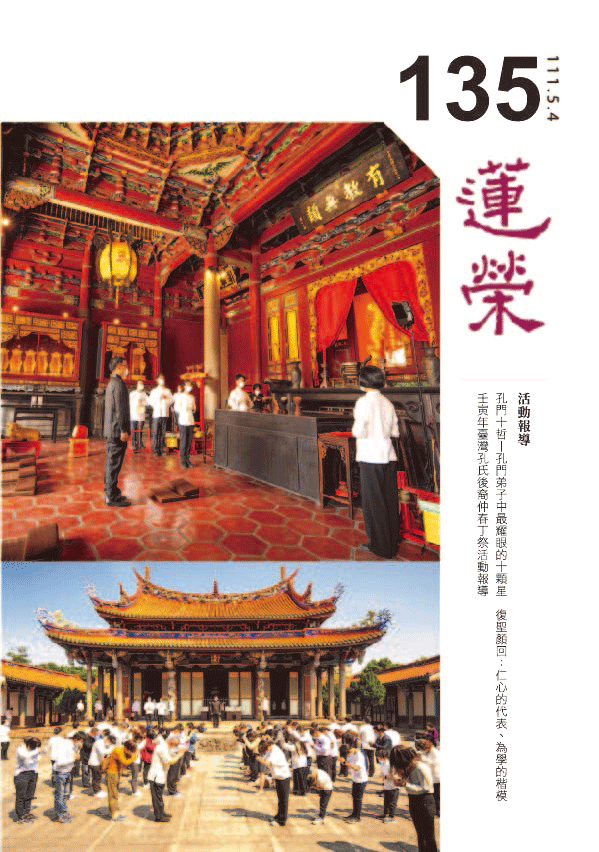

## 社論

### 透過專注力扭曲你的時間

*編輯部*

觀待緣起相續

為詮說方便故

由心過去安立

時間假法成立

近日網路上有一則論述時光感知的影片，影片中說道「只要控制你的注意力，就能扭曲你的時間」，因為「注意力集中可以讓時間變慢」，比如幼童因為注意力較集中，所以感到時間漫長；到了中老年時，因為注意力不集中了，會覺得時光飛逝。影片中還秀出了一個很神奇的遊戲實驗，將鈔票揉成一團放在桌上，某甲的手在鈔票上方約十公分，某乙的手在某甲手的正上方，離鈔票有兩倍以上的距離，二人比賽看誰先抓到桌上的鈔票，然而甲要盯著乙的手，當乙開始動作，甲才能跟著動作。猜猜究竟是誰先抓到鈔票？是離錢比較近的甲，還是先行動作的乙（大家也不妨找人去測試看看）？依據上述注意力讓時間扭曲、讓時間感變慢的理論，集中注意力在別人手部的某甲時間感變慢，他反而會輸給距離錢比較遠的某乙，結果還真是如此！

影片中還提到二O一三年都柏林三一學院凱文．希利（Kevin Healy）博士，關於時間感知的論文研究。研究中指出，動物大腦處理圖像的速度越快，也就是每秒能夠辨別的畫面閃爍頻率越高，對時間的主觀感知也會越慢。人腦能夠辨別的畫面閃爍頻率為每秒六十次，若超過這個頻率，大腦會將畫面認識為靜止沒有閃爍，因此每秒六十赫茲，就是人腦的「臨界閃爍頻率」（CFF，Critical Flicker Freauency），依此指標，狗的ＣＦＦ值為八十赫茲，所以人看是正常的電視畫面，若沒有高於八十赫茲，狗看上去顯現的是不斷閃爍，這就是每當主人打開電視，狗狗就離開沙發的原因，牠們看到閃動又不順暢的螢幕並不舒服。狗ＣＦＦ值是人的一點三倍，大腦處理圖像的速度快，也讓牠的時間感變慢，這就是為什麼每天主人回到家，狗狗快樂得好像三天沒見到主人一樣。海龜的ＣＦＦ值只有十四赫茲，是人類的四分之一，所以牠壽命雖長，但在主管感知上來說，可能不是那麼一回事，四年的時間和人類過上一年的感覺相當。還有一件有趣的事情，蒼蠅的ＣＦＦ值高達二百四十赫茲，這麼快的影像處理速度，人類揮手拍打的動作，在蒼蠅看來就是慢半拍，所以當然打不到牠。

從凱文．希利博士實驗的結果，能進一步合理解釋專注力讓時間變慢的道理，因為專注可以提升人的ＣＦＦ數值，大腦處理圖像增加，主觀感覺的時間也拉長了。

這個主觀感知扭曲時間的影片十分耐人尋味，影片最後給觀眾的建議也很中肯，但也有幾處可以加以討論的地方。專注力可以讓ＣＦＦ值增加，此時雖然時間感變慢，但是反應速度應該是增快？就像職業棒球選手，透過專注力拉升ＣＦＦ值，投手丟過來飛快的球在他眼中好似靜止不動，然後快速揮棒將球擊出；又像蒼蠅因為ＣＦＦ值是人類的四倍，所以人的動作在牠看來是慢半拍。依照這個道理，抓錢遊戲手在下方離錢較近的人反而輸掉比賽，並不是因為「專注讓他時間變慢」。下方的人會輸掉比賽，是因為手在上方的人有先發制人的優勢，這種優勢在極短距離的抓錢比賽中，可以說是極為不公平（你玩玩看就知道），所以手在下方的人會輸，並不是因為專注讓他時間變慢而輸掉比賽，ＣＦＦ值升高雖然產生時間變慢的感覺，因為處理影像速度變快，此時反應應該加快。

我們在日常生活中也有過這樣的經驗，專注於處理某件事情，當事情結束後發現，時間怎麼這麼快就過去了，此時專注並沒有讓我們的時間感變慢，反而加快。例如在圖書館讀自己喜歡的書，讀到津津有味，轉眼間就是幾個小時的時間；反之，也有精神散漫還是覺得度日如年的狀況，比如不想上課的學生在教室中等待下課，完全沒有專注可言，時間也是過得很漫長。所以如果要說主觀意識可以扭曲時間，那麼苦樂感產生的影響，會是最為明顯。老年人為何覺得時間很快？或許是因為韶光易逝的感慨，人生走到後面往回看時，珍惜感讓時間增快；而想著快快長大的小朋友，時間當然就慢慢地走了。

時間一直是大眾有興趣的議題，不只是與日常生活緊密相關，在科學、哲學或宗教領域上，都有許多研究與討論。早年「回到未來」（Back to the Future）的系列影集紅極一時，至今仍是許多人心中最好看的穿越電影。尼采有「心中充滿愛時，剎那即為永恆」的金句，孔子曾在川上發出：「逝者如斯夫，不舍晝夜。」的感嘆。科學上關於時間的研究與應用琳瑯滿目，佛法的時間觀，比如長劫的相續，無始無終等等說法，更是讓人嘆為觀止，腦洞大開。

印度天親菩薩所著的《大乘百法明門論》中，將「時間」歸納為「心不相應行法」，也就是說，時間只是概念下存在，主客觀條件都會影響時間的長短變化，這樣的看法，完全不亞於今日科學研究的結果，渴望破解時間之謎的人們，又何妨回到過去，深入典籍，說不定會發現意外的收穫。

## 佛學覽幽

### 菩薩清淨的行持—華嚴經淨行品（五十一）

*戒慧講述、編輯部整理*

人才的集中

功德的聚集

身體的強健

事業的圓滿

丙二、指事顯因答其徵因

丁一、總徵

丁二、別顯

戊七、到城乞食時願（二十二願）

己一、總處：城廓、王都、林藪

前言

淨行品分為十類，智首菩薩請教文殊菩薩如何離開一切的過失，成就佛的功德，文殊菩薩告訴智首菩薩，一切時處善用其心，以清淨的智慧跟願力攝持各種行為，不管是在坐上修或歷緣對境修，在寺廟中的修學，或者是出外的托缽行腳參訪等等，遇到各種人、事、物，都可以觀待這樣的情境來發願，眼前是在第七部分-到城乞食時願，第六部分是托缽出去乞食，在路上所經過的道路，所碰到的事情、人物，眼前走過了這樣的路途，到了城廓裡面，戊七到城乞食時願分為五部分，進城乞食的時候所發的願，分為五小段，第一個是總處，整個來說，第二個是入家，入了人家當然可以乞食了，第三就是乞食得不得，得跟不得如何調伏其心，第四就是得食正食，正食就是指能夠吃飯，第五就是食訖說法，吃完飯以後說法，這是戊七的五大項，總共二十二願，目前進度在總處。

己一、總處

經文：若見城廓，當願眾生，得堅固身，心無所屈。

古代的城廓，用以保護人民生命財產的安全，在內曰城，在外曰廓，城廓都是以堅固的石材建造的，行者在路上看到城廓的時候，發願希望眾生得到堅固身，心無所屈。世界上最堅固的身是金剛不壞之身，即法身慧命，最為堅固，內心不會被煩惱等境魔所屈服，所謂四魔，指的是天魔、煩惱魔、五陰魔、死魔，天魔是魔王波旬，魔王波旬居於欲界第六層他化自在天，修行人如果想要超越欲界天，魔王就會來障礙，魔王不會障礙初學者，等到修行有一定的成就他才會來障礙。起惑造業是苦因，惑業的根本是煩惱，煩惱魔指三界的煩惱-見思惑。五陰魔指色受想行識，五陰上面有一個我在攝持，煩惱的根本在無明，無明的根本在我執，我執從五蘊生，五蘊的所在就是煩惱的所在。死魔指人的壽命有一定的長度，扣除一些沒辦法修行的時間，例如幼年，或是日常生活辦事等，真正想要來學習的時間已經很少了，沒多久後壽命終了，一旦中斷學習，下一生要再學習的機會就比較難，以上是四魔，煩惱魔、五陰魔及死魔是內魔，天魔是外魔。四魔跟經文的關係，即南亭老和尚的講義說到的，心無所屈，是使心理上受不到境魔的委屈。

古時候打仗，防衛的力量一定是內城外廓，像宋朝，開封城就是內城外廓，當金兵揮軍南下，宋徽宗聽老百姓說有驅魔大隊，宋徽宗就將城門放下來，讓這些人衝出去，金兵喊殺過來的時候，這些人嚇得調頭就跑，結果金兵進來時，城門就收不上來了，金兵攻進來，抓了三千人，包括徽、欽二宗、宮眷及大量的金銀財寶，書畫文物通通北上。

若見城廓，在城裡面，敵人其實是打不進來的，上聯叫做固若金湯，下聯叫做安如磐石，橫批是你奈我何，這就是若見城廓，表示身體像城廓般堅固，打不進來，天魔、煩惱魔、死魔、五陰魔就像外軍一樣打不進來。佛的金剛(堅固身)是法身慧命世俗的顯現，就像城廓一樣堅固。沒有人可以傷得了佛，也沒有人可以讓佛涅槃，只有佛自己說要涅槃才能。所以佛在最後吃了純陀供養的有毒木耳後，一直拉肚子，到娑羅雙樹間時，阿難就生氣的說，純陀怎麼可以拿有毒的木耳來供養佛，純陀其實並不知道木耳有毒，釋迦牟尼佛搖手叫阿難不要怪他，因為任何人都不能讓佛涅槃，除了佛自己，眼前不過是度化眾生的因緣到了，佛藉著純陀供養有毒的木耳來涅槃，純陀幫助佛涅槃，就像牧羊女幫忙佛成佛一樣，有殊勝的功德。

得堅固身就是佛身體的強壯，因為他惑業已盡，百毒不侵，即便吃馬麥，如吃天廚妙供。孔門中顏回是「簞食瓢飲，居陋巷，人不堪其憂，回也不改其樂」，雖然粗茶淡飯，但顏回心在道上，依然法喜，孔子則是樂在其中，是「飯疏食飲水，曲肱而枕之，樂亦在其中矣」。顏回是心不隨境轉，孔子是以心轉境，就像佛吃馬麥成為天廚妙供，得堅固身就是吃到什麼對佛來說都是營養的。

得堅固身，心無所屈，可以分兩分說，第一種講法是，心跟身互相觀待，觀待他能夠破煩惱障跟所知障而得到法身，觀待他是法身說他破煩惱障跟所知障，《心經》上說「心無罣礙，無罣礙故，無有恐怖」，意即破二障的人，內心沒有罣礙，沒有罣礙就不會有恐怖，不會有畏懼，以心無所屈(懼)為因，以得堅固身為果，這是一分說法，破煩惱障跟破所知障的人是不會有畏懼的，所以他才會有顯現如得十力、四無所畏、十八不共法，以破煩惱障跟破所知障為因，以得堅固身為果。

第二種講法是，觀待堅固身，同時就可以生起無畏，我們身體被傷害時，心裡會很恐怖，可是破二障的人，除非他自己想要入涅槃，否則任何人都傷不了他，這一分也是心無所屈的形象，心不害怕，比如打仗，子彈打過來，當然害怕被打死，可是當你證得無死位，破煩惱障、破所知障的時候，身體自然能離開災難，心不會害怕，以因來說他也證得那個因，以果來說他也產生這個作用，觀待堅固身生起心無所屈的形象。例如有敵人想殺害龍樹菩薩，怎麼樣都殺不死，龍樹菩薩便說：我過去某一生戲弄螞蟻，拿一根稻草將牠綁死，你現在要殺我，就拿一根稻草把我綁起來，我就會死了。仇家姑且信之，果然用一根稻草就把龍樹菩薩綁死了。得堅固身就是說，我今天是真的想死，你才奈何得了我，我今天不想死，你是奈何不了我的，叫做「天生德於予，桓魋其如予何」。

經文：若見王都，當願眾生，功德共聚，心恆喜樂。

此處的王都指國王的宮殿，那是一國之君所在的地方，國王要維持一個國家，他必須起心動念、處世皆為人著想，並且推行教化事業，創造安定的環境，如同前面的「若見大臣，當願眾生，恆守正念，習行眾善。」

八十華嚴的版本較有抓準其中的意思，因為「功德共聚，心恆喜樂」的這一分，對應到城廓，行者去托缽乞食的時候，他可能入一般的城池，也可能入王都，王都就像長安城這樣，南亭老和尚講義說是「賢達輻輳、眾德攸歸」的地方，會性法師前面會有版本的比較，後面比較沒有，因為八十華嚴翻的應該算是最好的，翻譯要精準地抓住印度梵文的意思，當然王都也可以說是宮殿，可是宮殿固然是一分，其次就是像這種國都，像長安城這樣，它是一個人才聚集的地方，唯有到都城才能憑自己的能力、才華、學問被國王所重用，才能施展抱負，像孔子入一個國家的時候，一定是先到人文薈萃的都城，可以見到國君大臣。

功德共聚特別指共造善業的這一分，力量很可觀，釋迦牟尼佛也很清楚，佛跟菩薩都有能力利益有情，幫助有情解決某一個痛苦，成就某一個快樂，但是要讓有情眾生破迷起悟、離苦得樂、出離三界，這必須團隊和合共創，所以釋迦牟尼佛在菩提樹下證悟成佛的時候，第一件事情就是度五比丘，因為他知道團隊的經營，不能單憑佛力就能辦到，所以佛力固然不可思議，也並不是無限大，阿彌陀佛「彼佛光明無量，照十方國，無所障礙」，並不是無量的無量，而是要講究時節因緣，舉例來說，此人今天要往生了，沒有人幫他助念，還有諸多的障礙，此時佛力也加被不到，人事上不經營、不講究，卻想要佛力的加被，是不可能的，如同水不清，天上的月亮亦照不明，發電機沒有線來接引，屋內的燈也亮不起來。所以功德共聚是講大家一起造共業的厲害，王都可以勝是因為人才集中在此，「舜有治臣五人，周有治亂之臣十人」，人才集中國家就昌盛，這叫功德共聚，心恆喜樂。

什麼是賢達輻輳、眾德攸歸？南亭老和尚註解說，輻指輪子的每一條線，輳就是指中間的圓木，代表人才皆往王都，講得真好！進入王都時要觀想，當願眾生，功德共聚，人才集中，一起造共業，那個力量是難以想像的。玄奘法師到印度西行求法，就是因為那蘭陀寺是人才集中、造共業之處，光講經說法的法師就有五十幾位，能夠出來講大座的師父有十位，這叫賢達輻輳，眾德攸歸。賢人集中之處，是所有眾德歸向處，換句話說，人才才能辦出利益眾生的事情，也才是長治久安之道。舜能夠身不下堂、吹南風、彈琴，而天下大治，就是因為人才集中。

經文：見處林藪，當願眾生，應為天人，之所歎仰。

林是指叢林，樹木聚集之處。藪是指草，此處指的是安住在叢林中的修行人，這些修行人有智慧，在德能上達到某種證量，見到這些修行人，當願眾生，應為天人，之所歎仰。會性法師註解中說到，應為天人之所歎仰要連著一起念，因為賢能之人會發願度化有情眾生，修學空性智慧，做種種利益有情的事情，所以希望能夠效法這樣的高僧大德，連天上的天人，還有人間的人們，都能夠去歎仰他。

這一段有三個意思，依南亭老和尚的解釋，藪是指草的聚集處，朝野之義，在朝固然有一些人才，在野也有，所以當願眾生，像在野的人才一樣，能夠為在朝所用，在野修身，應為天人之所歎仰，天人此處特別是指天上的人，因為天人恭敬、護法的那一分，代表有法可護，他來恭敬、遵從、讚歎、流通。第二，處在林內修行的人，若見林藪，其中或是修學般若、修學空性，好在林邊水下長養聖胎，修行有成，應得天人讚歎仰慕。可是第三，林藪要取他的言外之意，此處的林藪是指叢林，大叢林一定出人才，應為天人之所歎仰，尤其這些都是法行人聚會的時候，那是不得了的，旁邊一定會有天人們圍繞，恭敬、讚歎、仰慕、尊重。尤其人才集中的時候，所創造的氣象、經營出來的格局、見識、氣度、教法，以及他對法的議論、傳承，都是佛教的希望所在，既然是佛教的希望所在，無數的天人會聚集起來遵從，因為那是整個正法的希望、傳承的緣起。（下期待續）

### 大乘百法明門論簡說(四十二)

*戒慧講述、淨本整理*

根塵識三互觀待

同時生起三面相

正明體空無所有

世間生起解脫智

拾陸、色法（三）

論文：第三、色法，略有十一種：一、眼。二、耳。三、鼻。四、舌。五、身。六、色。七、聲。八香。九、味。十、觸。十一、法處所攝色。

上次對於色法已經有初步的說明，再依懺公表解作解說。色法的定義是變壞及質礙。其實有為法都有「成、住、壞、空」，不僅只是色法如此，「成」是本來沒有現在有；「住」是此剎那還沒變為下一剎稱為住；此剎那為何會變成下一剎那，可見此剎那是趨於壞滅，所以稱為「壞」；當此剎那已經不在，則為「空」。由上可知，同一剎那同一法上具有「成、住、壞」三種名言，這是三種相違的狀況，為何可以在同一法上出現？可見非實有，只能觀待作用下假名安立。

能造的四大同樣沒有自體性，只是就其功能而為假名安立；了別境界的心識同樣也沒有自體性，唯識宗認為心識的作用是了別而且是實體法，既然心識的作用是安立在實體法上，不必觀待條件成立，那麼心識自己就可以了別自己，所以唯識宗成立自證分。然而心識自己並不能夠了別自己，否則眼識應該也能見到眼識，所以心識其實也是就作用去安立，並沒有自體性。

關於「變壞」，表解云：「手等所觸，即變壞義。」經部宗以上看法，色法體性就是朝向敗壞；有部則認為，色法只有在碰觸後才會變壞，若沒有外緣干擾就會是常法。

色法另外一個定義「質礙」，比如青色所在之處，就妨礙其他顏色的發展，物品放在東方就不在西方，呈現圓形就不是方形，所以說「方處差別，種種相義」，色法的方位、處所、形象等，都會呈現出種種的差別相。

色法依據可見、可對、不可見等可分為三類。第一種「可見可對色」，這是眼識可見眼根可對的「色塵」；第二種是「不可見可對色」，這是眼識不可見，眼根、耳根、鼻根、舌根、身根可對的「聲塵、香塵、味塵、觸塵」；第三種是「不可見無可對色」，也就是眼識不可見，前五根也不可對的「法塵」，但法塵為意根可對境。法塵也分為心法與色法，稱為「法觸所攝心」或「法觸所攝色」，比如回想昨天的心情是心法，回想昨天的所見的景色是色法。意根所對、意識所緣的法處，含括了百法中的八十二法，上述法處所攝色僅為其中之一大類。所以頌曰：「根塵各五處，十色隨自名，八王歸七心，八十二皆法。」

懺公「十一色法表解」說明五根、五境（五塵）、法塵的定義，眼根意思為「行盡」，因為眼能行盡諸色；耳根為「能聞」；鼻根為「能齅」；舌根為「能嚐」；身根為「積聚身」，因為身是四大所造，有三十六種不淨物所積聚而成；五塵為五根所對（取）、五識所緣境。

從定義中可知，萬法的名言安立，都只是就某一分功能而為安立，比如花，只是就眼根所對、眼識顯現花的外觀形象去安立它為花，並沒有考慮花的味道、花的觸感等去安立；又比如桌子，僅是就能乘載物品的功能去安立為桌子，沒有考慮它的溫度、顏色、形狀，既然萬法都只是就一部分的功能給予名言安立，而且該功能還有待心識的安立才能顯現，諸法如何有自體性。

此表法塵指的是法處所攝色，這是意根所對、意識所緣的境界，分為五類。「極略色」是將色法分析到極微小，也稱為鄰虛塵，鄰近於虛空的極微小粒子；「極迥色」是將青黃赤白等顏色分析至極小。可見極小的粒子都是透過假想觀去分析而來，然而在有部、經部則認為有最小粒子的存在(勝義有)，中觀雖然也同意有最小粒子存在，但為緣起世俗有，並非觀想而來。「受所引色」就是無表色，是指領受戒律引發身中之色，可以說是人表現出來的一種氣質，比如經行念佛時展現出高貴的氣質，此種色無質礙、外相不顯、無所表對，唯識宗認為受所引色是「思心所」所成，屬於心法，此表是依照小乘有部的定義，歸類於色法，但要仍要透過意識觀察才能發現，所以是法處所攝色。「定果色」是入定產生神通者所變，比如火光定中產生火，八地菩薩為攝化有情所變現的金銀財寶等。「徧計所執色」則是獨散意識所緣的影像，比如回憶過去，或者心識生起的各種幻象。

色法中的色塵，是眼根所對、眼識所緣之境，「色法三種名義表」及「色法三種假實表」在說明顯色、形色及表色。形色、表色還有部分的顯色（影、光、明、闇等）在表中屬於「假色」，意思是這些色法不是眼識所緣境，而是意識所緣境，此是唯識宗的看法，在有部、經部及中觀宗仍歸類為眼識所緣，因為眼識為無分別的經驗者，緣形色或表色，不待意識分別，即可知長短方圓等的差別相。比如眼前看見圓形，下一剎那變為方形，眼識可以比較發覺不同，當然安立名言是屬於意識功能。

「聲境表」說明的是色法中的聲塵，是耳根所對、耳識所緣之境，有十二種聲。第一大類是「相分聲」，唯識宗成立相分聲，是因為唯識宗認為法在心外不成，當第八識本質相分起現行，前六識就會不得不然地接受與之相應的影像相分，所以相分聲為總相，其他四類損益聲、因差別聲、說差別聲及言差別聲為別相，也都屬於相分聲。

「損益聲」，包括「可意聲」、「不可意聲」及「俱相違聲」。可意聲是好聽的聲音，不可意聲是不好聽的聲音，俱相違聲就是非好聽、非不好聽的聲音。聲音為可意聲或者不可意聲與善惡業有關，善業起現行的聲音就會成為可意聲，所以靡靡之音若讓聽者感到快樂，那也是善業的生起，此類善業是因為過去不是在正知見攝持下造善，才會產生這種結果，這樣的可意聲只是消耗自己的福報，並且會障礙修行，所以佛教以正知見攝持種種善法的功德十分可貴，能夠讓善業的生起與學佛修行有關聯、有幫助。

第三類「因差別聲」，其中「執受大種因聲」指的就是有情眾生所發出的聲音，比如唱歌、喊叫等，有情眾生心識對於構成色身的四大種執說為我，所以執受大種就是指有情眾生；「非執受大種因聲」，就是非有情所發出的聲音，比如水聲、金屬撞擊聲；俱大種因聲，是有情與非有情共同發出的聲音，比如用手打鼓。

第四類「說差別聲」，其中「世所共成聲」是指世俗所說，比如車子、房子。世所共成聲表示有其作用才會如是安立、如是稱呼，比如有運載的功能，世間人才會稱為車子，有遮風避雨的作用，才會稱為房子，不過世間人會在車子、房子上執著為實有。「成所引聲」是指成就無漏慧的聖者所說之聲，聖人雖然也會說車子、房子，但聖人通達這些都只是觀待作用而安立的名言，並沒有實體。「徧計所執聲」是外道的言教，從徧計執著虛妄而起者，比如車子、房子是造物者所賜予。所以從說差別聲中可以分別出佛教徒與非佛教徒、凡夫與聖人。

第五類「言差別聲」之「聖言所攝聲」是見真相的觀察下所說之聲，比如三法印的無常、無我、涅槃寂靜，這是「見則言見，不見言不見」；反之「非聖言所攝聲」則不是見真相的觀察所說，比如世間本質是苦，世間人也明明見到老病死苦的結局，卻仍妄說世間真樂，這是「見言不見，不見言見」。

香塵是鼻根所對、鼻識所緣的境界，有六種香。六種香同樣也都屬於「相分香」，這與成立「相分聲」的理由相同。「好香」是能使身有所順益、「惡香」則是有所違損、「平等香」則無所損益，以上三種香同屬於「損益香」。香的顯現是損或益，也與善惡業有關，如同「損益聲」中的說明，在經營善業時以正知見攝持十分重要。

「俱生香」，如檀木本身就具有香氣；「和合香」如人工合成的香精；「變異香」如水果熟變而發出的氣味，以上三者屬於「差別香」。關於檀木的俱生香，其實也要觀待與鼻根相對，香氣才會在鼻識顯現，甚至在心情不好的時候、鼻塞的時候，香氣也完全無法顯現，可知「俱生香」也不是有自體性的香，同樣是因緣性與觀待性下的出現。

味塵是舌根所對、舌識所緣之境，有十二種味，也都是「相分味」。其中「可意」、「不可意」、「俱相違」屬於「損益味」，「俱生」、「和合」、「變異」屬於「差別味」，可參考前述「損益香」及「差別香」之道理。

觸塵是身根所對之境，同樣也是相分觸，個別的種類則可分為二十六種，這些都是身識所顯示的感覺。以輕重為例，物品輕重無法在眼識上顯現，必待身根接觸物品，身識才能感覺輕重。或問，眼識也能看見貌似老、病、死的外相，為何不是色塵？老是身體機能衰弱的改覺；病是身體敗壞的感覺；死是心識無法緣念身體的剎那，所以都是指身識上的感覺，歸類為觸塵。（下期待續）

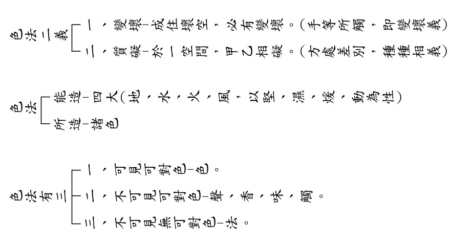

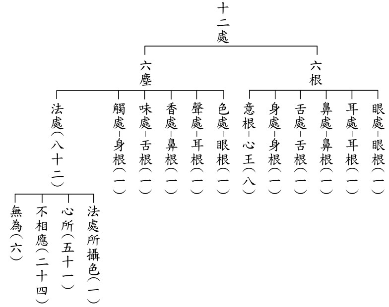

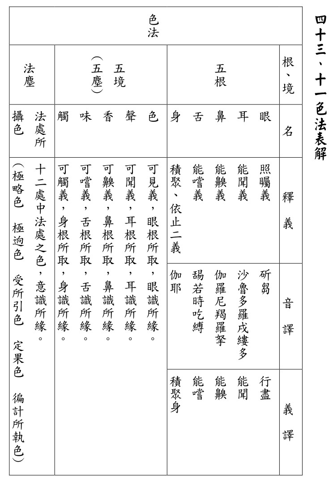

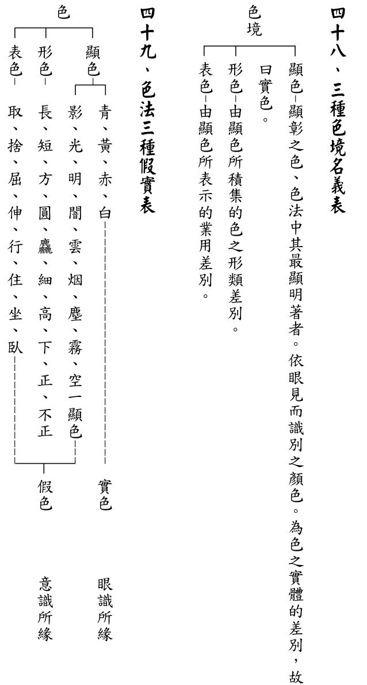

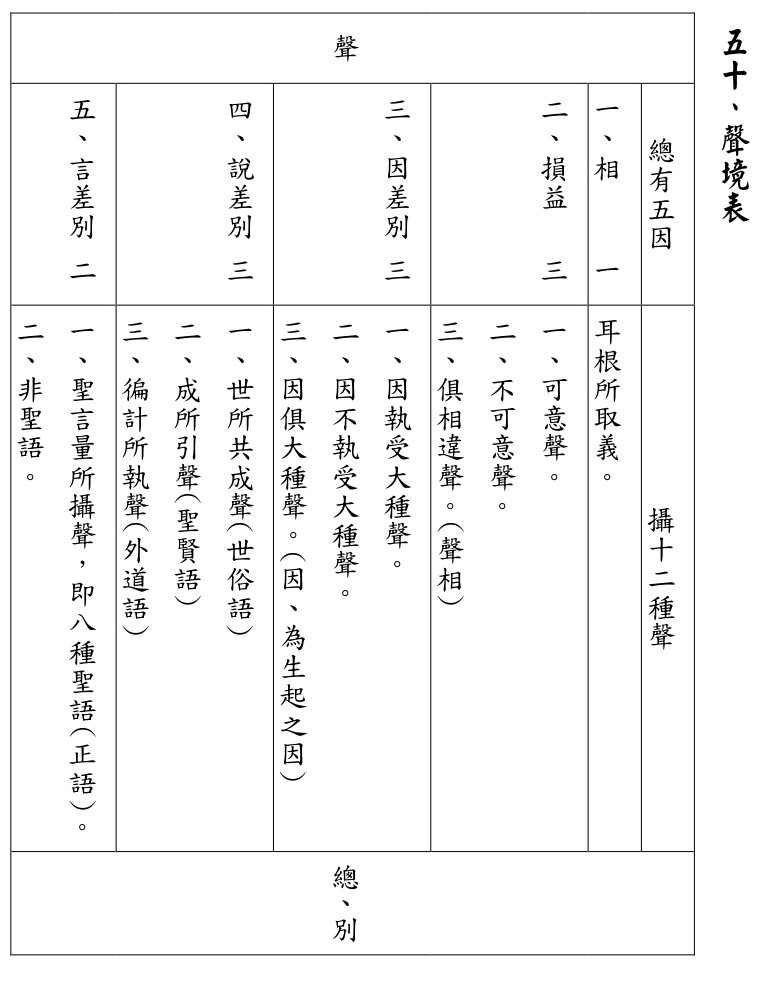

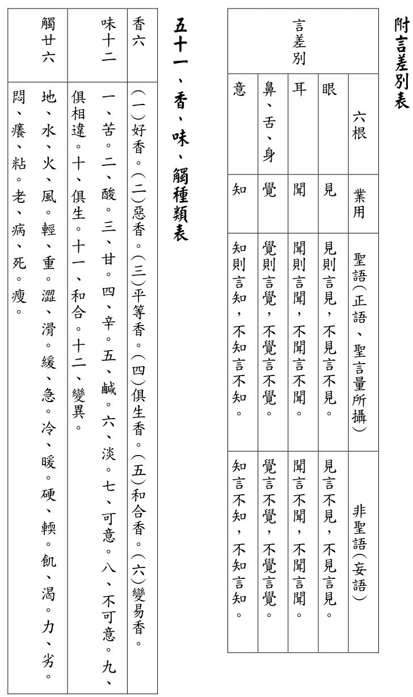

### 佛學概要十四講表簡說（三十七）

*戒慧講述、心若整理*

劫亦觀待成住壞空

若是常住何有劫名

有情隨業受生繫縛

誰是真正解脫中人

第六講表　宇宙有情概況

前言

目前的進度在第六表的宇宙有情概況，宇是時間，宙是空間，時間三世、空間十方的有情，包括天、人、阿修羅、畜生、餓鬼、地獄六道，每一道都分為正報的種類跟依報的享受，正報指的是有情身心，依報指的是環境，每一道受用的都是痛苦，可以結合第四表的觀受是苦做觀察，第四表的觀受是苦範圍只講人道，第六表還遍及每一道的苦，例如上帝的苦是五衰相，還有他們會跟阿修羅打仗，有時候阿修羅王的厲害更勝玉皇大帝，玉皇大帝還要去夜摩天討救兵，甚至夜摩天也打不過阿修羅。就像美國的勢力再強，面對中東的恐怖組織攻擊，美國也很害怕，這就是阿修羅道。六道的狀況極其複雜，我們人中也有這六道的狀況，像歐美就是人中天，我們是人中人，人中的阿修羅就像中東這些恐怖組織。阿修羅有天福，可是沒有天德，因為他們雖然持戒，卻心懷瞋恨、傲慢，人中的地獄就像恐怖的集中營，人中的畜生就像被主人使喚的奴才，人中的餓鬼像落後地區的難民，人道裡面有六道，何況形成的各自的六道，各有各的痛苦。

(甲)六道的狀況，先說天道，天道有欲界六層天，其中他化自在天裡面，住著魔王波旬，所以第七叫做摩羅天，魔王波旬在欲界天裡面威神力最大，當初釋迦牟尼佛在印度成道的時候，就受到魔王波旬的擾亂，當時諸天都消失，只有佛單獨面對他。

欲界天都是有欲望的，所以即使他修善業也定力未成，才都在欲界。色界具有禪定，第一個是初禪三天，即梵眾天、梵輔天、大梵天，二禪也有三天，即少光天、無量光天、光音天。初禪是戒律殊勝的那一分說的，二禪開始有定，定可以降伏內心的黑暗，所以用光來說，三禪三天即少淨天、無量淨天、遍淨天，是屬於淨的那一分，就是煩惱的清淨相，包括修禪定殊勝的那一分，使內心極為清淨，到第四禪九天，有三個凡夫天-福生天、福愛天、廣果天，無想天是外道天，還有五淨居天是三果羅漢所居，叫做無煩天、無熱天、善現天、善見天、色究竟天。四空天，是空無邊處天、識無邊處天、無所有處天、非想非非想處天。

整個佛教都有諸天的修學法，是所有宗教中最為殊勝的，外道裡面不會有天的修學法，因為外道裡面的玉皇大帝是自然而成的，是不能修的。

三禪三災：初禪火災，二禪水災，三禪風災。有成、住、壞、空，成的時候是器界先成，就是環境先有，後面才有生命現象出現，先出現第三禪天，再出現第二禪天，再出現初禪天，是先出現環境，後出現三禪天的人、二禪天的人、初禪天的人，禪定天的人出現完以後才有欲界的空居天，從夜摩天算起、兜率天、化樂天、他化自在天。成劫有二十小劫，住劫有二十小劫，住劫的時候人才會出現，壞劫的時候是先有情壞，後面再環境壞，有情成的時候，愈高境界的愈先成，壞的時候是從地獄開始壞上去，所以成的時候是先從三禪成、二禪、初禪慢慢成下來，壞的時候是先從地獄開始壞上去，壞到初禪天、壞到二禪天、壞到三禪天，壞劫總共有二十劫，到第十九劫的時候，有情通通沒有了，第二十劫的時候，開始火災把初禪燒光，水災把二禪淹沒，風災把三禪吹光，到空劫的時候空空洞洞，空蕩蕩的什麼都沒有。

成住壞空的時候，爾時四禪天中有諸天眾由福壽盡故，從彼沒，降生第三禪天中，再降生二禪天，再降生初禪天王、大梵天王，感覺跟我們學的輪迴的觀念有衝突，難道全部都是從上面的天王下降嗎？

火燒初禪、水淹二禪、風吹三禪，四禪都沒有受到破壞，生成的世界是從第三禪天的器世間開始的，第六十四大劫之後的第六十五大劫的成劫才有第三禪天，第八劫之後的第九劫就有第二禪天，每一個大劫之後的第二大劫就有初禪天，所以通通歸到成，第三禪天在風災之後沒有了，後來在第六十五大劫以後又有三禪天，三禪天以下都空蕩蕩，現在只有一種可能，就是從四禪天過來的，第二種可能就是他方世界過來輪迴的，若再分析其他像是從他方世界來、從地獄來、從天堂來、從淨土來，這講不完，所以就講一種小乘部派的可能，這最好懂，至於是否還有其他世界過來的情況，其實都有，只是這邊不多論述而已。

另外二禪天到初禪天也是一樣，這裡面還跟婆羅門的思想有關，其實印度的婆羅門尸婆神比基督教、天主教的上帝還要厲害，因為他們有禪定的修學法，禪定的修學法使他成為大梵天，所以天文觀有時候必須要配合婆羅門的認知。佛教的決戰點在第八表的戒定慧，是一個解脫的思想，這是婆羅門跟外道凡夫都沒有的，解脫思想成為能攝持，三界成為所攝持，所以第四、五、六、七表看起來好像都僅是佛學常識，其實不然，第四表跟第五表是出離心的生起處，第六表跟第七表是大悲心和菩提心的生起處，那是命根，如果認真了解，十四講表就是一個完整的修學架構，缺任何一表都不行。

初禪天被火燒光了，那初禪天的人從哪裡來？只好從二禪來，因為婆羅門不接受其他的世界。再者，如果婆羅門、尸婆神、梵天王，有可能是從他方地獄道裡面跑出來的，那他更不能接受。就像從前目犍連尊者，才剛跟裸形外道的人講其師父在地獄受苦，話還沒講完，就立刻被那個人亂棒打成肉醬，目犍連尊者的下場跟子路一樣，目犍連是最保護釋迦牟尼佛的，子路也是最保護孔子的，子路死的時候孔子哭於中庭說：因為子路使我聽不到惡聲。只要有人罵孔子，子路立刻挺身而出。

釋迦牟尼佛講法很善巧。十四講表也比較依著《俱舍論》來說，至於大乘部派的說法在此都不敘述，因為當時的世間沒有辦法接受無量無邊的三千大千世界的這種講法，乃至於說他的尸婆神、婆羅門神、大梵天，竟然是從地獄來的，他更不能接受。

十四講表的注解一百零二頁下面的表，第三禪天是風災過後，風災過後是六十四大劫，六十四大劫到第六十五大劫初，二禪天被水淹，水淹是八大劫，八大劫來一次水災，把二禪淹光，第九大劫的初還是成的。初禪天是火燒一大劫，火災把初禪天燒光了，第二大劫還是成的，所以用這個表說的比較方便，不必再做很多的表來說。那壞的時候也是一樣，在壞劫總共有二十小劫，第十九小劫的時候是有情壞，有情壞的時候，從地獄壞、餓鬼壞、畜生壞、人壞、六欲天壞、初禪天壞、然後生到二禪天，有情壞的時候是第十九大劫，到器界壞的時候，是火災把初禪的世界都燒光了，水災把二禪天破壞殆盡，風災把三禪天全部吹光了，第十九大劫，火災還沒有來的時候，初禪天的人已經都沒有了，同理類推，我們人也是一樣，不必等到世界末日，人世間的災難已經把人全部摧毀光了，不必等到世界末日，這些災變早就讓這些人都沒有了。這個壞也可能是八大劫以後的壞的那一劫，第九大劫的壞，也可能是六十四大劫第六十五大劫的壞，也可能是第一大劫的壞，不管你是在三禪天、二禪天、初禪天，乃至於到地獄的有情，都在壞劫的，中劫有二十小劫，總共在十九小劫以內通通報銷，第二十劫開始通通壞世界。

一百零五頁倒數第二段，空居諸天成立已，此後則為地居系的成立，由眾生業為增上力故，次第生成風輪、水輪、金輪，漸成山、海、洲陸等。一定是這樣嗎？比如說，我們挖開地的時候有水，水的下面就是風在支持，其實這種想法也是印度的婆羅門的想法，佛只好配合，如果看法界安立圖中須彌山的概念，也是依婆羅門來說，佛依婆羅門來說世界觀，好像我們現在的太陽系一樣，七山就好像七個行星的軌道，八海就好像星球海、像太空一樣，所以七山八海，須彌山外面有一群山，第二群山，第三群山，總共有七群山，八個海，第八個海外面的山是大鐵圍山，圍成一個太陽系，圍成一個須彌系，圍成一個須彌系太陽所造的，就像我們太陽系的觀念，再來，要解釋地可以挖金礦、銀礦，就用金輪來說，挖地下面有水，所以說水，水又有風的支持，這個風就是眾生的業力風去支持，這種講法婆羅門也同意。

佛說法有三種，一種是隨自意語，一種是隨他意語，一種是隨自他意語，《法華經》裡面的二十八品就是隨自意語，佛想怎麼說就怎麼說，因為聽眾通通聽懂了；第二種是隨自他意語，就像《般若經》，裡面有些的觀念是小乘觀念，有些是隨大乘部派說，隨他意語就是我沒有辦法講我的，我只能隨著你的了解去講，第六表跟第七表，比較就隨他意語，就是隨著你的了解，我才能說什麼，可是佛在講無常觀、空性觀的時候，他可以有一分說自己的，有一分觀待眾生根器說，因為他知道這個觀點眾生可以理解，例如佛可以講粗品無常、細品無常，可以從無常裡面去通達空性，空性裡面還可以講到粗分的空性，唯識宗可以了解，也可以講細分的空性，中觀宗可以了解，這裡面就兼具隨他跟隨自，但是講到天文觀的時候，只能隨他意語，因為當時都沒有科技的發展，在三千年前，佛若是這樣說，容易被別人誤認為妖魔鬼怪，直接被否定。

壞劫總共有二十劫，有情壞是十九劫內有情都全部壞光，第二十劫才是器界壞。如果我今天是以初禪天來講，正好就是此表，如果是以二禪天來講的話，那就是第八大劫開始的壞劫。如果是講三禪天，那就是第六十四大劫的壞，初禪如果是火燒的時候，二禪沒怎樣，所以這時候就分為兩種，一種是初禪的人跑到其他的世界去，第二種是初禪天的人，學習禪定的修學法，在他死亡的時候他能夠生到二禪，就跟我們遇到世界末日、一些災難的時候，我們會比較恐懼，會比較認真安定，有修學能力的人繼續修學，不再繼續放逸，這個時候初禪就會生到二禪，等到初禪世界形成的時候，當然是到二禪來。

成劫的時候所有的世界形成，有情也慢慢的降生，經過二十個小劫，來到了住劫，住劫有二十個小劫，每一小劫是含一個增劫跟一個減劫，這個增劫、減劫其實就是從須彌系的南瞻部洲算起，第二段說明須彌系，也就是整個太陽系裡頭，是由人類居住，當中就有四大洲，這四大洲就是最外圍的那個海，這邊形容像四個星球，其中在須彌山的南方的南瞻部洲，就是我們現在所居住的地球。每一劫的算法就是從南瞻部洲的人類降生開始，在劫初的時候南瞻部洲的人類降生了，他們有八萬四千歲，身高有十餘丈，延續前面講的，他是從第二禪天光音天降下來的，剛下生的時候，他們的身就是像光音天一樣，是有光明的，可以飛行自在，並以禪定為食。

從光音天來的另外一個解釋是說，初禪天形成的時候，才有六欲天一直到人間，這個時候初禪天的人還沒有死，因為他是一大劫裡面發生的事情，初禪天的人都還沒死，初禪天怎麼投生到人間？所以他唯一的解釋就是從光音天來，這樣的講法婆羅門也同意，因為都分禪定高下。

剛剛講到剛降生時是八萬四千歲，有光明，可以飛行自在，有禪定功夫，可是這個地球裡面長有稻穀，他們就貪食，慢慢的神通就失去了，光明也減去，再則有男女諸欲的貪著，又多造惡業，所以所有的福氣就漸減，於是每一百年減一歲，也就是八萬四千歲經過一百年減一歲，再經過一百年減一歲，整個的身型也漸漸短小，如是遞減，減到人壽六萬歲前就叫做盛世，也就是當時候的這一些人，他可以跟天人交通，所有人都非常的賢聖，這是盛世的部分，再經過每一百年一直減，減到人壽只有四萬歲。

天人交通這件事情，印度婆羅門都承認，中國在某種程度上都承認。人歲減到四萬歲之前，四萬歲到六萬歲叫做賢世，這個賢世也就是四萬歲到六萬歲，賢世不如聖世，但人都非常賢善，所以稱為賢善之世。

他們很厲害，他們的心地單純，所以不太用複雜的語言去說，像伏羲氏的八卦，就可以解釋很多現象，可是到後面開始要演繹很多卦，才有辦法去解釋複雜的現象。當人很單純，彼此之間講信修睦，沒有合約，沒有語言文字的障礙時，很多現象只要用八個卦就說清楚了，到後面六十四卦還說不清楚，三百八十四爻也說不清楚的時候，孔子還有說卦傳，說卦傳裡面有很多現象界的事物做比擬，但也不一定將世間複雜的現象說清楚，後面還等待學易經的人繼續演繹，因為現象太多、太複雜了。

接下來再減到兩萬歲以前，也就是兩萬歲到四萬歲叫做盛世，其福利已經是賢世的一半，乃至於經過一百年就減一歲，一直減，減到一百歲，乃至於十歲，這就是減劫，成為衰世，所有的善法愈來愈衰，所有的惡法愈來愈增長，就會出現小三災，人壽三十歲的時候會有饑饉災，大地飢荒，人壽減到二十歲的時候就會有疾病災，也就是瘟疫疾病盛行，減到十歲的時候就會有刀兵劫，草木皆兵，大家互相殘害，這個就是減劫，從八萬四千歲一直減到十歲，當受到那麼大的災難時，大家就開始生起厭離心，而且生起後悔之心，棄捨惡法，開始要來受行善法，這時候福報就來了，也就是經過一百年，又從十歲一直增加一歲，隨著他的善心來富，惡跡漸消，他的壽量還有身型、福氣就漸漸增長，又一直增長到八萬四千歲，從衰世又到了到賢世到聖世，總共是一個增劫，所以一個減劫加一個增劫，就是一千六百萬年。

二十個小劫就是一個中劫，人只有在住劫有，在成劫裡面會有的只有三禪天，二禪天跟初禪天，還有欲界的空居天，空居天從夜摩天開始算起，兜率天、化樂天、他化自在天，還有欲界的蘇迷盧系，比如說屬於須彌山的那個系統，從光音天降下來，那是在成劫有，到住劫的人，其實在光音天的人可以在成劫的時候到人間來，但是真正人間的壽的增減是在住劫。以上就是把一小劫，合二十小劫為一中劫，合四中劫為一大劫，這個數量就是這樣算的，我們這個地球南瞻部洲的人壽經過八減八增八小劫，現是正值第九劫的減劫當中，說明我們現在還不會面臨末世。第九劫的減劫是怎麼算呢？一增一減算一劫，我們現在是第九劫的減，要減到十歲，再開始繼續第十小劫的增劫，一直增增增到人種八萬歲的時候，彌勒菩薩出來。

以減劫來算，我們現在人壽應該是七十五歲左右，但是有些地區的壽命很長，並不是平均七十五歲，這是什麼原因呢？舉三點來說明，第一、就好像是落日餘暉一樣，要進入減劫，愈來愈黑暗的時候，他稍微的薰染一下。第二、他是一個大趨勢中的小回流，就像全世界各地文明的地方，他的壽命或許因為物質、醫療好，生命比較長，但也只是一個小回流而已。第三、文明世界掠奪資源，未來資源揮霍殆盡，大家的受苦可以想見。

以上說明為什麼釋迦牟尼佛當時的人種是一百歲，我們現在大概是七十五歲，或是七十歲，壽命長的都是文明、資源先進的國家，落後地方都很慘，像是緬甸平均壽命四十歲，因為醫療、衛生條件不好，人很單純。所以其實大體都是在減劫當中，先進國家的問題也是一大堆，例如食安問題等等，這也是顯而易見的。（下期待續）

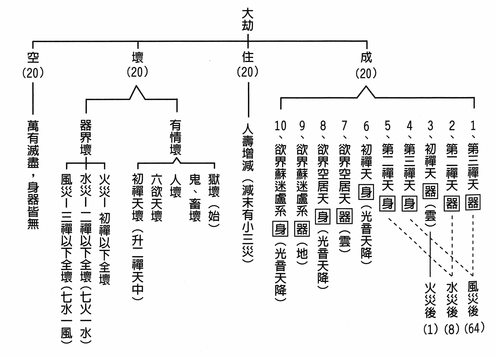

### 人生大事不能忽略的事實

*戒慧講述、編輯部整理*

病人臨終護持法

祖師一槌定正見

學會護持幾百人

皆能驗證大師語

臨終三大要（四）

前言

第二部分「分別解釋助念的方法」，分為三部分。前期已將第一、開導安慰令生正信、第二、大家換班念佛，以助淨念者刊登完。本期接續第三、切戒搬動哭泣，以防誤事者，分為總標與別釋。

總標

總標部分，經文：

「第三：切戒搬動哭泣，以防誤事者。」

搬動哭泣會破壞往生者的正念，成為往生嚴重的障礙，誤了病人的往生大事。而正念的維持要靠正知去醒覺，也就是護持的人不可搬動與哭泣，否則會令病人生貪、生瞋，要去維護病人臨終的正念。

別釋

經文：「

病人將終之時，正是凡、聖、人、鬼分判之際，一髮千鈞，要緊之極。只可以佛號，開導彼之神識，斷斷不可洗澡、換衣，或移寢處。任彼如何坐臥，只可順彼之勢，不可稍有移動。亦不可對之生悲感相，或至哭泣。

」

病人臨終生死存亡之際，是分判或往生或輪迴的關鍵時刻，一口氣不來就隨業流轉，此千鈞一髮要緊至極的時刻，不可等閒視之。此時，除了佛號以外，一切的洗澡、換衣、移動都是打岔，換句話說，洗澡、換衣、移動都應在還沒臨終時就預先處理；病人有時會要求洗澡、換衣服等，也要視當時的情況再做決定，有些老人家堅持要洗澡、洗臉，換上乾淨的衣服面見阿彌陀佛，有的蓮友接近臨終的時候噁心嘔吐，幫他清理口腔或衣服上的污穢也能讓他感到舒服，這時候旁邊護持的家屬和蓮友若要滿足所願，需視狀況調整。總之，最後一刻不要慌亂、不要再做打岔的事，專心以佛號開導病人，不要讓病人生起瞋心和對世間、對家屬的貪愛心。

不用在意外人觀感，任由他坐臥的姿勢，能順著念佛即可，不要去移動正面臨四大分離的病人，以前曾去助念過在浴室滑倒往生的居士，當時就直接浴室鋪上陀羅尼經被，家屬與蓮友在旁助念。但是如果是車禍往生在路中央，不得已仍要移動至路旁，以不干擾交通為要。臨終時的狀況無奇不有，在旁邊護持的蓮友要有正知見引導家屬，家屬也要好好配合，引導病人生起正念。

除了不要移動病人讓他生氣以外，也不要對著病人悲傷哭泣，內心要很清楚，這是往生的關鍵時刻！只有往生可以帶給病人真正的利益。

為何不要搬動哭泣呢？

經文：「

以此時身不自主，一動則手足身體，均受拗折扭裂之痛，痛則瞋心生，而佛念息；隨瞋心去，多墮毒類，可怖之至。若見悲痛哭泣，則情愛心生，佛念便息矣。隨情愛心去，以致生生世世，不得解脫。

」

很多人就算知道助念的重要，也會在病人一斷氣的時候，立刻就換上新衣，因為此時身體還沒僵硬，比較容易更換衣服，以為動作迅速不至於妨礙助念，其實只要是動到病人的手足身體，就會讓他如同骨折、撕裂那般疼痛，疼痛容易導致生氣，心為瞋所遍布如何能念佛？臨終時隨著瞋心，會墮到哪邊去呢？顯而易見不會是投生善道，這真的是可怕至極。

若家屬見到病人往生而悲痛哭泣，病人神識未離，對親愛的家屬或者自身生起貪愛之心，捨不得離開的貪愛之心生起，如何能老實念佛呢？臨終時生起貪愛之心卻不得不離開，或成守屍鬼或再隨業流轉，臨終即便得到助念，往生內因全無，導致生生世世，不得解脫。

最後祖師在戒防誤事中，特別彰顯念佛的殊勝利益，也警告旁邊護持的家屬，不可搬動哭泣。

經文：「

此時，所最得益者，莫過於一心念佛；所最貽害者，莫過於妄動哭泣。若或妄動哭泣，致生瞋恨，及情愛心，則欲生西方，萬無有一矣。

」

臨終最能幫助亡者的莫過於一心念佛，無論是外緣上的幫忙，或者亡者內因提起心力，若能圍繞在佛號上，可以在臨終時得到最大的利益；而臨終時傷害最大的，莫過於旁邊護持者的搬動與哭泣。妄動哭泣會讓亡者熱惱，並生起情愛之心，這個時候瞋心和情愛心取代了想去西方的心，往生極樂世界的因緣就這樣斷除了。

以上把切戒搬動哭泣誤了往生大事說完，接著祖師再次提醒要沉得住氣，不要一次次地試探亡者暖氣由何而出。

經文：「

又人之將死，熱氣自下至上者，為超升相；自上至下者，為墮落相。故有「頂聖眼天生，人心餓鬼腹，畜生膝蓋離，地獄腳板出」之說。果然大家至誠助念，自可直下往生西方。切不可屢屢探之，以致神識未離，因此或有刺激，心生煩痛，致不得往生。此之罪過，實為無量無邊。願諸親友，各各懇切念佛，不須探彼熱氣，後冷於何處也。

」

人在過世的時候，可愛的財富、地位、親屬、朋友、身體通通要遠離，趨近死亡時地大融入水大，水大融入火大，火大融入風大，一息不來即斷氣，但是暖相還在時，神識則未離開身體。熱氣從下往上者是超升的行相；從上往下的話就是墮落的樣子，所以《雜寶藏經》裡面說若氣息已斷，通身冷透了，只有頭頂熱的必定超凡入聖，若是眼睛及額頭部分有餘熱則生天道，心處熱則生人道，腹部熱則是餓鬼道，熱處在膝蓋則是畜生道，墮落地獄則熱區在腳底。

如果大家至誠懇切的為亡者助念，給予極佳的外緣幫助，自然是活著往生，斷氣的那一剎那即刻前往西方極樂世界，頭頂於熱是想當然爾，無須疑惑。在旁護持的親友或蓮友，切記不要一次次地探試身體熱區，干擾清淨的助念氣氛和亡者的神識，或者觸碰到亡者身軀，或者被焦躁的氣氛感染，而不得往生。這樣的罪過實在是無量無邊，不可盡數。希望亡者的至親好友們，懇切念佛即可，無須時時探試亡者熱氣。\

本文最後一個段落，

結明助念之益

，若能在助念方法上好好講究，留心什麼才是對父母真正有益處的。文章最後一個段落，分為辨真假孝和結真誠益兩部分，第一部份辨真假孝。

經文：「

為人子者，於此留心，乃為真孝。若依世間種種俗情，即是不惜推親以下苦海，為邀一般無知無識者，群相稱讚其能盡孝也。此孝與羅剎女之愛正同。經云：「羅剎女食人，曰：我愛汝，故食汝。」彼無知之人之行孝也，令親失樂而得苦，豈不與羅剎女之愛人相同乎？

」

為人子女除了平時的養親之外，如果能夠著眼於父母的往生，在父母死後增上的問題上好好留心，這才是真正長遠的利益父母，也才是實質真正的孝順。如果只是依著世間的情愛，在父母最需要幫助的時候只知哀痛哭泣，或更換衣物以求體面，這些都只是邀約一般不知道如何正確護持往生的普羅大眾，來稱讚我非常的孝順；實際上，這些做法只是在父母最危急之時再加一腳，讓他們直入輪迴三惡道的苦海中。

無法幫助父母往生的孝，就像美麗充滿魅力的羅剎女，他們裝飾華麗，吸引人們上當，成為他的食物。《佛本行集經》中，五百商人到羅剎國的故事，述說著羅剎女穿著華麗的衣裳，帶著花冠花飾和各種珠寶，香湯沐浴，以香塗身，趕到岸邊迎接落難的商人，這些商人經不起誘惑紛紛住下，與這些羅剎女組成家庭生下小孩，但是最後的結局是成為羅剎女的食物。

沒有正知見的世間孝子，沒有辦法引導父母往生善道，甚至是究竟的離苦得樂，臨終時錯誤的做法，就像羅剎女對待五百商人那樣，看似親愛孝順，結局卻是悲慘無比。

第二部份結真誠益，經文：「

吾作此語，非不近人情，欲人各於實際上講求，必期亡者往生，存者得福，以遂孝子賢孫親愛之一片血誠，不覺其言之有似激烈也。真愛親者，必能諒之！

」

祖師在文章的最後，再次重申往生的重要性，希望大家理解祖師袒露真相的赤誠心，並非不近人情，是把實際狀況和盤托出，期望真實利益亡者往生極樂，現存的家屬、蓮友都能得福，並且滿足孝子賢孫想要護持長輩的至誠心。最後祖師悲切言重，不知不覺言語中多所冒犯，相信真正想要利益親屬的大眾，一定能夠體諒並且將這些觀念好好牢記在心。

附註

經文：「

頂聖眼天生等者，謂人氣已斷，通身冷透，唯頭頂獨熱者，則必超凡入聖，了生脫死也。眼天生者，若眼及額顱處獨熱，則生天道。心處獨熱，則生人道。肚腹獨熱，則生餓鬼道。膝蓋獨熱，則生畜生道。腳板獨熱，則生地獄道。

此由人在生時，所造善惡二業，至此感現如是，非可以勢力假為也。

是時若病人能志誠念佛，再加眷屬善友助念之力，決定可以帶業往生，超凡入聖耳。不須專事探試徵驗，以致誤事也。

至囑，至禱。

」

本文已經完成，後面祖師針對助念團的流弊再次提醒大眾，無須在助念時做種種試探的動作，臨終之後投生哪一道實際上跟在世時所造善惡業有關，如是因如是果。

如果病人能夠在內因上好好立定志向決志往生，至誠懇切的念佛，外緣上家屬和善友懂得護持，臨終決定蒙佛接引，往生極樂世界，投生到無有眾苦但受諸樂的成佛環境，超越世俗進入聖流。實在不需要邊助念邊試探，耽誤往生大事。

千叮嚀萬咐囑，毫不掩飾地把赤誠之心全部坦露出來。（下期待續）

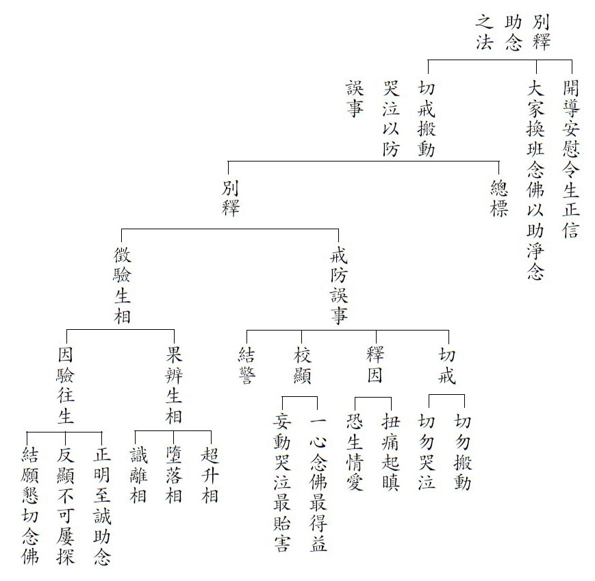

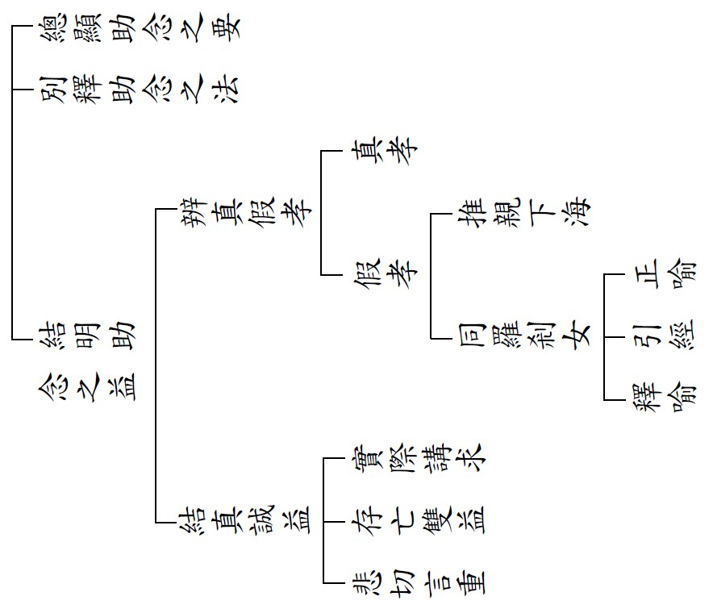

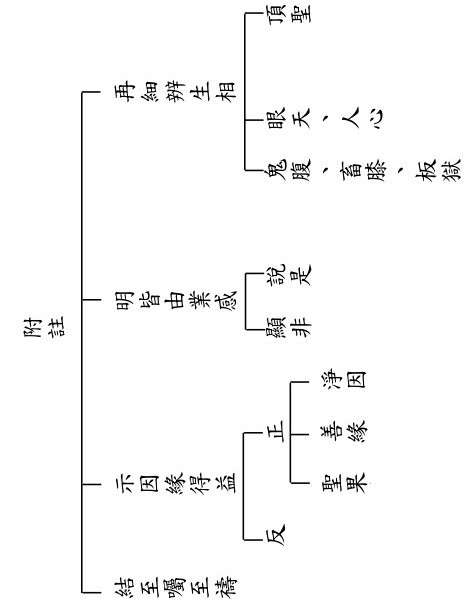

### 緣起贊論略釋（二）

*戒慧講述、心若整理*

緣起甚深通性空

諸佛善說之心要

稱讚大師語業勝

能引眾生世出世

前言

緣起贊的全名叫做「

由說甚深緣起門中稱讚無上大師世尊善說心藏

」，上次已經解析完能稱讚、所稱讚，各種門徑都可以來稱讚佛，例如，稱讚佛的身語意、度化眾生的事業、具有神通等等，然對佛最殊勝的讚歎，就是用緣起來讚歎。

這次進度將說明何謂「甚深」，何謂「善說」，何謂「心藏」。

緣起贊論略釋

「

言甚深者，謂難測、難度、難通達義；緣起、性空互助無違，為中觀宗之特唱，唯識學者猶不忍受，況餘小外；故成甚深。此甚深義，論中廣說。

」

講到甚深，就是難測量、難度量、難通達的意思。緣起跟性空互相觀待，愈能通達緣起，就愈助中觀義的通達，反之亦然。這是中觀應成派的不共特法，連唯識宗都沒有這樣的看法，因為唯識宗的宗義是萬法唯心所現，萬法都是心識的顯現，外境不成立，所以唯識宗是緣起的實有（依他起），心識及心識的所現境是實有的，唯識宗尚且看法如此，更何況是其他小乘，此特指下部宗派的有部、經部，他們認為法在心外實有，至於其他外道更不用說，外道統歸而言，就是數論師、勝論師，都是自性變化，神我受用，兩者的差別在於勝論師更強調大自在天，認為我們的吉凶禍福是由大自在天決定。可見各宗各派都無法通達緣起性空互相觀待、互相資助的道理，這就是為什麼中觀應成派最是甚深，其甚深義，會在論中廣述。

「

言善說者，略具四義，謂具法、具義、隨順涅槃非順生死、順斷煩惱非增煩惱，名四辯才。如《寶積經》說。

」

講到善說，善說具備四種意思，即具法、具義、隨順涅槃非順生死、順斷煩惱非增煩惱，這四個又稱為四辯才，有能力把法義說得清楚明白，打敗其他外道，有能力透過法義對治煩惱、引入涅槃，說法能符合這四義者稱之為四辯才。

「

言具法者，謂文句無過，具八支德等。

」

如同《寶積經》所說，具法指的是文（單字）句（句型）上都沒有過失，且具備八支德。八支德出自《瑜伽論》，一是先首語，即所說導向涅槃；二是美妙語，指文句美妙；三是顯了語，指文句淺顯易懂；四是易解語，指有能力把深奧的道理淺顯易懂的表達；五是樂聞語，指話很有道理，讓大家能思辨通達，引入甚深義趣。六是無依語，即有諸多的理論背景，因此話都經得起挑戰；七是不違逆語，指文句可以引發你的比量、現量；八是無邊語，指能以廣大善巧來引導眾生。

「

言具義者，謂非無義綺語等類，能引現法、後法利義，又能引發最勝生事、決定勝事。

」

具義，是遮掉沒有意義的話，遮除緣起引入自性見的無義，凡是從自性見去通達緣起的都要遮掉，換句話說，下部宗派的宗義見，都是我要遮除的。而能引入現法（現世，這一生）及後法（增上身）的利義，利是從義來，知識背景愈廣，才能帶來愈多利益。透過緣起贊，可以引發有情的最勝生事及決定勝事，最勝生事較就世俗來講，引發眾生修福（得到增上身），決定勝事較就空性來講（得到決定勝），引發眾生修慧得到解脫的利益。

「

又能直接或復間接宣詮無我，引導所化趣三菩提。

」

直接是由緣起導向空性，間接是單純說緣起法，如佛說十善業、因果等。引導所化的有情趨向聲聞、緣覺、佛這三菩提（三乘有情的智慧）。即能化是緣起的道理，所化是有情。佛的究竟意趣是引入大乘，小乘、中乘是階梯，以成佛為目標，小乘、中乘成為學習的階梯。

「

順涅槃等，易解不述

」

隨順涅槃非順生死指苦因苦果的滅，順斷煩惱非增煩惱，斷煩惱就是苦因的滅。這兩個容易了解就不論述。

「

言心藏者，是心要義；謂此贊論所說，是一切善說教法中最極究竟心要深義，故此說之論亦立心藏之名。離合訓釋，恐繁不述。

」

講到心藏，是心要的意思，此贊論所說，是佛說的法當中最重要、最究竟的意趣。所以此能說之論，講述緣起的道理，特別是以緣起為正因通達空性，以空性為正因通達緣起的道理，包括本論緣起贊論，也來立心藏之名，換句話說，緣起贊是佛的心要，二大師寫的論也是心要，而我法尊正在解釋二大師的論，保住傳承大師的論述，才能保住佛說法的心要。

※補充：能夠把釋迦牟尼佛的教法說清楚的就是文殊菩薩跟彌勒菩薩。

文殊菩薩（深觀派，約勝義的那一分）、彌勒菩薩（廣行派，約世俗的那一分）的體系下，分為二勝（聖）六莊嚴。

二勝（聖）（戒律殊勝）：釋迦光菩薩、功德光菩薩。

六莊嚴：廣行、深觀與因明六師。

廣行（菩薩廣大行）：無著菩薩、世親菩薩（兄弟）。

深觀（空性般若修學法）：龍猛大師、提婆論師（師徒）。

因明：陳那論師跟法稱論師。

二、釋歸敬

論文：「

敬禮尊重妙音菩薩」

「

能禮者，是宗喀巴大師；所禮者，是曼殊菩薩；敬禮，是事。由清淨心，殷勤懇到，非唯虛言，故名曰敬；信相應思，發動身語二種敬業，是名為禮。書中列禮，是語非身。

」

宗喀巴大師造《緣起贊》，必須要先消除障礙，一般修學善法會遇到的內障包括身體上、心理上、煩惱情緒、看不懂、聽不懂，外障包括天災人禍、戰亂、瘟疫，沒有法本、善知識、同儕，或是受到魔的擾亂與傷害。

能禮者是宗喀巴大師，所禮者是曼殊菩薩（梵文），翻成中文是妙吉祥。敬禮是在事項上。敬是由清淨心，動機純正，殷誠懇到，打從內心表裡如一，故名為敬。禮是經過深思熟慮的信心（法行人的信心），經由思考，發動身口，造兩種恭敬的業。此處特別講語業，要來宣揚正法，特別要文殊菩薩的加持。

「

言妙音者，是曼殊室利菩薩之異名。言尊重者，是師長之尊稱。宗喀巴大師，親蒙菩薩現身垂教，故稱菩薩是尊重師。

」

講到妙音，是曼殊室利菩薩之別名，講到尊重，是師長的尊稱，特別指根本上師，文殊菩薩是宗喀巴大師的根本上師。「現身垂教」宗喀巴大師修文殊相應法，能親見文殊，修學中觀正見在難以抉擇時，都會請教文殊菩薩，由菩薩親自指導而通達中觀義理。

「

論首歸敬，略有二義。一為順諸先覺造論正規先禮二種師，謂本師及釋師，又為隨順藏王制式，首禮曼殊菩薩，表詮慧為上首、論藏所攝；二於論首先禮本尊，表心所依，並祈加持，為令所造得善圓滿。是故論首，應先歸敬。

」

論開首的歸敬，略有兩種意思，一是根據前輩上師、過去的儀式，先禮敬自己的上師，以及釋迦牟尼佛，又隨藏王制式，先禮敬文殊菩薩。二是先禮本尊，剛好宗喀巴大師的本尊上師也是文殊菩薩，禮本尊表心所依，並祈求加被、加持，破除寫論的障礙，而能把論造的圓滿，所以在論的一開始，應先歸敬文殊菩薩。（下期待續）

## 孔學一隅

### 論語簡說（四十二）— 子張篇第二十章

時哉講述

子張篇第二十章     勿以惡小而為之，知居下流的過患

心無好惡能對人

心有好惡只對事

就事論事心持平

惡居下流亦如此

經文

子貢曰：紂之不善，不如是之甚也。是以君子惡居下流，天下之惡皆歸焉。

（子張第二十）

消文

子貢說：殷紂王的罪惡，不像傳說那樣過分，只因為他施暴政，又為朝中奸佞配合，後世又恨他暴政無道，所以說他罪惡多端，所以君子厭惡居於下流，若居下流，就要像紂王那樣承受天下人所歸的罪惡。如同地形卑下而為眾流所歸。

章旨

此章論君子惡居下流，以紂為鑑戒，所以為善不為惡。

科判分析

本章經文分兩段，第一段是子貢評論商紂王：「子貢曰：紂之不善，不如是之甚也。」子貢說：紂王的不善，沒有像人們描述的那麼過分，換言之，紂王沒那麼壞。評斷歷史人物極其不易，雪廬老人說：「歷史人物要評斷得對，自古來沒幾個。」司馬遷在評斷歷史的時候，尚且還帶著個人的情緒，何況他人呢？

第二段子貢勸大家不要居下流：「是以君子惡居下流，天下之惡皆歸焉。」君子很討厭位居下流。因為只要位於下流，天下之惡都會歸向於他。

釋義

紂王是誰？

紂王是帝辛，帝辛是帝乙的兒子，辛是他的名，字受，商朝姓子，所以紂王又叫做子辛或是子受。說起來商朝該亡，因為帝辛娶了太太生了微子，殷商朝有微子、箕子、比干三人。紂王的哥哥是微子，他的太太後來被扶正為皇后，生了紂王，所以，微子變成庶兄，紂王變為嫡子。

當時國君想把王位傳給微子，可是朝中大臣反對，認為皇后所生的才能立為太子，於是把皇位傳給紂王，就註定商朝滅亡，可見接班人多麼重要，形式再好，找錯接班人，全盤皆淒涼。

為什麼要叫作紂王？

紂字是殘義損善的意思。古代立謚法，有公家的謚法、私人的謚法，所謂謚法，就是用一個字來評斷他一生的功績、品行、行為。公謚的對象是天子、諸侯、卿大夫；私人的謚，像柳下惠、翟琴，謚為惠。《禮記‧樂記》裡面說，只要聽到此人的謚，就知道他一生的行持。

商朝時尚無諡號，如何稱紂？

商朝沒有謚，謚法是從周朝開始的，後來秦始皇廢掉，至漢朝又恢復，一直到清朝，民國沒有謚。邢昺《疏》說，是因為紂王至惡，所以後人給他謚。

紂王有何不善可被諡為紂？

當時，有位臣子叫做祖伊，他勸諫紂王不要享樂過度，否則會把天命阻斷。因為天子的福報是上天賜予的，若是縱情享樂，就會失去天下。

武王伐紂的時候，也列舉了紂王很多罪名，包括他用燒烤牛、小鳥的方式，燒烤忠良之士，或是把孕婦肚子剖開，看是生男還是生女。或是挖了聖人比干的心，看是否有七竅，到《史傳》的時候，紂王的罪名愈數愈多。

紂之不善何以沒有傳聞的那麼厲害？

如果紂王沒有惡貫滿盈，武王何必伐紂？其實一個人做不了這麼多壞事，做盡惡事一定是靠很多人的幫忙，當大家依附紂王，成為團隊的時候，就可以做出各種壞事。

本章子貢是否要幫紂王翻案？

子貢先說紂王沒有像傳聞說得這麼過分，他要下的結論是：「是以君子惡居下流。」並非要幫紂王翻案，子貢要講的重點是君子討厭居在下流，君子如果居在下流，「天下之惡皆歸焉。」這是一種勸誡的語氣，告誡我們不要居下流，反面來說就是要居上流。紂王雖然沒有這麼壞，可是依著紂王可以產生很多的過惡，而且惡人歸向他，所做出來的惡更是增長廣大。

居下流的形象與過患是什麼，君子為什麼討厭它？

下流有兩種解法，一是皇侃的《論語逸書》，解下流為一類，就是很自私，只想到自己、思想很邪門的這一類。二是講人。君子如果是成為一個品行、行為、見地不好、私心滔滔的人，就會有「天下之惡歸焉」的過患。

「天下之惡歸焉」也有兩種解法，宋朝的邢昺說：天下的壞事都歸向於他，好像水流往低處走。皇侃的《論語義疏》說：小人都投靠他。所以天下之惡的兩種講法，一種是惡人，一種是惡事。《論語集釋》裡面還有第三種講法，叫做惡名。

若此惡非紂王所做，天下之惡又如何歸向於他？

有一個比喻說：大地的路，要走平路，只有兩個選擇，一個是把大地高高凸處都鏟平，這很難。二是穿上很厚的皮鞋，走起路來路都是平的，所以天下的平，原來是你的心平。

如何天下之惡都歸於紂王呢？這是就在位的領導人來講。孔子跟季康子說：「君子之德風，小人之德草，草上之風必偃。」國家的領導人會影響風氣，故天下之善、惡都歸向他。

如果惡指惡人，那天下的惡有歸向於紂王嗎？

皇侃《論語義疏》說，聖人在利益眾生的時候，有很多賢者幫他的忙，所以天下的賢者歸向於他。比如宋襄公聽不進賢者的話，導致差一點亡國。而衛靈公雖然昏庸，可是他尊重賢者，他用祝鮀治宗廟、仲叔圉治賓客、王孫賈治軍事、蘧伯玉治內政、史魚治勸諫，有這些賢者輔佐，所以衛國不亡。

清朝宦懋庸的《論語稽》裡面說：為什麼千古惡名，紂王獨當呢？理由就是天下之惡歸焉。前面講的是天下的惡事歸他，因為風氣由他引導，這裡講的是惡人歸向他，所以名為紂。

紂王如何以惡人為朋黨，加速滅亡？

商朝有六百年的基業，等於是一筆龐大的資產，再怎麼花也花不完，如同萬貫家產不可能在三年內全部花光，可是紂王僅用三年就把六百年的基業耗完，理由就是天下之惡歸焉。可見居下流會加速滅亡，同理，居上流會加速成功，佛法裡說做善業會增長廣大，福慧是居上流加速圓滿。

在《孟子‧滕文公》記載，飛廉是紂王的寵臣，燕國是紂王助紂為虐的國家。《墨子‧公孟篇》說紂王的上卿大夫費仲，暴虐無道，不輸給紂王。《墨子‧所染篇》說，崇候虎跟惡來這兩人，常常替紂王想很多鬼點子。《淮南子》說紂王有左強，就猶如武王有姜太公，意思是姜太公努力地讓周朝統一天下，左強很努力地把商朝滅亡，兩個一樣厲害。君子懂得如何斷惡修善，小人也懂得斷善修惡；君子懂得力爭上游，小人懂得每況愈下，往往小人是比君子厲害！《淮南子》也說，有一個人叫做屈商，他把周文王關在羑里，關了七年。

上述可見惡風氣由紂王開展，惡人都歸向他，所以惡事可以增長廣大，加速國家的滅亡。同理，若是團隊為善，你可能做一件善舉，就抵得上百善、千善、萬善，因為那是團隊的力量。「學而時習之，不亦說乎。有朋自遠方來，不亦樂乎」講的就是團隊相互合作、和合辦事。

歷史上，還有哪些像紂王一樣的例子呢？

像周厲王有榮夷公，榮夷公就取代了周定公跟召穆公。後來，榮夷公幫助周厲王實行專制，欺壓老百姓，百姓沒有言論的自由，說錯話就要砍頭，後來怨聲載道，老百姓起而造反，攻入宮中，周厲王逃跑，後來就由周定公、召穆公共和行政。

又如周幽王寵愛褒姒，他廢掉申皇后、太子宜臼，把褒姒生的兒子伯服立為太子。並且用佞臣虢石父來助他實行暴政。還點烽火戲諸侯，周幽王幾次惡作劇後，諸侯終於不來了。申后的爸爸申候便結合犬戎打進周朝，周朝滅亡。周幽王逃到驪山被殺，西周亡。

還有大家熟知的秦始皇，焚書坑儒、修棧道、築長城、建地宮、行暴政、苛賦稅，用佞臣趙高，最後把扶蘇殺了。

助惡人為非，歷史中有那些例子？

像宋徽宗，他什麼都會，會蓋宮殿、玩奇花、玩異石、玩藝術，就是不會做皇帝。

他底下的蔡京，專門幫宋徽宗搜刮民脂民膏，幫他選用奸臣，導致北宋亡國。

西洋歷史中，有哪些像紂王一樣的例子？

在羅馬時期叫做暴君混成祿（Nero Claudius Drusus Germanicus），他不但亂倫，還為了蓋羅馬新城，沒有通知老百姓就燒舊羅馬城，造成死傷無數，並把過錯推給基督教，再大肆追殺基督徒。只要反對他的人，就會被砍頭或剁腳，後來在羅馬軍隊造反以後，他躲到民間，最後自殺。

還有希特勒，屠殺了六百萬猶太人、一百萬的兒童、兩百萬的婦女，把戰俘拿來做生化試驗，併吞奧地利、併吞捷克。跟義大利、日本成為軸心國，發動第二次世界大戰，最後讓德國亡國。

既然君子是不要居下流，請問君子如何讓自己不要居下流？

當你是一個居於上流的人，你碰的都會是好人，做的都是好事，同氣相應、物以類聚，天下之善皆歸焉，這就是改變命運的道理。雪廬老人說：做人要有三分的俠氣、七分的理智。雪廬老人對俠氣的定義是：不要親近惡人，不要做惡事，氣派像俠客一樣，答應的事一定照辦，俠氣是拿來斷惡修善的。

君子居上流，有何功德？

功德就是天下之善皆歸焉，去哪碰到的都是善人，善人肯與你合作，共作善法，團隊做善法，比個人作善法容易百倍，效果也百倍，功德增長百倍、千倍、萬倍。

君子要如何居上流？

《論語‧里仁》說：「里仁為美，擇不處仁，焉得知」，里仁為美指得是常常跟有見地、有理想、有抱負的善人在一起，甚至跟他共事，具有共同的知見。當你跟這樣的人在一起，你會很努力地讓自己變成中等人。你跟沒理想、沒志向、吃喝玩樂的人在一起，不費吹灰之力，就變成下流。

天下之美有歸向於聖人君子嗎？

先講孔子，很多的好事歸他，舉例來說，自古以來有氣節的人士，多跟孔子有關，因為他們都讀孔子書，見地是由孔子開創的。

總結

俗話說，人往高處爬，水往低處流。學無止境，人要力爭上游，如果處於低下、流俗、趨利的狀態，只想要讓自己得到好處，隨著此人的心思愈強，好樂愈多，他凝聚的力量愈大，所造的惡事就愈強，受的報應就愈快。

反之，此人懂得在順境逆境都力爭上游，在道德、學問、見地、品行、操守都力爭上游，自然會形成同類相聚的人，創造良好的風氣，眼睛所看的，耳朵所聽的都是好的，這叫天下之善歸焉。

當天下之善歸焉，此人的福報就愈來愈多，見地好的朋友願意同行，福慧愈來愈增長，快樂也就愈多，出路就愈廣，去利益別人的能力就愈強。

問答

**問：** 有注解說，子貢是對當時的輿論反應過度，所以才會有本章的感嘆，此注解可採嗎？

**答：** 表面上看起來，紂王沒有一般人講的這麼過分，但這章子貢並沒有翻案，從後文「君子惡居下流，天下之惡皆歸焉」可以看出，子貢的目的是告誡我們不要居下流，否則招感的都是惡業，所作的都惡事。雪廬老人曾說：「壞人辦好事，好事都成壞。」明明是好事，可是在他居心不良當中，好事都成壞事。明明是利益別人，他卻趁著利益別人來得自己的名聞利養。所以，他所到之處都是惡事。

**問：** 往往下一個朝代推翻上一個朝代時，都會冠上一些罪名給前朝的末代君王，比如像夏桀、商紂，這樣的說法是否可以？

**答：** 若武王伐紂不妥當，孔子不會在《詩經》裡保留對文王的讚頌，孟子也不會說：「聞誅一夫紂矣，未聞弒君也」。當然夏桀或商紂一個人做不了這麼多壞事，但是他們引領風氣，用惡人、做惡事，罪名自然也會歸到他們身上。

**問：** 請問君子怎麼可能居下流，居下流又怎麼可能是君子呢？

**答：** 君子並不是在表相論，而是在心地論。舉例來說，你有沒有好仁？有沒有惡不仁？表相上你可以不去得罪惡人、小人，但是內心要有好惡，如果沒有好惡，表示此人不是君子。此處的君子特別指在位者。

**問：** 上流、下流是不是可以用善惡來區分？

**答：** 「流者類也」，上流、下流指心態、見地、品行。流也可以指人，有的人雖然口中說要親近善知識、遠離惡知識，可是心裡面還是覺得惡知識比較好，惡知識並非壞人，而是很有點子，能夠創造很多的樂趣，追逐世俗快樂的人。可見一個人的成功處，是隱微處的好惡。（下期待續）

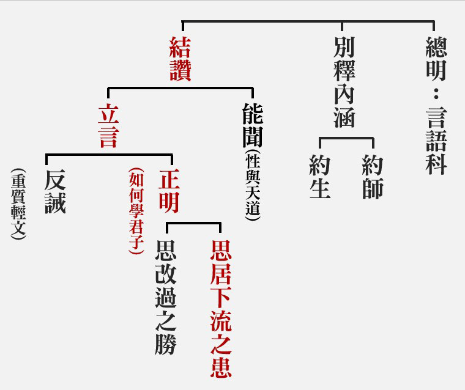

### 孔門十哲—孔門弟子中最耀眼的十顆星（二）

*圖：江逸子、文：編輯部*

孔門中最奇特人物

禹稷之才堯舜之志

和光同塵大智若愚

進退依時用行舍藏

復聖顏回：仁心的代表、為學的楷模

孔門中一等一的人才就是顏回，顏回獨得孔子的讚歎。在《論語‧公冶長》篇裡面，孔子跟子貢說：「我跟你都不如顏回。」雖然是客套話，但是何嘗不是夫子對顏回的肯定與讚許，而好學才是人才成就最關鍵的因素，好學成為人才，不一定有出路；但是團體與時代要找出路，非人才不可。

顏回這個大才，就是從好學來的，他的好學來自於聽講，像〈為政〉篇裡面，顏回聽孔子談論大道一整天，都能不厭倦。好學也來自於請教，像〈泰伯〉篇裡面說：「顏回是一個以能問於不能，以多問於寡的人才。」好學也來自於對所學的有所體悟，像〈為政〉篇裡面說：「顏回對孔子的話是無所不說，而且能夠發揮孔子的未盡之義。」好學也來自於私下用功，在〈子罕〉篇裡面，孔子讚歎顏回說：「吾見其進也，未見其止也。」好學也來自於跟朋友的切磋琢磨，如子貢說：「賜也何敢望回。」我怎麼敢來跟顏回比呢？就是在切磋琢磨當中，來領悟顏回的厲害；好學也來自於教學相長，像曾子在《禮記》裡面，有一段他在臨命終的時候，他對他的孩子說：「我這一生如果沒有顏回，也沒有什麼可以教孩子的。」可見曾子的老師，除了孔子外，幕後老師就是顏回，師兄弟們來談論孔子上課的未盡之義，顏回都可以發孔子未發的未盡之義，這也是孔子的私下觀察。

魯君到孔門裡面找人才，他問的是「弟子孰為好學？」孔子回答只有顏回好學，並且把好學的成就行相說出來，那就是「不遷怒、不貳過」，不遷怒指修養達到爐火純青，是利他心態的呈現；不貳過是不會犯各種認知偏誤，而能建立各種的認知模型、思維模組，不會在認知上、抉擇上、思想上、行為上，重犯過失，所以孔子在《易經‧繫辭傳》裡面也讚歎顏回，快要達到無過的境界了，有過的時候也能很快的知道，知道便不會再犯過，這種智慧讓人難以想像，換句話說，顏回對事情看得很全面，吉凶禍福了然於心，綜觀全局而知道眼前的每一步，那真是讀書人最佳的能耐。

顏回的仁心、安貧樂道、入世的智慧、出世的智慧，除了得到孔子高度的認可之外，也得到當代的認可，例如在周遊列國的時候，楚昭王的宰相子西大夫就認為顏回才是真正的宰相之才，後代的孟子也認為顏回是夏朝開國的大禹，或者是周朝始祖稷這樣的人物，是一個能夠承擔天下大任的人才，而且是公天下的人才。

這種願意承擔大任向道的心，連孔子都讚歎不已，尤其在逆境挫折苦難中也不改這樣的心志，像是在陳蔡絕糧時，弟子們或者餓得爬不起來，或者無精打采有氣無力，或者心中抱怨老天爺對君子不太公平，或者希望孔子要務實一些。只有顏回更具向道的心，而且不覺得遭逢困境有何不好，有何過錯，反而要經過這樣的困頓與歷練，都不改其道，這才是君子的形象。孔子很高興地對顏回說：「如果你發跡，我願意好好的輔佐你。」

大凡有能力的幹才，或者躁進；沒有能力的庸才，或者裹足不前。而顏回這種一等一的人才，卻能審時度勢，該進則進，該退則退，看清楚時機，所以孟子讚歎孔子，是聖之時者也，其實顏回何嘗不是如此呢？所以孔子曾經讚歎顏回：「用之則行，舍之則藏，惟我與爾有是夫！」就是懂得進退，掌握時機，時哉時哉的大才。

顏回也是孔子真正的知音，孔子跟他交談，就像大雨傾盆一樣，灌下大地，可以跟顏回對談一整天，或許是經義的闡述，或許是人情世故的解析，或許是各種道理的演繹，這種快樂，叫做孔顏之樂，世間的享樂根本不值得一提，在法喜當中，他根本不會在意他極為貧困的生活，當然老師會很在意，所以老師想要推薦顏回出來做官，脫離貧困。要知道孔子是不輕易推薦弟子出來做官的，可是顏回告訴老師，他學習的快樂是無可取代，所以他甘願安於貧窮、安於簡陋，來做一個傳承的人才，他每天沉浸於學習的快樂，使他成為曠世奇材，特別是經學傳承的這一分，難怪他過世的時候，老師哭得超過常情，而且說「天喪予！天喪予！ 」

其次他跟老師是患難與共，名為師生，情同父子，除了在陳蔡餓七天，唯有顏回能說出一番樂天知命的大道理，深獲老師的心以外，在匡地被匡人圍困，師徒失散的時候，顏回找孔子，孔子找顏回，好不容易見面的時候，老師又高興又激動的對學生，說了一句反話，說：「我以為你死了。」顏回說：「老師在，我怎麼敢死。」意思是說：他也知道自己是一個受命之才，所以在慌亂當中，奮力地保全自己的性命，因為他知道保住生命，才能傳承老師的道。

顏回被尊為復聖，復聖就是復興聖人的道統，在歷代也都有追封，比如說在唐代，唐太宗就詔稱顏回是先師，唐高宗追封為太子少保，唐玄宗再追封為兗公；到了宋代，宋真宗改封為兗國公；元代時，文宗加封為兗國復聖公；明代世宗詔改復聖，今天山東曲阜還尚有復聖廟，這是以上一個對顏回的尊崇。

顏回的延續、顏氏一族，後代也人才輩出，像是知名的唐朝政治家、大書法家顏真卿，寫了著名的顏氏家訓的顏之推，以及顏世鏞都是顏回的後人，顏氏的後人接續著顏回，他是低調的含蓄的那種家風，而他的家譜，一直相續的沒有間斷，至今我們都能夠認識這些顏氏後代這些先賢們，這些對社會、對歷史有貢獻的人。（下期待續）

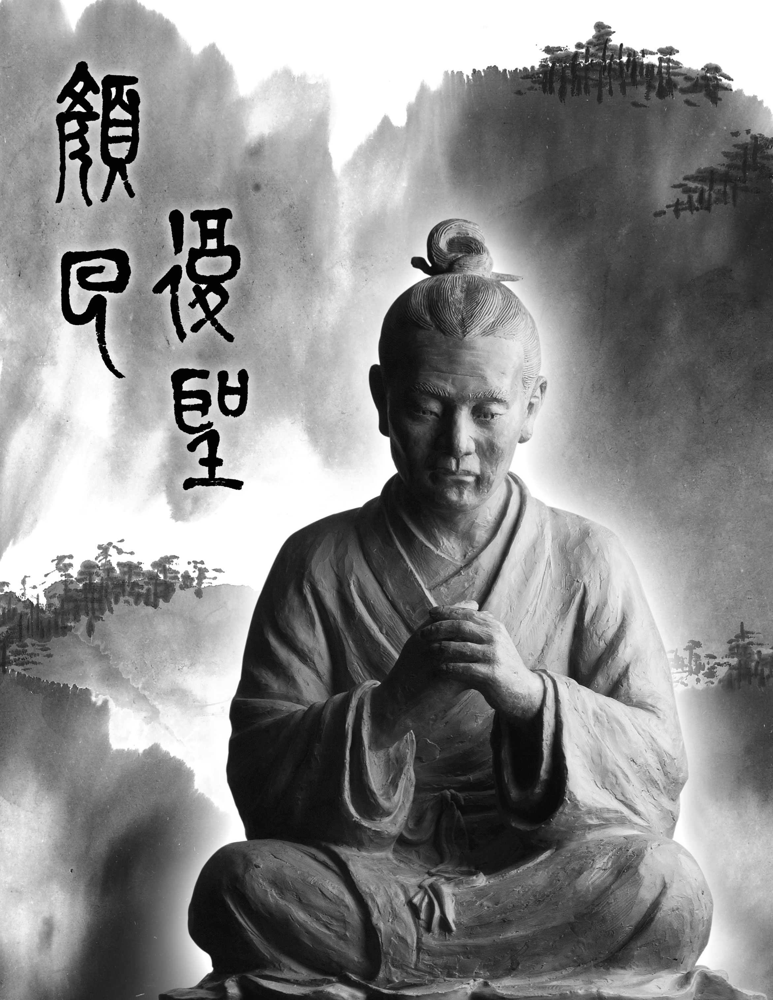

### 孔門心法—中庸之道(二十三) 第二十章：政在人為（一）

*時哉講述/弘毅整理*

人存政舉人亡政息

尊重制度善用制度

賢者若無制度無用

無人遵循發揮大用

—前言—

辦政治的關鍵在人，唯有對的人站在對的位置，一切才能發揮功能。

一個團隊、企業、國家，都需要精英來領導，才能有很好的發展，而精英需要學習禮儀、人情世故、跨領域的知識、品格、經典、國際形勢、全腦的開發，還要有各種職務的歷練，並且具備突破和解決困難的能力。學習不能安於舒適區，這樣的所知是有限的，無法應付各種變化，必須跨出舒適區，進入學習區，除了涉獵過去的領域，還願意迎接挑戰，如康熙皇帝願意學習中國文化，對西洋的知識也非常感興趣。當學習的範圍愈來愈大時，就算遇到令你驚恐的問題，也會運用過去的經驗閱歷和認知基礎，做最有利的判斷。

《時代》雜誌二○一五年度風雲人物是德國總理梅克爾，她原來是東德人，兩德統一後，她是一個量子力學專家，後來成為政治領袖，以她科學精密的思維，帶來德國的強盛，歐盟的團結，歐債危機的解除，以及度過英國脫歐的危機，第三次擔任德國總理，超過了英國的柴契爾夫人。她自述做事先做準備，然後是猶豫，最後是判斷，所以她的政策務實而少失誤，她不說謊、不畫大餅，先規劃後說，也不讓內閣成員亂說，被認為是德國最重要、最有品格的政治人物。她最有名的是處理難民事件，在一個討論會上，當有一個十四歲的巴勒斯坦難民女孩哭著說，想在德國定居下來，梅克爾上前說不能答應她，因為如果藉著總理的方便，那就對不起千千萬萬的難民，她的做法被當時很多德國人認為冷血無情，可是後來她接受了八十萬的敘利亞難民。可見，她不會討好人，沒有萬全的準備，她是不會隨便答應的。所以事後小女孩接受採訪時說，她很佩服梅克爾，因為她是一個誠實的政治人物。梅克爾下班後又像一位普通的家庭婦女一樣排隊買菜煮飯，與同樣是量子力學專家的先生住在一個十幾年的公寓裡，德國人親切的稱呼她為「媽媽」。她是一個務實、有能力、有品德、有家庭觀念的人，她做事如科學研究一般嚴密精準、有架構，再討論判斷，是政治人物最好的典範。她也處理過很多的政治危機，做事穩定有計劃。

人與制度，孰輕孰重？沒有人的遵守執行，再好的制度也沒有用，沒有制度，人也沒有軌跡可走，制度可以約束人，所以人和制度一樣重要。

中庸總體科判

第二十章還是在《中庸》的第二部分，即分別顯示中庸的修學法和義理。

本章科判分析

為政之要在道德，道就是五倫之道，德就是三達德，以智、仁、勇來行五倫。首先總舉問答哀公問孔子辦政治的要點，孔子說要參考制度、任用賢能之人。然後子思闡述為政在人，要用賢能之人，自己也要成為賢能之人，要以智、仁、勇三達德來推動五倫大道，而且要以誠心來推動，如此才能有殊勝的成就，能修身、齊家、治國、平天下。

—消文釋義—

經文：哀公問政。子曰：文武之政，布在方策。其人存，則其政舉。其人亡，則其政息。人道敏政，地道敏樹。

消文：此章背景為孔子六十八到七十三歲之間，已經回到魯國，魯哀公問政於孔子，包括如何強國、富民、得到大臣的敬重、百姓的擁護等內容。孔子回答說，辦政治的方法、道理、原則要參考開國時文王、武王所制定的制度，那是最完備的，都記錄在典籍中，如《周禮》中記載了周朝的官制，《儀禮》記錄了生活的內涵、禮儀的講究，所以治國先要繼承先王的制度，而制度記錄在典籍之中。文王、武王這樣的聖王存在，則政治越辦越好，人依著制度辦事，制度就會彰顯它的功能，老百姓就會生活的快樂，幸福美滿。當國君是昏君、暴君時，就不能行文武之道，空有制度，而不能發揮任何功用。用很有悟性的人來辦政治，政治會很快的上軌道並取得成果，如戰後廢墟得到重建，百姓脫離貧苦，風氣得到扭轉。善用土地能夠很快的生長萬物。

釋義：「布」，記錄；「方」，木板；「策」，竹簡；「敏」，敏捷、有悟性。

經文：

夫政也者，蒲盧也。

消文：解法一：辦政治就像蘆葦成片一樣，很快就能取得效果，如堯舜時「比屋而封」，家家戶戶都是善人，路不拾遺，夜不閉戶。

解法二：辦政治就如螟蛉祝子一樣，為政者如果是一個清明、忠孝之人，老百姓也像他一樣。

釋義：「夫」，發語詞；「蒲盧」，朱子解釋為蘆葦，鄭康成解釋為蜾蠃，是一種青色的小蟲，像蜜蜂，只有雄性而沒有雌性，所以抓桑樹上的螟蛉養育，然後對著它說，像我，最後長大後就像蜾蠃，這叫螟蛉祝子。

經文：

故為政在人，取人以身，修身以道，修道以仁。仁者，人也，親親為大。義者，宜也，尊賢為大。親親之殺，尊賢之等，禮所生也。在下位不獲乎上，民不可得而治矣。故君子不可以不修身。思修身，不可以不事親。思事親，不可以不知人。思知人，不可以不知天。

消文：因此辦政治重點在人，用人首先自己要修身，要以中庸之道來修身，修學中庸之道要在仁上下功夫。仁就是做人之道，先從孝順自己的父母開始。義就是做事適宜，要尊重任用賢能之人。對待親人有親疏之別，尊重賢人也有高下等級之分，親親和尊賢都要靠禮來辨別，才能使家庭和團隊和諧。在下位之人如果沒有得到上位之人的重視，老百姓也不會得到好的政治。因此君子想要任用有公心、賢能的人，就要先修身，想要修身，就要先從侍奉父母開始。想要侍奉父母，就要知人。想要知人，就要知道天道，吉凶禍福的觀察，緣起的觀察。

釋義：「殺」，當差別講，指親戚有親疏之別。

經文：

天下之達道五，所以行之者三。曰，君臣也，父子也，夫婦也，昆弟也，朋友之交也。五者，天下之達道也。知，仁，勇三者，天下之達德也。所以行之者一也。

消文：五倫是天下通達的大道，要以智、仁、勇來行五倫之道。五倫之道包括：君臣、父子、夫婦、兄弟、朋友，這五個是天下通達的大道，如果能夠好好的經營，就能把國家乃至天下治理好。智、仁、勇是通達五倫之道的能力，智包括通達人情世故，學習經典，跨領域的學習，懂得思辨、推理、認知、覺知，很有領悟力的知道如何處理事情，仁就是從同理心出發的公心，勇就是從智和仁出發的執行力。五倫之道和智、仁、勇都要以誠心來推動。

經文：

或生而知之，或學而知之，或困而知之，及其知之一也。或安而行之，或利而行之，或勉強而行之，及其成功一也。

消文：對於五達道和三達德，有的人天生就有悟性，一學就會，有的人是要通過預習、練習、複習才能變得有悟性，成為生而知之者，有的人遇到問題時，沒有明辨和解決的能力，要向老師和有悟性的同學學習，通過不斷地學習，最後找到門路，成為學而知之，乃至困而知之者，如曾子。所以最後他們所達到的境界都是一樣的。以智、仁、勇來行五倫大道的時候，有的人是自然而然的行持，有的人是知道這樣行持的好處而行的，有的人是勉強、鼓勵自己來行持的，最後都能夠以智、仁、勇的內涵來通達五倫之道。

經文：

子曰：好學近乎知，力行近乎仁，知恥近乎勇。知斯三者，則知所以修身。知所以修身，則知所以治人。知所以治人，則知所以治天下國家矣。

消文：孔子說：多見多聞的好學就近乎於真知了，越實踐就越能發揮出公心，就接近於仁了，如果沒有辦法力行五倫之道、發展公心利益他人，就會感到恥辱，那麼就要趕快去學習，使自己成為一個有智慧、有公心的人。如果懂得好學、力行、知恥這三者，就能夠生起智、仁、勇，然後去行五倫之道，敦倫盡分才是真正的修身。懂得敦倫盡分，就能治理好團隊，治理好天下國家。

—章旨—

本章告訴我們必須要懂得充實自己，使自己成為有公心、賢能之人，然後懂得運用團隊的力量，辦成事業，辦成政治。

—析疑—

一、本章與前章的關聯為何？

前章講武王、周公是通達孝道的，此章告訴我們達孝是要在修身、用人、治國、治天下上講究。

二、哀公是無作為的國君，孔子明知，何必回答如此詳細？

雖然哀公是無作為的國君，但作為臣子，孔子還是要把道理說清楚，事情分析明白，即便國君不能施行，還是要盡到為臣之道的。

三、既然人存政舉，人亡政息，制定好的政策又有何意義？

第一，制定好的政策，人們才有所遵循；第二，後面的人才能藉著制度發揮功能，如果後人不能遵循前人好的制度，那責任也是在後人，就好比老師盡力教導學生，可是學生不受教，老師也是沒有辦法的。

四、哀公若想令魯國大治，只要實踐文武之政不就好了嗎？

雖然文武之政記錄在典籍之中，但作為國君也要修身，還要任用賢能、有公心的大臣，制度還是要人去執行，如此才能令魯國大治。文武之政也要有人教，才知道精髓以及在時代的運用。

五、領導者首須尊賢，如何成為賢者而為領導者所尊？

要想成為賢者，首先要有公心，而公心是在家庭中培養的，要懂得和諧家庭。還要有以品德為本質的能力，具備分析、判斷、認知，以及解決問題的能力，這樣的人在家庭、社會、國家都會找到出路。

六、為什麼只有賢者才會用賢者？

自身是賢能的人，才會看到賢能的人，而賢者也只會被賢者所用。

七、天下間有許多事要通達，為何本章只談五倫？

梅克爾在剛當上德國總理時，去參加歐盟的會議，各國的領導者想要欺負她，可是梅克爾準備充分，反倒成為了會議的主導者。三任之後，很多政要都被換掉了，她仍然屹立不倒，就是靠著她對事理的通達，步步為營，不說謊話，不嘩眾取寵，品德上沒有瑕疵，處事清清楚楚，對手也無可奈何，可見所要通達的事情很多，不只有五倫。可是在所有事情當中，最重要的是人際關係，所以重點談五倫。梅克爾所任用的都是謹慎的、不亂制定政策的人，懂得五倫關係，就懂得用人之道。

八、生而知之，學而知之、困而知之，其知一樣嗎？

對於智、仁、勇的認知，有生而知之，學而知之，困而知之，三者最後的所知是可以一樣的，可是能知是不同的。好比解一道數學題，有的人只會用一兩種方法，有的人會用很多種方法，雖然都會解此題，但解題的能力是不同的。前兩者是厲害腳色，困而知之的人，他的能力範圍不足。

九、既是生而知之，何必再學而知之？

只有通過學才能串習、擴充、加深自己的體悟，所以孔子和顏回這種生而知之的人，更是好學之人。

十、學要如何訓練領悟力？

要通過跨領域的學習，訓練自己的領悟力。如看一幅國畫，不僅要看它的線條，還要有文學、詩詞方面的知識，才能更好的理解。當梅克爾接受了八十萬難民的時候，民意掉了百分之二十，她沒有遮掩事實，而是務實的和德國人溝通，她告訴德國人心胸要開闊，與世界接軌，學習中國文化，難民是可以被同化的，甚至成為他們的助力，最令人害怕的是自私鎖國，逃避問題。

還有全腦開發的學習，有理性、感性、記憶、分析等方面的開發。梅克爾本身是量子力學的教授，她還懂得政治、財經、倫常的經營，還懂得做菜，還有生活的品味，量子力學的精算也會幫助她辦政治。

十一、在人工智慧普遍的未來，這樣的學習可以存活嗎？

如果你是一個懂得跨領域學習的人，是一個有愛心的人，當然可以存活，這是人工智慧所不具備的。如人工智慧具備高超的醫術給人治病，可是不能給人關懷，人要學會從文化中找到人性、同理心，否則就會被人工智慧取代。餐廳老闆經營餐廳文化的氛圍，讓客人有賓至如歸的感覺，這是機器人辦不到的。

十二、中華文化在資訊爆炸時代，如何吸引菁英分子來學？

菁英分子雖然要學習很多科學等知識，可是也要有人格，懂得情緒控管，人際關係的講究，也要有公心、格局、見地，中華文化的學習正好可以幫助他具備這些。

十三、安而行、利而行、勉強而行，其成功會一樣嗎？

以智、仁、勇三達德來推行五倫之道，安而行是自然而行，利而行是知道對自己有利而行，勉強而行是不斷地給自己鞭策才會行，雖然都會成功，可是所展現的氣象是不同的。如到百貨公司購物，服務員同樣是說歡迎光臨，可是老闆要求的，或者為了業績的，或是以客戶為尊的，因為內涵的不同，所展現的氣象也是不同的。

我們要對過去傳統的文化認知，這是不忘本來；要學習認知豐富的現代知識，這是吸收外來；以這些內涵去迎接未來，善用人工智慧，利益有情，創造人類的福利，就是面向未來。

—總結—

雖然我們知道五倫的講究，也知道智、仁、勇的重要，可是當今時代變化迅速，互聯網發達，我們要開闊心胸，學習德國的務實，學習美國如何培養人才，學習西方在科技、財經、人文等領域的知識、方法，看看其它國家是如何看待中國歷史的，嘗試從不同的角度分析問題。在這個時代中，培養個人的修養，處世的能力，成為時代頂尖的人才，必定會帶來家庭、團隊、社會、國家的幸福美滿。

—問答—

一、老師說只有賢人才能用到賢才，可是曹操也能用到楊修、孔融這些被稱譽的人，應該如何看待賢人與賢才之間的關係呢？

曹操不僅能用到楊修、孔融，還任用了很多賢才，如張遼、荀彧，他稱讚荀彧是張良再來，曹操是治世之能臣，亂世之奸雄。德有明德和昏德，賢也有明賢和昏賢，有些人懂得領導統御之術，也能招納到人才，可是能否長久，這才是問題所在。如果真的是有公心，才能和合團隊，才能利益天下百姓，事業才能長久，如周朝八百年，堯舜的統治，至今被人們懷念。

二、現在有很多人對政治是無感、冷感，甚至是反感，人道就一定敏政嗎？

如果政治辦得好，老百姓生活好，生命變得有意義，那就會對政治有感、好感、正感。政治辦得不好，老百姓生活不好，生命沒有目標，不知道生命的意義，才會無感、冷感、反感。

三、好學要如何近乎知？不好學的人難道就生不起知嗎？

好學不僅是見聞，還要跨領域的學習，懂得學習的方法，懂得推論、認知，所以好學近乎知。如果不好學的話，怎麼能生起知呢？

四、很多知恥者也未必發憤圖強，知恥要如何近乎勇？　　　知恥有兩種，一種是在名利上覺得不如人，所以發憤圖強，如蘇秦；另一種是認識到自己的能力、心量不足以利益他人時，感到羞恥，所以要充實自己。當然也有人雖然知恥，可是沒有發憤圖強，而是慚愧地走掉，當知恥懂得發憤圖強時，就近乎勇了。

五、有云，困而知之，是勤學苦行乃知。利而行之，是榮名利益而行。這樣的解釋是否可採用？

不是。困而知之是被困住了以後，才去好好的學習，然後進入學而知之，如果學習時不是簡單的背誦、記憶、應試，而是有悟性的學習，就能進入生而知之。利而行之是知道這樣行對自己有利，但要以義為利，如站在有利於他人的立場賺錢，而不是為了個人的名聞利養去行。所以子張學干祿，孔子並不反對，關鍵在以義為利。

六、現在有很多的強國，其領導者也未必有講究五倫關係，似乎也很有成效，該如何看待？

有些國家資源豐富，追求名利上的享受，如曹操也可以凝聚人力，或者現代有的企業業績掛帥，凝聚力很強，可是一旦沒有了名利，馬上瓦解。所以足食、足兵、民信三者，民信才會真正凝聚人心，願意跟你同甘苦共患難，不在乎名利。如果是以名利來引誘他人，當沒有名利可求時，自然瓦解。國家強盛看起來好像一樣，可是能強的方法是不同的。

七、知行合一的正解為何？

知包括兩種，第一種是知我所了解的，第二種是知我所不了解的不能去行，要去請教他人。然後還要分辨知是知識，還是從知識、經驗、分析產生的認知。知行合一，不可以只從字面意思就去行，也不能只學一句就去行，要懂得從各個面向去分析、理解，才能更好的行持。

八、跨領域學習會不會變成樣樣通、樣樣鬆呢？

學習重要的是認知，而不是知識，要注意學習方法、推理、教材。跨領域的學習可以幫助自己從另外的角度看問題，如看一幅國畫，不僅看它的線條，如果還有文學內涵，那所見又有不同。再如聽音樂，會因為心態、能力、文學素養不同而有不同的感受。經學也是如此，如以經學的性與天道、吉凶禍福來攝持禮，與單純的按條目行禮是不同的，所以如果跨領域的學習能夠有助於我們更好的通達所在的領域，那是很好的。

九、知人與知天的關係為何？

知人要看公心和賢能，知天就是看天時，要會看大局，講究做事的時機。我們不但要知人，還要知道在什麼時機下發揮人的功能。

十、《閱微草堂筆記》言：「滿腹皆書能害事，腹中竟無一卷書亦能害事。」又說：「能與人規矩，不能使人巧。」這是不是也在說，典籍和人都很重要？

滿腹皆書的人如果質地不好，那是有危害的，但是如果質地很好的人缺少知識也是不行的。腹中無一卷書，做事投機取巧，私心自用，這就是不讀書之過。規矩是制度，巧是有悟性的運用制度，不能死守制度，如周公製禮作樂，祭天祭地的儀式，有些就是文王時所沒有的，發揮文王之德。典籍和人都很重要，典籍就是充實自己的內涵，而內涵又要從人身上才能學到，而且辦事不是一個人成就的，要與人和合才能共同成就事業，特別是團隊的成員涉及各個領域，有了解時代的，有了解旨趣、方向的，有了解各種技能的，這樣的團隊力量更大。

十一、螟蛉有子，蜾贏負之。有人研究蜾贏是把螟蛉的幼蟲作自己孩子的食物，那就不是讓百姓像自己了嗎？　　所以取的解釋是把螟蛉的孩子當作自己的孩子來養，才符合本章的意思。所以辦政治就是如此，如天子把孝道的風氣推展出去時，家家都對父母又愛又敬，上有好之，下必從之。

十二、本章孔子釋哀公問政，告其為政之要是否超出哀公的能力範圍，若不契機豈不是白費唇舌？

《易經》泰卦的初爻中講，拔茅連茹，當把草的根拔起來時，會連出一片，如果哀公能夠任用孔子，後面就會得到一堆人才，魯國的命運就會翻轉。文武之政，布在方策，孔子就是通達文武之道的人，而且他有公心，又賢能，還凝聚了人才團隊，可是哀公聽完道理卻沒任用孔子來實行禮樂善政，這是很可惜的。就如今天有些人聽完課，道理也很懂，可是後面沒有行動，那對道理又怎能算懂呢？

十三、地道敏樹應該是要給予樹木很多養分讓樹木快速生長，但是松柏卻生長得很慢，該如何正確理解地道敏樹？

地道敏樹是說，辦政治扭轉風氣是很快的，可是要真正培養出松柏那樣的人才很難，像孔子這樣的人才不是隨便就能得到的，安定的環境比較容易培養人才，可是真正的人才也不是好培養的，所以要愛惜人才。

十四、蒲盧的蜾贏之解，可以理解為愛民如子嗎？

愛民如子才會想要改善他們，如同父母對孩子，父母都想要孩子品德好，充實內涵，做父母可能沒有這個能力，但辦政治是有實權的，以他的名分就比較容易發揮作用。

—結語—

如果我們真的能夠理解孔子對哀公所說，那麼做人處世，為官辦政，成為他人所尊重的對象，此章就是一個核心的修學法，從中得到真正的出路，不但能夠福國利民，還能吸引到真正的精英來學習文化，以此章的內涵來辦政治，政治才能辦得長遠。（下期待續）

## 藝術賞析

### 七十二賢淺說(四十八)-左人郢

*圖：江逸子、文：編輯部*

帶著頍冠代表高貴

一介布民唯道是親

如左丘明孔子眼力

亂世最難君子自處

左人郢，字子行，又稱子橫，春秋末年魯國人，山東兗州府人，為孔子的及門弟子。

左人郢在孔門弟子中以德性著稱。宋高宗稱讚左人郢：「伯彼臨淄，德行稱賢，希蹤十哲，秀穎三千，心悅誠服，家至戶傳，樂只君子，文聲益宣。」意思是他在德行方面稱為賢人，追隨十哲，在三千門徒中，是脫穎而出的人物，內心十分佩服這位君子，名聲能傳至家家戶戶，大家都喜歡這位君子，使他美名更加的宣揚。

呂元善也稱讚左人郢：「心悅誠服，如七十子，子處其間，服膺何事？聖亦能同，丘明之恥。奚辯其官？左人左氏。」他內心十分的信服左人郢，如七十二弟子之賢，令人心服，左人郢在對道德行為、做人處世上的判斷與感受上，甚至左丘明相同。這種說法是高度讚美，左丘明是孔子著作解經的史家，深知孔子對行為禮法上的褒貶準繩，左丘明認為可恥的，孔子也認為可恥，他們的感受是相同的，可見左丘明是明了孔子內心想法的人，左人郢能與這樣人物匹美，是讚揚左人郢平日行為做人處世能合乎孔子追求的道德言行。

左人郢於東漢明帝永平十五年入祀聖廟，唐玄宗追封為臨淄伯，宋封為南華侯，明朝改稱先賢。

畫中的左人郢，面容嚴肅，似在思考，雙手捧琴，表徵受到禮樂教化的薰陶，培養德行，展露君子的風範。（下期待續）

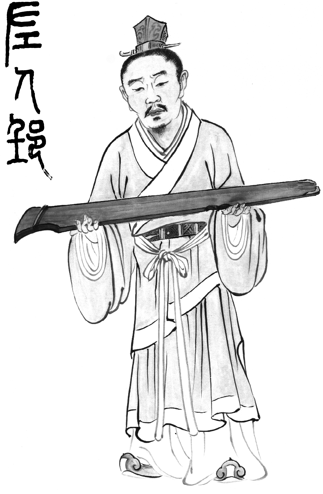

### 七十二賢淺說(四十九)-燕伋

*圖：江逸子、文：編輯部*

西秦東遊孔門座下

周遊列國飽受風霜

返魯歸秦宏儒傳道

為師守喪千載交義

燕伋，字思，又稱燕級，字子思，春秋秦國漁陽人。小孔子十一歲，天性純孝。

據《燕氏家譜》記載，燕伋一家三代同堂，是樸實的耕讀家族。燕伋的祖父名公勝，父親名公滕。當時，孔子在山東曲阜傳授弟子讀書，燕伋的父親想讓燕伋去山東求學，由於父母年邁，燕伋不敢遠遊，至十八歲完婚，娶妻賢慧知禮，以耕讀為樂。燕思二十歲時父母相繼逝世後，他才遵從父親的心志，去魯國拜於孔子門下。專門修習詩禮，深得孔子器重，並隨孔子周遊列國。周遊列國回到魯國後，孔子希望他回鄉繼承祖業，並興學宏儒。十八年後，孔子的兒子伯魚去世，燕伋專程去魯國慰唁，並停留四年。當返秦國的時候，又遭逢孔子過世，因而繼續守心喪三年後返鄉。可惜，隔年燕伋也因病去世。

燕思於漢永平年入祀聖廟，唐玄宗追封漁陽伯。宋高宗贊曰：「師席高振，大成是集。至道克傳，賢達斯執。善教雲袤，儒風可立。漁陽之士，得跂而及。」子思受到孔子的教導，能集大成，使聖道傳承，很有把握的成為賢明通達的讀書人，盡量的褒揚聖教，樹立儒家風格，子思也被封為漁陽伯。

宋大中祥符封汧源侯，明改稱先賢至今。

畫中的燕伋，表情誠懇，手拿笏板，笏板是古代大臣上朝面見天子時所執的狹長形板子。表徵燕伋被孔子培養成具有做官的實力，可惜時代混亂，不能辦政治利益蒼生，但也不妨礙他的高風亮節。（下期待續）

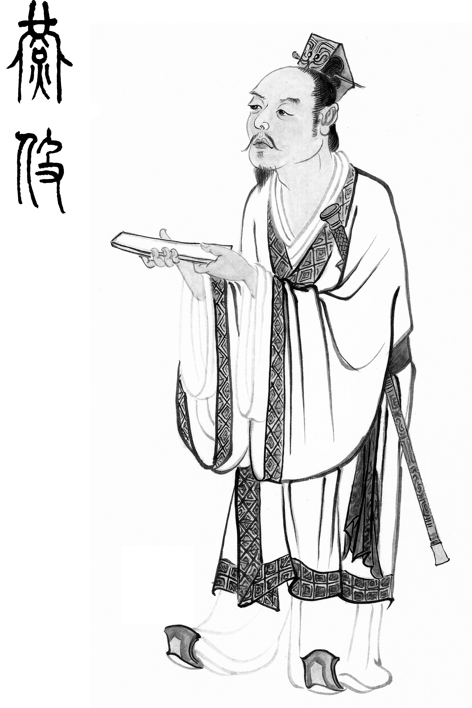

### 華夏精魂千秋（三十九）明倫史畫　仁恕樂道 沈道虔

圖：江逸子、文：淨域

亂世胸懷難  志道少欲足

教學厚風俗  賞賜皆能施

祖產作佛寺  捨盡道方成

—史畫—

沈道虔，南朝宋揚州吳興郡武康縣（今浙江省德清縣）人；生年不詳，卒於宋文帝元嘉二十六年（西元四四九年）。生性仁厚，家貧志高。

他好讀《老莊》、《易經》，隨博學多才的戴逵學琴。戴逵以琴畫聞名，王徽之曾雪夜拜訪；他素來討厭武陵王司馬晞，拒絕到王府為他鼓琴。道虔受戴逵終生不仕的影響，對朝廷之徵召皆辭謝不受，隱逸於石山精舍自耕自食，或得他人贈予，必分享於親族，為鄉里所敬重。

東晉安帝時，有孫恩與盧循作亂於吳郡（今蘇州）、吳興郡（今湖州）、會稽郡（今紹興）一帶，且屢犯健康城。社會動亂遍地饑荒，道虔將自己的倉糧拿出來濟民。有人偷他菜園裡的蔬菜，道虔看見不但未責怪，反而迴避躲起來，等偷菜的人離去他才出來。某回，里人偷採竹筍，道虔撞見說：「這兒要種一片竹林，請不要採這裡的筍，我另有大筍相贈。」他派人買筍送給里人，里人羞愧而不敢收受。

生活困苦時，他曾拾取穀穗來維持生活。同往揀拾穀穗的人，常因搶拾而發生衝突，道虔出面勸諫不止，便將自己所拾得的穀穗，全部分送給他們，相爭者愧赧而停止紛爭。有感於道虔的大器雅量，鄉里人每有爭執或不名譽的事，便說：「不要讓沈居士知道。」

冬天道虔無厚衣以禦寒，富人戴禺為他做新衣並贈送一萬錢，他全部轉送給貧困無衣的兄弟或學生。鄉里少年相率來求學，他一概不收取學費，有時餓到無力教學；武康縣令孔欣之給予資助，許多學子日後很有成就。

南朝宋文帝劉義隆，聞知道虔的風範與德教，賜錢三萬、米二百斛，他卻分給親族子弟作嫁娶之用，自己簡約如常。雖無隔日之糧，仍以琴書為樂，授徒孜孜不倦。帝又召其為員外散騎侍郎，辭而不受；再特別敕令郡縣，隨時供給日常所需。

道虔家歷代信奉佛教，他將祖宅捐作寺廟，虔誠禮敬。每年四月八日佛誕節，親率全家人前往佛寺虔誠禮佛，由於真誠懇切，全家每每感動泣淚。元嘉二十六年善終，享年八十二歲。他的孩子秉承父志，也不求取功名，樂善好施，如同道虔在世一般。

—圖解—

漢末至魏晉間朝政動盪，士大夫以清議之法討論時政問題，藉以表態及辯護自身的立場。當政治上的壓迫與挫折日深時，便走入隱退及放誕清談的地步，通常是道家用最精粹簡潔的語句表達出來，成為口紙上的玄言。至東晉後期，清談與佛教思想結合，漸漸發展為儒、道、佛三位一體的新學，衍出宋代的形上理學。

沈道虔生於東晉至南朝宋間，正是清談發展為儒、道、佛三位一體之際。其學優隱而不仕，戮力自耕自食，授徒敬業不倦，仁恕樂善好施。又信佛虔誠禮敬，居於石山精舍，捐祖宅為佛寺，自然表露出仁厚慈悲的胸懷。

沈道虔的仁厚寬恕，江逸子老師特別就「贈筍」一節繪之。圖的右上角，沈居士正坐於精舍中用功讀書，一時望見有人來竹林採筍，因為此林另有他用，便前去說明勸阻。為使他人不空手而歸，還特別取來大筍饋贈，讓這人頓感羞愧而辭謝。

往昔，曹操的曾祖父曹節，也以仁厚著稱於世。鄰家的猪隻丟失了，硬說曹節家的猪是他的，曹節辯也不辯地把猪交給鄰居。哪知鄰家的猪自己回來了，鄰人只得認錯道歉，而曹節只是一笑帶過。為人寬厚是種美德，一時吃虧終究佔得便宜，這便是心胸寬闊的快樂之道。（下期待續）

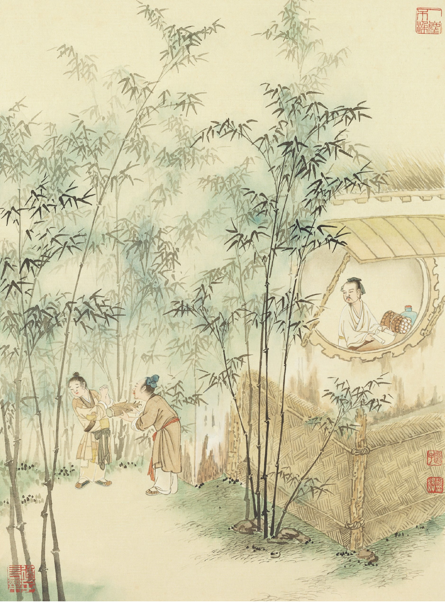

### 道藝春秋（十一）晉代陶侃，母賢子孝

*圖：江逸子、文：編輯部*

捕捉陶侃重要史蹟

畫作耐人尋味呈現

以藝載道老少咸宜

成功秘密由點串連

陶侃是兩晉時期的戍邊大將，也是一位孝子。陶侃的父親早逝，母親很早就守寡，家裡又貧寒，靠單親媽媽一個人辛勤地紡織勞動，維持家庭生計，並且盡力供給栽培陶侃，鼓勵結交學問德行高的朋友。因此陶侃自小受到母親嚴格的教育，一生謹慎，留下廉潔的名聲。

江老師這幅畫的故事，是在說有一位頗有名望的孝子—范逵，剛好出遊路過陶侃所在的村里，當時連日大雪，臨時寄宿在陶侃家中。因范逵隨行的馬匹、僕人眾多，陶家貧窮，沒有可以招待的東西。范逵是有德的長者，應該恭敬接待。所以陶母對陶侃說：「你先出去留客，我自有打算。」她剪下自己的長髮賣掉，換米糧酒餚來宴客。又砍下不影響房屋結構的細柱子當作柴薪燒火，最後把自己睡覺鋪草墊剁碎當作飼料，餵給范逵所乘的馬，如此周全地款待了招待范逵一行人。范逵後來知道這件事，感歎地對人說：「沒有這樣的母親，不可能有這樣的兒子。」

細看這幅畫作可以發現，其構圖相當奇特。江老師把室內與室外的空間，畫在同一個平面。因連日大雪，所以屋簷積雪很厚。本來應該在室外的玲瓏石與梅花，卻畫在室內，給人一種寒氣沁骨的感受。石上的梅花，映襯陶侃高潔的心志，而牆上的弓箭補景，正是暗示陶侃未來受到賞識，軍功顯赫的象徵。

殘破的窗瓦外，馬匹正在吃草料，代表陶母割下自己鋪墊的草席，剁碎給馬吃。室內正在招待范逵，左手邊以頭巾包著短髮的人正是陶母，端出得來不易的佳餚招待賓客。

當我們看這樣的故事，一方面讚歎一位母親可以為了小孩付出所有，另一方面也看到身教重於言教。陶侃曾經為了奉養父母，一時不察把官衙公家的醃魚送給母親，陶母把醃魚退回，並且責備陶侃：「怎麼可以公私不分，將公家的東西拿回自家用呢，實在替你感到憂心。」陶侃以後成為志節之士，正是從母親身上看到的為人處世原則，所謂「非此母不生此子」，正是此意。也無怪乎，陶母和孟母都被列為中國四大賢母。 （下期待續）

### 以地藏菩薩本願經圖導覽(五)

圖：江逸子、文：唐瑜凌

業之重輕體性空

需論對象及意樂

作法以及作究竟

本品在論勝對象

觀眾生業緣品第三(上)

本品是釋迦牟尼佛的母親摩耶夫人，請教地藏菩薩，是造甚麼業，尤其是造業的對象為何，才會感得五無間地獄，這種地獄刑罰太可怕了，一定要問出原因，昭告天下大眾，不要造一切惡業乃至這種感應無間地獄的五無間罪業。畫面中恭敬合掌請教者即是佛母摩耶夫人，所請問的對象是慈悲聆聽且端坐在法座上的地藏菩薩。菩薩的左邊比丘想必是侍者，手握錫杖，表徵地藏菩薩是護持戒律廣修六度的出家聖眾。

畫中的地藏菩薩舉出左手像在回答聖母所問，而舉出五無間業，第一是「不孝父母」，父母生育、養育我們，如同給予生命，恩德難以說盡；畫面左下方這位兒子棒打父母，要將撫養他的爸媽趕出去，妻子在後方哭泣，兒女急忙阻止父親，被逐出家門的父親手指著天，彷彿在說蒼天在上，你會有報應的，要被逐出的母親竟跪地求免被逐出，正彰顯逆子苛薄無情，看了此圖令人三嘆，難怪會受五無間獄的劇苦。

第二是「不敬三寶」，第三是「侵損淫污」，三寶是世間光明的標誌，能使世間消弭苦難，使有情得到傳承，如同賜予慧命。不尊敬三寶侵損常住，玷汙僧尼，如此破壞三寶，不但諸有情失壞人天眼目，使邪見橫行，造成亂世，令有情深受生活的劇苦，精神上的恐懼。畫面上有強盜搶劫出家眾的錢財，有欲玷汙比丘尼，且在三寶處放火燒人，恣行淫慾，獄卒有手拿「拿」字的令牌或穿紅衣服顯示似魍魎的刑官，依罪犯名單指示兇惡的獄卒擒拿這些罪犯，也有的已在死亡時被獄卒以鏈條擒拿押往地獄。

第四「破戒誑人」，比丘應當做人天師，必須說話辦事與法相合，不可貪名圖利。

第五「偷常住物」，常住的資具、飲食等體性近十方，任意偷取便是偷盜十方道場資具，已無法數完他的罪惡，不可不慎。

總之眾生犯了這些滔天大罪，將墮入五無間地獄，那樣的痛苦是沒有任何一刻能受得了。受不了的劇苦，會讓有情害怕造作殘忍苛薄無恥的罪業，這是經變圖最殊勝的教化功能。（下期待續）

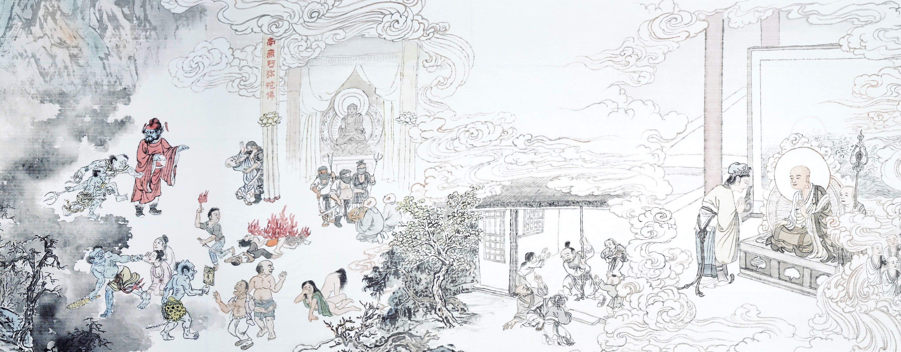

## 活動報導

### 壬寅年臺灣孔氏後裔仲春丁祭活動報導

*編輯部*

孔氏仲春丁祭圓滿

鐘鼓齊鳴進退有序

禮樂教化功在萬世

現場親臨感悟深厚

孔曰其如示諸斯乎

指掌而明治國核心

前言

一如既往的，學會參與臺灣孔氏宗親後裔仲春丁祭邁入第三年，有幸將在祭典中擔任各項職務，諸如前置作業、通贊、東西班引贊、鐘鼓手、禮生及攝影師等。大家漸入佳境，更駕輕就熟，但依然抱持著初心與戒慎之心，如火如荼地展開禮儀的震撼教育，這是一種氣度的訓練、威儀的講究，以及對先聖的禮敬。

二○二二年二月十九日於學會進行習儀課程，由臺大黃啟書教授講解帶領，重溫儀節規範，更重要的是調整心態，和合眾人之力，讓活動當天能順利進行，以下是當天黃教授的提醒與勉勵。

黃啟書教授：

三月十三日要辦的活動，不只是辦一個活動需要義工，需要一個打工仔，無盡燈是一個相當重視推廣中華文化的團體，長久以來一直幫著奉祀官孔垂長先生做了很多文化推廣的事情，無盡燈文化學會的傳承，早期就是奉祀官府的主任秘書雪廬老人，後來隨著孔德成先生到臺灣，臺大同學可能不知道為什麼要到這裡來上課，這是不是一個書院呢？這就是一個書院。奉祀官府到台灣之後，後來改制有這樣的淵源。

在網路上推廣儒學，無盡燈文化學會做了諸多的努力，我們今天在做的事其實就是談儒學，三月十三日要做的事就是展現儒者的本色，本色就是他原來的樣貌，大家知道儒者最早期的身分就是相禮者，因為他對古代的禮俗有諸多的了解，所以他常常會在很多婚喪喜慶需要禮儀的事務上，作為一個諮詢者、輔佐者，總而言之就是相禮者，換言之各位同學、學長三月十三日要做的事情，不叫做工作人員，現在白話文叫做禮生。

《史記‧太史公自序》中，司馬談講到：「序君臣、父子之禮，列夫婦、長幼之別。」從這句話可以看到倫理的重要性，儒家最重要的核心學術就是三禮之學。

大家都知道所謂的五經，有詩書禮樂易春秋六個角度來說，這五經各有重要性，但是就司馬談漢代的角度來說，儒家最專擅的應該就是禮學，所以三月十三日去擔任孔家活動的工作人員，要想像我們是在實踐儒家的核心學術。

為什麼這樣說呢？大家都知道《論語》有句話：「要為君子儒，不為小人儒」，兩者怎麼分？中文系讀出來會有兩種中文系，中國的儒學想要知道孔子到底怎麼講的，對於註解的看法到後面有漢學和宋學之分，漢學的基礎蠻像我們寫論文的考據，實事求是去猜孔子到底講些什麼，宋學是程朱以下一直到明清的宋明理學，走的這一路比較在乎的是道問學，程顥和程頤，後來的王陽明也是這一系，他們的格物是認認真真的格每一物，王陽明就是誤會這句話了。

但是你講的這些禮儀制度，今天我們行禮儀的時候，男子要這樣做，女子要這樣做，一個會比較重視外在的形式，一個比較重視內在的精神。就像情人節，送巧克力是形式，但是必須要有誠意，這兩者是不可以切開來的。

所以當我們在演練禮儀形式的時候，從上課、習儀到真正上場幫助他們行儀的時候，我們可以想想這套禮儀的內在。不論是漢學或宋學，不能忘了實踐這件事。若只知道讀書、寫論文，上課口沫橫飛，但是行為無法做他人的準則，當成是歷史研究來謀取自己的生活費，言教非身教者或只能是個小人儒。同學如果要這樣認知儒學，那麼建議大家去讀科學恐怕會比較好一點。

儒學的君子不要忘了要實踐，你一定認識歐陽修、蘇東坡，蘇東坡最有名的不是赤壁賦，是努力踏在泥土上跟人民互動的蘇堤。

這就是前行課最重要的開宗明義。

二月二十臺北孔廟現場排練

自前年(庚子)臺灣孔氏宗親後裔於新春團拜中試行儒禮起。去年(辛丑)因疫情推遲至二月，遂改以仲春丁祭規格，酌古用今，莊重舉行。並與成人禮結合，為即將承擔宗族弘道重責的學子們，嘉勉福證。今年(壬寅)全球防疫仍殷未減。經奉祀官與兩宗親會、協力之學術單位、文化團體會商決定：在維護全體參與人員之健康安全為最高原則下，嚴守防疫規定，預做各類不同等級之方案與籌備。二月二十日，由臺大中文系、中華無盡燈文化學會所共組的禮生團隊凡三十八人，於臺北孔廟大成殿，進行第二次的習儀。

所謂習儀者，在闕里祖廟，向於詩禮堂、金絲堂行之。現今臺灣各地秋期釋奠，則於九月二十八日前，擇日原地舉辦。因此禮生團隊看似綵排，實則依循古禮精神。有了去年的經驗與影象累積，本次研習即較為便利清晰。事前禮生等甚而可由籌辦方所提供的線上影片，在家中預先熟悉，所以當天雖然陰雨綿綿，習儀流程尚稱流暢。禮生中有三分之一是第一次參與，也能中規中矩，掌握如儀。

習儀時，臺北孔廟資深禮生施銘漳老師、陳應義老師及習沛㥍老師三位全程陪伴與指導，更令禮生們感動與收獲滿滿。自二○一八年北一女中開學始業禮起，三位老師一直對於禮生團隊殷殷提攜、傾囊相授。這次在習儀圓滿之際，特別請三位老師領銜，帶領所有禮生，禮敬大成至聖先師孔子。這不單是申告今日活動的完成；更強調禮樂文化傳承中，尊師重道才是重要關鍵所在。今天當禮生，並非只是為一項活動來當打工仔；實為履踐儒者做為相禮者的本色。因此如何在禮典的學習與襄贊過程中，體察儒學核心精神，方為整個活動的成功與否。禮生如是，未來參與的主祭、陪祭及宗親後裔亦莫不如是。

活動正式開演

二○二二年(壬寅)三月十三日(農曆二月十一)，宗主奉祀官孔垂長先生率臺灣孔氏宗親後裔九十餘人，於臺北孔廟大成殿舉行第二屆仲春丁祭暨團拜。本次活動由大成至聖先師孔子協會主辦，社團法人中華孔氏宗親會、中華孔子後裔儒學促進會、臺北孔廟、臺灣大學中國文學系及中華無盡燈文化學會等協辦。參與者除孔氏宗親後裔外，尚有禮生團隊四十餘人，貴賓董金裕教授、鄭雯馨教授、狄君宏教授、中華無盡燈唐瑜凌老師、林蔚芳老師、臺北孔廟陳宗緯主任祕書以及資深禮生施銘漳老師、陳應義老師、習沛㥍老師蒞臨觀禮。

曲阜孔氏溯自始祖先聖孔子以來，昌繁枝茂數千載。去年孔垂長先生所主持之大成至聖先師孔子協會委託臺大中文系團隊與臺北孔廟，參考闕里禮儀，試擬一較為簡易但不失典雅之丁祭禮典。舉行後，受到參與宗親及觀禮貴賓一致肯定。今年雖仍蒙新冠疫情干擾，猶在高規格防疫措施下擇期舉行。夷考闕里舊典，於四仲上丁咸以釋奠之儀祭祖，今各地孔廟所行祭孔大典即本乎此。然其時政府為之編列禮樂生額與祭祀費用，勢非今日孔氏宗親後裔之民間團體所能支應。因此在不違禮意的原則下，依舊典中月朔與歲時常祭之釋菜禮，並酌今儀，共分為典禮開始、入班、禮神、上香、行獻禮、恭讀祝辭、讀訓、立願、禮成、團拜、成人禮、合影等十二項儀節。務期存古通今，弘揚儒家禮樂精神。

諸如序班，悉遵古禮依孔氏字輩排序。惟以家長字輩為準，闔家站於同列。如此既尊重昭穆，又不疏親情。再如拜禮，則謹遵前任奉祀官孔德成先生所考禮容為準，或立拜、或跪拜，而以「再拜稽首」為最慎重之大禮。一則回歸禮書本源；亦有依遵衍聖公考訂之意。至於釋菜陳饌，則悉依明代李之藻《頖宮禮樂疏》所載。另參考現時所需，增入讀訓、立願等儀節。前者自《論語》中摘出三句由宗親後裔齊誦，相互惕勵，由修身合群到經世弘道。後者讓每位宗親後裔在宗主監臨觀禮下，入殿於祖先神位前發心立願。既滿足宗親敬祖之情懷，更深化宗主與宗親間敦睦宗誼的有形繫聯。另在團拜後，更藉由宗族團聚的機會，齊為即將承擔宗族使命與社會責任的孔氏後裔子弟行成人禮。依序由學子的家長、貴賓及宗主等三加、致予醴酒並為之取字。雖未如古禮遞易三服，但悉遵〈士冠禮〉三加彌尊，勉其有成的禮意。前次舉辦後，參考各界指正，今年在節目單中詳列了祝辭、家訓，甚至為成人禮學子撰寫「字說」。並事先於雲端網路中，製作拜禮要領及學子介紹等影片。使得儀節能更為細緻入心。尤其今天在二十九度高溫的考驗下，要讓老少咸能完整進行每一個環節，更有賴全體宗親與禮生的密切配合與體諒，終於提前在一個小時之內圓滿完成。

奉祀官對於所有宗親後裔在疫情之中，配合防疫規範一早撥冗前來參與此次丁祭，至表感謝；並對於各地宗親，獻上祝福。闕里孔氏素以詩禮傳家，雖今日各地不乏孔廟建築。但多做為文教、觀光之官方設施，一般孔氏族人如未參與每年釋奠典禮，幾已斷了禮樂敦化的臍帶。去年學會與臺大中文系組成禮生團隊，並有臺北孔廟的鼎力支持，重新接續了中斷七十餘年的家族丁祭。儘管禮樂規格有所降殺，但我們虔敬崇仰的心念，卻絲毫不減。未來不只期望在疫情解封後，可以讓其他各地孔氏宗親參與到這項歷久彌新，傳承不息的禮典；更鼓勵宗親來參與禮生的培育工作，更進一步的實踐「言詩立禮」的祖訓。當今疫情仍然起起伏伏，國際局勢動盪不安，我們除對全球的孔氏宗親家人誠摯祝願外，更期許大家在不同崗位上皆要恪守祖訓，敦品修身、和睦宗族。待人處世，以和以安，莫愧先聖孔子的殷殷教誨。

### 樂生心得

王宥琢

此次參與孔家的活動純屬意外，我在莫名其妙的狀態中，就從幫忙人員轉任需擊鼓的樂生。鼓或打鼓，與我的生活同平行線般，毫無任何干係；只因小時候稍接觸過打鼓，便被貼上會打鼓或是節奏感不錯的標籤，所以在寫心得之前，我必須先說做「對」樂生的工作不難，但做好是另一回事，如同其他職司一般，並無特殊之處。

言歸正傳，在得知可能要在孔氏後裔仲春丁祭暨新春團拜的典禮擔任擊鼓的工作，內心頓時誠惶誠恐。此次的擊鼓屬獨奏，獨奏不論中西，基本上都由對於該項樂器相當嫻熟且不會怯場者出任，我心目中的合適人選，就像是世說新語裡記載曹魏的禰衡，文中記載其擊鼓的渲染力：「淵淵有金石聲，四座為之改容」，我自然是遠遠弗如；不過既然已許諾，加諸黃啟書教授在祭祀簡儀禮研習中有提到何謂儒者（相禮者），是通曉禮樂並實際操作的知識分子。這個概念稍稍說服了我，能有機會實踐儒家精神是難能可貴的，便秉持著學習、實踐的心情，釋然地擔任該職務。

典禮上所需要打的鼓為晉鼓，據孔廟網站所述：

「晉鼓形體大，置於木架上，又稱大成鼓，置於大成門內之西，鼓身漆紅漆，鼓面須以兩面牛皮製成，音量宏大且深沉。在釋奠典禮中的「鼓初嚴」「鼓再嚴」「鼓三嚴」的階段中，須分別擊晉鼓。」文字扼要地說明了該鼓的特性以及主要負責擊鼓的階段。這三嚴鼓打法大致是相同的，分別先敲鼓邊一、二、三下，分別以鼓槌擊打一、三、五下為開頭並循環數次，中間加速漸強漸弱兩次，最後敲一、二、三下結束。只需觀看過往影片，揣摩且熟悉整個過程，在對的地方進入並以正確的方式結尾，這就做對了。不過如何在漸弱時雙手仍能擊打得很平均便是需要一些火候，直至正式擊鼓時我都未能將漸弱處打好，雖然孔廟的指導老師很慈悲的讚許我的表現，但對於未能臻於育達是內心仍有些不暢。相較於擊鼓的結果，擊鼓前的儀式倒是有較多的感觸。在孔廟老師指導下，擊鼓前得先向鼓樓處行禮三次，要站上鼓前的台子前，亦要行禮三次，且得按照方位來決定左手先擊鼓或是右手。一經此程序，頓時感覺莊嚴肅穆，打出來的鼓聲便不只是單純的咚咚聲響，而是讓整個典禮增添隆重氛圍的重要角色。

很感謝這一次親身實踐儒家精神的機會，也隨喜與會眾多的義工們無私的奉獻，樂生方面不贅述，個人認為自己不太夠格。只盼他日四方能對孔家、孔學多加重視，孔學興，妖言止，期許讓臺灣能再次偉大！

### 有意義的三月丁祭

心筑

一場祭禮意義賦予

道德仁義非禮不成

儀式供品音樂贊禮

前行演練正行莊重

迎來人生難思際遇

在不冷不熱宜人的春天三月，有幸連著兩年都參與丁祭的引贊，雖然許多人負責的項目幾乎跟往年一樣，但看見每位學長都像第一次參加那樣戰戰兢兢，自己也跟著認真起來，練習的時候，只要講錯話，立刻就會看見站在殿內資深的禮生學長們皺起眉頭，想要打暗號給說錯話的自己，每個人都謹慎不苟且的在自己的崗位上預備著。

這次的活動有老幹也有新枝，除了學會幾位學長首次參與外，臺大中文系大一也有七位新血加入，初次接觸禮生職司就有可圈可點的表現，令人欽佩。雖然腦子裡面無法理解，讀中文系的人對自己未來的想法是什麼？是對中華文化充滿敬佩與熱誠？還是僅把它當成一個學科？還是對中華文化中代表的道也有些許興趣呢？看著這些堂堂有氣象的年輕學子們，不禁默默地希望團體能和他們結上很好的因緣，讓這些已滅都成為未來傳承文化的好緣起。

這次的行政工作，從淘寶上買了爵杯方便禮生今後練習；採買了宜蘭酒廠出產，色澤艷紅、清澈明亮的玉泉桂花釀；在和平東路上的刻印行內，選取好看的石頭提供成人禮使用；到迪化街挑選大顆紅棗和新鮮栗子；典禮前一天學會自製素肉燥。又因疫情不適合群聚用餐，開始籌畫訂製餐盒給所有禮生，沒想到查遍臺北各餐廳餐盒，最後卻興起了自製餐盒的念頭(還是我們自己做比較好吃)，結合大家都愛的蘿蔔絲餅和師姑精湛的手藝，三月十三日上午，整個祭祀活動不僅在孔廟虎飆飆的舉辦，學會更是有序地完成了精美壽司餐盒的製作。

祭典當天，天氣頗熱，孔氏大家族會面，此起彼落的招呼聲，把孔廟妝點得熱熱鬧鬧，通贊黃老師沒有拖延的準時開始，並且讓一切緊湊地進行，沒想到不到一個鐘頭，所有程序就圓滿結束了，學會準備的餐盒才剛出發啊！

凡事豫則立，簡單的幾個儀程，看似份量輕鬆的走位動作和念誦，在一次次練習中，在事前恭敬的稟告中，一切都變得比去年還要熟捻，如禮的練習走路、練習丹田發音，練習讓自己更穩重，整個活動也頗有諸生習禮的味道。祭祀屬於吉禮，祭祀注重誠心，禮生對祭典的態度，影響了祭祀者對祭典的重視，也影響了外人對這個家族的印象，我們每一個人都站在極為不可思議的重量處。活動的成敗在於每個人對細節的要求，禮生在妝容打點上也需有一定程度的要求，前一天要睡飽，臉色要好看，聲音要清亮、咬字需分明，速度不急不緩，藉由不斷地練習都可以達到一定的水準，如果真要提什麼雞蛋挑骨頭的建議，那就是或許日後可以以男子作為東班主要喊口令者，男子聲音較為厚重莊嚴，或許祭典會更為威儀。

活動圓滿落幕，內心滿滿感動，謝謝給我們機會來成就這件春天中重要的美事，期待在這個家族的延續中，看到文化與道脈無盡的延續。
