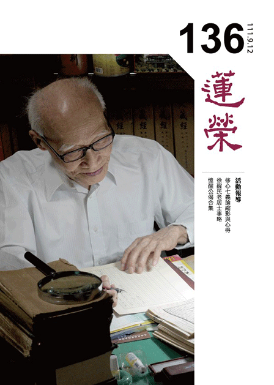
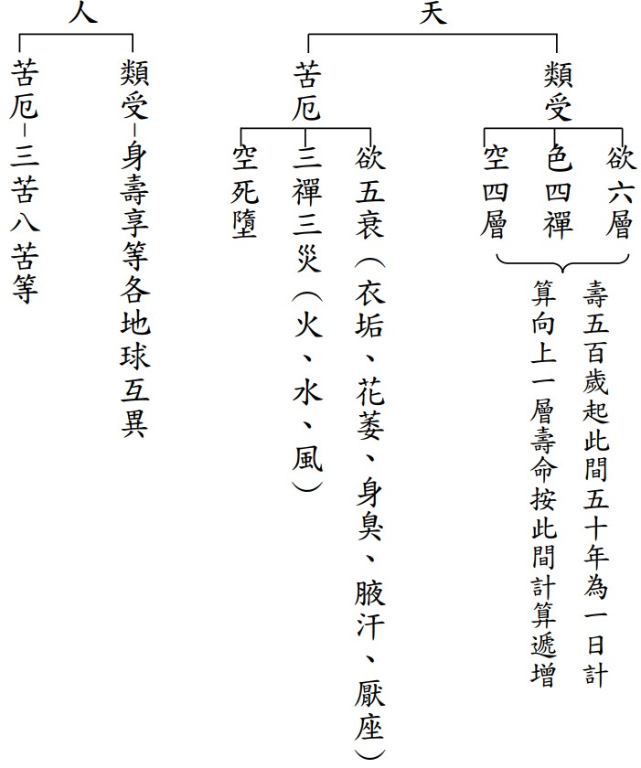
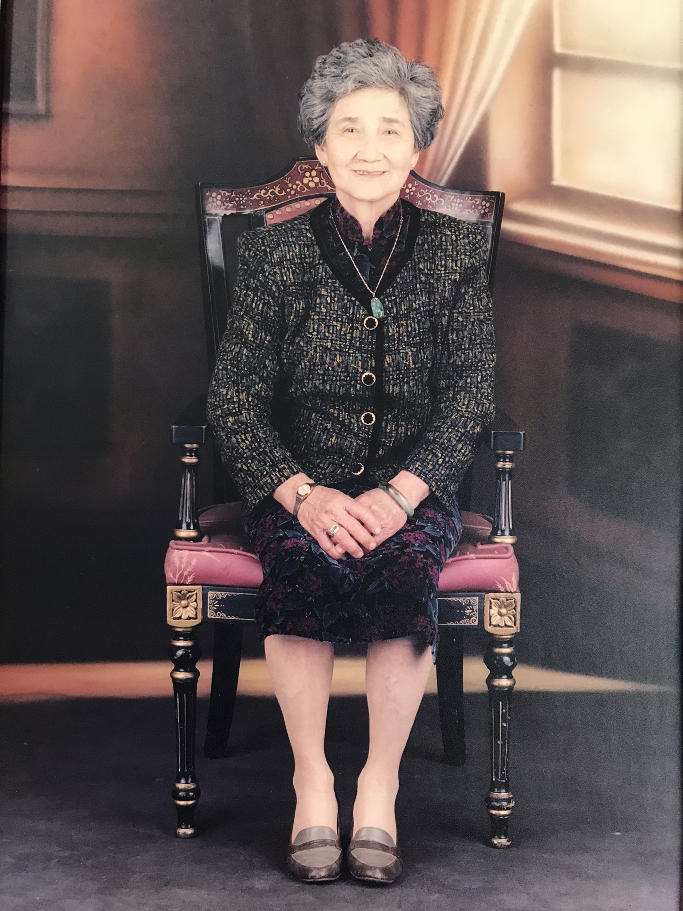
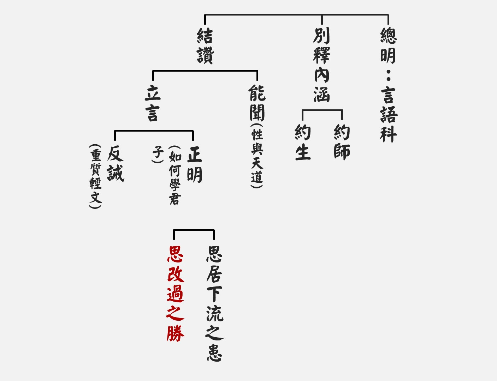
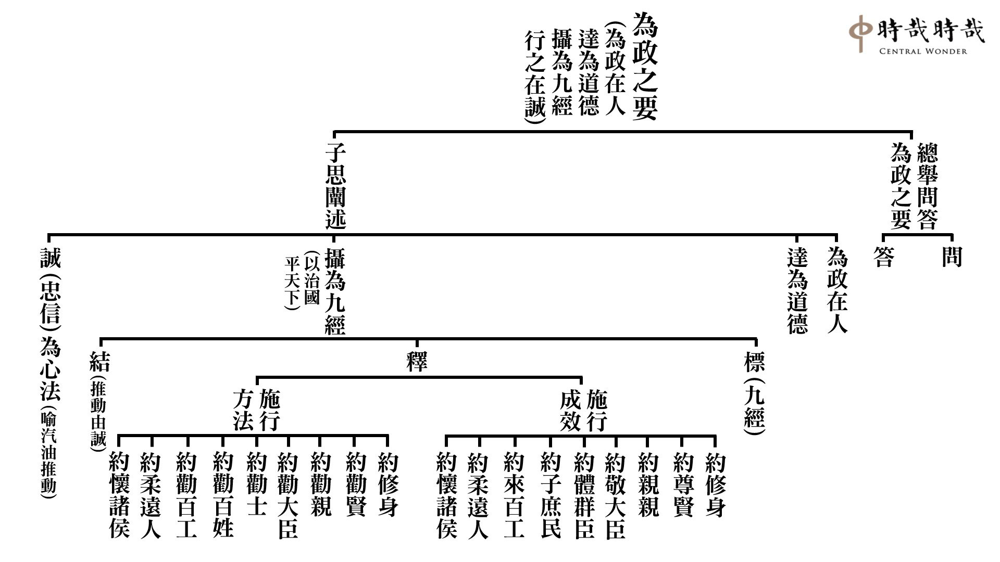
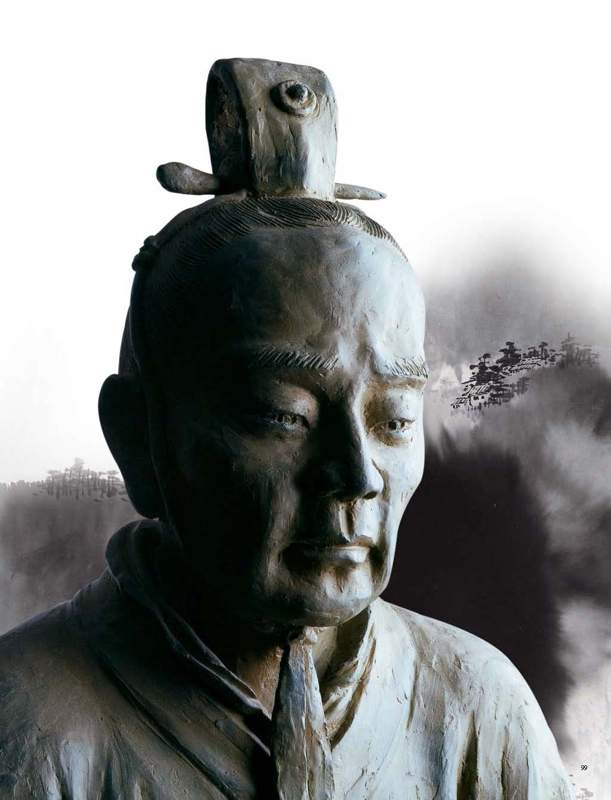
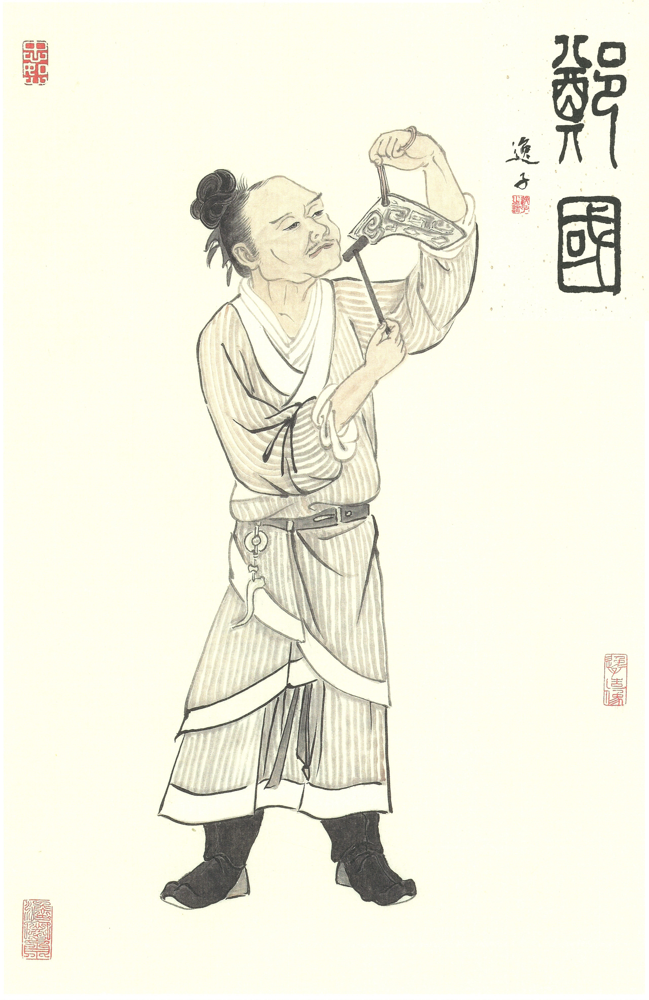
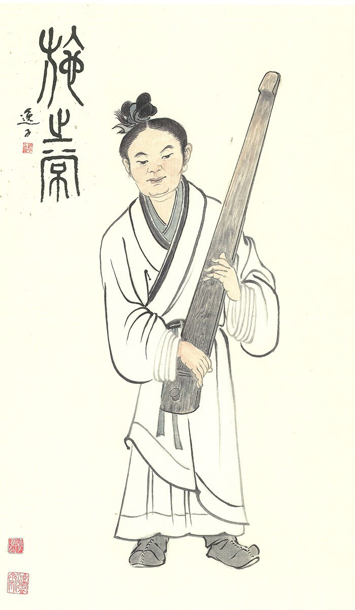
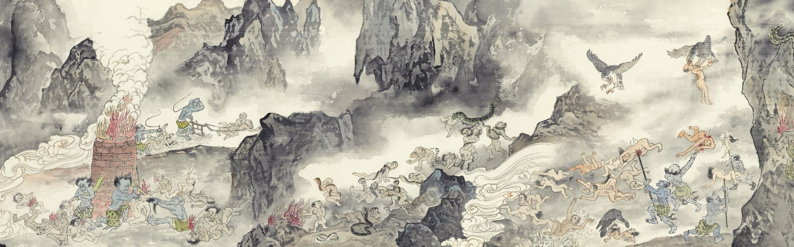

# 第136期

## 社論

### 潛修默證在人間

本刊

以虛為體性的有

現似實有的幻化

有作用的世俗法

條件觀待方是啥

人活在世間，必要修學兩種道，我們也可以說兩種途徑，分別是世間道與出世間道。世間道讓我們在入世時得以趨吉避凶，甚至因之離苦得樂；出世間道則是在人間的利他持行中，不斷磨掉我執習氣，增長各種利他的能耐，成就種種善法事業，從而體悟超越世間的道理。

怎麼在世間體悟超越世間的道理呢？老子說：「道沖，而用之或不盈。」就是道的本體空空如也，充滿著無限的可能，所以應用在入世也是如此，如《書經》上說：「作善降之百祥，作不善降之百殃。」不做什麼都沒有，做了就會產生影響。由於「不盈滿」，於是總在入世間時虛心學習、謙遜處世，因而愈學習學識愈加深廣，愈處世善緣愈加具足，所以「無私，故能成其私」，內心無私無我，躬身入世利他，反而成就自我人格品德的圓滿，這就是君子入世修行（修身）、內聖外王的形象。

由於君子內心深刻明白世間、出世間的道理，所以重視因果業報，謹慎地行善積德，除過卻惡；又以止於至善、解脫生死為人生的終極關懷，於是潛修默證，好像懷有無價寶藏的人不到處宣揚，來保住慧命與福田，誠心而能感通天地，通達真諦；虛心而能祥和人我，趨吉避凶。

君子入世的種種造作，就像老子比喻的風箱一樣，風箱愈是保有空無，愈有利於箱子產生助燃作用；操作愈是積極不斷，愈有利於空間發生實際產能。這種「愈無愈有，愈有愈無」的情狀，好似魔術師的幻化一樣，也啟發君子處世保持活潑、動力十足，且虛懷若谷，求學若愚。

此外，君子入世更要倍加謹慎地觀照自己的行為與念頭，因為一切善惡果報的發生，除了人有意識地刻意造作而產生的結果，更多是「潤物細無聲」地潛藏於萬象運行之中（所謂「滅法相續」），看似偶然卻實是條件聚合下的必然趨勢。要能去照見這樣的變化，甚至趁勢而行善，就更有賴於君子入世的內心修為。

總之，不論世間道還是出世間道，都不離人間；離開世間獨處修行想要成聖成賢，必將徒然無所獲。

## 佛學

### 菩薩清淨的行持—華嚴經淨行品（五十二）

*戒慧講述、編輯部整理*

賦予境界的意義

增上道力的入境

給予無限的可能

歷境練心的真義

丙二、指事顯因答其徵因

丁一、總徵

丁二、別顯

戊七、到城乞食時願（二十二願）

己二、入家：入里、到門、入家

己二、入家-入里

經文：入里乞食，當願眾生，入深法界，心無障礙。

深法界指在任何法上皆能入得深，佛在說法的時候，有淺隱密跟深隱密兩種面向，淺隱密提到無常跟空性，無常比如遇到大地震，我們都無法想到下一刻會發生這樣的災害，無法得知下一秒還有沒有一口氣可以活下去。空性是指一切法自相空，自己能夠成為自己的那一分是看不到的，依此來說空性。深隱密是指甚深的緣起，甚深的緣起說到因緣果的部分，這唯有佛能說得清楚。

會性法師說到，入里是希望眾生能夠入一真法界，一真法界是最深的境界，深法界指的就是一真法界，《華嚴經》中說的四法界：事法界、理法界、理事無礙法界和事事無礙法界，事事無礙法界是境界最高的。

法界叫做一真，即到哪裡都一樣，所以一真法界就是空性，即是每一法緣起的顯現同時顯現空性。所說四法界：理法界是空性，事法界是緣起的事相，理事無礙法界是空性跟緣起同時的顯現，事事無礙法界是甚深緣起的顯現，也就是深法界。佛在說無量劫來緣起的方式，包括說此人今生富貴是無量劫前造了某種善業，而這個善業已經滅了，那個關聯性，可以關聯到無量劫後碰到貴人，得到非常殊勝的地位、賺很多錢，來回應無量劫前某一個已滅的善業，那種關聯性是甚深的法界，連阿羅漢都不會知，阿羅漢就算通達空性也不會知，那是甚深的法界，有各種的關聯。比如某人快被老虎追上了，爬到樹上念了一聲南無佛，這是無量劫前已滅的善業，無量劫後是碰到釋迦牟尼佛，依上述善業的關聯，證得羅漢果，那種關聯性是極隱密，凡夫難可了知，羅漢也不會知，菩薩在極其微細處也有所不知。

「里」指人的聚集處。道場要遠離人群，可是不能太遠，要方便入城托缽乞食，選擇這樣的方式來蓋蘭若，一方面有安靜的環境可以修學，一方面跟眾生不會離太遠，你跟他竟然可以以托缽的方式見面，要離開他也很容易，這種設計叫做不即不離、若即若離，很奧妙的。

法界既然有深法界就有廣法界，因為深是對著廣說的，各種法門的修學其實就是廣法界，深法界就是在這個法上通達空性，而且甚深其實是前後的關聯，無量劫來的關聯，此即是深法界。

己二、入家-到門

經文：到人門戶，當願眾生，入於一切，佛法之門。

一切指無量法門，四弘誓願中也說「法門無量誓願學」，入一切法門修學，成就無上佛果。南亭老和尚的講義說到，乞食到了施主的門前，應當願一切眾生，入於一切佛法之門，佛法一味，何有多門？這裡的一味指的就是佛空性的智慧，可以破煩惱障跟所知障，這是最能夠代表佛空性智慧的成就。佛門為何名為空門？不是普門嗎？就是佛法利生的門路很多。佛教的門固然多，比如布施門、持戒門、忍辱門、輕安門、精進門等等，但是空門才是真正解脫的門，佛寺之三門叫做三門解脫，三門即空、無相、無願。空是萬法自性不成的這一分，總說是空門，無願門是說果的這一分，無相門是說因的這一分。

假如你是一個托缽之人，是不是先到城，再到里，再到人家的門戶？何以到里是事事無礙是深法界(較深)，到門戶反而是空門(變淺)，我們應該如何回答這樣的問題？佛所有的證量都是依空性智慧生起，破二障的智慧也是空性的智慧，通達甚深緣起，亦是依空性的智慧生起的盡所有智，方能通達。

己二、入家-入家

經文：入其家已，當願眾生，得入佛乘，三世平等。

入到世俗之家時，可能是貧(賤)可能是富(貴)，但此時應該要攝心，不可對眼前的貧富相起分別心。依乞食因緣引入佛道，才是乞食的目的。

願所依，入其家及行者，此二是願之所依；能願是發願的行者，所願的是眾生，行者在發願的時候，本身也是眾生之一，當他發願的時候，是在為眾生發願，但也隱含著自己也是一個願，不但替眾生發願，也替自己發這個願，所以此願是自利利他。

願之所為是得入佛乘，三世平等。一般我們談到佛法有三乘法，乘是載運之義，佛乘在《法華經‧方便品》中說到：「如來但以一佛乘故，為眾生說法，無有餘乘，以方便力於一佛乘分別說三」，佛之前所說的各種法皆是為了利益眾生，而這些都是方便法，是佛隨著眾生的根機而說法，當眾生根機增長，佛便對他說一乘法。

三世平等，過去、現在、未來謂之三世，世有遷流義，三世皆不可得，因為過去的已生(已滅)不可得，未來未生不可得，現在是觀待過去與未來而安立的現在，又如何可得實有性？三世的實有性了不可得，而安立為過去、現在、未來，應知也是名言安立。於一切法無差異謂之平等，入佛知見時，心無障礙，即是入了平等無分別境界，真正的法性是平等無差別的。

科判裡面的到城乞食時願，總處是入家。到了城廓，或是入了王都，或是到了林藪(修行的聚集處)。入了里就好像入了甚深的法界，入了門就像入了空門，這叫做能入，入其家已就是所入，能入一切佛法之門是空門，所入的就是三世平等，空門所見的就是三世平等。一般所謂三心不可得的平等，所謂過去心不可得，因為已經過去了；現在心不可得，因為剎那的變化；未來心不可得，因為未來還沒來，但是這樣的講法比較偏無常的講法，無常的講法就是未來還沒來，過去的已經過去，現在則是很快的過去，可是現在雖然很快的就過去，它還是有，比如鈔票很快就貶值，可是當下是有價值的，這段話若不善聽，會認為是無常的比喻，若三世不可得以空性來比喻的話，應該要回過頭來對三世要怎麼說，這是第一個問題。

第二個問題，入佛乘，《法華經》說「唯有一乘法，無二亦無三」，到底是三乘之外別有一佛乘，還是一佛乘就是大乘？佛乘為總，三乘為別，佛乘是為了引導眾生成佛，為了引導眾生成佛的因就是在大乘，三乘法中有兩種講法，一種是唯識宗的宗規，叫做究竟三乘。是指有些眾生的根機不變，如定性聲聞、緣覺及菩薩，若依中觀的義趣，是究竟一乘，因為其實佛說小乘、說中乘的目的，含藏的動機都是要幫助他成佛，眼前只好說小乘、說中乘，而對於有心要成佛的，佛則直接和盤托出成佛的因，那就是大乘，唯有一乘法是就佛的心中說，而度眾生成為三乘是就著眾生講，所以這裡面就要分，就佛的心意是只有一乘，就度眾生而說，理解他們具有三乘的根機。得入佛乘，能入的是空門，所入的是三世平等，三世平等中，平等是平等在自相空，如果以空性的觀修法，應該說是假名安立，必須在一個基礎上，一定要有一個假名安立的理由。

先說三世不可得就空性上說，然後再回過頭來說假名安立。勝義的講法跟世俗的講法不能一樣，過去如果不對著現在跟未來，你說得到過去嗎？自己成立過去，不必靠著現在未來直接顯現它是過去，是不可得的，自相就是過去有自主性、過去有自成立性，過去有實有性，過去有真實性，過去有不觀待性，這樣的過去是不會有的，過去如果有自主性成立為過去的話，那過去這一法，就沒有所謂它的現在與未來，過去這一法如果自成立性的話，那它就只是一個過去，沒有觀待它而說的現在跟未來，而且連「過去」這個名言都不能說，因為過去是對著現在未來說過去，比如小是對著大才能說小，沒有大可以對，你連小都不能說，現在如果沒有對著過去跟未來你說不到現在，如果沒有過去跟未來，現在是不能顯現的，未來也是一樣。所以過去、現在、未來的自體性都沒有，過去、現在、未來只是一個相續性，它既然自相不可得，剩下的就是假名安立。

得入佛乘，三世平等，入了空門以後，能破所知障的智慧證得空性，能夠證得三世平等，任何法的顯現，過去、現在、未來的顯現都是自相空，這叫做得入佛乘，得入聲聞乘，得入緣覺乘，得入佛乘都是三世平等，但是此處特別說入佛乘的三世平等，即在一切世俗法上能夠顯現空性。

前面提到乞士的觀念是不錯的，尤其是乞食的意義，應該回過頭來看比丘，他既然名為士，不是乞丐而是乞士，士就是有志氣的人，有志氣的人他來乞討，他來乞討的時候懷抱的目的是給對方利益的觀念來乞討，所以反過來說，當我們給比丘食物、錢財的時候，不可以抱有可憐他的心態，他是想要利益我，才來乞求，我要當成他給我機會。比丘名為乞士，但是就信徒來講不可以把他當乞士，乞士的名言是佛要降伏比丘驕慢的那一分來說，可是就眾生的那一分不能說他是乞，這就像朋友落難的時候到家裡來，絕對不能當成家裡是難民收容所，必得要有子路的「願車馬、衣輕裘，與朋友共，敝之而無憾」的這種心量，有了這樣的基礎，才能往上提升為顏回的心量，再往上才有孔子禮運大同的想法，如果未具有子路志同道合的想法，禮運大同也不可能達成。

行者本身在修法時，要對境不斷地觀修，第一從隨喜開始，若眾生都能夠入佛乘，得到清淨法，三世平等，該有多好，《金剛經》有句話說「是法平等，無有高下，是名阿耨多羅三藐三菩提」，這就是三世平等。可是是法平等，有羅漢的平等，有聲聞的平等，有佛的平等，而且就所證的平等都一樣，可是能證的量不同。第二是發願，我願眾生都能夠入佛乘，三世平等。第三是承擔，我要能夠承擔幫助眾生入佛乘，得三世平等。第四是祈求三寶加被，讓我有能力幫助眾生得入佛乘，得三世平等。

如果得入佛乘，三世平等，跟入其家已，解為入世俗的家，跟入法王的家，這樣的講法也很好，到人門戶，觀想入人家門去乞討的時候，等於是入空門，能入的是空性的智慧，破所知障的智慧，所入的是三世平等。到人家家中乞食時，竟然有這麼美好的心境去托缽，所以《淨行品》很美，它把世俗的動作賦予無限的意義，是文殊菩薩的修學法。（下期待續）

### 大乘百法明門論簡說(四十三)-拾柒、心不相應行法（一）

*戒慧講述、淨本整理*

此法不與心色相應

非色非心非心所法

假名心不相應行法

法類歸納為二十四

通達能知世間變化

論文：第四、心不相應行法，略有二十四種，一得，二命根，三眾同分，四異生性，五無想定，六滅盡定，七無想報，八名身，九句身，十文身，十一生，十二住，十三老，十四無常，十五流轉，十六定異，十七相應，十八勢速，十九次第，二十時，二十一方，二十二數，二十三和合性，二十四不和合性。

何謂心不相應行法？可以就「心」、「不相應」與「行」，來分別說明。心不相應行法共有二十四種，唯識宗認為諸法都是由心生起，色法是心王、心所所現的影子，此二十四法也不離於心，所以特別點出「心」；中觀宗則認為，提到「心」，一定同時包含心王、心所跟色法，因為心所是心王的眷屬，二者同時發揮作用，倘若沒有對境（色法）也無法生心，所以心王、心所、色法三者相互觀待，依所生之作用安立，心不相應行法。

關於「不相應」，百法總分五類，此二十四法與其他四類都有不相應之處，也就是功能作用上有差別。心王跟心所都有能緣的功能，比如眼識可以緣色塵，但此二十四個法都非能緣，都是概念上的敘述，詮釋心王、心所、色法和合所生作用，沒有能緣的作用，與心王、心所不相應。色法有質礙，但是此二十四法不會產生質礙，與色法不相應。此二十四法都屬於有為法，都有生滅，無為法是遮除有為法的生滅，所以是不生不滅，比如虛空，是遮除有為法的色法，所以心不相應行法與無為法也不相應。

「行」是造作義，有為法就是造作而生的法，凡所做必定無常、必有生滅。所以有為法的體性就是生滅性、無常性、所作性，「行」也就有遷流變化的意思，五蘊中的行蘊即是此意。二十四種心不相應行法，都是遷流變化的有為法。

心不相應行法跟心法、心所有法、色法、無為法都有不相應之處，可是也無法離開它們單獨存在。心不相應行法是在詮釋心王、心所跟色法組合時所生出的各種作用，所以與它們共同生滅，詮釋他們，但也從來沒離開過他們，所以彼此是非一非異的關係。在唯識宗的立場，心不相應行法都無法離開心識存在，而且只是詮識各種作用的概念，不如心王、心所跟色法來得實在，所以稱心不相應行法是「分位假立」之法；在中觀宗，無論是心法、色法或者心不相應行法，都是相互觀待生起，同樣都沒有自體性。以上是「心不相應行法」意義的初步解釋。

心王、心所跟色法組合時所生出的各種作用統歸為二十四類，稱為心不相應行法，這樣的分類很重要。

第一「得」，《百法直解》云：「依一切法造作成就假立。」就是過去的造作而有眼前的成就，比如過去造善眼前成就樂；過去造惡眼前成就苦；過去造作不善不惡，眼前成就不苦不樂，沒有過去的造作，就沒有眼前的成就。「得」就是你會得一個東西，得一個吉或者得一個凶，這些都假名為「得」，有部比喻為債券，眼前的造作就好比簽一了紙債券，將來就可以從某處、某人身上拿回來。

過去的造作已滅，如何還能生出眼前的果？唯識宗以第八識的種子來解釋這樣的作用，但第八識收藏的種子一定是常法，才能在造作後永恆不失等待結果，此與有為法必定無常相違，種子若成為有自體性的常法，理應結果後還能再次結果，會有諸多的問題產生；中觀宗則認為，造作的因是以滅法的方式相續待緣結果，如何知道是以滅法的方式相續？造作的因已滅，一粒微塵也找不到它的存在，然而果的出現又必定需要有過去造作的因，比如富貴必定要過去有布施的因，然布施之行已滅，可見布施之行是以滅法的方式相續，待緣而生富貴之果。由此可見因果之是名言上的關聯性，就此關聯性假名安立為「得」，來顯示因果作用不失。

「得」就是造作後觀待未來會獲得結果而假名安立，「得」本身並不是未來的果報，所以並不是色法，也不是心法，只是一種作用上的描述。佛在經上說某種善業會有某種樂報，某種惡業會有某種苦報，都是關聯性上的說明，觀待因果的關聯性假名說「得」，讓我們了解因果的決定見，自己的命運是掌握在自己的手中。因果有四個決定見，第一個是業決定（作善決定得樂，作惡決定得苦），第二是不做不有，第三是做已不失，第四是增長廣大。

第二「命根」，即生命的根本，唯識宗認為命根是「第八識的名言種子」，第八識有業種子及名言種子，業種子有感果的功能，名言種子就是納受果報的名言。舉例而言，一陣風吹過來，這是第八識中業種所感的果，對於此風會有一個名言的力量去納受他，如果是善業的名言種，那會以舒服的方式納受；如果是惡業，那會以痛苦的方式納受。所以第八識生起果報，必須要有業種子去生果，名言種子去納受。

一群人共造善業，在第八識都熏下善種子，但造善業的過程中有的人領頭、有的人被動、有的人出錢、有的人出力，或者有人心中不太高興，將來感得果報時，大家納受的快樂不會一樣，此即善業種相同但名言種不同的緣故。比如擺滿一桌的大餐，有的人大快朵頤，卻有人正好拉肚子，或者心情不好難以下嚥。所以在造善業時，各種條件能夠越細心講究，果報也會越精緻、越快樂，那些無怨無悔、刻苦耐勞為善的人，看起來是吃大虧，其實後面他是佔大便宜，這叫做名言種的作用。

第八識的名言種子為何稱為「命根」？因為如果沒有名言種，就算第八識的業種子結果，也不能受用。可以受用，表示你還活著，都不能受用，那怎麼活？這是第八識名言種子稱為命根的理由。

但若不承認有第八識，比如中觀宗又如何定義命根？命根是前世所造的引業牽引到來世的力量安立為命根。比如某人前生在鬼道，臨終愛取滋潤人道的引業，引到此生成為人，這個引業即是命根。當牽引到人道的力量強，命就活得很久；引業的力量弱，命就活得短。引導我們投生的業力就是命根。投生為人，要有喜歡當人的想法，儒家的五倫關係可以讓人在人道過著幸福美滿的日子，喜歡人道的幸福美滿，配合所造的善業，臨終就可以牽引到人道，所以一定要保留儒家的理由在此。現今社會上很多人不喜歡做人，想自殺，覺得活得很無聊，因為五倫關係混亂，男女關係缺乏互相尊重，無法共造人道善業，會造成將來無法繼續投生人道的結果。

人道的引業在造作後已滅，同樣是以滅法的方式相續，在臨終時因為愛取滋潤而成熟，使我們投生為人。引業既然已經造作完畢，成為已滅，其勢力大小已經決定，無法改變，這個勢力的大小，注定了所引生命的長短，只能如是受用。一般所謂的「延壽」，只是把障礙生命的因素排除，使人可以完整地受用他該有的壽命。很多過去所造的惡業，會成為中斷生命的外緣，所以要修很多的善法，或是請求佛菩薩的加被，把那些中斷生命的緣去除，假名安立為延壽。（下期待續）

### 佛學概要十四講表簡說（三十八）-第六講表　宇宙有情概況

空天並非解脫天

愛我串習無分別

失去思辨難學法

不如人道暇滿身

目前的進度在第六表的宇宙有情概況，上來講到天的類受、苦厄，本期的進度是天道苦厄中的空死墮，以及進入人道的類受、苦厄的探討。

空死墮

空死墮即無色界壽命將盡，定力失去的時候，他知道自己將要死亡，而且會墮落，非常恐怖。在課本七十二頁第二行說，四禪天的天人，初禪天最後是被火燒，全部燒光，但是在火燒之前，初禪天已經有很多的災難，讓初禪天的人全部死光，二禪天是水淹二禪，還沒有水淹二禪的時候，也很多的災難讓二禪人全部死光，一直到四禪，四禪雖然具有禪定，他的世界沒有這種災難，可是一旦命終不樂入禪定，風觸吹身，唯除眼識，餘皆有苦。四禪天當時是微風吹動，很舒服，可是到臨命終，風吹就像刀在刮骨一樣。我們人也是，雪廬老人晚年講經，最怕的就是風，所以老師只要一上台，兩眼一看，弟子們立刻把窗戶關起來，人到衰相的時候，是身體健康的人不能想像的。明明是四禪的涼風，到業報身結束的時候，風竟然像刀割。

第四禪天到最後就是業風，讓他整個生命結束。到第四禪天，形執已經到很微細的色，就好比如果一個人一直在修定功，他間接依靠身體的感覺愈來愈少，需要的東西愈來愈少，身體會愈來愈乾淨，到最後，定功愈強，痛苦的感覺會愈小，所以修行人要過世之前受的苦比不修行的人少多了，定力讓他的苦變得很少。到第四禪天，因為他定力很好，他享受的世界很舒服，幾乎沒有苦，可是最後風吹他受不了，就死了，除了眼識不受苦以外，其他都受苦，這是他的現象。

下面說，又無色界四天，雖然沒有欲界跟色界的麤苦，可是仍有如瘡、如癰、如病、如箭入體等微細苦，比如說空無邊處，就像瘡癰，瘡癰就是我們身上的一個毒瘤，瘡跟癰代表一個執我的心，執我的心隨時會發作。我們有苦苦、壞苦、行苦，論上形容說，行苦如瘡。執著五蘊的時候，如身體長一個毒瘤，不好不壞，壞苦就好比在瘡上面澆上冰涼的水，讓它一時清涼，就像升天的快樂，只是在毒瘤上面澆上冷水，快樂的感覺生起，這就是佛法的觀修。三塗的痛苦，就像在瘡癰上澆上熱水或是鹽巴，他更痛苦。所以本質是行苦，行苦就是如瘡如癰，意思是四空天雖然拿掉形體的繫縛，卻仍然擁有執我的微細苦，執我的微細苦長什麼樣子呢？坦白講，整個三界的分類，大概都是色界以下，四空天那是隨處遊蕩的，沒有辦法去約束他是什麼世界的，但不妨說娑婆世界有這個四空天。四空天隱微處是執我的心識，尤其在生命要結束的時候，執我的心識會恐懼，執我的心識會在緊要關頭時冒出來，所以叫做如癰如瘡，就是指病根都在，即便身體很快樂，其實病根都在，隱微處他有死亡的恐怖，他看到同伴死亡，或是看到一些變化的時候，他隱微處也有那種恐怖的感覺，這叫做如瘡如癰。

再來是如病，如病無所有處，無所有處是什麼都沒有了，如病就是此人不曉得要做什麼，每天沒事做，如同生病般病懨懨的，就是到無所有處，就是說我心裡面只要有想法我就厭離，結果腦袋空靈靈的，開始放空，放空以後他以為是證入空性，其實他是執我的心識去修什麼都沒有，去證入什麼都沒有，那個空是什麼想法都沒有的空，這種叫如病，雖然他們是在一個空靈靈的世界，可是那個空靈靈的世界並不是他真實的去分析到最後，萬法的現象都不見了的那個空，而是他厭世的空，人生變得沒有活力，所以生到四空天，墮落成人的時候沒有思維力了，人變呆變笨了，就是因為過去用定的心所，不用觀，所以等流的習氣中他可以專注，可是沒有分析的能力。

第四個是如箭入體，叫做非想非非想處，如箭入體是努力地除想法，最後的微細想怎麼除都除不掉，因為除去了所有的想法，最後想我還在，沒有破我執的修學法，我怎麼除都除不掉，如箭入體，要除除不掉，還是有隱憂，沒辦法真正開懷，因為隱微處有我，有我就有罣礙，有罣礙就有恐怖，這絕對不是靠一句放下、不要執著、自在就好，如果說放下就能放下，說不執著就能不要執著，那應該所有有情早就都成佛了，六百卷大般若經則成無用，釋迦牟尼佛又何必做大量的分析，又何必有各宗派的見解分析。這叫做如箭入體，他沒有般若的修學法，所以有我的想法的那一支箭他拔不掉。雖然功夫已經很高了，有的甚至出神入化，可以三個月不吃飯，有的甚至可以在天空飛，可以修各種定，引發不同的神通，但其實都跟你我一樣，處在沒有解脫的地方，所以最後要論的是此人是否具有般若的見地，沒有般若的見地，功夫再高從來都破不到我，只是在我執的情況下，一個人修的定比較高，一個人修的定比較少，定比較高的去受用比較多的快樂，定比較少的去受用比較少的快樂，可是都是我去受用多或少的快樂，這個我都在。以上天道結束。

人道-類受

接著進入人道，首先講類受，也就是他的正報及依報的受用，人道的福報僅次於天，所以是在天道之下來說，現在要來說明人道的身長什麼樣子，壽命多長，他有什麼樣的福報受用，此是各地球互異。人道並不是只有我們居住的這個地球才有人道，其他星球也有，各個的心量、壽命、享受都不一樣。

接著論人道的正報和依報之間的關係，依佛理來推，應該都是用唯識見來推，器世間都有有情眾生「唯識所變，循業發現」，也就是說所有的器世間，這個宇宙世間，都有有情的眾生，他們用他們的第八識來變現這樣的依報環境，然後循業發現，這些有情眾生他的第八識就會循著過去所造的善惡業，開發現行他的苦樂報。《成唯識論》說，「於生有用即變」，也就是依報環境是用來養正報身的作用，所以「是於身有用即變」，結論是「必於十方眾生有依資作用，有情之識方乃變現之」，當十方眾生以他的第八識變現出依報的環境，作為他正報生存的資助以後，有情的心識才會變現。有情的心識會變現環境，讓我們的身去受用，可以受用的，有情之識才會變現，好比我們要投生人道的時候，第八識先現起人道的環境，同時生起人道的生命現象去受用人道的環境，這就是唯識宗的說法。唯識宗必得這樣說，因為唯識宗說境界在心外不成，都是從心起現行，而且唯識宗有他的宗派見，有他的邏輯推理，成立境界在心之外沒有，境界都是以心識為體性，最有名的就是一水四種見解，人看的是水，天看的是琉璃，魚看的是空氣，鬼看的是膿血或者是猛火，來說境界的體性就是心識，可是中觀宗不同意，中觀宗說境界就是在心外成立，只不過是唯你的名言去安立，兩宗的看法不同。

這樣說來應該沒有「沒有有情的器世間」，所有的器世間都應該有有情，如第一表所說的「空間十方，方皆有生」，在我們的十方空間裡面，每一個方所都有有情眾生存在，不可能有一個世界沒有有情，才能夠成立萬法唯識變，如果我立一個宗說這個世界沒有有情，而你同意的話，唯識宗立刻被打敗，因為他等於承許這個世界不是你的心識所生。

而在經部以上，沒有什麼虛空的概念，虛空只不過是沒有色法的那一分說虛空，不是我看到虛空，是我沒有看到色，如果你可以看到虛空，代表虛空也是色法，因為色法是眼識所緣，虛空如果是色法，理論上虛空也會有生滅，因為色法的體性就是有為法，有為法的體性就是生滅無常，所以虛空應該是剎那性，前剎那的虛空應該跟後剎那的虛空不一樣，可是現見沒有，所以你根本沒有看到虛空，你只是看到眼前沒有色法而已，沒有的那一分說虛空，並不是有一個虛空被你看到，這麼說來虛空的無窮大是什麼概念？是指遮除色法看不到邊際的這一分，色法沒有叫做虛空，這時候再論虛空的大小就沒有意義了，有為法才有大小、長短、方圓之別，既然它不是有為法，它只是沒有色法而安立為虛空。

十方虛空世界無量無邊，眾生也應該無量無邊，有空間的地方一定有有情，這就證明了所有的宇宙，宇宙當中無邊的星球世界，不能說只有我們這個地球有生物、有人類，這是不合道理的，現在的太空科學探索世界，也知道這個宇宙中一定有很多適合生物、人類生存的星球。凡是星球之所在，凡是世界的所在，一定是有情去變現的，所以不可能有一個世界是沒有有情，立論如是。

接著講到整個須彌系當中，有四大部洲，在四大部洲旁邊，各有兩個中洲，共有八個中洲，所謂的洲，是一個巨大的木塊，現在來說是一個星球的概念。一個須彌系當中的四大部洲，都是適合人類居住的，它以東西南北為序號，皆以須彌山為中心。須彌山的東邊，叫做東勝身洲，它最主要是以身形殊勝來說這一洲的殊勝處，這一洲的人長得非常高大、莊嚴；第二個是在須彌山的西邊，叫做西牛貨洲，這一洲有很多牛及很多財寶，他們是用牛來貿易，所以稱為西牛貨洲；第三個是在須彌山的南方，叫做南贍部洲，也就是我們現在所住的地球，贍部又翻成閻浮，故南贍部洲也稱為閻浮提，提就是洲的意思，閻浮、贍部是樹的名稱，它是印度生產的落葉喬木，是一種金色的如意樹，我們這一洲就是因為產此樹而立名為贍部洲，又叫做南贍部洲，因為它是位在須彌山的南方；第四個是位於北方的北俱盧洲，俱盧也就是勝處的意思，也就是非常殊勝，因為它是四大洲裡面福報最殊勝的，稱為北俱盧洲。

我們介紹天、人、阿修羅的目的，是要用來觀修，觀修有兩種，第一種是你在修學止觀門的時候，在定中要觀察自己，假如你把人世間經營得很好的話，你會升天或成為人，這時你該怎麼辦，假如你經營得不好不壞，變成阿修羅，該怎麼辦？假如你經營得不好，變成餓鬼、地獄、畜生，又該如何？把六道的苦一一做觀察，對六道生起厭離心，總體六道的出離心才會出生，可見這不是佛學常識，而是觀修用的。佛法的修行是見地上論，觀就是對事情的分析，你在定中到底在想什麼，到底在分析什麼事情，還是坐在那裡腦袋放空，變成空無邊處天，或者你的空是暗藏著昏沉的空，那更麻煩。

第二個，我們在修這些六道的時候，一個一個去看待有情的痛苦，那時大悲心就油然而生，幫助有情解脫的那一分，才有資格叫大悲心。儒家說的仁心指此人的心意是要把內聖外王的內涵都交給對方，那才承許他有仁心，佛家的大悲心也是一樣，你有能力幫他解脫的那一分，才有資格稱這個心叫大悲心，否則無法跟世間人的愛心區別。大悲心跟世間的善心功德比起來那是天差地別，這就是正見的力量。正見的力量讓你善業的功德不可思議的增長廣大，正見甚至包含到般若的正見，其差距可以到百千億萬倍，關鍵是解脫知見的那個功德，才有資格讓你的心態轉成大悲心，而因為解脫的知見，成佛的見地又成為你的好樂的時候，心的體性才能轉成菩提心，體性轉成大悲心、體性轉成菩提心的時候，所受的戒才叫做菩薩戒。

下面三段就著這四洲的人的身量、壽量、享受來說，先說身量，身材最短小的就是南贍部洲的人，是以三肘半四肘這樣的一個長度來說，又舉唐代小尺之六、七尺左右，但是其實在增劫、減劫的時候，南贍部洲的人的身量也是隨著增減而異的。東勝身洲他的身材就比南贍部洲要高一倍，西牛貨洲他又比東勝身洲的高一倍，北俱盧洲又比西牛貨洲的高一倍，所以北俱盧洲大約是五十六尺左右。過去洋人到我們臺灣來，最大的特色就是身高，可是慢慢地福報被我們趕上的時候，身高慢慢趨近，很有趣的。

下一段是比較壽量，北俱盧洲的福報最大，有一千歲，而且是每個有情都活到一千歲，西牛貨洲是減半，也就是五百歲，東勝身洲又再減半，是兩百五十歲，南贍部洲不一定，小則十歲，大則八萬四千歲。

再以享受而言，也是北俱盧洲最為殊勝，他的受用幾近於四天王，東勝身洲及西牛貨洲次之，南贍部洲的受用是最下劣的。《長阿含經》裡面就有比較，北俱盧洲他們的身體不但高大，連形貌都長得一樣，他們的容貌大概是我們南贍部洲二十歲人的容貌，而且不會經歷老和病，一直到他一千歲都長一樣，保持容易。他們沒有我所的執著，沒有什麼財產的觀念，東西大家共用，所以死後也容易升天，韋陀菩薩只感應三洲，沒有感應北俱盧洲，就是因為北俱盧洲入河沐浴的時候，脫衣上岸，乘船渡水，遇到別人的衣服就拿來穿，沒有人會去分別這是我的衣服、我的車，沒有我所的概念，而韋陀菩薩就是在佛的戒律下，他的東西都保護得好好的，所以上岸的時候都摺得好好的，北俱盧洲的人就排斥他，這就像子路去闖入衛國時都沒有事先請教孔子，韋陀菩薩到北俱盧洲前沒有先請教釋迦牟尼佛，所以他剩下三洲感應，這就是常禮舉要。

北俱盧洲貪圖享受，不怕無常，也不需要學佛，不受教化，所以聖人也不會出現在北俱盧洲，他們也沒有辦法聽聞到佛法，被列為八難之一，八難也就是八種障難，可以分為人中跟非人的四難。非人就是地獄、餓鬼、畜牲、長壽天。人中有四難，第一個是盲聾喑啞，這是屬於根缺，根有缺，或盲或聾或喑或啞；第二個是邊地，指沒有佛法的地方，就是四眾弟子到不了的地方，可見佛法是人在決定，不是佛法在決定，四眾弟子走不到的地方叫做邊地，經書流通到那裡都沒有用，「文武之道，未墜於地，在人」，文化沒有人講，光保留經典是沒有用的，第三個是佛前佛後，佛前是滅的，佛後也是正像末的滅，佛前佛後都是指滅，第四個是邪見，世智辯聰的那一分。

我們要遠離八難，要具足人中的十圓滿，人中的十圓滿當中，有五個屬於自己的圓滿，有五個屬於他的圓滿。自圓滿：一、我生為人，二、我生在四眾弟子走到的地方，三、我諸根具足，四、我沒有造作五無間罪，五無間罪是學佛最可怕的障礙，五、我對三寶、對佛法、對正統文化有信心，這是屬於我自己的五個。他圓滿：一、有佛降世，二、佛還在宣說正法，三、弟子們還以聞思修的方式令法住世，第四、親見他人以證四果任何一果而入佛教，五、有功德主。可是這樣一來，屬於他圓滿的部分第一到第四的這些條件，連龍樹菩薩都沒有。雖然佛已經不在世，但是教法還住世，因為還有人宣說正法，有人在聞思修學正法，否則光有內在圓滿是沒有用的。

離開八種難，得到十種圓滿，這樣的人才能修行，在四大洲當中，南贍部洲最好。南贍部洲明明最不定，可以一直到人種八萬四千歲，也可以減到十歲，想不到這個世界是最好的，理由就在一百零九頁提出的三件事情，是南贍部洲勝過其他洲的。第一個是「能勇猛」，南贍部洲的人能夠修苦行，能夠精進不懈怠，不像其他洲的人，他們享有類似天福，耽嗜欲樂不去修學。南贍部洲的能勇猛當中，還包括「不見當來之果」，意即雖然現量中不能通達他死了以後會投生到天，或是往生西方，或是證果，這些都不是現量所見，甚至也不是比量推理，可是他對三寶就有信心，他是以非量來建立對三寶的信心，這一點南贍部洲很厲害，既不是邏輯推理的比量，也不是現量親證，是以聖言量來建立對三寶的信心，這一點多難得，此人宿世一定要有深厚的善根。

第二個是「能憶念」，南贍部洲的人有記憶力，可以記得很久以前所做、所說過的事情，而且是了了分明，沒有忘失，不像其他天人耽嗜欲樂，因為太快樂了，慧性常惛暗，他不會去記過去所說、所做，眼前享樂都來不及了，一大堆享樂的節目等著安排，他不會記取過去的教訓，也不會把他過去的善根重新拾回來。舍利弗到天上的時候，連祇婆都在享天福當中忘了他過去生的努力，現見我們很多的修行人也是如此，前面苦修，後面事業順利了，有家庭有財產，便不會重拾過去的善根，所以弘一大師說修行要略帶三分病，才會時時警惕，否則過去的善根都不見了。

第三個，南贍部洲的人「能梵行」，這一點是勝過天人乃至於四洲，他在初發心的時候，就能夠種殊勝的善根，而且能夠嚴持戒清淨，這都是非常難得的，所以諸佛的示現也只有在南贍部洲。以上論福報來講，南贍部洲是四洲的下下，但是論能夠聽聞佛法、見到佛，南贍部洲是上上的福報，所以一個真正的聖者，他如果不往生淨土，或者不證入涅槃，在六道所緣當中，除了他生起出離心、大悲心、菩提心以外，要投生南贍部洲，因為南贍部洲有教法、有佛出世，教法是最完整的。你到五不還天，或是到忉利天，佛法都沒有像南贍部洲這麼完整，因為佛是直接八相成道，而且一期的說法因緣，再加上後面弟子的集結跟傳承，南贍部洲最完整，這是所有四大洲沒有的，六道沒有的。南贍部洲保留完整的教法，還有諸多祖師大德的翻譯、註解，可惜都被我們束諸高閣，非常可惜。

以上都是我們在坐禪時，必須要拿出來想的觀念，實際的面對它，來生起出離心，生起大悲心，實際的面對它，心態的生起的那一分，就是修行。（下期待續）

### 人生大事不能忽略的事實-普陀普濟寺化身塔記

*戒慧講述、編輯部整理*

因應時代土葬變

火化意義祖師明

燒盡自相真解脫

骨灰入塔春秋祭

前言

助念往生西方，需要注意的事情包括助念團、家屬和病人需要知道的內容，還要有共同遵守的規矩、章程等通告。並且從印光祖師文章裡面，知道得助念的利益與失助念的損失，在生病的時候就要有往生的知見。家屬與蓮友該如何幫助他，引發他的正知跟正念，排除他往生的障礙。過世之後要採取用火化的方式，不但容易處理遺體，也容易做佛法的觀修。本文就是說明火葬是過世之後最好的處理方式。

科判分兩大項，先以長行文記載說明化身塔記始末，包括佛制的焚化，解釋造塔的因緣以及結歎作塔記的因緣。第二段以偈頌勸回向淨土，先講一切有情流轉生死的原因及現象，再來說明如來藉著制定火化的方式讓有情因此去證得涅槃，最後補頌是前文沒有的，結勸大眾要能夠往生西方，並且利益一切有情，以上是整個化身塔記的架構。

長行明塔記始末

首先是長行文說明普陀山普濟寺的化身塔，分為三個部分，第一、佛陀制定火化的因緣，分為流轉生死與還滅涅槃，眾生在生死中流轉，經文：「

古人云。死生亦大矣，豈不痛哉，竊謂不知其由，雖痛何益。須知一切眾生，隨業流轉，受生六道。生不知來處，死不知去處。由罪福因緣，而為升降。展轉輪迴，了無已時。

」

「死生亦大矣，豈不痛哉！」此文出於王羲之的〈蘭亭集序〉。死生皆是大事，但是說到痛哉，特別指面臨死亡的時候，祖師自己也說，若不知道為何會有生死，雖然受苦也沒有任何意義，那些痛苦不會成為內心對輪迴的警惕。

一切眾生的苦樂果報都是隨著過去的善惡業，流轉於各道當中，我們因為看到有一個真實的我，想要讓那個真實的我得到快樂，所以會想盡辦法去追逐自以為的離苦得樂，在六道當中輪轉升降。

還滅涅槃的部分分為二部分，還滅涅槃是佛說出最究竟能夠了脫生死的方法，有情透過信解行證(四滿成佛)的過程能證得，即是所謂的生尊四滿。末制火化，再把佛所制定焚化的因緣做一個說明，包括能夠自利，能夠利他，這是佛之焚化因緣的架構。

生尊四滿的部分，經文：「

如來憫之，示以由惑起業，由業感苦之因緣。以及常樂我淨，寂照圓融之本體。令其了知由無明故，遂有此身。即此色身，全屬幻妄。不但四大非有，兼復五蘊皆空。既知蘊空，則真如法性實相妙理，徹底圓彰矣。

」

如來憐憫我們在輪迴當中流轉，為我們展示因未見真相造作種種有漏善惡業，並且感應痛苦的因緣果報。成立解脫是見到法沒有自體性的那一分，滅除實有的執著，煩惱業無所依，世間苦因苦果的相續從此不生，而成立安樂的體性。令我們了解由於沒有見到萬法的真實性，所以無法解脫輪迴之身。這個色身只是回應我過去的善惡業報而已，僅僅是隨業幻化出來的虛幻樣貌。不但組合身體的地水火風四大非真實存在，組合成生命現象的各種身體與心理活動都無法不依著種種條件而真實存在。若能從生命的相續中看到彼此都是條件組合而成，依作用而假名安立，並非永恆不變的狀態。看到沒有真實自體的那一分，就是所謂的真如法性實相妙理，就能在內心中徹底圓融彰顯法的真實樣貌(空性)，也就是拿掉生起該法的條件，這一法也無從生起，這一法不過是種種條件下的作用。

二是末制火化，經文：「

又恐或有執情固結，未能解脫。俾捨報之後，用火焚化。庶可令未離著者，速得離著。已離著者，速證法身。兼使現前大眾，悟知此身，無有真實。用彼之身，以作證明。所謂應以灰身滅跡得度者，即現灰身滅跡而為說法。焚化之制，蓋由此設。凡屬僧徒，悉皆遵行。當唐宋法道盛時，在家通人，亦多遵行，不獨唯僧為然也。

」

又怕人過世之後會執著寶愛這個已無作用的身體，以為仍是我的一部分，所以用火化的方式，希望亡者能夠對輪迴有所體悟，對無常有所體悟，對空性有所體悟，現前大眾也經由亡者火化一事，了解此身無有真實性，來彰顯此塔的殊勝，讓這個塔的真實功德顯現，造塔的人有善業可得。

塔寺本身沒有自體性，這個塔寺有沒有功德呢？功德不在塔寺本身，如果沒有法的內涵，塔寺本身不能呈現什麼，造塔的功德是觀待對塔的內涵深入了解，而歡喜、讚歎，並且勤加修學。假如忽視了對法的內涵、內在的修學，只著重在外相的造塔，這樣的造塔就絕對不是功德。

接著解釋造塔的因緣，約地舊法拙樸，經文：「

普陀，為觀音大士道場。普濟法雨，為十方共住叢林，來往僧眾，實繁有徒。凡有亡者，悉用火化。而化身之窯，法甚拙樸。不但多費柴火，且致骨雜灰土。

」

普陀山是觀音菩薩的道場，原本的在普陀山的前後寺，包括前山的普濟寺跟後山的法雨寺，兩個寺院都是十方共住的道場，也十分有名，所以各地來結緣的僧俗眾很多，過往的僧俗眾皆用火葬，原有的化身塔，用來火化的設備是比較簡陋的，不但無法保溫需要較多的材火，也因為焚燒方式老舊骨灰會夾雜著灰土。

約人善士發心，經文：「

同生諸居士，宿根深厚，篤信佛法。發菩提心，行利濟事。遂仿外國之法，研究斟酌，必期合宜。特備工料。與前後兩寺，各造一座。以其形若塔，故名為塔。每塔費千有餘圓，可謂真實功德矣。

」

同生諸居士，諸就是眾多，諸也可以當成「之於」，也可以當成眾多，同生居士們，到底是法名同生還是俗名同生，只能問當事人德森法師，目前文獻不足。祖師讚歎他們宿根深厚，篤信佛法，對佛法很好樂，而且學習很有深刻的覺受，發心想要做一些能夠自利利他的法行，所以建造火化的設備。

宿根深厚，一方面是對於正法有想要學習的心，而且聽聞到正法之後能夠生起殊勝的覺受，在外緣上也容易碰到正法。很多人想學正法，也很有領悟力卻碰不到正法，碰到的或是似是而非的一貫道；或是遇不到好老師，或者就算碰到了，內心也對法不好樂，在這當中消磨光陰。所以宿根深厚是指外緣跟內因都沒有障礙，跟佛法結上很深的善緣，而且又好樂佛法。當得起宿根深厚絕不簡單！

篤信佛法，最好的篤信是透過自己在不斷地串習之後，能夠證得的這一分。基本第一步，要對佛法能夠理解，生起殊勝的覺受，相信佛法能離苦得樂。好比我們之所以會認真上班，就是因為上班可以離開貧窮的痛苦，得到富貴的快樂，相對於老闆給的待遇，會拼命把所有能力表現出來，那種精進的行相，如果相信佛法是唯一出路的時候，對佛法一定會認真學，道理都是一樣的。

發菩提心，行利濟事。般若這一分含藏在發菩提心裡面，發菩提心是發起自己想要成佛，而佛果的成就是破二障的智慧，所以《無量壽經》說：「信解大乘發菩提心。」信解大乘最重要的就是發菩提心，對大乘法有信解就是相信大乘法是唯一的出路，而大乘法就是導向發菩提心；換句話說，要轉業的時候要靠發心來轉業，所以二乘人的空性智慧不能把宿世惡業除掉，譬如目犍連，被裸形外道打成肉醬，為什麼他的空性智慧不能轉變業呢？因為過去造作的惡業，要能夠淡化是需要大量的福，這一分在二乘人上，他是隨緣利益有情，隨緣修善法、造善業，善業增長廣大的這一分，是二乘無法達到的，所以就算二乘人做長老比丘，有廣大的善法，他的空性智慧也不能改變他已成的定業。

什麼事最能利濟眾生？就是幫助他有學佛的因緣，而且能夠修學正法、解脫證得佛果。在儒家來講就是辦政治跟辦教育，辦政治能夠創造一個公安的環境，讓大家的心安定下來，執政者也能夠好好的推廣教化；當然辦教化更重要，因為辦教化提供辦政治以及各行各業的人才。利濟眾生的事業很多，對同生諸居士眼前是來修善火化的設施。

仿造外國的設備跟技術，不斷地斟酌考慮，希望能夠做到最好。透過集資、準備等事項，購買相關需要的材料，在前山的普濟寺以及後山的法雨寺各造一座焚化爐。以形狀高聳像一座塔，所以此焚化爐又稱為塔。

每一座焚化塔耗費一千多大洋，所以印光祖師讚歎這是最真實的功德，能夠利己利他。造塔為什麼算是利濟眾生的事業呢？前文說到，透過建火化塔能夠幫助有情在捨報之後破除執著，也能夠令其他的在場大眾體會到諸法幻化而生，自體性無的這一分，所以說是利濟的事業，真實的功德觀待認知才能生，功德也沒有自體性，所以化身塔真實的功德要從前面的流轉生死跟還滅涅槃來說。以上就是造塔的因緣。

接著結歎勒記因緣（約用真實受益），經文：「

塔甫成，適有往生者，不三句鐘，焚化淨盡。而骨灰悉存鐵函，了無零落灰土中者。因玆大眾歡喜，祈勒石志之。

」

這個焚化塔剛剛建好，剛巧有人往生，不需要三個小時，整個遺體就火化得非常乾淨。所謂的乾淨是不像以前的舊法事，材火要費很多，而且火化不完全。也不會有前文所講的骨灰混合著泥土在一起，骨灰全部收持在一個鐵盒子裡面。不但省時，而且也燒得相對徹底，不會有掉落散落在餘地的現象。大眾看到這樣的現象都非常歡喜，祈請印光祖師能夠立一個石碑來紀念，記載這樣的善事。

悉存鐵函表示以前裝骨灰是用鐵罐，所以裝骨灰到底材質需不需要講究呢？不需要！往生者並不是被裝到這個盒子裡面，骨灰塔也只是一個來寄放骨灰罐的地方，面向西方一個塔位多個幾十萬，面向東方難道就不能往生嗎？放在上層就代表上升善道嗎？應該把喪葬費用節省，去利樂有情，最後的福報拿來為公，這個人才會蓮品增上。要讓往生者能夠有真實的利益，絕對是觀待家屬能夠幫他修善法，不管是在事項上的利益大眾，或是對於正法內涵的深入學習，以此來回向。

以下是銘文的內容，放在文章最後，也就是祖師用偈頌勸大家要回向往生，約流轉生死的部分，經文：「

銘曰，受身之始，厥由無明。迷本真如，妄生愛情。愛情既起，幻質斯託。遂認為我，永不能覺。

」

塔上銘文說到，因為不知道萬法都需要依靠條件而生起，愛著那個自以為真實的我，希望讓這個我得到快樂，在生死輪迴當中所呈現出的各種生命現象，所謂的迷本真如(空性)，妄認在虛幻的五蘊上有一個真實的我叫做迷，而我也依著這個色身（幻質）而生，愛我之愛會潤來生之業，不斷地生死流轉，是永遠無法得以解脫的。

約還滅涅槃，經文：「

如來愍之，特設方便。俾彼存亡，俱離我見，身既叵得，我從何有。圓滅四相，頓空五蘊。生滅既滅，寂滅現前。真如法性，復彼本然。

」

如來為了讓我們如他一般看見萬法真實的樣貌，所以特設方便，這裡的方便指的是火葬這一法，希望眾生在存亡之際，還能夠修空性，藉著把屍體燒掉來觀修破我的正見，我的所依是對著五蘊而生，身體都了不可得，依著身體生起的我又從何而有。文中所說的四相，指的是我相、人相、眾生相和壽者相，分別代表著人我自體性不可得，他人的自體性不可得，其他狗貓雞鴨的自體性不可得，一切法相續的自體性也了不可得，藉著火化來了解一切法自體性了不可得，破除法我，人我與法我自體性不生，止觀雙運之下空靈靈的感覺生起，能夠現證自體性沒有，法原本就沒有自體性的那一分說是復彼本然。

在火化當中，屍體被燒光了，會對人的啟發性很大，懺公師父就是看著他父親全部被燒光後，非常震撼！當家人被燒光了，全部放在骨灰罐裡面，感到很真實的東西就這樣不見了！就像修空性一樣，世間的真實感在修空性以後都不見了。萬法不堪於去做自體性有無的觀察，萬法都垮了，很真實的現象就垮了，那種感覺會在火化的時候出來，因為這個人很真實的活過，但是在火化的時候才知道他原來是這麼不真實。

約往生西方，經文：「

離幻妄相，發菩提心。回向淨土，覲光壽尊。聞法受記，證無生忍。乘大願輪，度諸可愍。令彼一切，同生西方。咸于未來，作法中王。

」

幻，它的顯現是由你一分認知而來；妄，顯現有自體性但是實際上是沒有的；若能因此發菩提心，發願往生極樂世界，親見無量光無量壽的阿彌陀佛，聞法並得到佛的授記成佛。並且依著大願再來利益娑婆世界的有情，不但能做止觀的修學，輾平內心的煩惱，也能做透過傳承教化一切有情，都能於未來世，成為法王。（下期待續）

### 緣起贊論略釋（三）

*戒慧講述、心若整理*

緣起正因除四魔

有賴善士與經論

聞思通達生比量

串習比量破二障

前言

上來已講完論名與歸敬，本次的進度進入第二科–論中文義。

論中文義分二，一、由說緣起門中稱讚能仁。二、結述造論因相福德回施。

一、由說緣起門中稱讚能仁分三，即總標、廣說、攝義。

論文：「由見說何法，智說成無上，勝者見緣起，垂教我敬禮！」

消文：由見何法、說何法，以見何法的那分成為智者，以說何法的那分成為善說者，能見能說使他成為無上。能夠見緣起、說緣起的勝者，也就是釋迦牟尼佛，以及釋迦牟尼佛後面的傳承，都是我宗喀巴大師所要禮敬的對象。

「善慧名稱我今敬禮。」
「
**問：** 所禮者何？
**答：** 戰敗煩惱、五蘊、天、死四魔，勝者薄伽梵。」

消文：善慧名稱，就是宗喀巴大師的比丘名號，宗喀巴大師成為能敬禮，所敬禮的是能戰敗煩惱、五蘊、天、死四魔的勝者薄伽梵，薄伽梵具有自在、熾盛、端嚴、名稱、吉祥、尊貴等六種意義，勝者薄伽梵就是世尊。

唯有見緣起、見真相者，他才能戰敗內魔–煩惱、五蘊、死魔，以及外魔-天魔。這些內魔、外魔都會成為修行的障礙，魔就是障礙的意思，會障礙聖道門的修學。

※四魔補充

煩惱：起惑造業是苦因，惑業是以惑為上首，惑即根本是煩惱。

五蘊：煩惱的根本在無明，無明即是我執，我執從五蘊生，五蘊的所在就是煩惱的所在。

天魔：對治煩惱魔跟五蘊魔的時候，天魔就會顯現。

死魔：由煩惱而有生死。
「
**問：** 何功德故，而敬禮耶？
**答：** 由彼勝者，內自證見深緣起道，複為悲憫諸有情故，以自在力方便宣說，殷垂教誨令起修證。」
消文：
**問：** 勝者薄伽梵為什麼有辦法戰勝四魔，是以什麼功德勝出？
**答：** 勝者佛他自證自見緣起，以證的方式來說見，他是以見緣起的方式來戰勝四魔；又因為悲憫有情，而為有情說緣起，「方便宣說」即透過立宗答辯、各種善巧方便、觀機逗教，彈唱、討論、辯證等，方法非常多，能夠自在地契合有情根機。佛殷重勤教誨緣起的道理，令有情生起修證，有情如何生起修證？有情以比量的方式通達緣起(以緣起為正因通達空性，以空性為正因通達緣起)，不斷串習比量，達到現量，成為聖者。
「
**問：** 具是功德有何殊勝？
**答：** 由見緣起、自在演說，即建立彼所有智、說為最無上。能如是見及自在說，唯佛世尊，更無餘者，是故此德最為殊勝。」
消文：
**問：** 見緣起、說緣起有何殊勝？
**答：** 由見緣起的功德，對緣起的道理非常了解，而能自在演說，能夠旁徵博引、舉例，深入淺出的講解，透過說法來建立道理，有情眾生就可以了解佛所知的內涵，就能建立佛的智慧，這種功德最為無上。見緣起、說緣起這樣的自在說，讓眾生踐跡入室，這是唯有佛世尊才能做得到的，其他人沒有辦法像佛這般殊勝，所以說通達緣起的功德是最殊勝的。

「何法二字，目其緣起，緣起有二，謂有為法因緣生故，說為緣起；諸無為法觀待自分所施設故，說名緣起。此亦性宗之特唱。」

消文：何法這兩個字，指的就是緣起法，緣起法有兩種，一個是因緣生的有為法，一個是觀待自分所施設的無為法，這是中觀應成派異於其他宗派特有的講法，以下說明之。

有為法是透過造作而來，是因緣所生，因、緣是能造作，果是所造作。能造作已滅，所造作的果才出來，所以它不是實體上的關聯，是名言上的關聯。

無為法不是造作而來的，遮除有為法即是無為法，例如虛空，是遮掉色法說虛空，不是觀待造作而來。

無為法又可以分為遮法跟成法，依遮除敘述無為就是遮法，也就是遮除造作的那一分。以自分來成立無為，就是成法，意思是所指的虛空不過觀待東南西北中的虛空所組成，而假名安立，離開東南西北中，沒有虛空可得。試分析，東西南北中跟虛空是一是異？如果是一，東方的虛空生起太陽，西方的虛空也應該生起太陽，如果是異，代表離開東西南北中還有一個虛空，可見虛空不過是一個總相的安立，就像離開柏樹、樟樹、茶樹如何有樹可得，沒有一棵樹是離開柏樹、茶樹、樟樹而得，又如離開父母、小孩、房子，也沒有家庭可得，安立都是總相的安立，觀待總相才有別相。

換句話說，遮法當中，也可以用成立法來成立，空性雖然是遮法，可是空性不能說是無所成立。

「又前半頌，顯示所贊應具之德及具其德是應贊理；次後二句，顯具彼得所稱讚境及自殷重伸誠禮敬。」

消文：前半頌即「由見說何法，智說成無上」，顯示的就是我(宗喀巴大師)要讚歎釋迦牟尼佛的理由，即釋迦牟尼佛是一位見緣起法、說緣起法的人，後半頌「勝者見緣起，垂教我敬禮」，見緣起、說緣起就是我所要稱讚的對象，尤其說法傳承的那一分更是殊勝，我要很殷重誠懇、很慎重地來禮敬這樣的對象。

「又見緣起成無上智，是佛自利究竟功德；宣說緣起成無上說，是佛利他究竟功德。由佛世尊雙具二德，是故智者，應伸禮敬。」

見緣起成為無上的智慧，是佛自利的究竟功德，見緣起是佛親證，見緣起、說緣起是佛的核心價值，怎麼說都離不開見說緣起這兩分。宣說緣起使佛成為無上說，這是佛究竟利他的功德。佛世尊具備自利、利他這二德，對於這樣的智者（包括見跟說），我都應該深深的禮敬。

這裡面要禮敬的對象不只是佛，應該包括三個，一、能見緣起（自利）、能說緣起（利他），這樣的智者，我應該敬禮。二、凡是能見緣起、說緣起的傳承者，我都應該敬禮。三、只要是智者，都會對見緣起、說緣起者深深禮敬。

「此頌總說全論綱要。見說緣起，成無上義，下文詳釋。」

此偈頌是全論的總綱、核心思想，見說緣起，能夠自利利他，見說緣起到底在講什麼，目的是什麼，下面都會詳細地說明解釋。

「又凡經論，若顯若隱，必具四義。謂所詮義、所為義、所為究竟義、系屬義。今此論中，甚深緣起是所詮說。由於此論聞思斷疑通達甚深緣起道理，是所為果。次由修習緣起深義，究竟圓滿斷二障盡、證等正覺，是其所為究竟果義。此中後後，要依前前，乃至所詮要依能詮，方可得有，此是論中互系屬義。又系屬義，略有二種，一同體系屬，二因果系屬。能詮論文與所詮義，是初系屬；所為屬於所詮，究竟果事屬於所為，是因果系屬。」

消文：凡是經或論（解釋經），不管是顯明或是隱藏，都要具足這四義。四義即所詮義、所為義、所為究竟義、系屬義。今天的《緣起贊論》，所詮義就是甚深的緣起，所要通達的緣起，是指向空性的緣起。所為義是此論詮釋緣起法的目的，是要用聞思生起比量來斷除疑惑，斷除甚深緣起到底是不是通達空性的這種疑惑。再來，此論的究竟目的是修習緣起深義，究竟目的就是成佛。「此中後後，要依前前」，後面要往前推，成佛要依對緣起的通達，若沒有緣起的道理，如何聞思，沒有聞思，如何證得佛果，此是論中的系屬義。系屬義有兩種，一是同體系屬，所作與無常，就是同體系屬，能詮的緣起贊與所詮的緣起，即是同體系屬；二是因果系屬，本論即是因果系屬，例如：聞思斷疑依著甚深的緣起而來，究竟目的依於各個目的，沒有小目標哪有大目標。

論有所謂的宗經論與釋經論，宗經論是彰顯宗旨，釋經論是顯示文句義理。經論有顯明或隱藏，顯跟密都是大乘，差別在顯是就「因」的這一分而言，是「以因為道用」，像是大悲心、菩提心、廣大行、甚深見，都是佛成佛的因。

密教是「以果為道用」，例如自現為本尊、自現為壇城。舉例來說，預備登基的王子，所作皆國王的修學法，他在當王子時，都是想像自己要當國王，用這樣的心態來歷練自己。就像一個公司的接班人，他是用接班的心態在準備，想像自己要接班，學習的心態就不同，有別於一般只是把工作做好，等待升遷的員工。

若以顯密來說，依顯教時，密教就是他的隱；依密教時，顯教就是他的隱，顯般若時就隱世俗法；顯世俗時就隱般若。《入中論》就是《大般若經》的顯，《現觀莊嚴論》就是《大般若經》的隱。不管顯或隱，都要具備四義。

所詮義：到底在講什麼，即所詮釋的義理。

所為義：目的是什麼。

所為究竟義：究竟的目的（最核心的思想）是什麼。

系屬義：彼此的關聯性。

若套在《緣起贊論》來看：

所詮義（所詮釋的義理）：能詮的是緣起贊，所詮的是甚深的緣起，指向空性的緣起，關聯性的緣起，這是同體系屬。

所為義（目的是什麼）：聞思斷疑，透過聞思生起比量來斷疑，否則都會產生疑惑。

為什麼聞思斷疑要透過比量？思就是透過思辯，以正因來成立，你所說的道理，我要經過檢驗，因明學就是在檢驗這個理則對不對。

所為究竟義（究竟目的）：透過見緣起、說緣起來累積廣大福德，能資助空性的智慧格外有力去破所知障，真正見到緣起斷二障成佛。

系屬義（彼此的關聯性，後後要依前前）：所為究竟義要依所為義，要達到破二障的佛果（現量），必須要透過聞思生起比量來斷除疑惑。所為義要依所詮義，要聞思斷疑通達甚深緣起，要有所依的道理，這是因果系屬。所詮要依能詮：沒有能詮的人（傳承）跟論典，哪有所詮的義理，這是同體系屬。（下期待續）

## 蓮池海會

### 莊張瑞香老居士往生見聞記

淨曜

雖是五福之人

老病苦之纏綿

助念畫下圓滿

子孫覺受未來

莊張瑞香老居士出生於民國十三年歲次甲子肖鼠，娘家八里烏山頭，閨姓張，為家中長女。老居士自幼勤奮持家，芳年二十歲由父母主婚嫁與莊清標先生。婚後適逢二次大戰末，年代動亂，經濟情況不堪，又逢丈夫被徵召去當軍伕，老居士當時堅忍毅力，每晚揹著剛出生不久的大兒子躲防空洞，夜夜等著當兵的丈夫歸來。

老居士嫁入莊家門七十九年來，謹守儉樸持家，耕種農物，帶領子女全家打拼賺取所需。把好的都留給子女，把重的和沒人要做的自己扛，請工人採茶時，深怕煮的飯菜不夠孩子和工人吃，所以總是留到最後，有剩才吃。當時，每天採一百多斤的茶青挑去茶場，雖然身材嬌小，路途遙遠又是上坡路，卻不會對她造成障礙。婚後生活很苦，也不影響她的布施心，如果有人來化緣，一定供養滿滿一鳳梨罐頭的白米，即使自家都快斷炊，她還是捨得。

一生除了賣菜勤儉以外，還很會做草阿粿、芋粿巧、蒸年糕、發糕、酸菜、晒菜脯、醬冬瓜，為了變東西給孩子吃真是無所不用其極。對於子女的教養，更是無怨無悔的付出，她的一生就是以這個家庭為宇宙的中心，而任勞任怨的在運轉，具備溫、良、恭、儉、讓的傳統美德。

直到八十多歲遇到了佛法，由於沒念過書又不識字，所以學習上有很大困難。一段開經偈一直唸，忘了再打電話問，問了繼續唸，如此重複數月才把開經偈背下來，迴向文也是，為了幫兒孫積福，再困難她都願意努力，堅持修行之路。參加皈依法會，法號妙香，八關齋戒，持守嚴謹，為了下一生能學到更甚深的經典，所以努力背了《般若波羅蜜多心經》，耗費了約一年多的時間。

這三年多來每天晨起定課有：一、度母咒。二、阿彌陀佛。三、心經。四、六字大明咒。五、拜三十五佛懺。乃至於上課一定提早到，持續十多年不間斷，供養齋僧、建寺、放生，不落人後，隨緣參訪各寺院。九十多歲行走如少年，不用人攙扶。然而，隨著年齡的增加，身體出現許多症狀，例如心臟腫大、肺部積水和腫瘤、腎功能變差，乃至急性腎衰竭，甲狀腺功能異常，以及腿腳無力易跌倒骨折等等，這些老病苦的糾纏有時會讓老居士難以忍受，也因而發願要念佛往生西方。

於今年七月二日外出造訪鄰居，不慎跌倒，摔斷腿骨，緊急送醫，清況不佳，於七月八日晚上十點，醫院發布病危通知，家人隨即將老居士送返家中，此時意識已不甚清楚，幸好於七月九日凌晨十二點半左右，排除障礙，因緣俱足，得到子女和孫子的引導和助念，於凌晨一點二十分平靜的嚥下最後一口氣，如同睡著一樣，後經過家親眷屬和蓮友大德們十四個小時持續不斷的排班助念，以及善知識當天在法華經講座的特別迴向，最後陀羅尼經被掀開時，面色祥和寧靜，氣色比斷氣前還要好看。

老居士享耆壽九十九歲，一生刻苦耐勞，晚年由於子女的因緣得以學佛，對於未來有了清楚的目標，並且持續早晚定課和造作善業，最後由於孫子、女兒和媳婦的因緣引發助念的順緣，安詳往生，子女也在過程當中受到影響，祈請善知識代為老居士辦理做七和告別式法會，實在很有福報，相信在這樣的薰習當中，能夠漸漸引發家親眷屬的善根，造就未來的佛化家庭，乃至於佛化家族，將老居士的善願行持延續下去，使老居士蓮品高升，早日花開見佛、圓成佛果、回入娑婆、廣度有情。

## 孔學一隅

### 論語簡說（四十三）— 子張篇第二十一章
子貢立言為後世典範，談改過的力量

論語簡說（四十三）— 子張篇第二十一章

子貢立言為後世典範，談改過的力量

時哉講述

悟性口才善經商

彼是人生勝利族

孔門開銷多由他

同儕屬他份量重

師之喪祭他主持

立言君子證論語

—前言—

君子的修學法，其中一個就是改過。東晉時期，有一位魚肉鄉民的太保叫作周處，當地人把他跟南山虎、長橋的蛟龍並列為三害，後來周處打敗了南山虎與蛟龍，但是鄉人認為，周處才是真正的鄉之害，周處很傷心，他找了陸遜的孫子陸雲，決心改過，並在一年之內聲名大噪，後來還當上太守。此人一生的反轉在於改過。改過是君子很重要的修學法，也是本章的旨趣。

—經文—

子貢曰：君子之過也，如日月之食焉。過也，人皆見之。更也，人皆仰之。（子張第二十一）

—消文—

子貢說：君子有過時不加掩飾，就像日蝕、月蝕那樣人人都看得見，君子改過時，就像日食、月食後重現光明那樣，先前的過失不會成為累贅，且如日月得到人們的仰望。

—章旨—

子貢論君子犯過，不加掩飾，且有過必改，故以日蝕月蝕形容君子之過。

—科判分析—

文分為兩段，第一段是子貢曰：「君子之過也，如日月之食焉。」子貢說，君子的過失就像日食跟月食。君子就是一位能夠入世通達者，有品德、見地、情懷、理想、抱負，他看待過失就像日食跟月食，這是比喻，子貢把君子的過失比做日食跟月食，所要顯示的道理是：「過也，人皆見之。」君子的過失就像日食月食一樣，大家都看到。

第二段叫作「更也，人皆仰之。」日食、月食很快地都會恢復光明，更在《說文解字》裡面是改的意思，更改之後變成日明、月明，人們皆仰望、佩服、讚歎。仰跟見，同樣是抬頭看，日食跟月食是見，日明、月明是仰，可見過失是大家都看得到，改過以後是大家都仰望。

—釋義—

日食、月食長什麼樣子？

日食是太陽被月亮遮住，月食是地球遮住了陽光，月亮變成帶紅色的，叫做血月。宗教家說，看到日食、月食就是天象反常，所以要趕快修行做功課。從現代科學觀點，太陽是恆星，不動。地球是行星，繞著太陽轉。月球是衛星，繞著地球轉，當月球在太陽跟地球的中間，地球看太陽的時候，被月亮遮住，這就是日食。當月球轉到地球的右邊，太陽要照月球的時候，被地球擋住，這就是月食。

君子犯過何以喻如日月之食，難道犯過也講究光明磊落嗎？

日食、月食並不是說君子犯過時講究光明磊落，而是說君子不會為了名利、面子，刻意掩飾過失。過失發生了，他願意大方承認，絕不會把過失講成功德，或把過失推給他人，這就是君子的情懷，君子的修學法，也是君子入世得到眾人看重的原因。

我們為什麼不肯改過？

因為我們不知道改過的利益、方法，以及改過對自身的好處。所以過失發生時都會盡可能的遮掩，或者找很多理由，甚至強詞奪理，總認為承認過失很沒面子，或者承認過失後，會失去名聞利養，所以要保護過失、掩飾過失，甚至把過失講成功德。

日食、月食的天象過程

日食的天象過程，就是慢慢地月亮出來，慢慢地遮住太陽，當把太陽全部遮住的時候，就是日食的天象過程。月食的天象過程就是地球遮住了太陽光，遮到整個月亮好像看不到了，古代說像被狗吃了一樣。

君子有過失不怕遮掩，就像日食、月食，並不是說君子故意展現過失給大家看，而是說他有過的時候不會遮掩，願意承認，而且願意改正錯誤，願意口頭道歉，甚至願意接受處罰，失去名聞利養。君子改過以後，就像月亮跟太陽恢復光明，這時候人皆仰望，感到佩服、讚歎，前面的過失反而不會是牽累，不會是障礙，懂得這個道理，君子當然願意改過，所以才會說「君子樂得為君子、小人冤枉為小人」。

罪與過的形象有何不同？

罪是有心犯，過是無心犯，無心犯的過，都尚且要改正，更何況是有心的罪，是絕對不會讓它發生。

君子只有無心之過，無故意之罪，所以可以原諒？

有些可以，有些不行。舉例而言，劉備臨終托孤的時候，告訴諸葛亮：馬謖不可以用。結果諸葛亮用了馬謖，馬謖兵敗失街亭的時候，諸葛亮犯了用人不當的過失，諸葛亮大可以說：我不是故意的，我對蜀國忠心耿耿，鞠躬盡瘁。這時候沒人敢處罰諸葛亮，然而諸葛亮自貶三等，從丞相貶成右將軍，後來又恢復為丞相的時候，他前面的過失不會成為他的障礙、累贅，反而大家會讚歎諸葛亮用的刑罰是最準確的，連他自己都要遵守他所制定的法，所以軍紀嚴明。

罪與過相攝可分為哪四種情形？

一、無罪有過：這叫正中偏，像王安石變法，導致百姓流離失所，鄭俠的《流民圖》讓宋神宗看了都流下眼淚，所以君子犯過不能說我是無心的，或者認為自己前面有諸多的功勞，這點過失算什麼。君子願意坦然承認過失、願意接受處罰，這才是君子的形象。

《了凡四訓》裡面講到呂宰相告老還鄉的時候，某位鄉人喝醉酒攔轎辱罵呂公，呂公不跟他計較，結果這位鄉人從此目中無人，第二年犯了死罪被殺，呂宰相後悔地說：當時我如果打他幾板，此人一定會收斂。可見我是無罪卻有過。所以，君子不要以為無罪，過失就可以被原諒。

二、無罪無過：就像孔子七十歲「從心所欲不逾矩」，不會犯過。

三、有罪有過：比如我是一個政府官員，我有一個都市計畫，於是我大量買地，大賺錢，這就是有罪有過。有罪就是我的內心是貪圖自己的；有過就是其實有很多的政策是迎合我的。而且有時候政策錯誤，錯誤的政策比貪污更可怕。

四、有罪無過，《了凡四訓》講到，有個地方鬧饑荒，饑民想要暴動，有位富翁他為了保護自己的財產而鎮壓暴動，這叫做有罪，因為他是替自己著想，可是無過，他把這些災民、造反的人壓制後，保持了一方的安定。

所以，君子一定要反省是無罪，就是不可以有自私的心，不可以有傷害人的心。還要反省無罪當中的有過，過有時候是小過、有時候是大過。小過有時候可以被原諒，大過不可以。君子不要因為不能被原諒，所以掩飾過失，要把過失說成功德，甚至要做很多的理由、解釋、強辯，到最後，不但不能成為君子，在暗地裡被人看破、當笑話看。

罪與過相比，哪種比較嚴重？

不一定。比如陳大夫跟三家大夫收買人心，他們討好老百姓的目的是想要篡位，這是罪。而北宋王安石變法，他雖然心存朝廷，可是他貶斥君子，引進小人，他的過失甚至導致北宋國力的衰敗，可惜王安石不肯承認錯誤。

君子犯過與小人犯過，在形象上有何不同？

君子不掩飾，小人掩飾。小人的掩飾就像一棟內部腐朽的建築物，外表看起來富麗堂皇，住進來以後，才發覺建築結構已經破壞，根本不堪使用，這就是掩飾到最後，整體形象都沒了，人格全垮，再救都難了。

若有過被人得知，可能遭人看輕，或減損福報，故有時須掩飾？

宋儒薛野哉先生說：二十年治一個好面子之失治不了。尤其是最怕人家當面指責過失，或者當眾指責過失，極其下不了臺。我們像小人一樣掩飾過失，雖然保住了福報、保住了體面，可是，暗地裡被人看破的時候，其實在他心目中，我是一毛不值。再來，我不承認過失，就沒有改進的空間，沒有學習的機會，過失保護的愈多，愈以為犯過沒關係，最後就演變成罪！

日月之食皆非日月自己造成，所以君子之過也非自己所造的嗎？

這個比喻只是說，日食、月食大家都看得到，代表君子一時失察而犯過，例如有時候君子也會誤聽小人之言，有時候君子也會誤判情勢，有時候君子也會以非為是，因為君子畢竟還沒成就為聖人，難免會犯過。

君子有過則改，改過到底有何重要？

承認錯誤的人，才開始會反省，才懂得學習改過。可見反省跟學習是在承認錯誤的人身上才有，在掩飾錯誤的人身上沒有。既然改過這麼重要，改過不但能夠勇於認錯，懂得反省，學習改錯，能力增強，而且他改過的勇氣被大家所仰望，過失改了以後，就像太陽跟月亮恢復了光明，改正錯失，人們仰望，他前面的過失反而不是累贅。

如何知自己有何過失並快速改正？

你愈知道掩飾過失的過患，改正過失的功德，改正的速度就愈快。即使失去名聞利養，失去他人的讚歎，都沒有關係，因為那是對自己的磨練，也是消自己過去的惡業，也是反省能力的開始。改過一定要有經學的見地，還要懂得禮，懂得進退應對。

君子有過改正不影響其心光明磊落，所以君子也不用太在意犯過？

如果君子不太在意犯過，表示無力對治過失。他嘴巴講改正過失，別人聽起來是一句戲言，所以君子要勤於好學，要培養經學的見地，並且通達禮，知道何者是過、何者是功，通達吉凶禍福。還要有很好的善知識能夠規過勸善，都是君子尋過的方法。

古人是如何看待改過？

《弟子規》裡面說「倘掩飾，增一辜」，有心掩飾的人，為了要保護自己的名聞利養，保護自己的體面，甚至不惜去傷害別人，不惜跟別人對立，不惜硬拗，甚至不惜把過失丟給別人，那就變成罪了，辜就是罪。本來是過，後來變罪，過沒有消，罪又增加。

在《論語‧衛靈公》說「過而不改，是謂過矣」，不改過的不改，又是一個過失，而且內心如果是保護自己名聞利養的時候，又變成罪。《論語‧子張第十九》「子夏曰：小人之過也必文」，「文」就是外面塗油漆，非常好看，其實內部已經腐敗不堪，只要風吹雨打，立刻結構瓦解。愛因斯坦曾經寫《廣義相對論》，他發現了動態的宇宙，可是當時的科學家都講靜態的宇宙，他為了不要被圍剿，所以他加上了宇宙論常數，把他的宇宙論改成靜態宇宙，經過了十二年以後，被天文學家發覺到是動態的宇宙，他終於承認錯誤。他說這是他一生犯的最大錯誤，可見愛因斯坦是一個尊重科學，勇於認錯的人。

西德總理勃朗特，在一九七○年到波蘭華沙猶太紀念碑的時候下跪，請猶太人原諒德國人，一九七一年得到諾貝爾的和平獎。在德國，不要忘記這一段殘殺其他民族的歷史，保留了這樣的社會氣氛。在他們的首都，到處可以看到紀念碑，還有磚塊，描述日爾曼民族怎麼去殘殺其他民族，特別是猶太民族。在他們的書局，有二次世界大戰的歷史傳記跟小說，都講到他們的錯誤，他們改正過失反而得到世界的重視。

孔子說學《易經》可以無大過，是如何辦到的？

改過要學經學、學禮、學史，並多跟善友在一塊，才能夠把過失從大到小、到隱微的改正，恢復光明，可見改過跟智慧、見地有關。能改正過失就好像日食到日明、月食到月明一樣，愈改過的人愈有智慧，愈不改過的人，就像日食，愈昏暗、愈愚癡愈無明、愈倒楣。可見改過不改過，絕非面子問題，是利害關係。

孔子說：學《易》可以無大過是因為卦跟爻都講到吉凶禍福，吉凶禍福是為了君子來講，換句話說，你願意成為君子、成為聖人，《易經》的卦會告訴你此時該進該退，若進則有過，有過就有凶；若退則有功，有功就有福。小人如果卜到凶時，一定無所不用其極地逃、離苦得樂，想不到更慘！小人如果卜到吉，滿足自己的名聞利養，後面是凶，所以卜到吉的卦也凶，卜到凶的卦也凶，小人卜卦也沒有用，叫做「易為君子謀。」

從本章如何得知，子貢是一位懂詩又有悟性之人？

《詩經》有所謂的賦、比、興，賦是直說，比是以此比彼，比如以唐詩「棕樹」來比意氣沖天的人，以「蜜蜂」比成庸庸碌碌的凡夫俗子。興是起興，例如「關關雎鳩」興起了一個娶妻娶德，這個是興。

從日食、月食裡面興起一個君子的過失，就像日食、月食一樣。就是太陽沒有光、月亮沒有光，君子一時失去覺察而犯過，就像日食、月食一樣，大家都看到，代表君子不掩飾、能改過，甚至勇於承認錯誤，而當他改正過失的時候，反省能力加強，改正錯誤的學習能力增上，智慧出現，大家又看到日明、月明，先前的過失不但不成為累贅，反而成就他後面的光明。

學習本章如何運用於現代？

投資家索羅斯說：我之所以成功，並不是我很會猜測商機，我只是承認錯誤。光承認錯誤，就帶給他這麼大的福報。

再來，一個國家的政局是混亂還是清明，只要看檯面上的政治人物是否願意承認錯誤，如果都不肯承認錯誤，只在比誰有功德的時候，政局一定混亂。公司找新進人員也是要找肯承認錯誤的人，因為唯有勇於承認錯誤者，他才肯學習，他才懂得縮小自己，成就團隊。

—總結—

孔子對子路說「惡乎佞者」，孔子最討厭把過失說成功德的佞者，或是把過失推給別人的這種人，如果口才、學問只是在保護過失、粉飾過惡，這種口才讓人痛恨。

再者，除了自己發現過失外，別人的勸諫也很重要。要知道，如果沒有承認過失、改正過失，過失會累積，甚至演變成罪，先前得到的名聞利養會快速地喪失，到後面一無所有，人生、人格破產，所以名聞利養是一時的，德行、內涵、君子的情操才是重要的，我們要學習子路聞過則喜、大禹聞過則拜、孔子學《易》無大過、顏回不貳過的精神，修到最後從心所欲不逾矩的無過。無過的時候就像天上的日明、月明，人皆仰望，帶來更大的福報，更多的出路。

—問答—

**問：** 我們可能對於自己的過失或者是優點都分不清楚，要如何發現自己的過失而立即改正？

**答：** 過失有一部分是自己發現的，有一部分是他人舉出來的。首先要調適心情，要知道改過是一種反省能力的培養，學習能力的提升，是智慧力的增上，是能夠修福報的能力，所以別人舉出我們過失的時候，應該要很高興。或者自己發覺有過失時，心情也是高興的。

**問：** 身、口、意的過失哪個過患最大？

**答：** 心上如果有意去冒犯別人，那不叫做過失，叫做罪。無意冒犯別人，但是心裡面想的事情有時候會障礙別人，有時候是言語厲害，有時候反而是行為厲害。

**問：** 改過的最高境界是顏回的不貳過嗎？如何才能達到這樣的境界？

**答：** 無過失之人就是孔子，叫做「從心所欲不逾矩」，他是從無罪、到無大過、到無小過、到不貳過、到無過，孔子整個人生都是在除過失上努力。換句話說，原來好命的人，是內心上除罪、除過的人。孔子自述一生時，他不會說自己五十歲當中都宰，五十二歲當大司寇，五十六歲周遊列國，跟各國國君平起平坐，又著書立說，桃李滿天下，他只說他一生的成就，原來都是從有過到無過。可見一個人一生最高的修為，就是從有罪到無罪，有過到無大過、到無貳過、到無過，這是一生成功的秘密。孔子回顧這一生，竟然只有回顧到這一點上，可見這一點多麼地重要。

**問：** 若發現自身有許多過患，改過的順序是先改小過還是先改大過呢？

**答：** 首先一定要有經學的見地，有良師益友，才能看到真正的罪跟過失，當知道改過有多麼好的時候，則很樂於有大過伐大過、有小過伐小過、有隱微處的過失伐隱微處的過失，隨時都可以發現，而且很高興的改正，就像除病的人，當他發覺自己有能力除病時，他當然很喜歡除病，例如作息正常、運動保健、飲食控管，他都樂意執行。同樣的，發覺到改正過失帶給自己的好處時，他當然樂意。

**問：** 君子的過失，無論大過或小過，都會被人見到嗎？

**答：** 君子之過所以被人見是因為他不會去隱瞞，他會承認錯誤，且願意改過，願意跟別人道歉，甚至願意接受處罰，不會把過錯丟給別人，不會爭功諉過。

**問：** 本章子貢用日月之食比喻君子之過，子貢是否也是一位有過即改的君子呢？

**答：** 子貢去見原憲的時候
**問：** 原憲你是不是病了？原憲回
**答：** 無德才叫病，無錢叫做貧，我是貧、不是病。子貢回去後，終生以講這一句話為羞恥，換句話說，你指出我的過失的時候，我願意承認，子貢到底是不是一個改過之人，答案顯而易見。

**問：** 如果改過是慧力的成就相，一個能夠改過的人，算不算有智慧的人？一個能改過的人，是不是也能修到福報？

**答：** 智慧是用來除煩惱用的，真正的明心見性是你的慧力足以斷煩惱，斷煩惱就是內心除罪、除過，除罪就是除煩惱，除過就是即使煩惱沒有了，還有煩惱的習氣。除罪、除過就是連煩惱的種子、連煩惱的習氣都對治，當然是智慧。不會有心或者是無心傷害別人，他怎麼會有罪呢？再來，在此基礎上去利益別人的時候，那才是真實利益他人，所修的福報更廣大。所以，修慧的人一定修得到福，因為有慧的人就是斷自己的煩惱，回過頭來，他不會去做損人利己的事情，反而會去利益別人。因為他知道，利益別人才是自己的出路。

**問：** 在孔門的弟子中誰是改過的典範？傳承聖道的曾子，是不是也具有這種形象？

**答：** 傳承也只不過是改過的能力增強而已，孔子講自己這一生就是「吾十有五而志於學，三十而立」，立就是經學見地的立，然後不惑、斷惑、知天命，原來傳承的天命在他，天命在他就是利益眾生的能力最後進入無過。孔門中顏回不貳過是一個典範，還有子路聞過喜，曾子在臨命終的時候叫做「戰戰兢兢，如臨深淵，如履薄冰」，戒慎恐懼，在禮上如果有不講究、冒犯別人都予以對治，包括心態的對治、言語的對治、行動的對治，讓他朝向於無過。朝向於無過時，才能夠進入聖賢的領域。聖賢都是從無罪到無過而論的，到真正的聖人、至聖，是無過失的狀態。

**問：** 《了凡四訓》上說有從事上改，從理上改，還有從心上改，要如何從心上改？

**答：** 理上改就是道理通達，才會在心上改；道理不通達，不會在心上改。在心上怎麼改？你一定要通達過失對你造成的過患，它會障蔽你的智慧、覺照、障蔽你成聖成賢的能力、障蔽你利益眾生的能力、障蔽你的福慧、出路，當然要拿掉它。真正的障礙就在罪跟過，罪跟過是我們的仇人、怨敵，有情才是恩人，才是出路。

**問：** 若想要防範過失，甚至盡量不要犯過，是否有方法？

**答：** 不犯過，一定是在見地上通達，知道過失的可怕，改過的好處。而且一定要在經學上建立見地，舉例來說，在《孝經》裡面講到各階層應盡的孝，包括孝的做法、心態，通達經學時，你會注意到大體、也會注意到細節，在大體上不犯過、在細節上不犯過，而且，在人情上不犯過、在禮上不犯過。

**問：** 有時候犯過，可能是無法彌補、也難以挽回的，比如因為自己的失誤，造成別人性命的安危，或是身體受傷，例如將軍帶兵打仗，一個決策錯誤，全軍崩潰，葬送很多士兵的性命，這樣的狀況，不是改過可以解決的，在心態上，應該要如何來看待？在事相上，應該採取什麼行動？

**答：** 真正改過的人，不會發生這種嚴重的問題，真的改過的人是很謹慎的，不會自以為是、妄自承擔、打腫臉充胖子。孔子說：「不曰如之何如之何者，我莫如之何也矣。」前面不說該怎麼辦，後面發生了這麼大的問題才在說該怎麼辦的時候，孔子說：我也不曉得該怎麼辦。

**問：** 孔子曾說「吾未見能見其過，而內自訟者也」，是否也說明改過的可貴呢？

**答：** 是的，內自訟是我們跟別人打官司的時候，要把自己包裝成有功德，並彰顯對方的過失，我才會贏。我們是不是願意跟自己打官司？我把我的過失顯現的時候，就是把內心的污垢除掉，才能明心見性，明心見性才是真正人生的出路。所以，孔子一生的反省就在除罪跟過

**問：** 當我們見到別人有過失，是不是以反求諸己的心態來面對？

**答：** 他人、經書、好朋友對我的歸過勸善，乃至於別人犯過失的時候，都是我的鏡子，此時，我們找自己的過失是極其嚴格的，而找別人的過失，叫做「夫我則不暇」，不用去指正人家過失，因為對方不是君子，你舉他的過失，不但不能跟他結善緣，反而變成他的仇人，甚至他成為你人生的障礙，有時候對別人的過失不必太認真，反而要回過頭來檢視自己，自己若有這樣的過失要除掉。

像唐太宗懂得納賢、納諫，貞觀到中期的時候，長安城有五十萬個外國移民，長安城的富庶，是整個世界的核心。當風氣從為政者以身作則，一直下到民間，整個國家立刻改變，國力提升。（下期待續）

### 孔門心法—中庸之道(二十四)
第二十章：孔子辦政治的九項準則（二）

孔門心法—中庸之道(二十四)

第二十章：孔子辦政治的九項準則（二）

*時哉講述、弘毅整理*

中庸之德民鮮久矣

修己化他總綱經營

時代變化領域知識

經學核心價值所在

—前言—

孔子將辦政治的心法歸納為九經，並補述其成效及方法。歷經了二千五百多年後，這些條目用於現代政治，是否還能適用呢？現代中國還能用九經領導天下，猶如西周盛世時的天子角色嗎？

此章是孔子吸引頂尖人才的方法，也是孔子施政的白皮書，要辦好政治就要有人情味，而人情味要從家庭倫理開始，還要愛民如子，要有吸引人才的環境和氛圍，然後任用人才成為大臣，辦理重要的公務，或者成為智庫，或者成為企業的精英，鼓勵他們創業。當國力強盛，風氣變好以後，能夠維護國際秩序，成為世界的領頭者。

德國總理梅克爾就具備九經的某幾分特質，梅克爾下班一樣的排隊買菜，住在三十幾坪的公寓裡，這是她家庭倫理的經營，她的難民政策體現她普世的價值。如果能夠全方位具備九經的內涵，就能領導國家走向強盛，走向王道，以德服眾。

中庸總體科判

第二十章還是在《中庸》的第二部分，即分別顯示中庸的修學法和義理。

本章科判分析

辦政治的綱要有九種，要知道施行的成效和方法，並且以誠作為推動的心法。

—消文釋義—

經文：凡為天下國家有九經。曰：修身也，尊賢也，親親也。敬大臣也。體群臣也。子庶民也。來百工也。柔遠人也。懷諸侯也。

消文：治理天下國家有九種方法：修身，尊重賢人，親愛親人，禮敬大臣，體恤臣子，愛民如子，招徠各種工商業的人才，厚待撫恤遠方的人，待諸侯以禮，讓諸侯對天子又愛又敬。

經文：修身則道立，尊賢則不惑，親親則諸父昆弟不怨，敬大臣則不眩，體群臣則士之報禮重，子庶民則百姓勸，來百工則財用足，柔遠人則四方歸之，懷諸侯則天下畏之。

消文：

修身才能使仁道立，己不修身如何推廣仁道？

尊重有德能的人，向他們請教，讓自己對事理都明白，就不會迷惑。

懂得親愛親人，包括叔父、伯父、兄弟、姐妹家族等，不論地位高低，只論輩分長幼，而且舉賢不避親，又不搞裙帶關係，親人們就不會抱怨。

禮敬大臣包括對他們的職位、能力、辦事、制定政策、建言等方面，讓他們願意貢獻自己的才能，國家就不會迷亂。如果像明朝那樣對大臣無禮，大臣就只會歌功頌德，粉飾太平，不敢講真話，那朝政就會混亂。

要體恤、體貼、體諒一般的公務人員，因為他們非常辛苦，他們要推行國家的政策，還要充實自己的本職學能，所以要在升遷、獎勵、俸祿、婚喪喜慶、生病時體諒，要在他們因公受傷時體恤，等等。這樣就會讓那些有理想、有抱負的公務員，非常感念國君對他們的體諒，報答知遇之恩。如劉備過世後，諸葛亮等群臣依然盡心盡力的效忠蜀國，維持三分天下，就是為了報答劉備對他們的恩德。

愛民如子就能讓百姓互相勸勉，依靠輿論的力量壓制壞事，以前社會風氣很好，村子裡如果有壞人，就會被大家唾棄。《論語·為政》篇裡說：「舉善而教不能，則勸。」除了國君的仁政，還要有教育，百姓才能互相勸勉。子庶民還包括對鰥、寡、孤、獨等弱勢群體的特別照顧。

創造良好的就業環境，給予很高的待遇，簡化申請就業、創業的手續，經營濃厚的人情味，解決子女的教育問題，如果在這些方面都能創造好的條件，各行各業頂尖的人才就樂於舉家前來。國家的事業變多，就業機會增多，稅收也就會增加，國家財政就會充足。

厚待撫恤遠方的人，甚至夷狄都會前來觀光、工作、學習，乃至於逃難過來。美國、澳洲就曾經是難民開墾出來的，人口的紅利能夠發展國家生產，帶動經濟的增長，使土地得到開發。

以國力強盛為後盾，又心懷諸侯，給他們恩惠，與諸侯進行文化、經濟、人才等方面的交流，諸侯進貢時，給他們更多的回贈，諸侯就會感念天子，對天子又愛又敬。

釋義：

「諸父」，指叔父、伯父、姨丈等；「昆弟」，指堂兄弟、表兄弟、姐妹等；「眩」，迷亂。

經文：齊明盛服，非禮不動，所以修身也。去讒遠色，賤貨而貴德，所以勸賢也。尊其位，重其祿，同其好惡，所以勸親親也。官盛任使，所以勸大臣也。忠信重祿，所以勸士也。時使薄斂，所以勸百姓也。日省月試，既廩稱事，所以勸百工也。送往迎來，嘉善而矜不能，所以柔遠人也。繼絕世，舉廢國，治亂持危，朝聘以時，厚往而薄來，所以懷諸侯也。凡為天下國家有九經，所以行之者一也。

消文：

祭祀前要先進行齋戒沐浴，然後把身體擦乾淨，再穿上祭服行祭禮，這是為了報本還恩，慎終追遠，也是善良風氣的經營，人情味的體現，不合乎禮的不要看、聽、言、動，這就是修身的方法。

「浸潤之譖，膚受之愬」，讒言如同露水漸漸濕潤你的身體，又如塵垢不知不覺的讓你的身體不淨，讒言會讓你遠離忠臣，決策錯誤，引發對名聞利養的追逐，所以要遠離讒言，也要遠離美色。要輕賤財貨，把財貨用於養賢，提升公務員的待遇，用於技術開發，教育子民，而非囤積財貨，尊重有德行的人，這就是勸賢的方法。

尊重親人的地位、爵位、名位，重視他們的俸祿，順著他們的心志，和樂相處，這就是勸勉親愛親人的方法。

給大臣一些部屬，任由他們指使，不讓大臣去做雜事、瑣碎之事，讓他們能夠專心做大局謀劃，這就是勸勉大臣的方法。

要以誠意來對待一般的公務員，重視他們的俸祿，以此來表達對他們的重視，這就是勸士的方法。

使民以時，農忙的時候不用百姓，大豐收時用三天，普通豐收用兩天，收成少時用一天，荒年不用百姓。稅收越少越好，錢要用到關鍵處，多餘的錢用來培養人才，發展各類技能，這就是勸勉百姓的方法。

每天考驗，每月考核，根據他們做事的多少來發放俸祿，這就是勸勉百工的方法。

對走的人歡送，對來的人歡迎，嘉獎能力好的人，體恤能力差的人，這就是體諒、安慰遠方人的方法。

對於斷了世序的諸侯國要找到繼承人，延續它的宗廟祭祀。對於滅亡了的國家要幫助重新立國，對於內亂的國家要幫助平定，對於出現危機的國家要幫助扶持。各國的諸侯在一定的時候去朝見天子，他們會帶著禮物進貢給天子，天子要給他們更多的回贈，這就是懷諸侯的方法。

以上就是治理天下國家的九種綱領，都要以誠去推動實行。

釋義：

「既廩」，既通「餼」，俸祿；「朝聘」，朝是五年，諸侯親自朝見天子，聘包括小聘和大聘，小聘是一年，諸侯派下卿大夫朝見天子，大聘是三年，諸侯派上卿大夫朝見天子。

—章旨—

本章的主旨是說，治國的九種方法都不是空談，有條目，有精神，有做法，有效果。古今中外凡是把國家治理的很好的領導者，都有其中的幾分，實踐的愈多，國家就愈強盛。

—析疑—

一、尊賢不惑最好的例子為何？

宓子賤治理單父就是最好的例子，孔子稱讚有聖人的氣象，就問其原因，宓子賤說他有五個老師可以請教，孔子說這就是單父大治的關鍵，堯舜治國也不過如此。再如唐肅宗有事就請教山中宰相李泌，在平定了安史之亂以後，打算掘了奸相李林甫的墳墓，可是李泌勸他不可以，因為那就等於諷刺唐玄宗用人不明，唐肅宗只得作罷。還有唐玄宗在安史之亂後依然留在四川，不肯回長安，唐肅宗就不想再勸了，可是李泌說一定要接回唐玄宗，那樣才能表明肅宗正統的地位，而且唐玄宗肯定會不准肅宗讓位，告訴肅宗要接下王位，最後果然如李泌所說。

二、敬大臣則不眩最好的例子為何？

只要禮敬大臣，好好的了解大臣的理想和政策，治國就不會迷失方向。舜就是最好的例子，他知人善任，唐太宗、宋太祖也都是很好的例子。宋太祖禮敬大臣，不會像朱元璋那樣廷杖大臣，使北宋的文化、藝術、科技都領先世界，不過重文輕武就有些可惜了。

三、子庶民則百姓勸，最佳典範為何？

在江逸子老師的《明倫史畫百圖輯》中，有兩個人可以說是愛民如子的典範。

第一個是東漢的大儒魯恭，他在治理河南中牟縣時，所在郡發生蝗災，唯獨中牟縣沒有遭災。上面感到難以相信，就派人察看，魯恭陪同視察，果然沒有見到蝗害。視察的官吏又見到野雞啄食，孩童嬉戲，彼此互不侵擾，就問小孩為何不捉野雞，小孩回答說野雞懷孕了，不能傷害。他就感歎說：「蝗蟲不入境是第一異事，野雞不怕人是第二異事，孩童有仁慈的心是第三異事，魯恭把中牟縣風氣經營的太好了。」

第二個是東漢的童恢，他得到百姓的愛戴，治理的不其縣幾乎沒有訴訟，監獄長草。他減少賦稅，百姓積極生產，鄰縣流民聞風歸化，徙居前來的達到兩萬餘戶。他治理的縣沒有了人禍，卻還剩下虎害，傷了人命。百姓擒獲了兩隻老虎，他就審問牠們說，傷了人的要處罰，沒有傷人的可以抗議。結果一隻老虎垂頭服罪，另一隻拼命吼叫，童恢就把服罪的那隻斬殺，吼叫的那隻放歸山林，果然再也沒有老虎出來傷人了。童恢後來升遷離開了不其縣，百姓在縣內造衣冠冢與童公祠（今青島市惜福鎮），祭祀紀念，至於現在。

四、已斷世系的諸侯，要如何延續，延續還有意義嗎？

《論語·堯曰篇》裡講到：「興滅國，繼絕世」，周朝開國的時候，就把黃帝、堯、舜的後人找到，延續他們的祭祀，讓百姓感念對國家有功的人，這就是風氣的經營。一方面他們的後人會感念你，另一方面百姓會認為你是一個懂得追念前輩功德的人。

五、已經被滅亡的國家，要如何恢復，恢復還有意義嗎？

周朝分封夏禹的後人到杞國，商湯的後人到宋國，一方面讓他們的後人感念他們的祖先，另一方面讓百姓知道他是尊重先輩的貢獻。康熙尊崇孔子讓讀書人歸心，又讓人祭祀明太祖，表明雖然滅掉明朝，但還是尊崇明朝的開國皇帝，這就說明康熙非常懂得經營人心，經營風氣。

—總結—

我們如果能善用治國的九種方法，就會發揮大用，在兩千五百年前民風未開之時，孔子能夠提出這些政治原則，這是非常難得的。古時候人們是安土重遷，局限在一個地方，眼界不開，孔子卻能提出吸引人才的方法，接收難民，發揮國家的價值，自立自強，領導和維護國際秩序，展現泱泱大國的氣象，可見孔子真的是一個偉大的政治家、思想家、學問家。我們今日要好好的學習孔子的思想，結合當今時代好的理念，發揮經學的價值，有利於國家和民族，也有利於自身內涵的提升。

—問答—

一、「柔遠人」，如果四方難民都來我國，不就排擠了我國民眾的就業、居住環境與社會福利嗎？柔和懷要如何區分，是否有不同之處？

德國總理梅克爾的難民政策包括：社會的包容，教育的深度，政策是否完善，經濟是否富饒。綱領是如此，但也要考慮操作的細節，當她讓德國接收了一百萬難民時，因為沒有考慮到社會的包容度，結果使她的政黨支持率大幅下降，她也為此不得不道歉，進行調整。難民的種族、文化、語言、技術、生活能力都有不同，國家的經濟實力，社會的包容度，這些都是要考慮的，否則國家會被拖垮。要發揮難民的價值，能體恤、調柔他們，來到這個國家可以生活得下去，但是都必須要有配套措施。

「柔」就是賓至如歸，不會硬邦邦的；「懷」就是心裡想著他們，諸侯一年才派人來一次，諸侯五年才親自前來，如同老朋友一樣，雖然不常見面，但不代表交情薄。

二、「來百工」，吸引了頂尖技術人才，會不會只是來賺本國的錢，然後回去建設自己的國家？

美國和新加坡的做法可以參考，給人才創造良好的就業環境，解決他們子女的教育問題，讓他們有創新的空間，發揮功能。當今時代，隨著科技的發展，很多行業都在消失，所以我們要跨領域的學習，培養邏輯分析能力，增加文化素養，掌握多國語言，這些都會提升自己的生存能力。

三、現今的國際社會都是以利交往，如何發揮以德服人的精神？

如果大國與小國交往不是完全站在利益上，「繼絕世，舉廢國，治亂持危，朝聘以時，厚往而薄來」，幫助他國平定內亂，扶持他國的危機，給他國更多的回贈，這些都不是以利交往，都是以德服人。《大學》裡講「以義為利」，這才是真正的利益，懂得讓利，他人才願意與你合作，你所得的利益反而會更多。

四、管氏官事不攝為孔子譏「焉得儉」，此處卻說設很多部屬供大官使用，是勸勉賢才作大官的方法，是否相互矛盾呢？

管仲有三個地方居住，又各有很多家臣幫他辦事，三個處所的秘書處互不兼任，其實一個秘書處就夠用了，三個就太多了。

五、孔門弟子原憲清廉賢能，但一介不取，此處卻說要以優厚的待遇勸勉他們來當公務員，會有用嗎？

像原憲這樣的讀書人是不看重待遇的，他們只在意能否發揮才能利益國家，但是給他們好的待遇是對他們的禮遇，這樣才能鼓勵他人清廉、有能力、有公心。原憲辭粟時，孔子告訴他可以把多餘的分給鄰里鄉黨。

六、天子厚待王公貴族，是為了親親，若是他們對國家無貢獻，卻享受榮華富貴，合理嗎？貴壓群臣，公平嗎？富貴簡直從天掉下來，故好逸惡勞，社會風氣也由此敗壞，不是嗎？

周天子在分封王室時，不僅表達對他們的親愛，給他們福報，也要考慮他們的貢獻，如分封周公、管叔、蔡叔等，雖然管叔、蔡叔後面叛亂，但也是因為他們有功才分封的。內舉不避親，但也不能過分，否則就破壞了富貴的體制。清朝開國的八個王爺，雍正時的怡親王，還有清末的三個王爺，他們都是世襲罔替，因為他們對國家有功。而那些沒有功勞的王爺死後，後代就降為郡王，郡王之後降為貝勒，貝勒之後降為貝子，慢慢的消減，就會避免這種風氣，避免到處封王佔地，與民爭田。注意這些細節的操作，才能讓風氣提升，親族收斂，而且對國家有貢獻。

七、齊桓公好色，但能用到管仲，可見德有損仍能勸賢不是嗎？

齊桓公雖然好色，可是他能禮敬大臣，財物不慳吝，他還能去讒言，當易牙、豎刁、開方說管仲壞話時，他就不以為然的說：「爾等小人何知？」再如衛靈公雖然昏庸，可是在用人上又很清楚。能夠把國家治理的很平穩，一定會符合治國九種方法的一兩條，不會完全沒有的。

八、有些權臣雖得國君敬畏，仍舊囂張跋扈，司馬桓魋即是一例，體群臣是否會把部屬寵壞了？

條目雖然如此，可是還要有人去發揮、註解，大臣是很有風骨、有理想、有理念的，不是囂張跋扈的，對大臣要禮敬、請教，能夠聽取他們的建議，如果大臣沒有用武之地，國家一定會迷亂方向。要體恤那些有理想、有抱負、有品德、肯充實的讀書人，他們做事嚴謹，文筆流暢，口條清楚，體恤他們會營造出公務員向上的風氣。

九、斬除不除根，春風吹又生。對敵人慈悲，就是對自己殘忍。為何還要繼絕世、舉廢國呢？

周武王統一天下後，延續夏、商的祭祀是為了經營好的風氣，給他們悔改的機會，但當武庚叛亂時，周公也要以直報怨，平定叛亂，不過還是找出品德好的微子，延續商朝的祭祀。

十、九經裡只要運用哪幾條就可以使國家富強、人民安樂呢？

如果必得選擇的話，那就是修身和尊賢，修身就是懂得經營善良的風氣，尊賢就是把人才作智庫，建立人才團隊，用人才制定政策、執行政策。

十一、對於宗教信仰，生活習慣不同的難民，不僅可能拖垮財政，未來他們的第二代，第三代都有可能產生問題，在收留他們的時候要採取哪些措施？

中國就是民族眾多的國家，如漢、滿、蒙、回、藏，以前有個地理老師出身滿族，可是他文化素養很高，就是被同化的結果。社會的包容、教育的深度、經濟實力、文化修養都可以幫助轉化難民。如果只看利益，欺壓難民，讓難民做最低下的工作，不去培養他們，讓他們處於社會邊緣，等到第二代、第三代時，問題一定會更多。美國能夠吸引很多頂尖的人才前往，就是給他們進入社會上層的機會。如黑人歐巴馬可以做美國總統，再如美伊戰爭的將軍施瓦茲柯夫是俄國人，他熟讀兵法，了解伊拉克的各種狀況，熟知伊拉克領導人的個性，最後出兵，十九天佔領伊拉克。

十二、《論語》中夫子回答冉有治國的方法先「富之」再「教之」，與本章的「來百工也。柔遠人也。」有關聯嗎？

先讓百姓生活變好再教育他們，這是對的。「來百工也。柔遠人也」是側重人才的作用，財富也要靠人才創造。

十三、在子思的時代，周天子已經毫無實權，又如何能繼絕世，舉廢國，治亂持危，朝聘以時，厚彼而薄來？

此章是天子的修學法，一個有心領導天下，經營天下的風氣，維持天下的秩序，就要有此章的胸懷。今日可以指大國的領導，如果有這樣的胸懷，就會帶來世界的安定與和平，世界的互助與發展。

十四、乾隆對東南亞諸國獻禮時，也是厚彼薄來，緬甸仍然來犯雲南，不是嗎？

有學者考證緬甸從明朝末年就不與中國交往，直到乾隆十年才恢復邦交，可是後來緬甸王朝更替，新王朝向中國雲南收稅，才導致兩國發生戰爭。厚彼薄來是對他們的禮遇，並不是怕他們，這是大國統合小國的方法。

十五、尊其位，重其祿，是否即是指內舉不避親？這樣不怕別人說閒話嗎？

是會說閒話的，可是如果用對人，慢慢的閒話就會消失，季文子、孟獻子都是被內舉的，但他們都是春秋的賢才，大家自然就無話可說了。如果懂得經營親族的關係，適時的任用他們，這是可以的。康熙王朝的幾位阿哥當尚書大臣，做的都不錯，只要賞罰分明，就可以服眾。

—結語—

柔遠人不僅是對待難民，大陸如果善用一帶一路，通過政治的溝通，設施的連通，貿易的暢通，資金的融通，民心的相通，這是非常厲害的「柔遠人，懷諸侯」。領導者能夠以德服人，以身作則，經營善良的風氣，敬大臣，體群臣，子庶民，來百工，柔遠人，懷諸侯，懂得尊重中華文化，能夠像周天子那樣統合諸侯，帶來世界的發展與安定，就是此章的價值所在。（下期待續）

### 孔門十哲—孔門弟子中最耀眼的十顆星（三） 和諧家邦的閔子騫

*圖：江逸子、文：編輯部*

一灣汶水先生志

兩岸蘆花孝子心

雪公鄉賢閔子騫

睹物思人是燈塔

十哲中的德行科是孔門四科的總綱，有美好的德行，所學才堅固，也才能做出真正為他人著想的事功。德行並不是我們想的品德良好那麼簡單，德行包括學習的資質、看事情的眼力、見地、體悟力，代表人物是復聖顏回，以及同列在德行科的閔子騫。

在二十四孝裡面，閔子騫位列第二，他與一般孝子的孝大大不同，他有著明眼的孝，能不著痕跡的阻止家庭發生悲劇，是一個讀書明理、權衡輕重、審時度勢，與老師一同進退的大才，說他能和諧家邦一點也不為過。

閔子騫是魯國人，小孔子十五歲，在《論語‧先進》篇當中，魯君（或說是昭公，或說是哀公）想要重建貨財武器的府庫，這裡面當然有企圖，想要重建府庫，充實戰備，討伐目無君上且在禮制上僭越的三家大夫。然而魯君旁邊多有三家的眼線，故不敢明言，而閔子騫也聽出魯君的含意，且深知魯君非三家的對手，發動戰爭不但國君失去地位，也使得魯國陷入空前的危亂，便委婉地勸請魯君維持原狀，依循舊有的規模略加修補即可。事後孔子聽到兩人的對話，對閔子騫稱讚不已，說閔子騫為人沉穩，平常少言寡語，不說就罷了，一說必定切中時局、契理契機、恰到好處，是能和諧邦國，穩定局勢的智者。

閔子騫又如何和諧家庭呢？這要說到閔子騫的孝，他的孝特別難得，非一般孝子所能企及。在《韓詩外傳》裡，閔子騫的後母很喜歡她自己生的兩個兒子，冬天給他們穿很保暖的棉襖，給閔子騫穿蘆花冒充棉衣，後來被閔子騫的父親發現，要逐出後母，閔子騫向父親說：「母在一子單，母去三子寒。」意思是留後母在家，只有閔子騫一人受寒，如果把後母趕出去，則連同後母所生的兩個孩子也會一同受寒。這一番話感動了父親，沒有把後母逐出，後母感激悔改而變為慈母，兩個後母所生的弟弟也感動而友愛閔子騫，一家和樂。如同舜在乖戾的家庭氣氛中，卻能以智慧善巧行孝悌之道，能轉逆為順，轉危為安，免於家庭的破碎，反而和諧圓滿的收場。所以孔子在諸多有孝行的弟子中，獨獨讚美閔子騫：「孝哉閔子騫，人不閒於其父母昆弟之言。」也就是閔子騫以孝行感動父母，並能齊家，使外人對其父母昆弟沒有非議的言論。閔子騫的孝行不是人人可學，他的孝是能向父親分析利害關係的智慧之孝，是有能力和諧家庭的孝。

閔子騫在處世的能力上，是一個和諧邦家，眼力卓著的人才，也是一位審時度勢，與師同進退，吉凶分明的見機之士。當時孔子受魯君的重用，以大司寇攝行相事，先墮三家大夫封地的高牆，來穩定魯君的地位，當時費邑的縣宰公山不狃率眾造反，兵敗逃亡齊國。季氏想要一個有德之人坐鎮費邑，以安撫民心，於是禮請閔子騫為費邑大夫。後來魯三家大夫害怕魯君剝他們的權力，齊國也害怕魯國一天天的壯大，於是送來能歌善舞的女樂八十人、有文采的馬匹三十駟，季氏代表魯君接受饋贈，從此魯君迷於女樂，怠忽朝政，孔子於是想離開魯國，找真正能施政的地方，閔子騫很快地也跟著辭去費邑大夫之職，當季氏再度想禮請閔子騫為費邑大夫時，閔子騫堅定地推辭季氏的禮請，並請使者轉告，說如果季氏再來找我，我一定不在家，而在汶河的上游，即逃到齊國，與老師同進退。是一個對富貴提得起、放得下，乾脆俐落，不跟權臣周旋，善於趨吉避凶的見機之士。
上述的這些都要從讀書明理而來，閔子騫剛拜孔子為師求學時，神色不明朗，經過學習後，通達人生的道理，漸漸有了「芻豢之色」，神色開朗、心寬體胖。他學習前後的轉變，在《韓詩外傳》中有提到，當時子貢觀察到閔子騫剛求學時面有菜色，煩惱重重，後來又看到閔子騫容光煥發，詫異問他何以能有如此的轉變？閔子騫回
**答：** 剛聽聞夫子之道時，雖悅夫子之道，但還擺脫不了對世間享樂的追逐，兩種欲求在心中互相衝突，所以面有菜色，後來將夫子所說的道理內化，又與同學互相切磋琢磨，了解人生出處的道理，放下了對世間享樂的追逐，因而容光煥發。閔子騫跟顏回不同處在於，顏回簞食瓢飲，從不欣羡榮華富貴，而閔子騫起初對富貴榮華很有憧憬，常常在學道及追求富貴中徘徊，後來他堅定學習的志向，不再羡慕世間的享樂，以他深厚的質地，很快便學有所成，滿心歡愉，整個人氣象萬千、煥然一新。

《論語‧先進》記載，他曾和冉有、子貢、子路侍侯於孔子的身邊，顯現的是方正的個性，這是一種有為有守的形象，不僅是一般的廉潔之士，更是智慧跟見地莊嚴所成。《論語》中記載閔子騫有五章，四章稱字，一章直曰閔子。孔子在論語裡面對弟子都直稱其名，只有對閔子騫稱字，從稱呼上或可以揣測他在孔子心目中的份量，或是對他的德行、見地、能耐的一種肯定吧。（下期待續）

## 藝術賞析

### 孔門七十二賢淺說(五十)-鄭國

圖：江逸子、文：時哉

不為人知的菁英

非小人儒的求學

是君子儒的化他

為亂世中的清流

鄭國，字子徒，原名鄭邦，漢司馬遷避諱高祖劉邦名諱，故將邦字改為國。而《孔子家語》稱薛邦，或鄭與薛形似之誤。春秋末年魯國人。鄭子徒師事孔子，好學不懈，鍥而不捨，謙恭好禮，惟恐失之。

子徒掌握夫子教誨，求學修道不只在成就自己，並也在於濟眾。所謂：己立而立人，己達而達人。爾後子徒講學榮陽、朐山一帶，桃李繽紛，從學者不絕於途。

子徒於漢明帝時入祀聖廟。唐玄宗追封為滎陽伯。宋高宗贊曰：「伯夫滎陽，實惟令德。優入聖門，過不留迹。道以目傳，妙則心識。猗歟偉歟，後代之式。」子徒封為滎陽伯，實是由美德而追封的，他從孔子讀書，成績優良，有過徹底改過，不留些微痕跡，以目來傳道，意即求學者的眼神表達對所學的接受，是一種心領神會的領悟，真是太美、太偉大了，後代以之為法則。

畫中的子徒，是一個布衣的形象，穩重的相貌，一手執磬，一手敲磬，或是象徵他的充實自我，弘傳聖道心志的堅定。

### 七十二賢淺說(五十一)-施之常

圖：江逸子、文：時哉

深通詩書禮樂

任俠質地質樸

行事謙和低調

難掩才華事功

施之常，字子恒，春秋末年魯國鉅野氏，後居於濮縣，孔子弟子。濮地人民自古崇尙剛武，有任俠之風。殷紂王使師延作新聲北里的淫樂，紂王失去天下，殷商時的音樂家師延抱其樂器，自投濮水之中。師延之樂，其音靡靡，而使濮地蒙污。

相傳施之常是一位學術精湛，風度雍容，儀表翩翩之士，德性行誼高超，多做少說。施子常師事孔子專攻禮樂，意在正風易俗。施子常深得夫子之道，以詩、書、禮、樂注說於濮上，同時深入淺出闡說三綱五倫之道，敦厚民風。令名揚芬，影響深遠，被列為七十二賢之一。

子恒於漢永年入祀聖廟，唐玄宗追封為乘氏伯。宋高宗贊曰：「開國乘氏，有德斯彰。參稽百行，贊理之剛。自拔行間，榮名甚光。在史藹藹，歷久彌芳。」乘氏伯子恒開創事業，有德行才有如此顯耀，他參考各種活動的經驗，贊助整理君臣、父子、夫婦三綱，在典籍上有所領悟，在歷史上享有美名，且時間愈長名聲更馨香。

畫中的施子恒，手抱古琴，象徵他專攻禮樂，表情是怡悅之足，是一位默默弘揚夫子學說的有志之士。王隨贊曰：「孔堂達者，跡晦名彰。」乃讚美施之常是孔門弟子中的通達之士，卻很低調，平時深居不願為人所知，但也因為施之常謙遜的態度，反而使他的聲名傳播的更遠，更多人知曉。（下期待續）

### 華夏精魂千秋（四十）明倫史畫　民胞物與 江泌

圖：江逸子、文：淨域

身肉供蝨卻無傷

慈及異類盡人事

可歎亂世難施展

只留人格在天地

—史畫—

江泌，字士清，南北朝宋齊時南徐州南濟陽郡考城縣（今河南省民權縣）人，生卒年不詳，仁孝力學。少年家境貧寒，白天替人削木頭做靴底，用以維持家計；晚上則用功苦讀，遇上燈燭不足，便藉月光讀書，甚至逐月爬到屋頂上讀書。

江泌心性仁慈，衣服破舊換穿新衣，惟恐衣內蝨子餓死，便將蝨子取回放入新衣中。不過幾日，蝨子竟也不忍咬他而消失了，從此身上不再生蝨。日常食用青蔬，因感念菜心具有生機，所以只食葉而不吃心。他的慈心廣及於物類，到了如此的地步。

母親過世後，遇到美食當前，總想起未曾奉養珍饈，而涕淚不忍食用。擔任行參軍（傳令）時，有一退役的小吏得傳染病，沒有人肯收留，便拖著病來投靠泌。泌親自為他調藥治理，死後又買棺木安葬。官居國子助教時，有回僱車去染烏頭（染黑髮），路上看見一位老人步行，便下車來讓給老人坐，自己則步行前往。

建元四年（西元四八二年），南齊高祖蕭道成去世，子蕭賾繼位為武帝。永明八年（西元四九○年）武帝封六歲的十九子蕭子琳為南康王，帝召泌為南康王侍讀，教授經史。

永明十一年武帝病逝，因太子蕭長懋當年早於武帝先逝，故由長孫蕭昭業繼位。武帝遺詔，令堂弟蕭鸞輔佐昭業，但其圖謀帝位日甚。隔年，蕭鸞廢殺蕭昭業，改立其弟蕭昭文為帝；不久又廢蕭昭文為海陵王，於西元四九四年自立為明帝，改元建武。

蕭鸞即位後，全力壓制宗室力量，設立典籤（以寒士照管諸王生活）監視諸王，在位期間大殺諸王，十四歲的南康王不能免難。江泌聞知南康王被殺，悲泣到雙眼都哭出血來；隨後親手處理子琳的後事，辦妥了才離去。當時廣漢王蕭子峻（子琳十八哥）亦被殺，侍讀嚴桓之也同樣痛哭流淚。

不久，江泌也去世了。族人中有同名者，任職兗州治中（為刺史佐吏，地位次於別駕），乃黃門侍郎的兒子，世人為避免混淆，稱他是「孝江泌」，用以區別。他的仁孝早早聞名於鄉里，南朝宋詩人鮑照，任職臨海王劉子頊前軍參軍時，在〈還都道中〉一詩，有「回風揚江泌，寒禽棲動樹」之句，可以見出江泌在當世極受人尊崇，且早在南朝宋時就以仁孝得名。

—圖解—

漢代用人採行察舉制度，這包括孝廉、秀才兩科；孝廉是推薦孝順清廉的人，秀才是推舉有學問的人，然後再經過考試得到賢良方正者。故而經舉薦的孝廉者，在於學問上也不含糊。

然而，到了魏晉時代，用人考核實施九品中正法。九品是九個等級，中正是中央評核官員，這種等級畫分本來利於因才用人，但問題出在中正官上，往往世族子弟上品高就，普通人家孩子屈居下品，造成人才的流落。是故，晉初劉毅〈請罷中正除九品疏〉說：此一選拔制度是「上品無寒門，下品無世族。」

江師所畫的圖，即是描繪江泌夜裡追逐月光讀書的情景。其所處的年代，正是九品中正法施行之際，寒門子弟想出人頭地，唯有奮勵苦讀才有機會。江泌白天做鞋底掙錢，到晚上才有時間看書，然而家貧連油燈都點不上，只好借月光來讀書。月兒有盈缺，月兒會升落正偏，其光照無漏，所以言其逐月，正說明寒士把握時光苦讀的奮勵這一分上。

歷史中苦學者無數，諸如：「匡衡鑿壁引光」、「孫康推窗映雪」、「車胤囊袋集螢」等，皆是耳熟能詳的例子。然而，讀聖賢書，所學何事？文天祥說：「而今而後，庶幾無愧。」概讀書不止於功名利祿，而是發揮自性的價值。江泌苦讀舉仕，終以仁孝而名，其追月就是件令人讚歎的美事了。（下期待續）

### 道藝春秋（十二）  東漢范式，生死不渝

*圖：江逸子、文：編輯部*

同志曰朋同門友　范式張劭是朋友

千里赴約朋友信　死別託夢親執拂

九泉之下盡交期    中國文化是五倫

大家有聽過「死友」這個說法嗎？意思是交情到死不變，可以以生命相託的朋友。你是否有這樣的死友呢？

江逸子先生這幅畫所描繪的正是一個死別的場景，眾多親友圍繞在棺木旁，棺木前香爐的薰煙正裊裊上升，到底發生了什麼事？

史書記載東漢時期，有一對一起上學讀書的同窗好友-范式與張劭。兩人學成要各自返鄉時，約定兩年後的某一天，范式要去張劭家造訪，拜見他的親人。當兩年後約定的日子快到的時候，張劭就請他的母親準備酒菜招待范式。母親問張劭：「這種兩年前說過的話，千里之外的約定，怎麼確定他會如期赴約呢？」張劭回答說：「我的朋友范式是個守信的人，一定不會違約的。」到了約好的那一天，范式果然依約前來。兩人快樂地飲酒敘舊，最後愉快地道別。

後來張劭生病，病情很不樂觀，臨終之前，張劭嘆息說：「我最遺憾的是，無法再見到我那個生死與共的朋友。」說完不久，張劭就離開人世。一天范式忽然夢見張劭穿著黑色的祭服，帽帶沒有綁好，垂在兩邊，拖著鞋子大聲說：「巨卿（范式的字），我在某日已經死了，預定在某日下葬，從此天人永隔。你如果沒有忘記我，是不是能再見我一面？」張劭一說完，范式就從夢中驚醒，夢的內容還記得清清楚楚，忍不住就哭了。范式穿上服喪的衣飾，按照張劭在夢中所說的安葬日期，騎馬趕去奔喪。

張劭的靈車依照時辰前往墓穴，正當快接近墓穴的時候，棺木突然無法再移動了。他的母親撫摸著棺材說：「兒啊！你是不是還有什麼心願沒有完成呢？」過了一會兒，遠方有白車白馬接近，隱隱聽到有人痛哭失聲。張劭的母親望著車馬感嘆地說：「一定是范巨卿來了。」

范式一見到棺木，立刻磕頭吊唁，悲痛地說：「我來看你最後一眼了。死者和生者走不同的路，走吧！從此我們就要永遠分別了。」參加葬禮的上千人，都為他們的別離而流淚。范式手握牽引棺材的繩索向前一拉，棺材這時才能繼續向前移動。

這幅畫有將近三分之一被松樹佔去，因為松柏長青寓意兩人友誼恆存。江老師精細的畫工，連棺木上的紋樣都一絲不茍畫了出來。靈幡飄揚，香煙裊裊而上，呼應天空中捲舒的雲朵，象徵兩人精神上的連結。

儒家非常重視人與人之間的聯繫，自古以來就有五倫之說。五倫始於夫婦，而後才有父子、長幼、君臣、朋友。各位有沒有覺得很奇怪，五倫裡面有沒有血緣關係的君臣和朋友，反而有血緣關係的親戚不在其中。《論語》中討論朋友的篇章數量也不在少數，甚至《論語》第一篇就說：「有朋自遠方來，不亦樂乎！」

可見朋友的重要性，想想在沒有微信的古代，兩年前的一個約定，兩年後還能一諾千金，不遠千里而來，是不是很不可思議。現在人們時時都可以用通訊軟體聯繫，有增加我們的守信度嗎？還是因著溝通的便利，與人交流的深度、互信、尊重反而不如從前了？透過范式與張劭的故事可以讓我們好好的思考。 （下期待續）

### 地藏菩薩本願經圖導覽(六)

圖：江逸子、文：唐瑜凌

造業對象分輕重

善惡苦樂大差別

惡苦善樂能斷修

取捨能發菩提心

觀眾生業緣品第三(下)

第三品到第五品，在地獄的鐵圍山內，畫面中不見飽滿茂密的樹葉，取代的是毫無生氣的枯枝與荊棘，這是繪者多年觀察植物生長型態，世界各地山林寫生而有的千奇百怪姿態；凜冽的巨石寸草不生，含藏繪者年輕時臨摹故宮古畫習得的各類皴法；或濃或淡的潑墨墨色顯現地獄的黯淡與混沌未知，也展現繪者大膽潑墨小心收拾的收放自如；不時竄出的火苗，動態的代表著地獄火海的燥熱不堪。

畫中在鐵圍山外蒙昧無知的罪苦眾生，進入鐵圍山後便遭受各種刑具的折磨，不斷受苦求出無期。

有鐵鷹啄食罪人眼睛，有千百夜叉及惡鬼，口牙如劍，眼如電光；或手持鐵橶或鐵槍插刺罪人，於空中翻接。有的已躺在地上哀號，還有受火所燒者，是否與他生前心中淫火、躁火或造作放火的惡業有關？罪人皆裸體，代表著造作忝不知恥的罪業。

又有鐵蛇纏繞罪人頸，台灣特有毒蛇種都被繪者畫進了經變圖當中，毒蛇纏繞罪人身體如同經上所說，毒蛇人不喜見，那陰險的眼神、滑溜的身形、發出的惡臭、纏繞造成的窒息感，都令人避之唯恐不及。這些被毒蛇所纏繞的罪人，或是和生前陰險翻臉無情的個性有關。

畫中也依經文而有「拔舌耕犁」，這些罪人體內，皆被下了長釘，如犁牛般耕田。這些或是生前逞口舌之辯，顛倒是非黑白，壞亂社會風氣，如媒體名嘴，社會只為利而服務的律師，課程傳播邪見的老師？

其次「飢吞鐵丸，渴飲鐵汁」，將火紅的銅汁灌入口內，使全身受盡熱鐵苦燒，有的正被灌入口，有的灌入後，於口中燒火，或於腹中噴火，不一而足，這些或是造作令人憤怒髮指的惡業所致。

「抽腸剉斬」，傳說朱元璋也曾發明此種刑罰，或是於本經得到靈感，不過還是不要濫設刑罰，以免禍害子孫。此刑罰是用鐵鉤把腸子從肛門抽出來，罪人在極大的痛苦中過世，是極為殘酷的刑罰。這些罪人或是生前好吃美食，如活魚各種吃法，掏空內在腸胃，刀剖烹煮，口腹之欲，造成無窮劇苦。這些獄卒孔武有力，畫家將肌肉都勾勒出來，極其傳神。

經上說，此世界變壞之時，罪犯寄生到他世界；他世界壞時，又輾轉相寄他方。等到原本的世界回復，又再回來受苦。這樣無止盡的罪報，因為所受的苦是「時無間、形無間、苦無間、果無間、命無間」，所以稱為五無間地獄。（下期待續）

## 活動報導

### 最勝耳傳修心七義論縮影

慧慈悲

菩提心最殊勝修法

金洲阿底峽至伽喀

耳傳從此廣傳文獻

帕邦喀講學重編輯

弟子昂旺雅安傳承

—前言—

共修研學、深入法義，在疫情下顯得十分彌足珍貴，學習佛法不容停擺，原本週一的課程，將進入《入菩薩行論》的第九品，會有很多的辯證，如若不是面對面，討論激盪，很多觀念在線上講授有一定的難度，再三思慮下，學會於二○二一年十月四日開始，每週一開設佛學線上課程-《修心七義論》，作為動盪世局的鎮定劑，作為《入菩薩行論》的第九品的前方便，展開了為期近兩學期的課程。並於《修心七義》課程圓滿後，開設朗日塘巴所做的《修心八頌》。

《修心七義論》是金洲大師的傳承，當時阿底峽尊者入西藏，由仲敦巴傳給三昆仲，即所謂博朵瓦、拱巴瓦、傑那瓦，其中博朵瓦的傳承有朗日湯巴跟霞惹瓦，霞惹瓦傳到眼前的伽喀瓦，由伽喀瓦耳傳發揚光大而造論，後面有宗喀巴大師跟帕邦喀大師，昂旺堪布到西康的因緣，作這樣的講學，利益很多人，可以作為我們修學菩提心的依據。

修學菩提心有七種要義的修學法，如此方能發起菩提心、維持菩提心、鍛鍊菩提心，將所修學的廣大行及諸多的甚深見都轉成成佛的資糧，成為佛果的莊嚴。以下收錄大家的心得。

＊＊＊＊＊＊＊＊＊＊＊＊＊＊＊＊＊＊＊

一、因緣際會

昂旺朗吉堪布於民國三十二年四月一日，在四川雅安，對在家居士開講此論，經十二日圓滿，由郭和卿居士口譯，上課同聞者互補筆記，集結成講記。學會從民國一百一十年十月四日，由唐老師與林老師搭配開講，每週一晚上七點到九點，因疫情關係，以線上教學，並連線到馬來西亞、新加坡、美國等地，至隔年六月六日圓滿，扣除寒假，上課約六個月。事隔八十年，遠在千里外的台灣重溫修心七義論，倍感因緣不可思議！

二、論

佛教的典籍分為經、律、論三種，「經」是佛陀親說的佛法，「律」是佛陀所制定的戒律，「論」乃祖師大德所寫，用來解釋佛經的典籍。若沒有祖師們造論，我們對佛經的奧妙，或有很多不解，甚至誤解，因此學習論典，經由大師帶我們體會佛經，有助於深入佛的義趣，可見論的價值，不低於經。

《勝傳修心七義論》即為菩薩成就菩提心的大法。

三、《勝傳修心七義論》

※勝傳

菩提心修學法，自釋迦牟尼佛傳文殊菩薩，文殊傳寂天菩薩……輾轉傳到金洲大師、阿底峽尊者、仲敦巴、博多瓦、夏惹瓦，再傳到本論作者伽喀瓦大師，可見其一脈相傳，法源清淨。又佛說法，皆以文句流通，唯本法是口耳相傳，有秘密義，故曰勝傳。直到伽喀瓦大師，才把這麼殊勝的心法廣為宣說，以文字流傳，我等方得受用。

※修心

修什麼心？菩提心。也就是上求佛道，下化眾生的心。菩提心的修學法，有寂天論師的自他相換法，及金洲大師的七重因果修學法，宗喀巴大師將此二者，合成十一步發菩提心次第之修學法，即等捨、知母、念恩、報恩、自他平等、我愛執過患、他愛執功德、自他換、取捨法、增上意樂、菩提心。

而大悲心是菩提心的因，承大悲力，才有度眾的動力，世出世間一切功德皆從大悲生，本論兼明以大悲為主，故篇首禮讚–「禮敬於大悲」。

※七義

１．先學諸加行

包括道前基礎的親近善知識，思暇滿難得，下士道修學思死無常，皈依三寶，思維業果，中士道思生死過患，生起出離心，依此次第修，但也非一成不變。先做好前行準備，備妥資糧，再入正行。

２．正修菩提心

此屬上士道之修學，依一般眾生根性，宜先修世俗菩提心，再修勝義菩提心，修世俗菩提心，即觀察我愛執過患，及愛執他功德，以取眾生苦，捨我安樂給眾生，乘著呼吸風息，取捨間雜修。菩提心之修學要密修，避免己生增上慢，以及魔害。勝義菩提心之修學是空性的修學法，為世俗菩提心所攝持，觀一切法如幻。

３．違緣轉道用

我所受諸苦，都因我愛執，隨順煩惱，造諸惡業而來，當觀今受苦乃消罪業，本應墮三途之苦，以重報輕受之方式爆掉，豈不善哉？如是思維，更令我向善，反增喜心，此為本論最殊勝的法門。

４．一生之修法

不論平常或臨終，都以五力（牽引力、白善法種子力、對治力、串習力、迴向發願力）之修學法，攝持菩提心教義。任何一法皆由串習而成，沒有天生的彌勒，沒有自然的釋迦，都靠努力修習成就。

５．明修心之量

佛說八萬四千法門，總歸此菩提心修習法，以修此法，破我愛執，即得離苦，唯必徹底遣除，方為合格之量，修成之後自具五相，所謂大勇識者相(大菩薩相)，大調伏者相(大持律相)，大善生者相(大沙門相)，大難行者相(大苦行相)，大瑜伽行者相。修心純熟者，即便在閒散中，亦能任運生起法義。

６．修心三昧耶

修心不可違犯的十八件事，此雖非菩提心的修學法，但可消除修心之障難，易得成就，好比學禮，可幫助修道，但學禮與學道各有其方法。由此可知，修心三昧耶是修菩提心非常重要的助功夫。

７．明修心學處

共有二十二種學處，可生起修心之順緣，有助此生來世引發、堅固菩提心，並能遇大善知識，更輾轉增上。一切時處，身口意三業不離自他平等、自他換，隨緣修取捨，以菩提心為本懷，助有情離苦得樂。

四、自我期許

上課當中，聽到很多文句，經唐老師開解，又舉出真實的事例，簡直一針見血，直刺我心，慚愧自己就是這副德性，一部論上完，傷痕累累，體無完膚，不學，還自我感覺良好，學了，內心隱微處的惡念，一一被挑出來，無所遁形，真需五力修學法，好好修理自己。

學習佛法所為何事？首先要擴大心量，佛法這麼好，不能光我一人受用，當與一切有情分享，不僅我親愛之人，還包括中庸境者，甚至小人，甚至我的冤仇，這就是本論講菩提心，自他相換修學法之精要。

平常做早晚課的迴向都會說，「為利有情，願成佛。」似乎只是一句沒力道的口頭禪，終難實現此誓言，當觀無始劫輪迴的根源，無非我愛執作祟，我對他卻呵護有加，不知他比冤仇更恐怖，冤仇只害我一世，他害我生生世世，若不徹底對治，永無解脫之日。知我愛執之過患，則轉為愛他；以愛我之心，移作愛他之心，以蔑視有情之心，換成蔑視我的我愛執。

願成佛，還得靠有情的磨練，才能生起真正的大悲心，提升各種度眾的能力。唯在娑婆世界，才有苦難眾生可度；在極樂淨土，無有眾苦，但受諸樂，無境可練。故以世俗為道用，以煩惱為道用，順逆境都是我修練的機會，學習承擔，引發菩提心，成就佛果，利樂有情，誓願成！看似遙遠，鎖定目標，親近善知識，方向正確，腳步踏實，不怕艱難，堅持毅力，求佛授記，相信指日可待。

### 修心七義論學習心得

眾學員

驚濤拍岸的世局

安定人心的教法

架構義理的觀修

伽喀風采的再現

何泑珠

學習佛法要中中速度，急緩相兼，太急學不來，會放棄，也會斷了學法的善根，太慢會跟不上。要有爽朗心態去學習，從聽不懂（瀟灑的學習）的繼續聽，自己要繼續聽（喚醒內心的學習），久了總有一天會聽進去，不會一直聽過去（後續工作要自己復習，反問自己，思考）。雖然記不了那麼多，但是點點滴滴已經進入初級學習的心態，再繼續學習就會進入中級階段。留在學習的環境，總有一天會有自己的突破，有自己的爆發力......方案是貴在初心的動機。

修心七義論要做到不簡單更不是容易，自己要再復習一遍，不明白的再請教復習的導師。要用五力修學法來灌入個人的修學及應用在每日生活上，一點一點去感悟，相信肯定自己會突破，哪怕一丁點的突破也是自己學習成績的突破，一次0.1%突破也是突破。修學菩提心更要有遠景去看待責任背後的挑戰。

能在混亂疫情中能有這樣學習的福報，聽聞老師的佛法是馬來西亞和汶萊學長們的福報。混亂及惱魔的疫情中，能給心中的最好安慰藥和鎮定劑，緩衝了疫情的戰略，淡淡及靜心度過漫長的Covid 19。

很感謝無盡燈文化學會的兩位老師給我們學習機會，謝謝幕後的學長們。

張友芬

學生在汶萊能夠聽聞佛法，是很難得的機會。開始接觸佛法時是在緣起贊，聽不懂老師在講什麼，好多文字很陌生，當時有想放棄的念頭，心情有一點糾結，兩位何老師說聽不懂不要緊，聽久了就懂，在老師們的鼓勵下，心情舒緩下來。聽了幾堂課慢慢比較懂一些。要多複習和寫筆記，要不斷的學習。

這次在修心七義論學習到暇滿人身，人生的種種苦，六道，三種苦，輪迴，我愛執，修學菩提心，等等。修心七義論要做到真的不容易。我在上課時有障礙是不敢問，沒有膽量和怕問錯。我一定要突破這個障礙，繼續跟老師學習。

何燕紅

一場人類的瘟疫，使得全世界封城，在佛行事業也無法避免的實體課，也在疫情當中受很大影響，不知是福還是禍，假如沒有科技的進步，也許在馬來西亞的我們，根本沒有機會參與講座，在封城當中，可能是行屍走肉，可能疫情會帶來憂鬱，可能胡思亂想，種種都有可能發生。因疫情關係，真的是禍中帶福，使得在疫情當中能好好來充實自己，好好的學習，好好的復習，好好的享受上課，因為上課是一種享受，比起講課的人輕鬆多了。修心真不易，心如猿猴般跳來跳去，以往學佛，自己讀，自己看，以為很懂，連菩提心這三個字都説不出所以然。修心七義論裡邊有很多菩提心如何發，如何實踐，做起來真不容易，那就得切磋琢磨了。一方面也在這兩年期間，在學佛法過程中，是最充實，最寫意的，因為把很多時間都在學習正法。深知萬般帶不走，唯有業隨身，在充實自己是最好不過了，沒有比充實正法來的重要。

《最勝耳修心七義論》讓學生最體會就是「無常」二字，在瘟疫橫行時，多少家庭妻離子散，確診後多少夜晚睡不著，多少痛苦在心上發生，讓我們難於想像。死時是決定死，誰也避免不了，而且死是沒有定什麼時期，連佛、聲聞、緣覺都離不開死亡，更何況我們。所以沒有一個正因能讓我們不死，每天在腦海裡浮現，面臨死亡會讓我們戰戰兢兢的，因為不知道什麼時候會死？一場病患才知道離死亡不遠，在痛苦中沒有人為你分擔，真是造已不失。

學了修心七義論後，要不斷觀察自己的心，學習如何發菩提心、自他相換、修取捨，從一點點開始做起，對境時趕快觀察，把所學的教法一點一滴來實踐，我相信終於一天能累積很多對治方法，不怕難，只怕自己不努力。

鄭嘉豪

末學有幸能參與修心七義論的讀書會。才知道修學佛法不只是個人獨自修學而已，還自以為自己了解佛法，聽到老師說出種種名相，世俗菩提心和勝義菩提心，觀察修與止住修的相輔相成的自我修學，多麼的重要呀！還有很多修行法還沒了解，自己就像進入佛法的幼兒園一樣，從零開始學習。感謝老師的無私的教導指導，分享很多的佛學名相。讓我們慢慢的成長。感恩！

李枝麟

有這個機會參與修心七義論的課程非常榮幸也很珍貴，從來沒有真正的去研究佛學...這一次真的打開了眼界，站在不同的角度來看平時所看，所面對的事或物，非常喜悅。因為學生是在印尼出生長大，沒有受過華文的教育，嫁到丈夫的家鄉（砂拉越）十幾年，有幸遇到一群有心人學習中華文化，所以就一起學習華文，程度一點點地提升。可是學生學得慢，所以在學修心七義論的障礙很多，多處聽不懂，但學生會繼續複習。感謝唐老師，林老師的教導。

陳漢翔

如果今天沒有接觸到唐老師的教學，很多佛學的法義，名相等等都是不清不楚的。學生很常去聽經聞法，雖然會聽聞到大悲心，菩提心，空性等等。但是都是很表面、大概的闡述，就過去了，某些時候思維遇到些佛學上的問題，也是沒門可以問。

以前不知什麼是宗派見，什麼是菩提心修學法，學佛要抓那個覺受，還要有自他相換，是很不簡單的。以前學佛就是不痛不癢，有時候對戒律也是很隨便，因為不知對等流因果做觀察的重要。有時候還明知不可為而為之。可是學了修心七義論之後，明白了明修心三昧耶（修心不可違犯十八事），而且這是在日常生活中很常犯的事，現在是不可為也不敢為。還有義明修心學處（二十二種）的重要，以上這些都是為了保護我們未來學佛的善根。

有時候在歷緣對境修的時候，遇到人情世故的無理刁難，有些苦水是必須自己吞，並不是講道理就能明白的，這還需慢慢培養自身的堪忍能力。讀書會研討也是很重要。希望未來還能參與唐老師的課程，讓自己有增上的順緣。

張虹艷

從前面幾堂課上課聽到「一切意樂，舍諸有情，一切損害，攝歸自己」後就有被驚到。這是因為學生從來沒這麼想過，自認為最好的情況應該是把好的分享出去，從沒想過去取他人的損害失敗，而且這個理念貫穿了整個課程。對學生而言，目前還做不到，但是知道了任何決策都應該往對他人好的方向去做，降低對他人的損害也是學生目前能力上退而其次的選擇。以前可能比較多是以自己的利益為出發點，現在覺得多方面考量是必需的。

另外對於煩惱的認識也比較多，有時候真的是自己胡思亂想，非理作意而滋生了不必要的煩惱。了解了煩惱的過患，才得知煩惱的可怕，所以要時刻觀察自己不被煩惱繫縛，遠離煩惱，不去種下煩惱的種子。而且老師也提及煩惱不僅傷害自己，也會傷及他人，也顛覆自己原本的觀念。

修心七義論的架構很清楚，學生才知道原來學習佛法是可以很有條理和邏輯性的。非常感謝有這個因緣學習修心七義論。課後的重點複習和簡單的解釋幫助學生加深了印象和了解，老師在複習課前的前言，讓學生可以稍微抓著重點以及提醒我們要了解整個論的架構，很感謝帶組的老師為了讓我們不掉隊，非常有耐心的逐句講解和消文。

張安琪

昔日伽喀瓦於一旅店見頌文云：「虧損失敗我取受，願將勝利奉獻他」，大為驚嘆，歡喜好樂進而尋求法源，後依止霞惹瓦修學，再將菩提心修學法為人講說，經由弟子以偈誦方式紀錄而得以流傳不失。這是伽喀瓦不同於凡夫的見地與眼力，讓數百年後的我們有幸得以學習此殊勝的修心七義論教授。

每個人心中最深處的渴望都是離苦得樂，人生的追求都是快樂越多越好，至於痛苦則是能少就少，最好連一點點的苦都不要有；倘若說要將他人的痛苦損害加於自身，更將所有的安樂財富受用皆捨與他人，我們必定不願，也不肯相信這是究竟離苦得樂的法門。而修心七義論，正是開示由世俗菩提心進入勝義菩提心，瞭解我愛執的過患、愛他的功德之後修相換取捨，再結合觀察修、止住修去通達世俗與勝義，過程之中不斷調柔自己的心態，讓空性義理、止觀能力轉強，能對治煩惱，進而得到解脫。

新冠疫情自二○二○年初蔓延至今，世界各地人心惶惶，不得不改變既有的生活模式，加以烏俄戰爭、經濟通膨、物資糧食短缺的壓力，生命更顯得侷促而不安。今蒙三寶加被得此殊勝教授，但藉世間無常生起求皈依救護之心，願依此暇滿人身發起菩提心，將世間順緣、違緣皆轉為修學道糧，究竟成就菩提心。

### 壬寅年大陸學員學期心得

眾學員

心得如纍纍果實    過程如行路艱難

學習如倒吃甘蔗    體會如入門升堂

福州敦化學堂 謝秋蓮

中庸學習心得‧榜樣在前追起來

二○二二年第一學期，因緣際會，時哉時哉與各地讀書會週四《人生大事》和周日《十四講表》的連線課程，合併調整成每週四晚上一個半小時的《中庸》研討。半年學習，收穫多多，想說的很多，擇一二彙報如下：

一、從《中庸》連線課程的緣起體會萬法無常和無自性

因為大環境的一些變化，《人生大事》和《十四講表》暫停。加上疫情等原因，這兩年也失去了寒暑假親身聆聽唐老師講座的機會。切身體會到沒有東西會永遠為我們駐留，必須珍惜當下。可是失去也沒有體性，失去也未必是禍，失去原本的兩門課程，得到了學習孔門心法—中庸的機會。實際上，儒釋道「理同出於一原，道並行而不悖」，在形而上的那一分，三家所證的理是一樣的，只是證的過程、方法有所不同。絕世高手成功的途徑或者不同，可是殊途同歸，最後的成就都是能「隨心所欲不逾矩」，都歸結於心法。而在當前因緣下，用中庸來與世結善緣，會比較少障礙。正如白老師在中庸第一課就說到的，禍福是一體的兩面，禍未必是禍，福未必是福。

二、教與學不僅要化繁為簡，也要化簡為繁

本學期十三節中庸課，都在討論唐老師《中庸》視頻課程的第一集《中庸的緣起和傳承》，還沒進入《中庸》經文。看似進度慢，反而是扎實學習《中庸》義理的根基。敦化學堂的學員們私底下複習中庸課程時，都很驚歎讚歎又「恐懼」於白老師的「設問」能力。在上課之前，多數學長會去通過看視頻和蓮榮會刊資料等方式預習。緣起和傳承部分很多故事，一開始好多學長以為這部分比較簡單，以為故事比較好懂，可是老師一問才知道，大抵是基本沒懂過。子思為何能十六歲作中庸？中庸為何不寫簡單點？為何子思能天生聰穎、天生聰穎就一定能成功嗎？子思成為述聖有哪些重要條件？子思為何能有孔子這樣的祖父、曾子這樣的老師？為何孔子在陳蔡之厄中講性與天道？那今天在非陳蔡之厄這樣的困境中講性與天道是不是不契機？法與禮樂的關係？禮樂如何走入時代？堯舜為何也會有不肖的子孫？子思為何不做官？老師教我們以三世眼光看子思對我們有何啟示……

老師以深厚的內涵將孔子、曾子、子思的生平等提煉，化繁為簡，幫助框架式瞭解其背後的義理、價值。可是幫助這些結論成立的正因是什麼？聖人的故事跟我究竟有什麼切身關係？白老師如剝洋蔥，問得大家大汗淋漓，教大家層層深入、面面觀聖人的行跡，化簡為繁，從故事細節中找答案，啟發大家將義理運用于生活，豐富經典的血肉。而在這些一問一答中，就是一個很好的思維訓練，就是在不斷串習體空的道理，發現自身和他人無限的可能性。

三、遇到能融會貫通的傳承之學何其幸運

生活中遇到一些人，看到一些事，有些宗教會排斥其他宗教，乃至排斥中國的祭祖傳統等。而學會的教學，向來是儒釋道融會貫通。在中庸的講學研討中，白老師常常會結合唐老師最近或早期的《行雲流水的思維—一代宗師老子的探索》、《核心價值的人生—從大學說起》《論語講要》等視頻、音訊課程，以及我們無緣聽到的一些內典講座的最新內容來講中庸，分享五力修學法、十八個不可違犯、二十二個學處等來細膩的修學法，幫助學生們真正曆緣對境、歷事練心，於不讀書處也讀書。

四、不踐跡，亦不入於室。老師示範在前，要將流通、傳承經典的使命扛起來

子思示範取捨抉擇的眼力、魄力，放棄從政來著書教學，留下祖父的中庸之學給後人。雪公太老實一生育人無數。唐老師對「自行束修以上者」，也「未嘗無誨焉」。白老師帶學生們這等剛強眾生學習、研討，沒有使命感那、忍耐力、沒有事前事後的苦功，也不可能堅持下來。聖賢和師長們示範在前，報答師恩，唯有以師志為己志，學道、弘道不已。

世間最貴的是時間。時間花在哪裡，才會在哪裡產生效果。回首來時路，跟學會結緣於七八年前，從看《論語講要》都很吃力，到今天勉勉強強將老師所教過的儒釋道經典結合起來觀察世間、面對自己所遇的境界。感覺到一點點累積的力量。願自己能維繫、壯大這一分心力，未來有需要時，有能力站出來真正承擔。

福州敦化學堂  許海燕

中庸心得《幸聞正見，從此多暖春》

中庸傳承孔門心法，詳細地闡述了夫子性與天道的深義。老師在兩個半月十三節課程中的循循善誘，讓學生對為何要學中庸以及如何更好地修學有了更進一步的認識，也有了更深的決定見。

《中庸》乃子思十六歲時困於宋國所作，他稱祖父孔子困於陳蔡時作《春秋》，而今他困于宋，豈可「無作乎」？這樣的著述緣起，不僅有志向，更有底氣。能作是子思，所作是孔門心法中庸之道。只有對中庸之道有著深刻的認識和體悟，才能如此精准地將其奧義流於筆端。

中，指向形而上，包括能證的智慧和所證的理體，當能證的智慧證得所證的理體時，就是明心見性。所證的理體，即空性正見，所證的是萬事萬物無自體性，皆是觀待而生。跟隨老師學習良久，對空性之道有所瞭解，但要說清楚且能自然觀照，還是差得太多太多，慚愧得緊。幸得老師一再傳授修學相關方法和步驟，今後必要認真思維、反復串習訓練，能有一絲接近也是好的。

夫子證得性與天道，世人根本不知，故有人哀歎孔子一生甚為悲慘，說他周遊列國終不得所用，且晚年兒子伯魚、傳承者顏回、革命情感最深的弟子子路相繼去世，晚景淒涼。不知者看到的不過是表面，所用和能用是互相觀待的，孔子沒有成為所用，是因為沒有能用之國君，能用之時機。他在周遊列國前即知不會被用，但他依然逆向而行，依然努力造作，且結合大眾辦教育，培養人才，他向世人詮釋了獲得天命的最佳方式，詮釋了人是可以有選擇權的。

孔子不怨天不尤人，是因為他已證得中道，活得通透；但他又心繫蒼生，因材施教，隨時為王道再現做好人才儲備工作。他的言行影響了眾弟子，也影響了子思。子思晚年也像祖父一樣選擇了辦教育，培養人才。他不願將時間、精力浪費於霸道亂世中，汲汲於無用功名上。孔氏家族受孔子、子思陰德加被，繁盛至今；而孔門諸多弟子的家族，同樣也受先祖陰德加被。

由此可知，懂得選擇是非常重要的。我們到底想不想讓自己或子孫後代，能如孔氏家族一般蒙祖德蔭庇？我們到底想要一個怎樣的人生？老師在課堂鼓勵大家要敢於想像，將看似不可能的願景當成所願境，相信努力之下未來終有一天它會實現；同時告訴我們要有三世的眼光，要懂得先賢何以能蔭庇後代子孫，要懂得觀察對方，更要懂得反省自己、勉勵自己。人生是可以無限延續的，我們究竟想要擁有怎樣的三世？其實一切都在自己的造作中。

試問自己究竟想成為什麼樣的人？學生不是特別明確，但也是以聖賢、君子為目標的，想成為有用之人。在老師的講授中得知，聖賢並非只是高高在上，沒有煩惱；君子也並非是處處吃虧。要成為真的聖賢，如果沒有君子的這一分，是沒有辦法圓滿成就的；要成就為真正的君子，也一定要有聖賢的這一分才能圓滿。只有瞭解清楚了，才能學有目標，修有方法。

如今，我們有幸得遇學會老師們，可以學習正見，開創不一樣的未來。但還須明白，能教跟所教是相互觀待的。如果不能很好地成為所教，那老師就算在眼前，也不能成為自己的老師。善知識是要觀待我們自己的。因此，要反問自己，你具足弟子相了嗎？

應該是沒有。

有時候，學生忙於工作和家事，覺得能照常上課、做好筆記也還不錯，但殊不知，課前沒有深入複習、沒有做更周全的準備，就是對課堂的怠慢，對自己的不負責任。而且，課後是否真正地思維暇滿人生難得了嗎？是否真正去思維人生無常、因果正見、出離心了嗎？多問自己幾次，就發覺心力不及，勉勉強強。

非常感謝老師在授課期間反復帶著我們串習，同時教授「五力」（意志力、做善法能力、憶念力、串習力、回向發願力）修學法，還有那十八條不可違犯、二十二條學處，這些都需要平日好好琢磨，多加串習訓練。學生要努力讓自己具足所教的資格，成為一名合格的弟子，不能只是上課法喜充滿，下課就心有旁騖。

老師曾分享過一個修行人的故事，這個修行人聽到大師說他有問題時，擁有眾多學生、出行排場大的他竟然願意從零開始，重新改造，如了凡先生聽聞雲谷大師所言之後，也是從零開始。他們是因為此前沒有辨別清楚，沒有習得正見，才有了一誤再誤的所謂修行。但謙則受教有地，願意從零開始的他們也是非常令人敬佩的。學生很幸運，但又是否真的珍惜來之不易的福報呢？陳蔡之厄時，孔子依然鼓琴不輟、高歌不止，堅持境教；學生反觀自己，有時落入雞毛之困時，還不時有牢騷、煩惱；還有那資質魯鈍的曾子，以其殊勝因緣和刻苦努力最終成為傳承者，成為一個後人似乎可以趕得上的典範。未必。因緣不及他、努力不如他的後人，自己的學習最終是否會變成只是湊湊熱鬧？細細思量，越發不安。

學生平日工作瑣碎，且事多反復，又受外物誘惑，時間常常不能很好地分配和利用，說多了其實是心力不夠強盛。如何讓自己的內因具足，如何積極創造外緣加固內因？這是一定要直面要認真思考的問題。

學生有幸成為敦化學堂的一員，而學堂有幸能得唐老師親自指導，還有每週兩次白老師的線上課程可以聆聽正見，學生自當更加珍惜，好好跟著善知識、同儕努力修習，培養好的習慣和習氣，積極發心，積極承擔，在境界中修正自己、鍛煉自己；要讓自己具備足夠的抵抗力應對順境和困境，讓自己具備足夠的耐心和誠心去幫助他人。從身邊做起，從每一天做起，從每一事做起，充實自己，努力突破舒適區，迎接挑戰，盡己所能成為一名無論是學堂發展還是傳統文化推展的合格助力者。

《論語‧六經》松柏之志這一章，「歲寒，然後知松柏之後凋也。」「後凋」，特別指向新枝、新芽出來以後舊葉才掉落，這就像老師一生的目標在於努力傳播正見，主動創造時機培養人才，培養道統、正知見的傳承者。只有擁有人才，才能更好地幫助世人究竟地離苦得樂。如此，又回到了能教所教觀待成立的角度。機會是留給準備好的人，那麼，你我做好準備了嗎？務必記住，「先行其言，而後從之」！

深深感恩老師們的用心和慈悲！在此，學生祝願唐老師、林老師、白老師，還有學會諸位老師吉祥安康、福慧雙增！

福州敦化學堂 劉晨

中庸學習

每週四學習《中庸》課程的機緣實在殊勝難逢，學生至今仍記得參加《中庸》線上課程研討的第一個基礎條件就是「願意成為師資，代表未來能承擔。」對於學生而言，這是一個承諾也是一種鞭策。學生常常提醒自己要始終抱持一顆承傳道統之心來深入《中庸》義理內涵的學習。成功的課程教學需要觀待能教的老師和所教的學生，只有讓自己成為「所教」才能真正讓善知識的正見發揮大用，才能真正成為傳承之人。

中華文化的核心思想是「內聖外王」，《中庸》是闡明通往聖賢和君子的大道，是儒家的心法。「內聖」是中，是明明德，是志道據德，是根本位，是通達形而上的智慧，是使自己有能力看清宇宙人生的真相（破煩惱障）。「外王」是和，是親民，是依仁遊藝，是後得位，是通達形而下的能力，是可以在多變的外緣境界中，以契機契理的方式說明他人看清宇宙人生的真相、獲取種種造福於眾的能力，資助形而上的智慧，破所知障，成為至聖。「聖人」以能自明明德、能證出世間道來定義，「君子」則以利己達人的仁心來定義。入世利他最好的方式就是辦政治、辦教育。對於學生個人而言，辦政治的因緣條件顯然不具足，因此投身教育事業是最理想的出路。大道是為有志且願意承擔的人而傳，只有真正下定決心傳承大道，才會盡己所能充實自己，從而跟隨團隊一起發展教育事業，既可感召時代的有志之士，又可利益後世子孫。

為了保有這份初心，在日用平常中我們應如老師所言常常思維暇滿人生的難得、思維人生無常的現象、思維善惡因果的關係、思維自身是否發起出離心和仁心，人生的經營用功在哪裡收穫就在哪裡，唯有下苦功去學習、去修為，把具體落實中的各種細節弄明白，才能真正造作有利的條件。

推展聖教的道路向來不易，要能經受住過程中的困苦與障礙。孔子早年喪父、晚年喪子，周遊列國亦是無功而返，連最得意的弟子顏回與革命感情最深的弟子子路都早於他離世。聖人所面對的很多境界實際與大眾無異，甚至更加艱難。但聖人通過形而上的見地可以做到心不隨境轉，一心只關注大道能否推展，外緣境界如何則從不執著、安然接受。其通達因緣和合、條件觀待的那分更是可以以心轉境，孔子將最爛的牌打出了最好的人生，而這種最好的人生若只看現世或是無法了知的，要通觀三世才會豁然開朗。

三世因果皆是我們自身造作得來，「不做不有，做已不失，增長廣大」。所謂「過去因現在果，現在因未來果」，我們的宿命或已成定局，但未來的天命卻是從當下開始創造。人生的出路最關鍵在於見地的增長，尤其是聖賢見地。在修學聖道的過程中，我們要常常反觀內省，避免以名聞利養之心去求，我們應以聖賢為榜樣，發起所願境，修學正知見，在日用平常中不斷串習正念、充實德能。如孔子以形而上的「一」來貫穿形而下「多學識之」的德能，學習一門就能抓住一門的核心要領與旨趣，並將這樣的體悟牢記於心，如此事理皆通、以中貫之才是學習之道，才能真正找到人生的出路。

最後，至誠感恩白老師細緻入微的教學指導，感恩師長們、學長們的探討交流，學習經典最好的方式就是跟隨善知識系統性地學習，並和同參道友切磋琢磨，學生何其有幸得遇明師，定要珍惜因緣、努力增上、不負光陰。

福州敦化學堂  劉建國

拒絕觀望，走近聖賢

一、因緣聚合，這世間的一切事物都是因緣聚合，我們本身，不管你追求什麼樣的人生，你必須要知道，當一切條件都沒有發生或者關鍵因素不起作用的時候，你再努力都是欲速不達，唯一能做的就是做好每一個當下，把當下所看到的，每個細節做好做完美，該吃飯的時候就認真吃飯，該睡覺的時候認真睡覺，該閱讀的時候認真閱讀，安住當下，可能就是我們最好的選擇。

二、自我思考，我們聽課和學習，但是別過於依賴聽課和學習。聽課和學習帶給我們的只是一個啟發，讓我們開闊眼界，找到一個開啟智慧機會。最終能不能夠有所體悟，取決於我們自己的大腦有沒有起思考和體悟。只有足夠多思考體悟，才有機會和君子賢者聖人不斷的靠近。

三、行動，我們學了這麼多往聖先賢的事蹟和思想。最最關鍵不是他們怎麼說的，怎麼想的？而是如果他們在我的情境下，他們會怎麼做選擇？他們會站在哪裡？然後我們要靠近他們、接近他們，勇敢的走過去和他們站在一起，而不是一直觀望觀察。

四、中庸個人的目前的理解

第一個關鍵字：指南針，中庸思想不是一種具體的行為方法，不是教你具體每件事怎麼做，而是一種理念和指引，有點類似於地圖和指南針的區別，而中庸之道就是指南針，而不是具體讓我們怎麼走的地圖。

第二個關鍵字：系統。我們可以理解大自然是一個無限大的系統，實際上我們生活中無數的系統裡面，一個家庭、一個學校、一支球隊、一個公司、一個社區、一個國家、人類社會和大自然都是一個系統其實，一棵樹，一片森林，一個人也是一個系統，人體和數百萬的細菌共存，構成了一個小的生態系統。一個人內部還有很多系統，比如消化系統，消化系統包括牙齒、酶、胃、腸等要素。它們通過身體血液的流動和一系列化學反應產生相互的連接。消化系統的功能或者目的，是把食物轉化為人體所需的基本營養成分，然後把這些營養成分輸送到血流中，同時通過新陳代謝，排出各種廢物。從系統的角度，我們來理解中庸思想，中庸思想的根本目的是構建一個人和自然萬物共存的一個系統，一種秩序。中庸之道不是一種折中調和，權衡利弊的思想。這樣就設置了雙方是競爭關係，是一種博弈關係，所以才需要調和。但很多實際情況上，就像我們人體的消化系統一樣，牙齒和腸胃其實並沒什麼競爭關係，它們都是為某一個共同的目的而存在的，一旦有某個共同的目的，那麼它們就能夠充分發揮自己的價值。就像一個人有了自己的夢想，才能充分發揮自己的才智；一個公司有了自己的願景，才能讓所有員工形成合力一樣。

所以中庸之道，不僅僅是一種處理各種關係哲學，更是一種關注最終目的的哲學。中庸之道的目的是，構建一個和諧共生，一個穩定有序的大系統，最終實現「天地位焉，萬物育焉」的目的。

上海讀書會  沈浩

一、上海讀書會（暫時稱之）的由來

二○二○年高考，有一份高考卷的作文是講以讀書會的形式來學習《論語》，自由命題。當時我就萌生了一個念頭，要為自己的女兒和孩子們舉辦一個純公益性質的青少年《論語》讀書會。我想到了一起在上海三涇廟主辦的《道德經》讀書會學習的崑川學長，他溫文爾雅又知識淵博，給我留下了深刻的印象。他一口答應我的請求，擔任讀書會領讀人，並為每次線下活動做了充分的準備。後面第一次線下活動變成了親子活動（歡迎所有喜歡論語的大朋友小朋友參加），出席約四十人，從早上九點開始到下午三點半結束，學而篇第一章只講了第一句，它蘊含的知識太豐富了，大家離開時都意猶未盡。後來，因為疫情、學生補課、有的家長不願學等原因，我們的讀書會暫定為線上學習為主，線下為輔。十來個人堅持了下來，通過學習時哉時哉唐老師的音訊解讀，自己抄寫，再加上每天一篇小視頻誦讀，我們終於把《論語》四百九十八章粗學了一遍。特別想要感謝崑川學長對我們的不離不棄，讓我們能有幸跟隨唐老師團隊學習經學，潘秀鳳老師也入群指導我們。今年，上海受疫情影響非常嚴重，但這已經阻礙不了我們對經學學習的熱情，我們從經學的學習中體會到了法喜。我們希望能開展第二輪《論語》的學習。崑川學長由於個人原因，暫時退出了我們讀書會，在幕後繼續支持，同時，讓我們進入白老師《論語中的六經》和《中庸》課程的學習。這也一下子把我推到了讀書會負責人（臨時）的位置。明知不可為而為之，我知道自己完全不具備負責人的能力，但深知讀書會如果要想有發展，必須有人站出來。在樓迪波老師和曉青學長的提示下，我們讀書會的學習也調整為每週學習一章，每章有一位領讀人，另一位學長負責消文，大家共同線上探討。目前，我們只有五個人在學，雖然學習深度不盡相同，但我們願意攜手一起成長。

二、如嬰兒般姍姍學步

第一遍的學習雖然過於粗淺，但如沒有第一遍的堅持，也不會有我們讀書會的今天。從易到難，從簡到深，堅持不放棄，跟著唐老師團隊，跟著白老師一直學習下去。每一次上課，聽著消文的學長們都有十年以上的學習經歷，讓我佩服，也以他們為我學習的榜樣。

三、立人格知天命

在學習《論語》之前，真的還沒有這樣思考過：我是誰？活著是為了什麼？怎麼活？在今年疫情面前，上述的思考就有了用武之處，能讓人心定，也知道自己可以做什麼，應該做什麼，不要去做什麼。

四、學而時習之

人的一生要不斷學習，不斷「覺」，先立人格，再學各種知識技能。孔夫子崇「仁」，仁就是要利他，而孝悌為仁的根本，行孝悌一定要有經學的見地，可見經學學習的重要，家齊治國平天下都在裡面。而經學的學習，做科判非常重要，這一點我還在探索和學習。

我想要弘揚中華優秀文化，讓更多的人學習經典國學，以前一直迫不及待想要這樣做。現在，明白了先要自己學好，自利而後利他。如果我沒有好好學習經學，沒有正確的見地，我又能給別人帶來怎樣的經學呢？為了我最初的發心，也為了自己修身，願一直跟隨老師學習下去。

上海論語讀書會  宇馳

感恩有機會跟從白老師在《論語》中的六經和《中庸》課程中系統學習，無限感恩。

這一次的學習，首先讓末學對於科判的定義，總明，別釋有了系統的認知。這樣科判式學習雖然在其他領域常常被運用，但運用於論語學習末學是第一次接觸，深感雪公老人、唐老師和白老師的用意之深，對於經學的學習能夠從總體到各個細微處都涵蓋到，細緻的歸納刨析，而又不離宗旨，讓學生在學習每一章時能貫穿六經又不離中心思想，既不流於表面又深入精髓，做到「一以貫之」，感恩這樣殊勝的修學法。

多年前，第一次接觸「一以貫之」的章節，末學非常困惑，不能明確其中的內涵，與其他學長們探討也未能解惑，但是通過白老師在每一次《論語》《中庸》課程中循循善誘的辯證分析，末學明白了這是孔聖人的核心思想和心法，依據這樣的學習方法，由一門深入進而對其他門類的學習有融匯貫通的能力，自然也能通達其他門類，非常明瞭。於是在每一章節學習中，末學便能更完整理解唐老師所講的意旨。這樣的學習方法末學在誦經中體會過，末學多年前一直在誦《心經》《金剛經》，也有誦《地藏經》等，但苦於未得法，各個經書未能串聯領悟，故心中一直期盼能得到哪位師父的點撥和開示。後來因為親人過世的因緣，得到一位師父的點撥開始誦《阿彌陀經》，對經文和義理進行逐字逐句的學習，又因切身的喪親之痛，對佛祖的大慈大悲之心，人生之無常以及因果的道理及修持升起覺受，能夠理解此部佛經之義理，而後再誦其他佛經，亦能融會貫通，雖然不能徹底領悟，至少自己感覺不再是在門外遊蕩了。感恩。

在修學過程中，末學很多次被老師的五力修學法震撼到心底，牽引力、白善法種子力、對治力、串習力和回向發願力，都值得末學終身踐行，加之論語六經的修持，把他們記錄並分門別類歸到修行的每一步驟裡面，每天提醒自己，助動意念，每天精進一些些，最終成為自然而然的善心善行，進而使我們的人生充滿意義和價值。

另外，末學在學習中醫的路上十餘年，自從開始誦讀《阿彌陀經》便發願給有緣病患做義診（針灸為主），而且踐行義診近三年，雖然由於疫情的緣故義診人數不多，但是末學感恩有這樣的義診機會和善因緣。正如白老師所講，要獲得暇滿的人生，要有內因和外緣。內因是我們善緣的結果，末學希望在有生之年多多做善事培善因，通過這樣的利己行動而感召周遭人的利他之心，不是做面子工程上的善事，要真真正正的服務大眾。外緣更為重要，或許是源於這個發願，末學感召到白老師的課程，也感召到有同樣大願的一位中醫老師。在兩個團隊中，不斷獲得更多積極的善能量善知識，激發更多的善法欲，感恩老師們的引領讓末學在善法大道上不斷學習踐行。

最後，感恩上海讀書會成員採納末學的意見，從六月二十三日起，開始採用白老師上課的模式，學長之間以審問，慎思，明辨的模式深入每一章，在學習中不斷串習相關章節和相關經典，把每一次的學習準備規劃成一次備課，把自己設想成老師，自己所言所講能否讓各位學長都理解，並把章節融會貫通到論語中的六經，這是末學跟隨白老師學到的修學法。前面兩次課程中學長們都進行了相關探討，有思考，有拓展，有明辨，雖然還有很多不足，但是至少我們開始深入學習，並刻意串習，期待上海讀書會通過這樣的學習能夠再上一個臺階，展現出不一樣的氣象。

浦江遠流經典讀書會  鄭小青

這學期的中庸課程，雖然開展的時間很短，可是內容豐富，很多形而上的內容都是借由這樣的上課因緣而產生，而認知。對於我們未來的生活，以及目標以及怎樣經營家庭、事業、團隊等等都是很有意義的，並且可以落實在我們的生活中的點點滴滴上面！

像前面的課程講到五力的修學法，我們在此生，已經不知道過了多少日子，嘗了多少苦頭，最後能否在這一世可以把它圓滿，這需要我們要有很多實際的修學觀念及修學要訣。

雖然我們一直都說自己要立定志向，可是都是要配合修學法來實踐，學生也不希望在每個學期的每週二次的共修當中，學過了就像大雁飛過了無痕，總得要把我們修學的目的搞清楚，為了此生無悔於學這麼甚深的內涵，就算到現在為止好像都懵懵懂懂的，對於形而上的內容一直覺得遙不可及，可是不妨礙我們每次上課不斷地重複講，不斷地各種案例分析結合自身的情況加以複盤，然後如加上能夠在平日刻意去練習，刻意重複這種觀念的時候，相信我們也會從遙遠到可以觸碰，可以落實在生活當中的每一個當下的時候，背後還講究動機、心態、做法等等，那會離我們的目標越來越近。

老師在上課講的十八處不可違反，以及五力修學法、二十二學處的內容，學生也自己進行觀察，好像前路漫漫，其修遠兮，但吾盡力上下求索之。慶幸的是，可以聽聞這麼甚深的內涵，有善知識可以依止，有朋友可以一起共學，有團隊可以共建善法，讓自己想懈怠也要掂量掂量自己是否夠格，希望修學路上，一直保持一顆好學的心，在人身難得，朝夕不保的時代，盡量把有限的稀缺資源用到修學正法之上，讓各種外緣內因具足，把握好能把握的時間，創造美好的未來，有意義有價值的人生。

感恩白老師對學生們的用心教導，期許自己能夠願意更多時間投入，行而不輟，未來可期。

順昌雪廬孔子文化研學會  葉雲珍

學習中庸收穫如下：第一、透過學習《中庸》知道這一書是講孔門心法，是入道之門。這本書，是聖人通達形而上的智慧，如何對治各種煩惱，超越世間的有形的束縛。第二、《中庸》是文化裡面很重要的寶藏。可是，這個寶藏必須透過聽聞一一思維正如老師所說，而且要將這個義理串習運用在平常，否則是入寶山而空手回。第三、中華文化的核心思想是內聖外王，通過學習明白「中」是通往內聖，而入世的「和」通往外王，了解《中庸》，中指的是形而上成聖的方法，旨趣是通往聖賢跟君子的大道。第四、《中庸》傳承子思是述聖，我們應該讓自己有承擔力，讓自己也能成為傳承聖道的人，讓自己的人生更加精彩。第五、整部中庸講形而上是成聖的方法，講形而下是成就君子的方法，發心利生學習內聖外王的修學法，入世利生，才具足天命，如此辦政治才有出路，叫做有政治的天命，辦教育才有出路，叫做有教育的天命。第六、白老師講解講到孔子的陰德，加被他的子孫是最殊勝的加被，就是後繼有人，到現在孔子的子孫還維持很好的家風。中國文化如果不學孔子，中國文化找不到特色，找不到出路，找不到精髓。第最後通過白老師帶著學生們學習中庸，才知道命運掌握在自己的手裡，在跟有傳承恩師學習正見，學習有傳承文化道統上，感恩！

順昌雪廬孔子文化研學會  葉波

這是以前聽過的《中庸》嗎？記得二○一七年，曾經每週三晚上都會跟學會成員一起，線上上聽老師講一堂《中庸》的課程，才過了不到五年，當再一次聆聽老師所講的課時，才吃驚地發現，怎麼好像從來就沒有聽過一樣，原來是自以為聽懂了，實際上從來就沒聽懂過，太可怕了！於是，重新開始對著會刊講義，逐句、逐字聽講，一字一句地慢慢地去理解、去弄懂、設問，再透過《百法》、《大學》、《老子》等課程去相互印證、去理解匯通，並開始去一段一段地背誦《中庸》的經文。

經過這幾個月的學習，發現自己喜歡上《中庸》課程，因為從儒家角度看，《中庸》是性與天道的內涵；從道家角度看，《中庸》與《老子》「道沖而用」的內涵是相通的；在佛家看來，《中庸》跟中觀的正見是相通的，能幫助我們通達一切法無我的般若智慧。如果能夠把這些道理在生活、工作實踐當中去不斷地觀察、運用、落實，慢慢地能夠破除內心的執著，能夠生起解脫生死的大用，能不喜歡才奇怪。

發起想要傳承之心，白老師在本學期最後一堂課當中，苦口婆心地說「如果我們不想去學習、不想去了解、不想去傳承，後面就會斷了」，祖先的文化如果沒有一代又一代的先賢不斷地去學習、去傳承、去弘揚，早就斷了！國際上曾經存在的四大古代文明，現在已經斷了傳承，這清楚地警示我們，文化是會斷滅的，其實中華文化也是命懸一線、氣若遊絲，現在中華無盡燈文化學會的各位師長在悉心地教導，我們一定要發心學習、發心傳承、未來有機會一定要弘揚下去！中華文化的接力棒決不能斷在我們這一代手上，否則，我們與罪人無異。

最後，感謝中華無盡燈文化學會、感謝老師為我們開了《中庸》這一門課，這真是一個大智慧的決定，讓我們從《百法》、《論語》、《大學》、《老子》、《中庸》去體會，什麼叫一切法無我？什麼叫一以貫之？什麼叫溫故知新？什麼叫內聖外王？什麼叫形而上跟形而下？什麼叫性與天道？儘管只知道一點皮毛，但這個門，我們好像踩進來了，不再是一個什麼都不懂的、只會看熱鬧的門外漢了，假以時日，相信會進一步領略到門內的無限風光！

濟南德明讀書會  史秉紅

這學期通過白老師的講解，學生有以下幾點體會：

1、有緣人：我們遇到經典就已是有緣人，但還是要觀待我們的學習動機、發心和要成就什麼樣的目標。觀待條件具足，產生非常殊勝的大用，變成極其殊勝的有緣人。我們學習經典就要讓自己常常串習，不忘初心。讓自己時時提起為何學，和欲達到的目標來提醒自己，才不會懈怠。

2、因果：因果不是我們想的那麼簡單，結合仁心所攝持的善業與世間的善業有所不同，人世間的善業享用過後就消掉了，而以仁心攝持的善業是為了利益一切生命，是成為聖人的資糧，以及利益大眾的資糧，福報一直會利益大眾，不會獨自享用，所以會源源不斷，用之不盡，取之不竭。我們日常所做善業就要想方設法，引起自己的仁心，做善業的準備，過程中不斷歷練，勇於承擔（增上益樂），要反觀自己是要世間的享受呢，還是要修道的條件具足呢？是讓我們將福報一下消掉，還是轉變成源源不斷的修道資糧，全然觀待我們的所思所想所做所為。

3、外相：外相與品德相比，品德更重要，但是一般世間人則還是看重外相，與人相處，第一印象還是很重要的，需要好好講究，我們如若學得不夠深入，反而會走兩端，讓他人感到奇怪，如此也不能影響他人一起學習。

4、在修學的過程中，許多細節我們要注意，通過不斷學習，有見地，有格局，提升自身的能力，才能改變人生，珍惜現有的學習資源，珍惜來之不易的學習條件，能夠讓自己不忘初心，能深入地學習，感恩老師教導，感恩諸位善友。

諸暨養正學堂  樓迪波

《論語中的六經》心得

時間過得很快，轉眼又一學期過了。非常感恩白老師，能以線上的方式，在百忙之中，抽出時間來帶領我們一起研討《論語中的六經》的課程。也非常感恩網路能帶給我們這麼好的機遇，不受空間限制，能零距離聽到老師的聲音，乃至於每堂課都帶給學生很多的啟示！課下請教問題也很方便，也敢於請教了，因為老師不再是遠在天邊的陌生人，我們每週二都會在一起。同時，這樣的方式也讓學生對正法的學習充滿信心，因為雖然沒有福報留在老師身邊聆聽教誨，但網路時代讓我們和老師離得更近，我覺得很幸運也很幸福！

回觀自己一學期的簽到記錄，非常開心自己能得到全勤。這是老師的慈悲，也是自己的福報。同時也因為自己學得很喜歡，也有一分責任，所以可以全勤。

由自己的學習情況，回觀養正學堂，以及弘德讀書會。發現，對於養正學堂來說，本學期一段時間內，因為疫情原因，不能開設線下課堂，就在這段時間，線上聽課人數也是下降，學生由此深深體會到線下讀書會的必要性。雖然自己做得還很差，但只要能學一點，和這些家長們面對面能分享一點，那麼，他們的信心就增加一點，主動願意學習的人數就多一點。

再說說弘德讀書會的情況，主動線上學習《論語中的六經》的老師還是不多。這也是學生需要深深反思的地方，雖然讀書會已經開展一年多了，但還未能很好得帶動老師們的學習積極性，代表學生還有很多提升的空間。雖然總體在弘德上課的感覺好一些了，但也沒有成為老師們自覺能學習《論語中的六經》課程的動力。除了兩三位老師還是比較主動的，其他老師還沒有能夠主動好樂學習。

學生深深知道，幼稚園老師能得到正知正見，對孩子們的影響將是很大的。所以學生願意繼續努力，分享自己的所得，希望能有更多的人走入唐老師、白老師的課堂。如何讓他們和自己一樣好樂？如何善巧方便得讓他們透過小小的一點一點的承擔，學得更好？如何利用現在的角色身分，去鼓勵和開拓？將是我下一學期需要繼續努力的方向！

當然，學生深深記住並執行老師所教誨的：重點放在自己成長！

對於線上學習《論語中的六經》，在這一學期的學習中，學生在思想意識上也有了一些轉變：

一、原來學生是認為需要嚴格控制人數，少部分先進分子參加就好。但這學期在白老師在課堂上，學生好幾次都感受到那種殷切的期望，希望有緣的人都能接受到正法的學習，學生開始留意身邊有意向學習的人，也會在讀書會分享的時候試圖讓更多的人有機會接觸到《論語中的六經》的課。所以這學期，養正學堂也有幾位新學員進群學習了，他們也學得很開心，我覺得也很開心，能帶入更多的人進入老師的課堂，是自利利他的大好事。

二、本學期學生也承擔了幾次主持的工作，深深的體會到老師講課的不容易，如果有人稍有不慎，打開麥克風或是以其他形式影響課堂，是非常遺憾的事，也會打斷老師的思路，所以學生也期許自己，每次提前十分鐘進場，配合主持人以聯席主持的方式一起做好課堂的護持工作，讓課堂的開展更加順利，讓正法的流布更加沒有阻礙。

本學期《論語中的六經》的課程內容，給學生很多的啟示，列舉幾條：

一、白老師和各個讀書會的人員搭配講課的形式，以及在思維上的一些發散的做法，對學生在自己的讀書會備課中，起到最好的參考價值的作用，所以學生每次都非常珍惜老師的課堂。

二、《論語中的六經》的學習內容，成為學生在讀書會分享的重要內容之一，學生每次都會把自己在本星期學到的內涵，和讀書會其他成員們分享，在這樣的過程中，讓自己借助於語言表達，更加深刻體悟到其中的內涵！

三、因為是線上，又是研討《論語》，所以所受的干擾因素比較少，本課程能夠持續一個學期不間斷。很殊勝！由此，學生得到一些啟示，於是，養正學堂在疫情期間也建立了釘釘直播群。

四、本學期的課程著重在禮和樂兩大塊內容，學生感受到：借著《論語》，可以通達禮的內涵，樂的內涵，非常棒！原來禮的內涵如此豐富，禮的價值如此突出，禮的應用範圍如此廣大，讓人歎為觀止！更是涉及到樂，讓學生這個對音樂一竅不通的人，開始認知到他的價值，認識到他的美好，進而慢慢去關注樂，關注到詩禮樂三者配合的價值！

同時也讓學生充滿信心，由《論語》進入六經的旨趣，是可以做到了，學生學得法喜充滿！

以上是學生一點很淺顯的心得報告，雖然粗陋，但確實是肺腑之言！學生也期許自己在力所能及之時處，盡力承擔，並願意躬身入局，全力配合老師弘揚正法，也希望老師慈悲，不放棄我們這些進進退退的眾生，能一直帶領我們得到真正的離苦得樂、自利利他！再次感恩老師，也祝老師法體安康，法輪常轉！

諸暨養正學堂  季夢婷

六經反思

一個學期的課程轉瞬即逝，隨著課程的深入，越發感覺自己的渺小無知，學習的道路是永無止境的，感恩有此機會可以學習。

每週的課程學習過程中都隨喜讚歎，深感受益頗多，有所裨益。但一個小時的學習，最終還需落實到生活之中，那才是真正的化而為用。

末學深感自身的不足，貪嗔癡慢疑時而生起，如何克服這樣的心，是修行修學道路上需要解決的問題。反思自身，當這樣的心生起，首先考慮「我」，我需要，我想，將自己桎梏在小我之中，萬事以己為先，生出無限煩惱。人心當中的陰暗面，皆與私欲相關，無論工作還是生活，如果不學習，就會在我愛執中沉淪，且就像泥沼，越掙扎越深陷。如何消除或說減輕這樣的煩惱，除了不斷學習以外，還要將學到的東西融入生活。末學在實踐過程中，最受益的兩個字是承擔，因為有承擔，所以有責任，在承擔中也不斷有新的體會與收穫，利他的心也會生起。當然承擔二字還需能力，盲目承擔是莽撞、是輕視，也是一顆傲慢心。因此懷著謙卑心持續學習，在利他心中會想不斷進取，也在不斷成就小我。小我和大我是分不開的，利他的終極實際上是利己，還會生出歡喜心。

修行路上會有很多困境，也會有很多迷茫，末學時常困囿其中，很感恩一直有團隊護持，不至在我愛執道路上愈行愈遠。團隊常說感恩大家的付出，末學每每聽到這句話，都深感愧疚，是因為有團隊，才有機會接近善知識，學習正知見。

學習中也發現，一個人的心太重要了，如果能擁有出世的心，行入世之事，可以有所成。心之所向，行之所至，沒有這顆心，更妄提有所成。追求菩提心的生起，更是長遠的目標。在學習過程中，訓練心的堅定也很重要。入世之中有太多的誘惑，擁有一顆明心學會去分辨，去選擇，才能擁有更高的智慧。

時哉杭州讀書會  譯雯

我們何其有幸來學習《中庸》，《中庸》是孔門的心法，通達內聖外王的核心思想。中是出世，和是入世。借中庸的學習，通達聖人的思想、君子的行持，規劃自己的人生。進而能夠自然而然的對治煩惱，最後成就至聖。

性與天道之所以在厄于陳蔡時講，在當時那種艱難的情況下，是最能展現人心的時候。仁心是打從內心的發願，是需要不斷地串習和找覺受的。而學習正法，則是需要找到明師。如何抉擇明師是非常重要的大問題，需要非常的眼力和取捨的能力的。

一、首先要看傳承。唐老師和白老師都一直特別強調傳承的重要性，只有通過跟有傳承的明師來學，才能真正得到正法。那種有學者說在夢中得來的是絕對靠不住的。二、過去所結的善緣，在過去累生累劫中，曾經跟善知識結過善緣，今生就更容易被善知識所攝持。三、福報，能跟善知識結緣，也是因為自己曾經做過善事有這樣的福報，四、動機，學習的動機是為了表面工作，還是為了學習正道。

末學二○一八年在福建第一次聽到唐老師講課，就忍不住和朋友說，這個課真正是好，如果我能從小就學這些的課程，今天必然不是現在這樣。雖然當時末學有這樣的感歎，但是後面的幾年並沒有很認真的學習，因為從內心深處會覺得這個課程是很好的，但是和我現在本身現實生活的聯繫太少了，無法引起學習的興趣。所以明知道這是好東西，卻沒有引發善法欲。

但是末學還算有很好的運氣，通過線上消文的契機，接觸到了《中庸》。心裡突然間明白這些理論在當今全球化的背景下都是非常先進的，而且是百分百可以落地執行的，並不是空中樓閣。如果有這麼好的機會卻不學，實在是有眼不識金鑲玉。也有朋友問我：跟著學會學習到了什麼？學生的感覺是：最大的收穫是知道萬事萬物是沒有自體性的，凡事都是空空如也。事物的本體是沒有的，所有的事物都是在作用上假名安立，所以「喜怒哀樂之未發」是為中。明白形而上的中的內含，在遇到很多事情上時情緒很少，因為情緒始終穩定，事情解決起來可以有條不紊，條理清楚。而在形而下的這分，關於「禮」的含義和運用。學生在跟學會學習以前，總覺得禮教是束縛的，是扼殺人的個性和自由的。在學習的過程中，才真的發現禮的內涵是五倫關係，這是真正對人性的關懷，對各種社會關係充滿人情味又理性的經營。形而下的和也是有各種微妙的細節來講究的，和在入世時經營得好，各種事業和家庭關係都能處理得遊刃有餘。

禮樂要懂得運用。該如何學習禮樂？首先正本清源，然後要走進時代，做損益做創新。經典要走入時代，需要培養很多人才，更加需要得到官方支援。這其中是有很多善巧方便的。白老師也以學會為例，因為拍攝孔德成先生的紀錄片，為孔家做春秋祭，原來很多不認識的單位都來找學會合作，其間也創造了更多的機會。所以善用禮樂，更能彰顯人的價值是非常重要的。

從《中庸》的作者子思的生平看來，子思十六歲便有足夠的智慧作《中庸》。在他很小的時候就發願要傳承聖道，並且子思非常善問，聽到孔子嘆氣他就知道孔子在想什麼。這其中也是有很多細微的道理的，關待同理心、共情、換位思考等等細緻的觀察。觀察別人的種種細微處，結合他跟我，我遇到這樣的事情的時候的處理方式，再加上人情世故的歷練，來進行觀修。

每週四的《中庸》線上課程學生都是非常期待的，也有認真準備。可是因為所學尚淺，花的時間和精力也不夠多，所以對知識的融會貫通，新的知識和原有知識體系的結合沒有做好，這也表現為在課堂上無法理解白老師的問題，或者有所理解卻不知道如何回答。在今後的學習中，學生會繼續努力學習，不斷強化學習知識點，並且注意在生活中應用。相信唐老師常講的那句話：低處修來高處到，慢慢修來快快到。也感謝白老師和各位師長的寬容與幫助。
