# 第137期
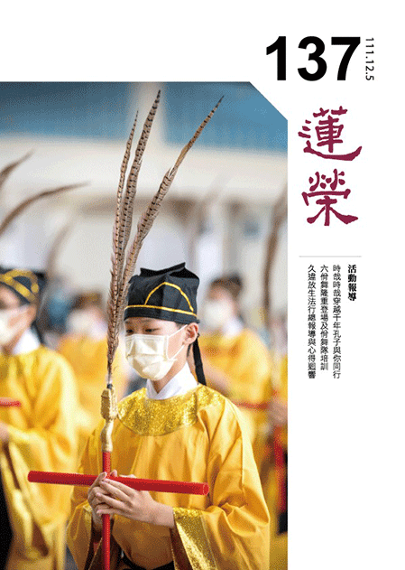

## 社論

### 與祭如在，無可取代

本刊

報本觀功與念恩

親祭如在誠意生

但看孔廟春秋祭

寶島台灣是淨土

全球新冠疫情已進入第四年，為了避免群聚感染，許多的活動都朝向視訊化、虛擬化，就連祭祀也可以線上祭祀。例如清明期間，台灣地方政府還提倡「線上祭祖系統」，藉由網路之便，人人都可以在任何地方遙祭先祖。而隨著元宇宙技術的發達，人們只要戴上ＡＲ擴增實境的眼鏡，就能立即置身於宮廟、佛寺之中，觀見眼前的香煙裊裊、殿堂莊嚴，甚至經文就浮現在身邊，佛菩薩、神明也不時放光端坐眼前，彷彿比人在現場更有豐富體驗。

然《論語‧八佾》記載，孔子說：「祭如在，祭神如神在。」又說：「吾不與祭，如不祭。」無論祭鬼還是祭神，祭祀都要像鬼神就在面前一般。祭鬼，一心想像祖先就在眼前；祭神，一心想像所祭的神明就在眼前。這樣的竭誠祭祀，必能感得鬼神來享。所以孔子說：「我如果因事或因病不能親自參與祭祀，而找人代理，就沒辦法親自竭誠想像，不能獲得感應，所以使人代祀的祭祀如同未祭祀。」

想想古代的祭祀，在參加祭典前，祭祀者要散齋三天、致齋七天，先是停止一切交際應酬，日常飲食還要刻意調整，並捨棄平時的一切感官享受；再則不得外出，須心神專注，集中注意力地預想自己在祭祀當日的一切禮節動作與儀式流程，才能在祭典當日如法如儀、誠心誠意地完成祭祀儀式。

而一場祭典還有很多環節，例如每年孔廟舉行的孔子誕辰祭典，從祭典開始，孔廟將正門打開，叫做「起扉」。各執事者就位，裡面有舞樂生（負責八佾舞）、糾儀官（負責監督典禮程序）、陪祭官（陪同祭祀）、分獻官（負責向東西廡的先儒獻祭）、正獻官（負責向正殿孔子神位獻祭），還有通贊（負責司儀），以及奉祀官。目前每年在首都台北孔廟祭孔的奉祀官，正是孔子第七十九代嫡長孫孔垂長先生，每年要一大清早就到孔廟進行家祭，接著是與民眾一起祭孔。

之後正式迎神，祭祀者持香爐到孔廟大門，將至聖先師神靈迎進孔廟接受祭祀。接著依序進行初獻禮、亞獻禮、三獻禮；過程中會有三次的佾舞，並搭配莊嚴樂曲，然後奉祀官等祭祀者浴手、焚香，到孔子神位前上香、獻香，然後飲用供獻的酒，以獲得賜福。

禮成後撤饌（把獻上的飲食等撤下來），然後送神（送至聖先師神靈），接著執事者相繼退出，最終由奉祀官望燎，望著為祭典特製的神主與宣告的文疏等一起焚燒，代表一切稟告祝禱，隨著至聖先師的神靈一起回歸天上，然後禮成、闔扉（將孔廟的大門關上）。

過程中，凡是有任何禮敬的呼班，祭祀者都要出聲回應，且每個動作都有規定的禮節，使得所有參與祭祀者不敢怠慢，要時刻保持警覺。

為何一場祭祀要如此繁瑣？孔子不也說「與其易也，寧戚」嗎？其實正是因為祭祀者對一場祭典的重視，所以才顯得「不易」，也更能從中產生感動。

舉例來說，人們刻意花錢買機票到美國，到知名的百老匯戲院去觀看一齣戲劇；縱使這些戲劇每天都在上演，網路上也可以搜尋看到完整版的表演甚至直播。但專程前往並坐在席間，親身感受現場人們一同看戲的反應，以及舞台上超過百位表演者近距離地粉墨登場，那樣的體驗與在屏幕上所見所聞，可謂天壤之別。因此，愈是慎重其事，愈有深刻體驗，相信這個道理不難理解。

如果祭祀是要請神明、祖先吃飯，那就要真的準備飯菜，且灑掃環境、布置花果，隆重以待，才能彰顯出祭祀者的誠意。倘若一切都通過虛擬化的祭祀來辦理，那就好像某人口頭說要請客，結果是通過手機發來幾張高級飯店與餐廳菜餚照片，這樣的誠意到底有幾分可想而知。

雖然疫情尚未完全結束，但面對年度的祭典，只要做好一定的防護，或者由家族中少數幾人代表現場祭祀，其他人則視頻參與並另外通過誦經、念佛、作善法等方式來參與祭典，仍能將自己置身其中，真正通過行動來展現祭祀的誠意。倘若真做到心誠懇切，必然能感應道交，獲得神明與祖先的庇佑。

因此，躬身參與祭典，祭如鬼神在，這樣的祭祀方式無可取代。

## 佛學覽幽

### 菩薩清淨的行持—華嚴經淨行品（五十三）

*戒慧講述、編輯部整理*

文殊菩薩的想像力

隨順對境造作發願

結合隨喜承擔求加

菩提心生起的資糧

丙二、指事顯因答其徵因

丁一、總徵

丁二、別顯

戊七、到城乞食時願（二十二願）

己三、乞食得不得：不捨人、能捨人

己三、乞食得不得-不捨人

經文：

見不捨人，當願眾生，常不捨離，勝功德法。

深法界指在任何法上皆能入得，菩提特別指佛的智慧，謂之阿耨多羅三藐三菩提。是心發願成佛，發願成佛才會成為成佛的因。大悲心是菩提心的因，因為想要去利益有情，結果激發出他想成佛，那就是菩提心。其中特別說到「見不捨人，當願眾生，常不捨離，勝功德法。」看到吝嗇的人不捨，比丘除了反省自身是否吝嗇外，另一方面，對勝功德法就要像這樣的不捨，勝功德法最重要的就是對法的勝解，才有勝功德，對法如果沒有勝解，生不出任何的勝功德，六度、四攝、三昧等，所有的關鍵都是對法的勝解，才有可能進一步實踐，勝解是所有勝功德的開始。

讓法不捨離的方法很多，例如課前預習、上課做筆記、課後複講、回家觀修，這種不捨離，就像愛錢的人不願意拿錢出來，比丘抓住世間對錢財不捨離的覺受，拿來對法不捨離，所學的法絕對不會忘失，就像絕對不會讓錢財流失，沒事就去檢查存款簿，錢財一定是愈多愈好，把那種感覺取過來，希望法存得愈多愈好、體會愈多愈好，而且善於把教法增長廣大。

那些法都是經歷千辛萬苦求得的，而且很努力地記住，因此不會想輕易告訴他人，就像真正武功高強的人，看起來像沒有武功，要看對方的誠意來決定是否展現，對方誠意一分就講一分，誠意兩分講兩分，誠意三分講三分，沒誠意就全部收起來。所以要入登地之前，他一定要有一個心量，願意將自己的所學毫無保留的送給別人，碰到有人願意來學，而且此人已發大悲心、菩提心，願意成為法器，就要毫無保留的交給他，這要透過迴向才辦得到。像善財童子參訪五十三位善知識的時候，到最後吃盡苦頭，就是因為到某種程度的時候，不是這麼簡單獲得，當那些很棒的觀念，是很辛苦才得到的時候，就會開始有某種程度的吝法，就像有錢人，不是馬上捐錢，而是先看過對方的企劃案才決定捐不捐。佛法亦是如此，努力學完後，看人才給，雪廬老師上課有三個原則，一是不准錄音，二是看人，有新生來，會先了解才讓他上課，三是上課看台下的表情，講課必須契機。

勝功德法，後面講的殊勝功德，可以說是大悲心、空性的智慧，可是應該要結合對教法的勝解，功德法的體性才會轉為殊勝。對法如果有殊勝的體會，眼前就算給乞丐十塊錢，都是勝功德法，當十塊錢給出去的時候，觀想頭目腦髓都捨給他，就是自己入登地的徵兆；如果給十塊錢，想著是結善緣，將來他成為我上首弟子，我成為孔子，他成為顏回，那個十塊錢是非常不得了的十塊錢，後面的緣，就從眼前給他十塊錢而來，這就是勝功德法。

勝功德法一定結合在傳承、成佛、捨心。捨頭目腦髓的心該怎麼發？當你是登地菩薩的證量時，捨頭目腦髓就跟丟餿水一樣，沒有感覺，那是透過不斷地發願，不惜一切練上來的，那都是有見地，知道這樣的發願，會引導你日用平常的能耐，一路串上來。對法如果沒有殊勝的體會，眼前就算參加法會都不會是勝法，就算灌頂被摸頭，準備被受記成佛，都不會是勝功德法。

己三、乞食得不得-能捨人

經文：

見能捨人，當願眾生，永得捨離，三惡道苦。

見能捨人，因為過去生他能捨，所以今生得富貴。他對佛法有正信，所以見到有志於道的乞士、行者，他都願意捨、願意供養。捨的人雖然是能捨，但是他若沒有恭敬心，他可能把餘物也捨出去。

永得捨離：對方是能捨的人，希望眾生都像此能捨之人，永遠捨去身口意的不淨行(殺、盜、淫、妄言、惡口、綺語、兩舌、貪、瞋、癡)，永遠捨離三惡道的苦因，當然這樣也要藉由修學皈依、五戒十善，方能捨離三惡道而生人天。

托缽的乞士會碰到能捨人跟不捨人，碰到不捨人也要很感謝他示現的形象，抓住這個覺受，當願眾生對勝功德法常不捨離。勝功德法其實就是對教法的勝解，使他所造作的功德成為勝功德，就像《十善業道經》，對教法有勝解的人，十善業立刻變成成佛的十善，對教法的勝解不足，十善業變成解脫的十善，更不足的，十善變成人天增上的十善，都是看你對法的勝解那一分來說。

見能捨人，抓住這個感覺，從眼前他對我的捨，包括他藉著捨，永遠捨離三惡道苦。比如說布施，捨慳貪其實就是捨掉餓鬼的苦，捨掉欲望，所以地獄的欲火也沒有了，捨的知見具足，畜生道也沒有了。

能捨人有三種，第一種是貧，第二種是中庸，第三種是富，哪一種人最殊勝？貧者最難能可貴，因為貧最難捨，難捨而能捨所以可貴，了凡四訓講到，貧女供養兩文錢，住持親自出來懺悔，當貧女成為王妃的時候，拿數千兩出來供養時，住持卻只叫侍者出來迴向。

能捨當中，還分為跟你親、跟你不親不疏、對你沒有好感的三種能捨，何者功德大？捨給親愛的人，或跟我愛執相應，哪有什麼能捨？能捨當中要看，到底是對法有勝解還是沒勝解，還要問能捨所捨，你成為所捨的時候，你的修行的那一分成為他的福田，有一天成為阿羅漢，對方是能捨之人，只是一碗飯，竟然可以感應捨者九十一大劫沒有飢餓。能捨所捨相互觀待，捨一定是你不想拿出去，拿出去以後名言才可安立為捨，布施的那一分要對治慳貪，名言才能成為布施，否則不能成為布施，只能叫作結善緣。法的勝解裡面，一定要對法的定義作了解，布施的體性是對治慳貪。能捨而除慳貪的那一分除餓鬼道，能捨把地獄的欲火澆熄的那一分可以脫離地獄的火。

捨，到最後捨外捨內。捨外財包括錢財、物質，這是屬於無情的外財；有情的外財像是妻子兒女，內財包括身跟心，屬於身的那一分，像頭目腦髓，或是體力；心的那一分包括做很多的計畫跟籌謀，這就是一種捨心力，在辦事當中將自己的智慧給別人。古代辦政治做到「政簡刑輕」，政簡是事前想好，前面做很詳細的規劃，那就是捨內財，願意花腦筋去規劃，有捨才會得。一一去觀修捨外財得什麼，捨內財得什麼，捨的心才會生起，捨外財的這一分，可以感應將來的富，富有的人都是過去捨財富而來的，而捨體力的那一分可以感應將來有體力。二十五圓通裡面講的持地菩薩，他去造橋鋪路，感應他在毗舍浮佛的時候，是一個大力士，像玄奘法師走過西域的體力，就是過去生中有捨力的時候，感應他這一生的體力特別強。雪廬老人說自古以來的祖師都是文武全才，武的那一分就是體力非常強。

捨內財，捨身的這一分，將來感應的是長壽，捨心力的那一分感應的是將來承擔事情時抗壓性特別強，因為過去很願意把心思拿來利益有情，抗壓性會增強；例如除瞋恨的人，他的來世會有一種徵兆，就是此人不容易悲觀，他一定有這些特性的等流，就算他不學佛，這一生也不容易悲觀，不會想不開，所以捨心力的那一分將來會感應他的抗壓性特別強，那些日理萬機可以抽絲剝繭、耐得住煩，都是過去布施心力的形象。(下期待續)

### 大乘百法明門論簡說(四十四)-拾柒、心不相應行法（二）

*戒慧講述、淨本整理*

歸類總相共作用

安立名言相觀待

皆無自性如幻化

緣起相續世間相

論文：

第四、心不相應行法，略有二十四種，一得，二命根，三眾同分，四異生性，五無想定，六滅盡定，七無想報，八名身，九句身，十文身，十一生，十二住，十三老，十四無常，十五流轉，十六定異，十七相應，十八勢速，十九次第，二十時，二十一方，二十二數，二十三和合性，二十四不和合性。

第三，眾同分，

「眾」是種類，「同」是相同，「分」是相似的意思，或者說是定義，被定義為相同或相似的種類，他們就是眾同分。宇宙萬法雖然千差萬別，但別相中有總相，異中有同，比如許多不同的樹木是別相，總相就是一整座森林；又比如松樹、柏樹是別相，都可以稱為「樹」則是總相。「諸法唯名言安立」，總相是依照整體發揮的功能去定義、去安立名言，例如因明學中人道的定義是「能思」，能夠思維的那一分定義為人，人也可以再以膚色分人種、以國籍分國人、以生活習慣分類別等等，可見我們都是依照諸法的作用給予定義，是以名言安立的方式認識諸法，所安立的名言都是共相，叫做眾同分。

再舉一例說明，「火」的定義是燒熱性，有燒熱性者名言安立為火，可是火有大火、小火、燒瓦斯的火、燒木頭的火、燒汽油出來的火，每種火都不一樣，卻都統稱為火，原來火也是依照燒熱的作用而假名安立的共相，並不是實體法。我們在共相中不斷依據不同的功能再去定義切分，以此認識共相中的各種別相。

小乘的《俱舍論》認為眾同分是實有之法，更精確地說，有部把共相當成實有，經部則不認為共相為實有，眾同分是假法，因為眾同分只是依照共同特性而賦予定義，不會是實有。

廣泛說眾同分就是共相，嚴格上說眾同分是針對有情的分類，「依有情身心相似分位差別假立同分」，比如身形上差不多，都是黑頭髮黑眼睛黃皮膚，心理上差不多都是這種生活習慣與想法，就定義成華人；其他則定義成美國人、歐洲人、非洲人等，如此將人道大分。大分後還可以再細分，經過不斷地定義、不斷地細分，產生一個具體的別相，例如台北市中正區寧波西街上的某位男士，但是這位男士（這個具體的別相）依然還是總相，因為他也是身心的組合，身與心其實也都剎那變化，也都是組合而成。

第四個「異生性」。

「異生」簡別「同生」，異生是凡夫，同生指的是聖者，一切聖人，皆已見到真空之理，不起我見，故名同生。不管是初果或初地，聖者們所證的空性一樣，不會因為不同的聖者所證的空性而有不同；凡夫都是無明我執，沒有智慧，但起我見，異於聖人的見地，所以叫異生。聖人明明見到空性，凡夫卻見到法有自體性，而且在自性見當中還妄認出各種差別，比如認為有神我、不可說我、自性我、靈魂我等等。

煩惱種有「見所斷的種子」跟「修所斷的種子」，也就是「見惑」跟「思惑」，「異生性」的「性」是指「見所斷的種子」，能斷見所斷的種子即入聖位，可稱為同生性。行者入定尋覓自體性沒有看到，出定時不受外道宗派的影響，爾時即斷見所斷種子，此也稱為 「理所破」，因為所執的我理上本來就沒有；入定時雖現證法無自體性，出定後外境仍顯現為實有的影像，此時在世俗中不斷串習空性正見，最終斷除修所斷的種子（思惑），也稱為「道所破」，因為執為實有其能執的心無始以來就有，必靠修道、歷事練心才能破除。(但一般指見思惑只是依有獨立實有我之執以及常見這一分說的。)

異生性與同生性，同樣也是假名安立，異生性觀待眾生未能斷除見所斷的煩惱，見解異於聖人，名言安立為異生，不是有一個實體的異生性；觀待現證空性而說同生，也沒有實體的聖者可得。

第五個「無想定」，

又稱「無心定」，前面五別境時曾說明，「定」心所是指對於境界有專注力，透過專注力生起輕安而說定；無想定的定義則不同，所以歸納為心不相應行法。無想定並不是緣念境界產生專注力，而是厭離想法，為什麼要對想法討厭？因為誤會證涅槃者所證空靈靈的境界，就是要靠腦袋放空。修無想定讓腦袋空空感到輕安，認為自己證得涅槃，殊不知聖者是在專注思維萬法自體性有無的過程中，透過尋覓不到自性而入涅槃，並不是腦袋放空，完全不思維而得涅槃。

修無想定者只要有想法他都討厭，他們認為就是各種想法讓人勞慮、讓人精神不能集中、令人念頭不得專一，好像生病一樣，所以無想是他們所認為的解脫，要滅除一切心想，完全不取用外境，這與實際證涅槃的聖者，雖然最後都是證得空靈靈的境界，但兩者差之毫厘失之千里。比如緣念花朵，修空性者是思維觀察花朵有沒有自體性；修無想定者則要把緣念花朵的思維打掉，有念頭就打掉，完全不緣念花朵。無想定在厭離想法當中產生輕安，所以假名安立為無想定，但歸類為心不相應行法，與五別境的定心所不同。

在四禪天中有無想天，就是修無想定之人所生的天，三禪的苦樂在他們心識前全部忘記，全部不會顯現，剩下執我的心去受用那個空靈靈的感覺，他們以為解脫，其實我執一點都沒有對治，還有一個巨大牢不可破的「我」在受用空靈的輕安，生無想天者有五百大劫的生命，身量有五百由旬，五百大劫中苦樂都動不了他，但其實煩惱未斷，最終仍不免輪迴。所以執我的心要靠修學般若才能破除，其他禪定都沒有辦法，充其量只是讓執我的心去受用初禪、二禪、三禪、四禪等境界而已。懂得這個道理，就知道修行的關鍵在般若正見，而不是盤腿實修。

從無想定的說明中可知，從欲界生到無想天，跟其他修學禪定生天相同，都要對眼前境界感到討厭，對所願境很喜歡，人才會修行往上爬。原來所有修行的秘密就是要對現況不滿意，要對所確立的目標產生喜歡的感覺，才會捨棄眼前受用往上走。

雖然無想定是對想產生厭離，爾時心識前不善不惡，但是無想定也要慈悲喜捨作為助伴，否則修定無法修成，修無想定或其他禪定在心態都是不妨礙他人，或是想去幫助忙別人，以此善心資助自己的禪定，使自己的禪定格外的有力，所以入無想定前的加行屬於善法，無想定也就歸類為善法所攝。

修無想定結果是生無想天，品位可分高下，大分三品：下品定是一定會退失定力，在無想天壽量最短，身體的光明清淨與形色都比較差；中品禪定比下品勤勞修定，不一定退失定力，就算退失也會很快提起修定的習慣；上品禪定則一定不會退失，壽量最長，形色最殊勝。

上述品位從結果上說，若從業因上說，也可如此大分：以下品心修無想定，或於來生、或第三生，乃至百千生後生無想天中，但也有可能業力微弱而不生（不定受業）；中品心修者，來生、或第三生乃至百千生後生無想天中（順後受業）；上品心修者，或於來生生無想天中（順生受業）。但沒有此生修行此生就生無想天之理（順現受業），引業不會此生造作此生受報，滿業才有可能，比如以勇猛心造善，此生改變命運者是，袁了凡先生在說他一生命運的改變，都是講滿業，不是引業。

生起無想定的處所有二家說法，第一家說唯在欲界生起無想定，因為修無想定要靠外道說法之力才知道如何修，然後聽者的慧解極為猛利才能修成，欲界的特色就是慧解極為猛利，而且無論內道或外道的說法者，都在欲界，真正厲害的人在欲界；色界及無色界比較沒有苦的覺受，所以並不會有離苦得樂的心，佛菩薩沒有說法的機緣，外道也是如此，再加上上二界眾生習於定中，慧解力已不如欲界之人道，所以不生起「無想定」。

按照第一家的講法，所有生禪定天的人，修行的功夫一下就沒有了，純粹是享福之後墮落，所以凡是想要解脫者，應該在人道求學解脫，千萬不要在人道修學禪定生天，成為既無說法之人，又無慧解之力的狀況。

第二家說無想定在欲界及色界生起，也就是在欲界人道之中先修習此定，此生之後，生到色界第四禪的前三層天（無雲天、福生天、廣果天，此三層天是凡夫所生之處），又能引生無想定現前，生無想天。無想天是修成的果報，並不是在無想天中修無想定，至於四禪的後五層天（無煩天、無熱天、善現天、善見天、色究竟天），名為五淨居天，乃證得阿那含聖者所生之處，故亦不起無想定。

以上二家之解釋，以第二家之說法較為周詳完備。第一家說法並沒有錯，第二家說法也是在第一家基礎之上來說。無想定是在欲界修無想定，命終直接進入無想天；也可以從欲界修行，命終後生色界第四禪的前三層天，再以無想定進入無想天。無想天並不是第四禪裡面別有一層天，而是他生到第四禪以後，他的特性就是不喜歡想，這是他前生的習氣，於是會躲入第四禪天的某一處，滅除一切想法，去享受他第四禪的快樂。所以無想定當然是有漏定，是「非滅計滅」，不是滅諦卻認為是滅諦，不是涅槃而錯認為是涅槃。

因此當有人說他已經證得空靈靈的境界，必得問明是如何證得，才能分判對錯，就像雲谷大師遇到了凡先生盤腿三天不起妄念，大師就知道要問他何以如此，不是馬上給與讚歎。在聽完了凡先生說明沒有妄想的原因後，大師說：「我待汝是豪傑，原來汝是凡夫。」所以大師厲害的地方就是能論見地，不是只論行持，禪宗有句話很好：「貴爾見地不貴爾行持。」如果行持不是從正見而來，這個行持有時候比不行持還糟糕，無想定即是如此。（下期待續）

### 佛學概要十四講表簡說（三十九）-第六講表　宇宙有情概況

*戒慧講述、編輯部整理*

輪王能令天下安

王后財經與將軍

教化能令國家強

護持正法最有力

成佛資糧迅速積

第六講表–宇宙有情概況，所謂有情就是五蘊的總相，與補特伽羅、命等是同一義。宇宙裡面的眾生，應該包括情跟智，有情被輪迴所攝，智者則非輪迴所攝。輪迴所攝有情，可以大分為天、人、阿修羅、地獄、餓鬼、畜生六類。

目前進度是人道，人道分為四大部洲，四大部洲在第七山的外圍，第八山就是鐵圍山，鐵圍山跟第七山中間的海，如同現在說的星雲，星雲當中有四大洲，對著須彌山的南邊，叫做南瞻部洲；東邊叫做東勝身洲；西邊叫做西牛賀洲；北邊叫做北俱盧洲，這四大洲的人，南瞻部洲最為奇特，南瞻部洲的人壽最多者可活八萬四千歲，隨著惡業減壽，可以減到剩十歲，差距甚大。

南瞻部洲的人具修行的根器原因為三：第一、能勇猛，能勇猛即精進，此洲的眾生能修諸苦行；第二、能憶念，對於過去的事情能夠記得住，不像諸天過得太快樂，早就忘了自己的過去，像舍利弗到天上看找尋昔日幫釋迦牟尼佛醫病的耆婆，耆婆已經忘了他在南瞻部洲昔日的善業，快樂使人忘了過去的修學，容易退轉；第三、能梵行，就像我們在娑婆世界裡面，受戒的人很多，例如受八關齋戒、受比丘戒、受五戒、受菩薩戒等等，乃至於能聽課、能修學，這都是四大洲裡面最殊勝的，北俱盧洲就沒有這等福報。

四大部洲有時候是可以互相交通往來的，有時候不能，能的情況也是根據我們南瞻部洲的人歲，兩萬歲以上就會有轉輪聖王出現於世，來統轄這四天下，此轉輪聖王具有大福德力，因為他能夠修持十善法，能夠自行化他，所以他的福力就會感得七種寶物，其中一種就是輪王寶，不同年齡的轉輪聖王會有不同的輪王寶，它就是一個乘坐飛行的器具，他們就是飛行王來統治各天下。人壽八萬歲的時候，會有金輪王，他的輪王寶是金輪，四大洲被它統治，他就乘著金輪寶來巡行四洲，四洲就可以交通來往。人壽六萬歲的時候就是銀輪王，他搭乘銀輪寶統治三洲，缺北俱蘆洲，即三洲可以來往。人壽四萬歲的時候，銅輪王出現，乘坐銅輪寶，統治南瞻部洲、東勝身洲，這兩洲可以來往。人壽兩萬歲的時候有鐵輪王，他搭乘鐵輪寶，統治的就是我們南瞻部洲，兩萬歲以下已經沒有輪王了，但是有粟散王，也就是各部的小國王各據一隅，像粟粒散落在各地。

統治這四大洲有金銀銅鐵這四大輪王，輪王出來一定有個徵兆，就是他有輪王的七寶，輪王的七寶又叫做七鎮寶。這七種寶物，第一個是「輪寶」，分成金銀銅鐵，是他搭乘的交通工具，輪寶代表科技，換句話說是他的神變。第二個是「神珠寶」，又叫「如意寶」，表示可以事事如意，可以給所有的有情眾生衣食上的圓滿，就像美國的礦產得天獨厚，他可能是粟散王裡面比較奇特的，好像在整個世界裡面當霸主一樣。第三個是「皇后寶」，又叫做「玉女寶」，也就是陪伴輪王來治理天下，皇后寶就是後宮的主持者，能夠安內。第四個是「主藏臣寶」，也就是「大臣寶」，此大臣是財經大臣，有許多的經濟政策讓國家富強。第五個是「白象寶」，他是一個天界的象王，此象王非常調柔，一天當中可以繞南瞻部洲三趟，騎在大象上代表國王的威勢。第六個是「紺馬寶」，是天馬，可以做為轉輪聖王的騎乘，紺馬寶就是一種戰力。第七個是「將軍寶」，是能夠指揮作戰的將軍，一個強盛的國家，一定有有勇有謀的將軍，以上是七寶。七寶裡面其實還有包括居士寶，居士寶就是辦教化。所以這七寶裡有政治、有教育，有軍事、有財經，有科技、有威勢，一個強盛的國家，必定有這幾個徵兆。

一個國王出來時，他一定要得到相關的人才輔佐他，讓王的威勢能夠展現，能夠成為四大部洲的統理者，或三洲的統領者，或兩洲的統理者，或一洲的統理者。這種統領者，因為政治的力量很強，他如果來辦教育的時候，教育的力量也會非常強盛，《法華經》裡面，釋迦牟尼佛曾經為大通智勝王如來的第十六位王子，大通智勝王如來當時是要繼承轉輪聖王，就是那種威勢，那種威勢才有利於佛教的發展，現在沒有這種對佛教有利的發展，任由民間各團體去弘揚佛法，有正有邪，讓老百姓莫衷一是，國家也沒有力量導正。

一個修學者要成佛之前，它要累積成佛殊勝的資糧，這裡面除了他要成為弘法者、傳承者以外，成為轉輪聖王去推展教育的這一分，也會是他成佛很重要的資糧，讀儒家其實都是為成佛做準備，儒家很多都是帝王的修學法，比如《禮記經解》裡面第三篇就是帝王的修學法，不要小看這些，不要認為自己是要出世求解脫的，又不是要當帝王，其實當你有一天要成佛的時候，跟你有帝王的修學法有關，看起來好像在繞遠路，其實是在沉潛蓄積能量。我們這一生是百千萬劫難遭遇的一生，要大量吸收儒家的見地，知道入世的時候應該要怎麼經營人生，有助於將來在成佛之前，用這種方式去弘揚、護持正法。雪廬老人在晚年時集中火力去講儒學，他除了要保護佛教以外，何嘗不是我們行菩薩道裡很重要的資糧。（下期待續）

### 人生大事不能忽略的事實-喫素念佛修淨業人，須平時事事多與淨行相合，乃可往生(上)

*戒慧講述、編輯部整理*

印光大師訪客多

侍者德森見聞廣

紀錄居士諸行誼

淨業往生善紀錄

吃素又念佛想要往生的人，必須要在事項上多做和佛法相應的業，否則往生仍有障礙。本文是印光大師的侍者德森法師所錄，共分為三部分，第一個是曹亞伯居士，第二個是彭守拙居士，第三個是查賓臣居士，由這三位居士的平素行持來論，為什麼曹亞伯居士不能往生，彭守拙居士跟查賓臣居士可以往生，往生與否跟題目相關，需要在平時就累積往生的因緣，臨命終才有往生順緣。

依著科文架構，很清楚地分出三位居士能否往生的原因，以及德森法師的勸勉，希望大家能夠言行一致的效法善知識的教導，真切實行才能功不虛棄。

第一部分舉出曹亞伯居士，他的毛病是「不依成規遊戲法門現生難了」，雖然有才華，也在佛門上有貢獻，但是學佛有遊戲的性質，草率不依教奉行，沒有認真護念自己的善根，是一個不受約束的人，單憑個人的放縱，也沒有組成佛化家庭，造成了往生的障礙。

「種遠因遊戲法門」，分為兩部分，一個是讚歎他的行持像大乘行者，一個是可惜他總是草率不按部就班老實修行。

經文：

曹亞伯居士，湖北陽新人。天姿頗好，髫齡入泮，即與武昌起義諸公，極力提倡革命。清廷嚴禁，遂亡命出國，徧游歐美，與孫總理諸公互相提攜。

曹亞伯居士是湖北人。自幼聰明伶俐，童年入學時，就和武昌起義的這些烈士們，一同提倡革命。當時朝廷嚴禁此事，還與孫中山先生等逃亡出國至歐美地區。

經文：

至民國十一年，居士遂不與聞國事，隱居滬濱。繼在崑山置產為家。

後受張純一居士勸，信向佛法，徧讀大乘各經論。至民十八九年，親近印老以後，與森亦頗相契。

逢人必以佛法相勸，提倡宣傳，頗有大力。法門之事，盡力護持，不避忌諱，亦為人所難能。森為江西寺產各事，均得其助力不小。

而輕財重義，清高坦白，不與人爭權利，亦為今人所罕有。

曹居士不但放下俗務，在革命之後的民國十一年，便不聞國事，隱居在上海近郊，在江蘇南邊的崑山市置產。也得到良師益友的推薦，受到清末秀才張純一居士的勸導，信仰偏向了佛法，也讀遍了大乘各經與論典。至民國十八、十九年親近印光大師之後，與作者德森和尚交往頗有默契，很是相合。

後來曹居士也大力弘護法門，逢人就大力宣傳佛法，努力勤懇，不遮掩地護持法門事物，其勇悍的熱誠，實在是非常難得。德森法師也自言在寺廟大小事中，均受到曹居士的大力幫助。

曹居士是一位不爭權奪利，輕財重義的俠客，做事情清楚明白坦蕩，今日之下實在罕見。

可惜的是太過草率。經文：

惜事事草率，不依成規，致所行多成遊戲。

草率辦事不受約束，也沒有依教奉行，所行雖是利生的善法，但是對自我的修行沒有什麼實質的幫助，在這些善法中遊走而已。

所以是「求近果畫餅充飢」，總明的部分，經文：「

所以只種遠因，現生難得實益。

」

不但他平常的所作所為沒有和佛法相應，也因為在緣上不具足，善因也成為遠因。這裡的現生難得實益，指的就是當生未能往生，以後也不見得會往生。以前李和光老師拜別雪公老師，要到台北新莊高中教學，問老師離開善知識有沒有不退的方法？雪公老師說，沒有！全退！遠離團體之後，心專注在教法上的力量薄弱，降伏煩惱的能力也很差，雖然在佛門中曾經賣力地做了一些事情，可是都變成遠因。

接著別述為何他所做是畫餅充飢，第一部分是他感覺自己可以活到百壽，經文：「

平日以身心兩強，英雄自命，期能活一百二十歲。

」平常身體強壯，心裡面也很正向，自許是英雄自命，覺得自己能夠活到一百二十歲。這個英雄自命，很多人都是身體好的時候說自己是英雄自命，身體衰敗的時候卻很洩氣，平日身體很好的時候，佛法自己看，書本拿來自己畫重點，認為不需要人家幫忙！可是他沒有了解人生的真相，生老病死是無常的、相續的。

年少太荒唐，經文：「

奈因少年冶游，斲喪過度，已成外強中乾，

」

這句話呼應了前面的身心兩強，冶遊就是生活上比較放縱自己，老天爺給他很好的條件，做任何事情身體不會累，心裡面也很有幹勁，但是他荒唐過日，斲喪是過度戕害身體、精神，日夜顛倒，揮霍過度，最後變成外強中乾，可能四十歲的外相，內在卻是八十歲的體質。

晚年常生病，經文：「

故晚年亦常生病。民國二十六年秋，稍患泄瀉，醫治將瘉，仍一再與森函約時期，來蘇禮覲印老，籍敍衷曲。詎知如期之前夕，患霍亂。

」

所以晚年常常生病，民國二十六年抗戰的時候，拉肚子拉得非常厲害，醫治將好的時候甚至還一再的跟德森法師通信，相約要來江蘇覲見印光祖師，藉此機會好好表達內心對大師的景仰，哪裡知道如期的前夕，竟然患霍亂。

臨終無助念，經文：「

屆時約好同伴往邀登程，見其即將垂斃。不一小時，便奄然長逝。

」

晚年生病的這一段就成為他修行的障礙。他即將垂斃不到一小時，便奄然長逝，文章後面沒有寫了，代表同伴沒有能夠扶持他的能力，家人也不在身邊，或者家人也沒有護持他的概念。

事與願違，經文：「

時年六十二，僅得所期之半，為八月二十五日正午也。

」

最後事與願違，得年六十二，僅得他自己所希望的一半，這一年剛是民國八月二十五日的正午。所以，只到他自己預計一百二十歲的一半，六十二歲，這麼好的身體，結果不善用，只剩下一半。

結證遊戲法門，現生難得利益，經文：「

平昔所說一切世出世間諸事，皆成畫餅。此則遊戲法門，現生難得實益之鐵證。

」

他雖然平常做這些出世間的事情，但是到了臨終的時候，都變成沒有辦法現世往生的利益。諸世間，包括他參與革命保家衛國，出世間皈依和護持正法、修築寺廟等種種事業，全部都成為了畫餅，就是在他臨終的時候，通通幫不上忙，沒有辦法成為他往生的因。我們一面讀要一面反觀自己，很多都是畫餅，覺得佛經自己看得懂，可能沒吃素也可能沒念佛，在法門中走一圈但是並不當真，這叫做遊戲。修學佛法不能利他也不能自利，雖然朋友很多，但是臨終不能來助念，平常也無法在進德修業上幫助我，這叫做遊戲。雖然親近善知識，但是離開之後還是回到自己的原有的想法當中，自由自在不受任何拘束，這叫做遊戲。因為自由慣了，他沒有一個中心思想，沒有一個修學的次第，沒有一個團體為依，沒有一個修學的管道，到處跑道場，臨終的時候，沒有人敢主持他的後事，或者各道場較勁，忙碌了一生卻成為往生的遠因。

戒行者當依成規，經文：「

修淨業人，對其不依成規之一切，當切戒之。

」

我們修學淨土法門的念佛行者，要依教奉行，讓所做都成為往生的近因，不要走遊戲法門這一條路，採得百花成蜜後，不知為誰辛苦為誰甜。

以下兩段，一個是家人助念往生，一個是眷屬助念往生，都是在緣上說。彭守拙的部分分為三，因上他的行持都合乎淨業，果勝就是臨終現瑞相。結明說明他的行持是依照印光祖師的教誨。

因正行合淨業，如果修行或者平常的行為都能夠依教奉行，這些所作所為能合乎淨業，那就可以當生成就。此段分為兩部分，一部分是素位護教，也就是他平常的作為都是在護持佛教，另一部分是敦倫盡份，老實念佛。

經文：「

彭守拙居士，江西南昌人。民十八年，特來滬選素廚司，到南昌辦蔬食處。因至太平禮印老，始與森認識。

後又在佑民寺，辦佛經流通處。由作事認真，得諸居士信任，故兩處事務，皆歸經理。

對法門中事，隨緇素諸公之後，護持提倡，亦竭盡心力。森為南贛寺產諸事，多資設法，為益亦深。

」

江西南昌人的彭守拙居士，在民國十八年的時候，特別到上海選上當一位素廚師，然後到南昌去辦素食處(素食店)。因為到太平來禮拜印老，所以跟德森法師認識。今日台灣的素食館是比鄰而立，選擇性也很多；但是在民國初年，能夠開素食館，真的是難行能行，彭居士等於是披荊斬棘，開風氣之先。

接著他又到佑民寺去辦佛經流通處，流通經書也是非常辛苦的，書印出來要各地方去送，或者要滿足各單位的需求去找人印經，供需之間有很多要勞心勞力的事。他因為做事非常認真，所以得到很多居士的信任，後來就把素食處跟佛經流通處都歸彭守拙居士來經辦。

他不但打開社會上惻隱之心的風氣，又讓佛法流通。他竭盡心力的護持佛法，不管是出家的法師或者是在家的居士，他都跟隨在這些善知識之後，護持提倡、用心的護持，德森法師說，關於南贛寺的寺務，彭守拙居士做了莫大的幫助。

敦倫盡份，老實念佛。經文：「

但因兒女多，家無恆產，維持家計，頗費辛勞。自修功課，雖不能無閒，亦不肯放過。

」

因為兒女眾多，家裡祖上又沒有恆產，維持家計很辛勞。縱使是生活重擔壓在他身上，他在自修功課這一部份，也不能夠功夫成片，沒有閒暇的整段時間好好深入經典，但是他總是堅持著不肯給自己藉口放過任何做功課的機會。

他做了這些公家寺院的事情，或者是幫助佛經流通，辦理蔬食處，雖然不能成為他家庭的收入，可是即使他的工作薪水再微薄、再辛苦，家還是可以養的，這是很奇妙的事情。而且自修功課，越忙碌越懂得抓緊時間讀書，在夾縫中生存，因為行合淨業其實就是一種時間的管理，是對時間的珍惜，自然該做的、該學的、該修的，不間斷地把能力培養起來。

接下來就是果勝，也就是臨終現瑞。經文：「

年五十餘，因積勞身弱，致常生病。至民二十七年七月間，預知時至，先對家人說定時期。屆時家人圍繞助念佛號，居士亦正念分明，於大眾念佛聲中，安詳西逝。

」

五十多歲就因為太過辛勞而身體漸漸不堪，常常生病。在民國二十七年七月的時候，預先知道自己往生的時間點，對家人宣告訂下時間點，家人在旁護持助念，彭居士正念分明，於大眾的佛號聲中，安詳的往生。

看似很平實的文句，其實含藏著很不簡單的功夫，彭居士平常敦論盡份的教養子女，家裡面食指浩繁，生活壓力如此之大，但是家人願意護持，也懂得如何護持，是非常不容易的事。

結明行依師教，經文：「

因其恭敬三寶，事事皆依許止淨為師，聞往生瑞相，亦相近云。

」

彭居士的學佛依著心態上是恭敬三寶，平素依止近代佛教大儒許止淨居士，事事皆請教，許止淨居士專志淨土，生平著有《觀世音菩薩本跡感應頌》和《歷史感應統紀》，蓮社也曾專書做《歷史感應統紀語譯》流通之。許居士臨終也是病中見佛，預知時至，安詳往生。師徒往生皆是瑞相，從果相就足見兩位師徒平素的行持，扣合題目就是「事事多與淨行相合」。（下期待續）

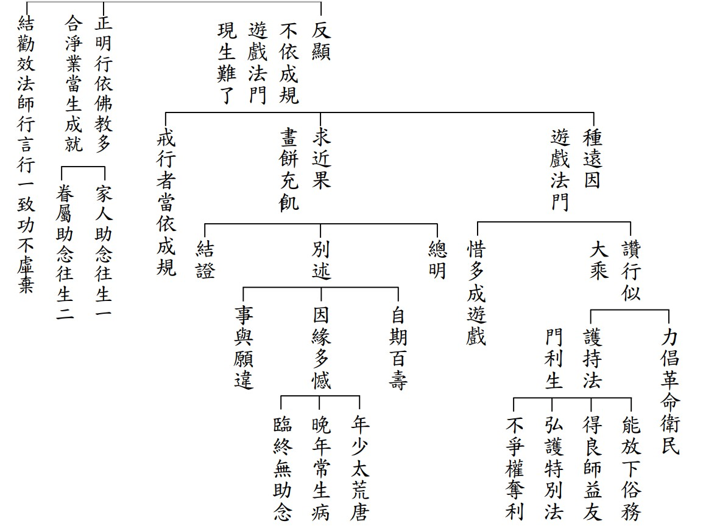

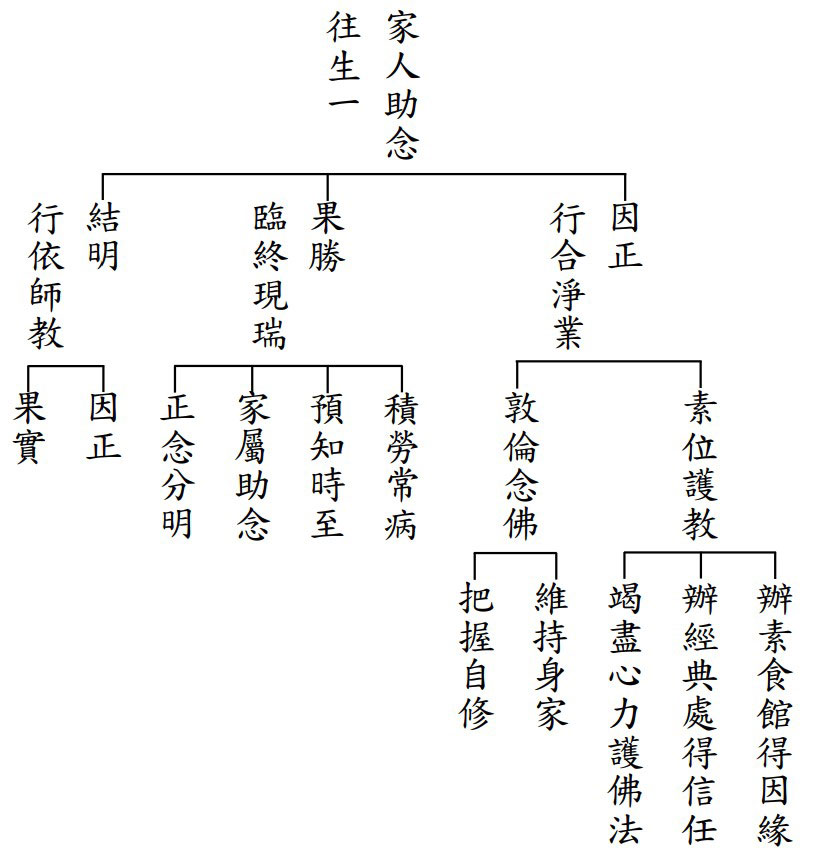

### 緣起贊論略釋（四）

*戒慧講述、心若整理*

修學體性在正見

通達緣起見心要

增上生與決定勝

離苦得樂從彼來

論中文義分二，一、由說緣起門中稱讚能仁。二、結述造論因相福德回施。一、由說緣起門中稱讚能仁分三，即總標、廣說、攝義。

乙二、廣說分二：丙一、由緣起門稱讚之因相。丙二、正贊。

丙一、由緣起門稱讚之因相分二：丁一、明緣起能斷生死流轉根故是聖教心。丁二、故歎美中由緣起門贊為第一。

廣說的目的，見緣起、說緣起，特別是說緣起，說清楚我們才能見，如果只講緣起，這個緣起不能斷生死根，必須要以緣起為正因通達空性的那一分，才能夠斷無明，斷無明就是聖教的心要，本次的進度在丁一、明緣起能斷生死流轉根故是聖教心。

論文：「

世所有衰損，其根為無明；見何能還滅，是故說緣起；爾時具慧者，如何不了知，尊聖教心要，即諸緣起道。

」

消文：世間都是由惑業（苦因）苦（苦果）衰損循環而成，所有的痛苦固然痛苦，所有的快樂也導向痛苦，所有的盛況最後就是衰損，究其根本就是無明，無明即對諸法的真實性不了解，執著為實有，起貪、起瞋，而造種種業。見到苦因生苦果這樣的衰損，回過頭來要先滅除苦因，滅除苦因的方法是以緣起為正理去通達空性，正好是無明我執的正對治，為了還滅，所以來說緣起。

那個時候，能夠通達真實義的人，想要滅除苦因苦果的人，怎麼可以不了解緣起道呢？世尊聖教的心要很多，包括各種的陀羅尼、神通、各種通達空性的方法，但最核心、最尊貴的心要就是各種的緣起道。

「

言世間者，略有三種，謂有情及器、正覺世間。後一非實，此取前二。器是外境，故重於初。有情衰損略有三種，即三雜染，謂惑業苦。

」

講到世間，世間略可分為三種，即有情世間、器世間、正覺世間，這裡的世間不是指正覺世間，因為正覺世間包括證果的菩薩、法王，他們已經遠離世間的所有衰損，是苦因苦果的滅。故此處的世間是有情世間與器世間，器世間是外境，隨業顯現，隨著有情轉變，因為依報隨著正報而得，此處又更著重於有情世間。有情的衰損略有三種，謂之三雜染，也就是惑業苦，惑業是苦因，是造成我們的快樂被破壞的理由，苦即苦果。

「

惑有三十及彼相應；業指有漏，猶非福。

」

惑有三十個，也就是根本煩惱六，不定（可能造善可能造惡）四，隨煩惱二十，以及跟這三十個煩惱相應衍生出來的分位（不同面相）與等流（變種）。業指有漏，業可以分為動業跟不動業，動業是可以轉動的業，欲界眾生的果報是可以變動的，例如我在人道行善，本來果報是升天，可是我在臨終的時候，一個念頭不對，也許這個福報就落到畜生道去受苦了，可能變成他人最愛的寵物，一樣是受用福報，但此福報卑劣。可以變動特別講臨命終可以改變的那一分，動業裡面包括福業與非福業，福業是間接的引向衰損，非福業是直接引向衰損（三世佛冤）。不動業指色界、無色界的眾生，他們所造下的善業，應該投生在哪一界，就投生在那一界，果報是不會變動的，所以叫做不動業，不隨境界所動的業。

「

苦有多種，謂三苦、六苦、八苦，乃至六道各別所有，或由生得，或由境致，如是等類，無邊可得。

」

苦有多種，謂三苦、六苦、八苦，三苦八苦特別講這一生，六苦講整個輪迴的現象。沒有脫離輪迴，本質就在這樣的環境中，各道又有各道不同的痛苦，或由投生而得，或由環境導致，環境中又包括人為與非人為。病苦細膩的種類太多了，沒有個邊際。

※以下解說何謂三苦、六苦、八苦：

三苦：三界都被苦苦、壞苦、行苦所攝，快樂被壞苦所攝，痛苦被苦苦所攝，不苦不樂被行苦所攝。

六苦：指輪迴必然的六種現象，一、無定的過患：去哪沒有一定、冤親不定。二、無飽足的痛苦與過患：受用永遠不滿足，慾望的發展，一定朝向痛苦，因為慾望是沒有底線的，如同口渴拼命喝海水一樣。三、數數捨身的過患：再好的身都要捨（捨快樂）四、數數結身的過患：不斷取下一生（取痛苦）。五、數數高下：時而當天王，時而變乞丐，在六道中浮浮沉沉，有時候是微小的業被你增長廣大，有時候是很大的業被你縮小。六、無伴：生時獨自生，死時獨自死，獨自去輪迴。

八苦：這一生的總說，這一期的生命現象會被生、老、病、死、愛別離、怨憎會、求不得、五陰熾盛這八種苦所繫縛。

「

然其根本，謂於人、法，執為實有、自性成就，俱生我執根本無明。

」

不管是三苦、六苦、八苦，究其根本，苦的根本是惑業，惑業的根本是惑，惑的根本就是執為實有，在人法上執我，我的定義就是不依仗、不觀待、自主性、自成立性、實有性，能執的心就是俱生我執、根本無明，能執的心無始劫來就有（道所破），而所執的我本來就沒有（理所破）。

「

如《寶鬘論》云：『乃至有蘊執，彼亦有我執，有我執作業，由業亦有生。』《入中論》云：『煩惱諸過失，皆從我見起。』法稱論師云：『癡是過失根。』如是教證難為盡舉。由此有故，行等諸支次第當起。如經云：『此有故彼有，此生故彼生，乃至大苦聚。』龍猛菩薩云：『諸因緣生法，分別為實有，說彼為無明，十二支次生。』此宗所許俱生無明，謂於緣起諸法執為實有自性之心，非他宗所共許。

」

如龍樹菩薩中觀六論之一的《寶鬘論》說：「對著五蘊而生起的執著，即法我執（執別相為實）執萬法為實有，五蘊是法，執五蘊為實有是法我，「有我執」即人我執，人我執是從法我執出來的（執總相為實），在五蘊上執有一個實有的我，有我執就會愛我，愛我就會思量，如何利益我等，故而造作種種善業、惡業，由這些善惡業就會有六道之生，善業進入上三道，惡業進入下三道。」月稱菩薩解釋中論的《入中論》說：「煩惱業都是從我見起，都是執我而有的，都是看到實有的我才會有執。」法稱論師說：「癡是過失的根本。」以上道理，不管是依教來說，還是依理來說，都舉不完。因為有無明的緣故，十二緣起支便次第而起。

如經上說「有這個無明，就有下一期的生死，乃至從無明、愛取，而有了來生，來生成為能乘載，大苦聚成為所乘載。」所以緣起法的核心就是要先觀察流轉的緣起。龍猛菩薩說：「諸法是被各種因緣所生，是多因一果，人我執無明，法我執無明，執為實有，就有輪迴的十二支依次產生。」中觀應成宗所許的俱生無明，是與生俱來的我執，不必觀待宗派見，把十二緣起的無明講成人我執、法我執的只有中觀應成派。

「

**問：** 如是已說無明為眾過本，斷彼方便云何？
**答：** 要由了解緣起實性為無自性、唯待緣有宛如幻化，達此理智，正治無明；由是因緣，有支還滅，是故，能仁佛薄伽梵說能對治、緣起方便。如龍猛菩薩云：『由智修彼性，當滅除無明。』提婆菩薩云：『由見境無我，能滅諸有種。』月稱、靜天皆說此義。理亦善成。謂達緣起慧，與彼執實無明同一所緣、行相正反，及是能證境界實性無謬心故。此中能治所治，必須同一所緣、行相乖反，不爾，則無對治能力，如瞋不治慢、信不治勤耳！

」

**問：** 以上已經找到問題的癥結點就是無明，也就是在緣起上執為實有，那要如何解決在人上、法上執為實有的無明呢？

**答：** 必須了解所執的實有是沒有的，而且必須用正理來通達，諸多的正理當中，緣起的正理最為殊勝，唯有觀待緣起，觀待條件的組合、觀待名言安立才能生起，緣起正理的自性不有，就是正治無明（執自性有），以緣起的道理為正因，是無明的正對治；由這樣的因緣，有支才被滅掉，也就是投生為下一生的業被滅掉了，所以，釋迦牟尼佛說以緣起為正理，能對治人我執、法我執。如龍猛菩薩說：「通達緣起的正因來通達空性，正好是無明的正對治。」提婆菩薩說：「見到人跟法沒有自主性、自成立性、實有性，就能滅除欲有、色有、無色有，因為這些三有的種都是執我，因滅故果滅。」月稱論師、寂天菩薩都說這樣的義理，他們是最能了解龍樹菩薩的思想的。很善巧的成立正理來通達空性，這種善成法，都是在緣我上說，一個執為有我，一個通達無我，境界的空性、境界的真實性就長這樣，能證的是無謬心，所證的就是境界的空性。這裡面的能治、所治，能治的是緣起慧，所治的是無明，這兩個必須同一所緣，一個執有我，一個通達無我，行相相反，如果不是這樣，就沒有對治的能力，如同瞋對治不了慢，信對治不了勤，因為所緣的境界不同。

「

又如上說，無明緣行乃至生緣老死，是流轉法；由慧為緣，無明則滅，無明滅故，乃至老死皆滅，是還滅法。由其修習此還滅緣起甚深理故，是為趣證菩提涅槃最殊勝因；爾時智者，何不了知緣起勝道為能仁聖教究竟心要？定當了知、無所迷惑。如《寶積經》。云：『性空寂靜無生理，由無知故轉諸趣，悲者以諸方便法，及百理門第令入。』佛又說云：『我得深靜離戲論，光明無為甘露法，任為誰說終不解，故應默然住林藪。』龍猛菩薩云：『緣起為勝者，甚深寶藏語。』如是等教，難以枚舉。

」

又如上述所說，無明緣行乃至於生緣老死，是流轉的緣起法；慧就是無明的正對治，連慧也是緣起法，由慧為緣，無明則滅，光明就是無明滅的條件，黑暗不是自性的被滅，而是光明進來，黑暗自然消退，無明滅了，乃至於老死皆滅，因為生起老死的條件沒有了，是還滅法。以緣起為正因通達空性，成為無明的正對治，空慧成為菩提的緣起，菩提是能證的智慧，所證的就是涅槃，破人我執、法我執。爾時智者，怎麼會不了解想要離苦得樂，必須要有空性的智慧，滅苦才是安樂的體性，智者一定了解，並且無所疑惑。如同《寶積經》講的「『性空寂靜無生理』，性空是總相體性空，寂靜是因的體性空，無生是果的體性空，性空、寂靜、無生就是三解脫門，對三解脫門不了解，會流轉於六道，而諸因果的道理，正好導向空性，大悲世尊以各種方便的法門，各種的證理門讓有情眾生通達空性。」佛又說：「我通達自體性了不可得，得到甚深的寂靜，離開世間的戲論，『光明無為甘露法』，光明是破二障的那分，空性是無為法，甘露是清涼的那一分，能夠澆熄熱惱，這麼深的道理無論對誰說，大家都沒辦法了解，所以我應該默然地去森林裡住」，這就是佛為何會在菩提樹下靜默的原因。龍樹菩薩說：「緣起是聖者甚深的寶藏語，是最有價值的語言，是殊勝的心要。」緣起之所以為聖教心要的理由，在經典裡面非常多，難以一一列舉。

「

又盡如來所有教法，或直或間，皆是引導趨此甚深緣起道理；然因機根有熟、未熟，故佛說法有了、不了。此亦大師遍智特能。

」

又窮盡如來所有的教法，或出世間了義，或世間不了義（真正了義的是中觀應成派，中觀自續派以下皆不了義），都是引導趨入甚深緣起道理，然因為有情的根機有成熟的，有不成熟的，所以佛說法有了義，有不了義，大師對教法的那一分是遍智，對眾生觀機的那一分，是契理、契機、旁徵博引、深入淺出。

「

又初半頌顯示無明為眾患本，次半頌顯唯說緣起方能斷除，後一頌顯由上義故，緣起道法為聖教心，是故智者應善通達。

」

又初半頌「世所有衰損，其根為無明」，顯示無明為眾過患的根本，次半頌「見何能還滅，是故說緣起」，顯示唯有緣起方便，才能斷除所有的過患，後一頌「爾時具慧者，如何不了知，尊聖教心要，即諸緣起道」，顯示緣起是滅過患，所以他是聖教的心要，最重要的就是流轉門與還滅門的緣起。（下期待續）

## 蓮池海會

### 唐許素珠老居士往生見聞記

心超

躲空襲的童年，不美滿的婚姻

個性強的挫折，選擇對的學佛

心量大的布施，隨喜強的參與

多蓮友的關懷，靠三子的晚年

住道場的福報，處共修的環境

多聽課的機緣，速放下的往生

唐許素珠老居士生於民國二十四年一月十九日，於一百一十一年八月二十三日早上八點往生，享壽八十九歲。父親許財，母親許柯淑貞，都是高雄人，老居士出生高雄，也成長在高雄，家中排行老大，有兩位弟弟、四位妹妹，其中一位妹妹早夭，另一位妹妹任職港務局，退休後也過世，最小的妹妹許芳娥居士現住台北，與方福源先生鶼鰈情深，因為唐許素珠老居士的因緣，而介紹進入淨廬念佛會，成為資深蓮友，並認真學佛化家庭，姨丈並有因緣得助念父母親的往生。

唐許素珠老居士是家中長女，必須負擔家計，又因父母重男輕女，只能國小畢業，出去所賺的錢，需要全額交給母親，提供家裡需要，幫助父母扶養弟弟妹妹，對家庭極有貢獻。

老居士二十歲時，嫁給從大陸四川流亡到臺灣的唐中華居士，唐中華居士當時是台南市基層警官，曾調至澎湖外島做七美分駐所與刑警隊偵一組的組長，調回台南縣的歸仁、善化、新化、佳里、新營分局的刑事組長，最後以南化分駐所的所長退休，因長期在外，又是海派作風，薪水常常忘了拿回家，家中三個兒子的生活與教育，都是唐許素珠居士想辦法張羅，婚姻雖不盡人意，但仍樂觀積極，喜歡唱日本歌以自娛。

或於家中取件工作（響應當時省主席謝東閔的口號，家庭即工廠），或於藥廠上班，賺錢貼補家用，孩子的三餐都沒餓著，家中常面對斷糧，但有辦法去跟會、賒借、撿樹枝回來煮飯、燒菜，樣樣皆能，孩子們看在眼裡非常感念，而能爭氣上進。

老居士的父親是善良的老實人，母親是標準的一貫道徒（經理級），慢慢地從老居士開始，全家弟妹都開始學佛，竟然母親往生有助念，告別式是用佛教的儀式辦理，大批一貫道友在場外用不上力量，真是奇蹟。

唐許素珠居士教出來的三個孩子都學佛，這才是最可貴的地方，都有很好的職業，組成美滿的家庭，這也是穩定社會的因素之一。老居士一生雖說很辛苦，但也有快樂的時光，例如全家聚會出遊，孩子們的婚姻圓滿，跟蓮友們的相處愉快，團體的活動如講座、研討、放生、齋僧、出國做各種菩薩法行，老居士都盡可能全程參加，最後臨終得到殊勝的護念其來有自。

民國七十七年的雙十節，三子訂婚，老居士與三十多位台北及蓮社的蓮友一起到親家中，舉行孩子訂婚儀式，並放生鳥類，中午餐後到親友服務的鞍馬山在總統行館聚會，由親家請客。晚餐後共修念佛，蓮社西歸子竟然在此場合，講往生助念與案例，一直講到半夜一點多，想不到老居士與先生都是快樂的聽聞，種下得助念的甚深緣起。

三子在蓮社辦結婚，老居士也在這個場合認識了醒公、簡金武老師、鄭勝陽老師，但並愉快地參加佛化婚禮當主婚人，又婚禮辦在台中，台北淨廬來的蓮友、台中蓮友等，在蓮社席開三十七桌，醒公為證婚人，這也是醒公從民國七十五到九十五年，唯一一次的證婚，王炯如社長擔任男方介紹人，簡金武老師為女方介紹人，鄭勝陽老師作司儀，這場婚禮也是鄭勝楊老師老師最後一次回蓮社。當時唐中華先生已從南化分駐所退休一年，且剛從大陸四川省親回來，竟還有一部遊覽車，是從鄉下來的阿公阿嬤來參加佛化婚禮，證明先生當警察做人很成功。

佛化婚禮後，蓮社一部遊覽車與新人一起到日月潭度蜜月，住救國團活動中心，並包船遊湖，晚餐後有弦歌之聲、古琴伴奏、醒公開示，第二天到玄奘寺作放生儀式，由醒公主持，到潭邊大量放生，在雪公座下的蓮友大概沒有這種幸運。

所有的開銷，從婚禮的結餘全部用完，這場婚禮可以說是收支兩盡，想不到老居士與先生非常高興。之後老居士與先生隨著孩子與媳婦去北台灣度蜜月，特別到拉拉山度假，全程由唐中華居士開車，不亦樂乎。從此台南家中的客廳就是大佛堂，唐中華居士親自為木造的佛像貼金，孩子回到家中，還一起做功課敲地鐘念佛，整個家庭幾乎是佛化了。

長媳楊蕙菁三十年前（民國八十二年元月二十八日晚上九點三十分）過世，是在空軍作戰司令部連續加班過勞而亡。在三軍總醫院情況危急的時候，在長子明智的抉擇下，沒有急救，到停屍間的時候，淨廬蓮友通宵來排班，其中穆宗南先生是整晚在停屍間念佛，長媳出殯時從冰箱移出遺體還是軟的，長媳告別式雖然隆重軍禮，空軍總司令部、作戰司令部、戰管聯隊都有參加，儀式卻由淨廬念佛會主導的佛化儀禮，由主持人蔡宏謀老師的主持，圓滿楊蕙菁的一生，這些因緣都讓老居士、先生及長子對佛法有極大的信心。

長媳過世後，孩子還小，從民國八十二年到九十二年與先生一起到長子家幫忙照顧兩位孫女，老居士早期持家必須完全投入（先生長期奔波在外）而且獨立堅強，但畢竟年紀大了，重新扮演媽媽的角色，比年輕婦女辛苦很多。在這段期間，也常參加蓮友活動，特別到民國八十八年後，有機會去大陸、緬甸、日本、寮國，共十三次。民國九十二年之後，與先生離開長子家，或住在台南或住在老三家，住在老三家的時間比較多，尤其九十九年先生生病北上，就住在老三家，之後老居士經常台北與台南往來，單獨住在台南時間不少，堪稱極為獨立而且堅強的人，民國一○一年先生過世後，也回台南住一陣子，經過苦勸才賣房子北上，後來在三子家約住七年，由於道場需要人手煮飯，所以在家人勸導下申請外勞到道場煮飯，老居士得以這樣的因緣住道場三年。

老居士因為三個孩子學佛，也跟著學佛，除了每週念佛十萬聲外，是參加學會活動最多的老人，對學會活動舉凡拜懺、講座、國內外放生、參訪、齋僧、遊覽風景名勝等等，幾乎是全程參加，放生足跡遍於普陀山、九華山、泰山，去濟南參拜雪公的墳墓，也到馬來西亞極樂寺大藏經修補，還有緬甸、寮國、日本等，老居士與先生都是全額支付，常常出國是一筆不小的開銷，這對極為節省的老居士來講是非常難得的，雖然收入不多，但很樂於參加團體這樣的活動，樂於大把大把的把錢花在出國旅遊上，樂於用大量的時間做善法，與蓮友們天天在一起生活，變成人生旅途最好的朋友。尤其緬甸之旅，深刻地印入佛法的覺受；到日本京都、奈良，圓滿一生的夢想，是一生最幸福的時刻。老居士參與種種活動與蓮友熱絡，這是老居士不退的關鍵，此是善法作在前面的重要，如同《修心七義論》五力修學法的善法種子力，才有想像不到的往生順緣，當然子女學佛更是父母親往生的保障。

老居士特別喜歡親近正法與善知識，見過廣欽老和尚，參訪過苑裡老尼師兩次，當時從台南到苑裡交通是非常不方便，這都要有主動親近的意樂，才能克服。

還有三子於民國七十四年在台中蓮社論語班三期合辦的三跪九叩拜師禮，老居士特別從台南帶著只有三歲的小孫女婷婷上來參加，從台南到台中當天來回，輾轉舟車勞頓，三期同學只有老居士這位家長參加。在大殿外看著大家的合照，雪公搖手要她進去，她很有分寸靜靜的站在外面，典禮後雪公走出大殿跟老居士面對面打招呼，老人家這一生最大的福報竟然是見到聖人雪公，還有鄭勝陽老師在台南講課時，都會自動自發去聽課。

晚年因為道場秀英師姑一人身兼數職，無法身兼煮飯、出納及各種細瑣的事情，正好有外勞可以用，就以此順緣住道場三年，聘用外勞的費用由老居士支付，並有多項對道場的支持，也提供學會的順緣，所以能在學會安然往生，這種因果是極為相順的，與蓮友的互動、交流，透過經年累積聽聞法義之薰習，竟然比學佛多年的老蓮友更有往生的概念。

老居士早年是戒慎恐懼的個性，晚年才變成怕東怕西，一有風吹草動就念阿彌陀佛，在往生前有七天，因為三子全家與外勞確診，由長子照顧，後面三天長子因為要去醫院治病，由三子陪伴，多以靜靜的在她旁邊陪她念佛，老人家安定的感覺，安靜的念佛，令三子大為震撼，三天中三子看老居士體力漸衰、胃口差，知道她會死，告訴她要萬緣放下接受死亡，想不到老居士竟然露出燦爛的一笑，尤其最後一天八月二十三日早上再告訴她要去西方極樂世界，她合掌完全沒有恐懼的表情，吐出了藥與食物之後，在佛號聲中，家屬陪侍在側，安然歸去，真是一心不亂創造心流的往生表率。助念後神色安祥，更勝於生前的任何一個時候，尤其佛號是在臨終前念的，而且合掌向阿彌陀佛表明生極樂世界，這些現象都足徵往生無誤，在寧波西街的道場助念往生，有非常殊勝的瑞相，除了臨終正念分明，助念之後神色安詳，體態柔軟。但因染疫在身，子媳無法沐浴更衣，委託專業人士處理，也成為人生的遺憾，火化有幾顆舍利。作七在學會，反而帶動蓮友回到學會，學會因疫情而停止共修將近兩年，這也是老居士往生的因緣而莊嚴學會。

### 兄長楊滿枝滿七寄願

愛蓮

嚴父教誨的長子  善待弟妹的兄長

繼承家業的老闆  後代員工的領導

布袋和尚的化身  往生淨土的期盼

先兄楊滿枝因急病慟於二○二二年九月二○日（舊曆壬寅年八月廿五日）在香港伊利沙伯醫院往生，享壽六十九歲。

楊滿枝為廣東中山縣人，出生於香港，父親楊健雄，祖父楊玖楠，家中三代從商都還殷實；母親何利英子女七人，滿枝為長子。嘗聞母親生前講述兄長兒時點滴，帶著心疼地說：「妳阿爸就像這樣把枝哥從椅子上拽掄下來，說『你不好好吃飯，就不要吃好了。』」

父親對長子的生活教育嚴格，希望為弟妹立好榜樣；的確，父親是我們這支楊氏家族的獨苗，一堆祖先伯父們的神主牌位都得由他扛，家兄楊滿枝又是長子嫡孫，在當時家中圍繞著一大幫子的伯婆伯母，還有祖母、老太等的「愛護」下，巧克力、瑞士糖果餅乾供應不斷，母親也難說道，只有父親敢在長輩環伺下教訓小子，看那三大姑八大姨們緊張得都把手絹揪成一團縐紗，六七雙眼睛死死盯著父親的動靜，生怕嚇壞了心頭肉。

大哥出生正逢祖父事業的上升期，受寵程度可想而知，但他生性淳厚，除了小男孩的頑皮外，他很會友愛弟妹，記得那年，舅公送每個孩子都有自己一份的新年禮物，哥哥的禮物是一套進口電動火車模型，車廂可沿軌道繞行，還可鳴汽笛，組裝好有客廳一半的空間大，他都會讓我們一起玩，妹妹們還好，當時只會坐的小毛頭大弟（與哥哥相差十多歲）卻是會抓火車起來敲地板的，哥哥也沒怎樣，總是從旁提看著我們，自小他就很少有太大的情緒，只會以他的方式照顧別人。我剛上大學時，計劃想買部錄音機，他搭理一下，晚上他就提了一部高規格的錄音機回來給我，他就進房間去，留著雀躍不已的我在試機。

阿哥初中學業表現不佳，但高中時大躍進，成績名列前茅，畢業後，考入遠東區唯一一所航空學校，學習維修飛機工程；一次，他向我展示了他設計並親手打造的飛機零件，我是打從心裡讚歎他的心靈手巧，聰明領悟力強。但就在此時，他選擇加入已現頹勢的家業，放棄他本應燦爛開展的未來，支撐尚未成氣候弟妹們的成長，為父母親的左臂右膀。

後來，弟妹們各有發展，離港幾半，他錯過了多少少年人風花雪月的時光，錯過了姻緣、眷屬無著，過著孤家寡人、看來投閒置散，而工作、責任密度奇高的生活，隨分之宜。

不知什麼時候開始，每天晚上他都揹、提著一個滿滿的大袋子，袋子越揹越大越重。半夜出門，凌晨回家休息後，再繼續白天的工作，媽媽說：「他去派野（分發物品）」，妹妹滿意說：「大佬（阿枝哥）去做聖誕老人。」我還不了解，一次返港，問大佬家中有沒有備用的藥品，他都從他的大袋中拿藥品出來，我才有機會一窺袋裡乾坤，都是一些食物、罐頭、藥品之類的東西，看到我好奇的表情，大佬立馬把乾坤袋收起來，調皮的笑著說：「哎呀！不要偷看我的寶藏啊，我趕快收起來…。」他跟四、五十歲的妹子鬧騰，脾氣個性，赤子之心未改。有一段時間他身體不太好，半夜的布施工作先停下來，身體好一些，他又揹袋出動從不張揚。

八月中，思念已久的父親突然入夢，印象深刻不去，去電香港妹妹滿意，請為父親上香，又問哥哥的健康狀況無恙，怎麼樣都沒想到哥哥突犯急疾，進入院不數小時即往生。

大佬他自己心善，平日就算辛苦，但都不惜身心疲累，好施成習，深夜出征，不欲人知，佛菩蕯應是最喜歡收這種苦行僧質地的弟子，不慕虛名利祿，捨財仗義，雖自身孤單，但願意給人溫飽，實在難得。

經營工廠的事業，一直還維持，就是為了廠中的孤老，工廠裡在幫忙他打理雜務的，是一個七十多歲的老員工，還有一個八十六歲的老人家還在領全薪，每天他只要到工廠坐一會，就可以回家了，哥哥讓他們在工廠養老，多辛苦都他自己肩上擔，不管是現在Covid-19的疫情還是幾年前的SARS都是一樣，大佬的做法，應是獨一無二的，他走他的路，世俗的善行，他的真誠、他的心意，家人以他為榮。

但今生缺乏學正法、加入團體、親近善知識的好因緣，未能把善行導入人生正軌，馬力強大的火車頭，還是會行不得其道，會行不得其法，路頭不對，冤枉路走了一遭，東走西撞，造橋鋪路無屍骸。

很遺憾今生兄長的善行，因為沒有從學習佛法開始，萬望吾兄楊滿枝能往生淨土，隨佛學種種法，燦爛開展未盡之願，懇求佛力加被，讓他轉身成為佛子。

獨一無二的兄長楊滿枝，勿畏究竟難，當大丈夫的時機到了，十一月七日為你的滿七，你一定能在極樂世界隨心所欲，事與願成。

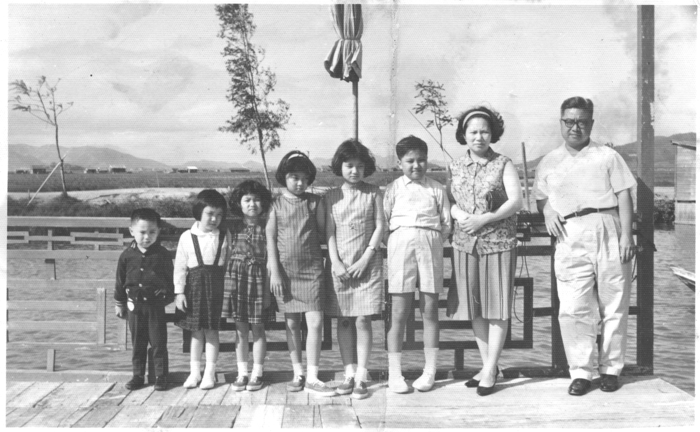

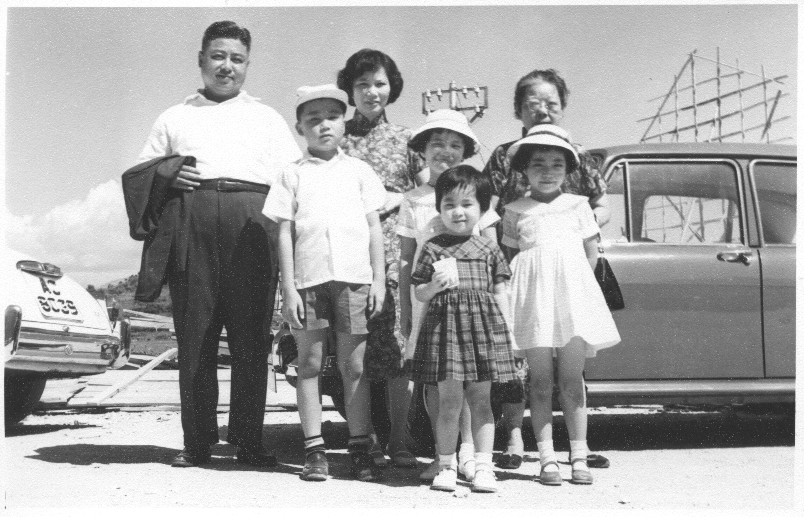

## 孔學一隅

### 論語簡說（四十四）— 雍也篇第八章   子貢通達人情事理，能夠從政

時哉講述

子弟學成氣象新

春秋亂世難作為

權臣底下作家臣

只說從政乎何有

—經文—
季康子
**問：** 仲由可使從政也與。子曰：由也果，于從政乎何有。曰：賜也，可使從政也與。曰：賜也達，于從政乎何有。曰：求也，可使從政也與。曰：求也藝，于從政乎何有。（雍也第八）

—消文—
季康子問孔子：子路可以使他從事政治嗎？孔子回
**答：** 子路處事明快、果敢決斷，你看能不能從政呢？季康子又
**問：** 子貢，可以使他從事政治嗎？孔子回
**答：** 子貢通達人情世故，你看能不能從政呢？季康子又
**問：** 冉求，可以使他從事政治嗎？孔子回
**答：** 冉求多才多藝，你看能不能從政呢？

—章旨—

此章明子路、子貢、冉有之才也。

—科判分析—

這一章特別講子貢通達人情世故，達能從政。
本章是季康子跟孔子要人才，「季康子
**問：** 仲由可使從政也與。」仲由就是子路，「與」通「歟」，語助詞。第一段是季康子問子路是可以從政的人嗎？孔子回
**答：** 「由也果，於從政乎何有。」子路這個人果斷、果決、果敢，你看他能辦事就能辦事，你看他不能辦事就不要用他，意思是季康子自己看著辦。季康子接著問「賜也，可使從政也與。」端木賜就是子貢，子貢可以從政嗎？孔子回答「賜也達，於從政乎何有。」子貢通達事理、通達人情世故，對於從政你看有沒有？季康子接著問，「求也，可使從政也與。」冉求字子有，冉求可不可以從政？孔子說「求也藝，於從政乎何有。」冉求多才藝，對於從政，你看有沒有？

—釋義—

季康子是何許人也？本章的歷史背景？

季康子的爺爺季孫意如，在自家的家廟跳八佾舞，把自己當天子來祭拜自己的祖先，僭越禮制。孔子三十歲時，齊景公帶晏子來訪魯國，季孫意如請孔子主持大政，令齊景公印象深刻。季孫意如死後，其兒季孫斯繼位。季孫斯死後諡號季桓子，季桓子時家臣陽虎亂政，公山弗狃是他封地的大夫，這兩個都有樣學樣，季孫大夫不忠於國家、不忠於君上，他的家臣、封地的大夫又怎麼會忠於他。

季孫斯後來請孔子出來為政，並且墮了三家大夫的封地城，三家大夫發覺，公家魯國越來越強大；三家的勢力就愈來愈弱，為了自己的利益關係，變團結一致抵抗墮都。且魯定公迷戀齊國送來的女樂，孔子認為魯國不可為，於是離開。

魯哀公三年，季孫斯要過世的時候，就交代兒子季康子（季孫肥）要把孔子找回來。只要談到季康子，就知道是孔子周遊列國回到魯國的時候，至少已經六十八歲了。

季康子何以有本章之問？

季康子眼中沒有國君，其屬下又怎麼會忠心？再者，當屬下能力大時，也會構成威脅，要找人才，要到孔門的座下去找，可見孔子是專門培養人才的老師。

仲由的果斷形象為何，有沒有其他證明？

例如「子路無宿諾」，子路不預先承諾，只要承諾就一定辦，此人果斷、有信用。

「未之能行，唯恐有聞」，是講子路的果決，子路聽到了就去做，即知即行。

孔子曾經感歎的說，「道不行，乘桴浮於海，從我者其由與。道推展不出去，想要乘著小船到海外去，敢跟我去的只有子路。

仲由的能力是否只有果而已，他的果可以從政嗎？

很多人也果決、果斷、果敢，卻是莽張飛，或是衝動型的火爆浪子，怎麼能從政呢？《論語‧顏淵》說到，子路的果是「片言可以折獄者，其由也與」。子路可以當法官，聽到甲方的陳述案情、原告跟被告雙方兩方的案情，三言兩語就可以斷獄，子路的果敢是充滿智慧的果敢，無欲則剛的果敢，道理明白的果敢，不受賄賂的果敢。

《論語‧先進》講到，「千乘之國，攝乎大國之間，加之以師旅，因之以饑饉。由也為之，比及三年，可使有勇，且知方也。」這個國家被兩個大國夾殺，而且是「加之以師旅」，部隊打過來了，這麼緊張的時刻，這個國家饑饉，沒東西吃，「由也為之」，指子路是一個臨危受命的人才，給他三年的時間，可使老百姓有勇，而且知道禮義。子路是一個軍事家、內政家、教育家、司法家，其果敢中充滿了智慧、道理明白，而且果斷，有執行力，是一個將才。

孔子答以「於從政乎何有」，其語氣與意義為何？
「何有」是反問語氣。季康子說：子路可不可以從政？孔子反問他：你說可不可以？這是活口氣，孔子沒有反對子路的才能，也沒有太贊成子路去做官，如果孔子不想把子路推出去，大可以回
**答：** 「子路還遠呢，還需要栽培。」但是「何有」就是既不反對，也不贊成，這就是說話的藝術，告訴季康子，你看能用就用，不能用就不用。

此種解法在論語中可有佐證？

《論語‧雍也》「季氏使閔子為費宰，閔子騫曰：善為我辭焉，如有復我者，則吾必在汶上矣。」這是第一個佐證，當時季孫大夫要讓閔子騫去當費邑大夫，閔子騫跟使者說：「請善巧地幫我推辭，如果你再來找我，我就逃到齊國去。」說明孔門弟子都不想到季孫大夫那裡做官。

第二個何有的解釋是，《論語‧述而》孔子說：「默而識之，學而不厭，誨人不倦，何有於我哉。」孔子說，我除了默而識之、學而不厭、誨人不倦，我還有什麼呢？這一章不能解釋成何難之有，否則孔子就太驕傲了，也不能解釋成我都沒有，孔子曾自言「十室之邑，必有忠信如丘者焉，不如丘之好學也」，孔子自己都承擔為好學。所以何有要解釋成我除了這三個，我還有什麼呢？

季康子想找孔門弟子從政，為什麼孔子沒有極力推薦？

最好的出路就是辦政治，辦政治才能有安定的環境，企業才能欣欣向榮，而且辦政治能夠引導教育。季康子來孔門找人才，孔子沒有極力推薦的理由就是因為三家大夫中季孫大夫專權，季康子敢以天子之尊來祭泰山，此人心中沒有天子、沒有國君，孔子怎麼會鼓勵弟子們到其座下去辦政治呢？雖然季孫大夫有實權，當季孫大夫的家臣，比到魯國的朝廷辦政治更好，可是如此囂張跋扈的人，人才怎麼可以為他所用。

子貢之達的形象為何，有沒有其他證明？

達的形象是四通八達。「夫達也者，質直而好義，察言而觀色，慮以下人」，達就是本質很好，好義就是為大局著想。培養人才一定要重在質地。其次人才一定要培養他是好義，為大局著想。如果不是好義，此人其實愈學愈自私。察言而觀色是此人有認人的能力，慮以下人，就是懂得謙虛受教，這叫做達，這樣的人質地很好、為大局著想、懂得察言觀色、懂得求教，路會愈走愈寬。

《論語‧先進》也說：「賜不受命，而貨殖焉，億則屢中。」子貢雖然不接受傳承的天命，而去經商賺錢，可是子貢這個人「億則屢中」，對事理通達。

子貢之達可以從政嗎？

《論語‧公冶長》孔子稱讚子貢是瑚璉，瑚璉是宗廟的幹才，代表子貢不是地方的人才，而是中央的人才。《論語‧子路》說「行己有恥，使於四方，不辱君命，可謂士矣。」子貢問士的時候，孔子講到上等的讀書人，是有羞恥心的，能夠出使到各國，不會侮辱國君的命令，這段話是特別為子貢說的，子貢是一個通達的外交官，是中央廟堂的幹才，子貢的達是可以從政的。

冉求之藝的形象為何？

藝包括外交、祭祀、工程、六藝、財稅、軍事、內政，冉求的多才藝是從政的能力。

首先說到內政的藝，「比及三年，可使足民。如其禮樂，以俟君子」，給冉求三年的時間，他可以讓老百姓足，也就是冉求是財經的人才，國民所得可以提高。
第二個藝是軍事，魯哀公十一年，齊國伐魯，冉求率軍戰勝而返。季孫大夫問冉求：「你的軍事是天生的，還是別人教的？」冉求回
**答：** 「是我的老師孔子教的。」季康子說：「我父親臨終時說要把他找回來。」促成了孔子從衛國回到魯國的因緣。

第三，冉求的藝也是屬於外交的藝，魯哀公二十三年的時候，他曾經代理季孫大夫去弔唁宋景公的媽媽。

以上可見冉求的藝有內政的藝，有軍事、外交、財經的藝。

經由孔子培養成才的有七十二賢，季康子何以不問其他有才能的弟子是否可以從政？

這三個人或許在形象上、才能上、名氣上特別突出，所以季康子這樣問。第二，這三個人或許已經被國家或季孫大夫用了，季孫大夫只是要藉著孔子的答覆更加肯定任用他們。第三，季孫大夫也在其他章問孔子：「你們學生中有沒有好學的？」表示他另外還要問人才，而人才都從好學來。第四，他連問三個，孔子都說你看有沒有？每一個答案都模棱兩可，就不好繼續問了。

由本章孔子之答，可得知孔子是何種人物？

孔子能精準地講出學生的內涵與個性，子貢的達、冉求的藝、子路的果，一字精準定義，這是孔子的知人之明。孔子懂得因材施教，順他發展當中充實他的內涵，讓子貢的通達能夠為政，讓冉求的才藝有出路，讓子路的果敢有內涵。

若冉求、子路已是季氏家宰，何必再問可使從政？

孔子回到魯國時，冉求本來就是季孫大夫的家宰，子路在孔子回到魯國的時候，也成為季孫大夫的家宰，他們已經從政，又何必再問。這有兩種意思，第一，從政不是從事，從政是到中央當部會首長，第二，季孫大夫也想要請孔子再肯定一次。

子貢此時有從政嗎？若有，則何必再問可使從政？

子貢此時雖然沒有從政，可是他被魯國所用，魯哀公十一年時，子貢曾經出使救魯國，魯哀公十五年，子貢也到齊國，成功讓齊國把成地歸還給魯國。季孫大夫問從政只是想從孔子的語中，更肯定這些弟子可以從政。

本章章旨為何？

本章章旨有明、有暗，明的是孔子在論子路、子貢、冉求的專長。暗的是孔子對季孫大夫不卑不亢，孔子沒有壓抑弟子們的才能是不卑，不亢是孔子也並未推薦學生給季孫大夫用。孔子只是說出他們的才能特質，季孫大夫看著辦。

學習本章如何應用於現代？

第一，取子貢達、取冉求是藝、取子路是果，取其所長，這是錢地之教授引程顥的解釋。第二，孔門的弟子有德有才，換句話說，不能光有德，還要有才，才能堪大任。文質彬彬，質還要加上文，君子除了品德外，怎麼可以沒有文采、才能呢！「果」即執行力，「達」是統合力，「藝」是能夠辦事的幹才。有能力做事、統合、執行，這就是國家、企業、時代需要的人才。

—總結—

一、孔子說話的藝術是不卑不亢，不得罪季孫大夫，可是也不推薦。

二、孔子論人很精準，知人善任，深知此人的能力個性，才能把他擺到最合適的位置。

三、教育在英文中是引導的意思，教育是一種引導，比如果的人，就引導他是能夠通達內涵的果敢，不是莽張飛的果敢。果在《易經》裡面的蒙卦，它說果行育德，你的果敢、果斷是培養德能的果敢、果斷，不是莽撞、衝動、浮燥的，果敢、果斷是見地看得明白，有實踐的能力。第二個藝，不只是小才藝，而是像周公制禮作樂的大才藝，能夠開啟周朝八百年的天下。第三個達，子貢的達是能夠把外交大事辦成的達。

—問答—

**問：** 有注解說，孔子在論三位學生是用一字之褒的方式來問，雖然不是蓋棺論定，但是就三人之才來論是非常精確的文字，這樣的論點可採嗎？

**答：** 論這三個人這樣論實在太美了，子路本來就是果敢，子路的才能很多，有軍事、內政、斷案的才能，孔子用果來收攝這些才能，果就是此人很果敢、果決、果斷，子路是一個很果斷、很有執行力的人，這個果是能夠帶來國家安定的果，是一個能夠斷案公正的果，這個果是總相，其他的才能是差別相。冉求也是一樣，有內政、軍事、財經，但是收攝在藝，冉求本來就是一個多才藝的人。子貢是外交、經商之才，收攝在一個達。這三個字就是他們個性裡面最精準的定義。

**問：** 有注解提到，從政乎何有，指有餘力，是否可採？

**答：** 此是皇侃引衛瓘，把何有當作有餘力解釋，表示子路這個人從政有餘力、子貢從政有餘力、冉求從政有餘力，即何難之有，可此處不能解釋成何難之有，要解為你看有沒有，因為季孫大夫是跋扈囂張的權臣，孔子不願意推薦人才給他，但如果弟子們要去，孔子也不反對，所以最好的解釋就是你看有沒有。'

**問：** 用人之道的重點是什麼？很有專長的小人，是否可以任用？

**答：** 要任用小人，就不能把他放到重要的位置，小人上面一定要有君子管理他，叫做「舉直錯諸枉，能使枉者直」，他上面的領導人一定要是君子，才能使這個小人變正直，就算他不能變正直，也不敢胡作非為。

**問：** 孔門弟子不願為季氏做官，為何冉求、子路在季氏家做家臣？

**答：** 孔子雖然沒有推薦，可是也沒有反對，叫做「空空如也，叩其兩端而竭焉」，孔子把道理、是非兩端分清楚，季氏與孔門的弟子自己做決定，即使抉擇有利的一端，做不做也在他，是勉強不來的。

**問：** 既然子路是軍事、政治、教育、司法等方面的人才，冉有也是內政、軍事、外交、財經等方面的人才，為什麼孔子還說他們是具臣而不是大臣？

**答：** 因為他們在季孫大夫的座下，權力都在季孫大夫手裡，所以只能具備臣一格，不能成為推展國家大政的大臣。

**問：** 總合以上的問題，儒家所說的中庸之道是不是等同於佛家的本來面目呢？

**答：** 《中庸》的庸是用也，用中，中其實就是形而上，形而上可以說是本來的面目，可以說是禪家的明心見性，也可以說是道家的無為。怎麼用中？在入世的時候，該進則進、該退則退、該謙虛則謙虛、該示弱則示弱，都是用中。（下期待續）

### 孔門心法—中庸之道(二十五)    第二十章：誠心前行的力量(三)

*時哉講述、弘毅整理*

學誠人生出路

心態能力培養

言行辦事講究

自行化他一生

—前言—

本章談一個誠字，並展現於事前的準備中，眾人雖知凡事要成功必先有準備，然而綜觀經文所述，小人同樣也能有所豫，但下場往往不怎麼好，這其中與君子之豫又有何分別呢？

一個人的成功非偶然，他做事前都會先分析、規劃、抉擇，選擇最好的方式說話、辦事。如在蓋台北一零一大樓前先要想好蓋樓的目的和意義，然後設計藍圖，考慮施工方法、經費來源，蓋好後能否發揮實際效果，都要先做好評估，再去蓋樓。在軍事上有沙盤推演，情景化思考，人類歷史上最大規模的登陸作戰就是諾曼第登陸，盟軍五路大軍，三百萬軍隊，需要跨越英吉利海峽登陸諾曼第。這需要事先做好登陸演習，模擬各種狀況及應變策略，利用假情報欺騙敵人，還要考慮各種氣候條件下如何登陸作戰，不同的國家陸海空三軍如何協調，登陸後最終的目的是推翻希特勒的統治，才能保存歐洲文明，避免世界動亂。

本章就是在講豫和誠，豫就是事先規劃，誠就是推動的力量，愈懂得事先規劃，就愈會去推動這個事情。反之，你對事情模糊不清，就不會想去推動它。比如我們不知道為誰而戰、為何而戰，又怎麼會去認真推動呢？誠就好比汽油，世界上再貴的豪車，如果沒有加入汽油，它也無法行駛，稱之為車也就沒有意義。最上乘武功論心法，練武也要先考慮目的、意義、跟誰練、練武的步驟、次第，有這些考慮才能堅持下去，否則很容易半途而廢。教育如果不去注重知識的價值、功能、利益、出路，不去培養學生分析、思考的能力，只是填鴨式的教育，應試的教育，那就失去了教育的本質。教育的內涵要通過作法才能彰顯，沒有內涵的作法只是空洞的形式，教育的重點在內涵，要培養學生好的人格特質，知道真正的人生出路和學習的意義，老師有教育的熱忱，學生有學習的動力，如果沒有內涵，再多的成果展示也失去了意義。

中庸總體科判

第二十章還是在《中庸》的第二部分，即分別顯示中庸的修學法和義理。

本章科判分析

第二十章第三部分重點講豫和誠，先總體說明事先準備的重要，然後分別顯示言語、辦事、行動都要事先準備並講究其中的道理、方法。還要得到上級的信任，才能辦好事情，如果朋友不信任你，上級對你也不會重視，因為對父母孝順，朋友才會信任你，能夠誠心誠意的反省自己，才是孝道的落實。最後感歎誠就是對善很清楚，包括利他的心態、作法、意義、效果，以此去說話、辦事、行動，才會清楚明白。

誠能夠趨吉避凶，誠是聖者的氣象，是人應該有的修為。要透過博學、審問、慎思、明辨、篤行來學誠。一個人如果有幫助他人的誠意，但沒有幫助他人的方法，不能稱為有誠意。再如一個學生想要求學，可是不去找好的老師、書籍，不講究求學的次第、方法，說的就是空話。一個有仁心的君子如果不去充實自己，仁心也是落空的。以五步修學法來學誠，又肯下死功夫，就一定能夠學成。

—消文釋義—

經文：

凡事豫則立，不豫則廢。言前定，則不跲。事前定，則不困。行前定，則不疚。道前定，則不窮。

消文：凡事預備才會成功，不預備就會失敗。如參加考試之前，上課要認真聽講，做筆記，弄懂老師的意思，課後複習，給同學解釋，再加上保持良好的體力，考前看好考場，這些都具備了，考試時靜下心來，以平常心答題，如此一定能夠發揮最好的狀態。以上是原則上說，可是有時需要臨機應變，如一個孝子和父親外出，遇到老虎，他就用拳頭使勁打老虎，老虎就被嚇跑了。可是他緊急應變的能力也是來自平常訓練有素。再如孔子到齊國，晏子向齊景公進讒言不要用孔子，當孔子聽到傳話說，齊景公已經老了，不能用孔子了，他當機立斷，立刻就離開齊國，而且淘好的米還沒來得及煮，撈起來就走了。

言語要事先想好再說，這樣就不會困窘、無邏輯。事先想好說話才有分量，才能令人信服，否則就是浪費言語、時間和他人對你的信任。有時也有例外，如孔子參加齊魯夾谷會盟時，齊國黎鉏大夫用夷狄來奏四方之樂，孔子當機立斷的呵斥他們。這需要平常訓練有素，緊急時才能說的清楚明白。有一位中央辦公廳秘書退休時回憶說，當他要向長官匯報時，都要先在台下做各種模擬，練習好說話的口條，說的內容要清晰，前後的次第正確，模擬長官的提問，結果與長官對談時，言簡意賅，禁得起循詢問。

辦事前要先想好，就不會有障礙。如旅行前要先想好去的行程、衣食住行、意義等，甚至到現場勘察，否則就會有障礙，以後再辦事情，他人就會打折扣。「勇而無禮則亂」，禮就是事先規劃好，負責人是誰，組織表確立，了解自己的職責，而且想好各種突發狀況，想的愈周全，愈能應對好。有時也有例外，如秦國去攻打鄭國，鄭國沒有發覺，商人弦高在路上正好碰到秦師，他就獻上四張牛皮，十二頭牛，謊稱是鄭國國君讓他前來慰問的，秦軍就以為鄭國已經知道偷襲之事，只好班師返回。

行動前要先想好，就不會後悔。如開車出行，要先想好去的目的地、路線、時間、意義等，才不會路上盲目打聽。齊魯夾谷會盟時，孔子說，「有文事者必有武備」，果然在會上齊國想要挾持魯君，出動了一百輛兵車，而魯國事先準備了兩百輛兵車，才化解危機。齊景公回去後覺得很丟臉，就歸還了從魯國侵佔的三地領土。有時也有例外，如秦趙澠池之會，在會上秦昭襄王讓趙惠文王為他彈琴，藺相如當機立斷讓秦王為趙王擊缶，否則血濺五步，秦王只好照做。能夠在緊急狀況時應對自如的人，平常一定是深謀遠慮的。

言語、辦事、行動的方法事先想好，就可以應付各種狀況。有時也有例外，即便你想得再周全，還是會有失敗的時候。如秦穆公要派兵攻打鄭國，蹇叔哭師，認為勞師遠征一定會失敗，所以最好的辦法就是不打。

釋義：「跲」，朱子解釋為困窘，因為你沒有事先想好，當別人問你時回答不上來，就會困窘。俞曲園的《群經平議》上解釋為閉塞，就是架構不清晰，言語前後不一，沒有邏輯性。

經文：

在下位不獲乎上，民不可得而治矣。獲乎上有道，不信乎朋友，不獲乎上矣。信乎朋友有道，不順乎親，不信乎朋友矣。順乎親有道，反諸身不誠，不順乎親矣。誠身有道，不明乎善，不誠乎身矣。

消文：在下位者如果不能得到上位者的信任，就不能使百姓得到治理。雪廬老人說，朝政最大的過患在君臣不合，君主猜忌大臣，大臣不敢大膽的施政，政治也就無法上軌道，國君的政策不借著大臣去推展，也無法實施，君臣鬧意見是最大的浪費，很多時間都被浪費在處理各種人事問題上。此處的上位者是指明君，如果是桀紂那樣的昏君、暴君，那是不必獲得他們的信任的。如冉求為季孫大夫聚斂，財富超過周公，孔子因此說，「非吾徒也，小子鳴鼓而攻之可也」。

想要獲得上位者信任是有方法的，雖然在言語、辦事、行動上有計劃和方法，但如果不能讓朋友信任，也不能獲得上位者信任。因為如果團隊其他成員不擁護你、猜忌你，有可能你存在自私、炫耀自己的能力、假公濟私、剽竊別人的成果，上位者當然無法信任你了。以前劉邦想要傳位給趙王如意，可是漢惠帝因為得到了有德學的商山四皓的扶持，也只能傳位給漢惠帝了。

想要獲得以道相交朋友的信任也是有方法的，雖然與朋友開誠佈公、培養革命情感，但也未必能得到他們的信任，以道相交重點是仁道，仁道從孝道開始，如果不在孝道上講究，不會得到朋友信任。

孝順父母也是有方法的，反過來省察自身，如果自己不能表裡如一，在朋友面前表現孝順，私下卻不把父母放在心上，那也不能稱為孝順父母。

使自身能夠表裡如一也是有方法的，口頭上說想要利益他人，可是如果不講究利他的心態和作法，那也不能說自己是有誠意的。如一個人想成為好學生，可是他不想找好的老師，不想聽課、串習，說想成為好學生也是沒有意義的。還有郭巨埋兒的典故，郭巨家貧吃不飽飯，母親還把食物分給孫子吃，郭巨打算把兒子埋了，如果那樣做的話，母親會非常傷心的，所以他心態是善，但作法卻是不善，也不能稱為有誠意。君子往往不能明乎善，可是小人卻常常明乎惡，為了爭名奪利計劃的非常周全，無所不用其極。明乎善就要懂得斷惡修善，就是去掉私心，心存公心，袁了凡先生因此而改變命運，無子而有子，無功名而有功名，無壽而有壽。所以有仁心、肯充實自己的君子，才叫作有誠意。

經文：

誠者，天之道也。誠之者，人之道也。誠者不勉而中，不思而得，從容中道，聖人也。

消文：誠就是能夠趨吉避凶的內聖外王之道，能夠在內聖外王之道上充實自己，才是最有誠意的，也是《大學》裡講的止於至善。

只有人才能學習誠的道理，成為聖賢，而狗貓雞鴨是無法學習誠的。

能夠達到誠的人，不用勉強就能恰到好處，或者不用勉勵自己就能進入中道。不必思維就能任運的達到形而上，綽綽有餘的與中道相應。就好像世間人遇到順境馬上就高興，看到錢就生貪心，遇到逆境馬上就發脾氣。或者像一個開車走某條路上班十幾年的人，因為對路況非常熟悉，所以一邊聽音樂、聊天，一邊就開車上班了。君子對於中道也要如此。不論遇到順境還是逆境，面對各種變化，都能立刻與中道相應，這樣的人就是聖人。

釋義：「中」，讀去聲，恰到好處；讀平聲，中道。

經文：

誠之者，擇善而固執之者也。博學之，審問之，慎思之，明辨之，篤行之。有弗學，學之弗能，弗措也。有弗問，問之弗知，弗措也。有弗思，思之弗得，弗措也。有弗辨，辨之弗明，弗措也。有弗行，行之弗篤，弗措也。人一能之，己百之。人十能之，己千之。果能此道矣，雖愚必明，雖柔必強。

消文：學習誠到最後可以達到不勉不思，可是沒有學成之前要勉要思，否則不勉就會懈怠，不思就會變成呆子。學習誠的道理，就是要學習內聖外王之道，抉擇利他的心態、作法和道理，堅固的執持。

要如何擇善固執呢？就是透過廣博的學習、詳盡的提問、謹慎的思考、清楚的分辨、篤實的行持這五個步驟來實踐。

要麼不學習，如果學不會，就不會放下。要麼不提問，如果問了而不懂，就不會放下。要麼不思考，如果思考而沒有得到結論，就不會放下。要麼不分辨，如果分辨的不清楚，就不會放下。要麼不實行，如果實行的不到位，就不會放下。一個人如果辦事情時，能夠博學、審問、慎思、明辨，把道理都弄清楚並且落實，那是不容易的。

他人如果一次或十次就能學會、問懂、思得、辨明、做到位，自己如果不行，那就做一百次、一千次，直到做到為止。果然能夠如此行持，就一定能夠通達誠的道理，對善明了，雖然原來是愚鈍的，也必然會變得明白，如曾子、高柴。雖然原來是沒有主見、懦弱、能力不足、沒有信心的，也一定會變得有中心思想、對道理明白、有執行力。

釋義：「弗」，不；「措」，放置。

—章旨—

言語、辦事、行動前的準備是很重要的，愈懂得怎樣準備，就愈有誠意。誠意就是好好的充實自己的能力，付出精力，把事情弄懂。

—析疑—

一、豫立於誠與九經、三達德、五達道，彼此之間有何關係？

誠就是對善很明了，豫就是在言語、辦事、行動前要先想好，有誠的人做事前一定會先做好預備。九經是治國的九種方略，而其中的核心就是三達德和五達道，這些也要由有誠意的人去經營。

二、在快速變遷的時代中，凡事都預作準備是否容易錯過時機？

凡事預作準備不是不要做，而是做之前要先弄清楚，只有先預作準備，在時機出現時，才能把握時機，否則會錯過時機。

三、若凡事豫則立，孔子卻對季文子說：再、斯可矣。其中是否矛盾？

季文子是魯國三家的執政大夫，他考慮事情會想得太多，這樣就會裹足不前。而凡事豫則立是說，你做之前掌握的條件愈多，就對你愈有利。
四、所謂凡事豫則立，為何冉有
**問：** 聞斯行諸。子曰：聞斯行之呢？

冉有的問題也是遇到事情分析很多，可是缺乏執行力，有困難不能覺得沒有辦法應對，而是訓練自己的能力。如果冉有和季文子都能把他們的思考用來克服困難，充實能力，結合團隊，那麼他們的思考就成為功德。

五、言、事、行、道等前定，是獲得上級信任的方式嗎？

不行，要想獲得上級的信任，還要講究人格特質，要從孝道出發，才能對上級盡忠，上級才能對你信任。

六、某人表裡如一，有忠信之質，難道不能算是誠嗎？

這只是誠的一分，真正的誠是要把自己的能力培養起來，這才能算是有誠意。如一個人說很有誠意為家人做飯，可是沒有做飯的能力，那又怎能算是有誠意為家人做飯呢？

七、立志於學者，廣博學習與深入專精孰先孰後？

博學以後，還要把所學問到懂，思考、分辨的清楚，在實踐中把道理弄清楚，廣博的學習並非是學得很膚淺、馬虎，當學習後能夠審問、慎思、明辨、篤行時，這就是深入專精，所以與廣博學習並不衝突。

八、有人說學會放下，才能快樂，擇善固執是否會因太執著而痛苦？

執著於個人的名聞利養、自私自利，那才會讓人愈來愈痛苦。善是指內聖外王的道理，也是指博學、審問、慎思、明辨、篤行這樣好的方法，這種固執會讓眾生愈來愈得到快樂，愈來愈有出路，離苦得樂是我們內心很隱微的渴望。

九、學誠的成就是既明又強，其例為何？

在江逸子老師的《明倫史畫》裡輯錄了北宋的王旦，他對事情都弄得很清楚，也願意與人相處。王旦與寇準同朝為宰相，王旦在中書省，寇準在樞密院，一次王旦的公文格式不對，寇準就上奏參他。不到一個月，樞密院的公文格式也不對，中書省的官員就要上奏參寇準報復，而王旦卻只是讓人把公文送還給樞密院重改，寇準就很慚愧覺得王旦心量更大。後來寇準丟了樞密院的官職，就找王旦疏通，王旦回應，朝廷是論公而非私下的關係，就沒有答應。當寇準恢復宰相之位後，他感謝宋真宗對他的認可，宋真宗卻回答說是王旦推薦他的。王旦的誠還在於明白廉潔的重要，在他權勢大時，也不會多拿一文錢。在他病重時，宋真宗給他五千兩黃金，獎勵他對國家的貢獻，他也推辭不要，認為對子孫沒有益處。

十、商場上往往勾心鬥角、爾虞我詐、耍心機，誠者能夠存活其中嗎？

誠是對道理明了，包括與人相處、通達人情世故、分辨善惡，知道親近善人，遠離惡人，當然可以存活。反倒是那些勾心鬥角、爾虞我詐的人，那才危險。

—總結—

此章講的是孔門心法，從孔子、曾子、子思到雪廬老人，一脈傳承，中心思想和能力培養的方向是明確的，區別只是時代不同，古代是馬車，今日是汽車，機會和天命都是給有準備、有誠意的人。

中庸第二十章一共三個部分，第一部分是講人際關係的重要，第二部分是講治理天下的九種方略，第三部分是講誠意的重要，對前面那些內涵都能了解。第二十章是人生成功的秘密，有領導者的修學法，有豫和誠的修學法，果能如此，個人、事業一定能夠成功，國家、民族一定能夠長治久安。

—問答—

一、鄉下人無法在善法明之，難道就不誠了嗎？但孔子說十室之邑必有忠信如丘者，如何解釋？

這樣的人只具備了誠的某一分，要具備很多內涵才能真正稱得上誠。比如說你對孩子有誠意，要包括懂他、教導他、引導他，給他創造好的環境令他增上，才叫有誠意。鄉下人雖然很淳樸，不會害人，可是他們不懂得分辨善惡，好風氣進入鄉下，他們就變好，壞風氣進入鄉下，他們就變壞，所以選舉時小人在鄉下很容易當選。越充實自己，就越具備誠意，只有聖人和君子才真正當得上有誠意。

二、如果誠如此重要，為何論語中都沒有提及？

「十室之邑，必有忠信如丘者焉，不如丘之好學也。」忠信加上好學就是誠，好學就是透過博學、審問、慎思、明辨、篤行把善弄明白。如公司員工心在公司，又能把業務都弄清楚，為公司推舉人才，這才叫有誠意。

三、請問誠和性與天道的關係為何？

誠是明善，最殊勝的善是性與天道，幫助自己和他人趨吉避凶，就是最有誠意的表現。

四、易無思也，無為也，是否就是指本章的誠者？

無思無為是講性，誠是講明這個道理，明心見性的人是最有誠意的人，因為這樣的人不會有私慾，佔眾生的便宜。

五、順親要誠，誠是天之道，那麼此處的順親是否是很高的孝？

孝道最完美的經營是達到內聖外王，這樣的人祭祀時，天地加被，神明感動。

六、博學是否以經學為主，還是什麼都學？

因為學習的目標是內聖外王，所以要以經學為主，其它的學問都是輔助作用。如學習任何技術，也是被仁心攝持，學習世間的學問都是為了幫助你推廣利益眾生的事業，幫助你通達經學，經學越通達也就越會運用世間的道理，把世間的道理導正。

七、不思而得可以理解成無能思所思時，得中道嗎？

可以，對於懂得形而上的人可以這樣說。但不思而得一般是說，透過思以後，最後進入不思的境界，不必想道理自然就可以生起，如廚師看到食材和調料時，頭腦中立刻就會浮現一道菜，不必經過思考。兩者都可以。

八、顏回擇乎中庸，得一善，則拳拳服膺，而弗失之矣，這是不是擇善固執的形象？這裡的得一善是這一章所指的善嗎？

是的。得一善包括：孝道、辦政治、人際關係、對治煩惱等的修學法，學懂、問懂、想懂、分辨清楚，在日用平常中能夠善用這些道理，此時就能運用得出神入化。

九、人工智慧即將當道的時代，還須用這方式學誠嗎？

人工智慧是用大數據來分析概率，可是無法生起人道的關懷，人工智慧的分析都趨向利益，可是有時候會吃虧，如北宋王旦的那種想法，人工智慧就無法具備。人工智慧也無法想像簞食瓢飲而回也不改其樂，也不會想到飯疏食飲水而樂在其中，不義而富且貴於我如浮雲。如果我們有誠的經營，對善明了，才能運用人工智慧不去造惡，人心如果沒有導正，人工智慧愈發展就愈可怕，會造成大量人員失業，不知道如何安置，可能還會帶給人類戰爭，企業家利用人工智慧獲得巨大財富卻缺乏仁心，那會造成怎樣的危害？貧富差距過大帶來的動亂要如何安定？不知道未來會變成怎樣，人們恐懼的面向未來。

—結語—

透過子思的闡釋，我們了解到孔門的核心思想，以此再來讀《論語》每一章，就能把握其中的靈魂，不會斷章取義，有架構式的思維，就可以把《論語》中的相關章節分析、歸納、整合，在日用平常處理事情時，會有面面俱到的想法，對我們的人生會有很大的幫助。（下期待續）

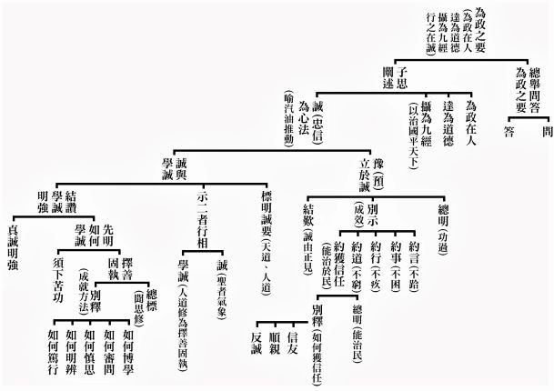

### 孔門十哲—孔門弟子中最耀眼的十顆星（四）  樂天知命的冉伯牛

考驗方知真豁達

餓於陳蔡琴音穩

染病痲瘋命矣夫

安命君子德行科

冉伯牛是孔子德行科的弟子冉耕，伯牛是他的字，他的樂天知命是在困境中的胸懷，是孔子最早期的弟子之一。《孟子‧公孫丑上》篇講到：「冉牛、閔子、顏淵，善言德行。」善言德行是指他們的德能，是以見地來實踐德行，不是普通的德行。孟子將冉伯牛列於首席，可見冉伯牛在孟子心中的地位。孟子又說：「子夏、子游、子張皆有聖人之一體；伯牛、閔子、顏淵，則具體而微。」說到冉伯牛不只像子夏、子游、子張已具有聖人的氣象，更具有子夏、子游、子張未具備聖人的微細內涵。

當魯國最有實權的季孫大夫，他的家臣陽虎控制季孫大夫叛亂，費（季孫大夫封地）的掌權者公山不狃也叛亂。亂平之後三家大夫有感於朝政混亂，必須要請有能力的人來執政，孔子在魯國的講學已名滿諸侯。雖有心請孔子來執政，但要先試探孔子的能力才可以。所以先委請孔子從中都宰做起，那年孔子已經五十一歲了，治理中都一年即大治，野無閒人，男女分道，貨真價實，路不拾遺，夜不閉戶。於是調任孔子到中央任司空，不久改任司寇且攝行相事，即在外交會盟的時候做儐相。冉伯牛就是被孔子推薦為中都宰的繼任者，可見冉伯牛在孔子心中的份量。

至於他又是如何樂天知命呢？魯哀公四年，冉伯牛隨孔子周遊列國至陳蔡。當時吳國伐陳，楚國出兵救陳，聞孔子在陳蔡之間，便派人來聘孔子。孔子將往楚國，陳蔡二國大夫惟恐楚國重用孔子以後，將危害他們，因此共同派人圍困孔子，以致七日斷絕糧食。跟隨的弟子喝著沒有米粒的野菜湯，面色疲憊，很多都生病起不來。子路見同門師兄弟，是以孝弟忠信為實修之準則，但仍遭受到這樣的災難，心中為這些師兄弟打抱不平地說：「君子也有窮困的時候嗎？」此時唯有冉伯牛與夫子心平氣和地於房中撫琴、吟唱。需知君子樂天知命的成就，並不是在順境的時候，安然舒服表現豁達的態度，反而要在窮困潦倒的時候，心胸依然豁達，這才是真正樂天知命的形象。困頓的命運，正好考驗一個人的心志、耐力、格局、見地，所以把逆境當成順境來接受，這不是普通的胸懷，反而是藉著境界來磨練自己，所謂「天將降大任於斯人，也必先苦其心志，勞其筋骨，餓其體膚，空乏其身，行拂亂其所為，所以動心忍性，增益其所不能。」這才真正樂天知命菁英的形象。

他在孔子回到魯國時過世，當時孔子約六十九歲，所以冉伯牛也六十三歲以上了。雖然不是早夭，可是他得了麻瘋病，不能像一般善人壽終正寢，充滿了感歎，要知道命運的道理，才能對眼前釋懷。《論語》上說：「伯牛有疾，子問之，自牖執其手，曰：亡之命矣夫。斯人也而有斯疾也。斯人也而有斯疾也。」記載冉伯牛晚年得了麻瘋病，孔子心痛地前往慰問，因當時醫學不發達，誤認此是會傳染的疾病，家人不願請孔子入屋內，孔子便從窗戶伸手握住冉伯牛的手，傷心難過地說：「沒道理呀！這麼好的人，怎麼會得這樣的病呢？這麼好的人，怎麼會得這樣的病呢？這是天命呀！」哀痛的話連說兩次，表達孔子對賢人獲此厄運的痛惜與憐惜。

而「命矣夫」是孔子稱讚冉伯牛是一個安命之人，這三個字只有君子才擔得起。古賢有言：「天道無親，常與善人。」為什麼危言正行的冉伯牛會得如此疾病呢？孔子講的天命又是何義？賢德的人反而遭逢逆境，天道何在呢？《禮記‧中庸》篇說：「君子居易以俟命，小人行險以徼幸。」君子無論現前所處的環境是順境還是逆境，都是最吉祥的時機。君子可以接受壞的命運，也可以安住於好的命運，能夠趨吉避凶、斷惡修善，這種能耐只有君子才辦得到。

舉例而言，堯的兒子是遊手好閒的丹朱，舜有不聰敏的兒子商均，乍看之下都是大逆境，這兩個兒子都無法統領一國，但也因為這樣，才能成就禪讓政治的大業。孔子晚年喪子時，孫子子思才周歲，孔子如何將自己畢生的學問傳受給他呢？但也如此，眾弟子為報答對老師的孺慕之情，竭盡心力地教導子思，曾子更是細心地教授，方能成就子思傳承大道的大業。顏回過世時，夫子頓足捶胸地說：「是老天要亡我呀！是老天要亡我呀！」但仔細想想，若真由顏子傳承道統，後人會覺得，只有才智雙全的人、對夫子學問無所不悅的人，方可學習道統。但傳承孔學道統的卻是愚直、每日三省自身、按部就班的曾子，這何嘗不是天命呢？讓所有愚鈍者，能提起自信，只要能照著曾子的方式學習，都能夠有所成就。所以人生在世，命運難可了知，或是惡人得善報，或是善人得惡報，或是善有善報，惡有惡報，讓人迷惑。命運往往不如人願，而君子看待禍福跟一般人不同，孟子曰：「莫非命也，順受其正。」他坦然地面對命運，並承擔自己的使命，不怨天不尤人。我們要學習冉伯牛的胸懷，學習孔子看待人生的角度跟思維模式，做一個樂天知命、心胸廣闊，在順逆境中都能安然自處的人。（下期待續）

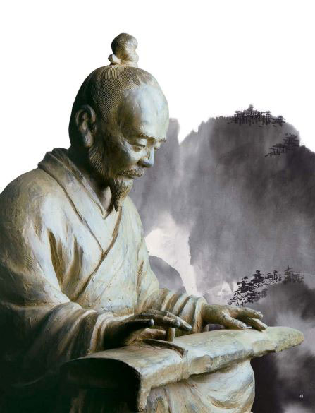

## 藝術賞析

### 七十二賢淺說(五十二)-顏噲

圖：江逸子、文：時哉

臥虎藏龍的孔門

巨大神木的森林

眾星拱月的諸賢

德學似回的顏噲

顏噲，字子聲，春秋末年魯國臨朐人民。孔子的及門弟子，年歲無可考。此人素來堅持聖道，跟從孔子步亦步、趨亦趨，而登孔子之堂，一窺孔子深奧內涵。

子聲於東漢明帝永平十五年入聖廟從祀。唐玄宗開元年間追封為朱虛伯。宋高宗贊曰：「褒錫朱虛，在器輪輿，儒室振領，聖門曳裾。賢業得蘊，美才以攄，百世不刊，載觀成書。」褒揚贈予子聲為朱虛伯，形容顏噲就像車輪幫助車子行走一般，是儒家領導人物，在聖門中服務，蘊積賢人功業，如此美才定有發展，讓社會上更多人能有機會聽到或接觸到儒學。像顏噲這樣揚善之人，就算歷經再多年，他的名聲列在書籍中，也不會有受人遺忘的那天。

張象中贊揚顏噲：「回也庶幾，諸顏近之，洙泗受業，汶上從師，輔翊儒道，經營德基，俾侯於齊，君子攸宜。」說七十二子之中，顏姓很多，他的成就已接近顏回，顏噲向孔子求教，並幫助儒學發展，護衛儒學，在人心中打下道德的基礎，受封為濟陰侯，他的努力受後人推崇奉祀封為侯爵，亦乃君子所應得。

顏噲於東漢明帝永平十五年從祀，唐開元二十七年（七三九年）追封朱虛伯，宋封濟陰侯。畫中的顏噲，手持符節，風度翩翩，或是回應宋高宗所言，顏噲具有領導的能力，能造福大眾。（下期待續）

### 七十二賢淺說(五十三)-步叔乘

圖：江逸子、文：時哉

問學猶如曾子

避席請教夫子

體悟微言大義

廣博求學開闊

步叔乘，複姓步叔，名乘，字子車，春秋末年齊國人。為人謙恭儒雅，好學善問。容色風度，言行舉止，處處亦步亦趨，不離夫子之道。年齡、家世皆不詳。

漢明帝時子車入祀聖廟。唐玄宗追諡淳于伯，宋大中祥符加封博昌侯。宋高宗贊曰：「勉勉子車，封邑淳于。親炙避席，惟諾趨隅。發微既傳，雅道是扶，即可向也，不亦美乎。」步叔乘勤行善道不倦，受封淳于伯，步叔乘的認真反映在他問學態度上，他問學孔子的時候，會起身離開席子站起來聽老師說話，態度上很恭謹，十分尊敬師長。問學上還能在細微處著眼，發覺微言大義，還能涉略廣博的學習範圍，挾持正道，到宋時還可加封博昌侯，豈不美哉。

步叔乘認真學習還反映在面對學問的態度上。張象中讚揚步叔乘：「聖人之門，子車務勤，學以時習，道宜日新，數仞妥處，函丈是親，追封遺烈，旌美儒臣。」在孔門中，步叔乘學習態度上，求學專心，做學問勤勞，每日按時學習，照表操課，也因此學習上日有所精進。祀奉在孔廟之內，親近其師。後代帝王追封為侯，以資表揚有功於儒家之臣。

步叔乘於東漢明帝永平十五年從祀，唐開元二十七年追封淳于伯，宋封博昌侯。

畫中的步叔乘，眼神溫和恭敬，謙虛有禮，展現出學習的氣象。（下期待續）

### 華夏精魂千秋（四十一）  　明倫史畫　福善雙俱 庾詵

圖：江逸子、文：淨域

淡泊無求樂助人

天文曆數精相人

信佛稱病離政壇

歸去先有願公請

—史畫—

庾詵，字彥寶，南北朝雍州新野（今河南省新野縣）人；生於南朝宋武帝孝建二年，卒於梁武帝中大通四年（西元四五五-五三二年）。自幼父母雙亡，聰敏好學，精通百家，以天文曆數稱絕於當代。
他性情恬淡，喜好山林，家有十畝宅院，林園池塘占去一半。平日吃蔬食、穿舊衣，不經營產業，曠達無爭。某次宅院失火，他只抱出幾箱書坐在池邊，來救火的人
**問：** 「你怎坐著不動？」他回
**答：** 「怕弄壞了竹子。」有一回，他雇船運送一百五十石的米回家，鄰人託他協運三十石。到家後，鄰人卻說所託的米為一百五十石，他一句話也沒吭，任由鄰人取足而去。有鄰人被誣告是盜賊，判刑入獄無錢贖罪。詵派門生帶兩萬錢，稱是鄰人的親戚為之贖罪。鄰人獲釋後，知道是詵所搭救，即登門道謝，詵說：「我不過是憐憫無辜之人，哪裡期望人家來謝我。」詵屢屢助人又不求謝，鄉人皆敬重，稱他是賢德之人。

南齊永元年間（西元四九九-五百年），東昏侯蕭寶卷戮殺大臣，雍州（今湖北省襄陽市）刺史蕭衍領兵攻破郢城（今湖北省鍾祥市），繼而進兵京城健康。與荊州刺史蕭穎冑，共推南康王蕭寶融在江陵（今湖北省荊州市）即位為和帝，改元中興。
中興元年（西元五○一年）穎冑重病，對詵說：「依曆數推算，我此生該沒有罪過吧！」詵
**答：** 「因有鎮星出現襄陽，荊州祥氣自然較少，您將在禍亂之年終命，可與伊尹、霍光齊名，富貴庇蔭子孫，還有什麼好遺憾的呢！」穎冑說：「當今昏君暴虐，百姓思念堯舜之治，我所遺憾的是不能見到天下太平呀！」說完即逝去。隨後，東昏侯為部將王珍國所殺。次年，和帝禪位於蕭衍，為梁武帝，改元天監。武帝追封穎冑為「武獻公」，後來發展果然如庾詵所言。

武帝年少與詵交好，召為黃門侍郎，以病推辭。晚年信奉佛教，晝夜六時誦經念佛不斷。某夜，見一相貌莊嚴的道人，自稱是願公，呼喊詵為「上行先生」，給他一束香後離去。武帝中大通四年，於午睡中突然醒來，告訴家人說：「願公又來，我不能不走了。」說完話就往生。室中親人都聽到空中有聲音說道：「上行先生已生彌陀淨土了。」武帝聞知下詔褒揚，賜諡號為貞節處士，用以表彰他的高節懿德。

—圖解—

〈朱柏廬治家格言語錄〉云：「善欲人見，不是真善；惡恐人知，便是大惡。」人做了些好事，便急著四處宣揚，惟恐他人不知道自己行善，這樣的善舉是別有目的，不是真正的善。瘐詵經常暗助他人，不欲人知，顯見這種良善是存乎本性的。他自幼與蕭衍交好，此一善心當然深刻地印記在蕭衍的腦中。故而，蕭衍即位稱帝後，即召他為宮廷近侍掌理詔書；然其本性不問求功名，稱病推辭不就。

瘐詵虔信佛教，晚年更老實念佛不間斷。江師所繪圖，即是特別針對「念佛見佛」這點而著墨發揮。常人發願念佛往生西方，但當佛菩薩示現來迎時，卻往往捨不下眼前一切，這就是眾生顛倒的愚癡相。瘐詵見佛來迎，告別家人即放下身相往生，正是我人要努力串習的人生大事。（下期待續）

### 道藝春秋（十三）  宋代劉庭式 義不違婚

*圖：江逸子、文：編輯部*

五倫源頭夫婦倫

賢賢易色幸福緣

人際關係從此始

東坡讚賞真恩愛

先來看看這幅畫的時節，畫中松樹長青，玲瓏石上有梅花綻放，地面的綠意與紅梅映襯，粉牆圓窗洞開，讓人感覺天氣和暖、春意清新，正是春暖花開的時節，故事主角劉庭式牽著他身邊的女子，一起在花園散步。

劉庭式所牽著的這位女子，她手裡拿了一隻長長的手杖，這是一位眼睛不方便的盲女，也是劉庭式的妻子，劉庭式以深情、充滿笑意的眼神看著妻子，另一隻手正在指點著景色，跟妻子說明外界的風光是何等的美好。妻子雖然眼睛看不見，劉庭式卻不以為忤，更樂於成為妻子的眼睛，替她欣賞、描述、讚歎這滿園的春色，看來夫妻兩人在這樣平淡的日常生活裡，仍舊充滿對彼此的愛意。

兩人的背後還有一段故事，是在劉庭式還沒考中進士之前，曾與女子有了口頭上的婚約，還沒進行下聘的儀式，按照古代的禮制，這種情況不能算正式訂婚。

後來劉庭式終於順利考中進士，女子卻因為疾病導致雙目失明。女子的家裡以務農為生，非常貧窮，當然是不敢向劉庭式提起婚約的事，甚至有人勸劉庭式娶盲女的妹妹為妻。劉庭式說：「吾心已許之矣。雖盲，豈可負吾初心哉？」表示自己已經在心裡約定許定了，即使對方眼睛看不見，怎麼能辜負自己的初衷。最後還是娶了盲女為妻，不因眼盲而心盲，兩人婚後非常恩愛，鶼鰈情深。對比現今的戀愛與婚約，現代人談感情容易得多，戀愛自由，但能若此有情有義、遵守承諾，用心經營，彼此包容體諒的人卻不如往昔。自由自由，太多事由得自己，是否也更容易因此不珍惜而失去更多呢。

後來，盲女去世了，劉庭式十分悲傷，哀痛之心經年累月都不曾稍減，所以一直不願再娶。

有時候問題不在家裡有沒有這樣的花園，即使眼盲，有互信互愛深情的另一半，心裡的花園也會四季如春。看著江老師這幅畫，耳邊也許會響起王菲的歌聲：「等到風景都看透，也許你會陪我看細水長流。」或者蕭煌奇的演唱：「你是我的眼，帶我領略四季的變換......因為你是我的眼，讓我看見這世界就在我眼前。」劉庭式雖然是宋代的人，但他對婚姻的理解與實踐，無論在哪個時代，都是我們可以學習的典範。 （下期待續）

### 以地藏菩薩本願經圖導覽(七)-閻浮眾生業感品第四（上）

圖：江逸子、文：唐瑜凌

願力累劫不退失

能力成就威神力

諸佛加被道力增

承擔方作地藏王

閻浮眾生業感品第四（上）

第二品時地藏菩薩表明自己願意承擔度生大業，第四品時地藏菩薩自稱因為承受佛如來的威神力，才能分身於遍百千萬億世界，救拔一切業報眾生。若不是如來的大慈力，就無法作這樣的變化。如今我又蒙佛的付囑，至彌勒菩薩(阿逸多)成佛前，盡使六道眾生能夠度脫。我一定照辦，祈願世尊不要擔心操慮。重申自己明白佛要咐囑的是什麼，知道自己要面對的有情是什麼形象，表明自己願意承接這個艱鉅任務，請佛寬慰。此等承擔，如同《論語》有云：「士不可以不弘毅，任重而道遠，仁以為己任，不亦重乎？死而復已，不亦遠乎。」

佛回答著，一切未解脫的眾生，他的性識不定，惡習造了惡業，善習結了善果，為善作惡便隨著境而生。輪轉於人、修羅、畜生、餓鬼、地獄五道中，片刻無法休息，雖經過長遠塵劫，癡迷困惑的業障難了。這就好像魚兒游入網中，在時間的長流裡，雖然暫時脫網游出，一下子又遭網捕。諸如此類的眾生，是我所念念憂心的。你累劫所發的誓願既然完成，廣度了無數的罪人，我有什麼好憂慮的。

會中，定自在王菩薩問佛：「累劫以來地藏都發了什麼誓願？」佛以地藏菩薩因地結合眾生的業而發心，一是小國王發願先度罪苦眾生，自己方成佛。另外一個就是光目女為超薦母親所發的大願。光目女即是地藏菩薩久遠劫的前生，佛舉的目的在於彰顯悲願的本質不忍親受苦的孝心。

畫中端坐於松林之下，殷勤誠意說話者即是清淨蓮花目如來像法時期的羅漢，當時的羅漢，就是現今的無盡意菩薩，一臉愁苦合掌恭敬聆聽者就是設食供養的光目女，畫作上羅漢與光目女的頭部面容異於比例的明顯，那是表徵聖者的證量。祥雲後方是另外一個場景，光目女恭敬瞻禮清淨蓮華目如來，合掌的雙手超乎比例的大，彰顯光目女的虔誠，後方的屏風除了補景也有莊嚴之意，清淨白色的蓮花顯示光目女內心的清淨，也符合所祈求禮拜的對象乃清淨蓮華目如來。

婢女所生的小娃僅僅出生幾日，卻被畫得一派老成，明顯看出這就是光目女已過往的母親。似乎在訴說：「我是妳的母親，因殺害、毀罵二業，受報墮於大地獄，罪苦之事多到不忍說。如今蒙受你的福力超薦，才受生為下賤人，但是壽命很短只能活十三歲，死後又落入惡道。不知妳有何方法，可以讓我脫離苦海？」

畫面中光目女對空發大誓願：「若母親永離三塗，不為下賤人及女人身，我願意救拔清淨蓮華目如來後，百千萬劫中的所有世界眾生，使之出離三惡道都成佛，然後我才成佛。」並全身撲倒禮拜如來，佛舉起手顯示無畏印，告訴光目女無須憂慮。光目女清楚明白地聽到清淨蓮華目如來說：「妳具大慈憫呀！能為母親發這樣的大願。我觀察妳的母親，十三歲捨報生天，壽命百歲，之後生於無憂國土，修成佛果，廣度人天。」（下期待續）

## 活動報導

### 時哉時哉穿越千年孔子與你同行活動總報導

*編輯部*

各出一分的力量

創造文化的勝勢

集中小鎮的發揮

成就未來的緣起

今年（二○二二）初，中華無盡燈文化學會(以下簡稱本會)至東勢高工播放「風雨一盃酒—孔德成先生傳記紀錄片」，以及在客家節日「天穿日」當天，參與了臺中市政府客家事務委員所主辦的臺中客家故事館開幕活動，學會創辦人與教學總監林老師，因而有機會與中市客委會主委江俊龍先生，在文化領域上有更多的理念交流、相談甚歡，共同決定在今年的教師節，舉辦富有意義的教師節系列活動。本次系列活動由中市客委會主辦，並邀請中華大成至聖先師孔子協會擔任文化總指導，同時邀集十多個協辦、合辦單位，熱鬧非凡。

活動內容包括祭典、書畫、茶道、音樂、舞蹈、紀錄片播放及花藝等內容，並與客家現代元素結合，推動客家文化與中華文化，活動主題定名為「時哉時哉穿越千年孔子與你同行」。由於時值疫情期間，在事務的籌備上增添了許多不確定性，自四月初決議辦理，至九月九日正式開始前，江主委帶領客委會團隊，與本會團隊有多次的線上會議討論，持續掌握籌辦活動的進程、解決各類難題。

九月九日當天，於東勢客家文化園區舉辦開幕儀式，這是為期二十天系列活動的序幕。市府客委會表示，「時哉時哉孔子大展—時代浪潮的航行」特展，在東勢客家文化園區展出國畫大師江逸子畫作，包括孔子及其弟子共十三位聖賢畫像，及孔子第七十七代嫡長孫，襲封第三十二代衍聖公兼第一代大成至聖先師奉祀官孔德成先生所審定的《孔子聖蹟圖》，本會每週也委派師資前往做導覽教學，以孔門十哲為主，配合論語篇章，介紹孔門弟子的形象，大家有深刻的了解後，在導覽介紹時，才能深入淺出、有趣有料、鮮明立體。除了靜態的導覽教學，更有動態的佾舞演練，透過動作分解、意義解析、小組演練、團隊配合，到服裝道具上陣排練，到最後九月十八日於大眾面前展演，都是臺北師資與卓蘭團隊攜手共進，才能成就一樁樁美事。花藝展則呈現日本池坊華道流派自由花、現代立花、立花正風體、立花新風體、立插花、生花正風體、生花新風體等多種古典花系及現代花系；於臺中客家故事館展出的三然齋書道會書畫展，除使用客家諺語、論語書法作品參展，也展出在地藝術家陳銘儀個人珍藏清朝與民初古畫。

本次系列活動還有「樂章響起茶席會」，悠揚悅耳的國樂演奏，在古意盎然的臺中客家故事館進行，讓民眾品嚐極品茶湯，享受茶道、花藝融合的音樂饗宴；「花藝美勞DIY」由在地資深花藝老師李麗珠指導學童動手玩創意，讓美學向下扎根；「客語篇篇一起來揮毫」主要以書寫客家諺語與客家詩詞為主，邀請大家說客語、寫客語，將客語融入生活中；「書法與篆刻之美講座」邀請曾子雲教授分享書道之美；還有播映由李中旺導演執導的紀錄片「風雨一盃酒」等，活動內容琳瑯滿目，充滿文藝氣息。

市府客委會主委江俊龍表示，「時哉時哉」有與時俱進的意涵，此次活動與中華無盡燈文化學會、東勢文昌廟、東勢三然齋書道會、臺中杜鵑皐月協會等多個單位合作，呈現國畫大師江逸子畫作、親子花藝DIY、書道揮毫、書法與篆刻講座、茶席會、衍聖公孔德成紀錄片等，特別重頭戲在九月十八日當天，邀請到大成至聖先師奉祀官孔垂長等貴賓，參加東勢文昌廟的祭孔典禮、以及在臺中客家樂活園區樂活運動館所舉辦的成人禮、敬師禮，藉由盛大隆重的佾舞表演、成人禮嘉勉等儀式提升文教風氣、春風化雨。

中華無盡燈文化學會共同創辦人林蔚芳老師在開幕式致詞表示，她是在東勢出生長大，與奉祀官府主任秘書李炳南老教授習得儒家道統精神，與同樣為李炳南老教授弟子唐瑜凌老師共同創立學會，這次非常高興能與臺中市府客委會合辦系列活動，在此謹代表中華大成至聖先師孔子協會孔垂長會長、中華無盡燈文化學會創辦人唐瑜凌老師在此祝賀大會活動圓滿成功。並說明此次「時哉時哉孔子大展-時代浪潮的航行」，展示出兩千五百年來，不退流行、不被淘汰，能乘風破浪，歷經時代考驗，能作人生航行、最高指導的孔子智慧與生命情懷。三然齋書道協會理事長李麗珠也表示，以往每年都會與日本、中國大陸交流花藝，但因疫情已中斷兩年，這次有機會與市府客委會合作，呈現花藝的文化之美，一切都是最好的安排。

九月十八日當天一早，在東勢文昌廟的祭孔三獻禮，由大成至聖先師奉祀官、孔子第七十九代嫡長孫孔垂長先生擔任主祭，在立法委員江啟臣、市府客委會主委江俊龍、東勢文昌廟主委吳敬修、本會創辦人陪同下進行，而後一行人至客家樂活園區運動館參加成人禮及敬師禮。在莊嚴肅穆的樂聲中，由孔奉祀官率全體來賓師生向孔子聖像行最敬禮拉開序幕，吟唱禮運大同篇，後有佾舞表演、詩樂吟唱，其中，佾舞陣容由本會佾舞班帶領卓蘭、東勢在地鄉親三十六人組成，年齡介於十二歲至六十歲之間，他們歷經三個月的密集練習，藉以緬懷孔子，讓君子之德如風，上行下效。

成人禮由八十二位來自國內外大專院校及高三學子共同參與，除國內逢甲大學、中山醫學大學、國防大學、嘉義大學、亞洲大學、高雄科技大學、靜宜大學、台中教育大學、勤益科技大學、東勢高工、興大附農及員林農工學子外，更有來自印尼、泰國及蒙古等學生共計八十二人。本會也在九月三日，於線上開設兩堂前行課程，分別是「成人禮意義及程序」以及「只要我長大」，希望學子們透過這兩堂課，感受到主辦單位的誠意，並認真看待這場具有重大意義的活動。

透過莊嚴儀式的嘉勉，感謝在成長過程中一路相伴的父母、師長，成年禮後，將肩負起自己、家庭、社會乃至於國家的責任，為自己的行為負責，並發揮價值，成就他人、回饋社會。

成人禮嘉勉儀式由大成至聖先師奉祀官孔垂長擔任主禮者，與市府客委會主委江俊龍、法制局長李善植、奉祀官夫人吳碩茵、本會創辦人唐瑜凌、逢甲大學商學院長江向才、台中市山東同鄉會理事長石立欽、外交部前司長兼發言人大使鄭博久、東勢高工周文松校長為八十二名來自國內外的學子進行三加禮儀式，將平安扣(祝福學子成人後平平安安，展翅翱翔)、印有孔子金句悠遊卡（象徵志學兼顧、智慧增長）、印章（象徵存信於身，立己成人）等三樣深具意義及祝福的紀念禮贈予學子。

孔垂長先生在嘉緬致詞中表示，非常感謝各位家長、師長以及貴賓們蒞臨這場典禮，成人禮是我國古禮，源遠流長，主要用意是賦予少年責任和權利，象徵我們孩子正式長大成人，所以今天我們邀請各位長輩一起來見證、引領、嘉勉我們的子弟成長，同時更希望同學們能記取、感念長輩們的栽培、期許與祝福，勇敢地昂首闊步，邁向自己的成人之路，今天的典禮，既是傳承，也是開始，參與者傳承了古人的智慧，現代的精神以及長輩們的薪火。從此刻開始站上自己人生的舞臺，成為自己生命的主角，但願從今以後都能敦品勵學，利己利人，發光發熱，祝福大家。

市府客委會江主委表示，藉由成人禮賦予青年責任和義務，象徵青年正式長大成人，接受成人禮感受到自己不僅在生理上的成長，心理上也轉趨成熟，能自主、負責、承擔、能為社會大眾付出奉獻，建立正確的人生觀與宏大的志向。

本會創辦人唐瑜凌老師致詞表示，今天是慶祝孔子誕辰，辦簡單隆重的紀念活動，以及成人禮、敬師禮來莊嚴這樣的節日。為什麼要來紀念孔子呢？因為他是開平民教育的先河，而且是「有教無類」就是不分求學的弟子貧富貴賤，只要有誠心來學，並且端正自己的儀容，孔子沒有不教的，所謂「自行束脩以上，吾未嘗無誨焉」。孔子教育又符合時代的潮流，引出學生們想要求學的心，他才予以啟發，所謂「不憤不啟，不悱不發」，並且說一個要他們類通其餘的「舉一反三」。私下也鼓勵同學們私下聚會共學，來增上自己的實力，這是結交友成為一個充實自己，而且能辦事的團隊，即曾子所說的「君子以文會友，以友輔仁」。這樣的教育能把學生培養成人才，而中興是以人才為本。

孔子一生行事自行化他的事跡，載在《孔子聖蹟圖》，此次也展出在客家文化園區。他教學的成果就是培養人才，特別在三千弟子當中栽培出七十二個卿相之才，這也是《鹽鐵論》上面所說的。此次也在文化園區限於場地，展出七十二賢當中幾個特殊的弟子。孔子的思想精華特別能由《論語》的四百九十八章，表徵博大精深的思想，內聖外王的修學法。

《論語》的解釋特別是昔日奉祀官府的主任秘書李炳南老師的《論語講要》，將四百九十八章的《論語》大要解釋清楚，也是這一次敬師禮供養老師最好的禮物，作為老師們可以有的教學理念以及引導的方法。

而在紀念活動中所跳的佾舞，能彰顯祭孔的意義與價值。在撤饌的時候唱的唐詩，就像古代唱詩經，是一種禮樂的教化，猶如子游在武城的弦歌之聲，孔子高興地說「割雞焉用牛刀」，今日在東勢重啟禮樂教化，相信孔子會更高興地說「割雞焉用牛刀」。

這是孔子道脈的傳承，至於孔子血脈的延續，特別是孔德成先生（孔子七十七代孫）的承先啟後，我們也在文化園區跟故事館有著孔德成先生紀錄片跟大家交流，讓大家瞭解孔家的風采，以及尊崇孔家對民族文化的重要。

這次紀念孔子誕辰活動，也難得孔子第七十九代嫡長孫奉祀官孔垂長先生，由臺北來參加，還有孔氏的宗親會，以及宗親會所組成的社團，還有山東同鄉會主要成員都來到了現場，顯示對活動的重視。

客委會雖然以弘揚客家文化為主，但大家都知道客家文化源自於中原文化，可以上溯到夏商周三代，特別在周朝是文化鼎盛的時期，蘊育出不世出的賢哲孔子。所以此次客委會與民間社團合作來辦各種孔子的紀念活動，也是從源頭上弘揚客家文化。

另為感謝老師們平日教學辛勞，教育上犧牲奉獻，在成人禮後也由客委會江主委代表市長盧秀燕主持敬師禮儀式，並分別由臺灣、印尼、泰國、蒙古等地學生代表進行獻禮，由逢甲大學商學院江向才院長、逢甲大學商學院學程主任翁慈青、東勢高工周文松校長、東勢國中鄭正通校長、東新國中連秀玉校長及石岡國小吳錦章校長代表受禮，向在場每位辛苦的老師、教育界園丁們致上最高的敬意。

市府客委會說明，感謝孔垂長先生專程南下參加此次活動，孔先生是「大成至聖先師奉祀官」，肩負傳承中華文化孔子精神之使命，今天的活動也讓現場四百多位觀禮者充滿感動。孔奉祀官表示，此次為近十年參加過祭孔敬師及成人禮最為隆重的一次，非常感謝主辦及各參與活動的單位，見證孩子們成長的力量，以後成為社會國家的棟樑。今日成人禮活動具有重大文化傳承的時代意義，家長、師長以及貴賓們和孔奉祀官一起見證、引領、嘉勉青年學子成長，希望同學們能記取、感念師長們的辛勤栽培和殷殷期許，讓自己成為富有智慧的英才。

今日成人敬師禮活動，由大成至聖先師奉祀官孔垂長賢伉儷、中華無盡燈文化學會創辦人唐瑜凌伉儷、立委江啟臣、議員冉齡軒、蔡成圭、客委會主委江俊龍、法制局長李善植、東勢區長翁培真、地方稅務局東勢分局主任曾金連、東勢地政事務所主任陳應欽、市府客委會眾委員、市政顧問鄭博久、東勢區福隆裡長吳振嘉、東勢高工校長周文松、東勢國中校長鄭正通、東新國中校長連秀玉、石岡國小校長吳錦章、逢甲大學商學院院長江向才帶領各系主任、后里國中前校長江鴻鈞、玉山高中前校長李炫熙，以及在地社團代表等均出席參加。

「時哉時哉穿越千年孔子與你同行」所有活動至九月二十八日教師節當天圓滿結束，參與民眾十分踴躍，是一場傳承中華文化、尊師重道、發揚禮教的盛會。

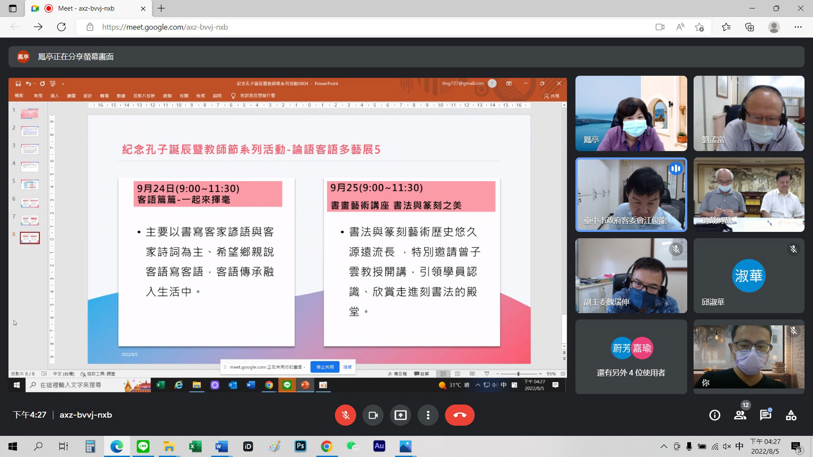

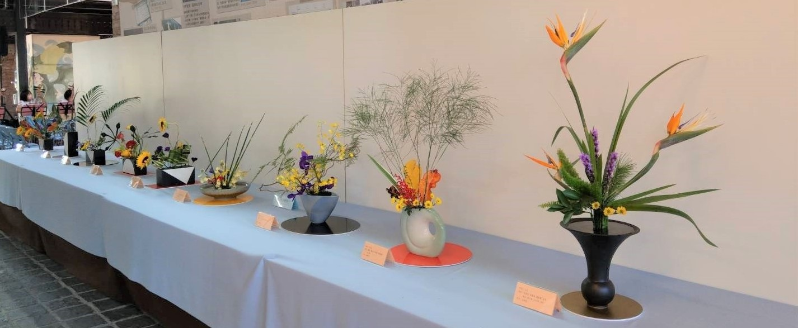

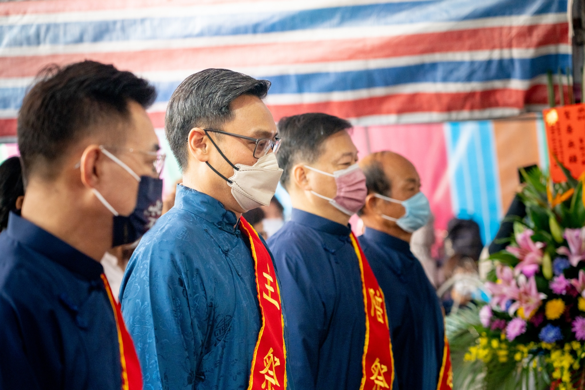

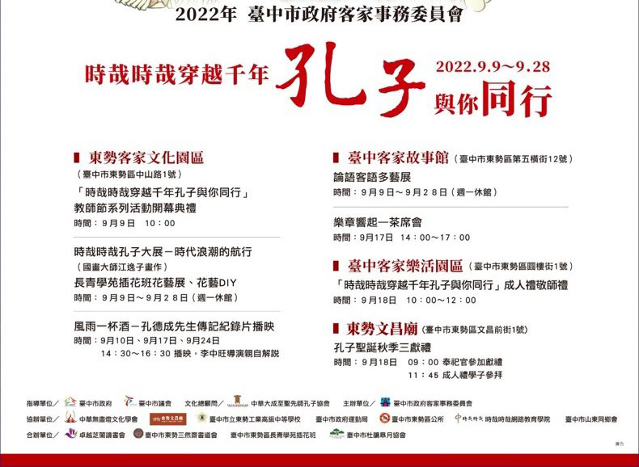

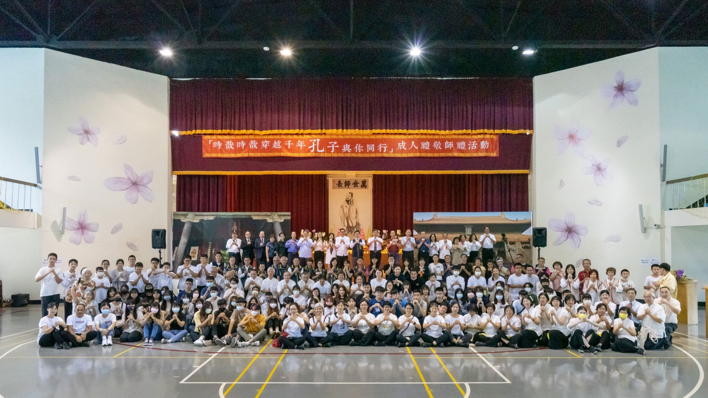

### 辦理「時哉時哉穿越千年孔子與你同行」活動始末

原住民

造福鄉梓官民合作

文化大展紀念孔子

成人敬師以禮載道

灑下善種東勢未來

◎甚深緣起

先祖父楊公坤龍是臺灣光復後臺中東勢國小的首任校長，原校長宿舍曾是我們的故居，建於一九二一年，現列為歷史建築，目前歸東勢國小管轄，希望在修復後的日式建築內，能流動文化的氣息，於二○二一年五月，拜訪東勢國小張玲娟校長，但因學校校務繁忙，無多餘心力經營矗立在校外的這幾棟建築，僅指派一員警衛守護建物安全，並未對外開放參觀。

同年十月份，得知將由臺中市客家事務委員會接手管理，基於愛家愛鄉，於是轉拜訪客委會江俊龍主委，理念不謀而合，相談甚歡！

二○二二年一月九日，在東勢高工有風雨一盃酒–孔德成先生紀錄片特映會，江主委看到海報，親自打電話報名索票，可見主委對文化弘揚的重視，預計列為放映當天貴賓致詞人選之一。適逢元旦連假，唐老師駐在實栽農場，邀請江主委到出雲山莊用餐，恭請於特映會致詞，並對未來合作之可能性做初步的交流。

二月二十日天穿日，是客家文化特別重視的節日，只許祭神、遊樂，不許工作，有保持環境生生不息，資源永續發展的意義。選在這吉日，做為臺中客家故事館的開幕日。江主委邀請唐老師、林老師，及東勢、卓蘭多位蓮友出席開幕儀式，當天風雨交加，氣溫低於十度，大家不畏風寒，在故事館外遮雨棚下全程參與活動，相信主委必能感受到我們的支持和熱情！

◎協商運作

四月二日清明連假，客委會主委帶同仁到出雲山莊，與唐老師、林老師首次會談九月十八日在樂活園區，辦理紀念孔子誕辰活動內容，希望有祭孔佾舞表演及成人禮的嘉勉儀式。東勢文昌廟每年都辦祭孔，對佾舞表演特有興趣，願意提供上課教室及練舞的場地。無奈五月疫情升溫，客委會為防疫安全考量，暫停佾舞班招生培訓。

爾後學會由唐老師、林老師帶領下，與客委會江主委及其屬下共十五人，成一群組，不定期遠距開會，溝通辦理活動細節。

◎捨我其誰

九月的活動勢在必行，佾舞是重頭戲，沒有培訓，如何上場？還好卓越芝蘭讀書會勇於承擔，以讀書會成員為主，加上東勢學會成員，文昌廟會員等，七月開始密集訓練，每週日假卓蘭峨崙廟上課，第一節課上孔門十哲，介紹哲人事蹟、心志，舞者須有道氣、有內涵，站上舞臺才能攝受人，故須輔以儒家哲人的精神，第二節課才練舞，總共十一堂課，師資由臺北佾舞班成員輪流南下授課，緊鑼密鼓，分組練習，上課錄影，回家複習，大家認真當一回事，有志竟成。

◎系列活動

九月九日「時哉時哉穿越千年孔子與你同行」系列活動開幕典禮，由林老師代表中華大成至聖先師孔子協會出席，隨後進入孔門大展展間，由林老師、蕭老師、孫老師為貴賓導覽江逸子老師的孔子師生人像畫作、孔子聖蹟圖、六藝圖，展至九月二十八日，期間二十天，參觀人數近萬人，感謝東勢、卓蘭蓮友，及客委會招募的志工，經培訓後，輪流排班負責導覽，讓觀眾更容易快速進入孔門的情境，深入儒家的內涵。

客家文化園區、故事館在展覽期間，分別有孔德成先生紀錄片播映三場、花藝展、手作花藝、書法展、現場揮毫、茶席會等等多元文化活動，東勢九月的天空瀰漫著文化的雲彩！

◎穿越時空

九月十八日九點，孔奉祀官垂長先生首次以主祭者身分，下鄉到東勢文昌廟祭孔。十點移駕到東勢樂活園區，以點燈祈福儀式展開活動序幕，貴賓致詞後，佾舞隆重登場，佾生小自十二歲，大至七十歲，穿上佾生服，配上禮樂，莊嚴肅穆，全場吸睛！佾舞表演完畢，配合撤饌，學會蓮友二十二人吟詠《經鄒魯祭孔子而嘆之》、《陋室銘》，倉促成軍，團練幾次，當天也能粉墨登場。

接下來是成人禮，有來自網路報名及東勢高工、逢甲大學的學子八十二人，原定七十二人，好比孔門七十二賢，結果比預期踴躍，多了十位。古禮中依序之三加禮，今取其意涵，改為實用有意義的禮品，祝福他們都能讓這一天成為自己生命的拐點，利己利人，發光發熱，轉變為真正成熟的大人。恭請奉祀官賜字，並說明取字內涵。

最後以敬師禮，感恩我們生命中最重要的貴人，圓滿今天紀念教師節的活動。

◎感恩餐會

唐老師為了感謝奉祀官及孔氏宗親們遠道而來，及主辦方、協辦單位、學會所有付出的人，在樂活園區教室，席開十五桌，交流聯誼，賓主盡歡！

從結束中尋找機會，期待另一個新的開始，官民合作，需多磨合，訓練辦事，培養耐性，正如老師常說的以世俗為道用，以煩惱為道用。歷事練心，才知平常所學經教，真正臨場，是否能派上用場。

◎播種萌芽

展覽期間，有些遊客表示，東勢未曾有這麼優質的展覽，果真如此嗎？據聞東勢文人不少，書道、花道、茶道、國樂團……都相當出色，以藝載道正是儒家文化的精神，東勢依山傍水，地靈人傑，必能打造山城的特色文化，希望藉此次活動的開演，串起多元文化的種子，在東勢的花圃發芽茁壯，成為一個繽紛的花園，開花，結果，落種，新芽，愈來愈茂盛，一代一代永流傳！

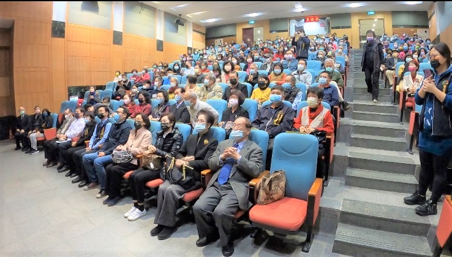

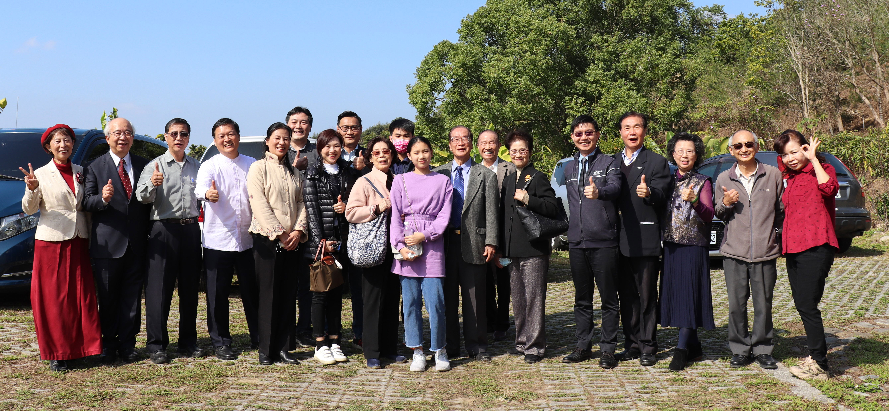

### 二○二二佾舞之培訓與登台演出

佾舞培訓班

時哉與孔子同行

佾舞形意能莊嚴

紀念孔子所莊嚴

道之延續待後進

六佾舞隆重登場及佾舞隊培訓有感        賴明貞

經過近三個月台北卓蘭的奔波，及眾志成城努力不懈的練習，往昔僅能在孔廟或電視上一見風采的六佾舞，終於要在台中客家樂活園區隆重登場，除了緊張雀躍祈願演出順利，心想未來能再有這樣盛大的六佾規格及翟籥服裝完備的排場，大概也要等待時哉時哉了！

從未想過重文輕武體力差的自己，有朝一日也要跨界教授佾舞，且這次演出的年齡差距從小學生到七十歲，人數眾多共要三十六人登場，初學最大的挑戰就是容易手忙腳亂，動作不協調，以及總是記不住下一式，我們透過之前的學習經驗提供了簡易口訣及示範影片，希望減輕大家的學習負擔，但一開始的效果不盡人意，動作不熟練不到位、穩定度也不夠，後來開發先練腳部動作，再破解手部招式分成三大類後，手腳似乎比較容易理解大腦的指揮相互配合協作了，《禮記‧學記》云：「學然後知不足，教然後知困。知不足，然後能自反也。知困，然後能自強也。故曰：教學相長也。」誠然至理名言耶！面對熱情好學的學員，對抗炎夏付出假日時光用心來學習，擔任師資也要自強向上才能帶領大家共同成長，最後演出的表現果然是大家動作最整齊劃一、氣勢最莊嚴肅穆的一次，證明所有的努力都結成了最美好的果實。

「佾舞」是一種行列整齊的祭祀舞蹈，相傳起源於周公，是古代最隆重的祭祀所使用的儀式。左傳曰：「天子用八，諸侯用六，大夫四，士二。」現今還能夠看到佾舞的場合，是祭孔時的釋奠禮，代表後世對孔子至高的尊崇。而佾舞不僅僅是舞，內涵融合禮、樂、歌、舞於一體，除了動作本身隱含許多禮的意涵，樂曲是中正平和的宮廷雅樂，樂曲有歌詞，四字一句，共四言八句的詩詞，內容即在稱揚讚歎孔子的功德。

跳佾舞時，左手橫拿籥在內，象徵平衡，右手直拿翟在外，象徵正直。籥是一種竹子做的樂器，主陰，象徵聲音與和諧。翟是用雉尾羽毛作成的飾物，主陽，象徵外在合於禮儀的容貌。籥翟結合，體現了陰陽和諧的天地秩序。翟約三尺長柄，柄端刻有龍首，龍口中插有三莖雉鳥羽毛。羽毛在舞蹈中是裝飾的作用，但特別用雉鳥的羽毛，是因為雉鳥羽毛文彩華麗，古人又認為雉鳥的性情耿介，前者象徵士人的文章，後者則象徵士人的風骨。

從小到大接觸各式舞蹈的機會不勝枚舉，比如幼稚園畢業典禮舞蹈表演、中學啦啦隊比賽、高中追星流行舞、成年欣賞歌舞劇或舞團演出等，然而佾舞與前述舞蹈迥然不同，學習佾舞究竟有何好處及利益呢？

一、強身健體

受到疫情的影響大家越來越重視身體健康，規律運動健身的觀念也越來越普及，佾舞的動作看似簡單和緩，但是運用到很多腳力，可以訓練到腿部的肌力和核心力量。小腿肌肉被稱為人類的「第二心臟」，可輔助血液回流心臟，促進全身的血液循環變得更好。核心肌群可以提高人體的平衡力與穩定力，及預防姿勢不正確，帶來腰痛、背痛、肌肉痠痛等不適症狀，其實不只是減肥瘦身，想要維持正常活動力、預防疼痛也須要多多訓練核心肌群。因此練佾舞的人可以賺到健康、常保安康。

二、培養專注力及穩定度

現代人每天接觸過多３Ｃ產品、聲光媒體刺激，思緒感官都是向外發散、躁動不安的，學習佾舞要練習將思緒及感官收攝回來自身，專注在當下，另外因為要記憶下一式動作，所以每次練習都在鍛練我們的專注力和記憶力，流水不腐戶樞不蠹，常鍛鍊就不易發生七秒金魚腦的問題了。

穩定度本是學習禮帶來的好處，將人的氣象變得穩重、有威儀，練習佾舞讓我們從簡單的動作中，將每一式動作配合音樂節奏慢慢做到位，不急躁，不搶快，展現出高貴莊嚴的氣度，即是在培養一個貴氣又穩重的自己。

三、傳承

我們時而會從報章媒體中聽到環保人士登高一呼，希望人類不要再濫捕濫殺瀕臨絕種動物了！傳統文化也是會瀕臨絕種，也非常需要維護傳統文化的環保人士登高一呼，不要再漠視輕忽文化的傳承了，現今大家聚在一起學習佾舞實比登高一呼更棒，因為我們是直接把優良的傳統文化學起來，學會了就能讓佾舞保存下來，出去演出就是將對夫子的尊崇、道德仁義的風氣、尊師重道的觀念，推廣出去並發揚光大，未來希望大家也都能自我期許成為種子教師，再將之傳承下去，一代接著一代，這是真正為沒落的傳統文化出了一份力量。

這次的活動盛大又充滿意義，多年慶祝教師節演出經驗，這是頭一次瞻仰著萬世師表孔子聖像、在孔子第七十九代嫡長孫孔垂長奉祀官及諸多孔氏宗親面前表演，內心無比殊榮及感動，加上培訓期間孔門十哲課程薰習，憶起弟子眼中的夫子是仰之彌高，鑽之彌堅，瞻之在前，忽焉在後；是萬仞宮牆，如日月無法跨越。這一刻至誠恭敬，禮拜讚歎的覺受早已油然生起，期望夫子有接收到我們的心意，與我們感應道交，真如活動的主題穿越千年，與孔子同行！

佾舞十年成        薛襄騰

一一一年九月十八日星期日上午，風和日麗，在臺中市政府客委會指導，以及學會與卓蘭、東勢等讀書會師長悉心投入下，寧靜的東勢文昌廟與家客樂活園區舉行了莊嚴的祭孔典禮，而演禮中最關鍵的，莫過於誠中形外的初獻禮演出，在鳴鼓、寧和之曲播出時，三十六位橫跨老中青三代的佾生翟籥並起，將三十二式的動作圓滿演畢，撤班後，參與其中的眾師長們均感到榮幸。

從古至今，能獲選成為傳統雅樂舞的佾生是需要講究就讀學校、學齡以及師承的，也正因如此，末學等人在並非大龍國小出身，也沒有擔任過孔廟佾生等背景或淵源下，透過唐老師與林老師的大力護持、惟元學長的持續溝通以及臺北孔廟的引薦，始得以認識大龍國小的蔡富存老師並學習亞獻禮、終獻禮，加上原先學自莊汶湞老師所指導的初獻禮，終於在一○九年五月將佾生必備的三獻禮學成。除此之外，吾人藉由參與滿郁老師所帶領的週六《論語》研討，深入有關禮的內涵與大用，身心均獲得滋潤，也由於內因外緣齊聚，成就出學會的佾舞種子師資。

但若要參與祭孔演出的話，單憑種子師資的人數仍無法達到六佾的規模，適逢賴秀滿老師致力在卓蘭經營讀書會，當地學長們均發心習舞，於是自一一一年七月起，種子師資以二到三人為一組，共三組輪流教學的形式前往卓蘭峨崙廟介紹孔門十哲與教授初獻禮，兩個半月的密集排練後學員動作已具雛形，再透過賴老師協調安排下遴選上場佾生，於九月十八日當天典禮上莊重肅穆、穩健地演示三十二式動作，將對孔子教化的崇敬心意向上傳達。結束後，卓蘭與東勢的家長們不斷表達對學會師長的感謝，從他們的濃厚人情上流露出對學習聖教的誠心敬意，這種學禮最重要的本質，反而是我們在無形中逐漸忽略了。

放下俗務，從佾舞演禮上靜靜地回顧所學，不禁體會到人一生求學，真的沒有什麼比傳承，尤其師承更重要的了，這是中國文化得以延續最重要的原因之一，因此全臺孔廟每年舉行釋奠典禮祭祀孔子，正是感念至聖先師以道德仁藝誨人不倦與將文化道統集大成傳世的偉大貢獻，這實是儒家的年度盛事。而我們從無到有，能夠盛逢其時演出佾舞，真的，何其有幸。

在劇烈變化的動盪局勢之下，我們所面對的挑戰也是以往所無，謹期許自己仍能以文化志士為願，依眾靠眾，屹立不搖。

九一八佾舞團隊培訓及展演心得        林彥方闔家佾舞心得

在烈陽高懸在天的七月早晨裡，我們全家一同開車前往位於卓蘭鎮的峩崙廟，參加第一次的佾舞課程，與此之前，我們對於佾舞的認識還僅限於經書上的：「八佾舞於庭，士可忍也，孰不可忍也。」而已，只知道這是古代一種祭祀用的舞蹈，關於它的內涵及奧義都還無從知之。每一堂課都分成了兩個部分，第一堂是孔門四科十哲的介紹，第二堂才是佾舞課程。一踏入涼爽的活動場地，不免讓人讚歎居然得此因緣在炎熱的七月天裡有這麼理想的場地！

孔門十哲的介紹由來自台北學會的不同老師講授，我們也很佩服、感謝他們可以每個禮拜準備精緻的PPT和精采絕倫的課程，南下來到卓蘭講學。我們家會鼓勵小孩也準備筆記本和筆，在聽講過程中一邊筆記加深印象，因為課程內容對於他們而言可以增進很多國學常識。每次上課好像在聽故事一樣，一個半小時瞬間就過去了，在短短的上課時間裡，我們彷彿也穿越到了從前的春秋時期，和孔子及弟子周遊列國，看著子貢如何在陳蔡化解危機…。我們在回家之後總會一起討論當次上課的人物，有些故事是耳熟能詳的，更多的是比較小眾的趣聞軼事，全家人聚在一起討論上課的內容，彼此交流不同看法與心得也成為了我們周末的珍貴時光之一。

再來，參加課程的景象簡直可說是傴僂提攜的盛況！父母親帶著孩子，還有三代與共的，十分讚歎卓蘭讀書會的學長們有如此強大的參與力，而且在課程開始之前還一早前往幫忙場地佈置，讓我們有舒適的上課及跳佾舞的場所，聽賴老師分享整個活動的殊勝緣起，還有租借整個場地還有時間的配合等等，都讓人覺得萬事真的是要因緣具足才可以達成的，一系列的課程動員了多少學員、老師，還有最後的上場祭祀表演，居然順利地一路到最後圓滿結束，令人動容。

還記得第一堂佾舞課初次拿著用水管代替的翟籥時光是學習第一式就讓人有些困擾，因為手腳完全不聽使喚，很難達成協調，回家小孩也抱怨很難好好地跳出來云云，於是我們在下堂課開始的前幾天晚上開始自己練習，起初還沒有借翟籥回家，就用一雙筷子或是空手練習，因為我們覺得如果沒有複習，一個禮拜一定很快就會忘記了，很慶幸當時全家有撥空出來在家練習，之後在上課也更加的順利，比較能避免忘東忘西的狀況。在課堂上老師們總是一遍遍的帶著我們一式一式，循序漸進的學習，每一式都要求並調整到最好之後才會進新的進度，課後還貼心的錄製了影片檔，加上解說和歌詞供學員們回家自己練習，可見老師們對這個佾舞班的用心良苦及期許。

到後半部的課程，佾舞課除了有老師上課還有小組練習時間，由不同老師來帶領，方便調整每個人的姿勢，我們也可以觀摩其他人跳舞的樣子，來加強或是修正自己的姿勢，一舉兩得。開放借翟籥回家後我們家幾乎每個晚上都會練習，小孩原本會覺得很累或是還要寫作業之類的，但是後來可以整首跳完後可能比較有成就感，慢慢就會自己要求要趕快練習了！而佾舞裡面有很多蹲下或是抬手等的動作，雖然動作不是很快或是很劇烈，但是因為有練習到核心肌群的關係，每天當成運動也對身體不錯。另外在跳舞的過程中要保持虔誠和穩定度，也成為訓練定力的一個好方法。

經過足足兩個多月的練習後，「時哉時哉穿越千年‧孔子與你同行」的一系列活動終於拉開了序幕，我們全家一起去參加了在客家文化園區的開幕式，在現場看到了一幅幅巨大的孔門十哲畫像還有《孔子聖跡圖》，另外在展場的另外一端有很多的花藝作品，十分多元，現場也很熱鬧，在開幕式之後馬上就有老師為我們做導覽，一系列導覽讓我們收穫良多！因為家中有兩位成員在當天有另外的行程而沒辦法一起表演佾舞，帶著他們的打氣和祝福終於在九月十八號站上舞台，舞台下有各界長官來賓還有觀眾等等，我們帶著虔誠的心完成了準備為時兩個月的表演，當天真的歡欣鼓舞，收穫滿滿，也謝謝所有的老師、學長和工作人員，因為有大家的配合和相互扶持才能讓一系列的活動成功到一個段落！

林誠

佾舞，不僅是表演，更像是藝術、文化，雖然大多數人不知佾舞為何物，但只要看過真正的佾舞表演，很少人能不沉醉於其氣勢，鼓聲一響，很少人能不被吸引。

在爸爸幫全家報名佾舞練習後，每個星期日我們總會到卓蘭練習。一開始我的腳都無法站穩，此時打破了我對佾舞的迷思，先前我總認為這麼緩慢的動作肯定是非常簡單，人人都學得來的，可是當我的腳站不住時，我領悟到了一個道理：沒有做過的事總有無限可能，不能輕易低估。剛開始的幾次都因為體力不支甚至坐在一旁，但經過老師們的建議，回家天天做腿部的訓練，我後來不僅能將動作做好，甚至可以將動作做得更穩重！在訓練完三十二個動作後，我不幸氣胸，住院、插管、開刀，樣樣都逃不過，當時的我不僅只想著趕快康復後回學校上課，我還想著老師們說過當天正式演出的人手不能不足！所以我決定趕快好起來，並且回到屬於我的位置。所幸一、兩個星期康復後我又可以和大家一起訓練了。

咚！咚！咚！咚！咚！我正站在眾人面前，手持翟籥、身穿佾服，鼓聲咚！咚！咚！的響著，我的血壓逐漸上升，細心地做的每個動作，一邊顧著正在做的，還要想著下個動作，雖然練習多次，但全部做正確還是有難度的呀！好險我每個動作都有做到位，也沒有任何錯誤。

回家後看了錄影，腦中此時劃過許多練習時的點點滴滴，我既開心又興奮！我完成了一件很有意義的事，不僅提升了肌力，而且還在孔子面前表演！若有下次我一定會馬上報名！

時哉時哉穿越千年孔子與你同行活動分享                                 張慧瑩

因緣際會，參與了穿越千年孔子與你同行的活動，內心如漣漪般的悸動，而漣漪串成朵朵的思緒，擇一二彙報如下：

一、如嬰兒般姍姍學步的佾舞

既已參加就要全心投入，身旁還有學生也需關照與鼓勵。時間花在哪裡，才會在哪裡產生效果。只好如嬰兒般姍姍學步的練起佾舞，手忙腳亂，左右不分，只得讓自己成為「所教」才能真正讓所學發揮大用，才能真正練好佾舞。每次的聽課和學習帶給我許多的啟發，覺得足夠多思考體悟，才有機會和君子賢者聖人不斷的靠近。

上場時間還是到了，換上表演衣服，頓時緊張又歡欣，近三個月的學習，終於粉墨登場。耳邊響起陣陣的鼓聲，咚咚咚咚咚時，我們步伐整齊又有節奏地進入會場，莊嚴肅穆，音樂一起，動作劃一，此時可以感受到文化因懂得而美好，恭敬因虔誠而厚重。

二、接觸、走進、貼近聖賢的導覽

一個承諾也是一種鞭策。從接觸到走進甚至貼近聖賢的導覽，需不斷地模擬與學習，從上課教材、學會的網路及書籍中，不斷彙整教材與歸納訊息，讓參觀者能迅速了解與引發思考，進而將知識遷移到日常生活上。總而言之，導覽是一種對展品詮釋的過程，是一種輔助觀眾參觀的方式；是觀眾與展品兩者在欣賞、認知及參與上，透過第三者之引導與傳達，使得觀眾對展品產生瞭解，並獲得更豐富的訊息，進而達到學習教育之目的。所以導覽是一種資訊服務；一種指導服務；一種教育服務；一種娛樂服務；一種宣傳服務；一種具有探索性的服務。導覽的目是為了要給人們新的了解、新的洞察、新的熱忱和新的興趣。以上是參加此次活動小小心得分享，感恩老師教導，感恩諸位善友。

詹雯至

不知不覺，佾舞表演在九月十八日告一段落。

課前的十哲課程，每位老師都說得好精彩！而佾舞課程，一開始核心還有腳力都不夠，每個動作學起來都好吃力，幸好後期花很多時間認真練習，已經可以從容應對。

正式表演前的幾次課程，每次都很緊張也很謹慎，不停提醒自己不能跳錯、不要搶拍、把心靜下來！學佾舞最大收穫就是這個吧！學習怎麼把心靜下來，當心靜下來了，保持尊敬，自然而然就能隨著音樂節拍舞動，也就順暢完成了。

這次因為太多事情要忙，很可惜沒參與到現場導覽的部分，但看很多學長們導覽的照片，真的替他們感到很驕傲，也給他們大大的鼓掌！

很榮幸能參加佾舞團隊。三個月來的密集訓練，雖然時間不長但收穫真的滿滿。

趙宜冠

今年六月底時，賴秀滿老師招募暑假佾舞班和論語的學習，好有意義，我們全家人都報名參加，結果我比孩子們更認真練習，也很榮幸有正式上場表演的機會。

這兩個半月，用每週日上午上了共十次的課程，感謝台北佾舞師資團隊不辭辛勞，一早就出發到卓蘭，課程從介紹孔門十哲開始，孔子的學生在德行、言語、政事和文學等方面各有成就，孔子和有的學生年齡差距懸殊，孔子能有教無類的用心，師生的良性互動，孔子周遊列國時陷入困境仍弘揚正道等故事，讓我對這位擁有三千弟子的萬世師表肅然起敬，敬佩不已。早上十點半後練習佾舞，佾舞生分為東西班，我們手上拿著塑膠製的翟籥，老師很有耐心、溫和、柔順，時而鼓勵陪伴著我們，初獻禮三十二式的動作不難，但要記住不容易，後來分組練習時，組員們也分享如何記住動作的方法，我回家照辦並且有時間就練習，最後的兩堂課我已經很熟練。正式上場表演這天，我的心情很緊張，隨著鼓聲的節奏，恭敬的將虔誠的心意傳達上天，表達自己對孔子的敬意。三十六位佾舞生從十二歲到六十歲都有，大家都很賣力演出，為文化的傳承盡心力，我第一次練習就有上場的機會，真的是很難忘的回憶！

我也在芝蘭讀書會學習論語的內涵和應用，突然頓悟很多道理，讓自己持續不斷的學習下去。

李京達

各位敬愛的師長跟同學，你們好。真的由衷的開心能和你們一起學孔門哲學及佾舞，我從中不僅學到了很多中國文化上的知識，還習得了許多關於孝道、禮節、忠篤的真諦跟應用，使我在未來面對做人處世的方面能更加圓融更加的謙遜，在跟父母的相處上也變得越來越好，能彼此包容理解，對此我感到真的很感激也很歡喜。

佾舞方面呢，於我而言則是陶冶身心、修身養性的一個很好的活動，在這訓練的三個月多裡，我不但瘦了三公斤，還認識到了很多善知識及同好，還培養了自己的耐心跟毅力去完成修習佾舞跟表演佾舞，換作是在以前我根本不曾想過有這樣的機會，當初要是沒有賴老師的牽成，讓我與其他老師來學習，我或許就沒有這樣的機會來提升自己了，對於賴老師我除了感恩就是滿滿的尊重，如果以後有辦相關的活動我依舊會願意參加！！

紀聲賢

會接觸到佾舞是因為在卓蘭有一個讀書會，剛好在暑假時主辦單位邀請我去參加佾舞的訓練營。訓練時我覺得跳佾舞很累，每次回到家就躺在床上讓腳放鬆，因為佾舞有很多動作需要蹲著，要慢慢蹲下去再慢慢起來，這一系列的動作就讓我承受不了了，但是到後來慢慢習慣。三十二式學完時，發現我的核心能力和平衡感都逐漸變好了，而且對於某一件事情變得比較專注。

九一八在東勢活動中心要表演了，我非常緊張，因為要面對的是一堆觀眾和萬世師表、至聖先師的孔夫子還有奉祀官，我在表演時調整情緒，放輕鬆的跳完一場，覺得很有成就感，我完成了從古代流傳到現在的佾舞，我好棒！

羅飛文

當初決定要跳佾舞時，後學只有一個念想，那便是古代隆重儀式上的佾舞，能傳承到現在，若有幸成為一員，也是承接佾舞中所想表達之精神，更是在自我的人生成就上再添一筆，但敢情想自己在學習跳舞的過程中，學到的東西更勝先前想像。

在每週一次的學習佾舞前都會有老師先給我們說孔門聖賢十哲的故事，每堂課都上得精彩可期。為何跳佾舞前要先上課呢？因為老師們希望我們學員在學習跳佾舞時，不是只有「形」，更是希望我們體會其中地意涵。透過孔門十哲的故事去了解聖賢的為人處世，如顏淵之不貳過；曾子的人一能知己十之，人十能之己百之；子路的敢言和臨終前端正冠帽……等恪守正道表現，將其精神融入在佾舞中。

在三個月密集練習的過程中，我其實是很開心，一點也不覺得累，不覺得麻煩，因為只要是將自己上課所學到的授課精髓，融入在這由古代傳承下來的佾舞裡，雖只是前人的「形」，但將自身所學呈現在舞蹈中的「意」，跳佾舞帶給人的更是穿越時空地形意結合不是嗎？後學其實常常樂此不疲。

最後的導覽講師訓練，老師們只花半天的時間就將整個江逸子老師作畫的精神，畫筆下呈現的是江逸子老師對論語典故的活靈活現，每個人物代表的習氣與之呈現的模樣，透過講解的方式引人入勝，後學竟也不由自主地讚嘆江逸子老師真是妙手丹青呀！

在這一系列的活動準備下來，後學真的是學習到了超出自己先前所讀過書本的知識內容，所謂讀萬卷書行萬里路，相互搭配下來才是法喜之途呀！感謝唐老師和中華無盡燈文化學會的各位師資們，賴老師的努力不懈，以及卓蘭婦女聯合協會的幫忙之下，後學才有這樣的體驗，謝謝各位所有參與學習的夥伴們。

### 久違放生法行總報導與心得迴響

*編輯部及與會大眾*

放得過癮海濶天空　團體熱情漸漸回流

石斑數量至為可觀　逃過刀下轉往大海

危機仍在大魚吃小　輪迴路險危機四伏

今天雖安明天恐危　救脫輪迴真正大悲

本會成立後，於海內外從事放生法行已十餘年，而後因為國內法令規定改變，放生條件漸趨嚴謹，要事先申請放生生物檢驗、數量、時間、地點、物種、參加人數，及各計畫內容，手續繁雜，公文遊走費時，以至於魚、鳥等靈性較高的動物，難以具足放生因緣。然放生法行責難雖多，並不代表不可行，只要一一去除不如法，按著如法方式做，善法依然能成就。今有善友蔡崇瀚先生，多年來依循政府法規規定，從事海上魚類放生活動，給予學會申請放生報備的經驗指導，又適逢蓮友唐許素珠老居士往生，家屬發心為母親放生修福，也是學會蓮友們共修福慧的機緣，因此興辦永安漁港放生活動。

回顧學會往日所做的善法，四川樂山大佛跟成都城與大度江的地方放生，從民國八十八年八月十四日到八月二十一日作了善法回來，發生了東勢九二一的大地震，還好善法做在前面，東勢的蓮友都是平安的，也因為整個大地震傷害太嚴重，才有北部下去賑災，由此而辦中部學會社團，是整個中華無盡燈文化學會的緣起。

後來德基水庫的放生，是凝聚人氣達到最高的階段，七部遊覽車同行，還有五十部以上的私人轎車隨行，參加的人數約六百人。當時包下谷關所有的大飯店，剩下的蓮友入住附近的旅店，還在大飯店的廣場上，舉辦歡樂的晚會。

而後到了桂林跟成都、樂山放生，次數很多，數量亦大。回來發生九二一大地震，才有在災區辦儒佛學會的增上緣。

數十年來學會每年均會辦理數次放生。在特定日子，母親節及蓮友家屬為老人家祈福，或生病、或喪家滿七前及不定時放生。地點遍及全省及外島，上自坪林水庫、基隆協和發電廠及附近海域，宜蘭海邊、八斗子外海、北海岸、石門水庫、慈湖、台中大安海邊、台中港外海......，南到高雄旗津港。台灣不能放生後，就在大陸、東南亞緬甸、泰國、越南、柬埔寨放生。尤期是初期在大陸、緬甸放生十餘次，所到之處無不大量放生，所放生物無奇不有，牛、羊、雞、穿山甲、大陸深山放蛇，以及各種魚類，不計其數，至於參加人數，有四五百人。而今終於能重拾這樣的法行，讓蓮友們都有機會參與。

本次九月二十七號放生地點選在桃園市新屋區觀海路一段，也就是永安漁港觀海橋頭邊，大家自行搭車前往，至桃園市新屋區海洋客家休閒農業區遊客中心，前行意樂的提起及誦念放生儀軌並觀修，出發前往放生地點整隊，以大悲水加持生物，再以接力的方式，將一桶一桶的魚兒放回大海，放生圓滿後，一起用餐，開心賦歸。

大家同心協力在佛法的觀修下救度眾生，必須要有甚深的緣起，才會有這樣的事情發生。這些因緣，其實都在久遠劫前共同完成一些自己都不相信的事情開始。眼前一起藉著救護刀口下的魚，讓他們進入佛的願海，發起如地藏菩薩往昔中的大悲願，來救拔累劫的母親，眼前報答此世的母親。

趁勝追擊，下一次放生法行很快又成形了，適逢秋季祭祖時節，十一月十號周四，學會興辦秋季祭祖放生法行，超薦過往親人、現存者增福增慧，並迴向風調雨順、國泰民安，遠離刀兵之劫。此次活動地點選在新北市深澳漁港旁舉行魚類放生，放生物種是黑鯛魚，一切程序皆依照政府規定辦理，促進生態平衡。

當天天公作美，大家都排除萬難來共襄盛舉，老少同心協力的放生，做種種法義的觀修，看著魚兒游歸大海的快樂，並有各種奇特的發想，滿載善業的賦歸。放生的好處太多了，可以用放生來長養慈悲，用放生來找尋不求回報的覺受，用放生來蓮友交誼，用放生來投生學佛，用放生來外部結緣，用放生來帶領學長，用放生來培養默契，用放生來體悟教法，用放生來接引初機，用放生來找尋傳承，如此，放生不是單純的放生，而是老少咸宜，極為殊勝的法行。

心得迴響

一場充滿想像的放生之旅              淨柔

「想像」是人道最可貴、最美好的寶藏，更是啟動創造力的能量，愛因斯坦曾說：「想像力比知識更重要，知識是有限的，而想像力概括著世界的一切……，邏輯會引導你由Ａ到Ｚ，想像力卻能帶你到任何地方。」當想像力遇見「放生」，不知能激盪出什麼樣的火花？

永安漁港曾是學生在高中時與同學騎機車遊玩的地方，但一樣景點兩樣情，想不到再次來此漁港是為了放生，而且是在疫情擴大蔓延，放生環境愈加困難之時，竟能具足因緣順利舉行，真是難得的超乎想像！零經驗的末學負責放生法行的供花，活動前一天，跟隨林老師到內湖花市，當時真是劉姥姥進大觀園，放眼望去玲瑯滿目又奇特罕見的花兒盡收眼底，林老師當場教授觀修法，想像所見所聞的花都是供養三寶的妙花，而且遍滿虛空，莊嚴美妙。這種可貴的想像，學到就是賺到，往後對於各種高大上的美食佳餚、珠寶精品或各種公共財，別擔心吃不到、穿不著、買不起，只要能善用專注細膩的想像力，統統都成為供養與親近三寶的聖品，當下就能創造種種殊勝行。

九月廿七日放生當天晴空萬里，師長蓮友們近一百人參與活動，於九點半進行放生儀軌，當聽聞唐老師開示關於放生的種種觀修法義時，學生心想：「哇！原來放生可以有這麼多面向的想像！」例如感得刀兵劫除了造作宰殺捕獵生物的惡業之外，覺受上要結合世間屠夫的殺生不手軟、領導者不加思索即下令發射飛彈轟炸等來觀修其殺的慣性與恐怖，此類人的殺習自然、做法純熟、冷酷無情、心狠手辣，使得世間戰事來得無常迅速、怵目驚心。唐老師更點出放生的利害關係，眼前看似我在放生物，實際是幫助自己在緊要關頭能脫離危難。放生魚群也必須提起教義，明瞭牠們過去不止一次做過我的父母，我理應無分別心的平等愛護，渴望救拔過去父母離開任人宰割之苦，回歸大海遨遊之樂，藉此喚起自己的慈悲憐憫心，並不斷串習與想像這些觀念和法行來成就自己的增上意樂，使放生的善業廣大深遠成為佛果的資糧。

這些僥倖逃過刀口，免受油鍋地獄，歷經由南到北一路車程搖晃的石斑魚終於來到漁港，聽長輩說購入的魚群大多是母魚，因為腹中胎卵多，買來放生能避免他人造更重的殺業，這種斷除能殺所殺的心意就是一種悲憫有情的想像力，因而在做法上能盡力講究完善。正午烈日炎炎又逢漲潮之時，大家從道路到岸邊兩列排開，男眾們賣力的在卡車上分裝魚桶，蓮友們在佛號唱誦中接力傳遞，才讓一條條魚兒重返海洋家鄉，或許魚兒正為了能保住性命而歡喜雀躍，亦或是牠們正努力適應新的生活環境，殊不知另一場性命保衛戰正迎面襲來，這些慣於被人工餵養的魚群，現在必須在茫茫大海中自力更生，學習爭食，還要在弱肉強食中保護性命，避免成為其他生物的美食，甚至要躲過人為的捕殺，可見遨遊大海只不過是苦的暫止息，這就是畜生道血途的悲哀。

用餐時見到劉師伯光著腳往返岸邊和餐廳，因為正急於拯救一隻隻被海浪沖回岸上的石斑魚，可見娑婆的有情要脫困是多麼不易，看似抵達活命的環境，卻難逃業力的突襲，反觀我們造作的善業是不是也只成為今生痛苦的暫止息呢？還是能進一步做三輪體空和因緣果的觀察，成為發菩提心和決定勝的資糧？這些觀念都需要作不自欺的推演和想像。佛菩薩是最有想像力的人，也是最能把想像徹底規劃、細膩執行、變化自在的人，如果我們能養成這種觀想的習性，正是學習佛菩薩通達人情世故以及成就佛果的妙法。
當所有的石斑魚都被順利放回海中，唐老師帶領我們面向一望無際的大海作結行觀修，並結合四弘誓願來自我勉勵、期許和發願，將放生法行做圓滿的回向。或許是末學對大海的未知心生恐懼，感受到眼前的浪潮和海風，就如同臨終時襲捲而來的大苦海與猛業風，警醒地自
**問：** 有幾分把握能清醒念佛往生極樂？平時有否累積足夠的外緣防護力，使家人和團隊護持自己往生？自己是否真的相信三寶加被的力量？真是愈想愈害怕，種種危機必須超前部署好好想像。

很開心母親能參加這次的放生之旅，藉此與大家結緣交流，非常期待未來在清明祭祖時能續辦放生活動，讓家人有更多接觸佛法的因緣，使年輕人樂於參與，彼此創造好外緣，團隊凝聚善風氣，有助於臨終的往生大業，更感恩唐老師、林老師和諸位師長善友，讓末學在放生法行中盡情的發揮想像力，碰撞出美好受益的火花。

放生法行心得   江素真

初次參加學會舉辦的放生法行，一滿心中隱微處的願望，終於能順利的參與，且很有福報的幫上了一些忙，謝謝師長給我機會，雖然還在學習，做的真的也不多，但已滿心歡喜！

回想起自己學佛的因緣，最初即是隨著母親參加了一場放生的活動，懵懵懂懂的去了又回來，但當天的我卻很直接的下了一個決定，那就是我要吃素，原本是很簡單的想法，認為自己既然去參加了放生，回來若又吃葷豈不是沒意義，就這樣從吃素開始進入了學佛這條路。

接觸佛法雖然很多年了，真正讓我很想全身靠倒的團體就是無盡燈文化學會了，感恩當初透過 順師的因緣來到學會學習，真是比中頭獎還幸運，從在教室裡上課、參與共修，甚至參與助念，到這次所參加的放生，無不是我學佛所嚮往的狀態，默默想著，如果這些能成為我的職業那該有多好。

希望未來學會舉辦的放生法行我都能跟上，很敬佩能參與的師長、學長們，也隨喜自己有這個福報參與，希望所有放生的物命平安健康，盡此一報身，同生極樂國。

放生法行心得    楊茹軫

還記得多年前第一次放生，是在大陸的千島湖，那是一次超大型的放生活動，整個放生行程很壯觀，令人嘆為觀止，因為是放生初體驗，看著魚一簍一簍的被放入湖中的壯闊感，真是太特別了，原來放生的感覺是這樣。

每每放生前，老師都會做前行，敘述著應該用何種心態來做這法行，如眾生無史劫來都曾做過我們的父母，父母遭逢危難，應想辦法救護脫離苦難。雖然都懂老師所說的，知道放生時候除了念恩，也要有三輪體空的心態，但是在最隱微處，總覺得身為人身的末學，是比其他生物高出一等的我慢存在，雖做放生法行，卻仍有那種『施恩』之心，希望施恩之後後續能有所得。再者以前，似乎以前常常能有放生的因緣，所以對於放生這件事情，似乎就不這麼特別。

但是這兩三年來，疫情全球蔓延，改變了世界運行的方式，也改變了我們的生活模式，無法自由自在地出門、出國，出門一定要戴口罩，一旦確診，生計可能受到影響。這樣的我們，是否也有關在牢籠，感覺要被屠宰的不安感，不知道甚麼時候會確診，不確定確診之後，生命會走向什麼樣的路。不管走路、坐車，最常遇到的就是只要周圍一有動靜，就如同驚弓之鳥，害怕染上什麼，在診所裡更不用說，大家有多遠就坐多遠，生活是如此的不安，形成了『病毒為刀俎，我等為魚肉』的命懸一線之感。而後疫情時代的展開，便是憂鬱、絕望的開始，不知道未來要走去哪，這時才真切體會，人哪有比較高，也是天地之間的一螻蟻。

隔了這麼長的時間，有放生的法行，是彌足珍貴的，就是因為集結了這麼多的不容易，才理解自己以前的謬誤。雖然當天艷陽高照，又海邊風大，末學卻少了以前的抱怨、我慢，多了一些對工作人員、及所放之物的感念，看著在桶中的魚兒，想到自己如同牠們一般，在這塵世當中為著生活不如意在掙扎，為著貪、嗔、癡受苦，看著牠們在所有菩薩手中傳遞之後，回到海中的時候，想到自己的生命當中所遇到的貴人，突然間覺得被囚禁的心有一點點被釋放的感覺，突然理解到當自己轉念快時，其實就是在釋放自己，不讓自己被執著綑綁在自己親手做的牢籠之中，而這個轉念快慢，跟過往所學的一點一滴累積有關。功不唐捐，有時候不僅僅在善法之中，在學習之上也是，不斷不斷的學習，當有一天碰到一個「開關」的時候，腦中頓時會有一片清明。也許霎那即逝，但抓住那個覺受，不斷的串習，便能讓自己心更加開闊。感念所有具大慈悲的長者。

秋季祭祖放生法行    王順福

魚躍鳶飛

此四字曾在菜根譚佳言出現過，所謂：

心地無風濤，隨在皆青山綠樹

性天有化育，觸處都魚躍鳶飛

上句而今在悠閒的退休生活中，無案牘勞形，心地或偶與無風濤相應，常親近青山綠樹，有些許體會「隨在」的感覺。

性天有化育，人稟能思之靈，淨宗十三祖師上印下光法師特書「人字發隱」乙文，以人之所以能參賛天地之化育，在有繼往聖、開來學之德能，若無人之参贊，天地猶有遺憾耶！放生、護生的善行，更是佛行，某一面相而觀，即補天地之遺憾呢！

昨日有幸於深澳漁港參與此一活動，實感榮幸並有意義。在將立即淪於刀口之下，整車的魚鯛，依放生儀軌佛事畢，在衆人和合戮力之下，透過魚梯，謹慎送於大海中，任其魚躍！已非初次體驗，以往亦常参與，此次一段時間站在最近魚梯處，將一桶桶的魚兒，傾倒魚梯中，魚兒順梯而下，蹦蹦跳跳，似在感謝衆人解救爾渠等生命，比肩遯入波濤中。

放生終了，漫步防波堤上，仰望雙鳶，翱翔穹蒼，這不就是魚躍鳶飛的景象！是諸佛菩薩及歷代祖師盡力倡導的殊勝法行，祈願後之來者，行此等善行佛事，來滅除人世間的刀兵劫及疫情……。

是日遠眺基隆山，山頂在處於飄渺虛無中，更增幾分神祕，天空時而放晴，時而微雨，時而海風，浪拍石塊，擊起大片雪花，一波又一波。睹此境，心超師與眾共勉，作善行當如海浪之勇猛前行的熱情，我思願「魚躍駌飛」遍現此方國土。
