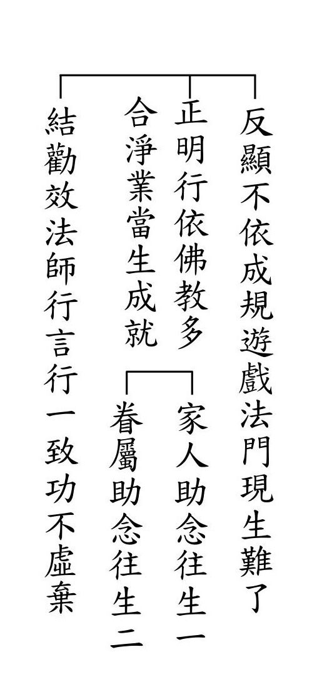
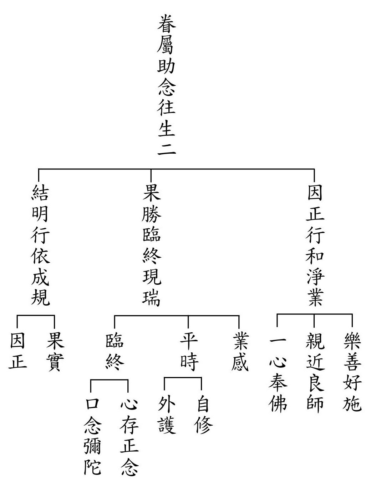
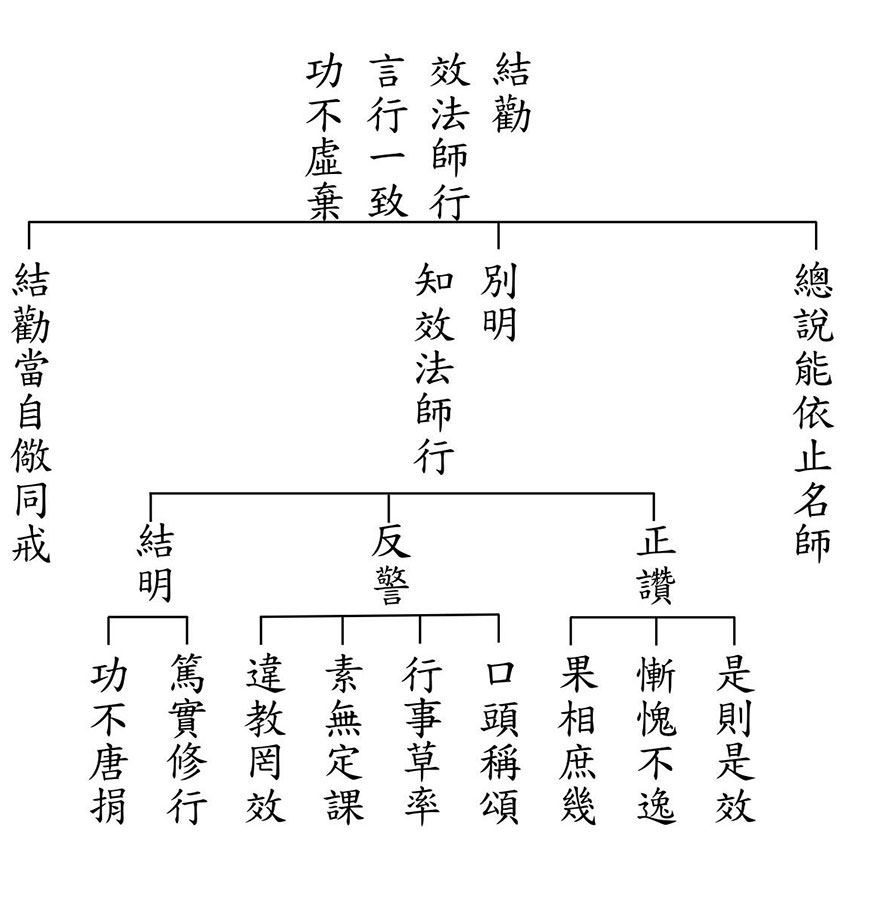
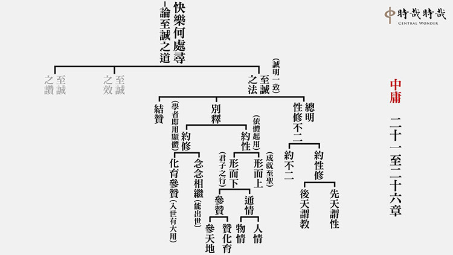
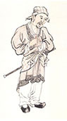
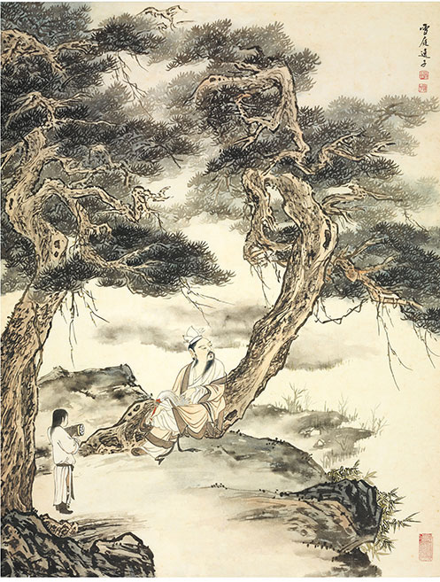
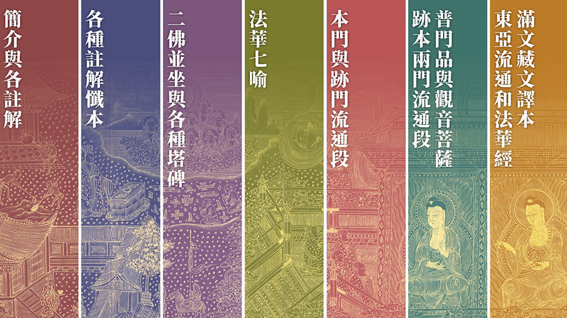
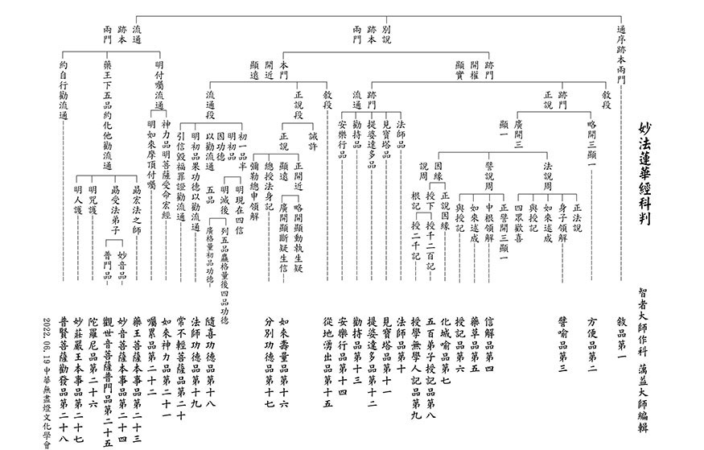

# 第138期

## 社論

### 歡喜狡兔迎新春

本刊

蓮展無盡法喜

將在兔年廣開

榮華燈傳時哉

勉自積極學會

癸卯新年，藉由幾個與「兔」相關的成語及諧音賀詞，祝願我們都能擁抱新契機，實現新展望。

一、狡兔三窟的啟發

成語中說「狡兔三窟」，兔子的機敏，來自於牠對生存危機的意識，不得不保持警惕，穿梭在不同的藏身處，以避免環伺的天敵。而真正矯捷的兔子，平時就要注意哪些地方安全，於是固定在這些環境活動，以安穩身心，培育後代，運籌帷幄，計畫將來。

我們在兔年的心態，應像《論語》中曾子所說：「戰戰兢兢，如臨深淵，如履薄冰。」使自己不被煩惱、業力所繫縛，遠離一切引發我們起煩惱、造惡業的條件，不取行相，不取隨好。

而「狡兔三窟」啟發了我們，在兔年要積極地跳進善識的窟、共學的窟，來成就我們在聖教法義上的聞思與傳承；還要跳入隨喜、共造善業的窟，來成就利他的善巧方便與承擔能耐。

二、如兔繁衍的發展

十九世紀有人在澳洲野放了二十九隻兔子，竟然在一世紀後繁衍成一百億隻兔子，這在某個層面體現出「業增長廣大」的道理。

兔子能迅速繁殖，是因環境中沒有成長的阻力；加上母兔有兩個子宮，又有天生絕佳的反應力，於是兔子大量繁衍。

正法的弘揚、善勢力的增長，有賴於弘法利生人才的培育；藉由清楚的闡述與方法的羅列，使學習者無阻力地學習。而積極延攬好學善學的青年才俊，加入傳承正法的行列，更是聖教得以廣布的當務之急。

三、兔死狐悲的心境

常言道「鳥盡弓藏，兔死狐悲」，由於飛鳥慢慢地絕滅，於是再好的弓箭也派不上用場；而兔子逐漸地被捕獵殆盡，狐狸也不得不感到悲傷，因為接下來很可能自己就是被獵捕的對象。

當偉人一個個老去，乃至紛紛離開人世間，我們除了嘆息、感傷之外，也應期許自己成為他們的接棒人，使他們的遺願逐一實現；更要培養新一代的人才，來繼承善業，使「江山代有才人出，各領風騷數百年」。

四、揚眉兔氣的期勉

對於一般人而言，一旦功成名就，便能揚眉吐氣、光宗耀祖。在弘傳聖教、傳承正法的事業上，我們則要有孔子「文不在茲乎」、「匡人其如予何」的志氣，縱使遇到逆境，依然舒展志向，不畏艱難；既使遇到順境，也趁功成之勢，廣弘正道。

在兔年裡，期許我們平日在揚眉瞬目、運手動足之間，都要心繫正法的承傳發揚，以期無邊有情眾生藉由自己的力行實踐，都能脫苦得樂，同成正覺。

五、奮發兔強的精進

當然，要使聖教在世界各地都能揚眉吐氣，我們先要有奮發圖強的精進力。

精進、勇悍的勢力，需要從自利利他的方法學習中來，這些都要有對聖賢教法的殊勝了解，包括對教法生起歡喜力；而自利利他的事業成就，也需要有恆毅力的堅持，並懂得善於調身、調息、調心。

奮發圖強不能只是口號，要具體地鞏固自身的正知、正念，進而發心隨著團隊創造各種使正法蔚為風氣的因緣，以積極的作為來達成自利利他的願景。

六、知恩兔報的感恩

在佛典故事裡記載，釋迦牟尼佛前生曾經投生為一隻兔子，他當時與修道的仙人同住，在必要之時犧牲了自己的性命，來供養仙人，助成他的修行。

人的一生當中，都會獲得許多人的幫忙，因此我們要有知恩圖報的心。在新年伊始，我們不妨好好思忖：在過去的人生歲月裡，有哪些人曾經幫過我們的忙，我們可以在這一年怎麼表達自己的感恩與感謝，以助成當前的共好，及未來齊成正覺的契機。

七、兔飛猛進的增上

過去一年中，許多蓮友、學友們，通過在學會的義工服務、網上學習、課程聆聽等，有了不少收穫。但平日的學習或利他事業的參與，難免也會遭遇到瓶頸，進步的成效看不出來。不過，只要我們堅持不懈地維持一段時間，就必然會達到某個臨界值、某個拐點，迎來突飛猛進、勢如破竹的進展。

例如孔子早期經歷了四五十年的沉潛，才有機會施展天命；而股神巴菲特也是花了數十年學習、理財，直到六十歲以後，才開始有了爆發式的投資回報。在學習成長的過程中，我們都要耐得住寂寞孤獨、耐得住冷嘲熱諷、耐得住揶揄不解，甚至耐得住時勢的困頓，「身在蹇途莫畏難」，才能最終獲得陡直上升的進步，與突飛猛進的成果。

八、鴻兔大展的未來

我們常常會在卡片上、宣紙上書寫祝福語，祈願鴻圖大展，擁有錦繡未來，但這些一般指的或是希冀事業順利，或是渴望富貴榮華。其實人生更重要的是「德不孤，必有鄰」的榮華前程，更美好的是有貴人提攜的錦繡未來。

期盼兔年這一年，由於我們自己的進德修業、自強不息，又能積極地廣結善緣、以文會友，於是獲得許多善知識、善友們的近悅遠來、提攜扶持，不只前途似錦，鴻兔大展，更因平日有著正法的持續滋潤，在生活中頻頻有美事發生！

願新的一年，我們都有像兔子般的靈敏善躍，把許多聖賢道理、覺悟智慧，藉由我們帶到千山萬鄉之中，使學聖賢經典的法喜遍滿人間；更通過勤學、力行，在新的一年自利利他、廣育英才，於是在龍年到來之前，如《易經‧乾卦》九五爻展現「飛龍在天」的氣勢，使「兔躍新春興聖教，龍象育成現蓮榮」。

## 佛學覽幽

### 菩薩清淨的行持—華嚴經淨行品（五十四）

*戒慧講述、編輯部整理*

順逆皆是願所依

依彼發願攝行持

修行成否論心地

歷事練心真修行

丙二、指事顯因答其徵因

丁一、總徵

丁二、別顯

戊七、到城乞食時願（二十二願）

己三、乞食得不得：空、滿

前言：淨行品是菩薩的修學法，是文殊菩薩向智首菩薩的開示，如何在三業上離過成德，身口意三業離開一切的過失，成就佛的功德，這種修學法竟然可以落實在日用平常，落實在穿衣吃飯，落實在舉手投足，落實在寺廟內的修學以及寺廟外的參訪，落實在托缽行腳，落實在見到各種的境界，所以佛法可以廣泛的運用，當下匯歸到這一念的心性，跟佛的功德來做結合，這種的修學法極為善巧，目前的進度為到城乞食時願中的乞食得不得。

己三、乞食得不得：空

經文：

若見空缽，當願眾生，其心清淨，空無煩惱。

行者托缽至人家裡，卻看到供養的缽是空的，此時不但不能起煩惱，還要發願，希望眾生心要清淨，空無煩惱。看到空缽就是捨離煩惱，貪瞋癡的煩惱沒有了，心就清淨了。我們用餐時，可以將碗當缽來看，添飯之前內心默念「若見空缽，當願眾生，其心清淨，空無煩惱。」

托空缽的情況有幾種，此人是對佛法沒有信心，二是此人對佛法有信心(此信心也非真實)，但是他不肯布施，第三是此人對佛法有信心，但是他沒有布施的能力。對佛法沒有信心的人，是因為沒有對佛法生起正知見，也無力去除貪瞋癡的煩惱。行者雖得不到他的布施，托到空缽，反而生起利他的心，發願(希望)他這位慳吝者，內心清淨，空無煩惱。對不肯布施的人，或許他不知道如何去造善，對法無法求殊勝的勝解，也就無法去除貪瞋癡。也有對佛法有信心，但因為缺乏資糧，除非有安貧樂道的能力，否則也很難去除內心的煩惱，此時對著空缽也願他這位修學缺乏道糧者空無煩惱。

外道或者是一般人見到佛門之人乞求，不一定給，而佛法內道之人，原則上會給，因為他對佛法有信解，不給的情況應該較偏向於想要給但是能力不足，如果是學佛之人，卻不肯捨，他對佛法的信心可能沒有真正建立過，如果是建立在清淨的信心那一分，應該是能捨的。

對行者來說，他托到空缽，或是他過去世跟此人未結上善緣，所以此人看到托缽者沒有生起想要布施的心，就算對方有能力布施，可是當你善業沒有顯現的時候，對方可能受其他事情的影響，沒法布施給你。此時行者對這位眾生，不要因為過去沒有結善緣，而內心生煩惱，擾亂其心。所以當願眾生，包含施者、行者都要其心清淨，空無煩惱，並且發懺悔的心，去除往昔的惡業，發結善緣的心。拿空缽的人要懺悔過去的惡業，面對他人不抱著記恨、不滿，而是懷著結善緣的心，做功德迴向給他。

若見空缽，見空缽有幾種情況，若見到我是空缽，我當然要懺悔，若是見到對方是空缽，也希望他不要因為沒有拿到飲食資糧而心生煩惱，或是去惱怒布施的眾生，看到別人有這樣的狀況，我們要發心，希望他能空無煩惱，對自己來講，也感謝行者有這樣的示現，讓我來警惕、提醒自己要跟眾生結善緣。

如果拿空缽的人是有德之人，我們要感歎眾生是沒有福報的，而那位行者是在感歎眾生無福、感歎蒼生無福，尤其是歎那個人沒有福報供養這位聖者，但是最重要的是就空缽本身來講，要當願眾生，空無煩惱，像空缽一樣。

願所依，願依靠在發願的人，菩薩的願依靠在見空缽，見空缽上發願，當願眾生，能願的是菩薩，所願的是眾生，願有情跟我都能得到利益，得到其心清淨，空無煩惱的利益。托空缽本來是不好的事，代表兩邊沒結到善緣，沒有能施的人、所施的對象、中間施的法，此善法不能興起，但是就這件事情上，體性如何轉變，即眾生其心清淨，空無煩惱。

四面相的修學法，第一個是，假如眾生其心清淨，空無煩惱該有多好；第二個是，我發願眾生其心清淨，空無煩惱；第三個是，我能讓眾生其心清淨，空無煩惱；第四個是，懇請三寶加被，讓我能夠使眾生其心清淨，空無煩惱。

假如你滿缽，回到寺廟，見到回來的師兄弟是空缽，這其中還有很多人情世故的運用，這時將缽內的食物分成四份，一份供養三寶，一份給同法者，一份給自己，一份施與鳥獸等等，藉著這些食物來廣泛的結緣，修行人都懷有一顆結緣的心，有結緣的心，你才有出路，周利盤特過去是三藏法師，他當時沒有抱著以法來結緣的心，結果到釋迦牟尼佛這一世，變成怎麼教都教不來的笨蛋，所以如果沒有結緣的心，能力不能延續，所作的事業不能廣大，所擁有的財富不能夠延續到下一代，如果抱著結善緣的心，能夠讓你的財富、能力、事業相續，所以結緣的心非常重要。
我們拿缽出去，路過每一家，滿缽當中，有的給好的，有的給壞的，這裡面就牽涉到下一章，若見滿缽，裡面有很多人情世故。試
**問：** 寺廟裡面的和合，要講究的是哪六項的和合？

六和敬是「身和同住」，即居住的安樂。在寺院裡，大家都是共同生活，都為歡喜來修行，所以共住的修學法很重要。「口和無諍」，即語言的喜悅，口為禍福之門，話要經過一番考慮再說，不要沒事在背後發牢騷。「意和同悅」，要把對方的悅意相修出來，對方的影像浮現在我心裡的時候，我是愈看愈滿意，這種修學法要有，想到對方，悅我意的形象要出現，這時候見到他我心裡才高興，見佛的時候，禮拜佛的塑像，要將它當成悅意相，看到佛菩薩，要觀修佛菩薩對我微笑的那一分，悅意的那一分是觀修出來的，理由是這才能成為佛歡喜來攝受我的因，這種修學法很重要。論上說，觀修佛對我笑的時候，還要想佛對我笑是因為我做了一件好事，但其實我們這副德行，要取悅佛是很難的，觀想佛笑是說，我們太多過失，偶然做一件好事，佛很高興的那一分，來觀修佛的開懷，也成為攝受我的增上緣。「見和同解」，大家的看法、見解一樣。「利和同均」，利益同沾，「戒和同修」，大家一起持守戒律。和合必須要有一些作法，才有辦法和合，而且和合起來的能力是非常強的，四個和合僧等於一個登地菩薩的威力。

「其心清淨，空無煩惱」，空無煩惱跟心清淨有關，心清淨有兩種清淨法，第一個是對治法，破它的現行，第二個是修空性，破它的種子，如果按照唯識的講法就是唯心識觀跟真如實觀，如果以中觀來說就是空性的修學法，來破煩惱的種子，以對治法來破煩惱的現行，比如說，以不淨觀來對治貪，以慈悲觀來對治瞋，以數息觀來對治散亂，以念佛觀來對治障礙，但是這些都只有破現行，並沒有破種子，所以破種子的那一分，以唯識宗來說是唯心識觀跟真如實觀，以中觀宗來說是修學空性。

己三、乞食得不得：滿

經文：

若見滿缽，當願眾生，具足成滿，一切善法。

看到滿缽就要想到善法滿滿，不管是世間或出世間，以及上善善法，都滿滿的在我們心識中，具足成滿。在日常觀修，將飯盛滿的時候，內心就要提起「若見滿缽，當願眾生，具足成滿，一切善法。」會性法師說，飯吃完後，再度變空缽，便可再一次觀修空缽，還要再添的時候，再觀修一次滿缽。

行者為何可以得到滿缽？因為行者托缽的對象對佛法很有信心，行者跟施者過去結過善緣，所以施者有正知見知道修福田，知道修布施的善法，希望一切善法都能做到圓滿，所以供養行者滿缽，對施者來講他有能捨的心，能捨到極致時，可以將頭目腦髓、田園妻子，甚至佛果的安樂布施出去，希望眾生具足成滿，一切善法。

若見滿缽，第一，我的同伴出去托缽，此人給我的同伴滿缽，此時應隨喜他們曾結殊勝的善緣，隨喜施者知道要行布施法，知道福田在哪裡，且以最大的能力布施。對布施的信徒修隨喜，那是他的善業，就比丘的那一分是福果，比丘是過去的善業顯現，信徒是正在做善業，將來可以感得財富的樂果、物資豐盛的樂果，如果跟聖者結到善緣，他也容易在修行上有道糧。

如果是自己托缽的時候滿缽，也應隨喜自己過去跟眾生結的善業，善業的增長廣大靠隨喜，因為隨喜而跟他結上深深的善緣，就福的那一分，過去在做善業的時候，他在旁邊修隨喜，所以你的福報生起時他也可以用，而且他用時，你心情會很高興，就像孩子要出國留學，父母花多少錢都願意。不管過去是善業還是惡業，眼前生起的果報當中，他的體性可以用心去轉變，空缽時他可以用心去轉變它的體性，當願眾生，其心清淨，空無煩惱，滿缽時，體性也可以轉變，具足成滿，一切善法。

善就是去利益別人，善法就是去利益有情，就利益的那一分說是善法，善法有兩個，能利所利，所利是不會圓滿的，比如佛的布施，所利沒有圓滿，因為眾生還在造惡業，而且一年比一年厲害，佛修忍辱，眾生的瞋恨一年比一年強，慾望一年比一年盛；佛修精進，眾生卻一年比一年懈怠；佛在禪定圓滿的時候，眾生顯示的都是散亂；佛在顯示般若那一分的時候，眾生都在愚痴。所利的眾生未必得到利益，此處具足成滿，一切善法，佛是善意成就，心意圓滿，否則哪一個聖者可以成佛？就佛布施心意圓滿的那一分，說布施度圓滿，就他持戒的心意圓滿，來說他是二地圓滿，就他忍辱的心意圓滿，來說他三地圓滿，可是眾生未必得到真實的利益。

行者托缽，得到滿滿的食物，行者應當發願，願眾生能成就滿足一切善法中的善意圓滿，諸佛菩薩不會捨棄任何微小的善法，包括釋迦牟尼佛，善法重點是要利益他人，雖然未必真的能利益到，可是在一切善法中他的善意是圓滿的，善業就是屬於善意的那一分，心意的那一分圓滿。

每一個法相在成就的時候，都會有一個法相成就長的樣子，布施心意圓滿長什麼樣子？布施心意圓滿是說，看到眾生向我求的時候，我內心的高興，比現證空性的高興還要高興，有些聖者喜歡傾聽眾生對他的要求，眾生有求，他應眾生的快樂，比羅漢現證空性還要快樂，這種現量是要被訓練的，從日用平常去練，下手處一定是從小地方去練，慢慢地練到心量加深加廣，在捨頭目腦髓的時候，像捨掉餿水一樣簡單，心意上，是眾生求的時候，他內心的歡喜，勝過阿羅漢現證空性的歡喜，入滅盡定的快樂，入涅槃的快樂。菩薩在布施心意的時候，眾生有求他來應的快樂是這樣的快樂時，那就是初地的形象，這叫做具足成滿布施的善法。

具足成滿持戒的善法，二地菩薩的形象是，在睡覺的時候，連枝末戒都不會犯到，甚至熟睡中，連微細的枝末戒都不會犯到，那是二地菩薩持戒的心意圓滿，就像忠臣孝子在熟睡中都沒有犯上的心，那就是忠臣孝子的形象。

三地忍辱善業圓滿，三地菩薩就算碰到惡人，而且是極其恐怖、無理取鬧，甚至是做奸犯科，乃至於是恩將仇報，抓到你之後把你的身體節節支解，割鼻子、挖眼睛，極盡冷嘲熱諷，傷盡你的自尊、羞辱你，還不影響度他的決心，那是三地的心意。修行是一種心態的相比，不是在外相上比，知道了這些標準，才知道我們跟聖者的差距有多大，知道下手處要如何調自己的心。(下期待續)

### 大乘百法明門論簡說(四十五)

*戒慧講述、淨本整理*

拾柒、心不相應行法（三）

歸類總相共作用

安立名言相觀待

皆無自性如幻化

緣起相續世間相

論文：

第四、心不相應行法，略有二十四種，一得，二命根，三眾同分，四異生性，五無想定，六滅盡定，七無想報，八名身，九句身，十文身，十一生，十二住，十三老，十四無常，十五流轉，十六定異，十七相應，十八勢速，十九次第，二十時，二十一方，二十二數，二十三和合性，二十四不和合性。

第六，滅盡定，滅盡定與無想定都是「無心定」，意思是都能遮止心識的生起，讓心識不起現行。無想定如前所述，是因為厭離想法使心識不生；滅盡定則是因為是證悟空性，不會有任何世俗的心念，所以世俗心識不起現行。然而世俗的心識不生，是否存在現證空性的心識呢？這要另外討論，但無世俗的心識，不是沒有心識，倘若沒有了心識，有情則成為無情。

無論是外道的無想定或者內道的滅盡定，都要良善的心態才修得起來，當他們修習成就時，對此世間都不會產生貪愛。無想定在厭離想法中，可以讓前六識不起現行，可是仍有執我的心（唯識宗認為是第七識的功能）；滅盡定是連執我的心都沒有了，因為證入空性能夠破除我執。

《百法直解》云：「三果以上聖人，欲暫止息受想勞慮，依於非想非非想定，遊觀無漏以為加行，乃得趣入。入此定已，前六識心及心所一切不行，第七識俱生我執及彼心所亦皆不行，惟第七識俱生法執與第八識仍在，不離根身，依此身心分位假立。」三果以上聖人，在定中修觀的方法就是不斷緣念有法做很多的觀察、做很多辨證，觀察諸法的自體性，由於觀察到皆無自體性，爾時所緣念的是空性，空靈靈的感覺出現，但因為觀察辨證空性是十分辛苦的修行，心思很猛利，當空靈感出現時，鎖住空靈靈的感覺安住，入了滅盡定，稱為「暫止息受想勞慮」，暫時止息了入世種種的感受與想法，了卻了各種辛勞與謀慮。

此三果羅漢還有微細執我的心，要到四果才能斷盡，存有這樣微細我執，《直解》稱為「依於非想非非想定」，「非想」就是沒有其他的想，「非非想」就是仍有微細我執；這與外道透過壓伏想，壓到最後剩下我執的「非想非非想定」大相逕庭，因為外道僅存的我執其實非常粗猛、無可動搖，好比當一個人什麼都沒有，只剩下一個家是他所獨愛的時候，他絕對會拚命跟家庭共存亡。外道定無法動搖我執；三果羅漢修空性定，我執已經細若游絲，所以《直解》說「第七識俱生我執及彼心所亦皆不行，惟第七識俱生法執與第八識仍在」，這是唯識宗的說法。

初果羅漢斷見惑八十八使，二果斷欲界前六品思惑，三果斷盡欲界九品思惑，所以不會再到欲界來，直接生到色界第四禪天的五不還天，斷色界無色界的七十二品思惑證四果。第四禪天的五不還天，並不是第四禪天外另有五個天，而是第四禪天裡面的五個地方，他為什麼要投生到那裡？一種說法，是他要去度上二界的眾生，但是上二界包含初禪跟二禪，為什麼不去初禪、二禪等地度眾生，直接生到第四禪？另有一說，他接下來要破上二界的思惑，欲界沒有上二界的色身，他要去上二界才能以上二界為所緣做觀察破思惑。然而上二界有八個地方（色界初禪到四禪、無色界也有四處），為什麼他偏選第四禪？

三果聖者是以厭離三界的心態在修出世的空性定，初禪到三禪中，禪定的快樂無以復加，特別第三禪「離喜妙樂地」的快樂是我們所無法想像，要到第四禪的禪定，這種樂才能忘卻，所以這位厭離三界的三果羅漢，不會去選擇前三禪，會到第四禪。重點不是他要度上二界的眾生，重點是他要出離三界，所以選擇能夠忘卻禪定之樂的第四禪，專心破除最後的七十二品思惑，特別降伏我執的行相也相似於渾然忘我。

那為什麼不選擇無色界四空天去修行呢？因為四空天都是以厭離思來分高下，沒有思心所的作用無法修觀慧，人會變笨，所以他也不會去四空天。

滅盡定的當下，是三果羅漢暫時的休息，起定後再生觀慧，去破最微細的俱生執，滅盡定又名「滅受想定」，因為在空性定當中沒有對境，就不會有對境的受與對境的想。此位聖者入滅盡定，並不是喜歡空性定的感覺，只是一種暫止息，因為運用觀慧非常疲勞，比如修學禪定的寺廟比較可以過午不食，修學觀慧的寺廟不行，大量的辨證會耗費許多精力，用腦過度下吃飯又吃不足，人就會虛弱，反而不能長久。過去來果禪師打禪七，晚上也吃，有時還吃宵夜；我們以前在臺中慈光圖書館聽華嚴經，再到蓮社參加複講，晚上吃宵夜，據聞是雪廬老人出錢，因為要大量用頭腦容易餓，修學方法各有不同，用止則不耗體能，修觀則大量耗能。

三果聖人在進入滅受想定前，特別厭患受、想二種心所，因為他需要鎖住空靈靈的境界使觀慧暫時止息，這與外道討厭受、討厭任何想法不同。此外，受是俱生執的緣起，想是分別執的緣起，分別執與俱生執就是輪迴生死的因，因為有執著就會起惑、就會造業、就會受苦，所以滅受想並不是討厭受、討厭想，而是觀察受與想的自體性沒有，這與觀人我空、法我空的道理相同。

受是發起愛諍的根本，感受當中有苦有樂，苦生不愛、樂會生愛，所以愛是從受來，愛會產生很多的諍、很多的對立，這些的對立是就利益觀點出發。既然愛是從受來，內道如何讓受不生愛？這要觀察感受不能自己生，要觀待所緣的境才生，樂受來自於可愛境，苦受來自於可惡境，捨受則來自於中庸境，觀待境才能生出感受，感受當然沒有自體性；而苦境是過去惡業的顯現，樂境是過去善業的顯現，中庸境來自於無記業，苦境、樂境等都沒有自體性，由無自性的境所生出的感受，當然也不會有自體性。

受沒有自體性，觀待受所生的愛也不會有自體性，實體的愛沒有，從愛生起的一切煩惱當然也沒有實體性，這才是佛教的滅受想定，是尋覓受與想的自體性，是透過理智觀察所入的定；外道則是情緒上的厭離，保留我執的厭離。

想是一切見解的來源，因為有各種不同的想法，就有各種不同的見解，比如過去印度有六師外道，每一個外道各有十五個徒弟，還有六個老師，一共就是九十六師外道。九十六師外道有六十二種外道見，都是自性見。「我在色內、我在色外、我具有色、色具有我」，四種根本見解，乘以「色受想行識」五蘊，再乘以「過去、現在、未來」三世，再加上「常」(這樣的我死後為常)、「斷」(這樣的我死後為斷)二見，一共六十二種外道見。這些外道的自性見都是想出來的，產生許多爭端。透過佛法的觀慧去觀察，可以破除一切的自性見，原來所謂的靈魂我、神我、不可說我等思想，都是由想所增益出來，是根本不存在的實有我。（下期待續）

### 佛學概要十四講表簡說（四十）

*戒慧講述、編輯部整理*

人生已難得 暇滿更難得

異熟之功德 最為難獲得

此生廣修因 來世大作用

福慧容易修 成佛最迅速

宇宙裡面的眾生，輪迴所攝有情可以分為天、人、阿修羅、地獄、餓鬼、畜生六類，目前進度在人道。

首先談談人道的幾個問題，第一，想要投生為人，人道的引業就是心裡有覺得做人滿好的感覺，持五戒、守倫常容易跟人道的氣氛相應。五戒就是仁義禮智信，這種綱常跟人道的氣氛差不多，所以五戒跟人道有關。第二，在人道裡面，不用太辛苦就可以學佛的那一分，靠的是過去行布施業時，心意是希望未來學佛具有福報。第三，在人道中有學佛的資糧，又可以碰到善知識的那一分，是過去修善法的時候，有以皈依的心態來做善法，沒有皈依三寶的那一分碰不到善知識。第四，碰到善知識又有資糧，生在人道，內心很想學的那一分，是過去造作善法的時候，精進向上，對於儒家、佛家的正法，有很強的善法欲，所以這一生碰到正法時，很有心要學，以上是四個投生人道學習正法殊勝的條件。否則，投生人道學佛障礙重重，像是生活忙碌，抽不出時間來學正法，就算想要學正法，碰不到善知識，就算碰到善知識，修學正法也是有氣無力，終於找對路的時候，已經邁入老年了。上述這些條件都要具備，才能成為極為難得的人道，好樂正法，有善知識引導，沒有後顧之憂。

根據《六道伽陀經》來說，這張表分非常多層次，首先得到人身，但是衣食辛苦，是由於他以前雖未偷盜，不堅悋、不貪心，但不布施，這樣的人雖得到人身，但是在衣食上是辛苦的。下面進一步說，此人不偷盜，他也不會貪心，不會瞋心，而能守本份安住，進一步能夠把好的飲食供養聖賢，這樣的人可以生到人世，他得到的壽命，是具有色力的，因為他過去把美味施予聖賢的關係，而且一生吉祥，沒有病痛。

投生為人道的那一分，跟他不盜、不瞋有關係，例如他的壽命，跟布施食物有關，特別是布施僧眾，供養食物能使他延續壽命，因為沒有食物，即使壽命未盡福盡，福盡壽還是會盡，例如梁武帝就是餓死的，所以果報上跟壽命有關，又因為他吃了你供養的食物後，容光煥發，所以感應你這一生容光煥發，人見人愛。

下面這一段在講另外一種，他平常都行布施，而且具有非常清淨的信心與慚愧心，就可以得到富貴，並且非常莊嚴。謙虛反省、慚愧的那一分使他得到尊貴，布施的那一分讓他富有，資產很多，跟他恆時行施有關。恆時很重要，一個人做善，恆時的能耐是很厲害的，同樣的學教法也是一樣，不間斷地學幾十年，成就就是你的。下面說，此人會把他的田宅布施，乃至於幫出家僧眾蓋僧舍，此人能夠得到人身，而且是一切隨他心裡所想的。所以讓別人歡喜，得到的果報是想要什麼就有什麼，即心想事成，心想事成跟善業有關，同樣的，你如果提供別人講堂，讓他們在裡面研討，做很多佛法的議論，你的果報就是頭腦清楚，說話明白，這些都是因果的關聯性。

布施鞋子、襪子，供養的對象又是三寶，他所得的果報是由行得安樂，也就是出行都能非常安樂，而且常常可以獲得很好的車子和乘騎。能夠「願車馬、衣輕裘，與朋友共，敝之而無憾」的人，果報當中，他想到哪裡就到哪裡，甚至有神足通，像我們現在坐飛機可以直達國外，跟過去以交通助人行善業都有關係，現在就算交通工具發達，可是未必有能耐出去，果報就像房子映入水中，某個角度看有，某個角度看沒有，世界的交通工具這麼發達，非洲人還是不能出國，台灣就算交通工具發達，有些忙碌的人也是動彈不得。他有多少善業，他就可以運轉什麼，沒有那個善業的時候，就算福報在眼前也拿不到，自體性沒有，如幻現起。

下一個是能夠布施水，例如在曠野中鑿井，或是開發泉水、做陰涼處，讓人可以消除疲勞，可以止渴，得到清涼，這樣的人可以獲得很好的裝飾，還有吉祥廣嚴飾，他的身體也非常柔軟。有些人每天莫名其妙的快樂，有些人一早起來就莫名的不適；有些人天生樂觀，有些人天生悲觀，都跟善業、惡業的等流有關。

布施藥物，能感得離開一切病苦。布施燈明，能得眼目常清淨，供燈也是很重要的法行，跟眼睛的明有關，像雪廬老人，到九十幾歲過世前，沒有老花、沒有近視，像第四禪天最後要死的時候，諸處皆苦，唯有眼識不苦，修行最後要成就的時候，身體就算病得要命，可是眼睛張開，好似沒病，雪廬老人過世的三月五號，清晨五點要離開人世間的時候，眼睛睜開，一一看每位送他的弟子，有老師說每一個人都不敢看雪廬老人，好像做虧心事一樣，雪廬老人的眼神就是修行的得力相。

如果此人常常布施音樂，便感得口生美妙音，做維那的人就有這個福報。布施臥具等，讓人家有安樂，他以後也能感得安樂身。

「若怖於輪迴，親覲於賢聖，所須隨供養，精進常恭敬，善破於煩惱，當得安樂果。」如果在非常恐怖的輪迴當中，自己能親自見到賢聖者，賢聖者的所需由我們來供養，而且隨著他來學，精進向學，非常恭敬善知識，容易學得殊勝正法，破除煩惱，而且得安樂。換句話說，你跟有見地的人在一起，有了殊勝的見地，要破煩惱是很輕鬆的，超越障礙變得不困難。跟沒有見地的人在一起，修行幾十年繞圈子很痛苦。

「悲愍不慳悋，輟己而施他，定感富饒果，衣食自豐足。」此人非常有悲憫心，而且不會慳悋，會把自己所有的布施給他人，他一定會感得富饒的果實，衣食豐足。

「不作有相心，依如行布施，如是布施果，無為大安樂。」此人在行布施的時候，是以三輪體空的方式來行布施，如是布施果，是得到了無為大安樂。以解脫、成佛的心來布施，他的果報就是解脫跟成佛，因果都是有關聯的，體性沒有，此滅彼生，都是關聯性。

「無飲酒妄言，出語常真實，獲名聞安樂。」此人如果不飲酒也不妄語，常常語出真實，則可獲得名聞安樂。名聞安樂跟不妄語、誠實語有關，司馬光名氣大，就是因為他從不說騙人的話，他就算被貶官，被冰凍十五年，出來時還是萬人轟動，司馬光要回京城時，萬人夾道歡迎，風風光光地回到京城，那就是幾十年不說妄語的威力。

「種種造飲食，供養和合眾，當感善眷屬，同生不動國。」具備種種的飲食供養和合的僧眾，可以感得非常好的眷屬，一起修行，同生不動國。你的眷屬容易和合，最後要得到助念，往生西方極樂世界變得容易。

「互相作承事，歡喜意無違，觀察諦理空，不欺不顛倒，苦惱永已盡，安樂而解脫。」大家可以一起來作承事善知識，共造善法，不會有互不認同的意見，尤其是在佛理的學習，導歸空性，不被相似實有法所欺，不會於輪迴起安樂的顛倒想，能窮盡一切與實執相應的煩惱。如是苦惱永盡，安樂得解脫。以上是人道。（下期待續）

### 人生大事不能忽略的事實-喫素念佛修淨業人，須平時事事多與淨行相合，乃可往生(下)

*戒慧講述、編輯部整理*

如理如法的行持

往生殊勝的回應

縱有臨終的突變

不妨生西的成就

吃素又念佛想要往生的人，必須要在事項上多做和佛法相應的業，否則往生仍有障礙。以下介紹第三位，依著眷屬助念而得往生的查賓臣居士。

查賓臣居士，往生內因上是行合淨業，淨業指的是煩惱不生，此處特指往生的淨業，也就是每一個行持都在幫助他往生。分為三部分，一、樂善好施，這部分肯定他的公心。經文：「

查賓臣居士，江西九江人。向業商，家道小康。熱心公益，樂善好施，地方慈善，慷慨助成，曾為九江蓮社副社長。

」

他是江西九江人，從商，家庭狀況是在溫飽的基礎上，有個相對富足的生活狀態。熱心於公益事業，只要遇到地方上的慈善事業，都慷慨幫忙襄助完成，曾任家鄉裡九江蓮社的副社長。

二、親近良師，文中記錄他與德森和尚的善緣。經文：「

民二十四年，森過九江，初次見面，即承特別優待。二十五年，朝普陀，來蘇州，相識益深。二十八年春，避難居贛州。

」

民國二十四年，德森和尚經過九江，曾與查居士會面，承蒙查居士的招待。民國二十五年，查居士朝普陀山之後，曾到蘇州，德森和尚便與查居士有更深入的交往。民國二十八年，為了避難南遷至江西的贛州。

三、一心奉佛，特指他的定力強。經文：「

轉徙流離，仍一心奉佛，數與森通函，略商法門中事。

」雖然為了避難離開家鄉到處遷移，查居士仍然一心學佛，與德森和尚常常有書信上的往來，皆是請教佛門中辦事讀書的事情。

接著是果上殊勝臨終現瑞相，文分三部分。一、業感。經文：「

至二十九年正月，不幸飛機轟炸贛垣，落彈於所居附近，被驚嚇中風。繼患腦膜炎急症，於二月二十一日申時逝世。

」民國二十九年一月，戰亂中飛機轟炸贛州城，飛彈落在居士住所附近，居士被驚嚇導致中風，後來又受微生物、細菌或病毒等侵襲，得到急性腦膜炎，在二月二十一日申（下午三至五）時過世。

二、平時，約居士平時修持。自修部分，經文：「

因平日深信淨土，素有修持。」

平日對於淨土法門深信不疑，並且有所修持。外護部分，經文：

「加以眷屬亦稍知飭終要義。

」可見查居士家中是佛化家庭，往生時家裡的護持是非常重要的一環。

三、臨終，心存正念與口念彌陀。經文：「

故雖急疾而終，仍得心存正念，毫無昏迷罣礙之象，連聲稱念阿彌陀佛，瞑目安然而逝。

」所以雖然居士得到急症，很快就過世，但是因為心裡深信淨土法門，依著內因和家屬的護持，居士正念分明，絲毫沒有往生前昏迷的障礙，口中稱念彌陀聖號，在佛號聲中安然而逝。

結明行依成規，查居士因正果實，經文：「

如此，按之經教，頗具生西之瑞徵。亦由素行皆依成規，多與淨業相合所感致。

」看到查居士臨終如此順利沒有障礙，生前正念分明，佛號清楚，皆與經論所說相合，具有生西的瑞相。當然也因為平常的行持都與往生淨業相合，感得的了殊勝果報。

文章的最後是結勸大家若能效法師長，並且能夠言行一致，老實修行，這樣的念佛絕對是可以往生的。文章也分三部分，先是總說能依止名師，經文：「

按此三居士，皆已皈依印老人座下，執弟子禮。對許止淨居士，莫不同聲讚揚。

」本文所說曹亞伯、彭守拙和查賓臣三位居士，皆是印光大師座下皈依的弟子。對於文筆極佳，編寫觀世音菩薩本跡感應頌、歷史感應統紀等多部註解的許止淨居士，也是同聲敬佩讚揚，足見師兄弟情誼深厚。

別明知道效法師友的行持，經文：「

但彭查二位，一切行為，多以二老是則是效。縱有力量不及，亦自知慚愧，不敢放逸，故結果亦相將庶幾。

」

正讚彭守拙和查賓臣二位居士，因為有正知見（眼力），所以一切的行為都以上述二位為準則，為效法的對象；若有做不到的地方，也會自我反省，把勇悍心提起，不會隨波逐流失去自制力，所謂的放逸，是一種無力對治煩惱的形象。所以兩位居士，最後都能順利往生。

以曹亞伯居士反警我們，不可只是口頭稱頌，行事草率，做功課不扎實，隨意念佛，經文：「

曹居士，口頭稱頌，有過之而無不及。唯自己行動，多近草率，殊少著實。加之素無如法禮拜持誦之定課，且隨自己心行，名曰念佛，故結果亦全無影響。

」曹居士，大力弘護法門，逢人就大力宣傳佛法，護持法門事物的勇悍心，有過之而無不及，但是多是自己草率行事，難以真實推廣利益他人。又加上平常沒有持之以恆的定課，自己恣意而為，美其名是念佛，但結果卻和往生無關。

結明要老實修行，這樣的念佛才是可以往生的。經文：「

足徵佛法貴實行，非口頭所能了事。功不虛棄，果無浪得。

」以上三個事例可以驗證佛法所說的要能得到成效必須要自己老實去修行，不是口頭稱讚就能有成效。老實念佛是可以往生的，並非虛棄不踏實，好的結果不會平白無故得到。

德森和尚結勸大家，自己要注意警戒，經文：「

森書此自儆，并為一切同病者戒。

」德森和尚自謙的說，他將這樣的事情寫起來是為了自我警惕，並且也希望有這樣毛病的大眾引以為鑑。

附錄

「

古人云，伯夷叔齊雖賢，得夫子之名益彰。顏淵雖篤學，附驥尾而行益顯。德森苦惱無狀，學行全缺，若非得印老人攝受提攜，實不知何所託足，遑論其他。茲承緇素諸公，亦有垂青而憐愍者，何一非老人加被之所致也。即偶有記述，鄙俚不文，語無倫次，刺人雅目。但由查賓臣居士，函述許止淨生西狀況，老人即函令德森，記述其事，附於文鈔續編之末。

」

伯夷叔齊的賢能依著夫子的讚許宣揚而彰顯，顏回雖然學問扎實，藉著夫子之名更顯他的德行。德森和尚自謙他人願意接受他全是因為印光大師的緣故，大家尊重慈愛，都是因為大師的加被。和尚自謙自己文筆不好，但是因為查賓臣居士來信敘述許止淨居士往生的情況，所以大師命德森和尚撰寫〈許止淨居士往生記並頌〉，附在印光祖師文鈔續編當中。

「

因奉此命，遂將有關法要，清晰情形之各事實，縷記數則，以作附錄。仍呈老人鑑核許可，乃敢附驥尾，得以隨行廣布。若曰欲步後塵，弘宣法道，則吾豈敢。但仗老人慈光，俾所記事實，傳布遐邇，令人直信不疑而已，苦惱比丘德森謹識。

」

因為老人的付囑，便將相關的要點，所知的各種事實，記錄下來，附錄於全集之後，文章皆由老人鑑定核可，才附於文章之後，與全集一起流通。仰仗老人慈悲加被，希望所記錄的事實，能讓大眾了解，令人相信淨土法門不生疑惑。（下期待續）

### 緣起贊論略釋（五）

*戒慧講述、心若整理*

能作乃苦難有情

所作乃大悲佛陀

作四義五處觀察

成立佛為大依怙

論中文義分二，一、由說緣起門中稱讚能仁。二、結述造論因相福德回施。一、由說緣起門中稱讚能仁分三，即總標、廣說、攝義。

乙二、廣說分二：丙一、由緣起門稱讚之因相。丙二、正贊。

丙一、由緣起門稱讚之因相分二：丁一、明緣起能斷生死流轉根故是聖教心。丁二、故歎美中由緣起門贊為第一。

丁二、故歎美中由緣起門贊為第一

論文：「

如是於依怙，稀有稱讚門，除說緣起外，誰能得餘者？

」

消文：如前面所說，依怙就是佛，佛是歸依處，他能救度有情眾生離苦得樂，對他（佛）最稀有的稱讚門就是緣起門，除了緣起這一門，沒有其他的門可以像緣起這一門來稱讚佛（此是就門來講），緣起門之外沒有任何門能表達對佛最殊勝的稱讚。

「

言依怙者，是為有情作歸依處、救護眾生離苦惱義。略具四義，是真應歸。謂自己解脫二障繫縛，能為他說解脫方便，於諸有情等運大悲，不計親疏普為饒益。又《瑜伽論》說由五處觀察所歸，恐繁且止。佛薄伽梵具一切德，是故此中稱為依怙。

」

所謂依怙，是為有情作歸依處，皈依的心態就是求救護，有情求救度，離開苦惱，然必須造作、思維、作意觀察，佛才是真正應該皈依。至於為什麼佛是有情的歸依處？可以從四義去觀察，發現佛才是真正的歸依處。一、佛是二障的解脫者（見緣起），二、佛能為有情說除二障的方便（說緣起），三、佛有救度有情眾生離苦得樂的悲心（不捨一人的大悲心）四、佛不計親疏，普遍的幫助有情（反說：大悲心不計親疏、不計前嫌，不管曾結多深的仇恨，只要求救護，佛就會成為能救護）。

《瑜伽論》從五個地方觀察佛成為我的歸依處，一、佛身業清淨，二、佛語業清淨，三、佛意業清淨，四、佛具有悲心，且不偏私，五、佛見緣起法、說緣起法，成就無上法，讓有情能究竟離苦得樂。佛薄伽梵具備一切德行，佛成為能攝，有情成為所攝，所以佛稱為有情的依怙，理由如上述。

「

稱讚佛門雖有多種，其最稀有，除說緣起深道理外，誰有智者能得餘門？何以故？緣起深道是聖教中心藏處故，如前頌說。是則宣說緣起經論，為教心藏；能達甚深緣起道智，是證心藏。離教證外，更無正法，故正法心即緣起理；由此稱讚成最稀有，龍猛菩薩於《中論》首及《如理論》，皆由此門贊禮能仁。

」

稱讚佛門的方式雖然有很多種，但是其中最稀有的，就是說緣起甚深道理，除了說緣起甚深道理外，誰還能夠得到緣起之外的門來贊歎呢？有智者就是要用緣起門來贊歎佛，用其他門來贊歎佛，沒辦法成立他是有智者，必須要用緣起門來顯示他是有智者。何以故？因為緣起道是聖教中的心藏，如同前頌所說。宣說緣起經論，為教心藏；能通達甚深緣起道智，是證心藏，能證是能通達的智慧，所證是甚深緣起道（心藏）。正法就是教證，教證以外，就不能叫作正法，所以能夠幫助有情離苦得樂的正法，其心要就是緣起理，由此來稱讚最為稀有，龍猛菩薩在《中論》的開首及《如理論》中，皆從緣起門來贊禮佛。

「

此上三頌，攝其總義謂：斷生死根道，緣起成教藏，能仁由說此，智者應稱讚。此乃僧海法王所說，以下攝盡應知。

」以上三頌「世所有衰損，其根為無明，見何能還滅，是故說緣起；爾時具慧者，如何不了知，尊聖教心要，即諸緣起道。如是於依怙，稀有稱讚門，除說緣起外，誰能得餘者？」為何要由緣起門來稱讚佛的原因，一言以蔽之，就是緣起道能斷生死根，緣起成為教法的心藏，而佛能夠說緣起道，這就是智者讚歎佛的原因。這是二世達賴僧海法王所說，以下的正贊都在詳細的講這件事情（由緣起門來稱讚佛的理由）。

丙二、正贊分二：丁一、由見說緣起門中總贊。丁二、由說緣起門中別贊。

丁一，總贊佛就是一個見緣起、說緣起的人。丁二，別贊佛的三業中，最殊勝的就是口業，說才對眾生有利益，才能幫助有情，特別贊歎佛為說緣起者。

丙二、正贊分二：丁一、由見說緣起門中總贊。丁二、由說緣起門中別贊。

戊一，由見說緣起的這一分來贊歎佛勝過外道的大師。戊二，正贊見說緣起。戊三，結論。

戊一、由見說緣起故贊勝外道大師分三：己一、顯由說緣起成教授第一。己二、能斷戲論網者。己三、贊說緣起成無上者。

己一，說緣起是最殊勝的教授。己二，能斷戲論網，戲論就是實有見，一般人都被實有見的網所繫縛。己三，贊歎佛由說緣起這一分成為無上者。

己一、顯由說緣起成教授第一

論文：

由彼彼依緣，說彼彼性空，離此更何有，稀有善教誨？

消文：這個（有為無為、有漏無漏、內外世間、色心）都是依靠條件生起，正好依緣，正好說是性空，離開緣起的教法外，還有什麼教誨會比緣起更好呢？意即離開緣起教法，再也沒有更稀有的善教誨。

「

欲先成立教為無上，次成大師無上易知。故說此頌。

」

想要成立為無上教，說此教的成為無上大師，因為大師能說，而成為無上，這容易了解，所以來說此偈頌。

「

言彼彼者，是泛說詞；謂諸有為無為、有漏無漏、內外世間色心等事，如是等頌，皆依緣有，故佛世尊說彼彼法自性本空。是自性空，即法實性，甚深寂靜光明無為，遠離一切戲論邊際。由性空故，不墮常見；由緣起故，離斷見失。此二無違，更互助成，由此能令有情成熟及與解脫；故離宣說緣起教外，更無稀有殊勝教誨。

」

講到彼彼，彼彼廣泛來說，包括有為法、無為法（有為法：有造作，例如色法；無為法：否定有為、否定造作，例如否定色法之所在，即是虛空）、有漏、無漏（有漏指煩惱，會把功德法財破壞，好像器皿有漏洞，功德法財會被煩惱漏光）、內外（內：補特伽羅所攝的身心，外：否定內，即非補特伽羅所攝的身心）世間色心（色心包括補特伽羅所攝，例如自己的身心、非補特伽羅所攝，例如他人的身心）等事，上述這些都是依緣而有，所以佛世尊說這些法自性本空，自性本空就是諸法的真實性，「甚深寂靜光明無為」，甚深指不容易被了解，寂靜指不見一法，光明指破二障，無為指空性就是無為法，可以遠離一切戲論的範圍，也就是可以遠離一切妄見實有的範圍。由於性空，便不會墮入常見，因為性空是講緣起的性空，說緣起的那一分是指向空性所以離開常見（自性的有），性空是講性空而指向緣起，所以遠離斷見（自性的無）。緣起、性空這兩者不相違背，緣起成為通達空性的正因，空性成為通達緣起的正因，兩者互相助成，由此來令有情種下善根，生起比量，當成為現量時，即解脫成佛。離開宣說緣起教，更沒有這樣具有核心思想的殊勝教誨了。

※補充：

常見：自性的有。見到事物時認為本該如此，不會變化，永遠有。

斷見：自性的無。見到諸法沒了，以為到此為止。

舉例：桌子如何遠離常見、斷見

**答：** 桌子是觀待桌腳、桌面等組合而成，是條件組合而成，依著他能承載的作用安立為桌子。把桌子拆解，即便零件一個不少，也不能安立為桌子。如果天冷把桌子砍下當作柴火燒，這時也不能安立為桌子，反而是安立為能燒的柴火。所以桌子非實體法，只不過依不同的作用，而安立不同的名言。

所以說桌子體空，沒有實有的自性，如果有實有的自性，應該在任何情況下都是桌子，可是不然，桌子只是就生起作用的那一分安立而已。緣起法正好彰顯沒有自性，遠離常見，然只是在緣起上否定實有性，依作用而安立名言乃我承許，如此則遠離斷見（說空並不是什麼都沒有）。

「

緣起性空互相成義，如《龍王請問經》云：『緣生即無生，彼無生性故，依緣故說空』；龍猛菩薩云：『因緣所生法，我說即是空。』又云：『是即無自性。』其證非一。

」

緣起性空可以互相證明、互相成立，如同《龍王請問經》所說：「以緣起為正因通達空性，空性即無生，彼指緣起法，緣起法沒有生的體性，只是依仗條件生起，所以才說是空性。」龍猛菩薩也說：「法是因緣所生，自性所成的該法無。」又說：「通達所成立的法無自性。」類似的證明有很多。

※補充：

「因緣所生法，我說即是空」，法是因緣所生，這是成法，「我說即是空」，我不是在講斷滅，而是講體性沒有，這是遮除實有性的遮法（無遮）。（下期待續）

## 孔學一隅

### 論語簡說（四十五）— 憲問篇第二十八章
子貢尊師，讚孔子具三達德

論語簡說（四十五）— 憲問篇第二十八章

子貢尊師，讚孔子具三達德

時哉

無能成君子  夫子自謙語

君子知仁勇  三者各有相

君子或現知  或現仁或勇

是謂君子道  入世真要義

—經文—

子曰：君子道者三，我無能焉。仁者不憂，知者不惑，勇者不懼。子貢曰：夫子自道也。（憲問第二十八）

—消文—

孔子說：成就君子的道有三個，我很慚愧，我辦不到。成就君子的三個道是：仁者凡事不害人，而且力求有利於人，所以內省不愧疚，內心不會憂懼；智者事理看得明白，而且有決斷力，所以內心不疑惑；勇者依於仁與智，凡所應為之事，不計困難、勇於實踐，所以內心不恐懼。以上是君子辦事之道，具足此三者，即可稱為君子。子貢說：我的老師雖然說他辦不到，但他就是這樣的人，所以無異於孔子說自己。

—章旨—

此章論成就君子之道。

—科判分析—

本章子貢認定老師具有君子的三達德，就是「仁者不憂，知者不惑，勇者不懼」。

孔子說：「君子道者三，我無能焉。」成就君子的道有三個，孔子很慚愧說自己辦不到。

如果成就仁，內心不會憂懼；如果成就智，內心不會疑惑；如果成就勇，內心不會恐懼。子貢曰：「夫子自道也。」子貢說：老師自己說他自己。

—釋義—

本章的歷史背景？

在《孟子‧章句》說「君子於陳蔡」，君子指孔子，孔子在六十三歲的時候，要從陳蔡進入楚國，被陳蔡兵困，孔子一行斷糧七天，《孟子‧章句》注解引《論語》就是引「君子之道三」，這一章是在陳蔡絕糧下說的。當時，孔子還說「歲寒，然後知松柏之後凋也」，子貢也感歎地說「夫子之言性與天道，不可得而聞也」。孔子的君子之道是藉著周遊列國的困厄、挫折、障難磨練出來的，正顯出孔子的君子內涵、形象與情操，學生也都百煉成鋼。顏回說：對一個修道人來講，這種情況太好了，更能夠顯出道的尊貴。經過周遊列國，學生都被老師調教、磨練，堪為大才，回到魯國，都能幫助孔子弘揚、傳承大道。

仁者的形象為何？

仁者內心的形象就是不憂，凡事都想著去利益別人，不會害人，不做虧心事，所以不憂。「夫仁者，己欲立而立人，己欲達而達人」，仁者想要建立自己的人格，同樣的，他把對方當成與自己一樣重要，所以要幫助對方建立人格，包括道德跟學問的充實，因為他知道這是出路。仁者也想要在技藝、才藝上通達，也幫助他人在技藝跟才藝上通達。〈雍也〉篇說「仁者樂山」，仁者就像山一樣如如不動，不為名利所動，山能夠生養萬物，就像仁者能夠幫助大家成就。此人因為沒有貪婪的欲望，所以人是靜的，像修禪定的人，慈悲喜捨作眷屬，慈悲就是仁的形象。

仁者不憂，除此之外，還有其他功德嗎？

仁者知道出路來自於利益眾生，故不會憂愁自己失去名聞利養，他認為利益別人就是他真正的出路。除了不憂外，仁者還包括「博學而篤志，切問而近思」，真正是仁者，會確立志向並且充實自己，問問題問得很實在、很貼切、有次第，不會天馬行空，因為他知道充實自己的重要。

〈里仁〉篇說「苟志於仁矣，無惡也」，真的志於仁，不會有好惡，並不是對人沒有善惡的分別，而是不會夾雜著個人的好惡，也不會去造惡。

還有「仁者壽」，此人內心平靜，沒有傷害他人的心機，醒公老師說：這種人六脈和平。也就是氣脈和平，所以容易長壽。

如何求得仁？

〈述而〉篇孔子說：「仁遠乎哉，我欲仁，斯仁至矣。」仁很遠嗎？其實不遠，我想要得到仁心，仁心就會來。雪廬老人說：「欲」是孔門的心法。天底下，沒有你得不到的，你真的想成就，一定會成就。你想成為君子，你一定會成為君子。當你內心渴望某個目標，藉由外在的緣，你一定能夠成就這樣的目標。

智者形象為何？

成就君子之道是智者，內心不會恐懼、憂愁、迷惑，因為他知道成就君子之道，在世間是真正的出路。

智者里仁為美，懂得親近善知識、仁人，學習他們的內涵，而且「智者利仁」，他知道行仁對他有利。〈雍也〉篇說：「智者樂水」，水可以到處流動，能夠滋潤萬物，智者的頭腦靈活，可以隨緣去利眾。「智者動」，此人心思是靈動的，而且有法喜。

智者如何不惑，除了不惑外還有其他功德嗎？

智者對道理通達，所以自然不疑惑。除了不惑外，還產生很大的法喜，所以「智者樂」。智者還懂得「舉直錯諸枉，能使枉者直」，能夠把正直的君子安置在小人的上面，使小人成為正人君子，這是智者的形象。

孔門中誰是智者？

智者知道時機。時機該進則進，該退則退。孔門中知時機的，就是孔子跟顏回。知道該用則被用，不該用則收起來的這種智慧，叫做知幾其神乎，知道時機的智慧，是非常細膩的智慧。

在〈公冶長〉篇中，孔子讚歎衛國大夫甯武子「邦有道則知，邦無道則愚。其知可及也，其愚不可及也。」國家有道的時候，甯武子就是一個智者；國家無道的時候，他就是愚者。孔子說：甯武子的智是一般人可以達得到的，甯武子的愚是一般人達不到的。意思是，該智則智、該愚則愚，該貢獻才能時貢獻才能，該退時就退，時機拿捏正好。

勇者的形象為何？

子路是勇者，孔子說：「道不行，乘桴浮於海，從我者其由與。」道如果不行，孔子想乘著小木舟到海外去行道，有這種行道的勇氣，願意跟從的，大概就是子路吧，可見子路的勇是被讚歎的。

勇者如何不懼？

不懼就是要有捨我其誰的勇氣，天下沒有人敢承擔，我來承擔。一般人比較會見利而產生勇氣，很少人是見義勇為，小人是看到利，君子是看到義，義才是真正的出路。君子跟小人，最初是在見地上的差別，後面道德、學問、能力差別就愈來愈大。

如何得勇？

真正的勇氣要怎麼練出來？第一，對道理通達；第二，內心對做善法要產生歡喜心；第三，要有恆心去訓練自己的善法；第四，懂得該休息的時候休息，該進的時候進，練久了以後，做善法、見義勇為的膽識就愈來愈足。

論語中，除了孔子、子路之外，還有誰是勇者？

在〈憲問〉篇裡面，卞莊子的勇是敢跟老虎搏鬥。在《韓詩外傳》裡面說，他為了孝養媽媽，所以，打仗時看起來懦弱，可是他母親過世，守喪期圓滿的時候，卞莊子帶著魯國的軍隊攻打齊國，三次戰爭、退敵三次，最後再衝入齊國的軍隊裡面，殺了七十幾個人，結果被殺。代表他是一位勇者，以前是為了孝順母親，母親過世後，再無顧忌，所以孔子讚歎卞莊子是勇者。

本章是通往君子的修學法，還是君子的形象？

本章是君子的形象、不是君子的修學法。因為孔子說：「我無能焉。」我辦不到。孔子怎麼可能連通往君子的路都辦不到呢？孔子應該是說達到君子的意境我還辦不到，並不是連走向君子的大道都沒辦法。孔子曾經說：「若聖與仁，則吾豈敢。」聖人跟仁人我不敢，可是孔子並沒有說，通往這個大道，他都沒有做，他都不能。孔子「學而不厭，誨人不倦」，孔子是在因上有，在果上不敢承擔。

孔子自謙不能的意義為何？

真正修學者都會自己感覺不足，就像顏回「有若無，實若虛」，就算達到了都感覺到沒達到，「謙則受教有地，取善無窮」。謙的人，才能夠接受別人的教誨，這樣的人才能做很多的善法。孔子自謙不能，是自視不足的形象，也是受教有地的形象。在果上不敢承擔，是精進不懈的形象。

子貢明說夫子自道的意義為何？

子貢說，這是老師的客氣話。孔子就是一個仁者不憂，知者不惑，勇者不懼的君子。所以子貢說：我很幸運，能夠親近到這樣的老師。尤其在陳蔡之厄，更能夠看出老師的君子的形象。

學智、仁、勇三者是彼此獨立，還是互相關聯？

沒有智的仁是綆短汲深，綆短就是在井裡面要吊水桶上來的繩子過短，根本吊不到水。綆短汲深，要汲的水很深，沒有智的仁，做不出利益眾生的事。而仁如果沒有勇，則臨陣怯弱。沒有仁的智會變成權謀狡詐，機關算盡太聰明。有智沒有勇，會優柔寡斷，知道該怎麼走，可是沒有勇氣走。再來，像獅子一樣的勇，如果沒有仁，那就是殘暴剛愎。如果沒有智，則輕率魯莽，看不懂時機，不知該進則進、該退則退。

具備智勇的仁，有何益處？

他知道行仁對他有利，而且有行仁的能力。如果仁裡面有勇，他就勇悍地去做仁的事業，去做利益人的事業，而不會遲疑、不會恐懼、不會怯弱。

具備仁勇之智，有何益處？

智如果有仁，就不會耍權謀，反而能夠發揮利益仁的大用；智如果有勇，勇於來行義，是事理清楚的勇敢。

具備仁智之勇，有何益處？

如果有仁的勇，這個勇是一個能夠去利益別人的勇。這個勇如果有智的勇，這個勇是能夠做出利益人的事業。

孔子說，智仁勇乃天下之達德也，其所達之相為何？

〈中庸〉裡面，孔子跟魯哀公說智仁勇是天下之達德，換句話說，智、仁、勇都是成就德。意即君子的內涵要靠智、仁、勇去成就。君子的內涵可以顯現三個面向，即君子可以成為仁者，可以成為智者，可以成為勇者。君子是一個解脫之人，不會恐懼、憂愁、迷惑。

—總結—

孔門弟子都是經過考驗的人才，周遊列國回到魯國，都能夠發揮辦政治、辦教育的大用。

本章告訴我們「頑夫廉，懦夫立志」，貪名圖利的人，看到別人這種氣象，就懂得約束自己；心志怯弱的人，看到別人這樣，就懂得要立志。真正的君子，在「智者不惑」的情況下，更能夠通往形而上的不惑，又在形而下去利益有情，是「仁者不憂」，「內省不疚，無憂無懼」，沒有做虧心事，不會患得患失。不懼裡面包括求智、求仁。求智是說，你去學習道理，要找好的老師、朋友，要經過很多困難、挑戰、挫折，都不會恐懼，這叫做上求。行仁，去利益有情的時候，也充滿了挑戰、考驗，也不恐懼，這叫做下化。所以，通往君子的意境，也是靠修學仁、智、勇，成就為君子的時候，顯現為仁者，而內心不憂；顯現為智者，而內心不惑；顯現為勇者，而內心不懼。

—問答—

**問：** 在《論語》中，孔子也有憂，例如：「德之不脩，學之不講」，表示仁者也有憂？孔子講君子有九思，也說「疑思問」，可見智者也有疑惑？子路很有勇氣，孔子說「必也臨事而懼，好謀而成」，可見勇者也有懼？

**答：** 仁者是憂而不憂，不憂而憂，不憂是因為此人沒有做虧心事，而且不會患得患失，不會在名聞利養當中，害怕失去、害怕得不到。但是仁者也有憂，憂的是他的內心沒有好好地充實、講究學問、斷惡修善，這是他的憂愁。

智者是不惑而惑，惑而不惑，〈為政〉篇說「知之為知之，不知為不知，是知也」，智者也有惑的時候，但是智者會力求斷惑，他知道了就說我知道，不知道就說我不知道，這就是有智慧的人，能虛心求學，才能斷除疑惑。

勇者懼也不懼，不懼是因為他見義勇為；懼是他也知道事情要謹慎而行，必須要按部就班，結合人力，謙虛受教，重視細節，規劃大體。

**問：** 孔子能夠做到智、仁、勇？為何還要自謙？

**答：** 這是自視不足。好比富翁永遠賺不夠，真正充實道德學問的人，總是認為自己還沒達到，賺功德法財跟賺世間錢財的道理都一樣。自視不足，才會有步可進。即使達到了，也示現謙虛，代表此人是可以接受教誨的，這樣的形象，對他的充實有很大的幫助。

**問：** 〈子罕〉篇的順序跟這一章的順序不太一樣，有何差別？

**答：** 智仁勇三者的排序，如果對有智跟勇的人，仁要先，對有仁跟勇的人，智要先。如果他光有智、勇，沒有仁，他的智跟勇會很可怕。光有仁有勇，沒有智，你怎麼知道行仁是否有益於人？所以完全是對機說。

當然約著所學來說，還是要以智為先，因為你知道行仁對你是有利的；而行仁，你知道勇對你有益。你知道怎麼行仁，你知道仁對你有利，並且用智來知道仁，用智來知道勇，你的勇是合乎道理的勇，所以智、仁、勇三者，智要先。

**問：** 藝高人膽大和勇者不懼有何區別？

**答：** 藝高人膽大是指能力高強的人，他就膽大。勇者絕對不是藝高人膽大的勇，勇者不懼不能獨立看，要跟智、仁一起看，這是君子的三面相。這個勇是智仁的勇，知道時機的勇，是對別人有利的勇。

**問：** 不惑的智者不是聖人的形象嗎？此處為什麼說是君子？

**答：** 入世的君子，如果有聖人的氣象，這種入世的君子，才真的能夠知時，時機掌握恰到好處，而且能夠對治內心的煩惱。《尚書》稱堯為明君，明就是說，這些仁人君子、想要利益天下蒼生的皇帝，內心是明的。就智者不惑來看，此人是很有智慧的人，這才是入世君子，儒家的君子也離不開聖人說君子，中國文化的本質雖然是君子跟聖人，可是兩者不能獨立存在，是互相依靠。所以，堯舜都是帶著聖人的智慧來做世俗的君子。

**問：** 本章的仁者不憂與北宋范仲淹〈岳陽樓記〉之憂國憂民該如何看待？

**答：** 本章的不憂是不會在意個人的出路、得失，但是，對天下蒼生的憂、對眾生不肯斷惡修善的憂、或是教化不能推展的憂，仁者是有的，本章孔子只是講君子的內涵當中有智者、有仁者、有勇者，智者的某一分叫做不惑，仁者的某一分叫做不憂，勇者的某一分叫做不懼，這是主要的面向。

**問：** 〈中庸〉說「好學近乎智，力行近乎仁，知恥近乎勇」，是不是執行智、仁、勇的具體方法呢？

**答：** 「好學近乎智」，好學未必是智，可是智一定要從好學來。世間很多人好學，但是為了追求名利，反而對事理的明白愈差愈遠，好學未必是智，可是智從好學來。

「力行近乎仁」，力行未必是仁，可是仁要從力行來，意即心量、見地是被練出來的，磨練以後，這個見地才能夠轉鐵成金，百煉成鋼。「知恥近乎勇」，有的知恥未必勇，有的人覺得自己不如人，但也不會往上力爭上游，知恥未必有勇，勇一定要從知恥來，所以叫做近乎。

**問：** 君子有相當多的美德，為什麼孔子要提出智、仁、勇三達德來做為君子的形象？在〈憲問〉篇提到「仁者必有勇」，為何此處又把勇單獨提出來作為三達德之一

？

**答：** 君子的美德很多，但是不會超過這三個，智是能夠分別善惡、功過，並且知道時機，仁是想要去利益別人，這個智慧就在利益別人上發揮他的能力，而且勇悍地去利益別人。在利益別人當中，所有君子的美德都出現了，利益別人，不能光利益別人的心，你必須要有利益別人的智慧、勇氣。

〈憲問〉篇說「仁者必有勇，勇者不必有仁」，仁者必有勇是說，真正成就仁的人，他是帶著智慧成就仁、帶著勇氣成就仁的人，這三個不是獨立存在。同理，仁者必有勇，仁者也必有智，智者也必有仁、智者也必有勇，這才是真正成就的君子。世間的智不會成就君子。世間的智，比如說才藝的智，不是利益人的智，不是可以知進退的智，當然他就不是君子的智。所以，雖然他仁者必有勇，可是勇還是必須提出來說，你才知道勇長什麼樣子。

**問：** 有注解說這一章是孔子的感嘆，沒有辦法讓天下人都成為君子，都達到君子之道的境界，請問這樣的注解是否可以採取？

**答：** 孔子的學生三千弟子，只有七十二賢，入門的只有十哲，登堂入室，承許為仁者的只有顏回，孔子應該感歎自己的學生都教不來，怎麼會感歎天下人我都教不來？語氣不對。而且後面子貢說「夫子自道也」，孔子感歎天下人我教不來，子貢說：對，夫子自己說他教不來天下人，如此則無意義。（言語科子貢圓滿）

### 孔門心法—中庸之道(二十六)

*時哉講述、弘毅整理*

第二十一至二十三章：達到至誠之道的方法

中庸心法在至誠

自行化他皆由它

開發潛力與機運

善友人才皆擁護

—前言—

漢儒和宋儒都把中庸分為三十三章，只是分法有些不同，我們採取的是朱子的分法。也可以把有關聯的幾章做個架構，幫助我們有完整的認識。《中庸》的註解有很多，有漢儒、宋儒的，還有雪公的《中庸表解》，徐醒民老師的中庸講解，這些都是不錯的參考。如何用現代的語言將經學弘揚和傳播出去，知道經學的普世價值，將經學運用在日用平常，相信會有更多的人對經學產生好樂和愛護。在這動蕩的時代裡，我們不僅要科技的發展，更要有人文素養的提升，文化的學習將會有助於文明的發展和國家的強盛。

中庸總體科判

科判第一章是開宗明義，包括中與和的內涵，中是講形而上，喜怒哀樂之未發；和是講形而下，能夠幫助我們創造家庭、社會、國家和諧的局面。具備形而上「中」的見地與形而下「和」的能力，才能構建禮運大同的社會，對我們社會、國家都有很殊勝的增上。

第二章到第三十章是在講中庸的修學法和義理。

第三十一章到第三十三章是結讚君子之道，君子不僅要有形而下入世的能力，還要和形而上的見地結合，二者相結合才真正是君子之道。

本章科判分析

*第二十一至二十六章就可以做一個架構，講授至誠之道，可以幫助人們離苦得樂。*

其中第二十一至二十三章告訴我們達到至誠之道的方法，先總說先天是從誠到明，後天是從明到誠，不論哪種情況，最後的成就都是一樣的。成就包括形而上和形而下，即成就聖人和君子，君子運用形而上的見地走入形而下，通達人情世故和萬物的心情，並與天地結合，化育萬物。學習君子之道，要從心念和經學見地上學，在內心隱微處安住，然後由內到外，才能發揮大用。最後讚歎君子達到至誠之道後，一定能發揮大用，能夠教化所有的有情。禮運大同所展現的就是這樣的氣象，人民生活富足，路不拾遺，夜不閉戶，人與自然和諧共處，海闊任魚躍，天高任鳥飛。這種偉大恢弘的氣象是由讀書人經學見地經營的，透過人才團隊辦政治、辦教育給人民外在生活的安樂，乃至內心的提升。一般人的快樂都是外在的，如獲得財富，可是一些有錢人神經衰弱，心裡不健康。有的人快樂來自物質享受，可是內心腐敗，煩惱很多。還有的人快樂來自名聞利養，可是很多的勾心鬥角讓他們無法快樂。

—消文釋義—

經文：

自誠明謂之性。自明誠謂之教。誠則明矣。明則誠矣。

消文：天生的就一心要幫助大眾離苦得樂，因此會努力的充實形而上和形而下的學問，使自己成為一個明白人，給自己和他人出路，這樣由誠而明是天性。孔子和顏回就具備這種天性，孔子學無常師，他學習文武之道的大，即形而上；也學習文武之道的小，即形而下。他三歲俎豆禮容，就懂得學習祭祀及修身、齊家、治國、平天下的大道理，斷惡修善，透過辦政治、辦教育給人們真正的出路，離苦得樂。「天生德于予,桓魋其如予何？」這就證明了孔子是天生德，天生就對大眾很有誠意，如媽媽天生就對孩子有誠意。所以孔子積極的辦政治，政治辦不成就講學，講學的目的是讓弟子明，再透過弟子向外宣傳讓天下蒼生明。辦政治的目的也是為了辦教育，給教育創造良好的環境。

道理愈明白，愈朝向中道時，就愈無私無我，愈知道誠的重要，這樣由明而誠是後天的教化。如子貢、宰我、子遊、子夏等孔門弟子，愈親近孔子，道理就愈明白。再如「柴也愚，參也鲁，師也辟，由也喭」，這些弟子雖然各有缺陷，甚至聽不懂孔子的課，可是隨著不斷的用功深入，就愈來愈明白，不會自私自利，想要推動王道文化，辦政治或辦教育來利益天下蒼生。

非常有誠意想去利益天下蒼生的人，會碰到好的老師、同儕和教法，一定會愈來愈明。如孔子學到文武之道的大與小，成為最有風采的人，他帶著弟子周遊列國能夠與各國國君平起平坐，都樂於向他請教。

道理愈明白時，就愈知道誠意的重要，愈知道誠才是他唯一的出路。如果你沒有誠意，父子、兄弟、夫妻、朋友、上下級和你的關係也不會好。誠是推動智、仁、勇的心法，當你以智慧、仁心、執行力去經營五倫關係時，就會變得和諧。出來治國時，懂得與大臣好好的交往，尊重賢臣，懂得經營國際關係，造就天下安定的局面，所積累的善業也遠超其他各行業。

釋義：「誠」，父母對孩子無怨無悔就是誠心誠意的樣子，我們肚子餓時很想吃飯，這不能定義為誠，因為這是個人自私的部分，誠是發自內心的對人和萬物的關心、愛護。第二十章講的誠特別是說，透過形而上的修學，能夠讓自己離苦得樂，入世時懂得與大眾結善緣，具有入世的能力、知見、辦法和團隊，引導大眾通往形而上，幫助大眾離苦得樂，給他們生活的安樂和生命的快樂，讓他們得到形而上的解脫。而且他的心態不是矯揉造作的，是從內心出發的，如小人追求名聞利養的狀態，這才叫誠。「誠者，天之道也」，這是講先天與生俱來就有誠意，要幫助自己和他人找到出路，幫助他人的心情與幫助自己是一樣的。

經文：

唯天下至誠，為能盡其性。能盡其性，則能盡人之性。能盡人之性，則能盡物之性。能盡物之性，則可以贊天地之化育。可以贊天地之化育，則可以與天地參矣。

消文：當道理最通達時，是最無私無我的，這是最有誠意的，只有達到至誠的人，才能真正通達離苦得樂的本性。能夠通達自己的本性，就能通達他人的本性。道理的通達才是真正的離苦得樂，能讓自己在世間找到出路，在形而上安身立命。而不是金錢、名聞利養，這些往往令人失去天真、人性、溫暖、真誠。

能夠通達人的本性，就能夠通達萬物的本性。萬物包括有情和無情，有情的指動物，如狗貓雞鴨也都想離苦得樂，如你給一隻流浪狗食物，它就跟著你，願意為你看家，因為它知道從你這裡能得到食物，能夠活命。盡物之性能夠讓萬物和諧，以前堯時有管山林的官，不僅要愛護環境，還要通禽言獸語，讓飛禽走獸達成和諧。孔子的弟子公冶長就是通達禽言獸語之人，孔子把女兒嫁給了他。對無情來說，如懂得山林保護、水資源開發、創造再生能源，不會破壞大自然，浪費能源等，能夠讓萬物一片祥和，海闊憑魚躍，天高任鳥飛。

能夠通達萬物的本性，就可以參加贊助天地的化育。天地的化育指春夏秋冬四時運行，養育萬物，可是天地化育萬物會有遺憾，如水災、旱災等，而人才能解決這些問題。人可以在發生水災前疏通水道；發生旱災前引水灌溉，或者廣種森林，保持水土，而這些動物是做不到的，天地也是沒有辦法的，人參加贊助才能讓天地化育萬物沒有遺憾。另外天地也不能把人教成善人、聖人、君子，也不能讓萬物和諧，往往天地是弱肉強食，適者生存，不適者滅亡，只有靠人才能維持自然界的秩序。

可以參加贊助天地化育萬物的人，能夠把自己培養出聖人和君子的見地、胸懷，這個人就知道透過辦政治、辦教育保留文化道統、見地傳承，參加幫助天地化育萬物，或者就可以與天地並稱三才。人明明可以與天地並為三才，可是浪費自己的時間、精力在吃飯、睡覺、賺錢上，降低到動物的等級，這是最可惜的，也是最大的浪費。

釋義：「參」，參加或解釋為三，指人可以與天地並稱三才。

經文：

其次致曲，曲能有誠。誠則形。形則著。著則明。明則動。動則變。變則化。唯天下至誠為能化。

消文：其次要達到委曲婉轉，委曲婉轉才能有誠意。人生有很多障難、挫折，如學習要找老師請教，和同儕切磋，凝聚好的團隊，辦出好的事業，都會遇到障難、挫折，都需要我們委曲婉轉去克服，才能顯示出我們的誠意。

當我們內心有誠意時，一定會在外表顯現出來。外表顯著，就會影響他人，使他人愈明了道理。他人愈明了道理就會愈感動。愈感動就愈能變化氣質。氣質愈變化就愈願意接受我們的教化。如雪廬老人這些從大陸來台灣的老先生，他們就非常有誠意，影響到很多的弟子，使他們道理通達，深受感動，變化氣質，改變命運。

只有天下最無私無我的人才是最能感化、教化他人的。孔子就是這樣的人，他周遊列國想把道統發揚，以此攝持各行業發展，誠心誠意為大眾找出路，可惜各國國君沒有給孔子機會執政，孔子也就沒有辦法經營出大同社會，後面的朝代也就沒有了典範可以遵循。唐玄宗曾在《經鄒魯祭孔子而歎之》一詩中感歎：「歎鳳嗟身否，傷麟怨道窮。今看兩楹奠，當與夢時同。」孔子年老卻無法施展一身抱負，最後只能把見地傳給弟子，代代相傳，只能期望後面有想利益天下蒼生的大政治家來學習道統，改變國家命運，影響世界。

—章旨—

雖然有人是先天就具有誠意，由誠而明，可是大多數人都是後天的由明而誠。我們要做一個明白人，要懂得誠的重要，培養自己的品德、學問、人情世故、出世的見地、入世的各種能力，為天下蒼生培養自己是最有誠意的，也給自己和天下蒼生最大的出路。

—結語—

中國文化博大精深，仰之彌高，鑽之彌深，博我以文，約我以禮。如果沒有大儒精準的解釋，並結合現代的學問來發展，即便學校考試，也只不過聊備一格，即便談論文化，也不過是附庸風雅。如果能夠從經學入門，作為中心思想來了解世間，世間的學問才能發揮大用。（下期待續）

### 孔門十哲—孔門弟子中最耀眼的十顆星（五）可使從政的仲弓

可使從政的仲弓

荀子讚歎齊夫子

居敬行簡以臨民

雍容大雅可南面

仁而不佞古樸人

仲弓，他姓冉，名雍，字仲弓，魯國人，小孔子二十九歲。誠如孔先生所說，仲弓善問，且力行實踐。有一次，仲弓向孔子問仁，孔子分三層次，逐一向仲弓說明。首先，要凝聚眾人的力量，一同共創美好的環境，但要如何凝聚眾人的力量呢？即要從端正自己做起，「出門如見大賓；使民如承大祭」，也就是出門與人會面時，就如同天子上朝接見大臣們，必須格外莊重嚴肅而不敢輕忽；請求他人協助時，就如天子祭太廟、祭天、祭山川般謹慎誠敬而不懷二心。以莊重嚴肅與謹慎誠敬之心來凝聚眾人的力量尚且不足，還要「己所不欲，勿施於人」，講究同理心，將心比心，凡是自己不願意接受的事情，不要加於他人之身。第三，要通達人情世故，「在邦無怨，在家無怨」，無論在哪裡做事，事情或大、或小、或繁瑣、或簡單，都要盡心盡力而為，不要使人抱怨。
仲弓謹記夫子的教誨並身體力行，孔子稱讚他已具備從政的資格。仲弓擁有利人的心，卻沒有施展抱負的機會，魯哀公十三年時，機會降臨了，那一年是仲弓跟隨孔子周遊列國返回魯國的第三年，季氏聘請四十一歲的仲弓擔任家族的總管，仲弓便向夫子請問為政之道，夫子回
**答：** 「先有司，赦小過，舉賢才」，要先確定各種執管政事官員的職務，使其職掌分明，辦事有序，其次，要饒恕百姓無心犯下的小過失，最後，要能舉用有德有能的人來辦理政治，方能將事情辦好。仲弓明白為政要領在舉用賢才，故接著
**問：** 要如何知道對方是賢才而舉用呢？孔子回答道：舉出你所知道的賢才，你所不知道的，他人就會推薦給你了。

但要他人舉薦賢能的人給領導者，在這個位子上的領導者必須是賢明的，他才能懂得善用賢者，而一位賢明的領導者就如仲弓自己所說的：「居敬而行簡，以臨其民，不亦可乎。」內心對於每一件事情都很誠敬、不敢怠慢，對事情的未來發展、結果，進行模擬評估，充分掌握事情的演變脈動，這樣來來回回的將事情洞察清楚，施行於百姓時，因面面俱到的整體思考過，使百姓配合起來簡單又方便，清清楚楚地了解自己要做什麼，能得到什麼好處，則人民身心安然。相反的，領導者不慎重其事，覺得事不關己，讓事情自然發展，施行於百姓，百姓就不知道從何遵守，而感到慌亂，這就是為政草率的領導者，如仲弓所說：「居簡而行簡，無乃太簡乎。」

仲弓是位賢德又有才能的領導者，也能知人善任，由賢才輔佐辦政治，達到事半功倍。能舉用一位賢者，就能用到十位賢者、百位賢者，而舉用賢者，不能論其出身，如同孔子曾對仲弓說：舉用賢才，不可看他的家庭背景，不能因為對方的身分低微，父母親粗俗，就不任用他們，只要有才有能的賢者，皆應任用。

當時有人批評冉雍溫厚有仁德，可惜的是不太會說話。孔子非常不贊同地駁斥：為什麼要用佞（巧辯）呢，佞如果是為了保護自己的利益，以快速似乎充足的理由，反而讓人無法信服，每每招惹他人怨恨而已。

孔子過世後，仲弓與閔子騫、曾子、有子等及其弟子合編《論語》二十篇，又自著《敬簡集》六篇。《敬簡集》一書是對居敬而行簡的闡發，可惜秦火之後，此書失傳。

江逸子先生塑像中的冉雍，是一位賢德的君子，孔子有很多弟子，在年輕時就親近孔子，他們好學、問難、私下研討，再加上孔子從旁指導，所以當他們邁入中年時，都學有所成，一番氣象。塑像的冉雍，頭髮往後梳，很有精神，濃厚的鬚眉，表現出威儀，此人一看就是個做事很有原則的人。為人老成持重，敦厚默言，而且面帶滄桑，能賦予重責大任，他右手承天，表示能承接天命，左手握著經卷，代表他能以道來治民，展現南面的氣度。

仲弓過世後，葬在菏澤東南六十里冉山（今定陶縣冉堌集），與伯牛、子有合祠，在他的故里，這三個人都是孔子親自認可的十哲中人，所以有「一門三賢」的美譽。冉雍以德行著稱，歷代統治者多有封賜，漢高祖時封陶子，元帝時封陶侯，唐貞觀二十年封魯侯，玄宗開元二十七年封薛侯，宋真宗祥符二年增封下邳公，明世宗嘉靖九年改稱先賢冉子。而仲弓的第六十七代冉天琳於雍正六年，旨授翰林院五經博士。（下期待續）

## 藝術賞析

### 七十二賢淺說(五十四)-樂欬

圖：江逸子、文：時哉

齊國英才魯國行

孔門高弟學有成

周遊列國隨行師

子孫後代出人才

樂欬，字子聲，孔子家語稱樂欣，春秋末年齊國人，也有說是秦國人，孔子弟子。樂子聲一生篤志大道，豁達英明，從善如流，豪邁勇為，謹遜律己，誠敬待人。融通先賢古籍，服膺夫子之道及言行。處處克己於禮，處世待人始終如一，蜚聲東魯，廣受敬重。

宋高宗贊曰：「樂氏子聲，錫爵昌平。信道之篤，見善乃明。引領高節載維思誠。先賢聿德，出為時英。」意謂樂欬對孔子儒學信仰堅固，受封爵位為昌平侯，篤行實踐，其高尚情操令人思念。孔廟中奉祀這些先賢，當時若能出仕為官，定能大有表配，為時代的菁英。

呂元善謂：「祊延微宋，姓啟南陽，雲新古檜，雨舊窮桑，曾孟二樂，後先一堂，子聲流佈，譽浹宮墻」。是說樂欬的先祖為宋姓，與宋微子同姓（殷之微子受封於宋），居處河南。樂姓是河南南陽一帶所開始的。樂欬與孔子周遊列國，到過檜國，檜又作鄶，也到過窮桑之地，在山東曲阜北方。當時與樂欬同時代的弟子還有曾子。其後來與孟子同時代姓樂的人，叫作樂克正。樂克正後來也入祀孔廟。樂子聲的聲譽流傳到後代，增添孔廟與儒家的光采。

樂欬於東漢明帝永平十五年從祀孔廟，唐開元二十七年封為昌平伯，宋大中祥符加封為建成侯，明改稱先賢。

畫像中的樂欬，一身布衣形象，手抱拳作禮，象徵其謙退有禮，配劍代表君子的節操，表情也透出一股誠敬待人的模樣。（下期待續）

### 華夏精魂千秋（四十二）明倫史畫　山中宰相  陶弘景

圖：江逸子、文：淨域

菩薩示現方外高人

不慕榮利洞察機先

紛擾國事不受迷惘

山中宰相知機其神

—史畫—

陶弘景，字通明，南朝揚州丹陽郡秣陵縣（今江蘇省南京市）人生於宋孝武帝孝建三年，卒於梁武帝大同二年（西元四五六到五三六年）。為人謙謹，博學多才，習醫煉丹，為道教茅山（上清）派人物。

祖父陶隆，為王府參軍；父親陶貞，曾任孝昌縣（今湖北省孝感市）令。自幼表現奇特，讀書萬卷知典章制度，善於琴棋且工書隸草，又精通陰陽五行醫藥等術，心胸坦然終身不娶。未及弱冠之年，召為南朝宋室諸王侍讀。南齊高帝蕭道成拜為左衛殿中將軍，引為諸王侯侍讀官。平日除朝會政務及召講外，多閉門獨處，不與豪貴之門交往，後來上表辭官歸隱茅山（今江蘇省句容市南），以聽松濤吟詠為樂，自號華陽陶隱居。齊武帝蕭賾即位，永明年間多次禮聘不出，遇有國事武帝常往山中詢議。

武帝去世，宣城王蕭鸞（高帝之侄）圖謀帝位，先廢殺蕭昭業再立廢蕭昭文，而後自立為明帝，性猜疑殺盡高帝、武帝子孫。高帝十六子宜都王蕭鏗被殺的夜裡，託夢於弘景告別說：「我某月某日命已逝，生平無罪，死後投生於某人家中……。」弘景醒來，依夢境前去查探，果然不差。便將幽冥神異應合之事，作《夢記》一書載錄下來。

南齊東昏侯蕭寶卷荒淫無道，各地亂事迭起，雍州(今湖北省襄陽市)刺史蕭衍率軍平亂，先下郢城（今湖北省鍾祥市），於江陵立南康王蕭寶融為和帝，再進兵建康（今南京市）。兵行至新林（今南京市湖熟鎮），弘景遣弟子走小路上表迎候，引用圖讖指天下必定歸梁。未久，東昏侯為部將王珍國所殺，和帝禪位於蕭衍，改國號為梁。蕭衍（武帝）即位後，每逢吉凶未卜或軍國大事，皆要先詢問弘景，書信往來不絕，時人稱他為「山中宰相」。

弘景篤信老莊哲學與葛洪仙理，遊歷名山大川尋訪靈異，開創道教茅山派；主張佛道雙修，儒釋道三教相容並包，養性與煉形並重，著《真誥》等二百餘書。此外，對《神農本草經》久來的誤載，以臨床經驗進行補充整理，又參酌《名醫別錄》所記藥草藥性，綜理寫成《本草經集注》一書。

弘景曾夢見佛授記為勝力菩薩，便到鄮縣（今寧波市鄞州區）阿育王塔自誓受持五戒。年八十五歲自知時至，預先剋定死亡日期，作〈告逝詩〉向親友告別。期到果然氣絕，武帝賜贈中散大夫，諡號貞白先生。

—圖解—

江師所繪的陶弘景為高士貌，在南朝齊、梁兩朝皆拒召不仕，德學特別受到兩位武帝所重視，每有吉凶征伐之事，即遣人至山中諮詢，故有「山中宰相」之稱。

早年蕭衍與陶弘景頗有交往，後來由求道而向佛。蕭衍登上帝位後不久，頒布了《捨事道法詔》，宣布捨道歸佛，晚年四度捨身同泰寺為僧，皆被臣子們以厚金贖回，搞得政局不安。對此，陶弘景曾寫下一詩，預知梁朝的滅亡。詩云：「夷甫（即西晉司徒王衍）任放誕，平叔（即曹魏玄學家何晏）坐論空，豈悟昭陽殿，遂作單于宮。」此詩祕藏在一個箱子裡，他離世後弟子們才找出來。

武帝大同末年，士大夫們競相空談玄理，不習武事，結果侯景叛亂掌權，自由進出建康城的昭陽殿，侯為朔方人（今之內蒙鄂爾多斯市）入殿作主視作單于宮。武帝果然困死於昭陽殿內，隨後梁朝覆滅。
《六祖壇經》載：「達磨東來初化梁武帝，帝
**問：** 『朕一生造寺、供僧、布施、設齋，有何功德？』達磨言：『實無功德。』」這究竟是為什麼呢？是在體性上說無有一法可得，但在世俗上卻累積了很多的福德。一國之尊的梁武帝不知道這種體空的道理，只在乎世俗的善法，缺乏對體性的了解。而陶弘景潛心修道自性澄明，所以能觀機洞察世事變化，譽作「山中宰相」。（下期待續）

### 道藝春秋（十四）學琴師襄

*圖：江逸子、文：編輯部*

多領域學習的菁英

為蒼生找路的君子

下學而上達的聖人

學誨皆不厭的夫子

此幅「學琴師襄」描繪孔子二十九歲的時候，向魯國的樂師師襄學習古琴，畫作的右邊是孔子與隨侍的弟子們，左邊則是師襄與師襄的弟子們，這些弟子們有的吃驚、有的疑惑、有的低頭沈思，有的交談眼前不可思議場景，有的面面相覷看著孔子與師襄，每個人的表情都很生動，整個場面非常有故事張力，到底發生了什麼事呢？

原來當時師襄給了孔子一份曲譜，練習一段時間後，師襄認為孔子已經彈得不錯，可以改學另一首曲子了，孔子說還不行，理由是「未得其數」，也就是自己彈琴的技巧還不夠熟練，可見學東西開始要多練習而熟，如《論語》中說「學而時習之」，慢慢地會有法喜出來，而不亦說乎，這是生命最快樂的經營。

過了一段時間，師襄認為可以學新的曲子了，孔子還是說不行，理由是「未得其志」，還沒理解作曲人的心志，是用什麼樣的情懷、什麼樣的心意，創作出這首曲子的，這種思考式的學習，是現今最前衛的思想，讀者直接與作者對話，了解作者架構、用意、觀點，這種深入式的學習，注定使他成為頂尖的人才。

再過一段時間，師襄覺得可以換曲了，孔子還是說不行，理由是「未得其人」，我還不能體會作曲者是什麼樣的人，這種學習，是由作者的創作的心志、情懷，去找作者是何許人也，這是出神入化的學習，使他成為人中蛟龍。孔子見老子說：「吾見老子，其猶龍乎」，相信老子見孔子也是：吾見孔子，其猶龍乎。

又再過了一段時間，師襄還沒問孔子，卻已察覺孔子的神情不同往常，孔子對師襄說，我終於知道這首曲的作者是什麼樣的人了，他皮膚黝黑，身材高大，心胸寬闊，能容天下四方，這個人若不是文王，還有誰呢？

師襄聽完孔子對這首曲的理解，立刻離開坐席，向孔子行禮，對孔子說，您已契入聖人的境界，這首傳世琴曲正是《文王操》，當時師襄教孔子彈會這首曲子時，並未告訴孔子曲名是什麼，而且自己也沒留意此曲之名，經過孔子這一說才想起，此曲之名相傳為《文王操》，江老師這幅畫所描繪的正是師襄向孔子禮敬讚歎的瞬間。

原來當時師襄只是要孔子彈熟這首曲子而已，孔子卻能習得曲譜之外的各種層次「得其數」、「得其志」、「得其人」，達到心領神會的境界，連老師師襄都感佩萬分。

畫中師襄拱手於頭頂跪向孔子，表達讚嘆之意，孔子除拱手還禮外，想必是避座回禮，只不過不是連環圖畫，所以無法表達老師歎服學生，學生也自謙不敢的場景。

畫中還擺放了一些簡冊與當時的禮器，如銅壺、陶壺和銅鼎等，交代了畫作的時代背景，江老師所繪製的這些物品都相當考究，就像畫面正後方是一架色澤淡雅的屏風，屏風的構圖參考了漢代出土的磚畫圖案，有人擂鼓，有人彈琴，舞孃跳著胡旋舞，從這裡也可以看出江老師經營畫作的高明之處，用屏風的構圖和前方學琴師襄的場景，一虛一實對照呼應，虛實相映的安排堪稱一絕，畫中還擺放了許多古樂器，以孔子彈奏的古琴來說，就有三千年以上的歷史。中國文人四藝「琴棋書畫」，琴就擺在第一位，諸葛亮在西城這一座空城，退敵司馬懿十五萬大軍，就是彈奏古琴，表現無畏而嚇退司馬懿。

另外還有瑟，常作為琴的伴奏樂器，有二十五弦、也有五十弦，弦多則音色變化多，子路曾經彈瑟有些剛強之音，被孔子責備說：這種瑟音怎麼在孔門聽到呢？可見彈琴瑟都是要用內心的修為來彈，琴瑟二者的合奏，奏出和諧琴音，表徵我們常聽到的「琴瑟和鳴」，此和諧之音表徵夫妻情感融洽，是為了順暢陰陽之氣和諧人心。

筑是中國最早的擊弦樂器，荊軻刺秦王的故事裡，高漸離正是擊筑為荊軻送行，荊軻迎風和歌而唱：「風蕭蕭兮易水寒，壯士一去兮不復還。」

畫中左邊有一座銅鼓，鼓面是素面圓形，鼓擊不出宮商角徵羽五聲音階，但這五聲音階卻要藉著鼓來調和，猶如甘草能調和中藥的藥性，調和之才在中國被稱為宰相之才。編鐘是中國古代大型打擊樂器，以青銅鑄成，由大小不同的扁圓鐘，依音調高低次序排列，懸掛在巨大的鐘架上，用丁字形的木錘和長形的棒錘分別敲打銅鐘，在太廟以編鐘奏出宮調的祭祀之樂，是能令人心氣和平，感念恩德，不忘己之使命，辦出善政，利益人民。

編鐘相對的樂器是編磬，以石器或玉器製成，以小木槌敲打奏樂，孔子就曾在衛國擊磬來表達有志不能伸的覺受，編鐘與編磬經常組合使用，成語「金石之聲」的「金」指的就是編鐘，「石」指的就是編磬了，用於宮廷或宗廟祭祀，肅穆的氣氛在音樂中表現無遺，以上畫鐘、磬、鼓、筑、琴、瑟、等樂器，也是為彰顯師襄樂師的地位

這幅「學琴師襄」，江老師以隨心所欲之筆，捕捉歷史的一個瞬間，觀畫者想必有種種感悟，孔子說「十室之邑，必有忠信如我，但未嘗像我這樣的好學。」此幅學琴師襄將孔子好學的形象表露無遺，學習如像孔子般，是投入心力的，是思考的，是體悟的，必能深入所學領域之中，受用法喜，這才是享受人生真正的快樂。現在就讓我們點燃學習的熱情，一同穿越時空進入畫作，體會孔子學琴的境界吧！

### 以地藏菩薩本願經圖導覽(八)

圖：江逸子、文：唐瑜凌

無聲說法的畫作    借四天王的疑惑

宣揚地藏的重願    長劫福慧的累積

成就利生的威神    不離持戒的僧相

表徵三寶的傳世    降魔除障的正見

閻浮眾生業感品第四（下）

此時只見四方天王一同從座位上起身，合掌恭敬滿懷疑惑地請問，久遠劫來地藏菩薩不斷的發大願，但是眾生為何怎麼度都度不盡呢？地藏菩薩又為何要一次次地，為無盡的眾生發著更廣大的誓願呢？

佛告訴四天王，雖然久遠劫來，地藏度眾的願尚未圓成，但因他特別慈憫罪苦眾生，又觀照未來無量劫中，眾生的業「因蔓不斷」，所以不斷重發重願，用更多善巧方便教化剛強眾生，救度溺陷苦海的有情。

畫中特別表徵地藏菩薩端坐說法的形象，是百千種方便教化罪苦眾生之一，那是所有佛行事業中最為重要的一分，尤其是因果教育最能令人斷惡修善建立人格，脫離苦海。斷惡修善以斷惡為主，十善業也是以斷惡為體性，在身口意三業上斷殺生、偷盜、邪淫、妄語、惡口、兩舌、綺語、貪、瞋、癡。在正報上脫離夭折、多病、情緒失控、生活艱難，依報上脫離環境惡劣、缺乏生活條件、人心險惡、國政淫亂、國際戰火頻仍，在皈依三寶上獲得善友攝受，正法體悟，最終破迷啟悟，離苦得樂。

畫中地藏身披袈裟，右手執金錫，表彰菩薩的教化對眾生振聾發聵，也是頭陀十八物之一，表徵戒律莊嚴，左手執明珠至寶，或是福慧圓成，手握牟尼寶，表彰現證空性的智慧才是佛法中的至寶，能滿足眾生各類需求。菩薩踏蓮花的左足是表徵急切度化眾生的形象，不願安於涅槃空性定。下方的神獸表徵護法，保護聖者如同子路保護夫子那般，使得妖魔鬼怪不敢障礙菩薩道的推展。

另外，畫面上方有天王執笏等表徵追隨地藏菩薩成為有力護持，菩薩的正前方有罪苦眾生殷重皈依，期盼離苦得樂，畫面下方兩旁，右邊的獄卒引導造罪眾生，要聽地藏菩薩宣導的因果教育啊！左邊是好不容易改變觀念的眾生，歡歡喜喜地離開惡道，護法天將告知：不要再造惡！不要再墮落惡道！不要再看到你囉！（下期待續）

## 活動報導

### 《法華經》講座總報導

心若

法華經大展的隨順    佛一代時教的全了

開權與顯實的承擔    往生淨土後的受記

真正受用法的善慧    一生能成佛的密勒

學會配合嘉義故宮南院展出「《法華經》及其美術展」，本擬於二○二二年六月二十七日至七月一日，舉辦「《法華經》講座及故宮南院參觀導覽活動」，並發起八週讀誦受持百部《法華經》，為全球疫情祈福消災活動，蓮友們都熱烈響應。後由於疫情嚴峻，暑期講座改成線上上課，報名者於講座開始前須讀誦《法華經》一遍，並看過所有「法華經諸品義趣」的影片介紹。暑期結束，講座課程未盡，故從新學期開始，每週一晚上七點到九點，繼續講授一學期的《法華經》。

《法華經》是佛將入滅前所講述的最殊勝經典，人家說「成佛法華，開慧楞嚴」，華嚴是佛最初的緣起，法華是最後入滅的因緣，在二十八品當中可以看出釋迦牟尼佛這一期度化眾生的本懷，以及他究竟的本地風光，所有的註解當中，學會依天台大師跟蕅益大師的註解，以及會性法師的講解，作為講學的依據。

《法華經》的開展有助於我們個人的增上，乃至於事業能夠依著法華的本質而出發，也知道在未來的佛行事業當中，有非常美好的甚深緣起，給我們莫大的鼓舞。在這混亂的人心，動盪的世界，瘟疫的橫行，都能有一個安定的功能，並能巧把塵勞為佛事，就像娑婆世界的這些菩薩一樣，都是在五濁惡世當中修學正法，反而功德更勝於極樂世界的菩薩多矣，要把握在往生的因緣之前，好好讓人生做最多、最有效的發揮，方不辜負暇滿的人生。

首先

敘品

由文殊菩薩跟彌勒菩薩拉開序端，佛藉著殊勝的神變，來顯現法華經的緣起，但是要透過彌勒菩薩跟文殊菩薩的問答，才有這一經的發起，可見他們是以師生一起造共業的方式完成，不是光佛就可以。

進入

第二品方便品

，釋迦牟尼佛開權顯實，佛和盤托出他這些權巧方便都是為了顯示真實，這才是他真正要度眾生的本懷，舍利弗成為當機眾。

第三品譬喻品

，舍利弗領解佛的意趣，佛就為舍利弗授記，佛說火宅的比喻，說明娑婆世界就好像火宅一樣，佛為了弟子們，來此火宅中救孩子，或者以羊車、鹿車、牛車引他們出來，最後賜予他們大白牛車，通往最殊勝的境地。

第四品信解品

，須菩提、迦旃延，還有迦葉、目犍連這些中根的弟子領解了，他們舉窮子的比喻對釋迦牟尼佛說他們懂了，並自喻為窮子，把佛喻為大富翁，大富翁來找尋這些失散的孩子，並且把全部的家業囑咐這個孩子。

第五品藥草品

，用藥草喻來講佛是平等、大慈大悲的，釋迦牟尼佛法雨均霑，甘霖降下，三草兩木各得其利，只不過大木吸收的多，草吸收的少，意即每個人都是佛的愛子，奈何有的人是草，有的人是木，有的人是小木，有的人是大木，而有受益的不同。

第六品授記品

，是中根領解佛的本懷，得到佛的授記，可見領解佛的本懷是非常重要的修學法，了解佛的本懷，被佛所攝受，是修學最殊勝的緣起。佛攝受當中有兩種，一種是佛親自攝受，一種是佛攝受他進入傳承，親自攝受就像釋迦牟尼佛攝受阿難，攝受入傳承就像善財童子去見文殊菩薩一樣，凡蒙攝受，都是有情眾生最殊勝的增上，這樣的修行，才是最善巧、最殊勝的修學。

第七品化城喻品

，佛舉他是從大通智勝王如來那時候開始進入法華的學習，那是非常久遠的，本品特別講佛攝受眾生，由於佛道太遠，先引大家到三百由旬休息，暫時休息之後，再引導大家到達五百由旬，五百由旬才是究竟的成佛。用這種比喻來說，佛有時候先度有情到涅槃坑，但是佛真正的目的是度有情成佛，涅槃就像三百由旬，成佛就像五百由旬，這時候引起後面的人也想來得到佛的授記。

第八品五百弟子授記品

，一千二百五十個比丘，都被佛授記成佛，特別五百弟子，他們名號普明，他們宿世在佛座下共造善業，可見共同修學很重要；賢劫千佛次第成佛，正因為他們以前都一同修學，所以我們要對在道場共學的蓮友，充滿珍惜，因為那都是甚深的緣起，只是我們沒有神通，沒有證得空性的智慧，所以沒辦法對緣起做殊勝的觀察，往往錯失眼前的因緣，不珍惜眼前的福報。五百弟子品特別講到繫珠的比喻，形容這五百弟子都是帶著寶珠乞討，其實佛無始劫早就跟他們結了很多法華的深義、意趣(珠)，從大通智勝王開始來。這告訴我們，我們過去得到這些經典的薰習，不知道我們內心的潛力，只要好好的繼續跟隨善知識，繼續在傳承裡面學習，發揚潛力的時候，我們就是世界中最富貴的人。如同楊仁山居士或者周敦頤先生說，要了解孔顏之樂，孔子跟顏回才是世界最富有的人，對佛法有勝解的人，像這些大論師，他們才是世界最富有、最快樂的人，可惜一般人不會知道。

第九品授學無學人記品

，這是把其他有學無學的兩千位授記，其中最可貴的就是阿難跟羅睺羅跟佛的這種緣起，所以這兩個人成佛是所有聲聞裡面成佛最為殊勝的，可見緣起很重要。

以上跡門的序分、正宗分講完了，該授記的都授記了。跡門指的是釋迦牟尼佛這一期的成就，這一期的甚深緣起，就是授記有情成佛，圓滿他這一生度眾生的大業。

最後是跡門的流通，流通分在

第十品法師品

，告訴我們後面的法師如何流通法華，不只出家人稱作法師，在家人也可以稱法師，只要他能夠修五種法，包括受持、讀、誦、解說、書寫，有通達、流通的能力，其功德是非常殊勝的，可是他要遭逢很多障難，必須要住在慈悲室、穿忍辱衣、坐法空座，可見慈悲、智慧、忍辱的修學有多麼重要，否則在末法時期魔強法弱，撐不了多久，蕅益大師說像法、末法的特色就是魔強法弱，如果沒有住在慈悲室、穿忍辱衣、坐法空座，根本不可能延續下去。

第十一品是見寶塔品

，就是多寶如來前來護持，要見多寶佛也難也不難，只要把釋迦牟尼佛所有的分身通通合集起來，開塔見多寶佛，一般而言，在三千大千世界一時期裡面弘揚佛法，不可能有兩尊佛出現，法華經是非常殊勝的特例，有多寶佛的出現，來擁護釋迦牟尼佛。

第十二品是提婆達多品

，釋迦牟尼佛過去有一生以國王的身分親近提婆達多這位仙人，來修學法華，提婆達多是他的善知識，意思是，法華經的流通需要善知識。而此世提婆達多以逆緣的方式來護持釋迦牟尼佛，其殊勝的面相，一般人不容易看懂，提婆達多品裡面最重要的就是龍女八歲成佛，顯示法華的殊勝。

第十三品勸持品

，就是授記比丘尼成佛，只要能夠承擔，女眾也能是法器。

第十四品安樂行品

，勉勵我們要身安樂、語安樂、意安樂、誓願安樂，也就是要有解決問題、克服障礙、脫困的能力，若沒有這種能力，煩惱、痛苦、繫縛會比世間人多，又如何弘揚經典？所以要有脫困的能力、對治煩惱的能力，克服障礙、超越逆境的能力，而安樂行品的繫珠喻告訴我們，轉輪王頭頂上的珠如同戲劇中清朝皇帝寶冠頂上的珠，極其珍貴，絕不輕易賜人，即使功勞非常大的王公貴族也不例外，除非是在軍陣中立下大功勞者。同理佛見行者於生死世界中，能與煩惱魔、五陰魔、死魔戰鬥，有大功勳者，為彼說甚深難遇的法華經，賜予這樣的傳承給行者，使行者成為經典的弘揚者，能修大福，跡門至此圓滿，第十五品開始進入本門，講到釋迦牟尼佛這一生的殊勝，在於他久遠劫來早已成佛，可見累積因緣很重要。

本門序分

第十五品從地涌出品

，當時他方世界有八恆河沙的菩薩都願意在這個世界弘揚法華，釋迦牟尼佛說不用，此時娑婆世界三千大千國土之地皆震裂，涌出六萬恆河沙的菩薩，他們都各有六萬恆河沙的眷屬，這麼多恆河沙的菩薩，都願意來弘揚法華，而且每一位領眾的菩薩證量都非常高，簡直像佛一樣，大家不禁懷疑，釋迦牟尼佛這一生成佛不過短短八十年，這些菩薩是怎麼教出來的？

所以

第十六品如來壽量品

，佛在很慎重的情況下和盤托出，他久遠劫早已成佛，到這一世，已經累積了讓眾生難以想像的因緣，所以在娑婆世界(五濁惡世時)只有釋迦牟尼佛與此土有情結緣深厚，有辦法度眾生，其他佛則因緣不具足。此品特別講良醫的比喻，當家裡面的孩子們不珍惜父親所開的藥時，父親就藉故遠行，有的孩子看到父親遠行，才願意吃藥，吃藥好的時候父親才回來跟他們相聚。佛也是一樣，對於不堪受教的有情，他只好示現涅槃，好像醫生遠行說他死了，等待大家好好的將法華學習之後，就能與佛重逢。佛在有情面前示現涅槃，其實只是一個示現而已，登地菩薩知道佛是變化身而已，就像這個良醫根本沒有死，這在登地菩薩的境界能通達佛是不入涅槃的。

第十七品分別功德品

跟

第十八品隨喜功德品

都在講五品弟子位，五品弟子位的隨喜、讀誦、講說、兼行六度、正行六度，特別講隨喜的功德。隨喜法華，依教修觀，並勸後面的人流通法華，對這樣的事情產生隨喜。本門的流通，從第十七品分別功德品的後半，第十八品隨喜功德品到第十九品法師功德品跟第二十品常不輕菩薩品。

第十九品法師功德品

就是隨喜功德品所證悟的六根清淨，眼根有八百功德，耳根有一千兩百功德，鼻根有八百功德，舌根有一千兩百功德，身根有八百功德，意根有一千二百功德，六根加起來就是六千功德。

第二十品常不輕菩薩品

，講的是釋迦牟尼佛在果上的大用。常不輕菩薩是釋迦牟尼成佛以後，回過頭來示現的菩薩(倒駕慈航)，對於那些毀戒的、傲慢的、煩惱很重的比丘，常不輕菩薩不輕視他們，以這樣的法行，得到法華經的傳承。那些毀謗常不輕菩薩墮入地獄的人，經過常不輕菩薩累劫的攝受，終於在法華會上大家又見面，成為佛的上首菩薩。

第二十一品如來神力品，第二十二品囑累品

，附囑眼前的菩薩要來流通法華經。第二十一品，釋迦牟尼佛顯現十種大威神力，彰顯法華經的功德，是能使一切眾生究竟成佛，並且告訴從地湧出的菩薩們，本經的功德難以說盡，囑咐他們流通。第二十二品，釋迦牟尼佛從多寶佛佛塔中出來，回到法座上告訴在場的菩薩們，應當一心流通法華經這樣的妙法，連續說了三遍，菩薩們也三次稟告世尊，必定遵循佛的教誨。法會至此也將圓滿，大眾即將離去之際，又有因緣出現，而有後續精彩的對話。

第二十三品藥王菩薩本事品

，原本即將圓滿的法華會，因為宿王華菩薩的提問而又展演開來。釋迦牟尼佛說出藥王菩薩過去生的苦行，以及受持本經或本品的殊勝功德。藥王以身供養，起塔燃手臂供養，對佛的誠意，但因為他已經證得無生法忍，所以供養完，他手臂又恢復回來。

第二十四品妙音菩薩品

，釋迦牟尼佛於法華會上放毫相光，照東方一百零八億那由他恆河沙的諸佛世界，特別是此光照到淨華宿王智佛國中的妙音菩薩，而使此菩薩代表淨華宿王智佛，與八萬四千眷屬一同來到娑婆世界，親近釋迦牟尼佛及法華會上諸菩薩們。妙音菩薩的到來，為我們展現了大菩薩的風範。妙音菩薩也像觀音菩薩一樣，能夠三十二應身，具有十四種無畏，來宣揚法華經。

第二十五品觀世音菩薩普門

品，講到跟眾生結緣最深厚的觀世音菩薩，課堂也從各面向來認識觀世音菩薩，唐老師做偈稱頌觀音：「尋聲救苦觀世音，照見蘊空觀自在；苦畏解脫施無畏，家喻戶曉觀音媽；送子形象最貼切，善財龍女左右侍；水月觀音流水定，甘露火海變清涼；眾生苦海求依怙，觀音大士是媽媽」，「華嚴會上大菩薩，攝受善財發大心，法華會上普門品。弘揚法華威神力，十四無畏三二應；耳根圓通楞嚴會，文殊讚嘆最契機；六百般若能總結，般若心經是心要；入行論之迴向品，猛火地獄觀音現；承擔猶如地藏王，眾生喜迎旱甘露；地藏會上佛祈請，地藏大願請流通；千手千眼觀世音，千處祈求千處應；詳載緣起請參閱，大悲心陀羅尼經；彌陀脅侍觀經說，悲華經上讚緣起；彌陀圓寂他成佛，世界更勝極樂國；密教事續蓮花部，觀音即是白財神；馬頭明王十一面，獅吼觀音在行續；千手千眼瑜伽續，度母當中最核心；觀音即是綠度母，偉哉偉哉觀世音；六十二億恆河沙，現世法王子功德，即是本尊觀世音」。

第二十六品陀羅尼品

，藥王菩薩、毗沙門天王等說陀羅尼咒，為了護持如法修持《法華經》的法師，各個說出陀羅尼神咒來守護之。

第二十七品妙莊嚴王本事品

，妙莊嚴王本身就是一個威勢很強的外道，但是經過他的太太跟兩個孩子將他導正，想不到成為雲雷音宿王華智佛座下的當機眾，被授記成佛，這是最典型的人生翻案，就像舍利弗這種外道，導正回來，都能發揮很大的功德。

第二十八品普賢菩薩勸發品

，普賢菩薩以威神力弘揚法華、護念法華的修行者，其他的菩薩都是佛付囑要護持法華，只有普賢菩薩是不請自來，普賢菩薩以自己修持法的成就勸流通，他以威神力來保護修學法華、傳承法華的人，法華的修學者也要結合普賢行，來作為推廣正法的增上緣。

本學期就在法華經諸品的意趣中圓滿，眾人迴響熱烈，特別此次開放海外學員線上聽課共學，其中不乏第一次接觸佛學者，也都感觸很深、收穫滿載，他們的精彩心得刊載於後。

### 《法華經》講座學習心得

眾學員

上海敏求軒

二○二二年六月二十五日，這一天剛結束在南京的集中隔離，同時也是臺灣時哉時哉網路教育學院創始人唐瑜淩老師開壇講授《妙法蓮華經》。

這是一場身心俱受益的學習之旅。無論是消文，還是引申意涵的闡發，唐老師的幾乎每一句話都敲打在我的心上，於我而言時時有「百千萬劫難遭遇」之慨。對佛義的若干疑惑隨著唐老師的講述漸漸變得明朗。或許有些義理在未來回望時會覺得簡單，但在當下，我仍是心生雀躍、心生欣喜。想像若是能就學於唐老師座下當面請益，該是何等殊勝的場景啊。我相信定會有這麼一天，也必在期待中繼續將線上共學內容掌握好，不辜負唐老師，不辜負這場盛會般的共學。

曾經請教戴老師，為什麼如此殊勝的佛法，在傳承與傳播過程中總是遭遇阻礙？戴老師解答說：「這就是顛倒的娑婆，真理不容易彰顯，邪說卻到處橫行；哲學乏人問津，娛樂到處盛行；深度思考之道少有人走，大部分人喜歡便宜思考。於是大家只取表面的求加被，卻不知道其實求加被要從正法的思維進入。佛教本來最珍貴的就是思維。」

此番教誨令我茅塞頓開，也明白了自己被唐老師的傳承所吸引的原因。從唐老師的講解中我知道，我們學佛最主要的目標是成佛，大宗旨是開智慧，所以說求智慧是佛法裡面最重要的學習。這對天生愛學習的我來說，是天大的「喜訊」。另外，唐老師的這一脈傳承的詮釋法與其他也有著根本的不同，這是戴老師經常強調的。

落到個人的修行上，就是好好把握這次聆聽《法華》的機會，讓自己真正「入佛門」。我將把每一期的法華講座都當成「限量版」和「絕版」，用最真誠的心去學習，去增上。

再次引用戴于山老師曾經對我學習感想的點評，來結束我的第一份《法華經》學習心得：

世人雖有縱身一躍，多半落得粉身碎骨；

而今此番法華因緣，從此入局增上決定。

並非老王賣瓜之說，但看祖師論典科判，

怎有二千五百年前，如此縝密思維神話？

歷代修證事例記載，皆為後人呈現榜樣，

此時已得有道傳承，不發心又更待何時？

北京燦燦

二○二二年行將結束，回顧這一年，最大的收穫是「甚深緣起」和「廣大行」。這七個字，自始至終貫穿於我因《法華經》與佛結緣的這一趟永不退轉的旅程。

跟隨唐瑜淩老師和中華無盡燈文化學會各位老師通過智者大師的科判、蕅益大師的會義、會性法師的講解，以正法傳承的方式與法華結緣，從成佛的法華進入佛門，是這一期殊勝的因緣帶給我最深的感動與震撼。以讀書會共學的方式，帶著入腦入心的覺受誦讀《法華經》，邊誦讀邊不忘聯想唐老師所講授的內涵與深意；通過唐老師以問促學、解經妙義來觀修，我在初入佛門時就建立正知見，跟隨正法團隊，生起善法欲，生起好樂心，更是期望生起菩提心。

感謝唐老師帶我領略法華甚深緣起的殊勝和釋迦牟尼佛的神變不可思議，瞭解釋迦牟尼佛的本地風光和久遠劫早已成佛的殊勝，知道原來凡夫俗子的我，與佛結了那麼深厚的善緣而不自知；感謝戴老師盡心盡力護法不惜身體勞累、覺受病痛，總是第一時間傳遞學會的資訊，讓我始終感覺到自己也是學會「永不缺席」的一份子；感謝潘老師悉心整理智者大師的法華科判，沒有大師科判引領的一句一偈，都很難成為能入的那一句一偈；感謝蕭老師精心剪輯的法華諸品義趣，讓我親切感受到百千萬劫難遭遇的「甚深微妙法」彌足珍貴；感謝孫老師領讀法華讓我覺受誦經的美好，妙音供養如此殊勝，懂得了通過讀誦攝持佛的義理來做觀修的重要性；感謝課程總監林蔚芳老師，還有白老師和微智老師同上述老師一起帶領我進入法華義理的學習。特別感謝林老師的花藝供佛讓我意識到，誠心供佛是對佛最殊勝的供養。供養如在，供養佛如佛在。

我看到了唐老師一家彰顯著佛化家庭的殊勝，自己也心生嚮往，希望從自己開始，不斷感化、帶動身邊的家人和親人，共同營造好學有品志的家庭氛圍。跟唐老師學了《法華》後我深知，母女的關係、眷屬的關係、師徒的關係等等，世俗全部是甚深緣起，是修行最秘密的地方。

有師長們引領的學佛，有正法團隊護持的修行，是我與佛最殊勝的甚深緣起。我一開始是連大白牛車是什麼都不知道的佛學小白，如今對法華七喻已是如數家珍。勇於承擔廣大行，更是這一年教會我的最好關鍵字。除了座上修，我開始學會運用佛學思維歷緣對境修，以世俗為道用，修行不離日用常行，工作、家庭等都是我立身行道的道場，都是我的法行事業。我懂得了主動承擔的難能可貴，我懂得了唱募的重要，我認識到共學的殊勝，我也躬身入局、舍我其誰地一同打造屬於我們的普明團隊—《論語》共學群。

跟隨唐老師學佛，我也漸漸懂得很多修學的陀羅尼，比如注重串習的重要性；比如從高僧大德的科判中讀出經文的架構感、體系感、條理感，獲得更多經文中的義趣；比如學會用偈頌少文攝多義的方式刻意練習做心得筆記；比如增強對文字的敏感性和敏銳度，體會到字斟句酌的用心與用功。

回望來時路，不覺行已遠。我為什麼會對佛法生起好樂之心？正是因為佛法無懈可擊。唐老師解經的無懈可擊，正是佛法的精深微妙處。唐老師曾說，有智有信，最難能可貴。智和信的生起，都是需要慢慢修的漫長過程。我如此堅信篤定，是因為我看到了「入慈悲室，穿忍辱衣，坐法空座」的法師們—雪公老師、醒公老師、唐老師等，都是打死不退、一直不退、圓滿信行的法行人。我作為後輩，定當勇猛精進、極致認真地跟隨著傳承善知識們一以貫之地踐行，就像唐老師曾經嘉勉的「初發心成佛有餘」，最殊勝的因是抉擇緣的因，最殊勝的緣是資助因的緣。此生有幸能夠跟隨唐老師學佛，如此殊榮，這輩子都沒有白來，直至極樂永相隨！阿彌陀佛，功德無量！

廣州陳秀娜

感恩戴老師引我入佛學，感恩一路上提攜著我學佛的情同姐妹們，感恩唐老師與各位老師們精彩的教學與精美的視頻製作，讓我這個小白得聞佛法，理解佛法的美好。

一、世界以外，另有世界。

從小到大，我一直相信我們一般人類看到的世界以外，存在著他方世界（以前我稱之為另一個世界，現在知道了，是另外的很多個世界）。但他方世界的一切，我無從知曉，更無從驗證。

在《妙法蓮華經》裡，我仿佛看到了十方世界諸佛與諸眾，想起我們這個世界諸多聖人、仁人對增上慢的生命的愛護與引領，感受到他們就是十方世界過來度生的諸佛。這種認識令我對外界的觀察多了一分感恩與珍惜，少了很多恐懼與迷茫。

二、信解傳承，活成傳承，必然成佛。

唐老師在五百弟子授記品裡說，「其實我們每一個人都有成佛的潛能，就好像衣服裡面，繫著價值連城的寶珠，所以只要想到自己身懷這樣的寶藏，那麼會讓人對於學佛成佛更具信心。」這使我對學佛開始嚮往我相信，跟著時哉時哉誠心學習經典，致力於活成經典，成為傳承經典的人，嚮往得佛授記，佛知曉我的心意，會授記於我的。

三、供養寶塔，養心中塔。

供養寶塔修行，唐老師說「心中的塔更為重要」。我認為，學佛，或者是學習任何學問，都在於誠心。誠心在此學問中學出寶藏，利益眾生（包括自己與親人）。這種利益，不是短短這一世的利益，而是長久的無量百千萬億阿僧祇劫的利益。

四、想要成佛，必須擔當。

誠心學佛是第一步，勇於承擔是第二步。就如藥草品所說，大樹得到的雨露多。承擔越多，得到的聲聞授記自然越多，越能聽到佛究竟的本懷。這顛覆了我多一事不如少一事的生活態度，以往的我認為我擁有平凡的腦袋，做平凡的事情，勤懇工作，樂善待人，做自己喜歡的事情，平平安安過一生。現在若我想成佛，則必須擔當，做大人，勤於增上，提升自己，以助更多人。

五、樂於弘揚，慎於分享。

除了授持、讀、誦、解說、書寫以外，流通妙法蓮華經或者其他，一定要信解，否則會適得其反，領眾受損，影響功德。就如孔子與弟子的對話，透露著善巧方便，對不同的人或於不同的時期答案也不盡相同。

六、唯佛與佛，乃能究竟。

在經典學習中，漸漸瞭解到經典之間有很多觀點是相似的，閃耀著智慧之光，就如釋迦牟尼佛與多寶佛「唯佛與佛乃能究竟」一樣，經典與經典之間碰撞出來的智慧之光，是我們想看到的「究竟」吧。應當加倍珍惜這些智慧之光，珍惜傳承的人，珍惜傳承的課，珍惜傳承的每一次遇見。

想感恩的人很多，想問的問題也很多，這份感恩與好學的心，將會陪伴我繼續向前，通往心中的佛塔。

以上是我淺顯的一點心得。還有很多生詞有待日後學習慢慢弄懂，相信信解佛法，便能善解人生，善解世界。

廈門邱娜月

萬分感謝唐老師、林老師及學會其他老師，有幸得到戴老師引薦從而跟隨唐老師、各位老師和群裡家人們一起開啟數月如此殊勝法華共學。

常常跟著唐老師哈哈大笑，有時又聽著聽著淚水在眼眶打轉。感覺法華共學之前自己就像一隻迷失在樹林濃霧裡的小鹿，彷徨害怕，尋尋覓覓找不到出口，直到遇見跟隨唐老師和戴老師學習，句句走心，撥雲見日，得遇正法，萬分感激。

唐老師講課特別生動有趣又非常深刻，激發了我要好好學佛的興趣與信心。現在，我對八、九年前買的經書和佛故事都看得下去了。也發願期許這一生能精進學佛，同大家一起往生極樂淨土繼續共修。以前，連想都不敢想，我是我，佛菩薩是佛菩薩。還有好多好多改變，就不一一列舉了。

每品認真聽下來，細細品，顛覆了許多自己的知見，腦海總是縈繞著「遠離顛倒夢想」。生活中看似沒有改變，但是我知道一點一點其實都在瓦解重建。首先認識到聞思修，聞的重要性，聽聞明師講解佛法，思想上改變了，正念正知，行動才會跟著改變，不然，就像無頭蒼蠅瞎忙活，不知道在修什麼，也不知道修的對不對，還有可能越修越害怕，越修越狹隘。然後，現在誦經持咒前，都會著裝整潔，洗手漱口，擦桌焚香，畢恭畢敬，彷彿佛菩薩就在眼前。而且，也會想著戴老師跟我說過，持咒誦經詩想著眾生，我一開始不明白為什麼要想著眾生，就照著做，重複次數多了，感覺有股力量油然而生，我為眾生，眾生為我。想著眾生時做事情就不敢懈怠。利他的力量真是無窮大，但凡是利他最終都會利己。

特別幸運自己能遇到這麼好的家人們一起共學增上。我們的法華共學群就像一個小小的僧團，看著各位姐姐的心得與筆記，如此用功精進，自己備受鼓舞。大家一起共修學習，容易堅持，而且可以走的更遠更好，不易退轉。最後，祝學會的老師學長們兔年吉祥如意，闔家歡樂，金兔納福！

南京繆瑩

每一次試著給嚮往法華課的學友們講述壬寅虎年裡這段最為殊勝的緣起時，思緒都會回到那個初夏，在我們論語的學習群裡看到戴老師轉發來的法會圖文。每一次我敘述這段緣起和後續一連串的發展時，學友們都聚精會神，好似法會盛景就在眼前，從未走遠，儘管她們已聽過很多次，甚至親身參與過。

如是我聞。

這四個字幾乎出現在每一部經文的開始，然而直到此次緣起，我才懂得這短短四個字背後的時光長卷。如是我聞，便將我們帶回到那一次法會，看到那一次的緣起，乃至看到佛的本門風光從何緣起，看到佛一次次一生生親近善知識、勇猛精進。這許許多多的緣起走過了多少的時光，我掰著手指頭、對著計算器也數不清楚，而佛就這樣一路走來，直至成佛。

不只佛是這樣，法華會上的大菩薩們也是這樣，如文殊菩薩、彌勒菩薩、藥王菩薩、妙音菩薩、觀世音菩薩等等。我們常把佛菩薩並稱，這些大菩薩也常常是在許多劫前已成佛，卻示現菩薩身來協助佛度化眾生。如是我聞，菩薩們的本懷和風光便隨著這四個字種進了心田，宛然現前。

在這音聲佛事的娑婆世界，「聞」的瞬間便是緣起。

如是我聞若是起點，那終點落在哪裡？唯有成佛二字。法華會上，佛授記了眾位尊者、菩薩、人非人等終將成佛。小時候讀到這裡就搖頭晃腦，心想做個大菩薩也很好啊，為何一定要做那「天上地下，唯我獨尊」的佛，總覺得很是辛苦。

如今，得了這「如是我聞」才知道，大菩薩早已是佛，而不想成佛的佛弟子，就像那不想做將軍的士兵，不是好兵，不是好弟子。甚至，就是《大學》一課裡所說的，貪圖自己小確幸的那一批，殊不知沒有參天大樹的遮風擋雨，這小確幸也不過是「禍福只在旦夕間」。

「如是我聞」的這個瞬間，無限嚮往「大人們」的殊勝風采，隔著網路對著螢幕，心早已飛馳到法華課的現場，老師每每提問，我都在這一端絞盡腦汁苦思答案；這個瞬間，好似彈指一刹那，又好似恒久長遠，足以將記憶裡每一次曾以為是偶然的意象拼出來，得到一張緣起法的畫卷；這個瞬間，無數恩情在眼前，又有無限篤定在未來；這個瞬間，愧於退縮做那小確幸，至少期待自己能侍立左右，好為後來者道一聲「如是我聞」。

南無阿彌陀佛。願以此功德，回向緣起中的一切有情眾生，願不辜負每一次法雨的平等灑落。

如是我聞，南無阿彌陀佛。

上海朱潔

對於這次《法華經》最大的感受是：念念不忘，必有迴響。

唐老師上課說到：我們在講《法華經》的時候，通通要跟人結合。《法華經》不能離開人來說法華，因為道在人身上。我想說說近六個月《法華經》在我身上最重要的發生。

能聽到唐老師講的《法華經》似乎是冥冥中註定的緣分，記得今年五月九日時，戴老師在文稿組群發了一張法華緣影的海報，並告知大家這個活動可以隨喜參與，海報下方八周誦持百部《法華經》，為全球疫情祈福息災，一行話深深吸引了我。要知道今年四月和五月，上海人正被疫情所困，此時此刻我真正體會到了疫情帶來的內心無助感，如果能加入這個活動，如果能因為我的一份力，如果大家都有這份心，那是不是星星之火就能燎原了？疫情也會受我們所感而停息呢？

往前的十八天，我父親終於下定決心從緬甸回國，正在接受著緬甸艱難的十四天隔離中，我也想借此迴響他能平安的回到我們的身邊。（緬甸當地疫情非常厲害，並且隔離環境很差，我父親有哮喘基礎病，當地隔離對他風險很大，每天的核酸檢測，一旦發現他們共同隔離的那批人中有一人陽性不但要從頭再開始隔離，對我父親來講可能還會有生命危險）

如果說開課前的經文誦讀讓我初步的摸到進入《法華經》的門把手，那麼唐老師對每一品解說的小視頻為我打開了《法華經》的大門，而唐老師每一期的《法華經》授課讓我真實的體會到了《法華經》的內涵。

迫切期待父親的回歸，希望疫情快點停息，讓我起了學習的發心，唐老師說發心很重要，我們到底時用什麼樣的心情，什麼樣的態度，什麼樣的做法來看待這件事情，它都會在你未來學菩薩道當中，會以順緣的方式顯現，會以逆緣的方式顯現，我希望是順緣，所以我對待這次的學習，在任何時候都有一種崇敬虔誠的心。我相信歷經三十五天的隔離，父親在五月二十八日終於安全回到家裡，是順緣的一種。

六月二十五日《法華經》課程正式上線，學習期間我父親歷經了一場大手術，手術當天我交作業時只是在群裡提了下，沒想到次日唐老師和戴老師就把家父的名字加入了消災回向的名單。這是多大的善緣啊，讓我認識了戴老師，繼而能聆聽唐老師的《法華經》課程，兩周後家父出院，手術報告上所陳述的已經是我和家人覺得最理想的一種結果了，無盡感恩老師們。

《法華經》中充滿福慧增上的資糧，我仍需不斷努力，用心去領悟，能坦然面對一切，讓煩躁的心安靜下來，讓心變的清淨，好的隨喜讚歎，不好的學著去接受，不斷增長自己的慈悲心，即使有時生活不盡人意也要盡力去感受身邊美好的事物，讓自己法喜充盈，發願能夠往生極樂淨土。

天津王麗紅

請恕我坦言，對從小深受無神論教育而對各種宗教自然敬而遠之的我來說，無論如何也想不到這輩子會親近佛學。即使要親近，首當其衝也應該是基督教，因為我的好幾位親人都是虔誠的基督教徒，我的奶奶、兩位姑姑，媽媽和表姐。她們的喜樂安康、樂善好施時常令我欣慰及讚歎，但對我來說卻始終難以進入。我家中有多種版本（包括中英雙語）的《聖經》，我幾次翻閱終無興趣，只好束之高閣。我不否認她們的所得所感所受之真切美好，但我就是走不進去。連唾手可得的基督教我都視若無睹，更難想像會接觸其他宗教了。

但是，甚深緣起的因緣就是這麼深不可測、妙不可言。因著論語共學群跟隨唐老師、戴老師一年多來對國學經典的學習，使我深深感受到了唐老師和戴老師的人文素養和人格魅力之深。老師們的句句箴言無時無刻不在滌蕩著我的心靈，使雖衣食無憂，但從不貪圖享樂、喜歡精神追求而不被親朋理解的我，有如在暗夜見到了光明，從此有了更為堅定的人生追求目標：除堅持了四年之久的合種公益外，與敏求軒姐姐帶領的共學群（文稿組）夥伴們一起為傳承國學盡點綿薄之力。後又因戴老師和敏姐的發心引領使得我也有機會進入了佛學的學習。雖是剛剛踏入佛門，但因為是唐老師承雪公老師、醒公老師這一脈傳承，使我有幸初學即邁入了正法傳承最高級別的佛學殿堂。而唐老師的《法華經》講座更是將儒釋道之義理，結合人情世事通解，深入淺出又妙趣橫生，使得暑假開始朗讀《法華經》尚如天書，連各佛名號都讀得磕磕絆絆的我漸漸地聽明白些了，也沒有了之前「畏懼」感了，反而覺得越來越親切有趣。這都要感恩唐老師通俗易懂，以及各種引用世事的善巧方便的講解，才使得我這樣的初學者有了如此大的興趣及堅定的信心跟隨不輟。

正因為我的切身感受，我意識到有必要做出唐老師的《法華經》講座逐字稿來，方便夥伴們以及後面的同修在聽視頻講座的同時能夠對照著逐字稿而直接受益。因為唐老師講得實在太好了，對於沒有佛學基礎的小白都能快速進入，於是我有了勇氣逐字聽打起來，不知不覺半個多月時間竟也完成了第一篇逐字稿，目前已完成了十期。雖然裡面有很多不確定的地方未能完善，但這給了我極大的信心和定力，於是雖各種繁忙，但每天忙完必做之要事外，就是全然投入做這個逐字稿了，每天至少三到四小時聽打、查找資料、整理等，大概半個月完成一期，慚愧如龜速。但想著唐老師的講座還在每週定期更新，心理難免有些著急，幸好得到戴老師和敏姐的支持，方能專心做逐字稿，速度也提升了近一倍，每週大概能出一期逐字稿。但最近感染新冠又耽誤了一周時間，好在現在基本痊癒，又可以全力以赴趕做了，心情又舒朗起來了。

感恩老師們讓我有如此殊勝的機會，讓我能以做逐字稿的方式來默默與老師們接心，感受祖師大德及老師們的發心及為傳承正法而付出的一切心血，並將唐老師的講座以文字形式盡可能完整地呈現出來，供更多的善友同修參照學習，去發揮各自所長，為傳承正法發心發力！讓正法永駐！願傳承永續！願我們都能跟隨傳承往生西方淨土，修成佛果，或乘願再來普度眾生。願在此迴向給唐老師及大家！無盡感恩！阿彌陀佛！

最後粗淺拙縮心得，請老師不吝賜教！

妙法蓮華經，甚深緣起法，蒙祖師恩德，幸聞此妙法，

初入佛學門，即得承正法。唐師善巧解，奧義趣淺出，

*師言句句明，定當點點悟。整理逐字稿，法喜盈心頭，*

正善念永存，心蓮不染汙，迴向眾師友，正法祈永駐！

廣州韓梅

猶記很小的時候想到死產生的那種空洞和蒼白感，不是害怕而是一種空洞洞的很難言說的感覺，那時候想，人要是有靈魂就好了，年紀稍微大一點覺得這是個想不清楚的問題，就像一個巨大的黑洞將人吞食，最好還是不要想，束之高閣。

隨著年齡增長，身邊也有朋友信佛，學佛，吃齋念佛，但是佛到底代表什麼？學佛又是學什麼？即使背誦了《心經》、誦讀過《地藏菩薩本願經》，仍然覺得自己是在門外徘徊，不得其門而入，直到二○二二年跟隨唐老師學習《法華經》才覺得自己是真的進了門，目前的我認為學佛就是跟著正法，跟著傳承一步一步紮紮實實的學習，既要學習經文，也要學習在生活中修行。

通過唐老師對《法華經》各品的精彩講解，才瞭解到《法華經》是如此的圓融，精細的安排簡直就是天衣無縫的劇本。唐老師在講解中先用科判經表讓學生瞭解大的結構脈絡，前後呼應的關係，邏輯清晰，再講裡面的具體內容，用提問的方式，穿插各種事例進行解答，讓學生能夠瞭解到經文的深意，這是自己再怎麼讀也讀不懂的部分。唐老師的課堂生動有趣，往往幾句問答就起到了點睛的妙用。

通過此次學習，知道了《法華經》之所以如此殊勝，是因為這是佛將他成佛的秘密和盤托出的一部經，講的是甚深緣起。唐老師說，緣起有時候比根器更重要，在末法時代能遇到正法，能聽到《法華經》的宣講，真是太難了，太殊勝了，這也是甚深緣起。

通過此次學習也知道了為什麼傳承、廣大行如此重要，因為人能弘道，非道弘人，沒有傳承、沒有廣大行的發心和承擔，正法就無法弘揚。唐老師在講課中多次引用雪公的例子，深深感受到傳承的力量和殊勝。

唐老師還提醒我們，學佛要戰戰兢兢，如臨深淵，如履薄冰，要親近善知識；離開善知識，一定會退轉，這對我們初學者是非常好的告誡。

二○二二年真是殊勝的一年，是人生中一個大的轉捩點，因著唐老師、戴老師的發心，學生才有機緣聽到如此殊勝的《法華經》講解，這真是甚深的緣起。隨喜讚歎各位老師的功德，無盡的感恩。

因為初學法華，加上傳統思維的根深蒂固，心中還有不少疑問，特別感激戴老師允許學生帶著疑問來學習，也定當好好珍惜這甚深的緣起，親近善知識，努力增上不退轉！

上海吳慶華

陽光普照，窗明幾淨。靜心沐手端坐，開始翻開經書，開啟期待已久的《妙法蓮華經》閱讀旅程，感謝學友們的促進，一起共讀此部經典，並聆聽唐老師的課程，法喜充滿。

《妙法蓮華經》書名給我的啟示：蓮花，我從小喜愛。妙法蓮華：妙法指的是一乘法，不二法。蓮華比喻妙在什麼地方，第一是花果同時，第二是出淤泥而不染，第三是內斂不露。

《妙法蓮華經》為中國佛教史上有著深遠影響的一部大乘經典，由於此經譯文流暢、文字優美、譬喻生動，教義圓滿，讀誦此經，修持方法。

《妙法蓮華經》是釋迦牟尼佛晚年在王舍城靈鷲山所說，為大乘佛教初期經典之一，宣講內容至高無上，明示不分貧富貴賤、人人皆可成佛。

《妙法蓮華經》主要講了出行菩薩道的重要性，那是成佛的因。各大菩薩示現廣度眾生的方便法門，觀世音菩薩的慈悲、普賢菩薩的行願、常不輕菩薩的破除驕傲心、藥王菩薩的精進心、妙音菩薩的方便度眾心，都體現了捨己為人的法華精神。

《妙法蓮華經·妙音菩薩品》第二十四是法華經二十八品的第二十四品。

《妙音菩薩品》給我的啟示：因為《洛神賦》，我非常喜歡曹植。然而曹植之才不僅限於詩賦，他也是佛教音樂梵唄的始祖。南朝劉宋的劉敬叔在其著作《異苑》中記載，曹植游東阿魚山，「忽聞岩岫裡有誦經聲，清道深亮，遠穀流響，肅然有靈氣。不覺斂襟祗敬，便有終焉之志，即效而則之。今之梵唱，皆植依擬所造，世稱魚山梵唄」。佛教音樂莊嚴清淨，蘊涵慈悲之情，使人聽後動容，起歡喜之心，動善意之念。佛樂是佛陀教化的殊勝之音，是音樂百花園中璀璨綻放的一株清淨蓮花。

聆聽聽佛教梵音，可以靜心悟禪，淨化心靈，能領悟到《金剛經》告訴我們的真理：「過去心不可得，現在心不可得，未來心不可得。」痛苦的時侯，一分一秒卻有一萬年那麼長，幸福快樂的時侯，一萬年一百年，也不過一刹那就過去了。時間是相對的，真正的時間，萬年一念，一念萬年，沒有古今，沒有來去。

法華經藥草喻品劄記        王順福

一雨所及皆得鮮澤

所潤是一而各滋茂

今（壬寅）年天氣物候，感覺有些異樣，植物園蛙鳴漸稀，蟬聲漸疏，又時序都已夏至，天氣還不穩定，習慣於傍晚時分，至園內散步，行太極拳，復加八段錦，今連日向晚雨來仍逛園，特憶念法華經藥草喻品佳句「一雨所及，皆得鮮澤」，眼前園內所見景象，不正是如此！

遙想二千五百餘年前，釋迦佛住世時，當不止數回與僧團諸弟子，於微雨中行走叢林或園林，共睹一雨所潤大、小樹及根莖枝葉花果與藥草，於雨後欣欣向榮的情形，如「所潤是一，而各滋茂」，此一情景可說是與弟子共同的生活記憶。當開演妙法蓮華經藥草喻品時，述說日常所見，衆弟子聽來定格外入心而明白，何況此佳句，何其經典！讀來顯得分外親切。

是經佛以種種因緣、種種方便、種種譬喻說法，如前品耳熟能詳，以鹿車、羊車、牛車等三車喻聲聞、緣覺、菩薩乘等三乘。

藥草喻品以大小樹及小、中、大藥草，二樹三草比喻五乘法（或雲二樹一草三乘法），佛說法如澍甘雨甘霖，二樹三草如不同根器眾弟子，各個滋茂，證果得益。

不論二樹一草，或二樹三草，所象徵的意義是什麼？

在此品經文後之重頌有載明，重頌顧名思義，對前面長文重新作一宣講，其形式與內容，諸多不同，在此不贅述。就此品之重頌而言，分為頌長文法說、立譬、法合，而此三者也是此品之重要三段落，前述二樹一草及二樹三草說法，均出自頌法合，上之依據為隋智者大師作科、明蕅益大師編輯。科判為歷代高僧對經文作架構之分析與分類，一層一層而下，上一層之文字意含必涵蓋下層，如俄羅斯娃娃，而同一層所下文字當互斥，此一淺見或是科判製作應注意之處吧？頌法合往下之第四層再分為二層，摘錄如下：現世安隱合普洽譬及漸得入道合生長敷實譬，前為二樹三草出處，後係二樹一草之典故。謹錄經文如下：

１．三草二樹說（合普洽譬）

一切眾生，聞我法者，隨力所受　住於諸地。或處人天　轉輪聖王，釋梵諸王，是小藥草。知無漏法，能得涅槃，起六神通，及得三明，獨處山林　常行禪定，得緣覺證，是中藥草。求世尊處，我當作佛，行精進定，是上藥草。

又諸佛子，專心佛道，常行慈悲，自知作佛，決定無疑，是名小樹。安住神通，轉不退輪，度無量億，百千眾生，如是菩薩，名為大樹。

２．二樹一草說（合生長敷實譬）

聲聞緣覺，處於山林，住最後身，聞法得果，是名藥草，各得增長。若諸菩薩，智慧堅固，了達三界，求最上乘，是名小樹，而得增長。復有住禪，得神通力，聞諸法空，心大歡喜。放無數光　度諸眾生，是名大樹，而得增長。

歷來祖師科判架構，以天干地支標示，此品天干從己至癸，地支由子至卯，若往前延伸序品至信解品等四品，當知甲至戊，計五層，得悉經文從開始至此品，最多已累計十三層的架構（註：或不止於此），較之一般熟知生物學上分類：界門綱目科屬種七層架構，或一己知曉的機關檔案分類：類綱目節項五層（若有立案也祇六層），架構實不可同日而語，智者大師思惟之微細縝密，無怪乎其師慧思法師之讚歎，曾雲縱集一千文士之材，亦不能過也。從大師科判，皮毛知佛所說法，難以文字窮盡，實無以名之，體大慮精勝於世間一切學問，直叫人歎為觀止！

讀此經二十八品中任何一品，自勉當避免見樹不見林，仰瞻上五層，第一層（甲）不論序分、正宗分及流通分，三分都指跡本兩門而說，跡門乃述說世尊此世成佛，本門明久遠劫來已成佛。第二層（乙）分二：跡門開權顯實及本門開近顯遠，權即權教權智，為佛方便說三乘法，實即究竟說一佛乘。第三層（丙）就跡門下之跡門正說，第四層（己）接上分二略、廣開三（三乘法）顯一（一佛乘），第五層（戊）繼廣開三顯一分三：法說周、譬說周、印緣說周，分別與上根、中根、下根弟子授記與及述成。藥草喻品為第六層（己）始，乃承上層之譬說周之如來述成，藉由上述架構，方稍知林與樹之狀況，以幫助自己瞭解該品之旨趣。

經文大小樹及藥草，畢竟是文字解說，為增加一己讀經趣味，突發其想，乃興起尋找現實中的二樹一草。居家附近有臺北植物園，連日來午後近傍晚常大雨傾注，風雨無阻，看二樹一草，園區有澳洲植物、民族植物、多肉植物等十餘區，區區皆有大小樹，至於藥草不識矣，魚腥草、酢醬草或屬之。又音符長廊旁的荷花池，蓮花盛開，為歷年來所罕見，想此經以蓮華為喻，藉蓮花之生長與開落，而說為實施權，開権顯實及廢權立實之妙法。其中最引我注意的是「佛教植物區」，特別是在讀了此藥草喻品，此區右有南瞻部洲代表樹「閻浮提樹」，一名肯氏蒲桃，八株粗壯樹，覆蓋一長廊，炎炎夏日裡消人熱惱，予人清涼。區裡種植優曇婆羅（註：傳說中三千年開一次花）、菩提樹（註：斯裡蘭卡於佛世時期，從天竺移枝而植成長，蔚為巨樹列為國寶樹，昔與師友共遊）、孟加拉榕、無憂樹等大小樹，及草本的地湧金蓮。而孟加拉榕曾有紀錄，其樹葉掩蓋區域，有達四十五個籃球場之大，象徵因小果大，另在雙子葉植物區更有一株較此區大得多的孟加拉榕樹。見雨中大小樹與草，再讀經文「乾地普洽，藥木並茂，其雲所出，一味之水，草木叢林，隨分受潤」、「我雨法雨，充滿世間，一味之法，隨力修行，如彼叢林，藥草諸樹，隨其大小，漸增茂好」，略有些許的感覺。但這些大小樹及藥草，以其能利益衆生的角度，而為佛說法用來作譬喻，我寂然凝慮，遙思此佛教植物區的樹草，是世尊與弟子們共同認知的樹草譬喻否？

現實中的大小樹與藥草，尚不難尋覓，但現世中的聲聞、緣覺、菩薩諸聖者卻難值，若問今世相逢否，笑而不答心自知？

平居所研讀新書或溫習舊書，已充裕了退休生活，以何因緣讀此難信難聞的妙法蓮華經？乃因所依止的中華無盡燈文化學會，本著為結合故宮南院法華經大展，期蓮友能看得懂且看得深入，及秉持盡匹夫與團體之責，為全球祈福及消除疫情，特發起「集正心善意，成妙法祥緣」活動，偕蓮友共同誦讀百部法華經，更舉辦六週每週六的講座，除因前些日疫情肆虐嚴重，停辦故宮南院行之外，其餘如火如荼展開，講座開辦之前，心超師宣說各品義趣，以引領大衆深入法華妙理。因此一因緣，有幸參與此項活動，如是說來學會師友，亦是相似之二樹三草及能說是經的法師耶！

浙江永慧

非常榮幸經戴老師引薦，得以進群和大家一起學習唐老師講解的《法華經》，甚是感念。

在此之前，我從未讀過一本經書，從未聽過一次佛經講座，朋友和親戚也沒有禮佛之人。可這樣的我，當戴老師發出邀請的時候，我毫不思索地就答應了，這應該就是傳說中的甚深緣起吧。

我記得當時進群的要求是讀完《法華》和學習完唐老師的前十六品小視頻。第一次打開小視頻，我就像魔怔了一樣，聽慈眉善目的唐老師，談笑風生地講佛法故事，原來佛經就是這樣講的啊！不僅有趣我好像也能聽懂耶，老師笑我也笑，梵音想起，莊嚴寧靜之下有一種深深的滿足和觸動。

可是正式上課的時候，恰逢是我暑假最忙碌的時候，一直來不及聽課，自然作業也交不上，可我就想在群裡，不想退轉，雖然現在不是學習最好的時候，雖然我總是慢人一步，但我也算是結了緣，我就要在群裡，我遲早會跟上的。

暑假結束後，還是忙於應付各種俗世生活，落下的課一直擱在心裡，像一塊大石頭，糾結難受。又想著讀佛經的誠心和恭敬，各種擔心接踵而至，時間也在心猿意馬中匆匆流逝。我究竟要去哪？學還是不學？怎麼學？我為什麼坐不住？靜不下心來？痛定思痛，原來我是心有罣礙啊！

終於，在煎熬中我做了中年以來最大的一次抉擇，放手了堅持了八周年的保險工作，下個月會向公司提交正式申請，以後學習的時間不是問題了，心中的石頭也隨之放下了。再讀《法華》時，逐漸能夠感受到心中的法喜，也能坐著讀三、兩小時不著急焦慮了，雖然還有很多很多的疑問，但我不是已經走在學習的路上了嗎？這種竊喜妙不可言。

感恩唐老師，感恩戴老師，感謝眾學友的陪伴促學，無盡感恩！我的學經之路就這樣開始了，當機眾，真美好，餘生禮佛敬佛學佛，發願往生極樂世界！

四川成都李紅雪

多年前，從一個朋友處得到一本繁體的《大乘妙法蓮華經》，從此之後，我就把這本經書供在佛臺上。但一直沒有開啟學習，終於上個月，得知在誦讀完一遍《法華經》和看完唐老師的一些課程後，能正式參與唐老師講法華經的學習來，心裡一下激動起來。一直以來，仰慕唐老師是儒釋道都很精通的大善知識，聽到唐老師講論語，講老子，卻從沒有聽到唐老師講佛法，而且還是一直靜靜的在我的供台上供著的法華經，這簡直是千載難逢的好機會，時哉時哉！

因為我並沒有學多少，就把今天在家學習觀世音菩薩普門品第二十五的學習心得做個彙報。因為對經文和科判，還有唐老師的講法不熟悉，我是在聽到第三遍的時候才能找到相應的科判和經文。可是每一遍都有不同的感受，都會在不同的地方鼻酸落淚。

其實第一次看到唐老師是以對話的方式講法，心裡就莫名的歡喜。一開始，唐老師告訴我們法華經最重要是四品：一是方便品，二是安樂行品，三是如來壽量品，第四就是今天要講的觀世音菩薩普門品。

其實現在寫這段文字的時候，我已然是淚流滿面。很多年前從藏傳佛法開始接觸佛法開始修學，聽到唐老師提到米勒日巴尊者的故事，聽到說到馬頭明王，還有其他好多藏傳佛教中耳熟能詳的大德名字，我似乎是那麼的熟悉，但又那麼的陌生，我熟悉的僅僅是表面上的幾個名字，陌生的是他們的功德。我不知道我到底學了什麼，修了什麼。淚水主要是後悔吧。

講到觀世音菩薩大慈大悲救護眾生，光有一顆度化眾生，沒有度化眾生的能力是不行的，我又落淚了。我們向菩薩學，學什麼，不就是除了要有救苦救難的心，還要有這個能拔苦得樂的能力嗎。可我在幹什麼呢，我除了能自我安慰自從我學佛以後的確煩惱少了很多，似乎很多東西也放下看淡了啊，殊不知這僅僅是自己對物資的欲望低了一些，但對他人對這個社會仍然是一個沒有擔當的人。

印象深刻的事唐老師講到同類因果。唐老師問禪定中能不能發出天眼通，不能的。唐老師講到仲敦巴在侍奉大底峽尊者時非常細膩，最後在侍奉中生起天眼通。禪定的人不能生起他心通，越是禪定的人越不了解他人，越只有他自己，出定的時候最不耐煩的就是這些人。

講到雪廬老人做什麼都做到最好，老人家可以說做一輩子做大家的老師，沒有對不起大家。這是大菩薩的行為，我想想我做什麼做好了，自稱佛弟子，可是老師講課，很多佛學名稱我一概不知。學中醫，可是這幾天並不是新冠的小感冒已經讓我心不安，更不要說給家人、朋友帶來什麼利益了。

一下子也不知道還有什麼心得，三遍聽課數量對我來說是第一次，但卻是遠遠不夠，太多的不明白，記不住我需要下來繼續深入。我想就以觀世音普門品為緣起，發起菩提心，爭取把法華經作為我能夠先一門深入的經文，深入進去，在生活中從細節做起，一點點的提高自己的能力，堅持做難而正確的事。在這樣殊勝的法華道場，有大善知識的加被，有同修道友的扶持，是一件何其幸福的事情。

瀋陽蘇毅

萬法皆無自性，雖然疫情肆虐為禍，卻也給遠端的我們一個聽法的契機，在老師的關照下能夠得以聞聽妙法，非常感恩老師和學會諸位師長的提攜。之前在蓮榮網上學有聽到老師簡介法華經諸品義趣，雖然有了大概了解，可是總感覺意猶未盡，心想如果能夠聽到老師詳細講授就好了，結果冥感顯應，雖然沒敢希求，卻真的聽到了老師開演法華，能夠聽聞善知識講法，真是諸佛菩薩最好的加被。

我是從《法師功德品第十九》的舌根部分開始正式進入學習的，雖然遺憾前面那麼多品沒有跟隨老師詳細的學習，但又慶幸還好後面還有這些品可以學到。想起以前老師說過，他當年聽雪廬老人講《華嚴經》是從第八回向聽到第十回向，也是沒有聽全，當然不敢和老師相提並論，但至少也給自己一點鼓勵。也感謝老師開篇又特別為我們遠端學生梳理了一下前面各品大意，使我對整部《法華經》有了整體的了解。下面我就這段時間的學習內容談一下心得體會：

一、法師功德品第十九

１．諸根都無自性。雖然只是聽到舌根、身根、意根部分，但老師又再次領著串習一遍根、塵、識互相觀待而生，又結合二十五圓通章這幾根來講，也是老師一直強調的以經解經，融會貫通。

２．根所顯與功德。根對塵所顯現為何，是觀待業力與串習，佛和孔子都能把劣食轉化為美食，成為舌根的功德，當然說法是舌根最大的功德。我們沒有佛和孔子的境界，所以老師又教我們如果嘗到苦味時，體會三界的苦，進而引發出離心、菩提心，這算是真正能知味了，會吃了。所以要多反省自己吃東西時，有沒有增長貪心和瞋心。在意根部分學習時，感觸頗深的是順正法的功德，就是不論學習什麼知識都能轉變為正法，就如老師所說，什麼才是修行，就是訓練自己的意根，常常以正法串習，使自己的意根變得越來越靈敏。

二、常不輕菩薩品第二十

１．不以外相論明師。通過老師講解，才知道在像法、末法時期，增上慢比丘有大勢力，而一般人大體都是沒有法華見地的，即便有讀《法華經》也未必能讀出此句的味道，佛法無人說，雖智不能解，所以大多數人都只看外相，會認為有大勢力的比丘有法，而真正的善知識卻被邊緣化，慧眼識珠者寡，流於世俗者眾，難怪說是像法、末法。老師如同武林高手一下就能找準穴位，幫助我們疏通經絡，引領我們打通任督二脈。

２．逆境助我們成長。老師強調常不輕菩薩的能耐不是我們能學的，但仍然教導我們在面臨逆境時應該如何看待，修忍辱這是一定的，就看辱有多大，忍能到何種地步，環境差點還好忍，人事上的卻不容易忍，這件事能忍，那件事卻不能忍，這個人能忍，換個人就不能忍，一二能忍，三四就不能忍，有時今天忍了，明天就不忍，或者今天忍了，回去就很受傷，難怪老師說雪廬老人講，忍這個字一般人不如他。除此之外，逆境還幫助我們消業，讓我們不驕傲，也能懂得同理他人的不易，檢驗自己的道力，增長自己的能力，磨練自己的耐心、毅力等等。

三、如來神力品第二十一

１．緣起到時無障礙。十方世界的眾生能夠參加法華盛會，遙皈依、供養釋迦牟尼佛，都是因為緣起到了，才能打破空間的障礙，就如同我們從千里之外遙見老師於學會課堂講法，這也要靠緣起，缺了哪個條件都難行，都是障礙。

２．踐跡入室在人身。老師講法華經讓人入佛的各種分身法會，重點是入人的緣起，因為法在人身，如孔門弟子跟隨老師學習，最後升堂入室。回想自己也是跟隨老師聽課，在沈陽、濟南、曲阜、台北，線上、線下，儒學、佛學，雖然愚鈍又不太用功，多少還是浸潤些許，觀念改變一些，有了變化的可能，否則入歧路、險路還茫然無知。

四、囑累品第二十二

以前只知儒家孔子注重世間法，強調禮的重要，學了《法華經》才知道原來佛也是非常注重禮的，如前章佛對那些從本地到現在跟隨他的真正弟子沒有那麼多禮節講究，他們來了也不必起身迎接，而對此章他方道場來的菩薩卻起身相迎，這就是人情世故，不是學佛就什麼都不用講究了。

五、藥王菩薩本事品第二十三

１．一切眾生喜見。通過學習知道了怎樣才能成為他人所喜見的人，除了相好以外，還有幫助過他，有能力幫他，內心慈悲，與他結了善緣，有耐心等方面的原因。我想最重要的是要讓善知識喜見，就是要對善知識所講的法有信心，樂於聞思修，跟隨善知識共造善業。而讓一般眾生喜見，目的是為了共造善業、結善緣，而非謀求自己私利。

２．同類因。老師講藥王菩薩的前身一切眾生喜見菩薩能夠有美妙的供品供佛，是因為以前有插花、供花的同類因，然後藉由三昧力引發，再如他心通的同類因是經常從自己了解他人，然後入定引發此神通。所以要多在善法上串習，要珍惜、善用當下所擁有的，以同類善因經營同類善果。

３．以喻顯法華殊勝。佛以十一個比喻來說明《法華經》的殊勝，此經前面諸品也多次以比喻來說明法義。我們要了解比喻所側重的面向，如海的比喻，老師講是取海深的一面，所顯示的法義是甚深緣起，與佛的緣分深淺不同，也影響到得法的多少。就如阿難沒聽過《華嚴經》，可是佛為了讓他作侍者答應阿難給他重講一次，最後才有這些佛經的集結。那麼聽老師講課也是，老師開設哪門課程，如果有機緣聽到，那就趕快去聽，如果是抱著可聽可不聽，聽多聽少都無所謂，聽時也不認真，這邊聽著課，那邊還忙著他務，把老師的課當成背景，課前也不預習經文，課上也不認真記筆記，做標註，課後也不複習，不思考、串習，那聽了也好像沒聽，這樣經營起來的緣分是難以加深加厚的。

４．道大魔大防邪見。老師講雖然前面學了幾十年的佛，也做了很多善法、功德，可是如果一旦邪見生起，毀謗善知識、正法，那一輩子學佛卻最後墮落，這是要警惕的，所以曾子臨命終講：「戰戰兢兢，如臨深淵，如履薄冰。」只有臨終時才敢放下心來，路中有路，每前進一步，就要小心抉擇下一步的走向，否則誤入歧途，沒有達成目標就可惜了。

六、妙音菩薩本事品第二十四

１．禮上講究。釋迦牟尼佛在講其他佛時，每次都把十種通號列舉一遍，如第二十品的威音王如來、第二十三品的日月淨明德如來、第二十四品的淨華宿王智如來等，這是該有的禮節，如同世間重要的人物登場，都會把他們的名譽、頭銜列舉出來，以顯示尊重。再有，妙音菩薩受釋迦牟尼佛邀請來娑婆世界時，淨華宿王智如來告誡他，不要對釋迦牟尼佛和娑婆世界諸菩薩身形卑小而生輕視，妙音菩薩接納了旨意，因為他知道淨華佛其實是讓他的同行者注意，這就是妙音菩薩知禮的體現。當妙音菩薩來娑婆世界後，釋迦牟尼佛和諸菩薩都對他禮遇有加，因為妙音菩薩代表的是淨華佛及其淨土。所以即便個人很有能力了，也要依託團隊勢力，也要得到其他大德的支持，這是弘揚佛法所要注意的。

２．廣結善緣。妙音菩薩得八萬四千菩薩護持來娑婆世界，到了娑婆又無私的教導與會大眾色身三昧的修學法，他廣結善緣，未來成佛就會得到大家的護持。

七、觀世音菩薩普門品第二十五

１．三業有感克障難。要想得到觀世音菩薩的加被，克除障難，要在身口意三業上講究，口念觀世音菩薩名號，可以得加被除去外部障難；心裡念觀世音菩薩名號，可以得加被對治貪瞋癡等內在煩惱；以身去禮拜、供養觀世音菩薩，可以去除無福的障礙。這也是緣起法，如果不去稱名，心裡也沒有想，那觀世音菩薩也不會加被，就如世間你沒有去求人幫忙，他人也不好幫助你，搞不好還引起誤會，以為你有什麼企圖。再有我們對觀世音菩薩越多了解，功德就越大，所得加被就越殊勝，比如你只是求觀音菩薩克服眼前障難，或者就是一家人平安就好，那你想觀世音菩薩雖有般若正見，又怎能教給你呢？因為你根本不想學啊。

２．三十二應身度眾生。觀世音菩薩隨類現形廣度眾生，但最殊勝的是成為眾生的師長說法，幫助眾生對治煩惱，脫離輪迴，施與無畏。所以我們要珍惜得到善知識教導的機緣，不要擦身錯過，再回首不知何時得遇得聞正法。

３．觀音知禮受供養。無盡意菩薩以寶珠瓔珞供養觀世音菩薩，他說：「憫我等故。」這是供養應有的心態，能有這樣好的機會供養佛菩薩，那是在種福田，當然要把握住了，如果不明白這個道理，有些富人可能會表現的傲慢，那就錯了。

雖然無盡意菩薩很有誠意，可是觀世音菩薩一開始是不接受的，因為有佛在，這是他知禮的體現。等佛示意後，他才接受供養，但在接受後把供養分成兩份，一份轉供給釋迦牟尼佛，一份轉供給多寶佛，這樣供養者就會得到更多的福報，可見觀世音菩薩對禮是非常通達的。

４．別時意與別義意。老師在講觀世音菩薩「侍多千億佛，發大清淨愿」時講到，佛說法有四意，觀世音菩薩其實在一尊佛座下就可以發大清淨愿，破除二障成佛，所以不能從文字表面簡單來看，「侍多千億佛」是在累積廣大的福德，結下千億佛的因緣，得到他們的護持，這是極其殊勝的。而別時意是在講特別的時候與平時是不同的，如十念往生，平時怎樣念也生不起臨終的恐懼感，皈依的心也不夠真切，平時想像臨終的恐懼也無法真正身臨其境，進入所觀修的情境，抓住其中的覺受是非常不容易的。如老師說阿底峽尊者修菩提心用了十二年，要一個個去觀修，可見真正串習、觀修教法，生起真正的覺受是要下大力氣去做才能達到的。最後如老師所說，自然油然而生，如母親對孩子的關心，渴了想喝水，餓了想吃飯，見到仇人就分外眼紅，把這些歷緣對境的體會，拿到座上修時觀修，一點點的去練習，才能得到真正的受用。

以上是目前聽課學習的心得體會，還請老師批評指正，再次感恩老師給我學習的機會，也感謝老師對我的鞭策，我會努力跟隨老師的步伐，深入經藏，求取真知，對他人能真正有所利益。

### 信解行證佛法之信與疑─學習唐瑜凌老師《妙法蓮華經》研學之感悟

香港　陌上塵

香港　陌上塵

那是一個陽光明媚的上午。一個十歲出頭的孩子，懷著好奇心從公共圖書館的書架上取下一本超出年齡的雜誌，找到一個靠窗的位置坐下，翻閱了起來。很快，一篇短文吸引了孩子的注意。「緣起性空」。「緣起性空」？「緣起」大約是說緣分來了的意思吧？這個孩子想。緣分來了，那就會有有趣美麗的故事了吧？可是為什麼卻「性空」了呢？孩子努力地讀完短文，卻一點兒都未明白。孩子漸漸長大，頭腦中裝進了更多的知識與觀念。「緣起性空」四個字，雖然因為好奇心被印刻在了腦海中，但對其意涵的追問卻化成了一顆記憶的珍珠，藏進了心海的深處；取而代之的是被稱為終極之問的三個問題：「我是誰？我從哪裡來？我要到哪裡去？」這個孩子便是少年時代的我。

多年之後，我長大成人，當讀到《心經》「是故空中無色。無受想行識。無眼耳鼻舌身意。無色聲香味觸法」這樣的字句時，驀然驚覺，那三個終極之問竟然充滿了對「我」的執念。佛陀說，這個以五官去感知世界，進而形成種種意識思維的「我」，只是一個─假相！心海深處的珍珠漸漸浮出水面，我開始學習內觀禪修，期翼從經驗與覺受的層面，而非知識或觀念的層面，去理解佛陀所說的虛妄與實相。

時間來到2022年秋天，因緣際會將我導入唐瑜凌老師《妙法蓮華經》研學講座的學習。起初，我並未打算將研讀大乘佛法的經典作為佛法修習的切入點。對於許多大乘經典中如神話一般的神變景象和如魔法一般的神通法力，當時的我認為，還是留待日後再去解讀。然而，令我不曾想到的是，正是這一毫無預期的機緣，才是真正開啟了徹底破除無明我執的佛法修證之旅。

我所以為與當頭一棒

站在現代科學實證邏輯的思維框架下，我原先認為，佛學與科學十分相似，都是以實證的方式對世界的探索，科學發展出工具來探索包括人在內的全部世界，而佛學則是藉助人體本身這個工具側重於探索生命與意識問題。我還認為，內觀禪修是與現代科學思想比較契合的修證佛法的方法；按照座上止觀修習和日常生活中時刻關照自己的起心動念，從自己及他人由此而產生的身心覺受與體驗出發，總結出有共性的方面，再以現代認知神經科學積累的知識與方法加以紀錄與研究，就可能從生物醫學的角度詮釋佛法修證過程中體驗到的身心現象，並將之服務於人類的身心健康。我心中私下將喬達摩·悉達多王子（佛陀之凡夫示現）稱為探索生命與意識問題的人體試驗之先行者。而對於喬達摩王子所證得的輪迴與涅槃，我則秉持審慎而開放的態度。或許，王子所證得的一切依然只是大腦的產物，只是王子在他當時所處的時代文化背景下，對自己修行中所產生的覺受與現象的一種錯誤解讀；或許，真的有可能存在超越大腦的意識或者精神在時空中流轉。但無論是哪一種情況，最終都可以被現在的科學或未來的科學所闡明，佛學與科學也將獲得統一。總之，當時我認為佛經中蘊含的思想是一種偉大的哲學，而佛經所記載的身心體驗現象則可以成為現代科學研究意識之謎的寶貴資料。我以為，我的這些認識和這樣一個探索的出發點是如實的、客觀的、沒有偏見的；我可能會由此進入不同等級的修行次第，並隨次第的提升，終將去到喬達摩王子所證得的境界，一窺究竟。

可是，《法華經》給了我當頭一棒！釋迦牟尼佛說：「佛所成就第一希有難解之法，唯佛與佛，乃能究盡諸法實相。」讀到《法華經》中這句話時，我又一次驚覺。就如同火宅內貪愛羊、鹿、牛車的孩童，我貪愛著自己熟悉的知識體系與思維方式，預先將內觀禪修當作佛法的全部，並且將佛陀的知見與教導置於一個相對於「我」的見解的被審視、被質疑的位置。心中這樣一種隱微的觀念預設，恰恰構成了佛法修證過程中不易被察覺的重大障礙。

問題出在哪裡呢？問題並不出在懷疑本身。盲目的相信只能是迷信。問題也不出在科學與科學思維本身。處在人世間，如果無視或否認人類切身經驗到的科學帶給人類的利益，顯然也是一種無明。而科學之所以能夠不斷地發現、更新與創造，正是因為她建立了一整套質疑與檢驗的嚴謹邏輯體系。然而，進一步思維，卻會發現，到目前為止，科學的確立，正是建立在這個以五官去感知世界，進而形成種種意識思维的「我」的活動之上的。那麼，以一個被證悟者佛陀所超越的「我」的知識與見解，去探索佛陀所說的「空性」與「實相」，這樣一個佛法修證的出發點其實危機四伏！

兩種修證的出發點：我知見與佛知見

為什麼以「我」的知識與見解為出發點進行佛法修證會充滿危險呢？為什麼唐老師會說，學佛的過程是」戰戰兢兢，如履薄冰」呢？

在這個尚未證悟的「我」所能直接經驗到的範圍內，「我」的活動所借助的工具，不外乎眼（視覺）、耳（聽覺）、鼻（嗅覺）、舌（味覺）、身（觸覺）這五種感官，以及「我」的意識通過這五種感官工具收集到的信息，再加以思維之後所創造出來的工具。而這些所創造出來的工具，如探測光波、聲波等的儀器，它們所能探測到的信息並未超越前述五種感官所能感知到的信息的範疇，它們只是在前述五種感官工具基礎上的一種延伸。它們能「聽」到我們聽不到的聲音，能「看」到我們看不到的光線，但那聲音依然在聲波的範疇內，那光線依然在光波的範疇內。這些人造工具只是突破了五官能感知事物範疇內的五官的侷限性。「我」的五官與五官基礎上延伸出的工具，並不能讓我們發現可能存在於這個世界上的，那些超越它們所能感知與探測範疇的東西！「我」以我們所擁有的探索世界的本領，在幫助我們探索世界的同時，却同樣構成了我們探索世界的限制，給我們對世界的探索劃上邊界！因為它們很可能讓這個「我」誤以為「我」的五官與五官基礎上延伸出的工具所發現的事物就是這個世界的全部。這是完全有可能存在的「我」的根本侷限性。舉例來說，假如我們是天生沒有耳朵的生物，那麼聲音與聲波也就無從出現在我們的認知系統之中。或許，只有打破對五官及通過五官所獲得的信息的依賴，才有可能發現更为完整真實的世界。而這，或許正是佛陀了了分明並想告訴我們的。只有超越了充滿根本侷限性的「我」，回歸到我們的本體，成為「佛」，才真正可能完整如實地了知一切。

「我」充滿了侷限性。「我」的存在，創造出了以「我」為界線的內在世界與外部世界，原本完整的世界被分割了。於是，「我」與世界成為了二元對立的主體與客體，同時也產生出了「我」探索世界，「我」修證佛法這樣的觀念與行動。這種主客體分離對立，正是我們這些「我」一直經驗到的，習以為常並認為是理所當然的。儘管在量子力學中，關於量子態的呈現受觀測影響的發現，已經為「我」提供了反思這種理所當然的機會，但是，過往及現代的科學研究，至少到目前為止，依然基本是建立在這種以「我」為中心的主客體分離對立的認知基礎之上。在科學探索世界的過程中，進行探索的主體（研究人員）首先在觀念的層面，將自己與被探索的客體（研究對象）視為相對獨立的二者；並在此觀念基礎上，借助各種工具與信息確立研究方法，通過設定不同的實驗/試驗條件去影響被觀測的對象，然後對結果加以觀測與分析，從而確立事物與事物之間的關聯以及發現事物運動變化的規律。在「我」所能經驗到的世界範圍內，科學獲得了無可否認的巨大成功！科學的成功不斷地形成「我」的知識與見解，也不斷強化著這種「我知見」，強化著「我」的中心地位！然而，在科學的框架下，「我」的始終存在，使得「我」與世界的界線以及前文述及的「我」可能存在的根本侷限性從未被從本質上消除！

反觀我之前佛法修證的出發點，正是一套以現代科學為基礎的「我知見」。它決定了這個「我」如何定義修行的目標和採用什麼樣的修行方法，以及對待佛經的態度。假如繼續以這種主客體分離的知識見解為出發點，又如何有可能徹底去除可能存在的「我」與「我」的基礎上發展出的工具的根本侷限性，去了知「佛」的本質與佛陀所揭示的法界實相呢？

顯然，佛法的修證與目前的科學研究以及我們所熟悉的社會各個領域的活動有著本質的區別。佛法的修證是一個徹底消解「我」，消除主客體二元對立，消除一切概念，統一內在與外部世界，還原對世界完整如實把握的一個過程。這個過程並不是一個成就「我」的過程，而是一個從「我」的束縛中解脫出來，回歸法性之海，成為「佛」的過程！這，或許就是佛陀用《法華經》和其它眾多佛教典籍向我們傳遞的最高知見—「佛知見」。

當我思維到「我」可能存在的根本侷限性，我便驀然意識到，儘管我用著佛陀教導的方法（內觀禪修）修證佛法，但卻因為修證出發點存在問題，而在修證過程中處處加入凡夫的知見，仍然在以「我」的侷限性為修證製造障礙。「我」，就是流落的窮子，就是身懷寶珠而不自知的人，就是有藥不服的病人。所以，放下自我，首先接受佛陀與其他證悟者的開示，先假設我就是一個處於顛倒夢想之中的「我」，然後通過嚴格地踐行他們所教導的修行方法去覺醒，要比先執取這個「我」過往的知識與見解，並有意無意地將它們帶入修行，去求證「我」的世界是否是虛妄的，是否有個涅槃境界，是否有法界實相、空中妙有，要更符合邏輯。這是一種從「我知見」到「佛知見」的深刻轉變。

雖然這種佛法修證出發點的轉換，可能會被認為是自欺欺人。因為這個「我」明明還沒有開悟，明明依然是個凡夫，明明無時無刻不在「我知見」中掙扎。但觀念上的一個刻意的轉變會帶來思維、行動上的一系列變化，而這些變化恰恰就是一個逐步消解「我」的過程，一個去除無明我執，去除「貪、瞋、癡、慢、疑」的過程，尤其是針對「我慢」與「我疑」。雖然這種出發點的轉換也是一種「我」的選擇，看起來有點像悖論，但這種選擇是基於佛所示現的一個或更多已經從顛倒夢想世界覺醒的人的教導，那麼這種選擇顯然是極為必要的，會為佛學修證帶來一種根本上的糾偏，會避免走彎路和錯路。此處說正與偏，錯與對，也帶著明顯的「二元對立」、「有求」、「有相」、「有為」的世間意味，本身應該也是佛法最終要去破除的東西，但是為了說明問題，暫時不得不先這樣說。

因此，以「佛知見」，而不是以「我知見」為佛法修證的出發點，在「我知見」的框架下是一種經邏輯推理後的合理選擇；而在「佛知見」的框架下，則是毋庸置疑、無需論證的必然！「所謂諸法，如是相、如是性、如是體、如是力、如是作、如是因、如是緣、如是果、如是報、如是本末究竟等。」佛經中蘊含的思想與記載的內容並非哲學思想與科研資料，而是解脫「我」之束縛的「法」與「法」的示現。

解脫道與菩提道

《法華經》幫助我完成了佛法修證出發點的重大轉換，同時也幫助我突破了之前的一個關於成佛後的認知，並解除了與該認知有關的一些困惑。過去我一直認為，從輪迴中解脫，不繼續在六道中輪轉就是佛教中所說的成佛了。雖然也知道有「有餘涅槃」與「無餘涅槃」的區別，但並不理解兩者區別的實質。並且，我還將「如如不動」、「不生不滅」這些對「涅槃」的描述，作望文生義的理解，將「涅槃」的內涵想像成一種類似於唯物主義思想中「死亡」概念所表達的狀態。認為兩者唯一的區別，是後者真的是什麼都沒有了，而前者有一種對存在的覺知，但也不過是一種寂滅無趣的狀態罷了。在這種認識之下，充滿凡夫知見的我又作進一步的推演，認為，成佛不過是怕墮入惡道；倘若能掌握輪迴業力的機制與規律，在善道中輪轉豈不逍遙自在。不僅如此，在這種認識之下，我對佛教中關於解脫道與菩提道的區分感到困惑，對大乘佛教特別強調自利利他、自度度人感到十分不解。所謂「度人」難道不是應該指一個人在修證到解脫成佛之後，可以將自己解脫成佛的方法無偏差地宣說出來，讓他人也可以依照這個方法去修證，從而解脫成佛嗎？很多大乘佛法的修行者，自己尚未證悟解脫，尚不能自度，就想著度人，這樣的菩提心，豈不是眼高手低，空有一腔美好的願望罷了；更何況，萬一學法不精，誤導了他人，豈非好心辦壞事？這些疑惑的念頭常常會從我頭腦中跳出來。

到在思維上理解了「佛知見」與「我知見」的根本性差異，再讀到《法華經》中的「如來神力品」、「藥王菩薩本事品」、「妙音菩薩品」、「觀世音菩薩普門品」、「妙莊嚴王本事品」、「普賢菩薩勸發品」，以及受到在法華學習群中一次討論時戴老師給予的啟發，我才明白，「我知見」的一個危險，就在於以凡人能力揣度證悟者的能力，揣度佛的能力，而給自己的修行設置無形的天花板。雖然，對佛與菩薩的神通法力，作為凡夫的我目前依然也只能是依著文字的描述，以有限的想像力去理解，必定存在偏誤，但至少目前我從知識的層面理解到了—成佛必然能從輪迴中解脫，但從輪迴中解脫卻只是漫漫成佛之路上的一個「化城」，如果就此以為已經到了修證的終點，那麼成佛也就遙遙無期了······。

佛的境界是一種超越凡夫之想像力，充滿著無窮能力與幻化的境界。根據《法華經》的內容與唐老師的講課，其能力至少包括了通過結緣、造作與創造等各種方式來廣泛地度化眾生。對此無知或者因懷疑而排斥，那麼行解脫道的修行者，即便是獲得了解脫，在獲得解脫的同時，或許也就失去了成為佛的可能，失去了獲得像佛那樣更廣泛度化眾生的無窮能力的機會。而倘若出於慈悲之心，再以解脫道的知見去度化眾生，雖然仍然可以將人導入佛法修證之路，但卻只能給予眾生羊車、鹿車，讓眾生誤以為「化城」就是終點，有可能使眾生錯失「大白牛車」，錯失「佛知見」，錯失成佛的機會。所以解脫道的修行者雖然一樣可以擁有殷切的慈悲心，有自度度他、自利利人的心意，但其所傳達的內容卻是存在侷限性的，不究竟的，因此在智慧上是不圓滿的。而菩提道的修行者在修行的起點就發成佛大願，以「佛知見」為指導，確立了最為究竟的修行目標。因此，菩提道的修行者，如果的確是正信者，那麼他們雖然可能尚未證悟，但接受的指導與傳遞給他人的內容，至少在知識的層面上是智慧圓滿的；倘若再能正解精進，那就有可能走向智慧圓滿的終點。

此外，對於解脫道而言，幫助他人解脫可以是一種選擇。解脫道的修行者，可以選擇離群索居，做一個自了漢。然而，對於菩提道而言，度他利人可能是最終消除「人我知見」，徹底消解「我」，從而成佛的必修課。正如佛陀在《金剛經》中對須菩提所說：「如是滅度無量無數無邊眾生，實無眾生得滅度者。何以故？須菩提！若菩薩有我相、人相、眾生相、壽者相，即非菩薩。」因此，滾滾紅塵中的諸緣，順也好，逆也罷，對於菩提道的修行者而言，都既是幫助他人走上成佛之路的機緣，更是時刻審視自心，擯棄「我」心，重歸真如之心的成佛法門。

信與疑之信

思維到此，我想起了「信解行證」四個字。我終於理解到，文字表述上「信」字當先的排序，頗具深意。「信」字當先，一點兒都不是迷信，而是指明了佛法修證正確的出發點——「佛知見」！如果在修證佛法的過程中，以「我知見」為出發點，走「行證而信」的路，在「我」的確存在根本侷限性的前提下，極有可能會將自己困縛於「假我」的牢籠之中，難得解脫，更不用奢談成佛。

然而，通過邏輯推理，僅從知識的層面上，通過思維「我」可能存在的根本侷限性，懂得了要以「佛知見」來指導佛法修證的我，同樣也會想到硬幣的另外一面，假如並不存在超越感官工具和感官延伸工具所能感知到的信息範疇呢？尚未證悟的「我」，依然會帶著「我見」叩問，佛陀的證悟是否真的揭示了宇宙的實相？這樣的疑惑，在「佛知見」下，是「我知見」並未實質性去除的表現，說明從知識的層面上選擇「相信」佛法的凡夫依然還在「迷」之中。但在「我」當前所能經驗到的世界範圍內，卻是非常符合邏輯的合理性疑惑。是由於「我」看到一個問題存在正反兩個方面的可能性之後而產生的。對於自己作為凡夫，目前心中仍然存在的這縷疑雲，在經歷了前述的所有思維後，我已經能夠十分坦然與誠實地面對。

我暫時仍將佛法修證當作一場信中含疑，疑中存信的假設檢驗過程。然而與過去所不同的是，我決定首先假設佛陀的證悟揭示了宇宙的實相，而不是再像學習《法華經》之前那樣，首先根據自己的知識背景將佛陀的證悟假設成這樣或是那樣。因為，假如佛法為實，後一類假設從一開始就已經否定了佛法，背離了佛陀所說的實相，已經不可能真正構成對佛法有效的假設檢驗了，甚至都可能不會讓修證的行動發生。同時，假設檢驗，還必須嚴格地按照假設檢驗的規則來執行，才可能導向有可信度的結論。如果不採用與所被檢驗的假設嚴格相對應的方法，或者在檢驗的過程中處處違背所被檢驗的假設所規定的原則，那麼所獲得的結果就不可能被用來推翻或肯定原先的假設，而得出任何有價值的結論。這意味著，在確立了「佛陀的證悟揭示了宇宙的實相」這一假設之後，我必須嚴格依著沒有偏差與雜染的佛陀的知見去修行，最後再以這種如法修行後的結果來回答自己的疑惑，得出結論。這是一個尚未證悟的「我」，在對「佛知見」的重要性有所領悟後，暫時藉助「我知見」框架下，科學研究中假設檢驗的思維範式來發現與規避佛法修證中容易出現的誤區。雖然本質上還未脫離「我知見」，卻是我可以用來克服對「佛知見」的懷疑，從而開啟如法的佛法修證的權宜之法。

生活在四維時空的「我」難以想像宇宙有無盡頭，時間有無始終。對於自身無法想像的事物，理應保有謙卑，謹慎地心存敬畏。因此，對於目前的我而言，對佛法的「信」雖然有「疑」的成分，但卻更包含了如法修行的啟動與可能；而其中的「疑」也已經不再構成佛法修證的障礙，反而成為了要通過如法的修行去親身證得「佛知見」的動力。假如佛法為實，那麼選擇「信」就猶如開啟了一朵蓮花的生命，花開蓮現；因「信」的選擇而產生的如法的修證行爲便會帶來花落蓮成的佛果。反之，無「信」的學佛所導致的不如法的修行，恐怕就只能是空花無果了。原來「信」是佛法修證的第一法門！

信與疑之疑

可是，「信」就足夠了麼？《法華經》告訴我，「信」是不足夠的！如法的佛法修證，並不一定會因為「信」而自然地發生。否則就用不著說「解行證」了，就成了「一信成佛」了。《法華經》中說，佛是「欲令眾生開佛知見」、「欲示眾生佛之知見」、「欲令眾生悟佛知見」、「欲令眾生入佛知見道故」才「出現於世」。佛陀雖然強調「信」，但常常將「解」與「信」放在一起，更強調的是「信解」。佛並非要人「信」佛才出世講法，佛期待的是眾生從「信」達「解」，依「解」而「行」，由「行」入「證」地成為—佛！

對困於無明我執尚未證悟的無數的「我」而言，每個人都有著自己作為凡夫的特質與習性。每個人的頭腦中都不可避免的會有一套「我知見」來引導自己的佛法修證。儘管「我」可以藉觀念上的以「佛知見」為出發點，對佛法升起程度不同的信心，並在「信」的基礎上，都確立「成佛」的目標，但對「佛」與「佛知見」之本質與內容的理解及認識，卻極有可能帶著各不相同的基於「我知見」的想像、臆測，甚至是錯誤解讀。由此在日常生活中產生種種不如法的行，不自知地繼續增長自己與他人的煩惱與業，從而導向背離成佛的果。正如將科學當信仰去崇拜是對科學精神的違背，將佛法以「我知見」的方式去信仰與崇拜，亦只能是與佛法背道而馳。

想到這裡，我深深地感到，對佛法的「疑」需要先放下；但對自己是否如法修證的「疑」卻應該時時念起。走在佛法修證道路上的「我」需要主動地、時常地對自己的言行加以檢視。需要經常問問自己，我如法修行了嗎？我的修證方法果真符合「佛知見」了嗎？我有沒有不知不覺地用「我知見」替代了「佛知見」，還自以為在依著佛陀的教導修行？而這種檢視的能力與質量，則需要通過不斷地聞、思、修來逐步提升。而對於佛經內容可能會由於歷史流變，文化融合或文化差異、翻譯註疏等而產生的爭議，以及當今世界因自媒體興盛而產生的各類說佛資訊，更需提醒自己要有質疑之精神，審慎明辨，去偽存真。要認真思量一下，我所閱讀與聞聽的內容果真是佛和善知識關於「佛知見」的開示嗎？我所跟從的老師的確是善知識嗎？不過，這些求法過程中指向外部的質疑仍然需要始終結合指向內在的對自身的質疑。因為有時，「我」很有可能被自己的「我知見」所蒙蔽，尤其在學法的初期，「我」未必具備判斷佛經與善知識的能力。傲慢與偏見極有可能讓自己與「佛知見」、善知識失之交臂。同時，要常常檢視自己質疑爭辯的動機，是真的出於擯棄「我知見」，悟入「佛知見」的求法之心，還是隱藏著尚未去除的傲慢心、好勝心、分別心。《法華經》中釋迦牟尼佛為曾犯下五逆重罪的提婆達多授記成佛，示現了「佛知見」下佛的無限慈悲與無邊心量。面對人世間紛繁複雜的種種異見爭端，我這個凡夫又有什麼理由不至誠謙卑，撥開人間是非對錯善惡的幕帳，去了知表象背後的深刻因緣，看到所有人本來具足佛性，並將這些異見爭端作為審查自心，去除我執的機會與考驗呢？

所以，以「信」開啟的佛法的「信解行證」在實踐上是螺旋式提升佛法修證品質的整體環路，環環相扣，缺一不可。這個無明我執的「我」需要在「佛知見」的指導下修行，再在修行中不斷理解與驗證「佛知見」，並去除自己理解的「佛知見」中參雜的「我知見」，提升對「佛知見」把握的深度與精度，才能真正從接受「佛知見」的開示，而「悟佛知見」，直至消融自我而「入佛知見」。唐老師說，學佛的過程是「戰戰兢兢，如履薄冰」，這番提點可讓我受益終身！

結語

由於佛法的精深微妙，在我把心中自以為比較清晰的學習體會寫下時，卻深感論證說理的艱難。而其中的內容，可能也仍然充滿了「我知見」。只能期待日後隨著佛法修證的深入，去發現與更正。也期許自己在「佛知見」的引領下，通過身體力行的「信解行證」，增長出世的智慧，培養入世的圓融。

此時，「緣起性空」四個字又浮現於腦際。我問自己，你看見了嗎？緣起了，你就是眾生，眾生就是你；你和眾生走在成佛的路上，你升起足夠的信念了嗎？你擁有深具的慈悲了嗎？你，會尋找到「空性」的答案嗎……

### 大陸學期心得（節選）

眾學員

主題式論語的討論    科表式中庸的分析

十四表撮要的佛學    了生死大事的助念

走過最艱難的疫情    苦難與亂世的成就

於無常中學習常道，共創光明未來

敦化學堂 謝秋蓮

回顧2022年下半年，縈繞耳際的是狄更斯《雙城記》開篇的那句話：這是一個最好的年代，也是一個最壞的年代。

說是最壞的年代，因為這一年環境的變壞程度似乎總在刷新人們的認知，而且臺灣和大陸先後遭遇新冠感染高峰，師長、學長紛紛中招。世界局勢動盪，全球經濟蕭條，無常時時叩門，人們茫然焦慮。

說是最好的年代，是因為在無常迅速中，學生有幸遇到、跟隨唐老師，得到唐老師和學會骨幹師資們的無私教誨，與各地善友切磋琢磨、反復串習常道、串習中觀正見，而眼前一般人眼中的壞境界正是學常道者最好的逆增上緣。

歲末回首，發現在這半年，雖然遭遇種種變故，但白老師仍舊帶著各地讀書會的學員作了31期的線上課程：

週二晚16期—先是通過七期的連線，圓滿了《論語中的六經》課程；接著開出唐老師積數十年心血、依傳承之學而作的《外王的本質—論語論仁》專題，目前已作9期，闡釋了七章與仁有關的論語的精彩內涵。

週四晚15期—包括7期中庸、4期十四講表、4期人生大事。

在上述課程中，白老師以性與天道貫穿所有課程，五門課程互參，以經解經，在課中時刻都在幫助我們串習萬法體空，不能自己成立，觀待條件組合和認知的中觀正見，串習萬法本空、可是在相用上因果不空。因此，學生無論是在工作中連續遇到大變動還是嚴峻疫情中工作團隊的同事和讀書會的學員普遍中招的情況，都沒有慌亂失措，而是冷靜面對，反躬內省，想辦法破局，工作中的困難迎刃而解，讀書會的共學不但沒有停，反而借著困局連續做主題學習和討論，令自己和善友以及善友和善友之間也有了更多的瞭解、理解，更好的互助自助，更是借此機緣成立了人生大事的相關小組。

白老師在課程中經常將我們無緣親耳聆聽到的唐老師有關道德經、大學和其他大經大論的精彩闡釋也糅進上述課程中。學生由此感知原來儒釋道同出一源，三家的聖人證悟的極致處是一樣的，三教共參，可以幫助我們更好的瞭解世界和人生的真相。而且學到老師們善巧啟迪的一些皮毛，令自己在與有緣人討論文化時，能更切實的化導學儒、學佛、學道朋友們的成見，更契機幫助有緣人進入聖道門，未來或有更多的同行人。

白老師在教學中契理契機，反復提及團隊的重要性。學生在這些年與讀書會共成長的過程中，也有切實的體驗。一般人都有惰性、有認知盲區，有明師指點，有善友砥礪才能堅持，才不容易走偏。而且作為以自他希聖希賢為人生目標的君子，更是需要團隊。孔子和釋迦牟尼佛這樣的成就者都是身邊人才環繞、大家共創善業。我們這些智慧和多元專項技能都尚缺乏的凡人更需要團隊來幫助自己成長、大家一起來造善業。

《雙城記》說，這是一個智慧的年代，這是一個愚蠢的年代。其實年代哪有愚蠢和智慧之別，年代是好是壞，是智慧還是愚蠢，完全在於我們自己。感恩老師，讓學生漸離愚蠢，漸生智慧。期勉自己堅定自覺覺他的目標，志於道，據於德，依於仁，游於藝，戰兢惕勵，緊隨老師，共造善業，創造信任、創造光明、創造希望、創造極樂世界，創造自他美好的未來！

教童須及時

敦化學堂 許海燕

新年在即，特別感恩白老師帶領我們繼續學習《中庸》《十四講表》《人生大事—不可忽略的事實》等課程，更是深深感恩唐老師的慷慨無私，為學生們提供珍貴的《外王的本質—論語論仁》科判，讓我們可以更清晰地瞭解仁的各個面向，以及更好地思考經典的學習方法。

老師的教學是一以貫之的，即以中道、空性智慧、通向聖人與君子之大道攝持各門課程，因此，學生在學習的過程中時有融匯貫通之感，也漸漸明白，要緊緊跟隨善知識和善友，要以三世的思維、因果的思維來經營今生，要努力串習空性和中道智慧，經營好每一天，讓自己可以法喜充滿，並有足夠的能力自利利他。

學生在接受老師的教導時，常會想著若能早些聽到這些義理該有多好，也想著日後若有緣辦幼教事業，又該如何將這些義理善巧地輸與孩子呢？《外王的本質—論語論仁》的課程中，老師一再強調總明與別釋的相互觀待，且總綱“志於道、據於德、依於仁、游於藝”攝持著孔門教學關要，學生受此啟發，想著或可以從以下幾個方面進行輸出。

首先，就著孩子的思維和認識視角，善巧地幫助他們初步瞭解何為“萬物無自體性”。

可以日常事物或現象作比（視頻和課堂常有提及）。如扇子本用於扇風，但也可擋臉可題字可敲門等，並不局限於扇風之用。這是一物可以多用。又如汽車，若不能行駛，如何能稱為汽車？再如老師不教學識便不能稱為老師，學生不學習亦不能稱為學生……這些都說明萬事萬物的成立需要一定的條件。當條件沒有或不足時，事物是不能成立的。

由此可以啟發孩子，事物和現象的認定並非是一成不變的。就像“塞翁失馬，焉知非福”，好事、壞事可以互相轉化。所以，不要因為一時的困難就垂頭喪氣，也不要因為一時的順利就得意揚揚。

在課堂教學外，還要和家長多多溝通，他們最好也能學習這些義理，平日就可以和孩子一起練習，讓孩子初步具備思辨能力。這樣的話，以後遇事可以更為從容和理智，可以培養樂觀精神，更好地處理事情，並給身邊人帶來正能量。

其次，還要讓孩子知道“什麼是最好的投資”，以及要怎麼投資自己。

可舉孔子、顏回、曾子三聖之例引發孩子思考。

至聖先師孔子對中華文明的貢獻可謂巨大，顏回是複聖，曾子是宗聖。他們有此成就，最關鍵的因素是努力學習。孔子是“為之不厭，誨人不倦”“發憤忘食，樂以忘憂”，顏回是“未見其止也”，曾子是“人一能之己百之，人十能之己千之”。三位聖人成功的秘密，或可用公式表示：“學習的心志”+“努力”=成就。有心志卻不努力，不會有成就；很努力卻不知學什麼，也不會有成就。

了解聖人的“自我投資”後，可以善巧插入“因+緣=果”的認知教學。種子要開花結果，得有陽光、空氣、水、土壤、精心培育等因緣條件。“因”是“學習的心志”，“緣”是“努力”，我們要努力接近善知識、努力與同學切磋琢磨、努力實踐，等等，只有這樣才會有好成果。而這才是對自己最好的投資，這才會讓自己的未來變得更加美好。

“凡事豫則立，不豫則廢”，幫助孩子早些明白這些義理，可以讓他們更好地走穩將來的每一步。

再次，培養孩子的利他心態，讓他相信自己可以用正向力量影響他人。

每個孩子都希望自己受歡迎。學習好固然受歡迎，但如果能幫助他人、影響他人，就會受到不一般的歡迎，會得到尊重和認可。幫助他人，即《論語》中的“仁”。如何讓孩子具備這樣的認知和心態，如何讓他們明白這個品質比日常必需的水和火還重要？學生以為可以通過一些仁者於日常和關鍵時期的表現作引導。日常表現，即敦倫盡分、真心幫助身邊的人；關鍵時期，則可以講述仁人志士為了家國利益、為了大義犧牲自己的事蹟。這些人會得到真正的尊重和崇敬，是因為他們在真正地利他。他們是值得學習的。

孩子如果懂得真心幫助他人，那麼他得到的正向肯定一定會讓他的成長越來越開闊。而老師除了講述義理外，還要懂得境教，懂得善巧鼓勵。

而光有利他心態沒有能力是不行的。老師可與孩子對此做些小小探討，引導他明白“不是想幫人就能幫的”，還得自己有能耐，得培養可以幫助人的能力。

最後，懂得培養真正的才能技藝。

如今的孩子多才多藝，但此藝非彼藝。六藝，禮樂射御書數，禮為先，是因為學好禮可與人結善緣，可得貴人相助，可以親近善知識，可以更好地幫助人。學好禮，可有一生的受用，可以讓所學得到更好地呈現。因此，《常禮舉要》《弟子規》等經典不可不學。學習後還需要踐行。除了學校的培育，也要在家中好好力行，此時家長與老師的配合尤為重要。

當然，在此過程中，無論教與學一定會有所偏差，一定也有無力的時候，那就要及時糾偏，及時請教善知識，並一定要依託團隊請求幫助。

上述是學生在課程之外對於啟蒙班教學的淺薄想法，還望老師多多批評指正。

濟南德明經典讀書會  徐健

2022年，跟隨白老師線上學習《十四講表》、《中庸》等課程，慶倖有這麼一個學習正法的機會。現將一年來的學習心得彙報如下：

1、聽聞善知識，樹立起目標和方向。人生得遇佛法如盲龜浮木，是幾世修來的福報。十四講表開端就告訴我們樹立起學佛成佛的目標，讓我們了知人生觀宇宙觀的局限和障礙，知道病苦的根源，並指出解除痛苦的法藥。通過老師對法本的講解，加上讀書會團隊的研學，相信我們在離苦的路上互相扶持，像火炬接力傳遞一樣，照亮回家之路。

2、數思數習，讓經典體系框架紮根大腦。印象最深的就是每堂課白老師和消文學長都反復串講十四講表總表和中庸每一講表的架構，讓我們理解思維其中的邏輯關係，然後再細講每一個名相、具體內容，多角度剖析解說，糾正我們的認知偏誤，啟發帶動我們進行積極地思維。白老師的講學方法很是細緻，任何事情都做到精益求精。學生自知資質愚笨，雖然經常跟不上節奏，但是還是願意不斷學習不斷精進，希望在諸位師長的不斷教導鞭策和幫助下，走上一條正確的人生大道，成為正法的利益者和傳承者。

3、信解行證，修行路上不停歇。在唐老師的慈悲關懷下，白老師等老師們傾力為我們搭起修學的平臺，我們德明團隊也結合團隊成員及親朋好友所面臨的人生大事、子女教育、工作學習、家庭生活等做及時的觀修研討，為往生淨土修福修慧，儲備資糧。年底疫情感染之後，感受體驗世事無常的同時，危機感、離苦之心愈發強烈。只有真正從內心深處相信聖言量，相信雪廬老人、唐老師這樣的大德，才能得到真正的人生智慧，從而破除煩惱障，為人生尋找真正的出路，改變自己的命運。

願新的一年，通過學習實踐獲得更大的收益。

順昌新華幼兒園  葉雲珍

透過週四晚上豐富課程學習內心満滿感恩和感動！感恩此身有幸跟隨兩位恩師學習傳承正法，感恩執行長敢於承擔依教奉行坐陣線上課堂指導！隨喜讚歎同時也是學生學習榜樣！學完課程幾點心得。第一、人生難得，佛法難聞。透過學習明白發心造作，勇於承擔重要性。第二、唯有親近善知識，才真正瞭解中庸中、和、性、天命、天道這些名相含義，瞭解中國文化的內涵。第三、天命賦予是由自己心所造作，具備“兩心”重要性，利他仁心、承擔心經營。第四、人生無常近期參加親戚喪禮，明白人生大事學習重要性，讓學生瞭解真正生命開始是下一生而不是今生經營，那如何把握當下，經營下一生要不斷學習才能做明白人。第五、暇滿人生面相及經營，應如何透過正法學習串習現實生活珍惜人生難得，讓自己福慧雙修不浪費生命。第六、透過學習正法，才有智慧力共造善業，才真正做到趨吉避凶。學生期許新的一年好好跟隨兩位老師學習正法，學以致用好好經營共業中的別業。總之，珍惜當下及時行滿善，努力地精進學習。不斷充實內涵才有能力利已利他，不會畏懼障難，才會具備承擔力，才能趨吉避凶。學生會好好耕耘眼前福田，辦好傳承教育事業，好好經營教育人才團隊。期許自己能成為人才，能像恩師那樣培養人才去度眾生給予眾生真正快樂。像執行長那樣依教奉行。

上海  沈浩

2022年，沒想到下半年疫情形勢竟然比上半年更嚴峻，每個人的生活受影響更大。12月上海放開管控後，上海讀書會的學長和學長的家人朋友同事陸續染疫，原定每週日晚上八點的共讀受到嚴重影響。末學在康復期間想到臺灣剛剛放開管控，白老師因身體原因只停了兩個星期的課程很快就恢復了。各個讀書會的負責人在曉青學長的召集下專門召開線上會議，商議如何確保線上讀書會的正常進行，團隊的力量真的很偉大，抱團取暖真的很重要。每週二晚上八點到九點，我和讀書會的學長們一起聽白老師的《外王的本質—論語論仁》，每週四晚上七點半到九點和學長宇馳一起聽白老師《中庸》、《人生大事》和《十四講表》，每週日晚上八點和上海讀書會的學長們從頭開始學習論語講要，目前進展到學而篇第十四章。每天早上上班途中和晚上聆聽唐老師的課程。因為每週都能聽到唐老師、白老師和各位學長的切磋交流，趨吉避凶，趨利避害的受益，讓我和學長們都不願離開唐老師、白老師的學習團隊，願緊緊跟隨一直學習下去。

拿我來說，原先在單位工作總是一邊做一邊抱怨，看不慣這個，看不慣那個，所有人被我貼標籤，這個是好人，那個是壞人。通過學習《論語》和其他經典國學，我覺得自己所知太少了，踩了無數個雷。現在對很多人和事都能釋懷了。具體事情具體分析，更要特別小心不要去惹怒小人。想指責別人的時候，多想想自己是不是經得起推敲，唐老師說過：往往一個手指指別人，四個手指指著自己。學習了《論語》中的五倫關係後，與家人相處的也更加和諧了。把所學和家人、同事、朋友交流，我覺得我的媽媽（74歲）能更好的面對生活中的人和事，心態平和，更多站在他人立場考慮；我的女兒現在讀高二住校，我只要逮到機會，就會主動和她分享我學習論語的心得，引導她一起交流，她的課業很重，雙休日在家的時間能和她說話的時間也不多（每天課業需要10個小時）。我發現她現在更能適應和調整學習的壓力，包括與同學相處了。還有我的同事，因為覺得沒有被尊重和公平對待，一度擺爛放棄自己，我用論語中學習的知識和他交流了一次，他茅塞頓開，回去以後擺正心態好好工作。而我願意和他暢談也是看重他對於父親的孝，為了不讓父親失望，苦苦在單位熬著沒有立刻辭職。其實環境都沒有變，是我們的心境轉變了，這一切，都源於跟著唐老師，白老師和眾多優秀的學長們一起學習。特別是這次中新冠病毒，白老師還私信慰問我，特別感動。唐老師還帶著那麼多長者在臺灣放生為眾生祈福。曉青學長介紹了她們讀書會的資助人俞總，線上指導我用中醫對證治療新冠，緩解症狀。素未謀面的俞總開口說的第一句話就是，我也是讀書會一員，我們大家互相幫助。這種大愛讓我覺得特別溫暖也很有力量。

最後說說我的困惑和不足。第一、2022年，真的太難了，每次因為疫情和其他原因，不能參加週二、週四的課程，就會覺得特別可惜，周日晚上的課因為人數太少推遲上的時候，就會擔心長此以往會不會停課。第二、前學後忘，我的學習能力太差了，專注力不夠，理解力也不夠，每次聽到其他讀書會的學長們和白老師切磋琢磨，就會又佩服又惶恐，過了一年自己依然是個“小白”，為什麼學長們都知道？想要動員更多人學習《論語》，卻又說不好，想不通這麼好的機會為什麼朋友不願來聽來學呢？第三、唐老師和白老師多次講到，學習國學，離不開佛教和道教的學習，三者是相通的，我因為工作關係，四年前才開始聯繫宗教機構，了解宗教，然後感覺和佛道很有緣。但隨著週四課程的學習，我發現幾個情況：曉青學長無私的提供我教材，我看著教材還是聽不懂，不理解，經常找不到講義講到哪裡，專業用語聽不懂。另外，週四的課經常會被打擾無法認真聆聽，更加阻礙了與佛學的親近。這種時候我會想，是不是緣分未到？第四、上海讀書會的領讀人是昆川學長，由於他家中有事，這一年他暫時退出了讀書會，真心期盼他能早日回歸。火車跑的快不快，還得靠火車頭來帶。第五、希望疫情對我們的影響早日散去，我們能和各讀書會加強交流，向他們多多學習，希望能早日見到唐老師、白老師。第六、一直在受益，心中惶恐自己沒有能力去利益大眾，受到的幫助越多，這種感覺就越強烈。2023年，我能做些什麼？

時哉杭州讀書會  譯雯

今天是本學期最後一次《中庸》的線上課程，也是《中庸》名相釋義課程的尾聲。對於國學來說，學生從小感受就特別矛盾，一方面覺得藝術文化很動人；一方面又覺得很多理論很說教。後來聽央視的《百家講壇》，也是覺得熱鬧有餘而沒有能真正打動人心之處，更加沒有寬廣的格局，學者講來小雞肚腸只是為博人一樂。

學生想來覺得自己非常幸運，能夠得聞正法，孔子罕言利與命與仁，子貢也說：「夫子之文章可得而聞也，夫子之言性與天道，不可得而聞也。」不是真正的當機眾，不具備真正的弟子相，真的是很難有機會聽得甚深緣起之法。學生從內心深處也覺得自己也許之前有好的造作，所以今生才有如此難得的機會，能得聞正法，能為善知識所攝持，能有善友一同學習。

真正的天命是沒有天命，普通人的命都是宿命，八字一擺星盤一排，也就看個七七八八差不多。然天命是自己爭取來的，好比孔聖人，開創中華文化兩千五百年的文脈，子孫一直傳承到八十代。孔子五十歲知自己有「天將以夫子為木鐸」的天命，知道中華文化的傳承在己，所以一面整理中華文化，一面培養可以傳承的弟子，宰予觀孔子遠勝於堯舜，後人長歎：天不生仲尼，萬古如長夜。

再來看雪廬老人九十六歲的高齡依然可以神采奕奕為義工講述中華文化的總綱：志於道，據於德，依於仁，游於藝。志於世間道與出世間道，通達形而上的智慧，發利他之心，再懂得利他的種種方法（禮、樂、射、御、書、數）。中華文化博大精深，然有了雪廬老人所教導的總綱，中華文化便有了整體的架構和學習的方法次第。

我們生於這個年代，教育普及化平民化，然我們能學習到的知識未必是真正的智慧，有的甚至反而是有害的，然人又往往容易會先入為主。所以有機會學習正法，有機會能聽入心，那真是天大的福報。

人生的本相是苦，而樂也只是苦的暫停，短暫的樂很容易變為苦。不學習正法，我們也許一點也無法認識到，或者能模模糊糊的認識到，但也不知如何趨吉避凶如何離苦得樂，只能渾渾噩噩的自我消耗，這輩子人身難得，下輩子不知道隨緣到何處，也許再沒有辦法獲得人身再沒有聽聞正法的機會。

萬法皆空，人生短暫，緣起性空，一切都是造作而來。我們大多數人接觸學習正法的年紀也都不年輕了，所以更加要抓緊時間，認真學習正法，再有了正知見之後，掌握修行的次第和方法，發利他之心培養自己可以承擔的心態和能力，不斷學習不斷努力不斷進步，跟隨善知識做更多的可以利益大眾的事業。

## 後記

### 壬寅年終歲末回顧與展望

本刊

自庚子年至壬寅虎年，中華無盡燈文化學會在新冠疫情侵襲的這兩年來，由於出國和集會的種種限制，減少了部分實體課程，轉入線上課程，但也因此與更多的各地善友結緣，課程的推廣更加無遠弗屆。下半年隨著國家政策的開放，漸漸能舉辦各類大型活動。本會也在大家的和合之中，持續以經教為主的共修，藉由正確知見廣做各類善法，特別是文化、教育事業的推廣。謹此報告過去一年的具體工作事項，讓我們一同隨喜過去的成果，迎向美好的未來。

壹、例行課程（含啟蒙）及念佛共修：

一、中華無盡燈文化學會

（一）每週星期一，晚上七點至九點，開設線上課程。講題為伽喀瓦大師《修心七義論》，後依故宮南院法華經及其美術展，開設《法華經》課程，講授即將圓滿。

（二）每週星期三，開設時哉時哉網路教育學院「行雲流水的思維─一代宗師老子的探索系列」課程。

（三）每週星期五，開設蓮榮網上學習平台，輪週播映《華嚴經．世主妙嚴品》與「《法華經》諸品義趣」。

（四）每週星期六，晚上七點至九點，舉行線上啟蒙課程，學思班（國、高中）(主題為唐代歷史、文學與詩詞)、士心班（國小三至六年級）、學而班（幼兒園大班至國小二年級），主題為孔門聖賢。同時於晚間六點半點至九點，開設日進班(大專生)實體課程，主題為如何成為家裡的貴人。

二、台中市無盡燈儒佛學會：每週星期日，晚上八點至九點，舉行線上《入行論》研討。

三、中壢研學會：疫情關係，實體共修暫停。

四、茅茹念佛會：每週星期六，上午八點半至十一點半，研討《法華經》。

貳、互聯網經營：

二○一四年成立的「時哉時哉網路教育學院」（www.centralwonder.com）至今持續經營，成為各地讀書會共同學習經典的文化平台。

一、儒學與通識課程

（一）視頻部分

因應未來疫情將成為常態，學會將更重視網際網路課程的經營，儒學課程部分，「時哉時哉網路教育學院」的「經典學院」推出【關心‧觀心】系列視頻課程，主題為「行雲流水的思維—一代宗師老子的探索」，目前在Youtube、BiliBili等網路頻道播映，一年間的訂戶與點閱率對比往年都有倍數的增長。

（二）音頻部分

另外，針對音頻課程部分，除原先的「唐瑜凌老師陪你讀《論語講要》」課程，「啟蒙學院」由學會製作「時哉童心格」音頻系列課程，為孩子們講述虎哩虎年故事一籮筐、善惡報報系列、傳奇好故事、三國演義故事集、食在有意思、秋天的童話、慶祝99、100-101特輯及奇女子系列等專輯，目前主要在SoundOn、Spotify、Apple Podcast、YouTube和喜馬拉雅等平台播放，已收到不少正面的迴響。

（三）協助製作部分

學會與中華大成至聖先師孔子協會共同製作「聖裔話儒聖裔話儒之孔門十哲」、「聖裔話儒之繁星閃耀」，由孔奉侍官孔垂長先生於學會錄製，並由「時哉時哉網路教育學院」團隊後製，目前已在至聖孔子基金會微博平臺與微信公眾號、世界孔子後裔臺灣聯誼會、中華孔子後裔儒學促進會等不同網站播映。

二、平面宣傳部分

平面宣傳部分，學會在新的一年推出「每日唐加言」，每天上午八點在Facebook等平台上刊登一則唐老師的語錄，供大家平日學習時添加幾句好話的參考。

三、佛學視頻課程部分

佛學的研學方面，學會製作《法華經》諸品義趣、《華嚴經‧世主妙嚴品》的研學課程，醒公講華嚴普賢行願品剪輯，放上YouTube的「蓮榮」平台，供蓮友大眾得以研學。

參、專題講座：

一、2022年1月21日至1月24日，舉辦《六十正理論》講座。

二、2022年6月25日至7月30日每周六上午九點半至下午四點，舉辦暑期《法華經》線上講座及故宮南院「法華經及其美術」線上導覽。

三、本會與大成至聖先師奉祀官孔垂長先生主持之中華大成至聖先師孔子協會，及至聖孔子基金會合作的相關講座暨活動：

（一）2022年3月13日，壬寅年孔氏宗親祭孔及團拜擔任禮生及樂生。

（二）各地播放孔德成先生紀錄片，東勢高工(2022.01.09)、東勢客家文化園區(2022.09.17與24)、卓蘭高中(09.24)、福智文教基金會邀請至台南玄空法寺(2022.11.05)、清大哲學所(2022.12.22)。

肆、其他文化交流活動：

一、2022年1月17、18日，應三光國小邀約，舉辦「虎年虎事大會串」兩天講座。

二、2022年1月13日，黃啟方教授引薦，福智文教基金會執行長等人來訪交流。

三、2022年1月27日，參訪玉丁寧秦孝儀先生百年紀念展，並配合製作語音導覽。

四、2022年3月6日，蓮青出遊-鶯歌拉坏玩樂趣。

五、2022年3月15日至6月28日，卓越芝蘭讀書會每週二成人與啟蒙課程。

六、2022年9月9日至28日，與客委會合辦時哉時哉穿越千年孔子與你同行活動。時哉時哉孔子大展—時代浪潮的航行；孔德成先生紀錄片播放、童心格、短紀錄片、畫說論語播放；文昌廟(求子、求文昌及獻禮)；紀念孔子誕辰暨教師節活動(佾舞表演、詩樂演唱及成人禮等)。

伍、法務活動：

一、拜懺法會：疫情關係，本年度暫停舉辦。

二、年度齋僧：西蓮淨苑齋僧十三次（呈供養金），正覺精舍齋僧(2022.06.14)。

三、護生法行：東勢實栽農園（2022.02.28）、紀念二公放生法行(2022.08.14)、永安漁港放生(2022.09.27和12.23)、深澳漁港放生(2022.11.10)、

四、醒公七七法會（2022.08.15）

陸、蓮友服務：

一、2022年協助蓮友助念、告別式及做七者八位。

二、拜訪蓮友六位。

三、發送年終結緣品。

柒、出版傳播：

今年一共出版七期蓮榮會刊（131期至137期）。

捌、以上支出總計：

一、護持道場（醒公、蓮社）：壹佰萬整。

二、結夏安居齋僧：（淨苑十次、正覺精舍一次）：貳佰三十萬元整。

三、發送結緣品（年終及中秋節員工禮品等）：參萬貳仟柒佰陸拾捌元整。

四、護生活動：壹佰零捌萬伍千伍佰元整。(以上不含供品、餐費等拾捌萬貳仟柒佰柒拾捌元整)

五、倡印經書、會刊：壹萬玖仟參佰陸拾玖元整。

六、專案活動（九一八時哉時哉穿越千年孔子與你同行活動）：貳拾壹萬柒仟壹佰陸拾陸元整。

七、本年度拍攝紀錄片（孔上公與雪公紀錄片）：參拾柒萬肆仟陸佰柒拾玖元整。

八、網站建置（中華無盡燈文化學會網站）：貳拾玖萬伍仟參佰參拾伍元整。

九、網路維護費（時哉時哉網路教育學院與學會網站每月維護費）：肆萬壹仟柒佰柒拾伍元整。

十、舉辦國內講座。（線上課程講義與直播軟體費用：貳萬壹仟捌佰零貳元整）

十一、舉辦國外講座及參訪。（因疫情停辦）

十二、人事薪水及支援其他道場等支出：陸佰參拾伍萬捌仟陸佰柒拾貳元整。

上述各項法行事業，參與者、出資者、出力者，於個人能增進自己的善根福德，於公上能莊嚴團體，安定社會國家。若有任何缺失之處，辦事人員應深懷慚愧、檢討反省；對於能利樂有情的部分，要生起隨喜及感恩之心。

新的一年，隨著疫情等諸多變化，以及中美關係緊張，願大眾好好提起教法，回向自他無災免難，人間瘟疫止息，並以公心繼續善法的造作，成就現世安樂，與未來往生及成佛的資糧。相信在有限及短暫的生命中，將是最殊勝的莊嚴。
