# 第139期
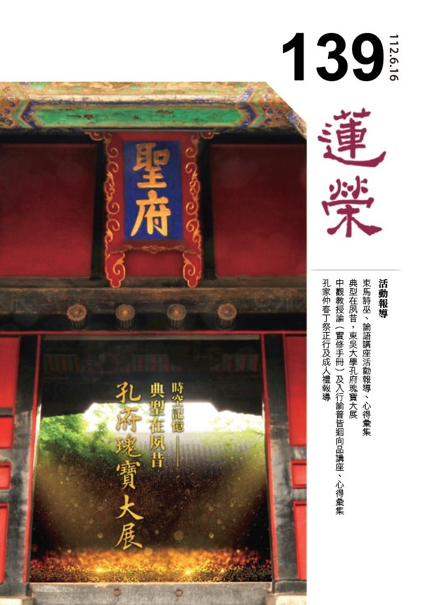

## 社論

### 傳家之旅：傳承道統家學的美好人生之旅

*編輯部*

家庭經學好環境

培養道統從家學

落實於禮多和諧

子弟人才國家興

(二○二三年海峽兩岸孔子春會紀念活動講稿)

前言

中華文化博大精深，其中包含了許多優秀的經典、思想和價值觀。然而，在現代社會中，許多人對中華文化的傳承和發展缺乏足夠的關注和參與，甚至有些人對中華文化有所誤解和偏見。這是一個令人遺憾和憂慮的現象，因為中華文化不僅是我們的歷史和根源，也是我們的智慧和指引，更是我們的義務與使命。

以下試著探討如何從傳承道統與家學延續，發展個人美好的生命之旅。

經學、家學和道統是學習中華文化的三大重心，也是我們學習、成長和實踐的三大途徑。通過經學，我們可以建立個人生命的底色，培養忠信的質地與美德；通過家學，我們可以創造成就仁道的環境，實踐五倫關係；通過道統，我們可以明確立身行道的依歸，從而接受聖賢的教化，傳承民族的精神。

一、經學做為個人生命的底色

子夏與孔子對話時，談到的是《詩經‧碩人》中，衛國美人莊姜巧笑顧盼的段落。他們討論的自然不是像現代人對顏值排比的話題，而是在「禮」上的啟發；而孔子的回覆則是從詩入畫，只說了一句「繪事後素」，子夏竟然也聽懂了孔子的意思，回答「禮後乎」，於是孔子欣然讚許子夏的領悟力。

看似一段像佛家禪門的對話，讓人乍看之下還摸不著頭緒，但讀了《論語講要》，便能明白—「繪事後素」是在說繪畫要在素地的基礎上，也就是要先有一塊白絹，然後在這塊白絹上進行各種繪畫。「繪事」比喻美女莊姜巧笑盼動的樣貌姿態，要在原有「素質」的形象與氣質的基礎上彰顯；「禮」的外在表現，也要在忠信的「素質」下，才可能顯現得出來。

原來我們常說「禮之用，和為貴」，禮是創造和諧人間的重要依據，而禮的背後還要有忠信作為質地。

那怎麼培養忠信的質地呢？就少不了經學的涵養。

經是文，是所學；學是獻，是能學；經是所詮釋，學是能詮釋；經是所彰顯，學是能彰顯。中華文化的典籍需要靠能學、能詮釋、能彰顯的人來發揮價值，使人具備忠信的質地，去涵泳於聖賢的思維，體現在每個階段的人生之中。

二、家學作為成就仁道的環境

人既然是能學、能詮釋、能彰顯，而經典是所學、所詮釋、所彰顯，那經典的核心觀念又是什麼呢？《中庸》裡記載，孔子說：「仁者，人也，親親為大。」原來人要從經典中獲得的，就是怎麼成為一位仁者，於是可以成就自我，進而造福家庭，和諧社會，幸福人間。

《論語》中關於「仁」的章節就有五十八則，到底仁是什麼？其實「仁」就是一個人的德行方方面面的具足，可以說仁就是德行的圓滿。

學習做人，就是在學道。孟子說：「仁也者，人也；合而言之，道也。」道有世間道，有出世間道。我們讀過《大學》，明白大學之道就是出世間道的明明德，以及世間道的親民；大學之道的圓滿就是「止於至善」。

先說世間道的親民，就是齊家、治國、平天下，可以說仁的表現，就先要展現在家庭之中。孔子說「能近取譬，可謂仁之方也已」，仁就在與父母、兄弟姊妹相處的孝悌和樂上展現，進而在朋友之間的忠信輔仁上展現，在成家之後的夫妻關係中的互愛互敬上展現，在出社會後的君臣之間的道義相交上展現，逐漸拓展到這一生的所有人際關係之中，在四海之內處世行仁。

所以家學就是讓家成為學做人、學成人的地方，成為力行仁的最佳環境。

簡要地說，要培養人格、創造幸福的家庭，就得先從學仁的內涵開始。

三、道統作為立身行道的依歸

再來說大學之道的出世間道—明明德，先從格物、致知、誠意、正心作為「修身以道，修道以仁」的入手處。身心是不能分開的，所以說修身的同時，也是在說修心。心的修行從格物致知上修，修出能夠如實地察覺了知每個心念的生起；進一步修誠意正心，使心誠意正，總能做到反觀自心、照見明德的內在本性，於是不至於盲目地被外在的種種牽著鼻子走，而能做個行走人間的明白人。

明明德的修行不會是自己從書上就能讀得，都必須依著經學道統的傳承上獲得。

拜互聯網科技之賜，現在想要學習中華文化非常方便，只要動動手點擊手機屏幕，就可以收看、收聽各種國學課程，加入各種線上經典共學的讀書會。

因此，想要學做人處世、立身行道的方法，只要把仁、把道統時刻放在心上，善用互聯網科技經常回歸經學上來研究，並在家庭上力行仁、與家人一起共學，甚至在家族中推廣仁、一起共學中華文化傳承的道統。

總結

中華文化是一個寶貴的民族資產，而傳承中華文化，更是中華兒女責無旁貸的義務。我們應該珍惜和善用這個資產，同時也應該承擔和履行這個義務。藉著一生不斷地學習、成長和實踐，讓自己成為一個有道德、有智慧、有作為的人，讓家庭成為一個和諧、幸福、溫暖的地方，讓社會成為一個文明、進步、包容的空間，讓人類成為一個大同、協作、共榮的群體。

期待與更多志同道合的朋友交流和合作，共同推動中華文化的傳承和發展，從當下的「傳家之旅」啟程，共同創造傳承道統的美好人生。

人的一生當中，都會獲得許多人的幫忙，因此我們要有知恩圖報的心。在新年伊始，我們不妨好好思忖：在過去的人生歲月裡，有哪些人曾經幫過我們的忙，我們可以在這一年怎麼表達自己的感恩與感謝，以助成當前的共好，及未來齊成正覺的契機。

## 佛學覽幽

### 菩薩清淨的行持—華嚴經淨行品（五十五）

*戒慧講述、編輯部整理*

乞食得不得恭敬

皆是善用其心處

斷惡修善真用心

離苦得樂是出路

丙二、指事顯因答其徵因

丁一、總徵

丁二、別顯

戊七、到城乞食時願（二十二願）

己三、乞食得不得：得恭敬、不得恭敬

己三、乞食得不得：得恭敬

經文：

若得恭敬，當願眾生，恭敬修行，一切佛法。

修學任何法門，最重要的就是恭敬，印光祖師說「欲得佛法實益，須向恭敬中求」，有一分恭敬，則消一分罪業，增一分福慧；有十分恭敬，則消十分罪業，增十分福慧，若無恭敬而致褻慢，則罪業愈增，而福慧愈減矣。

「若得恭敬，當願眾生，恭敬修行，一切佛法。」會性法師特別說，行者得到恭敬的時候，當願眾生，恭敬修行一切佛法，這兩句要連起來念，中間不需要逗點，行乞的比丘在鄰里間，若得信徒的恭敬，當生慚愧，願一切眾生以這樣恭敬的心來修行一切佛法。

要布施給行者的時候，用恭敬的心意來行施法，表示此施者對佛法有正知見，而且知道恭敬的修學法，對施者有能捨的心，願眾生除了在布施的時候能恭敬修善，更要能具足成滿一切善法。對修行者來講，得到眾生這樣的恭敬，表示過去有跟眾生結到善緣。恭敬就是尊重自己，也能尊重別人，尊重別人就能消除由執我帶來的我慢的障礙，恭敬的人知道這種修學法，慢慢地把自己的我慢心去除，去除我執，就可以得到大自在、大解脫。

比丘出去托缽，有時候得恭敬，有時候不得恭敬，不要說托缽，一般修行人有時候也會得到別人的恭敬，有時候入世間不得恭敬，有時候還要受人侮辱、受人冷嘲熱諷，有時候被看成曲高和寡、不合群，所以修行人在得到恭敬的時候，要隨喜他的善業，也要肯定自己修行的價值，但是這裡面更重要的是，恭敬修行一切佛法。

恭敬應該要恭敬佛菩薩、恭敬聖者、恭敬有情，為什麼結論是恭敬修行一切佛法？因為能說法的是佛、菩薩、僧眾，但是讓我們真正能體悟，能得到利益的是法，知道法以後，身體力行而得到體悟，證得智慧，當然要得法須賴善知識說法，然法才能讓自己內心真正得到利益，所以是恭敬修行一切佛法。

修行一切佛法要用恭敬心來修，必然有所成，當此人懂得恭敬修行一切佛法，他才會去恭敬一切善知識，才會去恭敬修行人，互為因果關係，舉例來說，富有的子貢該如何看待三餐不繼，簞食瓢飲、居陋巷的顏回？子貢絕對不會因為顏回的困苦而對他產生輕視，反而對顏回在這樣的環境中還能修行不倦，更深刻佩服。

己三、乞食得不得：不得恭敬

經文：

不得恭敬，當願眾生，不行一切，不善之法。

遇到肯布施，但是布施時很隨便、不恭敬的施者，就要當願眾生，不行一切不善之法，不善就是惡，不恭敬就是一種惡業，包括對別人的輕視、嘲笑、侮辱，甚至棒打、唾罵、鄙視都是不恭敬，看到施者做這樣的惡業，希望眾生不要造有損眾生、惱怒眾生的事情。上一條是得恭敬時希望眾生修善，這一條則是不得恭敬時，希望眾生斷惡。南亭老和尚從另一個角度來說，得不到恭敬要反求諸己，那是自己的惡業感招來的，願一切眾生以我為前車之鑑，不行一切不善之法。

我們可以從幾個面向做觀察，第一，就自己而言，他人不恭敬自己的時候，是自己的惡業感招，當願眾生不要行惡業，否則會得到他人的輕視、嘲笑、侮辱。

第二，就同伴而言，當另外一個修行人被嘲笑、輕視、侮辱的時候，希望眾生不要行傲慢法，行傲慢法是一切不善之法的開始，我慢山高，法水不入，傲慢修學者是一切煩惱法的開始。

第三，就比丘而言，不但要懺悔惡業，還要修學忍辱，而且修忍辱的機會是信徒給的，忍辱的功德比持戒還大，我的忍辱度是靠他才能修的，有辱才能修，沒辱就修不到，所以縱然得到侮辱、輕視，也不會生起瞋恨、怨恨之心。

忍辱的修學法如果在娑婆世界好好用的話，是極樂世界的善友、菩薩所隨喜讚歎的對象，因為忍辱必須要靠娑婆世界的惡人、惡境界的成就，在極樂世界，忍辱這一法修不到的。《金剛經》說，如果你在修學，而且特別是修般若的這一分，得到輕賤、嘲笑，不但要修忍辱，還要生歡喜，歡喜如何生？就對境來講，不管忍辱的功德有多大，侮辱本身都不應該生起歡喜心，生歡喜心要從另一個面向生，要想，我們很多很嚴重的惡業，要靠他消，從這一分生歡喜。可是眼前明明是受辱，也看不到消千劫的惡業這件事，如何生歡喜心？消千劫的惡業不是我的現量，只剩比量，理論上來講，既然生起的是非量，應該不會歡喜，而且會覺得被羞辱，甚至對修行產生否定，對善友產生輕視，對自己所修學的法門產生失落感，認為無用，忿忿不平，不懂為何自己會遭到這種待遇。這時候要把佛的聖言量拿來當比量，當佛在說對治法，說勝解、空性時，讓我們能很快地對治煩惱，生起很大的安樂，這時，對佛所說教法就產生無比的信心，便會把佛的聖言量拿來當比量，三量就是現量、比量、聖教量，聖教量就是把佛的聖言量拿來當比量，因為佛的聖言量是他的現量，可以成為我們的比量境，要依佛說的，自己要相信，以此來生起消千劫罪業之想。    （下期待續）

### 大乘百法明門論簡說(四十六)-拾柒、心不相應行法（四）

*戒慧講述、淨本整理*

尋求涅槃

無想滅盡

差之毫釐

失之千里

論文：

第四、心不相應行法，略有二十四種，一得，二命根，三眾同分，四異生性，五無想定，六滅盡定，七無想報，八名身，九句身，十文身，十一生，十二住，十三老，十四無常，十五流轉，十六定異，十七相應，十八勢速，十九次第，二十時，二十一方，二十二數，二十三和合性，二十四不和合性。

滅盡定是三果聖人所修的空性定，空性定要有四禪八定的基礎，至少要有初禪未到定的功夫，空慧才能修成，所以此處要談四禪八定、九次第定，可以與前面四諦十六行相的說明相互配合參考（大乘百法明門論簡說（三十二） 拾肆、心所有法—根本煩惱）。

一、「初禪，離生喜樂」。

先以「覺觀」（新譯「尋伺」）淨除欲染（五欲能染污故名欲染），離生喜樂而入初禪（離欲界之生所以喜樂）。

「覺觀」又稱「尋伺」，「尋」是粗想、是大略觀察，「伺」是細想、是細緻觀察，比如警探要去偵查犯罪，「尋」是大略看他一天作息，「伺」就是觀察他一天當中的每個動作，在這樣的觀察下，人情是無法隱藏的，叫做：「人焉廋哉，人焉廋哉」。也就是說，想要遠離欲界，要先觀察色界的殊勝功德，了解欲界的過患痛苦，以過患修厭離欲界的心、以功德生希求色界的想，人才能往上走，這其實跟往生極樂世界的道理一樣，只是一個用在修禪定，一個用在修往生。

在尋伺的觀察下，欲界很多問題就會被觀察出來，男女飲食睡眠有哪些過患，會帶來什麼麻煩？因為欲望造成了多少煩惱？因為煩惱造作了多少惡業？因為惡業所以此生痛苦、來生墮落。這些觀察要不斷串習，修行人與世間人的差別，就在於對五欲六塵有敏銳的觀察力，五欲六塵所釋放的毒害與痛苦是很厲害，但世間人來看卻全部看成快樂，所以這個世界很奇妙，各看各的。

尋伺就是開始會去認真觀察、來回觀察，以覺觀來離開欲界的煩惱，進入色界的喜悅。所以這樣的人不但是對於欲界的苦生厭離，對於欲界的快樂也生厭離，只對初禪的禪定感到歡喜，他以初禪的世界為所緣，然後讓自己的心入初禪。心入初禪還要有「七種作意位」的修習，才能從初禪的近分（初禪未到定）到初禪的正分，往後的二禪近分到二禪正分、三禪近分到三禪正分等，也都是靠「七種作意位」的觀察，讓每一禪的功德圓滿，所以只要了解這七種作意，大概所有禪定的修學法都能掌握，此在之前也已經做過說明（請參閱大乘百法明門論簡說（三十）心所有法—遍行）。

一個人在尋伺後開始不喜歡欲界，變得很喜歡修學禪定，此時可以透過緣念石頭入定，也可以緣念呼吸入定，修禪定所緣的對象沒有限制，緣念佛號也可以。此時他的心開始慢慢地寧靜，這種寧靜是有目標的寧靜，是為了要生到初禪天所以讓自己靜下來往上走，四禪八定都是以寧靜的方式進入，想投生到天界，都要很安定。比如世間高貴的人也都比較安定，浮躁的人則顯得平庸，所以看世間貴族式的教育，就是坐有坐相、站有站相，以禮與人相處，讓自己顯現出安定的狀態，佛法真的告訴我們很多人生的真理。

以寧靜的方式進入禪定，他的快樂也從寧靜中生起，這種快樂會讓人再也不想回到躁動的欲界中。初禪有三天，梵眾天、梵輔天跟大梵天，「梵」是清淨的意思，初禪主要是以戒律清淨的力量，使他寧靜下來，遠離欲界欲愛的躁動，依《俱舍論》言，定功的成就是從二禪開始。

二、「二禪，定生喜樂」。

初禪的喜樂是從持戒的寧靜中來，二禪的喜樂則從定功來，所以稱為定生喜樂地。禪定成就可以破除內心的昏暗相顯現光明，所以二禪三天的名稱都與光有關，少光天、無量光天跟光音天。

二禪是以「內淨」得生，也就是靠「內心的信力讓內心清淨」，信力的意思是修四禪八定要有傳承，才會對修學的方法很有信心。禪定不能隨便亂修，一定要有老師、要有環境。曾經有一個人喜歡打牌也喜歡禪坐，他的禪坐方法是自己看書看來的，不知道入禪定前應有的前行。有一天他在家裡靜靜的坐禪時，牌友突然衝進來找他打牌，這個刺激讓他從此得了一個病，就是人會突然緊張，而且再也沒辦法靜下來，治也治不好。所以四禪八定的修學法要有傳承，千萬不要硬來，不能自己看看書就開始修。

初禪有尋有伺、有覺觀，二禪捨離覺觀，無尋無伺，也就是不必再去觀察欲界的過患，因為對於欲界的覺觀，已經在初禪的時候圓滿，此時直接以信心的力量欣求二禪去修禪定即可。欲界過患的觀察，其實會對修定產生障礙，因為還要分出心力去作觀察，從欲界往上到初禪時，這種觀察有其必要，但從初禪再上去二禪時，渴望欲界所生的躁動，已經不是禪定力的對手，所以不用再分心力去尋伺，直接以內淨就可入禪定，這也是《俱舍論》的說法。但其實無論是欲界到初禪，或者初禪到二禪、二禪到三禪等一直往上，所有階段都要有「欣上厭下」的觀察。

三、「三禪，離喜妙樂」。

三禪也是厭離二禪、欣求三禪才上得去，一定要不滿現狀，又有目標，你才會離開現狀再往上走，否則雖然對現狀不滿意，沒有建立目標，也會形成雖不滿意但可以接受的狀態，原地踏步過一輩子。

三禪稱為離喜妙樂，「喜」是內心的喜，「樂」是身體的樂，三禪的定功會捨去內心歡喜的感覺，純粹剩下身體的快樂，身體感覺就像充滿氣的皮球，整個氣脈通達，《小止觀》上說，當氣脈通時，很多醫藥治不了的病都能治。為何三禪要捨去內心的歡喜？因為他對於喜樂已經不在意，比如心志越高的人，對眼前的快樂就越不會在意，志在當宰相承擔天下大任的人，怎麼會因為考上功名就快樂得要死？ 一個人前面的見地已經決定他後面的結果。

三禪也有三個天，分別是少淨天，無量淨天，遍淨天。稱為「淨」，是觀待此時已對治內心喜悅的躁動。

四、「四禪，捨念清淨」。

不以三禪的境界為滿足，志在解脫，所以更要往四禪上走，此時連身體的樂也不在意，進入一個渾然忘我的階段，叫做捨念清淨。因為渾然忘我，所以四禪很容易被誤認為是涅槃，但其實仍屬於世間禪，因為執我的心仍在，而且在「我證得涅槃」的妄認中不斷增強，只有等到定力失去時，才會驚覺自己原來是妄認。

四禪其實也只有三個天，三果聖人所居的「五不還天」，是第四禪天裡面的五個地方。四禪的三天，《楞嚴經》說是福生天、福愛天跟廣果天，《俱舍論》則說是無雲天，福愛天跟廣果天。稱「無雲天」是因為此上諸天無雲，在無雲之首，故名無雲。名「福生天」是因為生此天為三界有色中最有福者，一個人要靠內心的安定，才能夠生起真正的福報；若依《楞嚴經》稱「福愛天」，是說他的福報更勝於福生天，此福最值得珍愛。第三個廣果天，是指他的福可以生起廣大的果報，許多不同的快樂，在他的禪定中都能生起。

五、「無邊空處定」。

以滅色緣空的修學法，開始進入四空天，老子說：「吾有大患，唯吾有身。」身體是最大的累贅，所有的病痛與苦難都是因為身體才有，所以老子看見身體的過患。佛門也有這種修學法，比如「觀身不淨，觀受是苦」。我們一生可以說都在為身體服務，努力讓這個身體變得體面，讓身體感覺舒服，但實際上身體卻是最不乾淨、最不可愛者，並且不斷朝向敗亡，我們卻因為對身體的愛執，去造作許多罪業，最後將我們帶往三塗。修學空無邊處定者，雖然也是看見身體的過患，卻以緣念虛空或者是厭離對身心的取相(想)的方式去證涅槃，這種修學法，縱然沒有了色身，也同樣無法脫離輪迴。

對於身體不應產生愛執，但也不能將身體報廢，否則也沒有修行的資糧。有一種觀修法，就是觀想身體如員工，我如老闆，員工做多少事情才給多少報酬。身體有在修行我才愛護它，如果身體不修行，我就不應該愛護它，我讓身體去聞思修，並幫助我證果，這都是身體的功德，所以正知見可以讓身體的功德發揮出來，身體不是只有過患而已，所謂「暇滿人生」也是要靠投生到有佛法之處，以健全的身體學佛才能累積福慧的資糧，讀古書要活讀。釋迦牟尼佛曾經跟阿難尊者一同經行遇到一些枯骨，釋迦牟尼佛對枯骨禮拜，阿難尊者問釋迦牟尼佛為什麼要對枯骨禮拜？佛說這是他往昔為薩埵太子捨身餵虎的枯骨，沒有他就沒有現在的我，所以身體到底是大幸還是大患，端看你如何善用。

四空天的修行人認為身體是過患，所以修學著通往沒有身體的境界，滅色緣空入無邊空處定，也就是一方面厭色，一方面取空，以虛空為所緣，終於進入空靈靈的世界。請問這種空靈靈的世界裡有沒有生命？仍有生命，這位行者的生命現象，是以意想身的方式存在，五蘊中去除色蘊，仍有受想行識的作用，這稱為他的意想身。

四空天不繫屬於這個三千大千世界，因為他們沒有大千世界的繫縛。舉例來說，當我們在緣念東方境界時，西方境界就不會生，念佛很專注時，煩惱都不生。所以滅色緣空時，除了意想身，其他外境全部都空靈靈，三千大千世界的國土，在他的心識前通通不展現，他的意想身所在之處既非欲界也非色界，只不過是在生死輪迴中較高的層次上，所以安立為無色界。

六、「無邊識處定」。

滅空緣識入無邊識處定，就是連虛空也不想緣念，只緣念自己的心識。四空天本質都是無想，都在追求空靈靈，滅空緣識就是冷冷地觀察自己的心識，使心識不要向外緣，如果心識想往外攀緣，就好像看到小偷出現，小偷因為被他人冷冷地觀察著，會不敢下手偷東西，心識在這樣的觀察下，也就不會去攀緣外境，外境要心識的緣念才會顯現，一切都不緣那就一切都空。爾時他也認為他進入了涅槃，但其實仍有堅固的我執在受用這種空靈的境界，我執絲毫沒有受到影響，還因為妄任證得涅槃，心中產生增上慢。所以不能將無邊識處定的修學法稱為觀心法門，觀心法門是觀察所緣的境界無自體性，貪瞋等心的作用也都是待境而生，所以心也無自體性；雖然都無自性，但進一步觀察當心對境時，又是如何生出種種的現象與作用，此與無邊識處定不一樣。

七、「無所有處定」。

更滅識，緣無所有，就入無所有處定。剛才是冷冷地觀察心識，使心識不緣外境，現在凡是起心都是我所討厭的，連起心都討厭、心都不見了，那就一無所有，以此證入空靈靈的境界，也容易誤認這是涅槃。為何連心都沒有了還是誤認呢？因為爾時還有一個我在受用空靈靈，心識的作用其實也沒有不見，只是變得更微細，我執也絲毫未被動搖。

八、「非想非非想定」。

更滅無所有，緣於非想非非想處，入非想非非想定。「非想」就是沒有想法，「非非想」就是連沒有想法都不要有。但若依照中觀宗的宗義，「非非想」是指仍存有無明我執，所以如果不是對教法通達，很難相信這樣的修行境界，居然都還是冤枉路。

第五到第八是入四空天的修學法，可以說有次第性，因為先向外緣空，再向內緣識，再來滅識，再來什麼都不要，以這樣的次第修學，有定力高下、壽命長短之分，這是《俱舍論》的講法；另外一派則認為，四空天沒有次第性，沒有定功高下之分，而是所緣境界的差別。以上八種稱為四禪八定，是從初禪天到四空天的八種世間禪定。

九、「滅盡定」。

此為真正的出世間禪定，透過尋覓諸法的自體性找不到，能所雙亡現證空性，成為出世的聖者。現證空性時「受」「想」不生，所以也稱「滅受想定」，並不是把受跟想滅掉，而是在空性定當中受與想的作用不會出現。這種空靈靈的境界，是降伏我執的空靈靈，與四空天藉由緣念虛空等方法所證入的空靈靈完全不相同。

有初禪未到定的禪定功夫，加上觀無我的空慧，就能現證空性出三界，所以此處九種次地禪定的修學法出離三界輪迴，只是一種方式，並非絕對如此。

唯識宗認為入滅盡定是破人我執，可是沒有破法我執，所以說「入此定者，惟第七識俱生法執與第八識仍在，不離根身，依此身心分位假立」；但中觀宗認為人我執與法我執都一樣，因為人我也是法的一種，破人我執一定破法我執，這是兩宗看法的差別。（下期待續）

### 佛學概要十四講表簡說（四十一）

*戒慧講述、編輯部整理*

修學正法多艱難

瞋嫉慢疑成修羅

對治煩惱修學要

苦因果滅是解脫

第六講表　宇宙有情概況

第六講表「宇宙有情概況」講到宇宙裡面的眾生，輪迴所攝有情可以分為天、人、阿修羅、地獄、餓鬼、畜生六類，目前進度進入阿修羅道，先看阿修羅道的類受，也就是他的種類還有受用。

阿修羅有非天、無端、雜趣、無酒這幾種翻譯，都是阿修羅的特色。阿修羅的果報次於天，有天福，沒有天德，故稱為非天，沒有天德的部分特別就他的瞋心重，還有嫉妒心強的這一分來說。阿修羅有男女之分，男生長得非常醜陋、不端莊，所以稱為無端，無端其實也是回應他的多瞋、多慢、多疑、多嫉、好勝、好鬥的特性。阿修羅的女生則非常美麗，如同蛇蠍美人。

此道的眾生像天道一樣能身心靈通、遊行變化，《起世經》說，阿修羅所住的宮殿、城郭，所用的器具用品等，都比天道差一點，像忉利天、四王諸地居天是差一等的，至於婚嫁的方式，跟人間差不多。阿修羅是站立的，像天人一樣，不會像畜生橫行，畜生道也有阿修羅，此處可知畜生道的阿修羅是直立的。醒公老師說，人頭頂天、腳踩地，是高等動物，此相最尊貴。而頭髮的顏色以黑色最好，那是聖人的髮色。

阿修羅另一個名稱叫做雜趣，因為天道、人道、鬼道、畜生道這四道裡面都有阿修羅，鬼道的阿修羅是卵生的，會變成鬼道的阿修羅，是因為他前生就是在鬼道當中，而且他以善心願來護持經教，或者護咒，或者護戒，護持修行人，由他的善業力故，出離鬼道的時候，就轉為鬼道的阿修羅，他的護法力讓他有可以入虛空自由往來的神通，稍微勝出鬼類，這是鬼道的卵生阿修羅。鬼道中有鬼道，也有鬼道中的阿修羅，人道中有人道，也有人道的阿修羅，阿修羅遍各道，我們有時候講六道，有時候講五道，講五道就是除去阿修羅，因為阿修羅遍其他四道，所以阿修羅就不用說了，以上是鬼道的阿修羅，鬼道的阿修羅勝於鬼。

人道的阿修羅，跟人道一樣是胎生，他是天中降德，從天上降下來的，他在天道中很享福，但是他的情欲稍重，以致梵行虧損，以降德的這一分被貶下來，後來就投生在人道的阿修羅當中，他所居住的地方跟日月相鄰近，在須彌山腰，因為他的情感比較重，所以感得胎生。在四王天的附近，有人道的阿修羅，可是人道的阿修羅不是人，鬼道的阿修羅不是鬼，我們會認為這個時代美國是人中天，阿拉伯是人中阿修羅，那都是講人道，不是講人道的阿修羅，只是說人道裡面可以看出有六道的樣子，並不是說阿拉伯那些人叫做阿修羅，人中的阿修羅道就像阿拉伯那些人，有礦產、有福報，可是環境不好，沒有像歐美那樣的生活享受，雖然資源多，但容易發動戰爭，而且很有仇恨的心理，他所信仰的宗教，就是要消滅其他的宗教。

天道化生的阿修羅，是來統持阿修羅界還有諸鬼神界，力動無畏，他的能力洞徹諸天，沒有任何畏懼，可以跟梵王帝釋天還有四天王天爭權，這些阿修羅是化身，是天趣所攝。打仗的時候玉皇大帝未必打得過他，他的受用不如天道，而且脾氣不好，所以常常會來跟帝釋爭權，四天王天會先跟他戰，戰不贏的時候就會求救兵，帝釋再來跟他戰，戰不贏的時候又會求救兵，讓夜摩天還有大梵天王出力助戰，這些阿修羅很強，能夠化身大或者化身小，化身大的時候非常大，能夠以手撼動須彌山，可以使整個的天宮都搖動不安，戰敗的時候他又可以縮小，有個故事講到阿修羅跟帝釋戰鬥輸了，阿修羅就逃到舍衛國的一個蓮花水池裡面，在藕孔中藏匿起來，可以縮到那麼小。最後釋迦牟尼佛要這些天人誦摩訶般若波羅蜜，才打贏阿修羅，這就是正法的力量。以上就是天道的化身阿修羅，他有天福沒天德，屬於天道所攝的阿修羅。

畜生道的阿修羅可以說是四種阿修羅裡面最下劣的，他們「生大海心，沉水穴口」，這種修羅屬於畜生類所攝，好像龍、魚之類，生在大海的深處，住在水的穴裏邊。他為什麼會生在畜生道呢？因為他從畜生道來，他前生受過三皈依，像金翅鳥王還有龍這兩種，他們受過三皈依的善福因緣，但是畜生的習氣沒有除去，就投生為畜生的阿修羅。金翅鳥跟龍，有屬於畜生道的金翅鳥跟龍，有屬於畜生所攝的阿修羅，兩種不一樣，屬於畜生所攝的阿修羅，比畜生道的金翅鳥跟畜生道的龍還要厲害多了。聽說在印度洋附近就有一個落差的穴水口，船行走到那裡，忽然下去，是幾十公里的落差，很多船到那裡就消失了，到現在依然是一個謎。

以上的阿修羅怎麼分類呢？天道的阿修羅等於是王，人道的阿修羅似臣，鬼道的阿修羅似民，畜生道似為奴隸。這些阿修羅很有勢力，跟他們修善有關，可是他們修善時懷著瞋恨心、慢心、嫉妒心、疑心，可見如何讓修行的心態不要去夾雜這些煩惱心，是修行很重要的功夫，要有正知見去維持正法，也要揀除非法，才叫做修行，慢慢修時快快到，低處修時高處到，能夠慎始，步步為營，相信會很莊嚴地走完這一生，在來世得到非常殊勝的增上。（下期待續）

### 人生大事不能忽略的事實-今彩大師往生記

*戒慧講述、編輯部整理*

大巧不如拙

少實勝多虛

今彩真精彩

修淨他典範

前已將助念生西須知、助念團的經營、家屬該知道的事項、病人該交代的事項、助念現場的規矩，助念的決定見(得助念與失助念的比較)、生病時的用功法(示華權師病中法語)、助念團要懂的要點(臨終三大要)、火化的好處(普陀普濟寺化身塔記)、論平時所做要與淨業相合(喫素念佛修淨業人，須平時事事多與淨行相合)，接著是出家人往生的典範，也就是〈今彩大師往生記〉。

今彩大師是一位為公發心的實修者，本文分為三段，第一段描述出家前後，精勤修道奠立修道的基礎，大師出家前即有善根，戒殺吃素，並厭苦出家，文：「

今彩大師，俗姓方，江西雩都縣人。宿有善根，少即戒殺吃素。至三十後，深厭五欲多苦，三界無安，遂出家於福建長汀縣報恩寺。

」生起善根的根本處在正知見，必須要有如是因如是果，斷惡修善的因果正見，以及般若的修學法，產生對真實義不愚的正知見。大師年少便有與一般人不同的想法與見解，選擇茹素，一般人的想法是滿足眼前生活享樂，但今彩大師卻以為眼前享樂未來導向是苦，甚至會在臨終引起極大煩惱而墮地獄，三界的本質都是苦，沒有可以安身立命的地方，後來就在福建西南部的長汀縣報恩寺出家。

出家之後，受戒苦修，惜物又惜時，文：「

具戒後，專志苦行，於贛州光孝寺執香燈，精潔虔恭，凡見之者，皆歎其誠。惜常住物，如護目珠，日以禮拜念誦為事，時無虛棄，為寺眾所欽敬。

」今彩大師受具足戒之後，在寺院中專心致志的修學，所謂的苦行必須要通達因果知見，知道五欲過患，除去貪愛心、慢心，願意接受磨練，否則種種繃緊的身心苦行，容易破壞原本的善根。這時不得不承認，貧窮人家容易適應這樣的苦行，雪公曾說：貧窮有無限的好處！幫助我們不以為苦，不生煩惱。今彩大師在江西贛州的光孝寺做香燈的職務（佛門中執掌殿堂的維護與照顧，燈香燭果花等供養及管理叢林時序等工作），把公家事當作修行，虔誠恭敬且四處整理到位，大眾見之皆讚歎不已。

大師愛惜寺院中常住物品，就好像我們平常保護眼珠，不能受到一點傷害那樣。愛惜光陰，每天的重點就是禮拜念誦，不會浪費時間，讓修行成為一種風氣和典範。服侍僧團的福報，哪怕生在無佛之世，也不會怕苦、怕累，有膽識。

專修淨業利自他，修己以淨，外生活簡樸，不但安貧樂道，也不貪利養名聞，文：「

繼欲專修淨業，徙雲都深山石室中，架松為座，聚草作褥，種薯為食，補衲為衣，其為苦行，人所難堪，師恬然適意，以道為樂。久之，有造訪者，施以銀錢，則卻之不受，若與敝衣粗食，則便受之。

」

大師因福報修夠，所以後來有了一段安靜獨修的因緣，想要專心致志修學頭陀行，遷徙到深山當中的石窟內，以松樹為法座，乾草為坐墊，耕種根莖薯類作為食物，縫製破布為衣，人不堪其憂，大師卻是心情愉悅，對每件事都感到滿意，身心暢快就像在做ＳＰＡ。

久而久之，大家知道深山中有位修行人，想要造訪供養，如果是供養錢財，大師婉拒不接受，如果是粗衣或不精緻的食物，大師才會接受。我們在家人不可以把出家人當成可憐的對象，要想是殊勝的福田來供養。

今彩大師不去外面攀緣，更不立徒眾，文：「

素性孤潔，不立徒眾，有重其德者，代為收四人，實皆未與同住。一徒名德緣，廟稍豐裕，念師清苦，再四哀懇，接回供養。未幾，復往蓮花山，自以木板隔一小屋而居，寺眾尊其道行，聽伊自便，

」大師喜歡獨修，潔身自好，不喜歡入眾共修，但因其曾經發心為公，福報深厚，有欽佩大師德行者請求拜師，大師便收四人，成為掛名師父，實際上並沒有跟弟子同住。大師的一位徒弟德緣，在寺院資源上較為豐厚時，雖然知道師父有苦修的願力，但是想要接濟安養師父是作為弟子的誠意，再三懇請接回寺院供養師父，不久大師又往蓮花山（應仍在江西），以木板隔一個小屋自己獨居修行，大眾尊重大師的德行，只好聽師的意願。

淨內，文：「

終日閉戶誦經念佛，除早午二餐外，魚磬之聲，朗朗不輟，數十年如一日。

」

大師深居簡出，除早午進食之外，誦經念佛，木魚引磬伴隨著大師清朗的聲音，數十年如一日，沒有間斷過，可見今彩大師的恆心與道力堅固、身體健康，而且法喜充滿。

除了自律修行之外，也與大眾結緣，教人以淨，物供三寶，文：「

由是緇素信慕者眾，每有誠心供養衣履襯施，不容推卻者，隨即供佛供僧，為彼作諸功德，隨身僅留十圓，以備命終焚化之費，其清苦自甘，解脫無著，有如此者。

」

愈來愈多出家在家的修行者信仰欽慕今彩大師，每每誠心供養大師衣服鞋襪財物等，無法推辭的部分，大師便轉供養大眾僧，為這些善男信女廣種福田，得到無量無邊的大利益；自己僅留少許金錢，作為命終之後火化的費用，大師以修道解脫為樂，是一般人做不到的程度。

法念三寶，急出為要，文：「

凡造訪者，無論緇素，均示以娑婆惡濁，極樂清淨，急求出離，是為要務。

」

大師不但自己專以淨土法門為修行主力，只要有人造訪他，不論出家人或在家人，都顯示這個娑婆世界是五濁惡世，要趕緊出離，並且要欣求極樂世界，這是最重要的事。二乘人也是厭離三界，急求出離，但是卻和今彩大師的重點不同，此處是不同於其他修行者，要務在往生極樂世界。

始終不變，文：「

然須明因識果，修行世善，謹守禁戒，誦經念佛，內外如一，始終不變，方有冀望。

」

明因識果也貫穿到誦經念佛，才能定下來在禁戒上成為修行人，這樣的人才好調，也能在誦經念佛中降伏增上慢。深信因果，才會知道善法應該要如何修，利益他人感得樂果，有前面的修為再來念佛，這樣的念佛容易降伏增上慢，引導內心的快樂，這樣內外如一，又有恆心，才有往生的希望。

所謂的修行世善指的是性戒，也就是在本來就不應該違犯的道德信念；而謹守禁戒是遮戒，是佛陀因事、因地所制的戒律，效果大大超越一般世間斷惡修善。

精純解脫，文：「

從無一言，涉及世閒福樂者。

」

修行有很大的法喜，所以不喜歡說話，也不會和信徒、同道者談論世間各種福樂，這邊要注意的是，雲谷禪師引導了凡先生斷惡修善的這些觀念，也是度眾很好的善巧方便，只是今彩大師著重的修行重點不同。

最後臨終現瑞立楷模，第一部分敘述往生瑞相之事，分為斷食念佛和欣然坐化，文：「

民國七年戊午，年七十四，十月初，示微疾，至初四日，斷飲食，念誦如常，夜深遂息。初五清晨，寺眾不見師起，叩之闃然不應，入室視之，已端坐化去。左手仍執引磬，一如平昔念佛時，頭略低垂，面帶笑容，與生無異。

」

民國七年（戊午），大師年七十四歲，十月初的時候身體略微不適，到初四就開始不進食，和平時一樣的念誦佛號一直到深夜，初五不見大師起身，也未聽見大師念誦之聲，叩門完全沒有回應，入內查探才知大師已經端坐往生，左手仍然持著引磬，就像平常念佛的時候一樣，只是頸部已無支撐，所以略低垂，面帶笑容，和活著的時候沒有差別。大師臨終有這樣的瑞相，代表這一生的修行是紮實又有價值的。

結讚往生：「

寺眾觀之，讚歎不已，僉云，師平日有若是之行履，故致斯時得如此之景象，其神超淨域，質託寶蓮，可以決定無疑矣。

」

寺中大眾看大師如此往生的瑞相，皆讚歎的說，因為大師平日有這樣的行持，才能感得如此殊勝瑞相，大師往生淨土，生於極樂世界寶蓮中，是決定無誤，往生無疑。

第二部分結勸並勉勵大眾，要好好地修持道業，文：「

其徒德森，為余言之，切念末世僧人，每多懈怠，唯貪利養，不修道業，若師者，真可以為末世楷，因筆以記之。

」

大師徒弟德森為印光大師陳述此事，印光大師提醒大眾，末法的修行人，或者內心提不起勁，或者外在有許多追求名聞利養的機會，內因外緣都難持續道業，今彩大師實在是末世修行人的楷模，印祖為文記錄提醒。

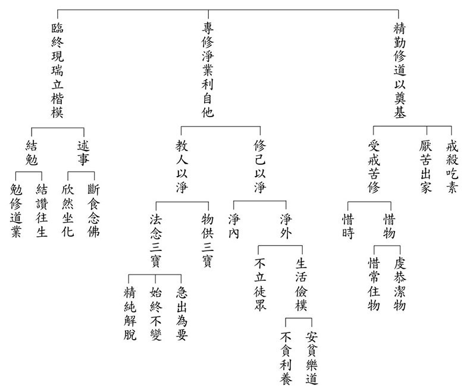

### 緣起贊論略釋（六）

*戒慧講述、心若整理*

緣起正因成立體空

世間體性微塵亦無

輪迴體性境上不成

觀待顯現夢幻泡影

論中文義分二，一、由說緣起門中稱讚能仁。二、結述造論因相福德回施。一、由說緣起門中稱讚能仁分三，即總標、廣說、攝義。

乙二、廣說分二：丙一、由緣起門稱讚之因相。丙二、正贊。

丙二、正贊分二：丁一、由見說緣起門中總贊。丁二、由說緣起門中別贊。

丁一分三：戊一、由見說緣起的這一分來贊歎佛勝過外道的大師。戊二、正贊見說緣起。戊三、結論。

戊一分三：己一、顯由說緣起成教授第一。己二、能斷戲論網者。己三、贊說緣起成無上者。

己二、能斷戲論網者

論文：「

愚者執何法，堅固邊執縛；智善彼即是，戲網盡斷門。

」

消文：中觀自續派以下這些愚者（唯識、經部、有部），不管跟他說什麼法，他都執有自性見，有自性見時，就會被堅固的邊執見（常見、斷見）所繫縛，堅固的邊執見成為能繫縛，愚者成為所繫縛。因為有自性見者，一定會落入常見跟斷見，當法有的時候是自性的有（常見），當法無的時候是自性的無（斷見），智者善巧的通達緣起就是戲論網的斷盡門，緣起這一門是能斷盡，戲網是所斷盡。

「愚者二字，指下三宗。何法，目於緣起深法。邊執，謂常、斷二邊之執。此二執縛，由執緣起計有自性反令堅固。婆沙遍計，有為無為內心外境一切實有，是其常執；雖有自性然許變壞，又複不許法空真如，是斷執邊。經部雖說無為假有，然執有為自性非無，是常邊見；自性有壞及非空性，是斷邊執。唯識雖說外境等事，唯心所變無實自體，然說內心圓成實實有自性，是彼常見；實自性心許為變異剎那不住、及說外境皆非有等，是其斷執。此等深義，待譯《辨了不了義》時當廣解說。」

愚者這兩個字，指的是下三部，也就是唯識、經部、有部，其實嚴格來說，還包括中觀自續派，這些愚者，因為執有自性，故對於緣起深法，一定會落入常見、斷見兩邊的執著，常見就是自性的有，斷見就是自性的無，有自性見的人，反而讓常、斷二見更堅固，內道如果堅固其思維模式時，是搖動不了的，以下用表格呈現：

當有自性時，就算承許因果的緣起，也沒有解釋的能力，只是相信，沒辦法推理。而應成派是以滅法的方式相續，結果的時候，對於那些滅法的相續，如何造作會成為滅法的善法，而滅法的善法相續會結成快樂的那一分，會認真的觀察，不會因為他成為滅時，就有種他沒有辦法成為未來結果的那個因的感覺。

「又諸智者，中觀宗師，由其善巧彼緣起義，即是永斷一切戲論網縛妙門。何以故？由緣起因，能善抉擇一切諸法自性空故。《入中論》云：『是故由此緣起理，能斷一切惡見網。』宗喀巴大師云：『諸餘有情，由依因緣執有自性故成繫縛；諸善巧者，即依彼因緣遮有自性，於無自性發決定智，能斷一切邊執網縛。』故緣起因，成無自性，是極稀有善巧方便。」

智者特別指中觀應成派的中觀宗師，善巧地通達緣起義，從緣起通達空性的妙門，能永斷一切戲論網（實有性）的繫縛，為什麼呢？由緣起為正因，能夠成立一切法自性空的宗，這是善抉擇，對人、對法正確的抉擇，對法的抉擇要看中觀的論典，對人的抉擇要去找真正能懂中觀見解的善知識。《入中論》說：「以緣起為正因，能夠斷除一切自性見的惡見網。」自性見之所以為惡見網，是因為他會帶來苦因苦果的輪迴，就像網能繫縛動物一樣，內道、外道的自性見成為能繫縛，有情成為所繫縛。宗喀巴大師說：「從中觀自續派以下的諸有情，都在因緣法裡執有自性，故成為繫縛；諸善巧者也就是中觀應成派諸師能用同樣的正理，遮有自性而破他宗，成立的就是無自性，立自宗。中觀應成派以緣起為正因通達空性，成為能斷，一切邊執網成為所斷，斷除一切邪見網的繫縛。」故以緣起為正因，能夠成立無自性，是極為稀有的善巧方便，只有應成派是這樣說。

「又緣起因能雙除常、斷二執，故諸智者數贊緣起為理中王。《中論》云：『因緣所生法，我說即是空，亦名為假名，亦名中道義。』其所生法是宗前陳，空假中道是宗後陳，因緣生故是能立因。空遮常邊、假堵斷失，二邊雙遣，果是中道。又空一事，即是假中；乃至中道，亦是空假。體實為一，遮顯說三，非離空假外有中道。又此三事同由一因，言『三體別』，應知非理；論文自說，即空亦假亦中道故。又如《回諍論》云：『諸說空緣起，中道是一義，第一無等說，彼佛我敬禮。』」

又緣起因能除常邊、斷邊的執著，所以中觀應成派的諸智者讚歎緣起為正理之王。《中論》說：「以因緣所生法成立正因，以此正因作為通達空性的能立，正因是能立，空性是所立（宗），因緣所成之法，體性是空，法須觀待因緣而生，因緣所生之法不過是假名的安立處，該法用三面向成立，第一個是空，第二個是假名，第三個名為中道義，中道義也就是非空非有，非有是因無自性（非自性的有），非空是有緣起的條件，該法則成所生。」因緣所生法是宗前陳，空假中道是宗後陳，因緣生故是成立的原因，空遮常邊，因為因緣生所以不是有自性，遮了自性，有自性就不待因緣。觀待因緣而生就不是常，世俗緣起的相續，不會有執斷邊的過失，也是中道，非空非有。

又，空並不是有一個東西叫做空，我只是說緣起的體性空，並不是沒有緣起，我的空性同時是假，同時是中，非有就是空，非空就是假，都在講緣起法，沒有離開過緣起法，以遮的立場來說非有、非空、非空非有這三面向，而不是離開空（非有）假（非空）外別有一個中道，中道只是為了方便立名。空假中這三件事同由一因，都是緣起法，因緣生是能立的因，把他們叫做三體別，認為有空假中三個分別，這是錯誤的（意即否定天臺宗，因為天臺宗認為有一個空名真諦，有一個假名俗諦，有一個中名中諦，以緣中諦成立中觀，這跟中觀完全不一樣）；論文自己說，即空即假，亦中道故。又如龍樹菩薩中觀六論之一的《回諍論》說：「諸說空、緣起、中道，這三個都是同一個意思，都在緣起上說，緣起是第一（正理之王），沒有法跟它相等，對於說緣起的，我龍樹菩薩深深的敬禮。」（下期待續）

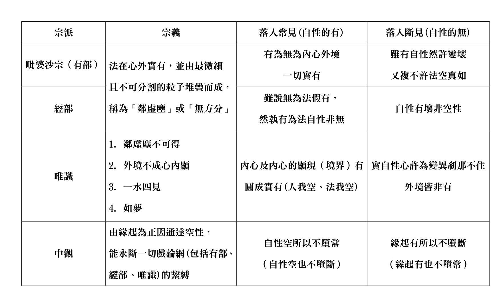

## 蓮池海會

### 回憶星雲大師與佛光山學習點滴

宗撤

前塵影事回首

侍者梵唱點滴

教法世學前進

出家在家相續

為文緣起：星雲大師於癸卯年元月十五日示疾，次日唐老師希望學生能回憶並分享做大師侍者時期，一同隨行前往大陸的私下行程印象，以及在佛光山學習梵唄的歷程，於是寫下兩篇文章。

◎回憶隨星雲大師返鄉因緣

兩千年底，大陸官方尚未正式同意大師可以回到大陸，藉著一位中國旅美企業家李玉玲女士居中協調，才促成此行。當時以返鄉祭祖名義，以及南京大屠殺贈旅美畫家李自健先生油畫，大師得以再次回鄉。由於行程不公開，那次隨行者不過幾人，有幸當時是大師侍者得以隨行。

那時去大陸，主要大師想回在南京棲霞山的祖庭，還有祭祀志開和尚（大師的剃度師），當然也回大師揚州的家鄉走走。當時江澤民在位，路上處處看得到「江河之海，恩澤於民」的標誌。一種封閉的氛圍濃厚，長老們不時囑咐的是：「人前人後，說話都要謹慎小心。」

搭著小車子跟著大師一起到一些地方去拜訪，沿途大師都會為車上的人介紹路上的所見所聞，為大家導覽。每到一個地方，大師就惦記著誰在哪裡、哪個人有沒有跟上、早飯有沒有吃……。大師似乎沒有想到自己，總是為隨行的大家著想。身為大師的侍者，卻經常被大師照顧。

每次禮佛時，侍者是否要在旁扶著大師起身，就看長老意見。該扶還是不扶，原則主要就看是否在眾人之前禮佛，如果是眾人面前，大師很注重威儀，寧可獨自慢慢作禮，也不要人攙扶。登上階梯時，也要注意大師長衫前襬是否會踩踏到，不能讓大師跌跤；但大師通常抬頭挺胸，沒有老態龍鍾的樣子，有時也要侍者不必靠太近，並且要求侍者也需表現威儀莊嚴，這是隨行者應有的儀態。

偶爾沒有事務，大師會特別把弟子找去，說：「可以跟你聊聊天嗎？」老人家一點架子都沒有，也不覺得侍者是個小徒弟，總是前後囑咐著人生處世的一些道理，例如設身處地為人著想，以及思考要切合實際，不能天馬行空等等。

猶記到棲霞山時，天降著瑞雪，那是第一次見到雪。山上許多僧信大眾特別召集列隊歡迎大師，鐘鼓齊鳴，彷彿是要見到一代高僧大德，但大師關心的是佛學院的學生學習的因緣如何。

又到焦山定慧寺，那是大師曾經參學的叢林，記得那時很多信眾著海青搭縵衣，合掌站在寒冷的土地上，從等待到聽大師講話，一動也不動地恭敬聽聞，讓人深深感動。大師當時的開示是怎麼念佛：歡歡喜喜地念佛、悲悲切切地念佛、空空虛虛地念佛，實實在在地念佛。

那一次行程中，還有一項主要任務，就是藉由此次的幾個拜訪，要促成法門寺佛指舍利來台灣。隨大師拜訪當時宗教局局長葉小文，才發現對岸的官員都有很深的文化底蘊，對話時各種典故信手捻來，詩詞書畫都樣樣精通。

大師與大陸官員對話時，聽似平平無奇，但背後都在打通一道道關卡。後來一句「春暖花開」的指示，記得到任何地方，每一個書記都反覆強調這句，才知道此行已完成重要任務─佛指舍利來台可以成行。驚訝網路還不通暢的當時，中國官方上層的一句話，傳達速度竟然如此迅速！

沒有刻意回憶，這些記憶就塵封起來；特別回憶，竟然也一幕幕地浮現。感恩 老師慈悲，讓學生有機會可以再次訪問這段記憶，感受大師的慈悲與智慧。

◎回憶佛光山學習梵唄與唱誦因緣

佛光山的梵唄唱誦，主要來自於廣慈老法師的傳承。廣慈老法師善於佛教的梵唄唱誦與法器敲打，早期受星雲大師邀請，到佛學院教授梵唄。

廣慈老法師早期跟星雲大師是在焦山佛學院一起讀書的同學，當時東初老法師是焦山佛學院的副院長。來到台灣之後，廣慈老法師當時以在家身分受星雲大師的請託，來佛光山叢林學院教授梵唄。當時已經從他學習梵唄的心平和尚、心定和尚，後來都是佛光山的歷任住持。

廣慈老法師教授「海潮音」的唱誦系統（俗稱慢板或正板），後來又請悟一法師等老師來教授不同的唱腔，於是又豐富了不同的誦念內涵，如梵腔、律腔、書腔、道腔等白文，以及另外一套閩南一帶佛寺唱誦多用的「鼓山調」唱誦系統（俗稱快板或花板）。

後來為了推廣梵唄，於是大師指示，自一九九二年開始，與台北市立國樂團合作，分別由佛光山長老慈惠法師、慈容法師帶領叢林學院的學生們參與對外的梵唄表演。

當時學生還在佛學院就讀，由於佛學院梵唄唱誦的聲音在沙彌時期就特別被慧主法師、慧尚法師、慧融法師等特別訓練（如面對東山呼喊、大聲念佛、訓練肺活量等刻意練習），又是經常在早晚課被安排擔任維那，於是後來梵唄讚頌團團長永富法師就推薦學生負責獨唱的表演（叩鐘偈、誰念南無等節目）。

自此之後到一九九八年，幾乎每次的梵唄讚頌團出團演唱，學生都被安排參與，因此有機會在台灣的國家音樂廳、國家戲劇院、台北社教館，以及北京中山堂、上海大劇院、多倫多藝術中心、溫哥華歐芬劇院、華盛頓大學、紐約林肯中心、澳洲雪梨歌劇院等舞台表演，也藉此見識到了世界之廣大。

期間，學生一度被安排去協助製作《法音清流》專輯，與依培法師、依潤法師一同，與當時的名音樂人黃名偉、戴維雄，以及佛光山幾位金嗓子法師們一起錄製，總共完成二十二張唱片，內容廣納各種不同唱腔，並有音樂合奏。當時唱片中的每一樣法器，都是學生協助錄製並配器完成。

在二○○一年，很榮幸參與到《遊來遊去》的唱片唱誦，這張唱片後來入圍了該年最佳宗教音樂專輯。能參與錄製，其實是簡志忠社長（圓神出版集團創辦人）特別推薦，他認為學生的唱誦音質不錯，可以來詮釋《我從哪裡來》這首歌曲。

二○○二年協助錄製《地藏菩薩本願經》，也是那段時間與楊玉欣女士（現任立法委員）結識，一起協助當時負責如是我聞唱片公司的簡志忠社長，並為製作唱片的文案等各方面提供意見。

在任大師的書記期間，經常有外來的賓客訪問佛光山，大師都會請學生去唱《六祖壇經無相頌》與大眾結緣。有一段時間，這個《無相頌》的表演成了學生的招牌曲目。現在回想起來，那是大師有意想栽培學生，只是當時年輕，還沒有意識到唱誦的重要性，以為只是站站台唱頌而已。

之後又應鄭惠中老師的邀請，私下為他創辦的「台灣土狗工作室」（Taiwan To Go）公益組織錄製了許多佛教唱誦的梵唄清唱，而這些光碟也流傳分送到許多地方，與很多文化界人士結緣。

以上大致是學生在佛光山時期到目前為止的梵唄唱誦因緣。

### 賴田富老居士往生見聞記

*編輯部依長女賴明貞之記錄略修改*

善人造惡由無知

廣大知識知善惡

斷惡修善需正知

有幸貴人是長女

賴田富老居士生於民國三十四年端午節前夕，宜蘭鄉下農家子弟，是一位顧家、無所不能的好爸爸，讀書工作時總是認真勤奮，待人處事一如鄉下人善良敦厚，一生為家庭妻小奔波勞碌，對自己省吃儉用清心寡慾，就想成為家人親族遮風避雨的頂天大樹。

賴田富老居士讀書時成績優異，順利考上初中完成學業，後來到台北工作結識妻子賴石富美，幾年後搬回宜蘭家鄉定居，夫妻一起在木業工廠工作，育有三子，老居士雖沒有留在家鄉務農，卻有著農夫日出而作的勤奮習氣，不僅工作認真負責，公餘在家也總是勤勤懇懇，或清掃環境整潔、或粉刷油漆房屋、或種植花草蔬菜，更厲害的是家中許多家具如書桌、椅子、床頭櫃等都是老居士的傑作，手藝精細，既可省錢用料更實在。

老居士對子女的教養也很重視，他最常耳提面命的句子就是「少壯不努力，老大徒傷悲」，這是他從小自我要求，再轉贈給子女的座右銘。傳統父親對愛的表達總是委婉含蓄，大女兒學佛之初，回到家就極盡所能幫母親煮飯做家事，幫父親洗車按摩，但沒多久再回家，母親就會說地板昨天掃過擦過了，父親也說車子洗過刷過了，這就是老居士一直以來愛護子女及護持子女學佛的方式，默默支持，使子女無後顧之憂。

老居士十多歲時父親就過世了，老居士對母親十分盡心孝順，有感兒時家境清苦物質匱乏，長大有能力後總希望能供給母親充裕的零花錢使用，母親晚年在三個兒子家輪流住，都是由老居士親自開車接送，母親雖然較喜歡大兒子家鄉下的空間環境，卻也抗拒不了市區么子家中融洽的氣氛及恭敬的相處。老居士在母親往生後，因岳父岳母家老宅重建修繕，暫住無定所，初期曾安置於安養院，老居士的夫人賴石富美體恤妹妹費用負擔過大，及安養院照顧不如家人妥善，動心想接父母於家中暫住，老居士亦欣然同意成全妻子的孝心，將岳父岳母接回家中孝養，全家有了共住半年多的時光，都是老居士心量寬大重視孝道的緣故。

老居士年輕時除了平日白天工作，晚上常會外出到各溪流河邊電魚及海邊抓鰻苗賣錢貼補家用，中年時在一次腰椎開刀手術後，似乎傷及神經造成下半身常感痠麻痛之後遺症，大女兒學佛後告訴父親，此是其年輕時電魚所造殺生業之因果報應，並勸老居士要誠心懺悔自己所造惡業，及多造作布施放生等善法，功德迴向那些被己傷害的眾生，起初老居士並不相信，若干年後聽到其和客人聊天時，嘆悔自己常感下半身無力及痠麻痛，都是年輕用電傷害魚類的果報，或許鄙野之人因緣福報不足聽聞佛法，良善的天性在耳濡目染下也漸對因果觀念有潛移默化功效，大女兒後遇行善機緣也會善巧邀約家人，曾發動一起集資用小錢行善，老居士總是最大器響應最熱烈的那個人。

老居士每次進出醫院狀況總是每況愈下，六年多前老居士因在家中昏倒幸而兒子在家及時抱住，但住院兩週出院時，已造成雙腿無力走路，只能以輪椅代步，並請看護照顧，四年多前又因為胃出血便血住院，院方告知因出血過多已損及腎臟須開始洗腎，老居士開始過著一週三天的洗腎生活。

今年清明節過後，老居士頻拉肚子未緩解送醫檢查，不料不住院沒事，一住院就檢查出身體有其他毛病無法出院，三周後因有呼吸困難狀況轉入加護病房，然後又併發血壓不穩敗血症狀，五月六日醫生告知情況非常危急，家屬同意放棄急救並送回家，五月七日早上大女兒與媽媽進加護病房探視老居士時，於耳邊對老居士說：「爸，您在世間的責任義務已圓滿完成，您是我們心中最棒最棒的爸爸及丈夫，我們都會好好照顧自己和彼此，不用牽掛我們，好好念阿彌陀佛，看到佛菩薩來接您就跟他們走喔！到西方極樂世界沒有痛苦的地方，我們一起念阿彌陀佛喔！」

家屬在老居士病床邊繼續稱念阿彌陀佛名號，直至十一點半左右，家屬才離開加護病房，但走出醫院沒多久，護士就來電說老居士心跳停止了，家屬立即回頭向醫院要求帶著呼吸器回家。這時臨時緊急通知學會，承蒙學會老師學長鼎力幫忙，不久即有師長陸續自宜蘭及台北趕來助念，子女突遭遇老居士往生，措手不及驚慌未定，見學會熟悉的蓮友們不遠百里趕來，內心十分感恩感動，因而生出一些穩定的力量，助念八小時結束，由林老師作總迴向開示，告知老居士已因病往生享壽七十九歲，一生種種功德圓滿，應稱念佛號求生西方極樂世界，並介紹阿彌陀佛淨土之莊嚴美好，也提醒為人子女者於七七四十九日應積極造作種種善法功德迴向父親，最能利益父親，實為冥陽兩利之開示，家屬內心萬分慶幸老居士在人生最後還有得助念的福報。

大女兒有緣在唐老師座下開始深入佛法經典，體認到往生助念之重要，但因家鄉在宜蘭，念大學北上後，就一直留在台北工作及參與道場活動，並發心擔任啟蒙班導師，僅能在週六共修結束之後坐上巴士回家，與家人相處時間變得有限，在引導家人學佛路上一直有阻力重重的無力感，但面對人生無常迅速，了解完全沒有任何延遲等待的理由，除了反省懺悔智慧、能力、努力不足，更乞求佛菩薩護佑加被，師長善友教導幫助。之前也曾想方設法尋求宜蘭助念管道，後覺得宜蘭的家人應是福報不夠無緣得助念吧！憶起以前有善友在母親臨終前，因母親未學佛不好意思麻煩蓮友助念，當時曾勸勉她平時那麼發心廣作善法，廣結善緣，所積累福德資糧不就是要用在此關鍵時刻，怕的是平時未曾積累，臨時要用庫存已所剩無幾，如今想來原來都是在告誡自己的話。

由於鄉下親族長輩尚多，且多是附近鄰居，老居士後事未能全如大女兒意，藉此學習如何在所願境與家庭和諧中取得平衡，對許多地方喪禮儀俗也透過人情世故去通達，在最後老居士告別式圓滿之際，回到家中整理環境，天空倏然一陣大雨傾盆而下，想起愛下雨的宜蘭，這幾日老居士助念、入殮、作七、告別式之日竟都沒下大雨，必是老居士疼愛子女護佑家族的貼心。世間為人父母者直至往生還常想保護闔家安康，今為人子女者怎忍心不孝順父母呢！

## 孔學一隅

### 孔門心法—中庸之道(二十七)第二十四章：至誠的功效(一)

*時哉講述、弘毅整理*

心慧通達誠重要

推展各種利生業

由誠預知吉與凶

至誠如神世出世

—前言—

《中庸》是子思傳承於曾子的，曾子是傳承於孔子的，從二十章至二十六章在講誠，這是孔門的心法，也彰顯出子思深入孔子思想的意涵。誠是子思在中庸裡的發明，將孔門的心法統整並加以發揚光大，這個心法不僅僅是儒家成功的祕訣，更可以擴大到各個層面，應用於時下的各行各業中，成為個人事業的助力。如立身處世、修學正法、親近良師益友、辦事業都需要誠，沒有誠是不會成功的。

第二十章講誠是「擇善固執」，抉擇老師、朋友、正法、環境，並堅持不動搖，最後到「不勉而中」，從容中道，通達形而上，把煩惱全部斬斷，這樣才是對自己和眾生不夾雜一點私慾的誠。所以誠不只是父母對子女、阿公阿嬤對孫子、業務員對業績、老闆對公司發展的誠心誠意，更重要的是在性與天道上的學習，這才能真正幫助自己離苦得樂，也知道利益眾生才是自己的出路，誠心誠意的幫助眾生離開煩惱，證得心性，得到究竟的快樂，這是至誠的形象。

所謂誠心誠意到底要如何辦到，怎樣的誠意才會令人有感，並發揮其功效，答案就在課程之中。

中庸總體科判

第二十四章是在講中庸的修學法和義理。

本章科判分析

第二十一至二十六章可以做一個架構，講授至誠之道，可以幫助人們離苦得樂。其中第二十一至二十三章告訴我們達到至誠之道的方法，至誠的成效可以分成三個部分，第二十四章所講的成效是可以預先了知如同神明。

首先總體說明至誠是可以預先了知的，因為他是誠心誠意的，所以在徵兆發生的時候就可以感覺到，而且知道徵兆帶來的是福還是禍。

—消文釋義—

經文：

至誠之道，可以前知。

消文：達到至誠之道，就可以預先了知。

釋義：「至誠」，達到至誠的方法有兩種，一種是「由誠而明」，另一種是「由明而誠」。由誠而明是先天就容易朝向內在的修為，讓他找到好的老師、朋友、教法，然後愈來愈明。如孔子先天就願意學習文武之道的大與小，魯國多君子，但以孔子為最，顏回也是由誠而明。曾子、子貢、宰我、冉求等弟子是由明而誠，跟隨孔子愈學內心愈開闊，煩惱愈少，知道自己與眾生的出路在性與天道。透過辦政治與辦教育來幫助眾生，學習政治、經濟、科技以及跨領域的知識，培養幫助眾生的能力，這些都是誠意的體現。

「前知」，一種解釋為現前了知，印光大師講修行到一定境界時，就如同一面鏡子，胡來胡現，漢來漢現，現前是什麼一看就知道。雪公晚年對文化非常深入，對人情世故非常通達，對眾生又非常有誠意，所以他可以現前知。如一個人走過來，他就可以大概知道他的吉凶禍福，一開口說話，他就可以知道他一生的吉凶禍福。五祖座下神秀大師曾寫下：「身是菩提樹，心如明鏡台，時時勤拂拭，莫使惹塵埃。」把心比喻成鏡子，當把煩惱的塵埃除去後，就可以現前的了知。

另一種解釋為預先了知，結合上下文可以看出這種解釋更恰當。小人也知道利弊得失，趨吉避凶，了解未來的發展，可是小人只考慮個人的私利，不知道國家的安定與發展是個人發展的保障，反而是國家愈亂，小人愈能從中得利。小人眼前的得利，未來會帶來災禍，即便小人一生沒有得到報應，也會禍延子孫。或者在午夜夢迴時，良心不安，私心滔滔、煩惱交織。今日大數據可以分析未來的趨勢，可是不會告訴你吉凶禍福。君子不但可以知眼前與未來，還可以知吉凶禍福。當大家都朝某個方向走時，結果共同受害，君子是不會與大家造共業的。當大家都不肯朝出路走時，君子卻會反其道而行。

經文：

國家將興，必有禎祥。國家將亡，必有妖孽。

消文：國家將要興盛的時候，必然會有吉祥的徵兆出現。國家將要滅亡的時候，必然會有怪異不祥的徵兆出現。

釋義：「禎祥」，吉祥的徵兆。在天象上，如堯的時候有龍出現，舜的時候風調雨順、四季如春，文王時鳳鳴岐山，乾隆二十五年金、木、水、火、土五星連成一條直線。在風俗上，民風淳厚。在政治上，明君在位，一幫君子在朝，這才是真正的禎祥，其它的只是感應之道，如果沒有明君賢臣主政，有時禎祥未必是禎祥。如唐玄宗後期從開元到天寶時，百姓富足，舉國歡樂，但卻是敗亡的徵兆。孔子晚年歸魯時，麒麟出現，生不逢時，被傷左足，孔子感歎「吾道窮矣」，於是絕筆不作《春秋》，所以並非禎祥，真正的禎祥是在人事上講。孔子周遊列國，如果有國君能夠任用孔子，就是國家將要興盛的徵兆，可惜都沒有把握。

「妖孽」，怪異不祥的徵兆。在天象上，如狂風暴雨、水災、旱災、土石流、火山、地震等；在風俗上，有裸奔、人妖等出現。更可怕的妖孽是父子相殺，當地的縣官要免職，所住的地方要剷平，命難的現場要挖開做水塘，否則這個地方就是凶宅。最可怕的妖孽是昏君主政，一幫小人在朝。成湯討伐夏桀後，還乾旱三年。所以真正的妖孽要看風俗、政治、教育，如果教育是父不父、子不子，鼓勵慾望、亂倫，那就是妖孽。

古代的大臣進諫時，只是藉著天象來講人事，如果主政者能夠回心向善，善用君子，妖孽象也不可怕。禎祥如果不在政治、教育上講究，也未必是禎祥，只是暫時的現象而已。如英國有人中了幾億英鎊，幾年後下場比乞丐還慘。一個人眼前雖然是順境，可是身邊如果不是良師益友，都是好宴樂的狐群狗黨，那也不是禎祥，禎祥也不足依。一個人眼前處境艱難，可是他懂得奮發圖強，吸取教訓，結合有志之士，妖孽也不足畏，關鍵都在人事。當你有好的老師、朋友，又懂得奮發向學時，就是你的禎祥、出路。反之，如果你是富二代，每天與小人群居，做些傷風敗俗的事情，這些福報都不足依。所以國家和個人的禎祥與妖孽，道理都是如此。

經文：

見乎蓍龜，動乎四體。

消文：透過蓍草或燒龜甲產生裂紋來進行占卜，就會顯現出吉凶的徵兆，也可以根據一個人身體上的行動來預知他的吉凶。

《了凡四訓》說：「《春秋》諸大夫，見人言動，億而談其禍福，靡不驗者。」四體莊重的人常常是得福的，因為他們內心安定，能夠仔細思考，四體表現出對人的尊重。四體是輕佻的人常常是得禍的，因為他們內心不在乎，不看重對方，辦事草率。所以要依禮而動，通達人情世故的動。如居家時不必以客禮相待，可以隨意一些，但在宗廟祭祀、朝廷上要莊嚴對待，不可輕佻。以前邾隱公見魯定公，邾隱公高高地執玉，臉向上仰；魯定公低低地接玉，臉向下俯。子貢說他們二人都不會有好下場，後來果然應驗，所以禮要恰到好處才行。

《孝經‧卿大夫章》中講卿大夫四體之動關乎國家存亡，他們的服飾、言語、動作都要注意，要表現出對國家的信心，對百姓的重視，百姓也會從他們身上生起對國家的信心。

釋義：「見」，通現，顯現；「蓍龜」，古代以蓍草和龜甲來占卜吉凶。然而禎祥不可依，妖孽不足畏，關鍵還是在人事。《易經》說：「易為君子謀」，君子就算卜出凶卦，但是如果能夠好好的反省改過，奮發圖強，凶也不足畏。如果卜出的是吉卦，但是不進德修業，那麼吉也不足依。

經文：

禍福將至，善，必先知之，不善，必先知之。故至誠如神。

消文：禍或福將要到來的時候，有四種情況：第一，眼前是禍，未來是福；第二，眼前是禍，未來也是禍；第三，眼前是福，未來是禍；第四，眼前是福，未來也是福。眼前是福，未來是禍，此時一般人都認為總是在福中，看不到未來的禍患。眼前是禍，未來是福，一般人就會認為很倒霉，認為命運就是如此。有時候得福前要先居禍，要得大福一定要經過困難障礙的考驗。只有至誠之人才能看破眼前的禍福，知道未來是福是禍，一般人是看不到孔子未來的福報可以延續到現在第八十代，乃至以後。

有心要利益天下蒼生的人，他們對道、禮、人情世故、經學以及世間利益眾生的學問都能了解，然後經過分析、從已知推未知，必然能夠預先知道未來的福或者禍。吳國公子季札就是這樣的人，了凡先生也是如此，他透過看一個人的態度、言語，就知道這個人未來是否能考取功名。他雖然得到邵子皇極數正傳，可是他不用這種命理學去算命，而是以經學的見地去觀察對方的言行，及是否斷惡修善來推斷。

因此至誠的人能夠如同神明一樣，透過觀察他人的言語、動作來推知他的心，並預知未來的吉凶禍福。這樣的人不論是主持家庭，還是辦政治、辦教育都會是最成功的。

—章旨—

至誠是體，前知是其中的一個效用。現前了知和預先了知都是趨吉避凶的能力，如現前了知一個人是惡人、小人或者君子、善知識，預先了知做一件事情未來是禍或者福，這對自己都是有利的。如果懂得這些道理來前知，那會幫助自己和他人找到出路。

—結語—

人生短暫，透過此章的學習，我們要明確自己的人生目標，懂得如何入世，如何塑造自己，創造自己的人生之路。各類品德如孝、悌、忠、信、禮、義、廉、恥都要靠誠去推動，做人處事也要靠誠去推動，誠是孔門的心法，子思能夠提出誠，可見他對孔子的學問有最準確精密的認識，所以他是孔子的傳承，人稱述聖，能夠講述孔子的要義，孔家一門出現兩個聖人，可見孔子的福報難以想像。（下期待續）

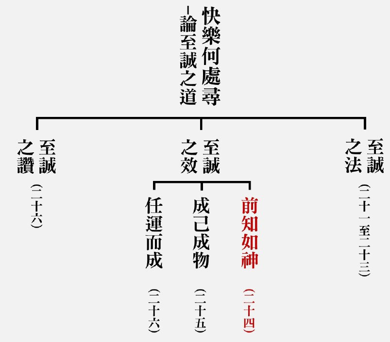

### 孔門十哲—孔門弟子中最耀眼的十顆星（六）能言善辯的宰我

*編輯部*

示現晝眠問喪期

師斥朽木與不仁

能令後進振興起

三年之喪義大明

宰我名予，字子我，大家聽到宰予或者宰我，或許覺得好笑，其實人最難的就是控制、主宰自己的身口意三業，《常禮舉要》說：「凡事要合乎理智，不可感情用事。」果然是這樣的人，實在是一個不得了的人，在社會上一定是一位有修養、受歡迎的人，這樣的名字反而讓人發人深省。
孟子云：「宰我、子貢善說辭。」《論語》〈先進篇〉也把宰我列入孔門四科的言語科；《孟子》〈公孫丑〉篇也說：「宰我智足以知聖人」。《孔叢子》中，記載了一個故事，當時孔子派遣宰予出使楚國，楚昭王請宰予轉送一輛裝飾華麗的車給孔子，宰予說：「夫子不會使用這輛車。」楚昭王
**問：** 「為什麼？」宰予回
**答：** 「自從我到夫子座下求學以來，發現夫子說話從來不曾離開道，行為也從來不曾違背仁，看重道義、崇尚德行，品格高潔、清廉儉約，為官時，有俸祿而不會積財，大道無法施展則瀟灑辭官，沒有半點不捨。他的妻子不穿五彩的絲織品，所駕的馬車沒有任何的雕刻裝飾，他的馬不吃小米，所提倡的道如果能行，則樂於施行大道；如果不能行，則安身樂命，這是夫子一向以來的作風。對於華麗奢靡的事物，或欠缺端正和平的靡靡之音，夫子經過時不看也不聽，所以我知道夫子是不會使用這輛車的。」楚昭王說：「那麼夫子想做什麼？」宰予回
**答：** 「現今天下道德衰微，夫子想要興起大道，天下若有誠心誠意想施行大道的國君，就算夫子得徒步上朝，夫子也會這麼做，何必要君主厚厚地賞賜呢？」楚昭王聽了這番話後說：「我今天才知道孔子德行之大呀！」宰予從楚國回來向孔子報告，孔子聽後問在座的學生：「你們覺得宰予的言語如何呢？」子貢回答道：「他並沒有將夫子的德行道盡，夫子德行之高可以與天相配，深可以與海相合，若照宰予所說，只是說出夫子的行事作風而已。」孔子聽後說：「言語貴在平實，使人可以相信，捨去平實還有什麼可稱頌的呢？是端木賜的言語浮華不如宰予的平實。」由此可知，宰我能夠非常深刻地理解孔子的大道和理想，並善用平實的言語，使國君重新認識孔子，令孔子的大道得以施展；他也善於洞察夫子的心思，讓夫子的教化得以落實。

〈先進〉篇第三章孔子把宰我列入言語科的代表人物，排在子貢之前。可是在〈公冶長〉篇第十章又說宰我白天睡大覺，頹廢不振，引來孔子深深斥責，大賢也會如此不堪嗎？還是孔子責人太過了，孔子用「朽木不可雕也，糞土之牆不可圬也」來責備宰我，用不可雕來說宰我是朽木，用不可圬來說宰我是糞土之牆，已經無藥可救，這個斥責會讓人產生誤解。如同〈先進〉篇第十五章，子路彈琴有殺伐之聲，孔子說這不是我的弟子，弟子們開始對子路不恭敬，孔子卻說：「子路不但是入門弟子，而且是升堂，只是未入室而已。」由此而知，按孔子的春秋筆法，對賢者方求全責備；但也可以換個角度體察宰我的用心。宰我是非常聰明的學生，很可能是他見當時來向夫子學習的後生晚輩有懈怠之心，而夫子又不便當面指責，便故意白天睡大覺，讓夫子出面斥責。後生晚輩見夫子如此嚴厲地訶責資深的宰予，便會收斂懈怠之心。《論語集釋》採取古代以這樣的眼力來批註這一章的古注，如此才能前後一貫。
論語裡面還有一章，也把宰我說得很不堪，〈陽貨〉篇第二十章，宰我見到當時社會不守三年喪期已很普遍，便以時下不守喪三年的情形來問孔子，並舉出不需三年的理由，一來是三年守喪，時間太久了，二者君子若三年不學禮，則禮忘了，若三年不彈奏音樂，也忘了如何彈奏；並以兩個比喻來說明喪期一年即可，如種植五穀的收成以一年為期，來年再種新穀。做飯炊煮用的薪柴，也是一年之中換五種木材，來年又重新輪替，所以喪期一年就可以了。孔子回
**答：** 「守喪一年後，吃貴重的稻米飯，穿絲織品的衣服，你心安嗎？」宰我以當時人的做法答道：「我心安。」孔子感傷地對宰我說：「若你能心安，那你就做吧！」宰我出去後，孔子對其餘的弟子說：「宰予真是沒有仁心！為人子者，自出生至三年後，才有辦法離開父母的懷抱，所以聖人制喪禮定為三年，這是天下通行的喪禮，無論何人都是如此。宰予，他對於他的父母還有三年的愛嗎？」從本章看宰我是一個不孝之人，就像前章說宰我是一個沒藥救、不堪教誨的人一樣；然實際的狀況是，由於宰我用心良苦的一問，使得三年之喪的期限由此確定不移。這也是宰我看起來像是壞材及不孝的人物，孔子卻也把他列為是孔門十哲（大賢）的理由。
雖然他是大賢，但有時候在時機上沒有掌握的很好，這種能耐當然不是一般賢者的能耐，難怪孟子讚歎孔子是「聖之時者也」。在〈八佾〉篇的第二十一章，魯哀公時，三家僭越，哀公不滿，想討伐三家權臣，但又不敢明言。哀公四年六月，商朝留下歸魯君所祭祀的亳社發生火災。哀公便以社主（神主牌）所用的木料來問宰我。宰我知道哀公的心意，便回
**答：** 「夏代用松樹，殷代用柏樹，周代用栗樹」，並補充說：「用栗的意思，在使人民恐懼。」即暗示哀公，可誅三家，設立威信。可惜宰我說的時機不對，此時三家大夫主宰國政的氣候已成，魯哀公又是懦弱之君也難有作為。縱然宰我說的是實情，但是時機不對，或危及自身的生命，或危及孔門師生的安全，所以對這種時機不恰當的諫言，孔子也是有所批評；說魯哀公大權旁落已成事實，討逆之事說了無義反而有害，已成的事實不要再說了（成事不說）；宰我對於魯國已存在政治現實，對哀公勸諫反而有害，謂之遂事不諫；對於宰我犯的言語上的過失，孔子也只好希望他以後不要再犯，眼前是既往不咎了。
宰我這位言語科的高才生，雖然有時候會犯說話時機不當的過失，但有時他的言語又能表現在他的好學深思，常常能夠想到一般人想不到的問題，正是這種極致的追問，讓夫子在解說中展開了學問的規模，也解開了其他同學心中的困惑。有回上課時，宰我發
**問：** 「假如有一個人跑去告訴急公好義、濟困扶危的仁者說：『有人掉進井裡了！』難道這位仁者要跳入井裡救人嗎？」若跳入井中有生命危險，如不跳下去就是見死不救。孔子巧妙地答道：「怎麼能如此呢？君子會至井邊一探究竟，但不會跳下去做無畏的犧牲。以義責君子，君子會信而從之，若沒有道理的事情則難以欺騙君子，因為君子有判斷是非的能力。」孔子解釋後，讓在座的學生了解，夫子雖然提倡仁，但並不是別人說什麼就相信什麼，君子應以智慧來判斷此人所說的話是否合道理，此事是否可行。

雖然宰我勸諫魯哀公的時機不恰當，但可以從他的談話中，看到他是一位有擔當、有理想、有心想整頓朝綱的人，可惜在魯國不能推展他的政治抱負，宰我便在魯哀公十年，到齊國去發展他的政治抱負，果然受到齊簡公的信任，執掌齊國的大政，但權臣田氏的勢力過於強大，宰我便計畫驅逐田氏，重整朝綱，不料此事被宰我的家臣陳豹洩密，宰我因此而遇難身亡，時為魯哀公十四年。可見有聰明才智，還要懂得謹言慎行、審時度勢。（下期待續）

## 藝術賞析

### 孔門七十二賢淺說(五十五)-廉絜

*圖：江逸子、文：編輯部*

衛國前來追隨者

從容就學七二賢

後世子孫能爭氣

廉頗廉范是名士

廉絜，姓廉，名契，字子庸，《孔子家語》稱廉潔，字子曹，春秋末年衛國人，孔子後期弟子，年齡、家世均不詳。

廉絜雖出生於衛國，卻成就於魯國，是謙謙君子，為後人所景仰。

廉絜本身有許多傳說，以「廉」這個姓來說，顓帝孫子秦大廉的後代，都以廉為姓，廉絜應是秦大廉的後代。廉絜的後代應該是很昌盛的，出了許多出類拔萃的人，呂元善曾稱讚廉絜：「大廉有後，寔惟子曹，朝歌樂去，來仰山高，豈必莒父，譽曰人豪，宜昌宗裔，趙漢兩朝。」意即大廉的後代，要算子曹最有成就，子曹從家鄉朝歌到魯國就學，子曹後被受封為葛父伯，還有好多廉氏後代也被譽為人豪。傳說廉絜後代有兩位歷史上著名之士，一位是戰國時期與藺相如成為刎頸之交的趙國大將廉頗，另一位是東漢時期的太守廉范，遵行孝道，為人有義，在蜀郡擔任太守時期施行許多德政。

子曹於漢明帝時入祀聖廟。唐玄宗追封為莒父伯。宋高宗贊曰：「兄弟之邦，士有廉庸。滿泳素教，表楊儒宗。杏壇探賾，洙退從容。作週一時，莒父其封。」兄弟之邦指兩國開國國君都是周文王的兒子，一個是康叔，一個是周公。子庸是衛國人，而到魯國就學。廉庸受到孔子的薰陶，能夠揭示儒家的宗旨，對學問做深入的研究與探討，於求學之際，功課都能趕得上，毫不覺得吃力，能在當時興盛孔門，唐朝時追封子庸為莒父伯。

廉絜為人恬靜謙和，步趨聖教潔身自珍，時以白玉自持，畫中的廉絜，平和穩重，兩手作揖，謙恭有禮。（下期待續）

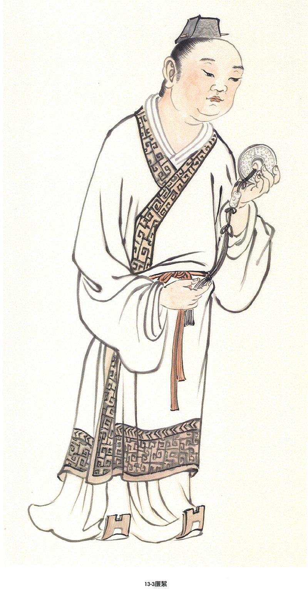

### 華夏精魂千秋（四十三）-明倫史畫　修身自勵  薛聰

圖：江逸子、文：淨域

做官難在為理想

天爵修為勝人爵

典範能令帝欽佩

公道從來在民心

—史畫—

薛聰，字延智，北朝魏人，祖籍西晉司州河東郡汾陽縣（今山西省汾陽縣）；生卒年不詳。父親薛湖，篤志於學，有節操，好以德義服人。於西晉任司州刺史從事（參軍）、別駕（秘書），繼遷河東郡太守，詔令為仇池（今甘肅省西河縣至隴南市一帶）都將，離職後卒於家中，有八子，薛聰為長。

薛聰為人品性端正，重道義有見識，雖處於暗室亦莊重自持，人望見皆肅然敬佩。父親去世時，在墓旁結草棚守喪，哀思孝行感動路人。尚未成年，薦舉為州主簿。

北魏孝文帝元宏年幼即位，馮太后輔政推行漢化政策，定吏制改革陋俗。帝好讀書又擅於寫文章，凡詔令策書都親自寫成。太和十五（四九一年），帝召聰為著作佐郎，當時許多鮮卑貴族有疑慮，便著手編寫國史，時人皆讚美。十七年帝親政，遷聰為治書侍御史，奏事公正糾舉無私，不怕強勢彈劾不法。

太和十八年，孝文帝以南伐蕭昭業為名，由平城（今山西省大同市）遷都洛陽，加速落實鮮卑族之漢化。聰隨帝出征，命為直閣將軍親領禁軍，兼給事黃門侍郎、散騎常侍，依舊出入奏事議政。帝倚為最親信之臣，每想進封他的官位，聰總是苦苦辭謝不受。帝感歎地對人說：「薛聰方正莊敬的風範真是令人由衷敬畏，他那天成的仁爵，絕非人為的名爵所能與之比擬的。」從此皇親國戚行止收斂，不敢恣意妄為。

薛聰與兄弟間友愛和睦，雖官爵已崇隆，但自持與家教仍嚴格，即便弟弟們皆已成家為官，犯了錯仍不免要受杖責罰。太和二十三年（四九九年），孝文帝崩於谷塘原（今河南省鄭州市東南）的行宮，子元恪即位為宣武帝，遷聰為都督、齊州（今山東省濟南市）刺史。

薛聰治理政事簡約便民，卒於任上，百姓感念其德澤，屬吏特別將他所坐床榻保存，以紀念他的高潔風範。帝贈以征虜將軍、華州刺史，諡號簡懿侯。其子薛孝通博學有俊才，北魏孝武帝永熙三年（五三四年）為常山郡（今河北省石家莊市）太守。孝武帝元修西遷長安，倚靠宇文泰為西魏，高歡另立元善見為孝靜帝，遷都鄴城（今河北省臨漳縣）為東魏。高歡引為座客不拜，於東魏孝靜帝興和二年（五四○年）卒於鄴城。宇文泰追懷舊友，贈車騎將軍、儀同三司（官號）、青州刺史。

—圖解—

薛聰自幼孝敏莊重自持，故而未及冠便被舉為州主簿，乃儒家經典《中庸》所說「君子慎獨」的代表。君子乃道德高尚的人，凡能莊重自持者，君王愛之，小人避之，鬼神護之。

《隋書》有則「以水餞別」的故事。趙軌任齊州別駕，廉潔有好名聲。一日被朝廷召回，父老鄉親淚別說：「您在此任別駕一職，與百姓間無私往，所以我等不敢用酒來相送。您就像水一樣清廉，請允許我們斟上一杯清水，來給您餞行吧！」趙軌接過那杯水，一飲而盡。

江師所繪圖，即薛聰秉公奏事謝恩貌。時北魏孝文帝年輕親政，薛聰為治書侍御史，極力輔佐大業，不畏佞臣中傷。帝倚為最親信之臣，每想進封他的官位，薛聰總是苦苦辭謝不受。如此的公忠體國，真是君王之幸、國家之福。（下期待續）

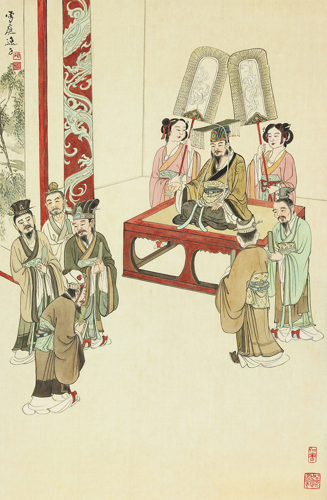

### 以地藏菩薩本願經圖導覽(九)

圖：江逸子、文：唐瑜凌

救度獄苦地藏王

願行成就普賢行

互答地獄厭輪迴

悲心油然從地獄

地獄名號品第五（上）

本品敘述普賢菩薩禮請地藏菩薩為天龍四眾，及未來現在一切眾生，開示娑婆世界及閻浮提罪苦眾生，所受的報處—地獄，名號及所受的惡報，使未來世的末法眾生畏懼苦果而斷除惡業。這是普賢菩薩熟知眾生異熟果為地獄的恐怖，興起菩薩的大悲，透過普賢與地藏的問答，使眾生了解惡業緣起的可怕，尤其是異熟果成熟於地獄，要在生前極力防堵，所謂超前佈署，上游思維，防患未然。

畫作第五品開首即是普賢菩薩與地藏菩薩兩位大菩薩以半跏趺坐對坐問答，自然祥和像是老友見面，普賢菩薩頭戴寶冠，身上華衣裝飾各式瓔珞珍寶彰顯菩薩富貴，代表具大願行，福慧雙修。右手結觸地印，左手結皈依印，或是表徵能降伏魔怨，攝受罪苦眾生皈依三寶而得救護。菩薩右手邊侍者或執包經的絲綢，或是表徵皈依三寶修學正法，方能究竟離苦，菩薩的左手邊或是眷屬，形象有在家與出家。普賢菩薩所坐或是千葉寶蓮，足踏蓮花—姿態雖是半跏趺坐，亦表徵隨時下座救護苦難眾生。

地藏菩薩此時雙手合十，表徵承佛與普賢威神之力，略說地藏名號及罪報之事。以比丘形象示現，三寶中僧是三寶的弘揚者、傳承者，有佛出世龍天喜，無僧說法鬼神愁。

地藏菩薩有出家僧隨侍在旁，手持錫杖或是侍者。右下方是經文上所說的天眾、龍眾，及未來一切世界眾生，此時的地藏菩薩接受普賢菩薩的啟請，宣說地獄名號，使未來世末法眾生，知是果報，懼苦而不敢為惡。

兩位大菩薩法座浮現在吉祥雲之上，吉祥雲底下是獄卒驅趕追殺罪人，乘坐鐵輪，手上拿著各種不同刑具，有持弓射箭、有刀鉞和長槍，地獄罪人無處可逃！地藏菩薩左下方兩位天將，其中一位拱手稱歎地藏菩薩威神力，一邊眼睛不自覺的瞄向正在被獄卒追殺的地獄眾生。江先生十分善於經營畫面，使得整個法會生動又不呆板。（下期待續）

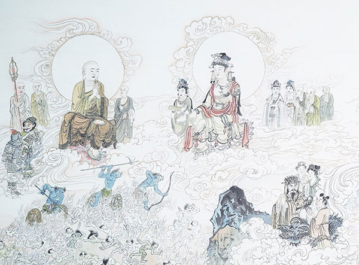

## 專題報導

### 漢聲電台快樂向前行節目-黃瑩專訪唐瑜凌　《陪你讀論語》新書推廣

*心若整理*

難得主持的深談

活潑有趣的淺出

樂於弘教的誠意

論語重新的出路

學會有幸受到漢聲電台快樂向前行節目主持人黃瑩的邀約，與唐老師進行電話訪問，透過問答的方式，深入淺出，探討孔子、孔門弟子與《論語》，並推廣《陪你讀論語》一書。

主持人黃瑩有著清脆嘹亮悅耳的聲音，是一位生命的鬥士，行動不便從不限制她內心的善良與純真，不限制她涉略各領域的天地，與各類人物交流，製作出一檔一檔舒服動人的節目。

黃瑩曾入圍第一屆國際扶輪台灣地區公益新聞金輪獎廣播類節目主持人獎，評審認為黃瑩入圍主持人的理由為：主持得體、不造作、不搶話、條理分明、富有引導性；節目內容豐富，貼近普羅大眾。

即便廣播工作的付出和回報雖然不成比例，黃瑩仍然全身心的投入，訪談前功課做足，訪談適時的引導來賓，訪談後還要整理剪輯，等於一手包辦所有任務，與唐老師空中訪談後，黃瑩在臉書上寫下了一段文：「昨天是個幸福的日子，儒學大師-唐瑜凌老師在空中分享《陪你讀論語》，原來以為是一場嚴肅又無趣的訪談，意外收穫了滿滿的乾貨，唐老師鑽研儒學四十多年，把孔子傳奇的一生和智慧講得生動又有趣，訪談過程中我像個小學生聆聽到忘我，甚至閃神，然而卻有股神奇的力量，帶領著我繼續向唐老師挖寶，剪輯過程中笑著 領受唐老師傳授的寶貴知識與幽默又接地氣的內容，錄音五十分鐘，加上剪輯兩百分鐘，時間很長卻很享受...。

兩千多年前的孔子嘉言錄《論語》，怎麼對應到現在的人生難題、親子關係、經營管理...？中國文化博大精深，台灣的九年義務教育怎能刪減？感恩謙沖又慈悲的唐老師給了我如沐春風的專訪，歡迎大家一起來領受《論語》的神奇智慧...。」大力的宣傳，富含感情的文字，可看出黃主持人對自身工作的用心，與對受訪者的尊重和支持。

以下是黃瑩主持人與唐老師的對談。

**問：** 唐老師四十年前畢業於大同工學院化工系，老師在大學時期在什麼機緣下成立「文化學社」，一九九九年台灣發生九二一地震時，為求有效震災，為何成立「台中市中華無盡燈儒佛學會」？對文學這麼有興趣，為什麼不去讀中文系呢？

**答：** 我是外省的第二代，我當時以台大的分數進入大同工學院，在大一的時候，很喜歡國學，慢慢地人生思想產生了奇妙的化學變化，就讀大學四年期間，聆聽過一些儒學、佛學教授的課程，人生漸漸改變。

九二一大地震的時候，東勢死傷慘重，當時心情非常沮喪，不知道該如何提升東勢善友們的士氣，我便跟讀書會成員商量，成立社團法人，在災區做重建，特別是心理的重建，辦啟蒙班、共修會、讀書會，至今未斷，我用這樣的經驗，於民國一百年時，成立全國地方性社團，並且在各地成立讀書會，中壢、台中、大陸、馬來西亞皆有據點。

**問：** 半部論語治天下，無論是人格教育、人際關係、待人接物，都能從《論語》裡獲取孔子的人生智慧，從〈學而〉到〈堯曰〉共計二十篇，孔子交談的對象包括諸弟子、政治人物、領導階層、隱士高人、販夫走卒等，請老師分享如何讀懂論語，經營幸福、有智慧的人生…

**答：** 是的，《論語》翔實地記載了孔子的談話，讀《論語》就是回到兩千多年前，與孔子直接面對面講話，原來這位老人家思想不偏激，例如〈八佾篇〉孔子評論季氏「八佾舞於庭，是可忍也，孰不可忍也。」孔子是很平和的分析事情，孔子也不守舊，因為他溫故知新，了解古典，又了解現代，很民主還很幽默，比如在逃難的時候，有人見到孔子如聖人的形象，但此時像是喪家之犬，孔子很幽默地說，聖人的樣子我倒沒有，喪家之犬倒是滿像的，這是中國式的幽默。孔子的腦袋裡充滿了今日大家公認的許多普世價值，談孔子，一定要屏除其他錯誤資訊的干擾，從《論語》正確地認識孔子原貌。

讀《論語》有兩種讀法，可以從第一章讀到最後一章，細細品味，也可以把論語的主題做分類，裡面所談的議題包括了交友、說話、辦事、學習、為政、養生等等，包羅萬象，你想知道的都可以在論語上找到，而無論是照順序一章一章的讀，或是主題式的選章讀，對我們的幫助都很大，學得愈多，知識背景愈豐富，愈能夠以論語解論語，妙用無窮。

古來《論語》註解少說也有好幾百家，歷朝歷代大儒們看法有時南轅北轍，讓讀者莫衷一是，好在我的老師李炳南教授從六百八十家的註解中抉擇，講述論語，由徐醒民老師彙編為《論語講要》，是讀通《論語》、讀懂孔子的好書。我們時哉時哉網路教育學院，也出了兩本的《陪你讀論語》，學而、為政篇，和八佾、里仁篇，結合了《論語講要》的精華，以更淺顯易懂的方式講解，也結合現代人生活所需，讓大家能輕鬆重拾古書、重拾美好的說話藝術與人生智慧。書中還為大家提煉出「章旨」、「本章重點」和「本章提問」，幫助讀者在閱讀過程中發現重點、思考問題，以上推薦給大家。

**問：** 孔子是創辦私學第一人、被奉為「萬世師表」？兩千多年前的孔子是一個民主且幽默的老師？請唐老師分享孔子傳奇的一生（政治家、思想家、教育家、對音樂的貢獻…）

**答：** 孔子是歷史上最有影響力的明師，是偉大的教育家，在當年沒有手機、網路的年代，他便自帶流量，吸引三千弟子從各國各地前來學習，比如子貢是衛國人，子張是陳國人，子游是吳國人，宰我是齊國人等等，孔子可以把人教成人才，七十二賢、十哲更是菁英中的菁英，《史記》說是卿相之才，名留千古、影響後代深遠。而孔子所提倡的啟發式的教育、適性揚才，更是現今教育不斷致力追求的目標。

孔子從小就具有領導能力，年僅六歲就可以組織一群孩童演禮，由於沒有顯赫的家世庇佑，孔子從小官當起，管理倉儲、管理畜牧業，都能做得有聲有色，受到上級的欣賞、人民的愛戴，後來孔子曾經擔任中都的縣長，後調任中央當司空、司寇，還曾代理宰相職位，孔子還是成功的外交官，夾谷之會時，面對大國齊國的要脅時，孔子不卑不亢、據理力爭，既維護了魯國的顏面，又成功收復原有的失地。可惜魯國三家大夫執政，魯君懦弱，空無實權，魯國不可為，孔子便帶著弟子們展開長達十四年的周遊列國之旅，一面歷練，一面尋求為政機會，孔子去到各國，都能與國君分庭抗禮，各國國君都會向孔子請教國家大政，那是一國的機密，各國國君聽完孔子精闢的分析皆深深佩服，孔子的能耐可見不凡，也惹得小人臣子眼紅嫉妒，這一路險難重重，孔子都能化險為夷，也讓弟子們更堅定向道的心。

孔子對音樂的體會更是出神入化，他天賦異稟，是天生的音樂家，對音樂深有體會，能層層深入彈奏，驚動當時有名的樂師師襄子，起身讚歎。
孔子還是軍事家，他的學生冉有為季氏帶兵打仗，對抗齊國，取得勝利。季康子十分歎服，問他的軍事才能是從哪裡學來的，冉有回
**答：** 是我的老師孔子教的。並趁著此次得勝，說服季氏，將周遊列國十四年的孔子風風光光迎回魯國。

孔子是思想家，曾子、子思傳承他內聖外王的思想，孔子的儒家思想到現代依然是大家依循的準則，人們心中的寄託。

孔子也是哲學家，《易經》後面的註解都根據孔子的《十翼》，也就是孔子對《易經》的十種註解來演繹、發揮。〈彖傳〉、〈象傳〉、〈繫辭傳〉、〈說卦傳〉、〈序卦傳〉、〈雜卦傳〉及〈文言傳〉等文篇，通通是孔子的註解。孔子把《易經》解釋得非常透徹，孔子也精通算命，商瞿是孔子弟子，他三十八歲還沒有孩子，母親要為他再娶，結果孔子派他去齊國，母親不肯，因為沒有後代。孔子說：不用擔心，商瞿過了四十歲，應當會有五個兒子，後來確實是如此，這是孔子對命理的通達。不只如此，「易為君子謀」，透過對易學的了解，命是可以改變的，人生有時候要從反面、側面、正面、批判式的思維來看，思維模式改變，人跟人之間的關係改變，命運就改變了。

而大家現在最喜歡的養生之道，孔子也不遑多讓，《論語‧鄉黨第十》花了大量的篇幅談論養生之道，舉凡居家、飲食、娛樂孔子都有涉略以及了解。

相信如果孔子生於現代，會是最符合時代脈動的人，有能力、有創意、有擔當、擅長社交、有領導力、能屈能伸，勇於冒險犯難，打造陣容堅強的團隊。他的學說，世世代代奉為經典，現在依然炙手可熱。

**問：** 《論語》是孔子弟子與再傳弟子輯錄孔子的嘉言語錄，顏回讚歎孔子：「仰之彌高，鑽之彌堅，瞻之在前，忽焉在後」，孔子也稱讚顏回：「一簞食，一瓢飲，在陋巷，人不堪其憂，回也不改其樂…」。顏回謙遜好學，「不遷怒，不貳過」。孔子稱讚他「賢哉，回也」，「回也，其心三月不違仁」，顏回是孔子最愛的弟子？為何書上說「仁者壽」，而顏回卻早夭？

**答：** 孔子最心愛的弟子就是顏回，顏回為宰相之才，並非孔子讚歎的，也不是魯國讚歎的，而是孔子帶著弟子們周遊列國到楚國時，當時楚昭王想到把楚國的七百里地封給孔子，被子西大夫阻止，子西大夫問楚昭王：君上出使諸侯的外交臣子，有像子貢那樣的口才嗎？不等昭王回答，子西自答說：沒有！您座下輔佐的宰相之才，有像顏回那樣的才德嗎？子西也自答說：沒有！處理民情的官吏，有像宰予這樣的幹才嗎？也自
**答：** 沒有！將帥中有像子路這樣的英勇嗎？也自
**答：** 沒有！子西再問昭王：周文王當時於西岐之地，僅有七十里地就統一天下，您今天將七百里地封贈給孔子，他又有這些賢能的弟子來幫助，這恐怕不是楚國之福。楚昭王聽了驚訝的嘴巴都合不攏，打消了封地給孔子的念頭。

孟子說人生有三樂，其中一樂就是樂得英才而教之，顏回的學習，是有志向地學，是精進的學、聞一知十的學，很有體悟的學，是能夠發揚傳承的學，還能在課後闡發老師的未盡之義，對這樣的學生，孔子上一整天的課都不會倦怠，而且愈說愈高興，顏回就是老師的知音，讓老師把秘密全盤托出，無所保留。

在實踐上，顏回學以致用，孔子曾經觀察顏回的言談舉止三個月，發現顏回都沒有離開仁，心都在道上，「造次必於是，顛沛必於是。」不管情勢如何危險、緊張，顏回都不會離開仁心，至於其他學生，只不過偶爾一兩天到達仁的境界罷了。顏回不在乎物質的享受，知足常樂，他的快樂來自於學習的體悟，特別是得到孔子性與天道的傳承。顏回雖然學養豐富、悟性深厚，卻能虛懷若谷、不恥下問，是夫子最得力的左右手。

顏回跟隨孔子，從來沒有離開，他對孔子的崇拜是學進去後才有的崇拜，誠如主持人所說，顏回對老師的讚歎是「仰之彌高，鑽之彌堅；瞻之在前，忽焉在後」，顏回說孔子的證量如同永無止盡的高山，愈仰愈多，鑽研孔子深不可測的內涵，即便以金剛來鑽，愈鑽愈難鑽，如同挖掘埋藏地底下極深的寶藏。孔子的教法、內涵、證量、德學都太豐富了，莫測高深，顏回固然進步神速，孔子也是不斷學習，複利的成長，所以顏回愈學，愈覺得孔子不得了，只得把自己的時間、心力、體力、腦力、精力全部用上，終生追隨孔子。

孔子與顏回的情感表現在他們周遊列國在匡地被圍困，師徒失散時，顏回找孔子、孔子找顏回，相聚的時候，孔子高興的說了一句反話：我以為你死了！顏回說：老師在，我怎麼敢死！意思就是說：我就是要來傳承老師的，老師在，我一定在，是一位肩負傳承大位的賢者。所以在慌亂當中顏回會保住自己的生命，因為顏回知道自己有受命之才。可惜顏回英年早逝，孔子的學說卻由魯鈍的曾子繼承。
孔子在六十九歲回到魯國，七十歲時伯魚過世，七十一歲時顏回過世，七十二歲子路過世，七十三歲孔子過世，顏回過世時，孔子哭得昏天暗地，弟子們說老師哭得太過了，在禮上不能哭成這樣，孔子竟然回
**答：** 我有哭得這樣傷心嗎？轉而又說，我不為顏回哭，我為誰哭呢？而顏回按理講，沒有早夭的道理，此人心胸寬厚，修養很好，所以古人說，顏回早逝只有一個原因，就是營養不良。

**問：** 《論語》除了對談語錄，更有孔子自發議論處，諸如對品德的定義、人際關係相處的分寸、對人的評斷、對命理的看法…都別具慧眼。請唐老師分享《論語》金句，啟發聽眾學習知人的能力、經營良好的人際關係、掌握自己的命運…

**答：** 好的，我分享幾條論語金句，供大家做個參考。

首先，知人的能力，孔子曾經教我們觀人的三部曲，叫做「子曰：視其所以，觀其所由，察其所安。人焉廋哉？人焉廋哉？」觀人的第一步叫做「視其所以」。就是眼睛看他怎麼說、怎麼做，比如說是辦善事、還是辦惡事？是合乎常軌，或者不合乎常軌。第二步是「觀其所由」。觀他這樣辦事的理由是什麼？比如他為什麼要罵人？說話有沒有合道理？或者其實是巴結諂媚？開始去問，去查證。第三步是「察其所安」，此人內心安在何處？比如做善事卻遭逢逆境，會不會因此對做善失去信心？比如說學聖賢之道結果帶來了貧窮，是否對聖賢之道也沒有信心了？這叫做察其所安。透過上述的觀察，由淺入深，從表面看到內裡，人情又怎麼能隱藏得住呢！視是眼睛看、耳朵聽，觀是看粗的，察是看細的，這個人怎麼隱藏得了呢，但上述三步驟需要有知識背景的配合，需要有人情世故的通達，才能用正理去觀察，才有正確判斷的標準，這也是孔子的經驗閱歷，是他「六十而耳順」的能耐。有知人的能力，就可以跟人和睦相處、溝通愉快，知人善任，打造美好的團隊。

經營良好的人際關係，如「子曰：君子有成人之美，不成人之惡，小人反是。」成人之美包括德能上幫助他，或者是學問上幫助他，或者此人是有為的年輕人，他在創業的時候你投資他。成人之美很厲害，我曾經遇到一位企業家，他說若此人是有為之人，可是他現在處在下風，我會投資他，想不到他反而會奮發向上，成就的時候這個企業家也拿到利潤，也培養到人才，事業上也找到更多的夥伴。

如何掌握自己的命運，分享兩條

第一，「溫故而知新，可以為師矣。」

身處在日新月異的時代，沒有兩把刷子是不行的，孔子說：溫故而知新，可以為師矣。正好是這個時代不可或缺的功課，這章可以有三種解法，第一種是舊的要溫習，新的要學習，成為一位博古通今的人，博古包括六經、古代的風俗、歷史的演變；通今是他了解時代的發展、各種領域的內涵，如此可以引導自己，也可以引導他人走向康莊大道。第二種講法是複習舊的學問，可以生出很多新的意思。一方面可能是因為「書讀千遍，其義自現」；另一方面也可能是因為學習了其它領域的知識，所以在溫習的時候，產生了很多新的體會。第三種解法是說可以把這句話當成我們的座右銘，所謂「日知其所亡，月無忘其所能」，有這樣的座右銘，可以好好的引導自己。

第二、「人無遠慮，必有近憂。」

孔子說：一個人，如果沒有深遠的思慮打算，只顧眼前的利益與短視的作法，他必然隨時遭遇不可預測的憂患。

為什麼說沒有遠慮，必有近憂呢？第一、因為短視的人，容易局限於眼前的利益，沒有眼力了解全貌，也沒有未來的規劃，所以必然被近憂所困。第二、我們在順境中，容易自我感覺良好，溫水煮青蛙，這個困局他脫困不了，所以必有近憂。

有遠見的人，並不是沒有眼前的憂患，而是他可以脫困。例如他有正確的見地，和各種歷練的能耐，或者找到脫困的方法，而對眼前遇到的憂患能正確地認識、對待、處理、解决。遠見不是你想有就有的，那是學識經驗的累積、為公發心的胸懷、願意承擔的能耐、見地傳承的延續等，綜合各方面的體現，才能成為一個看懂未來，具有遠慮能力的人。事業中的遠慮最重要的就是培養人才，用人才創造錢財，用見地開創未來，天底下最幸福的就是孔子。

有時候反而是在順境中看到困局，不是在困局當中看到困局，例如情勢大好，大家歌功頌德，這時你看到近憂了嗎？祝福大家都能在大時代的脈動下，找到自己的出路。

**問：** 處在多變的時代，建立思維模式特別重要，《論語》能夠幫助我們客觀評斷，能因時制宜發揮作用，找到文化及事業的出路，許多成功的企業家從《論語》中學習到更寬廣的經營哲學，請唐老師分享君臣相處之道，定公
**問：** 「君使臣，臣事君，如之何？」孔子：「君使臣以禮，臣事君以忠。」

**答：** 君臣相處很重要，本章魯定公希望君臣能夠和合，因為當時政治實權都在三家大夫手裡，國家很難管理，所以魯定公問孔子：「國君應該要如何領導臣子，使用臣子？臣子應該要如何事奉國君？」孔子對魯定公說：「國君要以禮來對待臣子，凡事當依國家所定的規矩而行；臣子應以忠誠對待國君，要盡其應盡的職責。也就是君臣相待，各盡其道。」

真正的禮是自動自發的，禮就是人跟人之間交往應有的分寸，表現在生活上是一種公德心，讓人能夠自我約束，不需要法令的要求、刑罰的威嚇與逼迫。民主之下能夠有禮，才是有人情味的民主，可以為對方著想，近悅遠來。

懂禮者在心態上、作法上都會講究，包括給的薪水要夠，像孔子很有錢，孔子周遊列國回魯國的時候，各國國君給的禮物很多，季孫大夫也以厚禮迎回孔子，但是孔子過世的時候只留下茅屋三間，孔子的錢通通用在培養人才。君使臣以禮，為君能夠雍容大度、替他著想、給他良好的待遇，替他找出路，臣就會很誠懇地替君王服務，傾盡自己的能力去服務君王，這是相輔相成的正向作用。

本章的問十分重要，朝廷之治就是天下之治，朝廷之亂就是天下之亂，所以不能小看君臣的相處之道，事業上老闆與管理階層的相處也是一樣。

「君使臣」就是國君驅使臣子要以禮。例如為大臣安排下屬，讓大臣可以專心規劃大方向；對一般的臣子多多給予體恤，用禮節表示對他們的尊重，不是為所欲為地把臣子當奴才。此外，還要「舉直錯諸枉」，把有能力、有公心的人安排在上位。

「臣事君以忠」，臣子對國君的禮以忠最為重要。忠於君是因為國君代表國家，關係全民福祉，所以好好地替他辦事，但並不是愚忠，古之大臣以道事君，三諫不從則可去，也就是《論語》中孔子所說的：「勿欺也，而犯之。」臣子不應欺騙國君，而為了規過勸善，有時會冒犯他，這種勸諫可以維持大家對國君的尊重，促使國家欣欣向榮。

**問：** 子游曰：「事君數，斯辱矣；朋友數，斯疏矣。」為臣事君、朋友相處要注意什麼？

**答：** 事君有很多的面向，我們可以把《論語》裡面事君的篇章選出來，就是一個事君的架構，這章的白話解釋是子游說：「事奉君主，往來不可以太過繁瑣，否則將招致恥辱。而朋友交往過於頻繁，必導致彼此疏離。」本章所謂的「君」，可以套用到與長官、領導之間的相處。數就是次數很多的意思，當勸諫長官很多次、很繁瑣的時候，可能帶來恥辱。勸諫十分重要，儒家講的忠臣不是愚忠，孝子也不是愚孝，而是要懂得勸諫之道。「古之大臣以道事君，不可則止。」大臣事奉國君，是為了利益天下蒼生，當國君有過錯的時候，大臣要懂得勸諫，勸諫不聽時則停止，暫時的停止是為了換來以後勸諫的空間。所以勸諫無用時不勸，勸諫若有用，也要掌握時機、場合、次數。勸諫朋友也不能太繁瑣，如果太頻繁，交情會疏遠，甚至絕交。子貢曾經問孔子交友之道，孔子說：「忠告而善道之，不可則止，毋自辱焉。」勸諫過於繁瑣，疏遠在先，自取其辱在後。所以朋友間的勸諫，也要掌握很多善巧的方法。君子的交往平淡如水，小人的交往甘美像甜酒。事君、交友，甜蜜而繁瑣，正是召辱取疏之道，這是要注意的。

透過黃瑩主持人巧妙的設問，與受訪者對談如流，像兩個好朋友聊天一樣，不知不覺就把孔子的思想、《論語》的奧妙鋪展開來，然時間有限，點到為止，若想深入學習《論語》各篇章節，都可以從《陪你讀論語》一書上慢慢尋味。

### 國際僧伽論壇-2023年4月份主題— 漢傳佛教經論的教育

*編輯部整理*

學法弘法悟法

聖教根本比丘

在家擁護三寶

亦要正見莊嚴

二○二三年四月份，唐老師受邀參加國際線上僧伽論壇，談論的主題為「漢傳佛教經論的教育」，佛教的基本教育經論的研究，漢傳佛教中藏經浩瀚，希望藉由此次論壇，討論佛學院如何選擇經論成為僧人的教科書，或者如何為針對在家人選擇經論弘講？如何用有限的生命進入學習無盡的法義？

受邀參加論壇的有斯里蘭卡佛教與巴利語大學榮譽文學博士、中國社科院特約研究員及客座教授、中國佛學院畢業、任教閩南佛學院、戒幢佛學研究所的濟群法師；國立成功大學建築研究所博士生，在玄奘、華梵大學授課，為覺風佛教藝術學院院長的寬謙法師；有人民大學哲學博士、清華大學科學史系副教授、佛教義學研究會秘書長蔣勁松教授；中華無盡燈文化學會會長、時哉時哉網路教育學院院長的唐瑜凌老師作為在家居士代表。主持人為哈佛大學宗教學博士-佛典語言文獻、法鼓文理學院佛教學系副教授暨系主任鄧偉仁教授，會議一開放，與會者便多達ZOOM會議上限三百人，可謂各方來集，希望藉由此次論壇聆聽各家看法，並有所受益。

以下節錄唐老師發言：

感謝依法法師的盛情邀約，末學能參與這次國際僧伽論壇的「漢傳佛教經論的教育」線上座談，也有幸與木魚基金會依法法師合作，為哈佛等美國大學生在暑期來台灣時，安排行程來感受佛教的宗教體驗，以及在地的文化特色。

以下就漢傳佛教的經論教育，包含出家、在家學佛者的教學，提出一些個人的經驗與建議。

漢藏佛教，總該佛教

佛陀的一代時教，弟子們弘揚、傳播、翻譯傳入典籍的歷程不同，使佛教有各種不同的說法，形成各種不同的支派。

如今的大乘佛教，主要被保留在漢藏兩地；而漢傳與藏傳佛教，統統都算是中國佛教。

因此，若論未來漢傳佛教教育的發展，建議可以吸取藏傳佛學院在佛法教學方面的經驗。如五部大論的教授，像《現觀莊嚴論》是《大般若經》的世俗道次第；《入中論》是《大般若經》的勝義道次第；《釋量論》是以因明辯證經義，生起比量的方式；《戒論》是修學佛法的資糧；《俱舍論》是細數佛法的名相。西藏佛學院學生在考取格西前有十五年的學習，再從顯教進入密教院，對佛法思想體系有完整的教學規劃。

解在明倫，行在齋戒

學佛的人生，主要應有無常的警覺，重視暇滿的人生，好好體會佛法，做有意義的規劃。

我在大學時期參加雪公老師創辦的明倫佛學社團，社團的宗旨是「解在明倫，行在齋戒」。

「解在明倫」，就是在台中蓮社，隨著雪公老師學習佛學課程。

雪公老師在佛法的傳承方面，有印光大師的傳承，屬於淨土的體系；有梅光羲大師的傳承，屬於唯識的體系；此外還有密法的傳承，如噶舉派跟寧瑪派的傳承。不過他比較歸宗於漢傳佛教，因此六門課程主要以漢傳佛法為主，並最終導入淨土。

雪公老師的佛學課程規劃很有邏輯、條理分明；講學都做表分析，讓學生們對佛法有全貌的認識；並成立讀書會，讓學習者有進一步的交流與討論的環境。

雪公老師共開設了六門佛學初階課程：《佛學十四講表》、《八大人覺經》、《唯識簡介》、《般若心經》、《阿彌陀經》、《普賢行願品》。此中除了《普賢行願品》外，其餘五種皆由雪公老師編著表解配合講述。

《十四講表》是佛法總體的介紹，第一表「先明佛義」，告訴我們學佛的目標；第二表「研究佛學須先略知別相」，研究佛學的方法，也是成佛的方便；第三表是破除對佛教的迷信跟誤會，才能對佛門有信心而入佛門；第四表、第五表是建立正確的人生觀（個人的離苦得樂）；第六表、第七表是建立正確的宇宙觀（幫助有情離苦得樂）；第八表是認識佛離苦得樂總相的修學法；第九表五乘佛教是建立在令有情得到增上生及決定勝之樂；第十表到第十二表分別講述如何得到人天乘之樂、解脫之樂與成佛之樂；第十三表指引無力斷惑得解脫之樂的有情眾生，求生西方極樂世界。第十四表是人生應有的覺悟，深刻體會暇滿難得、人生無常、及時修學，不再拖延。

佛法其次依《八大人覺經》詳明修學次第，第一、二覺是小乘法的修行；三、四、五覺悟講到大乘佛法的修行；六、七、八覺悟，講到入世利生的修行。

而解脫與成佛有賴依勝義諦，方能斷惑，詮釋勝義有法性宗與法相宗的見解。依《唯識簡介》即是法相宗，乃唯識觀解脫與成佛的修學法；依《般若心經》深明證悟法性是解脫與成佛要道。

最後導歸極樂世界，就有《佛說阿彌陀經》的表解。至於《普賢行願品》，則是擴展學佛者的心量。這些都屬於佛法初級課程，在大專佛學講座上，詳明六種課程，建立對佛法殊勝的認識。

進入佛法高級課程，雪公老師開設《天臺教觀》。中國祖師判教，大抵上是以天臺為主；若想再深入，可以學《天臺四教儀》，來進入天臺的體系。這部分課程，雪公老師引導我們向會性法師學習，他是臺灣佛教界研究天臺宗的翹楚，從此建立對法性宗的認識。

*此外，講授《大乘起信論》，是幫助學者對大乘有所起信；講授《勸發菩提心文》，則是幫助學者發菩提心來規劃人生、信仰佛教。*

以上是在台中蓮社學習的初級與高級課程。

雪公老師又擔心學佛者不能入世，所以輔以儒學的課程。佛法要進入世間，往往儒學也是很重要的結合，如印光大師說：「儒佛二教，合之則雙美，離之則兩傷。」

儒學課程比如《論語》，就是開啟我們入世的見地；《詩階述唐》，引導學習者藉由唐詩的意境，規劃出人生詩情畫意的生活。

至於「行在齋戒」，在學習期間，我曾跟隨懺雲老和尚過出家人的作息生活，從清晨起來打板做早課，聽講《遺教三經》；中午拜八十八佛，晚上做晚課。這種出家生活體驗很是有趣。我也參加過煮雲法師主持的精進佛七，這般投入的修行，讓我對於佛教中行門的修學，有了一番深刻的感受。

在家學佛，須研經論

作為在家學佛者的好處，就是可以到處去參學。我曾與蓮友到過南洋，參訪過出家人的禪坐道場，了解禪坐的修持方法；也曾經與蓮友到過印度的三大寺，看過辯經學院的學生如何辯經、修持，發覺他們的學佛制度非常完善，解經也解得很好。

不過，作為在家學佛者也有個壞處，就是參訪過不同的道場後，便不容易做出抉擇，有時甚至感到莫衷一是。

然而，若有經論作為背景知識，會使在家學佛者懂得納入不同道場的養分，做為個人修學佛法的增上；必然會比讓在家學佛者忙碌地跑道場參加法會，更能去彰顯個人學佛及佛寺弘法的意義。

如何把出家人的教育，拿來培養在家學佛者，這在未來是可行的。像過去日常法師開設的廣論班，以組成讀書會的性質，使《菩提道次第廣論》在台灣造成風潮。

佛教如何普及、如何重視傳統、如何保住精神，讓在家信眾們生起皈依的覺受，這些都很重要。例如鼓勵在家學佛者發起菩提心，《入菩薩行論》或是《道次第廣論》講的自他換與七重因果，這類修行的步驟就必須了解；再結合省庵大師的《勸發菩提心文》，便能完整地明白菩提心的發起及各種行相。

又如現在禪修很盛行，倘若能結合《道次第論》講授止觀，「止」當中有九住心的修學法，以及輕安的形象；詳細講說禪修中執持所緣的境界，並對昏沉、掉舉（粗沉、粗掉、細沉、細掉）的各種樣貌有所了解，再來實際進行禪修，這樣就更好了。

續佛慧命，刻不容緩

我從民國六十六年參加佛學社，有幸親近高僧大德，也學過道源老和尚教的菩薩戒。在我大學時代，學佛是盛況，中國佛教會那時聽課的大專生，可以把善導寺的講堂擠得滿滿的；台灣的經濟起飛，使年輕人學佛像一股不可擋的勢力，一直往上衝；寺院裡面開辦講座、打佛七，參與者都是年輕人。

隨著時代改變，也許佛教過於傳統，不能跟世間接軌，或者是學佛不能解決世間問題的時候，往往學佛的勢力就慢慢衰退。衰退到現在，很多道場都剩下老人，家中的父母學佛但小孩不學，加上少子化，佛教於是逐漸沒落。

如果在家人學習了佛法，在世間卻走得不順，用佛法的觀念也不能在世間跟別人相處，只是在療傷，其實要對佛法建立起信心也不容易。因此，讓修行者知道該有的見地、該有的修行法、該有的處世法則，例如面對壓力、多變的世間，怎麼控制自己的煩惱情緒；與他人進行溝通，怎麼通達人情世故等等，這些都有助於在家學佛者在世間走得順暢，從而對佛法增加信心。

而道友間交集太少，或是發生一些問題時沒有人來幫忙，在家學佛者就容易落寞痛苦，甚至退了學佛的道心，這樣很可惜。因此，佛教也要有一些世俗的家庭聯誼，這就需要學習像其他宗教徒的熱情，他們彼此之間像兄弟姊妹一樣，總是互相幫忙。然而，如果在家學佛者在教法上不能夠通達、皈依的覺受還不能生起，甚至不能分清楚內外道的差別，往往就會產生一些不如法的情況。

佛教若能設計課程，為在家學佛者教授完整的佛法內涵，至少有三點好處：

第一、    在家學佛者懂得分辨正法與邪法的差別。

第二、    在家學佛者知道擁護三寶的正確心態。

第三、    出家法師納受在家人發心出家，也找得到人才。

至於佛教道場教育在家人的途徑，如建立讀書會，培養具有正知見的人才；通過線上課程，在雲宇宙廣結法緣；參訪有道的寺院叢林，學習道場的規矩。這些都有助於佛教道場的興盛。

像中華無盡燈文化學會的做法，就是蓮友之間組成讀書會研討佛法經論，有助於長期穩定來學習、了解佛教；線上開設儒釋道的課程，使中華傳統文化與佛法能普及於各地；帶領蓮友親近果清律師的正覺精舍、西蓮淨苑，運用結夏安居前往齋僧。

佛法要進入世間，需要結合各領域的知識，像心理學的各種內涵，可以作為《百法明門論》的補充；結合部分科技的核心概念，也有助於通達中觀的思想。若是善於匯歸，都能幫助我們對佛教了解。

互聯網的時代，人們接收的資訊太廣、太雜，不善於靜下來聽長篇大論，因此在教育平台上，若能設計一些簡要的佛法主題，並分集講授，也是很好的操作法。

以上種種，是個人的一些粗淺的建議，供各位參與論壇的大眾參考。敬祝大家順心吉祥，也祈願佛日增輝，佛法久住；聖教增盛，法輪常轉。阿彌陀佛！

## 活動報導

### 東馬詩巫、古晉論語講座活動報導、心得彙集

心若

論語講座的交流    華人高中的講座

世界風景的遊賞    第二家園的初探

當地宣傳的開展    疫情解封的發展

學會實體的開始    迎接轉型的世界

因為疫情，學會到各地辦講座的因緣沉寂有三年之久，就在今年二○二三年二月十號到二十號，終於踏上東馬，展開為期十一天的講座與旅遊。三年前疫情期間，實體研學被迫停擺，二○二○年，馬來西亞、砂勞越、古晉與美里成立了馬來西亞、汶萊線上論語讀書會，結合熱愛中華文化的有志之士，共同發揚孔子的偉大思想，將儒家思想與現代精神結合，擴大儒學對世人的影響力，共創美好前景，也在線上跟著學習《華嚴經‧世主妙嚴品》、《緣起贊論略釋》、《修心七義論》等課程，奠定良好的佛學基礎，很多人從佛學一張白紙開始聽起，懵懵懂懂一路不疲不厭地跟上來，過程中沒有打退堂鼓，著實令人敬佩。

線上讀書會打破疆界的阻礙，不管身在何處，都可以學習，而實體講座能凝聚人心，互相激蕩火花，深刻討論義理，俗話說：「見面三分情」，線上課程固然方便，凝聚力卻有限，藉由此次講座面對面的接觸、討論、共學，相信之後回到線上，感情連結都不一樣。

講座分別辦在詩巫和古晉兩大城市，二月十一、十二日為詩巫講座，主題是「半部論語治天下」，龐大的架構，論內在出路與外在出路，由詩巫中華文化教育學會鄭立國會長主辦，詩巫教育廳協辦，規定各校須有兩名老師報名參與，據說這種官民合作的大活動，已經近十年未曾有，可說是很難得的一場聚會。詩巫已來到華人的第五代，同文同種的樸實人，對論語、歷史都很有興趣，兩日學習下來，大家愈聽愈有滋味，晚餐過後大家慷慨談論，保住淨土的承擔心，日後定有大作為，期許他們能夠學習不輟，繼續在經典上扎根，傳到下一代。

二月十八、十九日為古晉講座，主題是「掌握未來，創造時機–從論語找到出路」，因應人工智慧與大資料的科技時代，無論想經商致富，或是安穩度日，或是想擴及影響力，任何人、任何職業都必須不斷地學習成長，而想要走得長遠，想要過得精彩，用文化來經營是最好的方法，這些秘密，都藏在《論語》裡。此講座由古晉明門經典文化學會主辦，古晉中華第三中學、詩巫中華文化教育學會、明遠企業聯辦，報名參與者近百人，來自四面八方各行各業，齊聚學習論語的精華。

除了兩場大型講座外，也在古晉第三中學辦了一場學生會演講，主題是「成為更好的自己」，校長特地於前一晚來跟我們師資團隊做交流前行，謙虛誠懇的聆聽，給予諸多寶貴的意見，讓演講能順利進行，學生回響熱烈。

此行最特別的是，能邀請到孔垂長先生的夫人吳碩茵女士與孔子第八十代嫡長孫孔佑仁一同參與，造成的影響力更是深遠，孔夫人致詞談到《論語》的重要性，相信兩方都留下難忘的回憶。孔家也藉此見證文化的魅力，孔學的出路，相信後續的發展難可限量。

幾場講座下來，對於學會師資團隊，是一場場的考驗，由於參與講座者的年齡、職業、區域、知識背景都差距甚大，必須不斷地修正上課方式，調整內容，才有辦法契理契機。如何吸引新一代的年輕人，如何保住文化的傳承，如何發揚孔子的思想，如何更生動有趣地結合生活，這些都是未來要面對的課題。

講座僅是一個開場白，後續大家的學習才是關鍵，不論是佛學還是儒學的學習，希望都能不間斷，連結緊密，互相提攜，保留華人文化，讓文化遍地開花。

以下節錄學員心得：

古晉三中  李志鵬校長

由古晉明門經典文化學會主辦，古晉中華第三中學和詩巫中華教育學會聯辦的「掌握未來，創造時機—從論語找出路」，講座會於二月十八日至十九日在古晉三中禮堂舉行，為期兩天。

感謝來自臺灣中華無盡燈文化學會創辦人唐瑜凌先生及其教學團隊主講，更有幸見證中華大成至聖先師孔子協會會長、孔子第七十九代嫡長孫孔垂長先生夫人吳碩茵女士蒞臨主持。

作為教育者，深覺這場論語講座在華文獨中校園內舉行就特別有意義，推行儒家思想和中華文化本就是獨中教育的根本，校園內更重視學生的德智體群美勞六育發展，學校教育理念秉持孔子的教育理念，因材施教，有教無類。

兩天課程中學習的感悟是所有行業都要有學習的心態，強化講清楚、想清楚、寫清楚，從中了解學習的快樂是從解決問題、克服問題後帶來的滿足感，再從聽聞、思維、修習中帶來內心的喜悅。如此在終身學習中創造改變，學習新體驗以及學習欣賞，發掘新意義。

打開格局，創造時機，尋找核心價值，結識志同道合者，發揮人格特質，以身作則，善於用人、勇於挑戰，協作成就，成功不遠矣！

這些真的可以從論語經典中找到智慧並在生活中有所體會。

黃奕憲

兩天的學習，對於老師們的分享有很多感觸。

１．每一個時段會有不一樣的領悟，好比說仁這一個字，可以有很多的解讀方式，老師說仁就像是兩個人堆疊起來形成的字，比如人與人之間的牽絆和關係，為了要利益他人，眼前必須自利，培養自己的能力，己欲達而達人。

２．不安於現狀也是一種遠憂，永遠保持危機意識，自我感覺良好是最大的危機。

３．持之永恆的心態是成功的關鍵，更堅定了內心的想法。

４．領導力也是成功的關鍵，所謂上樑不正下樑歪。

５．珍惜與創造人才才是成功之道，再好的理念，沒有正確的傳達和傳承，都會寸步難行。

６．孔子的教誨，小可自理，在為人處事上講究，大可治國，要達到這樣的境界，必須先創造自己的價值。

許彩燕

一開始聽課懵懵懂懂，經由老師們不斷地以各種方式盡量讓我們進入狀況，真的非常感恩。這堂課讓我了解到，原來可以從語言中，引發出那麼多的想法，引出各面向的思考，太讚歎了，太受益無窮了。兩天的課讓我體悟到，做人不可單方面思考，不可以只活在文字上，不能只接受自己想聽的，其他屏除不看。不是說有善就不可以有惡，有富就不可以有貧，有貴人就不可有小人等等。經由老師的帶領，教我們學會怎麼去多方面的去了解人生、看待人生，教我們人生的道理，教我們怎麼在好壞中，順逆境中活出自己的價值，很感恩遇上了善知識。

陳靖茹

這個假期我做的最有意義的事情是參加了《論語》講座會，並且成為義工，可謂累並快樂著，幾年前接觸了線上論語課程，一直以來認為《論語》只是經典，直到講座會那天，我才深刻知道我錯了，誰能想到《論語》可以和事業連接一起。兩天的時間，讓我知道團隊的重要，看事情的眼力，如何豐富自己的生命、人才的重要性等等。二十一歲的我，迷迷茫茫不知道如何處理人際關係，不知道未來在何處，用我自認為的快樂麻痹自己，逃避現實。而《論語》告訴我，我是時候為未來好好鋪路，我得未雨綢繆，解決近憂和遠慮，戒除三種可怕的個性。唐老師說機緣難能可貴，我認為兩天的講座會，是我的機緣之一，需要牢牢把握，繼續深造學習，讓這兩天的意義越來越長久，與共學的朋友們，一起變得更好！

除此之外，我也感謝有做義工的機會，讓我發現自己還有許多的不足之處，例如臨場應變，我還沒有具備完善的能力來面對突發的狀況，甚至我身為義工總務有時候也處於混亂中，深感抱歉。因此希望我能多多繼續學習，磨煉自己。這兩天的講座會受益匪淺，感謝唐老師及師資團隊。

張友芬

我線上上孔子聖蹟圖課已有兩年，所以這次聽老師的課會比較明白一些。這次實體課第一次見到老師們和學長們，非常親切溫馨。主題是《掌握未來，創造時機-從論語找到出路》，講的都是在生活上所遇到的，解釋非常清楚，我突然領悟到很多事情，就像老師說三種可怕的個性：沉迷享樂，懶惰，懦弱。我有時候也會懶惰，也有懦弱的一面，不敢去面對事情和人，我一定要改掉這些不良的習慣。還有老師說到事業中最重要的遠慮是培養人才，才能成為一位成功的企業家。這兩天的課讓我收穫滿滿。我會繼續跟老師學習，並且一直複習老師講的課。

莊治平

第一天，老師問，孔子過世了，如果你是他的學生，你會做什麼？讓我聯想到，佛陀已經涅槃了，我又為佛教做了什麼？貪，瞋，癡，還沒有放下。《論語》上說「人不知而不慍，不亦君子乎」，如果我沒有錯，但別人錯怪我，我還是會起嗔心。

平時人生的樂事是發達，但除了錢和享樂之外，人更需要有大願景，好像唐老師和師資團隊一樣，無私奉獻，為世界獻一份力，隨喜。

「人而無恆，不可以做巫醫」，提醒了我，做每一件事都需有恆心。我們需要造命，改變命運，而不是向宿命俯首稱臣。

老師說三種個性很可怕，沉迷享樂，懶惰和懦弱，我需要一直提醒自己，要慢慢成長進步。

林佩佩

我的《論語》旅程開始了，這是我第一次參與，雖然這幾天都很累，但有這樣的榮幸能和臺灣老師一起學習。剛開始沒什麼興趣上課，但一開始聽的時候，感覺很有趣。我的華文水準很差，但老師們都很有耐心的解釋，讓我對整個世界有了不一樣的看法，希望還能繼續努力學習，也希望還能有機會去臺灣和老師們一起共學。「子曰：學而時習之，不亦說乎。有朋自遠方來，不亦樂乎。人不知而不慍，不亦君子乎。」

張芷綺

論語課我學到了一個印象非常深刻，也比較吸引我的話題就是遠慮和近憂，遠慮就是長遠的考慮，而近憂是最近的煩惱，以前我沒看重這兩件事情，天天無憂無慮，浪費時間、浪費金錢，後來看到物價越來越高，趨勢轉變的時候就開始擔心了，如果現在不做些什麼，那未來的我會很辛苦。

課堂上討論到，為何沒有遠慮就一定會有近憂？那是因為人們局限眼前利益，只看眼前發生的事情，並沒有想到未來，就像之前的我，自我感覺良好，認為自己不缺什麼，每天享樂，殊不知這才是危險要來臨的節奏，年輕時就應該好好學習，提升自己，畢竟知識是自己的，也是別人唯一搶不走的東西，希望能早日踏出舒適圈，成為自己喜歡的人。

葉嘉豪

感謝師資團隊遠道而來，為古晉大眾進行論語講座會。在兩天講座期間，學到了許多如何面對著現實會遇到的問題。並且不得不讚歎古人的思維以及學問。出來社會工作多年，才開始領悟到之前所學與目前所遇到的息息相關。

孔子說：先有司，赦小過，舉賢才。

老師說，政治家想要利益百姓利益大家，必須先有司、赦小過和舉賢才。我領悟到了特別是舉賢才，必須要有德學，才能與賢才相聚。例如組團隊，若不舉賢才一起辦事，努力向上，不會有成果的。可見早在古代時的一位學者，也可以一一舉出目前現代都會遇見的問題。若沒有師資團隊的帶領，我們無法清楚理解古人的智慧是那麼可行的！

楊銘爵

兩天的講座，讓我意外的體會到，原來《論語》可以用在很多地方，更沒想到做大企業的精髓竟然可以用論語來解析。這次聽課跟八年前在學會聽《論語》，有截然不同的感受跟領悟。之前背到要死才能記住論語的字句，現在反而聽了一遍，就會記得一些詞句而且印象深刻。剛好這段時間都在找企業文化，我自己一直以來都會冥想自己站在未來，回頭來檢視現在做的足不足（以終為始），心裡也明白做企業未來如果沒有企業文化，站在浪頭，遇到障礙，一定會兵敗如山倒。或是企業不能系統運轉，只是做生意而已。外面有朋友一直叫我去上課，去跟外面的老師們學習，但是我一直沒去，我認為能公開教大多數人都聽得懂的東西，並沒有太大的作用。要找就要找大多數人聽不懂的，自己聽懂後，能悟出來的東西，這才是無價之寶，不能輕易被別人拷貝，沒想到臺灣的老師們來的時機剛剛好，也許是老師所說的，機緣已經成熟，該承擔的責任還是得承擔，也明白只有承擔起責任，才能成長，才能去下一個里程。「多學而識，一以貫之！」「學而時習之，不亦說乎！」想歸想，具體實踐都不容易，希望得到所有人的護持！

黃鎂華

難得老師老遠從臺灣來，上完講座後學生更加明白怎樣把論語應用在生活上每一天所碰到的事。雖然學生不是每一句都理解，但是學生想，如果碰到好事，想想哪一句論語可以把它套上去，讓自己感恩每一件好事的發生。如果遇到挫折，也可以想想哪一句論語可以套上來，安撫、平復自己的心情。感謝唐老師、林老師與師資團隊們的付出。

鄭瑞芳

這是我第一次參加論語課。剛開始聽課的時候一直處於懵懵懂懂的狀態，後來老師以白話的方式讓我們理解論語的意思，我就感覺到很有趣了。最讓我印象最深刻的是：「子曰：人無遠慮，必有近憂。」一個人如果不關注長遠利益，那麼眼前利益十有八九也得不到。例如有的人一心想賺錢反而賺不到錢，反而急功近利，不受人待見，自然也就沒人願意與他合作，這種人賺不到錢。希望下次還有機會可以繼續跟臺灣的老師學習論語。

黃基順

首先唐老師與整個團隊都配合的相當好，一問一答，還有跟學員交流的這種呈現方式真的很吸引我，中間還增加了實際的案例與我們分享，使我在學習過程中樂在其中。上課的環境和氣氛很特別，我很喜歡。

第二天添加了英語翻譯和簡單講解，大大提升了我對論語的了解能力。之前感覺論語很難懂，不知如何學以致用，尤其是應用在商場上。上完了兩天的簡單論語課程，讓我大開眼界，原來論語也可以這麼靈活的應用，打開了我的思路。

場地和音響方面很滿意；時間管理做得很好；食物分配的方式也做到很周到。

魏宏哲

之前跟馬來西亞的因緣一直不深，大部分的印象也是僅有數年前旅遊中的建築物，西馬吉隆坡金屬錫色外觀包覆的雙子塔，及麻六甲海峽旁莊嚴肅穆卻又別具特色的粉紅清真寺而已，至於其他風土人情則少有感受。去年在學會東馬的討論之後，心裡一直掛念著東馬行不知是否成行，而自己能否有機緣參加。後來才得知東馬行因考量馬來西亞學長辦事人員的負擔，僅預計少數師長前往講學，預計師長及孔夫人共十位。此外老師也希望能找年輕的學長為主。自己公司請假的部分，雖然需要在農曆年後再請假十天，但對於從來沒有參加過老師講座的我，也是數十年難遭遇，錯過不知何年何月再有機會。在跟公司請假的過程中，也老實告知老闆狀況，沒想到台灣老闆在跟美國老闆談及此事時，也是非常體諒而且欣然同意（美國老闆原來是馬來西亞華人）。在尋找另一位能去的學長過程，也是幾經波折，原本找到一位大專班生，時間意願都具足，但卻少了家長的支持，該生也只能打退堂鼓。無奈人員尋找的逆緣之餘，自此能造作的機緣也嘗試了，心中也祈請佛菩薩加被以求因緣具足成行，感謝學會師長同時協助聯繫其他可能成行的學長，最後出乎我意料之外，最後一位出現的成員居然是佑仁學長！自此成行因緣總算具足，老師也安立末學為此行的醫療人員，守護此行眾師長們的健康，為各位師長學長們備妥旅行急救箱及各類中西醫常備藥品。

年後踏上東馬的旅程，第一站來到詩巫，下機後迎來詩巫學長們熱情的歡迎，之前跟東馬學長的因緣僅在線上課程的聽聞，也談不上交流，而詩巫學長帶著花環及歡迎的布條迎接師長及孔夫人，這一幕讓我感覺如同老師在課堂講到貴族迎接僧團的覺受，要不是跟著學會的師長，大概就是路過的旅客般的入境而已，此時現量的感受更是深刻，詩巫學長們的真誠與善良，讓我憶起以前在台灣中部的山上，只是誤闖入茶園，農家卻親切款待，絲毫不帶做作。在車上麥克學長聊起當地華人的困境，也是讓我感同身受地希望能為他們盡一份心力。詩巫的二日講座是此行的第一場重要活動，除了各讀書會的協力投入外，詩巫教育廳也參與協辦，並指示各華校派員參加，可見當地華人對此重視的程度。這場名為「如何半部論語平天下」的講座，相信帶給在座的諸位校長跟老師們耳目一新的新視野，一方面透過益瑞學長擔任攝影人員的觀察，另一方面則是自己內心的小宇宙也是大大震撼！姑且不論義務教育所學的論語，從以前參加戴老師為弘明家長們安排的讀書會，到現在參加白老師每周跟對岸善友們的線上讀書會，對整部論語一直是片段部分的吸收與學習，直到這次的詩巫講座，才有豁然開朗的法喜充滿，原來可以用這樣的面向來貫穿整部論語！也深深地體會到原來學會的師長們特別為東馬的華文教育界量身打造了這場講座的用心，這樣的用心也是一個現實無可逃避的國力決戰點，一個目前各大國傷透腦筋，不得不想盡辦法爭取的人才問題，雖然馬來西亞與台灣有不同的時空歷史背景，但卻不妨礙以論語的思想作為共通的基礎下，一起與馬來西亞華文教育界攜手合作，將論語的傳承帶入東馬。在結束詩巫的研討會後，前往姆魯國家公園，探訪東馬的世界遺產。在讚歎大自然的鬼斧神工之際，也為古晉兩場講座開演前做足準備與討論。雖然是短暫的停留，也是非常佩服東馬對於大自然用心保存，除了避免太多的人工造作外，其自然資源之豐富，也是讓人覺得東馬未來的潛力無窮！即便進入市區，也有種回到舊時中南部鄉下的熟悉感覺，市區也是乾淨整潔，雖然大眾運輸並不普及，大部分家庭都有多部車輛代步，卻少有聽到車輛的喇叭聲，這也是不得不令人豎起大拇指的人民素養。

最後兩日的古晉講座是本次東馬行的最後一場講座，也是在大馬採公開報名的對外講座，事前兩位老師也分析報名的成員中除了原本詩巫、美里、古晉以及汶萊線上讀書會的成員，其他都是來自大馬各地各行各業的華人，其中也不乏年輕一輩的學員，也感謝古晉第三中學的校長大力支持參與，並提供場地來圓滿這場講座。這場講座也見識到學會師長們對論語的靈活通達，對此場講座賦予了嶄新的內涵，且安立了吸引大馬工商業界目光的主題「掌握未來，創造時機，從論語找到出路」，論語華麗轉身成為一場高級企業管理學的盛宴！講座第一日也出現了令人意想不到的狀況，原本延續前一次在第三中學給年輕學子們的開演風格，透過大量的對談互動，以及高品質投影片的呈現來進行，無奈大馬華文教育的困境頓時顯現在第一日的學員上，聽讀文言文造成學員們的學習障礙，而對科判充滿疑問及困惑。師資團隊在得到回饋後，也展現另人讚歎的應變速度，經過晚上的重新整理準備，第二日立即轉變適切的風格，並提供中英文對照的科判說明，令所有學員眼睛為之一亮，法喜充滿的迎來論語醍醐灌頂的喜悅！就這樣一場跨越兩千年的現代企管學順利的開演圓滿功成！

在最後離開東馬的前一晚，古晉的學長們為大家辦了一場馬來西亞及汶萊讀書會的晚餐聚會，大家除了分享自己的心得，也與眾學長們、學會的師長們一同高歌歡唱！席中一位西馬學長分享了對「死生有命」這段的覺受，不禁想起法華經的藥草喻品「一雨所潤，而諸草木，各有差別」，而「四海之內皆兄弟」是我此行的深切感受，如同老師在東馬的前行所言，此行要做一場論語的閉關，依著出訪的師長及東馬的學長，此刻這些師長、學長們比兄弟姊妹更兄弟姊妹。此行在一場場的論語講座中，如同法華經的開演，自己好似穿越兩千年，跟著夫子及眾弟子的隊伍一同周遊列國，跋山涉水的透過廣大行來開演一字一句，字句皆深刻令人感動。不知臨座的佑仁學長聽得如何，但我知道自己必得成為論語的能講，成為夫子傳承的一份子，才是此生的努力目標。

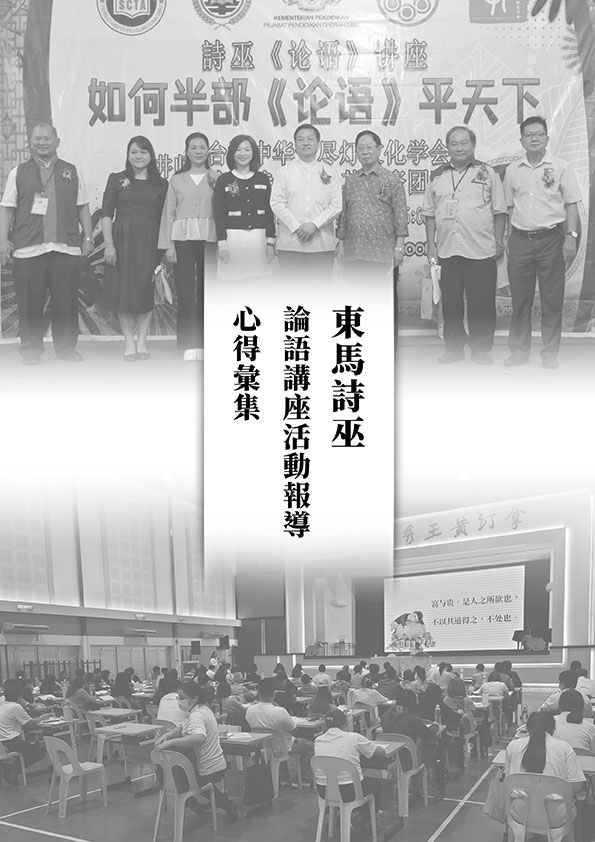

### 中觀教授論（實修手冊）及入行論普皆迴向品講座報導、心得彙集

心若

突如其來的重磅  世界局勢的一變

隨著共業的時代  生存不易的潮流

多元學習的面對  核心價值的確立

聖教增盛的不改  造福社會的每天

面對淨土的歸去  捧出心來的供佛

疫情三年，學會實體課程塵封已久，終於在二○二三年二二八連假，恢復寒假講座，於二月二十五（六）至二月二十八日（二）上午九點到傍晚五點，開設《中觀教授論》與寂天菩薩的《入菩薩行論》〈普皆迴向品第十〉，作為學會實體課程的美好緣起，同時也是廣修功德、深入般若智慧的重要課程。

《中觀教授論手冊》，是一部教授如何實修應成派中觀正見的手冊，全名為《中觀應成甚深道中觀正見教授論手冊》，是宗喀巴大師的上首弟子克主傑大師聽課的筆記，具體說明破除人我及法我的觀修方法。

所謂的教授是一種依據經論來做實修的方法，特別說明我們在座上修時要修什麼，當然歷緣對境修，也會入境觀修，這是一般漢傳佛法比較沒有講到的，我們若能從藏傳的中觀論典，了解其理論和實修法，可以彌補漢傳佛教的缺憾。

修學正見教授，必須有前行，包括道前基礎，下士道、中士道、上士道，修習廣大行，這些都是正見教授的前行，佛所說的一切都是為了般若，正見教授就是通達般若的正見，這也合乎《入行論》第九品一開始所說的，真正思想的意趣就是般若，正見教授才能夠通達般若，論師們在議論般若，裡面有唯識見的正見教授、自續派的正見教授，這些正見教授中，唯有中觀應成派才是最究竟的。

當我定解了學習中觀教授的利益，生起善法欲，知道學習論師的大論，以通達無我見，這才是利益所在。我確定我通達無我見的殊勝利益，確定要進入宗喀巴大師的體系去了解月稱論師的思想，由此而入龍樹菩薩的中觀見，從此進入釋迦佛的心要，若能生起這樣的定解，就已經贏他人百千萬劫了。以上這些想法都要一一確立，形成一種推動的力量，才有辦法進入正行。

正行分為總明與分釋修習二無我的軌理，中觀見的教授最主要的就是通達人無我跟法無我，即破人我、破法我，來通達月稱論師跟龍樹菩薩的核心思想。人無我跟法無我數量決定，因為補特伽羅就是士夫，法就是非士夫，如同人跟非人就遍一切法，不必再討論其他了。再來，先修學人無我，再修學法無我，這樣的次第是決定的。我先決定我是在哪裡要破，在這個處上我要破什麼？處在補特伽羅上，我在補特伽羅上要破的是我，不是破補特伽羅。破我之後的補特伽羅無我，才是我要成立的，所以中觀宗有破也有立，補特伽羅無我就是他的成立處，這就是《迴諍論》談的，破我成立無我。

正行的部分，分釋修習二無我的軌理，修習我無自性的科，就是修習補特伽羅無我，分成修習我無自性跟我所無自性。我的自性能破的話，我所的自性也能破，所以還是以破我成立無自性為最核心，篇幅也占最多。破我成立我無自性的部分有根本位的座上修，以及後得位的修學法，根本位的修學是根本如虛空瑜伽，後得位歷緣對境修還是以座上修為主，因為修法是一樣的，但如果沒有在座上修好好串習這種觀察法，心靜下來都修不了，那在後得位境界這麼多，心亂哪裡修得了。

尋覓補特伽羅的自性沒有，空靈靈的感覺叫做如虛空，在根本位上是透過不斷的辯證，而在如虛空當中，會有比量的如虛空跟現量的如虛空，比量的如虛空還是能所，能觀的心跟所觀的境，所觀的境在你的心識前空靈靈，這是比量，現量是能所雙亡，爾時不會有能觀所觀，空性是在能所雙亡下顯現，不是在你心識前的空靈靈下顯現空性，這是最難知的。

唐老師作偈云：「格魯開派宗喀巴，重要心子克主傑，應成見地實修法，根本智與後得位，中觀大論之心要，人法二我無自性，如現而空如空現，雙關觀察證二諦，盡所有與如所有，成就色身與法身，隨喜善友中觀緣，往生淨土乘願來，講解造作諸大論，延續諸佛正法脈。」

寂天菩薩的《入菩薩行論‧普皆迴向品第十》講授如何藉由迴向來整理自己的心思，將所修功德投入明確的目標，並且能與諸佛菩薩的廣大願結合，猶如滴水入大海，海若不枯滴水存，使功德在未證菩提之前終不能盡。

迴向是很細膩的，是在處理自己的心思，要把自己的功德導向某個地方，把所做的善法功德，轉化做為這些用途，善於了解迴向法門的人就知道應該要如何來廣行自己的菩薩道，迴向還包括跟諸佛菩薩的發願，跟諸佛菩薩的迴向去結合，這就是《入菩薩行論》迴向支的價值。

整個科判架構，總明迴向一切有情入菩薩行及廣釋迴向，總明迴向一切有情入菩薩行，這是造論的理由，寂天論師是能造，希望造論所生的諸善根全部作為有情趣入菩薩行的資糧，善根包括來自傳承的造論，以及對此論的解說、聽受、思惟道理，全部所得的善根，都迴向給所有有情，讓有情都能入菩薩行，單純看寂天論師表面上沒有這個意思，但賈操傑大師說還包括傳承，迴向諸眾生，這樣講更有意思，因為迴向就是要給他實質的利益，造論未必可以帶來實質的利益，但傳承可以，一方面把論造出來，一方面培養人才，讓論可以往下傳，眾生可以透過聞思修弄懂義理，離苦得樂。

別說要怎麼迴向，廣釋迴向包括迴向利他、迴向自利、迴向安樂生源聖教增盛，安樂生起的源頭在於明白聖教的內涵，所以要迴向聖教增盛，培養人才才能增盛，才是安樂的生源，聖教增盛才能夠自利利他，才能讓有情入菩薩行。最後是念恩禮敬，寂天論師說這種迴向、廣行、深觀、菩提心的道理，是我的上師文殊菩薩告訴我的，結在念恩禮敬，第十品的結也是整部《入行論》的結。

迴向的殊勝，以比喻來說，像水滴滴入大海，大海如果不枯竭，這滴水還是存在的，我們對教法的體悟、利他的善法，哪怕只有一滴，都能匯歸入三寶或是傳承的功德大海。菩薩迴向善根也是一樣，透過迴向，直到證菩提也不會窮盡這個功德，換句話說，菩薩的迴向就是去投資，投資的目的是要幫助自己證菩提，這些投資都會增長廣大，都會成為證菩提的資糧，直至成佛。

一般世間人的增長廣大是透過猛利的貪心、瞋心、尋思、共業，佛教徒則以迴向的方式進入三寶、傳承的功德海，觀想跟三寶、傳承一起造共業來增長廣大，如果不迴向，善都是暫時即盡，就像芭蕉一樣，迴向才能讓功德不竭盡而增長廣大。

若結合第九品，第九品講到三輪體空，例如布施，能施、所施、中間的施三輪體空，被般若空性智慧所攝持，體性是般若慧，以這樣的攝持來做迴向跟發願。善法的體性是你賦予的，他會幫助你生起破煩惱障破所知障的智慧，成就空性智慧，再把這個功德做迴向跟發願，迴向發願在眾生、菩提、聖教增盛。

迴向跟發願都靠欲，內涵不同，發願的欲是這個果我很想要，如飢思食、渴思飲、久病思良藥、走失的孩子思父母的那種欲，叫做發願。而把這個善成為某果之因叫做迴向，例如放生是否是成佛的因，這個因是你決定，觀待果才能說他是因。

迴向聖教增盛是所有的核心思想，如此三寶才能住世，才能自利，才能利他。聖教增盛包括必須把自己培養成人才，或努力用各種方式培養人才，包括去教導、護持、出資、出力、講學，藉著講座提起自己的心力、道力，也作為未來良好的增上緣。

最後，以唐老師的偈作為總結：「文殊心子寂天菩薩，棄捨王位出家雲遊，各種遊方神變難思，中觀應成三大論師，有幸恭逢偉大著作，善友聚會多劫因緣，大乘道次入菩薩行，由因欲果成就迴向，自利利他聖教增盛。」

以下節錄學員心得：

張安琪

人們常說「人生如夢」，嘴上說得瀟灑，卻還是執拗地想把人生中的一切都牢牢攥在手裡，不曾想既然是夢而看成雲淡風輕，捫心自問大抵都未曾真正相信人生是一場夢。但是對於通達中觀應成見解的智者，「人生如夢」不是隨口說說、用來自我安慰的聲共相。所謂的「人生如夢」是指當境界生起，我們只能不得不然去受用那個境界，就像作夢一樣；當境界成為所取的時候，我們就不得不成為能取，好壞皆然。比方說，當我們遭逢厄運，身心煎熬卻不理解為什麼自己會這樣倒霉，其實眼前的惡果只是回應過去的惡業，業報成熟起現行時我們無法選擇，只能不得不然地承受果報。就如同做夢，不論是美夢還是惡夢，從來都不是自己的選擇，夢醒之後也不明白為什麼。

這樣說來，人生只能不得不然消極地接受這些境界嗎？非也。

我們可以依止通達經論的智者，透過學習正知見而有另外一種的「人生如夢」。

當我們能夠透過智慧的觀照而有一個能取的心識，就有另外一個所取的境界被觀待；而之前未被選擇的境界就消失了，如夢一般。有時候選擇比努力更重要，當一個人有機會選擇時沒有正確取捨，放棄對自己真正有益的因緣，不應該怪罪時運不濟，而是自己的選擇。

所以越是「人生如夢」，我們就應該更努力去造作善業，因為這些善因會在未來帶來美好的境界。同時也努力去學習、改變既有的思維模式，用正知見攝持小至日用平常大至關鍵時刻的選擇，努力讓自己成為善境界的能取。

由此去理解孔門中的「高富帥」—子貢，一個衛國的商人子弟為什麼會到魯國拜孔子為師？這奇妙的相遇或許是回應子貢過去的善業，子貢大概也不知道為什麼會遇到好老師，興許是運氣好。但是跟著孔夫子一路歷練的子貢，培養出不凡的見識、眼力、風采，他深知老師的內涵，堅定不移跟著孔子學習。於是乎，子貢成為能取，瑚璉大材、可與各方國君分庭抗禮的尊貴人生成為所取，而庸庸碌碌、俗不可耐的商賈人生就像夢一樣消失了。

中觀教授論四天的講座如夢一般地呈現，也如夢一般地過去了，期待因緣聚合讓有心學習者成為能取，中觀教授內涵數數成為所取。

鏡華

號稱佛教徒多年，從來不曾懂得佛法究竟在說些什麼！不過是充當寂寞時的安慰、無聊時的消遣，以及不安時的抓取。即便如此，只要生起想要知道更多的心，那怕僅是一丁點的好奇，都會驅動著我們往正法的道路上前進。

幾經輾轉，這次來到學會參加中觀教授論與入行論第十品的四天課程，首先學長們的和善、好吃的午餐、自在的環境，儀軌簡單而莊嚴，使初學者能身心安頓，有助於學習。唐老師真才實學，世出世法見解通情達理，所舉例子通俗易懂，幽默風趣，聽到後來越有滋味，妙不可言！下午的研討由資深學長帶領釋疑討論，更收共學之力量。

中觀課程是我前所未聞，只是常常看到「二無我」三個字，始終不明其義，想知道這是什麼，於是就來聽聽看。剛開始聽差點沒昏倒，必須不斷地提起高度專注力(累！)，也多虧這一年多來接觸壇經和藏傳，有一點點對空性的思維，才能大概知道內容在說些什麼。雖說是聽個概念，也思量課程對眼下所學是否能夠結合，對外待人接物，對內心性動用，是否能收長時薰習之功！並提醒自己不為名相所惑，畢竟學大經大論聽起來很威，稍不留神徒增邪念。

這幾年佛法的修學，對自穩定身心平衡，對他應對進退，頗有助益，至於「發菩提心」這件事，因為不明就裡，所以沒打算這麼做。修學自受用，平素也不發願迴向。「我應該要」發菩提心，與「我想要」發菩提心，這兩者間有何不同，我需要更進一步地聞思修才有辦法知道。

雖然我們的法道是一條模擬的道路，仍祈願大家皆能從中得到真實利益。

魏宏哲

從小參加蓮社活動及啟蒙班，在儒佛經典的薰陶下，雖然多少有獲得部分的正知見，然而內心隱微處仍存在著各式各樣的疑問。隨著年紀的增長，這些疑惑卻不知不覺地，就被世間種種的造作事務堆疊到底層深處。依稀記得國高中參加明倫講座時，問大專的學長關於因果的邏輯以及生死的問題，可怕的是，這些年少問的重要問題，居然就這樣隨著上大學、當兵、出社會、找工作、結婚、追求職位收入後，被淹沒在世間法中。隨著COVID疫情，學會展開了「修心七義論」的線上研討課程，這樣的機緣與教授，帶給自己彷彿晴天霹靂的震撼與觸動，也自此能以更堅定的信心在菩薩行的道路上踏出腳步。

承蒙學會師長的用心與慈悲，為眾學長持續開演「中觀正見教授論」，讓原本佛學基礎不夠深厚且零散的我，能以架構式的學習，更能在修心七義論之後，進一步的剖析及教授如何觀察及破除這個我執及修習中觀正見。兩日的研討真是場驚奇之旅，除了再次讚有如此邏輯清晰的說明外，也是驚喜居然佛教中也有如是不輸現代科技產品說明書的教授手冊！以往在上彌陀要解時，對於初機的我只有滿滿的疑惑，更不用說燒腦及法喜，但這二日講座研討雖然仍抱著不少疑問，但這燒腦的餘燼仍是持續不熄！雖如芒刺在背，也是不斷提醒這個「我」，不要忘了持續修福修慧，以求對空性的「演算法」更深層、更廣大。接續中觀教授兩日講座的是兩日的「入行論迴向發願品」講座及研討，入行論是疫情前周一晚間的研討課程，因緣不具足而錯過沒有參與，本次講座也是師長們將入行論第十品提前安排至四日連假的講座中。雖然沒有第一品至第八品的修學，卻也不妨礙在這兩日的學習中重新了解及定義什麼才是迴向，也心生慚愧，過往的迴向如同船過水無痕般的過於敷衍與輕率。兩日的迴向品研學後，爾今爾後，對於每次的發願及迴向，都要抱著與諸佛菩薩訂下契約的心態來執行，而且抱著大眾有情就是我的合夥人來對待，戒慎恐懼的來做回向與發願。

賴明貞

講座第一天來學會報到，走上二樓教室後，環顧四周還是那樣親切熟悉，回想上一次坐在教室和大家一起聆聽唐老師的課，已經是一年前的事，於是乎四天的上下課鈴聲、午餐的排隊取菜、師姑豐盛美味的菜餚、課間與蓮友們的寒暄問候、每日的問題研討、甚或輪當洗碗公差，都變得格外令人懷念及珍惜！

近三年來因疫情的影響許多活動課程停擺，生活習慣也受到巨大改變，幸而學會總是與時俱進，不僅課程內容接軌時代潮流，硬體的運用一樣與時代脈動同步，我們很快就轉變為線上課程，讓學習不中斷，共學可以超越時空限制。拜科技進步應運而生的解決方案確實十分快速方便，然心知肚明上課時的攝受力度，自己的專注度，與師長們即時的交流討論，都是遠遠不如實體課程的，這次回歸久違的實體教室、回歸人群面對面互動，也是重拾親臨現場的溫暖與即刻的感動。

講座的課程正是引領期盼的中觀正見主題，尤其教授論手冊是將中觀正見的觀念統整歸納，將之前所學依照次第一步步解說複習，宛如上課時的重點筆記，是精華中的精華，考試前複習必備的參考書，從補特伽羅我無自體性、到我所無自體性，最後講到法也無自體性，一一推論成立，還涵蓋根本位及後得位的分析闡釋，是座上修時重要的修學要訣，上完課後把之前許多觀念都串了起來，也釐清更新許多想法，彷彿吃了中觀應成派大補帖，全身充血孔武有力，原本體型纖細的應成派身軀似乎在講座後更加高大壯碩了！

俗語云：「學如逆水行舟，不進則退。」疫情時期如果沒有線上課程持續聞思學習，中觀正見誤以為只是原地踏步沒任何進展，殊不知可能大半都還給老師了，現代人生活工作太多瑣碎雜務干擾，堅持修學變得很不易，但回頭望看到那份積累的成效，仍舊慶幸自己的選擇及決定，累積也許很慢很慢，但時間久了還是能展現力量，每次都有一些些的進步，很多的每次就有很大的進步了，這是自己對沒有體性的「我」經常的打氣鼓勵，就因為我沒有自體性、自成立性，所以有無數的潛能、無數的可能，可以是創造命運的人！

最後要感恩唐老師及學會團隊的付出及投入，唐老師就如暗夜裡的月亮，照亮了中觀正見的夜花園，讓學生有機緣看到這花園的絢爛與美好！

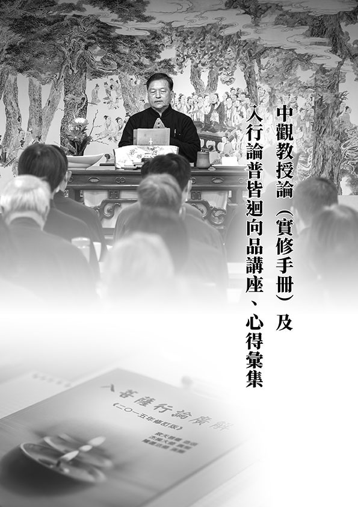

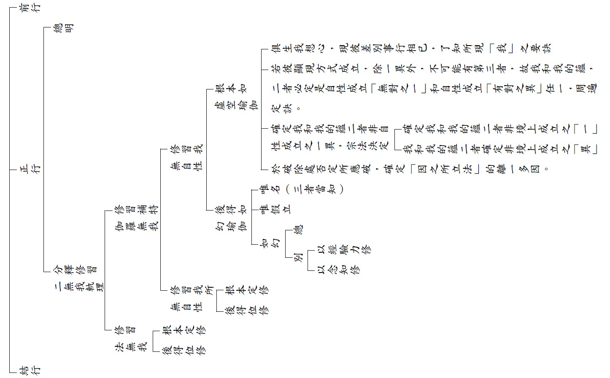

### 時空記憶—典型在夙昔，孔府瑰寶大展報導

淨本

造作才有機會

進入聖門緣起

時代巨輪前進

與時俱進孔學

見證歷史的瑰寶、品讀前人的智慧與使命，由中華大成至聖先師孔子協會、東吳大學儒道智慧永續應用全球中心、通識教育中心以及中華無盡燈文化學會共同主辦，時哉時哉網路教育學院協辦的「時空記憶—典型在夙昔，孔府瑰寶大展」，三月二日在東吳大學城中校區游藝廣場隆重開幕，展期將從今日開始到三月二十八日止。

本次大展由中華大成至聖先師孔子協會提供孔府文物，中華無盡燈文化學會策畫展出，展覽的文物包括孔子聖蹟圖、孔門聖賢造像、孔子歷代嫡長孫世系簡表、孔德成先生相關珍貴照片、法書等。整體展覽脈絡從孔子到大成殿、從聖府、歷代衍聖公到奉祀官孔德成先生，一覽自孔子開始所傳承的文化道統以及家族的世統。東吳大學通識教育中心協助招募上百位的同學參與，並有二十多位的同學接受中華無盡燈文化學會的培訓，擔任「文物導覽大使」，將在一個月的展期中，為各界參訪者介紹導覽。

開幕式當天，主辦方邀請了四十多位貴賓與會，首先由東吳大學詹乾隆副校長致歡迎辭，詹副校長代表校長向在場各位貴賓表達敬意及謝意，並表示很榮幸能夠與中華大成至聖先師孔子協會等單位一同舉辦這樣的活動，也感謝中華無盡燈文化學會的贊助及協助。詹副校長表示，藉由此次展覽，大家彷彿進入時光隧道，去體會先聖先賢的文化素養，東吳大學已經有一百二十三年的歷史，是有豐富人文素養的學校，此次是很好的機會，奠定學生的人文精神跟文化傳承基礎。

大成至聖先師奉祀官孔垂長先生致辭表示，感謝先進們的協助才有此次展覽的呈現，從東吳大學城中校區周邊的布置，看到辦校先賢及許多傑出校友的照片，這也是中華文化所重視的家族與團體的凝聚力，是此次大展希望能夠表現出來的精神。孔奉祀官表示，今日展覽雖然物件較少，但是從中能夠看出從孔子開始到孔德成先生一脈的傳承，另外本次有一百位學生來參與，也讓主辦方感到很高興。

蔣經國國際學術交流基金會董事長錢復先生表示，非常榮幸參加東吳大學儒道智慧永續運用全球中心及其他單位共同主辦的孔府瑰寶大展，孔夫子是我們的至聖先師，他的教育不僅在兩千五百年前是非常重要，這個兩千五百年無時無刻，我們中華民族的同胞，都把它奉為最重要的經典。事實上，我們常說孔子是「聖之時者也」，時代進步，但是我們孔夫子的教訓跟著時代，也讓我們從中得到很多寶貴的經驗和理念。孔夫子教我們的東西太多，最重要的是在大學裏面的八個條目、十七個字：「格物、致知、誠意、正心、修身、齊家、治國、平天下。」這十七個字不要小看，包涵我們現代學術每一項的內容都有。上世紀初清華大學創辦時，他們是理工的大學，就是格物致知這四個字，所以格物致知實在是自然和應用科學的代表；誠意正心是做人的基本條件，誠正是正人君子的標準；修身齊家包括很多的學問，倫理學、社會學、法律學；至於治國平天下，那就是政治、經濟跟國際關係學。所以孔子教導我們的經典，不但兩千五百年前被尊奉，今天還是一樣重要，真的是與時俱進。很高興李克明教授創辦儒道智慧永續運用全球中心，因為儒道智慧要永續運用，不但永續運用還要到全球發展，真正能夠把這個中心做好，相信我們的全球和平、世界大同這樣崇高的理想，一定可以實現。

錢復董事長也表示：今天這個孔子瑰寶大展裡面包括德成先生的歷史，我自己是非常的懷念他，他在世的時候，大家稱他為大聖人。記得在六十年前，我還是一個很年輕的小孩子，我就認識了「孔伯伯」，他是一九二○年出生，先父是一九○八年出生，都是屬猴；台大還有沈剛伯教授、李濟教授也都是屬猴，他們兩位是老猴，我先父是中猴，大聖是小猴，經常在我們家聚會，我是家裡唯一在家的小孩，兩個哥哥當時都到國外了。我看到孔伯伯馬上心理肅然起敬，大家看照片就知道，他模樣莊嚴肅穆，可是接近他是和藹可親，言行也真的是君子的所作所為。我特別記得一段往事，就是民國八十一年初，小女要出嫁，想請一位德高望重的人主婚，所以我就到孔府去恭請孔伯伯，他很高興地接待我，他當時不但是奉祀官還是考試院院長，我想房子應該很大很豪華，沒想到是一個不到三十坪的小房子，客廳不到十二個塌塌米（約六坪大），裡面沒一張沙發，通通都是藤椅，我相信奉祀官記得爺爺當年的生活。這麼高位的官員，家裡沒有人幫忙，是孔伯母自己來倒茶，我簡直是坐立不安，趕緊站起來接過茶。孔伯母給我的印象很深，她稍微大孔伯伯幾個月，她姓孫，家族歷代在滿清時期是擔任高官，她的服裝如此樸素，就是一件藍布旗袍，沒有一點點化妝、裝飾，我看了真是感動。回家我就告訴內人跟小孩，我說你們有福了，下個禮拜孔伯伯要替小女的大典證婚，你們要多跟他們請益，效法他們。我記得孔德成先生是民國九十七年十月下旬走的，考試院有我的好朋友，德成先生一走就打電話給我，他當時停靈在慈濟醫院地下室，我趕去現場，看到靈堂布置非常簡單，我行禮後看門口的簽名簿上空無一人，我也不敢簽第一頁，於是在第二頁最後簽了一個名，表示我對孔伯伯永遠的追念。今天能夠參加這個盛會，我內心裡面的激動是難以用言語形容的，我謝謝李創辦人給我這個機會，讓我表達我對於孔伯伯、孔伯母的尊敬，也謝謝各位在這裡聽我講話，多謝！

儒道智慧永續應用全球中心創辦人李克明教授致詞時表示，聆聽錢董事長令人感動的致詞，今天來到此處真的是不虛此行。感謝各單位給儒道中心這個機會，一起參與執行這次的孔府瑰寶大展，在此報告兩件殊勝的事情，跟一個期許。在這個浩瀚的宇宙時空當中，大家是否曾有超時空跨越時代，與古聖先賢或祖先接觸感應的經驗？我自己在當兵的時候讀了王國維的《人間詞話》，很喜歡這本書，也很佩服王國維先生，一直到二○一○年我有機會在台北跟毓老結緣，在他往生前的幾月內有幾次的接觸，王國維是他的老師，所以當我見到毓老的時候，我感覺透過了他，跟王國維接上了線。今天在這個開幕典禮上，我們藉著孔府的文物，其實我們親歷了至聖先師孔子跟歷代的衍聖公，同時當我們見到奉祀官的時候，我們就透過奉祀官的血脈，與德成公接上了，我們也與兩千五百年前我們的至聖先師接上了，這個感覺可能會讓人起雞皮疙瘩，但這是非常殊勝的感受，是你在別的場合絕對得不到的。

第二項殊勝的事情，我們說「德不孤，必有鄰」，今天這個世界是一個價值觀扭曲、謊言充斥、道德淪喪的時代，我們讀了經典，我們相信運用中華文化儒家思想是重塑價值、撥亂反正的解藥良方，但是我們的信心從何而來？今天在開幕式上這麼多社會賢達老中青齊聚一堂，這就是我們信心所在，這樣的信心是非常的殊勝。最後要講一項期許，感謝中華無盡燈文化學會的共事，我們這次招募了許多東吳大學的學生給予培訓，訓練他們擔任「導覽大使」，來潛移默化、傳承文化，既然有了這麼好的導覽大使，在此處要期許各位多拍照，把今天拍的照片跟電子邀請卡等資訊，在你們的社交群中廣為傳播，當我們邀請更多的人，特別是年輕的學子來看展，我們相信這個就是洗滌社會人心最好的一股洪流。

中華無盡燈文化學會創辦人唐瑜凌老師致詞時表示，很高興有機會跟著各主辦單位來辦這個大展，我本人是李炳南老教授的學生，沒有他我不可能從理工的世界走到文科，他是奉祀官府的主任秘書，他也曾經做過孔德成先生的侍讀先生，他的《論語》講學深深感動我，所以我覺得對中華文化做出貢獻是我人生的目標。隨著整個時代的演變，我們結合同道創辦文化學會，又得到很多人的幫忙，所以有一些能力可以共同來舉辦活動，而又非常高興能認識孔家，這也是因為我另一位恩師徐醒民老師的介紹，才加入孔協會的社團。

我們曾經舉辦過幾次類似的活動，二○一九年時曾經有陳筱君總經理的指導，我們在國父紀念館參與了孔德成先生百年大展，去年九月也與臺中市政府客家委員會合作，在東勢舉辦教師節系列活動，那次的展覽有一萬八千人來參觀，客委會江主委是很有魅力與能力的主委。這次的文物展有孔子、孔子的傳承、歷代衍聖公等，特別孔德成先生是一位很有風采的人物，他是禮學的權威。他的主任秘書李炳南老師，過去曾任莒縣的代理縣長，在兵荒馬亂的時候回到濟南當法官，感到自己離鄉對不起家人，不敢再離開濟南。但後來因為莊陔蘭太史擔任孔德成先生的老師，介紹了李老師到孔府當侍讀先生跟主任秘書，這又必須離開家鄉。李老師很猶豫，結果沒想到他的父親說：「我們李家能為聖人服務那是千載難逢，你就去吧，家裡面的事情由我來負責。」他到孔府一待就是五十年，這五十年的歲月都伴隨著孔德成先生，李老師稱呼孔德成先生為「孔上公」，因為衍聖公是上等的公爵，他也是民國最後一位公爵，第一任的奉祀官。在李老師過世的時候，孔德成先生所寫的輓聯是「數萬里流離備嘗甘苦與君共，五十年交誼多歷艱難為我謀」，他也親自擔任李老師喪禮的主持人，就如《論語》中所說：「朋友死，無所歸。於我殯。」是這樣的交情。

孔德成先生一生可以說與孔子有很多類似之處，他經歷了許多苦難，但也同樣有高度的成就，中華無盡燈文化學會過去花了很多的心血，用了六年的時間製作了孔德成先生的紀錄片，我們可以發現，他與中華民國的現代史息息相關，因為奉祀官所在之處，就是國家正統所在之處。拍攝紀錄片過程當中很感謝台大教授們的支持，要將孔德成先生的貢獻及中華文化弘揚出去，有賴各界的一起努力。學會連續幾年在台北孔廟參與孔氏宗親丁祭的禮生工作、學習佾舞，這些都有賴台北孔廟的協助、台大黃啟書教授的指導。不久前學會也組織師資前往馬來西亞的東馬開辦《論語》講座，詩巫的省長、教育廳長下令讓每個學校派代表聽課，這是他們當地華人的愛好，來聽課的都是年輕人，彷彿看到當年台灣經濟起飛的時代，他們對文化的愛好甚至都勝過我們的年輕人。因為去馬來西亞辦講座的因緣，今年九月教師節期間，馬來西亞跟汶萊的校長們、朋友們將組團來訪，我們很希望能有機會再跟孔廟、客委會合作，帶領這些來訪的朋友們深入中華文化。另外在七月期間，也會有美國知名大學的學生們來台交流，這些都是推展文化很好的機緣，期望如同此次大展一樣，有各界賢達的參與，有本次東吳大學這些熱情的同學參與，創造我們台灣的價值，發掘文化的魅力。

在以上五位貴賓致詞後，大眾進行合照，並由唐瑜凌老師為與會貴賓導覽現場文物，會後餐敘交流，圓滿了開幕活動。此後展覽期間，東吳大學學生持續為各界來賓導覽，所有導覽的同學們，幾乎都給予此次展覽正面的回饋，他們從不太認識孔子、不認識孔德成，一直到能對所有來訪參觀的人介紹孔子的生平、孔子的傳承與孔德成的一生，這過程中有太多豐富的收穫，都在他們所寫的心得中展現。

美好的文化與珍貴的文物，真正的重點在於傳承，因為傳承，才看得見美好，期待這樣的展覽以及後進們的學習，能夠持續，綿延不絕。

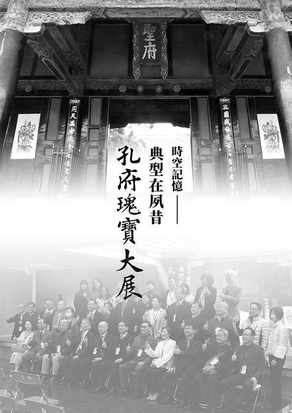

### 東吳大學孔府瑰寶大展學生導覽心得

東吳學生

人生最難在際遇

創造有利己發展

充實內涵與利他

累積因緣後難思

莊琇婷

起初，我什麼都不知道就報名了，成功錄取之後，我找出中華文化基本教材稍微複習一下論語，果然，不是為了應付考試而讀，才會覺得論語有趣。緊接著，到了培訓課程當日，因為知道自己將在日後肩負起為其他人導覽的責任，所以格外認真上課。最令我深感榮幸的是，我居然能看到沒有對外公開，關於孔德成先生的紀錄片！非常精彩，也能夠很輕易又快速的認識孔德成先生，總之，在觀賞紀錄片後，我不禁同情孔德成先生的遭遇，但更多的是佩服他的努力與成就，他大概就是「時勢造英雄」的典型代表人物吧！其次，我也沈醉在孔子聖蹟圖的介紹當中，利用三十二幅圖道盡孔子的一生著實厲害，大大小小的故事都顯示出孔子的高尚品格及卓越思想，同時，也讓我體悟到「聖人之所以為聖人」的真諦，我想，孔德成先生也可以稱得上是聖人吧！因為他和孔子一樣，向來都秉持著良好的修養和自我提升的能力，並且能夠通過自己的行為來感化他人，讓他人成為更好的人。最後，我想特別感謝培訓當天的接待人員及所有講師，一整天下來都令我倍感親切，除此之外還想感謝廚師，午餐真的非常好吃，即便是素食，但我也吃了好幾碗呢！

回到導覽本身談談，在這段期間我最感謝的是吳芷婕同學，第一週擔任志工的時候，超級緊張不知所措，還好常常和她搭檔，透過她的分享，我吸收了她的經驗，並且在一起導覽的過程中，我們可以互相補充彼此未完善的地方，一來一往當中，彼此都在成長！印象深刻的是，我們週六一起擔任志工的時候，總是會遇到校友或老師，他們對孔子或是孔德成先生的認識都比我們更深，這時候我們都會想盡辦法說出我們的理解，儘管還是略顯不足，不過好像也是因為這樣，才另類培養出我們之間「共患難」的情誼吧！

展覽結束了，不知為何竟覺得有點可惜，可惜的是展覽人數到後來越來越少，一直對同學發出邀約，但都被以「太遠了」的理由拒絕，我是政治系的學生，課程都在校本部，認識的同學朋友也大多是在校本部，所以即使他們有意願想聽我導覽，但考量到通車的時間成本，也只能委婉拒絕，同理，我想參與導覽意願可能較高的歷史系、中文系同學，也可能基於這樣的原因才沒來參加。雖然有遺憾，但仍然很慶幸能在導覽當中結識新的朋友，並且在導覽中收穫良多！由衷地感謝各個承辦人員、導覽夥伴，以及最重要的主辦單位—中華無盡燈文化學會，因為有了大家的努力，才能順利完成本次活動，也期待能有下次的合作機會！

吳芷婕

當我第一次注意到這個活動的時候，就覺得很有興趣，因為我一直覺得能夠去導覽某個展的人，一定都是某種領域的專家，才能夠向其他人介紹導覽的主題。然而其實並不是這樣，只要有特地去了解展覽內容的人，不但可以傳遞知識，還能夠分享自己的心得給其他人聽。而導覽的過程，我也遇到了各式各樣來參展的人，有的很熱情的詢問我是否能導覽且仔細聆聽，而有些人可能完全不理會你，自顧自地看完以後就走了，因此我的心情也會有時開心，有時無奈。雖然如此，我還是跟一起站崗的其他導覽員成為好朋友，每次見面的時候都會分享自己遇到了哪些來參觀的人，分享各種喜悅。

林佳葳

自己是第一次擔任導覽大使，對於孔德成先生十分不了解，一開始看孔德成先生紀錄片的時候還覺得有點無聊，但看到最後面，尤其是孔德成先生與自己的姊姊相遇時，內心很激動，也覺得很感人。在幫城中的同學導覽時，會聽到很多同學有不同的意見，包括想知道更多有關於孔德成先生的事蹟，或者想了解《孔子聖蹟圖》是誰畫的，看到很多同學對於這次的展覽有興趣想了解，自己十分有成就感。雖然我因為課程的關係，只能導覽十個小時，但真的覺得學到很多，交到很多朋友，幫助很多同學認識孔德成先生，自己也對於這次的展覽增加了更多的經驗。如果未來有類似的展覽辦在城中，我會積極參與幫忙的。

陳建禾

出於對孔家文化的興趣報名了此次導覽大使，在一開始培訓課程的時候就獲益良多，除了很多高中聽了一知半解的知識外，也認識了其他的導覽大使，回家後整理自己的所學與課堂筆記，便迫不及待地想向大家分享孔府文化的傳承。

可惜我能排班的時段非常有限，大多時候來觀展的人數很少，但我仍努力地把握僅有的機會，將孔德成先生的一生與奉獻介紹給有興趣的人，經歷了培訓課程的影片後，在講解時都會不自覺將自己帶入情境，感受那惋惜、坎坷，亦或是責任，不禁令人歎息孔德成先生已經過世。

很榮幸能擔任此次活動的導覽大使，在我所學的十九年中，從未如此深入了解過他人的經歷，除了能與其他大使交流心得外，更將活動的核心與精神傳承下去，希望能有更多人了解孔門的歷史及內涵，很感謝總召、主任、主辦方的付出與努力！

羅語婕

透過此次活動，讓我認識了一位相當值得尊敬的人士，一開始完全沒聽過孔德成先生這號人物，僅憑著當初對導覽的些許經驗而參加這項活動，培訓當天，透過老師的介紹以及紀錄片，讓我對於孔德成先生有更深刻的了解。在現代，若有人有機會身兼數職，或許不太可能會有人像孔先生一樣，只從中領取一份薪水。另外，可能目前也僅有少數人對於官職完全不眷戀，孔德成先生可以依憑本心，隨著時代風向的轉變，直接選擇請辭官職，真的令人十分敬佩。也讓我覺得，孔德成先生相當具有孔子再世的風範，孔子所擁有的氣度，孔德成先生也都具備，是一名值得後世學習的典範！

許靖

這次能夠擔任導覽真的特別開心，我邀請了很多好朋友一起來聽我導覽，最後一天，好多朋友到場支持，激發了我的導覽慾，所以講了特別多孔子和孔德成先生的故事，講著講著，我也更認識孔德成先生。

很多人一開始都不認識孔德成先生，包括我，但看完紀錄片，參與培訓後，就了解孔德成先生對於儒家文化以及台灣教育界的貢獻，也很榮幸能成為導覽一員，回家後也私下研究他的資料，發現他真的是一位熱愛中華文化，稱得上孔子傳人的人物。

很多人聆聽完導覽，也詢問了好多問題，代表大家對於這個展是喜歡的，很感謝學校和學會有這次的活動，讓更多人能夠認識孔子和孔德成先生。

另外，我認真覺得紀錄片很好看，可以讓更多人看，一定會有更多人認識、喜愛孔德成先生和認識中華文化。

鄭淳宇

這是我第一次體驗導覽員一職，寒假時因緣際會下，得知招募導覽大使的資訊，老實說一開始是看到高額獎學金很心動，加上一直覺得自己沒有太多特別的經歷，想要踏出舒適圈才報名的，非常有幸能夠獲得這次機會，是很新鮮也很特別的嘗試，在擔任導覽大使的過程中，認識了很不錯的夥伴、同學們，也接觸到學會裡非常厲害的人士，印象最深刻的是有次遇到一對夫妻來看展，到後面才知道原來他們是學會周日要來當導覽員的人，從他們口中了解到更多關於孔德成先生及儒道相關的知識與事蹟。簡而言之，我在這段時間收穫了很多，感謝無盡燈文化學會及學校通識中心的用心，也謝謝每位曾搭檔過的志工夥伴，以及來參與孔府瑰寶展覽的每個人。

周采葳

非常開心能夠參與這次導覽大使的活動，一開始擔心自己做不好，因為對於孔德成先生以及孔子相關的故事都不太熟悉，也沒有認識的朋友一起參加。到了培訓那天，一整天下來，學習到非常多東西，印象最深刻的就是他們的精神，著實令人敬佩。導覽第一天，超級緊張害怕，怕自己準備不充分，講的不好不詳細，對於孔子聖蹟圖也沒什麼把握。不過透過一次次的導覽，還有旁聽別的同學導覽，讓自己更加了解，也更熟練，一次次更完善自己的導覽。整個活動中最開心的是認識了好多新朋友，再跟他們討論交流的過程中，學習到很多東西，很感謝這個活動讓我認識了孔德成先生，感謝學會的老師以及導覽大使們。

康芸禎

首先感謝中華無盡燈學會和通識教育中心，提供這樣難得的機會給東吳的同學們，除了事前培訓外，會後還提供獎學金、小禮物、餐敘等福利給擔任導覽大使的同學們，心中無限感激。過程中除了了解到孔德成的生平，更讓我們能運用自己的所學，向貴賓以及同學們解說此次展覽的目的，透過短暫的解說，讓聽眾更了解孔子及其後代。擔任孔府瑰寶大展的導覽大使是相當特別的一次經驗，除了提升自己對於中華文學的素養，更能透過自身影響他人，而在導覽的過程中，與貴賓進行簡單的交流，也能夠有不同的收穫，希望以後還能有這樣特別的機會可以和大家交流！

翁宇蓁

這是我第一次當文物的導覽人員，為期約一個月的導覽，讓我逐漸對孔子和其後代有更多的認識，經歷學會一天的培訓後，從原本對孔德成先生一無所知，發展成有初步的雛型，而後在導覽的過程中，為了讓觀者更了解，也私下對孔德成先生做更多的查閱功課，愈了解就讓我愈想更了解，其次，透過口述的方式，一次次講解給其他人聽，讓我在導覽後會省思自己哪裡了解的不夠充足，進而增進自己，為下次導覽做更充足的準備。在認識孔德成先生後，了解了他對中華文化做出的貢獻，知道他即使有許多成就，也不滿足於自身，仍然努力的精進自己，十分值得我們敬佩。

劉上瑜

參加活動前，對孔德成先生完全不認識，也不知道孔家後代的發展，對於儒家或是儒學只覺得是過時的東西，透過培訓後，我覺得或許儒家思想放在現今社會，有些確實不再適宜，文化需要與時俱進，但同時我們不應該全盤否認其價值，至少先人的治世風骨仍然值得我們學習。

雖然我沒有因為一個月的導覽活動而成為儒教的死忠擁護者，但我在整個導覽的過程學到了很多知識，例如歷朝歷代對於孔子嫡系後裔的尊崇，在孔家族譜上一覽無遺，側面應證了整個中華文化是受影響最深的；又例如對於孔子的生平事蹟，雖然小時候看孔子的傳記知道大致上的故事，但對於故事的細節，和對孔子的描述，是在這次學會培訓課，以及正式導覽前自己蒐集的資料，才知道的更完整，也更加佩服孔子的學識之淵博，和其治世之才。

我本身非常不善於跟陌生人對話，導覽前也很焦慮自己到底能講些什麼，但在一次一次練習中，從剛開始勉強湊足十分鐘，要準備小抄才能導覽，到後來不用看稿也能越講越好，也講的越來越長，由衷感謝這次導覽的機會，讓我的表達能力和與他人互動的能力提升。

劉軒揚

感謝學會讓我有機會認識孔德成先生，一開始看到活動時就在想，孔德成這個人到底有什麼特別的，我連聽都沒聽過，為什麼要特別辦展覽來介紹他，然而在培訓課程中看到影片後，讓我初步的認識孔德成先生，希望這部影片可以放在影音平台，供更多人觀看。孔德成先生令人敬佩，在這風雨飄渺的時代，仍能保持孔子的風骨，希望未來學會還能在東吳大學舉辦關於儒學相關的展覽，我覺得傳統中華文化值得發揚！

楊珽皓

在這次展覽中，能遇到兩位真心對孔門有興趣的學生，我很驚喜也很驚訝，很開心能夠竭盡所學為他們導覽，實在受益良多。

而我收穫最多的其實是在展期一起工作的導覽員們，雖然大家大部分是為了獎學金而來，但是實際投入這份工作後交到的朋友、學到的知識，這些價值勝過獎學金多太多了。相信我跟這些同學未來也都會保持聯絡，在未來的路上各自加油。

很感謝學會老師們的培訓課，以電影作開頭，美味的素食為我們充電，再用老師精彩的教學豐富我們的知識，時間一眨眼就過去了，真的很過癮。

吳星緹

在還沒擔任導覽志工以前，我對於孔子後代的認識，最多是從新聞得知，而且是少部分的資訊。藉由這次展覽，可以認識與了解到身為孔子後代，特別是嫡系子孫，所應承擔的責任與義務。無論是「衍聖公」或是「大成至聖先師奉祀官」等稱呼，都是榮耀也是責任。

孔德成先生身處於亂世之中，從小面臨生離死別之苦，前半生過著顛沛流離的生活，卻仍然能謹守本份，努力完成該做的事情，同時保持學習儒家思想等知識，值得欽佩。

此外從歷史中，我們知道儒家思想面臨幾次存亡危機，在經過孔子的後代與學者們，致力於保存與傳承後，讓文化得以繼續傳承下去。一直到現在，仍有一群人為了保存與傳承而努力著，讓我由衷佩服與感謝，同時期待日後還有機會接觸相關的歷史與文化。

### 孔家仲春丁祭正行及成人禮新聞報導

*編輯部整理*

凝聚宗親力量    祭祖念恩致敬

莊嚴肅穆井然    獻爵獻豆祈福

叩首神祈來格    宗親互賀吉祥

成長子弟加冠    代以三加肯定

帶著期許成長    或異世間庸俗

二○二三年（癸卯）三月五日（夏曆二月十四），奉祀官孔垂長先生率臺灣孔氏宗親後裔共百人，於臺北孔廟大成殿舉行仲春丁祭暨團拜。本次活動由至聖孔子基金會主辦，社團法人中華孔氏宗親會、中華孔子後裔儒學促進會、臺北孔廟、臺灣大學中國文學系及中華無盡燈文化學會等協辦。參與者除孔氏宗親後裔外，尚有禮生團隊三十七人，貴賓董金裕教授、張曉生教授、彭美玲教授、狄君宏教授、黃啟書教授、無盡燈唐瑜凌老師、林蔚芳老師、臺北孔廟新任黃穗蘋執行祕書以及資深禮生施銘漳老師、陳應義老師、習沛祺老師等蒞臨觀禮。

曲阜孔氏肇始仲尼，自此枝繁葉茂，遍及寰宇。孔垂長先生所主持之至聖孔子基金會委託臺大中文系團隊與臺北孔廟研擬禮儀，兼時日多擇於仲春二月。遂參闕里舊志，減殺為釋菜禮，遂使丁祭再得以簡儀形式復興。令闕里禮樂得以融古通今，與時推移。與祭及觀禮者，咸曰俞善。典禮共分為典禮開始、入班、禮神、上香、行獻禮、恭讀祝辭、讀訓、立願、禮成、團拜、成人禮、合影等十二項儀節。掌控儀程如能流暢，則可讓老少咸能在一個小時有餘內圓滿完成所有環節，而不感負擔、沈悶。

以往配合現今需求所做的禮儀調整，悉數保留。如序班以家長字輩為準，闔家站於同列；拜禮則遵孔德成先生所考禮容為準，以「再拜稽首」為最慎重之大禮；自《論語》中摘出三句做為家訓由全體宗親後裔齊誦；每位宗親後裔在宗主監臨觀禮下，入殿於祖先神位前發心立願等等。至於所有活動的節目單、禮儀示範，乃至於成人禮學子的自我介紹，則亦在活動前放上雲端網路供宗親後裔參考。今年除宗親後裔訂作同一款式服裝，做為禮服外。又參考學者專家意見，於典禮開始之前，由奉祀官與陪祭宗親代表至崇聖祠向孔子五代先祖致祭，以符「父先於子食」的禮意。雖然因活動時程設計，致使同一時間正在序班的宗親後裔們未克參加。但明年應會略加調整，好讓所有人員能更深刻了解崇聖祠設立旨意。

奉祀官致辭時表示：曾有學者指出，今年是孔子逝世二千五百周年。雖然因為文獻記載與曆法推算不一，加上籌備時間、人力、物力等種種因素，未能盛大舉行紀念活動。但今日臺灣所有宗親後裔仍選在仲春丁祭這個符合古禮的祭祀時間裡，身著一致的禮服，來向先聖孔子致上最崇高的禮敬。也謝謝多年來臺北孔廟、臺大中文系及無盡燈學會所有的工作同仁、同學們對臺灣孔氏後裔仲春丁祭這項活動不遺餘力的支持與協助。大家都知道，去年我們仍倍受疫情困擾，百業蕭條，國外國內也都發生許多令人遺憾的事情。《周易》稱「否極泰來」，隨疫情漸熄之際，我們除對全球的孔氏宗親家人獻上誠摯祝福外，我輩孔氏後裔更應恪遵祖訓、相互砥礪，待人以誠。行事以正，協助宗親、國人早日渡過難關。

會前宗主孔垂長聽聞歷年出席人數最多的孔祥寶先生家族，其家長孔祥寶已於去年辭世。會後除特表慰問之意，並與夫人連明珠女士所率領的十五位家人合影留念，藉此表彰祥寶先生多年來對於宗族事務的熱心襄贊。

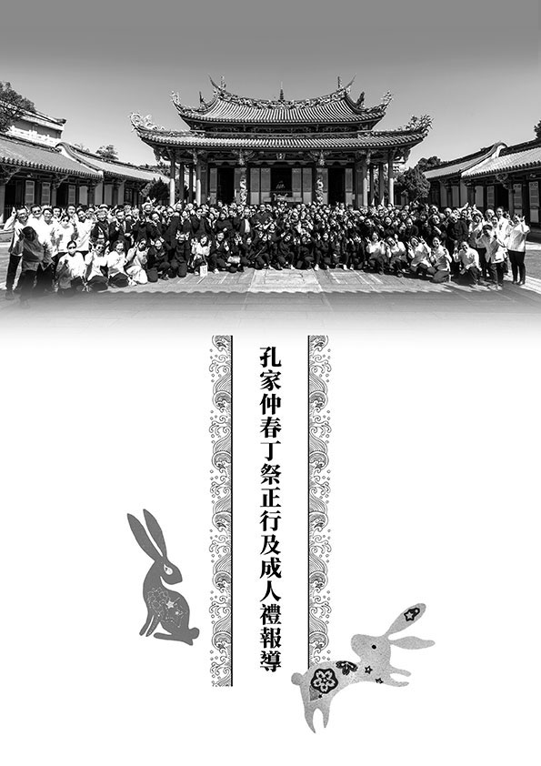

### 佛誕日放生及浴佛報導

心若

放生浴佛餐會

享福行善修福

進入良善循環

經營福慧系統

運轉自如成佛

每年五月適逢母親節、浴佛節，都會盛大辦理，今年疫情趨緩，終於回復以往的法行，先是於今年五月二十日（六）學會大堂共修，結合浴佛法行，特別的是，此次有時青班的加入，法器組全權由這群年輕人負責，在于山老師的帶領下，緊鑼密鼓的籌備，除了一起排練外，青年學子也積極爭取抽空來學會練習，即便是第一次上場，卻展現穩定內斂的氣象，讓法會如理如法的進行，獲得蓮友們一致的讚賞，激勵了團體內部的士氣，是一場攝心感人，又別開生面的法會。而各啟蒙班也紛紛於課堂講解釋迦牟尼佛的故事，以及浴佛的功德利益，在小朋友們心中種下善種，再讓他們一一排隊浴佛，相信是很棒的體驗。

除了週六共修的浴佛外，學會特別於五月二十六日（週五），農曆四月初八，也就是佛誕節當天，興辦放生及浴佛法行，放生剛好與佛誕節同天，這是當初安排時完全沒有想到的巧合，農曆四月初八也是藏傳吉祥月的最好日子，當天做一件善法勝過平常的百千件。此次放生及浴佛地點設在新北市瑞芳區深澳路的海鮮樓，整個行程包括法會前行、放生法會、灑淨，前往放生場地，在佛號中放生，回到海鮮樓作浴佛前行、浴佛法會、浴佛、用餐、交流，可謂非常充實。

浴佛節為漢傳、藏傳佛教共同的節日，雖然是不同的表法，但是殊途同歸，都是來表徵釋迦牟尼佛的傳承，能在佛誕節的這一天，結合放生與浴佛法行，或是本年度最有意義的放生，最能彰顯釋迦牟尼佛的就是大慈大悲，放生最符合大慈大悲，因這些生物本來在刀口下，即將被殺、被煮、被食用，放生解決他們生命的困難。再者，以此功德來浴佛，令福報百千萬倍的增長，創造人生的暇滿，有益於行佛行事業，累積福慧資糧，或才是人生真正的意義。

一進入會場，映入眼簾的便是懺公所繪製的西方三聖像，這次運用了現場的LED螢幕投影三聖像，前台更是以各式供品、鮮花莊嚴，中間是主尊釋迦牟尼佛的誕生相，一進場便可感受到壇場的莊重肅穆，不知不覺心生嚮往、恭敬、讚歎。

之所以能有如此莊嚴的壇場，有賴於前一天由林老師帶領師姑、師伯及辦公室幾位同仁，提前至海鮮樓布置，一早就去花市買了鮮花，到會場供品羅列、插花裝飾，忙碌了一天，才有如此大器的呈現，先行打點很重要，讓隔一天的法會能按部就班的進行，大家一來就可以安住身心，而能各司其職，這也要感謝海鮮樓的老闆，非常仁慈，願意配合我們的善法，才有前一天的場佈，當天老闆也一早就開門歡迎大家。

放生、浴佛的維那、樂眾也都要事先練習，彼此默契配合，安排人員及交通的工作人員也很辛苦，要很耐煩的統計、反覆連絡確認；遠到而來的善友也很辛苦，像是東勢的蓮友們，清晨四時就包遊覽車出發，在車上還要有好的法義觀修，生起法喜，才會帶著法喜來放生、浴佛。

而每次老菩薩們放生都很危險，承蒙放生組事前的勘查，嘗試各種魚梯的製作，當天更是一早就前往布置魚梯，魚梯架得很長，接起來的過程非常辛苦，外面太陽炙熱，站在外面不到三分鐘就汗流浹背，因為有這些辛苦付出的工作人員，放生才得以順利進行。

以上每一件事情看似很簡單的進行，實則背後都有很複雜的操作，就像家裡面水龍頭打開就有水流出來，再簡單不過，但是後面牽涉複雜的系統是難以想像的。如果我們看懂這些，極樂世界也是如此，看似簡單自然，「思衣得衣、思食得食」，「水鳥樹林，皆演法音」，「常以清旦，各以衣裓，盛眾妙華，供養他方十萬億佛」，一切都自然而然，但後面都是複雜的造作、龐大的因緣，佛累劫的累積才有，這樣的觀修很重要，否則眼前的法行也只是一場世俗的盛會，大家久違見面敘舊很開心而已。以上種種造作叫做支分，創造出一個有支，終於把放生、浴佛的法行撐起來，讓善友們遠地而來參加，三寶與龍天護念，當日天氣非常好，艷陽高照，大家一桶接一桶的放魚，法喜菩提心湧現，觀想所放的都是未來諸佛。

對於壇場，我們要有想像力，要賦予意義，藉由美妙的壇場來觀想這就是釋迦牟尼佛誕生之處-尼泊爾的藍毗尼花園，把放生浴佛的這一天，當作佛出世的緣起，也未嘗不可，三寶、佛菩薩會藉著我們的誠意，藉著塑像，藉著供養而現起威神之力。釋迦牟尼佛一期的因緣，有八相成道，最殊勝的成道開始就是誕生，因為沒有誕生，後面的出家、苦行、降魔成道、初轉法輪、入世說法、涅槃，都不會成立。

壇場的供品表徵佛的福報很殊勝，福報多跟福報少的差別，猶如歐美一個人的享受，相當於非洲一百個酋長的生活享受，一個最下等的天人遠勝於一個世間國王的享受，每升一級，受用就會愈來愈多，這些福報都是從因地創造出來的。成為哪一道，都是一個系統轉進去，成為共業，脫困不了，因為進入這個系統，其思維模式、生活模式、行為都會被框住，想要往上走一定要突破框架，要有想像力，甚而借外緣突破自己的框架，就像孟母沒有三遷，孟子長大也許就只是位叫賣的小販，可是孟母毅然決然的把家搬到學校旁邊，孟子的思維模式就改變，命運就脫困了，一舉成為孔子之後的國際級人物。我們也要多以佛教的教法作為自己的思維模式，幫助我們這一生脫困，進入另外一個系統運轉，而不是圍繞在世俗打轉，要跳出格局，借助這些修行者、大論師，深入法義，心態上轉為利益他人的心態，此時就從世俗的心態中脫困出來，命運隨之改變，而且順境、逆境都成為我們的增上緣。

壇城的布置，燈代表智慧的燈，水果代表佛果的圓成，餅乾糖果代表修行的道糧無窮無盡，水、水、花、香、燈、塗、果、樂，代表過去釋迦牟尼佛接受信徒供養的時候，信徒會在家裡以洗澡水、洗腳水或是喝的水、花、香、燈、塗香、美食、音樂來招待釋迦牟尼佛，眼前就以這八供來招待釋迦牟尼佛，來招待十方諸佛。修行的方式有兩種，可以以因來修行，也可以以果地覺為因地心來修行，比如自現佛慢想，把自己觀想成佛，而請來的善友們都是佛菩薩的示現，請來的主尊佛菩薩都是我要請客的對象，心量要像祇樹給孤獨長者這樣，很大方的請佛菩薩來聚會，也要像維摩詰居士的丈室，很大方的擺供品，很大方的提供種種生活的享受，中午吃飯時很大方的擺宴席，透過這種觀想，擴寬心量。佛法做善事時都應該要大張旗鼓，要比世間人更懂得莊嚴這樣的法行，不要斤斤計較，往往世俗發展的聚會都比佛教厲害，就是因為佛教徒不了解做善法反而要大張聲勢、場面浩大，讓大眾知道學佛的可貴。本次大家來參加這樣的法會，功德都很大，因為齊聚一堂，讓別人覺得這樣的法會很莊嚴、很值得，這比參加世俗的婚禮還要重要，這種法行帶來的是無窮無盡的利益，可以讓現世者消災免難，往生者增福增慧，甚至能莊嚴自己的淨土、自己的佛果，結合這些觀修，眼前來做放生、浴佛的法行，是我們成佛的徵兆。

上述種種都是創造有支的支分，條件聚合而發揮難可思議的作用，是未來甚深的緣起，眼前一同共造善法的善友們，成佛之後都是諸上善人，能聚會一處，互助共學，要很努力地造作對我們有利的條件，有這樣的想法，往生極樂世界時，才會珍惜，才懂得運用與發揚光大。

而《浴佛功德經》告訴我們浴佛的動機、做法、意義與價值，以及如何成就浴佛的殊勝莊嚴行，浴佛的時候可以觀想我們是菩薩，對佛沐浴，創造佛出世的時候，自己就是沐浴者，是擁護者、支持者、讚歎者、弘揚者、傳承者，有一天自己成佛的時候，自然感應很多人來擁護我、讚歎我、發揚我的教法，這叫作「一佛出世，千佛護持」，如《法華經》所言，從來沒有任何一尊佛，是離開人群，自己成佛以後，所有的佛來擁護他，這是不可能的。《法華經》就告訴我們此人的過去因緣、過去的關聯性，人際關係非常重要，如何在人際關係中創造個人的價值，比如此行就創造了浴佛、放生的價值，《華嚴經》上說：「應觀法界性，一切唯心造」，法界的特性是唯心造，痛苦是自己創造出來的，快樂也是自己創造出來的，三塗的痛苦、人天的安樂，乃至於佛果的安樂，自己就是能造作者，其他人無法取代。

了解《法華經》才知釋迦牟尼佛在久遠劫前早已成正覺，悲憫眾生而來此娑婆世界八千次，浴佛創造佛應化緣起，壇城莊嚴與梵唄整齊，唱誦《浴佛功德經》與浴佛，以水灌自頂，使自己有登地徵兆，成為聖者菩薩時，感得成佛之前諸佛來灌頂，龍天歡喜與諸佛護念，善哉音聲佛事真教體。我們結合法義來浴佛，在因上洗滌煩惱的垢染，在緣上促成佛再來，結合法義能請轉法輪、請佛住世、常隨佛學、恆順眾生，莊嚴佛果得究竟。

以上就是此次在深澳漁港舉辦的放生活動及浴佛法會，以此感念佛恩、超薦先祖、祈福消災，讓我們一同慶祝釋迦牟尼佛的誕生，延續我們與世尊甚深且無盡的因緣。

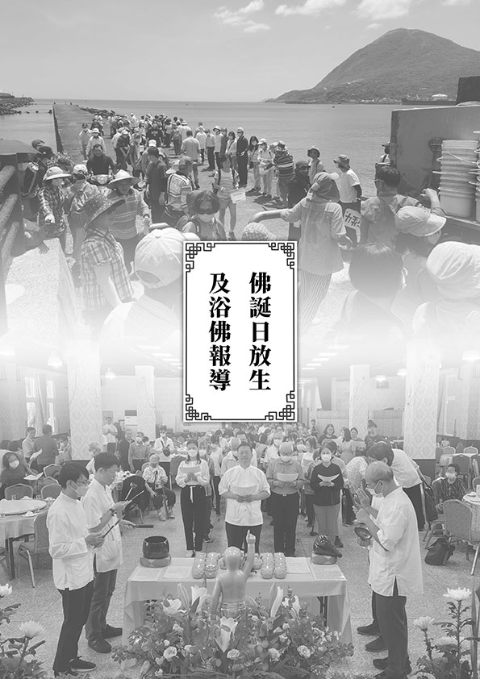
