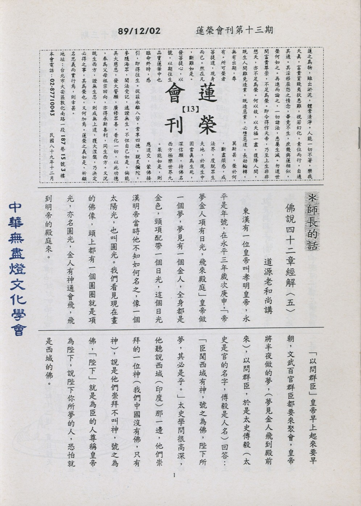

# 第13期

## 大德法語

### 佛說四十二章經解（五）

*道源老和尚講授*

東漢有一位皇帝叫孝明皇帝，永平是年號，在永平三年歲次庚申，「帝夢金人，項有日光，飛來殿庭。」皇帝做一個夢，夢見有一個金人，全身都是金色，頸項配帶一個日光，這個日光漢明帝當時他不知如何名之，像一個太陽光，也叫圓光。我們看見現在畫的佛像，頭上都有一個圓圈就是項光，亦名圓光，金人有神通會飛，飛到明帝的殿庭來。
「以問群臣」皇帝早上起來要早朝，文武百官群臣都要來聚會，皇帝將半夜做的夢，（夢見金人飛到殿前來），以問群臣，於是太史傅毅（太史是官的名字，傅毅是人名）回
**答：** 「臣聞西域有神，號之為佛，陛下所夢，其必是乎。」太史學問很高深，他聽說西域（印度）那一邊，他們崇拜的一位神（我們中國沒有佛，只有神），說是他們崇拜不叫神，號之為佛，「陛下」就是為臣的人尊稱皇帝為陛下，說陛下你所夢的人，恐怕就是西域的佛。

博士王遵亦奏曰（博士是官名，王遵乃人名，奏就是奏對，臣子對皇帝說的話叫奏對）：「按周書異記（周書是周朝的歷史書，周朝的歷史分門別類中，對於特別的事情來記載叫異記。異就是很特別的事，對於很特別的事將之記錄。載（載是記載），佛誕於周昭王二十六年甲寅，（佛誕生在我們中國周昭王二十六年，那一年是歲次甲寅年）。時江河氾溢，大地皆動（江河的水氾上來，大地都震動），五色光貫太微（有五色光貫到太微星），太史蘇由卜之（有一個太史官名叫蘇由，他會占卜，一占卜說此是吉祥之兆，）得乾之九五，飛龍在天（是易經上卦的名字），是西方大聖人也〈解釋就是西域有個大聖人誕生了，這個大聖人出生，就有此吉祥之兆。）後一千年，聲教流被此土（西域國大聖人生，我們這個中國怎麼會大地震動，江河氾溢，五色光貫太微呢？就是一千年以後佛的教法會流傳到中國來。）王命刻石為記（王就是周昭王，刻在石碑為記）埋之南郊，後於周穆王時，乾坤震動（天地都在震動），有白虹十二道，貫日經天（天上有彩虹十二道，貫日經天，出此吉祥之兆），太史扈多占之（在周穆王有太史官叫扈多，占就是卜也是算卦，占卦之後），謂是西域大聖人入滅之象（是西域有一個大聖人已經入滅了，才有這個現象）。

我們現在四月初八要浴佛，要給佛洗澡，唱一個讚，裏面有兩句，甲寅年四月八，那個甲寅年就是周昭王二十六年，那一年是歲次甲寅年。按周昭王二十六年甲寅年佛降生了，算到中華民國七十五年，到今年應該是三千零一十四年。而依南洋佛教史今年是兩千五百三十年，因為中國佛教衰弱，失去了自信力，現在多數採取南洋佛教史，說今年是佛誕生的兩千五百三十年。為什麼不相信我們自己的佛教歷史，而相信南洋的？自己中國的大乘佛教衰弱下來，朝野社會統統不相信出家人，我們自己很慚愧，到了南洋看看人家的小乘佛教非常的興隆，不但國王尊重出家人，社會上都尊重，像佛陀一樣，於是覺得中國的佛教沒有一點好而要模仿南洋佛教，這就是自己喪失了自信力量。不但信仰南洋的佛教史，也崇拜南洋的僧裝，覺得我們中國的出家人穿的服裝都是不高明。但是本人（道源）看見的民國法師：印光老法師、太虛大師、圓瑛老法師、慈舟大師，他們出版的書沒有用南洋的佛教史（他們都是民國的法師！）沒有用南洋的佛教史，他們也不穿南洋的僧裝，這就是他們這些老法師都沒有喪失自信心。

再看註解：「明帝乃於七年歲次甲子」明帝在永平三年做的夢，要籌備到西域去求法，因為當時交通困難，到了七年才籌備好，歲次甲子這一年，敕郎中蔡愔(敕是皇帝的命令，郎中是官的名字)中郎將秦景、博士王遵等一十八人，西尋佛法（到西域印度去請佛法）。這一十八人到印度國，請迦葉摩騰及竺法蘭等兩位高僧，還有印度的佛經，用白馬馱，叫「白馬馱經」。并將佛舍利及畫佛像也請到了。〈未完待續〉

### 紀念　雪公恩師一百一十一歲冥誕

*編輯部整理*

雪公老師開示

諸位老師、同學還有貴賓。今天這件事情太重要，大家要弄明白。我的言語是北方言語大家不易懂，故慢慢說，且今天的時間有限，故事情簡單講：今天來此，是參加國學啟蒙背誦觀摩

◎第一：「啟蒙」

◎第二：「觀摩」
上兩條我請諸位（老師、家長、同學）了解。或
**問：** 難道以前不了解嗎？以前了解的很簡單，不知古人啟蒙教育。這個事情（國學啟蒙背誦）可以說是六十年前的事情，或云，這不是很麻煩嗎？開倒車？這絕對不是開倒車。「啟蒙」兩字是開倒車嗎？啟蒙是入了年級了一步一步往前進，倒車是倒過來一步步往後走。「蒙」好比一個花種子埋到土內，藏在土中，它在裡頭春天陽氣往上昇（地氣往上升，天氣往下降），這兩一結合，種子在土內就冒出芽了，這叫「蒙」。「啟蒙」是開頭，你們諸位年輕人，才開頭，一天一天往上走，你要長著長著，往後退就叫開倒車，那就錯了！

啟蒙：此正是啟蒙時候，「啟」開開，種子開花結果，你看重不重要？既是重要，那麼這幾年沒有啟蒙嗎？這幾年一昧地蒙上而非啟，種子長起來不到成熟就栽掉破壞了。這幾年弄成這個樣子。把啟蒙這兩個字弄錯了。啟蒙這兩個字就是小孩子，小孩子會說話，說話是天然能力。牙齒是天然長的，高興就笑，不高興就哭。笑代表今天開心，哭代表今天不高興。生氣、哭則倒霉，笑、開心則喜歡，愉悅生長。

啟蒙是誰應該辦的呢？國家應該辦的，國家卻不護持，教育辦不好，不行！啟蒙以後，長出來得表現、表現，這裡長葉子，那裡開了花，結了果，得表現給人看看。你們諸位同學上學多少年了，也得表現給人看。

觀摩：是辦事得有個比較，看看人家怎麼樣，看看自己怎麼樣，瞭解一下比較、比較。人家的學校好，是人辦的好。另一個學校卻不好，一樣是學校怎麼會有好有壞，全在人辦，全在人比較。

觀摩之「觀」當察講，察改，察改〈考察改進〉。這個學校怎麼樣，那個學校又如何，得察改，察改。若是好的學校則摩，是學它，模仿。好則大家學，不好則大家棄之，這是說學校與學校。

至於國家好壞也是比較，觀摩的力量很大。或許同學們聽不懂，雖說得很淺，但大家平素都沒有聽過這些話，聽的是罵、捧、吹等等，學的都是這些不實際的。我（雪公）說這些話沒聽過，這就難辦了。辦事情卻在人情上打轉，某人待我好，跟我親密。某人待我不好，不跟我親密。誰跟你親密？大家得把良心拿出來，我說句痛快話，最跟你親密是你的母親（師大聲說）。你這一天要回去晚了，她心裡就不放心，她連飯都不能吃，這並不是裝樣子給人看，這是心裡的真。現在教育卻是把父子兄弟都分開了，誰與誰都不聯絡〈代溝〉。父母管管兒女，他（父母）就犯罪。現在覺悟了，誰當太保就找他的父母。那父母從前管管就犯罪，何必當時要令父母不可管其子女。電影皆是家庭革命，父親與母親鬧，父子鬧、兄弟鬧，演鬧劇，自己與家庭鬥爭，家中成員互相鬥爭。這個樣子國家還會好？這是亡國的教育啊（師沈重說）！亡了國你們還可在那裡坐著？那就一切動作由不得你了。

今天啟蒙與觀摩的話，請諸位老師、家長注重這一點。拿著中國方法，「易子而教」，我的孩子給你管，請老師嘛！老師得拿出良心把人家子弟當成自己子弟，沒有這種良心不能當老師。

成於樂：今天所辦啟蒙觀摩很好，以後大家還要繼續辦。但有些地方要略加修改。譬如今天儀式，唱歌，高興也要唱兩句，不高興也要唱兩句，沒有一個不唱歌。有云：唱歌，還不容易嗎？然唱歌得合韻，你所念的三字經、百家姓、千字文，都合韻，就是唱歌！所念的三字經、百家姓、千家詩、千字文都是唱歌。念時都要有音調，說白話則沒有興趣。君不見彼千家詩，我念與你就不同，有聲調，彼學校念的聲調亂七八糟，那有什麼辦法？凡事要有規矩與次第。所以是一誕生先唱歌，一上學又唱歌，無一而不在唱歌。

三省吾身勉家長與老師：我今天所談的必得家長與老師配合才能生效。不合作（教之道，貴以專）則無是處。以上我今天說的大概，諸位老師的年齡，八十歲的很少，不到八十歲的人不會吟詩。因為很麻煩，用嘴唇、舌、牙、喉來發音，這不是一天、二天學的。諸位老師，從前小孩子一上學先念詩，沒有不念詩，那麼這有音調嗎？與學校風琴一樣有一定彈奏！今天只能講大概，講太多大家聽不懂，而且時機也未到，總而言之，老師與家長必得合作。從前念論語有「曾子曰：吾日三省吾身。」，每天省察我自己，我給人家辦事情有否拿出良心來辦，拿出良心來辦，你算個人，不拿出良心來辦，你不算個人，這是為人謀而不忠乎。與朋友交而不信乎：與朋友來往得說一句算一句，不能欺騙人。第三句傳不習乎：你要教學生，自己要先練習，你不練習就教學生，你行嗎？此重要也！我在這三十多年了，我如同入台灣籍了。（所說皆站台灣立場而說）

積陰德：咱們做這些不讓人家知道，是陰德，陽德則讓人家知道。今日之下的名詞是「地下工作」不必讓人知道，這個力量更大，此我今天小小貢獻，請諸位老師、家長多多原諒，再說就說不完了。（此文為民國七十四年三月三日台中蓮社國學啟蒙背誦觀摩  雪公開示，時年九十六歲）

### 徐醒民老師開示重點整理

*編輯部整理*

去年九二一大地震，中部地區災情慘重，勢至念佛會經過一番重整修繕，依此而弘傳正法得以欣欣向榮。勢至念佛會乃台中佛教蓮社分支，秉持 雪公老恩師弘化之悲願、利生事業頗具成就。

回憶往昔民國三十八年， 雪公抵台創辦蓮社，積極弘傳儒佛正見，教化世道人心，可謂悲誓弘深，見解卓越。尤其時值末法，眾生根機陋劣、福薄慧淺、修行障礙重重，唯此淨土法門，三根普被，當生即能成就〈解決生死〉；他宗需專仗自力，非今生可成就，今生不能成就，來世依然隨業受報，在輪迴中受盡無量諸苦，尤其受種種災害之苦。若墮入三塗，其苦更是難當。人生在世，或帝王享盡榮華富貴，或在學術領域聲譽震一方，一旦無常到來，眾病交迫，臨命終時，許多障礙一一現前，神識昏闇，無法自主，只得任由業力牽引。吾人實應警覺，三毒及無明煩惱的厲害，如果不加以對治，後患無窮！通途法門欲成羅漢必先斷除見惑之後，在人間天上七番生死，方能證此果位；若是圓成佛果則需三大阿僧祇劫。

我們修學淨土，以一句萬德洪名，伏住惑業煩惱，臨終往生，所有生死苦一併解決。彼西方極樂世界無有眾苦，但受諸樂，所見唯大善士，故成佛快矣！此法門當生成就，往生亦一生成佛！反觀此土修學環境，邪師說法如恆河沙，假使希求靈異神通，甚而以手摸頭可立刻成就，乃至當生成佛，便對念佛法門開始懷疑，不肯老實念佛，更有甚者因此著魔，知見一有偏差，對老實念佛的信心也就喪失了！

不但佛學，我國儒家亦有了生死學問，由人格建立〈君子〉為其基礎，講究是一分耕耘一分收穫，無功不受祿，未付出努力而得若干好處，修行人絕不接受，儒家正人君子亦然，一收則災難禍患跟著來。收好處即是收到災難，果於此有相當修養，不貪任何便宜與僥倖，內心平安與自在，若有好處與神通而不用付出，此非好運乃災難！夫子不語怪〈奇怪〉、力、亂〈不依規矩、存僥倖不依正軌〉、神，對鬼神敬而遠之，人比鬼神更能解決生死問題。

儒家的實踐處在「禮」，也就是天然的秩序、自然的法則，五倫綱常，不可紊亂，為父母慈愛、為子女盡孝，各有本分要盡。今則未婚即想離婚與如何分財產，何時代也？有儒學基礎後，學佛可用此慧眼照見正法與非法。

勢至念佛會推展儒佛教育工作，助此地大矣！望諸位老實念佛、聽經聞法，好好修行用功，回去後見媒體不憤憤，亦不上當受誘於欲境，內心清淨，心安理得，問心無愧！有生之年一切平安，未來往生！

〈編者按：此篇為本(八十九)年十月二十九日，醒公老師為勢至念佛會成立二十週年紀念開示，亦可作為聯體機構以及淨宗正法道場之方針。〉

## 共修研學

### 勸發菩提心文（十三）

*心爾*

「觀三界如牢獄，視生死如冤家，但期自度，不欲度人，如是發心，名之為小」

觀三界如牢獄，視生死如冤家，此為出離心。修學佛法第一步就是出離心，一個人修行有沒有在上路，很簡單，未發菩提心之前先發出離心，有否將三界視成牢獄，將生死看成有深仇大恨之冤家，必除之而後快，煩惱業如繩繫縛我人不得自在，並牽引我人受種種苦，必鬆綁而後快。觀眾生之苦，觀至此一程度，同情憐憫的心油然而生，他（眾生）可能是一個總統，可能是一個權貴，可能是一個乞丐，但對彼油然而生的憐憫心都出來了。因為看到他人看不到的問題所在，此乃經教觀修力量。然學佛者雖有經教之研學，但對境還是無力提起正知正念，在順逆境中妄生分別快樂與痛苦。讀歸讀，書本合起來，根深蒂固的觀念沒轉過來，根本沒變過，勸發菩提心文也讀過，華嚴經也聽過，普賢行願品也看過，論語也讀過，可是對世間的看法沒改過，然後說我在修行？菩提心一定要建立在出離心、慈悲心之上，慈悲心既是建立在出離心上，其拔苦與樂乃幫助眾生解脫而言。若云：難道二乘人不欲度人嗎？四禪八定皆由慈悲喜捨引發，彼二乘人功夫高於四禪八定，難道二乘人不欲度人嗎？「不欲」是說放棄自我，無盡的利益他，願為眾生下地獄而去利益他，長時劫之忍苦捍勞，他沒有那個能耐，若好好聽他的，跟他學，他可以教你，至於你很忤逆、很差勁、不願意悔改；有罪不懺、有過不除，他就不與共處，二乘人就是這種心態。至於要做他〈二乘人〉弟子、要好好發心向善，彼則很歡喜。「欲度人」就是在任何狀態下，我的重點就是度人，我的重點就是成佛，此乃念念上求佛道、心心下化眾生。

「若於心外見有眾生，及以佛道、願度願成、功勛不忘、知見不泯，名之為偏」

；心外見有眾生是偏，是菩提心的偏，你活在我心之外，你造你的業、你升你的天、你下你的地獄、你成你的佛，我還是我，是心外有眾生，所以此菩提心是偏。彼省庵大師所講的邪、偽、小、偏之心，真的是我人之心，故雖修學佛法而未成，我可能連小都夠不上，而且更偏。真正發菩提心的，有否觀三界如牢獄，對三界之苦毫無覺受，一點也沒有畏懼，在三界內不知危機與苦難，所以這種菩提心是真的嗎？心外見有眾生、還有佛道、願度眾生叫下化、願成佛道叫上求，「功勛不忘」度眾生的功勞、度眾生的成就，不會忘記對這些種種的差別相，我都有錯誤的差別之見，我不能泯除這些錯誤的差別相叫偏，泯除內外的差別相，就心內講名之為圓。

「若知自性是眾生，故願度脫」

，原來眾生與我的心性是一，大家都是在無自性下隨緣而現，就約著無自性、性空義來講，大家體同，你的性空跟我的性空一樣，若說有二，表示有自性，若說是一，才符合真相，因為在性空義下，才有隨著五戒緣變成人，隨十善業升天，隨著五逆十惡下地獄，眾生都是體性本一，隨緣〈業〉成就各種生命現象、受用種種苦樂。〈未完待續〉

## 蓮池海會

### 周首中老居士往生見聞記

*編輯部整理*

周首中老居士生於民國十年五月三十日，自幼家境清寒、生活環境困窘，為了負擔龐大家計，先生小學畢業之後，前往鄰近工廠謀職；友人見其奮發向上，遂介紹先生至屏東，「山林管理所」工作，先生辦事能力頗強，待人接物合宜，因此受到主管的肯定。

孝親至深的先生，心中一直掛念著年邁的父母，上司為成全其孝行，遂提拔至台北林產管理局服務，先生與宋招治女士結縭五十載，兩人鶼鰈情深、相敬如賓，婚後育有兩男四女，家庭生活溫馨而融洽；周老先生嚴以律己、寬以待人，朋友往來情深義重；遠離功名、淡泊利祿，其子女從小耳濡目染、獲益匪淺，長大後也相繼成家立業，未曾辜負先生的苦心栽培；周家上下秉持先生諄諄教誨，傳承他老人家最大的心願，以殊勝莊嚴的佛號，一心護持父親的生死大事。老先生的子女追憶童年時光，心中不由得生起「樹欲靜而風不止，子欲養而親不待」的感慨，先生慈祥和藹的容顏，彷彿又回到他們的身邊，一句句叮嚀勉勵的話語，永遠烙印在心田深處，儘管有再多難以割捨的親情，終必歸於幻有，見到許多蓮友不斷的為老先生助念，周家洋溢著一片莊嚴的氣氛，老先生面容安詳、捨報西歸，孝眷的臉龐泛起欣慰的笑容，大眾皆以至誠懇切的心，祈求三寶加被，願周首中老居士蒙佛接引、蓮品高登。

### 連金護老居士往生見聞記

*編輯部整理*

連金護老居士生於民國八年十一月十二日，出生地為台北市古亭地區，適逢日軍敵寇治台時期，生活貧窮困苦，老居士每天打著赤腳，徒步求學，由於家境清寒，無法完成小學學業，只念到四年級，便打工賺錢、貼補家用。

民國三十年爆發太平洋戰爭，當時許多小伙子被迫遠征南洋，老居士自然也不例外，被派至海南島參與戰爭，直到抗戰勝利，日軍投降，台灣重回祖國懷抱，老居士在返回台灣途中，遭逢盜劫，以致於一貧如洗。天性豁達、樂觀開朗的老居士，不為逆境所轉、不為挫折所屈。光復之初，百廢待舉、經濟困頓；老居士在姊姊連月桃女士幫助下奮發向上、白手起家，後來又前往貴陽街學習廚藝，經過多年努力，老居士成為五十年代，萬華地區知名的大廚。彼為人生性豪爽，歡喜助人行善，常到龍山寺、地藏王廟辦桌宴請鄉里民眾，而分文不收，與眾人結緣。

連金護老居士的妻子｜陳寶玉女士，具備端莊賢淑的特質，為了改善家中經濟而兼作早點，在清晨四點就必須桿麵粉、做油鍋、炸油條，在炎炎夏天就改賣冰米苔目，糖水須前一夜煮好，此土法煉製，口味風靡一時。夫婦兩人共結連理、相敬如賓，婚後育有三男三女，在兒孫們的眼中，連老居士的一言一行，足可為其典範：早年物資短缺、薪薄俸微，克勤儉約、遂興家業，長子成家與次子成輝任職於台北市政府工務局，三子成德服務於菁英證券並擔任協理一職，長女麗貞目前在勞委會工作，次女麗娟服務於證交所，三女麗芬，勤儉持家，相夫教子。連家子弟，秉持家訓、謹遵教誨、貢獻桑梓、報答親恩。老居士對孫子的關懷，著實讓人欽羨，總是笑容滿面，口中述說著精采的民間故事，伴隨孩子天真無邪的笑聲，耳際迴盪、久久不散。連老居士就像菩薩一般，時時給人溫暖、帶來希望，晚年的他，發起製藥濟世之願，慈悲利人、不收分文，鄉里之間、傳為美談。十月二十五日，在蓮友家眷助念十四時辰，連金護老居士蒙佛接引、捨報安詳，老居士示現病苦，以此因緣點化大眾，人生無常、當勤精進！又示現臨終蒙善友助念，念念分明，含笑而歸，全身柔軟，亦足證明死非一無所有，仗此心念有善趣惡趣之差別，應平時興辦善法，廣發正願，老實念佛以堅固此一臨終正念，所謂千念萬念熟於臨終一念！

## 啟蒙園地

### 弟子規淺說

願度

孔子的成就是中國人有目共睹，老人家的教化經過了二千多年仍能延續至今，屹立不搖。欲入孔子境界（離苦得樂）須由弟子規學起，孔子教導弟子的重點可由弟子規知之。「弟子」是指有志於成就像孔子一樣偉大的人物，流傳千古，他就必須從在家孝順父母，兄友弟恭做起，出外能尊敬長輩、敬重賢者、愛護晚輩、做事小心謹慎、說話誠實守信用、內心喜歡親近好的老師及朋友、喜歡幫助別人；而學習的根本是在「仁心」，就是內心處處為別人著想，時時刻刻想幫助別人，並且能充實自己的學問，以增上自己服務他人與辦事的能力。

「仁」是從孝弟開始，父母是我們的第一位老師，也是對我們恩德最大的人，包括生育、養育及教育之恩，我們應該從體會父母的恩德當中去認真實踐對父母親的孝道，以緊密的結合上一代和下一代的心。再將家庭中和父母兄弟姐妹和諧的相處經驗向外推擴，落實在恭敬長輩和愛護晚輩，這就是「出則弟」。在日常生活中，必須培養良好的生活習慣使自己生活有規律；至於在言語，則要誠實有信用，要去掉信口開河、說謊及說話誇張的懷習慣。

由於自己的內心時時都為別人著想，在與人相處當中常常會先考慮到別人，例如：喜歡和朋友分享我所擁有的東西、把同學們的優點說給大家知道，讓大家有效法的對象，更重要的是以同學們為我們的借鏡，學習其優點，而以他們的缺點來提醒自己不要犯相同的毛病，此即孔子所謂三人行必有我師焉，擇其善者而從之，其不善者而改之。我們要把前面所列的事項都學好，就是要選擇好的老師教導我們，親近好的朋友讓他們時時提醒我們；最後，為了幫助自己在前面的事項做得更好，我們就必須好好地充實自己的學問，培養自己的氣質；我們若能把整部弟子規勉力行之，很快我們就是一位人見人愛的好學生，在家能讓父母心安、出外能與長輩、晚輩和樂的相處，長大以後成為一個有用的人；為社會污濁風氣的一股清流。

### 管寧的故事

*編輯部整理*

管寧，字幼安，北海朱虛（今山東臨朐縣）人，生於東漢延熹元年，卒於曹魏正始二年，享壽八十四歲。

管寧從小便性情溫和，志向高超。長大以後，與華歆、邴原為好朋友，一同學習。有一天，管寧和華歆同在菜園鋤草，土中掘出了金塊，管寧視而不見，而華歆卻拾取金塊，看了半天，才很捨不得的丟棄。

又有一天，兩人同蓆讀書，門外剛好有大官經過，人潮聚集，車馬喧嘩。管寧仍然看著書，毫不理會；華歆卻放下書本，跑到門外觀看，一副極為羨慕的樣子。管寧認為既然與華歆的志向這般地不同，便拔刀割開坐蓆，與華歆不再交往。後來華歆果然貪名求利而依附曹操，做了許許多多的壞事。

過了幾年，黃巾賊作亂，管寧和邴原避亂到遼東，並且在那裡自給自足地生活著。後來避亂的人越來越多，管寧就設學堂講學，教導種種孝悌忠信的道理，並且以身作則。

當時村裏的人常常為了汲水而吵架，管寧私底下買了許多水桶分置井旁，並且暗中先汲滿水供村民使用。村民們後來知道這些都是管寧所做的，都很慚愧，從此就互相謙讓，不再爭吵。

管寧在遼東三十七年，朝廷屢次徵詔，管寧皆以生病為由，加以推辭。最後朝廷強自徵詔，管寧便從遼東歸來。歸來之時，海上恰遇大風起，船隻將翻覆之際，船上之人皆向天懺悔，管寧云：「我這輩子曾經三天早上晚起，一次上廁所忘了拿下帽子，我要懺悔的過錯就是這些。」當時一同出發的船都沈沒了，只剩管寧所在的那艘船得以獲救。管寧回到中原，仍然不願意做官，而終其一生教化鄉里。

管寧的一生，在亂世之中，而能以清高自持，堅定志向。所以我們人生在世，便要這般立定志向，向聖賢學習，並且期許自己成為這樣有見識及品格的人，成為別人學習效仿的榜樣。
