# 第140期

## 社論

### 佛語的精華

本刊

佛語精華是般若

中觀唯識解般若

何者才是究竟義

應成見地金剛鑽

佛語以教法輪、證法輪為本質，勝解佛語，能使我們了知境界的體性與緣起相續，於境界的觀察中找到出路，很多人到了晚年才學佛，屆時體力衰、思辨弱，無法做諸多的分析比較與抉擇，甚是可惜。故學會於今年三月，敞開大門，開辦青年組成的時青班，目的是導正青年學子的觀念，成就順緣、創造機運，令其通達佛語的內涵，課程兼顧儒佛，佛學課程以般若心經為主軸，富含深意。

般若心經是六門初機學佛課程之一，隨著雪廬老人的示寂等諸多因緣的變化，學會有幸與同道組成共學團體，對教法做學習與整理，在欲海波濤中乘舟前進，盼道場興盛、教法流通，培養學習般若的人才，作為流通正法及聖道的傳承者，帶來臺灣的安定與未來。

佛說法四十九年，談經三百餘會，為一代時教之所以，此乃眾所周知之事。天台大師依之判為五時八教，亦即四十九年的說法，可以歸為五時，其中般若時為第四時，所說乃諸法體空之義，是佛甚深的所悟境，行者若依之而修，能入佛極秘密的心意，受佛殊勝記莂而承擔如來的家業。

般若時顧名思義所說乃般若要義與修學法，乃佛於四處（靈鷲山、給孤獨園、他化自在天宮、竹林精舍）有十六次聚會，所宣說乃摩訶般若、放光般若、光讚般若、小品般若、道行般若、勝天王般若、文殊般若、金剛般若、仁王般若等，更特別於靈鷲山大眾聚會時，入深妙法品三昧，加持觀音菩薩宣說般若的要義，集結名曰般若波羅密多心經，傳至後世有姚秦鳩摩羅什等八種譯本，然流傳最廣為大唐貞觀二十三年玄奘大師所譯之版本，此譯本言簡意賅且易讀誦，然略去序分與流通分，難讓人了知佛於何處所說，甚而有時讓人誤解只要觀力成就而得自在者，即可成為本經的說法者，且不知經文所說舍利子，即佛常隨聲聞眾中智慧第一之舍利弗。

此經歷代注解亦多，大體可分主唯識與主中觀，二者對空性的看法截然不同，唯識宗是以外境空為境界之空性，中觀宗則是以境界之自主性、自成立性、實體性了不可得為空性。二宗（唯識與中觀）雖對空性解法不同，然唯有透過般若之修學，方能成就五道之修學，則看法一致。

五道者：資糧道、加行道、見道、修道、無學道。資糧道乃以大悲心聞思般若，對空性有勝解，並將空性智慧所攝持的菩薩行，所累積的廣大福報，回向無上菩提，迅速累積成佛的資糧。並以廣大的福報，得到修學的環境，及殊勝善知識的攝持，以止觀雙運修學般若現證空性，此為加行道。以現證空性的智慧，破分別執（人我執與法我執），成為不退轉的登地聖者，此為見道。並以廣大的菩薩行，攝持空性的智慧，在利益眾生種種的菩薩行中，串習三輪體空的思想，以廣大的正理分析諸法體空，含攝著十地菩薩的修學，此為菩薩的修道位。最後以一念慧破所知障，在一切法中同時現證諸法緣起，同時現證空性，此為佛的阿耨多羅三藐三菩提（正徧智），安立為無學道。

空性的修學能使學者從凡夫地直至佛的果地，謂之轉凡成聖，總之解脫與成佛端賴於能否破煩惱障與所知障，於世俗所修的廣大福報，若不能將體性轉為修學空性的資糧，或修學廣大福報而不能為空性的智慧所攝持，都是輪迴邊的事。

由上知對般若的修學法有勝解，是初學者最關鍵的一步，雪廬老人編有講表，方便學習本經，若輔以祖師大德之科判與註解，能對本經之修學次第、名相及意義，有深刻的了解，成為煩惱有力的對治，有利發起大悲心、菩提心，乃至菩薩行，所累積福報當如《金剛般若波羅密經》所言，比一般修福者勝過百千萬億倍。是末法時期難得一見的學佛人才，是十方諸佛樂於攝持的對象，也是往生淨土上品上生的法器。

## 佛學覽幽

### 菩薩清淨的行持—華嚴經淨行品（五十六）

*戒慧講述／編輯部整理*

身心莊嚴在慚恥

反省受教最為勝

謙謙君子六爻吉

改過積善真立命

丙二、指事顯因答其徵因

丁一、總徵

丁二、別顯

戊七、到城乞食時願（二十二願）

己三、乞食得不得：慚恥人

己三、乞食得不得：慚恥人

經文：

見慚恥人，當願眾生，具慚恥行，藏護諸根。

慚恥是慚愧的意思，慚跟愧通常合說，指的是慚愧心、羞恥心，但是慚跟愧又不完全等同，慚是對自身、對內；愧是對他人、對外，根據《百法明門論》的解釋，慚跟愧屬於心所有法當中善十一的其中第三跟第四項，慚約自身，好比見賢思齊，見不賢內自省，如果看到君子或是賢人、善人做得很好，自慚形穢，或是學習正法，知道距離聖賢、君子很遠，願意改進自己，這是自省的能力。愧，是指外在輿論的力量，怕自己做不好，會被他人指指點點，或是被評價為品行有問題的人，想避免這樣的事情發生，也願意接受他人規過勸善，這就是愧。有慚愧的人就會有羞恥心，一切善法的推動都是靠慚愧去推動，像印光祖師就自號為常慚愧僧。

慚跟愧的相反就是無慚、無愧，見慚恥人跟見無慚恥人是一對，無慚是不會去反省自己的言語行為，無愧是自己做不好，被別人發現，例如此人在路上做壞事被其他人圍觀，他還反過來兇別人，這就是一種無愧的形象。

慚是不必別人要求，自己就會見賢思齊，愧是害怕別人指責，所以努力的想把別人的要求做好，比如在寺廟裡面，想讓自己不斷增上的那一分是慚，對於團體所訂定出來的戒律、軌則等等，一定會配合，這是愧，遭受別人的指責是最丟臉的事情。

行者見到慚恥人應當發願，希望眾生具慚恥行，能具慚恥、慚愧、羞愧的心，對自己的行為有反省的能力，具慚恥行會表現「藏護諸根」，也就是會保護、隱藏六根，會性法師把藏護諸根解釋成要守護六根的根門，不要讓六根輕易的奔馳出去，被外境引誘，容易造惡，所以藏護諸根能夠防非止惡。行者看見慚恥的人，應當發願，希望眾生具有慚愧的心，具有羞恥的心，平時就要能夠守護根門，不讓六根向外奔馳，被外境引誘而造惡業。

慚恥行應該包括身口意三業的行為，慚愧的人，不只是在身口上有約束自己的力量，他心裡也有約束自己的力量，如同《論語》上說「以約失之者，鮮矣！」約就是約束自己，約束自己的那一分就是慚愧的功能、慚愧的作用、形象、功德、成效。

「具慚恥行」跟「藏護諸根」有何關係？有了慚愧的心，就會處處注意自己的行為，察覺過失，時時警惕、反省自己，要將自己的六根攝持好，不要隨意被外境影響而造惡業。慚恥行最殊勝的地方就是拿戒律來做反省，整個戒律的精神就是根律儀，根律儀就是藏護諸根，藏護諸根有兩種形象，即不取形象、不取隨好。不取形象指六根不會去對可欲境，不取隨好是指即使對到可欲境，也能約束自己不生貪欲，約束自己不生貪欲的那一分要觀修可欲境的過患，觀可欲境的自相空，不會生起貪欲的心，身根還有口業各根見到可欲境時，身口躁動，外在的刺激、誘惑太多，內心充滿躁動，藏護諸根就是慚恥行的形象，所以見到慚恥人時，當願眾生，具慚恥行，藏護諸根。

接著做整體的觀修，願所依及願境成益。根據南亭老和尚講義中，這四句文都具備三事六義，三事就是願所依事、願所為境及願境成益。見慚恥人就是願所依事，因為是依著這件事而發願的，這有兩個意義，一是發願者自己，一是他人，他人指慚恥人，依靠在見慚恥人，他才會發願。願所為境，就是能願、所願，以眾生為發願的對象，能願的是行者，所願的是眾生，具慚恥行跟藏護諸根都是屬於願境成益，即自利跟利他，自利即能夠得到成佛的利益，利他即眾生可以得到具慚恥行，藏護諸根的利益。我就是眾生之一，我跟眾生一樣，都要具慚恥行，藏護諸根，可是還有別時義，即我是發願的人，我可以得到佛的身口意功德，佛的十種功德，講義的丙一是「三業離過成德」，丙二是「別問行所成德」，三業離過成德，就是三業遠離一切的過失，成就一切的功德，別問行所成德就是十種成佛的功德，要成佛的時候會有這十種徵兆，為了得到這十種的徵兆以及身口意離過成德，所以文殊菩薩告訴智首菩薩要這樣的修學，在每一個舉手投足、遇境逢緣時，要以清淨的心、空性的智慧及菩薩的願，來攝持眼前的行為，這樣的成效可以使我離過成德，具有成佛的十種徵兆。

南亭老和尚講義引《維摩詰經》講到，迦葉尊者出去乞法的時候，維摩詰居士告訴他空性的運用：「令迦葉以空聚想，入於聚落。所見色與盲等，所聞聲與響等。所嗅香與風等」，這一段是不取隨好，而真正的藏護諸根是，見到境界的空性，此時無法緣境，根沒有出來，即藏護，如果所緣的境自相不可得，自然緣不到境，無法可緣是究竟的藏護，所以佛跟迦葉說，你這樣的戒律清淨嗎？迦葉說清淨，佛說沒有清淨，真正得到清淨的人，是得到空性證悟的人，通達境界自相本空，緣境的心不起，緣境的愛不起，這是最殊勝、最究竟的藏護諸根。

阿難尊者跟迦葉尊者在路上見到一堆黃金，釋迦牟尼佛跟阿難說這是毒蛇，佛其實在講給後面那個人聽，那人沒聽清楚，把黃金拿回去，後來官府追查遺失的黃金，那人就被關進監牢，原來毒蛇是對後面的人說的，所以自相本空，對不同的人生起不同的功能，黃金的體性是空性，對世間貪愛錢財、起惑造業的人來說是毒蛇，可是對聖者來說，黃金便成了一種莊嚴，七寶就是莊嚴。藏護諸根是說，對到可欲境的人，會生起貪欲的心。接著是可欲境的自相本空，所以也無可貪欲。每一條都可以發願，都可以跟佛的功德結合，通通都可以歸到三法印。

願境成益，可以分成隨喜、發願、承擔、求佛菩薩加被，隨喜就是看到眾生有慚愧行我都很高興，行者發願要讓沒有慚愧行的眾生都能夠具備慚愧行，都能有羞恥心，承擔是指真正去幫助眾生，讓眾生具有羞恥心，求佛菩薩加被，讓發願者能夠達成所設定的目標。

三寶加被讓我一個人的力量，就能讓一切眾生具慚恥行，藏護諸根，這樣的修學法，就是全部承擔。（下期待續）

### 大乘百法明門論簡說(四十七) 拾柒、心不相應行法（五）

*戒慧講述／淨本整理*

欲出生死用無想

呆呆安住修觀障

天福享盡成痴漢

可憐顛倒枉用功

論文：

第四、心不相應行法，略有二十四種，一得，二命根，三眾同分，四異生性，五無想定，六滅盡定，七無想報，八名身，九句身，十文身，十一生，十二住，十三老，十四無常，十五流轉，十六定異，十七相應，十八勢速，十九次第，二十時，二十一方，二十二數，二十三和合性，二十四不和合性。

接著說明無想報，無想報是無想定修成以後的果報，生第四禪天中的無想天。關於無想天的狀況，有一種看法是，壽命五百大劫中都沒有想法；第二個說法，五百大劫的最後半劫會有想法，然後才墮落；第三說是投生的前半劫跟最後半劫都有想法，中間四百九十九大劫沒有想法。

為何要讓自己沒有想法？因為外道想要靠這個方法得到涅槃，可見修禪定如果沒有老師，一定會有很大的障礙，比不修學還糟糕，當有人說他的佛法是自己看，他的修行是自己摸索，真的要替他捏把冷汗。

修無想的人想要滅除想法，這樣一來心識緣取外境的能力就沒有了，此時也呈現空靈靈，所以他就以為這是涅槃。內道的涅槃也是空靈靈的狀態，但是這種空靈是在尋覓人我、法我的自體性完全找不到時，所證得的空靈靈，雖然都以看不到來安立解脫，但是方法與無想完全不同。無想是讓自己躲避境界，不去緣念境界，所以不生能緣之心，也就沒有所緣的境界，但是執我的心仍在，有一個真實的我在受用空靈靈的境界，此人雖然妻子兒女財產家園都拋棄了，喜樂的感受都不要了，卻保留一個好大的「我」，這是他最後所不能捨的，好像乞丐，到最後那個破碗是不能捨的，破碗再拿走，他跟你拼命，所以到最後他自己不會知道，他這樣修行，居然修出一個好大的「我」。

修行人如果不知道破我的重要，看似已經看破放下許多事情，當發起脾氣來，執著起來，誰都拿他沒辦法，反而沒修行的人有時候好溝通，所以釋迦牟尼佛要統合那麼大的僧團，他如果沒有靠正見的力量，讓大家回去修正自己的過失，或者是在空性見上得到證悟，這些修行的君子要和合起來極為困難。

投生無想天者，因為他並沒有厭離身體，所以雖沒有前六識的心理活動，仍有形體，壽命有五百大劫。前面說無想天的狀況有三種看法，這三派都有經教為證。第一派引聖教所說的「彼天無有轉識故」，認為無想天壽命五百大劫中都沒有想法，「無有轉識」就是無有前六識的作用，因為沒有緣任何外境，前五識不生；不緣法塵，第六識的作用也不生。唯識宗認為，此時雖無前六識，仍有第七識和第八識。中觀宗則認為不必安立第七識和第八識，無想定者第六識雖然不生，但並不是通通不生，他的第六識仍以五蘊為所緣，執有自體性，這種執「我」的想法，第六識仍然有，只是外道無法察覺，所以無想定不是沒有想，只是沒有粗想，仍保留執我的細想，這一點必須要學習佛法才會知道，因此說「貴爾見地不貴爾行地」，沒有見地的修行不可觀，甚至愈修愈糟糕。

第二派解釋，前面四百九十九劫半都沒有想，可是當最後要投胎時，就會生起想，會有第六識的作用。因為十二因緣中，必須透過「愛取」才會投生下一世，為什麼去「取」下一世（引業）？因為從「愛」而來，愛又從「受」、「想」而來。無想天的眾生仍有受，因為他們受用著空靈靈的境界，當他們要投生下一世時，一定會緣念境界（於境界中取相，也就是「想」），產生貪愛去投生。沒有想如何能生愛？所以無想天的最後半劫要投胎前，會有「想、愛、取」等心所的作用，也會有第六識生起。

十二因緣的愛，造就了我們的來生，稱為「潤生愛」，意思是潤你這一生所造的業而投生到下一世，這一生所造的業，其實就是你的想法，所以命運都是自己創造的，愈懂這個道理，就能了然於心，不怨天不尤人。潤生愛詳細說，包括自體愛、境界愛、當生愛。自體愛就是對自己的身體愛著，因為身體是我所，為我所愛。境界愛是對自己的家屬與財產，這些也是我所愛的對象。當人在死亡時，發覺到自己的身體以及這些所愛的對象都要遠離，這是很可怕的事情，一生最愛的境界都要不見了，緣不到了，在恐懼中想要追求一個安頓自己的地方，就叫做當生愛，都是因為有愛，才會驅使我們的生命不斷地投生，輪迴的相續就是如此。

投生到無想天，一開始沒有想法，腦袋放空真的很快樂，好似去渡假的人，只是玩，沒有想法，都很快樂。可是既然快樂，為什麼無想天還會墮落？無想天裡面雖然沒有造善，但也沒造惡，沒有造惡的人為什麼還會墮落呢？這就與前面說的愛有關係。無想的狀態持續久了，會維持不住，會有新的想法出來，我們看很多人修定功，或者想離群隱居念佛，最後還是覺得外面的世界可愛，他的定功就破壞，所以是自己的躁動引發愛念，讓他潤業投生。如同我們到一個地方渡假，看似快樂，久了也會對這種無所事事感到無聊或厭煩，最後決定離開。人也都是一樣，想要走下一段命運的時候，當前這一段的受用就沒有了，比如孩子想要出外去發展，就無法繼續受用眼前父母給予的安定生活。

第三派說法，初後俱有，也就是無想天的前半劫有想，最後半劫有想，中間四百九十九大劫無想。最後半劫有想，理由同第二派說法；前半劫有想，是因為投生無想天者，也要愛取滋潤才會投生，他們在「想要投生到無想天」這樣的想法中修行，投生以後，一開始仍有想，但由於過去生修學無想的習氣，會讓他去壓制想法，去受用無想的快樂，這個壓制想法的過程有半劫的時間。以上三說，以第三說最好。

無想天一定在第四禪，因為第四禪是捨念清淨定，此定的共通點是內心的喜或身體的樂，他們已經都不在意，無想天就是如此。在第四禪的廣果天裡有無想天，修無想定的人們，是在此受用無想的快樂；此外廣果天還有三果羅漢寄居修行，他們所居之處，成為了五不還天，連第四禪的天王都不知道這些三果羅漢所在。好比一個國家的領導人，名義上是統領整個國家，但他也搞不清楚在他國境內的山林中，到底有哪些修行人，終年餐風飲露，受用著雲霧飄渺的快樂，而這些躲在山上的修行人，根本連國家領導人是誰也不知道，更何況是聽從領導人的命令。

最後要討論，無想報為什麼屬於心不相應行法？為何生到第四禪，卻不屬於定心所的範疇呢？因為無想報生起時，他前六識心王跟心所都不起作用，所以不屬於心法跟心所有法，再來也不屬於色法，因為無想報並不是在描述無想天人的色身，所以就歸類為心不相應行法，屬於一種作用。（下期待續）

### 佛學概要十四講表簡說（四十二）第六講表　宇宙有情概況

*戒慧講述／編輯部整理*

六道觀察助出離

菩薩生悲也由此

苦樂雖有樂是苦

貪欲潤業無出離

前言

六道的有情(補特伽羅)有屬於輪迴所攝，有屬於非輪迴所攝，第六表跟第七表都是屬於輪迴所攝的。對於六道，有兩種觀察法，第一種是設身處地的想，如果自己進入那樣的環境將會如何，在輪迴當中，一切都變成不定，可能在天道中享天福而忘了修行；可能在苦樂交雜的人身中，希望得到快樂、遠離痛苦，卻不知道修學正法才是真正的離苦得樂；可能在修羅道中，好勝心強、每天爭強鬥狠，於是就在六道的環境裡面，不得不然的流轉。環境太厲害了，就好像洗衣機洗衣服，轉進去以後不曉得要轉多久，不小心氣氛感招落入某一道的時候，都會成為我們修行嚴重的障礙，要從這裡去生起猛力的出離心，從地獄、餓鬼、畜生下三道的苦苦當中生起出離心，從人道跟阿修羅道的苦苦、壞苦裡面去修出離心，天的那一分，要從壞苦跟行苦的那一分去修出離心，這就是觀察六道的目的。再者，也要觀待有情在這些道中都被三苦所攝，而生起大悲心，我為了要幫助有情拔除輪迴的痛苦，自己必須成佛，而發起菩提心，這才是觀察六道有情狀況的目的，否則學習六道只是佛學常識，沒有多大的用途，若能認真了解每一道的狀況，做這樣的思維，其功德非常殊勝。

正文

目前講到第六講表，阿修羅的苦厄，這四種阿修羅各隨其類，天道、人道、畜生道或者鬼道的阿修羅，受的苦都不同，像天的阿修羅非常好鬥，常常和諸天鬥爭，在戰鬥當中會斷手足，或者身體殘破，最後頭落地的那一刻，生命結束。畜生道、阿修羅道以吃東西的這一分來講，他的福是最下劣的，他雖然是思食得食，想要食物就能得到，剛開始吃的時候非常美味，但是吃到最後一口時，全部化成青泥，讓人作噁，非常痛苦，其他的苦就不一而足了。像我們吃滿漢全席也是一樣，剛開始很快樂，飽到最後一口也生起噁心想吐，忽然變成另外一個業的時候，就是這種感覺。

阿修羅分布在各道，入了這個環境裡面，他整體就被攝持住，要脫困很難，好比我們若投生到好鬥的邊疆遊牧民族，不好鬥會受到別人譏笑，只好天生好鬥，跟別人爭強鬥狠，才有機會變成英雄，或者娶到好太太，或者得到好的受用，人就這樣攪和進去，若干年後，過去修行的印象全部被抹煞了。

下面總觀阿修羅道攝在四趣，是六道中最難分辨的，投生阿修羅道是因為他在因中善惡交雜著修。十惡法分成上品、中品、下品，上品的十惡是投生到地獄道，中品的十惡投生到鬼道，下品的十惡投生到畜生道。上中下品的分類法各有不同，可以約心態說，比如上品的十惡就是心態狠毒，中品的十惡就是當中有後悔之意，下品的十惡後悔之意更為強烈，也可以約著做法說，上品的十惡是手段毒辣，或者是共同做惡法，可見共造的厲害，很多人善業喜歡獨自做，其實善法也是共造厲害，共造善法的力量強盛，上品十善在做法上是共做的，或是無所不用其極的做，中品可能沒有這種手段，或者是獨做，下品可能在做法當中勁道不足。上、中、下品還要分對象，如果對象是父母、師長、三寶，那就很嚴重，中品例如親友、朋友這一類的，下品是屬於外圍的，這些都很細膩複雜，難以說清楚。

中品修善大略是投生人道，上品的十善是生天道，上品的十善還可以說是戒法所攝的上品，中品純粹就善說，下品的十善是懷著瞋恨心、忌妒心、慢心、疑心修善，所以上中下品就看是約著什麼來說。戒律也是一樣，可分為對象、意樂、加行、究竟，來論你的戒是屬於圓滿的還是虧損的，一位戒師要分析戒不簡單，比如受戒得到戒體的那一分，是說你對這個戒的了解的那一分說戒體，關鍵還是在要有好的老師把道理講清楚。

你的善惡業若是非常純粹，就可以決定你投到哪一道來說報，下面就來論不定的這一分。上品十惡、中品十惡、下品十惡，難道有人一輩子只做惡嗎？幾乎沒有，所以鬼道、畜生道、地獄道，按照這個條件來講是難入，那為何我們很容易墮入下三道？此人這輩子雖然有做善做惡，但每天都在做惡也難，除非是大盜跖，每天一早就想做壞事，就像橫行在齊國跟魯國之間的三千江洋大盜，齊國跟魯國都拿他沒辦法，孔子勸盜跖回心向善，盜跖對孔子說，我給你半小時逃跑，否則就把你斬成肉醬，孔子只好離開。上品十惡、中品十惡、下品十惡，不是完全都做惡，而是說他的心意當中都是以自私攝持的那一分說，沒辦法以利他的心來攝持這些善業，否則通通沒做到善業是很困難的。

做善、做惡是交雜不定的，此人一下為善、一下為惡，有時候做下品的善惡，有時候又做上品的善惡，此人的一生是善惡交戰的一生，或者在一念當中上下交攻。一般人還常心懷猜忌，常想要勝過他人，這種慢心，都會讓他在臨終時受報，或者成為鬼道卵生的阿修羅，或者成為畜生道濕生的阿修羅。善力雖強，但是被猜忌、慢心、疑心所攝的那一分，可能就投生到天道，或者人道，再弱的話投生為鬼道，再弱的話投生為畜生道，分這四等。善力強的那一分，跟做法、對象有關，因為他的心態已經被疑心、慢心所攝持，但若對象是三寶，或是正法團體，他可能成為天的阿修羅，以上是修羅道。（下期待續）

### 人生大事不能忽略的事實  周紫珊居士生西記

*戒慧講述／心筑整理*

出生貴族心善良

公職歸隱事修淨

力行善法助正行

坐脫生西大丈夫

上一期舉出佛門中出家人往生的典範，下面的文章舉出兩位在家人往生的典範，首先是周紫珊居士的往生，分為生平事略中家世性情待人以及學佛等實修狀況，以及往生的事蹟，和本篇文章記錄的緣由。

居士的諱號和身世，文：「

居士，諱毓英，號紫珊，江西吉安鉅商周扶九先生之長孫。幼失怙恃，由祖母譚太夫人撫育成人。

」周居士本名叫做毓英，號紫珊。居士的祖父由鹽業發跡，後來經營錢莊、房地產、黃金等生意，接著又涉及棉花、紡紗，交通運輸等行業，是當代的頂級富豪家族。居士幼年時期父母即過世，由祖母撫育長大。

居士的性情，文：「

賦性聰慧，好學敏求。仁慈和藹，虛懷若谷。生長富貴之家，毫無驕奢習氣。

」居士不但聰明，而且好學，讀書是那種很靈活，不會死用功，會突破瓶頸的人。性情上對待他人和藹，謙虛的形象，生長在富貴人家，大小事都有人幫忙，在家裡面不會指使僕人，請對方幫忙，言語、表情和態度都是客氣有禮貌，居然能夠在優渥的環境中養成毫無驕奢習氣，這想必跟家教有很大的關係。

居士在公職生涯是公忠慈愛，文：「

居官為政，全以忠實從事，慈愛為懷。

」居官為政，為公且做事實在，內心又是慈愛為懷。一般人做事若一絲不苟難做到替他人著想，居士能二者合一實不簡單。

待人也是和顏悅色，文：「

即同寅親友，以至婢僕，或有違逆，從未現一怒相，出一粗言。總是和顏悅色，逆來順受。

」同僚、親友甚至是婢僕，或者有意見不合、或者有不順心事，居士從來沒發怒或者口出惡言，在和氣中有威嚴，對待部屬不會嚴苛也不會軟弱成不了事，總之，居士是個有修養的公職官員。

居士退休之後都做了哪些事？閱讀佛典透過佛法能了解諸法的根本，之後便皈依諦閑老法師好好實修念佛，回向成佛與往生，更因為人心險惡而發深信願，越來越努力行善。首先是閱典知本，經文：「

迨致仕歸隱，杜門養晦，偶閱內典，即知佛法為世出世間一切諸法之根本。福利社會，普度眾生，胥賴乎是。

」居士退休之後，閉門不出，隱藏蹤跡，修養自身。閱讀佛典時，了解佛法能道出世、出世間一切諸法的根本，緣起中沒有自體性，能從世間輪迴中解脫出來，社會祥和，利益天下蒼生等都有賴佛法觀念的弘傳。

皈依實修，文：「

故即皈依觀宗諦閑老法師，承命法名曰智藏。從此長齋念佛，戒殺護生。寬厚待人，淡泊自奉。親友告貸，不厭頻繁。一切善舉，慷慨助成。濟人飢寒，率為常事。

」居士後來就皈依寧波觀宗寺的諦閑老法師，法名智藏。從此以後就老實念佛，吃素且在動盪的清末民初戒殺護生，護國消災，人生至此更加寬厚待人，自己是過著淡泊的日子。親友如果常來借款，居士也心量廣闊不會厭煩。一切看到、聽到、他人介紹等善法，只要是利益眾生的善舉，居士都慷慨助成，更不用說這些濟人饑寒的雪中送炭之事，更是常常為之。

迴向往生，文：「

所行世善，悉以大菩提心為之回向，同作往生西方之增上勝緣。

」要成佛要有佛的智慧和廣大的善行，居士所做的善事都儲存在成佛的目標中，成為往生的殊勝增上緣。如果所做的善業沒有回向解脫或成佛，那麼善事所得的樂果也會和成佛無關，所以迴向一法極為重要，就像把本金投資到有利的事業，愈傳愈多。

發深信願，文：「

復觀人心險惡，時事日非，為善益力，欣厭愈深。

」有錢人大可以逃離險惡處，也可以漠視社會上的苦難，但是居士面對這樣人心險惡的地方，更加努力行善，對娑婆世界的厭離越來越深，內心越來越渴求前往極樂世界。

往生事蹟，就吉日示疾，文：「

遂於民國二十一年，歲次壬申，正值知命之年，四月初八，適逢釋迦文佛聖誕良辰，早七時，稍示微疾，覺腰背疼痛，令人微微輕拍，以求慶快。

」後來在民國二十四年（一九三五年），剛好居士五十多歲知命之年，農曆四月初八（釋迦牟尼佛誕辰紀念日）上午七時，稍稍覺得腰背疼痛有點不舒服，讓人微微輕拍求得身體上舒緩。

念佛坐化，文：「

自己盤膝跏趺，向西端坐，專心稱念阿彌陀佛，聲音清亮，遂溘然長逝。拍背之人，以良久寂爾無聲，乃探其鼻息，方知已經捨此報身，往生西方矣。

」居士自己雙腿向西盤坐，專心稱念阿彌陀佛，聲音清楚明白，就這樣突然逝世。幫他拍背的人渾然不知，因為居士沒有發出任何聲音所以檢查一下鼻息的呼吸，才知道居士已經往生。

瑞相徵信，文：「

其時異香滿室，五日始散。如斯瑞相，可謂正念分明，捨報安詳，如入禪定。其為蒙佛接引往生西方，毫無疑義。

」往生之時有異常的香氣充滿五日才漸漸散去。居士的瑞相，如同蓮池大師的西方發願文，是正念分明，捨報安詳，如入禪定。從居士本身的瑞相和滿室馨香，都可以證明居士蒙佛接引至西方極樂世界，沒有疑慮。

作記緣由，周居士往生勘受紀錄的原因是能成為劫濁模範，而且也是大眾事實所見。劫濁楷範，文：「

噫，當此劫濁，苦不堪言，居士臨終，方示微疾，於指顧間，即便坐脫，大可以為受苦不堪者作一標榜。

」受苦不堪容易引發煩惱，意志消沈；不堪也可能是旁邊沒人照顧，或者照顧的人沒有正知見，導致念佛的心力薄弱。有些大和尚也說病苦發起來東倒西歪，或者在病中不斷上廁所等等都是折磨，書上所說的在苦中修行，這只能當作榜樣，一般人是受不了的。居士能夠在稍微不舒服下，快速的坐化往生，都與前文所說，生前家教甚嚴、個性謙和慈愛、老實念佛、廣修善業、求生極樂等作為有極度的相關性。

事實記要，文：「

吳南浦居士，以事實見示，因取其要者記之。

」吳南浦居士的學佛歷程印祖文鈔中也有記載，是位從誤會學佛即是迷信到最後真信切願的居士，他把周紫珊居士往生的事實報告印光大師，印祖便取其中要點而紀錄，提供我們後人參考。

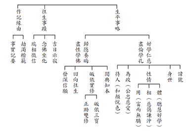

### 緣起贊論略釋（七）

*戒慧講述／心若整理*

緣起贊讚緣起

緣起正因悟空

宗喀大師承傳

正法賴以久住

論中文義分二，一、由說緣起門中稱讚能仁。二、結述造論因相福德回施。一、由說緣起門中稱讚能仁分三，即總標、廣說、攝義。

乙二、廣說分二：丙一、由緣起門稱讚之因相。丙二、正贊。

丙二、正贊分二：丁一、由見說緣起門中總贊。丁二、由說緣起門中別贊。

丁一分三：戊一、由見說緣起的這一分來贊歎佛勝過外道的大師。戊二、正贊見說緣起。戊三、結論。

戊一分三：己一、顯由說緣起成教授第一。己二、能斷戲論網者。己三、贊說緣起成無上者。

己三、贊說緣起成無上者

論文：

此教於餘未能見，故唯稱尊為大師；外道竊名以飾贊，如於野干呼獅子。

(若譯五字，應作是說：此教餘未見，唯尊名大師；外道亦飾贊，如於狐喚獅。稀有大師依，稀有勝說怙，極善說緣起，我敬禮大師。)

消文：

說緣起、見緣起的教，在外道沒有辦法見到這樣的教，所以只能尊稱見緣起（智者）說緣起（善說者）的世尊為大師；外道想要竊大師之名以充門面來裝飾自己，這種做法就好像狐狸（外道）假扮獅子，叫聲如獅子，但獅子一出來（佛出來，或菩薩、大論師出來），這些外道的嘴巴都閉起來，不敢出聲，可見他們的威力是在獅子沒有出來的時候才有的。

論文：

稀有大師稀有依，稀有勝說稀有怙，極善宣說緣起教，於彼大師我敬禮。

消文：

能見緣起、說緣起的大師是非常稀有的，成為有情稀有的歸依處，又特別是說緣起的那一分更成為有情的歸依處。這樣的大師極為善巧的宣說緣起性空的道理，這樣的大師，是我（宗喀巴大師）所要敬禮的對象。

「

由前二頌成立所說甚深緣起為無上已，今成能說緣起教人亦為無上；此無別因，即以所說緣起為因。

」

由前面兩個偈頌成立所說甚深緣起為無上，而說緣起法的能說者也無上，成立為無上不是別的因，而是說緣起成為無上因。

「

尊之一字，意指釋尊，藏文原為汝字。梵藏等處，言汝非輕，雖自云我，亦非是慢；然在華夏多重恭避，為順世故，改譯尊仁。

」

「

故唯稱尊為大師

」的尊字，意指世尊，藏文本來寫做你字，意即唯你稱為大師，梵文、藏文都說你這個字並不是一個輕視的字，即使在梵文、藏文說我，也不是在慢我，然中文會轉成後學、末學、弟子、學長、師長等字眼，表示恭敬對方，避免驕傲，避免增長自己的慢心，所以避免稱我，此處為了順應風土人情，改翻譯為尊仁。

「

言大師者，是自親證、轉教他義。於餘宗派，勝、數論等，倒說無因、或說邪因，迷惑有情墮常、斷處，未見能說無上甚深緣起道理，故唯稱尊釋迦能仁為無過上最勝大師，非諸外道。

」

言大師者，大師指的就是釋迦牟尼佛，佛是親證緣起，親證指現量見的那一分，自是自己渴求的那一分，「轉教他義」即佛說緣起，佛有非常多知識背景，能轉教有情眾生。於餘宗派指自續派以下的其餘宗派，此處特別指外道，尤其特是勝論師、數論師，因為只要是外道，都不脫離勝論師、數論師這兩個宗派見的範圍，勝論派是有一個大自天來管轄，跟上帝的道理一樣，你的苦樂由上帝決定，上天堂得永生。數論師認為，每一個有情都有自性，會變現快樂、痛苦，讓神我去享受，有一天神我有覺察力，覺得很丟臉，自性就把苦樂境收起來，神我就解脫。就像是印度恆河邊的苦行，放掉世間一切的享樂，或是用火燒身體，或是用腳踩在上面，讓神我脫離肉體而得到解脫，一個人的思維會決定他的行為，他的行為會決定他的命運。數論師、勝論師是講沒有緣起的這一分，佛教內的餘宗派雖然也講緣起，但無法通達空性，至於外道的自性見是否定緣起的自性見。「倒說無因，或說邪因」，說有兩種，一種是無因說，一種是邪因說，都叫倒說。無因指的是自性所生，是數論師的思想。邪因是勝論師的思想，認為有一個大自在天，能決定我們的吉凶禍福。自續派以下都會墮入常邊、斷邊，常邊就是自性的有，斷邊就是自性的無。外道的常邊認為投生天堂得永生，斷邊認為投生地獄就死定了，或是認為人一滅永滅，這些都不能見說無上甚深的緣起道理，故唯有釋迦牟尼佛能稱為「無過無上最勝大師」，無過是除過（二障）的那一分，無上是解脫的那一分，在解脫上，沒有比他更上的。最勝指他是見緣起、說緣起者，這些都不是其他外道能達到的究竟處。

「

《深密經》中說轉輪唯佛世尊，非餘人天魔梵能轉；《贊應贊》中，亦由能說染淨因果流轉還滅甚深緣起是佛特法，非諸外道能說是事；又馬勝比丘，亦說佛說緣起生滅，舍利、目蓮悟證聖果。如是教、理不可窮盡。

」

《深密經》說能轉法輪的只有世尊，不是其他人中外道、天魔，或是第六天可以轉的；《贊應贊》中，也說明染因果的流轉門，即苦因苦果的流轉；淨因果的還滅門，即苦因苦果的滅，這樣的甚深緣起理是以緣起為正因通達空性，以空性為正因通達緣起，是佛特別說的法，其他外道也說不上甚深緣起；又馬勝比丘，也明佛說緣起生滅，舍利、目蓮當下證初果，七天後證四果（目連尊者是一個月後證四果），依緣起教理證果的不可窮盡，哪怕是末法時期，方式對都可以證果。如是依教證、依理證都不可窮盡，依教證指釋迦牟尼佛的經教，依理證指這些開派大師、大論師的義理討論分析。
「
**問：** 若爾，何故劫昆羅仙、鵂鶹仙人及足目等諸餘外道亦稱大師耶？」
「
**答：** 彼諸外道，由其弟子諂誑令喜，知無實德，故竊此名、妄以飾贊；非彼外道實有其德。如知野干無獅子相，唯托假名，呼為獅子。」

**問：** 若是如此，為何數論師的開派劫昆羅仙、勝論師的開派鵂鶹仙人與外道因明學的開派足目等諸餘外道也叫作大師呢？

**答：** 這些外道之所以叫作大師，是因為其弟子想討好老師，或是詐現有德，討老師歡心，但是他們並沒有實際的德，這是竊取內道大師的名，信徒們妄加粉飾，把這些外道裝飾得很好，這些外道並不是真的有見緣起、說緣起的德能，如狐狸沒有獅子的作用，卻假名成獅子。假名安立的基礎必須是合格的作用，沒有獅子的作用，又如何安立為獅子呢？

「由上教、理，證知釋尊，為極稀有大師導者，亦是稀有真歸依處，能說緣起是勝說者，亦是眾生同一慈父稀有怙恃，故我善慧名稱吉祥，信心引動三業，殷誠敬禮極善宣說甚深緣起道理無上大師。」

由以上的教證、理證可知，世尊是極為稀有的大師，稀有勝說才成為稀有大師，稀有勝說就是極善宣說緣起贊，因此世尊才是稀有真歸依處，外道都是假歸依處。（佛能說緣起是勝說者，佛等同是眾生稀有怙恃，怙是父親，恃是母親，眾生成為能依，佛成為所依，這是非常稀有的，所以我善慧名稱吉祥（善慧名稱是宗喀巴大師的比丘名號，吉祥是法尊法師加的尊稱），這樣的信心引動身、口、意三業，令身能禮拜、口能讚頌、意能恭敬，我（宗喀巴）竭盡尊崇、殷誠敬禮極善宣說甚深緣起道理的無上大師。

「又由自內斷證德圓、悲憫有情說緣起道，是大師義；能施有情無畏安樂，是依怙義；所有宣說知、斷、證、修，無有敵者能求過失，具四無畏，是勝說義；又由種種猛力和柔善權方便，對治所化種種過失，是怙恃義。此四種事，唯佛具足，故歎稀有。」

此段言佛具足四個面向，一、大師義：「由自內斷證德圓、悲憫有情說緣起道」，佛能見緣起，斷我執，證無我，是斷德圓滿、證德圓滿成佛，而佛悲憫有情所以說緣起道，是說緣起者。二、依怙義：「能施有情無畏安樂」，自己無畏的那一分更重要，特別就降魔的那一分來說。三、勝說義：「所有宣說知、斷、證、修，無有敵者能求過失，具四無畏」，所謂的四無畏，（一）是「證一切智無所畏」，此時已經成佛，不會心虛，不會害怕自己是增上慢。（二）是「漏盡無所畏」，佛已經斷盡一切煩惱，而無畏心（見緣起）。（三）是「說障道無所畏」，佛向大眾中說惑業苦等諸障法而無畏心，（四）是「說盡苦道無所畏」，佛向大眾中說戒定慧等諸盡苦的正道而無畏心。佛是知苦、斷集、證滅、修道，敵者找不到他的過失，尤其是在宣說緣起的那一分，敵者是找不到過失的。四、怙恃義：「又由種種猛力和柔善權方便，對治所化種種過失」，佛能示現猛力相、憤怒相，也能現慈眉善目、和柔相，用種種善巧權變施展慈悲。以上四種事，只有佛具有這四面向，而且是經得起挑戰的，故讚歎佛為稀有。

「以上四頌，總攝義云：諸法緣起故，說即自性空，此說成量故，大師說無上。」

以上四個偈頌，總攝其義：諸法是緣起，以緣起為正因通達空性，從性空上說緣起，合於比量、現量，以見真相的方式破迷啟悟，離苦得樂，成立解脫，對佛最殊勝的贊歎就是量士夫，成為量代表他是能見真相者，境界成為所量，他成為能量，他是量士夫，可以讓有情成為量士夫，對佛最殊勝的稱讚就是量士夫，這樣的大師成立為無上。（下期待續）

## 蓮池海會

### 高光成老居士往生見聞記

*編輯部依林戎芳心得編寫*

抄寫佛經行草活潑

樂觀外向大方助人

有賴媳婦助成助念

瑞相回報圓滿孝心

高光成老居士，一九四七年出生於台北大稻埕小商之家，父嚴母慈，在家中排行第三，在祖父的眼中是四個兄弟當中最聰慧的孩子，高光成老居士是美工科系畢業，早年從事地毯圖樣設計，閒暇之餘喜歡寫書法（篆書、隸書、楷書、行書和草書樣樣精通），及熱愛旅遊，後來承接家族布商的生意，之後經營服飾店面失利，轉而做大樓管理員工作直到退休。

婚後生了兩兒一女，與長子、長媳同住，慈愛護孫，待媳亦如親生，在孫子的眼中，老居士是個多才多藝的祖父，老居士廚藝精湛，很會料理素食餐點，常與大媳婦分享研發素食新口味，平日家人下班放學回家，老居士已準備好一桌的菜餚，等待家人回家享用，即便自己生病吃不下飯時，仍會時常準備整桌的好菜，等待兒女及孫子們歸來，老居士為家人用心的付出，是晚輩的福氣。

高光成老居士二十八歲那年在一貫道求道以後，發心向道，八○年代更隨著道中許多前輩們多次，開荒星馬，成全道親不計其數，後來因為諸多因素而離開道場，但老居士生前時常提起這段過往，平時老居士重視「孝行」，也常常糾正孫子孫女的言行舉止，提攜晚輩，父須慈，子須孝，兄須愛，弟須敬，夫者須有情義，婦者須服從，長者須體恤，幼者須聽從教訓，教育子媳要和睦相處，互信互愛，分工合作，只求付出，不求回報，才可建立天然和諧的秩序，多一份孝行，家就多一分保障，真的是所謂：「家有一老，如有一寶。」老居士退休後，喜歡與太太去北投立賢里書法班與葉老師素美研討書法，假日空閒時共同教孫子孫女寫書法，共享特別的祖孫情。老居士能夠一天繕寫書法超過十二個小時，凝神靜思，把神、氣貫注於筆墨，意在筆先，做到神領筆毫、氣運於手，從書寫的創造中得到滿足感，心境也隨之得到一種鍛鍊與凈化，老居士更多次受老師鼓勵邀稿參加展覽。

六年前大媳婦為孩子尋找讀經及素食的幼兒園，有幸與弘明幼兒園結緣，開啟與無盡燈文化學會甚深殊勝的法緣，這些年善知識化導，悲願無窮，珍惜每周跟隨唐老師團隊學習、念佛、讀經、聽經聞法，聽習唐老師慈悲教誨中，大媳婦時時提醒自己在繁忙的日常中也要放下外務，找時間串習佛法、皈依三寶，在生活中善用悟性，調伏煩惱、瞋恨，要習慣去堅持，堅固自己的耐心，習慣去克服煩惱，要在菩提道上，通過實踐善行為來達成人生的正面價值。

二○一九年一月後，老居士的身體開始出現警訊，心臟先後做了六支心導管手術，心臟三條冠狀主動脈已經嚴重阻塞，開完刀治療後，肺部仍然積水，去醫院檢查，醫生查不出原因，但胸口還是常常被壓迫，非常不舒服，過年前，兒子媳婦及孩子回屏東老家過年，擔心老居士的身體，所以鼓勵老居士可讀誦或撰寫《藥師經》，《藥師經》是一部冥陽兩利的佛經，關心眾生的種種病苦，眾生只要聞藥師佛的名號，就能無諸疾苦，消除業障功德殊勝的佛經，老居士表示過年期間虔誠用心地寫完一部《藥師經》書法，深刻感得藥師佛菩薩的加被與守護，當下身體的急性狀況有了明顯緩解。一年後老居士被診斷為胰臟癌，在老居士生病三年期間，大媳婦常常與老居士分享佛教經典的寶貴與殊勝，大媳婦時時將讀誦的「地藏經」、「普門品」、「心經」、「大悲咒」迴向給身旁正在受苦的學生及生病的家人，老居士也陸續開始寫許多大經典，舉凡《金剛經》、《地藏經》、《觀世音菩薩普門品》、《道德經》、《孝經》、《福德正神真經》、《心經》、《大悲咒》、《彌勒真經》、《阿彌陀經》、《大學》、《中庸》、《論語》、《孟子》、《千字文》、《弟子規》、《十思疏》等過作品，不計其數，老居士的毅力及專注非常人所能及。老居士寫書法時全身心地投入，意守思想平穩呼吸，一心一意高度集中，排除雜念甚至達到忘我的境界，心情和思想都融入文字的意境當中，對眼前或身邊發生的不愉快事情視而不見、聽而不聞，沒有了妄念和煩惱，精神獲得享受，達到內心的平安與慰藉。

直到去年三月老居士癌症轉移至肝臟，開始進行急切的化療，歷經一線藥物六個月，二線藥物三個月，三線藥物未完成，又遭逢心冠肺炎確診而送進加護病房，多次從鬼門關進出，兒子媳婦雖然看著不捨，但也無能為力，老居士勢難痊癒，此時大媳婦在心中求佛慈悲感應，有機緣勸彼念佛求生西方，以免生死輪迴之苦，默默許下了要幫公公往生的心願。老居士善緣殊勝，感念學會啟蒙班老師最初熱切關心，給予信心及方向，引領大媳婦去找秀英師姑，與學會的善友們請教如何向公公及家人提及臨終助念，要讓虔誠信奉一貫道四十多年的婆婆、先生、小叔及全家人接受並實施臨終助念，對於媳婦來講，是不可能的任務。大媳婦多次在老居士病床旁問老人家是否還有未完成的事，老居士總是平靜地搖搖頭，老居士不曾在憂愁中度日，自知自然定律不可逆轉，從未患得患失，能夠認清生死並不畏懼，老居士與人無爭，與世無求，看得破、放得下。老居士雖插滿了許多管子，不能語，但意識能清楚，大媳婦鼓起勇氣把蓮友引導的話向老居士善巧開導，與老居士提及身後輪迴苦，千死萬生，無法逃脫，如果能去到西方極樂世界，就不會那麼苦了，那裡是無量壽，身體是真的了，因為阿彌陀佛的四十八願，阿彌陀佛很慈悲，一定會幫助眾生往生。而臨終時會很痛苦，沒辦法生起正念，需要有人在旁邊協助助念往生，老居士現在要做一個功課，就是萬緣放下，每天心裡想著及念著阿彌陀佛，阿彌陀佛才會聽到，臨終才會來接引，老居士有意識地聽完，並一直用力點頭。

雖然老居士有助念的意願，但是家人才是最大的考驗，大媳婦與家人溝通過程中內心有很多矛盾與不捨，由於婆婆精神壓力大，不希望之後靈堂安在家中，想直接交由葬儀社協助處理就好，大媳婦只能持續求佛慈悲加被，接著告訴先生，印光大師的臨終三大要，希望為爸爸盡最後孝心，完成爸爸心願，陪伴爸爸走完重要階段，不留下遺憾，後續白老師趕到醫院，為家人開示，說明臨終助念的意義，家人慢慢認同助念對亡者真實利益。

接下來的幾天，大媳婦持續求佛加被，祈願公公往生沒有障礙，具足善緣，持續與醫院溝通，家人不希望公公在醫院有狀況，希望完成公公心願，能夠有體力留最後一口氣順利回家，冥冥之中，佛菩薩護佑，六月四日(星期日)下午四點多老居士終於平安地從醫院的安寧病房回到熟悉的家中，學會師長也早已及時趕來助念，師長向老居士開示，家人隨侍在側，佛號聲不斷，不緩不急，字字分明，句句清楚，接續二十分鐘後，拿下老人家的高壓氧氣罩，在真誠的佛號聲中，直到五點四十分老居士非常安詳地咽下最後一口氣，平穩的離開人世。學會師長們也配合家人輪班到家中助念，當天晚上下大雨，師長們仍在半夜前來，風雨無阻，令家屬非常感動，老師在凌晨一點多來家裡為老居士助念並主持回向。助念八小時及回向後，老師掀開陀羅尼經被，老居士相貌安詳，顯露瑞相，後續家人繼續輪班念佛替老居士助念到六月五日下午六點，念滿二十四小時，老居士身軟如綿，真實感應助念的不可思議，雖然前面的溝通磨合很辛苦，但是老居士冥冥中的護佑、佛菩薩的慈悲加被，讓家人生起對佛法認識及信心，也讓孩子有機會學習及盡孝道，正所謂「借事練心」，過程中有好多不同面向的領會，才知道如何如理如法行事，未來要更持續精進學佛。

家屬深深感恩學會師長們的無私付出，在老居士臨終一心助念，在告別式誦經莊嚴肅穆，在做七佛事中，老師們所說的法語開示，所念的佛號，讓家屬增長正見，法喜充滿。

老居士一輩子樂善好施，廣結善緣，與人無爭，於世無求，能夠看得破、放得下，更留下珍貴的墨寶，作為後世子孫傳承的家教與無限的追思。

### 蔡忠志老居士往生見聞記

心在

步步高升的職業

岳父往生的改變

帶動佛化的家庭

幫助自己的往生

蔡忠志老居士，民國三十三年十二月二十九日出生於台灣省新竹市，在家中排行最長，其下另有弟妹四人。自幼家境清寒、經濟拮据，其父為新竹客運公車駕駛，專責新竹縣寶山鄉偏遠路線班車，每日工時冗長且極其辛勞，從小老居士便能體恤父親謀生賺錢之不易，故平日即培養出儉約惜福的性格。老居士年幼失恃喪母，幸蒙其阿姨慈憫不捨，對外甥疼愛照顧有加，使得老居士幼年階段得以領受至親溫情。爾後其父續弦，秉性善良的老居士不但與同父異母的弟妹們，相處極為融洽，手足之間彼此感情深厚溢於言表，而對繼母尤其恭敬孝順，未曾聽聞任何違逆之事，誠可謂現代之閔子騫，堪稱後世子孫絕佳典範。

老居士從小天資聰穎且好學不倦，初中畢業旋即考取省立新竹一中，鄰里鄉間、親朋好友莫不稱揚讚歎。老居士在高中三年求學期間，各科成績均表現優異，可說是名列前茅，而在每位師長的眼中，老居士是一位五育並進、品學兼優的模範學子。爾後老居士果然不負眾望，順利考取國立成功大學土木工程學系，在大學階段除了在系上專業領域汲取豐富學識外，老居士亦曾利用課餘打工賺取學費，希望藉此機會能夠磨練自我並且從中學習寶貴的人生經驗。老居士與大學四年同窗情誼頗為深厚，不但在課業上彼此交流砥礪互勉，即便踏入社會工作後仍舊時常聯繫，這也因此奠下穩固的事業基礎。

老居士服完兵役後旋即通過「國家專門技術人員特考」並正式進入基隆港務局服務，其中傑出的工作能力，備受長官肯定，此外老居士為人風趣、談吐幽默故於辦公室與同事之間相處愉快、互動良好。民國六十四年老居士以卓越群倫的實力脫穎而出，通過層層考驗，正式獲取國泰建設三井工程公司錄用名額。由於平日認真負責的工作態度與出眾的辦事能力，因此老居士在公司頗受主管的青睞，並將其提拔為總經理一職。在部屬同仁的心中，老居士於公嚴明幹練、善於統御領導，另外也同時兼備了寬厚包容的管理者風範。

老居士的個性忠厚善良，深獲岳父林光明菩薩之信賴，遂於民國六十三年與林寶釵女士結縭，夫妻婚後鶼鰈情深、育有一子一女。老居士對家庭一肩擔負起重責大任，並與妻胼手胝足、共同持家。老居士除了讓全家生活安穩、不虞匱乏之外，日用平常更加著重對子女的家庭教育，使其未來皆能成為品格良好的國家棟樑。民國八十五年夏天，正逢岳父林光明菩薩生西之殊勝因緣而開始學佛，自此之後便一心追隨唐老師聽聞經教、造作善法。尤其每逢團體蓮友親眷臨終，老居士皆樂於為公發心，舉凡前行關懷乃至參與正行排班助念及結行回向均心生法喜。

老居士向來身體硬朗、健康狀況尚佳且無其他慢性疾病，直至耳順之年方才罹患「非典型帕金森氏症」，隨之數年皆遵從醫囑，按時服藥定期回診。雖然爾後病情日漸轉壞，老居士仍然不改其修行道心，且愈加深信彌陀之弘誓願力，老實專修淨土法門、每日至誠懇切求生西方。回顧老居士的一生，幼年家貧清苦，少年努力不懈而壯年事業有成、飛黃騰達，雖於晚年遭逢無常病苦纏身，但又何其有幸修學正法、親近良師益友，終能藉此逆增上緣，於莊嚴如法的佛號助念聲中，安詳捨報、往生淨土。

## 孔學一隅

### 孔門心法—中庸之道(二十八)
第二十五章：至誠的功效(二)

孔門心法—中庸之道(二十八)

第二十五章：至誠的功效(二)

*時哉講述、弘毅整理*

誠意是內外一如

誠意是利他意樂

誠意是自我充實

誠意是內聖外王

—前言—

第二十一至二十三章已經講到至誠的修學法，還要瞭解至誠的形象和效果。至誠的人可以預先知道吉凶禍福，該怎麼做才吉，不這樣做就凶，所以至誠的人在入世的時候最能斷惡修善，最能承擔，最能經營有意義的人生。雖千萬人吾往矣，就算是眼前受困，乃至於很多的障礙挫折，都願意去突破，願意去承擔。所以孟子說：「天將降大任於斯人也，必先苦其心志，勞其筋骨，餓其體膚，空乏其身」。這一章更特別說至誠的人可以「成己成物」，「成己」就是成就自己，「成物」就是成就眾生。

中庸總體科判

第二十五章是在講中庸的修學法和義理。

本章科判分析

達到至誠是最快樂的狀態，幫助有情達到至誠，就是讓他得到最快樂的境界。上一章說到前知如神，就是像神一樣可以預知未來，眼前該怎麼做，該怎麼去引導別人，該怎麼辦政治、辦教育，替眾生找出路，他都清清楚楚。這一章更特別講能成己成物，這種人最能成就自己，最能成就有情。

此章架構是說至誠能夠利益自他，用仁來成就自己，就是以利益他人的心態和學問來成就自己，在幫助別人的時候，懂得善巧方便，懂得運用智慧，這種公心和智慧才有辦法讓他證得本性，而且這樣的人在各種時機上都能夠從容中道，能夠契理契機，契理就是合乎道理，契機就是符合對方的需要。

—消文釋義—

經文：

誠者，自成也。而道自道也。

消文：誠是自己想要學習而成就的。要懂得誠的重要，誠的修學法，去請教高明的老師，要有好的教材，去利益有情來成就自己的誠。不能跟有誠意的人在一起就有誠意，跟沒有誠意的人在一起就變得沒有誠意，要在任何情況下都想維持誠心誠意。朱子認為，「誠者，自成也」就是自性成就，可是如果是自性成就的話，那何必學？所以誠是自己想要成就，如學習英文，就算是非洲的小孩，只要想學習，即便沒有老師教，也可以上網學的朗朗上口。

通往誠的大道也是自己學來引導自己的。雖然有好的老師、同學引導我，有好的學習環境，可是如果我不聽，依然堅持己見，那也是沒有用的。我們日用平常的吃穿住行都是別人的幫忙，所以要好好的付出心力，充實自己，利益有情，才是真正的出路。

冉求曾經跟孔子說不是不喜歡孔子的道，而是他力不足。孔子說不是力不足，而是冉求畫地自限。當你在定義自己的時候，其實就是給自己畫框。如果你定義自己是庸俗之人，那就真的是庸俗之人，如果你定義自己無用，那就是無用。如果不好好的定義自己，就算外面有再好的環境，再好的良師益友，也無可奈何。

所以是自成自道，自己想成就才會成就，自己想要達到殊勝的境界，也是自己引導自己，因為當你想要自己成就的時候，別人才幫得上忙，你才會珍惜別人所說的道。

釋義：「自道」，引導自己。

經文：

誠者，物之終始。不誠無物。

消文：一個人從生命的起點走到終點，又從終點開始往前走，誠是永遠要學、要維持、要發展的。

一個人如果不誠，就沒有向道、利益別人和擇善固執的心，沒有公心，只剩下私心，這是不會生存的。君子願意扶持君子，可是君子不願意扶持小人，小人不願意扶持君子，小人也不願意扶持小人，小人之間也是互相鬥爭的，大概都不能生存。所以唯有利他才是出路，才是生存之道。

釋義：「物」，人們。

經文：

是故君子誠之為貴。

消文：想要成為君子的人，要以誠為貴，就是要擇善固執，從容中道。擇善固執就是要博學、審問、慎思、明辨、篤行，對於善法要好好的學、思、辨別和實踐。善法包括內聖外王的教法，利他的學問，我們要擇具有善法內涵的老師、朋友，以及善法的環境。固執就像世間的鄉下人，生活在他自己的圈圈裡，不管旁人怎樣講，他都頑固不靈，擇善固執就要像這樣，而且是人一能之己百之，人十能之己千之，把這些內涵全部學會，這才叫做對眾生有誠意。有誠意可以是煮晚飯請你吃，或者提供一個溫暖的家給你住，或者像父母對子女那樣，照顧子女的生活，不讓他們挨餓受凍，君子的誠意更是具足幫助你離苦得樂的心態、學問、各種善巧方便，這是一般的父母所不具備的，沒有給子女真正內心的出路。

如孔子具備經營大同世界的能力，他周遊列國，希望眾生給他這樣的機會，只可惜那些昏君利益當頭，不給孔子這樣的機會，可是孔子對眾生的誠意是全部具足的。孔子的出路就在誠，我們看不到他本慶的殊勝，不過可以看到他的餘慶(積善之家，必有餘慶)，幾十代的子孫綿延流長，由此可知誠的出路有多廣。

經文：

誠者，非自成己而已也，所以成物也。

消文：誠不僅是成就自己，還要成就眾生，誠意就是擇善固執，把利益眾生的善法選擇出來，而且學到會為止，從成己成物當中看到他的誠意。

經文：

成己，仁也。成物，知也。性之德也，

消文：我們要靠仁來成就自己。當我們想要利他的時候，就不會去害人，會想辦法去利益別人，然後充實利益眾生的世間的各種學問、能耐和善巧方便，因為有這種使命感，所以才會想要學習，並且學到位，學到底，學到透徹。結果我們靠著仁成就了自己，而且是以仁心來攝持智慧。

當我們想要去利益有情的時候，不只是要有利他的心，還要有利他的智慧、能力和善巧方便。所以應該說「成己，仁也知也」，「成物，仁也知也」。但這裡更特別說「成己，仁也」，意思是如果我們不講究仁，只講究智的時候，雖然有能力、有智慧，但沒有公心，反倒是害人的。美國羅斯福總統曾經說，如果不去講究品德、公心的教育，每一個大學畢業生都是社會的未爆彈。這裡特別強調「成物，知也」是說，只有利他的心、慈悲心是不夠的，還要有利他的能力和智慧，有些鄉下人心也很好，可是發揮不了作用。比如說眾生很可憐，你就陪著他哭，可是哭又有什麼用呢？

「性之德也」不是本性之德，如果性中有仁德、智德，那為什麼還會造惡？所以孟子說人性本善，荀子說人性本惡，告子說人性不善不惡，這些解釋都有問題。

攝持仁和智的德，能夠證得性。每一個人內心隱微處，甚至是狗、貓、雞、鴨、蚊子、螞蟻都想要離苦得樂，都希望痛苦愈來愈少，快樂總是不滿足，這是萬物的性。如果你是一個有公心、有智慧的人，通達利益眾生的善巧方便，再通過辦政治、辦教育幫助有情也發起公心，引導他們產生智慧，以德證性，讓自己和有情都離苦得樂。

經文：

合外內之道也，故時措之宜也。

消文：成己成物之道，即是誠。有誠的人在各種時機下，他的用都是合宜的。他誠心誠意的想要利益別人，有利益別人的心、做法、禮儀、建議、善巧方便、學問，在時機上才能夠產生大用，而且用的對。因為心態上對，做法上講究善巧方便，且在時機上用的對。反之空有其心，那是無法用也不合宜的。

至誠的人有什麼氣象呢？就是有能夠預知未來、成己成物的氣象。成就自己，成就眾生，這樣的人來主持家政，能夠讓家庭充滿歡樂，把家庭的氣象塑造的最好。這樣的人來主持國政，辦教育一定把人都培養成有氣象、有出路、有內涵的人才，這樣的狀態是最快樂的，是由內而外的，至誠的人可以幫助自己和有情達到這樣的狀態。

釋義：「外」，成物；「內」，成己；「措」，用。

—章旨—

誠太重要了，子思舉出誠這個心法，從擇善固執，一直到從容中道。擇善固執包括世間和出世間的學問，只要是利益有情的學問都去學。從容中道就是能夠通達形而上，這樣的人能夠在入世當中，做很多利益有情的事業，而且引導他們通往形而上，這種人才是對眾生最有誠意的。儒家講內聖外王的學習，通過辦政治、辦教育來利益有情的誠意，勝過眾生饑餓時給他們一碗飯吃的誠意，勝過眾生沒房屋住時蓋房子給他們的誠意，勝過眾生沒衣服時給他們買衣服免於受凍的誠意。因為如果政治辦的好，就不會有挨餓受苦的人，就不需要有救濟，也不需要有善人辦慈善。如果教育辦的好，成為人才，或有德之人，何來奸盜邪淫之輩，社會自然安和樂利，乃因人才能創造許多事業，讓有品德的人找到出路。肯這樣充實自己的人，他就是最有誠意的人，就是聖人和君子。

—結語—

我們從子思的誠的定義當中了解，不是只有世間講的誠，世間的誠可以變成我們的覺受，就像父母對子女的一心一意想要幫忙，或者是業務員一心一意的想要衝業績。但是這個一心一意的那種誠心誠意，方向和內涵並不一定正確，未必能夠幫助有情離苦得樂。誠心誠意還要在心態上、學問上、做法上、善巧方便上講究，這樣才能真正究竟的幫助自己和一切有情離苦得樂，離開一切的痛苦，圓滿人生的快樂。我們也可以去參考古註，如果把誠討論的愈清楚，方向愈明確，意義愈明了，目標設定愈明顯，人生的成就就會愈非凡。（下期待續）

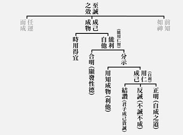

### 孔門十哲—孔門弟子中最耀眼的十顆星（七）使孔子揚名天下的奇才—言語科端木賜（子貢）

*圖／江逸子、文／編輯部*

使孔子揚名天下的奇才—言語科端木賜（子貢）

國際外交

貨殖敵國

赫赫事功

上士之才

孔子是一位有教無類，「自行束修以上，吾未嘗無誨焉」的教學者，但光有此胸懷沒有用，若沒有能力，也吸引不了他人來學，更吸引不了人才來求教。孔子除了短暫的做過基層公務員，例如管畜牧的乘田和管會計的委吏，其他時間都以教學為主。孔子的能力從他向師襄學琴就可以看到，孔子學習的專注、悟性、堅持、成就，學樂能如此，何況各領域的學習，所謂「賢者識其大者，不賢者識其小者，夫子焉不學，而亦何常師之有」，學得文化的全貌，乃至「三人行，必有我師焉」的學習，海綿式的吸收，各家的了解，學得一身本領，所以不單本國的人才來求學，夫子的名氣大到各國的人才也紛紛來求教，其中非常特殊的一位，從衛國來求學的子貢，就是今天要介紹的人物。

由於子貢的名氣很大，發生的事情也很多，他的成就也是大家最關注的，在春秋時期頗有影響力，不但能拯救魯國的危亡，還能改變春秋的局勢。從各方面來說，子貢的資料較為豐富，《論語》相關條目也很多，約有三十六章，所以會分兩期來介紹。

子貢這樣傳奇的人物，放眼今世依然是大家稱羨的對象，有理財經商的頭腦，是春秋時期著名的富商，富有的程度堪比陶朱公，商店有一副對聯：「經商不讓陶朱富，貨殖何妨子貢賢。」上聯的意思平常，是經商發大財，不讓陶朱公專美於前，富可敵國的財主當然人人羡慕。但下聯更有韻味，做生意發大財可以像子貢這樣的不俗，子貢懂得藉著財富創造價值，用財富為人文服務。子貢除了負責孔子與弟子們周遊列國所有的開銷之外，《史記‧貨殖列傳》更說，子貢懂得以厚禮來結交諸侯，與國君分庭抗禮（平起平坐），將孔子的名聲揚於天下，有利於文化道統的傳播。

子貢除了經商理財致富外，還擁有各方面的能力，在孔門弟子四科分類中，子貢是言語科的弟子，他的言語，特別表現在外交才能上，他擁有廣大的知識背景，有臨機應變及察言觀色的能力，敏銳地了解周遭環境的變化，使得他的言語能發揮到最大的價值與功效。下面就依著《史記》、《左傳》來看一些實際的案例。

《左傳》魯哀公七年，吳王夫差想要爭霸中原，招魯國相會於鄫，吳國太宰伯嚭召季康子來，季康子不敢來，請子貢推辭，伯嚭說兩國國君都從遙遠的國都來相會，大夫怎麼可以不出門？這是什麼禮呢？當時的情況想必非常危急，如果按照太宰伯嚭的指示，萬一在鄫相會時，若魯君與季康子在相會時被吳國所質，會造成魯國政治上空前的危機，大夫留守，才能以防不測。子貢向太宰伯嚭一番的說詞，雖承認不合禮，但充分的表達理由，讓大宰伯嚭無話可說，免除了一場魯國的政治危機，這是子貢對魯國第一次的偉大貢獻。

另外在《史記‧仲尼弟子列傳》記載，孔子周遊列國回到魯國時，已是六十八歲的高齡，約當魯哀公十一年的時候，齊國執政大夫田常殺了齊簡公，卻害怕諸卿大夫及國內人民討伐，所以想轉移注意力，故派軍隊去攻打魯國。孔子原本向魯君請命討伐，有絕對的勝算，因為當時子路是季孫大夫的家臣，擁有軍權，孔子可以藉著田常弒君的罪名討伐齊國，並帶領魯君與三家的軍隊，一舉消滅田常，將齊國撥亂反正，也使得魯國這些犯上作亂的大夫有所顧忌，將政權回歸到魯君，能強公朝弱私家，可使魯國強盛。可惜魯哀公膽小懦弱，失去了最後的機會。失去這種先機，反而讓田常舉全國之兵準備討伐魯國，魯國面臨空前的危機。此時孔子對門下弟子說：「魯國，是祖宗墳墓所在的地方，是我們出生的國家，我們的祖國危險到這種地步，諸位為什麼不挺身而出呢？」子路自願請出，孔子不答應；子張、公孫段請求，孔子也不答應；子貢請出，孔子同意。

子貢先說服齊國田常，讓他同意放棄魯國改攻打吳國，又到吳國說服吳國放棄戒備越國而攻打齊國，說服越國出兵協助吳國討伐齊國，再趁吳國空虛而滅吳國，說服晉國休養士卒，等到吳軍疲憊，再與吳國爭霸中原。子貢這一出使，就使各國的形勢發生莫大的變化。史書上說端木賜一出，存魯、亂齊、破吳、強晉、霸越，十年之中五國各有其變。魯國在這一場空前的危難中算是轉危為安，這是子貢對國家最殊勝的功勞。難怪孔門的弟子陳子禽，會誤認子貢的賢能勝過孔子。

《左傳》記載同年（魯哀公十一年），吳王夫差接受了子貢的建議，與魯哀公合軍伐齊，大敗齊軍，這就是有名的艾陵之戰。吳王夫差將要作戰的時候，喊著叔孫州仇（論語上面所說的叔孫武叔）賜與甲、劍，要他謹慎地承擔任務。

叔孫州仇不知道怎樣回答好？因為古代君王賜劍是要臣子死的意思，這也反映出叔孫州仇怯弱的心態，此時子貢卻能從容上前代答說：「州仇奉甲從軍（而拜）。」回避了尷尬的狀況，也顯示了子貢的應對之才。難怪在《論語》上，叔孫武叔這位魯國三家大夫的權貴，在朝中向其他的大夫說，子貢比他的老師還要賢能。子貢說，叔孫武叔這位在夫子宮牆門外的外行人，說外行話是應該的。

魯哀公十二年，吳王夫差聽從子貢建言率軍北上，打敗齊國，解救魯國空前危難之後，夫差與哀公會合於橐皋，夫差派遣太宰嚭請求重申舊盟。哀公不願意，便派遣子貢回覆太宰嚭，子貢說：「盟誓，是用來鞏固信用的，所以用誠心來約束它，用玉帛來奉獻它，用言語來完成它，用神明來保證它。寡君認為如果有了盟約，就不能更改了。如果還是可以更改，每天盟誓又有什麼好處？現在您說『一定要重溫過去的盟約』，如果可以重溫，它同樣可以寒涼下去的。」吳王聽了以後就不重訂舊盟約了。子貢的這種外交辭令，達成了魯哀公不想重溫過去的盟約，這種外交大臣是不辱君命的幹才。

同年吳王會合諸侯，衛國國君衛出公怕受辱不敢來，結果遲到，在館舍被圍困。子貢帶了五匹絲錦會見吳太伯嚭，說衛國國君要來的時候，一定跟大家商量過，與吳國友好的贊成他來，與吳國對立的反對他來，今天你囚禁衛君，正好讓仇視吳國者得志，讓對吳國友好的人士失勢，且囚禁衛君，令諸侯害怕，有這三個因素，吳國恐怕也難以稱霸，說明種種利害關係，打動了伯嚭，放出衛出公，避開了衛國一場大難。這種外交的能耐令人歎為觀止！

魯哀公十五年，齊國跟魯國講和，子貢與子服景伯出使齊國，子貢向陳成子舉出齊國對衛國的友好，魯國也希望與齊國有此友好的關係，並趁此機會向陳成子要回昔日被齊國侵佔的成邑，陳成子在很羞愧的情況下，歸還了成邑，這是子貢外交辭令的勝利，不費一兵一卒要回了魯國的失地。他的口條清晰，分析事理明白，真的是一個縱橫國際間的外交大才。難怪孔子在〈子路〉篇說：「行己有恥，使於四方，不辱君命，可謂士矣。」孔子說的這種上士外交幹才，指的就是子貢。

《左傳》還說到，在哀公二十七年，越王勾踐已經滅了吳國五年，派遣使者到魯國要求會盟等等，季康子、叔孫文子、孟武伯三個人都跟隨魯君去，季康子對以公卿身分去跟蠻夷的大夫結盟感到不舒服，說：「子貢如果在這裡，我不會落入這種地步。」可見子貢的外交才能，令季康子這樣思念。

以上，子貢經商致富，《論語‧先進篇》說他貨殖（居聚生財）他的智慧不但善於發財，更懂得運用財富，這才是真正儒家商道的精神。子貢在外交上的能力，也令人歎為觀止。下期會講子貢的辦事能力與悟性，他在孟子的心中，到底是一個什麼樣的人物？他與老師的情誼，以及孔子過世以後，他有什麼樣驚人的表現？（下期待續）

## 藝術賞析

### 孔門七十二賢淺說（五十六) 叔仲會

圖／江逸子 、文／時哉

有教無類的孔子

從小受學的童子

蒙以養正的成效

自然成才的大賢

叔仲會，複姓叔仲，名會，字子期，春秋末年魯國負瑕邑人，鄭康成說叔仲會是晉人。小孔子五十歲，是孔門弟子中年齡最小的弟子。傳說叔仲會自幼即奉侍於孔子，是孔子從小教大的小孩，從灑掃應對進退等儀節培植德行，同時隨堂聆聽詩書禮樂，耳濡目染，養成謹慎規矩向學之心。

叔仲會年齡與孔璇年齡相仿，小時候兩人常拿筆寫字伴在孔子身旁，孟武伯看到了這樣的光景，忍不住問了孔子：「這兩個小孩如此年幼，老師您與這樣的小孩一起讀書，和與我們這些大人一起讀書相比，有何不同？」孔子說：「沒有什麼不同，他們和大人差不多，應該是因為從小就養成讀書習慣，這樣讀書寫字對兩個小孩來講，就像天性一般自然了。」

叔仲會蒙孔子親自啟蒙，天性受到師長良好的薰陶，他一生遵循夫子之道，以詩、書、禮、樂為宗，文、行、忠、信以守，居家孝慈和睦，處外忠信誠實，雖未有政事偉績，然澹泊簡約，與高尚品德風範足式同倫。

宋高宗稱讚叔仲會：「瑕丘祚邑，子期是為，親訓有自，廣業於時。四教允隆，五常以持，比肩俊傑，聞望斯垂。」叔仲會在唐時被封為瑕丘伯，瑕丘封給子期是有福的封地。自從孔子親自教導「文行忠信」四教和「仁義禮智信」五常，子期從小在這四教五常中浸濡而成習慣，從小模仿孔子言行，可長大後能與特優人才並駕齊驅，可知從小教育對小孩影響深遠。

劉鍇也稱讚叔仲會：「斯文有宗，吾道不窮，執筆迭侍，惟賢比崇，少成見貫，函丈順風，東巡駐蹕，霈津儒宮。」說明叔仲會從小就與有德性的人孔子相處左右，就連孔子本人都稱讚叔仲會讀書與大人相同，能安靜坐得住讀書寫字。得到孔子的傳承，延續道統。

叔仲會於東漢明帝永平十五年從祀，唐開元二十七年追封瑕丘伯，宋封博平侯。明朝改稱先賢。

畫中的叔仲會，溫雅和順，謙恭有禮。（下期待續）

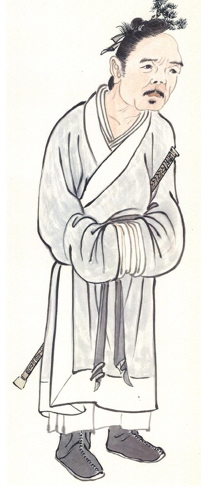

### 華夏精魂千秋（四十四）明倫史畫　廉介誠實 孟信

圖／江逸子、文／淨域

德性作人能長久

看似吃虧佔便宜

短視近利大過患

唯有見地方看透

—史畫—

孟信，字脩仁，北朝冀州廣川郡索盧縣（今河北省棗強縣）人，生卒年不詳。家學淵源，因生活清貧而從軍，在鎮東將軍元修麾下任職。

武泰元年（五二八年）北魏孝明帝去世，大將爾朱榮計殺王公大臣，立長樂王元子攸為孝莊帝，年號建義。以「入匡朝廷」為名進兵洛陽，將胡太后及少帝元釗沉入黃河；再藉祭天之名將王公大臣集合至河陰（今河南省孟津縣），刀矢盡殺三千餘人。孝莊帝在洛陽登位，改元永安；爾朱榮因民怨退據晉陽，伺機篡位。

孝莊帝不滿爾朱榮專權，永安三年（五三○年）計殺爾朱榮，同在明光殿身亡，軍政大權落入高歡及宇文泰手中。安定王中興二年（五三二年），高歡立元修為孝武帝，因難忍高歡的專權跋扈，於永熙三年（五三四年）入關中投奔宇文泰，孟信任趙平郡（今甘肅省靈臺縣）太守，為政崇尚寬厚和平，地方權勢土豪不敢犯法。

孟信任官清廉自持，不貪取百姓絲毫。有一老人自山中來，送他犬豬的肩胛肉與酒。孟信和顏悅色的接待細談，只是取出酒用鐵壺溫熱，端出一盤青蔬招待而已！各自斟酌飲食間，孟信說：「我至郡中，從來無人送我一物，今日唯有你呀！眼前青菜吃完了，特別你準備一道犬豬膀子肉，加上酒是自己釀造的，就不要浪費了。」老人聽了心情高興，道謝之餘挾起肉就吃，酒喝完了才告別離去。

元修個性剛烈不守禮法，宇文泰怒殺元修，另立元寶炬為帝，建都長安，史稱西魏。孟信辭官兩袖清風，居家貧困三餐難濟。家中有一隻病牛，侄子隱瞞病情打算賣掉，好買些柴米度日。當雙方寫好買賣契約時，正巧孟信回家撞見，即對買家說：「這隻牛有病，稍微勞動就會發作，對你一點用處都沒有。」又取來棍子責打侄子，訓斥他不該隱瞞欺騙。買家驚異不已，說道：「買牛不必然要牠使力呀！」孟信仍不許，這才離去。

買牛者乃宇文泰帳下之人，泰得聞後讚歎不已！未久，舉為太子少師，後遷太子太傅，特加車騎大將軍、儀同三司、散騎常侍。後以老請辭，宇文泰賜車馬杖服等。終卒於家中，贈冀州刺史，諡號戴。

—圖解—

孟信為人真誠、居官清廉，所以普獲百姓的愛戴，不僅權勢土豪不敢枉法，連重臣都舉其為太子少師。有老法師特以「真誠、清淨、平等、正覺、慈悲、看破、放下、自在、隨緣、念佛」為立身處世的原則，其中以「真誠」為首，可見出誠實於人的可貴。

江逸子老師特以「侄賣病牛」隱瞞實情為題，畫出孟信的廉介誠實之風。畫中房舍牆壁破損，室內除書案外無多餘之物，顯出其生活並不富裕，所以共同生活的侄子才要賣牛求變現。當其知道侄子隱瞞實情後，便告之買家此牛有病不能賣。因緣果總是這麼環扣著，如此的誠心不茍終於受到宇文泰的賞識。

唐朝人陸元方（曾任太子少保），在東都洛陽有間小宅，兒侄們暗中出售。當買家就要付款時，元方得聞告知說：「此房雖好，但排水不通暢。」買房人聽了，即辭謝離去。事後，兒侄都埋怨他不該說實話。元方卻說：「如果不說實話，那就是欺騙他人。」陸元方也因為心地真誠，才能在武則天朝任宰相，且提舉為太子少保。

唐駱賓王〈螢火賦〉：「類君子之有道，入暗室而不欺。」說的即是有德性的人，即便在沒有人看到的地方，也不做欺心的虧事。因此，賣病牛雖然是件小事，但也可顯出一人的真性情來。（下期待續）

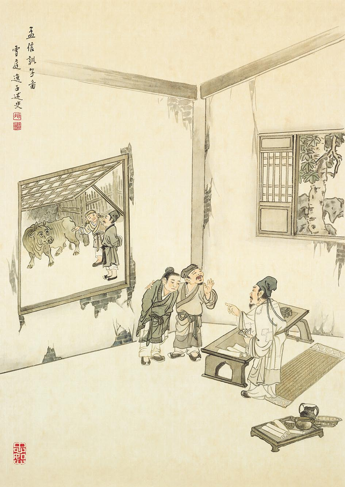

### 以地藏菩薩本願經圖導覽(十)

圖：江逸子、文：唐瑜凌

惡心感應各刑具

酬償往昔所造業

一入難出由慣性

茫茫人生難遇師

地獄名號品第五（下）

畫家描繪地獄時，用墨描繪暈染勾勒出巨石高聳有稜有角，代表這些罪人生前是堅硬凶狠的心，而且整體環境是毫無生氣，又用淡墨潑灑呈現人不喜見的灰暗壓迫氣氛，表徵這些罪人心思的昏暗面，但是罪苦眾生面部表情並未詳加刻畫，怕的是面目猙獰恐怖的表情，會令人不敢觀圖，反而失去以藝推廣經文的機會。

在描繪刀山地獄時，此場景似曾相識於地獄變相圖，滿山谷盡是刀刃，罪人山頂摔落，或由厲鬼驅趕上山逼落或由空中拋下，無處可逃，各個穿腸破肚，全身受劇苦，血流如柱，猶如罪人心地、口舌之尖銳，此處不見滿地鮮明的紅色，卻更顯悲戚。夜叉獄卒持著三叉戢，無動於衷地站在山頂，或許是罪人造作罪業時冷酷無情，才有這些的感應。

其次是火象地獄，巨象遍身赤火，鼻也噴火，滿地也是火海，巨象瘋狂而走避猛火，罪人或在火海中被焚燒，或遭巨象踏踩成肉泥，或在象背上的罪人驚恐萬分，在背上受熱燙之苦，大象劇烈的奔跑中，若滾下象背，也受火焚或踏成肉泥之苦。身處當中的恐懼赤裸裸地呈現在畫面中。

再者是火狗／火狼地獄，狼與狗是同一物種但是不同品種，雜交之後可生出後代，稱作狼狗，兇猛的各類或狼或狗，口吐火焰燒炙罪人身體，或利牙撕裂罪人身軀。罪人如狐群狗黨，以團隊合作謀求私利，無法撼動；如雞鳴狗盜之徒，偷雞摸狗，處陰暗佔便宜。畫家在畫面上除了描繪出罪人面臨惡鬼野狼的驚恐外，也逗趣的畫出一般人家狗舔主人腳底示好的俏皮形象。此處的火狗／火狼並非善類，下一秒，定被狼犬撕咬罪人成肉塊並吞噬。

其後，除了地獄名號，地藏菩薩再進一步告訴普賢菩薩獄報差別相，這些都是閻浮提眾生惡業所感。枯木林顯現土地的貧瘠，氣候的惡劣。林前正有夜叉將罪人心腸挖出而欲食，伴隨著罪人的慘叫，或是生前忘恩負義，沒心腸的惡人。還有正準備以利刃挖罪人心的夜叉，恐怖的情狀，令人屏息。左邊另有「鑊湯盛沸，煮罪人身」，旁有獄卒驅使罪人做苦行擔柴添火，亦有獄卒由高處監督喝令不許偷懶，此時罪人從天而降，在滾燙的鍋爐中煎熬痛苦，死而復生，生而復死，苦痛難言。

地獄苦痛恐怖無生氣的畫面活生生血淋淋呈現在畫作中，說不盡的百千種苦楚，地藏菩薩僅能略說如是，吾等當要懼怕未熟的惡果，當要好好在遇境逢緣中歷事練心，珍惜難得的人生與珍貴的正見，藉由地藏菩薩略說業果異熟之時，戰戰兢兢，如臨深淵，如履薄冰。一生能小心翼翼地斷惡修善，才能免於地獄及三途的痛苦，得到人天乃至解脫與成佛的大樂。（下期待續）

## 活動報導

### 二○二三年四月海峽兩岸孔子文化春會活動概述

淨域

孔子文化春會活動  崇孔興家舊邦祈命

祭孔成年禮傳家旅  孔廟孔府遊入聖域

儒家文化孔子大展  道藝春秋孔子博館

五天匆匆記憶心田  興崇正法最是根本

一、緣起

為弘揚孔子文化、傳承禮樂文明及打造文化品牌，山東省臺港澳辦、尼山世界儒學中心、中國孔子基金會、濟寧市人民政府與至聖孔子基金會合作，舉辦二Ｏ二三年海峽兩岸孔子文化春會，首屆於四月廿七、廿八兩天，在山東省濟南及尼山兩地盛大舉行。春會從春季祭孔活動演變而來，更注重時代性、體驗感和大眾參與度。

以「春」為名，乃春天有「生發」之意，寓意孔子文化在新時代的復興與發展。孔子文化春會將中華禮樂文化與時代相結合，以群眾喜聞樂見的形式呈現，起到潛移默化的社會教化作用。復擎孔子道統為旗幟，以兩岸學統為依託，匯聚社會資源及公益推廣，來營造優秀的傳統文化活動。

二、活動目的

首屆孔子文化盛會，涵蓋崇聖成人禮、聖府家年華、傳家之旅、國學大師會講、經典文化展演、六藝體驗等文化活動。旨在以孔子道統為旗幟，以孔子文化為紐帶，匯聚各方力量，搭建政府、社團和民間人士等，多方間的共享交流平台。除為廣大參與者呈現豐富多元、獨具特色的中華禮樂文化，並就孔子文化在新時代的傳承意義與踐行路徑展開探討研究。

三、活動場地

本次活動的主場地有二：一是濟南學府文廟；二是曲阜尼山聖境。

（一）濟南學府文廟

文廟位於山東省濟南市歷下區，北臨大明湖，鄰近芙蓉街等老城街巷。北宋熙寧年間開始建築，明洪武二年重建到民國時期，不同規模的重修達卅餘次。建築群坐北朝南，佈局嚴正，規模宏大，主要建築有大成門（鄰西門泮池）、大成殿、明倫堂和尊經閣等。

中共建政後，文廟被小學工廠等佔用，許多建築被毀。ㄧ九九二年成為山東省文物保護單位，二ＯＯ五年開始進行大修。殘存的古建築獲修復，被拆除的部分也得到復建，文廟恢復功能後，成為濟南歷史文化的保護部分。

（二）曲阜尼山聖境

據《史記》載：孔子父母禱於尼丘而得孔子，尼山因此名聞遐邇。尼山聖境位於曲阜尼山，地處曲阜東南，聖水湖（尼山水庫）環抱於群山之間。此係以「孔子的世界，世界的孔子」之創意理念，進行開發的文化渡假新區，核心文化主題為「明禮生活方式」，是一項集文化體驗、修學啟智、生態旅遊、教育培訓於一體的綜合性文化園區。總體規劃面積三十五點七六平方公里，主核心宮像區佔地八平方公里，包括高七十二公尺的孔子像、大學堂等，即是本次春會「崇聖成人禮」的主會場。

四、活動儀程

（一）四月二十七日上午於學府文廟的「傳承經典•築夢未來」活動

二Ｏ二三年海峽兩岸孔子文化春會，在濟南府學文廟舉行，上午九點開幕式由山東省臺港澳辦主任張連三主持。大成至聖先師奉祀官、至聖孔子基金會會長孔垂長，於致辭中對孔子文化春會的開幕表示祝賀，並對各主辦單位和工作人員的辛勤由衷感謝。他說：「孔子文化春會的舉辦，是孔子禮樂文化傳承和創新發展，及促進海峽兩岸交流的一大盛事。在今天，中華民族正在走向新的復興，我們要把禮樂傳承和文化創新相結合，將時代元素注入中華傳統文化，與全球各大文明展開對話，在交流與互鑑中，讓中華傳統文化煥發新的生機。孔子文化春會不僅是海峽兩岸，共同傳承和弘揚孔子文化的平臺，也將成為中華優秀傳統文化與新時代結合，與民眾生活相融的一個標竿。」

繼而，中國孔子基金會祕書長國承彥，在致辭中表示：「中國孔子基金會與至聖孔子基金會，長期保持友好聯繫，希望以此活動為契機，用文化連接兩岸，以交流促進了解，進一步深化魯臺兩地，在文化、旅遊、經貿等領域的交流合作。」隨後，臺北市靜心中學校長唐尚智、華東臺商子女學校副校長鄭京榮於線上致辭，皆對活動成功舉辦表示熱烈祝賀。

最後，由中國孔子基金會理事長于曉明，宣佈二Ｏ二三年海峽兩岸孔子文化春會正式啟動。伴隨著悠揚樂曲，及蓬勃昂揚的文化展演，將活動再次推向高潮。活動最後，由中華無盡燈文化學會理事長唐瑜凌，帶領兩岸師生五百餘人現場連線，齊誦《論語》經典選篇，聲聲誦讀傳遞出傳統文化之魂。

（二）四月二十七日下午於尼山書院的儒文化會講

下午，大明湖畔的尼山書院舉辦儒文化會講，以「崇禮興家•舊邦新命」為主題，邀請兩岸知名文化學者董金裕、唐瑜凌、黃玉順、李尚信匯聚一堂，為大家演繹「家」和「禮」的內涵和時代意義。在尼山世界儒學中心研究員路則權的主持下，由政大榮譽教授董金裕老師先發言，其次由唐瑜凌老師接述。以下特將唐老師的精彩論述，擇錄如次：

雪廬老人當年隨孔德成教授到台灣，在台中成立蓮社，春風化雨行教卅八年。我在座下學習，忝為後期的弟子，在學習的過程中，深體經學與儒學的重要。經學開通人情世故，儒學則是實際作法，關乎人生的吉凶禍福，這一切從家庭開始。孔子說：「孝乎惟孝，友于兄弟。」家庭和諧實是國家安全的基礎。
某天，孔鯉走過中庭，孔子見了便
**問：** 「你學詩了嗎？」
**答：** 「沒有。」孔子即說：「不學詩，無以言。」這言字不單是說話，而是表達思想感情。詩就是歌詞，樂是歌曲，於宗廟祭祀時，見人情世故，譬如：長幼尊卑。祭祀時的人物擺位，說明禮是一種秩序，人倫是一種和諧、制度與人情世故。

一九五四年，雪廬老人推動家庭共學，進行人才培育，使孩子在家庭中，懂得與兄弟姊妹相處。看看今天許多家庭，都是生一個孩子。一九六Ｏ年代，台灣人口增長快速，於是推出家庭節育計畫，那時的口號是「一個不嫌少，兩個恰恰好，男孩女孩一樣好。」雪廬老人聽了唉聲道：「要多子多孫。」學生說：「這是政府的節育政策。」老人接著說：「多子多孫有何不好，三十年後你就知道了。」一個孩子的家庭，他不知道該如何與人相處，就成了小霸王。五倫中始於夫婦，然後有父子、長幼，以前教孩都是易子而教，如今家族薄散了。

人際關係須用禮來經營，所以，孔子又說：「不學禮，無以立。」禮可以通達人情世故，經學的概念價值，往上走就是道統，達於內聖外王。內聖是個人修為，外王是能齊家、治國、平天下的能力。世間辦政治興教育，都能從家學中培養，便善於與人相處，懂得多方請益。

企業家若懂得這分，其用人是很得力的。商場上「逢高買進、逢低殺出」之反手式，其實是人際關係的經營。凡是家庭關係良好的，於外知道如何與人相處；所以禮有貫穿能力，能在家庭中使氣氛和樂，是可以經營經學的，可以培養人才。

以前國民政府撤退到台灣，興建了許多眷村，我是眷村長大的孩子，很可惜現今將眷村拆除改建了。那時各省人士來到台灣，眷村各家門戶是敞開的，人們由這家竄到那家去。節日時，家鄉的美食相互分享，彼此融合成一片，是一個桃花源世界的縮版。聽不同的戲曲，不知覺中讓你喜歡中華文化。

讀化工系時，我們外省人第二代，就很容易融入群體中，家學就輕易運使於日用平常。雪廬老人說：「教常禮舉要，課後找學生來演練，可是學生都不懂。」這在以前是一種生活習慣，沒有環境、氛圍、訓練、調教，進入社會便要重新適應。若在一個大家庭（族）中，他會重視秩序、人際關係及各層面的交誼，知道出問題該找誰幫忙。

雪廬老人在《常禮舉要》中說：我是一個在社會上碰過無數釘子的人，到臨命終也要碰釘子（封棺）。我是吃無限虧的人，常禮舉要就是要讓年輕人在家裡學習，長大出社會不要吃虧。有些虧是要吃的，才能成長；但有些虧是無須吃的，只要在人際關係上做得好，尊重長者、禮敬賢人、厚愛晚輩，相信人際關係是非常和諧的。

人生有個數學模型實驗：能力愈強，成功愈低；能力中等，成功反而增多。用此數學模型發覺到，都與際遇有關，而際遇與人情世故有關。袁了凡先生為明朝士人，訓勉孩子所說的斷惡修善之事，就是一種人際關係，是能改變命運的作法。

昔日在雪廬老人座下，於台中蓮社學習，就是一個大家庭。有各種不同年齡層的學生，許多家庭一起共學，我與內人就是在這種學習環境中成長的。家風與環境的型塑，有賴老師的教導，始有道統的繼承。

後來我成立社團，才發現在這樣的學風下，很少有家庭問題，團體中有生五胎、四胎、三胎的，基本上解決人口嚴重不足的問題。所以中華文化的學習，真可以解決人口斷崖式衰退，很多問題能找到核心，就容易對治。以上是個人的皮毛之見。

尼山書院昔日為山東省圖書館舊址，如今仍保有部分文物在此。會講後分組，各自隨隊參觀館藏文物。

（三）四月二十八日上午於尼山聖境孔子像前廣場，舉行「崇聖成人禮」

上午九時，孔子文化春會崇聖成人禮，在尼山聖境孔子像前廣場拉開序幕。以成人為始，以成才為志，曲阜市聖賢學校一百二十餘名師生、家長和數百名來賓，共同見證了「崇聖成人禮」這一莊嚴時刻。展禮期間，從濟寧二中附小的佾舞暖場表演，到嚴鼓、正心、肅威儀的入場準備，參禮學子所呈現的肅穆、誠敬的禮容，為現場營造出了濃厚的禮樂文化氛圍。

活動由奉祀官孔垂長擔任主禮，山東省臺港澳辦副主任王清玉主持，並由于曉明宣讀崇聖辭。孔先生於致辭中，闡述了「崇聖成人禮」的內涵和意義，內容如次：『崇聖成人禮通過對聖賢的崇敬，以樹立學子希聖希賢、立己達人之志。成人禮是由先秦冠禮損益而來，孔子曰：「吾十有五而志於學，三十而立，四十而不惑，五十而知天命，六十而耳順，七十而從心所欲，不踰矩。」在人的一生發展中，青年時期的立志是非常重要的，它為此後人生的發展搭起高遠的理想，並將成為不斷引領前行的動力。孔子之所以被尊為至聖，就是因為他樹立了，中華民族基於自身文化積澱，而達成的一個人生典範。這典範的意義，並沒有因為時代發展而過時，反而因為幾千年歷史的不斷驗證，而顯出其超越歷史的永恆價值。希望青年學子們，從孔子那裡獲得人生的啟示，也能夠找到自己的人生價值和人生方向，走出屬於自己的人生道路。』

進行成人禮的「三加」環節，乃對應於家庭、學校、社會三個人生階段，分別由家長、老師、嘉賓為參禮學子佩加手環（寓意親情）、徽章（寓意學業成就）和印信（寓意誠信）。學子們心懷感激地從父母、師長及與會來賓手中，接過一件件承載著囑託與期盼的禮物。在富有中華傳統文化特色「成人禮」的激勵中，立德明志、展望未來，使不少家長與學子感動得當場落淚，最後在大合影中結束成人禮活動。

（四）四月二十八日下午依據個別安排，開展「聖府遊學•體驗六藝」活動。

下午的「聖府家年華-傳家之旅」系列活動，假尼山耕讀書院舉行，活動以「重現聖府世族生活，傳承禮樂價值」為精神內涵，通過互動及群體性的詩禮體驗文化，來完成對春會主題的深入與昇華。首先，孔先生與來賓們在耕讀書院植下希望之樹，為「家年華」系列活動的開展寄託美好希望。

其次，在至聖禮樂書院，主辦方以傳統「士相見禮」，禮迎與會嘉賓們入門，用賓主之禮詮釋孔子文化和樂相親的厚重內涵。「聖府揮春、春頌、洪拳」是極具民俗文化特色的一個環節，在主講老師的引領和解說下，與會人員體驗春聯書寫，並觀看由尼山學子帶來的傳統文化展演。

由崇儒書院和春耕園學子組織的古琴演奏、漢服走秀、舞蹈和詩歌情景劇，以及傳統鄉射禮展演，為此次「家文化」的傳承之旅，增添了濃厚的古典文化韻味。活動最後，孔先生為參加活動的十餘組海內外家庭現場授予印信，並為「傳家之旅」活動授牌。至此，兩天的孔子文化春會活動結束。

五、四月二十九日參訪活動

（一）參訪孔廟、孔府

今日恰逢大陸五一連假的第一天，為了避開人潮將二孔之遊提到早上，下午再訪孔子紀念館。山東曲阜是孔子的故鄉，其家廟、陵墓與府宅被稱為曲阜「三孔」，而全球規模最大的孔廟，氣勢雄偉、金碧輝煌，與北京故宮、承德避暑山莊並稱是中國三大古建築群。

孔廟原是孔子故居，去世的第二年（前四七八）被改作廟堂，經歷代的擴建，形成一仿皇宮建制的九進庭院。在中軸線的南（仰聖）門上，刻有乾隆所題之「萬仞宮牆」四字，這是孔廟的起點，現今也是購票檢票處。入內後即見「下馬碑」，碑上刻以「官員人等至此下馬」八字，顯見孔廟的尊嚴；碑後為第一道石坊，上刻以「金聲玉振」四字，建於明嘉靖十七（一五三八）年；繼而是「櫺星門」，意味孔子是天上文星下凡，至此跨入第一進院。此庭院夾於「太和元氣坊」與「至聖廟坊」之間，兩坊建於明、修於清，「太和元氣」表孔子學說如天體永恒長存，「至聖」為北宋真宗所追贈，象徵地位崇高無人能及；院落東有「道冠古今坊」，西有「德侔天地坊」（第一道腰門），皆建於明永樂十三年（ㄧ四一五），說明孔子學能是德配天地、古今無二。

二進院的門稱為「聖時門」，建於明永樂十三年，清雍正八年（ㄧ七三Ｏ）以《孟子》言「聖之時者也」欽定此名，現為驗票的入口；門前龍陛雕刻精美，庭院森森，古柏蒼勁；院東有「仰高門」，讚孔子學問仰之彌高；西有「快睹門」，取唐朝李勃「朝廷士引頸東望，若景星、鳳鳥始見，爭先睹之為快」之語（第二道腰門）。院中有「玉帶河」橫穿，上有磚石券拱橋三座，因碧波蕩漾水壅繞如璧，故名「璧水橋」。

璧水橋後為「弘道門」（三進），建於明洪武十年（ㄧ三七七），取《論語》「人能弘道，非道弘人」之語，由雍正皇帝所欽定，院中古柏森森，滿庭碧綠。過第三院落即至「大中門」（四進），始建於金大定年間（一一六一-八九），原取「中庸之道」而名「中和門」，乾隆時御書「大中門」而易之。元至順二年（ㄧ三三一）仿皇宮於四角各建角樓一座，用以防禦守衛之用，此處東西各有一座。

四進院落中有一座無牆垣的門，這是孔廟第五道門—「同文門」，建於北宋初年，是當時的大門。清初名為「同參門」，雍正時依《禮記》「書同文」之語命為「同文門」，以彰顯孔子對文化統一的貢獻。此一無垣之門是「奎文閣」前的屏障，用以莊嚴主體建築。

過「同文門」即是第五院落，東西兩側各建有一獨立院落，名為「齋宿」，為祭孔人員齋戒沐浴之處。東院是「衍聖公」齋宿所，清時康、乾二帝曾在此盥洗，故又稱為「駐蹕」。西院是從祭官員齋宿所，清道光年間孔子七十一代孫孔昭薰，將宋、金、元、明、清五代文人謁廟碑一百二十餘塊，集中鑲嵌於院牆上，故又稱為「碑院」。

過此院落即見一樓閣建築—「奎文閣」（六進），始建於北宋天禧二年（一Ｏ一八），初名「藏書樓」，內有歷代帝王賜書與墨跡，是馳名中外的孔廟藏書樓。金章宗明昌二年（一一九一）以《孝經》「奎主文章」易名為「奎文閣」；此閣全由木作，互相交構咬合，不用一釘，高二三點三五公尺，世所僅存，特別珍貴。閣前有兩座御碑亭，亭內外共有四幢明代御碑，皆高達六公尺，其中露天的「重修孔子廟碑」，為明憲宗朱見深所立，以精湛書法著稱於世，碑文載「孔子之道在天下，如布帛菽粟，民生日用不可暫缺」，推崇孔子之道；因碑石立於成化四年，故稱為「明成化碑」。

「奎文閣」後為第六院落，矗立著十三座碑亭，前列八座，後列五座，收藏唐至民國七代的五十三幢碑，碑文多是皇帝對孔子加封、祭文或修建之記錄，由漢、蒙、滿等文字刻寫，故又稱「御碑亭」。十三碑亭中，有兩座正方形的碑亭最引人注目，係金明昌二年（ㄧ 一九一）所建，為孔廟中最古老的建築。而五十三座碑體中，以唐高宗總章元年（六六八）的「大唐贈泰師魯先聖孔宣尼碑」最久遠；以清康熙二十五年（一六八六）所立「大清皇帝御制闕里至聖先師孔子廟碑」最大，體座共重六十五噸，遠從北京於冰凍河床中運來，更顯追崇之誠意。院落東建「毓粹門」，是府宅與廟堂間的便門；西建「觀德門」，衣冠整齊者從此門入便可仰聖（孔廟第三道腰門）。

謁拜者從「觀德門」進入，穿過碑亭即可見有五門并列，以象徵天子五門，將院落分為三路；中路是「大成門」（七進），謂孔子學說集先賢之大成，始建於北宋，清雍正二年火後重建，門匾楹聯為雍正帝手書，聯云：「先知先覺為萬古倫常立極，至誠至聖與兩間功化同流。」門兩側有腋門，東為「金聲門」，西為「玉振門」。左路（東）為「承聖門」，內奉祀孔子上五代祖先；右路（西）為「啟聖門」，奉祀孔子的父母。從「大成門」入下階後，右有「先師手植檜」，傳為孔子親植，歷兩千年枯槁，今所見為雍正十年原根重生。「杏壇」是七進院落中最重要的建物，孔子杏檀設教見於《莊子》〈漁父篇〉；北宋天禧五年（一Ｏ二ㄧ），孔子四十五代孫孔道輔監修孔廟，於此除地為壇，環植以杏，名曰「杏壇」，金代始建亭，壇中有碑兩塊，其中「杏壇碑」二字出自金大書法家黨懷英之手；另一碑為乾隆所書「杏壇讚碑」，讚曰：「重來又值燦開時，幾樹東風簇絳枝；豈是人間凡卉比，文明終古共春熙。」將孔教之風深入描比。

第八院落為孔廟的核心—「大成殿」，始建於唐「文宣王殿」，面闊五間；北宋天禧五年（一Ｏ二一）擴建為七間，徽宗以《孟子》語「孔子之謂集大成」，下召更名為「大成殿」。清雍正二年（一七二四）重建為九脊重檐，黃瓦覆頂，高二四點八公尺，長四五點七八公尺，寬二四點八五公尺，四周廊下環立二十八根龍柱，前廊十根各有一對翔龍，餘十八根各有七十二條團龍，總計一千三百一十六條龍，為曲阜獨有的石刻藝術珍寶。

孔子塑像（ㄧ九八四年仿清重塑）位於大成殿內正中，坐高三點三五公尺，頭戴十二旒冠冕，身穿十二章王服，手捧鎮圭，一如古代天子禮制（始於北宋徽宗崇寧四年）。兩側為四配，東位西向的是復聖顏回和述聖孔伋，西位東向的是宗聖曾參和亞聖孟軻，再外為十二哲（其中一位是非弟子—朱熹；王安石曾因變法入祀，又因黨爭而被逐出孔廟），均頭戴九旒冠，身穿九章服，手執躬圭，一如古代上公禮制。殿內正中懸掛康熙帝題書之「萬世師表」和光緒帝題書的「斯文在茲」匾額，南面是乾隆帝題書的「時中立極」匾額，門外正中是雍正題書之「生民未有」匾額，皆雕龍貼金，精美華麗。門前楹聯「德冠生民溯，地闢天開咸尊首出；道隆群聖統，金聲玉振共仰大成。」更將孔子思想推至極至。

大成殿兩側各有一排長廊，稱為「東、西廡」，是奉祀歷代賢儒的地方，迄今共有一百五十六人享奉。另兩廡陳列著歷代碑刻，全區計有兩千多塊，亦是有名的碑林之一。大成殿後為另一重檐大殿—「寢殿」，是供奉孔子夫人亓官氏的專祠，廟堂只有一座靈牌，周圍空空如也，與大成殿的陳設形成強烈對比，深深刻劃中國傳統「男尊女卑」的價值觀。

寢殿後為第九院落，在中軸線上有最後一殿—「聖跡殿」，此殿以石刻連環畫記孔子一生的聖跡，係於明萬曆二十年（一五九二），由巡按御史何出光主持修建，共有一百二十幅刻石。此外陳列有唐吳道子所畫「孔子為司寇像」，晉顧愷之所繪「先聖畫像」及宋米芾篆書之「大哉孔子讚」等名家之作。

在七、八進院落中，孔廟東路「承聖門」內有「詩禮堂」、「禮器庫」；詩禮堂是紀念孔子教導孔鯉學詩習禮的地方，始建於元代五十三世孫孔治，重建於明弘治十七年（一五Ｏ四），清初文學家孔尚任，曾在此向康熙帝講解孝經，堂上懸掛乾隆帝所書「則古稱先」匾額，堂中陳列當代藝術家石可繪所刻之「孔子事跡圖」。堂後偏西有一水井，是孔宅當年汲水之處，擊掌即聞回音，十分奇特。附近院落為孔子故宅—「闕里」，現有一株唐槐與兩株宋銀杏，枝繁葉茂，高二十餘公尺。

故井東北有一孤壁，前有一碑書以「魯壁」二字，相傳秦始皇焚書坑儒時，九世孫孔鮒將《論語》、《尚書》等經典藏於夾牆裡，至漢武帝時，魯恭王劉餘（景帝三子，武帝兄）修官室時方發現（前一五四年），人稱「孔壁古文」。金代為紀念孔鮒藏書，於故里修建「金絲堂」；明弘治十三年（一五ＯＯ）修孔廟時，將金絲堂遷往孔廟西路，在原址移建「詩禮堂」，於後修建「魯壁」，以紀念孔壁藏書之事。

魯壁後有兩幢石碑，為孔子世系碑，因為線刻多已模糊不清。碑後為「崇聖祠」，原為家廟，清雍正元年（一七二三）追封孔子上五世祖為王爵，始建為祭祀專祠。最後為「家祠」，為孔子後代私祭的地方，祠中奉祀孔子、孔鯉、孔伋及四十三代孫孔仁玉夫婦（中興祖），除孔廟的「丁祭」（春秋仲月上丁日祭孔）外，一般祭祀都在此舉行。

孔廟西路為奉祀孔子父母的地方，孔子三歲時父親叔梁紇去逝，然而父以子貴，北宋真宗趙恆封叔梁紇為「齊國公」，元文宗圖鐵木兒又加封「啟聖王」，故門、殿皆以「啟聖」為名。入啟聖門後即見從東路移來的「金絲堂」，高臺綠瓦闊五間，裡面陳列著各種古樂器，堂前立有清乾隆帝為大成殿題額「與天地參」的刻石。西南一隅有「樂器庫」，與東路「禮器庫」相對，存放祭孔時所用的「大成樂」樂器，而庫堂間的露臺，便是祭祀前舞生樂生演練的地方。

金絲堂後為「啟聖殿」，闊五間廡殿頂，等同皇宮的建築模式，石柱雕有雙龍戰珠，是供奉孔子父親叔梁紇的地方。殿後有露台相連至寢殿，是奉祀孔子母親顏徵在的專祠，闊三間，亦同設於元文宗至順元年（一三三Ｏ）。此外，在孔廟東南角樓（毓粹門外）邊的闕里街上，連有一座城門式建築，於金代是孔廟與府宅的外門；明弘治年間在毓粹門東的孔府大門右角再建一獨立城門，孔廟之城樓上懸以鐘，孔府之城樓上掛以鼓，即成今日之鐘鼓樓。平素時，鐘於晨昏計報時，鼓於入夜起更點，若逢大典祭祀則鐘鼓齊鳴；登樓可一覽曲阜全景。

出毓粹門接闕里街市集，右轉即至孔府大門。孔府又稱「衍聖公府」，位於孔廟東側，是孔子嫡系子孫居住的地方。漢元帝時封孔子十二代孫孔霸為「關內侯」，食邑八百戶，賜金二百斤，宅一區，這是孔府宅第的緣起。宋仁宗至和二年（一Ｏ五五）封孔子四十六代孫孔宗願為「衍聖公」，宋徽宗時封為世襲「衍聖公」，從此孔府就稱「衍聖公府」。民國九年，北洋政府大總統徐世昌下令孔德成襲封爵位，二十四年國民政府改封號為「大成至聖先師奉祀官」；民國三十八年，七十七代孫孔德成隨國民政府遷台，居於台中，故台中府第稱為「奉祀官府」。

隨著孔子爵封的提高，子孫的官位、府第的面積也不斷地擴遷，今之建築規模成於明清兩代，佔地七點四公頃，前後九進廳居園（前廳中居與後園），橫分三路東中西，有建物四百八十間，是典型的貴族門戶，素有「天下第一人家」之稱。

孔府大門高懸「聖府」二字，相傳出自明相嚴嵩之手；兩側有紀曉嵐所書對聯，上聯是「與國咸休安富尊榮公府第」，其中「富」字少一點，暗寓「富貴無頭」；下聯為「同天並老文章道德聖人家」，其中「章」字一豎上提，又寓「文章通天」；此聯道出府第人家千百年來的氣勢。大門過庭院即至「聖人之門」，這是孔府的二門，也是前廳官衙的起點；門後庭院中有一獨立的屏門，只在帝王大典及迎接聖旨時才開啟，故名「儀門」；因屋頂有四個倒垂的貼金花蕾，又稱「垂花門」；又因明世宗朱厚熜親頒「恩賜重光」匾額，故也稱「重光門」。

衍聖公賜封正一品官，為文臣之首，故官衙設三堂六廳。六廳乃仿皇城六部而設，於儀門東側（大堂前）設管勾廳（土地稅收）、典籍廳（典章書籍）與知印廳（印鑒簽文），西側設百戶廳（內僕外役）、司樂廳（祭祀舞樂）與掌書廳（文書檔案）。

儀門後是一片露臺，東邊設立「日晷」，西方放置「嘉量」，為王爵殿前特有之物。露臺正面即是大堂，自唐代以來，衍聖公即兼任曲阜縣令，故大堂就是處理公務之所。堂中有八寶暖閣，前有公案，後有太師椅，兩旁羅列一品爵位儀仗，及十八塊「雲牌鑾駕」，以示威嚴。大堂後有穿廳與二堂相連，廳旁有兩條靠背長凳，相傳明代權臣嚴嵩因罪請托衍聖公向皇帝說情未果（彼此為親家），後人設凳表彰忠義氣節，稱為「閣老凳」或「冷板凳」。

二堂又稱「退廳」，是衍聖公申飭族規家法、會見官員與試務的地方，堂東是「啟事廳」，專事傳達之務；堂西是「伴官廳」，專任隨從之事。出二堂進三院落，有六塊太湖石錯落其中。三堂又稱「後廳」，是處理家族糾紛與事務的地方。

三堂之後便是孔府內宅，稱為「中居」，須經「宅內門」方能進入，門旁立有「雁翅鏜」、「虎尾棍」與「金頂玉棍」，私入內宅者打死毋論。宅門西側有一突出牆外的「石流」，挑夫每日打水從此送入內宅。宅門內壁彩繪一隻似麒麟的「犬+貪」（為貪獸，身繫八寶，欲食太陽），意在勸告族人出外莫貪贓枉法。中居第一廳房稱為「上房」，是接見親族與婚喪壽儀的地方，堂中掛有慈禧所書壽字，堂上高懸「宏開慈宇」大匾。過珠簾門與庭院便是前堂樓與後堂樓，同為七間兩式的閣樓，前堂樓是衍聖公居處，後堂樓是其母住所；七十七世孫孔德成結婚時，洞房設於後堂樓，現依其原樣擺設。後堂樓之後有五間正房，為女傭住處，通稱「後五間」。後園又稱鐵山園，園內假山、魚池、花塢、竹林及各種花卉盆景等一應俱全，其中以「五柏抱槐」一樹最奇特，此柏樹派生五枝，內含一株槐樹，世所罕見。

孔府東、西路，又稱東、西學。東路面積宏大，主要建物有「慕思堂」、「一貫堂」與「家廟」；慕思堂是紀念第七十二世孫孔憲培妻子于氏（乾隆之女）；一貫堂是第一代「翰林院五經博士」（衍聖公的次子）的居所；至於家廟現已改為孔府檔案文物室，各文獻依「襲封、宗族、屬員、訴訟、租稅、林廟、管理、祀典、政事、財務、文書、庶務」等類存管。西路有各式廳、堂、軒、房七十餘間，其中「紅萼軒」是寫字練畫的地方，「忠恕堂」是讀書習禮之所，此時正好展出孔德成先生文物，睹物思百年紀念展特別有感。而「安懷堂」與「南、北花廳」則是集會賓客暢懷抒情之處，庭院古樸閑靜，賓客無不流連忘返。

（二）參訪孔子博物館

孔子博物館是基於紀念孔子、集中展示孔子思想學說，並傳播弘揚以儒家文化為代表的中國傳統文化而成立的。館址位於曲阜市孔子大道一百號，二Ｏ一三年開始動工建設，博物館占地十六點八萬平方公尺，總建築面積五萬五千平方公尺，整體規模比山東省博物館大兩倍，媲美以展示秦始皇兵馬俑而聞名國際的陝西博物館。二Ｏ一八年試運行，次年九月六日正式開放，更於二Ｏ二Ｏ年十二月獲評為國家一級博物館。

主館以仿漢式建築為基調，展示陳列文物的面積達一點七萬平方公尺，由上行展廳的「大哉孔子」與下行展廳的「詩禮傳家」等兩大部分構成。「大哉孔子」展廳由序廳和五個單元構成，展示孔子的時代、孔子的一生、孔子的智慧、孔子與中華文明、孔子與世界文明等。「詩禮傳家」展廳分餘蔭百世、孔府檔案和闕里遺風等三個單元，另外設有臨時展廳。

孔子博物館現有館藏文物七十萬件，文物主要來自於孔府舊藏，包括明代至一九四八年的三十萬件孔府私家文書檔案，宋代以來的四萬多冊善本古書，八千件明、清衣冠服飾，以及大量與祭祀孔子有關的禮樂器、錫銀滿漢全席餐具等。其中商周十供為鎮館之寶，乃乾隆帝所御賜之青銅器，係衍聖公（孔子歷代嫡長子的封號）祭祀祖先所用的十件青銅器，包括木工鼎、犧尊、伯彝、父乙卣、寶簠、亞弓觚、夔鳳豆、蟠夔敦、饕餮甗、方鼎。襲傳木工鼎、亞弓觚、父乙卣為商代青銅器，其餘六件為周代器物，犧尊傳為宋代仿製。一九三七年十二月日軍佔領曲阜，孔府代理奉祀官孔靈光把十供埋在後堂下，因此逃過掠劫。

參訪博物館的時間匆促，實在只能走馬看花略過。得聞此時江逸子老師受邀辦展，於臨時展廳展出「道藝春秋—江逸子畫展」（04.23-05.21），陳列了包括《明倫史畫》、《孝經》、《孔門聖賢畫像》及山水人物等七十六幅作品。將離去前，快馬加鞭地往展廳奔去，立於如此熟悉的畫作前，頓有今生昨世的恍然感觸。

六、結語

自四月二十五日啟程飛北京，再從北京拉車趕路四百五十公里至濟南，從學府文廟春會活動後，又兼程南下至曲阜，往尼山聖境參加崇聖成人禮、家文化等活動。這一路奔波下來，只能說中國太大了，而這還僅是在山東境內的兩、三個點。近來，大陸對於孔儒傳統文化之復興特別著力，從丁祭禮中衍生出文化春會，將崇禮與興家緊密地與文化結合，讓學子們從小就沐浴在家禮的情境中。反觀台灣近二十年來，在惡質的教改下，學子逐漸與中華傳統文化脫節，相互對照豈不令人心哀。

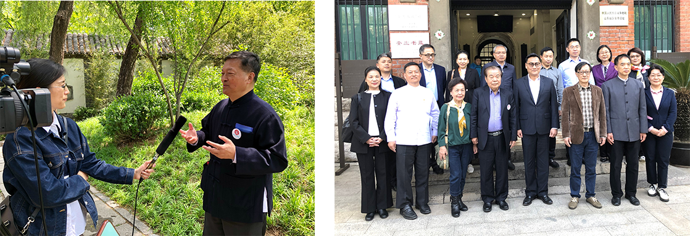

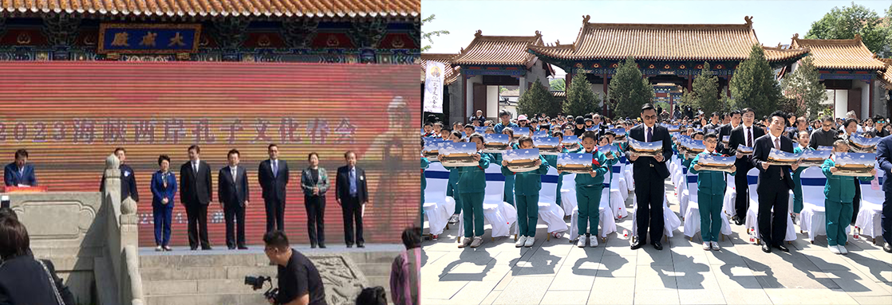

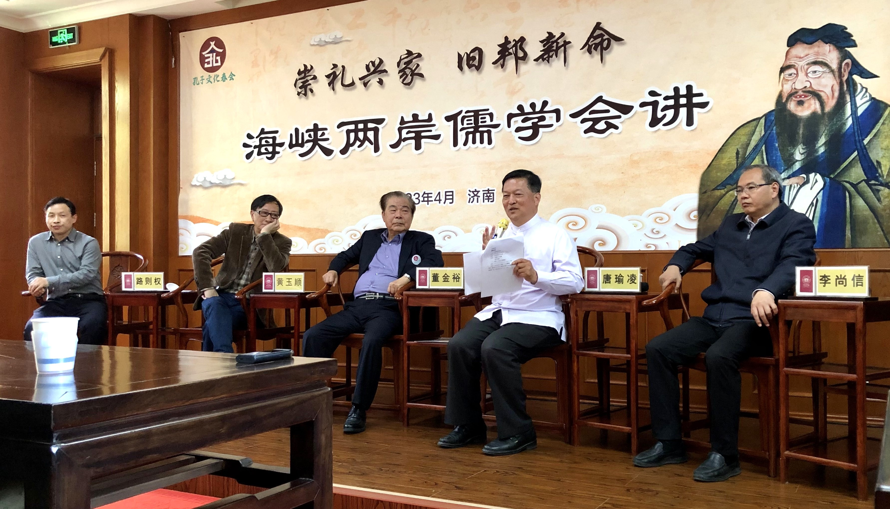

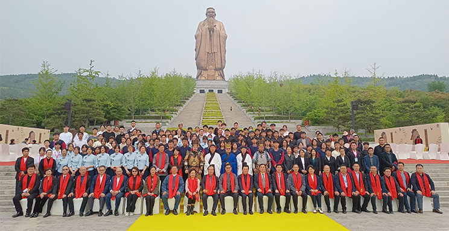

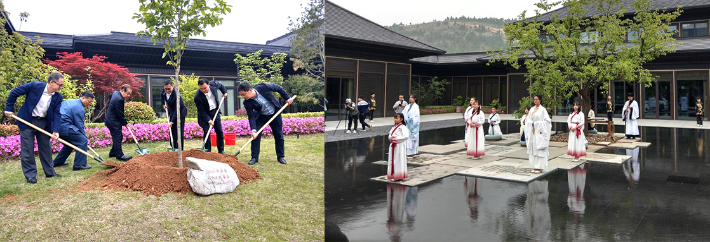

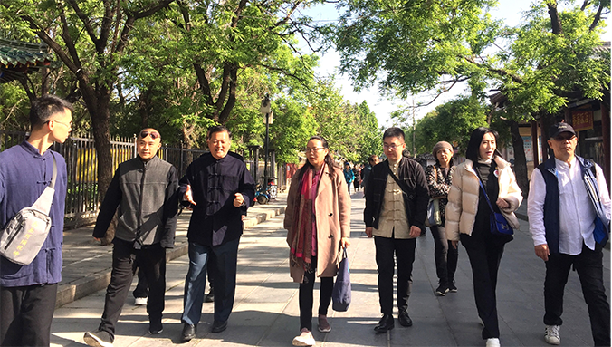

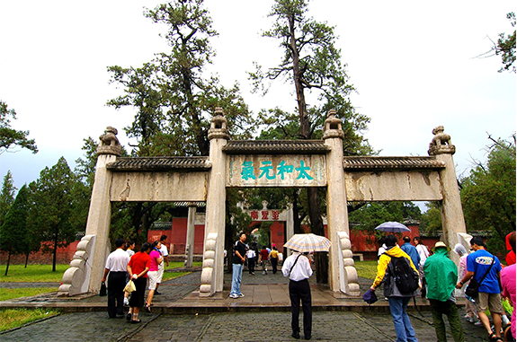

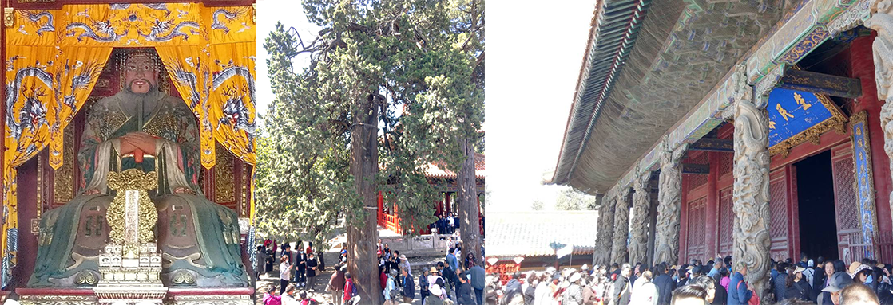

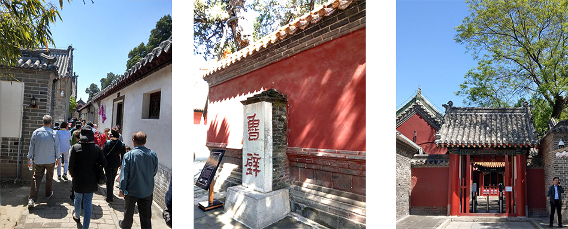

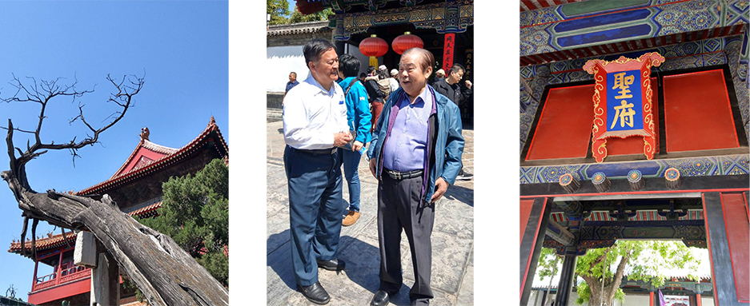

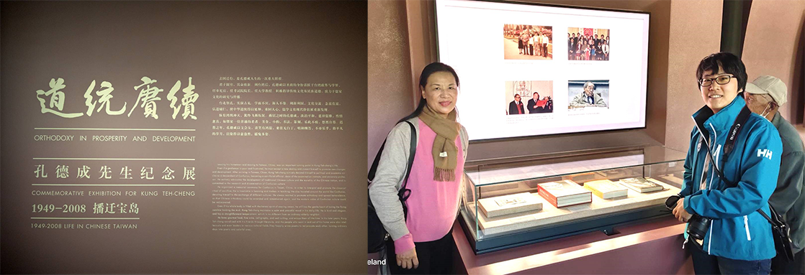

### 二O二三年三月至六月時哉青年經典培訓班報導

心若

道場老化待新血

初機受學入傳承

獎勵誘因是善巧

培成人才走未來

佛法與儒學的延續，重點在傳承，江山代有人才出，青壯年時期體力充沛、邏輯思維能力強，最適合靜下來學習，尤其是宗派見的抉擇，更是重中之重，可惜一般人精華歲月總忙著打拼，大好時光就在學業、事業、家庭、吃喝玩樂中流逝，抑或是曾經有學佛、學儒的因緣，又因種種理由中斷，甚是可惜。如何吸引年輕人，如何留住人才，如何往下傳承，一直都是各道場團體必須嚴肅面對的課題。

此前非常感謝基隆淨宗學會陳會長，協助學會將蓮友子弟組成團隊共學，予以獎學金的鼓勵，於二○一一年三月初，開始了為期三年，每個月兩天的人才培訓班，期間開設《百法明門論》、《論語》、《常禮舉要》、〈禮記〉、專題等課程，幾年過去，因緣變化，疫情過後，學會深思熟慮，決定敞開大門、主動出擊，觸及更多渴求佛法的年輕人，辦公室便於二Ｏ二二年十月底開始緊鑼密鼓地籌備獎學金招生，年齡限制為十八歲至三十五歲，除了在時哉臉書打廣告外，也在各大專院校各科系張貼招生海報，打出「愛讀書有志向的你，何不一邊讀好書，一邊領取獎學金！」的口號，加以宣傳，效果顯著，報名人數近百位，來自各行各業、各校各系，其中不乏社會菁英、高學歷又對儒佛有深厚興趣的佼佼者，學會於十二月底開始進行分批多場的面試，由林老師為首，辦公室同仁為輔，擺出六人面試一人的大陣仗，細心審慎地篩選志同道合、可培育的年輕人，透過層層把關，最終選出三十位正式生，四位旁聽生，加入學習團隊，定名為「時哉青年經典培訓班」。

時哉青年經典培訓班於二○二三年三月四號正式開課，每周六下午一點半至晚上八點半上課，為期四個月，六月底結業。課程內容豐富，下午上兩堂《般若波羅密多心經》，加上一堂分組討論，享用美味蔬食晚餐後，晚上的課程為一堂《論語》、一堂佾舞。

選定《般若波羅密多心經》作為主軸課程的理由是，心經文句優美又最廣為人知，是六百卷大般若經的精華，各道場早晚課都會誦念，許多人更是從小背誦，把心經當作定心丸，對心經有種莫名的親切感，卻從不知其義，佛經雖在，若沒有人講解與依教奉行，就像夜花園一樣，沒有月亮夜花園是開不出花的，所以傳承非常重要。本次唐老師採用八種譯本與科判，帶大家細細領略各版本的不同。

《論語》課程，以〈君子與小人之辨〉為題，開發青年人的眼力，無論是在事業上、團隊上、找伴侶、尋覓師友上，都需要有辨別君子、小人的能力，如此才會得到親近君子的利益，排除親近小人的過患，有時候抉擇比努力還重要。所採用的《論語講要》，是醒公老師於民國六十一年到民國七十四年的聽課筆記，刪繁取要，經過二十多年不斷的分章整理才出書。孔子本身的經驗閱歷豐厚，有天生德、後天學，讓他知道要如何培養人才，並且帶人才出去歷練，給人才出路，完成了崇高的使命，對後世造成莫大的影響。

有靜有動，在研討論語後，晚上特別安排一堂佾舞課程，讓大家親身體會儒家佾舞的莊嚴與威儀，動一動、流流汗，認識彼此、增進感情，學會佾舞承襲於臺北大龍國小佾舞隊的指導老師蔡富存老師，是非常難能可貴的因緣，學成之後，也透過不斷地研討、演練，保留實力，更希望把這樣正統的展演教學帶給年輕學子，由於時間有限，本學期的佾舞以初獻禮為主，讓大家體驗莊嚴肅穆又有傳承的祭祀舞蹈，相信學有所成，日後都有出演的機會。

唐老師在開訓致詞時說：「本班名為時哉青年經典培訓班，時哉二字出自於〈鄉黨第十〉：『山梁雌雉，時哉！時哉！』，就是時機到了！時機到了！什麼樣的時機到了呢？文化發展的時機到了！因為文化是各行各業的精華和核心，我們走過大陸、東南亞等國家，覺得時機到了！年輕人需要扎根。雪廬老人在晚年時培養了一批年輕人，在他過世幾十年後，這些學生在各個領域都發揮了巨大的功能，學會也希望盡上棉薄之力，讓雪廬老人的殊勝傳承延續下去。文化的出路非常寬廣，要給予年輕人機會，首先要有架構式的訓練和理則的思維，有系統的培訓，學會並非傳教，而是將道理說出來，經過大家的推理、探討、分析，來抉擇這樣的義理是否正確，以循序漸進的方式，互相激盪。以往學會都是訓練內部子弟，現在決定大膽地走出去，主動認識更多年輕人，而學會的蓮友子弟，也能因為本班的組成，互相刺激而有所成長。

本班組成，需要獎學金的提供，獎學金有一部分來源於師長父母的遺產，一部分是學會的善友捐款和學會的經常費，期望能將此經費用在刀口上，培養人才，用開闊的胸懷，用經學的眼光來看世界，將所學運用到日常生活中，發展至各項領域。」

林老師致詞言：「本班的組成開過許多會議，雖然講授者和教學團隊已經磨合多年，彼此默契十足，並非倉促成軍，但團隊仍然在十分忙碌的工作中，戰戰兢兢，把時間和精力重點放在這個班上，商討如何在有限的時間內，把內容有效的傳遞，互相配合，備課的壓力也隨之排山倒海而來。

十月底開始，我們發送實體招生海報至北部大專院校各系所，也寄信至各系辦辦公室，臉書上持續投放廣告，鎖定北部十八歲到三十五歲就學或就業的青年人，共計收到九十七件報名表，從高中生到上班族，從準備畢業的研究生，到正在準備考研究所的考生，老師與助教們一位位親自聯絡並安排面試，每週二從早到晚，面試時短暫的互動與問答，卻讓素昧平生的彼此，有著深度的談話，大家的眼神告訴我們，你願意，你的心裡願意！就是這樣的因緣，本期產生了三十多位學員。大家或者抱著疑問來找答案，或者抱著自己的答案來找答案，或者是對未知領域的好奇，或者是對《心經》、對《論語》好奇，或者以前曾經接觸過，但是不知道意思。學下去有些人或許適應良好，也可能有適應不良的，人各有志，不能勉強，孔子和佛陀的這些豐功偉業，雖不能比，但心嚮往之，組成此班的根本本懷即在與此。」

除了豐富的儒佛課程外，五月二十一日，學會還舉辦聯誼活動，希望大家有更進一步的交流，當天上午先至台北故宮，由唐老師導覽書畫區與佛教文物區，使大家沉浸在古物的氛圍中，聽得意猶未盡，後安排了在故宮旁邊的至善園進行闖關活動，由唐老師與助教們擔任各關關主，闖關內容都與本學期課程有關，寓教於樂，各組笑聲此起彼落。最後，以美食與頒獎作為本次美好行程的句點，使大家身心都得到滋養。

這學期還成立了梵唄組，由戴老師帶領有興趣的同學們，另外找時間練習梵唄，疫情解封後學會的第一場浴佛法會，就由時青班的學生們擔任維那悅眾，即便練習時間短暫，同學們都不負眾望，帶給大家一場莊嚴、感人又別開生面的法會。

一期因緣很快結束，時哉青年經典培訓班於二○二三年六月十號學期圓滿，當天除了考試、心得分享外，特地安排在台北孔廟進行初獻禮佾舞驗收，感謝孔廟協助，讓大家能夠在莊嚴的廟宇中，展示這學期的成果，非常榮幸禮請到孔子第七十九代嫡長孫大成至聖先師奉祀官孔垂長先生及夫人蒞臨，還有台北孔廟黃穗蘋執秘、美國大華府祭孔大典委員會會長盧瑞平先生、中華無盡燈文化學會創辦人唐瑜凌老師，以及教學總監林蔚芳老師，擔任觀禮驗收貴賓。

在佾舞驗收表演開始前，由孔奉祀官帶領與會大眾，向孔子神位行三立拜禮，接著開始佾生們的表演，天公做美，連續幾天大雨，這一天居然沒有下雨，還伴隨著微風，兩次彩排過後，正式展演，順利圓滿結束。

接著請與會貴賓一一勉勵同學們，孔會長致詞說：「這是我們第一次見面，現在是畢業季，代表有一批學生，將要投入社會，或是投入到一個全新的領域，我們中華傳統文化，也是一樣。今天很高興看到各位年輕的同學們，跳得這麼認真，經過長時間的集訓，我在這邊首先謝謝你們，願意花時間學習中華傳統文化。在學佾舞上面，各位有這一份熱情，那我們就有義務，建立平台，讓同學們好好的學習，這是我們未來要繼續堅持下去的事情。希望今天結業之後，各位還能繼續保持這一份心，將中華文化繼續傳承下去，未來的重擔在各位肩上，你們就是弘揚文化的小尖兵、主人翁，我們會傾盡一切的力量，為各位搭建完善的平台。除了佾舞，除了儒家文化，如果大家對任何傳統文化有興趣，都可以與我們聯絡，就算我們不會，也會想辦法滿足各位求知的慾望。在這邊恭喜各位同學，謝謝無盡燈的各位老師們，有今天這麼完整的習儀。」

奉祀官夫人吳碩茵女士致詞說：「我想用《論語．泰伯篇》裡面的『興於詩，立於禮，成於樂』來勉勵大家，這裡面有孔子的精華、他對於美學的重視，還有對於我們修習為人處世的一些理念，你們走進《論語》，進而接觸到佾舞，在這一動一靜之間，其實就像未來的人生，會有很多的起伏，如何在一動一靜裡面，安定自己，找到你內心的價值，這是可以學習的方向，也可以在未來的人生裡面，不斷地堅定自己的價值，不要忘記自己是有力量的，謝謝大家。」

台北孔廟黃穗蘋執秘致詞：「今天看到大家經過了十來次的訓練，就能有這樣的展演，實在是非常開心，孔廟也覺得很榮幸，能夠有各位的傳承，讓佾舞不只是在大龍國小的小朋友階段能夠傳承，在我們大學生身上，也能夠繼續傳承下去。這次你們的表演，我覺得非常成功，剛剛非常多觀光客，還有很多民眾一同觀禮。因為疫情的關係，孔廟已經有大概三年的時間，沒有比較正式的佾舞表演。今年九月二十八號，是祭孔大典，在這裡也邀請各位同學一起來參加。」

遠道而來的盧瑞平教授致詞：「我旅居美國四十六年，在二○○五年的時候，我在華盛頓地區，就是美國的首府，成立了祭孔大典的儀式，為了慶祝教師節，學的一樣是初獻禮。當年剛好有一位老師，帶著他的兩位公子，回到台北孔廟來學，因為時間緊迫，所以這兩位公子當助教，回去以後，我們找了三十六位僑校的學生，訓練他們跳初獻禮。為什麼在祭孔大典只跳初獻禮呢？因為我們那時候只會初獻禮，所以他們就跳了三遍，大家看非常驚喜，因為在美國東部從未有過祭孔大典，這是全美國第二個地區成立的祭孔大典儀式，隔年，我幫助美國紐約、紐澤西，還有南加州，也成立了義務訓練，並傳授所有祭孔大典的原則，如果你們有機會出國留學的話，到了這五個地方，不要忘記和我們聯絡，你們是我們以後的接班人。」

唐老師致詞：「《論語‧先進》最後一篇，孔子問曾點，曾點說：『暮春三月，穿上春天的衣服，約上五六人，帶上六七個童子，在沂水邊沐浴，在高坡上吹風，一路唱著歌而回。』今天春風拂面，非常愜意、快樂，還看到這麼美好的舞姿，這種舞姿是從明朝傳承，由奉祀官孔德成先生，在蔣總統的見證下，完成的最高儀式，兩岸當中，台灣保留的儀式最為完整，其實中華文化在台灣，台灣風景最美的就是人情味，尤其是這種向上的心志，對未來充滿希望與信心，同學們的學歷、家庭都非常好，在這個時代裡面，是非常難得的，尤其孔奉祀官，幫大家的前途都想好了，我也很高興來共襄盛舉。」

林老師致詞：「從四、五個月前，開始陸續面試，和各位初見面，那時候好多同學提出一個問題，問我們教學的目的是什麼？當時我給同學的答案是體驗，希望藉由這一學期的課程，帶大家來體驗，體驗你們或許從來沒有接觸過的，像《心經》般若智慧的探討，然後進入《論語》，本學期的主題是君子小人之辨，從大家的心得與反饋中，發現論語跟你們原先所認知的很不一樣，因而產生更多不同的人生體會，佾舞的挑戰，老師們陪著大家，一步一步的排練到上場，這些都是想讓大家體驗，而體驗的背後真正的意思，就像奉祀官所說的，希望大家留下來繼續學習，在佛法的領域、儒學的領域，乃至於在整個文化的發揚，大家可以繼續學習，盡上一份力，今天是最後一次課程，希望我們還是一樣，常常會有緣聚在一起，好好學習！」

貴賓們致詞後，佾生致贈貴賓感謝禮，大家在大合照中圓滿此次活動，學期也在同學們豐富的心得分享中落幕。依依不捨的同學們，還相約到中正紀念堂進行會後會，暢談法義，相信這樣的課程成為同學們生命中很重要的養分，彼此也成為生命中最可貴的朋友。學會也樂見在學期結束後，同學們都能投入學會這個大家庭，加入群組，參加法會、放生、導覽、各種活動，擔任執事，甚至參與節目錄製，同學們都很踴躍主動參與。

回顧四個月每週六的培訓課程，是一場耐力賽，老師、助教們必須嚴格控管進度，隨時注意學員吸收的狀況並進行調整，要做很多輔助教材把道理說清楚，釐清各種疑慮，做各面向的探討剖析。《論語》中所謂的「松柏後凋」，歷經寒霜的松柏也會有凋傷，但是它會等新芽冒出來，每一期的因緣都在等待新芽冒出，花了許多的時間和精力學習，最後還要花時間陪伴成長，誠如雪廬老人所言：「我求法是跪著求來的，弘法也是跪著送出去的。」獎學金只是一個誘因，是一個開端，接下來，學會會持續開設青年培訓班，為社會優質的青年們提供深入學習經典智慧的機會，做為老幹新枝的延續，法脈的傳承，使愈來愈多人獲得正知見，惟願佛學、儒學依此而大放異彩，開花結果，永續不停。

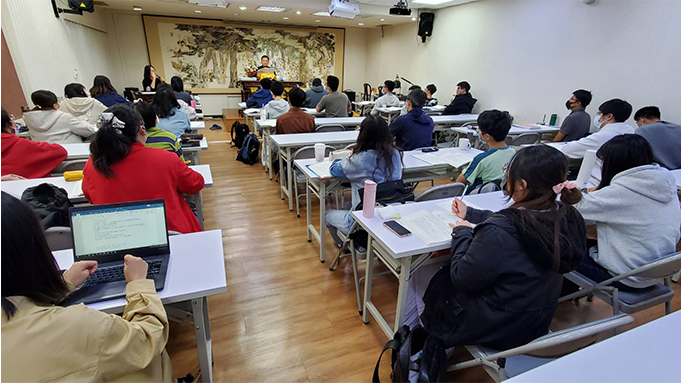

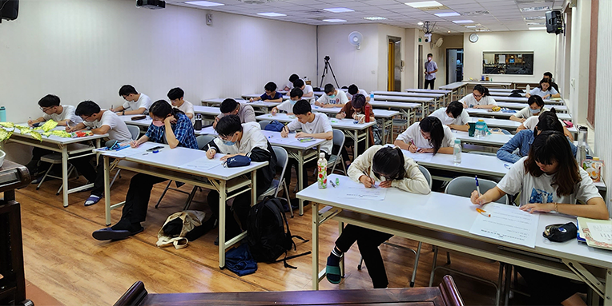

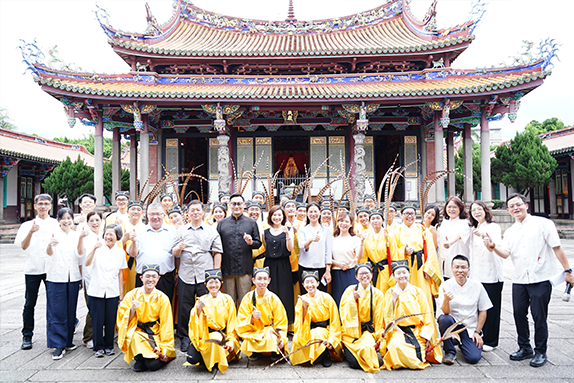

### 二○二三年時哉青年經典培訓班學期心得迴響

眾學員

三月餘來以文會友

各類學科共成團隊

後生可畏焉知未來

珍惜青春才是王道

謝是奎

「諸法從緣起，如來說是因，彼法因緣盡，是大沙門說。」

想必是因為聚足了非常多的順緣條件，才能讓這一期時哉青年班辦得如此豐富而精彩，還穿插著故宮之旅的活動，格外令人印象深刻！

首先感謝唐老師於百忙中抽空出來帶領我們學習《心經》，從施護本、藏傳本到各式漢傳本，條理清晰地一覽經文架構，在眾多繁雜的佛學名詞間整理出簡單易懂的解釋，並透過因緣、部分、有支、支分、色法的作用等細細剖析四合空性的義理，深入淺出地講解心經真的是令人想一聽再聽！

很感謝所有助教老師們和大家共讀心經，消文釋意，各個都挖空了心思來製作教材，只為讓我們對於心經能更懂一點。還記得蕭老師在講人生難得的時候，用繪圖ＡＩ畫了須彌穿針、盲龜浮軛的示意圖，真的令人非常有畫面、非常有感！白老師在講「君子懷德，小人懷土；君子懷刑，小人懷惠。」，直接拿市井小民如何看房買房來做對比也超級有趣！還有微智老師講解《菩提道次第極略頌》最後密教的部分，提到像是壇城有很多種，分為沙壇城、唐卡壇城等等，還有密教中的各個類別，讓人一掃未聽之前對密教的困惑；在討論比量和現量時，還記得戴老師拿機師開飛行模擬機來比喻比量，拿機師最後實際開飛機的經驗比喻為現量，真的是特別巧妙貼切，讓人記憶猶新！感謝林老師在討論課中，當助教老師們解說後大家仍未能完全理解問題時，不吝於分享自身的經驗，並時時給予同學鼓勵；同時，也很感謝潘老師也在討論課時，盡可能地援引具體的例子來解說心經藏傳本的深奧內容。最後，很感謝珮茹老師講解完心經藏傳本的三解脫門後，不忘在課間休息時，熱情招呼大家吃餅乾和關心同學的學習狀況，真的是讓人格外心暖。

此外，對於所有幕後默默付出的義工們獻上最誠摯的感謝。在週六上課結束後，能吃上一桌菜色極其豐富的素食佳餚，是何其有幸！同時，感謝所有學會的諸善友，謝謝你們成為外護善知識，提供人力物資環境場地讓我們能盡心學習，課程背後無聲付出的你們，是我們這些青年學子學佛路途中的莫大順緣！

晃然之間這一期的課程就要到尾聲了，雖說有緣起必有緣滅，但課程結束仍不禁讓人慨嘆和不捨，祝福大家在學佛的路途上都能精進不退，共成佛道！

吳念芸

從前看中醫時，喜歡看放在診所的結緣品。及長，也愛聽他人講解紅樓夢這樣的小說。然而，小時候出於對佛教虛無主義的錯誤認識，總覺得佛教是要人拋家棄子，親離友散，只要一聽到「佛」字，就覺得痛苦，心裡總想，假使如此當真為大道，也讓我假裝不曉得才好。但是，佛為在俗世時的親人說法、諸佛及觀世音對眾生的憐憫、目連對母親的孝心、地藏王菩薩發願超度地獄有情，豈不也是由愛而昇華成大愛嗎？聲聞眾及三世諸佛的護持，也豈不是一種善友嗎？民間說佛，大多以因果報應的那一分說，對惡行的確有嚇阻作用，但不會吸引人深究佛法的內涵；藝術談佛，則多以苦和慈悲的那一分說，雖能緩解憂傷，但聽完唐老師的講解，可以知道那也只是最基本的基本功。人對空性智慧的追求，也可以，甚至本來就應該像物理學家、哲學家、天文學家、生態學家那般充滿歡喜；菩薩的慈悲，應當是比悲觀主義更祥和、比浪漫主義更有力的；空性智慧的奧妙，應當是積極的，而不是消極的，我們如今處境安逸，身無頑疾殘缺，有能力布施，更應該與佛結緣。這一世或許無法學成佛的智慧，但能進入資糧道，已經是向成佛跨出一大步，期許能在極樂淨土相會，與眾善友良師共勉之。

丁偉民

這次有幸獲知社團法人中華無盡燈學會籌辦的時哉青年班，並成功報名參加。在課堂上透過唐老師與諸位助教的講解，不僅打破昔日末學對佛教義理的誤解與錯誤的認知，也重新認識了儒教《論語》中孔子對於君子與小人之間的看法。因為這次的時青班課程，得到了初次學習佾舞的經驗，更難得有在孔廟奉祀官面前，表演佾舞初獻禮的機會。

除此之外，時青班的學生，不僅多數都是年齡比較相近的同學，而且都是來自各領域的佼佼者。課堂休息時間，下課之後的時間，又或是無盡燈學會另外在假日籌辦的故宮參觀與社交聯誼活動，與同儕之間的認識與交流，不單只是磨練經營人際關係的能力而已，也助於人脈關係的拓展。以上這些都是對未來人生規劃有所助益的養分，是非常值得珍惜的寶貴回憶與經驗。

林珮祺

再次感謝學會的錄取，讓我有機會深入了解心經的內容和論語的選讀，以及體驗跳八佾舞初獻禮的機會，我真的沒有想到原來自己平常在念的心經並非是原文，看到課程上的西藏原文真的讓我很意外，而且每段文字都有其含義在，雖然很多地方還是無法完全吸收或很懂，但還是通過老師們較淺白的舉例和同學小組間的提問和討論，讓我慢慢理解部分內容。

論語課程讓我印象深刻的是原來小人也不全然是惡人，其實也是有很多地方是值得君子去學習的和借鏡的！

八佾舞雖然我記憶力沒有很好，到現在還沒有一次是跳完全正確的，但是我很喜歡上這門課！因為平常的我根本肢體不協調，不會跳舞，能夠學會真的是一個難忘的經驗，感謝老師們的教導！

林謙

一開始第一堂課程我覺得時間過得很漫長，因為第一次接觸心經，很多詞彙都很陌生，要能了解其中含義更是吃力，然而隨著上了幾次課程，雖然尚未到能通達心經的境界，但卻能從心裡感受到平靜，一周累積下來的煩惱和急躁都在課堂中沉澱下來，當靜下心來好好學習時，會發現原來心經和我想的不一樣，尤其是透過老師的時事舉例和人生經驗分享，幫助我更快了解心經中所蘊含的智慧可以如何應用於人生中，而且其中道理在不同版本的論辯中能有更深的體會。而很有趣的是課程會利用科判的形式來帶領我們學習論語，這樣的架構安排讓我能更快速的串連不同章節中的類似主題，在講解過程老師也會補充許多不同的資料，這次的學習讓我透過另一個角度來認識論語及其中的智慧。雖然我對於心經的理解還有進步的空間，但透過課程，我慢慢掌握了心經和論語與日常生活、工作、人際等方面的連結應用，很感謝學會有這次的課程讓我能夠學習！

林昱霖

在一個學期短短的時間內，就學了心經、論語和佾舞的相關知識與技能。誠然，若要說生命又或是價值觀產生了何種立即的改變，或許也過度矯情或天馬行空，然而本次佛學課程中的「中觀見解」著實給予了我系統性且更深入的思考。

一直以來，我偏愛道家、禪宗、陽明心學甚至是存在主義的思想，或許就如同朋友所說，越空的東西，我就越愛。但此種偏空的習氣，卻也在一定程度上造就了容易懷疑、容易批判的個性，甚至更進一步說，當一切都是觀點造就時，一切都是相對時，就容易陷入虛無主義之中。或許可以說，超脫認知上的虛無主義，就成為了我急迫需要處理的課題。

而參與本次的課程，讓我得到最大的收穫在於「空性」不得脫離「有」來談，「空」與「有」乃是一體兩面，互為緣起的概念。在面對外境時，一來需要以般若空性脫離執著，再者更要見到空性與條件聚合所能造就的「有為」和「善」。毫無疑問的，這是到目前為止我所聽到對「虛無主義」最完美的解方之一，然而如何從邏輯上的認知，內化到個人的修為，又有待不斷的練習。

或許，在有為的世間中，建立無待的思維，體察空性、體察各種可能性，便有機會逐漸打破主觀與客觀世界不協和的本質痛苦，達到乘天地之正，而御六氣之辯，逍遙遊於世間的自在。

張兆宜

以前的我讀佛經都感覺自己懂很多，感覺自己對佛經很有感覺，理解字面上的意思，可以一直念好幾百遍。

但佛教相關經典非常多，想要明白佛語，真正了解佛是怎麼講得，去了解佛到底教了什麼，一定要有人領導你進入，因為佛經無法自己看，你不會懂得如何解經，老師會告訴你理由、前因後果、什麼條件說什麼話，都分析給我們聽，不同境界對空性解法都有所不同。

老師的論語課是一個字一個字來讀，並且都要推過一次，這麼忙碌的時代，我自己通常是一次看好幾段話，然後看註解覺得自己都懂了，聽了老師的課程，發現內心對論語還有不懂的地方，聽老師講課有種恍然大悟的感覺，有時說不好的地方有種秘密教的感覺，覺得老師就是在說我。

書本內容透過人講解和自己讀時是不一樣的，因為我們也會觀察講者的做人處世、言行舉止。

這次課程改變許多我對世界的看法，我從來沒有想過，觀念可以在課堂上透過聽聞學習，通常都是透過做了以後才知道人生觀念，在上論語課時像是在看劇，我可以透過論語課的對話，在沒有情緒的情況下，了解自己犯了什麼錯，體悟到原來這樣做不好，像是不能什麼都說好，有時候答應別人會出事，看到其他君子被攻擊時原來要保護他，不能冷眼旁觀，因為這樣君子就有可能會倒地不起，其他人就慘了，遇到小人不是敬而遠之，而是要默默的把小人壓下去，不能讓小人出頭。

人都是獲得時才知道自己損失什麼，不知道自己損失什麼慘重，如果當時我這麼做，就不會有現在這樣的收獲，一定是走另外一條才知道自己損失什麼。

學習怎麼在日常生活中觀察，改變對世界觀察，會發現自己的看法每次解讀都不一樣。

也讓我學到文化傳承的重要性，第一次看到課程有這麼多的助教，並且助教能夠講課，再由老師透過問答方式補充。

佛教和其他宗教不同的地方是脫離輪迴，除了斷惡修善，做功德之外，得到般若智慧，斷煩惱障和所知障，才是真正的身心自在，不是虛無主義，這個世界是假的，什麼都不要認真、什麼事都不做，因為外在世界是假的，是透過觀察緣起，了解空性智慧，發現萬法沒有自體性，在實體世界找不到，外在世界都是觀待我而產生的，所以要從我自己來做改變。

感謝這些因緣，讓我充實內涵，少走彎路，永遠難忘。

林泓泰

原本並無佛緣的筆者，因緣際會的看見無盡燈學會的海報，作為一位博士生，求知是筆者最大的動能，許多社會科學知識都能在課堂中學習到，筆者國學界也是被後殖民宰制的場域；因此，反而是國學與佛教知識鮮少出現在學校中。

長期以來，筆者研究的領域在朝貢體系上，佛教經典是古代東亞廣為流傳的文化載體，但囿於過去的生長背景，筆者其實幾乎完全未接觸過佛法，有的只是歷史知識上粗淺地介紹，哪怕佛經是古代中華帝國對外文化輸出，建立文化霸權的方式之一。

但是，真的理解佛教義理之重要性，是參加學會的時哉青年班，和眾多同修與老師們修習佛法，深刻地理解到學佛並非只是單純的參禪與誦經，更重要的是是否理解佛經中佛的智慧。

也是此等智慧度化眾生，也讓筆者有更開闊的人生觀，對筆者論文研究上的方法論也有深刻的影響。

筆者非常高興有此緣分，可以結識大家並學習佛經的奧妙。

白宇涵

在這門課程中，我對《心經》及《論語》都獲得了寶貴的見解。在經文方面，從前我並不會去深入了解經文的要義或相關的話題，認為這是跟生活較無關也比較沉悶的，導致之前的學習只是很敷衍掠過表面，甚至可能理解有所偏差，經過老師詳細的講解與配合不同的科判譯本說明，雖然還是會對有些用詞不太適應，但相比從前以為是一切都是空，差別非常大，原來在說空是色法的體性，而不是在否定它的存在與作用，很多纏繞在腦中的結便豁然開朗，看待事物的方式開始有意識的往空性的思維方式靠攏，這對於今後的我相當有幫助。

論語的部分，因為先前有上過學會的論語課程，所以相當期待這次會有什麼多樣的理解，不枉期待，老師講解了許多死板的條文解釋上所看不到的義理，像是君子有時候也得學像小人般渴望利益而演化出各種手段，來渴望學習，透過各種方式來學習正知見，也要像小人為了利益而勾結在一起時的團結，來團結其他君子，讓君子的力量更為強大，這是我從前不會去想的。

非常感謝唐老師及師資團隊花時間對《心經》和《論語》的不同解釋進行了深入的探索，這大大提高了我的學習動力與興趣，雖然之後來上課的時間會因為實習而被縮減，但我也是會盡量排除困難來學習，畢竟在某些時候，對我的人生而言重要的不是只有錢而已，重要的是這種正知正見。

張簡德涵

很幸運能參加這屆的時青班，能在畢業之後遇到一個肯教會教的老師真的很幸運。在學生時期總是會覺得很多事出社會之後就會知道了，殊不知出社會之後知道的方法來自於我們跌倒後。老師在論語課中教我們如何分辨君子與小人，而最重要的是除了讓我們學習如何當君子，也是在教我們如何擁有判斷力與智慧，不會因為別人而隨波逐流。在心經的課堂中，開啟了我對佛學的興趣，從最簡單的易背誦的經典開始學習，雖看似簡單老師卻用宏觀的態度講解，讓我們對佛法有一個較全面的了解，也對之後的課程很期待。

真的很開心自己能遇到老師，尤其是當自己遇到困境時，就會不自覺想到上課學習到的知識，並練習運用在生活中，謝謝老師。

尹存民

還記得第一次路過學會門口，看到時青班的招生海報，心裡默默的一直想著，這是什麼樣的團體，這麼有熱忱的辦課程，但想想這是個整天且為期數月的課，因此沒有立刻報名，緣分就是這麼微妙，在報名截止的前幾天，我又路過了學會且又看到了海報，心想這好像意味著要我報名的意思，當下回想了這段時間的每週六，好像也沒有多做些有意義的事情，加上在福智學習上課前都會念三遍心經，卻好像對心經完全沒有了解，因此就決定報名。面試時看到六位老師很正式的面談，感覺很深刻，這是一個很不一樣的地方，非常認真的想把事情做好，帶著我們學習，那天聽到近百人報名面試，讓我對這次的課程更加期待，面談中歡樂的氣氛，我相信我是不一樣的，應該有機會被錄取！

順利的課程開始了，聽完大家的自我介紹，覺得大家都好優秀，能和他們一起在這麼棒的師資群裡學習，真是難能可貴，我告訴自己一定要認真，雖然整個上課過程常常「漏器」，也有時無法跟上，但是我知道在這輪迴當中有很多很多要修習的，慢沒關係，但是要開始，要有好的老師帶領，唐老師在講台上的神采奕奕，引經據典的講說，讓上課變成享受，這是一個很棒的開始，很棒的緣起，期許可以持續學習，不斷精進。

楊啟弘

這個課程讓我有幸深入研究摩訶般若波羅蜜多心經和論語，這兩部經典作品帶給我許多啟示和思考。在學習過程中，我體會到這些文獻所揭示的智慧和價值對於當代生活的重要性。

首先，摩訶般若波羅蜜多心經教導我們空性的觀念，經文中的「空」並非指虛無，而是超越相對性的境界，超越個體的存在和概念的限制。透過修習這一教義，我們能夠超越自我的執著和貪婪，從而實現內心的平靜和開放。在現代社會中，我們經常陷入煩憂和焦慮之中，但摩訶般若波羅蜜多心經提醒我們，這些煩惱僅是相對存在的幻象，我們可以透過超越自我而達到心靈的寧靜。更是透過不同版本的比較，讓我理解為什麼我們若想深入修行或研究其中哲理，必須要讀的是西藏傳本。

另一方面，論語則教導我們倫理和道德的重要性。這次課程內容集中探討了君子和小人之間的關係，以及如何在社會中建立自己的人格。唐老師的論語課程，智慧地教導我們要如同君子一般謙卑、誠實、尊重他人和遵守道德準則，但也要有小人的那種頭腦和做法，並沒有完全的貶低小人。而這些價值觀在現代社會中依然具有重要意義。透過學習和遵從論語中的教訓，我們能夠建立更和諧、互助和關愛的社會。

整學期的課程讓我深刻體驗到宗教和哲學對於人類生活的指引和啟發。摩訶般若波羅蜜多心經提醒我們超越自我、超越煩惱，達到心靈的寧靜；論語則教導我們建立和諧、互助的社會關係。這些智慧觀念在現代社會中仍然具有不可取代的重要性，只是太少有人深入去研究罷了。

吳劉宏宥

我分兩部分，一為學理上，二為待人處事上分享。

在學理上，我覺得佛學之義理幫助我很大，這學期在寫有關蘇軾的報告時，我才發現，原來他的言論中帶有很多佛語，這對於我的學術上很有幫助，以後亦會多去修習相關課程。又，在論語上，老師帶給了我很多新的見解，其實我也會讀四書五經，但就如老師講的，沒有人帶領，對於無論是佛法亦或是論語都無法有殊勝的了解。老師在君子與小人之分別，尤其是君子需與小人學習此點，帶給我很大的啟發！而老師有時將佛學闡釋於儒學，如說明孔子的某些觀念時，亦讓我有新觀點可以處理兩者（儒、佛）之關係。

在待人處事上，我認真覺得學會的大家都很友善，因為其實我在跟陌生人講話的時候都會很害怕，但大家都很鼓勵我。而經過佛、儒學的學習，尤其是儒學，老師的講解，讓我對於我自身的行為準則應何如有新想法，就如同上述所提之君子應向小人學習一般。最重要的我認為是「和氣」，學習這麼多，如何以「和」待人處事是我最不會的地方（尤其是越親近之人），而論語與佛法中亦讓我對「和」之法有更多想法！

總的來說，周六學習此課對於我，比大學的課程重要很多，因其不只講解學理，亦對於人生道理有很多的啟發。

江瑞媛

這次的課程含金量其實很高，因為在外面很難同時體驗到佛學、論語以及佾舞課程。並且這些課程是確切的使內心的涵養提升，以及讓知識的深度能夠向下扎根。在上課當中，老師們採取以邏輯服人的教學方式。凡是遇到一個專有名詞或是概念，一定會說「舉個例子」。由此可見，老師並不是只講述知識，而是將知識與人的距離拉近，進而使得我們能夠了解知識。老師們也會將自身的經歷帶入佛學、論語之中，以此我們不僅僅是以更人性的方式了解知識，也看到了不同的生命軌跡。在作為一個半入社會的大學生而言，這無非是一個洞察未來的方式。

在佛學課程當中，在一句句梳理心經的涵義的同時，其實也在經歷一連串探討如何讓自己的生命過得更加自在的過程。在儒學課程當中，能夠了解到君子與小人並非是涇渭分明。小人的特質確實是身為君子需要學習的，只是小人將優點用錯了地方而成為缺點。而佾舞更是讓人感到新奇的課程，佾舞在生命當中至多僅是在學文化基本教材中的一個小名詞。但這次我們能夠有機會到孔廟前完整呈現出初獻禮的內容，並且親眼見到了孔垂長先生。

所有的機緣事實上都得來不易，很高興自己能夠有這個機會來學會學習，接受許多寶貴的知識、遇見謙良的人們，有著精采的體驗。

胡如茵

在來到學會聽聞心經課程之前，對佛法可以說是一知半解，甚至不知佛教為何？禮拜諸佛菩薩的原因為何？經文為何如此尊貴。雖然一開始海量的資訊真的吃不消，但到第三周講完心經的架構之後，有種豁然開朗的感覺，甚至可以皮毛地體會空性的道理，乃至無有恐怖的感受。這樣的理解讓我在誦經時充滿力量，也關鍵性地改變了自己的思維與人生觀，也改變了相貌（自然在生活中不會追求華麗，更希望自己是清淨身的形象），除此之外，也會自然地產生不捨眾生以及渴求廣為布施的心。不知道自己累積了多少福報，原本是基於對每一堂課程的好奇而來，沒想到獲益竟然如此多。不但能聽經聞法，還有美味的餐點，甚至還有獎學金，學生發自內心非常感恩能與學會結緣，也總是期待著周六的課程，今日課堂結束以後希望能常隨學會精進學習、發心。

特別欣賞唐老師將心經與論語結合人生的部分來說，過去我經常有不理解自己的時候，在上完這學期的課程之後自己找到了許多答案。

另外，學生之前曾有學習佾舞的經驗，但未有登台的機會，很歡喜這次能夠有機會到孔廟著裝正式演出，也算是完成自己的一個小小心願。也要特別感謝戴老師時常關心我的學習狀態，指導我梵唄。非常感謝唐老師、各位老師、師姑、各位同學的發心，功德無量。

李裕烽

這次的課程對我來說是很新鮮的，尤其是心經這樣的課，從小到大都只會讀只會背，卻不了解其中的涵義，因此這次的機會是很難得的。首先是心經，平常我們最常念的漢傳版相較藏傳版竟然少了許多重要的片段，另外其中最重要的就是空性的智慧以及五道的修學法，這些東西不只是侷限於佛教，甚至可以善用在日常生活之中，空性的智慧要在平日就多加練習，去觀察各個事物的無自體性，以及其觀待的條件，這樣才能將觀察法自然地用出來。再來是論語論君子小人的部分，因為我是中文系的，學校也有一些課程會有包含論語，像是四書或是中國思想史，只是無論是哪堂課都停留在字面上意義粗淺的介紹，雖然學校也有講到君子跟小人的分別，但沒有唐老師講的這麼活，君子也不全然好，小人也不全然不好，皆有可學習之處。最後佾舞的部份，算是整天下來一個放鬆的課程吧，雖然最後的演出讓人很緊張，但也表示了在放鬆之中亦有所學，我認為是很棒的課程設計。

江芷芹

在課程結束之際能以「滿載而歸」形容我三個月的學習心得，從中，我不僅是片面地學習到心經空性智慧的核心思想，我還能將其應用在生活上，當不如意之事時，我不再如從前那樣悲觀地無所作為，反而能以因果、空性試著解釋它，進一步再思考如何理性解決，此改變了我看待事物的方式。除此之外，佛學的修學課程也使我對於未來路途較為清晰，從前總會和朋友討論死後是什麼樣子，不過最終都得不出完整的結論，但在佛法上，我能夠以有邏輯的經典了解生死觀、因果輪迴。修學佛法帶給我的是真相、是一種清晰且安定的感覺，不再如從前總是霧裡開花，以逃避思考渾渾噩噩的度過時間。雖然目前的學習仍處於基礎階段，但我會希望未來能持續接觸佛法，了解其中要義，以良善、有智慧的方式過未來的人生。

潘昀彤

這一整學期的課程下來在各個方面都讓我收益良多，特別是對佛教義理、經文的認識與不同見解，而我也相信在學會所學的都是正確的知識。學會中的師長及同學們也都是在正道上能幫助我在正道上的學習。只可惜自己在學會上課中沒認識太多同學，只希望往後能突破自己在這方面的不足，勇敢的去認識同學。

當初本著想要更加認識中國傳統文化的心來到學會，最終也真的在這方面有我收穫，讓我看見過去聖人學者們對後代的思想的影響，以及如何建造了長達幾千年的中國文化。

最後還是要再次感謝各位師長們的付出，還有學會長輩們的照顧還有晚餐。每次補課時老師們也都很關心我們的學習狀況並且樂於回答我們的問題，還有好吃的餐點。讓我每次來到學會上課，都帶著既能學習又能吃飽喝足的愉快心情來上課。我也會向身邊朋友推廣，鼓勵他們來共學正道。

游捷茹

這學期老師帶著我們學習心經，以及<論語>中以君子、小人相關的篇章，記下受用的關鍵語句：

論語──

ㄧ、先在事項上了解自己，才能類知別人。

二、就事論事的觀察與判斷，不以言舉人、不以人廢言。

三、在心態上學習君子，如處世的和氣心量、承擔與大受的視野、仁與利他的能力；在做事方法與態度上，學習小人求利益的那種渴望。

心經──

一、生活中，空性觀察實踐的練習，「如何空？如何來？」，想不出來的時候，試著代換角色、場域，觀看眼前所見事情是否仍舊成立。思考項目：

１．緣起性：因滅果生的條件。

２．相互觀待性：依左說右。

３．名言安立：手機之於寵物來說，可能只是個長方體的物品。

二、學習般若修持智慧，行廣大行修持福德，二者並重、相互增益、相輔相成。

總的來說，目前對於這個學習段落的take home message為：以小人對利益渴求的那種心態，相似地盼望以般若智慧行利益有情的廣大行，透過廣大行不斷地串習般若智慧，如此循環實踐。

葉庭儀

不知不覺自己默默在學會上課也快七年，很榮幸在大二下這個時間點，參與到這次學會為栽培青年學子而開的佛學班，唐老師為了鼓勵年經人向學還籌錢增設獎學金，設法排除青年學子學佛的障礙，唐老師想弘揚儒佛，想栽培青年的心大過世俗名利的追求，學會一向如此，無私、致力於弘揚正法，很開心看到這樣的精神在此期的時青班，走進更多青年心中，讓更多人認識學會。

從啟蒙班待到大專班，還是頭一次參與唐老師親自為我們講授的講座，以前星期六的晚上經過二樓，不是心想哪時候自己也能坐在那聽課，而是猜測老師的課肯定是乾燥乏味，講述的道理必定艱澀難懂，然後偷偷鬆了口氣，還好我還不是大人，小小的啟蒙班多快樂呀。

第一次上課前也有些緊張，還好事情完全不是我想的那樣，唐老師的觀點、考量到的事情總是非常全面，能夠將一件事情正的說、反著講，再上下左右地來參透，我就像一隻小貓咪遇上從來沒見過的大怪物般，大怪物的出現不僅超出我的預期，還顛覆了我對世界的認知，唐老師就像大怪物的存在，讓我看到，原來眼界打開就可以來到這麼遠的地方，我喜歡爬山，因為能看到沒見過的美景，也喜歡挑戰自我，因為喜歡成長進步的感覺，現在，學佛則是類似的感覺，感覺自己有天會抵達世界盡頭。

雖然每堂課不免偶爾和老師的音頻相合短暫閉目養神，在無數個剎那在心裡蹦出「蛤啊！什麼！怎麼這麼難！」的尖叫，但很感謝所有老師和助教都耐心用心地為我們解惑，我感覺，學習正法就像是要穿越一個隱藏在深山中年久失修的隧道，若缺少引路人明確的指引很難抵達，且當抵達後看到黑漆漆的隧道口，無一盞明燈或陪同者，絕對走沒兩步就先放棄投降，故極珍惜這次學佛的機緣。老師前輩們帶領我們安全地走入這條通往極樂世界的隧道，告訴我們這條路的資訊，還保證我們的安全等。而且一起同行的不只我一人，還有這麼多優秀的同齡一起。

總之，願我們緣分相續，一期的因緣不會輕易畫下句點，學佛所獲得的智慧和改變人生的方法是無庸置疑的無價，願自己永不退轉。

王姵嵐

非常感謝唐老師、林老師，以及所有助教老師用心安排本學期的課程。透過心經的課程，了解到心經原來有多種譯本，並分為漢傳及藏傳對空性義理有不同角度的詮釋。第一次聽聞到宗派見來研讀佛經，出現許多名相，例如有支、支分，緣起、性空等，都令我可以細膩的思考人生許多事情。並了解到研讀佛經一定要有傳承的善知識引導，有正確的宗派見見地，否則自己讀經、誦經，不明白義理，相當可惜。

唐老師的論語課，上課的內涵更是完全不同於過往。本學習透過君子與小人之辨的主題分類，從諸多不同的面向中生動刻畫出君子與小人的形象，並說明君子有時甚至更應該向小人學習之處。印象最深刻的篇章是君子有三畏，畏天地、畏大人、畏聖人之言。因為了解因果業報的法則、以及作善得樂、作惡得苦對人生各階段都是相當重要的心態與處事準則。

課前對於佾舞完全沒有想像，加上自己的手腳不協調的不自信，沒想到學期最後在孔廟換裝、跳佾舞畫下本學期完美的結束，相當有精神意義與傳統文化交流的一學期。再次感謝所有老師團隊的付出與用心。謝謝您們！

賴宥全

儒家早已知曉，最好的教育不是知識，不是故事，而是身教，從老師的教育當中可以感受到老師經歷了很多事情，所以「人能弘道，而非道弘人」，往後隨著時間可能會忘記課堂上的事，不過對老師的記憶由此定。

成家榮

除了每次都有豐盛的晚餐之外，也感覺學會很有家的溫暖，不管是唐老師、林老師甚至是助教們大家都很有滿滿的窩心滋味，在研讀的過程中每位老師都很盡心的傳遞知識，學子深感獲益良多，這也不是短短的一句謝謝能表達，也想在日後繼續為學會服務，已將這份無盡燈火的精神照耀下去。

也感謝學會提供補課的形式讓學生能進行補課，甚至在補課過程中反覆聽講有時也會讓學生頓悟到佛法的概念，有時課程中雖然會少記下重點，但在補課的回放中反而能在字義中細細咀嚼，感覺在補課的過程中沒有絲毫的馬虎，滿載而歸的感覺。

《心經》以智慧和慈悲的心境去面對人生，在修學法的觀修中，觀內心的清淨和解脫。

《論語》以倫理道德、學習和人與人之間的關係，體悟職場的人情世故及君子與小人之差。

《佾舞》以莊嚴及整齊劃一的優雅舞姿，領會中華文化對儀式和禮樂的重視與傳承。

於經典的理解中轉譯生活的普通話，不單只是經文上的逐一單字，更能在佛法的傳遞上知悉「佛」想要說的內容，使其一切有情眾生能離苦得樂。

於孔子的智慧中體悟世俗的君子與小人，不單只有論語中的傳道，更能在字句的品味上增進品德、有智慧和有責任心的人，在社會的挑戰及生活的實踐中出淤泥而不染。

於佾生的肅穆中體驗中華文化的傳承，不單只是行初獻禮、行初分獻禮，更能在寧和之曲上呈現翟籥帶來的世代傳承及延續。

時哉時哉福慧青年培育的盆栽，持續綿延無盡燈火，也將種子育芽了呢！

陳韻竹

首先想對整個團隊表示感激，由於所有支分聚合，才能有這麼好的課程，謝謝唐老師精彩的課程講說和經驗分享；林老師溫柔的支持和教學計畫；戴老師、潘老師、蕭老師、孫老師、白老師、微智老師很精心的準備課程內容，和分組討論時很用心的解釋，辛苦所有老師們了！還要加碼謝謝戴老師，我真切感受到老師的關心，覺得很溫暖。

再者，感謝做出那麼好吃飯菜的師兄師姐，真的很謝謝你們。還有所有護持課程的人，謝謝你們。也謝謝所有一起參與這堂課的同學，因為有這群好夥伴，課程才會如此精采！最後也謝謝佛祖，能參與這個課，這個課能那麼好的進行，是有佛祖加被。

「無上甚深微妙法，百千萬劫難遭遇，我今見聞得受持，願解如來真實義」，在聲聲朗誦中，開經偈如同黑夜裡的燈塔護持眾人習得正法，如同陽光穿越綠葉枝頭的點點亮光灑落在我們心田，連續四個月的【心經‧論語‧佾舞】於此展開，這個課程不僅僅的知識的傳遞，更是人生和真理的挖掘。

對從未接觸過佛法教義的我，是期待又有些擔心不能理解，畢竟佛法的名詞很多，但老師們功力都特別高深，將複雜的內容系統化，深入淺出的娓娓道來，不同版本的科判經過老師們的講解，也讓我愈來愈能理解，唐老師的授課更像是施了魔法一般，令人愈加想探究佛法經典，幾個月下來，《心經》的內容和解釋像是在心上留下鑿痕，雖然字句沒有刻意背誦，卻時常能在生活中浮現裡面的內容。

而論語的課程更顛覆我們想像，唐老師和助教老師的一問一答，讓我感覺像是穿越了千年，在孔門之下，用問答解惑方式授課，這種講課方式比我過去所上過的任何一堂論語課還要精采生動，老師們用論語結合人生際遇，讓我清楚的看到在社會上具體君子和小人的面貌，也督促我一言一行，更讓我下定決心成為一個君子，並具備「成人之美」的心念。

在晚上佾舞課，讓我體驗到何為動中靜，靜中動，佾舞表現出的是一種禮節，要成為君子不僅僅是在心境、態度，更要表現在行動之中，佾舞呈現的是心的沉穩而敬重，這不僅僅是祭祀表演，而是文化的傳承。

感謝一切因緣聚會，才得以參與這個課程，期許自己參與這個課程不僅僅是改變自己的心念，也能幫助眾生解脫其苦。

歐陽知凡

時哉青年營應該是我多次參與營隊中體驗最好的營隊，不單只因為獎學金使參與的學生無後顧之憂，更重要的是對於學習環境的營造，使學生們更能靜下心修習高深的佛法和儒學。在此特別感謝為我們打造良好環境的老師們。

時哉青年營相較於其他類似營隊的特點在於以不同漢傳內容的心經、論語的實用性、以及在台灣島內也不甚多人了解的佾舞教學。近年來對於傳統文化的批評與日俱增，雖然已有企業家和學者們著書（如《論語與算盤》、《儒家政治思想與民主自由人權》等）證明傳統文化的實用性與現代性，但在社會人心浮躁的情況下，培養青年「衛道之士」更為重要。

論語作為儒家基礎，重要性不言而喻，但佾舞和佛學的加入讓課程增色不少。佾舞在排練上雖然不甚理想，但展演的那一刻，完美的呈現出了中華文化的莊重及神聖，成為論語學習歷程中，成為「君子畏天」的良好註腳。佛學則是從有別於漢傳的中觀思想出發，以心經為緣起介紹「空性」，老師在講授論語時也會用佛學的觀點去詮釋，宋代理學後儒佛對立的觀念就此煙消雲散，也得以入門新儒家名著《新唯識論》儒學、空有二宗之間的互動。

不論是佛法或是儒家文化，這些傳統都閃耀著古人耀眼的成就，如果僅以部份糟粕而否定全體，其影響可能如同對岸之文化大革命，不只是倫理道德的缺失及再建構，更是成為了無根浮萍，在傳承上無所依靠。反之，西方自文藝復興始至今日，都在嘗試從中華文化中尋找自己文化問題的解方。時哉青年營很美好的將不同領域的傳統結合在一起授課。有志於相關領域者，來學習必獲益良多。最後，感謝唐老師及各位老師建立這個營隊，使學生們得以在傳統文化的延續上更進一步，在未來，相信會有更多的人重新審視中華文化的重要，共勉之。

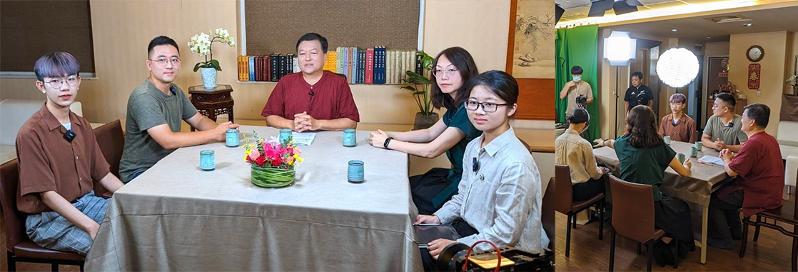

### 時青班心經與論語考題解答

文／助教們

證得空性從緣起

入世抉擇善與惡

君子小人心上分

作善覺受從小人

●心經考題

ㄧ、請問「般若」和「廣大行」的關係？

**答：** 菩薩的般若智是指能證空性的智慧，菩薩的廣大行是利益眾生的各種法行（六度的總綱）。般若可以資助廣大行，廣大行也可以資助般若智慧，二者互攝。菩薩以布施、持戒、忍辱、精進、禪定、智慧等法行廣利眾生時，會遭遇諸多艱難，甚至命難，有著般若的智慧，在遭遇困難挫折時，通達實有不成立，能走出被實有見的傷害，療癒自我，並且了知體性空，不帶著實有的成見，在不同條件有不同結果的觀察下，容易找到利益不同根機眾生的方便法。般若智慧資助廣大行，使廣大行可以修得廣大福，證得佛的色身，而在廣大行的資助下，般若智慧格外地有力，不但破除煩惱障，且進破所知障，成就佛的法身。

二、請說明「色自性即是空，空性即是色，色不異於空性，空性不異於色」的道理？

**答：** 《心經》經文「色即是空，空即是色，空性不異於色，色不異於空性。」淺解（此為施護版經文，玄奘法師版略有不同）

「色即是空」，以色法的緣起為正因，通達色法的體性是空。

「空即是色」，以色法體性空為正因，通達色法的緣起性。

若ｐ則ｑ（第一句）；若ｑ則ｐ（第二句）。所以一、二兩句強調空性跟色法互相含徧。比如凡所作必是無常，凡無常必是所作，所以所作跟無常互相含徧。由互相涵遍可知，是在色法上說空性，在色法上說緣起性，空性與緣起都是在一法上，如同所作跟無常都是在一個有為法上。

「空性不異於色」，以色法的緣起性為正因通達體性空，通達空性跟通達色法的緣起相二者方式不同，顯示是一法上不同的面向，但是由「色即是空，空即是色」，了知色法體性空與色法沒有相異，所以叫做「不異」。

「色不異於空性」，以空性為正因通達色法的緣起性，色法跟空性是一法上不同的面向，可是跟空性不是相異的體性。所以三、四兩句強調的是空性與色法為不同的面向。

緣起跟空性雖然是在一法上成立，都是在某一個色法上說，所以緣起跟空性互相含徧，這是一二句的重點。而且因為是同一法上，體性沒有各異，所以稱為「不異」；但是通達空性有通達空性的正因，通達色法緣起性有通達色法緣起性的正因，就像通達所作性跟無常各有正因，所以他是一法上不同的面向，既然是不同的面向，不會見到色法就見到空性，也不會見到空性就見到色法。必須以空性為正因，才可以見到色法的緣起性；以色法的緣起性為正因，才可以通達空性，這是三四句的重點。

三、試說明什麼是有支／支分，因緣／部分，對我們人生有什麼啟發？

有支是總相，是支分的聚合；支分是別相，是有支組成的條件。

以總相的方式認識這個世間，透過總相來認識與定義別相（車子的車殼、引擎、車輪等）；別相也依著被總相攝受而發揮價值。（車殼、引擎、車輪、汽油等支分，若未以正確的方式組合成車子，也不能發揮車子的作用）。有支與支分相互觀待，透過別相生起總相的作用，透過總相生起別相的功能，任一法皆須相互觀待而發揮功能。

因緣指的是因滅果生的道理，部分指的是現在所發生的事物條件。因是主因，緣是各種幫助因結果的條件，部分是看到目前的現象（有錢人），未見前因（造作）已滅，現前透過條件而生起富裕的果。

氯加氫成為鹽酸，因滅果生，鹽酸的腐蝕性在氫上未見，在氯上未見，然後氯和氫是鹽酸的部分。

可以透過在團隊中發揮個人的價值，人生的出路就在其中。觀待團體的總相而定義個人的價值。

四、玄奘法師的《心經》版本跟其他版本最大的差異為何？有何優劣？

最大的差異在於玄奘法師的版本略去序分、流通分，言詞較為省略。

優點在於此版本較為簡潔，易於讀誦、廣為流傳。

缺點在於不知本經發起因緣，誤會只要觀力成就就能破障而成就自在（觀自在），也容易誤會舍利子是火化之後留下的舍利子。

五、試述漢藏對空性的解釋有何不同？

**答：** 漢傳：以如來藏說空性，認為有情眾生原本都有一個如明珠般的清淨本心，也就是如來藏，只因煩惱塵垢覆蓋而不能顯露，只要除去這些染汙，就能回歸清淨的本性。此是對執著實有見已久的眾生，將空性假名安立為如來藏的方便法，若不善觀修，則易誤解為有一實有的如來藏可得。

藏傳：以中觀應成派來說，空性即緣起法的體性空，萬法沒有自己成立自己的體性，一切法都是緣起性、觀待性，是名言安立的基礎，並且要有情的假名安立才能發揮作用。

●論語考題

ㄧ、小人有哪些面相值得我們學習？

**答：** 小人的面相有：

一、知利弊得失，重視眼前的經營，能趨吉避凶。

二、為達到目的，能不擇手段，勇悍精進，永不滿足。

三、彼此團結合作，共謀計畫，心思縝密，步步為營。

四、遇挫折困難，能鋌而走險，尋求脫困，排除障礙。

五、善用諂心，討好他人以得支持，勢力如瘟疫蔓延。

六、懂得觀察情勢，當牆頭草，利用局面動亂佔便宜。

七、內柔外剛，只在意名利，什麼原則都可放棄妥協。

八、能言善辯，為護己利益，或隱己過失，破壞和合。

上述可見小人為了達到自己的目的，積極進取、不計代價、不辭辛勞，若我們能從小人身上找覺受，抓住小人的各種精神，轉為對教法的學習、做善事的力度、人際關係的經營，和合團隊，這些都是轉煩惱為道用。

二、在現代要成為一個君子是否容易？為什麼？

**答：** 現代人要成為一位君子，如果比照古代來說，想必更加容易。

從典範來看，現代的史料較以往更加充分，可以讀到歷朝歷代人物評論中君子的形象。

從事蹟來看，究竟什麼樣的貢獻或作為會讓人們肯定為君子，可以在豐富的史料中找到事例。

從互聯網時代來看，要搜尋到君子的典範或事蹟都很容易，甚至怎麼做才像個君子，都可以找得到許多參考的文獻；社群媒體的發達，使人擁有更多機會可以為社會、為人群、為世界奉獻一己之力。

三、現代社會如何讓自己保有初心，避免淪為小人之類？

**答：** 要在現代社會使自己保有初心，避免淪為小人，在知見上要不斷充實正知見，這就有必要經常親近有善知識、善護助的團隊，聆聽正知見的教導。

除此之外，平時接觸的媒體、資訊、書籍，要盡可能是正向積極的內容，特別要有助於獨立思考與客觀分析的能力提升。

經常浸泡在正知見當中，以聖賢君子作為自己處世待人的典範，就不容易淪為小人了。

四、要如何讓同學朋友也一起來上佛學課或論語課？

**答：** 首先，學習必須要自己先有感覺，自己先成長，才有力量帶動、說服他人，如果所學能展現出一番氣象，運用在生活中，心態、做法都跟過去不一樣，甚至能運用上課學到的觀念知識解決一些問題，這樣的改變，會讓人產生好奇，想要一探究竟。想清楚、講清楚、寫清楚很重要，學習若能掌握這三大要點，就容易說服自己、說服別人。

其次，平常就與人為善，打造良好的人際關係，懂得分享與回饋，這些都有助於正法的推廣，容易呼朋引伴來學習。

當然，現代年輕人都很會用社群媒體，若能善用，也能將自己的學習體悟，變成大家嚮往的去處。

五、當小人固然不好，但當君子實在太累人，當個普通人不去害人，盡好自己的本分不就好了嗎？

**答：** 擇選中間值，當個庸庸碌碌的凡人聽起來很美好，實際上，如今這個加速變化的社會就如同湍急的水流，我們只能不斷地被往前推進，如果想用力撐住划槳，讓小艇慢下來，是很危險的，一個不小心可能會翻覆，必須順著水流繼續划，划得像水流一樣快，或是比水流速度更快，才能在湍流中保持動態穩定。

在這個時代，只想當個普通不思成長的小老百姓，不只無法面對時代變化的洪流，也容易跟小人同流合汙，就算不想跟小人同黨，也會因為自己的心胸不夠寬闊、想法不夠深遠，沒有中心見地，而不得不被牽著鼻子走，顛倒是非，沒有識人之明。

而不思上進，只做好份內事這點，也得不到君子的提攜，最終，想要居於湍水中央，安穩度日，是辦不到的。

