# 第141期
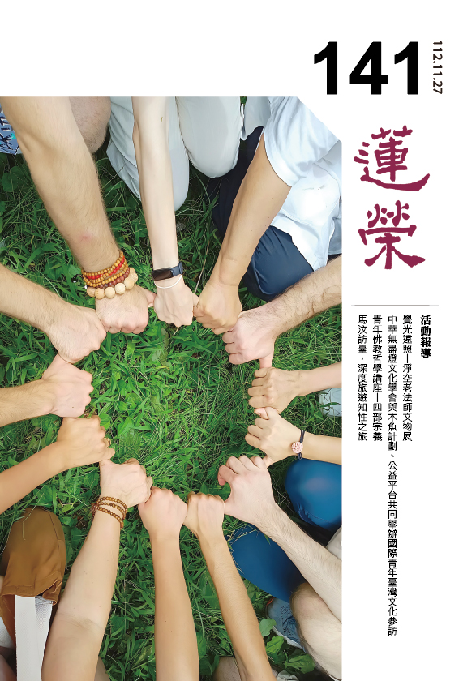

## 暑期專刊

### 精彩一夏序文

本刊

暑假也沒閒著的假期

結合時代的賦予價值

老中青少都有的團隊

百尺竿頭未來的想像

暑期學會活動大滿貫，包括為期兩個月的淨空法師大展，一場給年輕人的四宗要義思辯講座，一次盛大的齋僧與開光，一周給外國人的文化體驗，及一周台東深度旅遊，可謂目不暇給、馬不停蹄，讓人眼花撩亂，九月底還迎來了東馬與汶萊來台之旅，在雙十連假開學前，學會已然完成許多年度大事，由於活動繁多，故特做成此專刊，方便大家閱覽。

暑假開跑的第一個活動是「覺光遠照—淨空老法師文物展」，展期從七月一日至九月五日，可謂一場精彩的馬拉松，本展由淨宗成辦，學會從旁輔助，並做導覽培訓，在導覽培訓時，唐老師把本次展覽歸結為四項要點：

一、文物大展的核心價值：從展覽可以看到老法師的傳承，宣揚正法的那一分，培養人才才能往外擴展、向下延續，佛教世界，要從人才開展，要從正法做本質，從傳承找方向。

二、老法師的人格特質：本次展覽的主角是淨空老法師，對於法師的人格特質加以介紹，可簡單分為六點，第一，老和尚好學不倦，好學是對一個人最高的讚歎，例如孔子讚歎顏回好學，孔子也承許自己的好學；第二，老和尚一生尊師重道，終身不忘章嘉大師、李炳南老師、方東美教授、懺雲法師、道源法師的教導；第三，老和尚逆境安忍，大凡做大事之人，必定是毀譽參半，而且往往是毀多譽少，像雪廬老人有一字無人能比，那就是「忍」，「三賢十聖忍中行，唯佛一人能盡源。」第四，廣結善緣，老和尚倡導宗教和諧、世界一家，這次辦大展障礙都能順利排除，跟老和尚生前結了很多善緣有關。第五，隱惡揚善，面對對方不實的指責，很多的恩恩怨怨，老和尚都能像虛空一樣包容。第六，栽培後進，老和尚厚愛後輩，提攜後輩不遺餘力，所以也衷心盼望，我們這些後輩能夠藉著文物大展，做出一番貢獻。

三、市場發展，向外推展：此次中正紀念堂兩個多月的展期，來訪者有普羅大眾，包括外道、內道、通途、淨宗、非淨宗，要讓大家都能有所收穫，有所受用，導覽者必須要有寬厚、包容的心胸。

四、確立願景：活動並不是辦完就結束，要結合未來願景，例如建立線上博物館，讓世界各地隨時都可觀看，還要培養自己解說跟結緣的能力；再來，要消除世間人對儒家、佛家的誤會，透過解說，讓大家知道儒家、佛家對世道人心、對國家的貢獻。如果導覽團隊辦得好，人潮洶湧、每況愈上，最後是欲罷不能，十分歡喜圓滿的收場，就有機會能走出去，成為海外展覽的緣起，成為台灣的軟實力，成為大家可以發揮的舞台。

前行很重要，確立了大展的本質，導覽團隊除了要注意導覽的內涵，了解對方的需求，能以不同角度切入、攝受對方，引入他進入正法的學習，我們就是老法師推展的法將。本刊收錄了孔垂長先生致詞，唐瑜凌老師的序言，陳筱君女士的策展理念、展場紀錄，以及導覽老師的心得。

七月底八月初磅礡展開的是與木魚基金會的合作，木魚基金會已經營辦理二十多年的「人間佛教國際青年禪學營」Humanstic Buddhist Monastic Life Program HBMLP ，在疫情之後第一次在台灣舉行，從七月一日到二十八日，來自世界各國菁英學子約七十五人在台灣各道場學佛，完成一次短期出家的訓練。他們在華梵大學短期出家體驗時，唐老師也去分享了一場「李炳南老教授的傳奇人生」演講，讓外國人士有機會認識一代大家，影響台灣儒學佛學至深至遠的李炳南老教授。

短期出家體驗完畢，接著登場的便是學會與木魚基金會合辦的文化體驗，七月二十五日這些各國的菁英們先來到學會品茗茶點與咖啡，由戴于山老師做學會簡介，林蔚芳老師介紹茶道，揭開整個活動的序幕，之後的大稻埕巡禮、祭孔佾舞與成年禮、故宮參訪、欣賞國劇、包餃子、逛淡水老街與齊柏林空間、淨空法師大展、夜市古街、參訪總統府、AI專題等，都令外國學子們大開眼界，深深感受到文化的博大精深，後面一周還有台東深度之旅，讓他們認識台灣的風光與風土民情、嚴長壽的辦學理念，後文都會詳細記載。

外國人好奇探問的精神，靈動專注的眼神，都帶給我們很大的啟發，而如何打破語言的隔閡，讓他們有機會接觸到有傳承的正法，是未來很重要的課題，開啟我們無限的想像，與後續的各種行動。

即便諸多活動，吃掉大量的人力、精力、時間，但學會依然全心投入接下來的重頭戲—四宗要義的講座課程，年輕人是佛教界的未來，是重點栽培的對象，接續時青班，學會精心為三十五歲以下的年輕人規劃了四部宗義的講座課程，各宗各派的思想躍然於紙上，由主講唐瑜凌老師配合複講的助教們，結合投影片，讓學生在不斷地思辨與討論中，短短幾天內，領略四宗的要義。宗派見是佛教決戰的關鍵，有了這樣的學習，對未來了解佛教是一大助益，下學期將接續為他們開展菩提心馬車軌、修心七義論與入中論講記。本刊收錄四宗要義講座報導，及眾學子心得，而講座的其中一天，應著果清律師的邀請，參加正覺律學院四天王殿落成暨聖像開光典禮，是學子們莫大的福氣，讀萬卷書，行萬里路，修慧也要修福，學以致用。

最後是開學前，來訪台灣的東馬、汶萊團隊，由泑珠老師帶領五位汶萊的學長來台，展開一場知性之旅，除了走訪阿里山外，他們也請法講座、拜懺、放生，非常難能可貴，學會欣然答應，蓮友們投入其中，為開學前打造殊勝美好的氣象。

## 覺光遠照-淨空老法師文物展

### 淨空老法師文物展孔垂長先生致詞

本刊

雪公奉祀官府因緣

造就淨土傳奇人生

際遇難得善用暇滿

火炬照亮無悔人生

覺光遠照—淨空老法師文物展，這是一場彰顯上淨下空老和尚九十六載教化事蹟的展覽，這是連續兩個月呈現淨空老和尚偉大修行精神的空間。

當我們走進這個展間，可以看到老和尚一生的行誼、弘法的足跡，我想老和尚以講學為終生事業，並且以和平為理念，到世界各個地方去推展文化、教育，為了這個目標前行，不遺餘力，留下很多珍貴的歷史紀錄，令人敬佩。

我的先祖父德成公，一九四九年時跟著國民政府來台，當時的奉祀官府主任秘書是李炳南老教授，老教授與先祖父有五十年的交誼，彼此相知相惜，度過民國以來，儒家文化最艱難的一段歲月。李炳南老教授對於奉祀官府有很大的貢獻，一直任職到九十五歲，先祖父才勉強同意他退休，他應該是中華民國做到最老的公務員吧。

他在台中擔任主任秘書時期，對於儒家文化的推廣十分盡心盡力，比如講授《論語》、《大學》、《禮記》等經典，開辦大專國學講座，還有捐出退休金設立「孔學獎金會」，鼓勵儒學作品的寫作等，桃李滿天下。淨空老和尚也是李炳南老教授的弟子，特別是在佛學上十分有成就的弟子，老和尚雖然展現的是一位佛家大德的形象，但他與他的老師李炳南老教授相同，對於儒家文化也十分重視，也很用心的推廣，比如培養師資講授儒家經典、倡印儒學的經書著作、舉辦全球性的祭祖大典等，對於儒家文化，對於全球和平，都有很大的貢獻。

《論語》上說，「德不孤，必有鄰」，還有「默然而識， 學而不厭 ，誨人不倦」，以及「志於道，據於德，依於仁，游於藝」。我想老和尚以德學內涵，在全世界結交這麼多的朋友，正是「德不孤，必有鄰」的寫照；而他的德學內涵，正是來自於他「默然而識，學而不厭，誨人不倦」的勤習精神；他以墨寶廣結善緣，以慈悲心包容大眾，深入經典的智慧，一生志於講經教學，應該就是「志於道，據於德，依於仁，游於藝」的楷模。

所以今天能參與這次的大展開幕，我衷心的祈願，大展能夠順利圓滿成功，不僅僅是藉由展出，讓許多人一起回顧老和尚的一生，還能藉由展覽，造就願意承擔文化推廣大任的人才以及團隊，讓老和尚的覺光持續遠照。

謝謝大家。

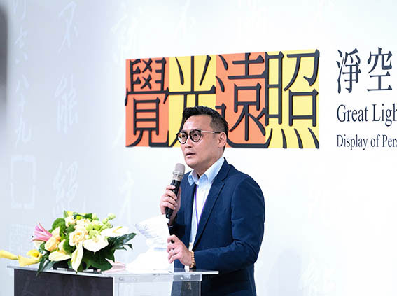

### 記一位佛門傳奇人物—淨空老和尚文物大展序文

唐瑜凌

在老和尚圓寂週年之際，弟子們該如何表達對師父弘法一生的追思？若能根據孔德成先生百年紀念大展的模式，不論觀展者認識或不認識老和尚，都能在展覽中或者得到啟發，或者緬懷舊日情誼，或者了解法師一生講學事業，或者明其與各國政要領導會晤作為正法推廣的順緣，或者興辦各種教育事業以培養人才為先等等。然而，一大堆的陳年舊事，輝煌的遺跡，要怎麼來呈現呢？筱君女士是「儒者之風—孔德成先生百年紀念展」、「一生翰墨故宮情—莊嚴先生一百二十周年紀念展」、「玉丁寧館留珍—秦孝儀心波先生百年紀念展」等的策展人，而這些大展都獲得了極佳的好評。去年年底突發奇想，因著筱君女士策展劉墉先生在大院子的「畫我童年」畫展，學人引薦道師，並建議道師以辦文物展的方式對老和尚表達追思，在大院子喝茶聊天之際，驚訝的是筱君女士竟對老和尚的一生行誼十分了解，加上道師對學人的信任，故而委請筱君女士作為老和尚追思大展的策展人，地點選在中正紀念堂。但是我們彼此都知道文物展場地的申請與文物彙整是十分繁雜又漫長的過程，今年或許沒有因緣啟動此盛事。想不到三月突然接到通知，中正紀念堂七月一日開始有五十天的檔期空出，筱君女士和世凱夫婦的小團隊，不眠不休的做各種前行工作，終於能在七月一日於中正紀念堂的大廳舉辦開幕大典。文物大展將呈現老和尚的人格特質，經驗閱歷，走入世界，宗教和平，不論對弘法事業，對台灣的國際外交都有極大的助益。

悟道法師透過嚴師要學人在老和尚的文物大展的刊物中撰寫序文，勾起了一些往事，比如民國六十六年（一九七七），在大同大學就讀時加入普明學社，曾參加過中國佛教會在善導寺舉辦的大專佛學講座，當時的總主講就是老和尚，齊聚一堂的聽眾是二、三百位有為的大專青年，此時蔣經國先生領導的中華民國正當經濟起飛之勢，佛教的興盛與國家蓬勃發展或是互為關聯。當時聽講課程有《了凡四訓‧雲谷大師傳》、《永嘉大師證道歌》、《太上感應篇》，深深佩服老和尚口條清晰，聲如洪鐘，種種闡釋皆發人深省。期間也曾經到李月碧居士的講堂聽《楞嚴玄義》。在民國六十七年（一九七八）的時候，蔣經國先生當選中華民國的總統，老和尚在中國佛教會發起仁王護國法會，法會特別誦念《仁王護國般若波羅蜜多經》，同時也對本經做略講。這些都是在大專時期聽老和尚講學，與老和尚結上甚深的法緣。

在大學的佛學社時期也邀請老和尚到學社演講過有關佛教的專題，並且隨著程正介老師到景美去拜訪老和尚，那時老和尚住在韓館長的家中，與老和尚相談了一個下午，氣氛非常好，記得離開的時候才發現已是傍晚了，那種印象還依稀彷彿。

在大學時期還參加南投水里蓮因寺的齋戒學會，住持懺雲老和尚戒行精嚴，梵行高遠，在蓮因寺方知懺公也是老和尚早年親近的佛門大德。民國七十五 (一九八六) 年的時候，老和尚在 雪公(李炳南老師)圓寂之後，曾邀周家麟老師、徐醒民老師北上到佛陀教育基金會弘法，週六下午是周老師講《法華文句》，週日上午是醒公(徐老師)講《論語》，弟子也曾經到佛陀教育基金會去聽課，並且隨同兩位老師到老和尚的休息室聊天，看到這三位過去在雪公座下同學的聊天不分彼此，氣氛十分融洽，那樣的畫面仍活靈活現，弟子在旁邊聆聽也感覺十分有趣，可惜沒有照片留存。

之後，老和尚到美國弘法非常的順利，有一分也是過去他在台中跟雪公學習講經十年，認識了很多大專生，這些大專生到美國求學，有了一些成就，都很渴望繼續做佛法的學習，幫助了老和尚在北美弘法事業的成功。當時我的親姨丈曾繁聰先生，是阿拉巴馬州州立大學的教授，是交大畢業美國留學的物理博士，也在當地成立了淨宗學會，後來回到台灣帶我去見老和尚，發覺他跟韓館長和老和尚都非常熟，大家一起吃飯，那時老和尚容光煥發，可見在美國的教育事業是很成功的。

之後學人因為內部的讀書會以及要辦社團法人會務繁忙，漸漸地沒有見到老和尚的因緣，後來協助江逸子老師二○○七年於國父紀念館舉辦「道藝春秋展」，以組導覽團隊對展品做賞析宣揚作品的文化內涵，人潮如湧，普獲好評。後又逢台北香光精舍之邀，隔年於中正紀念堂續展。在畫展的最後一天，與江老師同為雪公座下、各淨宗學會導師—淨空老和尚由國外專程回來參觀畫展，有幸為老和尚導覽，中午一起用餐之後，也有機會認識到生命中的大貴人胡居士，成為學人辦全國性社團宣揚儒佛正法的最初緣起，十餘年下來，還留在發展階段，待努力之處甚多。

隔天也到華藏淨宗學會做簡報，報告弘法事業培養人才的可行性，供老和尚參考。之後在民國九十九年（二○一○），也應胡居士的邀請，到香港拜見老和尚，中午一起用餐，晚上在攝影棚聽課，這一段的因緣也是後來成立全國性社團法人的順緣。

後來老和尚到澄清湖，也應胡居士之邀，到澄清湖畔老和尚下榻之處拜見老和尚，當時看到老和尚委託世界書局總經理，要廣印《群書治要》，發覺到老和尚對印經事業非常慷慨大方，也從旁知道他囑咐悟道法師護持江老師的畫作，舉凡精裝本《孔子聖蹟圖》、《地獄變相圖導覽手冊》、《因果圖鑑》、《孔門聖賢畫像冊》、《觀世音菩薩普門品示現圖》、《華夏道統源流圖》、《孝經圖示》等，印製十分精美，皆是由悟道法師出資護持。

二○一一年八月，也應胡居士之邀，參加老和尚、醒公以及江老師的聚會，三位昔日雪公座下的同學，共聚在江老師家中暢談與緬懷雪公老師，現場還有張德聲居士、林蔚芳老師，這真的是人間盛事，學人因為也是雪公座下晚期入門的學生，對於這三位早期即是雪公弟子，眼前已是實至名歸、大名鼎鼎的大德，學人有著仰望的心情，就像記者採訪那般將這三位師長過去在蓮社學習的回憶一一請教，三位老師也知無不言，場面十分熱絡有趣。中午與晚上也一起吃著茴香水餃、家鄉菜等江師母親自下廚的料理，不覺已經入夜。

之後老和尚也曾來過兩次故宮，一次是故宮展出一百件鎮院國寶，當時曾為老和尚仔細的導覽一次，並蒙讚許，給予弟子莫大鼓勵。另外一次到故宮，老和尚只是隨緣看看，後陪著他老人家到陽明山竹子湖走走。印象最深的是在矯正署的講座中，老和尚竟以影片讚許弟子，內心十分感念與慚愧。

這段時間承蒙醒公也以光碟開示對弟子肯定，當抱著誠惶誠恐的心，願在社團法人的弘法工作上盡上十二萬分的誠意，來回應大德對後生小子的厚愛。

至於道師則是江師口中常提的人物，並透過他老人家的引薦而認識，道師為人隨和，謙沖為懷，幽默有趣，大智若愚，他對這個時代有深入的了解，與老和尚一樣不拘泥於常格，並且以老和尚為親教師，如同藏傳佛教弟子對上師般的承事與執行師之指示，且是一位為法忘軀的大德。除了在台灣時常見面，聊一些家常事，彼此弘法工作的交流，也曾經在四川的青城山，承蒙道師引薦，辦了一個小講座認識了當地蓮友，並在世貿與救國團的講座中，有道師的印可，與聞法大眾結下法緣；道師也曾到學會的東勢農地走訪，了解學會農業發展的狀況，學人跟道師的交集不可謂不深。

這次由道師出資發起與承當老和尚的文物大展、做主持人乃實至名歸，此次大展的內容包括老和尚生平大事年表、文獻、墨寶，法師用過的物品及照片等，不得不佩服筱君女士在如此龐雜的資料中分類得很清楚，道師和當家的嚴師也盼望學會與華藏淨宗學會共組導覽團隊，將文物大展的內涵發揚光大，由於老和尚是世界級的人物，弘揚老和尚的內涵，對正法的推廣，對大德典範的樹立，對他過去這些傳承的彰顯，都有莫大之功，也讓我們後輩弟子們能承先啟後。不過遺憾的是老和尚在大陸的名氣過大，反而阻礙了他在大陸的弘法事業，這也是讓人惋惜的。

說到老和尚，不得不說是一個當代的奇人，不了解他的人說他思想天馬行空，懂局的人說他是不受框架的束縛，除了不用傳統方式來推廣正法，首創電視弘法外，並回家鄉推廣正法，乃至足跡走遍世界，結下許多正法的勝緣，特別是推廣宗教和諧的這一分，更是世界級的貢獻，還善用世間的格言來幫助佛法教化。在海外如馬來西亞與英國辦漢學院，並實質助成斯里蘭卡佛教大學的設立，在聯合國教科文組織裡面有淨空之友社，都是非常奇特的弘法之行。由於文物大展專刊出版在即，道師囑余為序，承蒙法師看重，把過去跟老和尚的因緣，跟道師的因緣，以及文物展的重要性，做一個略述，來做為文物大展的推廣，用報道師知遇，胡居士提攜，老和尚教誨攝受之恩。

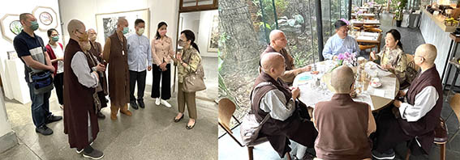

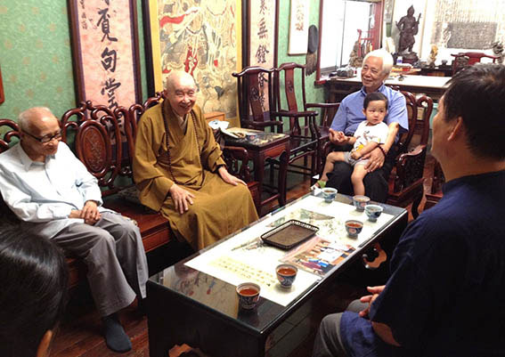

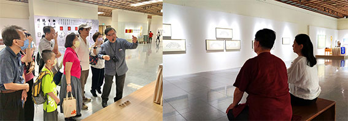

### 淨空老法師展，羲之堂負責人陳筱君女士策展理念分享

心若

經驗和盤托出，善友成長際遇

文華熱情友人，共同搭檔大展

深知導覽重要，過去合作愉快

彼此相知相惜，共創雙贏未來

覺光遠照—淨空老法師展覽於二○二三年七月一日盛大開幕，展期為期六十七天，策展人為羲之堂總經理陳筱君女士，歷年來舉辦諸多近現代書畫優質大展，常被視為藝壇年度盛事，其中跟學會交集最深的莫過於二○一九年一月十九日至二月十日在國父紀念館舉辦的歲末大展《儒者之風—孔德成先生百年紀念展》，當時，陳總也來學會為大家做導覽培訓，同年，還有《一生翰墨故宮情—莊嚴先生一百二十周年紀念展》，學會也應邀看展，以及擔任導覽人員。本次適逢淨空法師圓寂周年，悟道法師想要緬懷恩師，故唐老師推薦陳總給師父，幾次見面，彼此相談甚歡，也奠定了接下來地展覽盛事，即便時間倉促，事項繁雜，陳總還是毅然決然地一肩扛起重任。大展開幕在即，陳總百忙之中抽空在六月十九日下午到訪學會，為辦公室同仁講解策展理念，以及其中的甘苦談，讓我們在短時間內對展場、展品、策展理念、注意事項等等，有大概的了解及體會，讓兩次周一晚上的導覽培訓能夠順利進行。

策展理念對於一個展覽是至關重要的，策展的目的就是要傳達理念給觀眾，在短時間內帶給觀眾最好的體驗與互動，不同主題或類型的展覽，可能帶有不同的目的。陳總說，她想做的是一個有溫度的展覽，不只是文物陳列而已，所以展場設有情境區，擺放老法師用的皮箱、帽子、念珠、袈裟、經書，所有的物品都跟老法師的核心思想相呼應、連結。

就像一位學習深入的講經者，他要輸出給大眾時，一定是深入淺出，本次導覽陳總也希望學會培訓的導覽人員都能成為堅強的種子部隊，結合自己看到的、理解的，內化的感動，來跟觀眾結緣。所以導覽培訓時，不要給大家框架，要給大家資料，讓大家自由發揮，每個人的著重點不同，希望這些不一樣，勾勒出老和尚人生最精彩的生命故事，讓整個展更有生命力、感染力、渲染性、故事性，導覽者多講幾次，自己的體悟也會愈深、愈完善。

關於淨空法師資料補充，陳總推薦大家去看《老和尚的身教》，裡面每一個人跟老和尚的結緣都不一樣，裡面有大學教授，有護法，有學生，有常隨眾，還有英國漢學院的學員等等，人人看的角度都不同，加在一起，就是老和尚的生活，是他真正的生命故事。

此次展覽檔期的敲定不可思議，完全沒有預料到可以在老法師圓寂一周年時來辦這麼有意義的展，冥冥之中彷彿有一股無法解釋的力量牽引，原來以為今年或許不會有場地的因緣，沒想到有人臨時取消中正紀念堂的展廳，展場空出來，加上悟道法師認為可以盡力去爭取看看，從知道展廳空出來的消息，到申請展廳，到通過審核，拿到七、八月的檔期，已經是四月中快四月底的事情了，也就是籌備期非常短，比之前辦過的孔德成先生大展短得多，要在那麼有限的時間內，整理素材、借到文物等等，各種繁重細瑣的工作，相當於不可能的任務。

由於這次中正紀念堂展場的空間較為隱密，故從展廳外面就有指示牌、羅馬旗、立架、燈箱、三乘四米打卡牆輸出，讓大家從外面就可以看到跟展覽有關的資訊，能申請的資源都用上了，很多時候，由於先天條件的不足，害怕民眾錯過展覽資訊，而加倍做很多工，當工作做得愈多，想得愈周到，後續的效應會遠比我們預期中好，這些努力都可以幫助活動增加能見度。

進入展廳，首先映入眼簾的是照片集錦，以精彩的照片回顧，強調老和尚弘法的足跡，老和尚的人生經歷，是他最大的事功，而且這些照片，會比早期的照片更加清晰，文字說明也直接打在照片底下，圖文合成一個個照片框，目的是讓場地空間看起來不要太瑣碎，本區有四十八張精選出來的照片，老和尚的照片非常多，這只是眾中之選，是冰山一小角，但從這四十八張照片中，可以看到淨空法師跟別人的不同。轉角的電視會有兩支影片輪流播放，可謂把空間的功能發揮到淋漓盡致，又有整體感。

照片集錦匯集了老和尚各個階段、各個時期的偉大事蹟，以華藏圖書館的照片做為開端，老法師很早就提出「二十一世紀的道場，應是網際網絡，衛星電視」的構想，並善用各種科技設備、媒體平台，華藏圖書館擁有首套錄影設備，當時沒有任何人做過，開風氣之先，以視聽教學手段廣泛弘揚佛法，足見老和尚的遠見。

一九九五年，老和尚指導新加坡佛教居士林和淨宗學會創辦「弘法人才培訓班」主持日常教學工作，當時老和尚就能夠想到如何永續發展，這種善的循環，就像種子部隊一樣擴展開來。

老和尚也很有開創性，他大量印製經典，特別是大量印製孤本，所謂的孤本，指某書刊僅有一份在世間流傳的版本，亦指僅存的一份未刊手稿或原物已亡佚，僅存一份拓本。當時《群書治要》不全，很多珍貴的書籍因為戰亂，或是遇到特殊事件，比方大火一燒，本子就沒了，所以老和尚大量印製存世的孤本，並且大量捐贈、流通，送給寺廟、單位、劍橋大學，還在英國成立漢學院，老和尚不只印製，還請人做譯本，做為治國很大的參考。

老和尚每每大量印經本流通，一次印都是十幾萬本的量，幾乎是把錢都用光，沒有去想下一筆經費從何而來，但他覺得印經一定要去做，這就是他的遠見，就像他尊崇孔學、儒學，也是希望讓社會有良善的風氣。

老和尚這一生是有任務來的，他不成立山頭，不到處攀緣，而是儒佛雙修，跟別人走不一樣的路，他在佛教界是很特殊的存在，除了用大量印經的方式流通經典外，也在華藏講經、錄製錄音帶，留下各種音檔資料，這些在推廣佛教教育上，起到了很大的作用，以華藏衛視來講，全球至少六億人都在聽老和尚講經，更不用說老和尚倡導世界大同、世界一家的概念，這次展場有很多跟不同宗教聚在一起的畫面，很有意思，政治達不到的外交，一代高僧可以幫我們做到，老和尚是一位真正的行者。

老和尚往來的圈子，不是總理，就是這些文化大師，都很有建樹性，老和尚認為領導者，要讀大乘佛教，要深入了解傳統文化，國家才能治理好。

老和尚年紀那麼大，卻還是個空中飛人，周遊列國，舟車勞頓，精神可嘉，每出去一趟都很辛苦，考驗體力、耐力，可以說老和尚有多大的願力，就有多大的成就，也為我們留下諸多經典畫面，老和尚做的事情，得到眾多單位、國家，甚至元首的認同，這是很多政治人物都達不到的高度，本次展覽有一幅二○一六年於英國威爾士三一聖大衛大學特授予老法師榮譽博士學位，以表彰其在弘揚漢學和佛學方面的成就，事實上，老法師在方方面面的成就豈止於榮譽博士。

老和尚每天講經四個小時，上午兩小時，下午兩小時，從未間斷，到後期，醫生、護法都希望老和尚能保重身體，他才稍微減少講經時間，到了九十歲後，才減成一天講經一個小時，但也從未間斷，意志力驚人，講經是他這一世最大的任務，每個地方都設有攝影棚，也讓大使來參觀。

在多元宗教區的部分，有七件作品，呈現老和尚如何理解多元宗教，他並非倡導而已，而是能夠熟讀經典，擷取精華，老和尚認為各宗教最終極的思想是殊途同歸的，他就是世界大同的落實者。

求學問道的部分，老和尚於一九四九年旅居台灣，他一生中有三位重要的老師，一九五三年起，老和尚先後追隨一代大哲方東美教授、藏傳高僧章嘉呼圖克圖，以及儒佛大家李炳南老居士，學習哲學、佛法與傳統文化十三年。其中李炳南老居士（雪廬老人）讓老和尚可以在佛法上學習，是他皈依之前很大的動力，基督教裡面有很多先知，雪廬老人就扮演這樣的角色，有識人之明，能夠看到老法師的慧根，看到老和尚未來有弘法、利益眾生的機緣。展場櫃子裡呈現的是老和尚的十二本日記簿，用的是俗名，還包括雪廬老人的訓示，這個歷程是很重要的，沒有此歷程，就成就不了後面的老法師。而從書帖以及老和尚整整齊齊的書寫習慣中，可看出他是個一絲不苟的人，這就是戒律，是一個人的品質，一路走來的人生，沒有偏過。

老和尚於一九五九年於台北圓山臨濟寺剃度，隔日即開始於十普寺三藏學院講經，隨後便在台灣各地弘揚經教。老法師首倡「佛教」乃「佛陀教育」正名之說，亦即「佛教是釋迦牟尼佛對一切眾生至善圓滿的教育」，用深入淺出的方式，開示佛陀教育的真實義。

這次特別得到一批八○、九○年代，老和尚寫給簡豐文居士的信件，從信件當中可以讀到，在八○年代時，老和尚的弘法足跡就已經遍布世界各地，這些信件都讓展覽更具說服性，以文物做為印證，書信都是原跡。只要是文件性的東西，老法師都在上面做了眉批，每個要出去的東西，老和尚都非常嚴謹、審慎對待。老和尚當時在各地都受到很高的尊崇，但他從來沒忘過韓鍈館長對他的尊崇跟護持，懂得知恩、報恩。每次老和尚要上座講經時，都會向老師們的掛像問訊，他從來都為了別人著想，甘之如飴，穿著也很輕便，天冷時就圍個圍巾。

手稿區的文獻、信札，很多都是老和尚的核心思想，藉著手稿，大家可以更清楚認識、讀到老和尚的人格特質，面對他要弘法的東西，很多細項的部分，很多批改內容，都彰顯了老和尚的人格特質。

老和尚廣結善緣，送出很多墨寶，墨寶遍天下，字字是正法，這是老和尚另一種弘法的方式，字字句句，都不離佛陀的清淨智慧，這次把墨寶借回來雖多有難處，但已經盡力了。這次還特別請篆刻家拓印，把老和尚的印章註解出來，讓大家感覺到手作的溫度性、唯一性，因為是手寫，所以比印刷體更有感覺。老和尚用的印文，都別有用意，本次展覽雖然只收錄香港來的這一批印章，但老和尚的核心思想正好也都在裡面了，因為特別用書寫的方式呈現，大家在現場都會去細細去閱讀、玩味，便刻意不打解釋在旁邊。

情境區的部分，有老和尚平常用的毛筆、硯台、用經本、手抄本、講經架、佛像、念珠等等，希望文物的連結，可以延伸大家的感受，老和尚一生行腳天涯，皮箱、照相機、帽子，每一個物品，都有淨空法師寫自己的名字在上面，可以看出弘法足跡走了多長的路。老法師常常穿的袈裟、錫杖，在情境區重現，老和尚的中心思想，就是看破放下，老實念佛，自在隨緣，這是他一生立身處世的原則，是他奉為生命中的真諦。老和尚講《無量壽經》，已經講了十幾遍，他每次都用新的本子，因為每次讀都有新的體悟，法師的人生就在不斷地講經、教學貫穿中，不斷地往前走，一路走來，始終如一。

說到策展兩個月，從無到有的心路歷程，辛酸血淚史，陳總說，對策展者來講，跟孔德成先生紀念展一樣，都要不斷地去挖掘，挖掘那些習以為常的事物，展覽必須在編輯上讓大家有感，沒有東西，神仙也沒辦法。所以在展覽前，要用盡所有方法，動用所有人脈，從各地蒐集可用的素材，請各單位、各團體，或是手上有老和尚物件的人，先把東西拍照回傳，策展人再從中選出可以成為展覽的文物，這個過程是很特別的。其實從送件的時候，就知道有很多問題要面對，中正紀念堂第三展廳的坪數有一定的面積，展品要有一定的份量，除了大事記年表最容易完成，其他像是照片集錦，來來回回的過程可以說是非常痛苦，有些照片太久遠，不知道從哪裡來，或是畫素很低，都要靠著不斷地更新素材，再做刪減，一個展覽幕後有很多要執行的細節，必須想辦法克服，這次策展中間經歷的困難遠遠超出先前辦其他展覽的難度。

這當中，除了可以接觸到淨宗一代導師，最尊敬的高僧，吸收消化的過程當中，也帶來很多感動，這麼短的時間要呈現這樣的展，雖然很拚，但是是用很恭謹的心做出來的，能夠比較忠實的呈現，如果不作整理、消化，很多時候只是把東西擺出來，感動不了別人，任何展覽的教育推廣都是非常重要的。有些展覽或是整理工作再不做，很多地方都要去中國文化了，往下沉淪會很快，我們不要認為自己的力量很微小，而是要想，能多做一點就多做一點。把自己的體會、心得帶到展覽來，就會讓這個展變得有血有肉，很多答案，都不會只有一個，各種人的各種想法、因緣集合在一起，就會讓展覽變得很好看。

文物解讀，每個人會不一樣，展出來的文物最重要的就是讓大家有連結。一個超過六十天的展覽，每一天都很重要，不只是假日人潮會多一點，平常的日子，也會有一些很棒的朋友來看展，悟道法師印製了淨空老和尚紀念專輯六千本要送給觀展者，這些結緣品也不是漫無目的發，要觀察哪些人是細心看展、駐足良久，很有感覺，甚至想做交流的，這些人就值得給，結緣品要給想深入了解的人，不是為了要省錢，而是要珍惜每一個得之不易的成果，像老和尚一生樸實，從來沒有浪費過，就像他行走天涯的皮箱，很多地方都磨損，老和尚還是照用，因為那只是一個物，更重要的是法。
策展理念分享完，我們很好奇的問陳總，一路走來的過程中，她如何克服內心的疲勞、身體的壓力？陳總回
**答：** 別的沒有，就喜歡做事，到了這個年齡，已經可以挑選自己想做的事情來做，跟自己的業務沒有關係，還能做得那麼起勁，是因為覺得做這件事，可能對某些人有幫助，有時候不求回報，反而得到的更多，最重要一點是，自己更快樂。雖然也會累，但是有時間的壓力，有些東西必須要有意志力，說到意志力，老和尚的意志力那才叫做超凡入聖，可能一天中要跑很多地方，其實編輯的過程，就是跟著老和尚走完他的人生。

最後，陳總也勉勵我們，永遠不要低估自己可以開發的潛能，很多未開發的部分，才是最棒的部分，千萬不要喊苦。

淨空法師圓寂周年，真的是老天爺給的時間，展期安排從七月一日開始，是因為正逢暑假，大家比較方便來看展，這次是天選，天時、地利、人和，好似一場奇幻旅程，冥冥中老和尚的加持，讓事情都能進展順利。

相信在這麼有理念又真誠的策展人的籌畫下，是老和尚圓寂周年最好的追思緬懷，是最好的莊嚴，最好的迴向，也是我們最好的增上，最重要的是藉由這樣的展覽，帶給我們自己與他人什麼樣的啟發，帶來對未來嶄新的想像。

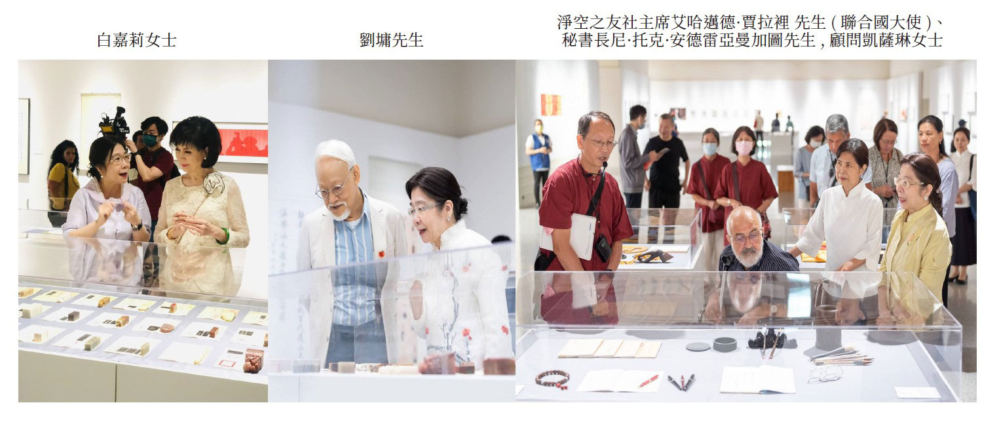

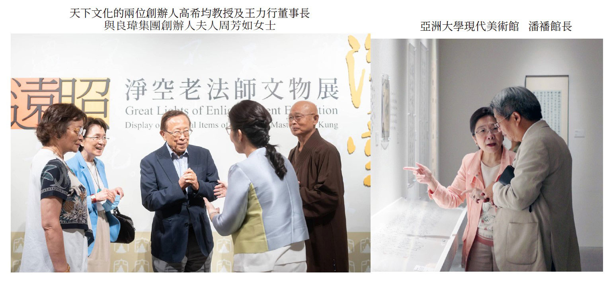

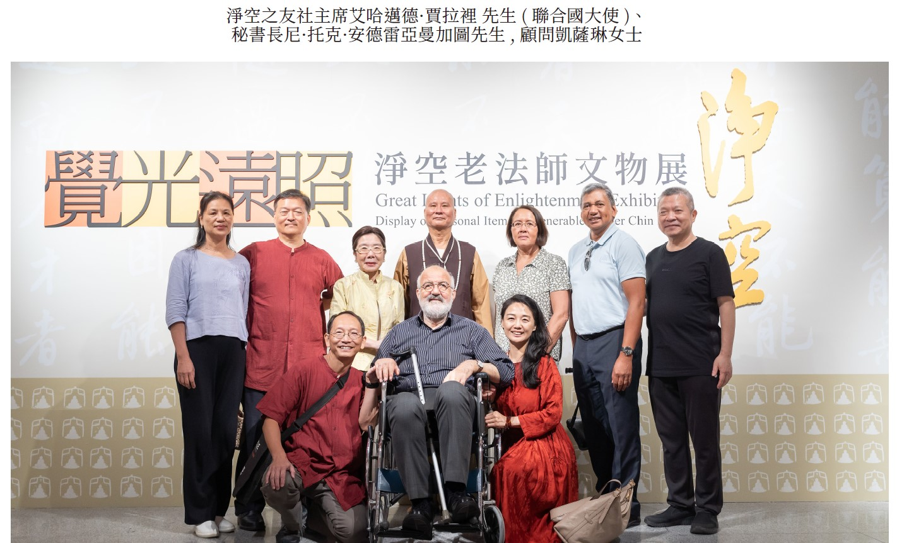

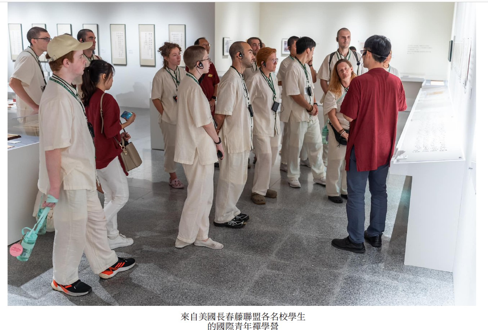

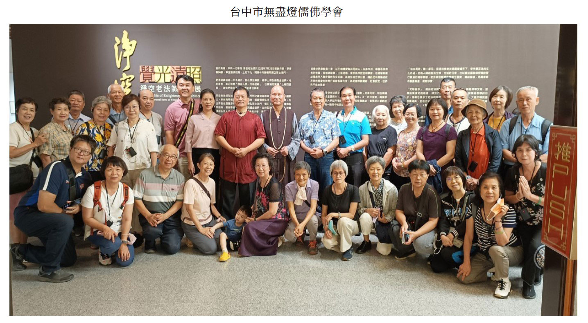

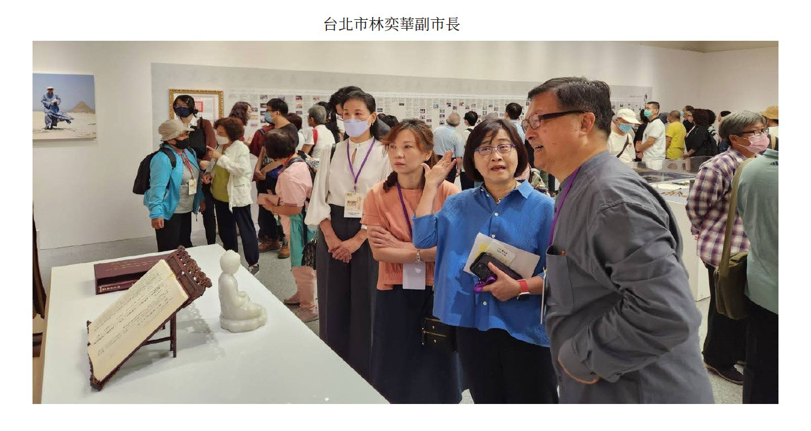

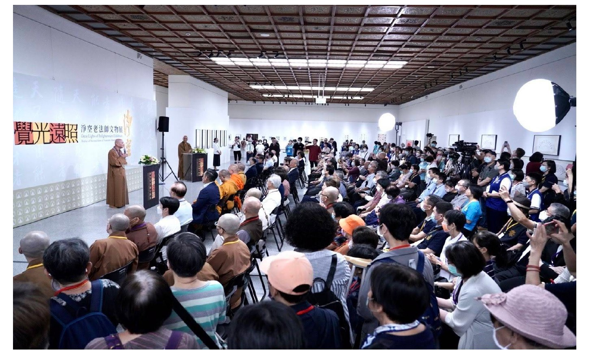

### 淨空老法師文物展側記

慧慈

原是大陸流亡軍人

信佛學佛改變一生

講學結緣四海為家

甚是傳奇法緣最廣

◎展出因緣

淨空老和尚（以下稱淨公）於二○二二年七月二十六日圓寂，享耆壽九十六歲。講經說法逾一甲子，首開視聽多媒體及網路、電視弘法之先驅，將佛法被覆全世界，甚至足跡遍五大洲，弘法利生不遺餘力，這樣一位高僧大德圓寂周年之際，以「覺光遠照—淨空老法師文物展」呈現給世人，應是最好的緬懷及發省。

羲之堂陳筱君女士，曾為孔德成先生、莊嚴先生、秦孝儀先生等大展的策展人，這些大展均獲極佳好評。唐瑜凌老師將此最佳人選，推薦給華藏淨宗學會悟道法師，經彼此交談，理念甚合，於是有此文物展之眉目。

中正紀念堂展場的申請，通常約需一年的時間才排得上展廳，不料今年（二○二三年）三月，突獲通知七月一日至八月二十日，第三展廳的檔期空出，真是佛菩薩的安排，更巧的是淨公圓寂日正好在這檔期間。八月初再獲佳音，展廳檔期可延至九月五日，正好滿足未能在八月二十日前，排上行程的訪客。總共六十七天的展期，吸引了三萬四千多位訪客。

◎佈展神功

只用不到三個月的時間，蒐集、歸類、彙整、撰寫、輸出……，龐雜的資料，迅速井然有序地呈現在眼前，真令人歎為觀止，站在會場的中心點，劃一對角線，正好有二張照片，一張是淨公晚年在書桌前用功的照片，顯示淨公活到老學到老，為利他而不斷充實自己；另一張是在埃及金字塔前，飄逸瀟灑地往前走，前後一個人都沒有，顯示淨公踽踽獨行在弘法路上，為了蒼生，捨我其誰，在此照片旁，擺放了一個行李箱、相機、帽子、墨鏡，隨著淨公到世界各地弘法約四十年，仍完好如新，可見其愛物惜物的美德。二張照片彰顯出自覺、覺他、覺行圓滿，巧妙地將淨公一生的核心價值，有溫度地展現無遺。

◎導覽培訓

唐瑜凌老師及師資團隊花了四小時的時間，為導覽人員略說展件的內容，淨公的人格特質—好學不倦、尊師重道、謙卑忍辱、廣結善緣等等，及其弘法的核心價值—學為人師、行為示範、培養人才。因為時間有限，老師們無法盡情發揮，感謝華藏淨宗學會印製了《覺光遠照—淨空老法師文物集粹》、《淨空老法師九十年譜》、《老和尚的身教》等書冊，提供給我們各自用功，以充實導覽的內容。

◎展場區分

一、淨公道影

精選淨公各時期的代表照片，以教學為先及和平使者為二大主軸。善用多媒體科技、電視弘法，開遠距教學風氣之先。與聯合國大使及各地宗教代表，推動世界和平，促進宗教團結，期望全人類都是一家人，所謂地球村的概念。並設有觀賞區，循環播放《發大誓願》（約十六分鐘）及《生平回顧》（約四十分鐘）介紹淨公的影片，可坐著欣賞，慢慢體會大德一生的行持。

二、三位恩師

淨公早年不信佛法，直到求學於哲學大家方東美教授，得聞「釋迦牟尼佛是最偉大哲學家，佛教是哲學最高峰，學佛是人生最高享受。」因而進入佛門。

開始學佛，三藏十二部如此浩瀚，如何得入？有因緣追隨內蒙藏傳佛教高僧章嘉大師，授予「看破放下」之傳心法要，以「布施」為下手處，並反覆提醒「戒律很重要」。

後經懺公引薦，親近佛儒大家李炳南老師，學教十載，遂以弘法利生為終身志業，念念不忘。出家後回去探望老師，老師遠遠就喊著「要信佛！要信佛！」「至誠感通」的叮嚀。

淨公把一生的成就歸功於三位恩師，在攝影棚講經前、後必會向牆上的師長照片問訊，數十年如一日。尊師重道是修學入道的根源，是我們的好典範。

三、二大護法

「文獻手稿」—展出護持淨公三十年的韓鍈館長的願望。當年若沒有韓館長的護持，淨公只有二條路，一趕經懺，二還俗，就沒有當今佛法影響社會的安定力量，淨公畢生以弘法為己任，所以特別感恩圖報韓館長長期的護持，可見其知恩報恩的情懷。

「往來信札」—與另一位大護法簡豐文居士，共創佛陀教育基金會，為弘揚佛法而往來的一些書信，淨公在世界各地弘法，人未到，法寶先到，廣結善緣，利樂有情。在八○年代，大專生學佛風氣鼎盛之時，佛陀教育基金會大量印經書，免費結緣，流通佛法功不可沒。

四、禪味印章

淨公自用印中，除了老實念佛、戒定慧、彌陀弟子、淨空……等外，還有頗具禪意，空無一字，只有四邊框的印章，在十五幅扇形墨寶中，落款用印都有它的身影。另一空字的印章，狀似蒙古包，當中坐著一位念佛人，造型絕妙。其義曰：「諸法因緣生，當體皆空，了不可得。」蒙古包足以遮風避雨，移動方便，不會貪戀我舒服溫暖的家，表去除貪愛，「樹下一宿」的修行法。

五、法水長流

全是淨公七十七歲，以扇形呈現的墨寶，行雲流水的行氣，字字珠璣，蘊含著人生的哲理，想成佛，要先把人做好，「扇」音同「善」或有假借其義之功，又以三幅排成一個「品」字呈現，更加一分重視品德之要。其中一幅「覺外無性，塵外無相，善根不可思議，業力不可思議，福德因緣亦不可思議，恭敬不夠故福報不夠，懈怠輕慢也有罪過，一切福德皆從誠敬中生，微塵有果，因果同時」，既有出世間的空性智慧，也有世間的因果知見，一切唯從誠敬生，自覺是一幅很受用的座右銘。

六、護國息災

二○○八年四月二十五日，淨公親書禮請悟道大法師為主法和尚，在安徽廬江實際禪寺首建護國息災百七繫念大法會。十八天後，五月十二日，相距約一千六百公里的四川汶川大地震，死亡人數近七萬，淨公預知災難即將來臨，慈悲救世，緊急啟辦法會。息災乃災難未發生前，提早預防，祈求化解災難，或減輕傷亡。救災乃災難發生後，對環境的恢復，或災民的撫慰。往往後者易得社會的認可與表揚，其實息災更是大悲心的表現。

七、講桌表法

講桌背後掛著江逸子老師的《極樂妙果圖》，表此生學佛的目標；講經經架前恭奉一尊釋迦牟尼佛像，當學生向老師敬禮時，所敬的是佛像，表淨公的謙德；萬花筒為教具，表世間千變萬化，因緣聚，則法生，因緣散，則法滅，一切法，無所有，畢竟空，不可得。

八、大藏經書

淨公參觀房山石經後，有感於古人保存經典的用心，開始大量印製《乾隆大藏經》《四庫全書》…；並請江逸子老師畫《孔子聖蹟圖》《地獄變相圖》…，印製分贈世界各寺院、大學等地保存。除了保存經典，更須後繼有人來傳承正法，弘揚正法，這才是佛陀真正的本懷。

九、大事年譜

從出生到圓寂，九十六年間，重要的行跡。淨公一生為佛法，為世界和平而努力，圓滿結束傳奇的一生。

◎訪客類型

有很多來自新加坡、馬來西亞的蓮友，還有聯合國教科文組織代表一行人，抵臺出席【淨空老和尚圓寂周年紀念會】，並專程來參觀這文物展，主辦方特別安排請唐老師為貴賓導覽。

中華無盡燈文化學會協助木魚基金會辦理長春藤系列大學生禪修體驗營的文化之旅，七十多位學子來自二十幾個國家，安排半天的時間參訪文物展，全程以英文導覽，其中幾位學員非常感興趣，活動結束還留下來，主動到展場為其他的外國人（有部分是到臺灣來學中文的學生）以英文導覽，其熱忱令人感動，或許也成為他轉變人生的重要契機。

末學在導覽交流的過程中，得知有九成以上是聽淨公電視弘法的學佛者，不乏親近過淨公的信徒，聽他們與淨公的相處，更增添淨公溫馨的一面；或敘述某一帖法書，在什麼時空背景下完成，更點亮那帖法書的生命，所以這次在展場，與其說擔任導覽，不如說來展場受教，更為貼切。

不論哪一型的訪客，無不讚歎淨公在五濁惡世，欲度化剛強頑劣的眾生，需要多大的悲心和耐心，如同釋迦牟尼佛在娑婆世界，成佛難，說法更難！

◎緬懷恩師

淨公是末學的啟蒙老師，從無量壽經、金剛經、十善業道經、地藏經…，回想當年聽經的態度，有時一邊燙衣服，一邊聽經，並沒有正襟危坐，認真寫筆記，雖或多或少受到啟發，但想到李炳南老師給淨公的教誡—「至誠感通」，淨公在講經當中常引用《印光法師文鈔》中「欲得佛法實益，須向恭敬中求，一分誠敬，得一分利益。」慚愧不已，深省我慢心重，則恭敬心不生。修行路上，有慢心，是大障礙，道業不能成就；有恭敬心，則能消除業障，並能增長福德、智慧，這是此次大展給末學最大的觸動，懺悔心油然而生…。

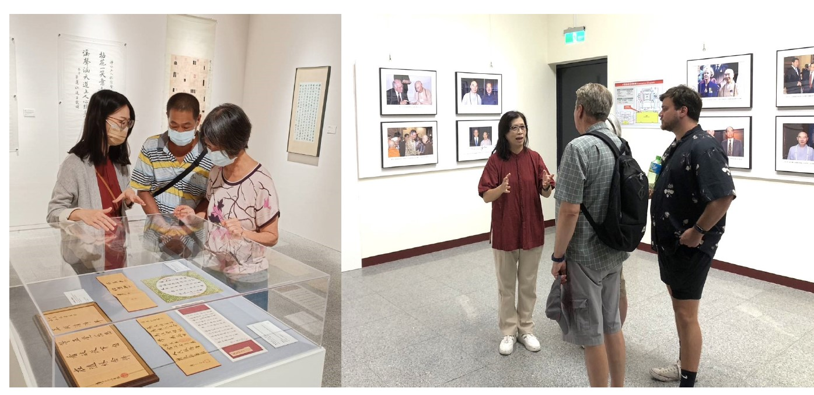

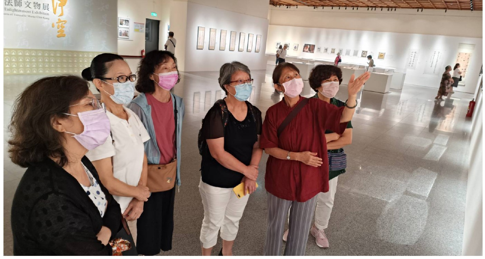

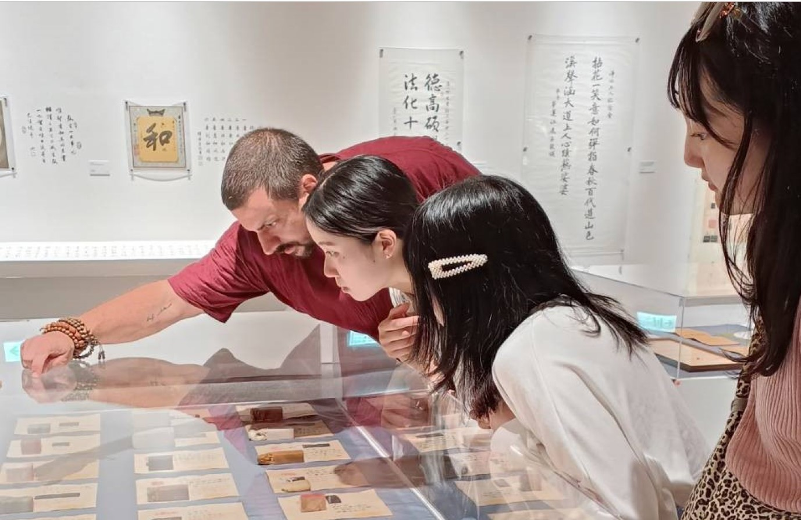

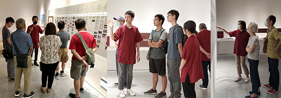

### 敬觀覺光遠照—淨空老法師文物紀念展有感

王順福

歷經六十日文物大展

有始有終的學會導覽

發揮教育力量的團隊

在幕後不出名的陰德

淨公老法師（以下簡稱老法師）為當代奇人、哲人、經師、人師兼明師、淨土大宗師。

末學於老法師生前非為其四眾弟子，然時存崇敬心，去歲老法師圓寂時，隨手寫了一輓聯以悼念老法師：

覺淨世間心無盡    淨空四眾念西方

以讚歎  老法師千古德行，今逢渠弟子上悟下道法師於老法師逝世週年，適時舉辦文物紀念展，格外有意義，有幸參與導覽團隊，遂再賦一聯以頌：

覺光利久劫    遠照益無邊

展覽已過一月餘，能不為文抒懷，以記此千載難遭遇之盛事？云何說格外有意義？此展與蒙藏文物館所舉辦善事吉照展，時間有重疊，後者展期更長。其一樓展當代高僧書法展，涵蓋寶島法鼓山、中台、佛光山及慈濟四大道場創建人的書法，上述四法師皆是創立有形的大道場，卻遺漏全球擁有二百餘所的淨宗學會，此以教學為旨趣的無形道場，故此展推出正補其不足，論對臺灣及世界的影響力，老法師絕對不遜於四人。文物館三樓為七世章嘉大師紀念堂，老法師曾以弟子向大師問道多年，為老法師所敬重的三位恩師中的第二位，未列在善事吉照展當代高僧裡，實殊為可惜。是以末學方說此展及時展出，格外有意義。

展場在中正紀念堂一樓三展廳，展覽的擘劃，委請策展達人羲之堂陳總經理筱君女史及其團隊，經之營之，每一空間呈現巧思、細緻、匠心獨具又相互呼應，處處都有可觀，細繹時頗體現老法師那奇人、哲人、經師人師明師等含章可貞的著墨及苦口婆心導引眾生破迷啟悟，及勸世人修持徑中徑、捷中捷-淨土法門的一代宗師。

策展人雖說文物紀念展分五大單元：淨公道影、文獻手稿、往來信札、法水常流及自用印存，然展場其中一面牆為老法師大事年表，不妨視此年表為宏觀老法師一生建立法幢志業及事業的總綱，五大單元則為分別細說，且二者環環相扣。

一入展場主視覺 淨空〈覺光遠照〉六字，述說展覽緣起，正是五大單元的說明，策展人認為老法師是一位有熱情有恩義且是弘法不止歇的佛行者，以覺遠二字、赤色底來象徵對眾生多情熱情的意含，又淨空二字黃色、光照二字金黃色底，皆表徵老法師以覺智攝眾生，事理兼備，莫不以柔和、柔軟的光照亮世人心中的黑暗。

主視覺周圍展示老法師一生遍五大洲足跡的照片，是得道人莊嚴的身影，為促進世界和平，除以宗教相互尊重、學習，來邁向宗教團結，又以由己身而兩岸三地的祭祖，甚至祭孔大典推薦於世界各地，其結合孝道與師道之優良的傳統文化，不遺餘力弘揚，褒揚令云「恢宏固有傳統文化，盡瘁於國際多元宗教的團結」，誠實至名歸。老法師弘願所行，真是世間的和平使者，莫說歷代法師無此因緣，就是當代各宗各教派領袖，面對相同的時代因緣，也有所望而卻步，非一代「奇」人而何！為弘法及促進宗教的方便，接受榮譽博士（澳洲二所及英國一所與印尼一回教大學授予）、榮譽教授（同上）、永久榮譽主席（聯合國教科文組織立「淨空之友社」所頒）等頭銜，不求而得，欣然接受。試問當代有哪位法師，乃至兩岸三地或寰宇之間，會藉此殊榮以弘道，無耶！非「奇」而何！循順時針入展場，掛著十大宗教經典精義名言，便是體現宗教團結的一面向。而此淨公道影單元取「教學為先」、「和平使者」為宣說內容，竟是老法師自用印章其中的兩方，策展者用心可見，巧思令人驚奇！

轉彎處陳列三位恩師、文獻手稿–韓鍈館長恩義人生及與簡豐文居士往來信札二單元展區，三位恩師皆是寶島一時上選的經師人師明師，人生得遇一明師已屬難得，何況三位明師！一儒一佛一兼具儒佛通家的居士，何等的福報、無與倫比的殊勝因緣，方能感得，而三師的栽培，自造就老法師為一代經師人師明師，思之，不啻傳奇，更令人驚奇！

至方東美教授家中客廳一對一授課，末堂課傳授佛教哲學云：釋迦大哲也……學佛是人生最高的享受；經蒙古友人引薦（老法師同鄉後輩楊大勇居士告知）親近章嘉大師，問佛法深廣，如何契入，示曰；戒律很重要，看得破放得下，力行六年，必有應驗；經懺公推荐親近雪廬老人，學經教十年，篤行深信，老人示以：至誠感通。策展人將老法師所書上述三恩師的教誨，印貼壁上，使觀者一目瞭然，此一佈展方式，誠貼心至極！

以何因緣？得遇三明師，末學從追思紀念手冊，略知老法師於一九五三年元旦後十日在臺中潭子，寫〈哲理蠡測〉一文，在致方師信中附上此文，真誠地請問能否允許他至臺大哲學系旁聽？此文使方師大為讚賞云：連臺大學生也寫不出，驚其才，納為弟子，甚至入室弟子調教，擇天下英才教之此之謂也；又章嘉大師閱後，評曰：宿慧有基，仍當凝思潛修，自達佳境！二師的讚譽，末學十分好奇，進而拜讀此鴻文，讀之再三，感同身受，皮毛體會，喟歎老法師未至而立，濟世眾生的思想體系已完備，云何青少年逢紅羊浩劫，於儒釋道學問，能如此厚實，著實不可思議！實奇人也！

上文分三十一章，前六章論本體，次十七章說人生，再次六章明鬼神，末二闡為學。略舉數章明其大意，首章論本體之大道，可心悟神會，而未可先傳，第六章為濟世而崇學術說，不僅獨為學，與彥和於《文心雕龍‧序志》云：黎獻紛雜，拔萃出類，智術而已，一學術一智術，同發人深省！尚人生，第八章言人當求不以世間色相相累，不知喜憂……不易天真，是為人生。第十章明人生極高之境界，在盡其生命，為生民謀增幸福。第十一章讚許人之至也，在不知有功、有名、有利、私己，故無所謂得失、仁愛，引老聃所言：生而不有，為而不恃及易經行也健，是謂之至人也。第十三章已有天下一家之主張……凡此種種，豈非是一深思之哲人耶！此文顯示老法師而立前，既有如是深厚傳統三教的文化底蘊，實為老法師日後入世弘道的準繩，是耶！非耶？

韓館長護持老法師卅年，感其恩感其義，老法師數數地說己如一小菩提樹，在方師選種、章嘉大師育苗、雪廬老人的栽培，而韓館長灌溉三十年。館長於一九七九年成立華藏圖書館，方提供老法師有一固定講經說法之道場，進而茁壯成長，誠如老法師於章嘉大師圓寂五十週年紀念會所敬輓句〈切磋琢磨三十載〉此之謂耶！又云從雪廬老人所學經教如六度，於館長護持下落實。

一九八四年與簡豐文居士於臺北杭州南路共創〈佛陀教育基金會〉，自茲而後，佛弟子得以從該處免費取得經書，利益無數人。文獻手稿區展示時任慈光圖書館管理員老法師之公文書及致豐文開士信札，呈現老法師公文書與尺牘書法流麗之美，與書家相較，也不遑多讓！

法水長流及自用印存二單元，前者為老法師的書法作品，後為常用法名印、字號印、淨宗學會之璽及閒章等。閒章印文多則二十字如「真誠清淨平等正覺慈悲看破放下自在隨緣念佛」，為老法師自利化他的警語，也是立身處世的原則，少則一字如結合造象之「空」，可謂匠心獨具，上穴為文字，下工化為佛菩薩像，巧妙組合，料想是創作者神來之筆，策展人取為海報及展場一面牆的裝飾，可謂獨具一隻眼；更有一方無字印，末學權釋為法名覺淨或字號淨空，此印屢出現於書法作品中，依一己或同道鈐印書法作品的體例，先姓名印後字號印，又此印四圍界框線中斷為兩截，愚解讀為表四方、六方或十方，諸佛皆以覺行圓滿的清淨心與空性相應，此印導覽者各自解讀，甚為有趣，以其充滿禪機耶！

老法師的書作，展出以斗方及扇面居多，有遵循傳統如以異體字單一字「死」，提醒世人無常隨時降臨，當努力進德修道，有帶著創新的意趣如「捨得」、「六和敬」等，創意十足，足見老法師日用平常的善用心！扇面作品難道是意圖表徵法語散播四方，字字是正法，一組三件作品一在上二在下，遠觀似乎在傳達老法師重視固有儒釋道文化，渠不時宣說：「儒家教人明倫識理，止於至善，道家教人清淨無為，返樸歸真，佛教教轉迷為悟，轉凡入成聖。」近看字字一絲不苟，殷重勸勉世人，以書法修行，貴在一心不亂。

展場一處，模擬擺設著老法師生前講經弘法的實境，頓時生起禮敬一位精進不懈的佛行者，老法師弘法一甲子，就時間而言，超越歷代祖師，空間來論，足跡遍五大洲，也是空前，善用科技，與時並進地弘法，無遠弗屆，聆聽者，聞有三億人，真是值得大書特書的一代高僧，幸有識者為老法師生前編纂九十年譜，誠有功於青史。

在一場由策展人陳總經理筱君女史為遠方來的信眾導覽時，親聞渠讚老法師為一代宗師，這出自過去並未親近老法師的人口中，頗為驚奇！更確切地說，一代淨土大宗師！

將淨土法門遠弘海外，當是歷代淨土祖師所無，又自一九八六年對其影響最深的恩師-雪廬老人往生後，專弘夏蓮居無量壽經會集本（以下簡稱會集本），義無反顧，實傳奇復驚奇！

細繹其過程，靡不有禪機，先是勸老法師出家的章嘉大師言：佛菩薩自有安排，或示機不在密教，與一代大僧人懺雲法師共學時，贈彌陀要解與彌陀疏鈔等淨土論典，也未及上之會集本，直至一九五九年地藏聖誕日，老法師出家時，雪廬老人親送至臺中火車站，並以自己眉註會集本交付老法師，此時無言…，雪廬老恩師生西後，時機或以成熟，遂大弘會集本於海內外，凡十餘次，驗之往昔，無有也。古來用力註解阿彌陀經，除歷代淨土宗師外，雪廬老人也有阿彌陀經摘注接蒙與義蘊，幾近卅家，付予老法師會集本轉弘，或也是暗示另闢蹊徑。

十餘次弘會集本，皆因應不同根機說法，思及此，四眾後進弟子或可步趨，先彙整老法師各次之註解，再加以弘揚，以蔚為風氣，更壯大淨土一門，以利眾生，誠此次導覽後之期盼耶。

展覽即將於九月五日圓滿謝幕，這一陣子為了導覽，慢慢恭讀  淨公有關文獻，也常於自家佛堂前做早課時，請求加被，願能書寫皮毛心得與同道分享（計四次），今淺薄地再以一句頌詞：

讚淨公一生示現    留人類世界史頁

作一總結。

觀其一生，效法本師釋迦佛及阿彌陀佛的大悲願力及殊勝的智慧力，講經說法一甲子，功德實巍巍！

溯其源，除自身高厚的宿慧，及不疲不倦的好學精神外，誠得力於三位影響深遠的明師：一位是邀到家裡免費授課的方東美大哲，一位是情同至親，視同己出的高足如孔顏般，引領鑽研儒學佛學的雪廬大通家，一位是垂訓他，做到才是真正得到的活佛七世章嘉大師。（注：上之論點，取自老和尚的身教乙書中一篇，從公已覺十年遲乙文，前成大文學院院長王偉勇所寫，再損益之）三師循循善誘，非僅見其拔萃出類，至心向道的胸懷，想必亦洞見 淨公具靈知靈術，日後定道盛而備諸德，能恢宏固有傳統三教文化於寰宇，豈知宏願遠及推動世界和平，由宗教相互尊重、學習入手，宗教更要從教育切入，看似尋常的思想理念，一路走來常人必認為艱辛， 淨公卻甘之如飴，正所謂〈多想他人事，自無辛苦心〉，何況此理念，實乃真知卓見。早於不惑前醞釀於心，始倡佛教更名為佛陀教育，非拘限於宗教信仰禮拜而已，又將此理念擴散於世界其他宗教，不停留在坐而談，更在新加坡和澳洲昆士蘭圖文巴起而行，其努力出的成果，得聯合國教科文組織的肯定與重視，竟然為  淨公成立〈淨空之友社〉，其樹德建言的佛行事業，促進宗教團結與世界和平之影響力，恐也非三師所預料耶！

以大歷史角度審視，自二次世界大戰後，為免人類重蹈戰爭覆轍，而有聯合國之誕生，察其成立而後功效並不彰，世界各地依然不斷時有傳出烽火，而今更有俄烏戰爭，生民塗炭，莫過於是！諾貝爾獎雖有和平獎的設置，論對世界和平的推動，恐亦未對症下藥，究戰爭興起的原因，或出於宗教衝突或族群不能融合等，而此正是　淨公從心而後心心念念的願心所在，遂有〈淨空之友社〉的水到渠成。世界一地的族群融和，便有一處的和平，各地的族群融和，即有各處的和平，人間淨土於焉有望。

上述高瞻遠矚的宏論及依循方法，故引發聯合國有識之士的共鳴，其功績豈會遺忘於世界史耶？何況中國近代史及佛教史耶！

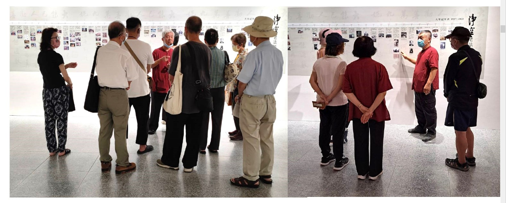

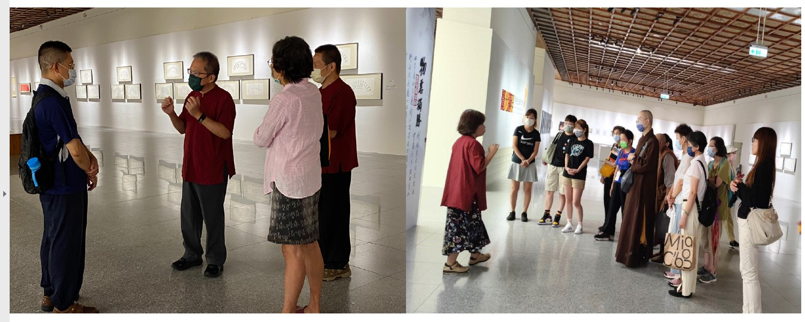

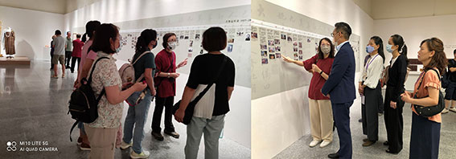

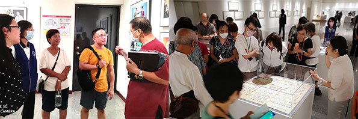

## 中華無盡燈文化學會與木魚計劃、公益平台共同舉辦國際青年台灣文化參訪

### 中華無盡燈文化學會與木魚計劃、公益平台共同舉辦國際青年臺灣文化參訪活動報導

戴于山

勇於任事的團隊    拓展學會的外緣

建立辦事的默契    各種應變的能耐

近悅遠來的方便    本土札根與國際

經過一年多的籌備，中華無盡燈文化學會與聯合國非政府組織木魚基金會合作舉辦的「國際青年禪學營文化之旅」，以及緊接著與嚴長壽先生創辦的財團法人公益平台基金會合作舉行的「宜蘭花東五日文化參訪之旅」，終於在二○二三年七月廿五日正式展開。

共同承辦活動

由耶魯大學宗教研究博士依法法師創辦的「木魚計劃」，自二○○三年於佛光山開辦的第一期「人間佛教生命體驗營」（Humanistic Buddhist Monastic Life Program，簡稱HBMLP）開始，每年持續於台灣、中國大陸舉辦；直到新冠疫情爆發之後，不得不中斷。然而，在二○二三年「木魚計劃」取得「哈佛大學神學院佈教師實習生實習項目」後，決定在台灣重新啟動。

在依法法師幾次拜會唐瑜凌老師之後，唐老師深受法師在西方推廣佛教的精神感動，於是在會議提出並經由決議後，由中華無盡燈文化學會協助共同承辦，協助「木魚計劃」這次在台舉行的「第廿一屆人間佛教國際青年禪學營」各項初期籌備作業，並贊助、規劃、執行營隊於禪修體驗後為期四日的文化參訪行程。

學會參與「國際青年禪學營」的初期籌備作業，包括協助制服、提袋、餐袋、名牌吊帶等廠商接洽，文案修改、相關資料、張貼標語設計印製，以及「文化之旅」的活動整體規劃、義工支援投入、行程交通安排、單位發文電訪、派員現場勘察、所有經費贊助等。

禪學營於七月一日起，分別在大崙天台山慈蓮苑、法鼓山天南寺舉行三週的禪修學習課程。這次有來自將近二十國共八十位國際青年參與，並有仙饌扶輪社贊助全數師生於禪學營期間道場內與部分活動的餐食費用。

禪學營期間，唐老師亦受邀在營隊第一週，即前往大崙天台山慈蓮苑，以「當代最傳奇的大居士─李炳南」為題，為國際青年以英文介紹雪廬老人一生的事蹟，與對台灣佛教的貢獻。

文化之旅第一天

七月廿五日上午安排在學會二樓講堂，由林蔚芳老師與楊滿郁老師中英文簡介，請國際青年品用台灣茗茶，及介紹中華茶道的文化、歷史與影響，同時也由戴于山學長以英文簡報方式介紹學會。

中午國際青年在學會用餐，由學會提供美味餐點，並由文化之旅的總策畫人林婉玲學長，與時哉青年游捷茹搭配，介紹文化之旅四天的行程。

下午前往台北故宮博物院，由院方提供導覽人員，分組為國際青年介紹故宮文物。晚上則前往大稻埕自由參訪，在古色古香的老街中，品味台灣在地的美食。

文化之旅第二天

七月廿六日上午，國際青年前往台灣戲曲中心，由國光劇團安排戲曲文化體驗。當天張育華團長親自為國際青年介紹台灣戲曲的特色，石傅德先生（Fred Steiner）以英語翻譯並補充，還有國光花旦凌嘉臨小姐現場示範衣著穿戴與《拾玉鐲》的選段演出，讓國際青年真切體驗到台灣戲曲之美。

下午到位在淡水的八方雲集總部，由芳珍蔬食實驗廚房團隊，帶領國際青年體驗包餃子、鍋貼的樂趣，並品嘗蔬食餃子的好滋味。

接著到齊柏林空間參觀。這次行程是林蔚芳老師特別安排，希望讓國際青年認識這位帶領世界「看見台灣」的空拍導演，並在「覓城」主題特展中，共同期待新生代年輕導演，加入並延續齊柏林導演讓世界「看見台灣」的遺願。

文化之旅第三天

七月廿七日上午國際青年抵達台北孔廟，由孔廟的導覽人員以英文介紹孔廟的建築特色。接著由孔垂長奉祀官暨夫人、孔廟黃穗蘋執行秘書、美國大華府祭孔大典委員會會長盧瑞平教授，與學會唐老師、林老師，一同為國際青年舉行成年禮儀式，並致贈由學會與台北孔廟特別製作、附帶英文翻譯的三加禮。

為讓國際青年體驗八佾舞的古禮，學會由蕭惟元老師與孫珮茹老師、李鈴芬老師搭配，為青年講解如何穿著服裝及手持翟籥，舞出劃時代的舞姿，留下珍貴合影。

中午於學會午餐並為國際青年慶生，在歡唱各國生日祝福歌曲後，前往中正紀念堂，參訪「覺光遠照─淨空老法師文物展」。

先由唐老師主持由主辦此次文物展的悟道法師，所捐贈木魚基金會的一萬美元獎學金，支持這次禪學營的輔導員義工與歐洲學員機票等費用；當日禮請莊行法師代表捐贈，依法法師親自接受。接著，由學會的魏宏哲學長、林婉玲學長、張益瑞學長與戴于山學長以英文導覽，讓國際青年認識這位促進世界宗教融合的當代大和尚；其中幾位國際學員，也接受了「覺光遠照──淨空老法師文物展」紀錄片攝影團隊採訪，表達他們觀賞後的感動。

文化之旅第四天

七月廿八日最後一天的文化之旅，依法法師特別建議讓國際青年可以到台灣的總統府參觀。在總統府金慧霞參議的協助下，府方安排專門導覽人員，為國際青年以英文介紹總統府建築；再由林佳龍秘書長親自接見，並與大家合影留念。

小結

看著一天接著一天的行程逐漸圓滿，背後其實是學會承辦成立以來第一次接待國際人士的種種障礙的突破，例如與各個單位與部門間的反覆交涉與協調，前後行程十多次的微調，與接待義工人員安排、環境整理與各種器材準備，期間還得維持例行會務的正常運行。

這次的文化之旅，也充分展現出學會小團隊的大力量，老中青三代義工在其中扮演著不可或缺的角色，使短暫四天的文化之旅，最終精彩落幕。

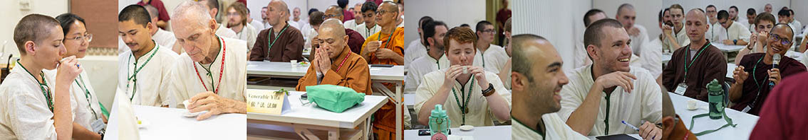

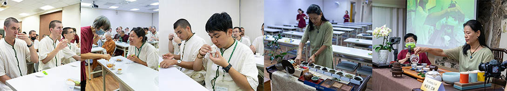

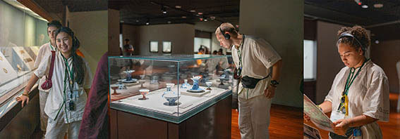

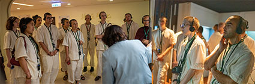

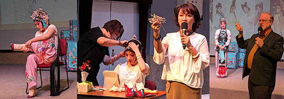

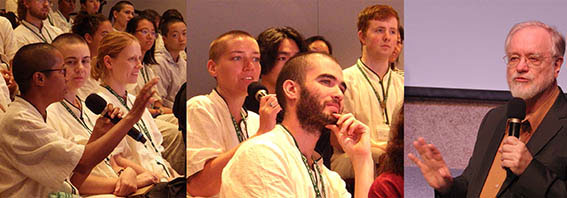

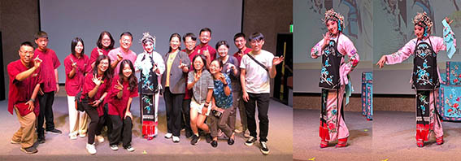

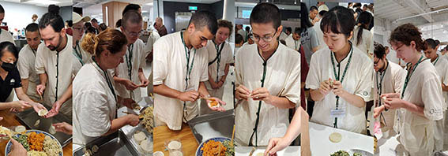

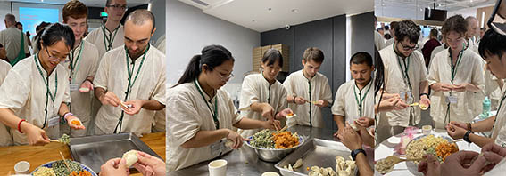

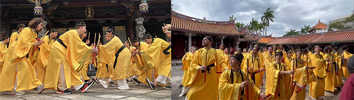

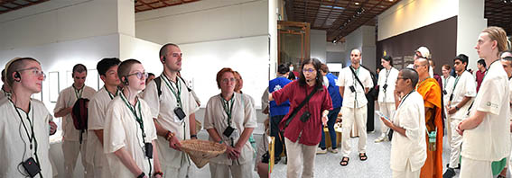

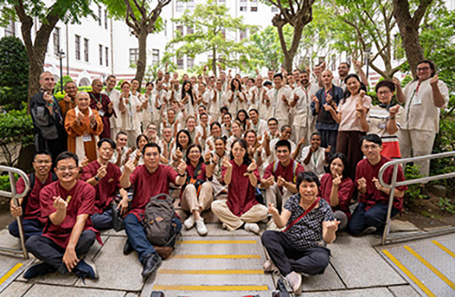

### 當代最傳奇的大居士—李炳南老先生

唐瑜凌、戴于山

頂尖大學歐美人，華梵剃頭學出家

上山交流有禮節，課堂秩序很井然

一場盛宴飽耳福，了解居士之性相

雪公儒佛的本質，一股清流蓮華園

人生的勝事之一，就是有因緣向歐美精英介紹 雪公一生行誼。

壹、前言─李炳南老先生與我

李炳南老先生是我人生最關鍵的影響者，他是我這一生最尊敬的老師。

回憶年輕時的我，當時正值一九四九年國民黨撤退來台灣之後，很多來台灣的外省人都很想讓他的孩子出國去讀書，避免戰亂，在外國也很好發展。在這種情境下，我跟一般大學生一樣，想要考上理工科，或許能配合政府的十大建設人才招攬，畢業後工作好找，我便以台大的分數，去讀大同工學院的化工系。

在大一的時候碰到最好的同學，他竟然是學儒、學佛，這給我很大的震撼。我當時對儒學、佛學的興趣不大，只想好好讀工科。雖然在高中時也曾讀一些儒學佛學的書籍，但知道自己的方向是在理工科。可是，由於在大學讀書的機緣，也因為這位同學，除了原本就參加了辯論社、古典音樂研究社、登山社、集郵社、三民主義研究社、大陸思想研究社之外，我仍參加了普明學社，這是屬於台中蓮社體系的傳承，接著就有因緣到台中去親近李炳南先生，並且在蓮社上課。

對於李炳南老先生的風采，他的人格特質，他講課的方式，以及他對經學做科表的講解、架構的分析，都令人驚艷，乃至老先生在分析事理時，交代前因後果，讓人知其然，也知其所以然。這種以理智討論，不感情用事，也不是宗教狂熱的研究學問方式，對我有很大的提升。

我私下請教師兄弟們，發覺每位師兄弟對老先生都很是敬仰，不論是他的個人操守，他對弟子們的厚愛，還是他在人情世故上的通達，乃至於他在奉祀官府擔任主任秘書，都能如理如法。

在各種角色的扮演上，老先生都讓我們覺得他很有意思。他不會像一般傳教者，給人一種兩面人的印象，例如白天一個樣、晚上一個樣；人前一個樣，人後一個樣。奇怪！老先生怎麼可以把一個人藉著不同的角色，把角色演得很好，從中表現出崇高的品格、人情世故的練達，使我打從內心地佩服他。

我的人生因為老先生的影響，慢慢地改變方向。大學畢業後，我選擇去公家機關上班，把大部分的時間拿來學習文化，並且做很多公益事業，都跟老先生的影響有關。

最後老先生的臨命終，竟然是預知時至，一心不亂；往生之後，全身柔軟；四十九天後，遺體也沒有腐壞；火化了之後，燒出很多的舍利子。

我到火葬場去，舍利子已經被撿光了。我對著老先生膜拜，竟然還可以撿到一顆舍利子，這也讓我匪夷所思。我在家裡面用一個小塔來供奉舍利。

往後有一些到其他社團上課的因緣，我就運用他上課的資料，以及他傳授給我們的講學能力，比如做科表來講學，或者是知道要怎麼分析經文。所以我能夠在各個公家單位，像：中央銀行、新聞局、證交所、台電等；乃至有機會到城隍廟去上課，都獲得很好的風評。這些講說的能力，都是老先生給我的。

老先生雖然有宗教的熱情，但是不迷信；為人有理智，但帶著一些俠氣；雖然有威嚴，可是不暴怒；很和藹，可是不懦弱。我相信這樣的老先生，對我或是普羅大眾的人生，都很有啟發性。

老先生不是一般人，他可以像孔子一樣，面面俱到地處理問題，扮演好不同的角色。這才知道：原來這就是儒家所謂的「敦倫盡分」。這對我們做人處世，乃至於造作事業、經營家庭，都有很大的幫助。

懂得善用老先生教授傳承的人情世故、經驗閱歷、事理分析、解讀經書的能耐，我相信在辦事業、辦政治、辦教育等路途上，都會非常地通達。像我這樣皮毛的人，都能夠闖出一點點事業，更何況是比我厲害的人？

這是以上我對老先生的簡要感念與緬懷。

貳、論佛教居士的定義與史上代表

本次講說的題目為「當代最傳奇的大居士」。什麼叫「居士」？

一、定義：居士

其實在《禮記‧玉藻》裡面提到「居士錦帶」。「錦帶」就是形容很富有的人，衣帶是很華麗的。鄭康成說：「居士，道藝處士也。」居士就是一個人既有道的內涵，又多才藝。可以說，所謂居士，就是富貴之人、學道之人。

而在有才藝這方面，如《維摩義記》，慧遠大師說：「居士有二：一、廣積資產，居財之士，名為居士。二、在家修道，居士道士，名為居士。」居士就是廣積資產的有財者，或是在家修道、居家修道。可見，這與中國古代的解釋是一樣的。

結合諸佛教經論對居士的定義，我們可以歸納出居士還包含能夠弘揚佛法，卻不妨礙他有家室，也不會追逐於男女淫行的欲求。因此，居士應該是有財、有位、有內涵、有道德、能自立、能推廣經學的人。

以上各方面合起來說，就是居士完整的面向。然而，要完整具足這些面向，是相當不簡單的。

二、略舉居士的代表

（一）佛世的代表

１．維摩詰居士

佛世的代表，最有名的就是維摩詰居士，他就具有上述居士的面向，所以被中國明末的《居士分燈錄》列為第一居士。這是男性居士的代表。

２．勝鬘居士

女性居士的代表有勝鬘居士，勝鬘居士就是波斯匿王與茉莉夫人結婚生下的女兒。波斯匿王是憍薩羅國（首都即舍衛城）的國王。

勝鬘居士後來嫁給阿踰闍國的友稱國王，成為友稱王的太太。因為她受到父母親波斯匿王、茉莉夫人的啟迪，所以她本人對佛法有很好的感受，並認真地學習。她曾經在佛前發了十大宏誓（十大受），而且發心好好地護持這些戒律。並且她有三大對正法的願望，就是：要受持正法（體悟與了解正法），要宣說正法，要護持正法（作正法事業的外護）。所以她是女居士裡面最高的典型。

這是在佛世的時候。

（二）中國的代表

１．善慧大士

在中國的時候，像梁朝時期自稱善慧大士，人稱傅大士的居士，他與達摩、寶誌公禪師合起來，成為梁代的三大士。後世也推崇他是禪宗的先驅人物。

２．袁了凡先生

其他像明末袁了凡先生，有經天緯地之才，懂得天文、地理、算術、兵學、堪輿。遇到雲谷大師以後，又懂得以正知見斷惡修善，改變命運。

他本來透過孔先生算命，知道自己沒有孩子，沒有功名；後來隨孔先生學習《邵子皇極數》，非常精通命理學，結果雲谷大師告訴他改變命運的道理與方法，他就透過這樣的知見建立，力行於日用平常中，想不到成功地改變了命運。

袁了凡先生不但生了孩子，而且孩子最後也考上了進士、當上了縣令。至於他自己的功名，他考上了舉人和進士，這些都是他命中沒有的。

他考上功名後任寶坻縣的縣長，竟是寶抵八百年來政績最好的縣長。後來也帶兵去助朝鮮打過日本人，在軍事武功上也很有成就。

最終回到家鄉，還修浙江省嘉善縣的縣志，成為非常傑出的史官。

叁、佛教居士的問題

上述這些歷史人物，都是居士的典範，卻也都是居士的特例。一般佛教的居士，不免會有一些問題。

一、偏於自修不近道場

佛教的居士，有些偏於自修而不親近道場，所以雖然他們對佛法有心想要學習，可是都是自己私下用功；或者是強調修行的重要，於是不去依靠大眾，也不會去護持道場。

二、偏於學術著書立說

佛教的居士，有些偏於學術研究的著書立說，他們可能在學術上能夠發表一些學術的論文。像方東美教授，他就對佛教很有好感，可是多在大學講學，並沒有實際發心皈依三寶，將佛法作為人生的修學處。後來他晚年得了癌症，很痛苦，於是去見廣欽老和尚。廣老要他先皈依，一定要先皈依三寶，有正法的傳承，這樣的學佛才能受用。

三、偏於護持不學經教

佛教居士的問題，還有一點是偏於護持卻不學經教。就是在寺廟裡面做義工，但不聽課，幾十年下來對佛法還是一知半解。這裡道場跑一跑，那裡道場跑一跑，也沒有什麼中心思想、核心價值。空有佛教徒之名，但是沒有在實質上真正地護持佛教，這也是佛教界居士界常有的現象。

四、參加法會不識佛語

還有很多居士，經常到道場參加法會。照理說參加法會應該要明白法會的意義、提升自己在修行上的功夫，或藉著共修來增長學佛的信念。但由於多數台灣佛教道場在法會前甚少解說法會的意義，就算在法會後的開示也多是隨緣開示，往往說說佛教典故，或者講一些入門的道理，於是佛教居士就算長年參加道場法會，對佛陀所說的義理仍然不甚明瞭，也很難藉著參與法會的感動與心得，來影響家人、造就佛化家庭。

所以，居士不能偏於自修，不能偏於學術的著書立說，不能不學經教，不能只是參加法會，要有解經的傳承，以及修行的傳承。這一點可能在藏傳佛教保留得比較完整。漢傳佛教如果沒有好好調整，多半都淪為各說各話。

肆、當代李炳南居士的示範

提到當代的佛教居士，就不得不說我的老師─李炳南老先生，也就是雪廬老人。他正好是近代佛教居士中最好的典範，在居士裡面，是一個能夠實現正法，推廣正法的居士，是能興崇三寶、於世道人心有助益的居士。

一、跨越領域的學習者

首先，雪廬老人是一個跨領域的學習者。

（一）博讀古書，善於寫詩

雪廬老人不但博覽古書，如《十三經注疏》、《學海類編》等，他都非常通達；他也通達詩學，並善於寫唐詩的詩體文，在平仄押韻上寫得恰到好處。唐朝留下來的平仄押韻法，當代幾乎只有他能吟頌得出來；其他人的吟頌詩詞，多是現代曲調，完全不見古風之美。

（二）科表學習，通達儒佛

雪廬老人解經，不論是儒經、佛經，他都是用科表來寫，一目了然、毫不囉嗦、絕不龐雜。這是對儒佛的經典義理非常通達，才可能辦得到。關於他的講學表解，都被收錄在合輯當中。

（三）醫術超群，能治盲人

雪廬老人學過中醫，而且他的醫術精湛。除了曾任孔府中醫師外，在台中先將林看治師姑的孫子眼睛瞎了治好，感得看治師姑終其一生，都在台中蓮社死心塌地地護持雪公老師。

（四）精研法律，善治典獄

雪廬老人在山東法政學堂（山東大學的前身）法律系畢業，他曾在山東濟南任科長，整理過很多冤案，還當事人清白。他也到莒縣監獄去當過典獄長，將監獄的環境、飲食、醫療及教化等工作，都辦得非常好。

他對獄囚也是人性化的對待。所以在有一年過年的時候，他覺得不忍心，就放獄囚們回家過年，且只准他們三天年假。結果三天後，他們通通回來報到，這裡面還包括一些死刑犯。這在中國的獄政史上從沒發生過，他是完全的特例。

以上是雪廬老人作為佛教居士的典範，表現為跨領域的學習者。

二、化解疑難的溝通者

雪廬老人是一位能夠化解疑難的溝通者。

（一）城危之際，化除混亂

比如雪廬老人在莒縣的時候，當時遇到軍閥圍城，軍閥裡面包括楊虎城(西北軍)、張宗昌(山東軍閥)，俄國人的入侵，甚至中央軍，乃至土匪劉桂棠等，這些都對莒縣非常地不友好，燒殺擄掠，甚至把莒縣老百姓的門都拆去做了柴火，把老百姓家廚房裡面的鍋碗瓢盆都搶走，讓人民家徒四壁，連飯都煮不成。

在那種情況下，如何與這些軍人及土匪談判，安撫使之不殘暴老百姓，這些都非常不容易。

（二）代理縣長，安頓縣民

尤其是縣長逃亡，雪廬老人來代理縣長，將莒縣的治安安定下來，軍閥也有所節制，土匪也不至於燒殺擄掠，這是非常了不起的。所以很多人因為他而學佛，皈依印光大師。

印光大師的十萬名弟子當中，雪廬老人是他印象最深刻，而且也是最讚歎的。比如雪廬老人寫信到靈嚴寺或者是弘化社給印光大師的時候，印光大師都會叫他的侍者德森把雪廬老人的信讀給大家聽，表示雪廬老人在印光大師心目中的分量。

（三）書寫答疑，函授解惑

還有雪廬老人的《佛學問答》，被集結成上、中、下輯，收錄了兩千多個問題。佛教徒的各種疑難雜症，他都能全方位地解答、引經據典地解答、條理分明地解答、邏輯推理地解答。或者是針對個別需求而解答，或者是對問題本身的回答，或者是舉重若輕的答覆，或者是廣博精微地解說。總之，雪廬老人都能在方方面面巧妙地解除提問者的疑惑。

（四）人事糾紛，調御和合

再者，雪廬老人在蓮社這座道場裡，由於有幾十個聯體機構，例如醫院、孤兒院、安老所、蓮社、圖書館、各地佈教所、念佛會等，所以不免有各種人事紛爭，而雪廬老人都調和得很好，因此都能運作得順暢，且人事和合無諍。

以上是雪廬老人的第二大典範，是一位化解疑難的溝通者。

三、帶動風氣的領導者

雪廬老人是一個帶動風氣的領導者。怎麼帶動風氣呢？

（一）講經弘法，群眾聚集

在家居士講經弘法是從他開始的，當時中國佛教界，沒有幾個人會講經說法。

如今我們知道淨空老和尚的講經說法，造成全國轟動，其實都是雪廬老人教的。一般解經的法師，都是照本宣科；淨空老和尚有條理地解釋，能夠發揮經義，這在民國五十、六十幾年的時候是轟動台灣的。現在當然不稀奇，以前可是相當罕見的。

李炳南老先生晚年在慈光圖書館講學，每個星期三講華嚴經，聽眾約近千人，這是台灣的講經盛況；當時沒有一個法師講經，能有他這般號召力。一般頂多講一個通俗講座，人潮可以聚集很多，但也頂多一兩次；雪廬老人從民國五十四（一九六五）年到七十五年（一九八六），但凡在七點十五分要上課，七點前講堂就坐滿，這種盛況是我看過的，在台灣講經的法師無人能及。

（二）開辦雜誌，佛化文壇

雪廬老人開辦雜誌，這些佛教雜誌都是他最先開始的。例如《菩提樹雜誌》、《覺生雜誌》、《明倫月刊》等。他早在民國四十年初就開始辦佛教雜誌，這些都是大眾認識佛教乃至儒學最好的入門。

（三）佛教事業，開創先鋒

不單是佛化文壇，可以說台灣所有佛教事業，都由他第一個開展，其中包括慈善醫院，為窮人免費醫療。還有安老所、孤兒院、托兒所、圖書館、啟蒙班，甚至電台廣播、印經會、助念團、天樂班、佛誕遊行等，這個都是他帶動風氣之先，帶動全台灣人的學佛風氣、慈善風氣、講學風氣。

（四）宏化台中，地方祥和

雪廬老人在世時，台中真的是一片祥和。雪廬老人說他從來不提倡吃素，可是台中吃素的人口，卻是台灣最多。

這種祥和的風氣，體現在民國三十八年到民國七十四年，去察看台灣氣象史，就知道台中這段時間沒有一次颱風；直到他過世的民國七十五年，韋恩颱風就吹進台中，把台中吹得東倒西歪。所以這種祥和，《中庸》裡面講「致中和」，自然能夠感召天地的護佑。

四、行事低調的辦事者

雪廬老人還是行事低調的辦事者。

（一）孔府掌舵，歷五十載

他在孔家當主任秘書，掌舵孔府五十年，表現得很低調。孔德成先生想推薦雪廬老人給蔣公認識，雪廬老人堅決不要；推薦雪廬老人擔任好人好事代表，他也堅決不要。雪廬老人很是低調，不願走入政治圈，遠離虛名浮利。

（二）安住台中，從不擅離

在民國三十八年到民國七十五年期間，雪廬老人除了奉祀官府的公事一定要來台北一兩次以外，有一次是為了報答周宣德老居士對他的護持之恩，上來慧炬講學，此外從來沒離開台中。他頂多陪弟子們去梨山、霧社、溪頭杉林溪、谷關走走，其他地方都沒有去，等於是安住台中，從不擅離。

（三）不居功勞，利他不倦

雪廬老人一生有很多的功績、建樹，比如剛才提到的慈善風氣，是他先推行；讀書的風氣，也是他蓋慈光圖書館，免費讓民眾來圖書館裡面讀書；或者是建養老院、安老所，照顧老人；尤其菩提醫院，讓貧苦之人可以免費醫治。但是他從不喜歡歌功頌德，所以信徒們也不敢對他歌功頌德。

而雪廬老人對經教的學習，還有善法事業的建設，他都非常地好樂，而且樂此不疲。他曾對弟子們說：「學習是沒有畢業的，永遠不畢業，活到老，幹到老，一天不死，一天幹。沒有休息的。」

（四）謀劃長遠，後世蒙益

雪廬老人的頭腦也非常靈活，在規劃建設慈光圖書館、育幼院，或是各種慈善事業時，他都會寫計劃章程，慎始地訂一些條文，避免後面變質。所以他是一個謀劃長遠的人。

台中蓮社現在也都承蒙雪廬老人做事業留下來的餘蔭，像菩提醫院、菩提安老所的收入，都足以讓台中蓮社繼續往前走，不必向信眾募款。這些都是他非常了不起的創舉。

五、勤傳儒佛的教化者

雪廬老人是勤於傳承儒學、佛學的教化者。

（一）耄耋高齡，仍在演說

雪廬老人到九十七歲過後還在講學，後來實在是體力不支，大概生病躺一個月後就過世了，所以也沒有麻煩到什麼人。

（二）領眾共修，常不休息

雪廬老人領眾共修，不管是在經教上的學習，或者是坐上修、歷緣對境修的種種行誼，他都能夠以身作則、帶領風氣。

（三）民間學府，培育青年

雪廬老人也在民間的學府，像是東海大學、中興大學、靜宜女子學院、中國醫藥學院講授經學、詩學、中醫等學科。很多的年輕人，都是因為他到大學當教授，才有這個因緣認識這位老先生，接著到台中蓮社來學佛。

（四）著述等身，學子遍布

雪廬老人的著作非常地多，雪廬老人的《全集》裡面，包括經學的註解、歷史的表解，或者是佛經的各種的講經表解等等，這些收集起來，有二十本很厚的精裝書。

雪廬老人著作等身，有講學風采，也實際辦出事業，把人培養成人才，不是一般讀書人只是寫寫文章、耍耍嘴皮，他是實際成就了這種種事功，很不簡單。

而在籌措經費方面也很奇妙，他從不募款，錢從哪裡來？大家都不知道。這令人太佩服了！我自己辦了一個道場，身歷其境，就知道這是很困難的；不投入都不知道其中的難處，投入了才知道困難重重。

六、行解並進的修行者

講到雪廬老人是行解並進的修行者，他在各方面都學有所成；不學則已，一學一定學到骨子裡。

（一）密禪淨教，皆有所成

在密宗當中，他親近嗊噶呼圖克圖、諾那呼圖克圖，這兩位都是當時很有名的大活佛。不但他在兩位活佛座下學到很深的密法，還成為密法的金剛上師。

像雪廬老人的侍者鄭勝陽老師，曾親得雪廬老人密法的傳承，可見雪公在密法中是多麼權威的人物！

在禪門裡面，雪廬老人曾親近真空上人。真空禪師於民國初年的大陸，是很有名的禪宗大德。

在淨土宗，雪廬老人親近印光大師；在教法方面，親近的是梅光羲（梅大士）。

近代談人間佛教的代表太虛大師，他最欣賞的就是雪廬老人。我的老師雪公說，他的講經說法是太虛大師祈請的，所以等於是有太虛大師的認證。

（二）言行相合，內外一如

雪廬老人本身不只是在修行上有所成，在世俗上言行相合，表裡一致。

（三）俠氣風骨，有為有守

雪廬老人有俠氣，常說：「修行要帶有七分的理智，三分的俠氣。」七分的理智，就是不莽撞，懂得明辨是非，懂得如理如法的思維。三分的俠氣，是古道熱腸，例如救人不要太愛惜體面、愛惜面子。

雪廬老人的俠氣，體現在一旦答應的事情，便沒有辦不到的事。像董正之老師那時候印《大藏經》，他識人不明，被會計捲款逃亡，傾家蕩產。雪廬老人二話不說，縱使台中蓮社的公款不幫忙，因為他絕不以私害公；但私底下他把自己的積蓄全部送給董正之老師，一點都不吝惜。這就是俠氣！

所謂「公財如命，私財如土。」雪廬老人真的是一個有為有守的人，在公家的立場寸步不讓，在私人的立場全部給予，實在是很奇特的人物！

（四）念佛專一，安詳示寂

雪廬老人在修行上是念佛專一，安詳示寂。

念佛專一，就是一心不亂。常常說念佛最怕心口不相應；「心口若相應，立見佛菩薩」，就是嘴巴這樣念，心裡也是這樣念，表裡如一。這就跟他的人格一樣，最後能安詳示寂。

雪廬老人先是預知時至，他本來說九十五歲要往生，後來在疾病中醒來，跟侍者說：「菩薩在夢中請我住世，我答應兩年。」

後面那一年，從九十六到九十七歲，他就跟弟子說：「好好幹，我就上班；不好好幹，我就退休。」果然大家沒有好好幹，真的給雪公退休了。

雪廬老人最後在民國七十五年農曆三月五號清晨五點的時候安詳示寂。他要過世之前，眼睛睜開來回地看周遭這七、八位弟子們。每一個弟子禁不起老師的看，他那琥珀色的眼睛，好像貓的眼睛，所謂「紺目澄清四大海」，看得每一個人都低下頭來，好像不敢跟雪公的眼神正面相對。雪廬老人真的是一股浩然正氣，勢不可擋；臨命終還有這種正氣，實在不簡單！

看了幾圈以後，王社長跪下來說：「弟子願意承擔，讓老師好好去。」雪廬老人眼睛一閉就撒手西歸，絕不留戀。

伍、結語

以上我們從居士的定義、略舉居士的代表，還有佛教居士的問題，再談到雪廬老人的典範。

典範當中，談到雪廬老人是當代居士的典範，是一位跨領域的學習者，能夠化解疑難雜症；能夠帶動風氣，還是一位強而有力的辦事者。但他行事低調，從不把功勞攬在身上。他更呈現出一位儒佛教法的能傳承者，使弟子們成為所傳承者。他辦大專班、內典班、論語班、社教科，在在說明他不只是大堂講座集眾演說，他更在意培養宣講經學的人才。

雪廬老人解行並進，不會光說不練，且功夫超乎常人。最後臨命終的時候，他示現一心不亂，灑脫歸去。

在我來看，他是無懈可擊的完人。這一生有幸來親近他，是人生最大的幸福。

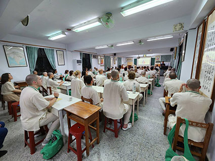

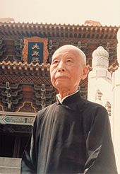

### 附錄：奉祀官成人禮致詞中英文

楊滿郁(翻譯)

古禮精神入時代

儀式不煩意義彰

正式成人立天地

未來成就刮目看

在世界各地許多民族，都有屬於他們自己的成人禮。

有的必須通過考驗，承受一段身心的痛苦，有的是要挑戰困難的任務，也有的是舉辦一場派對、一場歡宴，接受大家的祝福，不一而足。

但在這些成人禮或成年禮的儀式中，都有一些相似之處，那就是提醒、告誡或者認證這些參與者，從今以後，你們開始擁有更多的權利，更充分的自主，同時你們也有足夠的能力來為自己的所有言行負責，這是人生過程中一個全新的開始。

各位朋友們來自世界各地不同的國家、不同的民族，今天很高興大家能夠齊聚一堂，參加這一場傳承自中國古代的成人禮儀式，這是一個保留古禮精神，作法與時俱進的典禮。

加禮分為三次，是祝福各位在未來的旅程中，能夠越來越好，人生每一個階段都有新的超越。

而三次加禮有不同的禮品，也是有不同的意涵，包括良好傳承的綿延不絕、常保樂於學習的精神、信實可靠的做人等。

我們贈與大家的印章，上面刻著中國經典中饒富智慧的成語，並附有英文翻譯，值得大家回去細細品味。

最後喝酒的環節，則是祝福各位，品德能夠醇厚、芬芳。

所以這場傳承中國古禮的成人禮儀式，重點在於品德內涵的成長，這才是真正的成人，並非年齡的長大而已。

今天十分難得，有這麼多文化宗教領域的重要人物與會，有來自世界各地的朋友一同見證，相信這是各位朋友們人生中難得而有意義的一場典禮。

再次祝福大家，擁有成熟的人格、美好的內涵，開啟嶄新的人生。

以下附上英文翻譯：

Anchor: Now, let’s invite our Chief Guest -- The 79th Lineal Descendant of Confucius, the ROC’s Sacrificial Official to Confucius, Mr. Kung Chui-chang, to deliver a speech to the participant-students before the Ceremony of Adulthood begins.

Speech at the Event

of the Ceremony of Adulthood

for Harvard Students

by The ROC’s Sacrificial Official to Confucius, Mr. Kung Chui-chang

July 27th 2023

Good day, Mdm. Huang, the Executive Secretary of Taipei Confucius Temple, Dharma Master Yifa, Dharma Master Huisheng, Teacher Tang and Teacher Lin, and friends gathered here today from all over the world. I am very glad that I have the opportunity to be the chief guest of this special occasion, and will witness the ceremony that might help to mark changes in your future.

Different cultures around the world annotated their own meanings about adulthood.

Adulthood can be perceived in many ways. Some of them required the adults-to-be to endure painful tests physically, mentally, or both. Some are allotted with challenging assignments. Some cultures celebrated the coming of adulthood with a feast, as an enjoyable party function of blessings.

But there are something they all shared in common. It’s one way or another, as a reminder to the adults-to-be or attendees about the changes in their physical and social status. From now on, they become responsible individuals who hold the future in their own hands. They have the capacities to speak and act for their own sake. The ceremony marked a new step forward in their life.

My dear friends from around the world of different ethnical backgrounds. I feel extremely privileged and honored to be given this opportunity to welcome you all to the Taipei Confucius Temple. I’m very glad that you can gather together to take part in this ceremony, a ceremony which has practiced since ancient China. Some minor changes have been made to the ceremony to keep pace with the times, while the essence and the spirit of adulthood in a Confucian way remain untouched.

The ceremony will put into operation by applying the rite three times, giving a sense of escalation to higher level of progresses for the adults-to-be in the future. The number “3” has cultural significance, which stands for abundance which encourages expansion, transcendence and innovation.

Each application will present with gift that conveys the meanings such as the continuity of heritage, lighthearted learning spirit, and trustworthy quality of a grownup..

The seal we present to you is engraved with wise idioms excerpts from the Chinese Classics, with English translation attached. They are refined ideas of great worth that deserved  further in-depth thinking.

The last part is the Rite of Drinking as a blessing to all. A blessing to the full-grown of virtuous character of the adults-to-be in their intellectual cultivation.

Ceremony of Adulthood, which inherits ancient Chinese wisdom, focuses on the development of moral connotation. It’s not solely about advanced in years or age.

Today is a special day. There are so many important figures in the fields of culture and religion, and friends from all over the world as witnesses to this event. I wish you will find today meaningful just as I do.

Once again, I wish you all a blooming future, a life of virtuous orientation and become a person of good character.

### 木魚基金會哈佛菁英團台東行活動報導

戴于山

原住民文化的保留

嚴長壽團隊的有恆

流失又回流的人口

創造外國人的驚豔

2023.07.30.

第一天：台東池上→鐵花村音樂聚落

→

台東娜路彎酒店

經過一夜難分難捨的離別，剛剛參與完聯合國木魚基金會與中華無盡燈文化學會共同主辦的國際青年禪學營的三十一位來自世界各國的工作人員與學生們，繼續由中華無盡燈文化學會與財團法人公益平台基金會共同舉辦的台東參訪之旅。

學生們一早五點半從松山慈惠堂的香客大樓出發，前往目的地台東。由於旅程長達五小時，為了讓學生們不覺得辛苦，沿途選擇了花蓮和平Daka園區與花蓮觀光糖廠停靠。

老天作美，這一天的台東池上氣候舒適；雖然因颱風的影響偶爾落下小雨，卻不影響學生們的興致。來自英國的妮可拉（Nicola）說：「這一個月來的禪修行程，不是坐在巴士上，就是坐在課堂、齋堂、餐廳的板凳上，今天總算能出來透透氣、騎騎腳踏車。」

在單車行老闆的細心解說後，學生們各自租借腳踏車，探索池上的在地風光。來自美國的艾莉森（Allison）忍不住擺了開心地姿勢，騎車探索當地景色；作為學員領隊、來自西班牙的帕布羅（Pablo）也擺出開心勝利的姿勢。它們一行人往山的方向騎車，結果遇到大雨，因禍得福碰上了一間熱情招待他們進屋的小店鋪，開心飽餐一頓。

從匈牙利來的賽門（Imre Simon）到池上飯包，才發現找不到素食飯盒，他堅持素食已經數十年了。還好台灣素食友善的全家便利超商有不少素食選項，也可以飽餐一頓。這次年紀最長、七十七歲的美國退休老法官麥特（Matt），品嘗到台灣在地素食美食，也一路驚奇地讚歎：「台灣竟然有這麼多美好的山水！」

唐老師特別開車載著學會隨行的工作人員前往隨喜學生們的旅行，到了租車站還特別租借四人腳踏車，又充當司機載大家一起陪伴觀光，意外遇見池上穀倉藝術館正在展出「五友@池上攝影展」，是學會曾經與羲之堂合作導覽過的莊靈老師，與相識超過半世紀的好友黃永松、郭英聲、林柏樑、劉振祥，一起聯合舉辦的展覽。在距離台北三百三十公里遠的台東能碰巧相遇，真是甚深緣分！

下午前往台東市區有名的鐵花村音樂聚落，奧古斯特（August）看見市集有許多手做好物，就思及許久不見的家人，趕緊買些紀念品準備帶回家。由許多集裝箱堆疊起來的波浪屋TTstyle原創館，曾經許多名人光顧，也吸引了學生們的目光，在其中探索一番。

在不遠處的微光市集，傳來陣陣琵琶聲，有網紅表演者正在彈奏，吸引人群圍觀聆聽，還有小朋友忍不住上台唱和，使大家看得笑不攏嘴。

經過一整天的遊覽，總算可以回到飯店。這次居住在娜路彎銀河酒店，大家見到酒店都感到很開心，這可是唐老師與林老師在活動前親自踩點選出的優質下榻點。

兩位老師特別在飯店辦了四桌素宴招待大家，唐老師除了歡迎大家來到台東，也特別提到台東有著台灣各個不同部落的聚集，保留了台灣部落原始的文物與樣貌，非常不簡單；就像台灣保留了佛教南傳、藏傳、漢傳的所有典籍，保留來自大陸的許多大德的佛法傳承，非常值得花時間慢慢欣賞。台灣是有豐富科技、宗教、文化等內涵的寶島，科技發展支助宗教、文化發展，宗教、文化更是使得社會氣氛祥和安定，於是科技能與世界同軌，吸引人才進駐，成為世界不可忽視的人文、宗教與科技重鎮。

與兩位老師同桌用餐的學生們特別開心能親近老師，問了許多問題。例如日本天台宗傳承的美籍妙眼法師（Ven. Myoei），就請教老師未來西方佛教發展應該重視什麼？唐老師建議法師能將人才送來台灣接受佛法的訓練，是此時的當務之急；會講一口好中文的蘇格蘭學生梅根（Megan）好奇唐老師怎麼踏上學儒學佛之路，唐老師提到自己過去接觸了宗門懺雲法師、教下雪廬老人、會性法師的引導，以及在台中蓮社學習，使自己愈加篤定了修學與信仰儒佛之路。

唐老師關心大家這次來台灣學習的收穫，美國西密西根大學大學三年級的唐納德（Donald）就向老師說，自己研究比較宗教學，在這次的宗教體驗中，運用學術的角度來觀察自己的學習，深刻感受到這次來台的價值非同以往，回去之後要將論文好好完成。來自美國猶他州立大學的札克（Zac），提到自己雖然還沒有找到人生未來要走的路，但隨著對佛法的認識日漸加深，認為此生已無法忽略佛法對自己人生的意義，會繼續學下去。

這次參與台東參訪活動的學員們臥虎藏龍，像是才二十一歲的凱爾（Kyle），就分享自己熱愛學習歷史，把中國各朝代記得滾瓜爛熟，還能分析晚唐與宋朝中國與其他國家的政治局勢。來自英國的艾咪（Amy）從事環保包裝設計工作，對於人類與自然的和諧關係，有相當獨到見解與實踐力，以休旅車為家。

美國歐柏林大學二十一歲的雅娜（Yana）與唐老師談話過程中，分析西方政治哲學的見解，也引發了唐老師分享孟子、荀子對中國政治思想的不同影響，以及孔子理想中的禪讓政治。在場幾位學生聽得津津有味，直到晚餐散場後還不願離去，希望下次還有機會親近老師多多請教。

西方學子的年輕好學，讓人不禁對於西方的教育感到讚歎，也期許這次的參訪活動後，能為學生們留下美好的回憶，讓他們再次踏上台灣的土地，加入中華無盡燈學儒、學佛的行列。

2023.07.30.

第二天：鸞山森林文化博物館

→

（鹿野高台臺灣國際熱氣球嘉年華）

→

杉原海水浴場

→

四維夜市

一早台東參訪之旅的國際學員們紛紛到酒店餐廳用餐，唐老師與林老師特別與來自美國的龔同學（Christopher Gong）一起同桌吃飯，認識這位年輕有為的華裔青年。龔同學的父母都是學校教師，他本身也熱愛運動，因此顯得特別健美陽光。龔同學向兩位老師表示，自己有想要繼續深入佛法，唐老師鼓勵他一定要加入讀書會，因為唐老師本身也是這樣一路與善友組織讀書會學佛至今；如果沒有加入群體，時間久了必然要退轉。

今天主要的行程是前往鸞山森林文化博物館參觀，這個行程由嚴長壽先生創辦的公益平台文化基金會贊助。

鸞山森林文化博物館坐落在台東海岸山脈的都蘭山，是布農族人生活的土地。這座成立了近二十年的部落，平常人不得其門而入，沿路沒有路標，必須事先預約才能參觀，卻吸引了七十多個國家、超過二十萬人次的到訪，聯合國的地球憲章組織還特別選在這個地點舉辦過研討會，原因就在創辦人阿力曼老師的用心經營。

曾經是高中母語老師、國會助理、報社記者，也在日本工作、會講韓語的阿力曼老師，是族裡第一位接受高等教育的布農族人。二十年前當他知道有財團要收購養育自己成長的山林時，他想辦法四處籌錢，將房子與名下土地抵押給銀行貸款，結果住屋被銀行法拍八次，還多次繳不出孩子的學費。然而他並沒有因此而打退堂鼓，在許多曾嘲笑他的人們看見他的努力之後，紛紛與他一起並肩努力，買下了鸞山森林文化博物館的所在地。縱使過去有近二十甲的土地如今只剩下四分之一，但他決定要在這塊土地上，帶領流浪於都市的年輕族民們，回到世代祖先保留的山林裡，恢復過去布農族的榮光。

唐老師帶領學員們抵達後，由阿力曼老師親自介紹。五年來他已經將重心放在前往各地演講、在大學教書，這次為了接待中華無盡燈文化學會與來自各國的國際青年，他決定親自導覽。

從一片「會走路的樹」開始，阿力曼老師談到他的祖先們過去居住在高山上，後來移居都蘭山，才發現這裡的樹居然會「走路」。原來那是白榕樹的特性，為了使樹木生長，樹木的氣根會尋找土地蔓延，隨著土地板塊的移動而跟著移動。

阿力曼老師說，在ㄧ八九五年前，台灣布農族就擁有這塊土地，直到後來清朝人、日本人、國民軍隊紛紛占領後，就聲稱他們才是土地的管理者。結果千百年擁有這片土地的布農族後人，竟然還要自己掏腰包把土地給買回來。所以阿力曼老師決定：這裡絕對不收取政府任何的補助經費，也不用來自現代的電力設備，更不建設現代觀光的種種設施、銷售任何產品，以此證明既使到了文明的現代，布農族仍然能保有自己的文化，並且自食其力、自力更生。

進到了森林博物館，館方歡迎大家的來到，給每人一支串上杏鮑菇的竹籤，只要說一句布農族語uninang（感謝），就可以進到屋中燒烤杏鮑菇，享有這份歡迎禮。

接著布農族人獻上一杯「獵人舒跑」，就是用薑黃、生薑、肉桂葉與甘蔗頭一起熬煮而成的活力草茶，據說可以提神醒腦。喝完這杯茶，族人會再獻上一杯小米酒，這米酒只送不賣，代表來自布農族人的熱情。

接著阿力曼老師帶領大家去祭祀祖靈與山神，準備要進到山林之中，感受族人所居住的原始環境。由唐老師與國際參訪青年領隊Marc代表獻上「雙證件」─一瓶米酒、一包檳榔，便在一起祈禱後得到庇佑，成為一家人，然後一起走進「家裡」。

阿力曼老師說，祖先們世代告誡：大自然就是布農族的銀行、冰箱、寶藏，要尊重大自然的樹木花草乃至一切蟲蟻鳥獸，它們都是大自然的主人，人類只是借用它們提供的資源存活。因此，就算是有蚊子來叮咬，也不能殺害牠們，必須和諧共生，才能得到山神與祖靈的保佑。

接著大家就走入這原始山林中，穿越岩石、樹林、荊棘，一路遇見青蛇、蜥蜴、蝸牛，又是巨石裂縫，又是攀岩登高，才真實體驗到原住民生活其中的情景；果然每天這樣生活，身體不健壯也很困難。怪不得過去日本人統治台灣時期，都能繪製出台灣各區的地圖，唯獨布農族的土地紀錄一片空白，原來不論他們帶著多麼先進的武器侵入，都將看不見次日的陽光，被布農族的勇士們以大刀伺候。

在三十分鐘的「叢林家園冒險」後，總算安全回到平地，此時阿力曼老師再次集合大家，並致贈他花了兩年時間完成的這本《山與祂的子民》口述歷史，由唐老師代表收下。這本書翔實地記錄他二十年來恢復族人生活環境的點點滴滴，以及布農族世代傳承的生命智慧。阿力曼邀請來自各國的青年協助翻譯，使這本書得以推廣到全世界，讓原住民的歷史與精神被廣大的人們看見。

布農族的傳統伴手禮，就是在朋友來訪後，讓他們帶「兩憶」回家，一是記憶，另一是回憶；而體現的方式，就是在鸞山森林文化博物館土地上種下一棵樹。阿力曼老師特別將來自中華無盡燈文化學會的樹種在嚴長壽總裁植種的樹旁──這位阿力曼老師與族民們都非常尊敬的企業家朋友，給予博物館與阿力曼老師的種種鼓舞，使他勇敢地帶領族人「做自己」。

阿力曼老師邀請唐老師與三位不同國家的代表，一起種下這棵樹。代表們分別有來自匈牙利的埃姆惹（Imre）、來自俄羅斯的卡蜜拉（Kamila），以及來自美國的蓋比（Gaby）。阿力曼老師隨後就將全團大眾分成十人一組，手以大拇指串聯成圈，一起從低至高逐漸站起，同時用五段歌聲合唱，作為植樹的儀式。之後大家相互擁抱，告訴對方「有你真好」，提醒著彼此：用植樹與自然結合，用聯手與人結合，用心與生命結合，一起為保護地球家園而努力。

阿力曼老師邀請各國的朋友分享來訪的心得，其中最受觸動的就是美國的學員艾莉森（Allison），她從向祖靈山神祈禱的儀式後，就一直受到感動；就連分享之時，也不住落淚，這使得阿力曼老師也不禁感動地哽咽起來。阿力曼老師隨即就從土地上捧起一坏土，傳給在場的每個人，要大家記得這土壤的味道；回到自己的國家，也記得找到一掬土，感受兩者有什麼不同，然後想想自己能為土地做些什麼。

儀式後立即就有人發願，未來想要當律師，來為原住民爭取生存的福利。原來阿力曼老師的女兒也是學習法律的，她的夢想正是要用法律來保護族人的權益。

到了中午用餐時間，布農族這天最特別之處，就是從來不曾做過素菜的布農族廚房，由阿力曼老師的夫人親自下廚，煮出了十八道素菜，真是最為熱情的款待！布農族要求男人們為女人服務，為女人盛飯端菜，以感謝女人們為家族的付出。唐老師特別受邀示範，為林老師碗中夾菜，來開啟美味午餐。

「這一餐飯除了是來自完全木製的廚具烹調，還有來自山上的野菜，以及廚房中真誠而用心的調味，更重要的是大家歡喜品嘗的心，使得食物變得美味。」學員們不禁讚歎：「這是一個多月來台以來，最特別、最豐盛且最美味的一餐！」

用完餐後，阿力曼老師帶大家一起製作以糯米和南瓜為原料的布農族麻糬。這種麻糬平時不製作，只有在親家來訪或貴賓到來時才會製作。傳統的做法，就是用蒸熟的糯米與南瓜，用特殊的搗木棍與容器搗製而成。阿力曼老師說：「這個製作工具，可是我爸爸的兒子親手製作的呢！」

唐老師與林老師先為大家示範搗製麻糬，接著阿力曼老師邀請在場的男女朋友一起製作，可以增進彼此感情；如果是兩個平時彼此競爭的朋友，也可以藉著合作搗麻糬，來改變彼此的情誼。

阿力曼老師說：「這次製作的麻糬特別成功！」由越南籍的安（Anh）把麻糬從搗棍棒上剝下，放入放有花生與芝麻粉的盤子中攪和一番，再由細心的女生學員們分別切成小塊，供給大家品嘗。

鸞山森林文化博物館的最後一站來到「媽媽屋」，這是阿力曼老師的叔叔在他買下這塊土地後，送給他的禮物─教他蓋布農族的生活屋。為什麼叫做媽媽屋呢？因為進門兩旁都是生火的柴火坑，象徵母親的乳房，供給食物；屋子兩邊各有一個置物的平台，就像母親的雙手，保存家中的食物資源（如剛收成的小米、番薯等）。當時的房子都用千百年來祖先手把手傳承的工藝製造，運用森林的資源來建築，比鐵絲綑綁更受得了風雨的打擊。布農族建房子不必要看風水，找到可以幫房子擋風的山丘，以及能夠調節雨水、氣溫的樹林，房子就在絕對好風水之中。

布農族的房子不必要有門，也不會遭小偷，因為房屋都有祖先照顧。原來布農族形容人死後是「回家」，而且真的就將之埋入家裡的土地底下。這樣一來，不光是小偷不敢光顧，就是家中的人也不能隨便爭吵，因為祖先長輩隨時都在「關心」。死去的人會被綑綁成像母親子宮中的嬰兒那樣，代表從母親的子宮來，回到大地母親那裡去。

在與阿力曼老師合照之後，參訪團的大眾就搭小車回到巴士，然後兵分二路：唐老師帶領辦公室團隊去參觀一年一度在台東鹿野高台舉行的「臺灣國際熱氣球嘉年華」；另外一隊則是參訪團的國際青年，前往他們最想去感受的景點─台東的海洋。

由於剛剛颱風過後，熱氣球嘉年華才恢復升空，因此吸引不少人潮前往。為了不使巴士在車陣中拖延時間，由小車代表前去觀看。果然熱氣球升空後特別美麗，像這樣的景觀世界上都很少見，能在台東鹿野高台現場見上一面，都將令人禁不住感到幸福！

另外一頭在杉原海水浴場的國際青年，一到了海邊，就忍不住要放下所有身邊的物品，換上泳衣泳褲，跳入海裡游泳衝浪。幾番浪花迎面而上，青年們沒有被浪水所驚嚇，反倒是撲上前去，讓浪水帶領身體游向岸邊，然後再度翻身迎向大海。一段時間與海洋玩耍之後上岸，他們都紛紛表示：「真是太過癮了！」

晚上國際青年台東參訪團的大家，一起到只有在週日才開放擺攤的四維夜市享用在地美食。每位學員使出渾身解數，找到自己心中特別想吃的台灣美食。從美國印第安納州來的詩娜亞（Shanya）說：「好多美食在美國買都要高於台灣四、五倍的價格，而台灣夜市美食的可口度卻是美國的四、五倍以上！」這樣的話聽在台灣人的耳裡，會不會因此倍加感到幸運呢？

2023.07.31.

第三天：均一高級中學參觀

→

英語藝術生活營開營典禮

→

嚴長壽先生專題演講

→​​​

十方素食餐廳

一路從禪學營陪伴到台東參訪行程、前後一個多月的工作人員傑克（Jacques），由於要趕次日一早飛回美國的飛機，必須與大家提前道別。得知他要離開，每位學員都感到依依不捨，於是在離開之前，於飯店大廳給他一個大大的團抱。傑克祝福大家有美好的旅程，也希望有機會能再見到大家。

每天的參訪行程，都是由無盡燈團隊同仁與國際學員們，一起在巴士上念誦ㄧ百零八佛號聲中開啟。或許是大家虔誠誦念佛號的心意，使得從第一天開始，交通都相當順暢，氣候溫度也都十分理想；就是偶爾有下些小雨，也沒有對行程造成影響。

這一天的行程，是由嚴長壽董事長創辦的公益平台文化基金會所贊助，前往在台東非常有教學特色的均一國際實驗高中參觀。

均一國民中小學於二００八年由佛光山星雲大師創立，因緣際會下與關心花東永續發展的公益平台文化基金會嚴長壽董事長，分享偏鄉教育深耕計劃。由於兩人理念相同，大師於二０一一年十二月十九日正式委請嚴長壽先生全權接任均一中小學董事長，並將均一的未來帶向一個跨宗教及多元的學習校園。

巴士還沒有抵達，基金會的執行長蔡慈懿女士與均一代理校長Peishun Pai，已經帶領工作人員與學生代表在學校門口迎接。

學員們分成兩隊，由學生代表Felicia、Fallon全程以英語導覽，帶領國際學員參觀學校教室與各項設施，例如繪畫創作教室、泛舟教室、室內籃球場、星光草皮、祈願空間等。學生代表的表達落落大方，英語幾乎毫無口音，讓容易感動的艾莉森（Allison）不住讚歎。後來才知道，原來她們都是來到均一才有這樣的語言能力，她們從未曾出國，父母都不會講英文。

據學生代表形容，「在均一，你永遠不會感到無聊」。小學部教育採用華德福式教學，配合孩子的善、美、真不同階段的需求，幫助孩子在身心靈三方面全方位成長。中學部以探索教育為核心，通過山林、海洋與自行車為主題，使學生們在學校的多元課程設計中，找到自己未來的方向。而高中學部，則以「創意學群」為理念，結合國際餐飲、綠能建築、當代藝術，使年輕一代能延伸學習應用，培育豐厚素養與能力。來自德國的安特莉（Antri）驚奇於校園規劃的明亮與多元，居住於紐西蘭的德籍學員蘇珊（Susann）聽完介紹，很希望自己的孩子能送到這樣的學校就讀。

參觀完校區之後，均一代理校長Peishun Pai為大家介紹學校教學理念，主要是藉由均一的教育，讓孩子對自己的學習產生信心。就以語言方面為例，均一會運用美國的教材，老師教學都以英文來講課，而學生們不論是聽課、寫作業還是考試，全部都以英文作答，藉此沉浸式教學，來達成學生對語文應用的自信與把握。剛入學的學生規定會接受佛教的思想教育，其主要內容為三好：「存好心、說好話、做好事。」這對於孩子人格的塑造與正向的言行有很大的助益。

代理校長邀請在座國際學生自我介紹，藉此機會也認識中華無盡燈文化學會隨行的所有工作人員。在簡短地相互交流後，每個人都對彼此有了更深的認識，不禁讓人從中驚覺，在場的每個參與者，多在各自的國家努力找到學習佛法的管道，這種求法精神非常難能可貴。

中午與參加營隊的孩子們一起於學校餐廳用餐。用餐過程中，嚴長壽先生與唐老師、林老師一起同桌共進午餐，並交流學員們對於這次活動的心得感想，與在台東的見聞收穫。

下午受公益平台文化基金會的邀請，參加公益平台為偏鄉小五、小六學生舉辦的英語學習與藝術學習的營隊開幕儀式。英語藝術學習營為期一週，志工多來自台北美國學校學生，與均一高中部及畢業學生。在看完畢業生們精采的歌唱表演，以及隊輔主持的營隊講解活動後，使人深深感受到「以學生為主角」的營隊，可以呈現出與一般營隊截然不同的樣貌，真正讓年輕一代接棒，發揮他們的熱情與力量。

營隊大合照完後，接下來是嚴長壽董事長的演講。演講大致分成三個部分，一是人工智能世代，人類的優勢是什麼；二是嚴先生一生的經歷、成就、感悟與奉獻；三是公益平台文化基金會目前所從事的公益項目。

嚴長壽董事長先是提到Google X的執行長莫‧加多（Mo Gawdat），他的兒子在一個小手術中意外身亡，使莫‧加多感到無助，原來錢賺得再多，也無法保住並挽救兒子失去的性命。於是他開始尋找幸福，因為幸福是錢買不到的；如果能幫助一個人找到幸福，這個人會去影響他身邊的人得到幸福，於是人類全體的幸福就會逐漸呈複利式增長。

莫‧加多在最近的一次線上演講中提到四個因應人工智能的要點：（一）擁抱人工智能，才能知己知彼；（二）學習溝通技巧，與新科技對話；（三）死前先死一次，用愛活出不朽；（四）培養堅韌毅力，擁有自癒能力。

再者，嚴先生分享自己一生的簡單經歷。今年七十六歲的嚴先生出生於上海，祖籍杭州。二十三歲，他在美國運通擔任傳達（messenger），認真的態度與積極的工作表現，使他在二十八歲成為美國運通台灣區總經理（manager）。應美國運通辦公大樓的房東周志榮先生的邀請，他跨足飯店觀光業，成為亞都麗緻飯店的總裁。雖然他沒有大學學歷，在美國運通期間，他學會了英語，學會了與人互動溝通的要訣，美國運通猶如他人生的一所大學。而在亞都麗緻飯店的期間，他藉著飯店的窗戶望見世界，由此得以和來自世界各地各式各樣的人往來，認識了許多大人物。

嚴先生說他曾經是世界傑出旅館系統亞洲主席，這是因為他周到的服務，使得飯店平均住房率高達百分之八十。例如他會訓練飯店的接待人員，紀錄貴賓的車號，注意客人的需求，每個服務員都在貴賓抵達飯店的第一時間，就能叫出貴賓的大名，並盡其所能讓客人賓至如歸。

他雖曾寫過《我所看見的未來》，然而許多他預見的願景或提出的建言，仍然未被採納，所以他決定《做自己與別人生命中的天使》，去發出聲音，創造騷動，不待政府做些什麼，而是自己先做些什麼，讓人們看到可以展現出什麼樣的光景，推著政府進步，帶動著地方成長。例如他認為《教育應該不一樣》，於是他開始在均一讓人們看見教學的種種可能，原來真的可以藉著不同的思維，培養出卓越的人才。

第三部分，嚴先生分享他看見花東在歷任總統只問選票不問未來的短見下，多次差點要遭到破壞，使台灣這片難得的淨土受到汙染。於是他決定展開第二人生，就從花東開始，繼續讓人們看見台灣，原來台灣可以在世界上有非常大的影響力。

他創建公益平台文化基金會，logo其實是他當時給設計師的一張草圖，就是四個人頂著一個平台；他以「布施」、「安置」、「拔尖」、「複製與擴散」四個階段，來成就一項公益的模式，直到這個模式可以自行運行，他就會逐漸放手，使其永續經營，這大致上就是公益平台的理念。

從人才培育、藝術文化、觀光旅遊三個方面，嚴先生要使花東這塊土地，讓全世界都看見。如二００九年莫拉克颱風襲台，中南部嚴重受創，他就在當地先募資、解決問題，成立基金會來整合資源、有效利用所有金錢與物資。

再來是藉由教育使地方有人才，可以幫助地方翻身。縱然這是一個長遠的工作，不容易立即看見成效，但他當時邀請一起出資的朋友們，本來只承諾給予五年支持，但至今過了十四年，這些朋友仍然還在，甚至有更多人一起加入這個公益平台，使教育、藝術、文化、服務，在花東的各界發揮積極作用。

二０一三年均一教育平台成立，使線上教學成為可能，可以媲美世界最大的學校「可汗學院」（Khan Academy）；為打破填鴨式的教學，他與誠致教育基金會合作，要翻轉教室，改變刻板的教育型態。他又通過夏威夷玻里尼西亞文化中心／楊百翰大學亞洲經理人培訓計劃（Asian Executive Management Program），提供年輕人到夏威夷進修的機會；也促使各部族年輕一代相互交流，使花東各部族的原住民都能找到自信，為自己、為部族、為地方、為台灣創造不一樣的未來。

許多有名的藝術家，在嚴先生的介紹、支持與引領下，加入改變花東未來的行列，使花東從本來鮮少人至的地方，成為國際旅遊重要的景點。一些婦女也在培訓之後，能夠通過手作創意，使商品賣到國外，讓世界看見台灣民間工藝之美。

原來預計ㄧ百分鐘、到下午四點的演講，國際學生們意猶未盡，還想向嚴先生請教問題，一直到場地需要讓出來給營隊使用，嚴先生邀請大家到樓上的貴賓會客室繼續相談。幾番問答後，已經將近到下午五點，嚴長壽先生已有另外的行程安排，才只好結束對話。

唐老師說自己過去在故宮就讀過嚴先生的書，也聽過嚴先生的演講；這次來到台東聽嚴先生分享這幾年所做的點點滴滴，逐漸將過去對嚴先生的記憶拾回，也深深感受到嚴長壽先生是台東的貴人、台灣的貴人。

特地從台北到台東來聽嚴長壽董事長演講的木魚基金會創辦人依法法師，也不禁讚歎嚴先生是台灣的菩薩，她也想在未來到花東當義工，義務來教授英文。

縱使行程緊湊，嚴長壽先生仍然陪同公益平台執行長及均一代理校長，在校門口親自送行，與學員一一道別，直到巴士駛離，讓人不禁讚歎這位當代偉人的丰采。

晚上的行程在台東十方素食餐廳即將告一段落，唐老師、林老師就如往常這幾天，與幾位國際青年同桌用餐，藉由談話來更了解西方人的思維與想法。晚上的對話中，從紐西蘭來的妮可拉（Nicola）讚歎唐老師對孔子思想的解讀有獨到見解，讓她非常敬佩；來自西班牙的亦可（Iker）聽完老師的一些想法，也深深感受到孔子的遠見與教學智慧。唐老師說學員們樂意為禪學營落髮，可見前生有出家人的習氣；此次隨行輔導、來自劍橋大學的帕布羅（Pablo）為此打趣地說，自己長得像達摩祖師，大概跟佛法特別有緣，還分享了一張他與達摩像合照的相片。在這段分享的笑聲與喜悅中，結束了今天的旅程。

2023.08.01.

第四天：

東山包子

→

杉原海水浴場

→

三仙台

→

北回歸線

→

東大門夜市

上午唐老師與賓州印第安納大學的狄倫（Dilan）有約。狄倫與尚恩（Shawn）、詩娜亞（Shanya）都來自同一所學校，他們都對漢學有興趣，又喜愛禪修，於是相約來到台灣，參加國際青年禪學生活體驗營。狄倫在禪修上有些收穫，這使得他對打坐產生好樂；又對這次在中華無盡燈文化學會學習的茶道非常嚮往。唐老師為他介紹《天台小止觀》，並表示未來很樂意舉辦活動，與西方朋友介紹《小止觀》。林老師則邀請狄倫和同學們一起到學會再敘，可以把茶道的進行重新演示一次，讓他們能將這些泡茶的步驟、細節、意義再更加清楚一些，幾週後回美國，將茶道帶回學校去，與老師和同學們共享中國茶道之美。

來自俄羅斯的卡蜜拉（Kamila）有強烈的出離心，在拘束的政治環境下，她無法順利地學佛，就很想在大學畢業後，趕快找一個道場出家，專心研學佛法，也不能偏廢修行與佛教學術的研究，將以出家身分到佛教研究所進修。她對此想請教唐老師的建議，唐老師告訴她出家是很殊勝的決定，因此不能輕易地為落髮而落髮、為出家而出家；至於研究佛學，台灣會是一個很好的地方，可以接觸到藏傳、漢傳、南傳佛教很完備的典籍。卡蜜拉說她想要掌握梵文、藏文與漢文，從此能更了解佛法的典籍；老師則鼓勵她專心學習漢文，因為各種翻譯典籍多有註解與研究，可以省去許多重頭學起的功夫，把心思放在找到共學團隊、專心深入佛典、認識佛語上，對於學佛這條路才能走得長遠。

由於機票等因素需要提前離開的凱爾（Kyle）與吉特（Jeet），唐老師特別為他們祝福，期盼凱爾未來如果想要再來台灣，絕對歡迎，一定「沒關係」；而吉特表示這次受到學會這般仔細地照顧，本來不確定是否還要來台灣的他，現在是「一定要再回來」。

由於這一天台東的天氣特別炎熱，國際學員們還是很希望能再次體驗台灣東海岸的海洋。來自英國的艾咪（Amy）表示，在英國如果想要去游泳，也可以找到海灘，但海水太冷，不容易游得久；大多數學員對於台灣這樣的海水浴場都表示很不可思議，沖浴的設備齊全，且環境也都大致乾淨。

由於整個東海岸就只有一個開放的海灘─杉原海水浴場，所以在離開台東之前，學會安排了這段行程，讓想下水感受大海的學員們可以一滿心願，也讓不下水的學員們可以坐在海邊喝咖啡、看海浪。

2023.08.02.

第五天：清水斷崖觀景點

→

宜蘭傳統藝術中心

→

台北車站

台東參訪之旅的最後一天，學員們即將離開花蓮步上歸程。之前林老師特別囑咐，讓參與的學員們可以多睡一點，從容地享用早餐，然後再搭車回台北，因此集合退房時間訂在上午九點十五分。

由於唐老師與林老師有另外的行程，因此上午就要跟大家道別。婉玲學長為此安排在離開花蓮之前，讓所有學員們在飯店的休閒室，有機會跟兩位老師道別。

唐老師先為學員們表示很歡喜大家能參加這次的活動，這也是學會第一次舉行與國際人士相關的文化參訪行程。唐老師提到台灣由於ㄧ九四九年蔣中正先生帶領一群來自中國的人才，使得台灣變得像今天這般，匯集文化、教育、宗教等各種學習資源於一處，幾乎完整保留了中華文化的各個面向。所以來台灣學習佛法，可以學到南傳、北傳、藏傳等傳承；學習中文，可以聽到各種不同的方言；學習傳統文化，可以學得儒家、道家來自許多備受全球重視的教學傳承。因此很歡迎大家能夠再來台灣，並相信藉由這樣的學習，能將中華文化帶到世界各地，發揮出積極正向的影響力。

林老師則提到因緣果的觀察，由於這次台東參訪之旅的緣起，聚集了很多的緣；未來藉著更多緣的造作與投入，也會影響未來的果。如何藉著這次的開始，來積極創造，使將來每個人都能從這個起點獲益，甚至去利益更多的人，是這次台東參訪之旅的意義所在。

學員們藉此機會表達他們的感動，首先是札克（Zac）表達他的感謝，他說：「非常感謝您，唐老師。我覺得我受到了您與我們分享對中國文化和歷史，以及台灣文化和歷史的熱情的啟發。我覺得您做的工作很了不起。我走遍了世界各地，很多地方都失去了他們文化的很多元素，我覺得因為像您這樣教授一些古代文獻和台灣和中國文化的重要部分的人，您做的工作真的很棒！沒有您，誰知道會發生什麼事？所以非常感謝您，感謝您用開放的懷抱歡迎我們、擁抱我們，讓我們盡可能地沉浸在中華文化之中。」

平時較少發言的唐納德（Donald）表示：「被您們每個人對我們所有人的關懷所感動。我認為言語無法充分表達我對您們所有人的感激之情，然而非常感謝您們。」

來自匈牙利的安姆惹（Imre）表達對學會照顧的感激，也將會把這所有的回憶深藏在心底裡，並與家鄉的人們分享在台灣這段難能可貴的經歷。

全團最容易受到感動的艾莉森（Alison）向兩位老師說：「感謝您們對我們的照顧。您們應該知道，您們把一群基本上是陌生人的人當作家人一樣對待，就像家人一樣在各方面為我們著想。我從內心深處感到非常感動。是的，這種慷慨的程度在西方是很難找到的，我深受感動，並且想要在自己身上培養這些品質。在我餘生的日子裡，我會因為和您們的這次經歷而改變。是的，我說不出來，我非常感激有這個機會和您們一起分享和體驗各種文化。再次感謝您們！」

學員們抓緊最後的機會與唐老師與林老師，表達自己內心的感動；或是獻上擁抱，甚至送上從家鄉帶來的禮物。

最後大家依依不捨地上車，蘇珊還在巴士即將關門前，特別跑下車來擁抱老師們。兩位老師在門口與大家揮手告別，祝福大家接下來的行程都順利圓滿。

一行人前往宜蘭傳統藝術中心，路上特別在清水斷崖觀景點停留，學員們對於台灣自然景色的美好感到不可思議，紛紛拿出相機記錄眼前的美景。

到了宜蘭傳藝中心，事先安排好的英語導覽，帶領學員們認識台灣特有的布袋戲表演，以及台灣傳統建築的特色，和一些有趣的童玩。恰好下午有一場古裝戲劇演出，結合了傳統歌仔戲與現代舞台劇，讓學員們感到十分驚奇。

這次台東參訪之旅，一路默默守護著學員們的馬克（Marc）與帕布羅（Pablo）要跟大家提前告別，他們將要留在宜蘭；最後一次協助宣布事項後，兩人也向大家揮手再見。

大約一個多小時的車程，終於抵達所有行程的最終站─台北車站。在告別之際，還有許多學員將在台灣停留一到兩週，他們向學會約定要再來學會拜訪，也表示很樂意再回來做學會的活動義工，或者為學會做英文資料的校對。深深隨喜這群學員們的發心，也期盼藉此次的因緣，還有無盡的善緣即將開展。

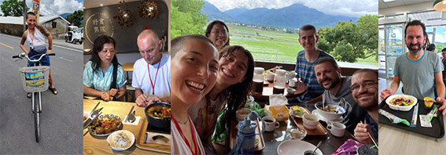

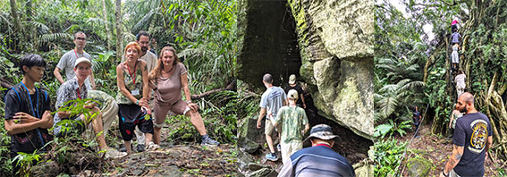

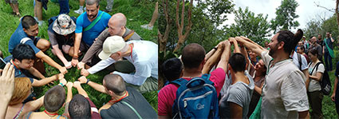

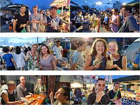

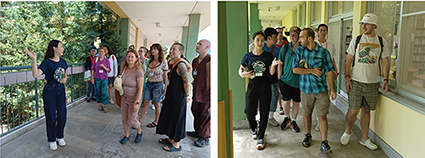

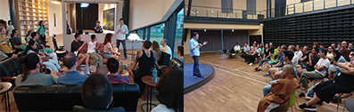

### 擔任木魚國際禪學營文化之旅及學會為木魚學員舉辦的台東之旅志工有感

魏敬純

擔任木魚國際禪學營文化之旅及學會為木魚學員舉辦的台東之旅志工，對我來說是一個非常特別又新奇的經驗，看到許多真心想學習佛法的外國朋友們齊聚一堂，也讓我對於佛法有了另一層全新的思考。

活動當中有來自世界各地國家的學員，他們懷著不同的目的來參加這個禪學營，我僅有機會和少數幾位學員交談，有的人是因為家庭關係想更了解佛教、有的人是相關科系專業、有的人是想要潛心鑽研佛法甚至出家，無論他們參與禪學營的目的為何，當我在一旁觀察和與他們交流的過程中，我都能感受出他們每個人都是非常誠心投入的在體驗與學習，讓我意識到，原來佛法的力量並不只侷限於我們的東方社會，有許多與我們文化背景相異的人，也對於學習佛法有著高度的熱忱。

就讀國際學校的我，對於西方文化有大量的接觸，也認識不少外國人或是在國外長大的人，但這些學員們帶給我的感受，是一種能帶著西方的思維去學習台灣文化與佛法的精神，不再只是被動的吸收和輸入，而是能夠主動式的思考、探究、提問、化為自己思考的養分，卻同時又能散發中華文化價值中的秩序與禮。

同時，我也遇見一些想要學習佛法卻受到語言阻礙的學員，原先我認為，學習這些佛法與儒學只要我自己讀懂、能學以致用就已經足夠，但經過這次的體驗，我發覺若這些珍貴的正法能變得更accessible ，能被更多的受眾理解，那這將會利益更為廣大的人群。

在這次的體驗中比較可惜的部分，是學員們在與我交談時可能因為我年紀較小，只會跟我談論一些較為生活、學業上的事情，較少有機會聽聽他們對佛法和禪修一些更加深入想法，若下次還有機會，希望能夠像戴老師一樣，可以和學員們交流一些他們對於佛法、禪修的看法與學習。

### 木魚基金會哈佛菁英團文化體驗與台東行心得迴響

工作人員

質樸有趣的團隊

好奇驅動的學習

人生難得的相遇

珍惜文化的交流

妙眼myōgen

我對人們普遍感興趣，會好奇他們覺得什麼重要，以及他們如何生活，文化和自然主題是美好的表現，但我覺得人際互動是最令人鼓舞的。這次拜訪鸞山部落，我真希望我的家人朋友們能看到鸞山部落和江賢二的藝術作品，並了解他們的背景，特別是能夠見到作品背後的人！

此行我要感謝大家花的時間、體貼、關心和關注，我希望將來還能給更多人提供這樣的機會。

有時候佛教和文化被教導的好像是兩個不同的事物，會以為俗世與法界毫無關聯，而能夠看到佛教徒如何在世俗方式中生活與互動，對外國的在家佛教徒非常有益，他們可以深刻地了解日常生活中作為修行者的樣子，並賦予他們世俗生活意義。

我非常感激以誦念阿彌陀佛作為旅行的開始，甚至進行簡短的法談。這在返回酒店時也是很好的，只需幾分鐘來肯定或反思這一天。我知道許多人沒有帶著佛法的習氣來參與活動，希望他們能帶著一些啟發回家。

對我來說，能夠看到並了解臺灣的文化、民族複雜性和自然美景是有幫助的。我以前只走訪過臺灣的廟宇（作為一個日本僧侶很難與之產生聯繫），認識的臺灣人也僅止於我在加利福尼亞州舊金山地區的臺灣老師和朋友。我要再次非常感謝您們，如此地信任我們這群陌生人，並在臺灣這趟安全和啟發之旅中，給予我們所有人支持。如果可能的話，我很願意在未來再次幫助您們！

我認為作為第一次旅行，一切都進行得非常順利。我不知道如果我不了解旅行的目標或預期結果，該如何改進。總的來說，我認為我們在無盡燈活動中獲得的一切，都準備得非常好並且有條理，你們在未來的活動中也會成功。如果說一定要建議什麼的話，我會希望有一些有能力的外國人，在可能出現文化差異的時候幫助喬接一些事情。

我願意協助無盡燈未來的教學，我有管理工作室、大型活動、禪修以及演講和講座的經驗。我的背景是中醫醫學博士，今年年底將獲得神學和多元宗教研究碩士學位，特別關注於多元宗教和多元文化背景下的精神教育。

關於線上學習，這取決於您們的目標受眾。在這一點上，多個平臺是必要的，因為年齡或國家人口結構往往決定了哪些平臺更受歡迎。對我來說，電子郵件或WhatsApp是與這個群體溝通的最佳方式。

我會考慮返回臺灣參加無盡燈的佛教課程、儒學課程、旅行相關的活動。

除了以上，您們都做得很棒。我希望我們這群外國人沒有給您們帶來太多困擾！非常非常感謝！

MarcMalonzo

我喜歡這次無盡燈行程中所有的事情，令我印象最深刻的是參觀原住民部落森林，向他們的神祈禱，種下一棵樹，然後品嘗他們為我們準備的食物。那是非常特別的時刻，我永遠不會忘記！

如果有可能返回原住民部落的森林，那我會帶親友們從那裡開始，展開台灣之旅！此外，在花蓮騎自行車的體驗也很美好！

我非常感激無盡燈所有的成員的付出，為如此多的人提供美好而難忘的體驗。你們也是佛教的優秀代表，偉大的榜樣。非常感謝你們所做的一切！

我很願意以任何的方式回饋您們，有任何需求都歡迎提出，我會考慮再次參加無盡燈的所有活動。我只想表達我一切的愛和感激之情！

MatthewPowals（老法官）

我印象最深的是護送人員的態度、關注和善意：Vivian、Mose、Jerry、Davidson，當然還有唐老師和他的妻子。

我會特別向親友推薦實驗學校和鸞山部落...當然所有的活動和事件都令人難以忘懷。

在我漫長的生活中，很少有時刻可以與為我們精心策劃的許多活動的多樣性和樂趣相比擬，我們對臺灣文化和風味有了全面而簡明的瞭解，特別是在南部。整個旅程充滿了老師們和整個工作人員的體貼和親切（甚至包括幫我洗衣服的Davison）。這真是一次難以忘懷的終身之旅。

關於給ULA的建議，這很難回答...每件事都處理得非常出色...也許在結束時為所有參與者、工作人員和老師們舉行告別晚宴，然後我們都各奔前程...

我願意做義工，但由於距離較遠，我不確定如何做...希望將來能夠回到臺灣。

我會考慮再次返回臺灣參加ULA的旅行相關的活動，或其他由ULA安排的活動。只是感謝.....阿彌陀佛...

ChrisGong

此行我對布農族部落產生了非常深刻的印象，因為這個民族的豐富文化和歷史，阿力曼老師非常誠懇幽默，我們在那裡享用的午餐是整個旅程中最美味的一餐，特別是搗麻糬的環節，既好玩又好吃。在稻田周圍騎行也非常美麗，我喜歡能在該地區自由漫遊。海灘非常放鬆，水溫很暖！每個夜市都非常有趣和美味，我喜歡這是旅行的一部分！參觀均一高中的獨特之處也很酷，認識了嚴長壽先生真的很棒。參觀慈濟也令人難以置信，了解這個組織真的很鼓舞人心。我認為TedWang關於科學與佛教的演講也非常深入思考和深入。我會與家人朋友推薦台東海灘、鸞山部落、池上騎車、八方雲集包餃子、慈濟世界。

非常感謝這次旅行的一切，這真是難以忘懷的經歷，讓我印象深刻的是您們對我們的關心，以及您們分享給我們的真摯愛意，和您們所做的工作。整個團隊的真誠和每個人的出色表現，使這次經歷如此難忘。一切都安排得非常好，我相信這從我們參與的眾多活動和每個活動的時間表都可以看出來。我非常感激有這次機會，很高興認識了您們所有人！

我不確定我如何為ULA做出貢獻，但也許我可以運用我的中文語言能力！也許可以創建一個定期會議討論經典或類似內容的在線視頻小組！我也會向家人或朋友推薦這樣的活動，並且再次來台灣參加ULA的佛教、儒家、旅行相關的活動。

Megan

我非常喜歡與ULCCA的工作人員交談—他們的善良和慷慨使這次旅行變得非常特別，作為遊客前來臺灣時，你不會有這種體驗—這絕對是這次旅行中最棒的部分—能夠看到並聽到佛教和ULCCA如何對志願者們的生活產生積極影響，這給我留下了深刻的印象。我真的認為各種活動的結合非常成功—自然、美食、文化/藝術和在巴士上度過時間的愉快結合。非常感謝您為我們帶來了如此美妙的旅行！

非常非常非常感謝您們—我非常感激能有這個令人驚歎的機會，我仍然對唐老師的慷慨和帶給世界的正能量感到敬畏。我希望很快能再次見到您們！

SandraCampero

在前往目的地的巴士上念佛，總是在我腦海中不斷重複。在旅行時，我需要平靜心靈時，我會念「阿彌陀佛」。你們都非常體貼和善良！是你們祥和的存在和指導，使這次旅行成為我經驗中令人難忘的回憶。老實說，在我看來，ULCCA一切都運行順利。

我有興趣做ULCCA的義工-我有能力根據項目的規模組織籌款策略和計劃。我會考慮返回台灣再次參加ULCCA的佛學課程、儒學課程、與旅行相關的活動。希望能有一種與ULCCA未來計劃保持更新的方式，以讓家人和朋友知道。ULCCA有社交媒體專頁嗎？謝謝您們讓我們度過了一個非常特別的時光！

AndriHadjimpalasi:

我會選擇對鸞山部落的參觀，以及明年將要開放的江賢二藝術展區。這兩個是我最深刻共鳴的地方。毫無疑問地我會推薦家人與親友這兩個地點！還有，休息站那裡有座連接到小島的三仙台橋，但橋對公眾不開放。

要向ULCCA說一聲巨大的感謝。我不知道還有什麼其他方式可以表達我此刻內心深處的巨大感激和溫暖。謝謝。

關於對ULCCA的建議，我會說：讓它變得簡單一些，不要試圖在一天內安排太多活動。當然，我非常感謝你們的努力和興奮，不要誤解我的意思，我很希望我們能到處走走，做各種事情（尤其是考古和熱氣球節）。但時間有限，我們的精力也有限，無論是你還是我；而且讓那麼多人從一個地方移動到另一個地方並不容易。我建議選擇最受歡迎和必去的地點，並為探索留出更多時間：)。

我會有興趣做ULCCA的義工，尤其是在文化方面與人們和自然建立聯繫方面。我不會說中文（但可能會改變，誰知道呢），但我可以提供英文到希臘語的翻譯。我也不是佛教徒，但我對佛教和它的修行，特別是正念冥想，越來越感興趣。

Imre:

那天與部落相處的經歷。他們生活方式的純潔、對自然的尊重以及與環境的和諧，都給了我很多啟示。三仙台島和北回歸線是短暫但美麗的停留點，為行程增添了很好的額外價值。

您們是最好的老師，因為您們不僅通過言傳身教來教導，也是一群非常善良、擁有極高正直品質的人！

Iker(亦可):

鸞山部落體驗。看到阿力曼老師是多麼願意向我們展示一切，而且食物太令人難以置信了！毫無疑問，我會再去台東以及東海岸。我認為那裡有驚人的自然景觀！非常感謝您們傳播中華、佛教和儒家文化所做的一切工作。我希望能再次回到台灣，加入您們的課程，學到更多。

一切都非常專業和出色！也許可以增加一些禪學研討會，會很有意思。但總體來說，一切都很棒！

我非常樂意幫助ULCCA成長，也許可以在社交媒體上分享照片和帖子，或者志願幫助翻譯成英語或西班牙語！我認為創建一個Instagram帳號會有助於讓台灣以及全世界的人了解ULCCA。也許您可以在中文和英文分別開設一個帳號。

我會向家人或朋友推薦這樣的活動，並且考慮再次來台灣參加ULA的佛學、儒學與參加與旅行相關的活動。非常感謝您們帶來這次非凡的體驗！

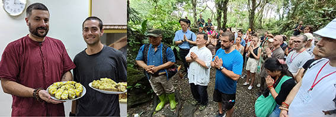

## 青年佛教哲學講座-四部宗義

### 暑期四部宗義講座報導

心若

年輕學習旭日升，辨別宗派奠基礎

思辨訓練最合宜，方知佛法須合量

課堂大座與小座，晚餐過後釋疑難

依理成立正知見，外道內道之差別

內道究竟中觀義，建立因果合理性

浩如煙海的佛法典籍，往往讓學習者不知道從何處下手，掌握主要宗派的思想內涵，才能對佛教的主張有完善且全面的認知。

學會這學期開辦時哉青年經典研學班，有近百位同學報名，最後錄取了三十位同學，參與的同學們資質很好，思辨力強，不少同學也期望能夠繼續深入了解佛教思想，故學會特地於八月二十三至二十七日，每日上午九點至下午五點半，為十八歲至三十五歲的青年朋友們，開設「四部宗義」暑期講座。土官呼圖克圖是乾隆時期的高僧，人稱「掌印呼圖克圖」，《四部宗義》是摘譯自他的巨著《土官論》，扼要地開顯出佛法有部、經部、唯識和中觀的核心思想，幫助我們走出對佛教理論認識的混沌。

釋迦牟尼佛說他的道理都可以經過檢驗，佛是顯示道路的人，皈依佛是因為真相由他而說、由他而證、由他來引導，由這一分的恩德來皈依他。印度是邏輯性很強的地方，印度的外道分兩種，一種與釋迦牟尼佛為敵，一種聽完釋迦牟尼佛講的道理，發覺合情合理，便願意改變想法，歸順釋迦牟尼佛，其實時代愈科學，佛法反而讓人容易懂。

四部宗義的課程雖然很難，其理路辯證、知識背景都很深厚，這次開放的對象都是初機青年，並沒有深厚的佛學底子，目的是希望大家在最年輕、最有思考力時，來做法義的探討，就像牛般把所有東西吞進去，再吐出來慢慢咀嚼、消化，成為身心的養分。

我們對道理很容易獲得的那一分，靠的是過去累劫修習的福報，很多慧生起的時候，也必須靠福去維持與資助，福是總相的存在，所以包括個性、禮節、情緒控管、態度，乃至於人際關係的相處，都必須講究。講座五天，其中八月二十六日，安排去參與正覺精舍戒律學院及天王殿佛像開光，躬逢盛會，很難想像當初開山時只是一間小木屋，經過四代的經營成果斐然，清公能把戒律發揚光大，經營道風，以慧來經營福資糧，在菩薩道上做種種的廣大行，這些因滅後生出的成效與果報，都是我們難可思議的。

講座開始，原時青班與新報名四部宗義的學員齊聚一堂，開訓時，唐老師、林老師都給與會青年一番鼓勵。

唐老師開訓致詞言：「過去雪廬老人、周宣德老師都很重視人才的培訓，若干年後，我站在回饋、延續的心態辦理人才培訓班，今天恰逢我母親過世一周年，辦講座也是我對她最好的回報。

本次講座主題為《四部宗義》，了解《四部宗義》，就能對佛教有通盤的認識，當初玄奘法師西行，到那爛陀寺學習，以唯識見為主，唯識見是當時中國的主流，但其實還有一派是中觀的思想，只不過中觀的傳承很快沒落，理由是人才不夠，當人才不足時，再好的教法都傳承不下來，就像中國《易經》的傳承，到後面都斷了。

當時雪廬老人過世，大家都很傷心，不知所措，我是老師後期的弟子，我認真把老師的講經表解全部都練講過，後來，我知道宗派見是自己思想的瓶頸，好在這段期間，碰到了很多高人，跟他們學習，讓我開展出另外一片天。

我這一生把佛法當主業，其實學佛跟聰明絕頂是兩回事，聰明絕頂的人未必學佛強，都是看你人生的重點擺在哪裡，我投入佛法學習的時間非常多，關要處都會想辦法弄清楚，辦公室內部也在講座前辦讀書會，將這本《四部宗義》研習過一遍，可以說是胸有成竹，絕不是把大家當成白老鼠來實驗，像我的老師雪廬老人，他絕不去做沒有把握的事，而且他做的事，一定能帶來佛法永續的發展，影響我非常深遠。

學會辦公室除了例行的事情，還有諸多的實體、線上課程、啟蒙教學，以及負責各類大型活動，但是為期五天的四部宗義講座，是學會的重頭戲，學會經費有限，工作很多，之所以能不斷辦講座、辦活動延續教法，是因為教法的威力實在太強大了。

培養人才很重要，道場的核心處是人才，內涵的經營比外相重要太多了，要把人全部都培養為人才是不可能的，古德說：「千人吃飯，一人還錢」，講座中只要有一個人對佛法很有體會，願意改變人生方向，這五天師長們、義工們的付出就全部值得。

《四部宗義》佛教的宗派思想，都有系統的解釋，如果沒有了解，我們對佛教的認識是雜亂無章的，佛教最核心的就是對勝義的解釋，能夠超越一切宗派，是修學的秘密，在世俗上能對戒律做最殊勝的抉擇，最能趨吉避凶、斷惡修善。

大家還年輕，未來走的路不見得跟我一樣，但是最好趁這個機會，梳理自己的思想，人生的定位會不一樣的，期許大家收穫滿滿。」

林老師致詞言：「很高興齊聚一堂，很佩服大家選擇《四部宗義》這門課程，相信大家報名、進來之前，聽過《四部宗義》的人一定少之又少，甚至沒有。這五天我們會把這四部的宗義、宗派見研究清楚。手邊的講義，看似簡單，其實極不簡單，是唐老師經年累月的走來，三十、四十年的所學、所得，才能濃縮成這場講座。

這門課程可以說是入門，因為很多學員都是初學，但也可以說是進階，希望大家帶著好奇的心態、提振精神，很多理路的分析，都需要清晰的頭腦，來了解每個宗派的見解、見地是什麼，才能拾階而上。我們不是傳統的學習法，而是破、立的學習法，也就是這個宗派見不足的地方，我們要破他，再往上走，這幾天是我們自己的破立、四部宗義的破立，甚至是人生的破立，相信五天後，大家都能滿載而歸。」

應著師長們的期許，我們展開了格外精彩的思辯之旅，所用的教材是土官呼圖克圖的著作，法尊法師的翻譯，本書的內容與任務是讓我們分清楚內道跟外道，及內道裡面何者了義，何者不了義，這唯有宗派見才能分清楚，內道跟外道的差別在於無常，內道各宗的差別在於無我。

無常、無我、涅槃寂靜這三法印是佛教的命脈，而《四部宗義》只談到無常、無我，沒有談到涅槃寂靜，但是其實佛教三法印的核心處在無我，通達無我，自然通達無常，若沒有無我見，也根本不可能進入涅槃，無我才能真正通向苦因苦果的滅。

三法印中，涅槃寂靜內、外少諍，無常也為大部份的外道所共許，而與外道距離最遠、爭執最大的，乃是第二個諸法無我的法印，因此，四宗要義的內容專講諸法無我，四宗要義的任務專門在啟發學者對於諸法無我的正見，這是非常合理而且必要的。

宗派的分裂，以「見」為主，見裡面又以「無我見」為主。所謂無我見，即否定我的見。因此見以「我」為所破（破即否定）對象，所以各宗無我見的差別，實即以各人所認定的必須破除的「我」的不同為起點。各宗派間你的實有「我」跟我的實有「我」長得都不一樣，所以你要破的「我」跟我要破的「我」不一樣。因此，我們想要明白各宗派見解的歧異，就必須先知道各宗所無的「我」究竟是個什麼樣的我，好比射箭要先知道靶在哪裡再來射，要先知道我是什麼，再來談這個我到底有沒有，所無的我到底是什麼。

其實各宗說來說去、換湯換藥，都脫離不了離蘊我的概念，各宗各派要破的都是離蘊我，要成立的是即蘊我，只有中觀應成派要破的是即蘊我，所以唯有中觀應成派的宗派見，才能獲得真正的解脫，如此說來，對於這些義理的分析，如何能不了解呢。

五天的講座落幕，同學們釐清了諸多問題，感到法喜充滿，但同時也留下諸多疑惑，要靠之後的讀書會，以及後續不斷地學習來建立正確的觀念，學習這件事情，不再是以前的活到老，學到老，而是活到老，學到死，相信十月開學，又是另一番天地，把握每次學習的機會，弄懂法義，嚼出滋味，修福、修慧並進，方是永續無盡之道。

附錄：餐前觀修  中觀宗的用餐     唐微智

民以食為天，吃飯這件事情是大事，但要怎麼吃飯呢？除了要養足體力，才有能力修學正法，利益有情之外，其實吃飯本身就可以做佛法的觀察，吃飯當中，有世俗的觀察跟勝義的觀察，世俗的觀察包括懷抱感恩的心，以及如何在吃飯中發起出離心、菩提心等等，不過這不是今天的重點，這次講座四部宗義，通通是就著勝義上來說，世俗上的看法，佛教各宗派都承許緣起，所以世俗的這一分，不是今天的主角。

所謂宗派見的觀察，是就勝義上做觀察，眼前是就教義做觀察。先說個有趣的故事，古代禪宗曾經說，在吃飯中，你覺得好吃是貪心，你覺得不好吃是瞋心，你覺得談不上好吃或不好吃，這是愚痴的心，請問上座，你是什麼心呢？

所謂的貪心是看到菜飯的可口跟聞到菜飯香味，看到、聞到、嘗到，這個不是貪心，這是觀待上的顯現，凡夫跟聖人都有。對著菜飯起了愛染之心，才是貪心的形象。如何降伏其心，整部金剛經都告訴我們如何降伏其心？試問，飯菜的色、香、味到底在哪裡成立呢？在食物上成立嗎，如果在食物上就可以成立，那就不用觀待正常的眼根、鼻根與舌根，就可以顯現色香味，也就是不必眼見、耳聞、舌頭嚐，就能夠顯現飯菜的色香味，這如何辦得到？眼睛不看如何顯現色；鼻子不聞如何顯現香；舌頭不嘗如何顯現美味可口，可見色香味不是在食物上。

如果說色香味就在眼睛、鼻子、舌頭上，那就不必食物本身，就可以呈現色香味，如果色香味在空氣中，那也不必食物、眼根、鼻根、舌根，所以色香味到底在哪裡？中觀宗說，在勝義上無從顯現他是什麼，意思是，色香味沒有自己顯現為色香味的體性。

那色香味在世俗上怎麼顯現？如果今天心情不好，再好的眼根、鼻根、舌根，也不會留意食物的美色，也不會想細細品嘗飯菜的香味與口感，請問色香味如何顯現？如果這個人被債務追討，心急如焚，眼前食物的色香味也無從顯現。或是失戀的人，極端痛苦的人，色香味都難以顯現。色香味只不過是藉著食物，正常的眼根、鼻根、舌根，以及美好的心情去顯現而已，但色香味不在根上，不在心上，也不在境上，色香味的顯現是一個總相（有支）的顯現，觀待支分（心情、眼根、鼻根、舌根）而有總相（有支）的顯現，依著有支的作用安立為可愛樂的色香味，但色香味在支分任何處都找不到，但沒有那些別相（支分），也不會有總相（有支），依著總相的顯現，而安立色香味具足。

所以主人要請客吃飯時，一定要找到好的廚師，打造美妙的氣氛，請的客人要是身心正常的客人，並在大家肚子餓的狀態下上菜，這頓飯就會讓大家覺得是天廚妙供，可見這頓天廚妙供是被各種別相組合出來的。反之，如果請的客人們大家不餓，且客人之間彼此不和睦，火氣很大，這頓飯再好吃，也不能顯現為色香味具足的美食。

也就是說，別相就算人在、食物在，都顯現不出什麼，可見諸法都是別相有效的組合當中，光有別相而無美妙的組合，也顯現不出一個美妙的總相，而這個總相，就是別相組合的作用，被我們安立，這樣而已，以上就是中觀宗的吃飯。

如果了解這個道理，錶殼、錶帶、錶鏈組合的手錶，或者是車輪、車軸、車蓋組成的車子，安立的方式都一樣。

以上，祝大家帶著中觀宗的想法來享用師姑師伯們辛苦煮的色香味俱全的午餐，謝謝。

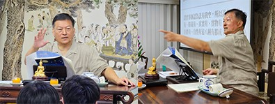

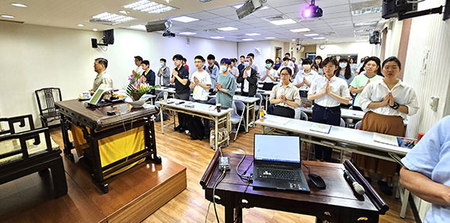

### 正覺精舍齋僧、戒律學院開幕，以及天王殿佛像開光報導

心若

內典論語班的高才

不改赤子心的修學

儒佛架構式的學習

克服帕金斯的障礙

開示有條理的敘述

寺院經四代的傳承

每半月誦戒的道風

戒教與淨土的修學

示觀經三福的依據

感謝各方來的莊嚴

親切與大方的主人

由於疫情的緣故，近年齋僧活動都無法讓大家直接前往寺院供齋，今年疫情趨緩，生活逐漸步入常態，又因為學會往年齋僧從無間斷，誠意可見，清公在去年八月間，已特別答應老師的祈請，讓我們今年八月二十日（日）可以直接前往正覺精舍齋僧，並聆聽清公開示，非常難得。

而學會也應正覺精舍來函邀請，於八月二十六日（六），參加正覺精舍戒律學院的開幕，以及天王殿佛像開光，同沐佛恩，莊嚴道場。當日人潮眾多、四方來集，共同參與此難能可貴的盛事。

僧眾是釋迦牟尼佛的眷屬，十方諸佛眷屬的表徵也是僧團，三寶殊勝的功德依賴僧團才能夠延續、發展，所以我們對僧眾的禮敬、供養、讚歎，就是對三寶的禮敬、供養、讚歎，也是對諸佛的禮敬、供養、讚歎。

僧團如果能夠如理如法的修學，最能維持三寶的殊勝，也最能顯現三寶的功德，符合普賢十大願王的禮敬、讚歎、供養；我們也藉此懺悔、反省自己多生多劫的慳貪、自私自利、不肯護持三寶的罪障；並且隨喜僧眾們各種法行，包括持戒、研學教法、廣做佛事等的隨喜功德；藉著齋僧，請僧團弘揚正法、利樂有情、安定一方，這就是請轉法輪；在家人提供道糧給如理如法的僧團，延續僧眾的生命，亦是延續正法的慧命，就等於是請佛住世；並且願意學習這些大師的禮儀、風範、風采，就是常隨佛學；學得這樣的能力，也方便正法的傳播，這就是恆順眾生；把這些功德都回向自利利他，以及聖教久住，就是普皆回向。不管是齋僧、參與開光法會，我們都可以做這樣的觀修，乃稱合十大願王的觀修。

若是結合六度來說，供養寺院就是財布施，學會從民國一百年起，每年都供養寺院一百萬，至今未斷，這就是六度中的布施；寺院的僧眾都是約束力量很強的人，我們可以見賢思齊，向僧團學習身口意三業的自我約束，這就是持戒。兩千多人的開光典禮法行，有諸多不便，我們安住法義，忍耐不便，保持自己的歡喜心，這就是忍辱；並且好樂做擁護三寶的法行，這就是精進；這些法行不管是齋僧，或是上供、開光、聽開示、吃飯，都能夠安住在法義上，這就是禪定；做能所、三輪體空的觀察，就是般若。

正覺精舍是一個戒律非常森嚴的道場，不論在戒律、教法、修行風氣及培養僧眾人才上，堪為國內非常如法的道場。正覺精舍能在末法時期有情眾生善根偏劣、教法魚目混珠下，保持清純的道風、森嚴的戒律，是台灣眾生很大的福報。

民國一百年時，學會成立，佛堂落成，當時承蒙清公和尚，親自到現場主持開光儀式，佛堂落成，傳授皈依，開示「在家人應有的格局與風範」，而今有此機會令在家俗人參加開光儀式，一同聆聽開示，是吾人莫大的福報。

正覺精舍的住持果清律師，是台中蓮社導師 李炳南老師的弟子之一，民國七十年出家，除了學在天臺、行在戒律外，也是台灣公認現在碩果僅存的律學大家，大師謙沖為懷，善良天真無邪，住持一方，有若無、實若虛，有顏回的氣質。大師對比丘戒、菩薩戒都研究得非常透徹，並且做業果的思維，除了到東南亞考察過比丘戒的內涵，也在兩岸當中傳授比丘戒跟菩薩戒，特別是傳授比丘戒，培養很多如理如法的僧寶，來住持聖教，這在出家人中，功德無人能比。

法有分為正象末滅，在正法時期是戒成就，正法時期雖然需要正知見，但他需要的是威儀、氣象，如理如法、持戒精嚴的僧團，就是教法的實踐處，這樣的僧團，大助正法推廣，所以僧團有戒法的維持與延續，是非常難得的，這樣的僧團可以顯現為在家人殊勝的福田。

當天有在大雄寶殿、天王殿的開光，諸山長老、各團體代表的大居士都躬逢盛會，現場戒律學院、正覺精舍，房間內外都站滿了人，顯示清公結緣之廣，以及大家對他的重視，或許也可表徵戒律在台灣，是佛教的清流，是大家心目中的標竿。

雖然本次活動，各道場參與其事，辦事人員跟義工也是各道場分擔，難免在協調上不能夠一致性，但也不妨礙道場法會的莊嚴。除了唱誦整齊外，清公略述道場傳承、戒律的重要，以戒為本的修學，以淨土為依歸的道風，並把戒律學院跟正覺精舍存在的意義與價值說明清楚。

更特別的是蓮社的吳希仁居士，他以跟清公是同學的角度來讚歎清公，清公未出家前就已經呈現法門龍象，出家後堪為人天師的表法。在開光儀式、諸山長老與居士的法語之後，副住持天因法師將戒律學院的緣起說得很清楚，如此巍峨的建築、生態池、田園的設計，以及天王寺的落成，皆所費不貲，學會並未盡上綿薄之力，深感慚愧。這麼多年來，雖然每年齋僧護持，但對寺院提供的服務是極為有限，願意以宣揚正法的這一份力量，來回向正覺精舍、戒律學院，能夠成為典範，肅立三寶莊嚴的形象，讓埔里、台灣成為人間樂土。

相信在本次活動之後，學會台北、中壢、東勢的蓮友團，以及年輕人組成的時青班，在參觀正覺精舍跟戒律學院、天王殿之後，一定有諸多的感觸，經營道場不易，道場經過世代的經營，才有今日之規模，中心以人才為本，延續教法跟道風，也只能靠人才，惟願三寶加被、傳承攝受，讓清公雄鎮正覺精舍及戒律學院，培養僧眾，成就法門龍象，不但利益正覺精舍本身，也利益各道場，讓台灣成為學戒、學教的淨土，是所至盼。

### 四部宗義講座學員心得

眾學員

四部宗義五部論

獲得核心考格西

佛語心要道次第

少費心力涅槃城

塗品良

進來聽訓前不闇佛教的義理，雖然佩服其邏輯思辨，但總覺得有不合理、不通順之處，經過四部宗義的課程才知道，原來各宗派都有其缺憾處，整個佛教史其實就像是在盡全力推演完整這套思辨模式，很不像是宗教理論，更像一套思考方式、研究方法，就像科學界的思想模擬實驗。

接觸學會課程後真的很感動，一方面是對接觸純粹佛學義理的求知滿足，另一方面感動於中國經學在這片小天地的傳承保留，身為中文系的學生也不能否定學院派對傳承有其侷限性，感謝學會對中國傳統文化的保存，還好學會對佛學做如此完整的傳承與精闢的解釋，否則我會一直對佛學有錯誤的理解，期望這些知識能真如無盡燈不斷地燃燒傳承下去。看著學會老師就好像電影一代宗師所說的：「拼一口氣，點一盞燈，要知道念念不忘，必有回響，有燈就有人，有雨就有痕。」將所學致力推廣傳承！

胡如茵

本課程讓我重新認識佛法以及修習的方法，尤其是「理性宗教」這個觀點的建立，除此之外也訓練了我的邏輯推理、架構分析能力，使我在學術研究上有極大的幫助。

透過對佛法的興趣讓我重新建立對哲學的觀感以及學習的信心，藉此讓我認知到「我是聰明的」，因為國高中時期成績一直屬於班上後段，讓我覺得很自卑，在學習那些困難科目時我也會直接退縮。這次能夠對四部宗義有大概念的認知給了我很大的信心，除此以外，也訓練了我明辨事理的能力、觀物的思維，進而了解人生道理。

吳念芸

此次很幸運有機會去正覺精舍開光，看到果清律師雖然年紀很大了，給人的感覺還是非常開朗，不禁讓人想到他還未出家時，是怎麼和高中生相處的呢？我很喜歡的一個國中理化老師也是佛教徒，他的課很強調辯證，讓我總是收獲滿滿，我也是從他那裡第一次聽到密勒日巴尊者的故事。就像清末時傳教士在台灣開設學校教導現代科學知識，而使得今天仍有些人因此對基督教抱有好感一樣，也許一個好的老師就是讓人對佛教心生好感的典範吧！

歐陽知凡

感謝老師及助教們，四部宗義比起上次的心經要難上許多，然而在大量的討論和請教下，得以對佛法正見有更深一步的認識。相比心經這種大眾所知的經文，四部宗義對於一般信眾或非佛學研究者，不論是閱讀或是授課機會都更加難得，而它對於理解佛家各派見解又十分重要。能正確的認識四部宗義，是得來不易的因緣。

葉庭儀

這次聽課，印象深刻的有幾點：

一、一開始的目標通常百分之九十都不一定會達成，所以不需要執著，而是靜下心在學習的過程中，跟隨好的老師直到見地俱足，目標自然愈來愈清晰。

二、很多事情看起來很簡單，其實卻很不容易；很多事情看起來很難，其實很簡單。

三、一般會說，沒有失去，不懂得珍惜。但其實，反之，沒有得到，不知道失去什麼。

此次課程，最想感謝唐老師，還有雪廬老人，如果沒有您們的傳承，我們學不到這些甚深見。

游捷茹

*總有著系統地學習一門知識的渴望。謝謝學會讓我們有地方學習、有老師講授與請教、有同儕共學。*

這次的主題「四部宗義」是未曾認識的，在五天的課程中，跟隨老師們的步伐，一步步走向經典《四宗要義》。從「如何辨別佛教徒」的兩個觀點作為起點，其一為主信論、外緣上的皈依三寶，其二為主見論、內因上的認同三法印，接著從佛法的基本原則三法印（諸行無常、諸法無我、涅槃寂靜）中，進一步點出本經旨在解析佛教四個宗派對於無我見詮釋的異同。

進到經文，老師循序漸進地講解各宗派相互破除與安立的觀點、對二諦的定義區別，幫助我對佛教不同宗派間，如何相互認同、修正有更深入的認識。雖然邏輯思考時常感到困難，但在深入淺出的解說下，好幾次為佛教對於世界細緻的觀察與理解感到驚豔，也享受於一邊聽聞各宗的宇宙觀、一邊與曾學習過的觀點連結的快樂。

「傳承」似乎也是這次課程的靈魂，老師帶大家深入認識無我觀在四宗之間的演變，不同宗派之間如同層層堆疊的知識，逐一相互檢視、補充與修正，也舉了許多以中觀角度對事項進行「雙觀觀察」的例子，若能熟稔對於條件的觀看，有助於培養不畫地自限、保有發展性、謹慎的樂觀的生命態度。

老師也提醒「見地的傳承」與「過程的經營」的重要，兩個簡短而不簡單的話語在心裡留下深刻的印象，使我在課堂帶著具體的目標、有意識地感受。如每日的餐前觀修引導我們思考食材的來源、佳餚的產生，以及經典、義理與生活之關係；在正覺律學院之行，老師們用心準備一個接一個的主題，沒有間斷地與我們分享有關的知識，返程路上，同學逐一分享參與心得，聽到不同的思考令人感到驚喜與收穫—一位同學從隊伍行走的觀察，延伸到教法的傳承、到自己如何在忙碌生活持續地向老師學習；另一位同學從眾人遠行的共襄盛舉，思索到律學院人才培養的本質，至到一個道場道風的保持與延續—在相同場合、相異的體會令人眼睛為之一亮，也是「一個活動的前行、過程的經營、心得的回饋，都是非常重要」這句話非常真實的體驗。

傳承，在經典、在實踐，過程的經營有如文字與行動之間的橋樑。謝謝學會用心的課程設計，把上課所教的義理，遍布於課程大大小小的地方，讓我們在課堂與日常，都能學習、觀看、感受、體會。

## 馬汶訪臺深度旅遊知性之旅

### 馬汶訪臺深度旅遊知性之旅報導

心若

最難遠方來共學

連假安住善法義

人生有幸有朋來

創造命運由立命

今年二月曾到訪東馬詩巫、古晉辦論語講座，《論語》上說：「以文會友，以友輔仁。」雖然台灣與馬來西亞、汶萊相隔遙遠，但在線上經營讀書會，每周研學，疫情過後，也有兩邊的實體交流，在學習這條路上，結為好友，互相增上。此次由東馬泑珠老師組團，帶領幾位汶萊的友人到訪台灣，玩樂與教學參半，對台灣、馬來西亞、汶萊三方都是很好的成長與收穫。

九月二十四日至二十七日 嘉義阿里山之旅

旅行可以增廣見聞、結交好友、融入大自然，並將經典結合有法做觀修，古人說：讀萬卷書、行萬里路，良有已也，過去留學生也是靠著旅行到他國去學習新知，再帶回自己國家，政治人物也是出去旅行、增廣見聞，知道各國的興衰，回來治理自己的國家，孔子說「入其國，其教可知也，溫柔敦厚，《詩》教也；疏通知遠，《書》教也；廣博易良，《樂》教也；潔靜精微，《易》教也；恭儉莊敬，《禮》教也」，在旅行當中可以了解各地的風土人情，孔子也是帶著弟子周遊列國，拓展胸懷，與各國人士交往，諸佛菩薩也是去各地旅遊，藉此了解各類的有情眾生，雪廬老人說：「食其毛，踐其土」，來到一個地方，除了表達對這個地方的敬意，融入山水情懷，用心體會，創造歡樂外，還要能夠在這裡討論正法，作為此處正法興旺的緣起。

過去玄奘法師除了去印度求學外，旅行也讓他增廣見聞，《大唐西域記》就是他旅行的見聞。今天三地相聚在台灣的阿里山，可以說是百千萬年難得的因緣，因為古人說百年修得同船渡，千年修得共枕眠。相聚都是百年、千年的因緣，更何況是相聚這麼多天，其中不只是大家歡樂，氣氛營造、彼此交流，還包括正法溝通，後續還有了凡四訓講座、拜懺、放生活動，拜懺是大悲心的觀修與生起，放生是實際的做法，了凡四訓是藉著正知見來改變命運，這樣的相聚非常美好又具有意義。

講座凝聚想法，用旅行來交朋友，更是非常殊勝的因緣，過去憨山大師跟紫柏大師，不但在佛學院兩人是很好的朋友，還一起出去參訪善知識，變成生死相交，就算佛門主張以解脫為大用，都不妨礙在入世的時候，有五倫的經營，五倫的經營中，特別是朋友的這一倫，古人說，在家靠父母，出外靠朋友，朋友當中，志同道合，又有旅遊的歡樂，這在古代也是不可多得的。就算菩薩，也是過去生累積而來的交情，像文殊菩薩跟普賢菩薩的交情。善用旅遊，賦予很多意義，將會帶給我們人生諸多想像不到的價值。

此次阿里山行最壯觀、最令人難忘的就是搭小火車去欣賞阿里山日出，領隊說我們運氣非常好，不只見到萬丈光芒的日出，還伴隨著濤濤雲海，日出、雲海一起出現的機率很低，我們置身於仙境般的雲海，瞬息萬變，道不盡的美麗，阿里山的日出令人流連忘返，在如此這般的騰雲駕霧間，感受到青雲仙境。

看到雲海，可以觀想《華嚴經》上說的眾海雲集，菩薩、天龍八部、神明等就是眾海，這些聖者像雲一樣的集合，看不到邊際，眾海雲集當中分兩類—同生指聖者，異生指凡夫，但是這些凡夫都是聖者的示現，不論同生與異生，他們都共同擁護教主釋迦牟尼佛，從菩薩、神明、天龍八部烘托出教主的不可思議，擁護教主的這些菩薩，他們的內涵德能，都讓我們難可想像的時候，其主人更是可觀。日出出現的時候，剎那間耀眼無比，令人不能直視，如佛的威勢般，震懾大地。

九月二十八日 孔廟祭孔典禮

此行很重要的一站就是在教師節當天清晨，去孔廟看祭孔典禮，孔家是台灣的國寶，有祭祀樂舞的傳承，日韓千里的情誼，雪公、上公的延續，學會有幸能與孔家有諸多項目的合作，實是百千萬劫的福份。

東馬、汶萊的善友在清晨四點五十即到孔廟，四天旅程下來，精神依然抖擻，令人敬佩。儀式整體恭肅有禮，頗具正法氣象，當天天空祥瑞佳兆，甘露徧灑開端，國旗大翔空中，禮生引導有序，樂生奏樂祥和，鐘鼓啟扉迎神，正獻分獻陪祭，肅穆莊重高貴，佾生三獻供養，民族精神祭祀，尊師重道表徵，千秋萬代不亡，是教師節對全天下的教師最好的供養，此次由蔣家第四代作為主祭，孔家第七十九代上香，這樣的善緣交錯於台北，正法弘揚在台灣寶島，功德殊勝難一言道盡。

十月一日 大悲懺法行

大悲懺的主尊是觀世音菩薩，菩提心教授是所有佛法教授中的核心，阿底峽尊者的上師中，金洲大師是他的頂上嚴，金洲大師就是阿底峽尊者菩提心教授的上師。修菩提心的教授時，要把上師跟觀世音菩薩相合，於資糧田主尊中顯現為觀音菩薩。這次來拜大悲懺很重要，觀想自己得到菩提心的教授的傳承，是非常棒的緣起。

此次由辦公室籌組，擔任維那與法器執事，訓練自己成為法器人員，是對觀音菩薩最殊勝的禮讚，本次也請過去的法器人員來當主法者，表達禮敬，感謝過去的付出。

在前一天了凡四訓講座結束後，工作人員便協力將二樓、四樓佈置得喜氣洋洋，以莊嚴的壇場在隔日上午八點半至九點半前行之後，禮請觀音菩薩與大悲心陀羅尼經中的法會眷屬到學會來接受供養，依大悲懺使參與者蒙受大利。拜懺要當成觀音菩薩就在眼前，所請聖眾諸尊菩薩摩訶薩，都是法會的貴賓，跟祭孔的儀式一樣，迎進來後，開始做供養。

大悲懺經過我們供養、讚嘆、禮拜、發願、懺悔，把諸佛菩薩迎請進來，最後一個一個送走，就像祭孔儀式一樣的莊嚴，將來成就佛淨土，也透過這種方式，迎請諸佛菩薩到我的淨土，使我的淨土圓滿殊勝。

人世間有種種的不如意，八苦六苦等，環境不好、經濟爭奪、戰爭頻繁，大悲心是我們面對這個世界最根本的心態，善知識是我們的團隊，用這種能耐、因緣來斷惡修善，讀了凡先生的立命之學，要有這種心態，來做為改過、積善的見地與方法。

拜懺以往都是在中壢辦，這次是第一次在學會舉辦，竟是由東馬、汶萊請法，人生奇妙因緣多，在北京國際學校工作的Brandon（布蘭登），也因感念學會在台東之旅的照顧，在中秋暨十一長假特地來學會當義工，包括到隸屬學會的幼兒園及教育機構義務教唱英文歌曲，他聽說有大悲懺的法會，感到很歡喜，甚至還希望能學習怎麼唱梵唄，感念這些遠方友人的情誼，雖在千里心為咫尺，學會辦活動，也來互相交流以酬熱情。

學佛以後，世間都變得很簡單，很容易看懂，禮數的周道、思想的全面，看問題的深入，送神、皈依，表達對他們的崇敬，在讚頌當中，法會圓滿，就像主人送客，表達誠意，如何了解佛教儀式的內涵，如理如法進行，隨文入觀，興起對佛菩薩證量的嚮往，這樣的功德將說之不盡。

十月二日 深澳漁港放生法行

學會放生活動行之有年，此次特別為馬汶團舉辦放生法行，放生時要想像自己就是觀世音菩薩，法界有情都是我們要度化的對象，眼前特別是這些生物，前行儀軌先跟這些魚類結法緣，一般都是結世俗的緣，例如聚會、唱歌、聊天，而法緣是一起共學教法，這些生物沒辦法跟我們共學，只好用儀軌的方式來跟他們結法緣。儀軌當中，依著菩提心，來做放生的大業，放生當中，是眾緣和合的善業，對象是即將被宰殺的有情，對這樣的對象生起大悲心，生物放出去的時候，不冀望他們回報，又像登地菩薩的心量，放生可以觀想跟菩薩的六度結合，或跟普賢十大願結合，有時候前行的觀修法，比放生還要重要。

放生前先做動意念，對造作後面的業很有幫助，首先是慈悲心，如果我們是那條活蹦亂跳的魚，一定指望有人能救拔我，脫離網子的繫縛，脫離被宰殺的命運，再者，別人放我的時候，我如獲至寶地歸向大海，此時已經結上很深的善緣。

各行各業都有祖師爺，比如工匠的祖師爺是魯班，工程的祖師爺是大禹，放生的祖師爺則是天臺大師，天臺大師之所以要行放生業，是因為他看到佛門的未來堪憂，學佛的人愈來愈少，所以他用放生的法行，讓所放的生物投生人類，且入佛門，甚而出家，果然中國的天臺宗，後面年輕的學習者就很多，這或與廣行放生有關，這樣的放生是為佛教的未來著想。

放生的本質是生起悲心，求佛加被，所放生物投生為人，學習正法成為人才，令教法常住。

放生儀式有香花迎請佛菩薩，既然是請佛菩薩來，豐富的供品、整齊的排班、唱誦的威儀都是誠意的表現。也要藉此機會，邀請家人、親友參加放生活動，引入學佛的機緣，將放生與各種法行事業視為成佛的大業。

我們參加的是一場風和日麗的活動，井然有序的放生，動人的心得分享，佛曲洋溢的歡樂，互道祝福的乾杯，期盼再來的送別，連假竟然能辦各種活動，還觀待想像不到的善友，佛經說的不可思議，要這樣來體會！

以上就是二○二三年下半學年開始前，學會有各項活動的推展，這種交流刺激我們成長，是一個團體的延續之道，善法累積得夠多，到某一個拐點，自然而然爆發，時哉時哉，相信二○二三年下半學年，會是充實成長的半年，儒佛的各種講座、三代的共修，承先啟後的青年班，紮根厚積的啟蒙班，世間結緣多際遇，不枉人生向前行。

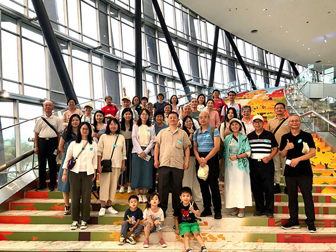

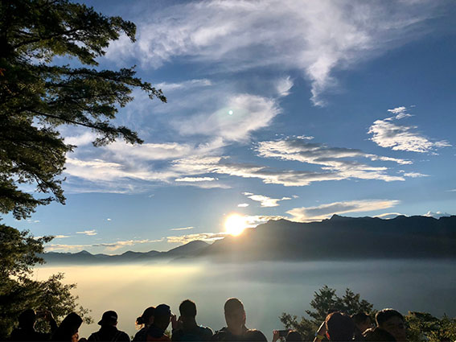

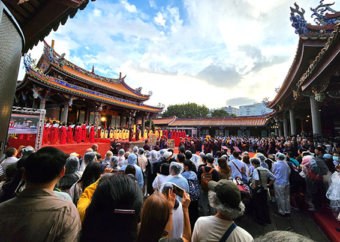

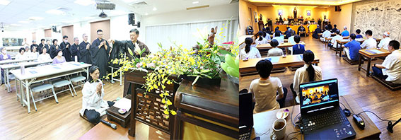

### 馬汶訪台深度旅遊知性之旅心得迴響

馬汶團

東馬 何泑珠

九月二十四日到十月二日到台旅程，這次遊學成功圓滿舉辦，真的是非常感謝唐老師、學會老師的大力幫助。

講座，拜懺，放生讓內心無比的感動，眼睛感動至激情的落淚。如此殊勝的因緣，喚醒了更要好好學習。

如此的遊學帶來大家的親切感，接上了親和力，核心力，也營造了友情的環境，讓我們彼此認識，不陌生，放下平時的嚴肅。擁抱著師生的情懷。

汶萊 張友芬

在三月份就開始計畫這次臺灣遊學之旅，感謝泑珠老師。

九月二十四日到十月二日歡樂遊學成功圓滿，非常感謝中華無盡燈文化學會的唐老師、林老師、微智老師，老師們和學長們。感恩！感恩！

來到南故宮博物館參觀非常壯觀，老師很用心，仔細跟我們講解關於古物的故事。來到阿里山，看日出，雲海，森林，那裡的千年樹木，風景太美了！無法形容。

來到造紙廠，體驗怎樣造紙，增廣知識。來到紙教堂，日月潭，九份和十份。走好多個景點，走走逛逛，買了好多東西，太開心了。

九二八一大早來到孔廟，觀看祭孔典禮，非常的莊嚴。

了凡四訓講座和觀看孔子傳，老師解說得很清楚，學生很容易明白。感謝老師，您辛苦了！

在拜懺和放生讓我觸碰到內心而感動落淚，很殊勝的因緣，更要好好珍惜和學習。

感謝親切有善的老師們和學長們，也要感謝師姑為我們準備美味疏食。您們就像我的家人，有您們真好！我愛您們！

汶萊 劉萬美

首先，我向明門經典文化學會的何泑珠老師說聲，謝謝！有她真好！我們才會認識臺灣中華無盡燈文化學會的唐老師，林老師，孔先生，孔夫人，各位學長們。

旅遊的領隊曾上魁，他的表現很好，可以讓我們知道臺灣的歷史。我們在臺灣國立故宮博物院南部院區，可以認識佛陀的歷史。我有參觀《花樣何處來》，《景泰藍》，《書畫賞析》，還有其他的歷史，真寶貴的東西。

我們在阿里山可以認識民族的生活，他們是種很多茶葉，他們會表演跳舞和唱歌，真厲害！我們在森林裡，可以認識各種各樣的樹，還有一個水池，它是姐妹潭，她們的故事讓我很傷心，為了一個男人而自殺，真可惜！我們要珍惜生命，生命是不可以用錢買來的。

阿里山的茶葉很好喝，他們種了各種各樣的茶，讓我們一起喝，真開心！她們也鼓勵我們多喝茶。

我們上山看日出，先坐小火車，下車慢慢的走，到了山上，一起看太陽出來，太陽公公真偉大！

我們參觀紙廠時，才知道紙是不容易做的，要用很多的力氣去做，還有他們是站起來做，真辛苦！我們前往南投日月潭遊湖，可以吃阿嫲茶葉蛋，真好吃！

九月二十八日是孔子誕，我們汶萊華人有慶祝教師節，紀念偉大的孔子。早上我們去臺北孔廟，參加祭孔典禮。他們安排的很好，希望我們的孔子高興看到我們來參加他的聖誕。下午我們聽臺灣無盡燈文化學會的老師們講課，分享祭孔典禮的內容。

二十九日中秋節一日遊，首先來到野柳地質公園，再到九份老街，真熱鬧！下午到陰陽海十三層遺址，還有十分寮瀑布，參觀參觀，看看臺灣的風景，真的要珍惜時間，我們還不知道有沒有下一次，感謝唐老師安排我們去參觀。

三十日在學會上課，課程是《了凡四訓》，可以改變命運的方法。我上了這個課程，才知道《了凡》是袁先生的名字。他是努力學習，成為讀書人，我們要向他學習。

十月一日參加拜懺，我第一次參與大悲懺，我很感謝唐老師的安排，我在拜懺時，有觀世音菩薩的加持，我才會打起精神的往前走。

十月二日放生活動，我很開心可以參與，團體一起放生，有團結的精神，感謝老天爺給我們很好的天氣。我們也感謝微智老師，把我們的行程安排的很順利，希望我們可以多多學習，大家一起加油，明天會更好！

台灣 汪性繡

在大眾前講話，對我來說是非常違背父命，且令我害怕痛苦的一件事情，因為從小就被當軍人的父親，非常嚴格高壓的管教，小孩子在眾人面前不可以隨便講話，不可以表達自己的意見，所以長大以後就習慣聽命行事，不善於表達自己的意見，因此也常常講錯話而不自知，一直到現在，在大庭廣眾之下講話，心裡還是會發抖，下意識的感覺好像違背父命，況且直言直語的說話方式，連得罪人都不知道，非常抱歉，不好意思，請大家多多包涵。

回想這二十幾年來，跟著老師到處活動，不管是教學或放生或做種種的善法，我幾乎都是當攝影照相者，我隨時注意大家的動態行程，因為覺得如何照好每一張相片是我的責任，所以腦子裡想的都是怎麼照相片，而晚上更是修相片到半夜，為的是要求完美的相片，尤其出國期間，我的手永遠拿著很重的單眼廣角相機，從早上集合一直照到晚上解散，滿腦子都是想著怎麼照好每張相片，幾乎聽不到老師的教法，很遺憾，內心深感可惜，浪費了二十幾年學習佛法的機會。

目前攝影組換年青人接班，本想終於可以趁這次旅遊好好的聽老師講解了，況且出外旅遊，不會像課堂上講的那麼難又快，腦袋都轉不過來，但沒想到，時不我與，因為年齡的關係，左耳進右耳出，聽後轉個頭馬上就忘記了，時間過的真快，我已經過了學習的年紀，真是很遺憾又無奈。

這次旅遊，感謝主辦單位的辛勞，期待下次更深度的旅遊。

汶萊 林淑佩

我感到很慶幸，可以有這個機緣，漂洋過海與大家見面，一起來學習，真心歡喜，首先我要感謝唐老師創辦中華無盡燈文化學會，熱誠發揚中華傳統文化和佛法，也感謝微智老師妥善安排。

唐老師謙恭和藹，非常有親和力，而且平易近人，每一次老師都很用心來講解，從中受益，老師以問答來教學，讓大家思考問題，意義非凡、收穫良多，得到了啟發，有不同的領悟，謝謝老師們盡心盡力以分享的方式來引導我們。

在旅途中，每天的早課，有佛法護持，內心清淨，也很踏實。拜懺部分，雖然我沒有參與跪拜，但在二樓看直播，也覺得非常壯觀。

上課期間，學會猶如一個寶藏是值得我們去挖掘，學會裡的義工們，個個都是任勞任怨的付出一切，學長們很親切，非常有人情味，大家同心同德，令人感動。

關於放生，原本是興高采烈的參與，後來察覺不以為然，我們必須觀前顧後，看著魚兒們在掙扎，需要快速的將魚兒放回大海，分秒必爭，盡心竭力救命，讓它們活下去，生命好脆弱，我們更要珍惜當下。

快樂時光飛逝，一轉眼就結束了這個遊學歷程，雖然我們早出晚歸，每天帶著疲憊的身軀回家，但是內心卻很充實，感激不盡。難得有緣千里來相會，能與大家結善緣、行好事，為善最樂，不枉此生，此行沒有白來，感恩在心，滿載而歸！
