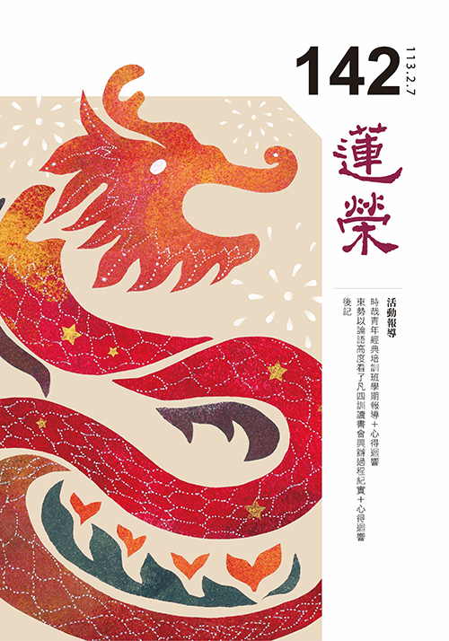
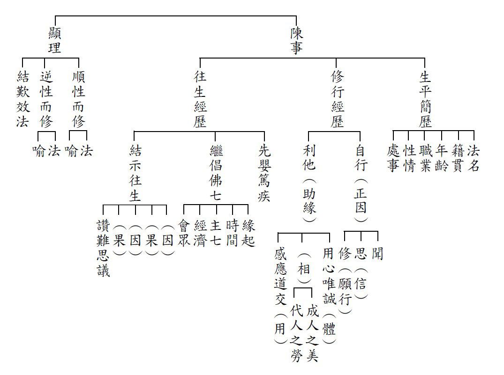
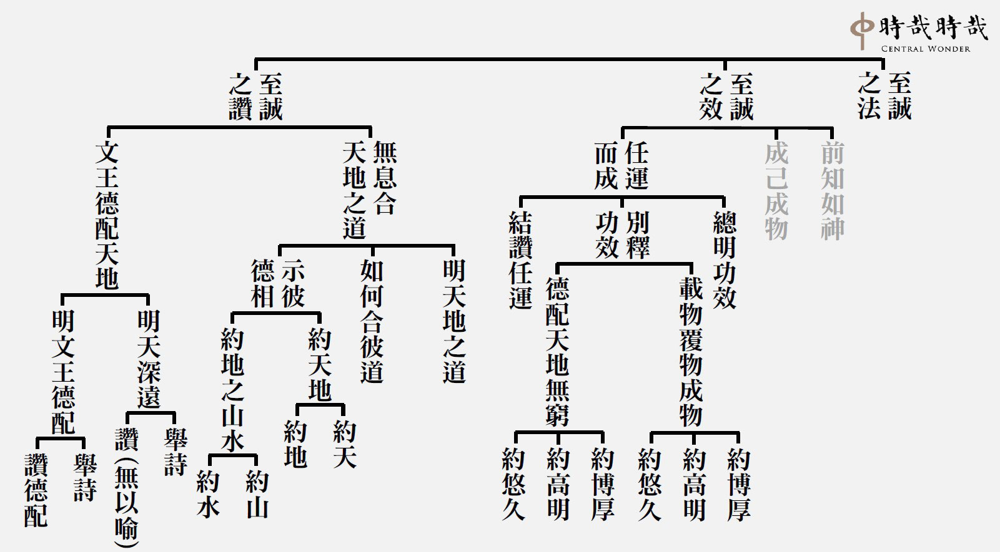

# 第142期

## 社論

### 甲辰年賀歲-乾行龍躍福連年

本刊

潛龍見龍惕龍

躍龍飛龍亢龍

群龍乾卦經營

功成身退後凋

各位時哉時哉網路教育學院的善友們，大家新年好！

甲辰年的伊始，意味著迎來乾行龍躍的一年。乾行，特別是指乾卦九五的陽爻，剛健之道可以落實於行動；而乾卦的九五爻又是飛龍在天的意象，代表能在最好的勢頭，展現一番作為。

在新春賀歲的詞句中，常常聽到「迎春納福」，然而春天是必然要來臨的，但福在哪裡呢？又有賀詞說道「福運連年」，一年年自然地過，福運是否真的會到來呢？其實，信什麼來什麼，相信福的人才會有福；而福又不會沒來由地來臨，得要通過我們的刻意造作，才能得福。所謂「一切福田，不離方寸；從心而覓，感無不通」，福田不離方寸，所以幸福不是詩與遠方，必須經營才能實現；心覓感無不通，因此要看自己怎麼與身邊的人事、環境互動，福報才能滋長。

今年龍年，我們從表徵龍的乾卦，認識六龍御天的道理：

初爻的潛龍，告訴我們沉潛自修、蓄勢待發、危城不入、亂邦不居、明哲保身，因此要善於觀察時局，在新年的開始，擺對心態、走穩腳步，不屈不撓地直面挑戰。

二爻的見龍，啟發我們學成致用、施展德能，在開始邁步，眼光就盯住九五的殊勝，使自己不論做什麼，都扣合著目標在做，於是每天都不空過，做的每件事都能持續發揮價值。

三爻的惕龍，教我們要戰戰兢兢，三省吾身，反覆於道，自強不息。縱使懂得道理，也盡可能「言寡尤，行寡悔」；如老子說「雖有榮觀，燕處超然」，在具體而審慎的行動中，活出深刻的思想、內在的超脫與成長的喜悅。

四爻的躍龍，要我們不離群眾、審時度勢，因此在時代的洪流中，能看清楚趨勢與脈動，使自己個人的別業，結合團體的共業，去協作、溝通、連結、激盪，因而積極創造、實現變革。於是共同的命運能不斷翻轉改善，各種各樣的美好將持續活躍湧現。

五爻的飛龍，是能造時勢來興辦事業、推廣教化的契機。所以每個人都可以在龍年的緩勢處境中自我養成，以確保在強勢來臨時，自己已經有了強準備，可以施展能耐、迎接豐收。

六爻的亢龍，啟發我們功成身退之時，要適時退場、止步，使世代交替，自己也留有足夠的餘力，來培養後進、激勵人才，讓善的飛輪持續運轉，美好的事蹟繼續擴大，真理的啟發不斷延展。

所謂「天行健，君子以自強不息」，學習就要自強不息，像接龍一樣，一張張牌翻開、排列，目的是使迷惑破解，使正理延續。創造要自強不息，像是一盆盆花藝的布置、裝點，在行動中創新，在每個階段性成就中為自己賦能。展望要自強不息，如一代代人的接力，手把手地引領，因此能在時代的困局中，堅定無畏地攜手步向光明。實踐要自強不息，像一字字的寫就、一筆筆的繪成，總以成事為標的，使一口真氣不散，曲直都在向前。

龍年是屬於中華文化騰飛活躍的年，而中華文化又是兼容並蓄、希望共好的文化。因此，這一年我們要本著祖宗教導我們的虛懷若谷來行事待人。

「謙之一卦，六爻皆吉」，謙與乾諧音，而乾元的意義又在仁上體現，所以乾行龍躍的這一年，怎麼帶來福運連年？就是抱有謙懷，使自己的每天都日新又新。

一個人如果自滿，福的花果就無地增長；唯有使自己心量加大拓展，持續學習使底氣夠足，才可能擁有得更多，得到難可思議的際遇助推增長。

莎翁說：「一切過往，皆為序章」，回首來時路，過去的每一步，都為當下的自己做了鋪墊；望向新未來，眼前的下一步，仍需要我們用心經營去呈現精彩。

敬祝各位在新的一年：自強不息迎厚福，謙懷乾行慶有餘。

龍！年！大！吉！

## 佛學覽幽

### 菩薩清淨的行持—華嚴經淨行品（五十七）

*戒慧講述、編輯部整理*

身心莊嚴在慚恥

反省受教最為勝

謙謙君子六爻吉

改過積善真立命

丙二、指事顯因答其徵因

丁一、總徵

丁二、別顯

戊七、到城乞食時願（二十二願）

己三、乞食得不得：無慚人

經文：

見無慚恥，當願眾生，捨離無慚，住大慈道。

這一條跟見慚恥人是相對的，慚、無慚，愧、無愧，正好相反，無慚恥就是無慚愧，沒有羞恥心、羞愧心，慚能夠對治無慚，愧能夠對治無愧。無慚、無愧在《百法明門論》中屬於中隨煩惱，是根本煩惱的等流，會煩躁、擾動、擾亂身心。善人、君子崇尚慚跟愧，知道要尊重自己的品行及人格，尊敬佛法；無慚跟無愧恰恰相反，他們所倚賴的、所崇尚的偶像，不是賢者、善人、君子，而是為非作歹之人，他們完全不在乎世間的輿論和他人的評價。有慚愧心的人，能夠止息惡行，沒有慚愧心的人，會讓惡行增長廣大。如果見到沒有羞恥心、不知慚愧的人，應當發願，希望眾生能夠捨棄、去掉沒有慚愧的心念。看到無慚恥之人，並不是要對他們生起憎惡、討厭的心，而是要對他們生起慈悲心，希望他們能夠遠離沒有慚愧的心念，安住在大慈大悲的菩薩道上。

無慚跟無愧互相觀待，無慚是此人沒有反省能力、自甘墮落，無愧是會破壞公共秩序，《論語》有兩種約束法，一種是「道之以德，齊之以禮，有恥且格」，第二種是「道之以政，齊之以刑，民免而無恥」，如果只在政令上或在刑罰上防患於未然，人民只會避免觸犯法律被處罰，而不會真正生起羞恥心，導致的結果就是「民免而無恥」，老百姓只是苟免而已，處處鑽漏洞，沒被抓到就逍遙法外，被抓到就認為很倒楣，民風澆薄。約束固然重要，可是若方法錯誤，適得其反，最終還是要講求內化，驅動行為的是心念，以德行跟禮去導正，才真正可以使人民變化氣質，改變內心，知道正確的方向，行為自然正，反而不需要詳細的法律規章來規範。「道之以德」是引導他在經教上得到勝解，「齊之以禮」，是在禮上培養他高貴的氣質，此人「有恥且格」，有羞恥心，想要力爭上游，民風淳厚，格就是大家會來，近者悅遠者來。捨離無慚就是很有反省的能力，而且有經典的內化、禮樂的薰陶，走上高貴的路線，從貧窮卑賤脫困，這時候不用他人約束，他會自我約束，自我講究規矩。

捨離無慚跟住大慈道有何關係？能夠捨離無慚，具有羞愧心，很容易可以做善業，在菩薩道上有先決的條件。反省的那一分，通通是結合仁跟慈悲來說，想要增上自己，想要培養自己，想要做什麼事情時，都是站在想要利樂有情上講，唯有利樂有情才能帶來自己的出路，培養自己都是為了利益有情，而培養自己中，可以找到自己的出路，培養自己是從利樂有情增上來的，所以培養自己一定會去利樂有情，兩者互相依靠，真正的慚恥必須要結合在利樂有情上說。（下期待續）

### 大乘百法明門論簡說(四十八)-拾柒、心不相應行法（六）

*戒慧講述、淨本整理*

名言或約定俗成

有時詮釋體性義

能所觀待知世間

功能運用實體無

論文：

第四、心不相應行法，略有二十四種，一得，二命根，三眾同分，四異生性，五無想定，六滅盡定，七無想報，八名身，九句身，十文身，十一生，十二住，十三老，十四無常，十五流轉，十六定異，十七相應，十八勢速，十九次第，二十時，二十一方，二十二數，二十三和合性，二十四不和合性。

第八名身、第九句身、第十文身，三者是一類。「名身」的「名」就是名字、名詞、名稱，「身」就是聚集，單一的叫做名，兩個以上就叫做身。比如眼是名，眼、耳就是兩個名，眼耳兩個以上的名合起來就是名身。又例如香是單名，爐也是單名，香爐合起來也是名身。《百法直解》：「名詮諸法自性。」自性就是定義，名是用來定義諸法的特性。世間各類科學，如果懂得定義，就是很會讀書的人，讀經也是要懂得解經，不能只在文字的表面上用功。

《俱舍論光記》說，名具有隨、歸、赴、召等義。我們隨著名，會把我們的心歸向、赴向於這個境界，或說召喚這個境界，也就是隨著名我們可以去認識境界的特性。比如說茉莉花，只要具有相似的特徵，符合茉莉花的定義，都屬於茉莉花，藉此名我們可以認識此花，進而用名將萬物分類，便於我們記憶、思維、運用，所以人可以變成專家，能夠主宰統治萬物，以名來解法的這種能耐，六道唯人獨尊，連老天爺也自嘆不如。這就是為何佛在三界度化眾生，示現八相成道或十二相成道，都是在人間。

《瑜伽論》上名也稱為「增語」，比如花有它的實體（主體），名稱只是用來解釋花的客體，是在主體之外另外增加的語言，是我們為了認識事物所增加的名稱。所以我們在認識境界的時候，都是透過定義，在主體外給予增語。依據唯識宗的看法，諸法本來沒有名稱，是第六意識藉著想心所，跟諸法互相依靠，給予名稱。名稱雖然可以詮釋諸法的自體，可是卻不能恰如其份、適如其量的與諸法之自體相符合。比如說火的時候，火之名不能燒；說水的時候，水之名也不能溺，水與火都是實體外的增語。所以僧肇法師說：「物無當名之實，名無得物之功」。

可是中觀宗認為，依該法的作用所定義的名稱，其實與該法互相觀待，定義成為總相，該法的各個支分成為差別相，以總攝別。比如有燒熱性的作用都定義為火，火既然是根據作用而安立，是用來詮釋境界的名稱，火怎麼會不能燒呢？我們都是透過名詞定義才能認識境界，才能顯現境界，而且透過不斷的定義，才可以將事物的範圍越縮越小，將事物區分得越來越精細。比如說「花」，花的範圍很廣，遍及全世界都有，我們透過名詞定義限縮為「茉莉花」，再定義限縮為「手中的茉莉花」，顯現出我們所要的境界。所以境界也必須觀待名言而生，「物無當名之實，名無得物之功」，這句話也是對機而說，不能說死。

「句身」的「句」就是句子，一個句子會有主語跟述語，比如「鳥在飛」，主語是鳥，在飛是述語。又比如「諸行無常」，諸行是主語，無常是述語；諸行是所差別，無常是能差別。諸行既然是無常，諸行的存在都是剎那性，這是透過句子的描述，我們才對諸行有此認識。人類因為發明名詞才能認識諸法，因為發明句子，才能更進一步去分別法的各種差別相。

前五識接觸各種有為法（諸行）的時候，無法認識到它的造作性、無常性，沒有透過能差別去說明，就無法知道所差別的法，沒有透過句子去描述，就無法更進一步去認識該法。比如花在眼識前顯現為常，要透過句子的描述，才能認識到花的無常。又比如一幅價值連城的古畫在眼前，如果不是透過不斷地描述跟分析，也無法顯現它的價值。

三法印：「諸行無常」、「諸法無我」、「涅槃寂靜」，都是句子，都有主語和述語。兩個以上句子合起來就是「身」，所以三法印合起來講就是句身。前面已經解釋諸行無常，再說諸法無我。諸法是所差別，無我是能差別，諸法都沒有自體性稱為無我，透過無我這個述語，讓我們認識諸法的體性空。

第三涅槃寂靜，涅槃是所差別，寂靜是能差別，認識涅槃要透過寂靜去認識，在涅槃當中，沒有任何一法可生，是不是最安靜？所以寂靜是涅槃的能差別。判斷此人所學的是不是佛法，要靠三法印，所以三法印是佛法的命脈，都是靠句子來認識它們。三法印讓一切法都成為解脫處，認識該法的無常面相，認識該法的自體空面相，以及因為該法的自體空，心識前一法不生的寂靜面相，讓我們在該法中得到解脫。佛所說的法都是為了解脫而說，佛法中最殊勝的意趣就是般若，有般若正見的人，絕對不是簡單的善根。以上可以了解句身有多麼重要。

《瑜伽論》將句身分為六種，分別是不圓滿句、圓滿句、所成句、能成句、標句、釋句。不圓滿句是文不究竟或義不究竟的句子，兼具文究竟和義究竟才是真正的圓滿句。比如說「諸惡莫作」，「諸惡」還要加一個「莫作」才圓滿，否則只講「諸惡」，那諸惡是要做還是不做？會讓人感到疑惑。圓滿句必須是這句話講完不會讓人疑惑。

所成句和能成句，前句所成句，要由後句能成句成立。比如前句「諸行無常」是所成句，後面加上「是生滅法」為能成句。因為生滅，所以才成立無常。

標句和釋句，《百法明門論》的標句是「一切法無我」，整部論都在講這個主題，所以標句就是標出主題。釋句是用來解釋標句的句子。再舉一例，標句是「善性」，這是要講的主題；釋句是「正趣善士」。正趣就是親近的意思，善士就是善知識，能夠親近善知識才是善的特性，善的特性就是要從親近善知識來，因為所有的正見都來自於善知識，有正知見才不會墮落，才是善性。

以上說明六種句身，沒有這些句子，無法講出什麼概念，人最厲害的就是會講出這些句子，這個能力比天道的眾生還厲害。

最後講「文身」，「文」就是單字，是名與句的所依，名詞或句子，都是依著單字組成。比如說「葡萄」這個名詞，是依著「葡」和「萄」這兩個文組成。二個字以上則稱為「文身」。

語言中，所有的名句文都是依聲塵而立，我們講名詞、講句子、講單字，都是用聲音在講，是耳識所緣。書冊中，所有的名句文，都是依色塵而立，是眼識所緣。所有的心想中，比如想一個佛經的道理，或背一部經，所有的名句文，都是依法塵而立，是意識所緣。

佛教部派中的有部，認為佛經是色塵；經部宗與中觀宗，認為佛經是聲塵；唯識宗說，佛經是證悟者的心識，證悟者的心識緣的就是法塵。不同的宗派講的都不同，那麼到底何者是了義？

佛經的體性應該是聲塵，也就是必須透過聲塵的傳述，才能使人證悟。《楞嚴經》上說：「此方真教體，清淨在音聞。」教法的體性是音聲，有講有聽，這是此方的真教體，拿掉了音聞這個體性，教法就沒有作用。比如火的體性（定義）就是燒熱，拿掉了燒熱的作用，無法成為火。「佛法無人說，雖智不能解，雖慧莫能了」，佛法拿掉聲塵，就失去了讓人解脫的作用，就失去了讓人離苦得樂的作用。雖然色塵與法塵也是佛經，可是都不是佛經的體性，重要的是要保留佛經的講解方法，沒有講解法，拿到書本也沒有用，經書也無法讓有情心識得到證悟。

佛的法運有正法、像法、末法、滅法。有證果的人才能叫正法；有人修止觀門得禪定才叫像法；還有教法流通才叫末法。什麼是教法流通？如果按照前面所說，佛法還有聲塵在流通，才是教法住世流通，才是維持末法的法運。進一步言，教法的聲塵流通，才能讓人真正懂教法；透過他所懂的教法作實修，他就變成像法；實修當中證悟了，就變成正法。所以證悟的源頭還是來自於教法的聽聞，聲塵成為最後的決戰點，這是教法的體性。

極樂世界叫做六塵說法，色聲香味觸法，都可以成為佛經，比如說身根利者，可以依觸塵來立佛經，意根利者可以依法塵來立佛經。如果在香積國裡面，就用各種香塵來立佛經，聞到此香，可以讓人產生很深的覺受。這些是與娑婆不同的地方。(下期待續)

### 佛學概要十四講表簡說（四十三）

*戒慧講述、編輯部整理*

業力習氣的感生

千差萬別的行相

易入難出的墮落

業果不愚的超升

第六講表　宇宙有情概況

畜生道

接著看畜生道，先談畜生道的類受，名為畜生，意即牠是被畜養的牲類，又稱為傍生，因為很多畜生走路都是橫行的，牠不但傍行，頭也沒辦法像人的頭一樣往上撐，這兩個形象很重要，第一是走路容易橫，第二是頭不能夠往上頂。人跟畜生道不一樣，我們的頭要盡量頂天，不要做低頭族，投生為哪一道的時候跟氣氛有關，所以常常低頭、洩氣、無精打采，或是壓力大，這要注意，將來投生的地方撐不起頭。身為人，應當要昂首闊步，頂天立地，有士氣、有信心，這代表你的事業、未來的機運，眼前就在決定自己的未來。

接下來論畜生有胎、卵、濕、化四種生，還有形受想的千差萬別。四生先從胎生來說，像人類就是從母胎出生，動物當中的牛羊象馬也都是胎生，卵生就是破殼而出，像雞鴨孔雀、雀鳥還有蛇，濕生是由水分來生，從糞便臭穢的地方，或者腐爛的肉，還有叢草當中濕氣多的地方出生，好比蚊子、蚰蜒、蠛蠓，蠛蠓有點像果蠅，還有像鋏蠓、小黑蚊這種的。

再論化生，化生是業力故，無而忽有，牠會在要生起之處，頓時生起，如龍和金翅鳥。龍跟金翅鳥有屬於畜生道的，有屬於阿修羅道的，屬於阿修羅的龍跟金翅鳥我們不容易看到，屬於畜生道的容易看到，莊子看到的大鵬鳥，早上從南海出，晚上飛到北海，就屬於畜生道的金翅鳥，以上三界當中就有胎卵濕化這四生。以六道來說，人道、畜生道、阿修羅道，都有胎卵濕化，天人還有地獄是屬於化生，鬼的部分有胎生還有化生。所以六道成為所攝，四生成為能攝，六道裡面的生不外乎這四生，可是人道有胎卵濕化的比較少見，我們比較熟悉的是胎生、卵生，中陰身要去投生的時候，一定有父母交合的因緣，起愛染之心，對父母的淫境起境界愛，又有自體愛、當生愛，這三者和合，那一道的生命生起，或是胎生的生命，或是卵生的生命。

濕生主要是靠染著香氣，中陰身會聞到他要投生地方的氣味，起染心就去投胎了，業力又分勝、劣，勝的是他所染的氣味是好的氣味，他去受生，業力差的，他會染很臭惡的氣味去受生。濕生的這一分，不是胎生不是卵生，體外受精、無性生殖就屬於濕生。而化生是在投生之處起染著的心，就去投生，無中生有，業力勝染著而生。所以畜生道也有分為胎、卵、濕、化，想要投生到高等畜生的那一分，他會找到好的境界，所以習氣很重要，喜歡吵雜環境的人，他來生就算投生到人道，也容易投生到賤種，屬於安靜、斯文、有氣象的，那個氣氛容易投生到人中的高貴種，如歐美。

〈選佛譜〉把畜生分成下中上三品，下品的畜生身形非常微劣，喜歡黑暗之處，純苦無樂，或者即使有光明也不能見到，例如貓頭鷹，光明正好是貓頭鷹的黑暗，黑暗正好是貓頭鷹的光明，所以光明沒有自體性，黑暗也沒有自體性，諸法連微塵許的自性都沒有，以上是下品畜生。人世間喜歡在黑暗中做一些亂七八糟的事情，容易感得到畜生道中投生於黑暗，所以禪定裡面，就算在黑暗中打坐，都要讓心亮起來，不能環境暗了心也暗，晚上睡覺的時候，燈就算全關，也要心識作意光明，這是睡眠的修學法，叫做睡眠瑜伽，耳朵聽佛號、聽柔軟的宮廷音樂，容易投生到高貴種姓，更何況是聽佛號，跟佛感應道交，所以一定要經營自己的生活品味，里仁為美，讓這一生成為來生的增上緣，這是最厲害的修學法。

第二種是中品畜生，像飛禽走獸，或者在水中，或者在陸地，身體是羽毛或者鱗甲，他們長得醜陋而且臭穢，互相吞噉，或者供勞役。羽毛鱗甲的羽就像鳥，毛就像馬，鱗就像魚，甲就像龜。

第三種是上品的畜生，雖然墮在畜生道，但是是有福德力的，像是龍王、象王、金翅鳥王、獅子王，他們聞法修慧都可以變成護法者，《經律異相》說到有一隻象王，名叫善住，他的身體純白，能夠飛行，有八千隻象為其眷屬，當這隻象王要洗浴的時候，八千隻象就會感應而來，或者持傘蓋，或者唱誦前導，或者幫象王洗足，八千象王洗完以後會共相娛樂，大小便利，是非常和合的團體。八千象王其實都在表徵忉利天的尊貴，比如國王出來的時候，要表徵國王的尊貴，就是騎象。

帝釋所乘騎最小的小象，轉輪聖王乘之，也就是八千象裡面有一隻小象，是轉輪聖王的象寶，在金璧山中就有八千個巖窟，是這八千隻象王休息的地方。下面講到紺馬寶，就是轉輪聖王的馬寶，叫做婆羅醯，他住在大海洲內明月山，也有八千隻馬駔作為眷屬，轉輪聖王出世，他會取最小的為其坐騎。

玉皇大帝的象，表徵他的威勢，馬表徵他的部隊，八關齋戒裡面有個故事說，有一群商人到一個小島上，碰到一群美女，這些美女無微不至地伺候他們，讓他們想留下來，後來有位大商人做夢被告知，這群美女其實都是會吃人的羅剎，大商人很恐懼，問該怎麼辦，他說你們到海邊的時候，有一隻馬叫做婆羅醯，當這一隻天馬出現的時候，你們全部巴著他，他會飛起來，你們絕對不能往後看，大商人醒來後，偷偷地把五百個商人叫起來，全部一起抱著馬，馬開始飛的時候，羅剎趕來哭喊，回頭的商人通通掉下去，成為羅剎的食物。下品、中品的畜生都是世間看得到的，上品的畜生，因為他的福德力很高，有神通飛行，我們罕聞罕見。

接著來看畜生道的苦厄，有苦役、充食、人殺、互噉。像牛馬就要服種種的苦役、負重，甚至還要被鞭打到流血，還包括擠奶、剪毛、運貨、耕田，或是打仗，合起來叫做苦役，畜生道是我們最能生起悲憫心的地方，因為人道只能緣到人道跟畜生道，對這兩道都不能生起悲憫心，難道還對看不見的鬼道、地獄道生起悲憫心嗎？畜生道就是大悲心跟菩提心的生起處。

第二個是充食，也就是被人當作食物，包括被獵殺，像獵殺鹿、吃鹿肉、拔鹿皮、斬鹿角，或者殺象、拔象牙，或者殺虎剝皮。獵殺外，還有屠宰，包括直接殺跟間接殺，直接殺的是屠宰場，吃肉的人叫做間接殺，間接殺的罪過有時候比直接殺還厲害，比如今天宰了一百隻豬，你去的時候，因為生意太好，一百頭豬不夠殺，只好為你再多殺兩頭，這種間接殺就比直接殺還厲害。除了獵殺、屠宰，還包括祭祀，祭祀完後是入自己的嘴巴，這是充食。

第三個人殺，人殺不是為了吃，只是因為看了討厭，像是蚊蠅、蟑螂、老鼠這類的。佛教裡面有一個很有名的居士叫做朱鏡宙，他寫過《佛說八大人覺經》的註解，他喜歡打蟑螂，一邊註解佛經一邊打蟑螂，就在他一百歲的時候，讀佛經時看到一隻蟑螂，蒼蠅拍拿起來一打，結果是幻象，就摔斷腿，後面的日子很痛苦，習慣不容易對治，一定要做觀修，一個一個去解除那些習氣。

再來是互噉，也就是弱肉強食，像螳螂捕蟬，黃雀在後，像北極熊去吃企鵝、虎豹去追殺羚羊、老鷹去吃雞鴨。

《分別業報經》裡面說，身三、口四、意三，畜生道有說是下品十惡或中品十惡，有一種說法是餓鬼道比畜生道好，有一種講法是畜生道比餓鬼道好，這分法又不同了，不同部派的分法都不一樣，怎麼分類呢？就是以有沒有因緣聞法的這一分來分，畜生道的快樂比餓鬼道多，這時候畜生道叫做下品十惡，餓鬼道叫做中品十惡，地獄道叫做上品十惡。可是愚痴不接受法的那一分，畜生道會變成中品十惡，鬼道變成下品十惡。聞法這一分是六道裡面最難得的，雪廬老人在華嚴經裡面較量說，寧墮地獄而聞佛法，不願升天而不聞。可見最重要的目標是能夠聞法，假如天堂沒有佛法，地獄有佛法，現下只有這兩條路可以選，請問你要選哪個？下地獄才能聽到佛法，這個苦你一定要受，最後才顯出聞法有多麼重要，如果一個人的觀念已經到這種地步的時候，他對佛法的學習就開始轉強，在地獄聞法的時候，所有地獄的苦都成為他解脫成佛的增上緣，在天堂享樂沒有聞佛法，都成為墮落的因緣，如果有這樣的決定見，才是真正能夠破迷起悟、離苦得樂的人生。

為什麼會投生為這些動物？像多欲就會投生到鵝、鴿子、孔雀、鴛鴦這些鳥類，這就是男女分不開、淫欲所成，鴛鴦舉好聽的是「關關雎鳩，在河之洲」，舉壞的是男女分不開，組成家庭若不是為了修學正法，家庭的甜蜜反而變成墮落的因緣，最後互相成為羅剎，臨終眷屬搬動哭泣，反而亡者墮落，印光大師說此愛如羅剎女之愛，羅剎女說我愛你，所以要吃你。

再來是愚痴業，像蛆蛆、螞蟻、飛蛾，飛蛾撲火的那一分是愚痴氣氛去感的。沒有智慧、好鬥的，就會投生在象馬當中，成為戰馬，愈打仗愈過癮。瞋恨心重就會做蛇類，還會做蜜蜂、毒蠍、毒蟲。非常憍慢、自衿甚高，以惡心會密謀傷害他人，會當八腳獸。做老虎、獅子的那一分是慢心。虛傲疏嶮，非常高傲的人，他會投生到豬狗驢狐狼，狐狼特別是陰險狡詐的。吝嗇不會去行布施，又常生忌妒、憎惡他人，很躁動、心不安住、靜不下來的就會墮落到猿猴。沒有羞恥心，不懂得節制、愛說話，會成為鳥或烏鴉，特別是烏鴉，不過烏鴉說壞很壞，說好也很好，聽說烏鴉多的地方，是吉祥之地，當時曲阜孔廟、孔林，尤其是孔林，天上都是烏鴉，多得可以把天空遮住，自從文化大革命以後，全部跑光，再也沒有回來，所以烏鴉也是吉祥之兆，還有蜜蜂，蜜蜂聚集處，都是好彩頭，或是家裡有鳥來結巢，都是很好的徵兆。非常邪惡，貪心不滿，挑撥離間，會受到貓貍身，或者做熊羆，貓都很孤獨，跟兩舌挑撥離間有關。

接下來講上品的龍，大力龍是修行大布施，但是性子非常急，而且常常發脾氣，不會依著正知見，布施而感得大力龍，大布施大心量，所以形體大，可是瞋恨大。另外一個就是金翅鳥，他也是行大布施，但是非常傲慢，我們在寺廟午供要施七粒米，原由就是金翅鳥專門吃龍子，牠翅膀一撥，海水就分兩邊，把龍子抓出來吃，龍去釋迦牟尼佛處告狀，釋迦牟尼佛就叫比丘施七粒米，去供金翅鳥，讓金翅鳥不去吃龍子，以上是畜生道。

在論業的時候不能單純論心，業的抉擇極難，做業的觀察是整個戒律的核心，要以聖言量做為比量來通達緣起，能夠感應你的未來成為佛的後得位，空性見是可以感應佛的根本位，所以在因地裡面做因果的觀察、做空性的觀察非常重要，這也是佛教興衰之所在。（下期待續）

### 人生大事不能忽略的事實-趙尊仁居士生西記

*戒慧講述、編輯部整理*

增上生是人生經營

經商財富功德法財

學佛不涉世俗安樂

臨終瑞相圓滿暇身

趙尊仁居士是一位年輕的商人，這篇文章在說明年紀輕輕即便因緣到也能往生，也告訴我們人生應該如何經營，經營未來比現在更為重要。而他年紀輕輕就往生到底遺憾不遺憾呢？遺憾的是未能續辦慈善公益的事情，或者也可以想成蒼生無福，不遺憾的是能往生成功，而且這一生沒有吃喝玩樂造很多惡業，未來相信是前途無量。

本文分兩大段，一是陳事，也就是陳述事實，先介紹他是誰，再敘述他的修行經歷與往生經歷；二是顯理，也就是顯出他之所以能夠往生真正的內涵是什麼。

陳事當中的生平簡歷，經文：「

趙尊仁，法名培庚，如皋馬塘市人，年三十餘，素業商，其性情淳篤無偽，其作事果決率真。

」趙尊仁居士，法名叫做培庚，是中國江蘇省南通市如皋市馬塘村人，從商，年紀輕輕三十多歲就往生。這樣的例子能讓人對無常有所體會，可以說是對修行者最好的示現。趙居士，正面說是淳(單純)篤(篤厚)，也就是心思單純，反面來說是無偽，淳篤無偽可以想見其質地厚實；做事情果決率真，下決定十分果決，而率真是有赤子之心。這樣的質地和人格特質，可以想見他只要學佛就一定會有受用。

陳事當中的修行經歷，就自行(正因)來說，經文：「

近數年來，得聞淨土法門，深生信心，日以念佛求生西方為事。

」他得以聽聞淨土法門，並且深深地生起信心，誠意由信心而來，深生信心關鍵是心裏面真的這樣想，居士自從聽聞淨土法門，就天天以念佛求生西方為他的志業。

充實自己的第一步就是聽聞，聽聞才能生起正知見，所謂聞所成慧，就是老師講了以後能夠去複講。雪廬老人也曾經自云內心渴望的就是去「死」，渴望在臨終見到佛，方法就是一直念佛念到他來接。

就利他(助緣)來說，用心唯誠部分，經文：「

置商業，專辦慈善公益事，極其認真。

」我們一般人會對那些對我有利的事誠感誠應，比如當兵每天都想著要放假，不打折扣也不虛假的，只要等到放假就一刻不留。用這樣的覺受來看趙居士，他也是誠感誠應，放下他自己的商人事業，專辦慈善公益，這樣的誠意當然能感應往生成功，這是往生者內心的秘密。

就利他(助緣)來說，相上有成人之美和代人之勞，成人之美部分，經文：「

由是倡辦濟生分會，及佛經流通處，凡有善舉，力能為者，無不為之。」代人之勞，經文：「地方路燈，親自早收晚送，不以為勞。

」

居士提倡辦理救濟放生的團體，流通佛經處等等，只要知道哪邊有善舉，有能力做的不會輕易放過，而且親自收送地方路燈，不覺疲勞辛苦。用知見來做善法，現有的善法都能與往生結合，一個人做很多善法是臨終的障礙還是順緣？觀待內因若渴望往生，則善法就是順緣。善法是殊勝或者卑劣，關鍵在人！

利他的最後一個部分是感應道交，經文：「

一方之人，皆服其誠，彼以誠感，眾以誠應，凡所勸募，無不隨願圓成。

」〈中庸〉當中最重要的就是「誠」字，治國的九大綱領都是誠，是一次都不能假，不能馬虎。大家看重的是他這個人，因此大家都佩服他辦事的誠意，所以只要他出來號召勸募，大家就能與他相應，沒有辦不到的事。如此可知他雖然三十多歲就得到重病，但是最後能往生的結果，和前面這些質地和做法都很有關係，這些都是關聯性。

接著講往生經歷，先罹患嚴重的疾病（先嬰篤疾），經文：「

民國十五年冬，身嬰篤疾，

」民國十五年的冬天，正逢軍閥割據，趙居士染上了嚴重難治的疾病。

接著是繼倡佛七，經文：「

力疾提倡佛七，以祝世界太平，訂于臘月初二日起七，至初八日圓滿，請掘港西方寺範成師主七，其經濟皆善信所自送，入會念佛者，四十餘人。

」他不為自己求健康安樂，反而憂心國家世界的安樂，訂於十二月初二起至初八的釋迦佛成道日，舉辦七日念佛的佛七法會，並且請江蘇當地西方寺的範成法師主七。依著居士平常做善法的公心與公信力，累積了許多善緣，善男信女大眾們或趙居士自己掏錢貼補，使入會念佛的四十餘人的一切開銷，能收支平衡。

結示往生，經文：「

居士雖帶重病，其念佛益精進，若無病者，至初六日下午七句鐘，竟念佛坐逝。在會諸人，益加懇切念佛，助彼住生，過數小時，頂猶溫，形色與生無異，于以見彌陀願力，眾生心力，兩皆不可思議。

」

居士是一位定功強的人，重病的業果壓得下去，是因為內心的重點不在此，但是苦的危機仍在，病的問題沒有解決，但卻可以安定在佛號上，像是一般健康的人，這就是他修行的功夫。至十二月初六，也就是佛七的第五天，晚間七點的時候，大眾親見他活生生的坐著往生。

佛法若不能幫助眾生，引導不當反而不如一輩子為惡，和合團隊的福報大，四個和合僧能夠有一個登地菩薩的威力。在場的大眾，因為看到他這般殊勝的往生，更加懇切地念佛，不但是助他往生，自己的修行功夫更加穩固，對淨土的信心更是堅固。居士在往生幾小時後，頂上仍然有熱氣，樣貌和生前沒有差異。阿彌陀佛的威神力，可以展現到難以想像！趙居士用坐逝感動他人，越放下結果越不可思議，感覺修行的時間很短，看起也沒有什麼輝煌的成就與開悟，但是就居士最後的結局看來，卻反而有修！

陳事之後就是顯理，就順性而修的部分，經文：「

良以真如佛性，眾生本具，特仗因緣啟發耳。如種子已布于地，一經時雨，隨即發生萌芽。

」所謂的佛性，中觀宗的定義是我們眾生都具有成佛的潛力，唯識宗認為是第八識的清淨種子。成佛的潛力特別需要因緣條件俱足去啟發，就像種子散佈於土地，一但經過雨水的滋潤，新芽就會生發。

顯理之中，逆性而修的部分，經文：「

彼世之以本具佛性之力，日馳逐于貪瞋癡殺盜淫中，譬如以隨意雨寶之摩尼珠，置于圊廁，則無所受用矣，可不哀哉。

」每一位有情都想離苦得樂，世間人追逐貪瞋癡的勇猛覺受，可以借鏡做為我們修行的關鍵。佛對眾生的關懷和寶愛就像隨意的寶雨，給了眾生許多寶貝，但是我們只把這些寶物放在廁所等低賤的地方，比喻我們根本不在乎這些佛所說的法，所以得不到受用，實在是太可惜了。我們修行世間善和往生有何關聯呢？通達因果的人，才懂得修善利益他人，利益他人得樂感樂果。羅漢也是厭離三界，但是與極樂清淨不同。二乘人雖然是修行去除我執，出離三界清淨的那一分，但卻不想往生極樂。所以往生的著重點在極樂清淨是我想要去的，念佛會降伏其增上慢，大於世間善太多了。

顯理之中，結歎效法的部分，經文：「

聞居士之風，能不愧死。

」祖師讚歎趙居士年紀輕輕往生的決心、毅力與行持，發自內心的自謙與慚愧。(下期待續)

### 週四共修法語

慧慈、林藏忠

念佛須待正知見

求生淨土是正宗

不妨世間滿所願

願文詮釋往生行

為子孫祈禱

相信每個人對子孫都寄予無限的期望，必有千千萬萬種的期盼，末學僅就個人的感受，歸納成十點，藉以拋磚引玉，聽到更多的回饋。

一、遇善知識：

五年前孫子出生那天開始，就期待孫子能來學會的啟蒙班上課。等到孫子三歲，照例可入學了，新冠疫情侵略全世界，學會實體課程暫停，線上學習不中斷，但只開放給舊生，以維持教學的效果。好不容易，今年新學期又開始招新生，三個孫子才有機會，接受優質的扎根教育，倍感珍惜遇善知識的難能可貴。

二、身體健康：

才上一堂課，孫子感冒發燒，又暈車嘔吐，只好在家休息，無法來上課，替孫子惋惜，無福來受教。看看過去的高僧大德多半身體強健，如玄奘法師西行印度，經過沙漠，翻山越嶺，天候惡劣，長途跋涉，若沒強健體魄，哪堪忍受？這就是安受苦忍。可見身體健康是學道重要順緣的一分。

三、暇滿人身：

祈望子孫們在成家立業後，不被生活、工作的壓力所苦，能有精神、體力、時間，能遇善知識來學習正法。得人身不易，要修五戒十善方能得人身，得暇滿人身更難，須經千萬劫的修行而有，若得，務必發揮人身最大的價值，唯有透過學習正法，建立正知見，懂得自利利他，才不虛度此生。

四、智慧如海：

祈望子孫們有大智慧，而非小聰明。世智辯聰，只會圖自己的名利，反而是學法的障礙。而真正的大智慧，是遇到事情能考量全局，看長遠的影響，以及利益大眾的角度，來處理事情，所以必須精研教法，深入法義，通達宇宙人生的真相，運用在生活上，則能幫助自己、幫助他人離苦得樂，解脫成佛。

五、斷惡修善：

要修學正法，必先扎基本功，斷惡可去除逆緣，修善能累積善緣，斷惡修善是學道的助緣。什麼是善？什麼是惡？中峰禪師有個大方向的標準，凡利益他人者是善，唯利己者是惡，但其中還有許多細膩處來辨別善惡，如孔子殺少正卯，殺人本是惡，但因少正卯宣揚邪法，混淆視聽，有惑眾造反的能力，影響至極，不得不為社會除害，以安定百姓生活，此殺則是善。這須靠正知見，了解佛真正的意涵，才不會錯用善惡的行持。

六、真信因果：

因果的定義是造善得樂、造惡得苦，但現見世間的善人，有多病或破產或喪子者；惡人卻健康富貴家庭和樂，這怎麼回事？這有天良嗎？如果能依聖言量，深信因果通三世，就不會怨天尤人，才會努力地斷惡修善。所以一個人的觀念，會影響他的行為，影響他的命運。

七、以文會友：

祈望子孫們能交到好朋友，俗話說「在家靠父母，出外靠朋友」，朋友的影響力，有時甚至大過父母師長。要結交品德良好、有正知見、能在道上切磋琢磨，同甘共苦的朋友，這種朋友實屬難得，一定要好好珍惜，一起增上，互勉成為社會的棟樑。

八、時時感恩：

人是群居的動物，沒有什麼是自己獨立能辦到的，也沒有什麼與生俱來的，凡我所用都是取之於社會，時時以感恩的心，回饋社會。感恩幫助我的人，也要感恩傷害我的人，因為他增強我耐辱的心性，拓寬我包容的心，更要感恩三寶、師長、父母，及所有的人，讓我懂得禮教，累積智慧和能力，而樂於全心的付出。

九、有承擔力：

祈願子孫們成為一個有擔當的人。除了對家庭、職場、正法團體，都是一個有承擔力、有大用的人，更要成為護持三寶，弘揚佛法，傳承佛法，利樂有情的使者，這才是對三寶最好的回饋。承擔力來自對三寶的極深信解，信解來自聽聞學習，當學習有法喜，則能堅毅且不疲不厭地走下去，知識背景愈多，能力愈強，承擔的道業愈殊勝。

十、發願往生：

祈願子孫們成為阿彌陀佛所樂於攝受的人才。娑婆世界是五濁惡世，我們累劫的惡習氣，很容易被引發，而墮入三惡道輪迴，在惡道苦不堪言，提不起修行的勢力，則每況愈下。即便為人，也壽命短促，三藏十二部一輩子都學不完，何不到極樂世界？在那光壽無量，環境優美，水鳥說法，師資陣容堅強，諸上善人聚會一處，是最好的學習環境，容易成就，乘願再來，引導眾生發願往生。

以上是末學為子孫的祈禱，不只是為我的子孫，也為在座各位老師蓮友的子孫，及所有的年輕人，因為他們是我們的未來；其實又何嘗不是為自己祈願呢？以上十點都以「學」貫穿一生，活到老，學到老，雖然學不了，養成好學的等流，有助我們到極樂學習的心態，也能成為子孫效法的榜樣。祈望子孫們能荷擔如來家業，弘揚佛法，傳承佛法，利樂有情。阿彌陀佛！(慧慈)

《極樂願．開勝剎門》修學重點報告

我們做完早晚課，或者持咒念佛以後，都要迴向，迴向文有多種，如我們常念的：「願以此功德，莊嚴佛淨土，上報四重恩，下濟三途苦，若有見聞者，悉發菩提心，盡此一報身，同生極樂國。」由此可知，迴向是將這些行完善業之後的功德，分享給其他的眾生。

大乘的修學法當中，除了發大悲心、菩提心、空性慧之外，也還要有一些方便，善巧與信願。一定要先發願，以作為自己修行的基礎，如我們最常發的四弘誓願：「煩惱無邊誓願斷，法門無量誓願學，眾生無邊誓願度，佛道無上誓願成。」發願是這個善業還沒有做，自己發誓願將來要做。

迴向與發願之區別，在於發願是未來的善根，迴向是過去的善根。迴向一定發願，發願跟迴向當中，有相同也有相異處，同中有異，因為迴向本身就是發願，發願不能說是迴向，因為發願的時候，這個願還沒有做到，只是發了個願沒做到，那拿什麼來迴向？而迴向是將這個願已經做到了，我們所修集的功德不據為己有，換句話說，與一切眾生共享，這就是迴向。所以迴向裡面一定有願，願裡面不一定有迴向，願要兌現了才能夠迴向，因此發願迴向是連帶而起。

每星期六共修後一個小時，唐老師會開解《極樂願．開勝剎門》，這部宗喀巴大師所造的論典，其中提到《剎土莊嚴經》的一段經文說：「阿難！諸凡有情若數數作意彼善逝相，生起無量眾多善根，發菩提心，至極迴向而發願往生彼世界者」，唐老師說：《剎土莊嚴經》很像《佛說阿彌陀經》，這段經文告訴我們，要修四因才可以往生西方極樂淨土。

第一因是數數作意彼善逝相。

數數作意是說要依著正因，來生起眼前的體會。眼前的體會是說聽聞唐老師開示時，有所體悟的那一分，但這一分體悟必須在課後，不斷地去串習，才能成為自己真正的了解。在修持上如數數作意無常，數數作意空性，數數作意菩提心等。數數作意菩提心的覺受，如對著有情要生起是如母的想法。

第二因是生起無量眾多善根。

無量眾多善根的生起，必須由多門來積集，善根是對法的體悟，多門積集是由多種法類去累積集聚。而多種法類是指聞、思、修，是指博學、審問、慎思、明辨、篤行等等多門，去對法生起體悟。

第三因是發菩提心。

發菩提心的因，有共因與不共因兩種，共因是指只要發願要去，同時具備這些善根，都可以往生，不共因是指必須發菩提心，才能往生。

第四因是至極迴向而發願往生彼世界。

迴向而發願是在講「帶有發願的迴向」。發願是內心的渴求，迴向是把眼前所修的善根，投入我的發願處。比如想買房子，這是發願；只要一有多餘的錢，就把它存在買房專戶裡面，這是迴向。透過這樣的迴向意趣，一定會想辦法多賺錢、多存錢，這樣才能早日存滿買房子的錢，完成買房子的所願。所以迴向，也包括「對善法的善巧」。可見斷惡修善，說到極處也並不是那麼容易。

又經文中，有一段偈頌說：「彼剎地基眾寶嚴，平整悅意如掌心」：唐老師說：眾寶莊嚴的大地，雖然是珠寶、金剛、鑽石等等的地基，可是整個大地平整，看起來很舒服，而且如掌心那樣的柔軟，也就是寶石等是非常的柔軟。珠寶、金剛、鑽石等如此堅硬之物，能夠呈現柔軟的原因：是因為阿彌陀佛以利他為本質的那一分的修行，所創造出來的極樂世界。極樂世界所創造出來，這種隨心所欲的境界，如進入八功德水池時的如意感，或如坐在蓮花上，可以隨心所欲地到處神遊。如儒家所謂不能修身就不能齊家，不能齊家就不能治國，不能治國就不能平天下，這種解法很弔詭，也就是說：如果不是站在想要利他的基礎上，也談不到修身。修身、齊家、治國、平天下，是要以平天下的利他精神來修身，而不是僅僅以對治自己一身的利己精神來修身。所以我們要如何去體會，利他的那一分才是真正的修行，如以菩提心來修身，就是典型的以利他來修身。可見在因地時，阿彌陀佛就是以利益眾生，是以利他來創造極樂世界。但仍然要以正法的意趣，來維持這種利他精神的不退轉。

讚歎淨土的眾寶莊嚴，在儒家也許有人會以不如法的眼光來看，說孔顏之不屑富貴，說孔子與顏回，視富貴如浮雲。但其實不然，《論語》當中說「邦有道，貧且賤焉，恥也，邦無道，富且貴焉，恥也。」「富與貴是人之所欲也，不以其道得之，不取也，貧與賤是人之所惡也，不以其道得之，不棄也。不義而富且貴，與我如浮雲。」「富而可求者，雖執鞭之士，吾亦從之。如不可求，從吾所好。」儒家並未摒棄富貴，只是用「以其道得之」來做計較，而佛家是把這些福報拿來利益有情眾生，作為自己成就佛果的資糧。

心軟的那一分，說感應金銀琉璃等七寶的柔軟。當我們修學念佛法門，心態能對治煩惱，能利他柔軟的那一分，有助於我取淨土來受用，這叫感應之道。如修善升天，是取天的境界來受用，而不是把眼前的境界，改變成為天的境界。極樂世界的柔軟，殊勝、美妙、莊嚴，還是靠我們念佛的心柔軟，才能夠去感應、去取用。如投生到人道的人，是先生起人道的業，而取人道來受用，但是，不是在前一生就變成人道，是人道的業在前生造作，而人道的果在這一生受用，這並不妨礙他柔軟的心，取柔軟的七寶。因為這個果，是前面的業所得的，但也不妨說因為有這個業，而有這個果，當然不妨說柔軟的心，取柔軟的果。

悅意就是快樂，是從色聲香味觸等外境去經營出來的。柔軟的接觸，是身體快樂的來源之一。創造修行的快樂，身體的快樂，也要被經營。因為生起出離心，也要有身體作為道糧，去資助修行，才能生起。所謂修行要帶三分病，是說當身體帶病的時候，也不妨礙修行，會助你出離，但並不表示要去找病來受。如《十大礙行》裡面說「念身不求無病，處事不求無難」，可以做逆來順受的觀察，但人生不是去找逆境來受，有助於修行的順境，也要主動地去爭取。

唐老師在開示緣起法時，不只一次舉有支與支分的觀修法，有支在發揮作用時，居然在每一個支分上，都找不到，這就是緣起法，如氫加氧所成的液體，名言安立為水，而發揮濕潤的作用，這水的濕潤性，在氫上找不到，在氧上也找不到，在氫與氧上，都找不到濕潤性這種水的作用，可是當兩者和合起來的時候，卻生出了水的濕潤性。氫和氧是支分，和合所成的水是有支，可見有支不是支分，而離開支分又找不到有支，所以有支是體性空，有支雖無自體性，卻不妨礙有支作用的生起，緣起法要這樣觀察。離開有支的支分，發揮不了作用，須是成為有支的一份子，成為有支的支分，為有支盡一分心力，讓有支的作用發揮到最大，自己才是作用真正的受用者。如果將唐老師所開示的緣起法，套在我們每一位無盡燈學會的成員上，那麼無盡燈學會就是有支，而我們每一位成員，都成為無盡燈學會，這個有支的支分，而這個成為支分的我們，能為無盡燈這有支，盡一分心力，讓這個有支的無盡燈學會，發揮它最大的作用，我們每一位支分的成員，才會是這個作用，真正的受用者。以上舉唐老師開解《極樂願．開勝剎門》的部分法語，來供養諸位老師、學長，來與諸位老師學長共勉。(林藏忠)

## 孔學一隅

### 孔門心法—中庸之道(二十九)-第二十六章：至誠的典範(上)

*時哉講述、弘毅整理*

修福修慧皆賴誠

博厚交以至誠久

無為而治功成退

典範日月照乾坤

—前言—

子思在中庸裡面發揮誠的意思，誠是非常好樂性與天道的修學，而且是以利他的心來做這種修學，當這個心意圓滿的時候，就是至誠的狀態，可以達到內聖外王的境界。無論是在家庭、社會或國家，他都能秉持公心，對世道人心做最好的貢獻。第二十六章講至誠之道，如何像天一樣的高明，像地一樣的博厚，至誠能無為而成就天地。最後舉出文王為至誠的典範，不僅顯示道在人的身上流傳，也令眾人更容易理解至誠的形象與效果。

中庸總體科判

第二十六章還是在講中庸的修學法和義理。

本章科判分析

至誠的心態是離苦得樂最殊勝的狀態，第二十一至二十三章告訴我們達到至誠之道的方法。至誠之效可以前知如神，可以成就自己和眾生的離苦得樂，最後是能夠任運成就萬物，因此讚歎至誠是可以跟天地相合。

目前是在任運而成的部分，先說至誠的功效，它一定是持久的，而且能夠發揮載物、覆物、成物的功能，像天地一樣去利益生物。最後讚歎至誠是不間斷的，而且能夠合乎天地之道，並舉出文王做典範。

—消文釋義—

經文：

故至誠無息，不息則久，久則徵，徵則悠遠，悠遠則博厚，博厚則高明。

消文：

至誠就是內心想要去利益有情的心態，而且是不斷地在形而下和形而上充實自己。至誠之人能夠博古通今，走入時代，了解人情世故，通達吉凶禍福，能夠和合人才來辦事，所以不論是辦政治或辦教育，都一定能夠辦出一番氣象。至誠之人具備利益他人的心態、學問和做法，因為知道這才是自己的出路，所以就不會間斷。

「不息則久」就是能夠久於至誠的狀態，不斷充實自己，利益他人。

「久則徵」就是會有徵驗於外。舉例來說，當你內涵愈來愈充實的時候，你就會愈來愈神清氣爽，思維的能力就愈來愈強，表現的就愈來愈有自信，說話就愈來愈有次第，言語就愈來愈有內涵，與人交往就愈讓人如沐春風。就如一個人如果懂得愛惜、內斂自己，懂得養精蓄銳，徵於外一定是神色清朗。沒有欲望的人，眼睛像神明一樣的清楚，就是有諸中而形於外，形於外就是有這個徵兆、徵驗。我們當然不能只從外表去看一個人，可是一個人的內涵會顯現在外表上，有些外表是裝出來的，但內涵也是掩蓋不住的，會呈現在外相當中。就像孔子的風采，或者子西大夫看到顏回具有宰相之才的風采，照理說顏回是「有若無，實若虛」，是收斂起來的，但是子西大夫還是能看出顏回具有宰相之才。顏回好學，「吾見其進也，未見其止也」，孔子說只看顏回不斷地精進，沒看到他休息，叫做「至誠無息」。顏回自述是「欲罷不能」。子貢看到顏回感歎的說「賜也，何敢望回」。「久則徵」就是讓他的師兄弟們不敢跟他相比，雖然顏回沒有要跟人較量，但是那種內涵足以讓他的師兄弟們佩服的五體投地，讓具有外交口才、經濟天才、富可敵國又廣結善緣的子貢佩服在心。

「徵則悠遠」就是別人對你有信心，你的法喜能夠表現在外，說話、辦事都讓他人放心，跟你在一起能夠學到東西，悠遠就是護持的力量愈來愈多，近者悅，遠者來，感應遠方的人來跟你共學、辦事、共襄盛舉。悠遠就能夠廣博厚實，廣博厚實就能夠意境高而明亮，照亮萬物。

釋義：

「無息」，沒有間斷；「徵」，徵兆，徵驗。

經文：

博厚，所以載物也。高明，所以覆物也。悠久，所以成物也。

消文：

廣博厚實，就能夠承載萬物。比如辦政治、辦事業，有團隊就可以承辦大事，像孔子的人才團隊，當有一個國家的國君肯用孔子的時候，孔子的人才團隊就可以主持該國的國政。像以前蔣經國先生就是愛民，而且他懂得去吸取他國的經驗，懂得組成人才團隊，他為官久了，他的信用、愛民的表現，百姓都看在眼裡，所以他的政治事業可以持久。透過至誠無息的不斷努力，最後就是成為領導人來承擔國家的大業，讓老百姓生活過得好，讓科技能夠做最大的發展。

「高明，所以覆物」是說，可以在辦事業當中，讓人不但有生活的出路，還有生命的出路，高明就像天的高明一樣，能夠覆蓋、照亮萬物，給人們出路。所以透過這些領導人努力的辦政治、辦教育，帶來的就是老百姓的出路。

「悠久，所以成物」，他的能力、學問、道德、團隊能夠讓他事業辦的長久，在長久當中讓人看到他的人品、信用、承擔，能夠給人出路，把人培養成人才。就像臺灣有一個全世界積體電路最強的公司，其負責人張忠謀先生在八十年代來到臺灣組織這個公司，經過他的品德的領導、守信，人格的魅力，以及他爭取國外公司對他的信任，發展科技的產值，經過了幾十年的努力，他是承載著整體臺灣經濟的一大部分，他也培養出很多的人才，辦企業、辦政治、辦教育都是這樣成功的。

雪公老師來臺灣的時候，也憑著他的熱忱，不斷地充實自己，講學育人。他的氣象、氣質、涵養，逐漸讓學生對他肯定，他辦的事業，我們都全力護持，而且知道這才是出路。

這一段經文放在教育、企業、政治各領域，都合乎標準。人本來就應該不斷地充實自己，利益別人，而且從內到外的顯現，在這時間長遠當中，承擔的力量愈強，給人家出路的能力愈清楚。久而久之，能夠培養出很多的人才，利益社會和國家。像孔子能夠培養很多的人才來辦政治、辦教育，弘揚道統，傳承文化，他才是最至誠的人，最有出路的人，他的陰德加被到他的子子孫孫，一直到臺灣的八十代。

經文：

博厚配地，高明配天，悠久無疆。如此者，不見而章，不動而變，無為而成。

消文：

當一個人不斷地厚實他的能力和團隊的時候，就像地一樣的廣博厚實，可以承載。

高明配天，因為天很高而且明，有很多星星、月亮、太陽。如果一個人既博厚又高明，博厚是指他的根基紮的很厚，學養很深，內涵豐富。諸葛亮的〈出師表〉裡面叫做厚積薄發，積的很多的時候就高明，人的意境又高又明亮，透過講學讓你懂道理，或者給你事情辦，吸取經驗閱歷，給你出路。

「悠久無疆」就是沒有界限，雪公老師說他是幹到死的，充實自己和利益別人、培養人才的事情是一直做下去的。我們的人生如果能夠立定目標，充實內涵，一直走下去，不要給自己打退堂鼓，不要退轉、後悔、起煩惱，若干年後，一定會成效卓著。

果然能夠這樣，不必表現就能夠彰顯。像舜到晚年的時候，身不下堂而天下治，在廳堂中彈琴、吹南風，他的善政反而能彰顯。因為他的公心、能耐、涵養、人格特質讓大家佩服，所以大家都願意替他幹活。雪公老師說，以前商店的大掌櫃就在後面看三國、吃黑豆、抖擻腿、喝老茶，卻可以把商店治理好，因為他有豐富的經驗、歷練，發生事情去問他，他都有答案，這叫無為而治。前面的二掌櫃、三掌櫃、四掌櫃、夥計們都各安其分，後面的大掌櫃看起來都不幹事，可是沒有他不行。人雖然不顯現，可是善政、道德、善良的氣氛是彰顯的，因為各個部會首長、各級政府都做得很好，所以老百姓覺得好像沒有這個帝王也沒關係，就像堯「日出而作，日落而息，鑿井而飲，帝力於我何有哉」。

「不動而變」就是不必動作，整個局面就會愈變愈好，人心向善，風氣醇厚，守望相助，從中央到地方，從城市到鄰里鄉村，即使沒有人煙的地方，也不會有山賊出沒，大同世界是路不拾遺，夜不閉戶。孔子任中都宰的時候就有此氣象，所以才被季孫大夫等人提拔到中央當大司寇，在那個世襲制度的時代，以平民的身份擔任中央的部會首長，都是因為孔子在中都的政績出眾。

「無為而成」是指不必造作就功成，包括善政和教化的成就，人才輩出。堯舜時期就是這樣，不管是內政、外交、軍事、山林、音樂、立法、農業，通通都有人才，而且這些人才都是有德有學、功成不居，所以在朝廷裡面，沒有勾心鬥角的事情。舜讓位給皋陶，皋陶不要，讓位給禹，再三拜託，禹才接受，朝廷一片和諧，有利於國家大政的推動。《論語‧衛靈公》篇讚歎「無為而治者，其舜也與。夫何為哉。恭己正南而已矣」，並不是說舜都沒事幹，而是從至誠無息則久，久則徵，徵則悠遠，悠遠則博厚，博厚則高明而來，而且高明之後還要「悠久，所以成物」。

釋義：

「見」通「現」。

經文：

天地之道，可一言而盡也。其為物不貳，則其生物不測。

消文：

天地之道，前面地道是講博厚，天道是講高明，博厚就是指他的內涵非常多，高明是指他能夠給自己和眾生出路。在《易經》坤卦裡面，對這樣的形象讚歎說，「坤厚載物，德合無疆」，就是說從內涵的豐厚轉成高明，無疆就是沒有界限、範圍，時間上能夠延續下去，這樣的人叫做含弘光大，能夠光大這些德行、學問、見地和道統，大家都能夠在他的領導之下有出路，叫做「品物咸亨」。

天地之道，一言以蔽之，就是提供萬物一個生存的環境，就好像春夏秋冬，春天讓萬物能夠生長，夏天能夠成熟，秋冬能夠收藏，來春再發。如此，春夏秋冬年年變化，讓萬物不斷地生長成熟。天地之道就是精進不止息的，沒有貳心而且是長久的讓萬物生長，我們想像不到在這個天地當中，有多少動物和植物的種類，即便是全世界的動物學家或植物學家也無法清楚的知道。現在很多物種瀕臨絕種，或者已經絕種，那是因為人為的破壞。人如果能夠懂得天地的好生之德，就先從人類和平相處做起，而且能夠好好學習這些聖賢的道統，懂得去利他和充實自己的內涵，懂得去尋求生命的解脫之道。懂得去利益萬物，引導萬物，相信這個世界天地養人、養萬物的功能，才能夠盡情發揮出來。所以人與天地並為三才，人要合乎天地之道，天地之道是久遠的，人的至誠也無息，也是沒有間斷地一直做下去，沒有間斷地充實自己和利益他人，承辦利益眾生的事業。

經文：

天地之道，博也，厚也，高也，明也，悠也，久也。

消文：

天地之道的地就是博和厚，天就是高和明，時間是悠久。從這裡面可以看出人的一生，不要指望馬上成功，因為有時候馬上成功，人容易驕傲、志得意滿。充實自己要不斷謙虛向學，覺得不足，這種充實是想要去利益他人、動機純正的充實，而且在事功當中，要先爭取別人對你的信任，在言語上、事情上、風度上、氣質上讓他人慢慢認同，在你身上真的學到東西，慢慢地像春風化雨一樣，潤物細無聲。透過你的厚積薄發，事業做得很久長，這時你發揮的功德越大，你在社會、世間不但能夠影響當時，還能夠影響未來，就像孔子這樣。還有一些未盡之意，如天和地到底是怎樣成為它的高明和博厚呢？人是怎樣能夠達到最高的境界、得到最殊勝的成就呢？下一期再來說明。（下期待續）

### 孔門十哲—孔門弟子中最耀眼的十顆星（八）- 使孔子揚名天下的奇才—言語科端木賜（子貢）下

圖

衛國來的商人

悟性高的弟子

生意求學並重

外交大才瑚璉

守喪六年意義

用錢培才聰明

上集談到子貢經商致富，並且將財富作為文化道統發展的用途，不要說古代，放眼今世，也是大企業家的典範。但子貢更為人熟悉、最特殊的是他的外交之才，在《史記‧仲尼弟子列傳》及《左傳》都有談到，子貢的外交才能在不辱君命，能使國家轉危為安，收復失地，並化解他國空前的危機，即便在今日，也是不可多得的外交大臣。

本篇將就著子貢的辦事能力、悟性、心志，觀察人、事、情境的靈敏度，以及老師在他心目中的份量，還有師徒之間深厚的情誼，來說說他不同面向，顯示他一生傳奇又令人羡慕的原因。

話說孔子周遊列國厄於陳蔡時，當時吳國的軍隊攻伐陳國，楚國出兵援救陳國，駐紮在城父，聽說孔子在陳國、蔡國之間，楚昭王派人聘請孔子，孔子準備前往拜見回禮，陳國、蔡國的大夫惟恐楚國重用孔子以後，將危害他們，於是共同調發士兵將孔子圍困在野外，以致斷絕糧食。孔子便派子貢到楚國搬救兵，子貢用計衝出重重圍困，成功請到楚昭王調動軍隊來迎接孔子，解除圍困，可見子貢的膽識與辦事的能力。

當一群人進入楚國的時候，昭王的執政大夫子西阻止昭王重用孔子，舉出一些孔子弟子的才幹，其中說道：「君上出使外交臣子有像子貢那樣能力的嗎？」不等昭王回答，子西大夫自答沒有。昭王聽了這番慷慨激昂的言論之後，就打消了封地的念頭。

前面談到子貢有超乎常人的觀察力，對人的言行及周遭的環境有敏銳的觀察力，這或許也是他做生意發大財的原因，另據《左傳》魯定公十五年的春天，邾隱公來朝，子貢觀禮。為臣的邾子高高地執著玉帛，驕傲地高仰面容，而作為君主的定公，卻卑俯面容接受玉帛。子貢觀禮後說：「以此禮看來，二君必死無疑，因為禮是生死存亡的根本，而今年正月相朝就不合禮，怎麼能長久呢？而定公又為東道主，所以推測其先死。」是年夏天五月，定公果然身亡。

孔子對此說了兩句話：「賜不幸說中了，是賜多話呀！」其次在魯哀公十六年，夏季四月十一日，孔子逝世，哀公致悼詞說：「上天不愛護魯國，不肯為魯國留下這一位元老，摒棄我一人處於國君的位置上，使我孤獨無依地憂愁成病。嗚呼哀哉！尼父，我將沒有好的典範可以遵循了。」子貢聽後說：「國君恐怕不能在魯國善終吧！夫子曾說：『喪失禮儀即是昏昧，喪失名分就是過錯；失去意志即是昏昧，失去身分就是過錯。』夫子在世時，哀公不能好好地任用他，死後又致悼詞，這不合於禮；自稱一人，這不合於名分。國君有兩個過失呀！」子貢的推論於魯哀公二十七年應驗，哀公擔心三桓的勢力，利用越國攻打魯國以除三桓，結果兵敗逃至他國，終於客死他鄉。這種見微知著，億則屢中的能力，也是孔子對子貢的評價。

不只如此，子貢的悟性也受到孔子的贊許，認為是可以言詩的人才。可惜外務太多，或許經商花太多時間，不然的話，他也會是與顏回一樣的傳承人才。

子貢心目中份量最重的就是他的老師孔子，這是經過多年的學習，從旁的觀察，以及各種情境下孔子所表現的能耐。他善於探索老師的心志，這也是人生另一種的學習。像老師有豐富的學問道德與文化涵養，卻放棄一些明明是有可為的機會（為官執政），於是善巧地問孔子：「老師，如果有塊美玉，是要放在櫃子裡藏起來呢？還是賣給識貨的商人？」孔子說：「賣了吧！賣了吧！等識貨的商人來買。」子貢以譬喻的問答，了解夫子是要為官，為百姓造福，但是要等有能識才、推行王道的賢能君主呀！在周遊列國第五次入衛國的時候，衛國國君請孔子執政，孔子並沒有表態，大家不知道該去還是要留？子貢也以比喻的方式問老師「伯夷、叔齊為人如何？」由孔子之答，就知道孔子不會幫助衛君。當孔子感歎地說沒有人知道我時，子貢接著問，「怎麼會沒人知道您？」（您赫赫有名，各國的菁英都來到魯國向您求學）如此好奇之問，引孔子講這句話後面的用意，孔子最想讓別人知道的是他的內涵，而不是名聲。

另外在〈陽貨第十七〉，孔子想無言，子貢直問老師，「如果老師不說，學生怎麼傳述老師的道？」逼出孔子說這句話的隱意，學道重在體悟，離言而求才是最深的體悟。子貢甚至問老師有沒有一個字可以終身實踐，這樣難答的問題，這種問題也非他莫問，非孔子莫能答，引出孔子甚深的體悟。子貢也會好奇地問孔子的心境，問老師「您的內心還有好惡嗎？」也引出孔子內心所惡的事。原來君子不是沒有好惡，而是如理如法的好惡，才是君子的形象。

至於其他像問孔子仁心的樣貌、君子的形象，以及如何行仁，問如何辨別善人、惡人，問為政先後次序、問如何交友、問歷史人物等等，再再都說明子貢不但是善探師志的人，還是一位想要入世而有所作為的人。

子貢最在意的不是各國的禮聘，也不是大家的讚美，卻是老師對他的評價，他曾問夫子：「在老師心目中我是一個怎樣的人呢？」孔子答道：「你是一個器皿。」子貢聽了，內心有些沮喪，因為君子應為不器，是全方位的。於是進一步問孔子：「老師，我屬於哪一種器皿呢？」孔子給予極高的肯定：「你是祭祀時，擺放在中間最前面，盛裝五穀的瑚璉。」表明子貢是廟堂之才。

子貢之智足以知聖人，這也是《孟子‧公孫丑上》，孟子對子貢的讚歎。叔孫在朝中跟大夫說：「子貢比孔子還要賢能。」甚至在其他場合也毀謗孔子，陳子禽私下也對子貢說他的賢能勝於老師，子貢卻能以適當的比喻，來形容聖人的境界，當其他人如子禽、大宰、衛公孫朝問孔子的能耐時，子貢都能回答的恰到好處。尤其厄于陳蔡的時候，聽到孔子講的性與天道，對孔子佩服的五體投地，所謂：「夫子之文章，可得而聞也，夫子之言性與天道，不可得聞也」，難怪孟子說子貢之智足以知聖人。《韓詩外傳》齊景公問子貢的老師是誰，子貢回答是孔子。齊景公問孔子賢能嗎？子貢回答賢而且聖。景公笑問如何聖？子貢說：不知。景公怒問？何以言聖而不知？（不知道的事情怎麼可以回答。）子貢巧妙的回答，他終身在天之下，哪裡知道天之高？終身在地之上，哪裡知道地之厚。就像口渴拿著勺子舀江海的水，喝飽就走了，哪裡知道江海之深。景公說讚歎未免過頭。想不到子貢說不敢太過，還恐不及。他讚譽孔子如兩手捧土去附加泰山，泰山也不會因此更雄壯；不去讚歎孔子，也如兩手搖泰山，泰山也不會有所損。這種說法猶如顏回讚歎孔子的：「仰之彌高，鑽之彌堅。」難怪孟子說他的智慧足以知聖人。

最後要說的是，子貢跟老師的情誼。在孔子七十三歲過世前七天，子貢前來探病，孔子正拄著拐杖，在門口唱歌。看見子貢便說：「賜，你為什麼來的這麼遲呢？」可見孔子殷切想見子貢的心情。魯哀公十六年，孔子過世，《禮記‧檀弓》篇記載：「孔子的喪事，門人都不知該如何辦理。子貢說：『從前夫子辦理顏回的喪事，就像辦自己兒子的喪事，辦子路的也是一樣，所以我們辦夫子的喪事就要像辦自己父親的喪事一樣。』」大家都聽從子貢的話，服喪三年，三年之後，門人皆整理行李，與子貢相擁痛哭而歸，而子貢又廬墓獨居三年才回家。千古以來對老師服心喪最久的，只有子貢一個人。總之這位奇特的人物，不論從他的才情、悟性、能力、辦事、口才、經商、事功、及對道統的體悟、對老師敬重與情誼，再再都說明他是一位非常傳奇的人物。（下期待續）

## 藝術賞析

### 七十二賢淺說(五十七)-狄黑

圖：江逸子、文：時哉

外國來學的精英

悟性好學的進步

平常實踐的到位

師友切磋的風華

狄黑，字皙，《孔子家語》稱皙之，一作子晢，春秋末年衛國人。《史記．仲尼弟子列傳》未載其年籍，有說是河南衛輝府人，為孔子及門弟子。狄黑是一位道德敦厚，志向高遠之仁者，他認為大道始於倫理，孝慈出於天性，故和顏溫潤以事親，恭敬竭誠以事君，處世待人力求忠恕。狄黑向孔子問學時，其資質超於常人，他早晚溫習孔子所教，並時時刻刻依著仁道而行，戰戰兢兢求取進步，連上堂時牽著衣擺時都能斂身屏氣，像不呼吸般，以示謹慎。求學過程中，狄黑不只學習於孔子，也不忘與師兄弟們相互切磋，他一生涵泳於夫子之德風化育，從不厭倦。

孔子過逝後，狄黑於青州設塾講學，賡續夫子之志，匡時濟世，入室弟子絃歌不輟，蔚起禮樂之風，承續道統，厥功豐偉。

狄黑於漢永平年入祀聖廟。唐開元年追封為臨濟伯。宋高宗贊曰：「仰止狄皙，抱負淵通，游泳德化，揚厲素風，偉識既異，偉識既異，持教乃隆，厥志茂焉，毖祀無窮。」形容狄黑有著高遠的抱負，德行高超，卻發揚實行樸素的行誼。這樣了不起的見識不同於一般人，所以其宣揚孔子學說乃蒸蒸日上，更加興隆。

姜嶼贊：「矯矯子皙，來學有方，依仁游藝，攝齊升堂，羽儀先聖，物色上庠，林慮錫壤，百世之光。」稱讚狄黑學習超出常人，以仁德為根本，游習各種技藝，向學孔子，切磋同儕，追求學業與德性的精進。受封為林慮侯與封地，德學之光照耀百世。

狄黑於漢明帝永平十五年從祀孔廟，唐開元二十七年封臨濟伯，宋大中祥符加封林慮侯，明代改稱先賢。

畫作中的狄黑，稍微低頭眼光向下，似在思考義理，象徵他學而能思，是涵泳於內之賢者。（下期待續）

### 華夏精魂千秋（四十五）-明倫史畫　勤學善政  劉曠

圖：江逸子，文：淨域

德能並重的善政

明君器重的良吏

升堂視事的勤政

退堂觀書的士人

百里送行的民心

名實相符的墓誌

—史畫—

劉曠，字寬亮，北朝冀州信都郡武強縣（今河北省武強縣）人；約生於北魏孝明帝孝昌三年，卒於隋開皇十四年，（西元五二七到五九四年）。性情仁恕純厚，言行誠謹謙恭。

隋文帝開皇初年（五八一年），任曠為平鄉縣（今河北省平鄉縣）令，一個人單騎赴任。鄉人每有爭訟，即曉以義理，無須多加糾劾，各自愧疚而去；所得的俸祿，用以賑濟窮困者。百姓感受他的仁德，彼此勗勉說：「我們有這樣的好長官，怎能胡作非為呢？」於是民風淳厚爭息訟止，獄中空無人犯，衙門庭院佈滿苔草，甚至可以張網捕雀。

開皇七年，遷為臨穎（今河南省臨穎縣）令；將離去時，僚屬百姓無論老少皆不捨，所過村里夾道淚送達百里之遠。他的清名與善政，在全國官吏考核中名列首位，當時譽稱天下第一，尚書左僕射高熲向朝廷上表推薦，文帝特別召見且慰勉他說：「天下的縣令雖然很多，但唯獨你與眾不同，實在是太良善美好了。」文帝又轉頭對身邊的侍臣說：「如果不特別嘉勉他，又怎能以德來教化世人呢？」於是特別下詔，擢升劉曠為莒州（原為北齊南青州，今山東省莒縣）刺史。

劉曠從政清廉，體恤民情未置產業，隨身所伴的只有一擔書而已！開皇十四年六月病卒，享年六十八歲，葬於武強縣漳水（今稱滏陽河）之南，刻石為誌，銘曰：「炎炎其業，大溟以興，德修昌遠，何瀕其隆。撫代勤政，尊典守經，因功升賞，受寵勿驚。清名馨遠，少貸無窮，空谷傳響，留存芳名，嗚呼尚饗。」劉曠的清名善政，清代史學家汪琬在《論作縣》一書中說：「隋代的劉曠，是我國歷史上著名的勤政官吏，他的『升堂視事，退堂觀書』，堪稱是勤學善政的楷模。」

劉曠的記載，見於《隋書》列傳第三十八循吏中，唯生籍年歲不詳。西元二○一四年武強縣出土了一塊漢白玉墓誌銘，四百零一個字的銘文，所刻內容與《隋書•劉曠傳》幾乎吻合，其中「大隋，故莒州刺史，劉君墓誌銘。君，諱曠，字寬亮，信都武強人。……開皇十四年甲寅六月卒，年六十八春秋。葬於漳水南岸，官道以左，祖塋吉地，刊石為誌」之記，得知其確實年籍資料，從而推算當生於北魏孝明帝孝昌三年。

劉曠任平鄉令七年，風教大洽獄中無囚，俸祿不留濟助窮困，清名善政評考天下第一，遷官離去老少相送，號泣於途百里不絕。文帝召勉擢升刺史，實為德化善教的好榜樣。（下期待續）

### 以地藏菩薩本願經圖導覽(十一)

圖：江逸子，文：時哉

地獄苦難地藏德

火中蓮花難可思

觀待悲願之威神

久住地獄真地藏

如來讚歎品第六(上)

本品總結前五品所述地藏菩薩的種種功德，包括降伏魔怨、護持佛法、保護傳承與種種流通佛法的方便。

本品是繼第一品釋迦牟尼佛放光後，第二次的放光。第一次是為了宣說本經集會大眾，第二次放光是釋迦牟尼佛要將地藏菩薩救護眾生不可思議之事，集結成經，用作眾生永離惡道，證涅槃樂的殊勝增上緣，流通是經功德無法想像。並叮囑諸位菩薩大士與天龍鬼神等，必須要好好護衛本經，令一切眾生真正的離苦得樂。

畫面至此一片光明，世尊端坐於法坐上，佛的左手自然下伸，指尖下垂，手掌向外，或是予願印，表徵能滿足眾生各類願望。右手伸出食指，像是提醒下方各大菩薩與天龍鬼神，要用種種善巧方便保衛守護地藏菩薩本願經，畫面左上方在蓮座上的地藏菩薩本願經放光，表徵經過世尊勸請流通，顯現此經殊勝的功德與作用。左下方恭敬持笏的六位著官服者或是六欲天天主，來此領受世尊的交代，維護並流通本經；並有比丘們及諸菩薩大士，他們是能宣說本經義理及修學者，右下方有各類動物及鬼道等六道眾生，或指的是後世一切眾生。

此經分為兩部分，第一部分是普廣菩薩祈請世尊，為了未來世界末法眾生，宣說地藏利益人天因果的事，讓後世眾生，在種種行持上有所依據。第二部分是菩薩為未來世眾生，詢問此經該以何經名來攝持地藏菩薩的願力和種種菩薩行持。

是故畫面緊接著下方胡跪合掌，頭上頂戴的是如民間媽祖造型者，應是詢問經名的普廣菩薩。觀世音菩薩也像是世間的媽祖一樣，廣為世人歡迎，所謂：家家彌陀佛，戶戶觀世音。（下期待續）

## 活動報導-時哉青年經典培訓班學期報導

### 時哉青年經典培訓班學期報導

心若

學期匆匆過

菩提心馬車

謙乾卦解說

期許成德才

時哉青年培訓班從二○二三年三月開跑，已近一年的時間，從《心經》跨度到《四部宗義》，打下良好的基礎，下半學年佛學的課程，開出了《入中論》的前導課程—《發菩提心馬車軌》，儒學的部分則以《易經》為主軸，詳細解說謙卦跟乾卦，搭配論語條目深入了解其中的意涵。每周六下午，大家都沉浸在法義的研討當中，晚上也有很多同學留下來參與大堂的共修，聆聽宗喀巴大師《極樂世界發願文》。

本學期如同教學總監林老師在十月開訓時說的：「時青班第二期正式開始，很高興我們有了班底，舊雨新知齊聚一堂，大家來到這裡，是一份福氣，相信彼此可以有更多的交集與交流，這學期開出的主題是《發菩提心的馬車軌》與《易經》，非常精彩，困難度也很高，期願我們一門一門的教法研學下去，每一門都是很扎實的，相信這學期大家會學習得很愉快。」

《發菩提心的馬車軌》

此乃依據帕邦喀大師（頗公）講的道次第修心口訣—《掌中解脫》，由頗公心子，西康主席劉文輝將軍的上師–昂旺朗吉堪布釋，所謂的馬車，指的是如何善用口訣，成就某法的證悟，就像乘著馬車到達目的地一樣。以前的大論師，將佛語中的密意開顯出來，整編次第，後來的修學者，只消依著這些祖師所開顯出的次第修學，就可以通達佛語的密意。

《發菩提心馬車軌》先告訴我們發菩提心的功德有十個，這十種功德不可思議，引起我們的善法欲，接著再說明菩提心如何發，大家才會側耳諦聽、認真修習，由此得到殊勝的功德利益。以前我們學習的《勸發菩提心》比較像道德勸說，要大家知恩、報恩，《發菩提心馬車》則揭露了發菩提心看似犧牲奉獻，其實是獲得至寶，發菩提心所得到的好處多得不得了，如同挖到大寶藏，反之，則損失慘重。

而菩提心的發起，分為七重因果跟自他換，七重因果（共有八項修學法）和自他相換的五步修學法結合，成十一步的修學法，有了這些菩提心的次第修學，方便行者於一座間串修菩提心，這是藏傳佛教跟漢傳佛教的不同處，比如在座上修時把完整的架構想一遍，今天再專門串習此架構中的某一分法義，在串習當中，生起對該法義的覺受。

發菩提心有十種功德利益，一、入大乘門，菩提心就是門，由菩提心而入大乘之門，得到大乘功德（成佛）。入門與否的差異極大，就像富豪跟普通人的差距，當你進入富豪的體系，裡面發生的事情通通變成你的經驗閱歷，豪門都會把你當成同類，與你交心交流。三士道的體性都是離苦得樂，下士道的體性是離開三途的痛苦，得到人天安樂，中士道的體性是離開輪迴的痛苦，得到解脫的安樂，上士道的體性是離開二障的繫縛，得到成佛的安樂，都各有他成就的關鍵，下士道的關鍵是輕現世重後世，中士道的關鍵是出離心，上士道的關鍵就是菩提心。

二、得佛子名：大乘功德甚多，如慈、悲、空慧皆應讚歎，然須先有菩提心，方能生其它功德。入大乘門與得佛子名的關聯，比如要成為皇帝的繼承人，就要投胎，出胎後得太子之名，最速成的方式莫過於此，得佛子名就是這樣，成為釋迦牟尼佛的心子，能繼承佛位，得到釋迦牟尼佛龐大的遺產。

三、映蔽聲緣：正面來說是得佛子名，反面來說是能映蔽聲聞緣覺，贏過聲聞緣覺不是以功德來贏，是以種姓來贏，就像宰相功德很大，可是他看到皇族也要行禮，尤其是繼承皇位的皇子，皇族（貴族）並非以事功的那一分贏過宰相，是以種姓的那一分。如同金翅鳥生出的小鳥還不能飛，但牠早就勝過雕鵬，不只種姓的那一分勝出，連後面都會贏，因為他的成長環境、身世，使他獲得很多人生的際遇、能耐，也可以辦出顯赫的事功，同樣的，我們要以成佛的威勢來看待菩提心。

四、成（就）殊勝功德田：你是有福之人，是別人的福田、貴人。發菩提心，感得十方諸佛歡喜加持，他方世界皆震動，這種震動跟未來會產生想像不到的勢有關，諸佛如老來得子一樣，會極其寶貝這個孩子，產生溺愛，因其未來對眾生的利益是難可想像。

五、圓滿福資：圓滿福德資糧，指佛的色身需要靠菩提心去圓滿，如果沒有發菩提心，就算做了無量阿僧祇劫的善業，都不能圓滿福德資糧。圓滿是說你真的做到了，你不只見地通達，心量上通達，在事相當中也可以達到圓滿。其實連智慧資糧的這一分都要靠菩提心，因為空性的智慧如果沒有菩提心攝持，便不能破所知障。

六、速淨罪障：反面說，善法很容易累積的人，罪障當然也容易去除，這是兩面講。有些罪障是靠空性的智慧來對治，有些是靠發露懺悔來對治，但是極麻煩嚴重的罪障只能靠發菩提心來對治，比如破戒、造五無間罪等。五果裡面，指向地獄、餓鬼、畜生的異熟是最可怕的，因果觀察裡面，最重要的就是觀察異熟果，可是異熟果最麻煩，因為難可了知，大家不易相信，發菩提心是最殊勝的引業，能改變將成未成的苦果異熟。

七、如意而成：也就是心想事成，通說指你對法的覺受，別說特別指神通、神變那一類，他有能力成滿眾生的願望，就像現代的科技。神通不是一般人想的那麼簡單，一定要發菩提心，否則會浪費大把時間在名利上，而忽略了應該回過頭來生起法義的覺受。而且沒有依菩提心，密法都不靈，因為那是他本尊的願力，尤其瑜伽部以上開始就有很多神變，若不是從修菩提心上來的，神通亦不會靈驗。

八、災害不侵：屬於保境安民的這一分，你不但成為別人的殊勝功德田，還對一方具有保護的功能，你自己也是災害不侵。初發心者會被三寶保護、感應鬼神護持，更甚有天神把你當成上師，便會常來拜見擁護。

九、速得果道：發菩提心要得到大乘果位的時候，你的菩提心愈強盛愈相續，得到果位的力量愈強大，八地菩薩要進入成佛的時候，也是要重新發菩提心去成佛，不是靠他八地的等流。發菩提心會讓此人在成佛的路上，諸多法行都容易獲得，覺受容易生起，也容易擁有別人沒有的際遇，從這一分來說得到地道的功德，如同善財童子能見到他所欲見的善知識，且獲得他們所修的法義與覺受，因為善財童子已發菩提心，所以每一個善知識的覺受、地道的功德他都容易獲得。

十、成為一切安樂基礎：所有的善業都靠菩提心，不會形成果報後善業就消失，不會像芭蕉開花結果後就枯死，菩提心所做的善會讓善源不斷產生樂果。

以上了知發菩提心的十種功德，接著論此心如何發起，分為正修菩提心及軌則受法，《發菩提心馬車軌》講到正修菩提心，至於軌則令有修持法。

正修菩提心，不外乎阿底峽與寂天論師所傳的二種教授，宗喀巴大師又揉此二種教授為一，成為十一步驟的修學法，此十一步修學法尤為殊勝：一等捨、二知母、三念恩及殊勝念恩、四報恩及殊勝報恩、五自他平等、六思惟自愛執之過患、七思惟他愛執功德、八正明自他換，就是站在他人的角度，來修理自己的我愛執。例如自己很厲害，但站在他人角度對己生嫉妒心，自云：有什麼了不起，只是贏在別人沒有的際遇而已。如果與對方同等，站在他的立場來跟自己較量，例如站在他人角度來修理自己，自云：其實你也沒什麼，只是某一個領域厲害，別人在其他領域也很厲害，例如你在古物鑑定上很專業，但他在財經領域贏你很多。若己非常不如他，站在他的角度來看自己，其實也不過爾爾，如同瓦礫，總之從勝我、與我同、比我差的角度，來修理我愛執，就是正明自他換的修學法，至於自他換法是用呼吸相換法，把眾生的苦因苦果吸進來，把樂因樂果呼出去。苦因苦果吸進來，要像黑煙黑水，像滾滾的黃河長江，又如下暴雨，將眾生的惡業大量的吸進來，吸進來後，直接轉換成樂因樂果再吐出去，如同汙水入淨水處理廠，再由淨水廠流出涓涓淨流。十是增上意樂，就是承擔眾生離苦得樂的大業。十一是正修菩提心，以佛果為所緣而生起欲得之心。如是十一門皆為正修。詳細的七重因果與自他換的修學法，下一刊會為大家闡述。以上是《發菩提心馬車軌》課程的簡單介紹。

《易經》課程

講解六爻皆吉的謙卦以及六爻皆陽的乾卦，配合相關《論語》條目來上，讓大家提起覺受，深入了解。有能力、有德學的君子，才談得上謙，能力不強、德學不夠者，都談不上謙。有德有能的君子，不懂謙卦是不行的，懂得謙的內涵，來經營自己的個性，才不會被逆境打倒，方能有始有終。

而乾卦六爻皆陽，象徵一種發揚惕厲、生生不息的原創力，現今這個世界充滿詭譎的變化，我們必須培養中和應對的見地，自強不息地學習，培養敏銳的觀察力、觀修力，懂得進退依禮，任重而道遠，保握利見大人的際遇，展現與人為善的胸懷。乾卦配合龍年的內涵，可以參照本期社論。

以上就是本學期時哉青年班的學習內容，學員心得附在後面，供大家欣賞。

### 時哉青年經典培訓班學員心得迴響

眾學員

正知見人生開始

遇境緣累積經驗

串習法覺受油然

修正因比量見義

用邏輯推理來經營美好人生       羅駿麒

參與《入中論》及《易經》課程的經驗，讓我對兩大領域有了更深的了解。課程分為兩部分：第一部分涵蓋佛法，主題為「菩提心馬車軌」；第二部分著墨在易經，以「論語解釋卦象」為主。由於這兩個領域對我而言相對陌生，每次上課時都需要查閱大量相關資料，因為其中的名詞和邏輯體系複雜，需要花費不少時間去理清整體脈絡。我的學習背景涵蓋電子工程及法律領域，對於邏輯分析並不陌生，儘管哲學領域相對陌生，但老師們清晰而有層次的講解使我能夠快速建立一些基本架構。

作為法律領域的從業者，我經常認為法律是社會「妥協」的結果，儘管看似能解決大多數問題，實際上並非如此。如果社會缺乏正確的人生觀、世界觀和哲學觀，法律反而可能導致人們不得已妥協，甚至在一些看似微不足道的小事上引發不必要的爭端，成為社會亂源之一。

這次系列課程中，佛法向我們揭示了世間現象發生的原因以及事物的本質。透過邏輯推理，我們了解了「苦」的本質、造成「苦」的原因，以及應對苦的方法，最終達到「離苦得樂」的目標。老師們不僅以邏輯的方式傳遞這些真理，還具體舉例說明，包括理由、解釋和應用。

在第二部分的課程中，通過論語解釋易經的內容告訴我們，如何運用處世之道來經營當下的人生，影響未來或來世。課程包含了回溯歷史、探索孔子與弟子對話的背景和角色性格，並將這些經典內容穿梭應用於現代時局，清晰地呼應佛法的因果觀點，指導我們如何經營人生以改變命運。

這兩堂課相互呼應，我們既從佛法中學到了應對苦難的智慧，也從論語解釋易經的課程中學到了經營人生的實際方法。在面對即將到來的選舉和社會動盪時，透過這些學習，我們能夠清楚明白地評估領導者的素養，這是孔子對人才的評價和適合治理的明確標準。

最後，我深刻體悟到，如果教育能夠更加重視文化和哲學的傳承，許多與法律無直接關聯的議題，如博愛座政策、行人路權等，或許就不會成為需要法律約束的問題。這讓我深信，健康固然是生命延續的重要基石，而教育則是國家繁榮的不可或缺之基石。

鐘婕寧

去年八月的時候第一次來到中華無盡燈學會聽佛法，當時授課的內容為《四宗要義》，用了四天的時間學習佛教各宗派對於「無我」的不同見解，從此開啟了我對佛教教義的好奇。後來很榮幸又在學會聽聞到《入中論》、《發菩提心馬車》的課程，內容講述的是十地菩薩修學法，菩提心是佛法的種子，以七重因果、自他相換的修學法修菩提心，透過這些觀修法刻意練習發菩提心，建立對空性正見的智慧，使內心見地改變，就可以成佛。在學會學習佛法義理的半年裡，真的完全顛覆了我原本對佛教教義的認知，同時也發現自己在浩瀚無垠的佛法前，是如此的渺小。

唐老師及助教們在課堂上與各位學長間的對話，總是充滿思辨性，這讓我開始懂得如何在閱讀經典時，對自我的概念進行反思與辯駁。在學會不僅能聽到正法，精進自己的佛學，也學會了自我思辨、換位思考的能力。

胡如茵

學生親近學會與唐老師學習佛法、儒家思想將滿一年，時光飛逝，實在難以想像在這一年當中，自己在各方面能有如此大的突破與轉變。二○二三年二月，由於過去對佛法曾有一些接觸，一直很好奇經文當中的道理，因著這樣的緣來到了學會。隨著漸進式的課程安排，不但習得的知識浩瀚如海，對於待人處事方面，及個人的心態上更是產生了巨大的改變。我想每個人在這個正要步入社會的階段都很迷茫，過往我常求神拜佛，請求祂們看見我的處境、聽見我的心聲，助我度過難關。而佛法卻引導我在根本上解決問題，內心也獲得前所未有的平靜。人生難得，我總是很慶幸這輩子有機會親近佛法與善知識，也很感恩能夠遇到許多貴人不吝惜給予指教，而這也是學生之所以精進用功的原因。新的一年也期許自己能繼續不斷串習佛法的智慧，並將其運用於生活處事之中，作一個對社會產生影響力的人。

讀發菩提心馬車 - 難能可貴   莊英哲

「為了成就無上正等正覺，為了成就阿耨多羅三藐三菩提，大家一起共學，唯願三寶加被、傳承攝受，對於所學的教法有勝解，能自行化他、利樂有情，在開始之前，先恭誦本師名號三聲及開經偈，作為研學殊勝緣起… 」唐老師開始上課前，必會以此帶領大家，展開一週一會的研學。法界蒙熏誠意方殷，精進之心油然而生。

我上的是「時哉青年易經與入中論」講座，比較特別的是以《發菩提心馬車》作為《入中論》的先修主題，這門課程是原先我沒有預料到的，因為講座名並沒有標明。至於為什麼呢？其實我也沒有多想，因著聽聞佛法就覺得很親切，覺得無論如何安排都是最好的安排。

後來助教老師問我可否寫心得，我也是沒多想滿口就答應了。於是選擇一個提問「為什麼讀發菩提心馬車是這麼重要（難得）」來問自己。我訂的目標是：要找到對自己有啟發而且自己也打從心底信服的回答。

手上「發菩提心馬車」彌足珍貴

學佛的終極目標就是成佛，成就阿耨多羅三藐三菩提。宗喀巴大師所作的《菩提道次第廣論》（以下稱廣論）就是教凡夫成佛的一本論書。而體量龐大之故，宗喀巴大師應弟子祈請，另作《菩提道次第略論》（以下稱略論）論書，以撮取《廣論》精要。昂旺朗吉堪布奉師之命，特從藏地來到內地弘揚宗喀聖教《略論》，而《菩提道次第略論釋》（以下稱略論釋）就是康同生居士、劉衡如居士、黃隼高等居士，在聽聞昂旺朗吉弘法《略論》時所做的聽講筆記。

現在所見之《略論釋》並沒有這麼容易得到，其實幾經周折。起初是成都居士康同生見及劉衡如、黃隼高等筆記，深感如果沒有道次的學習，修習佛法恐難以成佛，遂集結居士筆記，編撰《略論釋》。後因「文化大革命」的浩劫，所流通的《略論釋》幾乎焚毀殆盡。後來昂旺敦振居士及宋海門居士、正僧居士發願，為了自學之需及弘揚聖教，四處遊走收集，才得以再次集結《略論釋》。但是為《略論釋》其中的《發菩提心馬車》講義仍然從缺。一直在數年後，由福智之聲出版社，在同法系關係的浙江三門多寶寺所出版的經典中覓得，方補入其中。由於種種因緣，才有我們手上的得來不易的《發菩提心馬車》文本。

讀《發菩提心馬車》感想

在讀《發菩提心馬車》文意未能盡解，覺得應有連貫之前文，遂尋聞《略論釋》，見《略論釋》中目錄，表列中不同資質所對應的有許多不同馬車，才明白所謂「凡夫心狹，不能盡持馬車」的意思。才意會到《發菩提心馬車》為昂旺朗吉見凡夫苦於馬車太多不知如何是好，便指點其作為攝受的最方便。

聽聞《發菩提心馬車》的功德，實在是不可思議，就像是所有一切的好事都會降臨在發心者身上。試想若在修行《入中論》的時候，在覺受上獲得不可思議的加被，那麼每一次的勤奮努力，所精進的不是一分也不是九分而是十分的精進的時候，那進步的速度不知有多神速啊！我猜想這是為何老師不徑說《入中論》，而擇《發菩提心馬車》作為《入中論》先修的原因之一吧！

再說《發菩提心馬車》的功用不僅在於佛法的研學。在學習世間的學問時，也有不可思議的大作用，在「成為一切安樂基礎」上來發揮作用。怎麼說呢？其實學習任何學問有所成的，無不是在串習後產生的。可知串習的不只是正因可串，非正因也是可串。求知者如不具明辨正因非正因的能力，有因就串，或許有得些好處，但是非正因所串成的，往往有短視近利之漏，深受弊大於利之害。

又覺學習易經之前也應先讀《發菩提心馬車》。我們知道易經有經緯群經之功，能貫穿經史子集之思想脈絡之體用，與天地準能彌綸天地之道，善用之則無所不通。同時善易者再三告誡，易不善用在正道上，不僅上天不保佑之，而且自己本身亦會自斷生路，並災害到其他人身上禍害無窮。所以學易者學此強大的工具，發菩提心也是非常重要的。

要感謝的實在是太多了。感謝中華無盡燈文化學會創辦人唐瑜凌老師，所講之佛法引經據典，機趣隨處現，深奧玄妙的佛法竟然可以如此親切，在課間及座上修時，數數作意時有法喜。感謝中華無盡燈文化學會教學總監林蔚芳老師，原來花藝作為表現易經卦象的載體，有一獨特的氣象。感謝蕭惟元、戴于山、潘秀鳳、白文輝、孫珮茹、唐微智助教老師，在講堂上消文解釋，讓學生更容易理解經文要表達的意義以及背後的典故。感謝共學的學長們，在讀書會年齡相仿的緣故，遇到的問題也會相似，在問答間也獲得了找到解答的線索。感謝師姑，可口的餐點健康美味，提供了學佛路上的資糧。感謝蓮友們，見著長者氣象飽滿，學佛的路上有長者在旁，覺得非常安心，聞少兒聲聲阿彌陀佛稚音，從小就接觸佛法，對未來的世代充滿希望。還要感謝張玖如老師，有因緣在楊梅故事園區也是張老師的故居相遇，那天適逢張老師任導覽老師，天氣微冷細雨綿綿遊客甚稀，才有機會聽張老師娓娓道來張芳杰校長的教育理念和趣事。後來張老師有一個親近善知識的機緣問我，也才開啟了到中華無盡燈文化學會研學的因緣。

最後感謝學會，為廣大的青年開設了研學正信佛法的道場，匯集來自四方優秀的老師與優秀人才，有機會齊聚一堂一起學習，彼此砥礪的氣氛，堅定深入佛法的信心！

張兆宜

感恩唐老師、林老師還有助教們，讓我經歷一場儒佛學的心靈之旅。

這次經歷不僅豐富了我的人生，也讓我對儒佛學經典有了更深層次的修學體驗。

以前，我覺得自己是一位文科生，然而，參與這次學習卻讓我領悟到，理工科的思維方式居然能應用在文科領域。

這次的學習過程不僅啟發了我的靈性成長，也拓展了我的視野和思維模式。透過儒佛學經典的修習，我發現其中蘊含的智慧和啟示不僅僅適用於宗教層面，更能夠指引我們對生命和存在進行深度思考。

在社會進步的今天，科技的快速發展成為熱門話題，我曾擔心ChatGPT 這樣的技術可能取代人類在某些領域的角色，特別是在程式撰寫這方面。然而，這場修習讓我驚覺，現今的社會迫切需要結合文科和理工科思維的人才，而非僅僅局限於文科或理科。

在這樣多元且複雜的社會環境中，結合不同領域的思維，往往能夠帶來更全面性的解決方案。這一連串的心靈之旅也讓我明白，將文科和理工科的精華相互融合，是迎接未來所需的多元思維，用理科來解釋文科經典。

再次感恩老師們的悉心教誨，讓我有機會參與這場豐富的學習經歷，期盼未來能夠在儒佛學和其他領域中持續深耕，不斷將所學應用於實際生活，追求更高層次的心靈觀想、菩提心馬車的實踐、易經在人生的抉擇應用，能夠在修行的路上不斷進步。

張簡德涵

看著新聞上對一Ｏ八課綱沸沸揚揚的討論，不禁回想起從小背四書五經的場景，從幼稚園國小乖乖的背誦，到國高中的不知道為什麼要背，大學時一度覺得這些是否是所謂的「無用之學」呢？我背這些的意義在哪？

二Ｏ二三年二月，很幸運地在畢業半年後又遇到了一個環境學習，讓自己的學習不會停留在大學。並從《心經》、《論語》、《四部宗義》、《了凡四訓》、《易經》等課程，重新去看待這些過去離我很近，但從未真正了解的經學、佛學。在學習的過程中，我開始意識到自己慣性注重在結果的思考模式，因而逐漸失去對事物背後如何成立正因的思考。在課堂中唐老師以《論語》為研學主軸的教學方式，例如：從《論語》的高度看了凡四訓、用《論語》解易經中的卦詞，以各種不同角度解《論語》。我才驚覺到自己所讀的四書五經是如此的深奧、字字珠璣，並非過去我所認知。而唐老師的教學模式好比《論語》中所述「叩其兩端而竭焉」，在邏輯推理與辯證上的講究與訓練，是學校教育中所不及的。我重新定義了我對於經學、佛學的認知，慢慢能體會為何老師會說這是一條寬敞的六線道高速公路。

很幸運能在學會學習，尤其在台北獨自打拼下班後，每每遇到林老師的那一句：「歡迎回家！」，與唐老師的：「吃飯了沒？留下來吃飯。」內心都有一種說不出口的感動。這裡是一個研學的環境，也是一個歡迎每一個人的家，很高興我能回家！

郭珮均

我與中華無盡燈文化學會的緣分，開始於一個平平無奇的夏天。那時，我正被碩士論文困擾著，在佛學的浩瀚書海中摸爬滾打，煩躁至極卻又找不到方向，不知該從何處入手。

適逢學會舉辦《四部宗義》的講座，唐老師在講座中藉由有部、經部、唯識和中觀宗對於「我」的見解，來分析各部的異同。也正是透過這場講座，讓我對於佛教各部派的宗派見有一定的了解，並且能夠分別各部的異同。雖說無法解決我在研究中遇到的所有困難，卻讓我在閱讀各派別的書籍時，不再茫然無措，找不出他們的差異；甚至在閱讀一些書籍時，能夠指出他所持的是哪家的見解。

延續上述的緣分，這學期有幸參加學會舉辦的時哉青年經典研學班，研讀《發菩提心馬車》與《易經》兩部經典。前者詳述了發菩提心的重要性，以及如何發起菩提心的修行法門；後者則結合《論語》，講述謙卦、乾卦的意涵，將人生際遇融入卦爻中解釋、分析。

其中，在修行菩提心的法門中，讓我受益最多的便是唐老師講解「增上心」的部分。所謂「增上」指承擔的那一分，唐老師一再說，很多時候只有自己以身作則選擇承擔下責任，其他人才會跟著一起做。好比孔子承擔起教育大業，人才團隊才得以建立，孔子也因此流芳百世。

而這也讓我不禁反思，自己是否在遇事時，選擇逃避而不是承擔，逃避或許一時輕鬆，但能讓自身成長的機運也因此溜走。而我也期盼在之後的人生中，能成為那個一肩扛起責任的英雄，留下的是讓他人追隨的背影，而不是在角落蜷縮著的嘆息聲。

此外，唐老師在講解乾卦時，對於「利者，義之和也」的解釋，也讓我有醍醐灌頂之感。唐老師將「義」詮釋為意義，尤其是從人才上的凝聚來說。結合《論語》中的「不義而富且貴，於我如浮雲」，便是君子對於道的追求，讓志同道合的人得以聚首，共創更好的未來。

換句話說，有義的富貴，在於能夠提供人才相應的理念與價值，並且這些理念、價值能讓人們為之義無反顧、勇往無前。也就是說，在行動前，知曉自己行動的意義，並且確定自身能夠為之義無反顧、勇往直前，那麼，任何的阻礙都只是成功路上的墊腳石。

這不禁讓我想到學會的創立，在其他人看來或許不太符合世俗的潮流，但當唐老師堅持講學、傳揚佛法時，許多老師便匯集一處，共同弘揚傳統文化。而也正是老師們的共同努力，讓我得以在二○二三年的夏天，與諸位共識。

當時，還在為碩士論文苦惱的我，不會知道命運的車輪已悄然轉向，朝向我未曾預料的道路，一路前行。

游捷茹

這是即將進入神經科學碩班第二年的捷茹，九個多月的日子在轉變與挑戰中眨眼地過去，倘若研究所是在學術專業的深化中心志的磨練；學會是重整的這年，教導儒佛觀念、回答生命困惑、指導生活態度的羅盤。

開始向老師們學習以後，生活中常下意識地注視著眼前的事物，想著可以如何觀察，在這樣的習慣裡，世界呀、人類呀、動物花草呀都變得更加迷人豐富。也在這樣的過程，加上上課提供的許多具體練習方向，觀看家庭互動的內在感受有了明顯的變化，似乎漸漸從世代的交會與矛盾裡、理性與感性的糾結中離開一點點，少了一點點壓抑勉強、多了一點點從心裡自然而然的喜歡跟理解，對成效少一點點急切渴望、向佛請求帶爸爸媽媽姊姊有機會認識佛。謝謝老師們的教導，心的好多面向都還要修整琢磨，但能夠在這裡學習、有方向可依循、有好多mentors可請教、持續地走往喜歡的方向，是好珍貴的事情。

這學期在學會的學習也有一個特別的變化，鎮潼發起了週間讀書會，目前成員有寶儀、德涵跟捷茹，他們的聽、問、記誦、講述的能力；行動上的自信積極，一方面欽佩，一方面練習與調整自己，想跟上同學們優秀厲害的腳步，也謝謝他們邀請我一起討論與讀書。

接下來給自己定下的學習大方向，其一學習少擔憂、多行動力與專注；其二除了繼續生活的經營，在工作方面也多點試錯的勇氣、盼走向喜歡又能感到意義價值的領域；其三有日子機會就多看看不同的人事物。

些許近況更新與未來方向向老師們分享，也透過自我介紹書寫的機會，記錄每幾個月狀態與思緒的轉變。

邱寶儀

學期開始時，老師提到學佛重點在於心態，因此在進入《入中論》前，以菩提心作為引導，傳授大乘的修學法則和心態。末學很驚訝大家常掛在嘴邊的「發心」竟然也可以學！

原來，進入修行是有方法和步驟的。佛教不是虛無飄渺的思想，而是能夠透過老師說明，貼近道理並落實在生活中。正因為心態上的改變，看待事物的角度也跟隨改變了。發心做功德並不是盲從，而是清楚明白為何要做，每個當下都是各種可能性。

深刻的部分，莫過於所有有情眾生都曾是我母這個觀念。推論之下，理性找不到反對的理由，但心中依然難以接受這「事實」。每天遇到的路人、寵物、昆蟲，很難相信他們都曾當過我的媽媽。

進入到《易經》的部分，有機會聽到老師以《論語》來解說，實在難以言喻的精彩！從謙卦學習孔子如何待人接物，從乾卦學習如何經營見地。林老師剛好為新春節目準備了花藝，形象化了各個卦象，非常華麗之餘，也大大幫助了內容吸收。

學海無涯，除了感謝學會提供的環境和修學資糧，也很感謝助教老師們用心準備和解答，任何問題都願意耐心聆聽和分析，幫助解開思緒打結的地方，延續了課程的法喜。

人生其實可以不用在各種懷疑之間，一直渴求別人提供解法。以往沒想過學儒佛是出路，也是安住情緒的方法。修學更不是消極的坐等因緣，而是有更多立命之事可以試著做。

邱鎮潼

「學期結束」這四個字，與我生活脫節了滿長一段時間，這一次能重新回到學會上課，體會到什麼叫做「法喜充滿」。首先感謝唐老師、林老師、各位辛勞的助教老師與師姑們，還有一起切磋琢磨的同學們，感謝這麼好玩環境。回想這個學期，先覺慚愧。距離我第一次踏入學會門口起算，大概九年過去了，居然到了這學期才第一次達到全勤，慚愧自己定力的不足，心思經常落到各種外務上。在這學期間，依止著老師的指引，試著一步一腳印的修學，以下是一些簡單的心得分享：

一、試行讚歎法門

在學期初，老師幾次說到了讚歎法門。我試著在每天定課（地藏經）中，加入讚歎法門修學。在每讀完一遍地藏經，都要找到一項讚歎地藏王菩薩的地方，記錄在筆記本上。開始之後發現，帶著「想要找別人優點」的目光，會有一些過去視為理所當然、而其實是相當了不起的所作所為。另外，隨著課堂的不斷進行，配合讚歎法門有著相輔相成的作用：懂得更多道理，更容易了解聖人／菩薩的不可思議處；另一方面，透過觀察聖人之所以為聖人的優點，有某些時候也是聽課或者讀經時，重要的比量資糧。

二、讀書會共學

這學期與捷茹、德涵、我姐（寶儀）共組了一個讀書會，在每周的讀書會中，各自有半小時，重述一次老師當周幾堂課的重點，也特別重述一次老師講得精彩絕倫的地方。透過在讀書會聆聽別人複講，把筆記抄得比較亂的地方補齊；也透過自己的複講，把道理在腦海裡再順一次。這個固定的讀書會，也是鞭策自己複習的重要存在，藉此機會感謝讀書會的大家。

三、讓所學與生活／工作結合

反思過去退轉的原因，主因是所學教法無法與生活結合：所學是所學、生活是生活、我依然是我。工作佔據生活的大部分時間，在業務部門工作，環視身邊一圈，都是對於業績／金錢有著超強執著的人，大多有著「為了業績（或自己的獎金），不惜上刀山下油鍋」的形象。老師每一次舉例「以小人為道用」，我腦海中都會浮現出一些同事的臉龐。工作一部分讓我沒有辦法參與學會平日的課程以及活動，但另一方面也在一定程度上幫助我抓取上課的覺受，算是不幸中的大幸。

二Ｏ二三年底時，工作上得到了升遷為經理的機會，有了更多可以親眼觀摩經驗豐富高層前輩做決定、發言、私下請教的機會。請教的過程中，偶爾會浮現出上課的內容，舉例來說：

一、業務副總說，「做業務不能只會算數字，謀別人口袋裡的錢。別人口袋的錢是要賺，但不是透過算數字賺來的，數字是死的。是透過跟他們聊生活、聊興趣。你會聊案子、數字，別人也會、計算機也會，你跟其他人有什麼差別？你要了解對方的公司標誌是什麼意思、創辦人理念、他家人、興趣等等。當他們公司員工或其他人都不知道而只有你知道，他才會認為你是真的關心他們，不只是謀他口袋裡的錢」 （此處想到「易經乾卦中的「利貞者性情也」，最理性是跳過理性，直接進入感性。悲智可以雙運，非正相違。當業務做業績，也是不做而做。）

二、策略長說，「跟一級大公司高層見面講話你只有不到三分鐘的時間，你要在三分鐘內挑一個你最有信心的戰場，站在他的立場替他分析他的困境，分析中說明你可以如何幫助他。平常廣博的閱讀學習至關重要，決定了你這三分鐘能不能取得對方的信任、他願不願意多花半小時跟你聊天」（此處想到，論語「陳成子弒簡公，孔子沐浴而朝」一章，平常廣大的學習會在事件發生的時候派上用場，挑對的戰場，選擇比努力重要。）

策略長繼續說，「而我為什麼跟你講那麼多呢？你有挑了什麼戰場替我分析嗎？沒有，但你是我信任的人帶進來這裡的，所以連帶的我也信任你，才跟你講這些。所以，想要見別人高層，幫高層做事的人要先信任你。」（想到老師上課說，孔門的學生如果想要聽到孔子說道理，最簡單的方式就是每次去見老師都帶著顏回去。孔子對別人不一定都會說，但對顏回一定是知無不言。）

舉例以上作為少分說明，這一些與前輩的溝通，充其量只能算是皮毛的多樣化學習，如果缺少形而上的智慧把所學串在一起，所學到的內容也無法發揮作用。上課的內容成為「一以貫之」裡「貫」的重要工具。商人花數十年磨出來的心得，原來早已經藏在論語的課本裡，只是缺少解開的鑰匙，謝謝唐老師每周精彩的授課。

四、對西方極樂世界的初步了解

雖然不是第一次接觸西方極樂世界這個名詞，但上課後才發現其實完全沒有懂過。往生西方極樂世界的條件是什麼、如何產生猛烈希求的心，都透過老師的說明有了初步的了解。印象深刻的是，老師上課說到「以果地覺為因地心」來了解甚深緣起：觀未來接班後可以做的事（生淨土後的種種利益），再說眼前接班需要具備的技能（生淨土的共因與不共因），因此佛說淨土是為大乘人而說。期許自己透過不斷地串習、努力，能有一天真實生起菩提心，願眾生都能真正離苦得樂。

五、對治念頭採觀修法

我認為觀修法是學會其中一個最重要，且與我各個過去接觸到的道場相當不同的地方。記得學期初觀察自己在學習／回答問題中，背後有一個心思想要對治，我向蕭老師請教，蕭老師在深夜與我分享了十六種對治的方式！每一項都是強而有力的觀修對治法，而且有足足十六項。好比多啦Ａ夢的百寶袋，解決問題用甲乙丙都無法使上力的時候，丁總得可以了吧。依著不同課堂的內容，我也試著在累積一些正因，作為當某些念頭生起時，對治的方式。而且，觀修法與一切唯心所顯、否定外境成真實的見解不同，差之毫釐，失之千里。後者在說服力上略為遜色，這些體會也得感謝老師於暑假時期開辦的《四部宗義》講座！

以上為這學期的一些心得，最後的最後，也特別感謝我姐，能在下課路上有個伴一起回味著上課的內容，聊著這週所學習到的佛法對於生活的觀察，就好像母親又再一次與我坐上630號公車一起回家。佛法家庭就是出生自帶環境、團隊，世上大概沒有比這更美好的事情了。

## 活動報導-以論語高度看了凡四訓讀書會

### 以論語高度看了凡四訓讀書會興辦過程紀實

林彥方

東勢正法延續將材  全家投入學習典範

坐鎮讀書會的成效  啟蒙班共同之成長

文昌廟內學習風氣  東勢地方文化盛事

小兵立功神明可鑒  三寶加被薪火燎原

緣起

引導年輕人學習經典文化乃至佛學，一直是學會努力的目標，去年起興辦成果更是豐碩，老師有感於東勢亦存在蓮友老化以及年輕人不足現象，慈悲地請負責人雪梅師姑規劃，希望藉由與地方文化團體合作，以興辦讀書會的方式吸引年青人走進教室，再從中發掘具有良好資質的學子，或可適時引入佛門學習。一百一十二年九月十日唐老師與東勢蓮友們於時哉農園的一場聚會，想像未來，定調了與東勢文昌廟配合辦理本次讀書會的計畫，預定於十一月五日星期日正式開學，當天晚上即與台北連線正式啟動招生程序。

招生

本次招生若非台北學會師長的大力協助，東勢實在無法獨挑大樑，無論是課程內容的選定、招生海報設計、印刷等等相關支援，快速而有效率的於兩天完成海報設計並交付印刷，再兩天即收到海報，九月十九日上午正式拜訪文昌廟主委後，隨即寄出中部各大專院校之招生海報約兩百二十份，分送地方相關機關團體及高中約五十份。報名截止日訂於十月十一日，學會亦同步於相關社群媒體購買廣告宣傳。

招生結果，正式生有二十五位，旁聽生有十九位，共計四十三位，正式生中在學的學生共計有十八位。

開學前整備作業

東勢的蓮友們為了本次的讀書會，成立一個工作小組，彼此分工合作，協力完成開學前場地的整理、開學典禮會場的佈置及往後上課前、課間及課後相關準備及收拾工作等，整體分工及運作尚且順利。

上課地點為文昌廟，可容納五十人，採光明亮、通風良好，提供桌椅，但無麥克風、音響、投影機及投影布幕等教學所需之硬體設備，因有大家的幫忙後迎刃而解。

富儀式感的開學典禮

讀書會於十一月五日正式開學，開學典禮邀請地方士紳、各級民意代表、高中校長及行政首長等長官們參與，目的是讓更多具有影響力的人了解經學的教育活動，透過具有儀式感的開學程序，讓來賓及學員都能體會彼此所受到的重視，並且了解主辦單位對本讀書會一開始就慎重其事的態度，期待在台北師資團隊的加持下，能夠在小小的東勢鎮辦出讓大家刮目相看的讀書會。

典禮中來賓都全程參加，先禮請唐老師致詞，老師開場即表達對讀書會的三點期許，一、希望把人培養成人才，二、透過經典的教育發展東勢在地文化（如客家文化），三、結合外來的資源提升東勢小鎮的軟實力。再者快速介紹了凡四訓架構，雖然很多人都讀過，但卻少有人看到它的內涵，唯有透過論語的高度來解析了凡四訓，才能看到它的價值與內涵，介紹孔子就是一位最成功改變命運的典範，從一個出生在貧窮的泗水縣，透過好學不向命運低頭，搖身成為周遊列國並且可與國君分庭抗禮的國際人物，最後風光回魯國繼續教學並刪詩書、訂禮樂、贊周易、作春秋，傳承文化道統綿延二千五百年至今，可說是有百世之德者，定有百世子孫保之可證也！

透過老師妙語如珠，旁徵博引經典內容，孔子的魅力及十哲第子的風采，就如動畫般開演，主角一一浮現在大家想像裡，徹底顛覆同學們對孔子及其弟子的刻板印象。

有了老師精彩的開場，來賓們也都踴躍上台致詞，嘉許本次的活動，並勉勵參加的學員，尤其在當日尚有市政府舉辦的東勢水餃節活動，東勢區區長竟然選擇參加開學典禮並給予肯定與祝福，使我們受到莫大的鼓勵，也顯示重視經典文化教育及人才的培訓並非遭社會漠視，只是願意站出來帶頭做的團體不多，或許想做但也沒有師資團隊能承辦，由此可見培養經典文化傳承的師資有多麼困難且重要。

開學典禮於合唱無盡燈獻詞後禮成，最後在文昌廟大殿前留下值得留念的大合照後結束。

正式教學的展開

正式教學在開學典禮後正式展開，唐老師帶領白文輝、賴明貞及張安琪等以主副講搭配問答方式開演，學生們都覺得新鮮有趣、生動活潑，完全是新的上課體驗，大家都感到八十分鐘的一堂課竟可以過得這麼快，猶如下課的二十分鐘一般。

老師花了很多時間在傳達一個觀念，宿命論並非如大家想像的，不須太努力，甚至躺平，命中該我得到的，我就是會得到；哪有這麼簡單！了凡先生被孔先生算定的一生功名，也是在他非常努力去經營才得以一一實現，若沒有這樣的觀念，宿命都談不上，更莫論立命了。這個觀念徹底顛覆在場的每一位學員的想法，好好努力奮鬥一生也只是得到命中該得而已，如何才能改變命運，成為真正立命之人呢？首先要立正見，相信命可以改，命由我作、福自己求，從心而覓感無不通。孔子是我國歷史上改變命運最成功的典範，所以透過論語的高度來理解立命之學最能透徹其內涵，學習論語經營五倫關係，就是改變宿命觀，並且進入立命論最快的方法。

提高出席率之方法

由於上課時間訂在星期日上午九時至十二時，學生及老師必得要捨棄休假來參加，近兩個半月的課程，學員難免有些行程無法排除，都會事先請假，面對學生請假，仍會積極了解請假之困難點，可以協助排除者，將盡量提供支援；十次的上課出席人數在三十五人至四十三人不等，平居出席率為百分之八十五。

課後線上研討之進行

雖然上課內容如此精采，但學員資質背景不一而同，難免有聽不懂或跟不上進度者，老師建議透過課後線上讀書會方式，分配同學們學習消文，末學再予以補充，以確保學習效果，自十一月三日日起每星期四晚上八時至九時，一小時時間，出席人數約在十六至二十位左右，參與同學都覺得獲益良多。

期末學習成果與獎勵

原定十一次的上課次數，因一月二十一日文昌廟有新春揮毫贈春聯活動，故提前一周結束。為了解學習成效，鼓勵同學繳交五百字以上心得報告，並針對全勤出席之正式生頒發紀念品以資鼓勵。

檢討與展望

雖為期近兩個半月十次的讀書會上課學習，搭配星期四晚上線上複習研討，從上課聽講到課後複習及線上研討，大家多次讀誦、思考、學習複講，對於了凡立命之學、孔子啟發式教學、形而上的空性思維以及入世的為政之道，所顯現的智慧都令人佩服得五體投地，無怪乎孔子在世即被稱呼聖與仁矣。

萬事起頭難，讀書會儼然成形，希望打鐵趁熱，大膽祈請唐老師能在下學期繼續辦理此讀書會，一來將了凡四訓作一次完整的講授，二來維持東勢地區學習經典文化的火苗，也期許未來能有發光發熱的一天。

再次感謝唐老師慈悲給予東勢這次機會，讓東勢的團隊有機會共造善法，並練習辦事的能力，另外感謝文輝老師、明貞老師、安琪老師及台北學會師資團隊投入本次讀書會的所有協助與支援，最後感謝雪梅師姑帶領的東勢團隊蓮友們，有大家齊心合作，才能關關難過關關過，通力完成此項任務，謝謝大家！

### 以論語高度看了凡四訓讀書會學員心得迴響

眾學員

命理學真正的了解

命運在自我的掌握

福自求體驗的覺受

慧自發成長的喜悅

張鳳耘

首先擁有此次上課的機會我感到特別榮幸，能夠學習了凡先生的人生經驗以及暢談孔子學說，甚至是禮儀態度的練習，這些都是在學校無法體驗的，相信對未來的生活都有極大的幫助。另外當看著唐老師雙眼流露出對於文學的愛與熱情，我也為之動容，深刻地感受到那份想要將喜愛之物傳遞之心。也謝謝其他老師對於課中的補充與複習，以及彥方老師和其他人員的協助，不論是提供點心、安排活動，甚至是最後的場地整理，都歸功於大家的協助。

課程中，我印象最深刻的是了凡先生對於孔先生算命的驗證過程，如同唐老師所說，了凡先生是位謹慎小心，禮貌、孝順的人，他禮敬孔先生，又將他帶回家中與母親相見，都可以看得出他的品德操守，很多的際遇都來自於自身的禮貌。在論證的過程中，了凡先想到可以利用過去所發生之事，去證實孔先生所說是否真實，真的很聰明。而孔先生幫了凡先生所算的命一一兌現後，了凡先生也成為一位無所求的人。

對於「宿命論」，很多人如果了解自己的命運是如何，就會開始擺爛，不願努力，並認為自己不管如何都可以得到命中所擁有的，其實不是如此，當一個人停下腳步，不願前行，站在原地，什麼也不會獲得。所以，不要忘卻精進的重要性，要不斷向前進步，不論快慢，只論開始與否。

最後再次感謝唐老師、白老師、明貞老師、安琪老師及所有的工作人員，謝謝您們！

李京達

敬愛的唐老師及各位老師，有勞您們在這近三個月的時間裡，無私地付出，讓我在這樣的學習環境中獲得滿滿的收穫。

聽完了凡四訓的立命之學及論語的擴充釋義後，我彷彿是一個村婦進城一樣大開了眼界，原來！命運不是所謂的命中注定，而是可以緊緊握在手中，主動去改變跟創造的！在沒有上過這堂課之前，我對自己的生活一無所知，每天期盼天上掉餡餅、樹上長鈔票，聽到唐老師說宿命論也不是注定就可以得到的時候，令我茅塞頓開，曾經以為的天外奇蹟、絕境重生並不是信手拈來的注定，而是一點點積沙成塔努力而來。

民間所謂的算命之法，在未跟唐老師學習前，我都將這些術法奉為圭臬，非常相信，可是當我跟唐老師學習完後，我才知道這些所謂的算命，只不過是搪塞凡人去循規蹈矩的奶嘴樂，經過學習的我們已經不再是普通的凡夫，是一群手握聖賢智慧欲求改變世界的先驅！就如論語所提的：「君子成人之美，不成人之惡，小人反是。」我們承著古聖賢哲的教導，要讓這個世界愈來愈好，幫助善良的人成就大志，同時和他共擔榮辱，是一項最可貴的行為，在這些善良的人受到質疑時，我們能夠義無反顧的相挺，讓他們不用獨自面對詆毀的聲音，有勇往直前的動力，成就一番大事業，這才是我們身為立命之才應該要有的樣態，如唐老師所說：「立命不只是改變自己的命運，而是藉由改變自己，讓周遭的環境也能跟著一起變好！」我期許自己也能成為這樣的人，改變自己的命運後，也能讓那些受命運枷鎖束縛的人們一同收穫立命之學的滋養。

在上完近十堂立命之學的課後，我對自己的命運不再迷茫，不會被他人輕浮淡薄的言語影響，而是有自己的判斷能力，明辨是非對錯，知道自己該做哪些事，成為自己生命的主人，活出充滿前景、積極向上的人生，課程對我的幫助不只於此，以後再遇到那些努力挹注眾人的人時，我不會再選擇袖手旁觀，而是盡我所能提供助力，使他能達成造福眾人之事業，同時也會更加勤奮去做一個積善修德的人，此舉不只是為了自我提升和改變命運，更多的是利益眾生，讓大家都能和我一樣有了卻凡思的見地，成為一個將命運掌握在手掌心的立命之才。

再次跟唐老師、彥方老師、諸位同學致上真誠的祝福：願大家都能憑藉立命之學和孔門十哲的學習，成為一位位社會賢達，讓我們的家鄉、國家、乃至世界愈來愈好，讓善的能量能無遠弗屆，遍布人跡所至的每一寸土地！

黃榆婕

人可以是一株無根的浮萍，隨風而漂，風向即是走向，無法決定自己的路，束縛在侷限的框架裡。也可以是掌舵的水手，何去何從依己意而定，能到達多遙遠的目的地由自己控制。立命之學，便是促使我持續上這門課的動力，我想改變既定的命運，將人生的勝負操之在己。

一開始有機會接觸到課程，是因為爸爸給我看了一張宣傳海報，引人注目的標題勾起了我的好奇心和求知慾，有了這樣的因緣際會，我踏進了東勢文昌廟。

這裡莊嚴的氛圍、講師生動仔細的講述、井然有序的座位，都讓我感覺到學生們備受重視，以及大人們對課程的看重，我很榮幸能有機會參與，有別於學校死板的教學方式，真的是受益良多，在文昌廟裡，講師們通過對話，將書上的文字描述的趣味橫生，彷彿嚴肅的經本變得平易近人。我從未想過論語居然也能成為人生的註解。以前學習論語，只當是故事，或是繁重的考試內容，沒想到裡面竟是這麼寓意深重。

希望把課堂上學到的內容，學以致用，成為人生道路的助力，很慶幸自己能加入共學的行列，也很珍惜每一次的上課機會，在我的心中有數不盡的感恩，留下了難忘美好的回憶。

## 後記

### 癸卯年年終歲末回顧與展望

本刊

時光匆匆一年過

培訓人才是主軸

兼顧善法廣結緣

龍年躍淵開新局

癸卯（二Ｏ二三）年是本會極為充實忙碌的一年，年初疫情趨緩，便至馬來西亞詩巫與古晉兩處辦理論語講座；同時間在臺灣，有東吳大學城區部舉辦的「時空記憶—典型在夙昔，孔府瑰寶大展」導覽培訓課程，並於三月二日至二十八日期間動員會員前往導覽；二月底的連假，開設了「入行論第十品」佛學講座。三月的孔家仲春丁祭，協助擔任禮生；於每週六下午至晚上開設時哉青年經典研學班，並給予在學青年獎學金，主動觸及更多渴求佛法的年輕人。學期中，穿插辦理了多次的放生活動、浴佛法會，還有漢聲電台的訪問、國際僧伽論壇的講座。

暑期更是活動大滿貫，包括為期兩個月的淨空法師文物展，一場給年輕人的四宗要義思辯講座，至正覺精舍參加盛大的齋僧與開光，一週給外國人的文化體驗，以及五天的台東深度文化之旅，可謂目不暇給、馬不停蹄。

九月迎來了東馬與汶萊友人的來訪，到處參觀遊歷，並開設各一天的了凡四訓講座、大悲懺和放生法會。十月之後，舉辦了第二期的時哉青年培訓班，以及在東勢文昌廟為青年人舉辦的論語與了凡四訓課程，為兩地的在學青年提供獎學金。更蒙大華府地區祭孔大典委員會看重，於九月祭孔大典前舉辦線上演講「最厲害的斜槓祖師-至聖先師孔子」，並從十月底開始，隔週一的上午開設線上論語課程。又適逢孔德成先生逝世十五周年，兩岸假台北孔廟劇院舉辦紀念會，學會全力協辦完成。

十一月，台灣大學佛學數位圖書館正式典藏學會刊行的蓮榮會刊，目前發行至一百四十一期（持續上架中）。十一月六日起，華視教育體育文化頻道，將陸續播出時哉時哉網路教育學院製作之課程，包括核心價值的人生—從《大學》說起（三十集）、行雲流水的思維─一代宗師老子的探索（目前五十四集，持續上架中）、從論語談素質教育（二十五集）、從論語看有趣的認知偏誤（十七集）系列影片。學會多年在法上的耕耘，能嘉惠更多的讀者、觀者，更是學會的年度大事。

學會也因應國家放生條例規定，參加了財團法人臺灣海洋保育與漁業永續基金會舉辦的水產動物海域放流權責人員執照課程，獲得執照之後，相信日後的護生活動不但能在刀口下救生物，也能復育／保護臺灣海洋的生態。

本會在大家的和合中，持續以經教為主的共修，藉由正確知見廣作各類善法，特別是文化、教育事業的推廣。謹以此報告過去一年的具體工作事項，讓我們一同隨喜過去的成果，迎向美好的未來。

壹、中華無盡燈文化學會例行課程（含啟蒙）及念佛共修：

（一）每週一，晚上七點至九點，開設寂天菩薩《入菩薩行論》，現已講授至〈智慧品第九〉，下學期四月初即將圓滿，隨後將開設《掌中解脫》，為大眾講解皈依三寶馬車軌、思惟業果馬車軌，及思惟四諦馬車軌。

（二）每週三，晚上七點至八點，時哉時哉網路教育學院推出兩個全新節目：「聖裔話儒第二期—孔門十哲，孔門弟子中最耀眼的十顆星」及「行雲流水的思維—一代宗師老子的探索」，此二節目交替播出。

（三）每週四，上午九點到十一點半，開設念佛共修班，並於學期末舉辦劍潭山親山步道之旅，大家聯絡感情。

（四）每週五，晚上七點至八點，於蓮榮網路學習平台，播映《華嚴經‧世主妙嚴品》、《佛說四十二章經》系列課程。

（五）每週六，晚上六點半至九點共修，分為成人共修班及啟蒙班，成人班課程為念佛共修以及宗喀巴大師所造的《極樂世界發願文》、《極樂願‧開勝剎門》。啟蒙課程，學思班（國、高中），課程為宋朝歷史、文學、詩詞以及佛說八大人覺經；士心班（國小三至六年級），主題為論語—春天的人生‧加減乘除的見地以及佛說八大人覺經；學而班（幼兒園大班至國小二年級），主題為佛教故事與繪本、手作、音樂等專題課程。

（六）隔週三，晚上七點至九點，開設【佾舞研習班】，講述《論語》中「禮」相關條目，並教導臺北孔廟釋奠典禮之佾舞。

（七）每週六，下午兩點至五點半，開設【時哉青年經典培訓班】，第一期課程內容為《心經》、《論語》—君子與小人之辨以及佾舞學習；第二期課程為《發菩提心馬車》與《易經》選講。

（八）線上課程：

大陸部分，每週二、三、四晚上皆有線上儒學研學，參與單位有：福建敦化學堂、福建永陽孔子學會、瀋陽任遠、時哉杭州、浦江遠流、義烏青鳥、順昌雪廬、順昌新華藝術幼兒園、上海論語讀書會，濟南德明經典讀書會、福建樂淨、永康龍川、諸暨弘德幼兒園、諸暨養正學堂、北京施無厭書畫院慈慧國學堂、壽光讀書會、善聚經典學會等。

大華府論語研習班，隔周一上午舉辦一個半小時的《論語》課程，從〈學而第一〉開始逐章講解，課後也會上架至youtube，供大眾學習。

馬來西亞部分，隔週五晚上《華嚴經》研討，隔週日晚上開設《論語》、《菩提道次第廣論》課程。

二、臺中市無盡燈儒佛學會：

每週日晚上七點至九點，舉行念佛共修研學及《入菩薩行論》講座。

三、中壢研學會：

每週三上午九點至十一點，舉行念佛共修及《極樂發願文》研討。

四、茅茹念佛會：

每週四晚上七點半，研討《入菩薩行論》。

貳、互聯網經營：

二○一四年成立的「時哉時哉網路教育學院」（www.centralwonder.com）至今持續經營，成為各地讀書會共同學習經典的文化平台。

一、儒學與通識課程

（一）視頻部分

因應未來疫情將成為常態，學會將更重視網際網路課程的經營，儒學課程部分，時哉時哉網路教育學院的經典學院推出【關心‧觀心】系列課程，主題為「行雲流水的思維—一代宗師老子的摸索」。並剪輯徐醒民老師講述的「周易集解纂疏講記」。學會製作的視頻，目前在Youtube、騰訊、哔哩哔哩等網路頻道播映。

（二）音頻部分

音頻課程延續之前的「唐瑜凌老師陪你讀《論語講要》」課程，目前進度已至〈子罕篇〉，「時哉故事童心格」音頻系列，本年度為孩子們講述了兔年特別故事系列、超展開故事系列、真假故事系列、環遊世界趣系列、花語花事花想情故事系列、心有靈犀一點通故事系列以及食在有意思二故事系列等專輯，目前主要在SoundOn、Spotify、Apple Podcast、YouTube和喜馬拉雅等平台播放，已收到不少正面的迴響。

（三）共同製作部分

學會與中華大成至聖先師孔子協會共同製作「聖裔話儒第三期—孔門七十二賢」，由孔奉祀官孔垂長先生於學會錄製，並由「時哉時哉網路教育學院」團隊後製，目前已在至聖孔子基金會微博平臺與微信公眾號、世界孔子後裔臺灣聯誼會、中華孔子後裔儒學促進會等不同網站播映。

二、平面宣傳部分

平面宣傳部分，繼續推出「每日唐加言」，每天上午八點在Facebook等平台上刊登一則唐老師的語錄，供大家平日學習時添加幾句好話的參考。

三、佛學視頻課程部分

佛學研學方面，學會除了製作《華嚴經‧世主妙嚴品第一》與《佛說四十二章經》的研學課程，還製作了特別節目「鬼節聊鬼事」三集，放上YouTube的「蓮榮」平台，供蓮友研學。

四、「實栽農園」網站

為擴大農地無毒蔬果買賣服務，實栽農園網站自二Ｏ二Ｏ年四月開始試營運，方便大家上網採購，並期望藉此結合更多共同理念的朋友，一起為健康飲食努力。

參、專題講座：

一、二Ｏ二三年一月二十一日至二十四日，舉辦《六十正理論》講座。

二、本會與大成至聖先師奉祀官孔垂長先生主持之中華大成至聖先師孔子協會，及至聖孔子基金會合作的相關講座暨活動：

（一）二Ｏ二三年三月五日，癸卯年孔氏宗親祭孔及團拜擔任禮生及樂生。

（二）二Ｏ二三年四月二十六至二十八日，參加山東濟南、曲阜等地所舉辦的「孔子文化春會」系列活動。

（三）各地輪番播放「風雨一盃酒—孔德成先生傳記紀錄片」，包括：台北孔廟劇院（十月十七與十九日），東吳大學（四月十日、十月二十三日及十二月十二日），師大東亞系（八月三日），並應財團法人日本道德科學會來台祭孔第五十回之邀，在長榮桂冠酒店播放日文版的紀錄片。

（四）二Ｏ二三年十月二十八日，協同舉辦「孔德成先生逝世十五週年紀念會」。

三、二Ｏ二三年八月二十三至二十七日，舉辦《四部宗義》講座。

肆、其他文化交流活動：

一、二Ｏ二三年二月十一、十二日，至馬來西亞詩巫，舉辦「半部論語治天下」講座。

二、二Ｏ二三年二月十八、十九日，至馬來西亞古晉，舉辦「掌握未來‧創造時機—從論語找到出路」講座。

三、二Ｏ二三年三月二日至二十八日，於東吳大學儒道智慧永續應用全球中心、通識教育中心與中華大成至聖先師孔子協會共同主辦，於東吳大學城區部游藝廣場舉辦「時空記憶—典型在夙昔‧孔府瑰寶大展」，協助訓練導覽學生，並發放獎學金。

四、二Ｏ二三年四月二十二日，漢聲電台快樂向前行節目－黃瑩專訪唐瑜凌《陪你讀論語》新書推廣，五月一日播出。

五、二Ｏ二三年四月二十三日，參與國際僧伽論壇，報告「漢傳佛教經論的教育」。

六、二Ｏ二三年五月二十一日，時青班故宮出遊／闖關。

七、二Ｏ二三年七月二十四至二十八日，與木魚計劃、公益平台共同舉辦國際青年台灣文化參訪活動。七月二十九日至八月二日，至台東鸞山部落、均一高中等地參訪。

八、二Ｏ二三年九月十八日，應大華府之邀，線上演講「最厲害的斜槓祖師—至聖先師孔子」。

九、二Ｏ二三年九月二十五至十月四日，東馬、汶萊來訪。

十、二Ｏ二三年九月三十日，「了凡四訓立命之學」一日講座。

十一、二Ｏ二三年十二月十七日，時青班慈航紀念館出遊／闖關。

十二、二Ｏ二三年十二月十九日，拜訪日本麗澤大學，研商孔子大展事宜。

十三、二Ｏ二三年十一月五日至二Ｏ二四年一月十四日，每週日上午九點至十二點，在東勢文昌廟，舉辦「從論語高度看了凡四訓」，並發放在學學生獎學金。

十四、二Ｏ二三年十二月二十九日至三十一日，應邀參加新加坡「新馬印祭祖大典」。

伍、法務活動：

一、拜懺法會：二Ｏ二三年十月一日，大悲懺法會。

二、年度齋僧：西蓮淨苑結夏安居齋僧法會九次，八月二十日正覺精舍齋僧與八月二十六日參與正覺精舍開光法會。

陸、蓮友服務：

一、二Ｏ二三年協助蓮友助念、告別式及做七，包括紀英南、劉潭喜美、高光成、賴田富、蕭滬音、宋平生、周平和、蔡忠志、李瑞興共9位。

二、拜訪蓮友：多次探望蓮友約莫十三位，包括蔡忠志、高光成、戴子仁、江文德、楊紀娣、潘張貴玉、林志營、李毓麒、蕭家珍、王勳德、黃健志、李仁宗、朱陳瑞草。

三、發送年終結緣品。

柒、出版傳播：

一、今年一共出版四期蓮榮會刊（一三八期至一四一期）。

二、三月出版《陪你讀論語》第二冊，內容為〈八佾〉〈里仁〉篇。

捌、以上支出總計：

一、護持道場（醒公、蓮社）：壹佰二十萬圓整。

二、結夏安居齋僧：（西蓮淨苑九次、正覺精舍一次）：約一百九十萬圓整。

三、發送結緣品（年終及中秋節員工禮品等）：柒萬玖仟肆佰玖拾柒圓整。

四、護生活動：柒拾柒萬伍仟圓整。

五、倡印經書、會刊：貳拾貳萬肆仟參佰肆拾陸圓整。

六、專案活動（木魚基金會文化之旅）：肆拾肆萬柒仟捌佰參拾陸圓整。

七、本年度拍攝紀錄片（雪公紀錄片）：參拾柒萬貳仟零貳拾伍圓整。

八、網站建置（蓮榮網上學與時哉時哉網路教育學院）：拾玖萬參仟肆佰陸拾玖圓整。

九、網路維護費（蓮榮網上學與時哉時哉網路教育學院）：捌萬捌仟參佰參拾玖圓整。

十、舉辦國內講座（課程講義與直播軟體）：拾玖萬參仟肆佰陸拾玖圓整。

十一、人才班培訓獎學金：陸拾柒萬捌仟圓整。

十二、國外講座及參訪：肆拾捌萬圓整。

十三、人事薪水：肆佰參拾萬伍仟柒佰肆拾陸圓整。

十四、道場行政支出：貳佰肆拾參零貳佰陸拾伍圓整。

以上共計：壹仟貳佰陸拾柒萬零肆佰柒拾柒圓整。

上述各項法行事業，參與者、出資者、出力者，於個人能增進自己的善根福德，於公上能莊嚴團體，安定社會國家。若有任何缺失之處，辦事人員應深懷慚愧、檢討反省；對於能利樂有情的部分，要生起隨喜及感恩之心。

二○二四，新的一年，一月中有妙眼法師朋友岩屋山金剛壽院住持弘晴先生來訪，月底有掌中解脫所描述的各種修學馬車軌，二月底將至真光堂每週六舉辦孝經課程，三月將至韓國學習武舞並為七月木魚基金會文化之旅探路，四月將至日本麗澤大學做畫展導覽以及佾舞教學，六月底畫展開幕、七月底木魚基金會韓國文化體驗，其餘各項唐加言、線上節目、陪你讀論語與童心格音頻節目、醒公易經剪輯、共修、人才培訓、護生以及儒佛講座則依然照舊進行。

今年隨著諸多善因緣的出現，願大眾好好提起教法，回向自他無災免難，人間瘟疫止息，並以公心繼續善法的造作，成就現世安樂，與未來往生及成佛的資糧。相信在有限及短暫的生命中，將是最殊勝的莊嚴。

## 學習心得

### 癸卯年大陸讀書會學習心得

*編輯部整理*

融匯貫通真學問  敦化誓願追傳承

福建敦化學堂謝秋蓮

感恩唐老師慈悲，派出得力大將白老師線上帶領大陸各地讀書會學習經典。學期末盤點學習收穫，自覺收穫良多，揀選一二彙報於恩師們。

論語論仁，堅定敦化志向

繼《知是眾妙之門》《論語中的六經》之後，白老師又線上上帶大家切磋《論語論仁》專題。歲末盤點，課程已經講述了39章41節課。白老師帶論語課，既接地氣貼近生活，又時刻不忘結合形而上來講，將線上其他幾門課程融匯起來講。這個專題中的很多章節其實在其他科判中也有提及，雖然學過這些章節，可是聽完白老師與消文學長的互動後，常常驚歎，原來這章還有這層意思。常學常新，令末學更深切的體會到溫故知新，可以為師這句話。這個專題以仁為主題，令末學和敦化的家人們對利他才是出路、利他才是王道更堅定。

敦化學堂2023年度對學員的親友開設有關《論語》的公開課，眼前進行的是《知是眾妙之門》，學習模式很大程度上借鑒了線上消文配合主講的模式，但因線上下進行，也多了很多面對面互動切磋的環節。課程的內涵也時刻不離論語講要和唐老師的各種線上課程，也經常融匯白老師帶領的各門課程的內容，獲得了較好的效果，也讓新朋友們對我們的師承建立起信心。

人生大事，凝聚團隊自利利他

關於人生大事，因為社會環境等的限制，這門課程開始遇到的障礙比較多。可是隨著時間的推移，末學和敦化其他不少的學長，從勉強學習到入心、入行，真正明白何為人生大事，並學習要如何面對人生大事。因為敦化學堂是中途加入這個線上課程的，很多基本的概念、名詞、做法都不懂，因此2023年開始，我們在周日的線下集體共學種加入《人生大事》的複習，對於無緣聽到老師講解的部分，我們找蓮榮會刊上唐老師課程的文字資料，作為學習的核心。經過線上線下的配合，越來越多學長認同這門課程。而2023年度最大的收穫，便是學堂集體按學會傳承的方法，按照白老師課堂所教誨的，幫助唐立新學長的父親往生淨土。唐老先生的病程歷時半年多，敦化的成員按照唐老師和白老師教導的提前介入，運用各種善巧方便，在最後關頭，又請白老師專項指導，最終順利送老先生往生，立新的家人們也被唐老師、白老師折服，融入敦化集體，敦化這個集體的凝聚力也變得更強。這是傳承的力量，也是老師善巧教誨的成果。通過這次成功案例以及助念團參與團隊之外其他一些善友親屬的人生大事，大家在實踐中更加體會到傳承的可貴。

《中庸》，天命誰造作誰有

《中庸》已經上了31節課，但是還在中庸第二章的開頭，實在是因為中庸的內涵太深妙了。天命雖然是自然所賦予的，但也是通過造作而來。自然也只是按善惡有報的法則來執行。一切皆有可能，可是我們想要怎樣的可能，讓可能成為現實需要什麼條件，搞清楚這些，再施以行動。才會創造屬於我們自己的天命。

《十四講表》，以智慧攝持人生經營未來

《十四講表》這學期都在講第六表中六道之天道。天道在一般人看來很殊勝，凡人往往認為天堂就已經是最高了，其實天道也還有很多不足，未來還會有很恐怖的事情，而天道的殊勝也要因其過去的大善大修行而得，可是沒有空性的見地，所謂的天道還會有很多過患，我們應該要有比天道更高遠的目標，要以智慧為能攝，不要以輪迴為能攝。不過以菩提心為目標，必須要去了解六道眾生的情況，因為我們的出路就在他們身上，了解他們才能幫助到他們。

白老師常常分享唐老師是如何以仁為己任，如何竭盡全力來利益眾生，白老師也在百忙中還帶領冥頑難化的我們這些學員，老師們悲智雙運，是學生的典範。學生與敦化的家人們當緊密追隨老師們，學習聖道，自利利他。

找魂—如何在複雜多變的資訊世界尋追仁

福建敦化學堂劉建國

很榮幸有這樣的機緣可以學習到本學期的《論語》論仁，從中做一些個人的思考，在人生旅程中，會不斷地碰上生命中的困境和迷茫，跟隨老師學習，末學覺得就是在找魂，從仁心出發安頓身心。

莊子說「吾生有涯而知無涯，以有涯隨無涯，殆矣」，意思是人的一生可以看到邊際，對認知的物件卻看不到邊際。用能看到邊際的人生去追隨看不到邊際的認知物件，危險將要臨近。老師教我們去通達事物的本源，用有限的人生格物致知，而不去追逐無限的表像。

要透過現象看本質，以及用本質通達現象，要自己悟，跟隨老師聞思修，一定要自己去悟，自己覺察覺悟到的，才是自己的；否則別人給我，我也拿不到。幸好我們有傳承的老師來教導，有團隊切磋琢磨，如論語中所說的「博學之，審問之，慎思之，明辨之，篤行之。」

覺悟不是為了自利，自己覺、自己悟是為了有能力幫助他人也能自悟，己欲立而立人、己欲達而達人。仁心一定要有行仁的能力。但在行仁中要因時因地因人制宜，做自己當下能做的仁行。

通過學習，也讓末學明白，成長的過程不可避免有鮮花和荊棘，這些都可能是我的助力和阻力，正如孔子給顏回的指引，克己復禮，天下歸仁。

明白了我是誰、我從哪裡來、我要去哪裡，知道了用什麼方式，樹立什麼目標，走什麼路，人生旅程就有了「定海神針」。

學習心得

瀋陽任遠讀書會 鄧雪

首先非常感恩唐老師、林老師、白老師及其團隊線上上的教學，也非常感恩白老師一直以來孜孜不倦的教誨。收穫了如何啟發式的提問、深入思考的反問、案例中面對境界時如何對治的方法、反復督促預習複習加串習才能更好的領悟，改變自己的思維模式，不要只背答案，要能給出正因等等。潛移默化中我也在教學中不斷的應用所學的方法，教給學生們，學生們也有變化，非常感恩老師。

其次也非常感恩白老師，聽您的課能不斷的修正自己的心態，好好反省，檢視自己所學，充實自己內涵。這兩年來自己陷於逆境中不能自拔。我自以為聽課了，學習了，應該能放下很多煩惱，不會長時間的陷入其中。可當逆境來臨時，卻狼狽不堪，潰不成軍，甚至所學也全軍覆沒。在我愛執當中掙扎沉浮、自是、自見、自伐、自矜把所學的道理都拋之腦後；懈怠、懶散、不用功、畏難、信心不足讓我在業海中徘徊，時而清醒，時而迷茫，是不斷聽老師的課，反省自己為什麼讓情緒控制著我，對於老師教導沒有真正領悟，對於教法內心真正還是不信，而且沒有花時間下死功夫的學習，在日用平常中不會串習，只是背答案而已，沒有心心念念在道上。聽老師說，學如逆水行舟，不進則退。我想我一直在倒退。反思很多，因上要靠自己改變，緣上要一直跟誰老師們學習，好好的充實自己內涵與能力。

聽老師說過，順境中好好珍惜，不可以放逸懈怠，加緊腳步努力學；逆境中要好好的反省與警惕，反而會資助你做善。通過對逆境的觀察，太不容易做到反省，很慚愧自己還不能體悟很多，今後會花更多的時間來學習充實自己內涵，也要承擔起責任。

最後祝願唐老師、林老師、白老師及其所有的師長龍年吉祥安康！福慧雙增！

2023下半學年心得體會

時哉杭州讀書會  譯雯

2023年來也匆匆去也匆匆，學生2022年到2023年年末幾天感染了新冠，在床上足足躺了十五天，這幾天又感染了甲流，雖不及新冠那麼嚴重，但實在也不是一個好相處的疾病。2020年-2022年三年是全國人民生活脫軌的三年，而2023年是災後實現經濟重建和心靈重建的第一年。今年學生出差頻繁，與人接觸也十分頻繁，忙碌的生活節奏使得人們好似又活了過來，只是很多事物的軌跡已然發生了變化。這三年，有多少人失去生命，失去親人，失去工作，失去心靈的寄託，可是回到原來生活軌跡的人還是大多數，因為各種原因現在沒有機構或者個人去採訪疫情中普通的個體，若干年後，如果能有人去做這樣一部紀錄片，真正還原這壓抑的三年，為倖存者們疏解情緒，樹立信心，帶來新的希望。

學生常常感歎，這三年以來，有幸跟隨白老師線上上學習傳統文化，在共業中能修行自己的別業，實在是三生有幸。當明白一切事物都無自體性，一切事物都是因緣和合的結果，其實人生會變得開闊很多。但學生也一直有疑惑，知道空性之理對人生最大的幫助是什麼？因為就是普通人在不明白這個道理的時候，為了達到目的，也會拼命的組合各種條件，以使得目標得以實現。所以，好像學佛知道空性是很重要的一步，但是知道空性的目的到底是什麼？

最近半年學生突然覺得，無自體性和傳統文化所說的道理是必須一起觀待來看，才能打造成一個邏輯通順的閉環，比如無自體性和仁心相結合來說，事物本身是無自體性的，可是當我們完成一切事物的目的都是依著利他之心的時候，才會愈加接近學佛的實質，以出世之心來入世，才不會貪戀人間的五欲六塵；無自體性依著智慧這分來說，真正的大智慧是要有利於天下，是要為公發心的，否則這分的智慧若只是單單只為自我牟利，這分便不能叫智慧，只能叫小聰明，真正的智慧必然是可以趨吉避凶的，而小聰明只能為自己招來禍端，小聰明愈多，禍事也就愈多。

無自性和禮相結合，周公制禮作樂，為後世提供了一個海晏河清的標準和操作方法，遇到孔子便是將禮進一步完善，希望能再打造出盛世與明君；遇到董仲舒與漢武帝，就出了罷黜百家，獨尊儒術，其實是讓真正的孔子之學沒了靈氣和骨氣；再到明代遇到了朱熹，幾乎要了孔學的命，使得不知情的後人把諸多罵名放在孔老夫子的頭上。

所以既然無自體性，那就需要各種因緣和合，而因緣和合最後都是靠的人，這樣就很能容易理解唐老師一直感歎的道在人身，道是要靠人去傳的。所以單獨明白一個空性之理，是要將空性與世間萬物觀待來看，將空性和世間萬法觀待，才能弄明白形而上與形而下，從而從形而上入形而下，形而上難懂，形而下難入，如果在世間，我們真的不想苟活，真的想成為一個君子，想好好學佛，想利益眾生，不能不明白空性，不能不知如何在形而下造作。

這些年跟隨老師學習，也走訪了各地的讀書會，對各位讀書會的師長們真是由衷的敬佩，能堅持每週都組織學習活動，不把業餘時間浪費在一些可有可無的事情上，為自己和周圍的人打造出一片持續學習增上的環境，在當下實屬不易，十分值得欽佩。白老師最近上課一直在強調以友輔仁和以仁輔友都是十分重要的，如果不想辦法讓周圍的朋友也逐步接觸和學習正知見，那對個人平時的生活和事業的發展也是非常不利的，畢竟一個周圍都是善知識的好環境是非常難得，也是需要大家共同努力打造的。

學生今年工作很是繁忙，從年初重組公司，四處尋訪客戶，到年中整個公司繁忙的接待遊客，再到年底公司內訓，整合資源，如今公司總算是慢慢一點點的步入正軌，學生想2024年內訓的時候，就可以讓大家一起學習【關心‧觀心】這套課程了，這套課程對於普通人來說，把大家熟悉的現代心理學，管理學和傳統文化揉為一體，對於初學者來說入門相對簡單，同時內容包羅萬象，對於普通人的工作學習生活都很有啟發。

當然要組織公司員工一起學習唐老師的視頻，首先學生自己要學好，才不會在和大家一起學習分享的過程中，解釋唐老師所傳授的正知見時產生錯誤和偏頗，這要學生自己首先非常認真的花時間學習才行。否則曲解其意，學生的罪過就大了，所以2024年學生要向秋蓮老師，蘇毅老師，樓迪波老師，劉晨老師這些基本功非常紮實的師長們學習，學好基本功這才是最重要的。

同時在現實生活中，和同事朋友交往的時候，一定要符合雪廬老人的《常禮舉要》，不要失禮，同時又要人情味十足，不要讓周邊人誤會自己學了傳統文化後就變得十分怪異，和周圍環境格格不入。特別是學生吃素幾年，雖然說家人和大部分朋友都能接受，但是偶爾還是想勸說學生多少吃點肉，目的還是在於擔心學生的身體。所以學生非常注意飲食健康自律，盡量不吃或者少吃美味的垃圾食品，注意補充只有動物蛋白才能產生的維生素B12；注意鍛煉身體，盡量少生病或者不生病，否則一般人也會議論學生因為不吃肉所以沒有抵抗力。為了更好的在現實環境中持續吃素，學生一直吃的是所謂的鍋邊素，比如茄子炒肉這道菜，學生是吃肉旁邊的茄子，但是說不吃肉，就肯定不吃肉，不是學生一點也不想吃，學生從小喜歡吃肉，做的好的肉食學生還是非常想吃的，但是既然和菩薩許願不吃肉，就是想培養慈悲心，以做更多的利益他人的事業，既然發了此心，就不能破戒。吃鍋邊素也是出於現實考慮，不要為同桌吃飯的朋友帶來太大的不便，學生見過一些因信佛吃素的朋友，因為平時吃飯太苛刻，大陸又暫時沒有太好的條件，弄得周圍的家人朋友怨聲載道，時間長了加上自己也確實經不起肉食的誘惑，吃了幾年素又恢復了肉食。學生想還是根據實際情況來循序漸進的好，目前這種吃鍋邊素的方法還是比較好進行的，唯一的麻煩處是還是偶爾會被肉食的美味所誘惑，只是目前沒有帶來煩惱。

從開始學佛，開始吃素，學生就從來都對旁人明示是因為在學佛，這其中也和很多學佛的朋友建立了更加緊密的聯繫，同時也遇到了很多對學佛有偏見，或者不能說有偏見，但是在某些點的理解上有偏頗的朋友，就算同是學佛人，大家學習的理論知識也有很多不一樣的。學生遇到各種偏見時，第一想的是首先從內心要接受，因為大環境就是如此，如果產生嗔心，實在是於人於己都是不利，所以儘量少聊或者不聊宗教話題。在和某些朋友溝通的過程中，在不產生瞋心的基礎上，能找出一些理論舉出一些現實簡單的例子和對方達成一定程度的共識，但是這也是非常考驗人的；有時候難在不得不起瞋心，有時在於自己理論知識不夠，學生也只能儘量修心，同時儘量下來複盤，如果下次再遇到這種情況，如何對答才是最合適最體面最有用的。

2024年學生希望在事業上公司能快速發展，這兩三年的時間是公司打基礎至關重要的幾年，還是需要借這些世俗之事驗證學生對大局的判斷以及個人的綜合能力，學生更多的把它當作一個遊戲，就像小時候最喜歡玩的大富翁遊戲一樣。同時希望能更加系統的學習傳統文化，只有基礎打好才能更好的理解，以及理解以後的輸出，所以需要做的事情還很多，最後還是以屈原的詩作為結尾：路漫漫其修遠兮，吾將上下而求索。此句雖被天下人引用到爛俗，但也正是此句詩最能表達大家的心情。

最後，再次感恩唐老師，林老師，白老師以及學會各位老師常年堅持弘揚正法，星星之火可以燎原，正法的火種，因為老師們的堅持，一定能更好的弘揚傳承下去。

濟南德明讀書會

徐健

跟隨白老師線上學習《人生大事》、《十四講表》以來，通過對於生死、輪迴、修行等主題的講解和探討，引發我們在面對生死時的態度和思考，以及如何通過修學來實現內心的平靜和解脫。學習過程中危機感、離苦之心愈發強烈，感受體驗世事無常的同時，慶幸有這麼一個學習正法的機會，期望通過繼續學習和實踐能夠修得正果。現將學習心得彙報如下：

1、聽聞善知識，樹立起目標和方向：人生得遇佛法如盲龜浮木，是幾世修來的福報。十四講表開端就告訴我們樹立起學佛成佛的目標，讓我們了知人生觀宇宙觀的局限和障礙，知道病苦的根源，並指出解除痛苦的法藥。通過老師對法本的講解，加上讀書會團隊的研學，相信我們在離苦的路上互相扶持，像火炬接力傳遞一樣，照亮回家之路。

2、數思數習，讓經典體系框架紮根大腦。白老師深入淺出引導我們討論了如何認識生命的真義，如何面對生死大事，以及如何幫助臨終者和亡者。不僅有有關死亡和臨終的理論性描述，還有實證的案例和具體實行的方法，可以用來瞭解死亡和臨終的真相，幫助自己和他人正確的面對。糾正我們的認知偏誤，啟發帶動我們進行積極地思辨和踐行。

3、信解行證，修行路上不停歇。在唐老師的慈悲關懷下，白老師等老師們傾力為我們搭起修學的平臺，我們德明團隊也結合團隊成員及親朋好友所面臨的人生大事、子女教育、工作學習、家庭生活等做及時的觀修研討，為往生淨土修福修慧，儲備資糧。

未來希望在老師的精心指導下，我們通過繼續深入地學習，團隊不斷發展壯大，每一名成員都努力增上，勤修戒定慧，熄滅貪嗔癡，每一個生命都有其存在的價值和意義，成為正法的利益者和傳承者。2024.2.9

濟南德明

學習心得收穫—

史秉紅

本學期結束了，回顧起來，時間在學習的過程中讓我感到了它的存在，讓我感受到了心靜和美妙。幾點感想分享如下：

1、目標

學習前先要樹立一個正確的目標，這樣才會有動力。有明確的方向才不會走錯路，才不會南轅北轍。學習如是，人生亦如是。

人身難得，還是要珍惜，不能讓自己虛度時光，總要有所收穫，總要留點痕跡。

2、正見

如何能在正確的道路上行走，需要我們隨時隨地都有正確的知見，相比較其他條件，這對我們尤為重要。物質的需求可以長養我們的色身，而精神的追求卻是讓我們能恒久在正道上前行的基礎。

我們能有幸跟隨著老師，一直在學習著，提高我們的正見，踐行著，為了能離目標越來越近。

3、堅持

成功就是簡單的事情重複做，重複的事情用心做，用心的事情堅持做。我們只要能做到持之以恆，加之重複、用心，那麼日久天長，總會由量變到質變，總會有所收穫。

我們做為家長，總是希望孩子能學有所成。可是反觀我們自己，有沒有做到持之以恆？當我們的心沉穩下來，注意力放在自己身上，我們的言傳身教，才會影響下一代，我們的希望才不會只是口頭上的說說而已，而是落實到生活中、工作中、學習中。

跟隨老師一周兩次的學習過程中，我的思維也運轉起來了，開拓擴展了，不只是局限在小框框裡。看似一周兩次，可是堅持積累下來，就一步步的向前邁進呢。

4、修行

佛經云：「雖有多聞，不制煩惱，不能自利，徒無所用。譬如死人，著金瓔珞。」我們學習，若只是停留在博聞，卻不能降伏煩惱，不能自己受益，那就毫無用處。

我們還需要將所學去踐行，踐行的過程，是將所學應用到實踐。所謂實踐出真知，只有把所學能有所用，在實踐中認真思考體驗，所學到的才是真正融入到身心，學與做相輔相成，互相促進，不可缺一。

在人生的旅途上我們還有更長的路要走，我們要珍惜來之不易跟隨老師學習的機會，珍惜與團隊共學的環境，力行實踐，爭取能互相鼓勵，共同進步！

諸暨養正學堂   胡晨昊

今年，學生結束了高中的課程，進入大學，翻開人生嶄新的篇章。

何為大學？蔡元培先生在就任北大校長一職時曾說：「諸君來此求學，必有一定宗旨，欲求宗旨之正大與否，必先知大學之性質。今人肄業專門學校，學成任事，此固勢所必然。而在大學則不然， 大學者，研究高深學問者也。」

大學便是能潛心研究學問，從而開發見地，尋師訪友，從而使自己的學識不斷增長廣大，修身以俟之。

承蒙父親及諸位可親可愛的學長引導，為學生指點迷津，引入正途。讓學生在網課上學習白老師所教授的《論語》《中庸》及《人生大事》的課程，不至於將時間過度浪費在五欲的追求上，反而能借機充實自我，明白道理，拔高見地。

本學期印象最深刻的是首次擔任消文工作，因為是第一次，不禁恐懼，怕失職誤導。這樣的心態反而更加激發學生戒慎恐懼的心理，從而仔細揣摩每位學長的消文工作，以前是旁觀者無意，可覺知此事要躬行的時候，能發現每位學長的消文的風格與差異，窺測到許多平日裡未察覺到的細節。或是有著豐富的生活閱歷，能舉一反三出親身經歷，或是能引經據典，考證詳細。雖有差異，但都有著厚重的儒學基礎與學習宗旨，所以能萬變不離其宗，完美的承擔消文工作，讓學生有許多領悟與啟發。

而在準備消文工作的同時，學生也有親身的感觸何為君子以文會友，以友輔仁。消文工作避免不了要讀誦古文，學生怕讀的不好，便尋找了一位讀播音專業的同學，把ppt上的內容都給她讀了一遍。她也認真地逐字逐句給我糾正，從發音到斷句，最後還予以鼓勵，讓學生更有信心。同時，白老師的課程時間正好是室友都在寢室的時間，我跟他們提前解釋說明，怕會打擾到他們。結果他們紛紛表示支持理解，這讓我有點意外感動，更有信心與動力。

雖然在實際消文過程中還是有很多做的不如意的地方，有時大腦空白，不知如何作答。但得益於老師的引導以及各位師長學長們的包容，能讓那一章的子貢經文圓滿，不至於因學生的不足而有所缺欠。

在消文結束之後，家父更是第一時間更自己通話，先是大加讚揚肯定，隨後話鋒一轉，犀利地指出我在消文中的不足，比如節奏過快，甚至有點喧賓奪主，讓學生意識到自己的不足，從而能有所長進。沒過多久，樓迪波老師也給學生打來電話，一方面肯定讚賞，另一方面，讓學生去先細看《論語》系列課程-言語科子貢，循循善誘，引導學生能更上一層樓。

總結本學期，有點難為情地直言學生自己行義未純，檢身多誤，以過折功，日常虛度，還好有讀書會的存在，有學習的氛圍，互相切磋琢磨。
