# 第143期
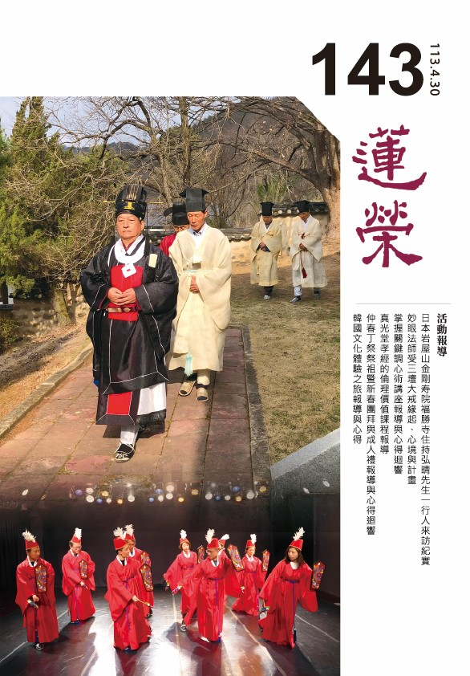

## 社論

### 八佾「武」於庭，是可忍也，孰不可忍也？

本刊

佾舞祭祀流傳久

取悅鬼神供養義

子孫修德以報功

趨吉避凶加被得

今年三月初，中華無盡燈文化學會師資組團前往韓國，一方面參加成均館春祭活動，並參與安東地區的書院、鄉校等進行文化交流；另外一項重要的任務，就是向成均館的林鶴璇教授學習武佾舞，林教授在舞蹈上的投入已有六十年，對於佾舞也有長達二十五年的研究。佾舞雖然在各國的文廟祭祀中多見，但皆為手執翟籥（羽毛及樂器組成的舞具）的文佾舞，手持干戚（盾牌及板斧）的武佾舞至今已十分少見，可以說目前僅在韓國保留了這項傳承自中國的舞蹈，並於每年釋奠典禮中展現。武佾舞為何在中國失傳？最主要的推判，是宋朝的重文輕武所致，另有所謂的預防政變、避免暗殺等說法，但難有考據，理由也不夠充足。

佾舞現在多用於祭祀孔子的釋奠典禮中，但過去的用途更廣，早在孔子之前，就已經有佾舞的存在，所以《論語》中孔子對於佾舞也曾表達過看法。當時作風跋扈的魯國大夫季平子，在自己的家廟祭祖時跳八佾舞，以他大夫的身分，原本只能用十六人編組而成的四佾舞來祭祀先祖，但卻猛然跳級，達到天子的祭祀規格，一次讓六十四個人上場跳舞。這讓孔子聞後直呼：「是可忍也，孰不可忍也。」意思是這樣的事情季氏都忍心去做，還有什麼事情他會不忍心做呢？季氏只是小國的大夫卻自況為天子，違禮的程度並不一般，孔子的這一句名言，說明他看見了此舉深遠的流弊，也說明了佾舞流傳的悠久。

佾舞若要再往上追溯源頭，依據明朝朱載堉編纂的《樂律全書》記載，可以關聯到皇帝、堯、舜、禹、湯、文、武等各時期的舞蹈，這些舞蹈當中有文的傳承，也有武的傳承。「文」與「武」無論是對於個人，或是對於社會國家，都有如左右二翼般，不可偏廢。孔子曾對魯定公說：「有文事者必有武備，有武事者必有文備。」因為文武雙備，這才讓魯國在夾谷之會上，避免了齊國的侵略，還贏得了齊國的尊重；一個人擁有文采的同時，也要擁有健偉的體格，才能呈現出「望之儼然，即之也溫」的可觀氣象。孔子也是以六藝：「禮樂射御書數」，文武均衡的方式引導弟子們成長，孔門之中不乏可領兵作戰、衝鋒陷陣的賢人，比如子路、冉有、有若、樊遲等。甚至說到周遊列國十四年，也必須具有相當的體能，才有可能挨得住過程中的餐風宿露，造次顛沛。所以孔子的教育，是文武並重的教育。可惜傳至後代六藝不具全，變成了「惟書學、人共遵、既識字、講說文」的教育型態，甚至認為這就是孔夫子「重德」的理念。反映在祭典上，就是保留文佾舞，廢棄武佾舞，八佾「武舞」舞於庭，成為文廟祭祀中不可忍（此處意思是不能如此）的舞蹈。

其實現代教育理念中，雖然未必談兵法、講戰術、論武德，但也都知道體能、體育的重要。校園裡面有體育課程，各地區有政府興辦的運動中心，民間設立的健身館，更是已經盛行了一段時期。體育賽事的菁英們，往往也是大眾所鍾愛的對象。在這樣的文化背景下，在文佾之外思考找回武佾的傳統，似乎也不是不可忍的事情？或有人問，體育與武事並不相同，前者是就健康著眼，後者關係到戰爭與殺戮，不可不慎也。其實正因為如此，更應該將講究武德的武佾精神彰顯出來，更能促進和平的發展。在韓國武佾舞的課程上，一開始林教授就特別說明，武佾舞代表的是自我防衛而不是侵略，跳舞的過程中佾生有進也有退，象徵勝利時不要過分攻擊，應該保有武德。這般武佾的展現，是否才是真正符合孔子「重德」的理念？而不是留文去武，孔子的風采最終只能窺得一半。《論語》上子貢說：「文武之道，未墜於地，在人。賢者識其大者，不賢者識其小者，莫不有文武之道焉。夫子焉不學？而亦何常師之有？」

近年新北市政府在祭孔大典中，推出了多元藝術的表演形式，除了文佾，也看到了武佾、雩舞等表演。以武佾來說，韓國是目前保留傳統精神與內涵最完整的國家，舞蹈中每個動作的意涵，每個方位的搭配，都有很深的講究。他山之石可以攻玉，如此難得的傳承，應該也值得我們多花時間去觀摩與研究，在釋奠大典上，呈現出最圓滿完整的孔夫子，開展社會國家最美好的風氣。

## 佛學覽幽

### 華嚴經淨行品（五十八）

*戒慧講述、編輯部整理*

美食觀待善業生

粗食或由惡業感

得食發願種佛因

隨緣皆是助成佛

丙二、指事顯因答其徵因

丁一、總徵

丁二、別顯

戊七、到城乞食時願（二十二願）

己四、得食正食：得美食、不美食

己四、得食正食：得美食

經文：

若得美食，當願眾生，滿足其願，心無羨欲。

美食，有兩種說法，一是接受供養的行者認為的美食，二是布施者將他認為最好的食物拿出來供養。「得」可以說是行者，或是行者看見其他比丘托缽得到好的食物，這樣說來若得美食的組合有四種可能性：一、自己托缽得到好的食物，二、看見別人托缽得到好的食物，三、自己托缽得到布施者將他最好的食物拿出來供養，四、看到他人得到布施者將其最好的食物拿出來供養。

得到美食應當發願，希望眾生「滿足其願，心無羨欲」，其這個字，會性法師跟南亭老和尚的解法不同，會性法師認為是希望眾生的好願都能夠得到滿足，南亭老和尚的說法是，布施者把最好的食物供養比丘，並希望可以滿足比丘的願，使比丘歡喜。心無羨欲，看到別人的食物比自己的好，卻不會產生心羨之心。也就是在托缽時，行者得到好的飲食，應當發願眾生一切都能滿其好願，乃至於出世間的菩提大願。對於別人勝過我的情況，我只要努力進修，不必羨慕別人，少欲知足。

己四的「得食正食」跟己三的「乞食得不得」差別為何？己四是有得到供養，己三則不一定。己四得食正食，能食的是得食，所食的是正食。第二個講法是，就信徒來講，他們盡心盡力地準備美食來供養，就修行者來講，他也覺得這是美食。這裡面有兩種，第一是我努力把美食煮好，第二是我有能力知道，這一頓飯煮出來比丘也喜歡吃，這要透過觀察，努力煮出對方喜歡吃的菜，那一份心意更可貴。通人情很重要，得食美食更約著比丘吃了很高興的這一分說，所以上供比丘時，要上供比丘也認為的美食，布施這一分的心意要圓滿，有一分是要供養對方喜歡的，有一分是知道我給對方的時候，對方一定高興，這種通達是不容易的。

比丘得到很喜歡吃的美食，心情很舒服，心情舒服跟貪欲是兩回事，不可以說凡是讓心情舒服的就是貪欲，貪欲是想要更多，而且很怕沒有。比丘只是在這個情境中，享受眼前這一頓食物，就像夏天時，大德一樣會拿扇子搧風，搧風是驅熱，熱不能驅的那一分他不會生起瞋恨心，所以反面來說他不會生起貪愛，但是驅熱的那一分他有。肚子餓了大德會吃飯，那是生理需求，就像汽車沒油要加油一樣，吃到好吃的食物覺得爽口的那一分大德也有，而生起貪愛的那一分他會對治，如果比丘連美食、惡食都不能區分，那比丘連分辨的能力都沒有，比一般人還糟糕。而且下一條就是得不美食，可見比丘會分別是美食與否，比丘是在自相上不分別，但是在顯現的時候，怎麼可以不分別呢？比丘若不能分辨善知識與惡知識，還修什麼？還發什麼願？所以得美食、不得美食，是比丘名言當中通達的美食、不美食，這裡面包括信徒的誠意、比丘對美食的認知，比如面對緬甸的比丘，就要供養辛辣有味道的食物，這是通達對方對美食的定義，通達對方的口味，我們且約比丘吃的時候覺得爽口說是美食，而比丘能不能除去他的貪愛就不是我們該管的了。

上下連貫應該說，我在托缽的時候，此人用美食滿足我，所以當願眾生，能夠滿足別人的願望，你滿足他的時候，他當然不會羨慕，比如我托缽得到粗食，但是看到別人拿到美食，這時候不會羨慕，所以當願眾生，具有滿足他人願望的能耐，佛也是滿足眾生想離苦得樂的願望，幫助眾生成佛，成佛就是最究竟的離苦得樂，眼前先以飲食滿足他，後以佛果滿足他，這才是最關鍵的意思。菩薩行裡面除了各面向的通達，最關鍵的通達是人情世故。

己四、得食正食：不美食

經文：

得不美食，當願眾生，莫不獲得，諸三昧味。

不美食可以解釋為托缽的行者覺得是不好的食物，或是給予食物的施主把自己不想要的拿出來供養，或是很隨意的供養，遇到這種情況應當發願，希望眾生「莫不獲得，諸三昧味」，也就是都能獲得諸三昧味，三昧就是正定。得到不好的飲食，不但不起瞋心，還希望眾生都能夠得到正定，得到三昧的禪悅之味。會性法師說，現在人認為番薯籤、鹹菜乾是美食，但是對於會性法師那一代，當時的地瓜籤是曬乾後儲存起來，跟著一點白米一起煮，地瓜籤存久了會發臭，根本吃不下去，看到地瓜都有陰影，有時候比丘托缽，縱然對方很有誠意，供養的食物對比丘來講卻是不美食，像迦葉碰到貧民，貧民能供養的剩下洗碗水，對迦葉來講是不美食，怎麼會是三昧味？這裡是說，如果嘗到三昧味的人，人世間的功名、榮華富貴味同嚼蠟，世間對他來講，一點樂都沒有。美食、不美食他仍可以分別，只是不會在意，不會對不美食起瞋、對美食起貪，但是美食吃起來很舒服，不美食吃起來很不舒服的那一分，大德同感受。人稱古佛的趙州禪師曾經說「老僧行腳時，除二時粥飯是雜用心處，除外更無別用心處。」意思是，對美食跟不美食不可能不動心，美食能夠促進食慾，如果刺激不了食慾，營養再好也沒用。

諸三昧味是說，如何藉機訓練自己在粥飯當中不動心，不要以為不美食可以不動心，阿羅漢吃馬麥九十天的時候，各個餓得發昏、營養不良，請問阿羅漢有動心嗎？阿羅漢只能安在道上的法喜，除此之外別無良方，所以九十天的馬麥吃完後很痛苦，但是不會生起瞋恨的回憶，只有佛才能以心轉境。

正定有法喜，在一個善境界上產生專注的能力，生起輕安的快樂。憨山大師曾在一個寺廟，每次上淨房，都覺得這個寺廟的淨房很乾淨，便特地去看打掃廁所的是誰，結果是雪浪法師，後來兩人結為莫逆之交。中興明朝的五大師，蓮池大師、紫柏大師、憨山大師、蕅益大師外，還有一個就是雪浪法師，他很清楚知道維持大殿、寺院的清爽乾淨，維持一個修行的環境，就是一種供養、一種修行。

所有三昧中，最殊勝的三昧就是專注在法上尋求勝解的三昧，對正見有專注力的那一分，是所有三昧裡面最美的，就像顏回的三昧是從好學來的，是不斷地對法生起勝解的三昧。五祖傳六祖，六祖從未進到佛堂坐過，也不是腿功好，神通也沒有別人厲害，六祖贏就贏在正見。「大學之道，在明明德，在親民，在止於至善，知止而後有定」，雪廬老師說，知止的止是止於大學之道的止，而後有定的定，而後有正靜，而後有輕安，安而後能慮，慮而後有正得，那是所有禪定當中最棒的，換句話說，專注於全方位的通達，此人培養起來是不得了的，不是我們在某一個三昧裡能通達想像的，顏回成就的形象就是會去作種種體會的那一分，聞一知十，在聽聞當中周遍的通達，是所有弟子中最殊勝的形象。（下期待續）

### 大乘百法明門論簡說(四十九)

*戒慧講述、淨本整理*

變動不居乃生滅

無常觀修除粗貪

當體即空無細貪

如實解脫真解脫

拾柒、心不相應行法（七）

論文：

第四、心不相應行法，略有二十四種，一得，二命根，三眾同分，四異生性，五無想定，六滅盡定，七無想報，八名身，九句身，十文身，十一生，十二住，十三老，十四無常，十五流轉，十六定異，十七相應，十八勢速，十九次第，二十時，二十一方，二十二數，二十三和合性，二十四不和合性。

心不相應行法第十一的「

生

」，生就是本無今有，本來沒有現在有叫做生，生只有存在一剎那，因為第二剎那跟第一剎那已經不同，所以第一剎那同時說已生，同時要說「趨滅」。一法上如果有實體性，不能又是生又是趨滅，因為生跟趨滅是完全相反的特性，比如「男」與「非男」不可能同時存在。可見該法的生並沒有實體性，所以觀待本無今有而說生，觀待第二剎那即滅而說第一剎那趨滅。可見法的存在不是實體的存在，只能從該法的作用相續中說有名言上的關聯性而已。

緣起法的生，可以分為「因緣生」的生跟「觀待性」的生。緣起生包括兩者，因緣生就是因已滅果才生；觀待性的生，則是生時(有支)是觀待支分而生，有支與支分都在，例如房子是觀待鋼筋水泥與隔間，這是實體法的觀待。又比如左邊觀待右邊才成為左邊，左邊出現的時候，右邊並沒有滅，這是概念上的緣起生。又虛空(無為法)是觀待色法不存在的地方而說虛空。所以因緣生必是有為法、造作法，而緣起生可以包括無為法，有為法、無為法這兩者都可以稱為緣起生，緣起法沒有自體性(空性)。空性是緣起法的體性。

心不相應行法第十二的「

住

」，定義是「生位暫停，即說為住」。然而其實沒有住相可得，住只不過是相續相似的狀態。倘若有住可得，那應該是不變，然而法的存在只有一剎那，下一剎那又變成下一個法，再下一剎那又變成下一個法。所以只是在前後狀態相似的立場上，假名為住，然後在已經「非相似」的立場上假名為「異」，因為這種變異朝向衰敗，所以也稱為「老」。最後整個狀態已經沒有，假名為「滅」。

「

老

」雖然沒有實體性但有作用，什麼叫做老，但看所產生老苦的作用說是老，吾人應當生出警惕，好好把握時光學習。在老的過程中，根力開始衰退，眼睛看得模糊，耳朵聽不明白，體力不如從前，甚至臥病在床，處處要別人幫忙。老人的色力也衰敗，斑點與皺紋滿佈，人見不愛。老人能夠受用的境界也快速減少，念力也不足，聽到的記不住，失去聞思的能力，回憶的都是過去的小事。此外還有朝向於死亡的恐懼，雖然說死亡的不一定是老人，也可能是年輕人，但老人往往與死亡更接近，恐懼感也更強烈。這些是老苦的觀察，而這些痛苦，居然在我們的身上都會發生，而且是不久的將來就會發生，不必算命都可以確定會發生！所以人生一定要把握年輕時好好學習，特別是佛法的學習，佛理深奧美妙，如此深邃的內涵，必定要趁年輕時去投入，才能獲得最多的法益，續佛慧命。

人生最後是「

無常

」，無常也稱為「滅」，就是諸行已經滅壞的狀態。《大智度論》舉出兩種無常，一種是「念念無常」，一種是「一期無常」。念念無常在小乘的看法叫做生住異滅，生是根對塵一念心生，一念之心的相似相續叫做住，一念之心初後不同叫做異，一念之心滅亡叫做念滅。其實一念心生只有存在這一剎那，下個念已經不是此念，所以同時在一個念上說生，同時也假名叫住，又因為下一個念頭已經不同，所以此一念又叫趨滅。對於這一心念，同時說生、同時說住、同時說趨滅（異），可見當前的這一念無實有，是假名安立。心念上作生住異滅的觀察，稱為「小四相」；若從一生之中的生住異滅去觀察，則稱為「大四相」。從父精母血和合的這一剎那開始，就是人道之生，一直到十月滿足，都屬於生的過程。出胎後住於這個世間，隨著年齡不斷變異、成長、衰老，最後命終，身體壞滅。這些就是大四相的觀察。

生住異滅稱為「四有為相」，另有所謂「三有為相」，也就是不立「住」相，只立「生、異、滅」三相，因為諸法生滅無常，無住相可得。或者將住相與異相合為一相，成為「生、住異、滅」三相，表示住中仍有變異。了解四有為相或三有為相，就了解佛法中的「諸行無常」法印。其實諸法剎那生時，同時名住、同時名趨滅，都是假名安立，無自體性，已說明如上。

心不相應行法的第十五「

流轉

」，第十六「

定異

」及第十七的「

相應

」，都是在說明因果上的作用。因果要從流轉、定異及相應三個方面去體會。

於因果相續不斷上假名為流轉，「流」是相續，「轉」是生起，也就是相續生起。比如種子（因）滅苗芽（果）生，然後苗芽當中又長出新的種子，生後滅、滅後又生的相續當中，假名叫做流轉。因果是相對而成，稱苗芽為果，是因為對著之前為種子；稱種子為因，也是因為之後成為苗芽，沒有果稱不上因，沒有因也稱不上果，可見皆是名言上關聯的假立而非實有。此外種子滅而苗芽生，是因滅果生，因既然會滅，表示因沒有自體性，沒有自體性的因所生的果，又怎麼會有自體性？

名言是依照作用而安立，所以因果的流轉雖無實體，但有作用，切莫墮入根本無的斷滅見中。比如過去生中布施，此世得富貴，富貴既然是因為布施而來，所以稱布施為因，富貴為果，因果皆是就作用而安立。眼前富貴的果，若造成人的奢靡墮落，未來墮入三塗，則富貴又成為因，三塗又稱為果。因會結果，果又成為下一果的因，在因果相續之中，必須謹慎小心，唯有斷惡修善，樂果中不造惡因，才能在因果流轉中離苦得樂。(下期待續)

### 佛學概要十四講表簡說（四十四）

*戒慧講述、編輯部整理*

鬼迷心竅鬼靈精

賭色貪婪鬼習氣

爭奪心機與暴力

鬼道難出實堪憫

第六講表　宇宙有情概況

前言

第六講表宇宙有情概況，在六道的觀察中，在各道不管是快樂或是苦樂相間，或是純苦的，都是以苦為本質去顯現他的快樂或痛苦，我們應該對六道生起出離心，應思維假若我輪迴到某道，是否成為解脫的障礙？在快樂當中，是否容易迷失？在痛苦當中，是否容易怨天尤人、憤世嫉俗？一一做觀察，對六道充滿了恐怖，以及出離之心，也就是生起出離心。

第二步觀察六道的有情，依著其本質為苦而生起大悲心，他有多少痛苦，我就生出多少不忍，他有十分的痛苦，我就生出十分的不忍，所以大悲心是一種分別，觀待有情的痛苦而生，並且以成佛來做為利樂有情的果位，我必須要去成佛的那一分是菩提心。

第四表、第五表就著人身來說，第六表、第七表就著六道來說，這裡面有出離心、菩提心，對自己的觀察生起出離心，對有情的觀察生起大悲心，而我必須去成佛的那一分是菩提心，以上是前言。

鬼道

眼前的進度是鬼道，一一來觀察餓鬼道的痛苦，從此處生起厭離心、憐憫心，生起我必須要成佛才有辦法度到這樣有情的心。

先說

餓鬼道的類受

，也就是他正報、依報的受用。鬼有一種畏懼的心，鬼道眾生痛苦非常多，諸如刀杖（刀殺與杖打），或者被追殺，或者環境恐怖，或者生存困難，但是餓鬼道特別以飢餓這一分來安立，無法根據所有的內涵去安立，只就一分來安立，好比我今天身體不舒服，是就著身體這一分來說，其實我不只身，還包括心，眼前只是就著身心狀況的某一分去安立而已。好比花可以以顏色來安立，也可以以香來安立，最常用的是顏色，比如叫它玉蘭花，是就著顏色那一分安立的，並非總體，所謂的一分安立，指就著大家共同認識的那一分去安立，不是該法完整的樣貌，同理，諸法也是唯名言安立而已。

餓鬼的種類

，《楞嚴經》分成十種，《正法念處經》分成三十六種，我們現在依著《阿毘達摩順正理論》，列為三品九類，也就是有三品、九類的鬼。阿毘是對，達摩是法，對法論屬於有部的經典，有部論名相論最多，《俱舍論》雖然是小乘部派的經典，講的雖然不了義，但是名數列得最多、最完整，大乘部派也不得不讀，該論也是藏傳佛教格魯派必讀的一部論。

首先，就著

鬼道飢餓的狀況

，分成無財鬼、少財鬼和多財鬼，無財鬼長時飢餓，沒有福氣，沒辦法獲得食物，這一類的鬼類形貌醜惡，長相難看，只有純苦，沒有快樂，依著他不能夠得到飲食這一分來說，又分成焰口鬼、針咽鬼、臭口鬼三類。焰口鬼的口會吐火焰，即便他得到食物，要吃的時候，口裡的火焰就會把食物燒成灰燼，他的身形像是火燒過的棕櫚樹，舉一個大家熟悉的公案—目連救母為例，目連尊者成道證果後，觀察到他的母親在餓鬼道受苦，所受的苦就是焰口鬼之苦，他想要救拔母親，可是送飲食到母親面前，母親要吃的時候，就會吐出火焰燒掉食物，目連尊者去請教世尊，世尊教他要結合共業，也就是在七月十五齋僧超薦，即非常有名的盂蘭盆會，最主要就是救焰口鬼，還有救度受倒懸之苦的鬼魂，來超薦鬼道及我們在鬼道受苦的親人。

口吐火，其實就是慾火，或是瞋火、躁火，像目連尊者母親的慾火，明明拿到食物，就不准別人吃，想不到要吃的時候，自己的一口火就把食物燒掉，連吃都不能吃，所以助念臨命終的人，他如果想吃什麼就給他吃，否則那一念想吃的心，一下子就進入鬼道。

緣六道有情的苦，我必須要成佛的這一分，跟焰口鬼有什麼關係？目連尊者已經證果，他有能力看到母親在受苦，想要救拔，但是他發現對著母親的惡業，他沒有救拔的能力。小乘人對定業是無可奈何的，目連尊者最後靠齋僧超拔他母親，齋僧的對象是釋迦牟尼佛與僧團，這就是為什麼要成佛的道理，否則八地菩薩可以呼風喚雨，彈指間轉長河為酥酪，變山河為大地，還需要努力增上嗎？不是成佛的那一分，沒辦法攝受殊勝的僧團，就像孔子出現才能夠集合團隊，孔子過世後，就分成八大派。不要小看定業，如果不是靠團隊，主事者不是頂尖人物，團隊組不來，團隊的力量也不能發揮，不能轉變定業，所以才會說為了利益有情，我必須去成佛。

第二個針咽鬼，咽喉如針孔，腹部卻像山谷般龐大，其咽喉沒辦法讓食物或者滴水通過，又腹大如山谷，非常飢餓。

第三個是臭口鬼，口常出臭惡之氣，熏自己也熏別人，常常嘔吐，根本無法飲用任何飲食。

第二個少財鬼，形貌非常醜陋，飲食的獲得很艱難，只能得到一點點飲食的快樂，但是以苦為大部分，分為針毛鬼、臭毛鬼、大癭鬼三類，針毛鬼全身都是長毛，且非常堅利，他的毛會鑽到自己的身體裡面，或是射向他人的身體，非常痛，如果遇到不淨的食物，比如屎尿那種極其不乾淨的東西，他可以稍稍解飢。

第二種臭毛鬼，身上也是長毛，而且非常臭，毛還會熏爛他的肌骨，臭氣衝喉，令他嘔吐，他很想拔毛，可是拔了又會傷皮膚，痛苦更加劇烈。所以前生的習氣很重要，比如跟人相處的時候要保持乾淨，或是到三寶殿時不能有臭味，不能臭味熏人，以前佛制要用柳條枝刷牙，比丘說這跟修行無關，佛說這是給人的觀感，很多的戒律、威儀，乃至於一些生活習慣，都必須講究，都跟我們業的轉變有關。

第三個多財鬼，形色非常醜陋，但是有福報，能夠得到比較豐厚的飲食，分三類，第一個叫做希祠鬼，能夠受到人的祭祀，也有來去凌空的能力，或者是住在墳墓邊，或者是有眷屬來祭祀。所以我們到墳墓邊要恭敬小心，不要隨便坐在別人的墳墓頂上。

第二個希棄鬼，也能夠得到少分食物，像是垃圾、餿水、殘糞，這些別人丟棄不要的食物，對他已經很豐富了。

第三個是大勢鬼，就是比較有勢力、有威福的，他們衣冠華美，也有住處，像宮殿，有時候比人間還殊勝，就像人間供奉的城隍、王爺，都屬於此類。

鬼道喜歡拉幫結派，且組織嚴謹，因為他們的資源很少，都是幫派壟斷，像舍利弗有一次進城門看到他的親戚，他的親戚是一隻鬼，那隻鬼包了一口痰，要衝出城門衝不出去，如是七十五年了，因為旁邊都是鬼黨，我們人間都看不到，其實鬼的數目比人間不知道多幾倍。

鬼常常互相砍殺、爭奪地盤。才會說鬼道餓的苦只是其中一分，其它刀杖、砍殺的苦也非常多，勝者為王，敗者為寇，生活充滿鬥爭、飢渴、憤怒，所以每一隻鬼形貌都很醜陋，生的小孩數目之多，一次可以生一兩百個、兩三百個、三四百個，每天都處於挨餓的狀態，每天都在吼叫，一生都為了飲食忙碌，這種情況怎麼可能學佛、念佛。

鬼道眾生統稱鬼神，是因為他具有神通的力量，但這是依他的業報得到的，不是修行得到的，乃至於他們的神通能夠移山填壑、隱顯變化，可以隱藏或者顯現，諸多變化。智者大師到玉泉山感應魔境，就是因為搶了鬼神的地盤蓋廟，智者大師在玉泉山，七天鬼哭神號、風雨交加，有人說這是心魔成立，像唯識宗就講心魔，可是以智者大師的內涵，應該不至於有這樣的心魔，再者，心魔應該不會顯現在外境，有人說，因為自己心裡面會顯現，比如晚上做惡夢，但做惡夢不會讓外頭風大把樹連根拔起。那個幻境是你在某個角度才會看到，所以我們看不到鬼在打仗，要有一點鬼通、天眼通，在某個角度才忽然看到，好像房屋映到水面的時候，在某個角度看到，有那個業就看到，沒那個業就沒有。以上可知那不可能是大師的心魔，那是外魔，智者大師以其願力及對法的勝解的這一分，祈求三寶加被，最後等魔境消失，外魔成立就是業已經形成，你必須忍受，反正它無常，到某種程度會自己消失，玉泉山的幻境七天後消失，所以在外人來看，大師就坐在那裡而已，並沒有看到大師任由鬼哭神號、呼風喚雨、連根拔樹、風雨交加、天崩地裂，難道那是大師的幻境嗎？不是，最後關老爺出現，說從來沒看過這麼厲害的人，那些鬼神兇起來比關老爺還厲害，關老爺都要躲在一邊，這就是外魔。天臺智者大師說修行有內魔有外魔，外魔的修學法就是你要安忍，讓它過，它起現行時你絕對不是它的對手。業就是眾生共同的想法走到那裡的時候，你不是它的對手。（下期待續）

### 人生大事不能忽略的事實-與徐蔚如居士書三

*戒慧講述、編輯部整理*

盛讚徐母是菩薩

生西瑞相母子功

喪葬祭祀唯誠敬

念佛求加戒鋪張

此篇文章，重點在說明徐母善教子女成為法器，更因此成就自己往生的順緣。

徐蔚如居士家中十世學佛，母親早就囑咐他要刻印大藏經，流通法本。至此徐居士便與同參道友成立了北京刻經處、天津刻經處，編撰為《印光法師文鈔》，後又在金陵刻經處，編撰各類法本註解，經印祖校訂鑒定後刊印之。至居士往生前，一直致力於佛教典籍的刊印、流通，以及佛法的講經弘揚。日本侵華期間，也籌辦難民婦孺臨時收容所，收容難民，居士往生之後，印祖為其撰寫《徐蔚如居士西歸頌》，並表彰他一生為佛教的貢獻。

印祖與徐居士的關係匪淺，也深知徐母善教居士，對孩子為公發心的行為十分隨喜，囑咐孩子要在戰火中，為大家提供善本，流通佛法。所以祖師在接到居士通知徐母往生的信件時，是十分感傷的。本文分為三部分，首讚徐母承願示生，先同理徐居士的哀傷，說到諸佛憐憫眾生而教化之；由讚歎徐母往生，說到印祖自己的願望。

首示哀啟悲感，文：「

昨接手書，並哀啟。讀之，不禁悲感無已。

」印光大師說到昨日接到徐居士的來信，知道內容必定是寫著徐太夫人往生的事蹟，所以用十分感傷的心情開啟信件，也對徐母往生有許多內心感想。

接著讚歎徐母就像諸佛菩薩來度化眾生，科判是通顯諸佛哀愍眾生而隨類化生，以此善巧方便度眾，文：「

夫諸佛菩薩，法身大士。愍念眾生，示生世閒。和光同事，以行教化。或男或女，或國王大臣，妃后大家，及與貧窮下賤之流，俾觸目感發。隨地隨人而得入于一乘閫奧而不自知。

」

諸佛菩薩這些以法為身，辦大事做大雄的大人們。憐憫的繫念著有情眾生，不斷在娑婆世界中示現。表面上隱藏著自己的智慧能力，和眾生做著同樣的事，以這樣的狀態陪著眾生一起成長，來教化眾生。不論貴賤、性別，都希望能觸發他們的宿世善根福德，種下成佛的因。所有的方便皆引有情成佛，有情潛移默化地受引導而不自知。

通顯諸佛愍化中的眾生同蒙佛益，文：「

如是則法道流通，如春迴禹甸，日朗堯天。無一處一人，不蒙其光明，沐其含育也。

」徐母對正法流通的助益，是子女皆學佛，也影響許多人學佛，就像春回大地，太陽照耀清明盛世。所有的地方和有情，蒙受正法的光明照耀，沐浴在正法的教育之中。如果我們錯覺不學佛時，也和一般人沒什麼兩樣，過著平順的生活，用業餘馬虎的心態來學佛，佛法有我的護持或沒有我的護持都一樣好好地存在，當整個文化傳承都與我無關的時候，許多美妙的秘密就都與我無關了。

夏禹時，分中國為九州，稱為「禹甸」，此語出自《詩經，小雅，信南山》：「信彼南山，維禹甸之。」後來變作為中國的代稱。所謂的堯天，出自於《論語，泰伯》：「大哉！堯之為君也。巍巍乎，唯天為大，唯堯則之。」比喻盛世。

觀讚徐母聖跡，首先先觀事跡，文：「

觀太夫人一生行跡，及臨終景象。

」觀徐太夫人一生除了在家中相夫教子，克盡婦道，並以流通大藏經為她的法行，臨終示現殊勝的瑞相。

再觀太夫人德行，文：「

光前所謂乘願輪以示生，居坤維而說法者，為的確之極。

」此處說到印光大師自己的感想，在前面給徐蔚如居士的書稿中(與徐蔚如居士書二)，說到印祖相信徐母乘願再來，示現婦道人家，處處表現為殊勝的學佛行者，是真正的以身說法，有能力在四方說法，這是真確至極的。

結明祖師行願中，印祖自謙自己德學不如徐太夫人，就見賢思齊的部分，文：「

光虛受男身，濫廁僧倫，四十年來，於法門毫無裨益。讀太夫人伋汲流通大藏，刻印契理契機之書，直欲愧死。

」印光大師謙虛自己混充在僧人之間，當時印光大師約莫六十歲，自謙自己對法門弘揚與傳承沒有幫助。知道徐太夫人心心念念在流通大藏經，自己印、叫兒子印各種契理又契機的善書。慚愧是印祖的修學法，也是祖師的偉大處，祖師自謙對比於徐太夫人的大心量，自己所作所為是極為不足。

就回向求度部分，文：「

而朝暮禮誦時回向，乃律攄我愚誠。尚望太夫人慈愍，挽彌陀聖眾，以速度我，何可謂為法施。

」印光大師說自己早課、晚課回向徐太夫人，是規範我、抒發我對太夫人往生誠心誠意的祝福，我這樣每天殷勤的回向給太夫人，不能當作法布施，是期望太夫人慈悲憐憫，與極樂世界彌陀聖眾，速來度化我。

就增長佛心部分，文：「

然不妨借此緣事，以增長自利利他之心。故博地凡夫，當禮誦時，尚為諸佛回向，況示居凡位，於理又有何妨。

」藉著早晚課回向徐太夫人這件事，來增長自己的心量，報答諸佛菩薩恩德，做法供養。當凡夫禮誦經文時，尚可以回向諸佛承辦正法事業，具足順緣，印祖自謙己是凡夫，當然亦能回向徐母這位菩薩，於理不妨礙。雪廬老人收到別人給予的禮物，也立刻回向。

略釋佛事念佛為主，也就是往生時應該注意的事項，第一部分喪期作七，文：「

至於七中，及一切時，一切事，俱宜以念佛為主，何但喪期。

」無論何時做任何事，內心要安在佛號上，何止是只有在喪期七七四十九天中不離佛號。

做七的利益，反顯，文：「

以現今僧多懶惰，誦經則不會者多，而又其快如流，會而不熟，亦不能隨念。縱有數十人，念者無幾。

」此處不可死在祖師文句之下，當時或有趕經懺的流弊，要別具一隻眼看待祖師所說。趕經懺的流弊在於多不懂經文，念經像在飆車，很難跟著念，更不用說隨文入觀。縱然找來許多人來念經充場面，但是真正在念的恐怕不多人。

做七的利益，正明，文：「

唯念佛，則除非不發心，決無不能念之弊。又縱不肯念，一句佛號，入耳經心，亦自利益不淺。此光絕不提倡作餘道場之所以也。

」唯有四字念佛，下手容易成功機率也高，除非你不想念，決定不會有不能念的弊病。就算在一旁沒有念佛，但是佛號入耳經心，用力少而得效速，在佛號相續的狀況下，佛號已成滅法隨心流而去，在條件具足的情況下生出莫大的利益。這也是印祖不提倡做趕經懺佛事的原因所在。

臨終時助念也是以佛法為主，正明凡夫業深防親誤愛，旁邊護持的人要同聲念佛於臨終，文：「

人當臨終，唯同聲念佛為有益。若識心未去，沐浴舉哀等，大有所妨。

」業的體性是思，凡夫心思都在自己寶愛的身體與親人，臨終離去的時候，只有旁邊的人同聲念佛才是對他最大的利益。如果還未過世，沐浴身體或讓他痛苦而生起瞋恨，舉哀牽動他內心對親人的貪戀不捨，或引動他獨自離去的落寞、孤單、憤恨等等，這些舉動都對他的往生大業有重大的妨礙。

臨終時的助念也需要在平日為眷說明，文：「

是以修淨業人，須於平日，與眷屬說其所以，庶不至誤用親愛。

」如臨終三大要所顯示，專修淨土法門的修行者，要在平日為眷屬說明自己的志向，也要教導親屬該如何護持自己，緊急狀況的時候要怎麼處理，該通知那些人來幫忙自己生起正念，不是親屬之間沒有親愛，此處是要將親愛的關係用在真正成就亡者的往生大業。

反顯高士德厚不懼彼牽文：「

若過量大人，出格高士，正不必懼其被此牽挂耳。良由彼福德深厚，當穢業已滅，淨境現前時。即在此時，其所見所聞，已非此閒景象矣。

」校量之中福報超過一般人，在形而上慧力出越常格的高士，當然不必擔心被臨終眷屬牽掛。這是因為他的福力、慧力深厚，當此處娑婆的煩惱業(這一期生命現象)結束時，阿彌陀佛與淨土現前，所見所聞淨土殊勝的樣貌，與娑婆世界已是天差地別。

在追薦先亡部分，可幫助往生親屬速成佛道，品位雖高，成就方歇，文：「

太夫人蓋非常流，固不得以常格律之。其生可必，其品位當不在中下。然佛法宏曠，唯成佛方可歇手。欲決得往生，正不妨懇切念佛，常行追薦。

」徐太夫人非一般泛泛學佛之輩，她的成就不能以常格來論，往生是絕無疑慮，在淨土定超越中下品位。但是佛法宏大廣闊，一直要努力到成佛那一刻才行。所以雖然決定得到往生，家屬也不妨懇切念佛，助她蓮品高升。

在追薦先亡部分，可幫助往生親屬速成佛道，先罪未清，常行追薦，文：「

即佛經所謂雖知罪性本空，而常悔先罪，不說已得清淨。蓮池謂年中常須追薦先亡，不得謂已得解脫，遂不舉行耳。

」這也是佛經所說，雖然勝義上業的罪體性無，煩惱業感果之後所造的業已滅；但世俗上，煩惱罪業仍須要透過各項懺悔，不能說已得清淨。蓮池大師說每年仍需追薦先亡給予增上，不能說他已經往生極樂世界，得到了解脫就不再做追薦的儀式。

在追薦先亡部分，能令存亡生起廣大心量，不但得到利益而且能夠法界同薰，文：「

須知念佛誦經，雖曰薦親。實為現前眷屬親知，開心地，種善根。及所有薦親功德，回向法界一切眾生。以廣大自他存亡之心量，以消減自他存亡之執礙耳。

」需知念佛誦經，雖然像是在亡者牌位前準備祭品供養那樣，但是這樣做實是為了現前眷屬親朋好友，意即慎終追遠不只為了亡者，生者生起報本還恩的心，實乃開心地種善根，能與彌陀淨土結上善緣。將所有追薦的功德開展心量擴及法界一切眾生，由近及遠，由親即疏，亦能消減自他存亡對自身執著障礙，以及增上對法的體悟。

最後結戒親喪莫趨時尚，戒奢華誇張，文：「

至於不主於誠，唯以奢華張羅誇耀於人。則所謂以親喪作鬧熱，非人子所宜為也。

」《論語》中，林放也曾問禮之本，孔子回答喪禮的重點在對亡者追薦的誠意，而不是把告別式當作熱鬧場，並且奢華張羅做樣子給別人看，這不是人子盡孝適宜的行為。

防豔羨歆動，文：「

閣下深通佛法，斷不至此。或恐眷屬知交。有被近來諸大家行事，豔羨歆動者。不妨與閣下言之．以杜其違法違理趨時之心耳。

」徐蔚如居士是深通佛法者，絕對不會如此做，但是祖師害怕眷屬知交，欣羨近來這些盛大美好的告別式，被這些近來出現的鋪張熱鬧情況而感動效法。

所以不妨跟您(徐蔚如)提及，來杜絕這些違背正法的法行，對治趨附奢華風氣的心。(下期待續)

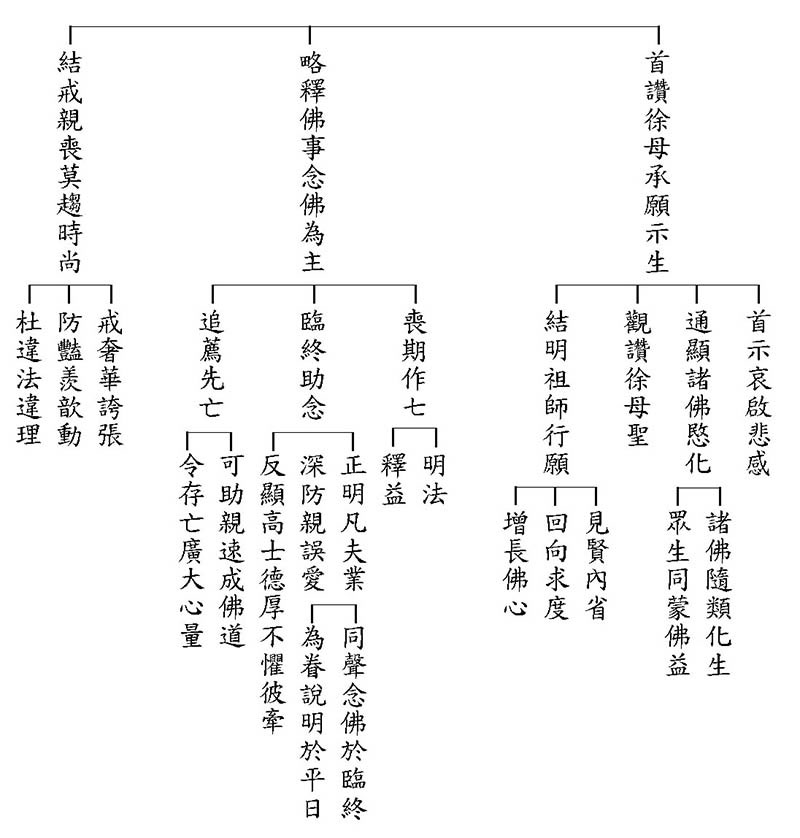

### 緣起贊論略釋（八）

*戒慧講述、心若整理*

承許緣起入內道

緣起空性不相違

唯有應成宗派見

修學中觀佛本懷

論中文義分二，一、由說緣起門中稱讚能仁。二、結述造論因相福德回施。一、由說緣起門中稱讚能仁分三，即總標、廣說、攝義。

乙二、廣說分二：丙一、由緣起門稱讚之因相。丙二、正贊。

丙二、正贊分二：丁一、由見說緣起門中總贊。丁二、由說緣起門中別贊。

丁一分三：戊一、由見說緣起的這一分來贊歎佛勝過外道的大師。戊二、正贊見說緣起。戊三、結論。

戊二、正贊見說緣起分三：己一、見說性空為緣起義。己二、顯示未能如是知者即是未達聖教心要。己三、顯示知已於大師處生起定量所引信敬。

己一、見說性空為緣起義分二：庚一、廣說。庚二、攝贊。

庚一、廣說分二：辛一、顯示不許空與緣起是一義者即未能達能仁所許。辛二、成立空與緣起一體即是能仁許中第一。

科判分析：

戊二、正贊見說緣起：

正式贊歎見緣起、說緣起有多殊勝，並說出其中的理由。

己一、見說性空為緣起義：

空性跟緣起同一義，性空就是緣起，此最難解。空性是指該法的特性並不是在該法上，該法的特性是緣起而有、觀待而有，在名言安立下顯現。

己二、顯示未能如是知者即是未達聖教心要：

未能通達性空與緣起是同一義的，就是沒有通達聖教的心要。

己三、顯示知已於大師處生起定量所引信敬：

知道空性就是緣起法者，能對大師所說生起定量，所謂的定量就是用量來通達緣起，量特別講比量、現量，跟聞所成慧的非量，因為聞所成慧的非量是接近比量的非量。由量去通達緣起，會產生信心，這個信心是法行人的信心，因為他經過抉擇、思維、推理，由這樣的信心生起對大師（佛與傳承）的恭敬。

己一、見說性空為緣起義又分為廣說跟攝贊：

廣說指分別來說，攝贊是廣說的結論。

廣說分二：

辛一、顯示不許空與緣起是一義者即未能達能仁所許：

顯示不許空與緣起是同一義，就沒有通達釋迦牟尼佛的承許。

辛二、成立空與緣起一體即是能仁許中第一：

成立空與緣起一體即是釋迦牟尼佛所許的第一。這是大般若經的經義所在，也是中觀應成派抉擇大般若經最殊勝的見地。

辛一、顯示不許空與緣起是一義者即未能達能仁所許

論文：

恒作饒益者，為益眾生故，說教藏空性，無比決定因，謂緣起道理，見相違不成，於此尊教法，如何能了知？

「

最初一句稱讚如來，謂佛世尊晝夜六時，恒以佛眼觀察世間，誰苦誰樂、誰增誰減，誰向惡趣、誰趣涅槃，熟與未熟、時至未至，隨其所應，攝益誨導；未其信者令住信德，乃至已成熟者，令得解脫。如律藏云：『假使大海潮，或失於期限，佛於所化者，濟度不越時。』是故諸佛名饒益者。

」

最初一句，即恒作饒益者，這句稱讚如來，稱讚的理由是：佛世尊晝夜六時，都恒常以佛眼來觀察世間，觀察誰苦誰樂，這是約果上來說；觀察誰增誰減，這是約功過來說；觀察誰趨向惡趣、誰趨向涅槃，這是約因上來說；觀察熟與未熟，這是約根器來說，觀察時至未至，這是約成熟的時機來說；隨其所應，是約著相應來說，佛對有情必須要了解上述這麼多，包括因上、果上、功過、根機、時機等等，才能與有情眾生相應，而隨其所應的重點就是攝益誨導，攝益就是攝受有情，給他利益，引他的德，誨導就是除過，佛法的本質就是離苦得樂。

佛化益眾生的三階段稱為種、熟、脫，種是幫眾生種下善根，特別在聽聞這一分。熟是聞思成就的比量，使善根成熟。脫是透過聞思，串習比量，修到現量的時候就從苦中解脫。

如律藏上說：大海的浪潮很有規律，但有時候或會失期限，而佛度化眾生，絕不會錯過時機，這就是為什麼諸佛名為饒益者，所謂的饒益，就是多多地益，核心思想是種熟脫。

「

言教藏者，此有二說：一謂空性，二謂緣起；俱不相違，同一體故。

」

講到空性，必須在這一法上做兩面向的觀察，一是空性，二是緣起，因為空性與緣起同一體性，緣起的體性就是空性，空性是在緣起上說空性，不相違背，為同一法（緣起法），同一體（空性）。

「

無比決定因者，謂成諸法自性本空決定因中，唯緣起因力大無比。

」

緣起就是無比決定因，成諸法自性本空的決定因中，緣起的正因力大無比，通達空性的正理非常多，以緣起為正因，不但能通達空性，而且也不會落入斷滅見。

◎補充：

中觀自續派以下都某種程度通達空性，中觀自續派通達的空性是名言之外沒有該法的自性，唯識宗通達的空性是法在心外不成立，有部、經部的空性是獨立實有的我空，他們都有緣起上通達空性的那一分來說解脫，但都不是解脫，只有中觀應成派從緣起通達空性才是解脫。

「

見相違、不成者，謂說諸法自性本空、是緣起故，爾時內道唯識等宗見此正因有相違過；諸外道見因不成。何以故？諸外道眾，或計諸法自然而有、或計大梵自在等造，或計神我、或計宿因，如是等無量差別，總其根源，謂迷緣起；內道餘宗，不許緣起攝諸無為；有為雖許是緣起法，即由緣起執有自性，故於前因，見相違失。

」

見相違指沒辦法以緣起來通達空性，駁斥中觀自續派以下。見不成指因不成，即認為諸法不是緣起性，駁斥外道。「謂說諸法自性本空，是緣起故」，若以因明論式來講，前陳（要討論的對象）是諸法（Ａ），後陳（要下的結論）是自性本空（Ｑ），因（成立的正因）是緣起故（Ｐ）。內道唯識宗等宗認為緣起根本不能成立空性，緣起若能成立空性，則有相違的過失，因為因不能成立宗。諸外道見因不成，因為外道認為諸法是自性所成，諸法非緣起，這些外道眾，或計諸法是自然而有，即自性所變（無因生），或是認為有一個大自在天來管轄，跟上帝的道理一樣，苦樂由上帝決定，上天堂得永生。或是認為有個神我、不可說我、常一自在我、靈魂我、離蘊我等。宿因則是認為他以前如何，現在就是如何，例如貴族生的兒子永遠為貴族，平民生的兒子永遠為平民，印度的種姓制度就是如此。以上想法各種差別，但論根源，都是不了解緣起的道理，或是起顛倒毀謗。內道除了中觀應成派外，其餘的是從緣起到空性過不了關，他們不許緣起通達空性，有為法雖許是緣起法，但是緣起是有自性的，緣起的正因不能通達空性，因為該法在那裡已經成為該法了，怎麼會沒有該法，例如火已經在那裡成立燒熱性，怎麼可以說體空？水已經在那裡成立濕潤性，怎麼可以說水的體性空？「故於前因，見相違失」，即執緣起有自性，不能從緣起通達空性，就是相違。

◎補充：

中觀自續派認為：特性在你的認知下是有的，例如水的濕潤性，在你的認知下是有的，怎麼會沒有。但是中觀應成派說，水的濕潤性也是對著所濕潤，他才成立為能濕潤。火的道理也一樣，我並不否定燒熱性，而是否定燒熱性的自性，否定不觀待而有的燒熱性，否則火應該可以把自己燒了，問題能燒也是觀待所燒，能燒沒有體性。

「

貫文釋曰：恒作饒益能覺者尊為利益諸眾生故，宣說甚深極難通達聖教心藏無上空性；又為成立此空性故，說緣起因、為諸無過決定因中最勝無比；然內餘宗及諸外道，於此正因見有相違、不定、不成種種過失；此等乃至未舍如是如是謬執以來，如何能得了知聖尊教法心藏，定不能知。

」

連貫的解釋：佛被推尊為能覺者，是因為他能利益眾生，覺才是恒作饒益的核心，佛能恒作饒益利益有情，而恒作饒益的方式是宣說甚深極難通達聖教心藏無上空性，能宣說的是佛，所宣說的是甚深極難通達的空性，空性是聖教心藏，名為無上是因為破二障成佛唯依空性，緣起是成立空性的正因，是正理之王，以緣起為正因通達空性，是所有決定因中最殊勝的。然內道應成派外其餘宗派及諸外道沒辦法以緣起通達空性，外道不成立緣起，內道有部、經部、唯識是相違，緣起成立為有自性，而不定是指自續派，自續派認為名言外無自性，名言內有自性，一邊成立空性，一邊又執緣起有自性。上述所說，不成、相違、不定，這些都不是正因，不能成立為量，都是錯謬的，如是對於世尊的教法，又如何能了知呢？

「

又此二頌，是一重因。謂餘宗及諸外道（前陳）如何能了尊教法藏？定不了知（後陳）。佛饒益者，為益眾生，說瓶等法定非諦實，緣起性故；於此能成教藏空性無過決定無比正因，見有相違不成過故（因）。諸餘教證，恐繁且止。

」

又此二頌：「

恒作饒益者，為益眾生故，說教藏空性，無比決定因。謂緣起道理，見相違不成，此於尊教法，無比決定因。

」可以從一個因明論式來討論：

前陳（所要討論的對象）（Ａ有法）：餘宗（自續以下各宗）及諸外道（數論師、勝論師等），後陳（所要下的結論）（Ｑ宗）：如何能了尊教法藏？定不了知。因（Ｐ）：佛饒益者，為益眾生，說瓶等法定非諦實，緣起性故。

佛說緣起用因明論式來成立，用這個法則來宣說緣起，舉瓶等法為例：

說瓶等法（Ａ）定非諦實（Ｑ），緣起性故（Ｐ）。

我們用同品遍有、異品遍無下去套：

同品遍有：只要是Ｑ，一定是Ｑ，Ｐ一定有Ｑ

異品遍無：負Ｑ是負Ｐ

見有相違：Ｐ不是Ｑ，見不成：Ａ不是Ｐ

Ｐ是Ｑ（同品遍有）：若緣起性，則定非諦實

負Ｑ是負Ｐ（異品遍無）：諦實，則非緣起性（認為該法有自性，則非緣起）

Ａ是Ｐ（宗法）：瓶等法是緣起性

Ａ是Ｑ：瓶等法是空性

以上可見以緣起為正因為成立教法的寶藏，自續派（含）以下有見相違的過失，外道有見不成的過失，這裡面還可以有很多教證，恐太繁雜且到此為止。

「

總攝義云：緣起因道理，定教藏空性，見相違不成，豈能達尊教。

」

總攝其義：決定教藏裡的空性，是用緣起的道理決定，如果見相違、見不成，對於釋迦牟尼佛的教法，又如何能了知呢？

找回佛教的靈魂，就是成立正因來通達空性，成立正因來通達緣起，才會知道出離心、菩提心、空性的正見，是最殊勝的緣起。乃至業果的思維、輪迴的可怕，廣大行、甚深見，通通都是在緣起上作觀察而得。（下期待續）

### 週四共修法語-發菩提心功德、如何發起菩提心之七重因果、如何發起菩提心之自他相換言教

孫珮茹、潘秀鳳、戴于山

念佛須待正知見

求生淨土是正宗

淨土參學真悲心

願文詮釋往生行

發菩提心功德

孫珮茹

諸位老師、蓮友、大德、同修，為了遍滿虛空界的有情眾生，我們必須要成就無上正等正覺，為了成就阿耨多羅三藐三菩提，所以在此念佛共修發願往生極樂世界。今天很榮幸有這個因緣跟大家分享發菩提心的功德。了解菩提心的功德很重要，唯有知道發菩提心有多好，我們才會認真學習此心怎麼發，才能得到無量無邊的福報和功德；如果沒有發菩提心，這些無盡的寶藏就不是我們的，損失慘重。發菩提心的功德有十個，以下一一說明。

一、入大乘之門：

入門很有趣，老師說如果我們不是那個檔次，檔次裡面的好處和發生的事情都跟我們無關，比如：我們住處的對面是有錢人組成的小社區，就算我住在對面，我每天看到他，但他們的生活都跟我無關。入大乘之門就是，你要成為大乘人，必須先入菩提心這個門。往生極樂世界也一樣，當我們進到那個檔次之後，裡面發生的事情都變成我們的經驗閱歷，而且他們都把我們當成一類的人，能與諸上善人聚會一處。

二、得佛子名：

我們不但進入大乘的檔次，還有了身分，成為佛的接班人，能繼承佛豐富的寶藏。

三、映蔽聲聞緣覺：

這是以種姓功德遠勝二乘，例如宰相功德很大，但看到皇室家人要行禮，而且王位永遠是太子得到，所以佛子如天上的太陽，聲聞緣覺如星星。就算我剛發菩提心，還沒有什麼偉大的事功，依種姓仍遠勝聲聞緣覺。

四、成殊勝功德田：

發菩提心的人是很有志向、很有承擔的，所以能成為別人的福田和貴人，讓別人把我們當田來種上善種。而且發菩提心的人是佛的未來和希望，能得到諸佛菩薩的擁護，所以禮敬初發心的功德跟禮敬佛的功德是等同的。

五、圓滿福資糧：

當我們以菩提心攝持善業時，所做的一切善業乃至一切威儀（包括行住坐臥日常起居的動作），甚至睡覺呼吸喝水等等都成為成佛的資糧。

六、速淨罪障：

菩提心能快速地除去我們的罪業障礙，因為一個發菩提心、有志於成佛以利生者，能攝持善法，廣做善業，罪障當然容易除，就像要讓菜園裡的雜草不生，就要在菜園裡種滿菜，菜種得愈多愈密集，雜草愈沒有空間生長。特別是那些極嚴重的罪障，只能靠菩提心對治，例如破根本戒、五無間罪、毀謗正法等，唯有菩提心能將功贖罪，只要菩提心一生，即便在無間地獄，剎那間連劫火都可以除掉。如果沒有菩提心，做任何善都不能滅除這些罪障。

舉一個真實公案，當時唯識宗的開派祖師，無著菩薩到印度的「雞足山」去專修彌勒法門欲見彌勒菩薩，修了三年都沒見到彌勒菩薩，想離開山洞，但是他一出山就看到一隻鳥為了餵養幼鳥，不斷地從洞口飛出去、飛進來，用牠最柔軟的翅膀去揮打山洞的硬石頭，這樣來來回回把洞口的石頭磨得愈來愈薄，讓洞口變大，無著菩薩看到這麼軟的翅膀竟然可以把這麼硬的石頭削薄，他很感動，就繼續留下來修行。

又修了第二個三年，還是沒見到彌勒，又心生厭倦離開，結果途中遇到下雨，看見滴水穿石，這麼柔軟的水滴，竟然能把堅硬的石頭穿透，所以他又心生慚愧回到山洞修行。

又修了第三個三年，還是沒見到彌勒菩薩，他真的是心灰意冷的離開了，結果路上遇到一位老翁，想把很粗的鐵棍磨成針，無著菩薩聽了這番話，深感慚愧，回到山裡修行。
繼續修第四個三年，結果還是見不到彌勒菩薩，前後加起來已經花了十二年之久，他這次決意下山，下山途中看見一隻狗，狗的身上都被蛆蟲咬的皮膚腐爛，非常疼痛，無著菩薩看了想幫狗除去身上的蛆蟲，但是又怕蟲會被他抓死，如果不除掉蟲，狗也會死掉，所以他乾脆用舌頭舔出那些蟲，結果當他的舌頭碰到那隻狗的時候，狗突然就變成彌勒菩薩。無著菩薩看了痛哭失聲地說：「我誠心誠意修了十二年要見你，你為什麼反用癩皮狗來試驗我的誠意？」彌勒菩薩說：「並不是我不願意見你，打從你進入山洞的第一天，我就跟隨你進去，一直都在你身邊陪伴著你，但是因為業力的關係，即使我在你旁邊，你卻始終無法見到我，只能把我當癩皮狗。」無著菩薩又
**問：** 「為什麼你剛剛可以示現出來？」彌勒菩薩就說：「因為你生起的那一念慈悲心，消除了過往的業障，才能見到我。」這個公案告訴我們，要除掉見不到本尊的障礙，也是靠他的發心合乎菩提心的量，才能消除障礙。

七、如意而成：

菩提心就像一切眾生的如意樹，因為佛菩薩從我們身上，看到未來的價值，所以最想幫助、加被我們，讓我們有能力展現種種神通變化，圓滿一切有情眾生的願望，讓眾生都能心想事成。

八、災害不侵：

就環境上來說，發菩提心的人很有承擔力，所以會被三寶保護得好好的，佛菩薩會特別請二千個藥叉來守護我們，不但自己不會被任何災害戰亂侵損，還能夠發揮保境安民的功德。

九、速得果道：

祈願子孫們成為一個有擔當的人。除了對家庭、職場、正法團體，都是一個有承擔力、有大用的人，更要成為護持三寶，弘揚佛法，傳承佛法，利樂有情的使者，這才是對三寶最好的回饋。承擔力來自對三寶的極深信解，信解來自聽聞學習，當學習有法喜，則能堅毅且不疲不厭地走下去，知識背景愈多，能力愈強，承擔的道業愈殊勝。

十、發願往生：

發菩提心的人所做的善業，例如辦政治、辦教化，能成為一切有情安樂的基礎，而且會讓善源源不斷地產生樂果，善業不會像芭蕉開花一樣，在果報形成後就枯死。而且成佛後，還繼續發大悲心利樂有情，令樂果不斷。

以上就是發菩提心的十種功德。在《入行論》裡面說：沒有任何的善能勝過於菩提心，也沒有任何的福德能超過於菩提心。因為世間沒有任何一善能比得上你投生為佛的長子，準備繼承佛位，只有菩提心能讓我們直接入大乘之門，得佛子名。而且種姓功德遠勝聲聞緣覺，成為別人的殊勝功德田，且很快地圓滿福德資糧，又容易推廣善法，所以能快速消除罪障。因為有使命成就各種能力（神變）能滿足眾生的願望，受善神擁護，發揮保境安民的作用，並且容易得到殊勝的機運，快速成就五道十地的佛果位，讓一切有情從我們身上獲得他想要的種種安樂。這種被菩提心攝持的善，哪裡是世間的善可以比得上的！因此我們應當渴望在今生能對菩提心的覺受生起殊勝的見解，尤其生命非常短促，至少要有想發菩提心的習氣，多多觀修菩提心的修學法，長時間串習這種覺受不退失，讓自己獲得發菩提心的十種功德。

如何發起菩提心之七重因果

潘秀鳳

菩提心要如何發起？一共有等捨加上七重因果，還有自他相換的五部修學法，宗喀巴大師把這些揉合成為發菩提心的十一步修學法。

先從七重因果說起，發菩提心首先要先修六加行，也就是清淨之地設立佛像、擺設動機與來源清淨感得的供品、入座皈依與發心、觀想資糧田聖像、修學普賢七支（集資淨障)、身語意三業祈求加被，獲得道次第各階段的證悟。並且將資糧田本尊轉成觀世音菩薩，因著十方諸佛大悲心的總代表，就是觀世音菩薩，由觀世音菩薩表徵以上師為體性，代表十方三寶對我做殊勝的加被，令我能生起平等捨，一直修到菩提心生起為止。

在生起七重因果之前要先修平等捨，就像農夫種菜，要先把雜草、石頭等搬走才能開始種菜，平等心是後面知母、念恩、報恩的基礎。

平等捨

先從中庸境修起，也就是先拿跟我無關痛癢的人開始修起，大家可以從每天坐捷運坐在我對面那位跟我沒有關係的人開始修，面對此人，一開始我沒有可貪、可瞋的感覺，可以想著這個人如果有利於我，我應該會時時生貪，但我為何會對他生貪呢？他對我的好到底是一直都如此，還是他有時也對我不好呢？他一定也曾經傷害過我吧！那我為何要因為這種不定的好處來對他生貪呢？從利益是定或不定來做觀修。

反之，此人如果對我不好，我應該要生瞋，討厭這個人，但為何要對他生瞋呢？他對我的不好到底是一直如此，還是他有時也待我不錯呢？他一定也曾經利益過我吧！那我為何對這種不定的害而生瞋呢？從害是定或不定來做觀修。

從中庸境練起，我沒有辦法判斷他對我到底是冤還是親，從此處練平等的觀念和心量。

接著對親人以及對我有恩的眷屬，他的好在我心中快速地生起，此時要觀察經上說：因為輪迴沒有開始，因為無始所以什麼事情都有可能發生，他一定也曾經害我斬首斷肢，而且我到現在都還在輪迴，就是因為受這些貪愛牽纏所導致，如此貪心就容易止息。

接著觀察仇敵，現世是冤仇，或許過去他曾經救過我的性命，曾經利益我。龍樹菩薩的《親友書》也說過，沒有任何一個有情沒有做過我的父母，我喝有情眾生的奶，數量就像大海那樣，就算他現在對我不好，可是曾經做過我父母，這種大恩大德，恩怨怎麼能相抵呢？這時心就歸於平等。

先一一觀察，再把怨仇、親人和中庸境並立在我面前，一起觀察。我們都是同病相憐，都沒有得到解脫，他曾多次傷害我，也曾多次利益我，他對我的溺愛引發了我的愛執，讓我失去理智。而這種歸於平等的心態，不是刻薄寡恩，而是觀修念恩的基礎，喻如將染黃的布先漂白，在平等心生起覺受後，才接著修菩提心引發的七重因果。

七重因果第一個是

知母

，一切有情都曾經做過我一世的母親，這種心態最難生，古德也說空性的勝解比知母還要容易太多，因空性的義理有公式可套用，而知母的這種甚深緣起，要透過不斷地一一作理觀察與串習正因，方能生起有情曾不止一次做過我的母親。

發菩提心最重要的部分就是生起大悲心，這些心態都是站在報恩的基礎上說，所以有情曾經是我的母親，這個觀念一定要不斷地串習，最後才能任運而生。

為何有情都曾經做過我一世的父母呢？因為輪迴是無始的，我入胎的心識是由未入胎時的心識等流而來，一直往前推溯，推到最前面，沒有一個無因生有的心識，所以輪迴是沒有開始的，是無量的。而眾生數量雖多到難以計算，但是是有量的，這樣一想之後，就可以視為沒有任何一類有情不曾做過我的母親，座上修可以先從人類來觀想，所有人都曾經做過我的母親，來世也將有因緣做我的母親，如果還是難以相信，再把前面的觀修拿來串習，這樣一步一步往外推，推及其他道，他們都曾做過我的父母，對我有極大的恩德。

而且從今世看，如果幼小就和母親走失，長大之後不記得自己父母的模樣，前世和幼兒時期不過只差一點點時間，怎麼前世的母親就不是母親呢？今生的母親，就算死去幾個月、死去幾年，我們還是會說，他是我的母親，怎麼前世和前前世的母親，我就不認帳呢？不認識的媽媽和過去世的媽媽，難道不是我的媽媽嗎？這時生起所有有情，不但今生是我母親，過去各道受生的生生世世，都曾經是我的母親。從親人觀察起，至中庸境，最後到怨仇，一個一個套用上面的觀修法，最後生起「一切有情都是我的母親」這樣的覺受。

接著

念恩

，思我今生的母親，曾經多世做過我的母親，過去的恩先不要說，現在的恩有哪些呢？吾人在胎中，母親愛養十月，我們出生之後，母親不會逃避任何撫養的艱難，也不會避諱任何我們製造的污穢，即便三更半夜，只要一哭就打起精神照顧，關心我們的一舉一動，就算是我很欠揍的時候，母親也不會厭棄，甚至我生病的時候，母親比我還要痛苦，考試時，比我還要緊張，成年之後的工作、婚姻、買房等等大小事，母親沒有一件事不為我們操勞。

現世的母親的恩德觀察完後，再把所緣境換到父親，推到親眷，再推到中庸境，再推到仇怨，漸漸普及一切有情，再擴大觀想至飛禽走獸，有情對我的恩德，實在是太大了。

接著觀修

報恩

，這些如母的有情，對我有很大的恩德，現在他們在輪迴的痛苦當中，遇不到善知識，無法自在安住，我能為他做什麼呢？我應該要報其恩、去其苦，而最能利益他的就是我自己去成佛，創造淨土來讓他受用。

接著是面對眾生，產生

悅意慈

，眾生一點點的苦我都不能忍受，我看到他就歡喜，我甘願陪他成長。先從我自己的子女開始觀修，再到中庸境，最後是怨仇，然後再推到其他六道的有情，生起那種看到他就歡喜，想把一切都給他，想提攜他的覺受。

悅意慈之後是修

慈悲心

。修法是從面對殺牛羊的不忍之心生起，他跟我一樣怕死，跟我一樣想要得到安樂，所以想要一切有情離開痛苦，得到真正的快樂。從眼前的苦眾生開始觀修，推到六道一切的眾生，甚至推到禪定所生、擁有極大福報的大梵天，我一方面隨喜他們的福報，一方面也知道必須要用正知見來引導他們。

再來生起

增上意樂

，也就是他成佛的責任在我身上，不是別人，就是在我，由我一人去承擔！

最後發起

菩提心

，我要去成佛才能真正利益他，我雖然生起了他成佛是我的責任，生起了這種增上的意樂，但是唯有成佛，才能真正有能力去利益他，透過不斷地串習，不斷地用廣大行去鞏固這樣的心態，一切眾生離苦得樂的重責大任在我身上，而且我也真正擁有強大的能力去利益他，以上是七重因果的觀修。

如何發起菩提心之自他相換言教

戴于山

為了遍滿虛空的有情眾生，我們必須成就無上正等正覺；為了成就阿耨多羅三藐三菩提，我們在此研究經教。目前的因緣是週四念佛共修班，今天要來研學由昂旺朗吉堪布所講述的自他相換言教。

七重因果的言教與自他相換言教，本來是分開的兩種發起菩提心的修學法，都是來自釋迦牟尼佛的教授。後來七重因果的修學法是由彌勒菩薩、月稱論師、靜命論師等諸位教授師的傳承，而自他相換修心法則是由文殊菩薩、寂天菩薩等諸菩薩的傳承。阿底峽尊者在金洲大師處學習發菩提心時，將兩種教授都做了詳細的修學，原本是秘密傳授，但到了宗喀巴大師接受了這兩種教授後，結合兩派的修心法，成為修菩提道次第中發菩提心的不共修學法。

七重因果言教，即知母、念恩、報恩、悅意慈、悲心、增上意樂，後發起菩提心，這是重在觀察有情恩德、心生報答的修學法；而自他相換修心法，也就是觀修自他平等、我愛執過患、他愛執功德、正明自他相換、依法修自他相換，因而發起菩提心，更著重在清楚地明白不利他的過患。

七重因果言教與自他相換修心法，兩者本來是不直接相融攝的修學法，講解時也分開講說；但依照宗喀巴大師的傳承，可以將兩派合起來修學，這樣修學則菩提心生起的速度更快，菩提心的力量也會更加猛利。兩者結合之後，成為十一個步驟，即：等捨、知母、念恩、報恩、自他平等、自愛過、他愛德、正明自他換、正修相換、增上心、菩提心。

前面已經講述了七重因果言教，現在來說自他相換修心法的傳承。

自他相換修心法本來只是由阿底峽尊者傳承仲敦巴尊者，仲敦巴尊者傳授給博朵瓦尊者，博朵瓦尊者傳給朗日塘巴尊者與霞惹瓦尊者，霞惹瓦尊者傳給慧金剛切喀瓦大師的隱密教授；直到傳給切喀瓦大師之後，自他相換修心法就成為公開的教法。為什麼切喀瓦大師會公開傳授這個修心法呢？

原來是切喀瓦大師將這自他相換法傳授給許多痲瘋病人，而這些痲瘋病人修習之後，疾病都痊癒了。切喀瓦大師覺得如果只是秘密傳授這個法門太過可惜，因此對大眾普傳。這個法門後來被收錄在《修心七義論》中。

（一）自他平等

自他相換修心法第一條是觀修自他平等，這個觀修法就是等捨觀修，重點在使對他人漠視或有意拋棄他人的心不生起。

從我與其他有情眾生比較觀察，其實並沒有不同，所有有情眾生跟我都對「我」十分愛護，也對「我」之外的別人比較不放在心上；此外，我與一切有情眾生，也都對「離苦得樂」堅定地嚮往。從上述的觀察可以看出，其實我與有情眾生並沒有差別。帕繃喀大師於是說：「自他平等，人人皆知。」

如果我與一切有情眾生都平等，就能進一步生起像是「人飢己飢，人溺己溺」的共情，也能產生「老吾老以及人之老，幼吾幼以及人之幼」的覺受。當這樣的覺受發起，甚至有想要守護有情眾生的安樂，藉此來成就自己的安樂，便是觀察自他平等的方法。

（二）我愛執過患

《供養上師法》偈頌說：「觀我愛執如重病，引發非愛眾苦因，應當怨彼記恨彼，加持降此我執魔。」

所有我們不想要的麻煩，都來自於我愛執，可以說我愛執就是能激發所有痛苦併發症的根本重病根源。所以我愛執就像魔怨一樣，應該在每次我愛執生起時，都隨著產生厭離我愛執的心。

寂天菩薩在《入菩薩行論‧禪定品》中說：「世間所有諸苦事，悉由唯求自樂生。」

世間所有的苦痛，都由於我愛執的驅使，於是在種種的馳求中，產生愛別離、怨憎會、求不得、五陰熾盛等苦。所以要用力去除我愛執的理由在此。

總的來說，這種我愛執非常隱密，潛藏在內心深處，通常不容易發現；由於根深蒂固，因此不明就裡地便會被我愛執引向輪迴生死的造作當中。

所有不快樂的原因，實際上都來自於我愛執，並非來自外在因素。心理學就分析過，人都有自戀的傾向，而這種傾向使人只要遇到讚美就心生歡喜，遇到毀謗就心生憤怒。帕繃喀大師更是細膩地分析，像是別人比我的處境好一些，我就心生嫉妒；別人比我不如，便內心生起高傲；跟我差不多的，只要侵犯到我，我就要跟他發生衝突。

可以說，有我愛執的存在，所有幫助我能離苦得樂的善法都要退失，而所有的過患都因我愛執而在我身上聚集。

既然我們都已經獲得了這個難得的人身，有修學佛法的條件，就不應該把時間浪費在供給這個欺騙我的我愛執上，因為我愛執是自私的，越是給我愛執滋養享受，我愛執就越是把我們引入輪迴之中。

既然我們此生已經落入輪迴，於是在這潛在的我愛執驅動下，專心地謀求這一生的現世安樂，並處處找便宜來據為己有，被一切悅意的人事物所迷惑，於是對於來生更好的增上生不感興趣，對於解脫生死的決定勝也漠不關心。

由於我愛執的引領，明明知道是對身體不好的垃圾食物、酒精飲料，仍要放入口中，乃至數數貪求；直到身體不堪這類飲食的慢性傷害，於是生了重病，然後才不得不為此而承受各種憂愁苦惱。

由於我愛執的緣故，為了保護自己與自己所擁有的財產，只要有人稍稍表示侵占的意思，就會產生猛烈的抗拒。實際上，飲食的毒害，乃至各種竊賊的干擾，都不是來自於外在世界，而是因為我愛執的緣故而聚集到我們身邊。

過去的大善知識，總是比喻我愛執像是看守三界牢獄的典獄長，也像是善於砍殺善根苗芽的屠夫，像是損害智慧稻禾的冰雹，像是戴著各種貪瞋面具的刺客，甚至像是斬斷善趣（增上生）與解脫（決定勝）的劊子手。

所以，看清楚了我愛執的這些伎倆，弄明白了輪迴騙局多麼讓人深惡痛絕，就要對我愛執生起強大的警覺。如《修心要論》中說：一切不如意願的事情，一切不吉祥的事情，都由我愛執而來，從今天起應該以正知來監督、正念來記住，好好地觀察我愛執，不被我愛執奴役，並堅決地遠離我愛執。

我愛執雖然與我執有差別，但兩者十分近似，在《修心要論》中被視作同一件事，都是一切過失的根本：我愛執將「我」執為實有，或者捨不下這個「我」而拼命保護。

希求解脫道的修行者們，應該經常觀察自己的身心是不是被我愛執所驅使；如果發現自己被我愛執驅使了，就應該大呼：「有賊！」然後把我愛執驅逐離開，趕盡除絕。

如果無法對治我愛執，則應祈求諸佛菩薩、護法龍天加被，或者是稱念佛菩薩名號，或者持誦神咒加持，並使所有加被的力量，都用在摧毀我愛執上。

總之，過去因為沒有察覺我愛執的過患，於是被它耍得團團轉，在輪迴中流轉；現在既然已經找到問題的源頭，那就要把這個我愛執看做是仇敵，並想盡辦法根除。

（三）他愛執功德

《入菩薩行論‧禪定品》，寂天菩薩說：「盡其世間諸樂事，皆從求他安樂生。」世間所有的安樂，都是因為希望有情眾生安樂，並且做利益有情眾生事業，於是產生自己的安樂。

這個說法也符合現代心理學研究的結果，例如實驗結果表明，把二十美元用在自己身上所獲得的幸福感，不比把二十美元拿去幫助別人所獲得的幸福感。也有研究表明，利他有助於減緩內心的壓力。

《供養上師儀軌》云：「愛護諸母令享樂，視為無邊功德門，縱使眾生仇視我，愛彼如命願加持。」

要知道愛惜一切如母的有情眾生，造作不殺害眾生的善業成熟，便能獲得投生善趣與長壽等美好的果報；愛執一切有情眾生所造做的布施，或者保守地造作不偷盜的善業，也都能感召致富的等流果報。

佛陀在因地修行時，跟我們一樣在輪迴之中流轉，但他因為發起了對有情眾生的執愛，於是做一切利他的事業，而斷盡了種種的過失、圓滿了種種的功德，成就了自他的兩利。

孟子說：「一人之身，而百工所為備。」我們眼前的所有食衣住行受用，無不來自於其他人的協助。縱使是自己花錢買的服務或物品，從皮包中掏出的錢，難道不是從有情眾生身上獲得的嗎？如果沒有有情眾生，這一生的安樂都很難得到，更遑論究竟成佛了！

寂天菩薩說：「依諸有情及如來，能成佛法力等同，當敬有情如諸佛，不能如是是何理？」甲曹傑大師註解說，應該恭敬一切有情，因為從利益有情及利益世尊這兩種福田，都同樣有助於成就佛力等種種果報。唯有恭敬佛與一切有情眾生，才能圓滿福、慧兩種資糧。因此，做不到像是對佛一樣地對一切有情恭敬，這是沒有道理的。

《修心八偈》中，朗日塘巴尊者開宗明義便說：「我於一切有情眾，視之尤勝如意寶，願成滿彼究竟利，恆常心懷珍愛情。」有情眾生比如意摩尼寶更加殊勝，能成就眼前與究竟的一切利益，所以愛執一切有情眾生是應當的。

（四）正修自他相換

在觀察思惟了我愛執的過患與他愛執的功德之後，應當要像《供養上師儀軌》中「觀我愛執如重病」等四個偈頌所說，由於見到他愛執的功、我愛執的過，將我愛執的心與拋棄他人的心相互交換，以此來修自他相換。

所謂「自他相換」，並不是要把他人想成是自己、把自己想成是他人，而是將以前因為我愛執而拋棄他人的心顛倒過來，轉成為將我愛執轉移到他人身上去愛執他，所以叫做「相換」。

應當思索：「以前我怎麼拋棄別人，今後就怎麼拋棄自己；以前我怎麼珍愛自己，今後就怎麼珍愛他人。」以這樣的方式來修心，等修習純熟之後，便能做到自他相換。這就像是從這座山轉移到對面的那座山上，而對面前的那座山生起「這座山」的感覺。

（五）依法修自他相換

帕繃喀大師引用根本文說：「取捨間雜修。」修「取」是著重在「悲心」的所緣；修「捨」是著重在以「慈心」的所緣。依法修學自他相換，便能增長慈心與悲心。

雖然在許多引導文中，將「捨」放在「取」之前修，但是按照往例，應該先修「取」，或者是不修「捨」單修「取」。因為如果不先取苦，捨樂並沒有什麼大的利益。

所以，應先側重悲心的所緣，發起悲心令一切有情眾生遠離痛苦。

首先可以配合呼吸，觀想一切有情眾生所有痛苦與苦因，都像是被剪刀剪斷的頭髮，全都化成黑光相，從左鼻孔進入，融入自己心間的我愛執中，頓然消失代為清除乾淨，於是一切有情眾生的苦與苦因都頓然盡除，都得到很大的歡喜。

再者側重於慈心的所緣，憶念一切有情眾生，不單單沒有無漏的解脫安樂，就是世間有漏的安樂也不具足，於是發心願使一切如母的有情眾生得到樂與樂因，並使一切如母有情獲得樂與樂因的重擔由自己一人來擔當，自己所受的所有善根，都施予一切如母的有情眾生。

還有種種的安樂，從自己的心中化為白光，然後從右鼻孔出，由一切有情眾生的左鼻孔進入他們的心中，於是獲得所有樂與樂因，且皆大歡喜。

克主傑大師曾經讚歎宗喀巴大師像這樣配合呼吸的觀修，是：「尊者呼吸不空，時時饒善有情，何況尊之學行功德，贊何可盡！」將這樣的修行修到純熟之際，每每呼吸都在修學慈悲。

如果想要廣修，可以觀想熱地獄中的炎熱之苦，與烈火熱呼呼地進入心間、融入我愛執魔的身中。同樣的，我們也可把寒地獄、餓鬼、畜生、非天、人、天等，乃至到十地菩薩的一切苦與罪障等，都取到自己身上，然後想像一切有情遠離痛苦、罪障清淨，並發願他們的痛苦、罪障都在自己身上成熟。

修「取」的時候，由於我們的心量有高有低，而這樣的「取」對於上師與諸佛而言並沒有苦可取，卻對初學的行者而言難以實踐。因此，「先從自身取」，也就是上午取下午的苦來修，今天取明天的苦來修。同理，依次取下個月、明年、這一輩子、下一輩子的苦，以及父母、親友、中庸、仇敵等一切有情的苦來修。前者修習熟練之後，再以後者為對象。這麼做就能夠把別人的苦、罪障等取到自己的身上，並逐漸養成承擔一切有情眾生苦難的能耐。

通常一開始很難萌生取仇敵苦的心，所以要從自己身上開始修。有時候從地獄修到十地菩薩；有時候從山溝的源頭往下修，有時候從山溝末端往上修。修習到最後，連狗被石頭擊打的痛苦，也都能取受過來。

取的時候並不是讓苦消失，或者是將苦擱到一邊去，而是確實地取到自己的心裡。如果能生起恐懼的覺受，那是好現象。因為能這樣思惟，縱然不能真的取他人的苦，也能預見將來廣大福德資糧的圓滿。練習嫻熟之後，甚至能真實地把苦取過來，如慈瑜伽師的故事──

慈瑜伽師有一天說法的時候，旁邊有人用木杖打狗，慈瑜伽師就大聲叫痛躺到地上。大家看狗沒事，以為慈瑜伽師只是在裝模作樣。慈瑜伽師後來把後背露出來給眾人看，結果後背上都是木棍棒打的傷痕，大家才願意信服。

至於著重「慈心」所緣的「捨」，即：「為成有情義利故，此身重名如意珠。」以及《華嚴經》、《金剛幢經》等所說的施捨身體、施捨種種受用等，可以如是觀想──

觀自身變化成其他有情所需要的東西，施予種種情器世間：先是為熱地獄中的有情變化出甘霖，解除他們熱惱的痛苦；變化出暇滿色身，設法使他們獲得。其次，變化出悅意的處所、樓房，讓他們愉快地居住其中並享受安樂；變化出豐盛的飲食，讓他們得到飽足；變化出衣服，讓他們穿著；變化出善知識，為他們說法，使他們接近佛位。

另外，可以觀想為寒冷地獄中的有情眾生，變化出日光與衣服等；為餓鬼眾生變化出飲食等；為畜生眾生施予辨別正法的慧力；為非天眾生變化出兵器得以自我保護；為天神變化出五欲樂使他們受用而後引入佛智。因為人的欲望最重，所以凡是人所想要的，都變化出來施予，並為這些有情施捨受用與善根等等。

觀想自身變化出供養雲，獻給上師、諸佛，於是上師的壽量、事業都得以增長。自身的三世善根都可以施捨，現世與來世的自身與受用都可捨去，已受用過的則不可施捨。

例如前面已經提到的，修捨的時候，應當思惟一切有情眾生匱乏安樂的情形，以生起「慈心」。我們應該將這一修心的所緣，作為修持的核心。

又如（根本文）所說：「於彼策念故，威儀盡誦持。」

為了提醒我們修「取捨」，應在任何場合誦念與「取捨」有關的文句，又應經常串習「取捨」的思維，有助於憶持不忘。《金光明經》中有一些這樣的文句，如果對於文句不熟悉，帕繃喀大師說也可以念「惟願大悲師加持，凡母眾生罪障苦，今皆成熟於我身，凡我所修諸樂善，悉施眾生令享樂。」，有些祖師就是用這一條頌文來計數作為每日的修持。

不僅如此，我們也應該將一切威儀轉成增長菩提心的方便。有關這些內容，可以參閱《華嚴經‧淨行品》，過去學會也有開設相關的課程，可以從過往的《蓮榮會刊》中找出來閱讀。而想要將菩提心作為修持重點的人，應該效仿文殊菩薩、宗喀巴大師的行持，對《華嚴經》多多地聽聞與思維，可以從蓮榮網站的《華嚴經‧世主妙嚴品》開始學起。

當我們對「取捨」所緣較為熟悉的時候，就可以按照根本文上說的：「復令乘風息。」呼氣時配合修「捨」，吸氣時配合修「取」。這個乘風息法一開始比較難掌握，然而經過不斷練習而能自然運用後，由於風息與心意相互關聯的緣故，將能成為自他平等相換菩提心順利生起的極大助緣。

話過如風過耳，現在就讓我們以至誠懇切的心，一直念下去。

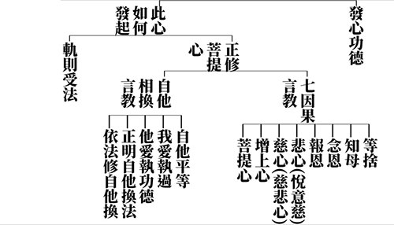

## 孔學一隅

### 孔門心法—中庸之道(三十)
第二十六章：至誠的典範(下)

孔門心法—中庸之道(三十)

第二十六章：至誠的典範(下)

*時哉講述、弘毅整理*

累積可觀助開展

厚積薄發啟後學

質變量變風氣變

登高行遠從卑邇

—前言—

第二十六章下半部分告訴我們，至誠或學誠的人所具有的能耐、氣象和功效，讓我們知道原來學習道統的人是很有出路的，尤其以古代的這些聖賢、成功的領導人為典範，更增加我們的信心。在當今時代，雖然大家價值觀各不相同，思想也很混亂，但是如果你透過分析以後，知道這樣才是真正人生的出路，我相信在人海茫茫當中，絕對不會迷失路途。

中庸總體科判

第二十六章還是在講中庸的修學法和義理。

本章科判分析

第二十一至第二十六章告訴我們，至誠之道就是離苦得樂之道，第二十一至二十三章講的是至誠之法，第二十四至第二十六章講的是至誠之效。至誠的人可以預知未來，可以成就自己、成就他人，而且是可以任運成就，心想事成。因為他都是從誠心誠意出發，雖然開始可能很辛苦、很艱難，但是隨著他的誠意、信用、涵養、氣質慢慢表現出來，大家就對他相信和擁護，人才願意為他所用，他的學問、品德和內涵就能更好的發揮，做什麼事情自然就水到渠成，大家也能夠離苦得樂，找到出路。

最後至誠之讚是說，至誠之道是以博厚和高明來符合天地之道，博厚是說自己充實的內涵和蓄積的善緣太多，高明就是可以運用團隊和事業能夠給大家出路。以上是上次所講，本次特別說的是至誠之道所顯示的德相，天地能夠博厚和高明到底是怎麼來的。文王是一個德配天地之人，所以示彼德相和文王德配天地的這一部分是本次的進度。

章旨

此章我們可以看出學問、能力、經驗閱歷、人脈、善業都是累積出來的，當累積到像江海一樣寬廣的時候，福報是難可思議的。

—消文釋義—

經文：

今夫天，斯昭昭之多。及其無窮也，日月星辰繫焉，萬物覆焉。

消文：現在說這個天，是由東西南北虛空中無窮的小光明組合而成，日月星辰維繫在天上，小光明累積而成大光明，覆蓋萬物，照亮萬物。

至誠之道也是如此，小光明到大光明有兩種：一種是內涵不斷的充實，最後由小聖人變成至聖；另一種是累積的善緣愈來愈多，大家愈來愈願意跟你合作，所展現的光明就愈來愈大。就像孔子因為具有內涵和理想抱負，讓群弟子們願意追隨他，孔子以自己的光明點亮弟子們的光明，這一群光明的人所組成的團隊足以治國、平天下，叫做萬物覆焉，萬物都能夠覆蓋在天之下。

釋義：「夫」，語助詞；「斯」，如此，這個；「昭昭」，小光明；「繫焉」，維繫在天上。

經文：

今夫地，一撮土之多。及其廣厚，載華嶽而不重，振河海而不洩，萬物載焉。

消文：現在說這個地，是由一抔土、一抔土廣厚的累積而成，承載華山乃至五嶽等眾山而不感覺沉重，收江河湖海在大地上面而不會洩漏，萬物都由大地承載。

至誠之人就如同大地一樣能夠承擔，讓天下蒼生不僅有飯吃、有房住，還讓大眾有生命的出路。古時雖然昏君讓天下大亂，民不聊生，互相殘殺，可是當明君為政時，憑著他的誠意和人才團隊，讓老百姓開始豐衣足食，家家戶戶張燈結彩，喜氣洋洋。一般凡夫不想承擔，只想一個人躲在角落自己享受生活，認為承擔是傻瓜，可是聖人認為承擔是快樂，這就是聖人與凡夫的看法不同。承擔可以讓自己得到充實，能力加強，得到大家的擁護，所辦善業顯現的快樂在造作者身上成熟。反之，那些不想承擔、只想享福的人，不會得到他人的信任、讚賞、提攜，也沒辦法充實自己，結不到善緣，做不到善業，快樂也不會從他身上升起。所以正確的人生觀很重要，能夠讓自己少走冤枉路，少吃很多虧。

以前齊景公問子貢孔子是怎樣的人，子貢回答說是聖人，齊景公認為說得太過了，子貢就形容孔子如泰山，增減一抔土不會影響泰山的雄偉，孔子又如大海，不知道有多深多廣，讚歎或毀謗他，都不會影響孔子的偉大。

釋義：「一撮」，一耙，一抔。「華嶽」，華山或華山等五嶽；「振」，收；「洩」，漏。

經文：

今夫山，一卷石之多。及其廣大，草木生之，禽獸居之，寶藏興焉。

消文：現在說這個水，大江大海也是由一勺水、一勺水組成的，黿鼉、蛟龍、魚鱉等各種海洋生物在裡面出生，珊瑚、珍珠、貝殼等貨財在其中繁殖，數目多到難以想像。人類不要任意的去破壞大自然，污染環境，否則再想恢復就不容易了。

人也是如此，內涵要不斷地累積，善緣要不斷地廣結，內涵充實和善緣廣結像大海、高山、大地、天一樣的時候，這個人的出路和福報不是世間人所能想像的，世間那些發財的人無法想像這種財富，他們所得的只是小福報而已，是無法想像至誠不息所累積的福報。

釋義：「勺」，器皿，兩手捧水；「黿」，大鱉；「鼉」，像鱷魚那樣的龍；「貨財」，第一種講法是說，黿鼉蛟龍魚鱉都是貨財，第二種講法是說，珊瑚、珍珠、貝殼是貨財，根據上下文對應可知，第二種講法較好。

經文：

詩云：維天之命，於穆不已。蓋曰：天之所以為天也。

消文：《詩經‧周頌‧維天之命》篇章裡面說：想到天地的高明博厚之道，是如此的深遠，令人恭敬尊重，在時間上不會停止，在空間上沒有範圍。天地的高明博厚都是累積而成，天成熟萬物和地養育萬物都是不停止的，至誠無息的人也是不停止的充實自己、利益他人。

天之所以為天，都是累積出來的，人的成長也是如此，是複利式增長。一開始兩塊變四塊不會覺得怎樣，可是當兩百億變成四百億時，就非常可觀了，這種複利式增長不斷地累積，人和人之間的差距也越來越遠。雪公經常引用岳飛的話說，莫等閒，白了少年頭，空悲切。顏回已經達到了「六十耳順」的境界，可是和孔子的「七十從心所欲不逾矩」卻還差的很遠，所以顏回才讚歎孔子「仰之彌高，鑽之彌堅」，當複利式增長累積到某一點時，就會往上飆升，人生要像海綿一樣不斷的吸收、學習，三人行必有我師焉，擇其善者而從之，其不善者而改之。人生最大的可惜是浪費時間，投資失敗了，還可能「千金散盡還復來」，可是青春消耗不會再來，所以不要放逸懈怠。

釋義：「維」，發語詞或作念解；「天之命」一解為天命，即趨吉避凶的道理，另一解為天道，即天地之道，就是高明博厚之道；「於」，感歎詞；「穆」，恭敬、尊重或深遠；「不已」，包括時間上不停止，空間上沒有範圍；「蓋曰」，有兩種解釋，一種是說子思就前面詩句所發議論，另一種是說子思記載祖父孔子的議論。

經文：

於乎不顯，文王之德之純。蓋曰：文王之所以為文也。純亦不已。

消文：《詩經‧周頌‧維天之命》篇章裡面還說：天地之道所顯示的就是文王之德，是至誠之道，是不斷地充實自己、利益他人。文王如天地一樣不斷地累積充實自己，時間上不會停止。周朝雖然是武王開國，但都是文王累積出來的。他雖然領導的只是西岐小國，可是他的人格魅力、教化、禮儀、為政卻令天下諸侯擁護。虞芮兩國在發生邊界糾紛時，兩國國君想要找文王幫忙解決，可是當進入西岐後，看到耕者讓畔、行者讓路，兩國國君感覺自己的氣度還不如西岐的農夫，覺得很丟臉，就不再互相爭執了。經過文王不斷地累積，周國的國力強盛，人民擁護、諸侯護持，最後才有武王伐紂的成功。

文王之所以謚號為文，就是因為他以文化治國，他是一個經學大家，又是一個能利益國家的君子。周公的「一沐三握髮，一飯三吐哺」，制禮作樂，武王滅紂後把財富散出去，能夠罷兵，都是和文王學的，都以文王為典範。文王的純潔善良表現的是他的內涵、氣質、內斂、謙虛、公心、仁愛，以及他對道統的堅持。

上聯是德配天地，下聯是道貫古今，橫批是至誠無息，我們以此稱讚孔子、稱讚文王。至誠無息的人能夠不斷地往前走，就能博厚高明，叫做德配天地，而他的道一定能夠往下傳，為萬民所從，叫做道貫古今。天的高明，大海的深廣無法測量，這樣的人的福報也是不可思議的，所以孔子說，知我者其天乎。

釋義：「於乎」，感歎詞；「不顯」，解釋為豈不顯示、光大顯示；「純」，至誠。

—總結—

人最大的損失就是小看自己，用框架來框住自己，用凡夫俗子來定義自己，又在這個大時代裡面，認為自己不會有所作為，這是最可悲的地方。如果一個人可以奮發向上、振作圖強，可以以他人為典範，可以依道法來學習，可以攝持世間的學問，可以尋師訪友，好好的謙卑求學，人的潛力將是無窮的。這一生過的是有風采的，子孫是以你為榮的，人們是能夠跟你在經學上、見地上得到寶貴的覺受，你對人們的影響是無可想像的，因為你給了眾生出路，所以你的家人、後代都會在你陰德的加被下，得到最好的出路。（下期待續）

### 孔門十哲—孔門弟子中最耀眼的十顆星（九）多才藝的冉求

*時哉講述、編輯部整理*

從政何有多才藝

季氏家臣二十年

權傾一時護聖教

迎回孔子千秋功

冉求是一位集內政、財經、軍事各種才能於一身的大賢，是孔門弟子中至關重要的人物，孔子因為冉求才能回到魯國，沒有他，就談不上孔子後面的教育以及文化事業的開展，也不會有像宓子賤、樊遲、公西華等這些殊勝的後期弟子出現，更不會有孔子刪詩書、訂禮樂、贊周易、修春秋等經學的整理，延續民族千秋文化的大業。

冉求，字子有，《左傳》稱有子，孔子弟子裡面，也有另外一位有子，是孔門十哲之外非常有名的人物。冉求是春秋時期的魯國人，小孔子二十九歲。

孔子的弟子，每一位都很有個性，孔子因材施教，循循善誘，順著弟子們的情性來教化，把他們教成人才。冉求生性保守、為人謹慎、個性溫和，在《論語‧先進》篇裡，形容冉求「侃侃如也」，是和樂的形象，易於與人相處，〈先進〉篇，冉求曾問孔子：「聽到了，就要做嗎？」孔子說：「聽到了，就要做。」孔子此話的目的，是針對冉求保守的個性而說，冉求容易思慮過多而裹足不前，針對這樣的個性，有時候要反其道而行，讓他勇於進取、承擔、開創，冉求跟子路的個性正好相反，子路是思慮有時不太周全，容易躁進，冉求則是思慮過多，有時候裹足不前。

孔門弟子人才濟濟，個性鮮明不同，孔子不但將他們培養成人才，也造就了他們的事業。冉求處世圓融，〈公冶長〉篇其中一章說冉求可以當家臣主持家政，主持一個擁有百輛兵車的大夫的家，相當於秘書長，或是主任秘書的工作，這必須具有協調溝通的能力，可見冉求是方方面面俱到的人物，孔子曾說：「像孟公綽這種清心寡慾之人，不可以做滕薛大夫。」意思是小國政務繁忙，孟公綽無法承受繁忙的工作。冉求或是能處理繁雜的工作，且能面面俱到。

孔子亦稱許多才多藝，在〈雍也〉篇，孔子回答季康子，冉求就是一個多才多藝者，至於能不能從政，孔子請季康子看著辦。

冉求對於禮、樂、射、御、書、數，各方面的才藝，都投入大量的時間跟精力，他也學習夫子的大道，只是他沒辦法像學才藝這樣的投入，他曾經向孔子說：「不是我不喜歡您所教的道，只是我力量不足。」孔子知道冉求是有能力於大道上進展的，只是花太多時間跟精力在學習才藝，雖然提升才藝，也有助於道的貫通，但是在大道的學習上還是不足，所以對冉求說：「學道就像走路一樣，走了一段的路程，覺得力量不足，停下來休息一下是可以的，但如果從此不再前進，就等於畫了一條界線，限制了自己，所以你覺得自己不能學道，那是畫地自限。」

冉求除了有內政、軍事、財經的才能外，也有外交的才能。在〈先進〉篇冉求說：「一個方圓六七十里，或者五六十里的地方（可以是國家的縣，可以是大夫的封地），由我來治理，三年內可以使人民豐衣足食。」孔子沒有否定冉求內政跟財經的能力，只是冉求在做季康子家臣的時候，替季康子聚斂，或許是季康子下令要冉求增加田賦稅收，使自己的財富增加。孔子深深責備冉求說：「你不是我的學生，弟子們可以鳴鼓聲討伐之。」孔子之所以如此嚴厲責備，是因為冉求是一個可教之才，春秋也是責備賢者，至於責備那些小人濫權違禮，一點用都沒有。其實這番話也是間接說給季康子聽的，要他不要聚斂財富，要注重民生福祉。季康子想增加他自己財富這件事，早在魯哀公十一年的冬天，孔子回到魯國不久的時候就顯現出來，季康子當時已經比周天子下面的宰相、上卿大夫的財富還要多，卻仍感到不足，想要徵收田賦，派遣冉求去徵詢孔子的意見，孔子故意說：「我不懂。」冉求連問了三次，最後說：「老師您是告老退職的卿大夫，是國老，國家大事要等待您的意見才能去執行，為什麼您不說話？」孔子沒有回答，可是後面卻私下告訴冉求「有道德、有修養的人，行動一定要考慮是不是合乎禮制，施於老百姓要取其寬厚，行之於事情要恰到好處，推展政策的時候，要考量人民，收取老百姓的稅收，要輕一點，如果是這樣，那目前我看就夠了，你不順禮節行事，又貪圖無厭，按照田畝來稅收，你又覺得不夠用，如果季孫大夫真的要稅收，那周公的法度就可以了，如果你違反周公所訂的法度，又何必來徵詢我的意見。」可見後面增加稅收，是季康子的命令，冉求有不得不執行的苦衷，所以〈先進〉篇孔子回答季子然的時候，孔子說冉求不是大臣，是具臣，就是說他有當臣子的能力，可是大臣要以道事君，不可則止。上位者不合道的時候，勸諫不來，你可以辭官，冉求幫季孫大夫聚斂，是不合道的，季氏既然勸諫不聽，依大臣的風範，就應該辭官，但冉求沒有辭官，所以孔子說冉求充其量只是具臣而已。

大臣跟具臣，在能力上可以一樣，但是大臣更要維持風骨，可是我們讀這一段，也不能懷疑冉求是否沒有風骨，因為那一段話孔子還跟季子然說：「如果犯上作亂，相信冉求不會跟從的。」可見冉求也有底線，至於冉求為何不辭官？其實有時候身居要職，在關鍵時刻，就能發揮影響力，救亡圖存。例如季康子要在魯國境內，討伐一個叫做顓臾的諸侯國，冉求跟子路在第一時間內向孔子報告，孔子深深責備冉求說：「你要勸告季康子，不要討伐顓臾。」冉求說：「他不採取我的意見。」孔子說：「你應該辭官，因為你是他的家臣。身為家臣，看著他陷入危險的境界，卻沒辦法把他救出來，看他要跌倒，又不扶他，這樣的家臣有何用呢？」孔子舉了兩個比喻，一個是老虎從籠子裡面跑出來、犀牛從籠子裡面跑出來，請問是不是管籠子的責任？還有龜玉在櫃子裡面壞了，是不是管龜玉的人的過失？意思是：主子犯上作亂、僭越禮制，且在境內發動戰亂，身為家臣的冉求，是不是要阻止？孔子又說：今天你跟子路輔佐季康子，遠方的人不服，你們又不能修文德，讓近者悅，遠者來；國內的人心分崩離析，你們還要計畫幫助季康子討伐顓臾，這種出兵是不利於季康子的。

冉求跟子路聽了孔子這番話，回去極力地說服季康子，終於平息了這場會在魯國境內發生的內亂，這種阻止主子作亂，帶給百姓的福祉，是難以想像的，可見做官所積的陰德難以想像。

冉求到底是以什麼樣的因緣，能擔任到季孫大夫座下的首席家臣這麼重要的職位？這要說到魯哀公三年秋天，季桓子病重，他坐在輦車上，望著魯國的城門，深深地歎息說：「當年國家將要振興，只因為我的私慾，得罪了孔子，孔子就周遊列國，所以不能興旺魯國」，並且交代他的兒子季康子：「我死了以後，你繼承相位，一定要把孔子找回來。」季康子繼位後，打算召請孔子，大夫公之魚說：「以前我們的先君（先君包括魯定公跟季桓子），任用孔子的時候，有始無終，被諸侯恥笑，如今你又要用他，如果也有始無終，豈不是再次地被大夫所恥笑嗎？」季康子說：「那找誰好呢？」公之魚說：「一定要召請冉求。」可見冉求當時的聲望。當時冉求跟著孔子以及弟子們在陳國，季康子派遣使者到陳國去請冉求，冉求將回到魯國，孔子說：「魯人來召請冉求。」魯人就是指季康子，孔子預感這次召請不是小用，而是有大用，這是孔子回魯國的徵兆，所以孔子自言：「回去吧！回去吧！家鄉那些學生志向遠大，文采斐然而有章法，只是還沒明白大道，我要回去魯國調理他們。」子貢一聽就知道老師思歸魯國，送師兄冉求啟程時，趁機告訴他：「倘若你被任用，一定要請老師回國。」正因為冉求回國，做了季孫大夫的家臣，才有孔子回到魯國的因緣，成就了一番文化的大業。當初孔子黯然離開魯國是因為魯定公沉迷於女色，三家大夫跟孔子的政治理念不合，但周遊列國，孔子的政治主張也不能被各國國君採納，心裡想著回魯國，孔子想要回去推展文化事業，要風風光光地回去，所以要等待時機，這個時機要靠冉求促成。
魯哀公十一年春天，齊悼公因為魯國伐鄎的緣故，派國書、高無平，率領軍隊討伐魯國，冉求便帶領季孫大夫的軍隊，與齊國在郎邑交戰，大敗齊軍。魯國的部隊都敗，只有冉求的部隊大勝，季康子非常驚訝，問冉求的軍事才能是學來的？還是天生的？冉求回答說：「是跟我的老師孔子學習的。」季康子
**問：** 「孔子是一個什麼人物？」冉求說：「你只要用他，就可以得到很好的名聲。我的老師，他的學問可以向百姓傳播，可以向鬼神諮詢，而不會有什麼缺憾。」意思是，孔子是合乎天理，合乎人心的，我對於軍事雖然也有功，而累計可以封到二千五百戶的人家，可是我的老師，絕對不會對這種名聞利養動心。季康子又
**問：** 「我想把他找回來，可以嗎？」冉求回答說：「可以的，但是不要用小人來牽制他。」季康子就慎重地派遣大夫公華、公賓、公林，帶著重金到衛國來迎請孔子，使孔子風風光光地回到魯國。

冉求的才藝是多面向的，因為孔子本身就是多才能的君子，太宰曾經讚歎孔子：「夫子聖者與？何其多能也？」雖然君子不一定多才能，但是多才能，有助於推展君子大道。冉求的才能，在他保守、謹慎、謙退的個性下，讓他即便身處在權力鬥爭、政治詭譎的氛圍裡，也能夠明哲保身，冉求在魯國季孫大夫幕後是最有實權的家臣，而且至少維持二十年，這非常不簡單。魯哀公三年，季康子召請冉求，《左傳》魯哀公二十三年，記載季康子指派冉求到宋國去弔喪，可見冉求還有外交的才能，冉求輔佐季康子，至少超過二十年，歷史上有很多功高震主的人，大抵下場好的不多，冉求可說是功高而不震主，這是從政者另一種面向的典範。

綜觀冉求的一生，不但是孔門大賢、辦事高手，才能方方面面，又能讓孔子回到魯國，完成教育及千秋的大業，雖然他也被孔子責備，有時候是深深地責備，但都不妨礙他是一位大賢，或許他有不得已的苦衷，身居要職，有時候可以化解魯國一些空前的危難，這也是政治人物裡面積陰德的典範。（下期待續）

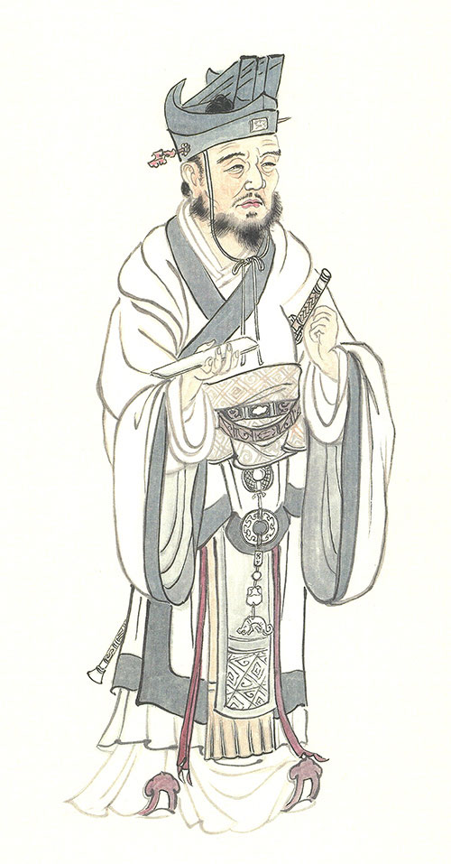

## 藝術賞析

### 七十二賢淺說(五十八)-孔忠

圖：江逸子、文：時哉

孔子家門無庸才

姪子孔忠孟皮子

受教叔父且善問

行己有成入大賢

孔忠，字蔑，又稱孔弗，春秋末年魯國人。為孔子兄長孟皮之子，要稱孔子為叔父，與孔鯉為堂兄弟，皆蒙庭訓，以詩禮傳家，亦孔子的及門弟子。
《孔子家語》記載，孔蔑曾問行己之道，孔子回
**答：** 「知而弗為，莫如勿知。親而弗信，莫如勿親。樂之方至，樂而勿驕。患之將至，思而勿憂。患攻其所不能，補其所不備，毋以其所不能疑人，毋以其所能驕人，終日言，無遺己之懮，終日行，不遺己患，唯智者有之。」知而不做，不如不知；親切而不信任，不如不親切。有了快樂的受用，千萬不能驕傲，該憂患的是如何充實所不能，補足自己所不完備的，不要以自己所不能的而猜忌別人，也不要以自己所能的而傲慢，終日所言所行都不會給自己留下憂患，這個只有智者辦得到。

也就是說：真學問在於練達世故人情，立己達己是忠，立人達人為恕，暢通無阻是為仁也。孔蔑宅心仁厚，堅持家風，以忠誠孝弟受同門所稱頌。

宋高宗贊曰：「惟子挺生，道德之門。佩服至論，鯉則弟昆。三得三已，所問殊溫。君子歸宓，義不掩恩。」孔忠這一位挺拔之士出生於孔門（道德之門），有著孔子這位叔叔，相信從小便耳濡目染，重視聖言至論，且與孔子兒子鯉為堂兄弟，孔鯉昔日受陳亢之請問得三個體悟，而孔忠求教孔子由行己之道，亦有三個解惑之言，孔忠向孔子請教極為溫和有禮，孔子所答讓孔忠心悅誠服。

孔蔑於漢明帝時入祀聖廟。唐玄宗追封為汶陽伯，宋大中祥符加封鄆城侯，明代改稱先賢。

畫中的孔忠，看起來寬厚穩重，目光望向遠方，雙手交握，似代表其修養自身，為人處世忠誠，進退有度。（下期待續）

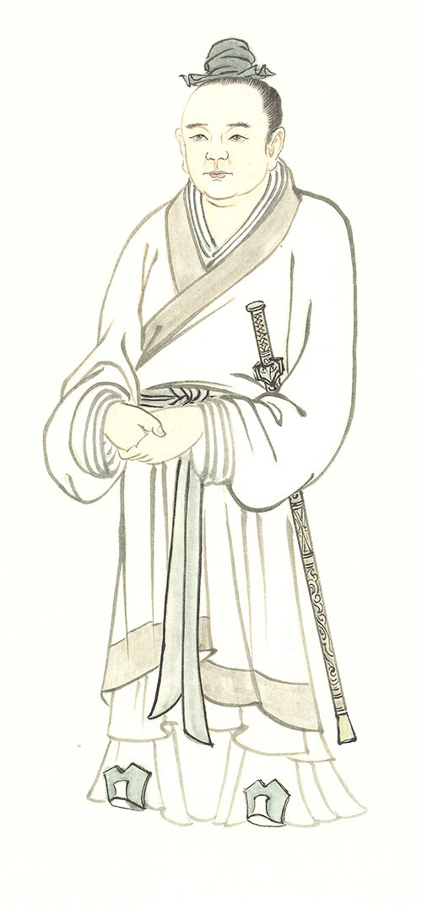

### 華夏精魂千秋（四十六）明倫史畫　教孝化民  梁彥光

圖：江逸子、文：淨域

歷經動亂時代

保住節操士人

教化施於州縣

典範猶存人間

—史畫—

梁彥光，字修芝，北朝至隋代涇州安定郡安定縣（今甘肅省涇川縣）烏氏（族名）人；約生於北魏末年，卒於隋文帝開皇年間。祖父梁茂，為西魏秦州、華州刺史；父親梁顯，為北周荊州刺史。彥光自幼天賦慧敏，父親常對人說：「這孩子有風骨，將使家族興旺起來。」

彥光七歲時，父親染上重病，須服五石散才能醫治，一時無法取得個中的紫石英，他日夜焦慮到身形憔悴。偶然間在園中見到一物，新奇地撿回家去，才知道這就是紫石英。親友們感到驚異，咸認乃上天被他孝心感動而賜予。

西魏文帝大統末年（約西元五五○年）入太學，涉獵經史知禮守法，十七歲薦任秘書郎（管圖籍）。恭帝三年（五五七年），司空宇文護逼恭帝禪位，立宇文覺為孝閔帝，建立北周政權。彥光遷為舍人上士（掌俸祿）；武帝時，累官至小御正（掌詔旨）下大夫。母喪去職，哀傷逾禮。武帝令其復職視事，見他形容憔悴頻頻寬慰，遷為小內史（即中書省）下大夫。建德四年（五七五年），為御正（即中書監）下大夫；六年，隨武帝討滅北齊，因功授開府（可設府選僚）、陽城縣公，食邑千戶。武帝卒（五七八年），宣帝即位，拜華州刺史，進封華陽郡公，增邑五百戶；繼又拜上柱國大將軍，遷御正上大夫，授青州刺史，旋因宣帝過世未上任。

西元五七九年，宇文闡七歲即位為靜帝，以楊堅為輔國大臣。大定元年（五八一年），靜帝禪位於楊堅，建立隋朝為文帝。文帝任彥光為岐州（今陜西省鳳翔縣）刺史，愛民如子澤惠百姓，文帝嘉賞下詔全國牧守，效法其政風治績。數年後任相州（今河南省安陽縣）刺史，因民風凶悍爭訟不絕，於每鄉設立學堂，招請德學兼備的大儒講授聖賢之道，民風因此轉變向善。

當時有一鄉民焦通，對父母極為不孝，堂弟告發其惡行。彥光審理本案，命焦通到孔廟中，觀看漢朝孝子韓伯俞的畫像。此畫描繪伯俞挨母親杖打不痛，因而悲泣母親體力衰弱的感人情景。焦通看後慚愧萬分，彥光又引古訓教誨，此後痛改前非，成為鄉里的善士。彥光治政以德化民，官民皆欣悅，少有爭訟之事。過幾年卒於任上，文帝贈以冀、定、青、瀛四州刺史，諡號襄。子文謙有父風範，官鄱陽太守。

—圖解—

《孝經•廣至德章》云：「子曰：『君子之教以孝也，非家至而日見之也。教以孝，所以敬天下之為人父者也。』」孔子勉勵君子應該用孝道來教化人心、感化百姓。君子，在朝可以是帝王將相，在野更是仁慈賢德之人，如此君子以孝化民，則社會祥和家庭安樂。

江逸子老師為凸顯梁彥光教孝化民之舉，於所繪之圖中做兩方佈局，即是在壁畫中繪以「孝子韓伯俞受杖悲母」及「慈烏反哺」兩圖。圖中梁彥光指著壁畫教誨焦通，而焦通見聞後的驚訝表情，頓生萬分的慚愧。可以想見的是，隨後當會說明慈烏反哺之心行，雖禽獸亦有反哺跪乳（羊）之行，萬物之靈的人類怎能不孝呢！

詩人白居易在母亡後，為了感念母親教養之恩，於守喪期間寫下了〈慈烏夜啼〉一詩。詩中說：慈烏失去了母親後，整年會一直啞啞嗚啼，並守在曾棲息的樹林，日夜不肯飛往別處，牠的嗚啼聲像在哭訴，還沒有盡到反哺的孝心。白居易藉由慈烏的夜啼，來比擬作是鳥中的曾參，說明母愛的偉大，父母的恩情難以報答，更勸人莫學不孝的吳起。此即是《孝經》所言：「君子之教以孝也！」（下期待續）

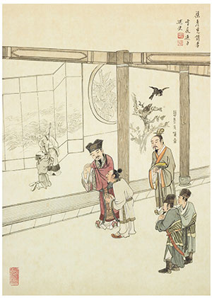

### 以地藏菩薩本願經圖導覽(十二)-  如來讚歎品第六(下)

圖

地獄苦難地藏德

火中蓮花難可思

觀待悲願之威神

久住地獄真地藏

上方的地藏菩薩是頭戴五佛冠，表彰地藏菩薩具備佛的證量。身披袈裟，右手執金錫，表彰菩薩的教化對眾生振聾發聵，錫杖上的六環，表徵菩薩的六度。左手執明珠至寶，表彰現證空性的智慧才是佛法中的至寶，或是福慧雙修猶如能滿足眾生一切需求的摩尼寶。菩薩的左腳盤起來表示禪定，而右腳踏蓮花表示不願久入禪定的安樂，顯示欲度眾生的行動，整體表示菩薩是以不出定的方式度眾生，根本是佛的證量。菩薩周身如日輪般的光焰表彰菩薩對眾生無比的熱情，是大悲心的表徵。整體形象是比丘地藏的表法。

佛對普廣菩薩略略敘說了地藏菩薩利益人天福德之事，先從供養得福來說，有聞名、稱讚、禮拜的大福，或彩畫或塑造菩薩形象，也能依此而改變無法修學的狀態，改變卑劣的形象，可以和眾生結善緣並且能夠有財勢做大善法，甚至是對菩薩像前以歌詠讚歎、香華供養，皆能得菩薩加被具大福報。但是地藏菩薩福田力極大，若是一念譏毀，會受到極重的罪報，就算得到人身，也會得到貧窮下賤，或諸根不具足等惡報，滋事體大，不要開玩笑！

世尊顯示了依著三寶為福田做種種的善法，久病惡相、夢寐見鬼或生活不自由的低下階層者，這一生就可以做一個轉變。畫面中戴著官帽的宰官一家人，由父親帶著妻子兒女，在禮拜上方的地藏菩薩畫像，而婦女懷中懷抱小娃，對地藏菩薩禮拜供養讚歎，代表新產者，皆能脫離災殃，增加壽命福報。

畫面中還有一位讀書人，在十齋日焚香燃燈誦讀經典，他所處之地就像有一個結界，發出正氣之光，魍魎鬼魅紛紛逃離無法接近，居家無諸橫病，衣食豐饒。（下期待續）

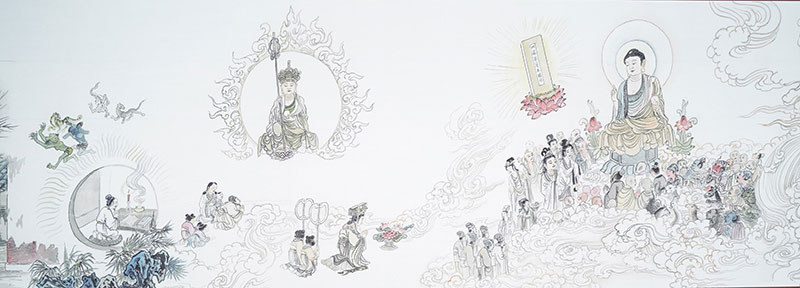

## 活動報導-弘晴先生

### 日本岩屋山金剛寿院福勝寺住持弘晴先生一行人來訪紀實

慧慈

完整交流的紀錄

難遇而遇的際遇

結合佛法的相處

相約再會的見證

◆來訪緣起

去年木魚基金會在台灣辦禪學營及文化之旅，初次與學會結緣，在文化講座、茶道體驗、台東原住民部落之旅等等活動後，對唐老師所帶領團隊的內涵及熱忱深表敬佩。其中有位妙眼法師，特別感恩學會諸多的付出，當時就期許自己能回饋學會，並想參加學會的儒、佛課程。果然半年後再返台灣，目前常駐學會，和老師學長們討論佛法，經一個月的體驗，他覺得學會像個寶庫，可探索到深廣的佛法義理，於是邀請弘晴住持、廣英先生等，於二○二四年一月十四日至一月十六日，一行四人來訪學會。

◆人物介紹

妙眼法師

美國人，二十歲時曾到過印度，約二年的時間，學藏傳佛法，成為天臺宗的修學者，體悟到佛法與身體的關聯性，回美國後，學瑜珈達十年之久，這當中忍受肌肉筋骨的疼痛，把肢體處在極限的狀態，來感受心靈的變化，觀修佛法的教義。

二○○九年至二○一五年，二○一五年至二○二○年，前後十二年的時間，取得美國中醫醫學碩士及博士。又於二○一九年至二○二三年，用五年的時間取得神學和多元宗教研究碩士。可見他學習任何一門功課，都非常扎實，又有恆心。

他特別關注多元宗教和多元文化背景下的精神教育，對「人」特感興趣，並覺得人際互動，最能鼓舞人心，凡有益於人的關懷、體貼，都不吝於付出。時時笑口常開，待人親切、幽默，是位很受歡迎的法師。

三十歲在日本出家，受菩薩戒。

二○二二年元旦，在奈良信貴山朝護孫子寺，認識了弘晴住持。

同年在日本千葉縣修驗道場認識了廣英先生。

今年（二○二四年）準備在台灣台中佛恩寺受三壇大戒。

為此次活動的媒合者。

弘晴住持

日本人，擔任岩屋山金剛壽院福勝寺住持。關於住持的傳承，首先要依止師父入門，在本山（高野山）舉行出家儀式並登記，接下來是受戒，在真言密教中，修行者會接受為期一百五十天，名為四加行的訓練，在此期間，與一切人、事隔絕，只做與佛有關之事，如同閉關。然後傳法灌頂入壇，成為阿闍梨，並成為住持。

二○二二年春，到奈良信貴山朝護孫子寺參加八天的活動，無意中遇見在該寺常駐修行的妙眼法師，交談後，彼此留下好印象，呈上一張名片，後續保持聯絡。妙眼法師形容住持，像常不輕菩薩，對任何人都謙恭有禮，逢人必鞠躬打招呼，本著人人都是我的貴人，成佛不能離開人的原則，來待人處世接物。

廣英先生

美國人，以英文教師身分，移居日本已八年，前面三年大多遊山玩水，初在四國島上，很少人會講英文，後來移居東京近郊處，以時間加上耐心，才漸漸融入日本人的生活，後期認識一些亞洲朋友和老師，始踏上學佛之路。二○二二年經妙眼法師介紹，認識了弘晴住持，進而向住持學習真言宗的密法，成為其弟子。

◆三天行程

第一天

◎接機迎賓

林老師代表學會，率一行十人到機場接機，並親自做捧花，獻給四位貴賓，隨後到苗栗縣的禪廚蔬食餐廳午餐，餐後直奔台中東勢，唐老師已在文昌廟久候貴賓了，沏一壺上等烏龍茶，敬第一杯，為貴賓洗塵；敬第二杯，是接風；敬第三杯後，全體吟唱登鸛雀樓，祝福弘晴住持的事業更上一層樓。

◎東勢文昌廟

文昌廟是東勢最早成立的學府，創立已一百六十年，主祀文昌帝君，並立有孔子牌位，今年初，完成約三百八十公分的石雕孔子立像，是學子們祈求考試順利必拜的廟。裡面有許多歷史故事的碑林，如周遊列國、精忠報國…，唐老師擇十數個石碑，敘說其精彩故事，貴賓們聽得津津有味，互動頻頻。

◎巧聖仙師廟

再參觀巧聖仙師廟，係全臺唯一主祀魯班的開基祖廟，已有二百五十年歷史。在臺灣主祀魯班的廟宇有三十四間，其中分香自東勢祖廟的有二十四間。而廟裡除了巧聖仙師外，還供奉了泥水匠的祖師爺：荷葉仙師，以及掌管爐灶燒窯的鐵匠始祖：爐公仙師。

主委知有外國友人來訪，親自為我們導覽，廟內「巧奪天工」的匾額，為清咸豐年間工藝師的作品，從不同角度欣賞，或呈現陽刻，或呈現陰刻，甚為奇絕！最後並致贈建廟二百五十周年紀念帽給貴賓，盛情滿滿，讓外賓覺得溫馨感人。

◎農園晚餐

享用農園栽種無農藥的蔬果，經過秀英師姑妙手烹調，精心擺盤，在蟲鳴鳥叫，溪水潺潺，落日餘暉下享用五味、五法、五色、五感的晚餐，勝過五星餐廳，讓貴賓終身難忘。

◎共修交流

弘晴住持此行，特別想體驗台灣在家人的修行方式，所以老師安排在東勢、中壢、台北各一場念佛共修及交流座談。每一場談的主題都不同，猶如佛經的序分、正宗分、流通分。第一場序分在東勢佛堂，談此行的緣起；第二場正宗分在中壢佛堂，談真言宗在日本的修行方式；第三場流通分在台北學會教室，談後續合作的發揚光大，期許中日佛法相互砥礪增上。

一千二百年前，空海大師隨著遣唐使到中國，師學惠果禪師，回國後，在和歌山縣高野山開山修行，並建立了金剛峰寺，後來成為日本真言宗的總本山，目前本山下有三千七百個寺院，福勝寺即其中之一，身為住持，守成不易，戰戰兢兢，觀摩交流，都為弘法傳法而盡心盡力。

第二天

◎特色早餐

茴香餅、香椿餅，是東勢特有的口味，在其他早餐店罕能嚐到，配上香濃熱呼呼的豆漿、薑茶，客人吃了，嘖嘖稱奇，最後再來一杯，本地栽植的無農藥咖啡。帶著回味的心情，驅車前往中壢佛堂。

◎中壢交流

車子一到佛堂的庭院，就聽到蓮友唱誦的佛號聲，至誠歡迎貴賓蒞臨。念佛共修後，開始第二場的正宗分，如同進入正餐主菜，主題是討論真言宗及淨土宗修學的異同。

弘晴住持說：食色性也，將這種物質欲望，轉變成精神上接近佛性，是真言宗重要的修學法。又提及壇城的修學法，相較於阿彌陀佛的壇城，又該如何看待？以及不動明王的表法…，雖然話題嚴肅，配以可口的茶點，軟硬調和，討論得欲罷不能，宥於時間，不得不暫告一段落。

◎午餐再敘

在蕃薯藤自然食堂享用自助餐，繼續交流道場經營重點。唐老師說，道場經營，教學為先，不憤不啟，不悱不發，並且要用時代的語言來解說，讀書會是核心；啟蒙教育，蒙以養正，家長也要同步成長，親師配合，讓孩子的學習充分落實；辦旅遊活動，邀蓮友家屬一起出遊，聯絡感情，以認同學會發展的理念等等。弘晴住持專注聆聽，頻頻點頭。從佛學談到儒學，儒佛合之則雙美，離則兩傷，經營出世間法，不離世間法。

◎彌勒內院

午餐後參訪彌勒內院，民國三十九年創建，是慈航法師開山講經之處，當時大陸青年僧，多聚集此處，一時成為台灣最高的佛教學府。現仍保留慈航法師當年閉關的法華關房，兩邊對聯是「學不厭教不厭說法常忘食」「左手來右手去施金樂忘憂」詮釋慈航法師的一生。

◎慈航紀念堂

慈航法師在此圓寂，為台灣首位肉身菩薩，供奉於此，住持帶領大家以日文唱誦心經，回向佛法法運昌隆。走出紀念堂，風雨交加，澆不熄我們法喜充滿的愉悅。

◎晚餐交流

在學會享用師姑精心準備的晚餐。休息片刻，開始第三場如甜點般的流通分。

首先，由弘晴住持帶著信眾，以日文唱誦心經，接著我們用中文讀誦心經以和之，開場儀式莊嚴又溫馨。

交流之前，播放福勝寺的短片，寺建於八○四年，值日本第五十代天皇-甘武天皇在位期間，開山祖弘法大師（空海大師）三十一歲時，越過藤城嶺到達此山，在瀧本修苦行。

江戶時代，深受紀州德川氏初代藩主德川賴宣（一六○二到一六七一）的崇拜，並建造了紀州藩主的祈禱所「古文字堂」，至今仍作為祭祀場所，是日本現存最古老的古文字堂，另有本堂、鐘樓，同列為國家重要文化財產，極為珍貴。本尊供奉千手觀世音菩薩。

弘晴住持本著要留給後人完整歷史的心情，呵護著一千二百年的古蹟。他喜歡舊物，喜歡保存古物，除了守護，更須配合時代的企業行動，來活化古蹟。也喜歡父母穿過的衣服，穿在身上，好像時時處處都得到父母的護佑，感恩心油然而生，這種美好的感受，想一代一代流傳下去。也勉勵我們要將唐老師的話，記在心裡，用在生活上，並傳承下去。

據說，西元七十一年左右，橘子的原種首次移植到日本和歌山，為了多種植橘子，必須砍伐森林，但基於保護地球的肺，限制在一定範圍內栽種經濟作物，讓橘子園與森林共存，這種兼顧經濟，又愛護環境的做法，其實是為子孫留一片良好生活空間的長遠之計。

會後許多青年學子，還圍著弘晴住持繼續提問，住持雖經一整天行程，也不覺疲累，耐心回答，並期望爾後有更長的時間，能和大家做更深入地交流。

第三天

◎鼎元早餐

唐老師、林老師陪同貴賓到鼎元豆漿店，享用燒餅油條中式早餐，餐後散步到「榕錦時光生活園區」—原台北刑務所日式官舍，貴賓看到日式歷史建築在台灣如此受到保護，心裡深受感動。

◎送別

離開學會之前，由老師帶領學會辦公室大眾，在一樓吟詩送別，期待住持一行再來學會，我們必定再以豐盛的食物、別緻的安排，迎接老朋友。

◎嘉南佛教文物

住持一行人，在回國前，特別選購一些佛教用品，回去送給老師及親友，表現出隨時不忘師恩，及廣結法緣的行持。

◎訪保安宮

保安宮供奉保生大帝，濟世救人，後世尊為「醫神」。也供奉神農大帝，是中醫學系師生的祖師爺，妙眼法師如見恩師，恭敬禮拜，顯現尊師重道的精神。

◎話別依依

午餐在正一堂享用養生膳食，妙眼法師觀大家的氣色，建議各別合適的藥補湯頭，喝完，果然元氣滿滿。再到圓山大飯店第一夫人咖啡廳，邊喝咖啡，邊享受美景，依依話別，三天的行程即將結束，卻是參訪日本福勝寺的緣起，希望近期能瞻仰世界遺產、體驗寺裡所辦的火供法會、宗教民俗音樂賞析、欣賞日本庭園之美…，住持表示願盡地主之誼，安排一個深度宗教及雅致庭園之旅。

最後唐老師、林老師帶著學會幾位蓮友，親送貴賓到機場，圓滿三天的行程，老師與住持的相約，你來我往的情誼，以法會友的殊勝，共圓弘法利生的大願。

◆三天見聞

◎只為取經
唐老師
**問：** 住持一行人專程來台，沒去阿里山、日月潭，只在學會的三個道場，進行三場交流座談，不覺可惜嗎？
住持
**答：** 認識唐老師，認識學會，與志同道合者相處，真誠交流，這是最美的風景，此行收穫滿滿。非常感謝妙眼法師的媒合，有機會向唐老師請教個人修學的問題，及道場經營的方向；加上妙眼法師、廣英先生兩位高手的輔助，藉網路的架設，弘法趨向國際化，這是他守護古蹟，又能走入時代的心願。

唐老師：有此二位得力助手，如虎添翼；就像宗喀巴大師有克主傑和賈曹傑二大弟子，而紅遍西藏。祝福住持，弘法事業廣遍全球。

◎身心融入

貴賓入境的第一時間，收到林老師親做的捧花，驚喜又感動，驅車前往東勢的路上，住持捧著花，一直欣賞陶醉在其中，到了農園的小木屋，以捧花供佛，禮佛後安住。

三天的相處，發現到住持，不論是喝茶、吃茴香餅、看石雕壁畫、看農園的果菜、座談交流的過程…每個舉動都專注融入在其中，流露出優雅、感恩的氛圍。

住持也分享到他自己以身體融合大自然，體驗水質的清淨；融入佛的境界，觀修火供，培養自己見地的敏銳度，情緒的敏感度。心中有法喜，身體則健康！

唐老師回應：住持用感恩的心，融入大自然，享受生活，用心體會，找到學佛的目標和方向，真的是生活上的佛教，而不是把佛供在雲端，高高在上，遙不可及，修學者有時習於眼觀鼻，鼻觀心，封閉自己，杜絕世間，只為個人清修的誤區。

其實學佛，修慧更要修福，福能資助開慧，但福田需要經營才能得到，與身邊的人事、環境結好緣，福報才能滋長，才有修學的道糧。

感謝妙眼法師的促成，弘晴住持一行人的來訪，讓我們結緣的觸角更寬廣，當彼此不認識時，日本、美國是那麼遙遠，認識之後，就無國界了，有緣千里來相會，真是不可思議的因緣，期望把這一會的果，化為下一會更殊勝的因，這還有待我們努力創造諸多的法緣，注入的條件愈多，養分愈足，才能收割甜美的果實。

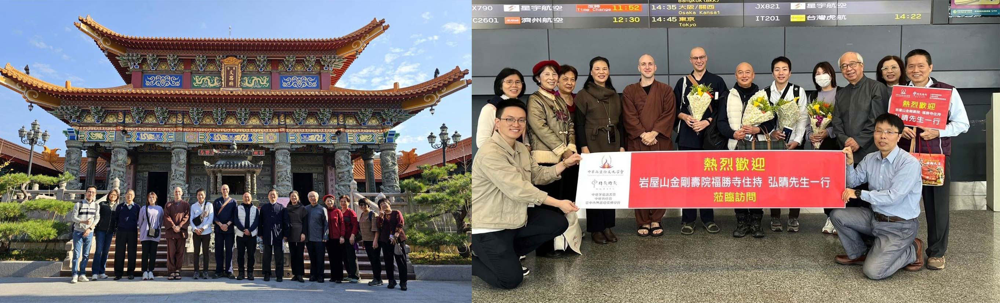

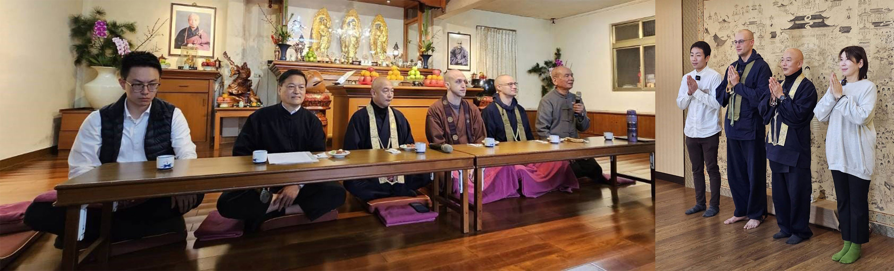

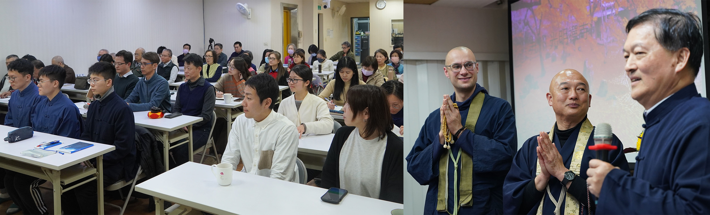

### 日本岩屋山金剛寿院福勝寺住持弘晴先生一行人座談會紀錄(東勢)

*楊志卿整理*

千里遠來結法緣

了解佛教之弘傳

日本雅趣的風俗

景色人心世界稀

時間：二○二四年一月十四日晚上八點至九點

地點：無盡燈儒佛學會東勢佛堂

與會者：老師、妙眼法師、弘晴住持、廣英先生、敦子女士、一朗先生、及東勢蓮友等共約四十人

司儀前言

先由彥方居士介紹東勢共修會運作狀況。

每週日上午九點至十二點，在文昌廟辦讀書會，目前正研討「從論語高度看了凡四訓」。晚上七點至九點共修，前一小時念佛，後一小時研習經教，目前因緣是「入菩薩行論」。今天正好是本學期的圓滿日，有來自日本、美國的道友，先一起念佛共修，然後座談交流，意義特別殊勝。

致歡迎詞

請雪梅居士代表東勢的蓮友致歡迎詞。

非常歡迎日本弘晴住持，及美國來的妙眼法師，以及各位貴賓，蒞臨東勢道場，特別感謝唐老師對東勢的厚愛與關照，讓東勢這鄉下地方，也能與國際接軌，打開我們的視野。在東勢簡陋的用餐、住宿，請貴賓們多多包涵。

貴賓自我介紹

弘晴住持：因妙眼法師的介紹，而認識唐老師，這次能到台灣與各位交流學習，感到非常榮幸，也謝謝各位熱忱的歡迎，感覺非常溫暖。

廣英先生：我是美國人，是弘晴住持的學生，目前在日本四國擔任英文教師，一周兩天沒課的時候，會到福勝寺親近住持學法，也學習與人相處的禮節，並幫忙寺院的工作。第一次到台灣觀摩，很高興有機會認識大家，與大家交流。

敦子女士：我是弘晴住持的朋友，跟隨住持修行已十幾年了。來此受到大家歡迎，非常感謝。

一朗先生：我也是弘晴住持的朋友。初次來台灣，受到盛大的歡迎，非常高興，希望能認識大家，跟大家學習，謝謝。

今天的座談，老師以問答的方式進行。

**問：** 弘晴住持是什麼因緣結識妙眼法師？

**答：** 二○二二年春，我到奈良的信貴山朝護孫子寺參加八天活動，無意中與妙眼法師見面，以為他是那寺院的人，結果他是在那裡常駐修行的，第一次見面交談後，彼此留下好印象，後來再碰面。回想當時，有兩種想法：一、只是巧合吧！二、另外一種緣吧！

老師：去年木魚基金會來台辦活動，讓我對妙眼法師等美國人的印象改觀。他這一個月在學會，與同仁們相處，除了開朗、幽默、守紀律、守時，令人眼睛為之一亮。很欣賞美國人能夠很隨緣，他在日本學習佛法時，也投入對日本文化的學習，這一次大家有機會聚在一起，是親密交流的緣起。

⦿請弘晴住持介紹其金剛寿院以及東密總本山的歷史

金剛壽院在約二千年前，曾經從中國輸入藥草，從那時開始，就有往來關係，也曾經從中國引進橘子原種，以至今，此地的橘子仍名聞日本。

一千二百年前，空海上人隨著遣唐使，到中國學習，回國後，以行腳僧方式雲遊四方，遇到觀世音菩薩，寺中有此紀載，因此建立了金剛峰寺，創立「真言宗」，因此這裡成為日本真言宗總本山的發源。

金剛壽院後來曾遭雷雨侵襲，寺廟損壞嚴重，當時修繕也費盡心思，想要把古文物保留和修復，讓後世子孫仍能欣賞到古蹟原有的樣貌。

**問：** 請介紹弘晴先生如何得到寺院？

**答：** 首先，要依止一位師父作為入門，在本山（高野山）舉行出家儀式並登記，接著是受戒，在真言密教中，修行者會接受為期一百天名為「四加行」的訓練，期間將與一般人隔絕，也不會收到任何訊息。緊接著傳法灌頂入壇，成為阿闍梨、並成為住持，需要經過這樣的階段。

並學習寺院經營理念，老師教他時，拿了一個大杯水，倒入一個小杯子中，體悟其道理：當你的杯子很小時，老師倒入大量的水，你是承接不了的，意味著自己要成為大器，才能接受師父所有的教誨，成為傳承。

在一般修行中逃離不了慾望，必須將心中的慾望轉換成給需要幫助的人，也就是要求自己降低物質享受，分享資源給他人(以世俗為道用)。

**問：** 金剛壽院是一座一千二百年的古蹟，雖曾遭毀壞，後又修繕，政府怎麼放心交給您保管呢？

**答：** 一千二百年的歷史建築物，是屬於國家的文化財，是有登記的，而且有費用補助。經由真言宗本山的推薦，派我管理，政府也會監督、審核我的工作內容，若有一天我倒了，日本政府還是會處理，由本山另外推薦人選。

在日本，對古老的東西都有好好守護、延續的觀念，但也不會故步自封，對古蹟的守護，一方面維護其原貌，保留其精神，一方面也要走入時代，拉近與現代人的距離，才能吸引年輕人，讓佛教廣為弘揚。

**問：** 本山是什麼原因信賴您，而推薦您？

**答：** 本山有三千七百個寺院，住持都需經種種修習，並由授課教師首肯而推薦，當然政府也審核我過去的表現，符合資格，又能適任，才會交給我管理。

**問：** 您的寺院經營哪些項目呢？

**答：** 經營寺院有很多活動項目，例如，我用佛教音樂的學習，讓很多人喜歡來寺院，在現場有老師演奏，帶大家一起唱誦；也在網路播放佛曲唱誦，喜歡的人就會想來寺院，上實體的課程。

另有一日寺院禪修體驗，內容包括抄經、冥想、清理環境等等，讓體驗者洗滌心靈，現在工商社會，人心多半浮躁，這種課程很受上班族的喜愛。

舉辦各種法會，例如，每月十七日為千手觀世音菩薩法會；十八日為本尊觀世音菩薩，在附近的正善寺舉行法會；十九日為馬頭觀世音菩薩，在附近的動物供養場舉行法會，馬頭觀音對動物特別護佑；二十八日在福勝寺為不動明王舉行法會。

每逢緣日(指神佛誕辰等，與世間有緣之日)，都會為不同的神佛舉行紀念儀式，如八月十七日施餓鬼會；十二月三十一日敲除夕鐘一百零八聲，迎接新的一年，並感謝過去一年的種種；農曆初午，第一個午(馬)日(以十二地支，配合十二生肖來記錄日期)，投年糕是最大的祭祀活動，邊唱邊搗年糕，用此年糕祭神，祈求五穀豐收，闔家平安。

**問：** 本山有三千七百座寺院是怎麼評鑑的？

**答：** 三千七百座寺院當中，有些寺院在比較偏鄉的地方，或由一人管理五、六座寺院，我個人較不贊成這種經營模式。

評鑑基準：住持的職位，先是受到教授師長的肯定，得到傳承，上任之後，若經營能力有問題，不能達本山之標準者，本山會解除其職務。每位住持就其寺院營收狀況，本山給予不同的薪資，寺院收入有一定比例需上繳本山。

**問：** 請問廣英先生，您在弘晴住持身上學到什麼？

**答：** 跟著住持，除學佛法基本理論外，住持是位善良的人，很會與大眾交談，用啟發式教導，從身教言教中啟發我，學習思考與觀察。

**問：** 請問妙眼法師您在弘晴住持身上學到什麼？

**答：** 與人相處的彈性。弘晴住持很像《法華經》裡的常不輕菩薩，總是對別人很友善，很恭敬，弘晴住持就是這樣的人。

**問：** 請問廣英先生您用什麼方式融入日本生活？

**答：** 我移居日本已經八年，前三年大多在探索，在四國島上很少人會講英文，後來去了東京近郊，才慢慢融入其生活，這需要時間，而且要有耐心。後來認識了一些亞洲朋友和老師，有老師的教導，朋友的陪伴、鼓勵，漸漸踏上學佛之路，改變了我的生活方式，希望能藉由網路，弘揚佛法到全世界。

**問：** 請問弘晴住持如何攝受二位美國人？

**答：** 我想到一千二百年前，空海上人去中國學習，回到日本弘揚佛法。今天妙眼法師、廣英先生從美國到日本，想必和空海上人一樣，學成要回到美國弘法，所以我盡全力幫助他們，希望他們在日本有良好的學習環境，有好的老師指導，學有所成；也藉助他們的長才，讓本寺吸引更多的信眾，發揮更大的功能。

**問：** 日本寺院有禪風，很雅致，是怎麼經營出來的？

**答：** 一般寺院的庭園都整理得很乾淨、優雅，在當初庭園設計時，會找出一個百看不厭的點，坐在寺院，配上雅樂，欣賞、想像美景，在此體悟人生、體悟佛法，當然這也是要有悟性的人，才會有所感受。這種美學及音樂的素養，是要從小培養的。

從參加當地的佛教活動中，去觀察體悟禪風，也從日常生活中感受雅的文化，更從世界觀，去學習各個民族、宗教的特色，來定位自己的風格，模仿是無意義的，不能永續經營。

老師：就如極樂世界的一花一木、亭臺樓閣，都是阿彌陀佛參考諸佛國土，取其精華創造出來的，這也需「雅」的人才懂得欣賞。

**問：** 此次來台三天，只到東勢、中壢及台北學會，沒去名勝景點遊玩，不會覺得可惜嗎？

**答：** 因為很想知道當地人如何參加佛教活動，所以很感謝唐老師安排這樣的行程，能和大家多交流。

老師：住持帶來的團體很不簡單，什麼情況下都很融入，專注傾聽。

**問：** 如果我們去日本玩，請問廣英先生會如何帶我們去看日本？

**答：** 親自參加日本寺院的活動，會是很難得的經驗；也會安排座談，輔以茶道體驗，這對文化交流能更進一步的認識；以及欣賞日本庭園之美等等。

**問：** 廣英先生好像不用上班，請問您怎麼維持生活？

**答：** 擔任英文教師，是我經濟的來源，空餘時間就到寺廟學習、幫忙。

**問：** 請問妙眼法師，美國僧人的生活，有像中國僧人那般灑脫，雲遊四海嗎？

一般美國人多喜歡到世界各地體驗生活，僧人同樣也會選擇自己想去的國家修行。

**問：** 請問妙眼法師為何喜歡日本？

**答：** 第一次接觸日本，就被整潔美好的環境所吸引，在日本遇到很多善良的人，學佛就是學習利益他人，和這些善良的人在一起，更能拓寬自己的胸懷，關注更多的人。我也喜歡台灣，在這裡接觸到的人，也都非常熱情、親切，相處愉快。

老師結語：

從他們所說，能體會到日本文化的內涵，個人禮教的流露。願保持親密交往，常常聯繫，為弘揚佛法一起努力。感謝弘晴住持及嘉賓，來到東勢和大家真誠的交流，謝謝大家。

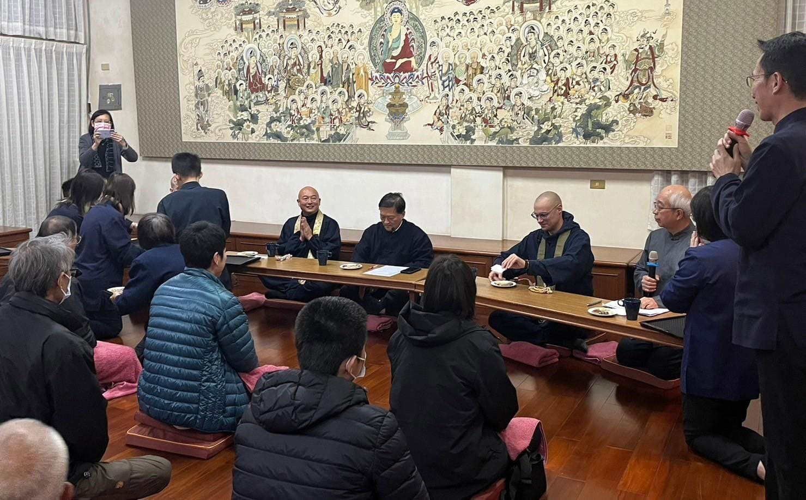

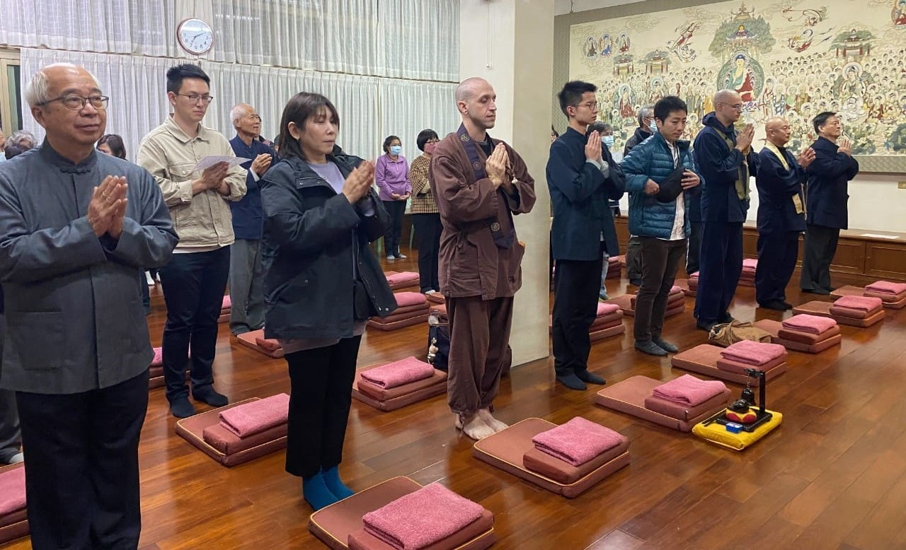

### 日本岩屋山金剛寿院福勝寺住持弘晴先生一行人座談會紀錄(中壢)

*林藏忠整理*

好學佛教做半僧

千年古剎做住持

謙懷有料聊不盡

日本文化在他身

時間：二○二四年一月十五日上午九點半至十二點半

地點：中壢共修處

來訪貴賓：弘晴住持、廣英先生、敦子女士、一朗先生與妙眼法師

中壢道場交流紀錄

日本岩屋山金剛壽院福勝寺住持弘晴先生，遠從日本率團前來交流，這份情誼值得我們珍惜，謹代表學會表達十二萬分的謝意。

**問：** 請問弘晴先生所修密法，是屬哪一類的密法？

**答：** 真言宗是佛教教派之一，佛教的戒律中有所謂的戒貪，也就是節制欲求，真言宗將這欲求的定義擴大解釋(以貪欲為道用)，將世俗安樂的欲求轉求佛陀果位的欲求，且佛陀度眾生的欲求是無邊的，這反而是佛陀度眾的本懷。因此真言宗強調的是令所有的眾生都能參與修行，得到佛陀的庇蔭，這才符合佛陀的欲求。

食欲或者是性欲，雖然也是一種欲求，但如果能適當的節制，也能得到幸福，欲求本身可以是潔淨的，也是本自具有的生理反應，佛陀善用欲求成就度眾的本懷，如果我們能激發欲求從事佛行事業，擴大利益眾生的欲求，就能與佛陀的心行成為一體。

日本真言宗開宗祖師空海大師曾說，佛法或是佛陀不是在遙不可及的地方，而是存在於每一個人的心中(但也不妨礙外境成立)。

在密教當中，壇場裡聚集諸佛如來，如阿彌陀如來，不動明王等等，是諸佛發揮各自的能力，創造不同的世界利益滿足各類眾生。同樣的眾生也可以發揮各自的能力，創造一個與佛的淨土無別的世界。不是死後才要修學佛道，而是在活著的時候就要以成佛作為目標。(附：依淺陋判斷日本真言宗是瑜伽部以下)

**問：** 請弘晴先生介紹不動明王，我們應以什麼樣的面向來看不動明王？

**答：** 不動明王的身體是青黑色的，背有背包，右手持劍，左手緊握繩索，站在斷崖岩石上。皮膚青黑色，如同有情勤勞工作出力而流汗，會受汗水，灰塵，油脂等沾汙，明王精勤利眾與眾生謀一己安樂而辛苦工作任勞任怨並無不同（外相雖同，本質天淵）。

站在斷崖岩石上，表示一不小心就會墜崖身亡，隨時都要面臨生死的變化，我們不也是一樣，一覺醒來是否還能活著，誰都不敢保證，代表無常的可怕。

頭上頂著蓮花，蓮花上面坐著諸佛如來，是表徵清淨界，而頭以下表汙泥，即表蓮花出汙泥而不染。

右手持劍，這把劍看起來極為鋒利，但不是用來殺生，是用來去除邪惡、暗黑、疾病等對眾生不利之物（降魔）。左手緊握繩索，繩子可以緊緊地綑起在慾海浮沉的眾生，再用強而有力的左手把眾生拉到岸上，拯救墮入慾海的眾生。

背後有火焰，不動明王的不動是指心意全然不動，也就是拯救眾生的心意堅定，如火焰般熱烈未曾冷卻過。

臉上顯出猙獰之狀，尤其怒目金剛的樣子，更是讓圍繞在周遭的不祥之物，不敢靠近傷害眾生，不動明王隨時都在庇護眾生。以上是對不動明王長相的說明，壇城的諸尊都具有各種不同的特性，發揮庇護眾生的功德。

**問：** 不動明王在密教中是本尊還是護法？

**答：** 修持的時候也有祭祀不動明王，每月的二十八號在佛龕上，也會對不動明王作祈願儀式。（附：是本尊也可以是護法）

**問：** 密教的四部密續分為事部，行部，瑜伽部，無上瑜伽部，請問弘晴先生的東密是屬於那一部？

**答：** 日本的密教是傳自中國，不是傳自西藏。印度佛教在不斷的進化當中，產生了密教，而密教當中又分為初期密教，中期密教，後期密教等三個不同階段的密教。

而日本的開教祖師空海大師，是在唐朝初年傳承自中國的密教，傳至西藏的是屬於後期密教，傳至中國的密教是屬於中期密教。

**問：** 依著不同的本尊是否有不同的壇城？

**答：** 基本上是一樣的，不過日本密教的壇城，有金剛界與胎藏界兩種不同的壇城，但兩者中央的本尊都是大日如來。金剛界壇城所要呈現的是諸佛的智慧，而胎藏界壇城所要呈現的是諸佛的慈悲，壇城的結構上大致一樣，但所結的手印略有不同。

**問：** 請問日本密法有沒有為人灌頂？

**答：** 日本真言宗是有替人灌頂。

**問：** 請問弘晴先生，是否是金剛上師？

**答：** 我們的宗派有一種修學法，由指導老師指導閉關修行百日之後，由指導老師認可，接受傳法灌頂的儀式，就可以取得資格。

**問：** 經過閉關修行之後，取得上師資格，就可以傳授灌頂，請問弘晴先生是不是這樣？

**答：** 經過傳法之後，我就成為阿闍梨，是可以傳授灌頂，但是在我們教派裡，我的上面還有大阿闍梨的時候，還是要由大阿闍梨來傳授灌頂。

**問：** 請問弘晴先生修火供時要以那一尊佛作本尊？

**答：** 有各種不同的護摩，以不動明王作為本尊時，就是不動護摩，還有所謂藥師護摩，觀音護摩等等各種不同的護摩。護摩分成前後兩段，前段呈獻奉養供品之後就結束，時間並不很長，後段是儀式完成後，請佛陀下壇再以最高規格的供品來招待。

護摩儀式時要祈願，所以要呈奉供品，儀式完了之後，進入火供，打開不動明王的龕門，再獻上明王喜愛之供品，此時就可以向明王祈求，如去病消災等庇蔭。

**問：** 在藏傳密教，不動明王是十大明王之一，是屬於護法，若依弘晴先生的說法或是本尊之一，在修基礎閉關時也修壇城，要如何擺設？

**答：** 金剛界壇城表佛陀的智慧，佛陀的智慧依序的傳授給我們，胎藏界是表佛陀的慈悲，以這兩種表徵展開了壇城的世界。

例如金剛界設有九個龕室，每個龕室都安置有多尊佛像，首先當然是大日如來，然後依序排列下去。雖然有多尊佛，但每一尊都是大日如來化現的一部份，比如剛才提到的不動明王，其實也是大日如來所化現的一部份。甚至我們每一個眾生，也是大日如來的一部份，是大宇宙的一部份。這是我們教派的想法。

而阿彌陀如來在胎藏界及在金剛界的位置稍有不同，阿彌陀如來在西方極樂世界，所以阿彌陀如來的壇場，在五方明王的位置上，西方就會是最高上方，就會有阿彌陀如來的世界，我們認為阿彌陀如來也是大日如來的一部分，當然也會安置大日如來。

**問：** 五方佛的概念遍於四部密續，如五個方位對應五種顏色，如西方對應紅色，阿彌陀佛在西方是對應紅色。請問阿彌陀佛的壇城情形如何？

**答：**  五方對應五色在壇場確是如此，有時以青色來表現，有時以白色來表現，這會依據當時的供養的內容，或者佛的方位而有所改變，不過方位的顏色是不會改變，比如阿彌陀如來的西方就成為最上位，不過有時將阿彌陀如來擺在中央的方位時，那其他就會跟著改變。

**問：** 不同傳承有不同的觀修法，請問弘晴先生修持這麼多的法，在生活上有什麼樣的助益？

**答：** 在修行上最大的轉變，雖是身體上的轉變，但在心上亦有轉變。比如平常喝的水，入山後在修行的寺院裡，喝的是接取來的雨水，在山下喝的是經過消毒過的自來水，我們也認為那是乾淨水，但到底是山上自然的雨水乾淨，還是經過消毒過後的自來水乾淨，那就要自己去選擇，因此在價值觀上就會有所改變。

在食物方面，基本上是一日兩食，只吃早中餐，晚餐不吃，食量也有定量，而且是自己烹煮，並無好吃不好吃的分別，持續著這樣的飲食方式，不知不覺身體敏感度起了微妙的變化。最明顯的轉變是自己身體的味道，比如排泄物味道轉淡，因此對味道的靈敏度轉強，與別人接觸時馬上能感受到對方體味的濃淡。

修行結束下山，以自來水沐浴時，強烈感受到消毒藥水的味道，生起違和感，沐浴後全身起紅色斑點，呈現蕁麻疹的症狀。在不知不覺當中，身體起了變化，竟然不能適應自來水。

其次在傳承密法的前行，要用一百五十天將自己百分之一百的供養給佛陀使用，也就是將身心全部放下，全心全意地奉獻給佛陀，因此漸漸得到佛陀的感應，與佛陀的心意相應，感到與佛陀的關係越來越接近，或者會覺得隨時隨地都準備為佛陀盡一己之力。

我們在修護摩（火供）法行時，要觀想（意密）、結手印（身密）、念咒誦經（語密）等三密修持，三業與佛漸趨一致，如此就可以與佛陀成為一體，這種三密相應的覺受特別深刻。

在修持上偶而也會生起法喜，也就是所謂的生起三昧，心識集中不斷地持陀羅尼咒，久而久之世界會生起改變，這種改變在日本稱為三昧相應，持陀羅尼咒就像你們一心稱念的南無阿彌陀佛，不斷地一心稱念，就會進入阿彌陀佛的境界（世界）。

老師：今天座談非常好，弘晴先生把所修行的心得分享給我們，昨天我們在東勢誠心誠意的招待，才有今天的成果。剛才弘晴先生講到三密相應法，身觀想自己就是本尊，口念咒打通氣脈，意觀想自己的身顯現這種身相，將世俗的欲望轉成對佛法的欲望。

第一是依軌道修行，第二是三密相應，第三是融入生活。融入生活的部份，比如是庭園設計，是生活美學等等，這些留到台北來談。

中國老子說，富貴者送人貴重禮物，仁者送人言語，弘晴先生送我們修行的心得，這是最高貴的禮物。弘晴先生所表現的這種溫文儒雅的風采，就是時下最欠缺的味道，將來有機會到日本請益時，希望能探討日本的佛教生活，探討日本的儒家生活以及民俗生活，弘晴先生也願意做我們訪日的窗口。

交流提問
楊謝能提
**問：** 

日本密教修行當中，對於孔雀明王的修持法以及傳承，大概是什麼狀況？

弘晴先生：孔雀明王修學法，在本山也有，如眾所周知孔雀食毒，能將毒素轉化成自己的能量，呈現五彩繽紛的羽翅，讓大眾觀賞而心生喜悅。如同我們修行者，能將不悅意之事物，轉化成自己的正向能量。

日本的寺廟供奉著各種不同本尊的佛陀，以阿彌陀如來作為本尊的寺廟也很多，或是以不動明王，或是以大日如來等作為本尊的也很多，大家可以選擇與自己較為相應的佛陀去做祈求，比如想祈求孔雀明王，就可以請寺廟以孔雀明王為主尊來做法事。

剛才我們談到灌頂，所謂傳法灌頂的護摩儀式，是真言宗開宗祖師空海大師，傳自唐朝的慧果法師，也就是中國密宗的第七代祖師，在傳法灌頂的壇場上，投入一片樒樹的樹葉，這片樹葉飄落下的佛陀，就是與自己相應的佛，在胎藏界的壇場上，或在金剛界的壇場上，都以同樣的方式選擇與自己相應的佛菩薩。

附註：樒樹是日本敬神特有的樹種，中文名稱是紅淡比。

老師補充：孔雀明王修學法就是以煩惱為道用的修學法，又如修心七義論裡所說，把苦因苦果吸入，轉化成意樂供養有情。弘晴先生今天所講的，都跟他日用平常的修行有關，所以會呈現愉悅的心情。還有他剛才講的敏銳與敏感，敏銳是一種見地，敏感是一種情緒，因為他對佛法投入，因此對事情就能產生敏感度。
王東山提
**問：** 

日本結婚在教堂，往生後事在寺廟，請弘晴先生說明這種習俗的由來？

弘晴先生：以外國人的眼光來看日本的這種習俗，也許會認為日本人的信仰不夠堅定，但是其實正好相反。日本人的信仰性特別強，所以大年初一，兒女出生時到神社祈願，結婚時到教堂舉行婚禮，往生法事到寺院舉辦，並不覺得有什麼違和感，不管是哪一尊神佛只是想祈求加被，而這種信仰性是絕對有的，而且已成為日本人一種普遍的習俗。

這很像我們的壇城世界，壇城的世界裡有印度興都教的神祇，或者是傳自中國的各種神明等等，將我們居住的世界加以擴充，加以擴大，皆是本尊所攝受。

極為盼望大家能夠這樣了解日本的宗教信仰。如果更進一步來探討的話，這種觀念是基於不樹立敵人的思維。在日本有一種說法，餓鬼道有一鬼王，經常殺人來填飽肚子，被釋迦佛說服後，就不再殺人，修行後成為守護母親的神祇。

還有比如想法跟自己不一樣，經過充分交流溝通之後，成為朋友。諸如此類就是密教的想法。

老師補充：大日如來顯現諸佛，不是說諸佛如來只剩下一個補特伽羅，是說十方諸佛都被大日如來收攝起來，所以大日如來具有十方諸佛的特色，大日如來可顯現各種化身，而各種化身也可以說是大日如來，他是這種觀修法。

所以要善於解答這種概念，比如說釋迦牟尼佛與阿彌陀佛，不是說兩個是同一尊佛，是說釋迦牟尼佛與阿彌陀佛是同一個證量，不妨說十方三世佛是同一個（十方三世佛，共同一法身）。

還有皈依，當然是皈依佛，不能皈依外道，而弘晴先生所說的不樹立敵人，去隨喜教堂，這件事情當然可以成立，但不能以皈依的心態去隨喜，否則就會破壞皈依的體性，就不能成為佛教徒，所以不去樹立敵人這件事情，有些還可以去想像的。

還有密法裡的主尊裡面，有些是屬於懷柔的部分，有些是消災的部分，有些是要把邪執乃至邪魔除掉，就是現忿怒相的部分，所以要去了解諸佛各種不同面向的表現。

弘晴先生所陳述的修學法以及觀念，我們也非常隨喜，雖然兩邊有不同的見地，但都能互相了解彼此的想法。

妙眼先生

：今天非常高興，能先以共修來做開始，對佛陀的唱讚雖然來自不同語言，可是唱讚的卻是同一尊佛，包含各種不同的國家，不管是中國，台灣，日本，西藏，越南等等這些國家，都在唱誦同一尊佛。

唐老師與弘晴先生的對話非常精彩，雖然是來自不同的源頭，有不同接近佛法的方式，這樣去交換去理解彼此對佛法的緣起是什麼，非常精彩，謝謝大家。

廣英先生：

這次印象特別深刻的是，大家來這裡是有些問題想要發問，或是互相了解對方是在做什麼，這樣的場合在日本並不常見，在日本大家到道場可能是帶著特別的原因去的，比如去求加被，或是家人的一些身體狀況的問題，而大家到這裡反而是對佛法的好樂，一種理解，這是想要帶回日本的一部分。

一郎先生：

今天能跟大家在這裡一起學習，是一種難得的機會，感謝大家。

敦子女士：

能與大家一起聽到各種討論交流，受益良多，感謝大家。

林老師：

很高興這次貴客來到台灣，跟我們有那麼甚深的因緣來交流，從昨天到機場接機，相見時就感到很歡喜。相聚的時間雖然非常短暫，但相信大家的收穫滿溢。

彼此尚未認識與交流時，這個世界顯得非常大，但是一旦了解，又是近距離交談之後，大家的距離就拉得很近，世界就變得很小。

剛才聽到弘晴先生的開示，對於以前去日本參觀寺院時，非常多想要了解的地方，都有了大致的了解，尤其上個月到日本的成田山新勝寺，我就拍下了新勝寺的不動明王，剛剛弘晴先生在介紹不動明王時，我把相片打開，一一去觀修那些細節時，弘晴先生真的講得很仔細。

日本在佛教是一個美好的顯現，相信未來我們會更有機會到日本，一定要實地的去親近採訪。

老師結語：

非常感謝弘晴先生，我們也期待有機會可以到日本，再做深度的交流，晚上在學會還要請弘晴先生，就美學方面，包括庭園設計，文化特色，歷史背景等做一個充分的交流。

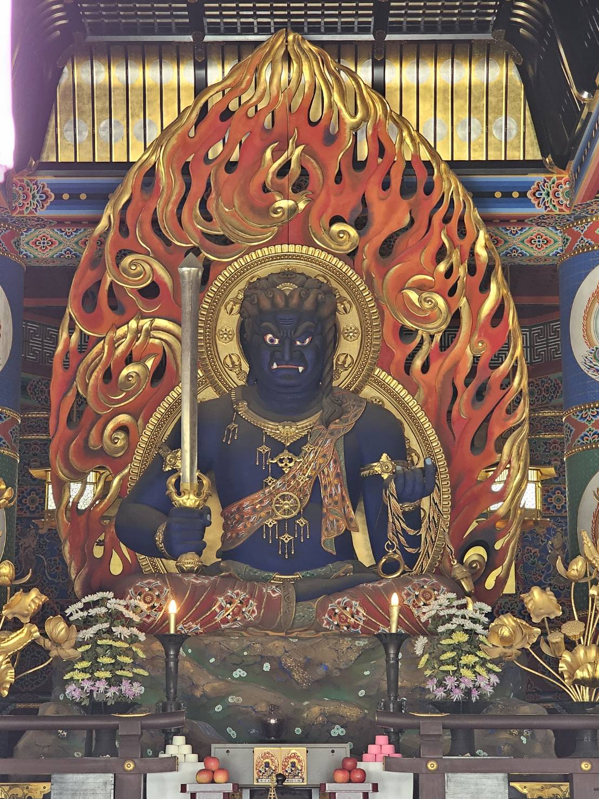

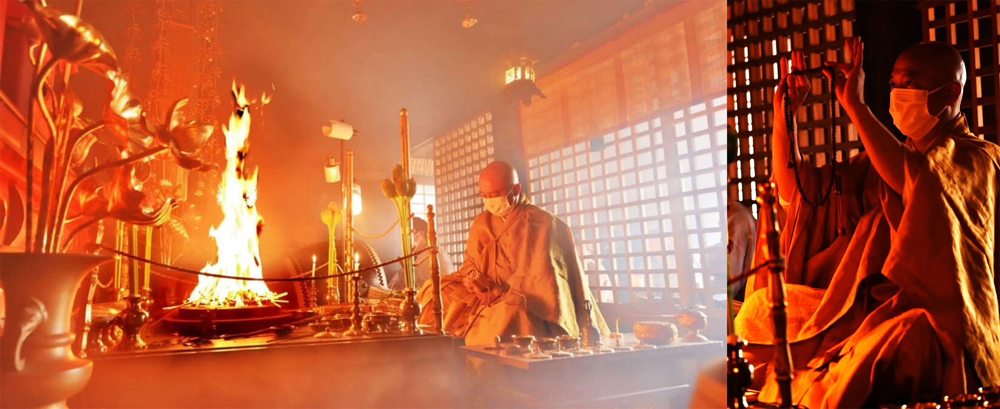

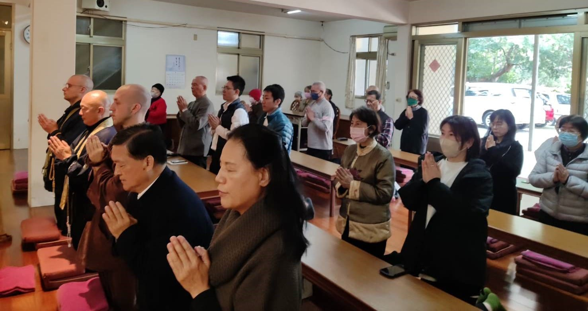

### 日本岩屋山金剛寿院福勝寺住持弘晴先生一行人座談會紀錄(台北)

*林藏忠整理*

介紹和歌山縣

導覽岩屋山寺

賞析日本庭園

驚歎毅力驚人

學會美好法宴

相約日本再見

時間：二○二四年一月十五日下午七點至九點

地點：中華無盡燈文化學會

來訪貴賓：弘晴住持、廣英先生、敦子女士、一朗先生與妙眼法師

交流紀錄

弘晴先生介紹和歌山縣：

岩屋山金剛寿院坐落在和歌山縣，和歌山縣出產水果，其中最有名的是柑橘，日本稱為「蜜柑」，柑橘被視為日本的遺產，認為最應被守護的遺產，其中一個理由是福勝寺是柑橘的發祥地，柑橘的原生種就在福勝寺開始種植，後繁衍擴及全國，其次和歌山縣種植柑橘的方式有別於其他地區，在其他地區種植柑橘，是把整座山開墾成柑橘園，和歌山則是以間植的方式，保留原本森林的樣貌，與森林共存共榮。

和歌山縣海南市轄下有一個下津町，是整潔繁榮的街道，原來的地名稱為橘本，生產柑橘，也就是蜜柑。

金剛壽院的本山就在和歌山縣的高野山，從關西機場來，大約一小時的車程，這裡有一條在一千二百年前就開通的古道，意味著寺廟應在當時就已建造起來。

在入山的石階旁，有一塊刻著「蜜柑山　南へ　袖を　両開き　誓子」俳句的石碑，是近代俳句詩人山口誓子的創作；也有刻著六字洪名南無阿彌陀佛的立石；接下來是鐘樓，裡面的鐘也已列入國家重要文化財，我們每年除夕夜要來到鐘樓，敲一百零八下的鐘，敲完之後剛好接子時，新的一年就開始。

還有一塊石碑，上面以漢文書寫著，此地是柑橘原生種的種植地。

在岩屋山境內西側，也就是福勝寺的後方，有一岩屋瀑布。石灰岩的巨大岩石，經沖刷後形成一個大洞窟，水從洞窟上方流下，形成瀑布，因為可以在洞內觀看瀑布，所以就稱之為裏見瀑布，在瀑布的旁邊，相傳有弘法大師，空海大師的不動明王石刻雕像。

岩屋山這座山的名稱，就是以此洞窟而得名。瀑布寬三十公尺，落差有二十公尺，四百年前還有動物在此出沒，內側有一洞窟，據傳空海上人在此圓寂。我們真言宗也供奉水神，因此也會把神當作佛一樣來供奉，有所謂神佛的稱呼。

福勝寺的本堂，也就是大殿，供奉著佛菩薩，要進入本堂前面有一青色的門樓，稱作德川門，福勝寺是守護德川家康的兒子（徳川 頼宣／とくがわ よりのぶ）而建立的，福勝寺建寺已達四百年之久，也列入國家重要文化財。掛在上面的旗幟是布做的，也有四百年之久。

正月初午日，日本民間有以十二生肖，作為計算日子的方式，午字與馬字的發音相同，因此以午字代表馬日，十二生肖馬排在第七，所以初午日就是第一個馬日，也就是正月初七，這一天我們會向觀音菩薩祈願。

拾階而上就可到達寺院，寺廟周圍種了上百棵的櫻花，還有楓樹，以及各種花木。

本堂所供奉的是千手觀音，堂後有幾尊密藏的神佛，每三十三年一次，推到本堂讓信眾祈願。本堂前方有一面大鏡子，向佛菩薩禮拜祈願時，自己與佛菩薩的身形，都會映現在鏡子裡面，可以觀想著自己心中有佛菩薩。

步道經雨水沖刷，地基略有鬆動，兩側也破落不堪，我們正在設法修復之中。

洞窟裡面的不動明王，天氣晴朗時會用棍棒將龕輿抬出來，讓信眾參拜祈願。旁邊有一尊可以使喚狐狸的神祇，供信眾祈求生意興隆。

這裡可以看到一條叫做連繩，或稱作標繩，是用稻草編成的，當作結界，圍成一潔淨之地。

老師：感謝弘晴先生介紹完和歌山，以及金剛壽院福勝寺的情形。上午在中壢弘晴先生談到不動明王，壇城，五方佛，火供時，剛才在寺廟的解說當中，不時提及這是文化財，這件事值得我們重視，日本在保護古物這方面是非常細膩的。

**問：** 請問弘晴先生，是怎麼樣愛護金剛壽院福勝寺這種殊勝的文化財？

弘晴先生：保存古物不能只靠個人的力量，金剛寿院福勝寺種種文化財的保存維護，首先要感念最初貢獻，最初建造者的初心，接著更要感念歷代的住持，對文物保存維護的決心。

因此對於福勝寺的一切，我從承接上一代，到轉交給下一代，在我這一代，我隨時都在想著儘可能將它往前推進（求進步），甚至更好一點。

寺院應該會一直向前發展（與時俱進），而寺院的原樣貌，不管是一百年後，二百年後，或者是三百年後，都能持續地保存下去，這是我對保存維護寺院樣貌所抱持的心態。

老師：弘晴先生保護文化財的勇氣與決心，讓我非常感動。他們坐擁寶山，這些文化財在世界都是無價之寶，保存維護古代的建築時不用現代建材，破壞它的材質與結構，且弘晴先生又善能體會先人的苦心，充分表現日本人對歷史悠久的古物與遺址的在意與細心。

我們幾次到日本的旅遊當中，最欣賞的就是寺廟，對於寺廟的建築，包括佛菩薩的塑像，這些古蹟以及歷史背景，如果有像弘晴先生這樣的解說介紹，那絕對是一場殊勝的文化饗宴。

十幾年前高老師帶我們去日本，做了一次深入的文化之旅，不但受到一場主人請外面廚師來家烹調的日本料理，還請藝妓做藝術表演。

**問：** 請問弘晴先生，在日本請藝妓為客人做藝術表演是不是對客人的一種尊崇？

弘晴先生：藝妓一面唱著日本傳統的歌謠，一面舞著日本傳統的舞蹈，是對客人的最高尊崇與供養。

敦煌石窟的飛天，這些飛天的供品、樂器與舞姿，是對佛菩薩最好的供養，接下來我們來看妙眼法師怎麼來表演敦煌的飛天。

播放妙眼法師表演飛天的錄影帶，約三分鐘（舞技瑜珈令人歎為觀止）。

妙眼法師：我一開始的想法，是自己也像釋迦佛一樣，成為一個王子，身上帶著很多珠寶，因此幻想自己可能是一個王子。

其實也不是完全是這樣，我小時候對哥德式的黑暗搖滾很有興趣，那時候我也對身體的旋轉變換具有好奇心，因此覺得改變肉體的既有狀態，再透過所產生的這些疼痛與不舒服，我們是怎麼去感受的，還有身體與我們這些觀點上的連結，是怎麼被連結上的，進一步思考這些疼痛，是否可以被克服，從那時候開始，我就把自己放在一個非常極限的位置。我的耳洞本來是很大的，透過好幾年才慢慢縮小，變成現在的這個樣子。

老師：敦煌的菩薩都戴耳環，所以妙眼法師也戴耳環嗎？

妙眼法師：老實說我也不知道，我戴耳環的時候大約在十五歲，不是為了美學或愛漂亮，或是為了珠寶來戴耳環，只是好奇說我們不能做這件事，但實質上我是可以的啊！其實我是蠻叛逆的，當有人跟我說什麼不能做的，我倒想去做做看。

老師補充：導正叛逆的人有時反而能發揮大用。妙眼法師天真無邪，確實具有修道的本質，他不會在意過去的所學，終日的悲傷，也不會帶來今日負面的情緒。

**問：** 請問弘晴先生，日本人喜歡經營庭園，是否與喜歡大自然有關？尤其在庭園設計都有河流的意象。

弘晴先生：河流確實與日本人生活息息相關，比如會在河邊洗衣，或是在河邊一面賞花，一面用餐，去親近大自然，去欣賞田園風光，這也可以說是日本人的一種習性吧！

**問：** 日本有些地方，確實是值得讓人嚮往的，比如文化的內涵，自然的風光，人民的善良，禮節的周到，風俗的醇厚，乃至於街道的整潔等等。以弘晴先生的美學觀點，對庭園設計也應該有所了解，請先生說明之？

**答：** 在日本像這樣的造景，不僅是寺廟，在稍具規模的宅邸也會有類似的景觀呈現。

尤其在京都，雖然是不起眼的宅邸，也有不錯的庭園般景觀，在屋裡往外看，不管是哪個角度，都有不同美景的呈現，自古以來有著這樣的傳統。

**問：** 請問弘晴先生，十幾年前我坐在京都青蓮寺的庭園中，心沉浸在一片寂靜之中，讓我不想離開，這麼優美的庭園景觀，是如何營造出來的？

弘晴先生：首先要說明的是，日本到處的宅邸庭園景觀，都可以鮮明的感受到季節的變化。我曾經問過庭園景觀設計的專家，他說首先要決定一個最好的位置，也就是從這個位置看過去，景色是最美好的，從這個位置做起點，然後再去做從右側、左側的設計。

能夠一眼就看出這景色當中，最重要的那個位置的人，就是一個了不起的內行人。比如小池塘的設計，要由上往下看才能看到設計者的巧思，它是由中央往四周輻射出去的設計，觀賞時要能想像由上往下看的景觀。

日本有名庭園的整潔維護，是歎為觀止的，比如掉落在碎石地面上的松針，管理人員是用夾子一根一根的夾起來。

補充：昔日張大千住所的摩耶精舍，在他細心照顧之下，呈現特殊的神韻。大師逝世後由故宮接手管理，不到三年精舍的整個精神都消失了。這是我親眼感受的，我們就是缺少日本人這種精神。

看到這種庭園設計以及維護的用心，想像極樂世界是怎麼創造的，其實對我們修淨土法門的助益實在太大了，相信阿彌陀佛在一景一花一木上，都非常認真的在造作。我們可以從這個面向，去體會阿彌陀佛的悲心，願力以及教法的內涵。

若依弘晴先生敘述這種庭園景觀設計的內涵有所體會，進而對周遭的環境細心體察，也是一種修行。

**問：** 請弘晴先生說明萬龍邸庭園景觀的內涵。

弘晴先生：首先映入眼簾的是紅葉，碎石子也許是海平面的呈現，也有幾個小島浮出水面。

通常庭園都有它的主題，也就是它的名稱。我們進入庭園，一面欣賞景觀，一面會依據這庭園的名稱，去推測庭園設計者的思維，他到底要呈現的是什麼？

比如以這個庭園來做比喻，如果他的名稱是叫作「萬龍邸」，那麼小石子所呈現的不只是平面的水，是一種水波蕩漾的波田，來呈現出龍的鱗片，可以想像著龍騰於海的意境。

**問：** 修行要身心兼顧，心能常生法喜，身體才能暢快輕鬆，紅光滿面，請弘晴先生說一下身心的調適之道。

弘晴先生：首先談一談我的修行之路，一開始家人極力反對，他們擔心我無法承受修行的艱辛，但我並未因此打消出家修行的念頭，仍然朝著修行這條創業的路上，默默地往前行進。直到遇上現在這位老師，當時我不知道他是一位老師，由於他全心全力的幫助我，朝著修行的路上前進，終於順利達成修行的目標。後來我的家人也全力支持我，在修行這條創業的路上，受到許多人幫助，我無時不忘這種恩德。

剛才唐老師提到我愛惜舊物，保存舊物的心態是什麼，比如諸位現在所穿的衣服，除了新衣之外，如果是穿上父母親所留下的衣物，你會有什麼樣的感受。我就是基於這種感受，也想把我的舊物留給下一代，把對前人的感恩之心傳承下去。因此我會愛惜自己掌管的寺院，包括文件以及寺產，完整的傳承給我的下一代。

補充：弘晴先生的內涵非常深厚，他修行所生起的法喜，他感恩家人的恩德，對寺廟的一切做出公心的付出等等，能夠被擁有三千七百座寺院的宗本山，推薦為岩屋山金剛壽院福勝寺的住持，是有他的道理的，而最重要的是他有美國的弟子，廣英先生來跟他配合。

**問：** 有請廣英先生來說一下到日本學佛的感受。

廣英先生：我本來對佛教就有興趣，可是住在美國中部的內華達州，該州沒有佛教，大致上只能在書本上去學習，可是我一直想要學習生活化的佛教，因此生起到日本去學習的念頭。

我申請到國外從事英語教學的工作，可是不能選擇想去的國家，結果被派到人口僅兩千多人，幾乎等於是無人島的一個小地方，對我來說反而是好運，雖然沒有佛教，但是是一個有山有水的小島，每天過著遊山玩水的日子。

在島上的生活不知不覺過了三年，想學佛的念頭又浮現上來，就在這個時候，看到一本叫做《修驗道》的書，上面寫著大約在一千五百年前，由中國傳入的各種修道方法，有道教，有佛教等等，當時的日本人也無法明確的去分辨原由，總之，是進入山裡去尋找神仙，去尋找佛菩薩，在自然環境中去尋求開悟的一種修行方式。

我認為日本有著輝煌的佛教以及自然的兩種傳統，一直想要了解，因此就離開這個島嶼，搬到接近東京的地方居住。

《修驗道》這本書裡記載著許多有關密教的修學法，因此一面學習修驗道，一面對真言宗的教義產生高度的興趣，剛好在這個時候，經妙眼法師的介紹，認識了弘晴先生。這一段期間充滿著太多的偶然，讓我不得不相信這是一種佛緣，也就是佛菩薩的牽線。

從大學開始學習佛教，只是從冥想，從讀佛經下手，以為學佛就是這樣，可是從整個過程的經驗當中，才知道學佛最重要最基本的，原來是這一顆信仰的心。

補充：廣英先生的體會，首先是在生活上的佛教，接著是與弘晴先生在法門的修學當中，能夠做很多深入性的學習。

他們學習的方式雖然跟我們不同，但從東勢到中壢，可看出他是很用功的，而且身心是健康的，是以愉悅的心情去融入大自然。在閒聊有關美學的部分，他們非常了解，對日本的音樂，茶道，乃至於庭園設計等等，他們都能說得清楚深入。

在廣英先生及妙眼先生的身上，可以看到他們想要得到傳承的心，從他們學佛的誠意，可以找到他們學佛的目標以及方向。

**問：** 請問弘晴先生，今後寺廟要如何經營，對於真言宗有什麼發展的宏願？

弘晴先生：還沒遇到廣英先生之前，由我們夫婦來照顧寺院，遇上廣英先生後，就相約一起照顧寺院。廣英先生是一位資質優秀，不可多得的人才，對今後福勝寺的經營，可以發揮很大的助力。不過，今後我想從面上去擴展，就必須招募更多的同伴，來一起拓展寺院的業務，來支撐寺院的永續經營。

**問：** 請問弘晴先生要如何招募，如何留住年輕人？

弘晴先生：要讓年輕人對寺院的事物感到興趣，首先就要去思考寺廟是否具有這種魅力，而這種魅力要以何種形式來呈現，才能吸引年輕人的注意。比如讓年輕人願意走進寺廟，來做一日寺廟的體驗，以音樂響宴的方式，或以舞蹈歌詠的方式等等，來吸引年輕人願意來做這樣的體驗。如果可以借重像妙眼先生這樣的才華，就會有一番作為。

補充：弘晴先生如能得到廣英以及妙眼兩位法師的襄助，將來的發展是無可限量的。

當時孔子周遊列國時，各國國君願意與孔子分庭抗禮，是看到孔子身邊的弟子，各個雄姿英發，對孔子不得不刮目相看。今天看到弘晴先生所帶來的團隊，雖然人數不多，我們也不能小看。

弘晴先生今天陳述了他做了多少的火供，本尊，閉關等等，聽起來是很內行的。弘晴先生對於宗派的熱情，服從宗派的組織制度，這種精神值得尊敬。

下次有機會到日本旅遊時，請弘晴先生帶我們去參觀庭園的設計，寺廟的建築，也可以去看他們怎麼修火供，怎麼去做壇城，這種藝術是難得一見的。還有怎麼修本尊相應法，也請弘晴先生來說修行後，身心所生起的敏銳與敏感。

弘晴先生：我是在深山，人煙罕至的地方修行，在那裡只有山中的水，只有雨水，一進去指導和尚就告知，此地的水不同於自來水，務必珍惜使用。

生飲雨水肚子會有脹脹的感覺，也許會生起是否衛生的疑慮，不過，經過消毒後的自來水，是否就一定衛生，亦不得而知。

在山上喝了一百五十天的雨水，身體並無異樣，下山後喝了自來水，肚子反而不舒服。我們的身體具有非常好的適應性，身體能適應吃進肚子的東西。

一百五十天下來，我的體質已能適應山上自然的雨水，山上下來回到街上的家，感到最可怕的是，以自來水沐浴後，全身紅腫，起了類似蕁麻疹的症狀。如果諸位也能像我這樣，有一段期間改變生活，改變飲用水的習慣，也許會有相同的體驗也說不定。

補充：弘晴先生非常幽默，他雖然是在山上修行，但心情就像在都市般的快樂，好像在享受現代文明，看電影逛百貨公司一樣的快樂。他說在山上閉關修行當中，完全是與佛菩薩有關的感恩，修觀，火供等等，一百五十天下來整個個性都改變了。

弘晴先生與廣英先生，他們都有一種實驗的精神，拿自己的身心去做實際的實驗而得到感應。

結語：

弘晴先生如果有廣英與妙眼兩位先生的輔佐，就像觀世音菩薩與大勢至菩薩輔佐阿彌陀佛一樣，所以弘晴先生的未來是難以想像的。

弘晴先生還有一個很棒的出路，就是跟我們學會連結，我相信我們跟弘晴先生合作，帶領學會去體驗日本文化，這是我們學會的另一種課程，弘晴先生的團隊是我們學會的鑽石礦，我們挖到了弘晴先生這顆鑽石。

接待弘晴先生的這兩天，從接機開始到吃飯，到文昌廟，到喝茶等等，我發現弘晴先生的每一個舉動都是融入，這種融入的功夫確實令人讚歎。

林老師：很感動有日本的友人來學會交流，我們從他們的身上，不但是見到了日本朋友，更見到了日本的文化、日本的佛教，還有日本的種種美好，成為我們的嚮往。我希望學會在座的每一位學員到日本去，也是代表中華文化，代表佛學的重要。在他們的身上，展現許多值得我們學習的地方在裡面，非常感動。

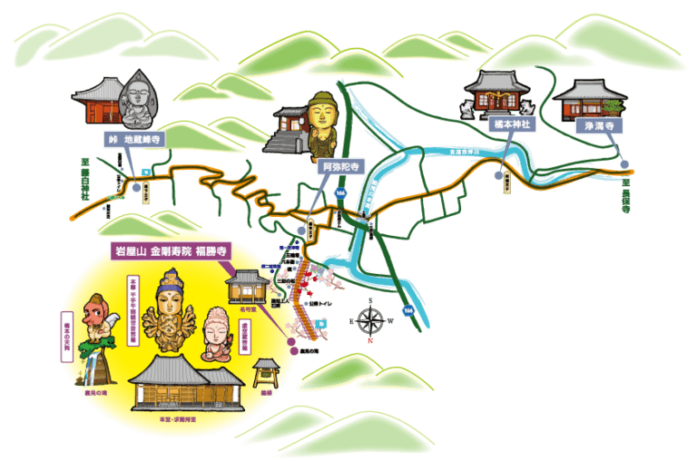

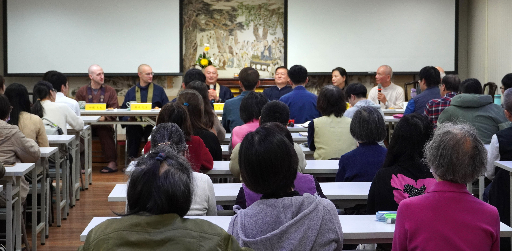

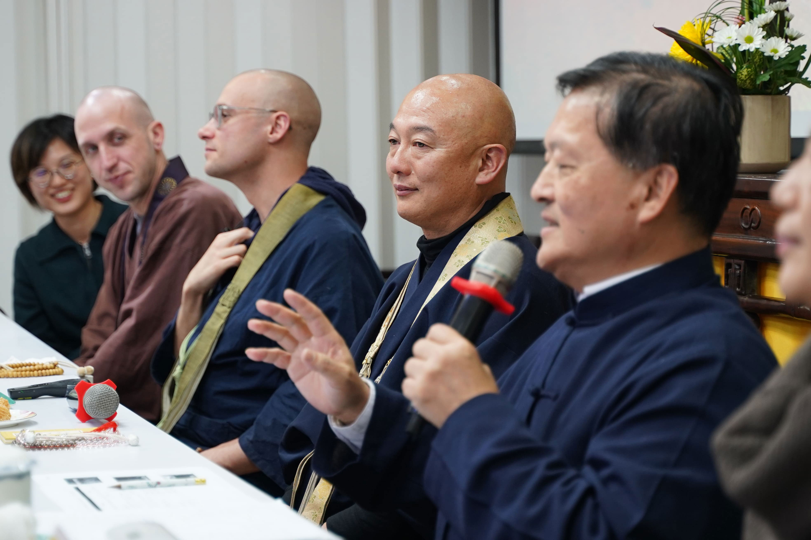

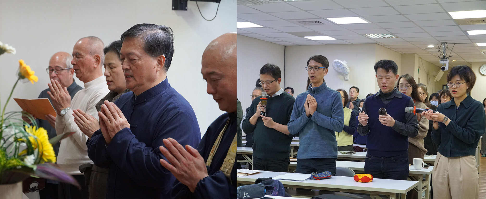

## 妙眼法師受三壇大戒緣起、心境與計畫

### 妙眼法師受三壇大戒緣起、心境與計畫

編輯

率真善良外國人

木魚計畫萬里緣

相交天臺從止觀

未來合作日本始

受三壇大戒緣起與目前心境

妙眼法師：我認為日本天台宗保留了許多良好的傳統，但同時也失去了一些部分，台灣的佛教，也保留了許多美好的傳統，但也失去了幾個部分。幸好雙方都保留了對方失去的部分，使我可以互相補足，例如我在日本受過密宗戒，而日本沒有三壇大戒，我到台灣，就有機會受此戒。很感謝兩邊都有好的老師、好的因緣，感謝他們的支持與幫助，讓我可以在這裡受戒。

受戒後計畫

妙眼法師：我希望受戒後能夠回到日本，最終目的是將這些教法帶回西方，當然也會幫助木魚計畫及無盡燈文化學會的活動，延伸及拓展佛教社會的發展。

西方人大多都是透多一些書籍或是圖片來認識佛法，那是很個人的學習法，並沒有一個社群或是其他佛教人員來幫助他們了解佛法。因此，我希望藉由社群的力量來幫助佛教在西方弘揚傳播。當然很多時候也可以祈求佛菩薩加被，通常佛會幫助我們，但也要依靠有情的幫忙，在現實世界中才能推展順利。

社群的好處是，打破了空間的限制，隨時都可以在這個環境中學習，老師也隨時在，有問題請教都會獲得答覆，只要你想要，這一切都很容易得到。

身為一個獨立的佛教徒，我沒有體驗過學會這種氛圍，學會令我印象深刻，我認為社群的影響力非常強大，在體驗過後，我希望可以將社群的力量帶回西方。

學會未來計畫/方向

唐老師：由於現在地緣政治的問題，未來會希望跟妙眼法師在日本設一個據點經營，有助於我們避險，並且用來發展文化，能跟歐美交流，也讓台灣的年輕人，有可以發揮的平台。

近期會有去日本的因緣，屆時很希望聆聽弘晴住持、廣英先生或者是妙眼法師，以及妙眼法師在日本的比丘尼導師的意見，樂於共同合作，打造社群平台，跟日本的佛教及文化交流。

妙眼法師：過去這段時間受到大家的鼓勵與支持，我很喜歡在這裡陪伴大家。即將要去受三壇大戒，我會把大家放在我的心裡，帶著大家一起去。很感激在這裡的人們，在這裡的日子，謝謝大家。

唐老師：是的，這就像大悲心一樣。修學正法時觀想一切有情跟你一起修學正法；皈依的時候觀想一切有情跟你一起皈依，這種方式是對的。妙眼法師很多的觀修法都非常好，很有正法的想像力，是非常棒的修學者。

四十五天後，妙眼法師會回到學會，屆時我們就聆聽他的心得，讚歎他這四十五天的修學，也會隨喜他未來的成就，並好好談未來的合作方式。

祝福妙眼法師受戒圓滿，對於戒法，不管是沙彌戒、比丘戒，還是梵網經菩薩戒，通通都能了解他的戒體、戒相、戒用，成為一個承擔戒律的人，成為弘揚佛法最有力的修學者。

受三壇大戒的建議

妙眼法師：對於我去受戒，老師有沒有什麼建議要我留意並放在心上的？

唐老師：第一，在每一個開始的場合裡面，都以願力來攝持每一個法行。比如唱頌、講戒、受戒，都以剛才講的這種願力去攝持每一個法行，讓每一個法行的體性都轉為大乘。雖然受的是比丘戒，但是體性都轉成大乘。

第二，在學習的過程當中，都能夠得到法的傳承，並以此作為在美國，或者在其他地方發展戒律的緣起。

第三，在這個場合裡面，也盼望妙眼法師能夠遇到很好的同參道友，成為後面行菩薩道最殊勝的增上。

第四，唯願臺灣能夠辦這麼廣大的善法，遠離戰亂的威脅，遠離地緣政治的危險。

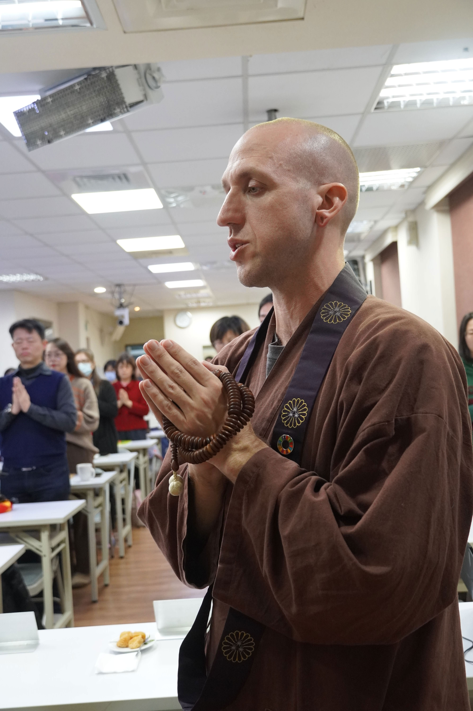

## 活動報導-關鍵調心術

### 掌握關鍵調心術  寒訓講座報導

心若

依止善士修學暇滿

無常皈依業果馬車

大師風範傳承殊勝

名字位中真是佛眼

凡夫階位可以期待

人生難得，佛法難聞，佛經上總如是提醒著我們。然而可貴的人身已得，又該如何正確地學習浩瀚的佛法呢？二○二四年學會舉辦寒訓講座「掌握關鍵調心術」，從依止善知識、珍惜暇滿人身、無常、皈依說起，深入佛法中最關鍵的調心術，讓大家第一步學佛就走對，本次也是第一次開放時青班及老蓮友一同共學的講座，老中青三代齊聚一堂，和樂融融。

開訓時唐老師致詞言：

「很高興年度寒假講座開始，寒、暑假講座在學會已經行之有年，從過去雪廬老人接續到現在，學會於民國八十八年成立社團法人，感謝胡居士的護持，而有這樣的因緣，不管學會會務如何多，講座一定會辦，民國一百年，學會成立，篳路藍縷，希望後續年輕人能夠接續，老幹接新枝，莊嚴出美妙的花園，能莊嚴的是教法，所莊嚴的是道場，學會過去已把幾十種的講經表解全部上完，也因為有這些講學的因緣，而有海內外各地的讀書會，感謝一路相伴的老師善友們。時代愈混亂，愈要有中心思想，時代愈往前走，愈需要過去的核心價值，漢傳佛教有很多瓶頸，我們必須虛心接受，五部大論、中觀六論，都是未來很重要的課程，裡面內容浩瀚，助於座上修、歷緣對境修。

學會有儒學、道家、漢傳、藏傳，希望建立教法的觀修，大家按部就班的學習，本次特別是掌握關鍵的調心術，不講內觀，也不是數息，按部就班地來，能培養人才，才是人生的方向。

學會學法的氣氛濃厚，辦事人員努力，每個人角色都扮演得很好，人生一眨眼，很快就到盡頭，老一輩要好好珍惜餘生，年輕一輩要愛惜光陰增上自我。這個世間的財位易得，然天爵難得，修學正法，方見真正己之出路。

看到大家濟濟一堂很高興，馬車軌乃真正的調心術，這些教典像黃金、鑽石般的珍貴，這些寶貴的傳承慶幸有機緣慢慢地學到，更重要的是把教法發揚光大。」

林老師致詞：

「本次講座開授馬車軌，非常清楚地把每個修學法分開，從道前基礎、下士道、中士道，進入到上士道，非常開心今天老中青三代聚在一起，還有新學員加入。馬車軌是一個攝持法，攝持大經大論，有龐大的經學背景在裡面，以這樣的攝持法入佛法之門。對於多年學習經教的同修們，也能把多年散落的珍珠串連起來，繼續往前共學，這是延續道脈很重要的關鍵。

大家在這短短五天內投注時間、心力，弄懂這些馬車軌的修學內容，看看會發生什麼樣的變化。課後有考試的設計，是為了檢驗大家學習的成效。而馬車到底可以開多快，也許對於熟練的人，在早晚課時很快就可以觀修完畢，對於初機，馬車要慢慢開，這次將昂旺大師所有馬車軌的講義都發給大家，能上完多少就看因緣了。」

馬車軌主要依著帕邦喀大師的《掌中解脫》，《掌中解脫》解讀道次第實修的口訣，是以每一步修學在六加行生起之後，在傳承殊勝的加被下，得到該法類的覺受。

六加行是：淨地設像、陳設無諂誑供具、入座皈依、數數發心生起資糧田，禮讚供養資糧田，修學普賢七支，祈求去除修學道次第的障礙，具足修學道次第的順緣，消除身心內外障。祈求傳承上師加持，獲得道次第每一步的證悟，以親近善知識，暇滿人身，無常，皈依，業果，出離心，大悲心，菩提心，空性的正見（廣大行，甚深見），由顯入密，四部密續修學，特別是無上密續之生起次第、圓滿次第的證悟，這樣聚會的教授善知識、同行善知識、外護善知識，生活安樂，修道道糧具足，健康與長壽，祈願生生遇明師，飽嚐甘露妙法味，十地五道功德滿，速疾證得金剛持，收攝資糧田成為頂上的上師，在頭頂上像觀音菩薩之於阿彌陀佛一樣，祈求頂上上師加持我每一步的證悟，眼前是今天所要修習的科目，比如今日修念死無常，或修皈依，或修依止善知識，在今日學習與歷練中，獲得證悟。在家人好好學習正法，才知道如何擁護正法，並如理如法的抉擇世間所依事業。

本次馬車軌課程講了依止善知識、有暇身勸受心要、念死無常等馬車軌。

依止善知識馬車軌

，告訴我們先了知依止善知識的殊勝利益，不依止與不如法依止善知識的過患，產生依止之欲，再來確定依止善知識才是修道的命脈，而能在心上依止、在行為上依止，座上修就要帶著這樣的架構觀修，串習這些內涵成為覺受。

有暇身勸受心要馬車軌

，告訴我們人身難得，具足八暇乃至十圓滿的人身，更是百千萬劫難遭遇，對比因苦而無暇的三途，因享樂而無暇的天道，有學法條件的暇滿人身好處實在太多了，對於人身難得真正產生覺受者，絕對不能忍受任意逍遙空過一刻，我們都是自己的主人，未來掌握在自己手中，戒律的精神，其實就是自催自助，努力修學串習而已。

無常馬車軌，

一樣告訴我們不修的過患、修之勝利，接著正修念死之心，即什麼樣的念死之心才是合格的念死之心，第四個是修念死的方法（念死之理）。修學暇滿人身和念死無常者會開始悔恨自己浪費太多寶貴時間，做太多無意義的事，有這樣的正理思維，加上反覆的串習，才有辦法對治放逸，否則就如一般人「未知未知二十年，欲修欲修二十年，不能不能又二十年，一生傳記，如是而已。」

*上述這些課程內容，都會陸續整理在周四共修法語中，供大眾閱覽，以下附上眾學子們的學習心得。*

### 掌握關鍵調心術寒訓講座心得分享

眾學員

傳承善識成心要

正因成立諸法義

內化身心離粗重

巧把塵勞為佛事

游捷茹

含苞的銀柳悄悄開放，伴隨我們跟著老師的講述，循序漸進的乘著一部部馬車，駛向內心。

這次對於經典架構的理解，似乎更加清晰些許。從個別主題的初認識、知重要、思功德（理由）、明過患（理由），到學方法，每一個環節都緊密串連。而除了單部經典的邏輯嚴謹，經典之間亦層層遞進，每一步學習都是下一個篇章的道糧。從善知識的依止說起，作為對佛法認識的開始；接著認知人身之難得；進一步思惟暇滿身為希求後世之理，作為念死無常的基礎。每每體會這樣的串連，總為佛法的博大精深而感到驚喜。而若無老師講述，學生定是很難領會其義的。

與許多人生閱歷豐富的學長們齊聚一堂，師長們剛柔並存的氣質令人心嚮往之。在聆聽大家分享的經驗時，腦中時不時浮起過去曾遇到的困惑與煩惱，如工作所見的悲傷或歡喜，如重要他人的語言與行動。老師說：「學佛是自己說服自己的過程」，以佛法為骨幹聆聽他人的生命經驗，學生彷彿也慢慢的與過去的困境對話。原來學習知識用在內心，是這樣的感覺呀！

又思及能以佛法為主軸進行世代間對話，是一件重要、珍貴又浪漫的事情。好喜歡這麼近的感受「信仰超越世俗的交換利益，在法的學習中，以文化內涵的形式刻印在心底」的歡喜。

吳家淇

很開心這次也能來學會聽課，這次學習到很多的善知識，我印象深刻的部分有依止善知識的自方見分，不能做決定者，有說到因為生活得很近而造成我們覺得很厲害的老師在我們眼裡卻像凡夫俗子一樣，這部分讓我想到那些追星族，他們希望他們的偶像永遠高高在上像天上的星星遙不可及，就如同這個道理，太親近反而讓人感覺跟我們凡人一樣沒什麼可學習的，老師說看得懂世間不能看懂佛家，看懂佛家一定能看懂世間，真的很有道理，每個知識都能套用到世間，真的很厲害，也是讓我不停地想來聽老師上課的原因。還有另一個部份讓我印象很深刻也很動容，就是在講死相的部分，老師因為有過很多經驗所以把書本上的文字講的非常立體，就像在眼前一樣，我自己在聽的時候也一直想到我的外婆，外婆年事已高，我也希望她離開時也不要害怕，在心得發表的時候有很多人有哭，因為我超容易哭的，所以聽一聽也掉眼淚，然後換我發表心得的時候講話聲音就不太清楚，我覺得每次來這邊上課真的都能得到很多很多的寶藏，不管是佛學知識或是老師的人生歷練，真的讓我體驗到聽君一席話勝讀十年書，希望以後也一直有機會繼續聽老師上課，也希望我的年紀過的慢一些，讓我可以久一點不要超過老師規定的聽課年紀，然後也很開心每次都能吃到很好吃的素食，感謝所有的老師以及學長們。

鐘婕寧

繼上學期發菩提心馬車軌的教授，此次寒假的課程則是一系列〈依止善知識馬車〉、〈有暇身勸受心要馬車〉等《掌中解脫》的修學口訣課程。令我印象較為深刻的是〈有暇身勸受心要馬車〉與〈念死無常馬車〉這兩部分。以下針對二者說明所思所感：

網路或者心靈雞湯相關的書籍文章中，總是看到「好好愛自己、珍惜自己的羽翼」等等單詞片語，但從未看到有人深入的剖析為什麼要愛自己？如何做才是愛自己？在〈有暇身勸受心要馬車〉中，鞭辟入裡的以「暇滿人身」說明生而為人是何等的難得。難得之處，是幸而為人道，而非地獄道、餓鬼道、畜生道，不是禪定諸天等長壽天，亦不是生於沒有佛法之處或者是抱有邪見、缺乏根器者。難得之賢善因緣，思維己生在人道，且根器具足、業未倒、生於有助於佛法傳播之處等自圓滿，以及有善知識轉法輪、有契機時代的佛法、衣食資源充足的情境等他圓滿，先說暇滿人身勝於黃金、勝於能滿足這一世所有願望的摩尼寶，世人皆視黃金如寶，何況更勝於金與摩尼寶的暇滿人身！此處精妙之處在於從完整的佛法架構切入，以正因說明珍貴而得來不易的人身，自然不可能任憑其空過，接著再說「難得」的重大意義，在於能真正「離苦得樂」者，唯有暇滿人身才能以「離苦得樂」修行正法，以上皆須和佛法相關，以此人身即可持戒、布施，修得賢善人身與人天福報，由忍辱得人天圓滿眷屬。認識暇滿人身的難得尤為重要，有「難得」的覺受，必須靠建立種種正因才會生起「因為是百千萬劫難遭遇，所以必須珍惜這得來不易的人身」之感，同時還要不斷串習法類，由持戒、布施等，加以淨願，渴望正法的學習，對三寶皈依的皈依境後得到傳承。暇滿人身已難得，而知暇滿人身何以難得，懂得其大義而生起此人身難得的覺受，更為困難。看見過去西藏的大師們，都因為心中升起暇滿人身難得的覺受，因此發憤忘食，專注的不讓此難得人身空過。反省自己曾經常在放空、墮落的生活，忽然覺得甚是可惜，好不容易得來的人身已是萬幸，應好好發揮生而為人，能夠為一切有情眾生、為更好的來世付出其價值，才不枉費難得的人身，我想這便是人存在的意義與活著的終極目標。

去年初，我進行了人生第一次「全身麻醉」的手術，術前的整個過程是令我極度恐慌的，沒曾想，這些心理狀態可以作為〈念死無常馬車〉的觀修。手術前一天，醫生為了確定我的身體狀況良好，所以要我提前一天住院，以便做一系列健康檢查。記得當時我一直焦慮地問醫生：「明天幾點開刀？」結果醫生總是回答「明天早上，但不確定幾點」這樣籠統的答案，以為知道幾點開刀可以做好心理準備，殊不知竟得到不確定的答案，心中更是焦躁不安，害怕得不斷想哭。這就好比〈念死無常馬車〉「念死法」中，最重要的「死來不預告」。念死九因之中的「死期無定」套用在這裡，可以先將最使我昏迷不醒的「全身麻醉」視為一種「加括弧的死亡」，把不知何時會動刀的狀態視為「無常」，死亡之來就是如此的令人猝不及防，天有不測風雲，沒有人能告訴你何時會離開這個世界，「明日與後世，孰先孰後，渺不可知。」後世其實離我們很近，只是我們沒有時常觀修死期無定與念死無常，故被現世的安樂麻痺而不自覺罷了。手術當天好比即將死亡的自己，在被推入無塵室前，只有病人和醫生、護理師可以進入，所以我只能眼睜睜的看著父母離我而去，猶如死時「眷屬雖眾，不能代死，亦不能挽救。」人這一生孤獨的來，死時亦是孤身離去，死是自己的事，務必抓住這種畏懼「自己一人面對死」的覺受。接著要簽屬一份手術同意書，其實這凸顯著人類生命其實比想像中還要脆弱，死無定期的三因之中就有「身命微弱，毫無保障。」一因，也許醫生一個不小心，就讓病人死在手術過程中走了，也或許病人身體突然發生意外狀況，就會死去。無論帝王貴族、販夫走卒，無人能免於一死，在死亡面前，人人平等而不堪一擊。人永遠不知道死期何時到來，就像我不知道幾點會開刀一樣，臨死時，只能一個人面對，再親近、再有錢、再可靠的身體都無法陪著自己，好比僅能待在無塵室外的父母。那份手術同意書、麻醉同意書揭示的不僅是人身是何等的脆弱，亦說明著死亡的到來充滿著無常性，無常性大到不得不請病人先簽同意書，以防無情的無常找上門。結合了去年這場全身麻醉的「念死無常」觀修，真的非常震撼，想著自己如果在手術前就看到〈念死無常馬車〉的話，或許就不會這麼恐懼了，因為有佛法的陪伴，有法的因緣建立我們的正因，所以使我們透過修法而不再畏懼死亡。時常念死無常是畏死之心的安住之處，欲學得出世法，必先由入世法中求，入世法不外乎出世法中所言之世間一切規律，常以「念死無常」作為觀修，等到無常來臨時，方能從容以對，甚至可如生時般自在且歡喜的離開人間。

王文徽

關鍵調心術講座，一轉眼就結束了，這五天沉浸在正法學習的環境中，更可以體會到古大德的行為，為什麼腳上雖有一根刺不好受，卻沒有心思去思考如何拔除刺，只因為不想從和正法無關的想法或法喜中岔出去，每次講座的結束，都有這樣的感覺。而這一次的感受特別強烈，過去曾經聽到很多學員在心得分享時，說的痛哭流涕，甚至還有當場下跪向老師三頂禮，這次終於體會到過去那些分享者的心情，心裡很是激動。

念死無常這個法門，原來這麼強大，無論是修習下士道，遠離墮三途苦；修習中士道，脫離輪迴苦；修習上士道，得究竟樂果，都繞不開它。還可以對治懈怠和放逸，每每複習念死九因，想到死無定期，下一世這麼快來臨，就提醒自己「死時除佛法外餘皆無益」，於是趕快複習老師過去所教授的教法，或是佛號提起。

隨著年紀的增長和各種經驗閱歷的洗禮，上課越能得覺受，得佛法難聞的覺受、得佛恩上師恩的覺受、得暇滿人身難得的覺受，皈依三寶求救護的覺受。近代某大德形容，凡夫的一部自傳簡單講就是未知未知二十年，欲修欲修二十年，不能不能二十年。期許自己從不知不知，漸變成已修已修。

真心感謝兩位老師和助教老師們，為我們教授佛法的關鍵心要，也要感謝背後默默護持的香積菩薩和所有人員，讓我們上課法喜充滿，下課肚皮飽滿，我想極樂世界淨土的形象，約莫就是顯現這個樣子吧！

廖英任

曾經有一個人，居住在寶山旁邊，平生以採掘礦石為業。他每天都辛苦的工作，所獲得的翡翠、金礦、銀礦可供賣錢過日子。就在某一天，此人在寶山的地底盡頭，發現了滿坑滿谷的鑽石，如此令他從礦工成為了富翁。

這富翁從此開始販賣鑽石，由此促進生意興隆，此間也有商人與他批發交涉，之後的大盤商、中盤商、小盤商，逢人便說鑽石稀有珍貴，但卻不知道鑽石為何稀有珍貴，同時也沒有當初富翁採礦時辛勞後的喜悅與感受。除此之外，盤商推銷給窮人時，反而還遭到窮人鄙夷，甚至反唇相譏說煤礦更加珍貴，不僅能生火取暖，還可以用來做火力發電，長此以往，賣鑽的盤商逐漸寒心，也就不再做鑽石的推銷銷售。

末學以一篇〈鑽石喻〉破題，反思當今佛教界：富翁喻為歷代祖師大德，不辭辛勞修行證悟；居住在寶山旁邊，象徵「十八暇滿」之一的「生佛中國」；金銀翡翠譽為聲聞、緣覺、菩薩三乘；鑽石為開悟證果；買鑽石的盤商喻為當今的學佛弟子，雖知佛法難聞，卻從未知佛法的殊勝利益究竟為何；窮人喻為「八無暇」有情；煤礦則指紅塵俗世的名聲利益。

登伯注麥云：「未知未知二十年，欲修欲修二十年，不能不能又二十年！」末學觀之感到非常慚愧，想來往昔於腹胎之中，早已和佛法結下不解之緣，如今投生至人間二十餘載，雖在父母言傳身教之下也曾投入佛法修行，為期兩年小有所成，但仍未入究竟真實義。追溯其原因，乃是藏密修持，多以要訣心法口傳手授，本無教理做背景支持，且全憑經驗累積而無覺受。若是長此以往盲修瞎練，誠如賣鑽之盤商一般無異。可謂「當知未知二十年，漸修斷修二十年，欲證難證二十年」，年邁之期驀然回首，卻是空費光陰豈不可惜！

值此困難之際，所幸經菩薩指點末學來到學會進修，時至今日也有半年。說來也巧，在「掌握關鍵調心術」講座結訓後，白天由老師們出卷筆試，晚上則由諸佛菩薩於夢中顯現境象，作為應用題型考核。因過去庚子大疫年間，於佛前發願修行藏密四加行法門，過程中漸修斷修歷時兩年，終達十萬次數之需。期間白日座上觀修，夜裡於夢境中陰，多由菩薩示現幻境以做考核，此間的夢境過程記述，完整成篇的內容已達三十多部，由於內容篇幅龐大、題材豐富，故言盡於此不再延伸。

說回結訓當夜，末學只知身處某所大學的教學大樓，一二樓層設為醫療專用，有病房和各類的急診室；三、四、五樓層類似《哈利波特》系列中，霍格華茲的裝潢，因走廊多擺設美術作品，暫且推估是美術系學生上課之教室。夢境中時間為早上十點多，正值下課時間，我與碩班同學在四、五樓遊覽，打算稍後前往圖書館，豈料這時一頭紅銅色的河馬，身形宛如一隻吉娃娃大小，牠正死咬著一名學生的左側小腿，很快的該生傷口受到感染，立即雙眼發紅、四肢亂顫，彷彿喪屍一般朝向四周的同學狂奔而去。

因校內爆發喪屍病毒感染，故群眾亂成一團，哀嚎聲此起彼落，我與同學一面避開人群，尋找安全地帶避難，同時窺見病毒的傳染過程。只見該生鎖定一人後，立即血盆大口咬向對方後頸，病毒這時會聚集於牙齒上，經由對方身上的瘡口進行迅速傳導，直至病毒全數轉移至新宿主身上，原先中毒的學生立即康復，向其他地方逃命去了。而新的喪屍就如鬼抓人般，持續尋找助他解脫的下一任「替死鬼」。

我和碩班同學於教學大樓各層反覆逃難，無奈仍被不知是第幾位感染者追上，對方當即啃咬末學後頸，但由於末學體虛畏寒，故時常將套頭毛衣拉高護住頸部，如此一來，對方無法藉由傷口傳導病毒，加之該病毒無法透過飛沫傳染，因此也就逃過一劫。

而正當被喪屍咬住後頸的一剎那，瞬間腦海中一片漆黑，只留下「死無定期」四個白色跑馬燈字體於心頭閃過，當下不免震驚「念死無常」的覺受竟在此顯現。剎那間忽然回憶唐老師上課所說「死無定期」的內容：一者「死王之來，不先預告」；二者「死緣極多、活緣特少」；三者「身命微弱，毫無保障」。

再說喪屍因無法傳導病毒，故前往其他地方尋覓目標。末學蹲坐牆角、劫後餘生，又憶起「死時除佛法外，餘皆無益」一段內容：「財物雖多，焉能贖命」、「眷屬雖眾，不能代死」、「俱生骨肉，亦當捨去」。不禁感嘆佛力不可思議，此次蒙佛庇佑當免此難，若非此情此景為夢境中陰之示現，而是現實生活將面對的的考驗，末學恐將「蒙佛接引往生」，著實惶恐！

夢醒後，末學迅即紀錄下夢境內容，一來感念佛法護念、二來感念菩薩示現，以考核所知所學是否深入心坎之中、三來感念唐老師及無盡燈團隊，發心辦理講座宣說佛法，利益一切學佛有情，令末學在成佛之路上更進一步。期待後續的「馬車」系列持續行駛，由唐老師帶領全體同修學長們，步上證悟菩提道的旅途！

林泓泰

感謝老師讓我在寒假期間修習菩提心馬車軌，對近年來遭逢巨變的學生而言，感激的心情無法簡單以文字形容；因此，學生非常能夠體會世事無常的運作道理，時刻精進自我已無閒暇，何來時間可蹉跎呢？

雖說課程的教義中也揭櫫像我這階段的人，已經與修習佛法漸行漸遠，但是學佛對學生思維的影響力完全無法抹滅，不但對我學術研究的眼界有所助益，學生看待公共事務也開始以教義出發。

學生深知自己離佛理的距離還很遙遠，但日後不論在哪都希望無時無刻以此精進自己，只怨惜自己能力不足，無法將此奧義傳給身邊的人，甚為殊憾。

邱寶儀

延續上學期的菩提心馬車，很開心在講座中獲得更多的馬車，就像一本本故事書一樣，組成一個系列，也更接近道次第的修學法了。這次和暑假的《四部宗義》有所不同，老、中、青三代同堂一起學習，老師在課堂中也請師伯分享過去工作的點滴，很有經驗傳承的意味。像是職場一定遇到的「上司相應法」，何妨不能帶到佛法學習與佛相應，發揮自己獨特的陀羅尼？老師也花了很多時間說明現世安樂與增上生、決定勝，以及念死無常等觀念。有些內容聽到時會感到內心發寒，皆因人身難得，更何況是有機會聽聞正法的機會，更像中了頭獎般的難能可貴。老師提到很多人學佛後都是為了求現世利益，或是在職場上成為一個懂因果的人才。我們每天拜佛、求佛保佑加被，卻幾乎沒有想過佛本身在想什麼。要是某天佛出現在我們面前，我們又有什麼想對他說呢？對我來說，這都是當頭棒喝的訊息。這時候再回去看講座海報上的鑰匙，好像更有感覺了 — 無論是開啟內心、經營人生，或是修行，都需要的調心術。

不少同學也分享身邊與死亡很接近的例子和心得，我也不禁思念起自己的母親。雖然我們感情很好，但是我對母親的某些面向或決定，似乎從未真正理解過。例如，吃素如果會導致營養不均衡，為何還要執著堅持？明明已是病人在醫院留醫，吊著點滴為何還要替別人安排助念，自己卻不把握時間休息？隨著老師的教導，我漸漸開始拼湊起母親過去的樣貌，了解她過去的舉動和選擇。這把鑰匙給予我另一層次的意義，也是我深深感動的地方。連續五天課程慢慢熬煮到最後，有別於每週課程的感覺。最後的考試被稱作「座上修」也非常貼切，剛好可以練習串習和加強印象。期待坐上一台又一台的馬車，朝向目的地前進。

謝佩珊

這次有幸參加寒假講座，主題是掌握關鍵調心術，當初在參與課程之前，對情緒的掌控度不佳，時常為研究焦慮，導致壓力影響到我的生活。

在不知道講課主題前，不知道講課的內容是菩提道次第略論的馬車軌，儘管維基百科說這些內容不適合初學者，但在老師的講解下，我發現內容相當易懂。課程主要涵蓋了暇滿人身、依止善知識、死無常、皈依三寶等重要章節。特別是在談到暇滿人身難得的時候，我深受啟發，意識到生命的珍貴，應該好好把握時間。這些內容讓我重新思考人生，也讓我對佛學產生了更大的興趣。

課堂上，我發現許多同學也來參與，大家對課程都非常有熱情，尤其是在談到死無常這一節，許多人都有所感悟，分享的故事也讓人感動。我不禁思考，我來參加這場課程是否有更深層的意義。或許是冥冥之中的安排吧。我家中的媽媽長期參與佛學活動，但她很少和我分享。這次的課程讓我對人生有了新的觀念，對佛學也有了更深入的了解，也增進與家人的連結。

能參與這次的講座我感到非常感激，並期待著能繼續學習更多有關佛學的知識，也報名接下來開學後的課程，期許能持續接近善知識。

張浣浣

首先要先謝謝唐老師以及在幕後辛苦籌備課程的老師們。

唐老師是一位能把古人精神活用到現今社會的智者，課程深入淺出，對於佛學一竅不通的我也能對生命掌握到一點方向。

這次掌中解脫課程中的死無常馬車軌，引起我最大的興趣與共鳴，生為人免不了八苦七難，人對於死亡會害怕擔憂，無法在課題來臨時提前做好準備，看見周遭許多親友們因觀念上的不契合不歡而散，好不容易能見上一次面，卻往往都已在醫院或殯儀館，才後悔這輩子沒和彼此好好道別，是人都帶不走任何身外之物，在面對死亡前我們更好好學習珍惜任何一段得來不易的緣分，我們此生有幸能為萬物之靈更要把握能這輩子修習佛法的機會。

賴明貞

始業典禮上林老師提到，這是一次很難得由學會老中青三代齊聚一堂共學的講座，也是學生繼暑假四部宗義講座，再度和時青班同學一起朝夕上課，深刻感受到同學們求知的渴望、發問的踴躍，及熱力四溢的青春朝氣；而師姑師伯、學長前輩們，學而不厭的精神、勇悍精進的等流，及決不放棄的堅毅，更是令學生讚歎佩服不已！

這次課程主題是昂旺朗吉堪布講述傳承自帕邦喀大師，掌中解脫中道次第的諸馬車心要，才知道前基礎、下士道等內涵在祖師大德宣說開展下，還有如此廣博的奧義，許多見解思維都是初次聽聞，只能暗自嘖嘖稱奇驚嘆！然而也發現在唐師座下學習多年，不知不覺習染了些許好高騖遠的習氣，總希望能多聽聞甚深見等高深的法義，殊不知可能犯了如書中所舉一事例，主角計畫出門遠行，非常謹慎地對遠方路途上的高山低谷及遭遇的困難逐一了解謀劃，卻忽略了門前的陷阱，結果才一出門就掉落陷阱中，根本就走不到遠方艱困難行的路段，更遑論最終的目的地了。因而十分感恩自己有幸得遇善知識可資親近學習，同行善友一起切磋琢磨，里仁為美的環境薰習同化，這些寶藏都在提醒幫助自己，稍不留意就輕忽的過錯及誤區。

私以為昂旺朗吉堪布講課方式與之前經論較不同之處，就是除了正理的開解，還有許多典故、例子或故事的舉證，一方面讚歎大師的博學多識，經驗閱歷豐富，另一方面這些舉例故事更是對正理產生共鳴及覺受的方便，莫怪課堂上唐師時而讚歎昂旺朗吉堪布上課是極其精彩，總是贏得滿堂喝采，若有幸穿越時空親臨現場，應該搶佔前排座位，專注聆聽一飽耳福，於是焉也隨生欣羨嚮往之情，但再仔細思之，唐師在課堂亦是極盡所能舉各種事例讓學生們產生覺受，範圍不僅涵蓋古今中外，包羅萬象，甚至外道也可以是教材之一，先前入菩薩行論課堂上還和助教老師角色扮演，分別以外道數論師、勝論師及中觀應成派身分相互辯論，當時你來我往的辯經情景，亦是精彩絕倫，讓書本上的教理躍然於眼前，鮮明而深刻，更加體會到唐師誨人不倦之良苦用心啊！

念死無常馬車是許多學員最有感受的單元，學生亦然，原來當自己身強體健時，常言的生命無常都只是口頭禪，關鍵在於從未深入過修學法，首先要明了念死無常不修之諸多過患，修之殊勝利益，進入正修要不斷串習念死之九大正因，最後還要修死相，臨終時才明白自己是上中下何等人，是心生歡喜、是無苦無悔或是無所畏懼，若都達不到就是從未得此馬車心要了。再來面臨死別不似生離，尤其若是至親好友，那是今生永別的悲痛及不捨，自己在去年經歷過父親往生後，才學到心態上的準備遠遠不足，作法上也要深思熟慮充分準備，只有念死無常概念而無真正覺受，往往還是造成失之毫釐差之千里的憾事，因而在面對死別時，驚慌失措，悔不當初！況且還有家庭成員、助念作七事宜的溝通協調及安排，都需要有念死正見的支持及抉擇判斷。

近年來寒暑假講座已成為學生特休假的首選，因為連貫數日串習又暫與工作隔離，全天候沉浸在一部經典或是一個宗派見中，還有許多善識共學研討增上，總能快速打通許多關節，學習上受益良多，祈願未來不論因緣環境如何變化，都能具足條件繼續開辦寒暑講座，讓傳承講學風氣不斷，利益更多好學之人！

## 活動報導-孝經的倫理價值	跨越文化與時代的重要性課程報導

### 孝經的倫理價值	跨越文化與時代的重要性課程報導

心若

觀念新穎李牧師，心胸寬大涉獵廣

前行完結禱告辭，上帝相應的加被

皈依覺受能啟發，課堂互動投入者

文化交集公約數，互賞互讚宏法者

今年開春，開啟了一段很特別的交流，緣起於去年年底，真光堂的李牧師，在網路上尋找關於《孝經》的課程，偶然看到時哉時哉網路教育學院平台上的孝經課程，點開後欲罷不能，一集接著一集觀看，行動力極強的李牧師當天就跑來學會參訪，了解學會的運行，事逢周六，李牧師參觀了大堂及各啟蒙各班的課程，後續又來學會交流幾次，儒佛、基督兩方相談甚歡，李牧師相當欣賞學會的課程，並以自身力量，處處推廣時哉節目。

因著李牧師的因緣，今年二月四日、五日，學會陪同孔奉祀官至六龜育幼院參訪，六龜育幼院由楊煦、林鳳英夫婦創辦，當時六龜環境不佳、物資缺乏，許多貧病無依的兒童沒辦法獲得妥善的照顧，擁有高學歷、成績優異的楊老牧師在畢業分發時，自願申請派駐六龜山區傳道，其妻子林鳳英為泰雅族人，則到六龜中學兼課，他們靠著微薄的薪水照顧、收養孤兒。後來因兒童人數過多，空間不足，於是購入育幼院現址，六龜育幼院數十年來，照顧上千名院童長大成人。

本次有幸與六龜育幼院第二代的掌門人交流，在他身上，看到孝心與傳承的精神，其經營不輸楊老牧師第一代的風采，他們對於上帝皈依的心態，對孩童教育的熱情與誠意，都帶給偏鄉無限的希望，令人敬佩。

因緣巧合，育幼院第一代掌門人楊老牧師是山東曲阜人，自小就認識孔德成先生，且常去孔先生住處拜訪，後來楊老牧師先來臺灣，寫信跟孔先生說臺中是可以居住的地方，所以孔家來臺住在臺中，可說跟楊老牧師有關。而老牧師在山東同鄉流亡時曾住在孔家，可見末代衍聖公的胸懷，願意收留流亡的山東同鄉，且照顧周到，楊老牧師感念當年孔上公收留的恩德，故每年年節都會向孔上公及李炳南老教授送禮拜年，直到他過世，當真是飲水思源的代表。楊老牧師從立志做牧師開始，到盡形壽獻生命皈依，這種馬伏波的精神，與處處歸功於上帝主恩賜的心態，是我們佛教徒應學的精進與皈依法。

而真光堂的李牧師邀請唐老師至其教會跟教友們交流《孝經》，並希望未來能推廣至社區，解說《孝經》及孝經圖，找回信徒良善的價值，一段奇妙的因緣就此展開，學會於春節過後，元宵節當天開始，每週六上午九點半到十二點，在真光堂講學孝經，為期十二週。

人生關鍵的核心思維，就從《孝經》說起，天下、國家、事業，都用《孝經》來攝持，五倫從家庭出發，從父子關係開始講究，在文化當中找到精髓，在倫理當中找到源頭。讀書有三種讀法，一是以經解經，二是對架構的了解，三是讀出活口氣，孔子孝的思想也不全在《孝經》，從《論語》中也可以找到很多講孝道的條目，《禮記》裡面也有很多孝道的概念，可以互相配合補充，讓文義更深入、更有味道。

講到孝，很多人會覺得是傳統、說教、情緒勒索，跟不上時代的學說，所以如何抓住孝的精神，融入時代作法，與時俱進，是很重要的課題，必須了解時下年輕人的想法，經學才能夠推廣。思維模式的建立非常重要，下等人重視改善結果，中等人重視因，懂得努力創造結果的條件，上等人重視思維模式，在因上條件做改變，孝道對孝子的利益，這個思維模式要建立，孝道的經營，必須有經學的見地來經營。中國文化五倫十義不變，但做法可以有所損益。

李牧師說，他人生中很重要的事情就是宗教交談、信仰反省，他的信仰是要反省自己，不是要反省別人，很高興可以有機緣認識如此心胸寬大的牧師，雖說道不同不相為謀，然彼此互相欣賞，互相敬佩，一起做學問，討論義理，這種老友新知的相會，不同宗教奇妙的交集，相互依止的成長，從李牧師身上可以回過頭來，建立自己可貴的人格特質，皈依三寶，與傳承相應，並獲得殊勝的覺受，雙方走向合作共贏的未來。

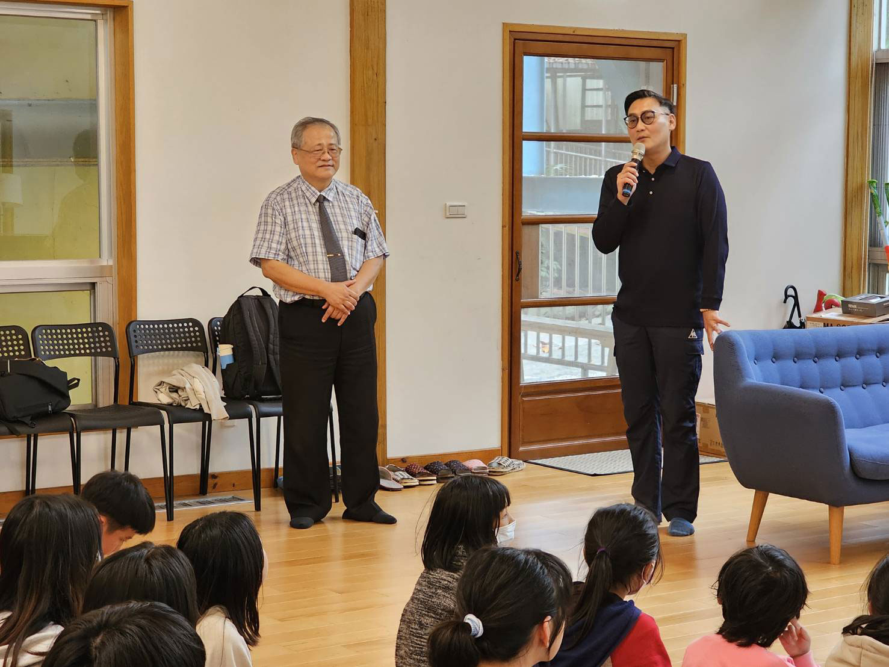

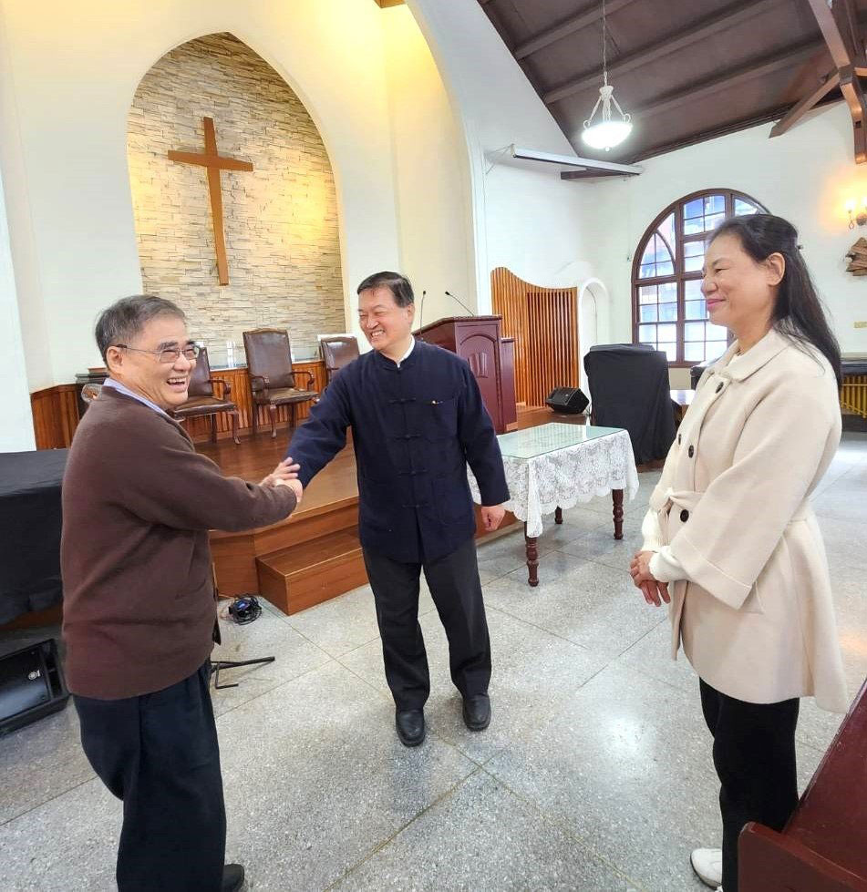

## 活動報導-仲春丁祭

### 孔奉祀官在二○二四年春季 率宗親於臺北孔廟舉行家祭暨新春團拜與成人禮

至聖孔子基金會、執事者

禮生佾生訓練，音樂儀程學習

經典法義靈魂，不妨時代進步

注入新血傳統，莊嚴時代新局

二○二四年（甲辰）三月十日（夏曆二月一日），孔子七十九代嫡長孫、大成至聖先師奉祀官孔垂長率宗親六十餘人，於臺北市孔廟崇聖祠暨大成殿舉行仲春家祭暨新春團拜與成年禮。當日，還在臺北孔廟儀門舉辦了編織創作藝品鑒賞，另在臺北孔廟劇場講座—孔子的生平。

本次活動系由中華大成至聖先師孔子協會、至聖孔子基金會主辦，臺北市孔廟管理委員會指導，中華孔子後裔儒學促進會策劃，社團法人中華孔氏宗親會、中華無盡燈文化學會等協辦。

孔子七十九代嫡長孫、大成至聖先師奉祀官孔垂長率中華孔子後裔儒學促進會暨社團法人中華孔氏宗親會成員六十餘人擇定夏曆二月朔日「春龍節」前夕於臺北市孔廟行家祭儀禮，傳承古法，弘揚聖祖道統。

祭祀儀程指導為臺北市孔廟委員會董金裕教授、黃穗蘋執行祕書、中華無盡燈文化學會教學總監林蔚芳老師，以及資深禮生施銘漳老師、習沛祺老師、陳應義老師等專家學者。

崇聖祠祭奠包含典禮開始、執事者各司其事、陪祭官就位、主祭官就位、迎神、全體行三鞠躬禮、進饌、上香、行三獻禮、恭讀祝文、全體行三鞠躬禮、飲福受胙、撤饌、送神、全體行三鞠躬禮、捧祝帛詣燎所、望燎、復位、撤班、禮成等十二項儀節。本次崇聖祠家祭主祭官、陪祭、禮生、供品均由孔子後裔擔綱，符合家族祭祀精髓。

禮生祭祀職司分別為：

一、通贊            二、主祭官引贊（正引）

三、主祭官引贊（亞引）    四、東序陪祭官引贊

五、西序陪祭官引贊        六、東班神位前

七、西班神位前        八、進饌

九、香案及司帛        十、讀祝生

十一、司繖            十二、司扇

十三、盥洗所            十四、燎所

今年第一次由孔子後裔擔綱大半職司，實屬不易值得嘉許，最特別一提的是：幼童許若彤（九歲）許軒菲（七歲）擔綱盥洗所，為傳統祭祀儀程薪火相傳最佳寫照。

大成殿祭祀包含祭典開始、入班、禮神、敬香、行獻禮、恭讀祝文、明訓、祈願、禮成、團拜、成人禮、合影等十二項儀節。依往例奉祀官孔垂長先率宗親行禮，禮生為中華無盡燈文化學會團隊及臺灣大學中文系學生二十餘人。

禮儀方面配合現今需求略作調整，列隊系以古禮規範中軸為准，奉祀官孔垂長居首位，宗族代表分列兩翼，序班系以輩長為先依序列位，惟考量親情闔家同於列；拜禮儀節則遵孔德成先生所考；禮容為準，是以「再拜稽首」為最慎重之大禮；自《大學》首句作為明訓提示由全體孔子後裔齊誦；孔垂長監禮諸孔子後裔們，「敬」殿於祖先神位前祈願等儀程。

成年禮儀程為：宣行成人禮、儀禮開始、行成人禮、初加禮、再加禮、三加禮、取字、醴冠者、禮謝諸賓、合影。初加禮：家長為學子佩戴祥玉、象徵傳承綿延、生生不息。再加禮：貴賓董金裕教授致贈學子徽章，象徵志堅學固、智慧增長。三加禮：請孔垂長致贈學子印章，象徵服務人群、信實誠正。（注：本次彩色瑪瑙印章，預祝三位學子頭腦聰慧，前程似錦）。

奉祀官孔垂長訓勉金言：感謝所有宗親為家族事務盡心盡力，家族和睦宗族和睦是最基本要件，所謂家和萬事興，家族和睦無論遇到任何艱難均能安然度過並邁向家族盛世。在此向所有家人們拜晚年祝大家龍年吉祥，闔家平安。同時感謝董金裕教授、黃執行秘書穗蘋及臺北孔廟所有老師們指導。再則，無盡燈文化學會唐會長瑜淩、林蔚芳老師及所有的工作同仁及台大中文系同學們對宗親仲春家祭這項活動不遺餘力的支持與協助，甚是感激！今年儀程稍微改變，我們宗族家人參與環節變多了，若沒大家鼎力相助勢必無法順利圓滿完成今天祭祀儀程，再次感謝，最後祝福所有人，新年快樂，平安順利。

甲辰年台灣孔子後裔仲春丁祭心得     游捷茹

第一次參與孔子後裔仲春丁祭的儀式，也是第一次擔任禮生。這次分配到的是盥洗所、宗親引贊與家長引贊的職務。

起初因為對於執事內容陌生，心情既忐忑又期待，在多位經驗豐富的老師帶領下，逐步認識儀程，執事的功能、模樣漸漸印入大腦。

禮，過去在身體的感受時常是緊張的、生硬的、距離的、不能有表情的、不輕易開口說話的，這次的祭儀中，建立了一次「禮的平衡呈現」的經驗。

儀典中的氛圍既莊重又親和；也在禮生工作中，擷取到光譜二端的感受，一是有意識地對步伐、儀表、流程感到嚴謹而戒慎，一是引導宗親、家長學子時，隨著不同情境(如祭拜的嚴肅、成年禮的慶賀）感受也跟著改變，在變動之中彷彿親身體會：禮也可以是溫度的、活潑的、親切的、貼近人性的。

謝謝擔任禮生的經驗，有機會建立「禮的豐富面向」資料庫。初帶著好奇報名，後驚喜體會到禮的多面性，一方面與這學期的學習有所呼應，一方面激發更多學禮的好樂。

甲辰年台灣孔子後裔仲春丁祭心得     吳家淇

首先非常開心有機會能擔任孔氏宗親祭祖的祭祀人員，加上之前漢服活動也有過祭祀的經驗，所以這次擔任西側禮生並沒有讓我太慌張，而且在排練的過程中，我一直在關注這次的祭祀典禮與我以前漢服活動的祭祀流程有什麼不一樣，這次祭祀帶給我不一樣的感受，以往我於漢服活動都是擔任其他位置的執事，這次的西側禮生相當於我之前祭祀活動的左右執事，是祭祀中比較多走動的位置，我之前在漢服活動一直希望有機會能擔任左右執事，結果這次孔廟祭祀就剛好站一樣的位置，所以心裡很開心。

彩排時原本都在練習走位，但當鐘鼓聲一響起時，就從心底感受到整個現場都很莊嚴的感覺，每次的鐘聲跟鼓聲也都彷彿敲在我的心上，一聲一聲地貫通我的感官。

當天因為時間比較趕，正式典禮前並沒有機會彩排，而祭祀中也沒有人做錯動作，我覺得大家都很棒，站在原位等待時，我心裡一直在想之前老師上課說「積善之家必有餘慶」，孔家子弟們都是因為孔子的善業而延續千年的家族興旺，一想到我就覺得真的很佩服，也對現在社會不太重視儒學感到可惜，我回想國高中時國文課教的論語，老師教得滿無聊也沒有跟生活結合，自然而然學生也覺得學習論語沒用，一直到我來學會聽到老師講論語，才發現原來蘊含這麼多對人生很有幫助的道理。

祭祀的後面結合了孔家的成人禮，這個成人禮有別於我們漢服活動的成人禮，三加的內容不一樣，我在端物品時有一次走錯位置，好險現場有人指引，趕緊走到對的位置，每次看到成人禮或婚禮心裡都很感慨，又有人要邁入人生下一個階段，時間過得好快，希望我能好好把握每一天，做我想做的事，也希望我之後還能有機會參與更多的中華文化活動，希望我能繼續在這條路上開心過每一天，也感謝所有的老師、學長們，感謝給我這個機會參與這次的祭祀，希望下次還有機會再次參加。

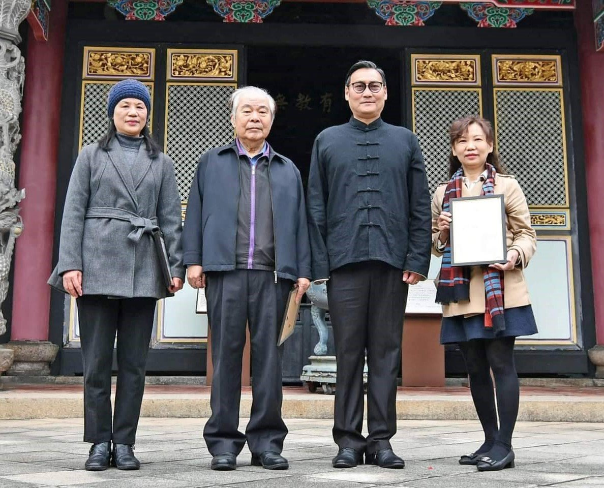

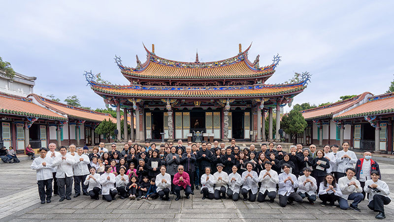

## 活動報導-韓國文化之旅

### 韓國成均館及儒學重鎮安東市 —文化交流之旅

淨本

道之不行海外留

機遇難得重新學

參加成均祭孔禮

海外遺蹟文化寶

身在台灣的你，對於韓國有什麼樣的印象？是閃亮亮的女團表演？還是最近新聞報導的醫生罷工？或者是美美的韓版時裝？如果沒有走進韓國，又不是深入研究韓國文化的人，可能難以思考出媒體呈現範圍以外的韓國印象。

孔子說：「入其國，其教可知也。」走入這個國度，見到這個地方的人，可以知道他們所受的教化是什麼。學會在今年三月期間，組團走訪了一趟韓國，我們學習了武佾舞，拜訪了韓國儒學文化的重要機構—成均館，也走進了儒學思想重鎮—安東市。我們看見了當地人民的禮教，以及一般光觀客不會去拜訪的韓國景點，也看到了儒家文化對當地的影響。

本次旅程，我們以武佾舞的學習作為開始。在儒學文化所影響的國度裡，多會舉辦祭祀孔子的釋奠典禮，最隆重的釋奠典禮，除了祭品的呈供，還包含了詩詞的唱誦、音樂的演奏以及舞蹈的展現。祭孔大典上所呈現的舞蹈，是行列整齊的佾舞。各地釋奠典禮所跳的佾舞屬於文舞，佾生手持翟籥而舞；至於手持干戚的武舞，則已經非常少見。韓國是目前僅存，對於武佾舞能長年不斷地表演，而又有深入研究的國家。想要了解儒家文化的內涵以及實踐，韓國武佾舞應該也是不可或缺的一個部份。

這次前往韓國學習武佾的團隊，除了學會之外，還有至聖孔子基金會、山東濟寧學院的老師們，以及臺灣大學中文系黃教授。教導大家武佾的老師，是成均館的林鶴璇教授，林教授學習舞蹈六十年，研究佾舞二十五年，並著有多本關於佾舞的研究書籍，是一位對佾舞非常專精的學者。協助林教授教導我們的佾舞團師資，也都是具有博士資格，能文能「舞」的菁英。

武佾雖是手執「干戚」（也就是盾牌與板斧），展現出威武的姿態，但其實代表的是一種自我防衛，而不是侵略他人。上轉、下轉、外轉、內轉，四個方向各有八種動作，一共三十二勢，與台北孔廟一個獻禮當中，文佾舞所跳的姿勢數目相同。也因此在第三天學成驗收時，我們能夠搭配台北孔廟釋奠典禮所演奏的寧和之曲來跳舞，舞步與音樂產生很美好的結合。三天的時間要將東西兩班三十二勢完整學習，其實並不容易，好在有團體的共勉，以及課後精進不懈怠的練習，最終還是完成了這一次的任務。期待這套傳承自古老中國的武佾精神，能夠繼續傳承與弘揚。

三月十四日適逢成均館的釋奠典禮，學會一行也因此特別前往觀禮。可惜的是今年成均館大成殿進行維修，典禮中取消了舞及樂的演出，無法看到最完整的內涵，但也是感受到了孔子在當地所受到的尊崇。典禮結束後，學會創辦人唐瑜凌老師、教學總監林蔚芳老師等與此次其他各單位代表們，一同拜會了成均館崔鍾秀館長，對於今後的合作交流，進行了友好的商談。與會者還包含了至聖孔子基金會陳勝利執行長、張京京副主任、臺灣大學黃啟書教授、濟寧音樂學院齊江院長、成均館對外協力室長房東蓮、韓國孔子研究院院長李毓源，以及成均館林泰勝教授、林鶴璇教授。

一行人結束了首爾的武佾學習及成均館交流，接著前往韓國儒學的重鎮安東市。安東市是韓國慶尚北道的首府，人口約為十七萬人，雖不是像首爾那樣的大城市，但被譽為「朝鮮半島儒家思想的搖籃」。之所有這樣的稱號，是因為當地孕育了一位韓國家喻戶曉的儒學思想家—李退溪。韓國一千元鈔票上的人物就是李退溪先生，他一生所弘揚的是宋明理學，因此有朝鮮的朱子之稱，對韓國儒學思想影響深遠。李退溪先生的十六代宗孫李根必先生，於今年三月七日去世，享高壽九十三歲，李根必先生秉持人本價值的退溪精神，一生致力於儒學推廣。此行我們與李根必先生的長子李致億教授，於陶山書院會面，李教授溫文儒雅、學養豐富，我們洽談了今年七月國際青年儒學體驗活動的合作事宜，有了高度的共識。

陶山書院是李退溪先生晚年退休後教授生徒的重要場所，書院規模並不特別弘大，但地靈人傑、倚山臨湖、景緻優美。在書院的入口，豎立著孔子第七十七代嫡長孫孔德成先生所題「鄒魯之鄉」石碑，在上公心中此地堪比孔子的故鄉，可見當時文風之盛、人才之興，或如《論語》中孔子所說：「魯無君子者，斯焉取斯。」

陶山書院已被列為聯合國世界文化遺產，安東市本地還有多處這樣的文化寶地，比如河回村、屏山書院等，也是我們此行所走訪的地方。「文武之道，未墜於地，在人。」期盼此行豐富的收穫，回台後能繼續豐富我們的儒學發展，並期盼今年七月在韓國的國際青年儒學體驗活動能圓滿成功，帶給世界各國傑出的青年朋友們，深刻美好的儒學價值。

心得迴響

韓國文化之旅心得        李鈴芬

這次到韓國學武舞，一則以喜，一則以憂，喜的是能學到失傳的武舞，憂的是在短短的三天，是否有能耐全部學會，還好有惟元老師跟文輝老師同行，讓我的心能夠踏實下來。

我們上課的地點是在林鶴璇教授的舞蹈教室，林教授是位卓越的舞蹈家，是成均館大學的顧問，對佾舞有很深入的研究。第一堂課林教授介紹武舞的舞具，左手拿盾跟右手拿斧，盾代表防禦，斧代表攻擊，動作有八種。接下來由林教授的高徒兩位助教來示範動作，教我們盾是推出去，斧是往外橫砍，動作是由北轉西往南再轉東，三百六十度再回到原來的位置。

武舞也是分東西兩邊，先學西再學東各有三十二式，這次的學習採密集式的，每天下午連續上課四個小時，不知是否因為自己年紀大，記憶力不好，真的有點搞不清楚方向，老是轉錯，助教看到之後很有耐心教我怎麼轉，其實晚上我們回飯店，都會四人一起練習。

最後一天考核前，我們先練習一小時，之後穿戴正式的帽子、服裝，還有靴子，在教室地下室小型的表演廳分成東、西兩邊來驗收，林教授對我們的學習表示滿意，但是跟助教比起來，自己程度實在差太多了，需要好好練習一番。

目前成均館的大成殿在修館，春祭移到丕闡堂舉行，雖有舉行祭祀卻沒有樂生、佾生的表演，甚感可惜。

接下來跟隨唐老師、林老師到各處鄉校去參訪，發現韓國人對儒家文化的重視，鄉校都設有大成殿，供奉孔子以及聖賢學者，每年舉行春、秋兩祭，來祭祀孔子，對於古蹟建築物也都保護得很好，會在柱子寫上經文，終於了解為何韓國人會說孔子是他們祖先了。

到安東的鄉校，他們很熱心地幫唐老師穿衣戴帽穿鞋祭拜孔子，讓我們體會古代席地而坐，喝茶、吃點心的感覺。到了屏山書院、陶山書院，感受到他們古代讀書人是很有智慧的，對於修學的環境，選擇人煙稀少、山明水秀幽靜的地方來學習，古代的建築物都是步步高升，愈往裡面愈高，不知道這有什麼涵意。這次韓國文化之旅收獲頗多，讓我體會到儒家文化的尊貴，身為炎黃子孫怎麼可以不好好學習，並且將它傳承下去，很感恩唐老師、林老師給學生這次學習的機會，另外謝謝惟元老師、文輝老師、婉玲學長此行對末學種種的照顧跟幫助。

韓國武佾舞學習心得        林婉玲

首先由衷的感謝唐老師給末學這個機會與蕭老師、白老師、鈴芬學長一同前往韓國學習武佾舞，三位學長在學會是佾舞的指導老師，末學深知自己是後輩，也格外珍惜此次的學習機會。再者，這次也承蒙孔奉祀官的引薦讓學會和大陸至聖孔子基金會的成員一同前往韓國學習武佾舞，是非常難得的機會，因此，末學抱著必將全力以赴，必定學成武佾舞的決心前行！

在台灣祭孔時我們跳的是「文」佾舞，而「武」佾舞只有在韓國，韓國的武佾舞是源自於宋朝，但原本的文獻已經失傳，現在韓國武佾舞是參考過去的文獻並加以揣摩演譯而來。這次教授武佾舞的老師林鶴璇教授是韓國成均館大學舞蹈系的教授，她學習舞蹈已有六十年，研究佾舞長達二十五年，曾多次到台灣及中國學習文佾舞或做武佾舞的展演，這次由林教授和她的助教們來為我們授課，真是莫大的榮幸！武佾舞從字面上看是個陽剛型的舞蹈，動作上也有和武術相似的動作，但是在韓國卻都是由女性來擔任佾生，這種呈現方式將力量與美感的結合，和台灣和大陸跳文佾舞的佾生不限男生或女生有很大的不同！

此行安排學武佾舞的時間只有二天，每天也只有四個小時，第三天就是成果發表，學習時間真的是非常短，為了避免忘記舞步，我們回到旅館用完晚餐便立刻將今天的舞步複習，即便每天都練習到晚上十一點多，末學也沒感覺到疲累，反而更期待隔天課程的到來。華嚴經淨行品有云：「若飯食時，當願眾生，禪悅為食，法喜充滿」，此次真正領略到此偈頌當中所說的「禪悅為食，法喜充滿」的感覺，也許是因為有此觀想，在第三天穿上正式服裝作成果驗收時，原本還分不清該左轉還是該右轉的舞步，竟然全部都記住了，也順利完成此次武佾舞的學習。

從韓國回來後的隔二天就是週三的論語及佾舞課，此時學起文佾舞，心中更是歡喜，在學習每個文佾舞的動作時，更深刻地感受到祭孔典禮時以佾舞來作為供養的莊嚴與殊勝，可以說是「學佾舞時，當願眾生，文舞武舞，法喜充滿」！現在末學每天都會抽出時間將武佾舞練習一次，將其熟記，希望將來能分享給大家，讓大家都成為文佾舞、武佾舞，文武雙全的傳承者。

韓國文化體驗之旅心得感想    白文輝

過去韓國給人的印象，大多是愛吃泡菜、整型風盛行、乃亞洲四小龍之一、曾因金融風暴瀕臨破產等。在還沒去韓國學習前，雖然也曾接觸過韓國的綜藝節目、韓劇、電影、流行音樂、運動賽事、汽車、手機、食品等，但對韓國其實還是一知半解，並不了解其他的面向。就像生活中有很多事，沒有親身經歷過，就無法深刻體會，或許有時候可以大略想像情況會是什麼樣子，但跟實際狀況仍可能存在極大落差，所以凡事不能太早下定論。而此行前往韓國有兩大任務，一是學習武佾，再者，則是為七月底舉辦的國際青年文化體驗活動事先踩點，以利之後的行程規劃。因此，正好可以趁這個機會從文化的角度加以認識韓國。

到了韓國後，實際感受到韓國傳統文化深受中華文化影響這件事情是千真萬確，例如，在高麗時代，為了培養國家人才，於西元九九二年建立最高教育機關國子監，後來改組為成均館。隨著高麗王朝被朝鮮王朝取代，定都漢陽（現在的首爾），朝鮮太宗將新成均館建立於都內，也就是現今的首爾成均館大學。成均館文廟大成殿中供奉著孔子等聖賢的牌位，時至今日，成均館及韓國兩百三十多所鄉校（高麗與朝鮮時代供奉聖賢之牌位，並具有教授儒學，培養當地人才的作用）每年春秋兩季都會同時舉行釋奠大祭，而且設置社會教育館，向社會大眾教授有關論語、大學、中庸、孟子、易經、書法、國畫等課程。

其次，高麗光宗創建科舉，成宗則成立國子監，是奠定儒學的關鍵人物。在王朝末期，當時儒學領袖安珦是第一個將朱子學思想引進高麗的人，後來的朝鮮李氏王朝則將儒學奉為國教，十六世紀出現李滉和李珥等大儒發揚朱子學說，被視為集儒學之大成者，將朝鮮的儒學蓬勃發展，李滉甚至有韓國朱子之稱。儒學滲透於至人們的日常生活，影響人生觀、幸福觀等層面，韓國古裝劇等韓流文化席捲東亞，如大長今、醫道、商道等，劇中便充滿儒家的道德觀念，深受觀眾喜愛。

再者，西元一四四六年，朝鮮王朝的世宗大王為提高平民的文化普及率，發明一套拼音文字的書寫系統，即現在的韓文，但在二十世紀初期以前，漢字一直是朝鮮的官方文字，迄今仍在許多地方可以看到漢字的影子。另外，釋奠大典的佾舞始源於古代的中國，於高麗睿宗傳入韓國（西元一一一六年），由成均館繼承其傳統至今。而佾舞原本包括文舞與武舞兩種舞蹈，但在中國宋代以後，武舞即被取消，但韓國卻仍持續研究傳承到現在，導致我們必須前往韓國才學得到武舞。

透過這次深度旅遊和學習令人大開眼界，儒學居然可以在韓國被保留這麼長久且完整，可見中華文化的力量有極大的魅力。從另一方面來看，也非常佩服韓國極其用心在保護、維持及發展文化和觀光產業。為了踩點，我們遊覽了諸多景點，比如明洞、南大門、仁寺洞、廣藏市場、奉恩寺、昌德宮及秘苑、南山谷韓屋村、成均館、曹溪寺、青瓦台、景福宮、北村韓屋村、陽川鄉校、水原鄉校、河回村、屏山書院、月映橋、安東鄉校、韓國國學振興院、儒教文化博物館和陶山書院，有著深刻的體會。

上述景點其中有好些地方被列入世界遺產名錄或是當地的有形文化遺產，由此可見韓國對它們的重視程度，對其設計規劃、宣傳推廣不遺餘力。這些遺產是大自然或人類文明的精華，具有傑出的普世價值，值得大眾去理解和保存。因此，每年能夠吸引成千上萬人去觀光旅遊，一方面可以行銷韓國，對外輸出文化，打造國際形象，另一方面還能創造可觀的經濟價值，近悅遠來，十分的有遠見。

看看韓國，想想台灣，我們其實更具有深厚的中華文化底蘊，同時還有不少專家學者和有心人不斷努力的在自我充實和默默耕耘，想要將有形和無形的優良文化傳承發揚下去。如果我們可以充分的發揮既有的優勢，團結對外，不要因為某些意識形態自廢武功，打壓和刪除中華文化，相信我們也能夠創造出殊勝的多贏局面，讓文化再次發光發亮，讓世界看見台灣。最後，特別感謝兩位老師提供這次難得的機會，學生才得以學習到珍貴的武佾和親身體驗到韓國的文化遺產，期望自己能將所學好好的傳承下去。
