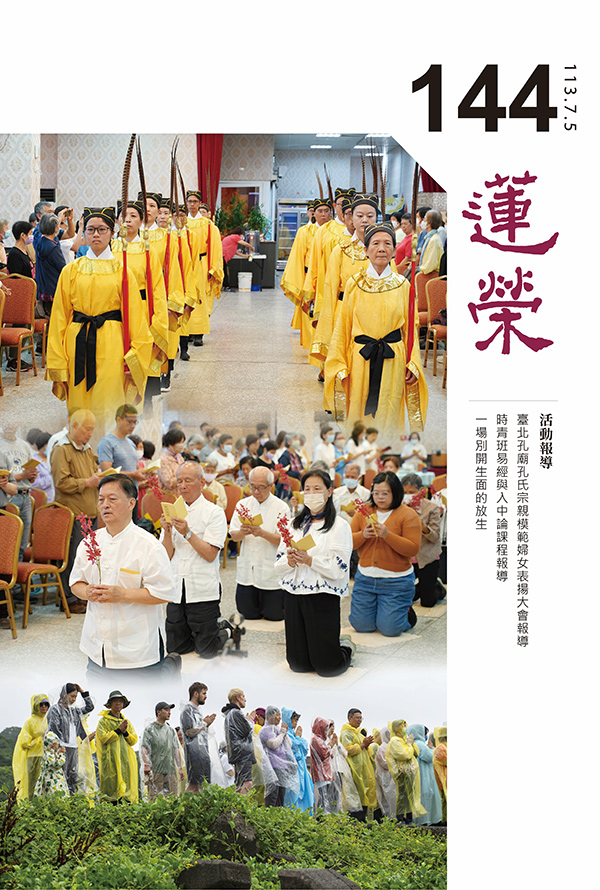
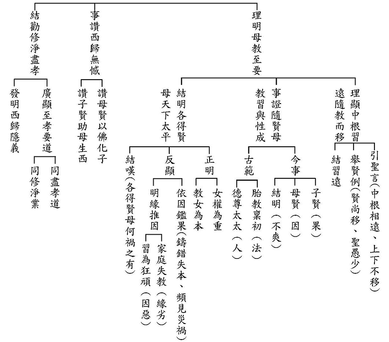
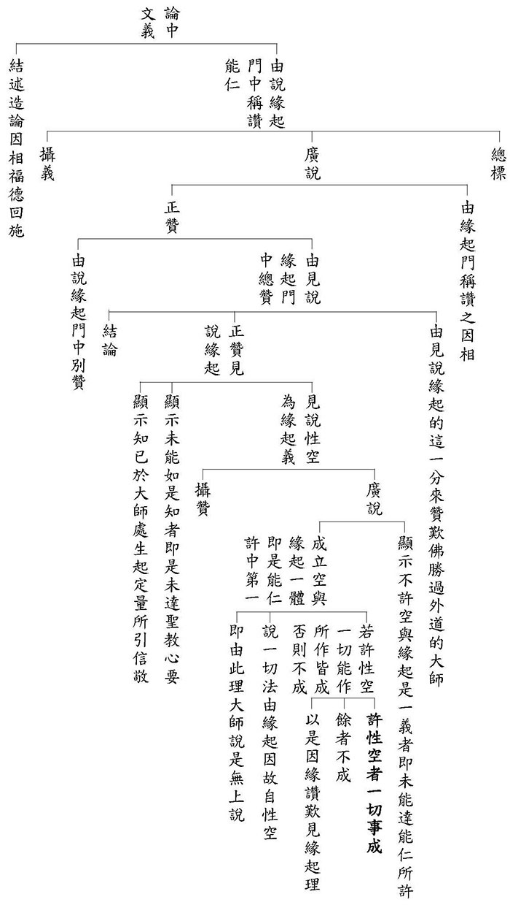
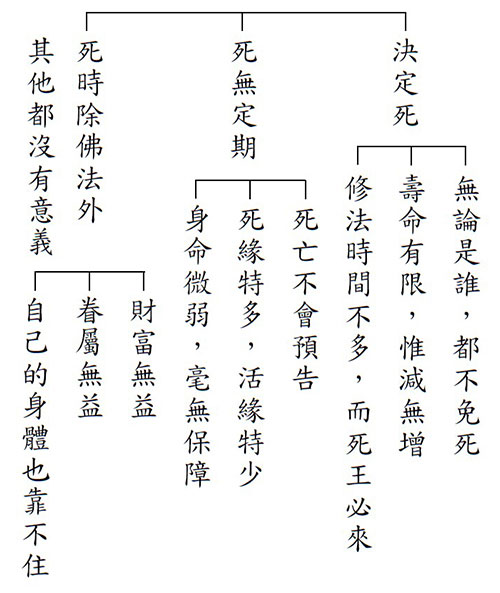
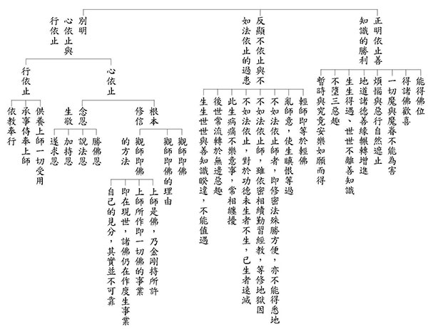
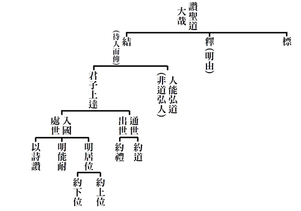
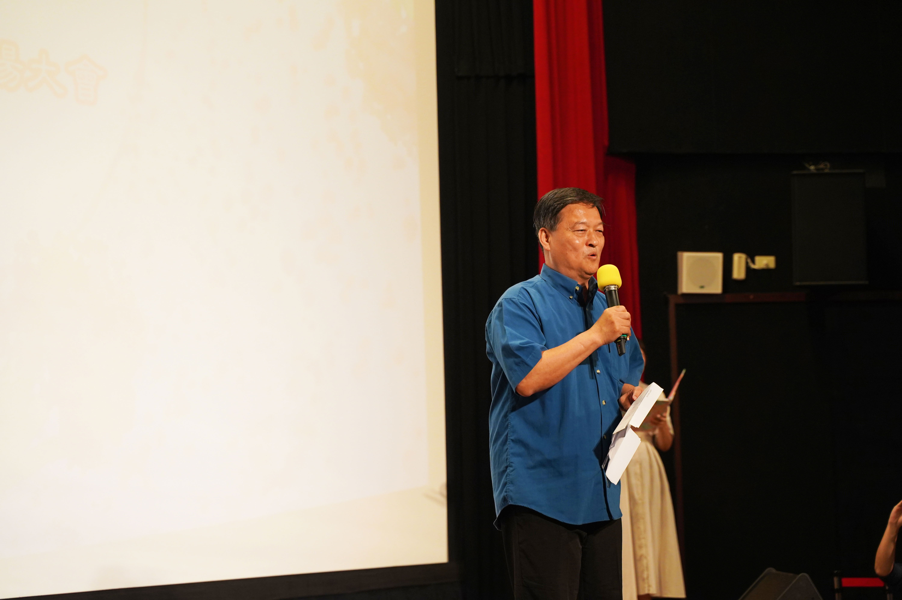
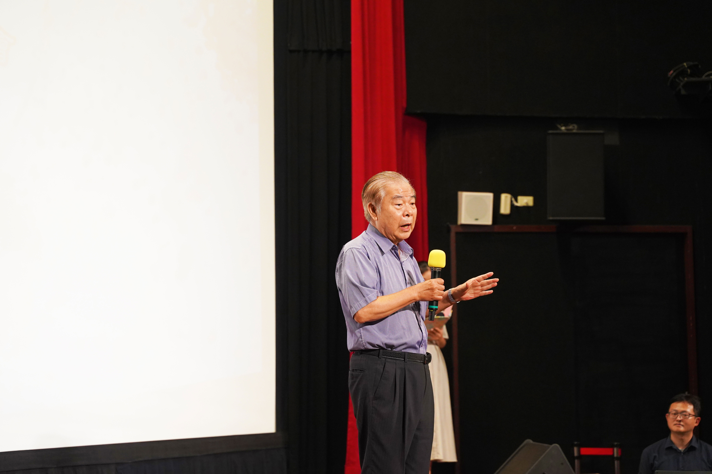
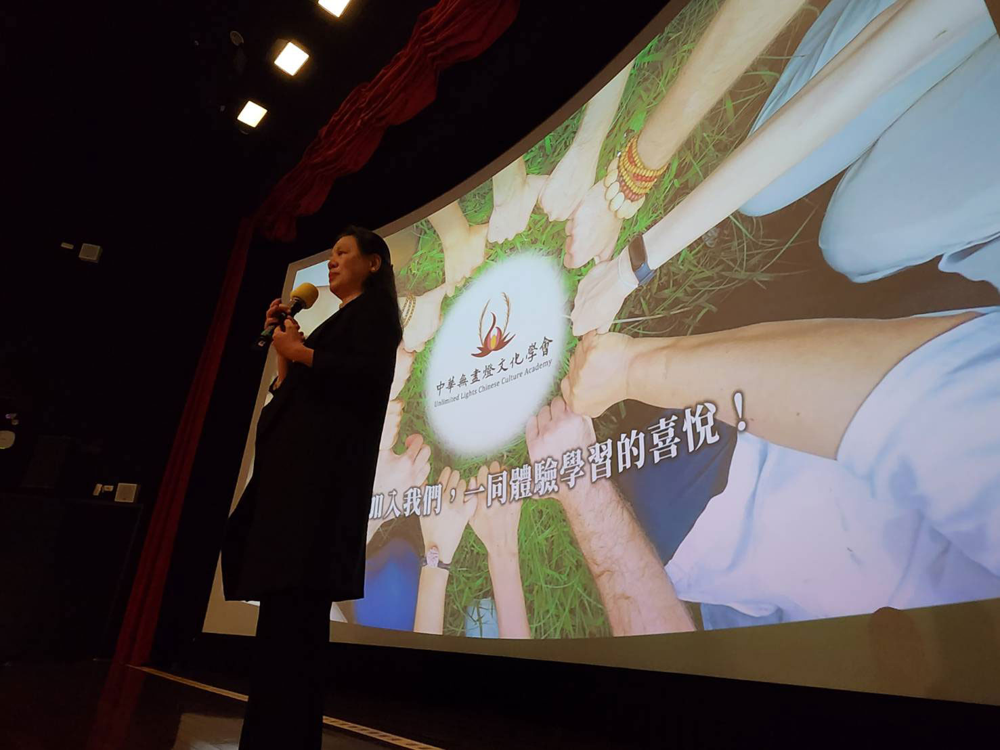

# 第144期

## 社論

### 略從佛法角度看人工智慧現今的發展

本刊

略談從佛法角度看人工智慧現今的發展

大數據的分析演算

高效率的工作成果

廣面相的開發認知

深層次的思維運用

二十一世紀還沒過滿四分之一，「生成式人工智慧」便以驚人的姿態橫空出世，其在識別、教學、對話、整合、提議、彙整、翻譯、創作、修辭等方面的能力，早已超越人類助理。「通用人工智慧」（Artificial general intelligence，AGI）的發展更是日新月異，預計在不久的將來，「通用人工智慧」將達到甚至超越歷史上所有傑出人類的智能水平。屆時，世界將因人工智慧的飛速發展而產生翻天覆地的變化，人類社會的各個層面都將受到深遠的影響。

從佛法的角度，我們可以從幾個層面來理解人工智慧的發展及其對人類社會的影響：

一、從緣起來看：

佛法認為世間萬物皆由因緣和合而生，人工智慧正是因緣條件組合下的產物；它是科學技術進步、社會需求提升，以及無數工程師、科學家共同努力的結果。從這個角度看，人工智慧的出現並非偶然，而是歷史發展的必然。

二、從無常變化來看：

佛法強調世間萬物皆處於不斷變化之中，沒有什麼是恆常不變的。人類生活模式也是如此，從工業革命至今，蒸汽機、紡織機、發電機、電腦、手機、互聯網、基因工程等科技的陸續問世，不斷推動著人類文明的躍進。人工智慧的發展也將為人類社會帶來新的變革，我們應以開放的心態迎接這種變化。

三、從般若中觀來看：

佛法認為一切事物皆無自性，其存在依賴於觀待的關係。人工智慧亦然，它本身並無所謂的「智慧」，其「智慧」的體現，取決於人類如何加工、應用。因此，我們應當深入思考如何正確引導和運用人工智慧，使其真正造福人類社會。

四、從心物關係來看：

佛法認為「一切唯心造」，心是認知的主體，而人工智慧作為一種工具，可以拓展人類的認知能力，但不能取代人類的主體地位。我們應保持對人工智慧的清醒認識，避免過度依賴，喪失獨立思考和判斷的能力。

人工智慧對人們的修行也會有一定的幫助，如：

一、生理方面：佛法認為身心相互影響，人工智慧可以結合腦機接口、基因工程等技術，拓展人類感官、四肢的極限，改善人類的生理狀況，甚至幫助人類克服先天缺陷。

*二、智識方面：人工智慧能輔助人類整理思緒、釐清想法、對比整合資訊，從而提升人類的智力水平。*

三、倫理道德：佛法強調慈悲，重視修學解脫的知見，這樣的原則可以為人工智慧的研發和應用提供重要的倫理指導，確保人工智慧的發展符合人類現世的健康福祉，以及朝向解脫道的希求。

此外，人工智慧也能應用於佛學領域，為佛法的傳播和弘揚提供新的途徑，如：

* 分析佛經名相、提取關鍵概念，幫助人們更好地理解佛法。

* 開發佛學聊天機器人，與人進行佛法問答、辯經，促進人們對佛法的深入學習。

* 運用ＶＲ技術，創造沉浸式佛淨土體驗，讓更多人感受佛法的莊嚴與殊勝。

* 結合測量儀器、腦機接口，提供個性化禪修建議，幫助人們更好地進行禪修。

然而，我們也要清醒地認識到，人工智慧並不能取代人類在修行道路上的努力。人工智慧可以提供信息、分析數據，但無法替代人類的內心體驗、情感交流和智慧抉擇。在修行之路上，我們仍需依靠自身的努力和善知識的指導，才能最終達到解脫的彼岸。

總之，人工智慧的發展對人類社會具有深遠的影響，我們應以開放的心態迎接這一新的時代。同時，我們也應保持清醒的頭腦，以佛法的智慧來引導人工智慧的發展，使其真正造福人類，促進世界的和諧與進步。

## 佛學覽幽

### 菩薩清淨的行持—華嚴經淨行品（五十九）

*戒慧講述、編輯部整理*

對境美食與粗食

修學行相可比擬

悲心柔軟與絕貪

世俗道用真善巧

丙二、指事顯因答其徵因

丁一、總徵

丁二、別顯

戊七、到城乞食時願（二十二願）

己四、得食正食：柔軟食、粗澀食

前言

淨行品是很好的教材，文字優美，義理解讀可淺可深，當時智首菩薩請教文殊菩薩，如何得到佛的智慧，以及佛殊勝的功德形象，文殊菩薩就告訴智首菩薩要善用其心，方法是在一切時、一切處，都不離開願力，以願力來攝持日用平常的造作，但是這個願力還得要有空性智慧的攝持；有願力的攝持，使日常的造作，體性轉為大乘，有空性的智慧攝持，使體性轉為無漏，所有日用平常的行持都成為清淨。目前進度是在到城乞食時願中的得食正食，乞食分為得與不得，得當中，有美食、不美食，有柔軟食、粗澀食。

己四、得食正食：柔軟食

經文：

得柔軟食，當願眾生，大悲所熏，心意柔軟。

行乞的比丘，如果在乞食時能夠得到柔軟的食物，就能發起一個心願，希望一切眾生能被大悲所熏習，使心意柔軟。會性法師說，柔軟食不一定是所謂的美食，而是就著食物的柔軟相來說，比如麻糬、豆腐之類，吃到柔軟的食物，想到大悲心是最柔軟的，由大悲心來熏習我們的心田，使心意能夠柔軟。

願所依，依靠在菩薩，依靠在柔軟食，因為願不能自己生、不能獨立生，要依靠菩薩才能生，依靠得柔軟食的這件事情才能生，就以一百一十八條的願來說。當願眾生，能願的是菩薩，所願的是眾生。

四種觀修，第一是應該發起隨喜的心，眾生如果能夠得到大悲所熏，心意柔軟該有多好。第二是發願，我願眾生被大悲所熏，心意柔軟。第三是承擔，我能使眾生被大悲所熏，心意柔軟。第四是乞求三寶加被，使我有能力讓眾生被大悲所熏，心意柔軟。

這四面向的修學對我們很有幫助，如果按照隨喜來講，眾生現在是大悲所熏，心意柔軟的時候，我非常高興，我高興到比我賺千萬、億萬還要高興，一般不會生起這樣的覺受，要看一個人修行有沒有成，是看他心境很微妙的變化。願力是指眾生本來沒有大悲所熏，心意柔軟，我願幫助他生起。第三個是透過我的教化、努力，能令眾生生起大悲所熏，心意柔軟。第四個要懇請三寶加被，我能讓有情大悲所熏，心意柔軟。有上述這種心量、作為，就是一種修行。

眾生的心本來是剛強難化的，現在要讓眾生很剛強的心柔軟，要靠大悲心的熏習，讓他本來很剛強的心變得柔軟，就像我們拜佛，燒香熏一熏，懂局的就知道我們去過佛寺，或去過佛堂，或是到歌舞場中，回去的時候有煙味、有酒味，一聞就知道。於苦有情生起慈悲，本來剛強的心意，就轉為柔軟。

大悲所熏，第一是要多學習大悲心的教法，多串習大悲心的修學法，使自己生起大悲心，第二是外相上要跟有大悲心的善知識在一起，叫做「里仁為美，擇不處仁，焉得知」，如果修學大悲，卻住在剛強士夫所居之地，每天被熱惱所熏，豈能稱為智者？

大悲心跟柔軟有什麼關聯？大悲心是想要讓眾生離苦得樂，不棄捨任何一個眾生所發之心，想要讓眾生離苦得樂，這要把眾生看成自己唯一愛子的形象，而且此愛子是非常聽話、孝順、知心的那種可愛面相，只要想到我那唯一的愛子，內心就充滿歡喜，不但是下班後很歡喜看到他，手機打開封面也是他。再者，可愛的面相中，鈍根的修學法是說，從無始劫來觀修，眾生對我都有恩德，都曾做過我至少一世的母親。利根的修學法是說，不管眾生用什麼角度、形象出生，都是幫助我修學菩薩道，他以順境的方式幫助我，讓我有修行的順緣，以逆境的方式幫助我堅固願力，助我修學忍辱，助我發憤圖強，所以不論他是以順的方式來幫助我，還是以逆的方式來幫助我，我成佛的福、慧，沒有一分不是來自於有情眾生，生起這樣的觀念後，眾生只要有一點點痛苦，我都受不了，而他的快樂，我永遠嫌太少，就像唯一的愛子。愛子有一點點痛苦時，父母比他更痛苦，他生病的時候，父母甚至想要把他的病拿來自己受，至於快樂，則希望給他愈多愈好，他快樂時你比他更快樂，他考第一名的時候，你笑得比他更開心，所以將眾生生起可愛的面相時，隨喜也能生，願力也會生，為了要幫助他得到快樂，充實自己的能力也會轉強。大悲心都是為了眾生，不是為了自己，這時心意就柔軟了，沒有大悲心，不會有耐心；沒有大悲心，不會了解眾生；沒有大悲心，不會跟眾生結到善緣；沒有大悲心，不會充實自己的能力；沒有大悲心，不會隨喜；沒有大悲心，不會使自己增上；沒有大悲心，一切善法都不能生；沒有大悲心，心意也不能柔軟。

可見大悲所熏，心意柔軟，是非常重要的修學法。有了大悲心，得到佛菩薩的歡心，跟佛菩薩相應的力量轉強，且得到三寶殊勝的加被，因為佛最在意的就是眾生，而你也最在意眾生，兩者竟然有相同的心意，是知音，當然容易得到佛力加被。大悲心生了以後，才容易伴隨眾生成長，如果大悲心不生，伴隨眾生成長的心是生不出來的。當眾生生起可愛面相時，他的需求你一看就懂。我們看不懂別人的需求，沒有辦事的能力，常常帶給他人種種不便，就是因為公心沒有生的緣故，當公心生出，把團體、善友看成可愛的面相後，什麼事情都會了，就像當孩子顯現為唯一的愛子時，愛子遇到病苦、困難，做父母的會激發潛能，原本不會的瞬間都會了，伴隨孩子成長，經過種種考驗，灌注全部的心血，這當中沒有脾氣，此父母真是大悲所熏，心意柔軟，抓住這個面相，修行方法就在這裡。

又大悲所熏，心意柔軟，跟得柔軟食有什麼關係？此文句上下是連貫的，當我吃到豆腐、麻糬等柔軟食時，我當願眾生被大悲心的善知識熏習以後，心意就像豆腐、麻糬般柔軟，不會跟人硬碰硬，不會像石頭一樣剛強難化。就像生牛皮要經過種種製程，才能成為柔軟的熟牛皮，要彎則彎、要方則方、要圓則圓，大悲心的修學者，想要去利益有情、利益團體的時候，任何角色他都願意扮演，只要角色對眾生有利，他就扮演，沒有預設立場，就像父母為了幫助孩子成長，只要對子女有利，什麼都願意做，當他的老師，當他的朋友，甚至當他的奴才，這就是大悲心。唯有大悲心才有辦法把自己打磨成這樣，沒有大悲心辦不到，就像麻糬、豆腐，在嘴巴裡面，不會抵抗你的牙齒，所以說仁者無敵，仁者沒有敵手。

己四、得食正食：粗澀食

經文：

得麤澀食，當願眾生，心無染著，絕世貪愛。

得到粗糙食物時，發起的願望是希望眾生，對世間的染著、執著都沒有了，對於世間的貪愛心也斷絕了。

現代人對於食物，不見得要吃得精緻，有些人不吃白米，喜歡吃糙米，因對身體比較好，而此處所謂的麤澀食，指的是比較粗糙的食物，吃起來令人不舒服、不喜歡、不好吃，引申為對世間一切不好的東西，不要去貪愛，能夠斷絕這些貪愛。凡夫有貪愛就會戀戀不捨，認為這個世界很美好，不想離開，可是這辦不到，貪愛心就是眾生輪迴的原因，所以用麤澀食來表現世間不可愛的面相。

麤，可以解釋成「飯疏食飲水」，麤食，可以說像是苦瓜、金瓜，澀，指口感不好，例如沒有調味，或是質料很差，或是很爛的魚頭，味同嚼蠟，吃起來澀澀的，吃不下去。吃不下去跟心無染著，絕世貪愛的關係是什麼？貪愛一定是對著所樂境，吞樂境的時候，要像麤澀食一樣，吃不下去，可是一般不會有這種覺受，一般錢是賺愈多愈好，生活的享受愈高檔愈好，反而修行時覺得澀澀的，吃不下去。我們要觀察生活安樂的背後，過患一堆，例如錢賺得多，會讓人衍生一大堆煩惱，生活充滿不安，世間的榮華富貴、盛況，就像麤澀食一樣，吃不下去，這世間人很難理解，修行人會贊同。

比丘得到麤澀食，對世間的榮華富貴，要像吃麤澀食一樣，不會產生貪愛，就算肚子餓，吃麤澀食還是會覺得不舒服，以前有一部黃梅調，陳世美反奸，秦香蓮他們家鄉因為鬧飢荒，所以餓到要吃樹根，秦香蓮煮了樹根給兒子吃，他兒子就算餓到極處，還是吃不下，對於世間的榮華富貴就要像吃樹根一樣，吃不下去。當願眾生對世間的貪愛，要像吃麤澀食一樣，絕掉貪愛，就算再好吃，都知道後面帶來的過患是令人難以想像的。

老子的《道德經》說：「五色令人目盲，五音令人耳聾，五味令人口爽，馳騁畋獵令人心發狂」，五花八門的色彩，使人眼花繚亂，眼睛失去抉擇的能力；嘈雜的音調，靡靡之音，使人聽覺失靈；豐盛的山珍海味，使人舌不知味，吃不出菜根香；縱情狩獵，使人心情放蕩發狂；就像唐玄宗打馬球打得很盡興，打完喝酒回宮，舒服暢快，從此不理朝政，詩云：「閶闔千門萬戶開，三郎沉醉打球回」，三郎指唐玄宗，可見是春秋筆，狂歡後，無人敢上奏勸諫，後面就爆發安史之亂。如果觀修之後，知道那是麤澀食，就吃不下去了。（下期待續）

### 大乘百法明門論簡說(五十)-拾柒、心不相應行法（八）

*戒慧講述、淨本整理*

各種定異明因果

五果體相各有因

入世出世得安樂

正見才是真出路

論文：

第四、心不相應行法，略有二十四種，一得，二命根，三眾同分，四異生性，五無想定，六滅盡定，七無想報，八名身，九句身，十文身，十一生，十二住，十三老，十四無常，十五流轉，十六定異，十七相應，十八勢速，十九次第，二十時，二十一方，二十二數，二十三和合性，二十四不和合性。

心不相應行法第十六「

定異

」，定異就是決定不同，善因得樂果，惡因成為苦果，這是決定不同並且沒有雜亂的。

詳細可以分為三種，第一個叫做「

相定異

」，因果的體相決定不同，換句話說，因跟果二者的行相長得絕對不會一樣。比如布施得富貴，布施跟富貴長得不一樣，布施是給出去，富貴是獲得。所以我們今天在因地的許多造作，都很難想像未來果報會長成什麼樣。比如前世做善業今世成為人，造善時怎麼會知道這樣可以成為人？成為什麼樣的人？這些千差萬別的果報實在是難以想像。但為什麼佛可以說得清楚？因為佛通達關聯性，有什麼善業，未來才有什麼果報，這種關聯佛最清楚。

因果的關聯第一個就福田來說，比如行善救助的對象，是救市井小民或者是救了國王一命，獲得的回報會是天差地別。第二個就存心來論，善心有大有小，果報也會差別到難以想像，這是世間人不會知道的，《了凡四訓》中貧女入寺布施而後富貴的故事，就是在存心上論差別。第三個在做法上說，做法很細膩很講究，對比做法很粗糙的人，他們的結果會不一樣到難以想像。又比如行善是團隊一起做，或者只是個人去做，結果也會不一樣到難以想像。第四個在究竟上說，就是說有沒有把事情做得徹底。一件善行是半途而廢或者是堅持到底，結果會是全部沒有與全部得到的差別。善業如何與樂果關聯，上面這些因素要去考量；惡業與苦果的關聯亦復如是。所以在因地上通通都不懂得做這些講究，把「不要執著」當成自己隨便的藉口，那是最可惜的事情。

因果的體相既然決定不同，是否因果各自有實有的體相可得？關於這個問題，可以探討因果是一還是異？因果體相不同，那就不會是一，是一的話應該都長得一樣。可是如果因果是異，而且都有自體性，那就成為無關的兩法。所以因果體性空，因滅果才生，因果之間只存在名言假立的關聯性，剩下作用上的關聯性。

第二個是「

因定異

」，是說善惡業因的體性決定不同，觀待業因可以產生快樂的這一分說它是善業因；觀待這個業因會生起痛苦的這一分說它是惡業因，所以善業因跟惡業因的體性決定不同。善業的因它是決定生樂果，惡業的因它是決定生苦果。我們還可以進一步說，業因是以利益他人的那一分說是善業的因，以損惱他人的那一分說是惡業的因，所以善惡業因體性不同。

第三個是「

果定異

」，就是苦樂果報決定不同，果沒有自體性，是就作用安立為苦果跟樂果，苦果會帶來摧殘折磨，樂果會帶來快樂。比如一陣冷氣吹來，感覺得很舒服這是樂果；反之有人一下子感冒流鼻涕、身體不舒服，就安立它為苦果。以上就是因果的觀察，了解這三種定異，才是真正會定義因果。

另外還有五種定異，是關於一期生命現象的觀察。第一個叫做「

流轉還滅定異

」，流轉門跟還滅門決定不同，流轉門是苦因苦果，還滅門是樂因樂果，二門決定不同。以四諦法來說的話，苦諦是苦果，集諦是苦因，苦諦集諦屬於流轉門，因為它會一直相續下去，苦因生起苦果，苦果中又造苦因，所以又生苦果。實體法只有兩個特質，不是一生永生，就是一滅永滅。苦因滅還可生苦果，表示因果並不是實體法，而且苦果出現時，觀待未來生起的苦果，又可以將之定義為苦因，一法上同時安立為因又安立為果，這也表示它沒有自體性。舉例來說，過去生竊盜，所以此生貧窮而且又慣於行竊，如此又造成下一生繼續貧窮。此生的貧窮與行竊，既是過去生竊盜的苦果，也是下一生貧窮的苦因。

不能通達滅道二諦的人，所成立的因果都是苦諦集諦的因果，都是生死輪迴的因果。滅諦和道諦是還滅門，樂因是道諦，樂果是滅諦，修道諦這個因可以得到滅諦這個果。滅諦是苦因苦果的滅，真正的快樂要從苦因的滅開始說，不是在得樂上說。例如我們會覺得坐著比站著快樂，但是坐久了又開始生苦，富貴雖然止息了貧窮的快樂，但是富貴的痛苦也開始生起。所有的樂都會被無常破壞，所以想用找快樂的方式來得樂，永遠無法得到真正的快樂。

佛教除苦的方式跟世間不同，佛以苦因苦果的滅除來得到真樂，所以苦因苦果的滅，安立為法寶，這才是所要皈依的法，就是道諦與滅諦。再進一步來說，能夠把苦因苦果滅除，只有般若，因為苦因就是無明我執，無明我執不除，苦因都在，般若正見才是無明我執的對治。以上叫做流轉還滅定異，流轉門跟還滅門決定不同，流轉門是苦因苦果，還滅門是樂因樂果，樂因樂果既然是苦因苦果的滅，所以決定不同。

第二個叫做「

一切法定異

」。一切法成為所知，心成為能知，六識是能知，六根六塵成為所知。一切法就是包括六根跟六塵，色跟聲決定不同，眼根跟耳根的作用決定不同，這些法類都不相同，叫做一切法定異。

第三個叫做「

領受定異

」，苦樂捨三受，各各決定不同。苦受是帶來身心的痛苦，樂受帶來身心的快樂，捨受帶來身心不苦不樂的感受。如前果定異的說明，樂受是過去善業所結的果，苦受是過去惡業所結的果，捨受則是過去無記業所結的果，果定異在領受當中的呈現，就叫做領受定異。

第四個「

住定異

」跟第五個「

形量定異

」，隨業感的壽命各各不同叫做住定異，隨業感的壽命各各身形大小不同，這叫做形量定異。住定異是隨引業所感，形量定異是隨滿業所感。

投生於六道中哪一道的業，稱之為引業；投生後各種的受用，稱之為滿業。業要如何經營才能夠投生人天兩道，又能夠學習佛法？這是很重要的問題。五戒或十善的業，才會引到人天，在人天裡面修學正法的時候很有道糧，不用忙東忙西，不會因為生活上的種種障礙而無法學習，這個是靠前生布施的滿業。此外還有對正法很有好樂，也就是願力的力量，才會投生在修學正法的環境。所以一個人內心想要修學正法，很有願力，這也很重要。很多人想要去修學正法，可是他找不到門路，繞了半天年紀已老大，這是前世沒有跟善知識結緣。所以此處還要特別強調，除了五戒十善、布施與願力，還要懂得皈依三寶。三寶最殊勝的加被，就是讓我們能遇到善知識。《大智度論》的第九十八品，常啼菩薩就是以皈依三寶念佛的功德，使他見到曇無竭三藏，這才知道原來遇見善知識，要靠皈依三寶的功德才有。以上是五種定異的說明。(下期待續)

### 佛學概要十四講表簡說（四十五）第六講表　宇宙有情概況

*戒慧講述、編輯部整理*

人事通達鬼事知

未能事人焉事鬼

作意光明行事磊

敬而遠之重人事

上一期已把鬼道的三品九類說完，接著再依鬼神的果報來區分，分成有威德者和無威德者，先論無威德者，其住處都極為不淨，會住在像廁所，糞穢所在處，或者草木、墳墓邊，或者老舊的地區，無人居住的地方，又或者依在物品上、依在很幽深的地方。菩薩戒說不可險難獨行，不可以獨自在危險的地方、沒人去過的地方，這犯菩薩戒，如買屋遇凶宅，都要考慮是否可買、是否可居住，都必須好好地抉擇。

另一種是有威德者，比較有錢財，住在名山大川、巨海空中，有非常華麗莊嚴的寶宮，這些像城隍、土地王爺等等，人類看不到。有威德分兩類，一個就是他有福氣又有威德，是有德的正神，另一個是有福無德的邪神。

正神在四大部洲，或者一些名山大川，或者很高聳的山，還有瀆，也就是江河這種地方，或是城隍土地所在之處，他們都有司職，可以受到人們的香火供養，來保佑人間。中國古代帝王祭山川有其道理，所以儒家本質上是宗教，他有他的信仰，比如他要以成聖成賢來利樂有情，就跟我們要成佛來利樂有情是一樣的，儒家也講究傳承，這些先聖先賢，也是祭山川祭天地，為求加被，為求安邦定國，所以儒家除了人事以外，就是鬼神之事，講究「敬鬼神而遠之」。

無財鬼就算只得一點點也能活，只是活得很痛苦，就像世間乞丐，隨便吃一吃就活了，活的因緣有，但是沒辦法享福。多財鬼，包括他的屬下進貢人間的香火，包括祭品、供品，愈靈感的廟，香火愈旺盛，像臺北的恩主公，人潮絡繹不絕，還有各地的主神廟，他們富的時候可能比佛教還富。第二種是有福氣但是沒有德行的鬼，屬於邪神，像夜叉、羅剎、魑魅、魍魎這些鬼類，或許有寺廟來祭祀他們，但都不是正神。夜叉，像捷疾鬼，行走速度快，有地行夜叉、飛行夜叉、空行夜叉，比如人間持戒的時候，地行夜叉跑去告訴飛行夜叉，飛行夜叉跑去告訴空行夜叉，空行夜叉跑去告訴魔王波旬，魔王波旬就下來破壞，這是很厲害的。為政者也是一樣，比如只是小小的地方講學，立刻傳到皇帝耳裡。羅剎是兇暴的鬼，女的叫羅剎。魑魅就是十二個時辰分別出來的怪獸，對應十二生肖，比如子時出來的一定是老鼠，丑時出來的一定是牛，行者打坐被干擾的時候，看是什麼時辰，若是子時，就喊：「鼠精，我認識你，給我走」，他一聽你認識他，就跑掉了，這是智者大師的修學法。而魍魎是附在木頭的怪物，所以樹長得怪，都有些神靈在上面，以前雪公曾在石岡，有一個鎮伏五福神木的石碑，上面寫「連理盤根五樹同，如雲結蓋自洪蒙，高天永夕篩明月，勝地皆春暢惠風。文獻足徵箕子範，彝倫垂象舜臣功。菩提草木聞圓智。願汝今歸古大雄。」指樟、栴、榕、朴、相思五棵樹長在一起，盤根錯節，枝葉廣敷，必有神明安住。

四大部洲裡面，鬼道眾生的受用會依各洲的受用而有不同，像北俱盧洲因為人道的受用是殊勝的，所以這一洲的鬼道眾生受用也是殊勝的，北俱盧洲只有威德的鬼神，其他三洲是兩種鬼神都有，人間愈有威勢，跟人間住在一起的鬼愈有威勢，因為福報多，歐美的鬼會比亞洲的鬼吃香，人真的是天地之心，北俱盧洲的鬼神最有威德，因為北俱盧洲的福報最大，所以儒家說天地人三才，以人為中心。四王天、忉利天就有威德鬼神，他們被天道管理。

下面依鬼神的住處來說，分成正住、邊住兩種，正住就是那個區塊的世界為餓鬼所住，經論說就在閻浮提下五百由旬，有閻王城，王領鬼眾，就是在地下五百由旬這一處，由閻羅王來統領這些鬼眾，還有鐵圍二山的中間，日月光照不到的地方，也有非常多餓鬼眾。也可以說七山八海當中，每一個山、日月照不到的地方、陰暗的地方都有鬼。鬼住在陽光照不到的地方，跟習性有關，因為鬼怕熱，所以晚上鬼叫，第二天太陽出來他就不叫了，山裡面鬼哭神嚎，第二天太陽出來，通通不見，鬼屬於陰，所以威德愈盛的人愈不怕陽，威德愈弱就愈怕，人世間思想比較正面的，或是比較喜歡空氣流通的，比較喜歡陽光的，或是心思能夠作意光明的那一分，都是威德或福報比較多的，反之，喜歡躲在黑暗角落、思想邪門，習氣牽引，都會引發他未來投生到沒有威德之處。

邊住則是會在人中居住，會居在四洲、山川、海上、空中，還有林墓、廁所、住宅，《長阿含經》說，人所居的地方，像舍宅、街道、市場熱鬧之處，還有山林的墳墓，其實都有鬼眾，鬼跟人類混雜而居，只是業果不同，我們看不到。因為鬼怕陽，所以人間比較斷惡修善的，就比較能夠調伏他們，甚至得到他們的擁護，家裡面陽氣重、人口多，或是家裡空氣流通、向陽，都有助於家裡比較不會有鬼居住，或是可以避免一些不好的事情。（下期待續）

### 人生大事不能忽略的事實-江母郭太夫人西歸事略發隱

*戒慧講述、編輯部整理*

相夫教子持家有道

子若成才深入經教

擴充母訓諭親於道

親得離塵孝功圓滿

此篇文章，印祖以江味農居士母親郭太夫人往生西方極樂世界這件事，來闡發所發現的隱微之處。

本文分三個部分：理明母教至要、事讚西歸無憾和結勸修淨盡孝。第一部分說明母教至為重要的原因，一般人易隨環境與教育而轉移思維模式；第二部分說明郭太夫人以佛法教化孩子，孩子也能鑽研經教，並護持母親往生西方；第三部分結勸子女學佛極為重要。

第一部分說明母教至為重要，第一段重點在「理顯中根習遠隨教而移」，引聖言來說明為何中根者習相遠，上智與下愚不移，經文是：「

孔子曰，性相近也，習相遠也。又曰，惟上智與下愚不移。

」中根指的是一般人，也就是性相近，習相遠者。性相近者在還沒發揮作用時，不善不惡的那一分，大家都差不多，習相遠是指發揮作用時，在什麼環境下就會成為什麼樣的人。上智者見到體性空，依著般若智慧的那一分，不會隨境轉，即如法行人，初期對佛法有很多懷疑，透過種種辯證之後完全相信，例舉六祖慧能大師，在獵人堆中不改其志；下愚者見到自體性而有定見不隨境轉，有成就者則舉出信行人周利槃特，對佛法深信不移。

舉賢例，經文：「

夫以孟子之賢，猶隨俗隨教而移。而上智下愚，其人甚少。

」以孟子這樣的資質，尚且依著居住當地風俗和環境不同而有所改變，住在墳墓旁就學習喪禮，住在市場邊就學會拿刀殺豬做買賣，孟母舉家遷到學堂旁邊，孟子就學習禮節。依此可知，上智與下愚，打死不隨俗而變的人，更是少之又少。

結習遠，文：「

則芸芸生民，習於善則善，習於惡則惡。其不被善惡之所移者，殆百千萬億分中之一二耳。

」芸芸眾生，平日串習善則為善，串習惡則為惡。不被善惡環境所改變的，大概是百千萬億分中一兩位而已！不被改變的大概率是沒有的。曾有蓮友離開台中，詢問雪廬老人不退的方法，老人云：全退！以上整段在說明大部分的人都是隨著家庭環境、社會環境中所接受的教育，而成長為或善或惡的人。

母教至為重要的第二段「事證隨賢母教習與性成」，說明江母引導江居士的功勞可和周朝三太相提並論。第一段舉出江母的教誨，江味農居士能有如此好的質地，都跟母教有關。先就江居士賢善的果來說，經文：「

味農江居士，端莊謙遜，有古人風。其修持誠懇嚴密，唯期實益。凡談玄說妙，好高務勝之習氣，概無有焉。

」江味農居士儀態端莊，談吐謙遜，有古代讀書人的風骨。江居士是民初知名佛教居士，聽經弘法講學，著有「《金剛經》校勘記」和「金剛經講義」等書，修行很嚴格縝密且務實，不會妄談般若，也不會有想要勝過別人、壓制別人的習氣。

再就江母賢教子女的那一分，經文：「

光雖欽其天性淳篤，億其家庭鈞陶，必有大過人處。及見太夫人西歸事略，知居士之資于母者獨厚。

」印光祖師說自己很欽佩江居士天性純樸篤實，想到他出生的家庭所給予的薰陶和教育，一定有過人之處。直到見到江太夫人往生西方的事蹟，知道江居士的資質如此必定從胎教、幼教和成長環境上都得力於母親諸多的幫忙，找好的老師來引導他，讓他光宗耀祖。

結明（因果不爽），經文：「

是知世有賢母，方有賢人。

」賢母培養賢人，賢人從賢母出，是因果不失且相互觀待的關係。

今有江母教賢子，古有三太開周朝八百年功業，經文：「

古昔聖母，從事胎教，蓋鈞陶于稟質之初，而必期其習與性成也。世以太太稱女人者，蓋以太姜太任太姒三聖女，各能相夫教子，以開八百年之王業者，用稱其人焉。

」古時候聖人之母，從養胎開始培養子女，在未出生之前就留心各種教化人才的準備工作，讓孩子培養好的品格，習慣變自然，就好像本性如此。所以中國人稱妻子為太太，就是以太姜、太任、太姒為名，太姜是周文王姬昌的奶奶，太任是周文王姬昌的母親，而太姒是周文王姬昌的夫人，這三位女性主持家政，成為歷史上賢良淑德的女性代表，最重要的就是教導孩子成為人才，讓周朝有八百年的基業。

結明各得賢母天下太平，正明女權為重，教女為本，經文：「

光常謂治國平天下之權，女人家操得一大半。又嘗謂教女為齊家治國之本者，蓋指克盡婦道，相夫教子而言也。

」印祖常說國家能否長治久安需仰賴賢才，而賢才須由教育而來，其中又以家庭教育為根本，家庭教育中又以母教為主，有賢女方能成賢妻與賢母，賢母可以教導孩子成才，賢妻能輔佐丈夫。若能從根本講究，大學所說的修身、齊家、治國、平天下才能達到。雖然現在女人會有自己的事業，相夫教子這一分隨著時代有所改變，但是精神上，女性的責任可謂為十分重要。

接著印祖反顯現在時代的弊病，有依因鑑果和明緣推因，依因鑑果部分，因指的是女人無法相夫教子，果上導致天下大亂。經文：「

無如今之女流，多皆不守本分。妄欲攬政權，做大事，不知從家庭培植。

」無奈現今女性與時俱進，不知道在家庭上培植人才的重責大任，未把相夫教子這件事做好。以前是男耕女織的社會，現在是在內涵上保留，像柴契爾夫人在英國，對自己所推行的政策堅定不移，不對工會讓步妥協，為國家到處奔走。我們不能只看表面文字，就望文生義。

鑄成大錯，經文：「

正所謂聚萬國九州之鐵，也鑄不成此一箇大錯。

」聚集整個中國的鐵，也鑄不了這個大鼎。也就是聚集全天下的錯也比不上這個錯厲害。

所以頻見災禍，經文：「

以故世道人心，愈趨愈下。天災人禍，頻頻見告。

」所以天下大亂的果報，就是人心趨下，天災人禍連連發生。

明緣推因部分，從天下大亂中推出家庭失教是主要的原因，經文：「

雖屬眾生同分惡業所感，實由家庭失教所致。以故有天姿者，習為狂妄。無天姿者，狎于頑民。

」雖然投生亂世定是惡業所感，但是只要家庭不失母教，就能改變命運，關鍵是這一世的改變。所以天生有資質的人，轉為狂妄；沒有天資的，輕慢玩弄且不服從政令。

得賢母的結歎部分，若大家都能得賢母，哪來的禍害？經文：「

使各得賢母以鈞陶之，則人人皆可為善士。窮則獨善，達則兼善。夫何至上無道揆，下無法守，弊竇百出，民不聊生乎哉。

」不論有天資、無天資，若能得到賢母有能力以正知見來利益孩子，引導成為人才，在任何情境下都不可以喪失道德的底線，顯達時要能入世兼善天下。這樣做，哪裡會看不到有人樹立典範，哪裡會有無法守住操持，發生弊害的漏洞，人民無法生存下去的狀況呢？

接著讚歎江味農居士母親往生極樂世界，首先讚歎江母賢德以佛法來教化孩子，經文：「

懿哉江母，初以孝翁姑，嚴教育，誦經念佛，以化其子。

」美哉江母，嫁到江家就對公婆十分孝順，教導子女有規矩和準則，自己誦經念佛恭敬三寶，來感化、教化子女，使孩子成為賢才。

再以子賢成才來幫助母親往生極樂世界，經文：「

而味農居士，又特擴充母訓，精研佛學。能以淨土利益，預為勸諭。殆至臨終，多方助念。俾得承佛慈力，往生西方。可謂篤于事親，了無遺憾。

」而江味農居士，又特別將母親給予的教導加以擴充，超出母親的期望，做般若、金剛經、淨土法門的學習，讓教理成為有用。又能以淨土法門勸導幫助母親，等到母親臨終時，得到多方助念。能夠乘佛慈力往生西方，可以說不但做口體之養，也能培養正知見，弘揚正法來彰顯加厚母親的賢德，使母親成為賢母。

最後結勸修淨盡孝，廣顯至孝要道中，分為同盡孝道和同修淨業，同盡孝道部分，經文：「

然猶不以為足，又欲世之孝子慈孫，咸以此道成就其親。

」一個新證果的比丘必須要在和合的僧團中，同法者的威力等同三寶住世的威力。

同修淨業部分，分為親在與親沒，經文：「

親在則婉為勸諭，令其諸惡莫作，眾善奉行，信願念佛，求生西方。親沒則竭誠盡敬，一心念佛，以祈蓮品高升，無生速證而後巳。

」親在，則委婉地勸導父母，幫助他諸惡莫作，眾善奉行，能夠相信極樂世界並且在日常中念佛求生；父母過世一樣盡上我最大的誠意，不斷地學下去，冥冥中不斷增上自己，這就是孝子對父母蓮品高升最好的回向，幫助父母證得無上佛果，這是最大的孝道。

最後說明，這是江母往生西方極樂世界，隱微不為人知的原因，經文：「

此西歸事略之隱義也，故特為發明云

。」這是江母順利往生極樂世界最隱微也最重要的因素，父母親最大的功德就是小孩學佛，幫忙小孩在成長過程中有同儕一起學習，同法者的威力讓孩子成長過程中不會感到孤獨，孩子學佛也能幫助父母往生，所以印祖在此特別點出，提供大家參考。(下期待續)

### 緣起贊論略釋（九）

*戒慧講述、心若整理*

能作所作相觀待

體性都無不可得

成立觀待知世俗

命運就看如何作

癸一、許性空者一切事成

論文：

尊許若時見，空即緣起義，性空與成立，作所作無違。

世尊所承許，如果這一時他能夠看到空性即緣起義，這麼說來，性空就可以成立能作所作無違背，因為緣起就是能作所作。

「

自性雖空，一切能作所作作用悉皆成立，是尊所許。何以故？宣說緣起性空二諦、遠離一切錯誤垢障無上無等能仁大師，許若有人若時能見自性空理、一真法界即是緣起諸法真實，彼觀行者爾時即見一切諸法自性本空、然於世俗因果取捨能作所作一切作用悉皆成立，非僅不違、實極順故。龍猛菩薩云：『若許有空性，彼一切得成。』月稱釋云：『若許諸法自性空者，於彼宗中，所說一切悉得成立。』一切二字，指三寶、四諦等。

」

雖然說自性空，但一切能作、所作、作用都成立，例如：能作的陶師、所作的陶瓶，中間的作，都必須成立，否則作用不依在陶師、陶瓶上，要依附在哪裡呢？能作所作中有因緣滅果生，像是蘋果種長成蘋果樹，也有與果觀待性存在的支分，像是房子蓋好（有支），成就房子的條件都在，房子成為有支（總），鋼筋水泥成為支分（別）。

這是世尊所許，何以故？因世尊是宣說緣起、性空二諦，遠離一切錯誤垢障的大師，垢障的核心處是見法為實有，自性的有會產生常見，自性的無會產生斷見，世尊以見緣起、說緣起的方式，來遠離常見與斷見，在大乘當中，佛是最殊勝的士夫，叫作「無上」，又大小乘互相較量，大乘勝，而在大乘中，包括顯密，世尊也成就為最高，無人能跟他齊等，謂之「無等」，世尊就是這樣一位能仁大師。

若有人能夠見到自性空的道理，了解法界中只有緣起的自性空是真實的，其他都是虛妄，這就是一真法界，意即法界雖然千差萬別，但空性這一法在任何法界中都一樣。爾時修觀的行者見到一切諸法自性本空，然而於世俗因果取捨，能作所作，一切作用悉皆成立，取捨即取善因樂果，捨惡因苦果，能作的是善因，所作的是樂果。能夠離苦得樂的因果成為能取，苦因苦果的滅成為所取，反而成立空性是成立緣起的正因，什麼樣的條件為你所取，什麼樣的果報就為你所受用。

以龍猛菩薩的中論來證明，龍猛菩薩說：因為空性，才成立緣起法，因為空性，能作、所作、中間的作都能夠成立。月稱菩薩闡釋：若許諸法自性空，於他的宗派中，所說一切都能夠成就。一切這兩個字，指三寶、四諦等。例如：佛法僧三寶，有情是求救護者，我們成為能求，三寶成為所求。三寶中，法寶最重要，沒有法，僧不會和合，沒有法，不會成佛，所以法是核心。四諦是佛救護眾生的方式，四諦的修學真正能脫離輪迴。「諦」指真實不虛之理，這真實不虛之理有苦、集、滅、道四種，叫做四諦法。苦諦在說明苦果；集諦是苦因；滅諦是苦因苦果的滅；道諦是滅除苦因的方法。眾生得的果報就是苦果，苦是逼迫性，逼迫身心，叫你的身心難受，此為苦諦。集諦是招感性，就是煩惱、業，煩惱業能招感苦果，但以煩惱為上首，叫作集諦。這兩個諦都是世間真實不虛之理，苦是真苦，能逼迫你，讓你難受。滅諦是出世間果，「滅」是寂滅，梵語叫涅槃，出世間果如何證得，要靠修道，所以滅是可證性，道是可修性，修道才能證得滅諦。滅諦、道諦這兩個是出世間真實不虛之理。成立空性的道理，最核心的就是成立三寶、成立四諦。

「

未達此義、一向有云『即真即俗』者，徒道於言耳。

」

沒有通達中觀宗，都沒辦法認識真實的真相，就像看起來像中觀宗，實際上都差得很遠。所謂的即真即俗，唯識宗謂即真是法在心外沒有，是該法的真。即俗是法在心內的顯現。中觀宗的即真是說，世俗的顯現就是空性的顯現。即俗說明正好是空性，正好是世俗相續的顯現，世間每一個顯現都是條件的存在。真指出世間法，俗指世俗法，中觀宗的俗處就是他的真處，他世俗的顯現就是他的解脫處。如果沒有通達這樣的道理，不知道緣起跟性空之間的關聯，即便說得再多，也都離事實相去甚遠。

「

是故應知，有為諸法依因緣生說為緣起，諸無為法觀待所依假施設故亦是緣起；是緣起故，必須待他，於此道理，起決定智；即由此智增上力故，於一切法自性空理，定智亦生；於此二諦甚深道理勵力修習，多修習故，見諸法時，任運能知自性本空、現前顯現猶如幻化。如是一心雙遣二執，是為觀力圓滿分齊。設於現法不能現證，然於後世一切生中，聞說緣起性空之名，即能醒覺正見習氣，於一切法深知如幻，俱斷一切染愛貪著。

」

所以應該知道，諸法當中的有為法，是依著因緣而生，說為緣起，諸法當中的無為法，須觀待所依是假施設處，無為法特別講到虛空的那一分，因為遮除有為法就剩下虛空，此是遮法，遮除有為即無為。觀待所依假施設是成法，舉例來說，桌上沒有杯子，可以把桌子上面的虛空分為東西南北中，顯現為沒有杯子的那分，是藉著東西南北中的虛空組合出來的，故可說桌子的東邊沒有杯子，桌子的西邊沒有杯子，總說就是桌子上面沒有杯子。遮法是指沒有杯子這件事是遮掉有為法，而不是有個因緣所成，是在差別相中安立總相。

對於這樣的道理，生起決定智，也就是能夠比量通達法無自性，從比量串習，經過討論、推演，最後能所雙亡，由比量入現量，於一切法自性空理，定智亦生，於此二諦甚深的道理勉勵修習，多多串習，如此見到諸法時，能任運知其自性本空，任運指自然而然、不假造作，不必花心思力氣，就能自然生起，此時直接越過比量，顯現現量，這要透過不斷串習比量，才會有任運能知的現量，此時通達空靈靈的感覺是很穩固的，而現前的顯現猶如幻化，幻化分為空如幻跟境界如幻，空如幻是證悟空性後，出定覺得世間像夢境的顯現，像魔術師的幻變。世間的體性在定中看到過是沒有的，所以出定後不會相信世間為真實。境界如幻是出定後不再相信世間是真實的之外，還要認真觀察這些境界是依著什麼條件才顯現，看它是怎麼幻變的，境界如幻是以空性為正因通達緣起。

如是通達空性，又通達緣起，能夠雙遣二執，不會落入常、斷二邊之執，透過世俗跟勝義的兩邊觀察，能夠圓滿等齊，認識世俗也認識空性。

假設於現法不能現證，然於後世一切生中，聽聞緣起性空之名，即能醒覺正見習氣，即對空性習氣的醒覺，對於具有空性義理探討的論典與善知識，都好樂得不得了，學習時都有不滿足的感覺。這必須要正見習氣的薰習，後面才談得上醒覺。於一切法深知如幻，能夠斷除一切染愛貪著，此特別講空性的那一分，該法在他那裡沒有成立什麼，就能斷除染愛貪著，沒有愛樂，就不能成為能滋潤，業就不能成為所滋潤，就沒有生起中陰身的條件，世間的有都須講條件。

「

又為速證勝義諦故，自然發起淨障集福善妙加行。若是顯教根性有情，定當速入極歡喜地；若是密乘根性行者，亦當速證無上菩提。以出離心及菩提心，攝持修學真實正見，是解脫因及菩提因。諸有智者，誰不勤學，虛耗人身、令空無果？發理繁多，且不申引。

」

又能速證勝義諦，包括證得初地、八地、十地，自然能發起淨除障礙、積聚福報資糧這樣的善妙加行，特別是除掉聞思修的障礙，積聚聞思修的順緣，這跟世間想發財的心都一樣，都是自然發起，因為對方很殊勝，自然心生羨慕而能發起。自然發起，以六度來說，布施是為了修學空性有道糧；持戒是為了種姓高貴，得遇善知識；忍辱是為了有好的眷屬、性情與相貌，容易被善知識攝受；精進是為了讓我修學空性的勢力勇猛；禪定是為了讓我在修學空性時極有專注的能力；般若是為了讓我在修學空性時能發起俱生慧。如果對空性的這一分，有宿世的習氣，知道他的重要，自然就會發起想要通達空性，方式就是靠淨障集福（資）去通達。

若是顯教根性的修行者，定當很快速地進入初地，因他累積大量的福德資糧，進入極歡喜地（初地），極喜是證得空性的歡喜，這種歡喜是從來沒有過的。若是密乘根性的修行者，是以果位為道用，直接生起為本尊跟本尊壇城，舉例來說，王子會有國王的修學法，他在當王子時，都是想像自己要當國王，用這樣的心態來歷練自己。就像一個公司的接班人，他用接班的心態在準備，不像一般只是把工作做好，等待升遷的員工。老闆的後代可以成為老闆的秘訣，就在於他們都是老闆的修學法，想像自己要接班，學習的心態就不同，密乘根性，亦當速證無上菩提，他們靠的是生起次第跟圓滿次第，這是無上密續的修學法。生起次第就是生起為本尊壇城。圓滿次第用氣脈明點的修學法，使自己生起佛的幻身（真的現起佛身），能證悟空性。密教以果為道用，顯教則是以因為道用，修學佛的因成佛，就是以因為道用，像是大悲心、菩提心、廣大行、甚深見，都是佛成佛的因。以出離心、菩提心攝持修學正見，於小乘來講是解脫因，解脫因是出離心加正見，於大乘來講是菩提因，菩提心即菩提心加正見，可見能生是真實正見，所生是解脫與菩提。

懂得上述道理的諸有智者，一定會努力勤學，不會虛耗寶貴的人身，不會讓暇滿人身空過，以上發理繁多，各論都有闡述，一定要透過廣大的正理去了解、檢驗。要通達該法有所謂的聲共相、義共相，聲共相是對某個東西的描述，雖然描述得當，但自身並沒有經歷過這樣的事情，例如描述辣椒很辣、舌頭會發麻，描述實在，自己卻沒有吃過辣椒，雖然精準描述，但都是透過聲音、語詞或文字而已。義共相是經歷該法的體會，卻無法用語詞描述，例如吃過辣椒，但不會語詞描述出來，就像廣欽老和尚，有空性的證悟，但他無法描述。佛法應該要從聲共相走入義共相，要被磨練、要有承擔，教理要在日用平常做觀察，這就是義共相。（下期待續）

### 週四共修法語-念死無常馬車略說

孫珮茹

念死無常馬車略說

年輕暇滿的難得

念死無常的警惕

充實自己的道力

方為真正的贏家

孫珮茹

諸位老師、蓮友、大德、同修，為了遍滿虛空界的有情眾生，我們必須要成就無上正等正覺，為了成就阿耨多羅三藐三菩提，所以在此念佛共修發願往生極樂世界，末學很榮幸有此因緣跟大家分享念死無常的重要。

學佛最基本的應該先生起下士道的意樂，也就是希求來世的安樂利益，如果心裡不念死無常，我們就只會考慮現世的種種需要，整天為衣食財富等忙碌，妨礙我們去修佛法。反之，若我們能認真念死的話，便會一心為後世作準備。而這一世很快就會死，所以今天要趕快去追求後世的利益，就好像有人借我們車子一天，明天就要還給人家，所以要趕快用這個車來賺錢。

再者，如果只聽聞佛法，而沒有念死亡無常的心，就像砒霜放在食物中，一直吃就一直中毒，所以要檢驗自己、問自己：我現在做的每一件事情到底是為了來世，還是現世？符合了增上身、決定勝才是佛法。

一般人往往到了要死的時候，才感到後悔，掛念一生犯了許多錯誤，善事做得太少，種種惡業聚集一身，臨終充滿恐怖，手忙腳亂，就算追悔也來不及了。所以我們應當在活著時，就對死無常產生恐懼，臨終時才能無所畏懼。這時候修念死的心才會勇悍的生起，帕邦喀大師說：念死無常要以九種因相來成立三個根本決定見。如果不思惟修學死亡的這九種因相，那「決定必死」的心念是不容易生起的。

修學念死無常的三個根本見：決定死、死期無定、死時除佛法外，誰都靠不住。這三個根本見又各有三個正因成立，所以叫做九種因相，以下一一說明。

首先，

第一個根本見是：決定死。

有三個正因來成立決定死：

第一個正因、無論是誰，都不免死

過去佛示現涅槃時，諸天眾與阿羅漢都不忍心看，或者直接入涅槃，當時佛舉起袈裟告訴大家說：「自今以後，我的身軀在火化後，大家就見不到了；可以見到的，就只剩這件袈裟了。」接著又說：「一切有為法，都現無常相。」這就是佛陀的最後一句話。

再一直往後推到龍樹菩薩、無著菩薩、宗喀巴大師等這些大善知識，也都已經圓寂了。再往後推，曾經眼見的父母、親眷，也一個接一個死去。可以說，所有的人都在死路上前進，我們自己也在這條死路上前行，無論是用神通、蠻力、財力、咒力、藥力、加持、修長壽法，通通都無法逃避死亡，所以無論是誰都不免死。

第二個正因、壽命有限，惟減無增

譬如水池積累一定的水量，把水源切斷後，水池的水就一天天朝向乾涸，人的壽命也是如此。而且壽命變短的條件也很多，例如做惡業、生活作息不正常、情緒不穩、破壞人家的善事、吃錯藥、飲食沒有營養，交通事故等，很多夭壽因緣。佛經上說：「一天二萬一千次的呼吸，用一次呼吸就少一次呼吸。」所以我們應該斤斤計較自己的呼吸，要像守財奴一樣，對呼吸產生很珍惜、很可貴的覺受。像宗喀巴大師是連呼吸都很愛惜的！

第三個正因、修法時間不多，而死王必來

一般人的前二十年，都在朦朦朧朧中度過，中間二十年是為謀生養家營營擾擾不休，後面二十年則是病病痛痛相續，不知不覺就過完一生。就像「故人生平介紹」一樣，每個人大多不出這些內容。而且有很多藉口空過一生，讓修行變成一種交代，沒有與修行產生感情。可是即便我們不找死王，死王一定會找上我們。以上就是證明決定死的三個正因。

第二個念死的根本見是：死無定期

，也有三個正因來成立：

第一個正因、死亡不會預告

這個是念死法中最重要的。我們總會做人生規劃，認為自己的壽命很長，然而當死王突如其來，是絕對不會給人預先計畫的，也絕不容許我們有時間拖延的，即便平時注意養生、吃保養品、持續運動，也難防範，尤其天災人禍意外來時，更令人無法提防，所以今日就應該勤修佛法，不應更待明日，明日是否還有我，都不可得知。

第二個正因、死緣特多，活緣特少

死緣可分內外二種，外包括：各種災難、還有飲食有農藥、化肥、水汙染，肉裡有抗生素。空氣中有廢氣、毒氣。戰爭、車禍、鬥爭、情殺，惱人之事所生的情緒，瘟疫、水火災、地震，還有魔的傷害等。我們能暫時沒事，都是因為由過去善業及上師三寶加持。而死的內緣包括：各種身心疾病，如果地水火風四大不調，立刻就生病了。

就算以活緣來講，飲食醫藥原本是滋補養身的，但如果稍有過量，或者吃錯藥方，反而變成損害，所以我們所遭遇內外緣，就像跟仇敵作戰一樣，沒有一刻可以休息。龍樹菩薩說，我們的壽命就像在狂風中的燈燭一般，非常不安穩。

第三個正因、身命微弱，毫無保障

生命像水泡一樣脆弱，跌倒一次就可能喪命，任何勇力、權威、財富、健壯，都不是死亡的對手。勇力、權威、財富、健壯就像三歲小孩，死亡像大力士，我們要如何跟他挑戰。生命的脆弱禁不起打擊、刺激、飲食、跌倒、意外，所以生命如水泡般脆弱，毫無保障。以上就是證明死無定期的三個正因。

第三個念死的根本見是：死時除佛法外，其他都沒有意義，

也有三個正因成立：

第一個正因、財富無益

包括地位、權勢，全都靠不住，而且財物愈多，死時的熱愛愈熾盛，所生的憂惱也愈深。憂惱愈深，墮三途的機會就愈多。所以臨終所有的繫縛，都是自己生前努力創造出來的，所生的憂惱也都是前面身體很強的時候去創造的。縱然積聚很多財富衣物的受用，死的時候帶不走一件，進入中陰身時，也要看你生前所做的善業，中陰身才會顯現是什麼。

第二個正因、眷屬無益

眷屬再多也不能代替我死，所以助念時看到家人在送親友就是一個現量，但很難變成我們的比量，因為我們很難想像自己最後就是孤獨的走，所以必須在這種現量中當成正因的串習，才能夠推理我的人生最後其實是要一個人孤獨地離開，這比進入森林、荒郊野外還要危險，例如投生人道，還會妄見很多幻象，稍一不慎，差之毫釐，失之千里，所以投胎比投資更重要，我們都會投資理財，但我們更應該學會如何投胎。

第三個正因、自己的身體也靠不住

我跟我的身體都是我愛的所在，這些愛會使我繫縛在輪迴和惡業中。等到臨終時，心識要從身體脫離，我對它有多少愛染，我就要付出多少痛苦。有人晚年貧病交加會怨恨佛法，抱怨學佛怎麼沒有讓他長壽，沒有讓他得到現世的安樂，但他不知道，這不是佛法的重點，剛剛說學佛要先生起對來世的安樂，加上他並沒有在法上做聞思修的修學，當然不可能轉變命運。

綜合以上念死無常的九種因相，知道如果我們生前很努力把時間用在財富跟地位，用在跟親友之間的交往，用在把自己的身體保持健康，其實這些都無益於不死，無益於來生，既然答案如此清楚，那就剩下佛法了，唯有佛法可靠。

現在的我就像已經到劊子手那裡，刀要下去了，我沒有正因可以活到明天，我怎麼還有心情去談這些瑣碎的事呢？所以一定要好好地把握這一天的善緣，做教法的聞思修，乃至所有善業都要跟聞思修有關。晚上睡覺時也放佛號機，觀修我被助念一樣，呼吸配合佛號，棉被就是陀羅尼經被，作意佛來接引我往生，努力睡進去，第二天醒來沒有佛來，然後再練習，直到蒙佛接引。以上就是念死無常的觀修法，願我們都能依此九種因相來思惟，作為發菩提心的共道，彼此共勉。

### 週四共修法語-依止善知識馬車略說

戴于山

解讀馬車真善巧

萬善根本從師出

神明之主百福源

上師相應連成佛

戴于山

昂旺朗吉堪布依帕邦喀大師的《掌中解脫》講述的《依止善知識馬車》，詳細講述了行者在依止善知識時的原則和利益。主要注重在以下幾個要點：

一、正明依止善知識的勝利：

由傳承而依止善知識的好處。

二、反顯不依止與不如法依止的過患：

不依止或不如法依止善知識的過患

三、別明心依止與行依止：

著重在上師相應法。

首先，依止善知識有八大好處：

（一）能得佛位：

沒有依止善知識，就無以獲得傳承加被；一旦依止善知識，就像經典中說的：「師為全師，弟子又能全信，有如高山墜大石，不至地不止。」有老師引導通達修行的道次第，就能對修行次第產生殊勝領解，從而勢不可擋地朝向佛果前進。

（二）得諸佛歡喜：

由於有善知識，而能尋得並明白佛道的脈絡。這就好像孩子得到好的老師指導，成績突飛猛進，為人父母看了都感到歡欣。諸佛看到行者得到善知識並在修行上不斷進步，常能如法修行，此生終了不墮惡道，當然會感到歡喜。

（三）一切魔與魔眷不能為害：

由於善知識的引導而有正知見，因此懂得怎麼抉擇法義、取捨知見，從而能對治煩惱，也能得到諸佛與傳承的加被，特別是因親近善知識與正法團體的福力，能免卻魔與魔眷的危害，如《廣大遊戲經》中說：「具福之人滿眾願，摧魔速獲大菩提。」

（四）煩惱與惡行自然遮止：

由於進入善知識與正法團體的圈子，經常聽聞正法，能積累正見的力量，於是較以往更能如理作意，連微細的惡念也不敢萌生，害怕傷害未來繼續與善知識、同法者來往的因緣。這樣的修行，比起自己獨修、刻苦地對治煩惱，還要有效率得多。

（五）地道諸德善緣輾轉增進：

教法的覺受藉著善知識啟發，於是依著正知見，可以跨越許多修學佛法的障礙，因此能於菩薩的十地階位拾級而上，也能逐步圓滿五道的修學次第。

（六）生生得遇、世世不離善知識：

《甘露藏》中說：「今生如理取悅師，其等流果於諸生，值遇殊勝善知識，得聞圓滿無誤法。」由於歡喜親近善知識，因此能以等流的習氣，在生生世世得遇善知識。

（七）不墮三惡趣：

由於親近善知識，加上與同法者結善緣，自力的這一分積累了強而有力的善業，他力的這一分於臨終前能得護念，因而不悔得安樂，成就往生佛國淨土的因緣。

（八）暫時與究竟安樂如願而得：

由於依止善知識，於是不論增上生的人天樂果，還是決定勝的殊勝佛果，都不難獲得。《甘露藏》中說：「總之依師於現前，離無暇得天人身，究竟盡諸輪迴苦，能獲決定善妙位。」

反面觀察，不依止或不如法依止善知識，也有八種嚴重過患：

（一）輕師即等於輕佛：

善知識是十方諸佛的總代表，也是諸佛的總聚體，如果善知識能為我們開解菩提道次第的修學法，我們卻對眼前善知識產生輕慢的心意，這就等於是對十方諸佛的輕慢。

（二）亂師意，使生瞋恨等過：

《時輪金剛相續經》中說：「擾亂師意令師惱，瞋一剎那等一劫，消滅所積諸善根，並受威猛地獄苦。」行者越往上走、往細膩處修行，很多做法都得講究；對待善知識如果違犯了一點點的過失，都會給自己帶來很大的苦果。

（三）不如法依止師者，即修密法殊勝方便，亦不能得悉地：

依止善知識不如法，即使修行密法，也不能獲得成就。

（四）不如法依止師，雖依密相續勤習經教，等修地獄因：

這特別是指斷壞傳承的過患，因此《密集續部》中說：「誰何輕慢師，而勤修經教，等於修地獄。」沒有善知識引導，用自己的想法去修行，偏差了還不見得墮惡道；但輕慢善知識，還教別人不去親近善知識，這就是在造地獄因了。

（五）不如法依止，對於功德未生者不生，已生者速滅：

不如法依止善知識，功德不會增長，已生的功德也會迅速消失。特別要避免與不善友為伍，就是那些引導行者酖著現世安樂享受的人，或者鼓勵遠離善知識的人，不應該受到他們的影響，而且要如避怨賊一樣地遠離他們。

（六）此生病痛不樂意事，常相纏擾：

如果輕視或毀謗善知識，這一生中會常常被疾病和不如意的事情纏繞。《事師五十頌》云：「誰若輕慢師，此生病災等，不如意事纏，直至於命終。」

（七）後世常流轉於無邊惡趣：

《金剛手灌頂續》中說，這是輕毀善知識最大的過患。所以不要跟毀謗善知識的人來往，就連夢裡都要遠離這樣的人。

（八）生生世世與善知識睽違，不能值遇：

輕慢善知識的人，由於等流習氣的影響，來生對於正法的傳承、次第，乃至口訣教授，都不可能聽得到，更別說會遇到善知識了。

以下說明怎麼樣與善知識接心，基本分成兩個部分：心依止和行依止。

心依止，

就是在心意上如法地依止善知識，這裡又分成兩部分─

（一）根本修信：對善知識產生殊勝的信心。

（二）念恩生敬：經常感念善知識的恩德。

所謂如法依止善知識，就是行者能夠從善知識獲得最大利益的方法。

（一）根本修信：

１．觀師即佛。

昂旺朗吉堪布說，如果一個人志在得到黃金，不論這個黃金是來自國王的賞賜，還是來自乞丐的禮物，在得到黃金的立場上，國王與乞丐的身分是相等的。因此，我們看待善知識，只要這位善知識對我們傳承與領解佛語上有利而無害，就應該把這樣的善知識當作佛來對待；如果把善知識當作是真的佛來看待，善知識就能發揮像真佛一樣的作用。

２．觀師即佛的理由。

昂旺朗吉堪布說，這種觀想，全在行者心理上起作用。就像現代心理學案例提到，通過哈佛大學醫學院的實驗發現，一個病人如果不告訴他服用的藥是安慰劑，病人會以為那就是藥，便能使病情改善。然而，就算病人被坦白告知「這種藥沒有藥效，但能讓你的病改善」，這個病人也會因為這樣的安慰劑，病情得到一定的改善，心理學家稱這種現象為「非盲安慰劑效應」。因此，觀察善知識就是佛，便能幫助自己在修學佛法上，得到隨佛而學的利益。

如果自己的看法總是正向積極，善知識的各種言行舉止，都能給自己帶來正向的啟發；如果老是用負面的態度看待善知識，就像老子說的「其事好還」，就不免要給自己帶來不如法依止善知識的過患了。

３．觀師即佛的方法。

昂旺朗吉堪布提出四個方法：

（１）上師是佛，乃金剛持所許

如果以為自己觀察善知識是佛，是一種勉強的想法，帕邦喀大師說這種想法會給自己帶來危害。帕邦喀大師進一步說，學習道次第有兩個關卡，其一就是通達上師即佛，其二就是發起菩提心。昂旺朗吉堪布說這是帕公他老人家的「嘔心之語」。

按照《金剛大持續部》的說法：「誰是金剛持？為利益有情，顯現凡俗相。」另外一部密續說：「最後五百年，我現闍黎相，應即於彼相，視為金剛持，而作諸恭敬。」

無論是依教還是依理，我們都應該觀察善知識是佛。

此外，如果我們信受佛語，就應該知道，諸佛智光普照十方，無處不遍；苦海眾生，也無不在諸佛菩薩的慈悲智慧攝受之中。而眼前的善知識，是我們得以通達諸佛智慧與慈悲的媒介。如果這樣的善知識不是佛的示現，我們又該怎麼感受到，除了善知識之外，我們有來自諸佛菩薩的加被呢？

（２）上師所作即一切佛的事業。

十方諸佛的示現，隨眾生根機不同，應以何身得度，即現何身說法。這就像是一輪明月在天空中，世界各處的江河湖海，都能顯現出月影。

我們眼前的教授善知識，能為我們解說佛法，我們就應該知道，善知識即是諸佛身口意業的化現。要知道，諸佛除了顯現為善知識來傳承諸佛教法，使我們開示悟入佛知見這樣的顯現之外，再也沒有其他更殊勝的示現了。

（３）即在現世，諸佛仍在作度生事業。

諸佛最初發菩提心，就是專門為了利益一切有情眾生而發；中間修一切難行苦行，也無非是為有情眾生而行；最後得到的果，自然不會離開有情眾生。由此可以知道，諸佛在此時當下還在利益著有情眾生。我們眼前的善知識，正在引導我們通往成佛的道路，這跟過去、現在、未來諸佛所作的事業並無不同。

帕邦喀大師說，如果善知識不能達到諸佛的標準，諸佛就不會依靠他們；眼前諸佛都得依靠善知識來執行佛的事業，這就證明善知識只能是佛。

（４）自己的見分，其實並不可靠。

如果我們還不能肯定善知識就是佛的示現，實際上我們也不能確定我們所肯定的就是正確的知見，因為我們不能見善知識為佛，這或許是由於業障，也或許因為我們經常視而不見，再說我們也常有認真為妄的時候。其實，對比於我們所知道的，這世間還存在著太多未知。我們自己不是能得見諸佛的有情，因此還不能看出善知識就是諸佛的示現。

帕邦喀大師說，即便是佛陀在世，很多外道也看不到佛的妙相莊嚴，只能見到佛陀的一堆過失；連僧團中的提婆達多，看佛陀的事業都是虛假唬人的作為。到底善知識是不是佛，其實正反映出我們個人看待事情的角度與成見。

總之，金剛持都認可了善知識是佛，我們卻還在執意去盯住善知識的過失，這是因為能成立的理由（因）不足的緣故；如果能結合上面的觀修方法，必然能對善知識是佛產生決定的見解。

（二）念恩生敬：

前面的觀察，可以幫助我們生起對善知識的信心，但對善知識的恭敬心還不足夠，因此又要進一步練習。按照格烏倉父子的口授傳承（被藏地尊為道次第實修的傳規），提供我們四種練習法。

（１）勝佛恩：

首先是勝佛恩，善知識在開示圓滿無誤的道次第方面，縱使是諸佛親自來為我們說法，也不過如此。然而，善知識在恩德這一方面，卻比諸佛還要廣大。博朵瓦尊者用施捨做為比喻，善知識是對著飢餓瀕死的人給予食物的救助，而諸佛則是要等到我們修行到較高的層次的時候，才會為我們現身並引領，好比是要等我們都脫貧致富了，才會給我們食物。

再說，善知識能給我們最直接的引導，因為我們受生的地點、時間不對，因此釋迦牟尼佛，乃至釋迦牟尼佛之後的所有偉大的成就者，都無法引導我們。這就像是《入菩薩行論》說的：「往昔為利諸有情，無數如來出於世，我由眾罪所障復，未得親承如來教。」因此，有善知識能直接為我們開示離苦得樂的正法，這樣的恩德勝過釋迦牟尼佛。

（２）說法恩：

善知識的說法之恩，乃至一個字，用一劫的時間都難報答。

過去的祖師大德，為了求法要歷經跋山涉水等辛苦。像是玄奘大師要西行印度求法，所謂「踐流沙之浩浩、陡雪嶺之巍巍、鐵門巉嶮之塗、熱海波濤之路」。如今，我們求法不必受這樣的辛苦，善知識就為我們開解道次第的內涵，這樣的恩德難道不比天還高遠廣大嗎？所以阿底峽尊者說：「你們現在不需要受苦，就能聽到這樣的深法，福報很大，所以你們應該認真地聽法！」

（３）加持恩：

善知識給我們的加持，足以讓我們通達佛語，成就佛果，此恩深重。

如果我們真的以「上師相應」作為此生修道的慧命之源，我們將能得到善知識的加持，獲得修道上極大的進步。

（４）遂求恩：

善知識提供道糧，不論是遠因還是近因，都恩德難量。

凡是善知識所提供的道糧，像是修學佛法的環境，餐飲的供應，法會參與的因緣，各種財物的給予，昂旺朗吉堪布提醒我們，應該要「永念不忘」。

從近因來看，此生所知的善法，都從善知識才能學來，由此安身立命；就遠因來看，此生能遇見善知識，也是因為前生親近善知識的相續等流。

阿底峽尊者說：「我所有的功德都是上師的。」意思是說，我們這一生的功德，都得仰賴善知識才可能出生。帕邦喀大師還進一步提醒，其實今生所得的人身、快樂、幸福、財富等，都因為前世修學佛法的結果，而這些佛法的教授，也必然來自於善知識的恩德。

關於「心依止」部分，帕邦喀大師說，如果能念茲在茲地學習「根本生信」、「念恩生敬」這兩小節，我們就能對如理依止善知識，產生極大的渴望。

而最後的「

行依止

」，就是要以實際的行動，表達對善知識的感念。此中有三項：

（一）    供養上師一切受用：

如財物等等。

（二）    承事侍奉上師：

如說孔子說：「有事弟子服其勞，有酒食先生饌」。

（三）    依教奉行：

《莊嚴經論》說：「最殊勝供養，即依教奉行。」然而，前面兩種行依止，都要以依教奉行為核心；而前面兩種依止，卻是成就依教奉行的助緣。

總而言之，這一生能值遇能詮說佛語、闡釋菩提道次第的善知識，是我們多生累劫以來難遭難遇的福報，要深深感念這樣的恩德，並視眼前善知識如佛，如法承事供養，才能獲得如理依止善知識的殊勝利益。

### 週四共修法語-慎終追遠

林婉玲

公司砥柱之才

學佛放下塵緣

學會為公發心

夫唱婦隨同心

林婉玲

本學期末學參加週三論語及佾舞班，佾舞是祭祀的舞蹈，講究禮節，因此老師特別選擇論語中和「禮」相關的篇章為我們上課，讓我們在學習佾舞時，對禮有深刻的了解，更能領會其中的意涵。五月底的放生活動，也做了佾舞展演，作為對三寶的供養，末學很榮幸能參與其中，在學習論語後跳佾舞更覺得殊勝。

今天就著其中一章論語跟大家分享，「

曾子曰：慎終追遠，民德歸厚矣。

」慎是慎重，終是壽終，也就是父母過世時，要謹慎依禮來辦理父母親的喪事。追遠則是指喪葬之後，須依禮、依時來追念祭祀。追遠的遠有兩個意思，一指父母去世後的祭祀，二指祖父母及至歷代祖先的祭祀。因此慎終是對喪事的謹慎，追遠是對祭祀的重視。而民德歸厚，特別是指在上位者若能謹慎地辦理父母的喪事，定期祭祀追念祖先，上行下效，便能帶動孝道的風氣，人民的道德自然就歸於敦厚，由國家領導者來帶動慎終追遠、飲水思源的風氣，社會的氛圍會充滿感恩。孔子所言是講給上位者聽，唯有在上位者以身作則，帶頭示範，才能改變社會風氣趨於祥和。現在我們可以從家庭著手，從自身開始，帶動、創造家庭歸厚的風氣。在家中，父母帶動孩子、孫子感念父母、祖先，謹慎辦理長輩後事，對家族有貢獻的祖先表示尊敬，如此便能帶動家中「歸厚」的風氣。

慎終特別講到如何謹慎地看待臨終，分三部分，對父母、對自己、對他人。對父母包括我們如何讓父母安心，心中沒有牽掛，首先要了解父母的罣礙，解決其罣礙，才能讓他放下。再者，肯定父母平日善行與對家庭付出，使其心情愉悅，第三問彼還有何未了心願，答廣滿足，第四是請他放心，會好好辦理後事，尤其廣作善法用作迴向。父母親臨終時不要隨意搬動他的身體引發瞋恨，或者哭泣引發貪念，還要有善知識在旁正見引導，所以對父母的慎終仰賴我們平日和善知識的交往，慎終也包括之後的助念、作七。

如何對自己慎終？平常就要觀修自己臨終前的狀況，觀察自己心中的罣礙，臨終前要將罣礙之事安排好，臨終時提起正知正念，此功夫平常就得練，就像曾子說的「戰戰兢兢，如臨深淵，如履薄冰」，以此覺受來磨練。平時要跟善友相交，臨終才會得到護持，再者，也要培養家人的正知正見，邀家人來共修、共學法義，免得成為我們臨終的障礙。讓家人了解我們的心願，才會謹慎處理我們的喪事。

此外，我們對父母喪事慎重，也會帶動家裡的風氣，我們如禮地辦理父母親的後事，子女在旁看到會被感染，這就是家庭氛圍的經營，凝聚家庭感恩的心，佛化家庭是無比重要的。

如何對他人慎終？也就是如何慎重地對待周遭親友的臨命終，這要說到助念的重要，若有機會去助念，看到他們家屬如何處理後事，並藉著別人來觀修自己的死無常，還要嚴防他的家人說出留戀或邪見的語言，或者搬動、哭泣，這些都會障礙亡者往生。對他人慎終，還包括幫助他提起正念，並在佛號聲中把他送走，帶動他的家人如法的作七，讓他的家人孝道能延續，以上是和慎終有關的部分。

至於追遠是說父母已經過世，成為祖先，追遠要透過祭祀。古代天子是往上追七代，諸侯追五代，往上追是飲水思源，創造這樣的風氣，帶動家中感念祖先的功德，而誠心祭拜，就像總統祭拜有功的將士，感念他們對國家的貢獻，這樣的帶動，能創造厚德的風氣。

我們對自己要如何追遠？就是要創造自己的事功，成為後輩子孫的榜樣，以及對祭祀的講究，來帶動、建立家中厚德的風氣。這樣我們往生時能留下事功讓子女們追遠。此外，追遠也有求加被的那一分，在祭祀時誠心誠意祈求祖先的庇佑。

大家每週來學會共修，除了念佛來練習臨終的定力，也可以觀修暇滿人身難得，能坐在這裡共修，代表自己的生活安定快樂，身體健康，這都要感謝過去所作的善，如果這世受苦，則要警惕過去所作的惡，透過觀察眼前的苦樂來觀修過去的善惡，這就是業果的思維。在共修時也可觀修死無常，才能不貪求現世的安樂，而希求來世的安樂。也藉此來建立自己皈依三寶的正因，來學會共修和學會的善友結緣，這樣內因和外緣都具備，就是在培養自己慎終的態度。也祈求三寶加被，讓我們對教法有所領悟。

### 週四共修法語-佛學、科學與未來

魏宏哲

AI猶如佛化身

執行報身心願

演算奈米身語

世見蜕變難思

魏宏哲

今天要分享的主題是「佛學、科學與未來」，呼應在六月二十一到二十三由依法法師、歐美日各國學者、臺大佛學、輔大的標杆計劃及法鼓文理學院佛學系與學會一起舉辦的論壇，論壇主題是「佛教、意識、與ＡＩ」，對這樣的題目，大家可能會覺得很抽象，而生起一些疑惑，末學做了一些功課，也結合學會學到的法義來跟大家報告幾個重點跟觀點，也藉此因緣，願三寶加被，讓活動順利舉辦，攝受各界的善友及青年學子。

這次論壇的四個主題，分別是「佛教與現代科學」、「佛教與ＡＩ倫理」、「佛教與形而上學」、「佛教的未來與ＡＩ的應用」，活動為期三天，依法法師從美國哈佛大學以及伯克萊大學、ＭＩＴ或是日本及台灣著名大學請來的學者，將針對各自專精的領域發表看法，內容定相當精彩。

第一部分現代科學，天臺智者大師的《小止觀》曾說：「若偏修禪定，不學智慧，名之為愚；若偏修智慧，不修禪定，名之為狂」。現在科學會引用止觀的概念，最近常聽到一個名詞，稱為正念，或是正念冥想，其實就是借用止觀的概念，只是轉化成科技業認為大眾較能接受的名詞。正念冥想之所以盛行是因為醫學界、科技界發現現代社會工作壓力增加，生活壓力大，藉由正念冥想，可以大幅度減低人們生活上的壓力，減少憂鬱症的發生，或其他心理疾病，如躁鬱的一些狀況。

自從工業社會迅速發展，資訊爆炸，網際網絡發達普及，大家的精神壓力與日俱增，體內賀爾蒙也受到這些壓力的影響而失調，造成免疫力下降，進而影響身體及心理的平衡，使正念冥想這個觀念在近幾年為之盛行。

法國著名的分子生物學家馬修里卡德博士(他也是第十四世達賴喇嘛的翻譯)，他一開始是腦神經科學家，是在美國、歐洲相當活躍研究腦神經的權威，後來投入達賴喇嘛座下後，就跟歐洲及美國學者對佛家的禪定及止觀做了科學的實驗及詮釋，他們使用ＭＲＩ核磁共振儀去掃描馬修博士這樣的修行者，並跟一個醫院裡的照護者比較，兩者對病人都具有悲心，但是他們掃描腦部的結果卻是完全不同。因此馬修博士向學者們提出了一個觀點，就是我們在做觀修冥想的時候，內容是至關重要的，並不是腦袋放空就叫止觀。

什麼樣的觀修是最好的呢？他們提出了一個名相，叫做「慈心禪」。在學會長期學習大乘中觀就知道，這其實就是在講大悲心、菩提心，他們提出慈心禪的概念，是希望大眾能以慈母的心態來做止觀，這樣就可以達到腦部平和的狀態。馬修博士和醫院照顧者的差異是，一個是歡喜愛護的心態，另一個則充滿壓力，在靜坐的時候，一個是充滿正能量的恢復，另一個則是相當疲累。這是因為同理心放在錯的地方，變成你跟他一起痛苦、一起悲傷，結果自己更痛苦，以上是第一部分現代科學運用的分享。

第二部分ＡＩ與倫理，在二○二三年十二月十一號，歐洲第一個通過ＡＣＴ就是ＡＩ方案，開始規範人工智慧的運用，為何要規範？因為ＡＩ目前增長的進程，進步相當驚人，同時也令人擔憂。例如大家熟知的密碼，如果是六位數，不管是數字或英文字母，ＡＩ只要四秒就可以破解。八位數密碼是目前比較常用的，ＡＩ大概要十個小時才能破解，時間上警察還來得及抓。

再舉個例子，二○一二年，深度學習是ＡＩ很重要的突破，叫做深度學習及機械學習，機器學習就是你可以提供它(ＡＩ)資料，讓它自行學習，自行改進演算法。二○一七年，大家應該聽過α-GO，也就是超級電腦打敗圍棋的棋王，在電腦打敗棋王之後，大家應該再也沒有聽過電腦跟人類對奕，因為再也無法贏過電腦，這是第一個讓我們了解整個ＡＩ發展速度是非常快速的案例。

另外今年股東會上，巴菲特說，人類在發明核能的時候，就好像神燈把精靈放出來了，我們的確享受到核能的優點，但是我們也同時看到它的問題，看到核彈毀滅世界的威力。他說ＡＩ這個東西似乎類似，我們又放出了一個精靈，它會如何影響我們，值得注意。

中間再插進一個發明，就是網際網絡，這其實也極為相似，它的出現帶來了正面和負面的效果。《楞嚴經》提過，五蘊生成相關的五十種陰魔，ＡＩ其實更可怕，因為核能可見、可控制，ＡＩ卻是無形的存在在生活中，讓大家像溫水煮青蛙，不知不覺受其影響。老師常常提到外道、內道是待心識的投入而有差別，ＡＩ也一樣，大乘中觀所述依作用而安立，ＡＩ其實還是由人類使用者去定義它這個演算法，未來ＡＩ到底是佛教的護法，還是魔王，由我們去定義。

法案規範就如同法律，是最後的底線，但是底線之上，其實足以讓ＡＩ興風作浪。我們在學會學到的種種，就是希望大家能夠致力於讓ＡＩ有適當的規範，入世方面有《論語》四百九十八條的規範與指引，如果ＡＩ的演算法能通達這四百九十八條，即使達到六、七成，我想也足以利益部分的大眾。至於出世的部分，就留待論壇的學者提出他們的看法，這超過末學的想像，ＡＩ要如何實現二諦，且契普羅大眾的機，是不容易的。

關於ＡＩ的佛教應用與未來，前面所述已經大約把輪廓說明清楚，就著正念及輔助人類生活方面，ＡＩ有其優點，但是如果沒有謹慎推廣規範，成為魔或是護法，都有可能。

最後，大乘經典對末學而言，才是出世面ＡＩ最佳的規範與指引，入世面，依循《論語》四百九十八條才是最佳的規範，但是我想我們只能在這部分尋求別業，因為要讓大眾接受，或要如何讓ＡＩ接受《論語》以及佛學觀點，得要克服種種困難及不同的宗教觀點，這方面希望能夠善巧地導入ＡＩ的學習內容。

最後，我們常說ＡＩ不會累，人會疲累，這句話也要修正，其實ＡＩ也會累，因為ＡＩ要插電，ＡＩ也需要網際網路，如果沒有連上網路，或沒有電，它就失去作用，是以人的心力還是遠勝ＡＩ，以上簡單分享，還請諸位學長師長萬緣放下，佛號提起，一直念下去。

## 孔學一隅

### 孔門心法—中庸之道(三十一)   第二十七章：聖道待人傳

*時哉講述、弘毅整理*

取法乎上真立志

明哲保身在利他

禮儀威儀在行道

不驕不倍乃修養

—前言—

聖道之大難以想像，功業巍巍難以超越。然而道本身無法發揮其功用，必須待人而傳，唯有上達大道的君子，才能彰顯出聖道的能耐。

《中庸》都在講怎樣成就為聖人和君子，有人會覺得此目標遙不可及，而且學了也無用，事實上任何目標都有其修學法，古人說，「取法乎上，得乎其中；取法乎中，得乎其下；取法乎下，無所得矣。」設立最高的目標，還可以達到一半；設立中等的目標，可能只得到下層的目標；設立最下層的目標，此人可能一生都沒什麼用了。所以我們要設立一個高目標，並不是說說而已，要付諸於實踐，要充實自己的能力、品德、學養、見地，跟著老師、朋友一起做出一番利益眾生的事業。當你的能力慢慢被培養，事情慢慢能推動，經驗和學養愈豐富，你的自信心就愈來愈強，就好像練武功時，剛開始蹲馬步、練拳很痛苦，可是慢慢地體力愈來愈好，招數愈來愈穩，對於達到目標，就會愈來愈有信心。科技發展也是一樣，剛開始要充實一些理論、想法，慢慢地透過演算討論，就會發展出很多成果，對未來充滿信心。企業界也一樣，菁英就是懂得跟陌生人相處，懂得把抽象的目標具體化的呈現，懂得在障礙中不抱怨，用解釋、分析的方式將障礙變成往前、往上的動力，懂得跟人合作，相信軌則，但是在變化的時候，又勇敢地去變化，這就是菁英的形象。反之，不相信軌則，不跟別人合作，沒有分析的能力，又不敢跟陌生人相處，也沒有突破困境的決心，就會被時代的洪流淘汰。

中庸這一章告訴我們，其實人生很有出路，就看你怎樣定義、詮釋自己，找到自己的方位。

中庸總體科判

第二十七章還是在講中庸的修學法和義理。

本章科判分析

此章架構先讚歎聖人之道的偉大，再說明緣由，最後總結聖人之道待人而傳，是人能弘道，君子是一個能夠下化和上達的人，他不但能通達形而下的禮，也通達形而上的道，進入一個國家，不管他是在上位或是在下位，都能好好治理，他的能耐和一生的成就在這一章都說得很清楚。

章旨

此章說明聖人的大道是可以達成的，入世君子學習聖人之道，並學習、吸收時代的新知，以禮實踐道，打造小康與大同的風氣。這樣的君子如果是國家的領導人，必然在上不驕，如果是在下位者則不倍。國有道的時候，他的言語是足以興，國無道的時候，他會保持沉默以待未來，這是一個真正能明哲保身的人。

—消文釋義—

經文：

大哉聖人之道！

消文：

聖人之道非常偉大啊！能讚歎的是「大哉」，所讚歎的是「聖人之道」。《論語》裡面說，「大哉堯之為君也。巍巍乎，唯天為大，唯堯則之」，就是指堯像天一樣偉大。聖人之道是偉大的，下面就說它偉大的理由，如果把經文做一個架構分析，不但能點出人生的價值，還有點出它的理由、修學法和功用，所以對我們人生會有非常大的幫助。

經文：

洋洋乎發育萬物，峻極於天。優優大哉，禮儀三百，威儀三千。

消文：

聖人之道既深又廣，如同太平洋、大西洋般深不見底，廣得看不到邊際。聖人之道的廣，可以生育萬物，聖人胸懷廣大，依靠他的中心思想、能力和人才團隊，透過辦政治跟辦教育，能夠讓人們欣欣向榮，能夠尊重大自然，調和萬物，讓整個天下是「海闊憑魚躍，天高任鳥飛」。

聖人之道像天一樣高，如子貢讚歎孔子說，「夫子之不可及也，猶天之不可階而升也」，不論是小山還是大山，都可以從階級爬上去，只有孔子像天一樣，沒有階級可以爬上去。聖人的天德雖然在造福萬民，可是他有形而上的見地，所以不會陷入於名聞利養中，不會被名聞利養繫縛，如堯、舜、禹、湯、文、武、周公，這等聖人是不會被繫縛的。而一般人則是小權力小福報小腐化，中權力中福報中腐化，大權力大福報大腐化，絕對的權力、絕對的福報、絕對的腐化。「峻極於天」就是不隨境界所轉，「發育萬物」就是能夠轉境界。所以結論叫做優優大哉，聖人廣大（形而下）而甚深（形而上）的德是優美優秀的。

「禮儀三百，威儀三千」就是聖人道化成禮的做法，把聖人之道化成日用平常的實踐。顏回讚歎孔子「博我以文，約我以禮」，「博我以文」就是文以載道，「約我以禮」就是透過禮去實踐，用禮把道顯現出來，用進退應對來表達孝心、恭敬心，來表達替對方著想的心等等。所以《曲禮》說「道德仁義，非禮不成」，道德仁義是藉著禮去表現。周公是承接堯、舜、禹、湯、文、武的道統，化成周禮來調和天下，能夠藉著禮的推演、發展讓天下和諧，讓天下的諸侯們都能夠跟周天子和諧相處，在周天子祭拜祖先的時候，能夠得到各諸侯國的助祭，整個天下是一片祥和，大家非常團結。像成康之世，監獄都長草，我們現在是監獄人滿為患，差距如此。如果我們今天能夠把吉、凶、軍、賓、嘉這些禮好好的演，讓社會知道長幼尊卑、進退應對，而且人們互相為對方著想，整個社會風氣就會既有秩序又溫和，既善良又淳厚。

釋義：「洋洋」，既深又廣；「發育」，鄭康成解釋為生育；「峻」，高；「禮儀三百」是講周禮，周朝有六官，包括天官、地官、春官、夏官、秋官、冬官，《三字經》上說「我周公，作周禮，著六官，存治體」，六官攝持著吉、凶、軍、賓、嘉的各個禮節，吉禮就是祭祀，祭祀最吉祥，能夠得到天地祖先神明的加被，凶禮就是父母之喪等等，這最能盡孝道，軍禮就是能夠把軍隊壯盛的士氣顯現出來，賓禮就是外交的禮儀，讓他國不管是元首或者元首的代表，都能賓至如歸，跟我們結上很好的友誼，嘉禮就是這些美好喜事的禮節，像婚禮、壽禮等，彰顯人生的盛事；「威儀三千」是講儀禮，就是軌範大禮節的細部動作，事實上不只三千，在《禮記》當中，有孔子及弟子關於周禮和儀禮的詳實問答。

經文：

待其人而後行。故曰：苟不至德，至道不凝焉。

消文：

依著道的學習，依著禮的實踐，這樣的人透過辦政治、辦教育才能使聖人的大道得到推展，成就太平盛世。所以叫做「人能弘道，非道弘人」，孔子去見老子，老子跟孔子說，你所說的那些只不過是遺文，那些人早就作古了。子貢也說，「文武之道，未墜於地，在人」，孔子身上有文武之道的大和小，待孔子這個人才能夠行大道。所以要培養辦政治、辦教育和傳承道統的人才，聖人之道才能夠推展出去，聖人之道不是在經典，是在人上面，要透過人去講、去實踐，人們才懂得聖賢之道。

因此說，如果不是一個至德之人，就不會有至道的凝結、顯現。

德就是能夠證道的德能，這種德能包括智慧、能力和見地，聖人到至德的階段就是至聖。子貢稱讚孔子「固天縱之將聖」，老天爺放縱孔子成為大聖，宰我說「以予觀於夫子，賢於堯舜遠矣」，他認為孔子超過堯舜實在太多了。孔子也曾說「天生德於予，桓魋其如予何」，天生德就是天生具有追求聖人道統的心態，而且透過善知識的教導，透過經典的學習，成就為至聖。道不能自己顯現它的尊貴，否則大家就不會價值觀渾沌、自私自利、爾虞我詐、追逐名聞利養了，而是認真的求道、學道、證道、弘揚道。如果沒有善知識的教導、解說，沒有透過人的表現，我們不會知道道長的樣子，甚至會認為道一文不值，所以老子才會說「下士聞道，大笑之」，一般人聽到道會覺得很好笑，以為是落伍、不合時宜的，大多數人在物質文明社會裡，追逐物慾，紙醉金迷，無法語孔子之道。

釋義：「凝」，凝固，凝結，顯現的意思；「至德」，至聖所具有的能證道的智慧、能力；「至道」，至聖所證的大道。

經文：

故君子尊德性而道問學，致廣大而盡精微，極高明而道中庸。

消文：

有志於去利益天下蒼生的君子，對能證形而上（出世）和形而下（入世）大道的能力、智慧是非常尊崇的，對通達形而上、形而下大道的善知識也是要尊崇的，因為這樣的善知識不被名聞利養所繫縛，志在天爵，非常尊貴，而形而上（聖人）和形而下（君子）的大道要透過博學、審問、慎思、明辨、篤行才能達到。

博學就是學問要學得廣，要跨領域的完整學習；審問就是不懂的地方要問清楚；慎思、明辨就是在學跟問當中建立思維模式；篤行就是當你遇境逢緣時，你能夠運用這種思維模式來處理順逆境。如果所遇的順境或逆境有利於天下蒼生，有利於道統的弘揚，有利於練磨自己的煩惱習氣，即便是逆境也要安住安忍，一般人的思維模式是順境則貪、逆境則瞋。思維模式決定行為，行為招感福禍，思維模式的建立要靠不斷地串習才能形成，最後變成你的人格特質。如果你的人格特質跟道是合一的，你會得到很多擁護，在逆境的時候，你也能從容不迫，在人情世故當中，你也能揮灑自如，在學習的過程當中，你也能勇悍精進，在名聞利養的勾引當中，你也可以斷然說不，這就是思維模式造成的。比如下圍棋，有各種的套路、思維模式去處理不同的狀況，而不是天馬行空、胡思亂想、憑感覺。再如企業界很厲害的人在報告事情時，他是有思維模式在講話的，口條清楚，言語有次序，講話前後關聯，那都是練出來的。

「致廣大而盡精微」是說，對形而上和形而下的道理，要廣大的而且有體悟的學習。

「極高明而道中庸」是說，透過廣大而精微的學習，最後達到極高明，就是能夠遵循中庸之道。這樣的人是一個可以邏輯分析、口條明白、能夠接受批判思維、能夠符合實義、解決問題、高瞻遠矚、看到未來、面面俱到的人，不是自以為是、剛愎自用的人。遵循中庸之道是說，在形而上通達，走入形而下的時候，你很有抉擇的能力，在時機上，該做什麼就做什麼，該取該捨，該進該退，恰到好處。譬如該用人才團隊的用人才團隊，該決定的時候要決定，該賦予工作的賦予，該退位的時候退位，清清楚楚。像堯、舜、泰伯就是中庸之道，泰伯讓位給季歷、文王，讓他們未來能夠開創周朝的天下，安定天下蒼生，這都是泰伯讓出來的。

這就是中庸之道，高明到老百姓不知道發生這樣的事情，所以無從讚歎，叫做大德敦化，高明到他像空氣一樣，你不覺得重要，可是沒有他不行。人如果高明到這種程度的話，他所積陰德之厚，以及對子孫的加被，不曉得到什麼程度，像孔子就是非常高明的聖者和君子。這樣的人在國家有道的時候，懂得幫助國家振興，在國家無道的時候，他懂得安靜沉默，卷而懷之，如蘧伯玉。

釋義：

「致廣大」是說各種學問的學習可以互相補充，一種學問學會以後可以幫助其它學問的領悟，如科技與藝術可以互相補充，「盡精微」是說領悟力愈來愈大。

經文：

溫故而知新，敦厚以崇禮。

消文：

尊德性而道問學還得溫故知新，每天對學過的道理要不斷地溫習，如同燉肉燒開了還要不斷地溫熱，熟透後調味料才會滲透到食物裡，這樣的所學，箇中道理不會忘記，如子夏說「月無忘其所能」。知新是說，你還要學習新的，要與時俱進，要懂得權變，要懂得新發展，要懂得新時代。廣博學習，可以做為經學的註腳，有助於我們對道統的認識，讓你在講經學的時候，能夠活用經學，能夠跟時代接軌，打入年輕人的心，能夠讓這個時代的人覺得這些學問是不可或缺的，讓聖人重新在人世間站起來，鮮明的活在年輕人的心中，這就是傳承的價值。要透過溫故知新的人，才能夠把道統走到這個時代，在這個新時代中屹立不搖，指導新時代的科技與文明的發展。

「敦厚」就是替人著想，還能夠把風氣、人情味建立起來。在新時代裡面，助成文明與文化的發展，文明使國家強盛，文化延續民族。

「崇禮」是說，你對道的了解都必須透過禮的實踐，在吉、凶、軍、賓、嘉中去表現道、氣象、經學的內涵。崇禮還包括，過去不合乎這個時代的禮要去掉，必須要增加的要增加，所以子張問十世的時候，孔子告訴他，商朝對夏朝、周朝對商朝的禮都是有損有益，把時代不需要的禮翦除，時代需要的增加，但是傳承的道統、五倫的觀念是不變的。

經文：

是故居上不驕，為下不倍。

消文：

在上位的人不驕傲，因為他知道學無止境，他需要人才團隊合作才能發展，所以他謙虛，願意檢討、反省、接受諫言、分享成果，而且在人民生活過得好，時代欣欣向榮，老百姓對他極端擁護的情況下，他還是不驕，這才是真正有道統實力的不驕。一般人大概在這種情況下，早就志得意滿、每況愈下。《孝經》上說，天子在接見小國使臣的時候，還是以禮相待，更何況對小國的國君，所以可以感得各國的擁護，表現泱泱大國的氣象，居上不驕涵蓋的範圍是這麼大的。

在下位的人不會違法亂紀、陽奉陰違、敷衍了事、馬虎草率，因為他知道唯有盡上誠意才是出路。《中庸》前面就講到「至誠無息」，誠意才能帶來出路。《論語》上說「言忠信，行篤敬，雖蠻貊之邦行矣」，言語是忠信的，行為是篤厚的，縱然到蠻貊之邦也能行。像雪公老師這些人，從大陸到台灣，言語不通依然能行，依然得到人民的擁護，依然可以以難民之形象來辦教育、辦慈善。只要你掌握這些核心思想，到哪裡都是出路，孔子欲行道於海外九夷，九夷海外都是孔子的出路，叫做「君子居之，何陋之有」。如此你能夠展現你的人格魅力和風采，能夠把道藉著禮去表現，能夠讓人感覺到你是一個具有可信度的君子、賢人，所得的擁護能夠推展善法，反之，如果沒有這些內涵的表現，走到哪裡都讓人看不起，也無法推展你的理想和抱負。

經文：

國有道，其言足以興，國無道，其默足以容。

消文：

國君或天子是君子，或肯用君子叫做國有道。如宋仁宗在位時就是國有道，他十三歲繼位，五十四歲過世，這段期間，一幫君子在朝，像范仲淹、韓琦、包拯這些大臣上朝都可以諫言，他過世時，遼國的國君還痛哭流涕，為他設衣冠塚。

能夠「尊德性而道問學，致廣大而盡精微，極高明而道中庸」的君子，他的言語能夠讓國家興盛。孔子入太廟言論事情時，叫做「便便言」，就是思惟縝密，能把話說清楚。像《論語》提到的蘧伯玉就是「邦有道，危言危行」，危言就是能夠讓國家興盛的正直言語，甯武子也是一樣，邦有道的時候，「其智可及也」，還有孔子的侄女婿南容，也是一個邦有道能夠危言危行的人。

國君愚癡或者小人當朝，運用小人來辦政治叫國無道，這時候這位君子會保持沉默以保全自己。保全自己是因為只有留得有用之身，才能發揮無限的價值。像甯武子在邦無道時，他是「其愚不可及也」，這樣大智若愚比「國有道，其言足以興」的智慧更厲害。南容也是一樣，邦無道的時候可以免於刑戮。還有蘧伯玉邦無道的時候可以卷而懷之，像捲國畫一樣，把才能捲起來，在有道的時候可以發揮長才，發揮言論，把話說得清楚，無道的時候要收起來，沉默、內斂，免於殺身之禍。東漢的大儒郭林宗就屬於這種人，在黨錮之禍的時候，他是沉默的，他默默地栽培人才，為東漢留一些元氣。《論語》上說「歲寒，然後知松柏之後凋也」，松柏在冬天，象徵國家無道，後凋就是能夠熬得住寒冬，到第二年春天，松柏是發新枝才掉舊枝，他在國家無道的時候，默默地維護國家的實力，默默地培養國家的人才，讓國家有道要復興的時候，有人才可用，這種人最偉大，如孔子、顏回，他們的快樂是一般人不會知道的，所以周敦頤說，讀《論語》一定要懂得孔顏之樂。

釋義：

「默」，沉默；「容」，能夠保全自己。

經文：

詩曰：既明且哲，以保其身。其此之謂與。

消文：

最後引證《詩經》裡面說，既有智慧了解事理又能夠審時度勢，國有道的時候他能夠發展，國無道的時候他能夠保命，《詩經》裡面所講的明哲保身，大概就是這個意思吧。

明哲就是對書本所講的事理了解，能夠活用，看懂局勢，而且他可以立刻知道問題所在。就像企業顧問，他可能之前對一家企業不了解，可是他被企業老闆請進來的時候，馬上能夠看到企業的問題，這就是活用書本。徐醒民老師說，《易經》學到出神入化的時候，對境就能顯示一個卦象。所以讀書人未必能辦事，但是辦事的人一定要讀書人。

明哲保身這一段出自《詩經‧大雅‧烝民》，是說在周宣王中興周朝的時候，他的太師尹吉甫（《孝經》裡面稱讚他「赫赫師尹，民具爾瞻」）讚歎周宣王用了仲山甫，仲山甫這個人從早到晚忙碌，從月初忙到月尾，從年初忙到年尾，一心一意想著如何推展好的政策讓王室興隆。台灣以前的領導人蔣經國先生用孫運璿先生，孫運璿先生就是這種人，從早到晚夙夜匪懈，一直到他中風倒下去為止，從來沒有想到自己的享受。

明哲保身的第一種解釋是，你對事理了解，而且能夠審時度勢，你是一個有公心、能夠發揮團隊、發揮內涵的人，能夠讓國家強盛，政權穩固。這是真正有智慧的人，知道利益有情才有出路，所以《大學》裡面說「君子以義為利」。當今時代大家只知道追求利益，比拼財富、事業版圖，卻不知道義的重要，不懂得真正的明哲保身。

明哲保身的第二種解釋是就反面來說，在國無道的時候，「其默足以容」叫明哲保身。以前伍子胥藉著吳國的兵打敗楚國以後，報了一箭之仇，可是孫武要伍某急流勇退，因為他知道國君非君子，即使報了仇後面也會被殺。明哲保身就是懂得在無道的時候，言語、行為都要收起來，甚至遠離是非、災難之地。

明哲保身第三種解釋是指騎牆派，就是完全沒有原則，像變色龍一樣，這是最可惡的明哲保身。明哲保身現在都被濫用成小人、變色龍的意思，變成只要對我有好處的我就做，對我沒有好處的我就都不做。就好像《大學》上的「無所不用其極」是講君子，可是現在君子往往沒什麼善巧方便，小人卻是無所不用其極，這就可惜了。《詩經》、《中庸》的明哲保身不是這個意思，是說具備公心的人有道統的學習，知道眼前的時機該進還是該退，進或退都是明哲保身。

釋義：

「明」，有智慧瞭解事理；「哲」，能夠審時度勢。

—總結—

人的一生要怎麼過決定在自己，庸庸碌碌、糊裡糊塗是一生，只管肚皮、只顧家庭也是一生，可以小確幸的過一生，也可以跟著社會的潮流過一生，但是好不容易有了這個生命，這是多麼難得的事情，我們應該規劃一個有意義的人生。

西洋的心理學家講三種快樂，第一種的快樂就是喝下午茶，去旅遊；第二種的快樂就是工作的快樂，像實驗室裡面那些發明家，如愛因斯坦、愛迪生；第三種的快樂就是經營有意義的人生，這才是長久、有未來、能夠加厚子孫的。

第一種喝下午茶、旅遊的快樂，坦白講很空虛，玩一玩覺得沒什麼，那種快樂是空虛、落寞的。至於工作狂熱者，他在工作上有一時的樂趣，可是他變成生活上的白癡，不會與人交際，不懂人情世故。

人生只有樹立遠大的目標，才能得到一生的精彩，充實自己，給大家出路，完成自己有意義的人生，走上康莊大道。（下期待續）

### 孔門十哲—孔門弟子中最耀眼的十顆星（十）好義知禮的子路

*時哉講述、編輯部整理*

平生得意遇孔子

行俠仗義性情人

夫子引為喜夥伴

遇難守禮日月明

子路是一位行俠仗義、率真豪放，具有政治與軍事的大賢，一般較就著軍事上的才能來說子路的特色。在《論語》裡子路被列在孔門四科中的政事科，是孔子身旁得力的護衛弟子，且與孔子有深厚的革命情感。《論語》中對子路的敘述多達四十二章，是孔門弟子中篇幅最多的，在此根據有限的史實來分析子路的為人，以及他人如何對這樣的人格特質產生無比的信任，盼能鮮明與立體地呈現這樣有俠氣的鄉間野人，如何變成孔門的大賢與歷史中的傳奇人物。

子路，姓仲名由，或稱季路，魯國卞邑人，小孔子九歲，為孔子早期弟子，不論年齡還是輩分上都堪為孔門師兄弟中的大師兄（子路只比冉伯牛小兩歲而已）。史書上記載子路未遇到孔子之前，是一位鄉間野人，《史記‧仲尼弟子列傳》中記載子路性情粗獷不馴，一派剛猛凌人的氣勢，他初見孔子時，頭上插戴著公雞羽毛，身上佩掛著公豬的牙齒，拿他所捕獵的禽獸來炫耀自己，並故意冒犯這位大家尊敬，卻只大他九歲的人物，但也掩不住他那直爽正直率真的個性。《說苑》也記載著子路配著長劍去見孔子，並告訴孔子他有能力自我保衛，或是武功高強的人物。

子路雖粗獷剛猛，但其個性率真坦蕩、勇猛仗義，縱然面對千萬人，也有勇往直前的勇者氣慨。他伴隨在孔子身旁，表現出「行行如也」的形象，也就是看起來威武剛強，孔子勸他在此基礎上求學充實自己，辦教化以化導人心向善，才是真正的自衛。子路說：「南山有一種竹子，不須揉烤加工就很筆直，削尖後射出去，便能穿透犀牛的厚皮。由此說來，又何必經過學習呢？」孔子說：「如果在箭尾安上羽毛，箭頭磨得銳利，不是能射得更深更遠嗎？」子路聽後拜謝說：「真是受益良多。」

在《論語‧先進》篇中，孔子曾經批評子路：「由也喭」，意思是說子路的個性剛猛且勇氣過人，但不合乎中道。並說：「由也兼人，故退之。」意思是他辦事急進，一人往往兼辦兩人的事，孔子因材施教，要子路多學習退讓，凡事要多和父兄商量後再做。孔子在〈為政〉篇裡訓勉子路：「知之為知之，不知為不知」，君子對於自己所不明白的事情，須存疑而不妄說，知道就說知道，不知道就說不知道，如此才會去求教懂局者，而得到真知，不會莽撞行事。並且在〈陽貨〉篇告訴子路「好勇不好學，其蔽也亂」，在另一章也說：「君子有勇而無義為亂」，都是訓誡子路這種剛強勇悍，需要好學明理合義，方能導正這種勇氣不會壞事。

孔子為什麼樂於攝受這種剛猛的鄉野之人呢？〈先進〉篇說：「先進於禮樂野人也，後進於禮樂君子也，如用之，則吾從先進。」意即文跟質當中，沒有質而有文采，反而不如有質地而沒有文采，這就是孔子喜歡子路的理由。果然子路一路跟著孔子勇悍向道，在〈述而〉篇中，有一回孔子病得很重，子路慎重地向天神地祇禱告請求保佑孔子。〈子罕〉篇中，當時孔子病得很重，子路還請同學們作為老師的家臣來預備喪事，那是因為孔子曾經做過魯國的大夫，大夫有家臣，治喪時行臣禮。孔子清醒後不以為然，說他已經不是大夫，不應該有家臣來治喪事，學生以弟子的身份來治喪就可以了，要遵守禮制。雖然這件事情子路受到老師的責備，但這也反映出子路對孔子的尊崇以及在緊急狀況下的承擔。

由於孔子與子路師生之間的交情太好，所以子路有時說話會故意調皮，惹得老師來罵他，這種討罵是外人沒辦法理解的交情，若處在那個場景一定很有趣。例如在〈先進〉篇裡，子路欲派子羔作季孫大夫封地費，這個地方的邑宰（縣令），孔子認為子羔的學問、能力尚未成熟，不可以把費邑人民當成白老鼠來試驗，子路俏皮的說：「當時一些為政者也是邊作官邊學，何必要先讀書才叫做學？」孔子罵他是一個會把沒道理的說成有道理的佞者。其實子路哪裡是佞者，他只不過是惹孔子罵他的調皮相，這種交情不是外人可以想像的。孔子曾說：「自從我得了子路以後，再也沒有惡言入我的耳。」可見子路對孔子的保護不遺餘力，不會讓孔子遭到莫名其妙的羞辱。

子路後來當衛國貴族孔悝的家臣，在一次衛國政變中，為拯救被叛軍劫持的孔悝，從容入城赴難，不幸慷慨就義，但至死都不忘保持君子的尊嚴。孔子聽說後，哭於中庭，說：「天祝予，天祝予。」就是天要絕我了，話說得如此重，師生情深非外人可以想像。

其次在〈衛靈公〉篇裡，敘述孔子周遊列國在陳蔡之間受困七天，斷絕糧食，隨從的弟子都餓得起不來，子路對孔子的遭遇憤憤不平地說：「君子亦有窮乎？」對孔子這般崇高的君子遭逢逆境表示憤憤不平，可見子路是位血性漢子。另外〈公冶長〉篇中，孔子感歎：「道不行，乘桴浮於海，從我者其由與。」說明眾弟子中，只有子路具備跟隨孔子到海外行道的勇氣，子路聽了不但不害怕，還很高興。這種剛強的個性與行俠仗義的血性，在遇到孔子後轉變為向道的勇悍。子路猶如千里馬，沒有孔子這樣的伯樂欣賞，這種粗獷不馴者，頂多只能在鄉間行俠仗義，路見不平拔刀相助而已，在俗人堆裡被埋沒一輩子。

子路的勇也表現在勇於改過，孟子說他是「人告之以有過則喜」，這也是孔子喜歡他，並願意跟他交心的地方。同時，子路也是敢跟孔子犯顏而諫的弟子，這也是他的可愛之處，並反映出孔子寬廣胸懷的表現。例如在〈雍也〉篇裡面，孔子周遊列國到衛國時，衛靈公的夫人南子要孔子去見她，孔子竟然去見，子路以不悅的態度表示不以為然。在〈陽貨〉篇中，季孫大夫管理封地費的家臣公山弗擾叛變，並召孔子去輔佐他，孔子竟然想去，子路也是不高興地說：「沒地方去就罷了，何必還要公山氏那裡呢？」在〈陽貨〉篇中，晉國的佛肸在中牟這個地方叛亂，也召孔子去輔佐他，孔子竟然也想去，子路不高興說：「過去我聽您說，不要去親近不善之人，您怎麼還跑去中牟那個地方呢？」在〈子路〉篇中，孔子周遊列國到衛國五次，最後一次進衛國的時候，衛國國君想要請孔子出來主持大政，孔子告訴子路：「必也正名乎！」當務之急應該是解決正名的問題，子路以為衛國的國君在位已久，沒有正名的問題，而頂撞孔子說，老師的話太迂闊了（有些不切實際）。總之子路對孔子犯顏而諫，孔子不但不會怪罪他，還能趁此機會說出要這樣做的理由，還好有子路這樣的勸諫，後世的我們才知道孔子抉擇這些事情背後的動機，避免後面根據史實誣枉聖人。而在〈憲問〉篇中，子路問孔子「事君」，孔子回答道：「勿欺也，而犯之。」意思是很坦誠地事奉國君，若國君有過失，可以犯顏勸諫之，如同兒子對父母親，臣子對君王，學生對老師，都可適用。

子路的個性可以說是行俠仗義、率真豪放，不拍馬、不逢迎、坦誠地面對上級，並且誠心誠意的輔佐他、導正他，這真的是難得的部屬學生、孩子的形象，子路當之無愧。

子路個性雖較粗獷剛猛，但他質樸、率真的性情卻溢於言表，尤其是對父母親的孝心，更是讓人深感難得。子路年輕時，家中生活貧困，居地荒瘠，不產稻穀，他為了使雙親能享用到米飯的香甜，自己常以藜藿充饑，將省下的錢，遠赴百里之外，買米返家供養雙親。後來子路在政治上嶄露頭角，家境寬裕，生活安適，可惜雙親已逝，為此子路常引為生平最大憾事，不時興起「子欲養而親不待」的傷感，這種孺慕真情的流露，令孔子都不禁讚歎他是位能「生事盡力，死事盡思」的孝子！

子路性情的剛正也表現在無欲上，在《論語‧子罕》篇中孔子曾說：「衣敝縕袍，與衣狐貉者立，而不恥者，其由也與！」讚歎子路是可以穿著破舊棉絮袍，和穿著狐裘的人，站在一塊不感到羞恥的人，子路不以貧賤為恥的無欲，是非常了不起的人格特質。古人說：「無欲則明」，所以在〈顏淵〉篇中，孔子說子路可以做一個明理的司法官，在聽完原告與被告兩方的供詞之後，可以三言兩語很清楚的斷案，大概就是子路吧，子路就是春秋時代的包青天。這是政治清明的方法之一，但最重要的還是辦教化，故孔子說：「聽訟吾猶人也，必也使無訟乎。」辦教化讓老百姓明理，不會造假打官司，這是更重要的。

子路直爽的個性也表現在信用上，在〈顏淵〉篇裡說他是無宿諾，就是今日有諾今日一定踐行，決不留待明日。由於他平常的言行得到大家的高度信任，在《左傳・哀公十四年》記載著一個故事：小邾國的叛臣射逃亡來魯國，要奉上一座城邑句繹，說只要魯國派子路和他談判做個約定就行，不需要盟誓，他就獻上句繹給魯國。言下之意是相對於魯國的盟誓，他更信任子路的承諾。不料子路不答應，魯國權臣季康子便派冉有勸子路，說他不相信一個大國的盟誓，卻相信你子路先生一句話，你有什麼覺得不光彩的呢？子路說，如果是魯國和小邾有戰事，自己一定為國家犧牲；但是射是叛臣，我雖幫助他實現他的條件，把句繹獻給魯國，但那是不義之事，我不做這樣的事。子路的宣示不僅說明他是一個千古信人，更是一個千古義人。所以〈公冶長〉篇中子路才會說：「願車馬、衣輕裘，與朋友共，敝之而無憾。」可見子路交朋友講究信義，不會在意這些車馬衣裘的身外之物。

藉由以上的闡述，對於子路直率、行俠仗義的個性所展現的人格特質，有了鮮明的認識。也了解孔子為何樂於攝受他這位鄉間野人，並與他有著濃厚的革命情感。子路的個性所經營的品德，也帶來大家對他高度的信任，而這樣的人格特質是便是他成功的秘密。（下期待續）

## 藝術賞析

### 七十二賢淺說(五十九)｜公西輿如

圖：江逸子、文：時哉

高手如雲的孔門

來自遠方的志士

不慕榮利的人生

推展大道的士者

公西輿如，複姓公西，名輿如，字子上，又稱公西與，春秋末年齊國人，為孔子弟子，年齡、家世不詳。

公西子上是崇禮修文的大儒，以詩道貫穿禮樂而不悖，自行化他，桃李如雲。

宋高宗曾讚美公西輿如：「杏壇啓教，高弟如雲，賢哉子上，敬業樂群，居仁由義，崇禮修文，臨胊錫爵，永播清芳。」在孔門眾多優秀的弟子中，公西輿如被視為一位有德性的賢人。他樂於與人交往，與師兄弟一同切磋學習。他心懷仁愛，凡事以義作為行事的準則，合宜則行，不合宜則不行。公西輿如尤其重視規章法度，並以禮法作為制訂準則的基礎。一生行持如此，名聲散發清香。

公西輿如對禮法的推崇可以從他整修典籍、重視規章制度以及將禮視為一切行為準則的做法中見到。宋朝范瞧曾稱讚公西輿如：「鍾美齊疆，從師魯國，展矣斯人，道臻聖域，禮墨金繩，慶敷文德，薦享侯封，永光廟食。」公西輿如身為齊國人，到魯國尋師訪道，特別是向孔子學習禮法、典章以及禮樂的內在精神。他將禮樂視為推廣孔學的重要途徑，認為這些文德能夠教化眾人，並致力傳承與推廣這些學說。

子上於漢明帝時入祀聖廟，唐玄宗開元二十七年追封重立伯，宋封臨胊侯。

畫中的公西輿如，雙目謙和，雙手交疊作禮，表徵他是崇尚禮儀的謙謙君子，並以此傳道。（下期待續）

### 華夏精魂千秋（四十七）明倫史畫　淳性利民  蘇威

圖：江逸子、文：淨域

歷任亂世與盛世

吉凶判定若神明

愛民如子遠諂媚

朝代更迭亦君子

—史畫—

蘇威，字無畏，北朝雍州武功縣（今陜西省武功縣）人；生於西魏文帝大統八年，卒於唐高祖武德六年（西元五四二到六二三年）。父親蘇綽，於西魏輔佐宇文泰推行改革，官至大行台度支尚書（掌財政），功未成而病逝。蘇威性情淳厚，五歲繼承父親美陽縣公爵位，任郡功曹。

北周大司馬宇文護禮重他，想把女兒新興公主嫁給他。惟宇文護專橫弒君，蘇威恐禍害及身逃入山中，後受叔父蘇讓所迫而成婚，但終日在山寺中讀書勵志。不久，授使持節、車騎大將軍儀同三司，改封懷道縣公，北周武帝殺宇文護親政後，任稍伯下大夫（地官，掌地方事務），宣帝時授開府（自置幕府）儀同大將軍，皆托病辭而不受。

楊堅為大丞相握北周實權，因相府司錄高熲的推舉，蘇威於楊堅麾下任職。靜帝大象三年（五八一年），宇文衍禪位於楊堅，改國號為隋（文帝），蘇威因禪位之事離朝返鄉，高熲一路將他追回。文帝授蘇威太子少保、邳國（今江蘇省睢寧縣）公，兼尚書省納言，與左僕射高熲、右僕射楊素共輔朝政。

文帝曾召三人說：「太史（掌星象曆法）觀望星相，說國運三年後將盡，我為此日夜憂慮不安。如今想建造南山險要之地，與諸位共同固守，不知大家以為如何？」蘇威說：「周文王積善行仁力修德政，回轉地動的災禍；宋景公仁厚存心，一句愛民德言感動天地，轉移熒惑星（火星，妖怪）退避三舍。惟願陛下推崇德政以享天福，若背棄仁德憑險防守，即使同舟之人也難免將成怨敵。」文帝接納蘇威的建議，從此廣修德政，延續國運數十年。

繼而任刑部尚書、御史大夫、吏部尚書，開皇九年（五八九年）升尚書右僕射。父親蘇綽在西魏掌理財政時，因國用不足而加重徵稅，曾自悔感慨地說：「所作所為正是剝削百姓，此若張弓緊弦，實非平治天下之道，來日不知哪位仁人能為我鬆弦？」蘇威牢記父親的話，每以改革苛徵為己任，至此便推行「減徭役、輕賦稅」之政，又制定隋朝典律（開皇律），簡明疏而不漏，百姓得以安居樂業。

楊廣即位為煬帝，代楊素為左僕射，加大將軍銜。大業三年（六○七年），因高熲、賀若弼之殺禍而連坐免官，此後屢罷屢復。煬帝興兵征伐高句麗，蘇威幾度勸諫不成，便不再多言。宇文化及殺煬帝，李密敗宇文化及，王世充敗李密為帝，以威為太師。李淵建唐，蘇威求見遭拒，武德六年卒於長安。

—圖解—

古諺有云：「積善之家，必有餘慶。」吾人相信多行善事，必能改變命運，人民如此，國家亦如是。《孟子》曰：「徒善不足以為政，徒法不能以自行。」有道是「身在公門好修行」，為官一言一行能普利眾生，更何況是位極人臣者。

江逸子老師所繪圖，即著眼於蘇威對隋文帝「廣修德政」勸諫之情景發揮。楊堅建立隋朝後，太史觀天象後，對說：「三年國運將盡。」文帝為此憂心，召輔國重臣高熲、楊素與蘇威等人共議，想強化工事以為固守。蘇威以周文王、宋景公之仁厚積善修德政來勸諫，因此延續國祚數十年。

圖中，中立者為隋文帝，持笏跪稟者為蘇威，兩旁分立者為高熲及楊素等人，臺下還有兩位大將軍。眾人面向蘇威，皆悉心聽其勸言，無不抱拳稱是。而文帝捋鬚望天，似在沉思所言，以做最後的抉擇。一幅誠諫聽勸的「廣修德政」圖於焉生成。（下期待續）

### 以地藏菩薩本願經圖導覽(十三)

圖：江逸子、文：唐瑜凌

生命最苦是無知

惑業枷鎖千斤重

爛泥人生行愈難

可怕過後更下墜

親近師友學正法

脫困增上是未來

利益存亡品第七之一

這一品在說明在世時該如何做，臨終時眷屬又該如何幫忙亡者。

地藏菩薩對佛說，觀察閻浮提眾生，舉心動念無非是罪，雖脫罪獲得利益，一下子又退轉了初心。若遇到惡緣，罪惡念念間又加重了。畫面上顯現出經文內容，比喻這類的人，好像肩上揹著重物，行走於泥淖的路上，無奈地看著重物不斷加在肩頭上，步伐愈陷愈深，難以提起往前走，內心煩惱無力排遣，雙腳深陷泥中，象徵著人處在世間，很難避免生活的逼迫，例如自己對外在環境變化的被動與無奈，人生路總是艱辛困難，加上自己的煩惱無知，使自己的壓力疊加難以自拔。此時若能遇到善知識，出手減輕所負的重量，甚至於幫他擔下這些東西，如同開解這些深陷壓力與煩惱堆的人，或者在事相上幫忙他，使他腳步穩定牢固，人生走到較平坦的路，如四週都是好人，自己也懂得付出，生活的壓力也大大的減輕，如同身上的重擔減輕，而且漸漸走到平地。一旦來到了平地，要反省走過一條艱難危險的道路，千萬不要再重蹈覆轍。歷史的教訓，不要一再重演了。

平時斷惡修善如此的不堪，煩惱情緒再加上生活的疲累，到了臨終更是妄想紛飛，對於未來更是恐懼，不知如何是好。地藏菩薩接著說，眾生平常需要造善，臨命終是最後的機會了，親屬更應該為他設福，有助於他未來投生善道。特別在其身後七七日內廣造眾善，能使之永離惡趣得生人天，現前眷屬也獲得無量利益。所以，閻浮提眾生臨終時，眷屬切勿殺害諸多生命來祭拜鬼神、魍魎，這些殺害的罪緣不僅無利於死者，反而使其惡業增重。畫面上顯示經中的譬喻，有人從遠地而來，肩上擔著百餘斤的重物，累得三天沒有吃東西，比喻臨終缺善根又多罪業，忽然間遇上了一位親鄰，二話不說又往他的擔裡添放些東西，比喻親屬在其臨終時為他所造的種種惡業，這麼一來，他的前路更難走了。
畫面中，這位擔著百餘斤重物的挑夫，遇到鄰人添放東西，一臉驚訝茫然，或有
**問：** 為何不是一臉愁苦而是一臉茫然？眾生在未遇到善知識之前，大多隨業流轉受苦，即使受樂也要付出很多的代價，渾渾噩噩的過著自己的人生，唯有透過善知識的引導，生時好好具足正見，帶著家人一同學習，成立佛化家庭，並以正知見來做人處世，在生命旅程中會覺得人生的重擔越來越輕，表現出神清氣朗，臨終且得到殊勝的助念，往生淨土。（下期待續）

## 活動報導-臺北孔廟孔氏宗親模範婦女表揚大會報導

### 臺北孔廟孔氏宗親模範婦女表揚大會報導

*編輯部整理*

首次母親節，協作共辦之

大善成人美，孝道能和諧

學會有專題，致意康乃馨

祈願母有情，同入正覺海

今年母親節，有別以往，我們在台北孔廟劇院，舉辦了一場溫馨的「模範母親暨模範婦女表揚大會」，祈願美好的模範，帶給我們社會更多的祥和、更多的正能量。

本次活動由台北市孔廟管理委員會指導，中華大成至聖先師孔子協會主辦，中華孔子後裔儒學促進會策畫，並由社團法人中華孔氏宗親會及社團法人中華無盡燈文化學會協辦。

模範婦女及模範母親現場共有八位受獎人，或者才學豐富，熱心族務；或者溫良賢慧，對家庭用心付出與守護，相夫教子不遺餘力；又或者工作克勤職守、盡責本分，在職場上有很好的人緣，對社會公益特別關心。還有勤儉好學，主動積極，學識淵博，都是成就非凡，足以為大家的楷模。由臺北市孔廟管理委員會董金裕委員頒發模範母親獎項，中華無盡燈文化學會創辦人唐瑜凌老師頒發模範婦女獎項。

在表揚大會中，也禮請了中華無盡燈文化學會教學總監林蔚芳老師，為大家做了一場專題演講「女力向前行：二十一世紀女性新思維」，探討現代女性如何依著自己的想法，成就自我的價值。

所謂「女力」是指女子不受性別或社會期望的限制，能得到自我價值的肯定和尊重，能對自身潛能探索與發揮，勇於追求夢想、自我挑戰，能突破瓶頸與時俱進，所以「女力」表徵能展現女性的正面形象與智慧德能。

女性雖有世代的差異，但相較於過去，身為現代女性已擁有前所未有的自主權、學習不受限，可說是幸福無比。但不可諱言，女性除了工作外，在生活中仍須完成為人子、為人妻、為人母、為人媳等重責大任， 印光祖師：「家庭母教，乃賢才蔚起，天下太平之根本。」是不敗的至理名言，神力女超人般存在的家庭主婦面對一份終極工作，只有以最柔軟的真誠和堅決，和遇事不畏的條理，勇敢地面對，使命必達，掌握不變的原則，洞悉多變的未來，如能以行動力、積極力、創造力發揮自己的潛力、並且在過程中體驗到美好，也是一種幸福。

林老師分享了家中神奇共享書房的存在，這是一個多重宇宙空間，是志同道合、三五好友研學的場域，是親子共讀的場域(媽媽是人生第一個老師)，是爺爺讀早報、孩子做功課的書房，是和公公婆婆泡茶聊天的區塊，是鄰里孩子們國學經典學習的教室，也是學會同仁進駐加班的臨時辦公室，疫情期間網路線上課程教室，一門一門課程發想亦出自這個神奇的書房、是家中的不夜城。

林老師點點回憶的敘述中，畫出了「家庭即道場」的藍圖，這個神奇的共享書房，是家庭生活的縮影，是個人生命中的喜悅，是一個個取捨抉擇、是人生觀的展現、是承擔與付出，而這小小的書房更延展成無盡燈文化學會大家庭的存在。正說明了一個平凡無奇的家庭，也能盡上一份社會責任，以利他為樂，創造共贏的平台。

林老師最後祝福所有女性朋友，珍惜每個年齡層能發揮的作用並勇於實踐，一切取決於你的想法：怎麼想、怎麼生活、怎麼精彩！

大會下半場還有心得交流與分享，共享女性朋友們，身處於各種角色時的寶貴經驗與處世方法。

本次活動圓滿順利，母親永遠是我們心中最偉大的人，母愛的光輝永遠是聖潔而又慈祥，祝福天下所有的母親，母親節快樂！

## 活動報導-時青班易經與入中論課程報導

### 時青班易經與入中論課程報導

心若

儒佛經典的學習

人生成長的起步

塑造共業的氛圍

圓滿求學的回憶

時間二○二四年三月到六月，每週六下午三個半小時的時間，學會繼續開設時哉青年班的培訓課程，本次以佛經的智慧，探索本質與現象之間的微妙關係；從《易經》的觀察，了解人生萬有變化中的處世方法。所談的不只是哲學問題，還是生活問題，是青年朋友在快速變動的時代中所需的智慧寶庫。

開訓唐老師致詞：

「學會是儒佛學會，傳承自李炳南老教授，李老教授生前就是弘揚儒家跟佛家，儒家在入世方面談得多，佛家是出世談得多，人生要有入世的想法，孔子說：『鳥獸不可與同群』，既然身為人，就要跟人相處，不能不知道與人交往之道，儒家就是跟人相處的學問，所依經典是五經與四書，特別是《論語》，本學期雖開《易經》的課程，講到吉凶禍福的道理，要藉著論語講要解卦與爻辭，在處世當中訓練自己趨吉避凶的能力。

而生在世間，如果沒有出世法的學習，仍被世間繫縛，受輪迴之苦，這就是為什麼我們要談佛家的理由。印光大師在《復安徽萬安校長書》說：『儒佛二教，合之則雙美，離之則兩傷』，儒家跟佛家合起來，有入世、有出世，二者相輔相成，如果分開，則兩敗俱傷，因為光出世不能入世，道不能弘揚；光入世不能出世，在世間依然被惑業輪迴所繫縛。所以儒家跟佛家的學習很重要，開設本班希望能分享過去所學，將這些正法發揚光大。

很高興能與大家齊聚一堂，同學們年齡都差不多，人在年輕的時候，體力強盛，就有旺盛的心志，年老時體力差，心志則弱，所以要趁年輕時有一番作為，好好充實自己，如果浪費大把的時間，有一天一定會後悔，如同岳飛說：『莫等閒、白了少年頭，空悲切。』眼前一同共學，中老年後回頭看，這段學習一定是最好的回憶，走過以後才知道還好走過，得到以後才知道沒有走過會失去什麼，新學期開始，由衷地隨喜大家，把自己培養成人才，未來之路將無限寬廣，共勉之。」

林老師致詞：

「新學期很高興加入了多位新同學，學會有非常多課程，其中特別重視年輕學長們的共學，本學期言歸正傳，進入《入中論講記》的學習，有上學期《菩提心馬車軌》的穩扎穩打作為地基，這學期以菩提心進入《入中論》的學習，深入十地菩薩的修學法。

佛學採用科判架構式的學習法，希望把每個字解釋清楚，《入中論講記》有法尊法師的講述，《易經》則以《論語》來補充《易經》的內涵。今年是甲辰年，課程選擇用〈乾卦〉作為美好學習的開始，雖然整學期可能所學進度不多，但相信可以讓大家對《易經》的學習有概貌性的了解，祝大家漸入佳境、法喜充滿。」

這學期的兩門課程，第一門是《入中論》，般若是佛法的精華，佛說法四十九年，談經三百餘會，主體就是般若，如果把般若拿掉，釋迦牟尼佛說法的靈魂就蕩然無存了。關於般若的經典非常多，像龍樹菩薩的《中論》、《百論》，月稱論師的《入中論》，都是很重要的論典，而解般若當中，有唯識宗的解，有中觀宗的解，中觀宗解般若，有自續派的解法、應成派的解法，其中以應成派解般若才是最究竟的，龍樹菩薩的《中論》是最能解般若的論典，但是對於龍樹菩薩的《中論》，到底是要用唯識宗的看法，還是中觀應成派的看法來解，就觀待後面的論師如何解讀。

在印度偉大的中觀師中，龍樹論師、提婆論師是名為師生、情同父子的關係，他們一脈相承，所說無二無別，《中論》是龍樹菩薩的思想，經過提婆論師的傳承，至於如何進入龍樹論師、提婆論師的思想義趣，就要從月稱論師中觀應成派的思想進去，也就是月稱論師所著的《入中論》，帶領我們進入《中論》，而有《入中論》的講記跟解釋，當中有月稱論師自己對《入中論》的解釋，也有法尊法師的講記，更有宗喀巴大師的《入中論善顯密意疏》。

讀書要先從架構開始，特別是佛法有完整的體系，前後關聯，能以邏輯推理正因成立這些佛法的義理，這樣的學佛對我們大有助益。

《入中論講記》科表的總架構，分為釋題義、釋禮敬、釋頌義幾個大科。

首先是「釋題義」，本題之義，就是《入中論》，不是以唯識宗、不是以中觀自續派來進入《中論》，而是以中觀應成派的見地進入《中論》，題名曰《入中論》。

再來「釋禮敬」，造論之前，會先禮敬三寶，或是禮敬文殊菩薩，禮敬傳承，此處是法尊法師禮敬月稱論師。

進入「釋頌義」，整個《入中論講記》是以偈頌的方式來講述，少文攝多義，還方便記憶。這些以偈誦的方式造論，如詩班可以唱誦，歌詞感人、樂曲動聽，扣人心弦。「釋頌義」分為五個部分，其一「造論方便先伸禮供」，禮敬是在求法的過程中，先生起恭敬心，得到加持，使造論的順緣生起、逆緣消除，並祈願本論造出時，易於讓大眾接受，禮敬非常重要，這跟學習的心態及志向有關。此處月稱論師禮拜供養的對象是大悲心，因為大悲是初重要、中重要、後重要。由大悲心來進入本論，「別禮大悲」的部分分三，即生緣悲、法緣悲、無緣悲，見到有情眾生輪迴的痛苦，想要幫助他離開輪迴所攝的痛苦，這樣的不忍之心，名為生緣悲；見到顯現為無常的有情眾生，被輪迴所攝的各種苦逼迫，所生的不忍之心，欲給予增上生及決定勝的安樂，名為法緣悲；見到無實有的有情，受到輪迴所攝的苦逼迫，對緣起所生的有情所受輪迴之苦心生不忍，欲拔其苦，予以解脫成佛之安樂，名為無緣悲。慈、悲各有這三種面向。

而整個《入中論》就是十地修學的講述，「正出所造論體—因地」，本論成為所造，月稱論師成為能造，論體就是論的體性，本論的體性就是在論十地的修學、論佛果。論體當中包括因跟果，就是在論十地的修學以及成佛，十地為因，成佛為果，論體的因地就在講十地的修學，所謂的「地」，指的是空性正見，指的是般若，也就是勝義菩提心的修學法，地指每一地都要現證空性的智慧，十地的修學在空性智慧上沒有差別，差別在世俗。

因地下面分為四個：「釋極喜等五地」，就是初地到五地，前五地較就世俗來說；「釋第六現前地」，就是第六地，第六地抉擇般若的正見，特別就勝義說，用中觀應成派的見地來抉擇般若，抉擇《中論》靠第六地，故其份量最多，是本論主要要談的。龍樹菩薩二十七品的《中論》，全部在講空性，《入中論》竟然安排九個地在講世俗，第六地才是講空性，意思是進入《中論》要有這樣的思想來進入，本論是把《中論》的宗旨拿來討論，月稱論師用了解龍樹菩薩的宗旨在講十地菩薩的修學及果地的圓滿；「釋遠行等四地」，第七地到第十地也是就世俗來說，「明十地功德」。

前五地跟後四地的修學，本論只是略說明，因為菩薩世俗的修學，很多經論都會談到，可以參考其他論典，但是中觀應成的見地不容易在其他經論見到，故唯有第六地不共其他的論典，所以月稱論師於第六地講得最多。

「正出所造論體—果地」，果地指成佛，彰顯佛的殊勝。

「如何造論之理」，講到造論的理由，月稱論師要把《中論》的意思，用中觀應成的見地講清楚，要把龍樹菩薩的《中論》，解成中觀應成的見地。真正把龍樹論師、提婆論師用中觀義趣講清楚的，有偉大的三大論師，就是佛護論師、月稱論師和寂天論師。

「迴向造業之善」，菩薩之業，造論要迴向造論之善，特別是造本論之業，須知保留佛教的正知見只有兩種方式，第一種是造論解佛經，第二種是培養解經論的人才，除此之外，別無他法。沒有傳承，保留佛教是沒有意義的，後面的人造論解釋前面的人，像法尊法師的《入中論講記》也可以算論，因其為解釋《入中論》的論。有了論典還要有解論的人才，讓正法得以延續、弘揚。

「結義」指最後總結《入中論》的義理。以上是《入中論》簡單的架構介紹。

龍樹菩薩是佛教各宗的靈魂、祖師，各宗都以他作開派祖師(八宗共主)，而龍樹菩薩最殊勝的就是造《中論》，最能進入龍樹菩薩《中論》的就是月稱菩薩的《入中論》，而《入中論》開端告訴我們，最關鍵的心態是大悲心。後面的走向都超乎想像。把這部論完整學會，才有辦法深入其他論典，知道其他論典該怎麼解釋。

由於《入中論》篇幅不小，本學期只開演了前五品及後四品，先把世俗的部分講完，下學期再進入第六品，深入探討空性的義理，後續有機緣，也會整理刊載《入中論》的課程內容，供大眾觀覽，並作為進入宗喀巴大師《入中論廣解》(篇幅極大)的緣起。

《易經》課程則接續上學期未完的乾卦，配合《論語》篇章，講到吉凶禍福的變化，君子如果看懂此變化，才能在人生當中趨吉避凶，看懂吉凶禍福者，其實都是以義為本質，依禮進退，並結合人才共造善業，從仁心出發，用公心辦事，創造九五爻的命運，最後發揮用九的群龍無首，圓滿走完人生，這種經營福慧的人生，命數拘他不定，沒人知道他的好命是什麼。

甲辰年龍年，如果時青班因著《入中論》與《易經》的課程，對自己有上述的期許，就不是普通大學生或者普通的就業人士，而是正在經營自己不可思議命運的人。在有暇身中，一期課程因緣很快圓滿，相信大家都滿載而歸，更重要的是，後續如何在讀書會、分組研學中，把不懂的義理弄懂，並生起覺受，也期許新學期課程開展都能順利，大家樂在道上，精進不懈。

## 活動報導-一場別開生面的放生

### 一場別開生面的放生

心筑

活動法喜凝聚力強

雖非假日上百參加

三位洋人共造善業

心得迴響難得體驗

放生活動在學會成立前後，一直是主要業務之一。不論在國內或國外，舉辦放生活動之前，大家都會找時間研究祖師的放生文章，並前往深山幽谷中尋找適合的放生地點，蓮友們或一起半夜至魚攤採買，直接在刀口下救下生命，或親往南部尋訪魚塭，因為有善知識的引導，也有各類放生文的學習，雖然辛苦，卻覺得有機會造作善法是十分難得的事。

後來有幾年國內各道場放生活動因不夠嚴謹而遭遇許多障礙，隨著國外講學與參訪因緣出現，放生逐漸轉往對岸與東南亞各國。疫情三年政府實行封控，直至疫情即將結束，透過蔡先生的引薦，開啟了在國內海邊隨著潮汐放生的活動。在二○二二年十月，放生的新法規上路，為了確保不會破壞海洋生態、造成更多無辜生命死亡，水生動物放流有更完善的規範，從今年一月一日開始，政府規定須先上網申請，並且放流魚苗活動現場必須有至少一位受過六小時水產動物海域放流權責人員教育訓練的【海域放流權責人員】在現場導護，因此，去年底學會幾位善友也報名參加訓練並取得證照。此次放生活動完全依照政府法規進行，有海域放流權責人員在場，護生並兼顧環境保育。

擔任教育訓練的張老師，了解台灣海域原生物種的分布與復育情況，也認識台灣養殖漁業，透過他的介紹，我們向屏東的養殖業預訂了石鯛和黃錫鯛，也得知養殖漁業分工明確，魚苗養殖業待魚苗長成一定大小之後，就會賣給民間的養殖業，培育而進入市場供民眾採買成為大眾餐桌上的食物。

從四月初蓮友祈請，學會開始查找台灣北部、西部潮汐時程，也評估學會師長出國日、週末與平日課程安排等，選定了五月二十八日為放生日，並緊鑼密鼓地舉行義工行前會議，維那、悅眾每週五晚上排練，放生組除了準備魚梯，也買了救生衣，並採辦魚梯現場製作的塑膠片與綁繩。

供品講究色彩繽紛，零食鹹食甜食都有，兼顧各年齡層的口味，活動前夕，工作人員至環南市場採買新鮮圓潤、香甜的蘋果、火龍果、葡萄柚、芒果等，配上東勢送上外觀姣好的蛋蕉，以及蓮友親家自種的香蕉；二十七日上午至花市採買鮮花、透明花器，因為預算無限，當日花材十分新鮮，豐富多樣，繡球花、牡丹花，配上火鶴、桔梗、蘭花、玫瑰，豐富壇場，殊勝莊嚴。

一個活動事前準備不易，為確保一切順利進行，活動前一天，幾位老師、義工前往海鮮樓場地布置、測試音響。下午，學會兩位學長還親至屏東驗魚，再搭乘最後一班高鐵北上，除和素昧平生的老闆認識，也學習如何驗魚，再將仍在魚塭內沒機會救出的生物皈依，恭敬謹慎地完成每一個環節的任務。

活動當天，在法事開始之前，佾舞班十六位師生，先以初獻禮來供養放生法會，讚歎生起法會的殊勝緣起，不但集眾攝心，也讓現場氣氛剎時變得莊嚴肅穆。法會開始，眾人依著懺公編排的放生儀軌隨文入觀，彷彿自己就是流水長者子，為生物皈依、說法、懺悔、發願。牠們長劫輪迴中，或與正法的關連性就僅是這一期生命，不論如何，相信都是未來成就時最好的增上緣。

在海鮮樓舉辦法會的同時，海岸邊的放生組，正在風浪中組建魚梯，當天風雨不小，魚梯組建固定比平時花費更多的精力，好在事先添購了救生衣，塑膠繩穩穩地綁在消波塊上，特製的不銹鋼鐵架也適時地派上用場，因應不同的地形，蓮友自己銲接鐵架，還可以或加長或收縮，在十分不平穩的場地中找地方穩住魚梯，趕在法會結束之前完成魚梯架設。

在有序的放生隊伍和整齊劃一的佛號聲下，生物回歸大海。放生最能生起悲心，緣著眼前生物的苦生起悲心，悲以拔苦為體性，不只看到牠現階段或這一生的痛苦，還看到牠輪迴體性的那一分，就像眼前的魚類，就算讓牠們回歸大海，其實後面牠們要面臨的險難更多、危機四伏，包括險峻的生存環境，大魚吃小魚等，還看到後面引業的可怕，我們都要做異熟的觀察，才是真正悲心的生起處。慶幸的是當天下雨，混濁的海水障蔽著牠們的身軀，希望牠們都能獲盡天年，永不遭遇網捕吞殺。

放流魚苗對環境復育的功效雖有不同看法，但至少這是目前政府支持的方式，也有學者專家背書。我們也是依照台灣海洋保育與漁業永續基金會授課老師的指導來選擇放流的魚種跟數量，將近八萬尾的魚苗入海，對廣大的海洋來說，滄海一粟，但對當前環境允許我們共造的善業來說，已經是一次很難得的善法因緣，十分珍惜這些生命在時間長河中能與三寶有這樣殊勝的相遇，願牠們未來能如憨山大師放生文的最後所說，「持之十年，當有無量童子而作供養，復何疑哉。」唯願學會乃至正法團體，也都能依著三寶加被，延續正法傳承。

午宴之前，兩位時青班的學長帶來了「關山月」和「鹿鳴」兩首古琴，也特別為「佛偉大」這首佛曲譜上古琴曲調，悠揚如空谷般的聲音，配上極富意義的詞句，讓大眾一飽耳福。「關山月」將關山邊塞風光和戍邊將士的思鄉之情融入月夜中，戰爭的壯烈、思鄉的心切，對平和的嚮往交織，令人動容。「鹿鳴」出自《詩經·小雅》，內容為宴飲款待嘉賓的美景，營造出祥和又愉悅的氣氛，符合今日共造善法的氣象。最後獻上安可曲「陽關三疊」，所謂的西出陽關無故人，兩位學長是學會的知音，兩位學長的知音又何嘗不是學會大眾呢？

除了佾舞展演、琴曲演唱、佛曲教學外，還有一項特別的驚喜，活動前兩週正值英國人Jasper跟Richard來學會以工換宿，他們運用自己的專業，費盡心思為學會做出了精美的宣傳短片，電影般的畫面，引人入勝的切入點，都讓大家耳目一新，感謝期間學會大眾配合拍攝，也感謝李導演授權使用九二一地震的照片，影片趕在放生法會前完成，播放供養大眾，如唐老師說的「來做人生的體驗，意外闖入的洋人，迸出學佛的火花，物超所值的回饋，學會不忘的善友。」

雖說觀待條件具足，活動就可以辦成，和世間人一樣花心力辦活動凝聚共識，我們所得到的卻是完全不同的果報，祈願團體與個人累積殊勝的善業，成為後續成辦善法的動力，只要想到有善事可做，內心的歡喜就源源不絕地湧現，願一切善業都成為團體和個人增上生與決定勝的殊勝資糧。

## 學習心得

### 東勢文昌廟「以論語的高度看了凡四訓」讀書會學員學期心得迴響節選

*編輯部整理*

前言

讓年輕人踏入儒佛的學習，一直是學會致力的目標，東勢延續上學期的課程，與文昌廟繼續合作，辦理「以論語的高度看了凡四訓」讀書會，招收有心學習的青年學子，予以獎學金的鼓勵，每周日上午由台北師資南下授課，並有彥方老師帶領學員課後複習，讓這場盛會切實地入於學子心中。

以下是本學期學員的心得節選，供養大眾。

林辰亘

這學期課程從三月初到六月底，我未曾缺席，因為對課程內容很感興趣，想要深入學習和理解。

上課之前，我從未如此積極地思考命運，這門課程激勵了我，使我開始思考自己的命運，不論命運好壞，我相信人人皆有改變命運的機會。袁了凡先生經過不斷地實驗、驗證，最終深信孔先生，並依著孔先生的建議，放棄醫學，繼續科舉。

後遇雲谷禪師，講行善積德、改造命運的道理，使袁了凡逐漸改變命運，猶如重獲新生。讓我更加相信透過努力和智慧，能夠改變自己的命運。

這門課程對我的最大收穫是知曉改變命運的方法，通過學習《論語》條目和人物故事，我更了解在不同的時空背景下，孔子的悟性、袁了凡的實驗精神，對於自身機遇、自身命運有多重要。特別是老師們分享自身的經驗來驗證富人思維會改變一個人多少。學習此課程還讓我學業進步，每當看到考卷上有《論語》的考題都很開心，因為自己看過、學過，即便是沒有學過的條目，也能依字詞去推測意思。

最後，衷心感謝老師的耐心教導和彥方老師主持的讀書會，使這段學習旅程因「從論語的高度看了凡四訓」更加豐富、有意義。

林誠

一開始得知學會要來東勢辦活動，講《了凡四訓》結合《論語》的課程，我想到小時候背過《論語》，只能說挺痛苦的，雖然對背誦能力或有些微幫助，但對國文程度卻沒有幫助。

之前暑假去學會聽過一整天的《了凡四訓》，當時覺得講得好快又好難，國文程度非常差的我，幾乎和老師身處兩個平行時空。爸爸說我們家負責東勢課程的各項事務，一定要去。我周六下午補習，隔天早上要上課，晚上又要共修，想想就覺得頭痛，但拒絕不了，就硬著頭皮去了，沒想到第一次上課後，我深深著迷，心想：「這就是我要的！」我覺得人生若是當個工程師賺多一點錢就是成功，也未免太枯燥乏味？若人生順遂只做一樣工作，平安的生活，穩定的收入，然後退休，這樣的人生也挺空虛的。

第一堂課講到「改變命運」，人人皆有宿命，努力了解立命的道理，創造命運、改變命運是我們的理想，幾周後，我在校車上常常聽《了凡四訓》的錄音，每次聽完都覺得被激勵，要早睡早起維持作息，維持身體健康、不輕易動怒，先想想自己問題在哪等等，但我維持的時間並不久，一兩周過後，我發現自己雖然早睡早起，卻根本沒讀到書，成績下滑，在上學期快結束時，我又開始熬夜讀書，追求短期利益，臨時抱佛腳，為了考試而讀書，結果成績不僅沒有上升，身體也非常疲累。

緊接著下學期的課程，再一年就要學測，我星期六補習又多了一門英文，變得更忙更累，越發找不到當時上課的熱情，似乎又回到原點，甚至更往後退，我知道不能這樣下去，不能容許自己在深淵太久，我就想，至少把《論語》當成是做人處世的用法，於是上課有時我還是聽得非常開心，我將這堂課化為教我怎麼與人相處的課程，有一次，安琪老師說了一段小故事，有了一點啟發：「或許我們非常努力想盡快達成目標，但卻沒發現方向錯了，到頭來只是離目標越來越遠，再快再努力都沒用！」

想一想，我的目標是什麼？我的夢想是什麼？當然不希望只是賺錢養家活口，退休後爬山看電視，然後往生時有家人助念就好。我還是想要有一點不一樣，卻還沒想好我真正的夢想，我下定決心，用暑假改變作息，學習自律，有效率地讀書，不用熬夜，偶爾思考一下自己想做什麼，大學選擇自己喜歡的科系就讀，將來能將所學回饋社會，成為一個可以改變命運的人！

最後要感謝唐老師及各位師長為我們的付出，每周南北奔波不辭辛勞，再次由衷地說聲謝謝老師！

黃榆婕

命運的好壞沒有絕對的定義，都是比較出來的，就現階段的我而言，我覺得自己的命運不是我想要的樣子。

這學期再次接觸到「從論語的高度看了凡四訓」的課程，我重新思考了人生的意義，到底什麼樣的結果才是我想要的人生。

升上高二準備成為學校社團的主力，於是社員們開始準備競選幹部，我沒有選上我想要的角色，甚至還被不相干的局外人明嘲暗諷。我開始責怪命運不公，明明我很努力，為什麼得不到重視，別人的成功顯得輕而易舉，許是因為背後有高人指點，或是在他人不及之處默默努力，而我不應該怨天尤人。

我希望可以改變既定的人生架構，重新提筆寫下每一個章節，因為我不甘平凡。於是每次上課我都全神貫注地聆聽，渴望能夠從中汲取更多精華。這學期老師用生動的生活實例舉證，讓我更了解書中科文想要傳遞給讀者的意涵，使《論語》不再只是學校裡需要死記硬背的考試題目，而是變成前往捷徑的通關密碼。

其中令我印象最深刻的是「遇人憎我毀我，自然恬然容受」，知道該如何以心轉境，用樂觀的心態將困難迎刃而解。我還學會聽從各方諫言，不一定所有的話都是譏諷或嘲笑，也許是有道理的言論。我相信來日方長，總有一天我會進步且與眾不同。

很高興可以加入共學的行列，在這裡結識了良師益友。我深刻感受到老師們和其他工作人員的用心。我很珍惜每一次的上課機會，這要歸功於眾人的付出和心血，才能有如此美好的體驗。

張鳳耘

我一直認為自己的命運不錯，畢竟不愁吃穿，也不用擔心風吹雨淋，擁有一個溫馨的避風港！也很幸運可以上高中、大學，不用像較為貧困的家庭，需要半工半讀，甚至是只念完國中學程。我一直都很感謝父母的恩惠，總是幫助我完成許多自己無法完成的事，讓我站在巨人的肩膀上看世界。

上課之前，我並不打算改變自己的命運，我僅僅知道命運掌握在自己手中，只淺層了解要透過努力才可以掌握住每一次的機會與命運，實際上要如何改變，我完全不了解。在校園的課堂中，也沒有老師說過可以改變命運。

上了這門課，我了解到「堅持」二字。小時候時常聽到「堅持就是勝利！」孩童時期的我並不了解何謂堅持，要堅持什麼，堅持可以達成什麼？現在我懂了，堅持可以改變任何事，也包括所謂的「命運」。要從心出發，並付諸行動，長期下來一定會看見不一樣的自己。

一年中的教導，我印象最深刻的依然是了凡先生對於孔先生算命的驗證。如果是我，我極有可能聽一聽就過去了，當作參考，不會去思考其真實性，甚至花上幾年的時間去考證，我覺得了凡先生的理科實驗精神很令人佩服，我想大概只有少部分的人會做這樣的實驗。

總體來說，這一年多的課程，體驗相當好！不論是老師生動有趣的討論，對答式教學，或者是課外補充都非常用心。我特別喜歡賴老師會在講解時配合幾道問題，讓我們從問題去看文章，更加了解文章意涵！另外白老師及張老師上課會加入許多時事議題、生活，讓我們感覺《論語》離我們不遠。最後感謝唐老師，聽他上課我可以從他的眼裡感受出滿溢的熱愛，並且與生活做關聯，達到與生活貼近的效果。除了四位老師外，彥方老師也特別辛苦，總是招呼同學上課及複習，總是不辭辛勞，也感謝總是為我們準備茶點的人，都非常辛苦。因為大家，這項活動才可以持續舉行，也謝謝所有讓我生活可以順順利利過下去的所有人！

## 翻轉命運的四大槓桿：以論語高度看了凡四訓課程紀錄

### 翻轉命運的四大槓桿：以論語高度看了凡四訓課程紀錄

張安琪

樂見東勢善友

攝受青年有力

遠來再求近悦

團隊必然強大

在各方努力下，二○二三年十一月五日於東勢文昌廟興辦「翻轉命運的四大槓桿—以論語高度看了凡四訓」讀書會，其一是引導年輕學子懂得如何經營命運，其二是以《了凡四訓》帶出《論語》，進而帶動讀書風氣，培養當地人才。上課形式以問答、推理辯證、以經解經、結合實際例證進行。幾次課程下來，聽眾不僅驚嘆於唐老師精準地解釋了凡先生改變命運的軌跡，更貼切地結合《論語》條目，讓《了凡四訓》能夠立體的呈現，從心得迴響更見許多學員在上課後才恍然明白原來《論語》要這樣讀。

《了凡四訓》的立命之學分為兩大部分：宿命論、立命論，也是了凡先生命中兩個重要的際遇。

宿命論

是了凡先生的第一個際遇，他十八歲遇到孔先生，透過驗過去、算現在、卜未來，歷時十七年的親身實驗，令了凡先生完全相信宿命論，並且得到宿命論的傳承—邵子皇極數正傳。然而，他絲毫無法改變被算定的命數，最後只能甘於命運，淡然無求。

立命論

是了凡先生第二個際遇，也是他改變命運的關鍵，了凡先生在三十五歲時遇到雲谷禪師，禪師引用儒佛經典闡釋經營內在的重要，內得必定外得，一定要從自己的內心去反省，才能求得外在的財富功名，經營天爵必定可得人爵。再者，改變命運先要改變思維模式，徹底而全面地顛覆原有的思維，建立積陰德、求加被的思維模式。思維模式改變後，還要配合改變命運的方法，大量累積福報。

雲谷禪師教導的作法如下：

功過格：

用「功過格」去對自己的身口意保持警覺心，如同曾子「戰戰兢兢，如臨深淵、如履薄冰」，加強行善的勢力。

準提咒：

求加被。

不動念：

以「畫符」為例，說明無論何種作法，關鍵處即是「不動念」，也就是「夭壽不貳、豐歉不貳、窮通不貳」。「不動念」當中包含兩種面向，一是出世間的面向，空性的思維、體空觀，也就是《論語》中說的「屢空」、「空空」；另一個是入世間的面向，也就是富人思維，對自己、對未來很有信心，因此看待貧富、貴賤、窮通都沒什麼感覺，榮華富貴或簞食瓢飲都只是選擇而已。用富人的思維、天爵的思維，將富貴視為無常、浮雲去立貧富之命，才能經營出人生的風采。

由果推因：

了凡先生從命中無功名、無子嗣的果報反省原因，對因果道理產生決定見，一定會對自己的身口意造作謹慎小心，就算獨處暗室也不敢放逸，因為眼前的纖毫造作都直接關聯未來的果報。

斷惡修善：

「修身俟之」容易被誤解是被動地等待機會，實則是積極地對治身口意的過失。修身心法即「先論身、後論心」，一個人若不去改正身、口的過失，不可能會改正心上的過失，從行為去證明思維模式的改變，因為外表是人心裡真實的反映。

之後了凡先生誓行善事，求命中本無的功名、子嗣。第一次發願行三千善歷時十一年，第二次發願行三千善歷時四年，第三次發願行一萬善，竟以減糧一事即滿。造善的速度之所以變快，關鍵在於正見的力量，這些行持外相上的呈現是造善，核心處是正見的串習。雲谷禪師立命思想當中關於世俗的經營，若不是因為了凡先生著述，不能流傳至今而廣為人知。

命運的經營是「重要而不緊急」的事，在短期看不到具體效益，需要長期累積才體現其影響之深廣。著名的心理學大師榮格說：「你的潛意識操控著你的人生，而你卻稱其為命運。當潛意識被呈現，命運就被改寫了 。」在深入《了凡四訓》之後，看待命運便覺與前不同，心中的定見是通達佛家的因果道理配合儒家入世的胸懷去造作利他的事功，命運方能呈現，也才談得上改變命運的可能。

或許有人會問，為什麼要用《論語》去解讀《了凡四訓》？因為了凡先生是用自身力量改變自己的命運，而孔子是結合團隊的力量，用共業改變自身以及中華民族的命運，孔子可說是中國歷史上最成功改變命運的人。若把孔子的命運當成分母，了凡先生的命運當成分子，兩者相除之後答案趨近於零，因為分母大到難以想像。這就是為什麼要用《論語》來講《了凡四訓》，懂了《論語》才能真正懂得《了凡四訓》，用《論語》的高度解讀就像站在至高點看了凡先生。
