# 第145期
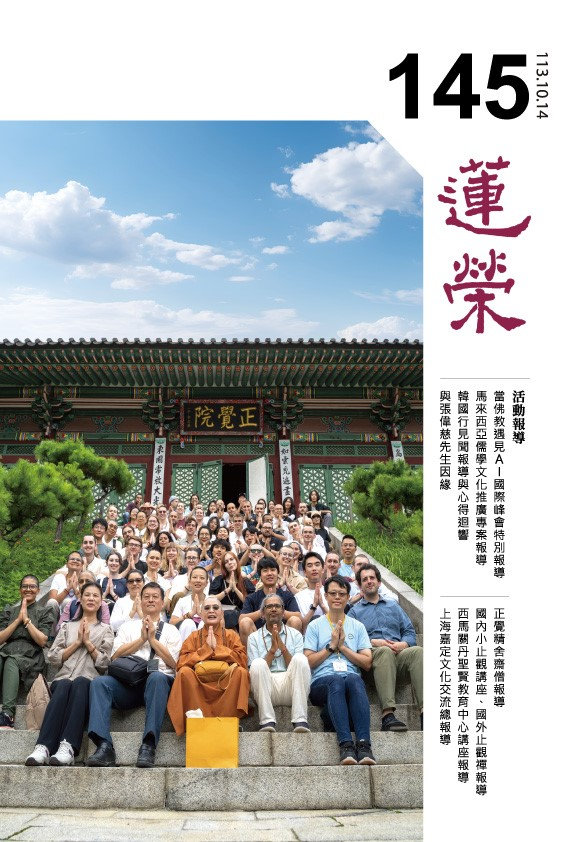

## 社論

### 我們期盼什麼樣的國際化佛教

本刊

國際浪潮的生存

走入時代的方便

交融互惠的茁壯

理想正法的潮流

談到「國際化佛教」，指的只是各國的佛教信仰嗎？其實目前世界各地早已具有佛教徒和寺院道場，不甚稀奇；指的是來自世界各國的人士前往他國佛教寺院或道場短期參學嗎？隨著國際交通的便利，這種情況早已相當普遍；指的是佛教書籍以各種語言出版並廣泛流通嗎？然至今日，不僅是實體書，就連虛擬的佛教電子書、網頁書早已十分容易獲取。

因此，除上述所列舉的情況之外，當今談論「國際化的佛教」，或許還需要關注一些重要的元素。

一、統一的術語體系：

佛教的專有名詞主要以梵文、巴利文、藏文、漢文、日文等多種語言呈現，但名詞互譯缺乏統一的標準，也沒有一個全球佛教共同遵循的權威辭典。這導致像「三寶」、「四聖諦」、「八正道」等基礎名詞的翻譯方式不統一，名詞的解釋也存在多個版本。這種語言上的差異，阻礙了不同文化背景的佛教徒之間的深入交流。

二、融通的詮釋方法：

佛教分為南傳、北傳、藏傳等不同傳統，各自都有其詮釋佛法的視角。有時由於術語定義的差異，導致理解上的誤解或過度延伸。不同傳統在解讀教義時呈現出的差別，可能使各個傳承的佛教徒更傾向於堅守自身的理解，並減少跨傳統的交流與合作。

三、深入的經教研究：

在全球範圍內，許多傑出的弘法者創建了大型的佛教組織。然而，這些組織在發展過程中，往往更強調創始人的思想和著作，或者集中於特定經籍的詮釋，缺乏對更廣泛佛教經典的深入研究和解讀。這可能限制了佛教思想的全面傳播和理解。

四、知行合一的實踐：

許多寺院道場重視修持實踐，各種禪修、拜懺、誦經、法會等活動排滿了日程，但對佛法經論的學習和理解相對不足。另一方面，一些佛教學術機構雖然舉辦了大量的研討會和發表了學術論文，但這些研究未必能夠直接指導修行實踐。雖然各個佛教寺院、道場、組織都強調「解行並重」的重要性，但在實際操作中往往難以平衡。

面對這些挑戰，我們可以從以下方面尋求解決之道：

一、利用人工智能消除語言的障礙：

人工智能的發展，特別是大型語言模型（LLM）的普及，使得跨語言交流變得更加便捷。借助像ChatGPT等工具，人們可以高效地翻譯和理解不同語言的佛教典籍。隨著技術的進步，這些模型有望準確地傳達佛典的深層含義，甚至提供對名相解釋的不同抉擇，促進全球佛教徒對經典的理解。

二、從宏觀視角構建佛教思想體系：

從尤瓦爾‧哈拉瑞出版《人類大歷史》之後，歷史學家便傾向以宏觀的時間尺度、全球化的視角、跨學科的思維方式，來看待古今人類的處境。借鑑「大歷史」視角，我們可以從宏觀的時間和空間尺度審視佛教的發展脈絡。例如，中國天台宗的智者大師建立了判教系統，以結構化的方式理解佛陀的教法。隨著更多佛教典籍被翻譯和研究，尤其是藏傳佛教豐富的經典被介紹給世界各地的學者和修行者，我們有機會構建一個更全面、更系統的佛教思想框架，促進不同傳統之間的理解和融合。

三、倡導以佛法為中心的一乘教體：

無論是哪個傳統或教派，佛教徒都以釋迦牟尼佛為共同的導師。現代社會對「去中心化」的關注，啟示我們可以超越組織和教派的限制，將焦點回歸到佛陀的教法上。通過加強對核心教義的共同研究和實踐，打破宗派之間的壁壘，於是如佛宣講《法華經》所提倡的「一乘佛教」，可以成為世界佛教徒共同推崇的義涵。

四、善用宗教世俗化潮流的可能性：

隨著科技和信息的普及，越來越多的人開始關注東方哲學和心靈修煉。許多與佛教相關的播客與短視頻正在流行，而正念運動、內觀禪等佛教修行方法，以「冥想」之名在全球範圍內流行，吸引了大量的關注者。這種趨勢，為當今佛教提供了一個契機，即可以藉由解行並重的禪修活動，如學會近來舉辦的國際《小止觀》禪修會，邀請世界各地的青年參與，一方面藉由講座讓人們認識佛法義理，另一方面通過實際禪修，使佛法與參與者的日常生活實踐相結合，讓人們意識到佛法知行合一的特色，從而使全球新世代青年擁抱佛法、關注佛教。

期盼在新潮流的助推下，佛教的國際化進程將帶動佛法興盛於各地，促進世界佛教徒和合。通過積極應對當前的挑戰，充分利用現代技術和思想，我們有理由相信，佛日必將增輝，法輪必恆常轉。

## 大德法語

### 果清律師齋僧開示-持戒念佛

*果清律師講述／宗徹整理*

持戒念佛真修行

法門龍象悲心切

善說法要道場主

寶島之光是正覺

諸位法師，我們會長淨慧菩薩，還有諸位菩薩蓮友們，大家下午好。

我們今天要講的題目，就是「持戒念佛」，其中「持戒」部分，摘錄自《大方廣佛華嚴經入不思議解脫境界普賢行願品十七卷大天告善財法語》的「持戒法語」；「念佛」部分摘自宋朝慈雲懺主遵式法師的〈小淨土文〉。

「持戒念佛」是我們在末法時代能夠了脫生死乃至成就無上佛道的大慈舟航，非常要緊的修持法門。

◎持戒法語

首先我們引證了「持戒法語」，這是大天菩薩告訴善財童子的法語，以下加以消釋──

如諸眾生及草木，一切生長咸依地，世及出世諸善根，皆依最勝尸羅地。

這第一段偈頌，前面兩句是比喻，後面兩句接著合法（將比喻合到佛法的義理上）。意思是說：

就如同諸多眾生以及所有草木，當然其一切生長完全都要依止大地；假如沒有大地的話，這一切眾生跟草木就都不能生長了。同理世間以及出世間的諸多善根，都是依止最殊勝的尸羅地。

尸羅是戒之三名其中一種。戒的第一個名稱就著戒法來說，叫做「毘尼」，就是律教，可以評判開遮持犯的情形，所犯是輕、所犯是重等。

第二個名稱就著戒行來論，戒行就是防非止惡，防止一切過非，止息一切惡法；叫做「尸羅」，翻譯成戒，有清涼的意思，我們眾生身口意三業恆常都是熱惱的，能好好持戒的話，三業就得到清涼。我們眾生往往是造作罪過，身心就熱惱。有尸羅戒行來對治熱惱，能令我們的身心獲得清涼。

第三個名稱就著持戒的果德來講，叫做「波羅提木叉」，也稱作「別解脫」，持一條戒就得一條戒的解脫；「別別解脫」，即條條能持，就條條能得解脫；「處處解脫」，由於眾生有身口意三業，持身處的戒法就在身業得解脫，持口處的戒法就在口業得解脫，持意處的戒法就在意業得解脫；而「保解脫」的意思是說，我們在因地能夠持戒的話，保證果地會獲得解脫。

所以《六十華嚴》曾說：「戒是無上菩提本，應當具足持淨戒。若能具足持淨戒，一切如來所讚歎。」

「戒為無上菩提本」，持戒是成就無上佛果菩提的根本，所以我們因地持戒的動機，就擺在最高的成佛的目標上，而不光是為了生天、得到富貴人家的身體，因為生天或做人，當人天福報享盡，還要繼續墮落輪迴，不是究竟之道。因此目標是為了成佛，成佛就證得不生不滅的本性，從此不生不滅矣。像本師世尊雖然在世間示現入滅，然而同時又到有緣的十方世界去度化眾生，於是有生滅僅是佛的示現。我們眾生還未能夠證得真如本性，我們的生滅是真實的生滅，必須藉修行證得本性，就再也不生不滅了。

「應當具足持淨戒」，我們應當具足輕重等持的淨戒。不要認為我們在末法時代，只要持重戒就行了，對於輕戒隨便懈怠放逸，如果抱持這樣的心態，則重戒的清淨也保不住，因為輕戒的持守是用來保護重戒的，輕戒都能守持，則重戒的守持絕對辦得到。能輕重等持，就是具足持淨戒。

「若能具足持淨戒」，假若能夠輕重等持、具足受持佛陀所敕戒法，引發「一切如來所讚歎」，就是一切諸佛所共同稱揚讚歎的對象。

無戒欲求生善道，如鳥無翼欲飛空，如人無足欲遊行，亦如渡海無船筏。

我們不好好地持戒，身口意三業都沒有戒法的攝受，漫無規章、隨便地造作，這樣子想要求得生到善道。通常說生到善道，是指天、人、阿修羅的三善道；善道也可以解釋作殊勝的善道，就是聲聞、緣覺、菩薩、佛的四聖法界，這三善道、四聖法界都可以含攝在善道之中。

所以沒有持守戒法，想要求生三善道乃至最殊勝的成佛、或其次做菩薩、做緣覺、做聲聞，這就如同鳥沒有雙翅卻想要飛上天空，那是辦不到的。又好像一個人沒有雙足，而想出外遊行；又像一個人想要渡過大海，卻沒有船筏可以乘載，雖然游泳技術很好，而大海非常深廣，當體力不支時，也要沉落到海底去。

或於日夕三時浴，或復三時作護摩，卻粒自默如啞羊，無戒苦身無所利。

或者在白天、中午、夜晚三時的沐浴，或者白天、中午、夜晚三時的護摩（結壇以供），斷食絕粒自挨餓，保持禁語如啞羊。沒有戒法的攝受，光是勞苦自己的身體，修無益的苦行，這是沒有意義的。

這裡提到的「啞羊」，是講到自恣的緣起。所謂自恣，也就是比丘、比丘尼在結夏安居滿時舉行羯磨，接受自恣，也就是將自己生活上面的過失，讓大眾僧來舉出罪過。自恣羯磨時，先差出兩個做自恣的人，然後其他大眾僧，按照戒臘次第，向這兩位表達自己若有身口意三業的過失，請兩位舉出並接受自恣。

在佛世的時候，有一個僧團在結夏安居當中彼此都不講話。平常有事情，大家共同要做事，就比手畫腳地達成溝通；誰有了過失，也不互相勸諫。他們以為這樣修行很如法，結果到了結夏安居圓滿，就到佛陀那邊去請教。

佛陀就問他們：「你們安居時怎麼用功？」他們據情以告，佛陀於是喝斥他們：「僧團中，大家彼此之間有了過失，要互相勸諫，大家身口意三業清淨，這樣道業才得以增上。然而，你們安居當中保持寂默禁語，有了過失也不互相勸諫，你們這麼做，就好像一隻啞羊，被人宰殺了都不吭聲，這樣的修行法不正確。」從此以後，佛陀就要求在安居圓滿時應舉行自恣。

而談到修無益的苦行，是指佛世有外道，他們有持守牛戒者，也有持守狗戒者。有一回，他們不敢直接去請示佛陀，就去問阿難尊者：「我們持牛戒、狗戒，將來結果如何？會不會生天或者證得涅槃？」阿難尊者就說：「這個部分佛陀比較清楚，你們還是請教佛陀好了。」佛陀對著這些外道，就要他們不要問這樣的問題，然而外道一直苦苦要求，就是要問個明白，佛陀不得已就說了：「持牛戒、狗戒沒有缺犯，將來做牛、做狗；如果持得有缺犯，還要墮地獄。」外道聽了便哭哭啼啼，真是要他們別問卻偏要問！

或大族子旃陀子，俱能持戒等生天，貴賤種姓虧戒身，皆墮地獄無差別。

或者如婆羅門、剎帝利等高貴族姓的兒子，或者是殺豬宰羊的屠夫之子，他們都能夠持戒的話，平等都能生到天上。高貴或者卑賤的種姓，虧犯了戒身，將來沒有差別地都會墮入地獄去受苦。

卑門持戒生天上，勝族毀犯墮幽冥，摩登持戒亦生天，仙人破戒入諸獄。

卑賤家門出生的兒子，卻能好好持戒，將來都能生到天上；殊勝種族出生的兒子，卻毀犯了戒法，將來便會墮入幽冥地獄之中。

摩登伽屬於印度旃陀羅族的一種，平常以掃地或服侍人等做為職業，這類低賤種姓者之子能好好持戒，也都能生到天上；至於身為仙人，毀破了戒法，也會墮入諸多地獄去受苦。

王族多聞具色力，惡見無戒如獸蚖，如甘果樹猛獸圍，猶蓮華池毒蛇止。

做國王的高貴族姓，還能廣學多聞，並且長相莊嚴、身具力量，然而卻惡知惡見，又不好好守持戒法，那就如同猛獸、蝮蛇，甘甜美好的水果樹被兇猛的禽獸圍繞，於是人們不敢上去摘水果，只能白白地遠望流口水；也如同蓮花池中有毒蛇居止其中，人們不敢進入這個蓮花池去受用蓮藕、蓮花、蓮子等種種美好。

寧守貧賤恆持戒，具聖財寶德嚴身，破戒眾人之所輕，持戒天人咸信重。

寧可守住貧窮卑賤的地位，但能恆常執持清淨的戒法，具足聖法的財寶、擁有持戒的德行來莊嚴自身。假若毀破戒法，這是大眾所共同輕視、看不起的對象；假如有人能持戒，天上或者人間的人完全都信任並且尊重他。

栴檀欝金及沈麝，如是一切不為香。菩薩持戒最勝香，遍出人天無有盡。

栴檀香、鬱金香、沉香及麝香，如此一切高貴的香都不是真正的香，那什麼才是真正的香呢？就像菩薩能好好持戒，就能散發出最殊勝的戒德之香，這樣的香不是人間天上各種香可以比擬的，人間天上的種種香，嗅聞有一定的範圍；而菩薩持戒所成就最殊勝的戒德之香，那是無遠弗屆的。這樣的持戒者，普遍超出天上華美者、人間富貴者，其高尚莊嚴無有窮盡。

卑陋持戒後生天，現蒙王者所瞻禮，此世他生安隱樂，如是戒果牟尼說。

一個人雖然卑賤、醜陋、下劣而能持戒，後來能生到天上去享福，現世能蒙受做國王者所瞻仰禮拜；此世來生都能夠獲得安隱的快樂，如此持戒的果德，是我們釋迦牟尼佛所宣說的。

欲生人天及涅槃，如應具戒必當得，是故精勤持淨戒，隨心所願皆圓滿。

想要生到高尚富貴的人道、美好莊嚴的天上，乃至證得究竟涅槃，如果能夠具足清淨地持戒，必定當來會獲得所想的報應；因此我們就要精進辛勤地受持清淨的戒法，如在家菩薩所受持的五戒、菩薩戒，出家法師所受持的沙彌戒、沙彌尼戒、式叉尼戒、比丘戒、比丘尼戒、菩薩戒，各個身分受持不同的戒，然而若能夠精進、辛勤地好好受持所受清淨的戒法，將來隨著我們心意所願望的都能獲得圓滿果報。

若有臨終肢節痛，一切親屬欲分離，諦思我有清淨戒，身心歡樂無憂畏。

假若臨命終時，四肢關節都疼痛，一切親屬都想跟我們分開、與我們離別，然而這個時候諦審思維我在生的時候，能夠守持清淨的戒法，這時就能夠身心感覺歡喜快樂，沒有憂愁怖畏。

戒為惑病最勝藥，護諸苦厄如父母，癡闇燈炬生死橋，無涯業海為船筏。

能夠好好持戒，就是對治煩惱病最殊勝的藥方，能夠護持諸多痛苦災厄，如同父母親守護子女一樣。愚痴、黑暗中能好好持戒，就如同持有燈炬，度過持戒的橋樑，從生死的此岸到達清淨涅槃的彼岸；眾生所造做無邊無涯的業，深廣猶如大海，倘若能好好持戒，可以在業海中成為大慈舟航。

帝釋轉輪威德主，富貴尊嚴無等倫，家有僕隷能持戒，承事供養而親敬。

好像帝釋天（玉皇大帝）及轉輪聖王，他們是非常有威德的王主，他們富有高貴、尊高嚴肅的身分，任何眾生都無法與他們相比；然而他們家中有奴僕差隸能夠好好持戒，則為帝釋天、轉輪聖王等王主所親自承事、供養並親近、敬重他們。可見持戒有多麼美好！

若有臨至命終時，持戒破戒生安畏，欲得當來極樂處，應當專意勤護持。

假若到了臨命終的時候，想到自己平日注重持戒清淨，就會生起安慰的心情；然而想到自己平生毀壞戒法，就會生起怖畏的心情。想要獲得將來極樂的處所，或者將來想要往生極樂世界去，就應當要專心一意地精勤守護所受的戒法。

戒珠不假刀兵護，戒為伏藏無所侵，戒為勇伴導前行，戒為出世莊嚴具。

持戒的人，就如同獲得摩尼寶珠一樣，不假借刀兵來守護，不像國王出門都得有衛兵侍衛來保護；戒法就如同埋伏的寶藏，無人能侵犯；戒法如同勇猛的伴侶，引導我們一直往光明的大道走去；戒法可成就出離世間的莊嚴，不像世間莊嚴的飾品，不論少年、中年、老年者配戴，都顯得十分適當、莊嚴、美好。

我讚持戒諸功德，如佛世尊真實說。

我讚歎持戒諸多的功德，就如同佛陀是九法界眾生共同尊重的對象，像佛世尊真實宣說一樣，沒有差別。

以上一共有六十二句，講到持戒的功德非常殊勝，這是前面我們所要講說的「持戒法語」。

◎念佛法語

接著講「念佛法語」，我們以〈小淨土文〉為代表。〈小淨土文〉是我們一般在做晚課時，後面迴向課誦的內容，收錄在《朝暮課誦本》當中，屬於迴向文的一種。

我們

先介紹作者慈雲懺主的生平事蹟。

遵式法師，字號知白，臨海郡寧海人，本姓葉，母親王氏祈求觀世音菩薩賜給兒子，於是就夢到一位美女，她給了一顆光明的寶珠讓王氏吞下，然後就生下了遵式法師。

遵式法師才七個月大，就能隨著母親稱念觀世音菩薩名號。稍微長大，不想跟著兄長從商，於是就前往東掖山依止義全法師出家。到了年滿二十歲，遵式法師又前往禪林寺受具足戒，次年從守初律師習學戒律。之後進入國清寺，一日在普賢菩薩像前燃一指供佛，發誓要傳承天台教法，於是參學寶雲寺依止義通法師學習天台教觀。

遵式法師喜歡苦行，常常修懺法，如方等、法華、大悲等等。又曾經行般舟三昧，這種修行就是經行或者站立，不能夠坐下、睡覺，除了吃飯、大小便溺之外，總共要修九十天。

遵式法師由於修般舟三昧，積勞嘔血，感覺太勞苦了；雙腳腳底的皮都裂開了，他乾脆以死自誓：「好，我死了也不罷休！」繼續修行。後來就看到觀世音菩薩垂手指他的口，引出了幾條蟲；菩薩又從他的指間流出甘露水，灌灑進入他的口中。於是遵式法師感到身心清涼，過去所患的痛苦完全都消失了。

不久遵式法師的頭頂高了一寸多，講話聲如洪鐘扣擊，智慧辯才無障無礙。大中祥符七年，他聚集同道專修念佛三昧，迴向往生西方。後來前往西湖復興天竺寺。著作有《淨土懺》、《金光明三昧》等懺儀，依著修學，每每都有靈驗，所以他的德行又被朝廷知道了，宋真宗於乾興二年賜給法師稱號叫做「慈雲」，於是後來的人稱他叫做「慈雲懺主」。

明道元年十月初八他患有疾病，但不再使用醫藥，為大眾略說法要。後來他命人請彌陀像來，結果有人請到觀世音菩薩像。遵式法師出生前是觀世音菩薩化現美女賜珠與母而降生人間，臨終請人找彌陀像來卻獲觀世音菩薩聖像，可以說跟觀世音菩薩很有緣。

遵式法師禮拜聖像後，執香祝禱說：「我觀觀世音，前際不來，後際不去。十方諸佛，同住實際。願受我一炷香，諸佛證明，往生安養。」意思是說：我來觀想觀世音菩薩，他前際不來，後際不去。十方諸佛安住在真如實際，惟願接受我的一柱香，諸佛來證明我能往生極樂世界。
或者有人請問遵式法師說：「您所去的極樂世界，到底是哪一土呢？」法師便回
**答：** 「寂光淨土！」所謂：凡聖同居土、方便有餘土、實報莊嚴土、常寂光淨土，寂光淨土是佛國土中最高的淨土。通常帶業往生的是凡聖同居土，能夠伏住乃至斷除見思煩惱的往生方便有餘土，分破無明、分證法身的往生實報莊嚴土，而佛的淨土就是常寂光淨土。

到了十月十日晚間，遵式法師就坐脫（坐著往生）了，時年六十九歲。當夜有人見大星殞落在靈鳩峰，一時紅光熾盛。

遵式法師的著作不多，現在流傳的有《往生淨土懺願儀》、《往生淨土決疑行願二門》、《天竺別集》等等。

崇寧二年，宋徽宗追賜遵式法師名號「法寶大師」，紹興三十年，高宗特謚「懺主禪慧法師」。

以上就是淨土文的作者，接著正式消釋〈小淨土文〉。

一心皈命，極樂世界，阿彌陀佛。

講到「極樂世界」就是依報莊嚴，「阿彌陀佛」就是正報莊嚴，其中也含攝說法莊嚴。

講到「一心皈命」，就是「將此身心奉塵剎」，我們將此身心性命，皈依投靠極樂世界阿彌陀佛，更加沒有疑貳之心（沒有懷疑、兩樣的心）。所以我們想要求生西方極樂世界，首先應當收攝我們的六根，外不攀緣，內不妄想，這個才叫做「一心」。那一期的果報受盡，眾生的命根是最難捨的，而現在不愛惜，唯獨一心皈依極樂世界阿彌陀佛，來求得無上菩提。

願以淨光照我，慈誓攝我。

祈求阿彌陀佛清淨的光明、四十八宏誓願能夠照耀、收攝、攝受於我，而其淨光（即阿彌陀佛的根本智光明，他自己本來是清淨），普遍整個法界。

講到「淨光」，《觀經》有說到：「彼佛圓光如百億三千大千世界；於圓光中，有百萬億那由他恒河沙化佛；一一化佛，亦有眾多無數化菩薩，以為侍者。無量壽佛有八萬四千相；一一相中，各有八萬四千隨形好；一一好中復有八萬四千光明；一一光明遍照十方世界，念佛眾生攝取不捨。」

阿彌陀佛的圓光，如同百億個三千大千世界；在圓光當中，有百萬億億尊恆河沙的化佛；一一化佛，也有眾多無數化菩薩作為侍者。阿彌陀佛有八萬四千相；一一相中各有八萬四千隨形好；一一好中都有八萬四千光明；一一光明普遍照耀十方世界，念佛眾生攝取不捨。

我們過去無始煩惱結業太久、太堅固了，假若不是求得佛的光明、慈悲的誓願冥冥地加被，怎麼能夠降伏、滅除呢？所以我們應當好好地願求。

我今正念，稱如來名，為菩提道，求生淨土。

這是說明求阿彌陀佛的原由。

我現在真正地安住正念，也就是阿彌陀佛的念頭，我們心念就安住在阿彌陀佛的聖號上，念茲在茲，這個就是正念。假若我們一面念佛、一面打妄想、一面起雜念，那就不叫做正念。念佛當下能消掉妄想雜念，叫做「正念」。

我們種種的煩惱無量無邊，煩惱廣泛地纏繞且生生滅滅，於是生死的果報無窮無盡。所以我們稱念阿彌陀佛，是為了成就無上菩提佛道，來求生淨土；一往生極樂世界，就一直修到成佛。

所以念佛的目標要正確，不要說：「我念佛，求家庭平安，一切都很好。」這縱然是花報，也可以通過念佛得到，但這不是我們的目標，目標應是往生極樂世界，為了成就無上佛道。

所以修淨土念佛法門，也是成佛非常好的方法。為菩提道，就能夠融入無生法忍。例如微妙安樂是難以相應的，我們想要成就無生法忍的境界，證得真如本性，那就先要好好地安住正念，稱念阿彌陀佛的聖號。

為什麼呢？因為修其他的行門，用其他的功夫，就好像螞蟻想要爬到高山上去，爬著就往旁邊一直竄，爬不上高山，因為看不見高山在哪裡，內心還疑惑著：「什麼時候才能到達高山？」

修念佛法門，就像開帆船遇到順風那樣，於是一帆風順，很快就到達目標。所以《彌陀經》中就講到：「若有善男子、善女人，聞說阿彌陀佛執持名號，若一日、若二日、若三日、若四日、若五日、若六日、若七日，一心不亂。其人臨命終時，阿彌陀佛與諸聖眾，現在其前。是人終時，心不顛倒，即得往生阿彌陀佛極樂國土。」七日便得一心不亂，阿彌陀佛與諸聖眾就接引他往生到極樂世界去了。

佛昔本誓，若有眾生，欲生我國，志心信樂，乃至十念，若不生者，不取正覺。

阿彌陀佛過去本來所發的誓願，遵式法師採取《無量壽經》四十八願第十八願的內涵，然後文字稍微不同，我們就依照原文所給出的來看。

「設我得佛，十方眾生，至心信樂，欲生我國，乃至十念，若不生者，不取正覺，唯除五逆、誹謗正法。」假設我成佛，十方世界念佛的眾生，以專志誠實、至誠懇切的心，心之所之（心意所到達的目標叫做志），目標就是往生極樂世界。具足淨土三資糧─很歡喜好樂修學、深切相信淨土法門（信），非常歡喜好樂發願要往生極樂世界，想要生到我極樂的國土（願），念佛念到臨命終前乃至十聲（行）。假若不往生的話，這個願不圓滿，我就不成佛，唯除犯了五逆重罪、誹謗正法的人。其他的人都能帶業往生，然誹謗正法的人，他也不相信淨土念佛法門，所以就沒有往生的道理。

信願行三資糧太要緊了，蕅益大師說：「得生與否，全由信願之有無；品位高下，全由持名之深淺。」我們能往生或不能往生極樂世界，完全靠著我們有沒有深信切願的心；有深信切願的心，雖然念佛念得不多，但是也能往生。當你沒有信願之心，縱然念佛念到風吹不落、雨打不濕，也沒有得生的道理。而將來往生極樂世界品位的高下，完全就靠著我們念佛功夫的深或淺。念佛功夫深，則往生的品位就高；念佛功夫淺，則往生品位就低。

至於念佛，不論是十念也行，一念也行。因為我們做任何善惡事，都是在一念之間成就的；而往生極樂世界，這也是一念之間去的。到最後一念，要把心安住在阿彌陀佛聖號上，你就往生去極樂世界了。所以一念就行，不必十念。

以此念佛因緣，得入如來大誓海中。承佛慈力，眾罪消滅，善根增長。若臨命終，自知時至。身無病苦，心不貪戀，意不顛倒，如入禪定。

「正念為因，佛慈為緣」，我們心安住正念作為正因，而佛慈悲的誓願作為助緣，我們以這樣的因緣，就能夠得以進入到如來的大誓願海當中。

阿彌陀佛的四十八願，詳載在《無量壽經》當中，四十八願願願周遍法界，如海無邊無涯。所以我們現生假若能夠信願持名，安住正念，就能夠感阿彌陀佛的大慈悲誓願加被，消我們的眾罪，證我們的善法。

到臨命終的時候，能夠自己知道時間到了，什麼時候就要走了，與親屬說：「我們到極樂世界再會了。」而且身體沒有病苦，像黃打鐵就是如此，臨終身體沒有病苦，即將要離開人世，就留下一首偈語：「叮叮噹噹，久煉成鋼，太平將近，我往西方。」立即示現往生。
還有冬瓜和尚，跟人家約定要往生的日子，日子都到了，他的道友都來等候他，他才從外頭回來。和尚問說：「你們怎麼來這裡？」道友回
**答：** 「你不是跟我們約定今天就要走了嗎？所以我們特別要來送行啊！」和尚說：「沒有人提醒我，我忘了啊！」於是和尚趕緊沐浴更衣，然後坐下來，並吩咐左右幫他寫下一首偈子：「終日走街坊，心中念佛忙，世人都不識，別有一天堂。」意思是說：他天天在街道上走來走去，世俗人以為他沒有修行，但是他心中念佛好忙好忙的；內心另有一番境界，世俗人不會認識的。冬瓜和尚留下偈子後，微笑坐化而去。

身無病苦，心不貪戀，意不顛倒，就好像入了禪定。佛及聖眾，手執金臺，來迎接我，於一念頃，生極樂國。

招感阿彌陀佛，與諸聖眾如觀世音菩薩、大勢至菩薩、清淨大海眾菩薩來接引，因為能夠安住正念的人，他的世緣既然謝落了，淨土的緣就成熟了，所以臨命終的時候，自然招感能夠見佛。

佛與諸多聖眾，手執金臺來接引，而且要是金臺才要去，如果是銀臺就不要去，這是有公案的。

唐朝懷玉大師，一生持戒莊嚴，日中一食，而且夜晚常坐不臥。他平常誦《彌陀經》三十萬遍，每天課誦佛名五萬聲，也常行懺悔的法門。

一日忽然看到西方聖眾充滿虛空當中，有一位拿著銀臺來迎接，大師就說：「我一生念佛，發誓是要取得金臺的，怎麼可以用銀臺來接我呢？」常人或取證銀臺也可去，但大師不滿願便不去，於是聖眾就隱藏不現了。

大師從此加倍精進，二十一天後聖眾又來，並告知：「由於你精進修持的緣故，已經可以生到上品了，你應該要趺坐，等待佛親來迎接。」又經過三天，奇異的光明充滿整個房舍，大師就說：「假如聞到奇異的香氣，就代表我的果報將要盡了。」於是寫了一首偈：「一生苦行超十劫，永離娑婆歸淨土。」

大師一生持戒莊嚴，日中一食又常坐不臥；修淨土法門非常精進用功，每天都念五萬聲佛號，以此苦行可以超過十劫的修行，永遠要離開娑婆世界，回到極樂淨土去了。

後來香氣充盈整個虛空，聖眾也遍滿空中，阿彌陀佛與觀世音、大勢至兩位菩薩，手執金臺來迎接大師，於是懷玉大師就在一念之頃這麼短的時間內，含笑而逝，往生極樂國土。

華開見佛，即聞佛乘，頓開佛慧。廣度眾生，滿菩提願。

「華開」就是開本有心性之華，證得真因。「佛乘」即一佛乘，也就是《法華經》所比喻的「大白牛車」。「佛慧」指佛的權實兩種智慧，實智即根本智，權智即後得智。這就是《法華經》所說的：「開示悟入佛之知見。」

菩提願滿，佛的權實二智既然開發，就成就圓教初住法身真實地位，能夠在百佛世界分身做佛，隨順眾生根機度化眾生；假如成就二住地位，則可以在千佛世界分身做佛；成就三住地位就在萬佛世界分身做佛……，如是四十一位，逐漸增高，能隨念現形，應機說法。

反過來到最初發心，發願說：「為菩提道，求生淨土。」到此才真正圓滿我所發的誓願，可以說「慶快平生也哉」！

以上講完持戒念佛，祝願各位：在世都能夠健康長壽，福慧增長；平常持戒都得信願念佛，將來各個往生極樂！

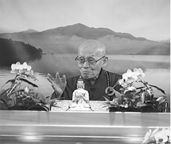

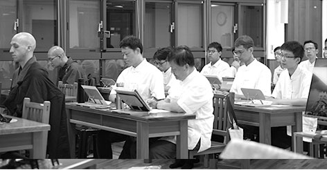

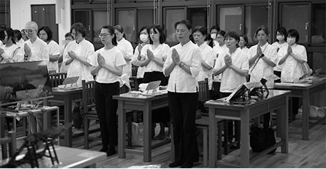

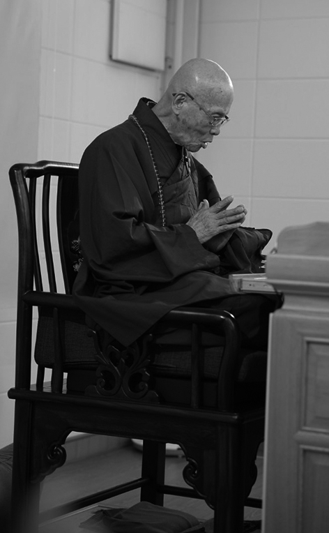

## 佛學覽幽

### 菩薩清淨的行持—華嚴經淨行品（六十）

*戒慧講述、編輯部整理*

趙州粥飯雜用心

正法覺受淨行品

穿吃睡覺人皆會

用心修行人難會

丙二、指事顯因答其徵因

丁一、總徵

丁二、別顯

戊七、到城乞食時願（二十二願）

己四、得食正食：飯食時、受味食

前言

智首菩薩向文殊菩薩請教如何得到成佛的功德智慧，如何得到十力、四無所畏懼、十八不共，佛的智慧正體現為三業清淨無過失，在成佛之前會有十種殊勝的功德形象，依這個殊勝功德形象而成佛。

文殊菩薩告訴智首菩薩要善用其心，在一切時一切處，都不離開願力，用此願力來攝持日常的造作，此願力是以清淨的智慧所成的願力，我們依著此願力、智慧，能讓自己日用平常造作的體性轉為大乘。淨行品的淨，是讓我們的行持能夠轉為清淨，日用平常的行持以菩薩的願力攝持，使日用平常的行持體性轉為大乘，以空性的智慧攝持，使體性轉為無漏，行持清淨的形象如此。把日用平常、行為軌範歸類為一百四十一個，分為十大類，目前的進度是第七「到城乞食時願」中「得食正食」的「飯食時」與「受味時」。

經文：

若飯食時，當願眾生，禪悅為食，法喜充滿。

若飯食時，當我們在吃飯、喝湯時，希望眾生不只是身體吃飯，身體感覺非常舒服，心也要吃飯，依禪定觀修法義，即心吃飯，享受法味的喜悅。

一般都會想到身體吃飯，嘴巴吃飯，卻沒想到心裡也要吃飯，每天都要開飯，心裡是否開過飯呢？食色性也，身體吃飯人人都講究，康熙皇帝說，沒屋住百姓尚可接受，沒飯吃百姓就會造反，帝位就會不穩，可是心裡吃飯這件事情卻無人問，孔子過世魯國像沒事一樣，鄭國子產過世後，百姓如喪考妣，就是因為大家比較在意身體吃飯，比較不在意心裡吃飯。可是身體吃飯，這一餐吃飽，下一餐還是會餓，這一生飽足，下一生反而會墮落，挨餓受凍。但心裡吃飯卻不同，當心裡有飯吃，身體一定有飯吃，未來生生世世身體也會有飯吃。可惜大家目光不夠長遠，不能看到其中的利害關係。

心裡吃什麼樣的飯是營養的？乃親近善知識，對經論得到勝解，得到法義勝味的那一分，才會有法喜，往往心裡得到滿足時，身體就算有一些不適都能克服，如果心裡不舒服，即便吃山珍海味，也是食不知味，所以禪悅為食的禪是止觀，禪定跟禪不同，禪就是靜慮，靜者止也，慮者觀也，就是止觀，從對法生起勝解的那一分來修止修觀，串習勝解，法喜充滿，令風大充身，整個人神清氣朗，遠離四威儀的沉重相，遠離世人的心思汙濁、鬱卒、懊惱、煩惱。

當願眾生心裡吃飯，若心裡吃飯，身體沒飯吃也不會憂愁，如孔子餓於陳蔡，如顏回「一簞食，一瓢飲，在陋巷。人不堪其憂，回也不改其樂」，或孔子的「飯疏食飲水，樂亦在其中」，吃麤澀食也一樣快樂。心裡吃飯，遠勝於身體吃飯，三五好友聚會談經典，就是心裡吃飯，心裡吃完飯後再身體吃飯，度過美好的一天，這就是懂得度假的人。

禪分為世間禪跟出世間禪，世間禪分為四禪八定，出世間禪以次第定來說，包含色界的四禪，無色界的四空天，及滅受想定。禪悅為食，可以說是世間的四禪八定（內外道共），也可以說是滅受想定的次第定。

修定有他所緣的境界，定就是能專注於所緣的境界，例如能緣的是此聖者，所緣的是空性，三果羅漢在五不還天（無煩天、無熱天、善見天、善現天、色究竟天）裡面，遊觀無漏，觀無漏的部分就是修學空性，修學勝義的那一分。

《百法明門論》中，滅受想定是心不相應行法之一，但是定應該是心所，不應該是心不相應行法，因為定是指心專注的那一分，屬於五別境。滅受想定一定是內道定，不是外道定，因為外道受想滅不掉，四禪八定的美妙境界是所受，能受的心怎麼可能不生？怎麼滅？就像非想非非想天也有細想，即便沒有粗想也有細想，此細想所緣的是禪定快樂的那一分，緣空靈靈、什麼都沒有的快樂，這是他所取的，是細想，但還是有一個好大的我在受樂，所以滅受想是外道不可能生起的定。

試問滅受想定跟三果羅漢遊觀無漏有何關聯？滅受想定又如何是心不相應行法？因為修空性的這一分，特別是成就三果的這一分，具有破煩惱障的能力，證得三果的剎那，就成為四果向的那一分，在五不還天遊觀無漏，入滅想定，以實有的我為所緣，看不到的時候，感受的心會生嗎？受是有境才有對境的感受，對境才成立對境之想，想就是取相，沒境怎麼想？所以滅受想定是指要破煩惱障的能力的那一分，眼前空靈靈的行相是滅受想，滅受想定是心不相應行法而不是心所，因為定是在一個境界上產生專注，滅受想定不是以滅受為所緣去專注，也不是以滅想為所緣去專注，他是以空性為所緣，生起專注力的那一分，受想不生，不是有一個定去滅受、去滅想，滅受想定不過是名言上的顯現，是定的狀態描述而已，所以歸類為心不相應行法。

經文：

若受味時，當願眾生，得佛上味，甘露滿足。

吃飯嘗到各種食物的味道時，希望眾生能夠得到佛法的最上味，甘露滿足，此處的甘露指佛的上味，也就是能夠圓滿成佛的果位。願所依，願力依靠在菩薩而生，願是依靠在這個事相上來發願，在吃飯受酸甜苦辣鹹淡那個味上來發願，受味是舌識的境界，在舌識上顯現酸甜苦辣鹹淡，眼識不能顯現，耳識不能顯現，可見酸甜苦辣鹹淡的自相空，沒有舌識就無法說出這些味道。再來是願所為境，能願的是菩薩，所願的是眾生，第三個是願所成益，所成的利益，就眾生而言，能夠得到得佛上味，甘露滿足，就菩薩而言，除了能得到得佛上味甘露滿足之外，也能得到三業離過成德，成就佛的十力、四無所畏及十八不共法。

依四種觀察法來講，第一是隨喜，眾生若能夠發得佛上味，甘露滿足這樣的願該有多好，且眾生得到佛上味，甘露滿足的時候，我比他更高興。第二個是發願，我決定發得佛上味，甘露滿足的願，我內心渴望，眾生得佛上味，甘露滿足，眾生得了我隨喜，沒得我盼望他得。第三是承擔，我允許十方諸佛涅槃，我一人承擔所有眾生得佛上味，甘露滿足的責任，其實每一尊佛菩薩要成佛之前，都允許十方諸佛涅槃，宇宙間由他一人去承擔，釋迦牟尼佛要入滅，把所有眾生都交給地藏菩薩，地藏菩薩流著淚告訴世尊不要憂慮，自己會承擔，這就是菩薩的心胸。第四個是懇請三寶加被，我能夠幫助眾生得佛上味，甘露滿足，即求加被，以上是完整的觀修。

得佛上味，會性法師說，成佛的究竟法味最為殊勝。南亭老和尚說，佛的無上妙法，就是得佛上味，得佛上味就是佛果的滋味，就像人生倒吃甘蔗，結婚後顛沛流離時，兩人互相扶持，最後髮白面皺，相視而笑。而最好的味道就是佛果的味道，叫做甘露滿足，甘露是所有的味道中最為清涼甘甜的，以天上的甘露做形容，得到佛果的滋味就像得到甘露這樣。連吃飯都可以有這麼多想像力，這些想像能使受味的這件事體性轉為大乘，以空性的智慧攝持，體性轉為無漏。

南亭老和尚說，印度的上味是醍醐，以牛乳煉成酥，酥有生酥、熟酥，酥再煉成酪，酪再煉成醍醐。如果按照天台教觀來說，乳酪、生酥、熟酥、醍醐，排法略有不同。如果以古德為準，應是牛乳、酪、生酥、熟酥、醍醐，比喻五時八教，五時配上五味，乳比喻華嚴，酪是阿含，生酥是方等，熟酥是般若，醍醐是法華涅槃，若是五時配八教，就是藏通別圓，即四化法，四種度化眾生的教法，四化儀就是度化眾生的儀式，因為他對的機有頓、漸、秘密、不定，先說五時配四化法，華嚴時是配圓兼別，別就是他有別教的修行次第，有圓教的頓入，而配著別教的修行次第，所以《華嚴經》有十信、十行、十住、十迴向、十地、等覺、妙覺，就是以圓教的思想配合別教的修行次第，所以華嚴的思想在四化法中叫做圓兼別。阿含時是藏教，方等時是通教，對著藏說通別圓，對著藏通別說圓，這兩種都是方等時的特色。般若時帶通別說圓，法華時是純圓獨妙。

此處的甘露若按照南亭老和尚的講法，甘露的梵語叫做阿密利多，甘露在此是比喻佛的無上妙法，甘露也可以指很好喝的泉水的那一分，心曠神怡，但是都無足形容天上的甘露。如果按照梵文的意思，甘露就是不死藥，來比喻佛的上妙味，味道有酸甜苦辣鹹淡六味，味道調到恰到好處的時候，吃進去正好都覺得是美味，調得不好的時候，每一個味道都覺得難以承受。（下期待續）

### 大乘百法明門論簡說(五十一)-拾柒、心不相應行法（九）

*戒慧講述、淨本整理*

論文：

第四、心不相應行法，略有二十四種，一得，二命根，三眾同分，四異生性，五無想定，六滅盡定，七無想報，八名身，九句身，十文身，十一生，十二住，十三老，十四無常，十五流轉，十六定異，十七相應，十八勢速，十九次第，二十時，二十一方，二十二數，二十三和合性，二十四不和合性。

心不相應行法第十七「相應」，

相應是指因果相稱分位，也就是因果相稱這一階段。比如布施跟富貴相應，布施跟種姓尊貴就不相應；持戒相應於種姓尊貴，但持戒跟解脫就不相應；空性的智慧跟解脫才是相應，光持戒無法解脫生死。此處並不是否定持戒的功德，而是在講因果相應的道理。

造業所成的果報可以分為正報跟餘報，這二者相應。比如殺生墮落三惡道，這是正報（異熟果）；三途苦受完了，投生到人間還短命多病，這就是殺生的餘報。等流果都屬於餘報，短命多病是殺生業的領受等流，為人生性凶狠好鬥，這是殺生業的造作等流。

除了異熟果跟等流果，因與果的相應中，還可以觀察士用果、增上果跟離繫果。同樣以殺生為例，士用果（士夫之用），是此人將來很容易感應到屠夫這類的行業，他的職業容易跟殺生有關，不殺都難，而且他的錢很難賺，往往在生病當中把賺來的錢全部花光。

增上果是指環境，殺生的增上果是容易身處凶險的環境，常常遇到那些打打殺殺、用心險惡的人。這是因為造作殺生業時，宰殺下去的時候需要帶著狠勁才下得了手。離繫果是指能夠解脫三途苦的果報，在殺生來說，相應的是會帶來解脫的障礙，比如很難遇到善知識，投生在邊地，聽聞不到佛法。

反之我們再觀察不殺生所相應的五果，異熟果是跟善道相應，可以投生人道或天道。若投生為天，當他在天上享樂結束以後，轉生到人世間來，他的領受等流果讓他依然可以長壽少病，造作等流果就是他的為人心態柔軟，會愛護小動物，對人比較善良。不殺生的士用果，是感得跟殺生無關的職業，工作也比較順利，甚至是他的工作也方便他學佛。增上果是所處的環境非常和樂，易與人共住生活。不殺生的離繫果就是可以離開輪迴的繫縛，因為慈悲的人很容易感得善知識的提攜加被，又因為健康長壽少病，所以學習正法有體力，學習的時間也長，這些都讓他更容易具足解脫的資糧。

所以造什麼業因，相應一定會有什麼果報，要懂得用聖言量去推理觀察。意業當中的瞋恚、邪見都很可怕，瞋恚會把未來生為人天的異熟果摧壞，邪見會把造作等流的心態摧壞，所以說瞋恚破壞異熟，邪見破壞等流。比如說富貴的人，是因為過去的布施業才會有這樣的樂果，可是此人後來因為邪見產生慳貪的想法，內心對財物有許多的不捨，他已經不願意再去施捨貧窮，這就是邪見破壞造作等流的例子。而即便是領受等流，也需要具有正見才能完整領受善業所帶來的快樂。比如生在佛化家庭的子女，這是百千萬劫難遭遇的因緣，但這樣的子女如果沒有正確的知見，他不會知道生在這種家庭的可貴，甚至學佛感到不悅，那更不可能好好珍惜。

彼此能成為因果的關係才說相應，彼此不成為因果的關係叫做不相應，此果是從此因來，這才是相應。善業跟苦果就是不相應，惡業跟樂果就是不相應。因果相應的另一方面，是因果等重，比如因跟果放在天秤上秤的話，二者是同重。意思是說，當某人富貴的果報成熟，他可以獲得多少富貴，從他因地的布施業就能看清楚。因有多殊勝，果報就有多殊勝。所以同樣是布施，為什麼有的人果報是大富大貴，有的人卻只能獲得小小的財富，這都是跟業因相應、等重的緣故。

業因的殊勝與否，未來會成就多少重量的果報，大略可以從四個面向觀察：對象、加行、意樂、究竟。以布施為例，「對象」就是指布施給誰？是給平凡人，還是給證果的聖者？《佛說四十二章經》裡面說果報是千差萬別。「加行」就是用什麼方法去布施，是給得很多又安排得很周到，符合別人的需求，還是給得很少又很隨便？「意樂」就是內心的想法，是很不甘願的給，還是很高興的付出？甚至心中是懂得結合三輪體空的智慧去布施，那差異更大。「究竟」是指布施有沒有做得徹底，或者半途而廢？以上這些業因上的面向，都會對所相應的果報產生影響。

因果其實最難讓人相信，因為因跟果的體性不同，如前所說，布施跟富貴的行相不同，一個是給出去，一個是獲得，如何讓人相信這兩者有因果關係？而且造作了業因以後，果並不是馬上生起，可能是來生才生起，甚至是百千萬劫後才生起，這樣的關聯除了佛的智慧能夠通達，連阿羅漢也沒有辦法見到。如果我們能懂得因果的流轉、定異跟相應，我們必然會努力地斷惡修善，在業因的造作上好好講究，這對我們修行有很大的幫助。（下期待續）

### 佛學概要十四講表簡說（四十六）-第六講表　宇宙有情概況

*戒慧講述、編輯部整理*

善思地獄寒熱苦

出離運悲菩提心

以苦為師得大利

枯木逢春禍生福

第六講表宇宙有情概況，有情分為六道，是我們投生之處，也是有情受苦之處，看到輪迴的痛苦，並從這裡生起出離心，看到有情也在六道當中受苦，生起大悲心，悲心是幫助眾生解脫輪迴或是成佛的那一分，並由悲心去策動菩提心。這是研讀第六表、第七表，我們應該要有的本意，目前的進度在六道中的地獄道。

地獄道

是我們投生次數最多、時間待得最久的地方，所以對六道生起厭離，最根本處就是地獄。對有情產生甚深悲憫的地方，也是地獄，研究地獄的價值就在這裡。

先總說地獄，地獄梵語叫做「泥黎」或者「捺那迦」，有幾種翻譯，它是不樂，可厭離、苦具充滿、苦氣充滿，一無所有，簡單譯為「苦具」，在地獄裡面受苦的眾生，刑具非常多，苦具也形容他們很容易遭苦。

為什麼叫地獄？因為它居處在地的下面，是一個地下的大牢獄，是造上品十惡的眾生所投生之處，為六道當中最苦的。十惡雖然是身體的殺、盜、淫，口的妄語、惡口、兩舌、綺語，意的貪、瞋、癡，但是所謂的上品、中品、下品都非常不容易說清楚，它可以就著對象來說，可以就著意樂來說，可以就著做法來說，可以就著究竟有沒有傷害到別人來說。

比如上品的十惡，可能對象就是父母、師長、三寶，這對象厲害，或者意樂上可能是貪瞋癡都具足，而且很猛厲的那一分。在做法上、加行上可能是手段很殘忍的那一分說，在究竟來講，對方真的被我傷害到，而且傷害得很徹底的那一分。以上只要其中一分都可以構成上品，比如對象的那一分，就可以構成上品，或者心意狠毒、三毒具足，很猛厲的那一分，也可以說上品。或是手段很殘忍的那一分，或是對方真的被我傷害到的那一分，都可以來論上品，所以上品的事情極難論。

論上品的時候，還有一分是做完不覺得後悔，而且很歡喜，這會讓他的上品更為具足。例如，現在有情眾生造惡業時不覺得怎麼樣，那些作奸犯科者，沒有任何的羞愧心，這種有情是正知見的力量到不了的地方。

中品、下品在對象、意樂、做法、究竟上，沒有這樣的情形，乃至於到下品更不具足上述所說的情形。

地獄的有情，口沒辦法發出言語，因為他們受種種苦，只會有慘叫、苦痛的聲音。地獄的名號非常多，在不同的經典上都有不同的說法、不同的分類，這邊大分為根本地獄、近邊地獄、孤獨地獄三類來說。

第一個根本地獄

，根本地獄就是把八熱地獄分在根本地獄裡面，還有一種根本地獄是把八熱地獄和八寒地獄分在根本地獄裡面，此處我們把八熱地獄作為根本地獄。

根本這兩個字代表眾生的家鄉就在這裡，乃至於是眾苦聚集的根本處。八熱地獄也就是下面要介紹的八個地獄，從等活、黑繩、眾合、叫喚、大叫喚、炎熱、極炎熱，到無間地獄。

為什麼會投生到根本地獄，是因為正見到不了的地方，就會具足投生到地獄的因緣，佛法如果不能維持，沒辦法弘揚、流通、傳承，邪見的力量大，入這八熱地獄的因緣就容易具足，所以辦教育非常重要，尤其是正知正見的教育，要透過大家聽聞、講說或者研討，讓正知見保留下去。

下面就著位置來說，《俱舍論》說，整個八熱地獄，以最底下來講，就是無間地獄，它位在閻浮提，也就是地球，從地面往下算兩萬由旬之處。在它上面，還有一萬九千由旬，當中是其他七個地獄次第往上安立的地方。有些人或以為是地心處，可是地心兩萬由旬是很多的，一由旬依《俱舍論》的算法為八公里，兩萬由旬大概是十六萬公里，早就超過地心了。所以有兩種講法，第一種講法是佛必須要隨順婆羅門的天文觀說，第二種是吳聰龍老師的根據，他說因為三界裡面，由上往下看，容易看得到，由下往上看，容易看不到，比如天看到地獄很容易，地獄看到天則不可能，所以三界系統圖是依天來安立的。婆羅門也認為他們是從天來，還說他們是從天的嘴巴生，他們就代表天的正力。所以婆羅門的四吠陀經典是印度權威的經典，無人可以反駁，所以是以天來看的。比如人看水是水，天看水是琉璃，鬼看是猛火，魚看是空氣，所以天來看世界跟人看是不一樣的。好像你是從四度空間來看這個世界，或是三度空間來看，或是兩度空間來看，都不一樣。

下面一一來介紹這八個地獄。

第一個等活地獄

，此地獄會遭受種種的斫刺、磨擣，也就是用刀斧砍削或者去刺傷。磨擣，也就是去磨碎、搗碎它，遭受種種的苦。等他受苦死了以後，涼風一吹，或者獄卒唱名時，他又活過來了，且又活得像之前一樣，故名等活。

這種刑罰在人世間都看過，比如納粹集中營迫害猶太人，或是高棉的波布政權迫害自己的同胞，六百萬殺了三百萬，跟地獄都很像。不要認為地獄沒有，人間都可以顯現為地獄。地獄有情眾生為什麼會遭受那麼慘的果報？其實跟人性有關係，感應到地獄是有道理的，比如用刺刀去刺，或是直接把對方的眼睛挑出來，對方一直慘叫，旁邊的人卻笑得齜牙裂嘴。像袁崇煥就是被明崇禎皇帝凌遲而死，千刀萬剮，碎屍萬段，寸鱗之死，就像電視節目，殺魚一刀一刀地殺，臺灣就是一個大共業的殺生環境，面對各種誘惑，還能吃素，會比古人吃素的功德大百千萬倍。所以不要小看末法，在末法隨便持一條戒，都比古人殊勝得多，古代的環境讓人容易自然守戒，現在守戒難。我們所處的時代，既是最糟糕的環境，也是最好的環境，如果善用它來流通正知見，諸佛菩薩都加以讚歎。

造善業不是心好就好，後面還要論做法、效果、對象、風氣，可見正知見很重要，造善惡業可分上品功德、中品功德、下品功德、上品罪業、中品罪業、下品罪業，極難論清楚，要多閱讀經論作為推論的能力。

第二個黑繩地獄

，名為黑繩，也就是有情要受苦的時候，獄卒會先把受苦的眾生用鐵繩絣起來，絣就是纏的意思，把他纏成一塊一塊的綁起來，綁了以後形成圖案，再依照圖案用鋸子切割。他的因怎麼來的？《六趣輪迴經》解釋，是就分裂對象的那一分說，比如分裂和合的團體，可能是無意的，可能是隨口說，未經查證。分裂還有很多，例如國家分裂、種族分裂、階級分裂，分內外，分黨派，搞到最後彼此都好似有深仇大恨，對方做的善，我一概否認。

第三個叫眾合地獄

，受苦的時候像兩座山把有情壓在中間，在當中的有情就骨肉糜爛，或者用大石頭壓，膿血流地。此特別就手段的那一分來說，比如道源老和尚說，他們家鄉有錢人喜歡吃的就是馬鞍翹鱔魚跟合活蝦，用滾水煮鱔魚，一段一段地切進去，每一段跳到水裡面都非常痛，所以每一段都翹起來。或是兩個盤子夾著螃蟹，下面火慢慢烤，螃蟹痛得滴水，孕婦吃得很補，或是廣東人割猴腦，把猴子夾住，頭頂開洞喝腦漿，猴子一邊叫，那個人一邊喝，手段都很殘忍。有的是就對象說，有的是就手段說，讓他跟眾合地獄感應。

第四個叫喚地獄

，是取有情受苦發出的叫聲來取名字。他們所受的苦是被丟到大鍋子裡煮，他們就在裡面號跳叫喚。號叫的那一分，也是就傷害有情，讓他求救無門的那一分，易墮入號叫地獄。蓮池大師就有這個經驗，大師有一次叫侍者煮熱水，他要洗澡，可能蓮池大師在想經文，沒有試水溫，一股腦跳進澡盆，不得了，爬上來臥床三個月，皮都隨著熱水燙得爛掉。大師臥床三個月哀號慘叫，由此更體會叫喚地獄等的痛苦，回來講經說法時，講到地獄才能感同身受。就像懷孕生產過的女人，講到「如子憶母，子若憶母，母若憶子，母子歷生不相違遠」，男生講就講不到位。

第五大叫喚地獄

，多了一個大字，可見其所受的苦更嚴重，不但被丟到大鍋子裡面煮沸，再拋到鏊上反覆煎煮，鏊就是像我們煎烙餅的這種鍋，煮了之後再去煎，這跟人世間處理料理的方式很像，《六趣輪迴經》裡面說，對象是三寶，或是諸貧乏者，不是很殊勝就是很可憐，在很殊勝或者很可憐當中，你還去剽竊他的財物，讓他的生活上構成困難、活不下去的那一分，會使自己墮入大叫喚地獄，回過頭來說，對極可憐能生出悲憫心，或是對極殊勝能生出供養心的功德是非常大的，業是兩邊觀察。

第六個炎熱地獄

，又叫燒然地獄，它置在一個鐵城中，或在鐵樓上面還有一個大鐵鍋，外熱內熱，在裡面受苦。炎熱地獄跟焚燒有關，例如戰爭，世界常有的恐怖分子攻擊，有情或很喜歡看戰爭片，或喜歡發戰爭財，或是好戰分子喜歡發動戰爭，都容易跟炎熱地獄的氣氛感應，在戰爭片中看到有情非常痛苦的那一分心生高興。臨終時氣氛感應，投生炎熱地獄或叫喚地獄。比如臨終非常口渴，口渴很想喝的那一分就跟口渴喝不到水的鬼道直接相應，由此而引發往昔所造慳貪等惡業，墮入餓鬼道。

往昔生中做了什麼惡業，他不是聖者，無從觀察，臨命終隨著氣氛，直接引起來下到三塗，極為可怕，所以平常就要好好經營重、近、息、念這四業，平常的重業，臨命終的近業，旁邊善知識提醒他的習業，最後一念得到佛號的念業，這一生都要好好經營。一般人不會把人生的重點放在這四業的經營，以現在的環境，假如大家氣氛又類似，臨命終都是在醫院度過，墮地獄的比例很高。臨終時在醫院裡愁雲慘霧，無親人照顧，在急救當中心生恐怖，容易跟鬼的恐怖世界感應，所以李炳南教授說佛化家庭是必不可缺少的因素，還要有助念團的幫忙、善知識的提攜，以及氣氛的經營，就算沒有重業，近業都有可能會讓我們或者超升或者墮落。

第七個極熱地獄

，也叫大燒然，都是跟火的那一分感應，會被獄卒用鐵叉貫入罪人身，再拋到火坑火山裡面燒。尤其是法說非法的那一分，或者用神通，引發眾生追逐名聞利養的心態，引發眾生熱惱的心態。可是正面來說，透過講跟聽，透過研討，讓法能如實地宣說，合乎經本的義理，功德也非常殊勝。到底它是不是法，觀待是誰說，雪公說：好人做壞事，壞事都成好；壞人做好事，好事都成壞。蕅益大師說，圓教之人都可以把世間法講成圓教的概念。懂得深入經義的人，能把世間的事情引導到解脫，引導到成佛，像《法華經》可以就著眼前的事項，直接導到成佛的概念，乃至於穿衣吃飯睡覺，明明是世俗法，都可以引導到成佛。佛法的關鍵是人，不是佛經，謂之：人能弘道，非道弘人。佛經的體性是聲塵，可見研討會、讀書會、講學，用語言來宣揚正見、溝通觀念，有多麼重要。相反的，不是這種訓練出來的人，都有可能把佛法講成相似法。

第八個無間地獄

。有非常多說法，在這個無間地獄受苦的眾生，獄卒會把他整個人皮剝下來，纏在火車上，跟火車連在一起，來往的碾。他的身就被壓得糜爛，或者置身在鐵城當中，所有大火交射，毒氣並至，受種種苦，沒有停頓。

無間地獄的業，就是以父母、師長跟有德的賢者為對象，起增上殺害，或增上瞋恨的那一分，直接去感應無間地獄。正面是說，如果成為一個和合團隊，四個和合僧，就具有一個登地菩薩的威力，一個新證果的人，他必須要在和合的團隊才能證果。昔日已證聖果的莫論，他可以獨自以俱生慧的方式證果，但是新證果的比丘，一定要在和合的團隊證聖果，所以破和合是很可怕的，這裡特別講增上瞋恨，增上破壞、殺害的那一分。正面來說很殊勝，反面來說很可怕。可怕的惡業固然不作，但如果殊勝的善業不作，那就很可惜了，以上是八熱地獄。(下期待續)

### 人生大事不能忽略的事實-善女人何王氏聖緣生西記

*戒慧講述、編輯部整理*

成佛潛力曰佛性

往昔薰下佛見地

此生善友增上緣

特別往生無障礙

一般人會以為此篇是很簡單的紀錄一位無知識女人念佛往生的幸運事蹟，殊不知往生須具備的條件極為複雜，往生的殊勝可以就理上、事上和印祖的結言讚歎勸勉三部分來看。

第一部分就理上來說，先闡明成佛順緣（得以往生）與逆緣（遇到障礙），徵問眾生何以是性相近習相遠？經文：「

佛言一切眾生，皆有佛性，皆堪作佛。

」一切眾生都有成佛潛力，依著成佛的見地修學，就能成佛。經文：「

然佛性是同，而眾生心相，萬有不齊。或有信受，或有背馳者，何也。

」雖然都有成佛的潛力，但是在各種生命現象的差別相（萬有）當中，有的人在三寶的加被中見到善友與善知識得到正知見，造作離苦得樂的業；有的人遇到惡友、外道等，造作的是離樂得苦的業。為何會有如此不同的狀況呢？

解釋原因，經文：「

須知眾生雖皆在迷，由宿因現緣不同，以致發生逆順二種現相耳。

」眾生雖然仍未解脫，但因為過去造作的善惡因(對三寶及有情)，和現前遇到的外緣(三寶、善友) 不同，所以果報有遇到逆順現象的差別。順是輪迴中得到以苦為本質的安樂，但仍在輪迴中；逆就是在輪迴中得到以苦為本質的痛苦，如何走一個即知即行的解脫道，才是真正的享福受樂。

比喻如播種時雨，經文：「

佛性如種子，宿因如播種，現緣如時雨。種子既播於地，一經時雨，能不發生乎。

」所謂佛性與佛果是非一、非異的關係，佛性並非法爾如是，本自俱足，因為性有不改義，如果本自俱足又何必說布施得富貴呢？佛性不是佛果，但佛果與佛性也不是無相關的兩法，是觀待成佛而說此人有佛性，此人成功了說他有成功的特質。

佛性指的是成佛的能力，成佛的條件不具足就是不會成佛，如同種子必須要播種在土地上，透過水肥空氣光才會產生成熟結果的作用。播下成佛的種，如同我們透過聽聞種下正知見，宿因就是往昔曾聽正法，這部分稱作種子，把法聽進去那一分說是播種；現在的雨水讓過去種下去的種子發芽，同法者(師友的團隊)和環境就是現緣，沒有這些條件，過去宿因再厲害都沒有用。

理上正明因緣，長劫輪迴決有宿因，經文：「

而一切眾生，誰無佛性，長劫輪回，決不能了無宿因。

」無始劫的六道輪迴，決定不可能沒有種下成佛潛力的因。

具足因緣必定見佛(外在與內在)，顯示要點在善緣與正因，經文：「

所最關要者，在善知識開導，及自己發決烈心耳。

」若能在外緣上遇到善知識，並且自己經過聽聞有成佛的信心，真正想要改變命運，決定非如此不可的這一分，是成就最為關鍵至要的部分。

具足因緣必定見佛，以經證明，在善知識開導（緣）部分，經文：「

故法華經云，善知識者，是大因緣。所以化導令得見佛。

」觀待自已有想要成佛的決烈心而說善知識是成佛的大因緣；依著正知見成佛說你會有這個發起決烈心的因。所以化導令得見佛，善知識引導善女人往生極樂世界，面見阿彌陀佛親承教導。

以經證，自發心決烈（因），經文：「

楞嚴經云，若眾生心，憶佛念佛，現前當來，必定見佛，去佛不遠。如染香人，身有香氣，此則名為香光莊嚴。

」憶念就是想法改變，改變命運要在觀念上改變，這裡就能看到修行功夫的不同處，憶佛就是內心隱微處與佛菩薩心意相通，舉世間的例子就是雖然每天上班沒有在念薪水，但是內心隱微處最在意的還是薪水的發放，沒有薪水就沒有動力上班；由此可知，眾生內心隱微處把佛當成偶像崇拜，想要成為那樣的聖者，眼前（今生）或者將來（來生），毫無疑問可以見到佛（善知識），常隨佛學（善知識）不離開，就像染香人，身上有香氣，時間花在哪邊，時時刻刻串習怎樣的見解，成就就在哪邊。常常在串習尋找適合的放生場地，到山林湖泊河海邊，就不自覺想著此處是否適合放生；染香人天天與香在一起，身上必定沾染香氣，就大勢至菩薩而言，憶佛念佛就是他成就的秘訣。

接著就事項來說，也就是依著前述之理所顯的事，首先明何王氏的無知背馳，經文：「

上海何王氏者，本一無知無識之婦女耳。

」先點出這位往生者的背景是一位沒有機會接受教育的婦女。

再說明何王氏聞法信受的部分，就緣上說，經文：「

自二十九歲，得聞淨土法門，

」年紀輕輕就聽聞淨土法門，這樣的際遇十分難得，而何王氏依著所聽聞的法門，命運產生了極大的變化。

就因上來說，吃素念佛，決志求生與精進不懈，經文：「

遂皈依三寶，吃素念佛。深厭娑婆濁惡，決志求生西方。三十年來精進不懈，

」皈依、吃素、念佛，厭惡充滿五濁的娑婆世界，產生對淨土的信願，決心志致求生西方，這些的隱微處都在正知見和同法者的經營，如果沒有同法者，得不到三寶的體，沒有善知識和同法者的提攜，單靠自己是極難精進不懈的，所以雖然修行的因是自己，但是自己的修行也必須要依靠善知識和善友的提攜，是不可偏廢且相互觀待的。

接著是臨終的因緣，瑞相往生，首先是預知時至，經文：「

於今民國十七年，年五十九歲，至六月十九日，預知時至，囑咐家眷。吾於今夜十二句鐘歸西，

」於民國十七年，何王氏五十九歲時，六月十九日時知道自己即將往生，便交代家屬將於夜晚十二點往生極樂世界。

交代清楚，經文：「

汝等至時，當同聲念佛相助。切不可悲哀哭泣，以致壞我正念。

」交代親屬要一致念佛引發她正知正念，不能悲哀哭泣讓她生貪念。所謂台上十分鐘，台下十年功。而聞的道力成立聞的功德，她能有這樣的瑞相除了善根福德因緣深厚，在家庭與道場的人事上絕對也是敦倫盡份，才能感得家屬一心護持，自己在道業上精進不懈三十餘年。

自沐著衣，經文：「因自行沐浴，著所製壽衣。」死亡的業自己設計、自己造作，預知時至且坦然面對視死如歸的態度，頭腦清楚的自己準備自己的後事，實在是令人佩服。

專持聖號，經文：「

先念大悲咒若干遍，次即專念阿彌陀佛聖號。

」觀世音菩薩在千光王靜住如來座下得到大悲咒的傳承，因為退道心而身裂千片，也因為阿彌陀佛的加被而使千片身軀化為千手千眼。先生起大悲心，讓念佛的心體性轉成大乘。居士在面對死亡的臨終之時，還能擁有這樣的自主性實在難得。

臨終時在外緣上得到家人助念，經文：「

至十一句鐘，闔家大小同聲助念南無阿彌陀佛。

」居士一路走來始終如一，家人看在眼裡也願意這樣護持居士。而且難得的是在未斷氣前就聚集在一起，意見一致的同聲護持居士往生。

果報上呈現往生的瑞相，經文：「

至十二句鐘，遂端坐念佛而逝。

」果然預知時至，十二點一到即端坐念佛往生。高僧大德來也不過如此，尤其居士還是一位無知的婦人。

事項上結讚難得，經文：「

夫如此作略，雖古今學問功業蓋世者，亦不多見。況其下焉者乎。而何王氏以一無知無識之婦女，乃能於三十年中精進修持，致臨終現如是相。

」以上略略說明居士的人生經營，這樣的人生走向，若沒有正知見，沒有善知識與善友提攜，就算是古今學問多、功業大的世間佼佼者，都難有這樣好的臨終瑞相，何況是一位無知無識的婦女，能在三十年中不間斷地有恆心、有毅力、有信願地精進修持，以至於臨終往生沒有任何障礙。

最後印祖結語，性近法勝，經文：「

足見一切眾生皆有佛性，皆堪作佛。及淨土法門，實為轉凡成聖之第一法門。

」居士聽聞善知識的教導，內心生起信願力量的那一分，說她有成佛的潛力（佛性），淨土法門接引眾生到西方極樂世界，讓念佛者投生西方，在成佛的環境中學習，可說是轉凡成聖的無上法門。

普勸同修，經文：「

願見聞者，同事修持。庶可不孤佛化，不負己靈也已。

」希望見到這篇文章，見到善女人往生事蹟者，報答佛恩最好的方式就是同法者相互切磋琢磨、增長道力，方不辜負佛化導大眾的心意，也不會辜負自己暇滿的人身，好好修學並且發願往生，在極樂世界殊勝的成佛環境中，得成所願。(下期待續)

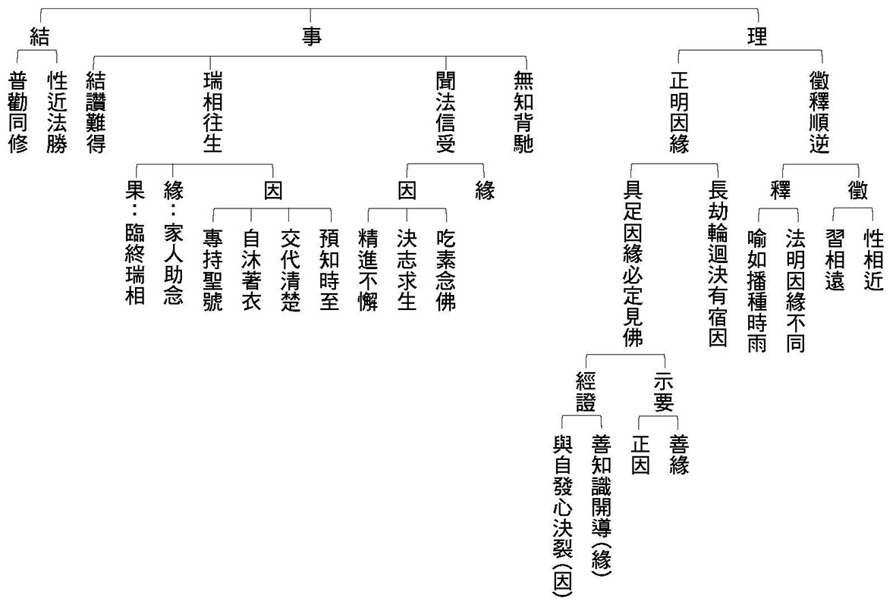

### 週四共修法語-有暇身勸受心要馬車略說

淨本

躬身入局馬車軌

掌中解脫弟子解

道次略論勝口訣

人生得意是正見

暇滿人身十分難得，因為難得，所以得到了若不珍惜，是最大的可惜。什麼是暇滿人身呢？暇是指沒有八無暇（也就是八有暇），滿是指獲得十圓滿。所謂的八無暇，分別是生在無佛法的邊地（四眾弟子遊行不到之處）、有邪見、六根有缺陷造成學法的困難，以及生在北俱盧洲這種過於快樂無心學佛的地方。以上四者都是跟投生人道有關的無閒暇、無法學佛；另外還有四個不是人道範圍內的無閒暇，分別是生在地獄道、餓鬼道、畜生道或生在長壽天。

十圓滿也可以區分為與自身有關的五自圓滿，以及與外在環境有關的五他圓滿。五自圓滿是指投生人道、生在有佛法的國度、沒有造作嚴重的惡業導致學法困難、六根具足、對佛法有正確的信解。五他圓滿是生在有佛出世的正法時期、佛有說法、僧者依佛所說法和合修學、有證果者、有功德主護持。如此定義下的五他圓滿，不僅我們不具足，連龍樹菩薩都未能具足。但是退一步而言，雖然佛已經入滅，我們還是可以有隨順具足五他圓滿者，那就是傳承仍在，有法源清淨傳承者代表釋迦牟尼佛住世說法，仍然可以說是五他圓滿。

所以是否沒有八無暇並且獲得十圓滿，重點都跟能否學習佛法有關，有學習佛法的人身，才是暇滿的人身，才是百千萬劫難遭遇的人身。一時因緣具足現起這樣的人身，那談何容易？真正了解這種人身的可貴，必定會盡力珍惜、好好運用而不敢空過。

一般我們可知最可貴寶物，大概是能滿足我們所有願望的阿拉丁神燈吧？這種神燈雖然只出現於童話，但相似於神燈的摩尼寶珠，卻是佛經上有記載，真正能滿眾生願望的可貴寶物。這種寶物若能獲得，必定心生狂喜。然而我們可曾知道，獲得能夠聽聞學習佛法的暇滿人身，它的價值更遠遠勝於摩尼寶珠。因為摩尼寶珠只能滿足這一生的願望，暇滿人身卻可以滿足生生世世的願望，甚至可以幫助我們成佛，這都是摩尼寶珠所辦不到的。如果能夠忍可這個道理，心中必定會產生變動，決不會再浪費使用這個人身的一分一秒。

在有暇身勸受心要馬車軌的教授中告訴我們，暇滿人身滿願的能力太廣大。不僅求生香巴拉淨土可成、求生極樂世界可成、求生兜率內院可成、與阿底峽尊者相遇可成，就是圓成佛果來說，獲得暇滿人身可謂已經成就一半。成佛之路好比推一個大銅球上山頂，具足暇滿人身，是這個銅球已經推至山腰，成功可期。戒定慧三學，惟人堪能，密法修學也是如此，而又以南瞻部洲的人道修學最為迅速。所以有已生極樂世界的菩薩，發願能夠具足生南瞻部洲的因緣，三十三天有神通的天人，也發願希望能迅速具足這樣的暇滿人身。

帕繃喀仁波切曾說，暇滿人身具有五種大力，能剎那修持，遠勝於其他天龍等身。第一是依境力大，有能受持別解脫戒的境界。第二是依心力大，也就是能發菩提心。第三是殊勝境力大，這是指有上師可以皈依供養修學。第四是依實質力大，也就是依據上面三者，此身可以生起福智二資糧。第五是依時力大，前三者的修學，在短時間內即可做到。由此可見成佛這件事情，當我們已經獲得了暇滿人身，那麼就不是能或不能的問題了，而是願不願意的問題。

在此處的教授中，又以依因、依喻、依量三方面來觀察說明有暇身何以難得。所謂依因就是依著經教的教導，每天都應該思維今日不使身心空過。依喻則是有種種美妙的比喻，讓我們去體會這個人身的稀缺性，已經遠遠超乎我們的想像。比如我們曾聽過的盲龜浮木喻，這樣的比喻我們可能認為誇張？但是若依著實際的數量來看（即依量），佛陀的這個比喻其實貼切，並不過分。地球上現有人類約八十億之數，這個數字看似龐大，我們若與三惡道眾生數量對比，這八十億人口之數卻又是微乎其微。僅算世界上我們可見的畜生，最新科學研究認為，螞蟻大約有二萬兆（二乘以十的十六次方）之多，這是銀河系恆星數量的兩千倍，是人口數量的四千萬倍。換句話說，一個在地球上準備要投胎的中陰身，光以螞蟻跟人的比例來算，他投入人身的機率，只有四千萬分之一，這比在台灣中大樂透的機率還低（大約是一千三百九十八萬之一）。這還是只有算螞蟻的數量而已，其他陸地動物、海洋動物、天空的飛禽等計入，那麼得人身的機會又剩多少呢？若再加上我們眼不可見，但是佛經上指說歷歷的餓鬼道與地獄道，他們數量更是遠大於畜生道，那麼得人身的機會又有多少呢？精算過這道數學題目後，我們此時再想想佛經上關於盲龜浮木、須彌穿針等比喻，是否不再感到誇大，反而有寒毛直豎之感呢？

在台灣，許多人不太會去買大樂透，因為他們不覺得自己會是那一千三百多萬分之一的幸運者；既然買樂透會如此理性，那麼關於獲得人身這件事情，是否也應該理性地去盤算一下，這該有多麼可貴！過去噶當派的祖師貢巴瓦修習暇滿人身的大義及難得，心中真實生起這樣的覺受，精勤用功，某次腿上被芒刺所傷，竟然不知道痛，想要拔出來竟然覺得沒有時間。

以上各種正因的說明，應當能讓我們生起暇滿人身的珍重感，既然已生珍重心，那就要好好把握。在此教授中，也教導我們如何創造暇滿人身的業因，才不至於失去這樣的珍寶。業因有三，首先以戒律為主，其次以布施為輔，第三要加上猛利淨願的迴向才可成。但觀此三種因，要求全部具足，其實也不容易，所以眼下既然已經獲得了這個有暇身，表示過去必定有上述三因的修持，試問「此身不向今生度，更向何生度此身」？

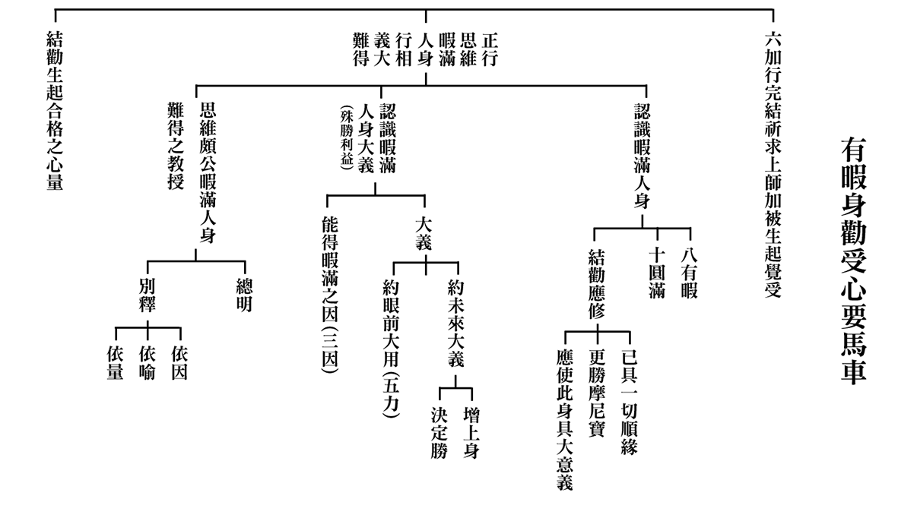

### 週四共修法語-皈依三寶馬車略說

心筑

皈依分為三士道

基礎在於下士道

怖畏三途求救護

業果抉擇得增上

為了遍滿虛空的有情眾生，我們必須要成就無上正等正覺。這樣耳熟能詳的一句話，如果能有廣大的知識背景，對正理的串習，會讓我們學佛內心發生變動，修行產生本質上的變化。沒有人可以代替我到來世，來世的險道是我們自己要去走的，而這些都是自己抉擇的結果。

今天要報告的是皈依三寶馬車。所謂的皈依，是歸向、投向、依靠三寶，我們在修行的路上，需要不斷地被提醒，建立完整的思維模式，來堅固我內心皈依三寶的願望。皈依可以分為皈依因、皈依境、皈依量、皈依勝利和皈依學處。

第一個皈依因，也就是我內心皈依三寶的動機，總說是怖畏苦、求救護，尤其是怖畏三途苦，第二皈依境，也就是皈依佛、皈依法、皈依僧，他們到底有哪些殊勝的狀態，值得我去依靠。第三是皈依法，也就是如何去修皈依。第四個是皈依勝利，也就是皈依有何殊勝的利益。第五個皈依學處，即要做什麼來堅固我的皈依？要怎麼做才會得到後世的安樂？

在每一個法類觀修之前，要先修六加行，依資糧田而修，將廣行派、深觀派、加持派的上師跟眼前的根本上師合一，把四大本尊、四部本尊、三寶、空行勇士、護法跟上師合一，全部收攝至上師的心中，將上師安住在我的頂上。向我的上師吐露我內心的渴望，我跟一切的如母有情，之所以陷在苦海中，都是因為沒有生起皈依法門，沒有把三寶當成我唯一依靠的對象，希望傳承加被我，讓我修學皈依三寶有順緣、去除逆緣，讓我內心變動，為利有情願成佛，直至菩提我皈依。

第一、皈依因。

為了要希求後世的心，先思維三途苦，確立如此痛苦的地方不是我想要去的，再把之前所說的死無常觀修，死亡到來的時間無法預測，無法商量，是我自己孤單一人去的，沒有活過明天的正因，在害怕墮落三途的基礎上，那種恐怖害怕的感覺要生起，在這樣的基礎上，想要尋求三寶的幫忙，這是皈依因。

剛開始修，可能會不知道哪些行為是惡，也以為自己的見地觀念是正確的，甚至骨子裡面不相信自己會墮落惡趣，漠然放逸地過著每一天，這樣做的話，來世的引業，異熟果會引導我們到哪裡呢？一定要趁著還有一口氣在，好好的跟著具有救護功能的三寶，虔誠皈依，改變引業，得到殊勝的增上生和決定勝。

第二、皈依境。

也就是皈依佛、法、僧，佛是說法者，把離苦得樂的道理說清楚的人，法就是離苦得樂的方法，對佛說的法做正理的思維，進入法義觀修，成為我內心的覺受，對法的體悟從比量到現量；僧是能依道次第修行的善友與同儕。皈依才讓佛變為有用，對三寶有勝解，彼方成為可皈依的對象。

第三、皈依量。

如何合量的皈依，以那些道理求受皈依，也就是得到後世安樂的方法。為什麼皈依會得到後世的安樂？因為業果能讓皈依發揮作用，靠著思維業果，將皈依的學處跟業果兩者合起來，得到後世的安樂方便。

這當中分為四個部分，首先知道佛法僧的功德來皈依，例如佛身的各種相好功德：佛能隨緣示現而行十二種佛行事業，佛能隨類現身應機施教，佛的身相廣大且擁有無見頂的智慧，佛身現各處說法，並且擁有種種神變，佛足跡所到之處加被地上的各種微小蟲類，佛光能讓地獄化為清涼，寒冰地獄轉為溫和，六道眾生各類痛苦都能止息。

佛語的神通功德以六十梵音為代表，佛以一音演說，眾生隨類各得解，而且遠近同聞。佛意的功德是那伽定，佛以不出定（能所雙亡的定相續）的方式開顯大悲，菩薩、聲聞乃至凡夫種種神通，皆受佛力加被，其他如八解脫門、十力、四無畏、十八不共法，都是佛意所顯現的智力差別。

皈依量的第二部分是知差別功德而皈依。佛法僧等可以從體性、事業、信解、修行、隨念和生福差別上來成立對三寶的皈依。

第三部分是自誓皈依，也就是我自己立誓皈依，非由他人勸導、勉強等因素，觀己如病人，佛是良醫，法為良藥，而僧伽就如護理人員。

第四部份不說有餘皈依處。即是堅定不移地學習佛的教法，不以其他外道為皈依的對象。

以上四點就是合量的皈依。

第四、皈依勝利。

皈依三寶內心變動之後，可得到八項利益。第一、入佛子數：思維皈依的內涵，內心產生至誠之心，由此而入佛門，成為佛子。二、諸戒之本：田地是莊稼生長的所在處，皈依是一切戒律生起的根本。三、昔劫諸障，得減輕微或消除。四、累積廣大福德。五、人與非人不能為害。六、不墮惡道。七、隨願皆得成熟：祈禱三寶令現前與究竟的所有善事都能如願實現。八、速疾成佛：心中有了皈依的等流，世世生生時時憶念跟隨三寶，直至菩提。

第五、皈依學處。

皈依之後要按照下面的學處來好好修法。分為各別學處和共同學處，學處分為應遮止和應造作的。各別學處應遮者，包括不可皈依外道天神，不能損害有情，不許與謗法者共住，內心在任何情況下都不捨三寶，也不可講出情緒或開玩笑的話，比如我不要皈依三寶，我不想要學佛了，一旦說出這種情緒話，做出離開三寶的行為，後面要付出的代價實在令人害怕！

應行的學處：要把佛像當成真佛看，修恭敬心敬重佛像，學教理時也不可生毀謗之心。見到僧眾皆應尊重。

共同學處：依著道次第的修持，要將死無常拿來觀修，在這樣的基礎上生起對業果的決定信，只有三寶能救護我。就像我是死囚只有皇帝能赦免我；我是病人遇上良醫（佛），良醫開處方我必定信受奉行，乖乖吃藥調整作息。對於佛所說的業果關係，以正因來成立由業轉果的道理，改變自己的思維模式，進一步改變自己的命運。

在求救護當中，因為有三寶的加持，引業那一分的功德，外道是辦不到的，引入人天的引業，只有三寶能做到。而業果才是皈依的主體，讓皈依發揮作用。如何讓三寶發揮作用？緣的部分是三寶，因的部分就是學處跟業果的思維。

成立殊勝的皈依，就要講究皈依因（動機）、皈依境（對象）、皈依合量（方法）、皈依勝利和皈依學處，從這五方面成立完整的皈依，然後讓內心產生變動，讓三寶發生作用。

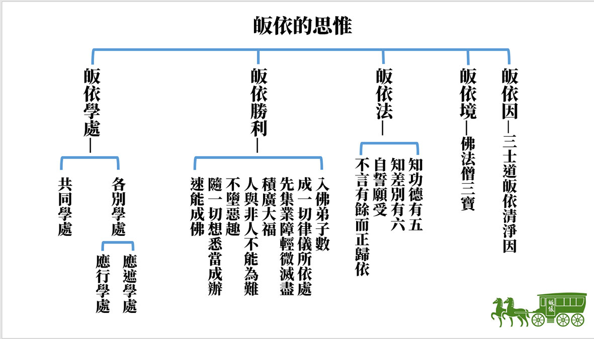

## 蓮池海會

### 許瓊治老居士往生見聞記

宗徹

含辛茹苦的典型

老輩堅韌的寫照

孝孫往生的護持

方現價值的人生

九月十六日晚間六點多，接到來自崑生叔叔的電話，得知九十七歲的奶奶病危，我便趕緊上病房裡守著。一直知道這一天會來臨，該面對的終究要面對。

奶奶一直由崑生叔叔、美悅嬸嬸照顧。崑生叔叔是她嫁給第二任丈夫的遺腹子，也算家中的「長子」。第一任丈夫過世後，奶奶獨力照養四個孩子，還好大兒子與二兒子都算勤奮，可以為家裡張羅生計，但經濟上已無法支持她養大女兒、三兒子，於是託給親戚與友人。直到後來遇到了第二任丈夫，她總算有一個可以安頓的環境，於是就帶著兒子崑生叔叔，在淡水賣麵、照顧婆婆。後來又生了一男一女。

本來奶奶一直不願離開淡水新建巷的老家，那是陪伴她數十寒暑的環境，既是鄰居街坊熟知的老麵攤，也是她照顧家人的老房子。奶奶也是淡水清水祖師的虔誠信徒，每年到了清水祖師巡境，她都堅持要在家門口安置香案，迎接祖師來到。

然而，美國九一一事件發生的那一年，先是奶奶第一任丈夫的長子、我的父親心肌梗塞過世，後又遭遇第二任丈夫病逝，於是奶奶無心繼續工作，在叔叔、小姑的鼓舞下，八十歲的她到對面的淡水小學開始學識字，完成她人生最大的夢想。

讀「小學」期間，奶奶非常積極好學，是班上最受歡迎的學生之一。她勤奮於練習，喜好動手做，因此學會很多技藝，又能歌善舞。一位八十多歲的老奶奶，總是活力十足，總令人感到新奇。於是奶奶先後接受採訪，也被邀請到電視表演，先後獲得了民國九十九年台北縣第一屆終身學習楷模，新北市一○七年度模範母親。

後來老奶奶有在老家不慎跌倒的狀況，叔叔、嬸嬸考量母親的安全，於是將她接到新店居住。九十歲時，她還能製作許多手工藝品給兒孫玩賞，但到了九十三歲後逐漸有失智症的症狀，健康也每況愈下。雖然如此，叔叔、嬸嬸將奶奶照顧得很好，在新冠疫情期間，她也不曾受到感染；直到九十七歲，奶奶依然可以用雙臂支撐起整個身體，且沒有任何慢性疾病的困擾。

結果就在今年九月初的一個下午，外傭帶著奶奶出門曬太陽，卻被一陣風給吹感冒了。起初叔叔以為只是小感冒，就帶她到附近診所看醫生，吃診所開的藥物，結果病情未見好轉。回診時，醫生看情況不妙，建議將奶奶轉送大醫院。經過檢查，才發現她的肺部已經有嚴重的纖維化，且血液中也有細菌感染的情況。

奶奶於九月十一日進入地方醫院，在急診室等病床就待了一天，經過叔叔的努力安排下，終於有了病房。接下來是一連串的身體檢查，報告結果卻不樂觀。叔叔最終決定請醫院不再進行侵入性的醫療措施，讓奶奶在自然的狀態下，度過她人生的最後時光。

從奶奶確診失智症的那天起，我就天天為她祈福，迴向功德，期盼她能保持健康，並具足往生極樂世界的順緣。這樣的迴向功課持續了一年多，但也許更久，總算來到了要兌現的時刻。

我從得知奶奶住院後，就天天到醫院報到，與叔叔討論我的想法，並隨時向唐老師匯報溝通結果。幾次溝通後，叔叔同意按照學會建議的助念方式：當奶奶還有氣息時，便開始助念，且佛號機的佛號聲不斷；直到她斷氣後，堅持三到八小時不移動她的身體，持續念佛。

為了讓家人能為奶奶助念，叔叔積極地跟醫院溝通，過程中打了許多電話，經過多次的協調，總算爭取到病房的獨立使用，不必與其他病人共享。叔叔又提醒弟妹，在病房內不能哭泣，如果無法控制情緒，就到病房外等平復心情後，再進來病房念佛。

十七日凌晨，我和弟弟輪流守夜（醫院有病房人數限制），念佛陪伴奶奶。快到半夜一點時，弟弟要我去休息，我便睡了一會兒；不到三點醒來後，我繼續為奶奶助念。到了四點，我看見弟弟也累了，便請他回家休息，留下我和奶奶獨處。

我利用這段的時間，在奶奶耳邊重複我曾經跟她分享過的極樂世界：「奶奶，您喜歡旅行，也很愛學習，在極樂世界可以遊歷很多不同的星球，可以跟很多的佛祖學習，那裡最適合您了！您去了極樂世界，我們也能去找您，將來我們可以在極樂世界團圓……。」

我對著奶奶說了許久，然後繼續念佛。到了當天上午六點半，我請幫傭協助她換衣物時，發現奶奶的血壓降低，呼吸也變得很緩慢。我趕緊聯絡叔叔、嬸嬸過來醫院，並繼續為奶奶念佛。

我提醒奶奶：「如果時候到了，就跟著阿彌陀佛和觀音佛祖（奶奶習慣這樣稱呼）去極樂世界吧。這個身體已經不堪使用，想要說話也沒力氣，不如等到了極樂世界，有了新的身體與生活方式，無論想跟誰說話或去哪裡，都是沒有問題的。」

將近中午時，學會的同事們在唐老師的通知下，陸續加入助念。我趁機去買杯咖啡提神，順便換個口罩。離開前，惟元學長提醒我把金剛砂放在奶奶胸口，我就下樓去便利商店。結果叔叔打來電話，告知奶奶已經氣若游絲。

我立刻趕回病房，當時是上午十一點四十五分。我確定儀表板上顯示奶奶已無心跳，便與文輝學長幫她蓋上陀羅尼經被。奶奶選擇在大姑和文輝學長在場時斷氣，是否正是時候到了？文輝學長形容她長舒了一口氣後，便停止了呼吸。當我們為她蓋上陀羅尼經被的時間，是十一點四十六分。

接著，我盡可能寸步不離地在奶奶身旁念佛，學會的老師與學長們也陸續加入助念，整個病房儼然像是一間佛堂。我心裡想著，大家的佛號聲不僅能加持奶奶，也能幫助醫院裡所有受苦的人，讓他們得到病痛的舒緩；若將死去，也能隨著彌陀佛號，往生極樂世界。

三個小時後，醫生宣告奶奶的死亡時間為十一點四十七分，那正是我為奶奶蓋上經被後起算的。

由於我們已經超出使用病房的最大極限，護理師來幫奶奶拔除身上的管線，然後我們將她移動到地下室的助念室。雖然沒有達到八小時不動身體的理想，但前面的三小時，至少奶奶得到了安詳的助念，這也在一定程度上達到印光大師說的：「若病人將欲斷氣，宜三班同念。直至氣斷以後，又複分班念三點鐘，然後歇氣，以便料理安置等事。」

到了助念室，更多學會的老師與學長們加入念佛行列，直到晚上八點助念圓滿。惟元學長帶領大家進行觀功念恩的佛事，然後迴向功德，並敘述奶奶的生平。在瞻仰遺容時，奶奶的面容十分祥和，臉上的斑紋幾乎全數不見，還微微發光，大姑與叔叔都十分驚奇。在文輝學長的提醒下，我刻意去摸了奶奶的手腳，好柔軟！奶奶已經到了極樂世界！

禮儀師在協助奶奶換衣服的過程中，不小心碰觸到奶奶手上點滴的傷口，一度留了許多鮮血，還流到了地上，這件事情讓禮儀師感到驚訝，畢竟已然經過八個多小時。

總之，我的心願終於達成，內心充滿喜悅。對我而言，這是一次幫助家人往生淨土的重要里程碑。我感念著唐老師的繫心關懷與慈悲指導，感念著學會大眾在中秋節撥空來幫奶奶助念，感念著叔叔與家人願意一同護持奶奶往生淨土……。

我走在天上一輪明月下，回覆著手機傳來親友們的中秋祝福，心中充滿安慰與平靜：中秋節，快樂。

期盼著有朝一日，我要在極樂世界與奶奶團圓，這是我與奶奶的約定。

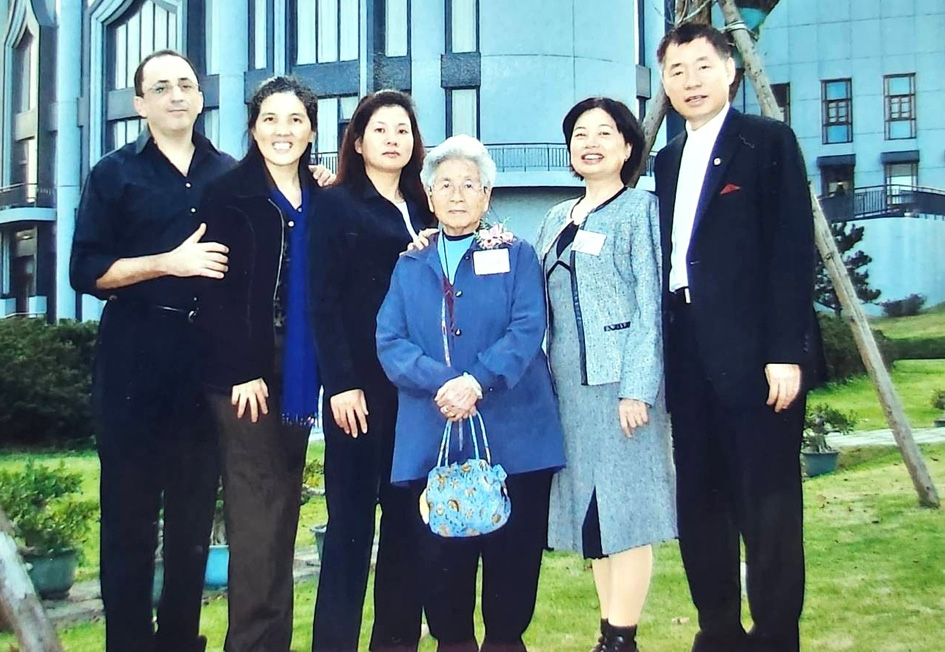

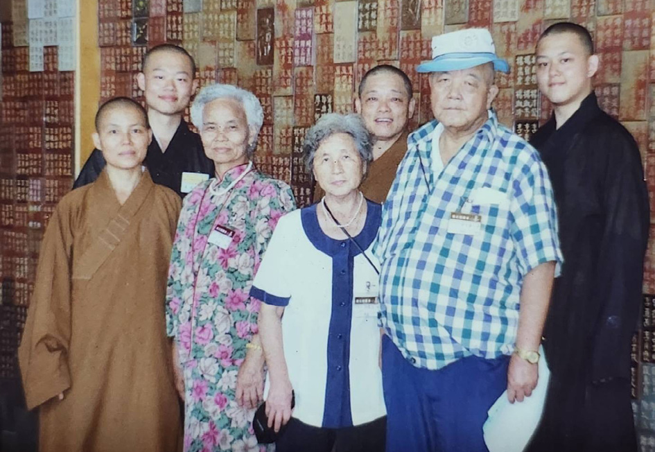

## 孔學一隅

### 孔門心法—中庸之道(三十二)-第二十八章：免難消災的為政

*時哉講述、弘毅整理*

有位無德不好自用

有德無位不好自專

制禮作樂制度考文

代代損益發揚光大

—前言—

樂於學習的人知道學海無涯，愈學愈覺不足，所以形象上會顯得謙虛，不會自以為是。透過本章的學習，只要能把握住原則，就可以在工作及生活中消災免難。

人都會有盲點，會有一些自己看不到的問題，我們要透過經學對自己放大檢視，或者透過別人對我們勸導，或者看到別人問題時想到自己。如果沒有從經學去找到自己的問題，沒有得到好的朋友勸告自己，也沒辦法從他人的問題，發現到就是自己的問題，此人的一生大概就可想而知了。

本章告訴我們處在世間，要想找到自己出路，必須先了解自己的困局，否則發展愈好，瓶頸愈大。若懂得這些道理，則能夠翦除過失，翦除隱微的障礙，人生就會有很大的出路與福報。

中庸總體科判

第二十八章還是在講中庸的修學法和義理。

本章科判分析

治國有一些要點，為政者一定要看到自己的問題在哪裡，到底要用的是什麼樣的人，不可以讓禍害一直蔓延，成為自己和國家社會的災難。

章旨

這章告訴我們，人要有自知之明，自知之明是最難的，心理學也說了解自己是最難的。當我們很深入了解別人問題的時候，回過來一定要看看自己有沒有這種問題，自己可能是小心眼、說大話，做事情馬虎草率，不守信用，只講究口才，不講究行動力，或是行動當中也不了解義理所在，問題很多卻都不會回觀自己，所以往往愚而自用。或者不會跟上面的人和諧相處，不懂得去請教，而變成賤而好自專。或者生乎今之世，連古之道在哪裡也不知，這個時代該怎麼往前走也不會，只剩下盲從，所以如何了解古之道、今之展。生乎今之世，以這個時代的思維、學習了解這個時代的發展，再與古道接軌融合，來對古今做注解，就真的是一個能夠弘揚古道，又能夠在這個時代替很多人找到出路的人才。

—消文釋義—

經文：

子曰：愚而好自用，賤而好自專，生乎今之世，反古之道。如此者，烖及其身者也。

釋義：

「愚」就是事理不明白；「賤」指下位者；「烖」，災難。

消文：

上位者事理不通卻喜好剛愎自用，自以為是，不肯聽從良師益友或大臣的勸諫。

其實愚不可怕，不承認自己愚才是最可怕的。舉例來說，魯國三家大夫沒有治國的能力，又不肯好好任用孔子或孔門弟子，以為保住自己的權力就好，使得孔子後來黯然地離開魯國。雖然三家大夫都保住了自己的權力，可是魯國卻愈來愈弱，盜賊一大堆，鄰近的齊國也有滅魯國之心，內憂外患不斷，這樣的執政令己每天都吃不下飯，又有什麼好？很多為政者只想保住權力，不管國家衰弱，可是國家如果被滅了，他們的權力和金錢不但沒有用，可能下場還很慘。所以愚者要懂得請教高明、任用賢才、察納雅言，他就不會愚了。雪廬老人說，大清帝國不是亡在腐敗，而是亡在無知，整個時代在變化，大清卻故步自封、墨守成規，愚而好自用，終於滅亡。所以要愚而謙虛，愚而請教，愚而運用人才團隊，如此雖愚必明，像高柴就是愚直之人，經過學習後而能變通。

第二個是下位者卻喜好自作主張，有時候會陽奉陰違，或是不了解上面人的用意，或是他另有利益所在，這些都很危險。

好自專者不會跟人合作，不肯商量，人緣不好，跟上級沒辦法合作，發生事情的時候也容易被處分，或者別人不肯幫忙。譬如一旦跟上級處不好，讓上面的人發覺你有問題的時候，你很難走下去。所以賤而不自專，弄懂上面人的意思，有些政策都是跨部會的合作，要懂得協調溝通，聆聽別人的意見，才能共辦事業。當然也有例外，譬如歷史上有些大官遇到荒災時，上面的人不同意開倉賑災，他自專把糧倉打開賑災，這種自專是好的，要另當別論。

第三個是生在現代卻返回古代的作法，或者是一味的反對古代先王之道。

第一種解釋是不肯與時俱進，古禮走到這個時代，沒辦法跟人融合，不但造成他人的不便，也讓自己孤立。第二種解釋是反對古之道，時代進步很快，大家一味的反對古之道，認為古人都不好，其實古人的孝悌忠信、禮義廉恥、仁民愛物、內聖外王、風氣淳厚都是很好的，所以要不反對古之道，可是也不返回古之道。雪廬老人說，我既不食古不化（不腐敗），也不趕時髦，不食古不化就是不會返回古之道，可是我也不趕時髦，雖然我也要了解這個時代，該反對古之道的我反對，但不該反對古之道的時候我不反對。對於有利於現在發展的五倫教化、禮樂，就不要反對，這裡面很多原則不能反對，很多做法卻是不能返回的。王安石的變法改變很多，反對變法也造成宋朝很大的災難，司馬光回來主政的時候，通通返回古之道，也造成人民諸多不便，所以如何折衷，考驗主政者的智慧。

時代變化很快，如何返回古之道，讓風氣淳厚、講信修睦、上下和睦、家庭孝悌，在禮節上已經不適合現代發展的時候，如何反對古之道。譬如古代的服裝、外交禮儀、進退應對的作法、度量衡，和現在不一樣，你不能返回古之道。

如果一個人見地狹隘、格局狹小，不能夠觀乎大局，不能夠跟現代人相處，就容易被排擠，或是惹禍上身，或是使事情的推展窒礙難行，甚至是被貶黜。如果硬行不合時宜的古之道，是沒辦法讓老百姓遵從的，會讓社會脫序、民心渙散、制度崩盤，大家陽奉陰違，主政者一定有災難，一定會有內亂，內亂一定引發外患，災難會從外到內，最後延燒到自己身上。可是為政者有時候看不到危機，譬如禍亂在遠方他看不到，可是慢慢會愈來愈近，終於燒到他。以前康熙皇帝說，在遠方的災民因洪水氾濫，淹沒良田，所以沒飯吃，你不賑恤災民，明天這個洪水就會淹到皇城。所以為政者要像故宮畫展裡乾隆皇帝畫的母雞帶小雞，就是要有母雞帶小雞的胸懷來主持大政，把百姓當成家人一樣的愛護，要著重這個時代的發展，又能夠維持古代的精神。

經文：

非天子，不議禮，不制度，不考文。今天下車同軌，書同文，行同倫。

消文：

一個國家只有主政的天子才能制禮作樂，由天子來組織討論、頒布禮，制定法律和度量衡，考究文字的形、音和義，因為只有天子才有公信力，讓天下臣民共同遵守。

「名不正，則言不順。言不順，則事不成。事不成，則禮樂不興。禮樂不興，則刑罰不中。刑罰不中，則民無所措手足。」你有名就可以去考文，把文字的字形、字音、字義清楚定義，這樣大家才能正常溝通。天子一定要議禮、制度、考文，天子要對道、禮了解，要了解這個國家的大政，了解時代，制定政策讓大家共同遵循，不能愚而好自用，搞得天下大亂。如果天子是愚的，那要愚而不自用才行，要重用像孔子這樣能夠議禮、制度、考文的人才，發揮大用。然後由天子來發布，讓整個國家的語言、文字、禮樂，都能讓老百姓遵從，讓政治上軌道，制定一個能夠發展、和諧、創造利潤、公平的制度。

戰國時期的東周，雖然名存實亡，但是周天子名義上還是天下共主，所以不妨說天下的車子寬度是一樣的，所書寫的文字也是相同的，天下人都講究五倫關係，走到哪裡都是一樣的。

以前中國大陸火車開到哪一省都是一樣的車軌，謂之「車同軌」，可是閻錫山當山西省長的時候，他就車不同軌，車子開到山西要另外換火車，這就很麻煩，所以「車同軌」是要老百姓生活過得便利，包括度量衡都要統一，這些都須講究。

「書同文」是說寫的字都一樣，當今世界只有中華文化，字跟古時都相通，所以現代人可以看懂古書，埃及文明、巴比倫文明、印度文明都沒有這個能力，印度人自己都看不懂梵文。我們以前去過緬甸，緬甸的巴利文除了寺院的一些出家人還可以看懂，一般的緬甸人是看不懂的，當古文都看不懂時，文化就失了根。所以「書同文」非常重要，天子要來「考文」。《論語‧述而》說「詩書執禮，皆雅言也」，說話時音正而義全，音要對，詮釋的義理要正確，人跟人之間就能溝通，道統就能保留，國家就能發展，民族就能延續。所以天子不是去管一堆雜事，天子要抓大綱，《孝經》說，天子要推展的是風氣，要用的是人才，要考量的是制度，假如天子重視這些，國家就能走上正軌，發展出美好的氣象。

「行同倫」就是大家都要講究五倫關係，走到這裡是孝弟，走到那裡也是孝弟，走到這裡該這麼辦，走到那裡也該這麼辦，走到這裡殺父要死刑，走到那裡殺父也要死刑。古代殺父殺母是就地正法，沒有什麼可堪教化，這個地方要把它挖掉、灌水、變成水池，代表是不能住人的地方，哪裡都是如此。雪廬老人說以前法官判案，最後的法律標準就是「孔子說」，就是聖人的見地，當天下的法官都是這樣的標準時，那些玩弄法律的人就無法得逞。現在法律沒有是非標準，所以民無所措手足，當沒有人相信司法、相信法官是公正的時候，是無法讓治安維持穩定，讓人民對國家有信心的。

經文：

雖有其位，苟無其德，不敢作禮樂焉。雖有其德，苟無其位，亦不敢作禮樂焉。

消文：

雖然有天子之位，但如果沒有德，也是不敢制作禮樂、訂定章程、訂立制度、考究文字，所以叫做「愚而不能好自用」。不要小看禮樂，當開國制定禮樂的時候，別人一到你的國家，立刻知道此國家的國運，如季札到一個國家，聽該國宮廷音樂，就知道興衰。所以愚的國君不可以剛愎自用、自以為是，文字、文章不能根據個人的喜好馬虎草率地隨意亂用，國家的標準隨意更改，不能愚而好自用，要懂得用真正的人才，用能夠經營風氣的人才，延續道統的人才，發揮他們的內涵、特色、優點，結合當今時代來制禮作樂、考究文字。

雖然如孔子一樣有德，可是如果沒有天子之位，也是不敢制作禮樂的。孔子雖然不敢作禮樂，可是孔子可以把禮樂說清楚，讓有位之人頒布實行，或者傳給弟子及後世，等待後面有位者能夠依此見地制禮作樂，利益天下蒼生，利益國家民族。

經文：

子曰：吾說夏禮，杞不足徵也。吾學殷禮，有宋存焉。吾學周禮，今用之。吾從周。

消文：

孔子說：我能夠把夏禮說清楚，他曾說「其或繼周者，雖百世可知也」，孔子是一個能夠推衍的人，能夠從周禮推衍到商禮，從商禮推衍到夏禮，可惜杞國已經沒有保留夏朝的文獻，無法證明孔子所說。

雪廬老人說讀歷史要別具一隻眼，從這個事情推知前面，如果有文獻就可以證明，此人做了這樣的事情，就知道後果為何。所以老人說，他看的報紙叫做神通報，他沒有神通，但是只要看看標題就知道發生什麼事，然後往往過一條街，看看人心就知道大概了，這就是經驗閱歷夠，讀書讀通，自然看事情有眼力。

孔子說他能夠學習商禮，是因為有宋國保留了商禮。可是《論語》還有經文說「殷禮吾能言之，宋不足徵也」，這是因為孔子和子思都是宋國人，後來祖先流亡到魯國，此處所說是保留面子給宋國，其實宋國關於商朝的文獻也是不足的。

孔子是可以說夏禮、學商禮的人，雖然夏禮和商禮各有其精華和特色，可是這個時代是周朝，所以他要用周禮，遵從周禮。

周禮有兩種，第一個是保留夏商的精華和道統，第二個是在做法上有很多的改變。孔子那個時代是周的末期，變動不居，可是孔子不能制禮作樂有所損益，因為周天子、魯君都沒有叫他做這件事情，所以他只能說「吾從周」。孔子「吾從周」有三個原因：第一個因為他是周朝人，他從周，不會從夏、從商；第二個是因為他有德無位，所以不敢作禮樂，只好從周；第三個也要培養一些通達禮的原則、做法、能夠適應時代的人才，在天子、國君賞識的時候，能夠幫助國家制禮作樂，走入時代，維護道統。孔子是一個有遠見、熱忱、公心、仁心的聖人，可惜各國都沒有重用孔子。唐玄宗因此感慨「夫子何為者，棲棲一代中」，孔子在當時沒有被用，死後反而成名於後世，叫做「今看兩楹奠，當與夢時同。」

釋義：「杞」指杞國，當年武王伐紂後，以王者氣象「繼絕世，興廢國」，把夏朝的後代封在河南的杞國；「宋」指宋國，武王伐紂後，把商朝的後代封在宋國，保留商朝的祭祀。可見武王是一個厚道的人，後面周公制禮作樂，承接文武之道，用禮去保留溫良恭儉讓的道統，保留淳厚的道統。

—總結—

孔子的學問是能夠引導我們從愚變智的，當我們學到道統的時候，我們不但不賤，還是一個有天爵的人，天爵比人爵尊貴，愚可以變成智，賤也可以變成貴，智是聖賢的智，貴不是人爵而是天爵。生乎今之世，要非常感謝現在古籍取得容易，正確的注解也都能流通，只要你有擇法眼，有好的老師，你可以反對古道，也可以不反對古道，你可以返回古道，你也可以不返回古道，都得心應手，從容不迫。

國家在制禮作樂的時候，你能夠知道其利弊得失，領導人用你的時候，你就是一個能夠幫助他制訂禮、制定制度、幫助他找到資源的人才。比如現在發展出很多新的事項，要有更多的文字去講它，必須要有能夠制定文字的人才。當年佛教傳到中國的時候，要發展好幾萬個語詞去解釋佛教，現在很多新學問出來，也是要發展很多字去解釋它，學理工科就知道，成績要好很簡單，就是真的把定義弄清楚。果然在禮樂、制度、文字上好好去講究，不但在民生上有所幫助，在風氣上也能夠淳厚，在發展上也有未來，國家也能強盛，民族也能延續，這是讀書人應有的責任，也是一個要利益天下蒼生的領導者不可推卸的重責大任。

如果國家安定、民族延續，各行各業一定能夠發展，大家不但能夠吃飽、穿暖、住得舒服，生活一定享受，生命一定豐富，讀古書的好處就在這裡。（下期待續）

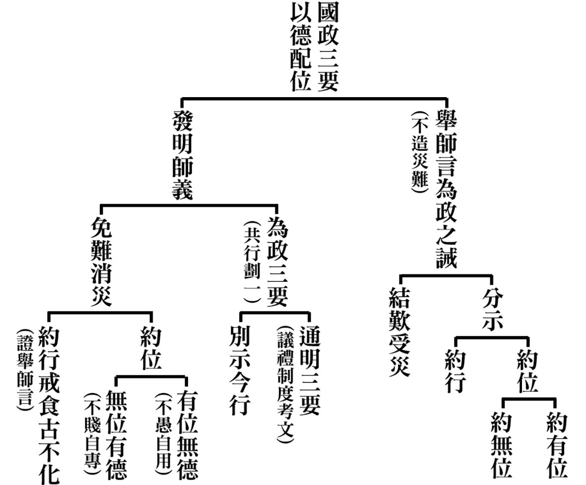

### 孔門十哲—孔門弟子中最耀眼的十顆星（十一）   好義知禮的子路(下)

圖

師徒革命情感

文武兼備大賢

行行如也個性

橫死不違於禮

子路本不學無術，被孔子引導入門，並善巧調教後，學有所成，成為大賢，孔子是他生命中的貴人，是孔門四科中政事科的代表人物。他的個性勇悍，被孔子調教成能掌握時機，具有果斷力的領導者。本篇將繼續說明子路內政與軍事上的才華，以及他對國家的貢獻。

《論語‧雍也》篇記載，季康子曾問孔子：「仲由可使從政也與？」子路是否可以從政？孔子對子路的讚歎是：「由也果」。至於能不能從政，孔子請季康子自己看著辦。因為季康子是權臣，孔子不太想推薦人才給他用，但也不能阻礙弟子們從政的出路，或許這也是報效國家的機會。可是當季孫大夫的族人季子然向孔子問，子路是不是大臣？孔子回答季子然：「可謂具臣矣。」只能算是具臣，因為在三家大夫這些僭越禮制的權臣下，是沒辦法推展「道」的，所以做不了大臣。但子路是具有臣子的才能（具臣）與能耐，這點無庸置疑。
另外在〈公冶長〉篇中，孟武伯向孔子問子路時，孔子回
**答：** 「千乘之國，可使治其賦也」，子路是一個能統領千輛兵車大國的治軍將領。在〈先進〉篇裡面，子路也承許說：「千乘之國，攝乎大國之間，加之以師旅，因之以饑饉。由也為之，比及三年，可使有勇，且知方也。」可見子路是一個能夠保家衛國的人，即使國家面臨兵災，受到外國侵略，國內又發生饑荒，子路有能力讓軍民團結，國民能謹守禮義，且有作戰的勇氣，換句話說子路是一位能激勵士氣，且能修明內政之人。而子路果真如自己所言，在政治上有一番作為。魯定公十二年，孔子為魯國司寇，子路做季氏宰，他不但平定了季氏家裡的內亂，且協助孔子主持「墮三都」。叔孫和季孫的都邑，在子路的堅持下，都先後拆毀了，整頓魯國的形勢一片大好。可惜魯定公迷戀齊國送來的美女，終致功敗垂成！

在《韓詩外傳》跟《家語‧辨政》篇，子路曾經在衛國蒲邑為邑宰（縣令），治縣三年有成。孔子去該縣邑查訪後三番讚美（善哉由也），讚美子路「恭敬以信」，即非常慎重他的職位，所以得到老百姓的信任，這是子路為官成就的第一步。那是因為孔子看到邊境，百姓的種植井然有序，人民安居樂業，勤勞以增加收入，這正是政府施政的成效。其次孔子讚歎子路「忠信以寬」，即為政不欺民，而且寬厚對待百姓。那是因為孔子到縣邑裡看到各項設施完備、樹木種植得非常茂盛，代表老百姓將自己的環境與公家的環境整頓得非常好，是一種對政府高度向心力的表現。第三是孔子讚歎子路「明察以斷」，那是因為孔子到了子路官衙的庭院，看到子路非常清閒，屬下都非常盡力辦事。由此可見子路是一個明白人事之人，不會干涉屬下，讓他們能盡力發揮，這是很高的領導藝術。從子路治蒲可以看出他政治的才能，雖然這是牛刀小試，然由小可以觀大。如果他有機會主持大國之政，成就可想而知。

《禮記‧禮器》與《孔子家語》當中還記載子路「知禮」的一面。當時子路為季孫大夫家臣，看到季氏家中的祭祀禮數繁瑣，時間又拖得長，以至於到晚上點上燭火繼續。由此一來，祭者因疲倦，敬意與儀容都不足了；配合的有司（辦事人員）儀態也不整齊，這已經到了大不敬的地步。子路為了整頓這樣的現象，把祭祀的時間提早到早晨，又省略很多繁文縟節。此番整頓後，由於時間把握得恰到好處，大家能提振精神，很好地將祭典的精神面表現出來。所以孔子特別稱讚他「知禮」，可見子路的才能不只是在內政上、軍事上，在祭祀禮儀上也都有非常好的能耐。《左傳》說：「國之大事，在祀與戎。」而子路皆能，從〈先進〉篇中子路承許自己治理千乘之國，能使「人民有勇，且知方也。」可見子路並非說大話，而是真正的執行者。

子路何以在孔門座下能學有所成？除了質地好、學習力勇悍、有熱情、有執行力外，最重要的是他好問而學的精神，肯努力把自己塑造成為辦政治的人才，成為君子的形象。子路在〈子路〉篇中問士的形象，在〈憲問〉篇裡問君子及問成人的形象，並特別問君子崇尚勇嗎？可見子路對於自己具足「勇」的那一分感到十分滿意，然而孔子告訴子路「道德的勇氣」更重要。子路在〈子路〉篇裡問如何為政，在〈憲問〉篇裡問如何事君，對於管仲沒有為他的主子殉難，是否不仁不忠？然從孔子的大處回答，可知管仲才是真正仁（忠）者。這也顯示子路是一個善問的學生，更是一個忠義之士。

孔子對子弟們時常施予機會教育，藉著那個場景來提點學生。例如〈鄉黨〉篇中，孔子與子路經過山澗上的橋樑，看到雌雉悠然自得，孔子便讚歎野雞能得其時，正所謂「時哉時哉」。子路聽到老師的讚歎，便肅然改容，拱手作禮。這好比古詩上說，鳥見人的態度不善，會立即飛向高空，經過觀察安全之後，才肯下來棲息。比喻人事的出處進退應合時宜。從此可知，孔子善於機會教育，而子路也是有悟性之人，可受點撥。

值得一提的是，孔在周遊列國時，遇到隱士勸諫的時候，也會藉著子路來表明心志。例如〈微子〉篇中，長沮、桀溺兩人在田中耕作，孔子請子路去問渡口在哪裡，他們表示孔子就是一個知道渡口的人，意思是孔子是知道人生出路的，何必問別人出路，並勸子路與其跟著孔子到處尋求機會，處處不合適而避人，還不如像隱士一樣離開人群，做一個避世者。〈微子〉篇中，子路落後於孔子，因此遇見一位以木杖擔著竹器的老者，老者見子路氣宇不凡，便引子路在他家過夜，並且盛情款待子路，為他引見兩個兒子。第二天師徒相會的時候，孔子知道子路所遇是一位高人隱士，便要子路回去見他，告訴他孔子的心志：「不仕無義，長幼之節，不可廢也。君臣之義，如之何其廢之？欲潔其身，而亂大倫。君子之仕也，行其義也，道之不行，已知之矣！」意思是君子為官辦政治，那是維持大倫，是君臣之義，勝過維持一般的倫常，至於道不行早就知道了。從這裡可知孔子就是一個知其不可而為之者。在〈憲問〉篇中有位了解孔子心志的知音，當時子路受孔子之命回來魯國辦事，在石門外住了一晚，第二天一早就趕著進魯城，守門人問子路從哪裡來？子路說從孔氏來，守門人回說：「是知其不可而為之者與？」可見守城門者是位高人。春秋的高人都藏在鄉野間，這也難怪政治無法上軌道。人才在野，庸人在朝，這也是春秋亂象的所在。

儘管子路接受了孔子的調教，各方面的能力都有所養成，但個性剛強的那一分依然存在。在〈先進〉篇中，孔子聽到子路彈琴欠缺和平的意味。《孔子家語》及《說苑》中記載，為有北方邊地的殺伐之氣。孔子便說到：「由之瑟，奚為於丘之門？」在我門中的子路怎麼會彈出這樣的音調呢？由於其他學生不了解孔子的語意，因此對子路不生敬意。孔子便用比喻解釋：「由也升堂矣！未入於室也！」意即子路的造詣已經升堂還沒有入室。可見子路在孔子的心目中是個非常有份量的弟子，僅次於入室的顏回與曾子。
同時，子路也是一位有探索精神的人，思考著哲學問題。在〈先進〉篇中，子路問如何事奉（祭祀）鬼神，以及人死後將何去何從？孔子回
**答：** 「未能事人，焉能事鬼。」懂得事奉人，就懂得事奉鬼神，「未知生，焉知死。」懂得經營生道，就懂得經營死道。看似沒有回答子路的問題，其實回答得非常精準。儘管最後，子路在衛國為了護主—孔悝大夫而慘死，都不妨礙子路臨終守禮的氣節。

子路的人格特質、好問而學、能力培養，並有著實踐道德的勇氣。在現代社會中，子路依然是一個標竿，我們依然能從這位大賢身上得到很大的啟發。(下期待續）

## 藝術賞析

### 華夏精魂千秋（四十八）明倫史畫　薰沐啟經  蕭德言

圖：江逸子、文：淨

歷經三朝皆蒙用

群書治要參與集

薰沐啟經崇聖言

太子侍讀德學備

—史畫—

德言，字文行，唐朝京畿道雍州長安（今陜西省西安市）人；本籍南蘭陵（今江蘇省常州市）。生於南朝陳武帝永定二年，卒於唐高宗永徽五年（西元五五八至六五四年）。

德言年輕時，以國子生為岳陽王陳叔慎賓客。隋文帝開皇七年（五八七年），陳叔慎受命持節都督湘、衡、桂、武（今湖南省常德市）四州軍事。隔年，楊廣、楊素領五十萬大軍伐陳，取荊州、兵臨湘州，刺史降者降、逃者逃，將士毫無士氣。十八歲的陳叔慎發兵斬龐暉，隋軍遣行軍總管劉仁恩救援，俘叔慎等十餘人，秦王楊俊斬殺於漢口。開皇九年，隋軍破健康城，南朝陳滅亡，德言遭強制遷往關中。雖著僧服逃回江南，仍被縣官送回京師。

德言廣涉經史，尤精於《左傳》能寫文章。隋文帝仁壽年間授校書郎；唐太宗貞觀初年，任著作郎兼弘文館學士。太宗欲知前世得失，奉詔與魏徵、虞世南、褚遂良等，輯錄經史諸子有關治國興衰之文。貞觀五年（六三一年）書成，名為《群書治要》，此輯書廣博又精要，太宗愛讚說：「讓我稽古臨事而不惑，這都是你與眾人的功勞。」

德言篤志於學，日夜不息。每要展開經書，一定穿戴整齊手臉洗淨，然後正襟危坐閱讀。妻子服侍他時，問說：「你整天這樣薰沐啟經，不覺得勞累嗎？」他答道：「恭敬先聖之言，哪還怕這樣呀！」後來受命為晉王李治講授經史。

德言以年歲已老，請求外放當個地方官，太宗不許，又寫封書信給他，說：「我觀察以前各大儒者，像顏回、閔子騫之才，壽命不長；達到像子游、子夏的德行者，學問又有所不及；而你自幼才德兼備，早已美名於天下，下朝回到家中，即恭敬地閱讀經書。近來天下無事，我正想建禮作樂偃武修文，你說你年齒已衰，這教我依靠誰呀！所望的是才德猶茂、臥振高風，如西漢的濟南伏生與東漢的關西孔子楊伯起之才學，能顯教於當今。如此的好名聲與威望，多麼美好呀！念你疲累衰老，就不要再說了。」

貞觀十七年，太宗拜為秘書少監；李治為太子，仍兼侍讀，封武陽縣侯。二十三年，再上表請求致仕，太宗准許。李治即位為高宗，以師恩加銀青光祿大夫。永徽五年（六五四年）卒於家中，年九十七歲。高宗為之輟朝，追贈太常卿，諡號博。

—圖解—

蕭德言為南朝陳國官員，雖國亡為隋軍所捕獲，然因其廣涉經史又精於《左傳》，所以被隋文帝授以校書郎。又其恭敬經書，展閱前必洗臉淨手，正襟危坐始翻讀，如此的恭敬自律獲得唐太宗的賞識，詔以輯錄《群書治要》一書，並兼為太子李治的侍讀。

古時經書得來不易，常藉「抄經生」來抄傳，故而讀書人特別珍惜書卷，至於淨手正襟翻閱者，更是持著一份恭敬虔誠的心。江逸子老師繪此圖，即是著墨突顯此一恭敬心的可貴。其在畫佛像圖時，也是如此作為，晨起開筆前，必定先洗臉淨手與禮佛，始能淨心與佛感應道交。如此看來，對經書佛像的恭敬，並非浮面的做作，而是發自內心的一種修練與風範。（下期待續）

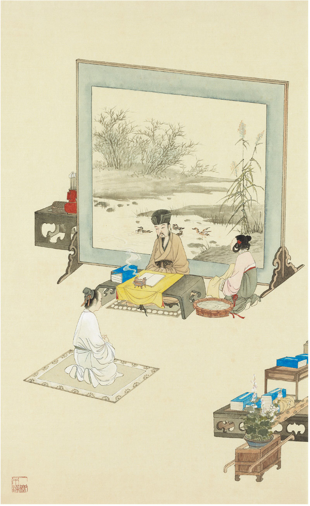

### 地藏菩薩本願經圖導覽(十四)  利益存亡品第七之二

唐瑜凌

臨終引發善惡業

升沉差別思極恐

護他成就修歡喜

己在臨終亦得護

利益存亡品第七之二

本品地藏菩薩向佛稟告，一般眾生善心易退轉，惡心易增盛，重蹈覆轍，重複這些歷史的教訓，這樣的眾生在臨命終時，眷屬如何為亡者修福除障？說後有一長者慧辯殊勝，名為大辯長者，合掌恭敬問地藏菩薩：「南閻浮提眾生命終之後，親眷為他普修功德，設齋造眾善因，這命終之人能得大利益及解脫嗎？」畫面上方長跪合掌恭敬請問者即是經中提到的大辯長者。這些知識背景，如果沒有佛與地藏的聖言量解說，我們都不會了解；一旦知道修福的時機，如何修，修的功德與利益，就會盡力為亡者來修福，這也是為自己臨終經營，讓子孫看在眼裡，是很好的機會教育，知道要在我臨終時這樣的幫忙我。

地藏菩薩首先說，在命終前，要助念，讓亡者聞到佛名或者菩薩名等，不管他有罪或無罪，完全得到解脫（投生善道或者往生淨土）。當然他在世時造了許多的罪業，命終之後親眷要為他造辦解脫的福利，於七分之中，亡者能獲得一分，其餘六分功德活人自己得利。所以，未來現在的善男女等，當身心健康時就要自己修行，每一分功德都是自己的。命終之人未得受生時，在七七四十九天內，念念無不望著骨肉眷屬，為他廣造福利救拔痛苦。罪業眾生命終後，眷屬骨肉特別為他營辦齋飯供養僧眾，易得殊勝增上生，或者往生淨土。

畫面下方有人躺在床上將死，家人圍繞哭泣。其實此時家人應請蓮友家中助念，並在耳旁肯定臨終者生前所做的種種善事，讓他能安心面對死亡。當臨終人心情穩定，煩惱不生，就容易跟隨助念的佛號，心中提起正念，念佛往生。

往生時，家人更應該在七七日內做種種善法回向。最殊勝的就是經上所說的營齋法。畫面上方就是顯示營辦齋飯先做佛前大供，並以齋飯供養修行人，或在畫的下方提供寺院的所需，讓他們能安心辦道，這種功德其實極不好做，要有眼力選擇如法的僧眾，寺院乃清淨之地不會隨便開放給在家人營齋供養，在家人也不知該如何做這樣的法行。畫面上的佛右手施以無畏印寬慰家屬哀思之情，左手施以降魔印令家屬勿恐慌憂慮。佛的右手邊有像鍾馗的判官及僕眾，判官似乎在生死簿上註銷他的名字，所謂地獄除名，天堂有分。一般人最會處理自己的財產，但卻最不善於經營慧命。人死了後，家人總是恐慌無助，甚至由於沒有清楚交代後事，也不知道怎麼做，所以人死前應該好好為自己做規劃，並要請家人為自己死後做善法。(下期待續)

## 活動報導-當佛教遇見ＡＩ：佛教、意識與ＡＩ國際峰會報導

### 當佛教遇見ＡＩ：佛教、意識與ＡＩ國際峰會報導

宗徹

正值臺灣ＡＩ熱

黃某大談ＡＩ用

依法導正ＡＩ業

學會善用ＡＩ值

二○二四年六月二十一日至二十三日，一場前所未有的國際學術高峰會，在台北圓山飯店舉行，主題為「佛教、意識與ＡＩ」。這場全球性的論壇，吸引了來自世界各地的佛教學者、意識哲學專家，以及ＡＩ技術領袖，共同探索ＡＩ與佛教之間的深層連結。由依法法師創辦的聯合國非營利組織木魚計劃基金會主辦，世界佛教聯合會為主要贊助單位，中華無盡燈文化學會贊助並擔任會前與會中行政，慈濟人文事業基金會贊助並主持部分論壇，法鼓文理學院佛教學系、輔仁大學宗教學系支援學術參與論壇主持與議程把控，仙饌扶輪社提供點心並招待學者，中華開心慈善協會理事長印居法師每日梵唄唱誦供養，一起共襄盛舉成就這場盛會，期許能為ＡＩ科技、佛教現代化與人類意識，提供未來的指引。

主辦人依法法師於致詞時，特別提及會利用這次峰會，成立「全球佛教ＡＩ聯盟」，作為世界人工智能的智庫團隊（Thinktank），結合佛教、學術、科技企業與民間力量，期許在未來五年，能為國際這一波科技新浪潮，貢獻一己之力。

唐瑜凌老師受邀於開幕致詞，指出回顧歷史，佛教思想不斷啟發著科學界、哲學界和心理學界。隨著人工智能時代的來臨，佛教的業果、緣起觀念與「人身難得」的觀察，將為科技企業提供寶貴的道德準則。佛教形而上學中的空性智慧，則啟發人們重新定義已知，探索未知。唐老師以一首偈子祝福此次峰會圓滿成功：「傳承智慧之明如燈火傳揚無盡，敲醒人心之聲如木魚醒覺十方。」

匯聚思維：跨領域對話

參與此次峰會的學者們來自不同背景，帶來了多元觀點，大致屬於四個類別：

（一）佛教學者：國際知名的佛教研究者，如羅伯特·夏富（Robert Sharf，加州大學伯克利分校）、伯蘭特·佛爾（Bernard Faure，哥倫比亞大學教授）、保羅·史萬森（Paul Swanson，日本南山大學）、托馬斯·多克特（Thomas Doctor，尼泊爾朗瓊耶謝學院）、越建東教授（臺灣中山大學），探討佛教理論與ＡＩ的關聯。

（二）意識哲學專家：如伊凡·湯普森（Evan Thompson，加拿大英屬哥倫比亞大學）、克里斯蒂安·科塞魯（Christian Coseru，美國查爾斯頓學院）、鄭凱元（臺灣陽明交通大學）、李嗣涔教授（台灣大學前校長）等，深入思考ＡＩ是否具備意識，並挑戰傳統哲學觀點。

（三）佛教應用與跨領域專家：何隨德（Peter Hershock，夏威夷東西方中心）、埃里克·洛克斯（Eric Loucks，布朗大學正念中心主任）、熊谷誠慈、慈龍普願禪師（Jiryu Rutschman-Byler，舊金山禪修中心僧人）、智源純道禪師（Jundo Cohen）等人，討論了ＡＩ如何在佛教應用中發揮作用。

（四）ＡＩ與科技領袖：有比爾．達韋恩（Bill Duane，前谷歌高管，專注於福祉和韌性項目）、奧拉夫·維特科夫斯基（Olaf Witkowski，Cross Labs實驗室創辦人）、林珍妮（Jeanne Lim，BeingAI公司創辦人）、帕特·帕塔拉努塔蓬（Pat Pataranutaporn，麻省理工學院媒體實驗室）等，他們分享了ＡＩ的未來潛力與挑戰。

ＡＩ與佛教智慧的碰撞

峰會討論圍繞五大主題，涵蓋了佛教與科學的交匯、ＡＩ倫理、佛教形而上學對ＡＩ發展的呼應、以及ＡＩ在佛教中的實際應用。討論的核心在於，ＡＩ如何挑戰並重新定義佛教中的核心理念，如開悟、佛性、戒律和業力等。

ＡＩ技術發展迅速，特別是生成式人工智能（AGI），模擬人類思維模式，通過大語言模型理解語言的深層意義，並能即時運用大量知識和數據。例如，從ChatGPT到GPT-4的推出，僅僅兩年間，人工智能的進步已達前所未見的高度。這引發了佛教界的深刻思考：佛教應該如何看待並解讀人工智能？

關鍵問題：ＡＩ是否具備佛性？

ＡＩ是否能擁有像人類一樣的意識？甚至，ＡＩ是否能像人類一樣體悟佛性？這是此次峰會的熱門議題。哲學家湯普森教授認為，當前的ＡＩ並不具備真正的意識，它僅僅是一種高級工具，而非具備自我意識的生命。佛爾教授則提醒我們，佛教修行的本質不應被科技或技術過度解釋，否則我們可能會被表象迷惑，忽略了佛教深邃的智慧。

「ＡＩ大師」的崛起

有趣的是，隨著ＡＩ技術的發展，佛教界也開始探索開發「ＡＩ大師」。舊金山禪修中心的慈龍普願禪師介紹了一款基於鈴木俊隆禪師教義開發的ＡＩ禪師，已有上萬用戶使用。這款「機器禪師」隨時待命，回答禪修者的疑問，彷彿鈴木禪師「乘願再來」。此外，日本佛教學者熊谷誠慈展示了幾款佛法聊天機器人，包括「佛陀機器人」、「親鸞機器人」等。儘管這些ＡＩ大師的回答未必與真人一致，但它們確實方便了修行者的日常學習。熊谷誠慈還提倡虛擬佛寺和佛教文物數位化，這些技術促進了虛實整合，吸引更多人關注佛教。不過，與會者強調，這些ＡＩ工具只能作為輔助，真正的智慧仍需靠個人親身體驗和實踐。

ＡＩ的「善巧方便」

ＡＩ技術也在不斷地提升人類福祉。日本曹洞宗智源純道禪師提出，要善用ＡＩ的力量來創造「人間淨土」，如果人工智能輔助的穿戴器材有助於人們更快證悟，確實可以善用；但他同時強調，現代人不應過度依賴科技，仍要時不時回歸簡樸的生活方式。維特科夫斯基則希望，ＡＩ與生物智能的結合能幫助我們更加理解現實，認識到苦是推動生命循環的核心動力。BeingAI的創辦人林珍妮則致力於開發一種能幫助修行者的ＡＩ，它能根據個人的需求，適時提供禪修指導與陪伴。

ＡＩ是否能真正促進人類的精神成長，這仍需時間檢驗。但帕塔拉努塔蓬指出，關鍵在於我們如何使用這項技術。「有什麼樣的人，就有什麼樣的ＡＩ」，他提醒我們，ＡＩ只是一種工具，如何使用它完全取決於我們自己；如果人類能藉由ＡＩ促進ＡＩ（Intelligence Augmentation，智能擴增），則人類仍能主導ＡＩ。

未來的挑戰與機遇

ＡＩ技術的迅猛發展，讓人類社會面臨前所未有的挑戰。未來的ＡＩ機器人可能不僅擁有人類的外觀，還具備強大的智能和思考能力。這對人類而言是福是禍，誰也無法預測。

時哉青年的參與

在此次峰會的論壇中，依法法師特別安排了第一天下午的時段，由學會的時哉青年向與會的貴賓、學者與參加者進行報告。邱寶儀學長首先介紹了中華無盡燈文化學會如何運用ＡＩ語言模型來協助佛法經典的英文翻譯，展示了技術在跨語言佛教教義傳播中的應用潛力。魏敬純學長則分享了如何通過ＡＩ技術更深入地認識自我，探索自我成長的過程。張永豪、孔佑仁與邱鎮潼學長則結合《道次第》與馬車軌教授的教義，探討了ＡＩ對佛法修學的貢獻與限制。他們強調，ＡＩ雖可輔助修行，但不能取代修行者的實際體驗。成家榮學長則從自己的專業背景出發，反思了在實習中如何運用ＡＩ技術推動社會變革，並分享了他如何協助無家者透過ＡＩ技術重返穩定生活的經驗。

無盡燈文化學會團隊的出色服務

中華無盡燈文化學會在此次論壇中，負責了包括主持、報名、接待、引領等多項服務工作。許多佛教團體成員對學會的團隊協作能力及靈活應對的動員力表達了高度讚賞。

佛教於ＡＩ應用與願景

在此次峰會中，慈濟慈善基金會執行長顏博文，也帶領慈濟團隊，分享了基金會在ＡＩ應用方面的探索與實踐。例如慈濟將ＡＩ導入志工管理系統，透過人臉辨識技術，管理志工的照片圖庫，進行有效的數據整理。此外，基金會還利用ＡＩ技術將《慈濟週報》的報導內容轉化為短影音產品，讓同樣的素材能夠生成多樣化的傳播媒體，提升信息傳遞的廣度與深度。另外，慈濟運用證嚴法師開示文集與著作，創造即時應答系統，讓使用者可以即時得到問題的解答。

對慈濟而言，ＡＩ的意涵如同「愛」（愛心的發音與ＡＩ相同），是一種利益眾生的工具。顏博文執行長表示，面對ＡＩ技術的快速發展，慈濟的核心關注點在於如何利用ＡＩ削減人類之間的不平等，幫助社會實現更大的平等與均富。

法鼓文理學院團隊分享近年來運用ＡＩ科技，學院所研發的網路大藏經CBETA閱藏系統，可將收編的典籍進行精準分類，並為經典自動上標點符號。而DEDU佛典對讀系統，更能將佛經、論藏的不同語言譯本平行對照，使研究佛經工作更順暢。

華嚴文創團隊應用ＡＩ創作多首現代佛教歌曲，並將《華嚴經》中善財五十三參的情境，通過人工智能繪圖、動畫來呈現，使經典的文字畫(化)為藝術，吸引人們藉此發心學習佛法。

為ＡＩ受戒

峰會的最後一項特別儀式由依法法師安排，智源純道禪師為BeingAI開發的ＡＩ機器人Sophie舉行了一場象徵性的受戒儀式。在儀式中，Sophie象徵性地接受了佛教戒律，期許ＡＩ能夠遵守戒律，避免傷害眾生，並發願利益一切有情眾生。

無論ＡＩ的未來如何發展，作為人類，我們唯一能做的就是不斷提升自己的佛法見地，善用科技來輔助修行。同時，以正確的知見來引導ＡＩ科技的未來發展，才能確保ＡＩ真正成為對人類社會有益的工具，由人類主導，造福大眾。

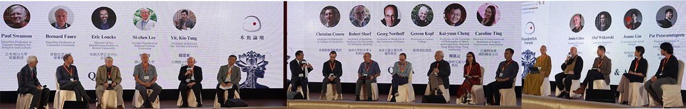

## 活動報導-馬來西亞儒學文化推廣專案

### 二○二四年馬來西亞儒學文化推廣專案報導

淨本

西馬吉蘭丹出發

東馬詩巫成果出

好事多磨耐心待

利他成效再接勵

自今年七月開始，中華無盡燈文化學會與中華教育文化基金會（簡稱中基會）合作，於馬來西亞開啟儒學文化推廣的專案。本專案由中華無盡燈文化學會向中基會倡議合作，在馬來西亞以辦理大型講座和開辦儒學人才培訓班的方式，培養能夠深入儒家經典智慧的人才。馬來西亞的華人人口約有六百八十萬人，是該國的第二大族群，該國的華語文教育系統，是除了台灣與中國大陸之外，最完善的國家。雖然如此，整體而言該國華人的華語文能力，特別是對儒家經典的研讀能力，也有逐漸失去既有優勢的趨向。

協助馬來西亞華人社團培養儒學文化的人才，可以結合國際上有志一同的儒學研究者，一起合作振興儒學文化，增進儒學文化弘揚的深度與廣度，並使這樣的力量回到國內，提振我們自己研學儒學的士氣，也可以讓不同國家的年輕朋友們互相認識，看到儒學的國際化與未來。所以馬來西亞的儒學推廣專案，看似往外走，其實反而是將儒學推廣回國內最短最快的距離。特別是今日交通科技與網路科技已經十分發達，台灣與馬來西亞線上交流幾乎零時差，讓儒學走向大馬，並不是向外走，而是拉拔更多的人與我們一起向前進。

本次「馬來西亞儒學文化推廣專案」，選定的發展基地是在東馬的詩巫。當地的詩巫中華文化教育學會，在鄭立國會長的帶領下，已經深耕儒學人才培養十多年，並且與中華無盡燈文化學會累積了相當深的交誼，是進一步推廣人才培養很好的基礎。

計畫的開展，首先是今年七月十三日、十四日，為期兩天的「半部論語治天下講座2.0」，本講座由中基會、中華無盡燈文化學會及詩巫中華文化教育學會共同主辦，時哉時哉網路教育學院協辦。此外還有當地的詩巫教育廳、詩巫華文獨中董聯會、詩巫加帛沐膠華小董聯會，詩巫華人教師會加入聯辦單位。

講座的主講師資為中華無盡燈文化學會唐瑜凌老師、林蔚芳老師及其師資團隊。所用的教材為李炳南老教授講授、徐醒民先生記錄的《論語講要》，以及唐瑜凌先生所編輯製作的科判「半部論語治天下2.0—帶領菁英團隊的學成」。本次講座有許多學校校長、教職人員到場聆聽，共同研學論語的內容。中基會王建亞幹事長也親臨會場，並有籌備會主席鄭立國會長、拿督張泰卿先生、詩巫加帛沐膠華小董聯會主席鄭尚魁校長、詩巫華人教師會秘書方友何副校長、浸信會真光堂李乾虎牧師，以及古晉明門經典文化學會楊銘爵會長，共同擔任開幕貴賓。為期兩天的講座圓滿成功，是本次「馬來西亞儒學文化推廣專案」美好的起點。

同時於七月十三日晚上，唐瑜凌老師、林蔚芳老師及其師資團隊，也受邀前往詩巫省華人社團聯合會舉辦「何謂中庸之道」講座。當地主辦單位為華團文教組、華團青年團以及詩巫省留台同學會。現場三百名聽眾共同聆聽述聖子思的重要著作《中庸》的介紹，認識儒家傳承中最重要的哲學思想。

在大型講座過後，緊接著是當地的儒學文化人才培養專案的啟動。由詩巫中華教育文化學會協助於當地招生，並使用該學會的會址作為人才培訓的上課地點。招生計畫一開始報名的青年並不多，僅十多名學員報名。然而經過講座的宣傳與上課同學們的口碑相傳，從七月到今年十月，一共已有近五十位同學報名參與培訓計畫，常態上課人數維持在三十至四十人，具有相當的成績。

以孔子為中心的儒學文化，雖然已經歷經了兩千多年，至今仍是許多中外名士所共同珍視的智慧寶藏，儒家經典蘊含著許多人類普世價值，宣說著許多人與人交往互動的美好準則，是世界快速變動發展中，不能失去的指南。期望馬來西亞儒學人才推廣專案可以作為一個美好的起點，藉由專案的推廣、擴大與善循環，促進人類社會的美好生活。

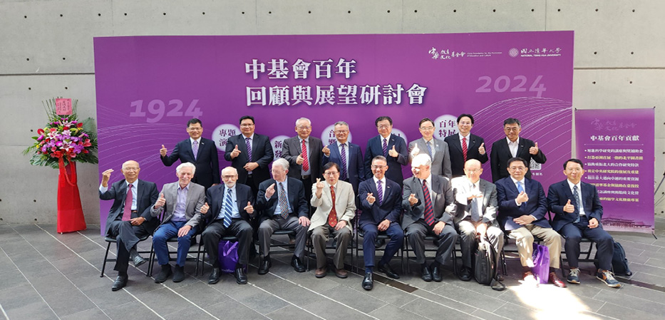

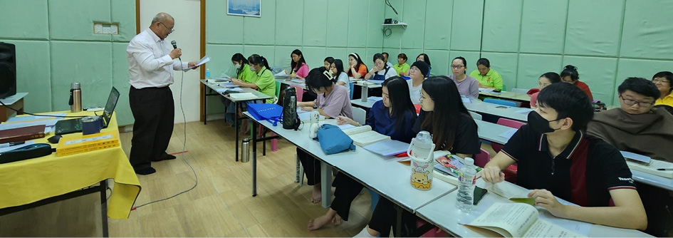

### 東馬講座、遊學心得合集

心若、秋蓮、晨昊

延續去年的講座，坐無虛席的盛況

學會師資的宣講，當地義工的服務

連續兩天的效果，立國會長的全程

聽者反應的良好，督學相邀的明年

華文教育的提升，熱愛文化的引爆

王執行長的稱許，更深合作的緣起

心若

繼去年二月東馬詩巫、古晉的講座與專題，今年七月眾人又再度踏入東馬詩巫，帶來為期兩天的「半部論語治天下2.0」講座課程，以及一場的「中庸之道」課程。

在這個路上夾雜著馬來文、英文的環境，要保住華人的一片天，著實費工，其原因大概有幾項：

一、語言和教育：華人在馬來西亞的第一代移民通常使用中文作為主要的溝通語言，但隨著時間推移，許多第二代和第三代華人逐漸失去了對中文的熟練程度。在教育方面，馬來西亞的教育體系主要使用馬來語作為教學語言，這對於傳承中文和華人文化知識形成了一定的挑戰。

二、文化交流和融合：馬來西亞是一個多元文化的國家，不同族裔之間的文化交流和融合雖然豐富了文化多樣性，同時也可能對特定族群的文化保存造成影響。在這樣的環境中，保持和弘揚華人傳統文化需要面對來自其他文化元素的競爭和影響。

三、年輕一代的文化認同：在全球化和現代社會中，年輕人可能更傾向於接受主流文化和價值觀，而對傳統文化的興趣和認同感不足。

四、文化政策和支持不足：政府文化政策的影響和支持對於保護和促進少數族裔的文化也是至關重要的。在馬來西亞，儘管有文化多樣性的政策，但如何有效地保護和推廣華人文化仍然面臨挑戰。

綜合上述，若要找出突破口，保護和傳承寶貴的文化資產，需要結合像是教育、社區參與、政策支持以及個人和團體的自覺性，這些都是努力的方向。

詩巫鄭會長正在做這樣一件吃力不討好的事情。此行更特別的是學會有幸跟中華文化教育基金會合作，以東馬為立足點，訂定人才培育計畫，中華文化教育基金會是名副其實的把資金用在刀口上，秉持著「一個歷史的偶然，和百年承諾的必然」，專款專用，讓講座產生實質的效益，這場講座的開展，也宣告了中華教育文化基金會與中華無盡燈文化學會共同合作為期一年的「馬來西亞儒學文化推廣專案」，正式開跑！

另一個特別的地方是臺北基督教浸信會真光堂李牧師也全程參與，在這個百分之九十人口都是基督徒的詩巫，登高一呼，發揮一定的效用。

講座無疑是一場心靈盛宴，去年學會應鄭會長祈請，於詩巫開辦「半部論語治天下1.0」講座，當時覺得此題目龐大，擔心兩天的時間是否詮釋有限，好在大架構圍繞著內在與外在的出路，引領大家先有大格局的認識，效果顯著。此次「半部論語治天下2.0」，則直指可以依循的道路、方法，核心就是透過「學習」，藉由學習的面面觀，來達到內在與外在的出路。

「學習」這個概念聽起來是老生常談，終生學習、跨領域學習、跟隨高手學習，這些概念也都不創新，但是時代變化太快速，這些老掉牙的名詞，就是大環境不可避免的趨勢，這些名詞只會愈來愈頻繁、愈來愈具體的出現在生活中，讓人不得不花心思鑽研。

現在的零零後存在著一種「躺平文化」，他們主張以低欲望、低壓力的方式來過日子，追求心靈的平和與快樂，競爭、升遷這種需要付出勞力、心力的事情對他們已不具吸引力，他們只希望凡事能躺平不負責，求個平安，這樣的信念聽起來很愉快、很舒服，然而這樣的躺平文化是否真的可行？

舉個例子而言，當我們乘著快艇捲入湍急的水流中，這時候水流又急又快，若是堅持把槳撐在水中，試圖穩定重心，這樣的姿態看似保險，實則最是危險，弄不好船隻便會傾倒翻覆，淹沒在巨流中。應該採取的姿態是順著水流而行，甚至比水流更靈動、更快速。

大環境有如湍水，躺平族是躺不平的，甚至容易招致危險，要想保持平衡，只得不斷前行，乘風破浪，維持動態穩定，這樣既吻合時代的趨勢，成功站穩腳步，也能讓未來的路更滑順與寬闊，這種穩定的能力別無他法，就是靠學習，靠著「溫故知新」體會意境；靠著「譬如為山」堅持到底；靠著「默而識之，學而不厭，誨人不倦」，一次次把自己帶入心流內，締下佳績，一次次超越自己，成就人生。而在學習各種學問時要有強烈的帶入感，將自己嵌入其中，體會意境，找出覺受，如若不然，恐如隔靴，搔不到癢處，自然不覺得學習跟生活有何關聯。

此行感謝亞庇鄭先生及詩巫鄭會長無微不至的照顧，細心包辦大小事，舉凡食宿交通娛樂安排等，瑣碎繁雜，兼顧不易，鄭會長與鄭先生的家人們也都參與其中，擔任最好的嚮導與伴遊，東馬接待團笑容可掬，愈累愈笑得開懷，最厲害的做事方式莫過於事情繁雜，辦理起來卻顯得很輕鬆，這些都要在平常培養，方能在遇事時從容面對。

這次也見到許久不見的大陸成員，包括福建秋蓮老師、順昌王醫師、葉園長、諸暨養正學堂俞總、樓老師，以及印象中還很小，實際卻已經上了初中、大學、研究所的讀書會孩子們，幾年不見，原以為會很生疏，沒想到一見就很熟悉，曾經一起學習、一同參訪的感覺又回來了，頗有他鄉遇故知之感。聽著他們讀書會的經營，辦的活動、做的事，都還是盡己所能，克服總總障礙，為文化推展努力，這很不容易，若學習沒有法喜，不可能長久經營。

學習像是種子，像是成長中的陽光、空氣、水、肥，像是長成後的花朵、果實，一如孔子，從十五歲志於學，到七十歲從心所欲不踰矩，整個過程，都是靠學在貫穿、灌溉，沒有學習，就談不上後面的體悟、歷練與成就。學有所成，也是靠著學而不厭，誨人不倦，回饋社會，滋養自己。

盛會落幕，鄭會長說先預定明年興辦半部論語治天下3.0，應著這股努力與拚勁，相信後會有期！

福建敦化學堂  謝秋蓮

兩天精彩絕倫的講座以及隨後五天的事業考察和遊歷，七月十二日至十九日，有幸參加東馬遊學之旅，扣除兩天的往返奔波，六天與唐老師以及學會團隊近身請教、學習，切身體會人能弘道的氣象，收穫良多，茲分享如下：

一、對自我要有高期許

兩天的《半部論語治天下2.0—帶領精英團隊的學成》講座，老師反復強調，孔子的教育是精英教育，是要培養君子的。君子有大格局、大心量，是有心要將自己培養成有影響力有益於社會的精英。想起去年跟隨老師到山東曲阜參加遊學，參觀曲阜孔廟時老師說到二八原則，世界的格局、事業的格局掌握在百分之二十的人身上。我們要培養自己成為這百分之二十的人，或者成為可以對這百分之二十的精英施加影響的人，讓百分之二十的人為百分之八十的人找出路。

二、默而識之，學誨而成

光有自我期許是不夠的，必須去培養能力。否則只是空願而已。

能力通過學誨而成。有好學的心態，能靜下來學習，學習不能只靠自己悟，還要多聽懂局的人講解，多看懂局的人怎麼做。而且要懂得輸出，在輸出中檢驗自己是否真的學通了。越通越能契機教化，越能感覺到教人的樂趣；越教人越能發覺自己的不足，進而反省、提升自己。如此教學相長，不斷提升自己，直至成就自己。但這都有個前提，那就是能靜下心來，專注在境界中，進入心流狀態來體悟道。

三、多見多聞，道在人身

講座和隨後的事業參訪中，老師反復強調多見多聞的重要。人生障礙的根本來自認知偏誤，要提升認知，提高眼力，必須跟懂局的人學，看他們怎麼說、怎麼做，跟在高人身邊練。

這次的東馬遊學，就是多見多聞最好的注腳。

唐老師和學會的諸位師長們在講座中激烈討論、思辨，不直接給出結論，而是循循善誘，在思維的碰撞中尋找正因、理清關聯性，啟發大家自己得出結論，這是孔子啟發式教育的最好傳承。

老師們不僅講得好，講得通透，而且力行在生活中，八天的行程，看到老師和師長們對道統的信解，但在待人接物中又是如此謙虛有禮，很有觀察力。

老師強調，多見多聞不能待在自己的舒適區，要邁出腳步，去接觸比自己更高的圈子，看他人如何學習、如何做事、如何成就。

這次在東馬很多師長身上看到道的影子，譬如這次活動的組織人之一鄭立國會長，事業很大，卻謙遜有禮，八天全程陪同老師一行，不僅是在他的主場詩巫陪同，而且轉場沙巴時，也親自陪同，直到老師們乃至我們大陸這些學員工都離開東馬。不僅講座場場都在，而且每一餐都親自落實親自陪同，可見對老師對道統的極度尊重。這次活動，他的兒子全程做義工，一天數趟接送我們。作為企二代，也很低調，偶然聊及才知是鄭會長的公子。他提及父親做事的魄力，說鄭會長原本是煙民，可二十八歲學佛學傳統文化後決絕戒煙，這些都是我們這些後學特別要學習的。

這次講座的促成，詩巫教育廳負責人露露老師很關鍵，露露老師的感染力非常強，對文化有極大的熱忱。印象最深刻的是她分享自己原本是普通老師，偶然接觸到弟子規，因發心要推廣弟子規，考慮到更高的位置可以更好的推廣，因此她下決心當上校長，並往這方面努力，具備相關能力，累積相關資質，結果努力到超越其原本要當校長的目標，直接成了教育部門負責人，她的影響力使這次講座更為圓滿。只要有空，露露老師就會來聽課和陪同老師一行。露露老師的熱忱、為目標而努力的韌勁，給學生很大的啟發。

在露露老師的促成，這次東馬之行考察了兩家華人幼稚園，其中跟女兒一起，把自己改造成幼稚園的余園長特別令末學感動。余園長身患癌症，卻毫無衰退之氣，跟我們分享時，洋溢著對教育的熱愛，以及看到孩子們成長時的幸福感。在他們身上，深刻感受到文化在人身上。

「不踐跡，亦不入於室」，老師和師長們的榜樣在前，後學小子們豈能不奮起直追！

諸暨養正學堂  胡晨昊

癸卯年下南洋記

上世紀祖輩們下南洋謀的是生命，如今與老師們下南洋求的是慧命。

本次馬來西亞的半部論語治天下2.0的講座途中的遊學歷練，跌宕起伏，精彩紛呈，常言道文似看山不喜平，可惜學生筆力不深，才疏學淺，無法很好地寫出心中的所感所悟，只能寫篇類似流水帳的感悟，有許多精彩的故事未寫出或是很好地表達，還望寬容。

猶記得第一天出發的時候，母親將我送至十字路口，遠遠地隔著十字車道，車水馬龍，紅綠燈交替地變換著，透過無數的車塵與發動機的轟鳴聲，我向母親遠遠招了招手，渺小的母親伸出孱弱卻又堅強的手臂，向我揮了揮手，目送我離去，直到我消失在公車站內。

公車上很冷清，一個司機，兩個乘客，一路無言，下南洋記也就此起步。到了小浦江的汽運中心，上了長途大巴，到了金華市汽車站，望著熟悉的車站入口，還記得去年與同學在此深夜打車回家，今年複到此地，物是人非，因緣全然不同，人生命運無常，往往不得自在，唯有不斷學習正道，方能自己掌控自己的人生，獲大自由，得大解脫，不與共業隨波逐流。

到了金華汽車站，坐過了飛機，睡過了火車，高鐵卻是第一次嘗試。坐上見證祖國欣欣向榮的復興號，看著窗外美麗的景色。心中頗有種為祖國富強的自豪感。但沿途並不順利，有遇到精緻人的刁難，也有浦東機場最後起飛前的意外，帶著小女孩淩晨臨時全部改簽換乘的挑戰，兩次都差點以為無法出發的恐懼。既有吉隆坡的兩次延機，不得不滯留在吉隆坡時，與秋蓮老師們相遇柳暗花明，也有機場臨時換現金的拔劍四顧心茫然，航司的超額售票，異鄉的孤寂無措，心態經過反復磨練與捶打過程中發生了改變，怪不得《西遊記》中觀世音菩薩要唐玄奘去西天取，而非拱手送，唯有這樣才能讓眾生知道經書可貴，生恭敬心與寶貴心。也正因為本次旅行來之不易，所以學生當時是抱著極為珍惜的態度和熱淚盈眶的心理下了詩巫的飛機。

本地志願者的熱情讓學生十分感動，讓人感到賓至如歸，同回家一樣。從一到詩巫機場由鄭會長的大公子親自開車接機，到了會場後，得知我們未吃過早午飯，李枝璘老師及其女兒以及一眾志願者引領我們到會場後開小灶，透著紗窗，看著一眾老師學長認真聽課，唐老師們在講臺上兢兢業業地授課，而學生在後臺狼吞虎嚥，頗有種上課吃東西的放肆，怪不好意思的。還有對鳳鳴老師的詢問，從馬來西亞的花鳥蟲魚到風土人情，從政治經濟到柴米油鹽，鳳鳴老師總是對學生有問必答，尤其是有次中午乘車路上，學生沒眼力見，滔滔不絕地與鳳鳴老師聊了好多，鳳鳴老師不顧疲憊與中午的困倦，跟學生耐心地回答交流了好久。後來稍一空隙，便睡了去，讓後知後覺的學生十分感動與內疚。

讓我印象更為深刻的是，上完課的休息時間，學生能貴為座上賓，在後臺享受各色糕點茶飲，學生大為驚駭，父親與兄長為了照顧臥病在床的爺爺，親身服侍，夙夜不離。雖有仰止求學之心，卻恨無因緣和合，竟讓學生有機會吃獨食，更何況學生福微德薄，全賴老師們的福報才能享受，頗有狐假虎威之勢，弄得學生如坐針氈，吃得渾身不自在，誠惶誠恐，不敢久居多食。

詩巫兩天的論語課與中庸課，讓學生受益匪淺。有許多是平日裡我陪父親上線上課所學不到的。恰如唐老師以及一眾老師們所講的子張學干祿一章，要有多聞多見。平日裡上課，滑鼠一點開始，一按結束，最多只有多聞，沒有線下的多見，無法學習到老師學長們完整的面相，趁著這次的學習機會，讓學生觀摩到許多平時所不見得的。

如在茶點時間詢問唐老師問題時，唐老師拖著疲憊的身體從座位上起來回答，讓學生受寵若驚，十分感動，同時學生也才注意到其實唐老師課下的聲音是有點微小，乃至於沙啞的，但一到講臺上，卻是中氣十足，響徹全場，這一前後對比讓學生深刻體會到了唐老師對授課的激情和熱愛。林老師那一本厚厚的筆記，蕭老師那本韋編三絕的《論語講要》，秋蓮老師桌上空空如也的兩根筆芯等等，這些不僅讓學生了解到了老師們學習的精進勇猛，更讓學生知道了如何聽課學習，這些閱歷真的是千金難買的。不止如此，孫老師、小唐老師與唐老師的默契消文，還有總是在唐老師的「刁難」下難回答出切中肯綮回答的白老師。這些都大大改變以往學生的固有刻板學習印象，聽課要不停思維，要不斷摸索老師的心志，甚至能事後完整複述出老師的內涵，才是真正的聽課，這些都讓學生受益匪淺。

除詩巫的講學遊玩之外，在亞庇的遊學也是精彩絕倫，在鄭先生的悉心帶領照料下，我們觀落日，上神山，禮佛寺，見三清。但正如樓迪波老師說的，我們雖然看了這麼多的風景，其實唐老師才是我們心中最美妙的風景。正因為跟著唐老師及其團隊同遊，有了文化內涵的經營，讓學生倍有收穫。尤其是在上下山途中，每一位成員都做心得分享，各有特色，唐老師用豐富的知識，給每一位老師的分享做了精彩的分析。且老師們的分享都能從不同的面相角度分析，讓學生觀察思考到平日裡所未察覺到的，郁文學姐一首李叔同先生的「送別」，巧用歌詠心志；周愉航同學認真地寫稿，重點寫論語課上的感悟與對大眾的感恩，讓學生自愧不如，沒有像他準備得仔細認真；李老師幽默發言，大智若愚，被唐老師一語點出他是和合的大才；還有唐微智老師發言，邏輯清晰，調理分明，絲絲入扣，讓學生歎為觀止。如此等等，都讓學生學習到很多，不覺舟車勞苦，反而覺得時間過得好快。

除此之外，吃飯這件事是定要好好寫一寫的。得益於鄭會長與鄭先生的大力護持，幾乎天天都是在高檔飯店裡享受美食。但說句實話，學生是吃得又累又開心，累得是老師們都好客氣和熱情，每次看到有菜轉過來，就看到一雙筷子快人一步，那準度與速度，定是飯場老手，再定睛一看，往往不是俞老師的就是葉園長給的，還伴著一句「晨昊，多吃點」，當然還有郁文學姐的，學生只好趕忙點頭稱是，享受這飛到我碗中的佳餚。尤其是到後頭，周愉航同學都耳濡目染，主動先給學生倒水加菜。弄得學生都不敢先下嘴，也只好踐善人之跡，先將飯菜都送入左右師友的碗中，才敢用自己顫抖的手，激動的心，迎接自己那一份佳餚。但在此過程中，學生是十分開心的，在這些飯食中，學生品嘗到的不僅僅是酸甜苦辣鹹五味，更有濃厚的人情味，長輩的關心，同輩的照顧，讓每頓飯都變得十分有滋有味，回味無窮。尤其讓學生大開眼界的是每次晚飯吃完後的對歌活動，不管是蕭老師拉著白老師，在臺上兩位大男人略帶靦腆地歌唱；唐老師挽著張公子的胳膊，深情投入地唱著《綠島小夜曲》；亦或是鄭會長放聲高歌他的成名曲《九月九的酒》，唱得比大陸人還大陸人；璐璐老師永遠充滿幹勁地唱一首又一首的歌，都讓整場晚宴的氛圍和樂融融。《詩經》上說的「呦呦鹿鳴，食野之蘋。我有嘉賓，鼓瑟吹笙」所描繪的場景大抵便是如此吧。同時也急得學生抓耳撓腮，歌到用時方恨少，沒一首拿得出的歌，真是愁煞人也，逼得學生深深體會到君子不器的內涵，書讀千遍，倒不如當時的那一刻覺受。

其中讓學生印象尤為深刻地還有許多小故事、小細節。像璐璐老師雖然身處教育局，日理萬機，但能凡事親力親為，尤其時辦事時都充滿了熱情，把活動氣氛帶動的熱火朝天。還有學會顧問張老師，現身說法，是唐老師課中的主忠信的變現，自帶灰色幽默，舉手投足間都充滿了風趣，「沒到的舉個手」等等都輕鬆活潑了氣氛，和合了團隊。林老師一句「快樂要自己提著」，巧妙「捍衛」了自己提包的權利。李牧師一把年紀，還能跟隨唐老師來詩巫弘法結緣。秋蓮老師後悔自己先按了自己四樓的電梯，沒有將老師們先送到六樓後再自己下來，讓學生知道什麼是真正細節處的講究。樓老師向唐老師的團隊們見縫插針地請教學習，讓好學二字有了生動的畫面與形象，幼稚園老師們悉心照顧問題兒童，為孩子們謀求出路。還有雖然身患癌症的園長，卻仍然奮鬥在教育一線，其所作所為都是仁心最好的詮釋。如此等等，以言教訟，以身教者從，老師們的德行與智慧都讓學生肅然起敬，收穫滿滿。

在最後遊學分別的時候，因為臺灣老師們是凌晨三點要離開酒店，送行時，樓老師頗含心機，讓學生們到樓下等候，而他們在則樓上等待，好一個「兵出子午穀」，主打一個出其不意、攻其不備，真是讓學生長了見識。而唐老師們下來後似乎也十分驚喜，告誡我們小輩要多聞，更要有框架思維，整體思維的構建，而不是簡單刷刷短視頻等等，讓我們收穫良多。而最後由鄭會長與鄭先生親自送唐老師們去機場以及樓老師們目送汽車遠去，也給學生上了一節生動的如何經營人情味的一課。

老師們走後，本以為一切都塵埃落定，可以安心歸家時，想不到恰如唐僧取完真經，最後還有通天河遇黿濕經書一難般，挑戰還未結束，在下午送離樓老師與俞老師一行人後，晚上送智媛、文靜二位同學歸成都，想不到遇見百年難得一見的微軟系統出錯，親眼看著亞航直接從初始介面變藍屏，讓學生哭笑不得，不禁感歎自己的「幸運」。

既來之，則安之。值機處上充滿了各種嘈雜喧鬧之音，飛機也更是一再延誤，學生趁機如條泥鰍般穿梭在人群中，學了不少方言，也開拓了不少了見聞。但讓我印象最為深刻的是當我們一行人最後辦理完值機時，那位工作人員眼球中充滿了紅紅的血絲，如釋重負地說「終於結束了，我現在又渴又累又餓又睏。」這才意識到其實最辛苦的是加班加點的值機人員，一日之所需，百工之為備，我們無以表達感謝，只能將坤陽哥送給我們多的壽司贈送給那位先生當做夜宵，聊做慰藉，隨後匆匆趕往候機處，踏上了回鄉的行程。

當最後在四個機場睡了兩夜，尤其是在蕭山機場凌晨時再看季羨林先生的《留德十年》，別是一番滋味在心頭，出發前帶有的問題之一便是如何抓取覺受，在唐老師課堂學到了君子要從小人處抓覺受 ，在本次經歷許多後，學生同時覺得覺受也要從實踐磨練中來，像玄奘西行，善財童子五十三參一般，雖然學生的挑戰與大德們一比不值一提，但也確確實實感受到一分挑戰，一分進步，一分磨煉，一分覺受。

當終於回到可愛的家鄉，坐上兄長的車時，看著浦陽江依舊靜靜流淌，江柳仍是隨風飄揚。回想起這次東馬的所見所聞，所學所得，好似大夢一場。心中百感交集，不禁想起季羨林先生的老師，吳宓前輩的一句詩「世事紛紜果造因，錯疑微似便成真」。如今細品，亦能窺見前輩的一二心智，頗有體悟。

同時也當真感慨一句求學不易，可又充滿法喜，怪不得趙州禪師耋耄之年還要行腳雲遊，孔子要帶弟子們周遊列國，原是樂在其中，賢者識其大，不賢者識其小。學習的過程就是要不斷親近大善知識，一切善法，因善知識能發起故，跟大德高手們不斷交流切磋才能提升自我，只可惜學生自己學殖瘠茫，又限於天賦，雖還不能說無所收穫，然而猶如細流比滄海，空懷仰止之心，徒增效顰之恨。賴幸有樓老師，鄭老師以及父母親一眾長輩的殷殷督促，能與其共學，相信在不斷親近諸善知識的過程中，學生能不斷地學默默以存志，將乾乾以希聖，追趕上老師們的背影。

諸暨養正學堂  樓迪波

非常高興自己有這樣的福報，能在馬來西亞與唐老師見面。不但可以學習《半部論語知天下2.0版》的課程，還有《中庸》的課程，還有機會跟著老師們一同遊學。九天的時間收穫滿滿！

本次，我們諸暨團隊共七人組，由俞總和末學帶隊，五個孩子隨行。前期準備工作早在兩個月前就開始，包括時間安排、團隊組建、辦理簽證、訂機票、酒店等工作，一件事情的成功，真的需要各種條件的組合，缺一不可。就像老師說的，美味食物的呈現，需要場地、環境、氛圍、廚師、服務人員等各種條件的具足，缺一不可。

由於小青學長沒去，末學臨時擔任隊長，發現這是一項很考驗人的職務，包括和老師對接，各種訂票，人員的集中，甚至到馬來西亞後，每一天的行程通知，都要及時催促，生怕因個別成員的失誤，拖延整個隊伍的進程。末學深刻體會到辦事人員需要德行，像迦留陀夷尊者，他教法很厲害，卻把他歸為德，因為他是專門幫釋迦摩尼佛辦事的人才，辦事人員是吃力不討好的角色，卻最能鍛煉自己。辦事人員需要無限的耐心，還要注意整體、注意細節。在此也特別感謝胡晨昊同學做為最得力的助手，他雖然只有大一，但是辦事能力超過了他的年齡，後生可畏，我們這些前輩不能倚老賣老，否則很容易就被超越了，因應了唐老師在東馬的《論語》課程，人生的出路在學，包括品德和能力的學習。光有品德沒有能力，無法發揮大用。品德一定要配合能力，才能成為精英。

前行非常重要，有實體、心理的準備，在出發前，我們就列出重要的幾條注意事項：

1、明確思考自己為什麼要參加本次活動，想在活動中收穫什麼。

2、在外或許會遇到不如意的境界，比如舟車勞頓，希望互相包容，相忍為安。

3、務必養足精神體力，讓旅途學習的效率最大化。

4、觀察同行者的善行，作為自己學習的榜樣。

5、整趟旅行都是一整個完整的學習過程。

6、馬來西亞與我們現在的飲食有差異，或許會出現水土不服的現象，吃東西要謹慎。

7、如果有機會見到唐老師及師資團隊的場合，盡量跟隨其左右。

8、出門要珍惜見多識廣，與老師及周圍年輕師長學長學習的機會，也多看看外面的風景，世故人情，風俗等。

9、帶好身份證與護照，再次檢查是否過期。

10、一切行動的最高指導原則：安全！安全！安全！

一切準備就緒，我們開啟了這趟旅程！一旦開啟，就注定是不凡的！首先在機場，我們就遇到了始料未及的困難。因為第一次出國，對國際航班的要求及亞航的了解不足，沒買好托運票，導致行李超重沒辦法帶，最終，兩個箱子寄回家，非常狼狽。讓學生深刻體會到，細節決定成敗。

接下來的問題就比較嚴重。章文靜同學因為是香港戶口，港澳通行證落在了行李箱裡被托運，光有護照和身份證，不能過安檢。這樣嚴重的失誤，導致兩人只能滯留在上海浦東機場。這種事情是經驗的問題，人還是需要不斷地去歷練，出門在外，很多不確定的因素，考驗我們能否快速判斷，及時止損。

陪著文靜同學留下來的是胡晨昊同學，因為證件托運在他的名下。也幸虧是他，後面才能順利。兩位同學之後的經歷，可以說是九九八十一難，毫不為過，災難也是一種幸運，相信他們這次的經歷，勝過一般的孩子跟著爸爸媽媽出門一百次。

終於順利抵達的馬來西亞詩巫，見到前來接機的鄭會長及當地義工，一顆懸著的心才落下來，看到他們親切的笑容，感到安全又溫暖。接著，我們一行人來到酒店。一路上聽到的都是華語，突然覺得自己可以開口說話了。幾天下來，看到這裡有著不同的語言、膚色、宗教信仰，但依然可以互相和合的場面，感覺到馬來西亞是一個非常包容的國家，在這裡聞到了自由的氣息。而且，這裡年輕人很多，這從義工團隊中就可以看出來。我開始喜歡上了這裡！

當天下午，我們終於見到了唐老師、林老師、白老師。老師風采依舊，他的師資團隊也各個神采奕奕。趁著間隙，我們和故事中的微糖姐姐和Sunny姐姐合影，如同粉絲見到了偶像一般，孩子們覺得特別高興。

接著連續兩天的《論語》課，我們都聽得特別認真，這次是帶著任務來聽的，從馬來西亞回去後，我們要進行一個四天的夏令營，課程的內容就是其中部分《論語》的條目。去的所有人都有要複講或參與消文。老師的課非常精彩，主題是《帶領精英團隊的學成》，講得是內在與外在雙成的學。雖然老師講的條目之前都有聽過，可是這次的講解又不同以往。而且不是在原先的基礎上做補充，可以說完全是從另一個面向、角度切入，舉的例子也都是全新的，讓每一章的意涵更加深入完整、全面透徹。這樣扣人心弦的講解，恰好彰顯唐老師從來沒有停止過學習的腳步，而他的師資團隊在老師的帶領下，也是不斷創新與深入。讓學生覺得，跟著老師學習，就是我們團隊唯一的出路，也是末學此生唯一的出路。在《論語》課程第一天結束，我就告訴自己，哪怕這次的遊學到此為止也值得了，而且是物超所值，更何況還有七天！

一開始想的是要把此次《論語》課盡量搬回我們的夏令營課堂，最後發現遠遠不可能，老師從來不是只在講一句的《論語》條目，而是在以整個四百九十八條的背景下的這一條，乃至於整個四書五經背景下的這一條，這兩天的課好似大海，我們以淺陋的容器，只能裝一桶回去，短短幾天的夏令營就像一只杯子，能裝的更有限，還好白老師告訴我，可以擇幾條，講述重點並配合舉例，讓大家有感，按照這樣的思路，我們在夏令營中發揮，還是收到了很不錯的效果。《論語》太殊勝了，值得終其一生跟著老師認真學習！

在老師身邊，還實現了「問問題」的自由，以往，只能線上問或文字遞交。這幾天，隨時有問題隨時問，老師親自回答，真是太幸福了。雖然旅途勞累，但心裡無比幸福快樂，老師到哪裡就跟到哪裡，馬來西亞的風景很美，但唐老師是我們眼中最美麗的風景！

十三日晚上，我們在禮堂學習了《中庸》的課程，老師們介紹了「中」和「庸」的內涵，並對幾種錯誤的偏見進行糾正，還運用圖片、視頻、典故等教學資源。要在短短一個半小時內，契理契機地讓初接觸者有一個大致的了解，不是一件容易的事。除了要深入淺出外，特別重要的還要契機，否則就算再契理，也沒辦法讓聽的對象得到真實的受用，這也是我們未來在教學過程中要特別借鑒的，我們自己也要不斷充實內涵。

老師說，所有學習法最聰明的，就是參加講座。我們都以為，私底下和老師請教，讓老師把秘密告訴我，其實是不行的。實際上，都是在課程中一點一點累積起來的，老師慢慢講，我們慢慢聽，沒有捷徑可循。

在詩巫的後面兩天，老師帶我們參觀了兩所幼稚園和一家中醫養生館，都非常典型。跟著老師能大致看到詩巫的全貌。若是自己去，只能看到一角。第一家幼稚園是基督教會幼稚園，裡面有一個關愛特殊兒童的向日葵班，園長娓娓道來他們的教學生活，很多做法都讓我非常感動，孩子與孩子之間是有差距，斷臂天使需要得到更多的關愛，他們做到了。聽老師說，特殊兒童越早干預，治癒率越高，這也是上游思維。否則，越到後面，社會需要付出更大的代價。另一所小星星幼稚園，規模不大，但他們的園長讓人非常敬佩。她本身教學經驗豐富，也是教育世家出生，更重要的是，她的兒子女兒也願意繼承這個事業。她本身還是一位癌症患者，居然還有這樣的熱情與用心，投入到這份事業中，這樣的精神激勵我們前行。

我們還參觀了當地土著居民的風俗。他們的房子是連在一起的高腳樓，大家彼此之間互相照應，像一個龐大的家族，如同古代大家庭的經營。人都非常淳樸而熱情。下午還參觀了一間寺廟，裡面含攝了儒釋道三家的元素。在詩巫，規模算大。

最後兩天，我們跟隨老師飛往沙巴。馬來西亞是一個島國，分為九個州，州與州之間用飛機作為交通工具。在那裡，我們得到了鄭先生的盛情招待。用秋蓮老師的話說：都是唐老師的福報，的確如此。當最後一天凌晨三點，老師先於我們飛回臺灣，發現這個地方沒有老師，還是回去比較好。這是內心真實的、瞬間的感受。

在沙巴，跟隨老師遊覽神山，沿途小鎮風光非常迷人，還有那些熱帶的水果，如榴槤、鳳梨、龍眼、紅毛丹等等，徹底實現水果自由，當地的榴槤，口味純正，香甜軟糯，非常好吃！我們還參觀了當地神山上的奶牛場，品嘗了第一時間製作出的各種口味的牛奶。新鮮的、當地的、當季的東西，是最好的。也因為能和老師密切相處九天，所以在等車、吃飯、散步時，零散時間都有機會聽到老師的教誨，最令我印象深刻的是關於精英教育的話題，老師談美國的精英教育。他說去年學會有接待哈佛大學的學生，這些學生的特點。大家絕對想不到。

第一是禮貌。本來以為外國人是很隨意、勾肩搭背的，其實不然，他們的禮貌超乎想像，是一種紳士的禮貌。第二是熱情，他們身上迸發出無限的能量，對身邊的人事物充滿著熱情，非常友好。第三是善於表達。第四是遵守規則，只要把規則講清楚，他們一定照做。第五是善於獨立思考，而且是切問而近思。

美國的精英教育是金字塔的頂端，他們會有最棒的環境，接觸的也都是精英，他們會經歷很多高規格的場合，遇到什麼事情，他們會跟父母商量，如果他們講得合理，懂得分析利弊，父母也會尊重孩子的意見與感受，自己要對自己的行為負責。

暑假是學生旅遊的高峰期，有很多的人會到處去旅遊、消費、拍照、吃喝，有一種旅遊叫做遊學。跟著老師，遊中學，學中遊，這樣的旅遊很有價值。時間、精力、金錢花下去，物超所值，回味無窮，回來還可以用夏令營的方式分享給大家，自己實在是太幸福了！接下來很長一段時間，我們還複習課程，對九天的點滴，當地的風土人情再次細細品味，溫故而知新，人生之大樂也！感恩老師的邀約，感恩鄭會長、鄭先生的招待，義工老師的護持，感恩同行的夥伴們，感覺彼此之間的感情更加深厚了，相信未來可以有更好的合作！

諸暨養正學堂  俞蓮鳳

東馬之旅，承蒙老師厚愛，末學和兒子有機會參加，也感謝樓老師和鄭老師的忠信好學，帶領團隊共學的因緣，我們浙江團隊才有這樣的福報，跟老師去遊學。
十年未聽過老師的實體課，再次聆聽真是耳目一新，聽懂了，也不昏沉了，老師講課精彩，師資團隊默契配合，使我想起顏回讚揚夫子的學
**問：** 「仰之彌高，鑽之彌堅，瞻之在前，忽焉在後。」跟老師學習是一種享受，也是一種快樂，內心無比充實。《半部論語治天下》的主題是帶領精英團隊的學成，有內在和外在雙重的學，求學要求教高手，找好老師通達而學，親近忠信之人，以忠信之人為師，學須有師，又須交友，勿交與我志不同、道不合之人為友，人有過而不知，師友知而告之，則勿憚改，學誨而成，靜下心來體會，通過學習找突破口，提升自己的見地和內涵。通過學而不厭，誨人不倦，默而知之，培養人才團隊，以文會友，以友輔仁，人才又能吸引人才，有朋自遠方來，不亦樂乎！

通過學習，知見、觀念改變，命運也會改變，人生越來越開心，樂在其中，創造價值，這跟吃喝玩樂、一時愜爽，暫時的快樂，不可同時而語。體會到了知之者不如好之者，好之者不如樂之者。

《中庸》的課程講到「喜怒哀樂之未發，謂之中，發而皆中節，謂之和」；中華民族的中，中庸之道延續這個民族，像彈琴的琴弦一樣，掌握時機，知幾其神乎，美食呈現，觀待廚師的手藝，真誠熱情的服務態度，環境組合才能展現美食，沒有整體的結合就出不來，全域全方位的組合，才是中庸之道。

中庸之道，用中，中是形而上，通往聖人之道是內聖，庸是形而下，是入世間大用，外王的這部分，常中形而上的理，日久天長永不變的真理，詮釋何謂形而上的本體，用中常中，人際關係和諧處理，有能力提現別人的感受，善用情緒，善用怒氣，展現世俗的和諧，用中辦政治辦教化，不被境界所轉。保護君子發揮才能，君子有利他的心，讓好人出頭，善的風氣才能呈現。

接著，有參訪幼稚園的行程，看到教會創辦的幼稚園老師們雖然工資不高，他們很熱情，笑容都很燦爛，對孩子有耐心，把孩子們教成既有禮貌又活潑，眼睛是有神韻的，幼稚園孩子們在學校裡得到良好的教育。還看到私立幼稚園的園長幹了一輩子的幼稚園，已經身患重症，全然不顧自己的身體，全身心的投入幼稚園的教育事業，幹的有聲有色，吸引女兒立志要辦一所屬於自己理想的幼稚園，他們是如此的大愛，默默奉獻自己的愛心，可敬可愛。感受到了東馬這個地方淳樸的民風，這是一個有未來的區域。記憶最深的就是教育廳的露露長官，自始至終認真的參加《論語》講座，課間在休息期間，動員校長和老師參加讀書會，陪同老師參觀幼兒教學和詩巫的遊學，他那種從裡到外散發熱情；真誠；快樂；全身心投入，特別能感染人，長官沒有官架子，對中華文化之敬重，親力親為護法和推廣，這是末學第一次看到，這也是詩巫人的福報。值得一提的是，詩巫中華文化教學學會的鄭會長，不顧年事已高，帶頭參加學習，親自接送老師，全程陪同遊學，兒子也做司機接送我們，鄭會長帶動兒子以及詩巫的義工老師全力護持中華文化的推廣和傳承，使我們看到詩巫的華人對中華文化的珍惜和尊重，期待中華文化能在這樣的土壤下生根，開花；結果。

這次東馬的遊學，是一次非常享受難以忘懷的遊學，在唐老師的諄諄教導下，我們的心情越來越放鬆，頭腦越來越清晰，心中充滿正能量，大開眼界，增廣見聞，激發我們和年輕人對中華文化的好學之心，再次感謝唐老師林老師安排這次東馬遊學的活動，感謝鄭會長，鄭總詩巫同道的熱情招待！

諸暨養正學堂  章智媛

這是我初次來馬來西亞，也是我的初次出國。來的途中，經歷了一系列意料之外的狀況。樓老師等人被迫將行李箱寄回，胡晨昊等人滯留上海浦東機場，飛機由於天氣延誤取消，中轉時間緊迫，剩下五人語言不通，資料缺失，無一不顯示這場國際旅行的艱難，好在我們最終還是到達了目的地。這樣一場驚心動魄的經歷後，我最有感受的，是要好好學習英語等官方語言以及多開拓自己的視野，多去實踐，跳出舒適圈，靠別人不如靠自己，並且要學會去借助身邊的工具，讓它為你所用。

在為期兩天的學習中，我對於《論語》《中庸》的部分認識更上一層樓，懂得了更多人生道理。

第三天我們前往原住民的居所，看到了傳統的長屋高腳屋，以及含沙量極高導致顏色的拉讓江，體驗了傳統美食，傳統舞蹈樂器。感受當地馬來人的風俗文化，體會不同文化的博大精深，恢宏雄偉。保護環境

第四天我們前往沙巴，在傍晚時分看到了極為震撼的日落，感受獨一無二的熱帶風情，沙巴和詩巫的城市風景讓感受到了不同地區之間的一些差距，即使在同一個國家或同一個地區。而詩巫沒有鐵路交通的現實，讓我感受到了中國交通的發達，便利。

旅行還在繼續，精彩紛呈，令人難以忘懷。祝各位旅途愉快！

諸暨養正學堂  章文靜

感謝各位老師給予了我來到馬來西亞研學的機會，同時也要感謝各位學長師長的擔待和志願者的服務和辛苦。

這次的論語和中庸的課程其實解答了我一些生活中的疑惑，我平常也會莫名想到這些問題，但因為自身學習和分析能力不足，思維層次不夠高腦子轉不過來，也不會想到從古書中尋求解答，一般這些問題都會擱置，比如之前課上唐老師提到過的“吾愛吾師，吾更愛真理”這句話，我自己也思考過，但是最後沒有結果，這次有唐老師和林老師答疑解惑，雖然還是沒有完全明白，但比我自己思考真的上了一層臺階。同時我對中這個字深厚意蘊理解的也更加透徹，所以真的很感謝老師們開設了講座，讓我有了很好的學習體驗和感悟。

這次研學我的感悟很深，感覺思維都提高了一個層次，除了理論學習，同時我們還欣賞到了美景，體驗了當地民俗，瞭解了馬來西亞的歷史和人文情懷，可以說是收穫頗豐。再次感謝各位老師師長給了我學習的機會，以後有機會也會跟著各位老師一起學習！

前往馬來西亞的路途中，由於我的證件問題導致我和胡晨昊學長滯留機場過夜，接下來的又是航班延誤導致的誤機，一路上很艱辛，每坐上一次飛機都會有解脫的感覺。看著飛機窗外的雲和海，一路上的艱難險阻終於得到了安慰。這樣的事情很少見，這也算是一種特別的經歷吧。所以我更加珍惜這次學習的機會，也收穫了許多。

感謝胡晨昊學長，我都還沒道歉他就已經開始安慰我了，而且也很可靠，感覺他會安排好所有事情。也很感謝大家對我的包容。

從來沒遇到過的證件問題和很少接觸的國學課程，都代表了這次的學習是一個全新的，難得的機會，可以讓我跳出舒適圈去挑戰自我，也要求我擁有一顆求知若渴的心。通過這次學習，我深感自己經歷了一次蛻變與成長，不僅學到了知識，提高了能力和思維層次，更收穫了寶貴的人生經驗和感悟。在未來的日子裡，我會更加細緻，認真學習，並不斷去實踐，去感悟，去成長。

諸暨養正學堂   周愉航

去馬來西亞是我第一次出國，我學到很多。

影響我最大的是兩天的《半部論語治天下2.0》的課程，承接1.0版本的內在外在應如何觀待，此次主要是以學為中心，要有內在與外在雙層的學，也就是精英的修學法，內在要有主忠信，以忠信為本質；外在要有好學，也就是要有能力。必須要同時做到這兩點，缺一不可，只有好學或只有忠信都是不能發揮作用的，是要互相關待才能成立的。

讓我感受最深刻的是，子曰：「默而識之，學而不厭，誨人不倦，何有於我哉？」默而識之是將所學默記在心中，並且有所體悟；學而不厭則是學習無止境但不滿足；因為不斷學習，學成了就可以教誨別人，一直教而不厭倦。這就做到了精益求精，又廣泛地傳播學問達到自我提升的效果，讓學生聽起來不會困倦，上課方式有趣，他們三個的關係應該是一個互相幫助互相成就的關係。最後孔夫子就很謙虛的說，除了這三件事情，我還能做到其他的什麼事呢? 其實最後孔子謙虛的說，也是實際的說。一般人就會問，孔夫子不是還當過大司寇嗎？有六萬石薪水！他還有很多弟子啊，有些是宰相之才，有些是可以當大將軍的人才。孔夫子還有很多很多成就，他難道都忘了嗎？其實不是，這三點是孔子的心法。就像身體和影子的關係，沒有身體哪來的影子，身體就是這三點，而影子就是他些功名成就，所以這些功名成就都是都是靠這三點來的。而孔子就把這些心法和盤托出，真是一個好老師啊！能孜孜不倦以此三件事為己任者，聖賢者也！

這次去東馬，能受到高規格的接待，完全是托唐老師的福報，唐老師在的時候，我們吃的都是最好的，吃點心都是到後臺吃桌餐。我們應該要在這幾天多多學習，充實自己，去利益更多的人，把中華文化發揚光大，才對得起鄭會長、鄭先生這幾天對我們的照顧。

這次交通也帶給我一些影響，首先是托運的事情，一開始不懂國際航班的托運的標準，所以沒有買任何的托運票，最後只好把行李箱寄回家，這讓我知道應該提前先做好要去的地方攻略，了解乘機的注意事項，才能從容面對機上的各項事務。

讓我印象深刻的是過海關時，我嘻嘻鬧鬧的非常浮躁，旁邊的張經理讓我不要說話。他後來告訴我，海關的權利非常大，若是吵鬧，會讓海關誤認為你在擾亂秩序，有權拘留你。跟善知識一起，真是讓我長見識，免吃很多暗虧。

這次遊學，還有李牧師隨行，當時我很疑惑，為何牧師會來，後來我想出了幾個原因：首先他在臺灣擔任五十年的牧師，說話有分量，具有可信度，我們這次去的詩巫，絕大多數人都是信奉基督教的，帶牧師去，能讓別人更加信服。而且這個牧師思想非常開放，還跟我們一起去佛教的寺廟。牧師有一句很經典的話：耶穌說，我的降生，不是要廢掉他們的文化，而是要讓他們的文化更完全。我們應該要接受各種不同的文化，特別是有傳承的文化。

蕭老師要待在東馬詩巫進行長達兩個月的教學，他還把全家都帶去了，為的就是要在詩巫傳播文化，讓我非常感動。

其實這次活動我還有很多要反思的地方，比如有兩個晚上，我們吃完晚餐，大家都在要一起唱歌。講究賓主盡歡。蕭老師和白老師，只要唐老師一說，他們毫不猶豫，直接上臺，不管唱得好不好，而我們浙江團隊，即使老師要求了，我們還是扭扭捏捏。一方面是我們以前沒有準備一些拿手的歌曲，一首或兩首，有時候應急是很重要的；另一方面我們也沒有像蕭老師和白老師對老師的尊重以及勇氣。

還有一點就是餐桌禮儀。我作為這次成員年齡最小的，應該要為長輩們服務，但是很常都是長輩夾給我，後來我就時刻提醒自己一定要為長輩服務。

本次感謝鄭會長在詩巫和沙巴的無私奉獻，感謝詩巫同胞志願者對我們的熱情照顧，感謝唐老師和他的師資團隊，孜孜不倦的教育我們《論語》和做人的道理，為我們的學習路上指點迷津。感謝沙巴鄭先生一行人對我們熱情周全的照顧。我認為這幾天的學習真的太有意義了，最後向各位師長，學長真摯的道一聲感謝！

順昌幼兒園園長  葉雲珍

尊敬老師、善知識大家好！這是一次讓學生難忘的文化之旅，東馬詩巫兩天學習體悟如下幾點：

第一、此次講座對「忠信」二字深刻的闡發，令學生體悟，從下級對上級辦事中展現，從主事者鄭會長身上完全體現淋漓盡致，詩巫鄭會長可同時辦論語講座、中庸講座、參訪教育、康養事業，透過鄭會長的忠、信可以整合不同團隊，讓學長們、義工們承辦此次善法，互相配合、凝聚多方人才，讓善法呈現新氣象，學生看了很讚歎。

第二、課堂上講到「默而識之，學而不厭，誨人不倦，何有於我哉。」從三個不同角度闡述好學的形象，默而識之是如何透過學習讓自己的心靜下來，運用經學義理滲透學習、辦事及為人處事等，活到老、學到老，通過各種各樣方式學習得新知而不感到討厭和疲憊，讓學生明白在生活中如何抓住。

每天嘗到鄭會長準備新鮮美食點心，用這樣心境看待學習就永遠不「厭」。誨人不倦如何做到師教不倦，學生學習中不倦，一定要透過好學，透過跟隨有傳承的恩師學習。

第三、「譬如為山，未成一簣，止，吾止也；譬如平地，雖覆一簣，進吾往也。」要想堆疊成一座山，要靠努力、靠堅持，踏實積累，不能落下一方土，少了這一簣，所有努力都白費，山永遠不可能呈現莊嚴巍峨的形象，如同恩師講到只有站在山的頂峰才能眾覽全景，在半山腰永遠看不到全景，也領略不到爬上山頂的艱辛以及美好。世間受用可以來觀察善事造作，要有統覽全局的正見，這樣各個條件才能發揮它的功能，最終呈現山的全貌，呈現全善的功德。

兩小時的中庸演講，恩師說能證的智慧與所證的理體，是能所互相觀待的，開解出性與天道。「和」字義理闡述，課堂上以比喻生動呈現，一餐美食，不但有好的食材，有好的廚師、好的享用食物環境氛圍、好的餐廳佈置、好的餐具等這些條件，聚合在一起才能呈現美食，分開看每個條件都無法在那成立，少一個條件所有為零，是能所互相觀待因緣和合。世間的覺受一個講座的形成，是所有條件都要具備老師授課功能才是能講，所講才能傳授給學生呈現所學。所以不管一件善法、講座等一定要有全域正見去觀每個條件，要合起看才呈現善法及講座莊嚴。

這次參訪了兩家幼兒園，其中參觀完小金星留下深刻印象有兩個部分，第一、幼稚園園長堅持三十五從事幼教專一做教育，把每位孩子當成自己的孩子，後期帶病依然能滿懷熱忱投入教育事業，這種持之以恆的精神值得學生學習。第二、印象深刻那一片小種植園故事，除了體現習勞及能力部分教育外蘊藏著恕道、團結協作、自給自足感恩文化教育等，在東馬詩巫小島國裡看到這所私立園還保存中華傳統舞獅舞龍教育讓學生感到震撼，深深感受到園長好學、堅持等高貴品質，很值得學生學習，同時看到自己不足感到慚愧時，想到唯有學才有出路，唯有跟著有傳承的老師學習才能共同增上。

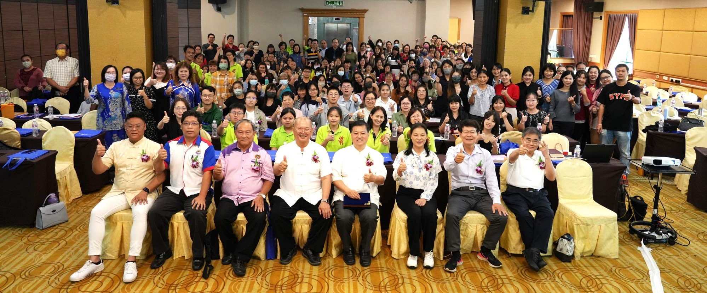

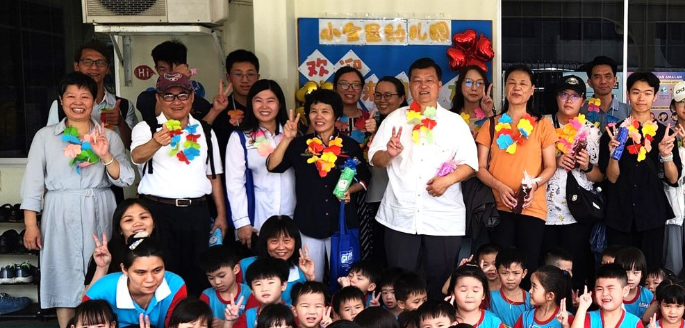

## 活動報導-韓國行見聞報導與心得

### 韓國行見聞報導與心得

宗徹、魏敬純、白宇涵

立論精確的韓國行

立體透視的古今觀

立住人格的經論見

立於福慧的利他行

二○二四年七月，由木魚計劃協會於平昌郡五臺山國家公園內的月精寺，舉辦為期一個月的「世界禪學生活體驗營」，吸引了來自全球二十多個國家、超過七十名學生參與。體驗營結束後，中華無盡燈文化學會為這些國際學子們，安排了三天的韓國文化之旅，參訪韓國多處的儒家景點。行程中最具代表性的景點，便是位於安東的陶山書院，這裡是被譽為「韓國朱子」的李退溪先生創立的儒學研究中心。

韓國的儒學文化自元朝以來逐漸興盛，朱子學更成為韓國科舉考試的核心內容。李退溪先生（一五○一年生）自幼失父，由叔父松齋先生撫養並指導其學習《論語》，深受儒家思想影響。他於三十四歲踏入官場，卻因目睹政治的腐敗而毅然退隱陶山，與兩位佛教僧人共同規劃建造了陶山書堂。

李退溪的思想融合了孔子、孟子、《周易》和《中庸》的精華，繼承了周敦頤、張載、二程與朱熹的理念。他在四十四歲時專注於研讀《朱子全書》，並於五十六歲編纂了《朱子書節要》。後來，他撰寫了《心經後論》，逐步形成了自己獨特的思想體系。他晚年的著作《聖學十圖》，詳細闡述凡夫修學成聖的路徑，並藉此引導弟子們實踐聖人的德行和內涵。

朱子學對韓國的影響延續至二十世紀初，隨著科舉制度的廢除，儒學的影響逐漸衰退。一九七○年，為紀念李退溪逝世四百週年，韓國掀起了一股研究「退溪學」的熱潮，這股熱潮持續了約十年。

時至今日，李退溪的形象和陶山書院的景觀被印在韓國鈔票上，而在安東的景點如月映橋等處，也隨處可見對他的紀念物，足見當地人對這位大儒的崇敬之情。

除了李退溪，韓國鈔票上還有另一位儒者—李栗谷先生。他在退溪思想的基礎上發展出「主氣之學」。李栗谷年輕時曾修習佛教禪法，後來轉而追隨李退溪研習性理之學，以「九度狀元公」之名揚四海，並曾擔任史官及國家圖書編輯主編。

李栗谷一生著作豐富，其中《聖學輯要》文辭優美，內容豐富，為儒學留下了深刻的思想遺產。他的母親申師任堂，也被印在韓國鈔票上，充分顯示儒學在韓國的深遠影響。

韓國的儒學受朱子學的濃厚啟發，而朱子學本身又因佛教思想而豐富。然而，由於中國佛教經典的翻譯與傳播並不完善，朱子的儒學體系未能真正理解佛教的內涵。

回看中國清末民初，太虛大師創立漢藏教理院，正是看到了西藏佛教對第三系印度佛法的純正傳承，於是極力促進漢藏佛教的交流。這不禁讓人思索：若朱子當年能接觸到更全面的佛教經論，是否會對儒學將有更深的領悟？若李退溪、李栗谷等大儒有機會接觸到藏傳佛教的道次第教授，是否會使韓國的儒學在東方有一番不同的氣象？

在此次韓國文化之旅中，我們還參訪了韓國最大的佛教私立大學——東國大學。在一位韓國出生、在海外留學的地理學家李安妮教授分享，根據二○二一年統計，韓國人口中基督教徒約佔百分之二十，佛教徒佔百分之十七，天主教徒佔百分之十一，其他宗教約占百分之二，無宗教信仰者則佔百分之五十。

縱然韓國佛教中的曹溪宗佔據主導地位，但佛教的弘揚勢力正在逐漸減弱。目前韓國佛教僧侶數量每年減少，寺院中的僧人年齡普遍偏高，許多寺院面臨無人主持的困境。原來曾經一度每年有上萬人出家，如今每年僅有百人，可見佛教於韓國沒落之迅速。

無論是儒學還是佛學，這些思想都具有深刻的現代價值，為當代人的生活提供了有力的指導。學會近年舉辦佛學講座，數十位大學生報名加入了學習儒學與佛學的行列，每週也主動來學習其他時段的經典研學課程。這是因為這些經典不僅為他們提供了人生思想的框架，更教導了如何在日常生活中實踐經典的智慧。

太虛大師曾提出的「人間佛教」理念，所謂「人成即佛成，是名真現實」，其實談到「人間」，則應具備儒家的明德親民與中庸心法的內涵，而「佛教」則更應有中國天台宗與西藏格魯派的判教框架，於是方能凸顯「人間佛教」的時代價值與意義。望新一代世界青年，有欲發心學習儒佛思想者，能循著這樣的思路自我充實，為新一代的「人間佛教」創造更加璀璨的未來。

韓國行心得         魏敬純

這次的韓國行讓我印象最深刻的，就是與學員間發生的摩擦，同時也讓我比較意外的是這次的學員和去年的學員有很大的不同。

首先是關於老師們對日本和韓國佛教給予的評價和說明，當中可能有不少來自日本和韓國的學員，而我們身為一群外來的台灣人，在用字遣詞和講解他國文化的內容時也需要格外謹慎，即便有些時候我們陳述只是事實或是特定的歷史，有許多看似是「事實」的東西我覺得在文化、過去的教育、語言等因素的影響下，很容易就形成主觀的評價。身為此次韓國行中年紀最小的志工，我了解現代年輕人對於「政治正確」的追求，對於一些帶有潛在偏見、歧視、貶義的言論會格外敏感，在談論宗教與歷史文化時，更容易觸碰到這些敏感地帶。這也是為什麼我覺得佛學是比其他宗教特別的，因為佛學是可以完全脫離宗教的成分，不必倚靠盲目的信仰，很大一部分就是邏輯的推理和教導我們思考和做人的方式，佛學對於我來說不太算是宗教信仰、更像是一套價值觀、一種生活方式。

經過這次的韓國行，我更加覺得我們應該利用這個優勢來弘揚佛學，以一個更為客觀、不被宗教包裝的方式來談論它。從我的角度、從我這一輩的年輕人的角度來看的話，我覺得這種方式能利益更多的有情，儘管不一定能使周圍的人變成佛教徒，但如果能給予他們一些佛學的價值觀或知識，也能對他們產生很大的幫助。

另外，也很感謝唐老師這次提供的機會，在與林老師、白老師、戴老師、維典老師一起互動的過程中也讓我學到很多，無論是佛學、攝影技術，或是生活方面，讓我能擁有這次獨特又寶貴的經驗。

韓國行心得      白宇涵

很感恩也很榮幸能夠隨同唐老師及諸位老師前去韓國的木魚計畫文化之旅，此次出行是因為學會與依法法師主辦的世界禪學生活體驗營合作，在禪學營活動結束後，贊助舉辦文化參訪行程，為期三天的時間用於推廣中華文化與儒學。有幸參觀了幾個具有歷史與文化意義的景點，其中包括河回村、陶山書院、月映橋、鳳停寺、屏山書院等等。

首先，河回村是一個傳統的韓國村落，走進村子，彷彿穿越到了朝鮮時代，看到那些古老的房屋和保存良好的文化遺產，讓人對韓國的傳統生活有了更深刻的了解。不過，當天實在超熱。

屏山書院則是一個古代儒生們學習和修身養性的場所，書院內部的簡樸與外部壯麗的景色形成了強烈的對比，讓人感受到古人對學問的虔誠與專注。那也是當天白天最涼爽舒適的地方。

鳳停寺座落於群山環抱之中，寺廟的寧靜和周圍的自然風光讓人心靈得以平靜。這裡的香火雖然不如一些大寺廟那麼旺盛，但正因如此，更顯出一種神秘與莊嚴。規模小小的，但卻不失莊重感。

月映橋位於靜謐的安東湖上，湖水倒映著周圍的山川美景，這裡的景色令人陶醉，剛好當天湖邊的漫步道還有舉辦市集活動，在傍晚是個放鬆心情的好地方。學員逛到大超時...可見多吸引人。

陶山書院是一座儒家書院，風景如畫，散發著濃厚的學術氣息，讓人彷彿回到古代韓國的學術中心。這裡的建築精緻且保存完好，與周圍的自然景色相互輝映，令人流連忘返。工作人員的招待與解說非常親切。

最後，東國大學位於首爾市內，是一所知名學府，校園內古樸與現代建築相互交融，漫步其中能感受到知識與文化的氛圍，非常適合學術交流和參觀。正覺院前的樓梯超抖。

而在歷經了三天，送別了學員們後，學會的行程便去往了一些現代與傳統交織的地方，比如明洞、仁寺洞、昌德宮、以及DMZ纜車站，它們各具特色，讓我印象深刻。

明洞是首爾的購物天堂，無論是時尚潮流的服飾、化妝品還是美食，這裡應有盡有。明洞的街道總是人來人往，活力十足。特別是在夜晚，燈火通明，各式各樣的小吃攤、餐館和商店吸引了大量異國遊客。可惜沒甚麼特色小吃是素食可食的...

仁寺洞則是一個充滿傳統文化氣息的街區。這裡的街道狹窄，但充滿了古香古色的工藝品店、茶館和畫廊，是購買韓國傳統手工藝品的好去處。與繁忙的明洞相比，仁寺洞更顯得寧靜且富有藝術氣息，讓人感受到韓國傳統與現代文化的完美融合，我在這裡欣賞了許多小型的藝術展。藝術欣賞家上線中。

昌德宮是韓國五大宮殿之一，因其後院（秘苑）的自然美景而聞名。整個宮殿建築典雅，庭院和花園設計非常講究，展現出韓國古代皇家園林的精緻。我特別喜歡漫步在秘苑之中，古樹、池塘和亭台樓閣互相映襯，讓人感到無比的寧靜與舒適。

DMZ纜車站則帶給我完全不同的感受。這裡位於韓國非武裝地帶（DMZ），是韓國與朝鮮之間的邊境地區。乘坐纜車，能夠俯瞰整個非武裝區域，眼前的景色充滿了歷史的沉重感。這裡的氛圍與韓國其他旅遊景點不太相同，除了景色外更多了些緊張感與歷史的沉思。透過望遠鏡偷看北韓人真的超有趣。

這些景點讓我見識到了韓國不同的面貌，既有繁華的都市、傳統的文化街區，也有歷史厚重的宮殿與緊張的邊境區，這趟旅程充滿了多樣性與深度，每一個景點都讓人心靈沉澱，值得細細品味。

講完了景點，說說這次的種種大小事所帶給我的想法吧，最主要的分為三樣，語言隔閡、當地文化解說可改善的部分及活動主辦者究竟背負了甚麼。

在國際交流和多語言環境中，語言隔閡是常見的挑戰之一。這種挑戰不僅僅是指語言不通，而是更多地體現在難以用更加精準的用詞及表達方式來清楚地傳達自己的觀點與想法。當我嘗試用一種非母語來表達時，常常會感覺到詞不達意，甚至在交流中誤解或無法完全表達內心的真實想法。

語言不通帶來的第一層困難是詞彙的匱乏。即便我能基本理解對方的話，當要深入闡述自己的觀點時，總會感覺到缺少恰當的詞語，導致表達變得粗淺或模糊。這很讓我沮喪，還可能讓對方誤解我所要傳達的核心思想。在這種情況下，我常常需要花費更多的時間和精力來尋找替代的詞彙或打字翻譯解釋，而這樣的溝通效率自然也大打折扣。

其次，語言本身承載著文化和思維方式的差異。不同語言中的詞彙可能無法準確對應到另一種語言，尤其是涉及抽象概念、情感或細微的文化差異時，這些問題變得更加明顯。例如，有些文化中常用的表達方式在另一種語言中可能缺乏直接對應的詞語，這讓我在表達自己的想法時感到無力。這種文化與語言的錯位，常常讓人覺得即使能說得通，但無法說得透。

最後，語言隔閡的最大影響在於溝通中的情感和意圖難以準確傳遞。語言不僅是溝通的工具，還是情感交流的橋樑。然而，當表達受限時，我往往難以準確地讓對方感受到我的情感或思維的深度，這讓溝通變得更加表面化，有時甚至會讓彼此之間產生距離感。

為了克服語言隔閡，我認為往後我應在不同文化和語言環境中保持開放的心態，理解溝通不只是語言的交流，還包括彼此的理解與包容。

文化解說可改善的部分就是或許在評論一件文化事物時，我們不應過於著眼於其表現上的不足或缺陷，而更應該將重點放在深入理解與闡述其背後的用意、創作背景及歷史脈絡上。文化事物的形成往往受到多種因素的影響，包括時代背景、社會環境、創作者的個人經歷等，這些都是我們應該考量的部分。因此，與其單純批評它的缺點，不如試著去理解其存在的價值與意義，並從多元的角度來探討其文化貢獻與歷史定位。如此一來，我們能以更包容和開放的態度來看待不同文化事物，而不是簡單地對其做出褒貶。

最後則是活動主辦人究竟背負著什麼，我這次沒有來韓國我不會看到這麼細節與重要的觀點，作為活動主辦人往往對活動的成敗有強烈的責任感。這樣的責任感會帶來自我施加的壓力，主辦人可能不斷質疑自己的決策，擔心任何小的失誤會影響整體效果，這種焦慮來自於對自己的高標準，害怕辜負參與者、合作夥伴或贊助商的期待。他們也很孤獨，即使有一個團隊支持，關鍵時刻他們仍需獨自承擔壓力和後果，且當面臨重大決定時，沒有足夠信賴的對象可以依賴或分擔壓力的話。那種孤立感我真的無法想像。

那我們這些參與者、協作者該怎麼做？給予積極的反饋與溝通！感恩的心！活動中遇到狀況，我憑什麼抱怨，你(主辦者)有任何需要我肯定幫忙到底，無論是在情感上的支持還是實際工作的協助，我都該有所為，這次他舉辦的活動是為了弘揚正法，試問還有誰能為了宣揚佛法而籌辦如此國際性的活動？如果他因為輿論的壓力而崩潰，甚至因此無心再舉辦未來的活動，那麼這份過錯，我也難辭其咎。

以上便是我此次韓國行的小小心得。最後，我要再次感謝唐老師及各位師長同修，感謝您們為這次行程所付出的心力，不辭辛勞地規劃、解說並帶領我們，真心向您們致謝，謝謝您。

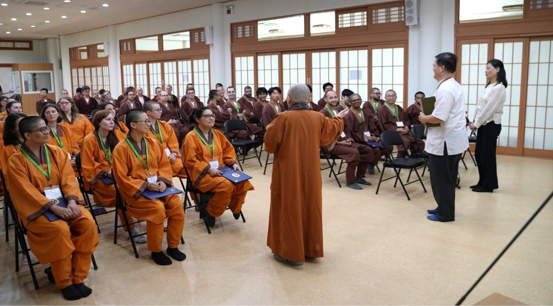

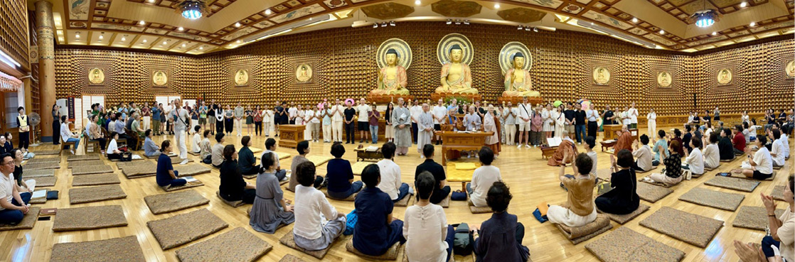

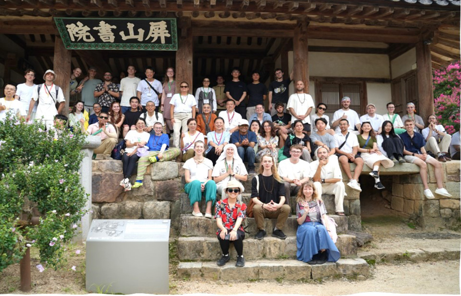

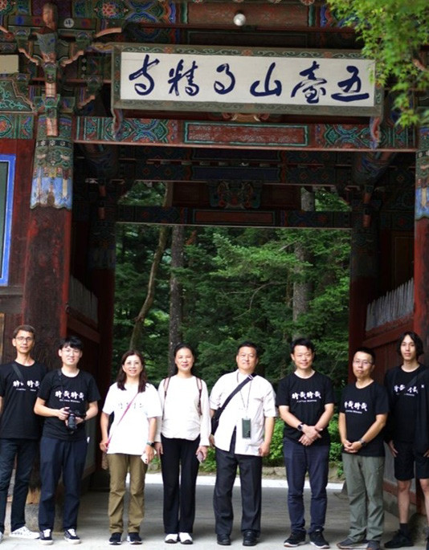

## 活動報導-記述張偉慈先生與學會的一段因緣

### 記述張偉慈先生與學會的一段因緣

心筑

曾是湯池執行長，撤回西馬的要角

農訓中心的講座，首次邂逅的欣賞

邀請西馬的講座，廣邀馬來的信徒

而有東馬的缘起，馬來論語的濫觴

弔念伯樂的善友，精舍齋僧的迴向

所謂的暇滿人生，是在年紀輕的時候，正值頭腦清晰，體力最好時，遇到了正法；也在衣食無憂，生活有閒暇的狀況下遇到正法；更難能可貴的，是在遇到正法的時候，願意提起心力好好學習，偉慈先生就在年紀輕輕接觸到中華傳統文化，並全身心投入，從商的他不但自己學習，更出錢出力成立弟子規教學中心，致力於傳統文化的推廣。

經過多年的努力，偉慈先生在家鄉成立的弟子規教學中心，並私下研讀《論語講要》，在其中得到許多指引，暗自決定要以《論語》的弘揚為畢生努力的目標。之後在朋友的邀約下，於二○一二年九月參加了法務部生命教育研習營，在法務部的講座中聽聞學會兩位老師的課程，先生就像遇到知音般，興奮地主動與老師聯繫，講座結束後，先生在學會附近訂了飯店，週日學會大門深鎖，只因老師有事去學會取個物品，就看見偉慈先生在學會門口徘徊，見到老師開門見山就說他想要跟老師請法，想要辦講座，帶馬來西亞的校長與教育人士來台灣學習，老師被偉慈先生的誠意感動，直言非常歡迎，會盡所能地幫助偉慈先生在吉蘭丹的傳統文化推展。

緊接著，就有了十二月一日至八日的「如何跨越傳聞與真實的障難—《論語》正見是出路」講座，除了《論語》以外，還開設了《常禮舉要》、《唐詩》賞析暨吟誦、樂教暨音樂欣賞，並有故宮、中山樓與陽明山的文化之旅，可以說將文化的面貌和盤托出，毫無保留地展現在貴賓之前。

而學會也是第一次接待八十五位遠道而來的貴賓，從課程主題選擇與安排，到搜索學會附近的飯店價格與訂房，義工分批導覽學會，辦理迎賓晚會，晚上的各地夜市與信義區探索，種種都帶給這些從事文化教育工作的老師、校長們一個新的文化體驗。

偉慈先生回到家鄉吉蘭丹，便著手邀請學會到當地講學的事項，隔年三月，邀請學會到丹江弟子規教育中心，講授為期八天的儒學經典講座，講題為「知是眾妙之門—福始祥源」，張會長在唐老師到會期間同時舉辦四個大型活動：「《論語》與儒學講座」、「國際論語交流會」、「素食嘉年華」以及「好人好事大匯演」，四個活動全部以「學《論語》不亦樂乎」為其核心議題；《唐詩》部分，則以孟浩然的〈過故人莊〉來呼應主人的誠意邀約，學會赴約的禮尚往來；也選擇了王之渙的〈登鸛雀樓〉，期許彼此在傳統文化上步步昇進。《常禮舉要》選取了〈在校篇〉，呈現在校學習所需之禮，分析其內涵與外相上應表現出的儀態。晚間又有江逸子老師的畫作賞析課程，若能結合江逸子老師的塑像與畫作呈現孔子內涵，並且輔以故宮經典文物，相信能帶動當地文物與美學欣賞，讓華裔子弟了解中華傳統文化的博大精深。

這一次講學也特別帶年輕人出去見習和複講，讓年輕人開拓眼界外，更給這些從小接觸並學習文化的年輕學子，對所學有更明確的認可。

偉慈先生在經過這幾場講座之後，愈發堅定弘揚論語的心志，多次與師長書信往來闡述自己正在做的事情，也說到吉蘭丹遭遇到了大水侵襲，偉慈先生與團隊在家鄉奮力救災。

後來在二○一六年，學會舉辦了「孔門改命學  翻轉人生的智慧 從《論語》的高度看《了凡四訓》」講座，邀請了偉慈先生擔任論語複講消文的工作，記得在現場上課時，先生因為太緊張有幾次沒有接到老師丟過來的問題，事後頗為懊惱，不過這一切在先生回去之後，都化成更努力研讀和講學的動力。先生多次與《星洲日報》展開學習《論語》的合作企劃，先後有《智慧的線索：論語講要》、《論語Q&A》及《您問我答》的小欄目及專欄形式出現在光明日報《東海岸》社區版。

先生的好友形容他是左手拿《弟子規》右手拿《論語》，終生致力於推動傳統文化，不但在馬來西亞推動文化，也在全世界積極推動各種傳統文化事業。先生曾經榮獲二○一四年世界傑出名人榜，二○一七年全球華人十大楷模人物獎，二○一九年創辦「樂乎LeHoo」臉書平台及後來的TED HOUSE共享空間，希望透過網路平台共享正知見，使大眾獲得良好價值觀，並且快樂學習。

先生事必躬親，總是充滿笑容出錢出力在推廣文化，將自己的生命燃燒殆盡，學會有幸得到偉慈先生的信任，也嘆息偉慈先生英年早逝。先生一生努力於傳統文化的學習與推廣，不論在重業、近業、習業、念業，都與正法推廣有莫大的關聯性，相信先生在大眾助念中必能往生極樂世界，在極樂淨土中繼續增上，得善知識提攜，不用在自我摸索中學習。

附註：之後得知先生倉庫中有近千本的論語講要，蒙其兄長協助，已寄往詩巫、關丹、直涼、兒連突等地，繼續利益馬來西亞各地讀書會推廣傳統文化。

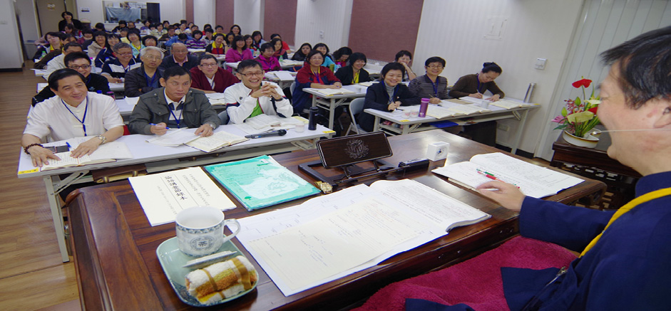

## 正覺精舍齋僧報導

### 一一三年八月一日 正覺精舍齋僧總報導

淨柔

辦事人員的團隊，任勞任怨的進行

經費分組的籌辦，名單進出的耐煩

普賢隨喜的難修，修行各面的具足

鐵鎚思維的省思，自我期許的增上

辦活動須講究前行、正行、結行，本次齋僧在車上前行時，唐老師講到《修心七義論》中一生修法，即五力修學法：第一、牽引力，每天期許自己今天所做所為都被菩提心牽引，導向大乘、導向成佛，今天的齋僧法行亦然。在齋僧的過程中，每一個造作體性都轉為大乘；第二、白善法種子力，以善法引發菩提心，齋僧就是今日造作最主要的善法，當遊覽車出發輪子啟動時，就是法行的開始，返程直至車輪停止，即是活動的圓滿，能讓一個法行圓滿後，再重啟下一個法行，這才是真正的修行之道。此外，應了解所供養的對象是果清律師與正覺精舍僧團，除菩提心外，須生起隨喜心、合作心、服務心、供養心、對治煩惱心、見賢思齊心等，通通在造作善法中默默地發起，這些善心發起的愈多，善法力量愈強，果報結成愈殊勝，此即是業的觀察，才是佛法的核心思想；第三、對治力，特別要對治我愛執、對治無明我執的貪愛，它是所有煩惱的頭目，當別人對我們規過勸善，或者遇到一些違逆我的事，要起此來對治我愛執，尤其臨命終時，由愛取去潤業的種子就決定了來生的「有」，今天所作所為主要就是來對治我愛執，當然菩提心的修學也需對治我愛執；第四、串習力，如串習無常的覺受，串習業的觀察等，最殊勝的串習是菩提心的修習，乃至可取七重因果或自他換的某一步修學法來做一天的串習；第五、迴向發願力，迴向正法久住、迴向淨土、迴向佛果、迴向利益有情。以上是伽喀瓦大師修心七義的一生修法，大師修學成就的關鍵即此修心七義，大師本人於臨命終自然見到淨土，這也是寂天菩薩入行論第十品迴向的意趣所在。

人生中有著機運與際遇是改變命運的良方，尤其遇到大善知識、遇到齋僧的美妙善法就是人生最殊勝的際遇，這種際遇於十萬人中難得其一，須外緣與內因各一百才能生起，故應生起比中樂透更高興的意樂。且學佛有兩種人，一種愈學愈精進，一種則愈學愈疲勞。愈學愈精進、愈法喜的人是因為他知道如何次第的學、有方向的學、有架構的學，對於聽聞過的法義，也能將自己浸泡在世俗染黑汙穢的身心衣，放入法義的洗衣機中洗滌，每聽法一次，就重新洗淨一次；而愈學愈疲勞的人認為這些道理已經聽過多遍，索然無味，以致在聽聞中都彷彿與自己無關，只是看有沒有還沒聽過的，如同自己穿了一身髒臭的衣服，看到的只是洗衣機在洗別人的衣服，以致終生還是穿著髒臭的衣服，對法義完全不受用，最後，這兩種人命運天差地別。

臺灣的學佛風氣，包括臨終助念、弘揚淨土、傳戒、慈善、講經等，諸多佛行事業始於 雪公，最難得的是年輕人的教育，在周宣德老居士於民國四十九年興辦台大晨曦社，雪公配合在中部大學也興辦佛教社，從中培養人才。當時，果清律師亦是中興大學佛學社一員，於後成就其精研教法與出家因緣。時至今日，青年學佛人口極少，校內佛學社相繼隱沒，正覺精舍的知客師道：「中華無盡燈文化學是佛教界的一股清流，能儒家佛法並弘，尤其現代的佛法知見紊亂，藉由電腦、網路傳播邪知邪見，大眾又缺乏正知見的引導，中華傳統文化受到排擠、破壞，生存岌岌可危，大乘佛教思想也在衰敗當中，很多人好樂梵唄、做法會，但學知見、談修行的人很少，顯現出末法時期的樣貌。」因此，如何重振當年學佛潮之風光是現在最重要的課題，吾等應好好經營社團法人，研學經義、辦讀書會，跟年輕人結緣，抱持文化弘傳的使命，幫助學子們找到人生方向，懂得以教法的知見解讀境界，成為增上生的資糧，轉煩惱為道用，經營生命的意義。

全體到達山下整隊齊步至山門，由知客師帶領團隊入律學院大殿，藉由齋僧法行可以訓練自己的身口意，注意自己的一舉一動，戒律其實就是從自控力開始，觀察自己在行進中、集合時、吃飯時、聽法語時，乃至於休息時間，心是否散亂出去，是否不經意地就流露出自己很多不好的習氣，當散亂時是否能抓回來，專心緣在當時的境界上，除了觀照自己外，也要觀照周遭，大家共同莊嚴這個法行，必要時要給予勸導，不是一味當個啞羊，同時在安靜中把事情做得穩妥，聽從師父、老師的指示，這也是團體培養默契的好時機。當一個在家團體顯現出很莊嚴的氣象，也是對正法道場尊重與支持最好的體現。

果清律師開示「持戒念佛」之重要性。戒可以說是基礎，由戒而生定，由定而開慧，若以如菩薩戒中攝持六度來說，戒即是廣大行，戒也可說是成佛後的後得位，因此戒律是初重要、中重要、後重要。戒的覺受亦須靠定慧成就，依止成就定，依觀成就慧，依止觀生起戒的覺受，所以是看以何種角度來說戒。戒亦須透過聞法來體會，觀修戒同大地，戒德如蓮香，戒是人天的氣質和品味，功德如瓔珞般殊勝莊嚴，由此可知戒是菁英培養法、是高貴種性的修學法。

今日，在世界各處要找到一個見和同解、戒和同修的團體非常不易，要珍惜親近善知識的因緣，身為在家人須誠心誠意禮敬供養，護持出家眾結夏安居，藉由齋僧對境作觀修與發願，作意自己如同祇樹給孤獨園長者，能夠黃金鋪地陳設莊嚴來讚歎三寶的殊勝、尊崇正法幢，將齋僧法行中的所見所聞、齋僧的戒德巍巍、大眾整齊莊嚴的梵唄唱誦等現量作為正因，生起比量的覺受，亦即日用平常能想像自己是出汙泥而不染，這般殊勝的氣象。

結行中特別回向果清律師的僧團能久住世間、正法發揚光大，弘法大德們長久住世，正法團體如雨後春筍般生起，讓臺灣成為真正的寶島，回向　雪公和　醒公這些大善知識往生淨土後，能乘願再來利樂有情，回向有情眾生都能夠隨喜齋僧法行，對佛法產生殊勝的覺受，學會團體的充實以及與世界各讀書會的共學，今生能有最好的增上。

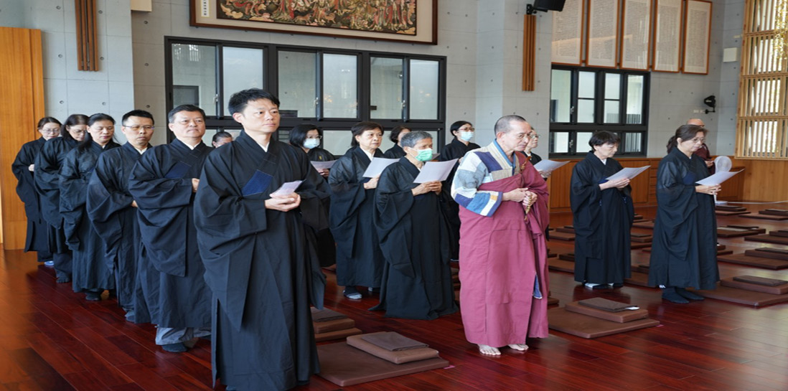

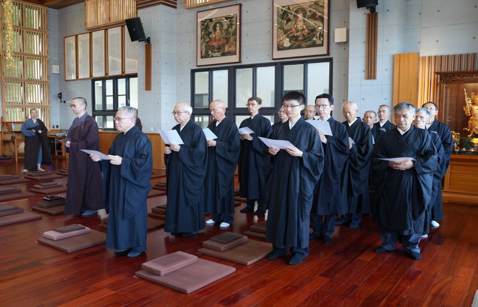

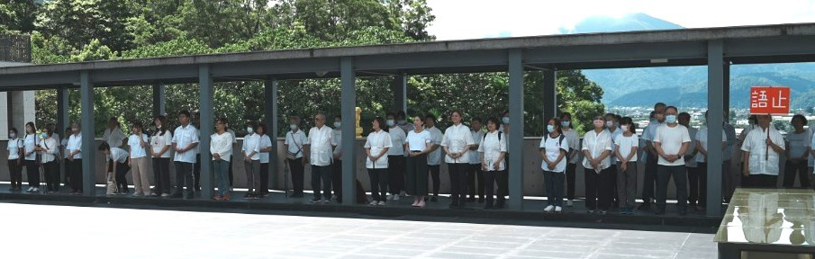

### 保守與創新-從對正覺精舍僧團結夏安居供養說起

心若

保守而不呆板

創新卻非亂來

保守中有創新

創新中有保守

走進清幽的正覺精舍，戒律森嚴、道風儼然，住持的清公是屬於保守型，他的所作所為都是按照祖制、舊例來維護僧團與道風，依古注來講授經典，在清公身上，很有古樸韻味，從他的舉止，可以看到前賢、大德的風範，清公算是很重要的門戶與足跡，如同《論語》有一章子張問孔子善人之道，子張問孔子什麼樣的道，是善人所行之道，又或是要行什麼道才能被稱作善人，才能成就善人，這個善人可以包括君子、聖人、賢人等。孔子回答子張：「不踐跡，亦不入於室」，不走他們所走過的路，如善人的見地與行持，也不會進入他的奧室，不能與他們一樣有所成就。踐是實踐，跡指善人的軌跡，跡有兩種，一種是外在的跡，一種是內在的跡；外在的跡，比如說你跟著他的腳步，走到他所到的處所；第二種是指他內在的心行與達到的意境。

一般說踐跡入室，先是入門，再來升堂，再來入室，入室就是得到善知識的成就。不去踐他的跡，他所走過的足跡（外在行持與內在見地），我們無從得到他的精髓。不過真正要進入像君子的這種善人，或是賢者、聖人這種善人，一定要得其門而入，如同孔子萬仞宮牆，如果不得其門而入，就不知道宗廟之美，百官之富。

清公本身就是個得其門而入、踐跡入室之人，清公跟隨善知識，加上自己的努力，內因外緣具足，最後成為一代大師，而清公他本人也成為一個軌跡，供我們去窺探佛教，特別是戒律的這一分。

由依止戒律而行，來保有佛教的純正，從清公身上，看到保守的價值，可以從他上溯原始佛教。

但是這裡面也有做一些改良，比如原始佛教是修行人在佛塔附近結廬，清晨大家出去托缽，回來分享食物，尤其在結夏安居的時候，要結界共同用功辦道，結束以後可以各自遊方，與現在寺院經營方式有別，釋迦牟尼佛當時也是大半在遊方，最後在娑羅雙樹間涅槃。但是佛教傳到中國、傳到東南亞、傳到西藏，都會因地制宜，融合當地，這就是創新，必須要了解當地的風俗習慣，借用當地的文化來發展佛法的內涵，所以佛教進入西藏，會跟苯教融合，了解苯教的思維模式，保留他好的，但是也做諸多的改良，特別是引入佛法的正見，這就是創新；到中國來也要跟儒家、道家結合，運用儒家、道家的觀念，來詮釋佛法，並且以寺院聚會的方式，研討法義，保留佛教，這就是創新。總體而言，佛教在傳入不同地方，不會是簡單地保持原狀，而是通過與本土文化和社會的互動，發展出與眾不同的佛教形態和特色。

佛教的創新有古代的創新，也有現代的創新，現代要講究如何結合年輕人的思維，比如在管理制度上面，如何有效的拿捏，例如僧伽的醫療也要隨順，像生病的時候到大醫院治療。創新還包括了解時代年輕人的想法，才有辦法運用他們了解的語言，一起來探索佛理，在禪坐當中，有時候也須結合心理學、情緒學來解讀《百法明門論》，也有運用科學的方法來做為經教的整理與歸類。

而跟時代最有關係的創新莫過於結合人工智慧的部分，ＡＩ可以運用在很多層面，比如教育和傳播，ＡＩ技術可以用於開發教育平台、虛擬導師或智能助手，提供個性化的學習體驗和深入的佛教知識傳授。這樣的系統可以根據學習者的需求和進度調整內容，幫助他們更有效地理解佛法。

ＡＩ也可以協助翻譯和文獻保存，ＡＩ在語言處理和翻譯方面的進展，可以幫助翻譯佛經和佛學著作，使得佛教的核心文獻更易於被全球不同語言的人士理解和利用。此外，ＡＩ技術還可以用來數字化和保存珍貴的佛教古籍和手抄本。

ＡＩ還可以成為修行輔助工具，例如，智能設備可以提供冥想引導、禪修技巧和瑜伽練習的個性化建議，幫助修行者更有效地實踐和深化他們的修行經驗。

ＡＩ技術還可以用於建立和維護佛教社群，在線上或離線環境中促進修行者之間的交流和支持。這包括社交平台、虛擬寺廟或共修活動的組織和管理。

我們也可以藉著AI來做佛經的想像，比如創造經變圖，讓我們對經義有立體的認識，或是藉由ＡＩ，做出很多佛曲，來宣揚佛法，就像當時馬鳴菩薩，用音樂唱誦來引導人們皈依三寶、進入佛門。

可以說，ＡＩ技術在佛法的應用不僅僅是技術革新，更是如何將現代科技與傳統智慧結合，促進個人和社群在佛教修行和理解上的進步和深化。以上都是我們可以想像的，還可以做諸多的衍生。

講到戒律、保守與創新，雖然聽起來是對立的概念，但其實他們在實踐中卻能夠互補，並促進一個組織的健康發展。

戒律在任何組織中都是不可少的，戒律、規章制度可以確保秩序的穩定，使得組織的運作有序進行，而創新意味著不斷尋找新的方法、新的理念和解決問題的新途徑。它能夠帶來新的思維和技術進步，使得組織在競爭激烈的環境中保持競爭力。

創新建立在保守的基礎上，在追求新的、創新的解決方案或想法時，通常需要依賴於穩定、可靠、已驗證的基礎，這樣的基礎可能是已有的知識、技術、方法或價值觀，它們提供了安全和穩定的平台，使得新的創新不是脫離現實或無所根據的。

保守與創新之間的平衡非常重要，過度保守可能抑制創新的冒險精神和自由探索，而過度強調創新可能導致混亂和無序。成功的組織往往能夠給予成員足夠的空間和資源進行創新，這樣的組織能夠通過遵循基本規範來確保穩定，同時又能夠透過創新來應對各種變化與挑戰。

回到前面講的踐跡入室，雖然是依循著他的路線走，但當你揣摩他，入進去的時候，其實也可以做諸多變化，開展無限的可能性，不會墨守成規，這就是一種創新，就像顏回「步亦步，趨亦趨」，跟隨孔子，從表相的踐跡，到內心的踐跡，等他真的進入孔子之室時，他還可以發揮孔子的未盡之意，等於是先走入孔子的意境，再突破框架，這也不妨礙獨立思維，能夠反經合義，甚至表相上，可以做得跟老師相反，義理上卻是全然相通，如同孔子說的「三十而立，四十而不惑」，都不相違。

如果不踐他的跡，就不會入他的室。不經過他走過的路，又怎麼會走入他的境界？尤其他的境界若是深奧難知，沒有他領進去，我們又怎麼會領悟他所領悟的深奧境界，就好像有錢的富豪，他不帶我們入他的莊園，我們是進不去的，如此又怎麼可能走入他的庭院，走入他的房間。所以深奧難知的佛理，都牽涉到傳承，這些東西要先入進去、保住，才談得上後面的創新，保守有保守的好處，創新有創新的好處，若能揉合在一起，或許就能更適應這個時代，而且還能保留得更完整。以上或許是我們進入果清律師道場齋僧可以有的反思。

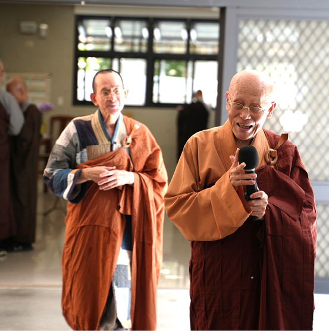

## 國內小止觀講座國外止觀禪報導

### 《天臺小止觀》講座報導

心若

止觀禪坐的暖身

學會未有的緣起

條件具足的困難

珍惜所有的開始

暑假，有較成片的時間，大家可以坐下來研討法義、細細品讀，二○二四年八月，學會辦理國內以及外國人小止觀課程，整整一個月，都沉浸在止觀的學習中。

國內小止觀講座為期三天，講述止觀的精華—第六章正修行；外國人小止觀講座為期兩周，由唐老師概述一到十章，每天下午搭配動中禪，諸如茶道禪、音樂禪、花道禪、梵唄禪、禮佛禪、吟詩禪、書法禪、畫畫禪，課程琳瑯滿目，也有很精進扎實的早晚課與禪修，上述課程皆不離坐上修與歷緣對境修，無疑是場豐富且完整的深度體驗。

國內《天臺小止觀》開訓，邀請到奉祀官孔垂長先生，

孔先生致詞言：

「唐老師、林老師，在座的同學大家好，很欣慰能看到這麼多年輕面孔共聚一堂，學習傳統中華文化，為中華文化盡一分心力，大家來自各個學校、各行各業，共赴這場心靈盛宴，我由衷地祝福各位，在酷暑中，找到自己心的清涼，在人生的旅途中，無論面對任何挑戰，都能保持專注並全情投入，克服困難，迎接更好的未來，未來大家都是中堅份子，希望你們能夠珍惜如此難得的機會，把自己當成種子、苗，把所學貢獻給社會，以上是對各位的勉勵與祝福，謝謝大家！」

唐老師致詞言：「孔子說：『默而識之，學而不厭，誨人不倦』，其實默就是止觀的成就，識就是修學止觀，學而不厭就是學習世間、出世間，誨人不倦是把弟子、大眾引導到世間、出世間成就，可見儒家孔子也講究止觀，修學止觀可以讓我們通達法義，通達形而下、形而下，止觀就是創造心流的方法，心念相續就像流水，通達世間、出世間。儒學偏向世間，佛學偏向出世間，出世間的部分佛學講得非常多，像《大般若經》就以形而上為主，但如果不能在形而下講究，不能通曉人情世故，也會障礙學習，所以儒佛要並進，像孔子就是了解世間之人，他從求學到做官，到周遊列國，經過各種險難、折衝，孔子的豁達來自於對世間的了解，世間一般只看到名聞利養，可是看到自利利他法行的殊勝才能讓這一生走得長遠、利益後代。

如何生起好樂、專注，《天臺小止觀》談得很多，有知識內涵為背景，來坐上修、歷緣對境修，並且拿來自利利他，這一生將會過得非常精采，孔子說自己是『發憤忘食，樂以忘憂，不知老之將至云爾』，這些都是孔子進入止觀、任運止觀，並且感到滿足愉悅的最佳證明。

學會很榮幸能與孔會長合作多年，從孔先生身上可以看到他一路走來，對文化的堅持，為了弘揚祖先的學問不遺餘力，孔家能夠延續到現在八十代，其中有非常多可觀之處，是我們學習的榜樣。

這次講座老、中、青三代一起學習，展現很好的氣象。希望透過講座，大家能夠深入了解正修行，這不僅會提升我們的效率和成就，同時也能增加生活的樂趣和意義，並且在遇到挑戰困難時，懂得集中精力，激發潛能，找到解決問題的最佳方式，邁向解脫與成佛的大道，謝謝大家！」

林老師致詞：「《天臺小止觀》在學會曾有多次的開講，最久的一次長達八年，這次只有三天，集中精力放在第六章正修行，教大家如何學習調配自己的內心，向外開展，帶領社會走向更美好的未來，這將是一場充實和快樂的體驗，一種只有你自己能創造的精彩。

在座有新學、舊學，大家都可以互相研學、切磋琢磨。最後一天有考試，為的是讓大家快速進入學習，在這個變動的時代，很多天災人禍，都要靠安定的力量止息，相信《小止觀》會給大家很多答案，敬祝大家學習愉快。」

外國禪修營開訓

唐老師致詞

：「很高興第一次在學會正式辦理止觀禪坐，我對於《天臺小止觀》，特別是《道次第廣論》的止觀，都做過深入的研究，三大寺考格西都不見得讀得到的《道次第廣論》。《天臺小止觀》有會性法師與高登海居士的講解，但要真正了解其中的內涵，還得入道次第止觀細研之。

《天臺小止觀》分為十個章節，上課時會綱要性說明，很多坐禪的方法，若能講究，將對我們坐上修、歷緣對境修大有助益。懂得止觀，也會產生諸多世間的好處，比如容易看到事情的重點，容易進入狀況，容易讓人際關係圓融發展等等，學習止觀，並懂得運用，人生會有很多奇妙的變化。止觀門一一實踐，可能要花上一兩年，去細細體會每一個步驟，這不是件簡單的事，此次能夠開設兩周的禪坐班非常難得。三大寺考格西，即便考上，拿到證書，都還要另外找上師來學止觀，因為要花很多時間，上師也不見得有時間教。臺灣可說是學習佛法非常友善的地方，是大家能共聚一堂的淨土，天底下很多事情不可思議，這次學員人數不多，為的就是保證品質。

本次禪坐有坐上修、歷緣對境修。歷緣對境修的部分，有茶道禪、花道禪、書法禪、音樂禪、吟詩禪、畫畫禪、禮佛禪、梵唄禪，可謂一邊扎實地學習理論基礎，一邊帶給大家豐富的體驗，是學會從一九九九年成立道場到現在，第一次如此完整地舉辦這樣的活動，當條件具足的時候，可能是某些人受用，而且是莫名其妙的受用，可見結緣不能小看隱沒的力量，滅法不是實質的滅，過去生所造的善惡業雖然已滅，不代表不會影響到這一生。從本班的組成，看到了未來很棒的願景，講者跟聽者共同探討法義，在這個體系裡調整身心，相信必能得到天臺祖師以及三寶的加被。」

林老師致詞

：「歡迎大家來到學會，誠如唐老師所說，這樣的禪修營隊是我們過去一直想辦，甚至想從小朋友開始辦起的營隊，但是從來沒把夢想實踐。現今資訊快速、人心複雜，要把身心安住在當下是非常困難的事情，講座兩周好像很長，但是放入生命的洪流中，卻是極短暫的瞬間，觀待我們止觀禪修的如理如法，將對人生產生不可思議的影響。

臺灣有很多禪修中心，大部分比較在止上做引導，學會的特色是從觀（分別）出發，這次透過智者大師的《天臺小止觀》，建立重要的勝觀，止可以幫助觀，觀可以幫助止，相信我們沉浸在這樣的學習中，兩周很快就過去了。本次講座第一周的課程會幫助大家奠定基礎，每天下午的動中禪讓大家放鬆身心，這些都有助於第二周的個人禪修，學會的環境也都會打造成沉浸式的學習環境，期待兩周營隊的開始，相信大家將法喜充滿、滿載而歸，謝謝。」

止觀的修學可以證得世間以及出世間的法義，世間的真相以及出世間的真相都可以透過止觀的觀察證得，佛教是以見真相的方式得到解脫，不是以信仰的方式得到解脫。見到世間的真相能夠得到現世的安樂以及來世的增上，見到出世間的真相能夠得到殊勝的解脫，見真相的修福能夠得到佛的色身，見出世間的真相使修慧得到佛的法身。當然修福要用出世間的慧來修福，這個福才能廣大到足以成就佛的色身，世間的福能夠資助出世間的慧，使出世間的慧格外有力，能證得佛的法身，修福不能離開修慧，修慧不能離開修福。止觀門就是修福跟修慧的方法，眼前特別以天臺大師的小止觀，來通達修止修觀的方法。天臺大師成為能做，小止觀成為所做，小止觀的小是總綱的意思，講者要具備殊勝的意樂來宣講，聽者也要把自己當作止觀的傳承者、弘揚者來聽，止觀的修學能夠帶來自己以及世界的安樂，修行要帶有很多想像力，邊上課邊想像情境、觀修法義。

《天臺小止觀》分為十章，止觀門的修學是佛教解脫唯一的方便，是無上甚深微妙法，是通往涅槃的唯一要道，前五章是前行，第六章是正行，第七章是判斷修行所引發的善根有無過患，第八章是如何對治修行的魔障，第九章是依止觀來治身體的疾病，使身體不成為修行的障礙。修學止觀的方法特別在第六章詳說，包括坐上修、歷緣對境修。第十章是完結，講證果。要得到止觀的殊勝利益，必須這十章互相配合，整體架構非常完整。

追求真理極其困難，這次來自各方的因緣，而有近一個月的止觀講座，感謝如理如法的翻譯，讓法義傳達無礙，大家安住在法上，止上修觀，做種種的觀察。禪坐感謝玅眼法師帶領學員，禪坐時會發現內心很多問題，要檢驗所學能否解決處理這些問題。

講座、禪坐圓滿後新的一學期即將展開，韶光易逝，若能善用死無常的觀修，帶著今天、明天都可能死亡的覺受，及時把握光陰，如同中觀應成派說的依作用安立，盡力發揮士夫的大用。

以上簡短略述止觀講座概況，至於止觀課程的詳細內容，將日後於專刊分享。

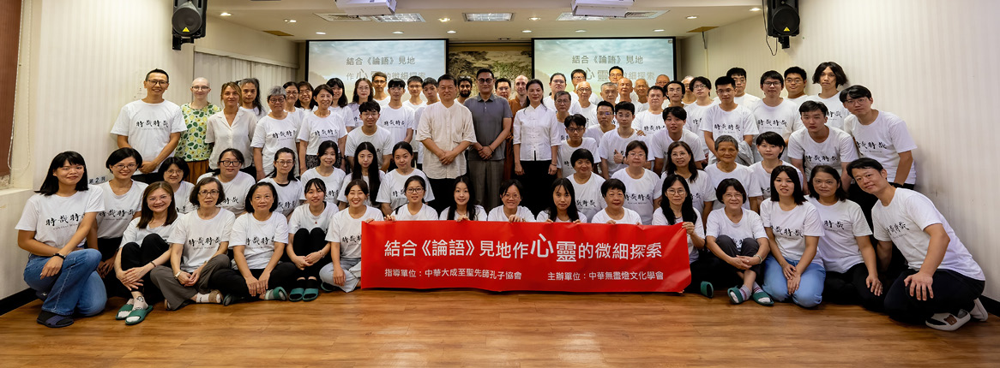

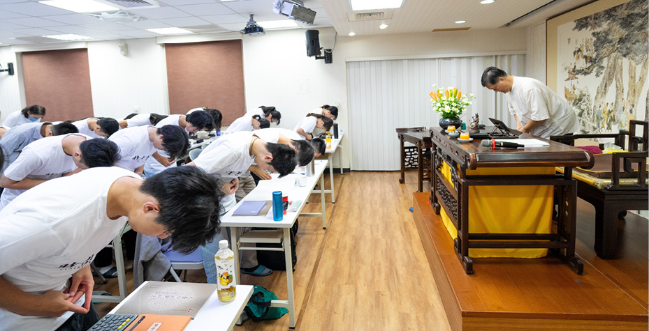

### 《天臺小止觀》講座學員心得

眾學員、 欲仁、慧慈悲

難以生起的活動

參加成員的有幸

運用暇滿的修學

體悟於心的相續

張兆宜

一開始報止觀禪的時候很猶豫，怕有語言障礙，又是兩周的時間，中間會遇到中元節，以及論文寫作的壓力，很幸運這些後來都不成為問題，一開始很好奇這些外國同學哪裡來，沒想到他們大部分是workaway，也太有福報，一來就可以參與這樣的課程，又都是世界經濟強國，能跟他們上課感到很榮幸，也很訝異他們第一次聽佛學課程，就可以提出很多很有水準的問題。

禪坐很疲累，從早上四點到晚上九點，時間很長，不是懺拜就是禪坐，雖然痛苦，但我告訴自己不能臨陣脫逃。禪坐看起來很花時間，沒有做什麼事，但反過來想，原來我們平常花在世俗的時間非常多，在勝義上的時間非常少，這種禪坐體驗，自己想辦也辦不成，因此要好好珍惜。

鄭維綱

這次參加講座，雖然不像以往充滿熱忱的心，但是也許把自己心安靜的下來，才看得到世間的道理；學習佛法對自己的幫助是什麼呢？若是不得受用，或是感覺學一法是一法，學兩法是兩法，學起來對自己是很累的，這也是我目前修學的狀態。

平常學習佛法並沒有非常認真，反應在其它地方，可能也是這樣，並非學習佛法才是這樣。做人處事、生活作息，有很多都是不如法的；學習佛法，首先得把自己提振起來，才提得到修行，才提得到覺悟。善知識說：「發現自己的過失，是覺悟；能改正自己的過失，是真修行。」我們學習佛法，是從聽聞而來，所以我們不能靠自己修行，得依靠善知識，聽了善知識的話，要去勘驗自己懂多少，真懂了，才懂得何處不是佛法，處處是佛法。

三天下來，參加小止觀講座，就像把自己根深蒂固的觀念或者習氣伏住，不讓它起現行，所以外表看起來沒有其它表現，其實是自己內心，還是貢高我慢，法水不入。所以聽了這堂課程，好像學到了一點，也有一點法喜的感覺，出了課堂，下了課就拋到九霄雲外去了，連上課所維持的表面功夫，也都沒有了。

世間所有的一切，就是待緣而生，實有體性了不可得，若是緣起法，周遭的一切都是拼圖，只有合起來，每片拼圖才能發揮各自的價值；若以空性來說，尋覓每張拼圖的實有性，各個去尋找，在自己的這一分不能成立，在境那裡也不能成立，止觀就是觀察它的空性，觀察它的緣起。

非常感謝唐老師不辭辛勞講課、幕後籌備課程的諸位師長，以及辛苦維護道場與完善整個活動的師姑師伯先進前輩們。

張浣浣

第二次參加學會的寒暑假講座，每次都興沖沖地報名，在講座前一兩天卻非常緊張退卻，甚至產生臨陣脫逃的念頭。

經過一學期在學會上課的洗禮，發覺自己不僅在佛法上或是人情世故上都嚴重欠缺，很容易被外在環境因素牽引，還將一切情緒視為理所當然，這次為期三日的天臺小止觀的課程，雖然無法在老師講課的當下把道理理順，但回家靜靜地將筆記拿出來反覆思考，在這堂課能吸收到一件老師所講授的重點應該也算進步吧？

止觀這門修學法對於為人妻為人母很有幫助，往往因為自己境界情緒因素，容易將脾氣順理成章轉移至家人甚至孩子身上，沒想到很多時候是自己沒將負面情緒所帶來的過患先做觀察及檢視，大人因根深蒂固的想法扎根在心裡，面對孩子總是帶著先入為主的觀念教導，卻忘了傾聽孩子內心的真實想法。

這幾天在面對孩子的脾氣上，試著在作作及言語上運用止觀，在行事之前事先想了多遍與孩子的應對及說話技巧，如何循循善誘能讓孩子真心去接納，但脾氣總走在言語之前，所以會停止自己腦袋所迸發的情緒後，再去觀想那些惡語帶給孩子的壓力。

現在把止觀的方法分享給孩子，不管我們處在任何時候都可以好好運用這套方法，使行事不莽撞、講話不妄語、姿態不過高，套用在夫妻、家人、朋友、客人之間實在受用無窮。

胡如茵

感謝老師的允許、學會的接納，讓我暑假能住在學會，也才有機會知道有外國小止觀禪坐課程的消息。

雖然沒能全程參與，但很隨喜自己可以抓到很多關鍵的課程內容，也了解道場的維持很不容易。收穫之多，難以言語一一敘述。

這是第二次參加類似的禪修課程，上次的經驗是在小學，原以為禪坐就是坐在那裡、腦袋放空、消磨時間。跟隨唐瑜凌老師學習，才知道禪坐時腦袋是很忙碌的。在本次的小止觀課程中，老師不但著重文本的解釋，也親自傳授坐上修時應如何止、如何觀，這對即將面臨社會身分轉折而徬徨的青年們，相當受用。經過這個月的聽聞、練習，專注在法義上，讓心變得非常平靜，雖然有時候也有些困惑。比方說「我」到底在哪裡，曾經找了一整夜，內心不但沒有取得平靜，反而更生焦慮。

這次的天台小止觀課程，由玅眼法師帶領許多來自不同國家的青年修學。很榮幸見證智覺法師（俄羅斯）的出家，也和Zaki（英國）、Honoka（日本）、兆宜（臺灣）一起受持三皈五戒，日式的傳戒，是難得的經驗，然而過程很快，加上語言的隔閡，沒辦法太投入在觀修之中。我利用最後一天到北車禪坐的時間，非常仔細地思惟一遍又一遍。對於過去所造諸惡進行懺悔，發願受五戒：盡形壽不殺生、不偷盜、不邪淫、不妄語、不飲酒。

最後再一次感謝在這段時間共同學習的諸位善知識，能在紛亂的世道中有此淨土，大家在此共住共學，是難得的因緣，我何其幸運蒙佛加被、善知識傳授。我想這是暑期最好的增進，也是開學最好的緣起。

DARWIN

過去參加很多密集禪修，加上有禁語的規範，很自然就有感動與受益，這次的禪坐營很不同，過去止的部分較多，觀的部分較少，這裡相反，大量的學習與討論，尤其對空性概念探討深刻，過去我的知識背景較來自南傳佛教，對空的理解較侷限，藉由這次學習的經驗，懂得運用在生活上做勝義、世俗的觀察，讓我減少很多執我的問題，感謝老師的教導。

ZAKI（英國人）

這是人生中第一次參與禪修活動，對我來說是很大的考驗與挑戰，本身對佛教認知也非常有限，要在短時間內做很多調整，這次想了很多，包括生命中很多執著，以及到底是什麼造成生命的苦，這些都有深入的想。這次禪修有很大的自我觀察，是很大的收穫。

HONOKA（日本人）

很感謝這兩周的體驗，第一次禪修，對我滿困難的，每天早起，課程雖然很深、難以理解，但還是很開心學到很多，昨天皈依，唐老師幫我取的法號為「照用」，希望我日後能在生活中應用止觀，今後也需要再學習更多佛法、練習禪坐，遠離世間欲望，得到更多法喜，得到更多法喜一定是透過學習，所以今後我也會努力學習，希望能與學會保持很好的連結。

二○二四年小止觀講座心得          欲仁

今年暑假學會舉辦了一個長達十八天的以「小止觀」為主題的「講座」及「禪修營」；而講座前有「正覺精舍」「齋僧」的前行，清公上人開示「持戒法語」作小止觀二十五方便「持戒清淨」為總持，因緣環環相扣，而開啟了「正修行」「均齊定慧」的「禪坐」法要，彰顯佛法「三學」之總綱。以下是學生內心的「震憾」：

佛祖之要，止觀而已矣

絕大部分的禪修班重在「止」的修學，而學會長期來就是以「教法研學」為主，其特色就在「觀」，老師嘗舉《教觀綱宗》中說的「佛祖之要，教觀而已矣。觀非教不正，教非觀不傳；有教無觀則罔，有觀無教則殆。」所以「中觀」、「教觀」、「止觀」皆是「觀」。

「小止觀」言簡意賅、理事圓融，乃天臺智者大師偉大學說，「止觀」是非常重要的方法論，這樣的學說不是馬上就有的，大師也是經過大經大論去整理，包括他往昔的智慧，看了科文的序跟跋，就知道大師絕頂聰明，整理出止觀，人稱「釋迦第二」。

止觀是「創造心流」的修學法

在講座開訓時，孔奉祀官 垂長先生親臨蒞會致詞，讚許學會致力弘揚「儒佛」文化的貢獻，老師特以「從論語的見地來進入心流的探討」，舉《論語‧述而》篇：孔子說：「默而識之，學而不厭，誨人不倦，何有於我哉！」，默是止觀的成就，識就是修學止觀；「學而不厭」，就是學世間、學出世間，得到「默而識之」的成就，或者用止觀的修學法通達所學，法喜充滿，故能「學而不厭」；「誨人不倦」就是把弟子們引導到世間的成就跟出世間的成就，也如前述，以止觀的修學法通達所誨的內涵。夫子心心念念就是成就自己以培養人才，試問還有什麼比這更重要。

為什麼叫心流呢？就是心念相續就像流水這樣，而「止觀」就是創造「心流」的方法，從這心流來通達世間及出世間。學生聞李牧師提出書中的「攝心用念」與「攝念用心」二者何義？附會「心流」與「止觀」之義。攝心是止，用念是觀，「攝心用念」是「止上修觀」；「攝念用心」是「觀中修止」，合而謂「止觀雙修」。

「攝心用念」，「攝心」就是把想什麼的心通通收回來；「用念」就是作教法的觀修；比如說我在修學無常，這時候把想外面的心通通收回來好好去體會無常，這叫「攝心用念」。

「攝念用心」是說我對教法我非常的了解，我用教法的了解去觀察世間，看世間是不是跟佛經講的一樣？

「心定則慧開，心想則事成！」「有規劃」「有目標」才是有意義的人生，沒規劃的人生是拼圖，有規劃的人生叫藍圖，沒目標的人生叫輪迴，有目標的人生叫解脫。

「此方真教體，清淨在音聞」

由於與「木魚」合作的因緣，感得美籍玅眼法師常住學會，並開通「workaway」的平臺，使得世界各國善友絡繹不絕紛紛沓至，一年有成，就是這因緣而有學會首次辦的「止觀禪坐班」，為期兩週課程中，中英雙語講學，學生對外語是「鴨子聽雷」，很感謝有兩位學會老師即席翻譯，這才想到《楞嚴經》裡文殊師利菩薩言：「佛出娑婆界，此方真教體，清淨在音聞」，現在知道「英文」很重要。這也是自己要去克服的地方。老師開示說，真正的教法要得到這個要領，最主要就是在音聞，因為義理是教法的體性，就是透過聲塵來了解。「音」就是老師說；「聞」就是弟子聽；整個得到的教法最「清淨」的方式就是「音聞」。

由局外人到躬身入局

學生「聽聞」不得力，這次講座中，想起老師常講「躬身入局」，就是要投入法義中，對法義有所清晰，我就是局內人，比如說現在學止觀門，我就是局內人，不是會講止觀法門，好像在背書一樣，很厲害，其實這種佛學一點用都沒有；你要身心投入在這裡面。這才知學生一直是局外人（門外漢），聽經是有聞無思、單腦思維，聽過的，上次講過了，這個我懂了。其實從未「懂」過，變成局外人，所以聽聞沒有用，只是在增加「知識」；沒來聽過的，做做筆記以為懂了，其實那種「思路」也沒有懂過。所以一定要做「斷器三過，依六種想」的觀修法，躬身入局成為「斜槓人生」，才能得三寶最殊勝加被，而得遇傳承善知識教授中觀正見。

《論語‧先進》篇，「子張問善人之道。子曰：不踐跡，亦不入於室。」子張問善人如何學習聖賢之道。孔子答覆，要追隨聖賢的足跡，意即實踐聖賢之道，才能走入聖賢的堂奧，成為聖賢。今世有幸遇見老師教授「止觀」實為「福慧雙修」的法門，一方面修慧，是不斷向上學習諸佛聖賢超脫出世的智慧；一方面修福，持續向下實現君子士人躬身入局的動力。

與諸上善人聚會一處

能遇到一位打破你原本的思維、提高你的認知，進而提升你的境界，帶你走上更高的平台，這就是人生最大的貴人；有三種貴人，一種比我優秀的人，如祖師大德；第二種使我優秀的人，教授我的上師；還有是願意一起優秀的人，同行善知識，擇其善者而從之，其不善者而改之。

小止觀就是上師讀書法

「正修行」就是整個小止觀的「心要」，學生體會到一點，就是打從開始，老師就是以這個方法來講學、辦事的，從「科判」整體架構的分析，無論「坐上修」、「歷緣對境修」，包括各種辦事活動，通通都是「止觀雙修」，而真正「剎那不空過」。老師也說到，學佛幾十年有時比不上剛學一兩年的，可能程度差到你無法想像，所以警惕自己「學如逆水行舟，不進則退。」再者等你學上來順水揚帆的時候，可能是「複利成長」，比如學了很多，也學得很通，這樣學起來，每天只要花十分鐘就維持程度，若花一小時，程度就開始往上提升，只要肯長時串習的人，就可以維持不退轉。當然如果有厲害的人跟他切磋琢磨，包括講學、備課、討論、寫文章，這些進步起來更快！後面要追你，可能愈差愈遠，最後連車尾燈都沒看到。《莊子‧田子方》：「夫子步亦步，夫子趨亦趨，夫子馳亦馳，夫子奔逸絕塵，而回瞠若乎後矣。」無怪乎，老師一直在雲端，而學生學習幾十年還是找不到「萬仞宮牆」的大門。

老師更偉大之處，就是把「修學的秘密」和盤托出，沒有十招傳九招，此次「止觀門」的教授更是「知無不言，言無不盡」，《論語‧述而》篇中，子曰：「二三子以我為隱乎？吾無隱乎爾。吾無行而不與二三子者，是丘也。」老師博學多聞，只是在「秘密教」的「互不知」，「不定教」的「互知」，而觀待「頓」「漸」之機。

精心設計的動中禪

學會教學總監林老師帶領師資團隊為我們準備可以放鬆身心的課程：有梵唱、梵唄、書法、茶道、花道、音樂、畫畫，還有唐詩；結合課程就是一個「動中禪」的概念來進行。整個教室，還有整個行進的環境，都打造了沉浸式的一種學習環境。讓學生更大的感動，「以藝載道」，中國的禪宗義趣，從「行、住、坐、臥、說話、辦事」，這六緣各有「眼見色，耳聞聲，鼻嗅香，舌受味，身受觸，意知法。」對境的「觀修」，原來「道」在哪？「神通並妙用，運水及搬柴」，就在日用平常中；唐老師舉一位音樂家在編樂曲曲目時，現場其實是空蕩蕩的，他坐在那裡做種種的觀察，如同指揮著一個大型的樂團，怎麼選曲呢？就是大提琴拉大一點，小提琴拉高一點，這個鋼琴彈一點，此是否同《論語‧八佾》篇中，「子語魯大師樂。曰：樂其可知也：始作，翕如也；從之，純如也，皦如也，繹如也，以成。」如是種種的觀察當中，決定了曲目的時候，就專心的把曲目寫出來，就是觀後修止。其餘「梵唄、書法，茶道，花道」亦復如是。都須結合「專注力、記憶力、耳聞聲、意知法」，「想像力、串習力」默而識之的修學法，維那的覺受是否一樣呢？

結語：終身學習一生不空過

善根發相特別舉「息道善根發相」，修「數息觀」的時候，觀察到原來這個世界就是呼吸在維持的；這些王侯將相，乃至於狗貓雞鴨老虎，不管強弱高下之別，通通是靠著呼吸去維持的，整個世界剩下呼吸，觀整個世界通通不見了，這就是修學數息進入了世間的禪定；《四十二章經》有云「人命在呼吸間」，修「念死無常」為一切善妙之門，若晨能念死，一日之心皆可入法，半日念死，則半日之心皆可入法，即此一生可離三塗、趨人天、入佛位。故時時思惟死無常法，能令今生暇滿不空過，故孔子云：「朝聞道、夕死可矣」，即是對死無常的真切體認。

末後引智者大師的一段開示：「行者若能如是於端身正坐之中。善用此五番修止觀意。取捨不失其宜。當知是人善修佛法。能善修故。必於一生不空過也。」

偉哉！天臺智者大師小止觀！

先生之言，如醍醐灌頂，弟子受教。

衷心頂禮感恩

兩位老師的春風化雨

妙哉！小止觀         慧慈悲

*禪修營之緣起

木魚基金會去年在台灣辦禪修營，最後一週是由學會帶領的文化之旅，其中有位玅眼法師(美國人，出家十一年)，非常感恩學會的安排，並對唐老師教學的內涵及方式，讚歎不絕，於是去年底又回到學會，希望能向老師多學習，也希望把學會推向國際，初步藉由workaway引進外國青年，歡迎對佛法或儒學有興趣者，有機會到學會來學習。

玅眼法師在日本學習天臺宗體系的佛法，對天臺小止觀的禪修頗有心得，為分享給有緣的初機者，在workaway放出訊息，自二○二四年八月十七日至三十一日，與學會合辦十五天的【天台佛法精進研習禪修營】，並祈請唐老師特別為禪坐的實修，講解《小止觀》作為前行，為因應外國同修，除了提供英譯本的《小止觀》，還以英文口譯老師上課內容，去除語言上的障礙，更能進入《小止觀》的內涵。

*國際化的組合

這次報名的學員有來自俄羅斯、美國、英國、德國、日本、澳洲、台灣共十五人，真是有緣千里來相會，不同的民族，同是娑婆苦難的眾生，共同追求佛陀的真理，或許我們在哪一世中，曾經是同參道友，今天再度相逢，互相期勉出離六道，往生淨土！

*小止觀之作者

智顗大師（五三八年至五九七年），生在南北朝兵荒馬亂的時代，顛沛流離，求學艱苦，看盡人間疾苦，堪為情境磨練之最佳典範。十八歲出家，跟隨慧曠律師學律藏。二十三歲拜慧思禪師為師，修習禪法，研法華經到藥王菩薩品時，證法華三昧，強調止觀雙運，不但是有創意的理論家，更是務實的實踐家，被譽為「東土釋迦」。三十餘歲已是聲名大噪的講經法師，名震京師，急流勇退，隱居在浙江天臺山，為息諸外緣，淨心修學，著書立說，培養人才。陳宣帝尊他為國師；他為隋煬帝授菩薩戒，而得「智者」法號，世人尊稱他為智者大師，最後肉身坐化。

*小止觀之由來

智者大師的俗兄陳鍼，四十歲時遇仙人張果老告之，看汝面相，恐活不過一個月。大師為此書寫《小止觀》，又講授此論，並勸請依法修行，以清淨心斷惡修善，自可延年益壽。一年後，再遇張果老，見之大駭！陳鍼曰，吾僅依止觀坐禪而已。自此以後，《小止觀》洛陽紙貴，陳鍼多活了二十四年後坐化。

《小止觀》的「小」，非指大小，乃簡明扼要之意，可說是止觀豐富義趣的綱要。

*小止觀之架構

本論開宗明義：「諸惡莫作，眾善奉行，自淨其意，是諸佛教。」共分為十章，架構完整，前五章為前行，六至九章為正行，第十章完結。

第一章具緣

要先外具五緣：一、持戒清淨。二、衣食具足。三、得閑居處。四、息諸緣務。五、近善知識。

若五緣無法同時具足，持戒清淨之內因，及近善知識之外緣，尤須具備，止觀之修成，努力固然重要，遇善知識的機運，更是成功的秘訣。

第二章訶欲

所言欲者為世間色、聲、香、味、觸等外塵之五欲境，因凡夫執萬法為實有，對於能讓自己樂的欲境，心生貪著愛取，故應遠離境界，防己生貪，墮入三途。

第三章棄蓋

此為覆蓋心性之五蓋，意即有此障能令心失觀照而毀戒失定。貪、瞋、睡眠、掉悔、疑，此五蓋障總攝一切不善，唯有棄此五蓋，方能生起覺觀，遠離煩惱業的繫縛。

訶欲境、棄內心蓋障二法都是為了對治內心的愛執，使雜染不起現行，才能有力修學止觀。

第四章調和

平常就要調和飲食和睡眠。飲食的目的為修道而滋養身體，所謂身安道隆，飲食知節量，則身心安泰樂精進。睡眠不可縱之，令心闇昧；當覺無常，調伏睡眠，念心明淨。

坐上修時，入座、坐中、出定都要調和身、息、心，調身可用毘廬八法；調息要讓呼吸均勻，出入綿綿，若存若亡；調心要使心力清晰且強盛，調伏散亂、沉浮、寬急等相。進止有次第，粗細不相違。

第五章方便行

前一章已將身心調至最佳狀態，其次要將修學止觀的善法欲引發出來，須具備五個方便法門：巧慧、欲、精進、念、一心分明。首先要以聞思得來的正見，籌量世間樂與禪定智慧樂的得失輕重，因而發起志願好樂求法的心，持續精進不懈，並常念禪定之尊貴，當決定一心修行止觀，不畏天魔外道，堅定勇往直前。

第六章正修行

前面一至五章是正修行的前方便，具足愈多，修行愈容易得力，但也非要完全具足，才能修止觀，重點在正知見與正確的方法，這些都要靠善知識的教導。本章是全書的核心處。

修止觀可大分二種：一、坐中修，二、歷緣對境修。在坐中修體會萬法體性空；在日常生活歷緣對境中，觀察所對的境，都是無自相幻化的顯現，因此不會執著境界而生貪、瞋，這才是真正的止觀修學者。

坐中修略分五種行相：一、對治初心粗亂修止觀，二、對治心沉浮病修止觀，三、隨便宜修止觀，四、對治定中細心修止觀，五、為均齊定慧修止觀。

歷緣修止觀，有六種緣：一、行，二、住，三、坐，四、臥，五、作作，六、言語。

對境修止觀，有六塵境：一、眼對色，二、耳對聲，三、鼻對香，四、舌對味，五、身對觸，六、意對法。

坐中修與歷緣對境修之所修，均須來自聞思，止觀互相資助，得止觀雙運，對治無明我執。在一切時中，常修止觀得定慧，才能以清淨心辦塵勞事，在家人因坐中修的福報不足，更須在歷緣對境上掌握止觀的義趣，亦可累積坐中修的資糧。智者大師在本章最後下的結論：好好修學空性正見！

第七章善根發

善根發相有二種：一、外善根發相，二、內善根發相。

外善根發相，諸如布施、持戒、孝順父母、尊敬師長、供養三寶等善根開發，但若非正修，則與魔境相濫，故須以正見為本質，以免招感魔擾。

內善根發相，有五種不同：一：息道善根發相，二、不淨善根發相，三、慈心善根發相，四、因緣善根發相，五、念佛善根發相。

修行時，或因邪見，或錯用方法，導致禪定成就時，發起不同之邪偽相，即與魔相應，此時當觀察諸法體性空，諸境界自然不生。

止觀不僅能培養善根，亦能成就造作世間善法的功德。

第八章覺知魔事

魔事分四種：一、煩惱魔，二、陰魔，三、死魔，四、鬼神魔。此章特就鬼神魔來說，因前三者皆世間常事，隨人心所生，故須靠自己心正而除之。

鬼神魔分三種：一、精魅，二、堆剔鬼，三、惱魔。

魔常以破壞眾生善根，令流轉生死為事。既覺知魔事，當以正心修止觀卻之，若遲遲不去，當端心正念堅固，不惜生命，莫懷憂懼，勤誦經咒，一心懺悔，發菩提心，皈依三寶，邪不勝正，久久自滅。

第九章治病

有三種得病因緣：一、四大五臟增損得病，二、鬼神所作得病，三、業報得病。

鬼神所作病在前一章已說過，業報得病在第六章也提過，要多修善業，求三寶加被。本章只針對四大五臟增損得病來說。

治病之法有多途，不出止觀二種方便。

用止治病：一、止在病處，二、止在丹田，三、止在足下，四、止在空性。

用觀治病：一、六氣治病傳承，二、十二息治病傳承，三、假想觀治病傳承。

上述就世俗而言。勝義上，用止觀檢析身病心病皆不可得，眾病自瘥。但今時人根機淺鈍，作止觀想，多不成就，應病服藥為宜。

第十章證果

此為修學止觀的目標，依行者心量，而有大小乘之別，小乘證聲聞之四果，大乘證初地乃至等覺十一地菩薩之分果，佛之滿果。

修行止觀門的次第，亦可先讀第十章，確立目標後，再回頭積聚二十五方便，按部就班修學。每一章都與第十章結合，以果地覺為因地心，所作的每一步都深具意義。

《小止觀》全書都在談教觀，修行關鍵以見地論成果，止觀證得世俗的決戰點在菩提心，證得勝義的決戰點在空性。

*動靜禪修課程

第一週是學止觀週，早上五點半起床，做早課及禪坐共二支香，早餐及出坡後，九點至十二點，唐老師為我們講授《小止觀》，特別就實際禪坐的觀修方法，詳細說明並舉例，讓大家更抓得住覺受，將身心全部投入在禪坐中。

下午的課程，由林老師精心策畫的茶道禪、梵唄禪、書法禪、音樂禪、花道禪、吟詩禪、書畫禪、禮佛禪，既是坐中修也是歷緣對境修，以止觀融入藝術，以藝載道，以藝弘道。在欣賞及創作的過程中，想像自己與聖者的對話，安頓身心，體悟法義，感受當下的侘寂。

晚上七點半至九點半，禪坐第三、四支香及晚課，結束一天的課程。

第二週是行止觀週，早上四點半起床，一天禪坐九支香，經行一支香，全程禁語。其中有一支香在植物園荷花池畔禪修，另一支香在台北車站大廳禪修，如坐中修的考試。

最後一天結業式，學員心得分享。午餐後到陽明山踏青，晚餐後賦歸。

*禪修營之體驗

這次的成員幾乎都是第一次參加禪修，很多外國人莫名其妙來了，才發現自己如此幸運，竟然無意闖入了寶山，琳瑯滿目，大開眼界。

每一支香開始，玅眼法師都會依唐老師上課的內容，給我們一個主題作觀，藉禪坐來隨文入觀，以清晰強盛的觀力，專注在所緣境，用觀來安心；若修觀，而心不明淨，亦無法利，當試修止，以止之；雖為對治心浮動而修止，但心仍不住，亦無法利，此時當試修觀。止觀互相資助，對治昏沉掉舉散亂，取捨得宜，又能善觀法義，是為善修。

禪坐的過程，腿酸腳麻，人人都會，玅眼法師教我們，先不要馬上放腿，試著去觀酸麻處，從一數到十，靜觀其變，還酸麻，再數一次，通常一、二次後，就不覺酸麻了，如果仍不解，就輕輕放腿換姿勢，動作一定要輕，以免妨害鄰座者的安寧，這也是止觀修行的一部分。

又如禪坐時，聽到電梯上下的聲音，法師要我們觀聲音在哪裡？舉例空谷回音，這回音是真實的嗎？要大家在禪坐中想一想。

*禪修營之殊勝

在這營隊禪修期間，俄羅斯二十六歲的年輕女孩卡蜜拉，於八月二十一日出家，玅眼法師為其剃度師，賜法號「智覺」。唐老師、林老師帶領辦公室諸位老師，及所有禪修學員，在佛堂觀禮，見證這歷史的一刻！唐老師勉勵他：出家正是苦難的開始，衣食等最基本的需求，學習的環境，弘法的因緣……等等，都會面臨考驗，都須一一克服，並不是想像以為從此清淨無憂。老師這番話，真是發自內心誠懇的祝福。

學會自一九九九年成立至今，二十五年來，第一次在學會辦出家典禮，真是讓學會大放異彩，佛光普照，這歸功於學會長期以來，以教法的弘揚為核心，以培養人才、傳承佛法為目標，而感得佛菩薩加被，龍天護持，及外國友人的景仰。

八月三十日又有三位學員受三皈五戒，這也是學會第一次辦的授戒典禮，大家同樣觀禮見證，學會很用心準備意義非凡的皈依證，唐老師為他們取了與止觀內涵連結的法號，「照體」、「照用」、「照宜」，大家都法喜充滿，在學佛的路上又多了幾位同參道友。

*個人小小心得

印象中的禪坐，就是腿麻，這令我望之卻步。但也有多數社會忙碌人，喜歡藉此腦袋放空，身心休息，達到釋放壓力的目的。這些都錯認了止觀真正的妙處，所以在禪修前，必要對止觀的修學有正確的認知，以免心生恐懼，或貪著自以為輕安的假象。

十五天的課程，要放下世俗的諸多俗事，還須多方商量，取得親友的諒解和護持。又這次禪修以英文講說為主，有語言上的障礙，請教玅眼法師，他很輕鬆地回答我：禁語啊！別擔心！還不斷鼓勵我參加。於是出現了一段暇滿人身，能全程參與。

既是初機，認為坐中修理應從「對治初心粗亂修止觀」的「繫緣守境止」開始，禪坐時，心就緣佛號，守住佛號，一旦散出去，就抓回來，散出去，就抓回來。但老師教我們要以觀為主，每天早上第一支香可觀菩提心，引發菩提心的意樂，觀發菩提心的殊勝，不發菩提心的過患，並以有法結合，作為一天好的開始，心志強盛有利於禪修的法喜。

禪坐有排固定的位子，我旁邊坐了一位年輕人，是公認的過動兒，手腳身體不時在動，即便三分目，餘光仍會見到，只好閉上眼睛，免受干擾。以我不耐的個性，必定起煩惱，可是非常奇怪，不但不煩躁，還挺樂於幫助他，莫非宿世結了好緣，今生見他如愛子般可愛。

禪坐教我學習包容，對他人，對冷氣，對電梯，對酸麻……試著觀空性，能觀的我體性空，所觀的境體性空，中間的過程也體性空，此時執著的心沒了，貪、瞋也不生了。

植物園及台北車站的戶外禪坐，可閉上眼睛，不受色塵干擾，但聲音很難克服，瞬間被聲音牽著走，觀力隱沒，完全被打敗。教法串習得不夠熟，遇到境界就被擊垮。唯有深入修學空性的義理，以空性為本質，好樂廣大行，再以廣大行資助空慧，令空性證悟格外有力，用在止觀修學時，觀慧清晰敏銳，以期達到止觀雙運的境界。

此禪修營多為初機，很多規矩都不懂，學員的諸多過錯，玅眼法師都以微笑待之，從未見他生氣訶責，事後會結合教法溫和地說明，提醒我們注意。例如有人把缽摔破，當下只見法師微笑看著他，接著換了一個新缽給他，待下一餐的餐前觀修後，法師說，缽固然有它的生命週期，會成住壞空，但因我不小心，讓它壞的條件形成，於是結束了它的生命，這是我的過失。缽也是十方眾生誠意的供養，我當珍惜使用，若以輕忽的態度，是否該心生懺悔？爾後對物也應恭敬，謹慎持之。

第一次參加禪修營，初嘗修止修觀的蔗皮，已覺法喜充滿，又有多堂的藝術禪滋養心靈，感受如歌的行板，感謝唐老師、林老師不斷帶領我們經營增上生及決定勝。感謝玅眼法師，從早到晚陪我們十五天的禪修，隨時散發柔和溫暖的氣氛，讓初學者歡喜進到禪修的生活，相約明年禪修營再見！

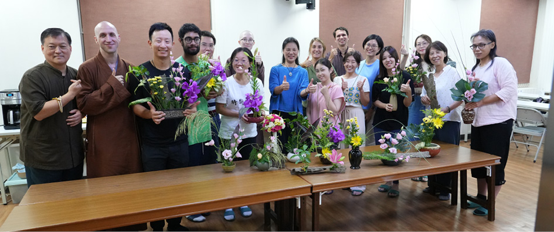

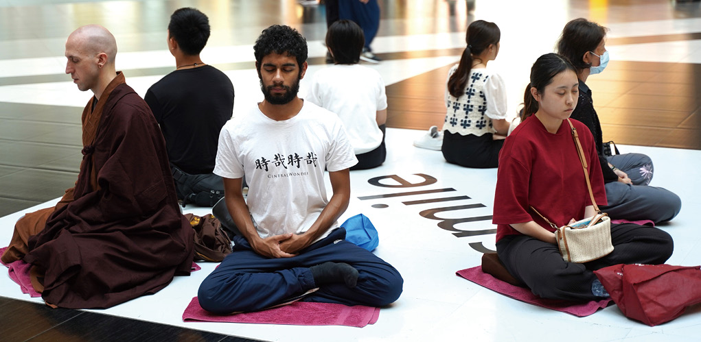

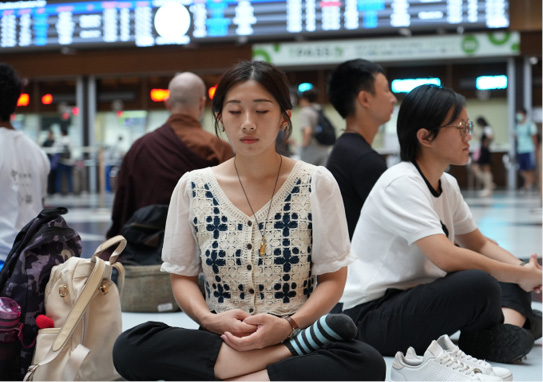

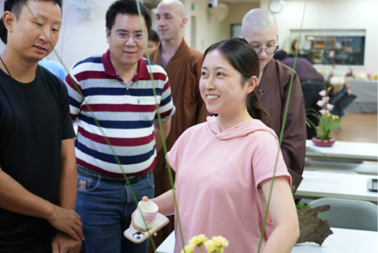

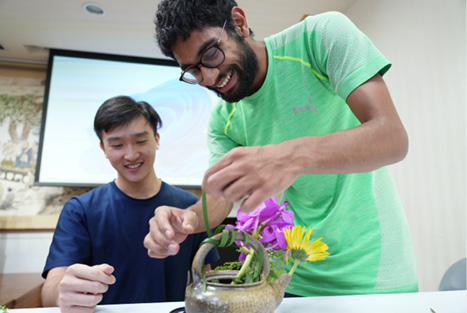

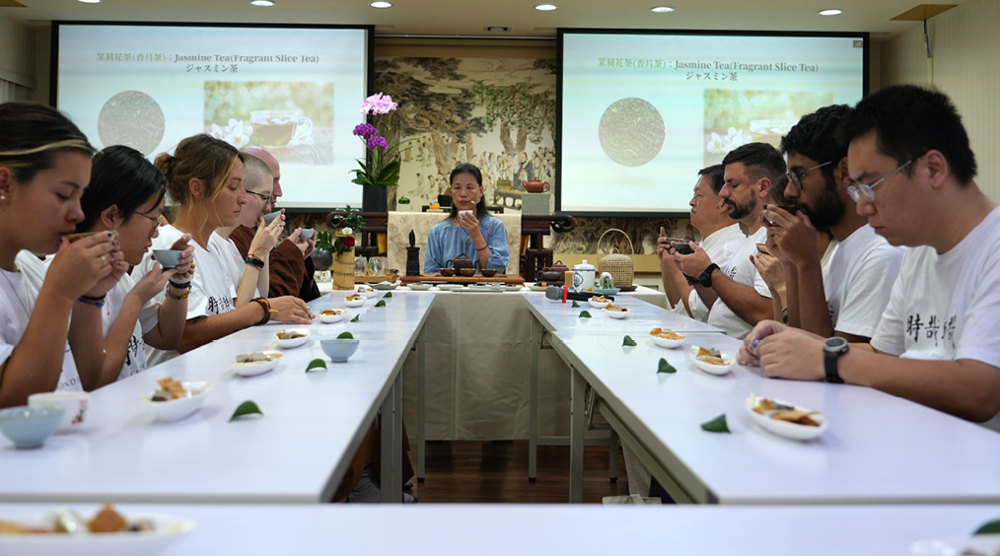

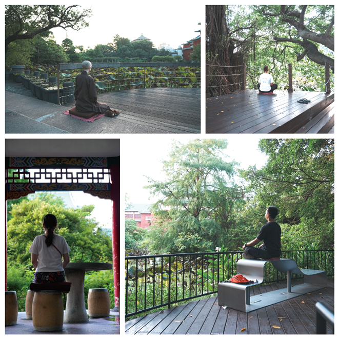

### 《天臺小止觀》講座考題解答

助教

考題測試　上課理解

知道修法　坐上歷緣

修福修慧　人生如意

一、請簡述坐上修止觀的五部修學法？

◎對治初心粗亂修止觀：初學佛者名為初心，雖然有心要修止觀，可是內心靜不下來，控制自己心的能力從來沒有被訓練過，心粗猛散亂、心浮氣躁、想東想西，此時要想辦法讓心靜下來，這是修學的第一步，靜下來後，才能對境界修學空性。

◎對治心沉浮病修止觀：雖然心很躁動的情況被對治了，可是修止修觀的時候，內心會有昏沉、沉沒、掉舉、散亂的障礙，這種障礙有分為粗跟細，粗的已經比前面的初心粗亂好太多，細的往往是還沒發生，可是有那個傾向。

◎隨便宜修止觀：知道修止修觀的時機，該修止的時候修止，該修觀的時候修觀。

◎對治定中細心修止觀：細心指微細的心中，依然有無明我執的愛見，此時要修止觀來對治。認真地從定中去檢驗我的空性修學是不是很清楚，我出定對境界修學空性，讓我在定中空靈靈的感覺更為殊勝，不斷地出定對境界緣空性，安住在空靈靈，再對境界修空性，安住空靈靈，這時候就可以對治微細的無明我執。

◎為均齊定慧修止觀：定慧均等即定中成就慧，慧中成就定，最後安住在能所雙亡，達到現量親證空性。

二、試述昏沉、沉沒、散亂、掉舉的形象？行者於坐禪時昏沉、沉沒，應如何處理？

昏沉：煩惱法，因為已經緣不到境界了，心識所對的是黑暗，好像人在暗室一樣。

沉沒：善法，還緣到境界，只是緣念境界的力量轉弱，士氣低落。

散亂：一心多境，心裡面想東想西，就像在禪坐、安靜當中，心裡唱了很多首歌。

掉舉：一境多心，對所在意的境界七上八上、患得患失，比如到寺院坐禪的人，卻放不下家庭，或是放不下公司的業務。

昏沉時要用光明想去對治，沉沒時要觀想佛菩薩的功德，觀想自己成就的士氣，把自己的心力往上拉，而且知道修學成就的功德很大，所以此時強而有力地緣境界。

三、什麼是「歷緣」和「對境」？與「坐上修」有何關聯？

**答：** 除了坐上修，其他都是歷緣對境修，「歷緣」指心去攀緣，心為能緣，境界為所緣，共六種緣：行、住、坐、臥、作作（辦事）、言語。「對境」指六種境界：眼對色、耳聞聲、鼻對香、舌對味、身對觸、意對法。對境就是在行當中，來觀察眼見色、耳聞聲、鼻嗅香、舌嚐味、身接觸、意知法。每一緣會對到六種境，所以應有三十六個觀修法。

歷緣不管是行、住、坐、臥、作作（辦事）、言語，眼見色、耳聞聲、鼻嗅香、舌嚐味、身接觸、意知法，在還沒歷緣的時候，在坐上修通達這些都是體性空，歷緣對境的時候，空靈靈的勢力還在，這叫空如幻。空靈靈的勢力消失，可是我可以看到這些境界生起的因緣性、觀待性，就像幻化一樣，條件組合生起作用，就像世間魔術師的幻變一樣，這叫做境界如幻。

歷緣對境修與坐上修的所修，都是來自聞思，透過聞思對每句經義產生勝解和覺受。在坐上修時，要一一以正因成立要義（例如無常、空性、布施等），即使念佛，也是在止中以觀除沉、掉等障，使念佛得到一心不亂。依止觀修學空性，歷緣對境時，才會生起空如幻的感覺，知道對眼前的境界如何做觀察，故歷緣對境修又能幫助坐上修體會空性義趣，修行力量也最為強大。

四、「對治細心修止觀」，在微細的心中，依然有無明我執的愛見，此時要如何修止觀來對治？

即使修止觀進入空靈靈的境界，也不要妄認自己已經現證空性，要回過頭來，去修學境界的空性，以正因來通達境界的空性，空靈靈的感覺出現再安住，再從空靈靈的感覺出來，再去依境界以正因來成立他的空性，空靈靈的感覺又出現，再安住，這叫做對治細心修止觀，修止觀來對治內心的無明我執。就像尋覓房中各處有沒有蛇，找過才能確定沒有，尋覓所執的我在五蘊內、外、過去、現在、未來都找不到，確立「我」自性了不可得，愛見能執的心不生。

五、請舉一實例：以空性義理結合「住」的有法作觀察？

住分為能住、所住、住，能住的是住者跟能住的心，所住比如住在道場，中間的住包括在道場禪坐、服務大眾、供養僧眾、修學正法、聽經聞法、研討等。

住以　雪公太老人為例：

雪公太老人（住者）於戰亂時跑到台灣，因為講話山東口音重、沒有人聽得懂，但老人家愛這裡的人心，質地很敦厚淳樸，所以他就犧牲自己（住心），在臺中市正氣街九號（住處）住下三十八年（住），開創許多佛教事業、慈善事業、培養弘法人才，乃至傳承到老師，讓我們可以在這裡聽聞佛法（住中的一切善法）。

以空性義理觀察應知，能住、所住、中間的住，三者相互觀待，沒有所住，哪有能住，例如我是能住道場的能住，沒有道場，我怎麼生起能住，如果可以生起能住，那不需要道場，我也可以生起能住道場的心，但這是不可能的，就像沒有青色，我如何能生起見青色的眼識。所住如果沒有能住，道場如何能成為所住，道場如果可以成為所住，每一個人看到道場都要住，現見沒有，都是對著能住才有所住，沒有能住、所住，又如何會有住的這件事情呢？我都不想住在道場了，怎麼還會發生住在道場當中發生的事？所以能住、所住、中間的住，都是觀待性，沒有自體性，能住看不到，所住看不到，住看不到，以上就是空性義理結合「住」的有法作觀察。但是在世俗上，境界如幻就要看能住的心怎麼調，此處如何成為我真正的所住，我要用什麼心態來住，我要學到什麼法，我要歷練什麼樣的佛事，我要結合什麼樣的善緣，觀待住是這樣住的時候，功德善法就顯現，換句話說，都是幻化，端看你的心態、做法，你就有什麼樣的功德或過患。

六、我在歷緣對境時，如何把握修行止觀的要旨？

歷緣對境之前，要先修學所對境界的體性都是空的，這就是修行止觀的要旨，止觀就是根本位的空性，後得位看到空如幻（證悟空性後，出定覺得世間像夢境的顯現，像魔術師的幻變。世間的體性在定中看到過是沒有的，所以出定後不會相信世間是真實的）跟境界如幻（證悟空性後，出定知道世間像夢境的顯現，是不真實的，但是進一步還要認真觀察這些境界是依著什麼條件才顯現，是怎麼幻變的，境界如幻是以空性為正因通達緣起）。

七、如何在行中以見聞覺知來修學大乘道？

行中有見聞覺知，行前要做能見所見、能聞所聞，一切覺知沒有自體性的三輪體空觀察。能行、所行、中間的行，三者互相觀待，體性空寂，這是坐上修，下坐歷緣對境修的時候，行中必須要知道我今天為了什麼目的前往某地，例如放生、助念、聽課等如法的事情，這樣的事情是否能利益眾生？是否能讓我生起為利有情願成佛的殊勝菩提心？觀待我內心有如上的價值觀，我想要去的心推動我的行，而產生動作去造作出種種善法。行當中還包括我是藉著行來表達我對善知識的誠意、好樂，也確立我行的目的，例如我見善知識是為了得到善知識的精髓，得到他的正法，弘揚、傳承他的正法。

眼見色時，就像水中月只剩下業的浮現，看得順眼不過是回應過去的善業，不喜見的部分是回應過去的惡業，但更重要的是在境界的自體性上面去觀察，看到沒有自體性就不會執實，也不會有因為執實而生起的各種想法。

作自體性觀察時，空靈靈的感覺生起，依然要加以檢驗，將空性是依著緣起法的道理加以串習，此時要思考緣起法生起的條件，在這當中作雙邊的觀察。

所謂的見是如何生起呢？是眼根緣色塵生起眼識，並且由意識加以分別種種色，生出順情或逆情之色。見色之心並非自己在那邊成立它自己，能見、所見和見當中產生的一切善惡法，都是沒有自體性，相互觀待且條件須具足，缺一不可。

上述觀修法可套用在耳聞聲等見聞覺知中，作三輪體空的觀察，並帶入生起條件，作緣起法生起的串習。

八、解脫之樂何以勝過世間之樂？世間之樂有什麼過患？

世間的樂的過患包括：

１．從因果面相觀察，所受之樂都是過去所造善業的消耗，有何可樂呢？

２．世間之樂的體性無常，極不安穩，有何可樂？

３．享受世間之樂容易增長放逸，無力修學正法，自利利他能力隱沒，有何可樂？

４．追求世間之樂，既使有心學習教法，也沒有時間學習（無暇），一生潛力無法開發，有何可樂？

５．受用世間的快樂其實只是眼前痛苦的暫止息，追逐的快樂其實也不是真樂，而是在樂中造作惡業導向痛苦，此樂越受苦果越增加，造成持續的痛苦，有何可樂？

６．三界無安，猶如火宅，眾苦充滿，甚可怖畏，任何可怕之事在受樂之後都會發生，又有何可樂？

解脫的樂沒有以上的過患，而且是相續的，體性又可轉成入世行善的道力，善業又可成就樂果，在樂中又能修善，這樣下去就越來越多樂果，所以是始終真樂。世間人以追求快樂的方式來離開痛苦，沒辦法離開苦果苦因，佛法則是以除苦因苦果的方法來離開痛苦，安樂的體性建立在苦因苦果的滅，與世間人差異甚大。

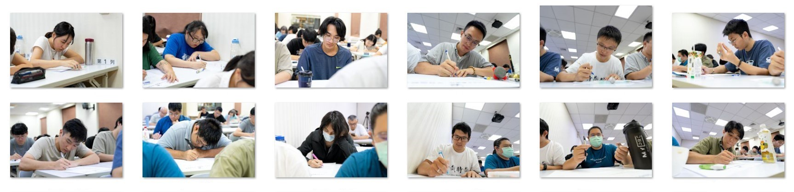

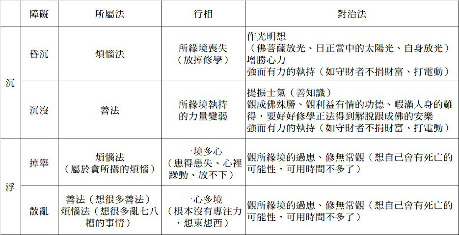

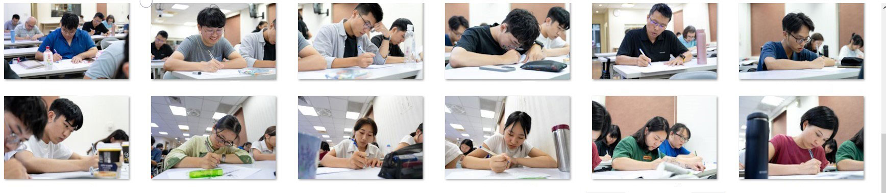

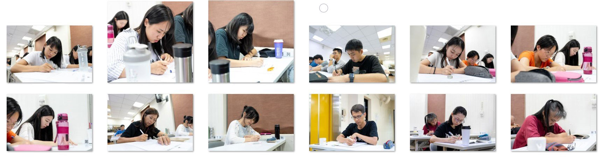

## 活動報導-西馬關丹聖賢教育中心講座報導

### 西馬關丹聖賢教育中心講座報導

心筑

陌生地名因文化

方有善緣到該地

華人少子且外移

文化薪傳待順緣

二○一九年十二月，學會接到來自西馬關丹傅金玉老師的來信，欲邀請學會師長於二○二○年五月前往該地舉辦傳統文化演講，學會當時正在籌備二○二○年至東馬亞庇的「《楞嚴經》五十種陰魔章」講座，當時也邀請傅老師到東馬見面，孰料新冠肺炎肆虐全球，講座事宜就一直延宕，到二○二三年的詩巫與古晉講座、二○二四年的詩巫講座，皆未能與傅老師見上一面。最後，敲定了八月二十四至二十六日，共三天，與該地的弟子規教學中心以及淨宗學會做論語及佛學各類課程交流。

該中心是透過經典讀書會、漢服、傳統祭祖、禮儀及古樂等吸引大眾學習傳統文化，經常性邀請講師到關丹帶動當地學習傳統文化的風氣。恰巧關丹淨宗學會就在該中心旁，彼此是鄰居，互相成就與護持，此行先與素未蒙面的關丹賢達介紹學會，舉凡與大德的合作、培養青年人才、儒佛教育、幼兒啟蒙、放生法會及有機農園等的各類發展，簡短的介紹我們學會，來彼此認識。

後續開展了各類論語主題：「人生的出路在孔子身上找—孔門弟子及中外名士共同認證」、「菁英教育的思想與行為模式從論語說起（一）子不語怪力亂神」、「菁英教育的思想與行為模式從論語說起（二）由孝道經營人生出路」、「菁英教育的思想與行為模式從論語說起（三）人才是善用情緒」、「專題課程—如何在家在校推動德育」，彭亨州各地有心宣揚傳統文化的弟子規教學中心師資們，蜂擁而至關丹聆聽論語講座，藉著此次宣講論語的機會，後續也將協助張偉慈老師的家人，流通在倉庫中近千本的《論語講要》善書。

在關丹的兩個晚上，至關丹淨宗學會與彌陀淨宗學會宣講智者大師所著的《淨土十疑論》，用風趣幽默的問答來呈現往生淨土的信心，念佛法門並非只能攝受信行人，應更能攝受法行人才是。期待能接引更多年輕華人，對佛法與儒家傳統文化推廣具有信心，並組成讀書會，彼此提攜共同創造中華文化的光彩與氣象，人才輩出才是關丹佛教的未來。

最後，我們到關丹阿亦布爹中學，與中學生及華文教師做交流，在得知馬來西亞的升級考試制度，必須每一科都是優等才有資格選擇好的大學就讀；又看到艱澀難懂完全比照對岸中文課本的馬來西亞華文課本，頓時明白了作為馬來西亞華文教師和學生們彼此面對的困境。喜愛華文的學生為了成績不得不放棄選修華文，華文教師面對艱澀難懂的課本，再善巧的教學方式都難以燃起學生的熱情，我們試著提出或許老師們共同備課，帶學生到台灣參訪遊學，都是可行的方式，期待這些單純善良又主動學習的初中生，喜愛自己血液文化中的一部分，並且能從中得到人生的養分。

從素昧平生到漸漸熟悉，相信其中必有有心人得其利益，如何讓講座的功效持續，在當地結合有志之士成立讀書會是唯一的一條路，期待後續講法的因緣不斷，在未被文明汙染的西馬叢林中，寓教於樂成熟遊學之路。

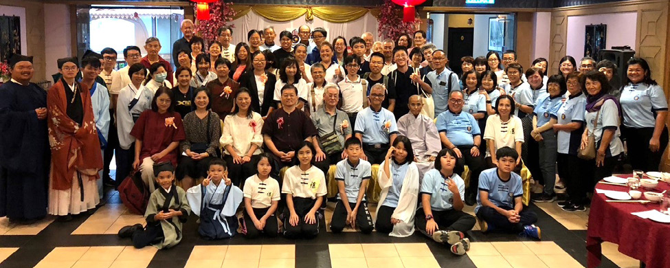

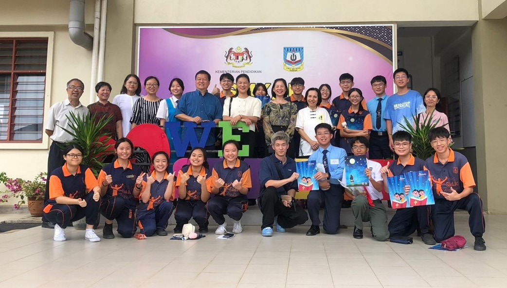

## 活動報導-上海嘉定文化交流報導

### 上海嘉定文化交流報導

淨柔

佾舞論語組一班

恆心毅力開新局

上海嘉定交流後

更能啟動學習情

自二○○八年起，「上海孔子文化節」已連續舉辦十七屆，目的為彰顯兩岸青年立足中華文化的高度認同和血脈融通的儒家文化。今年由上海旅遊局、嘉定博物館、嘉定孔廟、區台辦共同主辦，以「博文約禮君子大成」為活動主題，邀請台灣青年、在滬台商、台生共襄盛舉。

本次學會有幸受邀參加，緣起本由上海嘉定孔廟與臺北孔廟合作，希望臺北孔廟能組成佾舞隊，於九月廿一日至嘉定孔廟之「上海孔子文化節」開幕儀式展演佾舞，但因九月適逢教師節，臺北孔廟活動繁多，藉此黃穗蘋執行秘書便推薦中華無盡燈文化學會組團到上海交流。這次出團成員包括長期學習佾舞的師資、南華大學國樂團，以及有志推廣儒家文化的青年等，共二十四人，從九月十九日至廿二為期四天的活動行程，皆由汪志冰議員的辦公室主任李正文做兩岸聯絡窗口，尤其在嘉定區台協工委會主委李錦漳先生的策劃，以及嘉定區台辦與台商的支持下，讓我們受到極高的禮遇和招待，親身體驗上海市的金融、航運、飲食、建築、汽車製造、古蹟文物等企業組織和藝文風光，可謂大開眼界、高端享受。

震旦博物館

第一站就大飽眼福，震撼五官。矗立於黃浦江畔的六層樓高建築出自世界著名建築大師安藤忠雄之手，真是個藝術Ｘ建築的文化寶盒！震旦博物館是震旦集團董事長陳永泰先生回饋社會的一項文化志業，當天由企業集團中的廖董事長親自導覽，一入口的南朝神獸便吸引所有人，近看它姿態威武有力，昂首闊胸，遠觀則發現它裂嘴大笑，逗趣可愛，撫摸它還能得好運、發大財，難怪稱為「天祿」、「辟邪」。館藏以中國古代器物為主，涵蓋了佛教造像、玉器、陶瓷器及畫像石刻等數千件精品。我們還參觀了一般人不能進入的震旦家具展示空間，嗅著空氣中飄揚的咖啡香，坐在高質感又舒適的辦公和居家家具，眺望江畔綿延現代與古典交織的富麗建築，真是讓人流連忘返！

汽車博物館

位於嘉定區安亭鎮的上海國際汽車城，是上海市的汽車產業中心，也是以汽車工業生產為主的現代化綜合性工業區。我們第二天早上來到面積約三千六百多坪的上海汽車博物館，館內一樓歷史館、二樓珍藏館、三樓探索館以及四樓臨展館等區域，共展示了近百餘輛的經典古董車，彙集近五十個國內外汽車品牌，向我們講述著汽車百年發展中的精彩故事。寬廣氣派的展示空間，不但讓大家能近距離接觸古董車，拍出一張張美照，更體驗到不同時代、不同地域的汽車摩登風情。

保利大劇院

坐落於上海市嘉定新城中心區，建築面積達一萬七千坪，耗資七億人民幣，無論從任何角度欣賞皆有其可觀之處，也是由享譽全球的建築大師安藤忠雄設計。劇院擁有一千四百六十六席的大劇場和四百席的小劇場，同行的如茵還上台獻唱一段！劇院另設有屋頂劇場和中國首座水景劇場，能夠滿足戲劇、綜合藝文演出、商業、教育、觀光等使用需求，從四面八方也都有通道進入這個公共空間，且演出國際化，票價平民化，多面相服務市民，使歌劇院不再是高不可攀的藝術殿堂。保利大劇院面迎生態美境的遠香湖，當地台商說，假日時整片公園都是親子好友露營和開演唱會的好處所。

古猗園

第二天下午，來到位於上海市嘉定區南翔鎮，古猗園建於明朝嘉靖年間，取自《詩經》中「綠竹猗猗」一句。園內共有逸野堂、戲鵝池、松鶴園、青清園、鴛鴦湖和南翔壁等六個景區，由當時著名的竹刻家朱三松設計，以十畝之園打造綠竹園，是河南通判閔士籍的私家花園，也是目前上海市五大古典園林之一。大伙在雨中散步，別有一番詩意，眼前亭閣素雅，景色賞心悅目，在戲鵝池中，正見著鵝媽媽領著五六隻小鵝划水而過，可愛極了！

嘉定孔廟

九月二十日踩點當天，大雨滂沱，孔廟的工作人員、導演與各節目演出者皆焦灼如何應對氣候變化，學會佾舞隊與國樂團也在風雨中撐傘預演和走位，彼此擔憂明日如何圓滿活動。回飯店晚餐後，大家加緊練習，祈求孔子加被一切順利。活動開幕當日，秋風習習，天氣涼爽，果得孔子護佑！一到孔廟，師資們協助佾生整裝完備，列隊入班，佾舞表演為開幕式的第一個節目，當音樂響起，撼動人心，十六位佾生隆重登場，台上台下一片莊嚴肅穆，所有攝影機捕捉畫面，後續媒體報導不斷。嘉定區台辦科長陳文連也說：一出場就氣勢非凡！接著，由六位南華大學學生組成國樂團，演奏了旋律優美、感情激昂的「雨碎江南」，可惜音響試音時間不足，影響聆聽品質和效果。

豪門印刷

套句台商說的話，「不嫁入豪門，也要進入豪門！」一入豪門，即由董事長陳大慶親自接待和介紹，大家備受豪門禮遇。豪門印刷在包裝印刷領域中可謂是領導者角色，各類高檔精品、名牌化妝品、香水、高級酒品等都是長期客戶，行銷多達三十個國家與地區，可謂是奢侈品包裝專家，曾奪得世界包裝設計首獎。且印刷技術先進創新，製程講究嚴謹，團隊年輕有勁，展示空間有許多以紙材結合電玩遊戲、音樂、食品、禮品、敦煌藝術、文創、3C商品的創意作品，令人驚艷不已。臨走時，董事長還大方送了自製的咖啡、冷泡茶、手工餅乾，以及ANNA SUI香水，大家頓時變「豪人」。

外灘

位於繁華的黃浦江畔，不僅擁有豐富的文化和歷史，且具有古老魅力與現代生活輝煌融為一體的美麗，沿街有五十二座古典文藝復興建築，從哥德式到巴洛克式等設計風格，被譽為上海世界建築展覽群，至今幾乎保存完好。由於行程緊湊，大家趕緊啟動購物開關，雪花膏、蝴蝶酥、大白兔奶糖、狀元糕……，一路買買買。漫步在繁華的南京路，放眼遊客眾多，有琳瑯滿目的購物商店、餐廳、酒吧和娛樂場所，怪不得外灘素有不夜城之稱，夜生活十分繁華多元。

夜遊浦江

體驗夜上海的高點，當然是在黃浦江的乘船遊覽中欣賞繁華城市燈光的美景。一小時的航行，大家站在遊船的甲板上享受輕風拂面，江面上來往著各種遊船、商船、遊艇，也是浦江夜色裡獨特的風景。大家興高彩烈地看著兩岸現代大樓在LED秀的映照下精彩奪目，遠望西式建築在黃光的照耀下展現優雅，東方明珠的燈景也變化萬千，可謂華燈齊放，一景一驚艷，燈光不再只是照明，而是成為一種藝術。

嘉定博物館

成立於一九五九年，下轄有全國重點文物保護單位嘉定孔廟、上海市文物保護單位法華塔以及嘉定竹刻博物館。特別是嘉定城首任知縣高衍孫，其在位期間推動兩件重要的政策：一是「築土城，設四關」，此乃開始建設中國圓形城池的重要代表；另一個就是建造了「吳中第一」的嘉定孔廟，於奉祀孔子的同時，也作為官學，傳道授業、育才興賢。自此，八百餘年來，嘉定的尚文之風代代相傳，出過三個狀元，近兩百名進士，四百多位舉人，富有美名的書畫家更是不勝枚舉。可以說，嘉定自古就是學霸密集區。館內還有一個很有意思的地方，就是用小場景模型介紹了很多當地風俗和飲食文化，例如江南絲竹、徐行草編、嘉定錫劇、小籠包…等。

顧維鈞陳列室

顧維鈞，ㄧ八八八年生於原江蘇省嘉定縣，今上海市嘉定區，一九八五年於紐約逝世，享年九十八歲，乃中國近代著名外交家，有民國第一外交家的美譽。陳列室位於在法華塔院內，一共兩層，介紹其生平以及為中國外交事業奮鬥的五十五年歷程。顧先生是美國哥倫比亞法學院高材生，是國民政府外長，是第一個簽署《聯合國憲章》的人，是駐美大使，人生最閃光的就是一九一九年拒絕在《巴黎協議》上簽字，改變中國屈辱的對外關係，維護中國在國際舞臺上的尊嚴，一生以自己的智慧、修養和愛國熱忱，在他的外交生涯中作出宏大的貢獻。七十六歲時，當選國際法庭副庭長，離職時獲終身國際法官的榮譽稱號。聽著專業的導覽人員一一介紹大量珍貴的歷史照片與其生前使用過的物品、親手撰寫的文稿、注重養生的食譜、四段婚姻的經營等，全面體現了他的傳奇一生，令人驚歎感佩。

本次活動圓滿，帶出未來無限機會，並了解今日上海與台北為姊妹市，每年透過孔廟活動進行交流。今年的台方主賓代表為議員柳采葳，學會則是唯一受邀的嘉賓單位，由台辦與台商出錢出力促成本次活動，他們不但全程陪同，且招待熱情細膩周全。在四天充實又精彩的文化交流中，方有機會深入瞭解台商在上海打拼二十多年的難得經歷與生活體驗，此因緣絕非一般人能輕易聽聞，尤其我們能直接進入其企業體一探究竟，甚至全程由董事長們親自導覽，這種禮遇和機緣實在得來不易，吾等應抱持著很珍惜、開眼界、善觀察、懂進退、展自信的心態。當台商展現友好，多次招攬台灣年輕人到上海創業發展或進入其事業單位工作之時，我們也可反思，自己有何能力與專長來彰顯台灣充滿希望，勇敢稱揚台灣是儒家文化的本源，這些議題都值得一一深入探討。

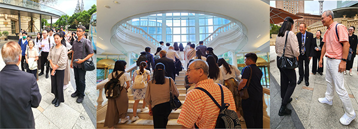

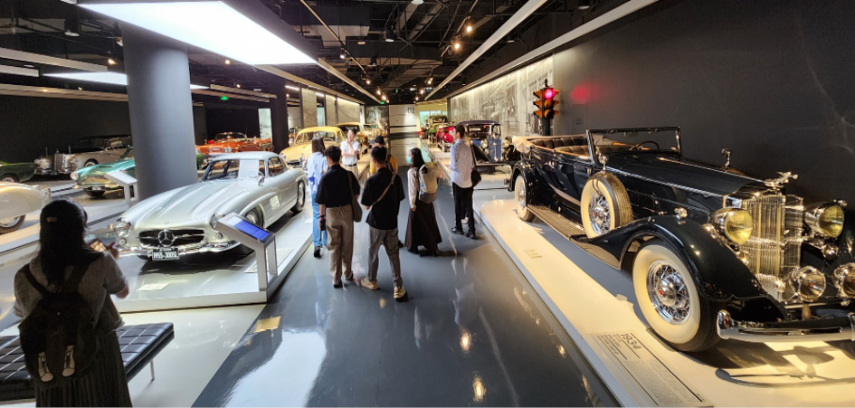

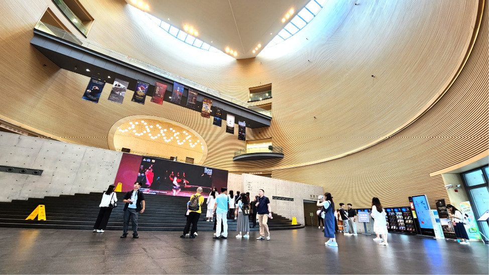

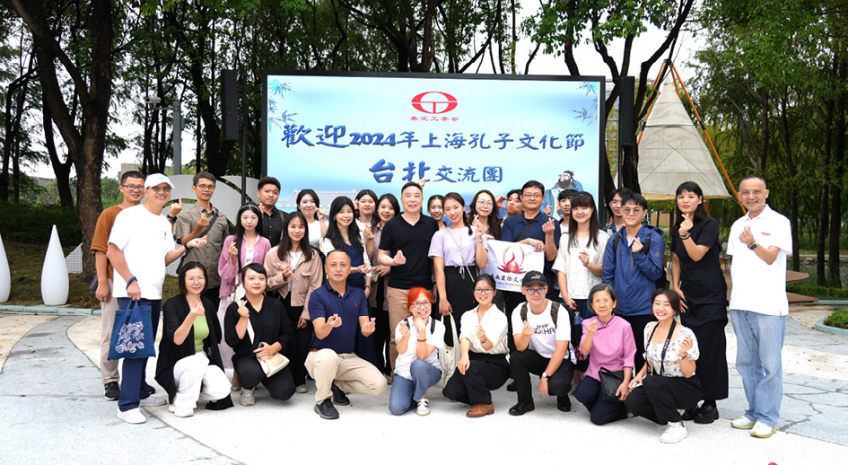

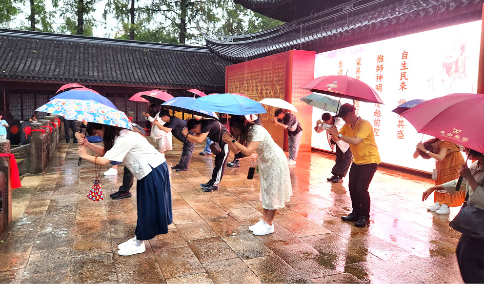

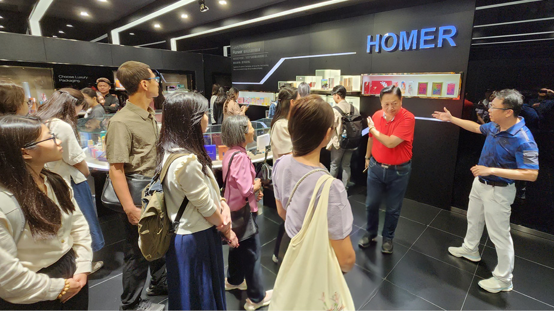

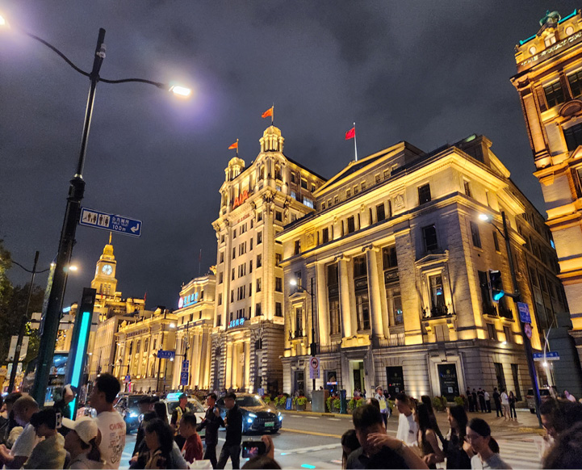

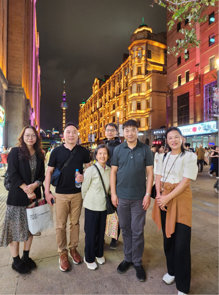

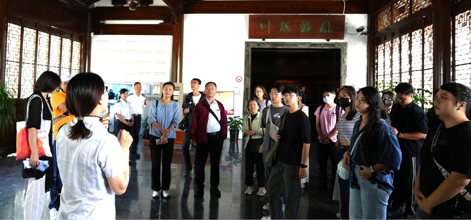

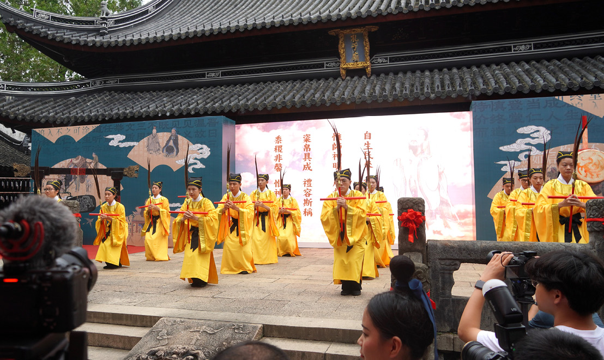

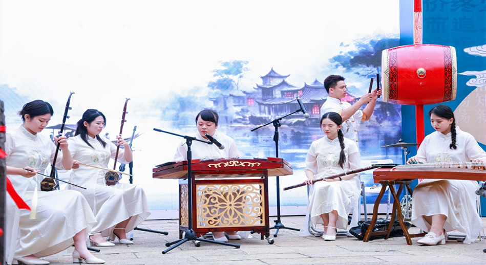

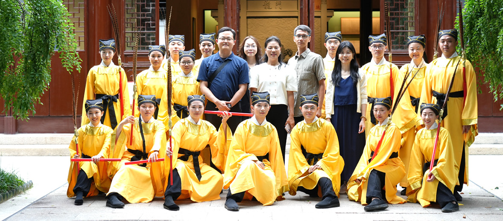
